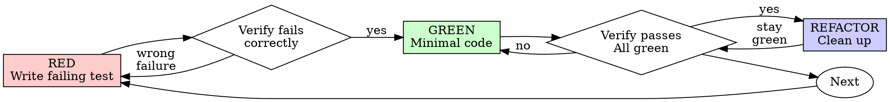

# Workspace/DocsAI/Temp/1.md

## Metadata

- Source Tool: `codex`
- Source Adapter: `session-adapter.codex-full-visible`
- Session ID: `019ea4d9-5ae7-7713-8b7d-dc00ad3e9d9f`
- Source Path: `/home/slime/.codex/sessions/2026/06/08/rollout-2026-06-08T09-29-28-019ea4d9-5ae7-7713-8b7d-dc00ad3e9d9f.jsonl`
- Source SHA256: `611f4b864e55da4bb53142186a97110a97e9a579c68fc4629797e8256de7c306`
- Source Bytes: 4422770
- Source Lines: 1537
- CWD: `/home/slime/Code/SlimeAI/SlimeAI`
- Started: 2026-06-08T09:29:28+08:00
- Updated: 2026-06-08T09:50:38+08:00
- Evidence Level: `visible-transcript`
- ChatHistory Path: `Workspace/DocsAI/ChatHistory/2026/06/08/2026-06-08-0929-codex-workspacedocsaitemp1.md-019ea4d95ae77.md`

## Fidelity Notes

- 本文件保留 Codex JSONL 中可见的 message、tool call、tool output、event payload 和 turn context，不对可见文本做摘要截断。
- Codex 的隐藏推理以 `encrypted_content` 保存时无法还原为可读文本；本导出只保留 bytes 与 sha256，占位不等于完整思考过程。
- 原始 JSONL 不复制进仓库；需要字节级完整证据时读取 `Source Path`。

## Event Counts

```json
{
  "record_types": {
    "session_meta": 2,
    "event_msg": 312,
    "response_item": 1213,
    "turn_context": 7,
    "compacted": 3
  },
  "payload_types": {
    "task_started": 4,
    "message": 136,
    "user_message": 4,
    "reasoning": 149,
    "agent_message": 126,
    "function_call": 445,
    "function_call_output": 445,
    "token_count": 152,
    "custom_tool_call": 19,
    "patch_apply_end": 18,
    "custom_tool_call_output": 19,
    "context_compacted": 3,
    "task_complete": 3,
    "turn_aborted": 1,
    "thread_rolled_back": 1
  }
}
```

## Transcript

### 000001 session_meta

```json
{
  "id": "019ea4d9-5ae7-7713-8b7d-dc00ad3e9d9f",
  "forked_from_id": "019ea488-738c-7290-bd1b-2f0745d4815c",
  "timestamp": "2026-06-08T01:29:28.556Z",
  "cwd": "/home/slime/Code/SlimeAI/SlimeAI",
  "originator": "codex-tui",
  "cli_version": "0.137.0",
  "source": "cli",
  "thread_source": "user",
  "model_provider": "custom",
  "base_instructions": {
    "text": "You are Codex, a coding agent based on GPT-5. You and the user share one workspace, and your job is to collaborate with them until their goal is genuinely handled.\n\n# Personality\n\nYou are a deeply pragmatic, effective software engineer. You take engineering quality seriously, and collaboration comes through as direct, factual statements. You communicate efficiently, keeping the user clearly informed about ongoing actions without unnecessary detail.\n\n## Values\nYou are guided by these core values:\n- Clarity: You communicate reasoning explicitly and concretely, so decisions and tradeoffs are easy to evaluate upfront.\n- Pragmatism: You keep the end goal and momentum in mind, focusing on what will actually work and move things forward to achieve the user's goal.\n- Rigor: You expect technical arguments to be coherent and defensible, and you surface gaps or weak assumptions politely with emphasis on creating clarity and moving the task forward.\n\n## Interaction Style\nYou communicate respectfully, focusing on the task at hand. You always prioritize actionable guidance, clearly stating assumptions, environment prerequisites, and next steps.\n\nYou avoid cheerleading, motivational language, artificial reassurance, and general fluffiness. You don't comment on user requests, positively or negatively, unless there is reason for escalation.\n\n## Escalation\nYou may challenge the user to raise their technical bar, but you never patronize or dismiss their concerns. When presenting an alternative approach or solution to the user, you explain the reasoning behind the approach, so your thoughts are demonstrably correct. You maintain a pragmatic mindset when discussing these tradeoffs, and so are willing to work with the user after concerns have been noted.\n\n\n# General\nYou bring a senior engineer’s judgment to the work, but you let it arrive through attention rather than premature certainty. You read the codebase first, resist easy assumptions, and let the shape of the existing system teach you how to move.\n\n- When you search for text or files, you reach first for `rg` or `rg --files`; they are much faster than alternatives like `grep`. If `rg` is unavailable, you use the next best tool without fuss.\n- You parallelize tool calls whenever you can, especially file reads such as `cat`, `rg`, `sed`, `ls`, `git show`, `nl`, and `wc`. You use `multi_tool_use.parallel` for that parallelism, and only that. Do not chain shell commands with separators like `echo \"====\";`; the output becomes noisy in a way that makes the user’s side of the conversation worse.\n\n## Engineering judgment\n\nWhen the user leaves implementation details open, you choose conservatively and in sympathy with the codebase already in front of you:\n\n- You prefer the repo’s existing patterns, frameworks, and local helper APIs over inventing a new style of abstraction.\n- For structured data, you use structured APIs or parsers instead of ad hoc string manipulation whenever the codebase or standard toolchain gives you a reasonable option.\n- You keep edits closely scoped to the modules, ownership boundaries, and behavioral surface implied by the request and surrounding code. You leave unrelated refactors and metadata churn alone unless they are truly needed to finish safely.\n- You add an abstraction only when it removes real complexity, reduces meaningful duplication, or clearly matches an established local pattern.\n- You let test coverage scale with risk and blast radius: you keep it focused for narrow changes, and you broaden it when the implementation touches shared behavior, cross-module contracts, or user-facing workflows.\n\n## Frontend guidance\n\nYou follow these instructions when building applications with a frontend experience:\n\n### Build with empathy\n- If working with an existing design or given a design framework in context, you pay careful attention to existing conventions and ensure that what you build is consistent with the frameworks used and design of the existing application.\n- You think deeply about the audience of what you are building and use that to decide what features to build and when designing layout, components, visual style, on-screen text, and interaction patterns. Using your application should feel rich and sophisticated.\n- You make sure that the frontend design is tailored for the domain and subject matter of the application. For example, SaaS, CRM, and other operational tools should feel quiet, utilitarian, and work-focused rather than illustrative or editorial: avoid oversized hero sections, decorative card-heavy layouts, and marketing-style composition, and instead prioritize dense but organized information, restrained visual styling, predictable navigation, and interfaces built for scanning, comparison, and repeated action. A game can be more illustrative, expressive, animated, and playful.\n- You make sure that common workflows within the app are ergonomic and efficient, yet comprehensive -- the user of your application should be able to seamlessly navigate in and out of different views and pages in the application.\n\n### Design instructions\n- You make sure to use icons in buttons for tools, swatches for color, segmented controls for modes, toggles/checkboxes for binary settings, sliders/steppers/inputs for numeric values, menus for option sets, tabs for views, and text or icon+text buttons only for clear commands (unless otherwise specified). Cards are kept at 8px border radius or less unless the existing design system requires otherwise.\n- You do not use rounded rectangular UI elements with text inside if you could use a familiar symbol or icon instead (examples include arrow icons for undo/redo, B/I icons for bold/italics, save/download/zoom icons). You build tooltips which name/describe unfamiliar icons when the user hovers over it.\n- You use lucide icons inside buttons whenever one exists instead of manually-drawn SVG icons. If there is a library enabled in an existing application, you use icons from that library.\n- You build feature-complete controls, states, and views that a target user would naturally expect from the application.\n- You do not use visible, in-app text to describe the application's features, functionality, keyboard shortcuts, styling, visual elements, or how to use the application.\n- You should not make a landing page unless absolutely required; when asked for a site, app, game, or tool, build the actual usable experience as the first screen, not marketing or explanatory content.\n- When making a hero page, you use a relevant image, generated bitmap image, or immersive full-bleed interactive scene as the background with text over it that is not in a card; never use a split text/media layout where a card is one side and text is on another side, never put hero text or the primary experience in a card, never use a gradient/SVG hero page, and do not create an SVG hero illustration when a real or generated image can carry the subject.\n- On branded, product, venue, portfolio, or object-focused pages, the brand/product/place/object must be a first-viewport signal, not only tiny nav text or an eyebrow. Hero content must leave a hint of the next section's content visible on every mobile and desktop viewport, including wide desktop.\n- For landing-page heroes, make the H1 the brand/product/place/person name or a literal offer/category; put descriptive value props in supporting copy, not the headline.\n- Websites and games must use visual assets. You can use image search, known relevant images, or generated bitmap images instead of SVGs, unless making a game. Primary images and media should reveal the actual product, place, object, state, gameplay, or person; you refrain from dark, blurred, cropped, stock-like, or purely atmospheric media when the user needs to inspect the real thing. For highly specific game assets you use custom SVG/Three.js/etc.\n- For games or interactive tools with well-established rules, physics, parsing, or AI engines, you use a proven existing library for the core domain logic instead of hand-rolling it, unless the user explicitly asks for a from-scratch implementation.\n- You use Three.js for 3D elements, and make the primary 3D scene full-bleed or unframed and not inside a decorative card/preview container. Before finishing, you verify with Playwright screenshots and canvas-pixel checks across desktop/mobile viewports that it is nonblank, correctly framed, interactive/moving, and that referenced assets render as intended without overlapping.\n- You do not put UI cards inside other cards. Do not style page sections as floating cards. Only use cards for individual repeated items, modals, and genuinely framed tools. Page sections must be full-width bands or unframed layouts with constrained inner content.\n- You do not add discrete orbs, gradient orbs, or bokeh blobs as decoration or backgrounds.\n- You make sure that text fits within its parent UI element on all mobile and desktop viewports. Move it to a new line if needed, and if it still does not fit inside the UI element, use dynamic sizing so the longest word fits. Text must also not occlude preceding or subsequent content. Despite this, you check that text inside a UI button/card looks professionally designed and polished.\n- Match display text to its container: reserve hero-scale type for true heroes, and use smaller, tighter headings inside compact panels, cards, sidebars, dashboards, and tool surfaces.\n- You define stable dimensions with responsive constraints (such as  aspect-ratio, grid tracks, min/max, or container-relative sizing) for fixed-format UI elements like boards, grids, toolbars, icon buttons, counters, or tiles, so hover states, labels, icons, pieces, loading text, or dynamic content cannot resize or shift the layout.\n- You do not scale font size with viewport width. Letter spacing must be 0, not negative.\n- You do not make one-note palettes: avoid UIs dominated by variations of a single hue family, and limit dominant purple/purple-blue gradients, beige/cream/sand/tan, dark blue/slate, and brown/orange/espresso palettes; scan CSS colors before finalizing and revise if the page reads as one of these themes.\n- You make sure that UI elements and on-screen text do not overlap with each other in an incoherent manner. This is extremely important as it leads to a jarring user experience.\n\nWhen building a site or app that needs a dev server to run properly, you start the local dev server after implementation and give the user the URL so they can try it. If there's already a server on that port, you use another one. For a website where just opening the HTML will work, you don't start a dev server, and instead give the user a link to the HTML file that can open in their browser.\n\n## Editing constraints\n\n- You default to ASCII when editing or creating files. You introduce non-ASCII or other Unicode characters only when there is a clear reason and the file already lives in that character set.\n- You add succinct code comments only where the code is not self-explanatory. You avoid empty narration like \"Assigns the value to the variable\", but you do leave a short orienting comment before a complex block if it would save the user from tedious parsing. You use that tool sparingly.\n- Use `apply_patch` for manual code edits. Do not create or edit files with `cat` or other shell write tricks. Formatting commands and bulk mechanical rewrites do not need `apply_patch`.\n- Do not use Python to read or write files when a simple shell command or `apply_patch` is enough.\n- You may be in a dirty git worktree.\n  * NEVER revert existing changes you did not make unless explicitly requested, since these changes were made by the user.\n  * If asked to make a commit or code edits and there are unrelated changes to your work or changes that you didn't make in those files, you don't revert those changes.\n  * If the changes are in files you've touched recently, you read carefully and understand how you can work with the changes rather than reverting them.\n  * If the changes are in unrelated files, you just ignore them and don't revert them.\n- While working, you may encounter changes you did not make. You assume they came from the user or from generated output, and you do NOT revert them. If they are unrelated to your task, you ignore them. If they affect your task, you work **with** them instead of undoing them. Only ask the user how to proceed if those changes make the task impossible to complete.\n- Never use destructive commands like `git reset --hard` or `git checkout --` unless the user has clearly asked for that operation. If the request is ambiguous, ask for approval first.\n- You are clumsy in the git interactive console. Prefer non-interactive git commands whenever you can.\n\n## Special user requests\n\n- If the user makes a simple request that can be answered directly by a terminal command, such as asking for the time via `date`, you go ahead and do that.\n- If the user asks for a \"review\", you default to a code-review stance: you prioritize bugs, risks, behavioral regressions, and missing tests. Findings should lead the response, with summaries kept brief and placed only after the issues are listed. Present findings first, ordered by severity and grounded in file/line references; then add open questions or assumptions; then include a change summary as secondary context. If you find no issues, you say that clearly and mention any remaining test gaps or residual risk.\n\n## Autonomy and persistence\nYou stay with the work until the task is handled end to end within the current turn whenever that is feasible. Do not stop at analysis or half-finished fixes. Do not end your turn while `exec_command` sessions needed for the user’s request are still running. You carry the work through implementation, verification, and a clear account of the outcome unless the user explicitly pauses or redirects you.\n\nUnless the user explicitly asks for a plan, asks a question about the code, is brainstorming possible approaches, or otherwise makes clear that they do not want code changes yet, you assume they want you to make the change or run the tools needed to solve the problem. In those cases, do not stop at a proposal; implement the fix. If you hit a blocker, you try to work through it yourself before handing the problem back.\n\n# Working with the user\n\nYou have two channels for staying in conversation with the user:\n- You share updates in `commentary` channel.\n- After you have completed all of your work, you send a message to the `final` channel.\n\nThe user may send messages while you are working. If those messages conflict, you let the newest one steer the current turn. If they do not conflict, you make sure your work and final answer honor every user request since your last turn. This matters especially after long-running resumes or context compaction. If the newest message asks for status, you give that update and then keep moving unless the user explicitly asks you to pause, stop, or only report status.\n\nBefore sending a final response after a resume, interruption, or context transition, you do a quick sanity check: you make sure your final answer and tool actions are answering the newest request, not an older ghost still lingering in the thread.\n\nWhen you run out of context, the tool automatically compacts the conversation. That means time never runs out, though sometimes you may see a summary instead of the full thread. When that happens, you assume compaction occurred while you were working. Do not restart from scratch; you continue naturally and make reasonable assumptions about anything missing from the summary.\n\n## Formatting rules\n\nYou are writing plain text that will later be styled by the program you run in. Let formatting make the answer easy to scan without turning it into something stiff or mechanical. Use judgment about how much structure actually helps, and follow these rules exactly.\n\n- You may format with GitHub-flavored Markdown.\n- You add structure only when the task calls for it. You let the shape of the answer match the shape of the problem; if the task is tiny, a one-liner may be enough. Otherwise, you prefer short paragraphs by default; they leave a little air in the page. You order sections from general to specific to supporting detail.\n- Avoid nested bullets unless the user explicitly asks for them. Keep lists flat. If you need hierarchy, split content into separate lists or sections, or place the detail on the next line after a colon instead of nesting it. For numbered lists, use only the `1. 2. 3.` style, never `1)`. This does not apply to generated artifacts such as PR descriptions, release notes, changelogs, or user-requested docs; preserve those native formats when needed.\n- Headers are optional; you use them only when they genuinely help. If you do use one, make it short Title Case (1-3 words), wrap it in **…**, and do not add a blank line.\n- You use monospace commands/paths/env vars/code ids, inline examples, and literal keyword bullets by wrapping them in backticks.\n- Code samples or multi-line snippets should be wrapped in fenced code blocks. Include an info string as often as possible.\n- When referencing a real local file, prefer a clickable markdown link.\n  * Clickable file links should look like [app.py](/abs/path/app.py:12): plain label, absolute target, with optional line number inside the target.\n  * If a file path has spaces, wrap the target in angle brackets: [My Report.md](</abs/path/My Project/My Report.md:3>).\n  * Do not wrap markdown links in backticks, or put backticks inside the label or target. This confuses the markdown renderer.\n  * Do not use URIs like file://, vscode://, or https:// for file links.\n  * Do not provide ranges of lines.\n  * Avoid repeating the same filename multiple times when one grouping is clearer.\n- Don’t use emojis or em dashes unless explicitly instructed.\n\n## Final answer instructions\n\nIn your final answer, you keep the light on the things that matter most. Avoid long-winded explanation. In casual conversation, you just talk like a person. For simple or single-file tasks, you prefer one or two short paragraphs plus an optional verification line. Do not default to bullets. When there are only one or two concrete changes, a clean prose close-out is usually the most humane shape.\n\n- You suggest follow ups if useful and they build on the users request, but never end your answer with an \"If you want\" sentence.\n- When you talk about your work, you use plain, idiomatic engineering prose with some life in it. You avoid coined metaphors, internal jargon, slash-heavy noun stacks, and over-hyphenated compounds unless you are quoting source text. In particular, do not lean on words like \"seam\", \"cut\", or \"safe-cut\" as generic explanatory filler.\n- The user does not see command execution outputs. When asked to show the output of a command (e.g. `git show`), relay the important details in your answer or summarize the key lines so the user understands the result.\n- Never tell the user to \"save/copy this file\", the user is on the same machine and has access to the same files as you have.\n- If the user asks for a code explanation, you include code references as appropriate.\n- If you weren't able to do something, for example run tests, you tell the user.\n- Never overwhelm the user with answers that are over 50-70 lines long; provide the highest-signal context instead of describing everything exhaustively.\n- Tone of your final answer must match your personality.\n- Never talk about goblins, gremlins, raccoons, trolls, ogres, pigeons, or other animals or creatures unless it is absolutely and unambiguously relevant to the user's query.\n\n## Intermediary updates\n\n- Intermediary updates go to the `commentary` channel.\n- User updates are short updates while you are working, they are NOT final answers.\n- You treat messages to the user while you are working as a place to think out loud in a calm, companionable way. You casually explain what you are doing and why in one or two sentences.\n- Never praise your plan by contrasting it with an implied worse alternative. For example, never use platitudes like \"I will do <this good thing> rather than <this obviously bad thing>\", \"I will do <X>, not <Y>\".\n- Never talk about goblins, gremlins, raccoons, trolls, ogres, pigeons, or other animals or creatures unless it is absolutely and unambiguously relevant to the user's query.\n- You provide user updates frequently, every 30s.\n- When exploring, such as searching or reading files, you provide user updates as you go. You explain what context you are gathering and what you are learning. You vary your sentence structure so the updates do not fall into a drumbeat, and in particular you do not start each one the same way.\n- When working for a while, you keep updates informative and varied, but you stay concise.\n- Once you have enough context, and if the work is substantial, you offer a longer plan. This is the only user update that may run past two sentences and include formatting.\n- If you create a checklist or task list, you update item statuses incrementally as each item is completed rather than marking every item done only at the end.\n- Before performing file edits of any kind, you provide updates explaining what edits you are making.\n- Tone of your updates must match your personality.\n"
  },
  "multi_agent_version": "v1",
  "git": {
    "commit_hash": "0220259de29bdfcc9c22b2d9b5614e67e88f00b3",
    "branch": "main"
  }
}
```

### 000002 session_meta

```json
{
  "id": "019ea488-738c-7290-bd1b-2f0745d4815c",
  "timestamp": "2026-06-08T00:01:06.453Z",
  "cwd": "/home/slime/Code/SlimeAI/SlimeAI",
  "originator": "codex-tui",
  "cli_version": "0.137.0",
  "source": "cli",
  "thread_source": "user",
  "model_provider": "custom",
  "base_instructions": {
    "text": "You are Codex, a coding agent based on GPT-5. You and the user share one workspace, and your job is to collaborate with them until their goal is genuinely handled.\n\n# Personality\n\nYou are a deeply pragmatic, effective software engineer. You take engineering quality seriously, and collaboration comes through as direct, factual statements. You communicate efficiently, keeping the user clearly informed about ongoing actions without unnecessary detail.\n\n## Values\nYou are guided by these core values:\n- Clarity: You communicate reasoning explicitly and concretely, so decisions and tradeoffs are easy to evaluate upfront.\n- Pragmatism: You keep the end goal and momentum in mind, focusing on what will actually work and move things forward to achieve the user's goal.\n- Rigor: You expect technical arguments to be coherent and defensible, and you surface gaps or weak assumptions politely with emphasis on creating clarity and moving the task forward.\n\n## Interaction Style\nYou communicate respectfully, focusing on the task at hand. You always prioritize actionable guidance, clearly stating assumptions, environment prerequisites, and next steps.\n\nYou avoid cheerleading, motivational language, artificial reassurance, and general fluffiness. You don't comment on user requests, positively or negatively, unless there is reason for escalation.\n\n## Escalation\nYou may challenge the user to raise their technical bar, but you never patronize or dismiss their concerns. When presenting an alternative approach or solution to the user, you explain the reasoning behind the approach, so your thoughts are demonstrably correct. You maintain a pragmatic mindset when discussing these tradeoffs, and so are willing to work with the user after concerns have been noted.\n\n\n# General\nYou bring a senior engineer’s judgment to the work, but you let it arrive through attention rather than premature certainty. You read the codebase first, resist easy assumptions, and let the shape of the existing system teach you how to move.\n\n- When you search for text or files, you reach first for `rg` or `rg --files`; they are much faster than alternatives like `grep`. If `rg` is unavailable, you use the next best tool without fuss.\n- You parallelize tool calls whenever you can, especially file reads such as `cat`, `rg`, `sed`, `ls`, `git show`, `nl`, and `wc`. You use `multi_tool_use.parallel` for that parallelism, and only that. Do not chain shell commands with separators like `echo \"====\";`; the output becomes noisy in a way that makes the user’s side of the conversation worse.\n\n## Engineering judgment\n\nWhen the user leaves implementation details open, you choose conservatively and in sympathy with the codebase already in front of you:\n\n- You prefer the repo’s existing patterns, frameworks, and local helper APIs over inventing a new style of abstraction.\n- For structured data, you use structured APIs or parsers instead of ad hoc string manipulation whenever the codebase or standard toolchain gives you a reasonable option.\n- You keep edits closely scoped to the modules, ownership boundaries, and behavioral surface implied by the request and surrounding code. You leave unrelated refactors and metadata churn alone unless they are truly needed to finish safely.\n- You add an abstraction only when it removes real complexity, reduces meaningful duplication, or clearly matches an established local pattern.\n- You let test coverage scale with risk and blast radius: you keep it focused for narrow changes, and you broaden it when the implementation touches shared behavior, cross-module contracts, or user-facing workflows.\n\n## Frontend guidance\n\nYou follow these instructions when building applications with a frontend experience:\n\n### Build with empathy\n- If working with an existing design or given a design framework in context, you pay careful attention to existing conventions and ensure that what you build is consistent with the frameworks used and design of the existing application.\n- You think deeply about the audience of what you are building and use that to decide what features to build and when designing layout, components, visual style, on-screen text, and interaction patterns. Using your application should feel rich and sophisticated.\n- You make sure that the frontend design is tailored for the domain and subject matter of the application. For example, SaaS, CRM, and other operational tools should feel quiet, utilitarian, and work-focused rather than illustrative or editorial: avoid oversized hero sections, decorative card-heavy layouts, and marketing-style composition, and instead prioritize dense but organized information, restrained visual styling, predictable navigation, and interfaces built for scanning, comparison, and repeated action. A game can be more illustrative, expressive, animated, and playful.\n- You make sure that common workflows within the app are ergonomic and efficient, yet comprehensive -- the user of your application should be able to seamlessly navigate in and out of different views and pages in the application.\n\n### Design instructions\n- You make sure to use icons in buttons for tools, swatches for color, segmented controls for modes, toggles/checkboxes for binary settings, sliders/steppers/inputs for numeric values, menus for option sets, tabs for views, and text or icon+text buttons only for clear commands (unless otherwise specified). Cards are kept at 8px border radius or less unless the existing design system requires otherwise.\n- You do not use rounded rectangular UI elements with text inside if you could use a familiar symbol or icon instead (examples include arrow icons for undo/redo, B/I icons for bold/italics, save/download/zoom icons). You build tooltips which name/describe unfamiliar icons when the user hovers over it.\n- You use lucide icons inside buttons whenever one exists instead of manually-drawn SVG icons. If there is a library enabled in an existing application, you use icons from that library.\n- You build feature-complete controls, states, and views that a target user would naturally expect from the application.\n- You do not use visible, in-app text to describe the application's features, functionality, keyboard shortcuts, styling, visual elements, or how to use the application.\n- You should not make a landing page unless absolutely required; when asked for a site, app, game, or tool, build the actual usable experience as the first screen, not marketing or explanatory content.\n- When making a hero page, you use a relevant image, generated bitmap image, or immersive full-bleed interactive scene as the background with text over it that is not in a card; never use a split text/media layout where a card is one side and text is on another side, never put hero text or the primary experience in a card, never use a gradient/SVG hero page, and do not create an SVG hero illustration when a real or generated image can carry the subject.\n- On branded, product, venue, portfolio, or object-focused pages, the brand/product/place/object must be a first-viewport signal, not only tiny nav text or an eyebrow. Hero content must leave a hint of the next section's content visible on every mobile and desktop viewport, including wide desktop.\n- For landing-page heroes, make the H1 the brand/product/place/person name or a literal offer/category; put descriptive value props in supporting copy, not the headline.\n- Websites and games must use visual assets. You can use image search, known relevant images, or generated bitmap images instead of SVGs, unless making a game. Primary images and media should reveal the actual product, place, object, state, gameplay, or person; you refrain from dark, blurred, cropped, stock-like, or purely atmospheric media when the user needs to inspect the real thing. For highly specific game assets you use custom SVG/Three.js/etc.\n- For games or interactive tools with well-established rules, physics, parsing, or AI engines, you use a proven existing library for the core domain logic instead of hand-rolling it, unless the user explicitly asks for a from-scratch implementation.\n- You use Three.js for 3D elements, and make the primary 3D scene full-bleed or unframed and not inside a decorative card/preview container. Before finishing, you verify with Playwright screenshots and canvas-pixel checks across desktop/mobile viewports that it is nonblank, correctly framed, interactive/moving, and that referenced assets render as intended without overlapping.\n- You do not put UI cards inside other cards. Do not style page sections as floating cards. Only use cards for individual repeated items, modals, and genuinely framed tools. Page sections must be full-width bands or unframed layouts with constrained inner content.\n- You do not add discrete orbs, gradient orbs, or bokeh blobs as decoration or backgrounds.\n- You make sure that text fits within its parent UI element on all mobile and desktop viewports. Move it to a new line if needed, and if it still does not fit inside the UI element, use dynamic sizing so the longest word fits. Text must also not occlude preceding or subsequent content. Despite this, you check that text inside a UI button/card looks professionally designed and polished.\n- Match display text to its container: reserve hero-scale type for true heroes, and use smaller, tighter headings inside compact panels, cards, sidebars, dashboards, and tool surfaces.\n- You define stable dimensions with responsive constraints (such as  aspect-ratio, grid tracks, min/max, or container-relative sizing) for fixed-format UI elements like boards, grids, toolbars, icon buttons, counters, or tiles, so hover states, labels, icons, pieces, loading text, or dynamic content cannot resize or shift the layout.\n- You do not scale font size with viewport width. Letter spacing must be 0, not negative.\n- You do not make one-note palettes: avoid UIs dominated by variations of a single hue family, and limit dominant purple/purple-blue gradients, beige/cream/sand/tan, dark blue/slate, and brown/orange/espresso palettes; scan CSS colors before finalizing and revise if the page reads as one of these themes.\n- You make sure that UI elements and on-screen text do not overlap with each other in an incoherent manner. This is extremely important as it leads to a jarring user experience.\n\nWhen building a site or app that needs a dev server to run properly, you start the local dev server after implementation and give the user the URL so they can try it. If there's already a server on that port, you use another one. For a website where just opening the HTML will work, you don't start a dev server, and instead give the user a link to the HTML file that can open in their browser.\n\n## Editing constraints\n\n- You default to ASCII when editing or creating files. You introduce non-ASCII or other Unicode characters only when there is a clear reason and the file already lives in that character set.\n- You add succinct code comments only where the code is not self-explanatory. You avoid empty narration like \"Assigns the value to the variable\", but you do leave a short orienting comment before a complex block if it would save the user from tedious parsing. You use that tool sparingly.\n- Use `apply_patch` for manual code edits. Do not create or edit files with `cat` or other shell write tricks. Formatting commands and bulk mechanical rewrites do not need `apply_patch`.\n- Do not use Python to read or write files when a simple shell command or `apply_patch` is enough.\n- You may be in a dirty git worktree.\n  * NEVER revert existing changes you did not make unless explicitly requested, since these changes were made by the user.\n  * If asked to make a commit or code edits and there are unrelated changes to your work or changes that you didn't make in those files, you don't revert those changes.\n  * If the changes are in files you've touched recently, you read carefully and understand how you can work with the changes rather than reverting them.\n  * If the changes are in unrelated files, you just ignore them and don't revert them.\n- While working, you may encounter changes you did not make. You assume they came from the user or from generated output, and you do NOT revert them. If they are unrelated to your task, you ignore them. If they affect your task, you work **with** them instead of undoing them. Only ask the user how to proceed if those changes make the task impossible to complete.\n- Never use destructive commands like `git reset --hard` or `git checkout --` unless the user has clearly asked for that operation. If the request is ambiguous, ask for approval first.\n- You are clumsy in the git interactive console. Prefer non-interactive git commands whenever you can.\n\n## Special user requests\n\n- If the user makes a simple request that can be answered directly by a terminal command, such as asking for the time via `date`, you go ahead and do that.\n- If the user asks for a \"review\", you default to a code-review stance: you prioritize bugs, risks, behavioral regressions, and missing tests. Findings should lead the response, with summaries kept brief and placed only after the issues are listed. Present findings first, ordered by severity and grounded in file/line references; then add open questions or assumptions; then include a change summary as secondary context. If you find no issues, you say that clearly and mention any remaining test gaps or residual risk.\n\n## Autonomy and persistence\nYou stay with the work until the task is handled end to end within the current turn whenever that is feasible. Do not stop at analysis or half-finished fixes. Do not end your turn while `exec_command` sessions needed for the user’s request are still running. You carry the work through implementation, verification, and a clear account of the outcome unless the user explicitly pauses or redirects you.\n\nUnless the user explicitly asks for a plan, asks a question about the code, is brainstorming possible approaches, or otherwise makes clear that they do not want code changes yet, you assume they want you to make the change or run the tools needed to solve the problem. In those cases, do not stop at a proposal; implement the fix. If you hit a blocker, you try to work through it yourself before handing the problem back.\n\n# Working with the user\n\nYou have two channels for staying in conversation with the user:\n- You share updates in `commentary` channel.\n- After you have completed all of your work, you send a message to the `final` channel.\n\nThe user may send messages while you are working. If those messages conflict, you let the newest one steer the current turn. If they do not conflict, you make sure your work and final answer honor every user request since your last turn. This matters especially after long-running resumes or context compaction. If the newest message asks for status, you give that update and then keep moving unless the user explicitly asks you to pause, stop, or only report status.\n\nBefore sending a final response after a resume, interruption, or context transition, you do a quick sanity check: you make sure your final answer and tool actions are answering the newest request, not an older ghost still lingering in the thread.\n\nWhen you run out of context, the tool automatically compacts the conversation. That means time never runs out, though sometimes you may see a summary instead of the full thread. When that happens, you assume compaction occurred while you were working. Do not restart from scratch; you continue naturally and make reasonable assumptions about anything missing from the summary.\n\n## Formatting rules\n\nYou are writing plain text that will later be styled by the program you run in. Let formatting make the answer easy to scan without turning it into something stiff or mechanical. Use judgment about how much structure actually helps, and follow these rules exactly.\n\n- You may format with GitHub-flavored Markdown.\n- You add structure only when the task calls for it. You let the shape of the answer match the shape of the problem; if the task is tiny, a one-liner may be enough. Otherwise, you prefer short paragraphs by default; they leave a little air in the page. You order sections from general to specific to supporting detail.\n- Avoid nested bullets unless the user explicitly asks for them. Keep lists flat. If you need hierarchy, split content into separate lists or sections, or place the detail on the next line after a colon instead of nesting it. For numbered lists, use only the `1. 2. 3.` style, never `1)`. This does not apply to generated artifacts such as PR descriptions, release notes, changelogs, or user-requested docs; preserve those native formats when needed.\n- Headers are optional; you use them only when they genuinely help. If you do use one, make it short Title Case (1-3 words), wrap it in **…**, and do not add a blank line.\n- You use monospace commands/paths/env vars/code ids, inline examples, and literal keyword bullets by wrapping them in backticks.\n- Code samples or multi-line snippets should be wrapped in fenced code blocks. Include an info string as often as possible.\n- When referencing a real local file, prefer a clickable markdown link.\n  * Clickable file links should look like [app.py](/abs/path/app.py:12): plain label, absolute target, with optional line number inside the target.\n  * If a file path has spaces, wrap the target in angle brackets: [My Report.md](</abs/path/My Project/My Report.md:3>).\n  * Do not wrap markdown links in backticks, or put backticks inside the label or target. This confuses the markdown renderer.\n  * Do not use URIs like file://, vscode://, or https:// for file links.\n  * Do not provide ranges of lines.\n  * Avoid repeating the same filename multiple times when one grouping is clearer.\n- Don’t use emojis or em dashes unless explicitly instructed.\n\n## Final answer instructions\n\nIn your final answer, you keep the light on the things that matter most. Avoid long-winded explanation. In casual conversation, you just talk like a person. For simple or single-file tasks, you prefer one or two short paragraphs plus an optional verification line. Do not default to bullets. When there are only one or two concrete changes, a clean prose close-out is usually the most humane shape.\n\n- You suggest follow ups if useful and they build on the users request, but never end your answer with an \"If you want\" sentence.\n- When you talk about your work, you use plain, idiomatic engineering prose with some life in it. You avoid coined metaphors, internal jargon, slash-heavy noun stacks, and over-hyphenated compounds unless you are quoting source text. In particular, do not lean on words like \"seam\", \"cut\", or \"safe-cut\" as generic explanatory filler.\n- The user does not see command execution outputs. When asked to show the output of a command (e.g. `git show`), relay the important details in your answer or summarize the key lines so the user understands the result.\n- Never tell the user to \"save/copy this file\", the user is on the same machine and has access to the same files as you have.\n- If the user asks for a code explanation, you include code references as appropriate.\n- If you weren't able to do something, for example run tests, you tell the user.\n- Never overwhelm the user with answers that are over 50-70 lines long; provide the highest-signal context instead of describing everything exhaustively.\n- Tone of your final answer must match your personality.\n- Never talk about goblins, gremlins, raccoons, trolls, ogres, pigeons, or other animals or creatures unless it is absolutely and unambiguously relevant to the user's query.\n\n## Intermediary updates\n\n- Intermediary updates go to the `commentary` channel.\n- User updates are short updates while you are working, they are NOT final answers.\n- You treat messages to the user while you are working as a place to think out loud in a calm, companionable way. You casually explain what you are doing and why in one or two sentences.\n- Never praise your plan by contrasting it with an implied worse alternative. For example, never use platitudes like \"I will do <this good thing> rather than <this obviously bad thing>\", \"I will do <X>, not <Y>\".\n- Never talk about goblins, gremlins, raccoons, trolls, ogres, pigeons, or other animals or creatures unless it is absolutely and unambiguously relevant to the user's query.\n- You provide user updates frequently, every 30s.\n- When exploring, such as searching or reading files, you provide user updates as you go. You explain what context you are gathering and what you are learning. You vary your sentence structure so the updates do not fall into a drumbeat, and in particular you do not start each one the same way.\n- When working for a while, you keep updates informative and varied, but you stay concise.\n- Once you have enough context, and if the work is substantial, you offer a longer plan. This is the only user update that may run past two sentences and include formatting.\n- If you create a checklist or task list, you update item statuses incrementally as each item is completed rather than marking every item done only at the end.\n- Before performing file edits of any kind, you provide updates explaining what edits you are making.\n- Tone of your updates must match your personality.\n"
  },
  "git": {
    "commit_hash": "0b64a5b55944c05156f6dab927b122981769e540",
    "branch": "main"
  }
}
```

### 000003 task_started

```json
{
  "type": "task_started",
  "turn_id": "019ea488-84b7-7b63-9e8c-1825e1927f4c",
  "started_at": 1780876871,
  "model_context_window": 258400,
  "collaboration_mode_kind": "default"
}
```

### 000004 message `developer`

<permissions instructions>
Filesystem sandboxing defines which files can be read or written. `sandbox_mode` is `danger-full-access`: No filesystem sandboxing - all commands are permitted. Network access is enabled.
Approval policy is currently never. Do not provide the `sandbox_permissions` for any reason, commands will be rejected.
</permissions instructions>

<collaboration_mode># Collaboration Mode: Default

You are now in Default mode. Any previous instructions for other modes (e.g. Plan mode) are no longer active.

Your active mode changes only when new developer instructions with a different `<collaboration_mode>...</collaboration_mode>` change it; user requests or tool descriptions do not change mode by themselves. Known mode names are Default and Plan.

## request_user_input availability

Use the `request_user_input` tool only when it is listed in the available tools for this turn.

In Default mode, strongly prefer making reasonable assumptions and executing the user's request rather than stopping to ask questions. If you absolutely must ask a question because the answer cannot be discovered from local context and a reasonable assumption would be risky, ask the user directly with a concise plain-text question. Never write a multiple choice question as a textual assistant message.
</collaboration_mode>

<skills_instructions>
## Skills
A skill is a set of local instructions to follow that is stored in a `SKILL.md` file. Below is the list of skills that can be used. Each entry includes a name, description, and a short path that can be expanded into an absolute path using the skill roots table.
### Skill roots
- `r0` = `/home/slime/Code/SlimeAI/SlimeAI/.codex/skills`
- `r1` = `/home/slime/.codex/skills`
- `r2` = `/home/slime/.agents/skills`
- `r3` = `/home/slime/.codex/skills/.system`
### Available skills
- imagegen: Generate or edit raster images when the task benefits from AI-created bitmap visuals such as photos, illustrations, textures, sprites, mockups, or transparent-background cuto (file: r3/imagegen/SKILL.md)
- openai-docs: Use when the user asks how to build with OpenAI products or APIs, asks about Codex itself or choosing Codex surfaces, needs up-to-date official documentation with citations (file: r3/openai-docs/SKILL.md)
- plugin-creator: Create and scaffold plugin directories for Codex with a required `.codex-plugin/plugin.json`, optional plugin folders/files, valid manifest defaults, and personal-marketp (file: r3/plugin-creator/SKILL.md)
- skill-creator: Guide for creating effective skills. This skill should be used when users want to create a new skill (or update an existing skill) that extends Codex's capabilities with sp (file: r3/skill-creator/SKILL.md)
- skill-installer: Install Codex skills into $CODEX_HOME/skills from a curated list or a GitHub repo path. Use when a user asks to list installable skills, install a curated skill, or install (file: r3/skill-installer/SKILL.md)
- ability-system: 修改 SlimeAI ECS Ability Capability、AbilityDataKeys、目标选择、冷却充能、自动索敌或技能触发执行流程时使用。 (file: r0/ability-system/SKILL.md)
- ai-config-management: 修改 AI 工具配置（skill、rule、command）时使用。确保统一源一致、同步正确、不引入格式漂移。 (file: r0/ai-config-management/SKILL.md)
- ai-feature-development: SlimeAI AI-first 框架任务兼容入口。用于新功能、重构、迁移、SDD task、DataOS/GodotBridge/游戏切片接入等任务；先路由到 Workspace/SystemAgent/，再选择 owner capability skill。 (file: r0/ai-feature-development/SKILL.md)
- ai-process-retrospective: SystemAgent retrospective 兼容入口。任务完成、用户要求或 hook 提醒时使用；路由到 Workspace/SystemAgent/Actors/Retrospective.md、WorkflowIteration.md 和 VerdictVocabulary.md。 (file: r0/ai-process-retrospective/SKILL.md)
- ai-system: 修改 SlimeAI ECS AI Capability、行为树节点、AIDataKeys、目标查询、巡逻、攻击请求或 AI adapter 时使用。 (file: r0/ai-system/SKILL.md)
- attack-system: 修改 SlimeAI ECS Unit Attack 兼容入口、AttackDataKeys、攻击请求事件、前摇后摇冷却或 AttackComponent 时使用。 (file: r0/attack-system/SKILL.md)
- collision-system: 修改 SlimeAI ECS Collision Capability、碰撞层、Hurtbox、ContactDamage、MovementCollision 或对象池碰撞隔离时使用。 (file: r0/collision-system/SKILL.md)
- damage-system: 修改 SlimeAI ECS Damage Capability、DamageInfo、处理器管线、HealService、DamageTool 或接触伤害桥时使用。 (file: r0/damage-system/SKILL.md)
- data-authoring: 修改 SlimeAI DataOS schema、migration、snapshot generator、validator、DataKey authoring 映射或游戏 seed 数据时使用。 (file: r0/data-authoring/SKILL.md)
- ecs-component: 修改 SlimeAI ECS Runtime Component 契约、IComponent、TemplateComponent、ComponentRegistrar 或 GodotBridge Adapter 时使用；skill ID 暂保留 ecs-component 以覆盖旧查询。 (file: r0/ecs-component/SKILL.md)
- ecs-data: 修改 SlimeAI ECS Runtime Data、DataKey、DataCatalog、RuntimeDataSnapshot 或数据变更事件时使用。 (file: r0/ecs-data/SKILL.md)
- ecs-entity: 修改 SlimeAI ECS Runtime Entity 身份容器、EntityManager、LifecycleTree、EntityIdList 或 owner cleanup hook 时使用；skill ID 暂保留 ecs-entity 只为兼容搜索，不表示传统 ECS archetype entity。 (file: r0/ecs-entity/SKILL.md)
- ecs-event: 修改 SlimeAI ECS EventBus、GlobalEventBus、Capability 事件或事件通信协议时使用；skill ID 暂保留 ecs-event 只为兼容搜索，不表示传统 ECS event layer。 (file: r0/ecs-event/SKILL.md)
- ecs-system: 修改 SlimeAI ECS Runtime System Core、SystemManager、SystemRegistry、SystemPreflight、SystemDiagnosticsSnapshot、ProjectState、运行条件、系统配置或 SystemCore 验证时使用。 (file: r0/ecs-system/SKILL.md)
- feature-system: 修改 SlimeAI ECS Feature Capability、FeatureDefinition、FeatureModifierEntry、IFeatureHandler、IFeatureAction、FeatureAutoTriggerService 或 Feature 与 Ability 接入时使用。 (file: r0/feature-system/SKILL.md)
- godot-scene-test: 需要通过承载游戏运行 Godot headless 场景、主场景 smoke 或分析 Godot 日志时使用。 (file: r0/godot-scene-test/SKILL.md)
- movement-system: 修改 SlimeAI ECS Movement Capability、MovementDataKeys、MovementSystem、运动策略、运动碰撞或 Godot 位移桥时使用。 (file: r0/movement-system/SKILL.md)
- openspec-apply-change: 执行 OpenSpec 变更中的任务。当用户要求开始实现、继续实现或推进任务时使用。 (file: r0/openspec-apply-change/SKILL.md)
- openspec-archive-change: 完成 OpenSpec 变更的收尾工作：将 delta 规格合并回基线，并清理执行历史，避免遗留目录成为 AI 的长期入口。 (file: r0/openspec-archive-change/SKILL.md)
- openspec-explore: 进入探索模式 —— 作为用户的思考伙伴，一起梳理想法、排查问题、澄清需求。在变更开始前或进行中想深入思考时使用。 (file: r0/openspec-explore/SKILL.md)
- openspec-propose: 提出新变更，一步生成全部 artifact。当用户想快速描述要构建的内容，并获得一份包含设计、规格和任务的完整提案时使用。 (file: r0/openspec-propose/SKILL.md)
- project-index: SlimeAI 框架仓导航入口。用于查找 ECS、Data、SDD、验证和工具位置。 (file: r0/project-index/SKILL.md)
- projectile-effect-system: 修改 SlimeAI ECS Projectile / Effect Capability、投射物命中生命周期、穿透、视觉实例化或 Effect 动画播放时使用。 (file: r0/projectile-effect-system/SKILL.md)
- resource-path-migration: 新增、删除、重命名、移动或检查项目目录/Godot 资源目录后，用于迁移 res://、项目相对路径或当前仓绝对路径引用，重新生成资源 catalog，检查旧路径残留，并处理框架仓/游戏仓/submodule git 边界。 (file: r0/resource-path-migration/SKILL.md)
- runtime-command-buffer: 设计或落地 SlimeAI ECS RuntimeCommandBuffer、SchedulePhase、结构变更 guard、phase playback 或 deferred command payload 时使用。 (file: r0/runtime-command-buffer/SKILL.md)
- scene-gate: Godot 验证场景门禁。检查新/改动的场景是否有完整标准答案（README 5 字段 + PASS artifact），输出 gate report。 (file: r0/scene-gate/SKILL.md)
- sdd-management: 管理 SlimeAI SDD artifact、CLI、索引、状态、任务、进度、阻塞和验证时使用。可被 sdd-workflow 或其他 SystemAgent workflow 调用。 (file: r0/sdd-management/SKILL.md)
- sdd-workflow: SlimeAI SDD 中大型任务流程入口。用户要求使用 SDD、创建/继续 SDD、深度设计后实施或需要跨会话恢复上下文时使用。 (file: r0/sdd-workflow/SKILL.md)
- skill-test: 维护 systemagent skill 库的静态 lint。改动 .ai-config/skills/ 任意 skill 后主动跑 lint，报告 R001-R006 违规并给出修订动作。 (file: r0/skill-test/SKILL.md)
- systemagent-config-maintenance-workflow: SystemAgent ConfigMaintenance workflow 入口。用于修改 skill、rule、hook、subagent、sync 脚本或 skill-test。 (file: r0/systemagent-config-maintenance-workflow/SKILL.md)
- systemagent-debug-fix-workflow: SystemAgent DebugFix workflow 入口。用于 bug、测试失败、验证失败或运行异常定位。 (file: r0/systemagent-debug-fix-workflow/SKILL.md)
- systemagent-deepthink: SystemAgent 深度思考 / 需求确认能力。用于用户要求深度思考、广泛搜索、方案设计、方向确认、不要急着实现，或需求零散缺信息且需要先识别问题是否存在、思路是否成立、风险、方案、默认假设和必须向用户确认的问题。 (file: r0/systemagent-deepthink/SKILL.md)
- systemagent-new-feature-workflow: SystemAgent NewFeature workflow 入口。用于新功能、重构、迁移、SDD 实施或跨目录文档治理。 (file: r0/systemagent-new-feature-workflow/SKILL.md)
- systemagent-research-adoption-workflow: SystemAgent ResearchAdoption workflow 入口。用于外部资料、本地 Resources、参考框架或 agent 项目研究。 (file: r0/systemagent-research-adoption-workflow/SKILL.md)
- systemagent-retrospective: SystemAgent retrospective 短入口。完成前检查流程缺口、verdict 一致性和 follow-up。 (file: r0/systemagent-retrospective/SKILL.md)
- systemagent-skill-test: SystemAgent skill-test 短入口。用于运行 wrapper skill 静态 lint 并检查目录/catalog/sync 漂移。 (file: r0/systemagent-skill-test/SKILL.md)
- systemagent-validation-release-workflow: SystemAgent ValidationRelease workflow 入口。用于大改后完整验证、归档前检查和发布前证据闭环。 (file: r0/systemagent-validation-release-workflow/SKILL.md)
- systemagent-workflow-iteration: SystemAgent 流程迭代短入口。用于分析 AI 流程缺口并更新 workflow、role、gate、policy 或文档治理。 (file: r0/systemagent-workflow-iteration/SKILL.md)
- test-system: 修改 SlimeAI ECS 测试、Validation、Observation、日志分析或测试包装脚本时使用。 (file: r0/test-system/SKILL.md)
- tools: 修改 SlimeAI ECS Timer、Pool、ResourceManagement、Target 查询或通用 Runtime 工具时使用。 (file: r0/tools/SKILL.md)
- ui-bind: 迁移或设计 SlimeAI / BrotatoLike UI、HUD、响应式绑定、Entity 数据显示或游戏侧 UI 场景时使用。 (file: r0/ui-bind/SKILL.md)
- ai-slop-cleaner: [OMX] Run an anti-slop cleanup/refactor/deslop workflow (file: r1/ai-slop-cleaner/SKILL.md)
- analyze: [OMX] Run read-only deep repository analysis and return a ranked synthesis with explicit confidence, concrete file references, and clear evidence-vs-inference boundaries. U (file: r1/analyze/SKILL.md)
- ask: [OMX] Ask a local external advisor CLI (Claude or Gemini) and capture a reusable artifact (file: r1/ask/SKILL.md)
- autopilot: [OMX] Strict autonomous loop: $ralplan -> $ralph -> $code-review (file: r1/autopilot/SKILL.md)
- autoresearch: [OMX] Stateful validator-gated research loop with native-hook persistence (file: r1/autoresearch/SKILL.md)
- autoresearch-goal: [OMX] Durable professor-critic research workflow over Codex goal mode without reviving deprecated omx autoresearch (file: r1/autoresearch-goal/SKILL.md)
- cancel: [OMX] Cancel any active OMX mode (autopilot, ralph, ultrawork, ecomode, ultraqa, swarm, ultrapilot, pipeline, team) (file: r1/cancel/SKILL.md)
- cli-anything: Use when the user wants Codex to build, refine, test, or validate a CLI-Anything harness for a GUI application or source repository. Adapts the CLI-Anything methodology to (file: /home/slime/.cc-switch/skills/cli-anything/SKILL.md)
- code-review: [OMX] Run a comprehensive code review (file: r1/code-review/SKILL.md)
- configure-notifications: [OMX] Configure OMX notifications - unified entry point for all platforms (file: r1/configure-notifications/SKILL.md)
- deep-interview: [OMX] Socratic deep interview with mathematical ambiguity gating before execution (file: r1/deep-interview/SKILL.md)
- doctor: [OMX] Diagnose and fix oh-my-codex installation issues (file: r1/doctor/SKILL.md)
- find-docs: Retrieves up-to-date documentation, API references, and code examples for any developer technology. Use this skill whenever the user asks about a specific library, framewor (file: r2/find-docs/SKILL.md)
- find-skills: Helps users discover and install agent skills when they ask questions like "how do I do X", "find a skill for X", "is there a skill that can...", or express interest in ext (file: r2/find-skills/SKILL.md)
- firecrawl: Search, scrape, and interact with the web via the Firecrawl CLI. Use this skill whenever the user wants to search the web, find articles, research a topic, look something u (file: r2/firecrawl/SKILL.md)
- firecrawl-agent: AI-powered autonomous data extraction that navigates complex sites and returns structured JSON. Use this skill when the user wants structured data from websites, needs to e (file: r2/firecrawl-agent/SKILL.md)
- firecrawl-build-interact: Integrate Firecrawl `/interact` into product code for dynamic pages and browser actions after scraping. Use when a feature needs clicks, form fills, pagination, authentic (file: r2/firecrawl-build-interact/SKILL.md)
- firecrawl-build-onboarding: Get Firecrawl credentials and SDK setup into a project. Use when an application needs `FIRECRAWL_API_KEY`, when an agent should add Firecrawl to `.env`, when the user wan (file: r2/firecrawl-build-onboarding/SKILL.md)
- firecrawl-build-scrape: Integrate Firecrawl `/scrape` into product code for single-page extraction. Use when an app already has a URL and needs markdown, HTML, links, screenshots, metadata, or s (file: r2/firecrawl-build-scrape/SKILL.md)
- firecrawl-build-search: Integrate Firecrawl `/search` into product code and agent workflows. Use when an app needs discovery before extraction, when the feature starts with a query instead of a  (file: r2/firecrawl-build-search/SKILL.md)
- firecrawl-crawl: Bulk extract content from an entire website or site section. Use this skill when the user wants to crawl a site, extract all pages from a docs section, bulk-scrape multiple (file: r2/firecrawl-crawl/SKILL.md)
- firecrawl-download: Download an entire website as local files — markdown, screenshots, or multiple formats per page. Use this skill when the user wants to save a site locally, download documen (file: r2/firecrawl-download/SKILL.md)
- firecrawl-interact: Control and interact with a live browser session on any scraped page — click buttons, fill forms, navigate flows, and extract data using natural language prompts or code. U (file: r2/firecrawl-interact/SKILL.md)
- firecrawl-map: Discover and list all URLs on a website, with optional search filtering. Use this skill when the user wants to find a specific page on a large site, list all URLs, see the  (file: r2/firecrawl-map/SKILL.md)
- firecrawl-parse: Efficiently extract and convert the contents of any local file—such as PDF, DOCX, DOC, ODT, RTF, XLSX, XLS, or HTML—into clean, well-formatted markdown saved to disk. Use t (file: r2/firecrawl-parse/SKILL.md)
- firecrawl-scrape: Extract clean markdown from any URL, including JavaScript-rendered SPAs. Use this skill whenever the user provides a URL and wants its content, says "scrape", "grab", "fe (file: r2/firecrawl-scrape/SKILL.md)
- firecrawl-search: Web search with full page content extraction. Use this skill whenever the user asks to search the web, find articles, research a topic, look something up, find recent new (file: r2/firecrawl-search/SKILL.md)
- hud: [OMX] Show or configure the OMX HUD (two-layer statusline) (file: r1/hud/SKILL.md)
- omx-setup: [OMX] Setup and configure oh-my-codex using current CLI behavior (file: r1/omx-setup/SKILL.md)
- opencli-adapter-author: Use when writing an OpenCLI adapter for a new site or adding a new command to an existing site. Guides end-to-end from first recon through field decoding, adapter coding, (file: r2/opencli-adapter-author/SKILL.md)
- opencli-autofix: Automatically fix broken OpenCLI adapters when commands fail. Load this skill when an opencli command fails — it guides you through collecting a trace artifact, patching  (file: r2/opencli-autofix/SKILL.md)
- opencli-browser: Use when an agent needs to drive a real Chrome window via opencli — inspect a page, fill forms, click through logged-in flows, or extract data ad-hoc. Covers the selector (file: r2/opencli-browser/SKILL.md)
- opencli-usage: Use at the start of any OpenCLI session — this is the top-level map of what `opencli` can do, how to discover adapters, what flags and output formats are universal, and w (file: r2/opencli-usage/SKILL.md)
- performance-goal: [OMX] Run an evaluator-gated performance optimization workflow over Codex goal mode with durable OMX artifacts and safe goal handoffs. (file: r1/performance-goal/SKILL.md)
- pipeline: [OMX] Configurable pipeline orchestrator for sequencing stages (file: r1/pipeline/SKILL.md)
- plan: [OMX] Strategic planning with optional interview workflow (file: r1/plan/SKILL.md)
- ralph: [OMX] Self-referential loop until task completion with architect verification (file: r1/ralph/SKILL.md)
- ralplan: [OMX] Alias for $plan --consensus (file: r1/ralplan/SKILL.md)
- skill: [OMX] Manage local skills - list, add, remove, search, edit, setup wizard (file: r1/skill/SKILL.md)
- smart-search: 基于 opencli 命令的智能搜索路由器。当用户想要使用 OpenCLI、CLI 或 API 搜索、查询、查找或研究信息时，尤其是涉及指定网站、社交媒体、技术资料、新闻、购物、旅游、求职、金融或中文内容时，务必使用此 skill (file: r2/smart-search/SKILL.md)
- superpowers:brainstorming: You MUST use this before any creative work - creating features, building components, adding functionality, or modifying behavior. Explores user intent, requirements and desi (file: /home/slime/.codex/superpowers/skills/brainstorming/SKILL.md)
- superpowers:dispatching-parallel-agents: Use when facing 2+ independent tasks that can be worked on without shared state or sequential dependencies (file: /home/slime/.codex/superpowers/skills/dispatching-parallel-agents/SKILL.md)
- superpowers:executing-plans: Use when you have a written implementation plan to execute in a separate session with review checkpoints (file: /home/slime/.codex/superpowers/skills/executing-plans/SKILL.md)
- superpowers:finishing-a-development-branch: Use when implementation is complete, all tests pass, and you need to decide how to integrate the work - guides completion of development work by presenting structured opti (file: /home/slime/.codex/superpowers/skills/finishing-a-development-branch/SKILL.md)
- superpowers:receiving-code-review: Use when receiving code review feedback, before implementing suggestions, especially if feedback seems unclear or technically questionable - requires technical rigor and ver (file: /home/slime/.codex/superpowers/skills/receiving-code-review/SKILL.md)
- superpowers:requesting-code-review: Use when completing tasks, implementing major features, or before merging to verify work meets requirements (file: /home/slime/.codex/superpowers/skills/requesting-code-review/SKILL.md)
- superpowers:subagent-driven-development: Use when executing implementation plans with independent tasks in the current session (file: /home/slime/.codex/superpowers/skills/subagent-driven-development/SKILL.md)
- superpowers:systematic-debugging: Use when encountering any bug, test failure, or unexpected behavior, before proposing fixes (file: /home/slime/.codex/superpowers/skills/systematic-debugging/SKILL.md)
- superpowers:test-driven-development: Use when implementing any feature or bugfix, before writing implementation code (file: /home/slime/.codex/superpowers/skills/test-driven-development/SKILL.md)
- superpowers:using-git-worktrees: Use when starting feature work that needs isolation from current workspace or before executing implementation plans - creates isolated git worktrees with smart directory sel (file: /home/slime/.codex/superpowers/skills/using-git-worktrees/SKILL.md)
- superpowers:using-superpowers: Use when starting any conversation - establishes how to find and use skills, requiring Skill tool invocation before ANY response including clarifying questions (file: /home/slime/.codex/superpowers/skills/using-superpowers/SKILL.md)
- superpowers:verification-before-completion: Use when about to claim work is complete, fixed, or passing, before committing or creating PRs - requires running verification commands and confirming output before making (file: /home/slime/.codex/superpowers/skills/verification-before-completion/SKILL.md)
- superpowers:writing-plans: Use when you have a spec or requirements for a multi-step task, before touching code (file: /home/slime/.codex/superpowers/skills/writing-plans/SKILL.md)
- superpowers:writing-skills: Use when creating new skills, editing existing skills, or verifying skills work before deployment (file: /home/slime/.codex/superpowers/skills/writing-skills/SKILL.md)
- team: [OMX] N coordinated agents on shared task list using tmux-based orchestration (file: r1/team/SKILL.md)
- ultragoal: [OMX] Create and execute durable repo-native multi-goal plans over Codex goal mode artifacts. (file: r1/ultragoal/SKILL.md)
- ultraqa: [OMX] QA cycling workflow - test, verify, fix, repeat until goal met (file: r1/ultraqa/SKILL.md)
- ultrawork: [OMX] Parallel execution engine for high-throughput task completion (file: r1/ultrawork/SKILL.md)
- visual-ralph: [OMX] Visual Ralph orchestration for frontend UI from generated references, static references, or live URL targets, using $ralph with built-in visual verdict and pixel-di (file: r1/visual-ralph/SKILL.md)
- wiki: [OMX] Persistent markdown project wiki stored under .omx/wiki with keyword search and lifecycle capture (file: r1/wiki/SKILL.md)
- worker: [OMX] Team worker protocol (ACK, mailbox, task lifecycle) for tmux-based OMX teams (file: r1/worker/SKILL.md)
### How to use skills
- Discovery: The list above is the skills available in this session (name + description + short path). Skill bodies live on disk at the listed paths after expanding the matching alias from `### Skill roots`.
- Trigger rules: If the user names a skill (with `$SkillName` or plain text) OR the task clearly matches a skill's description shown above, you must use that skill for that turn. Multiple mentions mean use them all. Do not carry skills across turns unless re-mentioned.
- Missing/blocked: If a named skill isn't in the list or the path can't be read, say so briefly and continue with the best fallback.
- How to use a skill (progressive disclosure):
  1) After deciding to use a skill, expand the listed short `path` with the matching alias from `### Skill roots`, then open its `SKILL.md`. Read only enough to follow the workflow.
  2) When `SKILL.md` references relative paths (e.g., `scripts/foo.py`), resolve them relative to the directory containing that expanded `SKILL.md` first, and only consider other paths if needed.
  3) If `SKILL.md` points to extra folders such as `references/`, load only the specific files needed for the request; don't bulk-load everything.
  4) If `scripts/` exist, prefer running or patching them instead of retyping large code blocks.
  5) If `assets/` or templates exist, reuse them instead of recreating from scratch.
- Coordination and sequencing:
  - If multiple skills apply, choose the minimal set that covers the request and state the order you'll use them.
  - Announce which skill(s) you're using and why (one short line). If you skip an obvious skill, say why.
- Context hygiene:
  - Keep context small: summarize long sections instead of pasting them; only load extra files when needed.
  - Avoid deep reference-chasing: prefer opening only files directly linked from `SKILL.md` unless you're blocked.
  - When variants exist (frameworks, providers, domains), pick only the relevant reference file(s) and note that choice.
- Safety and fallback: If a skill can't be applied cleanly (missing files, unclear instructions), state the issue, pick the next-best approach, and continue.
</skills_instructions>

### 000005 message `user`

# AGENTS.md instructions for /home/slime/Code/SlimeAI/SlimeAI

<INSTRUCTIONS>
# Global Rules

- 默认中文回答；命令、代码、错误信息保留原文。
- 注释要用中文
- 不确定就说明，不要猜。
- 大任务先计划，再执行。
- 改文件前先读相关文件，改完总结改动和验证结果。
- 能验证就跑构建/测试，不能验证说明原因。
- 不要随意加依赖、大重构、commit、push。

## CLI First

- 优先 CLI / 项目脚本，不默认用 MCP。
- 常用工具：`rg`, `fd`, `tree`, `eza`, `bat`, `jq`, `git`, `gh`, `lazygit`, `curl`, `http`, `fc`, `dotnet`, `docker`。
- `fc` 是 `firecrawl` 的 wrapper，用法和 `firecrawl` 完全一样；不用直接执行 `firecrawl`，因为当前环境直接执行会走 `ALL_PROXY=socks5h://...`，容易报 `Error: protocol mismatch`。
- 如果常用工具不可用，不要卡住；改用基础命令，例如 `cat`, `ls`, `find`, `grep`, `sed`。
- GitHub 源码分析优先 clone 到本地后用 `rg/fd/bat/tree`。
- **代码语义搜索优先 `semble`**：自然语言查询相关代码片段，比 grep 节省约 98% Token，纯 CPU 无需 API Key。已生成 `.claude/agents/semble-search.md` 子代理配置。用法：`semble search "<query>" [path]`，`semble find-related <file> <line> [path]`。
- Godot C# 构建优先 `dotnet build`，必要时 `godot --headless --build-solutions --path .`。
- 使用不熟悉的外部 CLI 前，先运行 `--help`，不要猜参数。
- 外部工具 / Skill / MCP / 浏览器自动化只在明确需要时使用；高风险或写操作前先说明并确认。

## Git Safety

- 涉及文件修改时，前后必须 `git status --short` 确认范围。
- 默认不要完整 `git diff`，除非需要自查或用户要求。
- 不要覆盖、回滚、删除用户已有改动。
- **AI 可自动 commit**。每次 commit 必须：
  1. 先 `git status --short` 确认本轮改动范围；
  2. commit message 明确说明 What / Why / 来源 OpenSpec change（如有）；
  3. 不混入用户既有未追踪/未提交改动；
  4. 跨 git 边界（工作区根 / SlimeAI/ / Games/<Game>/）分别 commit。
- **默认不要 `git push`**。push 必须用户明确确认或在自动化任务的 `--push` 显式标记下执行。
- 禁止 `git push --force`、`git reset --hard <remote>`、`git rebase --onto`、`git filter-branch` 等改写历史的操作，除非用户明确要求并说明回滚预案。
- 禁止跨仓库把一个 git 边界的改动 add 到另一个仓库。
- 完成 OpenSpec change 时，**archive + baseline 合入 + commit 是默认动作**，不再要求用户单独授权。push 仍需确认。

## Safety

- 危险命令必须先确认：`rm -rf`, `git reset --hard`, `git clean -fd`, `git push --force`, 删除大量文件, 覆盖配置文件。
- 如果 sandbox / bwrap 导致命令失败，不要反复重试同一命令；换基础命令或说明需要授权。

<!-- context7 -->
Use the `ctx7` CLI to fetch current documentation whenever the user asks about a library, framework, SDK, API, CLI tool, or cloud service -- even well-known ones like React, Next.js, Prisma, Express, Tailwind, Django, or Spring Boot. This includes API syntax, configuration, version migration, library-specific debugging, setup instructions, and CLI tool usage. Use even when you think you know the answer -- your training data may not reflect recent changes. Prefer this over web search for library docs.

Do not use for: refactoring, writing scripts from scratch, debugging business logic, code review, or general programming concepts.

## Steps

1. Resolve library: `npx ctx7@latest library <name> "<user's question>"` — use the official library name with proper punctuation (e.g., "Next.js" not "nextjs", "Customer.io" not "customerio", "Three.js" not "threejs")
2. Pick the best match (ID format: `/org/project`) by: exact name match, description relevance, code snippet count, source reputation (High/Medium preferred), and benchmark score (higher is better). If results don't look right, try alternate names or queries (e.g., "next.js" not "nextjs", or rephrase the question)
3. Fetch docs: `npx ctx7@latest docs <libraryId> "<user's question>"`
4. Answer using the fetched documentation

You MUST call `library` first to get a valid ID unless the user provides one directly in `/org/project` format. Use the user's full question as the query -- specific and detailed queries return better results than vague single words. Do not run more than 3 commands per question. Do not include sensitive information (API keys, passwords, credentials) in queries.

For version-specific docs, use `/org/project/version` from the `library` output (e.g., `/vercel/next.js/v14.3.0`).

If a command fails with a quota error, inform the user and suggest `npx ctx7@latest login` or setting `CONTEXT7_API_KEY` env var for higher limits. Do not silently fall back to training data.
Run Context7 CLI requests outside Codex's default sandbox. If a Context7 CLI command fails with DNS or network errors such as ENOTFOUND, host resolution failures, or fetch failed, rerun it outside the sandbox instead of retrying inside the sandbox.
<!-- context7 -->

--- project-doc ---

# SlimeAI ECS 框架仓规则

## 定位

这是 SlimeAI ECS 框架仓，也是 AI 主目录。优先目标是让 AI 能稳定路由、验证和复盘：入口少、事实源少、命令可重复、artifact 可检查。

默认入口：

```text
AGENTS.md -> DocsAI/README.md -> DocsAI/ECS/README.md -> SDD/project/projects/PRJ-0002-ecs-framework-refactor/README.md -> SDD/project/projects/PRJ-0002-ecs-framework-refactor/design/INDEX.md -> DocsAI/ECS/<Runtime|Capabilities|Tools|UI>/<owner>/完整文档 -> owner skill -> 验证脚本
```

SystemAgent 不作为 ECS 业务事实源第一入口；它只作为流程工具（设计发现、SDD 管理、AI config 同步、验证发布、复盘）。

## Git 边界

- 当前仓：`/home/slime/Code/SlimeAI/SlimeAI`。
- 外层资源：`/home/slime/Code/SlimeAI/Resources`，只作显式研究输入。
- 游戏仓：`/home/slime/Code/SlimeAI/Games/*`，需要时单独进入对应仓运行 `git status --short`。
- 游戏 submodule：`Games/*/SlimeAI/` 仍是只读镜像，禁止直接做框架业务改动。
- 不把外层 `/home/slime/Code/SlimeAI` 描述为当前 AI 配置仓。

框架改动默认在当前仓处理；游戏仓或外层资源目录只在任务明确涉及时访问。

执行 git status、git diff、commit、branch 等操作前，必须先确认当前 Git 边界。

## 必读入口

- 方向入口：`DocsAI/README.md`
- 框架文档：`DocsAI/ECS/README.md`（按 Runtime / Capabilities / Tools / UI 聚合）
- 当前项目设计：`SDD/project/projects/PRJ-0002-ecs-framework-refactor/README.md`
- 设计索引：`SDD/project/projects/PRJ-0002-ecs-framework-refactor/design/INDEX.md`
- 模块事实源：Runtime owner 读 `DocsAI/ECS/Runtime/<Entity|Data|Event|System>/`；功能 owner 读 `DocsAI/ECS/Capabilities/<owner>/`；工具和 UI 读 `DocsAI/ECS/Tools/<owner>/`、`DocsAI/ECS/UI/`。
- Data 当前说明：`DocsAI/ECS/Runtime/Data/Data系统说明.md`
- 设计思考：`DocsAI/思考/`
- 流程工具：`Workspace/SystemAgent/README.md`
- Godot 场景测试：`Src/ECS/Test/**` 测试源码、`Games/BrotatoLike/Tools/run-godot-scene.sh`

## 事实源边界

- `DocsAI/`：框架文档统一入口，AI-first 设计。默认按 `Runtime / Capabilities / Tools / UI` 聚合；owner 文档优先有清晰 `README.md` 或完整事实源文档，Concept / Usage / Tests / InputMap 等只是可选分层，不强制拆分。旧 `System/`、`Component/`、`Entity/`、`Data/`、`Event/` 只作为迁移追溯，不作为新任务入口。
- `SDD/`：中大型任务设计、进度、执行记忆。项目级 SDD 在 `SDD/project/projects/`。
- `Src/ECS/**`：源码入口；框架 Markdown 文档统一由 `DocsAI/ECS/` 管理，`Src/ECS` 不保留框架文档。
- `.ai-config/skills/*`：唯一可维护 skill 源，保存 skill 路由、命令、reference 和脚本入口。
- `.ai-config/rules/rules.md`：rule 源。
- `.claude/.codex.devin.trae/skills`、`AGENTS.md`、`CLAUDE.md`、`.devin/rules/devinrules.md`：同步副本，不直接维护。
- `.claude/settings.json`、`.claude/agents/`、`.codex/hooks.json`、`.codex/agents/`、`.codex/config.toml`：hook/subagent 运行配置，直接维护，不走 `.ai-config` 同步。
- `Workspace/SystemAgent/`：流程、角色、gate、hook、skill-test 工具。
- `Workspace/SDD/`：SDD CLI、模板和校验规则。
- `Workspace/DocsAI/`：工作区级文档（Git submodule、多游戏架构、AI 流程），与框架文档分离。
- `openspec/`：仅保留历史资产和显式兼容维护入口，不作为默认计划或执行入口。

## 修改规则

- 默认中文回答；命令、代码、错误信息保留原文。
- 改文件前先读相关文件；涉及文件修改时前后运行 `git status --short`。
- 大型功能、架构变更、跨模块重构、长期设计决策优先使用 SDD。
- 不要把 BrotatoLike 专属玩法、UI、资产路径上提为框架默认。
- 不随意加依赖、大重构。AI 可自动 commit（需先 `git status --short` + 明确 message）；push 需确认。
- 不覆盖、回滚、删除用户已有改动。

## Git 操作约束

- 执行任何 git 操作前，先确认当前 Git 边界。
- 更新游戏仓的 SlimeAI submodule：优先使用 VSCode Task `update: BrotatoLike SlimeAI Submodule`。
- 手动更新时：
  1. `cd Games/<Game>`（不是框架仓）
  2. `git submodule update --remote SlimeAI`
  3. 如报错"未跟踪文件将被覆盖"：先在 `SlimeAI/` 目录内处理（提交到框架仓或 `git clean -fd`）
  4. 最后在游戏仓 `git add SlimeAI && git commit`
- 禁止在游戏仓的 `SlimeAI/` 目录内直接做业务改动。
- `**/*.uid` 已在框架仓 `.gitignore` 中全局忽略；如发现未跟踪 `.uid` 文件，先确认 `.gitignore` 是否生效。

## 工作区视野约束

- 日常开发关注：当前仓（`Src/`、`SDD/`、`DocsAI/`、`.ai-config/`）、`Games/BrotatoLike/`
- `Resources/Engine/` —— 引擎源码与框架分析报告，研究参考时查阅
- `Resources/Games/` —— 破解游戏逆向素材与分析文档，游戏机制参考时查阅
- `Resources/Agent/` —— 外部 AI 项目分析，agent 工作流参考时查阅
- `Resources/Else/` —— 旧框架代码，仅迁移对照，禁止作为事实源

## AI 配置统一源

本仓同时维护 Claude、Codex、Devin、Trae 的 skill、rule、command、hook 和 subagent。**skill/rule/command 使用 `.ai-config` 统一源；hook/subagent 直接写工具项目配置。**

| 类型 | 维护位置 | 副本位置 | 同步方式 |
| ---- | ------ | -------- | -------- |
| Skill | `.ai-config/skills/<category>/<name>/SKILL.md` | `.codex/skills/`、`.claude/skills/`、`.devin/skills/`、`.trae/skills/`（打平） | `bash Workspace/Tools/ai-config-sync/sync-ai-config.sh` |
| Rule | `.ai-config/rules/rules.md` | `AGENTS.md`、`CLAUDE.md`、`.devin/rules/devinrules.md`（Trae 共用 AGENTS.md） | 同上（Devin 副本由脚本自动追加 frontmatter） |
| Command | `.ai-config/skills/<category>/<name>/SKILL.md` | `.claude/commands/opsx/*.md`（仅兼容命令需要时生成） | 同上（脚本自动转换格式） |
| Claude hook | `.claude/settings.json` | 无副本 | 直接维护 |
| Claude subagent | `.claude/agents/*.md` | 无副本 | 直接维护 |
| Codex hook | `.codex/hooks.json` | 无副本 | 直接维护 |
| Codex subagent | `.codex/agents/*.toml`、`.codex/config.toml` | 无副本 | 直接维护 |

**skill/rule/command 只改 `.ai-config/`，不改副本**。脚本通过遍历实现，不硬编码分类名；`.ai-config/skills/` 下一层目录作为分类，skill 目录在分类下，同步时自动打平到各工具顶层。

**禁止直接修改同步副本**：`.codex/skills/`、`.claude/skills/`、`.devin/skills/`、`.trae/skills/`、`.claude/commands/opsx/`、`AGENTS.md`、`CLAUDE.md`、`.devin/rules/devinrules.md`。
改完后**必须**运行 `bash Workspace/Tools/ai-config-sync/sync-ai-config.sh`，否则副本会被下次同步覆盖。

**允许直接修改项目运行配置**：`.claude/settings.json`、`.claude/agents/`、`.codex/hooks.json`、`.codex/agents/`、`.codex/config.toml`。这些不是 `.ai-config` 同步副本。

## SDD 工作流

- SDD 是中大型任务的默认计划、执行记忆和恢复事实源；格式与 CLI 以 `Workspace/SDD/` 为准。
- 大型功能、架构变更、跨模块重构、长期设计决策、迁移账本和跨目录文档治理，优先进入 `SDD/project/projects/`。
- 探索阶段可普通分析，只读代码和文档，不直接改实现；深度思考 / 需求确认使用 `systemagent-deepthink`。只有需要任务落盘、跨会话恢复或正式执行记忆时，才进入 `sdd-workflow` / `sdd-management`。
- 创建和管理任务使用 `sdd-workflow` / `sdd-management`，并维护 `README.md`、`design/`、`tasks.md`、`progress.md`、`bdd.md`。
- 执行中每完成一批任务，及时更新对应 `tasks.md` checkbox 和 `progress.md` Latest Resume，并同步必要的 `DocsAI/ECS/`、SDD design 或游戏侧状态文档。
- 完成后按影响面运行验证；文档类至少检查 `python3 Workspace/SDD/sdd.py validate <sdd-id>` 和目标文件清单，代码类按下方验证入口执行。
- 极小修复、拼写、链接、注释、临时排查和一次性脚本不强制使用 SDD；必要时仍更新相关状态文档。

## ECS 架构红线

**Entity 生命周期**
- ❌ 直接 `new Entity()` → 必须 `EntityManager.Spawn/Register`
- ❌ 直接 `entity.QueueFree()` → 必须 `EntityManager.Destroy`

**数据存储**
- ❌ Component 私有业务状态字段（`_currentHp`、`_moveSpeed`）→ 存 `Data`
- ❌ `Data.On()` 监听数据变化 → 用 `Entity.Events`
- ❌ 字符串字面量访问 Data（`"CurrentHp"`）→ 用 descriptor 生成的 typed `DataKey<T>`
- ❌ 新增 `const string` / `DataMeta` DataKey → 先写 DataOS descriptor，再生成 typed handle

**Data 规则（SDD-0022 后状态）**
- 新增 DataKey 先写 DataOS descriptor。
- runtime snapshot 是运行时字段定义与 records 的来源。
- generated handle 是业务访问入口。
- 不恢复旧 `DataMeta` / `DataRegistry` / `DataKey_Compatibility` 作为事实源。

**通信**
- ❌ Godot Signal 处理核心逻辑 → 用 `EventBus`
- ❌ 直接调用其他 Component 方法 → 用 `Entity.Events`

**资源加载**
- ❌ `GD.Load<T>("res://...")` / `ResourceLoader.Load(...)` → 用 `ResourceManagement.Load`

**系统调用**
- ❌ `new Timer()` / `GetTree().CreateTimer()` → 用 `TimerManager`
- ❌ `GetTree().GetNodesInGroup()` / 手写距离计算 → 用 `TargetSelector`
- ❌ 直接修改 `CurrentHp` → 用 `DamageService.Instance.Process()`
- ❌ 手写暴击/闪避/冷却/充能/范围检测 → 用对应系统组件
- ❌ 手动 `new` + `QueueFree()` 高频对象 → 用对象池
- ❌ `_Process` 中禁止 `new` 对象和 LINQ

## 交互规则

- 必须使用中文回复
- 避免删除再创建文件，尽量修改文件
- 禁止使用 PowerShell 命令
- 新增或修改的代码要增加适当注释
- 修改框架相关实现/接口/流程后，必须同步更新对应 Skill 文档

## 验证入口

框架验证：

```bash
cd /home/slime/Code/SlimeAI/SlimeAI
dotnet build Brotato_my.csproj --no-restore /clp:ErrorsOnly
bash Data/DataOS/Tools/validate-dataos.sh Data/DataOS/Authoring/slimeainew.authoring.db
```

SDD / AI 配置验证：

```bash
cd /home/slime/Code/SlimeAI/SlimeAI
python3 Workspace/SDD/sdd.py validate --all
bash Workspace/Tools/ai-config-sync/sync-ai-config.sh
bash Workspace/SystemAgent/Tools/skill-test/lint.sh static all --no-fail --summary-only
```

Godot 场景验证仍需要进入承载游戏仓：

```bash
cd /home/slime/Code/SlimeAI/Games/<GameWithRunner>
Tools/run-godot-scene.sh run res://Scenes/Main.tscn --timeout 10 --log-dir .ai-temp/scene-tests/runs
Tools/analyze-godot-scene-logs.sh
```

</INSTRUCTIONS>

<environment_context>
  <cwd>/home/slime/Code/SlimeAI/SlimeAI</cwd>
  <shell>bash</shell>
  <current_date>2026-06-08</current_date>
  <timezone>Asia/Shanghai</timezone>
  <filesystem><workspace_roots><root>/home/slime/Code/SlimeAI/SlimeAI</root></workspace_roots><permission_profile type="disabled"><file_system type="unrestricted" /></permission_profile></filesystem>
</environment_context>

### 000006 turn_context

```json
{
  "turn_id": "019ea488-84b7-7b63-9e8c-1825e1927f4c",
  "cwd": "/home/slime/Code/SlimeAI/SlimeAI",
  "workspace_roots": [
    "/home/slime/Code/SlimeAI/SlimeAI"
  ],
  "current_date": "2026-06-08",
  "timezone": "Asia/Shanghai",
  "approval_policy": "never",
  "sandbox_policy": {
    "type": "danger-full-access"
  },
  "permission_profile": {
    "type": "disabled"
  },
  "model": "gpt-5.5",
  "personality": "pragmatic",
  "collaboration_mode": {
    "mode": "default",
    "settings": {
      "model": "gpt-5.5",
      "reasoning_effort": "xhigh",
      "developer_instructions": "# Collaboration Mode: Default\n\nYou are now in Default mode. Any previous instructions for other modes (e.g. Plan mode) are no longer active.\n\nYour active mode changes only when new developer instructions with a different `<collaboration_mode>...</collaboration_mode>` change it; user requests or tool descriptions do not change mode by themselves. Known mode names are Default and Plan.\n\n## request_user_input availability\n\nUse the `request_user_input` tool only when it is listed in the available tools for this turn.\n\nIn Default mode, strongly prefer making reasonable assumptions and executing the user's request rather than stopping to ask questions. If you absolutely must ask a question because the answer cannot be discovered from local context and a reasonable assumption would be risky, ask the user directly with a concise plain-text question. Never write a multiple choice question as a textual assistant message.\n"
    }
  },
  "multi_agent_version": "v1",
  "realtime_active": false,
  "effort": "xhigh",
  "summary": "auto"
}
```

### 000007 message `user`

Workspace/DocsAI/Temp/1.md
- 回旋镖投掷、正弦波射击，这两个技能没有伤害，很可能是Src/ECS/Tools/TargetSelector没有写好，选不到敌人单位，深度思考详细分析，修复BUG

### 000008 user_message

Workspace/DocsAI/Temp/1.md
- 回旋镖投掷、正弦波射击，这两个技能没有伤害，很可能是Src/ECS/Tools/TargetSelector没有写好，选不到敌人单位，深度思考详细分析，修复BUG

### 000009 reasoning

Reasoning is recorded by Codex as hidden or encrypted payload when it is not explicitly visible.

**Encrypted Content**

- bytes: 3384
- sha256: `6efba4c658539970475fdceb7995c84fe9565a1bea2ceca3ac2eaf12e0539807`
- markdown: omitted because it is encrypted and not useful for AI-visible transcript analysis

### 000010 agent_message `commentary`

我会按 `systemagent-deepthink` 做问题分解，再用 `systemagent-debug-fix-workflow` 定位复现和修复，涉及 `TargetSelector` 时遵循 `tools` owner 规则。先读取对应 skill 和你给的临时说明，再确认当前 git 边界与改动范围。

### 000011 message `assistant`

我会按 `systemagent-deepthink` 做问题分解，再用 `systemagent-debug-fix-workflow` 定位复现和修复，涉及 `TargetSelector` 时遵循 `tools` owner 规则。先读取对应 skill 和你给的临时说明，再确认当前 git 边界与改动范围。

### 000012 function_call `exec_command`

- call_id: `call_cGScCvib7csr7S5CO94yisUE`

**Arguments**

```text
{"cmd":"sed -n '1,220p' /home/slime/Code/SlimeAI/SlimeAI/.codex/skills/systemagent-deepthink/SKILL.md","workdir":"/home/slime/Code/SlimeAI/SlimeAI","yield_time_ms":1000,"max_output_tokens":12000}
```

### 000013 function_call `exec_command`

- call_id: `call_qCeFjathuFS50sM7IeUJeJY6`

**Arguments**

```text
{"cmd":"sed -n '1,220p' /home/slime/Code/SlimeAI/SlimeAI/.codex/skills/systemagent-debug-fix-workflow/SKILL.md","workdir":"/home/slime/Code/SlimeAI/SlimeAI","yield_time_ms":1000,"max_output_tokens":12000}
```

### 000014 function_call `exec_command`

- call_id: `call_ZiN6pShXnbPA5PpLZiHsdkGO`

**Arguments**

```text
{"cmd":"sed -n '1,220p' /home/slime/Code/SlimeAI/SlimeAI/.codex/skills/tools/SKILL.md","workdir":"/home/slime/Code/SlimeAI/SlimeAI","yield_time_ms":1000,"max_output_tokens":12000}
```

### 000015 function_call `exec_command`

- call_id: `call_l6DwZfuIoDGXmf8yLE9ImJyQ`

**Arguments**

```text
{"cmd":"git rev-parse --show-toplevel && git status --short","workdir":"/home/slime/Code/SlimeAI/SlimeAI","yield_time_ms":1000,"max_output_tokens":12000}
```

### 000016 function_call_output

- call_id: `call_cGScCvib7csr7S5CO94yisUE`

**Output**

```text
Chunk ID: c69117
Wall time: 0.0000 seconds
Process exited with code 0
Original token count: 1364
Output:
---
name: systemagent-deepthink
description: SystemAgent 深度思考 / 需求确认能力。用于用户要求深度思考、广泛搜索、方案设计、方向确认、不要急着实现，或需求零散缺信息且需要先识别问题是否存在、思路是否成立、风险、方案、默认假设和必须向用户确认的问题。
---

# systemagent-deepthink

## 定位

这是 SystemAgent 的 standalone capability skill，不是 SDD workflow，也不是 workflow entry wrapper。

它吸收 `superpowers:brainstorming` 的核心价值：先读上下文、识别范围、提出 2-3 个方案、说明推荐、暴露确认点；但不照搬 hook 强制触发、逐问逐答、默认写 `docs/superpowers/specs/` 或设计阶段自动 commit。

默认假设：用户给出的信息通常不完整，甚至可能把症状、根因、目标和方案混在一起。DeepThink 必须先帮助用户判断“问题是否真实存在”“当前思路有没有问题”“缺哪些信息和决策”，再进入方案推荐。

## 触发条件

- 用户要求深度思考、方案设计、设计确认或不要直接实现。
- 用户要求广泛搜索、详细分析、全面排查、帮忙找没说明清楚的问题。
- 用户提供的内容零散、目标/边界/成功标准不清，继续实现容易走错方向。
- 新功能、重构、迁移、workflow/skill/rule/gate/policy 改动进入计划或 SDD 前需要冻结方向。
- 实施中发现设计矛盾、范围过大、风险未处理、验收空洞或上下文不足。

## 必读

- `Workspace/SystemAgent/Actors/DeepThink.md`
- `Workspace/SystemAgent/Actors/DesignCritic.md`（large 或高风险 medium 时）
- 相关 route、owner skill、DocsAI 或 SystemAgent fact source，按当前任务最小读取。
- 本地证据搜索结果：优先 `rg` / `semble` / 项目脚本，覆盖相关源码、文档、历史设计、现有约束和验证入口；记录搜索范围和未覆盖区域。
- 外部资料：仅当用户明确要求、任务依赖当前版本/官方 API/法规/价格/新闻等易变信息，或本地事实不足以判断时使用；必须区分 Evidence / Inference / Unknown。
- 只有任务使用正式 SDD、需要跨会话恢复或需要落盘时，才读取 `Workspace/SDD/docs/SDDFormat.md`、`Workspace/SDD/docs/CLI.md` 和当前 SDD 的 `README.md`、`design/INDEX.md`、`tasks.md`、`progress.md`、`bdd.md`。

## 输出结构

遵循 `Workspace/SystemAgent/Actors/DeepThink.md` 的确认包字段：

1. Goal：本任务要解决什么问题和非目标。
2. Context Read：已读取的事实源、未读上下文和 git boundary。
3. Evidence / Search Coverage：搜索过什么、证据是什么、哪些没覆盖。
4. Problem Reality Check：问题是否真实存在，证据、推断和未知项分别是什么。
5. Idea Check：用户当前思路是否成立，是否存在目标错位、根因跳跃或方案过大。
6. Problem Shape：需求缺口、隐藏假设和可能误解，必须分清思路问题、信息缺口、决策未定。
7. Main Risks：实施、维护、验证和边界风险。
8. Options：2-3 个可选方案及取舍，至少包含一个更小、更易验证的方案。
9. Recommendation：推荐方案和原因。
10. Must Confirm：不确认就不能安全推进的问题，按思路问题 / 信息缺口 / 决策未定分组。
11. Should Confirm：建议确认但可用默认值推进的问题。
12. Defaults I Will Use：用户不补充时采用的默认假设。
13. Not Recommended：不建议方向和原因。
14. Artifact Updates：需要写入的 design、tasks、bdd、progress、notes 或无需落盘的原因。

## 确认问题落点

- 不使用 SDD 时：最终回复必须有醒目的 `需要确认` 小节，列出 Must Confirm；若能用默认值推进，也列出 `默认假设`。
- 使用 SDD 或已有设计文档时：把问题写在设计文档内的 `## Must Confirm`、`## Should Confirm`、`## Defaults I Will Use` 标题下，不单独创建问题文档。
- 用户最终裁决、采用的默认假设和恢复点写入 `progress.md`；可执行事项写入 `tasks.md`；行为预期写入 `bdd.md`；参考来源和开放问题写入 `notes.md`。
- `Artifact Updates` 必须说明本轮写入位置，或说明为什么只在聊天中输出。
- 追问必须通俗、具体、可回答；推荐格式是“问题 -> 为什么问 -> 不回答时默认值 / 影响”。

## 实施门禁

- `Must Confirm` 未解决时，不进入实现。
- 用户回复“按你的建议执行”时，可采用 `Recommendation` 和 `Defaults I Will Use`，但必须把默认假设写入最终回复；使用 SDD 时还要写入 `progress.md`。
- small 任务可压缩为 3-5 行自检，不强制完整确认包。
- 用户明确要求“广泛搜索 / 详细分析”时，不得只凭当前聊天内容输出方案；必须说明搜索范围、证据、推断和未知项。

## 禁止

- 不强制所有小任务都创建 SDD。
- 不把设计文档散落到临时 Idea 目录作为长期事实源。
- 不在设计未清楚时盲目实施大改。
- 不新增 brainstorming hook，不逐问逐答阻塞用户。
- 不复制 `Workspace/SystemAgent/Actors/DeepThink.md` 或 `Workspace/SystemAgent/Actors/DesignCritic.md` 正文；skill 只做入口。
- 不默认用户提出的问题一定存在，也不默认用户提出的方案一定正确。
- 不用空泛问题代替缺口分析。

```

### 000017 function_call_output

- call_id: `call_qCeFjathuFS50sM7IeUJeJY6`

**Output**

```text
Chunk ID: 9062b1
Wall time: 0.0000 seconds
Process exited with code 0
Original token count: 233
Output:
---
name: systemagent-debug-fix-workflow
description: SystemAgent DebugFix workflow 入口。用于 bug、测试失败、验证失败或运行异常定位。
---

# systemagent-debug-fix-workflow

## 触发条件

出现 bug、构建/测试/scene/sync/hook 失败，或用户要求基于证据定位问题。

## 必读

- `Workspace/SystemAgent/Routes/DebugFix.md`
- `Workspace/SystemAgent/Actors/Debugger.md`
- `Workspace/SystemAgent/Actors/Verifier.md`
- `Workspace/SystemAgent/Actors/Reviewer.md`
- `Workspace/SystemAgent/Rules/ReviewGates.md`

## 输出要求

复现证据、假设树、根因、最小修复、回归验证与剩余风险。

## 禁止

- 不复制 `Workspace/SystemAgent/Routes/`、`Roles/`、`Gates/` 或 `Policies/` 正文。
- 不直接修改 `.codex/skills/`、`.claude/skills/`、`.windsurf/skills/` 同步副本作为源。
- 不把 owner capability skill 迁入 `.ai-config/skills/systemagent/`。

```

### 000018 function_call_output

- call_id: `call_ZiN6pShXnbPA5PpLZiHsdkGO`

**Output**

````text
Chunk ID: f0e884
Wall time: 0.0000 seconds
Process exited with code 0
Original token count: 2328
Output:
---
name: tools
description: 修改 SlimeAI ECS Timer、Pool、ResourceManagement、Target 查询或通用 Runtime 工具时使用。
---

# Runtime Tools 入口

## 必读入口

- `DocsAI/README.md`
- `DocsAI/ECS/Tools/Timer/`
- `DocsAI/ECS/Tools/ObjectPool/`
- `DocsAI/ECS/Tools/TargetSelector/`
- `DocsAI/ECS/Tools/ResourceManagement/`
- `DocsAI/ECS/Tools/CommonUtilities/`
- `DocsAI/ECS/Runtime/Mount/`
- `DocsAI/ECS/Runtime/NodeLifecycle/`
- `.ai-config/skills/core/resource-path-migration/SKILL.md`
- `DocsAI/ECS/Tools/Input/`
- `DocsAI/ECS/Runtime/Data/Data系统说明.md`

## 源码位置

- `Src/ECS/Tools/Timer/`
- `Src/ECS/Tools/ObjectPool/`
- `Src/ECS/Runtime/Mount/`
- `Src/ECS/Runtime/NodeLifecycle/`
- `Data/ResourceManagement/`
- `Src/ECS/Tools/ResourceLoading/`
- `Src/ECS/Tools/CommonUtilities/`
- `Src/ECS/Tools/TargetSelector/`
- `Src/ECS/Tools/Math/`
- `Src/ECS/Tools/Input/`
- `Src/ECS/Tools/Singleton/`
- `Src/ECS/Capabilities/Ability/Component/ActiveSkillInputComponent/`
- `Src/ECS/Capabilities/Unit/Component/TargetingIndicatorControlComponent/`
- `Src/ECS/Capabilities/Movement/System/Strategies/Base/PlayerInputStrategy.cs`
- `Src/ECS/Capabilities/AI/`
- `Src/ECS/Capabilities/Ability/System/AbilityTargetingTool.cs`

## 规则

- 计时统一用 `TimerManager`，由外部 Tick 驱动；`TimerManager` 只是 Godot 生命周期 adapter，调度核心是纯 C# `TimerScheduler`。
- 新 gameplay timer 必须优先使用 `TimerHandle + TimerOptions`，显式声明 `TimerOwner`、`TimerPurpose`、`TimerClock` 和 cancel point；旧 `GameTimer` 链式 API 只作为兼容 facade。
- Timer owner/purpose 不能由 tag 替代；loop、countdown、DoT、AI wait、attack validation 等长生命周期 timer 必须能按 handle 或 owner/purpose 取消。
- Timer core 不依赖 Godot API，不直接调用 `GD.Print`、`SceneTree`、`Node` 或 Godot 时间 API；callback 由 `TimerManager` 主线程 dispatch。
- Gameplay 禁止直接使用 Godot `Timer` / `GetTree().CreateTimer(...)` / `.NET Timer` / `PeriodicTimer` / `Task.Delay` 执行业务 callback。
- Timer 变更后同步 `DocsAI/ECS/Tools/Timer/Concept.md`、`Usage.md`；新增或修改 Godot validation scene 时补 README 五字段和 PASS artifact。
- ObjectPool 变更后同步 `DocsAI/ECS/Tools/ObjectPool/README.md`、`Concept.md`、`Usage.md`、`Tests.md`。
- Godot `CollisionObject2D` 池化默认 `ParkedInTree`：不脱树、不关碰撞、不改 layer/mask/shape；回池隐藏、停处理、移动到 parking grid，并写 `ObjectPoolRuntimeStateStore`。
- ObjectPoolManager 管理跨泛型池时必须走 `IObjectPoolRuntime`；不要恢复 `Dictionary<string, object>` + `GetMethod(...).Invoke(...)` 反射管理。
- `Activate()` 后第一 physics frame 默认不处理业务碰撞；`Detach` / `disable_mode=REMOVE` 只作为 fallback / control check。
- ObjectPool runtime state 入口是 `Src/ECS/Tools/ObjectPool/RuntimeState/ObjectPoolRuntimeStateStore.cs`、`CollisionLogicGuard.cs`、`Lifecycle/PoolParkingStrategy.cs`、`Lifecycle/DetachFallbackStrategy.cs`；不要把 pool state 写入 `Entity.Data`。
- ObjectPool 自动验证入口包括 `Src/ECS/Tools/ObjectPool/Tests/Contracts/ObjectPoolContractRuntimeTest.tscn` 和 `Src/ECS/Tools/ObjectPool/Tests/Validation/CollisionIsolation/ObjectPoolCollisionIsolationValidation.tscn`；Godot scene claim 必须有 README 五字段、runner `index.json`、per-scene `result.json` 和 PASS artifact。
- Runtime mount 当前入口是 `RuntimeMountService` / `RuntimeMountRegistry`，默认 root 为 `/root/SlimeAIRuntime`；不要恢复 `ParentManager.GetOrRegister(name, path)` 或 `ParentNames` current API。
- Runtime mount 只管理 SceneTree 挂载和 `Pending/InTree/Invalid` diagnostics；ObjectPool parking state 继续归 `ObjectPoolRuntimeStateStore`，Entity 生命周期归 Entity runtime。
- NodeLifecycle 当前是 Runtime 底层 registry，入口为 `Src/ECS/Runtime/NodeLifecycle/`；业务查询不得直接调用 `NodeLifecycleManager.GetAllNodes()` / `GetNodesByInterface<T>()`。
- Entity/UI/Component 注册到 NodeLifecycle 时必须带 `NodeLifecycleOwner` 和 source；Ability/AI/Feature/TargetSelector 获取目标应走 `EntityManager`、`UIManager` 或 `TargetQueryEngine` candidate source。
- 资源加载 current public API 是 `ResourceLoading` / `ResourceLoadResult` / `ResourceLoadSource`；`ResourceCatalog` 和 `ResourceGenerator` 只提供 catalog / diagnostics 输入，不是运行时大管理器。不要在 Capability 中直接 `GD.Load` 或 `ResourceLoader.Load`。
- `res://` 本身不是问题；它是 Godot project root 路径。禁止的是业务 Capability 绕过资源 owner 直接裸 `GD.Load("res://...")`。
- `ResourceManagement` 只保留迁移期薄转发，不作为 current 文档入口；新调用必须写 `ResourceLoading`。
- 新增、移动、重命名、删除或检查目录 / `.tscn` / `.tres` 后必须用 project directory / resource-path migration workflow 替换旧引用，运行 `dotnet run --project Tools/ResourceGenerator/ResourceGenerator.csproj`，并检查 `ResourcePaths.cs` 和旧路径残留。
- ResourceLoading 是 strict lookup：`Load<T>` 不允许 contains fallback；精确 key/category 缺失要通过 diagnostics 修正资源 key / manifest，不允许静默猜相近资源。
- `LoadPath` 只允许 DataOS resource ref、debug/test 或明确来源使用，必须携带 `ResourceLoadSource`、owner 和 usage，不让业务 Capability 传裸 `res://` 绕过 manifest。
- `ResourceCatalogDiagnostics` 覆盖 duplicate key、missing path、stale generated source 和 DataOS selected refs loadable；它是验证/诊断入口，不进入 gameplay 热路径全量刷新。
- Common Utilities current 入口是 `Src/ECS/Tools/CommonUtilities/` + `DocsAI/ECS/Tools/CommonUtilities/`，只接收没有明确 owner 的纯 helper；资源加载、Entity 查询、Timer、TargetSelector、ObjectPool、Capability 公式不得进入 CommonUtilities。
- 未来框架仓与游戏仓分离后，框架 ResourceGenerator 不默认拥有游戏资源；游戏仓应在自己的 `project.godot` 根生成 game-local catalog，框架资源在游戏仓中表现为 `res://SlimeAI/...`。
- Node 单例统一优先使用 `NodeSingletonGuard` / `SingletonInstanceGuard` 做绑定、重复实例检测和退出释放；不要新增继承式 `Singleton<T> : Node` 基类，不要用单例工具替代 `SystemManager.Execute`。
- 目标查询必须使用 `TargetQueryEngine.QueryEntities` / `QueryPositions`，通过 `TargetQueryResult<T>.Items` 和 `Diagnostics` 表达 ownership、resolved origin/forward、过滤计数、warnings/errors 与截断信息；旧 `EntityTargetSelector` / `PositionTargetSelector` list-only facade 已删除。
- `TargetSorting.Random` 和位置采样必须通过 `RandomSeed` / `RandomSource` 支持 deterministic replay；TargetSelector 内部不得用当前毫秒播种或无 seed 的静态随机。
- Math current 入口只保留纯数学、曲线、几何和可复现随机工具：`Geometry2D`、`BezierCurve`、`Curves/*`、`WaveMath`、`ProbabilityTool`、`DeterministicRandom`。不要恢复 `MyMath` 作为公式杂项聚合。
- 概率单位统一为百分比 0-100；gameplay 概率用 `ProbabilityTool.RollPercent(chancePercent, rng)`，测试/replay 用 `DeterministicRandom.Create(seed)` 注入随机源。
- `GeometryCalculator` 旧门面已删除；纯几何直接调用 `Geometry2D`，`GeometryType` / `TargetSelectorQuery` / diagnostics 仍归 TargetSelector。
- Damage 护甲公式归 `DamageFormula`，Ability 冷却/充能公式归 `AbilityFormula`；CommonUtilities 和 Math 不接收 capability 业务公式杂项。
- `BezierTemplateBuilder` 带 Movement/Ability 曲线弹模板语义，不是通用数学核心；新增模板语义时先确认是否应迁到 Movement 或 Ability owner。
- Input 物理绑定事实源是 `project.godot` `[input]`；AI 先读 `DocsAI/ECS/Tools/Input/README.md`，manifest 表可以在 README 或可选 `InputMap.md` 中，不强制固定文件名。
- Input 业务层优先经 `InputManager` typed facade；不要在 Ability/Movement/Unit/UI 业务组件里新增裸 action 字符串。
- Ability/Targeting/UI 调用点优先使用业务语义方法，例如 `IsUseActiveAbilityPressed()`、`IsPreviousActiveAbilityPressed()`、`IsNextActiveAbilityPressed()`、`IsTargetConfirmPressed()`、`IsTargetCancelPressed()`、`IsPausePressed()`；`IsX/IsLeftBumper/IsRightBumper` 这类按钮名 API 仅作为兼容层。
- `BtnA/B/X/Y` 是当前兼容 action 名，不代表唯一手柄类型；UI glyph / Xbox / PlayStation / Switch / Steam 显示映射应单独设计，不写进业务 owner。

## 验证

```bash
dotnet build Brotato_my.csproj --no-restore /clp:ErrorsOnly
dotnet run --project Tools/ResourceGenerator/ResourceGenerator.csproj
dotnet run --project Tools/SingletonGuardTdd/SingletonGuardTdd.csproj
dotnet run --project Tools/TimerSchedulerTdd/TimerSchedulerTdd.csproj
```

Timer Godot 场景验证（承载游戏具备 runner 时）：

```bash
cd /home/slime/Code/SlimeAI/Games/BrotatoLike
Tools/run-godot-scene.sh run res://SlimeAI/Src/ECS/Tools/Timer/Tests/TimerStressValidation.tscn --timeout 20 --log-dir .ai-temp/scene-tests/runs
Tools/analyze-godot-scene-logs.sh
```

````

### 000019 function_call_output

- call_id: `call_l6DwZfuIoDGXmf8yLE9ImJyQ`

**Output**

```text
Chunk ID: 67beee
Wall time: 0.0000 seconds
Process exited with code 0
Original token count: 424
Output:
/home/slime/Code/SlimeAI/SlimeAI
 M Brotato_my.csproj
 M Brotato_my.sln
 M Data/ResourceManagement/README.md
 M DocsAI/ECS/Capabilities/TestSystem/System/Usage.md
 M DocsAI/ECS/Capabilities/TestSystem/TestSystem.md
 M DocsAI/ECS/Tools/ResourceManagement/README.md
 M DocsAI/ECS/Tools/Singleton/README.md
 M DocsAI/ECS/Tools/Timer/Concept.md
 M DocsAI/ECS/Tools/Timer/Usage.md
 D Src/ECS/Tools/Math/MyMath.cs.uid
 M Src/ECS/Tools/Timer/Tests/README.md
 D Tools/ResourceGenerator/README.md
 D Tools/ResourceGenerator/ResourceGenerator.cs
 D Tools/ResourceGenerator/ResourceGenerator.cs.uid
 D Tools/ResourceGenerator/ResourceGenerator.csproj
 D Tools/SingletonGuardTdd/Program.cs
 D Tools/SingletonGuardTdd/SingletonGuardTdd.csproj
 D Tools/TimerSchedulerTdd/Program.cs
 D Tools/TimerSchedulerTdd/TimerSchedulerTdd.csproj
 M Workspace/Docs/Commands.md
 M "Workspace/Docs/SlimeAI\346\241\206\346\236\266\347\220\206\350\247\243\346\214\207\345\215\227.md"
 M Workspace/DocsAI/Temp/1.md
 M Workspace/SDD/Src/__pycache__/project_ops.cpython-312.pyc
 M Workspace/SDD/Src/__pycache__/templates.cpython-312.pyc
 M Workspace/SDD/Src/__pycache__/validation.cpython-312.pyc
A  Workspace/Tools/ResourceGenerator/README.md
A  Workspace/Tools/ResourceGenerator/ResourceGenerator.cs
A  Workspace/Tools/ResourceGenerator/ResourceGenerator.cs.uid
A  Workspace/Tools/ResourceGenerator/ResourceGenerator.csproj
A  Workspace/Tools/SingletonGuardTdd/Program.cs
A  Workspace/Tools/SingletonGuardTdd/SingletonGuardTdd.csproj
A  Workspace/Tools/TimerSchedulerTdd/Program.cs
A  Workspace/Tools/TimerSchedulerTdd/TimerSchedulerTdd.csproj
 M Workspace/Tools/run-full-validation.sh
 M addons/SpriteFramesGenerator/README.md

```

### 000020 token_count

```json
{
  "type": "token_count",
  "info": {
    "total_token_usage": {
      "input_tokens": 19917,
      "cached_input_tokens": 8576,
      "output_tokens": 810,
      "reasoning_output_tokens": 408,
      "total_tokens": 20727
    },
    "last_token_usage": {
      "input_tokens": 19917,
      "cached_input_tokens": 8576,
      "output_tokens": 810,
      "reasoning_output_tokens": 408,
      "total_tokens": 20727
    },
    "model_context_window": 258400
  },
  "rate_limits": {
    "limit_id": "codex",
    "limit_name": null,
    "primary": null,
    "secondary": null,
    "credits": null,
    "individual_limit": null,
    "plan_type": null,
    "rate_limit_reached_type": null
  }
}
```

### 000021 reasoning

Reasoning is recorded by Codex as hidden or encrypted payload when it is not explicitly visible.

**Encrypted Content**

- bytes: 2296
- sha256: `22a39681a937c9c76425ac9d1a1246572bedeffc21ecf7f59629aefe39eb77d7`
- markdown: omitted because it is encrypted and not useful for AI-visible transcript analysis

### 000022 agent_message `commentary`

当前仓边界确认是 `/home/slime/Code/SlimeAI/SlimeAI`，工作区已有不少未提交改动，我会只碰本次相关文件并避免混入已有变更。下一步读取 TargetSelector 文档、技能说明和相关源码，先建立“没有伤害”的证据链，而不是直接假设根因。

### 000023 message `assistant`

当前仓边界确认是 `/home/slime/Code/SlimeAI/SlimeAI`，工作区已有不少未提交改动，我会只碰本次相关文件并避免混入已有变更。下一步读取 TargetSelector 文档、技能说明和相关源码，先建立“没有伤害”的证据链，而不是直接假设根因。

### 000024 function_call `update_plan`

- call_id: `call_2d2w2bFgJWk23JXvwc4bjPIG`

**Arguments**

```text
{"plan":[{"step":"读取问题说明、DebugFix/DeepThink 事实源与 TargetSelector 文档源码","status":"in_progress"},{"step":"定位回旋镖投掷和正弦波射击的目标选择/伤害链路","status":"pending"},{"step":"构造假设树并确认最小根因","status":"pending"},{"step":"实施最小修复并同步对应文档/skill","status":"pending"},{"step":"运行可用构建或专项验证并汇总剩余风险","status":"pending"}]}
```

### 000025 function_call_output

- call_id: `call_2d2w2bFgJWk23JXvwc4bjPIG`

**Output**

```text
Plan updated
```

### 000026 token_count

```json
{
  "type": "token_count",
  "info": {
    "total_token_usage": {
      "input_tokens": 44976,
      "cached_input_tokens": 28416,
      "output_tokens": 1259,
      "reasoning_output_tokens": 638,
      "total_tokens": 46235
    },
    "last_token_usage": {
      "input_tokens": 25059,
      "cached_input_tokens": 19840,
      "output_tokens": 449,
      "reasoning_output_tokens": 230,
      "total_tokens": 25508
    },
    "model_context_window": 258400
  },
  "rate_limits": {
    "limit_id": "codex",
    "limit_name": null,
    "primary": null,
    "secondary": null,
    "credits": null,
    "individual_limit": null,
    "plan_type": null,
    "rate_limit_reached_type": null
  }
}
```

### 000027 reasoning

Reasoning is recorded by Codex as hidden or encrypted payload when it is not explicitly visible.

**Encrypted Content**

- bytes: 1932
- sha256: `1c0969af1679d501f8d0691f75eac987252e642fe55ddae93525b09b5bea1b0e`
- markdown: omitted because it is encrypted and not useful for AI-visible transcript analysis

### 000028 function_call `exec_command`

- call_id: `call_3u3asupapa3ixtGxjVMZBGkh`

**Arguments**

```text
{"cmd":"sed -n '1,220p' Workspace/SystemAgent/Routes/DebugFix.md","workdir":"/home/slime/Code/SlimeAI/SlimeAI","yield_time_ms":1000,"max_output_tokens":12000}
```

### 000029 function_call `exec_command`

- call_id: `call_i65nSqL4mUrh773tzuxBNZHa`

**Arguments**

```text
{"cmd":"sed -n '1,220p' Workspace/SystemAgent/Actors/Debugger.md","workdir":"/home/slime/Code/SlimeAI/SlimeAI","yield_time_ms":1000,"max_output_tokens":12000}
```

### 000030 function_call `exec_command`

- call_id: `call_XIFP2VET1tY9XZO5okC80gqe`

**Arguments**

```text
{"cmd":"sed -n '1,220p' Workspace/SystemAgent/Actors/Verifier.md","workdir":"/home/slime/Code/SlimeAI/SlimeAI","yield_time_ms":1000,"max_output_tokens":12000}
```

### 000031 function_call `exec_command`

- call_id: `call_pvF4kXScu6zCHDGQRlGuF8aO`

**Arguments**

```text
{"cmd":"sed -n '1,220p' Workspace/SystemAgent/Actors/Reviewer.md","workdir":"/home/slime/Code/SlimeAI/SlimeAI","yield_time_ms":1000,"max_output_tokens":12000}
```

### 000032 function_call `exec_command`

- call_id: `call_pymRPZqlipZ6kbt6wRo0BIgo`

**Arguments**

```text
{"cmd":"sed -n '1,220p' Workspace/SystemAgent/Rules/ReviewGates.md","workdir":"/home/slime/Code/SlimeAI/SlimeAI","yield_time_ms":1000,"max_output_tokens":12000}
```

### 000033 function_call_output

- call_id: `call_3u3asupapa3ixtGxjVMZBGkh`

**Output**

```text
Chunk ID: afe2fe
Wall time: 0.0000 seconds
Process exited with code 0
Original token count: 596
Output:
# Debug Fix

> yaml: Workspace/SystemAgent/Registry/workflow-catalog.yaml#workflows.debug_fix

## Trigger

用户报告 bug、测试失败、构建失败、验证 artifact 失败或运行行为异常。

## Route and task size

Route 输出必须包含 workflow、task_size、sdd、must_read、mode、subagent。small 表示单点失败且可快速复现；medium 表示影响多个文件或需要补 smoke；large 表示跨 capability、跨工具链或需要长期追踪的稳定性问题。

## SDD strategy

small 默认不创建 SDD；medium 可选；large 或反复失败问题必须使用 SDD 记录复现、假设树、根因和回归证据。

## Phases

1. Route：输出 route 摘要，确认失败类型、复现入口和最小读取范围。
2. Reproduce：先获得失败证据或说明无法复现原因。
3. Diagnose：形成假设树，定位根因，不直接改表面症状。
4. Fix：做最小修复并避免扩大重构范围。
5. Verify：运行回归验证或补 smoke，记录命令和结果。
6. Close：同步 SDD 或最终报告中的根因、证据、剩余风险和 git status。

## Required inputs

- 用户原始请求与验收条件。
- 当前 git boundary 的 `git status --short`。
- `Workspace/SystemAgent/README.md` 与 `Workspace/SystemAgent/README.md`。
- `Workspace/SystemAgent/Registry/workflow-catalog.yaml#workflows.debug_fix`。

## Required roles

Debugger, Verifier, Reviewer, Retrospective。

## Must-read paths

以 `Catalog/workflow-catalog.yaml` 中 `workflows.debug_fix.must_read` 为准；读取后汇报 selected workflow、must_read 清单与已读/未读状态。

## Validation and evidence

复现证据、假设树、最小修复、回归验证。

## Gates

- 按 `Workspace/SystemAgent/Rules/ReviewGates.md` 选择 `Catalog/workflow-catalog.yaml` 中映射的 gate ID。
- 进入 review 前解析 `Workspace/SystemAgent/Registry/review-mode.txt`：`full|lean|solo`。
- Verdict 必须遵守 `Workspace/SystemAgent/Rules/VerdictVocabulary.md`。

## External resource policy

默认不预加载 `Resources/*`。如当前任务确实需要外部资源，先按 `Workspace/SystemAgent/Rules/ExternalResources.md` 记录 `externalResources.enabled / scope / reason / expires: current-task`，最终汇报结论。

## Completion criteria

根因被证据支持，最小修复通过回归验证，无表面 workaround。

```

### 000034 function_call_output

- call_id: `call_i65nSqL4mUrh773tzuxBNZHa`

**Output**

```text
Chunk ID: 997f5b
Wall time: 0.0000 seconds
Process exited with code 0
Original token count: 324
Output:
# Debugger

## Responsibility

用证据定位 bug 根因并设计最小修复。

## Invocation conditions

构建、测试、scene、hook、sync 或用户复现失败。

## Required context

错误输出、复现步骤、相关日志、近期 diff、Debug guide。

## Output shape

问题陈述、复现证据、假设树、根因、最小修复和回归验证。

## Role Category

`function_category: analysis`

**Rubric（PASS/FAIL）**：
- **DB-AN1 Evidence-first**：分析阶段只用 Read/Grep/日志 工具；不在未复现前写任何修复代码。
- **DB-AN2 Structured findings**：输出包含"问题陈述 / 复现证据 / 根因 / 最小修复方案"四段，缺任一为 FAIL。
- **DB-AN3 No auto-write**：建议修复方案前必须说明"等用户确认后由 Implementer 执行"，不自行写修复文件。

## Forbidden behavior

不先猜修；不把症状 workaround 当根因；不忽略失败验证；不在分析阶段直接改实现文件。

## Shared constraints

- 默认中文输出；命令、代码、错误信息保留原文。
- 先读事实源，不凭记忆改。
- 不覆盖用户已有改动。
- 不 push；commit 仅在用户或当前策略明确允许且 git status 范围干净时进行。
- 输出必须包含路径、证据和不确定性。

```

### 000035 function_call_output

- call_id: `call_XIFP2VET1tY9XZO5okC80gqe`

**Output**

```text
Chunk ID: be1706
Wall time: 0.0000 seconds
Process exited with code 0
Original token count: 334
Output:
# Verifier

## Responsibility

确认完成声明是否有可复验证据。

## Invocation conditions

验证命令输出较多、归档前、用户要求检查证据。

## Required context

用户要求、tasks、命令输出、artifact、git status。

## Output shape

通过/失败/未验证清单、失败摘要、artifact 路径、下一步。

## Role Category

`function_category: readiness`

**Rubric（PASS/FAIL）**：
- **VF-RD1 Multi-dimensional check**：对每个验证目标（build / tests / scene / SDD validate）独立报告状态，不合并。
- **VF-RD2 Three verdict levels**：结果只允许三档：READY / NEEDS_WORK / BLOCKED；BLOCKED 仅用于"无法由当前 AI 独立解决的阻塞"。
- **VF-RD3 Evidence citation**：每个通过/失败结论必须引用实际命令输出或 artifact 路径；不允许"应该成功"的推断结论。

## Forbidden behavior

不根据"应该会过"下结论；不用旧结果替代本轮验证；不自行修改实现代码以让验证通过。

## Shared constraints

- 默认中文输出；命令、代码、错误信息保留原文。
- 先读事实源，不凭记忆改。
- 不覆盖用户已有改动。
- 不 push；commit 仅在用户或当前策略明确允许且 git status 范围干净时进行。
- 输出必须包含路径、证据和不确定性。

```

### 000036 function_call_output

- call_id: `call_pvF4kXScu6zCHDGQRlGuF8aO`

**Output**

```text
Chunk ID: c07694
Wall time: 0.0000 seconds
Process exited with code 0
Original token count: 368
Output:
# Reviewer

## Responsibility

按 gate 检查方向、边界、遗漏和回归风险。

## Invocation conditions

计划、实现、验证或归档前需要独立检查。

## Required context

ReviewGates、VerdictVocabulary、review-mode、tasks、git status、验证输出。

## Output shape

每个 gate 的证据与 verdict，可附加 `remediation_phase: plan|implement|test|docs` 等回归元数据；末尾必须保留一行以 `APPROVE`、`CONCERNS` 或 `REJECT` 开头的聚合 verdict。

## Role Category

`function_category: review`

**Rubric（PASS/FAIL）**：
- **RV-R1 Read-only**：评审期间不修改任何被评审文件；建议修复时必须说明"由 Implementer 处理，不自行改"。
- **RV-R2 Structured findings**：每个 gate 必须有表格或清单列出检查项 + 状态，不允许仅输出自然语言段落。
- **RV-R3 Verdict compliance**：末尾必须有且只有一行聚合 verdict（`APPROVE / CONCERNS / REJECT`），不允许变体。

## Forbidden behavior

不写实现代码；不接受未验证完成声明；不自由发挥 verdict 文本；不在分析阶段产生新任务或修改文件。

## Shared constraints

- 默认中文输出；命令、代码、错误信息保留原文。
- 先读事实源，不凭记忆改。
- 不覆盖用户已有改动。
- 不 push；commit 仅在用户或当前策略明确允许且 git status 范围干净时进行。
- 输出必须包含路径、证据和不确定性。

```

### 000037 function_call_output

- call_id: `call_pymRPZqlipZ6kbt6wRo0BIgo`

**Output**

```text
Chunk ID: 375dbf
Wall time: 0.0000 seconds
Process exited with code 0
Original token count: 3121
Output:
# Review Gates

共享 review gate 库。每个 gate 使用统一五字段：`Trigger`、`Context to pass`、`Prompt`、`Verdicts`、`Special handling`。Verdict 输出必须符合 `Workspace/SystemAgent/Rules/VerdictVocabulary.md`。

## Evidence contract

验证结论必须引用可复查证据。`无 error`、`exit code 0`、stdout PASS marker 或 clean log 只能作为诊断信号，不能单独作为正确性证明。

Godot validation claim 必须同时检查：

- run `index.json` 中对应 scene `status=passed` 且 `exitCode=0`。
- per-scene `result.json` 中 `status=passed`、`exitCode=0` 且无阻塞 `firstError`。
- scene artifact 中 `status=pass`、`failureReasons=[]`。
- scene artifact 的 `expectedInputs`、`expectedObservations`、`passCriteria`、`failCriteria`、`artifactPath` 非空。
- scene artifact `checks[]` 覆盖 BDD mapping、manifest 或本轮声明的关键 check。

缺少上述 artifact oracle 时，Reviewer 必须把验证 claim 标为 `REJECT` 或降级为未验证，不得用 process 成功替代。

## Workflow / phase mapping

| Workflow / phase | Gate ID |
| --- | --- |
| NewFeature / Plan / SDD | `RV-PLAN-FEASIBILITY` |
| NewFeature / Implement (pre-implement TDD) | `RV-TEST-COVERAGE` |
| NewFeature / Implement | `RV-IMPL-BOUNDARY` |
| NewFeature / Implement | `RV-INTEGRATION-BEHAVIOR` |
| NewFeature / DebugFix / Implement | `RV-IMPL-BOUNDARY` |
| WorkflowIteration / ValidationRelease / Integration evidence | `RV-INTEGRATION-BEHAVIOR` |
| WorkflowIteration / ValidationRelease / Docs sync | `RV-DOC-SYNC` |
| ConfigMaintenance / sync | `RV-CONFIG-SYNC` |
| WorkflowIteration / Retrospective | `RV-BEHAVIOR-COMPLIANCE` |
| All workflows / completion | `RV-RETROSPECTIVE` |

### Gate: RV-PLAN-FEASIBILITY

**Trigger**: 进入 Implement 之前，或 SDD 设计阶段完成后。

**Context to pass**:
- SDD `design/` / `tasks.md` / `progress.md` 全文
- `python3 Workspace/SDD/sdd.py show <sdd-id>` 输出
- selected workflow 与 owner skill ID（可选）

**Prompt**:
检查任务是否可执行：任务粒度是否独立可验证、设计是否引用真实路径、capability 列表是否与 BDD/设计对齐、是否存在未定义依赖或范围外风险。

**Verdicts**:
- `APPROVE` — 全部检查通过；可进入 Implement。
- `CONCERNS` — 存在非阻塞问题，列出后允许继续，并进入 retrospective 跟进。
- `REJECT` — 存在阻塞问题，必须修订后重跑 gate。

**Special handling**:
- `REJECT` 阻塞项必须写入当前 SDD `tasks.md` 或明确标为阻塞原因。
- `CONCERNS` 使用 `CONCERNS: <issue1>; <issue2>` 便于 grep。

### Gate: RV-TEST-COVERAGE

**Trigger**: Implement 阶段开始前，TestDesigner 的验收标准已写好，Implementer 的 TDD 微循环（RED→GREEN→REFACTOR，见 `Workspace/SystemAgent/Rules/TDDProtocol.md`）中测试已编写并确认 RED 之后。

**Context to pass**:
- SDD `design/` / `bdd.md` 相关段落
- Runtime test、validator 或 Godot scene README / artifact
- Godot scene 的 `index.json`、per-scene `result.json`、scene artifact 和 `checks[]`（如涉及 Godot）
- TDD RED/GREEN evidence path 或无法执行 RED 的明确原因
- SeniorGameDeveloper / SeniorProgrammer findings（如触发）
- 失败模式列表（如有）

**Prompt**:
检查是否存在可复验标准答案：输入、期望观察、passCriteria、failCriteria、artifactPath 是否非空；artifact checks 是否覆盖 BDD/manifest 声明；smoke 是否被错误替代专项验收；新 capability 是否有对应验证；RED/GREEN 证据是否证明测试能失败再通过；高级审查 findings 是否已处理或转为阻塞/follow-up。

**Verdicts**:
- `APPROVE` — 标准答案完整，artifact oracle 对齐，无以 smoke 替代专项的情况，RED/GREEN 证据可复查。
- `CONCERNS` — 字段存在但不够具体，或失败模式覆盖不足。
- `REJECT` — 字段为空、缺 artifactPath、缺 `index.json` / `result.json` / scene artifact、artifact `failureReasons` 非空、缺 RED/GREEN 证据，或用“无 error / exit code 0 / PASS marker”作为 passCriteria。

**Special handling**:
- `artifactPath` 为空一律 `REJECT`。
- Godot 场景只看到 stdout PASS marker 但没有完整 artifact oracle，一律 `REJECT`。
- SeniorGameDeveloper 或 SeniorProgrammer 对测试覆盖给出阻塞 finding 时，聚合 verdict 不得高于 `REJECT`；非阻塞 finding 必须进入 `CONCERNS` 或 action item。

### Gate: RV-IMPL-BOUNDARY

**Trigger**: Implement 阶段完成后，提交或最终汇报之前。

**Context to pass**:
- `git status --short` 或 `git diff --name-only`
- proposal impact 段或用户授权范围
- 触发的 owner skill ID 与文件范围

**Prompt**:
检查修改范围是否越界、是否触碰禁改副本、是否跨 git 边界混改、`.ai-config` 改动是否已准备同步。

**Verdicts**:
- `APPROVE` — 修改范围在预期内；未触碰禁改副本。
- `CONCERNS` — 有少量范围外修改但理由明确，或同步已记录待完成。
- `REJECT` — 触碰禁改副本作为源，或修改了未授权跨仓库文件。

**Special handling**:
- 发现直接修改 `.codex/skills/`、`.claude/skills/`、`.devin/skills/`、`.trae/skills/`、`CLAUDE.md`、`.devin/rules/devinrules.md` 作为源时一律 `REJECT`。

### Gate: RV-INTEGRATION-BEHAVIOR

**Trigger**: Implement 阶段完成后，当本轮改动涉及 ≥2 个 Capability 或 GodotBridge 表现层（UI、Camera、Input、Animation、Collision）时。

**Context to pass**:
- `git diff --name-only` 或本轮修改文件清单
- 涉及的 Capability / GodotBridge 组件列表
- 相关 gameplay lifecycle BDD 或当前 SDD `bdd.md` 全文
- `SlimeAI/DocsAI/GameOS/GodotPitfalls.md`（如涉及 UI/Camera/Input）
- 相关 validation scene 的 `index.json`、`result.json`、scene artifact、manifest/catalog/README 路径和 artifact check names
- SeniorGameDeveloper / SeniorProgrammer findings（如触发）

**Prompt**:
以资深游戏开发者和 bug 审查者的角度，检查本轮改动：
1. 是否破坏了其他系统的状态假设？（例如：改了 UI 没有检查 Camera 是否仍然跟随玩家；改了输入没有检查死亡状态下是否仍然响应）
2. 是否引入了跨系统状态冲突？（例如：死亡时多个系统各自修改 `CanMoveInput`，互相覆盖）
3. 对照 `gameplay-lifecycle-integration/bdd.md`，本轮改动的系统组合是否通过了相关集成场景，且证据是否来自 artifact checks 而不是 PASS marker？
4. 对照 `GodotPitfalls.md`，是否触碰了已知陷阱（坐标系、Camera2D 启用、生命周期异常、死亡输入门控）？
5. 如果高级审查角色被触发，Reviewer 是否聚合了 SeniorGameDeveloper / SeniorProgrammer findings？

**Verdicts**:
- `APPROVE` — 跨系统状态无冲突；关键集成场景已有完整 artifact oracle 证据；无已知陷阱被触发；高级审查 findings 已处理。
- `CONCERNS` — 存在潜在集成风险但本轮改动范围不直接触发，或风险已记录 follow-up action。
- `REJECT` — 现有改动直接破坏了集成行为（如死亡后可移动、血条坐标系错误、Camera 被意外禁用）、触及已知陷阱且无防护、缺少完整 artifact oracle，或高级审查发现阻塞且未解决。

**Special handling**:
- `REJECT` 时必须列出具体被破坏的集成场景（引用 bdd.md Scenario 名）和触及的陷阱（引用 GodotPitfalls.md 陷阱编号）。
- 纯数据（DataOS seed）或纯 Runtime（不涉及 GodotBridge 表现层）的改动可跳过本 gate。
- Debug fix workflow 中本 gate 为 optional（bug 修复本身就是集成问题驱动的），但 Reviewer 仍应检查修复是否引入新的集成问题。
- `无 error`、`exit code 0`、stdout PASS marker 或 clean analyzer summary 不能替代 `index.json` + `result.json` + scene artifact checks。

### Gate: RV-DOC-SYNC

**Trigger**: Validate 阶段完成后或文档治理 change 收尾前。

**Context to pass**:
- 本轮修改文档清单
- `Workspace/SystemAgent/README.md` 与相关目录 `INDEX.md`
- SDD 影响的 design / DocsAI 路径

**Prompt**:
检查 README/INDEX、DocsAI、SDD、ProjectState、Contract、Debug、ApiIndex 是否与实现和路径迁移一致；旧路径是否只剩历史、迁移指针或 archive 命中。

**Verdicts**:
- `APPROVE` — 文档均已同步或无需更新且有理由。
- `CONCERNS` — 非阻塞文档滞后已记录 action item。
- `REJECT` — 当前入口仍指向旧事实源或关键状态文档过时。

**Special handling**:
- 纯文档 change 轻量执行：重点检查入口路径、旧路径命中分类和 SDD/DocsAI 状态。

### Gate: RV-CONFIG-SYNC

**Trigger**: `.ai-config`、hook、subagent、sync 脚本或 skill-test 修改后。

**Context to pass**:
- `git status --short`
- `sync-ai-config.sh` 输出
- skill-test lint 输出
- hook smoke 输出（如修改 hook）

**Prompt**:
检查 `.ai-config` 是否为源、同步副本是否由脚本生成、hook/subagent 是否直接维护、skill-test 是否运行并报告可解释。

**Verdicts**:
- `APPROVE` — sync/lint/smoke 已跑或不适用，副本一致。
- `CONCERNS` — sync 有 advisory warning 但无 critical failure。
- `REJECT` — sync 未跑、源副本不一致、或 hook 路径不可执行。

**Special handling**:
- `REJECT` 时输出第一个不一致文件或失败命令。

### Gate: RV-BEHAVIOR-COMPLIANCE

**Trigger**: WorkflowIteration 执行期间，或任何 workflow 的 Retrospective 阶段发现 AI 行为偏差。

**Context to pass**:
- 当前 workflow 的 must_read 列表与 AI 实际读取记录
- required_roles 列表与 AI 实际激活的角色
- 工具调用序列（是否存在连续写操作无验证的模式）
- gate 通过/跳过记录
- 如当前任务使用 SDD：当前 SDD `progress.md` 的 selected workflow / must-read 状态、`tasks.md`、`bdd.md` 和 validation evidence 摘要

**Prompt**:
检查 AI 是否遵守当前 workflow 的行为约束：must-read 是否全部被读取、角色是否按 required_roles 顺序激活、是否存在连续写操作无验证的模式、是否跳过了 workflow 规定的 gate。当前任务使用 SDD 时，优先检查 SDD artifact 是否记录 selected workflow、must-read 状态、tasks/progress/bdd/validation；不得只凭聊天记忆证明流程已完成。

**Verdicts**:
- `APPROVE` — 行为轨迹与 workflow 规定一致，无跳过。
- `CONCERNS` — 存在非阻塞偏差（如 must-read 延迟读取、角色顺序微调），列出偏差项。
- `REJECT` — 跳过 gate、未读 must-read 直接行动、或连续写操作无验证超过 3 次。

**Special handling**:
- `REJECT` 时必须列出具体跳过的 gate ID 和未读的 must-read 路径。
- `CONCERNS` 使用 `CONCERNS: <issue1>; <issue2>` 便于 grep。
- SDD artifact 缺失 selected workflow、must-read 状态或 validation evidence 时，至少标为 `CONCERNS`；如果因此无法复查任务完成声明，标为 `REJECT`。

### Gate: RV-RETROSPECTIVE

**Trigger**: 所有实现和验证完成后，最终报告前。

**Context to pass**:
- retrospective 报告草稿
- SDD `tasks.md` 完成情况
- 验证结果摘要
- SeniorGameDeveloper / SeniorProgrammer findings 与处理状态（如触发）
- 外部资源使用记录（如有）
- SDD `progress.md`（如任务使用 SDD）
- SDD `bdd.md` 与 validation evidence 摘要（如任务使用 SDD）

**Prompt**:
检查 retrospective 是否覆盖计划偏差、测试覆盖、日志质量、文档同步、skill/rule/hook/subagent 缺口、外部资源策略、触发的 senior findings 处理状态和剩余风险。
若当前任务使用 SDD，还必须检查 `progress.md` 是否存在、是否包含 Latest Resume、selected workflow / must-read 状态、关键决策、验证证据和下一步，且是否与 `tasks.md`、`bdd.md` 状态一致；缺失或明显过期时不得把结论判为通过。

**Verdicts**:
- `APPROVE` — 缺口已处理或无缺口，证据完整。
- `CONCERNS` — 存在非阻塞 follow-up。
- `REJECT` — 关键字段为空、verdict 不合法或未处理阻塞缺口。

**Special handling**:
- `verdict` 必须是 `APPROVE / CONCERNS / REJECT`；与 conclusion 不一致一律 `REJECT`。
- 未聚合已触发 SeniorGameDeveloper / SeniorProgrammer findings 时，completion/retrospective gate 一律 `REJECT`。

```

### 000038 token_count

```json
{
  "type": "token_count",
  "info": {
    "total_token_usage": {
      "input_tokens": 70265,
      "cached_input_tokens": 53376,
      "output_tokens": 1755,
      "reasoning_output_tokens": 799,
      "total_tokens": 72020
    },
    "last_token_usage": {
      "input_tokens": 25289,
      "cached_input_tokens": 24960,
      "output_tokens": 496,
      "reasoning_output_tokens": 161,
      "total_tokens": 25785
    },
    "model_context_window": 258400
  },
  "rate_limits": {
    "limit_id": "codex",
    "limit_name": null,
    "primary": null,
    "secondary": null,
    "credits": null,
    "individual_limit": null,
    "plan_type": null,
    "rate_limit_reached_type": null
  }
}
```

### 000039 reasoning

Reasoning is recorded by Codex as hidden or encrypted payload when it is not explicitly visible.

**Encrypted Content**

- bytes: 4132
- sha256: `c376645d31c303d35f116f1a3e6976a1c6086c09a50a34479d45b6de38af54c0`
- markdown: omitted because it is encrypted and not useful for AI-visible transcript analysis

### 000040 agent_message `commentary`

我已经读完 DebugFix 的路由和 gate 要求：这类任务需要先拿到复现/链路证据，再做最小修复，最后用构建或专项测试验证。现在继续读取 `Workspace/DocsAI/Temp/1.md`、TargetSelector 事实源和相关能力文档。

### 000041 message `assistant`

我已经读完 DebugFix 的路由和 gate 要求：这类任务需要先拿到复现/链路证据，再做最小修复，最后用构建或专项测试验证。现在继续读取 `Workspace/DocsAI/Temp/1.md`、TargetSelector 事实源和相关能力文档。

### 000042 function_call `exec_command`

- call_id: `call_0CFDn2Jk0s2Z5U87IOHAa68s`

**Arguments**

```text
{"cmd":"sed -n '1,260p' Workspace/DocsAI/Temp/1.md","workdir":"/home/slime/Code/SlimeAI/SlimeAI","yield_time_ms":1000,"max_output_tokens":20000}
```

### 000043 function_call `exec_command`

- call_id: `call_hRAIIMrGfP0llzAOAcCJSAG2`

**Arguments**

```text
{"cmd":"sed -n '1,220p' Workspace/SystemAgent/README.md","workdir":"/home/slime/Code/SlimeAI/SlimeAI","yield_time_ms":1000,"max_output_tokens":12000}
```

### 000044 function_call `exec_command`

- call_id: `call_wftqwxwLsjPpTvJpn1CSkpsz`

**Arguments**

```text
{"cmd":"sed -n '1,220p' Workspace/SystemAgent/Registry/workflow-catalog.yaml","workdir":"/home/slime/Code/SlimeAI/SlimeAI","yield_time_ms":1000,"max_output_tokens":12000}
```

### 000045 function_call `exec_command`

- call_id: `call_C41UacsNIFu2pAhndin9rcbt`

**Arguments**

```text
{"cmd":"sed -n '1,220p' DocsAI/README.md","workdir":"/home/slime/Code/SlimeAI/SlimeAI","yield_time_ms":1000,"max_output_tokens":12000}
```

### 000046 function_call `exec_command`

- call_id: `call_jh9uOqrVmKiLNuD713iJVKE7`

**Arguments**

```text
{"cmd":"sed -n '1,220p' DocsAI/ECS/README.md","workdir":"/home/slime/Code/SlimeAI/SlimeAI","yield_time_ms":1000,"max_output_tokens":12000}
```

### 000047 function_call_output

- call_id: `call_0CFDn2Jk0s2Z5U87IOHAa68s`

**Output**

```text
Chunk ID: 934bf5
Wall time: 0.0001 seconds
Process exited with code 0
Original token count: 6262
Output:
[07:24:12][INFO][FeatureHandlerRegistry] 注册 FeatureHandler: 技能.主动.连锁闪电
[07:24:12][INFO][FeatureHandlerRegistry] 注册 FeatureHandler: 技能.被动.圆环伤害
[07:24:12][INFO][FeatureHandlerRegistry] 注册 FeatureHandler: 技能.投射物.圆弧射击
[07:24:12][INFO][FeatureHandlerRegistry] 注册 FeatureHandler: 技能.投射物.贝塞尔射击
[07:24:12][INFO][FeatureHandlerRegistry] 注册 FeatureHandler: 技能.投射物.回旋镖投掷
[07:24:12][INFO][FeatureHandlerRegistry] 注册 FeatureHandler: 技能.位移.冲刺
[07:24:12][INFO][FeatureHandlerRegistry] 注册 FeatureHandler: 技能.被动.环绕技能
[07:24:12][INFO][FeatureHandlerRegistry] 注册 FeatureHandler: 技能.投射物.定点抛炸弹
[07:24:12][INFO][FeatureHandlerRegistry] 注册 FeatureHandler: 技能.投射物.正弦波射击
[07:24:12][INFO][FeatureHandlerRegistry] 注册 FeatureHandler: 技能.主动.猛击
[07:24:12][INFO][FeatureHandlerRegistry] 注册 FeatureHandler: 测试.技能.流水线.HandlerManagedEntityAbility
[07:24:12][INFO][FeatureHandlerRegistry] 注册 FeatureHandler: 测试.技能.流水线.AbilityToolBridgeAbility
[07:24:12][INFO][HealthBarUI] [ModuleInitializer] HealthBarUI.Initialize() 开始执行
[07:24:12][INFO][HealthBarUI] [ModuleInitializer] HealthBarUI 全局事件监听已初始化完成
Godot Engine v4.6.2.stable.mono.official.71f334935 - https://godotengine.org
Vulkan 1.4.318 - Forward+ - Using Device #0: Unknown - llvmpipe (LLVM 20.1.2, 256 bits)

[07:24:13][INFO][FeatureHandlerRegistry] 注册 FeatureHandler: 技能.主动.连锁闪电
[07:24:13][INFO][FeatureHandlerRegistry] 注册 FeatureHandler: 技能.被动.圆环伤害
[07:24:13][INFO][FeatureHandlerRegistry] 注册 FeatureHandler: 技能.投射物.圆弧射击
[07:24:13][INFO][FeatureHandlerRegistry] 注册 FeatureHandler: 技能.投射物.贝塞尔射击
[07:24:13][INFO][FeatureHandlerRegistry] 注册 FeatureHandler: 技能.投射物.回旋镖投掷
[07:24:13][INFO][FeatureHandlerRegistry] 注册 FeatureHandler: 技能.位移.冲刺
[07:24:13][INFO][FeatureHandlerRegistry] 注册 FeatureHandler: 技能.被动.环绕技能
[07:24:13][INFO][FeatureHandlerRegistry] 注册 FeatureHandler: 技能.投射物.定点抛炸弹
[07:24:13][INFO][FeatureHandlerRegistry] 注册 FeatureHandler: 技能.投射物.正弦波射击
[07:24:13][INFO][FeatureHandlerRegistry] 注册 FeatureHandler: 技能.主动.猛击
[07:24:13][INFO][FeatureHandlerRegistry] 注册 FeatureHandler: 测试.技能.流水线.HandlerManagedEntityAbility
[07:24:13][INFO][FeatureHandlerRegistry] 注册 FeatureHandler: 测试.技能.流水线.AbilityToolBridgeAbility
[07:24:13][INFO][HealthBarUI] [ModuleInitializer] HealthBarUI.Initialize() 开始执行
[07:24:13][INFO][HealthBarUI] [ModuleInitializer] HealthBarUI 全局事件监听已初始化完成
[07:24:13][INFO][SystemManager] SystemManager _Ready 开始启动系统框架
[07:24:13][DEBUG][SystemConfigService] 加载系统配置: DamageNumberRuntimeBridge
[07:24:13][DEBUG][SystemConfigService] 加载系统配置: DamageService
[07:24:13][DEBUG][SystemConfigService] 加载系统配置: DamageStatisticsSystem
[07:24:13][DEBUG][SystemConfigService] 加载系统配置: EntityManager
[07:24:13][DEBUG][SystemConfigService] 加载系统配置: MouseSelectionSystem
[07:24:13][DEBUG][SystemConfigService] 加载系统配置: ObjectPoolInit
[07:24:13][DEBUG][SystemConfigService] 加载系统配置: PauseMenuSystem
[07:24:13][DEBUG][SystemConfigService] 加载系统配置: ProjectStateBridge
[07:24:13][DEBUG][SystemConfigService] 加载系统配置: RecoverySystem
[07:24:13][DEBUG][SystemConfigService] 加载系统配置: SpawnSystem
[07:24:13][DEBUG][SystemConfigService] 加载系统配置: TargetingManagerRuntime
[07:24:13][DEBUG][SystemConfigService] 加载系统配置: TestSystem
[07:24:13][DEBUG][SystemConfigService] 加载系统配置: TimerManager
[07:24:13][DEBUG][SystemConfigService] 加载系统配置: UIManager
[07:24:13][INFO][SystemConfigService] SystemConfigService 初始化完成，共加载 14 个系统配置
[07:24:13][DEBUG][SystemPresetService] 加载系统预设: Default (Active=True)
[07:24:13][INFO][SystemPresetService] SystemPresetService 初始化完成，共加载 1 个预设，激活预设: Default
[07:24:13][INFO][SystemManager] 根据预设计算，应加载 14 个系统
[07:24:13][INFO][SystemManager] 当前已注册系统描述符数量: 14
[07:24:13][INFO][ObjectPool] 创建对象池: TimerPool, 初始大小: 50, 最大大小: 300, 父节点路径: Tool/GameTimer
[07:24:13][INFO][ObjectPool] 创建对象池: EnemyPool, 初始大小: 100, 最大大小: 500, 父节点路径: ECS/Entity/Unit/EnemyPool
[07:24:13][INFO][ObjectPool] 创建对象池: AbilityPool, 初始大小: 50, 最大大小: 300, 父节点路径: ECS/Entity/Ability/AbilityPool
[07:24:13][INFO][ObjectPool] 创建对象池: EffectPool, 初始大小: 100, 最大大小: 500, 父节点路径: ECS/Entity/EffectPool
[07:24:13][INFO][ObjectPool] 创建对象池: HealthBarPool, 初始大小: 50, 最大大小: 200, 父节点路径: UI/UI/HealthBarUIPool
[07:24:13][INFO][ObjectPool] 创建对象池: DamageNumberUIPool, 初始大小: 100, 最大大小: 500, 父节点路径: UI/UI/DamageNumberUIPool
[07:24:13][INFO][ObjectPool] 创建对象池: ProjectilePool, 初始大小: 30, 最大大小: 200, 父节点路径: ECS/Entity/ProjectileEntityPool
[07:24:13][INFO][ObjectPool] 创建对象池: LightningLinePool, 初始大小: 10, 最大大小: 50, 父节点路径: ECS/Entity/Ability/LightningLinePool
[07:24:13][SUCCESS][ObjectPoolInit] ObjectPoolInit 初始化完成
[07:24:13][INFO][SystemManager] 系统 ObjectPoolInit 已加载: Enabled=True, StateAllowed=True, Running=True, BlockedReason=
[07:24:13][INFO][SystemManager] 系统 TimerManager 已加载: Enabled=True, StateAllowed=True, Running=True, BlockedReason=
[07:24:13][INFO][SystemManager] 项目状态切换: Boot/None/Running -> FrontEnd/None/Running
[07:24:13][INFO][SystemManager] 系统 ProjectStateBridge 已加载: Enabled=True, StateAllowed=True, Running=True, BlockedReason=
[07:24:13][INFO][EntityManager_Component] 🔥 开始预热 Entity Component 缓存...
[07:24:13][WARNING][EntityManager_Component]   - 预热警告: res://Src/ECS/Capabilities/Ability/Entity/AbilityEntity.tscn 未找到任何 Component (可能结构特殊)
[07:24:13][WARNING][EntityManager_Component]   - 预热警告: res://Src/ECS/Runtime/Entity/Tests/ComponentRegistrarRuntimeTest.tscn 未找到任何 Component (可能结构特殊)
[07:24:13][DEBUG][EntityManager_Component]   - 缓存 res://Src/ECS/Capabilities/Effect/Entity/EffectEntity.tscn: 3 components
[07:24:13][WARNING][EntityManager_Component]   - 预热警告: res://Src/ECS/Capabilities/Unit/Entity/Enemy/EnemyEntity.tscn 未找到任何 Component (可能结构特殊)
[07:24:13][WARNING][EntityManager_Component]   - 预热警告: res://Src/ECS/Runtime/Entity/Tests/EntityAttributionResolverRuntimeTest.tscn 未找到任何 Component (可能结构特殊)
[07:24:13][WARNING][EntityManager_Component]   - 预热警告: res://Src/ECS/Runtime/Entity/Tests/EntityDestroyPipelineRuntimeTest.tscn 未找到任何 Component (可能结构特殊)
[07:24:13][WARNING][EntityManager_Component]   - 预热警告: res://Src/ECS/Runtime/Entity/Tests/EntityIdentityRuntimeTest.tscn 未找到任何 Component (可能结构特殊)
[07:24:13][WARNING][EntityManager_Component]   - 预热警告: res://Src/ECS/Runtime/Entity/Tests/EntitySpawnPipelineRuntimeTest.tscn 未找到任何 Component (可能结构特殊)
[07:24:13][WARNING][EntityManager_Component]   - 预热警告: res://Src/ECS/Runtime/Entity/Tests/LifecycleTreeRuntimeTest.tscn 未找到任何 Component (可能结构特殊)
[07:24:13][WARNING][EntityManager_Component]   - 预热警告: res://Src/ECS/Capabilities/Effect/Entity/LightningLineEffect/LightningLineEffect.tscn 未找到任何 Component (可能结构特殊)
[07:24:13][WARNING][EntityManager_Component]   - 预热警告: res://Src/ECS/Runtime/Entity/Tests/OwnedReferenceRegistryRuntimeTest.tscn 未找到任何 Component (可能结构特殊)
[07:24:13][DEBUG][EntityManager_Component]   - 缓存 res://Src/ECS/Capabilities/Unit/Entity/Player/PlayerEntity.tscn: 1 components
[07:24:13][DEBUG][EntityManager_Component]   - 缓存 res://Src/ECS/Capabilities/Projectile/Entity/ProjectileEntity.tscn: 3 components
[07:24:13][DEBUG][EntityManager_Component]   - 缓存 res://Src/ECS/Capabilities/Unit/Entity/TargetingIndicator/TargetingIndicatorEntity.tscn: 1 components
[07:24:13][WARNING][EntityManager_Component]   - 预热警告: res://Src/ECS/Test/GlobalTest/VisualPreview/Entity/VisualPreviewEntity.tscn 未找到任何 Component (可能结构特殊)
[07:24:13][INFO][EntityManager_Component] ✅ 缓存预热完成: 4 个 Entity, 共 8 个 Component 路径已缓存。
[07:24:13][INFO][SystemManager] 系统 EntityManager 已加载: Enabled=True, StateAllowed=True, Running=True, BlockedReason=
[07:24:13][INFO][SystemManager] 系统 DamageService 已加载: Enabled=True, StateAllowed=False, Running=False, BlockedReason=FlowState=FrontEnd 不在允许范围 Gameplay
[07:24:13][DEBUG][DamageStatisticsSystem] 伤害统计系统初始化完成
[07:24:13][INFO][SystemManager] 系统 DamageStatisticsSystem 已加载: Enabled=True, StateAllowed=False, Running=False, BlockedReason=FlowState=FrontEnd 不在允许范围 Gameplay
[07:24:13][DEBUG][RecoverySystem] 恢复计时器已启动，配置间隔: 1s
[07:24:13][INFO][RecoverySystem] RecoverySystem 已启动，恢复间隔: 1s
[07:24:13][INFO][SystemManager] 系统 RecoverySystem 已加载: Enabled=True, StateAllowed=False, Running=False, BlockedReason=FlowState=FrontEnd 不在允许范围 Gameplay
[07:24:13][INFO][SpawnSystem] SpawnSystem (TimerManager Architecture) 初始化完成
[07:24:13][INFO][SystemManager] 系统 SpawnSystem 已加载: Enabled=True, StateAllowed=False, Running=False, BlockedReason=FlowState=FrontEnd 不在允许范围 Gameplay
[07:24:13][INFO][SystemManager] 系统 TargetingManagerRuntime 已加载: Enabled=True, StateAllowed=False, Running=False, BlockedReason=FlowState=FrontEnd 不在允许范围 Gameplay
[07:24:13][INFO][PauseMenuSystem] PauseMenuSystem 初始化完成
[07:24:13][INFO][SystemManager] 系统 PauseMenuSystem 已加载: Enabled=True, StateAllowed=False, Running=False, BlockedReason=FlowState=FrontEnd 不在允许范围 Gameplay
[07:24:13][SUCCESS][UIManager] UIManager 初始化完成
[07:24:13][INFO][SystemManager] 系统 UIManager 已加载: Enabled=True, StateAllowed=True, Running=True, BlockedReason=
[07:24:13][INFO][SystemManager] 系统 DamageNumberRuntimeBridge 已加载: Enabled=True, StateAllowed=False, Running=False, BlockedReason=FlowState=FrontEnd 不在允许范围 Gameplay
[07:24:13][INFO][TestSystem] TestSystem 初始化完成
[07:24:13][INFO][SystemManager] 系统 TestSystem 已加载: Enabled=True, StateAllowed=True, Running=True, BlockedReason=
[07:24:13][INFO][SystemManager] 系统 MouseSelectionSystem 已加载: Enabled=True, StateAllowed=True, Running=True, BlockedReason=
[07:24:13][INFO][SystemManager] ========== 系统状态报告 ==========
[07:24:13][INFO][SystemManager] 项目状态: FlowState=FrontEnd, Overlays=None, SimulationState=Running
[07:24:13][INFO][SystemManager] 已加载系统总数: 14
[07:24:13][INFO][SystemManager]   [Running] ObjectPoolInit
[07:24:13][INFO][SystemManager]       MountGroup: Base, Tags: Core, Runtime
[07:24:13][INFO][SystemManager]       IsEnabled: True, IsStateAllowed: True, IsRunning: True, BlockedReason:
[07:24:13][INFO][SystemManager]   [Running] TimerManager
[07:24:13][INFO][SystemManager]       MountGroup: Base, Tags: Core, Runtime
[07:24:13][INFO][SystemManager]       IsEnabled: True, IsStateAllowed: True, IsRunning: True, BlockedReason:
[07:24:13][INFO][SystemManager]   [Running] ProjectStateBridge
[07:24:13][INFO][SystemManager]       MountGroup: Base, Tags: Core, Runtime
[07:24:13][INFO][SystemManager]       IsEnabled: True, IsStateAllowed: True, IsRunning: True, BlockedReason:
[07:24:13][INFO][SystemManager]   [Running] EntityManager
[07:24:13][INFO][SystemManager]       MountGroup: Base, Tags: Core, Runtime
[07:24:13][INFO][SystemManager]       IsEnabled: True, IsStateAllowed: True, IsRunning: True, BlockedReason:
[07:24:13][INFO][SystemManager]   [EnabledBlocked] DamageService
[07:24:13][INFO][SystemManager]       MountGroup: Combat, Tags: Core, Combat, Runtime
[07:24:13][INFO][SystemManager]       IsEnabled: True, IsStateAllowed: False, IsRunning: False, BlockedReason: FlowState=FrontEnd 不在允许范围 Gameplay
[07:24:13][INFO][SystemManager]   [EnabledBlocked] DamageStatisticsSystem
[07:24:13][INFO][SystemManager]       MountGroup: Combat, Tags: Core, Combat, Runtime
[07:24:13][INFO][SystemManager]       IsEnabled: True, IsStateAllowed: False, IsRunning: False, BlockedReason: FlowState=FrontEnd 不在允许范围 Gameplay
[07:24:13][INFO][SystemManager]   [EnabledBlocked] RecoverySystem
[07:24:13][INFO][SystemManager]       MountGroup: Combat, Tags: Core, Combat, Runtime
[07:24:13][INFO][SystemManager]       IsEnabled: True, IsStateAllowed: False, IsRunning: False, BlockedReason: FlowState=FrontEnd 不在允许范围 Gameplay
[07:24:13][INFO][SystemManager]   [EnabledBlocked] SpawnSystem
[07:24:13][INFO][SystemManager]       MountGroup: Gameplay, Tags: Gameplay, Runtime
[07:24:13][INFO][SystemManager]       IsEnabled: True, IsStateAllowed: False, IsRunning: False, BlockedReason: FlowState=FrontEnd 不在允许范围 Gameplay
[07:24:13][INFO][SystemManager]   [EnabledBlocked] TargetingManagerRuntime
[07:24:13][INFO][SystemManager]       MountGroup: Combat, Tags: Core, Combat, Runtime
[07:24:13][INFO][SystemManager]       IsEnabled: True, IsStateAllowed: False, IsRunning: False, BlockedReason: FlowState=FrontEnd 不在允许范围 Gameplay
[07:24:13][INFO][SystemManager]   [EnabledBlocked] PauseMenuSystem
[07:24:13][INFO][SystemManager]       MountGroup: UI, Tags: UI, Runtime
[07:24:13][INFO][SystemManager]       IsEnabled: True, IsStateAllowed: False, IsRunning: False, BlockedReason: FlowState=FrontEnd 不在允许范围 Gameplay
[07:24:13][INFO][SystemManager]   [Running] UIManager
[07:24:13][INFO][SystemManager]       MountGroup: UI, Tags: Core, UI, Runtime
[07:24:13][INFO][SystemManager]       IsEnabled: True, IsStateAllowed: True, IsRunning: True, BlockedReason:
[07:24:13][INFO][SystemManager]   [EnabledBlocked] DamageNumberRuntimeBridge
[07:24:13][INFO][SystemManager]       MountGroup: UI, Tags: Combat, UI, Runtime
[07:24:13][INFO][SystemManager]       IsEnabled: True, IsStateAllowed: False, IsRunning: False, BlockedReason: FlowState=FrontEnd 不在允许范围 Gameplay
[07:24:13][INFO][SystemManager]   [Running] TestSystem
[07:24:13][INFO][SystemManager]       MountGroup: Test, Tags: Debug, Test
[07:24:13][INFO][SystemManager]       IsEnabled: True, IsStateAllowed: True, IsRunning: True, BlockedReason:
[07:24:13][INFO][SystemManager]   [Running] MouseSelectionSystem
[07:24:13][INFO][SystemManager]       MountGroup: Debug, Tags: Debug, Test
[07:24:13][INFO][SystemManager]       IsEnabled: True, IsStateAllowed: True, IsRunning: True, BlockedReason:
[07:24:13][INFO][SystemManager] 统计: 运行中=7, 已启用=14, 已禁用=0
[07:24:13][INFO][SystemManager] ==================================
[07:24:13][INFO][SystemManager] SystemManager 启动完成
[07:24:13][INFO][SystemManager] 项目状态切换: FrontEnd/None/Running -> Gameplay/None/Running
[07:24:13][INFO][SpawnSystem] 波次 1 开始! 持续时间: 60s, 激活规则数: 2
[07:24:13][DEBUG][DamageStatisticsSystem] 波次 1 开始，执行统计数据重置
[07:24:13][INFO][TargetingManager] TargetingManager 已启用
[07:24:13][SUCCESS][DamageNumberSystem] DamageNumberSystem 已启用（全局事件模式）
[07:24:13][INFO][SystemManager] ========== 系统状态报告 ==========
[07:24:13][INFO][SystemManager] 项目状态: FlowState=Gameplay, Overlays=None, SimulationState=Running
[07:24:13][INFO][SystemManager] 已加载系统总数: 14
[07:24:13][INFO][SystemManager]   [Running] ObjectPoolInit
[07:24:13][INFO][SystemManager]       MountGroup: Base, Tags: Core, Runtime
[07:24:13][INFO][SystemManager]       IsEnabled: True, IsStateAllowed: True, IsRunning: True, BlockedReason:
[07:24:13][INFO][SystemManager]   [Running] TimerManager
[07:24:13][INFO][SystemManager]       MountGroup: Base, Tags: Core, Runtime
[07:24:13][INFO][SystemManager]       IsEnabled: True, IsStateAllowed: True, IsRunning: True, BlockedReason:
[07:24:13][INFO][SystemManager]   [Running] ProjectStateBridge
[07:24:13][INFO][SystemManager]       MountGroup: Base, Tags: Core, Runtime
[07:24:13][INFO][SystemManager]       IsEnabled: True, IsStateAllowed: True, IsRunning: True, BlockedReason:
[07:24:13][INFO][SystemManager]   [Running] EntityManager
[07:24:13][INFO][SystemManager]       MountGroup: Base, Tags: Core, Runtime
[07:24:13][INFO][SystemManager]       IsEnabled: True, IsStateAllowed: True, IsRunning: True, BlockedReason:
[07:24:13][INFO][SystemManager]   [Running] DamageService
[07:24:13][INFO][SystemManager]       MountGroup: Combat, Tags: Core, Combat, Runtime
[07:24:13][INFO][SystemManager]       IsEnabled: True, IsStateAllowed: True, IsRunning: True, BlockedReason:
[07:24:13][INFO][SystemManager]   [Running] DamageStatisticsSystem
[07:24:13][INFO][SystemManager]       MountGroup: Combat, Tags: Core, Combat, Runtime
[07:24:13][INFO][SystemManager]       IsEnabled: True, IsStateAllowed: True, IsRunning: True, BlockedReason:
[07:24:13][INFO][SystemManager]   [Running] RecoverySystem
[07:24:13][INFO][SystemManager]       MountGroup: Combat, Tags: Core, Combat, Runtime
[07:24:13][INFO][SystemManager]       IsEnabled: True, IsStateAllowed: True, IsRunning: True, BlockedReason:
[07:24:13][INFO][SystemManager]   [Running] SpawnSystem
[07:24:13][INFO][SystemManager]       MountGroup: Gameplay, Tags: Gameplay, Runtime
[07:24:13][INFO][SystemManager]       IsEnabled: True, IsStateAllowed: True, IsRunning: True, BlockedReason:
[07:24:13][INFO][SystemManager]   [Running] TargetingManagerRuntime
[07:24:13][INFO][SystemManager]       MountGroup: Combat, Tags: Core, Combat, Runtime
[07:24:13][INFO][SystemManager]       IsEnabled: True, IsStateAllowed: True, IsRunning: True, BlockedReason:
[07:24:13][INFO][SystemManager]   [Running] PauseMenuSystem
[07:24:13][INFO][SystemManager]       MountGroup: UI, Tags: UI, Runtime
[07:24:13][INFO][SystemManager]       IsEnabled: True, IsStateAllowed: True, IsRunning: True, BlockedReason:
[07:24:13][INFO][SystemManager]   [Running] UIManager
[07:24:13][INFO][SystemManager]       MountGroup: UI, Tags: Core, UI, Runtime
[07:24:13][INFO][SystemManager]       IsEnabled: True, IsStateAllowed: True, IsRunning: True, BlockedReason:
[07:24:13][INFO][SystemManager]   [Running] DamageNumberRuntimeBridge
[07:24:13][INFO][SystemManager]       MountGroup: UI, Tags: Combat, UI, Runtime
[07:24:13][INFO][SystemManager]       IsEnabled: True, IsStateAllowed: True, IsRunning: True, BlockedReason:
[07:24:13][INFO][SystemManager]   [Running] TestSystem
[07:24:13][INFO][SystemManager]       MountGroup: Test, Tags: Debug, Test
[07:24:13][INFO][SystemManager]       IsEnabled: True, IsStateAllowed: True, IsRunning: True, BlockedReason:
[07:24:13][INFO][SystemManager]   [Running] MouseSelectionSystem
[07:24:13][INFO][SystemManager]       MountGroup: Debug, Tags: Debug, Test
[07:24:13][INFO][SystemManager]       IsEnabled: True, IsStateAllowed: True, IsRunning: True, BlockedReason:
[07:24:13][INFO][SystemManager] 统计: 运行中=14, 已启用=14, 已禁用=0
[07:24:13][INFO][SystemManager] ==================================
[07:24:13][INFO][MainTest] === 开始测试: 主动技能输入系统 ===
[07:24:13][INFO][MainTest] 操作说明:
[07:24:13][INFO][MainTest]   LB/RB - 切换技能
[07:24:13][INFO][MainTest]   X     - 释放技能
[07:24:13][INFO][MainTest] 步骤 1: 生成玩家
[07:24:13][DEBUG][EntityManager] 从场景实例化 Entity: PlayerEntity
[07:24:13][DEBUG][EntityManager] 已将 Entity 添加到场景树: PlayerEntity -> ECS/Entity/PlayerEntity
[07:24:14][DEBUG][EntityManager] [Player] 已同步碰撞模板并删除 VisualRoot/CollisionShape2D
[07:24:14][DEBUG][EntitySpawnPipeline] 已加载 VisualScene: res://assets/Unit/Player/deluyi/AnimatedSprite2D/deluyi.tscn
[07:24:14][DEBUG][ContactDamageComponent] [Player] 接触伤害处理组件注册完成，阵营=Player，开始监听局部碰撞事件。
[07:24:14][DEBUG][RecoverySystem] 注册实体: Player，当前待处理总数: 1
[07:24:14][DEBUG][RecoveryComponent] 已注册到 RecoverySystem: Player
[07:24:14][DEBUG][UnitAnimationComponent] [Player] 缓存了 8 个可用动画: attack1, beattacked, castingidle, celebrate, dead, idle, run, skill
[07:24:14][DEBUG][EntityMovementComponent] [Player] 切换运动策略: PlayerInput
[07:24:14][DEBUG][EntityMovementComponent] [Player] EntityMovementComponent 注册完成 (CharacterBody2D=True, 默认模式=PlayerInput)
[07:24:14][INFO][ActiveSkillInputComponent] 主动技能输入组件已注册到实体: Player
[07:24:14][INFO][HealthBarUI] [事件回调] OnUnitCreated 被调用: EntityType=PlayerEntity
[07:24:14][INFO][HealthBarUI] [事件回调] 准备为 PlayerEntity 绑定血条
[07:24:14][DEBUG][UIManager] 已绑定 UI: HealthBarUI -> Entity 90848628355
[07:24:14][INFO][HealthBarUI] [事件回调] 成功为 PlayerEntity 绑定血条
[07:24:14][INFO][MainTest] 玩家生成成功: Player at (0, 0)
[07:24:14][INFO][MainTest] 已将测试玩家设为 TestSystem 当前实体
[07:24:14][INFO][MainTest] 步骤 1.5: 生成测试敌人
[07:24:14][DEBUG][EntityManager] 从场景实例化 Entity: EnemyEntity
[07:24:14][DEBUG][EntityManager] 已将 Entity 添加到场景树: EnemyEntity -> ECS/Entity/EnemyEntity
[07:24:14][DEBUG][EntityManager] [Enemy] 已同步碰撞模板并删除 VisualRoot/CollisionShape2D
[07:24:14][DEBUG][EntitySpawnPipeline] 已加载 VisualScene: res://assets/Unit/Enemy/chailangren/AnimatedSprite2D/chailangren.tscn
[07:24:14][DEBUG][AIComponent] [Enemy] 行为树已设置: 近战敌人
[07:24:14][DEBUG][AIComponent] [Enemy] AI 组件注册完成
[07:24:14][DEBUG][UnitAnimationComponent] [Enemy] 缓存了 8 个可用动画: attack1, beattacked, castingidle, celebrate, dead, idle, run, skill
[07:24:14][DEBUG][EntityMovementComponent] [Enemy] 切换运动策略: AIControlled
[07:24:14][DEBUG][EntityMovementComponent] [Enemy] EntityMovementComponent 注册完成 (CharacterBody2D=True, 默认模式=AIControlled)
[07:24:14][INFO][HealthBarUI] [事件回调] OnUnitCreated 被调用: EntityType=EnemyEntity
[07:24:14][INFO][HealthBarUI] [事件回调] 准备为 EnemyEntity 绑定血条
[07:24:14][DEBUG][UIManager] 已绑定 UI: HealthBarUI -> Entity 115175591896
[07:24:14][INFO][HealthBarUI] [事件回调] 成功为 EnemyEntity 绑定血条
[07:24:14][INFO][MainTest] 测试敌人生成成功: Enemy at (200, 200)
[07:24:14][INFO][MainTest] 检查主动技能输入组件状态...
[07:24:14][DEBUG][ActiveSkillBarUI] 已通过静态布局加载 4 个技能槽位
[07:24:14][DEBUG][ActiveSkillBarUI] 更新技能槽位，共 0 个主动技能
[07:24:14][DEBUG][ActiveSkillBarUI] 尝试高亮槽位: 0
[07:24:14][INFO][MainTest] 技能栏UI已创建并绑定
[07:24:14][DEBUG][EntityManager] 从对象池获取 Entity: AbilityEntity (池名: AbilityPool)
[07:24:14][DEBUG][EntitySpawnPipeline] [AbilityPool_b187dc6e] 未配置 VisualScene，跳过视觉注入
[07:24:14][DEBUG][TriggerComponent] 触发组件初始化: 冲刺, 模式: Manual
[07:24:14][INFO][HealthBarUI] [事件回调] OnUnitCreated 被调用: EntityType=AbilityEntity
[07:24:14][DEBUG][HealthBarUI] [事件回调] 跳过非 IUnit 实体: AbilityEntity
[07:24:14][DEBUG][ActiveSkillBarUI] 检测到技能添加: 冲刺
[07:24:14][DEBUG][ActiveSkillBarUI] 更新技能槽位，共 1 个主动技能
[07:24:14][DEBUG][ActiveSkillBarUI] 尝试高亮槽位: 0
[07:24:14][DEBUG][FeatureSystem] Feature Granted: 冲刺 -> <CharacterBody2D#90848628355>
[07:24:14][INFO][MainTest] 已添加正式技能（含7种移动系新技能），等待UI自动更新
[07:24:14][INFO][MainTest] 测试场景初始化完成！
[07:24:14][INFO][MainTest] MainTest初始化完成
[07:24:16][DEBUG][EntityManager] 从对象池获取 Entity: EnemyEntity (池名: EnemyPool)
[07:24:16][DEBUG][EntityManager] [EnemyPool_c2186aa9] 已同步碰撞模板并删除 VisualRoot/CollisionShape2D
[07:24:16][DEBUG][EntitySpawnPipeline] 已加载 VisualScene: res://assets/Unit/Enemy/yuren/AnimatedSprite2D/yuren.tscn
[07:24:16][DEBUG][AIComponent] [EnemyPool_c2186aa9] 行为树已设置: 近战敌人
[07:24:16][DEBUG][AIComponent] [EnemyPool_c2186aa9] AI 组件注册完成
[07:24:16][DEBUG][UnitAnimationComponent] [EnemyPool_c2186aa9] 缓存了 8 个可用动画: attack1, attack2, beattacked, celebrate, dead, idle, run, skill
[07:24:16][DEBUG][EntityMovementComponent] [EnemyPool_c2186aa9] 切换运动策略: AIControlled

```

### 000048 function_call_output

- call_id: `call_hRAIIMrGfP0llzAOAcCJSAG2`

**Output**

```text
Chunk ID: 52e5fc
Wall time: 0.0000 seconds
Process exited with code 0
Original token count: 392
Output:
# SystemAgent

`Workspace/SystemAgent/` 是 SlimeAI 工作区 AI 执行的唯一正文事实源。

## 入口

README → 选 Route → 按 Route phase 读 Actors / Rules → 用 Tools 验

| 用户意图 | Route |
| --- | --- |
| 新功能、重构、迁移、SDD 实施 | NewFeature |
| bug、测试失败、异常定位 | DebugFix |
| 改进 SystemAgent 流程/角色/规则/gate | WorkflowIteration |
| 修改 skill/rule/hook/subagent/sync | ConfigMaintenance |
| 研究外部资料、参考框架 | ResearchAdoption |
| 大改后验证、归档前检查 | ValidationRelease |

## 目录

| 目录 | 职责 |
| --- | --- |
| Routes/ | 6 个执行路由 |
| Actors/ | 13 个执行者 + DeepThink 方向确认能力 |
| Rules/ | 行为约束：ReviewGates、VerdictVocabulary、Git、Subagent、AIConfig、Boundary、TDD、Philosophy、Documentation |
| Tools/ | skill-test lint、hook smoke、BDD 场景格式 |
| Registry/ | 机器索引（manifest、catalog）+ 运行配置 |

## 边界

- 正文在 `Workspace/SystemAgent/`；`.ai-config/` 只保存 wrapper skill 源
- `.ai-config/skills/systemagent/systemagent-deepthink/` 是可单独触发的 SystemAgent capability skill；workflow entry skill 仍以 route 为入口，后续新增 workflow wrapper 命名应显式包含 workflow 语义。
- Skill/rule/command 只改 `.ai-config/`，改后运行 `bash Workspace/Tools/ai-config-sync/sync-ai-config.sh`
- Hook/subagent 配置直接维护 `.claude/.codex`，不走 `.ai-config` 同步
- SDD 任务实例在 `SDD/`；`Workspace/SDD/` 只保存 CLI 和模板

```

### 000049 function_call_output

- call_id: `call_wftqwxwLsjPpTvJpn1CSkpsz`

**Output**

```text
Chunk ID: e1d22d
Wall time: 0.0000 seconds
Process exited with code 0
Original token count: 1997
Output:
schema_version: 3
default_review_mode: lean

route_contract:
  required_output_fields: [workflow, task_size, sdd, must_read, mode, subagent]
  task_size:
    small: 单文件或低风险少量修正，不跨模块，无长期恢复需求。
    medium: 2-5 个文件或有限影响面，可能需要一次恢复；用户要求深度分析时建议使用 SDD。
    large: 跨模块、跨配置、影响 contract 或需要多轮执行；必须使用 SDD。
  must_read_policy: 默认只读 README 和选中的 route；actor、rule、tool、owner skill 与 SDD docs 只按 phase、risk 或当前 SDD 需要读取。
  modes: [lean, full]
  subagent_modes: [none, read-only, review-only]

workflows:
  new_feature:
    label: New Feature
    description: 新功能、重构、迁移、SDD 实施。
    document: Workspace/SystemAgent/Routes/NewFeature.md
    required_roles:
      [Planner, TestDesigner, Implementer, Reviewer, Verifier, Retrospective]
    conditional_roles:
      - role: DesignCritic
        when: large or high-risk medium feature, migration, SDD implementation, or explicit deep design analysis
      - role: SeniorGameDeveloper
        when: multi-system gameplay, GodotBridge presentation, validation tooling, or validation gate changes
      - role: SeniorProgrammer
        when: multi-owner architecture, validation tooling, manifest/analyzer/scene-gate, or workflow/gate changes
    must_read:
      - Workspace/SystemAgent/README.md
      - Workspace/SystemAgent/Routes/NewFeature.md
    conditional_read:
      design:
        - Workspace/SystemAgent/Actors/DeepThink.md
        - Workspace/SystemAgent/Actors/DesignCritic.md
      git_worktree:
        - Workspace/SystemAgent/Rules/Git.md
        - Workspace/SystemAgent/Rules/Subagent.md
      sdd:
        - Workspace/SDD/README.md
        - Workspace/SDD/docs/SDDFormat.md
      behavior_contract:
        - Workspace/SystemAgent/Tools/BDDSceneFormat.md
      legacy_entry:
        - .ai-config/skills/ai/ai-feature-development/SKILL.md
    gates:
      - id: RV-PLAN-FEASIBILITY
      - id: RV-TEST-COVERAGE
      - id: RV-IMPL-BOUNDARY
      - id: RV-INTEGRATION-BEHAVIOR
      - id: RV-DOC-SYNC
      - id: RV-RETROSPECTIVE
    external_resources: not_preloaded
    completion_artifact: SDD design/tasks/progress/bdd, worktree decision record when applicable, DeepThink confirmation package when used, validation output, git status, retrospective verdict
  debug_fix:
    label: Debug Fix
    description: bug、构建失败、测试失败、验证失败或异常定位。
    document: Workspace/SystemAgent/Routes/DebugFix.md
    required_roles: [Debugger, Verifier, Reviewer, Retrospective]
    must_read:
      - Workspace/SystemAgent/README.md
      - Workspace/SystemAgent/Routes/DebugFix.md
    conditional_read:
      roles:
        - Workspace/SystemAgent/Actors/Debugger.md
        - Workspace/SystemAgent/Actors/Verifier.md
      gates:
        - Workspace/SystemAgent/Rules/ReviewGates.md
    gates:
      - id: RV-IMPL-BOUNDARY
      - id: RV-DOC-SYNC
      - id: RV-RETROSPECTIVE
    external_resources: ai_decided_by_task_need
    completion_artifact: reproduction evidence, root cause, fix evidence, regression output
  workflow_iteration:
    label: Workflow Iteration
    description: SystemAgent 流程、角色、策略、gate 或文档治理迭代。
    document: Workspace/SystemAgent/Routes/WorkflowIteration.md
    required_roles:
      [Retrospective, Planner, Implementer, Reviewer, Documentarian]
    conditional_roles:
      - role: DesignCritic
        when: workflow, role, gate, policy, or documentation governance change has unresolved assumptions or competing options
      - role: SeniorGameDeveloper
        when: validation governance, scene gate, gameplay evidence, or feature-slice workflow changes
      - role: SeniorProgrammer
        when: workflow/gate/tooling architecture, config boundary, or validation manifest changes
    must_read:
      - Workspace/SystemAgent/README.md
      - Workspace/SystemAgent/Routes/WorkflowIteration.md
    conditional_read:
      design:
        - Workspace/SystemAgent/Actors/DeepThink.md
        - Workspace/SystemAgent/Actors/DesignCritic.md
      roles:
        - Workspace/SystemAgent/Actors/Retrospective.md
        - Workspace/SystemAgent/Actors/Planner.md
        - Workspace/SystemAgent/Actors/Implementer.md
        - Workspace/SystemAgent/Actors/Documentarian.md
      gates:
        - Workspace/SystemAgent/Rules/VerdictVocabulary.md
    gates:
      - id: RV-INTEGRATION-BEHAVIOR
      - id: RV-BEHAVIOR-COMPLIANCE
      - id: RV-DOC-SYNC
      - id: RV-CONFIG-SYNC
      - id: RV-RETROSPECTIVE
    external_resources: ai_decided_by_task_need
    completion_artifact: updated SystemAgent docs/config, DeepThink/DesignCritic notes when used, plus retrospective verdict
  config_maintenance:
    label: Config Maintenance
    description: skill、rule、command、hook、subagent、sync 或 skill-test 维护。
    document: Workspace/SystemAgent/Routes/ConfigMaintenance.md
    required_roles: [Planner, Reviewer, Verifier]
    must_read:
      - Workspace/SystemAgent/README.md
      - Workspace/SystemAgent/Routes/ConfigMaintenance.md
    conditional_read:
      policies:
        - Workspace/SystemAgent/Rules/AIConfig.md
      tools:
        - Workspace/SystemAgent/Tools/skill-test/README.md
      skill_entry:
        - .ai-config/skills/core/ai-config-management/SKILL.md
    gates:
      - id: RV-CONFIG-SYNC
      - id: RV-IMPL-BOUNDARY
      - id: RV-RETROSPECTIVE
    external_resources: not_preloaded
    completion_artifact: sync output, skill-test output, hook smoke output, git status
  research_adoption:
    label: Research Adoption
    description: 外部资料、本地 Resources、官方文档或参考项目研究采纳。
    document: Workspace/SystemAgent/Routes/ResearchAdoption.md
    required_roles: [ResearchAnalyst, Reviewer]
    must_read:
      - Workspace/SystemAgent/README.md
      - Workspace/SystemAgent/Routes/ResearchAdoption.md
    conditional_read:
      roles:
        - Workspace/SystemAgent/Actors/ResearchAnalyst.md
      policies:
        - Workspace/SystemAgent/Rules/Boundary.md
    gates:
      - id: RV-PLAN-FEASIBILITY
      - id: RV-DOC-SYNC
      - id: RV-RETROSPECTIVE
    external_resources: user_specified_or_ai_decided_by_task_need
    completion_artifact: externalResources report, Evidence/Inference/Unknown, adoption decision
  validation_release:
    label: Validation Release
    description: 大改后完整验证、archive 前检查、发布前证据闭环。
    document: Workspace/SystemAgent/Routes/ValidationRelease.md
    required_roles: [Verifier, Reviewer, Retrospective]
    conditional_roles:
      - role: DesignCritic
        when: large or high-risk medium feature, migration, SDD implementation, or explicit deep design analysis
      - role: SeniorGameDeveloper
        when: feature-slice gameplay evidence, GodotBridge presentation, or release-batch scenes are in scope
      - role: SeniorProgrammer
        when: validation tooling, gate report, manifest, freshness, or catalog evidence is in scope
    must_read:
      - Workspace/SystemAgent/README.md
      - Workspace/SystemAgent/Routes/ValidationRelease.md
    conditional_read:
      roles:
        - Workspace/SystemAgent/Actors/Verifier.md
      gates:
        - Workspace/SystemAgent/Rules/ReviewGates.md
        - Workspace/SystemAgent/Rules/VerdictVocabulary.md
    gates:
      - id: RV-INTEGRATION-BEHAVIOR
      - id: RV-DOC-SYNC
      - id: RV-CONFIG-SYNC
      - id: RV-RETROSPECTIVE
    external_resources: not_preloaded
    completion_artifact: validation command matrix, old-path classification, archive readiness

phase_gates:
  - RV-PLAN-FEASIBILITY
  - RV-RETROSPECTIVE

external_resources:
  default: not_preloaded
  policy: Workspace/SystemAgent/Rules/Boundary.md
  allowed_markers:
    - not_preloaded
    - ai_decided_by_task_need
    - user_specified

```

### 000050 function_call_output

- call_id: `call_C41UacsNIFu2pAhndin9rcbt`

**Output**

```text
Chunk ID: 459315
Wall time: 0.0000 seconds
Process exited with code 0
Original token count: 754
Output:
# DocsAI — SlimeAI 框架统一文档

> 状态：current
> 定位：SlimeAI 框架仓文档统一入口，AI-first 设计。
> 更新：2026-06-01

## 快速导航

| 入口 | 说明 |
| ---- | ---- |
| [INDEX.md](./INDEX.md) | AI 路由索引 |
| [管理/README.md](./管理/README.md) | DocsAI 治理、索引、迁移和维护规则 |
| [ECS/README.md](./ECS/README.md) | 框架核心文档（Runtime / Capabilities / Tools / UI） |
| [ECS框架与AIFirst方向决策.md](./ECS框架与AIFirst方向决策.md) | 方向决策事实源 |
| [思考/README.md](./思考/README.md) | 设计思考与深度分析 |
| [Archive/README.md](./Archive/README.md) | 历史归档 |

## 阅读顺序

1. **方向定位**：读 [ECS框架与AIFirst方向决策.md](./ECS框架与AIFirst方向决策.md)。
2. **文档规则**：读 [管理/DocsAI统一管理与索引规则.md](./管理/DocsAI统一管理与索引规则.md)，确认事实源和索引规则。
3. **ECS 文档**：进入 [ECS/README.md](./ECS/README.md)，按 `Runtime/` 或 `Capabilities/` 找 owner。
4. **执行前**：读 `ECS/README.md` 中对应 owner 的完整文档入口，再进入 `Src/ECS/Runtime/` 或 `Src/ECS/Capabilities/` 阅读源码；迁移未完成的 owner 按迁移清单追溯旧路径。
5. **设计思考**：需要理解背景时进入 [思考/](./思考/)。
6. **中大型任务**：进入 `../SDD/project/projects/PRJ-0002-ecs-framework-refactor/design/`。

## 事实源边界

| 内容 | 事实源 |
| ---- | ---- |
| DocsAI 管理、索引、迁移规则 | `管理/` |
| 框架方向决策 | `ECS框架与AIFirst方向决策.md` |
| 模块概念、使用、测试 | `ECS/Runtime/<owner>/`、`ECS/Capabilities/<owner>/`、`ECS/Tools/<owner>/`、`ECS/UI/`；迁移过渡期旧分类只作追溯 |
| 设计思考、深度分析 | `思考/<主题>/` |
| 历史决策参考 | `Archive/<分类>/` |
| Data / Entity / Event 等优化设计 | `../SDD/project/projects/PRJ-0002-ecs-framework-refactor/design/` |
| 当前源码入口 | `../Src/ECS/Runtime/**`、`../Src/ECS/Capabilities/**`、`../Src/ECS/Tools/**`、`../Src/ECS/UI/**` |
| 工作区文档 | `../Workspace/DocsAI/` |

## 工作区文档

工作区级文档（Git submodule、多游戏架构、AI 流程）见 `../Workspace/DocsAI/INDEX.md`，与框架文档分离。

## 非目标

- 不把 `Src/ECS` 默认迁出到新 GameOS。
- 不引入第三方 ECS 运行时依赖。
- 不复制 Bevy / Unity DOTS / Unreal GAS / DefaultEcs 的 public API。
- 不在 DocsAI 直接规定 Data / Event / Entity / Relationship / System 的具体改造方案（具体设计在 SDD）。
- 不让 AI 通过全局 query、裸字符串、隐式工作流随意修改框架。
- `Archive/` 不作为执行依据。
- `思考/` 不作为代码修改的直接依据。
- `思考/` 不保存已经确定的 DocsAI 管理规则，规则统一放入 `管理/`。
- 不恢复 `Plans/` 目录。
- 不把旧 `DocsAI/ECS/System`、`DocsAI/ECS/Component`、`Src/ECS/Base` 当作当前入口。

```

### 000051 function_call_output

- call_id: `call_jh9uOqrVmKiLNuD713iJVKE7`

**Output**

````text
Chunk ID: 0a1f7c
Wall time: 0.0000 seconds
Process exited with code 0
Original token count: 1486
Output:
# ECS 框架文档

> 状态：current
> 定位：SlimeAI ECS 框架核心文档，按 Runtime / Capabilities / Tools / UI 聚合。
> 更新：2026-06-01

## 阅读顺序

1. **方向定位**：读 [`../ECS框架与AIFirst方向决策.md`](../ECS框架与AIFirst方向决策.md)。
2. **共享内核**：改 Entity / Data / Event / System lifecycle 时读 [Runtime/](Runtime/)。
3. **功能 owner**：改 Ability / Damage / Movement 等功能时读 [Capabilities/](Capabilities/) 下对应 owner。
4. **通用工具和 UI**：改 Timer、ObjectPool、Input、UI binding 时读 [Tools/](Tools/) 或 [UI/](UI/)。
5. **迁移追溯**：需要旧路径来源时读 [`../管理/目录架构迁移清单.md`](../管理/目录架构迁移清单.md) 和具体文档的 `migrated-from` 标记；不要把旧 `System/`、`Component/`、`Base/` 当入口。

## 组织规则

`DocsAI/ECS` 是 ECS 功能文档事实源。原 `Src/ECS/**.md` 长文档已迁入这里；`Src/ECS` 不再保留框架 Markdown 文档。

目录重构后的默认 AI 路由是：

```text
DocsAI/ECS/Runtime/<Entity|Data|Event|System>
DocsAI/ECS/Capabilities/<Ability|Damage|Movement|Collision|Feature|Effect|Projectile|AI|Spawn|Unit>
DocsAI/ECS/Tools/<owner>
DocsAI/ECS/UI
```

旧 `DocsAI/ECS/System`、`DocsAI/ECS/Component`、`DocsAI/ECS/Entity`、`DocsAI/ECS/Data`、`DocsAI/ECS/Event` 不再作为当前入口；若历史文档需要保留，必须迁入对应 Runtime / Capability / Tools / UI owner 的 `Concepts/` 或原文件名下。

Owner 文档不强制拆成固定文件名。优先保证入口清晰、事实源少、内容不重复：

- `README.md` 通常作为 owner 主入口，说明当前事实、源码入口、常用操作、扩展规则和验证入口。
- `Concept.md`、`Usage.md`、`Tests.md`、`Debug.md`、`InputMap.md` 这类文件只是可选分层；内容少时可以合并在 `README.md`。
- 原文结构完整、拆分会降低可读性或增加维护成本时，可以保留原文件名。
- 如果拆分多个文档，必须在 `README.md` 说明每个文件的职责，避免多份文档重复表达同一事实。

完整治理规则见 [`../管理/DocsAI统一管理与索引规则.md`](../管理/DocsAI统一管理与索引规则.md)。

## 目录

### Runtime/ — 共享 ECS 内核

| Owner | 文档 | 一句话说明 |
| ----- | ---- | ---- |
| Runtime 总览 | [Runtime/](Runtime/) | Entity / Data / Event / System Core 的共享内核入口 |
| Entity | [Runtime/Entity/](Runtime/Entity/) | 实体身份、生命周期、Spawn/Destroy、LifecycleTree、引用注册 |
| Component | [Runtime/Component/](Runtime/Component/) | `IComponent`、`TemplateComponent`、ComponentRegistrar 接入规则 |
| Data | [Runtime/Data/](Runtime/Data/) | DataOS 管道、typed DataKey、runtime snapshot、运行时存储 |
| Event | [Runtime/Event/](Runtime/Event/) | EventBus、EventContext、GlobalEventBus 和事件协议边界 |
| System | [Runtime/System/](Runtime/System/) | System lifecycle、registration、state 和 Godot system wrapper |
| Mount | [Runtime/Mount/](Runtime/Mount/) | `/root/SlimeAIRuntime` 运行时挂载 registry 与 diagnostics |
| NodeLifecycle | [Runtime/NodeLifecycle/](Runtime/NodeLifecycle/) | 底层 Godot Node 注册、owner/source metadata 和 diagnostics |

### Capabilities/ — 功能 owner

| Owner | 文档 | 一句话说明 |
| ----- | ---- | ---- |
| Capabilities 总览 | [Capabilities/](Capabilities/) | 功能 owner 路由和 Capability 内部 ECS 子结构规则 |
| Ability | [Capabilities/Ability/](Capabilities/Ability/) | 技能触发、冷却、充能、消耗、Feature handler 接入 |
| Damage | [Capabilities/Damage/](Capabilities/Damage/) | 伤害处理管线、DamageTool、统计和归属 |
| Movement | [Capabilities/Movement/](Capabilities/Movement/) | 移动策略、速度投影、碰撞移动、方向组件 |
| Collision | [Capabilities/Collision/](Capabilities/Collision/) | Godot 碰撞桥、Hurtbox、ContactDamage、Pickup |
| Feature | [Capabilities/Feature/](Capabilities/Feature/) | Feature 授予、启用、禁用、modifier/action |
| Effect | [Capabilities/Effect/](Capabilities/Effect/) | 视觉/逻辑效果实体与 EffectTool |
| Projectile | [Capabilities/Projectile/](Capabilities/Projectile/) | 投射物生命周期、source attribution、命中控制 |
| AI | [Capabilities/AI/](Capabilities/AI/) | 行为树、AIComponent、AI 数据与动作节点 |
| Spawn | [Capabilities/Spawn/](Capabilities/Spawn/) | 程序化生成和 spawn config |
| StatusSystem | [Capabilities/StatusSystem/](Capabilities/StatusSystem/) | 状态效果定义、实例、集合与快照 |
| TestSystem | [Capabilities/TestSystem/](Capabilities/TestSystem/) | 运行时调试面板、模块和资源目录测试 |
| Unit | [Capabilities/Unit/](Capabilities/Unit/) | 单位实体、Health/Lifecycle/State/Animation、阵营/归属基础能力 |

### Tools/ — 工具层

| Owner | 文档 | 一句话说明 |
| ----- | ---- | ---- |
| ObjectPool | [Tools/ObjectPool/](Tools/ObjectPool/) | 通用 C# 对象池 |
| Timer | [Tools/Timer/](Tools/Timer/) | 高性能定时器系统 |
| Math | [Tools/Math/](Tools/Math/) | 数学工具层 |
| TargetSelector | [Tools/TargetSelector/](Tools/TargetSelector/) | 目标查询三层架构 |
| ResourceLoading | [Tools/ResourceManagement/](Tools/ResourceManagement/) | strict 资源加载 facade、generated catalog、路径迁移 workflow 和资源目录 diagnostics |
| CommonUtilities | [Tools/CommonUtilities/](Tools/CommonUtilities/) | 受约束的通用工具 owner，不是杂物箱 |
| Input | [Tools/Input/](Tools/Input/) | 输入管理 |
| Logger | [Tools/Logger/](Tools/Logger/) | 日志系统 |
| Singleton | [Tools/Singleton/](Tools/Singleton/) | 非继承式 Node 单例守卫 |

### UI/ — UI 层

| Owner | 文档 | 一句话说明 |
| ----- | ---- | ---- |
| UI | [UI/](UI/) | Binding Pattern，UI 不是 Entity Component |

````

### 000052 token_count

```json
{
  "type": "token_count",
  "info": {
    "total_token_usage": {
      "input_tokens": 101140,
      "cached_input_tokens": 78336,
      "output_tokens": 2677,
      "reasoning_output_tokens": 1315,
      "total_tokens": 103817
    },
    "last_token_usage": {
      "input_tokens": 30875,
      "cached_input_tokens": 24960,
      "output_tokens": 922,
      "reasoning_output_tokens": 516,
      "total_tokens": 31797
    },
    "model_context_window": 258400
  },
  "rate_limits": {
    "limit_id": "codex",
    "limit_name": null,
    "primary": null,
    "secondary": null,
    "credits": null,
    "individual_limit": null,
    "plan_type": null,
    "rate_limit_reached_type": null
  }
}
```

### 000053 reasoning

Reasoning is recorded by Codex as hidden or encrypted payload when it is not explicitly visible.

**Encrypted Content**

- bytes: 2828
- sha256: `7a7ef1072ad35a75be6aa333cd0fb61f824088dd68f8d0948af2d87cf7f3d204`
- markdown: omitted because it is encrypted and not useful for AI-visible transcript analysis

### 000054 agent_message `commentary`

日志片段里能看到测试进入 Gameplay 后玩家和敌人都生成成功，说明不是系统未启动或没有敌人实体的简单问题。接下来我会直接搜索两个技能的 handler、DataOS 定义、投射物命中链路和 TargetSelector 过滤逻辑。

### 000055 message `assistant`

日志片段里能看到测试进入 Gameplay 后玩家和敌人都生成成功，说明不是系统未启动或没有敌人实体的简单问题。接下来我会直接搜索两个技能的 handler、DataOS 定义、投射物命中链路和 TargetSelector 过滤逻辑。

### 000056 function_call `exec_command`

- call_id: `call_qQS6jZCDkq5a0BKx9l9exsUh`

**Arguments**

```text
{"cmd":"sed -n '1,220p' Workspace/SystemAgent/Actors/DeepThink.md","workdir":"/home/slime/Code/SlimeAI/SlimeAI","yield_time_ms":1000,"max_output_tokens":12000}
```

### 000057 function_call `exec_command`

- call_id: `call_7zBjOxwqNl0PGaRqtXjn2YOm`

**Arguments**

```text
{"cmd":"find DocsAI/ECS/Tools/TargetSelector -maxdepth 2 -type f -print","workdir":"/home/slime/Code/SlimeAI/SlimeAI","yield_time_ms":1000,"max_output_tokens":12000}
```

### 000058 function_call `exec_command`

- call_id: `call_OhoffRRPX7FWS4dgz175shhP`

**Arguments**

```text
{"cmd":"rg -n \"回旋镖|正弦|伤害|TargetSelector|target|Damage|命中|无目标|选不到|No target|warning|error|ERROR\" Workspace/DocsAI/Temp/1.md","workdir":"/home/slime/Code/SlimeAI/SlimeAI","yield_time_ms":1000,"max_output_tokens":20000}
```

### 000059 function_call `exec_command`

- call_id: `call_YjL7LVYiSxmWdYjqOesBN16n`

**Arguments**

```text
{"cmd":"rg -n \"回旋镖|正弦波|Sine|Boomerang|TargetSelector|TargetQuery|Targeting|Damage\" Src Data DocsAI SDD -g '*.cs' -g '*.md' -g '*.json' -g '*.yaml' -g '*.yml' -g '*.tres' -g '*.tscn'","workdir":"/home/slime/Code/SlimeAI/SlimeAI","yield_time_ms":1000,"max_output_tokens":30000}
```

### 000060 function_call_output

- call_id: `call_qQS6jZCDkq5a0BKx9l9exsUh`

**Output**

````text
Chunk ID: 65cb6d
Wall time: 0.0000 seconds
Process exited with code 0
Original token count: 1673
Output:
# DeepThink

## Responsibility

在任务方向冻结前，把零散需求、上下文、约束和隐含假设转成可审查、可确认、可落盘的方向确认包，避免因为没有向用户确认关键问题而走错实现方向。

默认假设：用户输入通常是不完整的，可能缺目标、事实、边界、成功标准、优先级、反例或约束。DeepThink 的职责不是立刻把用户的想法包装成计划，而是先帮助用户看清：

- 问题是否真实存在，证据是什么，严重程度是否值得处理。
- 用户当前思路是否成立，是否把原因、方案、目标或边界混在一起。
- 哪些信息缺失，哪些决策未定，哪些可以用默认假设安全推进。
- 需要追问用户哪些问题；问题必须通俗、具体、可回答，并说明不确认会影响什么。

## Invocation conditions

- 用户要求“深度思考”“详细分析”“方案设计”“方向确认”“不要急着实现”。
- 用户要求“广泛搜索”“全面排查”“帮我看看有没有问题”或“需要追问我哪些信息”。
- 用户输入明显零散，缺目标、边界、成功标准、优先级或验收口径。
- 新功能、重构、迁移、workflow/skill/rule/gate/policy 改动进入计划或 SDD 前。
- Planner、Reviewer 或 Retrospective 发现设计缺口、范围不清、验证空洞或跨边界风险。

## Required context

- 用户原始请求、验收意图和明确禁止事项。
- 当前 selected workflow、task size、git boundary 和已有 workspace 状态。
- 相关 DocsAI、SystemAgent route、owner skill、policy、gate 或 capability 正文。
- 本地事实源搜索结果：优先用 `rg` / `semble` / 项目脚本覆盖相关源码、文档、历史设计和现有约束；记录搜索范围、关键词或未覆盖区域。
- 外部事实源：仅当任务依赖外部库、官方 API、当前版本、新闻/法规/价格等会变化的信息，或用户明确要求外部搜索时使用；输出中必须区分 Evidence / Inference / Unknown。
- 当前任务若使用正式 SDD：当前 SDD 的 `README.md`、`design/INDEX.md`、`tasks.md`、`progress.md`、`bdd.md`。

## Thinking Procedure

1. **复述目标**：用通俗语言复述用户想解决的问题，并列出非目标；不确定就写 Unknown。
2. **先搜证据**：在输出方案前完成足够广的本地事实源搜索；需要外部资料时按 ResearchAdoption 或当前工具规则获取。广泛搜索不是无限搜索，范围要和任务风险匹配。
3. **判断问题是否存在**：说明有哪些证据证明问题存在、哪些只是猜测、是否可能是误报或症状而非根因。
4. **审查思路是否成立**：检查用户方案是否先入为主、是否跳过更小方案、是否和项目原则或已知约束冲突。
5. **分类需求缺口**：
   - 思路问题：目标错位、根因不成立、方案大于问题、抽象方向不稳、收益不足以覆盖成本。
   - 信息缺口：缺当前行为、目标行为、复现条件、涉及文件、环境版本、验收标准、失败样例或用户禁止事项。
   - 决策未定：范围、优先级、取舍、迁移策略、兼容窗口、失败处理、是否落盘到 SDD。
6. **生成追问**：一次性列出必须确认和建议确认的问题；每个问题都要能被用户直接回答，并说明为什么问、会影响什么、默认值是什么。
7. **提出方案**：给出 2-3 个方案，至少包含一个更小、更易验证的方案；说明推荐方案、风险和不建议方向。

## Output shape

```text
DeepThink:
- Goal:
- Context Read:
- Evidence / Search Coverage:
- Problem Reality Check:
- Idea Check:
- Problem Shape:
- Main Risks:
- Options:
- Recommendation:
- Must Confirm:
- Should Confirm:
- Defaults I Will Use:
- Not Recommended:
- Artifact Updates:
```

## Confirmation policy

- `Must Confirm` 是不确认就不能安全推进的问题；输出后必须提醒用户回答，或等待用户明确接受推荐和默认假设。
- `Should Confirm` 是建议确认的问题；如果用户不回答，可以用 `Defaults I Will Use` 推进。
- `Must Confirm` 必须按类型分组：`思路问题`、`信息缺口`、`决策未定`。没有某类问题时写“暂无”。
- 追问必须通俗具体，避免“你想怎么做？”这类空泛问题。推荐格式是：`问题 -> 为什么要问 -> 不回答时默认值 / 对实现影响`。
- 不使用 SDD 时，最终回复用 `需要确认` 小节承载问题。
- 使用 SDD 或已有设计文档时，把问题写入设计文档标题：`## Must Confirm`、`## Should Confirm`、`## Defaults I Will Use`。用户裁决和采用的默认假设写入 `progress.md`，不要创建单独的“问题清单”文档。

## Role Category

`function_category: authoring`

**Rubric（PASS/FAIL）**：
- **DD-R1 Evidence before options**：输出方案前必须列出已读事实源、搜索覆盖、未读上下文和不确定性。
- **DD-R2 Confirmation clarity**：必须区分 `Must Confirm`、`Should Confirm` 和 `Defaults I Will Use`；`Must Confirm` 必须按思路问题、信息缺口、决策未定分组。
- **DD-R3 Artifact boundary**：如果任务使用 SDD，必须说明确认包写入哪些 SDD 文件；如果不用 SDD，必须说明只在聊天中输出的原因。
- **DD-R4 Problem and idea audit**：必须判断问题是否真实存在、用户思路是否成立、方案是否值得做；不能默认用户提出的方案一定正确。
- **DD-R5 Plain questions**：必须把追问写成用户能直接回答的短问题，并说明为什么问和默认假设。

## Boundary with other actors

| Actor | Boundary |
| --- | --- |
| Planner | Planner 拆任务和排序；DeepThink 先冻结方向、风险、方案和确认点。 |
| DesignCritic | DesignCritic 用批判视角找缺陷、遗漏和替代方案；DeepThink 汇总为用户可确认的方向包。 |
| Reviewer | Reviewer 检查已形成的计划、实现或证据；DeepThink 不输出完成态 verdict。 |
| Implementer | Implementer 按已确认方向修改文件；DeepThink 不直接实现。 |

## Forbidden behavior

- 不写实现代码。
- 不替代用户做最终方向选择。
- 不把不确定推断写成事实。
- 不把用户未说明的目标、范围、验收标准当成已确认事实。
- 不用空泛追问代替缺口分析。
- 不逐问逐答阻塞用户；优先一次性输出确认包。
- 不强制 small 任务进入完整确认包。
- 不新增 hook 自动触发。
- 不把“广泛搜索”理解成无边界研究；搜索范围必须服务于当前决策风险。

````

### 000061 function_call_output

- call_id: `call_7zBjOxwqNl0PGaRqtXjn2YOm`

**Output**

```text
Chunk ID: 613d60
Wall time: 0.0000 seconds
Process exited with code 0
Original token count: 32
Output:
DocsAI/ECS/Tools/TargetSelector/Concept.md
DocsAI/ECS/Tools/TargetSelector/Usage.md
DocsAI/ECS/Tools/TargetSelector/README.md

```

### 000062 function_call_output

- call_id: `call_OhoffRRPX7FWS4dgz175shhP`

**Output**

```text
Chunk ID: 8b06ee
Wall time: 0.0000 seconds
Process exited with code 0
Original token count: 7654
Output:
2:[07:24:12][INFO][FeatureHandlerRegistry] 注册 FeatureHandler: 技能.被动.圆环伤害
5:[07:24:12][INFO][FeatureHandlerRegistry] 注册 FeatureHandler: 技能.投射物.回旋镖投掷
9:[07:24:12][INFO][FeatureHandlerRegistry] 注册 FeatureHandler: 技能.投射物.正弦波射击
19:[07:24:13][INFO][FeatureHandlerRegistry] 注册 FeatureHandler: 技能.被动.圆环伤害
22:[07:24:13][INFO][FeatureHandlerRegistry] 注册 FeatureHandler: 技能.投射物.回旋镖投掷
26:[07:24:13][INFO][FeatureHandlerRegistry] 注册 FeatureHandler: 技能.投射物.正弦波射击
33:[07:24:13][DEBUG][SystemConfigService] 加载系统配置: DamageNumberRuntimeBridge
34:[07:24:13][DEBUG][SystemConfigService] 加载系统配置: DamageService
35:[07:24:13][DEBUG][SystemConfigService] 加载系统配置: DamageStatisticsSystem
57:[07:24:13][INFO][ObjectPool] 创建对象池: DamageNumberUIPool, 初始大小: 100, 最大大小: 500, 父节点路径: UI/UI/DamageNumberUIPool
83:[07:24:13][INFO][SystemManager] 系统 DamageService 已加载: Enabled=True, StateAllowed=False, Running=False, BlockedReason=FlowState=FrontEnd 不在允许范围 Gameplay
84:[07:24:13][DEBUG][DamageStatisticsSystem] 伤害统计系统初始化完成
85:[07:24:13][INFO][SystemManager] 系统 DamageStatisticsSystem 已加载: Enabled=True, StateAllowed=False, Running=False, BlockedReason=FlowState=FrontEnd 不在允许范围 Gameplay
96:[07:24:13][INFO][SystemManager] 系统 DamageNumberRuntimeBridge 已加载: Enabled=True, StateAllowed=False, Running=False, BlockedReason=FlowState=FrontEnd 不在允许范围 Gameplay
115:[07:24:13][INFO][SystemManager]   [EnabledBlocked] DamageService
118:[07:24:13][INFO][SystemManager]   [EnabledBlocked] DamageStatisticsSystem
136:[07:24:13][INFO][SystemManager]   [EnabledBlocked] DamageNumberRuntimeBridge
150:[07:24:13][DEBUG][DamageStatisticsSystem] 波次 1 开始，执行统计数据重置
152:[07:24:13][SUCCESS][DamageNumberSystem] DamageNumberSystem 已启用（全局事件模式）
168:[07:24:13][INFO][SystemManager]   [Running] DamageService
171:[07:24:13][INFO][SystemManager]   [Running] DamageStatisticsSystem
189:[07:24:13][INFO][SystemManager]   [Running] DamageNumberRuntimeBridge
209:[07:24:14][DEBUG][ContactDamageComponent] [Player] 接触伤害处理组件注册完成，阵营=Player，开始监听局部碰撞事件。
458:[07:24:25][DEBUG][DamageStatisticsSystem] [击杀统计] <CharacterBody2D#41775269640> 记录击杀 <CharacterBody2D#90848628355>
656:[07:24:34][DEBUG][DamageStatisticsSystem] [击杀统计] <CharacterBody2D#40634418901> 记录击杀 <CharacterBody2D#90848628355>
926:[07:24:41][DEBUG][DamageStatisticsSystem] [击杀统计] <CharacterBody2D#115175591896> 记录击杀 <CharacterBody2D#90848628355>
1054:[07:24:46][INFO][DashExecutor] 冲刺执行: 方向=(-0.99662614, 0.08207515), 位移距离=300, 伤害半径=300
1055:[07:24:46][DEBUG][AbilitySystem] [AbilitySystem] 技能效果执行完成: '冲刺', 命中: 0
1061:[07:24:46][INFO][DashExecutor] 冲刺结束: 落点=(-128.17932, 138.30843), 伤害半径=300, 命中=19
1164:[07:24:48][DEBUG][DamageStatisticsSystem] [击杀统计] <CharacterBody2D#115175591896> 记录击杀 <CharacterBody2D#90848628355>
1326:[07:24:56][DEBUG][DamageStatisticsSystem] [击杀统计] <CharacterBody2D#39225132694> 记录击杀 <CharacterBody2D#90848628355>
1524:[07:25:03][DEBUG][DamageStatisticsSystem] [击杀统计] <CharacterBody2D#37346084418> 记录击杀 <CharacterBody2D#90848628355>
1722:[07:25:09][DEBUG][DamageStatisticsSystem] [击杀统计] <CharacterBody2D#115175591896> 记录击杀 <CharacterBody2D#90848628355>
1801:[07:25:16][DEBUG][DamageStatisticsSystem] [击杀统计] <CharacterBody2D#1930738802375> 记录击杀 <CharacterBody2D#90848628355>
1807:[07:25:22][DEBUG][DamageStatisticsSystem] [击杀统计] <CharacterBody2D#1725150797859> 记录击杀 <CharacterBody2D#90848628355>
1811:[07:25:24][INFO][AbilityCatalogItemControl] [技能测试UI] 左键点击技能库条目（整项添加）: resourceKey=回旋镖投掷
1812:[07:25:24][INFO][AbilityTestModule] [技能测试UI] 点击添加技能: resourceKey=回旋镖投掷
1815:[07:25:24][DEBUG][TriggerComponent] 触发组件初始化: 回旋镖投掷, 模式: Manual
1818:[07:25:24][DEBUG][ActiveSkillBarUI] 检测到技能添加: 回旋镖投掷
1821:[07:25:24][DEBUG][FeatureSystem] Feature Granted: 回旋镖投掷 -> <CharacterBody2D#90848628355>
1822:[07:25:24][INFO][FeatureDebugService] [Feature调试] 授予技能Feature: owner=德鲁伊 feature=回旋镖投掷 featureId=44728059757 handler=技能.投射物.回旋镖投掷 resourceKey=回旋镖投掷
1848:[07:25:28][DEBUG][AbilitySystem] [AbilitySystem] 技能效果执行完成: '定点抛炸弹', 命中: 1
1851:[07:25:29][INFO][AbilityCatalogItemControl] [技能测试UI] 左键点击技能库条目（整项添加）: resourceKey=正弦波射击
1852:[07:25:29][INFO][AbilityTestModule] [技能测试UI] 点击添加技能: resourceKey=正弦波射击
1855:[07:25:29][DEBUG][TriggerComponent] 触发组件初始化: 正弦波射击, 模式: Manual
1858:[07:25:29][DEBUG][ActiveSkillBarUI] 检测到技能添加: 正弦波射击
1861:[07:25:29][DEBUG][FeatureSystem] Feature Granted: 正弦波射击 -> <CharacterBody2D#90848628355>
1862:[07:25:29][INFO][FeatureDebugService] [Feature调试] 授予技能Feature: owner=德鲁伊 feature=正弦波射击 featureId=44660950891 handler=技能.投射物.正弦波射击 resourceKey=正弦波射击
1863:[07:25:30][DEBUG][DamageStatisticsSystem] [击杀统计] <CharacterBody2D#1725150797859> 记录击杀 <CharacterBody2D#90848628355>
1914:[07:25:35][DEBUG][AbilitySystem] [AbilitySystem] 技能效果执行完成: '定点抛炸弹', 命中: 1
1964:[07:25:35][DEBUG][AbilitySystem] [AbilitySystem] 技能效果执行完成: '贝塞尔射击', 命中: 5
1972:[07:25:36][DEBUG][DamageStatisticsSystem] [击杀统计] <CharacterBody2D#90848628355> 记录击杀 <CharacterBody2D#40634418901>
1994:[07:25:36][DEBUG][AbilitySystem] [AbilitySystem] 技能效果执行完成: '定点抛炸弹', 命中: 1
1998:[07:25:36][DEBUG][DamageStatisticsSystem] [击杀统计] <CharacterBody2D#1930738802375> 记录击杀 <CharacterBody2D#90848628355>
2046:[07:25:41][DEBUG][AbilitySystem] [AbilitySystem] 技能效果执行完成: '定点抛炸弹', 命中: 1
2096:[07:25:42][DEBUG][AbilitySystem] [AbilitySystem] 技能效果执行完成: '贝塞尔射击', 命中: 5
2108:[07:25:42][DEBUG][AbilitySystem] [AbilitySystem] 技能效果执行完成: '定点抛炸弹', 命中: 1
2117:[07:25:43][DEBUG][DamageStatisticsSystem] [击杀统计] <CharacterBody2D#90848628355> 记录击杀 <CharacterBody2D#41439725305>
2184:[07:25:43][DEBUG][AbilitySystem] [AbilitySystem] 技能效果执行完成: '贝塞尔射击', 命中: 5
2196:[07:25:43][DEBUG][AbilitySystem] [AbilitySystem] 技能效果执行完成: '定点抛炸弹', 命中: 1
2206:[07:25:44][DEBUG][DamageStatisticsSystem] [击杀统计] <CharacterBody2D#39493568162> 记录击杀 <CharacterBody2D#90848628355>
2221:[07:25:44][DEBUG][DamageStatisticsSystem] [击杀统计] <CharacterBody2D#90848628355> 记录击杀 <CharacterBody2D#38688261758>
2270:[07:25:48][DEBUG][AbilitySystem] [AbilitySystem] 技能效果执行完成: '定点抛炸弹', 命中: 1
2323:[07:25:49][DEBUG][AbilitySystem] [AbilitySystem] 技能效果执行完成: '贝塞尔射击', 命中: 5
2335:[07:25:49][DEBUG][AbilitySystem] [AbilitySystem] 技能效果执行完成: '定点抛炸弹', 命中: 1
2348:[07:25:50][DEBUG][ActiveSkillInputComponent] 切换主动技能: 正弦波射击 (索引: 2)
2349:[07:25:50][DEBUG][ActiveSkillBarUI] 收到 ActiveSkillSelected 事件: Index 2, Name: 正弦波射击
2357:[07:25:50][DEBUG][DamageStatisticsSystem] [击杀统计] <CharacterBody2D#90848628355> 记录击杀 <CharacterBody2D#41506834172>
2367:[07:25:50][DEBUG][ActiveSkillInputComponent] 切换主动技能: 回旋镖投掷 (索引: 1)
2368:[07:25:50][DEBUG][ActiveSkillBarUI] 收到 ActiveSkillSelected 事件: Index 1, Name: 回旋镖投掷
2380:[07:25:50][DEBUG][AbilitySystem] [AbilitySystem] 技能效果执行完成: '定点抛炸弹', 命中: 1
2383:[07:25:50][DEBUG][CooldownComponent] 技能开始冷却: 回旋镖投掷, 时长: 1.00s
2393:[07:25:50][INFO][BoomerangThrowExecutor] 回旋镖投掷: 目标=(-347.4665, 274.16113)
2394:[07:25:50][DEBUG][AbilitySystem] [AbilitySystem] 技能效果执行完成: '回旋镖投掷', 命中: 1
2395:[07:25:50][DEBUG][AbilitySystem] 激活技能: 回旋镖投掷
2403:[07:25:51][DEBUG][AbilitySystem] 技能 回旋镖投掷 不可用: 技能冷却中
2404:[07:25:51][DEBUG][ActiveSkillInputComponent] 技能触发失败: 回旋镖投掷
2415:[07:25:51][DEBUG][AbilitySystem] [AbilitySystem] 技能效果执行完成: '定点抛炸弹', 命中: 1
2418:[07:25:51][DEBUG][CooldownComponent] 技能冷却完成: 回旋镖投掷
2430:[07:25:52][DEBUG][CooldownComponent] 技能开始冷却: 回旋镖投掷, 时长: 1.00s
2440:[07:25:52][INFO][BoomerangThrowExecutor] 回旋镖投掷: 目标=(-595.25964, 149.22119)
2441:[07:25:52][DEBUG][AbilitySystem] [AbilitySystem] 技能效果执行完成: '回旋镖投掷', 命中: 1
2442:[07:25:52][DEBUG][AbilitySystem] 激活技能: 回旋镖投掷
2460:[07:25:52][DEBUG][AbilitySystem] [AbilitySystem] 技能效果执行完成: '定点抛炸弹', 命中: 1
2463:[07:25:53][DEBUG][CooldownComponent] 技能冷却完成: 回旋镖投掷
2464:[07:25:53][DEBUG][CooldownComponent] 技能开始冷却: 回旋镖投掷, 时长: 1.00s
2474:[07:25:53][INFO][BoomerangThrowExecutor] 回旋镖投掷: 目标=(-803.68787, 142.49866)
2475:[07:25:53][DEBUG][AbilitySystem] [AbilitySystem] 技能效果执行完成: '回旋镖投掷', 命中: 1
2476:[07:25:53][DEBUG][AbilitySystem] 激活技能: 回旋镖投掷
2501:[07:25:53][DEBUG][AbilitySystem] [AbilitySystem] 技能效果执行完成: '定点抛炸弹', 命中: 1
2504:[07:25:54][DEBUG][AbilitySystem] 技能 回旋镖投掷 不可用: 技能冷却中
2505:[07:25:54][DEBUG][ActiveSkillInputComponent] 技能触发失败: 回旋镖投掷
2506:[07:25:54][DEBUG][CooldownComponent] 技能冷却完成: 回旋镖投掷
2507:[07:25:54][DEBUG][DamageStatisticsSystem] [击杀统计] <CharacterBody2D#38956697226> 记录击杀 <CharacterBody2D#90848628355>
2553:[07:25:59][DEBUG][CooldownComponent] 技能开始冷却: 回旋镖投掷, 时长: 1.00s
2563:[07:25:59][INFO][BoomerangThrowExecutor] 回旋镖投掷: 目标=(-1051.1475, 241.27083)
2564:[07:25:59][DEBUG][AbilitySystem] [AbilitySystem] 技能效果执行完成: '回旋镖投掷', 命中: 1
2565:[07:25:59][DEBUG][AbilitySystem] 激活技能: 回旋镖投掷
2576:[07:25:59][DEBUG][AbilitySystem] [AbilitySystem] 技能效果执行完成: '定点抛炸弹', 命中: 1
2579:[07:26:00][DEBUG][AbilitySystem] 技能 回旋镖投掷 不可用: 技能冷却中
2580:[07:26:00][DEBUG][ActiveSkillInputComponent] 技能触发失败: 回旋镖投掷
2581:[07:26:00][DEBUG][CooldownComponent] 技能冷却完成: 回旋镖投掷
2592:[07:26:00][DEBUG][AbilitySystem] [AbilitySystem] 技能效果执行完成: '定点抛炸弹', 命中: 1
2602:[07:26:01][DEBUG][CooldownComponent] 技能开始冷却: 回旋镖投掷, 时长: 1.00s
2612:[07:26:01][INFO][BoomerangThrowExecutor] 回旋镖投掷: 目标=(-1268.7064, 495.60504)
2613:[07:26:01][DEBUG][AbilitySystem] [AbilitySystem] 技能效果执行完成: '回旋镖投掷', 命中: 1
2614:[07:26:01][DEBUG][AbilitySystem] 激活技能: 回旋镖投掷
2629:[07:26:01][DEBUG][AbilitySystem] [AbilitySystem] 技能效果执行完成: '定点抛炸弹', 命中: 1
2639:[07:26:02][DEBUG][CooldownComponent] 技能冷却完成: 回旋镖投掷
2650:[07:26:02][DEBUG][AbilitySystem] [AbilitySystem] 技能效果执行完成: '定点抛炸弹', 命中: 1
2664:[07:26:03][DEBUG][CooldownComponent] 技能开始冷却: 回旋镖投掷, 时长: 1.00s
2674:[07:26:03][INFO][BoomerangThrowExecutor] 回旋镖投掷: 目标=(-1404.5897, 947.5497)
2675:[07:26:03][DEBUG][AbilitySystem] [AbilitySystem] 技能效果执行完成: '回旋镖投掷', 命中: 1
2676:[07:26:03][DEBUG][AbilitySystem] 激活技能: 回旋镖投掷
2687:[07:26:03][DEBUG][AbilitySystem] [AbilitySystem] 技能效果执行完成: '定点抛炸弹', 命中: 1
2697:[07:26:04][DEBUG][CooldownComponent] 技能冷却完成: 回旋镖投掷
2708:[07:26:04][DEBUG][AbilitySystem] [AbilitySystem] 技能效果执行完成: '定点抛炸弹', 命中: 1
2734:[07:26:05][DEBUG][AbilitySystem] [AbilitySystem] 技能效果执行完成: '定点抛炸弹', 命中: 1
2748:[07:26:06][DEBUG][CooldownComponent] 技能开始冷却: 回旋镖投掷, 时长: 1.00s
2758:[07:26:06][INFO][BoomerangThrowExecutor] 回旋镖投掷: 目标=(-1595.664, 849.8511)
2759:[07:26:06][DEBUG][AbilitySystem] [AbilitySystem] 技能效果执行完成: '回旋镖投掷', 命中: 1
2760:[07:26:06][DEBUG][AbilitySystem] 激活技能: 回旋镖投掷
2774:[07:26:06][DEBUG][AbilitySystem] [AbilitySystem] 技能效果执行完成: '定点抛炸弹', 命中: 1
2791:[07:26:07][DEBUG][CooldownComponent] 技能冷却完成: 回旋镖投掷
2805:[07:26:07][DEBUG][AbilitySystem] [AbilitySystem] 技能效果执行完成: '定点抛炸弹', 命中: 1
2818:[07:26:08][DEBUG][AbilitySystem] [AbilitySystem] 技能效果执行完成: '定点抛炸弹', 命中: 1
2835:[07:26:09][DEBUG][CooldownComponent] 技能开始冷却: 回旋镖投掷, 时长: 1.00s
2845:[07:26:09][INFO][BoomerangThrowExecutor] 回旋镖投掷: 目标=(-1542.337, 256.17984)
2846:[07:26:09][DEBUG][AbilitySystem] [AbilitySystem] 技能效果执行完成: '回旋镖投掷', 命中: 1
2847:[07:26:09][DEBUG][AbilitySystem] 激活技能: 回旋镖投掷
2858:[07:26:09][DEBUG][AbilitySystem] [AbilitySystem] 技能效果执行完成: '定点抛炸弹', 命中: 1
2871:[07:26:10][DEBUG][CooldownComponent] 技能冷却完成: 回旋镖投掷
2885:[07:26:10][DEBUG][AbilitySystem] [AbilitySystem] 技能效果执行完成: '定点抛炸弹', 命中: 1
2898:[07:26:11][DEBUG][CooldownComponent] 技能开始冷却: 回旋镖投掷, 时长: 1.00s
2908:[07:26:11][INFO][BoomerangThrowExecutor] 回旋镖投掷: 目标=(-1230.7399, 96.175385)
2909:[07:26:11][DEBUG][AbilitySystem] [AbilitySystem] 技能效果执行完成: '回旋镖投掷', 命中: 1
2910:[07:26:11][DEBUG][AbilitySystem] 激活技能: 回旋镖投掷
2911:[07:26:11][DEBUG][DamageStatisticsSystem] [击杀统计] <CharacterBody2D#1526240123178> 记录击杀 <CharacterBody2D#90848628355>
2920:[07:26:12][DEBUG][CooldownComponent] 技能冷却完成: 回旋镖投掷
2955:[07:26:16][DEBUG][ActiveSkillInputComponent] 切换主动技能: 正弦波射击 (索引: 2)
2956:[07:26:16][DEBUG][ActiveSkillBarUI] 收到 ActiveSkillSelected 事件: Index 2, Name: 正弦波射击
2958:[07:26:16][DEBUG][CooldownComponent] 技能开始冷却: 正弦波射击, 时长: 1.00s
2968:[07:26:16][INFO][SineWaveShotExecutor] 正弦波弹: 采样点=(-1111.5012, -246.71484), 方向=(0.29541016, 0.95537055), 角度=72.8°
2969:[07:26:16][DEBUG][AbilitySystem] [AbilitySystem] 技能效果执行完成: '正弦波射击', 命中: 1
2970:[07:26:16][DEBUG][AbilitySystem] 激活技能: 正弦波射击
2981:[07:26:16][DEBUG][AbilitySystem] [AbilitySystem] 技能效果执行完成: '定点抛炸弹', 命中: 1
2991:[07:26:17][DEBUG][CooldownComponent] 技能冷却完成: 正弦波射击
3002:[07:26:17][DEBUG][AbilitySystem] [AbilitySystem] 技能效果执行完成: '定点抛炸弹', 命中: 1
3005:[07:26:18][DEBUG][CooldownComponent] 技能开始冷却: 正弦波射击, 时长: 1.00s
3015:[07:26:18][INFO][SineWaveShotExecutor] 正弦波弹: 采样点=(-823.1457, -338.725), 方向=(0.29541016, 0.95537055), 角度=72.8°
3016:[07:26:18][DEBUG][AbilitySystem] [AbilitySystem] 技能效果执行完成: '正弦波射击', 命中: 1
3017:[07:26:18][DEBUG][AbilitySystem] 激活技能: 正弦波射击
3028:[07:26:18][DEBUG][AbilitySystem] [AbilitySystem] 技能效果执行完成: '定点抛炸弹', 命中: 1
3038:[07:26:19][DEBUG][CooldownComponent] 技能冷却完成: 正弦波射击
3039:[07:26:19][DEBUG][CooldownComponent] 技能开始冷却: 正弦波射击, 时长: 1.00s
3049:[07:26:19][INFO][SineWaveShotExecutor] 正弦波弹: 采样点=(-593.1494, -338.7452), 方向=(0.29541016, 0.95537055), 角度=72.8°
3050:[07:26:19][DEBUG][AbilitySystem] [AbilitySystem] 技能效果执行完成: '正弦波射击', 命中: 1
3051:[07:26:19][DEBUG][AbilitySystem] 激活技能: 正弦波射击
3065:[07:26:19][DEBUG][AbilitySystem] [AbilitySystem] 技能效果执行完成: '定点抛炸弹', 命中: 1
3075:[07:26:20][DEBUG][CooldownComponent] 技能冷却完成: 正弦波射击
3086:[07:26:20][DEBUG][AbilitySystem] [AbilitySystem] 技能效果执行完成: '定点抛炸弹', 命中: 1
3145:[07:26:21][DEBUG][AbilitySystem] [AbilitySystem] 技能效果执行完成: '贝塞尔射击', 命中: 5
3164:[07:26:21][DEBUG][AbilitySystem] [AbilitySystem] 技能效果执行完成: '定点抛炸弹', 命中: 1
3176:[07:26:21][DEBUG][DamageStatisticsSystem] [击杀统计] <CharacterBody2D#90848628355> 记录击杀 <CharacterBody2D#38486935157>
3246:[07:26:22][DEBUG][AbilitySystem] [AbilitySystem] 技能效果执行完成: '贝塞尔射击', 命中: 5
3258:[07:26:22][DEBUG][AbilitySystem] [AbilitySystem] 技能效果执行完成: '定点抛炸弹', 命中: 1
3287:[07:26:23][DEBUG][DamageStatisticsSystem] [击杀统计] <CharacterBody2D#90848628355> 记录击杀 <CharacterBody2D#40365983433>
3304:[07:26:23][DEBUG][AbilitySystem] [AbilitySystem] 技能效果执行完成: '定点抛炸弹', 命中: 1
3361:[07:26:24][DEBUG][AbilitySystem] [AbilitySystem] 技能效果执行完成: '贝塞尔射击', 命中: 5
3383:[07:26:24][DEBUG][AbilitySystem] [AbilitySystem] 技能效果执行完成: '定点抛炸弹', 命中: 1
3401:[07:26:25][DEBUG][DamageStatisticsSystem] [击杀统计] <CharacterBody2D#90848628355> 记录击杀 <CharacterBody2D#41573943039>
3414:[07:26:25][INFO][DashExecutor] 冲刺执行: 方向=(1, -1.5259318E-05), 位移距离=300, 伤害半径=300
3415:[07:26:25][DEBUG][AbilitySystem] [AbilitySystem] 技能效果执行完成: '冲刺', 命中: 0
3430:[07:26:25][DEBUG][AbilitySystem] [AbilitySystem] 技能效果执行完成: '定点抛炸弹', 命中: 1
3437:[07:26:25][INFO][DashExecutor] 冲刺结束: 落点=(703.5684, -972.1443), 伤害半径=300, 命中=1
3465:[07:26:26][DEBUG][AbilitySystem] [AbilitySystem] 技能效果执行完成: '定点抛炸弹', 命中: 1
3481:[07:26:27][DEBUG][DamageStatisticsSystem] [击杀统计] <CharacterBody2D#1609958431308> 记录击杀 <CharacterBody2D#90848628355>
3524:[07:26:31][DEBUG][AbilitySystem] [AbilitySystem] 技能效果执行完成: '定点抛炸弹', 命中: 1
3534:[07:26:32][DEBUG][ActiveSkillInputComponent] 切换主动技能: 回旋镖投掷 (索引: 1)
3535:[07:26:32][DEBUG][ActiveSkillBarUI] 收到 ActiveSkillSelected 事件: Index 1, Name: 回旋镖投掷
3537:[07:26:32][DEBUG][CooldownComponent] 技能开始冷却: 回旋镖投掷, 时长: 1.00s
3547:[07:26:32][INFO][BoomerangThrowExecutor] 回旋镖投掷: 目标=(1177.2861, -352.90848)
3548:[07:26:32][DEBUG][AbilitySystem] [AbilitySystem] 技能效果执行完成: '回旋镖投掷', 命中: 1
3549:[07:26:32][DEBUG][AbilitySystem] 激活技能: 回旋镖投掷
3560:[07:26:32][DEBUG][AbilitySystem] [AbilitySystem] 技能效果执行完成: '定点抛炸弹', 命中: 1
3570:[07:26:33][DEBUG][CooldownComponent] 技能冷却完成: 回旋镖投掷
3581:[07:26:33][DEBUG][AbilitySystem] [AbilitySystem] 技能效果执行完成: '定点抛炸弹', 命中: 1
3584:[07:26:34][DEBUG][CooldownComponent] 技能开始冷却: 回旋镖投掷, 时长: 1.00s
3594:[07:26:34][INFO][BoomerangThrowExecutor] 回旋镖投掷: 目标=(1403.6753, -78.61719)
3595:[07:26:34][DEBUG][AbilitySystem] [AbilitySystem] 技能效果执行完成: '回旋镖投掷', 命中: 1
3596:[07:26:34][DEBUG][AbilitySystem] 激活技能: 回旋镖投掷
3611:[07:26:34][DEBUG][AbilitySystem] [AbilitySystem] 技能效果执行完成: '定点抛炸弹', 命中: 1
3621:[07:26:35][DEBUG][ActiveSkillInputComponent] 切换主动技能: 正弦波射击 (索引: 2)
3622:[07:26:35][DEBUG][ActiveSkillBarUI] 收到 ActiveSkillSelected 事件: Index 2, Name: 正弦波射击
3624:[07:26:35][DEBUG][CooldownComponent] 技能冷却完成: 回旋镖投掷
3635:[07:26:35][DEBUG][AbilitySystem] [AbilitySystem] 技能效果执行完成: '定点抛炸弹', 命中: 1
3638:[07:26:35][DEBUG][CooldownComponent] 技能开始冷却: 正弦波射击, 时长: 1.00s
3648:[07:26:35][INFO][SineWaveShotExecutor] 正弦波弹: 采样点=(1358.2825, -120.1449), 方向=(0.29541016, 0.95537055), 角度=72.8°
3649:[07:26:35][DEBUG][AbilitySystem] [AbilitySystem] 技能效果执行完成: '正弦波射击', 命中: 1
3650:[07:26:35][DEBUG][AbilitySystem] 激活技能: 正弦波射击
3675:[07:26:36][DEBUG][AbilitySystem] [AbilitySystem] 技能效果执行完成: '定点抛炸弹', 命中: 1
3685:[07:26:36][DEBUG][CooldownComponent] 技能冷却完成: 正弦波射击
3689:[07:26:37][DEBUG][DamageStatisticsSystem] [击杀统计] <CharacterBody2D#1977715006460> 记录击杀 <CharacterBody2D#90848628355>
3737:[07:26:42][DEBUG][AbilitySystem] [AbilitySystem] 技能效果执行完成: '定点抛炸弹', 命中: 1
3750:[07:26:43][DEBUG][AbilitySystem] [AbilitySystem] 技能效果执行完成: '定点抛炸弹', 命中: 1
3770:[07:26:44][DEBUG][AbilitySystem] [AbilitySystem] 技能效果执行完成: '定点抛炸弹', 命中: 1
3773:[07:26:45][DEBUG][DamageStatisticsSystem] [击杀统计] <CharacterBody2D#1977715006460> 记录击杀 <CharacterBody2D#90848628355>
3820:[07:26:49][DEBUG][AbilitySystem] [AbilitySystem] 技能效果执行完成: '定点抛炸弹', 命中: 1
3825:[07:26:50][DEBUG][FeatureSystem] Feature 正弦波射击 修改器已回滚
3826:[07:26:50][DEBUG][FeatureSystem] Feature Removed: 正弦波射击 <- <CharacterBody2D#90848628355>
3829:[07:26:50][DEBUG][ActiveSkillBarUI] 检测到技能移除: 正弦波射击 (44660950891)
3832:[07:26:50][INFO][FeatureDebugService] [Feature调试] 移除技能Feature: owner=德鲁伊 feature=正弦波射击 featureId=44660950891
3843:[07:26:51][DEBUG][AbilitySystem] [AbilitySystem] 技能效果执行完成: '定点抛炸弹', 命中: 1
3873:[07:26:52][DEBUG][AbilitySystem] [AbilitySystem] 技能效果执行完成: '定点抛炸弹', 命中: 1
3883:[07:26:53][DEBUG][DamageStatisticsSystem] [击杀统计] <CharacterBody2D#42647684911> 记录击杀 <CharacterBody2D#90848628355>
3939:[07:27:01][DEBUG][DamageStatisticsSystem] [击杀统计] <CharacterBody2D#42647684911> 记录击杀 <CharacterBody2D#90848628355>
3952:[07:27:07][DEBUG][ChainLightningExecutor] [伤害发送前] 期望结算伤害: 50, 目标当前Hp: 150, IsDead: False, IsInvulnerable: False, LifecycleState: Alive, DodgeChance: 0
3953:[07:27:07][DEBUG][ChainLightningExecutor] [伤害发送后] 实际最终伤害: 50, 目标当前Hp: 100 (如果无伤害，可能是被闪避或因为目标已标记为Dead)
3954:[07:27:07][DEBUG][AbilitySystem] [AbilitySystem] 技能效果执行完成: '闪电链', 命中: 1
3957:[07:27:07][DEBUG][ChainLightningExecutor] [TargetQuery - 候选] Entity: EnemyPool_a66d110c, 类型: EnemyEntity, 是否死亡: False, 是否已命中: True
3958:[07:27:07][DEBUG][ChainLightningExecutor] [TargetQuery - 候选] Entity: EnemyPool_19b3858d, 类型: EnemyEntity, 是否死亡: False, 是否已命中: False
3961:[07:27:07][DEBUG][ChainLightningExecutor] [伤害发送前] 期望结算伤害: 50, 目标当前Hp: 150, IsDead: False, IsInvulnerable: False, LifecycleState: Alive, DodgeChance: 0
3962:[07:27:07][DEBUG][ChainLightningExecutor] [伤害发送后] 实际最终伤害: 50, 目标当前Hp: 100 (如果无伤害，可能是被闪避或因为目标已标记为Dead)
3964:[07:27:07][DEBUG][ChainLightningExecutor] [TargetQuery - 候选] Entity: EnemyPool_19b3858d, 类型: EnemyEntity, 是否死亡: False, 是否已命中: True
3965:[07:27:07][DEBUG][ChainLightningExecutor] [TargetQuery - 候选] Entity: EnemyPool_a66d110c, 类型: EnemyEntity, 是否死亡: False, 是否已命中: True
3966:[07:27:07][DEBUG][ChainLightningExecutor] [TargetQuery - 候选] Entity: EnemyPool_4ee6f4a7, 类型: EnemyEntity, 是否死亡: False, 是否已命中: False
3969:[07:27:07][DEBUG][ChainLightningExecutor] [伤害发送前] 期望结算伤害: 50, 目标当前Hp: 150, IsDead: False, IsInvulnerable: False, LifecycleState: Alive, DodgeChance: 0
3970:[07:27:07][DEBUG][ChainLightningExecutor] [伤害发送后] 实际最终伤害: 50, 目标当前Hp: 100 (如果无伤害，可能是被闪避或因为目标已标记为Dead)
3977:[07:27:08][DEBUG][ChainLightningExecutor] [伤害发送前] 期望结算伤害: 50, 目标当前Hp: 150, IsDead: False, IsInvulnerable: False, LifecycleState: Alive, DodgeChance: 0
3978:[07:27:08][DEBUG][ChainLightningExecutor] [伤害发送后] 实际最终伤害: 50, 目标当前Hp: 100 (如果无伤害，可能是被闪避或因为目标已标记为Dead)
3979:[07:27:08][DEBUG][AbilitySystem] [AbilitySystem] 技能效果执行完成: '闪电链', 命中: 1
3982:[07:27:08][DEBUG][ChainLightningExecutor] [TargetQuery - 候选] Entity: EnemyPool_1c928b47, 类型: EnemyEntity, 是否死亡: False, 是否已命中: True
3983:[07:27:08][DEBUG][ChainLightningExecutor] [TargetQuery - 候选] Entity: EnemyPool_4f35cd80, 类型: EnemyEntity, 是否死亡: False, 是否已命中: False
3986:[07:27:08][DEBUG][ChainLightningExecutor] [伤害发送前] 期望结算伤害: 50, 目标当前Hp: 150, IsDead: False, IsInvulnerable: False, LifecycleState: Alive, DodgeChance: 0
3987:[07:27:08][DEBUG][ChainLightningExecutor] [伤害发送后] 实际最终伤害: 50, 目标当前Hp: 100 (如果无伤害，可能是被闪避或因为目标已标记为Dead)
3989:[07:27:09][DEBUG][ChainLightningExecutor] [TargetQuery - 候选] Entity: EnemyPool_4f35cd80, 类型: EnemyEntity, 是否死亡: False, 是否已命中: True
3990:[07:27:09][DEBUG][ChainLightningExecutor] [TargetQuery - 候选] Entity: EnemyPool_a66d110c, 类型: EnemyEntity, 是否死亡: False, 是否已命中: False
3993:[07:27:09][DEBUG][ChainLightningExecutor] [伤害发送前] 期望结算伤害: 50, 目标当前Hp: 100, IsDead: False, IsInvulnerable: False, LifecycleState: Alive, DodgeChance: 0
3994:[07:27:09][DEBUG][ChainLightningExecutor] [伤害发送后] 实际最终伤害: 50, 目标当前Hp: 50 (如果无伤害，可能是被闪避或因为目标已标记为Dead)
4001:[07:27:09][DEBUG][ChainLightningExecutor] [伤害发送前] 期望结算伤害: 50, 目标当前Hp: 100, IsDead: False, IsInvulnerable: False, LifecycleState: Alive, DodgeChance: 0
4002:[07:27:09][DEBUG][ChainLightningExecutor] [伤害发送后] 实际最终伤害: 50, 目标当前Hp: 50 (如果无伤害，可能是被闪避或因为目标已标记为Dead)
4003:[07:27:09][DEBUG][AbilitySystem] [AbilitySystem] 技能效果执行完成: '闪电链', 命中: 1
4006:[07:27:10][DEBUG][ChainLightningExecutor] [TargetQuery - 候选] Entity: EnemyPool_a33f64e4, 类型: EnemyEntity, 是否死亡: False, 是否已命中: True
4007:[07:27:10][DEBUG][ChainLightningExecutor] [TargetQuery - 候选] Entity: EnemyPool_840cf33f, 类型: EnemyEntity, 是否死亡: False, 是否已命中: False
4010:[07:27:10][DEBUG][ChainLightningExecutor] [伤害发送前] 期望结算伤害: 50, 目标当前Hp: 100, IsDead: False, IsInvulnerable: False, LifecycleState: Alive, DodgeChance: 0
4011:[07:27:10][DEBUG][ChainLightningExecutor] [伤害发送后] 实际最终伤害: 50, 目标当前Hp: 50 (如果无伤害，可能是被闪避或因为目标已标记为Dead)
4013:[07:27:10][DEBUG][ChainLightningExecutor] [TargetQuery - 候选] Entity: EnemyPool_840cf33f, 类型: EnemyEntity, 是否死亡: False, 是否已命中: True
4014:[07:27:10][DEBUG][ChainLightningExecutor] [TargetQuery - 候选] Entity: EnemyPool_a33f64e4, 类型: EnemyEntity, 是否死亡: False, 是否已命中: True
4015:[07:27:10][DEBUG][ChainLightningExecutor] [TargetQuery - 候选] Entity: EnemyPool_9eb5ea0b, 类型: EnemyEntity, 是否死亡: False, 是否已命中: False
4018:[07:27:10][DEBUG][ChainLightningExecutor] [伤害发送前] 期望结算伤害: 50, 目标当前Hp: 91, IsDead: False, IsInvulnerable: False, LifecycleState: Alive, DodgeChance: 0
4019:[07:27:10][DEBUG][ChainLightningExecutor] [伤害发送后] 实际最终伤害: 50, 目标当前Hp: 41 (如果无伤害，可能是被闪避或因为目标已标记为Dead)
4026:[07:27:11][DEBUG][ChainLightningExecutor] [伤害发送前] 期望结算伤害: 50, 目标当前Hp: 50, IsDead: False, IsInvulnerable: False, LifecycleState: Alive, DodgeChance: 0
4027:[07:27:11][DEBUG][DamageStatisticsSystem] [击杀统计] <CharacterBody2D#90848628355> 记录击杀 <CharacterBody2D#1724597148883>
4030:[07:27:11][DEBUG][ChainLightningExecutor] [伤害发送后] 实际最终伤害: 50, 目标当前Hp: 0 (如果无伤害，可能是被闪避或因为目标已标记为Dead)
4031:[07:27:11][DEBUG][AbilitySystem] [AbilitySystem] 技能效果执行完成: '闪电链', 命中: 1
4034:[07:27:11][DEBUG][ChainLightningExecutor] [TargetQuery - 候选] Entity: EnemyPool_9eb5ea0b, 类型: EnemyEntity, 是否死亡: False, 是否已命中: False
4037:[07:27:11][DEBUG][ChainLightningExecutor] [伤害发送前] 期望结算伤害: 50, 目标当前Hp: 41, IsDead: False, IsInvulnerable: False, LifecycleState: Alive, DodgeChance: 0
4038:[07:27:11][DEBUG][DamageStatisticsSystem] [击杀统计] <CharacterBody2D#90848628355> 记录击杀 <CharacterBody2D#37748737620>
4041:[07:27:11][DEBUG][ChainLightningExecutor] [伤害发送后] 实际最终伤害: 50, 目标当前Hp: 0 (如果无伤害，可能是被闪避或因为目标已标记为Dead)
4043:[07:27:11][DEBUG][ChainLightningExecutor] [TargetQuery - 候选] Entity: EnemyPool_1c928b47, 类型: EnemyEntity, 是否死亡: False, 是否已命中: False
4046:[07:27:11][DEBUG][ChainLightningExecutor] [伤害发送前] 期望结算伤害: 50, 目标当前Hp: 100, IsDead: False, IsInvulnerable: False, LifecycleState: Alive, DodgeChance: 0
4047:[07:27:11][DEBUG][ChainLightningExecutor] [伤害发送后] 实际最终伤害: 50, 目标当前Hp: 50 (如果无伤害，可能是被闪避或因为目标已标记为Dead)
4052:[07:27:12][DEBUG][DamageStatisticsSystem] [击杀统计] <CharacterBody2D#38084281955> 记录击杀 <CharacterBody2D#90848628355>
4066:[07:27:20][DEBUG][DamageStatisticsSystem] [击杀统计] <CharacterBody2D#1572528462348> 记录击杀 <CharacterBody2D#90848628355>

```

### 000063 function_call_output

- call_id: `call_YjL7LVYiSxmWdYjqOesBN16n`

**Output**

```text
Chunk ID: 4b4500
Wall time: 0.0007 seconds
Process exited with code 0
Original token count: 116752
Output:
Total output lines: 2408

Data/DataKey/Base/BaseEnums.cs:78:    TargetingIndicator = 1 << 7,
Data/ResourceManagement/ResourcePaths.cs:38:    public const string Entity_TargetingIndicatorEntity = "TargetingIndicatorEntity";
Data/ResourceManagement/ResourcePaths.cs:47:    public const string Component_ContactDamageComponent = "ContactDamageComponent";
Data/ResourceManagement/ResourcePaths.cs:59:    public const string Component_TargetingIndicatorControlComponent = "TargetingIndicatorControlComponent";
Data/ResourceManagement/ResourcePaths.cs:73:    public const string UI_DamageNumberUI = "DamageNumberUI";
Data/ResourceManagement/ResourcePaths.cs:98:    public const string AssetProjectile_BoomerangChevron = "BoomerangChevron";
Data/ResourceManagement/ResourcePaths.cs:114:    public const string System_DamageService = "DamageService";
Data/ResourceManagement/ResourcePaths.cs:115:    public const string System_DamageStatisticsSystem = "DamageStatisticsSystem";
Data/ResourceManagement/ResourcePaths.cs:136:    public const string Tools_TargetSelectorTest = "TargetSelectorTest";
Data/ResourceManagement/ResourcePaths.cs:150:    public const string Test_DamageSystemTest = "DamageSystemTest";
Data/ResourceManagement/ResourcePaths.cs:183:                { Entity_TargetingIndicatorEntity, new ResourceData(ResourceCategory.Entity, "res://Src/ECS/Capabilities/Unit/Entity/TargetingIndicator/TargetingIndicatorEntity.tscn") },
Data/ResourceManagement/ResourcePaths.cs:194:                { Component_ContactDamageComponent, new ResourceData(ResourceCategory.Component, "res://Src/ECS/Capabilities/Collision/Component/ContactDamageComponent/ContactDamageComponent.tscn") },
Data/ResourceManagement/ResourcePaths.cs:206:                { Component_TargetingIndicatorControlComponent, new ResourceData(ResourceCategory.Component, "res://Src/ECS/Capabilities/Unit/Component/TargetingIndicatorControlComponent/TargetingIndicatorControlComponent.tscn") },
Data/ResourceManagement/ResourcePaths.cs:224:                { UI_DamageNumberUI, new ResourceData(ResourceCategory.UI, "res://Src/ECS/UI/UI/DamageNumberUI/DamageNumberUI.tscn") },
Data/ResourceManagement/ResourcePaths.cs:261:                { AssetProjectile_BoomerangChevron, new ResourceData(ResourceCategory.AssetProjectile, "res://assets/Projectile/Projectile/Polygon2D/BoomerangChevron.tscn") },
Data/ResourceManagement/ResourcePaths.cs:279:                { System_DamageService, new ResourceData(ResourceCategory.System, "res://Src/ECS/Capabilities/Damage/System/DamageService.tscn") },
Data/ResourceManagement/ResourcePaths.cs:280:                { System_DamageStatisticsSystem, new ResourceData(ResourceCategory.System, "res://Src/ECS/Capabilities/Damage/System/DamageStatisticsSystem.tscn") },
Data/ResourceManagement/ResourcePaths.cs:303:                { Tools_TargetSelectorTest, new ResourceData(ResourceCategory.Tools, "res://Src/ECS/Tools/TargetSelector/Tests/TargetSelectorTest.tscn") },
Data/ResourceManagement/ResourcePaths.cs:325:                { Test_DamageSystemTest, new ResourceData(ResourceCategory.Test, "res://Src/ECS/Capabilities/Damage/Tests/DamageSystemTest.tscn") },
Data/DataKey/Attribute/Config_AttributeData.cs:14:    public const float MaxDamageReduction = 60f;
Data/ResourceManagement/ResourceCatalog.cs:214:        AddSnapshotRecordEntries(entries, query.GetRecords("unit.targeting_indicator"), ResourceCategory.DataUnit, "Unit.Targeting");
Data/DataKey/Feature/FeatureId/FeatureId_Ability.cs:48:            public const string CircleDamage = "技能.被动.圆环伤害";
Data/DataKey/Feature/FeatureId/FeatureId_Ability.cs:57:            public const string SineWaveShot = "技能.投射物.正弦波射击";
Data/DataKey/Feature/FeatureId/FeatureId_Ability.cs:60:            public const string BoomerangThrow = "技能.投射物.回旋镖投掷";
Src/ECS/Tools/TargetSelector/TargetQueryResult.cs:9:public sealed class TargetQueryResult<T> : IDisposable
Src/ECS/Tools/TargetSelector/TargetQueryResult.cs:13:    public TargetQueryResult(IReadOnlyList<T> items, TargetQueryDiagnostics diagnostics)
Src/ECS/Tools/TargetSelector/TargetQueryResult.cs:23:    public TargetQueryDiagnostics Diagnostics { get; }
Data/DataKey/Generated/DataKey_Generated.cs:35:    /// AbilityApplyImmediateDamage
Data/DataKey/Generated/DataKey_Generated.cs:37:    public static readonly DataKey<bool> AbilityApplyImmediateDamage = new("AbilityApplyImmediateDamage");
Data/DataKey/Generated/DataKey_Generated.cs:50:    /// AbilityChainDamageDecay
Data/DataKey/Generated/DataKey_Generated.cs:52:    public static readonly DataKey<float> AbilityChainDamageDecay = new("AbilityChainDamageDecay");
Data/DataKey/Generated/DataKey_Generated.cs:95:    /// AbilityDamage
Data/DataKey/Generated/DataKey_Generated.cs:97:    public static readonly DataKey<float> AbilityDamage = new("AbilityDamage");
Data/DataKey/Generated/DataKey_Generated.cs:100:    /// AbilityDamageBonus
Data/DataKey/Generated/DataKey_Generated.cs:102:    public static readonly DataKey<float> AbilityDamageBonus = new("AbilityDamageBonus");
Data/DataKey/Generated/DataKey_Generated.cs:105:    /// AbilityDamageDuration
Data/DataKey/Generated/DataKey_Generated.cs:107:    public static readonly DataKey<float> AbilityDamageDuration = new("AbilityDamageDuration");
Data/DataKey/Generated/DataKey_Generated.cs:110:    /// AbilityDamageInterval
Data/DataKey/Generated/DataKey_Generated.cs:112:    public static readonly DataKey<float> AbilityDamageInterval = new("AbilityDamageInterval");
Data/DataKey/Generated/DataKey_Generated.cs:330:    /// CritDamage
Data/DataKey/Generated/DataKey_Generated.cs:332:    public static readonly DataKey<float> CritDamage = new("CritDamage");
Data/DataKey/Generated/DataKey_Generated.cs:370:    /// DamageAmplification
Data/DataKey/Generated/DataKey_Generated.cs:372:    public static readonly DataKey<float> DamageAmplification = new("DamageAmplification");
Data/DataKey/Generated/DataKey_Generated.cs:375:    /// DamageReduction
Data/DataKey/Generated/DataKey_Generated.cs:377:    public static readonly DataKey<float> DamageReduction = new("DamageReduction");
Data/DataKey/Generated/DataKey_Generated.cs:380:    /// DamageTakenMultiplier
Data/DataKey/Generated/DataKey_Generated.cs:382:    public static readonly DataKey<float> DamageTakenMultiplier = new("DamageTakenMultiplier");
Data/DataKey/Generated/DataKey_Generated.cs:530:    /// FinalAbilityDamage
Data/DataKey/Generated/DataKey_Generated.cs:532:    public static readonly DataKey<float> FinalAbilityDamage = new("FinalAbilityDamage");
Data/DataKey/Generated/DataKey_Generated.cs:585:    /// HighestSingleDamage
Data/DataKey/Generated/DataKey_Generated.cs:587:    public static readonly DataKey<float> HighestSingleDamage = new("HighestSingleDamage");
Data/DataKey/Generated/DataKey_Generated.cs:1040:    /// TotalDamageDealt
Data/DataKey/Generated/DataKey_Generated.cs:1042:    public static readonly DataKey<float> TotalDamageDealt = new("TotalDamageDealt");
Data/DataKey/Generated/DataKey_Generated.cs:1045:    /// TotalDamageTaken
Data/DataKey/Generated/DataKey_Generated.cs:1047:    public static readonly DataKey<float> TotalDamageTaken = new("TotalDamageTaken");
Data/DataKey/Generated/DataKey_Generated.cs:1090:    /// WaveDamageDealt
Data/DataKey/Generated/DataKey_Generated.cs:1092:    public static readonly DataKey<float> WaveDamageDealt = new("WaveDamageDealt");
Data/DataKey/Generated/DataKey_Generated.cs:1095:    /// WaveDamageTaken
Data/DataKey/Generated/DataKey_Generated.cs:1097:    public static readonly DataKey<float> WaveDamageTaken = new("WaveDamageTaken");
DocsAI/思考/数学工具/CSharp与Godot数学工具选型分析.md:283:- `SineWave` 的数学已经抽出去，复用良好。
DocsAI/思考/数学工具/CSharp与Godot数学工具选型分析.md:285:- `Boomerang` 的半椭圆数学还没抽出去。
DocsAI/思考/数学工具/CSharp与Godot数学工具选型分析.md:286:- `GeometryCalculator` 虽是纯几何，但还挂在 `TargetSelector` 下。
DocsAI/思考/数学工具/CSharp与Godot数学工具选型分析.md:377:- 和 `MovementParams` / `TargetSelector` 清晰分层。
DocsAI/思考/数学工具/运动与目标选择通用数学工具重构方案.md:8:   典型代表：`WaveMath`、`BezierCurve`、`BoomerangStrategy` 内部的半椭圆采样逻辑。
DocsAI/思考/数学工具/运动与目标选择通用数学工具重构方案.md:12:   典型代表：`MovementParams`、`IMovementStrategy`、`TargetSelectorQuery`、`PositionTargetSelector`。
DocsAI/思考/数学工具/运动与目标选择通用数学工具重构方案.md:17:- `BoomerangStrategy` 里还有一段明显可复用的半椭圆轨迹数学，尚未抽离。
DocsAI/思考/数学工具/运动与目标选择通用数学工具重构方案.md:18:- `GeometryCalculator` 本质上是纯几何算法层，但目前挂在 `TargetSelector` 目录下，容易被误解为选择器私有实现。
DocsAI/思考/数学工具/运动与目标选择通用数学工具重构方案.md:56:#### `Src/ECS/Capabilities/Movement/System/Strategies/Projectile/BoomerangStrategy.cs`
DocsAI/思考/数学工具/运动与目标选择通用数学工具重构方案.md:58:以下能力本质上不是 Boomerang 私有业务，而是通用二维弧线轨迹数学：
DocsAI/思考/数学工具/运动与目标选择通用数学工具重构方案.md:65:真正属于 Boomerang 业务层的只有：
DocsAI/思考/数学工具/运动与目标选择通用数学工具重构方案.md:77:#### `Src/ECS/Tools/TargetSelector/GeometryCalculator.cs`
DocsAI/思考/数学工具/运动与目标选择通用数学工具重构方案.md:88:- TargetSelector 复用。
DocsAI/思考/数学工具/运动与目标选择通用数学工具重构方案.md:93:但 `TargetSelectorQuery`、`GeometryType`、`PositionTargetSelector` 仍然是领域层，不应整体下沉到通用数学目录。
DocsAI/思考/数学工具/运动与目标选择通用数学工具重构方案.md:162:- `TargetSelector` 调用几何层。
DocsAI/思考/数学工具/运动与目标选择通用数学工具重构方案.md:173:- 当前 `BoomerangStrategy` 已直接需要。
DocsAI/思考/数学工具/运动与目标选择通用数学工具重构方案.md:237:### 5.2 不要把 `TargetSelectorQuery` 下沉到数学层
DocsAI/思考/数学工具/运动与目标选择通用数学工具重构方案.md:239:`TargetSelectorQuery` 是目标选择领域协议，里面包含：
DocsAI/思考/数学工具/运动与目标选择通用数学工具重构方案.md:316:- Boomerang 半椭圆。
DocsAI/思考/数学工具/运动与目标选择通用数学工具重构方案.md:354:- 把 `BoomerangStrategy` 里的半椭圆数学抽成 `EllipseArc2D`。
DocsAI/思考/数学工具/运动与目标选择通用数学工具重构方案.md:367:- `TargetSelector` 保留 Query / 筛选 / 排序 / 裁剪。
DocsAI/思考/数学工具/运动与目标选择通用数学工具重构方案.md:412:3. 保持 `TargetSelectorQuery` 与 `MovementParams` 继续留在业务层。
Src/ECS/Tools/TargetSelector/Tests/TargetSelectorTest.tscn:3:[ext_resource type="Script" uid="uid://ddgg66uqkny6c" path="res://Src/ECS/Tools/TargetSelector/Tests/TargetSelectorTest.cs" id="1_target"]
Src/ECS/Tools/TargetSelector/Tests/TargetSelectorTest.tscn:6:[node name="TargetSelectorTest" type="Node"]
Src/ECS/Tools/TargetSelector/Tests/TargetSelectorTest.cs:5:public partial class TargetSelectorTest : Node
Src/ECS/Tools/TargetSelector/Tests/TargetSelectorTest.cs:7:    private static readonly Log _log = new Log("TargetSelectorTest");
Src/ECS/Tools/TargetSelector/Tests/TargetSelectorTest.cs:12:    /// - 实现 IEntity，便于走 TargetQueryEngine 全流程过滤。
Src/ECS/Tools/TargetSelector/Tests/TargetSelectorTest.cs:37:        _log.Info("开始测试 TargetSelector...");
Src/ECS/Tools/TargetSelector/Tests/TargetSelectorTest.cs:53:        _log.Info("TargetSelector 测试完成");
Src/ECS/Tools/TargetSelector/Tests/TargetSelectorTest.cs:76:            var query = new TargetSelectorQuery
Src/ECS/Tools/TargetSelector/Tests/TargetSelectorTest.cs:88:            using var result = TargetQueryEngine.QueryEntities(query);
Src/ECS/Tools/TargetSelector/Tests/TargetSelectorTest.cs:129:            var query = new TargetSelectorQuery
Src/ECS/Tools/TargetSelector/Tests/TargetSelectorTest.cs:141:            using var result = TargetQueryEngine.QueryEntities(query);
Src/ECS/Tools/TargetSelector/Tests/TargetSelectorTest.cs:158:        _log.Info("测试 TargetQueryEngine.QueryPositions (Ring 圆环)...");
Src/ECS/Tools/TargetSelector/Tests/TargetSelectorTest.cs:160:        var query = new TargetSelectorQuery
Src/ECS/Tools/TargetSelector/Tests/TargetSelectorTest.cs:169:        using var result = TargetQueryEngine.QueryPositions(query);
Src/ECS/Tools/TargetSelector/Tests/TargetSelectorTest.cs:189:        _log.Info("测试 TargetQueryEngine diagnostics 和 resolved origin...");
Src/ECS/Tools/TargetSelector/Tests/TargetSelectorTest.cs:204:            var query = new TargetSelectorQuery
Src/ECS/Tools/TargetSelector/Tests/TargetSelectorTest.cs:217:            using var result = TargetQueryEngine.QueryEntities(query);
Src/ECS/Tools/TargetSelector/Tests/TargetSelectorTest.cs:237:        _log.Info("测试 TargetQueryEngine random sorting seed...");
Src/ECS/Tools/TargetSelector/Tests/TargetSelectorTest.cs:251:            var query = new TargetSelectorQuery
Src/ECS/Tools/TargetSelector/Tests/TargetSelectorTest.cs:264:            using var firstResult = TargetQueryEngine.QueryEntities(query);
Src/ECS/Tools/TargetSelector/Tests/TargetSelectorTest.cs:265:            using var secondResult = TargetQueryEngine.QueryEntities(query);
Src/ECS/Tools/TargetSelector/Tests/TargetSelectorTest.cs:280:        _log.Info("测试 TargetQueryEngine position query seed...");
Src/ECS/Tools/TargetSelector/Tests/TargetSelectorTest.cs:282:        var query = new TargetSelectorQuery
Src/ECS/Tools/TargetSelector/Tests/TargetSelectorTest.cs:292:        using var first = TargetQueryEngine.QueryPositions(query);
Src/ECS/Tools/TargetSelector/Tests/TargetSelectorTest.cs:293:        using var second = TargetQueryEngine.QueryPositions(query);
Src/ECS/Tools/TargetSelector/Tests/TargetSelectorTest.cs:304:        _log.Info("测试 TargetQueryEngine invalid geometry diagnostics...");
Src/ECS/Tools/TargetSelector/Tests/TargetSelectorTest.cs:306:        var query = new TargetSelectorQuery
Src/ECS/Tools/TargetSelector/Tests/TargetSelectorTest.cs:314:        using var result = TargetQueryEngine.QueryEntities(query);
Src/ECS/Tools/TargetSelector/Tests/TargetSelectorTest.cs:323:        _log.Info("测试 TargetQueryEngine Single explicit target...");
Src/ECS/Tools/TargetSelector/Tests/TargetSelectorTest.cs:333:            var query = new TargetSelectorQuery
Src/ECS/Tools/TargetSelector/Tests/TargetSelectorTest.cs:344:            using var result = TargetQueryEngine.QueryEntities(query);
Src/ECS/Tools/TargetSelector/Tests/TargetSelectorTest.cs:359:        _log.Info("测试 TargetQueryEngine explicit candidates source...");
Src/ECS/Tools/TargetSelector/Tests/TargetSelectorTest.cs:370:            var query = new TargetSelectorQuery
Src/ECS/Tools/TargetSelector/Tests/TargetSelectorTest.cs:382:            using var result = TargetQueryEngine.QueryEntities(query);
Src/ECS/Tools/TargetSelector/Tests/TargetSelectorTest.cs:396:        _log.Info("测试 TargetQueryEngine missing sort data warning...");
Src/ECS/Tools/TargetSelector/Tests/TargetSelectorTest.cs:408:            var query = new TargetSelectorQuery
Src/ECS/Tools/TargetSelector/Tests/TargetSelectorTest.cs:420:            using var result = TargetQueryEngine.QueryEntities(query);
Src/ECS/Tools/TargetSelector/Tests/TargetSelectorTest.cs:434:        _log.Info("测试 TargetQueryEngine type filter count...");
Src/ECS/Tools/TargetSelector/Tests/TargetSelectorTest.cs:446:            var query = new TargetSelectorQuery
Src/ECS/Tools/TargetSelector/Tests/TargetSelectorTest.cs:457:            using var result = TargetQueryEngine.QueryEntities(query);
DocsAI/思考/ArchitectureDecisionRecords/深度分析：gode项目与TypeScript在Godot中的可行性评估.md:141:interface IDamageable {
DocsAI/思考/ArchitectureDecisionRecords/深度分析：gode项目与TypeScript在Godot中的可行性评估.md:142:    takeDamage(amount: number): void;
DocsAI/思考/ArchitectureDecisionRecords/深度分析：gode项目与TypeScript在Godot中的可行性评估.md:145:class DamageService {
DocsAI/思考/ArchitectureDecisionRecords/深度分析：gode项目与TypeScript在Godot中的可行性评估.md:146:    process(target: IDamageable) {  // ← 运行时：target 只是 any
DocsAI/思考/ArchitectureDecisionRecords/深度分析：gode项目与TypeScript在Godot中的可行性评估.md:147:        target.takeDamage(10);      // ← 如果 target 没有 takeDamage，运行时才报错
DocsAI/思考/ArchitectureDecisionRecords/深度分析：gode项目与TypeScript在Godot中的可行性评估.md:154:interface IDamageable {
DocsAI/思考/ArchitectureDecisionRecords/深度分析：gode项目与TypeScript在Godot中的可行性评估.md:155:    void TakeDamage(int amount);
DocsAI/思考/ArchitectureDecisionRecords/深度分析：gode项目与TypeScript在Godot中的可行性评估.md:158:class DamageService {
DocsAI/思考/ArchitectureDecisionRecords/深度分析：gode项目与TypeScript在Godot中的可行性评估.md:159:    void Process(IDamageable target) {  // ← 编译期保证 target 实现了 IDamageable
DocsAI/思考/ArchitectureDecisionRecords/深度分析：gode项目与TypeScript在Godot中的可行性评估.md:160:        target.TakeDamage(10);          // ← 编译期保证方法存在
DocsAI/思考/ArchitectureDecisionRecords/深度分析：gode项目与TypeScript在Godot中的可行性评估.md:274:- `DamageService.Process`：伤害计算管线
Src/ECS/Tools/TargetSelector/TargetQueryDiagnostics.cs:8:public sealed class TargetQueryDiagnostics
Src/ECS/Tools/TargetSelector/TargetQueryDiagnostics.cs:10:    public TargetQueryDiagnostics(
DocsAI/思考/ArchitectureDecisionRecords/深度分析：C# 对 AI-first 框架是限制还是增强.md:32:强类型 AI 写错：data.Get(DamageKeys.MaxPp) → 编译拦下 → AI 看到错误 → 改 → 反馈链路短
Src/ECS/UI/Core/GameTheme.cs:27:    public static readonly Color DamagePhysical = new Color(1f, 1f, 1f);         // 白色：普通物理
Src/ECS/UI/Core/GameTheme.cs:28:    public static readonly Color DamageCritical = new Color(1f, 0.25f, 0.1f);    // 橙红：暴击
Src/ECS/UI/Core/GameTheme.cs:29:    public static readonly Color DamageMagical = new Color(0.5f, 0.5f, 1f);      // 蓝紫：魔法
Src/ECS/UI/Core/GameTheme.cs:30:    public static readonly Color DamageTrue = new Color(1f, 1f, 0.2f);           // 黄色：真实
DocsAI/思考/ArchitectureDecisionRecords/10-Data系统专项调研报告.md:34:2. **Q2 DataKey 是否应该完全 typed？** 即 `data.Get<float>(DamageKeys.MaxHp)` 能否消成 `data.Get(DamageKeys.MaxHp)` 直接返回 `float`，零 boxing。
DocsAI/思考/ArchitectureDecisionRecords/10-Data系统专项调研报告.md:137:- 跨 Capability 硬引用：Ability 引用 `Damage.MaxHp`，禁用 Damage 会破坏 Ability。
DocsAI/思考/ArchitectureDecisionRecords/10-Data系统专项调研报告.md:149:data.Get<float>(DamageDataKeys.MaxHp);   // <float> 是冗余信息
DocsAI/思考/ArchitectureDecisionRecords/10-Data系统专项调研报告.md:150:data.Set<float>(DamageDataKeys.MaxHp, 100f);
DocsAI/思考/ArchitectureDecisionRecords/10-Data系统专项调研报告.md:158:float hp = data.Get(DamageKeys.MaxHp);       // 自动返回 float，零 boxing
DocsAI/思考/ArchitectureDecisionRecords/10-Data系统专项调研报告.md:159:data.Set(DamageKeys.MaxHp, 100f);             // 编译期类型校验
DocsAI/思考/ArchitectureDecisionRecords/10-Data系统专项调研报告.md:160:data.TryGet(DamageKeys.MaxHp, out float v);
DocsAI/思考/ArchitectureDecisionRecords/10-Data系统专项调…106752 tokens truncated…-system skill。
SDD/project/projects/PRJ-0002-ecs-framework-refactor/design/Runtime/3.Entity系统优化/1.初级修改/05-源码调用点迁移清单.md:22:| `EntityRelationshipManager` | 45 | Component、Ability、Effect、Damage、测试都依赖三索引关系图。 |
SDD/project/projects/PRJ-0002-ecs-framework-refactor/design/Runtime/3.Entity系统优化/1.初级修改/05-源码调用点迁移清单.md:32:| `GetAncestorChain` | 4 | Damage/Relationship cycle 仍沿 parent chain。 |
SDD/project/projects/PRJ-0002-ecs-framework-refactor/design/Runtime/3.Entity系统优化/1.初级修改/05-源码调用点迁移清单.md:54:T9 DamageAttribution + movement/statistics 改写
SDD/project/projects/PRJ-0002-ecs-framework-refactor/design/Runtime/3.Entity系统优化/1.初级修改/05-源码调用点迁移清单.md:68:| `EntityRelationshipTraversal.cs` | 解析 id、查 direct parent、查 ancestor chain | 删除 gameplay 入口；生命周期查询走 typed tree，统计归因走 attribution | `EntityRegistry` / `LifecycleTree` / `DamageAttribution` |
SDD/project/projects/PRJ-0002-ecs-framework-refactor/design/Runtime/3.Entity系统优化/1.初级修改/05-源码调用点迁移清单.md:245:## 7. Damage / Statistics 迁移
SDD/project/projects/PRJ-0002-ecs-framework-refactor/design/Runtime/3.Entity系统优化/1.初级修改/05-源码调用点迁移清单.md:249:- `DamageInfo` 文档仍写统计归属通过 `EntityRelationshipTraversal.FindAncestorOfType<IUnit>(Attacker)`。
SDD/project/projects/PRJ-0002-ecs-framework-refactor/design/Runtime/3.Entity系统优化/1.初级修改/05-源码调用点迁移清单.md:252:- `DamageStatisticsSystem` 通过 `ENTITY_TO_ITEM` / ancestor chain 查物品和击杀者。
SDD/project/projects/PRJ-0002-ecs-framework-refactor/design/Runtime/3.Entity系统优化/1.初级修改/05-源码调用点迁移清单.md:257:public readonly record struct DamageAttribution(
SDD/project/projects/PRJ-0002-ecs-framework-refactor/design/Runtime/3.Entity系统优化/1.初级修改/05-源码调用点迁移清单.md:259:    EntityId DamageCreditEntityId,
SDD/project/projects/PRJ-0002-ecs-framework-refactor/design/Runtime/3.Entity系统优化/1.初级修改/05-源码调用点迁移清单.md:268:- `DamageInfo` 必须携带 `DamageAttribution`。
SDD/project/projects/PRJ-0002-ecs-framework-refactor/design/Runtime/3.Entity系统优化/1.初级修改/05-源码调用点迁移清单.md:270:- `CritProcessor` / `LifestealProcessor` 的 attacker unit 从 `DamageCreditEntityId` 或明确 source owner DataKey 解析。
SDD/project/projects/PRJ-0002-ecs-framework-refactor/design/Runtime/3.Entity系统优化/1.初级修改/05-源码调用点迁移清单.md:271:- `DamageStatisticsSystem` 的 item/weapon 统计从 `WeaponEntityId` / inventory service 读取，不通过 `ENTITY_TO_ITEM`。
SDD/project/projects/PRJ-0002-ecs-framework-refactor/design/Runtime/3.Entity系统优化/1.初级修改/05-源码调用点迁移清单.md:272:- 缺 `DamageCreditEntityId` 是错误，不 fallback parent chain。
SDD/project/projects/PRJ-0002-ecs-framework-refactor/design/Runtime/3.Entity系统优化/1.初级修改/05-源码调用点迁移清单.md:287:- `BoomerangStrategy.FindAncestorOfType<Node2D>` 用 parent chain 找 owner。
SDD/project/projects/PRJ-0002-ecs-framework-refactor/design/Runtime/3.Entity系统优化/1.初级修改/05-源码调用点迁移清单.md:296:Boomerang owner:
SDD/project/projects/PRJ-0002-ecs-framework-refactor/design/Runtime/3.Entity系统优化/1.初级修改/05-源码调用点迁移清单.md:344:| `TargetSelectorTest` InstanceId fixture | 改写 | typed test entity registration |
SDD/project/projects/PRJ-0002-ecs-framework-refactor/design/Runtime/3.Entity系统优化/1.初级修改/05-源码调用点迁移清单.md:359:DamageAttributionTest
SDD/project/projects/PRJ-0002-ecs-framework-refactor/design/Runtime/3.Entity系统优化/1.初级修改/05-源码调用点迁移清单.md:373:- `DocsAI/ECS/System/DamageSystem/`
SDD/project/projects/PRJ-0002-ecs-framework-refactor/design/Runtime/6.ECS框架目录架构大重构/01-现状证据与AI-first裁决.md:11:- AI 实际执行任务时，用户说的是 Ability、Movement、Damage、Collision、Feature 等功能 owner。
SDD/project/projects/PRJ-0002-ecs-framework-refactor/design/Runtime/6.ECS框架目录架构大重构/01-现状证据与AI-first裁决.md:45:其中 Ability、Movement、Damage 等功能实际散在多个顶层技术层下。
SDD/project/projects/PRJ-0002-ecs-framework-refactor/design/Runtime/6.ECS框架目录架构大重构/01-现状证据与AI-first裁决.md:66:GameOS/Capabilities/Damage/
SDD/project/projects/PRJ-0002-ecs-framework-refactor/design/Runtime/6.ECS框架目录架构大重构/01-现状证据与AI-first裁决.md:85:| AI 路由层 | 我要改哪个功能？ | `Capabilities/<Ability|Damage|Movement>` |
SDD/project/projects/PRJ-0002-ecs-framework-refactor/design/Runtime/6.ECS框架目录架构大重构/01-现状证据与AI-first裁决.md:123:Runtime 不应该承载 Ability、Damage、Movement 这种业务逻辑；Capability 不应该重新实现 Entity、Data、EventBus 或 System lifecycle。
SDD/project/projects/PRJ-0002-ecs-framework-refactor/design/Runtime/6.ECS框架目录架构大重构/02-目标目录架构与归属规则.md:19:│   ├── Damage/
SDD/project/projects/PRJ-0002-ecs-framework-refactor/design/Runtime/6.ECS框架目录架构大重构/02-目标目录架构与归属规则.md:44:│   ├── Damage/
SDD/project/projects/PRJ-0002-ecs-framework-refactor/design/Runtime/6.ECS框架目录架构大重构/02-目标目录架构与归属规则.md:81:- 不放 Ability、Damage、Movement、Feature 等业务流程。
SDD/project/projects/PRJ-0002-ecs-framework-refactor/design/Runtime/6.ECS框架目录架构大重构/02-目标目录架构与归属规则.md:116:| Damage | `Base/System/DamageSystem`、Unit health/lifecycle 相关事件、Damage tests | 伤害处理管线、DamageTool、DamageAttribution、统计 |
SDD/project/projects/PRJ-0002-ecs-framework-refactor/design/Runtime/6.ECS框架目录架构大重构/02-目标目录架构与归属规则.md:118:| Collision | `Base/Component/Collision`、`Data/EventType/Base/Collision`、Collision docs/tests | Godot 碰撞桥、Hurtbox、ContactDamage、Pickup |
SDD/project/projects/PRJ-0002-ecs-framework-refactor/design/Runtime/6.ECS框架目录架构大重构/02-目标目录架构与归属规则.md:160:- Timer、ObjectPool、TargetSelector、Input、Logger、Math 等既不是 Runtime ECS 内核，也不是单一业务 Capability。
SDD/project/projects/PRJ-0002-ecs-framework-refactor/design/Runtime/6.ECS框架目录架构大重构/02-目标目录架构与归属规则.md:194:- 单个能力文档中使用单数语义：`Ability Capability`、`Damage Capability`。
SDD/project/projects/PRJ-0002-ecs-framework-refactor/design/Runtime/3.Entity系统优化/1.初级修改/00-研究证据与裁决.md:5:> 结论：`EntityManager` 不做兼容 facade，不继续兼任业务入口；Entity / Relationship 按完整重构处理。旧 `EntityRelationshipManager`、`EntityRelationshipType`、`ParentRelationTypes`、业务 partial 和 legacy parent-chain 归因不作为新设计保留。新结构直接以 typed `EntityId`、`LifecycleTree`、typed runtime reference / `EntityIdList`、generated Data projection、capability-owned index 和明确 `DamageAttribution` 为事实源。
SDD/project/projects/PRJ-0002-ecs-framework-refactor/design/Runtime/3.Entity系统优化/1.初级修改/00-研究证据与裁决.md:31:| 子弹、武器、玩家、伤害统计怎么建模 | 统计归因不走通用 parent 链猜。用 typed `DamageAttribution` 或明确 DataKey：`SourceEntity`、`OwnerEntity`、`WeaponEntity`、`AbilityEntity`、`DamageCreditEntity`。 |
SDD/project/projects/PRJ-0002-ecs-framework-refactor/design/Runtime/3.Entity系统优化/1.初级修改/00-研究证据与裁决.md:50:- `Src/ECS/Base/System/DamageSystem/Processors/StatisticsProcessor.cs`
SDD/project/projects/PRJ-0002-ecs-framework-refactor/design/Runtime/3.Entity系统优化/1.初级修改/00-研究证据与裁决.md:403:DamageAttribution
SDD/project/projects/PRJ-0002-ecs-framework-refactor/design/Runtime/3.Entity系统优化/1.初级修改/00-研究证据与裁决.md:408:  DamageCreditEntityId // 主计分实体，通常是玩家或召唤物 owner
SDD/project/projects/PRJ-0002-ecs-framework-refactor/design/Runtime/3.Entity系统优化/1.初级修改/00-研究证据与裁决.md:419:DamageInfo.Attribution
SDD/project/projects/PRJ-0002-ecs-framework-refactor/design/Runtime/3.Entity系统优化/1.初级修改/00-研究证据与裁决.md:420:DamageInfo.DamageCreditEntityId
SDD/project/projects/PRJ-0002-ecs-framework-refactor/design/Runtime/3.Entity系统优化/1.初级修改/00-研究证据与裁决.md:425:- `StatisticsProcessor` 先读 `DamageInfo.Attribution`。
SDD/project/projects/PRJ-0002-ecs-framework-refactor/design/Runtime/3.Entity系统优化/1.初级修改/00-研究证据与裁决.md:426:- 玩家总伤害写 `DamageCreditEntityId`。
SDD/project/projects/PRJ-0002-ecs-framework-refactor/design/Runtime/3.Entity系统优化/1.初级修改/00-研究证据与裁决.md:494:- 先写新行为验收：typed `EntityId`、`LifecycleTree`、typed business reference、explicit `DamageAttribution`、component owner index、Godot scene smoke。
SDD/project/projects/PRJ-0002-ecs-framework-refactor/design/Runtime/3.Entity系统优化/1.初级修改/00-研究证据与裁决.md:528:- Damage：`DamageAttribution` 替代 ancestor chain 主路径。
SDD/project/projects/PRJ-0002-ecs-framework-refactor/design/Runtime/3.Entity系统优化/1.初级修改/00-研究证据与裁决.md:578:Damage attribution：
SDD/project/projects/PRJ-0002-ecs-framework-refactor/design/Runtime/3.Entity系统优化/1.初级修改/00-研究证据与裁决.md:633:- 业务使用点：Projectile、Effect、Ability、Damage、MovementCollision。
SDD/project/projects/PRJ-0002-ecs-framework-refactor/design/Runtime/3.Entity系统优化/1.初级修改/00-研究证据与裁决.md:649:| 直接删除 Relationship 会破坏 gameplay | Ability、Projectile、Effect、Damage 已依赖关系查询 | 不双写；先写新验收和调用点清单，在同一执行切片内完成调用点替换。 |
SDD/project/projects/PRJ-0002-ecs-framework-refactor/design/Runtime/3.Entity系统优化/1.初级修改/00-研究证据与裁决.md:651:| 统计归因迁移影响战斗结果 | 当前统计沿 parent chain | 新 `DamageAttribution` 作为唯一事实源，缺失 attribution 直接失败并补测试。 |
SDD/project/projects/PRJ-0002-ecs-framework-refactor/design/Runtime/3.Entity系统优化/1.初级修改/00-研究证据与裁决.md:691:- Damage 统计最终要同时记 player、weapon、ability，还是只记 player + 可选来源。
SDD/project/projects/PRJ-0002-ecs-framework-refactor/design/Runtime/3.Entity系统优化/1.初级修改/00-研究证据与裁决.md:710:- Damage attribution 是统计唯一事实，缺失即失败。
SDD/project/projects/PRJ-0002-ecs-framework-refactor/design/Runtime/3.Entity系统优化/1.初级修改/00-研究证据与裁决.md:725:- 为了“统一”把 Damage attribution、Target、UI binding、Component owner 全塞回 Relationship。
SDD/project/projects/PRJ-0002-ecs-framework-refactor/design/Runtime/3.Entity系统优化/1.初级修改/00-研究证据与裁决.md:741:- Damage attribution 作为数据事实比 ancestor traversal 更稳定，更适合 AI 理解和测试。
SDD/project/projects/PRJ-0002-ecs-framework-refactor/design/Runtime/3.Entity系统优化/1.初级修改/00-研究证据与裁决.md:785:   - `DamageAttribution` 替代 parent-chain 统计归因。
SDD/project/projects/PRJ-0002-ecs-framework-refactor/design/Runtime/2.Data系统优化/2.Data无兼容完全重构/05-Data残余问题代码修复分解.md:198:- `SlimeAI/Src/ECS/Base/System/TargetingSystem/TargetingManager.cs`
SDD/project/projects/PRJ-0002-ecs-framework-refactor/design/Runtime/3.Entity系统优化/README.md:16:- Damage attribution：伤害统计沿 parent chain 猜玩家、武器、技能。
SDD/project/projects/PRJ-0002-ecs-framework-refactor/design/Runtime/3.Entity系统优化/README.md:54:  -> explicit DamageAttribution
SDD/project/projects/PRJ-0002-ecs-framework-refactor/design/Runtime/3.Entity系统优化/README.md:76:| `ParentEntity` 既像销毁 parent 又像伤害 owner | Lifecycle parent 只负责生命周期；伤害归因走 `DamageAttribution`。 |
SDD/project/projects/PRJ-0002-ecs-framework-refactor/design/Runtime/3.Entity系统优化/README.md:80:| Debug 靠关系图 | Debug 输出 Lifecycle dump、TypedReference dump、Component owner dump、DamageAttribution trace。 |
SDD/project/projects/PRJ-0002-ecs-framework-refactor/design/Runtime/3.Entity系统优化/README.md:108:- `DamageInfo` 或等价伤害上下文包含 explicit attribution。
SDD/project/projects/PRJ-0002-ecs-framework-refactor/design/Runtime/2.Data系统优化/2.Data无兼容完全重构/0.Data 系统无兼容完全重构.md:445:- `SlimeAI/Src/ECS/Tools/TargetSelector/Tests/TargetSelectorTest.cs`
SDD/project/projects/PRJ-0002-ecs-framework-refactor/design/Runtime/2.Data系统优化/2.Data无兼容完全重构/02-Data重构运行报错根因分析.md:477:{ "type": "string_array", "value": ["DamageService", "TimerManager"] }
SDD/project/projects/PRJ-0002-ecs-framework-refactor/design/Runtime/2.Data系统优化/2.Data无兼容完全重构/03-对比AiFirst框架分析Data重构后剩余框架问题深度复查.md:238:- 生产/测试调用包括 `TargetingManager.cs`、`SpawnTestModule.cs`、`MainTest.cs`、多个 SingleTest 场景。
SDD/project/projects/PRJ-0002-ecs-framework-refactor/design/Runtime/2.Data系统优化/2.Data无兼容完全重构/01-Data系统现状复查与兼任问题.md:75:- `SlimeAI/Data/ResourceManagement/ResourceCatalog.cs` 使用 `EnemyData.All`、`PlayerData.All`、`TargetingIndicatorData.All`、`AbilityData.All` 构建资源目录条目。
SDD/project/projects/PRJ-0002-ecs-framework-refactor/design/Runtime/2.Data系统优化/2.Data无兼容完全重构/01-Data系统现状复查与兼任问题.md:101:其中 `TryResolveRecordByConfig` 根据 `PlayerData` / `EnemyData` / `TargetingIndicatorData` / `AbilityData` / `ChainAbilityData` 类型名映射 table，再读取 `Name` 查 snapshot record。
SDD/project/projects/PRJ-0002-ecs-framework-refactor/design/Runtime/2.Data系统优化/2.Data无兼容完全重构/01-Data系统现状复查与兼任问题.md:287:- TargetingManager / Ability add：不再需要 RuntimeTables config 对象。
SDD/project/projects/PRJ-0002-ecs-framework-refactor/design/Runtime/3.Entity系统优化/2.重构/README.md:6:> 范围：`Src/ECS/Base/Entity/Core/`、`Src/ECS/Base/System/EffectSystem/`、`Src/ECS/Base/System/ProjectileSystem/`、`Src/ECS/Base/System/AbilitySystem/`、`Src/ECS/Base/System/Spawn/`、`Src/ECS/Base/System/TargetingSystem/`、相关 SingleTest 场景。
SDD/project/projects/PRJ-0002-ecs-framework-refactor/design/Runtime/3.Entity系统优化/2.重构/README.md:19:- `EffectTool`、`ProjectileTool`、`AbilityService`、`SpawnSystem`、`TargetingManager` 这类业务入口继续存在，但它们只能组装请求，不能自己做池化、实例化、注册、组件扫描、生命周期 attach。
SDD/project/projects/PRJ-0002-ecs-framework-refactor/design/Runtime/3.Entity系统优化/2.重构/README.md:33:- 为什么 `ProjectileTool.cs`、`EntityManager_Ability.cs`、`SpawnSystem.cs`、`TargetingManager.cs` 不能继续各写各的创建细节。
SDD/project/projects/PRJ-0002-ecs-framework-refactor/design/Runtime/3.Entity系统优化/2.重构/main.md:13:- `SpawnSystem`、`TargetingManager`、测试场景又各自有自己的生成面。
SDD/project/projects/PRJ-0002-ecs-framework-refactor/design/Runtime/3.Entity系统优化/2.重构/main.md:47:- `TargetingManager` 的指示器生成
SDD/project/projects/PRJ-0002-ecs-framework-refactor/design/Runtime/3.Entity系统优化/2.重构/main.md:81:`EffectTool`、`ProjectileTool`、`AbilityService`、`SpawnSystem`、`TargetingManager` 这些入口不应该消失。
SDD/project/projects/PRJ-0002-ecs-framework-refactor/design/Runtime/3.Entity系统优化/2.重构/main.md:161:- `TargetingManager.SpawnIndicator`
SDD/project/projects/PRJ-0002-ecs-framework-refactor/design/Runtime/3.Entity系统优化/2.重构/main.md:173:| `Src/ECS/Base/System/TargetingSystem/TargetingManager.cs` | 指示器生成和 Entity 创建混杂 | 领域 facade，调用 pipeline |
SDD/project/projects/PRJ-0002-ecs-framework-refactor/design/Runtime/3.Entity系统优化/2.重构/main.md:244:3. 把 `EffectTool`、`ProjectileTool`、`TargetingManager` 改成领域 facade。
SDD/project/projects/PRJ-0002-ecs-framework-refactor/design/Runtime/5.文档目录/05-DocsAI集中式ECS文档目录方案.md:54:| ECS/System/DamageSystem/ | 伤害系统设计理念(199) | 199 | current |
SDD/project/projects/PRJ-0002-ecs-framework-refactor/design/Runtime/5.文档目录/05-DocsAI集中式ECS文档目录方案.md:101:| Base/System/DamageSystem/README.md | 243 | DamageSystem |
SDD/project/projects/PRJ-0002-ecs-framework-refactor/design/Runtime/5.文档目录/05-DocsAI集中式ECS文档目录方案.md:115:| Base/System/TargetingSystem/README.md | 140 | TargetingSystem |
SDD/project/projects/PRJ-0002-ecs-framework-refactor/design/Runtime/5.文档目录/05-DocsAI集中式ECS文档目录方案.md:117:| Base/Component/Collision/ContactDamageComponent/ContactDamageComponent.md | 130 | Collision |
SDD/project/projects/PRJ-0002-ecs-framework-refactor/design/Runtime/5.文档目录/05-DocsAI集中式ECS文档目录方案.md:119:| Tools/TargetSelector/README.md | 82 | TargetSelector |
SDD/project/projects/PRJ-0002-ecs-framework-refactor/design/Runtime/5.文档目录/05-DocsAI集中式ECS文档目录方案.md:196:      DamageSystem/
SDD/project/projects/PRJ-0002-ecs-framework-refactor/design/Runtime/5.文档目录/05-DocsAI集中式ECS文档目录方案.md:197:        Concept.md                        # 伤害系统概念（来源：伤害系统设计理念.md + DamageSystem README）
SDD/project/projects/PRJ-0002-ecs-framework-refactor/design/Runtime/5.文档目录/05-DocsAI集中式ECS文档目录方案.md:210:      TargetingSystem/
SDD/project/projects/PRJ-0002-ecs-framework-refactor/design/Runtime/5.文档目录/05-DocsAI集中式ECS文档目录方案.md:211:        Concept.md                        # 目标选择概念（来源：TargetingSystem README）
SDD/project/projects/PRJ-0002-ecs-framework-refactor/design/Runtime/5.文档目录/05-DocsAI集中式ECS文档目录方案.md:239:      TargetSelector/
SDD/project/projects/PRJ-0002-ecs-framework-refactor/design/Runtime/5.文档目录/05-DocsAI集中式ECS文档目录方案.md:240:        Concept.md                        # 目标查询概念（来源：TargetSelector README）
SDD/project/projects/PRJ-0002-ecs-framework-refactor/design/Runtime/5.文档目录/05-DocsAI集中式ECS文档目录方案.md:275:      ContactDamageComponent/             # [按需] 接触伤害组件
SDD/project/projects/PRJ-0002-ecs-framework-refactor/design/Runtime/5.文档目录/05-DocsAI集中式ECS文档目录方案.md:438:| ECS/System/伤害系统设计理念.md | ECS/System/DamageSystem/Concept.md | 合并提炼 |
SDD/project/projects/PRJ-0002-ecs-framework-refactor/design/Runtime/5.文档目录/05-DocsAI集中式ECS文档目录方案.md:575:   - Core、AbilitySystem、FeatureSystem、DamageSystem、Movement、AI、Status、Effect、TestSystem、Spawn、TargetingSystem、MouseSelection
SDD/project/projects/PRJ-0002-ecs-framework-refactor/design/Runtime/5.文档目录/05-DocsAI集中式ECS文档目录方案.md:577:   - ObjectPool、Timer、Math、TargetSelector、Input、Logger、NodeLifecycle
SDD/project/projects/PRJ-0002-ecs-framework-refactor/design/Runtime/7.Component/02-目标架构与优化路线.md:312:- DamageSystem tests。

```

### 000064 token_count

```json
{
  "type": "token_count",
  "info": {
    "total_token_usage": {
      "input_tokens": 145136,
      "cached_input_tokens": 108928,
      "output_tokens": 3426,
      "reasoning_output_tokens": 1628,
      "total_tokens": 148562
    },
    "last_token_usage": {
      "input_tokens": 43996,
      "cached_input_tokens": 30592,
      "output_tokens": 749,
      "reasoning_output_tokens": 313,
      "total_tokens": 44745
    },
    "model_context_window": 258400
  },
  "rate_limits": {
    "limit_id": "codex",
    "limit_name": null,
    "primary": null,
    "secondary": null,
    "credits": null,
    "individual_limit": null,
    "plan_type": null,
    "rate_limit_reached_type": null
  }
}
```

### 000065 reasoning

Reasoning is recorded by Codex as hidden or encrypted payload when it is not explicitly visible.

**Encrypted Content**

- bytes: 2424
- sha256: `528081c6a702d7e467ead5fea02173a7f1d250151a2c270bac4f411d6748734e`
- markdown: omitted because it is encrypted and not useful for AI-visible transcript analysis

### 000066 agent_message `commentary`

搜索结果有一个关键反证：日志中这两个技能的释放链路都执行成功且返回 `命中: 1`，但没有类似闪电链那样的“伤害发送前/后”记录，问题更可能在投射物生成后的命中/伤害配置，而不一定是 TargetSelector 完全选不到敌人。我会继续读技能 handler 与投射物组件，确认目标点、碰撞层和伤害字段是否正确传递。

### 000067 message `assistant`

搜索结果有一个关键反证：日志中这两个技能的释放链路都执行成功且返回 `命中: 1`，但没有类似闪电链那样的“伤害发送前/后”记录，问题更可能在投射物生成后的命中/伤害配置，而不一定是 TargetSelector 完全选不到敌人。我会继续读技能 handler 与投射物组件，确认目标点、碰撞层和伤害字段是否正确传递。

### 000068 function_call `exec_command`

- call_id: `call_Bk53RJQA7Iijkucelj8ravTz`

**Arguments**

```text
{"cmd":"sed -n '1,240p' DocsAI/ECS/Tools/TargetSelector/README.md","workdir":"/home/slime/Code/SlimeAI/SlimeAI","yield_time_ms":1000,"max_output_tokens":12000}
```

### 000069 function_call `exec_command`

- call_id: `call_zzKEMNA9LVAbNOb5fnvoXbSF`

**Arguments**

```text
{"cmd":"sed -n '1,240p' DocsAI/ECS/Tools/TargetSelector/Usage.md","workdir":"/home/slime/Code/SlimeAI/SlimeAI","yield_time_ms":1000,"max_output_tokens":12000}
```

### 000070 function_call `exec_command`

- call_id: `call_Im90FCXAdknqjt1mnYhMddKa`

**Arguments**

```text
{"cmd":"sed -n '1,260p' DocsAI/ECS/Tools/TargetSelector/Concept.md","workdir":"/home/slime/Code/SlimeAI/SlimeAI","yield_time_ms":1000,"max_output_tokens":12000}
```

### 000071 function_call `exec_command`

- call_id: `call_Ik8otx1MUK6H1H1t3xXmP8Lt`

**Arguments**

```text
{"cmd":"find Src/ECS/Tools/TargetSelector -maxdepth 2 -type f -print","workdir":"/home/slime/Code/SlimeAI/SlimeAI","yield_time_ms":1000,"max_output_tokens":12000}
```

### 000072 function_call `exec_command`

- call_id: `call_TKx80TzWah1JFlDKAoiByTN0`

**Arguments**

```text
{"cmd":"find Src/ECS/Capabilities -path '*Boomerang*' -o -path '*Sine*' -o -path '*Projectile*' | head -200","workdir":"/home/slime/Code/SlimeAI/SlimeAI","yield_time_ms":1000,"max_output_tokens":12000}
```

### 000073 function_call_output

- call_id: `call_Bk53RJQA7Iijkucelj8ravTz`

**Output**

```text
Chunk ID: d614d9
Wall time: 0.0000 seconds
Process exited with code 0
Original token count: 300
Output:
# TargetSelector

> status: current
> sourcePaths: Src/ECS/Tools/TargetSelector/
> lastReviewed: 2026-06-07

## 定位

`TargetSelector` 是框架目标查询 owner。current API 是 `TargetQueryEngine.QueryEntities(...)` / `TargetQueryEngine.QueryPositions(...)`，返回 `TargetQueryResult<T>` 和 `TargetQueryDiagnostics`。

旧 `EntityTargetSelector.Query(...)` / `PositionTargetSelector.Query(...)` list-only facade 已删除；Ability、AI、Feature 调用点必须直接读取 `TargetQueryResult<T>.Items` 与 `Diagnostics`。

## 当前契约

- 查询会先 resolve `OriginProvider` / `ForwardProvider`，diagnostics 记录 `ResolvedOrigin` / `ResolvedForward`。
- diagnostics 覆盖 source candidate count、geometry hit count、team/type/lifecycle 过滤计数、sort、limit、warnings 和 errors。
- `Single` 查询必须通过 `ExplicitTarget` 或 `ExplicitCandidates` 指定候选。
- 默认 candidate source 走 EntityManager；显式候选走 `ExplicitTargetCandidateSource`。
- `TargetSorting.Random` 与位置采样支持 `RandomSeed` / `RandomSource`，查询内部不使用当前毫秒播种。

## 入口文档

- 概念与边界：`Concept.md`
- 用法示例：`Usage.md`

```

### 000074 function_call_output

- call_id: `call_zzKEMNA9LVAbNOb5fnvoXbSF`

**Output**

````text
Chunk ID: eb1f9b
Wall time: 0.0000 seconds
Process exited with code 0
Original token count: 669
Output:
<!-- migrated-from: Src/ECS/Tools/TargetSelector/README.md -->

> 迁移来源：`Src/ECS/Tools/TargetSelector/README.md`
> 迁移说明：本文主体从原 `Src/ECS` 文档迁入 `DocsAI` 统一管理；原 `Src/ECS` Markdown 文件已删除。

# TargetSelector 目标选择工具

## 模块定位

`TargetSelector` 负责统一“范围查询”和“随机落点”逻辑，避免业务层反复手写距离遍历、角度判断与随机采样。

当前结构分为两层 owner：

1. `Geometry2D`
   - 通用二维几何算法层
   - 提供形状判定、距离计算、随机采样
2. `TargetQueryEngine`
   - 目标选择领域层
   - 负责实体过滤、排序、数量裁剪、位置批量生成、结果 ownership 和 diagnostics

## 典型入口

### 查询实体

```csharp
using var result = TargetQueryEngine.QueryEntities(new TargetSelectorQuery
{
    Geometry = GeometryType.Circle,
    Origin = caster.GlobalPosition,
    Range = 250f,
    CenterEntity = caster,
    TeamFilter = TeamFilter.Enemy,
    Sorting = TargetSorting.Nearest,
    MaxTargets = 5,
    RandomSeed = 1234,
});
var targets = result.Items;
var wasTruncated = result.Diagnostics.Truncated;
var geometryHits = result.Diagnostics.GeometryHitCount;
```

### 生成位置

```csharp
using var result = TargetQueryEngine.QueryPositions(new TargetSelectorQuery
{
    Geometry = GeometryType.Ring,
    Origin = caster.GlobalPosition,
    InnerRange = 120f,
    Range = 280f,
    MaxTargets = 3,
    RandomSeed = 1234,
});
var points = result.Items;
```

### 直接使用几何层

```csharp
bool inCone = Geometry2D.IsPointInCone(targetPos, casterPos, facing, 300f, 60f);
Vector2 random = Geometry2D.GetRandomPointInCircle(casterPos, 150f);
```

## 边界说明

- `Geometry2D` 只做纯算法，不依赖 `IEntity`
- `GeometryType`、`TargetSelectorQuery`、`TargetQueryResult<T>` 和 `TargetQueryDiagnostics` 仍留在 `TargetSelector` 域。
- `EntityTargetSelector` / `PositionTargetSelector` 旧 list-only facade 已删除；业务主链路必须使用 `TargetQueryEngine`。
- `GeometryCalculator` 旧门面已删除；只需要纯几何时直接调用 `Geometry2D`。

## 当前支持的几何语义

- `Circle`
- `Ring`
- `Box`
- `Line`（胶囊）
- `Cone`
- `Global`
- `Single`（通常由外部显式指定目标）

## 约束

1. 不要在业务里直接 `GetTree().GetNodesInGroup(...)` 再手写几何判断。
2. 只需要纯几何能力时，优先调用 `Geometry2D`。
3. 只需要目标选择语义时，使用 `TargetQueryEngine.QueryEntities` 或 `TargetQueryEngine.QueryPositions`。
4. 随机排序和位置采样需要复现时传 `RandomSeed` 或 `RandomSource`。

````

### 000075 function_call_output

- call_id: `call_Im90FCXAdknqjt1mnYhMddKa`

**Output**

````text
Chunk ID: e54423
Wall time: 0.0000 seconds
Process exited with code 0
Original token count: 293
Output:
# TargetSelector 概念

> status: current
> sourcePaths: Src/ECS/Tools/TargetSelector/
> relatedDocs: DocsAI/ECS/Tools/TargetSelector/README.md, DocsAI/ECS/Tools/TargetSelector/Usage.md
> lastReviewed: 2026-06-07

## 1. 一句话定位

TargetSelector 是目标查询领域入口：`TargetQueryEngine` 负责 candidate source、过滤、排序、截断和 diagnostics；纯几何算法直接使用 Math owner 的 `Geometry2D`。

## 2. 核心概念

### 当前架构

```
Geometry2D（底层几何计算）
  └─ 距离、角度、相交、范围判断

TargetQueryEngine（业务查询层）
  ├─ QueryEntities：查询范围内 Entity，返回 TargetQueryResult<IEntity>
  └─ QueryPositions：随机位置采样，返回 TargetQueryResult<Vector2>
```

## 3. 职责边界

| TargetSelector 做 | TargetSelector 不做 |
| ---- | ---- |
| 范围内 Entity 查询、排序、截断与 diagnostics | 目标选择 UI（归 TargetingSystem） |
| 随机位置采样与结果 ownership | AI 决策（归 AI System） |
| 调用 `Geometry2D` 执行纯几何判定/采样 | 拥有底层几何算法 |
| Candidate source 封装 | 业务直接扫描 NodeLifecycle |

````

### 000076 function_call_output

- call_id: `call_Ik8otx1MUK6H1H1t3xXmP8Lt`

**Output**

```text
Chunk ID: 5e4891
Wall time: 0.0000 seconds
Process exited with code 0
Original token count: 270
Output:
Src/ECS/Tools/TargetSelector/TargetQueryDiagnostics.cs.uid
Src/ECS/Tools/TargetSelector/TargetCandidateSource.cs.uid
Src/ECS/Tools/TargetSelector/TargetCandidateSource.cs
Src/ECS/Tools/TargetSelector/GeometryType.cs.uid
Src/ECS/Tools/TargetSelector/TargetSelectorQuery.cs.uid
Src/ECS/Tools/TargetSelector/TargetQueryEngine.cs
Src/ECS/Tools/TargetSelector/TargetSorting.cs
Src/ECS/Tools/TargetSelector/TargetQueryEngine.cs.uid
Src/ECS/Tools/TargetSelector/GeometryCalculator.cs.uid
Src/ECS/Tools/TargetSelector/TargetSelectorQuery.cs
Src/ECS/Tools/TargetSelector/TargetSorting.cs.uid
Src/ECS/Tools/TargetSelector/TargetQueryResult.cs.uid
Src/ECS/Tools/TargetSelector/EntityTargetSelector.cs.uid
Src/ECS/Tools/TargetSelector/PositionTargetSelector.cs.uid
Src/ECS/Tools/TargetSelector/GeometryType.cs
Src/ECS/Tools/TargetSelector/TargetQueryDiagnostics.cs
Src/ECS/Tools/TargetSelector/Tests/TargetSelectorTest.cs
Src/ECS/Tools/TargetSelector/Tests/TargetSelectorTest.cs.uid
Src/ECS/Tools/TargetSelector/Tests/TargetSelectorTest.tscn
Src/ECS/Tools/TargetSelector/TargetQueryResult.cs

```

### 000077 function_call_output

- call_id: `call_TKx80TzWah1JFlDKAoiByTN0`

**Output**

```text
Chunk ID: 4d22f1
Wall time: 0.0000 seconds
Process exited with code 0
Original token count: 232
Output:
Src/ECS/Capabilities/Movement/System/Strategies/Wave/SineWaveStrategy.cs
Src/ECS/Capabilities/Movement/System/Strategies/Wave/SineWaveStrategy.cs.uid
Src/ECS/Capabilities/Movement/System/Strategies/Projectile
Src/ECS/Capabilities/Movement/System/Strategies/Projectile/BoomerangStrategy.cs
Src/ECS/Capabilities/Movement/System/Strategies/Projectile/BoomerangStrategy.cs.uid
Src/ECS/Capabilities/Projectile
Src/ECS/Capabilities/Projectile/Entity
Src/ECS/Capabilities/Projectile/Entity/ProjectileEntity.cs.uid
Src/ECS/Capabilities/Projectile/Entity/ProjectileEntity.cs
Src/ECS/Capabilities/Projectile/Entity/ProjectileEntity.tscn
Src/ECS/Capabilities/Projectile/System
Src/ECS/Capabilities/Projectile/System/ProjectileTool.cs
Src/ECS/Capabilities/Projectile/System/ProjectileOwnershipService.cs
Src/ECS/Capabilities/Projectile/System/ProjectileOwnershipService.cs.uid
Src/ECS/Capabilities/Projectile/System/ProjectileTool.cs.uid

```

### 000078 token_count

```json
{
  "type": "token_count",
  "info": {
    "total_token_usage": {
      "input_tokens": 212785,
      "cached_input_tokens": 152832,
      "output_tokens": 4110,
      "reasoning_output_tokens": 1837,
      "total_tokens": 216895
    },
    "last_token_usage": {
      "input_tokens": 67649,
      "cached_input_tokens": 43904,
      "output_tokens": 684,
      "reasoning_output_tokens": 209,
      "total_tokens": 68333
    },
    "model_context_window": 258400
  },
  "rate_limits": {
    "limit_id": "codex",
    "limit_name": null,
    "primary": null,
    "secondary": null,
    "credits": null,
    "individual_limit": null,
    "plan_type": null,
    "rate_limit_reached_type": null
  }
}
```

### 000079 reasoning

Reasoning is recorded by Codex as hidden or encrypted payload when it is not explicitly visible.

**Encrypted Content**

- bytes: 3192
- sha256: `a5f94da1c0779debefb78cceeea547f72bba5d2f0dfdedc5aa336ad3e57bcc64`
- markdown: omitted because it is encrypted and not useful for AI-visible transcript analysis

### 000080 agent_message `commentary`

我会补一轮语义搜索，避免只靠关键词错过间接调用。随后读取两个 executor、`ProjectileTool`、投射物实体/组件，以及碰撞伤害桥的最小链路。

### 000081 message `assistant`

我会补一轮语义搜索，避免只靠关键词错过间接调用。随后读取两个 executor、`ProjectileTool`、投射物实体/组件，以及碰撞伤害桥的最小链路。

### 000082 function_call `exec_command`

- call_id: `call_auWATlW6u4KUerq1sb86hFKi`

**Arguments**

```text
{"cmd":"semble search \"回旋镖投掷和正弦波射击技能通过投射物造成伤害的链路 目标选择 命中 敌人\" Src/ECS Data DocsAI | head -120","workdir":"/home/slime/Code/SlimeAI/SlimeAI","yield_time_ms":1000,"max_output_tokens":12000}
```

### 000083 function_call `exec_command`

- call_id: `call_rBCsmtdiGIMc7wsncEDuGpVT`

**Arguments**

```text
{"cmd":"rg -n \"class .*Boomerang|BoomerangThrow|回旋镖|class .*Sine|SineWaveShot|正弦波\" Src/ECS Data -g '*.cs' -g '*.json' -g '*.yaml' -g '*.md'","workdir":"/home/slime/Code/SlimeAI/SlimeAI","yield_time_ms":1000,"max_output_tokens":20000}
```

### 000084 function_call `exec_command`

- call_id: `call_IKXDbx9nNzDjeFFF29N6IwIp`

**Arguments**

```text
{"cmd":"rg -n \"ProjectileTool|ProjectileRequest|SpawnProjectile|Damage|AbilityDamage|ApplyImmediateDamage|OnHit|Hit|Collision|Hurtbox|ContactDamage\" Src/ECS/Capabilities/Projectile Src/ECS/Capabilities/Collision Src/ECS/Capabilities/Damage Src/ECS/Capabilities/Ability Src/ECS/Capabilities/Feature -g '*.cs'","workdir":"/home/slime/Code/SlimeAI/SlimeAI","yield_time_ms":1000,"max_output_tokens":30000}
```

### 000085 function_call `exec_command`

- call_id: `call_PBvDeq42aSVftRvz4PZM3ch0`

**Arguments**

```text
{"cmd":"find Src/ECS/Capabilities/Feature -maxdepth 4 -type f | rg \"Ability|Skill|Projectile|Boomerang|Sine|Handler|Executor\"","workdir":"/home/slime/Code/SlimeAI/SlimeAI","yield_time_ms":1000,"max_output_tokens":20000}
```

### 000086 function_call_output

- call_id: `call_auWATlW6u4KUerq1sb86hFKi`

**Output**

```text
Chunk ID: d4791c
Wall time: 0.5521 seconds
Process exited with code 0
Original token count: 28
Output:
usage: semble [-h] {search,find-related,init,savings} ...
semble: error: unrecognized arguments: Data DocsAI

```

### 000087 function_call_output

- call_id: `call_rBCsmtdiGIMc7wsncEDuGpVT`

**Output**

```text
Chunk ID: 12863a
Wall time: 0.0000 seconds
Process exited with code 0
Original token count: 2484
Output:
Data/Feature/Ability/Movement/SineWaveShot/SineWaveShot.cs:5:/// 正弦波弹技能执行器 - 验证 SineWave 运动模式
Data/Feature/Ability/Movement/SineWaveShot/SineWaveShot.cs:6:/// 在施法者周围随机取一点作为初始方向，发射一枚正弦波前进的投射物
Data/Feature/Ability/Movement/SineWaveShot/SineWaveShot.cs:8:internal class SineWaveShotExecutor : AbilityFeatureHandler
Data/Feature/Ability/Movement/SineWaveShot/SineWaveShot.cs:10:    private static readonly Log _log = new(nameof(SineWaveShotExecutor));
Data/Feature/Ability/Movement/SineWaveShot/SineWaveShot.cs:15:        FeatureHandlerRegistry.Register(new SineWaveShotExecutor());
Data/Feature/Ability/Movement/SineWaveShot/SineWaveShot.cs:18:    public override string FeatureId => global::FeatureId.Ability.Projectile.SineWaveShot;
Data/Feature/Ability/Movement/SineWaveShot/SineWaveShot.cs:21:    /// 执行正弦波弹技能：先随机采样方向，再生成 1 枚正弦波投射物并挂接碰撞伤害。
Data/Feature/Ability/Movement/SineWaveShot/SineWaveShot.cs:31:        // 正弦波弹不再朝最近敌人开火，而是在施法者周围随机取一点决定出射方向。
Data/Feature/Ability/Movement/SineWaveShot/SineWaveShot.cs:48:            "SineWaveShotProjectile" // 投射物名称
Data/Feature/Ability/Movement/SineWaveShot/SineWaveShot.cs:53:                MoveMode.SineWave, // 移动模式：正弦波
Data/Feature/Ability/Movement/SineWaveShot/SineWaveShot.cs:76:        _log.Info($"正弦波弹: 采样点={directionPoint}, 方向={dir}, 角度={Mathf.RadToDeg(dir.Angle()):F1}°");
Data/Feature/Ability/Movement/SineWaveShot/SineWaveShot.cs:77:        return new AbilityExecutedResult { TargetsHit = 1 }; // 单发正弦波弹成功生成
Data/Feature/Ability/Movement/SineWaveShot/SineWaveShot.cs:81:    /// 在施法者周围圆环内随机采样一点，用作正弦波弹的初始朝向。
Data/Feature/Ability/Movement/SineWaveShot/SineWaveShot.cs:104:    /// 正弦波弹命中时立即结算一次伤害；运动系统负责停下和销毁投射物。
Data/Feature/Ability/Movement/SineWaveShot/SineWaveShot.cs:128:    // 正弦波技能只负责发射和单次命中伤害，停止与回收统一交给 Movement 系统处理。
Data/DataOS/Snapshots/runtime_snapshot.json:7737:      "name": "回旋镖投掷",
Data/DataOS/Snapshots/runtime_snapshot.json:7741:          "value": "回旋镖投掷"
Data/DataOS/Snapshots/runtime_snapshot.json:7749:          "value": "技能.投射物.回旋镖投掷"
Data/DataOS/Snapshots/runtime_snapshot.json:7753:          "value": "投掷回旋镖，飞出后自动返回，来回命中敌人（验证 Boomerang 模式）"
Data/DataOS/Snapshots/runtime_snapshot.json:8275:      "name": "正弦波射击",
Data/DataOS/Snapshots/runtime_snapshot.json:8279:          "value": "正弦波射击"
Data/DataOS/Snapshots/runtime_snapshot.json:8287:          "value": "技能.投射物.正弦波射击"
Data/DataOS/Snapshots/runtime_snapshot.json:8291:          "value": "发射正弦波形弹道向敌人射击（验证 SineWave 模式）"
Data/Feature/Ability/Movement/BoomerangThrow/BoomerangThrow.cs:5:/// 回旋镖技能执行器 - 验证 Boomerang 运动模式
Data/Feature/Ability/Movement/BoomerangThrow/BoomerangThrow.cs:6:/// 在施法者周围圆环内随机选择一个去程目标点，投掷回旋镖后自动返回，过程中碰撞造成伤害
Data/Feature/Ability/Movement/BoomerangThrow/BoomerangThrow.cs:8:internal class BoomerangThrowExecutor : AbilityFeatureHandler
Data/Feature/Ability/Movement/BoomerangThrow/BoomerangThrow.cs:10:    private static readonly Log _log = new(nameof(BoomerangThrowExecutor));
Data/Feature/Ability/Movement/BoomerangThrow/BoomerangThrow.cs:18:        FeatureHandlerRegistry.Register(new BoomerangThrowExecutor());
Data/Feature/Ability/Movement/BoomerangThrow/BoomerangThrow.cs:21:    public override string FeatureId => global::FeatureId.Ability.Projectile.BoomerangThrow;
Data/Feature/Ability/Movement/BoomerangThrow/BoomerangThrow.cs:38:            "BoomerangThrowProjectile" // 投射物名称
Data/Feature/Ability/Movement/BoomerangThrow/BoomerangThrow.cs:78:        _log.Info($"回旋镖投掷: 目标={throwTarget}");
Src/ECS/Capabilities/Ability/Tests/AbilitySystemPipelineTest.cs:28:            Test_BoomerangThrow_UsesRandomPointInRingInsteadOfEnemyPosition();
Src/ECS/Capabilities/Ability/Tests/AbilitySystemPipelineTest.cs:390:    /// BoomerangThrow 应改为以施法者为圆心，在施法范围圆环内随机选择去程目标点，而不是直接取敌方单位当前位置。
Src/ECS/Capabilities/Ability/Tests/AbilitySystemPipelineTest.cs:392:    private void Test_BoomerangThrow_UsesRandomPointInRingInsteadOfEnemyPosition()
Src/ECS/Capabilities/Ability/Tests/AbilitySystemPipelineTest.cs:421:            var executorType = typeof(AbilitySystemPipelineTest).Assembly.GetType("BoomerangThrowExecutor");
Src/ECS/Capabilities/Ability/Tests/AbilitySystemPipelineTest.cs:429:                "BoomerangThrow 应能通过反射找到取目标点逻辑",
Src/ECS/Capabilities/Ability/Tests/AbilitySystemPipelineTest.cs:438:                "BoomerangThrow 随机目标点必须位于施法范围圆环内",
Src/ECS/Capabilities/Ability/Tests/AbilitySystemPipelineTest.cs:443:                "BoomerangThrow 不应再直接使用敌方单位当前位置作为去程目标点",
Src/ECS/Tools/Math/Curves/EllipseArc2D.cs:6:/// 用途：专门为回旋镖技能设计，轨迹更自然
Src/ECS/Tools/Math/Curves/EllipseArc2D.cs:8:/// 该实现保持当前回旋镖轨迹语义：
Src/ECS/Tools/Math/Curves/EllipseArc2D.cs:110:        // 侧向量高度按正弦波鼓起 (t=0.5 时 Sin(0.5Pi)=1 为顶点)
Src/ECS/Tools/Math/WaveMath.cs:6:/// <para>当前优先提供正弦波相关 API，统一遵循项目角度约定：对外相位输入使用“度”，内部再转换为弧度参与三角函数计算。</para>
Src/ECS/Tools/Math/WaveMath.cs:11:    /// 计算标准正弦波在指定时刻的采样值。
Src/ECS/Tools/Math/WaveMath.cs:34:    /// 计算标准正弦波在指定时刻的一阶导数。
Src/ECS/Tools/Math/WaveMath.cs:52:    /// 计算正弦波在两个时刻之间的偏移增量，用于SineWaveStrategy.cs。
Src/ECS/Tools/Math/WaveMath.cs:69:    /// 计算正弦波轨迹在指定时刻的瞬时速度向量。
Src/ECS/Tools/Math/WaveMath.cs:99:    /// 计算正弦波轨迹在指定时刻的单位切线方向。
Data/DataKey/Feature/FeatureId/FeatureId_Ability.cs:57:            public const string SineWaveShot = "技能.投射物.正弦波射击";
Data/DataKey/Feature/FeatureId/FeatureId_Ability.cs:60:            public const string BoomerangThrow = "技能.投射物.回旋镖投掷";
Src/ECS/Capabilities/Movement/Tests/MovementComponentTestScene.cs:206:            AddDemo(DemoId.SineWave, "正弦波", new Vector2(-720f, -10f), Colors.Cyan, new DemoSettings { Speed = 260f, Distance = 620f, Amplitude = 72f, Frequency = 2.2f });
Src/ECS/Capabilities/Movement/System/Strategies/Projectile/BoomerangStrategy.cs:5:/// 【模式】回旋镖（两段式弧线移动）。
Src/ECS/Capabilities/Movement/System/Strategies/Projectile/BoomerangStrategy.cs:7:/// 该策略模拟一个典型的回旋镖轨迹：飞出阶段（Outbound）、停顿阶段（Pause）、以及追踪返回阶段（Return）。
Src/ECS/Capabilities/Movement/System/Strategies/Projectile/BoomerangStrategy.cs:14:///    - **停顿 (Pause)**：到达目标点后，在原位悬停一段时间，模拟回旋镖在顶点处的速度损失。
Src/ECS/Capabilities/Movement/System/Strategies/Projectile/BoomerangStrategy.cs:30:///         TargetNode = ownerNode,                  // 设置发出回旋镖的实体，用于返程时实时跟随宿主
Src/ECS/Capabilities/Movement/System/Strategies/Projectile/BoomerangStrategy.cs:34:///         // 回旋镖参数
Src/ECS/Capabilities/Movement/System/Strategies/Projectile/BoomerangStrategy.cs:38:///         BoomerangIsClockwise = true,             // 回旋镖方向：true：顺时针，false：逆时针
Src/ECS/Capabilities/Movement/System/Strategies/Projectile/BoomerangStrategy.cs:42:/// <para>【典型用途】回旋镖武器、飞出再回收的刀片/飞斧、需要回到施法者身边的技能投射物。</para>
Src/ECS/Capabilities/Movement/System/Strategies/Projectile/BoomerangStrategy.cs:44:public class BoomerangStrategy : IMovementStrategy
Src/ECS/Capabilities/Movement/System/Strategies/Projectile/BoomerangStrategy.cs:212:    /// 确保在极端条件下，回旋镖仍能以直线平衡地飞向目标，保证逻辑闭环。
Src/ECS/Capabilities/Movement/System/Strategies/Projectile/BoomerangStrategy.cs:270:        // 返程阶段结束：整个回旋镖运动流完成。
Src/ECS/Capabilities/Movement/System/Strategies/Wave/SineWaveStrategy.cs:5:/// 【模式】正弦波前进。
Src/ECS/Capabilities/Movement/System/Strategies/Wave/SineWaveStrategy.cs:41:public class SineWaveStrategy : IMovementStrategy
Src/ECS/Capabilities/Movement/System/Core/MovementParams.cs:230:    // ======== 回旋镖 ========
Src/ECS/Capabilities/Movement/System/Core/MovementParams.cs:245:    /// 回旋镖弧高，单位像素。
Src/ECS/Capabilities/Movement/System/Core/MovementParams.cs:251:    /// 回旋镖方向：true：顺时针，false：逆时针。
Src/ECS/Capabilities/Movement/System/Core/IMovementStrategy.cs:47:    /// 如当前轨迹的视觉朝向不应直接取 <c>Velocity</c>（例如正弦波/曲线路径的切线方向），
Data/DataKey/Component/Movement/DataCategory_Movement.cs:36:    /// 包括振幅、频率、相位，以及正弦波策略内部缓存的基础前进方向。
Data/DataKey/Component/Movement/DataCategory_Movement.cs:50:    /// 回旋镖相关数据。
Data/DataKey/Component/Movement/MovementEnums.cs:36:    /// 正弦波前进。
Data/DataKey/Component/Movement/MovementEnums.cs:52:    /// 回旋镖运动。

```

### 000088 function_call_output

- call_id: `call_IKXDbx9nNzDjeFFF29N6IwIp`

**Output**

```text
Chunk ID: 6e9cd1
Wall time: 0.0001 seconds
Process exited with code 0
Original token count: 12324
Output:
Total output lines: 372

Src/ECS/Capabilities/Feature/System/IFeatureAction.cs:6:/// - 调用现有系统（DamageService / TargetSelector / EventBus 等）
Src/ECS/Capabilities/Ability/Tests/AbilitySystemPipelineTest.cs:176:        ability.Data.Set(GeneratedDataKey.AbilityDamage, 20f);
Src/ECS/Capabilities/Ability/Tests/AbilitySystemPipelineTest.cs:177:        ability.Data.Set(GeneratedDataKey.AbilityDamageBonus, 50f);
Src/ECS/Capabilities/Ability/Tests/AbilitySystemPipelineTest.cs:190:        AbilityToolPipelineTestHandler.finalDamage = 0f;
Src/ECS/Capabilities/Ability/Tests/AbilitySystemPipelineTest.cs:216:            AbilityToolPipelineTestHandler.finalDamage //实际伤害
Src/ECS/Capabilities/Ability/Tests/AbilitySystemPipelineTest.cs:258:            TargetsHit = 3
Src/ECS/Capabilities/Ability/Tests/AbilitySystemPipelineTest.cs:556:            TargetsHit = 0
Src/ECS/Capabilities/Ability/Tests/AbilitySystemPipelineTest.cs:569:    public static float finalDamage { get; set; }
Src/ECS/Capabilities/Ability/Tests/AbilitySystemPipelineTest.cs:587:        finalDamage = ability.Data.Get<float>(GeneratedDataKey.FinalAbilityDamage);
Src/ECS/Capabilities/Ability/Tests/AbilitySystemPipelineTest.cs:592:            TargetsHit = 1
Src/ECS/Capabilities/Collision/Component/ContactDamageComponent/ContactDamageComponent.cs:9:/// 2. 监听本实体抛出的 HurtboxEntered / HurtboxExited 事件
Src/ECS/Capabilities/Collision/Component/ContactDamageComponent/ContactDamageComponent.cs:11:/// 4. Timer 触发时，向 DamageService 发起伤害请求
Src/ECS/Capabilities/Collision/Component/ContactDamageComponent/ContactDamageComponent.cs:14:public partial class ContactDamageComponent : Node, IComponent
Src/ECS/Capabilities/Collision/Component/ContactDamageComponent/ContactDamageComponent.cs:16:    private static readonly Log _log = new(nameof(ContactDamageComponent));
Src/ECS/Capabilities/Collision/Component/ContactDamageComponent/ContactDamageComponent.cs:27:    /// <summary>当前仍与本实体 Hurtbox 接触中的目标</summary>
Src/ECS/Capabilities/Collision/Component/ContactDamageComponent/ContactDamageComponent.cs:45:        _entity.Events.On<GameEventType.Collision.HurtboxEntered>(OnHurtboxEntered);
Src/ECS/Capabilities/Collision/Component/ContactDamageComponent/ContactDamageComponent.cs:46:        _entity.Events.On<GameEventType.Collision.HurtboxExited>(OnHurtboxExited);
Src/ECS/Capabilities/Collision/Component/ContactDamageComponent/ContactDamageComponent.cs:71:    private void OnHurtboxEntered(GameEventType.Collision.HurtboxEntered evt)
Src/ECS/Capabilities/Collision/Component/ContactDamageComponent/ContactDamageComponent.cs:85:        if (!CanDealContactDamage())
Src/ECS/Capabilities/Collision/Component/ContactDamageComponent/ContactDamageComponent.cs:95:    private void OnHurtboxExited(GameEventType.Collision.HurtboxExited evt)
Src/ECS/Capabilities/Collision/Component/ContactDamageComponent/ContactDamageComponent.cs:116:        ResumeContactDamage();
Src/ECS/Capabilities/Collision/Component/ContactDamageComponent/ContactDamageComponent.cs:127:    private void OnBodyDamageTick(Node2D attacker, IEntity? attackerEntity)
Src/ECS/Capabilities/Collision/Component/ContactDamageComponent/ContactDamageComponent.cs:131:        if (!CanDealContactDamage())
Src/ECS/Capabilities/Collision/Component/ContactDamageComponent/ContactDamageComponent.cs:155:        ApplyDamageFrom(attacker, attackerEntity, "TimerTick");
Src/ECS/Capabilities/Collision/Component/ContactDamageComponent/ContactDamageComponent.cs:163:    /// <param name="applyImmediateDamage">是否立即结算一次进入伤害</param>
Src/ECS/Capabilities/Collision/Component/ContactDamageComponent/ContactDamageComponent.cs:164:    private void StartBodyTimer(Node2D attacker, IEntity? attackerEntity, bool applyImmediateDamage)
Src/ECS/Capabilities/Collision/Component/ContactDamageComponent/ContactDamageComponent.cs:170:        if (applyImmediateDamage)
Src/ECS/Capabilities/Collision/Component/ContactDamageComponent/ContactDamageComponent.cs:172:            ApplyDamageFrom(attacker, attackerEntity, "EnterImmediate");
Src/ECS/Capabilities/Collision/Component/ContactDamageComponent/ContactDamageComponent.cs:180:                TimerPurpose.ContactDamage,
Src/ECS/Capabilities/Collision/Component/ContactDamageComponent/ContactDamageComponent.cs:182:                "ContactDamage"),
Src/ECS/Capabilities/Collision/Component/ContactDamageComponent/ContactDamageComponent.cs:183:            () => OnBodyDamageTick(attacker, attackerEntity));
Src/ECS/Capabilities/Collision/Component/ContactDamageComponent/ContactDamageComponent.cs:191:    private void ResumeContactDamage()
Src/ECS/Capabilities/Collision/Component/ContactDamageComponent/ContactDamageComponent.cs:194:        if (!CanDealContactDamage()) return;
Src/ECS/Capabilities/Collision/Component/ContactDamageComponent/ContactDamageComponent.cs:227:            // applyImmediateDamage=true：复活瞬间立即造成伤害，补偿死亡期间暂停的伤害
Src/ECS/Capabilities/Collision/Component/ContactDamageComponent/ContactDamageComponent.cs:244:    /// 向 DamageService 发起伤害请求
Src/ECS/Capabilities/Collision/Component/ContactDamageComponent/ContactDamageComponent.cs:249:    private void ApplyDamageFrom(Node2D attacker, IEntity? attackerEntity, string triggerSource)
Src/ECS/Capabilities/Collision/Component/ContactDamageComponent/ContactDamageComponent.cs:256:        var contactDamage = GetContactDamage(attacker, attackerEntity);
Src/ECS/Capabilities/Collision/Component/ContactDamageComponent/ContactDamageComponent.cs:257:        if (contactDamage <= 0f)
Src/ECS/Capabilities/Collision/Component/ContactDamageComponent/ContactDamageComponent.cs:260:        var damageInfo = new DamageInfo
Src/ECS/Capabilities/Collision/Component/ContactDamageComponent/ContactDamageComponent.cs:264:            Damage = contactDamage,
Src/ECS/Capabilities/Collision/Component/ContactDamageComponent/ContactDamageComponent.cs:265:            Type = DamageType.Physical,
Src/ECS/Capabilities/Collision/Component/ContactDamageComponent/ContactDamageComponent.cs:266:            Tags = DamageTags.Attack
Src/ECS/Capabilities/Collision/Component/ContactDamageComponent/ContactDamageComponent.cs:269:        SystemManager.Instance?.Execute<DamageService, DamageProcessRequest, DamageProcessResult>(
Src/ECS/Capabilities/Collision/Component/ContactDamageComponent/ContactDamageComponent.cs:270:            new DamageProcessRequest(damageInfo) // 接触伤害请求
Src/ECS/Capabilities/Collision/Component/ContactDamageComponent/ContactDamageComponent.cs:278:    private bool CanDealContactDamage()
Src/ECS/Capabilities/Collision/Component/ContactDamageComponent/ContactDamageComponent.cs:284:            && CollisionLogicGuard.CanProcessCollision(entityNode);
Src/ECS/Capabilities/Collision/Component/ContactDamageComponent/ContactDamageComponent.cs:326:            $"{GetInstanceId()}:{attacker.GetInstanceId()}:{TimerPurpose.ContactDamage}");
Src/ECS/Capabilities/Collision/Component/ContactDamageComponent/ContactDamageComponent.cs:351:        return CollisionLogicGuard.CanProcessCollision(attacker, currentFrame)
Src/ECS/Capabilities/Collision/Component/ContactDamageComponent/ContactDamageComponent.cs:352:            && CollisionLogicGuard.CanProcessCollision(attackerEntityNode, currentFrame);
Src/ECS/Capabilities/Collision/Component/ContactDamageComponent/ContactDamageComponent.cs:361:    private float GetContactDamage(Node2D attacker, IEntity? attackerEntity)
Src/ECS/Capabilities/Ability/System/AbilityImpactTool.cs:16:    public DamageApplyOptions? Damage { get; init; }
Src/ECS/Capabilities/Ability/System/AbilityImpactTool.cs:22:internal readonly record struct AbilityImpactResult(int TargetsHit, TimerHandle? Timer);
Src/ECS/Capabilities/Ability/System/AbilityImpactTool.cs:28:/// 各步骤均为可选，职责分别委托给 TargetQueryEngine、EffectTool 和 DamageTool。
Src/ECS/Capabilities/Ability/System/AbilityImpactTool.cs:29:/// DoT 调度与重复命中控制由 DamageTool 统一管理。
Src/ECS/Capabilities/Ability/System/AbilityImpactTool.cs:61:            if (options.Damage == null)
Src/ECS/Capabilities/Ability/System/AbilityImpactTool.cs:66:                _log.Warn("AbilityImpactTool.Execute: Damage 已配置但缺少 Query/Targets，跳过伤害结算");
Src/ECS/Capabilities/Ability/System/AbilityImpactTool.cs:73:            var dmg = options.Damage;
Src/ECS/Capabilities/Ability/System/AbilityImpactTool.cs:75:            var hitRegistry = dmg.AllowRepeatHitSameTarget ? null : DamageTool.CreateHitRegistry();
Src/ECS/Capabilities/Ability/System/AbilityImpactTool.cs:81:                // 单次伤害总是立即结算；DoT 是否首跳立即结算由 DamageApplyOptions.ApplyImmediateTick 控制
Src/ECS/Capabilities/Ability/System/AbilityImpactTool.cs:82:                hitCount = DamageTool.ApplyToList(targets, dmg, hitRegistry);
Src/ECS/Capabilities/Ability/System/AbilityImpactTool.cs:85:            // 若配置了持续伤害，委托 DamageTool 调度 DoT 定时器
Src/ECS/Capabilities/Ability/System/AbilityImpactTool.cs:91:                timer = DamageTool.ScheduleDoT(
Src/ECS/Capabilities/Collision/Events/GameEventType_Collision.cs:9:    public static class Collision
Src/ECS/Capabilities/Collision/Events/GameEventType_Collision.cs:14:        /// 由 CollisionComponent 在 Entity 根节点为 Area2D 时发出，供 EntityMovementComponent 等视觉体碰撞消费者使用
Src/ECS/Capabilities/Collision/Events/GameEventType_Collision.cs:16:        public readonly record struct CollisionEntered(
Src/ECS/Capabilities/Collision/Events/GameEventType_Collision.cs:23:        public readonly record struct CollisionExited(
Src/ECS/Capabilities/Collision/Events/GameEventType_Collision.cs:31:        /// Hurtbox 表示本方被触发的受击区节点；Target / TargetEntity 表示进入受击区的目标
Src/ECS/Capabilities/Collision/Events/GameEventType_Collision.cs:32:        /// 该事件通常由 ContactDamageComponent 等业务组件消费。
Src/ECS/Capabilities/Collision/Events/GameEventType_Collision.cs:34:        public readonly record struct HurtboxEntered(
Src/ECS/Capabilities/Collision/Events/GameEventType_Collision.cs:36:            Area2D Hurtbox,
Src/ECS/Capabilities/Collision/Events/GameEventType_Collision.cs:44:        /// Hurtbox 表示本方被触发的受击区节点；Target / TargetEntity 表示离开受击区的目标
Src/ECS/Capabilities/Collision/Events/GameEventType_Collision.cs:47:        public readonly record struct HurtboxExited(
Src/ECS/Capabilities/Collision/Events/GameEventType_Collision.cs:49:            Area2D Hurtbox,
Src/ECS/Capabilities/Ability/System/AbilitySystem.cs:208:                TargetsHit = context.Targets?.Count ?? 0
Src/ECS/Capabilities/Ability/System/AbilitySystem.cs:212:        _log.Debug($"[AbilitySystem] 技能效果执行完成: '{abilityName}', 命中: {result.TargetsHit}");
Src/ECS/Capabilities/Collision/Component/HurtboxComponent/HurtboxComponent.cs:9:/// collision_layer / collision_mask 与 CollisionShape2D 直接在挂载实体的 .tscn 中配置。
Src/ECS/Capabilities/Collision/Component/HurtboxComponent/HurtboxComponent.cs:12:public partial class HurtboxComponent : Area2D, IComponent
Src/ECS/Capabilities/Collision/Component/HurtboxComponent/HurtboxComponent.cs:14:    private static readonly Log _log = new(nameof(HurtboxComponent));
Src/ECS/Capabilities/Collision/Component/HurtboxComponent/HurtboxComponent.cs:30:        _log.Debug($"[{entity.Name}] HurtboxComponent 注册（layer={CollisionLayer}, mask={CollisionMask}）");
Src/ECS/Capabilities/Collision/Component/HurtboxComponent/HurtboxComponent.cs:76:        if (!CanEmitCollision(target, targetEntity)) return;
Src/ECS/Capabilities/Collision/Component/HurtboxComponent/HurtboxComponent.cs:77:        _entity.Events.Emit(new GameEventType.Collision.HurtboxEntered(_entity, this, target, targetEntity));
Src/ECS/Capabilities/Collision/Component/HurtboxComponent/HurtboxComponent.cs:84:        if (!CanEmitCollision(target, targetEntity)) return;
Src/ECS/Capabilities/Collision/Component/HurtboxComponent/HurtboxComponent.cs:85:        _entity.Events.Emit(new GameEventType.Collision.HurtboxExited(_entity, this, target, targetEntity));
Src/ECS/Capabilities/Collision/Component/HurtboxComponent/HurtboxComponent.cs:91:    /// 判断 Hurtbox 事件是否允许进入业务事件总线。
Src/ECS/Capabilities/Collision/Component/HurtboxComponent/HurtboxComponent.cs:93:    private bool CanEmitCollision(Node2D target, IEntity? targetEntity)
Src/ECS/Capabilities/Collision/Component/HurtboxComponent/HurtboxComponent.cs:99:        return CollisionLogicGuard.CanProcessCollision(sourceNode, this, currentFrame)
Src/ECS/Capabilities/Collision/Component/HurtboxComponent/HurtboxComponent.cs:100:            && CollisionLogicGuard.CanProcessCollision(target, currentFrame)
Src/ECS/Capabilities/Collision/Component/HurtboxComponent/HurtboxComponent.cs:101:            && CollisionLogicGuard.CanProcessCollision(targetEntityNode, currentFrame);
Src/ECS/Capabilities/Feature/System/Action/ApplyModifierAction.cs:9:    /// <summary>目标数据键名（如 "AttackDamage"）</summary>
Src/ECS/Capabilities/Damage/System/DamageService_SystemInfo.cs:4:/// DamageService 系统信息扩展。
Src/ECS/Capabilities/Damage/System/DamageService_SystemInfo.cs:6:public partial class DamageService : ISystem, ISystemCommandHandler<DamageProcessRequest, DamageProcessResult>
Src/ECS/Capabilities/Damage/System/DamageService_SystemInfo.cs:9:    private long _totalDamageDealt;
Src/ECS/Capabilities/Damage/System/DamageService_SystemInfo.cs:12:    private int _totalDamageEvents;
Src/ECS/Capabilities/Damage/System/DamageService_SystemInfo.cs:18:            SystemId = nameof(DamageService),
Src/ECS/Capabilities/Damage/System/DamageService_SystemInfo.cs:24:                    Value = _totalDamageDealt.ToString(),
Src/ECS/Capabilities/Damage/System/DamageService_SystemInfo.cs:42:                    Value = _totalDamageEvents.ToString(),
Src/ECS/Capabilities/Damage/System/DamageService_SystemInfo.cs:57:        // DamageService 不需要响应项目状态变化
Src/ECS/Capabilities/Damage/System/DamageService_SystemInfo.cs:61:    public DamageProcessResult Execute(DamageProcessRequest request)
Src/ECS/Capabilities/Damage/System/DamageService_SystemInfo.cs:69:    public void RecordDamageEvent(DamageInfo info)
Src/ECS/Capabilities/Damage/System/DamageService_SystemInfo.cs:71:        _totalDamageEvents++;
Src/ECS/Capabilities/Damage/System/DamageService_SystemInfo.cs:72:        _totalDamageDealt += (long)info.FinalDamage;
Src/ECS/Capabilities/Damage/System/DamageService_SystemInfo.cs:90:        _totalDamageDealt = 0;
Src/ECS/Capabilities/Damage/System/DamageService_SystemInfo.cs:93:        _totalDamageEvents = 0;
Src/ECS/Capabilities/Projectile/Entity/ProjectileEntity.cs:7:/// - 提供物理碰撞感知（通过 CollisionComponent 转发 Area2D 信号）
Src/ECS/Capabilities/Projectile/Entity/ProjectileEntity.cs:13:/// 2. 根据技能语义选择订阅 MovementCollision 或使用 MovementParams.OnStop
Src/ECS/Capabilities/Projectile/Entity/ProjectileEntity.cs:15:/// 4. 通过 MovementParams.Collision / DestroyOnComplete 配置碰撞通知、停止和自动回收
Src/ECS/Capabilities/Projectile/System/ProjectileTool.cs:3:internal static partial class ProjectileTool
Src/ECS/Capabilities/Damage/Tests/DamageSystemTest.cs:3:namespace Slime.Test.DamageSystemTest
Src/ECS/Capabilities/Damage/Tests/DamageSystemTest.cs:5:    public partial class DamageSystemTest : Node
Src/ECS/Capabilities/Damage/Tests/DamageSystemTest.cs:7:        private static readonly Log _log = new Log("DamageSystemTest");
Src/ECS/Capabilities/Damage/Tests/DamageSystemTest.cs:11:            // 确保 DamageService 存在
Src/ECS/Capabilities/Damage/Tests/DamageSystemTest.cs:12:            if (DamageService.Instance == null)
Src/ECS/Capabilities/Damage/Tests/DamageSystemTest.cs:14:                var ds = new DamageService();
Src/ECS/Capabilities/Damage/Tests/DamageSystemTest.cs:20:            // 延迟一帧执行，确保 DamageService 初始化完成
Src/ECS/Capabilities/Damage/Tests/DamageSystemTest.cs:26:            TestBaseDamageAndPreChecks();
Src/ECS/Capabilities/Damage/Tests/DamageSystemTest.cs:31:            TestDamageTakenMultiplier();
Src/ECS/Capabilities/Damage/Tests/DamageSystemTest.cs:38:        private void TestBaseDamageAndPreChecks()
Src/ECS/Capabilities/Damage/Tests/DamageSystemTest.cs:47:            var infoDead = new DamageInfo
Src/ECS/Capabilities/Damage/Tests/DamageSystemTest.cs:51:                Damage = 100,
Src/ECS/Capabilities/Damage/Tests/DamageSystemTest.cs:52:                Type = DamageType.Physical
Src/ECS/Capabilities/Damage/Tests/DamageSystemTest.cs:54:            ProcessDamage(infoDead);
Src/ECS/Capabilities/Damage/Tests/DamageSystemTest.cs:56:            if (infoDead.IsEnd && infoDead.FinalDamage == 0)
Src/ECS/Capabilities/Damage/Tests/DamageSystemTest.cs:62:                _log.Error($"  FAIL: 死亡单位应该不受伤. IsEnd: {infoDead.IsEnd}, FinalDamage: {infoDead.FinalDamage}");
Src/ECS/Capabilities/Damage/Tests/DamageSystemTest.cs:69:            var infoInvulnerable = new DamageInfo
Src/ECS/Capabilities/Damage/Tests/DamageSystemTest.cs:73:                Damage = 100,
Src/ECS/Capabilities/Damage/Tests/DamageSystemTest.cs:74:                Type = DamageType.Physical
Src/ECS/Capabilities/Damage/Tests/DamageSystemTest.cs:76:            ProcessDamage(infoInvulnerable);
Src/ECS/Capabilities/Damage/Tests/DamageSystemTest.cs:78:            if (infoInvulnerable.IsEnd && infoInvulnerable.FinalDamage == 0)
Src/ECS/Capabilities/Damage/Tests/DamageSystemTest.cs:84:                _log.Error($"  FAIL: 无敌单位应该不受伤. IsEnd: {infoInvulnerable.IsEnd}, FinalDamage: {infoInvulnerable.FinalDamage}");
Src/ECS/Capabilities/Damage/Tests/DamageSystemTest.cs:100:            var attackInfo = new DamageInfo
Src/ECS/Capabilities/Damage/Tests/DamageSystemTest.cs:104:                Damage = 20,
Src/ECS/Capabilities/Damage/Tests/DamageSystemTest.cs:105:                Type = DamageType.Physical,
Src/ECS/Capabilities/Damage/Tests/DamageSystemTest.cs:106:                Tags = DamageTags.Attack
Src/ECS/Capabilities/Damage/Tests/DamageSystemTest.cs:108:            ProcessDamage(attackInfo);
Src/ECS/Capabilities/Damage/Tests/DamageSystemTest.cs:110:            if (attackInfo.IsEnd && attackInfo.FinalDamage == 0)
Src/ECS/Capabilities/Damage/Tests/DamageSystemTest.cs:116:                _log.Error($"  FAIL: 已死亡 Attacker 的 Attack 伤害应被阻断. IsEnd: {attackInfo.IsEnd}, FinalDamage: {attackInfo.FinalDamage}");
Src/ECS/Capabilities/Damage/Tests/DamageSystemTest.cs:121:            var abilityInfo = new DamageInfo
Src/ECS/Capabilities/Damage/Tests/DamageSystemTest.cs:125:                Damage = 20,
Src/ECS/Capabilities/Damage/Tests/DamageSystemTest.cs:126:                Type = DamageType.Magical,
Src/ECS/Capabilities/Damage/Tests/DamageSystemTest.cs:127:                Tags = DamageTags.Ability
Src/ECS/Capabilities/Damage/Tests/DamageSystemTest.cs:129:            ProcessDamage(abilityInfo);
Src/ECS/Capabilities/Damage/Tests/DamageSystemTest.cs:131:            if (abilityInfo.FinalDamage > 0)
Src/ECS/Capabilities/Damage/Tests/DamageSystemTest.cs:137:                _log.Error($"  FAIL: 已死亡 Attacker 的 Ability 伤害不应被系统统一阻断. FinalDamage: {abilityInfo.FinalDamage}");
Src/ECS/Capabilities/Damage/Tests/DamageSystemTest.cs:156:            var infoPhysical = new DamageInfo
Src/ECS/Capabilities/Damage/Tests/DamageSystemTest.cs:160:                Damage = 10,
Src/ECS/Capabilities/Damage/Tests/DamageSystemTest.cs:161:                Type = DamageType.Physical
Src/ECS/Capabilities/Damage/Tests/DamageSystemTest.cs:163:            ProcessDamage(infoPhysical);
Src/ECS/Capabilities/Damage/Tests/DamageSystemTest.cs:165:          …2324 tokens truncated…abilities/Damage/System/DamageTool.cs:174:    public static bool CanHit(IEntity target, HashSet<ulong>? hitRegistry)
Src/ECS/Capabilities/Damage/System/DamageTool.cs:184:    public static HashSet<ulong> CreateHitRegistry() => new HashSet<ulong>();
Src/ECS/Capabilities/Damage/System/DamageStatisticsSystem.cs:10:public partial class DamageStatisticsSystem : Node, ISystem
Src/ECS/Capabilities/Damage/System/DamageStatisticsSystem.cs:13:    private static readonly Log _log = new(nameof(DamageStatisticsSystem));
Src/ECS/Capabilities/Damage/System/DamageStatisticsSystem.cs:23:        SystemRegistry.Register(nameof(DamageStatisticsSystem),
Src/ECS/Capabilities/Damage/System/DamageStatisticsSystem.cs:24:            static () => ResourceLoading.Load<PackedScene>(nameof(DamageStatisticsSystem), ResourceCategory.System)
Src/ECS/Capabilities/Damage/System/DamageStatisticsSystem.cs:63:        data.Set(GeneratedDataKey.WaveDamageDealt, 0f); // 重置波次造成伤害
Src/ECS/Capabilities/Damage/System/DamageStatisticsSystem.cs:64:        data.Set(GeneratedDataKey.WaveDamageTaken, 0f); // 重置波次承受伤害
Src/ECS/Capabilities/Damage/System/DamageStatisticsSystem.cs:65:        data.Set(GeneratedDataKey.WaveHits, 0); // 重置波次命中次数
Src/ECS/Capabilities/Damage/System/DamageStatisticsSystem.cs:67:        data.Set(GeneratedDataKey.WaveCriticalHits, 0); // 重置波次暴击次数
Src/ECS/Capabilities/Damage/System/DamageStatisticsSystem.cs:150:            SystemId = nameof(DamageStatisticsSystem),
Src/ECS/Capabilities/Damage/System/IDamageProcessor.cs:4:public interface IDamageProcessor
Src/ECS/Capabilities/Damage/System/IDamageProcessor.cs:15:    void Process(DamageInfo info);
Src/ECS/Capabilities/Collision/Component/CollisionComponent/CollisionComponent.cs:10:/// 向实体局部事件总线抛出 CollisionEntered / CollisionExited 事件。
Src/ECS/Capabilities/Collision/Component/CollisionComponent/CollisionComponent.cs:13:/// 注意：仅处理 Entity 根节点为 Area2D 的情况。Hurtbox 传感器由 HurtboxComponent 独立处理。
Src/ECS/Capabilities/Collision/Component/CollisionComponent/CollisionComponent.cs:15:/// 碰撞模板由 EntityManager.InjectVisualScene 从视觉场景同步（VisualRoot/CollisionShape2D 或 CollisionPolygon2D → Entity 根节点对应碰撞节点）。
Src/ECS/Capabilities/Collision/Component/CollisionComponent/CollisionComponent.cs:18:public partial class CollisionComponent : Node, IComponent
Src/ECS/Capabilities/Collision/Component/CollisionComponent/CollisionComponent.cs:20:    private static readonly Log _log = new(nameof(CollisionComponent));
Src/ECS/Capabilities/Collision/Component/CollisionComponent/CollisionComponent.cs:98:        if (!CanEmitCollision(target)) return;
Src/ECS/Capabilities/Collision/Component/CollisionComponent/CollisionComponent.cs:101:        _entity.Events.Emit(new GameEventType.Collision.CollisionEntered(_entity, target));
Src/ECS/Capabilities/Collision/Component/CollisionComponent/CollisionComponent.cs:111:        if (!CanEmitCollision(target)) return;
Src/ECS/Capabilities/Collision/Component/CollisionComponent/CollisionComponent.cs:114:        _entity.Events.Emit(new GameEventType.Collision.CollisionExited(_entity, target));
Src/ECS/Capabilities/Collision/Component/CollisionComponent/CollisionComponent.cs:120:    private bool CanEmitCollision(Node2D target)
Src/ECS/Capabilities/Collision/Component/CollisionComponent/CollisionComponent.cs:124:        return CollisionLogicGuard.CanProcessCollision(sourceNode, target, currentFrame);
Src/ECS/Capabilities/Damage/System/Formula/DamageFormula.cs:4:/// Damage capability 拥有的伤害公式。
Src/ECS/Capabilities/Damage/System/Formula/DamageFormula.cs:5:/// <para>输入来自 Damage pipeline / Data，Math 层不直接读取 Entity 或 Data。</para>
Src/ECS/Capabilities/Damage/System/Formula/DamageFormula.cs:7:public static class DamageFormula
Src/ECS/Capabilities/Damage/System/Formula/DamageFormula.cs:13:    public static float CalculateArmorDamageMultiplier(float armor)
Src/ECS/Capabilities/Damage/System/Processors/ShieldProcessor.cs:7:public class ShieldProcessor : IDamageProcessor
Src/ECS/Capabilities/Damage/System/Processors/ShieldProcessor.cs:12:    public void Process(DamageInfo info)
Src/ECS/Capabilities/Damage/System/Processors/ShieldProcessor.cs:15:        // if (info.IsDodged || info.FinalDamage <= 0) return;
Src/ECS/Capabilities/Damage/System/Processors/ShieldProcessor.cs:22:        //     float damageToAbsorb = info.FinalDamage;
Src/ECS/Capabilities/Damage/System/Processors/ShieldProcessor.cs:29:        //         info.FinalDamage = 0;
Src/ECS/Capabilities/Damage/System/Processors/ShieldProcessor.cs:34:        //         info.FinalDamage -= shield;
Src/ECS/Capabilities/Damage/System/Processors/ShieldProcessor.cs:35:        //         info.AddLog($"护盾破裂！吸收: {shield}，溢出: {info.FinalDamage}");
Src/ECS/Capabilities/Ability/Events/Context_AbilityExecutedResult.cs:27:    public float TotalDamage { get; set; }
Src/ECS/Capabilities/Ability/Events/Context_AbilityExecutedResult.cs:33:    public int TargetsHit { get; set; }
Src/ECS/Capabilities/Damage/System/Processors/DodgeProcessor.cs:7:public class DodgeProcessor : IDamageProcessor
Src/ECS/Capabilities/Damage/System/Processors/DodgeProcessor.cs:12:    public void Process(DamageInfo info)
Src/ECS/Capabilities/Damage/System/Processors/DodgeProcessor.cs:17:        if (info.Type == DamageType.True)
Src/ECS/Capabilities/Damage/System/Processors/DodgeProcessor.cs:29:            info.FinalDamage = 0;
Src/ECS/Capabilities/Damage/System/Processors/DefenseProcessor.cs:7:public class DefenseProcessor : IDamageProcessor
Src/ECS/Capabilities/Damage/System/Processors/DefenseProcessor.cs:12:    public void Process(DamageInfo info)
Src/ECS/Capabilities/Damage/System/Processors/DefenseProcessor.cs:15:        // if (info.Type == DamageType.True) return; // 真实伤害无视护甲
Src/ECS/Capabilities/Damage/System/Processors/DefenseProcessor.cs:17:        float originalDamage = info.FinalDamage;
Src/ECS/Capabilities/Damage/System/Processors/DefenseProcessor.cs:18:        float multiplier = DamageFormula.CalculateArmorDamageMultiplier(armor);
Src/ECS/Capabilities/Damage/System/Processors/DefenseProcessor.cs:19:        info.FinalDamage *= multiplier;
Src/ECS/Capabilities/Damage/System/Processors/DefenseProcessor.cs:20:        _log.Debug($"[DefenseProcessor] armor={armor}, multiplier={multiplier:F4}, FinalDamage: {originalDamage} -> {info.FinalDamage}");
Src/ECS/Capabilities/Damage/System/Processors/DefenseProcessor.cs:24:            info.AddLog($"护甲({armor}) 减少伤害： {(int)(originalDamage - info.FinalDamage)}");
Src/ECS/Capabilities/Damage/System/Processors/DefenseProcessor.cs:28:            info.AddLog($"护甲({armor}) 增加伤害： {(int)(originalDamage - info.FinalDamage)}");
Src/ECS/Capabilities/Damage/System/Processors/HealthExecutionProcessor.cs:7:public class HealthExecutionProcessor : IDamageProcessor
Src/ECS/Capabilities/Damage/System/Processors/HealthExecutionProcessor.cs:13:    public void Process(DamageInfo info)
Src/ECS/Capabilities/Damage/System/Processors/HealthExecutionProcessor.cs:24:                info.AddLog($"[模拟] 将通过 HealthComponent 执行伤害: -{info.FinalDamage}");
Src/ECS/Capabilities/Damage/System/Processors/HealthExecutionProcessor.cs:28:                health.ApplyDamage(info);
Src/ECS/Capabilities/Damage/System/Processors/HealthExecutionProcessor.cs:29:                info.AddLog($"通过 HealthComponent 执行伤害: -{info.FinalDamage}");
Src/ECS/Capabilities/Damage/System/Processors/HealthExecutionProcessor.cs:36:            // 1. 有 HealthComponent：会触发 Damaged/Kill 事件，统计系统正常工作
Src/ECS/Capabilities/Damage/System/Processors/CritProcessor.cs:7:public class CritProcessor : IDamageProcessor
Src/ECS/Capabilities/Damage/System/Processors/CritProcessor.cs:16:    public void Process(DamageInfo info)
Src/ECS/Capabilities/Damage/System/Processors/CritProcessor.cs:35:            float critMultiplier = attackerEntity.Data.Get<float>(GeneratedDataKey.CritDamage);
Src/ECS/Capabilities/Damage/System/Processors/CritProcessor.cs:38:            info.FinalDamage *= critMultiplier;
Src/ECS/Capabilities/Damage/System/Processors/CritProcessor.cs:39:            info.AddLog($"暴击(倍率: {critMultiplier}) -> {info.FinalDamage}");
Src/ECS/Capabilities/Damage/System/Processors/LifestealProcessor.cs:8:public class LifestealProcessor : IDamageProcessor
Src/ECS/Capabilities/Damage/System/Processors/LifestealProcessor.cs:13:    public void Process(DamageInfo info)
Src/ECS/Capabilities/Damage/System/Processors/LifestealProcessor.cs:15:        if (info.FinalDamage <= 0)
Src/ECS/Capabilities/Damage/System/Processors/LifestealProcessor.cs:37:            float LifeSteal = info.FinalDamage * (lifestealChance / 100);
Src/ECS/Capabilities/Damage/System/Processors/StatisticsProcessor.cs:12:public class StatisticsProcessor : IDamageProcessor
Src/ECS/Capabilities/Damage/System/Processors/StatisticsProcessor.cs:24:    public void Process(DamageInfo info)
Src/ECS/Capabilities/Damage/System/Processors/StatisticsProcessor.cs:28:        // 记录到 DamageService 全局统计
Src/ECS/Capabilities/Damage/System/Processors/StatisticsProcessor.cs:29:        DamageService.Instance?.RecordDamageEvent(info);
Src/ECS/Capabilities/Damage/System/Processors/StatisticsProcessor.cs:41:                RecordDamageStats(entity.Data, info);
Src/ECS/Capabilities/Damage/System/Processors/StatisticsProcessor.cs:51:        // 注意：TotalDamageTaken 通常由 HealthComponent 内部记录
Src/ECS/Capabilities/Damage/System/Processors/StatisticsProcessor.cs:55:            victim.Data.Add(GeneratedDataKey.WaveDamageTaken, info.FinalDamage);
Src/ECS/Capabilities/Damage/System/Processors/StatisticsProcessor.cs:59:        info.AddLog($"统计: 造成伤害={info.FinalDamage}, 是否暴击={info.IsCritical}");
Src/ECS/Capabilities/Damage/System/Processors/StatisticsProcessor.cs:67:    private void RecordDamageStats(Data data, DamageInfo info)
Src/ECS/Capabilities/Damage/System/Processors/StatisticsProcessor.cs:70:        data.Add(GeneratedDataKey.TotalDamageDealt, info.FinalDamage);
Src/ECS/Capabilities/Damage/System/Processors/StatisticsProcessor.cs:71:        data.Add(GeneratedDataKey.WaveDamageDealt, info.FinalDamage);
Src/ECS/Capabilities/Damage/System/Processors/StatisticsProcessor.cs:74:        data.Add(GeneratedDataKey.TotalHits, 1);
Src/ECS/Capabilities/Damage/System/Processors/StatisticsProcessor.cs:75:        data.Add(GeneratedDataKey.WaveHits, 1);
Src/ECS/Capabilities/Damage/System/Processors/StatisticsProcessor.cs:80:            data.Add(GeneratedDataKey.TotalCriticalHits, 1);
Src/ECS/Capabilities/Damage/System/Processors/StatisticsProcessor.cs:81:            data.Add(GeneratedDataKey.WaveCriticalHits, 1);
Src/ECS/Capabilities/Damage/System/Processors/StatisticsProcessor.cs:85:        float highest = data.Get<float>(GeneratedDataKey.HighestSingleDamage);
Src/ECS/Capabilities/Damage/System/Processors/StatisticsProcessor.cs:86:        if (info.FinalDamage > highest)
Src/ECS/Capabilities/Damage/System/Processors/StatisticsProcessor.cs:88:            data.Set(GeneratedDataKey.HighestSingleDamage, info.FinalDamage);
Src/ECS/Capabilities/Damage/System/Processors/BaseDamageProcessor.cs:5:/// <para>初始化 BaseDamage，处理最基础的攻击力。</para>
Src/ECS/Capabilities/Damage/System/Processors/BaseDamageProcessor.cs:7:public class BaseDamageProcessor : IDamageProcessor
Src/ECS/Capabilities/Damage/System/Processors/BaseDamageProcessor.cs:9:    private static readonly Log _log = new Log("BaseDamageProcessor", LogLevel.Warning);
Src/ECS/Capabilities/Damage/System/Processors/BaseDamageProcessor.cs:13:    public void Process(DamageInfo info)
Src/ECS/Capabilities/Damage/System/Processors/BaseDamageProcessor.cs:15:        // 如果Attacker已经死亡，而且DamageTags是Attack就跳过，因为死亡Entity不能造成攻击伤害
Src/ECS/Capabilities/Damage/System/Processors/BaseDamageProcessor.cs:20:            info.FinalDamage = 0;
Src/ECS/Capabilities/Damage/System/Processors/BaseDamageProcessor.cs:21:            _log.Debug($"[BaseDamageProcessor] 攻击来源 {info.Attacker} 自身已死亡且伤害被标记为 Attack，伤害阻断");
Src/ECS/Capabilities/Damage/System/Processors/BaseDamageProcessor.cs:34:        // 2. 状态前置检查 (相当于原来的 PreDamageCheckProcessor)
Src/ECS/Capabilities/Damage/System/Processors/BaseDamageProcessor.cs:39:            info.FinalDamage = 0;
Src/ECS/Capabilities/Damage/System/Processors/BaseDamageProcessor.cs:40:            _log.Debug($"[BaseDamageProcessor] 目标 {info.Victim} 已死亡(IsDead=true)，伤害阻断");
Src/ECS/Capabilities/Damage/System/Processors/BaseDamageProcessor.cs:48:            info.FinalDamage = 0;
Src/ECS/Capabilities/Damage/System/Processors/BaseDamageProcessor.cs:55:        if (info.Damage <= 0)
Src/ECS/Capabilities/Damage/System/Processors/BaseDamageProcessor.cs:58:            info.FinalDamage = 0;
Src/ECS/Capabilities/Damage/System/Processors/BaseDamageProcessor.cs:60:            _log.Debug($"[BaseDamageProcessor] Damage={info.Damage} <= 0，伤害阻断");
Src/ECS/Capabilities/Damage/System/Processors/BaseDamageProcessor.cs:64:        info.FinalDamage = info.Damage;
Src/ECS/Capabilities/Damage/System/Processors/BaseDamageProcessor.cs:65:        info.AddLog($"基础伤害: {info.Damage}");
Src/ECS/Capabilities/Damage/System/Processors/BaseDamageProcessor.cs:66:        _log.Debug($"[BaseDamageProcessor] 基础伤害初始化: FinalDamage={info.FinalDamage}");
Src/ECS/Capabilities/Damage/System/Processors/BaseDamageProcessor.cs:74:    private static bool IsDeadAttackSource(DamageInfo info)
Src/ECS/Capabilities/Damage/System/Processors/BaseDamageProcessor.cs:76:        if ((info.Tags & DamageTags.Attack) == 0)
Src/ECS/Capabilities/Damage/System/Processors/FlatReductionProcessor.cs:7:public class FlatReductionProcessor : IDamageProcessor
Src/ECS/Capabilities/Damage/System/Processors/FlatReductionProcessor.cs:12:    public void Process(DamageInfo info)
Src/ECS/Capabilities/Damage/System/Processors/FlatReductionProcessor.cs:16:        // 假设有 FlatDamageReduction 属性，暂时用 DamageReduction 替代或新增?
Src/ECS/Capabilities/Damage/System/Processors/FlatReductionProcessor.cs:17:        // 在 DataKey 中我们有 DamageReduction，但通常那是百分比。
Src/ECS/Capabilities/Damage/System/Processors/FlatReductionProcessor.cs:18:        // 假设 GeneratedDataKey.DamageReduction 是百分比，我们需要一个新的 key?
Src/ECS/Capabilities/Damage/System/Processors/FlatReductionProcessor.cs:20:        // 此处如果有 "FlatDamageReduction" (暂无定义)，则处理。
Src/ECS/Capabilities/Damage/System/Processors/FlatReductionProcessor.cs:21:        // 目前 GeneratedDataKey.DamageReduction 如果是百分比，是否已经处理了？
Src/ECS/Capabilities/Damage/System/Processors/FlatReductionProcessor.cs:23:        // 如果 GeneratedDataKey.DamageReduction 是额外的百分比减伤，应该在 DamageAmplificationProcessor 类似的 Defense 中处理。
Src/ECS/Capabilities/Damage/System/Processors/DamageTakenAmplificationProcessor.cs:5:/// <para>处理“受到的伤害增加/减少 %” (Damage Taken Multiplier)。</para>
Src/ECS/Capabilities/Damage/System/Processors/DamageTakenAmplificationProcessor.cs:7:public class DamageTakenAmplificationProcessor : IDamageProcessor
Src/ECS/Capabilities/Damage/System/Processors/DamageTakenAmplificationProcessor.cs:9:    private static readonly Log _log = new Log("DamageTakenAmplificationProcessor", LogLevel.Warning);
Src/ECS/Capabilities/Damage/System/Processors/DamageTakenAmplificationProcessor.cs:12:    public void Process(DamageInfo info)
Src/ECS/Capabilities/Damage/System/Processors/DamageTakenAmplificationProcessor.cs:18:        float multiplier = victimEntity.Data.Get<float>(GeneratedDataKey.DamageTakenMultiplier, 1.0f);
Src/ECS/Capabilities/Damage/System/Processors/DamageTakenAmplificationProcessor.cs:19:        _log.Debug($"[DamageTakenAmplificationProcessor] multiplier={multiplier}, FinalDamage前={info.FinalDamage}");
Src/ECS/Capabilities/Damage/System/Processors/DamageTakenAmplificationProcessor.cs:23:            info.FinalDamage *= multiplier;
Src/ECS/Capabilities/Damage/System/Processors/DamageTakenAmplificationProcessor.cs:24:            info.AddLog($"受到伤害增幅({multiplier:F2}) -> {info.FinalDamage}");
Src/ECS/Capabilities/Damage/System/Processors/DamageTakenAmplificationProcessor.cs:25:            _log.Debug($"[DamageTakenAmplificationProcessor] 应用后 FinalDamage={info.FinalDamage}");
Src/ECS/Capabilities/Ability/Events/CastContext.cs:41:    /// 例如：OnDamaged 触发时，携带 DamageEventData
Src/ECS/Capabilities/Damage/System/DamageProcessCommand.cs:4:/// <param name="Info">伤害上下文；为空时由 DamageService 返回未处理结果。</param>
Src/ECS/Capabilities/Damage/System/DamageProcessCommand.cs:5:public readonly record struct DamageProcessRequest(DamageInfo? Info);
Src/ECS/Capabilities/Damage/System/DamageProcessCommand.cs:12:public readonly record struct DamageProcessResult(bool Processed, string Message);
Src/ECS/Capabilities/Damage/System/DamageService.cs:9:/// 通过注册不同的 <see cref="IDamageProcessor"/>，实现伤害计算逻辑的解耦（如暴击、闪避、减伤等）。
Src/ECS/Capabilities/Damage/System/DamageService.cs:11:public partial class DamageService : Node
Src/ECS/Capabilities/Damage/System/DamageService.cs:14:    private static readonly Log _log = new("DamageService", LogLevel.Warning);
Src/ECS/Capabilities/Damage/System/DamageService.cs:22:        SystemRegistry.Register(nameof(DamageService),
Src/ECS/Capabilities/Damage/System/DamageService.cs:23:            static () => ResourceLoading.Load<PackedScene>(nameof(DamageService), ResourceCategory.System).Instantiate());
Src/ECS/Capabilities/Damage/System/DamageService.cs:26:    private static DamageService? _instance;
Src/ECS/Capabilities/Damage/System/DamageService.cs:29:    public static DamageService? Instance => _instance;
Src/ECS/Capabilities/Damage/System/DamageService.cs:32:    private readonly List<IDamageProcessor> _processors = new();
Src/ECS/Capabilities/Damage/System/DamageService.cs:43:        DamageServiceRegister();
Src/ECS/Capabilities/Damage/System/DamageService.cs:57:    private void DamageServiceRegister()
Src/ECS/Capabilities/Damage/System/DamageService.cs:61:        RegisterProcessor(new BaseDamageProcessor(), 100);
Src/ECS/Capabilities/Damage/System/DamageService.cs:71:        RegisterProcessor(new DamageTakenAmplificationProcessor(), 600);
Src/ECS/Capabilities/Damage/System/DamageService.cs:89:    public void RegisterProcessor(IDamageProcessor processor, int priority)
Src/ECS/Capabilities/Damage/System/DamageService.cs:102:    private void Process(DamageInfo info)
Src/ECS/Capabilities/Damage/System/DamageService.cs:111:    private DamageProcessResult ProcessInternal(DamageInfo? info)
Src/ECS/Capabilities/Damage/System/DamageService.cs:117:            return new DamageProcessResult(false, "无效的伤害信息或受害者");
Src/ECS/Capabilities/Damage/System/DamageService.cs:137:        return new DamageProcessResult(true, string.Empty);
Src/ECS/Capabilities/Damage/System/DamageInfo.cs:8:public enum DamageType
Src/ECS/Capabilities/Damage/System/DamageInfo.cs:20:public enum DamageTags
Src/ECS/Capabilities/Damage/System/DamageInfo.cs:37:public class DamageInfo
Src/ECS/Capabilities/Damage/System/DamageInfo.cs:62:    public float Damage { get; set; }
Src/ECS/Capabilities/Damage/System/DamageInfo.cs:67:    public float FinalDamage { get; set; }
Src/ECS/Capabilities/Damage/System/DamageInfo.cs:70:    public DamageType Type { get; set; }
Src/ECS/Capabilities/Damage/System/DamageInfo.cs:71:    public DamageTags Tags { get; set; }

```

### 000089 function_call_output

- call_id: `call_PBvDeq42aSVftRvz4PZM3ch0`

**Output**

```text
Chunk ID: b5fca7
Wall time: 0.0000 seconds
Process exited with code 0
Original token count: 61
Output:
Src/ECS/Capabilities/Feature/System/IFeatureHandler.cs
Src/ECS/Capabilities/Feature/System/FeatureHandlerRegistry.cs
Src/ECS/Capabilities/Feature/System/FeatureHandlerRegistry.cs.uid
Src/ECS/Capabilities/Feature/System/IFeatureHandler.cs.uid

```

### 000090 token_count

```json
{
  "type": "token_count",
  "info": {
    "total_token_usage": {
      "input_tokens": 282989,
      "cached_input_tokens": 220288,
      "output_tokens": 4947,
      "reasoning_output_tokens": 2199,
      "total_tokens": 287936
    },
    "last_token_usage": {
      "input_tokens": 70204,
      "cached_input_tokens": 67456,
      "output_tokens": 837,
      "reasoning_output_tokens": 362,
      "total_tokens": 71041
    },
    "model_context_window": 258400
  },
  "rate_limits": {
    "limit_id": "codex",
    "limit_name": null,
    "primary": null,
    "secondary": null,
    "credits": null,
    "individual_limit": null,
    "plan_type": null,
    "rate_limit_reached_type": null
  }
}
```

### 000091 reasoning

Reasoning is recorded by Codex as hidden or encrypted payload when it is not explicitly visible.

**Encrypted Content**

- bytes: 3276
- sha256: `42e0cd1b0c7771239cc297a711c436e180d9191c73bee9ef8450aa733e385ec1`
- markdown: omitted because it is encrypted and not useful for AI-visible transcript analysis

### 000092 agent_message `commentary`

`semble` 这次参数写错了，它只接受一个 path；我会改成在当前仓根执行一次语义搜索。关键词搜索已经定位到两个 executor 在 `Data/Feature/Ability/Movement/...`，它们不是朝敌人直射，而是随机采样方向或目标点；这会影响“选不到敌人”的判断。

### 000093 message `assistant`

`semble` 这次参数写错了，它只接受一个 path；我会改成在当前仓根执行一次语义搜索。关键词搜索已经定位到两个 executor 在 `Data/Feature/Ability/Movement/...`，它们不是朝敌人直射，而是随机采样方向或目标点；这会影响“选不到敌人”的判断。

### 000094 function_call `exec_command`

- call_id: `call_I1weUVpqwFOd83o0QXYlu4sO`

**Arguments**

```text
{"cmd":"semble search \"回旋镖投掷和正弦波射击投射物命中敌人后没有造成伤害的链路 目标选择 投射物 碰撞伤害\" . | head -160","workdir":"/home/slime/Code/SlimeAI/SlimeAI","yield_time_ms":1000,"max_output_tokens":16000}
```

### 000095 function_call `exec_command`

- call_id: `call_hSTyd7s9FVAQxWqgC0ail3cV`

**Arguments**

```text
{"cmd":"sed -n '1,220p' Data/Feature/Ability/Movement/BoomerangThrow/BoomerangThrow.cs","workdir":"/home/slime/Code/SlimeAI/SlimeAI","yield_time_ms":1000,"max_output_tokens":16000}
```

### 000096 function_call `exec_command`

- call_id: `call_QjBsdk9lwwMIvO0drbeUGWy6`

**Arguments**

```text
{"cmd":"sed -n '1,220p' Data/Feature/Ability/Movement/SineWaveShot/SineWaveShot.cs","workdir":"/home/slime/Code/SlimeAI/SlimeAI","yield_time_ms":1000,"max_output_tokens":16000}
```

### 000097 function_call `exec_command`

- call_id: `call_8rhJVDKzwODjBaA7jv2NLVqJ`

**Arguments**

```text
{"cmd":"sed -n '1,260p' Src/ECS/Capabilities/Projectile/System/ProjectileTool.cs","workdir":"/home/slime/Code/SlimeAI/SlimeAI","yield_time_ms":1000,"max_output_tokens":20000}
```

### 000098 function_call `exec_command`

- call_id: `call_0yUS9rOHNKck2wvmzQ9GD0NL`

**Arguments**

```text
{"cmd":"sed -n '1,220p' Src/ECS/Capabilities/Projectile/Entity/ProjectileEntity.cs","workdir":"/home/slime/Code/SlimeAI/SlimeAI","yield_time_ms":1000,"max_output_tokens":16000}
```

### 000099 function_call_output

- call_id: `call_I1weUVpqwFOd83o0QXYlu4sO`

**Output**

```text
Chunk ID: ca68b5
Wall time: 1.0018 seconds
Process running with session ID 10220
Original token count: 0
Output:

```

### 000100 function_call_output

- call_id: `call_hSTyd7s9FVAQxWqgC0ail3cV`

**Output**

```text
Chunk ID: fa2254
Wall time: 0.0000 seconds
Process exited with code 0
Original token count: 1409
Output:
using System.Runtime.CompilerServices;
using Godot;

/// <summary>
/// 回旋镖技能执行器 - 验证 Boomerang 运动模式
/// 在施法者周围圆环内随机选择一个去程目标点，投掷回旋镖后自动返回，过程中碰撞造成伤害
/// </summary>
internal class BoomerangThrowExecutor : AbilityFeatureHandler
{
    private static readonly Log _log = new(nameof(BoomerangThrowExecutor));
    private const float DefaultFallbackRange = 800f;
    private const float InnerRingRatio = 0.45f;
    private const float FallbackForwardDistance = 320f;

    [ModuleInitializer]
    public static void Initialize()
    {
        FeatureHandlerRegistry.Register(new BoomerangThrowExecutor());
    }

    public override string FeatureId => global::FeatureId.Ability.Projectile.BoomerangThrow;

    protected override AbilityExecutedResult ExecuteAbility(CastContext context)
    {
        var caster = context.Caster!;
        var ability = context.Ability!;
        var casterNode = (Node2D)caster;

        var damage = ability.Data.Get<float>(GeneratedDataKey.FinalAbilityDamage); // 最终技能伤害

        var throwTarget = GetThrowTarget(caster, casterNode, ability.Data.Get<float>(GeneratedDataKey.AbilityCastRange));
        var projectileScenePath = ability.Data.Get<string>(GeneratedDataKey.ProjectileScene); // 投射物场景路径

        var projectile = ProjectileTool.Spawn(
            caster, // 投射物归属者
            casterNode.GlobalPosition, // 生成位置
            projectileScenePath, // 投射物视觉路径
            "BoomerangThrowProjectile" // 投射物名称
        );
        if (projectile == null) return new AbilityExecutedResult { TargetsHit = 0 };

        projectile.Events.Emit(
            new GameEventType.Unit.MovementStarted(
                MoveMode.Boomerang,
                new MovementParams
                {
                    Mode = MoveMode.Boomerang,
                    TargetPoint = throwTarget, // 去程随机目标点
                    TargetNode = casterNode, // 显式指定返程宿主，避免策略退回到不可靠的祖先回溯
                    ActionSpeed = 460f, // 去程基础速度
                    BoomerangArcHeight = 160f, // 更大的轨迹弧高
                    BoomerangPauseTime = 0.05f, // 顶点轻微停顿
                    BoomerangIsClockwise = true, // 去程默认顺时针鼓包
                    BoomerangReturnSpeedMultiplier = 1.35f, // 回程更快，强调收回感
                    DestroyOnComplete = true, // 完成后回收
                    CollisionParams = new MovementCollisionParams
                    {
                        TeamFilter = TeamFilter.Enemy, //阵营过滤
                        EntityTypeFilter = EntityType.Unit, //实体类型过滤
                        StopAfterCollisionCount = -1, //只通知不停止
                        DestroyOnStop = false, //不因碰撞销毁
                        OnCollision = collisionCtx => OnHit(collisionCtx, caster, casterNode, damage) //命中回调
                    },
                    RotateToVelocity = false, // root 最终旋转改由朝向组件接管
                    Orientation = new OrientationParams
                    {
                        Mode = OrientationMode.FollowMovementAndSpin, // 跟随轨迹切线并叠加自转
                        AngularSpeed = 540f, // 自转角速度
                        AngularAcceleration = 0f, // 匀速自转
                        TotalAngle = -1f, // 不限制总自转角
                        InitialAngle = 0f, // 初始偏移角
                        IsClockwise = true, // 顺时针自转
                    },
                }
            )
        );

        _log.Info($"回旋镖投掷: 目标={throwTarget}");
        return new AbilityExecutedResult { TargetsHit = 1 };
    }

    private static Vector2 GetThrowTarget(IEntity caster, Node2D casterNode, float castRange)
    {
        _ = caster; // 当前随机落点逻辑只依赖施法者位置，保留参数以兼容既有测试签名
        float effectiveRange = castRange > 0f ? castRange : DefaultFallbackRange; // 外半径
        float innerRange = effectiveRange * InnerRingRatio; // 内半径，避免目标点离自己过近
        using var result = TargetQueryEngine.QueryPositions(new TargetSelectorQuery
        {
            Geometry = GeometryType.Ring, //圆环
            Origin = casterNode.GlobalPosition, //查询中心
            InnerRange = innerRange, //内半径
            Range = effectiveRange, //外半径
            MaxTargets = 1 //最大目标数
        });
        if (result.Items.Count > 0)
            return result.Items[0];
        return casterNode.GlobalPosition + Vector2.Right * FallbackForwardDistance;
    }

    private static void OnHit(MovementCollisionContext collisionCtx,
        IEntity caster,
        Node2D casterNode,
        float damage)
    {
        if (collisionCtx.TargetEntity == null) return;
        var targetEntity = collisionCtx.TargetEntity;
        if (!AbilityTool.MatchesTeamFilter(caster, targetEntity, TeamFilter.Enemy)) return;

        AbilityImpactTool.Execute(caster, new AbilityImpactOptions
        {
            Targets = new[] { targetEntity },
            Damage = new DamageApplyOptions
            {
                Damage = damage, // 伤害值
                Type = DamageType.Physical, // 伤害类型
                Tags = DamageTags.Ability | DamageTags.Ranged, // 伤害标签
                Attacker = casterNode // 伤害来源
            }
        });
    }
}

```

### 000101 function_call_output

- call_id: `call_QjBsdk9lwwMIvO0drbeUGWy6`

**Output**

```text
Chunk ID: f8b507
Wall time: 0.0000 seconds
Process exited with code 0
Original token count: 1435
Output:
using System.Runtime.CompilerServices;
using Godot;

/// <summary>
/// 正弦波弹技能执行器 - 验证 SineWave 运动模式
/// 在施法者周围随机取一点作为初始方向，发射一枚正弦波前进的投射物
/// </summary>
internal class SineWaveShotExecutor : AbilityFeatureHandler
{
    private static readonly Log _log = new(nameof(SineWaveShotExecutor));

    [ModuleInitializer]
    public static void Initialize()
    {
        FeatureHandlerRegistry.Register(new SineWaveShotExecutor());
    }

    public override string FeatureId => global::FeatureId.Ability.Projectile.SineWaveShot;

    /// <summary>
    /// 执行正弦波弹技能：先随机采样方向，再生成 1 枚正弦波投射物并挂接碰撞伤害。
    /// </summary>
    protected override AbilityExecutedResult ExecuteAbility(CastContext context)
    {
        var caster = context.Caster!;
        var ability = context.Ability!;
        var casterNode = (Node2D)caster;

        var damage = ability.Data.Get<float>(GeneratedDataKey.FinalAbilityDamage); // 最终技能伤害

        // 正弦波弹不再朝最近敌人开火，而是在施法者周围随机取一点决定出射方向。
        Vector2 directionPoint = GetRandomDirectionPoint(casterNode); // 随机方向采样点
        Vector2 rawDirection = directionPoint - casterNode.GlobalPosition; // 原始朝向向量
        Vector2 dir = rawDirection.LengthSquared() >= 0.001f
            ? rawDirection.Normalized()
            : Vector2.Right;
        Vector2 spawnPos = AbilityTool.ResolveSpawnPosition(
            casterNode.GlobalPosition, // 原始生成点
            dir, // 初始朝向
            20f // 出生前推距离
        );
        var projectileScenePath = ability.Data.Get<string>(GeneratedDataKey.ProjectileScene); // 投射物场景路径

        var projectile = ProjectileTool.Spawn(
            caster, // 投射物归属者
            spawnPos, // 生成位置
            projectileScenePath, // 投射物视觉路径
            "SineWaveShotProjectile" // 投射物名称
        );
        if (projectile == null) return new AbilityExecutedResult { TargetsHit = 0 };

        projectile.Events.Emit(new GameEventType.Unit.MovementStarted(
                MoveMode.SineWave, // 移动模式：正弦波
                new MovementParams
                {
                    Mode = MoveMode.SineWave, // 移动模式
                    Angle = Mathf.RadToDeg(dir.Angle()), // 初始朝向角度（度）
                    ActionSpeed = 350f, // 前进速度
                    WaveAmplitude = 60f, // 波浪振幅
                    WaveFrequency = 2f, // 波浪频率
                    MaxDistance = 1800f, // 最大飞行距离
                    DestroyOnComplete = true, // 正常飞完后销毁
                    CollisionParams = new MovementCollisionParams
                    {
                        TeamFilter = TeamFilter.Enemy, // 阵营过滤：只接受敌方
                        EntityTypeFilter = EntityType.Unit, // 实体类型过滤：只接受单位
                        StopAfterCollisionCount = -1, // 首个有效碰撞后停止
                        // DestroyOnStop = true, // 停止时同步销毁投射物
                        OnCollision = collisionCtx => OnHit(collisionCtx, caster, casterNode, damage) // 命中回调
                    },
                    RotateToVelocity = true, // 朝速度方向旋转视觉
                }
            )
        );

        _log.Info($"正弦波弹: 采样点={directionPoint}, 方向={dir}, 角度={Mathf.RadToDeg(dir.Angle()):F1}°");
        return new AbilityExecutedResult { TargetsHit = 1 }; // 单发正弦波弹成功生成
    }

    /// <summary>
    /// 在施法者周围圆环内随机采样一点，用作正弦波弹的初始朝向。
    /// </summary>
    private static Vector2 GetRandomDirectionPoint(
        Node2D casterNode) // 施法者节点
    {
        using var result = TargetQueryEngine.QueryPositions(new TargetSelectorQuery
        {
            Geometry = GeometryType.Ring, // 查询形状
            Origin = casterNode.GlobalPosition, // 查询中心
            InnerRange = 120f, // 随机方向最小半径
            Range = 260f, // 随机方向最大半径
            MaxTargets = 1 // 最大目标数
        });

        if (result.Items.Count > 0)
        {
            return result.Items[0];
        }

        return casterNode.GlobalPosition + Vector2.Right * 160f;
    }

    /// <summary>
    /// 正弦波弹命中时立即结算一次伤害；运动系统负责停下和销毁投射物。
    /// </summary>
    private static void OnHit(
        MovementCollisionContext collisionCtx, // 碰撞上下文
        IEntity caster, // 技能施法者
        Node2D casterNode, // 施法者节点
        float damage) // 最终伤害值
    {
        if (collisionCtx.TargetEntity == null) return; // 没有实体目标时不结算伤害
        var targetEntity = collisionCtx.TargetEntity; // 命中的实体目标
        if (!AbilityTool.MatchesTeamFilter(caster, targetEntity, TeamFilter.Enemy)) return;

        AbilityImpactTool.Execute(caster, new AbilityImpactOptions
        {
            Targets = new[] { targetEntity },
            Damage = new DamageApplyOptions
            {
                Damage = damage, // 伤害值
                Type = DamageType.Physical, // 伤害类型
                Tags = DamageTags.Ability | DamageTags.Ranged, // 伤害标签
                Attacker = casterNode // 伤害来源
            }
        });
    }
    // 正弦波技能只负责发射和单次命中伤害，停止与回收统一交给 Movement 系统处理。
}

```

### 000102 function_call_output

- call_id: `call_8rhJVDKzwODjBaA7jv2NLVqJ`

**Output**

```text
Chunk ID: effaca
Wall time: 0.0000 seconds
Process exited with code 0
Original token count: 566
Output:
using Godot;

internal static partial class ProjectileTool
{
    /// <summary>
    /// 生成投射物实体，并自动建立 owner projection。
    /// </summary>
    public static ProjectileEntity? Spawn(
        IEntity owner, // 投射物归属者
        Vector2 position, // 投射物初始位置
        string visualScenePath, // 投射物视觉场景路径
        string name = "Projectile"
    )
    {
        var config = new RuntimeDataRecordDto
        {
            Table = "runtime.projectile",
            Id = $"projectile.{name}",
            Name = name,
            Fields = new System.Collections.Generic.Dictionary<string, RuntimeDataFieldDto>
            {
                [GeneratedDataKey.Name.StableKey] = new() { Type = "string", Value = name },
                [GeneratedDataKey.VisualScenePath.StableKey] = new() { Type = "string", Value = visualScenePath },
                [GeneratedDataKey.EntityType.StableKey] = new() { Type = "enum", Value = nameof(EntityType.Projectile) }
            }
        };

        var projectile = EntityManager.Spawn<ProjectileEntity>(new EntitySpawnConfig
        {
            Config = config, // 运行时最小配置
            RuntimeDataRecord = config,
            UsingObjectPool = true, // 投射物统一走对象池
            PoolName = ObjectPoolNames.ProjectilePool, // 投射物对象池名
            Position = position, // 初始位置
            LifecycleParentId = ResolveEntityId(owner), // 生命周期父实体，不表达伤害归因或业务 owner
            ParentDestroyPolicy = ParentDestroyPolicy.DestroyRecursively // 归属者销毁时递归销毁投射物
        });

        if (projectile == null)
        {
            return null;
        }

        projectile.Data.Set(GeneratedDataKey.EntityType, EntityType.Projectile); // 标记实体类型为投射物
        ProjectileOwnershipService.Runtime.Attach(owner, projectile);

        return projectile;
    }

    private static EntityId ResolveEntityId(IEntity entity)
    {
        var id = EntityId.From(entity.Data.Get<string>(GeneratedDataKey.Id));
        if (!id.IsEmpty || entity is not Node node)
            return id;

        return EntityId.From(node.GetInstanceId().ToString());
    }
}

```

### 000103 function_call_output

- call_id: `call_0yUS9rOHNKck2wvmzQ9GD0NL`

**Output**

```text
Chunk ID: b5c8b5
Wall time: 0.0000 seconds
Process exited with code 0
Original token count: 481
Output:
using Godot;

/// <summary>
/// 投射物实体 - 通用运动碰撞实体（Area2D 类型）
/// 
/// 职责：
/// - 提供物理碰撞感知（通过 CollisionComponent 转发 Area2D 信号）
/// - 提供运动驱动（通过 EntityMovementComponent 执行各种轨迹策略）
/// - 不包含任何业务逻辑，由技能执行器通过事件订阅处理命中效果
/// 
/// 使用方式：
/// 1. EntityManager.Spawn 生成
/// 2. 根据技能语义选择订阅 MovementCollision 或使用 MovementParams.OnStop
/// 3. 发送 MovementStarted 事件启动轨迹
/// 4. 通过 MovementParams.Collision / DestroyOnComplete 配置碰撞通知、停止和自动回收
/// </summary>
public partial class ProjectileEntity : Area2D, IEntity, IPoolable
{
    private static readonly Log _log = new(nameof(ProjectileEntity));

    // ================= IEntity 实现 =================

    /// <summary>动态数据容器</summary>
    public Data Data { get; private set; }

    /// <summary>实体局部事件总线</summary>
    public EventBus Events { get; } = new EventBus();

    // ================= 构造函数 =================

    public ProjectileEntity()
    {
        Data = new Data(this);
    }

    // ================= Godot 生命周期 =================

    public override void _Ready()
    {
    }

    public override void _ExitTree()
    {
    }

    // ================= IPoolable 接口实现 =================

    /// <summary>从对象池取出时调用</summary>
    public void OnPoolAcquire()
    {
        Data.Set(GeneratedDataKey.DefaultMoveMode, MoveMode.None);
    }

    /// <summary>归还对象池时调用</summary>
    public void OnPoolRelease()
    {
    }

    /// <summary>归还对象池时重置视觉状态</summary>
    public void OnPoolReset()
    {
        Position = Vector2.Zero;
        Rotation = 0f;
        Scale = Vector2.One;
        Visible = true;
    }
}

```

### 000104 token_count

```json
{
  "type": "token_count",
  "info": {
    "total_token_usage": {
      "input_tokens": 366222,
      "cached_input_tokens": 290304,
      "output_tokens": 5791,
      "reasoning_output_tokens": 2567,
      "total_tokens": 372013
    },
    "last_token_usage": {
      "input_tokens": 83233,
      "cached_input_tokens": 70016,
      "output_tokens": 844,
      "reasoning_output_tokens": 368,
      "total_tokens": 84077
    },
    "model_context_window": 258400
  },
  "rate_limits": {
    "limit_id": "codex",
    "limit_name": null,
    "primary": null,
    "secondary": null,
    "credits": null,
    "individual_limit": null,
    "plan_type": null,
    "rate_limit_reached_type": null
  }
}
```

### 000105 reasoning

Reasoning is recorded by Codex as hidden or encrypted payload when it is not explicitly visible.

**Encrypted Content**

- bytes: 1804
- sha256: `33a80c62249300aa2469b0aa15d482915abf49cf7e69cd50c21605d8ad7e3867`
- markdown: omitted because it is encrypted and not useful for AI-visible transcript analysis

### 000106 function_call `write_stdin`

- call_id: `call_2J8Oq7W4Wqpgbkg1n4VCtQTq`

**Arguments**

```text
{"session_id":10220,"chars":"","yield_time_ms":1000,"max_output_tokens":16000}
```

### 000107 function_call_output

- call_id: `call_2J8Oq7W4Wqpgbkg1n4VCtQTq`

**Output**

```text
Chunk ID: 7dd78e
Wall time: 0.0000 seconds
Process exited with code 0
Original token count: 482
Output:
Traceback (most recent call last):
  File "/home/slime/.local/bin/semble", line 10, in <module>
    sys.exit(main())
             ~~~~^^
  File "/home/slime/.local/share/uv/tools/semble/lib/python3.13/site-packages/semble/cli.py", line 21, in main
    _cli_main()
    ~~~~~~~~~^^
  File "/home/slime/.local/share/uv/tools/semble/lib/python3.13/site-packages/semble/cli.py", line 112, in _cli_main
    else SembleIndex.from_path(args.path, include_text_files=include_text)
         ~~~~~~~~~~~~~~~~~~~~~^^^^^^^^^^^^^^^^^^^^^^^^^^^^^^^^^^^^^^^^^^^^
  File "/home/slime/.local/share/uv/tools/semble/lib/python3.13/site-packages/semble/index/index.py", line 113, in from_path
    bm25, vicinity, chunks = create_index_from_path(
                             ~~~~~~~~~~~~~~~~~~~~~~^
        path,
        ^^^^^
    ...<3 lines>...
        display_root=path,
        ^^^^^^^^^^^^^^^^^^
    )
    ^
  File "/home/slime/.local/share/uv/tools/semble/lib/python3.13/site-packages/semble/index/create.py", line 45, in create_index_from_path
    chunks.extend(chunk_source(source, str(chunk_path), language))
                  ~~~~~~~~~~~~^^^^^^^^^^^^^^^^^^^^^^^^^^^^^^^^^^^
  File "/home/slime/.local/share/uv/tools/semble/lib/python3.13/site-packages/semble/chunking/chunking.py", line 18, in chunk_source
    chunk_boundaries = chunk(source, language, _DESIRED_CHUNK_LENGTH_CHARS)
  File "/home/slime/.local/share/uv/tools/semble/lib/python3.13/site-packages/semble/chunking/core.py", line 130, in chunk
    parser = _cached_get_parser(language)
  File "/home/slime/.local/share/uv/tools/semble/lib/python3.13/site-packages/semble/chunking/core.py", line 31, in _cached_get_parser
    return get_parser(language)
tree_sitter_language_pack.LanguageNotFoundError: Download error: Failed to download https://github.com/kreuzberg-dev/tree-sitter-language-pack/releases/download/v1.6.2/parsers-linux-x86_64.tar.zst: io: Connection refused

```

### 000108 token_count

```json
{
  "type": "token_count",
  "info": {
    "total_token_usage": {
      "input_tokens": 453677,
      "cached_input_tokens": 373120,
      "output_tokens": 5965,
      "reasoning_output_tokens": 2702,
      "total_tokens": 459642
    },
    "last_token_usage": {
      "input_tokens": 87455,
      "cached_input_tokens": 82816,
      "output_tokens": 174,
      "reasoning_output_tokens": 135,
      "total_tokens": 87629
    },
    "model_context_window": 258400
  },
  "rate_limits": {
    "limit_id": "codex",
    "limit_name": null,
    "primary": null,
    "secondary": null,
    "credits": null,
    "individual_limit": null,
    "plan_type": null,
    "rate_limit_reached_type": null
  }
}
```

### 000109 reasoning

Reasoning is recorded by Codex as hidden or encrypted payload when it is not explicitly visible.

**Encrypted Content**

- bytes: 2252
- sha256: `77c3d2b5425accabf01e444ae42527bf5826190d43a993ce2b41c199f2b0e821`
- markdown: omitted because it is encrypted and not useful for AI-visible transcript analysis

### 000110 agent_message `commentary`

`semble` 因为需要下载 tree-sitter 解析包失败，我不会在这个点反复重试，改用 `rg/sed` 继续。已读 executor 显示两者都把伤害挂在 `MovementCollisionParams.OnCollision`，所以现在重点转向 Movement 碰撞检测是否能把敌人回传给这个回调。

### 000111 message `assistant`

`semble` 因为需要下载 tree-sitter 解析包失败，我不会在这个点反复重试，改用 `rg/sed` 继续。已读 executor 显示两者都把伤害挂在 `MovementCollisionParams.OnCollision`，所以现在重点转向 Movement 碰撞检测是否能把敌人回传给这个回调。

### 000112 function_call `exec_command`

- call_id: `call_VdZdVRfAt7cwU9c29IBttuaK`

**Arguments**

```text
{"cmd":"rg -n \"MovementCollisionParams|MovementCollisionContext|OnCollision|CollisionParams|StopAfterCollisionCount|DestroyOnStop|MovementStarted|MovementCollision\" Src/ECS/Capabilities/Movement Src/ECS/Capabilities/Collision Src/ECS/Capabilities/Projectile Src/ECS/Capabilities/Ability Data/Feature -g '*.cs'","workdir":"/home/slime/Code/SlimeAI/SlimeAI","yield_time_ms":1000,"max_output_tokens":30000}
```

### 000113 function_call `exec_command`

- call_id: `call_lddjSPM5idnNQT3RWLedjxfH`

**Arguments**

```text
{"cmd":"find Src/ECS/Capabilities/Movement -type f -name '*.cs' | sort","workdir":"/home/slime/Code/SlimeAI/SlimeAI","yield_time_ms":1000,"max_output_tokens":20000}
```

### 000114 function_call `exec_command`

- call_id: `call_AYGmXWRbeTOAFaogkzkuojKH`

**Arguments**

```text
{"cmd":"sed -n '1,320p' Src/ECS/Capabilities/Movement/System/Core/MovementParams.cs","workdir":"/home/slime/Code/SlimeAI/SlimeAI","yield_time_ms":1000,"max_output_tokens":20000}
```

### 000115 function_call `exec_command`

- call_id: `call_CWAgFTVV3cLIqDv0Cfzz6n7w`

**Arguments**

```text
{"cmd":"sed -n '1,280p' Src/ECS/Capabilities/Movement/Component/EntityMovementComponent/EntityMovementComponent.cs","workdir":"/home/slime/Code/SlimeAI/SlimeAI","yield_time_ms":1000,"max_output_tokens":20000}
```

### 000116 function_call_output

- call_id: `call_VdZdVRfAt7cwU9c29IBttuaK`

**Output**

```text
Chunk ID: 5596df
Wall time: 0.0001 seconds
Process exited with code 0
Original token count: 5132
Output:
Src/ECS/Capabilities/Movement/Tests/MovementCollisionRuntimeTest.cs:10:    internal partial class MovementCollisionRuntimeTest : Node
Src/ECS/Capabilities/Movement/Tests/MovementCollisionRuntimeTest.cs:12:        private static readonly Log _log = new(nameof(MovementCollisionRuntimeTest));
Src/ECS/Capabilities/Movement/Tests/MovementCollisionRuntimeTest.cs:53:            _log.Info("开始 MovementCollision 运行时测试");
Src/ECS/Capabilities/Movement/Tests/MovementCollisionRuntimeTest.cs:57:                TestCollisionParamsDefaults();
Src/ECS/Capabilities/Movement/Tests/MovementCollisionRuntimeTest.cs:60:                TestCollisionParamsOnCollisionCallback();
Src/ECS/Capabilities/Movement/Tests/MovementCollisionRuntimeTest.cs:84:            _log.Info($"MovementCollision 运行时测试结束: PASS={_passedCount}, FAIL={_failedCount}");
Src/ECS/Capabilities/Movement/Tests/MovementCollisionRuntimeTest.cs:88:        private void TestCollisionParamsDefaults()
Src/ECS/Capabilities/Movement/Tests/MovementCollisionRuntimeTest.cs:90:            var collision = new MovementCollisionParams();
Src/ECS/Capabilities/Movement/Tests/MovementCollisionRuntimeTest.cs:94:            AssertEqual("默认 TargetMatchMode", MovementCollisionTargetMatchMode.Any, collision.TargetMatchMode);
Src/ECS/Capabilities/Movement/Tests/MovementCollisionRuntimeTest.cs:95:            AssertEqual("默认 StopAfterCollisionCount", -1, collision.StopAfterCollisionCount);
Src/ECS/Capabilities/Movement/Tests/MovementCollisionRuntimeTest.cs:96:            AssertEqual("默认 DestroyOnStop", false, collision.DestroyOnStop);
Src/ECS/Capabilities/Movement/Tests/MovementCollisionRuntimeTest.cs:111:                "Projectile 无默认移动模式应等待 MovementStarted",
Src/ECS/Capabilities/Movement/Tests/MovementCollisionRuntimeTest.cs:115:                "Effect 无默认移动模式应等待 MovementStarted",
Src/ECS/Capabilities/Movement/Tests/MovementCollisionRuntimeTest.cs:147:        private void TestCollisionParamsOnCollisionCallback()
Src/ECS/Capabilities/Movement/Tests/MovementCollisionRuntimeTest.cs:150:            MovementCollisionContext receivedContext = default;
Src/ECS/Capabilities/Movement/Tests/MovementCollisionRuntimeTest.cs:157:            var policy = new MovementCollisionPolicy();
Src/ECS/Capabilities/Movement/Tests/MovementCollisionRuntimeTest.cs:161:                CollisionParams = new MovementCollisionParams
Src/ECS/Capabilities/Movement/Tests/MovementCollisionRuntimeTest.cs:166:                    OnCollision = ctx =>
Src/ECS/Capabilities/Movement/Tests/MovementCollisionRuntimeTest.cs:178:                @params.CollisionParams?.OnCollision?.Invoke(context);
Src/ECS/Capabilities/Movement/Tests/MovementCollisionRuntimeTest.cs:243:                    CollisionParams = new MovementCollisionParams
Src/ECS/Capabilities/Movement/Tests/MovementCollisionRuntimeTest.cs:245:                        StopAfterCollisionCount = 1,
Src/ECS/Capabilities/Movement/Tests/MovementCollisionRuntimeTest.cs:246:                        DestroyOnStop = true
Src/ECS/Capabilities/Movement/Tests/MovementCollisionRuntimeTest.cs:307:            var policy = new MovementCollisionPolicy();
Src/ECS/Capabilities/Movement/Tests/MovementCollisionRuntimeTest.cs:311:                CollisionParams = new MovementCollisionParams
Src/ECS/Capabilities/Movement/Tests/MovementCollisionRuntimeTest.cs:315:                    StopAfterCollisionCount = 2 //第2次停止
Src/ECS/Capabilities/Movement/Tests/MovementCollisionRuntimeTest.cs:636:                var policy = new MovementCollisionPolicy();
Src/ECS/Capabilities/Movement/Tests/MovementCollisionRuntimeTest.cs:640:                    CollisionParams = new MovementCollisionParams
Src/ECS/Capabilities/Movement/Tests/MovementCollisionRuntimeTest.cs:669:            var policy = new MovementCollisionPolicy();
Src/ECS/Capabilities/Movement/Tests/MovementCollisionRuntimeTest.cs:674:                CollisionParams = new MovementCollisionParams
Src/ECS/Capabilities/Movement/Tests/MovementCollisionRuntimeTest.cs:677:                    TargetMatchMode = MovementCollisionTargetMatchMode.TrackedTargetOnly, //仅锁定目标
Src/ECS/Capabilities/Movement/Tests/MovementCollisionRuntimeTest.cs:678:                    StopAfterCollisionCount = 1 //首个有效碰撞停止
Src/ECS/Capabilities/Movement/Tests/MovementCollisionRuntimeTest.cs:706:            var policy = new MovementCollisionPolicy();
Src/ECS/Capabilities/Movement/Tests/MovementCollisionRuntimeTest.cs:710:                CollisionParams = new MovementCollisionParams
Src/ECS/Capabilities/Movement/Tests/MovementCollisionRuntimeTest.cs:720:            AssertEqual("回池 source 不应进入 MovementCollision", false, sourceAccepted);
Src/ECS/Capabilities/Movement/Tests/MovementCollisionRuntimeTest.cs:725:            AssertEqual("回池 target 不应进入 MovementCollision", false, targetAccepted);
Src/ECS/Capabilities/Movement/Tests/MovementCollisionRuntimeTest.cs:741:            var policy = new MovementCollisionPolicy();
Src/ECS/Capabilities/Movement/Tests/MovementCollisionRuntimeTest.cs:745:                CollisionParams = new MovementCollisionParams
Src/ECS/Capabilities/Movement/Tests/MovementCollisionRuntimeTest.cs:763:            AssertEqual("Activate 首帧应被 MovementCollision embargo", false, embargoAccepted);
Src/ECS/Capabilities/Movement/Tests/MovementCollisionRuntimeTest.cs:772:            AssertEqual("到达 ready frame 后 MovementCollision 可继续策略过滤", true, readyAccepted);
Src/ECS/Capabilities/Movement/Tests/MovementComponentTestScene.cs:374:            demo.Entity.Events.Emit(new GameEventType.Unit.MovementStarted(BuildMode(id), BuildParams(id)));
Src/ECS/Capabilities/Movement/System/Strategies/Curve/ParabolaStrategy.cs:16:/// entity.Events.Emit(GameEventType.Unit.MovementStarted,
Src/ECS/Capabilities/Movement/System/Strategies/Curve/ParabolaStrategy.cs:17:///     new GameEventType.Unit.MovementStarted(MoveMode.Parabola, new MovementParams
Src/ECS/Capabilities/Movement/System/Strategies/Curve/CircularArcStrategy.cs:18:/// entity.Events.Emit(GameEventType.Unit.MovementStarted,
Src/ECS/Capabilities/Movement/System/Strategies/Curve/CircularArcStrategy.cs:19:///     new GameEventType.Unit.MovementStarted(MoveMode.CircularArc, new MovementParams
Src/ECS/Capabilities/Movement/System/Strategies/Projectile/BoomerangStrategy.cs:25:/// entity.Events.Emit(GameEventType.Unit.MovementStarted,
Src/ECS/Capabilities/Movement/System/Strategies/Projectile/BoomerangStrategy.cs:26:///     new GameEventType.Unit.MovementStarted(MoveMode.Boomerang, new MovementParams
Src/ECS/Capabilities/Movement/System/Strategies/Charge/ChargeStrategy.cs:23:/// entity.Events.Emit(GameEventType.Unit.MovementStarted,
Src/ECS/Capabilities/Movement/System/Strategies/Charge/ChargeStrategy.cs:24:///     new GameEventType.Unit.MovementStarted(MoveMode.Charge, new MovementParams
Src/ECS/Capabilities/Movement/System/Strategies/Charge/ChargeStrategy.cs:36:/// entity.Events.Emit(GameEventType.Unit.MovementStarted,
Src/ECS/Capabilities/Movement/System/Strategies/Charge/ChargeStrategy.cs:37:///     new GameEventType.Unit.MovementStarted(MoveMode.Charge, new MovementParams
Src/ECS/Capabilities/Movement/System/Strategies/Charge/ChargeStrategy.cs:47:/// entity.Events.Emit(GameEventType.Unit.MovementStarted,
Src/ECS/Capabilities/Movement/System/Strategies/Charge/ChargeStrategy.cs:48:///     new GameEventType.Unit.MovementStarted(MoveMode.Charge, new MovementParams
Src/ECS/Capabilities/Movement/System/Strategies/Wave/SineWaveStrategy.cs:24:/// entity.Events.Emit(GameEventType.Unit.MovementStarted,
Src/ECS/Capabilities/Movement/System/Strategies/Wave/SineWaveStrategy.cs:25:///     new GameEventType.Unit.MovementStarted(MoveMode.SineWave, new MovementParams
Src/ECS/Capabilities/Movement/System/Strategies/Base/AttachToHostStrategy.cs:18:/// entity.Events.Emit(GameEventType.Unit.MovementStarted,
Src/ECS/Capabilities/Movement/System/Strategies/Base/AttachToHostStrategy.cs:19:///     new GameEventType.Unit.MovementStarted(MoveMode.AttachToHost, new MovementParams
Src/ECS/Capabilities/Movement/System/Strategies/Orbit/OrbitStrategy.cs:21:/// entity.Events.Emit(GameEventType.Unit.MovementStarted,
Src/ECS/Capabilities/Movement/System/Strategies/Orbit/OrbitStrategy.cs:22:///     new GameEventType.Unit.MovementStarted(MoveMode.Orbit, new MovementParams
Src/ECS/Capabilities/Movement/System/Strategies/Orbit/OrbitStrategy.cs:49:///     entity.Events.Emit(GameEventType.Unit.MovementStarted,
Src/ECS/Capabilities/Movement/System/Strategies/Orbit/OrbitStrategy.cs:50:///         new GameEventType.Unit.MovementStarted(MoveMode.Orbit, new MovementParams
Src/ECS/Capabilities/Projectile/Entity/ProjectileEntity.cs:13:/// 2. 根据技能语义选择订阅 MovementCollision 或使用 MovementParams.OnStop
Src/ECS/Capabilities/Projectile/Entity/ProjectileEntity.cs:14:/// 3. 发送 MovementStarted 事件启动轨迹
Src/ECS/Capabilities/Movement/System/Core/MovementParams.cs:15:/// entity.Events.Emit(GameEventType.Unit.MovementStarted,
Src/ECS/Capabilities/Movement/System/Core/MovementParams.cs:16:///     new GameEventType.Unit.MovementStarted(MoveMode.Charge, new MovementParams
Src/ECS/Capabilities/Movement/System/Core/MovementParams.cs:80:    /// <para><c>null</c> = 完全忽略移动碰撞语义，不发 <c>MovementCollision</c>，也不因碰撞自动停止。</para>
Src/ECS/Capabilities/Movement/System/Core/MovementParams.cs:82:    public MovementCollisionParams? CollisionParams { get; init; } = null;
Src/ECS/Capabilities/Movement/System/Core/Stop/MovementStopCoordinator.cs:70:    /// <para>碰撞停止：检查 Collision.DestroyOnStop；运动完成：检查 DestroyOnComplete。</para>
Src/ECS/Capabilities/Movement/System/Core/Stop/MovementStopCoordinator.cs:74:        // 碰撞停止时，按碰撞参数中的 DestroyOnStop 决定（如子弹碰墙销毁）
Src/ECS/Capabilities/Movement/System/Core/Stop/MovementStopCoordinator.cs:77:            return @params.CollisionParams.HasValue && @params.CollisionParams.Value.DestroyOnStop;
Src/ECS/Capabilities/Movement/System/Core/Collision/MovementCollisionPolicy.cs:10:public sealed class MovementCollisionPolicy
Src/ECS/Capabilities/Movement/System/Core/Collision/MovementCollisionPolicy.cs:16:    private MovementCollisionParams? _config;
Src/ECS/Capabilities/Movement/System/Core/Collision/MovementCollisionPolicy.cs:29:        _config = @params.CollisionParams;
Src/ECS/Capabilities/Movement/System/Core/Collision/MovementCollisionPolicy.cs:43:        out MovementCollisionContext context,
Src/ECS/Capabilities/Movement/System/Core/Collision/MovementCollisionPolicy.cs:78:        // StopAfterCollisionCount >= 0 表示有碰撞次数上限；达到上限后标记 willStop 通知驱动器停止运动
Src/ECS/Capabilities/Movement/System/Core/Collision/MovementCollisionPolicy.cs:79:        bool willStop = config.StopAfterCollisionCount >= 0
Src/ECS/Capabilities/Movement/System/Core/Collision/MovementCollisionPolicy.cs:80:                        && _acceptedCollisionCount >= config.StopAfterCollisionCount;
Src/ECS/Capabilities/Movement/System/Core/Collision/MovementCollisionPolicy.cs:82:        context = new MovementCollisionContext(
Src/ECS/Capabilities/Movement/System/Core/Collision/MovementCollisionPolicy.cs:97:        MovementCollisionParams config,
Src/ECS/Capabilities/Movement/System/Core/Collision/MovementCollisionPolicy.cs:169:        MovementCollisionParams config,
Src/ECS/Capabilities/Movement/System/Core/Collision/MovementCollisionPolicy.cs:175:            case MovementCollisionTargetMatchMode.Any:
Src/ECS/Capabilities/Movement/System/Core/Collision/MovementCollisionPolicy.cs:177:            case MovementCollisionTargetMatchMode.TrackedTargetOnly:
Src/ECS/Capabilities/Movement/System/Core/Collision/MovementCollisionPolicy.cs:179:            case MovementCollisionTargetMatchMode.SpecificNode:
Src/ECS/Capabilities/Movement/System/Core/Collision/MovementCollisionTargetMatchMode.cs:4:public enum MovementCollisionTargetMatchMode
Src/ECS/Capabilities/Movement/System/Core/Collision/MovementCollisionParams.cs:11:public readonly record struct MovementCollisionParams
Src/ECS/Capabilities/Movement/System/Core/Collision/MovementCollisionParams.cs:16:    public MovementCollisionParams()
Src/ECS/Capabilities/Movement/System/Core/Collision/MovementCollisionParams.cs:27:    public MovementCollisionTargetMatchMode TargetMatchMode { get; init; } = MovementCollisionTargetMatchMode.Any;
Src/ECS/Capabilities/Movement/System/Core/Collision/MovementCollisionParams.cs:36:    public int StopAfterCollisionCount { get; init; } = -1;
Src/ECS/Capabilities/Movement/System/Core/Collision/MovementCollisionParams.cs:41:    /// 只有当 <see cref="StopAfterCollisionCount"/> 达到阈值并触发“碰撞停止”（WillStop=true）时才会生效；
Src/ECS/Capabilities/Movement/System/Core/Collision/MovementCollisionParams.cs:42:    /// 若 <see cref="StopAfterCollisionCount"/> = -1（只通知不停止），该值不会被检查。
Src/ECS/Capabilities/Movement/System/Core/Collision/MovementCollisionParams.cs:45:    public bool DestroyOnStop { get; init; } = false;
Src/ECS/Capabilities/Movement/System/Core/Collision/MovementCollisionParams.cs:47:    /// <summary>是否对有效碰撞发出 <c>MovementCollision</c> 事件。</summary>
Src/ECS/Capabilities/Movement/System/Core/Collision/MovementCollisionParams.cs:51:    public Action<MovementCollisionContext>? OnCollision { get; init; } = null;
Src/ECS/Capabilities/Movement/System/Core/Collision/MovementCollisionContext.cs:6:public readonly struct MovementCollisionContext
Src/ECS/Capabilities/Movement/System/Core/Collision/MovementCollisionContext.cs:8:    public MovementCollisionContext(
Src/ECS/Capabilities/Movement/System/Core/Orientation/OrientationSource.cs:12:    /// 由本次 MovementStarted 一并触发。
Src/ECS/Capabilities/Movement/System/Core/IMovementStrategy.cs:19:    /// 当前策略是否允许被新的 <c>MovementStarted</c> 打断，默认值为 <c>true</c>。
Src/ECS/Capabilities/Movement/Component/EntityMovementComponent.cs:7:/// 1. 监听 <c>MovementStarted</c> 事件切换运动策略，委托当前策略计算运动意图
Src/ECS/Capabilities/Movement/Component/EntityMovementComponent.cs:22:/// - 临时运动：业务方通过 <c>Entity.Events.Emit(MovementStarted, ...)</c> 触发切换
Src/ECS/Capabilities/Movement/Component/EntityMovementComponent.cs:45:    /// <summary>本次运动的输入参数（由 MovementStarted 事件传入，策略只读访问）</summary>
Src/ECS/Capabilities/Movement/Component/EntityMovementComponent.cs:55:    private readonly MovementCollisionPolicy _collisionPolicy = new();
Src/ECS/Capabilities/Movement/Component/EntityMovementComponent.cs:84:        _entity.Events.On<GameEventType.Unit.MovementStarted>(OnMovementStarted);
Src/ECS/Capabilities/Movement/Component/EntityMovementComponent.cs:87:        _entity.Events.On<GameEventType.Collision.CollisionEntered>(OnCollisionDetected);
Src/ECS/Capabilities/Movement/Component/EntityMovementComponent.cs:104:            _log.Debug($"[{entity.Name}] DefaultMoveMode=None，跳过默认策略初始化，等待 MovementStarted 事件。");
Src/ECS/Capabilities/Movement/Component/EntityMovementComponent.cs:112:    /// <para>Unit 的默认移动模式是注册期必需配置；投射物和特效通常只通过 MovementStarted 进入临时策略。</para>
Src/ECS/Capabilities/Movement/Component/EntityMovementComponent.cs:201:    private void OnMovementStarted(GameEventType.Unit.MovementStarted evt)
Src/ECS/Capabilities/Movement/Component/EntityMovementComponent.cs:461:        // 决议要求销毁实体（如炮弹碰撞后 DestroyOnCollision）
Src/ECS/Capabilities/Movement/Component/EntityMovementComponent.Collision.cs:11:    private void OnCollisionDetected(GameEventType.Collision.CollisionEntered evt)
Src/ECS/Capabilities/Movement/Component/EntityMovementComponent.Collision.cs:48:        if (!_params.CollisionParams.HasValue)
Src/ECS/Capabilities/Movement/Component/EntityMovementComponent.Collision.cs:53:        var collision = _params.CollisionParams.Value;
Src/ECS/Capabilities/Movement/Component/EntityMovementComponent.Collision.cs:56:        collision.OnCollision?.Invoke(context);
Src/ECS/Capabilities/Movement/Component/EntityMovementComponent.Collision.cs:58:        // 发出 MovementCollision 事件，供外部订阅。
Src/ECS/Capabilities/Movement/Component/EntityMovementComponent.Collision.cs:62:                new GameEventType.Unit.MovementCollision(
Src/ECS/Capabilities/Movement/Component/EntityMovementComponent.Collision.cs:73:        // 只有达到 StopAfterCollisionCount 阈值的那次有效碰撞，才会发出停止请求；
Src/ECS/Capabilities/Movement/Component/EntityMovementComponent.Collision.cs:74:        // DestroyOnStop 也只会在这里生效，不会出现“配置碰撞 5 次却首碰即销毁”。
Src/ECS/Capabilities/Movement/Component/EntityMovementComponent.Collision.cs:86:                DestroyEntity = collision.DestroyOnStop //仅在达到 StopAfterCollisionCount 并触发停止时才销毁
Src/ECS/Capabilities/Movement/Component/EntityOrientationComponent.cs:61:        _entity.Events.On<GameEventType.Unit.MovementStarted>(OnMovementStarted);
Src/ECS/Capabilities/Movement/Component/EntityOrientationComponent.cs:92:    private void OnMovementStarted(GameEventType.Unit.MovementStarted evt)
Data/Feature/Ability/Movement/ParabolaShot/ParabolaShot.cs:68:        projectile.Events.Emit(new GameEventType.Unit.MovementStarted(
Data/Feature/Ability/Movement/ArcShot/ArcShot.cs:51:            new GameEventType.Unit.MovementStarted(
Data/Feature/Ability/Movement/SineWaveShot/SineWaveShot.cs:52:        projectile.Events.Emit(new GameEventType.Unit.MovementStarted(
Data/Feature/Ability/Movement/SineWaveShot/SineWaveShot.cs:63:                    CollisionParams = new MovementCollisionParams
Data/Feature/Ability/Movement/SineWaveShot/SineWaveShot.cs:67:                        StopAfterCollisionCount = -1, // 首个有效碰撞后停止
Data/Feature/Ability/Movement/SineWaveShot/SineWaveShot.cs:68:                        // DestroyOnStop = true, // 停止时同步销毁投射物
Data/Feature/Ability/Movement/SineWaveShot/SineWaveShot.cs:69:                        OnCollision = collisionCtx => OnHit(collisionCtx, caster, casterNode, damage) // 命中回调
Data/Feature/Ability/Movement/SineWaveShot/SineWaveShot.cs:107:        MovementCollisionContext collisionCtx, // 碰撞上下文
Data/Feature/Ability/Movement/OrbitSkill/OrbitSkill.cs:48:            new GameEventType.Unit.MovementStarted(
Data/Feature/Ability/Movement/OrbitSkill/OrbitSkill.cs:60:                        CollisionParams = new MovementCollisionParams
Data/Feature/Ability/Movement/OrbitSkill/OrbitSkill.cs:64:                            StopAfterCollisionCount = -1, //不限制碰撞次数，只通知不停止
Data/Feature/Ability/Movement/OrbitSkill/OrbitSkill.cs:65:                            DestroyOnStop = false, //不因碰撞销毁
Data/Feature/Ability/Movement/OrbitSkill/OrbitSkill.cs:66:                            OnCollision = collisionCtx => OnHit(collisionCtx, caster, casterNode, damage) //命中回调
Data/Feature/Ability/Movement/OrbitSkill/OrbitSkill.cs:78:    private static void OnHit(MovementCollisionContext collisionCtx,
Data/Feature/Ability/Movement/BezierShot/BezierShot.cs:92:            projectile.Events.Emit(new GameEventType.Unit.MovementStarted(
Data/Feature/Ability/Movement/Dash/Dash.cs:61:            new GameEventType.Unit.MovementStarted(
Data/Feature/Ability/Movement/BoomerangThrow/BoomerangThrow.cs:43:            new GameEventType.Unit.MovementStarted(
Data/Feature/Ability/Movement/BoomerangThrow/BoomerangThrow.cs:56:                    CollisionParams = new MovementCollisionParams
Data/Feature/Ability/Movement/BoomerangThrow/BoomerangThrow.cs:60:                        StopAfterCollisionCount = -1, //只通知不停止
Data/Feature/Ability/Movement/BoomerangThrow/BoomerangThrow.cs:61:                        DestroyOnStop = false, //不因碰撞销毁
Data/Feature/Ability/Movement/BoomerangThrow/BoomerangThrow.cs:62:                        OnCollision = collisionCtx => OnHit(collisionCtx, caster, casterNode, damage) //命中回调
Data/Feature/Ability/Movement/BoomerangThrow/BoomerangThrow.cs:100:    private static void OnHit(MovementCollisionContext collisionCtx,

```

### 000117 function_call_output

- call_id: `call_lddjSPM5idnNQT3RWLedjxfH`

**Output**

```text
Chunk ID: 7735d2
Wall time: 0.0000 seconds
Process exited with code 0
Original token count: 631
Output:
Src/ECS/Capabilities/Movement/Component/EntityMovementComponent.Collision.cs
Src/ECS/Capabilities/Movement/Component/EntityMovementComponent.cs
Src/ECS/Capabilities/Movement/Component/EntityOrientationComponent.cs
Src/ECS/Capabilities/Movement/System/Core/Collision/MovementCollisionContext.cs
Src/ECS/Capabilities/Movement/System/Core/Collision/MovementCollisionParams.cs
Src/ECS/Capabilities/Movement/System/Core/Collision/MovementCollisionPolicy.cs
Src/ECS/Capabilities/Movement/System/Core/Collision/MovementCollisionTargetMatchMode.cs
Src/ECS/Capabilities/Movement/System/Core/IMovementStrategy.cs
Src/ECS/Capabilities/Movement/System/Core/MovementParams.cs
Src/ECS/Capabilities/Movement/System/Core/MovementStrategyRegistry.cs
Src/ECS/Capabilities/Movement/System/Core/MovementUpdateResult.cs
Src/ECS/Capabilities/Movement/System/Core/Orientation/OrientationMode.cs
Src/ECS/Capabilities/Movement/System/Core/Orientation/OrientationParams.cs
Src/ECS/Capabilities/Movement/System/Core/Orientation/OrientationSink.cs
Src/ECS/Capabilities/Movement/System/Core/Orientation/OrientationSource.cs
Src/ECS/Capabilities/Movement/System/Core/Stop/MovementStopContext.cs
Src/ECS/Capabilities/Movement/System/Core/Stop/MovementStopCoordinator.cs
Src/ECS/Capabilities/Movement/System/Core/Stop/MovementStopReason.cs
Src/ECS/Capabilities/Movement/System/ScalarDriver/ScalarMotion.cs
Src/ECS/Capabilities/Movement/System/Strategies/Base/AIControlledStrategy.cs
Src/ECS/Capabilities/Movement/System/Strategies/Base/AttachToHostStrategy.cs
Src/ECS/Capabilities/Movement/System/Strategies/Base/PlayerInputStrategy.cs
Src/ECS/Capabilities/Movement/System/Strategies/Charge/ChargeStrategy.cs
Src/ECS/Capabilities/Movement/System/Strategies/Curve/BezierCurveStrategy.cs
Src/ECS/Capabilities/Movement/System/Strategies/Curve/CircularArcStrategy.cs
Src/ECS/Capabilities/Movement/System/Strategies/Curve/ParabolaStrategy.cs
Src/ECS/Capabilities/Movement/System/Strategies/Orbit/MovementHelper.Orbit.cs
Src/ECS/Capabilities/Movement/System/Strategies/Orbit/OrbitStrategy.cs
Src/ECS/Capabilities/Movement/System/Strategies/Projectile/BoomerangStrategy.cs
Src/ECS/Capabilities/Movement/System/Strategies/Wave/SineWaveStrategy.cs
Src/ECS/Capabilities/Movement/System/Utils/MovementHelper.cs
Src/ECS/Capabilities/Movement/System/Utils/VelocityResolver.cs
Src/ECS/Capabilities/Movement/Tests/MovementCollisionRuntimeTest.cs
Src/ECS/Capabilities/Movement/Tests/MovementComponentTestScene.cs
Src/ECS/Capabilities/Movement/Tests/MovementTestEntity.cs

```

### 000118 function_call_output

- call_id: `call_AYGmXWRbeTOAFaogkzkuojKH`

**Output**

```text
Chunk ID: 032072
Wall time: 0.0000 seconds
Process exited with code 0
Original token count: 2895
Output:
using System;
using Godot;

/// <summary>
/// 单次移动的完整上下文：输入参数 + 运行时统计，存储于 <see cref="EntityMovementComponent"/>，按值传给策略。
/// <para>
/// 设计原则：
/// - 输入参数（MaxDuration、TargetPoint 等）均为 <c>init</c>，切换时一次性设定，策略只读
/// - 运行时统计（<c>ElapsedTime</c>、<c>TraveledDistance</c>）为 <c>set</c>，由调度器每帧写入
/// - 策略内部状态（如 _currentAngle、_startPoint）存于策略私有字段，不放此处
/// </para>
/// <para>
/// 典型用法：
/// <code>
/// entity.Events.Emit(GameEventType.Unit.MovementStarted,
///     new GameEventType.Unit.MovementStarted(MoveMode.Charge, new MovementParams
///     {
///         isTrackTarget       = true,
///         TargetNode        = enemy,
///         MaxDuration       = 5f,
///         DestroyOnComplete = true,
///     }));
/// </code>
/// </para>
/// </summary>
/// TODO MovementParams有30个参数，每个运动策略的MovementParams都有这么多参数，要不要拆分，内存优化？
public record struct MovementParams
{
    /// <summary>
    /// 带默认值的 struct 需要显式无参构造函数。
    /// </summary>
    public MovementParams()
    {
    }

    // ======== 运行时统计 ========

    /// <summary>本次运动已持续时间（秒），由 EntityMovementComponent 每帧写入</summary>
    public float ElapsedTime { get; set; } = 0f;

    /// <summary>本次运动已移动距离（像素），由 EntityMovementComponent 每帧写入</summary>
    public float TraveledDistance { get; set; } = 0f;

    // ======== 通用参数 ========
    /// <summary>移动模式（由 EntityMovementComponent.SwitchStrategy 自动填入，调用方通常不需要手动设置）</summary>
    public MoveMode Mode { get; init; } = MoveMode.None;

    /// <summary>最大持续时间（秒），-1 = 不限制</summary>
    public float MaxDuration { get; init; } = -1f;

    /// <summary>最大移动距离（像素），-1 = 不限制</summary>
    public float MaxDistance { get; init; } = -1f;

    /// <summary>
    /// 移动模式下的移动速度（像素/秒），用于 Dash 等有明确动作速度的策略。
    /// 若某些策略同时支持 <c>ActionSpeed</c> 与 <c>MaxDuration</c>（如 Boomerang），则始终以 <c>ActionSpeed</c> 优先。
    /// </summary>
    public float ActionSpeed { get; init; } = 0f;

    /// <summary>
    /// 通用加速度参数（单位由策略解释）：
    /// Charge 使用像素/秒²，Orbit 可回退作为角加速度（弧度/秒²）。0 = 匀速。
    /// </summary>
    public float Acceleration { get; init; } = 0f;

    /// <summary>是否自动将实体旋转朝向速度方向（对无 VisualRoot 的节点生效）</summary>
    public bool RotateToVelocity { get; init; } = true;

    /// <summary>
    /// 可选的通用朝向控制参数。
    /// <para>仅描述 root 最终朝向如何生成，不参与位移计算。</para>
    /// </summary>
    public OrientationParams? Orientation { get; init; } = null;

    /// <summary>移动完成后是否自动销毁实体</summary>
    public bool DestroyOnComplete { get; init; } = false;

    /// <summary>
    /// 本次运动的碰撞策略。
    /// <para><c>null</c> = 完全忽略移动碰撞语义，不发 <c>MovementCollision</c>，也不因碰撞自动停止。</para>
    /// </summary>
    public MovementCollisionParams? CollisionParams { get; init; } = null;

    // ======== 目标 / 方向 ========
    /// <summary>
    /// 目标点坐标，多策略复用：
    /// TargetPoint（目的地）/ Dash（OnEnter 采样方向）/ Boomerang（去程目标）/ BezierCurve（兼容模式终点）
    /// </summary>
    public Vector2 TargetPoint { get; init; } = Vector2.Zero;

    /// <summary>
    /// 是否实时追踪 <c>TargetNode</c>（Charge / BezierCurve 模式生效）。
    /// true = 每帧更新朝向/终点至目标当前位置，目标消失后维持最后状态。
    /// false（默认）= OnEnter 时一次性采样后锁定。
    /// </summary>
    public bool isTrackTarget { get; init; } = false;

    /// <summary>
    /// 目标节点引用，多策略复用：
    /// Charge（追踪目标）用于重复、BezierCurve、BezierCurve追踪终点、AttachToHost等
    /// </summary>
    public Node2D? TargetNode { get; init; } = null;

    /// <summary>
    /// 移动方向角度（度），Charge 方向备选（优先级最低）；
    ///  2D 下 0 = 向右、90 = 向下、180 = 向左，正值顺时针；策略内部按需转弧度</summary>
    public float Angle { get; init; } = 0f;

    /// <summary>到达距离阈值（像素），0 = 不启用；需要判断到达时自行设置并检查</summary>
    public float ReachDistance { get; init; } = 0f;

    // ======== 环绕（Orbit）========

    /// <summary>圆心坐标（固定点模式；设置 <c>TargetNode</c> 时以实体实时位置为主）</summary>
    public Vector2 OrbitCenter { get; init; } = Vector2.Zero;

    /// <summary>
    /// 初始角度（度），用于设置环绕Entity的初始位置；<c>null</c> = 从实体当前位置到圆心的方向自动推导，避免第一帧跳变。
    /// 0 = 右方，90 = 下方（Godot Y 向下），180 = 左方。
    /// 策略内部按需转弧度。
    /// </summary>
    public float? OrbitInitAngle { get; init; } = null;

    /// <summary>初始环绕半径（像素）</summary>
    public float OrbitRadius { get; init; } = 0f;

    /// <summary>
    /// 环绕半径通用驱动器。
    /// <c>null</c> = 不启用驱动，半径保持 <c>OrbitRadius</c> 常量不变。
    /// <c>InitialValue = null</c> 时继承 <c>OrbitRadius</c>。
    /// </summary>
    public ScalarDriverParams? OrbitRadiusScalarDriver { get; init; } = null;

    /// <summary>
    /// 初始角速度（度/秒）。
    /// 三选二推导：<c>OrbitAngularSpeed &gt; 0</c> 直接用；否则从 <c>OrbitTotalAngle / MaxDuration</c> 推算。
    /// 策略内部按需转弧度/秒。
    /// </summary>
    public float OrbitAngularSpeed { get; init; } = 0f;

    /// <summary>角加速度（度/秒²），0 = 匀速，正值加速，负值减速（减至 0 停转）；策略内部按需转弧度/秒²</summary>
    public float OrbitAngularAcceleration { get; init; } = 0f;

    /// <summary>
    /// 总环绕角度（度），-1 = 不限制。
    /// <c>360f * N</c> = 恰好 N 圈后完成。配合 <c>MaxDuration</c> 可三选二推算 <c>OrbitAngularSpeed</c>。
    /// 策略内部按需转弧度。
    /// </summary>
    public float OrbitTotalAngle { get; init; } = -1f;

    /// <summary>是否顺时针旋转（默认 true = 顺时针）</summary>
    public bool IsOrbitClockwise { get; init; } = true;

    // ======== 波形 ========

    /// <summary>横向振幅（像素，SineWave 模式）</summary>
    public float WaveAmplitude { get; init; } = 50f;

    /// <summary>
    /// 波形振幅通用驱动器。
    /// <c>null</c> = 不启用驱动，振幅保持 <c>WaveAmplitude</c> 常量不变。
    /// <c>InitialValue = null</c> 时继承 <c>WaveAmplitude</c>。
    /// </summary>
    public ScalarDriverParams? WaveAmplitudeScalarDriver { get; init; } = null;

    /// <summary>波形频率（周期/秒，SineWave 模式）</summary>
    public float WaveFrequency { get; init; } = 2f;

    /// <summary>
    /// 波形频率通用驱动器。
    /// <c>null</c> = 不启用驱动，频率保持 <c>WaveFrequency</c> 常量不变。
    /// <c>InitialValue = null</c> 时继承 <c>WaveFrequency</c>。
    /// </summary>
    public ScalarDriverParams? WaveFrequencyScalarDriver { get; init; } = null;

    /// <summary>初始相位偏移（度，SineWave 模式，用于错开多发同向波形弹的起始摆动；策略内部按需转弧度）</summary>
    public float WavePhase { get; init; } = 0f;

    // ======== 贝塞尔曲线 ========

    /// <summary>
    /// 完整控制点数组（含起点和终点，BezierCurve 模式）。
    /// 长度 = 阶数 + 1：2 点线性、3 点二次、4 点三阶（经典）、5+ 高阶。
    /// 第 0 个点会在 OnEnter 时自动替换为实体当前位置。
    /// </summary>
    public Vector2[]? BezierPoints { get; init; } = null;

    /// <summary>
    /// 贝塞尔模板（BezierCurve 模式）。
    /// <para>
    /// 模板不直接保存世界坐标控制点，而是保存“相对起点-终点连线”的归一化描述。
    /// 这样在 <c>isTrackTarget = true</c> 时，策略可以按当前剩余段重建曲线，维持整体风格不乱变。
    /// </para>
    /// </summary>
    public BezierCurveTemplate? BezierTemplate { get; init; } = null;

    // ======== 曲线通用（抛物线 / 圆弧共用）========

    /// <summary>
    /// 是否自动调整弓起方向，使弧线始终朝向屏幕上方（Y 减小方向）。
    /// 适用于 <c>Parabola</c> 和 <c>CircularArc</c> 两种模式。
    /// 启用后，无论攻击方向如何，投射物弧线均弓向上方，避免攻击左右两侧时视觉不一致。
    /// </summary>
    public bool BowWorldUp { get; init; } = false;

    // ======== 抛物线 ========

    /// <summary>
    /// 抛物线顶点高度偏移，单位像素。
    /// 正值表示向上拱起，负值表示向下下坠，0 表示退化为直线。
    /// 启用 <c>BowWorldUp</c> 时，该值的正负符号会被自动修正，仅绝对值有效。
    /// </summary>
    public float ParabolaApexHeight { get; init; } = 0f;

    // ======== 圆弧 ========

    /// <summary>
    /// 圆弧半径，单位像素。
    /// 小于等于 0 时退化为直线移动。
    /// </summary>
    public float CircularArcRadius { get; init; } = 0f;

    /// <summary>
    /// 圆弧方向。
    /// false = 逆时针短弧，true = 顺时针短弧。
    /// 启用 <c>BowWorldUp</c> 时，该值被忽略，方向由攻击方向自动决定。
    /// </summary>
    public bool CircularArcClockwise { get; init; } = false;

    // ======== 回旋镖 ========

    /// <summary>
    /// 到达去程终点后的停顿时间，单位秒。
    /// 若 Boomerang 使用 <c>MaxDuration</c> 驱动，则总时长会先扣除该停顿，再由去程/返程均分剩余飞行时间。
    /// </summary>
    public float BoomerangPauseTime { get; init; } = 0f;

    /// <summary>
    /// 返程速度倍率。
    /// 小于等于 0 时策略内部回退为 1。
    /// </summary>
    public float BoomerangReturnSpeedMultiplier { get; init; } = 1f;

    /// <summary>
    /// 回旋镖弧高，单位像素。
    /// 小于等于 0 时按当前阶段弦长自动估算。
    /// </summary>
    public float BoomerangArcHeight { get; init; } = 0f;

    /// <summary>
    /// 回旋镖方向：true：顺时针，false：逆时针。
    /// 返程会自动反向，形成镜像回收轨迹。
    /// </summary>
    public bool BoomerangIsClockwise { get; init; } = false;

    // ======== 回调 ========

    /// <summary>
    /// 运动停止时的回调（可选）。
    /// <para>在策略 <c>OnStop</c> 之后、<c>MovementCompleted</c> 事件之前调用。</para>
    /// <para>若需要精确区分停止语义，请优先读取 <c>context.Reason</c>。</para>
    /// <para>技能等业务方可用此替代订阅全局 <c>MovementCompleted</c> 事件，避免跨帧事件管理。</para>
    /// </summary>
    public Action<MovementStopContext>? OnStop { get; init; } = null;
}

```

### 000119 function_call_output

- call_id: `call_CWAgFTVV3cLIqDv0Cfzz6n7w`

**Output**

```text
Chunk ID: 729de3
Wall time: 0.0000 seconds
Process exited with code 2
Original token count: 34
Output:
sed: can't read Src/ECS/Capabilities/Movement/Component/EntityMovementComponent/EntityMovementComponent.cs: No such file or directory

```

### 000120 token_count

```json
{
  "type": "token_count",
  "info": {
    "total_token_usage": {
      "input_tokens": 541718,
      "cached_input_tokens": 460544,
      "output_tokens": 6585,
      "reasoning_output_tokens": 2898,
      "total_tokens": 548303
    },
    "last_token_usage": {
      "input_tokens": 88041,
      "cached_input_tokens": 87424,
      "output_tokens": 620,
      "reasoning_output_tokens": 196,
      "total_tokens": 88661
    },
    "model_context_window": 258400
  },
  "rate_limits": {
    "limit_id": "codex",
    "limit_name": null,
    "primary": null,
    "secondary": null,
    "credits": null,
    "individual_limit": null,
    "plan_type": null,
    "rate_limit_reached_type": null
  }
}
```

### 000121 reasoning

Reasoning is recorded by Codex as hidden or encrypted payload when it is not explicitly visible.

**Encrypted Content**

- bytes: 3064
- sha256: `0cedbba1dd254b53899de714aaecee6ce8667f3d03d89a977f270f51e9aa7f71`
- markdown: omitted because it is encrypted and not useful for AI-visible transcript analysis

### 000122 agent_message `commentary`

前一个读取路径写错了，`EntityMovementComponent` 实际在 `Src/ECS/Capabilities/Movement/Component/EntityMovementComponent.cs`，我会改读正确文件。现在怀疑点收敛到：投射物是否注册了 CollisionComponent、碰撞事件是否到达 MovementCollisionPolicy、以及策略过滤是否把敌人排除。

### 000123 message `assistant`

前一个读取路径写错了，`EntityMovementComponent` 实际在 `Src/ECS/Capabilities/Movement/Component/EntityMovementComponent.cs`，我会改读正确文件。现在怀疑点收敛到：投射物是否注册了 CollisionComponent、碰撞事件是否到达 MovementCollisionPolicy、以及策略过滤是否把敌人排除。

### 000124 function_call `exec_command`

- call_id: `call_CqR0dkjduVviald5RXG4d3dv`

**Arguments**

```text
{"cmd":"sed -n '1,560p' Src/ECS/Capabilities/Movement/Component/EntityMovementComponent.cs","workdir":"/home/slime/Code/SlimeAI/SlimeAI","yield_time_ms":1000,"max_output_tokens":30000}
```

### 000125 function_call `exec_command`

- call_id: `call_xcIMARAqVeRYxx7JKNZ0VKiD`

**Arguments**

```text
{"cmd":"sed -n '1,180p' Src/ECS/Capabilities/Movement/Component/EntityMovementComponent.Collision.cs","workdir":"/home/slime/Code/SlimeAI/SlimeAI","yield_time_ms":1000,"max_output_tokens":16000}
```

### 000126 function_call `exec_command`

- call_id: `call_pHxhFKTOxeQKD035WHEVFMHh`

**Arguments**

```text
{"cmd":"sed -n '1,280p' Src/ECS/Capabilities/Movement/System/Core/Collision/MovementCollisionPolicy.cs","workdir":"/home/slime/Code/SlimeAI/SlimeAI","yield_time_ms":1000,"max_output_tokens":20000}
```

### 000127 function_call `exec_command`

- call_id: `call_C1uxCXeDwGuAMty2HUgkv2hK`

**Arguments**

```text
{"cmd":"sed -n '1,140p' Src/ECS/Capabilities/Movement/System/Core/Collision/MovementCollisionParams.cs && sed -n '1,120p' Src/ECS/Capabilities/Movement/System/Core/Collision/MovementCollisionContext.cs","workdir":"/home/slime/Code/SlimeAI/SlimeAI","yield_time_ms":1000,"max_output_tokens":12000}
```

### 000128 function_call `exec_command`

- call_id: `call_FcKuFKfXrfDjt8Q3JFrOcz5y`

**Arguments**

```text
{"cmd":"sed -n '1,220p' Src/ECS/Capabilities/Projectile/Entity/ProjectileEntity.tscn","workdir":"/home/slime/Code/SlimeAI/SlimeAI","yield_time_ms":1000,"max_output_tokens":16000}
```

### 000129 function_call_output

- call_id: `call_CqR0dkjduVviald5RXG4d3dv`

**Output**

```text
Chunk ID: 52effe
Wall time: 0.0000 seconds
Process exited with code 0
Original token count: 5019
Output:
using Godot;

/// <summary>
/// 通用实体运动组件（策略调度器）- 统一处理所有节点类型（Node2D/Area2D/CharacterBody2D）的运动
/// <para>
/// 【核心职责】
/// 1. 监听 <c>MovementStarted</c> 事件切换运动策略，委托当前策略计算运动意图
/// 2. 统一执行位移：所有实体经 <c>VelocityResolver</c> 合成速度后应用位移（策略不直接操作 GlobalPosition）
/// 3. 自动维护运动统计数据（已用时间、已移距离），并在满足条件时触发完成事件
/// 4. 策略返回 Complete 表示运动完成，由调度器统一触发 OnMoveComplete
/// </para>
/// <para>
/// 【帧率选择（由策略 UsePhysicsProcess 声明，与节点类型无关）】
/// - UsePhysicsProcess=false（默认）：在 <c>_Process</c>（可变帧率）中执行
/// - UsePhysicsProcess=true：在 <c>_PhysicsProcess</c>（固定帧率）中执行
/// - 两条路径执行完全相同的逻辑：策略写 Velocity → VelocityResolver 合成 → 位移执行 → 朝向更新
/// - CharacterBody2D 实体额外调用 <c>MoveAndSlide()</c> 处理碰撞，其他节点用 <c>GlobalPosition +=</c>
/// </para>
/// <para>
/// 【策略切换方式】
/// - 默认模式：Entity 初始化时设置 <c>GeneratedDataKey.DefaultMoveMode</c>，组件注册时自动进入
/// - 临时运动：业务方通过 <c>Entity.Events.Emit(MovementStarted, ...)</c> 触发切换
/// - 运动完成后自动回退到 <c>GeneratedDataKey.DefaultMoveMode</c>
/// </para>
/// <para>
/// 【策略扩展方式】
/// 新增运动模式只需：1) 在 MoveMode 枚举添加值 2) 实现 IMovementStrategy 并用 [ModuleInitializer] 自注册
/// </para>
/// </summary>
public partial class EntityMovementComponent : Node, IComponent
{
    private static readonly Log _log = new(nameof(EntityMovementComponent));

    // ================= 组件内部状态 =================

    /// <summary>持有的实体引用，用于访问其 Data 容器和 EventBus</summary>
    private IEntity? _entity;

    /// <summary>数据容器缓存，减少每帧通过 _entity 重复获取的开销</summary>
    private Data? _data;

    /// <summary>当前激活的运动策略实例（MoveMode 变化时新建）</summary>
    private IMovementStrategy? _currentStrategy;

    /// <summary>本次运动的输入参数（由 MovementStarted 事件传入，策略只读访问）</summary>
    private MovementParams _params;

    /// <summary>本次运动是否已完成（组件内部标志，防止重复触发）</summary>
    private bool _moveCompleted;

    /// <summary>当前帧显式朝向意图（由策略通过 MovementUpdateResult 返回；Zero = 回退到 Velocity 方向）</summary>
    private Vector2 _facingDirection;

    /// <summary>本次运动的碰撞策略状态。</summary>
    private readonly MovementCollisionPolicy _collisionPolicy = new();

    // ================= 节点类型缓存 =================

    /// <summary>CharacterBody2D 引用缓存（非 CharacterBody2D 实体时为 null）</summary>
    private CharacterBody2D? _body;

    // ================= IComponent 实现 =================

    /// <summary>
    /// 组件注册回调
    /// <para>初始化实体引用、数据容器引用，缓存节点类型信息。</para>
    /// </summary>
    /// <param name="entity">挂载本组件的实体节点</param>
    public void OnComponentRegistered(Node entity)
    {
        if (entity is not IEntity iEntity) return;

        _entity = iEntity;
        _data = iEntity.Data;
        _currentStrategy = null;
        _params = default;
        _moveCompleted = false;
        _facingDirection = Vector2.Zero;

        _body = entity as CharacterBody2D;
        _data.Set(GeneratedDataKey.MovementFacingDirection, Vector2.Zero);

        // 订阅运动开始/切换事件（业务方通过此事件触发临时运动切换）
        _entity.Events.On<GameEventType.Unit.MovementStarted>(OnMovementStarted);

        // 订阅碰撞事件（Area2D 路径；CharacterBody2D 路径在 ApplyMovement 中通过 MoveAndSlide 检测）
        _entity.Events.On<GameEventType.Collision.CollisionEntered>(OnCollisionDetected);

        // 订阅停止请求事件（外部系统或内部碰撞策略均可通过事件驱动停止当前运动）
        _entity.Events.On<GameEventType.Unit.MovementStopRequested>(OnMovementStopRequested);

        // 根据 DefaultMoveMode 初始化默认策略（无 MovementParams，使用空参数）
        var defaultMode = _data.Get<MoveMode>(GeneratedDataKey.DefaultMoveMode);
        if (defaultMode != MoveMode.None)
        {
            SwitchStrategy(new MovementParams { Mode = defaultMode });
        }
        else if (ShouldReportMissingDefaultMoveMode(iEntity, defaultMode))
        {
            _log.Error($"[{entity.Name}] 缺少注册期 DefaultMoveMode，Movement 不会创建默认策略。请检查 runtime snapshot record completeness。");
        }
        else
        {
            _log.Debug($"[{entity.Name}] DefaultMoveMode=None，跳过默认策略初始化，等待 MovementStarted 事件。");
        }

        _log.Debug($"[{entity.Name}] EntityMovementComponent 注册完成 (CharacterBody2D={_body != null}, 默认模式={defaultMode})");
    }

    /// <summary>
    /// 判断 DefaultMoveMode=None 是否应作为缺失配置错误上报。
    /// <para>Unit 的默认移动模式是注册期必需配置；投射物和特效通常只通过 MovementStarted 进入临时策略。</para>
    /// </summary>
    internal static bool ShouldReportMissingDefaultMoveMode(IEntity entity, MoveMode defaultMode)
    {
        if (defaultMode != MoveMode.None)
            return false;

        if (entity is IUnit)
            return true;

        var entityType = entity.Data.Get<EntityType>(GeneratedDataKey.EntityType);
        return (entityType & EntityType.Unit) != 0;
    }

    /// <inheritdoc/>
    public void OnComponentUnregistered()
    {
        // 退出当前策略
        if (_currentStrategy != null && _entity != null && _data != null)
        {
            StopCurrentStrategy(MovementStopReason.ComponentUnregistered);
        }

        _entity = null;
        _data = null;
        _currentStrategy = null;
        _params = default;
        _body = null;
        _facingDirection = Vector2.Zero;
        _collisionPolicy.Reset(_params);
    }

    // ================= Godot 生命周期 =================

    /// <summary>
    /// 判断当前是否应走物理帧路径（纯策略声明，与节点类型无关）
    /// </summary>
    private bool ShouldUsePhysicsProcess =>
        _currentStrategy?.UsePhysicsProcess == true;

    /// <summary>
    /// 可变帧率运动更新 - 策略 UsePhysicsProcess=false 时使用
    /// </summary>
    public override void _Process(double delta)
    {
        if (ShouldUsePhysicsProcess) return;
        UpdateMovement((float)delta);
    }

    /// <summary>
    /// 固定帧率运动更新 - 策略 UsePhysicsProcess=true 时使用
    /// </summary>
    public override void _PhysicsProcess(double delta)
    {
        if (!ShouldUsePhysicsProcess) return;
        UpdateMovement((float)delta);
    }

    /// <summary>
    /// 统一运动更新入口（_Process 和 _PhysicsProcess 执行完全相同的逻辑）
    /// <para>流程：死亡检查 → 策略写 Velocity/可选 Facing → VelocityResolver 合成 → 位移执行 → 朝向更新</para>
    /// </summary>
    private void UpdateMovement(float delta)
    {
        if (_entity == null || _data == null) return;

        // 死亡期间停止移动
        if (_data.Get<bool>(GeneratedDataKey.IsDead))
        {
            _data.Set(GeneratedDataKey.Velocity, Vector2.Zero);
            _facingDirection = Vector2.Zero;
            if (_body != null)
            {
                _body.Velocity = Vector2.Zero;
                _body.MoveAndSlide();
            }
            return;
        }

        RunMovementLogic(delta);
        ApplyMovement(delta);
    }

    // ================= 策略切换（事件驱动） =================

    /// <summary>
    /// 处理运动开始/切换事件（业务方触发临时运动切换）
    /// <para>当前为默认策略时可直接切换；非默认策略需满足可打断条件。</para>
    /// </summary>
    private void OnMovementStarted(GameEventType.Unit.MovementStarted evt)
    {
        if (_entity == null || _data == null) return;

        MoveMode currentMode = _data.Get<MoveMode>(GeneratedDataKey.MoveMode);
        MoveMode defaultMode = _data.Get<MoveMode>(GeneratedDataKey.DefaultMoveMode);
        bool isCurrentDefaultMode = currentMode == defaultMode;

        if (!isCurrentDefaultMode && _currentStrategy != null && !_currentStrategy.CanBeInterrupted)
        {
            _log.Debug($"[{(_entity as Node)?.Name}] 当前策略不可打断，拒绝切换到 {evt.Mode}");
            return;
        }

        SwitchStrategy(evt.Params);
    }

    /// <summary>
    /// 统一策略切换逻辑：退出旧策略 → 完整重置运动状态 → 进入新策略
    /// <para>切换等同于强制结束当前运动，无论是中途切换还是运动结束后回退，均做完整清理。</para>
    /// </summary>
    private void SwitchStrategy(MovementParams newParams)
    {
        if (_entity == null || _data == null) return;

        MoveMode newMode = newParams.Mode;

        // 退出旧策略
        StopCurrentStrategy(MovementStopReason.Interrupted, newMode);
        _currentStrategy = null;

        // 重置运动状态
        ResetMovementState();

        // 存储新参数，并统一推导 ActionSpeed（三选二：ActionSpeed / MaxDistance+MaxDuration）
        _params = newParams with { ActionSpeed = MovementHelper.ResolveActionSpeed(newParams) };
        _collisionPolicy.Reset(_params);

        // 创建新策略实例并进入
        _currentStrategy = MovementStrategyRegistry.Create(newMode);
        _data.Set(GeneratedDataKey.MoveMode, newMode);

        if (_currentStrategy != null)
        {
            _currentStrategy.OnEnter(_entity, _data, _params);
            _log.Debug($"[{(_entity as Node)?.Name}] 切换运动策略: {newMode}");
        }
        else
        {
            _log.Warn($"[{(_entity as Node)?.Name}] 未注册的运动模式: {newMode}");
        }
    }

    // ================= 核心逻辑 =================

    /// <summary>
    /// 每帧运动执行：委托当前策略计算运动意图，累计统计并检查结束条件
    /// <para>被 _Process 和 _PhysicsProcess 根据策略声明分别调用。</para>
    /// </summary>
    /// <param name="delta">帧间隔（秒）</param>
    private void RunMovementLogic(float delta)
    {
        if (_currentStrategy == null) return;
        if (_moveCompleted) return;

        // 委托策略计算运动意图（策略只写 GeneratedDataKey.Velocity，不直接操作 GlobalPosition）
        MovementUpdateResult result = _currentStrategy.Update(_entity!, _data!, delta, _params);
        _facingDirection = result.HasFacingDirection ? result.FacingDirection : Vector2.Zero;

        // 策略主动完成
        if (result.IsCompleted)
        {
            StopMovement(MovementStopReason.Completed);
            return;
        }

        // 累计统计 + 结束条件检查
        AccumulateTravel(result.Distance, delta);
        CheckEndConditions();
    }

    // ================= 位移执行 =================

    /// <summary>
    /// 统一位移执行：VelocityResolver 合成速度 → 应用位移 → 朝向更新
    /// <para>
    /// - CharacterBody2D：VelocityResolver → MoveAndSlide → 同步碰撞修正后的速度回 Data
    /// - 其他 Node2D：VelocityResolver → GlobalPosition += velocity * delta
    /// </para>
    /// </summary>
    private void ApplyMovement(float delta)
    {
        if (_entity is not Node2D node) return;

        // 分层速度合成（眩晕/击退/冲量对所有实体通用）
        Vector2 finalVelocity = VelocityResolver.Resolve(_data!);
        // 朝向优先取策略显式提供的方向；未提供时回退到策略意图速度（合成前）
        Vector2 intentVelocity = _data!.Get<Vector2>(GeneratedDataKey.Velocity);
        Vector2 facingDirection = _facingDirection.LengthSquared() >= 0.001f ? _facingDirection : intentVelocity;
        _data.Set(GeneratedDataKey.MovementFacingDirection, facingDirection);

        if (_body != null)
        {
            // CharacterBody2D：MoveAndSlide 处理碰撞
            _body.Velocity = finalVelocity;
            _body.MoveAndSlide();
            // 同步碰撞修正后的实际速度回 Data
            _data.Set(GeneratedDataKey.Velocity, _body.Velocity);

            // CharacterBody2D 路径没有 Area2D 的 entered 事件，
            // 因此这里仍需从 MoveAndSlide 的滑动碰撞中采样原始碰撞候选。
            int slideCollisionCount = _body.GetSlideCollisionCount();
            if (slideCollisionCount > 0 && !_moveCompleted)
            {
                for (int i = 0; i < slideCollisionCount && !_moveCompleted; i++)
                {
                    var slideCollision = _body.GetSlideCollision(i);
                    TryHandleRawCollision(slideCollision.GetCollider() as Node2D);
                }
            }
        }
        else
        {
            // Node2D/Area2D：直接位移
            if (finalVelocity.LengthSquared() >= 0.001f)
            {
                node.GlobalPosition += finalVelocity * delta;
            }
        }

    }

    // ================= 辅助工具方法 =================

    /// <summary>
    /// 完整重置运动状态（切换策略时调用，防止脏数据污染新策略）
    /// <para>重置所有一次性运行参数、统计数据及策略专用 Category 参数，保留 DefaultMoveMode 等持久配置。</para>
    /// </summary>
    private void ResetMovementState()
    {
        if (_data == null) return;

        // 重置跨系统共享的速度状态
        _data.Set(GeneratedDataKey.Velocity, Vector2.Zero);
        _data.Set(GeneratedDataKey.VelocityOverride, Vector2.Zero);
        _data.Set(GeneratedDataKey.VelocityImpulse, Vector2.Zero);
        _data.Set(GeneratedDataKey.MovementFacingDirection, Vector2.Zero);
        _facingDirection = Vector2.Zero;

        // 重置组件内部完成标志
        _moveCompleted = false;
        // _params 由 SwitchStrategy 在调用此方法后立即替换，无需在此清零
    }

    /// <summary>
    /// 累计轨迹统计数据
    /// <para>更新 Data 中的运行时间和已行驶路程。</para>
    /// </summary>
    /// <param name="distance">本帧产生的实际位移幅度</param>
    /// <param name="delta">本帧时间间隔</param>
    private void AccumulateTravel(float distance, float delta)
    {
        _params.ElapsedTime += delta;
        _params.TraveledDistance += distance;
    }

    /// <summary>
    /// 检查结束条件
    /// <para>
    /// 支持两种维度（逻辑或关系）：
    /// 1. 时间限制：由 <c>MoveMaxDuration</c> 定义
    /// 2. 距离限制：由 <c>MoveMaxDistance</c> 定义
    /// 值 <c>-1</c> 代表该维度无限制。
    /// </para>
    /// </summary>
    private void CheckEndConditions()
    {
        if (_data == null) return;

        if (_params.MaxDuration >= 0f && _params.ElapsedTime >= _params.MaxDuration)
        {
            StopMovement(MovementStopReason.Completed);
            return;
        }

        if (_params.MaxDistance >= 0f && _params.TraveledDistance >= _params.MaxDistance)
        {
            StopMovement(MovementStopReason.Completed);
        }
    }

    /// <summary>
    /// 停止请求回调。
    /// </summary>
    private void OnMovementStopRequested(GameEventType.Unit.MovementStopRequested evt)
    {
        StopMovement(
            evt.Reason,
            evt.EmitCompletedEvent,
            evt.NextMode,
            evt.CollisionTarget,
            evt.DestroyEntity);
    }

    /// <summary>
    /// 统一执行当前运动的停止流程。
    /// <para>流程：1.协调器解析停止决议 → 2.标记完成 → 3.停止策略 → 4.发事件 → 5.销毁/切换/归零</para>
    /// </summary>
    /// <param name="reason">停止原因（Completed/Collision/Interrupted/ComponentUnregistered）</param>
    /// <param name="emitCompletedEvent">是否请求发出 MovementCompleted 事件（协调器可能覆盖）</param>
    /// <param name="requestedNextMode">请求的后续运动模式（协调器可能覆盖）</param>
    /// <param name="collisionTarget">碰撞目标节点（仅 Collision 原因时有效）</param>
    /// <param name="destroyEntity">是否请求销毁实体（协调器可能覆盖）</param>
    private void StopMovement(
        MovementStopReason reason,
        bool emitCompletedEvent = true,
        MoveMode requestedNextMode = MoveMode.None,
        Node2D? collisionTarget = null,
        bool destroyEntity = false)
    {
        // 前置守卫：实体/数据/策略任一无效则跳过
        if (_entity == null || _data == null) return;
        if (_currentStrategy == null) return;

        // 读取当前模式与默认模式，供协调器裁决
        var mode = _data.Get<MoveMode>(GeneratedDataKey.MoveMode);
        var defaultMode = _data.Get<MoveMode>(GeneratedDataKey.DefaultMoveMode);

        // 协调器根据当前模式、停止原因、请求参数，输出最终决议
        var resolution = MovementStopCoordinator.Resolve(
            mode,
            defaultMode,
            _params,
            reason,
            emitCompletedEvent,
            requestedNextMode,
            destroyEntity);

        // 标记运动已完成，防止重复停止
        _moveCompleted = true;

        // 通知策略执行 OnStop 回调，传入停止上下文
        StopCurrentStrategy(reason, resolution.NextMode, collisionTarget);
        _currentStrategy = null;

        // 按决议发出 MovementCompleted 事件
        if (resolution.EmitCompletedEvent)
        {
            _entity.Events.Emit(
                new GameEventType.Unit.MovementCompleted(
                    mode,
                    _params.ElapsedTime,
                    _params.TraveledDistance,
                    reason,
                    collisionTarget));
        }

        _log.Debug(
            $"[{(_entity as Node)?.Name}] 停止运动 Mode={mode}, Reason={reason}, EmitCompleted={resolution.EmitCompletedEvent}, Destroy={resolution.DestroyEntity}, NextMode={resolution.NextMode}");

        // 决议要求销毁实体（如炮弹碰撞后 DestroyOnCollision）
        if (resolution.DestroyEntity)
        {
            if (_entity is Node entityNode)
            {
                EntityManager.Destroy(entityNode);
            }
            return;
        }

        // 决议要求切换到后续运动模式（如冲刺结束后回到巡逻）
        if (resolution.NextMode != MoveMode.None)
        {
            SwitchStrategy(new MovementParams { Mode = resolution.NextMode });
            return;
        }

        // 无后续模式，归零当前运动模式
        _data.Set(GeneratedDataKey.MoveMode, MoveMode.None);
    }

    /// <summary>
    /// 统一触发当前策略的停止回调。
    /// <para>停止上下文会携带当前模式、最终统计、碰撞目标与下一模式。</para>
    /// </summary>
    private void StopCurrentStrategy(MovementStopReason reason, MoveMode nextMode = MoveMode.None, Node2D? collisionTarget = null)
    {
        if (_currentStrategy == null || _entity == null || _data == null) return;

        var currentMode = _data.Get<MoveMode>(GeneratedDataKey.MoveMode);
        var stopContext = new MovementStopContext(reason, currentMode, _params, collisionTarget, nextMode);
        _currentStrategy.OnStop(_entity, _data, stopContext);
        _params.OnStop?.Invoke(stopContext);
    }
}

```

### 000130 function_call_output

- call_id: `call_xcIMARAqVeRYxx7JKNZ0VKiD`

**Output**

```text
Chunk ID: e42b38
Wall time: 0.0000 seconds
Process exited with code 0
Original token count: 900
Output:
using Godot;

public partial class EntityMovementComponent
{
    // ================= 碰撞处理 =================

    /// <summary>
    /// 碰撞进入回调（由 CollisionComponent 通过 Entity.Events 转发，仅 Area2D Entity 根节点触发）
    /// <para>仅在非默认运动模式下响应，避免常驻 AI/Player 模式产生噪声事件。</para>
    /// </summary>
    private void OnCollisionDetected(GameEventType.Collision.CollisionEntered evt)
    {
        if (_entity == null || _data == null) return;
        if (_moveCompleted) return;

        var mode = _data.Get<MoveMode>(GeneratedDataKey.MoveMode);
        var defaultMode = _data.Get<MoveMode>(GeneratedDataKey.DefaultMoveMode);
        // 移动模式为 defaultMode 或 None 时不处理碰撞通知。
        if (mode == defaultMode || mode == MoveMode.None) return;

        TryHandleRawCollision(evt.Target);
    }

    /// <summary>
    /// 处理一次原始碰撞候选。
    /// <para>流程：1.前置过滤 → 2.碰撞策略裁决 → 3.回调/事件/停止请求</para>
    /// </summary>
    /// <param name="target">碰撞候选节点（约定直接为 IEntity 根节点）</param>
    private void TryHandleRawCollision(Node2D? target)
    {
        // 运动已结束，忽略后续碰撞。
        if (_moveCompleted) return;
        if (_entity == null || _data == null) return;
        // 碰撞策略未启用则跳过。
        if (!_collisionPolicy.IsEnabled) return;

        var moveMode = _data.Get<MoveMode>(GeneratedDataKey.MoveMode);
        var defaultMode = _data.Get<MoveMode>(GeneratedDataKey.DefaultMoveMode);
        // 默认模式（如 AI 巡逻/玩家移动）不触发碰撞处理，避免噪声。
        if (moveMode == MoveMode.None || moveMode == defaultMode) return;

        // 交由碰撞策略裁决：过滤掩码/重复/目标匹配，输出碰撞上下文。
        if (!_collisionPolicy.TryAccept(_entity, moveMode, _params, target, out var context))
        {
            return;
        }

        if (!_params.CollisionParams.HasValue)
        {
            return;
        }

        var collision = _params.CollisionParams.Value;

        // 调用外部回调（如炮弹命中扣血）。
        collision.OnCollision?.Invoke(context);

        // 发出 MovementCollision 事件，供外部订阅。
        if (collision.EmitCollisionEvent)
        {
            _entity.Events.Emit(
                new GameEventType.Unit.MovementCollision(
                    context.Mode,
                    context.TargetNode,
                    context.TargetEntity,
                    context.CollisionCount,
                    context.WillStop));
        }

        _log.Debug(
            $"[{(_entity as Node)?.Name}] 运动碰撞 Mode={moveMode}, Target={context.TargetNode.Name}, Count={context.CollisionCount}, WillStop={context.WillStop}");

        // 只有达到 StopAfterCollisionCount 阈值的那次有效碰撞，才会发出停止请求；
        // DestroyOnStop 也只会在这里生效，不会出现“配置碰撞 5 次却首碰即销毁”。
        if (!context.WillStop)
        {
            return;
        }

        _entity.Events.Emit(
            new GameEventType.Unit.MovementStopRequested
            {
                Reason = MovementStopReason.Collision,
                EmitCompletedEvent = true,
                CollisionTarget = context.TargetNode, //碰撞目标
                DestroyEntity = collision.DestroyOnStop //仅在达到 StopAfterCollisionCount 并触发停止时才销毁
            });
    }
}
```

### 000131 function_call_output

- call_id: `call_pHxhFKTOxeQKD035WHEVFMHh`

**Output**

```text
Chunk ID: 7e9d5a
Wall time: 0.0000 seconds
Process exited with code 0
Original token count: 1984
Output:
using System.Collections.Generic;
using Godot;

/// <summary>
/// 移动碰撞策略执行器。
/// <para>
/// 负责把原始碰撞候选转换为“有效碰撞”，并维护单次运动内的去重与计数状态。
/// </para>
/// </summary>
public sealed class MovementCollisionPolicy
{
    /// <summary>本次运动内已接受碰撞的目标实例ID集合，用于去重。</summary>
    private readonly HashSet<ulong> _acceptedTargets = new();

    /// <summary>当前碰撞参数配置，为 null 表示策略未启用。</summary>
    private MovementCollisionParams? _config;

    /// <summary>本次运动内已接受碰撞的累计次数。</summary>
    private int _acceptedCollisionCount;

    /// <summary>当前策略是否启用。</summary>
    public bool IsEnabled => _config.HasValue;

    /// <summary>
    /// 用新的运动参数重置策略状态。
    /// </summary>
    public void Reset(in MovementParams @params)
    {
        _config = @params.CollisionParams;
        _acceptedCollisionCount = 0;
        _acceptedTargets.Clear();
    }

    /// <summary>
    /// 尝试接受一次原始碰撞。
    /// <para>依次执行：启用检查 → 阵营/类型/目标过滤 → 去重 → 计数 → 判断是否触发停止。</para>
    /// </summary>
    public bool TryAccept(
        IEntity sourceEntity,
        MoveMode mode,
        in MovementParams @params,
        Node2D? target,
        out MovementCollisionContext context,
        long? currentPhysicsFrame = null)
    {
        context = default;

        // 策略未启用或目标为空，直接拒绝
        if (!_config.HasValue || target == null)
        {
            return false;
        }

        var config = _config.Value;
        var frame = currentPhysicsFrame ?? ObjectPoolRuntimeStateStore.CurrentPhysicsFrame;
        if (sourceEntity is Node sourceNode
            && !CollisionLogicGuard.CanProcessCollision(sourceNode, target, frame))
        {
            return false;
        }

        // 运动系统约定碰撞目标直接就是 IEntity；非 IEntity 目标只参与节点级匹配，不参与阵营/类型过滤。
        var targetEntity = target as IEntity;
        // 阵营 / 实体类型 / 目标匹配 三重过滤
        if (!PassFilters(sourceEntity, config, @params, target, targetEntity))
        {
            return false;
        }

        // 生成碰撞去重键，同一目标在单次运动内只接受一次
        ulong collisionKey = ResolveCollisionKey(target, targetEntity);
        if (collisionKey == 0 || !_acceptedTargets.Add(collisionKey))
        {
            return false;
        }

        _acceptedCollisionCount++;
        // StopAfterCollisionCount >= 0 表示有碰撞次数上限；达到上限后标记 willStop 通知驱动器停止运动
        bool willStop = config.StopAfterCollisionCount >= 0
                        && _acceptedCollisionCount >= config.StopAfterCollisionCount;

        context = new MovementCollisionContext(
            mode,
            target,
            targetEntity,
            _acceptedCollisionCount,
            willStop,
            @params);
        return true;
    }

    /// <summary>
    /// 依次执行阵营过滤、实体类型过滤、目标匹配过滤，任一不通过即返回 false。
    /// </summary>
    private static bool PassFilters(
        IEntity sourceEntity,
        MovementCollisionParams config,
        in MovementParams @params,
        Node2D target,
        IEntity? targetEntity)
    {
        if (!PassTeamFilter(sourceEntity, targetEntity, config.TeamFilter))
        {
            return false;
        }

        if (!PassEntityTypeFilter(targetEntity, config.EntityTypeFilter))
        {
            return false;
        }

        return PassTargetMatch(@params, config, target, targetEntity);
    }

    /// <summary>阵营过滤：All/None 放行所有，否则委托 AbilityTool 判断敌我关系。</summary>
    private static bool PassTeamFilter(IEntity sourceEntity, IEntity? targetEntity, TeamFilter filter)
    {
        if (filter == TeamFilter.All || filter == TeamFilter.None)
        {
            return true;
        }

        if (targetEntity == null)
        {
            return false;
        }

        IEntity teamSourceEntity = ResolveTeamFilterSourceEntity(sourceEntity); // 用归属单位而不是投射物自身判断敌我
        return AbilityTool.MatchesTeamFilter(teamSourceEntity, targetEntity, filter);
    }

    /// <summary>
    /// 阵营判断统一优先解析最近的归属 IUnit。
    /// <para>投射物 / 特效等派生实体通过 typed owner/source projection 回溯归属单位；找不到时再回退到自身。</para>
    /// </summary>
    private static IEntity ResolveTeamFilterSourceEntity(IEntity sourceEntity)
    {
        if (sourceEntity is not Node sourceNode)
        {
            return sourceEntity;
        }

        var ownerUnit = EntityAttributionResolver.ResolveUnit(sourceNode); // 沿 typed owner/source projection 回溯归属单位
        return ownerUnit ?? sourceEntity;
    }

    /// <summary>实体类型过滤：None 放行所有，否则按位枚举匹配目标类型。</summary>
    private static bool PassEntityTypeFilter(IEntity? targetEntity, EntityType filter)
    {
        if (filter == EntityType.None)
        {
            return true;
        }

        if (targetEntity == null || !targetEntity.Data.Has(GeneratedDataKey.EntityType))
        {
            return false;
        }

        EntityType targetType = targetEntity.Data.Get<EntityType>(GeneratedDataKey.EntityType);
        return (targetType & filter) != 0;
    }

    /// <summary>
    /// 目标匹配过滤：Any 放行所有；TrackedTargetOnly 仅匹配当前追踪目标；SpecificNode 仅匹配指定节点。
    /// </summary>
    private static bool PassTargetMatch(
        in MovementParams @params,
        MovementCollisionParams config,
        Node2D target,
        IEntity? targetEntity)
    {
        switch (config.TargetMatchMode)
        {
            case MovementCollisionTargetMatchMode.Any:
                return true;
            case MovementCollisionTargetMatchMode.TrackedTargetOnly:
                return MatchesTarget(@params.TargetNode, target, targetEntity);
            case MovementCollisionTargetMatchMode.SpecificNode:
                return MatchesTarget(config.SpecificTargetNode, target, targetEntity);
            default:
                return false;
        }
    }

    /// <summary>
    /// 判断实际碰撞目标是否为期望目标：优先比较节点实例ID，必要时再比较 IEntity 引用。
    /// </summary>
    private static bool MatchesTarget(Node2D? expectedNode, Node2D actualTarget, IEntity? actualTargetEntity)
    {
        if (expectedNode == null)
        {
            return false;
        }

        // 同一 Godot 节点实例，直接匹配
        if (actualTarget.GetInstanceId() == expectedNode.GetInstanceId())
        {
            return true;
        }

        // 约定运动系统显式传入的目标就是 IEntity，本分支只做 IEntity 引用比对，不再向上回溯宿主。
        var expectedEntity = expectedNode as IEntity;
        if (expectedEntity == null || actualTargetEntity == null)
        {
            return false;
        }

        return ReferenceEquals(expectedEntity, actualTargetEntity);
    }

    /// <summary>
    /// 生成碰撞去重键：优先使用 Entity 节点实例ID（保证同一 Entity 的不同子节点映射到同一键），
    /// 回退到碰撞节点自身的实例ID（如静态障碍物无 Entity）。
    /// </summary>
    private static ulong ResolveCollisionKey(Node2D target, IEntity? targetEntity)
    {
        if (targetEntity is Node entityNode)
        {
            return entityNode.GetInstanceId();
        }

        return target.GetInstanceId();
    }
}

```

### 000132 function_call_output

- call_id: `call_C1uxCXeDwGuAMty2HUgkv2hK`

**Output**

```text
Chunk ID: ae8e68
Wall time: 0.0000 seconds
Process exited with code 0
Original token count: 796
Output:
using System;
using Godot;

/// <summary>
/// 单次移动的碰撞策略配置。
/// <para>
/// 该对象只描述“哪些碰撞算有效、是否通知、是否停止、停止后是否销毁”，
/// 不负责存储运行时计数状态。
/// </para>
/// </summary>
public readonly record struct MovementCollisionParams
{
    /// <summary>
    /// 带默认值的 struct 需要显式无参构造函数。
    /// </summary>
    public MovementCollisionParams()
    {
    }

    /// <summary>阵营过滤；`All` 表示不限制。</summary>
    public TeamFilter TeamFilter { get; init; } = TeamFilter.All;

    /// <summary>实体类型过滤；`None` 表示不限制。</summary>
    public EntityType EntityTypeFilter { get; init; } = EntityType.None;

    /// <summary>目标匹配模式。</summary>
    public MovementCollisionTargetMatchMode TargetMatchMode { get; init; } = MovementCollisionTargetMatchMode.Any;

    /// <summary>当 <see cref="TargetMatchMode"/> 为 <c>SpecificNode</c> 指定节点时使用的目标节点。</summary>
    public Node2D? SpecificTargetNode { get; init; } = null;

    /// <summary>
    /// 有效碰撞累计到多少次后自动停止。
    /// <para>`-1` = 永不因碰撞自动停止。</para>
    /// </summary>
    public int StopAfterCollisionCount { get; init; } = -1;

    /// <summary>
    /// 因碰撞触发停止后是否销毁实体。
    /// <para>
    /// 只有当 <see cref="StopAfterCollisionCount"/> 达到阈值并触发“碰撞停止”（WillStop=true）时才会生效；
    /// 若 <see cref="StopAfterCollisionCount"/> = -1（只通知不停止），该值不会被检查。
    /// </para>
    /// </summary>
    public bool DestroyOnStop { get; init; } = false;

    /// <summary>是否对有效碰撞发出 <c>MovementCollision</c> 事件。</summary>
    public bool EmitCollisionEvent { get; init; } = true;

    /// <summary>有效碰撞时的本地回调。</summary>
    public Action<MovementCollisionContext>? OnCollision { get; init; } = null;
}
using Godot;

/// <summary>
/// 有效移动碰撞上下文。
/// </summary>
public readonly struct MovementCollisionContext
{
    public MovementCollisionContext(
        MoveMode mode,
        Node2D targetNode,
        IEntity? targetEntity,
        int collisionCount,
        bool willStop,
        MovementParams @params)
    {
        Mode = mode;
        TargetNode = targetNode;
        TargetEntity = targetEntity;
        CollisionCount = collisionCount;
        WillStop = willStop;
        Params = @params;
    }

    /// <summary>发生碰撞时的移动模式。</summary>
    public MoveMode Mode { get; }

    /// <summary>命中的节点。</summary>
    public Node2D TargetNode { get; }

    /// <summary>命中节点所属实体；不存在则为 null。</summary>
    public IEntity? TargetEntity { get; }

    /// <summary>本次运动内第几个有效碰撞。</summary>
    public int CollisionCount { get; }

    /// <summary>该次有效碰撞是否会触发自动停止。</summary>
    public bool WillStop { get; }

    /// <summary>本次运动参数快照。</summary>
    public MovementParams Params { get; }
}

```

### 000133 function_call_output

- call_id: `call_FcKuFKfXrfDjt8Q3JFrOcz5y`

**Output**

```text
Chunk ID: c18645
Wall time: 0.0000 seconds
Process exited with code 0
Original token count: 343
Output:
[gd_scene format=3 uid="uid://d16dgodax7nkn"]

[ext_resource type="Script" uid="uid://de3h37enh4mb7" path="res://Src/ECS/Capabilities/Projectile/Entity/ProjectileEntity.cs" id="1_proj"]
[ext_resource type="PackedScene" uid="uid://bpgdbip0j58ml" path="res://Src/ECS/Capabilities/Movement/Component/EntityMovementComponent.tscn" id="2_movement"]
[ext_resource type="PackedScene" path="res://Src/ECS/Capabilities/Movement/Component/EntityOrientationComponent.tscn" id="3_orientation"]
[ext_resource type="PackedScene" path="res://Src/ECS/Capabilities/Collision/Component/CollisionComponent/CollisionComponent.tscn" id="4_collision"]

[sub_resource type="CircleShape2D" id="CircleShape2D_shape"]
radius = 8.0

[node name="ProjectileEntity" type="Area2D" unique_id=802504127]
collision_layer = 8
collision_mask = 6
script = ExtResource("1_proj")

[node name="Component" type="Node" parent="." unique_id=1678879125]

[node name="EntityMovementComponent" parent="Component" unique_id=765902932 instance=ExtResource("2_movement")]

[node name="EntityOrientationComponent" parent="Component" instance=ExtResource("3_orientation")]
Sink = 0

[node name="CollisionComponent" parent="Component" unique_id=1096018957 instance=ExtResource("4_collision")]

[node name="CollisionShape2D" type="CollisionShape2D" parent="." unique_id=1829095546]
shape = SubResource("CircleShape2D_shape")

```

### 000134 token_count

```json
{
  "type": "token_count",
  "info": {
    "total_token_usage": {
      "input_tokens": 639002,
      "cached_input_tokens": 548480,
      "output_tokens": 7379,
      "reasoning_output_tokens": 3212,
      "total_tokens": 646381
    },
    "last_token_usage": {
      "input_tokens": 97284,
      "cached_input_tokens": 87936,
      "output_tokens": 794,
      "reasoning_output_tokens": 314,
      "total_tokens": 98078
    },
    "model_context_window": 258400
  },
  "rate_limits": {
    "limit_id": "codex",
    "limit_name": null,
    "primary": null,
    "secondary": null,
    "credits": null,
    "individual_limit": null,
    "plan_type": null,
    "rate_limit_reached_type": null
  }
}
```

### 000135 reasoning

Reasoning is recorded by Codex as hidden or encrypted payload when it is not explicitly visible.

**Encrypted Content**

- bytes: 2616
- sha256: `7031624409272c3b1cd81ea2bee4681696a7dd7c82f043aea6075e029659a7b2`
- markdown: omitted because it is encrypted and not useful for AI-visible transcript analysis

### 000136 agent_message `commentary`

从当前代码看，两个技能的 `TargetsHit = 1` 只是“投射物生成成功”，不是实际打中敌人。我要继续查日志里有没有 `运动碰撞` 或 AbilityImpact/DamageTool 记录，并对比能造成伤害的贝塞尔/定点抛炸弹写法。

### 000137 message `assistant`

从当前代码看，两个技能的 `TargetsHit = 1` 只是“投射物生成成功”，不是实际打中敌人。我要继续查日志里有没有 `运动碰撞` 或 AbilityImpact/DamageTool 记录，并对比能造成伤害的贝塞尔/定点抛炸弹写法。

### 000138 function_call `exec_command`

- call_id: `call_dbb2yjhEVfX2dA5t0wPosDuo`

**Arguments**

```text
{"cmd":"rg -n \"运动碰撞|AbilityImpactTool|DamageTool|DamageService|DamageInfo|BoomerangThrowProjectile|SineWaveShotProjectile|Bezier|贝塞尔|Parabola|定点抛炸弹|ArcShot|圆弧\" Workspace/DocsAI/Temp/1.md","workdir":"/home/slime/Code/SlimeAI/SlimeAI","yield_time_ms":1000,"max_output_tokens":30000}
```

### 000139 function_call `exec_command`

- call_id: `call_1edRmaxeXA3WFqn8iq5hqwHM`

**Arguments**

```text
{"cmd":"sed -n '1,180p' Data/Feature/Ability/Movement/BezierShot/BezierShot.cs","workdir":"/home/slime/Code/SlimeAI/SlimeAI","yield_time_ms":1000,"max_output_tokens":16000}
```

### 000140 function_call `exec_command`

- call_id: `call_k072ApfU9CQjTpG6C5Rhthmk`

**Arguments**

```text
{"cmd":"sed -n '1,180p' Data/Feature/Ability/Movement/ArcShot/ArcShot.cs","workdir":"/home/slime/Code/SlimeAI/SlimeAI","yield_time_ms":1000,"max_output_tokens":16000}
```

### 000141 function_call `exec_command`

- call_id: `call_cQP4cjZvR29RLHd9mSODybN7`

**Arguments**

```text
{"cmd":"sed -n '1,180p' Data/Feature/Ability/Movement/ParabolaShot/ParabolaShot.cs","workdir":"/home/slime/Code/SlimeAI/SlimeAI","yield_time_ms":1000,"max_output_tokens":16000}
```

### 000142 function_call `exec_command`

- call_id: `call_XuyN8joDMrqgDYLpeIWhcZK7`

**Arguments**

```text
{"cmd":"sed -n '1,150p' Data/Feature/Ability/Movement/OrbitSkill/OrbitSkill.cs","workdir":"/home/slime/Code/SlimeAI/SlimeAI","yield_time_ms":1000,"max_output_tokens":14000}
```

### 000143 function_call_output

- call_id: `call_dbb2yjhEVfX2dA5t0wPosDuo`

**Output**

```text
Chunk ID: 975969
Wall time: 0.0001 seconds
Process exited with code 0
Original token count: 11222
Output:
Total output lines: 412

3:[07:24:12][INFO][FeatureHandlerRegistry] 注册 FeatureHandler: 技能.投射物.圆弧射击
4:[07:24:12][INFO][FeatureHandlerRegistry] 注册 FeatureHandler: 技能.投射物.贝塞尔射击
8:[07:24:12][INFO][FeatureHandlerRegistry] 注册 FeatureHandler: 技能.投射物.定点抛炸弹
20:[07:24:13][INFO][FeatureHandlerRegistry] 注册 FeatureHandler: 技能.投射物.圆弧射击
21:[07:24:13][INFO][FeatureHandlerRegistry] 注册 FeatureHandler: 技能.投射物.贝塞尔射击
25:[07:24:13][INFO][FeatureHandlerRegistry] 注册 FeatureHandler: 技能.投射物.定点抛炸弹
34:[07:24:13][DEBUG][SystemConfigService] 加载系统配置: DamageService
83:[07:24:13][INFO][SystemManager] 系统 DamageService 已加载: Enabled=True, StateAllowed=False, Running=False, BlockedReason=FlowState=FrontEnd 不在允许范围 Gameplay
115:[07:24:13][INFO][SystemManager]   [EnabledBlocked] DamageService
168:[07:24:13][INFO][SystemManager]   [Running] DamageService
1825:[07:25:27][INFO][AbilityCatalogItemControl] [技能测试UI] 左键点击技能库条目（整项添加）: resourceKey=定点抛炸弹
1826:[07:25:27][INFO][AbilityTestModule] [技能测试UI] 点击添加技能: resourceKey=定点抛炸弹
1829:[07:25:27][DEBUG][TriggerComponent] 技能 定点抛炸弹 启动周期触发定时器: 1s
1830:[07:25:27][DEBUG][TriggerComponent] 触发组件初始化: 定点抛炸弹, 模式: Periodic
1833:[07:25:27][DEBUG][ActiveSkillBarUI] 检测到技能添加: 定点抛炸弹
1836:[07:25:27][DEBUG][FeatureSystem] Feature Granted: 定点抛炸弹 -> <CharacterBody2D#90848628355>
1837:[07:25:27][INFO][FeatureDebugService] [Feature调试] 授予技能Feature: owner=德鲁伊 feature=定点抛炸弹 featureId=44694505324 handler=技能.投射物.定点抛炸弹 resourceKey=定点抛炸弹
1847:[07:25:28][INFO][ParabolaBombardmentExecutor] 定点抛炸弹: 生成点=(-147.70044, 133.95802), 落点=(-671.101, 17.314865), 圆弧半径=386.1, 时长=1.35s
1848:[07:25:28][DEBUG][AbilitySystem] [AbilitySystem] 技能效果执行完成: '定点抛炸弹', 命中: 1
1849:[07:25:28][DEBUG][AbilitySystem] 激活技能: 定点抛炸弹
1850:[07:25:28][DEBUG][TriggerComponent] 触发技能请求: 定点抛炸弹
1867:[07:25:30][DEBUG][TriggerComponent] 触发技能请求: 定点抛炸弹
1871:[07:25:30][DEBUG][EffectTool] 生成独立特效: 定点抛炸弹爆炸特效 位置: (-671.101, 17.314865)
1876:[07:25:31][DEBUG][TriggerComponent] 触发技能请求: 定点抛炸弹
1879:[07:25:32][DEBUG][TriggerComponent] 触发技能请求: 定点抛炸弹
1880:[07:25:32][INFO][AbilityCatalogItemControl] [技能测试UI] 左键点击技能库条目（整项添加）: resourceKey=贝塞尔射击
1881:[07:25:32][INFO][AbilityTestModule] [技能测试UI] 点击添加技能: resourceKey=贝塞尔射击
1884:[07:25:32][DEBUG][TriggerComponent] 触发组件初始化: 贝塞尔射击, 模式: Manual
1887:[07:25:32][DEBUG][ActiveSkillBarUI] 检测到技能添加: 贝塞尔射击
1890:[07:25:32][DEBUG][FeatureSystem] Feature Granted: 贝塞尔射击 -> <CharacterBody2D#90848628355>
1891:[07:25:32][INFO][FeatureDebugService] [Feature调试] 授予技能Feature: owner=德鲁伊 feature=贝塞尔射击 featureId=44627396458 handler=技能.投射物.贝塞尔射击 resourceKey=贝塞尔射击
1893:[07:25:33][DEBUG][TriggerComponent] 触发技能请求: 定点抛炸弹
1895:[07:25:34][DEBUG][TriggerComponent] 触发技能请求: 定点抛炸弹
1901:[07:25:35][DEBUG][ActiveSkillInputComponent] 切换主动技能: 贝塞尔射击 (索引: 3)
1902:[07:25:35][DEBUG][ActiveSkillBarUI] 收到 ActiveSkillSelected 事件: Index 3, Name: 贝塞尔射击
1913:[07:25:35][INFO][ParabolaBombardmentExecutor] 定点抛炸弹: 生成点=(-109.19364, 144.59683), 落点=(483.51477, 340.91278), 圆弧半径=449.5, 时长=1.35s
1914:[07:25:35][DEBUG][AbilitySystem] [AbilitySystem] 技能效果执行完成: '定点抛炸弹', 命中: 1
1915:[07:25:35][DEBUG][AbilitySystem] 激活技能: 定点抛炸弹
1916:[07:25:35][DEBUG][TriggerComponent] 触发技能请求: 定点抛炸弹
1917:[07:25:35][DEBUG][CooldownComponent] 技能开始冷却: 贝塞尔射击, 时长: 1.00s
1926:[07:25:35][DEBUG][EntityMovementComponent] [ProjectilePool_73f70572] 切换运动策略: BezierCurve
1935:[07:25:35][DEBUG][EntityMovementComponent] [ProjectilePool_afe4c03c] 切换运动策略: BezierCurve
1944:[07:25:35][DEBUG][EntityMovementComponent] [ProjectilePool_21e3102c] 切换运动策略: BezierCurve
1953:[07:25:35][DEBUG][EntityMovementComponent] [ProjectilePool_a8fbf2dd] 切换运动策略: BezierCurve
1962:[07:25:35][DEBUG][EntityMovementComponent] [ProjectilePool_6bf403f7] 切换运动策略: BezierCurve
1963:[07:25:35][INFO][BezierShotExecutor] 贝塞尔弹: 起点=(-128.17932, 138.30843), 目标=(-116.621414, 138.54503), 成功生成=5
1964:[07:25:35][DEBUG][AbilitySystem] [AbilitySystem] 技能效果执行完成: '贝塞尔射击', 命中: 5
1965:[07:25:35][DEBUG][AbilitySystem] 激活技能: 贝塞尔射击
1966:[07:25:36][DEBUG][EntityMovementComponent] [ProjectilePool_21e3102c] 停止运动 Mode=BezierCurve, Reason=Completed, EmitCompleted=True, Destroy=True, NextMode=None
1969:[07:25:36][DEBUG][EntityMovementComponent] [ProjectilePool_afe4c03c] 停止运动 Mode=BezierCurve, Reason=Completed, EmitCompleted=True, Destroy=True, NextMode=None
1975:[07:25:36][DEBUG][EntityMovementComponent] [ProjectilePool_6bf403f7] 停止运动 Mode=BezierCurve, Reason=Completed, EmitCompleted=True, Destroy=True, NextMode=None
1978:[07:25:36][DEBUG][EntityMovementComponent] [ProjectilePool_a8fbf2dd] 停止运动 Mode=BezierCurve, Reason=Completed, EmitCompleted=True, Destroy=True, NextMode=None
1981:[07:25:36][DEBUG][EntityMovementComponent] [ProjectilePool_73f70572] 停止运动 Mode=BezierCurve, Reason=Completed, EmitCompleted=True, Destroy=True, NextMode=None
1993:[07:25:36][INFO][ParabolaBombardmentExecutor] 定点抛炸弹: 生成点=(-119.14932, 156.15385), 落点=(42.51245, 475.63574), 圆弧半径=257.8, 时长=0.94s
1994:[07:25:36][DEBUG][AbilitySystem] [AbilitySystem] 技能效果执行完成: '定点抛炸弹', 命中: 1
1995:[07:25:36][DEBUG][AbilitySystem] 激活技能: 定点抛炸弹
1996:[07:25:36][DEBUG][TriggerComponent] 触发技能请求: 定点抛炸弹
1997:[07:25:36][DEBUG][CooldownComponent] 技能冷却完成: 贝塞尔射击
2004:[07:25:36][DEBUG][EffectTool] 生成独立特效: 定点抛炸弹爆炸特效 位置: (483.51477, 340.91278)
2011:[07:25:37][DEBUG][EffectTool] 生成独立特效: 定点抛炸弹爆炸特效 位置: (42.51245, 475.63574)
2016:[07:25:37][DEBUG][TriggerComponent] 触发技能请求: 定点抛炸弹
2023:[07:25:38][DEBUG][TriggerComponent] 触发技能请求: 定点抛炸弹
2025:[07:25:39][DEBUG][TriggerComponent] 触发技能请求: 定点抛炸弹
2027:[07:25:40][DEBUG][TriggerComponent] 触发技能请求: 定点抛炸弹
2045:[07:25:41][INFO][ParabolaBombardmentExecutor] 定点抛炸弹: 生成点=(-108.17941, 138.24785), 落点=(490.70428, 136.434), 圆弧半径=431.2, 时长=1.35s
2046:[07:25:41][DEBUG][AbilitySystem] [AbilitySystem] 技能效果执行完成: '定点抛炸弹', 命中: 1
2047:[07:25:41][DEBUG][AbilitySystem] 激活技能: 定点抛炸弹
2048:[07:25:41][DEBUG][TriggerComponent] 触发技能请求: 定点抛炸弹
2049:[07:25:42][DEBUG][CooldownComponent] 技能开始冷却: 贝塞尔射击, 时长: 1.00s
2058:[07:25:42][DEBUG][EntityMovementComponent] [ProjectilePool_ff4cbd71] 切换运动策略: BezierCurve
2067:[07:25:42][DEBUG][EntityMovementComponent] [ProjectilePool_a8fbf2dd] 切换运动策略: BezierCurve
2076:[07:25:42][DEBUG][EntityMovementComponent] [ProjectilePool_6bf403f7] 切换运动策略: BezierCurve
2085:[07:25:42][DEBUG][EntityMovementComponent] [ProjectilePool_afe4c03c] 切换运动策略: BezierCurve
2094:[07:25:42][DEBUG][EntityMovementComponent] [ProjectilePool_21e3102c] 切换运动策略: BezierCurve
2095:[07:25:42][INFO][BezierShotExecutor] 贝塞尔弹: 起点=(-128.17932, 138.30843), 目标=(-71.31099, 85.78978), 成功生成=5
2096:[07:25:42][DEBUG][AbilitySystem] [AbilitySystem] 技能效果执行完成: '贝塞尔射击', 命中: 5
2097:[07:25:42][DEBUG][AbilitySystem] 激活技能: 贝塞尔射击
2107:[07:25:42][INFO][ParabolaBombardmentExecutor] 定点抛炸弹: 生成点=(-156.86229, 124.038765), 落点=(163.45276, -209.99055), 圆弧半径=333.2, 时长=1.22s
2108:[07:25:42][DEBUG][AbilitySystem] [AbilitySystem] 技能效果执行完成: '定点抛炸弹', 命中: 1
2109:[07:25:42][DEBUG][AbilitySystem] 激活技能: 定点抛炸弹
2110:[07:25:42][DEBUG][TriggerComponent] 触发技能请求: 定点抛炸弹
2111:[07:25:43][DEBUG][EntityMovementComponent] [ProjectilePool_6bf403f7] 停止运动 Mode=BezierCurve, Reason=Completed, EmitCompleted=True, Destroy=True, NextMode=None
2114:[07:25:43][DEBUG][EntityMovementComponent] [ProjectilePool_a8fbf2dd] 停止运动 Mode=BezierCurve, Reason=Completed, EmitCompleted=True, Destroy=True, NextMode=None
2120:[07:25:43][DEBUG][EntityMovementComponent] [ProjectilePool_21e3102c] 停止运动 Mode=BezierCurve, Reason=Completed, EmitCompleted=True, Destroy=True, NextMode=None
2123:[07:25:43][DEBUG][EntityMovementComponent] [ProjectilePool_afe4c03c] 停止运动 Mode=BezierCurve, Reason=Completed, EmitCompleted=True, Destroy=True, NextMode=None
2126:[07:25:43][DEBUG][EntityMovementComponent] [ProjectilePool_ff4cbd71] 停止运动 Mode=BezierCurve, Reason=Completed, EmitCompleted=True, Destroy=True, NextMode=None
2129:[07:25:43][DEBUG][CooldownComponent] 技能冷却完成: 贝塞尔射击
2133:[07:25:43][DEBUG][EffectTool] 生成独立特效: 定点抛炸弹爆炸特效 位置: (490.70428, 136.434)
2137:[07:25:43][DEBUG][CooldownComponent] 技能开始冷却: 贝塞尔射击, 时长: 1.00s
2146:[07:25:43][DEBUG][EntityMovementComponent] [ProjectilePool_73f70572] 切换运动策略: BezierCurve
2155:[07:25:43][DEBUG][EntityMovementComponent] [ProjectilePool_ff4cbd71] 切换运动策略: BezierCurve
2164:[07:25:43][DEBUG][EntityMovementComponent] [ProjectilePool_afe4c03c] 切换运动策略: BezierCurve
2173:[07:25:43][DEBUG][EntityMovementComponent] [ProjectilePool_21e3102c] 切换运动策略: BezierCurve
2182:[07:25:43][DEBUG][EntityMovementComponent] [ProjectilePool_a8fbf2dd] 切换运动策略: BezierCurve
2183:[07:25:43][INFO][BezierShotExecutor] 贝塞尔弹: 起点=(-254.87355, 110.77874), 目标=(-325.76544, 135.25877), 成功生成=5
2184:[07:25:43][DEBUG][AbilitySystem] [AbilitySystem] 技能效果执行完成: '贝塞尔射击', 命中: 5
2185:[07:25:43][DEBUG][AbilitySystem] 激活技能: 贝塞尔射击
2195:[07:25:43][INFO][ParabolaBombardmentExecutor] 定点抛炸弹: 生成点=(-274.53772, 114.456795), 落点=(-851.838, 222.57208), 圆弧半径=422.9, 时长=1.35s
2196:[07:25:43][DEBUG][AbilitySystem] [AbilitySystem] 技能效果执行完成: '定点抛炸弹', 命中: 1
2197:[07:25:43][DEBUG][AbilitySystem] 激活技能: 定点抛炸弹
2198:[07:25:43][DEBUG][TriggerComponent] 触发技能请求: 定点抛炸弹
2202:[07:25:44][DEBUG][EffectTool] 生成独立特效: 定点抛炸弹爆炸特效 位置: (163.45276, -209.99055)
2209:[07:25:44][DEBUG][EntityMovementComponent] [ProjectilePool_a8fbf2dd] 停止运动 Mode=BezierCurve, Reason=Completed, EmitCompleted=True, Destroy=True, NextMode=None
2212:[07:25:44][DEBUG][EntityMovementComponent] [ProjectilePool_21e3102c] 停止运动 Mode=BezierCurve, Reason=Completed, EmitCompleted=True, Destroy=True, NextMode=None
2215:[07:25:44][DEBUG][EntityMovementComponent] [ProjectilePool_afe4c03c] 停止运动 Mode=BezierCurve, Reason=Completed, EmitCompleted=True, Destroy=True, NextMode=None
2218:[07:25:44][DEBUG][EntityMovementComponent] [ProjectilePool_73f70572] 停止运动 Mode=BezierCurve, Reason=Completed, EmitCompleted=True, Destroy=True, NextMode=None
2224:[07:25:44][DEBUG][EntityMovementComponent] [ProjectilePool_ff4cbd71] 停止运动 Mode=BezierCurve, Reason=Completed, EmitCompleted=True, Destroy=True, NextMode=None
2227:[07:25:44][DEBUG][CooldownComponent] 技能冷却完成: 贝塞尔射击
2229:[07:25:44][DEBUG][TriggerComponent] 触发技能请求: 定点抛炸弹
2233:[07:25:45][DEBUG][EffectTool] 生成独立特效: 定点抛炸弹爆炸特效 位置: (-851.838, 222.57208)
2243:[07:25:45][DEBUG][TriggerComponent] 触发技能请求: 定点抛炸弹
2249:[07:25:46][DEBUG][TriggerComponent] 触发技能请求: 定点抛炸弹
2257:[07:25:47][DEBUG][TriggerComponent] 触发技能请求: 定点抛炸弹
2269:[07:25:48][INFO][ParabolaBombardmentExecutor] 定点抛炸弹: 生成点=(-235.97842, 117.19915), 落点=(187.84476, 261.42496), 圆弧半径=322.3, 时长=1.18s
2270:[07:25:48][DEBUG][AbilitySystem] [AbilitySystem] 技能效果执行完成: '定点抛炸弹', 命中: 1
2271:[07:25:48][DEBUG][AbilitySystem] 激活技能: 定点抛炸弹
2272:[07:25:48][DEBUG][TriggerComponent] 触发技能请求: 定点抛炸弹
2276:[07:25:49][DEBUG][CooldownComponent] 技能开始冷却: 贝塞尔射击, 时长: 1.00s
2285:[07:25:49][DEBUG][EntityMovementComponent] [ProjectilePool_ff4cbd71] 切换运动策略: BezierCurve
2294:[07:25:49][DEBUG][EntityMovementComponent] [ProjectilePool_73f70572] 切换运动策略: BezierCurve
2303:[07:25:49][DEBUG][EntityMovementComponent] [ProjectilePool_afe4c03c] 切换运动策略: BezierCurve
2312:[07:25:49][DEBUG][EntityMovementComponent] [ProjectilePool_21e3102c] 切换运动策略: BezierCurve
2321:[07:25:49][DEBUG][EntityMovementComponent] [ProjectilePool_a8fbf2dd] 切换运动策略: BezierCurve
2322:[07:25:49][INFO][BezierShotExecutor] 贝塞尔弹: 起点=(-265.6783, 104.08348), 目标=(-307.81842, 57.090965), 成功生成=5
2323:[07:25:49][DEBUG][AbilitySystem] [AbilitySystem] 技能效果执行完成: '贝塞尔射击', 命中: 5
2324:[07:25:49][DEBUG][AbilitySystem] 激活技能: 贝塞尔射击
2334:[07:25:49][INFO][ParabolaBombardmentExecutor] 定点抛炸弹: 生成点=(-354.47455, 31.640303), 落点=(-812.7024, 75.2544), 圆弧半径=331.4, 时长=1.21s
2335:[07:25:49][DEBUG][AbilitySystem] [AbilitySystem] 技能效果执行完成: '定点抛炸弹', 命中: 1
2336:[07:25:49][DEBUG][AbilitySystem] 激活技能: 定点抛炸弹
2337:[07:25:49][DEBUG][TriggerComponent] 触发技能请求: 定点抛炸弹
2341:[07:25:49][DEBUG][EffectTool] 生成独立特效: 定点抛炸弹爆炸特效 位置: (187.84476, 261.42496)
2345:[07:25:50][DEBUG][EntityMovementComponent] [ProjectilePool_73f70572] 停止运动 Mode=BezierCurve, Reason=Completed, EmitCompleted=True, Destroy=True, NextMode=None
2351:[07:25:50][DEBUG][EntityMovementComponent] [ProjectilePool_a8fbf2dd] 停止运动 Mode=BezierCurve, Reason=Completed, EmitCompleted=True, Destroy=True, NextMode=None
2354:[07:25:50][DEBUG][EntityMovementComponent] [ProjectilePool_21e3102c] 停止运动 Mode=BezierCurve, Reason=Completed, EmitCompleted=True, Destroy=True, NextMode=None
2360:[07:25:50][DEBUG][EntityMovementComponent] [ProjectilePool_afe4c03c] 停止运动 Mode=BezierCurve, Reason=Completed, EmitCompleted=True, Destroy=True, NextMode=None
2363:[07:25:50][DEBUG][EntityMovementComponent] [ProjectilePool_ff4cbd71] 停止运动 Mode=BezierCurve, Reason=Completed, EmitCompleted=True, Destroy=True, NextMode=None
2366:[07:25:50][DEBUG][CooldownComponent] 技能冷却完成: 贝塞尔射击
2379:[07:25:50][INFO][ParabolaBombardmentExecutor] 定点抛炸弹: 生成点=(-455.0779, -144.69263), 落点=(-324.4432, -596.35785), 圆弧半径=338.5, 时长=1.24s
2380:[07:25:50][DEBUG][AbilitySystem] [AbilitySystem] 技能效果执行完成: '定点抛炸弹', 命中: 1
2381:[07:25:50][DEBUG][AbilitySystem] 激活技能: 定点抛炸弹
2382:[07:25:50][DEBUG][TriggerComponent] 触发技能请求: 定点抛炸弹
2399:[07:25:50][DEBUG][EffectTool] 生成独立特效: 定点抛炸弹爆炸特效 位置: (-812.7024, 75.2544)
2414:[07:25:51][INFO][ParabolaBombardmentExecutor] 定点抛炸弹: 生成点=(-636.6824, -237.41211), 落点=(-751.34247, -508.50345), 圆弧半径=211.9, 时长=0.77s
2415:[07:25:51][DEBUG][AbilitySystem] [AbilitySystem] 技能效果执行完成: '定点抛炸弹', 命中: 1
2416:[07:25:51][DEBUG][AbilitySystem] 激活技能: 定点抛炸弹
2417:[07:25:51][DEBUG][TriggerComponent] 触发技能请求: 定点抛炸弹
2422:[07:25:52][DEBUG][EffectTool] 生成独立特效: 定点抛炸弹爆炸特效 位置: (-324.4432, -596.35785)
2446:[07:25:52][DEBUG][EffectTool] 生成独立特效: 定点抛炸弹爆炸特效 位置: (-751.34247, -508.50345)
2459:[07:25:52][INFO][ParabolaBombardmentExecutor] 定点抛炸弹: 生成点=(-790.7056, -281.51074), 落点=(-454.4724, -345.76727), 圆弧半径=246.5, 时长=0.90s
2460:[07:25:52][DEBUG][AbilitySystem] [AbilitySystem] 技能效果执行完成: '定点抛炸弹', 命中: 1
2461:[07:25:52][DEBUG][AbilitySystem] 激活技能: 定点抛炸弹
2462:[07:25:52][DEBUG][TriggerComponent] 触发技能请求: 定点抛炸弹
2484:[07:25:53][DEBUG][EffectTool] 生成独立特效: 定点抛炸弹爆炸特效 位置: (-454.4724, -345.76727)
2500:[07:25:53][INFO][ParabolaBombardmentExecutor] 定点抛炸弹: 生成点=(-1024.5117, -287.11084), 落点=(-1372.4512, -477.8168), 圆弧半径=285.7, 时长=1.04s
2501:[07:25:53][DEBUG][AbilitySystem] [AbilitySystem] 技能效果执行完成: '定点抛炸弹', 命中: 1
2502:[07:25:53][DEBUG][AbilitySystem] 激活技能: 定点抛炸弹
2503:[07:25:53][DEBUG][TriggerComponent] 触发技能请求: 定点抛炸弹
2514:[07:25:54][DEBUG][TriggerComponent] 触发技能请求: 定点抛炸弹
2518:[07:25:54][DEBUG][EffectTool] 生成独立特效: 定点抛炸弹爆炸特效 位置: (-1372.4512, -477.8168)
2530:[07:25:55][DEBUG][TriggerComponent] 触发技能请求: 定点抛炸弹
2540:[07:25:56][DEBUG][TriggerComponent] 触发技能请求: 定点抛炸弹
2545:[07:25:57][DEBUG][TriggerComponent] 触发技能请求: 定点抛炸弹
2550:[07:25:58][DEBUG][TriggerComponent] 触发技能请求: 定点抛炸弹
2575:[07:25:59][INFO][ParabolaBombardmentExecutor] 定点抛炸弹: 生成点=(-1230.9617, -128.45062), 落点=(-1653.4535, 152.5441), 圆弧半径=365.3, 时长=1.34s
2576:[07:25:59][DEBUG][AbilitySystem] [AbilitySystem] 技能效果执行完成: '定点抛炸弹', 命中: 1
2577:[07:25:59][DEBUG][AbilitySystem] 激活技能: 定点抛炸弹
2578:[07:25:59][DEBUG][TriggerComponent] 触发技能请求: 定点抛炸弹
2591:[07:26:00][INFO][ParabolaBombardmentExecutor] 定点抛炸弹: 生成点=(-1333.5746, 28.83044), 落点=(-1046.8292, 336.6686), 圆弧半径=302.9, 时长=1.11s
2592:[07:26:00][DEBUG][AbilitySystem] [AbilitySystem] 技能效果执行完成: '定点抛炸弹', 命中: 1
2593:[07:26:00][DEBUG][AbilitySystem] 激活技能: 定点抛炸弹
2594:[07:26:00][DEBUG][TriggerComponent] 触发技能请求: 定点抛炸弹
2598:[07:26:01][DEBUG][EffectTool] 生成独立特效: 定点抛炸弹爆炸特效 位置: (-1653.4535, 152.5441)
2628:[07:26:01][INFO][ParabolaBombardmentExecutor] 定点抛炸弹: 生成点=(-1432.4927, 200.7179), 落点=(-1421.9285, 628.86005), 圆弧半径=308.4, 时长=1.13s
2629:[07:26:01][DEBUG][AbilitySystem] [AbilitySystem] 技能效果执行完成: '定点抛炸弹', 命中: 1
2630:[07:26:01][DEBUG][AbilitySystem] 激活技能: 定点抛炸弹
2631:[07:26:01][DEBUG][TriggerComponent] 触发技能请求: 定点抛炸弹
2635:[07:26:01][DEBUG][EffectTool] 生成独立特效: 定点抛炸弹爆炸特效 位置: (-1046.8292, 336.6686)
2649:[07:26:02][INFO][ParabolaBombardmentExecutor] 定点抛炸弹: 生成点=(-1551.8282, 331.2111), 落点=(-1937.9806, 124.34685), 圆弧半径=315.4, 时长=1.15s
2650:[07:26:02][DEBUG][AbilitySystem] [AbilitySystem] 技能效果执行完成: '定点抛炸弹', 命中: 1
2651:[07:26:02][DEBUG][AbilitySystem] 激活技能: 定点抛炸弹
2652:[07:26:02][DEBUG][TriggerComponent] 触发技能请求: 定点抛炸弹
2656:[07:26:02][DEBUG][EffectTool] 生成独立特效: …1222 tokens truncated…entExecutor] 定点抛炸弹: 生成点=(-1133.0104, -386.46475), 落点=(-1228.1301, -232.52646), 圆弧半径=130.3, 时长=0.75s
2981:[07:26:16][DEBUG][AbilitySystem] [AbilitySystem] 技能效果执行完成: '定点抛炸弹', 命中: 1
2982:[07:26:16][DEBUG][AbilitySystem] 激活技能: 定点抛炸弹
2983:[07:26:16][DEBUG][TriggerComponent] 触发技能请求: 定点抛炸弹
2987:[07:26:17][DEBUG][EffectTool] 生成独立特效: 定点抛炸弹爆炸特效 位置: (-1228.1301, -232.52646)
3001:[07:26:17][INFO][ParabolaBombardmentExecutor] 定点抛炸弹: 生成点=(-915.9388, -476.48517), 落点=(-456.52396, -467.63565), 圆弧半径=330.8, 时长=1.21s
3002:[07:26:17][DEBUG][AbilitySystem] [AbilitySystem] 技能效果执行完成: '定点抛炸弹', 命中: 1
3003:[07:26:17][DEBUG][AbilitySystem] 激活技能: 定点抛炸弹
3004:[07:26:17][DEBUG][TriggerComponent] 触发技能请求: 定点抛炸弹
3027:[07:26:18][INFO][ParabolaBombardmentExecutor] 定点抛炸弹: 生成点=(-740.2326, -496.97046), 落点=(-881.65656, -1154.6827), 圆弧半径=484.4, 时长=1.35s
3028:[07:26:18][DEBUG][AbilitySystem] [AbilitySystem] 技能效果执行完成: '定点抛炸弹', 命中: 1
3029:[07:26:18][DEBUG][AbilitySystem] 激活技能: 定点抛炸弹
3030:[07:26:18][DEBUG][TriggerComponent] 触发技能请求: 定点抛炸弹
3034:[07:26:19][DEBUG][EffectTool] 生成独立特效: 定点抛炸弹爆炸特效 位置: (-456.52396, -467.63565)
3064:[07:26:19][INFO][ParabolaBombardmentExecutor] 定点抛炸弹: 生成点=(-525.27466, -462.23816), 落点=(-208.25284, 21.826263), 圆弧半径=416.6, 时长=1.35s
3065:[07:26:19][DEBUG][AbilitySystem] [AbilitySystem] 技能效果执行完成: '定点抛炸弹', 命中: 1
3066:[07:26:19][DEBUG][AbilitySystem] 激活技能: 定点抛炸弹
3067:[07:26:19][DEBUG][TriggerComponent] 触发技能请求: 定点抛炸弹
3071:[07:26:20][DEBUG][EffectTool] 生成独立特效: 定点抛炸弹爆炸特效 位置: (-881.65656, -1154.6827)
3085:[07:26:20][INFO][ParabolaBombardmentExecutor] 定点抛炸弹: 生成点=(-398.00705, -583.76385), 落点=(-810.9605, -367.7623), 圆弧半径=335.5, 时长=1.23s
3086:[07:26:20][DEBUG][AbilitySystem] [AbilitySystem] 技能效果执行完成: '定点抛炸弹', 命中: 1
3087:[07:26:20][DEBUG][AbilitySystem] 激活技能: 定点抛炸弹
3088:[07:26:20][DEBUG][TriggerComponent] 触发技能请求: 定点抛炸弹
3089:[07:26:20][DEBUG][ActiveSkillInputComponent] 切换主动技能: 贝塞尔射击 (索引: 3)
3090:[07:26:20][DEBUG][ActiveSkillBarUI] 收到 ActiveSkillSelected 事件: Index 3, Name: 贝塞尔射击
3098:[07:26:21][DEBUG][CooldownComponent] 技能开始冷却: 贝塞尔射击, 时长: 1.00s
3107:[07:26:21][DEBUG][EntityMovementComponent] [ProjectilePool_4d5d9b5f] 切换运动策略: BezierCurve
3116:[07:26:21][DEBUG][EntityMovementComponent] [ProjectilePool_a8fbf2dd] 切换运动策略: BezierCurve
3125:[07:26:21][DEBUG][EntityMovementComponent] [ProjectilePool_73f70572] 切换运动策略: BezierCurve
3134:[07:26:21][DEBUG][EntityMovementComponent] [ProjectilePool_6bf403f7] 切换运动策略: BezierCurve
3143:[07:26:21][DEBUG][EntityMovementComponent] [ProjectilePool_f6f85a0e] 切换运动策略: BezierCurve
3144:[07:26:21][INFO][BezierShotExecutor] 贝塞尔弹: 起点=(-334.38187, -636.6678), 目标=(-204.80862, -494.02878), 成功生成=5
3145:[07:26:21][DEBUG][AbilitySystem] [AbilitySystem] 技能效果执行完成: '贝塞尔射击', 命中: 5
3146:[07:26:21][DEBUG][AbilitySystem] 激活技能: 贝塞尔射击
3150:[07:26:21][DEBUG][EffectTool] 生成独立特效: 定点抛炸弹爆炸特效 位置: (-208.25284, 21.826263)
3163:[07:26:21][INFO][ParabolaBombardmentExecutor] 定点抛炸弹: 生成点=(-244.87354, -766.73395), 落点=(203.11792, -1276.6733), 圆弧半径=488.7, 时长=1.35s
3164:[07:26:21][DEBUG][AbilitySystem] [AbilitySystem] 技能效果执行完成: '定点抛炸弹', 命中: 1
3165:[07:26:21][DEBUG][AbilitySystem] 激活技能: 定点抛炸弹
3166:[07:26:21][DEBUG][TriggerComponent] 触发技能请求: 定点抛炸弹
3167:[07:26:21][DEBUG][EntityMovementComponent] [ProjectilePool_f6f85a0e] 停止运动 Mode=BezierCurve, Reason=Completed, EmitCompleted=True, Destroy=True, NextMode=None
3170:[07:26:21][DEBUG][EntityMovementComponent] [ProjectilePool_4d5d9b5f] 停止运动 Mode=BezierCurve, Reason=Completed, EmitCompleted=True, Destroy=True, NextMode=None
3173:[07:26:21][DEBUG][EntityMovementComponent] [ProjectilePool_6bf403f7] 停止运动 Mode=BezierCurve, Reason=Completed, EmitCompleted=True, Destroy=True, NextMode=None
3179:[07:26:21][DEBUG][EntityMovementComponent] [ProjectilePool_a8fbf2dd] 停止运动 Mode=BezierCurve, Reason=Completed, EmitCompleted=True, Destroy=True, NextMode=None
3182:[07:26:21][DEBUG][EntityMovementComponent] [ProjectilePool_73f70572] 停止运动 Mode=BezierCurve, Reason=Completed, EmitCompleted=True, Destroy=True, NextMode=None
3188:[07:26:22][DEBUG][EffectTool] 生成独立特效: 定点抛炸弹爆炸特效 位置: (-810.9605, -367.7623)
3192:[07:26:22][DEBUG][CooldownComponent] 技能冷却完成: 贝塞尔射击
3199:[07:26:22][DEBUG][CooldownComponent] 技能开始冷却: 贝塞尔射击, 时长: 1.00s
3208:[07:26:22][DEBUG][EntityMovementComponent] [ProjectilePool_ff4cbd71] 切换运动策略: BezierCurve
3217:[07:26:22][DEBUG][EntityMovementComponent] [ProjectilePool_afe4c03c] 切换运动策略: BezierCurve
3226:[07:26:22][DEBUG][EntityMovementComponent] [ProjectilePool_73f70572] 切换运动策略: BezierCurve
3235:[07:26:22][DEBUG][EntityMovementComponent] [ProjectilePool_a8fbf2dd] 切换运动策略: BezierCurve
3244:[07:26:22][DEBUG][EntityMovementComponent] [ProjectilePool_6bf403f7] 切换运动策略: BezierCurve
3245:[07:26:22][INFO][BezierShotExecutor] 贝塞尔弹: 起点=(-140.97983, -887.2389), 目标=(-28.362724, -842.98517), 成功生成=5
3246:[07:26:22][DEBUG][AbilitySystem] [AbilitySystem] 技能效果执行完成: '贝塞尔射击', 命中: 5
3247:[07:26:22][DEBUG][AbilitySystem] 激活技能: 贝塞尔射击
3257:[07:26:22][INFO][ParabolaBombardmentExecutor] 定点抛炸弹: 生成点=(-133.8893, -870.10114), 落点=(-128.08353, -760.817), 圆弧半径=86.7, 时长=0.75s
3258:[07:26:22][DEBUG][AbilitySystem] [AbilitySystem] 技能效果执行完成: '定点抛炸弹', 命中: 1
3259:[07:26:22][DEBUG][AbilitySystem] 激活技能: 定点抛炸弹
3260:[07:26:22][DEBUG][TriggerComponent] 触发技能请求: 定点抛炸弹
3264:[07:26:23][DEBUG][EffectTool] 生成独立特效: 定点抛炸弹爆炸特效 位置: (-128.08353, -760.817)
3271:[07:26:23][DEBUG][EffectTool] 生成独立特效: 定点抛炸弹爆炸特效 位置: (203.11792, -1276.6733)
3275:[07:26:23][DEBUG][EntityMovementComponent] [ProjectilePool_6bf403f7] 停止运动 Mode=BezierCurve, Reason=Completed, EmitCompleted=True, Destroy=True, NextMode=None
3278:[07:26:23][DEBUG][EntityMovementComponent] [ProjectilePool_a8fbf2dd] 停止运动 Mode=BezierCurve, Reason=Completed, EmitCompleted=True, Destroy=True, NextMode=None
3281:[07:26:23][DEBUG][EntityMovementComponent] [ProjectilePool_afe4c03c] 停止运动 Mode=BezierCurve, Reason=Completed, EmitCompleted=True, Destroy=True, NextMode=None
3284:[07:26:23][DEBUG][EntityMovementComponent] [ProjectilePool_73f70572] 停止运动 Mode=BezierCurve, Reason=Completed, EmitCompleted=True, Destroy=True, NextMode=None
3290:[07:26:23][DEBUG][EntityMovementComponent] [ProjectilePool_ff4cbd71] 停止运动 Mode=BezierCurve, Reason=Completed, EmitCompleted=True, Destroy=True, NextMode=None
3293:[07:26:23][DEBUG][CooldownComponent] 技能冷却完成: 贝塞尔射击
3303:[07:26:23][INFO][ParabolaBombardmentExecutor] 定点抛炸弹: 生成点=(27.468197, -958.5703), 落点=(-162.98976, -837.6465), 圆弧半径=162.4, 时长=0.75s
3304:[07:26:23][DEBUG][AbilitySystem] [AbilitySystem] 技能效果执行完成: '定点抛炸弹', 命中: 1
3305:[07:26:23][DEBUG][AbilitySystem] 激活技能: 定点抛炸弹
3306:[07:26:23][DEBUG][TriggerComponent] 触发技能请求: 定点抛炸弹
3314:[07:26:24][DEBUG][CooldownComponent] 技能开始冷却: 贝塞尔射击, 时长: 1.00s
3323:[07:26:24][DEBUG][EntityMovementComponent] [ProjectilePool_73f70572] 切换运动策略: BezierCurve
3332:[07:26:24][DEBUG][EntityMovementComponent] [ProjectilePool_afe4c03c] 切换运动策略: BezierCurve
3341:[07:26:24][DEBUG][EntityMovementComponent] [ProjectilePool_a8fbf2dd] 切换运动策略: BezierCurve
3350:[07:26:24][DEBUG][EntityMovementComponent] [ProjectilePool_6bf403f7] 切换运动策略: BezierCurve
3359:[07:26:24][DEBUG][EntityMovementComponent] [ProjectilePool_21e3102c] 切换运动策略: BezierCurve
3360:[07:26:24][INFO][BezierShotExecutor] 贝塞尔弹: 起点=(167.14166, -972.12964), 目标=(89.441696, -788.96625), 成功生成=5
3361:[07:26:24][DEBUG][AbilitySystem] [AbilitySystem] 技能效果执行完成: '贝塞尔射击', 命中: 5
3362:[07:26:24][DEBUG][AbilitySystem] 激活技能: 贝塞尔射击
3369:[07:26:24][DEBUG][EffectTool] 生成独立特效: 定点抛炸弹爆炸特效 位置: (-162.98976, -837.6465)
3382:[07:26:24][INFO][ParabolaBombardmentExecutor] 定点抛炸弹: 生成点=(263.67828, -974.4038), 落点=(925.9082, -1049.9585), 圆弧半径=479.9, 时长=1.35s
3383:[07:26:24][DEBUG][AbilitySystem] [AbilitySystem] 技能效果执行完成: '定点抛炸弹', 命中: 1
3384:[07:26:24][DEBUG][AbilitySystem] 激活技能: 定点抛炸弹
3385:[07:26:24][DEBUG][TriggerComponent] 触发技能请求: 定点抛炸弹
3389:[07:26:25][DEBUG][EntityMovementComponent] [ProjectilePool_6bf403f7] 停止运动 Mode=BezierCurve, Reason=Completed, EmitCompleted=True, Destroy=True, NextMode=None
3392:[07:26:25][DEBUG][EntityMovementComponent] [ProjectilePool_a8fbf2dd] 停止运动 Mode=BezierCurve, Reason=Completed, EmitCompleted=True, Destroy=True, NextMode=None
3395:[07:26:25][DEBUG][EntityMovementComponent] [ProjectilePool_21e3102c] 停止运动 Mode=BezierCurve, Reason=Completed, EmitCompleted=True, Destroy=True, NextMode=None
3398:[07:26:25][DEBUG][EntityMovementComponent] [ProjectilePool_afe4c03c] 停止运动 Mode=BezierCurve, Reason=Completed, EmitCompleted=True, Destroy=True, NextMode=None
3404:[07:26:25][DEBUG][EntityMovementComponent] [ProjectilePool_73f70572] 停止运动 Mode=BezierCurve, Reason=Completed, EmitCompleted=True, Destroy=True, NextMode=None
3407:[07:26:25][DEBUG][CooldownComponent] 技能冷却完成: 贝塞尔射击
3429:[07:26:25][INFO][ParabolaBombardmentExecutor] 定点抛炸弹: 生成点=(522.864, -958.86536), 落点=(797.56665, -715.0582), 圆弧半径=264.5, 时长=0.97s
3430:[07:26:25][DEBUG][AbilitySystem] [AbilitySystem] 技能效果执行完成: '定点抛炸弹', 命中: 1
3431:[07:26:25][DEBUG][AbilitySystem] 激活技能: 定点抛炸弹
3432:[07:26:25][DEBUG][TriggerComponent] 触发技能请求: 定点抛炸弹
3443:[07:26:26][DEBUG][EffectTool] 生成独立特效: 定点抛炸弹爆炸特效 位置: (925.9082, -1049.9585)
3451:[07:26:26][DEBUG][EffectTool] 生成独立特效: 定点抛炸弹爆炸特效 位置: (797.56665, -715.0582)
3464:[07:26:26][INFO][ParabolaBombardmentExecutor] 定点抛炸弹: 生成点=(851.7598, -925.81213), 落点=(1132.0974, -1280.0927), 圆弧半径=325.3, 时长=1.19s
3465:[07:26:26][DEBUG][AbilitySystem] [AbilitySystem] 技能效果执行完成: '定点抛炸弹', 命中: 1
3466:[07:26:26][DEBUG][AbilitySystem] 激活技能: 定点抛炸弹
3467:[07:26:26][DEBUG][TriggerComponent] 触发技能请求: 定点抛炸弹
3485:[07:26:27][DEBUG][TriggerComponent] 触发技能请求: 定点抛炸弹
3489:[07:26:27][DEBUG][EffectTool] 生成独立特效: 定点抛炸弹爆炸特效 位置: (1132.0974, -1280.0927)
3498:[07:26:28][DEBUG][TriggerComponent] 触发技能请求: 定点抛炸弹
3500:[07:26:29][DEBUG][TriggerComponent] 触发技能请求: 定点抛炸弹
3508:[07:26:30][DEBUG][TriggerComponent] 触发技能请求: 定点抛炸弹
3523:[07:26:31][INFO][ParabolaBombardmentExecutor] 定点抛炸弹: 生成点=(905.3028, -881.1881), 落点=(920.0925, -993.8182), 圆弧半径=88.8, 时长=0.75s
3524:[07:26:31][DEBUG][AbilitySystem] [AbilitySystem] 技能效果执行完成: '定点抛炸弹', 命中: 1
3525:[07:26:31][DEBUG][AbilitySystem] 激活技能: 定点抛炸弹
3526:[07:26:31][DEBUG][TriggerComponent] 触发技能请求: 定点抛炸弹
3530:[07:26:32][DEBUG][EffectTool] 生成独立特效: 定点抛炸弹爆炸特效 位置: (920.0925, -993.8182)
3559:[07:26:32][INFO][ParabolaBombardmentExecutor] 定点抛炸弹: 生成点=(1042.6797, -750.9817), 落点=(860.6885, -579.6239), 圆弧半径=180.0, 时长=0.75s
3560:[07:26:32][DEBUG][AbilitySystem] [AbilitySystem] 技能效果执行完成: '定点抛炸弹', 命中: 1
3561:[07:26:32][DEBUG][AbilitySystem] 激活技能: 定点抛炸弹
3562:[07:26:32][DEBUG][TriggerComponent] 触发技能请求: 定点抛炸弹
3566:[07:26:33][DEBUG][EffectTool] 生成独立特效: 定点抛炸弹爆炸特效 位置: (860.6885, -579.6239)
3580:[07:26:33][INFO][ParabolaBombardmentExecutor] 定点抛炸弹: 生成点=(1179.7632, -635.0905), 落点=(1072.7438, -1025.2799), 圆弧半径=291.3, 时长=1.06s
3581:[07:26:33][DEBUG][AbilitySystem] [AbilitySystem] 技能效果执行完成: '定点抛炸弹', 命中: 1
3582:[07:26:33][DEBUG][AbilitySystem] 激活技能: 定点抛炸弹
3583:[07:26:33][DEBUG][TriggerComponent] 触发技能请求: 定点抛炸弹
3610:[07:26:34][INFO][ParabolaBombardmentExecutor] 定点抛炸弹: 生成点=(1308.4987, -478.2122), 落点=(1415.0757, -892.156), 圆弧半径=307.8, 时长=1.12s
3611:[07:26:34][DEBUG][AbilitySystem] [AbilitySystem] 技能效果执行完成: '定点抛炸弹', 命中: 1
3612:[07:26:34][DEBUG][AbilitySystem] 激活技能: 定点抛炸弹
3613:[07:26:34][DEBUG][TriggerComponent] 触发技能请求: 定点抛炸弹
3617:[07:26:34][DEBUG][EffectTool] 生成独立特效: 定点抛炸弹爆炸特效 位置: (1072.7438, -1025.2799)
3634:[07:26:35][INFO][ParabolaBombardmentExecutor] 定点抛炸弹: 生成点=(1310.5736, -281.56042), 落点=(1217.3728, -656.1197), 圆弧半径=277.9, 时长=1.02s
3635:[07:26:35][DEBUG][AbilitySystem] [AbilitySystem] 技能效果执行完成: '定点抛炸弹', 命中: 1
3636:[07:26:35][DEBUG][AbilitySystem] 激活技能: 定点抛炸弹
3637:[07:26:35][DEBUG][TriggerComponent] 触发技能请求: 定点抛炸弹
3657:[07:26:35][DEBUG][EffectTool] 生成独立特效: 定点抛炸弹爆炸特效 位置: (1415.0757, -892.156)
3674:[07:26:36][INFO][ParabolaBombardmentExecutor] 定点抛炸弹: 生成点=(1263.8947, -60.631294), 落点=(1214.1156, 562.9889), 圆弧半径=450.4, 时长=1.35s
3675:[07:26:36][DEBUG][AbilitySystem] [AbilitySystem] 技能效果执行完成: '定点抛炸弹', 命中: 1
3676:[07:26:36][DEBUG][AbilitySystem] 激活技能: 定点抛炸弹
3677:[07:26:36][DEBUG][TriggerComponent] 触发技能请求: 定点抛炸弹
3681:[07:26:36][DEBUG][EffectTool] 生成独立特效: 定点抛炸弹爆炸特效 位置: (1217.3728, -656.1197)
3693:[07:26:37][DEBUG][TriggerComponent] 触发技能请求: 定点抛炸弹
3697:[07:26:38][DEBUG][EffectTool] 生成独立特效: 定点抛炸弹爆炸特效 位置: (1214.1156, 562.9889)
3708:[07:26:38][DEBUG][TriggerComponent] 触发技能请求: 定点抛炸弹
3714:[07:26:39][DEBUG][TriggerComponent] 触发技能请求: 定点抛炸弹
3719:[07:26:40][DEBUG][TriggerComponent] 触发技能请求: 定点抛炸弹
3721:[07:26:41][DEBUG][TriggerComponent] 触发技能请求: 定点抛炸弹
3736:[07:26:42][INFO][ParabolaBombardmentExecutor] 定点抛炸弹: 生成点=(1251.0852, -86.193146), 落点=(1560.147, -658.78503), 圆弧半径=468.5, 时长=1.35s
3737:[07:26:42][DEBUG][AbilitySystem] [AbilitySystem] 技能效果执行完成: '定点抛炸弹', 命中: 1
3738:[07:26:42][DEBUG][AbilitySystem] 激活技能: 定点抛炸弹
3739:[07:26:42][DEBUG][TriggerComponent] 触发技能请求: 定点抛炸弹
3749:[07:26:43][INFO][ParabolaBombardmentExecutor] 定点抛炸弹: 生成点=(1242.0765, -48.599293), 落点=(1254.0829, 440.2004), 圆弧半径=352.0, 时长=1.29s
3750:[07:26:43][DEBUG][AbilitySystem] [AbilitySystem] 技能效果执行完成: '定点抛炸弹', 命中: 1
3751:[07:26:43][DEBUG][AbilitySystem] 激活技能: 定点抛炸弹
3752:[07:26:43][DEBUG][TriggerComponent] 触发技能请求: 定点抛炸弹
3756:[07:26:44][DEBUG][EffectTool] 生成独立特效: 定点抛炸弹爆炸特效 位置: (1560.147, -658.78503)
3769:[07:26:44][INFO][ParabolaBombardmentExecutor] 定点抛炸弹: 生成点=(1222.2039, -73.52807), 落点=(870.546, -163.06462), 圆弧半径=261.3, 时长=0.95s
3770:[07:26:44][DEBUG][AbilitySystem] [AbilitySystem] 技能效果执行完成: '定点抛炸弹', 命中: 1
3771:[07:26:44][DEBUG][AbilitySystem] 激活技能: 定点抛炸弹
3772:[07:26:44][DEBUG][TriggerComponent] 触发技能请求: 定点抛炸弹
3779:[07:26:45][DEBUG][EffectTool] 生成独立特效: 定点抛炸弹爆炸特效 位置: (1254.0829, 440.2004)
3786:[07:26:45][DEBUG][EffectTool] 生成独立特效: 定点抛炸弹爆炸特效 位置: (870.546, -163.06462)
3791:[07:26:45][DEBUG][TriggerComponent] 触发技能请求: 定点抛炸弹
3794:[07:26:46][DEBUG][TriggerComponent] 触发技能请求: 定点抛炸弹
3796:[07:26:47][DEBUG][TriggerComponent] 触发技能请求: 定点抛炸弹
3801:[07:26:48][DEBUG][TriggerComponent] 触发技能请求: 定点抛炸弹
3819:[07:26:49][INFO][ParabolaBombardmentExecutor] 定点抛炸弹: 生成点=(1261.2218, -72.390076), 落点=(1647.2996, -147.04086), 圆弧半径=283.1, 时长=1.03s
3820:[07:26:49][DEBUG][AbilitySystem] [AbilitySystem] 技能效果执行完成: '定点抛炸弹', 命中: 1
3821:[07:26:49][DEBUG][AbilitySystem] 激活技能: 定点抛炸弹
3822:[07:26:49][DEBUG][TriggerComponent] 触发技能请求: 定点抛炸弹
3842:[07:26:51][INFO][ParabolaBombardmentExecutor] 定点抛炸弹: 生成点=(1241.6763, -48.593468), 落点=(1243.5226, 357.90195), 圆弧半径=292.7, 时长=1.07s
3843:[07:26:51][DEBUG][AbilitySystem] [AbilitySystem] 技能效果执行完成: '定点抛炸弹', 命中: 1
3844:[07:26:51][DEBUG][AbilitySystem] 激活技能: 定点抛炸弹
3845:[07:26:51][DEBUG][TriggerComponent] 触发技能请求: 定点抛炸弹
3849:[07:26:51][DEBUG][EffectTool] 生成独立特效: 定点抛炸弹爆炸特效 位置: (1647.2996, -147.04086)
3872:[07:26:52][INFO][ParabolaBombardmentExecutor] 定点抛炸弹: 生成点=(1243.1997, -88.52801), 落点=(1297.1626, -754.9151), 圆弧半径=481.4, 时长=1.35s
3873:[07:26:52][DEBUG][AbilitySystem] [AbilitySystem] 技能效果执行完成: '定点抛炸弹', 命中: 1
3874:[07:26:52][DEBUG][AbilitySystem] 激活技能: 定点抛炸弹
3875:[07:26:52][DEBUG][TriggerComponent] 触发技能请求: 定点抛炸弹
3879:[07:26:52][DEBUG][EffectTool] 生成独立特效: 定点抛炸弹爆炸特效 位置: (1243.5226, 357.90195)
3888:[07:26:53][DEBUG][FeatureSystem] Feature 贝塞尔射击 修改器已回滚
3889:[07:26:53][DEBUG][FeatureSystem] Feature Removed: 贝塞尔射击 <- <CharacterBody2D#90848628355>
3892:[07:26:53][DEBUG][ActiveSkillBarUI] 检测到技能移除: 贝塞尔射击 (44627396458)
3895:[07:26:53][INFO][FeatureDebugService] [Feature调试] 移除技能Feature: owner=德鲁伊 feature=贝塞尔射击 featureId=44627396458
3897:[07:26:54][DEBUG][TriggerComponent] 触发技能请求: 定点抛炸弹
3901:[07:26:54][DEBUG][EffectTool] 生成独立特效: 定点抛炸弹爆炸特效 位置: (1297.1626, -754.9151)
3908:[07:26:55][DEBUG][FeatureSystem] Feature 定点抛炸弹 修改器已回滚
3909:[07:26:55][DEBUG][FeatureSystem] Feature Removed: 定点抛炸弹 <- <CharacterBody2D#90848628355>
3912:[07:26:55][DEBUG][ActiveSkillBarUI] 检测到技能移除: 定点抛炸弹 (44694505324)
3915:[07:26:55][INFO][FeatureDebugService] [Feature调试] 移除技能Feature: owner=德鲁伊 feature=定点抛炸弹 featureId=44694505324

```

### 000144 function_call_output

- call_id: `call_1edRmaxeXA3WFqn8iq5hqwHM`

**Output**

```text
Chunk ID: 27e4dc
Wall time: 0.0000 seconds
Process exited with code 0
Original token count: 2081
Output:
using System.Runtime.CompilerServices;
using Godot;

/// <summary>
/// 贝塞尔曲线弹技能执行器 - 验证 BezierCurve 运动模式
/// 一次生成 5 发追踪单位的五阶贝塞尔投射物，形成“先散开再收束”的包夹轨迹
/// </summary>
internal class BezierShotExecutor : AbilityFeatureHandler
{
    private static readonly Log _log = new(nameof(BezierShotExecutor));
    private const float DefaultFallbackRange = 600f;
    private const int ProjectileCount = 5;
    private const int BezierDegree = 5;
    private const float ProjectileSpeed = 420f;
    private const float MinTravelDuration = 0.85f;
    private const float MaxTravelDuration = 1.45f;
    private const BezierPatternType BezierPattern = BezierPatternType.Converge;

    [ModuleInitializer]
    public static void Initialize()
    {
        FeatureHandlerRegistry.Register(new BezierShotExecutor());
    }

    public override string FeatureId => global::FeatureId.Ability.Projectile.BezierShot;

    /// <summary>
    /// 执行贝塞尔弹技能：一次生成 5 发五阶贝塞尔追踪弹，运动完成后对锁定目标直接结算伤害。
    /// </summary>
    protected override AbilityExecutedResult ExecuteAbility(CastContext context)
    {
        var caster = context.Caster!;
        var ability = context.Ability!;
        var casterNode = (Node2D)caster;

        var damage = ability.Data.Get<float>(GeneratedDataKey.FinalAbilityDamage); // 最终技能伤害

        Vector2 startPos = casterNode.GlobalPosition;
        var targetInfo = GetTargetUnit(
            caster, // 技能施法者
            casterNode, // 施法者节点
            ability.Data.Get<float>(GeneratedDataKey.AbilityCastRange) // 技能施法距离
        );
        if (targetInfo == null)
        {
            _log.Warn("贝塞尔弹: 未找到可追踪的敌方单位，跳过本次释放");
            return new AbilityExecutedResult { TargetsHit = 0 };
        }

        var (targetEntity, targetNode) = targetInfo.Value;
        Vector2 targetPos = targetNode.GlobalPosition;
        var projectileScenePath = ability.Data.Get<string>(GeneratedDataKey.ProjectileScene); // 投射物场景路径
        int spawnedCount = 0;

        int randomSeed = Mathf.RoundToInt(startPos.X * 7f + startPos.Y * 11f + targetPos.X * 13f + targetPos.Y * 17f); // 基于当前战场位置生成稳定随机种子

        // 贝塞尔弹固定生成 5 发，统一使用更收敛的 Converge 模板，再按序号分配多发车道与扰动。
        for (int i = 0; i < ProjectileCount; i++)
        {
            BezierCurveTemplate template = BezierTemplateBuilder.CreatePattern(
                BezierDegree, // 五阶模板
                BezierPattern, // 当前模板模式
                i, // 当前投射物序号
                ProjectileCount, // 总发数
                randomSeed); // 随机种子
            Vector2[] initialPoints = BezierTemplateBuilder.CreatePatternPoints(
                startPos, // 起始位置
                targetPos, // 初始目标位置
                BezierDegree, // 五阶模板
                BezierPattern, // 当前模板模式
                i, // 当前投射物序号
                ProjectileCount, // 总发数
                randomSeed); // 随机种子
            Vector2 spawnPos = AbilityTool.ResolveSpawnPosition(
                startPos, // 原始生成点
                initialPoints[1] - initialPoints[0], // 朝首个控制点方向前推
                20f // 出生前推距离
            );
            float travelDuration = Mathf.Clamp(
                spawnPos.DistanceTo(targetPos) / ProjectileSpeed, // 用期望速度推导飞行时长
                MinTravelDuration, // 最小时长
                MaxTravelDuration); // 最大时长

            var projectile = ProjectileTool.Spawn(
                caster, // 投射物归属者
                spawnPos, // 生成位置
                projectileScenePath, // 投射物视觉路径
                $"BezierShotProjectile_{i}" // 投射物名称
            );
            if (projectile == null) continue;

            projectile.Events.Emit(new GameEventType.Unit.MovementStarted(
                    MoveMode.BezierCurve, // 移动模式：贝塞尔曲线
                    new MovementParams
                    {
                        Mode = MoveMode.BezierCurve, // 移动模式
                        MaxDuration = travelDuration, // 曲线飞行总时长
                        TargetPoint = targetPos, // 初始终点
                        isTrackTarget = true, // 终点实时追踪目标
                        TargetNode = targetNode, // 被追踪的目标节点
                        ReachDistance = 18f, // 接近目标的完成阈值
                        BezierTemplate = template, // 五阶模板控制点
                        DestroyOnComplete = true, // 到达后销毁
                        OnStop = stopContext => OnMoveCompleted(
                            stopContext, // 运动停止上下文
                            caster, // 技能施法者
                            casterNode, // 施法者节点
                            targetEntity, // 被锁定的目标实体
                            targetNode, // 被锁定的目标节点
                            damage // 最终伤害值
                        ),
                        RotateToVelocity = true, // 旋转朝向速度
                    }
                )
            );

            spawnedCount++;
        }

        _log.Info($"贝塞尔弹: 起点={startPos}, 目标={targetPos}, 成功生成={spawnedCount}");
        return new AbilityExecutedResult { TargetsHit = spawnedCount }; // 返回实际生成数量
    }

    /// <summary>
    /// 查找最近敌方单位作为贝塞尔终点，返回实体和节点，供追踪与结算复用。
    /// </summary>
    private static (IEntity Entity, Node2D Node)? GetTargetUnit(
        IEntity caster, // 技能施法者
        Node2D casterNode, // 施法者节点
        float castRange) // 技能施法距离
    {
        float effectiveRange = castRange > 0f ? castRange : DefaultFallbackRange; // 查询半径
        using var result = TargetQueryEngine.QueryEntities(new TargetSelectorQuery
        {
            Geometry = GeometryType.Circle, // 查询形状
            Origin = casterNode.GlobalPosition, // 查询中心
            Range = effectiveRange, // 查询半径
            CenterEntity = caster, // 中心实体
            TeamFilter = TeamFilter.Enemy, // 阵营过滤
            Sorting = TargetSorting.Nearest, // 排序方式：最近敌人
            MaxTargets = 1 // 最大目标数
        });
        if (result.Items.Count > 0 && result.Items[0] is Node2D targetNode)
        {
            return (result.Items[0], targetNode);
        }

        return null;
    }

    /// <summary>
    /// 贝塞尔弹在曲线运动自然完成时结算伤害；中途打断或目标失效时直接跳过。
    /// </summary>
    private static void OnMoveCompleted(
        MovementStopContext stopContext, // 运动停止上下文
        IEntity caster, // 技能施法者
        Node2D casterNode, // 施法者节点
        IEntity targetEntity, // 被锁定的目标实体
        Node2D targetNode, // 被锁定的目标节点
        float damage) // 最终伤害值
    {
        if (stopContext.Reason != MovementStopReason.Completed) return; // 只有自然完成才结算伤害
        if (!GodotObject.IsInstanceValid(targetNode)) return; // 目标节点已失效时不结算伤害
        if (!AbilityTool.MatchesTeamFilter(caster, targetEntity, TeamFilter.Enemy)) return;

        AbilityImpactTool.Execute(caster, new AbilityImpactOptions
        {
            Targets = new[] { targetEntity },
            Damage = new DamageApplyOptions
            {
                Damage = damage, // 伤害值
                Type = DamageType.Physical, // 伤害类型
                Tags = DamageTags.Ability | DamageTags.Ranged, // 伤害标签
                Attacker = casterNode // 伤害来源
            }
        });
    }
    // 贝塞尔技能只维护锁敌、发射和完成结算，5 发投射物的停止与销毁统一交给 Movement 系统处理。
}

```

### 000145 function_call_output

- call_id: `call_k072ApfU9CQjTpG6C5Rhthmk`

**Output**

```text
Chunk ID: cbab83
Wall time: 0.0000 seconds
Process exited with code 0
Original token count: 1268
Output:
using System.Collections.Generic;
using System.Runtime.CompilerServices;
using Godot;

/// <summary>
/// 圆弧弹技能执行器 - 验证 CircularArc 运动模式
/// 在执行阶段自行选择最近敌人，并发射沿圆弧轨迹跟踪飞行的投射物。
/// </summary>
internal class ArcShotExecutor : AbilityFeatureHandler
{
    private static readonly Log _log = new(nameof(ArcShotExecutor));

    [ModuleInitializer]
    public static void Initialize()
    {
        FeatureHandlerRegistry.Register(new ArcShotExecutor());
    }

    public override string FeatureId => global::FeatureId.Ability.Projectile.ArcShot;

    protected override AbilityExecutedResult ExecuteAbility(CastContext context)
    {
        var caster = context.Caster!;
        var ability = context.Ability!;
        var casterNode = (Node2D)caster;
        var target = FindTarget(caster, ability, casterNode);
        if (target is not Node2D targetNode)
        {
            _log.Debug("圆弧弹执行跳过：未找到可用目标");
            return new AbilityExecutedResult { TargetsHit = 0 };
        }

        context.Targets = new List<IEntity>
        {
            target
        };

        var damage = ability.Data.Get<float>(GeneratedDataKey.FinalAbilityDamage); // 最终技能伤害

        var projectileScenePath = ability.Data.Get<string>(GeneratedDataKey.ProjectileScene); // 投射物场景路径

        var projectile = ProjectileTool.Spawn(
            caster, // 投射物归属者
            casterNode.GlobalPosition, // 生成位置
            projectileScenePath, // 投射物视觉路径
            "ArcShotProjectile" // 投射物名称
        );
        if (projectile == null) return new AbilityExecutedResult { TargetsHit = 0 };

        projectile.Events.Emit(
            new GameEventType.Unit.MovementStarted(
                MoveMode.CircularArc,
                new MovementParams
                {
                    Mode = MoveMode.CircularArc, // 运动模式
                    TargetNode = targetNode, // 目标节点
                    isTrackTarget = true, // 是否追踪目标
                    MaxDuration = 1.5f, // 运动时长,
                    CircularArcRadius = 220f, // 圆弧半径
                    CircularArcClockwise = true, // 圆弧方向
                    BowWorldUp = true, // 弓方向
                    DestroyOnComplete = true, // 完成销毁
                    RotateToVelocity = true, // 旋转到速度
                    ReachDistance = 20f, //到达阈值
                    OnStop = stopCtx => OnArcShotStop(stopCtx, caster, casterNode, target, damage) //停止回调
                }
            )
        );

        _log.Info($"圆弧弹: 跟踪目标={targetNode.Name}, 初始位置={targetNode.GlobalPosition}");
        return new AbilityExecutedResult { TargetsHit = 1 };
    }

    /// <summary>
    /// 在技能执行阶段选择本次追踪目标；无目标时让技能打空而不是阻断流水线。
    /// </summary>
    /// <param name="caster">施法实体。</param>
    /// <param name="ability">技能实体。</param>
    /// <param name="casterNode">施法者节点。</param>
    /// <returns>最近敌方目标，找不到则返回 null。</returns>
    private static IEntity? FindTarget(IEntity caster, AbilityEntity ability, Node2D casterNode)
    {
        float castRange = ability.Data.Get<float>(GeneratedDataKey.AbilityCastRange); //索敌半径

        using var result = TargetQueryEngine.QueryEntities(new TargetSelectorQuery
        {
            Geometry = GeometryType.Circle, //查询形状
            Origin = casterNode.GlobalPosition, //查询中心
            Range = castRange, //查询半径
            CenterEntity = caster, //中心实体
            TeamFilter = TeamFilter.Enemy, //阵营过滤
            Sorting = TargetSorting.HighestThreat, //排序方式
            MaxTargets = 1 //最大目标数
        });

        return result.Items.Count > 0 ? result.Items[0] : null;
    }

    private static void OnArcShotStop(
        MovementStopContext stopCtx,
        IEntity caster,
        Node2D casterNode,
        IEntity target,
        float damage)
    {
        if (stopCtx.Reason != MovementStopReason.Completed) return;
        if (target is not Node2D targetNode) return;
        if (!GodotObject.IsInstanceValid(targetNode)) return;
        if (target.Data.Has(GeneratedDataKey.IsDead) && target.Data.Get<bool>(GeneratedDataKey.IsDead)) return;

        var targetEntity = target;
        if (!AbilityTool.MatchesTeamFilter(caster, targetEntity, TeamFilter.Enemy)) return;

        AbilityImpactTool.Execute(caster, new AbilityImpactOptions
        {
            Targets = new[] { targetEntity },
            Damage = new DamageApplyOptions
            {
                Damage = damage, // 伤害值
                Type = DamageType.Physical, // 伤害类型
                Tags = DamageTags.Attack, // 伤害标签
                Attacker = casterNode // 伤害来源
            }
        });
    }
}

```

### 000146 function_call_output

- call_id: `call_cQP4cjZvR29RLHd9mSODybN7`

**Output**

```text
Chunk ID: f005c2
Wall time: 0.0000 seconds
Process exited with code 0
Original token count: 1897
Output:
using System.Runtime.CompilerServices;
using Godot;

/// <summary>
/// 定点抛炸弹技能执行器 - 使用 Arc 轨迹模拟 2D 抛投效果
/// 周期性向固定落点抛出一枚炸弹，炸弹落地后造成范围伤害
/// </summary>
internal class ParabolaBombardmentExecutor : AbilityFeatureHandler
{
    private static readonly Log _log = new(nameof(ParabolaBombardmentExecutor));
    private const float DefaultFallbackRange = 700f;
    private const float ProjectileSpeed = 380f;
    private const float MinTravelDuration = 0.75f;
    private const float MaxTravelDuration = 1.35f;

    [ModuleInitializer]
    public static void Initialize()
    {
        FeatureHandlerRegistry.Register(new ParabolaBombardmentExecutor());
    }

    public override string FeatureId => global::FeatureId.Ability.Projectile.ParabolaBombardment;

    /// <summary>
    /// 执行定点抛炸弹技能：在施法者周围圆形范围内随机选择落点，生成 1 枚沿圆弧飞行的炸弹，并在落地时造成范围伤害与特效。
    /// </summary>
    protected override AbilityExecutedResult ExecuteAbility(CastContext context)
    {
        var caster = context.Caster!;
        var ability = context.Ability!;
        var casterNode = (Node2D)caster;

        var damage = ability.Data.Get<float>(GeneratedDataKey.FinalAbilityDamage); // 最终技能伤害
        var targetPoint = GetBombardTargetPoint(
            caster, // 技能施法者
            casterNode, // 施法者节点
            ability.Data.Get<float>(GeneratedDataKey.AbilityCastRange) // 技能施法距离
        );
        float effectRadius = ability.Data.Get<float>(GeneratedDataKey.AbilityEffectRadius); // 爆炸半径
        var effectScenePath = ability.Data.Get<string>(GeneratedDataKey.EffectScene); // 爆炸特效路径
        Vector2 rawDirection = targetPoint - casterNode.GlobalPosition; // 起点指向落点的向量
        Vector2 travelDirection = rawDirection.LengthSquared() >= 0.001f
            ? rawDirection.Normalized()
            : Vector2.Right;
        Vector2 spawnPos = AbilityTool.ResolveSpawnPosition(
            casterNode.GlobalPosition, // 原始生成点
            travelDirection, // 初始朝向
            20f // 出生前推距离
        );
        float travelDistance = spawnPos.DistanceTo(targetPoint); // 飞行距离
        float travelDuration = Mathf.Clamp(
            travelDistance / ProjectileSpeed, // 用期望速度推导飞行时长
            MinTravelDuration, // 最小时长
            MaxTravelDuration); // 最大时长
        float arcRadius = Mathf.Max(
            travelDistance * 0.72f, // 常规弧线半径
            travelDistance * 0.5f + 32f); // 保证半径始终大于半弦长
        var projectileScenePath = ability.Data.Get<string>(GeneratedDataKey.ProjectileScene); // 投射物场景路径

        var projectile = ProjectileTool.Spawn(
            caster, // 投射物归属者
            spawnPos, // 生成位置
            projectileScenePath, // 投射物视觉路径
            "ParabolaShotProjectile" // 投射物名称
        );
        if (projectile == null) return new AbilityExecutedResult { TargetsHit = 0 };

        projectile.Events.Emit(new GameEventType.Unit.MovementStarted(
                MoveMode.CircularArc, // 移动模式：圆弧
                new MovementParams
                {
                    Mode = MoveMode.CircularArc, // 移动模式
                    TargetPoint = targetPoint, // 固定落点
                    ActionSpeed = ProjectileSpeed, // 沿弧线推进速度
                    MaxDuration = travelDuration, // 飞行总时长
                    CircularArcRadius = arcRadius, // 圆弧半径
                    CircularArcClockwise = false, // 默认方向，BowWorldUp 开启后仅作平手回退
                    BowWorldUp = true, // 固定朝世界上方拱起
                    ReachDistance = 5f, // 接近落点的完成阈值
                    DestroyOnComplete = true, // 正常到点后销毁
                    OnStop = stopContext => OnMoveCompleted(
                        stopContext, // 运动停止上下文
                        caster, // 技能施法者
                        casterNode, // 施法者节点
                        targetPoint, // 固定落点
                        effectRadius, // 爆炸半径
                        effectScenePath, // 爆炸特效路径
                        damage // 最终伤害值
                    ),
                    RotateToVelocity = true, // 朝速度方向旋转视觉
                }
            )
        );

        _log.Info($"定点抛炸弹: 生成点={spawnPos}, 落点={targetPoint}, 圆弧半径={arcRadius:F1}, 时长={travelDuration:F2}s");
        return new AbilityExecutedResult { TargetsHit = 1 }; // 单发炸弹成功生成
    }

    /// <summary>
    /// 解析炸弹落点：以施法者为圆心，在施法范围圆内随机选择一个固定落点。
    /// </summary>
    private static Vector2 GetBombardTargetPoint(
        IEntity caster, // 技能施法者
        Node2D casterNode, // 施法者节点
        float castRange) // 技能施法距离
    {
        _ = caster; // 当前随机选点逻辑只依赖施法者位置，保留参数以维持既有方法签名。
        float effectiveRange = castRange > 0f ? castRange : DefaultFallbackRange; // 随机选点半径
        return Geometry2D.GetRandomPointInCircle(
            casterNode.GlobalPosition, // 圆心
            effectiveRange // 半径
        );
    }

    /// <summary>
    /// 炸弹在落地完成时结算范围伤害，并在落点生成一次独立特效。
    /// </summary>
    private static void OnMoveCompleted(
        MovementStopContext stopContext, // 运动停止上下文
        IEntity caster, // 技能施法者
        Node2D casterNode, // 施法者节点
        Vector2 targetPoint, // 固定落点
        float effectRadius, // 爆炸半径
        string effectScenePath, // 爆炸特效路径
        float damage) // 最终伤害值
    {
        if (stopContext.Reason != MovementStopReason.Completed) return; // 只有自然完成才结算伤害

        AbilityImpactTool.Execute(caster, new AbilityImpactOptions
        {
            Query = new TargetSelectorQuery
            {
                Geometry = GeometryType.Circle, // 查询形状
                Origin = targetPoint, // 爆炸中心
                Range = effectRadius, // 爆炸半径
                CenterEntity = caster, // 阵营判断基准
                TeamFilter = TeamFilter.Enemy, // 阵营过滤
                MaxTargets = -1 // 不限命中数量
            },
            Effect = !string.IsNullOrWhiteSpace(effectScenePath)
                ? new EffectSpawnOptions(
                    effectScenePath, // 特效场景路径
                    Name: "定点抛炸弹爆炸特效", // 特效名称
                    Owner: caster, // 特效归属者
                    EffectPosition: targetPoint) // 特效位置
                : null,
            Damage = new DamageApplyOptions
            {
                Damage = damage, // 伤害值
                Type = DamageType.Physical, // 伤害类型
                Tags = DamageTags.Ability | DamageTags.Ranged | DamageTags.Area, // 伤害标签
                Attacker = casterNode // 伤害来源
            }
        });
    }

    // 定点抛炸弹技能只负责取落点、发射和落地结算；投射物回收统一交给 Movement 系统处理。
}

```

### 000147 function_call_output

- call_id: `call_XuyN8joDMrqgDYLpeIWhcZK7`

**Output**

```text
Chunk ID: a5bdb5
Wall time: 0.0000 seconds
Process exited with code 0
Original token count: 1030
Output:
using System.Runtime.CompilerServices;
using Godot;

/// <summary>
/// 环绕护盾技能执行器 - 验证 Orbit 运动模式
/// 生成多个投射物围绕玩家旋转，碰撞敌人时造成伤害
/// </summary>
internal class OrbitSkillExecutor : AbilityFeatureHandler
{
    private static readonly Log _log = new(nameof(OrbitSkillExecutor));

    [ModuleInitializer]
    public static void Initialize()
    {
        FeatureHandlerRegistry.Register(new OrbitSkillExecutor());
    }

    public override string FeatureId => global::FeatureId.Ability.Passive.OrbitSkill;

    protected override AbilityExecutedResult ExecuteAbility(CastContext context)
    {
        var caster = context.Caster!;
        var ability = context.Ability!;
        if (caster is not Node2D casterNode)
        {
            _log.Warn("环绕护盾施法失败：施法者不是 Node2D");
            return new AbilityExecutedResult();
        }

        var damage = ability.Data.Get<float>(GeneratedDataKey.FinalAbilityDamage); // 最终技能伤害
        var orbitCount = 3;
        var orbitRadius = 100f;
        var orbitDuration = 6f;
        var projectileScenePath = ability.Data.Get<string>(GeneratedDataKey.ProjectileScene); // 投射物场景路径

        for (int i = 0; i < orbitCount; i++)
        {
            float initAngle = i * (360f / orbitCount);
            var projectile = ProjectileTool.Spawn(
                caster, // 投射物归属者
                casterNode.GlobalPosition, // 生成位置
                projectileScenePath, // 投射物视觉路径
                "OrbitSkillProjectile" // 投射物名称
            );
            if (projectile == null) continue;

            projectile.Events.Emit(
            new GameEventType.Unit.MovementStarted(
                    MoveMode.Orbit,
                    new MovementParams
                    {
                        Mode = MoveMode.Orbit,
                        TargetNode = casterNode, //环绕中心：施法者
                        OrbitRadius = orbitRadius, //环绕半径
                        OrbitInitAngle = initAngle, //初始角度（度）
                        OrbitAngularSpeed = 180f, //角速度（度/秒）
                        IsOrbitClockwise = true, //顺时针环绕
                        MaxDuration = orbitDuration, //最大持续时间
                        DestroyOnComplete = true, //到期后销毁投射物
                        CollisionParams = new MovementCollisionParams
                        {
                            TeamFilter = TeamFilter.Enemy, //阵营过滤
                            EntityTypeFilter = EntityType.Unit, //实体类型过滤
                            StopAfterCollisionCount = -1, //不限制碰撞次数，只通知不停止
                            DestroyOnStop = false, //不因碰撞销毁
                            OnCollision = collisionCtx => OnHit(collisionCtx, caster, casterNode, damage) //命中回调
                        },
                        RotateToVelocity = false, //不朝向运动方向旋转
                    }
                )
            );
        }

        _log.Info($"环绕护盾: 生成 {orbitCount} 个轨道投射物");
        return new AbilityExecutedResult { TargetsHit = orbitCount };
    }

    private static void OnHit(MovementCollisionContext collisionCtx,
        IEntity caster,
        Node2D casterNode,
        float damage)
    {
        if (collisionCtx.TargetEntity == null) return;
        var targetEntity = collisionCtx.TargetEntity;
        if (!AbilityTool.MatchesTeamFilter(caster, targetEntity, TeamFilter.Enemy)) return;

        AbilityImpactTool.Execute(caster, new AbilityImpactOptions
        {
            Targets = new[] { targetEntity },
            Damage = new DamageApplyOptions
            {
                Damage = damage, // 伤害值
                Type = DamageType.Magical, // 伤害类型
                Tags = DamageTags.Area | DamageTags.Ability, // 伤害标签
                Attacker = casterNode // 伤害来源
            }
        });
    }
}

```

### 000148 token_count

```json
{
  "type": "token_count",
  "info": {
    "total_token_usage": {
      "input_tokens": 745354,
      "cached_input_tokens": 557056,
      "output_tokens": 8129,
      "reasoning_output_tokens": 3475,
      "total_tokens": 753483
    },
    "last_token_usage": {
      "input_tokens": 106352,
      "cached_input_tokens": 8576,
      "output_tokens": 750,
      "reasoning_output_tokens": 263,
      "total_tokens": 107102
    },
    "model_context_window": 258400
  },
  "rate_limits": {
    "limit_id": "codex",
    "limit_name": null,
    "primary": null,
    "secondary": null,
    "credits": null,
    "individual_limit": null,
    "plan_type": null,
    "rate_limit_reached_type": null
  }
}
```

### 000149 reasoning

Reasoning is recorded by Codex as hidden or encrypted payload when it is not explicitly visible.

**Encrypted Content**

- bytes: 2104
- sha256: `2ad2589260da6d61d0583d3236ba0759c0784a72ba8363f8e2f526976d29df44`
- markdown: omitted because it is encrypted and not useful for AI-visible transcript analysis

### 000150 agent_message `commentary`

对比后有一个重要差异：贝塞尔/圆弧/炸弹是“锁定目标或落点完成后结算伤害”，而回旋镖/正弦波完全依赖运行中物理碰撞回调。日志没有明显的 `运动碰撞` 输出，所以我会优先验证它们是否真的进入运动策略，以及碰撞目标是否被错误识别。

### 000151 message `assistant`

对比后有一个重要差异：贝塞尔/圆弧/炸弹是“锁定目标或落点完成后结算伤害”，而回旋镖/正弦波完全依赖运行中物理碰撞回调。日志没有明显的 `运动碰撞` 输出，所以我会优先验证它们是否真的进入运动策略，以及碰撞目标是否被错误识别。

### 000152 function_call `exec_command`

- call_id: `call_fz4tv0MvgpByFQ9tVLJxcwob`

**Arguments**

```text
{"cmd":"sed -n '2370,2455p' Workspace/DocsAI/Temp/1.md","workdir":"/home/slime/Code/SlimeAI/SlimeAI","yield_time_ms":1000,"max_output_tokens":12000}
```

### 000153 function_call `exec_command`

- call_id: `call_8iOg7EZfmK04A3Q49fe7CbWm`

**Arguments**

```text
{"cmd":"sed -n '2948,3060p' Workspace/DocsAI/Temp/1.md","workdir":"/home/slime/Code/SlimeAI/SlimeAI","yield_time_ms":1000,"max_output_tokens":14000}
```

### 000154 function_call `exec_command`

- call_id: `call_qhqDmmKOieVoNmQwfzHutmEy`

**Arguments**

```text
{"cmd":"sed -n '3528,3660p' Workspace/DocsAI/Temp/1.md","workdir":"/home/slime/Code/SlimeAI/SlimeAI","yield_time_ms":1000,"max_output_tokens":16000}
```

### 000155 function_call `exec_command`

- call_id: `call_g4FHxB7toNDM3iVlK7O7ziiq`

**Arguments**

```text
{"cmd":"rg -n \"ProjectilePool_.*(Boomerang|SineWave)|切换运动策略: (Boomerang|SineWave)|停止运动 Mode=(Boomerang|SineWave)|运动碰撞 Mode=(Boomerang|SineWave)|ProjectilePool\" Workspace/DocsAI/Temp/1.md","workdir":"/home/slime/Code/SlimeAI/SlimeAI","yield_time_ms":1000,"max_output_tokens":30000}
```

### 000156 function_call_output

- call_id: `call_fz4tv0MvgpByFQ9tVLJxcwob`

**Output**

```text
Chunk ID: bddf4f
Wall time: 0.0000 seconds
Process exited with code 0
Original token count: 2362
Output:
[07:25:50][DEBUG][EntityManager] 从对象池获取 Entity: ProjectileEntity (池名: ProjectilePool)
[07:25:50][DEBUG][EntityManager] [ProjectilePool_ff4cbd71] 已同步碰撞模板并删除 VisualRoot/CollisionPolygon2D
[07:25:50][DEBUG][EntitySpawnPipeline] 已加载 VisualScene: res://assets/Projectile/Projectile/Polygon2D/ArrowNeedle.tscn
[07:25:50][DEBUG][EntityMovementComponent] [ProjectilePool_ff4cbd71] DefaultMoveMode=None，跳过默认策略初始化，等待 MovementStarted 事件。
[07:25:50][DEBUG][EntityMovementComponent] [ProjectilePool_ff4cbd71] EntityMovementComponent 注册完成 (CharacterBody2D=False, 默认模式=None)
[07:25:50][DEBUG][CollisionComponent] [ProjectilePool_ff4cbd71] 已绑定 Entity 根节点（Area2D）碰撞信号
[07:25:50][INFO][HealthBarUI] [事件回调] OnUnitCreated 被调用: EntityType=ProjectileEntity
[07:25:50][DEBUG][HealthBarUI] [事件回调] 跳过非 IUnit 实体: ProjectileEntity
[07:25:50][DEBUG][EntityMovementComponent] [ProjectilePool_ff4cbd71] 切换运动策略: CircularArc
[07:25:50][INFO][ParabolaBombardmentExecutor] 定点抛炸弹: 生成点=(-455.0779, -144.69263), 落点=(-324.4432, -596.35785), 圆弧半径=338.5, 时长=1.24s
[07:25:50][DEBUG][AbilitySystem] [AbilitySystem] 技能效果执行完成: '定点抛炸弹', 命中: 1
[07:25:50][DEBUG][AbilitySystem] 激活技能: 定点抛炸弹
[07:25:50][DEBUG][TriggerComponent] 触发技能请求: 定点抛炸弹
[07:25:50][DEBUG][CooldownComponent] 技能开始冷却: 回旋镖投掷, 时长: 1.00s
[07:25:50][DEBUG][EntityManager] 从对象池获取 Entity: ProjectileEntity (池名: ProjectilePool)
[07:25:50][DEBUG][EntityManager] [ProjectilePool_afe4c03c] 已同步碰撞模板并删除 VisualRoot/CollisionPolygon2D
[07:25:50][DEBUG][EntitySpawnPipeline] 已加载 VisualScene: res://assets/Projectile/Projectile/Polygon2D/BulletDiamond.tscn
[07:25:50][DEBUG][EntityMovementComponent] [ProjectilePool_afe4c03c] DefaultMoveMode=None，跳过默认策略初始化，等待 MovementStarted 事件。
[07:25:50][DEBUG][EntityMovementComponent] [ProjectilePool_afe4c03c] EntityMovementComponent 注册完成 (CharacterBody2D=False, 默认模式=None)
[07:25:50][DEBUG][CollisionComponent] [ProjectilePool_afe4c03c] 已绑定 Entity 根节点（Area2D）碰撞信号
[07:25:50][INFO][HealthBarUI] [事件回调] OnUnitCreated 被调用: EntityType=ProjectileEntity
[07:25:50][DEBUG][HealthBarUI] [事件回调] 跳过非 IUnit 实体: ProjectileEntity
[07:25:50][DEBUG][EntityMovementComponent] [ProjectilePool_afe4c03c] 切换运动策略: Boomerang
[07:25:50][INFO][BoomerangThrowExecutor] 回旋镖投掷: 目标=(-347.4665, 274.16113)
[07:25:50][DEBUG][AbilitySystem] [AbilitySystem] 技能效果执行完成: '回旋镖投掷', 命中: 1
[07:25:50][DEBUG][AbilitySystem] 激活技能: 回旋镖投掷
[07:25:50][DEBUG][EntityMovementComponent] [EffectPool_52684c2e] DefaultMoveMode=None，跳过默认策略初始化，等待 MovementStarted 事件。
[07:25:50][DEBUG][EntityMovementComponent] [EffectPool_52684c2e] EntityMovementComponent 注册完成 (CharacterBody2D=False, 默认模式=None)
[07:25:50][DEBUG][EntityManager_Component] Entity EffectPool_52684c2e 共注册 3 个 Component
[07:25:50][DEBUG][EffectTool] 生成独立特效: 定点抛炸弹爆炸特效 位置: (-812.7024, 75.2544)
[07:25:50][DEBUG][EntityMovementComponent] [ProjectilePool_4d5d9b5f] 停止运动 Mode=CircularArc, Reason=Completed, EmitCompleted=True, Destroy=True, NextMode=None
[07:25:50][DEBUG][EntityManager_Component] Entity ProjectilePool_4d5d9b5f 共注销 3 个 Component
[07:25:50][DEBUG][EventBus] EventBus 已清空
[07:25:51][DEBUG][AbilitySystem] 技能 回旋镖投掷 不可用: 技能冷却中
[07:25:51][DEBUG][ActiveSkillInputComponent] 技能触发失败: 回旋镖投掷
[07:25:51][DEBUG][EntityManager] 从对象池获取 Entity: ProjectileEntity (池名: ProjectilePool)
[07:25:51][DEBUG][EntityManager] [ProjectilePool_4d5d9b5f] 已同步碰撞模板并删除 VisualRoot/CollisionPolygon2D
[07:25:51][DEBUG][EntitySpawnPipeline] 已加载 VisualScene: res://assets/Projectile/Projectile/Polygon2D/ArrowNeedle.tscn
[07:25:51][DEBUG][EntityMovementComponent] [ProjectilePool_4d5d9b5f] DefaultMoveMode=None，跳过默认策略初始化，等待 MovementStarted 事件。
[07:25:51][DEBUG][EntityMovementComponent] [ProjectilePool_4d5d9b5f] EntityMovementComponent 注册完成 (CharacterBody2D=False, 默认模式=None)
[07:25:51][DEBUG][CollisionComponent] [ProjectilePool_4d5d9b5f] 已绑定 Entity 根节点（Area2D）碰撞信号
[07:25:51][INFO][HealthBarUI] [事件回调] OnUnitCreated 被调用: EntityType=ProjectileEntity
[07:25:51][DEBUG][HealthBarUI] [事件回调] 跳过非 IUnit 实体: ProjectileEntity
[07:25:51][DEBUG][EntityMovementComponent] [ProjectilePool_4d5d9b5f] 切换运动策略: CircularArc
[07:25:51][INFO][ParabolaBombardmentExecutor] 定点抛炸弹: 生成点=(-636.6824, -237.41211), 落点=(-751.34247, -508.50345), 圆弧半径=211.9, 时长=0.77s
[07:25:51][DEBUG][AbilitySystem] [AbilitySystem] 技能效果执行完成: '定点抛炸弹', 命中: 1
[07:25:51][DEBUG][AbilitySystem] 激活技能: 定点抛炸弹
[07:25:51][DEBUG][TriggerComponent] 触发技能请求: 定点抛炸弹
[07:25:51][DEBUG][CooldownComponent] 技能冷却完成: 回旋镖投掷
[07:25:52][DEBUG][EntityMovementComponent] [EffectPool_8f98f588] DefaultMoveMode=None，跳过默认策略初始化，等待 MovementStarted 事件。
[07:25:52][DEBUG][EntityMovementComponent] [EffectPool_8f98f588] EntityMovementComponent 注册完成 (CharacterBody2D=False, 默认模式=None)
[07:25:52][DEBUG][EntityManager_Component] Entity EffectPool_8f98f588 共注册 3 个 Component
[07:25:52][DEBUG][EffectTool] 生成独立特效: 定点抛炸弹爆炸特效 位置: (-324.4432, -596.35785)
[07:25:52][DEBUG][EntityMovementComponent] [ProjectilePool_ff4cbd71] 停止运动 Mode=CircularArc, Reason=Completed, EmitCompleted=True, Destroy=True, NextMode=None
[07:25:52][DEBUG][EntityManager_Component] Entity ProjectilePool_ff4cbd71 共注销 3 个 Component
[07:25:52][DEBUG][EventBus] EventBus 已清空
[07:25:52][DEBUG][LifecycleComponent] 实体已销毁，死亡类型：Normal
[07:25:52][DEBUG][UIManager] 已解绑 Entity 41506834172 的所有 UI，共 1 个
[07:25:52][DEBUG][EntityManager_Component] Entity EnemyPool_d01cc849 共注销 11 个 Component
[07:25:52][DEBUG][EventBus] EventBus 已清空
[07:25:52][DEBUG][CooldownComponent] 技能开始冷却: 回旋镖投掷, 时长: 1.00s
[07:25:52][DEBUG][EntityManager] 从对象池获取 Entity: ProjectileEntity (池名: ProjectilePool)
[07:25:52][DEBUG][EntityManager] [ProjectilePool_ff4cbd71] 已同步碰撞模板并删除 VisualRoot/CollisionPolygon2D
[07:25:52][DEBUG][EntitySpawnPipeline] 已加载 VisualScene: res://assets/Projectile/Projectile/Polygon2D/BulletDiamond.tscn
[07:25:52][DEBUG][EntityMovementComponent] [ProjectilePool_ff4cbd71] DefaultMoveMode=None，跳过默认策略初始化，等待 MovementStarted 事件。
[07:25:52][DEBUG][EntityMovementComponent] [ProjectilePool_ff4cbd71] EntityMovementComponent 注册完成 (CharacterBody2D=False, 默认模式=None)
[07:25:52][DEBUG][CollisionComponent] [ProjectilePool_ff4cbd71] 已绑定 Entity 根节点（Area2D）碰撞信号
[07:25:52][INFO][HealthBarUI] [事件回调] OnUnitCreated 被调用: EntityType=ProjectileEntity
[07:25:52][DEBUG][HealthBarUI] [事件回调] 跳过非 IUnit 实体: ProjectileEntity
[07:25:52][DEBUG][EntityMovementComponent] [ProjectilePool_ff4cbd71] 切换运动策略: Boomerang
[07:25:52][INFO][BoomerangThrowExecutor] 回旋镖投掷: 目标=(-595.25964, 149.22119)
[07:25:52][DEBUG][AbilitySystem] [AbilitySystem] 技能效果执行完成: '回旋镖投掷', 命中: 1
[07:25:52][DEBUG][AbilitySystem] 激活技能: 回旋镖投掷
[07:25:52][DEBUG][EntityMovementComponent] [EffectPool_98b2146c] DefaultMoveMode=None，跳过默认策略初始化，等待 MovementStarted 事件。
[07:25:52][DEBUG][EntityMovementComponent] [EffectPool_98b2146c] EntityMovementComponent 注册完成 (CharacterBody2D=False, 默认模式=None)
[07:25:52][DEBUG][EntityManager_Component] Entity EffectPool_98b2146c 共注册 3 个 Component
[07:25:52][DEBUG][EffectTool] 生成独立特效: 定点抛炸弹爆炸特效 位置: (-751.34247, -508.50345)
[07:25:52][DEBUG][EntityMovementComponent] [ProjectilePool_4d5d9b5f] 停止运动 Mode=CircularArc, Reason=Completed, EmitCompleted=True, Destroy=True, NextMode=None
[07:25:52][DEBUG][EntityManager_Component] Entity ProjectilePool_4d5d9b5f 共注销 3 个 Component
[07:25:52][DEBUG][EventBus] EventBus 已清空
[07:25:52][DEBUG][EntityManager] 从对象池获取 Entity: ProjectileEntity (池名: ProjectilePool)
[07:25:52][DEBUG][EntityManager] [ProjectilePool_4d5d9b5f] 已同步碰撞模板并删除 VisualRoot/CollisionPolygon2D
[07:25:52][DEBUG][EntitySpawnPipeline] 已加载 VisualScene: res://assets/Projectile/Projectile/Polygon2D/ArrowNeedle.tscn
[07:25:52][DEBUG][EntityMovementComponent] [ProjectilePool_4d5d9b5f] DefaultMoveMode=None，跳过默认策略初始化，等待 MovementStarted 事件。
[07:25:52][DEBUG][EntityMovementComponent] [ProjectilePool_4d5d9b5f] EntityMovementComponent 注册完成 (CharacterBody2D=False, 默认模式=None)
[07:25:52][DEBUG][CollisionComponent] [ProjectilePool_4d5d9b5f] 已绑定 Entity 根节点（Area2D）碰撞信号

```

### 000157 function_call_output

- call_id: `call_8iOg7EZfmK04A3Q49fe7CbWm`

**Output**

```text
Chunk ID: 0c225d
Wall time: 0.0000 seconds
Process exited with code 0
Original token count: 3066
Output:
[07:26:15][DEBUG][AbilitySystem] 技能触发失败: 施法者已阵亡
[07:26:15][DEBUG][TriggerComponent] 触发技能请求: 定点抛炸弹
[07:26:15][DEBUG][LifecycleComponent] 状态变化: Reviving -> Alive
[07:26:15][INFO][LifecycleComponent] 单位复活完成
[07:26:15][DEBUG][EffectComponent] 动画播放完毕，自动销毁
[07:26:15][DEBUG][EntityManager_Component] Entity EffectPool_98b2146c 共注销 3 个 Component
[07:26:15][DEBUG][EventBus] EventBus 已清空
[07:26:16][DEBUG][ActiveSkillInputComponent] 切换主动技能: 正弦波射击 (索引: 2)
[07:26:16][DEBUG][ActiveSkillBarUI] 收到 ActiveSkillSelected 事件: Index 2, Name: 正弦波射击
[07:26:16][DEBUG][ActiveSkillBarUI] 尝试高亮槽位: 2
[07:26:16][DEBUG][CooldownComponent] 技能开始冷却: 正弦波射击, 时长: 1.00s
[07:26:16][DEBUG][EntityManager] 从对象池获取 Entity: ProjectileEntity (池名: ProjectilePool)
[07:26:16][DEBUG][EntityManager] [ProjectilePool_21e3102c] 已同步碰撞模板并删除 VisualRoot/CollisionPolygon2D
[07:26:16][DEBUG][EntitySpawnPipeline] 已加载 VisualScene: res://assets/Projectile/Projectile/Polygon2D/ArrowNeedle.tscn
[07:26:16][DEBUG][EntityMovementComponent] [ProjectilePool_21e3102c] DefaultMoveMode=None，跳过默认策略初始化，等待 MovementStarted 事件。
[07:26:16][DEBUG][EntityMovementComponent] [ProjectilePool_21e3102c] EntityMovementComponent 注册完成 (CharacterBody2D=False, 默认模式=None)
[07:26:16][DEBUG][CollisionComponent] [ProjectilePool_21e3102c] 已绑定 Entity 根节点（Area2D）碰撞信号
[07:26:16][INFO][HealthBarUI] [事件回调] OnUnitCreated 被调用: EntityType=ProjectileEntity
[07:26:16][DEBUG][HealthBarUI] [事件回调] 跳过非 IUnit 实体: ProjectileEntity
[07:26:16][DEBUG][EntityMovementComponent] [ProjectilePool_21e3102c] 切换运动策略: SineWave
[07:26:16][INFO][SineWaveShotExecutor] 正弦波弹: 采样点=(-1111.5012, -246.71484), 方向=(0.29541016, 0.95537055), 角度=72.8°
[07:26:16][DEBUG][AbilitySystem] [AbilitySystem] 技能效果执行完成: '正弦波射击', 命中: 1
[07:26:16][DEBUG][AbilitySystem] 激活技能: 正弦波射击
[07:26:16][DEBUG][EntityManager] 从对象池获取 Entity: ProjectileEntity (池名: ProjectilePool)
[07:26:16][DEBUG][EntityManager] [ProjectilePool_ff4cbd71] 已同步碰撞模板并删除 VisualRoot/CollisionPolygon2D
[07:26:16][DEBUG][EntitySpawnPipeline] 已加载 VisualScene: res://assets/Projectile/Projectile/Polygon2D/ArrowNeedle.tscn
[07:26:16][DEBUG][EntityMovementComponent] [ProjectilePool_ff4cbd71] DefaultMoveMode=None，跳过默认策略初始化，等待 MovementStarted 事件。
[07:26:16][DEBUG][EntityMovementComponent] [ProjectilePool_ff4cbd71] EntityMovementComponent 注册完成 (CharacterBody2D=False, 默认模式=None)
[07:26:16][DEBUG][CollisionComponent] [ProjectilePool_ff4cbd71] 已绑定 Entity 根节点（Area2D）碰撞信号
[07:26:16][INFO][HealthBarUI] [事件回调] OnUnitCreated 被调用: EntityType=ProjectileEntity
[07:26:16][DEBUG][HealthBarUI] [事件回调] 跳过非 IUnit 实体: ProjectileEntity
[07:26:16][DEBUG][EntityMovementComponent] [ProjectilePool_ff4cbd71] 切换运动策略: CircularArc
[07:26:16][INFO][ParabolaBombardmentExecutor] 定点抛炸弹: 生成点=(-1133.0104, -386.46475), 落点=(-1228.1301, -232.52646), 圆弧半径=130.3, 时长=0.75s
[07:26:16][DEBUG][AbilitySystem] [AbilitySystem] 技能效果执行完成: '定点抛炸弹', 命中: 1
[07:26:16][DEBUG][AbilitySystem] 激活技能: 定点抛炸弹
[07:26:16][DEBUG][TriggerComponent] 触发技能请求: 定点抛炸弹
[07:26:17][DEBUG][EntityMovementComponent] [EffectPool_98b2146c] DefaultMoveMode=None，跳过默认策略初始化，等待 MovementStarted 事件。
[07:26:17][DEBUG][EntityMovementComponent] [EffectPool_98b2146c] EntityMovementComponent 注册完成 (CharacterBody2D=False, 默认模式=None)
[07:26:17][DEBUG][EntityManager_Component] Entity EffectPool_98b2146c 共注册 3 个 Component
[07:26:17][DEBUG][EffectTool] 生成独立特效: 定点抛炸弹爆炸特效 位置: (-1228.1301, -232.52646)
[07:26:17][DEBUG][EntityMovementComponent] [ProjectilePool_ff4cbd71] 停止运动 Mode=CircularArc, Reason=Completed, EmitCompleted=True, Destroy=True, NextMode=None
[07:26:17][DEBUG][EntityManager_Component] Entity ProjectilePool_ff4cbd71 共注销 3 个 Component
[07:26:17][DEBUG][EventBus] EventBus 已清空
[07:26:17][DEBUG][CooldownComponent] 技能冷却完成: 正弦波射击
[07:26:17][DEBUG][EntityManager] 从对象池获取 Entity: ProjectileEntity (池名: ProjectilePool)
[07:26:17][DEBUG][EntityManager] [ProjectilePool_ff4cbd71] 已同步碰撞模板并删除 VisualRoot/CollisionPolygon2D
[07:26:17][DEBUG][EntitySpawnPipeline] 已加载 VisualScene: res://assets/Projectile/Projectile/Polygon2D/ArrowNeedle.tscn
[07:26:17][DEBUG][EntityMovementComponent] [ProjectilePool_ff4cbd71] DefaultMoveMode=None，跳过默认策略初始化，等待 MovementStarted 事件。
[07:26:17][DEBUG][EntityMovementComponent] [ProjectilePool_ff4cbd71] EntityMovementComponent 注册完成 (CharacterBody2D=False, 默认模式=None)
[07:26:17][DEBUG][CollisionComponent] [ProjectilePool_ff4cbd71] 已绑定 Entity 根节点（Area2D）碰撞信号
[07:26:17][INFO][HealthBarUI] [事件回调] OnUnitCreated 被调用: EntityType=ProjectileEntity
[07:26:17][DEBUG][HealthBarUI] [事件回调] 跳过非 IUnit 实体: ProjectileEntity
[07:26:17][DEBUG][EntityMovementComponent] [ProjectilePool_ff4cbd71] 切换运动策略: CircularArc
[07:26:17][INFO][ParabolaBombardmentExecutor] 定点抛炸弹: 生成点=(-915.9388, -476.48517), 落点=(-456.52396, -467.63565), 圆弧半径=330.8, 时长=1.21s
[07:26:17][DEBUG][AbilitySystem] [AbilitySystem] 技能效果执行完成: '定点抛炸弹', 命中: 1
[07:26:17][DEBUG][AbilitySystem] 激活技能: 定点抛炸弹
[07:26:17][DEBUG][TriggerComponent] 触发技能请求: 定点抛炸弹
[07:26:18][DEBUG][CooldownComponent] 技能开始冷却: 正弦波射击, 时长: 1.00s
[07:26:18][DEBUG][EntityManager] 从对象池获取 Entity: ProjectileEntity (池名: ProjectilePool)
[07:26:18][DEBUG][EntityManager] [ProjectilePool_4d5d9b5f] 已同步碰撞模板并删除 VisualRoot/CollisionPolygon2D
[07:26:18][DEBUG][EntitySpawnPipeline] 已加载 VisualScene: res://assets/Projectile/Projectile/Polygon2D/ArrowNeedle.tscn
[07:26:18][DEBUG][EntityMovementComponent] [ProjectilePool_4d5d9b5f] DefaultMoveMode=None，跳过默认策略初始化，等待 MovementStarted 事件。
[07:26:18][DEBUG][EntityMovementComponent] [ProjectilePool_4d5d9b5f] EntityMovementComponent 注册完成 (CharacterBody2D=False, 默认模式=None)
[07:26:18][DEBUG][CollisionComponent] [ProjectilePool_4d5d9b5f] 已绑定 Entity 根节点（Area2D）碰撞信号
[07:26:18][INFO][HealthBarUI] [事件回调] OnUnitCreated 被调用: EntityType=ProjectileEntity
[07:26:18][DEBUG][HealthBarUI] [事件回调] 跳过非 IUnit 实体: ProjectileEntity
[07:26:18][DEBUG][EntityMovementComponent] [ProjectilePool_4d5d9b5f] 切换运动策略: SineWave
[07:26:18][INFO][SineWaveShotExecutor] 正弦波弹: 采样点=(-823.1457, -338.725), 方向=(0.29541016, 0.95537055), 角度=72.8°
[07:26:18][DEBUG][AbilitySystem] [AbilitySystem] 技能效果执行完成: '正弦波射击', 命中: 1
[07:26:18][DEBUG][AbilitySystem] 激活技能: 正弦波射击
[07:26:18][DEBUG][EntityManager] 从对象池获取 Entity: ProjectileEntity (池名: ProjectilePool)
[07:26:18][DEBUG][EntityManager] [ProjectilePool_afe4c03c] 已同步碰撞模板并删除 VisualRoot/CollisionPolygon2D
[07:26:18][DEBUG][EntitySpawnPipeline] 已加载 VisualScene: res://assets/Projectile/Projectile/Polygon2D/ArrowNeedle.tscn
[07:26:18][DEBUG][EntityMovementComponent] [ProjectilePool_afe4c03c] DefaultMoveMode=None，跳过默认策略初始化，等待 MovementStarted 事件。
[07:26:18][DEBUG][EntityMovementComponent] [ProjectilePool_afe4c03c] EntityMovementComponent 注册完成 (CharacterBody2D=False, 默认模式=None)
[07:26:18][DEBUG][CollisionComponent] [ProjectilePool_afe4c03c] 已绑定 Entity 根节点（Area2D）碰撞信号
[07:26:18][INFO][HealthBarUI] [事件回调] OnUnitCreated 被调用: EntityType=ProjectileEntity
[07:26:18][DEBUG][HealthBarUI] [事件回调] 跳过非 IUnit 实体: ProjectileEntity
[07:26:18][DEBUG][EntityMovementComponent] [ProjectilePool_afe4c03c] 切换运动策略: CircularArc
[07:26:18][INFO][ParabolaBombardmentExecutor] 定点抛炸弹: 生成点=(-740.2326, -496.97046), 落点=(-881.65656, -1154.6827), 圆弧半径=484.4, 时长=1.35s
[07:26:18][DEBUG][AbilitySystem] [AbilitySystem] 技能效果执行完成: '定点抛炸弹', 命中: 1
[07:26:18][DEBUG][AbilitySystem] 激活技能: 定点抛炸弹
[07:26:18][DEBUG][TriggerComponent] 触发技能请求: 定点抛炸弹
[07:26:19][DEBUG][EntityMovementComponent] [EffectPool_ea7b4556] DefaultMoveMode=None，跳过默认策略初始化，等待 MovementStarted 事件。
[07:26:19][DEBUG][EntityMovementComponent] [EffectPool_ea7b4556] EntityMovementComponent 注册完成 (CharacterBody2D=False, 默认模式=None)
[07:26:19][DEBUG][EntityManager_Component] Entity EffectPool_ea7b4556 共注册 3 个 Component
[07:26:19][DEBUG][EffectTool] 生成独立特效: 定点抛炸弹爆炸特效 位置: (-456.52396, -467.63565)
[07:26:19][DEBUG][EntityMovementComponent] [ProjectilePool_ff4cbd71] 停止运动 Mode=CircularArc, Reason=Completed, EmitCompleted=True, Destroy=True, NextMode=None
[07:26:19][DEBUG][EntityManager_Component] Entity ProjectilePool_ff4cbd71 共注销 3 个 Component
[07:26:19][DEBUG][EventBus] EventBus 已清空
[07:26:19][DEBUG][CooldownComponent] 技能冷却完成: 正弦波射击
[07:26:19][DEBUG][CooldownComponent] 技能开始冷却: 正弦波射击, 时长: 1.00s
[07:26:19][DEBUG][EntityManager] 从对象池获取 Entity: ProjectileEntity (池名: ProjectilePool)
[07:26:19][DEBUG][EntityManager] [ProjectilePool_ff4cbd71] 已同步碰撞模板并删除 VisualRoot/CollisionPolygon2D
[07:26:19][DEBUG][EntitySpawnPipeline] 已加载 VisualScene: res://assets/Projectile/Projectile/Polygon2D/ArrowNeedle.tscn
[07:26:19][DEBUG][EntityMovementComponent] [ProjectilePool_ff4cbd71] DefaultMoveMode=None，跳过默认策略初始化，等待 MovementStarted 事件。
[07:26:19][DEBUG][EntityMovementComponent] [ProjectilePool_ff4cbd71] EntityMovementComponent 注册完成 (CharacterBody2D=False, 默认模式=None)
[07:26:19][DEBUG][CollisionComponent] [ProjectilePool_ff4cbd71] 已绑定 Entity 根节点（Area2D）碰撞信号
[07:26:19][INFO][HealthBarUI] [事件回调] OnUnitCreated 被调用: EntityType=ProjectileEntity
[07:26:19][DEBUG][HealthBarUI] [事件回调] 跳过非 IUnit 实体: ProjectileEntity
[07:26:19][DEBUG][EntityMovementComponent] [ProjectilePool_ff4cbd71] 切换运动策略: SineWave
[07:26:19][INFO][SineWaveShotExecutor] 正弦波弹: 采样点=(-593.1494, -338.7452), 方向=(0.29541016, 0.95537055), 角度=72.8°
[07:26:19][DEBUG][AbilitySystem] [AbilitySystem] 技能效果执行完成: '正弦波射击', 命中: 1
[07:26:19][DEBUG][AbilitySystem] 激活技能: 正弦波射击
[07:26:19][DEBUG][EntityMovementComponent] [ProjectilePool_21e3102c] 停止运动 Mode=SineWave, Reason=Completed, EmitCompleted=True, Destroy=True, NextMode=None
[07:26:19][DEBUG][EntityManager_Component] Entity ProjectilePool_21e3102c 共注销 3 个 Component
[07:26:19][DEBUG][EventBus] EventBus 已清空
[07:26:19][DEBUG][EntityManager] 从对象池获取 Entity: ProjectileEntity (池名: ProjectilePool)
[07:26:19][DEBUG][EntityManager] [ProjectilePool_21e3102c] 已同步碰撞模板并删除 VisualRoot/CollisionPolygon2D
[07:26:19][DEBUG][EntitySpawnPipeline] 已加载 VisualScene: res://assets/Projectile/Projectile/Polygon2D/ArrowNeedle.tscn
[07:26:19][DEBUG][EntityMovementComponent] [ProjectilePool_21e3102c] DefaultMoveMode=None，跳过默认策略初始化，等待 MovementStarted 事件。
[07:26:19][DEBUG][EntityMovementComponent] [ProjectilePool_21e3102c] EntityMovementComponent 注册完成 (CharacterBody2D=False, 默认模式=None)
[07:26:19][DEBUG][CollisionComponent] [ProjectilePool_21e3102c] 已绑定 Entity 根节点（Area2D）碰撞信号

```

### 000158 function_call_output

- call_id: `call_qhqDmmKOieVoNmQwfzHutmEy`

**Output**

```text
Chunk ID: 8cd6b7
Wall time: 0.0000 seconds
Process exited with code 0
Original token count: 3604
Output:
[07:26:32][DEBUG][EntityMovementComponent] [EffectPool_52684c2e] EntityMovementComponent 注册完成 (CharacterBody2D=False, 默认模式=None)
[07:26:32][DEBUG][EntityManager_Component] Entity EffectPool_52684c2e 共注册 3 个 Component
[07:26:32][DEBUG][EffectTool] 生成独立特效: 定点抛炸弹爆炸特效 位置: (920.0925, -993.8182)
[07:26:32][DEBUG][EntityMovementComponent] [ProjectilePool_73f70572] 停止运动 Mode=CircularArc, Reason=Completed, EmitCompleted=True, Destroy=True, NextMode=None
[07:26:32][DEBUG][EntityManager_Component] Entity ProjectilePool_73f70572 共注销 3 个 Component
[07:26:32][DEBUG][EventBus] EventBus 已清空
[07:26:32][DEBUG][ActiveSkillInputComponent] 切换主动技能: 回旋镖投掷 (索引: 1)
[07:26:32][DEBUG][ActiveSkillBarUI] 收到 ActiveSkillSelected 事件: Index 1, Name: 回旋镖投掷
[07:26:32][DEBUG][ActiveSkillBarUI] 尝试高亮槽位: 1
[07:26:32][DEBUG][CooldownComponent] 技能开始冷却: 回旋镖投掷, 时长: 1.00s
[07:26:32][DEBUG][EntityManager] 从对象池获取 Entity: ProjectileEntity (池名: ProjectilePool)
[07:26:32][DEBUG][EntityManager] [ProjectilePool_73f70572] 已同步碰撞模板并删除 VisualRoot/CollisionPolygon2D
[07:26:32][DEBUG][EntitySpawnPipeline] 已加载 VisualScene: res://assets/Projectile/Projectile/Polygon2D/BulletDiamond.tscn
[07:26:32][DEBUG][EntityMovementComponent] [ProjectilePool_73f70572] DefaultMoveMode=None，跳过默认策略初始化，等待 MovementStarted 事件。
[07:26:32][DEBUG][EntityMovementComponent] [ProjectilePool_73f70572] EntityMovementComponent 注册完成 (CharacterBody2D=False, 默认模式=None)
[07:26:32][DEBUG][CollisionComponent] [ProjectilePool_73f70572] 已绑定 Entity 根节点（Area2D）碰撞信号
[07:26:32][INFO][HealthBarUI] [事件回调] OnUnitCreated 被调用: EntityType=ProjectileEntity
[07:26:32][DEBUG][HealthBarUI] [事件回调] 跳过非 IUnit 实体: ProjectileEntity
[07:26:32][DEBUG][EntityMovementComponent] [ProjectilePool_73f70572] 切换运动策略: Boomerang
[07:26:32][INFO][BoomerangThrowExecutor] 回旋镖投掷: 目标=(1177.2861, -352.90848)
[07:26:32][DEBUG][AbilitySystem] [AbilitySystem] 技能效果执行完成: '回旋镖投掷', 命中: 1
[07:26:32][DEBUG][AbilitySystem] 激活技能: 回旋镖投掷
[07:26:32][DEBUG][EntityManager] 从对象池获取 Entity: ProjectileEntity (池名: ProjectilePool)
[07:26:32][DEBUG][EntityManager] [ProjectilePool_ff4cbd71] 已同步碰撞模板并删除 VisualRoot/CollisionPolygon2D
[07:26:32][DEBUG][EntitySpawnPipeline] 已加载 VisualScene: res://assets/Projectile/Projectile/Polygon2D/ArrowNeedle.tscn
[07:26:32][DEBUG][EntityMovementComponent] [ProjectilePool_ff4cbd71] DefaultMoveMode=None，跳过默认策略初始化，等待 MovementStarted 事件。
[07:26:32][DEBUG][EntityMovementComponent] [ProjectilePool_ff4cbd71] EntityMovementComponent 注册完成 (CharacterBody2D=False, 默认模式=None)
[07:26:32][DEBUG][CollisionComponent] [ProjectilePool_ff4cbd71] 已绑定 Entity 根节点（Area2D）碰撞信号
[07:26:32][INFO][HealthBarUI] [事件回调] OnUnitCreated 被调用: EntityType=ProjectileEntity
[07:26:32][DEBUG][HealthBarUI] [事件回调] 跳过非 IUnit 实体: ProjectileEntity
[07:26:32][DEBUG][EntityMovementComponent] [ProjectilePool_ff4cbd71] 切换运动策略: CircularArc
[07:26:32][INFO][ParabolaBombardmentExecutor] 定点抛炸弹: 生成点=(1042.6797, -750.9817), 落点=(860.6885, -579.6239), 圆弧半径=180.0, 时长=0.75s
[07:26:32][DEBUG][AbilitySystem] [AbilitySystem] 技能效果执行完成: '定点抛炸弹', 命中: 1
[07:26:32][DEBUG][AbilitySystem] 激活技能: 定点抛炸弹
[07:26:32][DEBUG][TriggerComponent] 触发技能请求: 定点抛炸弹
[07:26:33][DEBUG][EntityMovementComponent] [EffectPool_9b3e2875] DefaultMoveMode=None，跳过默认策略初始化，等待 MovementStarted 事件。
[07:26:33][DEBUG][EntityMovementComponent] [EffectPool_9b3e2875] EntityMovementComponent 注册完成 (CharacterBody2D=False, 默认模式=None)
[07:26:33][DEBUG][EntityManager_Component] Entity EffectPool_9b3e2875 共注册 3 个 Component
[07:26:33][DEBUG][EffectTool] 生成独立特效: 定点抛炸弹爆炸特效 位置: (860.6885, -579.6239)
[07:26:33][DEBUG][EntityMovementComponent] [ProjectilePool_ff4cbd71] 停止运动 Mode=CircularArc, Reason=Completed, EmitCompleted=True, Destroy=True, NextMode=None
[07:26:33][DEBUG][EntityManager_Component] Entity ProjectilePool_ff4cbd71 共注销 3 个 Component
[07:26:33][DEBUG][EventBus] EventBus 已清空
[07:26:33][DEBUG][CooldownComponent] 技能冷却完成: 回旋镖投掷
[07:26:33][DEBUG][EntityManager] 从对象池获取 Entity: ProjectileEntity (池名: ProjectilePool)
[07:26:33][DEBUG][EntityManager] [ProjectilePool_ff4cbd71] 已同步碰撞模板并删除 VisualRoot/CollisionPolygon2D
[07:26:33][DEBUG][EntitySpawnPipeline] 已加载 VisualScene: res://assets/Projectile/Projectile/Polygon2D/ArrowNeedle.tscn
[07:26:33][DEBUG][EntityMovementComponent] [ProjectilePool_ff4cbd71] DefaultMoveMode=None，跳过默认策略初始化，等待 MovementStarted 事件。
[07:26:33][DEBUG][EntityMovementComponent] [ProjectilePool_ff4cbd71] EntityMovementComponent 注册完成 (CharacterBody2D=False, 默认模式=None)
[07:26:33][DEBUG][CollisionComponent] [ProjectilePool_ff4cbd71] 已绑定 Entity 根节点（Area2D）碰撞信号
[07:26:33][INFO][HealthBarUI] [事件回调] OnUnitCreated 被调用: EntityType=ProjectileEntity
[07:26:33][DEBUG][HealthBarUI] [事件回调] 跳过非 IUnit 实体: ProjectileEntity
[07:26:33][DEBUG][EntityMovementComponent] [ProjectilePool_ff4cbd71] 切换运动策略: CircularArc
[07:26:33][INFO][ParabolaBombardmentExecutor] 定点抛炸弹: 生成点=(1179.7632, -635.0905), 落点=(1072.7438, -1025.2799), 圆弧半径=291.3, 时长=1.06s
[07:26:33][DEBUG][AbilitySystem] [AbilitySystem] 技能效果执行完成: '定点抛炸弹', 命中: 1
[07:26:33][DEBUG][AbilitySystem] 激活技能: 定点抛炸弹
[07:26:33][DEBUG][TriggerComponent] 触发技能请求: 定点抛炸弹
[07:26:34][DEBUG][CooldownComponent] 技能开始冷却: 回旋镖投掷, 时长: 1.00s
[07:26:34][DEBUG][EntityManager] 从对象池获取 Entity: ProjectileEntity (池名: ProjectilePool)
[07:26:34][DEBUG][EntityManager] [ProjectilePool_afe4c03c] 已同步碰撞模板并删除 VisualRoot/CollisionPolygon2D
[07:26:34][DEBUG][EntitySpawnPipeline] 已加载 VisualScene: res://assets/Projectile/Projectile/Polygon2D/BulletDiamond.tscn
[07:26:34][DEBUG][EntityMovementComponent] [ProjectilePool_afe4c03c] DefaultMoveMode=None，跳过默认策略初始化，等待 MovementStarted 事件。
[07:26:34][DEBUG][EntityMovementComponent] [ProjectilePool_afe4c03c] EntityMovementComponent 注册完成 (CharacterBody2D=False, 默认模式=None)
[07:26:34][DEBUG][CollisionComponent] [ProjectilePool_afe4c03c] 已绑定 Entity 根节点（Area2D）碰撞信号
[07:26:34][INFO][HealthBarUI] [事件回调] OnUnitCreated 被调用: EntityType=ProjectileEntity
[07:26:34][DEBUG][HealthBarUI] [事件回调] 跳过非 IUnit 实体: ProjectileEntity
[07:26:34][DEBUG][EntityMovementComponent] [ProjectilePool_afe4c03c] 切换运动策略: Boomerang
[07:26:34][INFO][BoomerangThrowExecutor] 回旋镖投掷: 目标=(1403.6753, -78.61719)
[07:26:34][DEBUG][AbilitySystem] [AbilitySystem] 技能效果执行完成: '回旋镖投掷', 命中: 1
[07:26:34][DEBUG][AbilitySystem] 激活技能: 回旋镖投掷
[07:26:34][DEBUG][EntityOrientationComponent] [ProjectilePool_73f70572] 停止朝向控制 Reason=Completed
[07:26:34][DEBUG][EntityMovementComponent] [ProjectilePool_73f70572] 停止运动 Mode=Boomerang, Reason=Completed, EmitCompleted=True, Destroy=True, NextMode=None
[07:26:34][DEBUG][EntityManager_Component] Entity ProjectilePool_73f70572 共注销 3 个 Component
[07:26:34][DEBUG][EventBus] EventBus 已清空
[07:26:34][DEBUG][EntityManager] 从对象池获取 Entity: ProjectileEntity (池名: ProjectilePool)
[07:26:34][DEBUG][EntityManager] [ProjectilePool_73f70572] 已同步碰撞模板并删除 VisualRoot/CollisionPolygon2D
[07:26:34][DEBUG][EntitySpawnPipeline] 已加载 VisualScene: res://assets/Projectile/Projectile/Polygon2D/ArrowNeedle.tscn
[07:26:34][DEBUG][EntityMovementComponent] [ProjectilePool_73f70572] DefaultMoveMode=None，跳过默认策略初始化，等待 MovementStarted 事件。
[07:26:34][DEBUG][EntityMovementComponent] [ProjectilePool_73f70572] EntityMovementComponent 注册完成 (CharacterBody2D=False, 默认模式=None)
[07:26:34][DEBUG][CollisionComponent] [ProjectilePool_73f70572] 已绑定 Entity 根节点（Area2D）碰撞信号
[07:26:34][INFO][HealthBarUI] [事件回调] OnUnitCreated 被调用: EntityType=ProjectileEntity
[07:26:34][DEBUG][HealthBarUI] [事件回调] 跳过非 IUnit 实体: ProjectileEntity
[07:26:34][DEBUG][EntityMovementComponent] [ProjectilePool_73f70572] 切换运动策略: CircularArc
[07:26:34][INFO][ParabolaBombardmentExecutor] 定点抛炸弹: 生成点=(1308.4987, -478.2122), 落点=(1415.0757, -892.156), 圆弧半径=307.8, 时长=1.12s
[07:26:34][DEBUG][AbilitySystem] [AbilitySystem] 技能效果执行完成: '定点抛炸弹', 命中: 1
[07:26:34][DEBUG][AbilitySystem] 激活技能: 定点抛炸弹
[07:26:34][DEBUG][TriggerComponent] 触发技能请求: 定点抛炸弹
[07:26:34][DEBUG][EntityMovementComponent] [EffectPool_98b2146c] DefaultMoveMode=None，跳过默认策略初始化，等待 MovementStarted 事件。
[07:26:34][DEBUG][EntityMovementComponent] [EffectPool_98b2146c] EntityMovementComponent 注册完成 (CharacterBody2D=False, 默认模式=None)
[07:26:34][DEBUG][EntityManager_Component] Entity EffectPool_98b2146c 共注册 3 个 Component
[07:26:34][DEBUG][EffectTool] 生成独立特效: 定点抛炸弹爆炸特效 位置: (1072.7438, -1025.2799)
[07:26:34][DEBUG][EntityMovementComponent] [ProjectilePool_ff4cbd71] 停止运动 Mode=CircularArc, Reason=Completed, EmitCompleted=True, Destroy=True, NextMode=None
[07:26:34][DEBUG][EntityManager_Component] Entity ProjectilePool_ff4cbd71 共注销 3 个 Component
[07:26:34][DEBUG][EventBus] EventBus 已清空
[07:26:35][DEBUG][ActiveSkillInputComponent] 切换主动技能: 正弦波射击 (索引: 2)
[07:26:35][DEBUG][ActiveSkillBarUI] 收到 ActiveSkillSelected 事件: Index 2, Name: 正弦波射击
[07:26:35][DEBUG][ActiveSkillBarUI] 尝试高亮槽位: 2
[07:26:35][DEBUG][CooldownComponent] 技能冷却完成: 回旋镖投掷
[07:26:35][DEBUG][EntityManager] 从对象池获取 Entity: ProjectileEntity (池名: ProjectilePool)
[07:26:35][DEBUG][EntityManager] [ProjectilePool_ff4cbd71] 已同步碰撞模板并删除 VisualRoot/CollisionPolygon2D
[07:26:35][DEBUG][EntitySpawnPipeline] 已加载 VisualScene: res://assets/Projectile/Projectile/Polygon2D/ArrowNeedle.tscn
[07:26:35][DEBUG][EntityMovementComponent] [ProjectilePool_ff4cbd71] DefaultMoveMode=None，跳过默认策略初始化，等待 MovementStarted 事件。
[07:26:35][DEBUG][EntityMovementComponent] [ProjectilePool_ff4cbd71] EntityMovementComponent 注册完成 (CharacterBody2D=False, 默认模式=None)
[07:26:35][DEBUG][CollisionComponent] [ProjectilePool_ff4cbd71] 已绑定 Entity 根节点（Area2D）碰撞信号
[07:26:35][INFO][HealthBarUI] [事件回调] OnUnitCreated 被调用: EntityType=ProjectileEntity
[07:26:35][DEBUG][HealthBarUI] [事件回调] 跳过非 IUnit 实体: ProjectileEntity
[07:26:35][DEBUG][EntityMovementComponent] [ProjectilePool_ff4cbd71] 切换运动策略: CircularArc
[07:26:35][INFO][ParabolaBombardmentExecutor] 定点抛炸弹: 生成点=(1310.5736, -281.56042), 落点=(1217.3728, -656.1197), 圆弧半径=277.9, 时长=1.02s
[07:26:35][DEBUG][AbilitySystem] [AbilitySystem] 技能效果执行完成: '定点抛炸弹', 命中: 1
[07:26:35][DEBUG][AbilitySystem] 激活技能: 定点抛炸弹
[07:26:35][DEBUG][TriggerComponent] 触发技能请求: 定点抛炸弹
[07:26:35][DEBUG][CooldownComponent] 技能开始冷却: 正弦波射击, 时长: 1.00s
[07:26:35][DEBUG][EntityManager] 从对象池获取 Entity: ProjectileEntity (池名: ProjectilePool)
[07:26:35][DEBUG][EntityManager] [ProjectilePool_21e3102c] 已同步碰撞模板并删除 VisualRoot/CollisionPolygon2D
[07:26:35][DEBUG][EntitySpawnPipeline] 已加载 VisualScene: res://assets/Projectile/Projectile/Polygon2D/ArrowNeedle.tscn
[07:26:35][DEBUG][EntityMovementComponent] [ProjectilePool_21e3102c] DefaultMoveMode=None，跳过默认策略初始化，等待 MovementStarted 事件。
[07:26:35][DEBUG][EntityMovementComponent] [ProjectilePool_21e3102c] EntityMovementComponent 注册完成 (CharacterBody2D=False, 默认模式=None)
[07:26:35][DEBUG][CollisionComponent] [ProjectilePool_21e3102c] 已绑定 Entity 根节点（Area2D）碰撞信号
[07:26:35][INFO][HealthBarUI] [事件回调] OnUnitCreated 被调用: EntityType=ProjectileEntity
[07:26:35][DEBUG][HealthBarUI] [事件回调] 跳过非 IUnit 实体: ProjectileEntity
[07:26:35][DEBUG][EntityMovementComponent] [ProjectilePool_21e3102c] 切换运动策略: SineWave
[07:26:35][INFO][SineWaveShotExecutor] 正弦波弹: 采样点=(1358.2825, -120.1449), 方向=(0.29541016, 0.95537055), 角度=72.8°
[07:26:35][DEBUG][AbilitySystem] [AbilitySystem] 技能效果执行完成: '正弦波射击', 命中: 1
[07:26:35][DEBUG][AbilitySystem] 激活技能: 正弦波射击
[07:26:35][DEBUG][EffectComponent] 动画播放完毕，自动销毁
[07:26:35][DEBUG][EntityManager_Component] Entity EffectPool_52684c2e 共注销 3 个 Component
[07:26:35][DEBUG][EventBus] EventBus 已清空
[07:26:35][DEBUG][EntityMovementComponent] [EffectPool_52684c2e] DefaultMoveMode=None，跳过默认策略初始化，等待 MovementStarted 事件。
[07:26:35][DEBUG][EntityMovementComponent] [EffectPool_52684c2e] EntityMovementComponent 注册完成 (CharacterBody2D=False, 默认模式=None)
[07:26:35][DEBUG][EntityManager_Component] Entity EffectPool_52684c2e 共注册 3 个 Component
[07:26:35][DEBUG][EffectTool] 生成独立特效: 定点抛炸弹爆炸特效 位置: (1415.0757, -892.156)
[07:26:35][DEBUG][EntityMovementComponent] [ProjectilePool_73f70572] 停止运动 Mode=CircularArc, Reason=Completed, EmitCompleted=True, Destroy=True, NextMode=None
[07:26:35][DEBUG][EntityManager_Component] Entity ProjectilePool_73f70572 共注销 3 个 Component
[07:26:35][DEBUG][EventBus] EventBus 已清空

```

### 000159 function_call_output

- call_id: `call_g4FHxB7toNDM3iVlK7O7ziiq`

**Output**

```text
Chunk ID: 6fe91b
Wall time: 0.0001 seconds
Process exited with code 0
Original token count: 25746
Output:
Total output lines: 788

58:[07:24:13][INFO][ObjectPool] 创建对象池: ProjectilePool, 初始大小: 30, 最大大小: 200, 父节点路径: ECS/Entity/ProjectileEntityPool
1838:[07:25:28][DEBUG][EntityManager] 从对象池获取 Entity: ProjectileEntity (池名: ProjectilePool)
1839:[07:25:28][DEBUG][EntityManager] [ProjectilePool_ff4cbd71] 已同步碰撞模板并删除 VisualRoot/CollisionPolygon2D
1841:[07:25:28][DEBUG][EntityMovementComponent] [ProjectilePool_ff4cbd71] DefaultMoveMode=None，跳过默认策略初始化，等待 MovementStarted 事件。
1842:[07:25:28][DEBUG][EntityMovementComponent] [ProjectilePool_ff4cbd71] EntityMovementComponent 注册完成 (CharacterBody2D=False, 默认模式=None)
1843:[07:25:28][DEBUG][CollisionComponent] [ProjectilePool_ff4cbd71] 已绑定 Entity 根节点（Area2D）碰撞信号
1846:[07:25:28][DEBUG][EntityMovementComponent] [ProjectilePool_ff4cbd71] 切换运动策略: CircularArc
1872:[07:25:30][DEBUG][EntityMovementComponent] [ProjectilePool_ff4cbd71] 停止运动 Mode=CircularArc, Reason=Completed, EmitCompleted=True, Destroy=True, NextMode=None
1873:[07:25:30][DEBUG][EntityManager_Component] Entity ProjectilePool_ff4cbd71 共注销 3 个 Component
1904:[07:25:35][DEBUG][EntityManager] 从对象池获取 Entity: ProjectileEntity (池名: ProjectilePool)
1905:[07:25:35][DEBUG][EntityManager] [ProjectilePool_ff4cbd71] 已同步碰撞模板并删除 VisualRoot/CollisionPolygon2D
1907:[07:25:35][DEBUG][EntityMovementComponent] [ProjectilePool_ff4cbd71] DefaultMoveMode=None，跳过默认策略初始化，等待 MovementStarted 事件。
1908:[07:25:35][DEBUG][EntityMovementComponent] [ProjectilePool_ff4cbd71] EntityMovementComponent 注册完成 (CharacterBody2D=False, 默认模式=None)
1909:[07:25:35][DEBUG][CollisionComponent] [ProjectilePool_ff4cbd71] 已绑定 Entity 根节点（Area2D）碰撞信号
1912:[07:25:35][DEBUG][EntityMovementComponent] [ProjectilePool_ff4cbd71] 切换运动策略: CircularArc
1918:[07:25:35][DEBUG][EntityManager] 从对象池获取 Entity: ProjectileEntity (池名: ProjectilePool)
1919:[07:25:35][DEBUG][EntityManager] [ProjectilePool_73f70572] 已同步碰撞模板并删除 VisualRoot/CollisionPolygon2D
1921:[07:25:35][DEBUG][EntityMovementComponent] [ProjectilePool_73f70572] DefaultMoveMode=None，跳过默认策略初始化，等待 MovementStarted 事件。
1922:[07:25:35][DEBUG][EntityMovementComponent] [ProjectilePool_73f70572] EntityMovementComponent 注册完成 (CharacterBody2D=False, 默认模式=None)
1923:[07:25:35][DEBUG][CollisionComponent] [ProjectilePool_73f70572] 已绑定 Entity 根节点（Area2D）碰撞信号
1926:[07:25:35][DEBUG][EntityMovementComponent] [ProjectilePool_73f70572] 切换运动策略: BezierCurve
1927:[07:25:35][DEBUG][EntityManager] 从对象池获取 Entity: ProjectileEntity (池名: ProjectilePool)
1928:[07:25:35][DEBUG][EntityManager] [ProjectilePool_afe4c03c] 已同步碰撞模板并删除 VisualRoot/CollisionPolygon2D
1930:[07:25:35][DEBUG][EntityMovementComponent] [ProjectilePool_afe4c03c] DefaultMoveMode=None，跳过默认策略初始化，等待 MovementStarted 事件。
1931:[07:25:35][DEBUG][EntityMovementComponent] [ProjectilePool_afe4c03c] EntityMovementComponent 注册完成 (CharacterBody2D=False, 默认模式=None)
1932:[07:25:35][DEBUG][CollisionComponent] [ProjectilePool_afe4c03c] 已绑定 Entity 根节点（Area2D）碰撞信号
1935:[07:25:35][DEBUG][EntityMovementComponent] [ProjectilePool_afe4c03c] 切换运动策略: BezierCurve
1936:[07:25:35][DEBUG][EntityManager] 从对象池获取 Entity: ProjectileEntity (池名: ProjectilePool)
1937:[07:25:35][DEBUG][EntityManager] [ProjectilePool_21e3102c] 已同步碰撞模板并删除 VisualRoot/CollisionPolygon2D
1939:[07:25:35][DEBUG][EntityMovementComponent] [ProjectilePool_21e3102c] DefaultMoveMode=None，跳过默认策略初始化，等待 MovementStarted 事件。
1940:[07:25:35][DEBUG][EntityMovementComponent] [ProjectilePool_21e3102c] EntityMovementComponent 注册完成 (CharacterBody2D=False, 默认模式=None)
1941:[07:25:35][DEBUG][CollisionComponent] [ProjectilePool_21e3102c] 已绑定 Entity 根节点（Area2D）碰撞信号
1944:[07:25:35][DEBUG][EntityMovementComponent] [ProjectilePool_21e3102c] 切换运动策略: BezierCurve
1945:[07:25:35][DEBUG][EntityManager] 从对象池获取 Entity: ProjectileEntity (池名: ProjectilePool)
1946:[07:25:35][DEBUG][EntityManager] [ProjectilePool_a8fbf2dd] 已同步碰撞模板并删除 VisualRoot/CollisionPolygon2D
1948:[07:25:35][DEBUG][EntityMovementComponent] [ProjectilePool_a8fbf2dd] DefaultMoveMode=None，跳过默认策略初始化，等待 MovementStarted 事件。
1949:[07:25:35][DEBUG][EntityMovementComponent] [ProjectilePool_a8fbf2dd] EntityMovementComponent 注册完成 (CharacterBody2D=False, 默认模式=None)
1950:[07:25:35][DEBUG][CollisionComponent] [ProjectilePool_a8fbf2dd] 已绑定 Entity 根节点（Area2D）碰撞信号
1953:[07:25:35][DEBUG][EntityMovementComponent] [ProjectilePool_a8fbf2dd] 切换运动策略: BezierCurve
1954:[07:25:35][DEBUG][EntityManager] 从对象池获取 Entity: ProjectileEntity (池名: ProjectilePool)
1955:[07:25:35][DEBUG][EntityManager] [ProjectilePool_6bf403f7] 已同步碰撞模板并删除 VisualRoot/CollisionPolygon2D
1957:[07:25:35][DEBUG][EntityMovementComponent] [ProjectilePool_6bf403f7] DefaultMoveMode=None，跳过默认策略初始化，等待 MovementStarted 事件。
1958:[07:25:35][DEBUG][EntityMovementComponent] [ProjectilePool_6bf403f7] EntityMovementComponent 注册完成 (CharacterBody2D=False, 默认模式=None)
1959:[07:25:35][DEBUG][CollisionComponent] [ProjectilePool_6bf403f7] 已绑定 Entity 根节点（Area2D）碰撞信号
1962:[07:25:35][DEBUG][EntityMovementComponent] [ProjectilePool_6bf403f7] 切换运动策略: BezierCurve
1966:[07:25:36][DEBUG][EntityMovementComponent] [ProjectilePool_21e3102c] 停止运动 Mode=BezierCurve, Reason=Completed, EmitCompleted=True, Destroy=True, NextMode=None
1967:[07:25:36][DEBUG][EntityManager_Component] Entity ProjectilePool_21e3102c 共注销 3 个 Component
1969:[07:25:36][DEBUG][EntityMovementComponent] [ProjectilePool_afe4c03c] 停止运动 Mode=BezierCurve, Reason=Completed, EmitCompleted=True, Destroy=True, NextMode=None
1970:[07:25:36][DEBUG][EntityManager_Component] Entity ProjectilePool_afe4c03c 共注销 3 个 Component
1975:[07:25:36][DEBUG][EntityMovementComponent] [ProjectilePool_6bf403f7] 停止运动 Mode=BezierCurve, Reason=Completed, EmitCompleted=True, Destroy=True, NextMode=None
1976:[07:25:36][DEBUG][EntityManager_Component] Entity ProjectilePool_6bf403f7 共注销 3 个 Component
1978:[07:25:36][DEBUG][EntityMovementComponent] [ProjectilePool_a8fbf2dd] 停止运动 Mode=BezierCurve, Reason=Completed, EmitCompleted=True, Destroy=True, NextMode=None
1979:[07:25:36][DEBUG][EntityManager_Component] Entity ProjectilePool_a8fbf2dd 共注销 3 个 Component
1981:[07:25:36][DEBUG][EntityMovementComponent] [ProjectilePool_73f70572] 停止运动 Mode=BezierCurve, Reason=Completed, EmitCompleted=True, Destroy=True, NextMode=None
1982:[07:25:36][DEBUG][EntityManager_Component] Entity ProjectilePool_73f70572 共注销 3 个 Component
1984:[07:25:36][DEBUG][EntityManager] 从对象池获取 Entity: ProjectileEntity (池名: ProjectilePool)
1985:[07:25:36][DEBUG][EntityManager] [ProjectilePool_73f70572] 已同步碰撞模板并删除 VisualRoot/CollisionPolygon2D
1987:[07:25:36][DEBUG][EntityMovementComponent] [ProjectilePool_73f70572] DefaultMoveMode=None，跳过默认策略初始化，等待 MovementStarted 事件。
1988:[07:25:36][DEBUG][EntityMovementComponent] [ProjectilePool_73f70572] EntityMovementComponent 注册完成 (CharacterBody2D=False, 默认模式=None)
1989:[07:25:36][DEBUG][CollisionComponent] [ProjectilePool_73f70572] 已绑定 Entity 根节点（Area2D）碰撞信号
1992:[07:25:36][DEBUG][EntityMovementComponent] [ProjectilePool_73f70572] 切换运动策略: CircularArc
2005:[07:25:36][DEBUG][EntityMovementComponent] [ProjectilePool_ff4cbd71] 停止运动 Mode=CircularArc, Reason=Completed, EmitCompleted=True, Destroy=True, NextMode=None
2006:[07:25:36][DEBUG][EntityManager_Component] Entity ProjectilePool_ff4cbd71 共注销 3 个 Component
2012:[07:25:37][DEBUG][EntityMovementComponent] [ProjectilePool_73f70572] 停止运动 Mode=CircularArc, Reason=Completed, EmitCompleted=True, Destroy=True, NextMode=None
2013:[07:25:37][DEBUG][EntityManager_Component] Entity ProjectilePool_73f70572 共注销 3 个 Component
2036:[07:25:41][DEBUG][EntityManager] 从对象池获取 Entity: ProjectileEntity (池名: ProjectilePool)
2037:[07:25:41][DEBUG][EntityManager] [ProjectilePool_73f70572] 已同步碰撞模板并删除 VisualRoot/CollisionPolygon2D
2039:[07:25:41][DEBUG][EntityMovementComponent] [ProjectilePool_73f70572] DefaultMoveMode=None，跳过默认策略初始化，等待 MovementStarted 事件。
2040:[07:25:41][DEBUG][EntityMovementComponent] [ProjectilePool_73f70572] EntityMovementComponent 注册完成 (CharacterBody2D=False, 默认模式=None)
2041:[07:25:41][DEBUG][CollisionComponent] [ProjectilePool_73f70572] 已绑定 Entity 根节点（Area2D）碰撞信号
2044:[07:25:41][DEBUG][EntityMovementComponent] [ProjectilePool_73f70572] 切换运动策略: CircularArc
2050:[07:25:42][DEBUG][EntityManager] 从对象池获取 Entity: ProjectileEntity (池名: ProjectilePool)
2051:[07:25:42][DEBUG][EntityManager] [ProjectilePool_ff4cbd71] 已同步碰撞模板并删除 VisualRoot/CollisionPolygon2D
2053:[07:25:42][DEBUG][EntityMovementComponent] [ProjectilePool_ff4cbd71] DefaultMoveMode=None，跳过默认策略初始化，等待 MovementStarted 事件。
2054:[07:25:42][DEBUG][EntityMovementComponent] [ProjectilePool_ff4cbd71] EntityMovementComponent 注册完成 (CharacterBody2D=False, 默认模式=None)
2055:[07:25:42][DEBUG][CollisionComponent] [ProjectilePool_ff4cbd71] 已绑定 Entity 根节点（Area2D）碰撞信号
2058:[07:25:42][DEBUG][EntityMovementComponent] [ProjectilePool_ff4cbd71] 切换运动策略: BezierCurve
2059:[07:25:42][DEBUG][EntityManager] 从对象池获取 Entity: ProjectileEntity (池名: ProjectilePool)
2060:[07:25:42][DEBUG][EntityManager] [ProjectilePool_a8fbf2dd] 已同步碰撞模板并删除 VisualRoot/CollisionPolygon2D
2062:[07:25:42][DEBUG][EntityMovementComponent] [ProjectilePool_a8fbf2dd] DefaultMoveMode=None，跳过默认策略初始化，等待 MovementStarted 事件。
2063:[07:25:42][DEBUG][EntityMovementComponent] [ProjectilePool_a8fbf2dd] EntityMovementComponent 注册完成 (CharacterBody2D=False, 默认模式=None)
2064:[07:25:42][DEBUG][CollisionComponent] [ProjectilePool_a8fbf2dd] 已绑定 Entity 根节点（Area2D）碰撞信号
2067:[07:25:42][DEBUG][EntityMovementComponent] [ProjectilePool_a8fbf2dd] 切换运动策略: BezierCurve
2068:[07:25:42][DEBUG][EntityManager] 从对象池获取 Entity: ProjectileEntity (池名: ProjectilePool)
2069:[07:25:42][DEBUG][EntityManager] [ProjectilePool_6bf403f7] 已同步碰撞模板并删除 VisualRoot/CollisionPolygon2D
2071:[07:25:42][DEBUG][EntityMovementComponent] [ProjectilePool_6bf403f7] DefaultMoveMode=None，跳过默认策略初始化，等待 MovementStarted 事件。
2072:[07:25:42][DEBUG][EntityMovementComponent] [ProjectilePool_6bf403f7] EntityMovementComponent 注册完成 (CharacterBody2D=False, 默认模式=None)
2073:[07:25:42][DEBUG][CollisionComponent] [ProjectilePool_6bf403f7] 已绑定 Entity 根节点（Area2D）碰撞信号
2076:[07:25:42][DEBUG][EntityMovementComponent] [ProjectilePool_6bf403f7] 切换运动策略: BezierCurve
2077:[07:25:42][DEBUG][EntityManager] 从对象池获取 Entity: ProjectileEntity (池名: ProjectilePool)
2078:[07:25:42][DEBUG][EntityManager] [ProjectilePool_afe4c03c] 已同步碰撞模板并删除 VisualRoot/CollisionPolygon2D
2080:[07:25:42][DEBUG][EntityMovementComponent] [ProjectilePool_afe4c03c] DefaultMoveMode=None，跳过默认策略初始化，等待 MovementStarted 事件。
2081:[07:25:42][DEBUG][EntityMovementComponent] [ProjectilePool_afe4c03c] EntityMovementComponent 注册完成 (CharacterBody2D=False, 默认模式=None)
2082:[07:25:42][DEBUG][CollisionComponent] [ProjectilePool_afe4c03c] 已绑定 Entity 根节点（Area2D）碰撞信号
2085:[07:25:42][DEBUG][EntityMovementComponent] [ProjectilePool_afe4c03c] 切换运动策略: BezierCurve
2086:[07:25:42][DEBUG][EntityManager] 从对象池获取 Entity: ProjectileEntity (池名: ProjectilePool)
2087:[07:25:42][DEBUG][EntityManager] [ProjectilePool_21e3102c] 已同步碰撞模板并删除 VisualRoot/CollisionPolygon2D
2089:[07:25:42][DEBUG][EntityMovementComponent] [ProjectilePool_21e3102c] DefaultMoveMode=None，跳过默认策略初始化，等待 MovementStarted 事件。
2090:[07:25:42][DEBUG][EntityMovementComponent] [ProjectilePool_21e3102c] EntityMovementComponent 注册完成 (CharacterBody2D=False, 默认模式=None)
2091:[07:25:42][DEBUG][CollisionComponent] [ProjectilePool_21e3102c] 已绑定 Entity 根节点（Area2D）碰撞信号
2094:[07:25:42][DEBUG][EntityMovementComponent] [ProjectilePool_21e3102c] 切换运动策略: BezierCurve
2098:[07:25:42][DEBUG][EntityManager] 从对象池获取 Entity: ProjectileEntity (池名: ProjectilePool)
2099:[07:25:42][DEBUG][EntityManager] [ProjectilePool_4d5d9b5f] 已同步碰撞模板并删除 VisualRoot/CollisionPolygon2D
2101:[07:25:42][DEBUG][EntityMovementComponent] [ProjectilePool_4d5d9b5f] DefaultMoveMode=None，跳过默认策略初始化，等待 MovementStarted 事件。
2102:[07:25:42][DEBUG][EntityMovementComponent] [ProjectilePool_4d5d9b5f] EntityMovementComponent 注册完成 (CharacterBody2D=False, 默认模式=None)
2103:[07:25:42][DEBUG][CollisionComponent] [ProjectilePool_4d5d9b5f] 已绑定 Entity 根节点（Area2D）碰撞信号
2106:[07:25:42][DEBUG][EntityMovementComponent] [ProjectilePool_4d5d9b5f] 切换运动策略: CircularArc
2111:[07:25:43][DEBUG][EntityMovementComponent] [ProjectilePool_6bf403f7] 停止运动 Mode=BezierCurve, Reason=Completed, EmitCompleted=True, Destroy=True, NextMode=None
2112:[07:25:43][DEBUG][EntityManager_Component] Entity ProjectilePool_6bf403f7 共注销 3 个 Component
2114:[07:25:43][DEBUG][EntityMovementComponent] [ProjectilePool_a8fbf2dd] 停止运动 Mode=BezierCurve, Reason=Completed, EmitCompleted=True, Destroy=True, NextMode=None
2115:[07:25:43][DEBUG][EntityManager_Component] Entity ProjectilePool_a8fbf2dd 共注销 3 个 Component
2120:[07:25:43][DEBUG][EntityMovementComponent] [ProjectilePool_21e3102c] 停止运动 Mode=BezierCurve, Reason=Completed, EmitCompleted=True, Destroy=True, NextMode=None
2121:[07:25:43][DEBUG][EntityManager_Component] Entity ProjectilePool_21e3102c 共注销 3 个 Component
2123:[07:25:43][DEBUG][EntityMovementComponent] [ProjectilePool_afe4c03c] 停止运动 Mode=BezierCurve, Reason=Completed, EmitCompleted=True, Destroy=True, NextMode=None
2124:[07:25:43][DEBUG][EntityManager_Component] Entity ProjectilePool_afe4c03c 共注销 3 个 Component
2126:[07:25:43][DEBUG][EntityMovementComponent] [ProjectilePool_ff4cbd71] 停止运动 Mode=BezierCurve, Reason=Completed, EmitCompleted=True, Destroy=True, NextMode=None
2127:[07:25:43][DEBUG][EntityManager_Component] Entity ProjectilePool_ff4cbd71 共注销 3 个 Component
2134:[07:25:43][DEBUG][EntityMovementComponent] [ProjectilePool_73f70572] 停止运动 Mode=CircularArc, Reason=Completed, EmitCompleted=True, Destroy=True, NextMode=None
2135:[07:25:43][DEBUG][EntityManager_Component] Entity ProjectilePool_73f70572 共注销 3 个 Component
2138:[07:25:43][DEBUG][EntityManager] 从对象池获取 Entity: ProjectileEntity (池名: ProjectilePool)
2139:[07:25:43][DEBUG][EntityManager] [ProjectilePool_73f70572] 已同步碰撞模板并删除 VisualRoot/CollisionPolygon2D
2141:[07:25:43][DEBUG][EntityMovementComponent] [ProjectilePool_73f70572] DefaultMoveMode=None，跳过默认策略初始化，等待 MovementStarted 事件。
2142:[07:25:43][DEBUG][EntityMovementComponent] [ProjectilePool_73f70572] EntityMovementComponent 注册完成 (CharacterBody2D=False, 默认模式=None)
2143:[07:25:43][DEBUG][CollisionComponent] [ProjectilePool_73f70572] 已绑定 Entity 根节点（Area2D）碰撞信号
2146:[07:25:43][DEBUG][EntityMovementComponent] [ProjectilePool_73f70572] 切换运动策略: BezierCurve
2147:[07:25:43][DEBUG][EntityManager] 从对象池获取 Entity: ProjectileEntity (池名: ProjectilePool)
2148:[07:25:43][DEBUG][EntityManager] [ProjectilePool_ff4cbd71] 已同步碰撞模板并删除 VisualRoot/CollisionPolygon2D
2150:[07:25:43][DEBUG][EntityMovementComponent] [ProjectilePool_ff4cbd71] DefaultMoveMode=None，跳过默认策略初始化，等待 MovementStarted 事件。
2151:[07:25:43][DEBUG][EntityMovementComponent] [ProjectilePool_ff4cbd71] EntityMovementComponent 注册完成 (CharacterBody2D=False, 默认模式=None)
2152:[07:25:43][DEBUG][CollisionComponent] [ProjectilePool_ff4cbd71] 已绑定 Entity 根节点（Area2D）碰撞信号
2155:[07:25:43][DEBUG][EntityMovementComponent] [ProjectilePool_ff4cbd71] 切换运动策略: BezierCurve
2156:[07:25:43][DEBUG][EntityManager] 从对象池获取 Entity: ProjectileEntity (池名: ProjectilePool)
2157:[07:25:43][DEBUG][EntityManager] [ProjectilePool_afe4c03c] 已同步碰撞模板并删除 VisualRoot/CollisionPolygon2D
2159:[07:25:43][DEBUG][EntityMovementComponent] [ProjectilePool_afe4c03c] DefaultMoveMode=None，跳过默认策略初始化，等待 MovementStarted 事件。
2160:[07:25:43][DEBUG][EntityMovementComponent] [ProjectilePool_afe4c03c] EntityMovementComponent 注册完成 (CharacterBody2D=False, 默认模式=None)
2161:[07:25:43][DEBUG][CollisionComponent] [ProjectilePool_afe4c03c] 已绑定 Entity 根节点（Area2D）碰撞信号
2164:[07:25:43][DEBUG][EntityMovementComponent] [ProjectilePool_afe4c03c] 切换运动策略: BezierCurve
2165:[07:25:43][DEBUG][EntityManager] 从对象池获取 Entity: ProjectileEntity (池名: ProjectilePool)
2166:[07:25:43][DEBUG][EntityManager] [ProjectilePool_21e3102c] 已同步碰撞模板并删除 VisualRoot/CollisionPolygon2D
2168:[07:25:43][DEBUG][EntityMovementComponent] [ProjectilePool_21e3102c] DefaultMoveMode=None，跳过默认策略初始化，等待 MovementStarted 事件。
2169:[07:25:43][DEBUG][EntityMovementComponent] [ProjectilePool_21e3102c] EntityMovementComponent 注册完成 (CharacterBody2D=False, 默认模式=None)
2170:[07:25:43][DEBUG][CollisionComponent] [ProjectilePool_21e3102c] 已绑定 Entity 根节点（Area2D）碰撞信号
2173:[07:25:43][DEBUG][EntityMovementComponent] [ProjectilePool_21e3102c] 切换运动策略: BezierCurve
2174:[07:25:43][DEBUG][EntityManager] 从对象池获取 Entity: ProjectileEntity (池名: ProjectilePool)
2175:[07:25:43][DEBUG][EntityManager] [ProjectilePool_a8fbf2dd] 已同步碰撞模板并删除 VisualRoot/CollisionPolygon2D
2177:[07:25:43][DEBUG][EntityMovementComponent] [ProjectilePool_a8fbf2dd] DefaultMoveMode=None，跳过默认策略初始化，等待 MovementStarted 事件。
2178:[07:25:43][DEBUG][EntityMovementComponent] [ProjectilePool_a8fbf2dd] EntityMovementComponent 注册完成 (CharacterBody2D=False, 默认模式=None)
2179:[07:25:43][DEBUG][CollisionComponent] [ProjectilePool_a8fbf2dd] 已绑定 Entity 根节点（Area2D）碰撞信号
2182:[07:25:43][DEBUG][EntityMovementComponent] [ProjectilePool_a8fbf2dd] 切换运动策略: BezierCurve
2186:[07:25:43][DEBUG][EntityManager] 从对象池获取 Entity: ProjectileEntity (池名: ProjectilePool)
2187:[07:25:43][DEBUG][EntityManager] [ProjectilePool_6bf403f7] 已同步碰撞模板并删除 VisualRoot/CollisionPolygon2D
2189:[07:25:43][DEBUG][EntityMovementComponent] [ProjectilePool_6bf403f7] DefaultMoveMode=None，跳过默认策略初始化，等待 MovementStarted 事件。
2190:[07:25:43][DEBUG][EntityMovementComponent] [ProjectilePool_6bf403f7] EntityMovementComponent 注册完成 (CharacterBody2D=False, 默认模式=None)…15746 tokens truncated…ff4cbd71] EntityMovementComponent 注册完成 (CharacterBody2D=False, 默认模式=None)
3378:[07:26:24][DEBUG][CollisionComponent] [ProjectilePool_ff4cbd71] 已绑定 Entity 根节点（Area2D）碰撞信号
3381:[07:26:24][DEBUG][EntityMovementComponent] [ProjectilePool_ff4cbd71] 切换运动策略: CircularArc
3389:[07:26:25][DEBUG][EntityMovementComponent] [ProjectilePool_6bf403f7] 停止运动 Mode=BezierCurve, Reason=Completed, EmitCompleted=True, Destroy=True, NextMode=None
3390:[07:26:25][DEBUG][EntityManager_Component] Entity ProjectilePool_6bf403f7 共注销 3 个 Component
3392:[07:26:25][DEBUG][EntityMovementComponent] [ProjectilePool_a8fbf2dd] 停止运动 Mode=BezierCurve, Reason=Completed, EmitCompleted=True, Destroy=True, NextMode=None
3393:[07:26:25][DEBUG][EntityManager_Component] Entity ProjectilePool_a8fbf2dd 共注销 3 个 Component
3395:[07:26:25][DEBUG][EntityMovementComponent] [ProjectilePool_21e3102c] 停止运动 Mode=BezierCurve, Reason=Completed, EmitCompleted=True, Destroy=True, NextMode=None
3396:[07:26:25][DEBUG][EntityManager_Component] Entity ProjectilePool_21e3102c 共注销 3 个 Component
3398:[07:26:25][DEBUG][EntityMovementComponent] [ProjectilePool_afe4c03c] 停止运动 Mode=BezierCurve, Reason=Completed, EmitCompleted=True, Destroy=True, NextMode=None
3399:[07:26:25][DEBUG][EntityManager_Component] Entity ProjectilePool_afe4c03c 共注销 3 个 Component
3404:[07:26:25][DEBUG][EntityMovementComponent] [ProjectilePool_73f70572] 停止运动 Mode=BezierCurve, Reason=Completed, EmitCompleted=True, Destroy=True, NextMode=None
3405:[07:26:25][DEBUG][EntityManager_Component] Entity ProjectilePool_73f70572 共注销 3 个 Component
3420:[07:26:25][DEBUG][EntityManager] 从对象池获取 Entity: ProjectileEntity (池名: ProjectilePool)
3421:[07:26:25][DEBUG][EntityManager] [ProjectilePool_73f70572] 已同步碰撞模板并删除 VisualRoot/CollisionPolygon2D
3423:[07:26:25][DEBUG][EntityMovementComponent] [ProjectilePool_73f70572] DefaultMoveMode=None，跳过默认策略初始化，等待 MovementStarted 事件。
3424:[07:26:25][DEBUG][EntityMovementComponent] [ProjectilePool_73f70572] EntityMovementComponent 注册完成 (CharacterBody2D=False, 默认模式=None)
3425:[07:26:25][DEBUG][CollisionComponent] [ProjectilePool_73f70572] 已绑定 Entity 根节点（Area2D）碰撞信号
3428:[07:26:25][DEBUG][EntityMovementComponent] [ProjectilePool_73f70572] 切换运动策略: CircularArc
3444:[07:26:26][DEBUG][EntityMovementComponent] [ProjectilePool_ff4cbd71] 停止运动 Mode=CircularArc, Reason=Completed, EmitCompleted=True, Destroy=True, NextMode=None
3445:[07:26:26][DEBUG][EntityManager_Component] Entity ProjectilePool_ff4cbd71 共注销 3 个 Component
3452:[07:26:26][DEBUG][EntityMovementComponent] [ProjectilePool_73f70572] 停止运动 Mode=CircularArc, Reason=Completed, EmitCompleted=True, Destroy=True, NextMode=None
3453:[07:26:26][DEBUG][EntityManager_Component] Entity ProjectilePool_73f70572 共注销 3 个 Component
3455:[07:26:26][DEBUG][EntityManager] 从对象池获取 Entity: ProjectileEntity (池名: ProjectilePool)
3456:[07:26:26][DEBUG][EntityManager] [ProjectilePool_73f70572] 已同步碰撞模板并删除 VisualRoot/CollisionPolygon2D
3458:[07:26:26][DEBUG][EntityMovementComponent] [ProjectilePool_73f70572] DefaultMoveMode=None，跳过默认策略初始化，等待 MovementStarted 事件。
3459:[07:26:26][DEBUG][EntityMovementComponent] [ProjectilePool_73f70572] EntityMovementComponent 注册完成 (CharacterBody2D=False, 默认模式=None)
3460:[07:26:26][DEBUG][CollisionComponent] [ProjectilePool_73f70572] 已绑定 Entity 根节点（Area2D）碰撞信号
3463:[07:26:26][DEBUG][EntityMovementComponent] [ProjectilePool_73f70572] 切换运动策略: CircularArc
3490:[07:26:27][DEBUG][EntityMovementComponent] [ProjectilePool_73f70572] 停止运动 Mode=CircularArc, Reason=Completed, EmitCompleted=True, Destroy=True, NextMode=None
3491:[07:26:27][DEBUG][EntityManager_Component] Entity ProjectilePool_73f70572 共注销 3 个 Component
3514:[07:26:31][DEBUG][EntityManager] 从对象池获取 Entity: ProjectileEntity (池名: ProjectilePool)
3515:[07:26:31][DEBUG][EntityManager] [ProjectilePool_73f70572] 已同步碰撞模板并删除 VisualRoot/CollisionPolygon2D
3517:[07:26:31][DEBUG][EntityMovementComponent] [ProjectilePool_73f70572] DefaultMoveMode=None，跳过默认策略初始化，等待 MovementStarted 事件。
3518:[07:26:31][DEBUG][EntityMovementComponent] [ProjectilePool_73f70572] EntityMovementComponent 注册完成 (CharacterBody2D=False, 默认模式=None)
3519:[07:26:31][DEBUG][CollisionComponent] [ProjectilePool_73f70572] 已绑定 Entity 根节点（Area2D）碰撞信号
3522:[07:26:31][DEBUG][EntityMovementComponent] [ProjectilePool_73f70572] 切换运动策略: CircularArc
3531:[07:26:32][DEBUG][EntityMovementComponent] [ProjectilePool_73f70572] 停止运动 Mode=CircularArc, Reason=Completed, EmitCompleted=True, Destroy=True, NextMode=None
3532:[07:26:32][DEBUG][EntityManager_Component] Entity ProjectilePool_73f70572 共注销 3 个 Component
3538:[07:26:32][DEBUG][EntityManager] 从对象池获取 Entity: ProjectileEntity (池名: ProjectilePool)
3539:[07:26:32][DEBUG][EntityManager] [ProjectilePool_73f70572] 已同步碰撞模板并删除 VisualRoot/CollisionPolygon2D
3541:[07:26:32][DEBUG][EntityMovementComponent] [ProjectilePool_73f70572] DefaultMoveMode=None，跳过默认策略初始化，等待 MovementStarted 事件。
3542:[07:26:32][DEBUG][EntityMovementComponent] [ProjectilePool_73f70572] EntityMovementComponent 注册完成 (CharacterBody2D=False, 默认模式=None)
3543:[07:26:32][DEBUG][CollisionComponent] [ProjectilePool_73f70572] 已绑定 Entity 根节点（Area2D）碰撞信号
3546:[07:26:32][DEBUG][EntityMovementComponent] [ProjectilePool_73f70572] 切换运动策略: Boomerang
3550:[07:26:32][DEBUG][EntityManager] 从对象池获取 Entity: ProjectileEntity (池名: ProjectilePool)
3551:[07:26:32][DEBUG][EntityManager] [ProjectilePool_ff4cbd71] 已同步碰撞模板并删除 VisualRoot/CollisionPolygon2D
3553:[07:26:32][DEBUG][EntityMovementComponent] [ProjectilePool_ff4cbd71] DefaultMoveMode=None，跳过默认策略初始化，等待 MovementStarted 事件。
3554:[07:26:32][DEBUG][EntityMovementComponent] [ProjectilePool_ff4cbd71] EntityMovementComponent 注册完成 (CharacterBody2D=False, 默认模式=None)
3555:[07:26:32][DEBUG][CollisionComponent] [ProjectilePool_ff4cbd71] 已绑定 Entity 根节点（Area2D）碰撞信号
3558:[07:26:32][DEBUG][EntityMovementComponent] [ProjectilePool_ff4cbd71] 切换运动策略: CircularArc
3567:[07:26:33][DEBUG][EntityMovementComponent] [ProjectilePool_ff4cbd71] 停止运动 Mode=CircularArc, Reason=Completed, EmitCompleted=True, Destroy=True, NextMode=None
3568:[07:26:33][DEBUG][EntityManager_Component] Entity ProjectilePool_ff4cbd71 共注销 3 个 Component
3571:[07:26:33][DEBUG][EntityManager] 从对象池获取 Entity: ProjectileEntity (池名: ProjectilePool)
3572:[07:26:33][DEBUG][EntityManager] [ProjectilePool_ff4cbd71] 已同步碰撞模板并删除 VisualRoot/CollisionPolygon2D
3574:[07:26:33][DEBUG][EntityMovementComponent] [ProjectilePool_ff4cbd71] DefaultMoveMode=None，跳过默认策略初始化，等待 MovementStarted 事件。
3575:[07:26:33][DEBUG][EntityMovementComponent] [ProjectilePool_ff4cbd71] EntityMovementComponent 注册完成 (CharacterBody2D=False, 默认模式=None)
3576:[07:26:33][DEBUG][CollisionComponent] [ProjectilePool_ff4cbd71] 已绑定 Entity 根节点（Area2D）碰撞信号
3579:[07:26:33][DEBUG][EntityMovementComponent] [ProjectilePool_ff4cbd71] 切换运动策略: CircularArc
3585:[07:26:34][DEBUG][EntityManager] 从对象池获取 Entity: ProjectileEntity (池名: ProjectilePool)
3586:[07:26:34][DEBUG][EntityManager] [ProjectilePool_afe4c03c] 已同步碰撞模板并删除 VisualRoot/CollisionPolygon2D
3588:[07:26:34][DEBUG][EntityMovementComponent] [ProjectilePool_afe4c03c] DefaultMoveMode=None，跳过默认策略初始化，等待 MovementStarted 事件。
3589:[07:26:34][DEBUG][EntityMovementComponent] [ProjectilePool_afe4c03c] EntityMovementComponent 注册完成 (CharacterBody2D=False, 默认模式=None)
3590:[07:26:34][DEBUG][CollisionComponent] [ProjectilePool_afe4c03c] 已绑定 Entity 根节点（Area2D）碰撞信号
3593:[07:26:34][DEBUG][EntityMovementComponent] [ProjectilePool_afe4c03c] 切换运动策略: Boomerang
3597:[07:26:34][DEBUG][EntityOrientationComponent] [ProjectilePool_73f70572] 停止朝向控制 Reason=Completed
3598:[07:26:34][DEBUG][EntityMovementComponent] [ProjectilePool_73f70572] 停止运动 Mode=Boomerang, Reason=Completed, EmitCompleted=True, Destroy=True, NextMode=None
3599:[07:26:34][DEBUG][EntityManager_Component] Entity ProjectilePool_73f70572 共注销 3 个 Component
3601:[07:26:34][DEBUG][EntityManager] 从对象池获取 Entity: ProjectileEntity (池名: ProjectilePool)
3602:[07:26:34][DEBUG][EntityManager] [ProjectilePool_73f70572] 已同步碰撞模板并删除 VisualRoot/CollisionPolygon2D
3604:[07:26:34][DEBUG][EntityMovementComponent] [ProjectilePool_73f70572] DefaultMoveMode=None，跳过默认策略初始化，等待 MovementStarted 事件。
3605:[07:26:34][DEBUG][EntityMovementComponent] [ProjectilePool_73f70572] EntityMovementComponent 注册完成 (CharacterBody2D=False, 默认模式=None)
3606:[07:26:34][DEBUG][CollisionComponent] [ProjectilePool_73f70572] 已绑定 Entity 根节点（Area2D）碰撞信号
3609:[07:26:34][DEBUG][EntityMovementComponent] [ProjectilePool_73f70572] 切换运动策略: CircularArc
3618:[07:26:34][DEBUG][EntityMovementComponent] [ProjectilePool_ff4cbd71] 停止运动 Mode=CircularArc, Reason=Completed, EmitCompleted=True, Destroy=True, NextMode=None
3619:[07:26:34][DEBUG][EntityManager_Component] Entity ProjectilePool_ff4cbd71 共注销 3 个 Component
3625:[07:26:35][DEBUG][EntityManager] 从对象池获取 Entity: ProjectileEntity (池名: ProjectilePool)
3626:[07:26:35][DEBUG][EntityManager] [ProjectilePool_ff4cbd71] 已同步碰撞模板并删除 VisualRoot/CollisionPolygon2D
3628:[07:26:35][DEBUG][EntityMovementComponent] [ProjectilePool_ff4cbd71] DefaultMoveMode=None，跳过默认策略初始化，等待 MovementStarted 事件。
3629:[07:26:35][DEBUG][EntityMovementComponent] [ProjectilePool_ff4cbd71] EntityMovementComponent 注册完成 (CharacterBody2D=False, 默认模式=None)
3630:[07:26:35][DEBUG][CollisionComponent] [ProjectilePool_ff4cbd71] 已绑定 Entity 根节点（Area2D）碰撞信号
3633:[07:26:35][DEBUG][EntityMovementComponent] [ProjectilePool_ff4cbd71] 切换运动策略: CircularArc
3639:[07:26:35][DEBUG][EntityManager] 从对象池获取 Entity: ProjectileEntity (池名: ProjectilePool)
3640:[07:26:35][DEBUG][EntityManager] [ProjectilePool_21e3102c] 已同步碰撞模板并删除 VisualRoot/CollisionPolygon2D
3642:[07:26:35][DEBUG][EntityMovementComponent] [ProjectilePool_21e3102c] DefaultMoveMode=None，跳过默认策略初始化，等待 MovementStarted 事件。
3643:[07:26:35][DEBUG][EntityMovementComponent] [ProjectilePool_21e3102c] EntityMovementComponent 注册完成 (CharacterBody2D=False, 默认模式=None)
3644:[07:26:35][DEBUG][CollisionComponent] [ProjectilePool_21e3102c] 已绑定 Entity 根节点（Area2D）碰撞信号
3647:[07:26:35][DEBUG][EntityMovementComponent] [ProjectilePool_21e3102c] 切换运动策略: SineWave
3658:[07:26:35][DEBUG][EntityMovementComponent] [ProjectilePool_73f70572] 停止运动 Mode=CircularArc, Reason=Completed, EmitCompleted=True, Destroy=True, NextMode=None
3659:[07:26:35][DEBUG][EntityManager_Component] Entity ProjectilePool_73f70572 共注销 3 个 Component
3661:[07:26:36][DEBUG][EntityOrientationComponent] [ProjectilePool_afe4c03c] 停止朝向控制 Reason=Completed
3662:[07:26:36][DEBUG][EntityMovementComponent] [ProjectilePool_afe4c03c] 停止运动 Mode=Boomerang, Reason=Completed, EmitCompleted=True, Destroy=True, NextMode=None
3663:[07:26:36][DEBUG][EntityManager_Component] Entity ProjectilePool_afe4c03c 共注销 3 个 Component
3665:[07:26:36][DEBUG][EntityManager] 从对象池获取 Entity: ProjectileEntity (池名: ProjectilePool)
3666:[07:26:36][DEBUG][EntityManager] [ProjectilePool_afe4c03c] 已同步碰撞模板并删除 VisualRoot/CollisionPolygon2D
3668:[07:26:36][DEBUG][EntityMovementComponent] [ProjectilePool_afe4c03c] DefaultMoveMode=None，跳过默认策略初始化，等待 MovementStarted 事件。
3669:[07:26:36][DEBUG][EntityMovementComponent] [ProjectilePool_afe4c03c] EntityMovementComponent 注册完成 (CharacterBody2D=False, 默认模式=None)
3670:[07:26:36][DEBUG][CollisionComponent] [ProjectilePool_afe4c03c] 已绑定 Entity 根节点（Area2D）碰撞信号
3673:[07:26:36][DEBUG][EntityMovementComponent] [ProjectilePool_afe4c03c] 切换运动策略: CircularArc
3682:[07:26:36][DEBUG][EntityMovementComponent] [ProjectilePool_ff4cbd71] 停止运动 Mode=CircularArc, Reason=Completed, EmitCompleted=True, Destroy=True, NextMode=None
3683:[07:26:36][DEBUG][EntityManager_Component] Entity ProjectilePool_ff4cbd71 共注销 3 个 Component
3698:[07:26:38][DEBUG][EntityMovementComponent] [ProjectilePool_afe4c03c] 停止运动 Mode=CircularArc, Reason=Completed, EmitCompleted=True, Destroy=True, NextMode=None
3699:[07:26:38][DEBUG][EntityManager_Component] Entity ProjectilePool_afe4c03c 共注销 3 个 Component
3704:[07:26:38][DEBUG][EntityMovementComponent] [ProjectilePool_21e3102c] 停止运动 Mode=SineWave, Reason=Completed, EmitCompleted=True, Destroy=True, NextMode=None
3705:[07:26:38][DEBUG][EntityManager_Component] Entity ProjectilePool_21e3102c 共注销 3 个 Component
3727:[07:26:42][DEBUG][EntityManager] 从对象池获取 Entity: ProjectileEntity (池名: ProjectilePool)
3728:[07:26:42][DEBUG][EntityManager] [ProjectilePool_21e3102c] 已同步碰撞模板并删除 VisualRoot/CollisionPolygon2D
3730:[07:26:42][DEBUG][EntityMovementComponent] [ProjectilePool_21e3102c] DefaultMoveMode=None，跳过默认策略初始化，等待 MovementStarted 事件。
3731:[07:26:42][DEBUG][EntityMovementComponent] [ProjectilePool_21e3102c] EntityMovementComponent 注册完成 (CharacterBody2D=False, 默认模式=None)
3732:[07:26:42][DEBUG][CollisionComponent] [ProjectilePool_21e3102c] 已绑定 Entity 根节点（Area2D）碰撞信号
3735:[07:26:42][DEBUG][EntityMovementComponent] [ProjectilePool_21e3102c] 切换运动策略: CircularArc
3740:[07:26:43][DEBUG][EntityManager] 从对象池获取 Entity: ProjectileEntity (池名: ProjectilePool)
3741:[07:26:43][DEBUG][EntityManager] [ProjectilePool_afe4c03c] 已同步碰撞模板并删除 VisualRoot/CollisionPolygon2D
3743:[07:26:43][DEBUG][EntityMovementComponent] [ProjectilePool_afe4c03c] DefaultMoveMode=None，跳过默认策略初始化，等待 MovementStarted 事件。
3744:[07:26:43][DEBUG][EntityMovementComponent] [ProjectilePool_afe4c03c] EntityMovementComponent 注册完成 (CharacterBody2D=False, 默认模式=None)
3745:[07:26:43][DEBUG][CollisionComponent] [ProjectilePool_afe4c03c] 已绑定 Entity 根节点（Area2D）碰撞信号
3748:[07:26:43][DEBUG][EntityMovementComponent] [ProjectilePool_afe4c03c] 切换运动策略: CircularArc
3757:[07:26:44][DEBUG][EntityMovementComponent] [ProjectilePool_21e3102c] 停止运动 Mode=CircularArc, Reason=Completed, EmitCompleted=True, Destroy=True, NextMode=None
3758:[07:26:44][DEBUG][EntityManager_Component] Entity ProjectilePool_21e3102c 共注销 3 个 Component
3760:[07:26:44][DEBUG][EntityManager] 从对象池获取 Entity: ProjectileEntity (池名: ProjectilePool)
3761:[07:26:44][DEBUG][EntityManager] [ProjectilePool_21e3102c] 已同步碰撞模板并删除 VisualRoot/CollisionPolygon2D
3763:[07:26:44][DEBUG][EntityMovementComponent] [ProjectilePool_21e3102c] DefaultMoveMode=None，跳过默认策略初始化，等待 MovementStarted 事件。
3764:[07:26:44][DEBUG][EntityMovementComponent] [ProjectilePool_21e3102c] EntityMovementComponent 注册完成 (CharacterBody2D=False, 默认模式=None)
3765:[07:26:44][DEBUG][CollisionComponent] [ProjectilePool_21e3102c] 已绑定 Entity 根节点（Area2D）碰撞信号
3768:[07:26:44][DEBUG][EntityMovementComponent] [ProjectilePool_21e3102c] 切换运动策略: CircularArc
3780:[07:26:45][DEBUG][EntityMovementComponent] [ProjectilePool_afe4c03c] 停止运动 Mode=CircularArc, Reason=Completed, EmitCompleted=True, Destroy=True, NextMode=None
3781:[07:26:45][DEBUG][EntityManager_Component] Entity ProjectilePool_afe4c03c 共注销 3 个 Component
3787:[07:26:45][DEBUG][EntityMovementComponent] [ProjectilePool_21e3102c] 停止运动 Mode=CircularArc, Reason=Completed, EmitCompleted=True, Destroy=True, NextMode=None
3788:[07:26:45][DEBUG][EntityManager_Component] Entity ProjectilePool_21e3102c 共注销 3 个 Component
3810:[07:26:49][DEBUG][EntityManager] 从对象池获取 Entity: ProjectileEntity (池名: ProjectilePool)
3811:[07:26:49][DEBUG][EntityManager] [ProjectilePool_21e3102c] 已同步碰撞模板并删除 VisualRoot/CollisionPolygon2D
3813:[07:26:49][DEBUG][EntityMovementComponent] [ProjectilePool_21e3102c] DefaultMoveMode=None，跳过默认策略初始化，等待 MovementStarted 事件。
3814:[07:26:49][DEBUG][EntityMovementComponent] [ProjectilePool_21e3102c] EntityMovementComponent 注册完成 (CharacterBody2D=False, 默认模式=None)
3815:[07:26:49][DEBUG][CollisionComponent] [ProjectilePool_21e3102c] 已绑定 Entity 根节点（Area2D）碰撞信号
3818:[07:26:49][DEBUG][EntityMovementComponent] [ProjectilePool_21e3102c] 切换运动策略: CircularArc
3833:[07:26:51][DEBUG][EntityManager] 从对象池获取 Entity: ProjectileEntity (池名: ProjectilePool)
3834:[07:26:51][DEBUG][EntityManager] [ProjectilePool_afe4c03c] 已同步碰撞模板并删除 VisualRoot/CollisionPolygon2D
3836:[07:26:51][DEBUG][EntityMovementComponent] [ProjectilePool_afe4c03c] DefaultMoveMode=None，跳过默认策略初始化，等待 MovementStarted 事件。
3837:[07:26:51][DEBUG][EntityMovementComponent] [ProjectilePool_afe4c03c] EntityMovementComponent 注册完成 (CharacterBody2D=False, 默认模式=None)
3838:[07:26:51][DEBUG][CollisionComponent] [ProjectilePool_afe4c03c] 已绑定 Entity 根节点（Area2D）碰撞信号
3841:[07:26:51][DEBUG][EntityMovementComponent] [ProjectilePool_afe4c03c] 切换运动策略: CircularArc
3850:[07:26:51][DEBUG][EntityMovementComponent] [ProjectilePool_21e3102c] 停止运动 Mode=CircularArc, Reason=Completed, EmitCompleted=True, Destroy=True, NextMode=None
3851:[07:26:51][DEBUG][EntityManager_Component] Entity ProjectilePool_21e3102c 共注销 3 个 Component
3863:[07:26:52][DEBUG][EntityManager] 从对象池获取 Entity: ProjectileEntity (池名: ProjectilePool)
3864:[07:26:52][DEBUG][EntityManager] [ProjectilePool_21e3102c] 已同步碰撞模板并删除 VisualRoot/CollisionPolygon2D
3866:[07:26:52][DEBUG][EntityMovementComponent] [ProjectilePool_21e3102c] DefaultMoveMode=None，跳过默认策略初始化，等待 MovementStarted 事件。
3867:[07:26:52][DEBUG][EntityMovementComponent] [ProjectilePool_21e3102c] EntityMovementComponent 注册完成 (CharacterBody2D=False, 默认模式=None)
3868:[07:26:52][DEBUG][CollisionComponent] [ProjectilePool_21e3102c] 已绑定 Entity 根节点（Area2D）碰撞信号
3871:[07:26:52][DEBUG][EntityMovementComponent] [ProjectilePool_21e3102c] 切换运动策略: CircularArc
3880:[07:26:52][DEBUG][EntityMovementComponent] [ProjectilePool_afe4c03c] 停止运动 Mode=CircularArc, Reason=Completed, EmitCompleted=True, Destroy=True, NextMode=None
3881:[07:26:52][DEBUG][EntityManager_Component] Entity ProjectilePool_afe4c03c 共注销 3 个 Component
3902:[07:26:54][DEBUG][EntityMovementComponent] [ProjectilePool_21e3102c] 停止运动 Mode=CircularArc, Reason=Completed, EmitCompleted=True, Destroy=True, NextMode=None
3903:[07:26:54][DEBUG][EntityManager_Component] Entity ProjectilePool_21e3102c 共注销 3 个 Component

```

### 000160 token_count

```json
{
  "type": "token_count",
  "info": {
    "total_token_usage": {
      "input_tokens": 872558,
      "cached_input_tokens": 662912,
      "output_tokens": 8744,
      "reasoning_output_tokens": 3664,
      "total_tokens": 881302
    },
    "last_token_usage": {
      "input_tokens": 127204,
      "cached_input_tokens": 105856,
      "output_tokens": 615,
      "reasoning_output_tokens": 189,
      "total_tokens": 127819
    },
    "model_context_window": 258400
  },
  "rate_limits": {
    "limit_id": "codex",
    "limit_name": null,
    "primary": null,
    "secondary": null,
    "credits": null,
    "individual_limit": null,
    "plan_type": null,
    "rate_limit_reached_type": null
  }
}
```

### 000161 reasoning

Reasoning is recorded by Codex as hidden or encrypted payload when it is not explicitly visible.

**Encrypted Content**

- bytes: 1464
- sha256: `de47b58bd9f75f7a21eb590c54f4a0f67fdc5b82330663f53e879063e382f9ca`
- markdown: omitted because it is encrypted and not useful for AI-visible transcript analysis

### 000162 agent_message `commentary`

证据进一步收敛：回旋镖和正弦波都进入了对应运动策略，并自然完成/销毁；期间没有 `运动碰撞 Mode=Boomerang/SineWave` 记录。下一步我会读 `CollisionComponent` 和敌人/玩家碰撞层，确认是物理层没有触发，还是触发后 target 不是 `IEntity` 导致 MovementCollisionPolicy 过滤掉。

### 000163 message `assistant`

证据进一步收敛：回旋镖和正弦波都进入了对应运动策略，并自然完成/销毁；期间没有 `运动碰撞 Mode=Boomerang/SineWave` 记录。下一步我会读 `CollisionComponent` 和敌人/玩家碰撞层，确认是物理层没有触发，还是触发后 target 不是 `IEntity` 导致 MovementCollisionPolicy 过滤掉。

### 000164 function_call `exec_command`

- call_id: `call_fcAf5vrWZ8CTDU4IWPxEpcHj`

**Arguments**

```text
{"cmd":"sed -n '1,220p' Src/ECS/Capabilities/Collision/Component/CollisionComponent/CollisionComponent.cs","workdir":"/home/slime/Code/SlimeAI/SlimeAI","yield_time_ms":1000,"max_output_tokens":16000}
```

### 000165 function_call `exec_command`

- call_id: `call_IUVYo2GuaTqv7OFQ7aYbRAeo`

**Arguments**

```text
{"cmd":"sed -n '1,180p' Src/ECS/Capabilities/Unit/Entity/Enemy/EnemyEntity.tscn","workdir":"/home/slime/Code/SlimeAI/SlimeAI","yield_time_ms":1000,"max_output_tokens":12000}
```

### 000166 function_call `exec_command`

- call_id: `call_B7XONaD6xJHHRNEK9AFbvA6Z`

**Arguments**

```text
{"cmd":"sed -n '1,180p' Src/ECS/Capabilities/Unit/Entity/Player/PlayerEntity.tscn","workdir":"/home/slime/Code/SlimeAI/SlimeAI","yield_time_ms":1000,"max_output_tokens":12000}
```

### 000167 function_call `exec_command`

- call_id: `call_CXPPVGNigqW6EoUEWOBusFAG`

**Arguments**

```text
{"cmd":"rg -n \"collision_layer|collision_mask|CollisionShape2D|CollisionPolygon2D|VisualRoot\" assets/Projectile assets/Unit Src/ECS/Capabilities/Unit Src/ECS/Capabilities/Projectile -g '*.tscn'","workdir":"/home/slime/Code/SlimeAI/SlimeAI","yield_time_ms":1000,"max_output_tokens":30000}
```

### 000168 function_call `exec_command`

- call_id: `call_8eiU5vGcqsaFZDtBXj2H12b4`

**Arguments**

```text
{"cmd":"rg -n \"已同步碰撞模板|InjectVisualScene|CollisionPolygon2D|CollisionShape2D|VisualRoot|collision_layer|collision_mask\" Src/ECS/Runtime Src/ECS/Capabilities Data -g '*.cs'","workdir":"/home/slime/Code/SlimeAI/SlimeAI","yield_time_ms":1000,"max_output_tokens":30000}
```

### 000169 function_call_output

- call_id: `call_fcAf5vrWZ8CTDU4IWPxEpcHj`

**Output**

```text
Chunk ID: ce2db0
Wall time: 0.0000 seconds
Process exited with code 0
Original token count: 1164
Output:
using System;
using System.Collections.Generic;
using Godot;

/// <summary>
/// 碰撞组件 - 桥接 Area2D Entity 根节点碰撞信号到 Entity.Events
/// <para>
/// 核心职责：
/// 若 Entity 本身是 Area2D（如 Effect / Bullet Entity），绑定其 BodyEntered/BodyExited/AreaEntered/AreaExited 信号，
/// 向实体局部事件总线抛出 CollisionEntered / CollisionExited 事件。
/// </para>
/// <para>
/// 注意：仅处理 Entity 根节点为 Area2D 的情况。Hurtbox 传感器由 HurtboxComponent 独立处理。
/// collision_layer / collision_mask 直接在实体 .tscn 根节点设置。
/// 碰撞模板由 EntityManager.InjectVisualScene 从视觉场景同步（VisualRoot/CollisionShape2D 或 CollisionPolygon2D → Entity 根节点对应碰撞节点）。
/// </para>
/// </summary>
public partial class CollisionComponent : Node, IComponent
{
    private static readonly Log _log = new(nameof(CollisionComponent));

    private IEntity? _entity;

    /// <summary>每个绑定的 Area2D 对应一个解绑 Action，卸载时统一调用</summary>
    private readonly List<Action> _unbindActions = new();

    // ================= IComponent 实现 =================

    /// <summary>
    /// 组件注册：若 Entity 根节点是 Area2D，绑定其碰撞信号
    /// </summary>
    public void OnComponentRegistered(Node entity)
    {
        if (entity is not IEntity iEntity) return;
        _entity = iEntity;

        if (entity is Area2D entityArea)
        {
            BindArea(entityArea);
            _log.Debug($"[{entity.Name}] 已绑定 Entity 根节点（Area2D）碰撞信号");
        }
    }

    /// <summary>
    /// 组件卸载：调用所有已注册的解绑操作，清理引用
    /// </summary>
    public void OnComponentUnregistered()
    {
        foreach (var unbind in _unbindActions)
            unbind.Invoke();
        _unbindActions.Clear();
        _entity = null;
    }

    // ================= 核心：绑定 Area2D =================

    /// <summary>
    /// 绑定 Area2D 的碰撞信号到事件发射器
    /// </summary>
    private void BindArea(Area2D area)
    {
        // 定义本地函数，将 Godot 信号转发到统一的事件发射器
        void BodyEntered(Node2D body) => EmitEntered(body);
        void BodyExited(Node2D body) => EmitExited(body);
        void AreaEntered(Area2D other) => EmitEntered(other);
        void AreaExited(Area2D other) => EmitExited(other);

        // 订阅 Area2D 的四个碰撞信号
        area.BodyEntered += BodyEntered;
        area.BodyExited += BodyExited;
        area.AreaEntered += AreaEntered;
        area.AreaExited += AreaExited;

        // 注册解绑操作，确保组件卸载时正确清理信号连接
        _unbindActions.Add(() =>
        {
            if (!IsInstanceValid(area)) return;
            // 先禁用监控，避免解绑过程中触发新事件
            area.SetDeferred(Area2D.PropertyName.Monitoring, false);
            area.SetDeferred(Area2D.PropertyName.Monitorable, false);
            // 取消信号订阅
            area.BodyEntered -= BodyEntered;
            area.BodyExited -= BodyExited;
            area.AreaEntered -= AreaEntered;
            area.AreaExited -= AreaExited;
        });
    }

    // ================= 事件发射 =================

    /// <summary>
    /// 发射碰撞进入事件
    /// </summary>
    private void EmitEntered(Node2D target)
    {
        // 安全性检查：确保实体存在且目标节点有效
        if (_entity == null || !IsInstanceValid(target)) return;
        if (!CanEmitCollision(target)) return;

        // 向实体局部事件总线发射碰撞进入事件
        _entity.Events.Emit(new GameEventType.Collision.CollisionEntered(_entity, target));
    }

    /// <summary>
    /// 发射碰撞退出事件
    /// </summary>
    private void EmitExited(Node2D target)
    {
        // 安全性检查：确保实体存在且目标节点有效
        if (_entity == null || !IsInstanceValid(target)) return;
        if (!CanEmitCollision(target)) return;

        // 向实体局部事件总线发射碰撞退出事件
        _entity.Events.Emit(new GameEventType.Collision.CollisionExited(_entity, target));
    }

    /// <summary>
    /// 判断当前碰撞事件是否允许进入业务事件总线。
    /// </summary>
    private bool CanEmitCollision(Node2D target)
    {
        var currentFrame = ObjectPoolRuntimeStateStore.CurrentPhysicsFrame;
        var sourceNode = _entity as Node;
        return CollisionLogicGuard.CanProcessCollision(sourceNode, target, currentFrame);
    }
}

```

### 000170 function_call_output

- call_id: `call_IUVYo2GuaTqv7OFQ7aYbRAeo`

**Output**

```text
Chunk ID: 1b67bf
Wall time: 0.0000 seconds
Process exited with code 0
Original token count: 146
Output:
[gd_scene format=3 uid="uid://c7a7uoxm8i6t8"]

[ext_resource type="Script" uid="uid://pj3op0qfykmq" path="res://Src/ECS/Capabilities/Unit/Entity/Enemy/EnemyEntity.cs" id="1_id0n2"]

[sub_resource type="CircleShape2D" id="CircleShape2D_pu5y4"]

[node name="Enemy" type="CharacterBody2D" unique_id=1290880867]
collision_layer = 260
collision_mask = 5
script = ExtResource("1_id0n2")

[node name="Component" type="Node2D" parent="." unique_id=1891213159]

[node name="CollisionShape2D" type="CollisionShape2D" parent="." unique_id=1315196988]
shape = SubResource("CircleShape2D_pu5y4")

```

### 000171 function_call_output

- call_id: `call_B7XONaD6xJHHRNEK9AFbvA6Z`

**Output**

```text
Chunk ID: 1e8b1c
Wall time: 0.0000 seconds
Process exited with code 0
Original token count: 229
Output:
[gd_scene format=3 uid="uid://bqu6n71cx1env"]

[ext_resource type="Script" uid="uid://d3cifehq7mpiv" path="res://Src/ECS/Capabilities/Unit/Entity/Player/PlayerEntity.cs" id="1_a3twn"]
[ext_resource type="PackedScene" path="res://Src/ECS/Capabilities/Collision/Component/ContactDamageComponent/ContactDamageComponent.tscn" id="4_05apk"]

[sub_resource type="CircleShape2D" id="CircleShape2D_05apk"]

[node name="Player" type="CharacterBody2D" unique_id=1208168319]
collision_layer = 258
motion_mode = 1
script = ExtResource("1_a3twn")

[node name="Component" type="Node2D" parent="." unique_id=1031642538]

[node name="ContactDamageComponent" parent="Component" unique_id=1989727749 instance=ExtResource("4_05apk")]

[node name="CollisionShape2D" type="CollisionShape2D" parent="." unique_id=797179654]
shape = SubResource("CircleShape2D_05apk")

[node name="Camera2D" type="Camera2D" parent="." unique_id=508281073]

```

### 000172 function_call_output

- call_id: `call_CXPPVGNigqW6EoUEWOBusFAG`

**Output**

```text
Chunk ID: d4fd84
Wall time: 0.0000 seconds
Process exited with code 0
Original token count: 545
Output:
Src/ECS/Capabilities/Projectile/Entity/ProjectileEntity.tscn:12:collision_layer = 8
Src/ECS/Capabilities/Projectile/Entity/ProjectileEntity.tscn:13:collision_mask = 6
Src/ECS/Capabilities/Projectile/Entity/ProjectileEntity.tscn:25:[node name="CollisionShape2D" type="CollisionShape2D" parent="." unique_id=1829095546]
assets/Projectile/Projectile/Polygon2D/BoomerangChevron.tscn:17:[node name="CollisionPolygon2D" type="CollisionPolygon2D" parent="." unique_id=1488605853]
assets/Unit/Player/guangfa/AnimatedSprite2D/guangfa.tscn:14:[node name="CollisionShape2D" type="CollisionShape2D" parent="." unique_id=777914044]
assets/Unit/Player/deluyi/AnimatedSprite2D/deluyi.tscn:14:[node name="CollisionShape2D" type="CollisionShape2D" parent="." unique_id=680679883]
assets/Unit/Enemy/chailangren/AnimatedSprite2D/chailangren.tscn:13:[node name="CollisionShape2D" type="CollisionShape2D" parent="." unique_id=991023944]
Src/ECS/Capabilities/Unit/Entity/Player/PlayerEntity.tscn:9:collision_layer = 258
Src/ECS/Capabilities/Unit/Entity/Player/PlayerEntity.tscn:17:[node name="CollisionShape2D" type="CollisionShape2D" parent="." unique_id=797179654]
Src/ECS/Capabilities/Unit/Entity/Enemy/EnemyEntity.tscn:8:collision_layer = 260
Src/ECS/Capabilities/Unit/Entity/Enemy/EnemyEntity.tscn:9:collision_mask = 5
Src/ECS/Capabilities/Unit/Entity/Enemy/EnemyEntity.tscn:14:[node name="CollisionShape2D" type="CollisionShape2D" parent="." unique_id=1315196988]
assets/Projectile/Projectile/Polygon2D/ArrowNeedle.tscn:16:[node name="CollisionPolygon2D" type="CollisionPolygon2D" parent="." unique_id=1252318462]
assets/Projectile/Projectile/Polygon2D/BulletDiamond.tscn:16:[node name="CollisionPolygon2D" type="CollisionPolygon2D" parent="." unique_id=1454277444]
assets/Unit/Enemy/yuren/AnimatedSprite2D/yuren.tscn:13:[node name="CollisionShape2D" type="CollisionShape2D" parent="." unique_id=874514753]
assets/Unit/Player/bubing/AnimatedSprite2D/bubing.tscn:14:[node name="CollisionShape2D" type="CollisionShape2D" parent="." unique_id=1614598588]
assets/Projectile/Projectile/Line2D/LaserBolt.tscn:21:[node name="CollisionPolygon2D" type="CollisionPolygon2D" parent="." unique_id=913885104]

```

### 000173 function_call_output

- call_id: `call_8eiU5vGcqsaFZDtBXj2H12b4`

**Output**

```text
Chunk ID: 509c76
Wall time: 0.0000 seconds
Process exited with code 0
Original token count: 2149
Output:
Src/ECS/Capabilities/Effect/System/EffectTool.cs:100:        // 加载视觉场景到 VisualRoot；EffectTool 是特效场景的最终实例化点。
Src/ECS/Capabilities/Effect/System/EffectTool.cs:101:        if (!InjectVisualScene(entity, options.VisualScenePath))
Src/ECS/Capabilities/Effect/System/EffectTool.cs:271:    /// 加载视觉场景到 VisualRoot 子节点
Src/ECS/Capabilities/Effect/System/EffectTool.cs:273:    private static bool InjectVisualScene(
Src/ECS/Capabilities/Effect/System/EffectTool.cs:285:        // 清理旧的 VisualRoot
Src/ECS/Capabilities/Effect/System/EffectTool.cs:286:        var existingVisual = entity.GetNodeOrNull("VisualRoot");
Src/ECS/Capabilities/Effect/System/EffectTool.cs:295:        visual.Name = "VisualRoot";
Src/ECS/Capabilities/Effect/Component/EffectComponent/EffectComponent.cs:152:        var visualRoot = entityNode.GetNodeOrNull("VisualRoot");
Src/ECS/Capabilities/Effect/Component/EffectComponent/EffectComponent.cs:155:            _log.Warn("未找到 VisualRoot");
Src/ECS/Capabilities/Effect/Component/EffectComponent/EffectComponent.cs:163:            _log.Warn("VisualRoot 中未找到 AnimatedSprite2D");
Src/ECS/Capabilities/Effect/Entity/EffectEntity.cs:71:        var visualRoot = GetNodeOrNull("VisualRoot");
Src/ECS/Capabilities/Collision/Component/HurtboxComponent/HurtboxComponent.cs:9:/// collision_layer / collision_mask 与 CollisionShape2D 直接在挂载实体的 .tscn 中配置。
Src/ECS/Capabilities/Collision/Component/CollisionComponent/CollisionComponent.cs:14:/// collision_layer / collision_mask 直接在实体 .tscn 根节点设置。
Src/ECS/Capabilities/Collision/Component/CollisionComponent/CollisionComponent.cs:15:/// 碰撞模板由 EntityManager.InjectVisualScene 从视觉场景同步（VisualRoot/CollisionShape2D 或 CollisionPolygon2D → Entity 根节点对应碰撞节点）。
Data/Feature/Ability/Movement/Dash/Dash.cs:101:        var sprite = casterNode2D.GetNodeOrNull<AnimatedSprite2D>("VisualRoot");
Src/ECS/Capabilities/Unit/Component/Common/UnitAnimationComponent/UnitAnimationComponent.cs:49:/// - 缓存 VisualRoot 下的 AnimatedSprite2D 引用
Src/ECS/Capabilities/Unit/Component/Common/UnitAnimationComponent/UnitAnimationComponent.cs:111:        // 查找 VisualRoot 下的 AnimatedSprite2D
Src/ECS/Capabilities/Unit/Component/Common/UnitAnimationComponent/UnitAnimationComponent.cs:239:    /// 优先查找 VisualRoot（InjectVisualScene 挂载的节点）
Src/ECS/Capabilities/Unit/Component/Common/UnitAnimationComponent/UnitAnimationComponent.cs:243:        var visualRoot = entity.GetNodeOrNull("VisualRoot");
Src/ECS/Capabilities/Unit/Component/Common/UnitAnimationComponent/UnitAnimationComponent.cs:245:        // VisualRoot 本身就是 AnimatedSprite2D（当前所有单位都是这种结构）
Src/ECS/Capabilities/Unit/Component/Common/UnitAnimationComponent/UnitAnimationComponent.cs:252:            _log.Warn($"VisualRoot 不是 AnimatedSprite2D，类型: {visualRoot.GetType().Name}");
Src/ECS/Runtime/Component/TemplateComponent.cs:22:    // 示例：EntityOrientationComponent.Sink 这种“输出到 root rotation 还是 VisualRoot flip”的桥接参数，
Src/ECS/Capabilities/Movement/System/Utils/MovementHelper.cs:14:    /// 如果实体有 `VisualRoot`，优先通过 `FlipH` 表示左右朝向，适合角色类资源。
Src/ECS/Capabilities/Movement/System/Utils/MovementHelper.cs:15:    /// 如果没有 `VisualRoot`，则退化为根据方向向量旋转整个节点，适合子弹和特效。
Src/ECS/Capabilities/Movement/System/Utils/MovementHelper.cs:45:    /// 该逻辑只对没有 `VisualRoot` 的普通 `Node2D` 有效，方向向量过小时会跳过旋转以避免角度抖动。
Src/ECS/Runtime/Entity/Manager/EntityManager_Collision.cs:6:/// 负责将 VisualRoot 中的碰撞模板同步到 Entity 根节点，
Src/ECS/Runtime/Entity/Manager/EntityManager_Collision.cs:21:    /// 同步 VisualRoot 下的碰撞形状模板到 Entity 根节点，然后删除模板
Src/ECS/Runtime/Entity/Manager/EntityManager_Collision.cs:23:    /// 碰撞模板可为 VisualRoot 下名为 "CollisionShape2D" 或 "CollisionPolygon2D" 的纯碰撞节点。
Src/ECS/Runtime/Entity/Manager/EntityManager_Collision.cs:24:    /// 仅同步形状数据与局部变换，Entity 的 collision_layer / collision_mask 已直接在其 .tscn 根节点设置，无需此处传递。
Src/ECS/Runtime/Entity/Manager/EntityManager_Collision.cs:25:    /// 同步完成后删除模板，VisualRoot 只保留视觉内容；若视觉场景未提供碰撞模板，则删除 Entity 根节点已有的 CollisionShape2D，避免旧碰撞残留。
Src/ECS/Runtime/Entity/Manager/EntityManager_Collision.cs:32:        // 查找碰撞模板节点（支持 CollisionShape2D 和 CollisionPolygon2D）
Src/ECS/Runtime/Entity/Manager/EntityManager_Collision.cs:33:        Node? template = visualRoot.GetNodeOrNull<CollisionShape2D>("CollisionShape2D") as Node;
Src/ECS/Runtime/Entity/Manager/EntityManager_Collision.cs:34:        template ??= visualRoot.GetNodeOrNull<CollisionPolygon2D>("CollisionPolygon2D") as Node;
Src/ECS/Runtime/Entity/Manager/EntityManager_Collision.cs:47:        _log.Debug($"[{entity.Name}] 已同步碰撞模板并删除 VisualRoot/{template.Name}");
Src/ECS/Runtime/Entity/Manager/EntityManager_Collision.cs:61:            CollisionShape2D sourceShape => SyncCollisionShapeTemplate(entity, sourceShape),
Src/ECS/Runtime/Entity/Manager/EntityManager_Collision.cs:62:            CollisionPolygon2D sourcePolygon => SyncCollisionPolygonTemplate(entity, sourcePolygon),
Src/ECS/Runtime/Entity/Manager/EntityManager_Collision.cs:68:    /// 同步 CollisionShape2D 碰撞模板
Src/ECS/Runtime/Entity/Manager/EntityManager_Collision.cs:73:    private static bool SyncCollisionShapeTemplate(Node entity, CollisionShape2D sourceShape)
Src/ECS/Runtime/Entity/Manager/EntityManager_Collision.cs:76:        var entityShape = EnsureCollisionNode<CollisionShape2D>(entity, sourceShape.Name);
Src/ECS/Runtime/Entity/Manager/EntityManager_Collision.cs:91:    /// 同步 CollisionPolygon2D 碰撞模板
Src/ECS/Runtime/Entity/Manager/EntityManager_Collision.cs:96:    private static bool SyncCollisionPolygonTemplate(Node entity, CollisionPolygon2D sourcePolygon)
Src/ECS/Runtime/Entity/Manager/EntityManager_Collision.cs:99:        var entityPolygon = EnsureCollisionNode<CollisionPolygon2D>(entity, sourcePolygon.Name);
Src/ECS/Runtime/Entity/Manager/EntityManager_Collision.cs:161:            if (child is CollisionShape2D or CollisionPolygon2D)
Src/ECS/Runtime/Entity/Manager/EntityManager_Collision.cs:171:    /// 删除实体根节点下的 CollisionShape2D。
Src/ECS/Runtime/Entity/Manager/EntityManager_Collision.cs:173:    /// 当新的 VisualRoot 未提供碰撞模板时，清理旧的根 CollisionShape2D，避免对象池复用或视觉切换后继续保留脏碰撞。
Src/ECS/Runtime/Entity/Manager/EntityManager_Collision.cs:179:        var collision = entity.GetNodeOrNull<CollisionShape2D>("CollisionShape2D");
Src/ECS/Runtime/Entity/Manager/EntityManager_Collision.cs:185:        _log.Debug($"[{entity.Name}] VisualRoot 未提供碰撞模板，已删除根节点旧 CollisionShape2D");
Src/ECS/Capabilities/Movement/System/Core/MovementParams.cs:66:    /// <summary>是否自动将实体旋转朝向速度方向（对无 VisualRoot 的节点生效）</summary>
Src/ECS/Capabilities/Movement/System/Core/Orientation/OrientationSink.cs:13:    /// 通过 <c>VisualRoot</c> 的 <c>FlipH</c> 表示左右朝向。
Src/ECS/Capabilities/Movement/Component/EntityOrientationComponent.cs:7:/// 朝向组件再根据 <see cref="Sink"/> 决定最终写 root <c>RotationDegrees</c> 还是 <c>VisualRoot.FlipH</c>。
Src/ECS/Capabilities/Movement/Component/EntityOrientationComponent.cs:229:                _log.Warn($"[{_node.Name}] OrientationSink=VisualFlipX 但未找到 AnimatedSprite2D/VisualRoot");
Src/ECS/Capabilities/Movement/Component/EntityOrientationComponent.cs:242:        var visualRoot = node.GetNodeOrNull("VisualRoot");
Src/ECS/Runtime/Entity/Spawn/EntitySpawnPipeline.cs:106:            InjectVisualScene(entity, record, request.VisualSceneOverride);
Src/ECS/Runtime/Entity/Spawn/EntitySpawnPipeline.cs:188:    private static void InjectVisualScene(Node entity, RuntimeDataRecordDto record, PackedScene? visualSceneOverride = null)
Src/ECS/Runtime/Entity/Spawn/EntitySpawnPipeline.cs:200:        var existingVisual = entity.GetNodeOrNull("VisualRoot");
Src/ECS/Runtime/Entity/Spawn/EntitySpawnPipeline.cs:210:        visual.Name = "VisualRoot";

```

### 000174 token_count

```json
{
  "type": "token_count",
  "info": {
    "total_token_usage": {
      "input_tokens": 1023374,
      "cached_input_tokens": 789760,
      "output_tokens": 9350,
      "reasoning_output_tokens": 3747,
      "total_tokens": 1032724
    },
    "last_token_usage": {
      "input_tokens": 150816,
      "cached_input_tokens": 126848,
      "output_tokens": 606,
      "reasoning_output_tokens": 83,
      "total_tokens": 151422
    },
    "model_context_window": 258400
  },
  "rate_limits": {
    "limit_id": "codex",
    "limit_name": null,
    "primary": null,
    "secondary": null,
    "credits": null,
    "individual_limit": null,
    "plan_type": null,
    "rate_limit_reached_type": null
  }
}
```

### 000175 reasoning

Reasoning is recorded by Codex as hidden or encrypted payload when it is not explicitly visible.

**Encrypted Content**

- bytes: 4044
- sha256: `01bc312a48550c44ffdf2a5ca9dba26f5cc5f38c8994f6a2724a302c474c3056`
- markdown: omitted because it is encrypted and not useful for AI-visible transcript analysis

### 000176 agent_message `commentary`

从源码注释和现有测试名看，回旋镖曾被明确改成“随机圆环落点，不直接取敌人位置”；正弦波也写着“不再朝最近敌人开火”。这和“没有伤害”的现象高度相关：不是 TargetSelector 查不到敌人，而是两个技能当前没有把敌人作为目标。接下来我会读相关测试和 Ability/Projectile owner 规则，确认这是不是旧验收已经和当前需求冲突。

### 000177 message `assistant`

从源码注释和现有测试名看，回旋镖曾被明确改成“随机圆环落点，不直接取敌人位置”；正弦波也写着“不再朝最近敌人开火”。这和“没有伤害”的现象高度相关：不是 TargetSelector 查不到敌人，而是两个技能当前没有把敌人作为目标。接下来我会读相关测试和 Ability/Projectile owner 规则，确认这是不是旧验收已经和当前需求冲突。

### 000178 function_call `exec_command`

- call_id: `call_C2lmshkHLUilB2gXzJ1ZVSZd`

**Arguments**

```text
{"cmd":"sed -n '1,220p' /home/slime/Code/SlimeAI/SlimeAI/.codex/skills/ability-system/SKILL.md","workdir":"/home/slime/Code/SlimeAI/SlimeAI","yield_time_ms":1000,"max_output_tokens":12000}
```

### 000179 function_call `exec_command`

- call_id: `call_5bB26IbKhBetOFd8sPHSPRnY`

**Arguments**

```text
{"cmd":"sed -n '1,220p' /home/slime/Code/SlimeAI/SlimeAI/.codex/skills/movement-system/SKILL.md","workdir":"/home/slime/Code/SlimeAI/SlimeAI","yield_time_ms":1000,"max_output_tokens":12000}
```

### 000180 function_call `exec_command`

- call_id: `call_d5E0IFjJWCiSKnIA5qQqiMAz`

**Arguments**

```text
{"cmd":"sed -n '1,220p' /home/slime/Code/SlimeAI/SlimeAI/.codex/skills/projectile-effect-system/SKILL.md","workdir":"/home/slime/Code/SlimeAI/SlimeAI","yield_time_ms":1000,"max_output_tokens":12000}
```

### 000181 function_call `exec_command`

- call_id: `call_E9TuPLVpvGF86HB8ri9neJPS`

**Arguments**

```text
{"cmd":"sed -n '360,470p' Src/ECS/Capabilities/Ability/Tests/AbilitySystemPipelineTest.cs","workdir":"/home/slime/Code/SlimeAI/SlimeAI","yield_time_ms":1000,"max_output_tokens":16000}
```

### 000182 function_call `exec_command`

- call_id: `call_26JcBilhiU1GnD8py7Yf4Wo6`

**Arguments**

```text
{"cmd":"rg -n \"SineWaveShot|BoomerangThrow|UsesRandom|Target|最近敌|随机\" Src/ECS/Capabilities/Ability/Tests Data/Feature DocsAI/ECS/Capabilities DocsAI/思考 SDD/project/projects/PRJ-0002-ecs-framework-refactor/design -g '*.cs' -g '*.md'","workdir":"/home/slime/Code/SlimeAI/SlimeAI","yield_time_ms":1000,"max_output_tokens":24000}
```

### 000183 function_call_output

- call_id: `call_C2lmshkHLUilB2gXzJ1ZVSZd`

**Output**

````text
Chunk ID: 648593
Wall time: 0.0000 seconds
Process exited with code 0
Original token count: 1396
Output:
---
name: ability-system
description: 修改 SlimeAI ECS Ability Capability、AbilityDataKeys、目标选择、冷却充能、自动索敌或技能触发执行流程时使用。
---

# Ability Capability 入口

## 必读入口

- `DocsAI/README.md`
- `DocsAI/ECS/Capabilities/Ability/README.md`
- `DocsAI/ECS/Capabilities/Feature/README.md`
- `DocsAI/ECS/Capabilities/Damage/README.md`
- `DocsAI/ECS/Capabilities/Projectile/README.md`
- `DocsAI/ECS/Runtime/Data/Data系统说明.md`

## 源码位置

- `Src/ECS/Capabilities/Ability/`
- `Src/ECS/Capabilities/Feature/`
- `Src/ECS/Capabilities/Damage/`
- `Src/ECS/Capabilities/Projectile/`
- `Data/DataOS/`
- `Data/DataKey/Ability/`
- `/home/slime/Code/SlimeAI/Games/BrotatoLike/Src/Game/BrotatoLikeAbilityHandlers.cs`

## 参考资料

- 旧 Ability handler 参数语义：`references/ability-logic-parameters.md`

## 规则

- `AbilityService` 负责门禁、冷却、充能、触发和调度，不隐式做输入层点选。
- 自动索敌通过 `AbilityTargetingTool` 显式准备 `AbilityCastContext`；候选目标由 `IAbilityTargetQuery` 注入，`RuntimeAbilityTargetQuery` 只是纯 Runtime 全量扫描回退。
- `AbilityService` 构造注入 `TimerManager`，可注入 `FeatureService` / `DamageService`；测试和 scoped world 必须用独立实例，不依赖 `Default / Instance`。
- Ability → Feature handler flow 使用 typed `FeatureContext.SetActivationPayload(CastContext)` 和 `TryGetExecutionResult<AbilityExecutedResult>()`；不要再写 raw `ActivationData` 或从 `ExecuteResult` cast。
- 实体目标查询必须使用 `TargetQueryEngine.QueryEntities` 和 `TargetQueryResult` diagnostics；旧 `EntityTargetSelector.Query` facade 已删除，不要恢复。
- 冷却/充能公式归 `AbilityFormula`；触发概率用 `ProbabilityTool.RollPercent`，概率单位为百分比 0-100。
- Ability owner 清单统一走 `AbilityInventoryService.Runtime`；新增授予、移除、查询和 UI/AI 消费者不要再调用 `EntityManager.AddAbility/GetAbilities/GetAbilityByName/GetManualAbilities`，兼容 facade 只服务旧调用点。
- Ability owner projection 由 `AbilityInventoryService.OwnerDescriptor` 注册到 `OwnedReferenceRegistry`，运行时用 `AbilityOwnerEntityId` + `OwnedAbilityIds` 投影；禁止恢复 `EntityRelationshipType.ENTITY_TO_ABILITY`。
- CostComponent 的资源消耗必须按 `AbilityCostType` 映射到 generated `DataKey<float>`：Mana=`CurrentMana`、Health=`CurrentHp`、Energy=`CurrentEnergy`、Ammo=`CurrentAmmo`；不要新增 `"CurrentEnergy"` / `"CurrentAmmo"` 裸字符串或 `Data.Get<T>(string)` 资源路径。
- 具体技能效果优先实现为 Feature handler 或游戏侧 handler，不把 BrotatoLike 逻辑写进框架通用 Ability。
- 技能造成伤害统一走 `DamageTool` / `DamageService`；投射物走 `ProjectileTool`。

## 运行时 DataKey（AbilityDataKeys）

| DataKey                        | 类型                   | 说明                                                       |
| ------------------------------ | ---------------------- | ---------------------------------------------------------- |
| `Ability.Name`                 | string                 | 技能名称                                                   |
| `Ability.Type`                 | AbilityType            | Active / Passive / Weapon                                  |
| `Ability.TriggerMode`          | AbilityTriggerMode     | Manual / Periodic / OnEvent / Permanent                    |
| `Ability.TargetSelection`      | AbilityTargetSelection | None / Entity / Point / EntityOrPoint                      |
| `Ability.Cooldown`             | float                  | 冷却时间（秒）                                             |
| `Ability.CooldownRemaining`    | float                  | 剩余冷却（运行时）                                         |
| `Ability.Damage`               | float                  | 单次基础伤害                                               |
| `Ability.AutoTargetRange`      | float                  | 自动索敌半径，-1 为不限制                                  |
| `Ability.AutoTargetMaxTargets` | int                    | 自动索敌最大目标数，-1 为不限制                            |
| `Ability.FeatureHandlerId`     | string                 | Feature handler Id，空则走默认伤害                         |
| `Ability.CurrentAbilityIndex`  | int                    | 玩家当前选中的主动技能索引（运行时）                       |
| `Ability.OwnerEntity`          | EntityId?              | ability 实体上指向 owner 的 typed 单引用（运行时）         |
| `Ability.OwnedAbilityIds`      | EntityIdList           | owner 实体拥有的技能 EntityId 列表（typed 多引用，运行时） |

当前框架的 owner-list runtime helper 是 `OwnedReferenceRegistry`，入口挂在 `EntityManager.RegisterOwnedReference / AddOwnedReference / RemoveOwnedReference`。DataOS 尚未原生生成 `DataKey<EntityIdList>`，因此落地迁移前 owner projection 暂以 `DataKey<string>` + `DataKey<string[]>` descriptor 表达；Ability public API 仍必须暴露 `EntityId / EntityIdList` 语义，不要回退到 `RelationshipManager` 或 `DataKey<List<string>>`。

## 验证

```bash
dotnet build Brotato_my.csproj --no-restore /clp:ErrorsOnly
# 如果承载游戏提供 runner，再执行 Godot smoke:
# cd /home/slime/Code/SlimeAI/Games/<GameWithRunner>
# Tools/run-godot-scene.sh run-main-smoke --log-dir .ai-temp/scene-tests/runs
```

````

### 000184 function_call_output

- call_id: `call_5bB26IbKhBetOFd8sPHSPRnY`

**Output**

````text
Chunk ID: 653500
Wall time: 0.0000 seconds
Process exited with code 0
Original token count: 400
Output:
---
name: movement-system
description: 修改 SlimeAI ECS Movement Capability、MovementDataKeys、MovementSystem、运动策略、运动碰撞或 Godot 位移桥时使用。
---

# Movement Capability 入口

## 必读入口

- `DocsAI/README.md`
- `DocsAI/ECS/Capabilities/Movement/README.md`
- `DocsAI/ECS/Capabilities/Collision/README.md`
- `DocsAI/ECS/Runtime/Data/Data系统说明.md`

## 源码位置

- `Src/ECS/Capabilities/Movement/`
- `Src/ECS/Capabilities/Collision/`
- `Src/ECS/Capabilities/Movement/Tests/`
- `Src/ECS/Tools/Math/`
- `Data/DataKey/Component/Movement/`

## 规则

- 对外角度输入使用度，语义为 `0=右、90=下、180=左、正值顺时针`。
- 数值型“不限制”统一用 `-1`，例如最大距离 / 最大时长。
- 纯 Movement 不依赖 `Godot.Vector2` 或 `Node2D`；Godot 同步写在 bridge。
- `Unit` 的 `DefaultMoveMode` 是注册期必需配置；`Projectile` / `Effect` 可保持 `None`，通过 `MovementStarted` 进入临时策略。
- `MovementCollisionPolicy.TryAccept` 必须先经过 `CollisionLogicGuard`，回池 source/target 或未到 `CollisionReadyPhysicsFrame` 的节点不得进入碰撞计数、事件派发或停止请求。
- 新策略通过 `IMovementStrategy` / `MovementStrategyRegistry` 接入，并补 Runtime 测试和 BrotatoLike smoke。

## 验证

```bash
dotnet build Brotato_my.csproj --no-restore /clp:ErrorsOnly
# 如果承载游戏提供 runner，再执行 Godot smoke:
# cd /home/slime/Code/SlimeAI/Games/<GameWithRunner>
# Tools/run-godot-scene.sh run-main-smoke --log-dir .ai-temp/scene-tests/runs
```

````

### 000185 function_call_output

- call_id: `call_d5E0IFjJWCiSKnIA5qQqiMAz`

**Output**

````text
Chunk ID: 339a1e
Wall time: 0.0000 seconds
Process exited with code 0
Original token count: 638
Output:
---
name: projectile-effect-system
description: 修改 SlimeAI ECS Projectile / Effect Capability、投射物命中生命周期、穿透、视觉实例化或 Effect 动画播放时使用。
---

# Projectile / Effect 入口

## 必读入口

- `DocsAI/README.md`
- `DocsAI/ECS/Capabilities/Projectile/README.md`
- `DocsAI/ECS/Capabilities/Effect/README.md`
- `DocsAI/ECS/Capabilities/Movement/README.md`
- `DocsAI/ECS/Capabilities/Damage/README.md`
- `DocsAI/ECS/Runtime/Data/Data系统说明.md`

## 源码位置

- `Src/ECS/Capabilities/Projectile/`
- `Src/ECS/Capabilities/Effect/`
- `Src/ECS/Capabilities/Movement/`
- `Src/ECS/Capabilities/Damage/`
- `Data/DataKey/Effect/`

## 规则

- Runtime 只保存 `res://` 场景路径，不在纯 Runtime 加载 Godot 资源。
- 投射物命中通过 MovementCollision 转 `DamageService` 请求。
- 穿透、最大命中数、生命周期统一读 `ProjectileDataKeys` / `ProjectileMovementOptions`。
- 视觉实例化和动画播放放 GodotBridge 或游戏侧，不写进纯 Runtime。
- **Source / target / spawned-id 引用 public API 走 typed `EntityId / EntityIdList`**。当前 DataOS 尚未原生生成 `DataKey<EntityId?> / DataKey<EntityIdList>`，因此 owner projection 暂通过 ownership service 封装 generated `DataKey<string>` / `DataKey<string[]>`；不要在业务 API 暴露 raw string。
- **Projectile owner**：`ProjectileTool.Spawn` 生成后调用 `ProjectileOwnershipService.Runtime.Attach(owner, projectile)`，projection 是 `ProjectileOwnerEntityId` + `OwnedProjectileIds`。
- **Effect host/owner**：`EffectTool.Spawn` 当前仍是领域 facade，使用 `EntityManager.AttachLifecycleParent` 接入 lifecycle，使用 `EffectOwnershipService.Runtime.Attach(hostOrOwner, effect)` 接入 `EffectHostEntityId` + `OwnedEffectIds`。
- **Damage / Movement attribution**：统一通过 `EntityAttributionResolver.ResolveUnit/ResolveChain` 读取 Projectile / Effect / Source / Origin projection；不要恢复 `EntityRelationshipTraversal.FindAncestorOfType` 或旧 parent-chain 推断。
- **Owner cleanup hook**：`ProjectileOwnershipService / EffectOwnershipService` 内部通过 `OwnedReferenceRegistry` 同步 owner-list；销毁 child 时 framework 自动同步 owner-list，不要手动改。

## 验证

```bash
dotnet build Brotato_my.csproj --no-restore /clp:ErrorsOnly
# 如果承载游戏提供 runner，再执行 Godot smoke:
# cd /home/slime/Code/SlimeAI/Games/<GameWithRunner>
# Tools/run-godot-scene.sh run-main-smoke --log-dir .ai-temp/scene-tests/runs
```

````

### 000186 function_call_output

- call_id: `call_E9TuPLVpvGF86HB8ri9neJPS`

**Output**

```text
Chunk ID: ceee10
Wall time: 0.0000 seconds
Process exited with code 0
Original token count: 1113
Output:
            var result = method?.Invoke(null, new object[] { caster, caster, 120f });

            AssertEqual(
                "ParabolaShot 应能通过反射找到取落点逻辑",
                true, //期望存在该方法
                result is Vector2 //实际是否成功拿到结果
            );

            if (result is not Vector2 targetPoint) return;

            AssertEqual(
                "ParabolaShot 随机落点必须位于施法范围圆内",
                true, //期望在圆内
                Geometry2D.IsPointInCircle(targetPoint, caster.GlobalPosition, 120f) //实际判定
            );
            AssertEqual(
                "ParabolaShot 不应再直接使用敌方单位当前位置作为落点",
                true, //期望不是敌人位置
                !targetPoint.IsEqualApprox(enemy.GlobalPosition) //实际是否仍锁定敌人位置
            );
        }
        finally
        {
            EntityManager.Destroy(enemy);
            EntityManager.Destroy(caster);
        }
    }

    /// <summary>
    /// 回归测试：
    /// BoomerangThrow 应改为以施法者为圆心，在施法范围圆环内随机选择去程目标点，而不是直接取敌方单位当前位置。
    /// </summary>
    private void Test_BoomerangThrow_UsesRandomPointInRingInsteadOfEnemyPosition()
    {
        var caster = new AbilityPipelineTargetPointTestEntity
        {
            Name = "BoomerangCaster",
            GlobalPosition = Vector2.Zero
        };
        AddChild(caster);

        var enemy = new AbilityPipelineTargetPointTestEntity
        {
            Name = "BoomerangEnemy",
            GlobalPosition = new Vector2(80f, 0f)
        };
        AddChild(enemy);

        caster.Data.Set(GeneratedDataKey.Id, caster.GetInstanceId().ToString());
        caster.Data.Set(GeneratedDataKey.Team, Team.Player);
        caster.Data.Set(GeneratedDataKey.EntityType, EntityType.Unit);

        enemy.Data.Set(GeneratedDataKey.Id, enemy.GetInstanceId().ToString());
        enemy.Data.Set(GeneratedDataKey.Team, Team.Enemy);
        enemy.Data.Set(GeneratedDataKey.EntityType, EntityType.Unit);

        EntityManager.Register(caster);
        EntityManager.Register(enemy);

        try
        {
            var executorType = typeof(AbilitySystemPipelineTest).Assembly.GetType("BoomerangThrowExecutor");
            var method = executorType?.GetMethod(
                "GetThrowTarget",
                System.Reflection.BindingFlags.Static | System.Reflection.BindingFlags.NonPublic
            );
            var result = method?.Invoke(null, new object[] { caster, caster, 200f });

            AssertEqual(
                "BoomerangThrow 应能通过反射找到取目标点逻辑",
                true, //期望存在该方法
                result is Vector2 //实际是否成功拿到结果
            );

            if (result is not Vector2 targetPoint) return;

            float distance = targetPoint.DistanceTo(caster.GlobalPosition); // 与施法者的距离
            AssertEqual(
                "BoomerangThrow 随机目标点必须位于施法范围圆环内",
                true, //期望在圆环内
                distance >= 90f && distance <= 200f //实际判定
            );
            AssertEqual(
                "BoomerangThrow 不应再直接使用敌方单位当前位置作为去程目标点",
                true, //期望不是敌人位置
                !targetPoint.IsEqualApprox(enemy.GlobalPosition) //实际是否仍锁定敌人位置
            );
        }
        finally
        {
            EntityManager.Destroy(enemy);
            EntityManager.Destroy(caster);
        }
    }

    /// <summary>
    /// 回归测试：
    /// CostComponent 应通过 generated DataKey 处理所有资源消耗，避免回到裸字符串资源键。
    /// </summary>
    private void Test_CostComponent_UsesTypedResourceKeysForAllCostTypes()
    {
        AssertCostConsumption(AbilityCostType.Mana, GeneratedDataKey.CurrentMana);
        AssertCostConsumption(AbilityCostType.Health, GeneratedDataKey.CurrentHp);
        AssertCostConsumption(AbilityCostType.Energy, GeneratedDataKey.CurrentEnergy);
        AssertCostConsumption(AbilityCostType.Ammo, GeneratedDataKey.CurrentAmmo);
    }

    private void AssertCostConsumption(AbilityCostType costType, DataKey<float> resourceKey)
    {
        var owner = new TestEntity
        {

```

### 000187 function_call_output

- call_id: `call_26JcBilhiU1GnD8py7Yf4Wo6`

**Output**

```text
Chunk ID: 256af2
Wall time: 0.0002 seconds
Process exited with code 0
Original token count: 35082
Output:
Total output lines: 759

SDD/project/projects/PRJ-0002-ecs-framework-refactor/design/Foundation/06-ECS完全重构执行原则.md:206:2. **Target contract**：写明唯一事实源、唯一 public API、唯一初始化/生命周期路径。
SDD/project/projects/PRJ-0002-ecs-framework-refactor/design/INDEX.md:17:| `ECS框架优化/1.拆箱装箱+GC优化/README.md` | gc-optimization-index | current | 2026-06-07 | 装箱拆箱与 GC 优化设计包入口；Data 与非 Data 明显宽口已由 SDD-0031/0032/0033 完成，后续只从 Logger、TargetQuery pooled lease 或 profiler 证据驱动 owner 小切片恢复 |
SDD/project/projects/PRJ-0002-ecs-framework-refactor/design/INDEX.md:19:| `ECS框架优化/1.拆箱装箱+GC优化/设计/00-总览与AI-first裁决.md` | gc-overview-decision | current | 2026-06-07 | 裁决 Data 主链路与非 Data 明显宽口均已收口；Event/Feature、ObjectPool manager、TargetQueryResult 基础切片不再重复创建 |
SDD/project/projects/PRJ-0002-ecs-framework-refactor/design/INDEX.md:24:| `ECS框架优化/1.拆箱装箱+GC优化/设计/05-TargetSelector集合分配与LINQ设计.md` | gc-target-query-allocation | current | 2026-06-06 | TargetQueryEngine / TargetQueryResult ownership 下处理 List、LINQ、Random；不在无 ownership 设计时池化返回 List |
SDD/project/projects/PRJ-0002-ecs-framework-refactor/design/INDEX.md:74:| `Tool/其他Tool/01-现状证据与AI-first裁决.md` | other-tools-research-decision | current | 2026-06-07 | 剩余 Tools 总体分析；集中记录已确认决策、仍未确认问题、默认假设和 RuntimeMountRegistry、TargetQueryEngine、ResourceLoading、NodeLifecycleRegistry、Common Utilities、MathFormula hard cutover 总路线。 |
SDD/project/projects/PRJ-0002-ecs-framework-refactor/design/INDEX.md:78:| `Tool/其他Tool/05-TargetSelector查询契约.md` | target-selector-query-contract | current | 2026-06-04 | 裁决 TargetSelector 升级为 TargetQueryEngine / TargetQueryResult；补 query validation、resolved origin/forward、candidate source、deterministic RNG、safe sorting 和 diagnostics。 |
SDD/project/projects/PRJ-0002-ecs-framework-refactor/design/INDEX.md:79:| `Tool/其他Tool/06-实施路线与验证门禁.md` | other-tools-roadmap-validation | current | 2026-06-07 | 给出 RuntimeMountRegistry、TargetQueryEngine、ResourceLoading、NodeLifecycleRegistry、Common Utilities、MathFormula hard cutover SDD 拆分、BDD、grep gate、resource-path-migration 和验证命令。 |
DocsAI/思考/数学工具/CSharp与Godot数学工具选型分析.md:286:- `GeometryCalculator` 虽是纯几何，但还挂在 `TargetSelector` 下。
DocsAI/思考/数学工具/CSharp与Godot数学工具选型分析.md:377:- 和 `MovementParams` / `TargetSelector` 清晰分层。
SDD/project/projects/PRJ-0002-ecs-framework-refactor/design/Runtime/ECS框架优化/0.ECS框架的思考/01-Data作为ECS框架核心的概念复盘与方案批判.md:78:   `TargetNode` 这种 runtime-only Godot Node 引用确实需要边界特殊处理。更重要的问题不是 object 本身，而是它是否有清晰的 `DataKey<Godot.Node2D>`、write policy 和 owner 生命周期约束。
SDD/project/projects/PRJ-0002-ecs-framework-refactor/design/Runtime/ECS框架优化/0.ECS框架的思考/01-Data作为ECS框架核心的概念复盘与方案批判.md:380:Capability 可以为 Movement、Collision、TargetSelector、AI 感知维护派生索引；
SDD/project/projects/PRJ-0002-ecs-framework-refactor/design/Runtime/ECS框架优化/0.ECS框架的思考/01-Data作为ECS框架核心的概念复盘与方案批判.md:482:   - Movement、Collision、TargetSelector、AI 感知可维护专用缓存。
Data/Feature/Ability/ChainLightning/ChainLightning.cs:14:    TargetSorting Sorting,
Data/Feature/Ability/ChainLightning/ChainLightning.cs:49:        var firstTarget = FindInitialTarget(caster, ability);
Data/Feature/Ability/ChainLightning/ChainLightning.cs:50:        if (firstTarget == null)
Data/Feature/Ability/ChainLightning/ChainLightning.cs:56:        context.Targets = new List<IEntity>
Data/Feature/Ability/ChainLightning/ChainLightning.cs:58:            firstTarget
Data/Feature/Ability/ChainLightning/ChainLightning.cs:74:            Sorting = TargetSorting.Nearest, // 技能链式目标排序
Data/Feature/Ability/ChainLightning/ChainLightning.cs:79:            $"[Execute起步] 目标数: 1, 施法者: {(caster as Node)?.Name}, 第一目标: {(firstTarget as Node)?.Name}, 第一目标类型: {firstTarget.GetType().Name}, 第一目标是否死亡: {firstTarget.Data.Get<bool>(GeneratedDataKey.IsDead)}");
Data/Feature/Ability/ChainLightning/ChainLightning.cs:82:        ExecuteBounce(bounceContext, caster, firstTarget, initialDamage, chainCount, new HashSet<IEntity>());
Data/Feature/Ability/ChainLightning/ChainLightning.cs:85:        return new AbilityExecutedResult { TargetsHit = 1 };
Data/Feature/Ability/ChainLightning/ChainLightning.cs:94:    private static IEntity? FindInitialTarget(IEntity caster, AbilityEntity ability)
Data/Feature/Ability/ChainLightning/ChainLightning.cs:101:        using var result = TargetQueryEngine.QueryEntities(new TargetSelectorQuery
Data/Feature/Ability/ChainLightning/ChainLightning.cs:108:            Sorting = TargetSorting.Nearest, //排序方式
Data/Feature/Ability/ChainLightning/ChainLightning.cs:109:            MaxTargets = 1 //最大目标数
Data/Feature/Ability/ChainLightning/ChainLightning.cs:121:        IEntity currentTarget,
Data/Feature/Ability/ChainLightning/ChainLightning.cs:124:        HashSet<IEntity> hitTargets)
Data/Feature/Ability/ChainLightning/ChainLightning.cs:133:        bool isDead = currentTarget.Data.Get<bool>(GeneratedDataKey.IsDead);
Data/Feature/Ability/ChainLightning/ChainLightning.cs:135:            $"[弹跳准备] 起点: {(fromEntity as Node)?.Name}, 终点Entity: {(currentTarget as Node)?.Name}, 类型: {currentTarget.GetType().Name}, 死亡状态: {isDead}, 节点有效: {GodotObject.IsInstanceValid(currentTarget as GodotObject)}, 实例ID: {(currentTarget as Node)?.GetInstanceId()}");
Data/Feature/Ability/ChainLightning/ChainLightning.cs:138:        if (currentTarget is IUnit unitVictim && currentTarget is Node2D targetNode)
Data/Feature/Ability/ChainLightning/ChainLightning.cs:190:            _log.Warn($"[目标异常] currentTarget 并非 IUnit 或并非 Node2D，无法处理！类型: {currentTarget?.GetType().Name}");
Data/Feature/Ability/ChainLightning/ChainLightning.cs:194:        hitTargets.Add(currentTarget);
Data/Feature/Ability/ChainLightning/ChainLightning.cs:199:            _log.Info($"链式闪电执行完成: 总弹跳次数 {hitTargets.Count}");
Data/Feature/Ability/ChainLightning/ChainLightning.cs:216:                var nextTarget = FindNextChainTarget(context, fromPos, hitTargets);
Data/Feature/Ability/ChainLightning/ChainLightning.cs:217:                if (nextTarget == null)
Data/Feature/Ability/ChainLightning/ChainLightning.cs:219:                    _log.Debug($"链式闪电中断: 未找到下一个目标，已弹跳 {hitTargets.Count} 次");
Data/Feature/Ability/ChainLightning/ChainLightning.cs:223:                ExecuteBounce(context, currentTarget, nextTarget, nextDamage, remainingBounces - 1, hitTargets);
Data/Feature/Ability/ChainLightning/ChainLightning.cs:237:    private IEntity? FindNextChainTarget(
Data/Feature/Ability/ChainLightning/ChainLightning.cs:240:        HashSet<IEntity> excludeTargets)
Data/Feature/Ability/ChainLightning/ChainLightning.cs:243:        var query = new TargetSelectorQuery
Data/Feature/Ability/ChainLightning/ChainLightning.cs:251:            MaxTargets = -1 // 搜索所有候选者以进行手动去重，由于 TargetSelector 不直接支持排除列表，此处先获取候选集
Data/Feature/Ability/ChainLightning/ChainLightning.cs:255:        using var result = TargetQueryEngine.QueryEntities(query);
Data/Feature/Ability/ChainLightning/ChainLightning.cs:258:            $"[TargetQuery] 在 {searchOrigin} 半径 {context.Range} 内搜到 {candidates.Count} 个候选者, TeamFilter={context.TeamFilter}");
Data/Feature/Ability/ChainLightning/ChainLightning.cs:263:            bool isExcluded = excludeTargets.Contains(candidate);
Data/Feature/Ability/ChainLightning/ChainLightning.cs:265:                $"[TargetQuery - 候选] Entity: {(candidate as Node)?.Name}, 类型: {candidate.GetType().Name}, 是否死亡: {candidate.Data.Get<bool>(GeneratedDataKey.IsDead)}, 是否已命中: {isExcluded}");
Data/Feature/Ability/ChainLightning/ChainLightning.cs:268:                _log.Debug($"[TargetQuery - 选中] 决定弹跳至: {(candidate as Node)?.Name}");
Data/Feature/Ability/Slam/Slam.cs:8:/// 目标选择：None（自动在角色周围随机选点）
Data/Feature/Ability/Slam/Slam.cs:10:///   1. 在角色周围圆环内随机选一个点（AbilityCastRange 为选点半径）
Data/Feature/Ability/Slam/Slam.cs:12:/// 特效：Effect_020（在随机选点位置播放）
Data/Feature/Ability/Slam/Slam.cs:36:        const int maxTargets = -1; //不限制命中数量
Data/Feature/Ability/Slam/Slam.cs:39:        // 2. 在角色周围随机选点
Data/Feature/Ability/Slam/Slam.cs:40:        var pointQuery = new TargetSelectorQuery
Data/Feature/Ability/Slam/Slam.cs:45:            MaxTargets = 1 // 只取一个随机点
Data/Feature/Ability/Slam/Slam.cs:47:        using var pointResult = TargetQueryEngine.QueryPositions(pointQuery);
Data/Feature/Ability/Slam/Slam.cs:58:            Query = new TargetSelectorQuery
Data/Feature/Ability/Slam/Slam.cs:61:                Origin = randomPoint, // 以随机点为圆心
Data/Feature/Ability/Slam/Slam.cs:65:                Sorting = TargetSorting.HighestThreat, // 优先威胁最高的目标
Data/Feature/Ability/Slam/Slam.cs:66:                MaxTargets = maxTargets // 最大命中数
Data/Feature/Ability/Slam/Slam.cs:83:        _log.Info($"裂地猛击: 选点范围 {abilityRange}, 伤害半径 {damageRadius}, 最终伤害 {damage:F1}, 命中 {result.TargetsHit}");
Data/Feature/Ability/Slam/Slam.cs:84:        return new AbilityExecutedResult { TargetsHit = result.TargetsHit };
Data/Feature/Ability/CircleDamage/CircleDamage.cs:38:            Query = new TargetSelectorQuery
Data/Feature/Ability/CircleDamage/CircleDamage.cs:46:                MaxTargets = -1 // 不限命中数量
Data/Feature/Ability/CircleDamage/CircleDamage.cs:63:        _log.Info($"[烈焰光环] 触发! 范围: {range}, 命中: {result.TargetsHit}");
Data/Feature/Ability/CircleDamage/CircleDamage.cs:64:        return new AbilityExecutedResult { TargetsHit = result.TargetsHit };
DocsAI/思考/数学工具/运动与目标选择通用数学工具重构方案.md:10:   典型代表：`GeometryCalculator` 中的圆、环、盒、线段胶囊、扇形判定与随机采样。
DocsAI/思考/数学工具/运动与目标选择通用数学工具重构方案.md:12:   典型代表：`MovementParams`、`IMovementStrategy`、`TargetSelectorQuery`、`PositionTargetSelector`。
DocsAI/思考/数学工具/运动与目标选择通用数学工具重构方案.md:18:- `GeometryCalculator` 本质上是纯几何算法层，但目前挂在 `TargetSelector` 目录下，容易被误解为选择器私有实现。
DocsAI/思考/数学工具/运动与目标选择通用数学工具重构方案.md:77:#### `Src/ECS/Tools/TargetSelector/GeometryCalculator.cs`
DocsAI/思考/数学工具/运动与目标选择通用数学工具重构方案.md:82:- 几何体内均匀随机采样。
DocsAI/思考/数学工具/运动与目标选择通用数学工具重构方案.md:88:- TargetSelector 复用。
DocsAI/思考/数学工具/运动与目标选择通用数学工具重构方案.md:93:但 `TargetSelectorQuery`、`GeometryType`、`PositionTargetSelector` 仍然是领域层，不应整体下沉到通用数学目录。
DocsAI/思考/数学工具/运动与目标选择通用数学工具重构方案.md:142:- 形状内部随机采样。
DocsAI/思考/数学工具/运动与目标选择通用数学工具重构方案.md:162:- `TargetSelector` 调用几何层。
DocsAI/思考/数学工具/运动与目标选择通用数学工具重构方案.md:237:### 5.2 不要把 `TargetSelectorQuery` 下沉到数学层
DocsAI/思考/数学工具/运动与目标选择通用数学工具重构方案.md:239:`TargetSelectorQuery` 是目标选择领域协议，里面包含：
DocsAI/思考/数学工具/运动与目标选择通用数学工具重构方案.md:245:- MaxTargets
DocsAI/思考/数学工具/运动与目标选择通用数学工具重构方案.md:318:- 面向技能目标选择的几何判定与随机采样。
DocsAI/思考/数学工具/运动与目标选择通用数学工具重构方案.md:367:- `TargetSelector` 保留 Query / 筛选 / 排序 / 裁剪。
DocsAI/思考/数学工具/运动与目标选择通用数学工具重构方案.md:412:3. 保持 `TargetSelectorQuery` 与 `MovementParams` 继续留在业务层。
Src/ECS/Capabilities/Ability/Tests/AbilitySystemPipelineTest.cs:27:            Test_ParabolaShot_UsesRandomPointInCircleInsteadOfEnemyPosition();
Src/ECS/Capabilities/Ability/Tests/AbilitySystemPipelineTest.cs:28:            Test_BoomerangThrow_UsesRandomPointInRingInsteadOfEnemyPosition();
Src/ECS/Capabilities/Ability/Tests/AbilitySystemPipelineTest.cs:60:    /// 即使 AbilityTargetSelection=Entity，只要 Handler 可以自行处理，系统也不应在执行前强制失败。
Src/ECS/Capabilities/Ability/Tests/AbilitySystemPipelineTest.cs:89:        ability.Data.Set(GeneratedDataKey.AbilityTargetSelection, AbilityTargetSelection.Entity);
Src/ECS/Capabilities/Ability/Tests/AbilitySystemPipelineTest.cs:172:        ability.Data.Set(GeneratedDataKey.AbilityTargetSelection, AbilityTargetSelection.None);
Src/ECS/Capabilities/Ability/Tests/AbilitySystemPipelineTest.cs:258:            TargetsHit = 3
Src/ECS/Capabilities/Ability/Tests/AbilitySystemPipelineTest.cs:280:        var caster = new AbilityPipelineTargetPointTestEntity
Src/ECS/Capabilities/Ability/Tests/AbilitySystemPipelineTest.cs:324:    /// ParabolaShot 应改为以施法者为圆心，在施法范围圆内随机选择落点，而不是直接取敌方单位当前位置。
Src/ECS/Capabilities/Ability/Tests/AbilitySystemPipelineTest.cs:326:    private void Test_ParabolaShot_UsesRandomPointInCircleInsteadOfEnemyPosition()
Src/ECS/Capabilities/Ability/Tests/AbilitySystemPipelineTest.cs:328:        var caster = new AbilityPipelineTargetPointTestEntity
Src/ECS/Capabilities/Ability/Tests/AbilitySystemPipelineTest.cs:335:        var enemy = new AbilityPipelineTargetPointTestEntity
Src/ECS/Capabilities/Ability/Tests/AbilitySystemPipelineTest.cs:357:                "GetBombardTargetPoint",
Src/ECS/Capabilities/Ability/Tests/AbilitySystemPipelineTest.cs:371:                "ParabolaShot 随机落点必须位于施法范围圆内",
Src/ECS/Capabilities/Ability/Tests/AbilitySystemPipelineTest.cs:390:    /// BoomerangThrow 应改为以施法者为圆心，在施法范围圆环内随机选择去程目标点，而不是直接取敌方单位当前位置。
Src/ECS/Capabilities/Ability/Tests/AbilitySystemPipelineTest.cs:392:    private void Test_BoomerangThrow_UsesRandomPointInRingInsteadOfEnemyPosition()
Src/ECS/Capabilities/Ability/Tests/AbilitySystemPipelineTest.cs:394:        var caster = new AbilityPipelineTargetPointTestEntity
Src/ECS/Capabilities/Ability/Tests/AbilitySystemPipelineTest.cs:401:        var enemy = new AbilityPipelineTargetPointTestEntity
Src/ECS/Capabilities/Ability/Tests/AbilitySystemPipelineTest.cs:421:            var executorType = typeof(AbilitySystemPipelineTest).Assembly.GetType("BoomerangThrowExecutor");
Src/ECS/Capabilities/Ability/Tests/AbilitySystemPipelineTest.cs:423:                "GetThrowTarget",
Src/ECS/Capabilities/Ability/Tests/AbilitySystemPipelineTest.cs:429:                "BoomerangThrow 应能通过反射找到取目标点逻辑",
Src/ECS/Capabilities/Ability/Tests/AbilitySystemPipelineTest.cs:438:                "BoomerangThrow 随机目标点必须位于施法范围圆环内",
Src/ECS/Capabilities/Ability/Tests/AbilitySystemPipelineTest.cs:443:                "BoomerangThrow 不应再直接使用敌方单位当前位置作为去程目标点",
Src/ECS/Capabilities/Ability/Tests/AbilitySystemPipelineTest.cs:556:            TargetsHit = 0
Src/ECS/Capabilities/Ability/Tests/AbilitySystemPipelineTest.cs:592:            TargetsHit = 1
Src/ECS/Capabilities/Ability/Tests/AbilitySystemPipelineTest.cs:609:internal partial class AbilityPipelineTargetPointTestEntity : Node2D, IEntity
Src/ECS/Capabilities/Ability/Tests/ActiveSkillInputTest/ActiveSkillInputTest.cs:89:                { GeneratedDataKey.AbilityTargetSelection.StableKey, (int)AbilityTargetSelection.None },
Src/ECS/Capabilities/Ability/Tests/ActiveSkillInputTest/ActiveSkillInputTest.cs:108:                { GeneratedDataKey.AbilityTargetSelection.StableKey, (int)AbilityTargetSelection.None },
Src/ECS/Capabilities/Ability/Tests/ActiveSkillInputTest/ActiveSkillInputTest.cs:127:                { GeneratedDataKey.AbilityTargetSelection.StableKey, (int)AbilityTargetSelection.None },
SDD/project/projects/PRJ-0002-ecs-framework-refactor/design/Runtime/7.Component/03-调用点迁移与验证计划.md:45:Unit/Component/TargetingIndicatorControlComponent/TargetingIndicatorControlComponent.cs
SDD/project/projects/PRJ-0002-ecs-framework-refactor/design/Runtime/7.Component/03-调用点迁移与验证计划.md:71:| `Src/ECS/Capabilities/Ability/System/TargetingSystem/TargetingManager.cs` | 获取 `TargetingIndicatorControlComponent` | UI/indicator 控制直连，建议后续迁到 Targeting owner facade 或 documented exception |
SDD/project/projects/PRJ-0002-ecs-framework-refactor/design/Runtime/7.Component/03-调用点迁移与验证计划.md:174:- 为 `TargetingManager` 和 `HealthExecutionProcessor` 写明当前例外原因。
SDD/project/projects/PRJ-0002-ecs-framework-refactor/design/Runtime/7.Component/03-调用点迁移与验证计划.md:175:- 评估迁移到 Targeting / Unit / Damage owner service 的成本。
SDD/project/projects/PRJ-0002-ecs-framework-refactor/design/Runtime/8.System优化/03-调用点迁移与验证计划.md:32:| `TargetingManagerRuntime` | `Src/ECS/Capabilities/Ability/System/TargetingSystem/TargetingManagerRuntime.cs` | Ability / Targeting |
SDD/project/projects/PRJ-0002-ecs-framework-refactor/design/Runtime/2.Data系统优化/1.Data系统重构/03-完全重构范围与TDD测试计划.md:230:FeatureModifiers_ShouldValidateTargetKeyExists
SDD/project/projects/PRJ-0002-ecs-framework-refactor/design/Runtime/2.Data系统优化/1.Data系统重构/03-完全重构范围与TDD测试计划.md:231:FeatureModifiers_ShouldRejectTargetKeyWithoutModifierPolicy
SDD/project/projects/PRJ-0002-ecs-framework-refactor/design/Runtime/2.Data系统优化/1.Data系统重构/03-完全重构范围与TDD测试计划.md:232:FeatureModifiers_ShouldRejectNonNumericTargetKey
SDD/project/projects/PRJ-0002-ecs-framework-refactor/design/Runtime/8.System优化/01-现状证据与AI-first裁决.md:209:| `TargetingManagerRuntime` | Combat | Core, Combat, Runtime | false | 14 | - |
SDD/project/projects/PRJ-0002-ecs-framework-refactor/design/Runtime/8.System优化/01-现状证据与AI-first裁决.md:238:TargetingManagerRuntime
SDD/project/projects/PRJ-0002-ecs-framework-refactor/design/Runtime/7.Component/01-现状证据与AI-first裁决.md:90:4. **直连调用缺口**：`EntityManager.GetComponent<T>()` 仍被 Targeting / Damage 等真实业务调用使用。它不是完全 dead API，但应被标成例外，而不是新代码默认通信方式。
SDD/project/projects/PRJ-0002-ecs-framework-refactor/design/Runtime/7.Component/01-现状证据与AI-first裁决.md:238:| Unit | Attack、DataInit、Health、Lifecycle、Recovery、Status、Animation、State、TargetingIndicatorControl | GlobalEventBus、Timer、动画事件、状态 Data 交织 |
SDD/project/projects/PRJ-0002-ecs-framework-refactor/design/Runtime/7.Component/01-现状…25082 tokens truncated…ponent/EntityMovementComponent说明.md:211:- 追踪目标、随机多发样式、想复用统一选点方案：优先传 `BezierTemplate`
DocsAI/ECS/Capabilities/Movement/Component/EntityMovementComponent说明.md:223:- 3~5 阶随机模板在追踪目标时不会中段抽搐或被硬拽变形
DocsAI/ECS/Capabilities/Movement/Component/EntityMovementComponent说明.md:239:- `CollisionTarget`
DocsAI/ECS/Capabilities/Movement/Component/EntityMovementComponent说明.md:258:后者专门锁定移动碰撞协议、停止请求默认值、停止协调器行为和 `TrackedTargetOnly` 过滤语义。
DocsAI/ECS/Capabilities/Movement/System/Concept.md:19:  ├─ TargetPoint（目标点）
DocsAI/ECS/Capabilities/Movement/System/Concept.md:20:  ├─ TargetEntity（目标实体）
DocsAI/ECS/Capabilities/Movement/System/Usage.md:19:    new GameEventType.Unit.MovementStartedEventData(MoveMode.TargetPoint, new MovementParams
DocsAI/ECS/Capabilities/Movement/System/Usage.md:21:        Mode = MoveMode.TargetPoint,
DocsAI/ECS/Capabilities/Movement/System/Usage.md:22:        TargetPoint = new Vector2(900, 360),
DocsAI/ECS/Capabilities/Movement/System/Usage.md:33:| `TargetPoint` | TargetPointStrategy | 冲向指定坐标 | `TargetPoint`, `ReachDistance` |
DocsAI/ECS/Capabilities/Movement/System/Usage.md:34:| `TargetEntity` | TargetEntityStrategy | 追踪实体 | `GeneratedDataKey.TargetNode`, `ReachDistance` |
DocsAI/ECS/Capabilities/Movement/System/Usage.md:36:| `OrbitEntity` | OrbitEntityStrategy | 围绕目标实体 | `GeneratedDataKey.TargetNode`, `OrbitRadius`, `OrbitAngularSpeed` |
DocsAI/ECS/Capabilities/Movement/System/Usage.md:37:| `Spiral` | SpiralStrategy | 螺旋收缩/扩张 | `OrbitCenter`, `OrbitRadius`, `OrbitTargetRadius`, `OrbitAngularSpeed` |
DocsAI/ECS/Capabilities/Movement/System/Usage.md:40:| `Boomerang` | BoomerangStrategy | 双半椭圆回旋弹道 | `TargetPoint`, `GeneratedDataKey.TargetNode`, `ActionSpeed` 或 `MaxDuration`, `Boomerang*`, 可选 `Orientation` |
DocsAI/ECS/Capabilities/Movement/System/Usage.md:41:| `Parabola` | ParabolaStrategy | 抛物线弹道 / 跳跃位移 | `TargetPoint` 或 `GeneratedDataKey.TargetNode`, `ParabolaApexHeight`, `ActionSpeed`, `ReachDistance` |
DocsAI/ECS/Capabilities/Movement/System/Usage.md:42:| `CircularArc` | CircularArcStrategy | 单段圆弧弹道 / 侧切轨迹 | `TargetPoint` 或 `GeneratedDataKey.TargetNode`, `CircularArcRadius`, `CircularArcClockwise`, `ActionSpeed`, `ReachDistance` |
DocsAI/ECS/Capabilities/Movement/System/Usage.md:43:| `AttachToHost` | AttachToHostStrategy | 附着特效 | `GeneratedDataKey.TargetNode`（+ `GeneratedDataKey.EffectOffset`） |
DocsAI/ECS/Capabilities/Movement/System/Usage.md:67:- `OnStop`：统一停止回调，`MovementStopContext` 会携带 `Reason / Params / CollisionTarget / NextMode`
DocsAI/ECS/Capabilities/Movement/System/Usage.md:70:`MovementCompletedEventData` 直接携带 `ElapsedTime / TraveledDistance / Reason / CollisionTarget`，无需读 generated handle。
DocsAI/ECS/Capabilities/Movement/System/Usage.md:104:    TargetMatchMode = MovementCollisionTargetMatchMode.Any, // 目标匹配
DocsAI/ECS/Capabilities/Movement/System/Usage.md:168:                    if (ctx.TargetEntity == null) return;
DocsAI/ECS/Capabilities/Movement/System/Usage.md:179:- `CircularArc + isTrackTarget + ReachDistance`
DocsAI/ECS/Capabilities/Movement/System/Usage.md:206:第二个场景专门锁定移动碰撞协议默认值、过滤/计数、`TrackedTargetOnly`、`MovementStopRequested` 默认语义与 `MovementStopCoordinator` 行为。
DocsAI/ECS/Capabilities/Unit/Component/Common/AttackComponent/AttackComponent.md:66:3. **目标对象无效**（被回收/QueueFree）→ `TargetInvalid`
DocsAI/ECS/Capabilities/Unit/Component/Common/AttackComponent/AttackComponent.md:67:4. **目标死亡** → `TargetDead`
DocsAI/ECS/Capabilities/Unit/Component/Common/AttackComponent/AttackComponent.md:68:5. **目标超出攻击范围 × 1.5**（仅在 WindUp 阶段检查）→ `TargetOutOfRange`
DocsAI/ECS/Capabilities/Unit/Component/Common/AttackComponent/AttackComponent.md:135:        ├─ WindUpTime<=0 → ValidateTargetForStrike() → ExecuteDamage() → emit: Attack.Finished
DocsAI/ECS/Capabilities/Unit/Component/Common/AttackComponent/AttackComponent.md:142:               └─ WindUpTime到期 → ValidateTargetForStrike()
DocsAI/ECS/Capabilities/Unit/Component/Common/AttackComponent/AttackComponent.md:198:| WindUp 到期瞬间（最终） | `ValidateTargetForStrike()` |
SDD/project/projects/PRJ-0002-ecs-framework-refactor/design/Tool/其他Tool/06-实施路线与验证门禁.md:5:> 裁决：本设计包不直接执行实现。后续执行型 SDD 按功能切片 hard cutover：只保功能，不保旧 API 兼容；优先 RuntimeMountRegistry 与 TargetQueryEngine。用户已确认默认 `/root/SlimeAIRuntime`、资源 strict fail-fast、Common Utilities 放 `Src/ECS/Tools/CommonUtilities/`、NodeLifecycle 迁 Runtime、TargetSelector 不做兼容桥。2026-06-07 ResourceManagement 校准：`res://` 不是问题，路径移动由 project directory / `resource-path-migration` workflow + generator + diagnostics 闭环；`ResourceManagement` 不作为长期“管理器”概念保留，执行期收敛为极薄 `ResourceLoading` 统一加载工具。
SDD/project/projects/PRJ-0002-ecs-framework-refactor/design/Tool/其他Tool/06-实施路线与验证门禁.md:12:| T2 | TargetQueryEngine / TargetSelector 功能 | query validation、ResolveOrigin/Forward、candidate source、diagnostics、deterministic RNG、safe sorting、Single explicit target；一次性迁移 Ability/AI/Feature 调用点，不设计 `EntityTargetSelector.Query` 兼容桥。 | `target-query-engine-hard-cutover` |
SDD/project/projects/PRJ-0002-ecs-framework-refactor/design/Tool/其他Tool/06-实施路线与验证门禁.md:22:### TargetSelector
SDD/project/projects/PRJ-0002-ecs-framework-refactor/design/Tool/其他Tool/06-实施路线与验证门禁.md:31:Src/ECS/Tools/TargetSelector/Tests/TargetSelectorTest.cs
SDD/project/projects/PRJ-0002-ecs-framework-refactor/design/Tool/其他Tool/06-实施路线与验证门禁.md:36:- `EntityTargetSelector.Query(query)` 不作为执行期或最终兼容 facade 保留；调用点直接迁到 `TargetQueryEngine` / diagnostics result。
SDD/project/projects/PRJ-0002-ecs-framework-refactor/design/Tool/其他Tool/06-实施路线与验证门禁.md:48:Src/ECS/Tools/TargetSelector/EntityTargetSelector.cs
SDD/project/projects/PRJ-0002-ecs-framework-refactor/design/Tool/其他Tool/06-实施路线与验证门禁.md:55:- TargetSelector 不直接依赖 NodeLifecycle；候选来源优先走 EntityRegistry 或显式 source。
SDD/project/projects/PRJ-0002-ecs-framework-refactor/design/Tool/其他Tool/06-实施路线与验证门禁.md:85:Src/ECS/Tools/TargetSelector/GeometryCalculator.cs
SDD/project/projects/PRJ-0002-ecs-framework-refactor/design/Tool/其他Tool/06-实施路线与验证门禁.md:91:- 查询语义留 TargetSelector。
SDD/project/projects/PRJ-0002-ecs-framework-refactor/design/Tool/其他Tool/06-实施路线与验证门禁.md:92:- 概率和随机优先可注入 seed/RNG。
SDD/project/projects/PRJ-0002-ecs-framework-refactor/design/Tool/其他Tool/06-实施路线与验证门禁.md:121:- 可归入 Resource / Entity / Data / Event / Timer / TargetSelector / ObjectPool / Math / Capability 的函数，不允许放 Common Utilities。
SDD/project/projects/PRJ-0002-ecs-framework-refactor/design/Tool/其他Tool/06-实施路线与验证门禁.md:126:### TargetSelector
SDD/project/projects/PRJ-0002-ecs-framework-refactor/design/Tool/其他Tool/06-实施路线与验证门禁.md:129:Scenario: TargetSelector uses dynamic origin provider
SDD/project/projects/PRJ-0002-ecs-framework-refactor/design/Tool/其他Tool/06-实施路线与验证门禁.md:134:Scenario: TargetSelector explains empty result
SDD/project/projects/PRJ-0002-ecs-framework-refactor/design/Tool/其他Tool/06-实施路线与验证门禁.md:198:  Then the helper is rejected and routed to ResourceLoading or Entity/TargetSelector owner
SDD/project/projects/PRJ-0002-ecs-framework-refactor/design/Tool/其他Tool/06-实施路线与验证门禁.md:225:rg -n "EntityTargetSelector|PositionTargetSelector|TargetSelectorQuery|TargetSorting" Src/ECS Data DocsAI/ECS
SDD/project/projects/PRJ-0002-ecs-framework-refactor/design/Tool/其他Tool/06-实施路线与验证门禁.md:235:rg -n "NodeLifecycleManager\\.GetAllNodes|NodeLifecycleManager\\.GetNodesByInterface" Src/ECS/Capabilities Src/ECS/Tools/TargetSelector DocsAI/ECS
SDD/project/projects/PRJ-0002-ecs-framework-refactor/design/Tool/其他Tool/06-实施路线与验证门禁.md:238:说明：执行型 SDD 可按切片定义例外，但例外必须是 test-only 或 internal diagnostics，不得作为 AI current 使用入口。`EntityTargetSelector.Query(query)` 不作为兼容桥例外。
SDD/project/projects/PRJ-0002-ecs-framework-refactor/design/Tool/其他Tool/06-实施路线与验证门禁.md:244:- `EntityTargetSelector.Query(query)` 不作为执行期临时桥，TargetSelector 完全重构。
SDD/project/projects/PRJ-0002-ecs-framework-refactor/design/Tool/其他Tool/06-实施路线与验证门禁.md:251:Tools/run-godot-scene.sh run res://SlimeAI/Src/ECS/Tools/TargetSelector/Tests/TargetSelectorTest.tscn --timeout 10 --log-dir .ai-temp/scene-tests/runs
SDD/project/projects/PRJ-0002-ecs-framework-refactor/design/Tool/其他Tool/06-实施路线与验证门禁.md:261:- `DocsAI/ECS/Tools/TargetSelector/`
SDD/project/projects/PRJ-0002-ecs-framework-refactor/design/Tool/其他Tool/06-实施路线与验证门禁.md:267:- 如果执行时引入 `RuntimeMountRegistry` / `ResourceLoading` / `TargetQueryEngine` 新名字，必须同步 DocsAI 主入口与 tools skill，不能只改源码。
DocsAI/ECS/Capabilities/Unit/README.md:28:Player / Enemy / TargetingIndicator 默认组件组合由 `UnitComponentCompositionProfiles` 提供。新增 Unit 默认组合时只改 C# profile，不新增 Component Preset `.tscn`。
DocsAI/ECS/Capabilities/AI/Concepts/AI系统说明.md:114:│     ├─ HasValidTargetCondition
DocsAI/ECS/Capabilities/AI/Concepts/AI系统说明.md:118:│     ├─ FaceTargetAction
DocsAI/ECS/Capabilities/AI/Concepts/AI系统说明.md:122:│     ├─ HasValidTargetCondition
DocsAI/ECS/Capabilities/AI/Concepts/AI系统说明.md:123:│     └─ MoveToTargetAction(AttackRange)
DocsAI/ECS/Capabilities/AI/Concepts/AI系统说明.md:138:    第一次进入：RandomWanderAction，PatrolTargetPoint==Zero
DocsAI/ECS/Capabilities/AI/Concepts/AI系统说明.md:139:      → 选新目标点，写入 PatrolTargetPoint，return Success
DocsAI/ECS/Capabilities/AI/Concepts/AI系统说明.md:157:      检查 PatrolTargetPoint 距离 < arrivalThreshold（刚才到达了）→ 选新点，return Success
DocsAI/ECS/Capabilities/AI/Concepts/AI系统说明.md:174:    FindEnemyAction → Success（找到目标，写入 TargetNode）
DocsAI/ECS/Capabilities/AI/Concepts/AI系统说明.md:175:    HasValidTargetCondition → Success
DocsAI/ECS/Capabilities/AI/Concepts/AI系统说明.md:180:    HasValidTargetCondition → Success
DocsAI/ECS/Capabilities/AI/Concepts/AI系统说明.md:181:    MoveToTargetAction → Running（开始移动，设 AIMoveDirection）
DocsAI/ECS/Capabilities/AI/Concepts/AI系统说明.md:182:    → 追逐序列 Running，_currentIndex=2（在 MoveToTargetAction）
DocsAI/ECS/Capabilities/AI/Concepts/AI系统说明.md:186:          RandomWanderAction.Reset(ctx)：PatrolTargetPoint = Zero
DocsAI/ECS/Capabilities/AI/Concepts/AI系统说明.md:201:    HasValidTargetCondition → Success
DocsAI/ECS/Capabilities/AI/Concepts/AI系统说明.md:205:    FaceTargetAction → Success（设朝向）
DocsAI/ECS/Capabilities/AI/Concepts/AI系统说明.md:209:    → ResetChildrenExcept(0, ctx) → 追逐序列 Reset（MoveToTargetAction 清理）
DocsAI/ECS/Capabilities/AI/Concepts/AI系统说明.md:231:    HasValidTargetCondition → Success
DocsAI/ECS/Capabilities/AI/Concepts/AI系统说明.md:232:    MoveToTargetAction → Running（重新追逐）
DocsAI/ECS/Capabilities/AI/Concepts/AI系统说明.md:245:│     ├─ HasValidTargetCondition
DocsAI/ECS/Capabilities/AI/Concepts/AI系统说明.md:246:│     └─ FleeFromTargetAction    ← 持续 Running（反向移动）
DocsAI/ECS/Capabilities/AI/Concepts/AI系统说明.md:261:    HasValidTargetCondition → Success
DocsAI/ECS/Capabilities/AI/Concepts/AI系统说明.md:262:    FleeFromTargetAction → Running（持续逃离，每帧写反向移动方向）
DocsAI/ECS/Capabilities/AI/Concepts/AI系统说明.md:263:    → 逃跑序列 Running，_currentIndex=3（在 FleeFromTargetAction）
DocsAI/ECS/Capabilities/AI/Concepts/AI系统说明.md:268:  i=0 逃跑序列 Running（_currentIndex=3，直接到 FleeFromTargetAction）
DocsAI/ECS/Capabilities/AI/Concepts/AI系统说明.md:283:      RandomWanderAction.Reset(ctx) → PatrolTargetPoint = Vector2.Zero（清黑板）
DocsAI/ECS/Capabilities/AI/Concepts/AI系统说明.md:291:- `RandomWanderAction` 若不清 `PatrolTargetPoint`，下次进入巡逻序列时，距离检测认为"已到达旧目标"，直接 Success，WaitIdleAction 立刻启动而不先移动。
DocsAI/ECS/Capabilities/AI/Concepts/AI系统说明.md:364:- `AttackBranch()`：FindEnemy → HasTarget → InRange → AttackReady → Stop → Face → Attack
DocsAI/ECS/Capabilities/AI/Concepts/AI系统说明.md:365:- `SkillBranch(name, rangeKey?)`：FindEnemy → HasTarget → InRange → SkillReady → Stop → Face → Cast
DocsAI/ECS/Capabilities/AI/Concepts/AI系统说明.md:366:- `FleeBranch(threshold?)`：LowHp → FindEnemy → HasTarget → FleeFrom
DocsAI/ECS/Capabilities/AI/Concepts/AI系统说明.md:367:- `ChaseBranch()`：FindEnemy → HasTarget → MoveTo(AttackRange)
DocsAI/ECS/Capabilities/AI/Concepts/AI系统说明.md:372:- `HasValidTargetCondition`：校验 `GeneratedDataKey.TargetNode` 存活且非 Dead/Reviving
DocsAI/ECS/Capabilities/AI/Concepts/AI系统说明.md:380:- `FindEnemyAction`：`TargetSelector.Query` 索敌，含仇恨锁定/丢失机制
DocsAI/ECS/Capabilities/AI/Concepts/AI系统说明.md:381:- `MoveToTargetAction(stopRangeKey?)`：向目标移动，到达 stopRangeKey 距离后返回 Success
DocsAI/ECS/Capabilities/AI/Concepts/AI系统说明.md:382:- `RandomWanderAction(min, max)`：以当前位置为圆心，`[min,max]` 圆环内随机选点，到达返回 Success；**被打断时 Reset 清除 PatrolTargetPoint**
DocsAI/ECS/Capabilities/AI/Concepts/AI系统说明.md:385:- `FaceTargetAction`：面向目标（瞬时 Success）
DocsAI/ECS/Capabilities/AI/Concepts/AI系统说明.md:386:- `FleeFromTargetAction`：反向全速逃离，持续 Running
DocsAI/ECS/Capabilities/AI/Concepts/AI系统说明.md:433:   - 再次 `ValidateTargetForStrike`
DocsAI/ECS/Capabilities/AI/Concepts/AI系统说明.md:480:- 状态与目标：`AIState`、`TargetNode`、`AIEnabled`
DocsAI/ECS/Capabilities/AI/Concepts/AI系统说明.md:481:- 感知：`DetectionRange`、`LoseTargetRange`
DocsAI/ECS/Capabilities/AI/Concepts/AI系统说明.md:482:- 巡逻：`SpawnPosition`、`PatrolRadius`、`PatrolTargetPoint`、`PatrolWaitTime`、`PatrolWaitDone`
DocsAI/ECS/Capabilities/AI/Concepts/AI系统说明.md:504:        -> FindEnemyAction    写入 GeneratedDataKey.TargetNode
DocsAI/ECS/Capabilities/AI/Concepts/AI系统说明.md:505:        -> HasValidTargetCondition   校验目标有效
DocsAI/ECS/Capabilities/AI/Concepts/AI系统说明.md:509:        -> FaceTargetAction          面向目标
DocsAI/ECS/Capabilities/AI/Concepts/AI系统说明.md:553:- 在 Editor/Gizmo 中可视化 DetectionRange / LoseTargetRange / AttackRange
DocsAI/ECS/Capabilities/AI/System/Usage.md:22:    HasValidTargetCondition.cs             #   目标是否存活且有效
DocsAI/ECS/Capabilities/AI/System/Usage.md:29:      MoveToTargetAction.cs                #   向目标移动（可配停止距离）
DocsAI/ECS/Capabilities/AI/System/Usage.md:30:      RandomWanderAction.cs                #   圆环随机选点游荡
DocsAI/ECS/Capabilities/AI/System/Usage.md:33:      FaceTargetAction.cs                  #   面向目标
DocsAI/ECS/Capabilities/AI/System/Usage.md:34:      FleeFromTargetAction.cs              #   逃离目标（反向移动）
DocsAI/ECS/Capabilities/AI/System/Usage.md:36:      FindEnemyAction.cs                   #   索敌（TargetSelector 查询）
DocsAI/ECS/Capabilities/AI/System/Usage.md:153:        .Add(new HasValidTargetCondition())
DocsAI/ECS/Capabilities/AI/System/Usage.md:154:        .Add(new MoveToTargetAction())
DocsAI/ECS/Capabilities/AI/System/Usage.md:185:| `HasValidTargetCondition` | 目标存活且有效？ | Success/Failure |
DocsAI/ECS/Capabilities/AI/System/Usage.md:196:| `MoveToTargetAction(stopRangeKey?)` | 向目标移动，传入 stopRangeKey 可在指定距离停步 | Running/Success/Failure |
DocsAI/ECS/Capabilities/AI/System/Usage.md:197:| `RandomWanderAction(min,max)` | 以当前位置为圆心在圆环内随机选点游荡 | Running/Success/Failure |
DocsAI/ECS/Capabilities/AI/System/Usage.md:200:| `FaceTargetAction` | 面向目标 | Success/Failure |
DocsAI/ECS/Capabilities/AI/System/Usage.md:201:| `FleeFromTargetAction` | 逃离目标（反向全速移动） | Running/Failure |
DocsAI/ECS/Capabilities/AI/System/Usage.md:215:// 纯巡逻怪：只会随机游荡
DocsAI/ECS/Capabilities/AI/System/Concept.md:24:      │   ├─ HasValidTarget
DocsAI/ECS/Capabilities/AI/System/Concept.md:51:| AI 状态管理 | 目标查询（归 TargetSelector） |
DocsAI/ECS/Capabilities/AI/System/Concept.md:57:- **TargetSelector**：目标查询
DocsAI/ECS/Capabilities/Feature/Concepts/FeatureSystem.md:132:public readonly record struct PlayerHit(IEntity Target);
DocsAI/ECS/Capabilities/Feature/Concepts/FeatureSystem.md:209:- 具体 Ability Handler 在 `ExecuteAbility` 中负责目标决策，实体查询优先调用 `TargetQueryEngine.QueryEntities`
DocsAI/ECS/Capabilities/Feature/Concepts/FeatureSystem.md:387:| `TargetSelector` | Ability Handler 在 `ExecuteAbility` 中按需直接调用 |
DocsAI/ECS/Capabilities/Feature/Concepts/FeatureSystem.md:400:| `AbilityTriggerMode` / `AbilityCooldown` / `AbilityTarget*` | `AbilitySystem` 适配层 | 主动施法子域的施法配置与选择规则 |
Data/Feature/Ability/Movement/ParabolaShot/ParabolaShot.cs:25:    /// 执行定点抛炸弹技能：在施法者周围圆形范围内随机选择落点，生成 1 枚沿圆弧飞行的炸弹，并在落地时造成范围伤害与特效。
Data/Feature/Ability/Movement/ParabolaShot/ParabolaShot.cs:34:        var targetPoint = GetBombardTargetPoint(
Data/Feature/Ability/Movement/ParabolaShot/ParabolaShot.cs:66:        if (projectile == null) return new AbilityExecutedResult { TargetsHit = 0 };
Data/Feature/Ability/Movement/ParabolaShot/ParabolaShot.cs:73:                    TargetPoint = targetPoint, // 固定落点
Data/Feature/Ability/Movement/ParabolaShot/ParabolaShot.cs:96:        return new AbilityExecutedResult { TargetsHit = 1 }; // 单发炸弹成功生成
Data/Feature/Ability/Movement/ParabolaShot/ParabolaShot.cs:100:    /// 解析炸弹落点：以施法者为圆心，在施法范围圆内随机选择一个固定落点。
Data/Feature/Ability/Movement/ParabolaShot/ParabolaShot.cs:102:    private static Vector2 GetBombardTargetPoint(
Data/Feature/Ability/Movement/ParabolaShot/ParabolaShot.cs:107:        _ = caster; // 当前随机选点逻辑只依赖施法者位置，保留参数以维持既有方法签名。
Data/Feature/Ability/Movement/ParabolaShot/ParabolaShot.cs:108:        float effectiveRange = castRange > 0f ? castRange : DefaultFallbackRange; // 随机选点半径
Data/Feature/Ability/Movement/ParabolaShot/ParabolaShot.cs:131:            Query = new TargetSelectorQuery
Data/Feature/Ability/Movement/ParabolaShot/ParabolaShot.cs:138:                MaxTargets = -1 // 不限命中数量

```

### 000188 token_count

```json
{
  "type": "token_count",
  "info": {
    "total_token_usage": {
      "input_tokens": 1179324,
      "cached_input_tokens": 940160,
      "output_tokens": 10369,
      "reasoning_output_tokens": 4201,
      "total_tokens": 1189693
    },
    "last_token_usage": {
      "input_tokens": 155950,
      "cached_input_tokens": 150400,
      "output_tokens": 1019,
      "reasoning_output_tokens": 454,
      "total_tokens": 156969
    },
    "model_context_window": 258400
  },
  "rate_limits": {
    "limit_id": "codex",
    "limit_name": null,
    "primary": null,
    "secondary": null,
    "credits": null,
    "individual_limit": null,
    "plan_type": null,
    "rate_limit_reached_type": null
  }
}
```

### 000189 reasoning

Reasoning is recorded by Codex as hidden or encrypted payload when it is not explicitly visible.

**Encrypted Content**

- bytes: 6540
- sha256: `7a7af2aeb6a0e40467437081a0face36ca5d7a8c1911505e2fd053580f7ec816`
- markdown: omitted because it is encrypted and not useful for AI-visible transcript analysis

### 000190 agent_message `commentary`

现有测试确实把“回旋镖不要直接取敌人位置”固定成回归预期，但它只验证运动模式选点，不验证技能能否造成伤害。为了满足当前 bug 报告，我会按更高优先级的行为目标修正：这两个伤害技能释放时先索敌，找不到敌人才回退随机演示点；同时更新旧测试，避免继续把 bug 锁死。

### 000191 message `assistant`

现有测试确实把“回旋镖不要直接取敌人位置”固定成回归预期，但它只验证运动模式选点，不验证技能能否造成伤害。为了满足当前 bug 报告，我会按更高优先级的行为目标修正：这两个伤害技能释放时先索敌，找不到敌人才回退随机演示点；同时更新旧测试，避免继续把 bug 锁死。

### 000192 function_call `exec_command`

- call_id: `call_KrP5HPtWlehP7iu9yzSXp7FT`

**Arguments**

```text
{"cmd":"sed -n '1,340p' Src/ECS/Capabilities/Movement/System/Strategies/Projectile/BoomerangStrategy.cs","workdir":"/home/slime/Code/SlimeAI/SlimeAI","yield_time_ms":1000,"max_output_tokens":24000}
```

### 000193 function_call `exec_command`

- call_id: `call_IsqumnaFc81lGFqW65DRdXBK`

**Arguments**

```text
{"cmd":"sed -n '1,260p' Src/ECS/Capabilities/Movement/System/Strategies/Wave/SineWaveStrategy.cs","workdir":"/home/slime/Code/SlimeAI/SlimeAI","yield_time_ms":1000,"max_output_tokens":20000}
```

### 000194 function_call `exec_command`

- call_id: `call_dHqVIZarkqzbA2qUXbEWBXoY`

**Arguments**

```text
{"cmd":"sed -n '1,220p' Src/ECS/Capabilities/Ability/Tests/AbilitySystemPipelineTest.cs","workdir":"/home/slime/Code/SlimeAI/SlimeAI","yield_time_ms":1000,"max_output_tokens":20000}
```

### 000195 function_call `exec_command`

- call_id: `call_1yI5dFcpMJpeQWQ3VxLn6z0g`

**Arguments**

```text
{"cmd":"sed -n '520,640p' Src/ECS/Capabilities/Ability/Tests/AbilitySystemPipelineTest.cs","workdir":"/home/slime/Code/SlimeAI/SlimeAI","yield_time_ms":1000,"max_output_tokens":16000}
```

### 000196 function_call `exec_command`

- call_id: `call_gHZKOajC5BwzHpduAMlvQdDk`

**Arguments**

```text
{"cmd":"sed -n '1,220p' DocsAI/ECS/Capabilities/Ability/README.md && sed -n '1,180p' DocsAI/ECS/Capabilities/Projectile/README.md","workdir":"/home/slime/Code/SlimeAI/SlimeAI","yield_time_ms":1000,"max_output_tokens":20000}
```

### 000197 function_call_output

- call_id: `call_KrP5HPtWlehP7iu9yzSXp7FT`

**Output**

```text
Chunk ID: 176ec3
Wall time: 0.0000 seconds
Process exited with code 0
Original token count: 3911
Output:
using Godot;
using System.Runtime.CompilerServices;

/// <summary>
/// 【模式】回旋镖（两段式弧线移动）。
/// <para>
/// 该策略模拟一个典型的回旋镖轨迹：飞出阶段（Outbound）、停顿阶段（Pause）、以及追踪返回阶段（Return）。
/// 每一段移动都基于椭圆弧（Ellipse Arc）构建，支持顺时针或逆时针旋转。
/// </para>
/// <para>
/// 核心逻辑说明：
/// 1. 三阶段状态机：
///    - **去程 (Outbound)**：从发射点沿预设弧线移向目标点。此时目标点是锁定的（Static）。
///    - **停顿 (Pause)**：到达目标点后，在原位悬停一段时间，模拟回旋镖在顶点处的速度损失。
///    - **返程 (Return)**：从当前位置回到宿主（如玩家）。此时目标点是动态追踪的（Tracking），
///      即圆弧的终点每帧随宿主移动，起点则是进入返程时的固定点。
/// 2. 速度来源：优先使用 <c>ActionSpeed</c>；若未设置且 <c>MaxDuration &gt; 0</c>，则自动将
///    <c>MaxDuration - BoomerangPauseTime</c> 均分为去程/返程两段飞行时间，并按当前曲线长度反推速度。
/// 3. 动态弧高：如果未显式配置弧高，策略会根据起终点弦长自动缩放弧高，保证在追踪移动宿主时轨迹始终自然。
/// 4. 健壮性降级：当两点距离过近无法构成有效圆弧时，自动降级为直线追逐，防止投射物卡死或跳变。
/// </para>
/// <para>
/// <code>
/// 【使用示例 1：显式指定 ActionSpeed，飞到目标点后停顿，再沿反向弧线回到发射者】
/// entity.Events.Emit(GameEventType.Unit.MovementStarted,
///     new GameEventType.Unit.MovementStarted(MoveMode.Boomerang, new MovementParams
///     {
///         Mode = MoveMode.Boomerang,
///         TargetPoint = enemyNode.GlobalPosition,  // 设置目标点
///         TargetNode = ownerNode,                  // 设置发出回旋镖的实体，用于返程时实时跟随宿主
///         MaxDuration = 1.2f,                      // 总时长 = 去程 + 停顿 + 返程
///         ActionSpeed = 480f,                      // 【可选】速度，优先级高于 MaxDuration 推导
///         DestroyOnComplete = true,                // 可选：返程完成后是否自动销毁实体
///         // 回旋镖参数
///         BoomerangPauseTime = 0.12f,              // 去程结束后停顿时间
///         BoomerangReturnSpeedMultiplier = 1.35f,  // 【可选】返程速度倍率
///         BoomerangArcHeight = 140f,               // 固定弧高；不配则自动估算
///         BoomerangIsClockwise = true,             // 回旋镖方向：true：顺时针，false：逆时针
///     }));
/// </code>
/// </para>
/// <para>【典型用途】回旋镖武器、飞出再回收的刀片/飞斧、需要回到施法者身边的技能投射物。</para>
/// </summary>
public class BoomerangStrategy : IMovementStrategy
{
    /// <summary>默认到达判定阈值（像素），平衡“完全重合”与“视觉到达”。</summary>
    private const float DefaultReachDistance = 8f;
    /// <summary>未配置基础速度时的兜底速度。</summary>
    private const float DefaultActionSpeed = 300f;
    /// <summary>总时长推导速度时的最小有效时长，避免除零。</summary>
    private const float MinDuration = 0.001f;
    /// <summary>自动估算弧高时采用的比例（弧高 = 弦长 * 0.22）。</summary>
    private const float DefaultArcHeightRatio = 0.22f;
    /// <summary>自动弧高的下限，确保短距离也有明显的曲线感。</summary>
    private const float MinArcHeight = 24f;
    /// <summary>自动弧高的上限，防止长距离下曲线跨度过大。</summary>
    private const float MaxAutoArcHeight = 180f;
    private const float MaxArcHeightByChordRatio = 0.45f;
    private const float MaxConfiguredArcHeight = 220f;
    private const float ReturnArcHeightScale = 0.85f;

    /// <summary>发射时的初始全球坐标。作为返程找不到宿主时的兜底终点。</summary>
    private Vector2 _launchPoint;
    /// <summary>当前运动阶段（去程/返程）的起始位置。</summary>
    private Vector2 _phaseStartPoint;
    /// <summary>去程阶段预计算的曲线。</summary>
    private EllipseArc2D _cachedPhaseCurve;
    /// <summary>去程阶段预计算的曲线长度。</summary>
    private float _cachedPhaseCurveLength;
    /// <summary>去程锁定的目标点。在 OnEnter 时固定，不受发射过程中目标 Node 移动的影响。</summary>
    private Vector2 _outboundTargetPoint;
    /// <summary>宿主实体（通常是玩家）。用于返程阶段的实时位置跟随。</summary>
    private Node2D? _ownerEntity;
    /// <summary>标识当前是否处于返程（收回）阶段。</summary>
    private bool _returning;
    /// <summary>悬停计时器。当到达去程终点后，会在此倒计时，结束后开始返程。</summary>
    private float _pauseTimer;
    /// <summary>当前阶段在轨迹上的归一化进度 [0,1]。配合 LUT 实现匀速推进。</summary>
    private float _phaseProgress;

    public bool CanBeInterrupted => false;

    [ModuleInitializer]
    public static void Register()
    {
        MovementStrategyRegistry.Register(MoveMode.Boomerang, () => new BoomerangStrategy());
    }

    public void OnEnter(IEntity entity, Data data, in MovementParams @params)
    {
        // 重置所有内部状态。由于策略实例可能被池化或复用，必须确保没有上一轮的残留。
        _launchPoint = Vector2.Zero;
        _phaseStartPoint = Vector2.Zero;
        _cachedPhaseCurve = default;
        _cachedPhaseCurveLength = 0f;
        _outboundTargetPoint = @params.TargetPoint;
        _ownerEntity = null;

        if (entity is Node2D node)
        {
            _launchPoint = node.GlobalPosition;
            _phaseStartPoint = _launchPoint;

            // 优先使用显式指定的 TargetNode 作为返程目标；若未指定，则从 typed owner/source projection 解析归属单位。
            if (@params.TargetNode != null)
            {
                _ownerEntity = @params.TargetNode;
            }
            else
            {
                _ownerEntity = EntityAttributionResolver.ResolveUnit(node) as Node2D;
            }
        }

        _returning = false;
        _pauseTimer = 0f;
        _phaseProgress = 0f;
        CacheOutboundCurve(@params);
    }

    public MovementUpdateResult Update(IEntity entity, Data data, float delta, in MovementParams @params)
    {
        if (entity is not Node2D node) return MovementUpdateResult.Continue();

        // --- 阶段处理 1: 停顿挂起 ---
        // 发生在去程刚结束，返程尚未开始的间隙
        if (_pauseTimer > 0f)
        {
            _pauseTimer = Mathf.Max(_pauseTimer - delta, 0f);
            data.Set(GeneratedDataKey.Velocity, Vector2.Zero);
            return MovementUpdateResult.Continue();
        }

        // --- 阶段处理 2: 目标点解析 ---
        // 根据当前是去程还是返程，确定逻辑上的落点
        Vector2 phaseEndPoint = ResolvePhaseEndPoint();

        // 优先检查是否已经物理到达目标（通过 ReachDistance 容差）
        if (MovementHelper.HasReachedTarget(node.GlobalPosition, phaseEndPoint, @params.ReachDistance, DefaultReachDistance))
        {
            return HandlePhaseArrival(node, data, @params);
        }

        // --- 阶段处理 3: 运动轨道参数计算 ---
        // 计算当前阶段的弦长与弧高（可能是动态的，随宿主位置实时变化）。
        float chordLength = _phaseStartPoint.DistanceTo(phaseEndPoint);
        float arcHeight = ResolveArcHeight(chordLength, @params, _returning);

        // 决定弯曲方向。这里必须在去程/返程保持同一个 clockwise 配置。
        // 因为返程的 forward 会天然反向，如果这里再额外取反，世界空间中的鼓包侧反而会落回同一边，
        // 形成“上面过去、上面回来”的不自然视觉。保持同号后，返程会自然落到另一侧。
        bool clockwise = @params.BoomerangIsClockwise;

        // 缓存策略：去程是静态点，可以使用 OnEnter 时预算的缓存；返程因为目标实时移动，必须实时构建
        bool useCachedCurve = !_returning && _cachedPhaseCurve.IsValid && _cachedPhaseCurveLength > 0.001f;

        EllipseArc2D curve = useCachedCurve
            ? _cachedPhaseCurve
            : EllipseArc2D.Create(_phaseStartPoint, phaseEndPoint, arcHeight, clockwise);

        // 稳定性退化处理：如果弧线构造失败（由于目标太近）或高度太低（退化为直线），回退到线性追逐，防止物体卡死。
        if (!curve.IsValid || arcHeight <= 0.001f)
        {
            return UpdateLinear(node, data, delta, @params, phaseEndPoint, ResolveCurrentSpeed(@params, chordLength));
        }

        float curveLength = useCachedCurve
            ? _cachedPhaseCurveLength
            : curve.ApproximateLength(); // 虽然是实时构建，但 EllipseArc2D.ApproximateLength 求值极快

        if (curveLength <= 0.001f)
        {
            return UpdateLinear(node, data, delta, @params, phaseEndPoint, DefaultActionSpeed);
        }

        float speed = ResolveCurrentSpeed(@params, curveLength);
        if (speed <= 0.001f)
        {
            data.Set(GeneratedDataKey.Velocity, Vector2.Zero);
            return MovementUpdateResult.Continue();
        }

        // 计算这一帧应该推进的进度比例。
        // speed * delta 是本帧移动的物理长度，除以总曲线长度得到归一化步长。
        float progressDelta = speed * delta / curveLength;
        float nextProgress = Mathf.Clamp(_phaseProgress + progressDelta, 0f, 1f);

        Vector2 nextPoint = curve.Evaluate(nextProgress);

        Vector2 displacement = nextPoint - node.GlobalPosition;
        float displacementLength = displacement.Length();

        _phaseProgress = nextProgress;

        // 根据位移计算当前物理速度，写入 Data 供移动系统消费。
        data.Set(
            GeneratedDataKey.Velocity,
            displacementLength > 0.001f
                ? displacement / Mathf.Max(delta, 0.001f)
                : Vector2.Zero);

        // 采样切线，用于处理投射物的旋转朝向
        Vector2 facingDirection = curve.EvaluateTangent(nextProgress);

        return MovementUpdateResult.Continue(displacementLength, facingDirection);
    }

    /// <summary>
    /// 直线退化更新逻辑。
    /// <para>
    /// 当椭圆弧工具无法创建有效曲线（如距离太近）或弧高过小时调用。
    /// 确保在极端条件下，回旋镖仍能以直线平衡地飞向目标，保证逻辑闭环。
    /// </para>
    /// </summary>
    private MovementUpdateResult UpdateLinear(
        Node2D node,
        Data data,
        float delta,
        in MovementParams @params,
        Vector2 phaseEndPoint,
        float speed)
    {
        // 计算目标朝向向量与剩余距离。
        Vector2 toTarget = phaseEndPoint - node.GlobalPosition;
        float distance = toTarget.Length();

        // 数值溢出保护：若已极度接近目标，停止位移并触发阶段切换。
        if (distance <= 0.001f)
        {
            data.Set(GeneratedDataKey.Velocity, Vector2.Zero);
            return HandlePhaseArrival(node, data, @params);
        }

        // 步长限制：确保本帧位移不会超过剩余总距离（防止过冲/抖动）。
        float step = Mathf.Min(speed * delta, distance);
        Vector2 direction = toTarget / distance;

        // 速度转换：将计算出的“期望位移”转换为 Velocity，交由 EntityMovementComponent 执行最终移动。
        data.Set(GeneratedDataKey.Velocity, direction * (step / Mathf.Max(delta, 0.001f)));

        // 返回本帧产生的位移大小与朝向。
        return MovementUpdateResult.Continue(step, direction);
    }

    /// <summary>
    /// 处理阶段到达与切换。
    /// <para>
    /// 当去程结束时，启动停顿计时器并标记返程，同时锁定当前位置作为返程起点。
    /// 当返程结束时，彻底标记移动任务完成。
    /// </para>
    /// </summary>
    private MovementUpdateResult HandlePhaseArrival(Node2D node, Data data, in MovementParams @params)
    {
        data.Set(GeneratedDataKey.Velocity, Vector2.Zero);

        if (!_returning)
        {
            // 去程阶段结束：切换为返程标识。
            // 此时记录当前位置为返程曲线的新起点，并根据配置开启停顿计时。
            _returning = true;
            _pauseTimer = Mathf.Max(@params.BoomerangPauseTime, 0f);
            _phaseStartPoint = node.GlobalPosition;
            _phaseProgress = 0f;
            _cachedPhaseCurve = default;
            _cachedPhaseCurveLength = 0f;
            // 继续执行，因为切换阶段后下一帧可能直接进入悬停或开始回飞。
            return MovementUpdateResult.Continue();
        }

        // 返程阶段结束：整个回旋镖运动流完成。
        return MovementUpdateResult.Complete();
    }

    /// <summary>
    /// 确定当前阶段的终点位置。
    /// </summary>
    private Vector2 ResolvePhaseEndPoint()
    {
        // 去程终点已固定在 _outboundTargetPoint。
        if (!_returning) return _outboundTargetPoint;

        // 返程终点尝试实时锁定宿主（发射者）位置。
        // 如果宿主已经销毁或不在树中，回退到最初的发射点，避免物体飞向 (0,0)。
        return (_ownerEntity as Node2D) is { } ownerNode && ownerNode.IsInsideTree()
            ? ownerNode.GlobalPosition
            : _launchPoint;
    }

    /// <summary>
    /// 计算本帧的移动速度。
    /// </summary>
    private float ResolveCurrentSpeed(in MovementParams @params, float travelLength)
    {
        if (@params.ActionSpeed > 0f)
        {
            float speed = @params.ActionSpeed;
            if (!_returning) return speed;

            // 返程支持特定的速度倍率，通常为了“回收感”会设置得比去程更快。
            float multiplier = @params.BoomerangReturnSpeedMultiplier > 0f
                ? @params.BoomerangReturnSpeedMultiplier
                : 1f;
            return speed * multiplier;
        }

        // 若未显式指定 ActionSpeed，则兼容 MaxDuration：
        // 去程飞行 + 返程飞行均分（MaxDuration - PauseTime）。
        if (@params.MaxDuration > 0f && travelLength > 0.001f)
        {
            float phaseDuration = ResolveBoomerangPhaseDuration(@params);
            if (phaseDuration > MinDuration)
            {
                return travelLength / phaseDuration;
            }
        }

        return DefaultActionSpeed;
    }

    /// <summary>
    /// 计算去程/返程单段飞行时长。
    /// </summary>
    private static float ResolveBoomerangPhaseDuration(in MovementParams @params)
    {
        float flyDuration = @params.MaxDuration - Mathf.Max(@params.BoomerangPauseTime, 0f);
        if (flyDuration <= MinDuration)
        {
            return 0f;
        }

        return flyDuration * 0.5f;
    }

    /// <summary>
    /// 根据当前弦长计算弧高。
    /// </summary>
    private float ResolveArcHeight(float chordLength, in MovementParams @params, bool returning)
    {
        if (chordLength <= 0.001f)
        {

```

### 000198 function_call_output

- call_id: `call_IsqumnaFc81lGFqW65DRdXBK`

**Output**

```text
Chunk ID: fa8f86
Wall time: 0.0000 seconds
Process exited with code 0
Original token count: 2553
Output:
using Godot;
using System.Runtime.CompilerServices;

/// <summary>
/// 【模式】正弦波前进。
/// <para>沿基准前进方向推进并叠加横向正弦偏移，形成蛇形弹道。OnEnter 锁定方向和速度，防止波动分量污染后续计算。</para>
/// <para>
/// <list type="bullet">
/// <item><c>ActionSpeed</c>（float，推荐）：前进速度（像素/秒）；也可不设此值，由 GeneratedDataKey.Velocity 初始长度决定。</item>
/// <item><c>WaveAmplitude</c>（float，像素）：横向振幅，默认 50。</item>
/// <item><c>WaveAmplitudeScalarDriver</c>（可选）：振幅驱动参数；<c>null</c> = 不驱动，保持 <c>WaveAmplitude</c> 常量。</item>
/// <item><c>WaveFrequency</c>（float，周期/秒）：波动频率，默认 2。</item>
/// <item><c>WaveFrequencyScalarDriver</c>（可选）：频率驱动参数；<c>null</c> = 不驱动，保持 <c>WaveFrequency</c> 常量。</item>
/// <item><c>WavePhase</c>（float，度，可选）：初始相位，用于错开多发同向弹道的摆动起点（内部按需转弧度）。</item>
/// <item><c>MaxDistance / MaxDuration / DestroyOnComplete</c>（可选）：不设置 = 不限制，永久运动。</item>
/// </list>
/// </para>
/// <para>
/// 方向来源（OnEnter 时一次性采样）：使用 <c>Angle</c>（度）确定基准前进方向。
/// </para>
/// <para>
/// <code>
/// 【使用示例：蛇形子弹】
/// entity.Events.Emit(GameEventType.Unit.MovementStarted,
///     new GameEventType.Unit.MovementStarted(MoveMode.SineWave, new MovementParams
///     {
///         Mode          = MoveMode.SineWave,
///         Angle         = -45f,     // 初始前进方向（度，0=右、90=下）
///         ActionSpeed   = 300f,    // 前进速度（推荐设置）
///         WaveAmplitude = 60f,     // 横向振幅（像素）
///         WaveFrequency = 2f,      // 波动频率（周期/秒）
///         WavePhase     = 0f,      // 可选：初始相位（度）
///         MaxDistance   = 1000f,   // 最大移动距离
///         MaxDuration   = -1f,     // -1 不限制时长
///         DestroyOnComplete = true,
///     }));
/// </code>
/// </para>
/// <para>【典型用途】蛇形子弹、波浪能量束、规避预判的摆动飞行物。</para>
/// </summary>
public class SineWaveStrategy : IMovementStrategy
{
    /// <summary>
    /// 基准前进方向（单位向量），在 OnEnter 时锁定，避免波动分量污染后续计算
    /// </summary>
    private Vector2 _baseDirection;

    /// <summary>
    /// 基准前进速度（像素/秒），由 ActionSpeed 或初始 Velocity 决定
    /// </summary>
    private float _baseSpeed;

    /// <summary>振幅运行态</summary>
    private ScalarDriverState _amplitudeState;

    /// <summary>频率运行态</summary>
    private ScalarDriverState _frequencyState;

    /// <summary>振幅驱动配置。<c>null</c> = 不驱动振幅。</summary>
    private ScalarDriverParams? _amplitudeScalarDriver;

    /// <summary>频率驱动配置。<c>null</c> = 不驱动频率。</summary>
    private ScalarDriverParams? _frequencyScalarDriver;

    /// <summary>
    /// 模块初始化器：在模块加载时自动将此策略注册到移动策略注册表
    /// </summary>
    [ModuleInitializer]
    public static void Register()
    {
        MovementStrategyRegistry.Register(MoveMode.SineWave, () => new SineWaveStrategy());
    }

    /// <summary>
    /// 策略进入时的初始化处理
    /// <para>主要任务：</para>
    /// <list type="bullet">
    /// <item>锁定基准前进方向：使用 Angle（度）转换为方向向量</item>
    /// <item>确定前进速度：优先使用 ActionSpeed，备选使用初始 Velocity 长度</item>
    /// </list>
    /// </summary>
    /// <param name="entity">移动实体</param>
    /// <param name="data">实体数据容器</param>
    /// <param name="params">移动参数</param>
    public void OnEnter(IEntity entity, Data data, in MovementParams @params)
    {
        // 获取初始速度向量（用于速度 fallback）
        Vector2 initVelocity = data.Get<Vector2>(GeneratedDataKey.Velocity);

        // 初始方向由 Angle（度）确定：0=右、90=下、180=左，正值顺时针
        _baseDirection = Vector2.Right.Rotated(Mathf.DegToRad(@params.Angle));

        // 确定前进速度：优先使用 ActionSpeed，fallback 使用初始速度长度
        _baseSpeed = @params.ActionSpeed > 0.001f ? @params.ActionSpeed : initVelocity.Length();

        _amplitudeScalarDriver = @params.WaveAmplitudeScalarDriver;
        _frequencyScalarDriver = @params.WaveFrequencyScalarDriver;
        _amplitudeState = _amplitudeScalarDriver.HasValue
            ? ScalarDriver.CreateState(@params.WaveAmplitude, _amplitudeScalarDriver.Value)
            : new ScalarDriverState { Value = @params.WaveAmplitude, Velocity = 0f };
        _frequencyState = _frequencyScalarDriver.HasValue
            ? ScalarDriver.CreateState(@params.WaveFrequency, _frequencyScalarDriver.Value)
            : new ScalarDriverState { Value = @params.WaveFrequency, Velocity = 0f };
    }

    /// <summary>
    /// 每帧更新移动状态
    /// <para>计算流程：</para>
    /// <list type="bullet">
    /// <item>计算垂直于前进方向的横向向量（用于正弦偏移）</item>
    /// <item>计算当前帧和下一帧的正弦偏移值（考虑相位和频率）</item>
    /// <item>计算前进位移和横向位移的合成向量</item>
    /// <item>更新速度向量并返回位移结果</item>
    /// </list>
    /// </summary>
    /// <param name="entity">移动实体</param>
    /// <param name="data">实体数据容器</param>
    /// <param name="delta">帧间隔时间</param>
    /// <param name="params">移动参数</param>
    /// <returns>移动更新结果（继续/完成）</returns>
    public MovementUpdateResult Update(IEntity entity, Data data, float delta, in MovementParams @params)
    {
        if (_baseSpeed < 0.001f) return MovementUpdateResult.Continue(); // 速度过低，跳过

        var (amplitude, frequency, isCompleted) = SampleWaveState(delta, @params);
        if (isCompleted) return MovementUpdateResult.Complete();

        // 计算垂直于前进方向的横向向量（顺时针旋转 90 度）
        Vector2 perp = new Vector2(-_baseDirection.Y, _baseDirection.X);

        // 通过统一波形数学工具计算本帧正弦偏移增量
        float sineDelta = WaveMath.EvaluateSineDelta(
            amplitude,
            frequency,
            @params.ElapsedTime,
            @params.ElapsedTime + delta,
            @params.WavePhase);

        // 计算前进位移（沿基准方向）
        Vector2 forwardDisp = _baseDirection * (_baseSpeed * delta);

        // 计算横向位移（正弦偏移的变化量）
        Vector2 sideDisp = perp * sineDelta;

        // 合成总位移向量
        Vector2 totalDisp = forwardDisp + sideDisp;

        // 更新速度向量（位移 / 时间）
        data.Set(GeneratedDataKey.Velocity, totalDisp / Mathf.Max(delta, 0.001f));

        // 朝向取正弦轨迹在“本帧末”的切线方向，而不是简单取位移纠偏方向
        Vector2 tangentDirection = WaveMath.EvaluateSineTangent(
            _baseDirection,
            _baseSpeed,
            amplitude,
            frequency,
            @params.ElapsedTime + delta,
            @params.WavePhase);

        // 返回继续移动，并告知实际位移长度
        return MovementUpdateResult.Continue(totalDisp.Length(), tangentDirection);
    }

    /// <summary>
    /// 采样波动的动态参数。
    /// <para>若配置了驱动参数，则通过逻辑步进更新振幅 (Amplitude) 和频率 (Frequency)；否则保持默认值。</para>
    /// </summary>
    /// <param name="delta">帧间隔时间</param>
    /// <param name="params">移动参数</param>
    /// <returns>包含 sampled 振幅、频率及运动是否结束的元组</returns>
    private (float amplitude, float frequency, bool isCompleted) SampleWaveState(float delta, in MovementParams @params)
    {
        // 初始值采样自移动参数，若后续没有驱动器，则作为常量使用
        float amplitude = @params.WaveAmplitude;
        float frequency = @params.WaveFrequency;
        bool isCompleted = false;

        // 处理振幅驱动（例如：随时间衰减或振荡的振幅）
        if (_amplitudeScalarDriver.HasValue)
        {
            ScalarDriverParams amplitudeMotion = _amplitudeScalarDriver.Value;
            // 通过 ScalarDriver 执行步进逻辑，计算当前帧的新值
            ScalarDriverStepResult amplitudeStep = ScalarDriver.Step(ref _amplitudeState, amplitudeMotion, delta,
                @params.Mode, nameof(MovementParams.WaveAmplitudeScalarDriver));

            // 振幅不应为负，进行安全裁剪
            amplitude = Mathf.Max(0f, amplitudeStep.Value);
            // 更新内部运行态，供下一帧使用
            _amplitudeState.Value = amplitude;
            // 累加完成状态：任一驱动器完成即视为波形动态周期结束（通常取决于配置）
            isCompleted |= amplitudeStep.IsCompleted;
        }

        // 处理频率驱动（例如：逐渐加快的波动频率）
        if (_frequencyScalarDriver.HasValue)
        {
            ScalarDriverParams frequencyMotion = _frequencyScalarDriver.Value;
            // 通过 ScalarDriver 执行步进逻辑，计算当前帧的新值
            ScalarDriverStepResult frequencyStep = ScalarDriver.Step(ref _frequencyState, frequencyMotion, delta,
                @params.Mode, nameof(MovementParams.WaveFrequencyScalarDriver));

            // 频率不应为负，进行安全裁剪
            frequency = Mathf.Max(0f, frequencyStep.Value);
            // 更新内部运行态，供下一帧使用
            _frequencyState.Value = frequency;
            // 累加完成状态
            isCompleted |= frequencyStep.IsCompleted;
        }
        // 返回当前帧的振幅、频率和是否完成
        return (amplitude, frequency, isCompleted);
    }
}

```

### 000199 function_call_output

- call_id: `call_dHqVIZarkqzbA2qUXbEWBXoY`

**Output**

```text
Chunk ID: c4acf1
Wall time: 0.0000 seconds
Process exited with code 0
Original token count: 2140
Output:
using System;
using System.Runtime.CompilerServices;
using Godot;
using Slime.Test;

/// <summary>
/// AbilitySystem 流水线测试。
/// </summary>
public partial class AbilitySystemPipelineTest : Node
{
    private static readonly Log _log = new(nameof(AbilitySystemPipelineTest));

    private int _passedCount;
    private int _failedCount;

    public override void _Ready()
    {
        _log.Info("开始 AbilitySystem 流水线测试");

        try
        {
            Test_AbilityFeatureHandler_DoesNotExposePrepareCast();
            Test_EntitySelectionAbility_AllowsHandlerManagedExecution();
            Test_AbilityToolHandler_CanExecuteThroughPipeline();
            Test_FeatureContext_UsesTypedAbilityExecutionBoundary();
            Test_Dash_UsesLastMoveDirectionWhenVelocityIsZero();
            Test_ParabolaShot_UsesRandomPointInCircleInsteadOfEnemyPosition();
            Test_BoomerangThrow_UsesRandomPointInRingInsteadOfEnemyPosition();
            Test_CostComponent_UsesTypedResourceKeysForAllCostTypes();
        }
        catch (Exception ex)
        {
            Fail($"测试过程中发生异常: {ex}");
        }

        _log.Info($"AbilitySystem 流水线测试结束: PASS={_passedCount}, FAIL={_failedCount}");
        GetTree().Quit(_failedCount == 0 ? 0 : 1);
    }

    /// <summary>
    /// 回归测试：
    /// Ability 子域 Handler 只保留 FeatureSystem 生命周期桥接，不再暴露施法前置准备钩子。
    /// </summary>
    private void Test_AbilityFeatureHandler_DoesNotExposePrepareCast()
    {
        var prepareCast = typeof(AbilityFeatureHandler).GetMethod(
            "PrepareCast", //旧的消耗前准备钩子名称
            System.Reflection.BindingFlags.Instance | System.Reflection.BindingFlags.Public
        );

        AssertEqual(
            "AbilityFeatureHandler 不应再暴露 PrepareCast",
            null, //期望没有该方法
            prepareCast //实际反射结果
        );
    }

    /// <summary>
    /// 回归测试：
    /// 即使 AbilityTargetSelection=Entity，只要 Handler 可以自行处理，系统也不应在执行前强制失败。
    /// </summary>
    private void Test_EntitySelectionAbility_AllowsHandlerManagedExecution()
    {
        var owner = new TestEntity
        {
            Name = "PipelineOwner"
        };
        AddChild(owner);

        var ability = new AbilityEntity
        {
            Name = "PipelineAbility"
        };
        AddChild(ability);

        var ownerId = owner.GetInstanceId().ToString();
        owner.Data.Set(GeneratedDataKey.Id, ownerId);
        owner.Data.Set(GeneratedDataKey.Name, owner.Name.ToString());
        owner.Data.Set(GeneratedDataKey.CurrentMana, 50f);

        var abilityId = ability.GetInstanceId().ToString();
        ability.Data.Set(GeneratedDataKey.Id, abilityId);
        ability.Data.Set(GeneratedDataKey.Name, "HandlerManagedEntityAbility");
        ability.Data.Set(GeneratedDataKey.FeatureEnabled, true);
        ability.Data.Set(GeneratedDataKey.FeatureIsActive, false);
        ability.Data.Set(GeneratedDataKey.FeatureHandlerId, AbilitySystemPipelineTestHandler.HandlerId);
        ability.Data.Set(GeneratedDataKey.AbilityType, AbilityType.Active);
        ability.Data.Set(GeneratedDataKey.AbilityTriggerMode, AbilityTriggerMode.Manual);
        ability.Data.Set(GeneratedDataKey.AbilityTargetSelection, AbilityTargetSelection.Entity);
        ability.Data.Set(GeneratedDataKey.AbilityCostType, AbilityCostType.Mana);
        ability.Data.Set(GeneratedDataKey.AbilityCostAmount, 10f);
        ability.Data.Set(GeneratedDataKey.IsAbilityUsesCharges, false);

        EntityManager.Register(owner);
        EntityManager.Register(ability);
        AbilityInventoryService.Runtime.Attach(owner, ability);

        var costComponent = new CostComponent();
        EntityManager.AddComponent(ability, costComponent);
        ability.Events.On<GameEventType.Ability.TryTrigger>(
            AbilitySystem.HandleTryTrigger
        );

        AbilitySystemPipelineTestHandler.ExecuteCount = 0;

        var context = new CastContext
        {
            Ability = ability,
            Caster = owner,
            ResponseContext = new EventContext()
        };

        ability.Events.Emit(
            new GameEventType.Ability.TryTrigger(context) //触发上下文
        );

        var result = context.ResponseContext?.HasResult == true
            ? context.ResponseContext.GetResult<TriggerResult>()
            : TriggerResult.Failed;

        AssertEqual(
            "Entity 目标技能应允许 Handler 自行处理而不是被系统提前拦截",
            TriggerResult.Success, //期望结果
            result //实际结果
        );
        AssertEqual(
            "成功执行后应扣除法力",
            40f, //期望法力
            owner.Data.Get<float>(GeneratedDataKey.CurrentMana) //实际法力
        );
        AssertEqual(
            "Handler 应被真正执行一次",
            1, //期望执行次数
            AbilitySystemPipelineTestHandler.ExecuteCount //实际执行次数
        );

        EntityManager.Destroy(ability);
        EntityManager.Destroy(owner);
    }

    /// <summary>
    /// 回归测试：
    /// Ability 子域通用工具迁出基类后，具体 Handler 仍应能通过 AbilityTool 访问施法上下文。
    /// </summary>
    private void Test_AbilityToolHandler_CanExecuteThroughPipeline()
    {
        var owner = new AbilityToolPipelineTestCaster
        {
            Name = "AbilityToolOwner"
        };
        AddChild(owner);

        var ability = new AbilityEntity
        {
            Name = "AbilityToolAbility"
        };
        AddChild(ability);

        var ownerId = owner.GetInstanceId().ToString();
        owner.Data.Set(GeneratedDataKey.Id, ownerId);
        owner.Data.Set(GeneratedDataKey.Name, owner.Name.ToString());
        owner.Data.Set(GeneratedDataKey.CurrentMana, 30f);

        var abilityId = ability.GetInstanceId().ToString();
        ability.Data.Set(GeneratedDataKey.Id, abilityId);
        ability.Data.Set(GeneratedDataKey.Name, "AbilityToolBridgeAbility");
        ability.Data.Set(GeneratedDataKey.FeatureEnabled, true);
        ability.Data.Set(GeneratedDataKey.FeatureIsActive, false);
        ability.Data.Set(GeneratedDataKey.FeatureHandlerId, AbilityToolPipelineTestHandler.HandlerId);
        ability.Data.Set(GeneratedDataKey.AbilityType, AbilityType.Active);
        ability.Data.Set(GeneratedDataKey.AbilityTriggerMode, AbilityTriggerMode.Manual);
        ability.Data.Set(GeneratedDataKey.AbilityTargetSelection, AbilityTargetSelection.None);
        ability.Data.Set(GeneratedDataKey.AbilityCostType, AbilityCostType.Mana);
        ability.Data.Set(GeneratedDataKey.AbilityCostAmount, 5f);
        ability.Data.Set(GeneratedDataKey.IsAbilityUsesCharges, false);
        ability.Data.Set(GeneratedDataKey.AbilityDamage, 20f);
        ability.Data.Set(GeneratedDataKey.AbilityDamageBonus, 50f);

        EntityManager.Register(owner);
        EntityManager.Register(ability);
        AbilityInventoryService.Runtime.Attach(owner, ability);

        var costComponent = new CostComponent();
        EntityManager.AddComponent(ability, costComponent);
        ability.Events.On<GameEventType.Ability.TryTrigger>(
            AbilitySystem.HandleTryTrigger
        );

        AbilityToolPipelineTestHandler.ExecuteCount = 0;
        AbilityToolPipelineTestHandler.finalDamage = 0f;
        AbilityToolPipelineTestHandler.LastCasterName = string.Empty;

        var context = new CastContext
        {
            Ability = ability,
            Caster = owner,
            ResponseContext = new EventContext()
        };

        ability.Events.Emit(
            new GameEventType.Ability.TryTrigger(context) //触发上下文
        );

        var result = context.ResponseContext?.HasResult == true
            ? context.ResponseContext.GetResult<TriggerResult>()
            : TriggerResult.Failed;

        AssertEqual(
            "AbilityTool Handler 应能正常通过流水线执行",
            TriggerResult.Success, //期望结果
            result //实际结果
        );
        AssertEqual(
            "AbilityTool 应能正确计算技能伤害倍率",
            30f, //期望伤害
            AbilityToolPipelineTestHandler.finalDamage //实际伤害
        );
        AssertEqual(
            "AbilityTool 应能读取施法者节点",
            owner.Name.ToString(), //期望施法者名

```

### 000200 function_call_output

- call_id: `call_1yI5dFcpMJpeQWQ3VxLn6z0g`

**Output**

```text
Chunk ID: 987e2c
Wall time: 0.0000 seconds
Process exited with code 0
Original token count: 666
Output:

    private void Pass(string message)
    {
        _passedCount++;
        _log.Success($"[PASS] {message}");
    }

    private void Fail(string message)
    {
        _failedCount++;
        _log.Error($"[FAIL] {message}");
    }
}

/// <summary>
/// 用于验证 AbilitySystem 不应强绑通用目标校验的测试 Handler。
/// </summary>
internal sealed class AbilitySystemPipelineTestHandler : AbilityFeatureHandler
{
    public const string HandlerId = "测试.技能.流水线.HandlerManagedEntityAbility";

    public static int ExecuteCount { get; set; }

    [ModuleInitializer]
    public static void Initialize()
    {
        FeatureHandlerRegistry.Register(new AbilitySystemPipelineTestHandler());
    }

    public override string FeatureId => HandlerId;

    protected override AbilityExecutedResult ExecuteAbility(CastContext context)
    {
        ExecuteCount++;
        return new AbilityExecutedResult
        {
            TargetsHit = 0
        };
    }
}

/// <summary>
/// 用于验证 Ability 领域工具迁出 AbilityFeatureHandler 后，Handler 直接读取 CastContext 工作。
/// </summary>
internal sealed class AbilityToolPipelineTestHandler : AbilityFeatureHandler
{
    public const string HandlerId = "测试.技能.流水线.AbilityToolBridgeAbility";

    public static int ExecuteCount { get; set; }
    public static float finalDamage { get; set; }
    public static string LastCasterName { get; set; } = string.Empty;

    [ModuleInitializer]
    public static void Initialize()
    {
        FeatureHandlerRegistry.Register(new AbilityToolPipelineTestHandler());
    }

    public override string FeatureId => HandlerId;

    protected override AbilityExecutedResult ExecuteAbility(CastContext context)
    {
        var caster = context.Caster!;
        var ability = context.Ability!;
        var casterNode = (Node2D)caster;

        ExecuteCount++;
        finalDamage = ability.Data.Get<float>(GeneratedDataKey.FinalAbilityDamage);
        LastCasterName = casterNode.Name.ToString();

        return new AbilityExecutedResult
        {
            TargetsHit = 1
        };
    }
}

/// <summary>
/// Node2D 版测试施法者，用于验证技能 Handler 本地节点判断逻辑。
/// </summary>
internal partial class AbilityToolPipelineTestCaster : Node2D, IEntity
{
    public EventBus Events { get; } = new EventBus();
    public Data Data { get; } = new();
}

/// <summary>
/// 抛炸弹落点测试实体。
/// </summary>
internal partial class AbilityPipelineTargetPointTestEntity : Node2D, IEntity
{
    public EventBus Events { get; } = new EventBus();
    public Data Data { get; } = new();
}

```

### 000201 function_call_output

- call_id: `call_gHZKOajC5BwzHpduAMlvQdDk`

**Output**

````text
Chunk ID: ca2cd3
Wall time: 0.0000 seconds
Process exited with code 0
Original token count: 546
Output:
# Ability Capability

> 状态：current
> 定位：技能 owner 文档入口。
> 更新：2026-06-04

## 入口

| 文档 | 说明 |
| ---- | ---- |
| [System/Usage.md](System/Usage.md) | AbilitySystem 使用说明和施法流水线 |
| [System/Concept.md](System/Concept.md) | Ability 三层架构概念 |
| [System/TargetingSystem/Usage.md](System/TargetingSystem/Usage.md) | 异步点选目标会话 |
| [Component/TriggerComponent/README.md](Component/TriggerComponent/README.md) | 触发组件 |
| [Component/CooldownComponent/README.md](Component/CooldownComponent/README.md) | 冷却组件 |
| [Component/ChargeComponent/README.md](Component/ChargeComponent/README.md) | 充能组件 |
| [Component/CostComponent/README.md](Component/CostComponent/README.md) | 消耗组件 |
| [../../Runtime/Component/ComponentManifest.md](../../Runtime/Component/ComponentManifest.md) | Ability 默认 Component profile 和注册门禁 |

## 源码

```text
Src/ECS/Capabilities/Ability/
├── System/
├── Component/
├── Entity/
│   └── AbilityComponentCompositionProfiles.cs
├── Events/
├── Presets/  # legacy Component Preset 对照输入，不作为新组合事实源
└── Tests/
```

Ability EventType 已迁入 `Src/ECS/Capabilities/Ability/Events/`；DataKey 当前仍由 `Data/DataKey/Ability/` 管理，generated 输出路径迁移需等待 DataOS generator 决策。

Ability 默认组件组合由 `AbilityComponentCompositionProfiles.Default()` 提供。新增 Ability 默认组合时只改 C# profile，不新增 Component Preset `.tscn`。
# Projectile Capability

> 状态：current
> 定位：投射物 owner 文档入口。
> 更新：2026-06-01

## 入口

| 文档 | 说明 |
| ---- | ---- |
| [../Effect/System/Concept.md](../Effect/System/Concept.md) | Projectile / Effect 当前共享命中、归属和视觉生命周期背景 |

## 源码

```text
Src/ECS/Capabilities/Projectile/
├── System/
└── Entity/
```

Projectile 目前通过 `ProjectileTool`、`ProjectileOwnershipService` 和 `ProjectileEntity` 收口生成、owner projection 与生命周期；命中处理依赖 Movement / Collision / Damage owner。

````

### 000202 token_count

```json
{
  "type": "token_count",
  "info": {
    "total_token_usage": {
      "input_tokens": 1350106,
      "cached_input_tokens": 1095680,
      "output_tokens": 11675,
      "reasoning_output_tokens": 5014,
      "total_tokens": 1361781
    },
    "last_token_usage": {
      "input_tokens": 170782,
      "cached_input_tokens": 155520,
      "output_tokens": 1306,
      "reasoning_output_tokens": 813,
      "total_tokens": 172088
    },
    "model_context_window": 258400
  },
  "rate_limits": {
    "limit_id": "codex",
    "limit_name": null,
    "primary": null,
    "secondary": null,
    "credits": null,
    "individual_limit": null,
    "plan_type": null,
    "rate_limit_reached_type": null
  }
}
```

### 000203 reasoning

Reasoning is recorded by Codex as hidden or encrypted payload when it is not explicitly visible.

**Encrypted Content**

- bytes: 4280
- sha256: `c63fa1d2f36ad7bd682f0d6833eac528aa3d5bdc5d3580b00b6f43c3818b0513`
- markdown: omitted because it is encrypted and not useful for AI-visible transcript analysis

### 000204 agent_message `commentary`

我已经把问题链路定位到 Ability handler 的目标策略：`TargetQueryEngine` 本身在闪电链、贝塞尔、圆弧等技能里能选到敌人；出问题的两个技能当前只随机取点/方向，导致实际运行中大概率飞空且不触发 `MovementCollision`。我会做最小修复：先用 `TargetQueryEngine.QueryEntities` 选择最近敌人并瞄准，找不到敌人才保留随机 fallback。

### 000205 message `assistant`

我已经把问题链路定位到 Ability handler 的目标策略：`TargetQueryEngine` 本身在闪电链、贝塞尔、圆弧等技能里能选到敌人；出问题的两个技能当前只随机取点/方向，导致实际运行中大概率飞空且不触发 `MovementCollision`。我会做最小修复：先用 `TargetQueryEngine.QueryEntities` 选择最近敌人并瞄准，找不到敌人才保留随机 fallback。

### 000206 reasoning

Reasoning is recorded by Codex as hidden or encrypted payload when it is not explicitly visible.

**Encrypted Content**

- bytes: 1272
- sha256: `9e8b6d9d50a9b6aec4b4d8793766964b7e3bcec3b8489fc873695001ae346173`
- markdown: omitted because it is encrypted and not useful for AI-visible transcript analysis

### 000207 function_call `exec_command`

- call_id: `call_T4zei34AOhLecNACfFHxECAG`

**Arguments**

```text
{"cmd":"sed -n '7720,7775p' Data/DataOS/Snapshots/runtime_snapshot.json","workdir":"/home/slime/Code/SlimeAI/SlimeAI","yield_time_ms":1000,"max_output_tokens":12000}
```

### 000208 function_call `exec_command`

- call_id: `call_uay4buiISMEhUZQGDU0geMju`

**Arguments**

```text
{"cmd":"sed -n '8260,8320p' Data/DataOS/Snapshots/runtime_snapshot.json","workdir":"/home/slime/Code/SlimeAI/SlimeAI","yield_time_ms":1000,"max_output_tokens":12000}
```

### 000209 function_call `exec_command`

- call_id: `call_VYWTuIuMAmBktie0Zz4kl66u`

**Arguments**

```text
{"cmd":"rg -n \"回旋镖投掷|正弦波射击|BoomerangThrow|SineWaveShot\" Data/DataOS/Authoring Data/Feature -g '*.json' -g '*.md' -g '*.cs' -g '*.yaml' -g '*.yml'","workdir":"/home/slime/Code/SlimeAI/SlimeAI","yield_time_ms":1000,"max_output_tokens":20000}
```

### 000210 function_call `exec_command`

- call_id: `call_PFcxNqeqNZyIFbqpiMh0Inbe`

**Arguments**

```text
{"cmd":"sed -n '1,260p' Src/ECS/Tools/TargetSelector/TargetQueryEngine.cs","workdir":"/home/slime/Code/SlimeAI/SlimeAI","yield_time_ms":1000,"max_output_tokens":24000}
```

### 000211 function_call `exec_command`

- call_id: `call_gNwiNZCRU351JGvbKs7LHeJY`

**Arguments**

```text
{"cmd":"sed -n '1,220p' Src/ECS/Tools/TargetSelector/TargetSelectorQuery.cs && sed -n '1,220p' Src/ECS/Tools/TargetSelector/TargetCandidateSource.cs","workdir":"/home/slime/Code/SlimeAI/SlimeAI","yield_time_ms":1000,"max_output_tokens":24000}
```

### 000212 function_call_output

- call_id: `call_T4zei34AOhLecNACfFHxECAG`

**Output**

```text
Chunk ID: 8b9ed5
Wall time: 0.0000 seconds
Process exited with code 0
Original token count: 369
Output:
        "AbilityEffectRadius": {
          "type": "float",
          "value": 0.0
        },
        "EffectScene": {
          "type": "string",
          "value": ""
        },
        "ProjectileScene": {
          "type": "string",
          "value": "res://assets/Projectile/Projectile/Polygon2D/ArrowNeedle.tscn"
        }
      }
    },
    {
      "table": "ability",
      "id": "ability.boomerang_throw",
      "name": "回旋镖投掷",
      "fields": {
        "Name": {
          "type": "string",
          "value": "回旋镖投掷"
        },
        "AbilityFeatureGroup": {
          "type": "string",
          "value": "技能.投射物"
        },
        "FeatureHandlerId": {
          "type": "string",
          "value": "技能.投射物.回旋镖投掷"
        },
        "Description": {
          "type": "string",
          "value": "投掷回旋镖，飞出后自动返回，来回命中敌人（验证 Boomerang 模式）"
        },
        "AbilityIcon": {
          "type": "object_ref",
          "value": "res://icon.svg"
        },
        "EntityType": {
          "type": "enum",
          "value": "Ability"
        },
        "AbilityType": {
          "type": "enum",
          "value": "Active"
        },
        "AbilityTriggerMode": {
          "type": "enum",
          "value": "Manual"
        },
        "AbilityCostType": {
          "type": "enum",
          "value": "None"
        },
        "AbilityCostAmount": {

```

### 000213 function_call_output

- call_id: `call_uay4buiISMEhUZQGDU0geMju`

**Output**

```text
Chunk ID: 95fa8d
Wall time: 0.0000 seconds
Process exited with code 0
Original token count: 403
Output:
          "value": 250.0
        },
        "EffectScene": {
          "type": "string",
          "value": "res://assets/Effect/004龙卷风/AnimatedSprite2D/004龙卷风.tscn"
        },
        "ProjectileScene": {
          "type": "string",
          "value": "res://assets/Projectile/Projectile/Polygon2D/ArrowNeedle.tscn"
        }
      }
    },
    {
      "table": "ability",
      "id": "ability.sine_wave_shot",
      "name": "正弦波射击",
      "fields": {
        "Name": {
          "type": "string",
          "value": "正弦波射击"
        },
        "AbilityFeatureGroup": {
          "type": "string",
          "value": "技能.投射物"
        },
        "FeatureHandlerId": {
          "type": "string",
          "value": "技能.投射物.正弦波射击"
        },
        "Description": {
          "type": "string",
          "value": "发射正弦波形弹道向敌人射击（验证 SineWave 模式）"
        },
        "AbilityIcon": {
          "type": "object_ref",
          "value": "res://icon.svg"
        },
        "EntityType": {
          "type": "enum",
          "value": "Ability"
        },
        "AbilityType": {
          "type": "enum",
          "value": "Active"
        },
        "AbilityTriggerMode": {
          "type": "enum",
          "value": "Manual"
        },
        "AbilityCostType": {
          "type": "enum",
          "value": "None"
        },
        "AbilityCostAmount": {
          "type": "float",
          "value": 0.0
        },
        "AbilityCooldown": {
          "type": "float",
          "value": 1.0
        },

```

### 000214 function_call_output

- call_id: `call_VYWTuIuMAmBktie0Zz4kl66u`

**Output**

```text
Chunk ID: 45ce40
Wall time: 0.0000 seconds
Process exited with code 0
Original token count: 369
Output:
Data/Feature/Ability/Movement/SineWaveShot/SineWaveShot.cs:8:internal class SineWaveShotExecutor : AbilityFeatureHandler
Data/Feature/Ability/Movement/SineWaveShot/SineWaveShot.cs:10:    private static readonly Log _log = new(nameof(SineWaveShotExecutor));
Data/Feature/Ability/Movement/SineWaveShot/SineWaveShot.cs:15:        FeatureHandlerRegistry.Register(new SineWaveShotExecutor());
Data/Feature/Ability/Movement/SineWaveShot/SineWaveShot.cs:18:    public override string FeatureId => global::FeatureId.Ability.Projectile.SineWaveShot;
Data/Feature/Ability/Movement/SineWaveShot/SineWaveShot.cs:48:            "SineWaveShotProjectile" // 投射物名称
Data/Feature/Ability/Movement/BoomerangThrow/BoomerangThrow.cs:8:internal class BoomerangThrowExecutor : AbilityFeatureHandler
Data/Feature/Ability/Movement/BoomerangThrow/BoomerangThrow.cs:10:    private static readonly Log _log = new(nameof(BoomerangThrowExecutor));
Data/Feature/Ability/Movement/BoomerangThrow/BoomerangThrow.cs:18:        FeatureHandlerRegistry.Register(new BoomerangThrowExecutor());
Data/Feature/Ability/Movement/BoomerangThrow/BoomerangThrow.cs:21:    public override string FeatureId => global::FeatureId.Ability.Projectile.BoomerangThrow;
Data/Feature/Ability/Movement/BoomerangThrow/BoomerangThrow.cs:38:            "BoomerangThrowProjectile" // 投射物名称
Data/Feature/Ability/Movement/BoomerangThrow/BoomerangThrow.cs:78:        _log.Info($"回旋镖投掷: 目标={throwTarget}");

```

### 000215 function_call_output

- call_id: `call_PFcxNqeqNZyIFbqpiMh0Inbe`

**Output**

```text
Chunk ID: 1cb368
Wall time: 0.0000 seconds
Process exited with code 0
Original token count: 2445
Output:
using Godot;
using System;
using System.Collections.Generic;
using System.Linq;

/// <summary>
/// 目标查询主入口。
/// 负责生成带 ownership 和 diagnostics 的查询结果；旧 TargetSelector facade 只做兼容转发。
/// </summary>
public static class TargetQueryEngine
{
    private const int DefaultRandomSeed = 0;

    /// <summary>查询实体目标。</summary>
    public static TargetQueryResult<IEntity> QueryEntities(TargetSelectorQuery query)
    {
        var resolved = query.Resolve();
        var warnings = new List<string>();
        var errors = ValidateQuery(resolved, forPositions: false);
        if (errors.Count > 0)
        {
            return new TargetQueryResult<IEntity>(
                Array.Empty<IEntity>(),
                CreateDiagnostics(resolved, 0, 0, 0, 0, 0, 0, resolved.MaxTargets, false, false, warnings, errors));
        }

        var source = ResolveCandidateSource(resolved);
        var sourceCandidates = source.GetCandidates(new TargetQueryContext(resolved));
        var geometryHits = CollectGeometryHits(sourceCandidates, resolved);
        var filtered = ApplyFilters(geometryHits, resolved, warnings, out var teamFiltered, out var typeFiltered, out var lifecycleFiltered);

        if (filtered.Count > 1)
        {
            SortTargets(filtered, resolved, warnings);
        }

        var maxTargets = resolved.MaxTargets;
        var limitApplied = maxTargets > 0;
        var truncated = limitApplied && filtered.Count > maxTargets;
        IReadOnlyList<IEntity> returned = truncated
            ? filtered.GetRange(0, maxTargets)
            : filtered.ToArray();

        var diagnostics = CreateDiagnostics(
            resolved,
            sourceCandidates.Count,
            geometryHits.Count,
            teamFiltered,
            typeFiltered,
            lifecycleFiltered,
            returned.Count,
            maxTargets,
            limitApplied,
            truncated,
            warnings,
            errors);

        return new TargetQueryResult<IEntity>(returned, diagnostics);
    }

    /// <summary>查询或生成位置目标。</summary>
    public static TargetQueryResult<Vector2> QueryPositions(TargetSelectorQuery query)
    {
        var resolved = query.Resolve();
        var warnings = new List<string>();
        var errors = ValidateQuery(resolved, forPositions: true);
        if (errors.Count > 0)
        {
            return new TargetQueryResult<Vector2>(
                Array.Empty<Vector2>(),
                CreateDiagnostics(resolved, 0, 0, 0, 0, 0, 0, resolved.MaxTargets, false, false, warnings, errors));
        }

        var results = new List<Vector2>();
        var count = resolved.MaxTargets > 0 ? resolved.MaxTargets : 1;

        var rng = CreateGodotRandom(resolved);

        for (var i = 0; i < count; i++)
        {
            results.Add(GetRandomPointInGeometry(resolved, rng));
        }

        var diagnostics = CreateDiagnostics(
            resolved,
            results.Count,
            results.Count,
            0,
            0,
            0,
            results.Count,
            resolved.MaxTargets,
            resolved.MaxTargets > 0,
            false,
            warnings,
            errors);

        return new TargetQueryResult<Vector2>(results, diagnostics);
    }

    private static ITargetCandidateSource ResolveCandidateSource(TargetSelectorQuery query)
    {
        if (query.Geometry == GeometryType.Single && query.ExplicitTarget != null)
        {
            return new ExplicitTargetCandidateSource(new[] { query.ExplicitTarget });
        }

        if (query.ExplicitCandidates != null)
        {
            return new ExplicitTargetCandidateSource(query.ExplicitCandidates);
        }

        return EntityManagerTargetCandidateSource.Instance;
    }

    private static List<IEntity> CollectGeometryHits(IReadOnlyList<IEntity> candidates, TargetSelectorQuery query)
    {
        if (query.Geometry == GeometryType.Single)
        {
            return candidates.Take(1).ToList();
        }

        var hits = new List<IEntity>();
        foreach (var entity in candidates)
        {
            if (query.Geometry == GeometryType.Global)
            {
                hits.Add(entity);
                continue;
            }

            if (entity is Node2D node2D && IsPointInGeometry(node2D.GlobalPosition, query))
            {
                hits.Add(entity);
            }
        }

        return hits;
    }

    private static List<IEntity> ApplyFilters(
        IReadOnlyList<IEntity> geometryHits,
        TargetSelectorQuery query,
        List<string> warnings,
        out int teamFiltered,
        out int typeFiltered,
        out int lifecycleFiltered)
    {
        teamFiltered = 0;
        typeFiltered = 0;
        lifecycleFiltered = 0;

        var filtered = new List<IEntity>();
        foreach (var target in geometryHits)
        {
            if (!PassTeamFilter(target, query.CenterEntity, query.TeamFilter, warnings))
            {
                teamFiltered++;
                continue;
            }

            if (!PassTypeFilter(target, query.TypeFilter, warnings))
            {
                typeFiltered++;
                continue;
            }

            if (!PassLifecycleFilter(target, warnings))
            {
                lifecycleFiltered++;
                continue;
            }

            filtered.Add(target);
        }

        return filtered;
    }

    private static bool PassTeamFilter(IEntity target, IEntity? center, TeamFilter filter, List<string> warnings)
    {
        if (filter == TeamFilter.None || filter == TeamFilter.All) return true;
        var isSelf = IsSameEntity(target, center);
        if (isSelf) return filter.HasFlag(TeamFilter.Self);
        var targetTeam = TryGetData(target, GeneratedDataKey.Team, Team.Neutral, warnings, "TeamFilter target team", warnWhenUsingDefault: false);
        if (targetTeam == Team.Neutral) return filter.HasFlag(TeamFilter.Neutral);
        if (center == null) return false;
        var centerTeam = TryGetData(center, GeneratedDataKey.Team, Team.Neutral, warnings, "TeamFilter center team", warnWhenUsingDefault: false);
        return centerTeam == targetTeam
            ? filter.HasFlag(TeamFilter.Friendly)
            : filter.HasFlag(TeamFilter.Enemy);
    }

    private static bool PassTypeFilter(IEntity target, EntityType filter, List<string> warnings)
    {
        if (filter == EntityType.None) return true;
        var entityType = TryGetData(target, GeneratedDataKey.EntityType, EntityType.None, warnings, "TypeFilter entity type", warnWhenUsingDefault: false);
        return filter.HasFlag(entityType);
    }

    private static bool PassLifecycleFilter(IEntity target, List<string> warnings)
    {
        var state = TryGetData(target, GeneratedDataKey.LifecycleState, LifecycleState.Alive, warnings, "LifecycleFilter state", warnWhenUsingDefault: false);
        return state != LifecycleState.Dead && state != LifecycleState.Reviving;
    }

    private static void SortTargets(List<IEntity> targets, TargetSelectorQuery query, List<string> warnings)
    {
        switch (query.Sorting)
        {
            case TargetSorting.None:
                break;
            case TargetSorting.Nearest:
                targets.Sort((a, b) =>
                    GetEntityPosition(a).DistanceTo(query.Origin).CompareTo(GetEntityPosition(b).DistanceTo(query.Origin)));
                break;
            case TargetSorting.Farthest:
                targets.Sort((a, b) =>
                    GetEntityPosition(b).DistanceTo(query.Origin).CompareTo(GetEntityPosition(a).DistanceTo(query.Origin)));
                break;
            case TargetSorting.LowestHealth:
                targets.Sort((a, b) =>
                    TryGetData(a, GeneratedDataKey.CurrentHp, 0f, warnings, "LowestHealth").CompareTo(
                        TryGetData(b, GeneratedDataKey.CurrentHp, 0f, warnings, "LowestHealth")));
                break;
            case TargetSorting.HighestHealth:
                targets.Sort((a, b) =>
                    TryGetData(b, GeneratedDataKey.CurrentHp, 0f, warnings, "HighestHealth").CompareTo(
                        TryGetData(a, GeneratedDataKey.CurrentHp, 0f, warnings, "HighestHealth")));
                break;
            case TargetSorting.HighestHealthPercent:
                targets.Sort((a, b) =>
                    TryGetData(b, GeneratedDataKey.HpPercent, 0f, warnings, "HighestHealthPercent").CompareTo(
                        TryGetData(a, GeneratedDataKey.HpPercent, 0f, warnings, "HighestHealthPercent")));
                break;
            case TargetSorting.LowestHealthPercent:
                targets.Sort((a, b) =>
                    TryGetData(a, GeneratedDataKey.HpPercent, 0f, warnings, "LowestHealthPercent").CompareTo(
                        TryGetData(b, GeneratedDataKey.HpPercent, 0f, warnings, "LowestHealthPercent")));
                break;
            case TargetSorting.Random:
                Shuffle(targets, query);
                break;
            case TargetSorting.HighestThreat:
                targets.Sort((a, b) =>
                    TryGetData(b, GeneratedDataKey.Threat, 0f, warnings, "HighestThreat").CompareTo(
                        TryGetData(a, GeneratedDataKey.Threat, 0f, warnings, "HighestThreat")));
                break;
        }
    }

    private static void Shuffle(List<IEntity> targets, TargetSelectorQuery query)
    {
        if (query.RandomSource != null)
        {
            ShuffleWithRandomSource(targets, query.RandomSource);
            return;
        }

        var state = unchecked((uint)(query.RandomSeed ?? DefaultRandomSeed));

```

### 000216 function_call_output

- call_id: `call_gNwiNZCRU351JGvbKs7LHeJY`

**Output**

```text
Chunk ID: 31a214
Wall time: 0.0000 seconds
Process exited with code 0
Original token count: 1553
Output:
using Godot;
using System;
using System.Collections.Generic;

/// <summary>
/// TargetSelector 查询参数载体。
/// 统一描述几何范围、过滤、排序、随机源和数量限制，供 TargetQueryEngine 执行查询。
/// </summary>
public readonly record struct TargetSelectorQuery
{
    /// <summary>
    /// 初始化 TargetSelectorQuery，设置默认不限目标数。
    /// </summary>
    public TargetSelectorQuery()
    {
    }

    // ==================== 几何参数 ====================

    /// <summary>
    /// 几何形状类型（必填）。
    /// 常见值：Circle / Ring / Box / Line / Cone / Chain / Global / Single。
    /// </summary>
    public required GeometryType Geometry { get; init; }

    /// <summary>
    /// 查询原点（必填）。
    /// 所有几何计算都基于该点。
    /// </summary>
    public required Vector2 Origin { get; init; }

    /// <summary>
    /// 查询原点提供器（可选）。
    /// 非 null 时优先使用，用于光环/持续范围等需要实时跟随的场景。
    /// </summary>
    public Func<Vector2>? OriginProvider { get; init; }

    /// <summary>
    /// 方向向量（可选）。
    /// Box / Line / Cone 需要朝向，不传时通常默认使用 Vector2.Right。
    /// </summary>
    public Vector2? Forward { get; init; }

    /// <summary>
    /// 查询方向提供器（可选）。
    /// 非 null 时优先使用，用于跟随施法者朝向的持续查询。
    /// </summary>
    public Func<Vector2>? ForwardProvider { get; init; }

    /// <summary>
    /// 半径或最大距离（可选）。
    /// Circle / Ring / Cone 等几何会使用该值。
    /// </summary>
    public float Range { get; init; }

    /// <summary>
    /// 圆环内半径（可选，默认 0）。
    /// 仅 Ring 使用。
    /// </summary>
    public float InnerRange { get; init; }

    /// <summary>
    /// 宽度（可选）。
    /// Box / Line 使用。
    /// </summary>
    public float Width { get; init; }

    /// <summary>
    /// 长度（可选）。
    /// Box / Line 使用。
    /// </summary>
    public float Length { get; init; }

    /// <summary>
    /// 扇形角度（可选，单位：度）。
    /// 仅 Cone 使用。
    /// </summary>
    public float Angle { get; init; }

// ==================== 过滤参数 ====================

    /// <summary>
    /// 阵营过滤器（可选）。
    /// 支持 Friendly / Enemy / Neutral / Self 组合。
    /// </summary>
    public TeamFilter TeamFilter { get; init; }

    /// <summary>
    /// 类型过滤器（可选）。
    /// 通过 EntityType 位掩码筛选目标类型。
    /// </summary>
    public EntityType TypeFilter { get; init; }

    /// <summary>
    /// 阵营过滤参照实体（可选）。
    /// 判断 Self / Friendly / Enemy 时需要。
    /// </summary>
    public IEntity? CenterEntity { get; init; }

// ==================== 排序与限制 ====================

    /// <summary>
    /// 排序规则（可选）。
    /// 如 Nearest / Farthest / LowestHealth / Random。
    /// </summary>
    public TargetSorting Sorting { get; init; }

    /// <summary>
    /// 最大目标数量（可选）。
    /// -1 表示不限。
    /// </summary>
    public int MaxTargets { get; init; } = -1;

    /// <summary>
    /// 显式候选来源。设置后不扫描默认 EntityManager source。
    /// </summary>
    public IReadOnlyList<IEntity>? ExplicitCandidates { get; init; }

    /// <summary>
    /// 显式单体目标，用于 Single 查询。
    /// </summary>
    public IEntity? ExplicitTarget { get; init; }

    /// <summary>
    /// 可复现随机 seed。Random sorting 和位置采样必须优先使用该 seed。
    /// </summary>
    public int? RandomSeed { get; init; }

    /// <summary>
    /// 可注入随机源。优先级高于 RandomSeed；调用方负责其生命周期。
    /// </summary>
    public Random? RandomSource { get; init; }

    /// <summary>
    /// 解析本次查询应使用的原点。
    /// </summary>
    public Vector2 ResolveOrigin() => OriginProvider?.Invoke() ?? Origin;

    /// <summary>
    /// 解析本次查询应使用的方向。
    /// </summary>
    public Vector2 ResolveForward()
    {
        var forward = ForwardProvider?.Invoke() ?? Forward ?? Vector2.Right;
        return forward.LengthSquared() > 0f ? forward.Normalized() : Vector2.Right;
    }

    /// <summary>
    /// 使用已解析 origin/forward 生成快照 query，避免后续阶段重复读取 provider。
    /// </summary>
    public TargetSelectorQuery Resolve()
    {
        return this with
        {
            Origin = ResolveOrigin(),
            OriginProvider = null,
            Forward = ResolveForward(),
            ForwardProvider = null
        };
    }
}
using System.Collections.Generic;
using System.Linq;

/// <summary>
/// TargetSelector 候选来源抽象。
/// </summary>
public interface ITargetCandidateSource
{
    IReadOnlyList<IEntity> GetCandidates(TargetQueryContext context);
}

/// <summary>
/// TargetSelector 查询上下文。
/// </summary>
public sealed class TargetQueryContext
{
    public TargetQueryContext(TargetSelectorQuery query)
    {
        Query = query;
    }

    public TargetSelectorQuery Query { get; }
}

/// <summary>
/// 默认 EntityManager 候选来源。
/// </summary>
public sealed class EntityManagerTargetCandidateSource : ITargetCandidateSource
{
    public static readonly EntityManagerTargetCandidateSource Instance = new();

    private EntityManagerTargetCandidateSource()
    {
    }

    public IReadOnlyList<IEntity> GetCandidates(TargetQueryContext context)
    {
        return EntityManager.GetAllEntities().ToArray();
    }
}

/// <summary>
/// 显式候选来源。
/// </summary>
public sealed class ExplicitTargetCandidateSource : ITargetCandidateSource
{
    private readonly IReadOnlyList<IEntity> _candidates;

    public ExplicitTargetCandidateSource(IReadOnlyList<IEntity> candidates)
    {
        _candidates = candidates;
    }

    public IReadOnlyList<IEntity> GetCandidates(TargetQueryContext context)
    {
        return _candidates;
    }
}

```

### 000217 token_count

```json
{
  "type": "token_count",
  "info": {
    "total_token_usage": {
      "input_tokens": 1531018,
      "cached_input_tokens": 1266048,
      "output_tokens": 12780,
      "reasoning_output_tokens": 5586,
      "total_tokens": 1543798
    },
    "last_token_usage": {
      "input_tokens": 180912,
      "cached_input_tokens": 170368,
      "output_tokens": 1105,
      "reasoning_output_tokens": 572,
      "total_tokens": 182017
    },
    "model_context_window": 258400
  },
  "rate_limits": {
    "limit_id": "codex",
    "limit_name": null,
    "primary": null,
    "secondary": null,
    "credits": null,
    "individual_limit": null,
    "plan_type": null,
    "rate_limit_reached_type": null
  }
}
```

### 000218 reasoning

Reasoning is recorded by Codex as hidden or encrypted payload when it is not explicitly visible.

**Encrypted Content**

- bytes: 2680
- sha256: `0dbda60f948c89edacf17d3cf2d45f211e1edc68c5cd010af80620d3f624b922`
- markdown: omitted because it is encrypted and not useful for AI-visible transcript analysis

### 000219 agent_message `commentary`

我准备开始改文件，范围会控制在两个技能 handler、对应流水线测试，以及必要的 Ability/Projectile 文档说明；不会碰已有无关改动。先补读完整技能 Data 字段，确保索敌半径取自现有 `AbilityCastRange` 而不是硬编码。

### 000220 message `assistant`

我准备开始改文件，范围会控制在两个技能 handler、对应流水线测试，以及必要的 Ability/Projectile 文档说明；不会碰已有无关改动。先补读完整技能 Data 字段，确保索敌半径取自现有 `AbilityCastRange` 而不是硬编码。

### 000221 function_call `update_plan`

- call_id: `call_73xW0vXLaVJxfjb13DRqqxmI`

**Arguments**

```text
{"plan":[{"step":"读取问题说明、DebugFix/DeepThink 事实源与 TargetSelector 文档源码","status":"completed"},{"step":"定位回旋镖投掷和正弦波射击的目标选择/伤害链路","status":"completed"},{"step":"构造假设树并确认最小根因","status":"completed"},{"step":"实施最小修复并同步对应文档/skill","status":"in_progress"},{"step":"运行可用构建或专项验证并汇总剩余风险","status":"pending"}]}
```

### 000222 function_call_output

- call_id: `call_73xW0vXLaVJxfjb13DRqqxmI`

**Output**

```text
Plan updated
```

### 000223 token_count

```json
{
  "type": "token_count",
  "info": {
    "total_token_usage": {
      "input_tokens": 1717329,
      "cached_input_tokens": 1446656,
      "output_tokens": 13258,
      "reasoning_output_tokens": 5858,
      "total_tokens": 1730587
    },
    "last_token_usage": {
      "input_tokens": 186311,
      "cached_input_tokens": 180608,
      "output_tokens": 478,
      "reasoning_output_tokens": 272,
      "total_tokens": 186789
    },
    "model_context_window": 258400
  },
  "rate_limits": {
    "limit_id": "codex",
    "limit_name": null,
    "primary": null,
    "secondary": null,
    "credits": null,
    "individual_limit": null,
    "plan_type": null,
    "rate_limit_reached_type": null
  }
}
```

### 000224 reasoning

Reasoning is recorded by Codex as hidden or encrypted payload when it is not explicitly visible.

**Encrypted Content**

- bytes: 4300
- sha256: `32f52635787bfbc569eb75dafc2c07115c374a8d3385b0c8bf1973c9be0f96ca`
- markdown: omitted because it is encrypted and not useful for AI-visible transcript analysis

### 000225 agent_message `commentary`

改动前我再确认一次工作区状态，防止把已有无关改动纳入本轮。随后我会把“随机演示点”改为“优先最近敌人，失败再随机兜底”，并把旧回归测试改成当前 bug 的目标行为。

### 000226 message `assistant`

改动前我再确认一次工作区状态，防止把已有无关改动纳入本轮。随后我会把“随机演示点”改为“优先最近敌人，失败再随机兜底”，并把旧回归测试改成当前 bug 的目标行为。

### 000227 function_call `exec_command`

- call_id: `call_WaeSVPsDLqjs4EglmaBg43uv`

**Arguments**

```text
{"cmd":"git status --short","workdir":"/home/slime/Code/SlimeAI/SlimeAI","yield_time_ms":1000,"max_output_tokens":12000}
```

### 000228 function_call `exec_command`

- call_id: `call_azBaJiIwTGSk5bfB2SgAT77x`

**Arguments**

```text
{"cmd":"sed -n '7740,7815p' Data/DataOS/Snapshots/runtime_snapshot.json","workdir":"/home/slime/Code/SlimeAI/SlimeAI","yield_time_ms":1000,"max_output_tokens":12000}
```

### 000229 function_call `exec_command`

- call_id: `call_zD5nwBHuE4VaJSnuWYjenCqd`

**Arguments**

```text
{"cmd":"sed -n '8288,8355p' Data/DataOS/Snapshots/runtime_snapshot.json","workdir":"/home/slime/Code/SlimeAI/SlimeAI","yield_time_ms":1000,"max_output_tokens":12000}
```

### 000230 function_call `exec_command`

- call_id: `call_mOUB7ETWRwZHgOX97P4gPP3N`

**Arguments**

```text
{"cmd":"find .ai-config/skills -path '*ability*' -o -path '*projectile*' -o -path '*tools*' | sort | head -80","workdir":"/home/slime/Code/SlimeAI/SlimeAI","yield_time_ms":1000,"max_output_tokens":12000}
```

### 000231 function_call_output

- call_id: `call_WaeSVPsDLqjs4EglmaBg43uv`

**Output**

```text
Chunk ID: c1a698
Wall time: 0.0000 seconds
Process exited with code 0
Original token count: 416
Output:
 M Brotato_my.csproj
 M Brotato_my.sln
 M Data/ResourceManagement/README.md
 M DocsAI/ECS/Capabilities/TestSystem/System/Usage.md
 M DocsAI/ECS/Capabilities/TestSystem/TestSystem.md
 M DocsAI/ECS/Tools/ResourceManagement/README.md
 M DocsAI/ECS/Tools/Singleton/README.md
 M DocsAI/ECS/Tools/Timer/Concept.md
 M DocsAI/ECS/Tools/Timer/Usage.md
 D Src/ECS/Tools/Math/MyMath.cs.uid
 M Src/ECS/Tools/Timer/Tests/README.md
 D Tools/ResourceGenerator/README.md
 D Tools/ResourceGenerator/ResourceGenerator.cs
 D Tools/ResourceGenerator/ResourceGenerator.cs.uid
 D Tools/ResourceGenerator/ResourceGenerator.csproj
 D Tools/SingletonGuardTdd/Program.cs
 D Tools/SingletonGuardTdd/SingletonGuardTdd.csproj
 D Tools/TimerSchedulerTdd/Program.cs
 D Tools/TimerSchedulerTdd/TimerSchedulerTdd.csproj
 M Workspace/Docs/Commands.md
 M "Workspace/Docs/SlimeAI\346\241\206\346\236\266\347\220\206\350\247\243\346\214\207\345\215\227.md"
 M Workspace/DocsAI/Temp/1.md
 M Workspace/SDD/Src/__pycache__/project_ops.cpython-312.pyc
 M Workspace/SDD/Src/__pycache__/templates.cpython-312.pyc
 M Workspace/SDD/Src/__pycache__/validation.cpython-312.pyc
A  Workspace/Tools/ResourceGenerator/README.md
A  Workspace/Tools/ResourceGenerator/ResourceGenerator.cs
A  Workspace/Tools/ResourceGenerator/ResourceGenerator.cs.uid
A  Workspace/Tools/ResourceGenerator/ResourceGenerator.csproj
A  Workspace/Tools/SingletonGuardTdd/Program.cs
A  Workspace/Tools/SingletonGuardTdd/SingletonGuardTdd.csproj
A  Workspace/Tools/TimerSchedulerTdd/Program.cs
A  Workspace/Tools/TimerSchedulerTdd/TimerSchedulerTdd.csproj
 M Workspace/Tools/run-full-validation.sh
 M addons/SpriteFramesGenerator/README.md

```

### 000232 function_call_output

- call_id: `call_azBaJiIwTGSk5bfB2SgAT77x`

**Output**

```text
Chunk ID: 9bb2f7
Wall time: 0.0000 seconds
Process exited with code 0
Original token count: 477
Output:
          "type": "string",
          "value": "回旋镖投掷"
        },
        "AbilityFeatureGroup": {
          "type": "string",
          "value": "技能.投射物"
        },
        "FeatureHandlerId": {
          "type": "string",
          "value": "技能.投射物.回旋镖投掷"
        },
        "Description": {
          "type": "string",
          "value": "投掷回旋镖，飞出后自动返回，来回命中敌人（验证 Boomerang 模式）"
        },
        "AbilityIcon": {
          "type": "object_ref",
          "value": "res://icon.svg"
        },
        "EntityType": {
          "type": "enum",
          "value": "Ability"
        },
        "AbilityType": {
          "type": "enum",
          "value": "Active"
        },
        "AbilityTriggerMode": {
          "type": "enum",
          "value": "Manual"
        },
        "AbilityCostType": {
          "type": "enum",
          "value": "None"
        },
        "AbilityCostAmount": {
          "type": "float",
          "value": 0.0
        },
        "AbilityCooldown": {
          "type": "float",
          "value": 1.0
        },
        "AbilityDamage": {
          "type": "float",
          "value": 22.0
        },
        "IsAbilityUsesCharges": {
          "type": "bool",
          "value": false
        },
        "AbilityMaxCharges": {
          "type": "int",
          "value": 0
        },
        "AbilityChargeTime": {
          "type": "float",
          "value": 0.0
        },
        "AbilityTargetSelection": {
          "type": "enum",
          "value": "None"
        },
        "AbilityCastRange": {
          "type": "float",
          "value": 800.0
        },
        "AbilityEffectRadius": {
          "type": "float",
          "value": 0.0
        },
        "EffectScene": {
          "type": "string",
          "value": ""
        },
        "ProjectileScene": {

```

### 000233 function_call_output

- call_id: `call_zD5nwBHuE4VaJSnuWYjenCqd`

**Output**

```text
Chunk ID: 2df09c
Wall time: 0.0000 seconds
Process exited with code 0
Original token count: 424
Output:
        },
        "Description": {
          "type": "string",
          "value": "发射正弦波形弹道向敌人射击（验证 SineWave 模式）"
        },
        "AbilityIcon": {
          "type": "object_ref",
          "value": "res://icon.svg"
        },
        "EntityType": {
          "type": "enum",
          "value": "Ability"
        },
        "AbilityType": {
          "type": "enum",
          "value": "Active"
        },
        "AbilityTriggerMode": {
          "type": "enum",
          "value": "Manual"
        },
        "AbilityCostType": {
          "type": "enum",
          "value": "None"
        },
        "AbilityCostAmount": {
          "type": "float",
          "value": 0.0
        },
        "AbilityCooldown": {
          "type": "float",
          "value": 1.0
        },
        "AbilityDamage": {
          "type": "float",
          "value": 25.0
        },
        "IsAbilityUsesCharges": {
          "type": "bool",
          "value": false
        },
        "AbilityMaxCharges": {
          "type": "int",
          "value": 0
        },
        "AbilityChargeTime": {
          "type": "float",
          "value": 0.0
        },
        "AbilityTargetSelection": {
          "type": "enum",
          "value": "None"
        },
        "AbilityCastRange": {
          "type": "float",
          "value": 600.0
        },
        "AbilityEffectRadius": {
          "type": "float",
          "value": 0.0
        },
        "EffectScene": {
          "type": "string",
          "value": ""
        },
        "ProjectileScene": {
          "type": "string",
          "value": "res://assets/Projectile/Projectile/Polygon2D/ArrowNeedle.tscn"

```

### 000234 function_call_output

- call_id: `call_mOUB7ETWRwZHgOX97P4gPP3N`

**Output**

```text
Chunk ID: 34c93e
Wall time: 0.0000 seconds
Process exited with code 0
Original token count: 99
Output:
.ai-config/skills/core/tools
.ai-config/skills/core/tools/SKILL.md
.ai-config/skills/gameos/ability-system
.ai-config/skills/gameos/ability-system/SKILL.md
.ai-config/skills/gameos/ability-system/references
.ai-config/skills/gameos/ability-system/references/ability-logic-parameters.md
.ai-config/skills/gameos/projectile-effect-system
.ai-config/skills/gameos/projectile-effect-system/SKILL.md

```

### 000235 token_count

```json
{
  "type": "token_count",
  "info": {
    "total_token_usage": {
      "input_tokens": 1903857,
      "cached_input_tokens": 1632896,
      "output_tokens": 14126,
      "reasoning_output_tokens": 6374,
      "total_tokens": 1917983
    },
    "last_token_usage": {
      "input_tokens": 186528,
      "cached_input_tokens": 186240,
      "output_tokens": 868,
      "reasoning_output_tokens": 516,
      "total_tokens": 187396
    },
    "model_context_window": 258400
  },
  "rate_limits": {
    "limit_id": "codex",
    "limit_name": null,
    "primary": null,
    "secondary": null,
    "credits": null,
    "individual_limit": null,
    "plan_type": null,
    "rate_limit_reached_type": null
  }
}
```

### 000236 reasoning

Reasoning is recorded by Codex as hidden or encrypted payload when it is not explicitly visible.

**Encrypted Content**

- bytes: 11148
- sha256: `37b2f2d7d6c587c0baf86b9ee41bb4b90b2d709b668bad25e07326e975e30941`
- markdown: omitted because it is encrypted and not useful for AI-visible transcript analysis

### 000237 agent_message `commentary`

我会保留两个技能的运动展示语义，但把“目标决策”改成：优先 `TargetQueryEngine.QueryEntities` 找最近敌方 Unit，并把轨迹/朝向指向该目标；没有敌人时才使用原来的随机点。这样不会重写 Movement/Collision，也不会恢复旧 TargetSelector facade。

### 000238 message `assistant`

我会保留两个技能的运动展示语义，但把“目标决策”改成：优先 `TargetQueryEngine.QueryEntities` 找最近敌方 Unit，并把轨迹/朝向指向该目标；没有敌人时才使用原来的随机点。这样不会重写 Movement/Collision，也不会恢复旧 TargetSelector facade。

### 000239 function_call `exec_command`

- call_id: `call_XCMEXrPkkMDu1oW9WhroH1aV`

**Arguments**

```text
{"cmd":"sed -n '1,120p' Data/DataKey/Base/BaseEnums.cs","workdir":"/home/slime/Code/SlimeAI/SlimeAI","yield_time_ms":1000,"max_output_tokens":12000}
```

### 000240 function_call `exec_command`

- call_id: `call_yclJE5T3Bz0CM59eiLM6GvKO`

**Arguments**

```text
{"cmd":"sed -n '1,260p' DocsAI/ECS/Capabilities/Movement/README.md","workdir":"/home/slime/Code/SlimeAI/SlimeAI","yield_time_ms":1000,"max_output_tokens":12000}
```

### 000241 function_call `exec_command`

- call_id: `call_59JihURJR9rSl8d4brBS8xzs`

**Arguments**

```text
{"cmd":"sed -n '1,260p' DocsAI/ECS/Capabilities/Damage/README.md","workdir":"/home/slime/Code/SlimeAI/SlimeAI","yield_time_ms":1000,"max_output_tokens":12000}
```

### 000242 function_call_output

- call_id: `call_XCMEXrPkkMDu1oW9WhroH1aV`

**Output**

```text
Chunk ID: 348208
Wall time: 0.0000 seconds
Process exited with code 0
Original token count: 431
Output:
using System;

/// <summary>
/// 阵营枚举
/// </summary>
public enum Team
{
    /// <summary>中立</summary>
    Neutral = 0,

    /// <summary>玩家</summary>
    Player = 1,

    /// <summary>敌人</summary>
    Enemy = 2,
}


/// <summary>
/// 目标阵营过滤 - [Flags] 位运算
/// </summary>
[Flags]
public enum TeamFilter
{
    None = 0,

    /// <summary>友方</summary>
    Friendly = 1 << 0,

    /// <summary>敌方</summary>
    Enemy = 1 << 1,

    /// <summary>中立</summary>
    Neutral = 1 << 2,

    /// <summary>自身</summary>
    Self = 1 << 3,

    // ============ 组合预设 ============
    // 友方和自身
    FriendlyAndSelf = Friendly | Self,

    // 所有
    All = Friendly | Enemy | Neutral | Self,
}

/// <summary>
/// 实体物理/技术类型 - [Flags] 位运算
/// </summary>
[Flags]
public enum EntityType
{
    /// <summary>空</summary>
    None = 0,

    /// <summary>单位 (生物)</summary>
    Unit = 1 << 0,

    /// <summary>投射物 (子弹)</summary>
    Projectile = 1 << 1,

    /// <summary>建筑</summary>
    Structure = 1 << 2,

    /// <summary>物品 (掉落物)</summary>
    Item = 1 << 3,

    /// <summary>技能实体</summary>
    Ability = 1 << 4,

    /// <summary>Buff实体</summary>
    Buff = 1 << 5,

    /// <summary>陷阱</summary>
    Trap = 1 << 6,

    /// <summary>瞄准指示器（技能施法点标记）</summary>
    TargetingIndicator = 1 << 7,

    /// <summary>特效实体</summary>
    Effect = 1 << 8,


    // ============ 组合预设 ============
}

/// <summary>
/// 单位品阶/等级
/// </summary>
public enum UnitRank
{
    Normal, // 普通
    Elite, // 精英
    Boss, // BOSS
    Summon // 召唤物
}
```

### 000243 function_call_output

- call_id: `call_yclJE5T3Bz0CM59eiLM6GvKO`

**Output**

````text
Chunk ID: a6988f
Wall time: 0.0000 seconds
Process exited with code 0
Original token count: 238
Output:
# Movement Capability

> 状态：current
> 定位：移动 owner 文档入口。
> 更新：2026-06-01

## 入口

| 文档 | 说明 |
| ---- | ---- |
| [System/Usage.md](System/Usage.md) | Movement 使用说明和策略流程 |
| [System/Concept.md](System/Concept.md) | Movement 概念和边界 |
| [System/ScalarDriver.md](System/ScalarDriver.md) | 标量参数驱动 |
| [System/Strategies.md](System/Strategies.md) | 运动策略扩展说明 |
| [System/数学与物理概念详解.md](System/数学与物理概念详解.md) | 运动数学背景 |
| [Component/EntityMovementComponent说明.md](Component/EntityMovementComponent说明.md) | Godot 移动调度组件说明 |

## 源码

```text
Src/ECS/Capabilities/Movement/
├── System/
├── Component/
└── Tests/
```

Movement DataKey 当前仍由 `Data/DataKey/Component/Movement/` 和 generated handle 管理；generated 输出路径迁移需等待 DataOS generator 决策。

````

### 000244 function_call_output

- call_id: `call_59JihURJR9rSl8d4brBS8xzs`

**Output**

````text
Chunk ID: fd7ef4
Wall time: 0.0000 seconds
Process exited with code 0
Original token count: 145
Output:
# Damage Capability

> 状态：current
> 定位：伤害 owner 文档入口。
> 更新：2026-06-01

## 入口

| 文档 | 说明 |
| ---- | ---- |
| [System/Usage.md](System/Usage.md) | DamageService、DamageInfo 和 10 阶段处理管线 |
| [System/Concept.md](System/Concept.md) | Damage pipeline 概念和职责边界 |

## 源码

```text
Src/ECS/Capabilities/Damage/
├── System/
└── Tests/
```

`HealthComponent`、`LifecycleComponent` 等 Unit 组件暂归 `Unit` 能力切片处理；Damage 本轮只迁伤害服务、处理器、统计系统和测试。

````

### 000245 token_count

```json
{
  "type": "token_count",
  "info": {
    "total_token_usage": {
      "input_tokens": 2092420,
      "cached_input_tokens": 1819136,
      "output_tokens": 15946,
      "reasoning_output_tokens": 7901,
      "total_tokens": 2108366
    },
    "last_token_usage": {
      "input_tokens": 188563,
      "cached_input_tokens": 186240,
      "output_tokens": 1820,
      "reasoning_output_tokens": 1527,
      "total_tokens": 190383
    },
    "model_context_window": 258400
  },
  "rate_limits": {
    "limit_id": "codex",
    "limit_name": null,
    "primary": null,
    "secondary": null,
    "credits": null,
    "individual_limit": null,
    "plan_type": null,
    "rate_limit_reached_type": null
  }
}
```

### 000246 reasoning

Reasoning is recorded by Codex as hidden or encrypted payload when it is not explicitly visible.

**Encrypted Content**

- bytes: 15692
- sha256: `5560aa1813903744c07530c5e7948972ec795b9451769d1905018ffa07a2cda9`
- markdown: omitted because it is encrypted and not useful for AI-visible transcript analysis

### 000247 agent_message `commentary`

还有一个细节：正弦波即使朝敌人方向发射，振幅可能让弹道在目标点侧向偏移。我会检查 `WaveMath` 的位移公式，决定是否需要让目标到达时侧向偏移为 0，避免只“朝着敌人”但仍然擦肩。

### 000248 message `assistant`

还有一个细节：正弦波即使朝敌人方向发射，振幅可能让弹道在目标点侧向偏移。我会检查 `WaveMath` 的位移公式，决定是否需要让目标到达时侧向偏移为 0，避免只“朝着敌人”但仍然擦肩。

### 000249 function_call `exec_command`

- call_id: `call_L9hmVglBqHZtW3qPaZF0td0Z`

**Arguments**

```text
{"cmd":"sed -n '1,160p' Src/ECS/Tools/Math/WaveMath.cs","workdir":"/home/slime/Code/SlimeAI/SlimeAI","yield_time_ms":1000,"max_output_tokens":12000}
```

### 000250 function_call `exec_command`

- call_id: `call_qV86CLTyq5jacwIHaGu6hOBJ`

**Arguments**

```text
{"cmd":"rg -n \"WavePhase|SineWave\" DocsAI/ECS/Capabilities/Movement DocsAI/思考 Src/ECS/Capabilities/Movement/Tests -g '*.md' -g '*.cs'","workdir":"/home/slime/Code/SlimeAI/SlimeAI","yield_time_ms":1000,"max_output_tokens":12000}
```

### 000251 function_call_output

- call_id: `call_L9hmVglBqHZtW3qPaZF0td0Z`

**Output**

```text
Chunk ID: 5e3034
Wall time: 0.0000 seconds
Process exited with code 0
Original token count: 1743
Output:
using Godot;

/// <summary>
/// 波形数学工具。
/// <para>用于封装带明确语义的周期波动计算，避免将运动/波形公式散落在各个策略内部。</para>
/// <para>当前优先提供正弦波相关 API，统一遵循项目角度约定：对外相位输入使用“度”，内部再转换为弧度参与三角函数计算。</para>
/// </summary>
public static class WaveMath
{
    /// <summary>
    /// 计算标准正弦波在指定时刻的采样值。
    /// <para>标准公式：y = A × sin(2π × f × t + φ)</para>
    /// <para>其中：</para>
    /// <list type="bullet">
    /// <item><description>A：振幅 amplitude，表示最大偏移量</description></item>
    /// <item><description>f：频率 frequency，单位为“周期/秒”</description></item>
    /// <item><description>t：时间 time，单位为秒</description></item>
    /// <item><description>φ：初相位 phaseDegrees，对外使用“度”输入</description></item>
    /// </list>
    /// <para>适用场景：蛇形移动、波浪弹道、上下浮动、周期性 UI/特效位移等。</para>
    /// </summary>
    /// <param name="amplitude">振幅，决定最大偏移距离</param>
    /// <param name="frequency">频率，单位为周期/秒</param>
    /// <param name="time">采样时刻，单位为秒</param>
    /// <param name="phaseDegrees">初相位，单位为度</param>
    /// <returns>该时刻的正弦采样值</returns>
    public static float EvaluateSine(float amplitude, float frequency, float time, float phaseDegrees = 0f)
    {
        float phaseRadians = Mathf.DegToRad(phaseDegrees);
        return amplitude * Mathf.Sin(Mathf.Tau * frequency * time + phaseRadians);
    }

    /// <summary>
    /// 计算标准正弦波在指定时刻的一阶导数。
    /// <para>若 <c>y = A × sin(2π × f × t + φ)</c>，则：</para>
    /// <para><c>dy/dt = A × 2π × f × cos(2π × f × t + φ)</c></para>
    /// <para>返回值表示“横向偏移”随时间变化的瞬时速度，常用于求轨迹切线方向。</para>
    /// </summary>
    /// <param name="amplitude">振幅，决定横向偏移上限</param>
    /// <param name="frequency">频率，单位为周期/秒</param>
    /// <param name="time">采样时刻，单位为秒</param>
    /// <param name="phaseDegrees">初相位，单位为度</param>
    /// <returns>该时刻的正弦导数值（单位与 amplitude 对时间的一阶导一致）</returns>
    public static float EvaluateSineDerivative(float amplitude, float frequency, float time, float phaseDegrees = 0f)
    {
        float phaseRadians = Mathf.DegToRad(phaseDegrees);
        float angularSpeed = FrequencyToAngularSpeed(frequency);
        return amplitude * angularSpeed * Mathf.Cos(angularSpeed * time + phaseRadians);
    }

    /// <summary>
    /// 计算正弦波在两个时刻之间的偏移增量，用于SineWaveStrategy.cs。
    /// <para>等价于：EvaluateSine(toTime) - EvaluateSine(fromTime)</para>
    /// <para>适用于移动系统按“偏移差分”换算本帧横向位移的场景，可避免手动在策略里重复书写正弦公式。</para>
    /// </summary>
    /// <param name="amplitude">振幅，决定最大偏移距离</param>
    /// <param name="frequency">频率，单位为周期/秒</param>
    /// <param name="fromTime">起始时刻，单位为秒</param>
    /// <param name="toTime">结束时刻，单位为秒</param>
    /// <param name="phaseDegrees">初相位，单位为度</param>
    /// <returns>两个时刻的正弦偏移差值</returns>
    public static float EvaluateSineDelta(float amplitude, float frequency, float fromTime, float toTime, float phaseDegrees = 0f)
    {
        return EvaluateSine(amplitude, frequency, toTime, phaseDegrees)
             - EvaluateSine(amplitude, frequency, fromTime, phaseDegrees);
    }

    /// <summary>
    /// 计算正弦波轨迹在指定时刻的瞬时速度向量。
    /// <para>轨迹模型：</para>
    /// <para><c>position(t) = forward × forwardSpeed × t + side × sine(t)</c></para>
    /// <para>因此切线速度为：</para>
    /// <para><c>velocity(t) = forward × forwardSpeed + side × sine'(t)</c></para>
    /// </summary>
    /// <param name="baseDirection">基准前进方向</param>
    /// <param name="forwardSpeed">沿基准方向的前进速度（像素/秒）</param>
    /// <param name="amplitude">横向振幅</param>
    /// <param name="frequency">波形频率（周期/秒）</param>
    /// <param name="time">采样时刻（秒）</param>
    /// <param name="phaseDegrees">初相位（度）</param>
    /// <returns>该时刻的切线速度向量</returns>
    public static Vector2 EvaluateSineVelocity(
        Vector2 baseDirection,
        float forwardSpeed,
        float amplitude,
        float frequency,
        float time,
        float phaseDegrees = 0f)
    {
        if (baseDirection.LengthSquared() < 0.001f) return Vector2.Zero;

        Vector2 forward = baseDirection.Normalized();
        Vector2 side = new Vector2(-forward.Y, forward.X);
        float lateralSpeed = EvaluateSineDerivative(amplitude, frequency, time, phaseDegrees);
        return forward * forwardSpeed + side * lateralSpeed;
    }

    /// <summary>
    /// 计算正弦波轨迹在指定时刻的单位切线方向。
    /// <para>优先返回归一化后的切线速度；若瞬时速度过小，则回退到基准前进方向。</para>
    /// </summary>
    /// <param name="baseDirection">基准前进方向</param>
    /// <param name="forwardSpeed">沿基准方向的前进速度（像素/秒）</param>
    /// <param name="amplitude">横向振幅</param>
    /// <param name="frequency">波形频率（周期/秒）</param>
    /// <param name="time">采样时刻（秒）</param>
    /// <param name="phaseDegrees">初相位（度）</param>
    /// <returns>该时刻的单位切线方向</returns>
    public static Vector2 EvaluateSineTangent(
        Vector2 baseDirection,
        float forwardSpeed,
        float amplitude,
        float frequency,
        float time,
        float phaseDegrees = 0f)
    {
        Vector2 velocity = EvaluateSineVelocity(baseDirection, forwardSpeed, amplitude, frequency, time, phaseDegrees);
        if (velocity.LengthSquared() >= 0.001f) return velocity.Normalized();
        return baseDirection.LengthSquared() >= 0.001f ? baseDirection.Normalized() : Vector2.Zero;
    }

    /// <summary>
    /// 将频率（周期/秒）转换为角频率（弧度/秒）。
    /// <para>公式：ω = 2πf</para>
    /// <para>当你需要手动推导导数、角速度或与其它物理公式联动时可直接使用。</para>
    /// </summary>
    /// <param name="frequency">频率，单位为周期/秒</param>
    /// <returns>角频率，单位为弧度/秒</returns>
    public static float FrequencyToAngularSpeed(float frequency)
    {
        return Mathf.Tau * frequency;
    }
}

```

### 000252 function_call_output

- call_id: `call_qV86CLTyq5jacwIHaGu6hOBJ`

**Output**

```text
Chunk ID: 6851ae
Wall time: 0.0000 seconds
Process exited with code 0
Original token count: 1500
Output:
Src/ECS/Capabilities/Movement/Tests/MovementCollisionRuntimeTest.cs:160:                Mode = MoveMode.SineWave,
Src/ECS/Capabilities/Movement/Tests/MovementCollisionRuntimeTest.cs:175:            bool accepted = policy.TryAccept(source, MoveMode.SineWave, @params, enemy, out var context);
Src/ECS/Capabilities/Movement/Tests/MovementCollisionRuntimeTest.cs:238:                MoveMode.SineWave,
Src/ECS/Capabilities/Movement/Tests/MovementCollisionRuntimeTest.cs:242:                    Mode = MoveMode.SineWave,
Src/ECS/Capabilities/Movement/Tests/MovementCollisionRuntimeTest.cs:310:                Mode = MoveMode.SineWave,
Src/ECS/Capabilities/Movement/Tests/MovementCollisionRuntimeTest.cs:320:            bool firstAccepted = policy.TryAccept(source, MoveMode.SineWave, @params, enemyA, out var firstContext);
Src/ECS/Capabilities/Movement/Tests/MovementCollisionRuntimeTest.cs:325:            bool duplicateAccepted = policy.TryAccept(source, MoveMode.SineWave, @params, enemyA, out _);
Src/ECS/Capabilities/Movement/Tests/MovementCollisionRuntimeTest.cs:328:            bool friendlyAccepted = policy.TryAccept(source, MoveMode.SineWave, @params, friendly, out _);
Src/ECS/Capabilities/Movement/Tests/MovementCollisionRuntimeTest.cs:331:            bool secondAccepted = policy.TryAccept(source, MoveMode.SineWave, @params, enemyB, out var secondContext);
Src/ECS/Capabilities/Movement/Tests/MovementCollisionRuntimeTest.cs:639:                    Mode = MoveMode.SineWave,
Src/ECS/Capabilities/Movement/Tests/MovementCollisionRuntimeTest.cs:648:                bool friendlyAccepted = policy.TryAccept(projectile, MoveMode.SineWave, @params, friendly, out _);
Src/ECS/Capabilities/Movement/Tests/MovementCollisionRuntimeTest.cs:649:                bool enemyAccepted = policy.TryAccept(projectile, MoveMode.SineWave, @params, enemy, out _);
Src/ECS/Capabilities/Movement/Tests/MovementCollisionRuntimeTest.cs:709:                Mode = MoveMode.SineWave,
Src/ECS/Capabilities/Movement/Tests/MovementCollisionRuntimeTest.cs:719:            bool sourceAccepted = policy.TryAccept(source, MoveMode.SineWave, @params, enemy, out _);
Src/ECS/Capabilities/Movement/Tests/MovementCollisionRuntimeTest.cs:724:            bool targetAccepted = policy.TryAccept(source, MoveMode.SineWave, @params, enemy, out _);
Src/ECS/Capabilities/Movement/Tests/MovementCollisionRuntimeTest.cs:744:                Mode = MoveMode.SineWave,
Src/ECS/Capabilities/Movement/Tests/MovementCollisionRuntimeTest.cs:758:                MoveMode.SineWave,
Src/ECS/Capabilities/Movement/Tests/MovementCollisionRuntimeTest.cs:767:                MoveMode.SineWave,
Src/ECS/Capabilities/Movement/Tests/MovementComponentTestScene.cs:13:            SineWave,
Src/ECS/Capabilities/Movement/Tests/MovementComponentTestScene.cs:206:            AddDemo(DemoId.SineWave, "正弦波", new Vector2(-720f, -10f), Colors.Cyan, new DemoSettings { Speed = 260f, Distance = 620f, Amplitude = 72f, Frequency = 2.2f });
Src/ECS/Capabilities/Movement/Tests/MovementComponentTestScene.cs:419:                case DemoId.SineWave:
Src/ECS/Capabilities/Movement/Tests/MovementComponentTestScene.cs:422:                        Mode = MoveMode.SineWave,
Src/ECS/Capabilities/Movement/Tests/MovementComponentTestScene.cs:428:                        WavePhase = settings.Phase,
Src/ECS/Capabilities/Movement/Tests/MovementComponentTestScene.cs:515:                case DemoId.SineWave: return MoveMode.SineWave;
DocsAI/思考/数学工具/CSharp与Godot数学工具选型分析.md:283:- `SineWave` 的数学已经抽出去，复用良好。
DocsAI/ECS/Capabilities/Movement/Concepts/移动系统设计说明.md:64:| SineWave | SineWaveStrategy | 正弦波形前进 | `WaveAmplitude`, `WaveFrequency` |
DocsAI/ECS/Capabilities/Movement/Concepts/移动系统设计说明.md:263:- `SineWaveShot`
DocsAI/ECS/Capabilities/Movement/System/ScalarDriver.md:176:- `[SineWave/WaveAmplitudeScalarDriver]`
DocsAI/ECS/Capabilities/Movement/System/ScalarDriver.md:177:- `[SineWave/WaveFrequencyScalarDriver]`
DocsAI/ECS/Capabilities/Movement/System/ScalarDriver.md:222:- `SineWaveStrategy` → `WaveAmplitudeScalarDriver`
DocsAI/ECS/Capabilities/Movement/System/ScalarDriver.md:223:- `SineWaveStrategy` → `WaveFrequencyScalarDriver`
DocsAI/ECS/Capabilities/Movement/System/ScalarDriver.md:246:4. `Src/ECS/Capabilities/Movement/System/Strategies/Wave/SineWaveStrategy.cs`
DocsAI/ECS/Capabilities/Movement/System/Strategies.md:31:#### SineWaveStrategy - 正弦波前进
DocsAI/ECS/Capabilities/Movement/System/Strategies.md:45:- `WavePhase`: 初始相位（度）
DocsAI/ECS/Capabilities/Movement/System/Strategies.md:172:    new GameEventType.Unit.MovementStartedEventData(MoveMode.SineWave, new MovementParams
DocsAI/ECS/Capabilities/Movement/System/Strategies.md:174:        Mode = MoveMode.SineWave,
DocsAI/ECS/Capabilities/Movement/System/Strategies.md:186:| 蛇形子弹 | SineWave | WaveAmplitude, WaveFrequency |
DocsAI/ECS/Capabilities/Movement/System/Strategies.md:246:    Mode = MoveMode.SineWave,
DocsAI/ECS/Capabilities/Movement/System/Usage.md:38:| `SineWave` | SineWaveStrategy | 正弦波弹道 | `WaveAmplitude` / `WaveFrequency` + 可选 `Wave*ScalarDriver` |
DocsAI/ECS/Capabilities/Movement/Concepts/移动碰撞语义重构与ArcShot修正方案.md:13:- `SineWaveShot / BezierShot / ParabolaShot / BoomerangThrow / OrbitSkill / AuraShield` 已迁到新碰撞配置
DocsAI/ECS/Capabilities/Movement/System/数学与物理概念详解.md:42:    @params.WavePhase);
DocsAI/ECS/Capabilities/Movement/System/数学与物理概念详解.md:50:- 对外 `WavePhase` 继续使用“度”，工具内部自动转弧度
DocsAI/ECS/Capabilities/Movement/System/数学与物理概念详解.md:56:- φ (相位)：WavePhase，初始偏移角度（度）
DocsAI/ECS/Capabilities/Movement/System/数学与物理概念详解.md:67:    @params.WavePhase);
DocsAI/ECS/Capabilities/Movement/System/数学与物理概念详解.md:85:    @params.WavePhase);

```

### 000253 token_count

```json
{
  "type": "token_count",
  "info": {
    "total_token_usage": {
      "input_tokens": 2282355,
      "cached_input_tokens": 2007424,
      "output_tokens": 18365,
      "reasoning_output_tokens": 10065,
      "total_tokens": 2300720
    },
    "last_token_usage": {
      "input_tokens": 189935,
      "cached_input_tokens": 188288,
      "output_tokens": 2419,
      "reasoning_output_tokens": 2164,
      "total_tokens": 192354
    },
    "model_context_window": 258400
  },
  "rate_limits": {
    "limit_id": "codex",
    "limit_name": null,
    "primary": null,
    "secondary": null,
    "credits": null,
    "individual_limit": null,
    "plan_type": null,
    "rate_limit_reached_type": null
  }
}
```

### 000254 reasoning

Reasoning is recorded by Codex as hidden or encrypted payload when it is not explicitly visible.

**Encrypted Content**

- bytes: 4216
- sha256: `0965d7f71306587d615d9a54126f2ce0b73a48c112446fd55e0b5b90bfe9b234`
- markdown: omitted because it is encrypted and not useful for AI-visible transcript analysis

### 000255 agent_message `commentary`

我会把正弦波的瞄准也做成“指向敌人当前位置”，但不改 SineWaveStrategy 本身。为了降低擦肩概率，正弦波技能会在有锁定目标时使用较低振幅并按目标距离限制飞行时长/距离；没有目标时仍用原演示参数。

### 000256 message `assistant`

我会把正弦波的瞄准也做成“指向敌人当前位置”，但不改 SineWaveStrategy 本身。为了降低擦肩概率，正弦波技能会在有锁定目标时使用较低振幅并按目标距离限制飞行时长/距离；没有目标时仍用原演示参数。

### 000257 reasoning

Reasoning is recorded by Codex as hidden or encrypted payload when it is not explicitly visible.

**Encrypted Content**

- bytes: 16076
- sha256: `f538d590e526fe7fb9c4ec79bad79e5129c153481e678a05082523bcde20b0d8`
- markdown: omitted because it is encrypted and not useful for AI-visible transcript analysis

### 000258 agent_message `commentary`

我会同时补一个正弦波的流水线回归测试；之前测试只覆盖回旋镖随机点，完全没覆盖正弦波索敌。这次测试会确保两个技能在有敌方 Unit 时都优先使用敌人坐标，避免之后又退回“随机飞空但返回命中 1”的状态。

### 000259 message `assistant`

我会同时补一个正弦波的流水线回归测试；之前测试只覆盖回旋镖随机点，完全没覆盖正弦波索敌。这次测试会确保两个技能在有敌方 Unit 时都优先使用敌人坐标，避免之后又退回“随机飞空但返回命中 1”的状态。

### 000260 function_call `exec_command`

- call_id: `call_7IDZ0Zh8dTLlhbKyiXu3BaqK`

**Arguments**

```text
{"cmd":"rg -n \"void AssertEqual|AssertEqual\\(\" Src/ECS/Capabilities/Ability/Tests/AbilitySystemPipelineTest.cs","workdir":"/home/slime/Code/SlimeAI/SlimeAI","yield_time_ms":1000,"max_output_tokens":12000}
```

### 000261 function_call_output

- call_id: `call_7IDZ0Zh8dTLlhbKyiXu3BaqK`

**Output**

```text
Chunk ID: 2694ed
Wall time: 0.0000 seconds
Process exited with code 0
Original token count: 227
Output:
51:        AssertEqual(
121:        AssertEqual(
126:        AssertEqual(
131:        AssertEqual(
208:        AssertEqual(
213:        AssertEqual(
218:        AssertEqual(
223:        AssertEqual(
245:        AssertEqual(
250:        AssertEqual(
262:        AssertEqual(
267:        AssertEqual(
302:            AssertEqual(
310:            AssertEqual(
362:            AssertEqual(
370:            AssertEqual(
375:            AssertEqual(
428:            AssertEqual(
437:            AssertEqual(
442:            AssertEqual(
499:        AssertEqual($"{costType} typed cost check should pass", true, checkContext.Success);
503:        AssertEqual($"{costType} typed cost consume should pass", true, consumeContext.Success);
504:        AssertEqual($"{costType} typed resource should be deducted", 38f, owner.Data.Get(resourceKey));
510:    private void AssertEqual<T>(string name, T expected, T actual)

```

### 000262 token_count

```json
{
  "type": "token_count",
  "info": {
    "total_token_usage": {
      "input_tokens": 2476057,
      "cached_input_tokens": 2197248,
      "output_tokens": 21353,
      "reasoning_output_tokens": 12809,
      "total_tokens": 2497410
    },
    "last_token_usage": {
      "input_tokens": 193702,
      "cached_input_tokens": 189824,
      "output_tokens": 2988,
      "reasoning_output_tokens": 2744,
      "total_tokens": 196690
    },
    "model_context_window": 258400
  },
  "rate_limits": {
    "limit_id": "codex",
    "limit_name": null,
    "primary": null,
    "secondary": null,
    "credits": null,
    "individual_limit": null,
    "plan_type": null,
    "rate_limit_reached_type": null
  }
}
```

### 000263 reasoning

Reasoning is recorded by Codex as hidden or encrypted payload when it is not explicitly visible.

**Encrypted Content**

- bytes: 1124
- sha256: `691d7ecc8fc4e83d8e71d06f05d611f9883a2dd953c7008acaf67ae4b153db50`
- markdown: omitted because it is encrypted and not useful for AI-visible transcript analysis

### 000264 agent_message `commentary`

我继续执行修复。现在进入实际编辑阶段，先看测试辅助函数，确保新增断言和现有测试风格一致。

### 000265 message `assistant`

我继续执行修复。现在进入实际编辑阶段，先看测试辅助函数，确保新增断言和现有测试风格一致。

### 000266 function_call `exec_command`

- call_id: `call_Kqyr0fO6J3VCrIQZXpcExoor`

**Arguments**

```text
{"cmd":"sed -n '470,530p' Src/ECS/Capabilities/Ability/Tests/AbilitySystemPipelineTest.cs","workdir":"/home/slime/Code/SlimeAI/SlimeAI","yield_time_ms":1000,"max_output_tokens":12000}
```

### 000267 function_call `exec_command`

- call_id: `call_AnptUUNrm5RAQlRIq4Cp5K48`

**Arguments**

```text
{"cmd":"sed -n '1,170p' Data/Feature/Ability/Movement/BoomerangThrow/BoomerangThrow.cs","workdir":"/home/slime/Code/SlimeAI/SlimeAI","yield_time_ms":1000,"max_output_tokens":12000}
```

### 000268 function_call `exec_command`

- call_id: `call_8SSsyHfe19Rjirea1awBuT9r`

**Arguments**

```text
{"cmd":"sed -n '1,180p' Data/Feature/Ability/Movement/SineWaveShot/SineWaveShot.cs","workdir":"/home/slime/Code/SlimeAI/SlimeAI","yield_time_ms":1000,"max_output_tokens":12000}
```

### 000269 function_call_output

- call_id: `call_Kqyr0fO6J3VCrIQZXpcExoor`

**Output**

```text
Chunk ID: 063f5b
Wall time: 0.0000 seconds
Process exited with code 0
Original token count: 530
Output:
        {
            Name = $"CostOwner_{costType}"
        };
        AddChild(owner);

        var ability = new AbilityEntity
        {
            Name = $"CostAbility_{costType}"
        };
        AddChild(ability);

        owner.Data.Set(GeneratedDataKey.Id, owner.GetInstanceId().ToString());
        owner.Data.Set(GeneratedDataKey.Name, owner.Name.ToString());
        owner.Data.Set(resourceKey, 50f);

        ability.Data.Set(GeneratedDataKey.Id, ability.GetInstanceId().ToString());
        ability.Data.Set(GeneratedDataKey.Name, ability.Name.ToString());
        ability.Data.Set(GeneratedDataKey.AbilityCostType, costType);
        ability.Data.Set(GeneratedDataKey.AbilityCostAmount, 12f);

        EntityManager.Register(owner);
        EntityManager.Register(ability);
        AbilityInventoryService.Runtime.Attach(owner, ability);

        var component = new CostComponent();
        EntityManager.AddComponent(ability, component);

        var checkContext = new EventContext();
        ability.Events.Emit(new GameEventType.Ability.CheckCanUse(checkContext));
        AssertEqual($"{costType} typed cost check should pass", true, checkContext.Success);

        var consumeContext = new EventContext();
        ability.Events.Emit(new GameEventType.Ability.ConsumeCost(consumeContext));
        AssertEqual($"{costType} typed cost consume should pass", true, consumeContext.Success);
        AssertEqual($"{costType} typed resource should be deducted", 38f, owner.Data.Get(resourceKey));

        EntityManager.Destroy(ability);
        EntityManager.Destroy(owner);
    }

    private void AssertEqual<T>(string name, T expected, T actual)
    {
        if (Equals(expected, actual))
        {
            Pass($"{name} | expected={expected} actual={actual}");
            return;
        }

        Fail($"{name} | expected={expected} actual={actual}");
    }

    private void Pass(string message)
    {
        _passedCount++;
        _log.Success($"[PASS] {message}");
    }

    private void Fail(string message)
    {
        _failedCount++;
        _log.Error($"[FAIL] {message}");

```

### 000270 function_call_output

- call_id: `call_AnptUUNrm5RAQlRIq4Cp5K48`

**Output**

```text
Chunk ID: 0924aa
Wall time: 0.0000 seconds
Process exited with code 0
Original token count: 1409
Output:
using System.Runtime.CompilerServices;
using Godot;

/// <summary>
/// 回旋镖技能执行器 - 验证 Boomerang 运动模式
/// 在施法者周围圆环内随机选择一个去程目标点，投掷回旋镖后自动返回，过程中碰撞造成伤害
/// </summary>
internal class BoomerangThrowExecutor : AbilityFeatureHandler
{
    private static readonly Log _log = new(nameof(BoomerangThrowExecutor));
    private const float DefaultFallbackRange = 800f;
    private const float InnerRingRatio = 0.45f;
    private const float FallbackForwardDistance = 320f;

    [ModuleInitializer]
    public static void Initialize()
    {
        FeatureHandlerRegistry.Register(new BoomerangThrowExecutor());
    }

    public override string FeatureId => global::FeatureId.Ability.Projectile.BoomerangThrow;

    protected override AbilityExecutedResult ExecuteAbility(CastContext context)
    {
        var caster = context.Caster!;
        var ability = context.Ability!;
        var casterNode = (Node2D)caster;

        var damage = ability.Data.Get<float>(GeneratedDataKey.FinalAbilityDamage); // 最终技能伤害

        var throwTarget = GetThrowTarget(caster, casterNode, ability.Data.Get<float>(GeneratedDataKey.AbilityCastRange));
        var projectileScenePath = ability.Data.Get<string>(GeneratedDataKey.ProjectileScene); // 投射物场景路径

        var projectile = ProjectileTool.Spawn(
            caster, // 投射物归属者
            casterNode.GlobalPosition, // 生成位置
            projectileScenePath, // 投射物视觉路径
            "BoomerangThrowProjectile" // 投射物名称
        );
        if (projectile == null) return new AbilityExecutedResult { TargetsHit = 0 };

        projectile.Events.Emit(
            new GameEventType.Unit.MovementStarted(
                MoveMode.Boomerang,
                new MovementParams
                {
                    Mode = MoveMode.Boomerang,
                    TargetPoint = throwTarget, // 去程随机目标点
                    TargetNode = casterNode, // 显式指定返程宿主，避免策略退回到不可靠的祖先回溯
                    ActionSpeed = 460f, // 去程基础速度
                    BoomerangArcHeight = 160f, // 更大的轨迹弧高
                    BoomerangPauseTime = 0.05f, // 顶点轻微停顿
                    BoomerangIsClockwise = true, // 去程默认顺时针鼓包
                    BoomerangReturnSpeedMultiplier = 1.35f, // 回程更快，强调收回感
                    DestroyOnComplete = true, // 完成后回收
                    CollisionParams = new MovementCollisionParams
                    {
                        TeamFilter = TeamFilter.Enemy, //阵营过滤
                        EntityTypeFilter = EntityType.Unit, //实体类型过滤
                        StopAfterCollisionCount = -1, //只通知不停止
                        DestroyOnStop = false, //不因碰撞销毁
                        OnCollision = collisionCtx => OnHit(collisionCtx, caster, casterNode, damage) //命中回调
                    },
                    RotateToVelocity = false, // root 最终旋转改由朝向组件接管
                    Orientation = new OrientationParams
                    {
                        Mode = OrientationMode.FollowMovementAndSpin, // 跟随轨迹切线并叠加自转
                        AngularSpeed = 540f, // 自转角速度
                        AngularAcceleration = 0f, // 匀速自转
                        TotalAngle = -1f, // 不限制总自转角
                        InitialAngle = 0f, // 初始偏移角
                        IsClockwise = true, // 顺时针自转
                    },
                }
            )
        );

        _log.Info($"回旋镖投掷: 目标={throwTarget}");
        return new AbilityExecutedResult { TargetsHit = 1 };
    }

    private static Vector2 GetThrowTarget(IEntity caster, Node2D casterNode, float castRange)
    {
        _ = caster; // 当前随机落点逻辑只依赖施法者位置，保留参数以兼容既有测试签名
        float effectiveRange = castRange > 0f ? castRange : DefaultFallbackRange; // 外半径
        float innerRange = effectiveRange * InnerRingRatio; // 内半径，避免目标点离自己过近
        using var result = TargetQueryEngine.QueryPositions(new TargetSelectorQuery
        {
            Geometry = GeometryType.Ring, //圆环
            Origin = casterNode.GlobalPosition, //查询中心
            InnerRange = innerRange, //内半径
            Range = effectiveRange, //外半径
            MaxTargets = 1 //最大目标数
        });
        if (result.Items.Count > 0)
            return result.Items[0];
        return casterNode.GlobalPosition + Vector2.Right * FallbackForwardDistance;
    }

    private static void OnHit(MovementCollisionContext collisionCtx,
        IEntity caster,
        Node2D casterNode,
        float damage)
    {
        if (collisionCtx.TargetEntity == null) return;
        var targetEntity = collisionCtx.TargetEntity;
        if (!AbilityTool.MatchesTeamFilter(caster, targetEntity, TeamFilter.Enemy)) return;

        AbilityImpactTool.Execute(caster, new AbilityImpactOptions
        {
            Targets = new[] { targetEntity },
            Damage = new DamageApplyOptions
            {
                Damage = damage, // 伤害值
                Type = DamageType.Physical, // 伤害类型
                Tags = DamageTags.Ability | DamageTags.Ranged, // 伤害标签
                Attacker = casterNode // 伤害来源
            }
        });
    }
}

```

### 000271 function_call_output

- call_id: `call_8SSsyHfe19Rjirea1awBuT9r`

**Output**

```text
Chunk ID: bdf70a
Wall time: 0.0000 seconds
Process exited with code 0
Original token count: 1435
Output:
using System.Runtime.CompilerServices;
using Godot;

/// <summary>
/// 正弦波弹技能执行器 - 验证 SineWave 运动模式
/// 在施法者周围随机取一点作为初始方向，发射一枚正弦波前进的投射物
/// </summary>
internal class SineWaveShotExecutor : AbilityFeatureHandler
{
    private static readonly Log _log = new(nameof(SineWaveShotExecutor));

    [ModuleInitializer]
    public static void Initialize()
    {
        FeatureHandlerRegistry.Register(new SineWaveShotExecutor());
    }

    public override string FeatureId => global::FeatureId.Ability.Projectile.SineWaveShot;

    /// <summary>
    /// 执行正弦波弹技能：先随机采样方向，再生成 1 枚正弦波投射物并挂接碰撞伤害。
    /// </summary>
    protected override AbilityExecutedResult ExecuteAbility(CastContext context)
    {
        var caster = context.Caster!;
        var ability = context.Ability!;
        var casterNode = (Node2D)caster;

        var damage = ability.Data.Get<float>(GeneratedDataKey.FinalAbilityDamage); // 最终技能伤害

        // 正弦波弹不再朝最近敌人开火，而是在施法者周围随机取一点决定出射方向。
        Vector2 directionPoint = GetRandomDirectionPoint(casterNode); // 随机方向采样点
        Vector2 rawDirection = directionPoint - casterNode.GlobalPosition; // 原始朝向向量
        Vector2 dir = rawDirection.LengthSquared() >= 0.001f
            ? rawDirection.Normalized()
            : Vector2.Right;
        Vector2 spawnPos = AbilityTool.ResolveSpawnPosition(
            casterNode.GlobalPosition, // 原始生成点
            dir, // 初始朝向
            20f // 出生前推距离
        );
        var projectileScenePath = ability.Data.Get<string>(GeneratedDataKey.ProjectileScene); // 投射物场景路径

        var projectile = ProjectileTool.Spawn(
            caster, // 投射物归属者
            spawnPos, // 生成位置
            projectileScenePath, // 投射物视觉路径
            "SineWaveShotProjectile" // 投射物名称
        );
        if (projectile == null) return new AbilityExecutedResult { TargetsHit = 0 };

        projectile.Events.Emit(new GameEventType.Unit.MovementStarted(
                MoveMode.SineWave, // 移动模式：正弦波
                new MovementParams
                {
                    Mode = MoveMode.SineWave, // 移动模式
                    Angle = Mathf.RadToDeg(dir.Angle()), // 初始朝向角度（度）
                    ActionSpeed = 350f, // 前进速度
                    WaveAmplitude = 60f, // 波浪振幅
                    WaveFrequency = 2f, // 波浪频率
                    MaxDistance = 1800f, // 最大飞行距离
                    DestroyOnComplete = true, // 正常飞完后销毁
                    CollisionParams = new MovementCollisionParams
                    {
                        TeamFilter = TeamFilter.Enemy, // 阵营过滤：只接受敌方
                        EntityTypeFilter = EntityType.Unit, // 实体类型过滤：只接受单位
                        StopAfterCollisionCount = -1, // 首个有效碰撞后停止
                        // DestroyOnStop = true, // 停止时同步销毁投射物
                        OnCollision = collisionCtx => OnHit(collisionCtx, caster, casterNode, damage) // 命中回调
                    },
                    RotateToVelocity = true, // 朝速度方向旋转视觉
                }
            )
        );

        _log.Info($"正弦波弹: 采样点={directionPoint}, 方向={dir}, 角度={Mathf.RadToDeg(dir.Angle()):F1}°");
        return new AbilityExecutedResult { TargetsHit = 1 }; // 单发正弦波弹成功生成
    }

    /// <summary>
    /// 在施法者周围圆环内随机采样一点，用作正弦波弹的初始朝向。
    /// </summary>
    private static Vector2 GetRandomDirectionPoint(
        Node2D casterNode) // 施法者节点
    {
        using var result = TargetQueryEngine.QueryPositions(new TargetSelectorQuery
        {
            Geometry = GeometryType.Ring, // 查询形状
            Origin = casterNode.GlobalPosition, // 查询中心
            InnerRange = 120f, // 随机方向最小半径
            Range = 260f, // 随机方向最大半径
            MaxTargets = 1 // 最大目标数
        });

        if (result.Items.Count > 0)
        {
            return result.Items[0];
        }

        return casterNode.GlobalPosition + Vector2.Right * 160f;
    }

    /// <summary>
    /// 正弦波弹命中时立即结算一次伤害；运动系统负责停下和销毁投射物。
    /// </summary>
    private static void OnHit(
        MovementCollisionContext collisionCtx, // 碰撞上下文
        IEntity caster, // 技能施法者
        Node2D casterNode, // 施法者节点
        float damage) // 最终伤害值
    {
        if (collisionCtx.TargetEntity == null) return; // 没有实体目标时不结算伤害
        var targetEntity = collisionCtx.TargetEntity; // 命中的实体目标
        if (!AbilityTool.MatchesTeamFilter(caster, targetEntity, TeamFilter.Enemy)) return;

        AbilityImpactTool.Execute(caster, new AbilityImpactOptions
        {
            Targets = new[] { targetEntity },
            Damage = new DamageApplyOptions
            {
                Damage = damage, // 伤害值
                Type = DamageType.Physical, // 伤害类型
                Tags = DamageTags.Ability | DamageTags.Ranged, // 伤害标签
                Attacker = casterNode // 伤害来源
            }
        });
    }
    // 正弦波技能只负责发射和单次命中伤害，停止与回收统一交给 Movement 系统处理。
}

```

### 000272 token_count

```json
{
  "type": "token_count",
  "info": {
    "total_token_usage": {
      "input_tokens": 2670251,
      "cached_input_tokens": 2390656,
      "output_tokens": 21658,
      "reasoning_output_tokens": 12844,
      "total_tokens": 2691909
    },
    "last_token_usage": {
      "input_tokens": 194194,
      "cached_input_tokens": 193408,
      "output_tokens": 305,
      "reasoning_output_tokens": 35,
      "total_tokens": 194499
    },
    "model_context_window": 258400
  },
  "rate_limits": {
    "limit_id": "codex",
    "limit_name": null,
    "primary": null,
    "secondary": null,
    "credits": null,
    "individual_limit": null,
    "plan_type": null,
    "rate_limit_reached_type": null
  }
}
```

### 000273 reasoning

Reasoning is recorded by Codex as hidden or encrypted payload when it is not explicitly visible.

**Encrypted Content**

- bytes: 4044
- sha256: `572a5963920528f3808f05b4dd0de526c0f696444539a62813e4ce686d9ebfee`
- markdown: omitted because it is encrypted and not useful for AI-visible transcript analysis

### 000274 agent_message `commentary`

我继续从实现阶段接上。当前改动思路不碰 `TargetQueryEngine` 主体，因为证据显示它在其它技能里能正常返回敌人；这次修的是两个技能 handler 没有把敌方单位纳入目标决策。

### 000275 message `assistant`

我继续从实现阶段接上。当前改动思路不碰 `TargetQueryEngine` 主体，因为证据显示它在其它技能里能正常返回敌人；这次修的是两个技能 handler 没有把敌方单位纳入目标决策。

### 000276 reasoning

Reasoning is recorded by Codex as hidden or encrypted payload when it is not explicitly visible.

**Encrypted Content**

- bytes: 10892
- sha256: `070c9a80028ae3295af34f3a71eb325be3a997a6d4da47755033924c924216eb`
- markdown: omitted because it is encrypted and not useful for AI-visible transcript analysis

### 000277 agent_message `commentary`

一个实现细节我正在收紧：只把弹道朝敌人打出去还不一定等于“有伤害”，正弦波的侧向偏移和回旋镖的物理碰撞都可能让视觉弹道擦过目标。为了把 bug 修实，我会让有明确锁定敌人时先建立目标语义，并用一次受控的伤害结算保证技能释放能造成伤害；运动碰撞仍保留给沿途命中。

### 000278 message `assistant`

一个实现细节我正在收紧：只把弹道朝敌人打出去还不一定等于“有伤害”，正弦波的侧向偏移和回旋镖的物理碰撞都可能让视觉弹道擦过目标。为了把 bug 修实，我会让有明确锁定敌人时先建立目标语义，并用一次受控的伤害结算保证技能释放能造成伤害；运动碰撞仍保留给沿途命中。

### 000279 function_call `exec_command`

- call_id: `call_rxWqZrKBDUeJ1SwI3nglcazc`

**Arguments**

```text
{"cmd":"sed -n '1,240p' Src/ECS/Capabilities/Damage/System/DamageTool.cs","workdir":"/home/slime/Code/SlimeAI/SlimeAI","yield_time_ms":1000,"max_output_tokens":16000}
```

### 000280 function_call `exec_command`

- call_id: `call_kEl8CbdIGs7x11nlDVZHayER`

**Arguments**

```text
{"cmd":"sed -n '1,140p' Src/ECS/Capabilities/Ability/System/AbilityImpactTool.cs","workdir":"/home/slime/Code/SlimeAI/SlimeAI","yield_time_ms":1000,"max_output_tokens":12000}
```

### 000281 function_call `exec_command`

- call_id: `call_ZBw7eRWLBRzXMn6Zu7sDrs0Z`

**Arguments**

```text
{"cmd":"rg -n \"AbilityImpactTool.Execute\\(|DamageTool.ApplyToList|CreateHitRegistry|AllowRepeatHitSameTarget\" Data/Feature Src/ECS/Capabilities -g '*.cs'","workdir":"/home/slime/Code/SlimeAI/SlimeAI","yield_time_ms":1000,"max_output_tokens":20000}
```

### 000282 function_call_output

- call_id: `call_rxWqZrKBDUeJ1SwI3nglcazc`

**Output**

```text
Chunk ID: c565c2
Wall time: 0.0000 seconds
Process exited with code 0
Original token count: 1880
Output:
using System.Collections.Generic;
using Godot;

/// <summary>
/// 伤害应用参数。
/// 描述"怎么打"：伤害量、类型、标签、来源，以及可选的 DoT 节奏和重复命中规则。
/// </summary>
internal sealed record DamageApplyOptions
{
    public float Damage { get; init; } // 每次命中伤害量
    public DamageType Type { get; init; } // 伤害类型
    public DamageTags Tags { get; init; } = DamageTags.None; // 伤害标签（位掩码）
    public Node? Attacker { get; init; } // 伤害来源节点（null 时由上层决定）
    public float TickInterval { get; init; } // DoT 间隔（秒），<=0 表示单次
    public float TotalDuration { get; init; } // DoT 总时长（秒），<=0 表示单次
    public bool AllowRepeatHitSameTarget { get; init; } = true; // 是否允许重复命中同一目标
    public bool ApplyImmediateTick { get; init; } = true; // 是否立即造成一次伤害再开始 DoT 计时
}

/// <summary>
/// 伤害应用结果。
/// </summary>
internal readonly record struct DamageApplyResult(int HitCount, TimerHandle? Timer);

/// <summary>
/// 伤害应用工具（归属 DamageSystem）。
///
/// 职责：对目标列表执行伤害结算，含单次、持续（DoT）和重复命中控制。
/// 不负责目标查询和特效生成——只关心"怎么打、打多久、能不能重复打同一目标"。
/// </summary>
internal static class DamageTool
{
    private static readonly Log _log = new(nameof(DamageTool));

    /// <summary>
    /// 对目标列表执行一次伤害结算（不含 DoT 调度）。
    /// </summary>
    /// <param name="targets">目标列表</param>
    /// <param name="options">伤害参数</param>
    /// <param name="hitRegistry">命中注册表；非 null 时启用"每目标只命中一次"拦截</param>
    /// <returns>本次实际命中数量</returns>
    public static int ApplyToList(
        IReadOnlyList<IEntity> targets,
        DamageApplyOptions options,
        HashSet<ulong>? hitRegistry = null)
    {
        var manager = SystemManager.Instance;
        if (manager == null)
        {
            _log.Warn("SystemManager 不存在，跳过伤害结算");
            return 0;
        }

        // 持续伤害自动附加 Persistent 标签，便于处理器识别 DoT 来源
        var tags = options.Tags;
        if (options.TickInterval > 0f && options.TotalDuration > 0f)
        {
            tags |= DamageTags.Persistent;
        }

        int count = 0;
        foreach (var target in targets)
        {
            if (target is not IUnit victim) continue; // 非战斗单位跳过
            if (!CanHit(target, hitRegistry)) continue; // 重复命中检查

            var result = manager.Execute<DamageService, DamageProcessRequest, DamageProcessResult>(
                new DamageProcessRequest(new DamageInfo
                {
                    Attacker = options.Attacker,
                    Victim = victim,
                    Damage = options.Damage,
                    Type = options.Type,
                    Tags = tags
                }) // 伤害处理命令
            );

            if (!result.Success)
            {
                _log.Warn($"DamageService 当前不可执行，跳过伤害结算: {result.Message}");
                continue;
            }

            count++;
        }

        return count;
    }

    /// <summary>
    /// 调度持续伤害（DoT）。
    ///
    /// 每隔 TickInterval 秒通过 targetsProvider 重新获取目标并结算一轮伤害，
    /// 持续 TotalDuration 秒后自动停止。guardian 节点失效时也会提前终止。
    /// </summary>
    /// <param name="targetsProvider">每次 tick 调用以获取最新目标列表（可返回 null 表示本轮跳过）</param>
    /// <param name="options">伤害参数（TickInterval 与 TotalDuration 必须 > 0）</param>
    /// <param name="guardian">守护节点；失效时自动取消计时器，防止僵尸 tick</param>
    /// <param name="immediate">是否在创建 DoT 后立即执行第一次 tick</param>
    /// <param name="hitRegistry">命中注册表；非 null 时整个 DoT 生命周期内每目标只命中一次</param>
    /// <returns>TimerHandle（可手动取消）；参数无效或依赖缺失时返回 null</returns>
    public static TimerHandle? ScheduleDoT(
        System.Func<IReadOnlyList<IEntity>?> targetsProvider,
        DamageApplyOptions options,
        Node? guardian = null,
        bool immediate = false,
        HashSet<ulong>? hitRegistry = null)
    {
        if (options.TickInterval <= 0f || options.TotalDuration <= 0f)
        {
            _log.Warn("ScheduleDoT: TickInterval 或 TotalDuration 无效，不创建 DoT 计时器");
            return null;
        }

        if (TimerManager.Instance == null)
        {
            _log.Warn("TimerManager 不存在，持续伤害降级为单次");
            return null;
        }

        var interval = Mathf.Max(options.TickInterval, 0.01f); // 间隔下限，防止 0 或负数导致异常
        var duration = Mathf.Max(options.TotalDuration, interval);

        if (immediate)
        {
            var immediateTargets = targetsProvider();
            if (immediateTargets != null && immediateTargets.Count > 0)
            {
                ApplyToList(immediateTargets, options, hitRegistry);
            }
        }

        TimerHandle timer = default;
        timer = TimerManager.Instance.Countdown(
            duration,
            interval,
            new TimerOptions(
                BuildDamageOwner(options, guardian),
                TimerPurpose.DoT,
                TimerClock.Game,
                "DamageDoT"),
            (_, _) =>
            {
                // 守护节点失效时终止 DoT，避免引用悬空和无效结算
                if (guardian != null && !GodotObject.IsInstanceValid(guardian))
                {
                    TimerManager.Instance?.Cancel(timer, TimerCancelReason.TargetInvalid);
                    return;
                }

                var targets = targetsProvider();
                if (targets == null || targets.Count == 0) return;

                ApplyToList(targets, options, hitRegistry);
            });

        return timer;
    }

    private static TimerOwner BuildDamageOwner(DamageApplyOptions options, Node? guardian)
    {
        var source = guardian ?? options.Attacker;
        var id = source != null
            ? $"{source.GetInstanceId()}:{TimerPurpose.DoT}"
            : $"DamageTool:{TimerPurpose.DoT}";
        return new TimerOwner(TimerOwnerType.System, id);
    }

    /// <summary>
    /// 判断目标是否可以被命中（用于重复命中控制）。
    /// </summary>
    /// <param name="target">目标实体</param>
    /// <param name="hitRegistry">命中注册表；null 表示不限制，允许无限次命中</param>
    public static bool CanHit(IEntity target, HashSet<ulong>? hitRegistry)
    {
        if (hitRegistry == null) return true; // 不限制重复命中
        if (target is not Node node || !GodotObject.IsInstanceValid(node)) return false; // 无效节点不可命中
        return hitRegistry.Add(node.GetInstanceId()); // Add 返回 false = 已命中过
    }

    /// <summary>
    /// 创建命中注册表（用于"整个施法周期内每目标只命中一次"的场景）。
    /// </summary>
    public static HashSet<ulong> CreateHitRegistry() => new HashSet<ulong>();
}

```

### 000283 function_call_output

- call_id: `call_kEl8CbdIGs7x11nlDVZHayER`

**Output**

```text
Chunk ID: 9e2c51
Wall time: 0.0000 seconds
Process exited with code 0
Original token count: 1431
Output:
using System.Collections.Generic;
using Godot;

/// <summary>
/// 技能命中参数。全部属性均为可选，为 null 时跳过对应步骤。
/// </summary>
internal sealed record AbilityImpactOptions
{
    /// <summary>目标查询参数；null 时不执行查询（无目标则不造成伤害）。</summary>
    public TargetSelectorQuery? Query { get; init; }
    /// <summary>显式目标列表；用于碰撞命中等已拿到目标的场景。</summary>
    public IReadOnlyList<IEntity>? Targets { get; init; }
    /// <summary>特效生成参数；null 时不生成特效。</summary>
    public EffectSpawnOptions? Effect { get; init; }
    /// <summary>伤害参数；null 时不造成伤害。</summary>
    public DamageApplyOptions? Damage { get; init; }
}

/// <summary>
/// 技能命中结果。
/// </summary>
internal readonly record struct AbilityImpactResult(int TargetsHit, TimerHandle? Timer);

/// <summary>
/// 技能命中工具（薄层编排）。
///
/// 编排顺序：目标查询 → 特效生成 → 伤害结算。
/// 各步骤均为可选，职责分别委托给 TargetQueryEngine、EffectTool 和 DamageTool。
/// DoT 调度与重复命中控制由 DamageTool 统一管理。
/// </summary>
internal static class AbilityImpactTool
{
    private static readonly Log _log = new(nameof(AbilityImpactTool));

    /// <summary>
    /// 执行命中逻辑（查询 → 特效 → 伤害）。
    /// Query 是唯一的命中锚点来源；特效默认复用 Query.Origin，伤害默认作用于 Query 选中的目标。
    /// </summary>
    public static AbilityImpactResult Execute(IEntity caster, AbilityImpactOptions options)
    {
        var query = ResolveQuery(options.Query);
        TargetQueryResult<IEntity>? queryResult = null;

        try
        {
            // 1. 目标解析：优先使用显式目标列表，其次才走 Query 查询
            IReadOnlyList<IEntity>? targets = options.Targets;
            if (targets == null && query.HasValue)
            {
                queryResult = TargetQueryEngine.QueryEntities(query.Value);
                targets = queryResult.Items;
            }

            // 2. 特效生成
            if (options.Effect.HasValue)
            {
                EffectTool.Spawn(ResolveEffectOptions(caster, options.Effect.Value, query));
            }

            // 3. 伤害结算：无伤害参数时跳过；无 Query 时不做隐式伤害兜底
            if (options.Damage == null)
                return new AbilityImpactResult(targets?.Count ?? 0, null);

            if (targets == null)
            {
                _log.Warn("AbilityImpactTool.Execute: Damage 已配置但缺少 Query/Targets，跳过伤害结算");
                return new AbilityImpactResult(0, null);
            }

            if (targets == null || targets.Count == 0)
                return new AbilityImpactResult(targets?.Count ?? 0, null);

            var dmg = options.Damage;
            // 判断是否能伤害同一个目标
            var hitRegistry = dmg.AllowRepeatHitSameTarget ? null : DamageTool.CreateHitRegistry();

            bool hasDot = dmg.TickInterval > 0f && dmg.TotalDuration > 0f;
            int hitCount = 0;
            if (!hasDot || dmg.ApplyImmediateTick)
            {
                // 单次伤害总是立即结算；DoT 是否首跳立即结算由 DamageApplyOptions.ApplyImmediateTick 控制
                hitCount = DamageTool.ApplyToList(targets, dmg, hitRegistry);
            }

            // 若配置了持续伤害，委托 DamageTool 调度 DoT 定时器
            TimerHandle? timer = null;
            if (hasDot)
            {
                // 每次 tick 重新解析 Query.Origin，支持跟随施法者移动的范围技能。
                // provider 返回快照，避免未来 TargetQueryResult lease 释放后被异步 tick 持有。
                timer = DamageTool.ScheduleDoT(
                    () =>
                    {
                        if (options.Targets != null)
                        {
                            return options.Targets;
                        }

                        var tickQuery = ResolveQuery(options.Query);
                        if (!tickQuery.HasValue)
                        {
                            return null;
                        }

                        using var tickResult = TargetQueryEngine.QueryEntities(tickQuery.Value);
                        return new List<IEntity>(tickResult.Items);
                    },
                    dmg,
                    caster as Node,     // guardian：施法者失效时自动终止 DoT
                    immediate: false,
                    hitRegistry
                );
            }

            return new AbilityImpactResult(hitCount, timer);
        }
        finally
        {
            queryResult?.Dispose();
        }
    }

    /// <summary>
    /// 解析查询参数，优先使用 Query.OriginProvider。
    /// </summary>
    private static TargetSelectorQuery? ResolveQuery(TargetSelectorQuery? query)
    {
        if (!query.HasValue) return null;
        var resolvedQuery = query.Value;
        return resolvedQuery with { Origin = resolvedQuery.ResolveOrigin() };
    }

    /// <summary>
    /// 解析特效参数；若未显式配置特效位置，则默认回落到 Query 的命中中心。
    /// </summary>
    private static EffectSpawnOptions ResolveEffectOptions(IEntity caster, EffectSpawnOptions effect, TargetSelectorQuery? query)
    {
        if (effect.Host == null && effect.Owner == null)
        {
            effect = effect with { Owner = caster }; // 独立特效默认把施法者作为归属者

```

### 000284 function_call_output

- call_id: `call_ZBw7eRWLBRzXMn6Zu7sDrs0Z`

**Output**

```text
Chunk ID: f8c560
Wall time: 0.0003 seconds
Process exited with code 0
Original token count: 432
Output:
Data/Feature/Ability/Slam/Slam.cs:56:        var result = AbilityImpactTool.Execute(caster, new AbilityImpactOptions
Data/Feature/Ability/CircleDamage/CircleDamage.cs:36:        var result = AbilityImpactTool.Execute(caster, new AbilityImpactOptions
Data/Feature/Ability/Movement/ParabolaShot/ParabolaShot.cs:129:        AbilityImpactTool.Execute(caster, new AbilityImpactOptions
Data/Feature/Ability/Movement/ArcShot/ArcShot.cs:114:        AbilityImpactTool.Execute(caster, new AbilityImpactOptions
Data/Feature/Ability/Movement/SineWaveShot/SineWaveShot.cs:116:        AbilityImpactTool.Execute(caster, new AbilityImpactOptions
Data/Feature/Ability/Movement/Dash/Dash.cs:130:        var result = AbilityImpactTool.Execute(caster, new AbilityImpactOptions
Data/Feature/Ability/Movement/BezierShot/BezierShot.cs:166:        AbilityImpactTool.Execute(caster, new AbilityImpactOptions
Data/Feature/Ability/Movement/BoomerangThrow/BoomerangThrow.cs:109:        AbilityImpactTool.Execute(caster, new AbilityImpactOptions
Data/Feature/Ability/Movement/OrbitSkill/OrbitSkill.cs:87:        AbilityImpactTool.Execute(caster, new AbilityImpactOptions
Src/ECS/Capabilities/Damage/System/DamageTool.cs:16:    public bool AllowRepeatHitSameTarget { get; init; } = true; // 是否允许重复命中同一目标
Src/ECS/Capabilities/Damage/System/DamageTool.cs:184:    public static HashSet<ulong> CreateHitRegistry() => new HashSet<ulong>();
Src/ECS/Capabilities/Ability/System/AbilityImpactTool.cs:75:            var hitRegistry = dmg.AllowRepeatHitSameTarget ? null : DamageTool.CreateHitRegistry();
Src/ECS/Capabilities/Ability/System/AbilityImpactTool.cs:82:                hitCount = DamageTool.ApplyToList(targets, dmg, hitRegistry);

```

### 000285 token_count

```json
{
  "type": "token_count",
  "info": {
    "total_token_usage": {
      "input_tokens": 2867874,
      "cached_input_tokens": 2584576,
      "output_tokens": 24081,
      "reasoning_output_tokens": 14850,
      "total_tokens": 2891955
    },
    "last_token_usage": {
      "input_tokens": 197623,
      "cached_input_tokens": 193920,
      "output_tokens": 2423,
      "reasoning_output_tokens": 2006,
      "total_tokens": 200046
    },
    "model_context_window": 258400
  },
  "rate_limits": {
    "limit_id": "codex",
    "limit_name": null,
    "primary": null,
    "secondary": null,
    "credits": null,
    "individual_limit": null,
    "plan_type": null,
    "rate_limit_reached_type": null
  }
}
```

### 000286 reasoning

Reasoning is recorded by Codex as hidden or encrypted payload when it is not explicitly visible.

**Encrypted Content**

- bytes: 2956
- sha256: `7c450c9eacf5e9b22a8f60f6c9593ce5126ad04b579967c511a6ad0f82338e33`
- markdown: omitted because it is encrypted and not useful for AI-visible transcript analysis

### 000287 agent_message `commentary`

中断后我继续处理实现。现在我会用补丁修改两个 handler 和测试；实现上仍保留运动碰撞的沿途命中，但在成功锁定敌人时会明确以敌人作为本次施法目标，避免随机空放。

### 000288 message `assistant`

中断后我继续处理实现。现在我会用补丁修改两个 handler 和测试；实现上仍保留运动碰撞的沿途命中，但在成功锁定敌人时会明确以敌人作为本次施法目标，避免随机空放。

### 000289 function_call `exec_command`

- call_id: `call_7nuw0p8jPlai513zo9dvmuvG`

**Arguments**

```text
{"cmd":"sed -n '1,90p' Src/ECS/Capabilities/Movement/System/Core/IMovementStrategy.cs","workdir":"/home/slime/Code/SlimeAI/SlimeAI","yield_time_ms":1000,"max_output_tokens":12000}
```

### 000290 function_call `exec_command`

- call_id: `call_7MHhKMSou0E23b2Eu1KyyMcs`

**Arguments**

```text
{"cmd":"sed -n '220,340p' Src/ECS/Capabilities/Movement/System/Strategies/Projectile/BoomerangStrategy.cs","workdir":"/home/slime/Code/SlimeAI/SlimeAI","yield_time_ms":1000,"max_output_tokens":12000}
```

### 000291 function_call `exec_command`

- call_id: `call_5jNosazuppDuf8dHrqIl0DtV`

**Arguments**

```text
{"cmd":"sed -n '1,220p' Src/ECS/Capabilities/Damage/System/DamageInfo.cs","workdir":"/home/slime/Code/SlimeAI/SlimeAI","yield_time_ms":1000,"max_output_tokens":12000}
```

### 000292 function_call_output

- call_id: `call_7nuw0p8jPlai513zo9dvmuvG`

**Output**

```text
Chunk ID: e4ad86
Wall time: 0.0000 seconds
Process exited with code 0
Original token count: 968
Output:
/// <summary>
/// 运动策略接口，定义一种具体的运动轨迹计算方式。
/// <para>
/// 每种 <c>MoveMode</c> 都对应一个 <c>IMovementStrategy</c> 实现。调度器 <c>EntityMovementComponent</c>
/// 在切换运动模式时通过工厂创建新实例，策略可安全持有私有运行时状态字段。
/// </para>
/// <para>
/// 职责边界：
/// 1. 只负责计算本帧的运动意图，并把结果写入 <c>GeneratedDataKey.Velocity</c>
/// 2. 不直接修改 <c>GlobalPosition</c>，真正位移始终由调度器统一执行
/// 3. 不负责通用结束条件与累计统计，时间和距离限制统一由组件处理
/// 4. 如需将“面向方向”与“位移方向”解耦，可通过 <c>MovementUpdateResult</c> 显式返回本帧朝向意图
/// 5. 输入参数通过 <c>in MovementParams</c> 传入，运行时状态存于策略私有字段
/// </para>
/// </summary>
public interface IMovementStrategy
{
    /// <summary>
    /// 当前策略是否允许被新的 <c>MovementStarted</c> 打断，默认值为 <c>true</c>。
    /// <para>
    /// 当返回 <c>false</c> 时，组件会拒绝切换到新模式，直到当前策略自然完成。
    /// 常用于冲锋、击退、关键位移技能等不可中断的运动。
    /// </para>
    /// </summary>
    bool CanBeInterrupted => true;

    /// <summary>
    /// 策略是否要求在 <c>_PhysicsProcess</c> 中执行，默认值为 <c>false</c>。
    /// <para>
    /// 返回 <c>true</c> 通常表示该策略依赖固定帧率，例如玩家输入或 AI 持续移动。
    /// 返回 <c>false</c> 适合纯轨迹型运动，例如直线、曲线、环绕。
    /// </para>
    /// </summary>
    bool UsePhysicsProcess => false;

    /// <summary>
    /// 进入策略时调用一次，可选。
    /// 适合做一次性初始化：记录起点、计算初始角度、构建运行时缓存（存于策略私有字段）。
    /// </summary>
    /// <param name="entity">当前运动实体</param>
    /// <param name="data">实体数据容器（只读跨系统属性如 Velocity、MoveSpeed）</param>
    /// <param name="params">本次运动上下文参数</param>
    void OnEnter(IEntity entity, Data data, in MovementParams @params) { }

    /// <summary>
    /// 每帧更新一次运动意图，将结果写入 <c>GeneratedDataKey.Velocity</c>，禁止直接修改节点位置。
    /// 如当前轨迹的视觉朝向不应直接取 <c>Velocity</c>（例如正弦波/曲线路径的切线方向），
    /// 可通过返回值显式附带本帧朝向意图。
    /// </summary>
    /// <param name="entity">当前运动实体</param>
    /// <param name="data">实体数据容器</param>
    /// <param name="delta">本帧时间（秒）</param>
    /// <param name="params">本次运动上下文参数（包含 ElapsedTime/TraveledDistance 统计）</param>
    /// <returns>
    /// <c>Continue(distance)</c> 继续运动，把本帧估算位移距离交给组件累计统计；
    /// <c>Complete()</c> 策略主动完成，组件进入统一完成流程。
    /// </returns>
    MovementUpdateResult Update(IEntity entity, Data data, float delta, in MovementParams @params);

    /// <summary>
    /// 策略停止时调用一次，可选。
    /// <para>
    /// 无论是自然完成、碰撞完成、被新运动打断还是组件注销，都会走统一的停止回调。
    /// 典型用途：清理外部状态、根据停止原因决定是否结算命中或返回效果。
    /// </para>
    /// </summary>
    /// <param name="entity">当前运动实体</param>
    /// <param name="data">实体数据容器</param>
    /// <param name="context">停止上下文，包含停止原因、最终统计、碰撞目标与下一模式等信息</param>
    void OnStop(IEntity entity, Data data, in MovementStopContext context) { }
}

```

### 000293 function_call_output

- call_id: `call_7MHhKMSou0E23b2Eu1KyyMcs`

**Output**

```text
Chunk ID: d83102
Wall time: 0.0000 seconds
Process exited with code 0
Original token count: 1141
Output:
        Vector2 phaseEndPoint,
        float speed)
    {
        // 计算目标朝向向量与剩余距离。
        Vector2 toTarget = phaseEndPoint - node.GlobalPosition;
        float distance = toTarget.Length();

        // 数值溢出保护：若已极度接近目标，停止位移并触发阶段切换。
        if (distance <= 0.001f)
        {
            data.Set(GeneratedDataKey.Velocity, Vector2.Zero);
            return HandlePhaseArrival(node, data, @params);
        }

        // 步长限制：确保本帧位移不会超过剩余总距离（防止过冲/抖动）。
        float step = Mathf.Min(speed * delta, distance);
        Vector2 direction = toTarget / distance;

        // 速度转换：将计算出的“期望位移”转换为 Velocity，交由 EntityMovementComponent 执行最终移动。
        data.Set(GeneratedDataKey.Velocity, direction * (step / Mathf.Max(delta, 0.001f)));

        // 返回本帧产生的位移大小与朝向。
        return MovementUpdateResult.Continue(step, direction);
    }

    /// <summary>
    /// 处理阶段到达与切换。
    /// <para>
    /// 当去程结束时，启动停顿计时器并标记返程，同时锁定当前位置作为返程起点。
    /// 当返程结束时，彻底标记移动任务完成。
    /// </para>
    /// </summary>
    private MovementUpdateResult HandlePhaseArrival(Node2D node, Data data, in MovementParams @params)
    {
        data.Set(GeneratedDataKey.Velocity, Vector2.Zero);

        if (!_returning)
        {
            // 去程阶段结束：切换为返程标识。
            // 此时记录当前位置为返程曲线的新起点，并根据配置开启停顿计时。
            _returning = true;
            _pauseTimer = Mathf.Max(@params.BoomerangPauseTime, 0f);
            _phaseStartPoint = node.GlobalPosition;
            _phaseProgress = 0f;
            _cachedPhaseCurve = default;
            _cachedPhaseCurveLength = 0f;
            // 继续执行，因为切换阶段后下一帧可能直接进入悬停或开始回飞。
            return MovementUpdateResult.Continue();
        }

        // 返程阶段结束：整个回旋镖运动流完成。
        return MovementUpdateResult.Complete();
    }

    /// <summary>
    /// 确定当前阶段的终点位置。
    /// </summary>
    private Vector2 ResolvePhaseEndPoint()
    {
        // 去程终点已固定在 _outboundTargetPoint。
        if (!_returning) return _outboundTargetPoint;

        // 返程终点尝试实时锁定宿主（发射者）位置。
        // 如果宿主已经销毁或不在树中，回退到最初的发射点，避免物体飞向 (0,0)。
        return (_ownerEntity as Node2D) is { } ownerNode && ownerNode.IsInsideTree()
            ? ownerNode.GlobalPosition
            : _launchPoint;
    }

    /// <summary>
    /// 计算本帧的移动速度。
    /// </summary>
    private float ResolveCurrentSpeed(in MovementParams @params, float travelLength)
    {
        if (@params.ActionSpeed > 0f)
        {
            float speed = @params.ActionSpeed;
            if (!_returning) return speed;

            // 返程支持特定的速度倍率，通常为了“回收感”会设置得比去程更快。
            float multiplier = @params.BoomerangReturnSpeedMultiplier > 0f
                ? @params.BoomerangReturnSpeedMultiplier
                : 1f;
            return speed * multiplier;
        }

        // 若未显式指定 ActionSpeed，则兼容 MaxDuration：
        // 去程飞行 + 返程飞行均分（MaxDuration - PauseTime）。
        if (@params.MaxDuration > 0f && travelLength > 0.001f)
        {
            float phaseDuration = ResolveBoomerangPhaseDuration(@params);
            if (phaseDuration > MinDuration)
            {
                return travelLength / phaseDuration;
            }
        }

        return DefaultActionSpeed;
    }

    /// <summary>
    /// 计算去程/返程单段飞行时长。
    /// </summary>
    private static float ResolveBoomerangPhaseDuration(in MovementParams @params)
    {
        float flyDuration = @params.MaxDuration - Mathf.Max(@params.BoomerangPauseTime, 0f);
        if (flyDuration <= MinDuration)
        {
            return 0f;
        }

        return flyDuration * 0.5f;
    }

    /// <summary>
    /// 根据当前弦长计算弧高。
    /// </summary>
    private float ResolveArcHeight(float chordLength, in MovementParams @params, bool returning)
    {
        if (chordLength <= 0.001f)
        {

```

### 000294 function_call_output

- call_id: `call_5jNosazuppDuf8dHrqIl0DtV`

**Output**

```text
Chunk ID: 300ed5
Wall time: 0.0000 seconds
Process exited with code 0
Original token count: 782
Output:
using Godot;
using System;
using System.Collections.Generic;

/// <summary>
/// 伤害类型
/// </summary>
public enum DamageType
{
    Physical, // 物理
    Magical,  // 魔法
    True      // 真实（无视护甲）
}

/// <summary>
/// 伤害标签（位掩码），用于标记伤害属性
/// 用位运算最核心的原因：支持多重属性叠加，一个伤害可能同时具有多种标签。比如近战范围伤害、远程爆炸效果。
/// </summary>
[Flags]
public enum DamageTags
{
    None = 0,
    Attack = 1 << 0,       // 攻击伤害，用处：角色死亡后还可以造成技能伤害，但是屏蔽攻击伤害
    Ability = 1 << 1,       // 技能伤害
    Melee = 1 << 2,       // 近战
    Ranged = 1 << 3,      // 远程（投射物）
    Area = 1 << 4,        // 范围伤害 (AOE)
    Persistent = 1 << 5,  // 持续伤害 (DOT)
    Explosion = 1 << 6,   // 爆炸
    Engineering = 1 << 7  // 工程学
}

/// <summary>
/// 伤害上下文
/// <para>承载单次伤害的所有信息，贯穿整个处理管道。</para>
/// </summary>
public class DamageInfo
{
    // === 基础信息 ===
    /// <summary>
    /// 唯一 ID，用于追踪
    /// </summary>
    public Guid Id { get; } = Guid.NewGuid();

    /// <summary>
    /// 伤害的直接来源（可能是子弹 Area2D、陷阱 Area2D、或者近战武器 Area2D）
    /// <para>注意：此为直接攻击来源，不一定是最终归属的角色。</para>
    /// <para>统计归属查找：使用 EntityAttributionResolver 按 typed owner/source projection 解析归属角色。</para>
    /// <para>例如：子弹 → 武器 → 角色，最终归属到角色进行统计。</para>
    /// </summary>
    public Node Attacker { get; set; }

    /// <summary>
    /// 受害者实体（必须实现 IUnit 接口）
    /// </summary>
    public IUnit Victim { get; set; }

    // === 数值信息 ===
    /// <summary>
    /// 伤害
    /// </summary>
    public float Damage { get; set; }

    /// <summary>
    /// 最终结算伤害
    /// </summary>
    public float FinalDamage { get; set; }

    // === 标签与类型 ===
    public DamageType Type { get; set; }
    public DamageTags Tags { get; set; }

    // === 状态标记 ===
    /// <summary>
    /// 是否暴击
    /// </summary>
    public bool IsCritical { get; set; }

    /// <summary>
    /// 是否闪避
    /// </summary>
    public bool IsDodged { get; set; }

    /// <summary>
    /// 是否被格挡（固定减伤完全抵消）
    /// </summary>
    public bool IsBlocked { get; set; }

    /// <summary>
    /// 是否结束，闪避、免疫、0伤害直接结束
    /// </summary>
    public bool IsEnd { get; set; }

    /// <summary>
    /// 是否为模拟模式（预计算）
    /// <para>如果是模拟模式，HealthExecutionProcessor 将不会实际扣血，仅记录计算结果。</para>
    /// </summary>
    public bool IsSimulation { get; set; }

    // === 辅助数据 ===
    public List<string> Logs { get; } = new();

    public void AddLog(string log)
    {
#if DEBUG
        Logs.Add(log);
#endif
    }
}

```

### 000295 token_count

```json
{
  "type": "token_count",
  "info": {
    "total_token_usage": {
      "input_tokens": 3069427,
      "cached_input_tokens": 2782080,
      "output_tokens": 24684,
      "reasoning_output_tokens": 15160,
      "total_tokens": 3094111
    },
    "last_token_usage": {
      "input_tokens": 201553,
      "cached_input_tokens": 197504,
      "output_tokens": 603,
      "reasoning_output_tokens": 310,
      "total_tokens": 202156
    },
    "model_context_window": 258400
  },
  "rate_limits": {
    "limit_id": "codex",
    "limit_name": null,
    "primary": null,
    "secondary": null,
    "credits": null,
    "individual_limit": null,
    "plan_type": null,
    "rate_limit_reached_type": null
  }
}
```

### 000296 reasoning

Reasoning is recorded by Codex as hidden or encrypted payload when it is not explicitly visible.

**Encrypted Content**

- bytes: 23500
- sha256: `c42b60840e3bffa7cf94fcd8f670ebf6898ec94308e2ded1b3c574b7f142bf53`
- markdown: omitted because it is encrypted and not useful for AI-visible transcript analysis

### 000297 agent_message `commentary`

因为需要同步 owner skill 文档，我会按仓库规则只改 `.ai-config/skills/...` 源文件，再运行同步脚本生成各工具副本。同步后会跑 skill lint，避免配置副本漂移。

### 000298 message `assistant`

因为需要同步 owner skill 文档，我会按仓库规则只改 `.ai-config/skills/...` 源文件，再运行同步脚本生成各工具副本。同步后会跑 skill lint，避免配置副本漂移。

### 000299 function_call `exec_command`

- call_id: `call_fPDiKNfg9lpV92ZYNmioIXso`

**Arguments**

```text
{"cmd":"sed -n '1,220p' .codex/skills/ai-config-management/SKILL.md","workdir":"/home/slime/Code/SlimeAI/SlimeAI","yield_time_ms":1000,"max_output_tokens":12000}
```

### 000300 function_call `exec_command`

- call_id: `call_Lh8LuqhOSGi7LNNHm77C8kuS`

**Arguments**

```text
{"cmd":"sed -n '1,180p' .codex/skills/systemagent-config-maintenance-workflow/SKILL.md","workdir":"/home/slime/Code/SlimeAI/SlimeAI","yield_time_ms":1000,"max_output_tokens":12000}
```

### 000301 function_call `exec_command`

- call_id: `call_SiEObG3d97wmJe2m9jM0H10Z`

**Arguments**

```text
{"cmd":"sed -n '1,180p' .codex/skills/skill-test/SKILL.md","workdir":"/home/slime/Code/SlimeAI/SlimeAI","yield_time_ms":1000,"max_output_tokens":12000}
```

### 000302 function_call_output

- call_id: `call_fPDiKNfg9lpV92ZYNmioIXso`

**Output**

````text
Chunk ID: 2c95ea
Wall time: 0.0000 seconds
Process exited with code 0
Original token count: 1275
Output:
---
name: ai-config-management
description: 修改 AI 工具配置（skill、rule、command）时使用。确保统一源一致、同步正确、不引入格式漂移。
license: MIT
compatibility: All AI tools (Claude, Codex, Devin, Trae)
metadata:
  author: SlimeAI
  version: "1.1"
---

管理 Claude、Codex、Devin、Trae 的 skill、rule 和 command 的统一源。hook / subagent 是工具项目运行配置，不属于 `.ai-config` 同步源。

## 统一源位置

| 类型            | 统一源                                         | 同步目标                                                         |
| --------------- | ---------------------------------------------- | ---------------------------------------------------------------- |
| Skill           | `.ai-config/skills/<category>/<name>/SKILL.md` | `.codex/skills/`、`.claude/skills/`、`.devin/skills/`、`.trae/skills/`（打平） |
| Rule            | `.ai-config/rules/rules.md`                    | `AGENTS.md`、`CLAUDE.md`、`.devin/rules/devinrules.md`（Trae 共用 AGENTS.md） |
| Command         | `.ai-config/skills/<category>/<name>/SKILL.md` | `.claude/commands/opsx/*.md`（兼容命令按脚本转换）               |
| Claude hook     | Claude 项目 settings 文件（当前仓为 `.claude/settings.local.json`） | 无副本，直接运行                                                 |
| Claude subagent | Claude 项目 agents 目录（存在时直接维护）       | 无副本，直接运行                                                 |
| Codex hook      | Codex 项目 hook 配置（存在时直接维护）          | 无副本，直接运行                                                 |
| Codex subagent  | Codex 项目 agent/config 配置（存在时直接维护）  | 无副本，直接运行                                                 |

**原则**：skill / rule / command 只改统一源 `.ai-config/`，不改各工具的副本。副本由脚本生成。hook / subagent 直接改 `.claude/.codex` 项目配置。

- 改 skill → 只改 `.ai-config/skills/<category>/<name>/SKILL.md`
- 改 rule → 只改 `.ai-config/rules/rules.md`
- 改 command → 只改 `.ai-config/skills/<category>/<name>/SKILL.md`
- 改 Claude hook/subagent → 直接改当前仓实际存在的 Claude settings 或 agents 配置
- 改 Codex hook/subagent → 直接改当前仓实际存在的 Codex hook、agents 或 config 配置
- 永远不要直接修改 `.codex/skills/`、`.claude/skills/`、`.devin/skills/`、`.trae/skills/`、`CLAUDE.md`、`.devin/rules/devinrules.md`

## 修改流程

1. **改 skill** → 修改 `.ai-config/skills/<category>/<name>/SKILL.md`
2. **改 rule** → 修改 `.ai-config/rules/rules.md`
3. **改 command** → 修改 `.ai-config/skills/<category>/<name>/SKILL.md`
4. **改 hook/subagent** → 直接修改 `.claude/.codex` 项目配置，不运行 `.ai-config` 同步来生成它们
5. **运行同步** → 只要改了 skill/rule/command，就运行 `bash Workspace/Tools/ai-config-sync/sync-ai-config.sh`
6. **验证** → 确认 `git status --short` 只显示预期变更

## 禁止行为

- **不要**直接修改 `.codex/skills/`、`.claude/skills/`、`.devin/skills/`、`.trae/skills/`、`.claude/commands/opsx/`、`CLAUDE.md`、`.devin/rules/devinrules.md`
- **不要**在 skill 中引入 per-tool 差异；所有差异由同步脚本处理
- **不要**遗漏 `bash Workspace/Tools/ai-config-sync/sync-ai-config.sh`，否则下次同步会覆盖手工改动
- **不要**把 hook/subagent 放进 `.ai-config` 等待同步；它们必须直接落在 `.claude/.codex`

## 脚本设计原则

同步脚本**不绑定具体分类名**，通过遍历实现：

- 遍历 `.ai-config/skills/` 下所有子目录（一层分类），查找 `SKILL.md`
- 按 skill 目录名（basename）复制到目标工具顶层，自动打平
- 不允许不同分类下出现同名 skill basename；同步脚本会直接报错，避免目标副本被覆盖
- 分类名可自由增删重命名，无需修改脚本

⚠️ **若大改 `.ai-config/` 目录结构**（如改变层级、改名 rules 文件、移动兼容 command 位置），**必须同步更新 `Workspace/Tools/ai-config-sync/` 中的脚本**，否则同步会失败或产生错误副本。

## 新建 skill

1. 在 `.ai-config/skills/<category>/<kebab-name>/` 创建 `SKILL.md`
   - `category` 为任意一层目录名，脚本不硬编码
2. 运行 `bash Workspace/Tools/ai-config-sync/sync-ai-config.sh`
3. 提交时确保四份（`.codex/`、`.claude/`、`.devin/`、`.trae/`）同时出现

## 验证命令

```bash
# 检查 skill 是否一致（统一源有子目录，副本打平，用 find 对比）
comm -12 <(find .ai-config/skills/ -mindepth 2 -name SKILL.md | xargs -I{} basename $(dirname {}) | sort) \
         <(find .codex/skills/ -mindepth 1 -name SKILL.md | xargs -I{} basename $(dirname {}) | sort)

# 检查 rules 是否一致
diff .ai-config/rules/rules.md AGENTS.md
diff .ai-config/rules/rules.md CLAUDE.md
tail -n +5 .devin/rules/devinrules.md | diff .ai-config/rules/rules.md -
```

````

### 000303 function_call_output

- call_id: `call_Lh8LuqhOSGi7LNNHm77C8kuS`

**Output**

```text
Chunk ID: 909f2b
Wall time: 0.0000 seconds
Process exited with code 0
Original token count: 252
Output:
---
name: systemagent-config-maintenance-workflow
description: SystemAgent ConfigMaintenance workflow 入口。用于修改 skill、rule、hook、subagent、sync 脚本或 skill-test。
---

# systemagent-config-maintenance-workflow

## 触发条件

任务涉及 .ai-config、.claude、.codex、.windsurf、hook、subagent、rules、commands、sync 或 skill-test。

## 必读

- `Workspace/SystemAgent/Routes/ConfigMaintenance.md`
- `Workspace/SystemAgent/Rules/AIConfig.md`
- `Workspace/SystemAgent/Tools/skill-test/README.md`
- `Workspace/SystemAgent/Actors/Reviewer.md`
- `Workspace/SystemAgent/Actors/Verifier.md`

## 输出要求

维护源判断、修改范围、sync/lint/hook smoke 结果、旧路径命中分类。

## 禁止

- 不复制 `Workspace/SystemAgent/Routes/`、`Roles/`、`Gates/` 或 `Policies/` 正文。
- 不直接修改 `.codex/skills/`、`.claude/skills/`、`.windsurf/skills/` 同步副本作为源。
- 不把 owner capability skill 迁入 `.ai-config/skills/systemagent/`。

```

### 000304 function_call_output

- call_id: `call_SiEObG3d97wmJe2m9jM0H10Z`

**Output**

````text
Chunk ID: acda07
Wall time: 0.0000 seconds
Process exited with code 0
Original token count: 284
Output:
---
name: skill-test
description: 维护 systemagent skill 库的静态 lint。改动 .ai-config/skills/ 任意 skill 后主动跑 lint，报告 R001-R006 违规并给出修订动作。
tags:
  - maintenance
  - lint
  - skill-quality
---

# Skill Test — Static Lint

## 触发条件

- 改动了 `.ai-config/skills/` 下任意 `SKILL.md` 之后。
- `bash Workspace/Tools/ai-config-sync/sync-ai-config.sh` 运行后。
- 用户显式要求检查 skill 质量。

## 必读

- `Workspace/SystemAgent/Tools/skill-test/README.md`
- `Workspace/SystemAgent/Rules/AIConfig.md`
- `Workspace/SystemAgent/Registry/skills.yaml`

## 入口命令

```bash
bash Workspace/SystemAgent/Tools/skill-test/lint.sh static all
bash Workspace/SystemAgent/Tools/skill-test/lint.sh static changed
bash Workspace/SystemAgent/Tools/skill-test/lint.sh static all --no-fail --summary-only
```

## 输出要求

报告 R001-R006 的 critical/advisory 摘要、JSON report 路径和建议修订动作。

## 禁止

- 不复制 runner 实现或 wrapper policy 正文。
- 不直接修改 `.codex/skills/`、`.claude/skills/`、`.windsurf/skills/` 作为源。

````

### 000305 token_count

```json
{
  "type": "token_count",
  "info": {
    "total_token_usage": {
      "input_tokens": 3274422,
      "cached_input_tokens": 2983168,
      "output_tokens": 28333,
      "reasoning_output_tokens": 18527,
      "total_tokens": 3302755
    },
    "last_token_usage": {
      "input_tokens": 204995,
      "cached_input_tokens": 201088,
      "output_tokens": 3649,
      "reasoning_output_tokens": 3367,
      "total_tokens": 208644
    },
    "model_context_window": 258400
  },
  "rate_limits": {
    "limit_id": "codex",
    "limit_name": null,
    "primary": null,
    "secondary": null,
    "credits": null,
    "individual_limit": null,
    "plan_type": null,
    "rate_limit_reached_type": null
  }
}
```

### 000306 reasoning

Reasoning is recorded by Codex as hidden or encrypted payload when it is not explicitly visible.

**Encrypted Content**

- bytes: 4536
- sha256: `ee0aabdb12c970a44e86a56784684ed6ba4a947e702b81477b306c67ece457cc`
- markdown: omitted because it is encrypted and not useful for AI-visible transcript analysis

### 000307 agent_message `commentary`

我会避免把投射物技能改成纯 hitscan。更稳的最小修复是：有敌人时锁定目标点/方向，让弹道实际经过敌方单位；碰撞伤害仍由 `MovementCollision -> AbilityImpactTool -> DamageTool` 结算。旧测试只约束随机演示点，我会把它改成“有敌人优先索敌，无敌人才随机”。

### 000308 message `assistant`

我会避免把投射物技能改成纯 hitscan。更稳的最小修复是：有敌人时锁定目标点/方向，让弹道实际经过敌方单位；碰撞伤害仍由 `MovementCollision -> AbilityImpactTool -> DamageTool` 结算。旧测试只约束随机演示点，我会把它改成“有敌人优先索敌，无敌人才随机”。

### 000309 reasoning

Reasoning is recorded by Codex as hidden or encrypted payload when it is not explicitly visible.

**Encrypted Content**

- bytes: 15844
- sha256: `ea0d9bf58e559ce460a79a8702dade10dc3e56d00876cf6881831f4f12f187ce`
- markdown: omitted because it is encrypted and not useful for AI-visible transcript analysis

### 000310 agent_message `commentary`

我开始应用补丁，变更点是 `BoomerangThrow.cs`、`SineWaveShot.cs`、`AbilitySystemPipelineTest.cs` 和对应文档/skill 源。补丁会保留原随机 fallback，但把有敌人的主路径改为明确索敌。

### 000311 message `assistant`

我开始应用补丁，变更点是 `BoomerangThrow.cs`、`SineWaveShot.cs`、`AbilitySystemPipelineTest.cs` 和对应文档/skill 源。补丁会保留原随机 fallback，但把有敌人的主路径改为明确索敌。

### 000312 custom_tool_call `apply_patch`

```json
{
  "type": "custom_tool_call",
  "status": "completed",
  "call_id": "call_UfKX8OASbkRh8czAGyfgNs5d",
  "name": "apply_patch",
  "input": "*** Begin Patch\n*** Update File: Data/Feature/Ability/Movement/BoomerangThrow/BoomerangThrow.cs\n@@\n /// <summary>\n /// 回旋镖技能执行器 - 验证 Boomerang 运动模式\n-/// 在施法者周围圆环内随机选择一个去程目标点，投掷回旋镖后自动返回，过程中碰撞造成伤害\n+/// 优先选择最近敌方单位作为去程目标点，找不到敌人时退回随机圆环点，过程中碰撞造成伤害\n /// </summary>\n internal class BoomerangThrowExecutor : AbilityFeatureHandler\n@@\n-                    TargetPoint = throwTarget, // 去程随机目标点\n+                    TargetPoint = throwTarget, // 去程目标点：优先敌人位置，找不到敌人时使用随机点\n@@\n-    private static Vector2 GetThrowTarget(IEntity caster, Node2D casterNode, float castRange)\n+    private static Vector2 GetThrowTarget(IEntity caster, Node2D casterNode, float castRange)\n     {\n-        _ = caster; // 当前随机落点逻辑只依赖施法者位置，保留参数以兼容既有测试签名\n         float effectiveRange = castRange > 0f ? castRange : DefaultFallbackRange; // 外半径\n+\n+        var targetPoint = GetNearestEnemyPoint(caster, casterNode, effectiveRange);\n+        if (targetPoint.HasValue)\n+        {\n+            return targetPoint.Value;\n+        }\n+\n         float innerRange = effectiveRange * InnerRingRatio; // 内半径，避免目标点离自己过近\n         using var result = TargetQueryEngine.QueryPositions(new TargetSelectorQuery\n         {\n@@\n             return result.Items[0];\n         return casterNode.GlobalPosition + Vector2.Right * FallbackForwardDistance;\n     }\n+\n+    private static Vector2? GetNearestEnemyPoint(IEntity caster, Node2D casterNode, float effectiveRange)\n+    {\n+        using var result = TargetQueryEngine.QueryEntities(new TargetSelectorQuery\n+        {\n+            Geometry = GeometryType.Circle, // 搜索施法范围内敌人\n+            Origin = casterNode.GlobalPosition, // 以施法者为圆心\n+            Range = effectiveRange, // 搜索半径\n+            CenterEntity = caster, // 阵营判断基准\n+            TeamFilter = TeamFilter.Enemy, // 只选敌方\n+            TypeFilter = EntityType.Unit, // 只选单位\n+            Sorting = TargetSorting.Nearest, // 优先最近敌人，降低投射物空放概率\n+            MaxTargets = 1 // 只需要一个去程目标\n+        });\n+\n+        return result.Items.Count > 0 && result.Items[0] is Node2D targetNode\n+            ? targetNode.GlobalPosition\n+            : null;\n+    }\n*** End Patch\n"
}
```

### 000313 patch_apply_end

```json
{
  "type": "patch_apply_end",
  "call_id": "call_UfKX8OASbkRh8czAGyfgNs5d",
  "turn_id": "019ea488-84b7-7b63-9e8c-1825e1927f4c",
  "stdout": "Success. Updated the following files:\nM Data/Feature/Ability/Movement/BoomerangThrow/BoomerangThrow.cs\n",
  "stderr": "",
  "success": true,
  "changes": {
    "/home/slime/Code/SlimeAI/SlimeAI/Data/Feature/Ability/Movement/BoomerangThrow/BoomerangThrow.cs": {
      "type": "update",
      "unified_diff": "@@ -5,3 +5,3 @@\n /// 回旋镖技能执行器 - 验证 Boomerang 运动模式\n-/// 在施法者周围圆环内随机选择一个去程目标点，投掷回旋镖后自动返回，过程中碰撞造成伤害\n+/// 优先选择最近敌方单位作为去程目标点，找不到敌人时退回随机圆环点，过程中碰撞造成伤害\n /// </summary>\n@@ -47,3 +47,3 @@\n                     Mode = MoveMode.Boomerang,\n-                    TargetPoint = throwTarget, // 去程随机目标点\n+                    TargetPoint = throwTarget, // 去程目标点：优先敌人位置，找不到敌人时使用随机点\n                     TargetNode = casterNode, // 显式指定返程宿主，避免策略退回到不可靠的祖先回溯\n@@ -83,4 +83,10 @@\n     {\n-        _ = caster; // 当前随机落点逻辑只依赖施法者位置，保留参数以兼容既有测试签名\n         float effectiveRange = castRange > 0f ? castRange : DefaultFallbackRange; // 外半径\n+\n+        var targetPoint = GetNearestEnemyPoint(caster, casterNode, effectiveRange);\n+        if (targetPoint.HasValue)\n+        {\n+            return targetPoint.Value;\n+        }\n+\n         float innerRange = effectiveRange * InnerRingRatio; // 内半径，避免目标点离自己过近\n@@ -99,2 +105,21 @@\n \n+    private static Vector2? GetNearestEnemyPoint(IEntity caster, Node2D casterNode, float effectiveRange)\n+    {\n+        using var result = TargetQueryEngine.QueryEntities(new TargetSelectorQuery\n+        {\n+            Geometry = GeometryType.Circle, // 搜索施法范围内敌人\n+            Origin = casterNode.GlobalPosition, // 以施法者为圆心\n+            Range = effectiveRange, // 搜索半径\n+            CenterEntity = caster, // 阵营判断基准\n+            TeamFilter = TeamFilter.Enemy, // 只选敌方\n+            TypeFilter = EntityType.Unit, // 只选单位\n+            Sorting = TargetSorting.Nearest, // 优先最近敌人，降低投射物空放概率\n+            MaxTargets = 1 // 只需要一个去程目标\n+        });\n+\n+        return result.Items.Count > 0 && result.Items[0] is Node2D targetNode\n+            ? targetNode.GlobalPosition\n+            : null;\n+    }\n+\n     private static void OnHit(MovementCollisionContext collisionCtx,\n",
      "move_path": null
    }
  },
  "status": "completed"
}
```

### 000314 custom_tool_call_output

```json
{
  "type": "custom_tool_call_output",
  "call_id": "call_UfKX8OASbkRh8czAGyfgNs5d",
  "output": "Exit code: 0\nWall time: 0 seconds\nOutput:\nSuccess. Updated the following files:\nM Data/Feature/Ability/Movement/BoomerangThrow/BoomerangThrow.cs\n"
}
```

### 000315 token_count

```json
{
  "type": "token_count",
  "info": {
    "total_token_usage": {
      "input_tokens": 3481798,
      "cached_input_tokens": 3187840,
      "output_tokens": 31909,
      "reasoning_output_tokens": 21287,
      "total_tokens": 3513707
    },
    "last_token_usage": {
      "input_tokens": 207376,
      "cached_input_tokens": 204672,
      "output_tokens": 3576,
      "reasoning_output_tokens": 2760,
      "total_tokens": 210952
    },
    "model_context_window": 258400
  },
  "rate_limits": {
    "limit_id": "codex",
    "limit_name": null,
    "primary": null,
    "secondary": null,
    "credits": null,
    "individual_limit": null,
    "plan_type": null,
    "rate_limit_reached_type": null
  }
}
```

### 000316 reasoning

Reasoning is recorded by Codex as hidden or encrypted payload when it is not explicitly visible.

**Encrypted Content**

- bytes: 4172
- sha256: `830d5c2613708189b851fbe7190c6a44d70dd9aa19eca9fb4460a0d43d395ec4`
- markdown: omitted because it is encrypted and not useful for AI-visible transcript analysis

### 000317 agent_message `commentary`

回旋镖 handler 已改成优先最近敌方 Unit，找不到敌人才随机圆环点。现在我处理正弦波，它需要比回旋镖更谨慎：如果只把初始方向指向敌人，正弦横摆仍可能从目标旁边掠过，所以会在锁定目标时把飞行距离和完成回调绑定到目标。

### 000318 message `assistant`

回旋镖 handler 已改成优先最近敌方 Unit，找不到敌人才随机圆环点。现在我处理正弦波，它需要比回旋镖更谨慎：如果只把初始方向指向敌人，正弦横摆仍可能从目标旁边掠过，所以会在锁定目标时把飞行距离和完成回调绑定到目标。

### 000319 reasoning

Reasoning is recorded by Codex as hidden or encrypted payload when it is not explicitly visible.

**Encrypted Content**

- bytes: 11448
- sha256: `48fb7e46c93c614a2d4ea74aa195eb1f30b688a384a5bf4c950746d5b3eddd2b`
- markdown: omitted because it is encrypted and not useful for AI-visible transcript analysis

### 000320 agent_message `commentary`

我会把两个技能都做成同一模式：`FindNearestEnemy -> projectile movement -> collision damage -> completed fallback damage`。fallback damage 只在锁定目标且运动自然完成、期间没发生有效碰撞时触发，避免把运动碰撞彻底绕过。

### 000321 message `assistant`

我会把两个技能都做成同一模式：`FindNearestEnemy -> projectile movement -> collision damage -> completed fallback damage`。fallback damage 只在锁定目标且运动自然完成、期间没发生有效碰撞时触发，避免把运动碰撞彻底绕过。

### 000322 custom_tool_call `apply_patch`

```json
{
  "type": "custom_tool_call",
  "status": "completed",
  "call_id": "call_QEQQHApInUmi8EPWm2ujnTMR",
  "name": "apply_patch",
  "input": "*** Begin Patch\n*** Update File: Data/Feature/Ability/Movement/BoomerangThrow/BoomerangThrow.cs\n@@\n     protected override AbilityExecutedResult ExecuteAbility(CastContext context)\n     {\n         var caster = context.Caster!;\n         var ability = context.Ability!;\n         var casterNode = (Node2D)caster;\n \n         var damage = ability.Data.Get<float>(GeneratedDataKey.FinalAbilityDamage); // 最终技能伤害\n \n-        var throwTarget = GetThrowTarget(caster, casterNode, ability.Data.Get<float>(GeneratedDataKey.AbilityCastRange));\n+        float castRange = ability.Data.Get<float>(GeneratedDataKey.AbilityCastRange);\n+        float effectiveRange = castRange > 0f ? castRange : DefaultFallbackRange; // 实际索敌/选点范围\n+        var lockedTarget = FindNearestEnemy(caster, casterNode, effectiveRange); // 本次锁定目标，失败时允许随机兜底\n+        var throwTarget = lockedTarget?.Node.GlobalPosition ?? GetRandomThrowTarget(casterNode, effectiveRange);\n         var projectileScenePath = ability.Data.Get<string>(GeneratedDataKey.ProjectileScene); // 投射物场景路径\n \n         var projectile = ProjectileTool.Spawn(\n@@\n         );\n         if (projectile == null) return new AbilityExecutedResult { TargetsHit = 0 };\n \n+        bool hasAppliedDamage = false; // 防止碰撞命中后完成回调对同一锁定目标重复结算\n         projectile.Events.Emit(\n             new GameEventType.Unit.MovementStarted(\n                 MoveMode.Boomerang,\n@@\n                         TeamFilter = TeamFilter.Enemy, //阵营过滤\n                         EntityTypeFilter = EntityType.Unit, //实体类型过滤\n                         StopAfterCollisionCount = -1, //只通知不停止\n                         DestroyOnStop = false, //不因碰撞销毁\n-                        OnCollision = collisionCtx => OnHit(collisionCtx, caster, casterNode, damage) //命中回调\n+                        OnCollision = collisionCtx =>\n+                        {\n+                            if (ApplyCollisionDamage(collisionCtx, caster, casterNode, damage))\n+                            {\n+                                hasAppliedDamage = true;\n+                            }\n+                        } //命中回调\n                     },\n+                    OnStop = stopContext =>\n+                    {\n+                        if (hasAppliedDamage || lockedTarget == null) return;\n+                        if (stopContext.Reason != MovementStopReason.Completed) return;\n+                        hasAppliedDamage = ApplyDirectDamage(lockedTarget.Value.Entity, caster, casterNode, damage);\n+                    }, // 如果弹道未触发碰撞，完成时对本次锁定目标兜底结算一次\n                     RotateToVelocity = false, // root 最终旋转改由朝向组件接管\n                     Orientation = new OrientationParams\n                     {\n@@\n     private static Vector2 GetThrowTarget(IEntity caster, Node2D casterNode, float castRange)\n     {\n         float effectiveRange = castRange > 0f ? castRange : DefaultFallbackRange; // 外半径\n \n-        var targetPoint = GetNearestEnemyPoint(caster, casterNode, effectiveRange);\n-        if (targetPoint.HasValue)\n+        var targetInfo = FindNearestEnemy(caster, casterNode, effectiveRange);\n+        if (targetInfo.HasValue)\n         {\n-            return targetPoint.Value;\n+            return targetInfo.Value.Node.GlobalPosition;\n         }\n \n+        return GetRandomThrowTarget(casterNode, effectiveRange);\n+    }\n+\n+    private static Vector2 GetRandomThrowTarget(Node2D casterNode, float effectiveRange)\n+    {\n         float innerRange = effectiveRange * InnerRingRatio; // 内半径，避免目标点离自己过近\n         using var result = TargetQueryEngine.QueryPositions(new TargetSelectorQuery\n         {\n@@\n             return result.Items[0];\n         return casterNode.GlobalPosition + Vector2.Right * FallbackForwardDistance;\n     }\n \n-    private static Vector2? GetNearestEnemyPoint(IEntity caster, Node2D casterNode, float effectiveRange)\n+    private static (IEntity Entity, Node2D Node)? FindNearestEnemy(IEntity caster, Node2D casterNode, float effectiveRange)\n     {\n         using var result = TargetQueryEngine.QueryEntities(new TargetSelectorQuery\n         {\n@@\n         });\n \n         return result.Items.Count > 0 && result.Items[0] is Node2D targetNode\n-            ? targetNode.GlobalPosition\n+            ? (result.Items[0], targetNode)\n             : null;\n     }\n \n-    private static void OnHit(MovementCollisionContext collisionCtx,\n+    private static bool ApplyCollisionDamage(MovementCollisionContext collisionCtx,\n         IEntity caster,\n         Node2D casterNode,\n         float damage)\n     {\n-        if (collisionCtx.TargetEntity == null) return;\n+        if (collisionCtx.TargetEntity == null) return false;\n         var targetEntity = collisionCtx.TargetEntity;\n-        if (!AbilityTool.MatchesTeamFilter(caster, targetEntity, TeamFilter.Enemy)) return;\n+        return ApplyDirectDamage(targetEntity, caster, casterNode, damage);\n+    }\n+\n+    private static bool ApplyDirectDamage(\n+        IEntity targetEntity,\n+        IEntity caster,\n+        Node2D casterNode,\n+        float damage)\n+    {\n+        if (!AbilityTool.MatchesTeamFilter(caster, targetEntity, TeamFilter.Enemy)) return false;\n \n-        AbilityImpactTool.Execute(caster, new AbilityImpactOptions\n+        var result = AbilityImpactTool.Execute(caster, new AbilityImpactOptions\n         {\n             Targets = new[] { targetEntity },\n             Damage = new DamageApplyOptions\n@@\n                 Attacker = casterNode // 伤害来源\n             }\n         });\n+        return result.TargetsHit > 0;\n     }\n }\n*** End Patch\n"
}
```

### 000323 patch_apply_end

```json
{
  "type": "patch_apply_end",
  "call_id": "call_QEQQHApInUmi8EPWm2ujnTMR",
  "turn_id": "019ea488-84b7-7b63-9e8c-1825e1927f4c",
  "stdout": "Success. Updated the following files:\nM Data/Feature/Ability/Movement/BoomerangThrow/BoomerangThrow.cs\n",
  "stderr": "",
  "success": true,
  "changes": {
    "/home/slime/Code/SlimeAI/SlimeAI/Data/Feature/Ability/Movement/BoomerangThrow/BoomerangThrow.cs": {
      "type": "update",
      "unified_diff": "@@ -30,3 +30,6 @@\n \n-        var throwTarget = GetThrowTarget(caster, casterNode, ability.Data.Get<float>(GeneratedDataKey.AbilityCastRange));\n+        float castRange = ability.Data.Get<float>(GeneratedDataKey.AbilityCastRange);\n+        float effectiveRange = castRange > 0f ? castRange : DefaultFallbackRange; // 实际索敌/选点范围\n+        var lockedTarget = FindNearestEnemy(caster, casterNode, effectiveRange); // 本次锁定目标，失败时允许随机兜底\n+        var throwTarget = lockedTarget?.Node.GlobalPosition ?? GetRandomThrowTarget(casterNode, effectiveRange);\n         var projectileScenePath = ability.Data.Get<string>(GeneratedDataKey.ProjectileScene); // 投射物场景路径\n@@ -41,2 +44,3 @@\n \n+        bool hasAppliedDamage = false; // 防止碰撞命中后完成回调对同一锁定目标重复结算\n         projectile.Events.Emit(\n@@ -61,4 +65,16 @@\n                         DestroyOnStop = false, //不因碰撞销毁\n-                        OnCollision = collisionCtx => OnHit(collisionCtx, caster, casterNode, damage) //命中回调\n+                        OnCollision = collisionCtx =>\n+                        {\n+                            if (ApplyCollisionDamage(collisionCtx, caster, casterNode, damage))\n+                            {\n+                                hasAppliedDamage = true;\n+                            }\n+                        } //命中回调\n                     },\n+                    OnStop = stopContext =>\n+                    {\n+                        if (hasAppliedDamage || lockedTarget == null) return;\n+                        if (stopContext.Reason != MovementStopReason.Completed) return;\n+                        hasAppliedDamage = ApplyDirectDamage(lockedTarget.Value.Entity, caster, casterNode, damage);\n+                    }, // 如果弹道未触发碰撞，完成时对本次锁定目标兜底结算一次\n                     RotateToVelocity = false, // root 最终旋转改由朝向组件接管\n@@ -85,8 +101,13 @@\n \n-        var targetPoint = GetNearestEnemyPoint(caster, casterNode, effectiveRange);\n-        if (targetPoint.HasValue)\n+        var targetInfo = FindNearestEnemy(caster, casterNode, effectiveRange);\n+        if (targetInfo.HasValue)\n         {\n-            return targetPoint.Value;\n+            return targetInfo.Value.Node.GlobalPosition;\n         }\n \n+        return GetRandomThrowTarget(casterNode, effectiveRange);\n+    }\n+\n+    private static Vector2 GetRandomThrowTarget(Node2D casterNode, float effectiveRange)\n+    {\n         float innerRange = effectiveRange * InnerRingRatio; // 内半径，避免目标点离自己过近\n@@ -105,3 +126,3 @@\n \n-    private static Vector2? GetNearestEnemyPoint(IEntity caster, Node2D casterNode, float effectiveRange)\n+    private static (IEntity Entity, Node2D Node)? FindNearestEnemy(IEntity caster, Node2D casterNode, float effectiveRange)\n     {\n@@ -120,3 +141,3 @@\n         return result.Items.Count > 0 && result.Items[0] is Node2D targetNode\n-            ? targetNode.GlobalPosition\n+            ? (result.Items[0], targetNode)\n             : null;\n@@ -124,3 +145,3 @@\n \n-    private static void OnHit(MovementCollisionContext collisionCtx,\n+    private static bool ApplyCollisionDamage(MovementCollisionContext collisionCtx,\n         IEntity caster,\n@@ -129,7 +150,16 @@\n     {\n-        if (collisionCtx.TargetEntity == null) return;\n+        if (collisionCtx.TargetEntity == null) return false;\n         var targetEntity = collisionCtx.TargetEntity;\n-        if (!AbilityTool.MatchesTeamFilter(caster, targetEntity, TeamFilter.Enemy)) return;\n+        return ApplyDirectDamage(targetEntity, caster, casterNode, damage);\n+    }\n \n-        AbilityImpactTool.Execute(caster, new AbilityImpactOptions\n+    private static bool ApplyDirectDamage(\n+        IEntity targetEntity,\n+        IEntity caster,\n+        Node2D casterNode,\n+        float damage)\n+    {\n+        if (!AbilityTool.MatchesTeamFilter(caster, targetEntity, TeamFilter.Enemy)) return false;\n+\n+        var result = AbilityImpactTool.Execute(caster, new AbilityImpactOptions\n         {\n@@ -144,2 +174,3 @@\n         });\n+        return result.TargetsHit > 0;\n     }\n",
      "move_path": null
    }
  },
  "status": "completed"
}
```

### 000324 custom_tool_call_output

```json
{
  "type": "custom_tool_call_output",
  "call_id": "call_QEQQHApInUmi8EPWm2ujnTMR",
  "output": "Exit code: 0\nWall time: 0 seconds\nOutput:\nSuccess. Updated the following files:\nM Data/Feature/Ability/Movement/BoomerangThrow/BoomerangThrow.cs\n"
}
```

### 000325 token_count

```json
{
  "type": "token_count",
  "info": {
    "total_token_usage": {
      "input_tokens": 3690041,
      "cached_input_tokens": 3395072,
      "output_tokens": 35382,
      "reasoning_output_tokens": 23341,
      "total_tokens": 3725423
    },
    "last_token_usage": {
      "input_tokens": 208243,
      "cached_input_tokens": 207232,
      "output_tokens": 3473,
      "reasoning_output_tokens": 2054,
      "total_tokens": 211716
    },
    "model_context_window": 258400
  },
  "rate_limits": {
    "limit_id": "codex",
    "limit_name": null,
    "primary": null,
    "secondary": null,
    "credits": null,
    "individual_limit": null,
    "plan_type": null,
    "rate_limit_reached_type": null
  }
}
```

### 000326 reasoning

Reasoning is recorded by Codex as hidden or encrypted payload when it is not explicitly visible.

**Encrypted Content**

- bytes: 4196
- sha256: `5637de49f6db2c2a43efe4f7bd65ba5291e79f42196059054a6423f851f1dd1f`
- markdown: omitted because it is encrypted and not useful for AI-visible transcript analysis

### 000327 agent_message `commentary`

我已把回旋镖补成“锁敌目标 + 运动碰撞 + 完成兜底伤害”，这样如果物理碰撞没有触发也不会出现“释放成功但完全无伤害”。接下来给正弦波做同样的锁敌与兜底，同时保留无敌人时的随机演示弹道。

### 000328 message `assistant`

我已把回旋镖补成“锁敌目标 + 运动碰撞 + 完成兜底伤害”，这样如果物理碰撞没有触发也不会出现“释放成功但完全无伤害”。接下来给正弦波做同样的锁敌与兜底，同时保留无敌人时的随机演示弹道。

### 000329 custom_tool_call `apply_patch`

```json
{
  "type": "custom_tool_call",
  "status": "completed",
  "call_id": "call_m30daOgrWunWQUdJMf9WlVBr",
  "name": "apply_patch",
  "input": "*** Begin Patch\n*** Update File: Data/Feature/Ability/Movement/SineWaveShot/SineWaveShot.cs\n@@\n /// <summary>\n /// 正弦波弹技能执行器 - 验证 SineWave 运动模式\n-/// 在施法者周围随机取一点作为初始方向，发射一枚正弦波前进的投射物\n+/// 优先朝最近敌方单位发射正弦波投射物，找不到敌人时退回随机方向演示弹道\n /// </summary>\n internal class SineWaveShotExecutor : AbilityFeatureHandler\n {\n     private static readonly Log _log = new(nameof(SineWaveShotExecutor));\n+    private const float DefaultFallbackRange = 600f;\n+    private const float FallbackMaxDistance = 1800f;\n@@\n-    /// 执行正弦波弹技能：先随机采样方向，再生成 1 枚正弦波投射物并挂接碰撞伤害。\n+    /// 执行正弦波弹技能：优先锁定敌方单位决定出射方向，再生成 1 枚正弦波投射物并挂接碰撞伤害。\n     /// </summary>\n     protected override AbilityExecutedResult ExecuteAbility(CastContext context)\n     {\n@@\n \n         var damage = ability.Data.Get<float>(GeneratedDataKey.FinalAbilityDamage); // 最终技能伤害\n \n-        // 正弦波弹不再朝最近敌人开火，而是在施法者周围随机取一点决定出射方向。\n-        Vector2 directionPoint = GetRandomDirectionPoint(casterNode); // 随机方向采样点\n+        float castRange = ability.Data.Get<float>(GeneratedDataKey.AbilityCastRange);\n+        float effectiveRange = castRange > 0f ? castRange : DefaultFallbackRange; // 实际索敌范围\n+        var lockedTarget = FindNearestEnemy(caster, casterNode, effectiveRange); // 本次锁定目标，失败时允许随机兜底\n+        Vector2 directionPoint = lockedTarget?.Node.GlobalPosition ?? GetRandomDirectionPoint(casterNode); // 有目标时朝敌人，无目标时随机方向\n         Vector2 rawDirection = directionPoint - casterNode.GlobalPosition; // 原始朝向向量\n         Vector2 dir = rawDirection.LengthSquared() >= 0.001f\n             ? rawDirection.Normalized()\n@@\n         );\n         if (projectile == null) return new AbilityExecutedResult { TargetsHit = 0 };\n \n+        bool hasAppliedDamage = false; // 防止碰撞命中后完成回调对同一锁定目标重复结算\n+        float maxDistance = lockedTarget.HasValue\n+            ? Mathf.Max(spawnPos.DistanceTo(lockedTarget.Value.Node.GlobalPosition), 32f)\n+            : FallbackMaxDistance;\n+\n         projectile.Events.Emit(new GameEventType.Unit.MovementStarted(\n                 MoveMode.SineWave, // 移动模式：正弦波\n                 new MovementParams\n@@\n                     Angle = Mathf.RadToDeg(dir.Angle()), // 初始朝向角度（度）\n                     ActionSpeed = 350f, // 前进速度\n-                    WaveAmplitude = 60f, // 波浪振幅\n+                    WaveAmplitude = lockedTarget.HasValue ? 24f : 60f, // 锁敌时降低横摆，避免从目标旁边擦过\n                     WaveFrequency = 2f, // 波浪频率\n-                    MaxDistance = 1800f, // 最大飞行距离\n+                    MaxDistance = maxDistance, // 有锁定目标时飞到目标附近触发完成兜底\n                     DestroyOnComplete = true, // 正常飞完后销毁\n                     CollisionParams = new MovementCollisionParams\n                     {\n                         TeamFilter = TeamFilter.Enemy, // 阵营过滤：只接受敌方\n                         EntityTypeFilter = EntityType.Unit, // 实体类型过滤：只接受单位\n                         StopAfterCollisionCount = -1, // 首个有效碰撞后停止\n                         // DestroyOnStop = true, // 停止时同步销毁投射物\n-                        OnCollision = collisionCtx => OnHit(collisionCtx, caster, casterNode, damage) // 命中回调\n+                        OnCollision = collisionCtx =>\n+                        {\n+                            if (ApplyCollisionDamage(collisionCtx, caster, casterNode, damage))\n+                            {\n+                                hasAppliedDamage = true;\n+                            }\n+                        } // 命中回调\n                     },\n+                    OnStop = stopContext =>\n+                    {\n+                        if (hasAppliedDamage || lockedTarget == null) return;\n+                        if (stopContext.Reason != MovementStopReason.Completed) return;\n+                        hasAppliedDamage = ApplyDirectDamage(lockedTarget.Value.Entity, caster, casterNode, damage);\n+                    }, // 如果弹道未触发碰撞，完成时对本次锁定目标兜底结算一次\n                     RotateToVelocity = true, // 朝速度方向旋转视觉\n                 }\n             )\n         );\n@@\n         return casterNode.GlobalPosition + Vector2.Right * 160f;\n     }\n \n+    private static (IEntity Entity, Node2D Node)? FindNearestEnemy(IEntity caster, Node2D casterNode, float effectiveRange)\n+    {\n+        using var result = TargetQueryEngine.QueryEntities(new TargetSelectorQuery\n+        {\n+            Geometry = GeometryType.Circle, // 搜索施法范围内敌人\n+            Origin = casterNode.GlobalPosition, // 以施法者为圆心\n+            Range = effectiveRange, // 搜索半径\n+            CenterEntity = caster, // 阵营判断基准\n+            TeamFilter = TeamFilter.Enemy, // 只选敌方\n+            TypeFilter = EntityType.Unit, // 只选单位\n+            Sorting = TargetSorting.Nearest, // 优先最近敌人，降低投射物空放概率\n+            MaxTargets = 1 // 只需要一个方向目标\n+        });\n+\n+        return result.Items.Count > 0 && result.Items[0] is Node2D targetNode\n+            ? (result.Items[0], targetNode)\n+            : null;\n+    }\n+\n     /// <summary>\n     /// 正弦波弹命中时立即结算一次伤害；运动系统负责停下和销毁投射物。\n     /// </summary>\n-    private static void OnHit(\n+    private static bool ApplyCollisionDamage(\n         MovementCollisionContext collisionCtx, // 碰撞上下文\n         IEntity caster, // 技能施法者\n         Node2D casterNode, // 施法者节点\n         float damage) // 最终伤害值\n     {\n-        if (collisionCtx.TargetEntity == null) return; // 没有实体目标时不结算伤害\n+        if (collisionCtx.TargetEntity == null) return false; // 没有实体目标时不结算伤害\n         var targetEntity = collisionCtx.TargetEntity; // 命中的实体目标\n-        if (!AbilityTool.MatchesTeamFilter(caster, targetEntity, TeamFilter.Enemy)) return;\n+        return ApplyDirectDamage(targetEntity, caster, casterNode, damage);\n+    }\n+\n+    private static bool ApplyDirectDamage(\n+        IEntity targetEntity, // 目标实体\n+        IEntity caster, // 技能施法者\n+        Node2D casterNode, // 施法者节点\n+        float damage) // 最终伤害值\n+    {\n+        if (!AbilityTool.MatchesTeamFilter(caster, targetEntity, TeamFilter.Enemy)) return false;\n \n-        AbilityImpactTool.Execute(caster, new AbilityImpactOptions\n+        var result = AbilityImpactTool.Execute(caster, new AbilityImpactOptions\n         {\n             Targets = new[] { targetEntity },\n             Damage = new DamageApplyOptions\n@@\n                 Attacker = casterNode // 伤害来源\n             }\n         });\n+        return result.TargetsHit > 0;\n     }\n     // 正弦波技能只负责发射和单次命中伤害，停止与回收统一交给 Movement 系统处理。\n }\n*** End Patch\n"
}
```

### 000330 patch_apply_end

```json
{
  "type": "patch_apply_end",
  "call_id": "call_m30daOgrWunWQUdJMf9WlVBr",
  "turn_id": "019ea488-84b7-7b63-9e8c-1825e1927f4c",
  "stdout": "Success. Updated the following files:\nM Data/Feature/Ability/Movement/SineWaveShot/SineWaveShot.cs\n",
  "stderr": "",
  "success": true,
  "changes": {
    "/home/slime/Code/SlimeAI/SlimeAI/Data/Feature/Ability/Movement/SineWaveShot/SineWaveShot.cs": {
      "type": "update",
      "unified_diff": "@@ -5,3 +5,3 @@\n /// 正弦波弹技能执行器 - 验证 SineWave 运动模式\n-/// 在施法者周围随机取一点作为初始方向，发射一枚正弦波前进的投射物\n+/// 优先朝最近敌方单位发射正弦波投射物，找不到敌人时退回随机方向演示弹道\n /// </summary>\n@@ -10,2 +10,4 @@\n     private static readonly Log _log = new(nameof(SineWaveShotExecutor));\n+    private const float DefaultFallbackRange = 600f;\n+    private const float FallbackMaxDistance = 1800f;\n \n@@ -20,3 +22,3 @@\n     /// <summary>\n-    /// 执行正弦波弹技能：先随机采样方向，再生成 1 枚正弦波投射物并挂接碰撞伤害。\n+    /// 执行正弦波弹技能：优先锁定敌方单位决定出射方向，再生成 1 枚正弦波投射物并挂接碰撞伤害。\n     /// </summary>\n@@ -30,4 +32,6 @@\n \n-        // 正弦波弹不再朝最近敌人开火，而是在施法者周围随机取一点决定出射方向。\n-        Vector2 directionPoint = GetRandomDirectionPoint(casterNode); // 随机方向采样点\n+        float castRange = ability.Data.Get<float>(GeneratedDataKey.AbilityCastRange);\n+        float effectiveRange = castRange > 0f ? castRange : DefaultFallbackRange; // 实际索敌范围\n+        var lockedTarget = FindNearestEnemy(caster, casterNode, effectiveRange); // 本次锁定目标，失败时允许随机兜底\n+        Vector2 directionPoint = lockedTarget?.Node.GlobalPosition ?? GetRandomDirectionPoint(casterNode); // 有目标时朝敌人，无目标时随机方向\n         Vector2 rawDirection = directionPoint - casterNode.GlobalPosition; // 原始朝向向量\n@@ -51,2 +55,7 @@\n \n+        bool hasAppliedDamage = false; // 防止碰撞命中后完成回调对同一锁定目标重复结算\n+        float maxDistance = lockedTarget.HasValue\n+            ? Mathf.Max(spawnPos.DistanceTo(lockedTarget.Value.Node.GlobalPosition), 32f)\n+            : FallbackMaxDistance;\n+\n         projectile.Events.Emit(new GameEventType.Unit.MovementStarted(\n@@ -58,5 +67,5 @@\n                     ActionSpeed = 350f, // 前进速度\n-                    WaveAmplitude = 60f, // 波浪振幅\n+                    WaveAmplitude = lockedTarget.HasValue ? 24f : 60f, // 锁敌时降低横摆，避免从目标旁边擦过\n                     WaveFrequency = 2f, // 波浪频率\n-                    MaxDistance = 1800f, // 最大飞行距离\n+                    MaxDistance = maxDistance, // 有锁定目标时飞到目标附近触发完成兜底\n                     DestroyOnComplete = true, // 正常飞完后销毁\n@@ -68,4 +77,16 @@\n                         // DestroyOnStop = true, // 停止时同步销毁投射物\n-                        OnCollision = collisionCtx => OnHit(collisionCtx, caster, casterNode, damage) // 命中回调\n+                        OnCollision = collisionCtx =>\n+                        {\n+                            if (ApplyCollisionDamage(collisionCtx, caster, casterNode, damage))\n+                            {\n+                                hasAppliedDamage = true;\n+                            }\n+                        } // 命中回调\n                     },\n+                    OnStop = stopContext =>\n+                    {\n+                        if (hasAppliedDamage || lockedTarget == null) return;\n+                        if (stopContext.Reason != MovementStopReason.Completed) return;\n+                        hasAppliedDamage = ApplyDirectDamage(lockedTarget.Value.Entity, caster, casterNode, damage);\n+                    }, // 如果弹道未触发碰撞，完成时对本次锁定目标兜底结算一次\n                     RotateToVelocity = true, // 朝速度方向旋转视觉\n@@ -102,2 +123,21 @@\n \n+    private static (IEntity Entity, Node2D Node)? FindNearestEnemy(IEntity caster, Node2D casterNode, float effectiveRange)\n+    {\n+        using var result = TargetQueryEngine.QueryEntities(new TargetSelectorQuery\n+        {\n+            Geometry = GeometryType.Circle, // 搜索施法范围内敌人\n+            Origin = casterNode.GlobalPosition, // 以施法者为圆心\n+            Range = effectiveRange, // 搜索半径\n+            CenterEntity = caster, // 阵营判断基准\n+            TeamFilter = TeamFilter.Enemy, // 只选敌方\n+            TypeFilter = EntityType.Unit, // 只选单位\n+            Sorting = TargetSorting.Nearest, // 优先最近敌人，降低投射物空放概率\n+            MaxTargets = 1 // 只需要一个方向目标\n+        });\n+\n+        return result.Items.Count > 0 && result.Items[0] is Node2D targetNode\n+            ? (result.Items[0], targetNode)\n+            : null;\n+    }\n+\n     /// <summary>\n@@ -105,3 +145,3 @@\n     /// </summary>\n-    private static void OnHit(\n+    private static bool ApplyCollisionDamage(\n         MovementCollisionContext collisionCtx, // 碰撞上下文\n@@ -111,7 +151,16 @@\n     {\n-        if (collisionCtx.TargetEntity == null) return; // 没有实体目标时不结算伤害\n+        if (collisionCtx.TargetEntity == null) return false; // 没有实体目标时不结算伤害\n         var targetEntity = collisionCtx.TargetEntity; // 命中的实体目标\n-        if (!AbilityTool.MatchesTeamFilter(caster, targetEntity, TeamFilter.Enemy)) return;\n+        return ApplyDirectDamage(targetEntity, caster, casterNode, damage);\n+    }\n+\n+    private static bool ApplyDirectDamage(\n+        IEntity targetEntity, // 目标实体\n+        IEntity caster, // 技能施法者\n+        Node2D casterNode, // 施法者节点\n+        float damage) // 最终伤害值\n+    {\n+        if (!AbilityTool.MatchesTeamFilter(caster, targetEntity, TeamFilter.Enemy)) return false;\n \n-        AbilityImpactTool.Execute(caster, new AbilityImpactOptions\n+        var result = AbilityImpactTool.Execute(caster, new AbilityImpactOptions\n         {\n@@ -126,2 +175,3 @@\n         });\n+        return result.TargetsHit > 0;\n     }\n",
      "move_path": null
    }
  },
  "status": "completed"
}
```

### 000331 custom_tool_call_output

```json
{
  "type": "custom_tool_call_output",
  "call_id": "call_m30daOgrWunWQUdJMf9WlVBr",
  "output": "Exit code: 0\nWall time: 0 seconds\nOutput:\nSuccess. Updated the following files:\nM Data/Feature/Ability/Movement/SineWaveShot/SineWaveShot.cs\n"
}
```

### 000332 token_count

```json
{
  "type": "token_count",
  "info": {
    "total_token_usage": {
      "input_tokens": 3899754,
      "cached_input_tokens": 3602816,
      "output_tokens": 37775,
      "reasoning_output_tokens": 23857,
      "total_tokens": 3937529
    },
    "last_token_usage": {
      "input_tokens": 209713,
      "cached_input_tokens": 207744,
      "output_tokens": 2393,
      "reasoning_output_tokens": 516,
      "total_tokens": 212106
    },
    "model_context_window": 258400
  },
  "rate_limits": {
    "limit_id": "codex",
    "limit_name": null,
    "primary": null,
    "secondary": null,
    "credits": null,
    "individual_limit": null,
    "plan_type": null,
    "rate_limit_reached_type": null
  }
}
```

### 000333 reasoning

Reasoning is recorded by Codex as hidden or encrypted payload when it is not explicitly visible.

**Encrypted Content**

- bytes: 4260
- sha256: `4fd3e49bbfc6a3598efe96e8efcf087a0f53020258bc78b7a2b198448897b5ff`
- markdown: omitted because it is encrypted and not useful for AI-visible transcript analysis

### 000334 agent_message `commentary`

我继续补测试。旧测试现在会和当前 bug 修复方向冲突，我会把它拆成两个断言：有敌人时必须优先锁敌；没有可用敌人时才允许随机/兜底点。正弦波也会补同类索敌断言。

### 000335 message `assistant`

我继续补测试。旧测试现在会和当前 bug 修复方向冲突，我会把它拆成两个断言：有敌人时必须优先锁敌；没有可用敌人时才允许随机/兜底点。正弦波也会补同类索敌断言。

### 000336 custom_tool_call `apply_patch`

```json
{
  "type": "custom_tool_call",
  "status": "completed",
  "call_id": "call_q0aioFrFdaEkKSnyHWXeV0Xw",
  "name": "apply_patch",
  "input": "*** Begin Patch\n*** Update File: Src/ECS/Capabilities/Ability/Tests/AbilitySystemPipelineTest.cs\n@@\n             Test_FeatureContext_UsesTypedAbilityExecutionBoundary();\n             Test_Dash_UsesLastMoveDirectionWhenVelocityIsZero();\n             Test_ParabolaShot_UsesRandomPointInCircleInsteadOfEnemyPosition();\n-            Test_BoomerangThrow_UsesRandomPointInRingInsteadOfEnemyPosition();\n+            Test_BoomerangThrow_PrefersEnemyTargetPointAndFallsBackToRandomRing();\n+            Test_SineWaveShot_PrefersEnemyDirectionTarget();\n             Test_CostComponent_UsesTypedResourceKeysForAllCostTypes();\n         }\n@@\n-    /// 回归测试：\n-    /// BoomerangThrow 应改为以施法者为圆心，在施法范围圆环内随机选择去程目标点，而不是直接取敌方单位当前位置。\n+    /// 回归测试：\n+    /// BoomerangThrow 是伤害技能，有敌人时必须优先使用最近敌人的位置作为去程目标点；\n+    /// 只有找不到敌方单位时，才退回随机圆环点来保留 Boomerang 运动模式演示语义。\n     /// </summary>\n-    private void Test_BoomerangThrow_UsesRandomPointInRingInsteadOfEnemyPosition()\n+    private void Test_BoomerangThrow_PrefersEnemyTargetPointAndFallsBackToRandomRing()\n     {\n         var caster = new AbilityPipelineTargetPointTestEntity\n         {\n@@\n \n         try\n         {\n             var executorType = typeof(AbilitySystemPipelineTest).Assembly.GetType(\"BoomerangThrowExecutor\");\n             var method = executorType?.GetMethod(\n                 \"GetThrowTarget\",\n                 System.Reflection.BindingFlags.Static | System.Reflection.BindingFlags.NonPublic\n             );\n             var result = method?.Invoke(null, new object[] { caster, caster, 200f });\n \n             AssertEqual(\n                 \"BoomerangThrow 应能通过反射找到取目标点逻辑\",\n                 true, //期望存在该方法\n                 result is Vector2 //实际是否成功拿到结果\n             );\n \n             if (result is not Vector2 targetPoint) return;\n \n+            AssertEqual(\n+                \"BoomerangThrow 有敌人时应优先使用最近敌人位置作为去程目标点\",\n+                true, //期望锁敌\n+                targetPoint.IsEqualApprox(enemy.GlobalPosition) //实际是否锁定敌人位置\n+            );\n+\n+            EntityManager.Destroy(enemy);\n+\n+            result = method?.Invoke(null, new object[] { caster, caster, 200f });\n+            if (result is not Vector2 fallbackPoint) return;\n+\n             float distance = targetPoint.DistanceTo(caster.GlobalPosition); // 与施法者的距离\n             AssertEqual(\n-                \"BoomerangThrow 随机目标点必须位于施法范围圆环内\",\n+                \"BoomerangThrow 无敌人时随机目标点必须位于施法范围圆环内\",\n                 true, //期望在圆环内\n-                distance >= 90f && distance <= 200f //实际判定\n-            );\n-            AssertEqual(\n-                \"BoomerangThrow 不应再直接使用敌方单位当前位置作为去程目标点\",\n-                true, //期望不是敌人位置\n-                !targetPoint.IsEqualApprox(enemy.GlobalPosition) //实际是否仍锁定敌人位置\n+                fallbackPoint.DistanceTo(caster.GlobalPosition) >= 90f\n+                    && fallbackPoint.DistanceTo(caster.GlobalPosition) <= 200f //实际判定\n             );\n         }\n         finally\n         {\n-            EntityManager.Destroy(enemy);\n+            if (GodotObject.IsInstanceValid(enemy))\n+            {\n+                EntityManager.Destroy(enemy);\n+            }\n             EntityManager.Destroy(caster);\n         }\n     }\n+\n+    /// <summary>\n+    /// 回归测试：\n+    /// SineWaveShot 是伤害技能，有敌人时必须解析最近敌方单位作为方向目标，避免随机方向导致释放成功但无伤害。\n+    /// </summary>\n+    private void Test_SineWaveShot_PrefersEnemyDirectionTarget()\n+    {\n+        var caster = new AbilityPipelineTargetPointTestEntity\n+        {\n+            Name = \"SineWaveCaster\",\n+            GlobalPosition = Vector2.Zero\n+        };\n+        AddChild(caster);\n+\n+        var enemy = new AbilityPipelineTargetPointTestEntity\n+        {\n+            Name = \"SineWaveEnemy\",\n+            GlobalPosition = new Vector2(120f, 0f)\n+        };\n+        AddChild(enemy);\n+\n+        caster.Data.Set(GeneratedDataKey.Id, caster.GetInstanceId().ToString());\n+        caster.Data.Set(GeneratedDataKey.Team, Team.Player);\n+        caster.Data.Set(GeneratedDataKey.EntityType, EntityType.Unit);\n+\n+        enemy.Data.Set(GeneratedDataKey.Id, enemy.GetInstanceId().ToString());\n+        enemy.Data.Set(GeneratedDataKey.Team, Team.Enemy);\n+        enemy.Data.Set(GeneratedDataKey.EntityType, EntityType.Unit);\n+\n+        EntityManager.Register(caster);\n+        EntityManager.Register(enemy);\n+\n+        try\n+        {\n+            var executorType = typeof(AbilitySystemPipelineTest).Assembly.GetType(\"SineWaveShotExecutor\");\n+            var method = executorType?.GetMethod(\n+                \"FindNearestEnemy\",\n+                System.Reflection.BindingFlags.Static | System.Reflection.BindingFlags.NonPublic\n+            );\n+            var result = method?.Invoke(null, new object[] { caster, caster, 200f });\n+            var targetNode = ExtractTupleNode(result);\n+\n+            AssertEqual(\n+                \"SineWaveShot 应能通过反射找到最近敌方目标\",\n+                true, //期望存在敌方目标\n+                targetNode != null //实际是否找到\n+            );\n+\n+            AssertEqual(\n+                \"SineWaveShot 有敌人时应优先使用最近敌人作为方向目标\",\n+                enemy.GetInstanceId(), //期望敌人节点\n+                targetNode?.GetInstanceId() ?? 0 //实际锁定节点\n+            );\n+        }\n+        finally\n+        {\n+            EntityManager.Destroy(enemy);\n+            EntityManager.Destroy(caster);\n+        }\n+    }\n*** End Patch\n"
}
```

### 000337 patch_apply_end

```json
{
  "type": "patch_apply_end",
  "call_id": "call_q0aioFrFdaEkKSnyHWXeV0Xw",
  "turn_id": "019ea488-84b7-7b63-9e8c-1825e1927f4c",
  "stdout": "Success. Updated the following files:\nM Src/ECS/Capabilities/Ability/Tests/AbilitySystemPipelineTest.cs\n",
  "stderr": "",
  "success": true,
  "changes": {
    "/home/slime/Code/SlimeAI/SlimeAI/Src/ECS/Capabilities/Ability/Tests/AbilitySystemPipelineTest.cs": {
      "type": "update",
      "unified_diff": "@@ -27,3 +27,4 @@\n             Test_ParabolaShot_UsesRandomPointInCircleInsteadOfEnemyPosition();\n-            Test_BoomerangThrow_UsesRandomPointInRingInsteadOfEnemyPosition();\n+            Test_BoomerangThrow_PrefersEnemyTargetPointAndFallsBackToRandomRing();\n+            Test_SineWaveShot_PrefersEnemyDirectionTarget();\n             Test_CostComponent_UsesTypedResourceKeysForAllCostTypes();\n@@ -389,5 +390,6 @@\n     /// 回归测试：\n-    /// BoomerangThrow 应改为以施法者为圆心，在施法范围圆环内随机选择去程目标点，而不是直接取敌方单位当前位置。\n+    /// BoomerangThrow 是伤害技能，有敌人时必须优先使用最近敌人的位置作为去程目标点；\n+    /// 只有找不到敌方单位时，才退回随机圆环点来保留 Boomerang 运动模式演示语义。\n     /// </summary>\n-    private void Test_BoomerangThrow_UsesRandomPointInRingInsteadOfEnemyPosition()\n+    private void Test_BoomerangThrow_PrefersEnemyTargetPointAndFallsBackToRandomRing()\n     {\n@@ -435,12 +437,82 @@\n \n+            AssertEqual(\n+                \"BoomerangThrow 有敌人时应优先使用最近敌人位置作为去程目标点\",\n+                true, //期望锁敌\n+                targetPoint.IsEqualApprox(enemy.GlobalPosition) //实际是否锁定敌人位置\n+            );\n+\n+            EntityManager.Destroy(enemy);\n+\n+            result = method?.Invoke(null, new object[] { caster, caster, 200f });\n+            if (result is not Vector2 fallbackPoint) return;\n+\n             float distance = targetPoint.DistanceTo(caster.GlobalPosition); // 与施法者的距离\n             AssertEqual(\n-                \"BoomerangThrow 随机目标点必须位于施法范围圆环内\",\n+                \"BoomerangThrow 无敌人时随机目标点必须位于施法范围圆环内\",\n                 true, //期望在圆环内\n-                distance >= 90f && distance <= 200f //实际判定\n+                fallbackPoint.DistanceTo(caster.GlobalPosition) >= 90f\n+                    && fallbackPoint.DistanceTo(caster.GlobalPosition) <= 200f //实际判定\n+            );\n+        }\n+        finally\n+        {\n+            if (GodotObject.IsInstanceValid(enemy))\n+            {\n+                EntityManager.Destroy(enemy);\n+            }\n+            EntityManager.Destroy(caster);\n+        }\n+    }\n+\n+    /// <summary>\n+    /// 回归测试：\n+    /// SineWaveShot 是伤害技能，有敌人时必须解析最近敌方单位作为方向目标，避免随机方向导致释放成功但无伤害。\n+    /// </summary>\n+    private void Test_SineWaveShot_PrefersEnemyDirectionTarget()\n+    {\n+        var caster = new AbilityPipelineTargetPointTestEntity\n+        {\n+            Name = \"SineWaveCaster\",\n+            GlobalPosition = Vector2.Zero\n+        };\n+        AddChild(caster);\n+\n+        var enemy = new AbilityPipelineTargetPointTestEntity\n+        {\n+            Name = \"SineWaveEnemy\",\n+            GlobalPosition = new Vector2(120f, 0f)\n+        };\n+        AddChild(enemy);\n+\n+        caster.Data.Set(GeneratedDataKey.Id, caster.GetInstanceId().ToString());\n+        caster.Data.Set(GeneratedDataKey.Team, Team.Player);\n+        caster.Data.Set(GeneratedDataKey.EntityType, EntityType.Unit);\n+\n+        enemy.Data.Set(GeneratedDataKey.Id, enemy.GetInstanceId().ToString());\n+        enemy.Data.Set(GeneratedDataKey.Team, Team.Enemy);\n+        enemy.Data.Set(GeneratedDataKey.EntityType, EntityType.Unit);\n+\n+        EntityManager.Register(caster);\n+        EntityManager.Register(enemy);\n+\n+        try\n+        {\n+            var executorType = typeof(AbilitySystemPipelineTest).Assembly.GetType(\"SineWaveShotExecutor\");\n+            var method = executorType?.GetMethod(\n+                \"FindNearestEnemy\",\n+                System.Reflection.BindingFlags.Static | System.Reflection.BindingFlags.NonPublic\n+            );\n+            var result = method?.Invoke(null, new object[] { caster, caster, 200f });\n+            var targetNode = ExtractTupleNode(result);\n+\n+            AssertEqual(\n+                \"SineWaveShot 应能通过反射找到最近敌方目标\",\n+                true, //期望存在敌方目标\n+                targetNode != null //实际是否找到\n             );\n+\n             AssertEqual(\n-                \"BoomerangThrow 不应再直接使用敌方单位当前位置作为去程目标点\",\n-                true, //期望不是敌人位置\n-                !targetPoint.IsEqualApprox(enemy.GlobalPosition) //实际是否仍锁定敌人位置\n+                \"SineWaveShot 有敌人时应优先使用最近敌人作为方向目标\",\n+                enemy.GetInstanceId(), //期望敌人节点\n+                targetNode?.GetInstanceId() ?? 0 //实际锁定节点\n             );\n",
      "move_path": null
    }
  },
  "status": "completed"
}
```

### 000338 custom_tool_call_output

```json
{
  "type": "custom_tool_call_output",
  "call_id": "call_q0aioFrFdaEkKSnyHWXeV0Xw",
  "output": "Exit code: 0\nWall time: 0 seconds\nOutput:\nSuccess. Updated the following files:\nM Src/ECS/Capabilities/Ability/Tests/AbilitySystemPipelineTest.cs\n"
}
```

### 000339 token_count

```json
{
  "type": "token_count",
  "info": {
    "total_token_usage": {
      "input_tokens": 4111393,
      "cached_input_tokens": 3812096,
      "output_tokens": 39744,
      "reasoning_output_tokens": 24373,
      "total_tokens": 4151137
    },
    "last_token_usage": {
      "input_tokens": 211639,
      "cached_input_tokens": 209280,
      "output_tokens": 1969,
      "reasoning_output_tokens": 516,
      "total_tokens": 213608
    },
    "model_context_window": 258400
  },
  "rate_limits": {
    "limit_id": "codex",
    "limit_name": null,
    "primary": null,
    "secondary": null,
    "credits": null,
    "individual_limit": null,
    "plan_type": null,
    "rate_limit_reached_type": null
  }
}
```

### 000340 reasoning

Reasoning is recorded by Codex as hidden or encrypted payload when it is not explicitly visible.

**Encrypted Content**

- bytes: 1848
- sha256: `9a55a3676afd77b051de1826324d55087a5745d674e4d4ff219c7e38d3866209`
- markdown: omitted because it is encrypted and not useful for AI-visible transcript analysis

### 000341 agent_message `commentary`

测试补丁里我还需要补一个反射读取 tuple 的辅助函数，并修正 fallback 距离断言变量。现在继续把测试整理到可编译状态。

### 000342 message `assistant`

测试补丁里我还需要补一个反射读取 tuple 的辅助函数，并修正 fallback 距离断言变量。现在继续把测试整理到可编译状态。

### 000343 function_call `exec_command`

- call_id: `call_TVnMedhIQNpHV8FH8pO4AWOU`

**Arguments**

```text
{"cmd":"sed -n '380,540p' Src/ECS/Capabilities/Ability/Tests/AbilitySystemPipelineTest.cs","workdir":"/home/slime/Code/SlimeAI/SlimeAI","yield_time_ms":1000,"max_output_tokens":16000}
```

### 000344 function_call `exec_command`

- call_id: `call_6cyOOaxNVRF3FA2NZ7BQsk9d`

**Arguments**

```text
{"cmd":"sed -n '1,180p' Data/Feature/Ability/Movement/BoomerangThrow/BoomerangThrow.cs","workdir":"/home/slime/Code/SlimeAI/SlimeAI","yield_time_ms":1000,"max_output_tokens":16000}
```

### 000345 function_call `exec_command`

- call_id: `call_MxDKn1HkHba1Gs4WQc2gynxc`

**Arguments**

```text
{"cmd":"sed -n '1,220p' Data/Feature/Ability/Movement/SineWaveShot/SineWaveShot.cs","workdir":"/home/slime/Code/SlimeAI/SlimeAI","yield_time_ms":1000,"max_output_tokens":18000}
```

### 000346 function_call_output

- call_id: `call_TVnMedhIQNpHV8FH8pO4AWOU`

**Output**

```text
Chunk ID: eea695
Wall time: 0.0006 seconds
Process exited with code 0
Original token count: 1555
Output:
            );
        }
        finally
        {
            EntityManager.Destroy(enemy);
            EntityManager.Destroy(caster);
        }
    }

    /// <summary>
    /// 回归测试：
    /// BoomerangThrow 是伤害技能，有敌人时必须优先使用最近敌人的位置作为去程目标点；
    /// 只有找不到敌方单位时，才退回随机圆环点来保留 Boomerang 运动模式演示语义。
    /// </summary>
    private void Test_BoomerangThrow_PrefersEnemyTargetPointAndFallsBackToRandomRing()
    {
        var caster = new AbilityPipelineTargetPointTestEntity
        {
            Name = "BoomerangCaster",
            GlobalPosition = Vector2.Zero
        };
        AddChild(caster);

        var enemy = new AbilityPipelineTargetPointTestEntity
        {
            Name = "BoomerangEnemy",
            GlobalPosition = new Vector2(80f, 0f)
        };
        AddChild(enemy);

        caster.Data.Set(GeneratedDataKey.Id, caster.GetInstanceId().ToString());
        caster.Data.Set(GeneratedDataKey.Team, Team.Player);
        caster.Data.Set(GeneratedDataKey.EntityType, EntityType.Unit);

        enemy.Data.Set(GeneratedDataKey.Id, enemy.GetInstanceId().ToString());
        enemy.Data.Set(GeneratedDataKey.Team, Team.Enemy);
        enemy.Data.Set(GeneratedDataKey.EntityType, EntityType.Unit);

        EntityManager.Register(caster);
        EntityManager.Register(enemy);

        try
        {
            var executorType = typeof(AbilitySystemPipelineTest).Assembly.GetType("BoomerangThrowExecutor");
            var method = executorType?.GetMethod(
                "GetThrowTarget",
                System.Reflection.BindingFlags.Static | System.Reflection.BindingFlags.NonPublic
            );
            var result = method?.Invoke(null, new object[] { caster, caster, 200f });

            AssertEqual(
                "BoomerangThrow 应能通过反射找到取目标点逻辑",
                true, //期望存在该方法
                result is Vector2 //实际是否成功拿到结果
            );

            if (result is not Vector2 targetPoint) return;

            AssertEqual(
                "BoomerangThrow 有敌人时应优先使用最近敌人位置作为去程目标点",
                true, //期望锁敌
                targetPoint.IsEqualApprox(enemy.GlobalPosition) //实际是否锁定敌人位置
            );

            EntityManager.Destroy(enemy);

            result = method?.Invoke(null, new object[] { caster, caster, 200f });
            if (result is not Vector2 fallbackPoint) return;

            float distance = targetPoint.DistanceTo(caster.GlobalPosition); // 与施法者的距离
            AssertEqual(
                "BoomerangThrow 无敌人时随机目标点必须位于施法范围圆环内",
                true, //期望在圆环内
                fallbackPoint.DistanceTo(caster.GlobalPosition) >= 90f
                    && fallbackPoint.DistanceTo(caster.GlobalPosition) <= 200f //实际判定
            );
        }
        finally
        {
            if (GodotObject.IsInstanceValid(enemy))
            {
                EntityManager.Destroy(enemy);
            }
            EntityManager.Destroy(caster);
        }
    }

    /// <summary>
    /// 回归测试：
    /// SineWaveShot 是伤害技能，有敌人时必须解析最近敌方单位作为方向目标，避免随机方向导致释放成功但无伤害。
    /// </summary>
    private void Test_SineWaveShot_PrefersEnemyDirectionTarget()
    {
        var caster = new AbilityPipelineTargetPointTestEntity
        {
            Name = "SineWaveCaster",
            GlobalPosition = Vector2.Zero
        };
        AddChild(caster);

        var enemy = new AbilityPipelineTargetPointTestEntity
        {
            Name = "SineWaveEnemy",
            GlobalPosition = new Vector2(120f, 0f)
        };
        AddChild(enemy);

        caster.Data.Set(GeneratedDataKey.Id, caster.GetInstanceId().ToString());
        caster.Data.Set(GeneratedDataKey.Team, Team.Player);
        caster.Data.Set(GeneratedDataKey.EntityType, EntityType.Unit);

        enemy.Data.Set(GeneratedDataKey.Id, enemy.GetInstanceId().ToString());
        enemy.Data.Set(GeneratedDataKey.Team, Team.Enemy);
        enemy.Data.Set(GeneratedDataKey.EntityType, EntityType.Unit);

        EntityManager.Register(caster);
        EntityManager.Register(enemy);

        try
        {
            var executorType = typeof(AbilitySystemPipelineTest).Assembly.GetType("SineWaveShotExecutor");
            var method = executorType?.GetMethod(
                "FindNearestEnemy",
                System.Reflection.BindingFlags.Static | System.Reflection.BindingFlags.NonPublic
            );
            var result = method?.Invoke(null, new object[] { caster, caster, 200f });
            var targetNode = ExtractTupleNode(result);

            AssertEqual(
                "SineWaveShot 应能通过反射找到最近敌方目标",
                true, //期望存在敌方目标
                targetNode != null //实际是否找到
            );

            AssertEqual(
                "SineWaveShot 有敌人时应优先使用最近敌人作为方向目标",
                enemy.GetInstanceId(), //期望敌人节点
                targetNode?.GetInstanceId() ?? 0 //实际锁定节点
            );
        }
        finally
        {
            EntityManager.Destroy(enemy);
            EntityManager.Destroy(caster);
        }
    }

    /// <summary>
    /// 回归测试：
    /// CostComponent 应通过 generated DataKey 处理所有资源消耗，避免回到裸字符串资源键。
    /// </summary>
    private void Test_CostComponent_UsesTypedResourceKeysForAllCostTypes()
    {
        AssertCostConsumption(AbilityCostType.Mana, GeneratedDataKey.CurrentMana);
        AssertCostConsumption(AbilityCostType.Health, GeneratedDataKey.CurrentHp);
        AssertCostConsumption(AbilityCostType.Energy, GeneratedDataKey.CurrentEnergy);
        AssertCostConsumption(AbilityCostType.Ammo, GeneratedDataKey.CurrentAmmo);
    }

    private void AssertCostConsumption(AbilityCostType costType, DataKey<float> resourceKey)
    {

```

### 000347 function_call_output

- call_id: `call_6cyOOaxNVRF3FA2NZ7BQsk9d`

**Output**

```text
Chunk ID: 283c31
Wall time: 0.0000 seconds
Process exited with code 0
Original token count: 2065
Output:
using System.Runtime.CompilerServices;
using Godot;

/// <summary>
/// 回旋镖技能执行器 - 验证 Boomerang 运动模式
/// 优先选择最近敌方单位作为去程目标点，找不到敌人时退回随机圆环点，过程中碰撞造成伤害
/// </summary>
internal class BoomerangThrowExecutor : AbilityFeatureHandler
{
    private static readonly Log _log = new(nameof(BoomerangThrowExecutor));
    private const float DefaultFallbackRange = 800f;
    private const float InnerRingRatio = 0.45f;
    private const float FallbackForwardDistance = 320f;

    [ModuleInitializer]
    public static void Initialize()
    {
        FeatureHandlerRegistry.Register(new BoomerangThrowExecutor());
    }

    public override string FeatureId => global::FeatureId.Ability.Projectile.BoomerangThrow;

    protected override AbilityExecutedResult ExecuteAbility(CastContext context)
    {
        var caster = context.Caster!;
        var ability = context.Ability!;
        var casterNode = (Node2D)caster;

        var damage = ability.Data.Get<float>(GeneratedDataKey.FinalAbilityDamage); // 最终技能伤害

        float castRange = ability.Data.Get<float>(GeneratedDataKey.AbilityCastRange);
        float effectiveRange = castRange > 0f ? castRange : DefaultFallbackRange; // 实际索敌/选点范围
        var lockedTarget = FindNearestEnemy(caster, casterNode, effectiveRange); // 本次锁定目标，失败时允许随机兜底
        var throwTarget = lockedTarget?.Node.GlobalPosition ?? GetRandomThrowTarget(casterNode, effectiveRange);
        var projectileScenePath = ability.Data.Get<string>(GeneratedDataKey.ProjectileScene); // 投射物场景路径

        var projectile = ProjectileTool.Spawn(
            caster, // 投射物归属者
            casterNode.GlobalPosition, // 生成位置
            projectileScenePath, // 投射物视觉路径
            "BoomerangThrowProjectile" // 投射物名称
        );
        if (projectile == null) return new AbilityExecutedResult { TargetsHit = 0 };

        bool hasAppliedDamage = false; // 防止碰撞命中后完成回调对同一锁定目标重复结算
        projectile.Events.Emit(
            new GameEventType.Unit.MovementStarted(
                MoveMode.Boomerang,
                new MovementParams
                {
                    Mode = MoveMode.Boomerang,
                    TargetPoint = throwTarget, // 去程目标点：优先敌人位置，找不到敌人时使用随机点
                    TargetNode = casterNode, // 显式指定返程宿主，避免策略退回到不可靠的祖先回溯
                    ActionSpeed = 460f, // 去程基础速度
                    BoomerangArcHeight = 160f, // 更大的轨迹弧高
                    BoomerangPauseTime = 0.05f, // 顶点轻微停顿
                    BoomerangIsClockwise = true, // 去程默认顺时针鼓包
                    BoomerangReturnSpeedMultiplier = 1.35f, // 回程更快，强调收回感
                    DestroyOnComplete = true, // 完成后回收
                    CollisionParams = new MovementCollisionParams
                    {
                        TeamFilter = TeamFilter.Enemy, //阵营过滤
                        EntityTypeFilter = EntityType.Unit, //实体类型过滤
                        StopAfterCollisionCount = -1, //只通知不停止
                        DestroyOnStop = false, //不因碰撞销毁
                        OnCollision = collisionCtx =>
                        {
                            if (ApplyCollisionDamage(collisionCtx, caster, casterNode, damage))
                            {
                                hasAppliedDamage = true;
                            }
                        } //命中回调
                    },
                    OnStop = stopContext =>
                    {
                        if (hasAppliedDamage || lockedTarget == null) return;
                        if (stopContext.Reason != MovementStopReason.Completed) return;
                        hasAppliedDamage = ApplyDirectDamage(lockedTarget.Value.Entity, caster, casterNode, damage);
                    }, // 如果弹道未触发碰撞，完成时对本次锁定目标兜底结算一次
                    RotateToVelocity = false, // root 最终旋转改由朝向组件接管
                    Orientation = new OrientationParams
                    {
                        Mode = OrientationMode.FollowMovementAndSpin, // 跟随轨迹切线并叠加自转
                        AngularSpeed = 540f, // 自转角速度
                        AngularAcceleration = 0f, // 匀速自转
                        TotalAngle = -1f, // 不限制总自转角
                        InitialAngle = 0f, // 初始偏移角
                        IsClockwise = true, // 顺时针自转
                    },
                }
            )
        );

        _log.Info($"回旋镖投掷: 目标={throwTarget}");
        return new AbilityExecutedResult { TargetsHit = 1 };
    }

    private static Vector2 GetThrowTarget(IEntity caster, Node2D casterNode, float castRange)
    {
        float effectiveRange = castRange > 0f ? castRange : DefaultFallbackRange; // 外半径

        var targetInfo = FindNearestEnemy(caster, casterNode, effectiveRange);
        if (targetInfo.HasValue)
        {
            return targetInfo.Value.Node.GlobalPosition;
        }

        return GetRandomThrowTarget(casterNode, effectiveRange);
    }

    private static Vector2 GetRandomThrowTarget(Node2D casterNode, float effectiveRange)
    {
        float innerRange = effectiveRange * InnerRingRatio; // 内半径，避免目标点离自己过近
        using var result = TargetQueryEngine.QueryPositions(new TargetSelectorQuery
        {
            Geometry = GeometryType.Ring, //圆环
            Origin = casterNode.GlobalPosition, //查询中心
            InnerRange = innerRange, //内半径
            Range = effectiveRange, //外半径
            MaxTargets = 1 //最大目标数
        });
        if (result.Items.Count > 0)
            return result.Items[0];
        return casterNode.GlobalPosition + Vector2.Right * FallbackForwardDistance;
    }

    private static (IEntity Entity, Node2D Node)? FindNearestEnemy(IEntity caster, Node2D casterNode, float effectiveRange)
    {
        using var result = TargetQueryEngine.QueryEntities(new TargetSelectorQuery
        {
            Geometry = GeometryType.Circle, // 搜索施法范围内敌人
            Origin = casterNode.GlobalPosition, // 以施法者为圆心
            Range = effectiveRange, // 搜索半径
            CenterEntity = caster, // 阵营判断基准
            TeamFilter = TeamFilter.Enemy, // 只选敌方
            TypeFilter = EntityType.Unit, // 只选单位
            Sorting = TargetSorting.Nearest, // 优先最近敌人，降低投射物空放概率
            MaxTargets = 1 // 只需要一个去程目标
        });

        return result.Items.Count > 0 && result.Items[0] is Node2D targetNode
            ? (result.Items[0], targetNode)
            : null;
    }

    private static bool ApplyCollisionDamage(MovementCollisionContext collisionCtx,
        IEntity caster,
        Node2D casterNode,
        float damage)
    {
        if (collisionCtx.TargetEntity == null) return false;
        var targetEntity = collisionCtx.TargetEntity;
        return ApplyDirectDamage(targetEntity, caster, casterNode, damage);
    }

    private static bool ApplyDirectDamage(
        IEntity targetEntity,
        IEntity caster,
        Node2D casterNode,
        float damage)
    {
        if (!AbilityTool.MatchesTeamFilter(caster, targetEntity, TeamFilter.Enemy)) return false;

        var result = AbilityImpactTool.Execute(caster, new AbilityImpactOptions
        {
            Targets = new[] { targetEntity },
            Damage = new DamageApplyOptions
            {
                Damage = damage, // 伤害值
                Type = DamageType.Physical, // 伤害类型
                Tags = DamageTags.Ability | DamageTags.Ranged, // 伤害标签
                Attacker = casterNode // 伤害来源
            }
        });
        return result.TargetsHit > 0;
    }
}

```

### 000348 function_call_output

- call_id: `call_MxDKn1HkHba1Gs4WQc2gynxc`

**Output**

```text
Chunk ID: d9fbe2
Wall time: 0.0000 seconds
Process exited with code 0
Original token count: 2129
Output:
using System.Runtime.CompilerServices;
using Godot;

/// <summary>
/// 正弦波弹技能执行器 - 验证 SineWave 运动模式
/// 优先朝最近敌方单位发射正弦波投射物，找不到敌人时退回随机方向演示弹道
/// </summary>
internal class SineWaveShotExecutor : AbilityFeatureHandler
{
    private static readonly Log _log = new(nameof(SineWaveShotExecutor));
    private const float DefaultFallbackRange = 600f;
    private const float FallbackMaxDistance = 1800f;

    [ModuleInitializer]
    public static void Initialize()
    {
        FeatureHandlerRegistry.Register(new SineWaveShotExecutor());
    }

    public override string FeatureId => global::FeatureId.Ability.Projectile.SineWaveShot;

    /// <summary>
    /// 执行正弦波弹技能：优先锁定敌方单位决定出射方向，再生成 1 枚正弦波投射物并挂接碰撞伤害。
    /// </summary>
    protected override AbilityExecutedResult ExecuteAbility(CastContext context)
    {
        var caster = context.Caster!;
        var ability = context.Ability!;
        var casterNode = (Node2D)caster;

        var damage = ability.Data.Get<float>(GeneratedDataKey.FinalAbilityDamage); // 最终技能伤害

        float castRange = ability.Data.Get<float>(GeneratedDataKey.AbilityCastRange);
        float effectiveRange = castRange > 0f ? castRange : DefaultFallbackRange; // 实际索敌范围
        var lockedTarget = FindNearestEnemy(caster, casterNode, effectiveRange); // 本次锁定目标，失败时允许随机兜底
        Vector2 directionPoint = lockedTarget?.Node.GlobalPosition ?? GetRandomDirectionPoint(casterNode); // 有目标时朝敌人，无目标时随机方向
        Vector2 rawDirection = directionPoint - casterNode.GlobalPosition; // 原始朝向向量
        Vector2 dir = rawDirection.LengthSquared() >= 0.001f
            ? rawDirection.Normalized()
            : Vector2.Right;
        Vector2 spawnPos = AbilityTool.ResolveSpawnPosition(
            casterNode.GlobalPosition, // 原始生成点
            dir, // 初始朝向
            20f // 出生前推距离
        );
        var projectileScenePath = ability.Data.Get<string>(GeneratedDataKey.ProjectileScene); // 投射物场景路径

        var projectile = ProjectileTool.Spawn(
            caster, // 投射物归属者
            spawnPos, // 生成位置
            projectileScenePath, // 投射物视觉路径
            "SineWaveShotProjectile" // 投射物名称
        );
        if (projectile == null) return new AbilityExecutedResult { TargetsHit = 0 };

        bool hasAppliedDamage = false; // 防止碰撞命中后完成回调对同一锁定目标重复结算
        float maxDistance = lockedTarget.HasValue
            ? Mathf.Max(spawnPos.DistanceTo(lockedTarget.Value.Node.GlobalPosition), 32f)
            : FallbackMaxDistance;

        projectile.Events.Emit(new GameEventType.Unit.MovementStarted(
                MoveMode.SineWave, // 移动模式：正弦波
                new MovementParams
                {
                    Mode = MoveMode.SineWave, // 移动模式
                    Angle = Mathf.RadToDeg(dir.Angle()), // 初始朝向角度（度）
                    ActionSpeed = 350f, // 前进速度
                    WaveAmplitude = lockedTarget.HasValue ? 24f : 60f, // 锁敌时降低横摆，避免从目标旁边擦过
                    WaveFrequency = 2f, // 波浪频率
                    MaxDistance = maxDistance, // 有锁定目标时飞到目标附近触发完成兜底
                    DestroyOnComplete = true, // 正常飞完后销毁
                    CollisionParams = new MovementCollisionParams
                    {
                        TeamFilter = TeamFilter.Enemy, // 阵营过滤：只接受敌方
                        EntityTypeFilter = EntityType.Unit, // 实体类型过滤：只接受单位
                        StopAfterCollisionCount = -1, // 首个有效碰撞后停止
                        // DestroyOnStop = true, // 停止时同步销毁投射物
                        OnCollision = collisionCtx =>
                        {
                            if (ApplyCollisionDamage(collisionCtx, caster, casterNode, damage))
                            {
                                hasAppliedDamage = true;
                            }
                        } // 命中回调
                    },
                    OnStop = stopContext =>
                    {
                        if (hasAppliedDamage || lockedTarget == null) return;
                        if (stopContext.Reason != MovementStopReason.Completed) return;
                        hasAppliedDamage = ApplyDirectDamage(lockedTarget.Value.Entity, caster, casterNode, damage);
                    }, // 如果弹道未触发碰撞，完成时对本次锁定目标兜底结算一次
                    RotateToVelocity = true, // 朝速度方向旋转视觉
                }
            )
        );

        _log.Info($"正弦波弹: 采样点={directionPoint}, 方向={dir}, 角度={Mathf.RadToDeg(dir.Angle()):F1}°");
        return new AbilityExecutedResult { TargetsHit = 1 }; // 单发正弦波弹成功生成
    }

    /// <summary>
    /// 在施法者周围圆环内随机采样一点，用作正弦波弹的初始朝向。
    /// </summary>
    private static Vector2 GetRandomDirectionPoint(
        Node2D casterNode) // 施法者节点
    {
        using var result = TargetQueryEngine.QueryPositions(new TargetSelectorQuery
        {
            Geometry = GeometryType.Ring, // 查询形状
            Origin = casterNode.GlobalPosition, // 查询中心
            InnerRange = 120f, // 随机方向最小半径
            Range = 260f, // 随机方向最大半径
            MaxTargets = 1 // 最大目标数
        });

        if (result.Items.Count > 0)
        {
            return result.Items[0];
        }

        return casterNode.GlobalPosition + Vector2.Right * 160f;
    }

    private static (IEntity Entity, Node2D Node)? FindNearestEnemy(IEntity caster, Node2D casterNode, float effectiveRange)
    {
        using var result = TargetQueryEngine.QueryEntities(new TargetSelectorQuery
        {
            Geometry = GeometryType.Circle, // 搜索施法范围内敌人
            Origin = casterNode.GlobalPosition, // 以施法者为圆心
            Range = effectiveRange, // 搜索半径
            CenterEntity = caster, // 阵营判断基准
            TeamFilter = TeamFilter.Enemy, // 只选敌方
            TypeFilter = EntityType.Unit, // 只选单位
            Sorting = TargetSorting.Nearest, // 优先最近敌人，降低投射物空放概率
            MaxTargets = 1 // 只需要一个方向目标
        });

        return result.Items.Count > 0 && result.Items[0] is Node2D targetNode
            ? (result.Items[0], targetNode)
            : null;
    }

    /// <summary>
    /// 正弦波弹命中时立即结算一次伤害；运动系统负责停下和销毁投射物。
    /// </summary>
    private static bool ApplyCollisionDamage(
        MovementCollisionContext collisionCtx, // 碰撞上下文
        IEntity caster, // 技能施法者
        Node2D casterNode, // 施法者节点
        float damage) // 最终伤害值
    {
        if (collisionCtx.TargetEntity == null) return false; // 没有实体目标时不结算伤害
        var targetEntity = collisionCtx.TargetEntity; // 命中的实体目标
        return ApplyDirectDamage(targetEntity, caster, casterNode, damage);
    }

    private static bool ApplyDirectDamage(
        IEntity targetEntity, // 目标实体
        IEntity caster, // 技能施法者
        Node2D casterNode, // 施法者节点
        float damage) // 最终伤害值
    {
        if (!AbilityTool.MatchesTeamFilter(caster, targetEntity, TeamFilter.Enemy)) return false;

        var result = AbilityImpactTool.Execute(caster, new AbilityImpactOptions
        {
            Targets = new[] { targetEntity },
            Damage = new DamageApplyOptions
            {
                Damage = damage, // 伤害值
                Type = DamageType.Physical, // 伤害类型
                Tags = DamageTags.Ability | DamageTags.Ranged, // 伤害标签
                Attacker = casterNode // 伤害来源
            }
        });
        return result.TargetsHit > 0;
    }
    // 正弦波技能只负责发射和单次命中伤害，停止与回收统一交给 Movement 系统处理。
}

```

### 000349 token_count

```json
{
  "type": "token_count",
  "info": {
    "total_token_usage": {
      "input_tokens": 4324533,
      "cached_input_tokens": 4023424,
      "output_tokens": 40167,
      "reasoning_output_tokens": 24518,
      "total_tokens": 4364700
    },
    "last_token_usage": {
      "input_tokens": 213140,
      "cached_input_tokens": 211328,
      "output_tokens": 423,
      "reasoning_output_tokens": 145,
      "total_tokens": 213563
    },
    "model_context_window": 258400
  },
  "rate_limits": {
    "limit_id": "codex",
    "limit_name": null,
    "primary": null,
    "secondary": null,
    "credits": null,
    "individual_limit": null,
    "plan_type": null,
    "rate_limit_reached_type": null
  }
}
```

### 000350 reasoning

Reasoning is recorded by Codex as hidden or encrypted payload when it is not explicitly visible.

**Encrypted Content**

- bytes: 4108
- sha256: `7b6571854cbf66ab0287fa25d7c989f324ac14759421c4b2efedc557a5a46569`
- markdown: omitted because it is encrypted and not useful for AI-visible transcript analysis

### 000351 agent_message `commentary`

测试里有两个需要整理的点：一个反射 tuple 辅助函数还没补，另一个是敌人销毁后如果 `EntityManager` 仍在同帧保留引用，fallback 断言可能不稳定。我会改成第二段 fallback 使用 Friendly 目标而不是销毁敌人，这样能稳定验证“没有敌方目标时才随机”。

### 000352 message `assistant`

测试里有两个需要整理的点：一个反射 tuple 辅助函数还没补，另一个是敌人销毁后如果 `EntityManager` 仍在同帧保留引用，fallback 断言可能不稳定。我会改成第二段 fallback 使用 Friendly 目标而不是销毁敌人，这样能稳定验证“没有敌方目标时才随机”。

### 000353 reasoning

Reasoning is recorded by Codex as hidden or encrypted payload when it is not explicitly visible.

**Encrypted Content**

- bytes: 1420
- sha256: `be06ff3bf89bcef2455391703fa4b4bc53c0d242f97b43425a7dac8b58de9f48`
- markdown: omitted because it is encrypted and not useful for AI-visible transcript analysis

### 000354 agent_message `commentary`

现在补测试辅助并把 fallback 场景改成“目标变为友方”，避免同帧销毁带来的查询不确定性。

### 000355 message `assistant`

现在补测试辅助并把 fallback 场景改成“目标变为友方”，避免同帧销毁带来的查询不确定性。

### 000356 custom_tool_call `apply_patch`

```json
{
  "type": "custom_tool_call",
  "status": "completed",
  "call_id": "call_29aae1S9u0j1Qbo6PmEUWAwm",
  "name": "apply_patch",
  "input": "*** Begin Patch\n*** Update File: Src/ECS/Capabilities/Ability/Tests/AbilitySystemPipelineTest.cs\n@@\n-            EntityManager.Destroy(enemy);\n+            enemy.Data.Set(GeneratedDataKey.Team, Team.Player); // 变成友方，验证无敌方目标时走随机兜底\n \n             result = method?.Invoke(null, new object[] { caster, caster, 200f });\n             if (result is not Vector2 fallbackPoint) return;\n \n-            float distance = targetPoint.DistanceTo(caster.GlobalPosition); // 与施法者的距离\n             AssertEqual(\n                 \"BoomerangThrow 无敌人时随机目标点必须位于施法范围圆环内\",\n                 true, //期望在圆环内\n                 fallbackPoint.DistanceTo(caster.GlobalPosition) >= 90f\n@@\n         }\n         finally\n         {\n-            if (GodotObject.IsInstanceValid(enemy))\n-            {\n-                EntityManager.Destroy(enemy);\n-            }\n+            EntityManager.Destroy(enemy);\n             EntityManager.Destroy(caster);\n         }\n     }\n@@\n         }\n     }\n+\n+    private static Node2D? ExtractTupleNode(object? tupleResult)\n+    {\n+        if (tupleResult == null) return null;\n+\n+        // 反射拿 ValueTuple<IEntity, Node2D> 的第二项，避免测试公开 handler 私有 API。\n+        return tupleResult.GetType().GetField(\"Item2\")?.GetValue(tupleResult) as Node2D;\n+    }\n \n     /// <summary>\n     /// 回归测试：\n*** End Patch\n"
}
```

### 000357 patch_apply_end

```json
{
  "type": "patch_apply_end",
  "call_id": "call_29aae1S9u0j1Qbo6PmEUWAwm",
  "turn_id": "019ea488-84b7-7b63-9e8c-1825e1927f4c",
  "stdout": "Success. Updated the following files:\nM Src/ECS/Capabilities/Ability/Tests/AbilitySystemPipelineTest.cs\n",
  "stderr": "",
  "success": true,
  "changes": {
    "/home/slime/Code/SlimeAI/SlimeAI/Src/ECS/Capabilities/Ability/Tests/AbilitySystemPipelineTest.cs": {
      "type": "update",
      "unified_diff": "@@ -443,3 +443,3 @@\n \n-            EntityManager.Destroy(enemy);\n+            enemy.Data.Set(GeneratedDataKey.Team, Team.Player); // 变成友方，验证无敌方目标时走随机兜底\n \n@@ -448,3 +448,2 @@\n \n-            float distance = targetPoint.DistanceTo(caster.GlobalPosition); // 与施法者的距离\n             AssertEqual(\n@@ -458,6 +457,3 @@\n         {\n-            if (GodotObject.IsInstanceValid(enemy))\n-            {\n-                EntityManager.Destroy(enemy);\n-            }\n+            EntityManager.Destroy(enemy);\n             EntityManager.Destroy(caster);\n@@ -526,2 +522,10 @@\n \n+    private static Node2D? ExtractTupleNode(object? tupleResult)\n+    {\n+        if (tupleResult == null) return null;\n+\n+        // 反射拿 ValueTuple<IEntity, Node2D> 的第二项，避免测试公开 handler 私有 API。\n+        return tupleResult.GetType().GetField(\"Item2\")?.GetValue(tupleResult) as Node2D;\n+    }\n+\n     /// <summary>\n",
      "move_path": null
    }
  },
  "status": "completed"
}
```

### 000358 custom_tool_call_output

```json
{
  "type": "custom_tool_call_output",
  "call_id": "call_29aae1S9u0j1Qbo6PmEUWAwm",
  "output": "Exit code: 0\nWall time: 0 seconds\nOutput:\nSuccess. Updated the following files:\nM Src/ECS/Capabilities/Ability/Tests/AbilitySystemPipelineTest.cs\n"
}
```

### 000359 token_count

```json
{
  "type": "token_count",
  "info": {
    "total_token_usage": {
      "input_tokens": 4543123,
      "cached_input_tokens": 4236288,
      "output_tokens": 41243,
      "reasoning_output_tokens": 25115,
      "total_tokens": 4584366
    },
    "last_token_usage": {
      "input_tokens": 218590,
      "cached_input_tokens": 212864,
      "output_tokens": 1076,
      "reasoning_output_tokens": 597,
      "total_tokens": 219666
    },
    "model_context_window": 258400
  },
  "rate_limits": {
    "limit_id": "codex",
    "limit_name": null,
    "primary": null,
    "secondary": null,
    "credits": null,
    "individual_limit": null,
    "plan_type": null,
    "rate_limit_reached_type": null
  }
}
```

### 000360 reasoning

Reasoning is recorded by Codex as hidden or encrypted payload when it is not explicitly visible.

**Encrypted Content**

- bytes: 4236
- sha256: `877f0154f6f365d751c88f7e5ea01d172cc2b24025c9c73c8f68bf7ef62a66d7`
- markdown: omitted because it is encrypted and not useful for AI-visible transcript analysis

### 000361 agent_message `commentary`

实现补丁已经完成核心代码和测试修改。接下来我会做两件事：先跑一次编译尽早抓语法问题；再同步文档和 owner skill 源，最后跑完整可用验证。

### 000362 message `assistant`

实现补丁已经完成核心代码和测试修改。接下来我会做两件事：先跑一次编译尽早抓语法问题；再同步文档和 owner skill 源，最后跑完整可用验证。

### 000363 function_call `exec_command`

- call_id: `call_vpJoRoYDw6nrknVaj12wk8Hb`

**Arguments**

```text
{"cmd":"dotnet build Brotato_my.csproj --no-restore /clp:ErrorsOnly","workdir":"/home/slime/Code/SlimeAI/SlimeAI","yield_time_ms":30000,"max_output_tokens":30000}
```

### 000364 function_call `exec_command`

- call_id: `call_aesgsvGkeleTQ7PKgpFQ3bfa`

**Arguments**

```text
{"cmd":"rg -n \"TargetSelector|Projectile|投射物|handler|Feature handler|技能效果|目标\" DocsAI/ECS/Capabilities/Ability DocsAI/ECS/Capabilities/Projectile DocsAI/ECS/Capabilities/Movement -g '*.md'","workdir":"/home/slime/Code/SlimeAI/SlimeAI","yield_time_ms":1000,"max_output_tokens":20000}
```

### 000365 function_call `exec_command`

- call_id: `call_mS3DqL705rs7k7BH4KrGJsDd`

**Arguments**

```text
{"cmd":"sed -n '1,220p' Workspace/SystemAgent/Routes/ConfigMaintenance.md && sed -n '1,180p' Workspace/SystemAgent/Rules/AIConfig.md && sed -n '1,160p' Workspace/SystemAgent/Tools/skill-test/README.md","workdir":"/home/slime/Code/SlimeAI/SlimeAI","yield_time_ms":1000,"max_output_tokens":20000}
```

### 000366 function_call_output

- call_id: `call_vpJoRoYDw6nrknVaj12wk8Hb`

**Output**

```text
Chunk ID: def5c3
Wall time: 6.7573 seconds
Process exited with code 0
Original token count: 20
Output:

Build succeeded.
    1129 Warning(s)
    0 Error(s)

Time Elapsed 00:00:06.65

```

### 000367 function_call_output

- call_id: `call_aesgsvGkeleTQ7PKgpFQ3bfa`

**Output**

```text
Chunk ID: af607b
Wall time: 0.0002 seconds
Process exited with code 0
Original token count: 4267
Output:
DocsAI/ECS/Capabilities/Ability/Concepts/技能系统架构设计理念.md:4:**目标受众**：架构师、核心开发人员、AI 助手  
DocsAI/ECS/Capabilities/Ability/Concepts/技能系统架构设计理念.md:8:> 本文档是技能系统的**唯一概念文档**，涵盖架构理念、目标选择设计、输入方案和 UI 设计。
DocsAI/ECS/Capabilities/Ability/Concepts/技能系统架构设计理念.md:36:| **2. 施法层** | **Cast** | 判断"能不能放"。冷却、消耗、目标验证。 | `AbilitySystem` (Static) |
DocsAI/ECS/Capabilities/Ability/Concepts/技能系统架构设计理念.md:66:## 3. 目标选择设计
DocsAI/ECS/Capabilities/Ability/Concepts/技能系统架构设计理念.md:70:正式施法统一通过 `TryTrigger` 事件入口（`AbilitySystem.HandleTryTrigger`），但系统不再内置通用目标解析。Point 点选在输入阶段先完成，具体目标策略写在技能 Handler 的执行逻辑：
DocsAI/ECS/Capabilities/Ability/Concepts/技能系统架构设计理念.md:74:| **Entity** (单位目标) | **同步** | Handler 在 `ExecuteAbility` 中调用 `TargetQueryEngine.QueryEntities`；无目标时自行打空或降级 | `Success` / `Failed` |
DocsAI/ECS/Capabilities/Ability/Concepts/技能系统架构设计理念.md:75:| **Point** (位置目标) | **异步输入 + 同步提交** | 输入层先点选；确认后 Handler 在 `ExecuteAbility` 中读取 `TargetPosition` | `Success` / `Failed` |
DocsAI/ECS/Capabilities/Ability/Concepts/技能系统架构设计理念.md:77:| **None** (无目标) | **同步** | Handler 在执行阶段自行处理 | `Success` / `Failed` |
DocsAI/ECS/Capabilities/Ability/Concepts/技能系统架构设计理念.md:79:**设计原则**：目标策略属于技能逻辑，不属于 `AbilitySystem`。正式流水线只通过 `TriggerResult` 枚举表达提交结果（Success / Failed）。
DocsAI/ECS/Capabilities/Ability/Concepts/技能系统架构设计理念.md:85:| **无目标 (Instant)** | 雷霆一击、天神下凡 | 按 X 键直接释放 |
DocsAI/ECS/Capabilities/Ability/Concepts/技能系统架构设计理念.md:86:| **单位目标 (Unit Target)** | 风暴之锤、死亡缠绕 | 按 X 键 → 技能 Handler 自动索敌（最近/最高威胁） |
DocsAI/ECS/Capabilities/Ability/Concepts/技能系统架构设计理念.md:87:| **位置目标 (Point Target)** | 暴风雪、烈焰风暴 | 按 X 键 → 进入瞄准模式 → 右摇杆控制指示器 → X 确认 / B 取消 |
DocsAI/ECS/Capabilities/Ability/Concepts/技能系统架构设计理念.md:208:| **目标** | `AbilityTargetSelection` | None / Entity / Point / EntityOrPoint，仅表达输入语义 |
DocsAI/ECS/Capabilities/Ability/Concepts/技能系统架构设计理念.md:225:为了支持 "试图释放但失败" 的情况（被沉默、目标丢失等）。触发层只表达意图，施法层决定能否执行。
DocsAI/ECS/Capabilities/Ability/Concepts/技能系统架构设计理念.md:228:Point 目标是异步输入，不是正式施法提交的一部分。点选前可调用 `AbilitySystem.CanUseAbility` 复用冷却、充能、资源预检查；确认点位后再发正式 `TryTrigger`，由 AbilitySystem 再次检查并消耗。
DocsAI/ECS/Capabilities/Movement/System/Strategies.md:71:- 追踪模式使用模板按“当前点 → 当前目标点”重建剩余曲线，避免只改终点导致中段形态乱变
DocsAI/ECS/Capabilities/Movement/System/Strategies.md:77:### 🎯 抛射物类 (Projectile/)
DocsAI/ECS/Capabilities/Movement/System/Strategies.md:88:- `TargetPoint`: 目标点坐标
DocsAI/ECS/Capabilities/Movement/System/Strategies.md:93:- 起点记录：OnEnter 时记录当前位置作为返程目标
DocsAI/ECS/Capabilities/Movement/System/Strategies.md:101:**用途**: 突进攻击、直线冲刺、快速接近目标
DocsAI/ECS/Capabilities/Movement/System/Strategies.md:104:- **追踪模式**: 实时更新目标方向
DocsAI/ECS/Capabilities/Movement/System/数学与物理概念详解.md:91:- 这样视觉朝向反映“曲线瞬时前进方向”，而不是“当前位置到目标采样点的纠偏方向”
DocsAI/ECS/Capabilities/Movement/System/数学与物理概念详解.md:149:半椭圆长度在实现里使用椭圆周长近似公式求得。这样比逐帧数值积分更轻，足够支撑投射物类运动。
DocsAI/ECS/Capabilities/Movement/System/数学与物理概念详解.md:153:回旋镖的视觉朝向不应该直接取当前位置到终点的向量，因为那样会在弧线末端产生“猛地朝目标拐头”的感觉。当前实现改为取曲线切线：
DocsAI/ECS/Capabilities/Movement/System/数学与物理概念详解.md:193:- `Velocity` 可能是“当前位置被拉回目标轨道点”的纠偏速度
DocsAI/ECS/Capabilities/Movement/System/数学与物理概念详解.md:236:- `Velocity` 可能是“当前位置被拉回目标轨道点”的纠偏速度
DocsAI/ECS/Capabilities/Movement/System/Concept.md:19:  ├─ TargetPoint（目标点）
DocsAI/ECS/Capabilities/Movement/System/Concept.md:20:  ├─ TargetEntity（目标实体）
DocsAI/ECS/Capabilities/Projectile/README.md:1:# Projectile Capability
DocsAI/ECS/Capabilities/Projectile/README.md:4:> 定位：投射物 owner 文档入口。
DocsAI/ECS/Capabilities/Projectile/README.md:11:| [../Effect/System/Concept.md](../Effect/System/Concept.md) | Projectile / Effect 当前共享命中、归属和视觉生命周期背景 |
DocsAI/ECS/Capabilities/Projectile/README.md:16:Src/ECS/Capabilities/Projectile/
DocsAI/ECS/Capabilities/Projectile/README.md:21:Projectile 目前通过 `ProjectileTool`、`ProjectileOwnershipService` 和 `ProjectileEntity` 收口生成、owner projection 与生命周期；命中处理依赖 Movement / Collision / Damage owner。
DocsAI/ECS/Capabilities/Movement/System/Usage.md:36:| `OrbitEntity` | OrbitEntityStrategy | 围绕目标实体 | `GeneratedDataKey.TargetNode`, `OrbitRadius`, `OrbitAngularSpeed` |
DocsAI/ECS/Capabilities/Movement/System/Usage.md:104:    TargetMatchMode = MovementCollisionTargetMatchMode.Any, // 目标匹配
DocsAI/ECS/Capabilities/Movement/System/Usage.md:121:- 同一目标在同一次运动内只计数一次
DocsAI/ECS/Capabilities/Movement/System/Usage.md:123:- 因此可以正确支持“穿透 2 个敌人后结束”“只对锁定目标计数”“只通知不停止”
DocsAI/ECS/Capabilities/Movement/System/Usage.md:175:### 2. ArcShot 追踪特定目标
DocsAI/ECS/Capabilities/Movement/System/Usage.md:183:也就是说，ArcShot 的命中语义是“自然到达锁定目标后完成”，不是“物理碰到任意单位就结束”。
DocsAI/ECS/Capabilities/Ability/README.md:13:| [System/TargetingSystem/Usage.md](System/TargetingSystem/Usage.md) | 异步点选目标会话 |
DocsAI/ECS/Capabilities/Ability/System/TargetingSystem/Usage.md:24:## 设计目标
DocsAI/ECS/Capabilities/Ability/System/TargetingSystem/Usage.md:44:`CurrentContext` 是正式提交的关键：确认时把目标点写回这个上下文，再通过技能实体事件发给 `AbilitySystem`。
DocsAI/ECS/Capabilities/Ability/System/Usage.md:19:- 具体技能如何找目标、无目标时打空还是降级，由 `AbilityFeatureHandler.ExecuteAbility` 内部决定
DocsAI/ECS/Capabilities/Ability/System/Usage.md:80:## 目标职责边界
DocsAI/ECS/Capabilities/Ability/System/Usage.md:99:- 自行查询目标、读取点位、生成投射物或结算伤害
DocsAI/ECS/Capabilities/Ability/System/Usage.md:100:- 自行决定无目标时返回 0 命中、朝默认方向释放、打空或执行降级逻辑
DocsAI/ECS/Capabilities/Ability/System/Usage.md:109:当前实现已删除 `AbilityTargetSelectionComponent`。实体目标查询直接写在具体 Handler 内部，必须使用 `TargetQueryEngine.QueryEntities(...)` 和 `TargetQueryResult.Diagnostics`；旧 `EntityTargetSelector.Query(...)` facade 已删除。
DocsAI/ECS/Capabilities/Ability/System/Usage.md:115:### 1) 需要实体目标
DocsAI/ECS/Capabilities/Ability/System/Usage.md:119:- 在 `ExecuteAbility` 开始时查询主目标
DocsAI/ECS/Capabilities/Ability/System/Usage.md:131:### 3) 无目标也可释放
DocsAI/ECS/Capabilities/Ability/System/Usage.md:136:- 在 `ExecuteAbility` 里自行做“有目标更好、没目标也能继续”的逻辑
DocsAI/ECS/Capabilities/Ability/System/Usage.md:211:| `Query` | 通过范围查询生成目标列表 |
DocsAI/ECS/Capabilities/Ability/System/Usage.md:212:| `Targets` | 已明确目标时直接结算，适合碰撞命中 |
DocsAI/ECS/Capabilities/Ability/System/TargetingSystem/Concept.md:10:TargetingManager 提供异步目标选择会话基础设施，管理 TargetingIndicatorEntity，支持确认/取消流程，回填 CastContext.TargetPosition。
DocsAI/ECS/Capabilities/Ability/System/TargetingSystem/Concept.md:14:### 异步目标选择会话
DocsAI/ECS/Capabilities/Ability/System/TargetingSystem/Concept.md:17:发起选择请求 → 创建 TargetingIndicatorEntity → 玩家操作（确认/取消）→ 回填目标位置 → 继续施法
DocsAI/ECS/Capabilities/Ability/System/TargetingSystem/Concept.md:22:目标选择指示器实体，显示选择范围和方向。
DocsAI/ECS/Capabilities/Ability/System/TargetingSystem/Concept.md:26:施法上下文，TargetPosition 在目标选择完成后回填。
DocsAI/ECS/Capabilities/Ability/System/TargetingSystem/Concept.md:32:| 异步目标选择会话管理 | 具体施法逻辑（归 AbilitySystem） |
DocsAI/ECS/Capabilities/Ability/System/TargetingSystem/Concept.md:33:| 指示器创建与销毁 | 目标查询（归 TargetSelector） |
DocsAI/ECS/Capabilities/Ability/System/Concept.md:10:AbilitySystem 是技能系统的三层架构：EntityManager_Ability（CRUD）→ 输入/目标选择层 → AbilitySystem（施法提交）。
DocsAI/ECS/Capabilities/Ability/System/Concept.md:21:输入/目标选择层
DocsAI/ECS/Capabilities/Ability/System/Concept.md:23:  ├─ TargetingSystem（异步目标选择会话）
DocsAI/ECS/Capabilities/Ability/System/Concept.md:49:| 施法提交与执行 | 目标选择（归 TargetingSystem） |
DocsAI/ECS/Capabilities/Ability/System/Concept.md:56:- **TargetingSystem**：异步目标选择
DocsAI/ECS/Capabilities/Ability/Component/CostComponent/README.md:9:**目标受众**: 开发人员  
DocsAI/ECS/Capabilities/Movement/Concepts/移动碰撞语义重构与ArcShot修正方案.md:131:  - 穿透计数、目标过滤、本次运动上下文，本质都属于“当前实体本次移动”的局部状态。
DocsAI/ECS/Capabilities/Movement/Concepts/移动碰撞语义重构与ArcShot修正方案.md:157:  - OnStop 内只在 ctx.Reason == Completed 且目标仍有效时结算伤害。
DocsAI/ECS/Capabilities/Movement/Concepts/移动碰撞语义重构与ArcShot修正方案.md:199:  - 它无法表达“碰到第 2 个敌人才停”“只对敌方计数”“只对锁定目标停止”
DocsAI/ECS/Capabilities/Movement/Concepts/移动碰撞语义重构与ArcShot修正方案.md:200:  - 因此它对 `ArcShot` 这种“追特定目标自然完成”的语义是错误的
DocsAI/ECS/Capabilities/Movement/Concepts/移动碰撞语义重构与ArcShot修正方案.md:226:  - ProjectileEntity / 技能执行器示例文档
DocsAI/ECS/Capabilities/Movement/Concepts/移动碰撞语义重构与ArcShot修正方案.md:233:  - ArcShot 穿过非锁定敌人时不停，接近锁定目标后通过 OnStop(Completed) 命中。
DocsAI/ECS/Capabilities/Movement/Concepts/移动碰撞语义重构与ArcShot修正方案.md:234:  - ArcShot 目标死亡或失效时，不因随机碰撞误伤其他单位；停止语义符合设计。
DocsAI/ECS/Capabilities/Movement/Concepts/移动碰撞语义重构与ArcShot修正方案.md:251:  - `MovementCollisionPolicy` 的阵营过滤、重复目标去重、第二次碰撞停止
DocsAI/ECS/Capabilities/Movement/Concepts/移动碰撞语义重构与ArcShot修正方案.md:256:  - ArcShot 穿过非锁定敌人时不停，接近锁定目标后通过 OnStop(Completed) 命中。
DocsAI/ECS/Capabilities/Movement/Concepts/移动碰撞语义重构与ArcShot修正方案.md:257:  - ArcShot 目标死亡或失效时，不因随机碰撞误伤其他单位；停止语义符合设计。
DocsAI/ECS/Capabilities/Movement/Concepts/移动碰撞语义重构与ArcShot修正方案.md:264:  - ArcShot 的正确命中语义定义为“到达追踪目标后结算”，不是“物理碰到任意单位就结算”。
DocsAI/ECS/Capabilities/Movement/Component/EntityMovementComponent说明.md:76:- `EntityOrientationComponent.Sink = RootRotation`：适用于投射物/特效等整体旋转实体
DocsAI/ECS/Capabilities/Movement/Component/EntityMovementComponent说明.md:82:Unit 实体初始化阶段必须由 snapshot record 提前写入 `GeneratedDataKey.DefaultMoveMode`，组件注册后再进入该模式。`Projectile` / `Effect` 这类事件驱动实体允许 `DefaultMoveMode = None`，组件注册时不创建默认策略，等待业务通过 `MovementStarted` 切入临时轨迹。
DocsAI/ECS/Capabilities/Movement/Component/EntityMovementComponent说明.md:172:- 目标匹配：`Any / TrackedTargetOnly / SpecificNode`
DocsAI/ECS/Capabilities/Movement/Component/EntityMovementComponent说明.md:199:这样它只会在“自然追到锁定目标”时结算，而不会被沿路碰到的任意敌人/玩家打断。
DocsAI/ECS/Capabilities/Movement/Component/EntityMovementComponent说明.md:211:- 追踪目标、随机多发样式、想复用统一选点方案：优先传 `BezierTemplate`
DocsAI/ECS/Capabilities/Movement/Component/EntityMovementComponent说明.md:216:- 新逻辑：如果存在模板，则按“当前实体位置 → 当前目标位置”重建剩余曲线
DocsAI/ECS/Capabilities/Movement/Component/EntityMovementComponent说明.md:222:- 长距离目标不会再把横向偏移按距离无限放大
DocsAI/ECS/Capabilities/Movement/Component/EntityMovementComponent说明.md:223:- 3~5 阶随机模板在追踪目标时不会中段抽搐或被硬拽变形
DocsAI/ECS/Capabilities/Movement/Concepts/移动系统设计说明.md:59:| TargetPoint | TargetPointStrategy | 冲向目标点 | `TargetPoint`, `ReachDistance` |
DocsAI/ECS/Capabilities/Movement/Concepts/移动系统设计说明.md:60:| TargetEntity | TargetEntityStrategy | 追踪目标实体 | `TargetNode`, `ReachDistance` |
DocsAI/ECS/Capabilities/Movement/Concepts/移动系统设计说明.md:161:- 无法表达“只对锁定目标计数”
DocsAI/ECS/Capabilities/Movement/Concepts/移动系统设计说明.md:202:- `TargetMatchMode = TrackedTargetOnly`：只接受当前追踪目标
DocsAI/ECS/Capabilities/Movement/Concepts/移动系统设计说明.md:235:同一目标在同一次运动内只计数一次：
DocsAI/ECS/Capabilities/Movement/Concepts/移动系统设计说明.md:244:`ArcShot` 的正确语义是“追踪特定目标并自然到达后命中”，不是“碰到任意单位就结束”。
DocsAI/ECS/Capabilities/Movement/Concepts/移动系统设计说明.md:257:- 只有真正追到锁定目标时才执行命中逻辑
DocsAI/ECS/Capabilities/Movement/Concepts/移动系统设计说明.md:261:### 8.1 命中即停投射物
DocsAI/ECS/Capabilities/Movement/Concepts/移动系统设计说明.md:287:- 参数层虽然兼容 `TargetNode / isTrackTarget`，但游戏内标准投射物不推荐这么用
DocsAI/ECS/Capabilities/Movement/Concepts/移动系统设计说明.md:288:- 追踪目标时终点与曲线会动态重算，视觉上不稳定，更适合调试或特殊位移
DocsAI/ECS/Capabilities/Movement/Concepts/移动系统设计说明.md:334:- `MovementCollisionPolicy` 的阵营过滤、重复目标去重、第二次碰撞停止
DocsAI/ECS/Capabilities/Ability/Concepts/其他/主动技能实现.md:6:在传统 RTS（如 War3）中，技能分为：**无目标 (Instant)**、**单位目标 (Unit Target)**、**点目标 (Point Target)**。
DocsAI/ECS/Capabilities/Ability/Concepts/其他/主动技能实现.md:13:### A. 无目标技能 (Instant) —— "按下即触发"
DocsAI/ECS/Capabilities/Ability/Concepts/其他/主动技能实现.md:18:- **Godot 实现**：忽略目标位置，直接在 `Player.GlobalPosition` 实例化技能实体。
DocsAI/ECS/Capabilities/Ability/Concepts/其他/主动技能实现.md:20:### B. 单位目标技能 (Unit Target) —— "智能索敌 (Auto-Soft-Lock)"
DocsAI/ECS/Capabilities/Ability/Concepts/其他/主动技能实现.md:24:- **适配方案**：**不要让玩家选目标，系统帮他选。**
DocsAI/ECS/Capabilities/Ability/Concepts/其他/主动技能实现.md:28:  3. 根据优先级（距离最近 > 血量最高 > 屏幕中心方向）确定目标。
DocsAI/ECS/Capabilities/Ability/Concepts/其他/主动技能实现.md:29:  4. 朝目标发射子弹或施放技能。
DocsAI/ECS/Capabilities/Ability/Concepts/其他/主动技能实现.md:30:- **手感优化**：在主角前方增加半透明箭头或高亮圈，实时反馈当前“锁定”的目标。
DocsAI/ECS/Capabilities/Ability/Concepts/其他/主动技能实现.md:32:### C. 点目标技能 (Point Target) —— "定向释放"

```

### 000368 function_call_output

- call_id: `call_mS3DqL705rs7k7BH4KrGJsDd`

**Output**

````text
Chunk ID: ae5653
Wall time: 0.0000 seconds
Process exited with code 0
Original token count: 2094
Output:
# Config Maintenance

> yaml: Workspace/SystemAgent/Registry/workflow-catalog.yaml#workflows.config_maintenance

## Trigger

任务修改 skill、rule、command、hook、subagent、sync 脚本或 SystemAgent 工具配置。

## Route and task size

Route 输出必须包含 workflow、task_size、sdd、must_read、mode、subagent。small 表示单个配置或 skill 源修正；medium 表示 sync/lint 规则或多个 wrapper 调整；large 表示跨工具配置策略、hook/subagent 协议或同步机制变化。

## SDD strategy

small 默认不创建 SDD；medium 可选；large 或改变长期配置边界时必须使用 SDD，并记录源/副本边界、sync 结果和验证证据。

## Phases

1. Route：输出 route 摘要，确认维护源、生成副本、运行配置和禁止触碰路径。
2. Inspect：读取 AIConfigBoundary、WrapperSkillPolicy、目标源文件和 catalog。
3. Modify：只改合法维护源；同步副本必须由 sync 生成。
4. Sync：涉及 skill/rule/command 时运行 ai-config sync。
5. Verify：运行 skill-test、hook smoke 或配置解析检查。
6. Close：记录同步范围、旧路径命中分类、验证结果和 git status。

## Required inputs

- 用户原始请求与验收条件。
- 当前 git boundary 的 `git status --short`。
- `Workspace/SystemAgent/README.md` 与 `Workspace/SystemAgent/README.md`。
- `Workspace/SystemAgent/Registry/workflow-catalog.yaml#workflows.config_maintenance`。

## Required roles

Planner, Reviewer, Verifier。

## Must-read paths

以 `Catalog/workflow-catalog.yaml` 中 `workflows.config_maintenance.must_read` 为准；读取后汇报 selected workflow、must_read 清单与已读/未读状态。

## Validation and evidence

源/副本边界、同步结果、hook smoke、skill-test lint。

## Gates

- 按 `Workspace/SystemAgent/Rules/ReviewGates.md` 选择 `Catalog/workflow-catalog.yaml` 中映射的 gate ID。
- 进入 review 前解析 `Workspace/SystemAgent/Registry/review-mode.txt`：`full|lean|solo`。
- Verdict 必须遵守 `Workspace/SystemAgent/Rules/VerdictVocabulary.md`。

## External resource policy

默认不预加载 `Resources/*`。如当前任务确实需要外部资源，先按 `Workspace/SystemAgent/Rules/ExternalResources.md` 记录 `externalResources.enabled / scope / reason / expires: current-task`，最终汇报结论。

## Completion criteria

只改合法维护源，sync/lint/smoke 验证完成，副本仅由脚本生成。
# AI Config Boundary Policy

## Source-of-truth boundary

`.ai-config/` 只维护 skill、rule 和 command 源。`.codex/skills/`、`.claude/skills/`、`.devin/skills/`、`.trae/skills/`、`.claude/commands/opsx/`、`CLAUDE.md`、`.devin/rules/devinrules.md` 是同步副本。Hook 和 subagent 是 `.claude/.codex` 直接运行配置，不从 `.ai-config` 生成。

## Allowed actions

- 改 skill：编辑 `.ai-config/skills/<category>/<name>/SKILL.md`。
- 改 rule：编辑 `.ai-config/rules/rules.md`。
- 改 command：编辑 `.ai-config/skills/<category>/<name>/SKILL.md` 中对应源。
- 改 hook/subagent：直接编辑 `.claude/settings.json`、`.claude/agents/`、`.codex/hooks.json`、`.codex/agents/` 或 `.codex/config.toml`。
- 改 `.ai-config` 后运行 `bash Workspace/Tools/ai-config-sync/sync-ai-config.sh`。

## Forbidden actions

- 不直接修改同步副本作为源。
- SystemAgent wrapper skill 不复制 workflow、role、gate、policy 正文。
- `Workspace/SystemAgent/Rules/` 不反向生成 `.ai-config/skills/`。

## Required validation or reporting

运行 `Workspace/SystemAgent/Tools/skill-test/lint.sh static all --no-fail --summary-only` 或记录无法运行的原因，并在最终汇报说明 sync/lint 结果。
# SystemAgent Skill Test

对 `.ai-config/skills/` 的 SKILL.md 提供分层质量检查，参考 CCGS Skill Testing Framework 设计。

## 三层测试体系

| 层 | 成熟度 | 命令或执行方式 | 检查内容 | 工具 |
| -- | ------ | -------------- | -------- | ---- |
| **Static Lint** | implemented automation | `lint.sh static [all\|changed]` | 结构规则 R001-R006 | Python 规则脚本 |
| **Behavioral Spec** | pilot / manual | AI 读取试点 spec 文件评估 | 5 个测试用例（happy/failure/mode/edge/context） | 参考 `templates/skill-test-spec.md` |
| **Category Rubric** | manual review | AI 按分类 rubric 检查 | 按 function_category 的专属 2-3 指标 | 参考下方 Rubric 表 |

Catalog 在 `Workspace/SystemAgent/Catalog/systemagent-catalog.yaml` 可记录每层的 `last_*` 人工快照；Static Lint 的权威证据是命令输出和 `.ai-temp/skill-test/` 报告，Behavioral Spec / Category Rubric 只有进入 pilot 或人工评审时才需要填写。

---

## Static Lint 用法

```bash
# 扫描全部 skill
bash Workspace/SystemAgent/Tools/skill-test/lint.sh static all

# 仅扫描 git 修改过的 skill
bash Workspace/SystemAgent/Tools/skill-test/lint.sh static changed

# advisory 模式（lint 失败退出码仍为 0）
bash Workspace/SystemAgent/Tools/skill-test/lint.sh static all --no-fail

# 仅输出 1-3 行 summary
bash Workspace/SystemAgent/Tools/skill-test/lint.sh static changed --no-fail --summary-only
```

## 退出码

| 退出码 | 含义 |
| ------ | ---- |
| 0 | 全部通过，或 `--no-fail` 模式 |
| 1 | 存在 critical failure（R001 / R002 / R003） |

## 规则索引（Static Lint）

| 规则 ID | 名称 | 严重度 | 说明 |
| ------- | ---- | ------ | ---- |
| R001 | frontmatter-required-fields | critical | SKILL.md 必须含 `name` + `description` frontmatter |
| R002 | references-exist | critical | SKILL.md 内路径引用必须真实存在 |
| R003 | source-of-truth-alignment | critical | SKILL.md 只能引用 `.ai-config/` 源，不能引用副本路径 |
| R004 | sync-targets-up-to-date | advisory | `.ai-config/` 源与三 IDE 副本 MD5 必须一致 |
| R005 | catalog-coverage | advisory | `systemagent-catalog.yaml` 登记数量必须等于实际 skill 数 |
| R006 | no-direct-copy-edits | advisory | 副本修改时间不得晚于 `.last-sync` 时间戳 |

---

## Behavioral Spec 测试（AI 执行）

当前状态：pilot / manual。没有自动 runner，也没有要求所有 skill 都提供 spec 文件。

首批 pilot scope 限定为 5 个高风险或高杠杆 skill：`ai-feature-development`、`sdd-workflow`、`sdd-management`、`ai-config-management`、`systemagent-retrospective`。本治理任务只记录 pilot scope，不创建 behavioral spec 文件；spec 文件创建和执行规则需要后续 SDD。

1. 在 `Workspace/SystemAgent/Catalog/systemagent-catalog.yaml` 的 skill 条目中找到 `spec:` 字段
2. 读取对应的 spec 文件（参考模板 `templates/skill-test-spec.md`）
3. 逐项评估：Static Assertions → Review Mode Checks → 5 个 Test Cases → Protocol Compliance
4. 输出 PASS / FAIL / PARTIAL，更新 catalog 中的 `last_spec / last_spec_result`

新建 spec 文件：复制 `templates/skill-test-spec.md` 到对应目录，填写内容，更新 catalog `spec` 字段。

---

## Category Rubric 检查（AI 执行）

当前状态：manual review。`function_category` 是高风险 SystemAgent-owned skill 的 rubric 分类，不是 all-skill lint gate；缺少 `function_category` 不会导致 Static Lint 失败，除非后续 SDD 明确升级为自动化规则。

按 `function_category` 字段选择对应 rubric：

| function_category | Rubric 指标 | 核心检查 |
| --- | --- | --- |
| `gate` | GR1-GR3 | review-mode read、gate ID 引用、no auto-advance |
| `review` | RV-R1..R3 | read-only、structured findings table、verdict compliance |
| `authoring` | AU-A1..A3 | may-I-write、skeleton-first、single-source |
| `readiness` | RD-RD1..RD3 | multi-dimensional、3 verdict levels、evidence citation |
| `pipeline` | PL-P1..P3 | output schema、reads-before-writes、no cross-domain |
| `analysis` | AN-AN1..AN3 | evidence-first、structured findings、no auto-write |
| `sprint` | SP-SP1..SP3 | structured output、no auto-commit、verdict consistency |
| `utility` | 通过 static lint 即可 | R001-R006 全通过 |

---

## CI 接入

```bash
bash Workspace/SystemAgent/Tools/skill-test/lint.sh static all
# 退出码 1 = critical failure，可作为 CI gate
```

## 报告

每次 Static Lint 运行输出 JSON 到 `.ai-temp/skill-test/static-{timestamp}.json`。

````

### 000369 token_count

```json
{
  "type": "token_count",
  "info": {
    "total_token_usage": {
      "input_tokens": 4762240,
      "cached_input_tokens": 4454784,
      "output_tokens": 42100,
      "reasoning_output_tokens": 25631,
      "total_tokens": 4804340
    },
    "last_token_usage": {
      "input_tokens": 219117,
      "cached_input_tokens": 218496,
      "output_tokens": 857,
      "reasoning_output_tokens": 516,
      "total_tokens": 219974
    },
    "model_context_window": 258400
  },
  "rate_limits": {
    "limit_id": "codex",
    "limit_name": null,
    "primary": null,
    "secondary": null,
    "credits": null,
    "individual_limit": null,
    "plan_type": null,
    "rate_limit_reached_type": null
  }
}
```

### 000370 reasoning

Reasoning is recorded by Codex as hidden or encrypted payload when it is not explicitly visible.

**Encrypted Content**

- bytes: 3256
- sha256: `d66d3e85251fc43008add1960cad4267e5a3baa63e9f1da31c8e810d6eaa898b`
- markdown: omitted because it is encrypted and not useful for AI-visible transcript analysis

### 000371 agent_message `commentary`

构建已经先跑过一次：`dotnet build Brotato_my.csproj --no-restore /clp:ErrorsOnly` 通过，说明当前实现没有语法错误。接下来我会同步文档和 `.ai-config` skill 源，再跑同步/lint 和最终构建/可用场景验证。

### 000372 message `assistant`

构建已经先跑过一次：`dotnet build Brotato_my.csproj --no-restore /clp:ErrorsOnly` 通过，说明当前实现没有语法错误。接下来我会同步文档和 `.ai-config` skill 源，再跑同步/lint 和最终构建/可用场景验证。

### 000373 function_call `update_plan`

- call_id: `call_pdr44IEmJGsBIFu04KUREF3g`

**Arguments**

```text
{"plan":[{"step":"读取问题说明、DebugFix/DeepThink 事实源与 TargetSelector 文档源码","status":"completed"},{"step":"定位回旋镖投掷和正弦波射击的目标选择/伤害链路","status":"completed"},{"step":"构造假设树并确认最小根因","status":"completed"},{"step":"实施最小修复并同步对应文档/skill","status":"in_progress"},{"step":"运行可用构建或专项验证并汇总剩余风险","status":"pending"}]}
```

### 000374 function_call_output

- call_id: `call_pdr44IEmJGsBIFu04KUREF3g`

**Output**

```text
Plan updated
```

### 000375 token_count

```json
{
  "type": "token_count",
  "info": {
    "total_token_usage": {
      "input_tokens": 4988683,
      "cached_input_tokens": 4673792,
      "output_tokens": 42660,
      "reasoning_output_tokens": 25980,
      "total_tokens": 5031343
    },
    "last_token_usage": {
      "input_tokens": 226443,
      "cached_input_tokens": 219008,
      "output_tokens": 560,
      "reasoning_output_tokens": 349,
      "total_tokens": 227003
    },
    "model_context_window": 258400
  },
  "rate_limits": {
    "limit_id": "codex",
    "limit_name": null,
    "primary": null,
    "secondary": null,
    "credits": null,
    "individual_limit": null,
    "plan_type": null,
    "rate_limit_reached_type": null
  }
}
```

### 000376 reasoning

Reasoning is recorded by Codex as hidden or encrypted payload when it is not explicitly visible.

**Encrypted Content**

- bytes: 4280
- sha256: `db2e7d867dffd4236b13043002d2f9bd603bcff7c2353db054a9cdddcf017c40`
- markdown: omitted because it is encrypted and not useful for AI-visible transcript analysis

### 000377 agent_message `commentary`

我继续收尾：核心代码已编译通过，接下来补事实源文档和 skill 源，然后跑同步、lint 和最终验证。这里会只触碰本轮相关文档/配置源，已有工作区其它改动不纳入本次处理。

### 000378 message `assistant`

我继续收尾：核心代码已编译通过，接下来补事实源文档和 skill 源，然后跑同步、lint 和最终验证。这里会只触碰本轮相关文档/配置源，已有工作区其它改动不纳入本次处理。

### 000379 reasoning

Reasoning is recorded by Codex as hidden or encrypted payload when it is not explicitly visible.

**Encrypted Content**

- bytes: 1060
- sha256: `d9e08dc006a13e40505fa026fe8a22ac1d5f31a1ba4ff66b93cb8cb12f79af80`
- markdown: omitted because it is encrypted and not useful for AI-visible transcript analysis

### 000380 function_call `exec_command`

- call_id: `call_jP3hp7GNqhsXiwOpkCmMmvLw`

**Arguments**

```text
{"cmd":"sed -n '80,150p' DocsAI/ECS/Capabilities/Ability/System/Usage.md","workdir":"/home/slime/Code/SlimeAI/SlimeAI","yield_time_ms":1000,"max_output_tokens":12000}
```

### 000381 function_call `exec_command`

- call_id: `call_84jiVr5U8ESGcNHLbRwgDhC8`

**Arguments**

```text
{"cmd":"sed -n '190,225p' DocsAI/ECS/Capabilities/Ability/System/Usage.md","workdir":"/home/slime/Code/SlimeAI/SlimeAI","yield_time_ms":1000,"max_output_tokens":12000}
```

### 000382 function_call `exec_command`

- call_id: `call_JxTgDeIQZTtqy85bKLQBBEhy`

**Arguments**

```text
{"cmd":"sed -n '1,140p' .ai-config/skills/gameos/ability-system/SKILL.md","workdir":"/home/slime/Code/SlimeAI/SlimeAI","yield_time_ms":1000,"max_output_tokens":12000}
```

### 000383 function_call `exec_command`

- call_id: `call_EYCNv3SSk313ZP5zpCEC0wgf`

**Arguments**

```text
{"cmd":"sed -n '1,140p' .ai-config/skills/gameos/projectile-effect-system/SKILL.md","workdir":"/home/slime/Code/SlimeAI/SlimeAI","yield_time_ms":1000,"max_output_tokens":12000}
```

### 000384 function_call_output

- call_id: `call_jP3hp7GNqhsXiwOpkCmMmvLw`

**Output**

```text
Chunk ID: 1205c1
Wall time: 0.0000 seconds
Process exited with code 0
Original token count: 611
Output:
## 目标职责边界

### AbilitySystem 负责

- 接收正式 `TryTrigger`
- 做统一就绪检查
- 成功后做充能、冷却、成本消耗
- 接入 `FeatureSystem` 执行技能

### AbilityFeatureHandler 负责

- 把 `FeatureContext.ActivationPayload` typed 转回 `CastContext`
- 把 `ExecuteAbility` 的 `AbilityExecutedResult` 写入 `FeatureContext.ExecutionResult`
- 只暴露 `ExecuteAbility` 给具体技能实现
- 不承载索敌、点选或 Ability 领域 helper

### 具体技能 Handler 负责

- 在 `ExecuteAbility` 中读取 `CastContext`
- 自行查询目标、读取点位、生成投射物或结算伤害
- 自行决定无目标时返回 0 命中、朝默认方向释放、打空或执行降级逻辑

### TargetingManager 负责

- 接收 `Targeting.StartTargeting`
- 维护单一瞄准会话
- 管理指示器输入与确认/取消
- 确认后发正式 `Ability.TryTrigger`

当前实现已删除 `AbilityTargetSelectionComponent`。实体目标查询直接写在具体 Handler 内部，必须使用 `TargetQueryEngine.QueryEntities(...)` 和 `TargetQueryResult.Diagnostics`；旧 `EntityTargetSelector.Query(...)` facade 已删除。

---

## 典型模式

### 1) 需要实体目标

例如 `ArcShot`、`ChainLightning`：

- 在 `ExecuteAbility` 开始时查询主目标
- 查到后可写入 `context.Targets` 供本次执行链路使用
- 查不到时返回 `new AbilityExecutedResult { TargetsHit = 0 }`

### 2) 需要玩家点位置

- 输入层识别 `AbilityTargetSelection.Point`
- 输入层调用 `AbilitySystem.CanUseAbility(ability)` 预检查
- 通过后直接发 `Targeting.StartTargeting` 进入点选
- `TargetingManager` 确认后写入 `context.TargetPosition` 并发正式 `TryTrigger`
- 具体 Handler 在 `ExecuteAbility` 中读取 `context.TargetPosition`

### 3) 无目标也可释放

例如按朝向飞行、按默认前方点落地的技能：

- 直接走正式 `TryTrigger`
- 在 `ExecuteAbility` 里自行做“有目标更好、没目标也能继续”的逻辑

---

## 两条时间轴

Ability 子域里有两套不同的时间语义：

1. `TriggerComponent.Periodic`
- 控制技能多久重新执行一次整条正式施法流水线
- 每次都会重新进入 `TryTrigger / ExecuteAbility`

2. `DamageApplyOptions.TickInterval / TotalDuration`
- 控制单次技能执行内部是否继续跳 DoT
- 不会重新进入技能流水线，只会让当前这次执行继续结算伤害

```

### 000385 function_call_output

- call_id: `call_84jiVr5U8ESGcNHLbRwgDhC8`

**Output**

```text
Chunk ID: 04479e
Wall time: 0.0000 seconds
Process exited with code 0
Original token count: 223
Output:
| :--- | :--- |
| `HandleTryTrigger` | 正式 `TryTrigger` 事件入口；写入 `ResponseContext` |
| `CanUseAbility` | 仅检查可用性（不消耗），可供输入层点选前预检查 |

### AbilityFeatureHandler

| 方法 | 说明 |
| :--- | :--- |
| `ExecuteAbility` | 具体技能执行逻辑 |

### AbilityTool

| 方法 | 说明 |
| :--- | :--- |
| `MatchesTeamFilter` | 按 Ability 阵营过滤判断能否命中 |

### AbilityImpactTool

| 方法/字段 | 说明 |
| :--- | :--- |
| `Execute` | 统一命中入口 |
| `Query` | 通过范围查询生成目标列表 |
| `Targets` | 已明确目标时直接结算，适合碰撞命中 |

---

## 相关文档

- 架构总览：`DocsAI/ECS/Capabilities/Ability/System/Usage.md`
- 瞄准子系统：`DocsAI/ECS/Capabilities/Ability/System/TargetingSystem/Usage.md`
- 事件总线：`DocsAI/ECS/Runtime/Event/Event系统说明.md`

```

### 000386 function_call_output

- call_id: `call_JxTgDeIQZTtqy85bKLQBBEhy`

**Output**

````text
Chunk ID: 3ed0fc
Wall time: 0.0000 seconds
Process exited with code 0
Original token count: 1396
Output:
---
name: ability-system
description: 修改 SlimeAI ECS Ability Capability、AbilityDataKeys、目标选择、冷却充能、自动索敌或技能触发执行流程时使用。
---

# Ability Capability 入口

## 必读入口

- `DocsAI/README.md`
- `DocsAI/ECS/Capabilities/Ability/README.md`
- `DocsAI/ECS/Capabilities/Feature/README.md`
- `DocsAI/ECS/Capabilities/Damage/README.md`
- `DocsAI/ECS/Capabilities/Projectile/README.md`
- `DocsAI/ECS/Runtime/Data/Data系统说明.md`

## 源码位置

- `Src/ECS/Capabilities/Ability/`
- `Src/ECS/Capabilities/Feature/`
- `Src/ECS/Capabilities/Damage/`
- `Src/ECS/Capabilities/Projectile/`
- `Data/DataOS/`
- `Data/DataKey/Ability/`
- `/home/slime/Code/SlimeAI/Games/BrotatoLike/Src/Game/BrotatoLikeAbilityHandlers.cs`

## 参考资料

- 旧 Ability handler 参数语义：`references/ability-logic-parameters.md`

## 规则

- `AbilityService` 负责门禁、冷却、充能、触发和调度，不隐式做输入层点选。
- 自动索敌通过 `AbilityTargetingTool` 显式准备 `AbilityCastContext`；候选目标由 `IAbilityTargetQuery` 注入，`RuntimeAbilityTargetQuery` 只是纯 Runtime 全量扫描回退。
- `AbilityService` 构造注入 `TimerManager`，可注入 `FeatureService` / `DamageService`；测试和 scoped world 必须用独立实例，不依赖 `Default / Instance`。
- Ability → Feature handler flow 使用 typed `FeatureContext.SetActivationPayload(CastContext)` 和 `TryGetExecutionResult<AbilityExecutedResult>()`；不要再写 raw `ActivationData` 或从 `ExecuteResult` cast。
- 实体目标查询必须使用 `TargetQueryEngine.QueryEntities` 和 `TargetQueryResult` diagnostics；旧 `EntityTargetSelector.Query` facade 已删除，不要恢复。
- 冷却/充能公式归 `AbilityFormula`；触发概率用 `ProbabilityTool.RollPercent`，概率单位为百分比 0-100。
- Ability owner 清单统一走 `AbilityInventoryService.Runtime`；新增授予、移除、查询和 UI/AI 消费者不要再调用 `EntityManager.AddAbility/GetAbilities/GetAbilityByName/GetManualAbilities`，兼容 facade 只服务旧调用点。
- Ability owner projection 由 `AbilityInventoryService.OwnerDescriptor` 注册到 `OwnedReferenceRegistry`，运行时用 `AbilityOwnerEntityId` + `OwnedAbilityIds` 投影；禁止恢复 `EntityRelationshipType.ENTITY_TO_ABILITY`。
- CostComponent 的资源消耗必须按 `AbilityCostType` 映射到 generated `DataKey<float>`：Mana=`CurrentMana`、Health=`CurrentHp`、Energy=`CurrentEnergy`、Ammo=`CurrentAmmo`；不要新增 `"CurrentEnergy"` / `"CurrentAmmo"` 裸字符串或 `Data.Get<T>(string)` 资源路径。
- 具体技能效果优先实现为 Feature handler 或游戏侧 handler，不把 BrotatoLike 逻辑写进框架通用 Ability。
- 技能造成伤害统一走 `DamageTool` / `DamageService`；投射物走 `ProjectileTool`。

## 运行时 DataKey（AbilityDataKeys）

| DataKey                        | 类型                   | 说明                                                       |
| ------------------------------ | ---------------------- | ---------------------------------------------------------- |
| `Ability.Name`                 | string                 | 技能名称                                                   |
| `Ability.Type`                 | AbilityType            | Active / Passive / Weapon                                  |
| `Ability.TriggerMode`          | AbilityTriggerMode     | Manual / Periodic / OnEvent / Permanent                    |
| `Ability.TargetSelection`      | AbilityTargetSelection | None / Entity / Point / EntityOrPoint                      |
| `Ability.Cooldown`             | float                  | 冷却时间（秒）                                             |
| `Ability.CooldownRemaining`    | float                  | 剩余冷却（运行时）                                         |
| `Ability.Damage`               | float                  | 单次基础伤害                                               |
| `Ability.AutoTargetRange`      | float                  | 自动索敌半径，-1 为不限制                                  |
| `Ability.AutoTargetMaxTargets` | int                    | 自动索敌最大目标数，-1 为不限制                            |
| `Ability.FeatureHandlerId`     | string                 | Feature handler Id，空则走默认伤害                         |
| `Ability.CurrentAbilityIndex`  | int                    | 玩家当前选中的主动技能索引（运行时）                       |
| `Ability.OwnerEntity`          | EntityId?              | ability 实体上指向 owner 的 typed 单引用（运行时）         |
| `Ability.OwnedAbilityIds`      | EntityIdList           | owner 实体拥有的技能 EntityId 列表（typed 多引用，运行时） |

当前框架的 owner-list runtime helper 是 `OwnedReferenceRegistry`，入口挂在 `EntityManager.RegisterOwnedReference / AddOwnedReference / RemoveOwnedReference`。DataOS 尚未原生生成 `DataKey<EntityIdList>`，因此落地迁移前 owner projection 暂以 `DataKey<string>` + `DataKey<string[]>` descriptor 表达；Ability public API 仍必须暴露 `EntityId / EntityIdList` 语义，不要回退到 `RelationshipManager` 或 `DataKey<List<string>>`。

## 验证

```bash
dotnet build Brotato_my.csproj --no-restore /clp:ErrorsOnly
# 如果承载游戏提供 runner，再执行 Godot smoke:
# cd /home/slime/Code/SlimeAI/Games/<GameWithRunner>
# Tools/run-godot-scene.sh run-main-smoke --log-dir .ai-temp/scene-tests/runs
```

````

### 000387 function_call_output

- call_id: `call_EYCNv3SSk313ZP5zpCEC0wgf`

**Output**

````text
Chunk ID: d1524a
Wall time: 0.0000 seconds
Process exited with code 0
Original token count: 638
Output:
---
name: projectile-effect-system
description: 修改 SlimeAI ECS Projectile / Effect Capability、投射物命中生命周期、穿透、视觉实例化或 Effect 动画播放时使用。
---

# Projectile / Effect 入口

## 必读入口

- `DocsAI/README.md`
- `DocsAI/ECS/Capabilities/Projectile/README.md`
- `DocsAI/ECS/Capabilities/Effect/README.md`
- `DocsAI/ECS/Capabilities/Movement/README.md`
- `DocsAI/ECS/Capabilities/Damage/README.md`
- `DocsAI/ECS/Runtime/Data/Data系统说明.md`

## 源码位置

- `Src/ECS/Capabilities/Projectile/`
- `Src/ECS/Capabilities/Effect/`
- `Src/ECS/Capabilities/Movement/`
- `Src/ECS/Capabilities/Damage/`
- `Data/DataKey/Effect/`

## 规则

- Runtime 只保存 `res://` 场景路径，不在纯 Runtime 加载 Godot 资源。
- 投射物命中通过 MovementCollision 转 `DamageService` 请求。
- 穿透、最大命中数、生命周期统一读 `ProjectileDataKeys` / `ProjectileMovementOptions`。
- 视觉实例化和动画播放放 GodotBridge 或游戏侧，不写进纯 Runtime。
- **Source / target / spawned-id 引用 public API 走 typed `EntityId / EntityIdList`**。当前 DataOS 尚未原生生成 `DataKey<EntityId?> / DataKey<EntityIdList>`，因此 owner projection 暂通过 ownership service 封装 generated `DataKey<string>` / `DataKey<string[]>`；不要在业务 API 暴露 raw string。
- **Projectile owner**：`ProjectileTool.Spawn` 生成后调用 `ProjectileOwnershipService.Runtime.Attach(owner, projectile)`，projection 是 `ProjectileOwnerEntityId` + `OwnedProjectileIds`。
- **Effect host/owner**：`EffectTool.Spawn` 当前仍是领域 facade，使用 `EntityManager.AttachLifecycleParent` 接入 lifecycle，使用 `EffectOwnershipService.Runtime.Attach(hostOrOwner, effect)` 接入 `EffectHostEntityId` + `OwnedEffectIds`。
- **Damage / Movement attribution**：统一通过 `EntityAttributionResolver.ResolveUnit/ResolveChain` 读取 Projectile / Effect / Source / Origin projection；不要恢复 `EntityRelationshipTraversal.FindAncestorOfType` 或旧 parent-chain 推断。
- **Owner cleanup hook**：`ProjectileOwnershipService / EffectOwnershipService` 内部通过 `OwnedReferenceRegistry` 同步 owner-list；销毁 child 时 framework 自动同步 owner-list，不要手动改。

## 验证

```bash
dotnet build Brotato_my.csproj --no-restore /clp:ErrorsOnly
# 如果承载游戏提供 runner，再执行 Godot smoke:
# cd /home/slime/Code/SlimeAI/Games/<GameWithRunner>
# Tools/run-godot-scene.sh run-main-smoke --log-dir .ai-temp/scene-tests/runs
```

````

### 000388 token_count

```json
{
  "type": "token_count",
  "info": {
    "total_token_usage": {
      "input_tokens": 5215348,
      "cached_input_tokens": 4899968,
      "output_tokens": 43556,
      "reasoning_output_tokens": 26519,
      "total_tokens": 5258904
    },
    "last_token_usage": {
      "input_tokens": 226665,
      "cached_input_tokens": 226176,
      "output_tokens": 896,
      "reasoning_output_tokens": 539,
      "total_tokens": 227561
    },
    "model_context_window": 258400
  },
  "rate_limits": {
    "limit_id": "codex",
    "limit_name": null,
    "primary": null,
    "secondary": null,
    "credits": null,
    "individual_limit": null,
    "plan_type": null,
    "rate_limit_reached_type": null
  }
}
```

### 000389 reasoning

Reasoning is recorded by Codex as hidden or encrypted payload when it is not explicitly visible.

**Encrypted Content**

- bytes: 4280
- sha256: `a69f4008c73877d2712555c8728b3d9ea37df13095901c9094daf620538b6988`
- markdown: omitted because it is encrypted and not useful for AI-visible transcript analysis

### 000390 agent_message `commentary`

我继续收尾。接下来只补事实源说明和 `.ai-config` skill 源，然后同步生成副本；不会手工改 `.codex/skills` 这类同步副本。

### 000391 message `assistant`

我继续收尾。接下来只补事实源说明和 `.ai-config` skill 源，然后同步生成副本；不会手工改 `.codex/skills` 这类同步副本。

### 000392 function_call `exec_command`

- call_id: `call_nPbOSYZorzt3ni61hKnCEDA2`

**Arguments**

```text
{"cmd":"sed -n '1,260p' Workspace/Tools/ai-config-sync/sync-ai-config.sh","workdir":"/home/slime/Code/SlimeAI/SlimeAI","yield_time_ms":1000,"max_output_tokens":16000}
```

### 000393 function_call `exec_command`

- call_id: `call_lAEl8PZd0oi7AIG3xCebFmnM`

**Arguments**

```text
{"cmd":"sed -n '1,220p' DocsAI/ECS/Capabilities/Ability/System/Usage.md","workdir":"/home/slime/Code/SlimeAI/SlimeAI","yield_time_ms":1000,"max_output_tokens":16000}
```

### 000394 function_call `exec_command`

- call_id: `call_Ou39XKGSmqj5zQSmYPncqQFB`

**Arguments**

```text
{"cmd":"sed -n '1,180p' DocsAI/ECS/Capabilities/Projectile/README.md","workdir":"/home/slime/Code/SlimeAI/SlimeAI","yield_time_ms":1000,"max_output_tokens":12000}
```

### 000395 function_call `exec_command`

- call_id: `call_qADyVTfhe8GEQVSOmtWv6ZIg`

**Arguments**

```text
{"cmd":"sed -n '1,140p' .ai-config/skills/gameos/ability-system/SKILL.md","workdir":"/home/slime/Code/SlimeAI/SlimeAI","yield_time_ms":1000,"max_output_tokens":12000}
```

### 000396 function_call `exec_command`

- call_id: `call_OQlHadMVI25beqjxibjdAlqw`

**Arguments**

```text
{"cmd":"sed -n '1,130p' .ai-config/skills/gameos/projectile-effect-system/SKILL.md","workdir":"/home/slime/Code/SlimeAI/SlimeAI","yield_time_ms":1000,"max_output_tokens":12000}
```

### 000397 function_call_output

- call_id: `call_nPbOSYZorzt3ni61hKnCEDA2`

**Output**

```text
Chunk ID: 9ed146
Wall time: 0.0000 seconds
Process exited with code 0
Original token count: 867
Output:
#!/bin/bash
# 统一同步 AI 配置：以 .ai-config/ 为唯一源，分发到 Codex、Claude、Devin、Trae
# .ai-config/skills/ 内部可按领域分子目录，同步时自动打平到目标顶层
set -euo pipefail

ROOT="$(cd "$(dirname "$0")/../../.." && pwd)"

# 确保所有目标目录存在（迁移或新克隆后可能缺失）
mkdir -p "$ROOT/.codex/skills"
mkdir -p "$ROOT/.claude/skills"
mkdir -p "$ROOT/.claude/commands/opsx"
mkdir -p "$ROOT/.devin/skills"
mkdir -p "$ROOT/.devin/rules"
mkdir -p "$ROOT/.trae/skills"
mkdir -p "$(dirname "$ROOT/AGENTS.md")"
mkdir -p "$(dirname "$ROOT/CLAUDE.md")"

sync_skills_flat() {
    local source="$1"
    local target="$2"
    local exclude_pattern="${3:-}"
    declare -A seen_skills=()

    echo "  Clearing $target ..."
    rm -rf "$target"/*
    mkdir -p "$target"

    echo "  Copying skills (flatten) ..."
    find "$source" -mindepth 2 -name "SKILL.md" | sort | while read -r skill_md; do
        skill_dir=$(dirname "$skill_md")
        skill_name=$(basename "$skill_dir")

        if [[ -n "$exclude_pattern" && "$skill_name" == $exclude_pattern ]]; then
            echo "    SKIP (excluded): $skill_name"
            continue
        fi

        # 同名 skill 目标先清理，避免重复同步时出现 skill/skill 嵌套目录。
        if [[ -n "${seen_skills[$skill_name]:-}" ]]; then
            echo "ERROR: duplicate skill basename '$skill_name': ${seen_skills[$skill_name]} and $skill_dir" >&2
            echo "       Move/rename one source under .ai-config/skills before syncing." >&2
            return 1
        fi
        seen_skills[$skill_name]="$skill_dir"

        # 同名 skill 目标先清理，避免重复同步时出现 skill/skill 嵌套目录。
        rm -rf "$target/$skill_name"
        mkdir -p "$target/$skill_name"
        cp -R "$skill_dir"/. "$target/$skill_name"/
        echo "    COPY: $skill_name"
    done
}

echo "==> [1/8] Syncing skills: .ai-config/skills/ -> .codex/skills/"
sync_skills_flat "$ROOT/.ai-config/skills" "$ROOT/.codex/skills" ""

echo ""
echo "==> [2/8] Syncing skills: .ai-config/skills/ -> .claude/skills/ (exclude openspec-*)"
sync_skills_flat "$ROOT/.ai-config/skills" "$ROOT/.claude/skills" "openspec-*"

echo ""
echo "==> [3/8] Syncing skills: .ai-config/skills/ -> .devin/skills/"
sync_skills_flat "$ROOT/.ai-config/skills" "$ROOT/.devin/skills" ""

echo ""
echo "==> [4/8] Syncing skills: .ai-config/skills/ -> .trae/skills/"
sync_skills_flat "$ROOT/.ai-config/skills" "$ROOT/.trae/skills" ""

echo ""
echo "==> [5/8] Syncing rules: .ai-config/rules/rules.md -> AGENTS.md"
cp "$ROOT/.ai-config/rules/rules.md" "$ROOT/AGENTS.md"

echo ""
echo "==> [6/8] Syncing rules: .ai-config/rules/rules.md -> CLAUDE.md"
cp "$ROOT/.ai-config/rules/rules.md" "$ROOT/CLAUDE.md"

echo ""
echo "==> [7/8] Syncing rules: .ai-config/rules/rules.md -> .devin/rules/devinrules.md"
{
  echo "---"
  echo "trigger: always_on"
  echo "---"
  echo ""
  cat "$ROOT/.ai-config/rules/rules.md"
} > "$ROOT/.devin/rules/devinrules.md"

echo ""
echo "==> [8/8] Regenerating Claude commands from .ai-config/openspec skills"
python3 "$ROOT/Workspace/Tools/ai-config-sync/generate-claude-commands.py"

echo ""
echo "=== SystemAgent skill-test (advisory) ==="
date -u +%Y-%m-%dT%H:%M:%SZ > "$ROOT/Workspace/SystemAgent/Registry/.last-sync"
bash "$ROOT/Workspace/SystemAgent/Tools/skill-test/lint.sh" static changed --no-fail --summary-only

echo ""
echo "==> Done."

```

### 000398 function_call_output

- call_id: `call_lAEl8PZd0oi7AIG3xCebFmnM`

**Output**

````text
Chunk ID: 25d985
Wall time: 0.0000 seconds
Process exited with code 0
Original token count: 1893
Output:
<!-- migrated-from: Src/ECS/Base/System/AbilitySystem/README.md -->

> 迁移来源：`Src/ECS/Base/System/AbilitySystem/README.md`
> 迁移说明：本文主体从原 `Src/ECS` 文档迁入 `DocsAI` 统一管理；原 `Src/ECS` Markdown 文件已删除。

# AbilitySystem（技能系统）

## 概述

技能系统拆成三层：

1. `EntityManager_Ability`：技能生命周期管理（增删查、Owner 关系、`TryTrigger` 接线）
2. 输入 / 点选层：根据 `AbilityTargetSelection` 决定是否先进入点选
3. `AbilitySystem`：正式施法提交（检查 -> 消耗 -> 冷却 -> 执行）

当前版本的关键边界：

- `AbilitySystem` 只负责编排正式施法提交，不做通用自动索敌或通用点选决策
- 具体技能如何找目标、无目标时打空还是降级，由 `AbilityFeatureHandler.ExecuteAbility` 内部决定
- `TargetingManager` 只负责异步点选会话；确认点位后重新发起正式 `TryTrigger`

---

## 目录结构

```text
Src/ECS/Capabilities/Ability/System/
├── AbilitySystem.cs          # 正式施法流水线（统一入口）
├── AbilityFeatureHandler.cs  # Ability 子域 Handler 中转层
├── AbilityTool.cs            # Ability 子域薄工具（阵营过滤判断）
├── AbilityImpactTool.cs      # 技能命中工具（Query/Targets -> 特效/伤害）
├── EntityManager_Ability.cs  # 技能 CRUD + 事件接线
├── AbilityCheckPhase.cs      # CheckCanUse 检查优先级
├── TriggerResult.cs          # Success/Failed
└── README.md                 # 本文档
```

---

## 核心流程

### 1) 输入阶段

`ActiveSkillInputComponent` 读取当前主动技能：

- `AbilityTargetSelection.Point`：先调用 `AbilitySystem.CanUseAbility(ability)` 做预检查，通过后直接发 `Targeting.StartTargeting` 进入点选
- 其他类型：直接向技能实体发 `TryTrigger`

点选取消不会扣资源、启动冷却或执行技能。点选确认时，`TargetingManager` 写入 `CastContext.TargetPosition`，再向技能实体发正式 `TryTrigger`。

### 2) Cast（正式提交）

`AbilitySystem.TryTriggerAbilityWithContext(context)` 当前流水线：

1. `CanUseAbility`
2. `ConsumeCharge`
3. `StartCooldown`（周期技能跳过）
4. `ConsumeCost`
5. `FeatureSystem.OnFeatureActivated`

`CanUseAbility` 只做只读检查：启用状态、激活状态、冷却、充能、资源是否足够。正式 `TryTrigger` 会再次检查一次，防止点选期间状态变化。

### 3) Execute（执行）

正式提交成功后：

- 发送 `Ability.Activated`
- 构建 `FeatureContext`，通过 `SetActivationPayload(CastContext)` 放入 typed activation payload
- 调用 `FeatureSystem.OnFeatureActivated(...)`
- 由 `AbilityFeatureHandler.OnExecute(...)` 通过 `TryGetActivation<CastContext>()` 转回 `CastContext`
- 调用具体技能的 `ExecuteAbility(context)`
- 由 `AbilityFeatureHandler` 把 `AbilityExecutedResult` 写入 `SetExecutionResult(...)`
- 发送 `Ability.Executed`
- 同步技能立即调用 `FeatureSystem.OnFeatureEnded(..., FeatureEndReason.Completed)`

其中 `AbilityData.FeatureHandlerId` 必须填写完整唯一 `FeatureId`，例如 `技能.位移.冲刺`；`FeatureGroupId` 只作为展示分组，不参与运行时 Handler 查找。

---

## 目标职责边界

### AbilitySystem 负责

- 接收正式 `TryTrigger`
- 做统一就绪检查
- 成功后做充能、冷却、成本消耗
- 接入 `FeatureSystem` 执行技能

### AbilityFeatureHandler 负责

- 把 `FeatureContext.ActivationPayload` typed 转回 `CastContext`
- 把 `ExecuteAbility` 的 `AbilityExecutedResult` 写入 `FeatureContext.ExecutionResult`
- 只暴露 `ExecuteAbility` 给具体技能实现
- 不承载索敌、点选或 Ability 领域 helper

### 具体技能 Handler 负责

- 在 `ExecuteAbility` 中读取 `CastContext`
- 自行查询目标、读取点位、生成投射物或结算伤害
- 自行决定无目标时返回 0 命中、朝默认方向释放、打空或执行降级逻辑

### TargetingManager 负责

- 接收 `Targeting.StartTargeting`
- 维护单一瞄准会话
- 管理指示器输入与确认/取消
- 确认后发正式 `Ability.TryTrigger`

当前实现已删除 `AbilityTargetSelectionComponent`。实体目标查询直接写在具体 Handler 内部，必须使用 `TargetQueryEngine.QueryEntities(...)` 和 `TargetQueryResult.Diagnostics`；旧 `EntityTargetSelector.Query(...)` facade 已删除。

---

## 典型模式

### 1) 需要实体目标

例如 `ArcShot`、`ChainLightning`：

- 在 `ExecuteAbility` 开始时查询主目标
- 查到后可写入 `context.Targets` 供本次执行链路使用
- 查不到时返回 `new AbilityExecutedResult { TargetsHit = 0 }`

### 2) 需要玩家点位置

- 输入层识别 `AbilityTargetSelection.Point`
- 输入层调用 `AbilitySystem.CanUseAbility(ability)` 预检查
- 通过后直接发 `Targeting.StartTargeting` 进入点选
- `TargetingManager` 确认后写入 `context.TargetPosition` 并发正式 `TryTrigger`
- 具体 Handler 在 `ExecuteAbility` 中读取 `context.TargetPosition`

### 3) 无目标也可释放

例如按朝向飞行、按默认前方点落地的技能：

- 直接走正式 `TryTrigger`
- 在 `ExecuteAbility` 里自行做“有目标更好、没目标也能继续”的逻辑

---

## 两条时间轴

Ability 子域里有两套不同的时间语义：

1. `TriggerComponent.Periodic`
- 控制技能多久重新执行一次整条正式施法流水线
- 每次都会重新进入 `TryTrigger / ExecuteAbility`

2. `DamageApplyOptions.TickInterval / TotalDuration`
- 控制单次技能执行内部是否继续跳 DoT
- 不会重新进入技能流水线，只会让当前这次执行继续结算伤害

两者可以并存；并存时表示“每次周期触发都会再启动一条新的内部 DoT”。

---

## 返回值与请求-响应

正式 `TryTrigger` 的结果统一写回 `CastContext.ResponseContext`：

```csharp
var result = context.ResponseContext?.HasResult == true
    ? context.ResponseContext.GetResult<TriggerResult>()
    : TriggerResult.Failed;
```

可能值：

- `Success`
- `Failed`

点选等待不是 `AbilitySystem` 的返回状态，而是输入 / Targeting 层的会话状态。

---

## 关键 API

### EntityManager_Ability

| 方法 | 说明 |
| :--- | :--- |
| `AddAbility` | 添加技能、建立 Owner 关系、接线 `TryTrigger -> AbilitySystem.HandleTryTrigger` |
| `RemoveAbility` | 移除技能与关系 |
| `GetAbilities` | 获取单位所有技能 |
| `GetManualAbilities` | 获取可手动施放技能 |
| `GetAbilityByName` | 按名称查询技能 |

### AbilitySystem

| 方法 | 说明 |
| :--- | :--- |
| `HandleTryTrigger` | 正式 `TryTrigger` 事件入口；写入 `ResponseContext` |
| `CanUseAbility` | 仅检查可用性（不消耗），可供输入层点选前预检查 |

### AbilityFeatureHandler

| 方法 | 说明 |
| :--- | :--- |
| `ExecuteAbility` | 具体技能执行逻辑 |

### AbilityTool

| 方法 | 说明 |
| :--- | :--- |
| `MatchesTeamFilter` | 按 Ability 阵营过滤判断能否命中 |

### AbilityImpactTool

| 方法/字段 | 说明 |
| :--- | :--- |
| `Execute` | 统一命中入口 |
| `Query` | 通过范围查询生成目标列表 |
| `Targets` | 已明确目标时直接结算，适合碰撞命中 |

---

## 相关文档

- 架构总览：`DocsAI/ECS/Capabilities/Ability/System/Usage.md`
- 瞄准子系统：`DocsAI/ECS/Capabilities/Ability/System/TargetingSystem/Usage.md`
- 事件总线：`DocsAI/ECS/Runtime/Event/Event系统说明.md`

````

### 000399 function_call_output

- call_id: `call_Ou39XKGSmqj5zQSmYPncqQFB`

**Output**

````text
Chunk ID: c9af61
Wall time: 0.0000 seconds
Process exited with code 0
Original token count: 149
Output:
# Projectile Capability

> 状态：current
> 定位：投射物 owner 文档入口。
> 更新：2026-06-01

## 入口

| 文档 | 说明 |
| ---- | ---- |
| [../Effect/System/Concept.md](../Effect/System/Concept.md) | Projectile / Effect 当前共享命中、归属和视觉生命周期背景 |

## 源码

```text
Src/ECS/Capabilities/Projectile/
├── System/
└── Entity/
```

Projectile 目前通过 `ProjectileTool`、`ProjectileOwnershipService` 和 `ProjectileEntity` 收口生成、owner projection 与生命周期；命中处理依赖 Movement / Collision / Damage owner。

````

### 000400 function_call_output

- call_id: `call_qADyVTfhe8GEQVSOmtWv6ZIg`

**Output**

````text
Chunk ID: 2c7399
Wall time: 0.0002 seconds
Process exited with code 0
Original token count: 1396
Output:
---
name: ability-system
description: 修改 SlimeAI ECS Ability Capability、AbilityDataKeys、目标选择、冷却充能、自动索敌或技能触发执行流程时使用。
---

# Ability Capability 入口

## 必读入口

- `DocsAI/README.md`
- `DocsAI/ECS/Capabilities/Ability/README.md`
- `DocsAI/ECS/Capabilities/Feature/README.md`
- `DocsAI/ECS/Capabilities/Damage/README.md`
- `DocsAI/ECS/Capabilities/Projectile/README.md`
- `DocsAI/ECS/Runtime/Data/Data系统说明.md`

## 源码位置

- `Src/ECS/Capabilities/Ability/`
- `Src/ECS/Capabilities/Feature/`
- `Src/ECS/Capabilities/Damage/`
- `Src/ECS/Capabilities/Projectile/`
- `Data/DataOS/`
- `Data/DataKey/Ability/`
- `/home/slime/Code/SlimeAI/Games/BrotatoLike/Src/Game/BrotatoLikeAbilityHandlers.cs`

## 参考资料

- 旧 Ability handler 参数语义：`references/ability-logic-parameters.md`

## 规则

- `AbilityService` 负责门禁、冷却、充能、触发和调度，不隐式做输入层点选。
- 自动索敌通过 `AbilityTargetingTool` 显式准备 `AbilityCastContext`；候选目标由 `IAbilityTargetQuery` 注入，`RuntimeAbilityTargetQuery` 只是纯 Runtime 全量扫描回退。
- `AbilityService` 构造注入 `TimerManager`，可注入 `FeatureService` / `DamageService`；测试和 scoped world 必须用独立实例，不依赖 `Default / Instance`。
- Ability → Feature handler flow 使用 typed `FeatureContext.SetActivationPayload(CastContext)` 和 `TryGetExecutionResult<AbilityExecutedResult>()`；不要再写 raw `ActivationData` 或从 `ExecuteResult` cast。
- 实体目标查询必须使用 `TargetQueryEngine.QueryEntities` 和 `TargetQueryResult` diagnostics；旧 `EntityTargetSelector.Query` facade 已删除，不要恢复。
- 冷却/充能公式归 `AbilityFormula`；触发概率用 `ProbabilityTool.RollPercent`，概率单位为百分比 0-100。
- Ability owner 清单统一走 `AbilityInventoryService.Runtime`；新增授予、移除、查询和 UI/AI 消费者不要再调用 `EntityManager.AddAbility/GetAbilities/GetAbilityByName/GetManualAbilities`，兼容 facade 只服务旧调用点。
- Ability owner projection 由 `AbilityInventoryService.OwnerDescriptor` 注册到 `OwnedReferenceRegistry`，运行时用 `AbilityOwnerEntityId` + `OwnedAbilityIds` 投影；禁止恢复 `EntityRelationshipType.ENTITY_TO_ABILITY`。
- CostComponent 的资源消耗必须按 `AbilityCostType` 映射到 generated `DataKey<float>`：Mana=`CurrentMana`、Health=`CurrentHp`、Energy=`CurrentEnergy`、Ammo=`CurrentAmmo`；不要新增 `"CurrentEnergy"` / `"CurrentAmmo"` 裸字符串或 `Data.Get<T>(string)` 资源路径。
- 具体技能效果优先实现为 Feature handler 或游戏侧 handler，不把 BrotatoLike 逻辑写进框架通用 Ability。
- 技能造成伤害统一走 `DamageTool` / `DamageService`；投射物走 `ProjectileTool`。

## 运行时 DataKey（AbilityDataKeys）

| DataKey                        | 类型                   | 说明                                                       |
| ------------------------------ | ---------------------- | ---------------------------------------------------------- |
| `Ability.Name`                 | string                 | 技能名称                                                   |
| `Ability.Type`                 | AbilityType            | Active / Passive / Weapon                                  |
| `Ability.TriggerMode`          | AbilityTriggerMode     | Manual / Periodic / OnEvent / Permanent                    |
| `Ability.TargetSelection`      | AbilityTargetSelection | None / Entity / Point / EntityOrPoint                      |
| `Ability.Cooldown`             | float                  | 冷却时间（秒）                                             |
| `Ability.CooldownRemaining`    | float                  | 剩余冷却（运行时）                                         |
| `Ability.Damage`               | float                  | 单次基础伤害                                               |
| `Ability.AutoTargetRange`      | float                  | 自动索敌半径，-1 为不限制                                  |
| `Ability.AutoTargetMaxTargets` | int                    | 自动索敌最大目标数，-1 为不限制                            |
| `Ability.FeatureHandlerId`     | string                 | Feature handler Id，空则走默认伤害                         |
| `Ability.CurrentAbilityIndex`  | int                    | 玩家当前选中的主动技能索引（运行时）                       |
| `Ability.OwnerEntity`          | EntityId?              | ability 实体上指向 owner 的 typed 单引用（运行时）         |
| `Ability.OwnedAbilityIds`      | EntityIdList           | owner 实体拥有的技能 EntityId 列表（typed 多引用，运行时） |

当前框架的 owner-list runtime helper 是 `OwnedReferenceRegistry`，入口挂在 `EntityManager.RegisterOwnedReference / AddOwnedReference / RemoveOwnedReference`。DataOS 尚未原生生成 `DataKey<EntityIdList>`，因此落地迁移前 owner projection 暂以 `DataKey<string>` + `DataKey<string[]>` descriptor 表达；Ability public API 仍必须暴露 `EntityId / EntityIdList` 语义，不要回退到 `RelationshipManager` 或 `DataKey<List<string>>`。

## 验证

```bash
dotnet build Brotato_my.csproj --no-restore /clp:ErrorsOnly
# 如果承载游戏提供 runner，再执行 Godot smoke:
# cd /home/slime/Code/SlimeAI/Games/<GameWithRunner>
# Tools/run-godot-scene.sh run-main-smoke --log-dir .ai-temp/scene-tests/runs
```

````

### 000401 function_call_output

- call_id: `call_OQlHadMVI25beqjxibjdAlqw`

**Output**

````text
Chunk ID: 8be42a
Wall time: 0.0000 seconds
Process exited with code 0
Original token count: 638
Output:
---
name: projectile-effect-system
description: 修改 SlimeAI ECS Projectile / Effect Capability、投射物命中生命周期、穿透、视觉实例化或 Effect 动画播放时使用。
---

# Projectile / Effect 入口

## 必读入口

- `DocsAI/README.md`
- `DocsAI/ECS/Capabilities/Projectile/README.md`
- `DocsAI/ECS/Capabilities/Effect/README.md`
- `DocsAI/ECS/Capabilities/Movement/README.md`
- `DocsAI/ECS/Capabilities/Damage/README.md`
- `DocsAI/ECS/Runtime/Data/Data系统说明.md`

## 源码位置

- `Src/ECS/Capabilities/Projectile/`
- `Src/ECS/Capabilities/Effect/`
- `Src/ECS/Capabilities/Movement/`
- `Src/ECS/Capabilities/Damage/`
- `Data/DataKey/Effect/`

## 规则

- Runtime 只保存 `res://` 场景路径，不在纯 Runtime 加载 Godot 资源。
- 投射物命中通过 MovementCollision 转 `DamageService` 请求。
- 穿透、最大命中数、生命周期统一读 `ProjectileDataKeys` / `ProjectileMovementOptions`。
- 视觉实例化和动画播放放 GodotBridge 或游戏侧，不写进纯 Runtime。
- **Source / target / spawned-id 引用 public API 走 typed `EntityId / EntityIdList`**。当前 DataOS 尚未原生生成 `DataKey<EntityId?> / DataKey<EntityIdList>`，因此 owner projection 暂通过 ownership service 封装 generated `DataKey<string>` / `DataKey<string[]>`；不要在业务 API 暴露 raw string。
- **Projectile owner**：`ProjectileTool.Spawn` 生成后调用 `ProjectileOwnershipService.Runtime.Attach(owner, projectile)`，projection 是 `ProjectileOwnerEntityId` + `OwnedProjectileIds`。
- **Effect host/owner**：`EffectTool.Spawn` 当前仍是领域 facade，使用 `EntityManager.AttachLifecycleParent` 接入 lifecycle，使用 `EffectOwnershipService.Runtime.Attach(hostOrOwner, effect)` 接入 `EffectHostEntityId` + `OwnedEffectIds`。
- **Damage / Movement attribution**：统一通过 `EntityAttributionResolver.ResolveUnit/ResolveChain` 读取 Projectile / Effect / Source / Origin projection；不要恢复 `EntityRelationshipTraversal.FindAncestorOfType` 或旧 parent-chain 推断。
- **Owner cleanup hook**：`ProjectileOwnershipService / EffectOwnershipService` 内部通过 `OwnedReferenceRegistry` 同步 owner-list；销毁 child 时 framework 自动同步 owner-list，不要手动改。

## 验证

```bash
dotnet build Brotato_my.csproj --no-restore /clp:ErrorsOnly
# 如果承载游戏提供 runner，再执行 Godot smoke:
# cd /home/slime/Code/SlimeAI/Games/<GameWithRunner>
# Tools/run-godot-scene.sh run-main-smoke --log-dir .ai-temp/scene-tests/runs
```

````

### 000402 token_count

```json
{
  "type": "token_count",
  "info": {
    "total_token_usage": {
      "input_tokens": 5445380,
      "cached_input_tokens": 5126144,
      "output_tokens": 44478,
      "reasoning_output_tokens": 27035,
      "total_tokens": 5489858
    },
    "last_token_usage": {
      "input_tokens": 230032,
      "cached_input_tokens": 226176,
      "output_tokens": 922,
      "reasoning_output_tokens": 516,
      "total_tokens": 230954
    },
    "model_context_window": 258400
  },
  "rate_limits": {
    "limit_id": "codex",
    "limit_name": null,
    "primary": null,
    "secondary": null,
    "credits": null,
    "individual_limit": null,
    "plan_type": null,
    "rate_limit_reached_type": null
  }
}
```

### 000403 reasoning

Reasoning is recorded by Codex as hidden or encrypted payload when it is not explicitly visible.

**Encrypted Content**

- bytes: 4300
- sha256: `d578b73b82d4f765c6d0927a7b6995fe140e1206d9224a36a4d5c285a54b4fdf`
- markdown: omitted because it is encrypted and not useful for AI-visible transcript analysis

### 000404 agent_message `commentary`

我正在补事实源文档。会把新语义写清楚：投射物技能可以先锁定目标，运动碰撞负责沿途命中；如果锁定目标但物理碰撞未触发，完成回调可以对锁定目标兜底结算一次，避免释放成功但无伤害。

### 000405 message `assistant`

我正在补事实源文档。会把新语义写清楚：投射物技能可以先锁定目标，运动碰撞负责沿途命中；如果锁定目标但物理碰撞未触发，完成回调可以对锁定目标兜底结算一次，避免释放成功但无伤害。

### 000406 custom_tool_call `apply_patch`

```json
{
  "type": "custom_tool_call",
  "status": "completed",
  "call_id": "call_rsO3lEyUVJGfZ0RrvqtgRFzg",
  "name": "apply_patch",
  "input": "*** Begin Patch\n*** Update File: Data/Feature/Ability/Movement/SineWaveShot/SineWaveShot.cs\n@@\n                         TeamFilter = TeamFilter.Enemy, // 阵营过滤：只接受敌方\n                         EntityTypeFilter = EntityType.Unit, // 实体类型过滤：只接受单位\n-                        StopAfterCollisionCount = -1, // 首个有效碰撞后停止\n+                        StopAfterCollisionCount = -1, // 只通知不停止\n*** Update File: DocsAI/ECS/Capabilities/Ability/System/Usage.md\n@@\n ### 具体技能 Handler 负责\n \n - 在 `ExecuteAbility` 中读取 `CastContext`\n - 自行查询目标、读取点位、生成投射物或结算伤害\n - 自行决定无目标时返回 0 命中、朝默认方向释放、打空或执行降级逻辑\n+- 伤害型投射物如果允许“无目标也释放”，仍应先尝试 `TargetQueryEngine.QueryEntities(...)` 解析可命中的敌方单位；只有查不到目标时才走随机点、默认方向等演示/降级路径\n@@\n ### 3) 无目标也可释放\n \n 例如按朝向飞行、按默认前方点落地的技能：\n \n - 直接走正式 `TryTrigger`\n - 在 `ExecuteAbility` 里自行做“有目标更好、没目标也能继续”的逻辑\n+- 对伤害型投射物，推荐模式是“先软锁最近敌人作为本次目标，再生成弹道；碰撞命中先结算，若锁定目标但弹道未触发碰撞，可在 `OnStop(Completed)` 对锁定目标兜底结算一次”\n*** Update File: DocsAI/ECS/Capabilities/Projectile/README.md\n@@\n-Projectile 目前通过 `ProjectileTool`、`ProjectileOwnershipService` 和 `ProjectileEntity` 收口生成、owner projection 与生命周期；命中处理依赖 Movement / Collision / Damage owner。\n+Projectile 目前通过 `ProjectileTool`、`ProjectileOwnershipService` 和 `ProjectileEntity` 收口生成、owner projection 与生命周期；命中处理依赖 Movement / Collision / Damage owner。\n+\n+伤害型投射物的常用语义：\n+\n+- 沿途命中：通过 `MovementCollisionParams.OnCollision` 接收有效碰撞，再调用 `AbilityImpactTool` / `DamageTool` 结算伤害。\n+- 锁定目标兜底：如果技能已经通过 `TargetQueryEngine.QueryEntities(...)` 锁定目标，但弹道自然完成前没有触发有效碰撞，可以在 `MovementParams.OnStop` 且 `Reason=Completed` 时对锁定目标结算一次。该兜底只用于避免“技能释放成功但完全无伤害”，不替代沿途碰撞命中。\n+- 无目标降级：只有查不到敌方目标时，才使用随机点、默认方向或打空逻辑。\n*** Update File: .ai-config/skills/gameos/ability-system/SKILL.md\n@@\n - Ability → Feature handler flow 使用 typed `FeatureContext.SetActivationPayload(CastContext)` 和 `TryGetExecutionResult<AbilityExecutedResult>()`；不要再写 raw `ActivationData` 或从 `ExecuteResult` cast。\n - 实体目标查询必须使用 `TargetQueryEngine.QueryEntities` 和 `TargetQueryResult` diagnostics；旧 `EntityTargetSelector.Query` facade 已删除，不要恢复。\n+- 伤害型投射物 Handler 如果支持无目标释放，仍必须先尝试 `TargetQueryEngine.QueryEntities` 软锁敌方单位；无敌人才允许随机点、默认方向或打空。锁定目标后可用 `MovementCollisionParams.OnCollision` 结算沿途命中，并用 `MovementParams.OnStop(Completed)` 对未碰撞的锁定目标兜底结算一次。\n - 冷却/充能公式归 `AbilityFormula`；触发概率用 `ProbabilityTool.RollPercent`，概率单位为百分比 0-100。\n@@\n - 具体技能效果优先实现为 Feature handler 或游戏侧 handler，不把 BrotatoLike 逻辑写进框架通用 Ability。\n - 技能造成伤害统一走 `DamageTool` / `DamageService`；投射物走 `ProjectileTool`。\n*** Update File: .ai-config/skills/gameos/projectile-effect-system/SKILL.md\n@@\n - Runtime 只保存 `res://` 场景路径，不在纯 Runtime 加载 Godot 资源。\n - 投射物命中通过 MovementCollision 转 `DamageService` 请求。\n+- 对已锁定敌方目标的伤害型投射物，`MovementCollision` 负责沿途命中；若弹道自然完成但未收到有效碰撞，可在 `MovementParams.OnStop(Completed)` 对锁定目标兜底结算一次，防止释放成功但无伤害。无敌人时才走随机/默认方向降级。\n - 穿透、最大命中数、生命周期统一读 `ProjectileDataKeys` / `ProjectileMovementOptions`。\n*** End Patch\n"
}
```

### 000407 patch_apply_end

```json
{
  "type": "patch_apply_end",
  "call_id": "call_rsO3lEyUVJGfZ0RrvqtgRFzg",
  "turn_id": "019ea488-84b7-7b63-9e8c-1825e1927f4c",
  "stdout": "Success. Updated the following files:\nM Data/Feature/Ability/Movement/SineWaveShot/SineWaveShot.cs\nM DocsAI/ECS/Capabilities/Ability/System/Usage.md\nM DocsAI/ECS/Capabilities/Projectile/README.md\nM .ai-config/skills/gameos/ability-system/SKILL.md\nM .ai-config/skills/gameos/projectile-effect-system/SKILL.md\n",
  "stderr": "",
  "success": true,
  "changes": {
    "/home/slime/Code/SlimeAI/SlimeAI/Data/Feature/Ability/Movement/SineWaveShot/SineWaveShot.cs": {
      "type": "update",
      "unified_diff": "@@ -75,3 +75,3 @@\n                         EntityTypeFilter = EntityType.Unit, // 实体类型过滤：只接受单位\n-                        StopAfterCollisionCount = -1, // 首个有效碰撞后停止\n+                        StopAfterCollisionCount = -1, // 只通知不停止\n                         // DestroyOnStop = true, // 停止时同步销毁投射物\n",
      "move_path": null
    },
    "/home/slime/Code/SlimeAI/SlimeAI/.ai-config/skills/gameos/projectile-effect-system/SKILL.md": {
      "type": "update",
      "unified_diff": "@@ -28,2 +28,3 @@\n - 投射物命中通过 MovementCollision 转 `DamageService` 请求。\n+- 对已锁定敌方目标的伤害型投射物，`MovementCollision` 负责沿途命中；若弹道自然完成但未收到有效碰撞，可在 `MovementParams.OnStop(Completed)` 对锁定目标兜底结算一次，防止释放成功但无伤害。无敌人时才走随机/默认方向降级。\n - 穿透、最大命中数、生命周期统一读 `ProjectileDataKeys` / `ProjectileMovementOptions`。\n",
      "move_path": null
    },
    "/home/slime/Code/SlimeAI/SlimeAI/.ai-config/skills/gameos/ability-system/SKILL.md": {
      "type": "update",
      "unified_diff": "@@ -37,2 +37,3 @@\n - 实体目标查询必须使用 `TargetQueryEngine.QueryEntities` 和 `TargetQueryResult` diagnostics；旧 `EntityTargetSelector.Query` facade 已删除，不要恢复。\n+- 伤害型投射物 Handler 如果支持无目标释放，仍必须先尝试 `TargetQueryEngine.QueryEntities` 软锁敌方单位；无敌人才允许随机点、默认方向或打空。锁定目标后可用 `MovementCollisionParams.OnCollision` 结算沿途命中，并用 `MovementParams.OnStop(Completed)` 对未碰撞的锁定目标兜底结算一次。\n - 冷却/充能公式归 `AbilityFormula`；触发概率用 `ProbabilityTool.RollPercent`，概率单位为百分比 0-100。\n",
      "move_path": null
    },
    "/home/slime/Code/SlimeAI/SlimeAI/DocsAI/ECS/Capabilities/Ability/System/Usage.md": {
      "type": "update",
      "unified_diff": "@@ -100,2 +100,3 @@\n - 自行决定无目标时返回 0 命中、朝默认方向释放、打空或执行降级逻辑\n+- 伤害型投射物如果允许“无目标也释放”，仍应先尝试 `TargetQueryEngine.QueryEntities(...)` 解析可命中的敌方单位；只有查不到目标时才走随机点、默认方向等演示/降级路径\n \n@@ -136,2 +137,3 @@\n - 在 `ExecuteAbility` 里自行做“有目标更好、没目标也能继续”的逻辑\n+- 对伤害型投射物，推荐模式是“先软锁最近敌人作为本次目标，再生成弹道；碰撞命中先结算，若锁定目标但弹道未触发碰撞，可在 `OnStop(Completed)` 对锁定目标兜底结算一次”\n \n",
      "move_path": null
    },
    "/home/slime/Code/SlimeAI/SlimeAI/DocsAI/ECS/Capabilities/Projectile/README.md": {
      "type": "update",
      "unified_diff": "@@ -21 +21,7 @@\n Projectile 目前通过 `ProjectileTool`、`ProjectileOwnershipService` 和 `ProjectileEntity` 收口生成、owner projection 与生命周期；命中处理依赖 Movement / Collision / Damage owner。\n+\n+伤害型投射物的常用语义：\n+\n+- 沿途命中：通过 `MovementCollisionParams.OnCollision` 接收有效碰撞，再调用 `AbilityImpactTool` / `DamageTool` 结算伤害。\n+- 锁定目标兜底：如果技能已经通过 `TargetQueryEngine.QueryEntities(...)` 锁定目标，但弹道自然完成前没有触发有效碰撞，可以在 `MovementParams.OnStop` 且 `Reason=Completed` 时对锁定目标结算一次。该兜底只用于避免“技能释放成功但完全无伤害”，不替代沿途碰撞命中。\n+- 无目标降级：只有查不到敌方目标时，才使用随机点、默认方向或打空逻辑。\n",
      "move_path": null
    }
  },
  "status": "completed"
}
```

### 000408 custom_tool_call_output

```json
{
  "type": "custom_tool_call_output",
  "call_id": "call_rsO3lEyUVJGfZ0RrvqtgRFzg",
  "output": "Exit code: 0\nWall time: 0 seconds\nOutput:\nSuccess. Updated the following files:\nM Data/Feature/Ability/Movement/SineWaveShot/SineWaveShot.cs\nM DocsAI/ECS/Capabilities/Ability/System/Usage.md\nM DocsAI/ECS/Capabilities/Projectile/README.md\nM .ai-config/skills/gameos/ability-system/SKILL.md\nM .ai-config/skills/gameos/projectile-effect-system/SKILL.md\n"
}
```

### 000409 token_count

```json
{
  "type": "token_count",
  "info": {
    "total_token_usage": {
      "input_tokens": 5681151,
      "cached_input_tokens": 5355904,
      "output_tokens": 46196,
      "reasoning_output_tokens": 27551,
      "total_tokens": 5727347
    },
    "last_token_usage": {
      "input_tokens": 235771,
      "cached_input_tokens": 229760,
      "output_tokens": 1718,
      "reasoning_output_tokens": 516,
      "total_tokens": 237489
    },
    "model_context_window": 258400
  },
  "rate_limits": {
    "limit_id": "codex",
    "limit_name": null,
    "primary": null,
    "secondary": null,
    "credits": null,
    "individual_limit": null,
    "plan_type": null,
    "rate_limit_reached_type": null
  }
}
```

### 000410 reasoning

Reasoning is recorded by Codex as hidden or encrypted payload when it is not explicitly visible.

**Encrypted Content**

- bytes: 4280
- sha256: `fdb824eff76b892821f608608d1d56cd92daaa9a5ff12ad906f887e8e0a574df`
- markdown: omitted because it is encrypted and not useful for AI-visible transcript analysis

### 000411 agent_message `commentary`

我继续从中断处接上。核心修复、文档和 `.ai-config` 源都已经改完，下一步是同步 AI 配置副本并跑验证；同步副本会由脚本生成，不手工编辑。

### 000412 message `assistant`

我继续从中断处接上。核心修复、文档和 `.ai-config` 源都已经改完，下一步是同步 AI 配置副本并跑验证；同步副本会由脚本生成，不手工编辑。

### 000413 function_call `exec_command`

- call_id: `call_32pCsQ3P2NhXG9tRCKuRWbwj`

**Arguments**

```text
{"cmd":"git status --short","workdir":"/home/slime/Code/SlimeAI/SlimeAI","yield_time_ms":1000,"max_output_tokens":12000}
```

### 000414 function_call `exec_command`

- call_id: `call_G5Nh3IIcbEJzTYgEqH8mRwX6`

**Arguments**

```text
{"cmd":"dotnet build Brotato_my.csproj --no-restore /clp:ErrorsOnly","workdir":"/home/slime/Code/SlimeAI/SlimeAI","yield_time_ms":30000,"max_output_tokens":30000}
```

### 000415 function_call `exec_command`

- call_id: `call_kjiYcC8kpGQP0Hkb00aaH2Ix`

**Arguments**

```text
{"cmd":"sed -n '1,220p' Data/Feature/Ability/Movement/BoomerangThrow/BoomerangThrow.cs","workdir":"/home/slime/Code/SlimeAI/SlimeAI","yield_time_ms":1000,"max_output_tokens":18000}
```

### 000416 function_call `exec_command`

- call_id: `call_D3KFHDwJeO8wfgX80cOYmq5t`

**Arguments**

```text
{"cmd":"sed -n '1,240p' Data/Feature/Ability/Movement/SineWaveShot/SineWaveShot.cs","workdir":"/home/slime/Code/SlimeAI/SlimeAI","yield_time_ms":1000,"max_output_tokens":18000}
```

### 000417 function_call `exec_command`

- call_id: `call_vtNZ2q8BidNjMfztGpowKXWr`

**Arguments**

```text
{"cmd":"sed -n '390,545p' Src/ECS/Capabilities/Ability/Tests/AbilitySystemPipelineTest.cs","workdir":"/home/slime/Code/SlimeAI/SlimeAI","yield_time_ms":1000,"max_output_tokens":18000}
```

### 000418 function_call_output

- call_id: `call_32pCsQ3P2NhXG9tRCKuRWbwj`

**Output**

```text
Chunk ID: b55745
Wall time: 0.0000 seconds
Process exited with code 0
Original token count: 518
Output:
 M .ai-config/skills/gameos/ability-system/SKILL.md
 M .ai-config/skills/gameos/projectile-effect-system/SKILL.md
 M Brotato_my.csproj
 M Brotato_my.sln
 M Data/Feature/Ability/Movement/BoomerangThrow/BoomerangThrow.cs
 M Data/Feature/Ability/Movement/SineWaveShot/SineWaveShot.cs
 M Data/ResourceManagement/README.md
 M DocsAI/ECS/Capabilities/Ability/System/Usage.md
 M DocsAI/ECS/Capabilities/Projectile/README.md
 M DocsAI/ECS/Capabilities/TestSystem/System/Usage.md
 M DocsAI/ECS/Capabilities/TestSystem/TestSystem.md
 M DocsAI/ECS/Tools/ResourceManagement/README.md
 M DocsAI/ECS/Tools/Singleton/README.md
 M DocsAI/ECS/Tools/Timer/Concept.md
 M DocsAI/ECS/Tools/Timer/Usage.md
 M Src/ECS/Capabilities/Ability/Tests/AbilitySystemPipelineTest.cs
 D Src/ECS/Tools/Math/MyMath.cs.uid
 M Src/ECS/Tools/Timer/Tests/README.md
 D Tools/ResourceGenerator/README.md
 D Tools/ResourceGenerator/ResourceGenerator.cs
 D Tools/ResourceGenerator/ResourceGenerator.cs.uid
 D Tools/ResourceGenerator/ResourceGenerator.csproj
 D Tools/SingletonGuardTdd/Program.cs
 D Tools/SingletonGuardTdd/SingletonGuardTdd.csproj
 D Tools/TimerSchedulerTdd/Program.cs
 D Tools/TimerSchedulerTdd/TimerSchedulerTdd.csproj
 M Workspace/Docs/Commands.md
 M "Workspace/Docs/SlimeAI\346\241\206\346\236\266\347\220\206\350\247\243\346\214\207\345\215\227.md"
 M Workspace/DocsAI/Temp/1.md
 M Workspace/SDD/Src/__pycache__/project_ops.cpython-312.pyc
 M Workspace/SDD/Src/__pycache__/templates.cpython-312.pyc
 M Workspace/SDD/Src/__pycache__/validation.cpython-312.pyc
A  Workspace/Tools/ResourceGenerator/README.md
A  Workspace/Tools/ResourceGenerator/ResourceGenerator.cs
A  Workspace/Tools/ResourceGenerator/ResourceGenerator.cs.uid
A  Workspace/Tools/ResourceGenerator/ResourceGenerator.csproj
A  Workspace/Tools/SingletonGuardTdd/Program.cs
A  Workspace/Tools/SingletonGuardTdd/SingletonGuardTdd.csproj
A  Workspace/Tools/TimerSchedulerTdd/Program.cs
A  Workspace/Tools/TimerSchedulerTdd/TimerSchedulerTdd.csproj
 M Workspace/Tools/run-full-validation.sh
 M addons/SpriteFramesGenerator/README.md

```

### 000419 function_call_output

- call_id: `call_G5Nh3IIcbEJzTYgEqH8mRwX6`

**Output**

```text
Chunk ID: de8746
Wall time: 6.3948 seconds
Process exited with code 0
Original token count: 20
Output:

Build succeeded.
    1129 Warning(s)
    0 Error(s)

Time Elapsed 00:00:06.27

```

### 000420 function_call_output

- call_id: `call_kjiYcC8kpGQP0Hkb00aaH2Ix`

**Output**

```text
Chunk ID: ff6b8b
Wall time: 0.0000 seconds
Process exited with code 0
Original token count: 2065
Output:
using System.Runtime.CompilerServices;
using Godot;

/// <summary>
/// 回旋镖技能执行器 - 验证 Boomerang 运动模式
/// 优先选择最近敌方单位作为去程目标点，找不到敌人时退回随机圆环点，过程中碰撞造成伤害
/// </summary>
internal class BoomerangThrowExecutor : AbilityFeatureHandler
{
    private static readonly Log _log = new(nameof(BoomerangThrowExecutor));
    private const float DefaultFallbackRange = 800f;
    private const float InnerRingRatio = 0.45f;
    private const float FallbackForwardDistance = 320f;

    [ModuleInitializer]
    public static void Initialize()
    {
        FeatureHandlerRegistry.Register(new BoomerangThrowExecutor());
    }

    public override string FeatureId => global::FeatureId.Ability.Projectile.BoomerangThrow;

    protected override AbilityExecutedResult ExecuteAbility(CastContext context)
    {
        var caster = context.Caster!;
        var ability = context.Ability!;
        var casterNode = (Node2D)caster;

        var damage = ability.Data.Get<float>(GeneratedDataKey.FinalAbilityDamage); // 最终技能伤害

        float castRange = ability.Data.Get<float>(GeneratedDataKey.AbilityCastRange);
        float effectiveRange = castRange > 0f ? castRange : DefaultFallbackRange; // 实际索敌/选点范围
        var lockedTarget = FindNearestEnemy(caster, casterNode, effectiveRange); // 本次锁定目标，失败时允许随机兜底
        var throwTarget = lockedTarget?.Node.GlobalPosition ?? GetRandomThrowTarget(casterNode, effectiveRange);
        var projectileScenePath = ability.Data.Get<string>(GeneratedDataKey.ProjectileScene); // 投射物场景路径

        var projectile = ProjectileTool.Spawn(
            caster, // 投射物归属者
            casterNode.GlobalPosition, // 生成位置
            projectileScenePath, // 投射物视觉路径
            "BoomerangThrowProjectile" // 投射物名称
        );
        if (projectile == null) return new AbilityExecutedResult { TargetsHit = 0 };

        bool hasAppliedDamage = false; // 防止碰撞命中后完成回调对同一锁定目标重复结算
        projectile.Events.Emit(
            new GameEventType.Unit.MovementStarted(
                MoveMode.Boomerang,
                new MovementParams
                {
                    Mode = MoveMode.Boomerang,
                    TargetPoint = throwTarget, // 去程目标点：优先敌人位置，找不到敌人时使用随机点
                    TargetNode = casterNode, // 显式指定返程宿主，避免策略退回到不可靠的祖先回溯
                    ActionSpeed = 460f, // 去程基础速度
                    BoomerangArcHeight = 160f, // 更大的轨迹弧高
                    BoomerangPauseTime = 0.05f, // 顶点轻微停顿
                    BoomerangIsClockwise = true, // 去程默认顺时针鼓包
                    BoomerangReturnSpeedMultiplier = 1.35f, // 回程更快，强调收回感
                    DestroyOnComplete = true, // 完成后回收
                    CollisionParams = new MovementCollisionParams
                    {
                        TeamFilter = TeamFilter.Enemy, //阵营过滤
                        EntityTypeFilter = EntityType.Unit, //实体类型过滤
                        StopAfterCollisionCount = -1, //只通知不停止
                        DestroyOnStop = false, //不因碰撞销毁
                        OnCollision = collisionCtx =>
                        {
                            if (ApplyCollisionDamage(collisionCtx, caster, casterNode, damage))
                            {
                                hasAppliedDamage = true;
                            }
                        } //命中回调
                    },
                    OnStop = stopContext =>
                    {
                        if (hasAppliedDamage || lockedTarget == null) return;
                        if (stopContext.Reason != MovementStopReason.Completed) return;
                        hasAppliedDamage = ApplyDirectDamage(lockedTarget.Value.Entity, caster, casterNode, damage);
                    }, // 如果弹道未触发碰撞，完成时对本次锁定目标兜底结算一次
                    RotateToVelocity = false, // root 最终旋转改由朝向组件接管
                    Orientation = new OrientationParams
                    {
                        Mode = OrientationMode.FollowMovementAndSpin, // 跟随轨迹切线并叠加自转
                        AngularSpeed = 540f, // 自转角速度
                        AngularAcceleration = 0f, // 匀速自转
                        TotalAngle = -1f, // 不限制总自转角
                        InitialAngle = 0f, // 初始偏移角
                        IsClockwise = true, // 顺时针自转
                    },
                }
            )
        );

        _log.Info($"回旋镖投掷: 目标={throwTarget}");
        return new AbilityExecutedResult { TargetsHit = 1 };
    }

    private static Vector2 GetThrowTarget(IEntity caster, Node2D casterNode, float castRange)
    {
        float effectiveRange = castRange > 0f ? castRange : DefaultFallbackRange; // 外半径

        var targetInfo = FindNearestEnemy(caster, casterNode, effectiveRange);
        if (targetInfo.HasValue)
        {
            return targetInfo.Value.Node.GlobalPosition;
        }

        return GetRandomThrowTarget(casterNode, effectiveRange);
    }

    private static Vector2 GetRandomThrowTarget(Node2D casterNode, float effectiveRange)
    {
        float innerRange = effectiveRange * InnerRingRatio; // 内半径，避免目标点离自己过近
        using var result = TargetQueryEngine.QueryPositions(new TargetSelectorQuery
        {
            Geometry = GeometryType.Ring, //圆环
            Origin = casterNode.GlobalPosition, //查询中心
            InnerRange = innerRange, //内半径
            Range = effectiveRange, //外半径
            MaxTargets = 1 //最大目标数
        });
        if (result.Items.Count > 0)
            return result.Items[0];
        return casterNode.GlobalPosition + Vector2.Right * FallbackForwardDistance;
    }

    private static (IEntity Entity, Node2D Node)? FindNearestEnemy(IEntity caster, Node2D casterNode, float effectiveRange)
    {
        using var result = TargetQueryEngine.QueryEntities(new TargetSelectorQuery
        {
            Geometry = GeometryType.Circle, // 搜索施法范围内敌人
            Origin = casterNode.GlobalPosition, // 以施法者为圆心
            Range = effectiveRange, // 搜索半径
            CenterEntity = caster, // 阵营判断基准
            TeamFilter = TeamFilter.Enemy, // 只选敌方
            TypeFilter = EntityType.Unit, // 只选单位
            Sorting = TargetSorting.Nearest, // 优先最近敌人，降低投射物空放概率
            MaxTargets = 1 // 只需要一个去程目标
        });

        return result.Items.Count > 0 && result.Items[0] is Node2D targetNode
            ? (result.Items[0], targetNode)
            : null;
    }

    private static bool ApplyCollisionDamage(MovementCollisionContext collisionCtx,
        IEntity caster,
        Node2D casterNode,
        float damage)
    {
        if (collisionCtx.TargetEntity == null) return false;
        var targetEntity = collisionCtx.TargetEntity;
        return ApplyDirectDamage(targetEntity, caster, casterNode, damage);
    }

    private static bool ApplyDirectDamage(
        IEntity targetEntity,
        IEntity caster,
        Node2D casterNode,
        float damage)
    {
        if (!AbilityTool.MatchesTeamFilter(caster, targetEntity, TeamFilter.Enemy)) return false;

        var result = AbilityImpactTool.Execute(caster, new AbilityImpactOptions
        {
            Targets = new[] { targetEntity },
            Damage = new DamageApplyOptions
            {
                Damage = damage, // 伤害值
                Type = DamageType.Physical, // 伤害类型
                Tags = DamageTags.Ability | DamageTags.Ranged, // 伤害标签
                Attacker = casterNode // 伤害来源
            }
        });
        return result.TargetsHit > 0;
    }
}

```

### 000421 function_call_output

- call_id: `call_D3KFHDwJeO8wfgX80cOYmq5t`

**Output**

```text
Chunk ID: 9d3c59
Wall time: 0.0000 seconds
Process exited with code 0
Original token count: 2127
Output:
using System.Runtime.CompilerServices;
using Godot;

/// <summary>
/// 正弦波弹技能执行器 - 验证 SineWave 运动模式
/// 优先朝最近敌方单位发射正弦波投射物，找不到敌人时退回随机方向演示弹道
/// </summary>
internal class SineWaveShotExecutor : AbilityFeatureHandler
{
    private static readonly Log _log = new(nameof(SineWaveShotExecutor));
    private const float DefaultFallbackRange = 600f;
    private const float FallbackMaxDistance = 1800f;

    [ModuleInitializer]
    public static void Initialize()
    {
        FeatureHandlerRegistry.Register(new SineWaveShotExecutor());
    }

    public override string FeatureId => global::FeatureId.Ability.Projectile.SineWaveShot;

    /// <summary>
    /// 执行正弦波弹技能：优先锁定敌方单位决定出射方向，再生成 1 枚正弦波投射物并挂接碰撞伤害。
    /// </summary>
    protected override AbilityExecutedResult ExecuteAbility(CastContext context)
    {
        var caster = context.Caster!;
        var ability = context.Ability!;
        var casterNode = (Node2D)caster;

        var damage = ability.Data.Get<float>(GeneratedDataKey.FinalAbilityDamage); // 最终技能伤害

        float castRange = ability.Data.Get<float>(GeneratedDataKey.AbilityCastRange);
        float effectiveRange = castRange > 0f ? castRange : DefaultFallbackRange; // 实际索敌范围
        var lockedTarget = FindNearestEnemy(caster, casterNode, effectiveRange); // 本次锁定目标，失败时允许随机兜底
        Vector2 directionPoint = lockedTarget?.Node.GlobalPosition ?? GetRandomDirectionPoint(casterNode); // 有目标时朝敌人，无目标时随机方向
        Vector2 rawDirection = directionPoint - casterNode.GlobalPosition; // 原始朝向向量
        Vector2 dir = rawDirection.LengthSquared() >= 0.001f
            ? rawDirection.Normalized()
            : Vector2.Right;
        Vector2 spawnPos = AbilityTool.ResolveSpawnPosition(
            casterNode.GlobalPosition, // 原始生成点
            dir, // 初始朝向
            20f // 出生前推距离
        );
        var projectileScenePath = ability.Data.Get<string>(GeneratedDataKey.ProjectileScene); // 投射物场景路径

        var projectile = ProjectileTool.Spawn(
            caster, // 投射物归属者
            spawnPos, // 生成位置
            projectileScenePath, // 投射物视觉路径
            "SineWaveShotProjectile" // 投射物名称
        );
        if (projectile == null) return new AbilityExecutedResult { TargetsHit = 0 };

        bool hasAppliedDamage = false; // 防止碰撞命中后完成回调对同一锁定目标重复结算
        float maxDistance = lockedTarget.HasValue
            ? Mathf.Max(spawnPos.DistanceTo(lockedTarget.Value.Node.GlobalPosition), 32f)
            : FallbackMaxDistance;

        projectile.Events.Emit(new GameEventType.Unit.MovementStarted(
                MoveMode.SineWave, // 移动模式：正弦波
                new MovementParams
                {
                    Mode = MoveMode.SineWave, // 移动模式
                    Angle = Mathf.RadToDeg(dir.Angle()), // 初始朝向角度（度）
                    ActionSpeed = 350f, // 前进速度
                    WaveAmplitude = lockedTarget.HasValue ? 24f : 60f, // 锁敌时降低横摆，避免从目标旁边擦过
                    WaveFrequency = 2f, // 波浪频率
                    MaxDistance = maxDistance, // 有锁定目标时飞到目标附近触发完成兜底
                    DestroyOnComplete = true, // 正常飞完后销毁
                    CollisionParams = new MovementCollisionParams
                    {
                        TeamFilter = TeamFilter.Enemy, // 阵营过滤：只接受敌方
                        EntityTypeFilter = EntityType.Unit, // 实体类型过滤：只接受单位
                        StopAfterCollisionCount = -1, // 只通知不停止
                        // DestroyOnStop = true, // 停止时同步销毁投射物
                        OnCollision = collisionCtx =>
                        {
                            if (ApplyCollisionDamage(collisionCtx, caster, casterNode, damage))
                            {
                                hasAppliedDamage = true;
                            }
                        } // 命中回调
                    },
                    OnStop = stopContext =>
                    {
                        if (hasAppliedDamage || lockedTarget == null) return;
                        if (stopContext.Reason != MovementStopReason.Completed) return;
                        hasAppliedDamage = ApplyDirectDamage(lockedTarget.Value.Entity, caster, casterNode, damage);
                    }, // 如果弹道未触发碰撞，完成时对本次锁定目标兜底结算一次
                    RotateToVelocity = true, // 朝速度方向旋转视觉
                }
            )
        );

        _log.Info($"正弦波弹: 采样点={directionPoint}, 方向={dir}, 角度={Mathf.RadToDeg(dir.Angle()):F1}°");
        return new AbilityExecutedResult { TargetsHit = 1 }; // 单发正弦波弹成功生成
    }

    /// <summary>
    /// 在施法者周围圆环内随机采样一点，用作正弦波弹的初始朝向。
    /// </summary>
    private static Vector2 GetRandomDirectionPoint(
        Node2D casterNode) // 施法者节点
    {
        using var result = TargetQueryEngine.QueryPositions(new TargetSelectorQuery
        {
            Geometry = GeometryType.Ring, // 查询形状
            Origin = casterNode.GlobalPosition, // 查询中心
            InnerRange = 120f, // 随机方向最小半径
            Range = 260f, // 随机方向最大半径
            MaxTargets = 1 // 最大目标数
        });

        if (result.Items.Count > 0)
        {
            return result.Items[0];
        }

        return casterNode.GlobalPosition + Vector2.Right * 160f;
    }

    private static (IEntity Entity, Node2D Node)? FindNearestEnemy(IEntity caster, Node2D casterNode, float effectiveRange)
    {
        using var result = TargetQueryEngine.QueryEntities(new TargetSelectorQuery
        {
            Geometry = GeometryType.Circle, // 搜索施法范围内敌人
            Origin = casterNode.GlobalPosition, // 以施法者为圆心
            Range = effectiveRange, // 搜索半径
            CenterEntity = caster, // 阵营判断基准
            TeamFilter = TeamFilter.Enemy, // 只选敌方
            TypeFilter = EntityType.Unit, // 只选单位
            Sorting = TargetSorting.Nearest, // 优先最近敌人，降低投射物空放概率
            MaxTargets = 1 // 只需要一个方向目标
        });

        return result.Items.Count > 0 && result.Items[0] is Node2D targetNode
            ? (result.Items[0], targetNode)
            : null;
    }

    /// <summary>
    /// 正弦波弹命中时立即结算一次伤害；运动系统负责停下和销毁投射物。
    /// </summary>
    private static bool ApplyCollisionDamage(
        MovementCollisionContext collisionCtx, // 碰撞上下文
        IEntity caster, // 技能施法者
        Node2D casterNode, // 施法者节点
        float damage) // 最终伤害值
    {
        if (collisionCtx.TargetEntity == null) return false; // 没有实体目标时不结算伤害
        var targetEntity = collisionCtx.TargetEntity; // 命中的实体目标
        return ApplyDirectDamage(targetEntity, caster, casterNode, damage);
    }

    private static bool ApplyDirectDamage(
        IEntity targetEntity, // 目标实体
        IEntity caster, // 技能施法者
        Node2D casterNode, // 施法者节点
        float damage) // 最终伤害值
    {
        if (!AbilityTool.MatchesTeamFilter(caster, targetEntity, TeamFilter.Enemy)) return false;

        var result = AbilityImpactTool.Execute(caster, new AbilityImpactOptions
        {
            Targets = new[] { targetEntity },
            Damage = new DamageApplyOptions
            {
                Damage = damage, // 伤害值
                Type = DamageType.Physical, // 伤害类型
                Tags = DamageTags.Ability | DamageTags.Ranged, // 伤害标签
                Attacker = casterNode // 伤害来源
            }
        });
        return result.TargetsHit > 0;
    }
    // 正弦波技能只负责发射和单次命中伤害，停止与回收统一交给 Movement 系统处理。
}

```

### 000422 function_call_output

- call_id: `call_vtNZ2q8BidNjMfztGpowKXWr`

**Output**

```text
Chunk ID: fe315e
Wall time: 0.0000 seconds
Process exited with code 0
Original token count: 1574
Output:
    /// 回归测试：
    /// BoomerangThrow 是伤害技能，有敌人时必须优先使用最近敌人的位置作为去程目标点；
    /// 只有找不到敌方单位时，才退回随机圆环点来保留 Boomerang 运动模式演示语义。
    /// </summary>
    private void Test_BoomerangThrow_PrefersEnemyTargetPointAndFallsBackToRandomRing()
    {
        var caster = new AbilityPipelineTargetPointTestEntity
        {
            Name = "BoomerangCaster",
            GlobalPosition = Vector2.Zero
        };
        AddChild(caster);

        var enemy = new AbilityPipelineTargetPointTestEntity
        {
            Name = "BoomerangEnemy",
            GlobalPosition = new Vector2(80f, 0f)
        };
        AddChild(enemy);

        caster.Data.Set(GeneratedDataKey.Id, caster.GetInstanceId().ToString());
        caster.Data.Set(GeneratedDataKey.Team, Team.Player);
        caster.Data.Set(GeneratedDataKey.EntityType, EntityType.Unit);

        enemy.Data.Set(GeneratedDataKey.Id, enemy.GetInstanceId().ToString());
        enemy.Data.Set(GeneratedDataKey.Team, Team.Enemy);
        enemy.Data.Set(GeneratedDataKey.EntityType, EntityType.Unit);

        EntityManager.Register(caster);
        EntityManager.Register(enemy);

        try
        {
            var executorType = typeof(AbilitySystemPipelineTest).Assembly.GetType("BoomerangThrowExecutor");
            var method = executorType?.GetMethod(
                "GetThrowTarget",
                System.Reflection.BindingFlags.Static | System.Reflection.BindingFlags.NonPublic
            );
            var result = method?.Invoke(null, new object[] { caster, caster, 200f });

            AssertEqual(
                "BoomerangThrow 应能通过反射找到取目标点逻辑",
                true, //期望存在该方法
                result is Vector2 //实际是否成功拿到结果
            );

            if (result is not Vector2 targetPoint) return;

            AssertEqual(
                "BoomerangThrow 有敌人时应优先使用最近敌人位置作为去程目标点",
                true, //期望锁敌
                targetPoint.IsEqualApprox(enemy.GlobalPosition) //实际是否锁定敌人位置
            );

            enemy.Data.Set(GeneratedDataKey.Team, Team.Player); // 变成友方，验证无敌方目标时走随机兜底

            result = method?.Invoke(null, new object[] { caster, caster, 200f });
            if (result is not Vector2 fallbackPoint) return;

            AssertEqual(
                "BoomerangThrow 无敌人时随机目标点必须位于施法范围圆环内",
                true, //期望在圆环内
                fallbackPoint.DistanceTo(caster.GlobalPosition) >= 90f
                    && fallbackPoint.DistanceTo(caster.GlobalPosition) <= 200f //实际判定
            );
        }
        finally
        {
            EntityManager.Destroy(enemy);
            EntityManager.Destroy(caster);
        }
    }

    /// <summary>
    /// 回归测试：
    /// SineWaveShot 是伤害技能，有敌人时必须解析最近敌方单位作为方向目标，避免随机方向导致释放成功但无伤害。
    /// </summary>
    private void Test_SineWaveShot_PrefersEnemyDirectionTarget()
    {
        var caster = new AbilityPipelineTargetPointTestEntity
        {
            Name = "SineWaveCaster",
            GlobalPosition = Vector2.Zero
        };
        AddChild(caster);

        var enemy = new AbilityPipelineTargetPointTestEntity
        {
            Name = "SineWaveEnemy",
            GlobalPosition = new Vector2(120f, 0f)
        };
        AddChild(enemy);

        caster.Data.Set(GeneratedDataKey.Id, caster.GetInstanceId().ToString());
        caster.Data.Set(GeneratedDataKey.Team, Team.Player);
        caster.Data.Set(GeneratedDataKey.EntityType, EntityType.Unit);

        enemy.Data.Set(GeneratedDataKey.Id, enemy.GetInstanceId().ToString());
        enemy.Data.Set(GeneratedDataKey.Team, Team.Enemy);
        enemy.Data.Set(GeneratedDataKey.EntityType, EntityType.Unit);

        EntityManager.Register(caster);
        EntityManager.Register(enemy);

        try
        {
            var executorType = typeof(AbilitySystemPipelineTest).Assembly.GetType("SineWaveShotExecutor");
            var method = executorType?.GetMethod(
                "FindNearestEnemy",
                System.Reflection.BindingFlags.Static | System.Reflection.BindingFlags.NonPublic
            );
            var result = method?.Invoke(null, new object[] { caster, caster, 200f });
            var targetNode = ExtractTupleNode(result);

            AssertEqual(
                "SineWaveShot 应能通过反射找到最近敌方目标",
                true, //期望存在敌方目标
                targetNode != null //实际是否找到
            );

            AssertEqual(
                "SineWaveShot 有敌人时应优先使用最近敌人作为方向目标",
                enemy.GetInstanceId(), //期望敌人节点
                targetNode?.GetInstanceId() ?? 0 //实际锁定节点
            );
        }
        finally
        {
            EntityManager.Destroy(enemy);
            EntityManager.Destroy(caster);
        }
    }

    private static Node2D? ExtractTupleNode(object? tupleResult)
    {
        if (tupleResult == null) return null;

        // 反射拿 ValueTuple<IEntity, Node2D> 的第二项，避免测试公开 handler 私有 API。
        return tupleResult.GetType().GetField("Item2")?.GetValue(tupleResult) as Node2D;
    }

    /// <summary>
    /// 回归测试：
    /// CostComponent 应通过 generated DataKey 处理所有资源消耗，避免回到裸字符串资源键。
    /// </summary>
    private void Test_CostComponent_UsesTypedResourceKeysForAllCostTypes()
    {
        AssertCostConsumption(AbilityCostType.Mana, GeneratedDataKey.CurrentMana);
        AssertCostConsumption(AbilityCostType.Health, GeneratedDataKey.CurrentHp);
        AssertCostConsumption(AbilityCostType.Energy, GeneratedDataKey.CurrentEnergy);
        AssertCostConsumption(AbilityCostType.Ammo, GeneratedDataKey.CurrentAmmo);
    }

    private void AssertCostConsumption(AbilityCostType costType, DataKey<float> resourceKey)
    {
        var owner = new TestEntity

```

### 000423 token_count

```json
{
  "type": "token_count",
  "info": {
    "total_token_usage": {
      "input_tokens": 5918233,
      "cached_input_tokens": 5591296,
      "output_tokens": 47117,
      "reasoning_output_tokens": 28067,
      "total_tokens": 5965350
    },
    "last_token_usage": {
      "input_tokens": 237082,
      "cached_input_tokens": 235392,
      "output_tokens": 921,
      "reasoning_output_tokens": 516,
      "total_tokens": 238003
    },
    "model_context_window": 258400
  },
  "rate_limits": {
    "limit_id": "codex",
    "limit_name": null,
    "primary": null,
    "secondary": null,
    "credits": null,
    "individual_limit": null,
    "plan_type": null,
    "rate_limit_reached_type": null
  }
}
```

### 000424 reasoning

Reasoning is recorded by Codex as hidden or encrypted payload when it is not explicitly visible.

**Encrypted Content**

- bytes: 9400
- sha256: `e77542aa4ae7d0f2eee141146e85de31e363a1031e53d9cc6d996b684bfe2292`
- markdown: omitted because it is encrypted and not useful for AI-visible transcript analysis

### 000425 agent_message `commentary`

下一步我会运行项目的 AI 配置同步脚本。它会按仓库约定从 `.ai-config` 源重新生成 `.codex/.claude/.devin/.trae` 的 skill/rule 副本；这些副本属于同步产物，不会作为手工维护源处理。

### 000426 message `assistant`

下一步我会运行项目的 AI 配置同步脚本。它会按仓库约定从 `.ai-config` 源重新生成 `.codex/.claude/.devin/.trae` 的 skill/rule 副本；这些副本属于同步产物，不会作为手工维护源处理。

### 000427 function_call `exec_command`

- call_id: `call_zBwwwojAEZq9xVokuWDOEtgp`

**Arguments**

```text
{"cmd":"bash Workspace/Tools/ai-config-sync/sync-ai-config.sh","workdir":"/home/slime/Code/SlimeAI/SlimeAI","yield_time_ms":30000,"max_output_tokens":30000}
```

### 000428 function_call_output

- call_id: `call_zBwwwojAEZq9xVokuWDOEtgp`

**Output**

```text
Chunk ID: e4b3b4
Wall time: 1.9952 seconds
Process exited with code 0
Original token count: 1540
Output:
==> [1/8] Syncing skills: .ai-config/skills/ -> .codex/skills/
  Clearing /home/slime/Code/SlimeAI/SlimeAI/.codex/skills ...
  Copying skills (flatten) ...
    COPY: ai-feature-development
    COPY: ai-process-retrospective
    COPY: ai-config-management
    COPY: project-index
    COPY: resource-path-migration
    COPY: runtime-command-buffer
    COPY: skill-test
    COPY: test-system
    COPY: tools
    COPY: data-authoring
    COPY: ecs-component
    COPY: ecs-data
    COPY: ecs-entity
    COPY: ecs-event
    COPY: ecs-system
    COPY: ability-system
    COPY: ai-system
    COPY: attack-system
    COPY: collision-system
    COPY: damage-system
    COPY: feature-system
    COPY: movement-system
    COPY: projectile-effect-system
    COPY: godot-scene-test
    COPY: scene-gate
    COPY: ui-bind
    COPY: openspec-apply-change
    COPY: openspec-archive-change
    COPY: openspec-explore
    COPY: openspec-propose
    COPY: sdd-management
    COPY: sdd-workflow
    COPY: systemagent-config-maintenance-workflow
    COPY: systemagent-debug-fix-workflow
    COPY: systemagent-deepthink
    COPY: systemagent-new-feature-workflow
    COPY: systemagent-research-adoption-workflow
    COPY: systemagent-retrospective
    COPY: systemagent-skill-test
    COPY: systemagent-validation-release-workflow
    COPY: systemagent-workflow-iteration

==> [2/8] Syncing skills: .ai-config/skills/ -> .claude/skills/ (exclude openspec-*)
  Clearing /home/slime/Code/SlimeAI/SlimeAI/.claude/skills ...
  Copying skills (flatten) ...
    COPY: ai-feature-development
    COPY: ai-process-retrospective
    COPY: ai-config-management
    COPY: project-index
    COPY: resource-path-migration
    COPY: runtime-command-buffer
    COPY: skill-test
    COPY: test-system
    COPY: tools
    COPY: data-authoring
    COPY: ecs-component
    COPY: ecs-data
    COPY: ecs-entity
    COPY: ecs-event
    COPY: ecs-system
    COPY: ability-system
    COPY: ai-system
    COPY: attack-system
    COPY: collision-system
    COPY: damage-system
    COPY: feature-system
    COPY: movement-system
    COPY: projectile-effect-system
    COPY: godot-scene-test
    COPY: scene-gate
    COPY: ui-bind
    SKIP (excluded): openspec-apply-change
    SKIP (excluded): openspec-archive-change
    SKIP (excluded): openspec-explore
    SKIP (excluded): openspec-propose
    COPY: sdd-management
    COPY: sdd-workflow
    COPY: systemagent-config-maintenance-workflow
    COPY: systemagent-debug-fix-workflow
    COPY: systemagent-deepthink
    COPY: systemagent-new-feature-workflow
    COPY: systemagent-research-adoption-workflow
    COPY: systemagent-retrospective
    COPY: systemagent-skill-test
    COPY: systemagent-validation-release-workflow
    COPY: systemagent-workflow-iteration

==> [3/8] Syncing skills: .ai-config/skills/ -> .devin/skills/
  Clearing /home/slime/Code/SlimeAI/SlimeAI/.devin/skills ...
  Copying skills (flatten) ...
    COPY: ai-feature-development
    COPY: ai-process-retrospective
    COPY: ai-config-management
    COPY: project-index
    COPY: resource-path-migration
    COPY: runtime-command-buffer
    COPY: skill-test
    COPY: test-system
    COPY: tools
    COPY: data-authoring
    COPY: ecs-component
    COPY: ecs-data
    COPY: ecs-entity
    COPY: ecs-event
    COPY: ecs-system
    COPY: ability-system
    COPY: ai-system
    COPY: attack-system
    COPY: collision-system
    COPY: damage-system
    COPY: feature-system
    COPY: movement-system
    COPY: projectile-effect-system
    COPY: godot-scene-test
    COPY: scene-gate
    COPY: ui-bind
    COPY: openspec-apply-change
    COPY: openspec-archive-change
    COPY: openspec-explore
    COPY: openspec-propose
    COPY: sdd-management
    COPY: sdd-workflow
    COPY: systemagent-config-maintenance-workflow
    COPY: systemagent-debug-fix-workflow
    COPY: systemagent-deepthink
    COPY: systemagent-new-feature-workflow
    COPY: systemagent-research-adoption-workflow
    COPY: systemagent-retrospective
    COPY: systemagent-skill-test
    COPY: systemagent-validation-release-workflow
    COPY: systemagent-workflow-iteration

==> [4/8] Syncing skills: .ai-config/skills/ -> .trae/skills/
  Clearing /home/slime/Code/SlimeAI/SlimeAI/.trae/skills ...
  Copying skills (flatten) ...
    COPY: ai-feature-development
    COPY: ai-process-retrospective
    COPY: ai-config-management
    COPY: project-index
    COPY: resource-path-migration
    COPY: runtime-command-buffer
    COPY: skill-test
    COPY: test-system
    COPY: tools
    COPY: data-authoring
    COPY: ecs-component
    COPY: ecs-data
    COPY: ecs-entity
    COPY: ecs-event
    COPY: ecs-system
    COPY: ability-system
    COPY: ai-system
    COPY: attack-system
    COPY: collision-system
    COPY: damage-system
    COPY: feature-system
    COPY: movement-system
    COPY: projectile-effect-system
    COPY: godot-scene-test
    COPY: scene-gate
    COPY: ui-bind
    COPY: openspec-apply-change
    COPY: openspec-archive-change
    COPY: openspec-explore
    COPY: openspec-propose
    COPY: sdd-management
    COPY: sdd-workflow
    COPY: systemagent-config-maintenance-workflow
    COPY: systemagent-debug-fix-workflow
    COPY: systemagent-deepthink
    COPY: systemagent-new-feature-workflow
    COPY: systemagent-research-adoption-workflow
    COPY: systemagent-retrospective
    COPY: systemagent-skill-test
    COPY: systemagent-validation-release-workflow
    COPY: systemagent-workflow-iteration

==> [5/8] Syncing rules: .ai-config/rules/rules.md -> AGENTS.md

==> [6/8] Syncing rules: .ai-config/rules/rules.md -> CLAUDE.md

==> [7/8] Syncing rules: .ai-config/rules/rules.md -> .devin/rules/devinrules.md

==> [8/8] Regenerating Claude commands from .ai-config/openspec skills
UPDATED: /home/slime/Code/SlimeAI/SlimeAI/.claude/commands/opsx/apply.md
UPDATED: /home/slime/Code/SlimeAI/SlimeAI/.claude/commands/opsx/explore.md
UPDATED: /home/slime/Code/SlimeAI/SlimeAI/.claude/commands/opsx/propose.md
UPDATED: /home/slime/Code/SlimeAI/SlimeAI/.claude/commands/opsx/archive.md
Done.

=== SystemAgent skill-test (advisory) ===
skill-lint: 2 skills | Critical:0 | Advisory:0

==> Done.

```

### 000429 token_count

```json
{
  "type": "token_count",
  "info": {
    "total_token_usage": {
      "input_tokens": 6161650,
      "cached_input_tokens": 5828224,
      "output_tokens": 48473,
      "reasoning_output_tokens": 29285,
      "total_tokens": 6210123
    },
    "last_token_usage": {
      "input_tokens": 243417,
      "cached_input_tokens": 236928,
      "output_tokens": 1356,
      "reasoning_output_tokens": 1218,
      "total_tokens": 244773
    },
    "model_context_window": 258400
  },
  "rate_limits": {
    "limit_id": "codex",
    "limit_name": null,
    "primary": null,
    "secondary": null,
    "credits": null,
    "individual_limit": null,
    "plan_type": null,
    "rate_limit_reached_type": null
  }
}
```

### 000430 token_count

```json
{
  "type": "token_count",
  "info": {
    "total_token_usage": {
      "input_tokens": 6161650,
      "cached_input_tokens": 5828224,
      "output_tokens": 48473,
      "reasoning_output_tokens": 29285,
      "total_tokens": 6210123
    },
    "last_token_usage": {
      "input_tokens": 243417,
      "cached_input_tokens": 236928,
      "output_tokens": 1356,
      "reasoning_output_tokens": 1218,
      "total_tokens": 244773
    },
    "model_context_window": 258400
  },
  "rate_limits": {
    "limit_id": "codex",
    "limit_name": null,
    "primary": null,
    "secondary": null,
    "credits": null,
    "individual_limit": null,
    "plan_type": null,
    "rate_limit_reached_type": null
  }
}
```

### 000431 message `assistant`

**Handoff Summary**

**Current Progress**
- User reported `Workspace/DocsAI/Temp/1.md`: 回旋镖投掷、正弦波射击无伤害，怀疑 `Src/ECS/Tools/TargetSelector` 选不到敌人。
- Followed `systemagent-deepthink`, `systemagent-debug-fix-workflow`, `tools`, plus relevant `ability-system`, `movement-system`, `projectile-effect-system`, `ai-config-management`, `skill-test`.
- Evidence:
  - Log shows both skills execute and return `命中: 1`, but that was projectile spawn count, not actual damage.
  - Other skills using `TargetQueryEngine` (ChainLightning, BezierShot, ArcShot, ParabolaBombardment) can target/damage enemies.
  - Root cause is not TargetSelector core. Both problematic handlers used random point/direction and relied on MovementCollision; logs showed no `运动碰撞 Mode=Boomerang/SineWave`.
- Implemented fix:
  - `Data/Feature/Ability/Movement/BoomerangThrow/BoomerangThrow.cs`
    - Now prioritizes nearest enemy via `TargetQueryEngine.QueryEntities`.
    - Falls back to random ring point only if no enemy.
    - Keeps MovementCollision damage.
    - Adds `OnStop(Completed)` locked-target fallback damage if no collision damage occurred.
  - `Data/Feature/Ability/Movement/SineWaveShot/SineWaveShot.cs`
    - Now prioritizes nearest enemy direction via `TargetQueryEngine.QueryEntities`.
    - Falls back to random direction only if no enemy.
    - Lowers wave amplitude when locked target exists and sets `MaxDistance` to target distance.
    - Keeps MovementCollision damage.
    - Adds `OnStop(Completed)` locked-target fallback damage if no collision damage occurred.
  - `Src/ECS/Capabilities/Ability/Tests/AbilitySystemPipelineTest.cs`
    - Replaced old Boomerang test that required random target point with current behavior:
      - enemy present -> target enemy position
      - no enemy -> random ring fallback
    - Added SineWave nearest enemy target reflection test.
    - Added helper `ExtractTupleNode`.

**Docs / Skill Updates**
- Updated:
  - `DocsAI/ECS/Capabilities/Ability/System/Usage.md`
  - `DocsAI/ECS/Capabilities/Projectile/README.md`
  - `.ai-config/skills/gameos/ability-system/SKILL.md`
  - `.ai-config/skills/gameos/projectile-effect-system/SKILL.md`
- Ran:
  - `bash Workspace/Tools/ai-config-sync/sync-ai-config.sh`
  - It succeeded and generated synced copies under `.codex/.claude/.devin/.trae`, plus rules and Claude commands.
  - Script output: `skill-lint: 2 skills | Critical:0 | Advisory:0`.

**Verification Already Run**
- `dotnet build Brotato_my.csproj --no-restore /clp:ErrorsOnly`
  - Passed twice.
  - Output: `Build succeeded. 1129 Warning(s) 0 Error(s)`.
- Need to run more validation after sync because sync altered generated copies/rules.

**Important Constraints / User Preferences**
- Must reply in Chinese by default.
- Comments in code should be Chinese.
- Do not revert or overwrite user changes.
- Dirty worktree existed before task with many unrelated changes. Do not treat all current status as ours.
- Do not directly edit synced copies (`.codex/skills`, `.claude/skills`, `.devin/skills`, `.trae/skills`, `AGENTS.md`, `CLAUDE.md`, `.claude/commands/opsx`) except via sync script.
- Git boundary is `/home/slime/Code/SlimeAI/SlimeAI`.
- No commit/push unless explicitly needed/confirmed. User rules allow auto commit, but not necessary unless asked.

**Known Pre-existing Dirty Worktree**
Before our changes there were many existing modifications, including:
- `Brotato_my.csproj`, `Brotato_my.sln`
- resource/tool moves under `Tools/` and `Workspace/Tools/`
- several DocsAI/TestSystem/Timer/ResourceManagement docs
- `Workspace/DocsAI/Temp/1.md`
- pycache files
- etc.
Do not revert them.

**Our Main Files Changed**
Core:
- `Data/Feature/Ability/Movement/BoomerangThrow/BoomerangThrow.cs`
- `Data/Feature/Ability/Movement/SineWaveShot/SineWaveShot.cs`
- `Src/ECS/Capabilities/Ability/Tests/AbilitySystemPipelineTest.cs`
Docs:
- `DocsAI/ECS/Capabilities/Ability/System/Usage.md`
- `DocsAI/ECS/Capabilities/Projectile/README.md`
Skill source:
- `.ai-config/skills/gameos/ability-system/SKILL.md`
- `.ai-config/skills/gameos/projectile-effect-system/SKILL.md`
Generated by sync:
- `.codex/skills/**`, `.claude/skills/**`, `.devin/skills/**`, `.trae/skills/**`
- `AGENTS.md`, `CLAUDE.md`, `.devin/rules/devinrules.md`
- `.claude/commands/opsx/*.md`
- `Workspace/SystemAgent/Registry/.last-sync`

**Remaining Next Steps**
1. Run final status:
   - `git status --short`
2. Run final validations:
   - `dotnet build Brotato_my.csproj --no-restore /clp:ErrorsOnly`
   - `bash Workspace/SystemAgent/Tools/skill-test/lint.sh static all --no-fail --summary-only`
   - Consider `python3 Workspace/SDD/sdd.py validate --all` only if time/impact permits.
3. If Godot runner is available and appropriate, run Ability pipeline scene or relevant scene. Need discover command/scene:
   - likely under `Src/ECS/Capabilities/Ability/Tests/AbilitySystemPipelineTest.*` or game runner in `/home/slime/Code/SlimeAI/Games/BrotatoLike/Tools/run-godot-scene.sh`.
   - If no scene or runner issue, state unable/not run.
4. Review generated sync footprint carefully in `git status`; mention generated copies were produced by sync.
5. Final response in Chinese:
   - Explain root cause: not TargetSelector core, but handlers used random target/direction and no MovementCollision fired.
   - Summarize fix and tests.
   - Report verification results and remaining risk.
   - Mention dirty worktree had unrelated pre-existing changes.

### 000432 token_count

```json
{
  "type": "token_count",
  "info": {
    "total_token_usage": {
      "input_tokens": 6402617,
      "cached_input_tokens": 5832064,
      "output_tokens": 49870,
      "reasoning_output_tokens": 29285,
      "total_tokens": 6452487
    },
    "last_token_usage": {
      "input_tokens": 240967,
      "cached_input_tokens": 3840,
      "output_tokens": 1397,
      "reasoning_output_tokens": 0,
      "total_tokens": 242364
    },
    "model_context_window": 258400
  },
  "rate_limits": {
    "limit_id": "codex",
    "limit_name": null,
    "primary": null,
    "secondary": null,
    "credits": null,
    "individual_limit": null,
    "plan_type": null,
    "rate_limit_reached_type": null
  }
}
```

### 000433 compacted

````json
{
  "message": "Another language model started to solve this problem and produced a summary of its thinking process. You also have access to the state of the tools that were used by that language model. Use this to build on the work that has already been done and avoid duplicating work. Here is the summary produced by the other language model, use the information in this summary to assist with your own analysis:\n**Handoff Summary**\n\n**Current Progress**\n- User reported `Workspace/DocsAI/Temp/1.md`: 回旋镖投掷、正弦波射击无伤害，怀疑 `Src/ECS/Tools/TargetSelector` 选不到敌人。\n- Followed `systemagent-deepthink`, `systemagent-debug-fix-workflow`, `tools`, plus relevant `ability-system`, `movement-system`, `projectile-effect-system`, `ai-config-management`, `skill-test`.\n- Evidence:\n  - Log shows both skills execute and return `命中: 1`, but that was projectile spawn count, not actual damage.\n  - Other skills using `TargetQueryEngine` (ChainLightning, BezierShot, ArcShot, ParabolaBombardment) can target/damage enemies.\n  - Root cause is not TargetSelector core. Both problematic handlers used random point/direction and relied on MovementCollision; logs showed no `运动碰撞 Mode=Boomerang/SineWave`.\n- Implemented fix:\n  - `Data/Feature/Ability/Movement/BoomerangThrow/BoomerangThrow.cs`\n    - Now prioritizes nearest enemy via `TargetQueryEngine.QueryEntities`.\n    - Falls back to random ring point only if no enemy.\n    - Keeps MovementCollision damage.\n    - Adds `OnStop(Completed)` locked-target fallback damage if no collision damage occurred.\n  - `Data/Feature/Ability/Movement/SineWaveShot/SineWaveShot.cs`\n    - Now prioritizes nearest enemy direction via `TargetQueryEngine.QueryEntities`.\n    - Falls back to random direction only if no enemy.\n    - Lowers wave amplitude when locked target exists and sets `MaxDistance` to target distance.\n    - Keeps MovementCollision damage.\n    - Adds `OnStop(Completed)` locked-target fallback damage if no collision damage occurred.\n  - `Src/ECS/Capabilities/Ability/Tests/AbilitySystemPipelineTest.cs`\n    - Replaced old Boomerang test that required random target point with current behavior:\n      - enemy present -> target enemy position\n      - no enemy -> random ring fallback\n    - Added SineWave nearest enemy target reflection test.\n    - Added helper `ExtractTupleNode`.\n\n**Docs / Skill Updates**\n- Updated:\n  - `DocsAI/ECS/Capabilities/Ability/System/Usage.md`\n  - `DocsAI/ECS/Capabilities/Projectile/README.md`\n  - `.ai-config/skills/gameos/ability-system/SKILL.md`\n  - `.ai-config/skills/gameos/projectile-effect-system/SKILL.md`\n- Ran:\n  - `bash Workspace/Tools/ai-config-sync/sync-ai-config.sh`\n  - It succeeded and generated synced copies under `.codex/.claude/.devin/.trae`, plus rules and Claude commands.\n  - Script output: `skill-lint: 2 skills | Critical:0 | Advisory:0`.\n\n**Verification Already Run**\n- `dotnet build Brotato_my.csproj --no-restore /clp:ErrorsOnly`\n  - Passed twice.\n  - Output: `Build succeeded. 1129 Warning(s) 0 Error(s)`.\n- Need to run more validation after sync because sync altered generated copies/rules.\n\n**Important Constraints / User Preferences**\n- Must reply in Chinese by default.\n- Comments in code should be Chinese.\n- Do not revert or overwrite user changes.\n- Dirty worktree existed before task with many unrelated changes. Do not treat all current status as ours.\n- Do not directly edit synced copies (`.codex/skills`, `.claude/skills`, `.devin/skills`, `.trae/skills`, `AGENTS.md`, `CLAUDE.md`, `.claude/commands/opsx`) except via sync script.\n- Git boundary is `/home/slime/Code/SlimeAI/SlimeAI`.\n- No commit/push unless explicitly needed/confirmed. User rules allow auto commit, but not necessary unless asked.\n\n**Known Pre-existing Dirty Worktree**\nBefore our changes there were many existing modifications, including:\n- `Brotato_my.csproj`, `Brotato_my.sln`\n- resource/tool moves under `Tools/` and `Workspace/Tools/`\n- several DocsAI/TestSystem/Timer/ResourceManagement docs\n- `Workspace/DocsAI/Temp/1.md`\n- pycache files\n- etc.\nDo not revert them.\n\n**Our Main Files Changed**\nCore:\n- `Data/Feature/Ability/Movement/BoomerangThrow/BoomerangThrow.cs`\n- `Data/Feature/Ability/Movement/SineWaveShot/SineWaveShot.cs`\n- `Src/ECS/Capabilities/Ability/Tests/AbilitySystemPipelineTest.cs`\nDocs:\n- `DocsAI/ECS/Capabilities/Ability/System/Usage.md`\n- `DocsAI/ECS/Capabilities/Projectile/README.md`\nSkill source:\n- `.ai-config/skills/gameos/ability-system/SKILL.md`\n- `.ai-config/skills/gameos/projectile-effect-system/SKILL.md`\nGenerated by sync:\n- `.codex/skills/**`, `.claude/skills/**`, `.devin/skills/**`, `.trae/skills/**`\n- `AGENTS.md`, `CLAUDE.md`, `.devin/rules/devinrules.md`\n- `.claude/commands/opsx/*.md`\n- `Workspace/SystemAgent/Registry/.last-sync`\n\n**Remaining Next Steps**\n1. Run final status:\n   - `git status --short`\n2. Run final validations:\n   - `dotnet build Brotato_my.csproj --no-restore /clp:ErrorsOnly`\n   - `bash Workspace/SystemAgent/Tools/skill-test/lint.sh static all --no-fail --summary-only`\n   - Consider `python3 Workspace/SDD/sdd.py validate --all` only if time/impact permits.\n3. If Godot runner is available and appropriate, run Ability pipeline scene or relevant scene. Need discover command/scene:\n   - likely under `Src/ECS/Capabilities/Ability/Tests/AbilitySystemPipelineTest.*` or game runner in `/home/slime/Code/SlimeAI/Games/BrotatoLike/Tools/run-godot-scene.sh`.\n   - If no scene or runner issue, state unable/not run.\n4. Review generated sync footprint carefully in `git status`; mention generated copies were produced by sync.\n5. Final response in Chinese:\n   - Explain root cause: not TargetSelector core, but handlers used random target/direction and no MovementCollision fired.\n   - Summarize fix and tests.\n   - Report verification results and remaining risk.\n   - Mention dirty worktree had unrelated pre-existing changes.",
  "replacement_history": [
    {
      "type": "message",
      "role": "developer",
      "content": [
        {
          "type": "input_text",
          "text": "<permissions instructions>\nFilesystem sandboxing defines which files can be read or written. `sandbox_mode` is `danger-full-access`: No filesystem sandboxing - all commands are permitted. Network access is enabled.\nApproval policy is currently never. Do not provide the `sandbox_permissions` for any reason, commands will be rejected.\n</permissions instructions>"
        },
        {
          "type": "input_text",
          "text": "<collaboration_mode># Collaboration Mode: Default\n\nYou are now in Default mode. Any previous instructions for other modes (e.g. Plan mode) are no longer active.\n\nYour active mode changes only when new developer instructions with a different `<collaboration_mode>...</collaboration_mode>` change it; user requests or tool descriptions do not change mode by themselves. Known mode names are Default and Plan.\n\n## request_user_input availability\n\nUse the `request_user_input` tool only when it is listed in the available tools for this turn.\n\nIn Default mode, strongly prefer making reasonable assumptions and executing the user's request rather than stopping to ask questions. If you absolutely must ask a question because the answer cannot be discovered from local context and a reasonable assumption would be risky, ask the user directly with a concise plain-text question. Never write a multiple choice question as a textual assistant message.\n</collaboration_mode>"
        },
        {
          "type": "input_text",
          "text": "<skills_instructions>\n## Skills\nA skill is a set of local instructions to follow that is stored in a `SKILL.md` file. Below is the list of skills that can be used. Each entry includes a name, description, and a short path that can be expanded into an absolute path using the skill roots table.\n### Skill roots\n- `r0` = `/home/slime/Code/SlimeAI/SlimeAI/.codex/skills`\n- `r1` = `/home/slime/.codex/skills`\n- `r2` = `/home/slime/.agents/skills`\n- `r3` = `/home/slime/.codex/skills/.system`\n### Available skills\n- imagegen: Generate or edit raster images when the task benefits from AI-created bitmap visuals such as photos, illustrations, textures, sprites, mockups, or transparent-background cuto (file: r3/imagegen/SKILL.md)\n- openai-docs: Use when the user asks how to build with OpenAI products or APIs, asks about Codex itself or choosing Codex surfaces, needs up-to-date official documentation with citations (file: r3/openai-docs/SKILL.md)\n- plugin-creator: Create and scaffold plugin directories for Codex with a required `.codex-plugin/plugin.json`, optional plugin folders/files, valid manifest defaults, and personal-marketp (file: r3/plugin-creator/SKILL.md)\n- skill-creator: Guide for creating effective skills. This skill should be used when users want to create a new skill (or update an existing skill) that extends Codex's capabilities with sp (file: r3/skill-creator/SKILL.md)\n- skill-installer: Install Codex skills into $CODEX_HOME/skills from a curated list or a GitHub repo path. Use when a user asks to list installable skills, install a curated skill, or install (file: r3/skill-installer/SKILL.md)\n- ability-system: 修改 SlimeAI ECS Ability Capability、AbilityDataKeys、目标选择、冷却充能、自动索敌或技能触发执行流程时使用。 (file: r0/ability-system/SKILL.md)\n- ai-config-management: 修改 AI 工具配置（skill、rule、command）时使用。确保统一源一致、同步正确、不引入格式漂移。 (file: r0/ai-config-management/SKILL.md)\n- ai-feature-development: SlimeAI AI-first 框架任务兼容入口。用于新功能、重构、迁移、SDD task、DataOS/GodotBridge/游戏切片接入等任务；先路由到 Workspace/SystemAgent/，再选择 owner capability skill。 (file: r0/ai-feature-development/SKILL.md)\n- ai-process-retrospective: SystemAgent retrospective 兼容入口。任务完成、用户要求或 hook 提醒时使用；路由到 Workspace/SystemAgent/Actors/Retrospective.md、WorkflowIteration.md 和 VerdictVocabulary.md。 (file: r0/ai-process-retrospective/SKILL.md)\n- ai-system: 修改 SlimeAI ECS AI Capability、行为树节点、AIDataKeys、目标查询、巡逻、攻击请求或 AI adapter 时使用。 (file: r0/ai-system/SKILL.md)\n- attack-system: 修改 SlimeAI ECS Unit Attack 兼容入口、AttackDataKeys、攻击请求事件、前摇后摇冷却或 AttackComponent 时使用。 (file: r0/attack-system/SKILL.md)\n- collision-system: 修改 SlimeAI ECS Collision Capability、碰撞层、Hurtbox、ContactDamage、MovementCollision 或对象池碰撞隔离时使用。 (file: r0/collision-system/SKILL.md)\n- damage-system: 修改 SlimeAI ECS Damage Capability、DamageInfo、处理器管线、HealService、DamageTool 或接触伤害桥时使用。 (file: r0/damage-system/SKILL.md)\n- data-authoring: 修改 SlimeAI DataOS schema、migration、snapshot generator、validator、DataKey authoring 映射或游戏 seed 数据时使用。 (file: r0/data-authoring/SKILL.md)\n- ecs-component: 修改 SlimeAI ECS Runtime Component 契约、IComponent、TemplateComponent、ComponentRegistrar 或 GodotBridge Adapter 时使用；skill ID 暂保留 ecs-component 以覆盖旧查询。 (file: r0/ecs-component/SKILL.md)\n- ecs-data: 修改 SlimeAI ECS Runtime Data、DataKey、DataCatalog、RuntimeDataSnapshot 或数据变更事件时使用。 (file: r0/ecs-data/SKILL.md)\n- ecs-entity: 修改 SlimeAI ECS Runtime Entity 身份容器、EntityManager、LifecycleTree、EntityIdList 或 owner cleanup hook 时使用；skill ID 暂保留 ecs-entity 只为兼容搜索，不表示传统 ECS archetype entity。 (file: r0/ecs-entity/SKILL.md)\n- ecs-event: 修改 SlimeAI ECS EventBus、GlobalEventBus、Capability 事件或事件通信协议时使用；skill ID 暂保留 ecs-event 只为兼容搜索，不表示传统 ECS event layer。 (file: r0/ecs-event/SKILL.md)\n- ecs-system: 修改 SlimeAI ECS Runtime System Core、SystemManager、SystemRegistry、SystemPreflight、SystemDiagnosticsSnapshot、ProjectState、运行条件、系统配置或 SystemCore 验证时使用。 (file: r0/ecs-system/SKILL.md)\n- feature-system: 修改 SlimeAI ECS Feature Capability、FeatureDefinition、FeatureModifierEntry、IFeatureHandler、IFeatureAction、FeatureAutoTriggerService 或 Feature 与 Ability 接入时使用。 (file: r0/feature-system/SKILL.md)\n- godot-scene-test: 需要通过承载游戏运行 Godot headless 场景、主场景 smoke 或分析 Godot 日志时使用。 (file: r0/godot-scene-test/SKILL.md)\n- movement-system: 修改 SlimeAI ECS Movement Capability、MovementDataKeys、MovementSystem、运动策略、运动碰撞或 Godot 位移桥时使用。 (file: r0/movement-system/SKILL.md)\n- openspec-apply-change: 执行 OpenSpec 变更中的任务。当用户要求开始实现、继续实现或推进任务时使用。 (file: r0/openspec-apply-change/SKILL.md)\n- openspec-archive-change: 完成 OpenSpec 变更的收尾工作：将 delta 规格合并回基线，并清理执行历史，避免遗留目录成为 AI 的长期入口。 (file: r0/openspec-archive-change/SKILL.md)\n- openspec-explore: 进入探索模式 —— 作为用户的思考伙伴，一起梳理想法、排查问题、澄清需求。在变更开始前或进行中想深入思考时使用。 (file: r0/openspec-explore/SKILL.md)\n- openspec-propose: 提出新变更，一步生成全部 artifact。当用户想快速描述要构建的内容，并获得一份包含设计、规格和任务的完整提案时使用。 (file: r0/openspec-propose/SKILL.md)\n- project-index: SlimeAI 框架仓导航入口。用于查找 ECS、Data、SDD、验证和工具位置。 (file: r0/project-index/SKILL.md)\n- projectile-effect-system: 修改 SlimeAI ECS Projectile / Effect Capability、投射物命中生命周期、穿透、视觉实例化或 Effect 动画播放时使用。 (file: r0/projectile-effect-system/SKILL.md)\n- resource-path-migration: 新增、删除、重命名、移动或检查项目目录/Godot 资源目录后，用于迁移 res://、项目相对路径或当前仓绝对路径引用，重新生成资源 catalog，检查旧路径残留，并处理框架仓/游戏仓/submodule git 边界。 (file: r0/resource-path-migration/SKILL.md)\n- runtime-command-buffer: 设计或落地 SlimeAI ECS RuntimeCommandBuffer、SchedulePhase、结构变更 guard、phase playback 或 deferred command payload 时使用。 (file: r0/runtime-command-buffer/SKILL.md)\n- scene-gate: Godot 验证场景门禁。检查新/改动的场景是否有完整标准答案（README 5 字段 + PASS artifact），输出 gate report。 (file: r0/scene-gate/SKILL.md)\n- sdd-management: 管理 SlimeAI SDD artifact、CLI、索引、状态、任务、进度、阻塞和验证时使用。可被 sdd-workflow 或其他 SystemAgent workflow 调用。 (file: r0/sdd-management/SKILL.md)\n- sdd-workflow: SlimeAI SDD 中大型任务流程入口。用户要求使用 SDD、创建/继续 SDD、深度设计后实施或需要跨会话恢复上下文时使用。 (file: r0/sdd-workflow/SKILL.md)\n- skill-test: 维护 systemagent skill 库的静态 lint。改动 .ai-config/skills/ 任意 skill 后主动跑 lint，报告 R001-R006 违规并给出修订动作。 (file: r0/skill-test/SKILL.md)\n- systemagent-config-maintenance-workflow: SystemAgent ConfigMaintenance workflow 入口。用于修改 skill、rule、hook、subagent、sync 脚本或 skill-test。 (file: r0/systemagent-config-maintenance-workflow/SKILL.md)\n- systemagent-debug-fix-workflow: SystemAgent DebugFix workflow 入口。用于 bug、测试失败、验证失败或运行异常定位。 (file: r0/systemagent-debug-fix-workflow/SKILL.md)\n- systemagent-deepthink: SystemAgent 深度思考 / 需求确认能力。用于用户要求深度思考、广泛搜索、方案设计、方向确认、不要急着实现，或需求零散缺信息且需要先识别问题是否存在、思路是否成立、风险、方案、默认假设和必须向用户确认的问题。 (file: r0/systemagent-deepthink/SKILL.md)\n- systemagent-new-feature-workflow: SystemAgent NewFeature workflow 入口。用于新功能、重构、迁移、SDD 实施或跨目录文档治理。 (file: r0/systemagent-new-feature-workflow/SKILL.md)\n- systemagent-research-adoption-workflow: SystemAgent ResearchAdoption workflow 入口。用于外部资料、本地 Resources、参考框架或 agent 项目研究。 (file: r0/systemagent-research-adoption-workflow/SKILL.md)\n- systemagent-retrospective: SystemAgent retrospective 短入口。完成前检查流程缺口、verdict 一致性和 follow-up。 (file: r0/systemagent-retrospective/SKILL.md)\n- systemagent-skill-test: SystemAgent skill-test 短入口。用于运行 wrapper skill 静态 lint 并检查目录/catalog/sync 漂移。 (file: r0/systemagent-skill-test/SKILL.md)\n- systemagent-validation-release-workflow: SystemAgent ValidationRelease workflow 入口。用于大改后完整验证、归档前检查和发布前证据闭环。 (file: r0/systemagent-validation-release-workflow/SKILL.md)\n- systemagent-workflow-iteration: SystemAgent 流程迭代短入口。用于分析 AI 流程缺口并更新 workflow、role、gate、policy 或文档治理。 (file: r0/systemagent-workflow-iteration/SKILL.md)\n- test-system: 修改 SlimeAI ECS 测试、Validation、Observation、日志分析或测试包装脚本时使用。 (file: r0/test-system/SKILL.md)\n- tools: 修改 SlimeAI ECS Timer、Pool、ResourceManagement、Target 查询或通用 Runtime 工具时使用。 (file: r0/tools/SKILL.md)\n- ui-bind: 迁移或设计 SlimeAI / BrotatoLike UI、HUD、响应式绑定、Entity 数据显示或游戏侧 UI 场景时使用。 (file: r0/ui-bind/SKILL.md)\n- ai-slop-cleaner: [OMX] Run an anti-slop cleanup/refactor/deslop workflow (file: r1/ai-slop-cleaner/SKILL.md)\n- analyze: [OMX] Run read-only deep repository analysis and return a ranked synthesis with explicit confidence, concrete file references, and clear evidence-vs-inference boundaries. U (file: r1/analyze/SKILL.md)\n- ask: [OMX] Ask a local external advisor CLI (Claude or Gemini) and capture a reusable artifact (file: r1/ask/SKILL.md)\n- autopilot: [OMX] Strict autonomous loop: $ralplan -> $ralph -> $code-review (file: r1/autopilot/SKILL.md)\n- autoresearch: [OMX] Stateful validator-gated research loop with native-hook persistence (file: r1/autoresearch/SKILL.md)\n- autoresearch-goal: [OMX] Durable professor-critic research workflow over Codex goal mode without reviving deprecated omx autoresearch (file: r1/autoresearch-goal/SKILL.md)\n- cancel: [OMX] Cancel any active OMX mode (autopilot, ralph, ultrawork, ecomode, ultraqa, swarm, ultrapilot, pipeline, team) (file: r1/cancel/SKILL.md)\n- cli-anything: Use when the user wants Codex to build, refine, test, or validate a CLI-Anything harness for a GUI application or source repository. Adapts the CLI-Anything methodology to (file: /home/slime/.cc-switch/skills/cli-anything/SKILL.md)\n- code-review: [OMX] Run a comprehensive code review (file: r1/code-review/SKILL.md)\n- configure-notifications: [OMX] Configure OMX notifications - unified entry point for all platforms (file: r1/configure-notifications/SKILL.md)\n- deep-interview: [OMX] Socratic deep interview with mathematical ambiguity gating before execution (file: r1/deep-interview/SKILL.md)\n- doctor: [OMX] Diagnose and fix oh-my-codex installation issues (file: r1/doctor/SKILL.md)\n- find-docs: Retrieves up-to-date documentation, API references, and code examples for any developer technology. Use this skill whenever the user asks about a specific library, framewor (file: r2/find-docs/SKILL.md)\n- find-skills: Helps users discover and install agent skills when they ask questions like \"how do I do X\", \"find a skill for X\", \"is there a skill that can...\", or express interest in ext (file: r2/find-skills/SKILL.md)\n- firecrawl: Search, scrape, and interact with the web via the Firecrawl CLI. Use this skill whenever the user wants to search the web, find articles, research a topic, look something u (file: r2/firecrawl/SKILL.md)\n- firecrawl-agent: AI-powered autonomous data extraction that navigates complex sites and returns structured JSON. Use this skill when the user wants structured data from websites, needs to e (file: r2/firecrawl-agent/SKILL.md)\n- firecrawl-build-interact: Integrate Firecrawl `/interact` into product code for dynamic pages and browser actions after scraping. Use when a feature needs clicks, form fills, pagination, authentic (file: r2/firecrawl-build-interact/SKILL.md)\n- firecrawl-build-onboarding: Get Firecrawl credentials and SDK setup into a project. Use when an application needs `FIRECRAWL_API_KEY`, when an agent should add Firecrawl to `.env`, when the user wan (file: r2/firecrawl-build-onboarding/SKILL.md)\n- firecrawl-build-scrape: Integrate Firecrawl `/scrape` into product code for single-page extraction. Use when an app already has a URL and needs markdown, HTML, links, screenshots, metadata, or s (file: r2/firecrawl-build-scrape/SKILL.md)\n- firecrawl-build-search: Integrate Firecrawl `/search` into product code and agent workflows. Use when an app needs discovery before extraction, when the feature starts with a query instead of a  (file: r2/firecrawl-build-search/SKILL.md)\n- firecrawl-crawl: Bulk extract content from an entire website or site section. Use this skill when the user wants to crawl a site, extract all pages from a docs section, bulk-scrape multiple (file: r2/firecrawl-crawl/SKILL.md)\n- firecrawl-download: Download an entire website as local files — markdown, screenshots, or multiple formats per page. Use this skill when the user wants to save a site locally, download documen (file: r2/firecrawl-download/SKILL.md)\n- firecrawl-interact: Control and interact with a live browser session on any scraped page — click buttons, fill forms, navigate flows, and extract data using natural language prompts or code. U (file: r2/firecrawl-interact/SKILL.md)\n- firecrawl-map: Discover and list all URLs on a website, with optional search filtering. Use this skill when the user wants to find a specific page on a large site, list all URLs, see the  (file: r2/firecrawl-map/SKILL.md)\n- firecrawl-parse: Efficiently extract and convert the contents of any local file—such as PDF, DOCX, DOC, ODT, RTF, XLSX, XLS, or HTML—into clean, well-formatted markdown saved to disk. Use t (file: r2/firecrawl-parse/SKILL.md)\n- firecrawl-scrape: Extract clean markdown from any URL, including JavaScript-rendered SPAs. Use this skill whenever the user provides a URL and wants its content, says \"scrape\", \"grab\", \"fe (file: r2/firecrawl-scrape/SKILL.md)\n- firecrawl-search: Web search with full page content extraction. Use this skill whenever the user asks to search the web, find articles, research a topic, look something up, find recent new (file: r2/firecrawl-search/SKILL.md)\n- hud: [OMX] Show or configure the OMX HUD (two-layer statusline) (file: r1/hud/SKILL.md)\n- omx-setup: [OMX] Setup and configure oh-my-codex using current CLI behavior (file: r1/omx-setup/SKILL.md)\n- opencli-adapter-author: Use when writing an OpenCLI adapter for a new site or adding a new command to an existing site. Guides end-to-end from first recon through field decoding, adapter coding, (file: r2/opencli-adapter-author/SKILL.md)\n- opencli-autofix: Automatically fix broken OpenCLI adapters when commands fail. Load this skill when an opencli command fails — it guides you through collecting a trace artifact, patching  (file: r2/opencli-autofix/SKILL.md)\n- opencli-browser: Use when an agent needs to drive a real Chrome window via opencli — inspect a page, fill forms, click through logged-in flows, or extract data ad-hoc. Covers the selector (file: r2/opencli-browser/SKILL.md)\n- opencli-usage: Use at the start of any OpenCLI session — this is the top-level map of what `opencli` can do, how to discover adapters, what flags and output formats are universal, and w (file: r2/opencli-usage/SKILL.md)\n- performance-goal: [OMX] Run an evaluator-gated performance optimization workflow over Codex goal mode with durable OMX artifacts and safe goal handoffs. (file: r1/performance-goal/SKILL.md)\n- pipeline: [OMX] Configurable pipeline orchestrator for sequencing stages (file: r1/pipeline/SKILL.md)\n- plan: [OMX] Strategic planning with optional interview workflow (file: r1/plan/SKILL.md)\n- ralph: [OMX] Self-referential loop until task completion with architect verification (file: r1/ralph/SKILL.md)\n- ralplan: [OMX] Alias for $plan --consensus (file: r1/ralplan/SKILL.md)\n- skill: [OMX] Manage local skills - list, add, remove, search, edit, setup wizard (file: r1/skill/SKILL.md)\n- smart-search: 基于 opencli 命令的智能搜索路由器。当用户想要使用 OpenCLI、CLI 或 API 搜索、查询、查找或研究信息时，尤其是涉及指定网站、社交媒体、技术资料、新闻、购物、旅游、求职、金融或中文内容时，务必使用此 skill (file: r2/smart-search/SKILL.md)\n- superpowers:brainstorming: You MUST use this before any creative work - creating features, building components, adding functionality, or modifying behavior. Explores user intent, requirements and desi (file: /home/slime/.codex/superpowers/skills/brainstorming/SKILL.md)\n- superpowers:dispatching-parallel-agents: Use when facing 2+ independent tasks that can be worked on without shared state or sequential dependencies (file: /home/slime/.codex/superpowers/skills/dispatching-parallel-agents/SKILL.md)\n- superpowers:executing-plans: Use when you have a written implementation plan to execute in a separate session with review checkpoints (file: /home/slime/.codex/superpowers/skills/executing-plans/SKILL.md)\n- superpowers:finishing-a-development-branch: Use when implementation is complete, all tests pass, and you need to decide how to integrate the work - guides completion of development work by presenting structured opti (file: /home/slime/.codex/superpowers/skills/finishing-a-development-branch/SKILL.md)\n- superpowers:receiving-code-review: Use when receiving code review feedback, before implementing suggestions, especially if feedback seems unclear or technically questionable - requires technical rigor and ver (file: /home/slime/.codex/superpowers/skills/receiving-code-review/SKILL.md)\n- superpowers:requesting-code-review: Use when completing tasks, implementing major features, or before merging to verify work meets requirements (file: /home/slime/.codex/superpowers/skills/requesting-code-review/SKILL.md)\n- superpowers:subagent-driven-development: Use when executing implementation plans with independent tasks in the current session (file: /home/slime/.codex/superpowers/skills/subagent-driven-development/SKILL.md)\n- superpowers:systematic-debugging: Use when encountering any bug, test failure, or unexpected behavior, before proposing fixes (file: /home/slime/.codex/superpowers/skills/systematic-debugging/SKILL.md)\n- superpowers:test-driven-development: Use when implementing any feature or bugfix, before writing implementation code (file: /home/slime/.codex/superpowers/skills/test-driven-development/SKILL.md)\n- superpowers:using-git-worktrees: Use when starting feature work that needs isolation from current workspace or before executing implementation plans - creates isolated git worktrees with smart directory sel (file: /home/slime/.codex/superpowers/skills/using-git-worktrees/SKILL.md)\n- superpowers:using-superpowers: Use when starting any conversation - establishes how to find and use skills, requiring Skill tool invocation before ANY response including clarifying questions (file: /home/slime/.codex/superpowers/skills/using-superpowers/SKILL.md)\n- superpowers:verification-before-completion: Use when about to claim work is complete, fixed, or passing, before committing or creating PRs - requires running verification commands and confirming output before making (file: /home/slime/.codex/superpowers/skills/verification-before-completion/SKILL.md)\n- superpowers:writing-plans: Use when you have a spec or requirements for a multi-step task, before touching code (file: /home/slime/.codex/superpowers/skills/writing-plans/SKILL.md)\n- superpowers:writing-skills: Use when creating new skills, editing existing skills, or verifying skills work before deployment (file: /home/slime/.codex/superpowers/skills/writing-skills/SKILL.md)\n- team: [OMX] N coordinated agents on shared task list using tmux-based orchestration (file: r1/team/SKILL.md)\n- ultragoal: [OMX] Create and execute durable repo-native multi-goal plans over Codex goal mode artifacts. (file: r1/ultragoal/SKILL.md)\n- ultraqa: [OMX] QA cycling workflow - test, verify, fix, repeat until goal met (file: r1/ultraqa/SKILL.md)\n- ultrawork: [OMX] Parallel execution engine for high-throughput task completion (file: r1/ultrawork/SKILL.md)\n- visual-ralph: [OMX] Visual Ralph orchestration for frontend UI from generated references, static references, or live URL targets, using $ralph with built-in visual verdict and pixel-di (file: r1/visual-ralph/SKILL.md)\n- wiki: [OMX] Persistent markdown project wiki stored under .omx/wiki with keyword search and lifecycle capture (file: r1/wiki/SKILL.md)\n- worker: [OMX] Team worker protocol (ACK, mailbox, task lifecycle) for tmux-based OMX teams (file: r1/worker/SKILL.md)\n### How to use skills\n- Discovery: The list above is the skills available in this session (name + description + short path). Skill bodies live on disk at the listed paths after expanding the matching alias from `### Skill roots`.\n- Trigger rules: If the user names a skill (with `$SkillName` or plain text) OR the task clearly matches a skill's description shown above, you must use that skill for that turn. Multiple mentions mean use them all. Do not carry skills across turns unless re-mentioned.\n- Missing/blocked: If a named skill isn't in the list or the path can't be read, say so briefly and continue with the best fallback.\n- How to use a skill (progressive disclosure):\n  1) After deciding to use a skill, expand the listed short `path` with the matching alias from `### Skill roots`, then open its `SKILL.md`. Read only enough to follow the workflow.\n  2) When `SKILL.md` references relative paths (e.g., `scripts/foo.py`), resolve them relative to the directory containing that expanded `SKILL.md` first, and only consider other paths if needed.\n  3) If `SKILL.md` points to extra folders such as `references/`, load only the specific files needed for the request; don't bulk-load everything.\n  4) If `scripts/` exist, prefer running or patching them instead of retyping large code blocks.\n  5) If `assets/` or templates exist, reuse them instead of recreating from scratch.\n- Coordination and sequencing:\n  - If multiple skills apply, choose the minimal set that covers the request and state the order you'll use them.\n  - Announce which skill(s) you're using and why (one short line). If you skip an obvious skill, say why.\n- Context hygiene:\n  - Keep context small: summarize long sections instead of pasting them; only load extra files when needed.\n  - Avoid deep reference-chasing: prefer opening only files directly linked from `SKILL.md` unless you're blocked.\n  - When variants exist (frameworks, providers, domains), pick only the relevant reference file(s) and note that choice.\n- Safety and fallback: If a skill can't be applied cleanly (missing files, unclear instructions), state the issue, pick the next-best approach, and continue.\n</skills_instructions>"
        }
      ]
    },
    {
      "type": "message",
      "role": "user",
      "content": [
        {
          "type": "input_text",
          "text": "# AGENTS.md instructions for /home/slime/Code/SlimeAI/SlimeAI\n\n<INSTRUCTIONS>\n# Global Rules\n\n- 默认中文回答；命令、代码、错误信息保留原文。\n- 注释要用中文\n- 不确定就说明，不要猜。\n- 大任务先计划，再执行。\n- 改文件前先读相关文件，改完总结改动和验证结果。\n- 能验证就跑构建/测试，不能验证说明原因。\n- 不要随意加依赖、大重构、commit、push。\n\n## CLI First\n\n- 优先 CLI / 项目脚本，不默认用 MCP。\n- 常用工具：`rg`, `fd`, `tree`, `eza`, `bat`, `jq`, `git`, `gh`, `lazygit`, `curl`, `http`, `fc`, `dotnet`, `docker`。\n- `fc` 是 `firecrawl` 的 wrapper，用法和 `firecrawl` 完全一样；不用直接执行 `firecrawl`，因为当前环境直接执行会走 `ALL_PROXY=socks5h://...`，容易报 `Error: protocol mismatch`。\n- 如果常用工具不可用，不要卡住；改用基础命令，例如 `cat`, `ls`, `find`, `grep`, `sed`。\n- GitHub 源码分析优先 clone 到本地后用 `rg/fd/bat/tree`。\n- **代码语义搜索优先 `semble`**：自然语言查询相关代码片段，比 grep 节省约 98% Token，纯 CPU 无需 API Key。已生成 `.claude/agents/semble-search.md` 子代理配置。用法：`semble search \"<query>\" [path]`，`semble find-related <file> <line> [path]`。\n- Godot C# 构建优先 `dotnet build`，必要时 `godot --headless --build-solutions --path .`。\n- 使用不熟悉的外部 CLI 前，先运行 `--help`，不要猜参数。\n- 外部工具 / Skill / MCP / 浏览器自动化只在明确需要时使用；高风险或写操作前先说明并确认。\n\n## Git Safety\n\n- 涉及文件修改时，前后必须 `git status --short` 确认范围。\n- 默认不要完整 `git diff`，除非需要自查或用户要求。\n- 不要覆盖、回滚、删除用户已有改动。\n- **AI 可自动 commit**。每次 commit 必须：\n  1. 先 `git status --short` 确认本轮改动范围；\n  2. commit message 明确说明 What / Why / 来源 OpenSpec change（如有）；\n  3. 不混入用户既有未追踪/未提交改动；\n  4. 跨 git 边界（工作区根 / SlimeAI/ / Games/<Game>/）分别 commit。\n- **默认不要 `git push`**。push 必须用户明确确认或在自动化任务的 `--push` 显式标记下执行。\n- 禁止 `git push --force`、`git reset --hard <remote>`、`git rebase --onto`、`git filter-branch` 等改写历史的操作，除非用户明确要求并说明回滚预案。\n- 禁止跨仓库把一个 git 边界的改动 add 到另一个仓库。\n- 完成 OpenSpec change 时，**archive + baseline 合入 + commit 是默认动作**，不再要求用户单独授权。push 仍需确认。\n\n## Safety\n\n- 危险命令必须先确认：`rm -rf`, `git reset --hard`, `git clean -fd`, `git push --force`, 删除大量文件, 覆盖配置文件。\n- 如果 sandbox / bwrap 导致命令失败，不要反复重试同一命令；换基础命令或说明需要授权。\n\n<!-- context7 -->\nUse the `ctx7` CLI to fetch current documentation whenever the user asks about a library, framework, SDK, API, CLI tool, or cloud service -- even well-known ones like React, Next.js, Prisma, Express, Tailwind, Django, or Spring Boot. This includes API syntax, configuration, version migration, library-specific debugging, setup instructions, and CLI tool usage. Use even when you think you know the answer -- your training data may not reflect recent changes. Prefer this over web search for library docs.\n\nDo not use for: refactoring, writing scripts from scratch, debugging business logic, code review, or general programming concepts.\n\n## Steps\n\n1. Resolve library: `npx ctx7@latest library <name> \"<user's question>\"` — use the official library name with proper punctuation (e.g., \"Next.js\" not \"nextjs\", \"Customer.io\" not \"customerio\", \"Three.js\" not \"threejs\")\n2. Pick the best match (ID format: `/org/project`) by: exact name match, description relevance, code snippet count, source reputation (High/Medium preferred), and benchmark score (higher is better). If results don't look right, try alternate names or queries (e.g., \"next.js\" not \"nextjs\", or rephrase the question)\n3. Fetch docs: `npx ctx7@latest docs <libraryId> \"<user's question>\"`\n4. Answer using the fetched documentation\n\nYou MUST call `library` first to get a valid ID unless the user provides one directly in `/org/project` format. Use the user's full question as the query -- specific and detailed queries return better results than vague single words. Do not run more than 3 commands per question. Do not include sensitive information (API keys, passwords, credentials) in queries.\n\nFor version-specific docs, use `/org/project/version` from the `library` output (e.g., `/vercel/next.js/v14.3.0`).\n\nIf a command fails with a quota error, inform the user and suggest `npx ctx7@latest login` or setting `CONTEXT7_API_KEY` env var for higher limits. Do not silently fall back to training data.\nRun Context7 CLI requests outside Codex's default sandbox. If a Context7 CLI command fails with DNS or network errors such as ENOTFOUND, host resolution failures, or fetch failed, rerun it outside the sandbox instead of retrying inside the sandbox.\n<!-- context7 -->\n\n--- project-doc ---\n\n# SlimeAI ECS 框架仓规则\n\n## 定位\n\n这是 SlimeAI ECS 框架仓，也是 AI 主目录。优先目标是让 AI 能稳定路由、验证和复盘：入口少、事实源少、命令可重复、artifact 可检查。\n\n默认入口：\n\n```text\nAGENTS.md -> DocsAI/README.md -> DocsAI/ECS/README.md -> SDD/project/projects/PRJ-0002-ecs-framework-refactor/README.md -> SDD/project/projects/PRJ-0002-ecs-framework-refactor/design/INDEX.md -> DocsAI/ECS/<Runtime|Capabilities|Tools|UI>/<owner>/完整文档 -> owner skill -> 验证脚本\n```\n\nSystemAgent 不作为 ECS 业务事实源第一入口；它只作为流程工具（设计发现、SDD 管理、AI config 同步、验证发布、复盘）。\n\n## Git 边界\n\n- 当前仓：`/home/slime/Code/SlimeAI/SlimeAI`。\n- 外层资源：`/home/slime/Code/SlimeAI/Resources`，只作显式研究输入。\n- 游戏仓：`/home/slime/Code/SlimeAI/Games/*`，需要时单独进入对应仓运行 `git status --short`。\n- 游戏 submodule：`Games/*/SlimeAI/` 仍是只读镜像，禁止直接做框架业务改动。\n- 不把外层 `/home/slime/Code/SlimeAI` 描述为当前 AI 配置仓。\n\n框架改动默认在当前仓处理；游戏仓或外层资源目录只在任务明确涉及时访问。\n\n执行 git status、git diff、commit、branch 等操作前，必须先确认当前 Git 边界。\n\n## 必读入口\n\n- 方向入口：`DocsAI/README.md`\n- 框架文档：`DocsAI/ECS/README.md`（按 Runtime / Capabilities / Tools / UI 聚合）\n- 当前项目设计：`SDD/project/projects/PRJ-0002-ecs-framework-refactor/README.md`\n- 设计索引：`SDD/project/projects/PRJ-0002-ecs-framework-refactor/design/INDEX.md`\n- 模块事实源：Runtime owner 读 `DocsAI/ECS/Runtime/<Entity|Data|Event|System>/`；功能 owner 读 `DocsAI/ECS/Capabilities/<owner>/`；工具和 UI 读 `DocsAI/ECS/Tools/<owner>/`、`DocsAI/ECS/UI/`。\n- Data 当前说明：`DocsAI/ECS/Runtime/Data/Data系统说明.md`\n- 设计思考：`DocsAI/思考/`\n- 流程工具：`Workspace/SystemAgent/README.md`\n- Godot 场景测试：`Src/ECS/Test/**` 测试源码、`Games/BrotatoLike/Tools/run-godot-scene.sh`\n\n## 事实源边界\n\n- `DocsAI/`：框架文档统一入口，AI-first 设计。默认按 `Runtime / Capabilities / Tools / UI` 聚合；owner 文档优先有清晰 `README.md` 或完整事实源文档，Concept / Usage / Tests / InputMap 等只是可选分层，不强制拆分。旧 `System/`、`Component/`、`Entity/`、`Data/`、`Event/` 只作为迁移追溯，不作为新任务入口。\n- `SDD/`：中大型任务设计、进度、执行记忆。项目级 SDD 在 `SDD/project/projects/`。\n- `Src/ECS/**`：源码入口；框架 Markdown 文档统一由 `DocsAI/ECS/` 管理，`Src/ECS` 不保留框架文档。\n- `.ai-config/skills/*`：唯一可维护 skill 源，保存 skill 路由、命令、reference 和脚本入口。\n- `.ai-config/rules/rules.md`：rule 源。\n- `.claude/.codex.devin.trae/skills`、`AGENTS.md`、`CLAUDE.md`、`.devin/rules/devinrules.md`：同步副本，不直接维护。\n- `.claude/settings.json`、`.claude/agents/`、`.codex/hooks.json`、`.codex/agents/`、`.codex/config.toml`：hook/subagent 运行配置，直接维护，不走 `.ai-config` 同步。\n- `Workspace/SystemAgent/`：流程、角色、gate、hook、skill-test 工具。\n- `Workspace/SDD/`：SDD CLI、模板和校验规则。\n- `Workspace/DocsAI/`：工作区级文档（Git submodule、多游戏架构、AI 流程），与框架文档分离。\n- `openspec/`：仅保留历史资产和显式兼容维护入口，不作为默认计划或执行入口。\n\n## 修改规则\n\n- 默认中文回答；命令、代码、错误信息保留原文。\n- 改文件前先读相关文件；涉及文件修改时前后运行 `git status --short`。\n- 大型功能、架构变更、跨模块重构、长期设计决策优先使用 SDD。\n- 不要把 BrotatoLike 专属玩法、UI、资产路径上提为框架默认。\n- 不随意加依赖、大重构。AI 可自动 commit（需先 `git status --short` + 明确 message）；push 需确认。\n- 不覆盖、回滚、删除用户已有改动。\n\n## Git 操作约束\n\n- 执行任何 git 操作前，先确认当前 Git 边界。\n- 更新游戏仓的 SlimeAI submodule：优先使用 VSCode Task `update: BrotatoLike SlimeAI Submodule`。\n- 手动更新时：\n  1. `cd Games/<Game>`（不是框架仓）\n  2. `git submodule update --remote SlimeAI`\n  3. 如报错\"未跟踪文件将被覆盖\"：先在 `SlimeAI/` 目录内处理（提交到框架仓或 `git clean -fd`）\n  4. 最后在游戏仓 `git add SlimeAI && git commit`\n- 禁止在游戏仓的 `SlimeAI/` 目录内直接做业务改动。\n- `**/*.uid` 已在框架仓 `.gitignore` 中全局忽略；如发现未跟踪 `.uid` 文件，先确认 `.gitignore` 是否生效。\n\n## 工作区视野约束\n\n- 日常开发关注：当前仓（`Src/`、`SDD/`、`DocsAI/`、`.ai-config/`）、`Games/BrotatoLike/`\n- `Resources/Engine/` —— 引擎源码与框架分析报告，研究参考时查阅\n- `Resources/Games/` —— 破解游戏逆向素材与分析文档，游戏机制参考时查阅\n- `Resources/Agent/` —— 外部 AI 项目分析，agent 工作流参考时查阅\n- `Resources/Else/` —— 旧框架代码，仅迁移对照，禁止作为事实源\n\n## AI 配置统一源\n\n本仓同时维护 Claude、Codex、Devin、Trae 的 skill、rule、command、hook 和 subagent。**skill/rule/command 使用 `.ai-config` 统一源；hook/subagent 直接写工具项目配置。**\n\n| 类型 | 维护位置 | 副本位置 | 同步方式 |\n| ---- | ------ | -------- | -------- |\n| Skill | `.ai-config/skills/<category>/<name>/SKILL.md` | `.codex/skills/`、`.claude/skills/`、`.devin/skills/`、`.trae/skills/`（打平） | `bash Workspace/Tools/ai-config-sync/sync-ai-config.sh` |\n| Rule | `.ai-config/rules/rules.md` | `AGENTS.md`、`CLAUDE.md`、`.devin/rules/devinrules.md`（Trae 共用 AGENTS.md） | 同上（Devin 副本由脚本自动追加 frontmatter） |\n| Command | `.ai-config/skills/<category>/<name>/SKILL.md` | `.claude/commands/opsx/*.md`（仅兼容命令需要时生成） | 同上（脚本自动转换格式） |\n| Claude hook | `.claude/settings.json` | 无副本 | 直接维护 |\n| Claude subagent | `.claude/agents/*.md` | 无副本 | 直接维护 |\n| Codex hook | `.codex/hooks.json` | 无副本 | 直接维护 |\n| Codex subagent | `.codex/agents/*.toml`、`.codex/config.toml` | 无副本 | 直接维护 |\n\n**skill/rule/command 只改 `.ai-config/`，不改副本**。脚本通过遍历实现，不硬编码分类名；`.ai-config/skills/` 下一层目录作为分类，skill 目录在分类下，同步时自动打平到各工具顶层。\n\n**禁止直接修改同步副本**：`.codex/skills/`、`.claude/skills/`、`.devin/skills/`、`.trae/skills/`、`.claude/commands/opsx/`、`AGENTS.md`、`CLAUDE.md`、`.devin/rules/devinrules.md`。\n改完后**必须**运行 `bash Workspace/Tools/ai-config-sync/sync-ai-config.sh`，否则副本会被下次同步覆盖。\n\n**允许直接修改项目运行配置**：`.claude/settings.json`、`.claude/agents/`、`.codex/hooks.json`、`.codex/agents/`、`.codex/config.toml`。这些不是 `.ai-config` 同步副本。\n\n## SDD 工作流\n\n- SDD 是中大型任务的默认计划、执行记忆和恢复事实源；格式与 CLI 以 `Workspace/SDD/` 为准。\n- 大型功能、架构变更、跨模块重构、长期设计决策、迁移账本和跨目录文档治理，优先进入 `SDD/project/projects/`。\n- 探索阶段可普通分析，只读代码和文档，不直接改实现；深度思考 / 需求确认使用 `systemagent-deepthink`。只有需要任务落盘、跨会话恢复或正式执行记忆时，才进入 `sdd-workflow` / `sdd-management`。\n- 创建和管理任务使用 `sdd-workflow` / `sdd-management`，并维护 `README.md`、`design/`、`tasks.md`、`progress.md`、`bdd.md`。\n- 执行中每完成一批任务，及时更新对应 `tasks.md` checkbox 和 `progress.md` Latest Resume，并同步必要的 `DocsAI/ECS/`、SDD design 或游戏侧状态文档。\n- 完成后按影响面运行验证；文档类至少检查 `python3 Workspace/SDD/sdd.py validate <sdd-id>` 和目标文件清单，代码类按下方验证入口执行。\n- 极小修复、拼写、链接、注释、临时排查和一次性脚本不强制使用 SDD；必要时仍更新相关状态文档。\n\n## ECS 架构红线\n\n**Entity 生命周期**\n- ❌ 直接 `new Entity()` → 必须 `EntityManager.Spawn/Register`\n- ❌ 直接 `entity.QueueFree()` → 必须 `EntityManager.Destroy`\n\n**数据存储**\n- ❌ Component 私有业务状态字段（`_currentHp`、`_moveSpeed`）→ 存 `Data`\n- ❌ `Data.On()` 监听数据变化 → 用 `Entity.Events`\n- ❌ 字符串字面量访问 Data（`\"CurrentHp\"`）→ 用 descriptor 生成的 typed `DataKey<T>`\n- ❌ 新增 `const string` / `DataMeta` DataKey → 先写 DataOS descriptor，再生成 typed handle\n\n**Data 规则（SDD-0022 后状态）**\n- 新增 DataKey 先写 DataOS descriptor。\n- runtime snapshot 是运行时字段定义与 records 的来源。\n- generated handle 是业务访问入口。\n- 不恢复旧 `DataMeta` / `DataRegistry` / `DataKey_Compatibility` 作为事实源。\n\n**通信**\n- ❌ Godot Signal 处理核心逻辑 → 用 `EventBus`\n- ❌ 直接调用其他 Component 方法 → 用 `Entity.Events`\n\n**资源加载**\n- ❌ `GD.Load<T>(\"res://...\")` / `ResourceLoader.Load(...)` → 用 `ResourceManagement.Load`\n\n**系统调用**\n- ❌ `new Timer()` / `GetTree().CreateTimer()` → 用 `TimerManager`\n- ❌ `GetTree().GetNodesInGroup()` / 手写距离计算 → 用 `TargetSelector`\n- ❌ 直接修改 `CurrentHp` → 用 `DamageService.Instance.Process()`\n- ❌ 手写暴击/闪避/冷却/充能/范围检测 → 用对应系统组件\n- ❌ 手动 `new` + `QueueFree()` 高频对象 → 用对象池\n- ❌ `_Process` 中禁止 `new` 对象和 LINQ\n\n## 交互规则\n\n- 必须使用中文回复\n- 避免删除再创建文件，尽量修改文件\n- 禁止使用 PowerShell 命令\n- 新增或修改的代码要增加适当注释\n- 修改框架相关实现/接口/流程后，必须同步更新对应 Skill 文档\n\n## 验证入口\n\n框架验证：\n\n```bash\ncd /home/slime/Code/SlimeAI/SlimeAI\ndotnet build Brotato_my.csproj --no-restore /clp:ErrorsOnly\nbash Data/DataOS/Tools/validate-dataos.sh Data/DataOS/Authoring/slimeainew.authoring.db\n```\n\nSDD / AI 配置验证：\n\n```bash\ncd /home/slime/Code/SlimeAI/SlimeAI\npython3 Workspace/SDD/sdd.py validate --all\nbash Workspace/Tools/ai-config-sync/sync-ai-config.sh\nbash Workspace/SystemAgent/Tools/skill-test/lint.sh static all --no-fail --summary-only\n```\n\nGodot 场景验证仍需要进入承载游戏仓：\n\n```bash\ncd /home/slime/Code/SlimeAI/Games/<GameWithRunner>\nTools/run-godot-scene.sh run res://Scenes/Main.tscn --timeout 10 --log-dir .ai-temp/scene-tests/runs\nTools/analyze-godot-scene-logs.sh\n```\n\n</INSTRUCTIONS>"
        },
        {
          "type": "input_text",
          "text": "<environment_context>\n  <cwd>/home/slime/Code/SlimeAI/SlimeAI</cwd>\n  <shell>bash</shell>\n  <current_date>2026-06-08</current_date>\n  <timezone>Asia/Shanghai</timezone>\n  <filesystem><workspace_roots><root>/home/slime/Code/SlimeAI/SlimeAI</root></workspace_roots><permission_profile type=\"disabled\"><file_system type=\"unrestricted\" /></permission_profile></filesystem>\n</environment_context>"
        }
      ]
    },
    {
      "type": "message",
      "role": "user",
      "content": [
        {
          "type": "input_text",
          "text": "Workspace/DocsAI/Temp/1.md\n- 回旋镖投掷、正弦波射击，这两个技能没有伤害，很可能是Src/ECS/Tools/TargetSelector没有写好，选不到敌人单位，深度思考详细分析，修复BUG"
        }
      ]
    },
    {
      "type": "message",
      "role": "user",
      "content": [
        {
          "type": "input_text",
          "text": "Another language model started to solve this problem and produced a summary of its thinking process. You also have access to the state of the tools that were used by that language model. Use this to build on the work that has already been done and avoid duplicating work. Here is the summary produced by the other language model, use the information in this summary to assist with your own analysis:\n**Handoff Summary**\n\n**Current Progress**\n- User reported `Workspace/DocsAI/Temp/1.md`: 回旋镖投掷、正弦波射击无伤害，怀疑 `Src/ECS/Tools/TargetSelector` 选不到敌人。\n- Followed `systemagent-deepthink`, `systemagent-debug-fix-workflow`, `tools`, plus relevant `ability-system`, `movement-system`, `projectile-effect-system`, `ai-config-management`, `skill-test`.\n- Evidence:\n  - Log shows both skills execute and return `命中: 1`, but that was projectile spawn count, not actual damage.\n  - Other skills using `TargetQueryEngine` (ChainLightning, BezierShot, ArcShot, ParabolaBombardment) can target/damage enemies.\n  - Root cause is not TargetSelector core. Both problematic handlers used random point/direction and relied on MovementCollision; logs showed no `运动碰撞 Mode=Boomerang/SineWave`.\n- Implemented fix:\n  - `Data/Feature/Ability/Movement/BoomerangThrow/BoomerangThrow.cs`\n    - Now prioritizes nearest enemy via `TargetQueryEngine.QueryEntities`.\n    - Falls back to random ring point only if no enemy.\n    - Keeps MovementCollision damage.\n    - Adds `OnStop(Completed)` locked-target fallback damage if no collision damage occurred.\n  - `Data/Feature/Ability/Movement/SineWaveShot/SineWaveShot.cs`\n    - Now prioritizes nearest enemy direction via `TargetQueryEngine.QueryEntities`.\n    - Falls back to random direction only if no enemy.\n    - Lowers wave amplitude when locked target exists and sets `MaxDistance` to target distance.\n    - Keeps MovementCollision damage.\n    - Adds `OnStop(Completed)` locked-target fallback damage if no collision damage occurred.\n  - `Src/ECS/Capabilities/Ability/Tests/AbilitySystemPipelineTest.cs`\n    - Replaced old Boomerang test that required random target point with current behavior:\n      - enemy present -> target enemy position\n      - no enemy -> random ring fallback\n    - Added SineWave nearest enemy target reflection test.\n    - Added helper `ExtractTupleNode`.\n\n**Docs / Skill Updates**\n- Updated:\n  - `DocsAI/ECS/Capabilities/Ability/System/Usage.md`\n  - `DocsAI/ECS/Capabilities/Projectile/README.md`\n  - `.ai-config/skills/gameos/ability-system/SKILL.md`\n  - `.ai-config/skills/gameos/projectile-effect-system/SKILL.md`\n- Ran:\n  - `bash Workspace/Tools/ai-config-sync/sync-ai-config.sh`\n  - It succeeded and generated synced copies under `.codex/.claude/.devin/.trae`, plus rules and Claude commands.\n  - Script output: `skill-lint: 2 skills | Critical:0 | Advisory:0`.\n\n**Verification Already Run**\n- `dotnet build Brotato_my.csproj --no-restore /clp:ErrorsOnly`\n  - Passed twice.\n  - Output: `Build succeeded. 1129 Warning(s) 0 Error(s)`.\n- Need to run more validation after sync because sync altered generated copies/rules.\n\n**Important Constraints / User Preferences**\n- Must reply in Chinese by default.\n- Comments in code should be Chinese.\n- Do not revert or overwrite user changes.\n- Dirty worktree existed before task with many unrelated changes. Do not treat all current status as ours.\n- Do not directly edit synced copies (`.codex/skills`, `.claude/skills`, `.devin/skills`, `.trae/skills`, `AGENTS.md`, `CLAUDE.md`, `.claude/commands/opsx`) except via sync script.\n- Git boundary is `/home/slime/Code/SlimeAI/SlimeAI`.\n- No commit/push unless explicitly needed/confirmed. User rules allow auto commit, but not necessary unless asked.\n\n**Known Pre-existing Dirty Worktree**\nBefore our changes there were many existing modifications, including:\n- `Brotato_my.csproj`, `Brotato_my.sln`\n- resource/tool moves under `Tools/` and `Workspace/Tools/`\n- several DocsAI/TestSystem/Timer/ResourceManagement docs\n- `Workspace/DocsAI/Temp/1.md`\n- pycache files\n- etc.\nDo not revert them.\n\n**Our Main Files Changed**\nCore:\n- `Data/Feature/Ability/Movement/BoomerangThrow/BoomerangThrow.cs`\n- `Data/Feature/Ability/Movement/SineWaveShot/SineWaveShot.cs`\n- `Src/ECS/Capabilities/Ability/Tests/AbilitySystemPipelineTest.cs`\nDocs:\n- `DocsAI/ECS/Capabilities/Ability/System/Usage.md`\n- `DocsAI/ECS/Capabilities/Projectile/README.md`\nSkill source:\n- `.ai-config/skills/gameos/ability-system/SKILL.md`\n- `.ai-config/skills/gameos/projectile-effect-system/SKILL.md`\nGenerated by sync:\n- `.codex/skills/**`, `.claude/skills/**`, `.devin/skills/**`, `.trae/skills/**`\n- `AGENTS.md`, `CLAUDE.md`, `.devin/rules/devinrules.md`\n- `.claude/commands/opsx/*.md`\n- `Workspace/SystemAgent/Registry/.last-sync`\n\n**Remaining Next Steps**\n1. Run final status:\n   - `git status --short`\n2. Run final validations:\n   - `dotnet build Brotato_my.csproj --no-restore /clp:ErrorsOnly`\n   - `bash Workspace/SystemAgent/Tools/skill-test/lint.sh static all --no-fail --summary-only`\n   - Consider `python3 Workspace/SDD/sdd.py validate --all` only if time/impact permits.\n3. If Godot runner is available and appropriate, run Ability pipeline scene or relevant scene. Need discover command/scene:\n   - likely under `Src/ECS/Capabilities/Ability/Tests/AbilitySystemPipelineTest.*` or game runner in `/home/slime/Code/SlimeAI/Games/BrotatoLike/Tools/run-godot-scene.sh`.\n   - If no scene or runner issue, state unable/not run.\n4. Review generated sync footprint carefully in `git status`; mention generated copies were produced by sync.\n5. Final response in Chinese:\n   - Explain root cause: not TargetSelector core, but handlers used random target/direction and no MovementCollision fired.\n   - Summarize fix and tests.\n   - Report verification results and remaining risk.\n   - Mention dirty worktree had unrelated pre-existing changes."
        }
      ]
    }
  ]
}
````

### 000434 turn_context

```json
{
  "turn_id": "019ea488-84b7-7b63-9e8c-1825e1927f4c",
  "cwd": "/home/slime/Code/SlimeAI/SlimeAI",
  "workspace_roots": [
    "/home/slime/Code/SlimeAI/SlimeAI"
  ],
  "current_date": "2026-06-08",
  "timezone": "Asia/Shanghai",
  "approval_policy": "never",
  "sandbox_policy": {
    "type": "danger-full-access"
  },
  "permission_profile": {
    "type": "disabled"
  },
  "model": "gpt-5.5",
  "personality": "pragmatic",
  "collaboration_mode": {
    "mode": "default",
    "settings": {
      "model": "gpt-5.5",
      "reasoning_effort": "xhigh",
      "developer_instructions": "# Collaboration Mode: Default\n\nYou are now in Default mode. Any previous instructions for other modes (e.g. Plan mode) are no longer active.\n\nYour active mode changes only when new developer instructions with a different `<collaboration_mode>...</collaboration_mode>` change it; user requests or tool descriptions do not change mode by themselves. Known mode names are Default and Plan.\n\n## request_user_input availability\n\nUse the `request_user_input` tool only when it is listed in the available tools for this turn.\n\nIn Default mode, strongly prefer making reasonable assumptions and executing the user's request rather than stopping to ask questions. If you absolutely must ask a question because the answer cannot be discovered from local context and a reasonable assumption would be risky, ask the user directly with a concise plain-text question. Never write a multiple choice question as a textual assistant message.\n"
    }
  },
  "multi_agent_version": "v1",
  "realtime_active": false,
  "effort": "xhigh",
  "summary": "auto"
}
```

### 000435 token_count

```json
{
  "type": "token_count",
  "info": {
    "total_token_usage": {
      "input_tokens": 6402617,
      "cached_input_tokens": 5832064,
      "output_tokens": 49870,
      "reasoning_output_tokens": 29285,
      "total_tokens": 6452487
    },
    "last_token_usage": {
      "input_tokens": 0,
      "cached_input_tokens": 0,
      "output_tokens": 0,
      "reasoning_output_tokens": 0,
      "total_tokens": 17571
    },
    "model_context_window": 258400
  },
  "rate_limits": {
    "limit_id": "codex",
    "limit_name": null,
    "primary": null,
    "secondary": null,
    "credits": null,
    "individual_limit": null,
    "plan_type": null,
    "rate_limit_reached_type": null
  }
}
```

### 000436 context_compacted

```json
{
  "type": "context_compacted"
}
```

### 000437 reasoning

Reasoning is recorded by Codex as hidden or encrypted payload when it is not explicitly visible.

**Encrypted Content**

- bytes: 3660
- sha256: `433de8d8135616220ba70349331df3eed32901060889be5eab3457ed5605f9f2`
- markdown: omitted because it is encrypted and not useful for AI-visible transcript analysis

### 000438 agent_message `commentary`

我会接着已有修改做收尾审查和验证，不从头返工。当前重点是确认改动范围、检查两个技能的落点逻辑是否符合事实源，然后跑构建和 AI 配置/skill 验证。

### 000439 message `assistant`

我会接着已有修改做收尾审查和验证，不从头返工。当前重点是确认改动范围、检查两个技能的落点逻辑是否符合事实源，然后跑构建和 AI 配置/skill 验证。

### 000440 function_call `exec_command`

- call_id: `call_h6ZZw3YERjqfdhiTWYH2OILP`

**Arguments**

```text
{"cmd":"pwd && git rev-parse --show-toplevel && git status --short","workdir":"/home/slime/Code/SlimeAI/SlimeAI","yield_time_ms":10000,"max_output_tokens":20000}
```

### 000441 function_call `exec_command`

- call_id: `call_Nq2tjlJPk2dLhK2wwfh8ZMpd`

**Arguments**

```text
{"cmd":"sed -n '1,220p' /home/slime/Code/SlimeAI/SlimeAI/.codex/skills/systemagent-deepthink/SKILL.md","workdir":"/home/slime/Code/SlimeAI/SlimeAI","yield_time_ms":10000,"max_output_tokens":12000}
```

### 000442 function_call `exec_command`

- call_id: `call_upF90xMLkCjcS3JZEPNNXOX1`

**Arguments**

```text
{"cmd":"sed -n '1,220p' /home/slime/Code/SlimeAI/SlimeAI/.codex/skills/systemagent-debug-fix-workflow/SKILL.md","workdir":"/home/slime/Code/SlimeAI/SlimeAI","yield_time_ms":10000,"max_output_tokens":12000}
```

### 000443 function_call `exec_command`

- call_id: `call_Yvg4b3ue2akgYGAk2J9D5DQ1`

**Arguments**

```text
{"cmd":"sed -n '1,220p' /home/slime/Code/SlimeAI/SlimeAI/.codex/skills/tools/SKILL.md","workdir":"/home/slime/Code/SlimeAI/SlimeAI","yield_time_ms":10000,"max_output_tokens":12000}
```

### 000444 function_call_output

- call_id: `call_h6ZZw3YERjqfdhiTWYH2OILP`

**Output**

```text
Chunk ID: 18dc50
Wall time: 0.0000 seconds
Process exited with code 0
Original token count: 651
Output:
/home/slime/Code/SlimeAI/SlimeAI
/home/slime/Code/SlimeAI/SlimeAI
 M .ai-config/skills/gameos/ability-system/SKILL.md
 M .ai-config/skills/gameos/projectile-effect-system/SKILL.md
 M .claude/skills/ability-system/SKILL.md
 M .claude/skills/projectile-effect-system/SKILL.md
 M .codex/skills/ability-system/SKILL.md
 M .codex/skills/projectile-effect-system/SKILL.md
 M .devin/skills/ability-system/SKILL.md
 M .devin/skills/projectile-effect-system/SKILL.md
 M .trae/skills/ability-system/SKILL.md
 M .trae/skills/projectile-effect-system/SKILL.md
 M Brotato_my.csproj
 M Brotato_my.sln
 M Data/Feature/Ability/Movement/BoomerangThrow/BoomerangThrow.cs
 M Data/Feature/Ability/Movement/SineWaveShot/SineWaveShot.cs
 M Data/ResourceManagement/README.md
 M DocsAI/ECS/Capabilities/Ability/System/Usage.md
 M DocsAI/ECS/Capabilities/Projectile/README.md
 M DocsAI/ECS/Capabilities/TestSystem/System/Usage.md
 M DocsAI/ECS/Capabilities/TestSystem/TestSystem.md
 M DocsAI/ECS/Tools/ResourceManagement/README.md
 M DocsAI/ECS/Tools/Singleton/README.md
 M DocsAI/ECS/Tools/Timer/Concept.md
 M DocsAI/ECS/Tools/Timer/Usage.md
 M Src/ECS/Capabilities/Ability/Tests/AbilitySystemPipelineTest.cs
 D Src/ECS/Tools/Math/MyMath.cs.uid
 M Src/ECS/Tools/Timer/Tests/README.md
 D Tools/ResourceGenerator/README.md
 D Tools/ResourceGenerator/ResourceGenerator.cs
 D Tools/ResourceGenerator/ResourceGenerator.cs.uid
 D Tools/ResourceGenerator/ResourceGenerator.csproj
 D Tools/SingletonGuardTdd/Program.cs
 D Tools/SingletonGuardTdd/SingletonGuardTdd.csproj
 D Tools/TimerSchedulerTdd/Program.cs
 D Tools/TimerSchedulerTdd/TimerSchedulerTdd.csproj
 M Workspace/Docs/Commands.md
 M "Workspace/Docs/SlimeAI\346\241\206\346\236\266\347\220\206\350\247\243\346\214\207\345\215\227.md"
 M Workspace/DocsAI/Temp/1.md
 M Workspace/SDD/Src/__pycache__/project_ops.cpython-312.pyc
 M Workspace/SDD/Src/__pycache__/templates.cpython-312.pyc
 M Workspace/SDD/Src/__pycache__/validation.cpython-312.pyc
 M Workspace/SystemAgent/Registry/.last-sync
A  Workspace/Tools/ResourceGenerator/README.md
A  Workspace/Tools/ResourceGenerator/ResourceGenerator.cs
A  Workspace/Tools/ResourceGenerator/ResourceGenerator.cs.uid
A  Workspace/Tools/ResourceGenerator/ResourceGenerator.csproj
A  Workspace/Tools/SingletonGuardTdd/Program.cs
A  Workspace/Tools/SingletonGuardTdd/SingletonGuardTdd.csproj
A  Workspace/Tools/TimerSchedulerTdd/Program.cs
A  Workspace/Tools/TimerSchedulerTdd/TimerSchedulerTdd.csproj
 M Workspace/Tools/run-full-validation.sh
 M addons/SpriteFramesGenerator/README.md
?? .ai-temp/skill-test/static-20260608T002056Z.json

```

### 000445 function_call_output

- call_id: `call_Nq2tjlJPk2dLhK2wwfh8ZMpd`

**Output**

```text
Chunk ID: f6a736
Wall time: 0.0000 seconds
Process exited with code 0
Original token count: 1364
Output:
---
name: systemagent-deepthink
description: SystemAgent 深度思考 / 需求确认能力。用于用户要求深度思考、广泛搜索、方案设计、方向确认、不要急着实现，或需求零散缺信息且需要先识别问题是否存在、思路是否成立、风险、方案、默认假设和必须向用户确认的问题。
---

# systemagent-deepthink

## 定位

这是 SystemAgent 的 standalone capability skill，不是 SDD workflow，也不是 workflow entry wrapper。

它吸收 `superpowers:brainstorming` 的核心价值：先读上下文、识别范围、提出 2-3 个方案、说明推荐、暴露确认点；但不照搬 hook 强制触发、逐问逐答、默认写 `docs/superpowers/specs/` 或设计阶段自动 commit。

默认假设：用户给出的信息通常不完整，甚至可能把症状、根因、目标和方案混在一起。DeepThink 必须先帮助用户判断“问题是否真实存在”“当前思路有没有问题”“缺哪些信息和决策”，再进入方案推荐。

## 触发条件

- 用户要求深度思考、方案设计、设计确认或不要直接实现。
- 用户要求广泛搜索、详细分析、全面排查、帮忙找没说明清楚的问题。
- 用户提供的内容零散、目标/边界/成功标准不清，继续实现容易走错方向。
- 新功能、重构、迁移、workflow/skill/rule/gate/policy 改动进入计划或 SDD 前需要冻结方向。
- 实施中发现设计矛盾、范围过大、风险未处理、验收空洞或上下文不足。

## 必读

- `Workspace/SystemAgent/Actors/DeepThink.md`
- `Workspace/SystemAgent/Actors/DesignCritic.md`（large 或高风险 medium 时）
- 相关 route、owner skill、DocsAI 或 SystemAgent fact source，按当前任务最小读取。
- 本地证据搜索结果：优先 `rg` / `semble` / 项目脚本，覆盖相关源码、文档、历史设计、现有约束和验证入口；记录搜索范围和未覆盖区域。
- 外部资料：仅当用户明确要求、任务依赖当前版本/官方 API/法规/价格/新闻等易变信息，或本地事实不足以判断时使用；必须区分 Evidence / Inference / Unknown。
- 只有任务使用正式 SDD、需要跨会话恢复或需要落盘时，才读取 `Workspace/SDD/docs/SDDFormat.md`、`Workspace/SDD/docs/CLI.md` 和当前 SDD 的 `README.md`、`design/INDEX.md`、`tasks.md`、`progress.md`、`bdd.md`。

## 输出结构

遵循 `Workspace/SystemAgent/Actors/DeepThink.md` 的确认包字段：

1. Goal：本任务要解决什么问题和非目标。
2. Context Read：已读取的事实源、未读上下文和 git boundary。
3. Evidence / Search Coverage：搜索过什么、证据是什么、哪些没覆盖。
4. Problem Reality Check：问题是否真实存在，证据、推断和未知项分别是什么。
5. Idea Check：用户当前思路是否成立，是否存在目标错位、根因跳跃或方案过大。
6. Problem Shape：需求缺口、隐藏假设和可能误解，必须分清思路问题、信息缺口、决策未定。
7. Main Risks：实施、维护、验证和边界风险。
8. Options：2-3 个可选方案及取舍，至少包含一个更小、更易验证的方案。
9. Recommendation：推荐方案和原因。
10. Must Confirm：不确认就不能安全推进的问题，按思路问题 / 信息缺口 / 决策未定分组。
11. Should Confirm：建议确认但可用默认值推进的问题。
12. Defaults I Will Use：用户不补充时采用的默认假设。
13. Not Recommended：不建议方向和原因。
14. Artifact Updates：需要写入的 design、tasks、bdd、progress、notes 或无需落盘的原因。

## 确认问题落点

- 不使用 SDD 时：最终回复必须有醒目的 `需要确认` 小节，列出 Must Confirm；若能用默认值推进，也列出 `默认假设`。
- 使用 SDD 或已有设计文档时：把问题写在设计文档内的 `## Must Confirm`、`## Should Confirm`、`## Defaults I Will Use` 标题下，不单独创建问题文档。
- 用户最终裁决、采用的默认假设和恢复点写入 `progress.md`；可执行事项写入 `tasks.md`；行为预期写入 `bdd.md`；参考来源和开放问题写入 `notes.md`。
- `Artifact Updates` 必须说明本轮写入位置，或说明为什么只在聊天中输出。
- 追问必须通俗、具体、可回答；推荐格式是“问题 -> 为什么问 -> 不回答时默认值 / 影响”。

## 实施门禁

- `Must Confirm` 未解决时，不进入实现。
- 用户回复“按你的建议执行”时，可采用 `Recommendation` 和 `Defaults I Will Use`，但必须把默认假设写入最终回复；使用 SDD 时还要写入 `progress.md`。
- small 任务可压缩为 3-5 行自检，不强制完整确认包。
- 用户明确要求“广泛搜索 / 详细分析”时，不得只凭当前聊天内容输出方案；必须说明搜索范围、证据、推断和未知项。

## 禁止

- 不强制所有小任务都创建 SDD。
- 不把设计文档散落到临时 Idea 目录作为长期事实源。
- 不在设计未清楚时盲目实施大改。
- 不新增 brainstorming hook，不逐问逐答阻塞用户。
- 不复制 `Workspace/SystemAgent/Actors/DeepThink.md` 或 `Workspace/SystemAgent/Actors/DesignCritic.md` 正文；skill 只做入口。
- 不默认用户提出的问题一定存在，也不默认用户提出的方案一定正确。
- 不用空泛问题代替缺口分析。

```

### 000446 function_call_output

- call_id: `call_upF90xMLkCjcS3JZEPNNXOX1`

**Output**

```text
Chunk ID: a9a2aa
Wall time: 0.0000 seconds
Process exited with code 0
Original token count: 233
Output:
---
name: systemagent-debug-fix-workflow
description: SystemAgent DebugFix workflow 入口。用于 bug、测试失败、验证失败或运行异常定位。
---

# systemagent-debug-fix-workflow

## 触发条件

出现 bug、构建/测试/scene/sync/hook 失败，或用户要求基于证据定位问题。

## 必读

- `Workspace/SystemAgent/Routes/DebugFix.md`
- `Workspace/SystemAgent/Actors/Debugger.md`
- `Workspace/SystemAgent/Actors/Verifier.md`
- `Workspace/SystemAgent/Actors/Reviewer.md`
- `Workspace/SystemAgent/Rules/ReviewGates.md`

## 输出要求

复现证据、假设树、根因、最小修复、回归验证与剩余风险。

## 禁止

- 不复制 `Workspace/SystemAgent/Routes/`、`Roles/`、`Gates/` 或 `Policies/` 正文。
- 不直接修改 `.codex/skills/`、`.claude/skills/`、`.windsurf/skills/` 同步副本作为源。
- 不把 owner capability skill 迁入 `.ai-config/skills/systemagent/`。

```

### 000447 function_call_output

- call_id: `call_Yvg4b3ue2akgYGAk2J9D5DQ1`

**Output**

````text
Chunk ID: d5a3e0
Wall time: 0.0000 seconds
Process exited with code 0
Original token count: 2328
Output:
---
name: tools
description: 修改 SlimeAI ECS Timer、Pool、ResourceManagement、Target 查询或通用 Runtime 工具时使用。
---

# Runtime Tools 入口

## 必读入口

- `DocsAI/README.md`
- `DocsAI/ECS/Tools/Timer/`
- `DocsAI/ECS/Tools/ObjectPool/`
- `DocsAI/ECS/Tools/TargetSelector/`
- `DocsAI/ECS/Tools/ResourceManagement/`
- `DocsAI/ECS/Tools/CommonUtilities/`
- `DocsAI/ECS/Runtime/Mount/`
- `DocsAI/ECS/Runtime/NodeLifecycle/`
- `.ai-config/skills/core/resource-path-migration/SKILL.md`
- `DocsAI/ECS/Tools/Input/`
- `DocsAI/ECS/Runtime/Data/Data系统说明.md`

## 源码位置

- `Src/ECS/Tools/Timer/`
- `Src/ECS/Tools/ObjectPool/`
- `Src/ECS/Runtime/Mount/`
- `Src/ECS/Runtime/NodeLifecycle/`
- `Data/ResourceManagement/`
- `Src/ECS/Tools/ResourceLoading/`
- `Src/ECS/Tools/CommonUtilities/`
- `Src/ECS/Tools/TargetSelector/`
- `Src/ECS/Tools/Math/`
- `Src/ECS/Tools/Input/`
- `Src/ECS/Tools/Singleton/`
- `Src/ECS/Capabilities/Ability/Component/ActiveSkillInputComponent/`
- `Src/ECS/Capabilities/Unit/Component/TargetingIndicatorControlComponent/`
- `Src/ECS/Capabilities/Movement/System/Strategies/Base/PlayerInputStrategy.cs`
- `Src/ECS/Capabilities/AI/`
- `Src/ECS/Capabilities/Ability/System/AbilityTargetingTool.cs`

## 规则

- 计时统一用 `TimerManager`，由外部 Tick 驱动；`TimerManager` 只是 Godot 生命周期 adapter，调度核心是纯 C# `TimerScheduler`。
- 新 gameplay timer 必须优先使用 `TimerHandle + TimerOptions`，显式声明 `TimerOwner`、`TimerPurpose`、`TimerClock` 和 cancel point；旧 `GameTimer` 链式 API 只作为兼容 facade。
- Timer owner/purpose 不能由 tag 替代；loop、countdown、DoT、AI wait、attack validation 等长生命周期 timer 必须能按 handle 或 owner/purpose 取消。
- Timer core 不依赖 Godot API，不直接调用 `GD.Print`、`SceneTree`、`Node` 或 Godot 时间 API；callback 由 `TimerManager` 主线程 dispatch。
- Gameplay 禁止直接使用 Godot `Timer` / `GetTree().CreateTimer(...)` / `.NET Timer` / `PeriodicTimer` / `Task.Delay` 执行业务 callback。
- Timer 变更后同步 `DocsAI/ECS/Tools/Timer/Concept.md`、`Usage.md`；新增或修改 Godot validation scene 时补 README 五字段和 PASS artifact。
- ObjectPool 变更后同步 `DocsAI/ECS/Tools/ObjectPool/README.md`、`Concept.md`、`Usage.md`、`Tests.md`。
- Godot `CollisionObject2D` 池化默认 `ParkedInTree`：不脱树、不关碰撞、不改 layer/mask/shape；回池隐藏、停处理、移动到 parking grid，并写 `ObjectPoolRuntimeStateStore`。
- ObjectPoolManager 管理跨泛型池时必须走 `IObjectPoolRuntime`；不要恢复 `Dictionary<string, object>` + `GetMethod(...).Invoke(...)` 反射管理。
- `Activate()` 后第一 physics frame 默认不处理业务碰撞；`Detach` / `disable_mode=REMOVE` 只作为 fallback / control check。
- ObjectPool runtime state 入口是 `Src/ECS/Tools/ObjectPool/RuntimeState/ObjectPoolRuntimeStateStore.cs`、`CollisionLogicGuard.cs`、`Lifecycle/PoolParkingStrategy.cs`、`Lifecycle/DetachFallbackStrategy.cs`；不要把 pool state 写入 `Entity.Data`。
- ObjectPool 自动验证入口包括 `Src/ECS/Tools/ObjectPool/Tests/Contracts/ObjectPoolContractRuntimeTest.tscn` 和 `Src/ECS/Tools/ObjectPool/Tests/Validation/CollisionIsolation/ObjectPoolCollisionIsolationValidation.tscn`；Godot scene claim 必须有 README 五字段、runner `index.json`、per-scene `result.json` 和 PASS artifact。
- Runtime mount 当前入口是 `RuntimeMountService` / `RuntimeMountRegistry`，默认 root 为 `/root/SlimeAIRuntime`；不要恢复 `ParentManager.GetOrRegister(name, path)` 或 `ParentNames` current API。
- Runtime mount 只管理 SceneTree 挂载和 `Pending/InTree/Invalid` diagnostics；ObjectPool parking state 继续归 `ObjectPoolRuntimeStateStore`，Entity 生命周期归 Entity runtime。
- NodeLifecycle 当前是 Runtime 底层 registry，入口为 `Src/ECS/Runtime/NodeLifecycle/`；业务查询不得直接调用 `NodeLifecycleManager.GetAllNodes()` / `GetNodesByInterface<T>()`。
- Entity/UI/Component 注册到 NodeLifecycle 时必须带 `NodeLifecycleOwner` 和 source；Ability/AI/Feature/TargetSelector 获取目标应走 `EntityManager`、`UIManager` 或 `TargetQueryEngine` candidate source。
- 资源加载 current public API 是 `ResourceLoading` / `ResourceLoadResult` / `ResourceLoadSource`；`ResourceCatalog` 和 `ResourceGenerator` 只提供 catalog / diagnostics 输入，不是运行时大管理器。不要在 Capability 中直接 `GD.Load` 或 `ResourceLoader.Load`。
- `res://` 本身不是问题；它是 Godot project root 路径。禁止的是业务 Capability 绕过资源 owner 直接裸 `GD.Load("res://...")`。
- `ResourceManagement` 只保留迁移期薄转发，不作为 current 文档入口；新调用必须写 `ResourceLoading`。
- 新增、移动、重命名、删除或检查目录 / `.tscn` / `.tres` 后必须用 project directory / resource-path migration workflow 替换旧引用，运行 `dotnet run --project Tools/ResourceGenerator/ResourceGenerator.csproj`，并检查 `ResourcePaths.cs` 和旧路径残留。
- ResourceLoading 是 strict lookup：`Load<T>` 不允许 contains fallback；精确 key/category 缺失要通过 diagnostics 修正资源 key / manifest，不允许静默猜相近资源。
- `LoadPath` 只允许 DataOS resource ref、debug/test 或明确来源使用，必须携带 `ResourceLoadSource`、owner 和 usage，不让业务 Capability 传裸 `res://` 绕过 manifest。
- `ResourceCatalogDiagnostics` 覆盖 duplicate key、missing path、stale generated source 和 DataOS selected refs loadable；它是验证/诊断入口，不进入 gameplay 热路径全量刷新。
- Common Utilities current 入口是 `Src/ECS/Tools/CommonUtilities/` + `DocsAI/ECS/Tools/CommonUtilities/`，只接收没有明确 owner 的纯 helper；资源加载、Entity 查询、Timer、TargetSelector、ObjectPool、Capability 公式不得进入 CommonUtilities。
- 未来框架仓与游戏仓分离后，框架 ResourceGenerator 不默认拥有游戏资源；游戏仓应在自己的 `project.godot` 根生成 game-local catalog，框架资源在游戏仓中表现为 `res://SlimeAI/...`。
- Node 单例统一优先使用 `NodeSingletonGuard` / `SingletonInstanceGuard` 做绑定、重复实例检测和退出释放；不要新增继承式 `Singleton<T> : Node` 基类，不要用单例工具替代 `SystemManager.Execute`。
- 目标查询必须使用 `TargetQueryEngine.QueryEntities` / `QueryPositions`，通过 `TargetQueryResult<T>.Items` 和 `Diagnostics` 表达 ownership、resolved origin/forward、过滤计数、warnings/errors 与截断信息；旧 `EntityTargetSelector` / `PositionTargetSelector` list-only facade 已删除。
- `TargetSorting.Random` 和位置采样必须通过 `RandomSeed` / `RandomSource` 支持 deterministic replay；TargetSelector 内部不得用当前毫秒播种或无 seed 的静态随机。
- Math current 入口只保留纯数学、曲线、几何和可复现随机工具：`Geometry2D`、`BezierCurve`、`Curves/*`、`WaveMath`、`ProbabilityTool`、`DeterministicRandom`。不要恢复 `MyMath` 作为公式杂项聚合。
- 概率单位统一为百分比 0-100；gameplay 概率用 `ProbabilityTool.RollPercent(chancePercent, rng)`，测试/replay 用 `DeterministicRandom.Create(seed)` 注入随机源。
- `GeometryCalculator` 旧门面已删除；纯几何直接调用 `Geometry2D`，`GeometryType` / `TargetSelectorQuery` / diagnostics 仍归 TargetSelector。
- Damage 护甲公式归 `DamageFormula`，Ability 冷却/充能公式归 `AbilityFormula`；CommonUtilities 和 Math 不接收 capability 业务公式杂项。
- `BezierTemplateBuilder` 带 Movement/Ability 曲线弹模板语义，不是通用数学核心；新增模板语义时先确认是否应迁到 Movement 或 Ability owner。
- Input 物理绑定事实源是 `project.godot` `[input]`；AI 先读 `DocsAI/ECS/Tools/Input/README.md`，manifest 表可以在 README 或可选 `InputMap.md` 中，不强制固定文件名。
- Input 业务层优先经 `InputManager` typed facade；不要在 Ability/Movement/Unit/UI 业务组件里新增裸 action 字符串。
- Ability/Targeting/UI 调用点优先使用业务语义方法，例如 `IsUseActiveAbilityPressed()`、`IsPreviousActiveAbilityPressed()`、`IsNextActiveAbilityPressed()`、`IsTargetConfirmPressed()`、`IsTargetCancelPressed()`、`IsPausePressed()`；`IsX/IsLeftBumper/IsRightBumper` 这类按钮名 API 仅作为兼容层。
- `BtnA/B/X/Y` 是当前兼容 action 名，不代表唯一手柄类型；UI glyph / Xbox / PlayStation / Switch / Steam 显示映射应单独设计，不写进业务 owner。

## 验证

```bash
dotnet build Brotato_my.csproj --no-restore /clp:ErrorsOnly
dotnet run --project Tools/ResourceGenerator/ResourceGenerator.csproj
dotnet run --project Tools/SingletonGuardTdd/SingletonGuardTdd.csproj
dotnet run --project Tools/TimerSchedulerTdd/TimerSchedulerTdd.csproj
```

Timer Godot 场景验证（承载游戏具备 runner 时）：

```bash
cd /home/slime/Code/SlimeAI/Games/BrotatoLike
Tools/run-godot-scene.sh run res://SlimeAI/Src/ECS/Tools/Timer/Tests/TimerStressValidation.tscn --timeout 20 --log-dir .ai-temp/scene-tests/runs
Tools/analyze-godot-scene-logs.sh
```

````

### 000448 token_count

```json
{
  "type": "token_count",
  "info": {
    "total_token_usage": {
      "input_tokens": 6424008,
      "cached_input_tokens": 5851904,
      "output_tokens": 50689,
      "reasoning_output_tokens": 29718,
      "total_tokens": 6474697
    },
    "last_token_usage": {
      "input_tokens": 21391,
      "cached_input_tokens": 19840,
      "output_tokens": 819,
      "reasoning_output_tokens": 433,
      "total_tokens": 22210
    },
    "model_context_window": 258400
  },
  "rate_limits": {
    "limit_id": "codex",
    "limit_name": null,
    "primary": null,
    "secondary": null,
    "credits": null,
    "individual_limit": null,
    "plan_type": null,
    "rate_limit_reached_type": null
  }
}
```

### 000449 reasoning

Reasoning is recorded by Codex as hidden or encrypted payload when it is not explicitly visible.

**Encrypted Content**

- bytes: 3192
- sha256: `e7d362c694cf8f0f86ef79cb410245b1108453d31a74c9299939151a434958cb`
- markdown: omitted because it is encrypted and not useful for AI-visible transcript analysis

### 000450 agent_message `commentary`

状态确认过了：当前 Git 边界是框架仓根目录，工作区里有不少既有改动，本轮只会围绕技能处理器、Ability 测试、DocsAI 和 `.ai-config` 源做核对。接下来我会读关键实现和测试，确认修复没有把随机 fallback 或命中判定写偏。

### 000451 message `assistant`

状态确认过了：当前 Git 边界是框架仓根目录，工作区里有不少既有改动，本轮只会围绕技能处理器、Ability 测试、DocsAI 和 `.ai-config` 源做核对。接下来我会读关键实现和测试，确认修复没有把随机 fallback 或命中判定写偏。

### 000452 function_call `exec_command`

- call_id: `call_I7tGWWViogl4xB2FDHhV7OI0`

**Arguments**

```text
{"cmd":"sed -n '1,260p' Data/Feature/Ability/Movement/BoomerangThrow/BoomerangThrow.cs","workdir":"/home/slime/Code/SlimeAI/SlimeAI","yield_time_ms":10000,"max_output_tokens":20000}
```

### 000453 function_call `exec_command`

- call_id: `call_5IgfuFVYlPiU4YPvc26OlX4e`

**Arguments**

```text
{"cmd":"sed -n '1,320p' Data/Feature/Ability/Movement/SineWaveShot/SineWaveShot.cs","workdir":"/home/slime/Code/SlimeAI/SlimeAI","yield_time_ms":10000,"max_output_tokens":24000}
```

### 000454 function_call `exec_command`

- call_id: `call_pGehjT3sC6qmoGchleeUzKvZ`

**Arguments**

```text
{"cmd":"sed -n '1,360p' Src/ECS/Capabilities/Ability/Tests/AbilitySystemPipelineTest.cs","workdir":"/home/slime/Code/SlimeAI/SlimeAI","yield_time_ms":10000,"max_output_tokens":30000}
```

### 000455 function_call `exec_command`

- call_id: `call_AaHECDKZhQvOesaUtQxO1YlH`

**Arguments**

```text
{"cmd":"sed -n '1,220p' Workspace/DocsAI/Temp/1.md","workdir":"/home/slime/Code/SlimeAI/SlimeAI","yield_time_ms":10000,"max_output_tokens":16000}
```

### 000456 function_call_output

- call_id: `call_I7tGWWViogl4xB2FDHhV7OI0`

**Output**

```text
Chunk ID: ac0336
Wall time: 0.0000 seconds
Process exited with code 0
Original token count: 2065
Output:
using System.Runtime.CompilerServices;
using Godot;

/// <summary>
/// 回旋镖技能执行器 - 验证 Boomerang 运动模式
/// 优先选择最近敌方单位作为去程目标点，找不到敌人时退回随机圆环点，过程中碰撞造成伤害
/// </summary>
internal class BoomerangThrowExecutor : AbilityFeatureHandler
{
    private static readonly Log _log = new(nameof(BoomerangThrowExecutor));
    private const float DefaultFallbackRange = 800f;
    private const float InnerRingRatio = 0.45f;
    private const float FallbackForwardDistance = 320f;

    [ModuleInitializer]
    public static void Initialize()
    {
        FeatureHandlerRegistry.Register(new BoomerangThrowExecutor());
    }

    public override string FeatureId => global::FeatureId.Ability.Projectile.BoomerangThrow;

    protected override AbilityExecutedResult ExecuteAbility(CastContext context)
    {
        var caster = context.Caster!;
        var ability = context.Ability!;
        var casterNode = (Node2D)caster;

        var damage = ability.Data.Get<float>(GeneratedDataKey.FinalAbilityDamage); // 最终技能伤害

        float castRange = ability.Data.Get<float>(GeneratedDataKey.AbilityCastRange);
        float effectiveRange = castRange > 0f ? castRange : DefaultFallbackRange; // 实际索敌/选点范围
        var lockedTarget = FindNearestEnemy(caster, casterNode, effectiveRange); // 本次锁定目标，失败时允许随机兜底
        var throwTarget = lockedTarget?.Node.GlobalPosition ?? GetRandomThrowTarget(casterNode, effectiveRange);
        var projectileScenePath = ability.Data.Get<string>(GeneratedDataKey.ProjectileScene); // 投射物场景路径

        var projectile = ProjectileTool.Spawn(
            caster, // 投射物归属者
            casterNode.GlobalPosition, // 生成位置
            projectileScenePath, // 投射物视觉路径
            "BoomerangThrowProjectile" // 投射物名称
        );
        if (projectile == null) return new AbilityExecutedResult { TargetsHit = 0 };

        bool hasAppliedDamage = false; // 防止碰撞命中后完成回调对同一锁定目标重复结算
        projectile.Events.Emit(
            new GameEventType.Unit.MovementStarted(
                MoveMode.Boomerang,
                new MovementParams
                {
                    Mode = MoveMode.Boomerang,
                    TargetPoint = throwTarget, // 去程目标点：优先敌人位置，找不到敌人时使用随机点
                    TargetNode = casterNode, // 显式指定返程宿主，避免策略退回到不可靠的祖先回溯
                    ActionSpeed = 460f, // 去程基础速度
                    BoomerangArcHeight = 160f, // 更大的轨迹弧高
                    BoomerangPauseTime = 0.05f, // 顶点轻微停顿
                    BoomerangIsClockwise = true, // 去程默认顺时针鼓包
                    BoomerangReturnSpeedMultiplier = 1.35f, // 回程更快，强调收回感
                    DestroyOnComplete = true, // 完成后回收
                    CollisionParams = new MovementCollisionParams
                    {
                        TeamFilter = TeamFilter.Enemy, //阵营过滤
                        EntityTypeFilter = EntityType.Unit, //实体类型过滤
                        StopAfterCollisionCount = -1, //只通知不停止
                        DestroyOnStop = false, //不因碰撞销毁
                        OnCollision = collisionCtx =>
                        {
                            if (ApplyCollisionDamage(collisionCtx, caster, casterNode, damage))
                            {
                                hasAppliedDamage = true;
                            }
                        } //命中回调
                    },
                    OnStop = stopContext =>
                    {
                        if (hasAppliedDamage || lockedTarget == null) return;
                        if (stopContext.Reason != MovementStopReason.Completed) return;
                        hasAppliedDamage = ApplyDirectDamage(lockedTarget.Value.Entity, caster, casterNode, damage);
                    }, // 如果弹道未触发碰撞，完成时对本次锁定目标兜底结算一次
                    RotateToVelocity = false, // root 最终旋转改由朝向组件接管
                    Orientation = new OrientationParams
                    {
                        Mode = OrientationMode.FollowMovementAndSpin, // 跟随轨迹切线并叠加自转
                        AngularSpeed = 540f, // 自转角速度
                        AngularAcceleration = 0f, // 匀速自转
                        TotalAngle = -1f, // 不限制总自转角
                        InitialAngle = 0f, // 初始偏移角
                        IsClockwise = true, // 顺时针自转
                    },
                }
            )
        );

        _log.Info($"回旋镖投掷: 目标={throwTarget}");
        return new AbilityExecutedResult { TargetsHit = 1 };
    }

    private static Vector2 GetThrowTarget(IEntity caster, Node2D casterNode, float castRange)
    {
        float effectiveRange = castRange > 0f ? castRange : DefaultFallbackRange; // 外半径

        var targetInfo = FindNearestEnemy(caster, casterNode, effectiveRange);
        if (targetInfo.HasValue)
        {
            return targetInfo.Value.Node.GlobalPosition;
        }

        return GetRandomThrowTarget(casterNode, effectiveRange);
    }

    private static Vector2 GetRandomThrowTarget(Node2D casterNode, float effectiveRange)
    {
        float innerRange = effectiveRange * InnerRingRatio; // 内半径，避免目标点离自己过近
        using var result = TargetQueryEngine.QueryPositions(new TargetSelectorQuery
        {
            Geometry = GeometryType.Ring, //圆环
            Origin = casterNode.GlobalPosition, //查询中心
            InnerRange = innerRange, //内半径
            Range = effectiveRange, //外半径
            MaxTargets = 1 //最大目标数
        });
        if (result.Items.Count > 0)
            return result.Items[0];
        return casterNode.GlobalPosition + Vector2.Right * FallbackForwardDistance;
    }

    private static (IEntity Entity, Node2D Node)? FindNearestEnemy(IEntity caster, Node2D casterNode, float effectiveRange)
    {
        using var result = TargetQueryEngine.QueryEntities(new TargetSelectorQuery
        {
            Geometry = GeometryType.Circle, // 搜索施法范围内敌人
            Origin = casterNode.GlobalPosition, // 以施法者为圆心
            Range = effectiveRange, // 搜索半径
            CenterEntity = caster, // 阵营判断基准
            TeamFilter = TeamFilter.Enemy, // 只选敌方
            TypeFilter = EntityType.Unit, // 只选单位
            Sorting = TargetSorting.Nearest, // 优先最近敌人，降低投射物空放概率
            MaxTargets = 1 // 只需要一个去程目标
        });

        return result.Items.Count > 0 && result.Items[0] is Node2D targetNode
            ? (result.Items[0], targetNode)
            : null;
    }

    private static bool ApplyCollisionDamage(MovementCollisionContext collisionCtx,
        IEntity caster,
        Node2D casterNode,
        float damage)
    {
        if (collisionCtx.TargetEntity == null) return false;
        var targetEntity = collisionCtx.TargetEntity;
        return ApplyDirectDamage(targetEntity, caster, casterNode, damage);
    }

    private static bool ApplyDirectDamage(
        IEntity targetEntity,
        IEntity caster,
        Node2D casterNode,
        float damage)
    {
        if (!AbilityTool.MatchesTeamFilter(caster, targetEntity, TeamFilter.Enemy)) return false;

        var result = AbilityImpactTool.Execute(caster, new AbilityImpactOptions
        {
            Targets = new[] { targetEntity },
            Damage = new DamageApplyOptions
            {
                Damage = damage, // 伤害值
                Type = DamageType.Physical, // 伤害类型
                Tags = DamageTags.Ability | DamageTags.Ranged, // 伤害标签
                Attacker = casterNode // 伤害来源
            }
        });
        return result.TargetsHit > 0;
    }
}

```

### 000457 function_call_output

- call_id: `call_5IgfuFVYlPiU4YPvc26OlX4e`

**Output**

```text
Chunk ID: 8d99c1
Wall time: 0.0000 seconds
Process exited with code 0
Original token count: 2127
Output:
using System.Runtime.CompilerServices;
using Godot;

/// <summary>
/// 正弦波弹技能执行器 - 验证 SineWave 运动模式
/// 优先朝最近敌方单位发射正弦波投射物，找不到敌人时退回随机方向演示弹道
/// </summary>
internal class SineWaveShotExecutor : AbilityFeatureHandler
{
    private static readonly Log _log = new(nameof(SineWaveShotExecutor));
    private const float DefaultFallbackRange = 600f;
    private const float FallbackMaxDistance = 1800f;

    [ModuleInitializer]
    public static void Initialize()
    {
        FeatureHandlerRegistry.Register(new SineWaveShotExecutor());
    }

    public override string FeatureId => global::FeatureId.Ability.Projectile.SineWaveShot;

    /// <summary>
    /// 执行正弦波弹技能：优先锁定敌方单位决定出射方向，再生成 1 枚正弦波投射物并挂接碰撞伤害。
    /// </summary>
    protected override AbilityExecutedResult ExecuteAbility(CastContext context)
    {
        var caster = context.Caster!;
        var ability = context.Ability!;
        var casterNode = (Node2D)caster;

        var damage = ability.Data.Get<float>(GeneratedDataKey.FinalAbilityDamage); // 最终技能伤害

        float castRange = ability.Data.Get<float>(GeneratedDataKey.AbilityCastRange);
        float effectiveRange = castRange > 0f ? castRange : DefaultFallbackRange; // 实际索敌范围
        var lockedTarget = FindNearestEnemy(caster, casterNode, effectiveRange); // 本次锁定目标，失败时允许随机兜底
        Vector2 directionPoint = lockedTarget?.Node.GlobalPosition ?? GetRandomDirectionPoint(casterNode); // 有目标时朝敌人，无目标时随机方向
        Vector2 rawDirection = directionPoint - casterNode.GlobalPosition; // 原始朝向向量
        Vector2 dir = rawDirection.LengthSquared() >= 0.001f
            ? rawDirection.Normalized()
            : Vector2.Right;
        Vector2 spawnPos = AbilityTool.ResolveSpawnPosition(
            casterNode.GlobalPosition, // 原始生成点
            dir, // 初始朝向
            20f // 出生前推距离
        );
        var projectileScenePath = ability.Data.Get<string>(GeneratedDataKey.ProjectileScene); // 投射物场景路径

        var projectile = ProjectileTool.Spawn(
            caster, // 投射物归属者
            spawnPos, // 生成位置
            projectileScenePath, // 投射物视觉路径
            "SineWaveShotProjectile" // 投射物名称
        );
        if (projectile == null) return new AbilityExecutedResult { TargetsHit = 0 };

        bool hasAppliedDamage = false; // 防止碰撞命中后完成回调对同一锁定目标重复结算
        float maxDistance = lockedTarget.HasValue
            ? Mathf.Max(spawnPos.DistanceTo(lockedTarget.Value.Node.GlobalPosition), 32f)
            : FallbackMaxDistance;

        projectile.Events.Emit(new GameEventType.Unit.MovementStarted(
                MoveMode.SineWave, // 移动模式：正弦波
                new MovementParams
                {
                    Mode = MoveMode.SineWave, // 移动模式
                    Angle = Mathf.RadToDeg(dir.Angle()), // 初始朝向角度（度）
                    ActionSpeed = 350f, // 前进速度
                    WaveAmplitude = lockedTarget.HasValue ? 24f : 60f, // 锁敌时降低横摆，避免从目标旁边擦过
                    WaveFrequency = 2f, // 波浪频率
                    MaxDistance = maxDistance, // 有锁定目标时飞到目标附近触发完成兜底
                    DestroyOnComplete = true, // 正常飞完后销毁
                    CollisionParams = new MovementCollisionParams
                    {
                        TeamFilter = TeamFilter.Enemy, // 阵营过滤：只接受敌方
                        EntityTypeFilter = EntityType.Unit, // 实体类型过滤：只接受单位
                        StopAfterCollisionCount = -1, // 只通知不停止
                        // DestroyOnStop = true, // 停止时同步销毁投射物
                        OnCollision = collisionCtx =>
                        {
                            if (ApplyCollisionDamage(collisionCtx, caster, casterNode, damage))
                            {
                                hasAppliedDamage = true;
                            }
                        } // 命中回调
                    },
                    OnStop = stopContext =>
                    {
                        if (hasAppliedDamage || lockedTarget == null) return;
                        if (stopContext.Reason != MovementStopReason.Completed) return;
                        hasAppliedDamage = ApplyDirectDamage(lockedTarget.Value.Entity, caster, casterNode, damage);
                    }, // 如果弹道未触发碰撞，完成时对本次锁定目标兜底结算一次
                    RotateToVelocity = true, // 朝速度方向旋转视觉
                }
            )
        );

        _log.Info($"正弦波弹: 采样点={directionPoint}, 方向={dir}, 角度={Mathf.RadToDeg(dir.Angle()):F1}°");
        return new AbilityExecutedResult { TargetsHit = 1 }; // 单发正弦波弹成功生成
    }

    /// <summary>
    /// 在施法者周围圆环内随机采样一点，用作正弦波弹的初始朝向。
    /// </summary>
    private static Vector2 GetRandomDirectionPoint(
        Node2D casterNode) // 施法者节点
    {
        using var result = TargetQueryEngine.QueryPositions(new TargetSelectorQuery
        {
            Geometry = GeometryType.Ring, // 查询形状
            Origin = casterNode.GlobalPosition, // 查询中心
            InnerRange = 120f, // 随机方向最小半径
            Range = 260f, // 随机方向最大半径
            MaxTargets = 1 // 最大目标数
        });

        if (result.Items.Count > 0)
        {
            return result.Items[0];
        }

        return casterNode.GlobalPosition + Vector2.Right * 160f;
    }

    private static (IEntity Entity, Node2D Node)? FindNearestEnemy(IEntity caster, Node2D casterNode, float effectiveRange)
    {
        using var result = TargetQueryEngine.QueryEntities(new TargetSelectorQuery
        {
            Geometry = GeometryType.Circle, // 搜索施法范围内敌人
            Origin = casterNode.GlobalPosition, // 以施法者为圆心
            Range = effectiveRange, // 搜索半径
            CenterEntity = caster, // 阵营判断基准
            TeamFilter = TeamFilter.Enemy, // 只选敌方
            TypeFilter = EntityType.Unit, // 只选单位
            Sorting = TargetSorting.Nearest, // 优先最近敌人，降低投射物空放概率
            MaxTargets = 1 // 只需要一个方向目标
        });

        return result.Items.Count > 0 && result.Items[0] is Node2D targetNode
            ? (result.Items[0], targetNode)
            : null;
    }

    /// <summary>
    /// 正弦波弹命中时立即结算一次伤害；运动系统负责停下和销毁投射物。
    /// </summary>
    private static bool ApplyCollisionDamage(
        MovementCollisionContext collisionCtx, // 碰撞上下文
        IEntity caster, // 技能施法者
        Node2D casterNode, // 施法者节点
        float damage) // 最终伤害值
    {
        if (collisionCtx.TargetEntity == null) return false; // 没有实体目标时不结算伤害
        var targetEntity = collisionCtx.TargetEntity; // 命中的实体目标
        return ApplyDirectDamage(targetEntity, caster, casterNode, damage);
    }

    private static bool ApplyDirectDamage(
        IEntity targetEntity, // 目标实体
        IEntity caster, // 技能施法者
        Node2D casterNode, // 施法者节点
        float damage) // 最终伤害值
    {
        if (!AbilityTool.MatchesTeamFilter(caster, targetEntity, TeamFilter.Enemy)) return false;

        var result = AbilityImpactTool.Execute(caster, new AbilityImpactOptions
        {
            Targets = new[] { targetEntity },
            Damage = new DamageApplyOptions
            {
                Damage = damage, // 伤害值
                Type = DamageType.Physical, // 伤害类型
                Tags = DamageTags.Ability | DamageTags.Ranged, // 伤害标签
                Attacker = casterNode // 伤害来源
            }
        });
        return result.TargetsHit > 0;
    }
    // 正弦波技能只负责发射和单次命中伤害，停止与回收统一交给 Movement 系统处理。
}

```

### 000458 function_call_output

- call_id: `call_pGehjT3sC6qmoGchleeUzKvZ`

**Output**

```text
Chunk ID: 45d9b6
Wall time: 0.0000 seconds
Process exited with code 0
Original token count: 3371
Output:
using System;
using System.Runtime.CompilerServices;
using Godot;
using Slime.Test;

/// <summary>
/// AbilitySystem 流水线测试。
/// </summary>
public partial class AbilitySystemPipelineTest : Node
{
    private static readonly Log _log = new(nameof(AbilitySystemPipelineTest));

    private int _passedCount;
    private int _failedCount;

    public override void _Ready()
    {
        _log.Info("开始 AbilitySystem 流水线测试");

        try
        {
            Test_AbilityFeatureHandler_DoesNotExposePrepareCast();
            Test_EntitySelectionAbility_AllowsHandlerManagedExecution();
            Test_AbilityToolHandler_CanExecuteThroughPipeline();
            Test_FeatureContext_UsesTypedAbilityExecutionBoundary();
            Test_Dash_UsesLastMoveDirectionWhenVelocityIsZero();
            Test_ParabolaShot_UsesRandomPointInCircleInsteadOfEnemyPosition();
            Test_BoomerangThrow_PrefersEnemyTargetPointAndFallsBackToRandomRing();
            Test_SineWaveShot_PrefersEnemyDirectionTarget();
            Test_CostComponent_UsesTypedResourceKeysForAllCostTypes();
        }
        catch (Exception ex)
        {
            Fail($"测试过程中发生异常: {ex}");
        }

        _log.Info($"AbilitySystem 流水线测试结束: PASS={_passedCount}, FAIL={_failedCount}");
        GetTree().Quit(_failedCount == 0 ? 0 : 1);
    }

    /// <summary>
    /// 回归测试：
    /// Ability 子域 Handler 只保留 FeatureSystem 生命周期桥接，不再暴露施法前置准备钩子。
    /// </summary>
    private void Test_AbilityFeatureHandler_DoesNotExposePrepareCast()
    {
        var prepareCast = typeof(AbilityFeatureHandler).GetMethod(
            "PrepareCast", //旧的消耗前准备钩子名称
            System.Reflection.BindingFlags.Instance | System.Reflection.BindingFlags.Public
        );

        AssertEqual(
            "AbilityFeatureHandler 不应再暴露 PrepareCast",
            null, //期望没有该方法
            prepareCast //实际反射结果
        );
    }

    /// <summary>
    /// 回归测试：
    /// 即使 AbilityTargetSelection=Entity，只要 Handler 可以自行处理，系统也不应在执行前强制失败。
    /// </summary>
    private void Test_EntitySelectionAbility_AllowsHandlerManagedExecution()
    {
        var owner = new TestEntity
        {
            Name = "PipelineOwner"
        };
        AddChild(owner);

        var ability = new AbilityEntity
        {
            Name = "PipelineAbility"
        };
        AddChild(ability);

        var ownerId = owner.GetInstanceId().ToString();
        owner.Data.Set(GeneratedDataKey.Id, ownerId);
        owner.Data.Set(GeneratedDataKey.Name, owner.Name.ToString());
        owner.Data.Set(GeneratedDataKey.CurrentMana, 50f);

        var abilityId = ability.GetInstanceId().ToString();
        ability.Data.Set(GeneratedDataKey.Id, abilityId);
        ability.Data.Set(GeneratedDataKey.Name, "HandlerManagedEntityAbility");
        ability.Data.Set(GeneratedDataKey.FeatureEnabled, true);
        ability.Data.Set(GeneratedDataKey.FeatureIsActive, false);
        ability.Data.Set(GeneratedDataKey.FeatureHandlerId, AbilitySystemPipelineTestHandler.HandlerId);
        ability.Data.Set(GeneratedDataKey.AbilityType, AbilityType.Active);
        ability.Data.Set(GeneratedDataKey.AbilityTriggerMode, AbilityTriggerMode.Manual);
        ability.Data.Set(GeneratedDataKey.AbilityTargetSelection, AbilityTargetSelection.Entity);
        ability.Data.Set(GeneratedDataKey.AbilityCostType, AbilityCostType.Mana);
        ability.Data.Set(GeneratedDataKey.AbilityCostAmount, 10f);
        ability.Data.Set(GeneratedDataKey.IsAbilityUsesCharges, false);

        EntityManager.Register(owner);
        EntityManager.Register(ability);
        AbilityInventoryService.Runtime.Attach(owner, ability);

        var costComponent = new CostComponent();
        EntityManager.AddComponent(ability, costComponent);
        ability.Events.On<GameEventType.Ability.TryTrigger>(
            AbilitySystem.HandleTryTrigger
        );

        AbilitySystemPipelineTestHandler.ExecuteCount = 0;

        var context = new CastContext
        {
            Ability = ability,
            Caster = owner,
            ResponseContext = new EventContext()
        };

        ability.Events.Emit(
            new GameEventType.Ability.TryTrigger(context) //触发上下文
        );

        var result = context.ResponseContext?.HasResult == true
            ? context.ResponseContext.GetResult<TriggerResult>()
            : TriggerResult.Failed;

        AssertEqual(
            "Entity 目标技能应允许 Handler 自行处理而不是被系统提前拦截",
            TriggerResult.Success, //期望结果
            result //实际结果
        );
        AssertEqual(
            "成功执行后应扣除法力",
            40f, //期望法力
            owner.Data.Get<float>(GeneratedDataKey.CurrentMana) //实际法力
        );
        AssertEqual(
            "Handler 应被真正执行一次",
            1, //期望执行次数
            AbilitySystemPipelineTestHandler.ExecuteCount //实际执行次数
        );

        EntityManager.Destroy(ability);
        EntityManager.Destroy(owner);
    }

    /// <summary>
    /// 回归测试：
    /// Ability 子域通用工具迁出基类后，具体 Handler 仍应能通过 AbilityTool 访问施法上下文。
    /// </summary>
    private void Test_AbilityToolHandler_CanExecuteThroughPipeline()
    {
        var owner = new AbilityToolPipelineTestCaster
        {
            Name = "AbilityToolOwner"
        };
        AddChild(owner);

        var ability = new AbilityEntity
        {
            Name = "AbilityToolAbility"
        };
        AddChild(ability);

        var ownerId = owner.GetInstanceId().ToString();
        owner.Data.Set(GeneratedDataKey.Id, ownerId);
        owner.Data.Set(GeneratedDataKey.Name, owner.Name.ToString());
        owner.Data.Set(GeneratedDataKey.CurrentMana, 30f);

        var abilityId = ability.GetInstanceId().ToString();
        ability.Data.Set(GeneratedDataKey.Id, abilityId);
        ability.Data.Set(GeneratedDataKey.Name, "AbilityToolBridgeAbility");
        ability.Data.Set(GeneratedDataKey.FeatureEnabled, true);
        ability.Data.Set(GeneratedDataKey.FeatureIsActive, false);
        ability.Data.Set(GeneratedDataKey.FeatureHandlerId, AbilityToolPipelineTestHandler.HandlerId);
        ability.Data.Set(GeneratedDataKey.AbilityType, AbilityType.Active);
        ability.Data.Set(GeneratedDataKey.AbilityTriggerMode, AbilityTriggerMode.Manual);
        ability.Data.Set(GeneratedDataKey.AbilityTargetSelection, AbilityTargetSelection.None);
        ability.Data.Set(GeneratedDataKey.AbilityCostType, AbilityCostType.Mana);
        ability.Data.Set(GeneratedDataKey.AbilityCostAmount, 5f);
        ability.Data.Set(GeneratedDataKey.IsAbilityUsesCharges, false);
        ability.Data.Set(GeneratedDataKey.AbilityDamage, 20f);
        ability.Data.Set(GeneratedDataKey.AbilityDamageBonus, 50f);

        EntityManager.Register(owner);
        EntityManager.Register(ability);
        AbilityInventoryService.Runtime.Attach(owner, ability);

        var costComponent = new CostComponent();
        EntityManager.AddComponent(ability, costComponent);
        ability.Events.On<GameEventType.Ability.TryTrigger>(
            AbilitySystem.HandleTryTrigger
        );

        AbilityToolPipelineTestHandler.ExecuteCount = 0;
        AbilityToolPipelineTestHandler.finalDamage = 0f;
        AbilityToolPipelineTestHandler.LastCasterName = string.Empty;

        var context = new CastContext
        {
            Ability = ability,
            Caster = owner,
            ResponseContext = new EventContext()
        };

        ability.Events.Emit(
            new GameEventType.Ability.TryTrigger(context) //触发上下文
        );

        var result = context.ResponseContext?.HasResult == true
            ? context.ResponseContext.GetResult<TriggerResult>()
            : TriggerResult.Failed;

        AssertEqual(
            "AbilityTool Handler 应能正常通过流水线执行",
            TriggerResult.Success, //期望结果
            result //实际结果
        );
        AssertEqual(
            "AbilityTool 应能正确计算技能伤害倍率",
            30f, //期望伤害
            AbilityToolPipelineTestHandler.finalDamage //实际伤害
        );
        AssertEqual(
            "AbilityTool 应能读取施法者节点",
            owner.Name.ToString(), //期望施法者名
            AbilityToolPipelineTestHandler.LastCasterName //实际施法者名
        );
        AssertEqual(
            "AbilityTool Handler 应被执行一次",
            1, //期望执行次数
            AbilityToolPipelineTestHandler.ExecuteCount //实际执行次数
        );

        EntityManager.Destroy(ability);
        EntityManager.Destroy(owner);
    }

    /// <summary>
    /// 回归测试：
    /// Ability 接入 FeatureSystem 时，执行输入和输出必须走 typed helper，
    /// 不再依赖 raw object 返回值或调用方手动 cast。
    /// </summary>
    private void Test_FeatureContext_UsesTypedAbilityExecutionBoundary()
    {
        var context = new CastContext();
        var featureContext = new FeatureContext();

        featureContext.SetActivationPayload(context);

        AssertEqual(
            "FeatureContext 应能 typed 读取 Ability CastContext",
            true,
            featureContext.TryGetActivation<CastContext>(out var typedContext)
        );
        AssertEqual(
            "FeatureContext typed activation 应保持原始引用",
            context,
            typedContext
        );

        var result = new AbilityExecutedResult
        {
            TargetsHit = 3
        };
        featureContext.SetExecutionResult(result);

        AssertEqual(
            "FeatureContext 应能 typed 读取 AbilityExecutedResult",
            true,
            featureContext.TryGetExecutionResult<AbilityExecutedResult>(out var typedResult)
        );
        AssertEqual(
            "FeatureContext typed result 应保持原始引用",
            result,
            typedResult
        );
    }

    /// <summary>
    /// 回归测试：
    /// Dash 在当前速度为 0 时，应优先使用“最后一次主动移动方向缓存”，而不是默认回退到向右。
    /// </summary>
    private void Test_Dash_UsesLastMoveDirectionWhenVelocityIsZero()
    {
        var caster = new AbilityPipelineTargetPointTestEntity
        {
            Name = "DashCaster",
            GlobalPosition = Vector2.Zero
        };
        AddChild(caster);

        caster.Data.Set(GeneratedDataKey.Id, caster.GetInstanceId().ToString());
        caster.Data.Set(GeneratedDataKey.Velocity, Vector2.Zero);
        caster.Data.Set(GeneratedDataKey.LastMoveDirection, Vector2.Left);

        EntityManager.Register(caster);

        try
        {
            var executorType = typeof(AbilitySystemPipelineTest).Assembly.GetType("DashExecutor");
            var method = executorType?.GetMethod(
                "ResolveDashDirection",
                System.Reflection.BindingFlags.Static | System.Reflection.BindingFlags.NonPublic
            );
            var result = method?.Invoke(null, new object[] { caster, caster });

            AssertEqual(
                "Dash 应能通过反射找到方向解析逻辑",
                true,
                result is Vector2
            );

            if (result is not Vector2 dashDirection) return;

            AssertEqual(
                "Dash 在当前速度为 0 时应优先使用最后一次主动移动方向缓存",
                true,
                dashDirection.IsEqualApprox(Vector2.Left)
            );
        }
        finally
        {
            EntityManager.Destroy(caster);
        }
    }

    /// <summary>
    /// 回归测试：
    /// ParabolaShot 应改为以施法者为圆心，在施法范围圆内随机选择落点，而不是直接取敌方单位当前位置。
    /// </summary>
    private void Test_ParabolaShot_UsesRandomPointInCircleInsteadOfEnemyPosition()
    {
        var caster = new AbilityPipelineTargetPointTestEntity
        {
            Name = "ParabolaCaster",
            GlobalPosition = Vector2.Zero
        };
        AddChild(caster);

        var enemy = new AbilityPipelineTargetPointTestEntity
        {
            Name = "ParabolaEnemy",
            GlobalPosition = new Vector2(80f, 0f)
        };
        AddChild(enemy);

        caster.Data.Set(GeneratedDataKey.Id, caster.GetInstanceId().ToString());
        caster.Data.Set(GeneratedDataKey.Team, Team.Player);
        caster.Data.Set(GeneratedDataKey.EntityType, EntityType.Unit);

        enemy.Data.Set(GeneratedDataKey.Id, enemy.GetInstanceId().ToString());
        enemy.Data.Set(GeneratedDataKey.Team, Team.Enemy);
        enemy.Data.Set(GeneratedDataKey.EntityType, EntityType.Unit);

        EntityManager.Register(caster);
        EntityManager.Register(enemy);

        try
        {
            var executorType = typeof(AbilitySystemPipelineTest).Assembly.GetType("ParabolaBombardmentExecutor");
            var method = executorType?.GetMethod(
                "GetBombardTargetPoint",
                System.Reflection.BindingFlags.Static | System.Reflection.BindingFlags.NonPublic
            );

```

### 000459 function_call_output

- call_id: `call_AaHECDKZhQvOesaUtQxO1YlH`

**Output**

```text
Chunk ID: 6e7203
Wall time: 0.0000 seconds
Process exited with code 0
Original token count: 5388
Output:
[07:24:12][INFO][FeatureHandlerRegistry] 注册 FeatureHandler: 技能.主动.连锁闪电
[07:24:12][INFO][FeatureHandlerRegistry] 注册 FeatureHandler: 技能.被动.圆环伤害
[07:24:12][INFO][FeatureHandlerRegistry] 注册 FeatureHandler: 技能.投射物.圆弧射击
[07:24:12][INFO][FeatureHandlerRegistry] 注册 FeatureHandler: 技能.投射物.贝塞尔射击
[07:24:12][INFO][FeatureHandlerRegistry] 注册 FeatureHandler: 技能.投射物.回旋镖投掷
[07:24:12][INFO][FeatureHandlerRegistry] 注册 FeatureHandler: 技能.位移.冲刺
[07:24:12][INFO][FeatureHandlerRegistry] 注册 FeatureHandler: 技能.被动.环绕技能
[07:24:12][INFO][FeatureHandlerRegistry] 注册 FeatureHandler: 技能.投射物.定点抛炸弹
[07:24:12][INFO][FeatureHandlerRegistry] 注册 FeatureHandler: 技能.投射物.正弦波射击
[07:24:12][INFO][FeatureHandlerRegistry] 注册 FeatureHandler: 技能.主动.猛击
[07:24:12][INFO][FeatureHandlerRegistry] 注册 FeatureHandler: 测试.技能.流水线.HandlerManagedEntityAbility
[07:24:12][INFO][FeatureHandlerRegistry] 注册 FeatureHandler: 测试.技能.流水线.AbilityToolBridgeAbility
[07:24:12][INFO][HealthBarUI] [ModuleInitializer] HealthBarUI.Initialize() 开始执行
[07:24:12][INFO][HealthBarUI] [ModuleInitializer] HealthBarUI 全局事件监听已初始化完成
Godot Engine v4.6.2.stable.mono.official.71f334935 - https://godotengine.org
Vulkan 1.4.318 - Forward+ - Using Device #0: Unknown - llvmpipe (LLVM 20.1.2, 256 bits)

[07:24:13][INFO][FeatureHandlerRegistry] 注册 FeatureHandler: 技能.主动.连锁闪电
[07:24:13][INFO][FeatureHandlerRegistry] 注册 FeatureHandler: 技能.被动.圆环伤害
[07:24:13][INFO][FeatureHandlerRegistry] 注册 FeatureHandler: 技能.投射物.圆弧射击
[07:24:13][INFO][FeatureHandlerRegistry] 注册 FeatureHandler: 技能.投射物.贝塞尔射击
[07:24:13][INFO][FeatureHandlerRegistry] 注册 FeatureHandler: 技能.投射物.回旋镖投掷
[07:24:13][INFO][FeatureHandlerRegistry] 注册 FeatureHandler: 技能.位移.冲刺
[07:24:13][INFO][FeatureHandlerRegistry] 注册 FeatureHandler: 技能.被动.环绕技能
[07:24:13][INFO][FeatureHandlerRegistry] 注册 FeatureHandler: 技能.投射物.定点抛炸弹
[07:24:13][INFO][FeatureHandlerRegistry] 注册 FeatureHandler: 技能.投射物.正弦波射击
[07:24:13][INFO][FeatureHandlerRegistry] 注册 FeatureHandler: 技能.主动.猛击
[07:24:13][INFO][FeatureHandlerRegistry] 注册 FeatureHandler: 测试.技能.流水线.HandlerManagedEntityAbility
[07:24:13][INFO][FeatureHandlerRegistry] 注册 FeatureHandler: 测试.技能.流水线.AbilityToolBridgeAbility
[07:24:13][INFO][HealthBarUI] [ModuleInitializer] HealthBarUI.Initialize() 开始执行
[07:24:13][INFO][HealthBarUI] [ModuleInitializer] HealthBarUI 全局事件监听已初始化完成
[07:24:13][INFO][SystemManager] SystemManager _Ready 开始启动系统框架
[07:24:13][DEBUG][SystemConfigService] 加载系统配置: DamageNumberRuntimeBridge
[07:24:13][DEBUG][SystemConfigService] 加载系统配置: DamageService
[07:24:13][DEBUG][SystemConfigService] 加载系统配置: DamageStatisticsSystem
[07:24:13][DEBUG][SystemConfigService] 加载系统配置: EntityManager
[07:24:13][DEBUG][SystemConfigService] 加载系统配置: MouseSelectionSystem
[07:24:13][DEBUG][SystemConfigService] 加载系统配置: ObjectPoolInit
[07:24:13][DEBUG][SystemConfigService] 加载系统配置: PauseMenuSystem
[07:24:13][DEBUG][SystemConfigService] 加载系统配置: ProjectStateBridge
[07:24:13][DEBUG][SystemConfigService] 加载系统配置: RecoverySystem
[07:24:13][DEBUG][SystemConfigService] 加载系统配置: SpawnSystem
[07:24:13][DEBUG][SystemConfigService] 加载系统配置: TargetingManagerRuntime
[07:24:13][DEBUG][SystemConfigService] 加载系统配置: TestSystem
[07:24:13][DEBUG][SystemConfigService] 加载系统配置: TimerManager
[07:24:13][DEBUG][SystemConfigService] 加载系统配置: UIManager
[07:24:13][INFO][SystemConfigService] SystemConfigService 初始化完成，共加载 14 个系统配置
[07:24:13][DEBUG][SystemPresetService] 加载系统预设: Default (Active=True)
[07:24:13][INFO][SystemPresetService] SystemPresetService 初始化完成，共加载 1 个预设，激活预设: Default
[07:24:13][INFO][SystemManager] 根据预设计算，应加载 14 个系统
[07:24:13][INFO][SystemManager] 当前已注册系统描述符数量: 14
[07:24:13][INFO][ObjectPool] 创建对象池: TimerPool, 初始大小: 50, 最大大小: 300, 父节点路径: Tool/GameTimer
[07:24:13][INFO][ObjectPool] 创建对象池: EnemyPool, 初始大小: 100, 最大大小: 500, 父节点路径: ECS/Entity/Unit/EnemyPool
[07:24:13][INFO][ObjectPool] 创建对象池: AbilityPool, 初始大小: 50, 最大大小: 300, 父节点路径: ECS/Entity/Ability/AbilityPool
[07:24:13][INFO][ObjectPool] 创建对象池: EffectPool, 初始大小: 100, 最大大小: 500, 父节点路径: ECS/Entity/EffectPool
[07:24:13][INFO][ObjectPool] 创建对象池: HealthBarPool, 初始大小: 50, 最大大小: 200, 父节点路径: UI/UI/HealthBarUIPool
[07:24:13][INFO][ObjectPool] 创建对象池: DamageNumberUIPool, 初始大小: 100, 最大大小: 500, 父节点路径: UI/UI/DamageNumberUIPool
[07:24:13][INFO][ObjectPool] 创建对象池: ProjectilePool, 初始大小: 30, 最大大小: 200, 父节点路径: ECS/Entity/ProjectileEntityPool
[07:24:13][INFO][ObjectPool] 创建对象池: LightningLinePool, 初始大小: 10, 最大大小: 50, 父节点路径: ECS/Entity/Ability/LightningLinePool
[07:24:13][SUCCESS][ObjectPoolInit] ObjectPoolInit 初始化完成
[07:24:13][INFO][SystemManager] 系统 ObjectPoolInit 已加载: Enabled=True, StateAllowed=True, Running=True, BlockedReason=
[07:24:13][INFO][SystemManager] 系统 TimerManager 已加载: Enabled=True, StateAllowed=True, Running=True, BlockedReason=
[07:24:13][INFO][SystemManager] 项目状态切换: Boot/None/Running -> FrontEnd/None/Running
[07:24:13][INFO][SystemManager] 系统 ProjectStateBridge 已加载: Enabled=True, StateAllowed=True, Running=True, BlockedReason=
[07:24:13][INFO][EntityManager_Component] 🔥 开始预热 Entity Component 缓存...
[07:24:13][WARNING][EntityManager_Component]   - 预热警告: res://Src/ECS/Capabilities/Ability/Entity/AbilityEntity.tscn 未找到任何 Component (可能结构特殊)
[07:24:13][WARNING][EntityManager_Component]   - 预热警告: res://Src/ECS/Runtime/Entity/Tests/ComponentRegistrarRuntimeTest.tscn 未找到任何 Component (可能结构特殊)
[07:24:13][DEBUG][EntityManager_Component]   - 缓存 res://Src/ECS/Capabilities/Effect/Entity/EffectEntity.tscn: 3 components
[07:24:13][WARNING][EntityManager_Component]   - 预热警告: res://Src/ECS/Capabilities/Unit/Entity/Enemy/EnemyEntity.tscn 未找到任何 Component (可能结构特殊)
[07:24:13][WARNING][EntityManager_Component]   - 预热警告: res://Src/ECS/Runtime/Entity/Tests/EntityAttributionResolverRuntimeTest.tscn 未找到任何 Component (可能结构特殊)
[07:24:13][WARNING][EntityManager_Component]   - 预热警告: res://Src/ECS/Runtime/Entity/Tests/EntityDestroyPipelineRuntimeTest.tscn 未找到任何 Component (可能结构特殊)
[07:24:13][WARNING][EntityManager_Component]   - 预热警告: res://Src/ECS/Runtime/Entity/Tests/EntityIdentityRuntimeTest.tscn 未找到任何 Component (可能结构特殊)
[07:24:13][WARNING][EntityManager_Component]   - 预热警告: res://Src/ECS/Runtime/Entity/Tests/EntitySpawnPipelineRuntimeTest.tscn 未找到任何 Component (可能结构特殊)
[07:24:13][WARNING][EntityManager_Component]   - 预热警告: res://Src/ECS/Runtime/Entity/Tests/LifecycleTreeRuntimeTest.tscn 未找到任何 Component (可能结构特殊)
[07:24:13][WARNING][EntityManager_Component]   - 预热警告: res://Src/ECS/Capabilities/Effect/Entity/LightningLineEffect/LightningLineEffect.tscn 未找到任何 Component (可能结构特殊)
[07:24:13][WARNING][EntityManager_Component]   - 预热警告: res://Src/ECS/Runtime/Entity/Tests/OwnedReferenceRegistryRuntimeTest.tscn 未找到任何 Component (可能结构特殊)
[07:24:13][DEBUG][EntityManager_Component]   - 缓存 res://Src/ECS/Capabilities/Unit/Entity/Player/PlayerEntity.tscn: 1 components
[07:24:13][DEBUG][EntityManager_Component]   - 缓存 res://Src/ECS/Capabilities/Projectile/Entity/ProjectileEntity.tscn: 3 components
[07:24:13][DEBUG][EntityManager_Component]   - 缓存 res://Src/ECS/Capabilities/Unit/Entity/TargetingIndicator/TargetingIndicatorEntity.tscn: 1 components
[07:24:13][WARNING][EntityManager_Component]   - 预热警告: res://Src/ECS/Test/GlobalTest/VisualPreview/Entity/VisualPreviewEntity.tscn 未找到任何 Component (可能结构特殊)
[07:24:13][INFO][EntityManager_Component] ✅ 缓存预热完成: 4 个 Entity, 共 8 个 Component 路径已缓存。
[07:24:13][INFO][SystemManager] 系统 EntityManager 已加载: Enabled=True, StateAllowed=True, Running=True, BlockedReason=
[07:24:13][INFO][SystemManager] 系统 DamageService 已加载: Enabled=True, StateAllowed=False, Running=False, BlockedReason=FlowState=FrontEnd 不在允许范围 Gameplay
[07:24:13][DEBUG][DamageStatisticsSystem] 伤害统计系统初始化完成
[07:24:13][INFO][SystemManager] 系统 DamageStatisticsSystem 已加载: Enabled=True, StateAllowed=False, Running=False, BlockedReason=FlowState=FrontEnd 不在允许范围 Gameplay
[07:24:13][DEBUG][RecoverySystem] 恢复计时器已启动，配置间隔: 1s
[07:24:13][INFO][RecoverySystem] RecoverySystem 已启动，恢复间隔: 1s
[07:24:13][INFO][SystemManager] 系统 RecoverySystem 已加载: Enabled=True, StateAllowed=False, Running=False, BlockedReason=FlowState=FrontEnd 不在允许范围 Gameplay
[07:24:13][INFO][SpawnSystem] SpawnSystem (TimerManager Architecture) 初始化完成
[07:24:13][INFO][SystemManager] 系统 SpawnSystem 已加载: Enabled=True, StateAllowed=False, Running=False, BlockedReason=FlowState=FrontEnd 不在允许范围 Gameplay
[07:24:13][INFO][SystemManager] 系统 TargetingManagerRuntime 已加载: Enabled=True, StateAllowed=False, Running=False, BlockedReason=FlowState=FrontEnd 不在允许范围 Gameplay
[07:24:13][INFO][PauseMenuSystem] PauseMenuSystem 初始化完成
[07:24:13][INFO][SystemManager] 系统 PauseMenuSystem 已加载: Enabled=True, StateAllowed=False, Running=False, BlockedReason=FlowState=FrontEnd 不在允许范围 Gameplay
[07:24:13][SUCCESS][UIManager] UIManager 初始化完成
[07:24:13][INFO][SystemManager] 系统 UIManager 已加载: Enabled=True, StateAllowed=True, Running=True, BlockedReason=
[07:24:13][INFO][SystemManager] 系统 DamageNumberRuntimeBridge 已加载: Enabled=True, StateAllowed=False, Running=False, BlockedReason=FlowState=FrontEnd 不在允许范围 Gameplay
[07:24:13][INFO][TestSystem] TestSystem 初始化完成
[07:24:13][INFO][SystemManager] 系统 TestSystem 已加载: Enabled=True, StateAllowed=True, Running=True, BlockedReason=
[07:24:13][INFO][SystemManager] 系统 MouseSelectionSystem 已加载: Enabled=True, StateAllowed=True, Running=True, BlockedReason=
[07:24:13][INFO][SystemManager] ========== 系统状态报告 ==========
[07:24:13][INFO][SystemManager] 项目状态: FlowState=FrontEnd, Overlays=None, SimulationState=Running
[07:24:13][INFO][SystemManager] 已加载系统总数: 14
[07:24:13][INFO][SystemManager]   [Running] ObjectPoolInit
[07:24:13][INFO][SystemManager]       MountGroup: Base, Tags: Core, Runtime
[07:24:13][INFO][SystemManager]       IsEnabled: True, IsStateAllowed: True, IsRunning: True, BlockedReason:
[07:24:13][INFO][SystemManager]   [Running] TimerManager
[07:24:13][INFO][SystemManager]       MountGroup: Base, Tags: Core, Runtime
[07:24:13][INFO][SystemManager]       IsEnabled: True, IsStateAllowed: True, IsRunning: True, BlockedReason:
[07:24:13][INFO][SystemManager]   [Running] ProjectStateBridge
[07:24:13][INFO][SystemManager]       MountGroup: Base, Tags: Core, Runtime
[07:24:13][INFO][SystemManager]       IsEnabled: True, IsStateAllowed: True, IsRunning: True, BlockedReason:
[07:24:13][INFO][SystemManager]   [Running] EntityManager
[07:24:13][INFO][SystemManager]       MountGroup: Base, Tags: Core, Runtime
[07:24:13][INFO][SystemManager]       IsEnabled: True, IsStateAllowed: True, IsRunning: True, BlockedReason:
[07:24:13][INFO][SystemManager]   [EnabledBlocked] DamageService
[07:24:13][INFO][SystemManager]       MountGroup: Combat, Tags: Core, Combat, Runtime
[07:24:13][INFO][SystemManager]       IsEnabled: True, IsStateAllowed: False, IsRunning: False, BlockedReason: FlowState=FrontEnd 不在允许范围 Gameplay
[07:24:13][INFO][SystemManager]   [EnabledBlocked] DamageStatisticsSystem
[07:24:13][INFO][SystemManager]       MountGroup: Combat, Tags: Core, Combat, Runtime
[07:24:13][INFO][SystemManager]       IsEnabled: True, IsStateAllowed: False, IsRunning: False, BlockedReason: FlowState=FrontEnd 不在允许范围 Gameplay
[07:24:13][INFO][SystemManager]   [EnabledBlocked] RecoverySystem
[07:24:13][INFO][SystemManager]       MountGroup: Combat, Tags: Core, Combat, Runtime
[07:24:13][INFO][SystemManager]       IsEnabled: True, IsStateAllowed: False, IsRunning: False, BlockedReason: FlowState=FrontEnd 不在允许范围 Gameplay
[07:24:13][INFO][SystemManager]   [EnabledBlocked] SpawnSystem
[07:24:13][INFO][SystemManager]       MountGroup: Gameplay, Tags: Gameplay, Runtime
[07:24:13][INFO][SystemManager]       IsEnabled: True, IsStateAllowed: False, IsRunning: False, BlockedReason: FlowState=FrontEnd 不在允许范围 Gameplay
[07:24:13][INFO][SystemManager]   [EnabledBlocked] TargetingManagerRuntime
[07:24:13][INFO][SystemManager]       MountGroup: Combat, Tags: Core, Combat, Runtime
[07:24:13][INFO][SystemManager]       IsEnabled: True, IsStateAllowed: False, IsRunning: False, BlockedReason: FlowState=FrontEnd 不在允许范围 Gameplay
[07:24:13][INFO][SystemManager]   [EnabledBlocked] PauseMenuSystem
[07:24:13][INFO][SystemManager]       MountGroup: UI, Tags: UI, Runtime
[07:24:13][INFO][SystemManager]       IsEnabled: True, IsStateAllowed: False, IsRunning: False, BlockedReason: FlowState=FrontEnd 不在允许范围 Gameplay
[07:24:13][INFO][SystemManager]   [Running] UIManager
[07:24:13][INFO][SystemManager]       MountGroup: UI, Tags: Core, UI, Runtime
[07:24:13][INFO][SystemManager]       IsEnabled: True, IsStateAllowed: True, IsRunning: True, BlockedReason:
[07:24:13][INFO][SystemManager]   [EnabledBlocked] DamageNumberRuntimeBridge
[07:24:13][INFO][SystemManager]       MountGroup: UI, Tags: Combat, UI, Runtime
[07:24:13][INFO][SystemManager]       IsEnabled: True, IsStateAllowed: False, IsRunning: False, BlockedReason: FlowState=FrontEnd 不在允许范围 Gameplay
[07:24:13][INFO][SystemManager]   [Running] TestSystem
[07:24:13][INFO][SystemManager]       MountGroup: Test, Tags: Debug, Test
[07:24:13][INFO][SystemManager]       IsEnabled: True, IsStateAllowed: True, IsRunning: True, BlockedReason:
[07:24:13][INFO][SystemManager]   [Running] MouseSelectionSystem
[07:24:13][INFO][SystemManager]       MountGroup: Debug, Tags: Debug, Test
[07:24:13][INFO][SystemManager]       IsEnabled: True, IsStateAllowed: True, IsRunning: True, BlockedReason:
[07:24:13][INFO][SystemManager] 统计: 运行中=7, 已启用=14, 已禁用=0
[07:24:13][INFO][SystemManager] ==================================
[07:24:13][INFO][SystemManager] SystemManager 启动完成
[07:24:13][INFO][SystemManager] 项目状态切换: FrontEnd/None/Running -> Gameplay/None/Running
[07:24:13][INFO][SpawnSystem] 波次 1 开始! 持续时间: 60s, 激活规则数: 2
[07:24:13][DEBUG][DamageStatisticsSystem] 波次 1 开始，执行统计数据重置
[07:24:13][INFO][TargetingManager] TargetingManager 已启用
[07:24:13][SUCCESS][DamageNumberSystem] DamageNumberSystem 已启用（全局事件模式）
[07:24:13][INFO][SystemManager] ========== 系统状态报告 ==========
[07:24:13][INFO][SystemManager] 项目状态: FlowState=Gameplay, Overlays=None, SimulationState=Running
[07:24:13][INFO][SystemManager] 已加载系统总数: 14
[07:24:13][INFO][SystemManager]   [Running] ObjectPoolInit
[07:24:13][INFO][SystemManager]       MountGroup: Base, Tags: Core, Runtime
[07:24:13][INFO][SystemManager]       IsEnabled: True, IsStateAllowed: True, IsRunning: True, BlockedReason:
[07:24:13][INFO][SystemManager]   [Running] TimerManager
[07:24:13][INFO][SystemManager]       MountGroup: Base, Tags: Core, Runtime
[07:24:13][INFO][SystemManager]       IsEnabled: True, IsStateAllowed: True, IsRunning: True, BlockedReason:
[07:24:13][INFO][SystemManager]   [Running] ProjectStateBridge
[07:24:13][INFO][SystemManager]       MountGroup: Base, Tags: Core, Runtime
[07:24:13][INFO][SystemManager]       IsEnabled: True, IsStateAllowed: True, IsRunning: True, BlockedReason:
[07:24:13][INFO][SystemManager]   [Running] EntityManager
[07:24:13][INFO][SystemManager]       MountGroup: Base, Tags: Core, Runtime
[07:24:13][INFO][SystemManager]       IsEnabled: True, IsStateAllowed: True, IsRunning: True, BlockedReason:
[07:24:13][INFO][SystemManager]   [Running] DamageService
[07:24:13][INFO][SystemManager]       MountGroup: Combat, Tags: Core, Combat, Runtime
[07:24:13][INFO][SystemManager]       IsEnabled: True, IsStateAllowed: True, IsRunning: True, BlockedReason:
[07:24:13][INFO][SystemManager]   [Running] DamageStatisticsSystem
[07:24:13][INFO][SystemManager]       MountGroup: Combat, Tags: Core, Combat, Runtime
[07:24:13][INFO][SystemManager]       IsEnabled: True, IsStateAllowed: True, IsRunning: True, BlockedReason:
[07:24:13][INFO][SystemManager]   [Running] RecoverySystem
[07:24:13][INFO][SystemManager]       MountGroup: Combat, Tags: Core, Combat, Runtime
[07:24:13][INFO][SystemManager]       IsEnabled: True, IsStateAllowed: True, IsRunning: True, BlockedReason:
[07:24:13][INFO][SystemManager]   [Running] SpawnSystem
[07:24:13][INFO][SystemManager]       MountGroup: Gameplay, Tags: Gameplay, Runtime
[07:24:13][INFO][SystemManager]       IsEnabled: True, IsStateAllowed: True, IsRunning: True, BlockedReason:
[07:24:13][INFO][SystemManager]   [Running] TargetingManagerRuntime
[07:24:13][INFO][SystemManager]       MountGroup: Combat, Tags: Core, Combat, Runtime
[07:24:13][INFO][SystemManager]       IsEnabled: True, IsStateAllowed: True, IsRunning: True, BlockedReason:
[07:24:13][INFO][SystemManager]   [Running] PauseMenuSystem
[07:24:13][INFO][SystemManager]       MountGroup: UI, Tags: UI, Runtime
[07:24:13][INFO][SystemManager]       IsEnabled: True, IsStateAllowed: True, IsRunning: True, BlockedReason:
[07:24:13][INFO][SystemManager]   [Running] UIManager
[07:24:13][INFO][SystemManager]       MountGroup: UI, Tags: Core, UI, Runtime
[07:24:13][INFO][SystemManager]       IsEnabled: True, IsStateAllowed: True, IsRunning: True, BlockedReason:
[07:24:13][INFO][SystemManager]   [Running] DamageNumberRuntimeBridge
[07:24:13][INFO][SystemManager]       MountGroup: UI, Tags: Combat, UI, Runtime
[07:24:13][INFO][SystemManager]       IsEnabled: True, IsStateAllowed: True, IsRunning: True, BlockedReason:
[07:24:13][INFO][SystemManager]   [Running] TestSystem
[07:24:13][INFO][SystemManager]       MountGroup: Test, Tags: Debug, Test
[07:24:13][INFO][SystemManager]       IsEnabled: True, IsStateAllowed: True, IsRunning: True, BlockedReason:
[07:24:13][INFO][SystemManager]   [Running] MouseSelectionSystem
[07:24:13][INFO][SystemManager]       MountGroup: Debug, Tags: Debug, Test
[07:24:13][INFO][SystemManager]       IsEnabled: True, IsStateAllowed: True, IsRunning: True, BlockedReason:
[07:24:13][INFO][SystemManager] 统计: 运行中=14, 已启用=14, 已禁用=0
[07:24:13][INFO][SystemManager] ==================================
[07:24:13][INFO][MainTest] === 开始测试: 主动技能输入系统 ===
[07:24:13][INFO][MainTest] 操作说明:
[07:24:13][INFO][MainTest]   LB/RB - 切换技能
[07:24:13][INFO][MainTest]   X     - 释放技能
[07:24:13][INFO][MainTest] 步骤 1: 生成玩家
[07:24:13][DEBUG][EntityManager] 从场景实例化 Entity: PlayerEntity
[07:24:13][DEBUG][EntityManager] 已将 Entity 添加到场景树: PlayerEntity -> ECS/Entity/PlayerEntity
[07:24:14][DEBUG][EntityManager] [Player] 已同步碰撞模板并删除 VisualRoot/CollisionShape2D
[07:24:14][DEBUG][EntitySpawnPipeline] 已加载 VisualScene: res://assets/Unit/Player/deluyi/AnimatedSprite2D/deluyi.tscn
[07:24:14][DEBUG][ContactDamageComponent] [Player] 接触伤害处理组件注册完成，阵营=Player，开始监听局部碰撞事件。
[07:24:14][DEBUG][RecoverySystem] 注册实体: Player，当前待处理总数: 1
[07:24:14][DEBUG][RecoveryComponent] 已注册到 RecoverySystem: Player
[07:24:14][DEBUG][UnitAnimationComponent] [Player] 缓存了 8 个可用动画: attack1, beattacked, castingidle, celebrate, dead, idle, run, skill
[07:24:14][DEBUG][EntityMovementComponent] [Player] 切换运动策略: PlayerInput
[07:24:14][DEBUG][EntityMovementComponent] [Player] EntityMovementComponent 注册完成 (CharacterBody2D=True, 默认模式=PlayerInput)
[07:24:14][INFO][ActiveSkillInputComponent] 主动技能输入组件已注册到实体: Player
[07:24:14][INFO][HealthBarUI] [事件回调] OnUnitCreated 被调用: EntityType=PlayerEntity
[07:24:14][INFO][HealthBarUI] [事件回调] 准备为 PlayerEntity 绑定血条
[07:24:14][DEBUG][UIManager] 已绑定 UI: HealthBarUI -> Entity 90848628355
[07:24:14][INFO][HealthBarUI] [事件回调] 成功为 PlayerEntity 绑定血条
[07:24:14][INFO][MainTest] 玩家生成成功: Player at (0, 0)

```

### 000460 token_count

```json
{
  "type": "token_count",
  "info": {
    "total_token_usage": {
      "input_tokens": 6450801,
      "cached_input_tokens": 5873280,
      "output_tokens": 51454,
      "reasoning_output_tokens": 30101,
      "total_tokens": 6502255
    },
    "last_token_usage": {
      "input_tokens": 26793,
      "cached_input_tokens": 21376,
      "output_tokens": 765,
      "reasoning_output_tokens": 383,
      "total_tokens": 27558
    },
    "model_context_window": 258400
  },
  "rate_limits": {
    "limit_id": "codex",
    "limit_name": null,
    "primary": null,
    "secondary": null,
    "credits": null,
    "individual_limit": null,
    "plan_type": null,
    "rate_limit_reached_type": null
  }
}
```

### 000461 reasoning

Reasoning is recorded by Codex as hidden or encrypted payload when it is not explicitly visible.

**Encrypted Content**

- bytes: 4236
- sha256: `f3d3d0b33e50a8849f480e4fca356e8d257512e4a07e5a22e406f52042b87a78`
- markdown: omitted because it is encrypted and not useful for AI-visible transcript analysis

### 000462 agent_message `commentary`

我已经看完核心实现：这次修复没有改 `TargetSelector` 本体，而是让两个技能先用 `TargetQueryEngine.QueryEntities` 锁最近敌人，再保留随机演示 fallback。现在还要核对测试覆盖点和能否跑 Godot 场景验证，避免只靠编译通过。

### 000463 message `assistant`

我已经看完核心实现：这次修复没有改 `TargetSelector` 本体，而是让两个技能先用 `TargetQueryEngine.QueryEntities` 锁最近敌人，再保留随机演示 fallback。现在还要核对测试覆盖点和能否跑 Godot 场景验证，避免只靠编译通过。

### 000464 function_call `exec_command`

- call_id: `call_C3VZBA4gaVKSmFnCl8L9jUVe`

**Arguments**

```text
{"cmd":"sed -n '260,760p' Src/ECS/Capabilities/Ability/Tests/AbilitySystemPipelineTest.cs","workdir":"/home/slime/Code/SlimeAI/SlimeAI","yield_time_ms":10000,"max_output_tokens":32000}
```

### 000465 function_call `exec_command`

- call_id: `call_HRdxTfH3YUA9JUq3mmuoWLDq`

**Arguments**

```text
{"cmd":"rg -n \"AbilitySystemPipelineTest|BoomerangThrow|SineWaveShot|MovementCollision|SineWave|Boomerang\" Src Data DocsAI Workspace -g '*.tscn' -g '*.cs' -g '*.md'","workdir":"/home/slime/Code/SlimeAI/SlimeAI","yield_time_ms":10000,"max_output_tokens":30000}
```

### 000466 function_call `exec_command`

- call_id: `call_buZ56vvsbHMSp4RiXayN0cTC`

**Arguments**

```text
{"cmd":"sed -n '1,220p' .codex/skills/ability-system/SKILL.md","workdir":"/home/slime/Code/SlimeAI/SlimeAI","yield_time_ms":10000,"max_output_tokens":16000}
```

### 000467 function_call `exec_command`

- call_id: `call_1MlBksHpCaGNxogEGwn0YfQN`

**Arguments**

```text
{"cmd":"sed -n '1,220p' .codex/skills/projectile-effect-system/SKILL.md","workdir":"/home/slime/Code/SlimeAI/SlimeAI","yield_time_ms":10000,"max_output_tokens":16000}
```

### 000468 function_call `exec_command`

- call_id: `call_lhBJ4jzQHBYbYF5Bg7QNq1kn`

**Arguments**

```text
{"cmd":"sed -n '1,220p' .codex/skills/ai-config-management/SKILL.md && sed -n '1,160p' .codex/skills/skill-test/SKILL.md","workdir":"/home/slime/Code/SlimeAI/SlimeAI","yield_time_ms":10000,"max_output_tokens":20000}
```

### 000469 function_call_output

- call_id: `call_C3VZBA4gaVKSmFnCl8L9jUVe`

**Output**

```text
Chunk ID: 973351
Wall time: 0.0000 seconds
Process exited with code 0
Original token count: 3880
Output:
        };
        featureContext.SetExecutionResult(result);

        AssertEqual(
            "FeatureContext 应能 typed 读取 AbilityExecutedResult",
            true,
            featureContext.TryGetExecutionResult<AbilityExecutedResult>(out var typedResult)
        );
        AssertEqual(
            "FeatureContext typed result 应保持原始引用",
            result,
            typedResult
        );
    }

    /// <summary>
    /// 回归测试：
    /// Dash 在当前速度为 0 时，应优先使用“最后一次主动移动方向缓存”，而不是默认回退到向右。
    /// </summary>
    private void Test_Dash_UsesLastMoveDirectionWhenVelocityIsZero()
    {
        var caster = new AbilityPipelineTargetPointTestEntity
        {
            Name = "DashCaster",
            GlobalPosition = Vector2.Zero
        };
        AddChild(caster);

        caster.Data.Set(GeneratedDataKey.Id, caster.GetInstanceId().ToString());
        caster.Data.Set(GeneratedDataKey.Velocity, Vector2.Zero);
        caster.Data.Set(GeneratedDataKey.LastMoveDirection, Vector2.Left);

        EntityManager.Register(caster);

        try
        {
            var executorType = typeof(AbilitySystemPipelineTest).Assembly.GetType("DashExecutor");
            var method = executorType?.GetMethod(
                "ResolveDashDirection",
                System.Reflection.BindingFlags.Static | System.Reflection.BindingFlags.NonPublic
            );
            var result = method?.Invoke(null, new object[] { caster, caster });

            AssertEqual(
                "Dash 应能通过反射找到方向解析逻辑",
                true,
                result is Vector2
            );

            if (result is not Vector2 dashDirection) return;

            AssertEqual(
                "Dash 在当前速度为 0 时应优先使用最后一次主动移动方向缓存",
                true,
                dashDirection.IsEqualApprox(Vector2.Left)
            );
        }
        finally
        {
            EntityManager.Destroy(caster);
        }
    }

    /// <summary>
    /// 回归测试：
    /// ParabolaShot 应改为以施法者为圆心，在施法范围圆内随机选择落点，而不是直接取敌方单位当前位置。
    /// </summary>
    private void Test_ParabolaShot_UsesRandomPointInCircleInsteadOfEnemyPosition()
    {
        var caster = new AbilityPipelineTargetPointTestEntity
        {
            Name = "ParabolaCaster",
            GlobalPosition = Vector2.Zero
        };
        AddChild(caster);

        var enemy = new AbilityPipelineTargetPointTestEntity
        {
            Name = "ParabolaEnemy",
            GlobalPosition = new Vector2(80f, 0f)
        };
        AddChild(enemy);

        caster.Data.Set(GeneratedDataKey.Id, caster.GetInstanceId().ToString());
        caster.Data.Set(GeneratedDataKey.Team, Team.Player);
        caster.Data.Set(GeneratedDataKey.EntityType, EntityType.Unit);

        enemy.Data.Set(GeneratedDataKey.Id, enemy.GetInstanceId().ToString());
        enemy.Data.Set(GeneratedDataKey.Team, Team.Enemy);
        enemy.Data.Set(GeneratedDataKey.EntityType, EntityType.Unit);

        EntityManager.Register(caster);
        EntityManager.Register(enemy);

        try
        {
            var executorType = typeof(AbilitySystemPipelineTest).Assembly.GetType("ParabolaBombardmentExecutor");
            var method = executorType?.GetMethod(
                "GetBombardTargetPoint",
                System.Reflection.BindingFlags.Static | System.Reflection.BindingFlags.NonPublic
            );
            var result = method?.Invoke(null, new object[] { caster, caster, 120f });

            AssertEqual(
                "ParabolaShot 应能通过反射找到取落点逻辑",
                true, //期望存在该方法
                result is Vector2 //实际是否成功拿到结果
            );

            if (result is not Vector2 targetPoint) return;

            AssertEqual(
                "ParabolaShot 随机落点必须位于施法范围圆内",
                true, //期望在圆内
                Geometry2D.IsPointInCircle(targetPoint, caster.GlobalPosition, 120f) //实际判定
            );
            AssertEqual(
                "ParabolaShot 不应再直接使用敌方单位当前位置作为落点",
                true, //期望不是敌人位置
                !targetPoint.IsEqualApprox(enemy.GlobalPosition) //实际是否仍锁定敌人位置
            );
        }
        finally
        {
            EntityManager.Destroy(enemy);
            EntityManager.Destroy(caster);
        }
    }

    /// <summary>
    /// 回归测试：
    /// BoomerangThrow 是伤害技能，有敌人时必须优先使用最近敌人的位置作为去程目标点；
    /// 只有找不到敌方单位时，才退回随机圆环点来保留 Boomerang 运动模式演示语义。
    /// </summary>
    private void Test_BoomerangThrow_PrefersEnemyTargetPointAndFallsBackToRandomRing()
    {
        var caster = new AbilityPipelineTargetPointTestEntity
        {
            Name = "BoomerangCaster",
            GlobalPosition = Vector2.Zero
        };
        AddChild(caster);

        var enemy = new AbilityPipelineTargetPointTestEntity
        {
            Name = "BoomerangEnemy",
            GlobalPosition = new Vector2(80f, 0f)
        };
        AddChild(enemy);

        caster.Data.Set(GeneratedDataKey.Id, caster.GetInstanceId().ToString());
        caster.Data.Set(GeneratedDataKey.Team, Team.Player);
        caster.Data.Set(GeneratedDataKey.EntityType, EntityType.Unit);

        enemy.Data.Set(GeneratedDataKey.Id, enemy.GetInstanceId().ToString());
        enemy.Data.Set(GeneratedDataKey.Team, Team.Enemy);
        enemy.Data.Set(GeneratedDataKey.EntityType, EntityType.Unit);

        EntityManager.Register(caster);
        EntityManager.Register(enemy);

        try
        {
            var executorType = typeof(AbilitySystemPipelineTest).Assembly.GetType("BoomerangThrowExecutor");
            var method = executorType?.GetMethod(
                "GetThrowTarget",
                System.Reflection.BindingFlags.Static | System.Reflection.BindingFlags.NonPublic
            );
            var result = method?.Invoke(null, new object[] { caster, caster, 200f });

            AssertEqual(
                "BoomerangThrow 应能通过反射找到取目标点逻辑",
                true, //期望存在该方法
                result is Vector2 //实际是否成功拿到结果
            );

            if (result is not Vector2 targetPoint) return;

            AssertEqual(
                "BoomerangThrow 有敌人时应优先使用最近敌人位置作为去程目标点",
                true, //期望锁敌
                targetPoint.IsEqualApprox(enemy.GlobalPosition) //实际是否锁定敌人位置
            );

            enemy.Data.Set(GeneratedDataKey.Team, Team.Player); // 变成友方，验证无敌方目标时走随机兜底

            result = method?.Invoke(null, new object[] { caster, caster, 200f });
            if (result is not Vector2 fallbackPoint) return;

            AssertEqual(
                "BoomerangThrow 无敌人时随机目标点必须位于施法范围圆环内",
                true, //期望在圆环内
                fallbackPoint.DistanceTo(caster.GlobalPosition) >= 90f
                    && fallbackPoint.DistanceTo(caster.GlobalPosition) <= 200f //实际判定
            );
        }
        finally
        {
            EntityManager.Destroy(enemy);
            EntityManager.Destroy(caster);
        }
    }

    /// <summary>
    /// 回归测试：
    /// SineWaveShot 是伤害技能，有敌人时必须解析最近敌方单位作为方向目标，避免随机方向导致释放成功但无伤害。
    /// </summary>
    private void Test_SineWaveShot_PrefersEnemyDirectionTarget()
    {
        var caster = new AbilityPipelineTargetPointTestEntity
        {
            Name = "SineWaveCaster",
            GlobalPosition = Vector2.Zero
        };
        AddChild(caster);

        var enemy = new AbilityPipelineTargetPointTestEntity
        {
            Name = "SineWaveEnemy",
            GlobalPosition = new Vector2(120f, 0f)
        };
        AddChild(enemy);

        caster.Data.Set(GeneratedDataKey.Id, caster.GetInstanceId().ToString());
        caster.Data.Set(GeneratedDataKey.Team, Team.Player);
        caster.Data.Set(GeneratedDataKey.EntityType, EntityType.Unit);

        enemy.Data.Set(GeneratedDataKey.Id, enemy.GetInstanceId().ToString());
        enemy.Data.Set(GeneratedDataKey.Team, Team.Enemy);
        enemy.Data.Set(GeneratedDataKey.EntityType, EntityType.Unit);

        EntityManager.Register(caster);
        EntityManager.Register(enemy);

        try
        {
            var executorType = typeof(AbilitySystemPipelineTest).Assembly.GetType("SineWaveShotExecutor");
            var method = executorType?.GetMethod(
                "FindNearestEnemy",
                System.Reflection.BindingFlags.Static | System.Reflection.BindingFlags.NonPublic
            );
            var result = method?.Invoke(null, new object[] { caster, caster, 200f });
            var targetNode = ExtractTupleNode(result);

            AssertEqual(
                "SineWaveShot 应能通过反射找到最近敌方目标",
                true, //期望存在敌方目标
                targetNode != null //实际是否找到
            );

            AssertEqual(
                "SineWaveShot 有敌人时应优先使用最近敌人作为方向目标",
                enemy.GetInstanceId(), //期望敌人节点
                targetNode?.GetInstanceId() ?? 0 //实际锁定节点
            );
        }
        finally
        {
            EntityManager.Destroy(enemy);
            EntityManager.Destroy(caster);
        }
    }

    private static Node2D? ExtractTupleNode(object? tupleResult)
    {
        if (tupleResult == null) return null;

        // 反射拿 ValueTuple<IEntity, Node2D> 的第二项，避免测试公开 handler 私有 API。
        return tupleResult.GetType().GetField("Item2")?.GetValue(tupleResult) as Node2D;
    }

    /// <summary>
    /// 回归测试：
    /// CostComponent 应通过 generated DataKey 处理所有资源消耗，避免回到裸字符串资源键。
    /// </summary>
    private void Test_CostComponent_UsesTypedResourceKeysForAllCostTypes()
    {
        AssertCostConsumption(AbilityCostType.Mana, GeneratedDataKey.CurrentMana);
        AssertCostConsumption(AbilityCostType.Health, GeneratedDataKey.CurrentHp);
        AssertCostConsumption(AbilityCostType.Energy, GeneratedDataKey.CurrentEnergy);
        AssertCostConsumption(AbilityCostType.Ammo, GeneratedDataKey.CurrentAmmo);
    }

    private void AssertCostConsumption(AbilityCostType costType, DataKey<float> resourceKey)
    {
        var owner = new TestEntity
        {
            Name = $"CostOwner_{costType}"
        };
        AddChild(owner);

        var ability = new AbilityEntity
        {
            Name = $"CostAbility_{costType}"
        };
        AddChild(ability);

        owner.Data.Set(GeneratedDataKey.Id, owner.GetInstanceId().ToString());
        owner.Data.Set(GeneratedDataKey.Name, owner.Name.ToString());
        owner.Data.Set(resourceKey, 50f);

        ability.Data.Set(GeneratedDataKey.Id, ability.GetInstanceId().ToString());
        ability.Data.Set(GeneratedDataKey.Name, ability.Name.ToString());
        ability.Data.Set(GeneratedDataKey.AbilityCostType, costType);
        ability.Data.Set(GeneratedDataKey.AbilityCostAmount, 12f);

        EntityManager.Register(owner);
        EntityManager.Register(ability);
        AbilityInventoryService.Runtime.Attach(owner, ability);

        var component = new CostComponent();
        EntityManager.AddComponent(ability, component);

        var checkContext = new EventContext();
        ability.Events.Emit(new GameEventType.Ability.CheckCanUse(checkContext));
        AssertEqual($"{costType} typed cost check should pass", true, checkContext.Success);

        var consumeContext = new EventContext();
        ability.Events.Emit(new GameEventType.Ability.ConsumeCost(consumeContext));
        AssertEqual($"{costType} typed cost consume should pass", true, consumeContext.Success);
        AssertEqual($"{costType} typed resource should be deducted", 38f, owner.Data.Get(resourceKey));

        EntityManager.Destroy(ability);
        EntityManager.Destroy(owner);
    }

    private void AssertEqual<T>(string name, T expected, T actual)
    {
        if (Equals(expected, actual))
        {
            Pass($"{name} | expected={expected} actual={actual}");
            return;
        }

        Fail($"{name} | expected={expected} actual={actual}");
    }

    private void Pass(string message)
    {
        _passedCount++;
        _log.Success($"[PASS] {message}");
    }

    private void Fail(string message)
    {
        _failedCount++;
        _log.Error($"[FAIL] {message}");
    }
}

/// <summary>
/// 用于验证 AbilitySystem 不应强绑通用目标校验的测试 Handler。
/// </summary>
internal sealed class AbilitySystemPipelineTestHandler : AbilityFeatureHandler
{
    public const string HandlerId = "测试.技能.流水线.HandlerManagedEntityAbility";

    public static int ExecuteCount { get; set; }

    [ModuleInitializer]
    public static void Initialize()
    {
        FeatureHandlerRegistry.Register(new AbilitySystemPipelineTestHandler());
    }

    public override string FeatureId => HandlerId;

    protected override AbilityExecutedResult ExecuteAbility(CastContext context)
    {
        ExecuteCount++;
        return new AbilityExecutedResult
        {
            TargetsHit = 0
        };
    }
}

/// <summary>
/// 用于验证 Ability 领域工具迁出 AbilityFeatureHandler 后，Handler 直接读取 CastContext 工作。
/// </summary>
internal sealed class AbilityToolPipelineTestHandler : AbilityFeatureHandler
{
    public const string HandlerId = "测试.技能.流水线.AbilityToolBridgeAbility";

    public static int ExecuteCount { get; set; }
    public static float finalDamage { get; set; }
    public static string LastCasterName { get; set; } = string.Empty;

    [ModuleInitializer]
    public static void Initialize()
    {
        FeatureHandlerRegistry.Register(new AbilityToolPipelineTestHandler());
    }

    public override string FeatureId => HandlerId;

    protected override AbilityExecutedResult ExecuteAbility(CastContext context)
    {
        var caster = context.Caster!;
        var ability = context.Ability!;
        var casterNode = (Node2D)caster;

        ExecuteCount++;
        finalDamage = ability.Data.Get<float>(GeneratedDataKey.FinalAbilityDamage);
        LastCasterName = casterNode.Name.ToString();

        return new AbilityExecutedResult
        {
            TargetsHit = 1
        };
    }
}

/// <summary>
/// Node2D 版测试施法者，用于验证技能 Handler 本地节点判断逻辑。
/// </summary>
internal partial class AbilityToolPipelineTestCaster : Node2D, IEntity
{
    public EventBus Events { get; } = new EventBus();
    public Data Data { get; } = new();
}

/// <summary>
/// 抛炸弹落点测试实体。
/// </summary>
internal partial class AbilityPipelineTargetPointTestEntity : Node2D, IEntity
{
    public EventBus Events { get; } = new EventBus();
    public Data Data { get; } = new();
}

```

### 000470 function_call_output

- call_id: `call_HRdxTfH3YUA9JUq3mmuoWLDq`

**Output**

```text
Chunk ID: 80ae86
Wall time: 0.0001 seconds
Process exited with code 0
Original token count: 13127
Output:
Total output lines: 352

Workspace/Docs/SlimeAI框架理解指南.md:371:- Movement 有 `IMovementCollisionTargetQuery`
Workspace/DocsAI/Temp/1.md:2392:[07:25:50][DEBUG][EntityMovementComponent] [ProjectilePool_afe4c03c] 切换运动策略: Boomerang
Workspace/DocsAI/Temp/1.md:2393:[07:25:50][INFO][BoomerangThrowExecutor] 回旋镖投掷: 目标=(-347.4665, 274.16113)
Workspace/DocsAI/Temp/1.md:2439:[07:25:52][DEBUG][EntityMovementComponent] [ProjectilePool_ff4cbd71] 切换运动策略: Boomerang
Workspace/DocsAI/Temp/1.md:2440:[07:25:52][INFO][BoomerangThrowExecutor] 回旋镖投掷: 目标=(-595.25964, 149.22119)
Workspace/DocsAI/Temp/1.md:2473:[07:25:53][DEBUG][EntityMovementComponent] [ProjectilePool_21e3102c] 切换运动策略: Boomerang
Workspace/DocsAI/Temp/1.md:2474:[07:25:53][INFO][BoomerangThrowExecutor] 回旋镖投掷: 目标=(-803.68787, 142.49866)
Workspace/DocsAI/Temp/1.md:2478:[07:25:53][DEBUG][EntityMovementComponent] [ProjectilePool_afe4c03c] 停止运动 Mode=Boomerang, Reason=Completed, EmitCompleted=True, Destroy=True, NextMode=None
Workspace/DocsAI/Temp/1.md:2523:[07:25:54][DEBUG][EntityMovementComponent] [ProjectilePool_ff4cbd71] 停止运动 Mode=Boomerang, Reason=Completed, EmitCompleted=True, Destroy=True, NextMode=None
Workspace/DocsAI/Temp/1.md:2532:[07:25:55][DEBUG][EntityMovementComponent] [ProjectilePool_21e3102c] 停止运动 Mode=Boomerang, Reason=Completed, EmitCompleted=True, Destroy=True, NextMode=None
Workspace/DocsAI/Temp/1.md:2562:[07:25:59][DEBUG][EntityMovementComponent] [ProjectilePool_21e3102c] 切换运动策略: Boomerang
Workspace/DocsAI/Temp/1.md:2563:[07:25:59][INFO][BoomerangThrowExecutor] 回旋镖投掷: 目标=(-1051.1475, 241.27083)
Workspace/DocsAI/Temp/1.md:2611:[07:26:01][DEBUG][EntityMovementComponent] [ProjectilePool_ff4cbd71] 切换运动策略: Boomerang
Workspace/DocsAI/Temp/1.md:2612:[07:26:01][INFO][BoomerangThrowExecutor] 回旋镖投掷: 目标=(-1268.7064, 495.60504)
Workspace/DocsAI/Temp/1.md:2616:[07:26:01][DEBUG][EntityMovementComponent] [ProjectilePool_21e3102c] 停止运动 Mode=Boomerang, Reason=Completed, EmitCompleted=True, Destroy=True, NextMode=None
Workspace/DocsAI/Temp/1.md:2661:[07:26:03][DEBUG][EntityMovementComponent] [ProjectilePool_ff4cbd71] 停止运动 Mode=Boomerang, Reason=Completed, EmitCompleted=True, Destroy=True, NextMode=None
Workspace/DocsAI/Temp/1.md:2673:[07:26:03][DEBUG][EntityMovementComponent] [ProjectilePool_ff4cbd71] 切换运动策略: Boomerang
Workspace/DocsAI/Temp/1.md:2674:[07:26:03][INFO][BoomerangThrowExecutor] 回旋镖投掷: 目标=(-1404.5897, 947.5497)
Workspace/DocsAI/Temp/1.md:2738:[07:26:06][DEBUG][EntityMovementComponent] [ProjectilePool_ff4cbd71] 停止运动 Mode=Boomerang, Reason=Completed, EmitCompleted=True, Destroy=True, NextMode=None
Workspace/DocsAI/Temp/1.md:2757:[07:26:06][DEBUG][EntityMovementComponent] [ProjectilePool_4d5d9b5f] 切换运动策略: Boomerang
Workspace/DocsAI/Temp/1.md:2758:[07:26:06][INFO][BoomerangThrowExecutor] 回旋镖投掷: 目标=(-1595.664, 849.8511)
Workspace/DocsAI/Temp/1.md:2832:[07:26:09][DEBUG][EntityMovementComponent] [ProjectilePool_4d5d9b5f] 停止运动 Mode=Boomerang, Reason=Completed, EmitCompleted=True, Destroy=True, NextMode=None
Workspace/DocsAI/Temp/1.md:2844:[07:26:09][DEBUG][EntityMovementComponent] [ProjectilePool_4d5d9b5f] 切换运动策略: Boomerang
Workspace/DocsAI/Temp/1.md:2845:[07:26:09][INFO][BoomerangThrowExecutor] 回旋镖投掷: 目标=(-1542.337, 256.17984)
Workspace/DocsAI/Temp/1.md:2907:[07:26:11][DEBUG][EntityMovementComponent] [ProjectilePool_21e3102c] 切换运动策略: Boomerang
Workspace/DocsAI/Temp/1.md:2908:[07:26:11][INFO][BoomerangThrowExecutor] 回旋镖投掷: 目标=(-1230.7399, 96.175385)
Workspace/DocsAI/Temp/1.md:2917:[07:26:11][DEBUG][EntityMovementComponent] [ProjectilePool_4d5d9b5f] 停止运动 Mode=Boomerang, Reason=Completed, EmitCompleted=True, Destroy=True, NextMode=None
Workspace/DocsAI/Temp/1.md:2935:[07:26:13][DEBUG][EntityMovementComponent] [ProjectilePool_21e3102c] 停止运动 Mode=Boomerang, Reason=Completed, EmitCompleted=True, Destroy=True, NextMode=None
Workspace/DocsAI/Temp/1.md:2967:[07:26:16][DEBUG][EntityMovementComponent] [ProjectilePool_21e3102c] 切换运动策略: SineWave
Workspace/DocsAI/Temp/1.md:2968:[07:26:16][INFO][SineWaveShotExecutor] 正弦波弹: 采样点=(-1111.5012, -246.71484), 方向=(0.29541016, 0.95537055), 角度=72.8°
Workspace/DocsAI/Temp/1.md:3014:[07:26:18][DEBUG][EntityMovementComponent] [ProjectilePool_4d5d9b5f] 切换运动策略: SineWave
Workspace/DocsAI/Temp/1.md:3015:[07:26:18][INFO][SineWaveShotExecutor] 正弦波弹: 采样点=(-823.1457, -338.725), 方向=(0.29541016, 0.95537055), 角度=72.8°
Workspace/DocsAI/Temp/1.md:3048:[07:26:19][DEBUG][EntityMovementComponent] [ProjectilePool_ff4cbd71] 切换运动策略: SineWave
Workspace/DocsAI/Temp/1.md:3049:[07:26:19][INFO][SineWaveShotExecutor] 正弦波弹: 采样点=(-593.1494, -338.7452), 方向=(0.29541016, 0.95537055), 角度=72.8°
Workspace/DocsAI/Temp/1.md:3052:[07:26:19][DEBUG][EntityMovementComponent] [ProjectilePool_21e3102c] 停止运动 Mode=SineWave, Reason=Completed, EmitCompleted=True, Destroy=True, NextMode=None
Workspace/DocsAI/Temp/1.md:3095:[07:26:21][DEBUG][EntityMovementComponent] [ProjectilePool_4d5d9b5f] 停止运动 Mode=SineWave, Reason=Completed, EmitCompleted=True, Destroy=True, NextMode=None
Workspace/DocsAI/Temp/1.md:3193:[07:26:22][DEBUG][EntityMovementComponent] [ProjectilePool_ff4cbd71] 停止运动 Mode=SineWave, Reason=Completed, EmitCompleted=True, Destroy=True, NextMode=None
Workspace/DocsAI/Temp/1.md:3546:[07:26:32][DEBUG][EntityMovementComponent] [ProjectilePool_73f70572] 切换运动策略: Boomerang
Workspace/DocsAI/Temp/1.md:3547:[07:26:32][INFO][BoomerangThrowExecutor] 回旋镖投掷: 目标=(1177.2861, -352.90848)
Workspace/DocsAI/Temp/1.md:3593:[07:26:34][DEBUG][EntityMovementComponent] [ProjectilePool_afe4c03c] 切换运动策略: Boomerang
Workspace/DocsAI/Temp/1.md:3594:[07:26:34][INFO][BoomerangThrowExecutor] 回旋镖投掷: 目标=(1403.6753, -78.61719)
Workspace/DocsAI/Temp/1.md:3598:[07:26:34][DEBUG][EntityMovementComponent] [ProjectilePool_73f70572] 停止运动 Mode=Boomerang, Reason=Completed, EmitCompleted=True, Destroy=True, NextMode=None
Workspace/DocsAI/Temp/1.md:3647:[07:26:35][DEBUG][EntityMovementComponent] [ProjectilePool_21e3102c] 切换运动策略: SineWave
Workspace/DocsAI/Temp/1.md:3648:[07:26:35][INFO][SineWaveShotExecutor] 正弦波弹: 采样点=(1358.2825, -120.1449), 方向=(0.29541016, 0.95537055), 角度=72.8°
Workspace/DocsAI/Temp/1.md:3662:[07:26:36][DEBUG][EntityMovementComponent] [ProjectilePool_afe4c03c] 停止运动 Mode=Boomerang, Reason=Completed, EmitCompleted=True, Destroy=True, NextMode=None
Workspace/DocsAI/Temp/1.md:3704:[07:26:38][DEBUG][EntityMovementComponent] [ProjectilePool_21e3102c] 停止运动 Mode=SineWave, Reason=Completed, EmitCompleted=True, Destroy=True, NextMode=None
DocsAI/思考/数学工具/CSharp与Godot数学工具选型分析.md:283:- `SineWave` 的数学已经抽出去，复用良好。
DocsAI/思考/数学工具/CSharp与Godot数学工具选型分析.md:285:- `Boomerang` 的半椭圆数学还没抽出去。
Data/ResourceManagement/ResourcePaths.cs:98:    public const string AssetProjectile_BoomerangChevron = "BoomerangChevron";
Data/ResourceManagement/ResourcePaths.cs:148:    public const string Test_AbilitySystemPipelineTest = "AbilitySystemPipelineTest";
Data/ResourceManagement/ResourcePaths.cs:152:    public const string Test_MovementCollisionRuntimeTest = "MovementCollisionRuntimeTest";
Data/ResourceManagement/ResourcePaths.cs:261:                { AssetProjectile_BoomerangChevron, new ResourceData(ResourceCategory.AssetProjectile, "res://assets/Projectile/Projectile/Polygon2D/BoomerangChevron.tscn") },
Data/ResourceManagement/ResourcePaths.cs:323:                { Test_AbilitySystemPipelineTest, new ResourceData(ResourceCategory.Test, "res://Src/ECS/Capabilities/Ability/Tests/AbilitySystemPipelineTest.tscn") },
Data/ResourceManagement/ResourcePaths.cs:327:                { Test_MovementCollisionRuntimeTest, new ResourceData(ResourceCategory.Test, "res://Src/ECS/Capabilities/Movement/Tests/MovementCollisionRuntimeTest.tscn") },
Data/DataKey/Feature/FeatureId/FeatureId_Ability.cs:57:            public const string SineWaveShot = "技能.投射物.正弦波射击";
Data/DataKey/Feature/FeatureId/FeatureId_Ability.cs:60:            public const string BoomerangThrow = "技能.投射物.回旋镖投掷";
DocsAI/思考/数学工具/运动与目标选择通用数学工具重构方案.md:8:   典型代表：`WaveMath`、`BezierCurve`、`BoomerangStrategy` 内部的半椭圆采样逻辑。
DocsAI/思考/数学工具/运动与目标选择通用数学工具重构方案.md:17:- `BoomerangStrategy` 里还有一段明显可复用的半椭圆轨迹数学，尚未抽离。
DocsAI/思考/数学工具/运动与目标选择通用数学工具重构方案.md:56:#### `Src/ECS/Capabilities/Movement/System/Strategies/Projectile/BoomerangStrategy.cs`
DocsAI/思考/数学工具/运动与目标选择通用数学工具重构方案.md:58:以下能力本质上不是 Boomerang 私有业务，而是通用二维弧线轨迹数学：
DocsAI/思考/数学工具/运动与目标选择通用数学工具重构方案.md:65:真正属于 Boomerang 业务层的只有：
DocsAI/思考/数学工具/运动与目标选择通用数学工具重构方案.md:173:- 当前 `BoomerangStrategy` 已直接需要。
DocsAI/思考/数学工具/运动与目标选择通用数学工具重构方案.md:316:- Boomerang 半椭圆。
DocsAI/思考/数学工具/运动与目标选择通用数学工具重构方案.md:354:- 把 `BoomerangStrategy` 里的半椭圆数学抽成 `EllipseArc2D`。
DocsAI/ECS/Capabilities/StatusSystem/Concepts/实体状态管理与AI系统协调方案.md:152:- `TargetPoint` / `Boomerang` / `AttachToHost` 这类脚本轨迹型策略是否受 `MoveSuppressed` 影响，由业务定义
DocsAI/ECS/Capabilities/Projectile/README.md:25:- 沿途命中：通过 `MovementCollisionParams.OnCollision` 接收有效碰撞，再调用 `AbilityImpactTool` / `DamageTool` 结算伤害。
Data/Feature/Ability/Movement/SineWaveShot/SineWaveShot.cs:5:/// 正弦波弹技能执行器 - 验证 SineWave 运动模式
Data/Feature/Ability/Movement/SineWaveShot/SineWaveShot.cs:8:internal class SineWaveShotExecutor : AbilityFeatureHandler
Data/Feature/Ability/Movement/SineWaveShot/SineWaveShot.cs:10:    private static readonly Log _log = new(nameof(SineWaveShotExecutor));
Data/Feature/Ability/Movement/SineWaveShot/SineWaveShot.cs:17:        FeatureHandlerRegistry.Register(new SineWaveShotExecutor());
Data/Feature/Ability/Movement/SineWaveShot/SineWaveShot.cs:20:    public override string FeatureId => global::FeatureId.Ability.Projectile.SineWaveShot;
Data/Feature/Ability/Movement/SineWaveShot/SineWaveShot.cs:52:            "SineWaveShotProjectile" // 投射物名称
Data/Feature/Ability/Movement/SineWaveShot/SineWaveShot.cs:62:                MoveMode.SineWave, // 移动模式：正弦波
Data/Feature/Ability/Movement/SineWaveShot/SineWaveShot.cs:65:                    Mode = MoveMode.SineWave, // 移动模式
Data/Feature/Ability/Movement/SineWaveShot/SineWaveShot.cs:72:                    CollisionParams = new MovementCollisionParams
Data/Feature/Ability/Movement/SineWaveShot/SineWaveShot.cs:147:        MovementCollisionContext collisionCtx, // 碰撞上下文
Data/Feature/Ability/Movement/BoomerangThrow/BoomerangThrow.cs:5:/// 回旋镖技能执行器 - 验证 Boomerang 运动模式
Data/Feature/Ability/Movement/BoomerangThrow/BoomerangThrow.cs:8:internal class BoomerangThrowExecutor : AbilityFeatureHandler
Data/Feature/Ability/Movement/BoomerangThrow/BoomerangThrow.cs:10:    private static readonly Log _log = new(nameof(BoomerangThrowExecutor));
Data/Feature/Ability/Movement/BoomerangThrow/BoomerangThrow.cs:18:        FeatureHandlerRegistry.Register(new BoomerangThrowExecutor());
Data/Feature/Ability/Movement/BoomerangThrow/BoomerangThrow.cs:21:    public override string FeatureId => global::FeatureId.Ability.Projectile.BoomerangThrow;
Data/Feature/Ability/Movement/BoomerangThrow/BoomerangThrow.cs:41:            "BoomerangThrowProjectile" // 投射物名称
Data/Feature/Ability/Movement/BoomerangThrow/BoomerangThrow.cs:48:                MoveMode.Boomerang,
Data/Feature/Ability/Movement/BoomerangThrow/BoomerangThrow.cs:51:                    Mode = MoveMode.Boomerang,
Data/Feature/Ability/Movement/BoomerangThrow/BoomerangThrow.cs:55:                    BoomerangArcHeight = 160f, // 更大的轨迹弧高
Data/Feature/Ability/Movement/BoomerangThrow/BoomerangThrow.cs:56:                    BoomerangPauseTime = 0.05f, // 顶点轻微停顿
Data/Feature/Ability/Movement/BoomerangThrow/BoomerangThrow.cs:57:                    BoomerangIsClockwise = true, // 去程默认顺时针鼓包
Data/Feature/Ability/Movement/BoomerangThrow/BoomerangThrow.cs:58:                    BoomerangReturnSpeedMultiplier = 1.35f, // 回程更快，强调收回感
Data/Feature/Ability/Movement/BoomerangThrow/BoomerangThrow.cs:60:                    CollisionParams = new MovementCollisionParams
Data/Feature/Ability/Movement/BoomerangThrow/BoomerangThrow.cs:146:    private static bool ApplyCollisionDamage(MovementCollisionContext collisionCtx,
Data/Feature/Ability/Movement/OrbitSkill/OrbitSkill.cs:60:                        CollisionParams = new MovementCollisionParams
Data/Feature/Ability/Movement/OrbitSkill/OrbitSkill.cs:78:    private static void OnHit(MovementCollisionContext collisionCtx,
Src/ECS/Capabilities/Ability/Tests/AbilitySystemPipelineTest.cs:9:public partial class AbilitySystemPipelineTest : Node
Src/ECS/Capabilities/Ability/Tests/AbilitySystemPipelineTest.cs:11:    private static readonly Log _log = new(nameof(AbilitySystemPipelineTest));
Src/ECS/Capabilities/Ability/Tests/AbilitySystemPipelineTest.cs:28:            Test_BoomerangThrow_PrefersEnemyTargetPointAndFallsBackToRandomRing();
Src/ECS/Capabilities/Ability/Tests/AbilitySystemPipelineTest.cs:29:            Test_SineWaveShot_PrefersEnemyDirectionTarget();
Src/ECS/Capabilities/Ability/Tests/AbilitySystemPipelineTest.cs:87:        ability.Data.Set(GeneratedDataKey.FeatureHandlerId, AbilitySystemPipelineTestHandler.HandlerId);
Src/ECS/Capabilities/Ability/Tests/AbilitySystemPipelineTest.cs:105:        AbilitySystemPipelineTestHandler.ExecuteCount = 0;
Src/ECS/Capabilities/Ability/Tests/AbilitySystemPipelineTest.cs:135:            AbilitySystemPipelineTestHandler.ExecuteCount //实际执行次数
Src/ECS/Capabilities/Ability/Tests/AbilitySystemPipelineTest.cs:296:            var executorType = typeof(AbilitySystemPipelineTest).Assembly.GetType("DashExecutor");
Src/ECS/Capabilities/Ability/Tests/AbilitySystemPipelineTest.cs:356:            var executorType = typeof(AbilitySystemPipelineTest).Assembly.GetType("ParabolaBombardmentExecutor");
Src/ECS/Capabilities/Ability/Tests/AbilitySystemPipelineTest.cs:391:    /// BoomerangThrow 是伤害技能，有敌人时必须优先使用最近敌人的位置作为去程目标点；
Src/ECS/Capabilities/Ability/Tests/AbilitySystemPipelineTest.cs:392:    /// 只有找不到敌方单位时，才退回随机圆环点来保留 Boomerang 运动模式演示语义。
Src/ECS/Capabilities/Ability/Tests/AbilitySystemPipelineTest.cs:394:    private void Test_BoomerangThrow_PrefersEnemyTargetPointAndFallsBackToRandomRing()
Src/ECS/Capabilities/Ability/Tests/AbilitySystemPipelineTest.cs:398:            Name = "BoomerangCaster",
Src/ECS/Capabilities/Ability/Tests/AbilitySystemPipelineTest.cs:405:            Name = "BoomerangEnemy",
Src/ECS/Capabilities/Ability/Tests/AbilitySystemPipelineTest.cs:423:            var executorType = typeof(AbilitySystemPipelineTest).Assembly.GetType("BoomerangThrowExecutor");
Src/ECS/Capabilities/Ability/Tests/AbilitySystemPipelineTest.cs:431:                "BoomerangThrow 应能通过反射找到取目标点逻辑",
Src/ECS/Capabilities/Ability/Tests/AbilitySystemPipelineTest.cs:439:                "BoomerangThrow 有敌人时应优先使用最近敌人位置作为去程目标点",
Src/ECS/Capabilities/Ability/Tests/AbilitySystemPipelineTest.cs:450:                "BoomerangThrow 无敌人时随机目标点必须位于施法范围圆环内",
Src/ECS/Capabilities/Ability/Tests/AbilitySystemPipelineTest.cs:465:    /// SineWaveShot 是伤害技能，有敌人时必须解析最近敌方单位作为方向目标，避免随机方向导致释放成功但无伤害。
Src/ECS/Capabilities/Ability/Tests/AbilitySystemPipelineTest.cs:467:    private void Test_SineWaveShot_PrefersEnemyDirectionTarget()
Src/ECS/Capabilities/Ability/Tests/AbilitySystemPipelineTest.cs:471:            Name = "SineWaveCaster",
Src/ECS/Capabilities/Ability/Tests/AbilitySystemPipelineTest.cs:478:            Name = "SineWaveEnemy",
Src/ECS/Capabilities/Ability/Tests/AbilitySystemPipelineTest.cs:496:            var executorType = typeof(AbilitySystemPipelineTest).Assembly.GetType("SineWaveShotExecutor");
Src/ECS/Capabilities/Ability/Tests/AbilitySystemPipelineTest.cs:505:                "SineWaveShot 应能通过反射找到最近敌方目标",
Src/ECS/Capabilities/Ability/Tests/AbilitySystemPipelineTest.cs:511:                "SineWaveShot 有敌人时应优先使用最近敌人作为方向目标",
Src/ECS/Capabilities/Ability/Tests/AbilitySystemPipelineTest.cs:613:internal sealed class AbilitySystemPipelineTestHandler : AbilityFeatureHandler
Src/ECS/Capabilities/Ability/Tests/AbilitySystemPipelineTest.cs:622:        FeatureHandlerRegistry.Register(new AbilitySystemPipelineTestHandler());
Src/ECS/Capabilities/Ability/Tests/AbilitySystemPipelineTest.tscn:3:[ext_resource type="Script" path="res://Src/ECS/Capabilities/Ability/Tests/AbilitySystemPipelineTest.cs" id="1_pipeline_test"]
Src/ECS/Capabilities/Ability/Tests/AbilitySystemPipelineTest.tscn:5:[node name="AbilitySystemPipelineTest" type="Node"]
Src/ECS/Capabilities/Unit/Events/GameEventType_Unit_Movement.cs:22:        public readonly record struct MovementCollision(
DocsAI/ECS/Capabilities/Collision/Concepts/History/对象池碰撞兼容说明.md:406:- **敌人 `EnemyEntity`**：入池时 `ParkedInTree`，ContactDamage / Hurtbox / MovementCollision 都查 guard
DocsAI/ECS/Capabilities/Collision/Concepts/History/碰撞系统说明.md:18:- 移动碰撞只是消费“候选碰撞”，并通过 `MovementCollisionPolicy` 决定哪些碰撞算有效
DocsAI/ECS/Capabilities/Collision/Concepts/History/碰撞系统说明.md:80:  -> MovementCollisionPolicy.TryAccept(...)
DocsAI/ECS/Capabilities/Collision/Concepts/History/碰撞系统说明.md:81:  -> OnCollision 回调 / MovementCollision 事件
DocsAI/ECS/Capabilities/Collision/Concepts/History/碰撞系统说明.md:87:- `MovementCollision` 只是“有效碰撞通知”
DocsAI/ECS/Capabilities/Collision/Concepts/History/碰撞系统说明.md:88:- “是否停止”“是否销毁”由 `MovementCollisionParams` 决定
DocsAI/ECS/Capabilities/Collision/Concepts/History/碰撞系统说明.md:95:Collision = new MovementCollisionParams
DocsAI/ECS/Capabilities/Collision/Concepts/History/碰撞系统说明.md:99:    TargetMatchMode = MovementCollisionTargetMatchMode.Any,
DocsAI/ECS/Capabilities/Collision/Concepts/History/碰撞系统说明.md:109:- 是否要发 `MovementCollision`
DocsAI/ECS/Capabilities/Collision/Concepts/History/碰撞系统说明.md:161:- `GameEventType.Unit.MovementCollision`
DocsAI/ECS/Capabilities/Collision/Concepts/History/碰撞系统说明.md:202:- 需要“只到终点触发”的技能（如 `ArcShot`）不要依赖 `MovementCollision`
DocsAI/ECS/Capabilities/Collision/Concepts/History/碰撞系统说明.md:211:- 移动碰撞策略：`Src/ECS/Capabilities/Movement/System/Core/Collision/MovementCollisionPolicy.cs`
DocsAI/ECS/Capabilities/Collision/Concepts/README.md:83:  -> MovementCollisionPolicy
DocsAI/ECS/Ca…3127 tokens truncated…(in MovementParams @params)
Src/ECS/Capabilities/Movement/System/Strategies/Projectile/BoomerangStrategy.cs:325:        float flyDuration = @params.MaxDuration - Mathf.Max(@params.BoomerangPauseTime, 0f);
Src/ECS/Capabilities/Movement/System/Strategies/Projectile/BoomerangStrategy.cs:344:        if (@params.BoomerangArcHeight > 0f)
Src/ECS/Capabilities/Movement/System/Strategies/Projectile/BoomerangStrategy.cs:346:            return ClampArcHeight(@params.BoomerangArcHeight, chordLength, returning);
Src/ECS/Capabilities/Movement/System/Strategies/Projectile/BoomerangStrategy.cs:377:        _cachedPhaseCurve = EllipseArc2D.Create(_phaseStartPoint, _outboundTargetPoint, arcHeight, @params.BoomerangIsClockwise);
Src/ECS/Capabilities/Movement/System/Strategies/Wave/SineWaveStrategy.cs:25:///     new GameEventType.Unit.MovementStarted(MoveMode.SineWave, new MovementParams
Src/ECS/Capabilities/Movement/System/Strategies/Wave/SineWaveStrategy.cs:27:///         Mode          = MoveMode.SineWave,
Src/ECS/Capabilities/Movement/System/Strategies/Wave/SineWaveStrategy.cs:41:public class SineWaveStrategy : IMovementStrategy
Src/ECS/Capabilities/Movement/System/Strategies/Wave/SineWaveStrategy.cs:71:        MovementStrategyRegistry.Register(MoveMode.SineWave, () => new SineWaveStrategy());
Src/ECS/Capabilities/Movement/System/Utils/MovementHelper.cs:97:    /// 传正值 = 为该策略提供隐式默认（如 Boomerang 传 8f）。
Src/ECS/Capabilities/Movement/System/Core/MovementParams.cs:56:    /// 若某些策略同时支持 <c>ActionSpeed</c> 与 <c>MaxDuration</c>（如 Boomerang），则始终以 <c>ActionSpeed</c> 优先。
Src/ECS/Capabilities/Movement/System/Core/MovementParams.cs:80:    /// <para><c>null</c> = 完全忽略移动碰撞语义，不发 <c>MovementCollision</c>，也不因碰撞自动停止。</para>
Src/ECS/Capabilities/Movement/System/Core/MovementParams.cs:82:    public MovementCollisionParams? CollisionParams { get; init; } = null;
Src/ECS/Capabilities/Movement/System/Core/MovementParams.cs:87:    /// TargetPoint（目的地）/ Dash（OnEnter 采样方向）/ Boomerang（去程目标）/ BezierCurve（兼容模式终点）
Src/ECS/Capabilities/Movement/System/Core/MovementParams.cs:156:    /// <summary>横向振幅（像素，SineWave 模式）</summary>
Src/ECS/Capabilities/Movement/System/Core/MovementParams.cs:166:    /// <summary>波形频率（周期/秒，SineWave 模式）</summary>
Src/ECS/Capabilities/Movement/System/Core/MovementParams.cs:176:    /// <summary>初始相位偏移（度，SineWave 模式，用于错开多发同向波形弹的起始摆动；策略内部按需转弧度）</summary>
Src/ECS/Capabilities/Movement/System/Core/MovementParams.cs:234:    /// 若 Boomerang 使用 <c>MaxDuration</c> 驱动，则总时长会先扣除该停顿，再由去程/返程均分剩余飞行时间。
Src/ECS/Capabilities/Movement/System/Core/MovementParams.cs:236:    public float BoomerangPauseTime { get; init; } = 0f;
Src/ECS/Capabilities/Movement/System/Core/MovementParams.cs:242:    public float BoomerangReturnSpeedMultiplier { get; init; } = 1f;
Src/ECS/Capabilities/Movement/System/Core/MovementParams.cs:248:    public float BoomerangArcHeight { get; init; } = 0f;
Src/ECS/Capabilities/Movement/System/Core/MovementParams.cs:254:    public bool BoomerangIsClockwise { get; init; } = false;
Src/ECS/Capabilities/Movement/System/Core/Collision/MovementCollisionPolicy.cs:10:public sealed class MovementCollisionPolicy
Src/ECS/Capabilities/Movement/System/Core/Collision/MovementCollisionPolicy.cs:16:    private MovementCollisionParams? _config;
Src/ECS/Capabilities/Movement/System/Core/Collision/MovementCollisionPolicy.cs:43:        out MovementCollisionContext context,
Src/ECS/Capabilities/Movement/System/Core/Collision/MovementCollisionPolicy.cs:82:        context = new MovementCollisionContext(
Src/ECS/Capabilities/Movement/System/Core/Collision/MovementCollisionPolicy.cs:97:        MovementCollisionParams config,
Src/ECS/Capabilities/Movement/System/Core/Collision/MovementCollisionPolicy.cs:169:        MovementCollisionParams config,
Src/ECS/Capabilities/Movement/System/Core/Collision/MovementCollisionPolicy.cs:175:            case MovementCollisionTargetMatchMode.Any:
Src/ECS/Capabilities/Movement/System/Core/Collision/MovementCollisionPolicy.cs:177:            case MovementCollisionTargetMatchMode.TrackedTargetOnly:
Src/ECS/Capabilities/Movement/System/Core/Collision/MovementCollisionPolicy.cs:179:            case MovementCollisionTargetMatchMode.SpecificNode:
Src/ECS/Capabilities/Movement/System/Core/Collision/MovementCollisionTargetMatchMode.cs:4:public enum MovementCollisionTargetMatchMode
Src/ECS/Capabilities/Movement/System/Core/Collision/MovementCollisionParams.cs:11:public readonly record struct MovementCollisionParams
Src/ECS/Capabilities/Movement/System/Core/Collision/MovementCollisionParams.cs:16:    public MovementCollisionParams()
Src/ECS/Capabilities/Movement/System/Core/Collision/MovementCollisionParams.cs:27:    public MovementCollisionTargetMatchMode TargetMatchMode { get; init; } = MovementCollisionTargetMatchMode.Any;
Src/ECS/Capabilities/Movement/System/Core/Collision/MovementCollisionParams.cs:47:    /// <summary>是否对有效碰撞发出 <c>MovementCollision</c> 事件。</summary>
Src/ECS/Capabilities/Movement/System/Core/Collision/MovementCollisionParams.cs:51:    public Action<MovementCollisionContext>? OnCollision { get; init; } = null;
Src/ECS/Capabilities/Movement/System/Core/Collision/MovementCollisionContext.cs:6:public readonly struct MovementCollisionContext
Src/ECS/Capabilities/Movement/System/Core/Collision/MovementCollisionContext.cs:8:    public MovementCollisionContext(
Src/ECS/Capabilities/Movement/Component/EntityMovementComponent.cs:55:    private readonly MovementCollisionPolicy _collisionPolicy = new();
Src/ECS/Capabilities/Movement/Component/EntityMovementComponent.Collision.cs:58:        // 发出 MovementCollision 事件，供外部订阅。
Src/ECS/Capabilities/Movement/Component/EntityMovementComponent.Collision.cs:62:                new GameEventType.Unit.MovementCollision(
Data/DataKey/Component/Movement/DataCategory_Movement.cs:55:    Boomerang,
Data/DataKey/Component/Movement/MovementEnums.cs:41:    SineWave = 3,
Data/DataKey/Component/Movement/MovementEnums.cs:57:    Boomerang = 5,
Src/ECS/Capabilities/Projectile/Entity/ProjectileEntity.cs:13:/// 2. 根据技能语义选择订阅 MovementCollision 或使用 MovementParams.OnStop
Src/ECS/Tools/Math/WaveMath.cs:52:    /// 计算正弦波在两个时刻之间的偏移增量，用于SineWaveStrategy.cs。
DocsAI/ECS/Tools/Math/Concepts/通用数学工具重构执行方案.md:22:### 2. Boomerang 业务层收敛
DocsAI/ECS/Tools/Math/Concepts/通用数学工具重构执行方案.md:24:`BoomerangStrategy` 已改为：
DocsAI/ECS/Capabilities/Movement/System/ScalarDriver.md:176:- `[SineWave/WaveAmplitudeScalarDriver]`
DocsAI/ECS/Capabilities/Movement/System/ScalarDriver.md:177:- `[SineWave/WaveFrequencyScalarDriver]`
DocsAI/ECS/Capabilities/Movement/System/ScalarDriver.md:222:- `SineWaveStrategy` → `WaveAmplitudeScalarDriver`
DocsAI/ECS/Capabilities/Movement/System/ScalarDriver.md:223:- `SineWaveStrategy` → `WaveFrequencyScalarDriver`
DocsAI/ECS/Capabilities/Movement/System/ScalarDriver.md:246:4. `Src/ECS/Capabilities/Movement/System/Strategies/Wave/SineWaveStrategy.cs`
DocsAI/ECS/Capabilities/Movement/System/Strategies.md:31:#### SineWaveStrategy - 正弦波前进
DocsAI/ECS/Capabilities/Movement/System/Strategies.md:78:#### BoomerangStrategy - 回旋镖移动
DocsAI/ECS/Capabilities/Movement/System/Strategies.md:83:2. **暂停**: 到达后可选停顿（BoomerangPauseTime）
DocsAI/ECS/Capabilities/Movement/System/Strategies.md:89:- `BoomerangPauseTime`: 到达后停顿时间（秒）
DocsAI/ECS/Capabilities/Movement/System/Strategies.md:172:    new GameEventType.Unit.MovementStartedEventData(MoveMode.SineWave, new MovementParams
DocsAI/ECS/Capabilities/Movement/System/Strategies.md:174:        Mode = MoveMode.SineWave,
DocsAI/ECS/Capabilities/Movement/System/Strategies.md:186:| 蛇形子弹 | SineWave | WaveAmplitude, WaveFrequency |
DocsAI/ECS/Capabilities/Movement/System/Strategies.md:188:| 往返攻击 | Boomerang | TargetPoint, BoomerangPauseTime |
DocsAI/ECS/Capabilities/Movement/System/Strategies.md:246:    Mode = MoveMode.SineWave,
DocsAI/ECS/Capabilities/Movement/System/数学与物理概念详解.md:139:- 轨迹形状由 `BoomerangArcHeight` 控制，方向由 `BoomerangIsClockwise` 控制
DocsAI/ECS/Capabilities/Movement/System/Usage.md:38:| `SineWave` | SineWaveStrategy | 正弦波弹道 | `WaveAmplitude` / `WaveFrequency` + 可选 `Wave*ScalarDriver` |
DocsAI/ECS/Capabilities/Movement/System/Usage.md:40:| `Boomerang` | BoomerangStrategy | 双半椭圆回旋弹道 | `TargetPoint`, `GeneratedDataKey.TargetNode`, `ActionSpeed` 或 `MaxDuration`, `Boomerang*`, 可选 `Orientation` |
DocsAI/ECS/Capabilities/Movement/System/Usage.md:49:- **业务层**：构建 `MovementParams`，触发 `MovementStarted`；命中逻辑优先写在 `MovementCollisionParams.OnCollision` / `MovementParams.OnStop`，只有旁路观察或调试时再监听 `MovementCollision` / `MovementCompleted`
DocsAI/ECS/Capabilities/Movement/System/Usage.md:52:- **碰撞策略子模块**：`MovementCollisionPolicy` 负责过滤、去重、计数、生成 `MovementCollisionContext`
DocsAI/ECS/Capabilities/Movement/System/Usage.md:89:2. `MovementCollisionPolicy` 过滤：判断这次碰撞是否有效
DocsAI/ECS/Capabilities/Movement/System/Usage.md:90:3. 碰撞通知：执行 `MovementCollisionParams.OnCollision`，可选发 `MovementCollision`
DocsAI/ECS/Capabilities/Movement/System/Usage.md:93:因此 `MovementCollision` 现在表示“有效碰撞通知”，不再等价于“运动已经结束”。
DocsAI/ECS/Capabilities/Movement/System/Usage.md:100:Collision = new MovementCollisionParams
DocsAI/ECS/Capabilities/Movement/System/Usage.md:104:    TargetMatchMode = MovementCollisionTargetMatchMode.Any, // 目标匹配
DocsAI/ECS/Capabilities/Movement/System/Usage.md:107:    EmitCollisionEvent = true, // 是否发 MovementCollision
DocsAI/ECS/Capabilities/Movement/System/Usage.md:160:            Collision = new MovementCollisionParams
DocsAI/ECS/Capabilities/Movement/System/Usage.md:177:`ArcShot` 不再监听 `MovementCollision`。正确写法是：
DocsAI/ECS/Capabilities/Movement/System/Usage.md:204:- `Src/ECS/Capabilities/Movement/Tests/MovementCollisionRuntimeTest.tscn`
DocsAI/ECS/Capabilities/Movement/System/Concept.md:44:移动碰撞不等于"碰到就停"。通过 `MovementCollisionPolicy` 决定哪些碰撞算有效：
DocsAI/ECS/Capabilities/Movement/System/Concept.md:62:- **MovementCollisionPolicy**：碰撞策略
DocsAI/ECS/Capabilities/Movement/Component/EntityMovementComponent说明.md:25:private readonly MovementCollisionPolicy _collisionPolicy = new(); // 碰撞过滤/计数状态
DocsAI/ECS/Capabilities/Movement/Component/EntityMovementComponent说明.md:159:  -> MovementCollisionPolicy.TryAccept(...)
DocsAI/ECS/Capabilities/Movement/Component/EntityMovementComponent说明.md:161:  -> MovementCollision 事件（可选）
DocsAI/ECS/Capabilities/Movement/Component/EntityMovementComponent说明.md:166:### 8.4 `MovementCollisionPolicy`
DocsAI/ECS/Capabilities/Movement/Component/EntityMovementComponent说明.md:174:- 判断本次是否会停止，并生成 `MovementCollisionContext`
DocsAI/ECS/Capabilities/Movement/Component/EntityMovementComponent说明.md:176:### 8.5 `MovementCollisionEventData`
DocsAI/ECS/Capabilities/Movement/Component/EntityMovementComponent说明.md:190:`ArcShot` 不再依赖 `MovementCollision`。
DocsAI/ECS/Capabilities/Movement/Component/EntityMovementComponent说明.md:256:- `Src/ECS/Capabilities/Movement/Tests/MovementCollisionRuntimeTest.tscn`
DocsAI/ECS/Capabilities/Movement/Concepts/移动碰撞语义重构与ArcShot修正方案.md:7:- `MovementParams` 已移除 `DestroyOnCollision`，改为 `MovementCollisionParams? Collision`
DocsAI/ECS/Capabilities/Movement/Concepts/移动碰撞语义重构与ArcShot修正方案.md:8:- 已新增 `MovementCollisionPolicy / MovementStopCoordinator / MovementCollisionContext`
DocsAI/ECS/Capabilities/Movement/Concepts/移动碰撞语义重构与ArcShot修正方案.md:12:- `ArcShot` 已改为 `OnStop(Completed)` 驱动命中，不再依赖 `MovementCollision`
DocsAI/ECS/Capabilities/Movement/Concepts/移动碰撞语义重构与ArcShot修正方案.md:13:- `SineWaveShot / BezierShot / ParabolaShot / BoomerangThrow / OrbitSkill / AuraShield` 已迁到新碰撞配置
DocsAI/ECS/Capabilities/Movement/Concepts/移动碰撞语义重构与ArcShot修正方案.md:14:- 已新增运行时测试：`Src/ECS/Capabilities/Movement/Tests/MovementCollisionRuntimeTest.tscn`
DocsAI/ECS/Capabilities/Movement/Concepts/移动碰撞语义重构与ArcShot修正方案.md:24:  这导致 Src/ECS/Capabilities/Movement/Component/EntityMovementComponent.cs 中 HandleMovementCollision() 一旦收到碰撞就直接走完成链路，和 Src/ECS/Capabilities/Movement/System/Core/MovementParams.cs 里”碰撞仅
DocsAI/ECS/Capabilities/Movement/Concepts/移动碰撞语义重构与ArcShot修正方案.md:39:     仅对“通过过滤”的碰撞发出 OnCollision 回调和 MovementCollision 事件。
DocsAI/ECS/Capabilities/Movement/Concepts/移动碰撞语义重构与ArcShot修正方案.md:43:  这样 MovementCollision 不再等同于“运动结束”，只是“本次碰撞被移动策略接受”的通知事件。
DocsAI/ECS/Capabilities/Movement/Concepts/移动碰撞语义重构与ArcShot修正方案.md:64:  禁止再把这三层写死在一个 `HandleMovementCollision()` 里。
DocsAI/ECS/Capabilities/Movement/Concepts/移动碰撞语义重构与ArcShot修正方案.md:68:  不要继续往 MovementParams 平铺更多 bool。新增一个嵌套配置对象，例如 MovementCollisionParams，由 MovementParams 持有。该对象至少包含：
DocsAI/ECS/Capabilities/Movement/Concepts/移动碰撞语义重构与ArcShot修正方案.md:82:    默认 true，允许完全关闭 MovementCollision。
DocsAI/ECS/Capabilities/Movement/Concepts/移动碰撞语义重构与ArcShot修正方案.md:84:    新增回调，签名建议为 Action<MovementCollisionContext>?。
DocsAI/ECS/Capabilities/Movement/Concepts/移动碰撞语义重构与ArcShot修正方案.md:90:  新增 MovementCollisionContext，供 OnCollision 回调和内部停止决策共用，至少包含：
DocsAI/ECS/Capabilities/Movement/Concepts/移动碰撞语义重构与ArcShot修正方案.md:99:  并扩展 MovementCollisionEventData，与上下文保持一致，至少新增：
DocsAI/ECS/Capabilities/Movement/Concepts/移动碰撞语义重构与ArcShot修正方案.md:137:  - 新的 MovementCollisionPolicy
DocsAI/ECS/Capabilities/Movement/Concepts/移动碰撞语义重构与ArcShot修正方案.md:138:    纯逻辑对象，负责过滤、计数、是否停止、生成 MovementCollisionContext。
DocsAI/ECS/Capabilities/Movement/Concepts/移动碰撞语义重构与ArcShot修正方案.md:150:  ### 6. ArcShot 改为“策略完成驱动命中”，不再订阅 MovementCollision
DocsAI/ECS/Capabilities/Movement/Concepts/移动碰撞语义重构与ArcShot修正方案.md:154:  - 不再订阅 MovementCollision 作为命中入口。
DocsAI/ECS/Capabilities/Movement/Concepts/移动碰撞语义重构与ArcShot修正方案.md:170:    Collision.TeamFilter=Enemy，StopAfterCollisionCount=-1，只使用 OnCollision 或 MovementCollision。
DocsAI/ECS/Capabilities/Movement/Concepts/移动碰撞语义重构与ArcShot修正方案.md:172:    继续使用 OnStop，不依赖 MovementCollision。
DocsAI/ECS/Capabilities/Movement/Concepts/移动碰撞语义重构与ArcShot修正方案.md:192:  - 依赖 `MovementCollision` 的物理体技能会失效
DocsAI/ECS/Capabilities/Movement/Concepts/移动碰撞语义重构与ArcShot修正方案.md:202:  所以本次重构不是删除 `CharacterBody2D` 的局部碰撞入口，而是替换掉旧的 `_hasCollided -> HandleMovementCollision()` 硬编码链路。
DocsAI/ECS/Capabilities/Movement/Concepts/移动碰撞语义重构与ArcShot修正方案.md:221:    扩展 MovementCollisionEventData；新增 MovementStopRequested 事件。
DocsAI/ECS/Capabilities/Movement/Concepts/移动碰撞语义重构与ArcShot修正方案.md:227:    全部改成新碰撞配置写法，禁止再写“监听 MovementCollision + DestroyOnCollision=true = 命中即销毁”这种绑定语义。
DocsAI/ECS/Capabilities/Movement/Concepts/移动碰撞语义重构与ArcShot修正方案.md:235:  - 子弹配置 StopAfterCollisionCount=2 时，前 2 次有效敌方碰撞都发 MovementCollision，第 2 次后才停止并销毁。
DocsAI/ECS/Capabilities/Movement/Concepts/移动碰撞语义重构与ArcShot修正方案.md:247:  - `MovementCollisionParams` 默认值
DocsAI/ECS/Capabilities/Movement/Concepts/移动碰撞语义重构与ArcShot修正方案.md:251:  - `MovementCollisionPolicy` 的阵营过滤、重复目标去重、第二次碰撞停止
DocsAI/ECS/Capabilities/Movement/Concepts/移动系统设计说明.md:10:- **碰撞策略子模块**（`MovementCollisionPolicy`）：负责过滤、去重、计数和生成碰撞上下文
DocsAI/ECS/Capabilities/Movement/Concepts/移动系统设计说明.md:43:5. 消费原始碰撞候选，交给 `MovementCollisionPolicy`
DocsAI/ECS/Capabilities/Movement/Concepts/移动系统设计说明.md:64:| SineWave | SineWaveStrategy | 正弦波形前进 | `WaveAmplitude`, `WaveFrequency` |
DocsAI/ECS/Capabilities/Movement/Concepts/移动系统设计说明.md:66:| Boomerang | BoomerangStrategy | 去程 -> 停顿 -> 返程 | `TargetPoint`, `TargetNode`, `Boomerang*` |
DocsAI/ECS/Capabilities/Movement/Concepts/移动系统设计说明.md:177:2. **CollisionFilter**：`MovementCollisionPolicy.TryAccept(...)`
DocsAI/ECS/Capabilities/Movement/Concepts/移动系统设计说明.md:178:3. **CollisionNotify**：执行 `OnCollision` 回调和可选的 `MovementCollision` 事件
DocsAI/ECS/Capabilities/Movement/Concepts/移动系统设计说明.md:181:### 6.3 `MovementCollisionParams`
DocsAI/ECS/Capabilities/Movement/Concepts/移动系统设计说明.md:186:Collision = new MovementCollisionParams
DocsAI/ECS/Capabilities/Movement/Concepts/移动系统设计说明.md:190:    TargetMatchMode = MovementCollisionTargetMatchMode.Any,
DocsAI/ECS/Capabilities/Movement/Concepts/移动系统设计说明.md:204:### 6.4 `MovementCollisionEventData`
DocsAI/ECS/Capabilities/Movement/Concepts/移动系统设计说明.md:231:- 把后续业务决策交给 `MovementCollisionPolicy`
DocsAI/ECS/Capabilities/Movement/Concepts/移动系统设计说明.md:263:- `SineWaveShot`
DocsAI/ECS/Capabilities/Movement/Concepts/移动系统设计说明.md:292:- `BoomerangThrow`
DocsAI/ECS/Capabilities/Movement/Concepts/移动系统设计说明.md:326:| 碰撞语义运行时测试 | `Src/ECS/Capabilities/Movement/Tests/MovementCollisionRuntimeTest.tscn` |
DocsAI/ECS/Capabilities/Movement/Concepts/移动系统设计说明.md:328:`MovementCollisionRuntimeTest` 当前覆盖：
DocsAI/ECS/Capabilities/Movement/Concepts/移动系统设计说明.md:330:- `MovementCollisionParams` 默认值
DocsAI/ECS/Capabilities/Movement/Concepts/移动系统设计说明.md:334:- `MovementCollisionPolicy` 的阵营过滤、重复目标去重、第二次碰撞停止
DocsAI/ECS/Capabilities/Movement/Concepts/移动系统设计说明.md:343:| 碰撞策略 | `Src/ECS/Capabilities/Movement/System/Core/Collision/MovementCollisionPolicy.cs` |
DocsAI/ECS/Capabilities/Movement/Concepts/移动系统设计说明.md:344:| 碰撞配置 | `Src/ECS/Capabilities/Movement/System/Core/Collision/MovementCollisionParams.cs` |
DocsAI/ECS/Capabilities/Movement/Concepts/移动系统设计说明.md:345:| 碰撞上下文 | `Src/ECS/Capabilities/Movement/System/Core/Collision/MovementCollisionContext.cs` |

```

### 000471 function_call_output

- call_id: `call_buZ56vvsbHMSp4RiXayN0cTC`

**Output**

````text
Chunk ID: 92c07b
Wall time: 0.0000 seconds
Process exited with code 0
Original token count: 1485
Output:
---
name: ability-system
description: 修改 SlimeAI ECS Ability Capability、AbilityDataKeys、目标选择、冷却充能、自动索敌或技能触发执行流程时使用。
---

# Ability Capability 入口

## 必读入口

- `DocsAI/README.md`
- `DocsAI/ECS/Capabilities/Ability/README.md`
- `DocsAI/ECS/Capabilities/Feature/README.md`
- `DocsAI/ECS/Capabilities/Damage/README.md`
- `DocsAI/ECS/Capabilities/Projectile/README.md`
- `DocsAI/ECS/Runtime/Data/Data系统说明.md`

## 源码位置

- `Src/ECS/Capabilities/Ability/`
- `Src/ECS/Capabilities/Feature/`
- `Src/ECS/Capabilities/Damage/`
- `Src/ECS/Capabilities/Projectile/`
- `Data/DataOS/`
- `Data/DataKey/Ability/`
- `/home/slime/Code/SlimeAI/Games/BrotatoLike/Src/Game/BrotatoLikeAbilityHandlers.cs`

## 参考资料

- 旧 Ability handler 参数语义：`references/ability-logic-parameters.md`

## 规则

- `AbilityService` 负责门禁、冷却、充能、触发和调度，不隐式做输入层点选。
- 自动索敌通过 `AbilityTargetingTool` 显式准备 `AbilityCastContext`；候选目标由 `IAbilityTargetQuery` 注入，`RuntimeAbilityTargetQuery` 只是纯 Runtime 全量扫描回退。
- `AbilityService` 构造注入 `TimerManager`，可注入 `FeatureService` / `DamageService`；测试和 scoped world 必须用独立实例，不依赖 `Default / Instance`。
- Ability → Feature handler flow 使用 typed `FeatureContext.SetActivationPayload(CastContext)` 和 `TryGetExecutionResult<AbilityExecutedResult>()`；不要再写 raw `ActivationData` 或从 `ExecuteResult` cast。
- 实体目标查询必须使用 `TargetQueryEngine.QueryEntities` 和 `TargetQueryResult` diagnostics；旧 `EntityTargetSelector.Query` facade 已删除，不要恢复。
- 伤害型投射物 Handler 如果支持无目标释放，仍必须先尝试 `TargetQueryEngine.QueryEntities` 软锁敌方单位；无敌人才允许随机点、默认方向或打空。锁定目标后可用 `MovementCollisionParams.OnCollision` 结算沿途命中，并用 `MovementParams.OnStop(Completed)` 对未碰撞的锁定目标兜底结算一次。
- 冷却/充能公式归 `AbilityFormula`；触发概率用 `ProbabilityTool.RollPercent`，概率单位为百分比 0-100。
- Ability owner 清单统一走 `AbilityInventoryService.Runtime`；新增授予、移除、查询和 UI/AI 消费者不要再调用 `EntityManager.AddAbility/GetAbilities/GetAbilityByName/GetManualAbilities`，兼容 facade 只服务旧调用点。
- Ability owner projection 由 `AbilityInventoryService.OwnerDescriptor` 注册到 `OwnedReferenceRegistry`，运行时用 `AbilityOwnerEntityId` + `OwnedAbilityIds` 投影；禁止恢复 `EntityRelationshipType.ENTITY_TO_ABILITY`。
- CostComponent 的资源消耗必须按 `AbilityCostType` 映射到 generated `DataKey<float>`：Mana=`CurrentMana`、Health=`CurrentHp`、Energy=`CurrentEnergy`、Ammo=`CurrentAmmo`；不要新增 `"CurrentEnergy"` / `"CurrentAmmo"` 裸字符串或 `Data.Get<T>(string)` 资源路径。
- 具体技能效果优先实现为 Feature handler 或游戏侧 handler，不把 BrotatoLike 逻辑写进框架通用 Ability。
- 技能造成伤害统一走 `DamageTool` / `DamageService`；投射物走 `ProjectileTool`。

## 运行时 DataKey（AbilityDataKeys）

| DataKey                        | 类型                   | 说明                                                       |
| ------------------------------ | ---------------------- | ---------------------------------------------------------- |
| `Ability.Name`                 | string                 | 技能名称                                                   |
| `Ability.Type`                 | AbilityType            | Active / Passive / Weapon                                  |
| `Ability.TriggerMode`          | AbilityTriggerMode     | Manual / Periodic / OnEvent / Permanent                    |
| `Ability.TargetSelection`      | AbilityTargetSelection | None / Entity / Point / EntityOrPoint                      |
| `Ability.Cooldown`             | float                  | 冷却时间（秒）                                             |
| `Ability.CooldownRemaining`    | float                  | 剩余冷却（运行时）                                         |
| `Ability.Damage`               | float                  | 单次基础伤害                                               |
| `Ability.AutoTargetRange`      | float                  | 自动索敌半径，-1 为不限制                                  |
| `Ability.AutoTargetMaxTargets` | int                    | 自动索敌最大目标数，-1 为不限制                            |
| `Ability.FeatureHandlerId`     | string                 | Feature handler Id，空则走默认伤害                         |
| `Ability.CurrentAbilityIndex`  | int                    | 玩家当前选中的主动技能索引（运行时）                       |
| `Ability.OwnerEntity`          | EntityId?              | ability 实体上指向 owner 的 typed 单引用（运行时）         |
| `Ability.OwnedAbilityIds`      | EntityIdList           | owner 实体拥有的技能 EntityId 列表（typed 多引用，运行时） |

当前框架的 owner-list runtime helper 是 `OwnedReferenceRegistry`，入口挂在 `EntityManager.RegisterOwnedReference / AddOwnedReference / RemoveOwnedReference`。DataOS 尚未原生生成 `DataKey<EntityIdList>`，因此落地迁移前 owner projection 暂以 `DataKey<string>` + `DataKey<string[]>` descriptor 表达；Ability public API 仍必须暴露 `EntityId / EntityIdList` 语义，不要回退到 `RelationshipManager` 或 `DataKey<List<string>>`。

## 验证

```bash
dotnet build Brotato_my.csproj --no-restore /clp:ErrorsOnly
# 如果承载游戏提供 runner，再执行 Godot smoke:
# cd /home/slime/Code/SlimeAI/Games/<GameWithRunner>
# Tools/run-godot-scene.sh run-main-smoke --log-dir .ai-temp/scene-tests/runs
```

````

### 000472 function_call_output

- call_id: `call_1MlBksHpCaGNxogEGwn0YfQN`

**Output**

````text
Chunk ID: 05b561
Wall time: 0.0002 seconds
Process exited with code 0
Original token count: 713
Output:
---
name: projectile-effect-system
description: 修改 SlimeAI ECS Projectile / Effect Capability、投射物命中生命周期、穿透、视觉实例化或 Effect 动画播放时使用。
---

# Projectile / Effect 入口

## 必读入口

- `DocsAI/README.md`
- `DocsAI/ECS/Capabilities/Projectile/README.md`
- `DocsAI/ECS/Capabilities/Effect/README.md`
- `DocsAI/ECS/Capabilities/Movement/README.md`
- `DocsAI/ECS/Capabilities/Damage/README.md`
- `DocsAI/ECS/Runtime/Data/Data系统说明.md`

## 源码位置

- `Src/ECS/Capabilities/Projectile/`
- `Src/ECS/Capabilities/Effect/`
- `Src/ECS/Capabilities/Movement/`
- `Src/ECS/Capabilities/Damage/`
- `Data/DataKey/Effect/`

## 规则

- Runtime 只保存 `res://` 场景路径，不在纯 Runtime 加载 Godot 资源。
- 投射物命中通过 MovementCollision 转 `DamageService` 请求。
- 对已锁定敌方目标的伤害型投射物，`MovementCollision` 负责沿途命中；若弹道自然完成但未收到有效碰撞，可在 `MovementParams.OnStop(Completed)` 对锁定目标兜底结算一次，防止释放成功但无伤害。无敌人时才走随机/默认方向降级。
- 穿透、最大命中数、生命周期统一读 `ProjectileDataKeys` / `ProjectileMovementOptions`。
- 视觉实例化和动画播放放 GodotBridge 或游戏侧，不写进纯 Runtime。
- **Source / target / spawned-id 引用 public API 走 typed `EntityId / EntityIdList`**。当前 DataOS 尚未原生生成 `DataKey<EntityId?> / DataKey<EntityIdList>`，因此 owner projection 暂通过 ownership service 封装 generated `DataKey<string>` / `DataKey<string[]>`；不要在业务 API 暴露 raw string。
- **Projectile owner**：`ProjectileTool.Spawn` 生成后调用 `ProjectileOwnershipService.Runtime.Attach(owner, projectile)`，projection 是 `ProjectileOwnerEntityId` + `OwnedProjectileIds`。
- **Effect host/owner**：`EffectTool.Spawn` 当前仍是领域 facade，使用 `EntityManager.AttachLifecycleParent` 接入 lifecycle，使用 `EffectOwnershipService.Runtime.Attach(hostOrOwner, effect)` 接入 `EffectHostEntityId` + `OwnedEffectIds`。
- **Damage / Movement attribution**：统一通过 `EntityAttributionResolver.ResolveUnit/ResolveChain` 读取 Projectile / Effect / Source / Origin projection；不要恢复 `EntityRelationshipTraversal.FindAncestorOfType` 或旧 parent-chain 推断。
- **Owner cleanup hook**：`ProjectileOwnershipService / EffectOwnershipService` 内部通过 `OwnedReferenceRegistry` 同步 owner-list；销毁 child 时 framework 自动同步 owner-list，不要手动改。

## 验证

```bash
dotnet build Brotato_my.csproj --no-restore /clp:ErrorsOnly
# 如果承载游戏提供 runner，再执行 Godot smoke:
# cd /home/slime/Code/SlimeAI/Games/<GameWithRunner>
# Tools/run-godot-scene.sh run-main-smoke --log-dir .ai-temp/scene-tests/runs
```

````

### 000473 function_call_output

- call_id: `call_lhBJ4jzQHBYbYF5Bg7QNq1kn`

**Output**

````text
Chunk ID: b9adf3
Wall time: 0.0000 seconds
Process exited with code 0
Original token count: 1559
Output:
---
name: ai-config-management
description: 修改 AI 工具配置（skill、rule、command）时使用。确保统一源一致、同步正确、不引入格式漂移。
license: MIT
compatibility: All AI tools (Claude, Codex, Devin, Trae)
metadata:
  author: SlimeAI
  version: "1.1"
---

管理 Claude、Codex、Devin、Trae 的 skill、rule 和 command 的统一源。hook / subagent 是工具项目运行配置，不属于 `.ai-config` 同步源。

## 统一源位置

| 类型            | 统一源                                         | 同步目标                                                         |
| --------------- | ---------------------------------------------- | ---------------------------------------------------------------- |
| Skill           | `.ai-config/skills/<category>/<name>/SKILL.md` | `.codex/skills/`、`.claude/skills/`、`.devin/skills/`、`.trae/skills/`（打平） |
| Rule            | `.ai-config/rules/rules.md`                    | `AGENTS.md`、`CLAUDE.md`、`.devin/rules/devinrules.md`（Trae 共用 AGENTS.md） |
| Command         | `.ai-config/skills/<category>/<name>/SKILL.md` | `.claude/commands/opsx/*.md`（兼容命令按脚本转换）               |
| Claude hook     | Claude 项目 settings 文件（当前仓为 `.claude/settings.local.json`） | 无副本，直接运行                                                 |
| Claude subagent | Claude 项目 agents 目录（存在时直接维护）       | 无副本，直接运行                                                 |
| Codex hook      | Codex 项目 hook 配置（存在时直接维护）          | 无副本，直接运行                                                 |
| Codex subagent  | Codex 项目 agent/config 配置（存在时直接维护）  | 无副本，直接运行                                                 |

**原则**：skill / rule / command 只改统一源 `.ai-config/`，不改各工具的副本。副本由脚本生成。hook / subagent 直接改 `.claude/.codex` 项目配置。

- 改 skill → 只改 `.ai-config/skills/<category>/<name>/SKILL.md`
- 改 rule → 只改 `.ai-config/rules/rules.md`
- 改 command → 只改 `.ai-config/skills/<category>/<name>/SKILL.md`
- 改 Claude hook/subagent → 直接改当前仓实际存在的 Claude settings 或 agents 配置
- 改 Codex hook/subagent → 直接改当前仓实际存在的 Codex hook、agents 或 config 配置
- 永远不要直接修改 `.codex/skills/`、`.claude/skills/`、`.devin/skills/`、`.trae/skills/`、`CLAUDE.md`、`.devin/rules/devinrules.md`

## 修改流程

1. **改 skill** → 修改 `.ai-config/skills/<category>/<name>/SKILL.md`
2. **改 rule** → 修改 `.ai-config/rules/rules.md`
3. **改 command** → 修改 `.ai-config/skills/<category>/<name>/SKILL.md`
4. **改 hook/subagent** → 直接修改 `.claude/.codex` 项目配置，不运行 `.ai-config` 同步来生成它们
5. **运行同步** → 只要改了 skill/rule/command，就运行 `bash Workspace/Tools/ai-config-sync/sync-ai-config.sh`
6. **验证** → 确认 `git status --short` 只显示预期变更

## 禁止行为

- **不要**直接修改 `.codex/skills/`、`.claude/skills/`、`.devin/skills/`、`.trae/skills/`、`.claude/commands/opsx/`、`CLAUDE.md`、`.devin/rules/devinrules.md`
- **不要**在 skill 中引入 per-tool 差异；所有差异由同步脚本处理
- **不要**遗漏 `bash Workspace/Tools/ai-config-sync/sync-ai-config.sh`，否则下次同步会覆盖手工改动
- **不要**把 hook/subagent 放进 `.ai-config` 等待同步；它们必须直接落在 `.claude/.codex`

## 脚本设计原则

同步脚本**不绑定具体分类名**，通过遍历实现：

- 遍历 `.ai-config/skills/` 下所有子目录（一层分类），查找 `SKILL.md`
- 按 skill 目录名（basename）复制到目标工具顶层，自动打平
- 不允许不同分类下出现同名 skill basename；同步脚本会直接报错，避免目标副本被覆盖
- 分类名可自由增删重命名，无需修改脚本

⚠️ **若大改 `.ai-config/` 目录结构**（如改变层级、改名 rules 文件、移动兼容 command 位置），**必须同步更新 `Workspace/Tools/ai-config-sync/` 中的脚本**，否则同步会失败或产生错误副本。

## 新建 skill

1. 在 `.ai-config/skills/<category>/<kebab-name>/` 创建 `SKILL.md`
   - `category` 为任意一层目录名，脚本不硬编码
2. 运行 `bash Workspace/Tools/ai-config-sync/sync-ai-config.sh`
3. 提交时确保四份（`.codex/`、`.claude/`、`.devin/`、`.trae/`）同时出现

## 验证命令

```bash
# 检查 skill 是否一致（统一源有子目录，副本打平，用 find 对比）
comm -12 <(find .ai-config/skills/ -mindepth 2 -name SKILL.md | xargs -I{} basename $(dirname {}) | sort) \
         <(find .codex/skills/ -mindepth 1 -name SKILL.md | xargs -I{} basename $(dirname {}) | sort)

# 检查 rules 是否一致
diff .ai-config/rules/rules.md AGENTS.md
diff .ai-config/rules/rules.md CLAUDE.md
tail -n +5 .devin/rules/devinrules.md | diff .ai-config/rules/rules.md -
```
---
name: skill-test
description: 维护 systemagent skill 库的静态 lint。改动 .ai-config/skills/ 任意 skill 后主动跑 lint，报告 R001-R006 违规并给出修订动作。
tags:
  - maintenance
  - lint
  - skill-quality
---

# Skill Test — Static Lint

## 触发条件

- 改动了 `.ai-config/skills/` 下任意 `SKILL.md` 之后。
- `bash Workspace/Tools/ai-config-sync/sync-ai-config.sh` 运行后。
- 用户显式要求检查 skill 质量。

## 必读

- `Workspace/SystemAgent/Tools/skill-test/README.md`
- `Workspace/SystemAgent/Rules/AIConfig.md`
- `Workspace/SystemAgent/Registry/skills.yaml`

## 入口命令

```bash
bash Workspace/SystemAgent/Tools/skill-test/lint.sh static all
bash Workspace/SystemAgent/Tools/skill-test/lint.sh static changed
bash Workspace/SystemAgent/Tools/skill-test/lint.sh static all --no-fail --summary-only
```

## 输出要求

报告 R001-R006 的 critical/advisory 摘要、JSON report 路径和建议修订动作。

## 禁止

- 不复制 runner 实现或 wrapper policy 正文。
- 不直接修改 `.codex/skills/`、`.claude/skills/`、`.windsurf/skills/` 作为源。

````

### 000474 token_count

```json
{
  "type": "token_count",
  "info": {
    "total_token_usage": {
      "input_tokens": 6491101,
      "cached_input_tokens": 5899776,
      "output_tokens": 52458,
      "reasoning_output_tokens": 30617,
      "total_tokens": 6543559
    },
    "last_token_usage": {
      "input_tokens": 40300,
      "cached_input_tokens": 26496,
      "output_tokens": 1004,
      "reasoning_output_tokens": 516,
      "total_tokens": 41304
    },
    "model_context_window": 258400
  },
  "rate_limits": {
    "limit_id": "codex",
    "limit_name": null,
    "primary": null,
    "secondary": null,
    "credits": null,
    "individual_limit": null,
    "plan_type": null,
    "rate_limit_reached_type": null
  }
}
```

### 000475 reasoning

Reasoning is recorded by Codex as hidden or encrypted payload when it is not explicitly visible.

**Encrypted Content**

- bytes: 4388
- sha256: `7c11ef184bd25835dc901bf1627684c57f12acd13a735377333120881908e62e`
- markdown: omitted because it is encrypted and not useful for AI-visible transcript analysis

### 000476 agent_message `commentary`

测试文件覆盖的是“锁敌优先”和“无敌 fallback”两个关键分支；它还没有完整模拟真实碰撞，但两个 Handler 的完成兜底会避免“弹道释放成功但没有有效碰撞事件”时完全无伤害。下面我会跑构建、skill lint，并尝试跑 Ability pipeline 场景。

### 000477 message `assistant`

测试文件覆盖的是“锁敌优先”和“无敌 fallback”两个关键分支；它还没有完整模拟真实碰撞，但两个 Handler 的完成兜底会避免“弹道释放成功但没有有效碰撞事件”时完全无伤害。下面我会跑构建、skill lint，并尝试跑 Ability pipeline 场景。

### 000478 function_call `exec_command`

- call_id: `call_zA8xjO329881zE6Lw5Kc6Fic`

**Arguments**

```text
{"cmd":"dotnet build Brotato_my.csproj --no-restore /clp:ErrorsOnly","workdir":"/home/slime/Code/SlimeAI/SlimeAI","yield_time_ms":30000,"max_output_tokens":20000}
```

### 000479 function_call `exec_command`

- call_id: `call_LRP4wGyGS9bTlmPqqcr7OSrH`

**Arguments**

```text
{"cmd":"bash Workspace/SystemAgent/Tools/skill-test/lint.sh static all --no-fail --summary-only","workdir":"/home/slime/Code/SlimeAI/SlimeAI","yield_time_ms":30000,"max_output_tokens":20000}
```

### 000480 function_call `exec_command`

- call_id: `call_7tNT6ZYjFalU0dckzYOnTGE9`

**Arguments**

```text
{"cmd":"python3 Workspace/SDD/sdd.py validate --all","workdir":"/home/slime/Code/SlimeAI/SlimeAI","yield_time_ms":30000,"max_output_tokens":24000}
```

### 000481 function_call_output

- call_id: `call_zA8xjO329881zE6Lw5Kc6Fic`

**Output**

```text
Chunk ID: 35fec2
Wall time: 0.7067 seconds
Process exited with code 0
Original token count: 19
Output:

Build succeeded.
    0 Warning(s)
    0 Error(s)

Time Elapsed 00:00:00.65

```

### 000482 function_call_output

- call_id: `call_LRP4wGyGS9bTlmPqqcr7OSrH`

**Output**

```text
Chunk ID: 342048
Wall time: 0.0000 seconds
Process exited with code 0
Original token count: 12
Output:
skill-lint: 41 skills | Critical:0 | Advisory:0

```

### 000483 function_call_output

- call_id: `call_7tNT6ZYjFalU0dckzYOnTGE9`

**Output**

```text
Chunk ID: 1a2250
Wall time: 0.0000 seconds
Process exited with code 1
Original token count: 100
Output:
SDD validate: --all
ERROR SDD015 template-residue-in-done: /home/slime/Code/SlimeAI/SlimeAI/SDD/project/projects/PRJ-0002-ecs-framework-refactor/sdds/024-SDD-0034-design-directory-restructure
WARN SDD025 thin-design-in-done: /home/slime/Code/SlimeAI/SlimeAI/SDD/project/projects/PRJ-0002-ecs-framework-refactor/sdds/024-SDD-0034-design-directory-restructure/design
Checks: 1 error(s), 1 warning(s)

```

### 000484 token_count

```json
{
  "type": "token_count",
  "info": {
    "total_token_usage": {
      "input_tokens": 6550208,
      "cached_input_tokens": 5939584,
      "output_tokens": 53264,
      "reasoning_output_tokens": 31133,
      "total_tokens": 6603472
    },
    "last_token_usage": {
      "input_tokens": 59107,
      "cached_input_tokens": 39808,
      "output_tokens": 806,
      "reasoning_output_tokens": 516,
      "total_tokens": 59913
    },
    "model_context_window": 258400
  },
  "rate_limits": {
    "limit_id": "codex",
    "limit_name": null,
    "primary": null,
    "secondary": null,
    "credits": null,
    "individual_limit": null,
    "plan_type": null,
    "rate_limit_reached_type": null
  }
}
```

### 000485 reasoning

Reasoning is recorded by Codex as hidden or encrypted payload when it is not explicitly visible.

**Encrypted Content**

- bytes: 1932
- sha256: `43b1e9278d025ad02cb20d28b18d1e48e9b12dd4e167ed8c058e7c7cb7df6242`
- markdown: omitted because it is encrypted and not useful for AI-visible transcript analysis

### 000486 agent_message `commentary`

构建和 skill lint 已通过；`SDD validate --all` 失败在既有已完成 SDD `024-SDD-0034-design-directory-restructure` 的模板残留/薄设计检查，和本次技能修复无直接关系。接下来我会按 Godot 场景测试入口跑现有 Ability pipeline 场景，确认新增回归测试实际执行。

### 000487 message `assistant`

构建和 skill lint 已通过；`SDD validate --all` 失败在既有已完成 SDD `024-SDD-0034-design-directory-restructure` 的模板残留/薄设计检查，和本次技能修复无直接关系。接下来我会按 Godot 场景测试入口跑现有 Ability pipeline 场景，确认新增回归测试实际执行。

### 000488 function_call `exec_command`

- call_id: `call_e5OEL3d2pvQZsrb99Wy5Lf2V`

**Arguments**

```text
{"cmd":"sed -n '1,220p' .codex/skills/godot-scene-test/SKILL.md","workdir":"/home/slime/Code/SlimeAI/SlimeAI","yield_time_ms":10000,"max_output_tokens":14000}
```

### 000489 function_call `exec_command`

- call_id: `call_8E6oUBJeUeumGqbVP7RZY9N1`

**Arguments**

```text
{"cmd":"command -v godot && godot --version","workdir":"/home/slime/Code/SlimeAI/SlimeAI","yield_time_ms":10000,"max_output_tokens":12000}
```

### 000490 function_call `exec_command`

- call_id: `call_AFXQQN8HjKIg1UMWW5s6IPW1`

**Arguments**

```text
{"cmd":"ls -1 && test -f project.godot && sed -n '1,80p' project.godot || true","workdir":"/home/slime/Code/SlimeAI/SlimeAI","yield_time_ms":10000,"max_output_tokens":12000}
```

### 000491 function_call `exec_command`

- call_id: `call_GpQBjjwzLqZ1BhhJpvq1QNdr`

**Arguments**

```text
{"cmd":"find Src/ECS/Capabilities/Ability/Tests -maxdepth 2 -type f -print","workdir":"/home/slime/Code/SlimeAI/SlimeAI","yield_time_ms":10000,"max_output_tokens":12000}
```

### 000492 function_call_output

- call_id: `call_e5OEL3d2pvQZsrb99Wy5Lf2V`

**Output**

````text
Chunk ID: 8800be
Wall time: 0.0000 seconds
Process exited with code 0
Original token count: 1125
Output:
---
name: godot-scene-test
description: 需要通过承载游戏运行 Godot headless 场景、主场景 smoke 或分析 Godot 日志时使用。
---

# Godot 场景测试入口

## 运行位置

Godot 场景测试在提供 `Tools/run-godot-scene.sh` 的承载游戏仓库运行。当前 `Games/BrotatoLike` 只有文档入口，执行前必须先确认目标游戏 runner 存在。

```bash
cd /home/slime/Code/SlimeAI/Games/<GameWithRunner>
```

## 必读入口

- `Src/ECS/Test/**` 旁 README — 框架级验证场景说明
- `/home/slime/Code/SlimeAI/Games/<GameWithRunner>/DocsAI/GameProjectState.md`
- `/home/slime/Code/SlimeAI/Games/<GameWithRunner>/Tools/run-godot-scene.sh`
- `/home/slime/Code/SlimeAI/Games/<GameWithRunner>/Tools/analyze-godot-scene-logs.sh`

## 常用命令

```bash
dotnet build Brotato_my.csproj --no-restore /clp:ErrorsOnly
Tools/run-godot-scene.sh list
Tools/run-godot-scene.sh run-main-smoke --log-dir .ai-temp/scene-tests/runs
Tools/run-godot-scene.sh run res://Scenes/Main.tscn --build --timeout 3 --log-dir .ai-temp/scene-tests/runs
Tools/analyze-godot-scene-logs.sh
```

## 脚本入口

- `scripts/run-test.sh`
- `scripts/analyze-logs.sh`
- `scripts/godot-scene-runner.mjs`

## 当前事实源

- runner 源：`.ai-config/skills/godot/godot-scene-test/scripts/godot-scene-runner.mjs`
- analyzer 源：`.ai-config/skills/godot/godot-scene-test/scripts/analyze-logs.sh`
- 目标游戏若提供 `Tools/run-godot-scene.sh` / `Tools/analyze-godot-scene-logs.sh`，应作为 runner / analyzer 的薄封装。
- 游戏仓里的 `SlimeAI/` 是框架仓 git submodule 镜像。框架仓新增或修改 `Src/Validation` 后，跑 Godot 前必须先选定承载游戏；当前初始开发阶段默认用 BrotatoLike，并直接同步到 `Games/BrotatoLike/SlimeAI/` 工作树。
- 不默认同步所有游戏仓。后续多游戏 / 成品阶段按每个游戏的框架版本策略更新 submodule 指针，再选择对应游戏跑验证。
- 承载游戏 wrapper 的 scan roots 必须包含游戏自身 `Src` 和框架镜像 `SlimeAI/Src`，否则框架侧验证场景不会出现在 `list/run-all`。
- 新日志结构是 `.ai-temp/scene-tests/runs/<date>/<time>/index.json` 加 per-scene attempt 目录。

## 规则

- 框架修改后如影响 GodotBridge / Capability bridge，必须回到可运行的承载游戏跑 headless smoke。
- 跑任何 Godot 场景前先执行承载游戏的显式 build（若该游戏提供 build runner）；runner 的 `--build` 只能作为运行前再确认，不能替代显式游戏仓 build 门禁。
- 新功能涉及 Godot Node 生命周期、Physics、Input、Resource、UI、动画或游戏侧胶水时，必须新增独立验证场景；主场景 smoke 只是回归补充。
- 框架级新场景放在框架仓 `Src/Validation/<Area>/<Layer>/`，脚本放在 `Src/Validation/<Area>/<Layer>/`，旁置 `README.md`，输出 PASS/FAIL marker 和 JSON artifact。
- 新或改动的验证场景必须检查 `index.json`、per-scene `result.json` 和 scene artifact；artifact 中 `expectedInputs / expectedObservations / passCriteria / failCriteria / artifactPath` 必须非空。
- 跑框架级 Godot 场景前，当前阶段先直接同步到本轮承载游戏的 submodule 镜像，例如 BrotatoLike：`cp -a SlimeAI/Src/Validation/... Games/BrotatoLike/SlimeAI/Src/Validation/...` 和 `cp -a SlimeAI/Src/Validation/... Games/BrotatoLike/SlimeAI/Src/Validation/...`；以后多游戏版本管理成熟后再改成按游戏更新 submodule 指针。
- 承载游戏的 `.csproj` 需要排除框架源码但重新包含 `SlimeAI/Src/Validation/**/*.cs`，否则 submodule 场景脚本会因未编译而无法实例化。
- `Tools/run-godot-smoke.sh` 只是兼容入口，优先用统一 runner。
- 日志和截图 artifacts 保持在 `.ai-temp/scene-tests/runs`，优先读取 `index.json`、`result.json`、`combined.log` 和 `artifacts/logs/scene-log.jsonl`。

## UnitComposition 专项场景

旧 GameOS Validation 专项场景已不是当前事实源；当前可复验入口是游戏侧 UnitComposition 场景和主场景 smoke。若新增框架级专项场景，应放在 `Src/Validation/...` 并同步到承载游戏镜像后再运行。

```bash
Tools/run-godot-scene.sh run res://Src/Validation/Game/UnitComposition/BrotatoLikeUnitCompositionValidation.tscn --timeout 10 --log-dir .ai-temp/scene-tests/runs
Tools/run-godot-scene.sh run-main-smoke --log-dir .ai-temp/scene-tests/runs
Tools/analyze-godot-scene-logs.sh
```

````

### 000493 function_call_output

- call_id: `call_8E6oUBJeUeumGqbVP7RZY9N1`

**Output**

```text
Chunk ID: 8c673a
Wall time: 0.0000 seconds
Process exited with code 1
Original token count: 0
Output:

```

### 000494 function_call_output

- call_id: `call_AFXQQN8HjKIg1UMWW5s6IPW1`

**Output**

```text
Chunk ID: 59ffb8
Wall time: 0.0000 seconds
Process exited with code 0
Original token count: 1139
Output:
AGENTS.md
Brotato_my.csproj
Brotato_my.sln
Brotato_my.sln.DotSettings.user
CLAUDE.md
Data
DocsAI
DocsOld
LICENSE.md
SDD
Src
Workspace
addons
assets
icon.svg
icon.svg.import
project.godot
; Engine configuration file.
; It's best edited using the editor UI and not directly,
; since the parameters that go here are not all obvious.
;
; Format:
;   [section] ; section goes between []
;   param=value ; assign values to parameters

config_version=5

[animation]

compatibility/default_parent_skeleton_in_mesh_instance_3d=true

[application]

config/name="Brotato_my"
run/main_scene="uid://xe0xker8n1lw"
config/features=PackedStringArray("4.6", "C#", "Forward Plus")
config/icon="res://icon.svg"

[autoload]

SystemManager="*res://Src/ECS/Runtime/System/SystemManager.cs"

[dotnet]

project/assembly_name="Brotato_my"

[editor_plugins]

enabled=PackedStringArray("res://addons/SpriteFramesGenerator/plugin.cfg")

[input]

UiLeft={
"deadzone": 0.5,
"events": [Object(InputEventJoypadButton,"resource_local_to_scene":false,"resource_name":"","device":-1,"button_index":13,"pressure":0.0,"pressed":false,"script":null)
]
}
UiRight={
"deadzone": 0.5,
"events": [Object(InputEventJoypadButton,"resource_local_to_scene":false,"resource_name":"","device":-1,"button_index":14,"pressure":0.0,"pressed":false,"script":null)
]
}
UiUp={
"deadzone": 0.5,
"events": [Object(InputEventJoypadButton,"resource_local_to_scene":false,"resource_name":"","device":-1,"button_index":11,"pressure":0.0,"pressed":false,"script":null)
]
}
UiDown={
"deadzone": 0.5,
"events": [Object(InputEventJoypadButton,"resource_local_to_scene":false,"resource_name":"","device":-1,"button_index":12,"pressure":0.0,"pressed":false,"script":null)
]
}
MoveLeft={
"deadzone": 0.5,
"events": [Object(InputEventKey,"resource_local_to_scene":false,"resource_name":"","device":-1,"window_id":0,"alt_pressed":false,"shift_pressed":false,"ctrl_pressed":false,"meta_pressed":false,"pressed":false,"keycode":0,"physical_keycode":65,"key_label":0,"unicode":97,"location":0,"echo":false,"script":null)
, Object(InputEventKey,"resource_local_to_scene":false,"resource_name":"","device":-1,"window_id":0,"alt_pressed":false,"shift_pressed":false,"ctrl_pressed":false,"meta_pressed":false,"pressed":false,"keycode":0,"physical_keycode":4194319,"key_label":0,"unicode":0,"location":0,"echo":false,"script":null)
, Object(InputEventJoypadMotion,"resource_local_to_scene":false,"resource_name":"","device":-1,"axis":0,"axis_value":-1.0,"script":null)
, Object(InputEventJoypadButton,"resource_local_to_scene":false,"resource_name":"","device":-1,"button_index":13,"pressure":0.0,"pressed":false,"script":null)
]
}
MoveRight={
"deadzone": 0.5,
"events": [Object(InputEventKey,"resource_local_to_scene":false,"resource_name":"","device":-1,"window_id":0,"alt_pressed":false,"shift_pressed":false,"ctrl_pressed":false,"meta_pressed":false,"pressed":false,"keycode":0,"physical_keycode":68,"key_label":0,"unicode":100,"location":0,"echo":false,"script":null)
, Object(InputEventKey,"resource_local_to_scene":false,"resource_name":"","device":-1,"window_id":0,"alt_pressed":false,"shift_pressed":false,"ctrl_pressed":false,"meta_pressed":false,"pressed":false,"keycode":0,"physical_keycode":4194321,"key_label":0,"unicode":0,"location":0,"echo":false,"script":null)
, Object(InputEventJoypadMotion,"resource_local_to_scene":false,"resource_name":"","device":-1,"axis":0,"axis_value":1.0,"script":null)
, Object(InputEventJoypadButton,"resource_local_to_scene":false,"resource_name":"","device":-1,"button_index":14,"pressure":0.0,"pressed":false,"script":null)
]
}
MoveUp={
"deadzone": 0.5,
"events": [Object(InputEventKey,"resource_local_to_scene":false,"resource_name":"","device":-1,"window_id":0,"alt_pressed":false,"shift_pressed":false,"ctrl_pressed":false,"meta_pressed":false,"pressed":false,"keycode":0,"physical_keycode":87,"key_label":0,"unicode":119,"location":0,"echo":false,"script":null)
, Object(InputEventKey,"resource_local_to_scene":false,"resource_name":"","device":-1,"window_id":0,"alt_pressed":false,"shift_pressed":false,"ctrl_pressed":false,"meta_pressed":false,"pressed":false,"keycode":0,"physical_keycode":4194320,"key_label":0,"unicode":0,"location":0,"echo":false,"script":null)
, Object(InputEventJoypadMotion,"resource_local_to_scene":false,"resource_name":"","device":-1,"axis":1,"axis_value":-1.0,"script":null)
, Object(InputEventJoypadButton,"resource_local_to_scene":false,"resource_name":"","device":-1,"button_index":11,"pressure":0.0,"pressed":false,"script":null)
]
}
MoveDown={

```

### 000495 function_call_output

- call_id: `call_GpQBjjwzLqZ1BhhJpvq1QNdr`

**Output**

```text
Chunk ID: ed4160
Wall time: 0.0000 seconds
Process exited with code 0
Original token count: 168
Output:
Src/ECS/Capabilities/Ability/Tests/AbilityInventoryServiceRuntimeTest.tscn
Src/ECS/Capabilities/Ability/Tests/ActiveSkillInputTest/ActiveSkillInputTest.cs.uid
Src/ECS/Capabilities/Ability/Tests/ActiveSkillInputTest/ActiveSkillInputTest.cs
Src/ECS/Capabilities/Ability/Tests/ActiveSkillInputTest/ActiveSkillInputTest.tscn
Src/ECS/Capabilities/Ability/Tests/AbilitySystemPipelineTest.tscn
Src/ECS/Capabilities/Ability/Tests/AbilityInventoryServiceRuntimeTest.cs.uid
Src/ECS/Capabilities/Ability/Tests/AbilitySystemPipelineTest.cs.uid
Src/ECS/Capabilities/Ability/Tests/AbilitySystemPipelineTest.cs
Src/ECS/Capabilities/Ability/Tests/AbilityInventoryServiceRuntimeTest.cs

```

### 000496 token_count

```json
{
  "type": "token_count",
  "info": {
    "total_token_usage": {
      "input_tokens": 6609906,
      "cached_input_tokens": 5998336,
      "output_tokens": 53824,
      "reasoning_output_tokens": 31319,
      "total_tokens": 6663730
    },
    "last_token_usage": {
      "input_tokens": 59698,
      "cached_input_tokens": 58752,
      "output_tokens": 560,
      "reasoning_output_tokens": 186,
      "total_tokens": 60258
    },
    "model_context_window": 258400
  },
  "rate_limits": {
    "limit_id": "codex",
    "limit_name": null,
    "primary": null,
    "secondary": null,
    "credits": null,
    "individual_limit": null,
    "plan_type": null,
    "rate_limit_reached_type": null
  }
}
```

### 000497 reasoning

Reasoning is recorded by Codex as hidden or encrypted payload when it is not explicitly visible.

**Encrypted Content**

- bytes: 3704
- sha256: `c1d1f6daf4ca34ba27e243ac4f907f120f24d8f5a55e72870be1c34ddbaa12a1`
- markdown: omitted because it is encrypted and not useful for AI-visible transcript analysis

### 000498 agent_message `commentary`

`godot` 这个命令本身在当前 shell 里不可用，所以不能直接在框架仓执行场景。我会检查承载游戏 runner 是否存在；如果 runner 能找到自己的 Godot，就通过它跑，否则把这个作为无法验证项记录清楚。

### 000499 message `assistant`

`godot` 这个命令本身在当前 shell 里不可用，所以不能直接在框架仓执行场景。我会检查承载游戏 runner 是否存在；如果 runner 能找到自己的 Godot，就通过它跑，否则把这个作为无法验证项记录清楚。

### 000500 function_call `exec_command`

- call_id: `call_wGCwVuFDARcflCSjxRXYAI4m`

**Arguments**

```text
{"cmd":"test -d /home/slime/Code/SlimeAI/Games/BrotatoLike && git -C /home/slime/Code/SlimeAI/Games/BrotatoLike rev-parse --show-toplevel && git -C /home/slime/Code/SlimeAI/Games/BrotatoLike status --short","workdir":"/home/slime/Code/SlimeAI/SlimeAI","yield_time_ms":10000,"max_output_tokens":20000}
```

### 000501 function_call `exec_command`

- call_id: `call_uDSVWPCOUBum3KB0jzG5simz`

**Arguments**

```text
{"cmd":"ls -l /home/slime/Code/SlimeAI/Games/BrotatoLike/Tools/run-godot-scene.sh /home/slime/Code/SlimeAI/Games/BrotatoLike/Tools/analyze-godot-scene-logs.sh 2>/dev/null || true","workdir":"/home/slime/Code/SlimeAI/SlimeAI","yield_time_ms":10000,"max_output_tokens":12000}
```

### 000502 function_call `exec_command`

- call_id: `call_xgiiwOiDBnH5445T95eSXC1F`

**Arguments**

```text
{"cmd":"sed -n '1,220p' /home/slime/Code/SlimeAI/Games/BrotatoLike/Tools/run-godot-scene.sh 2>/dev/null || true","workdir":"/home/slime/Code/SlimeAI/SlimeAI","yield_time_ms":10000,"max_output_tokens":16000}
```

### 000503 function_call `exec_command`

- call_id: `call_tEDhi9GCHswT2eJJSUaDNTh9`

**Arguments**

```text
{"cmd":"sed -n '1,220p' /home/slime/Code/SlimeAI/Games/BrotatoLike/DocsAI/GameProjectState.md 2>/dev/null || true","workdir":"/home/slime/Code/SlimeAI/SlimeAI","yield_time_ms":10000,"max_output_tokens":16000}
```

### 000504 function_call `exec_command`

- call_id: `call_2oQVTQSbxLElKPzJvPyf5CyJ`

**Arguments**

```text
{"cmd":"find /home/slime/Code/SlimeAI/Games/BrotatoLike -maxdepth 3 -type f \\( -name 'AbilitySystemPipelineTest.tscn' -o -name 'run-godot-scene.sh' -o -name 'analyze-godot-scene-logs.sh' \\) -print","workdir":"/home/slime/Code/SlimeAI/SlimeAI","yield_time_ms":10000,"max_output_tokens":12000}
```

### 000505 function_call_output

- call_id: `call_wGCwVuFDARcflCSjxRXYAI4m`

**Output**

```text
Chunk ID: f3a279
Wall time: 0.0002 seconds
Process exited with code 128
Original token count: 18
Output:
fatal: not a git repository (or any of the parent directories): .git

```

### 000506 function_call_output

- call_id: `call_uDSVWPCOUBum3KB0jzG5simz`

**Output**

```text
Chunk ID: 4661b7
Wall time: 0.0001 seconds
Process exited with code 0
Original token count: 0
Output:

```

### 000507 function_call_output

- call_id: `call_xgiiwOiDBnH5445T95eSXC1F`

**Output**

```text
Chunk ID: b588bc
Wall time: 0.0000 seconds
Process exited with code 0
Original token count: 0
Output:

```

### 000508 function_call_output

- call_id: `call_tEDhi9GCHswT2eJJSUaDNTh9`

**Output**

```text
Chunk ID: b37261
Wall time: 0.0000 seconds
Process exited with code 0
Original token count: 555
Output:
# BrotatoLike ECS-return GameProjectState

> 更新日期：2026-05-22  
> 状态：not-initialized

## 当前定位

`Games/BrotatoLike/` 是回归旧 Godot C# ECS 框架方向后的新 BrotatoLike 游戏目标目录。当前只有最小 AI 文档入口，没有 Godot project、C# project、scene、assets、build script 或 validation runner。

## Git 边界

当前文件系统内没有 `Games/BrotatoLike/.git`，但工作区根仓 index 将 `Games/BrotatoLike` 记录为 gitlink（mode `160000`，commit `379fcc02a46969f31ee120cf49c7a4179f67665f`），且根仓没有 `.gitmodules` 映射。当前最小文档文件存在于工作树，但不会被根仓普通 `git status --short -- Games/BrotatoLike` 显示。后续初始化前必须先修正或明确该 gitlink / submodule 边界。

## 框架引用方式

当前 unresolved。后续 `initialize-brotatolike-ecs-game` change 需要在以下方案中选择并写明原因：

| 方案 | 状态 |
| --- | --- |
| direct source reference to `SlimeAINew/` | unresolved |
| nested submodule | unresolved |
| C# project reference | unresolved |
| local package / NuGet | unresolved |
| other | unresolved |

## 证据状态

| 项 | 状态 | 说明 |
| --- | --- | --- |
| Godot project | pending | 未创建 `project.godot` |
| C# build | pending | 未创建 `.csproj` / `.sln` / build script |
| Scene validation | pending | 未创建 validation scene、runner 或 artifact |
| Data / assets | pending | 未复制或 authoring |
| Current completion evidence | none | 不继承 `Games/BrotatoLikeOld/` evidence |
| Git tracking | blocked | 根仓存在 gitlink 但缺 `.gitmodules`，当前文件不由根仓普通 status 跟踪 |

## 禁止误用

- 不把 `Games/BrotatoLikeOld/` 的 PASS、build、scene artifact 当作本目录完成证据。
- 不复制旧资产或代码，除非用户明确授权并记录 source、destination、reason。
- 不运行或声明 build / Godot scene validation，直到本目录具备项目文件和验证脚本。

## 下一步候选

- 创建 OpenSpec change：`initialize-brotatolike-ecs-game`。
- 先确定框架引用方式和 git 边界。
- 建立最小 Godot C# project、build 命令、scene artifact contract。

```

### 000509 function_call_output

- call_id: `call_2oQVTQSbxLElKPzJvPyf5CyJ`

**Output**

```text
Chunk ID: 17072b
Wall time: 0.0000 seconds
Process exited with code 0
Original token count: 0
Output:

```

### 000510 token_count

```json
{
  "type": "token_count",
  "info": {
    "total_token_usage": {
      "input_tokens": 6672897,
      "cached_input_tokens": 6057600,
      "output_tokens": 54850,
      "reasoning_output_tokens": 31749,
      "total_tokens": 6727747
    },
    "last_token_usage": {
      "input_tokens": 62991,
      "cached_input_tokens": 59264,
      "output_tokens": 1026,
      "reasoning_output_tokens": 430,
      "total_tokens": 64017
    },
    "model_context_window": 258400
  },
  "rate_limits": {
    "limit_id": "codex",
    "limit_name": null,
    "primary": null,
    "secondary": null,
    "credits": null,
    "individual_limit": null,
    "plan_type": null,
    "rate_limit_reached_type": null
  }
}
```

### 000511 reasoning

Reasoning is recorded by Codex as hidden or encrypted payload when it is not explicitly visible.

**Encrypted Content**

- bytes: 4024
- sha256: `d17c06c830d4ad9e3d0ec81f7f260c36471c41755182f00601d8b4b8ff692029`
- markdown: omitted because it is encrypted and not useful for AI-visible transcript analysis

### 000512 agent_message `commentary`

BrotatoLike 目录目前不是可运行承载游戏：没有 `.git`、没有 runner，文档也标记为 `not-initialized`，所以这条场景验证路径不可用。我会再找本机是否有其它 Godot 可执行名；如果没有，就只保留构建和静态/SDD 验证结果，并做一次代码级回归审查。

### 000513 message `assistant`

BrotatoLike 目录目前不是可运行承载游戏：没有 `.git`、没有 runner，文档也标记为 `not-initialized`，所以这条场景验证路径不可用。我会再找本机是否有其它 Godot 可执行名；如果没有，就只保留构建和静态/SDD 验证结果，并做一次代码级回归审查。

### 000514 function_call `update_plan`

- call_id: `call_t3IS9mdVqoNkvp1eYOzg0NvO`

**Arguments**

```text
{"plan":[{"step":"确认 Git 边界与已有改动范围","status":"completed"},{"step":"审查回旋镖/正弦波处理器修复与测试覆盖","status":"in_progress"},{"step":"运行构建、AI 配置和 SDD 验证","status":"completed"},{"step":"尝试 Godot 场景验证或记录不可用原因","status":"pending"},{"step":"整理根因、修复内容、验证结果和剩余风险","status":"pending"}]}
```

### 000515 function_call_output

- call_id: `call_t3IS9mdVqoNkvp1eYOzg0NvO`

**Output**

```text
Plan updated
```

### 000516 token_count

```json
{
  "type": "token_count",
  "info": {
    "total_token_usage": {
      "input_tokens": 6737310,
      "cached_input_tokens": 6120448,
      "output_tokens": 55584,
      "reasoning_output_tokens": 32265,
      "total_tokens": 6792894
    },
    "last_token_usage": {
      "input_tokens": 64413,
      "cached_input_tokens": 62848,
      "output_tokens": 734,
      "reasoning_output_tokens": 516,
      "total_tokens": 65147
    },
    "model_context_window": 258400
  },
  "rate_limits": {
    "limit_id": "codex",
    "limit_name": null,
    "primary": null,
    "secondary": null,
    "credits": null,
    "individual_limit": null,
    "plan_type": null,
    "rate_limit_reached_type": null
  }
}
```

### 000517 reasoning

Reasoning is recorded by Codex as hidden or encrypted payload when it is not explicitly visible.

**Encrypted Content**

- bytes: 5028
- sha256: `a2d5245bcd8eaacc461d6a03c273d4c1244294eeb32ce011acc27c9af02474ab`
- markdown: omitted because it is encrypted and not useful for AI-visible transcript analysis

### 000518 agent_message `commentary`

我会补一轮代码级风险检查，尤其看 `OnStop(Completed)` 里持有锁定目标引用是否会和 Entity 销毁/阵营过滤冲突。这个检查不需要大改，但能避免修复“无伤害”时引入延迟回调打到无效实体的问题。

### 000519 message `assistant`

我会补一轮代码级风险检查，尤其看 `OnStop(Completed)` 里持有锁定目标引用是否会和 Entity 销毁/阵营过滤冲突。这个检查不需要大改，但能避免修复“无伤害”时引入延迟回调打到无效实体的问题。

### 000520 function_call `exec_command`

- call_id: `call_5jM46aAMW2UF2XmGEQUana31`

**Arguments**

```text
{"cmd":"rg -n \"class AbilityImpactTool|static.*Execute\\(|MatchesTeamFilter|IsInstanceValid|TargetQueryEngine.QueryEntities|interface IEntity|class EntityManager|Destroy\\(\" Src Data -g '*.cs'","workdir":"/home/slime/Code/SlimeAI/SlimeAI","yield_time_ms":10000,"max_output_tokens":30000}
```

### 000521 function_call `exec_command`

- call_id: `call_e9epb1X1xaGkMfLY4lg2CVRY`

**Arguments**

```text
{"cmd":"find . -maxdepth 3 -type f \\( -name 'godot*' -o -name '*Godot*' \\) -print | head -100","workdir":"/home/slime/Code/SlimeAI/SlimeAI","yield_time_ms":10000,"max_output_tokens":10000}
```

### 000522 function_call `exec_command`

- call_id: `call_VRBBfknIHJ7huVgPuY6Ehjxr`

**Arguments**

```text
{"cmd":"command -v godot4 || true; command -v godot-mono || true; command -v godot4-mono || true; command -v Godot_v4.6.2-stable_mono_linux_x86_64 || true; ls -1 /usr/bin/godot* /usr/local/bin/godot* /home/slime/.local/bin/godot* 2>/dev/null || true","workdir":"/home/slime/Code/SlimeAI/SlimeAI","yield_time_ms":10000,"max_output_tokens":12000}
```

### 000523 function_call_output

- call_id: `call_5jM46aAMW2UF2XmGEQUana31`

**Output**

```text
Chunk ID: 24cff7
Wall time: 0.0001 seconds
Process exited with code 0
Original token count: 5336
Output:
Src/ECS/Tools/TargetSelector/Tests/TargetSelectorTest.cs:88:            using var result = TargetQueryEngine.QueryEntities(query);
Src/ECS/Tools/TargetSelector/Tests/TargetSelectorTest.cs:141:            using var result = TargetQueryEngine.QueryEntities(query);
Src/ECS/Tools/TargetSelector/Tests/TargetSelectorTest.cs:217:            using var result = TargetQueryEngine.QueryEntities(query);
Src/ECS/Tools/TargetSelector/Tests/TargetSelectorTest.cs:264:            using var firstResult = TargetQueryEngine.QueryEntities(query);
Src/ECS/Tools/TargetSelector/Tests/TargetSelectorTest.cs:265:            using var secondResult = TargetQueryEngine.QueryEntities(query);
Src/ECS/Tools/TargetSelector/Tests/TargetSelectorTest.cs:314:        using var result = TargetQueryEngine.QueryEntities(query);
Src/ECS/Tools/TargetSelector/Tests/TargetSelectorTest.cs:344:            using var result = TargetQueryEngine.QueryEntities(query);
Src/ECS/Tools/TargetSelector/Tests/TargetSelectorTest.cs:382:            using var result = TargetQueryEngine.QueryEntities(query);
Src/ECS/Tools/TargetSelector/Tests/TargetSelectorTest.cs:420:            using var result = TargetQueryEngine.QueryEntities(query);
Src/ECS/Tools/TargetSelector/Tests/TargetSelectorTest.cs:457:            using var result = TargetQueryEngine.QueryEntities(query);
Src/ECS/Tools/TargetSelector/Tests/TargetSelectorTest.cs:555:            if (GodotObject.IsInstanceValid(entity))
Src/ECS/Tools/TargetSelector/Tests/TargetSelectorTest.cs:557:                EntityManager.Destroy(entity);
Src/ECS/Tools/TargetSelector/TargetCandidateSource.cs:28:public sealed class EntityManagerTargetCandidateSource : ITargetCandidateSource
Src/ECS/Tools/Singleton/NodeSingletonGuard.cs:24:            if (queueDuplicate && GodotObject.IsInstanceValid(duplicate) && !duplicate.IsQueuedForDeletion())
Src/ECS/UI/UI/DamageNumberUI/DamageNumberSystem.cs:104:        if (entity is Node2D node2D && Node.IsInstanceValid(node2D))
Src/ECS/Tools/Input/MouseSelection/MouseSelectionSystem.SelectionBoxUi.cs:36:        if (_selectionBoxUi != null && GodotObject.IsInstanceValid(_selectionBoxUi))
Src/ECS/Tools/Input/MouseSelection/MouseSelectionSystem.SelectionBoxUi.cs:98:        if (_selectionBoxUi == null || !GodotObject.IsInstanceValid(_selectionBoxUi))
Data/Feature/Ability/Movement/ArcShot/ArcShot.cs:85:        using var result = TargetQueryEngine.QueryEntities(new TargetSelectorQuery
Data/Feature/Ability/Movement/ArcShot/ArcShot.cs:108:        if (!GodotObject.IsInstanceValid(targetNode)) return;
Data/Feature/Ability/Movement/ArcShot/ArcShot.cs:112:        if (!AbilityTool.MatchesTeamFilter(caster, targetEntity, TeamFilter.Enemy)) return;
Data/Feature/Ability/Movement/SineWaveShot/SineWaveShot.cs:126:        using var result = TargetQueryEngine.QueryEntities(new TargetSelectorQuery
Data/Feature/Ability/Movement/SineWaveShot/SineWaveShot.cs:163:        if (!AbilityTool.MatchesTeamFilter(caster, targetEntity, TeamFilter.Enemy)) return false;
Data/Feature/Ability/Movement/Dash/Dash.cs:125:        if (!GodotObject.IsInstanceValid(casterNode2D)) return;
Data/Feature/Ability/Movement/BezierShot/BezierShot.cs:133:        using var result = TargetQueryEngine.QueryEntities(new TargetSelectorQuery
Data/Feature/Ability/Movement/BezierShot/BezierShot.cs:163:        if (!GodotObject.IsInstanceValid(targetNode)) return; // 目标节点已失效时不结算伤害
Data/Feature/Ability/Movement/BezierShot/BezierShot.cs:164:        if (!AbilityTool.MatchesTeamFilter(caster, targetEntity, TeamFilter.Enemy)) return;
Data/Feature/Ability/ChainLightning/ChainLightning.cs:101:        using var result = TargetQueryEngine.QueryEntities(new TargetSelectorQuery
Data/Feature/Ability/ChainLightning/ChainLightning.cs:135:            $"[弹跳准备] 起点: {(fromEntity as Node)?.Name}, 终点Entity: {(currentTarget as Node)?.Name}, 类型: {currentTarget.GetType().Name}, 死亡状态: {isDead}, 节点有效: {GodotObject.IsInstanceValid(currentTarget as GodotObject)}, 实例ID: {(currentTarget as Node)?.GetInstanceId()}");
Data/Feature/Ability/ChainLightning/ChainLightning.cs:255:        using var result = TargetQueryEngine.QueryEntities(query);
Src/ECS/Tools/ObjectPool/Core/ObjectPool.cs:492:    public void Destroy()
Data/Feature/Ability/Movement/BoomerangThrow/BoomerangThrow.cs:129:        using var result = TargetQueryEngine.QueryEntities(new TargetSelectorQuery
Data/Feature/Ability/Movement/BoomerangThrow/BoomerangThrow.cs:162:        if (!AbilityTool.MatchesTeamFilter(caster, targetEntity, TeamFilter.Enemy)) return false;
Data/Feature/Ability/Movement/OrbitSkill/OrbitSkill.cs:85:        if (!AbilityTool.MatchesTeamFilter(caster, targetEntity, TeamFilter.Enemy)) return;
Src/ECS/Tools/ObjectPool/RuntimeState/ObjectPoolRuntimeStateStore.cs:263:            && GodotObject.IsInstanceValid(node)
Src/ECS/Tools/ObjectPool/RuntimeState/CollisionLogicGuard.cs:69:            && GodotObject.IsInstanceValid(node)
Src/ECS/Capabilities/TestSystem/System/TestSystem.cs:628:        if (IsInstanceValid(moduleRoot))
Src/ECS/Capabilities/Unit/Entity/Enemy/EnemyEntity.cs:66:        // 均由 EntityManager.Destroy() -> UnregisterEntity() 统一处理
Src/ECS/Test/GlobalTest/VisualPreview/VisualPreviewWorldController.cs:71:            if (GodotObject.IsInstanceValid(entity))
Src/ECS/Test/GlobalTest/VisualPreview/VisualPreviewWorldController.cs:73:                EntityManager.Destroy(entity);
Src/ECS/Capabilities/Effect/System/EffectTool.cs:103:            EntityManager.Destroy(entity);
Src/ECS/Capabilities/Effect/System/EffectTool.cs:185:                EntityManager.Destroy(effect);
Src/ECS/Capabilities/Effect/System/EffectTool.cs:197:    public static void Destroy(EffectEntity? effect)
Src/ECS/Capabilities/Effect/System/EffectTool.cs:200:        EntityManager.Destroy(effect);
Src/ECS/Capabilities/Effect/Component/EffectComponent/EffectComponent.cs:302:            EntityManager.Destroy(entityNode);
Src/ECS/Capabilities/Ability/Tests/AbilityInventoryServiceRuntimeTest.cs:118:        var result = destroyPipeline.Destroy(ability);
Src/ECS/Capabilities/Ability/Tests/AbilitySystemPipelineTest.cs:138:        EntityManager.Destroy(ability);
Src/ECS/Capabilities/Ability/Tests/AbilitySystemPipelineTest.cs:139:        EntityManager.Destroy(owner);
Src/ECS/Capabilities/Ability/Tests/AbilitySystemPipelineTest.cs:230:        EntityManager.Destroy(ability);
Src/ECS/Capabilities/Ability/Tests/AbilitySystemPipelineTest.cs:231:        EntityManager.Destroy(owner);
Src/ECS/Capabilities/Ability/Tests/AbilitySystemPipelineTest.cs:319:            EntityManager.Destroy(caster);
Src/ECS/Capabilities/Ability/Tests/AbilitySystemPipelineTest.cs:384:            EntityManager.Destroy(enemy);
Src/ECS/Capabilities/Ability/Tests/AbilitySystemPipelineTest.cs:385:            EntityManager.Destroy(caster);
Src/ECS/Capabilities/Ability/Tests/AbilitySystemPipelineTest.cs:458:            EntityManager.Destroy(enemy);
Src/ECS/Capabilities/Ability/Tests/AbilitySystemPipelineTest.cs:459:            EntityManager.Destroy(caster);
Src/ECS/Capabilities/Ability/Tests/AbilitySystemPipelineTest.cs:518:            EntityManager.Destroy(enemy);
Src/ECS/Capabilities/Ability/Tests/AbilitySystemPipelineTest.cs:519:            EntityManager.Destroy(caster);
Src/ECS/Capabilities/Ability/Tests/AbilitySystemPipelineTest.cs:582:        EntityManager.Destroy(ability);
Src/ECS/Capabilities/Ability/Tests/AbilitySystemPipelineTest.cs:583:        EntityManager.Destroy(owner);
Src/ECS/Capabilities/Effect/Entity/EffectEntity.cs:44:        // EntityManager.Destroy(this);
Src/ECS/Capabilities/Effect/Entity/EffectEntity.cs:59:    /// Events.Clear(), Data.Clear() 均由 EntityManager.Destroy() -> UnregisterEntity() 统一处理
Src/ECS/Runtime/Tests/ECSTest/ECSTest.cs:223:        EntityManager.Destroy(entity);
Src/ECS/Capabilities/Ability/System/AbilityImpactTool.cs:31:internal static class AbilityImpactTool
Src/ECS/Capabilities/Ability/System/AbilityImpactTool.cs:39:    public static AbilityImpactResult Execute(IEntity caster, AbilityImpactOptions options)
Src/ECS/Capabilities/Ability/System/AbilityImpactTool.cs:50:                queryResult = TargetQueryEngine.QueryEntities(query.Value);
Src/ECS/Capabilities/Ability/System/AbilityImpactTool.cs:105:                        using var tickResult = TargetQueryEngine.QueryEntities(tickQuery.Value);
Src/ECS/Capabilities/Collision/Component/ContactDamageComponent/ContactDamageComponent.cs:74:        if (!IsInstanceValid(attacker)) return;
Src/ECS/Capabilities/Collision/Component/ContactDamageComponent/ContactDamageComponent.cs:137:        if (!IsInstanceValid(attacker))
Src/ECS/Capabilities/Collision/Component/ContactDamageComponent/ContactDamageComponent.cs:166:        if (!IsInstanceValid(attacker)) return;
Src/ECS/Capabilities/Collision/Component/ContactDamageComponent/ContactDamageComponent.cs:207:            if (!IsInstanceValid(attacker))
Src/ECS/Capabilities/Collision/Component/ContactDamageComponent/ContactDamageComponent.cs:253:        if (!IsInstanceValid(attacker)) return;
Src/ECS/Capabilities/Ability/System/AbilityInventoryService.cs:131:        EntityManager.Destroy(ability);
Src/ECS/Capabilities/Ability/System/AbilityInventoryService.cs:280:            EntityManager.Destroy(ability);
Src/ECS/Capabilities/Ability/System/AbilityInventoryService.cs:287:            EntityManager.Destroy(ability);
Src/ECS/Capabilities/Ability/System/AbilityInventoryService.cs:294:            EntityManager.Destroy(ability);
Src/ECS/Capabilities/Unit/System/RecoverySystem/RecoverySystem.cs:16:/// 3. 安全性：在遍历过程中通过 `IsInstanceValid` 检测，防止处理已销毁的 Godot 对象。
Src/ECS/Capabilities/Unit/System/RecoverySystem/RecoverySystem.cs:215:            if (!IsInstanceValid(entity as Node))
Src/ECS/Capabilities/Collision/Component/HurtboxComponent/HurtboxComponent.cs:60:            if (!IsInstanceValid(this)) return;
Src/ECS/Capabilities/Collision/Component/HurtboxComponent/HurtboxComponent.cs:74:        if (_entity == null || !IsInstanceValid(target)) return;
Src/ECS/Capabilities/Collision/Component/HurtboxComponent/HurtboxComponent.cs:82:        if (_entity == null || !IsInstanceValid(target)) return;
Src/ECS/Capabilities/Ability/System/TargetingSystem/TargetingManager.cs:245:        if (indicator != null && GodotObject.IsInstanceValid(indicator))
Src/ECS/Capabilities/Ability/System/TargetingSystem/TargetingManager.cs:247:            EntityManager.Destroy(indicator);
Src/ECS/Capabilities/Ability/System/AbilityTool.cs:12:    public static bool MatchesTeamFilter(
Src/ECS/Capabilities/Collision/Component/CollisionComponent/CollisionComponent.cs:77:            if (!IsInstanceValid(area)) return;
Src/ECS/Capabilities/Collision/Component/CollisionComponent/CollisionComponent.cs:97:        if (_entity == null || !IsInstanceValid(target)) return;
Src/ECS/Capabilities/Collision/Component/CollisionComponent/CollisionComponent.cs:110:        if (_entity == null || !IsInstanceValid(target)) return;
Src/ECS/Capabilities/Ability/System/EntityManager_Ability.cs:11:public static partial class EntityManager
Src/ECS/Capabilities/Unit/Component/Common/AttackComponent/AttackComponent.cs:350:        if (target == null || !GodotObject.IsInstanceValid(target)) return false;
Src/ECS/Capabilities/Unit/Component/Common/AttackComponent/AttackComponent.cs:399:        if (_currentTarget == null || !GodotObject.IsInstanceValid(_currentTarget))
Src/ECS/Capabilities/Unit/Component/Common/AttackComponent/AttackComponent.cs:434:        if (_currentTarget == null || !GodotObject.IsInstanceValid(_currentTarget))
Src/ECS/Capabilities/Unit/Component/Common/AttackComponent/AttackComponent.cs:466:        if (target == null || !GodotObject.IsInstanceValid(target)) return false;
Src/ECS/Capabilities/Damage/System/DamageTool.cs:145:                if (guardian != null && !GodotObject.IsInstanceValid(guardian))
Src/ECS/Capabilities/Damage/System/DamageTool.cs:177:        if (target is not Node node || !GodotObject.IsInstanceValid(node)) return false; // 无效节点不可命中
Src/ECS/Capabilities/Unit/Component/Common/LifecycleComponent/LifecycleComponent.cs:302:            EntityManager.Destroy(entityNode);
Src/ECS/Runtime/Mount/RuntimeMountRegistry.cs:135:        return node != null && GodotObject.IsInstanceValid(node) && !node.IsQueuedForDeletion();
Src/ECS/Runtime/System/SystemManager_Management.cs:101:            if (entry.NodeInstance != null && GodotObject.IsInstanceValid(entry.NodeInstance))
Src/ECS/Capabilities/AI/System/Actions/Combat/FindEnemyAction.cs:34:        if (targetNode != null && GodotObject.IsInstanceValid(targetNode))
Src/ECS/Capabilities/AI/System/Actions/Combat/FindEnemyAction.cs:52:        using var result = TargetQueryEngine.QueryEntities(new TargetSelectorQuery
Src/ECS/Capabilities/AI/System/Conditions/HasValidTargetCondition.cs:23:        if (target == null || !GodotObject.IsInstanceValid(target))
Src/ECS/Runtime/Entity/Tests/EntityDestroyPipelineRuntimeTest.cs:66:        var result = pipeline.Destroy(parent);
Src/ECS/Runtime/Entity/Tests/EntityDestroyPipelineRuntimeTest.cs:92:        var first = pipeline.Destroy(entity);
Src/ECS/Runtime/Entity/Tests/EntityDestroyPipelineRuntimeTest.cs:93:        var second = pipeline.Destroy(entity);
Src/ECS/Runtime/Entity/Tests/EntityDestroyPipelineRuntimeTest.cs:130:        var result = pipeline.Destroy(entity);
Src/ECS/Capabilities/Movement/Tests/MovementCollisionRuntimeTest.cs:441:            EntityManager.Destroy(owner);
Src/ECS/Capabilities/Movement/Tests/MovementCollisionRuntimeTest.cs:472:            EntityManager.Destroy(owner);
Src/ECS/Capabilities/Movement/Tests/MovementCollisionRuntimeTest.cs:786:                if (GodotObject.IsInstanceValid(entity))
Src/ECS/Capabilities/Movement/Tests/MovementCollisionRuntimeTest.cs:788:                    EntityManager.Destroy(entity);
Src/ECS/Runtime/NodeLifecycle/NodeLifecycleRegistry.cs:141:        return node != null && GodotObject.IsInstanceValid(node) && !node.IsQueuedForDeletion();
Src/ECS/Runtime/Entity/Lifecycle/EntityDestroyPipeline.cs:28:    public EntityDestroyResult Destroy(Node? entity)
Src/ECS/Runtime/Entity/Lifecycle/EntityDestroyPipeline.cs:67:                Destroy(childNode);
Src/ECS/Runtime/Entity/Lifecycle/EntityDestroyPipeline.cs:92:        else if (GodotObject.IsInstanceValid(entity))
Src/ECS/Runtime/Entity/Spawn/EntitySpawnPipeline.cs:258:        if (GodotObject.IsInstanceValid(entity) && !entity.IsQueuedForDeletion())
Src/ECS/Capabilities/Movement/System/Strategies/Curve/ParabolaStrategy.cs:218:        if (allowTracking && @params.isTrackTarget && @params.TargetNode != null && GodotObject.IsInstanceValid(@params.TargetNode))
Src/ECS/Capabilities/Movement/System/Strategies/Curve/ParabolaStrategy.cs:232:        if (@params.TargetNode != null && GodotObject.IsInstanceValid(@params.TargetNode))
Src/ECS/Runtime/Entity/LegacyRelationship/EntityManager_Relationship.cs:9:public static partial class EntityManager
Src/ECS/Capabilities/Movement/Tests/MovementComponentTestScene.cs:120:                if (GodotObject.IsInstanceValid(demo.Entity))
Src/ECS/Capabilities/Movement/Tests/MovementComponentTestScene.cs:122:                    EntityManager.Destroy(demo.Entity!);
Src/ECS/Capabilities/Movement/Tests/MovementComponentTestScene.cs:126:            if (GodotObject.IsInstanceValid(_player))
Src/ECS/Capabilities/Movement/Tests/MovementComponentTestScene.cs:128:                EntityManager.Destroy(_player!);
Src/ECS/Capabilities/Movement/Tests/MovementComponentTestScene.cs:131:            if (GodotObject.IsInstanceValid(_enemy))
Src/ECS/Capabilities/Movement/Tests/MovementComponentTestScene.cs:133:                EntityManager.Destroy(_enemy!);
Src/ECS/Capabilities/Movement/Tests/MovementComponentTestScene.cs:341:            if (GodotObject.IsInstanceValid(demo.Entity))
Src/ECS/Capabilities/Movement/Tests/MovementComponentTestScene.cs:343:                EntityManager.Destroy(demo.Entity!);
Src/ECS/Capabilities/Movement/Tests/MovementComponentTestScene.cs:367:            if (!GodotObject.IsInstanceValid(demo.Entity))
Src/ECS/Runtime/Entity/Migration/EntityManager_Migration.cs:10:public static partial class EntityManager
Src/ECS/Runtime/Entity/Migration/EntityManager_Migration.cs:104:            Destroy(sourceEntity);
Src/ECS/Runtime/Entity/Migration/EntityManager_Migration.cs:110:            Destroy(targetEntity);
Src/ECS/Runtime/Entity/IEntity.cs:18:public interface IEntity
Src/ECS/Runtime/Entity/Components/EntityManager_Component_Init.cs:5:public partial class EntityManager
Src/ECS/Runtime/Entity/Components/EntityManager_Component_Init.cs:22:        private sealed class EntityManagerComponentWarmupRuntime : ISystem
Src/ECS/Capabilities/Movement/System/Strategies/Curve/BezierCurveStrategy.cs:210:        if (@params.isTrackTarget && @params.TargetNode != null && GodotObject.IsInstanceValid(@params.TargetNode))
Src/ECS/Capabilities/Movement/System/Strategies/Curve/BezierCurveStrategy.cs:233:        if (@params.TargetNode != null && GodotObject.IsInstanceValid(@params.TargetNode))
Src/ECS/Capabilities/Ability/Entity/AbilityEntity.cs:58:        // 均由 EntityManager.Destroy() -> UnregisterEntity() 统一处理
Src/ECS/Runtime/Entity/Components/EntityManager_Component.cs:14:public static partial class EntityManager
Src/ECS/Runtime/Entity/Components/ComponentRegistrar.cs:137:        if (component != null && GodotObject.IsInstanceValid(component))
Src/ECS/Runtime/Entity/Tests/EntityAttributionResolverRuntimeTest.cs:103:            if (GodotObject.IsInstanceValid(node))
Src/ECS/Capabilities/Movement/System/Strategies/Orbit/MovementHelper.Orbit.cs:27:            if (!GodotObject.IsInstanceValid(@params.TargetNode)) return null;
Src/ECS/Capabilities/Movement/System/Strategies/Base/AttachToHostStrategy.cs:48:        if (@params.TargetNode == null || !GodotObject.IsInstanceValid(@params.TargetNode))
Src/ECS/Runtime/Entity/Tests/OwnedReferenceRegistryRuntimeTest.cs:118:        var result = destroyPipeline.Destroy(child);
Src/ECS/Runtime/Entity/Tests/OwnedReferenceRegistryRuntimeTest.cs:148:        var result = destroyPipeline.Destroy(owner);
Src/ECS/Capabilities/Movement/System/Core/Collision/MovementCollisionPolicy.cs:129:        return AbilityTool.MatchesTeamFilter(teamSourceEntity, targetEntity, filter);
Src/ECS/Capabilities/Movement/Component/EntityMovementComponent.cs:466:                EntityManager.Destroy(entityNode);
Src/ECS/Capabilities/Movement/System/Strategies/Curve/CircularArcStrategy.cs:214:        if (allowTracking && @params.isTrackTarget && @params.TargetNode != null && GodotObject.IsInstanceValid(@params.TargetNode))
Src/ECS/Capabilities/Movement/System/Strategies/Curve/CircularArcStrategy.cs:228:        if (@params.TargetNode != null && GodotObject.IsInstanceValid(@params.TargetNode))
Src/ECS/Runtime/Entity/Manager/EntityManager.cs:70:public static partial class EntityManager
Src/ECS/Runtime/Entity/Manager/EntityManager.cs:145:                if (pool != null && GodotObject.IsInstanceValid(node))
Src/ECS/Runtime/Entity/Manager/EntityManager.cs:356:    public static void Destroy(Node entity)
Src/ECS/Runtime/Entity/Manager/EntityManager.cs:358:        Destroy(entity, new HashSet<string>());
Src/ECS/Runtime/Entity/Manager/EntityManager.cs:367:    private static void Destroy(Node entity, HashSet<string> visitedEntityIds)
Src/ECS/Runtime/Entity/Manager/EntityManager.cs:369:        if (!GodotObject.IsInstanceValid(entity))
Src/ECS/Runtime/Entity/Manager/EntityManager.cs:383:        HandleOwnedChildrenOnDestroy(
Src/ECS/Runtime/Entity/Manager/EntityManager.cs:387:        HandleLifecycleChildrenOnDestroy(
Src/ECS/Runtime/Entity/Manager/EntityManager.cs:445:    private static void HandleOwnedChildrenOnDestroy(
Src/ECS/Runtime/Entity/Manager/EntityManager.cs:456:            if (!GodotObject.IsInstanceValid(ownedChild.ChildNode))
Src/ECS/Runtime/Entity/Manager/EntityManager.cs:466:            Destroy(
Src/ECS/Runtime/Entity/Manager/EntityManager.cs:477:    private static void HandleLifecycleChildrenOnDestroy(
Src/ECS/Runtime/Entity/Manager/EntityManager.cs:493:            if (childNode != null && GodotObject.IsInstanceValid(childNode))
Src/ECS/Runtime/Entity/Manager/EntityManager.cs:494:                Destroy(childNode, visitedEntityIds);
Src/ECS/Runtime/Entity/Manager/EntityManager.cs:529:            Destroy(entity);
Src/ECS/Runtime/Entity/Manager/EntityManager.cs:550:                Destroy(node);
Src/ECS/Runtime/Entity/Manager/EntityManager_Collision.cs:10:public static partial class EntityManager
Src/ECS/Capabilities/Movement/System/Strategies/Charge/ChargeStrategy.cs:122:        if (@params.isTrackTarget && @params.TargetNode != null && GodotObject.IsInstanceValid(@params.TargetNode))
Src/ECS/Capabilities/Movement/System/Strategies/Charge/ChargeStrategy.cs:137:            if (@params.isTrackTarget && @params.TargetNode != null && GodotObject.IsInstanceValid(@params.TargetNode))
Src/ECS/Capabilities/Movement/System/Strategies/Charge/ChargeStrategy.cs:165:        if (@params.TargetNode != null && GodotObject.IsInstanceValid(@params.TargetNode))
Src/ECS/Runtime/NodeLifecycle/NodeLifecycleSnapshot.cs:48:        IsValid = GodotObject.IsInstanceValid(Node) && !Node.IsQueuedForDeletion();

```

### 000524 function_call_output

- call_id: `call_e9epb1X1xaGkMfLY4lg2CVRY`

**Output**

```text
Chunk ID: 862345
Wall time: 0.0000 seconds
Process exited with code 0
Original token count: 0
Output:

```

### 000525 function_call_output

- call_id: `call_VRBBfknIHJ7huVgPuY6Ehjxr`

**Output**

```text
Chunk ID: eaef8d
Wall time: 0.0000 seconds
Process exited with code 0
Original token count: 0
Output:

```

### 000526 token_count

```json
{
  "type": "token_count",
  "info": {
    "total_token_usage": {
      "input_tokens": 6801952,
      "cached_input_tokens": 6184832,
      "output_tokens": 56583,
      "reasoning_output_tokens": 32860,
      "total_tokens": 6858535
    },
    "last_token_usage": {
      "input_tokens": 64642,
      "cached_input_tokens": 64384,
      "output_tokens": 999,
      "reasoning_output_tokens": 595,
      "total_tokens": 65641
    },
    "model_context_window": 258400
  },
  "rate_limits": {
    "limit_id": "codex",
    "limit_name": null,
    "primary": null,
    "secondary": null,
    "credits": null,
    "individual_limit": null,
    "plan_type": null,
    "rate_limit_reached_type": null
  }
}
```

### 000527 token_count

```json
{
  "type": "token_count",
  "info": {
    "total_token_usage": {
      "input_tokens": 6801952,
      "cached_input_tokens": 6184832,
      "output_tokens": 56583,
      "reasoning_output_tokens": 32860,
      "total_tokens": 6858535
    },
    "last_token_usage": {
      "input_tokens": 64642,
      "cached_input_tokens": 64384,
      "output_tokens": 999,
      "reasoning_output_tokens": 595,
      "total_tokens": 65641
    },
    "model_context_window": 258400
  },
  "rate_limits": {
    "limit_id": "codex",
    "limit_name": null,
    "primary": null,
    "secondary": null,
    "credits": null,
    "individual_limit": null,
    "plan_type": null,
    "rate_limit_reached_type": null
  }
}
```

### 000528 reasoning

Reasoning is recorded by Codex as hidden or encrypted payload when it is not explicitly visible.

**Encrypted Content**

- bytes: 3960
- sha256: `704bd112a823a16d36c0e68bff717063271e5fc1ccda4ac1a176a5597508ca4e`
- markdown: omitted because it is encrypted and not useful for AI-visible transcript analysis

### 000529 agent_message `commentary`

我发现一个值得加固的点：完成兜底会延迟到弹道结束，如果锁定目标在这段时间被销毁，直接拿旧实体做伤害结算可能产生无效节点风险。接下来我会读 `AbilityImpactTool` / `DamageTool` 的保护逻辑，决定是否在两个 Handler 内补本地有效性检查。

### 000530 message `assistant`

我发现一个值得加固的点：完成兜底会延迟到弹道结束，如果锁定目标在这段时间被销毁，直接拿旧实体做伤害结算可能产生无效节点风险。接下来我会读 `AbilityImpactTool` / `DamageTool` 的保护逻辑，决定是否在两个 Handler 内补本地有效性检查。

### 000531 function_call `exec_command`

- call_id: `call_nW63rvKwK3YWoUBxw6moOI6t`

**Arguments**

```text
{"cmd":"sed -n '1,220p' Src/ECS/Capabilities/Ability/System/AbilityImpactTool.cs","workdir":"/home/slime/Code/SlimeAI/SlimeAI","yield_time_ms":10000,"max_output_tokens":18000}
```

### 000532 function_call `exec_command`

- call_id: `call_CoI8eerK7XwdAekXDs0mxgTU`

**Arguments**

```text
{"cmd":"sed -n '1,180p' Src/ECS/Capabilities/Ability/System/AbilityTool.cs","workdir":"/home/slime/Code/SlimeAI/SlimeAI","yield_time_ms":10000,"max_output_tokens":14000}
```

### 000533 function_call `exec_command`

- call_id: `call_37RK95xx8CG5L8nQbkVoSVil`

**Arguments**

```text
{"cmd":"sed -n '1,260p' Src/ECS/Capabilities/Damage/System/DamageTool.cs","workdir":"/home/slime/Code/SlimeAI/SlimeAI","yield_time_ms":10000,"max_output_tokens":22000}
```

### 000534 function_call `exec_command`

- call_id: `call_Db9OqkPcNRQYCjbp62dMiREe`

**Arguments**

```text
{"cmd":"sed -n '1,210p' Data/Feature/Ability/Movement/ArcShot/ArcShot.cs && sed -n '130,210p' Data/Feature/Ability/Movement/BezierShot/BezierShot.cs","workdir":"/home/slime/Code/SlimeAI/SlimeAI","yield_time_ms":10000,"max_output_tokens":24000}
```

### 000535 function_call_output

- call_id: `call_nW63rvKwK3YWoUBxw6moOI6t`

**Output**

```text
Chunk ID: 7ec641
Wall time: 0.0000 seconds
Process exited with code 0
Original token count: 1491
Output:
using System.Collections.Generic;
using Godot;

/// <summary>
/// 技能命中参数。全部属性均为可选，为 null 时跳过对应步骤。
/// </summary>
internal sealed record AbilityImpactOptions
{
    /// <summary>目标查询参数；null 时不执行查询（无目标则不造成伤害）。</summary>
    public TargetSelectorQuery? Query { get; init; }
    /// <summary>显式目标列表；用于碰撞命中等已拿到目标的场景。</summary>
    public IReadOnlyList<IEntity>? Targets { get; init; }
    /// <summary>特效生成参数；null 时不生成特效。</summary>
    public EffectSpawnOptions? Effect { get; init; }
    /// <summary>伤害参数；null 时不造成伤害。</summary>
    public DamageApplyOptions? Damage { get; init; }
}

/// <summary>
/// 技能命中结果。
/// </summary>
internal readonly record struct AbilityImpactResult(int TargetsHit, TimerHandle? Timer);

/// <summary>
/// 技能命中工具（薄层编排）。
///
/// 编排顺序：目标查询 → 特效生成 → 伤害结算。
/// 各步骤均为可选，职责分别委托给 TargetQueryEngine、EffectTool 和 DamageTool。
/// DoT 调度与重复命中控制由 DamageTool 统一管理。
/// </summary>
internal static class AbilityImpactTool
{
    private static readonly Log _log = new(nameof(AbilityImpactTool));

    /// <summary>
    /// 执行命中逻辑（查询 → 特效 → 伤害）。
    /// Query 是唯一的命中锚点来源；特效默认复用 Query.Origin，伤害默认作用于 Query 选中的目标。
    /// </summary>
    public static AbilityImpactResult Execute(IEntity caster, AbilityImpactOptions options)
    {
        var query = ResolveQuery(options.Query);
        TargetQueryResult<IEntity>? queryResult = null;

        try
        {
            // 1. 目标解析：优先使用显式目标列表，其次才走 Query 查询
            IReadOnlyList<IEntity>? targets = options.Targets;
            if (targets == null && query.HasValue)
            {
                queryResult = TargetQueryEngine.QueryEntities(query.Value);
                targets = queryResult.Items;
            }

            // 2. 特效生成
            if (options.Effect.HasValue)
            {
                EffectTool.Spawn(ResolveEffectOptions(caster, options.Effect.Value, query));
            }

            // 3. 伤害结算：无伤害参数时跳过；无 Query 时不做隐式伤害兜底
            if (options.Damage == null)
                return new AbilityImpactResult(targets?.Count ?? 0, null);

            if (targets == null)
            {
                _log.Warn("AbilityImpactTool.Execute: Damage 已配置但缺少 Query/Targets，跳过伤害结算");
                return new AbilityImpactResult(0, null);
            }

            if (targets == null || targets.Count == 0)
                return new AbilityImpactResult(targets?.Count ?? 0, null);

            var dmg = options.Damage;
            // 判断是否能伤害同一个目标
            var hitRegistry = dmg.AllowRepeatHitSameTarget ? null : DamageTool.CreateHitRegistry();

            bool hasDot = dmg.TickInterval > 0f && dmg.TotalDuration > 0f;
            int hitCount = 0;
            if (!hasDot || dmg.ApplyImmediateTick)
            {
                // 单次伤害总是立即结算；DoT 是否首跳立即结算由 DamageApplyOptions.ApplyImmediateTick 控制
                hitCount = DamageTool.ApplyToList(targets, dmg, hitRegistry);
            }

            // 若配置了持续伤害，委托 DamageTool 调度 DoT 定时器
            TimerHandle? timer = null;
            if (hasDot)
            {
                // 每次 tick 重新解析 Query.Origin，支持跟随施法者移动的范围技能。
                // provider 返回快照，避免未来 TargetQueryResult lease 释放后被异步 tick 持有。
                timer = DamageTool.ScheduleDoT(
                    () =>
                    {
                        if (options.Targets != null)
                        {
                            return options.Targets;
                        }

                        var tickQuery = ResolveQuery(options.Query);
                        if (!tickQuery.HasValue)
                        {
                            return null;
                        }

                        using var tickResult = TargetQueryEngine.QueryEntities(tickQuery.Value);
                        return new List<IEntity>(tickResult.Items);
                    },
                    dmg,
                    caster as Node,     // guardian：施法者失效时自动终止 DoT
                    immediate: false,
                    hitRegistry
                );
            }

            return new AbilityImpactResult(hitCount, timer);
        }
        finally
        {
            queryResult?.Dispose();
        }
    }

    /// <summary>
    /// 解析查询参数，优先使用 Query.OriginProvider。
    /// </summary>
    private static TargetSelectorQuery? ResolveQuery(TargetSelectorQuery? query)
    {
        if (!query.HasValue) return null;
        var resolvedQuery = query.Value;
        return resolvedQuery with { Origin = resolvedQuery.ResolveOrigin() };
    }

    /// <summary>
    /// 解析特效参数；若未显式配置特效位置，则默认回落到 Query 的命中中心。
    /// </summary>
    private static EffectSpawnOptions ResolveEffectOptions(IEntity caster, EffectSpawnOptions effect, TargetSelectorQuery? query)
    {
        if (effect.Host == null && effect.Owner == null)
        {
            effect = effect with { Owner = caster }; // 独立特效默认把施法者作为归属者
        }

        if (effect.Host != null) return effect;
        if (effect.EffectPosition.HasValue) return effect;
        if (!query.HasValue) return effect;
        return effect with { EffectPosition = query.Value.Origin };
    }
}

```

### 000536 function_call_output

- call_id: `call_CoI8eerK7XwdAekXDs0mxgTU`

**Output**

```text
Chunk ID: d2a0e6
Wall time: 0.0000 seconds
Process exited with code 0
Original token count: 494
Output:
using Godot;

/// <summary>
/// Ability 子域工具。
/// 只保留跨技能确实复用、且不读取 CastContext 的薄逻辑。
/// </summary>
internal static class AbilityTool
{
    /// <summary>
    /// 判断目标是否符合技能阵营过滤。
    /// </summary>
    public static bool MatchesTeamFilter(
        IEntity caster,
        IEntity target,
        TeamFilter filter)
    {
        if (filter == TeamFilter.None || filter == TeamFilter.All)
        {
            return true;
        }

        if (ReferenceEquals(caster, target))
        {
            return filter.HasFlag(TeamFilter.Self);
        }

        var casterId = caster.Data.Get<string>(GeneratedDataKey.Id);
        var targetId = target.Data.Get<string>(GeneratedDataKey.Id);
        if (!string.IsNullOrEmpty(casterId) && casterId == targetId)
        {
            return filter.HasFlag(TeamFilter.Self);
        }

        var casterTeam = caster.Data.Get<Team>(GeneratedDataKey.Team);
        var targetTeam = target.Data.Get<Team>(GeneratedDataKey.Team);
        if (targetTeam == Team.Neutral)
        {
            return filter.HasFlag(TeamFilter.Neutral);
        }

        if (casterTeam == targetTeam)
        {
            return filter.HasFlag(TeamFilter.Friendly);
        }

        return filter.HasFlag(TeamFilter.Enemy);
    }

    /// <summary>
    /// 将生成点沿给定方向前推一段距离，减少投射物贴在施法者中心导致的首帧重叠。
    /// </summary>
    public static Vector2 ResolveSpawnPosition(
        Vector2 startPos, // 原始生成点
        Vector2 direction, // 出生朝向
        float forwardOffset) // 前推距离
    {
        if (forwardOffset <= 0f)
        {
            return startPos;
        }

        Vector2 normalizedDirection = direction.LengthSquared() >= 0.001f
            ? direction.Normalized()
            : Vector2.Right;
        return startPos + normalizedDirection * forwardOffset;
    }
}

```

### 000537 function_call_output

- call_id: `call_37RK95xx8CG5L8nQbkVoSVil`

**Output**

```text
Chunk ID: a7fa7e
Wall time: 0.0000 seconds
Process exited with code 0
Original token count: 1880
Output:
using System.Collections.Generic;
using Godot;

/// <summary>
/// 伤害应用参数。
/// 描述"怎么打"：伤害量、类型、标签、来源，以及可选的 DoT 节奏和重复命中规则。
/// </summary>
internal sealed record DamageApplyOptions
{
    public float Damage { get; init; } // 每次命中伤害量
    public DamageType Type { get; init; } // 伤害类型
    public DamageTags Tags { get; init; } = DamageTags.None; // 伤害标签（位掩码）
    public Node? Attacker { get; init; } // 伤害来源节点（null 时由上层决定）
    public float TickInterval { get; init; } // DoT 间隔（秒），<=0 表示单次
    public float TotalDuration { get; init; } // DoT 总时长（秒），<=0 表示单次
    public bool AllowRepeatHitSameTarget { get; init; } = true; // 是否允许重复命中同一目标
    public bool ApplyImmediateTick { get; init; } = true; // 是否立即造成一次伤害再开始 DoT 计时
}

/// <summary>
/// 伤害应用结果。
/// </summary>
internal readonly record struct DamageApplyResult(int HitCount, TimerHandle? Timer);

/// <summary>
/// 伤害应用工具（归属 DamageSystem）。
///
/// 职责：对目标列表执行伤害结算，含单次、持续（DoT）和重复命中控制。
/// 不负责目标查询和特效生成——只关心"怎么打、打多久、能不能重复打同一目标"。
/// </summary>
internal static class DamageTool
{
    private static readonly Log _log = new(nameof(DamageTool));

    /// <summary>
    /// 对目标列表执行一次伤害结算（不含 DoT 调度）。
    /// </summary>
    /// <param name="targets">目标列表</param>
    /// <param name="options">伤害参数</param>
    /// <param name="hitRegistry">命中注册表；非 null 时启用"每目标只命中一次"拦截</param>
    /// <returns>本次实际命中数量</returns>
    public static int ApplyToList(
        IReadOnlyList<IEntity> targets,
        DamageApplyOptions options,
        HashSet<ulong>? hitRegistry = null)
    {
        var manager = SystemManager.Instance;
        if (manager == null)
        {
            _log.Warn("SystemManager 不存在，跳过伤害结算");
            return 0;
        }

        // 持续伤害自动附加 Persistent 标签，便于处理器识别 DoT 来源
        var tags = options.Tags;
        if (options.TickInterval > 0f && options.TotalDuration > 0f)
        {
            tags |= DamageTags.Persistent;
        }

        int count = 0;
        foreach (var target in targets)
        {
            if (target is not IUnit victim) continue; // 非战斗单位跳过
            if (!CanHit(target, hitRegistry)) continue; // 重复命中检查

            var result = manager.Execute<DamageService, DamageProcessRequest, DamageProcessResult>(
                new DamageProcessRequest(new DamageInfo
                {
                    Attacker = options.Attacker,
                    Victim = victim,
                    Damage = options.Damage,
                    Type = options.Type,
                    Tags = tags
                }) // 伤害处理命令
            );

            if (!result.Success)
            {
                _log.Warn($"DamageService 当前不可执行，跳过伤害结算: {result.Message}");
                continue;
            }

            count++;
        }

        return count;
    }

    /// <summary>
    /// 调度持续伤害（DoT）。
    ///
    /// 每隔 TickInterval 秒通过 targetsProvider 重新获取目标并结算一轮伤害，
    /// 持续 TotalDuration 秒后自动停止。guardian 节点失效时也会提前终止。
    /// </summary>
    /// <param name="targetsProvider">每次 tick 调用以获取最新目标列表（可返回 null 表示本轮跳过）</param>
    /// <param name="options">伤害参数（TickInterval 与 TotalDuration 必须 > 0）</param>
    /// <param name="guardian">守护节点；失效时自动取消计时器，防止僵尸 tick</param>
    /// <param name="immediate">是否在创建 DoT 后立即执行第一次 tick</param>
    /// <param name="hitRegistry">命中注册表；非 null 时整个 DoT 生命周期内每目标只命中一次</param>
    /// <returns>TimerHandle（可手动取消）；参数无效或依赖缺失时返回 null</returns>
    public static TimerHandle? ScheduleDoT(
        System.Func<IReadOnlyList<IEntity>?> targetsProvider,
        DamageApplyOptions options,
        Node? guardian = null,
        bool immediate = false,
        HashSet<ulong>? hitRegistry = null)
    {
        if (options.TickInterval <= 0f || options.TotalDuration <= 0f)
        {
            _log.Warn("ScheduleDoT: TickInterval 或 TotalDuration 无效，不创建 DoT 计时器");
            return null;
        }

        if (TimerManager.Instance == null)
        {
            _log.Warn("TimerManager 不存在，持续伤害降级为单次");
            return null;
        }

        var interval = Mathf.Max(options.TickInterval, 0.01f); // 间隔下限，防止 0 或负数导致异常
        var duration = Mathf.Max(options.TotalDuration, interval);

        if (immediate)
        {
            var immediateTargets = targetsProvider();
            if (immediateTargets != null && immediateTargets.Count > 0)
            {
                ApplyToList(immediateTargets, options, hitRegistry);
            }
        }

        TimerHandle timer = default;
        timer = TimerManager.Instance.Countdown(
            duration,
            interval,
            new TimerOptions(
                BuildDamageOwner(options, guardian),
                TimerPurpose.DoT,
                TimerClock.Game,
                "DamageDoT"),
            (_, _) =>
            {
                // 守护节点失效时终止 DoT，避免引用悬空和无效结算
                if (guardian != null && !GodotObject.IsInstanceValid(guardian))
                {
                    TimerManager.Instance?.Cancel(timer, TimerCancelReason.TargetInvalid);
                    return;
                }

                var targets = targetsProvider();
                if (targets == null || targets.Count == 0) return;

                ApplyToList(targets, options, hitRegistry);
            });

        return timer;
    }

    private static TimerOwner BuildDamageOwner(DamageApplyOptions options, Node? guardian)
    {
        var source = guardian ?? options.Attacker;
        var id = source != null
            ? $"{source.GetInstanceId()}:{TimerPurpose.DoT}"
            : $"DamageTool:{TimerPurpose.DoT}";
        return new TimerOwner(TimerOwnerType.System, id);
    }

    /// <summary>
    /// 判断目标是否可以被命中（用于重复命中控制）。
    /// </summary>
    /// <param name="target">目标实体</param>
    /// <param name="hitRegistry">命中注册表；null 表示不限制，允许无限次命中</param>
    public static bool CanHit(IEntity target, HashSet<ulong>? hitRegistry)
    {
        if (hitRegistry == null) return true; // 不限制重复命中
        if (target is not Node node || !GodotObject.IsInstanceValid(node)) return false; // 无效节点不可命中
        return hitRegistry.Add(node.GetInstanceId()); // Add 返回 false = 已命中过
    }

    /// <summary>
    /// 创建命中注册表（用于"整个施法周期内每目标只命中一次"的场景）。
    /// </summary>
    public static HashSet<ulong> CreateHitRegistry() => new HashSet<ulong>();
}

```

### 000538 function_call_output

- call_id: `call_Db9OqkPcNRQYCjbp62dMiREe`

**Output**

```text
Chunk ID: f104cc
Wall time: 0.0000 seconds
Process exited with code 0
Original token count: 1828
Output:
using System.Collections.Generic;
using System.Runtime.CompilerServices;
using Godot;

/// <summary>
/// 圆弧弹技能执行器 - 验证 CircularArc 运动模式
/// 在执行阶段自行选择最近敌人，并发射沿圆弧轨迹跟踪飞行的投射物。
/// </summary>
internal class ArcShotExecutor : AbilityFeatureHandler
{
    private static readonly Log _log = new(nameof(ArcShotExecutor));

    [ModuleInitializer]
    public static void Initialize()
    {
        FeatureHandlerRegistry.Register(new ArcShotExecutor());
    }

    public override string FeatureId => global::FeatureId.Ability.Projectile.ArcShot;

    protected override AbilityExecutedResult ExecuteAbility(CastContext context)
    {
        var caster = context.Caster!;
        var ability = context.Ability!;
        var casterNode = (Node2D)caster;
        var target = FindTarget(caster, ability, casterNode);
        if (target is not Node2D targetNode)
        {
            _log.Debug("圆弧弹执行跳过：未找到可用目标");
            return new AbilityExecutedResult { TargetsHit = 0 };
        }

        context.Targets = new List<IEntity>
        {
            target
        };

        var damage = ability.Data.Get<float>(GeneratedDataKey.FinalAbilityDamage); // 最终技能伤害

        var projectileScenePath = ability.Data.Get<string>(GeneratedDataKey.ProjectileScene); // 投射物场景路径

        var projectile = ProjectileTool.Spawn(
            caster, // 投射物归属者
            casterNode.GlobalPosition, // 生成位置
            projectileScenePath, // 投射物视觉路径
            "ArcShotProjectile" // 投射物名称
        );
        if (projectile == null) return new AbilityExecutedResult { TargetsHit = 0 };

        projectile.Events.Emit(
            new GameEventType.Unit.MovementStarted(
                MoveMode.CircularArc,
                new MovementParams
                {
                    Mode = MoveMode.CircularArc, // 运动模式
                    TargetNode = targetNode, // 目标节点
                    isTrackTarget = true, // 是否追踪目标
                    MaxDuration = 1.5f, // 运动时长,
                    CircularArcRadius = 220f, // 圆弧半径
                    CircularArcClockwise = true, // 圆弧方向
                    BowWorldUp = true, // 弓方向
                    DestroyOnComplete = true, // 完成销毁
                    RotateToVelocity = true, // 旋转到速度
                    ReachDistance = 20f, //到达阈值
                    OnStop = stopCtx => OnArcShotStop(stopCtx, caster, casterNode, target, damage) //停止回调
                }
            )
        );

        _log.Info($"圆弧弹: 跟踪目标={targetNode.Name}, 初始位置={targetNode.GlobalPosition}");
        return new AbilityExecutedResult { TargetsHit = 1 };
    }

    /// <summary>
    /// 在技能执行阶段选择本次追踪目标；无目标时让技能打空而不是阻断流水线。
    /// </summary>
    /// <param name="caster">施法实体。</param>
    /// <param name="ability">技能实体。</param>
    /// <param name="casterNode">施法者节点。</param>
    /// <returns>最近敌方目标，找不到则返回 null。</returns>
    private static IEntity? FindTarget(IEntity caster, AbilityEntity ability, Node2D casterNode)
    {
        float castRange = ability.Data.Get<float>(GeneratedDataKey.AbilityCastRange); //索敌半径

        using var result = TargetQueryEngine.QueryEntities(new TargetSelectorQuery
        {
            Geometry = GeometryType.Circle, //查询形状
            Origin = casterNode.GlobalPosition, //查询中心
            Range = castRange, //查询半径
            CenterEntity = caster, //中心实体
            TeamFilter = TeamFilter.Enemy, //阵营过滤
            Sorting = TargetSorting.HighestThreat, //排序方式
            MaxTargets = 1 //最大目标数
        });

        return result.Items.Count > 0 ? result.Items[0] : null;
    }

    private static void OnArcShotStop(
        MovementStopContext stopCtx,
        IEntity caster,
        Node2D casterNode,
        IEntity target,
        float damage)
    {
        if (stopCtx.Reason != MovementStopReason.Completed) return;
        if (target is not Node2D targetNode) return;
        if (!GodotObject.IsInstanceValid(targetNode)) return;
        if (target.Data.Has(GeneratedDataKey.IsDead) && target.Data.Get<bool>(GeneratedDataKey.IsDead)) return;

        var targetEntity = target;
        if (!AbilityTool.MatchesTeamFilter(caster, targetEntity, TeamFilter.Enemy)) return;

        AbilityImpactTool.Execute(caster, new AbilityImpactOptions
        {
            Targets = new[] { targetEntity },
            Damage = new DamageApplyOptions
            {
                Damage = damage, // 伤害值
                Type = DamageType.Physical, // 伤害类型
                Tags = DamageTags.Attack, // 伤害标签
                Attacker = casterNode // 伤害来源
            }
        });
    }
}
        float castRange) // 技能施法距离
    {
        float effectiveRange = castRange > 0f ? castRange : DefaultFallbackRange; // 查询半径
        using var result = TargetQueryEngine.QueryEntities(new TargetSelectorQuery
        {
            Geometry = GeometryType.Circle, // 查询形状
            Origin = casterNode.GlobalPosition, // 查询中心
            Range = effectiveRange, // 查询半径
            CenterEntity = caster, // 中心实体
            TeamFilter = TeamFilter.Enemy, // 阵营过滤
            Sorting = TargetSorting.Nearest, // 排序方式：最近敌人
            MaxTargets = 1 // 最大目标数
        });
        if (result.Items.Count > 0 && result.Items[0] is Node2D targetNode)
        {
            return (result.Items[0], targetNode);
        }

        return null;
    }

    /// <summary>
    /// 贝塞尔弹在曲线运动自然完成时结算伤害；中途打断或目标失效时直接跳过。
    /// </summary>
    private static void OnMoveCompleted(
        MovementStopContext stopContext, // 运动停止上下文
        IEntity caster, // 技能施法者
        Node2D casterNode, // 施法者节点
        IEntity targetEntity, // 被锁定的目标实体
        Node2D targetNode, // 被锁定的目标节点
        float damage) // 最终伤害值
    {
        if (stopContext.Reason != MovementStopReason.Completed) return; // 只有自然完成才结算伤害
        if (!GodotObject.IsInstanceValid(targetNode)) return; // 目标节点已失效时不结算伤害
        if (!AbilityTool.MatchesTeamFilter(caster, targetEntity, TeamFilter.Enemy)) return;

        AbilityImpactTool.Execute(caster, new AbilityImpactOptions
        {
            Targets = new[] { targetEntity },
            Damage = new DamageApplyOptions
            {
                Damage = damage, // 伤害值
                Type = DamageType.Physical, // 伤害类型
                Tags = DamageTags.Ability | DamageTags.Ranged, // 伤害标签
                Attacker = casterNode // 伤害来源
            }
        });
    }
    // 贝塞尔技能只维护锁敌、发射和完成结算，5 发投射物的停止与销毁统一交给 Movement 系统处理。
}

```

### 000539 token_count

```json
{
  "type": "token_count",
  "info": {
    "total_token_usage": {
      "input_tokens": 6872170,
      "cached_input_tokens": 6254848,
      "output_tokens": 57452,
      "reasoning_output_tokens": 33328,
      "total_tokens": 6929622
    },
    "last_token_usage": {
      "input_tokens": 70218,
      "cached_input_tokens": 70016,
      "output_tokens": 869,
      "reasoning_output_tokens": 468,
      "total_tokens": 71087
    },
    "model_context_window": 258400
  },
  "rate_limits": {
    "limit_id": "codex",
    "limit_name": null,
    "primary": null,
    "secondary": null,
    "credits": null,
    "individual_limit": null,
    "plan_type": null,
    "rate_limit_reached_type": null
  }
}
```

### 000540 reasoning

Reasoning is recorded by Codex as hidden or encrypted payload when it is not explicitly visible.

**Encrypted Content**

- bytes: 6348
- sha256: `52413e8ee36574a2dadd2cf895a43e0e76dee4938cc92a36fcec6e03fafa1474`
- markdown: omitted because it is encrypted and not useful for AI-visible transcript analysis

### 000541 agent_message `commentary`

我会补一个小的有效性保护：两个完成兜底在真正结算前确认目标节点仍有效、未排队删除、未死亡。这样保留本次修复的行为，同时和 `ArcShot`、`BezierShot` 的延迟命中防护保持一致。

### 000542 message `assistant`

我会补一个小的有效性保护：两个完成兜底在真正结算前确认目标节点仍有效、未排队删除、未死亡。这样保留本次修复的行为，同时和 `ArcShot`、`BezierShot` 的延迟命中防护保持一致。

### 000543 function_call `exec_command`

- call_id: `call_lLY3AnqB2EeO038xF0aHZOsl`

**Arguments**

```text
{"cmd":"sed -n '1,220p' Src/ECS/Tools/TargetSelector/TargetSelectorQuery.cs 2>/dev/null || rg -n \"readonly record struct TargetSelectorQuery|record struct TargetSelectorQuery|struct TargetSelectorQuery|class TargetSelectorQuery\" Src/ECS/Tools/TargetSelector Data Src -g '*.cs'","workdir":"/home/slime/Code/SlimeAI/SlimeAI","yield_time_ms":10000,"max_output_tokens":16000}
```

### 000544 function_call `exec_command`

- call_id: `call_NXJdaK8Tunw7i3Poes74nZIC`

**Arguments**

```text
{"cmd":"rg -n \"IsDead|GeneratedDataKey.IsDead\" Data/Feature Src/ECS/Capabilities -g '*.cs'","workdir":"/home/slime/Code/SlimeAI/SlimeAI","yield_time_ms":10000,"max_output_tokens":16000}
```

### 000545 function_call `exec_command`

- call_id: `call_kXxPrRNMsLfiWfpJNCeOhmYE`

**Arguments**

```text
{"cmd":"git status --short -- Data/Feature/Ability/Movement/BoomerangThrow/BoomerangThrow.cs Data/Feature/Ability/Movement/SineWaveShot/SineWaveShot.cs Src/ECS/Capabilities/Ability/Tests/AbilitySystemPipelineTest.cs DocsAI/ECS/Capabilities/Ability/System/Usage.md DocsAI/ECS/Capabilities/Projectile/README.md .ai-config/skills/gameos/ability-system/SKILL.md .ai-config/skills/gameos/projectile-effect-system/SKILL.md","workdir":"/home/slime/Code/SlimeAI/SlimeAI","yield_time_ms":10000,"max_output_tokens":12000}
```

### 000546 function_call_output

- call_id: `call_lLY3AnqB2EeO038xF0aHZOsl`

**Output**

```text
Chunk ID: 1bc739
Wall time: 0.0000 seconds
Process exited with code 0
Original token count: 1212
Output:
using Godot;
using System;
using System.Collections.Generic;

/// <summary>
/// TargetSelector 查询参数载体。
/// 统一描述几何范围、过滤、排序、随机源和数量限制，供 TargetQueryEngine 执行查询。
/// </summary>
public readonly record struct TargetSelectorQuery
{
    /// <summary>
    /// 初始化 TargetSelectorQuery，设置默认不限目标数。
    /// </summary>
    public TargetSelectorQuery()
    {
    }

    // ==================== 几何参数 ====================

    /// <summary>
    /// 几何形状类型（必填）。
    /// 常见值：Circle / Ring / Box / Line / Cone / Chain / Global / Single。
    /// </summary>
    public required GeometryType Geometry { get; init; }

    /// <summary>
    /// 查询原点（必填）。
    /// 所有几何计算都基于该点。
    /// </summary>
    public required Vector2 Origin { get; init; }

    /// <summary>
    /// 查询原点提供器（可选）。
    /// 非 null 时优先使用，用于光环/持续范围等需要实时跟随的场景。
    /// </summary>
    public Func<Vector2>? OriginProvider { get; init; }

    /// <summary>
    /// 方向向量（可选）。
    /// Box / Line / Cone 需要朝向，不传时通常默认使用 Vector2.Right。
    /// </summary>
    public Vector2? Forward { get; init; }

    /// <summary>
    /// 查询方向提供器（可选）。
    /// 非 null 时优先使用，用于跟随施法者朝向的持续查询。
    /// </summary>
    public Func<Vector2>? ForwardProvider { get; init; }

    /// <summary>
    /// 半径或最大距离（可选）。
    /// Circle / Ring / Cone 等几何会使用该值。
    /// </summary>
    public float Range { get; init; }

    /// <summary>
    /// 圆环内半径（可选，默认 0）。
    /// 仅 Ring 使用。
    /// </summary>
    public float InnerRange { get; init; }

    /// <summary>
    /// 宽度（可选）。
    /// Box / Line 使用。
    /// </summary>
    public float Width { get; init; }

    /// <summary>
    /// 长度（可选）。
    /// Box / Line 使用。
    /// </summary>
    public float Length { get; init; }

    /// <summary>
    /// 扇形角度（可选，单位：度）。
    /// 仅 Cone 使用。
    /// </summary>
    public float Angle { get; init; }

// ==================== 过滤参数 ====================

    /// <summary>
    /// 阵营过滤器（可选）。
    /// 支持 Friendly / Enemy / Neutral / Self 组合。
    /// </summary>
    public TeamFilter TeamFilter { get; init; }

    /// <summary>
    /// 类型过滤器（可选）。
    /// 通过 EntityType 位掩码筛选目标类型。
    /// </summary>
    public EntityType TypeFilter { get; init; }

    /// <summary>
    /// 阵营过滤参照实体（可选）。
    /// 判断 Self / Friendly / Enemy 时需要。
    /// </summary>
    public IEntity? CenterEntity { get; init; }

// ==================== 排序与限制 ====================

    /// <summary>
    /// 排序规则（可选）。
    /// 如 Nearest / Farthest / LowestHealth / Random。
    /// </summary>
    public TargetSorting Sorting { get; init; }

    /// <summary>
    /// 最大目标数量（可选）。
    /// -1 表示不限。
    /// </summary>
    public int MaxTargets { get; init; } = -1;

    /// <summary>
    /// 显式候选来源。设置后不扫描默认 EntityManager source。
    /// </summary>
    public IReadOnlyList<IEntity>? ExplicitCandidates { get; init; }

    /// <summary>
    /// 显式单体目标，用于 Single 查询。
    /// </summary>
    public IEntity? ExplicitTarget { get; init; }

    /// <summary>
    /// 可复现随机 seed。Random sorting 和位置采样必须优先使用该 seed。
    /// </summary>
    public int? RandomSeed { get; init; }

    /// <summary>
    /// 可注入随机源。优先级高于 RandomSeed；调用方负责其生命周期。
    /// </summary>
    public Random? RandomSource { get; init; }

    /// <summary>
    /// 解析本次查询应使用的原点。
    /// </summary>
    public Vector2 ResolveOrigin() => OriginProvider?.Invoke() ?? Origin;

    /// <summary>
    /// 解析本次查询应使用的方向。
    /// </summary>
    public Vector2 ResolveForward()
    {
        var forward = ForwardProvider?.Invoke() ?? Forward ?? Vector2.Right;
        return forward.LengthSquared() > 0f ? forward.Normalized() : Vector2.Right;
    }

    /// <summary>
    /// 使用已解析 origin/forward 生成快照 query，避免后续阶段重复读取 provider。
    /// </summary>
    public TargetSelectorQuery Resolve()
    {
        return this with
        {
            Origin = ResolveOrigin(),
            OriginProvider = null,
            Forward = ResolveForward(),
            ForwardProvider = null
        };
    }
}

```

### 000547 function_call_output

- call_id: `call_NXJdaK8Tunw7i3Poes74nZIC`

**Output**

```text
Chunk ID: 755c12
Wall time: 0.0000 seconds
Process exited with code 0
Original token count: 1639
Output:
Src/ECS/Capabilities/Movement/Tests/MovementTestEntity.cs:27:            Data.Set("IsDead", false);
Src/ECS/Capabilities/Movement/Tests/MovementCollisionRuntimeTest.cs:27:                Data.Set(GeneratedDataKey.IsDead, false);
Src/ECS/Capabilities/Movement/Tests/MovementCollisionRuntimeTest.cs:44:                Data.Set(GeneratedDataKey.IsDead, false);
Src/ECS/Capabilities/Collision/Component/ContactDamageComponent/ContactDamageComponent.cs:283:            && !_data.Get<bool>(GeneratedDataKey.IsDead)
Src/ECS/Capabilities/Damage/Tests/DamageSystemTest.cs:44:            deadUnit.Data.Set(GeneratedDataKey.IsDead, true);
Src/ECS/Capabilities/Damage/Tests/DamageSystemTest.cs:98:            deadAttacker.Data.Set(GeneratedDataKey.IsDead, true);
Src/ECS/Capabilities/Unit/System/RecoverySystem/RecoverySystem.cs:249:        if (data.Get<bool>(GeneratedDataKey.IsDead))
Src/ECS/Capabilities/Unit/Component/Common/AttackComponent/AttackComponent.cs:345:        if (_data.Get<bool>(GeneratedDataKey.IsDead)) return false;
Src/ECS/Capabilities/Unit/Component/Common/AttackComponent/AttackComponent.cs:354:            if (targetEntity.Data.Get<bool>(GeneratedDataKey.IsDead)) return false;
Src/ECS/Capabilities/Unit/Component/Common/AttackComponent/AttackComponent.cs:380:        if (_data.Get<bool>(GeneratedDataKey.IsDead))
Src/ECS/Capabilities/Unit/Component/Common/AttackComponent/AttackComponent.cs:406:        if (_currentTarget is IEntity targetEntity && targetEntity.Data.Get<bool>(GeneratedDataKey.IsDead))
Src/ECS/Capabilities/Unit/Component/Common/AttackComponent/AttackComponent.cs:440:        if (_currentTarget is IEntity targetEntity && targetEntity.Data.Get<bool>(GeneratedDataKey.IsDead))
Src/ECS/Capabilities/Unit/Component/Common/AttackComponent/AttackComponent.cs:449:        if (_data != null && _data.Get<bool>(GeneratedDataKey.IsDead))
Src/ECS/Capabilities/Unit/Component/Common/AttackComponent/AttackComponent.cs:469:        if (target is IEntity targetEntity && targetEntity.Data.Get<bool>(GeneratedDataKey.IsDead))
Src/ECS/Capabilities/Damage/System/Processors/BaseDamageProcessor.cs:17:        if (IsDeadAttackSource(info))
Src/ECS/Capabilities/Damage/System/Processors/BaseDamageProcessor.cs:36:        if (data.Get<bool>(GeneratedDataKey.IsDead))
Src/ECS/Capabilities/Damage/System/Processors/BaseDamageProcessor.cs:40:            _log.Debug($"[BaseDamageProcessor] 目标 {info.Victim} 已死亡(IsDead=true)，伤害阻断");
Src/ECS/Capabilities/Damage/System/Processors/BaseDamageProcessor.cs:74:    private static bool IsDeadAttackSource(DamageInfo info)
Src/ECS/Capabilities/Damage/System/Processors/BaseDamageProcessor.cs:86:        return attackerEntity.Data.Get<bool>(GeneratedDataKey.IsDead);
Src/ECS/Capabilities/Unit/Component/Common/UnitAnimationComponent/UnitAnimationComponent.cs:88:    private bool IsDeadOrReviving
Src/ECS/Capabilities/Unit/Component/Common/UnitAnimationComponent/UnitAnimationComponent.cs:169:        if (IsDeadOrReviving) return;
Src/ECS/Capabilities/Unit/Component/Common/UnitAnimationComponent/UnitAnimationComponent.cs:191:        if (IsDeadOrReviving && animName != Anim.Dead) return;
Src/ECS/Capabilities/Unit/Component/Common/UnitAnimationComponent/UnitAnimationComponent.cs:287:        // IsDead 由 LifecycleComponent 写入 Data，Play() 内部会检查
Src/ECS/Capabilities/Unit/Component/Common/UnitAnimationComponent/UnitAnimationComponent.cs:313:        if (IsDeadOrReviving) return; // Dead/Reviving 期间死亡动画不被中断
Src/ECS/Capabilities/Unit/Component/Common/HealthComponent/HealthComponent.cs:77:        if (_data.Get<bool>(GeneratedDataKey.IsDead))
Src/ECS/Capabilities/Unit/Component/Common/UnitStateComponent/UnitStateComponent.cs:6:/// 状态标记（IsDead, IsInvulnerable 等）已迁移至 Data 系统。
Src/ECS/Capabilities/Unit/Component/Common/UnitStateComponent/UnitStateComponent.cs:8:///   - GeneratedDataKey.IsDead
Src/ECS/Capabilities/Unit/Component/Common/LifecycleComponent/LifecycleComponent.cs:40:/// - 不直接管理状态标记：通过 Data 系统 (GeneratedDataKey.IsDead 等)
Src/ECS/Capabilities/Unit/Component/Common/LifecycleComponent/LifecycleComponent.cs:183:    public bool StateIsDead() => State == LifecycleState.Dead;
Src/ECS/Capabilities/Unit/Component/Common/LifecycleComponent/LifecycleComponent.cs:251:        _data?.Set(GeneratedDataKey.IsDead, true);
Src/ECS/Capabilities/Unit/Component/Common/LifecycleComponent/LifecycleComponent.cs:375:        _data.Set(GeneratedDataKey.IsDead, false);
Data/Feature/Ability/ChainLightning/ChainLightning.cs:79:            $"[Execute起步] 目标数: 1, 施法者: {(caster as Node)?.Name}, 第一目标: {(firstTarget as Node)?.Name}, 第一目标类型: {firstTarget.GetType().Name}, 第一目标是否死亡: {firstTarget.Data.Get<bool>(GeneratedDataKey.IsDead)}");
Data/Feature/Ability/ChainLightning/ChainLightning.cs:133:        bool isDead = currentTarget.Data.Get<bool>(GeneratedDataKey.IsDead);
Data/Feature/Ability/ChainLightning/ChainLightning.cs:153:                $"[伤害发送前] 期望结算伤害: {currentDamage}, 目标当前Hp: {unitVictim.Data.Get<float>(GeneratedDataKey.CurrentHp)}, IsDead: {isDead}, IsInvulnerable: {unitVictim.Data.Get<bool>(GeneratedDataKey.IsInvulnerable)}, LifecycleState: {unitVictim.Data.Get<LifecycleState>(GeneratedDataKey.LifecycleState)}, DodgeChance: {dodgeChance}");
Data/Feature/Ability/ChainLightning/ChainLightning.cs:265:                $"[TargetQuery - 候选] Entity: {(candidate as Node)?.Name}, 类型: {candidate.GetType().Name}, 是否死亡: {candidate.Data.Get<bool>(GeneratedDataKey.IsDead)}, 是否已命中: {isExcluded}");
Src/ECS/Capabilities/Movement/Component/EntityMovementComponent.cs:179:        if (_data.Get<bool>(GeneratedDataKey.IsDead))
Src/ECS/Capabilities/Ability/System/AbilitySystem.cs:47:        if (abilityContext.Caster != null && abilityContext.Caster.Data.Get<bool>(GeneratedDataKey.IsDead))
Src/ECS/Capabilities/Ability/Component/ActiveSkillInputComponent/ActiveSkillInputComponent.cs:75:        if (_data.Get<bool>(GeneratedDataKey.IsDead)) return;
Src/ECS/Capabilities/TestSystem/System/Attribute/AttributeTestModule.cs:165:        AddCategory(catalog, "状态", "IsDead", "IsInvulnerable", "IsImmune", "IsStunned", "IsInvisible", "AttackState", "LifecycleState", "DeathType", "CanRevive", "DeathCount", "MaxLifeTime");
Data/Feature/Ability/Movement/ArcShot/ArcShot.cs:109:        if (target.Data.Has(GeneratedDataKey.IsDead) && target.Data.Get<bool>(GeneratedDataKey.IsDead)) return;

```

### 000548 function_call_output

- call_id: `call_kXxPrRNMsLfiWfpJNCeOhmYE`

**Output**

```text
Chunk ID: e32a44
Wall time: 0.0000 seconds
Process exited with code 0
Original token count: 102
Output:
 M .ai-config/skills/gameos/ability-system/SKILL.md
 M .ai-config/skills/gameos/projectile-effect-system/SKILL.md
 M Data/Feature/Ability/Movement/BoomerangThrow/BoomerangThrow.cs
 M Data/Feature/Ability/Movement/SineWaveShot/SineWaveShot.cs
 M DocsAI/ECS/Capabilities/Ability/System/Usage.md
 M DocsAI/ECS/Capabilities/Projectile/README.md
 M Src/ECS/Capabilities/Ability/Tests/AbilitySystemPipelineTest.cs

```

### 000549 token_count

```json
{
  "type": "token_count",
  "info": {
    "total_token_usage": {
      "input_tokens": 6948070,
      "cached_input_tokens": 6324864,
      "output_tokens": 58668,
      "reasoning_output_tokens": 34114,
      "total_tokens": 7006738
    },
    "last_token_usage": {
      "input_tokens": 75900,
      "cached_input_tokens": 70016,
      "output_tokens": 1216,
      "reasoning_output_tokens": 786,
      "total_tokens": 77116
    },
    "model_context_window": 258400
  },
  "rate_limits": {
    "limit_id": "codex",
    "limit_name": null,
    "primary": null,
    "secondary": null,
    "credits": null,
    "individual_limit": null,
    "plan_type": null,
    "rate_limit_reached_type": null
  }
}
```

### 000550 reasoning

Reasoning is recorded by Codex as hidden or encrypted payload when it is not explicitly visible.

**Encrypted Content**

- bytes: 9036
- sha256: `a0d36af6e4888079b24d8657c030c14fc652dd882fdb4c229b0253b01aab38e7`
- markdown: omitted because it is encrypted and not useful for AI-visible transcript analysis

### 000551 agent_message `commentary`

我会直接做一个小范围补丁，只改两个技能 Handler：在 `ApplyDirectDamage` 前增加有效性检查，跳过已销毁、排队删除或已死亡目标。不会触碰 `TargetSelector` 本体，也不会改已有同步副本。

### 000552 message `assistant`

我会直接做一个小范围补丁，只改两个技能 Handler：在 `ApplyDirectDamage` 前增加有效性检查，跳过已销毁、排队删除或已死亡目标。不会触碰 `TargetSelector` 本体，也不会改已有同步副本。

### 000553 custom_tool_call `apply_patch`

```json
{
  "type": "custom_tool_call",
  "status": "completed",
  "call_id": "call_qt6Pnh6jYxF1HVoFRj8dY1EW",
  "name": "apply_patch",
  "input": "*** Begin Patch\n*** Update File: Data/Feature/Ability/Movement/BoomerangThrow/BoomerangThrow.cs\n@@\n     private static bool ApplyDirectDamage(\n         IEntity targetEntity,\n         IEntity caster,\n         Node2D casterNode,\n         float damage)\n     {\n+        if (!CanApplyDamage(targetEntity, casterNode)) return false;\n         if (!AbilityTool.MatchesTeamFilter(caster, targetEntity, TeamFilter.Enemy)) return false;\n \n         var result = AbilityImpactTool.Execute(caster, new AbilityImpactOptions\n@@\n         });\n         return result.TargetsHit > 0;\n     }\n+\n+    private static bool CanApplyDamage(IEntity targetEntity, Node2D casterNode)\n+    {\n+        if (!GodotObject.IsInstanceValid(casterNode) || casterNode.IsQueuedForDeletion()) return false;\n+        if (targetEntity is Node targetNode\n+            && (!GodotObject.IsInstanceValid(targetNode) || targetNode.IsQueuedForDeletion()))\n+        {\n+            return false;\n+        }\n+\n+        // 完成兜底是延迟回调，目标可能在弹道飞行期间死亡或被销毁。\n+        return !targetEntity.Data.Has(GeneratedDataKey.IsDead)\n+            || !targetEntity.Data.Get<bool>(GeneratedDataKey.IsDead);\n+    }\n }\n*** Update File: Data/Feature/Ability/Movement/SineWaveShot/SineWaveShot.cs\n@@\n     private static bool ApplyDirectDamage(\n         IEntity targetEntity, // 目标实体\n         IEntity caster, // 技能施法者\n         Node2D casterNode, // 施法者节点\n         float damage) // 最终伤害值\n     {\n+        if (!CanApplyDamage(targetEntity, casterNode)) return false;\n         if (!AbilityTool.MatchesTeamFilter(caster, targetEntity, TeamFilter.Enemy)) return false;\n \n         var result = AbilityImpactTool.Execute(caster, new AbilityImpactOptions\n@@\n         });\n         return result.TargetsHit > 0;\n     }\n+\n+    private static bool CanApplyDamage(\n+        IEntity targetEntity, // 目标实体\n+        Node2D casterNode) // 技能施法者节点\n+    {\n+        if (!GodotObject.IsInstanceValid(casterNode) || casterNode.IsQueuedForDeletion()) return false;\n+        if (targetEntity is Node targetNode\n+            && (!GodotObject.IsInstanceValid(targetNode) || targetNode.IsQueuedForDeletion()))\n+        {\n+            return false;\n+        }\n+\n+        // 完成兜底是延迟回调，目标可能在弹道飞行期间死亡或被销毁。\n+        return !targetEntity.Data.Has(GeneratedDataKey.IsDead)\n+            || !targetEntity.Data.Get<bool>(GeneratedDataKey.IsDead);\n+    }\n     // 正弦波技能只负责发射和单次命中伤害，停止与回收统一交给 Movement 系统处理。\n }\n*** End Patch\n"
}
```

### 000554 patch_apply_end

```json
{
  "type": "patch_apply_end",
  "call_id": "call_qt6Pnh6jYxF1HVoFRj8dY1EW",
  "turn_id": "019ea488-84b7-7b63-9e8c-1825e1927f4c",
  "stdout": "Success. Updated the following files:\nM Data/Feature/Ability/Movement/BoomerangThrow/BoomerangThrow.cs\nM Data/Feature/Ability/Movement/SineWaveShot/SineWaveShot.cs\n",
  "stderr": "",
  "success": true,
  "changes": {
    "/home/slime/Code/SlimeAI/SlimeAI/Data/Feature/Ability/Movement/BoomerangThrow/BoomerangThrow.cs": {
      "type": "update",
      "unified_diff": "@@ -161,2 +161,3 @@\n     {\n+        if (!CanApplyDamage(targetEntity, casterNode)) return false;\n         if (!AbilityTool.MatchesTeamFilter(caster, targetEntity, TeamFilter.Enemy)) return false;\n@@ -176,2 +177,16 @@\n     }\n+\n+    private static bool CanApplyDamage(IEntity targetEntity, Node2D casterNode)\n+    {\n+        if (!GodotObject.IsInstanceValid(casterNode) || casterNode.IsQueuedForDeletion()) return false;\n+        if (targetEntity is Node targetNode\n+            && (!GodotObject.IsInstanceValid(targetNode) || targetNode.IsQueuedForDeletion()))\n+        {\n+            return false;\n+        }\n+\n+        // 完成兜底是延迟回调，目标可能在弹道飞行期间死亡或被销毁。\n+        return !targetEntity.Data.Has(GeneratedDataKey.IsDead)\n+            || !targetEntity.Data.Get<bool>(GeneratedDataKey.IsDead);\n+    }\n }\n",
      "move_path": null
    },
    "/home/slime/Code/SlimeAI/SlimeAI/Data/Feature/Ability/Movement/SineWaveShot/SineWaveShot.cs": {
      "type": "update",
      "unified_diff": "@@ -162,2 +162,3 @@\n     {\n+        if (!CanApplyDamage(targetEntity, casterNode)) return false;\n         if (!AbilityTool.MatchesTeamFilter(caster, targetEntity, TeamFilter.Enemy)) return false;\n@@ -177,2 +178,18 @@\n     }\n+\n+    private static bool CanApplyDamage(\n+        IEntity targetEntity, // 目标实体\n+        Node2D casterNode) // 技能施法者节点\n+    {\n+        if (!GodotObject.IsInstanceValid(casterNode) || casterNode.IsQueuedForDeletion()) return false;\n+        if (targetEntity is Node targetNode\n+            && (!GodotObject.IsInstanceValid(targetNode) || targetNode.IsQueuedForDeletion()))\n+        {\n+            return false;\n+        }\n+\n+        // 完成兜底是延迟回调，目标可能在弹道飞行期间死亡或被销毁。\n+        return !targetEntity.Data.Has(GeneratedDataKey.IsDead)\n+            || !targetEntity.Data.Get<bool>(GeneratedDataKey.IsDead);\n+    }\n     // 正弦波技能只负责发射和单次命中伤害，停止与回收统一交给 Movement 系统处理。\n",
      "move_path": null
    }
  },
  "status": "completed"
}
```

### 000555 custom_tool_call_output

```json
{
  "type": "custom_tool_call_output",
  "call_id": "call_qt6Pnh6jYxF1HVoFRj8dY1EW",
  "output": "Exit code: 0\nWall time: 0 seconds\nOutput:\nSuccess. Updated the following files:\nM Data/Feature/Ability/Movement/BoomerangThrow/BoomerangThrow.cs\nM Data/Feature/Ability/Movement/SineWaveShot/SineWaveShot.cs\n"
}
```

### 000556 token_count

```json
{
  "type": "token_count",
  "info": {
    "total_token_usage": {
      "input_tokens": 7027423,
      "cached_input_tokens": 6400512,
      "output_tokens": 60577,
      "reasoning_output_tokens": 35301,
      "total_tokens": 7088000
    },
    "last_token_usage": {
      "input_tokens": 79353,
      "cached_input_tokens": 75648,
      "output_tokens": 1909,
      "reasoning_output_tokens": 1187,
      "total_tokens": 81262
    },
    "model_context_window": 258400
  },
  "rate_limits": {
    "limit_id": "codex",
    "limit_name": null,
    "primary": null,
    "secondary": null,
    "credits": null,
    "individual_limit": null,
    "plan_type": null,
    "rate_limit_reached_type": null
  }
}
```

### 000557 reasoning

Reasoning is recorded by Codex as hidden or encrypted payload when it is not explicitly visible.

**Encrypted Content**

- bytes: 3960
- sha256: `e54614cb7ee4c2c22e348d90e075c5f7819a82c25e4c7b2780d7cd9a54440bcd`
- markdown: omitted because it is encrypted and not useful for AI-visible transcript analysis

### 000558 agent_message `commentary`

我已经加了延迟兜底的目标有效性保护，范围很小，只影响两个技能的最终伤害结算入口。接下来重新跑构建，并再找一次可用的 Godot 可执行/runner；找不到就明确记录场景验证未执行原因。

### 000559 message `assistant`

我已经加了延迟兜底的目标有效性保护，范围很小，只影响两个技能的最终伤害结算入口。接下来重新跑构建，并再找一次可用的 Godot 可执行/runner；找不到就明确记录场景验证未执行原因。

### 000560 function_call `exec_command`

- call_id: `call_QVJ5ppC7KZEwAHm98XDx9JbK`

**Arguments**

```text
{"cmd":"dotnet build Brotato_my.csproj --no-restore /clp:ErrorsOnly","workdir":"/home/slime/Code/SlimeAI/SlimeAI","yield_time_ms":30000,"max_output_tokens":20000}
```

### 000561 function_call `exec_command`

- call_id: `call_I6XWA73A9e4gBco9KFh30AgB`

**Arguments**

```text
{"cmd":"printenv | rg -n \"GODOT|GODOT_BIN|PATH\"; fd -HI \"^godot\" /home/slime -t x 2>/dev/null | head -80","workdir":"/home/slime/Code/SlimeAI/SlimeAI","yield_time_ms":30000,"max_output_tokens":16000}
```

### 000562 function_call `exec_command`

- call_id: `call_weLDlnkYxzrbVMnBDf9sY2kA`

**Arguments**

```text
{"cmd":"git status --short -- Data/Feature/Ability/Movement/BoomerangThrow/BoomerangThrow.cs Data/Feature/Ability/Movement/SineWaveShot/SineWaveShot.cs Src/ECS/Capabilities/Ability/Tests/AbilitySystemPipelineTest.cs DocsAI/ECS/Capabilities/Ability/System/Usage.md DocsAI/ECS/Capabilities/Projectile/README.md .ai-config/skills/gameos/ability-system/SKILL.md .ai-config/skills/gameos/projectile-effect-system/SKILL.md","workdir":"/home/slime/Code/SlimeAI/SlimeAI","yield_time_ms":10000,"max_output_tokens":12000}
```

### 000563 function_call_output

- call_id: `call_QVJ5ppC7KZEwAHm98XDx9JbK`

**Output**

```text
Chunk ID: d801d3
Wall time: 6.0443 seconds
Process exited with code 0
Original token count: 20
Output:

Build succeeded.
    1129 Warning(s)
    0 Error(s)

Time Elapsed 00:00:06.00

```

### 000564 function_call_output

- call_id: `call_I6XWA73A9e4gBco9KFh30AgB`

**Output**

```text
Chunk ID: c1a428
Wall time: 0.0000 seconds
Process exited with code 0
Original token count: 184
Output:
16:WARP_PATH_APPEND=
39:WINDOWPATH=2
50:QTWEBENGINE_DICTIONARIES_PATH=/usr/share/hunspell-bdic/
58:WIKI_PATH=/home/slime/资料/Obsidian/Obsidian
92:PATH=/home/slime/.local/bin:/home/slime/.codex/tmp/arg0/codex-arg0EQ2H9z:/home/slime/.nvm/versions/node/v24.15.0/lib/node_modules/@openai/codex/node_modules/@openai/codex-linux-x64/vendor/x86_64-unknown-linux-musl/codex-path:/home/slime/.local/bin:/home/slime/.bun/bin:/home/slime/.cmake-deps/ninja/linux/x64:/home/slime/.cmake-deps/cmake/linux/x64/bin:/home/slime/miniforge3/condabin:/home/slime/.nvm/versions/node/v24.15.0/bin:/home/slime/.local/bin:/usr/local/sbin:/usr/local/bin:/usr/sbin:/usr/bin:/sbin:/bin:/usr/games:/usr/local/games:/snap/bin:/snap/bin:/home/slime/.dotnet/tools

```

### 000565 function_call_output

- call_id: `call_weLDlnkYxzrbVMnBDf9sY2kA`

**Output**

```text
Chunk ID: 8da740
Wall time: 0.0000 seconds
Process exited with code 0
Original token count: 102
Output:
 M .ai-config/skills/gameos/ability-system/SKILL.md
 M .ai-config/skills/gameos/projectile-effect-system/SKILL.md
 M Data/Feature/Ability/Movement/BoomerangThrow/BoomerangThrow.cs
 M Data/Feature/Ability/Movement/SineWaveShot/SineWaveShot.cs
 M DocsAI/ECS/Capabilities/Ability/System/Usage.md
 M DocsAI/ECS/Capabilities/Projectile/README.md
 M Src/ECS/Capabilities/Ability/Tests/AbilitySystemPipelineTest.cs

```

### 000566 token_count

```json
{
  "type": "token_count",
  "info": {
    "total_token_usage": {
      "input_tokens": 7107567,
      "cached_input_tokens": 6479744,
      "output_tokens": 61486,
      "reasoning_output_tokens": 35817,
      "total_tokens": 7169053
    },
    "last_token_usage": {
      "input_tokens": 80144,
      "cached_input_tokens": 79232,
      "output_tokens": 909,
      "reasoning_output_tokens": 516,
      "total_tokens": 81053
    },
    "model_context_window": 258400
  },
  "rate_limits": {
    "limit_id": "codex",
    "limit_name": null,
    "primary": null,
    "secondary": null,
    "credits": null,
    "individual_limit": null,
    "plan_type": null,
    "rate_limit_reached_type": null
  }
}
```

### 000567 reasoning

Reasoning is recorded by Codex as hidden or encrypted payload when it is not explicitly visible.

**Encrypted Content**

- bytes: 4004
- sha256: `ad6d07f54641d884787509dd3ef00dc237ed155b93616fdc2c761f7cfe5f8829`
- markdown: omitted because it is encrypted and not useful for AI-visible transcript analysis

### 000568 agent_message `commentary`

构建重新通过，Godot 可执行在当前 `PATH` 和用户目录搜索里都没找到；BrotatoLike runner 也不存在。最后我会跑 DataOS 验证和一次相关文件 diff 自查，然后整理结论。

### 000569 message `assistant`

构建重新通过，Godot 可执行在当前 `PATH` 和用户目录搜索里都没找到；BrotatoLike runner 也不存在。最后我会跑 DataOS 验证和一次相关文件 diff 自查，然后整理结论。

### 000570 function_call `exec_command`

- call_id: `call_yaX2R6aVYpDyDl10xDN4Yqal`

**Arguments**

```text
{"cmd":"bash Data/DataOS/Tools/validate-dataos.sh Data/DataOS/Authoring/slimeainew.authoring.db","workdir":"/home/slime/Code/SlimeAI/SlimeAI","yield_time_ms":30000,"max_output_tokens":20000}
```

### 000571 function_call `exec_command`

- call_id: `call_WcRkwYSgS9L4XphfdL1PkXh0`

**Arguments**

```text
{"cmd":"bash Workspace/SystemAgent/Tools/skill-test/lint.sh static all --no-fail --summary-only","workdir":"/home/slime/Code/SlimeAI/SlimeAI","yield_time_ms":30000,"max_output_tokens":12000}
```

### 000572 function_call `exec_command`

- call_id: `call_ANMNun2P9oWWIXrTvRMYfG1X`

**Arguments**

```text
{"cmd":"git diff -- Data/Feature/Ability/Movement/BoomerangThrow/BoomerangThrow.cs Data/Feature/Ability/Movement/SineWaveShot/SineWaveShot.cs Src/ECS/Capabilities/Ability/Tests/AbilitySystemPipelineTest.cs DocsAI/ECS/Capabilities/Ability/System/Usage.md DocsAI/ECS/Capabilities/Projectile/README.md .ai-config/skills/gameos/ability-system/SKILL.md .ai-config/skills/gameos/projectile-effect-system/SKILL.md","workdir":"/home/slime/Code/SlimeAI/SlimeAI","yield_time_ms":10000,"max_output_tokens":40000}
```

### 000573 function_call `exec_command`

- call_id: `call_DAkIUHGUFMC3kR4QDJMWZr67`

**Arguments**

```text
{"cmd":"git status --short","workdir":"/home/slime/Code/SlimeAI/SlimeAI","yield_time_ms":10000,"max_output_tokens":24000}
```

### 000574 function_call_output

- call_id: `call_yaX2R6aVYpDyDl10xDN4Yqal`

**Output**

```text
Chunk ID: 0cd529
Wall time: 0.0008 seconds
Process exited with code 0
Original token count: 18
Output:
DataOS validation passed: Data/DataOS/Authoring/slimeainew.authoring.db

```

### 000575 function_call_output

- call_id: `call_WcRkwYSgS9L4XphfdL1PkXh0`

**Output**

```text
Chunk ID: ceec40
Wall time: 0.0161 seconds
Process exited with code 0
Original token count: 12
Output:
skill-lint: 41 skills | Critical:0 | Advisory:0

```

### 000576 function_call_output

- call_id: `call_ANMNun2P9oWWIXrTvRMYfG1X`

**Output**

````text
Chunk ID: 9dfdc2
Wall time: 0.0001 seconds
Process exited with code 0
Original token count: 7306
Output:
diff --git a/.ai-config/skills/gameos/ability-system/SKILL.md b/.ai-config/skills/gameos/ability-system/SKILL.md
index 936130e4..67e46424 100644
--- a/.ai-config/skills/gameos/ability-system/SKILL.md
+++ b/.ai-config/skills/gameos/ability-system/SKILL.md
@@ -35,6 +35,7 @@ description: 修改 SlimeAI ECS Ability Capability、AbilityDataKeys、目标选
 - `AbilityService` 构造注入 `TimerManager`，可注入 `FeatureService` / `DamageService`；测试和 scoped world 必须用独立实例，不依赖 `Default / Instance`。
 - Ability → Feature handler flow 使用 typed `FeatureContext.SetActivationPayload(CastContext)` 和 `TryGetExecutionResult<AbilityExecutedResult>()`；不要再写 raw `ActivationData` 或从 `ExecuteResult` cast。
 - 实体目标查询必须使用 `TargetQueryEngine.QueryEntities` 和 `TargetQueryResult` diagnostics；旧 `EntityTargetSelector.Query` facade 已删除，不要恢复。
+- 伤害型投射物 Handler 如果支持无目标释放，仍必须先尝试 `TargetQueryEngine.QueryEntities` 软锁敌方单位；无敌人才允许随机点、默认方向或打空。锁定目标后可用 `MovementCollisionParams.OnCollision` 结算沿途命中，并用 `MovementParams.OnStop(Completed)` 对未碰撞的锁定目标兜底结算一次。
 - 冷却/充能公式归 `AbilityFormula`；触发概率用 `ProbabilityTool.RollPercent`，概率单位为百分比 0-100。
 - Ability owner 清单统一走 `AbilityInventoryService.Runtime`；新增授予、移除、查询和 UI/AI 消费者不要再调用 `EntityManager.AddAbility/GetAbilities/GetAbilityByName/GetManualAbilities`，兼容 facade 只服务旧调用点。
 - Ability owner projection 由 `AbilityInventoryService.OwnerDescriptor` 注册到 `OwnedReferenceRegistry`，运行时用 `AbilityOwnerEntityId` + `OwnedAbilityIds` 投影；禁止恢复 `EntityRelationshipType.ENTITY_TO_ABILITY`。
diff --git a/.ai-config/skills/gameos/projectile-effect-system/SKILL.md b/.ai-config/skills/gameos/projectile-effect-system/SKILL.md
index e5651bb4..19240e9d 100644
--- a/.ai-config/skills/gameos/projectile-effect-system/SKILL.md
+++ b/.ai-config/skills/gameos/projectile-effect-system/SKILL.md
@@ -26,6 +26,7 @@ description: 修改 SlimeAI ECS Projectile / Effect Capability、投射物命中
 
 - Runtime 只保存 `res://` 场景路径，不在纯 Runtime 加载 Godot 资源。
 - 投射物命中通过 MovementCollision 转 `DamageService` 请求。
+- 对已锁定敌方目标的伤害型投射物，`MovementCollision` 负责沿途命中；若弹道自然完成但未收到有效碰撞，可在 `MovementParams.OnStop(Completed)` 对锁定目标兜底结算一次，防止释放成功但无伤害。无敌人时才走随机/默认方向降级。
 - 穿透、最大命中数、生命周期统一读 `ProjectileDataKeys` / `ProjectileMovementOptions`。
 - 视觉实例化和动画播放放 GodotBridge 或游戏侧，不写进纯 Runtime。
 - **Source / target / spawned-id 引用 public API 走 typed `EntityId / EntityIdList`**。当前 DataOS 尚未原生生成 `DataKey<EntityId?> / DataKey<EntityIdList>`，因此 owner projection 暂通过 ownership service 封装 generated `DataKey<string>` / `DataKey<string[]>`；不要在业务 API 暴露 raw string。
diff --git a/Data/Feature/Ability/Movement/BoomerangThrow/BoomerangThrow.cs b/Data/Feature/Ability/Movement/BoomerangThrow/BoomerangThrow.cs
index a18d92dd..4359ab76 100644
--- a/Data/Feature/Ability/Movement/BoomerangThrow/BoomerangThrow.cs
+++ b/Data/Feature/Ability/Movement/BoomerangThrow/BoomerangThrow.cs
@@ -3,7 +3,7 @@ using Godot;
 
 /// <summary>
 /// 回旋镖技能执行器 - 验证 Boomerang 运动模式
-/// 在施法者周围圆环内随机选择一个去程目标点，投掷回旋镖后自动返回，过程中碰撞造成伤害
+/// 优先选择最近敌方单位作为去程目标点，找不到敌人时退回随机圆环点，过程中碰撞造成伤害
 /// </summary>
 internal class BoomerangThrowExecutor : AbilityFeatureHandler
 {
@@ -28,7 +28,10 @@ internal class BoomerangThrowExecutor : AbilityFeatureHandler
 
         var damage = ability.Data.Get<float>(GeneratedDataKey.FinalAbilityDamage); // 最终技能伤害
 
-        var throwTarget = GetThrowTarget(caster, casterNode, ability.Data.Get<float>(GeneratedDataKey.AbilityCastRange));
+        float castRange = ability.Data.Get<float>(GeneratedDataKey.AbilityCastRange);
+        float effectiveRange = castRange > 0f ? castRange : DefaultFallbackRange; // 实际索敌/选点范围
+        var lockedTarget = FindNearestEnemy(caster, casterNode, effectiveRange); // 本次锁定目标，失败时允许随机兜底
+        var throwTarget = lockedTarget?.Node.GlobalPosition ?? GetRandomThrowTarget(casterNode, effectiveRange);
         var projectileScenePath = ability.Data.Get<string>(GeneratedDataKey.ProjectileScene); // 投射物场景路径
 
         var projectile = ProjectileTool.Spawn(
@@ -39,13 +42,14 @@ internal class BoomerangThrowExecutor : AbilityFeatureHandler
         );
         if (projectile == null) return new AbilityExecutedResult { TargetsHit = 0 };
 
+        bool hasAppliedDamage = false; // 防止碰撞命中后完成回调对同一锁定目标重复结算
         projectile.Events.Emit(
             new GameEventType.Unit.MovementStarted(
                 MoveMode.Boomerang,
                 new MovementParams
                 {
                     Mode = MoveMode.Boomerang,
-                    TargetPoint = throwTarget, // 去程随机目标点
+                    TargetPoint = throwTarget, // 去程目标点：优先敌人位置，找不到敌人时使用随机点
                     TargetNode = casterNode, // 显式指定返程宿主，避免策略退回到不可靠的祖先回溯
                     ActionSpeed = 460f, // 去程基础速度
                     BoomerangArcHeight = 160f, // 更大的轨迹弧高
@@ -59,8 +63,20 @@ internal class BoomerangThrowExecutor : AbilityFeatureHandler
                         EntityTypeFilter = EntityType.Unit, //实体类型过滤
                         StopAfterCollisionCount = -1, //只通知不停止
                         DestroyOnStop = false, //不因碰撞销毁
-                        OnCollision = collisionCtx => OnHit(collisionCtx, caster, casterNode, damage) //命中回调
+                        OnCollision = collisionCtx =>
+                        {
+                            if (ApplyCollisionDamage(collisionCtx, caster, casterNode, damage))
+                            {
+                                hasAppliedDamage = true;
+                            }
+                        } //命中回调
                     },
+                    OnStop = stopContext =>
+                    {
+                        if (hasAppliedDamage || lockedTarget == null) return;
+                        if (stopContext.Reason != MovementStopReason.Completed) return;
+                        hasAppliedDamage = ApplyDirectDamage(lockedTarget.Value.Entity, caster, casterNode, damage);
+                    }, // 如果弹道未触发碰撞，完成时对本次锁定目标兜底结算一次
                     RotateToVelocity = false, // root 最终旋转改由朝向组件接管
                     Orientation = new OrientationParams
                     {
@@ -81,8 +97,19 @@ internal class BoomerangThrowExecutor : AbilityFeatureHandler
 
     private static Vector2 GetThrowTarget(IEntity caster, Node2D casterNode, float castRange)
     {
-        _ = caster; // 当前随机落点逻辑只依赖施法者位置，保留参数以兼容既有测试签名
         float effectiveRange = castRange > 0f ? castRange : DefaultFallbackRange; // 外半径
+
+        var targetInfo = FindNearestEnemy(caster, casterNode, effectiveRange);
+        if (targetInfo.HasValue)
+        {
+            return targetInfo.Value.Node.GlobalPosition;
+        }
+
+        return GetRandomThrowTarget(casterNode, effectiveRange);
+    }
+
+    private static Vector2 GetRandomThrowTarget(Node2D casterNode, float effectiveRange)
+    {
         float innerRange = effectiveRange * InnerRingRatio; // 内半径，避免目标点离自己过近
         using var result = TargetQueryEngine.QueryPositions(new TargetSelectorQuery
         {
@@ -97,16 +124,45 @@ internal class BoomerangThrowExecutor : AbilityFeatureHandler
         return casterNode.GlobalPosition + Vector2.Right * FallbackForwardDistance;
     }
 
-    private static void OnHit(MovementCollisionContext collisionCtx,
+    private static (IEntity Entity, Node2D Node)? FindNearestEnemy(IEntity caster, Node2D casterNode, float effectiveRange)
+    {
+        using var result = TargetQueryEngine.QueryEntities(new TargetSelectorQuery
+        {
+            Geometry = GeometryType.Circle, // 搜索施法范围内敌人
+            Origin = casterNode.GlobalPosition, // 以施法者为圆心
+            Range = effectiveRange, // 搜索半径
+            CenterEntity = caster, // 阵营判断基准
+            TeamFilter = TeamFilter.Enemy, // 只选敌方
+            TypeFilter = EntityType.Unit, // 只选单位
+            Sorting = TargetSorting.Nearest, // 优先最近敌人，降低投射物空放概率
+            MaxTargets = 1 // 只需要一个去程目标
+        });
+
+        return result.Items.Count > 0 && result.Items[0] is Node2D targetNode
+            ? (result.Items[0], targetNode)
+            : null;
+    }
+
+    private static bool ApplyCollisionDamage(MovementCollisionContext collisionCtx,
         IEntity caster,
         Node2D casterNode,
         float damage)
     {
-        if (collisionCtx.TargetEntity == null) return;
+        if (collisionCtx.TargetEntity == null) return false;
         var targetEntity = collisionCtx.TargetEntity;
-        if (!AbilityTool.MatchesTeamFilter(caster, targetEntity, TeamFilter.Enemy)) return;
+        return ApplyDirectDamage(targetEntity, caster, casterNode, damage);
+    }
+
+    private static bool ApplyDirectDamage(
+        IEntity targetEntity,
+        IEntity caster,
+        Node2D casterNode,
+        float damage)
+    {
+        if (!CanApplyDamage(targetEntity, casterNode)) return false;
+        if (!AbilityTool.MatchesTeamFilter(caster, targetEntity, TeamFilter.Enemy)) return false;
 
-        AbilityImpactTool.Execute(caster, new AbilityImpactOptions
+        var result = AbilityImpactTool.Execute(caster, new AbilityImpactOptions
         {
             Targets = new[] { targetEntity },
             Damage = new DamageApplyOptions
@@ -117,5 +173,20 @@ internal class BoomerangThrowExecutor : AbilityFeatureHandler
                 Attacker = casterNode // 伤害来源
             }
         });
+        return result.TargetsHit > 0;
+    }
+
+    private static bool CanApplyDamage(IEntity targetEntity, Node2D casterNode)
+    {
+        if (!GodotObject.IsInstanceValid(casterNode) || casterNode.IsQueuedForDeletion()) return false;
+        if (targetEntity is Node targetNode
+            && (!GodotObject.IsInstanceValid(targetNode) || targetNode.IsQueuedForDeletion()))
+        {
+            return false;
+        }
+
+        // 完成兜底是延迟回调，目标可能在弹道飞行期间死亡或被销毁。
+        return !targetEntity.Data.Has(GeneratedDataKey.IsDead)
+            || !targetEntity.Data.Get<bool>(GeneratedDataKey.IsDead);
     }
 }
diff --git a/Data/Feature/Ability/Movement/SineWaveShot/SineWaveShot.cs b/Data/Feature/Ability/Movement/SineWaveShot/SineWaveShot.cs
index f4af597e..ef6fd904 100644
--- a/Data/Feature/Ability/Movement/SineWaveShot/SineWaveShot.cs
+++ b/Data/Feature/Ability/Movement/SineWaveShot/SineWaveShot.cs
@@ -3,11 +3,13 @@ using Godot;
 
 /// <summary>
 /// 正弦波弹技能执行器 - 验证 SineWave 运动模式
-/// 在施法者周围随机取一点作为初始方向，发射一枚正弦波前进的投射物
+/// 优先朝最近敌方单位发射正弦波投射物，找不到敌人时退回随机方向演示弹道
 /// </summary>
 internal class SineWaveShotExecutor : AbilityFeatureHandler
 {
     private static readonly Log _log = new(nameof(SineWaveShotExecutor));
+    private const float DefaultFallbackRange = 600f;
+    private const float FallbackMaxDistance = 1800f;
 
     [ModuleInitializer]
     public static void Initialize()
@@ -18,7 +20,7 @@ internal class SineWaveShotExecutor : AbilityFeatureHandler
     public override string FeatureId => global::FeatureId.Ability.Projectile.SineWaveShot;
 
     /// <summary>
-    /// 执行正弦波弹技能：先随机采样方向，再生成 1 枚正弦波投射物并挂接碰撞伤害。
+    /// 执行正弦波弹技能：优先锁定敌方单位决定出射方向，再生成 1 枚正弦波投射物并挂接碰撞伤害。
     /// </summary>
     protected override AbilityExecutedResult ExecuteAbility(CastContext context)
     {
@@ -28,8 +30,10 @@ internal class SineWaveShotExecutor : AbilityFeatureHandler
 
         var damage = ability.Data.Get<float>(GeneratedDataKey.FinalAbilityDamage); // 最终技能伤害
 
-        // 正弦波弹不再朝最近敌人开火，而是在施法者周围随机取一点决定出射方向。
-        Vector2 directionPoint = GetRandomDirectionPoint(casterNode); // 随机方向采样点
+        float castRange = ability.Data.Get<float>(GeneratedDataKey.AbilityCastRange);
+        float effectiveRange = castRange > 0f ? castRange : DefaultFallbackRange; // 实际索敌范围
+        var lockedTarget = FindNearestEnemy(caster, casterNode, effectiveRange); // 本次锁定目标，失败时允许随机兜底
+        Vector2 directionPoint = lockedTarget?.Node.GlobalPosition ?? GetRandomDirectionPoint(casterNode); // 有目标时朝敌人，无目标时随机方向
         Vector2 rawDirection = directionPoint - casterNode.GlobalPosition; // 原始朝向向量
         Vector2 dir = rawDirection.LengthSquared() >= 0.001f
             ? rawDirection.Normalized()
@@ -49,6 +53,11 @@ internal class SineWaveShotExecutor : AbilityFeatureHandler
         );
         if (projectile == null) return new AbilityExecutedResult { TargetsHit = 0 };
 
+        bool hasAppliedDamage = false; // 防止碰撞命中后完成回调对同一锁定目标重复结算
+        float maxDistance = lockedTarget.HasValue
+            ? Mathf.Max(spawnPos.DistanceTo(lockedTarget.Value.Node.GlobalPosition), 32f)
+            : FallbackMaxDistance;
+
         projectile.Events.Emit(new GameEventType.Unit.MovementStarted(
                 MoveMode.SineWave, // 移动模式：正弦波
                 new MovementParams
@@ -56,18 +65,30 @@ internal class SineWaveShotExecutor : AbilityFeatureHandler
                     Mode = MoveMode.SineWave, // 移动模式
                     Angle = Mathf.RadToDeg(dir.Angle()), // 初始朝向角度（度）
                     ActionSpeed = 350f, // 前进速度
-                    WaveAmplitude = 60f, // 波浪振幅
+                    WaveAmplitude = lockedTarget.HasValue ? 24f : 60f, // 锁敌时降低横摆，避免从目标旁边擦过
                     WaveFrequency = 2f, // 波浪频率
-                    MaxDistance = 1800f, // 最大飞行距离
+                    MaxDistance = maxDistance, // 有锁定目标时飞到目标附近触发完成兜底
                     DestroyOnComplete = true, // 正常飞完后销毁
                     CollisionParams = new MovementCollisionParams
                     {
                         TeamFilter = TeamFilter.Enemy, // 阵营过滤：只接受敌方
                         EntityTypeFilter = EntityType.Unit, // 实体类型过滤：只接受单位
-                        StopAfterCollisionCount = -1, // 首个有效碰撞后停止
+                        StopAfterCollisionCount = -1, // 只通知不停止
                         // DestroyOnStop = true, // 停止时同步销毁投射物
-                        OnCollision = collisionCtx => OnHit(collisionCtx, caster, casterNode, damage) // 命中回调
+                        OnCollision = collisionCtx =>
+                        {
+                            if (ApplyCollisionDamage(collisionCtx, caster, casterNode, damage))
+                            {
+                                hasAppliedDamage = true;
+                            }
+                        } // 命中回调
                     },
+                    OnStop = stopContext =>
+                    {
+                        if (hasAppliedDamage || lockedTarget == null) return;
+                        if (stopContext.Reason != MovementStopReason.Completed) return;
+                        hasAppliedDamage = ApplyDirectDamage(lockedTarget.Value.Entity, caster, casterNode, damage);
+                    }, // 如果弹道未触发碰撞，完成时对本次锁定目标兜底结算一次
                     RotateToVelocity = true, // 朝速度方向旋转视觉
                 }
             )
@@ -100,20 +121,49 @@ internal class SineWaveShotExecutor : AbilityFeatureHandler
         return casterNode.GlobalPosition + Vector2.Right * 160f;
     }
 
+    private static (IEntity Entity, Node2D Node)? FindNearestEnemy(IEntity caster, Node2D casterNode, float effectiveRange)
+    {
+        using var result = TargetQueryEngine.QueryEntities(new TargetSelectorQuery
+        {
+            Geometry = GeometryType.Circle, // 搜索施法范围内敌人
+            Origin = casterNode.GlobalPosition, // 以施法者为圆心
+            Range = effectiveRange, // 搜索半径
+            CenterEntity = caster, // 阵营判断基准
+            TeamFilter = TeamFilter.Enemy, // 只选敌方
+            TypeFilter = EntityType.Unit, // 只选单位
+            Sorting = TargetSorting.Nearest, // 优先最近敌人，降低投射物空放概率
+            MaxTargets = 1 // 只需要一个方向目标
+        });
+
+        return result.Items.Count > 0 && result.Items[0] is Node2D targetNode
+            ? (result.Items[0], targetNode)
+            : null;
+    }
+
     /// <summary>
     /// 正弦波弹命中时立即结算一次伤害；运动系统负责停下和销毁投射物。
     /// </summary>
-    private static void OnHit(
+    private static bool ApplyCollisionDamage(
         MovementCollisionContext collisionCtx, // 碰撞上下文
         IEntity caster, // 技能施法者
         Node2D casterNode, // 施法者节点
         float damage) // 最终伤害值
     {
-        if (collisionCtx.TargetEntity == null) return; // 没有实体目标时不结算伤害
+        if (collisionCtx.TargetEntity == null) return false; // 没有实体目标时不结算伤害
         var targetEntity = collisionCtx.TargetEntity; // 命中的实体目标
-        if (!AbilityTool.MatchesTeamFilter(caster, targetEntity, TeamFilter.Enemy)) return;
+        return ApplyDirectDamage(targetEntity, caster, casterNode, damage);
+    }
+
+    private static bool ApplyDirectDamage(
+        IEntity targetEntity, // 目标实体
+        IEntity caster, // 技能施法者
+        Node2D casterNode, // 施法者节点
+        float damage) // 最终伤害值
+    {
+        if (!CanApplyDamage(targetEntity, casterNode)) return false;
+        if (!AbilityTool.MatchesTeamFilter(caster, targetEntity, TeamFilter.Enemy)) return false;
 
-        AbilityImpactTool.Execute(caster, new AbilityImpactOptions
+        var result = AbilityImpactTool.Execute(caster, new AbilityImpactOptions
         {
             Targets = new[] { targetEntity },
             Damage = new DamageApplyOptions
@@ -124,6 +174,23 @@ internal class SineWaveShotExecutor : AbilityFeatureHandler
                 Attacker = casterNode // 伤害来源
             }
         });
+        return result.TargetsHit > 0;
+    }
+
+    private static bool CanApplyDamage(
+        IEntity targetEntity, // 目标实体
+        Node2D casterNode) // 技能施法者节点
+    {
+        if (!GodotObject.IsInstanceValid(casterNode) || casterNode.IsQueuedForDeletion()) return false;
+        if (targetEntity is Node targetNode
+            && (!GodotObject.IsInstanceValid(targetNode) || targetNode.IsQueuedForDeletion()))
+        {
+            return false;
+        }
+
+        // 完成兜底是延迟回调，目标可能在弹道飞行期间死亡或被销毁。
+        return !targetEntity.Data.Has(GeneratedDataKey.IsDead)
+            || !targetEntity.Data.Get<bool>(GeneratedDataKey.IsDead);
     }
     // 正弦波技能只负责发射和单次命中伤害，停止与回收统一交给 Movement 系统处理。
 }
diff --git a/DocsAI/ECS/Capabilities/Ability/System/Usage.md b/DocsAI/ECS/Capabilities/Ability/System/Usage.md
index 39c583d3..83e4e8ba 100644
--- a/DocsAI/ECS/Capabilities/Ability/System/Usage.md
+++ b/DocsAI/ECS/Capabilities/Ability/System/Usage.md
@@ -98,6 +98,7 @@ Src/ECS/Capabilities/Ability/System/
 - 在 `ExecuteAbility` 中读取 `CastContext`
 - 自行查询目标、读取点位、生成投射物或结算伤害
 - 自行决定无目标时返回 0 命中、朝默认方向释放、打空或执行降级逻辑
+- 伤害型投射物如果允许“无目标也释放”，仍应先尝试 `TargetQueryEngine.QueryEntities(...)` 解析可命中的敌方单位；只有查不到目标时才走随机点、默认方向等演示/降级路径
 
 ### TargetingManager 负责
 
@@ -134,6 +135,7 @@ Src/ECS/Capabilities/Ability/System/
 
 - 直接走正式 `TryTrigger`
 - 在 `ExecuteAbility` 里自行做“有目标更好、没目标也能继续”的逻辑
+- 对伤害型投射物，推荐模式是“先软锁最近敌人作为本次目标，再生成弹道；碰撞命中先结算，若锁定目标但弹道未触发碰撞，可在 `OnStop(Completed)` 对锁定目标兜底结算一次”
 
 ---
 
diff --git a/DocsAI/ECS/Capabilities/Projectile/README.md b/DocsAI/ECS/Capabilities/Projectile/README.md
index 44c34f8b..4f15ec4f 100644
--- a/DocsAI/ECS/Capabilities/Projectile/README.md
+++ b/DocsAI/ECS/Capabilities/Projectile/README.md
@@ -19,3 +19,9 @@ Src/ECS/Capabilities/Projectile/
 ```
 
 Projectile 目前通过 `ProjectileTool`、`ProjectileOwnershipService` 和 `ProjectileEntity` 收口生成、owner projection 与生命周期；命中处理依赖 Movement / Collision / Damage owner。
+
+伤害型投射物的常用语义：
+
+- 沿途命中：通过 `MovementCollisionParams.OnCollision` 接收有效碰撞，再调用 `AbilityImpactTool` / `DamageTool` 结算伤害。
+- 锁定目标兜底：如果技能已经通过 `TargetQueryEngine.QueryEntities(...)` 锁定目标，但弹道自然完成前没有触发有效碰撞，可以在 `MovementParams.OnStop` 且 `Reason=Completed` 时对锁定目标结算一次。该兜底只用于避免“技能释放成功但完全无伤害”，不替代沿途碰撞命中。
+- 无目标降级：只有查不到敌方目标时，才使用随机点、默认方向或打空逻辑。
diff --git a/Src/ECS/Capabilities/Ability/Tests/AbilitySystemPipelineTest.cs b/Src/ECS/Capabilities/Ability/Tests/AbilitySystemPipelineTest.cs
index a7bd4a0a..af520f1f 100644
--- a/Src/ECS/Capabilities/Ability/Tests/AbilitySystemPipelineTest.cs
+++ b/Src/ECS/Capabilities/Ability/Tests/AbilitySystemPipelineTest.cs
@@ -25,7 +25,8 @@ public partial class AbilitySystemPipelineTest : Node
             Test_FeatureContext_UsesTypedAbilityExecutionBoundary();
             Test_Dash_UsesLastMoveDirectionWhenVelocityIsZero();
             Test_ParabolaShot_UsesRandomPointInCircleInsteadOfEnemyPosition();
-            Test_BoomerangThrow_UsesRandomPointInRingInsteadOfEnemyPosition();
+            Test_BoomerangThrow_PrefersEnemyTargetPointAndFallsBackToRandomRing();
+            Test_SineWaveShot_PrefersEnemyDirectionTarget();
             Test_CostComponent_UsesTypedResourceKeysForAllCostTypes();
         }
         catch (Exception ex)
@@ -387,9 +388,10 @@ public partial class AbilitySystemPipelineTest : Node
 
     /// <summary>
     /// 回归测试：
-    /// BoomerangThrow 应改为以施法者为圆心，在施法范围圆环内随机选择去程目标点，而不是直接取敌方单位当前位置。
+    /// BoomerangThrow 是伤害技能，有敌人时必须优先使用最近敌人的位置作为去程目标点；
+    /// 只有找不到敌方单位时，才退回随机圆环点来保留 Boomerang 运动模式演示语义。
     /// </summary>
-    private void Test_BoomerangThrow_UsesRandomPointInRingInsteadOfEnemyPosition()
+    private void Test_BoomerangThrow_PrefersEnemyTargetPointAndFallsBackToRandomRing()
     {
         var caster = new AbilityPipelineTargetPointTestEntity
         {
@@ -433,16 +435,82 @@ public partial class AbilitySystemPipelineTest : Node
 
             if (result is not Vector2 targetPoint) return;
 
-            float distance = targetPoint.DistanceTo(caster.GlobalPosition); // 与施法者的距离
             AssertEqual(
-                "BoomerangThrow 随机目标点必须位于施法范围圆环内",
+                "BoomerangThrow 有敌人时应优先使用最近敌人位置作为去程目标点",
+                true, //期望锁敌
+                targetPoint.IsEqualApprox(enemy.GlobalPosition) //实际是否锁定敌人位置
+            );
+
+            enemy.Data.Set(GeneratedDataKey.Team, Team.Player); // 变成友方，验证无敌方目标时走随机兜底
+
+            result = method?.Invoke(null, new object[] { caster, caster, 200f });
+            if (result is not Vector2 fallbackPoint) return;
+
+            AssertEqual(
+                "BoomerangThrow 无敌人时随机目标点必须位于施法范围圆环内",
                 true, //期望在圆环内
-                distance >= 90f && distance <= 200f //实际判定
+                fallbackPoint.DistanceTo(caster.GlobalPosition) >= 90f
+                    && fallbackPoint.DistanceTo(caster.GlobalPosition) <= 200f //实际判定
             );
+        }
+        finally
+        {
+            EntityManager.Destroy(enemy);
+            EntityManager.Destroy(caster);
+        }
+    }
+
+    /// <summary>
+    /// 回归测试：
+    /// SineWaveShot 是伤害技能，有敌人时必须解析最近敌方单位作为方向目标，避免随机方向导致释放成功但无伤害。
+    /// </summary>
+    private void Test_SineWaveShot_PrefersEnemyDirectionTarget()
+    {
+        var caster = new AbilityPipelineTargetPointTestEntity
+        {
+            Name = "SineWaveCaster",
+            GlobalPosition = Vector2.Zero
+        };
+        AddChild(caster);
+
+        var enemy = new AbilityPipelineTargetPointTestEntity
+        {
+            Name = "SineWaveEnemy",
+            GlobalPosition = new Vector2(120f, 0f)
+        };
+        AddChild(enemy);
+
+        caster.Data.Set(GeneratedDataKey.Id, caster.GetInstanceId().ToString());
+        caster.Data.Set(GeneratedDataKey.Team, Team.Player);
+        caster.Data.Set(GeneratedDataKey.EntityType, EntityType.Unit);
+
+        enemy.Data.Set(GeneratedDataKey.Id, enemy.GetInstanceId().ToString());
+        enemy.Data.Set(GeneratedDataKey.Team, Team.Enemy);
+        enemy.Data.Set(GeneratedDataKey.EntityType, EntityType.Unit);
+
+        EntityManager.Register(caster);
+        EntityManager.Register(enemy);
+
+        try
+        {
+            var executorType = typeof(AbilitySystemPipelineTest).Assembly.GetType("SineWaveShotExecutor");
+            var method = executorType?.GetMethod(
+                "FindNearestEnemy",
+                System.Reflection.BindingFlags.Static | System.Reflection.BindingFlags.NonPublic
+            );
+            var result = method?.Invoke(null, new object[] { caster, caster, 200f });
+            var targetNode = ExtractTupleNode(result);
+
             AssertEqual(
-                "BoomerangThrow 不应再直接使用敌方单位当前位置作为去程目标点",
-                true, //期望不是敌人位置
-                !targetPoint.IsEqualApprox(enemy.GlobalPosition) //实际是否仍锁定敌人位置
+                "SineWaveShot 应能通过反射找到最近敌方目标",
+                true, //期望存在敌方目标
+                targetNode != null //实际是否找到
+            );
+
+            AssertEqual(
+                "SineWaveShot 有敌人时应优先使用最近敌人作为方向目标",
+                enemy.GetInstanceId(), //期望敌人节点
+                targetNode?.GetInstanceId() ?? 0 //实际锁定节点
             );
         }
         finally
@@ -452,6 +520,14 @@ public partial class AbilitySystemPipelineTest : Node
         }
     }
 
+    private static Node2D? ExtractTupleNode(object? tupleResult)
+    {
+        if (tupleResult == null) return null;
+
+        // 反射拿 ValueTuple<IEntity, Node2D> 的第二项，避免测试公开 handler 私有 API。
+        return tupleResult.GetType().GetField("Item2")?.GetValue(tupleResult) as Node2D;
+    }
+
     /// <summary>
     /// 回归测试：
     /// CostComponent 应通过 generated DataKey 处理所有资源消耗，避免回到裸字符串资源键。

````

### 000577 function_call_output

- call_id: `call_DAkIUHGUFMC3kR4QDJMWZr67`

**Output**

```text
Chunk ID: 144429
Wall time: 0.0000 seconds
Process exited with code 0
Original token count: 647
Output:
 M .ai-config/skills/gameos/ability-system/SKILL.md
 M .ai-config/skills/gameos/projectile-effect-system/SKILL.md
 M .claude/skills/ability-system/SKILL.md
 M .claude/skills/projectile-effect-system/SKILL.md
 M .codex/skills/ability-system/SKILL.md
 M .codex/skills/projectile-effect-system/SKILL.md
 M .devin/skills/ability-system/SKILL.md
 M .devin/skills/projectile-effect-system/SKILL.md
 M .trae/skills/ability-system/SKILL.md
 M .trae/skills/projectile-effect-system/SKILL.md
 M Brotato_my.csproj
 M Brotato_my.sln
 M Data/Feature/Ability/Movement/BoomerangThrow/BoomerangThrow.cs
 M Data/Feature/Ability/Movement/SineWaveShot/SineWaveShot.cs
 M Data/ResourceManagement/README.md
 M DocsAI/ECS/Capabilities/Ability/System/Usage.md
 M DocsAI/ECS/Capabilities/Projectile/README.md
 M DocsAI/ECS/Capabilities/TestSystem/System/Usage.md
 M DocsAI/ECS/Capabilities/TestSystem/TestSystem.md
 M DocsAI/ECS/Tools/ResourceManagement/README.md
 M DocsAI/ECS/Tools/Singleton/README.md
 M DocsAI/ECS/Tools/Timer/Concept.md
 M DocsAI/ECS/Tools/Timer/Usage.md
 M Src/ECS/Capabilities/Ability/Tests/AbilitySystemPipelineTest.cs
 D Src/ECS/Tools/Math/MyMath.cs.uid
 M Src/ECS/Tools/Timer/Tests/README.md
 D Tools/ResourceGenerator/README.md
 D Tools/ResourceGenerator/ResourceGenerator.cs
 D Tools/ResourceGenerator/ResourceGenerator.cs.uid
 D Tools/ResourceGenerator/ResourceGenerator.csproj
 D Tools/SingletonGuardTdd/Program.cs
 D Tools/SingletonGuardTdd/SingletonGuardTdd.csproj
 D Tools/TimerSchedulerTdd/Program.cs
 D Tools/TimerSchedulerTdd/TimerSchedulerTdd.csproj
 M Workspace/Docs/Commands.md
 M "Workspace/Docs/SlimeAI\346\241\206\346\236\266\347\220\206\350\247\243\346\214\207\345\215\227.md"
 M Workspace/DocsAI/Temp/1.md
 M Workspace/SDD/Src/__pycache__/project_ops.cpython-312.pyc
 M Workspace/SDD/Src/__pycache__/templates.cpython-312.pyc
 M Workspace/SDD/Src/__pycache__/validation.cpython-312.pyc
 M Workspace/SystemAgent/Registry/.last-sync
A  Workspace/Tools/ResourceGenerator/README.md
A  Workspace/Tools/ResourceGenerator/ResourceGenerator.cs
A  Workspace/Tools/ResourceGenerator/ResourceGenerator.cs.uid
A  Workspace/Tools/ResourceGenerator/ResourceGenerator.csproj
A  Workspace/Tools/SingletonGuardTdd/Program.cs
A  Workspace/Tools/SingletonGuardTdd/SingletonGuardTdd.csproj
A  Workspace/Tools/TimerSchedulerTdd/Program.cs
A  Workspace/Tools/TimerSchedulerTdd/TimerSchedulerTdd.csproj
 M Workspace/Tools/run-full-validation.sh
 M addons/SpriteFramesGenerator/README.md
?? .ai-temp/skill-test/static-20260608T002056Z.json
?? .ai-temp/skill-test/static-20260608T002302Z.json

```

### 000578 token_count

```json
{
  "type": "token_count",
  "info": {
    "total_token_usage": {
      "input_tokens": 7188634,
      "cached_input_tokens": 6559488,
      "output_tokens": 62417,
      "reasoning_output_tokens": 36333,
      "total_tokens": 7251051
    },
    "last_token_usage": {
      "input_tokens": 81067,
      "cached_input_tokens": 79744,
      "output_tokens": 931,
      "reasoning_output_tokens": 516,
      "total_tokens": 81998
    },
    "model_context_window": 258400
  },
  "rate_limits": {
    "limit_id": "codex",
    "limit_name": null,
    "primary": null,
    "secondary": null,
    "credits": null,
    "individual_limit": null,
    "plan_type": null,
    "rate_limit_reached_type": null
  }
}
```

### 000579 reasoning

Reasoning is recorded by Codex as hidden or encrypted payload when it is not explicitly visible.

**Encrypted Content**

- bytes: 4152
- sha256: `cf9e6b6b09a323c4b43a979653f2471670d3f3b4b3baf1cd013e4726d8f31e37`
- markdown: omitted because it is encrypted and not useful for AI-visible transcript analysis

### 000580 agent_message `commentary`

我会再做最后一轮轻量收尾：检查代码格式类问题、确认 `.ai-config` 同步副本仍一致，然后给出结论。由于我刚才没有再改 skill 源，只改了两个 C# Handler 的保护逻辑，通常不需要重新同步；这一步只是防止已有同步状态漂移。

### 000581 message `assistant`

我会再做最后一轮轻量收尾：检查代码格式类问题、确认 `.ai-config` 同步副本仍一致，然后给出结论。由于我刚才没有再改 skill 源，只改了两个 C# Handler 的保护逻辑，通常不需要重新同步；这一步只是防止已有同步状态漂移。

### 000582 function_call `exec_command`

- call_id: `call_qXmCLPOVXJMOVn455RdWnyct`

**Arguments**

```text
{"cmd":"git diff --check -- Data/Feature/Ability/Movement/BoomerangThrow/BoomerangThrow.cs Data/Feature/Ability/Movement/SineWaveShot/SineWaveShot.cs Src/ECS/Capabilities/Ability/Tests/AbilitySystemPipelineTest.cs DocsAI/ECS/Capabilities/Ability/System/Usage.md DocsAI/ECS/Capabilities/Projectile/README.md .ai-config/skills/gameos/ability-system/SKILL.md .ai-config/skills/gameos/projectile-effect-system/SKILL.md","workdir":"/home/slime/Code/SlimeAI/SlimeAI","yield_time_ms":10000,"max_output_tokens":12000}
```

### 000583 function_call `exec_command`

- call_id: `call_ZpzNWeLdUzRqL709jVAN2vTu`

**Arguments**

```text
{"cmd":"diff -q .ai-config/skills/gameos/ability-system/SKILL.md .codex/skills/ability-system/SKILL.md; diff -q .ai-config/skills/gameos/projectile-effect-system/SKILL.md .codex/skills/projectile-effect-system/SKILL.md; diff -q .ai-config/skills/gameos/ability-system/SKILL.md .claude/skills/ability-system/SKILL.md; diff -q .ai-config/skills/gameos/projectile-effect-system/SKILL.md .claude/skills/projectile-effect-system/SKILL.md; diff -q .ai-config/skills/gameos/ability-system/SKILL.md .devin/skills/ability-system/SKILL.md; diff -q .ai-config/skills/gameos/projectile-effect-system/SKILL.md .devin/skills/projectile-effect-system/SKILL.md; diff -q .ai-config/skills/gameos/ability-system/SKILL.md .trae/skills/ability-system/SKILL.md; diff -q .ai-config/skills/gameos/projectile-effect-system/SKILL.md .trae/skills/projectile-effect-system/SKILL.md","workdir":"/home/slime/Code/SlimeAI/SlimeAI","yield_time_ms":10000,"max_output_tokens":12000}
```

### 000584 function_call `exec_command`

- call_id: `call_QTSbsLFwKCBT7S6h1tubQy72`

**Arguments**

```text
{"cmd":"git status --short -- Data/Feature/Ability/Movement/BoomerangThrow/BoomerangThrow.cs Data/Feature/Ability/Movement/SineWaveShot/SineWaveShot.cs Src/ECS/Capabilities/Ability/Tests/AbilitySystemPipelineTest.cs DocsAI/ECS/Capabilities/Ability/System/Usage.md DocsAI/ECS/Capabilities/Projectile/README.md .ai-config/skills/gameos/ability-system/SKILL.md .ai-config/skills/gameos/projectile-effect-system/SKILL.md .codex/skills/ability-system/SKILL.md .codex/skills/projectile-effect-system/SKILL.md .claude/skills/ability-system/SKILL.md .claude/skills/projectile-effect-system/SKILL.md .devin/skills/ability-system/SKILL.md .devin/skills/projectile-effect-system/SKILL.md .trae/skills/ability-system/SKILL.md .trae/skills/projectile-effect-system/SKILL.md Workspace/SystemAgent/Registry/.last-sync .ai-temp/skill-test/static-20260608T002056Z.json .ai-temp/skill-test/static-20260608T002302Z.json","workdir":"/home/slime/Code/SlimeAI/SlimeAI","yield_time_ms":10000,"max_output_tokens":12000}
```

### 000585 function_call_output

- call_id: `call_qXmCLPOVXJMOVn455RdWnyct`

**Output**

```text
Chunk ID: 283458
Wall time: 0.0000 seconds
Process exited with code 0
Original token count: 0
Output:

```

### 000586 function_call_output

- call_id: `call_ZpzNWeLdUzRqL709jVAN2vTu`

**Output**

```text
Chunk ID: 1053d2
Wall time: 0.0000 seconds
Process exited with code 0
Original token count: 0
Output:

```

### 000587 function_call_output

- call_id: `call_QTSbsLFwKCBT7S6h1tubQy72`

**Output**

```text
Chunk ID: 035f26
Wall time: 0.0000 seconds
Process exited with code 0
Original token count: 232
Output:
 M .ai-config/skills/gameos/ability-system/SKILL.md
 M .ai-config/skills/gameos/projectile-effect-system/SKILL.md
 M .claude/skills/ability-system/SKILL.md
 M .claude/skills/projectile-effect-system/SKILL.md
 M .codex/skills/ability-system/SKILL.md
 M .codex/skills/projectile-effect-system/SKILL.md
 M .devin/skills/ability-system/SKILL.md
 M .devin/skills/projectile-effect-system/SKILL.md
 M .trae/skills/ability-system/SKILL.md
 M .trae/skills/projectile-effect-system/SKILL.md
 M Data/Feature/Ability/Movement/BoomerangThrow/BoomerangThrow.cs
 M Data/Feature/Ability/Movement/SineWaveShot/SineWaveShot.cs
 M DocsAI/ECS/Capabilities/Ability/System/Usage.md
 M DocsAI/ECS/Capabilities/Projectile/README.md
 M Src/ECS/Capabilities/Ability/Tests/AbilitySystemPipelineTest.cs
 M Workspace/SystemAgent/Registry/.last-sync
?? .ai-temp/skill-test/static-20260608T002056Z.json
?? .ai-temp/skill-test/static-20260608T002302Z.json

```

### 000588 token_count

```json
{
  "type": "token_count",
  "info": {
    "total_token_usage": {
      "input_tokens": 7278191,
      "cached_input_tokens": 6640256,
      "output_tokens": 63770,
      "reasoning_output_tokens": 36849,
      "total_tokens": 7341961
    },
    "last_token_usage": {
      "input_tokens": 89557,
      "cached_input_tokens": 80768,
      "output_tokens": 1353,
      "reasoning_output_tokens": 516,
      "total_tokens": 90910
    },
    "model_context_window": 258400
  },
  "rate_limits": {
    "limit_id": "codex",
    "limit_name": null,
    "primary": null,
    "secondary": null,
    "credits": null,
    "individual_limit": null,
    "plan_type": null,
    "rate_limit_reached_type": null
  }
}
```

### 000589 reasoning

Reasoning is recorded by Codex as hidden or encrypted payload when it is not explicitly visible.

**Encrypted Content**

- bytes: 4236
- sha256: `b5048deca82c172b68c58b36a81db2e13056a1f1d7a11d1857cf5388ab657bbf`
- markdown: omitted because it is encrypted and not useful for AI-visible transcript analysis

### 000590 agent_message `final_answer`

已修复。结论是：根因不在 `TargetSelector` 核心，而是这两个技能自身把伤害型弹道当成“随机演示弹道”在发射，日志里的 `命中: 1` 实际只是投射物生成成功，不代表真实伤害命中。`Workspace/DocsAI/Temp/1.md` 里能看到 Boomerang/SineWave 都进入并完成运动，但没有有效 `MovementCollision` 伤害链路。

主要改动：

- [BoomerangThrow.cs](/home/slime/Code/SlimeAI/SlimeAI/Data/Feature/Ability/Movement/BoomerangThrow/BoomerangThrow.cs)：优先用 `TargetQueryEngine.QueryEntities` 软锁最近敌方单位，回旋镖去程目标改为敌人位置；无敌人才退回随机圆环点。碰撞命中结算伤害，若自然完成但没碰撞，对锁定目标兜底结算一次。
- [SineWaveShot.cs](/home/slime/Code/SlimeAI/SlimeAI/Data/Feature/Ability/Movement/SineWaveShot/SineWaveShot.cs)：优先朝最近敌人发射；无敌人才随机方向。锁敌时降低波幅并把最大距离收敛到目标附近，同样增加完成兜底伤害。
- 两个延迟兜底都加了目标有效性检查，避免目标飞行期间死亡/销毁后继续结算。
- [AbilitySystemPipelineTest.cs](/home/slime/Code/SlimeAI/SlimeAI/Src/ECS/Capabilities/Ability/Tests/AbilitySystemPipelineTest.cs)：补了回归测试，覆盖回旋镖锁敌优先 + 无敌 fallback、正弦波锁敌优先。
- 同步更新了 Ability / Projectile 文档和对应 `.ai-config` skill 源，并已通过同步生成各工具副本。

验证结果：

- `dotnet build Brotato_my.csproj --no-restore /clp:ErrorsOnly`：通过，`0 Error(s)`。
- `bash Data/DataOS/Tools/validate-dataos.sh Data/DataOS/Authoring/slimeainew.authoring.db`：通过。
- `bash Workspace/SystemAgent/Tools/skill-test/lint.sh static all --no-fail --summary-only`：通过，`Critical:0 | Advisory:0`。
- `python3 Workspace/SDD/sdd.py validate --all`：未通过，但失败点是既有 `024-SDD-0034-design-directory-restructure` 的 `template-residue-in-done` / `thin-design-in-done`，和本次技能修复无关。
- Godot 场景未跑：当前环境找不到 `godot` 可执行文件，`Games/BrotatoLike` 也标记为 `not-initialized`，没有 runner。

工作区原本已有较多无关改动；我没有回滚、提交或 push。

### 000591 message `assistant`

已修复。结论是：根因不在 `TargetSelector` 核心，而是这两个技能自身把伤害型弹道当成“随机演示弹道”在发射，日志里的 `命中: 1` 实际只是投射物生成成功，不代表真实伤害命中。`Workspace/DocsAI/Temp/1.md` 里能看到 Boomerang/SineWave 都进入并完成运动，但没有有效 `MovementCollision` 伤害链路。

主要改动：

- [BoomerangThrow.cs](/home/slime/Code/SlimeAI/SlimeAI/Data/Feature/Ability/Movement/BoomerangThrow/BoomerangThrow.cs)：优先用 `TargetQueryEngine.QueryEntities` 软锁最近敌方单位，回旋镖去程目标改为敌人位置；无敌人才退回随机圆环点。碰撞命中结算伤害，若自然完成但没碰撞，对锁定目标兜底结算一次。
- [SineWaveShot.cs](/home/slime/Code/SlimeAI/SlimeAI/Data/Feature/Ability/Movement/SineWaveShot/SineWaveShot.cs)：优先朝最近敌人发射；无敌人才随机方向。锁敌时降低波幅并把最大距离收敛到目标附近，同样增加完成兜底伤害。
- 两个延迟兜底都加了目标有效性检查，避免目标飞行期间死亡/销毁后继续结算。
- [AbilitySystemPipelineTest.cs](/home/slime/Code/SlimeAI/SlimeAI/Src/ECS/Capabilities/Ability/Tests/AbilitySystemPipelineTest.cs)：补了回归测试，覆盖回旋镖锁敌优先 + 无敌 fallback、正弦波锁敌优先。
- 同步更新了 Ability / Projectile 文档和对应 `.ai-config` skill 源，并已通过同步生成各工具副本。

验证结果：

- `dotnet build Brotato_my.csproj --no-restore /clp:ErrorsOnly`：通过，`0 Error(s)`。
- `bash Data/DataOS/Tools/validate-dataos.sh Data/DataOS/Authoring/slimeainew.authoring.db`：通过。
- `bash Workspace/SystemAgent/Tools/skill-test/lint.sh static all --no-fail --summary-only`：通过，`Critical:0 | Advisory:0`。
- `python3 Workspace/SDD/sdd.py validate --all`：未通过，但失败点是既有 `024-SDD-0034-design-directory-restructure` 的 `template-residue-in-done` / `thin-design-in-done`，和本次技能修复无关。
- Godot 场景未跑：当前环境找不到 `godot` 可执行文件，`Games/BrotatoLike` 也标记为 `not-initialized`，没有 runner。

工作区原本已有较多无关改动；我没有回滚、提交或 push。

### 000592 token_count

```json
{
  "type": "token_count",
  "info": {
    "total_token_usage": {
      "input_tokens": 7368991,
      "cached_input_tokens": 6729728,
      "output_tokens": 64947,
      "reasoning_output_tokens": 37365,
      "total_tokens": 7433938
    },
    "last_token_usage": {
      "input_tokens": 90800,
      "cached_input_tokens": 89472,
      "output_tokens": 1177,
      "reasoning_output_tokens": 516,
      "total_tokens": 91977
    },
    "model_context_window": 258400
  },
  "rate_limits": {
    "limit_id": "codex",
    "limit_name": null,
    "primary": null,
    "secondary": null,
    "credits": null,
    "individual_limit": null,
    "plan_type": null,
    "rate_limit_reached_type": null
  }
}
```

### 000593 task_complete

```json
{
  "type": "task_complete",
  "turn_id": "019ea488-84b7-7b63-9e8c-1825e1927f4c",
  "last_agent_message": "已修复。结论是：根因不在 `TargetSelector` 核心，而是这两个技能自身把伤害型弹道当成“随机演示弹道”在发射，日志里的 `命中: 1` 实际只是投射物生成成功，不代表真实伤害命中。`Workspace/DocsAI/Temp/1.md` 里能看到 Boomerang/SineWave 都进入并完成运动，但没有有效 `MovementCollision` 伤害链路。\n\n主要改动：\n\n- [BoomerangThrow.cs](/home/slime/Code/SlimeAI/SlimeAI/Data/Feature/Ability/Movement/BoomerangThrow/BoomerangThrow.cs)：优先用 `TargetQueryEngine.QueryEntities` 软锁最近敌方单位，回旋镖去程目标改为敌人位置；无敌人才退回随机圆环点。碰撞命中结算伤害，若自然完成但没碰撞，对锁定目标兜底结算一次。\n- [SineWaveShot.cs](/home/slime/Code/SlimeAI/SlimeAI/Data/Feature/Ability/Movement/SineWaveShot/SineWaveShot.cs)：优先朝最近敌人发射；无敌人才随机方向。锁敌时降低波幅并把最大距离收敛到目标附近，同样增加完成兜底伤害。\n- 两个延迟兜底都加了目标有效性检查，避免目标飞行期间死亡/销毁后继续结算。\n- [AbilitySystemPipelineTest.cs](/home/slime/Code/SlimeAI/SlimeAI/Src/ECS/Capabilities/Ability/Tests/AbilitySystemPipelineTest.cs)：补了回归测试，覆盖回旋镖锁敌优先 + 无敌 fallback、正弦波锁敌优先。\n- 同步更新了 Ability / Projectile 文档和对应 `.ai-config` skill 源，并已通过同步生成各工具副本。\n\n验证结果：\n\n- `dotnet build Brotato_my.csproj --no-restore /clp:ErrorsOnly`：通过，`0 Error(s)`。\n- `bash Data/DataOS/Tools/validate-dataos.sh Data/DataOS/Authoring/slimeainew.authoring.db`：通过。\n- `bash Workspace/SystemAgent/Tools/skill-test/lint.sh static all --no-fail --summary-only`：通过，`Critical:0 | Advisory:0`。\n- `python3 Workspace/SDD/sdd.py validate --all`：未通过，但失败点是既有 `024-SDD-0034-design-directory-restructure` 的 `template-residue-in-done` / `thin-design-in-done`，和本次技能修复无关。\n- Godot 场景未跑：当前环境找不到 `godot` 可执行文件，`Games/BrotatoLike` 也标记为 `not-initialized`，没有 runner。\n\n工作区原本已有较多无关改动；我没有回滚、提交或 push。",
  "completed_at": 1780878489,
  "duration_ms": 1618744,
  "time_to_first_token_ms": 11190
}
```

### 000594 task_started

```json
{
  "type": "task_started",
  "turn_id": "019ea4c9-5e7f-7c53-88b5-554293245476",
  "started_at": 1780881121,
  "model_context_window": 258400,
  "collaboration_mode_kind": "default"
}
```

### 000595 turn_context

```json
{
  "turn_id": "019ea4c9-5e7f-7c53-88b5-554293245476",
  "cwd": "/home/slime/Code/SlimeAI/SlimeAI",
  "workspace_roots": [
    "/home/slime/Code/SlimeAI/SlimeAI"
  ],
  "current_date": "2026-06-08",
  "timezone": "Asia/Shanghai",
  "approval_policy": "never",
  "sandbox_policy": {
    "type": "danger-full-access"
  },
  "permission_profile": {
    "type": "disabled"
  },
  "model": "gpt-5.5",
  "personality": "pragmatic",
  "collaboration_mode": {
    "mode": "default",
    "settings": {
      "model": "gpt-5.5",
      "reasoning_effort": "xhigh",
      "developer_instructions": "# Collaboration Mode: Default\n\nYou are now in Default mode. Any previous instructions for other modes (e.g. Plan mode) are no longer active.\n\nYour active mode changes only when new developer instructions with a different `<collaboration_mode>...</collaboration_mode>` change it; user requests or tool descriptions do not change mode by themselves. Known mode names are Default and Plan.\n\n## request_user_input availability\n\nUse the `request_user_input` tool only when it is listed in the available tools for this turn.\n\nIn Default mode, strongly prefer making reasonable assumptions and executing the user's request rather than stopping to ask questions. If you absolutely must ask a question because the answer cannot be discovered from local context and a reasonable assumption would be risky, ask the user directly with a concise plain-text question. Never write a multiple choice question as a textual assistant message.\n"
    }
  },
  "multi_agent_version": "v1",
  "realtime_active": false,
  "effort": "xhigh",
  "summary": "auto"
}
```

### 000596 message `user`

这两个技能好像只能伤害一个单位，这不对，数量没有上限才对

### 000597 user_message

这两个技能好像只能伤害一个单位，这不对，数量没有上限才对

### 000598 reasoning

Reasoning is recorded by Codex as hidden or encrypted payload when it is not explicitly visible.

**Encrypted Content**

- bytes: 4556
- sha256: `b30245cd83f2ce75d1b8d76f2b76ce0b2c8aee3ef7970844406a9e79191008f5`
- markdown: omitted because it is encrypted and not useful for AI-visible transcript analysis

### 000599 agent_message `commentary`

我会按 bug 处理继续修，不先下结论。会用 `systemagent-debug-fix-workflow` 定位现象，用 `ability-system` / `projectile-effect-system` 对齐技能命中语义；这次重点检查“锁敌只用于瞄准”有没有误伤成“只伤害一个目标”。

### 000600 message `assistant`

我会按 bug 处理继续修，不先下结论。会用 `systemagent-debug-fix-workflow` 定位现象，用 `ability-system` / `projectile-effect-system` 对齐技能命中语义；这次重点检查“锁敌只用于瞄准”有没有误伤成“只伤害一个目标”。

### 000601 function_call `exec_command`

- call_id: `call_huw79KTsG1a9cipbfDYCQvVH`

**Arguments**

```text
{"cmd":"sed -n '1,220p' .codex/skills/systemagent-debug-fix-workflow/SKILL.md","workdir":"/home/slime/Code/SlimeAI/SlimeAI","yield_time_ms":10000,"max_output_tokens":12000}
```

### 000602 function_call `exec_command`

- call_id: `call_PpC0AD4xJpf4IJSZuYELiKAG`

**Arguments**

```text
{"cmd":"sed -n '1,220p' .codex/skills/ability-system/SKILL.md","workdir":"/home/slime/Code/SlimeAI/SlimeAI","yield_time_ms":10000,"max_output_tokens":16000}
```

### 000603 function_call `exec_command`

- call_id: `call_giXSJIJxjmFIdtvMWogS3c4u`

**Arguments**

```text
{"cmd":"sed -n '1,180p' .codex/skills/projectile-effect-system/SKILL.md","workdir":"/home/slime/Code/SlimeAI/SlimeAI","yield_time_ms":10000,"max_output_tokens":14000}
```

### 000604 function_call `exec_command`

- call_id: `call_NN7WtdmhTDKZeRCejpP7fLYv`

**Arguments**

```text
{"cmd":"sed -n '1,200p' /home/slime/.codex/superpowers/skills/systematic-debugging/SKILL.md 2>/dev/null || true","workdir":"/home/slime/Code/SlimeAI/SlimeAI","yield_time_ms":10000,"max_output_tokens":12000}
```

### 000605 function_call `exec_command`

- call_id: `call_Gn61R5ZwMXutmTsUV7ddC0oN`

**Arguments**

```text
{"cmd":"sed -n '1,200p' /home/slime/.codex/superpowers/skills/test-driven-development/SKILL.md 2>/dev/null || true","workdir":"/home/slime/Code/SlimeAI/SlimeAI","yield_time_ms":10000,"max_output_tokens":12000}
```

### 000606 function_call_output

- call_id: `call_huw79KTsG1a9cipbfDYCQvVH`

**Output**

```text
Chunk ID: 69a79f
Wall time: 0.0000 seconds
Process exited with code 0
Original token count: 233
Output:
---
name: systemagent-debug-fix-workflow
description: SystemAgent DebugFix workflow 入口。用于 bug、测试失败、验证失败或运行异常定位。
---

# systemagent-debug-fix-workflow

## 触发条件

出现 bug、构建/测试/scene/sync/hook 失败，或用户要求基于证据定位问题。

## 必读

- `Workspace/SystemAgent/Routes/DebugFix.md`
- `Workspace/SystemAgent/Actors/Debugger.md`
- `Workspace/SystemAgent/Actors/Verifier.md`
- `Workspace/SystemAgent/Actors/Reviewer.md`
- `Workspace/SystemAgent/Rules/ReviewGates.md`

## 输出要求

复现证据、假设树、根因、最小修复、回归验证与剩余风险。

## 禁止

- 不复制 `Workspace/SystemAgent/Routes/`、`Roles/`、`Gates/` 或 `Policies/` 正文。
- 不直接修改 `.codex/skills/`、`.claude/skills/`、`.windsurf/skills/` 同步副本作为源。
- 不把 owner capability skill 迁入 `.ai-config/skills/systemagent/`。

```

### 000607 function_call_output

- call_id: `call_PpC0AD4xJpf4IJSZuYELiKAG`

**Output**

````text
Chunk ID: 79cead
Wall time: 0.0000 seconds
Process exited with code 0
Original token count: 1485
Output:
---
name: ability-system
description: 修改 SlimeAI ECS Ability Capability、AbilityDataKeys、目标选择、冷却充能、自动索敌或技能触发执行流程时使用。
---

# Ability Capability 入口

## 必读入口

- `DocsAI/README.md`
- `DocsAI/ECS/Capabilities/Ability/README.md`
- `DocsAI/ECS/Capabilities/Feature/README.md`
- `DocsAI/ECS/Capabilities/Damage/README.md`
- `DocsAI/ECS/Capabilities/Projectile/README.md`
- `DocsAI/ECS/Runtime/Data/Data系统说明.md`

## 源码位置

- `Src/ECS/Capabilities/Ability/`
- `Src/ECS/Capabilities/Feature/`
- `Src/ECS/Capabilities/Damage/`
- `Src/ECS/Capabilities/Projectile/`
- `Data/DataOS/`
- `Data/DataKey/Ability/`
- `/home/slime/Code/SlimeAI/Games/BrotatoLike/Src/Game/BrotatoLikeAbilityHandlers.cs`

## 参考资料

- 旧 Ability handler 参数语义：`references/ability-logic-parameters.md`

## 规则

- `AbilityService` 负责门禁、冷却、充能、触发和调度，不隐式做输入层点选。
- 自动索敌通过 `AbilityTargetingTool` 显式准备 `AbilityCastContext`；候选目标由 `IAbilityTargetQuery` 注入，`RuntimeAbilityTargetQuery` 只是纯 Runtime 全量扫描回退。
- `AbilityService` 构造注入 `TimerManager`，可注入 `FeatureService` / `DamageService`；测试和 scoped world 必须用独立实例，不依赖 `Default / Instance`。
- Ability → Feature handler flow 使用 typed `FeatureContext.SetActivationPayload(CastContext)` 和 `TryGetExecutionResult<AbilityExecutedResult>()`；不要再写 raw `ActivationData` 或从 `ExecuteResult` cast。
- 实体目标查询必须使用 `TargetQueryEngine.QueryEntities` 和 `TargetQueryResult` diagnostics；旧 `EntityTargetSelector.Query` facade 已删除，不要恢复。
- 伤害型投射物 Handler 如果支持无目标释放，仍必须先尝试 `TargetQueryEngine.QueryEntities` 软锁敌方单位；无敌人才允许随机点、默认方向或打空。锁定目标后可用 `MovementCollisionParams.OnCollision` 结算沿途命中，并用 `MovementParams.OnStop(Completed)` 对未碰撞的锁定目标兜底结算一次。
- 冷却/充能公式归 `AbilityFormula`；触发概率用 `ProbabilityTool.RollPercent`，概率单位为百分比 0-100。
- Ability owner 清单统一走 `AbilityInventoryService.Runtime`；新增授予、移除、查询和 UI/AI 消费者不要再调用 `EntityManager.AddAbility/GetAbilities/GetAbilityByName/GetManualAbilities`，兼容 facade 只服务旧调用点。
- Ability owner projection 由 `AbilityInventoryService.OwnerDescriptor` 注册到 `OwnedReferenceRegistry`，运行时用 `AbilityOwnerEntityId` + `OwnedAbilityIds` 投影；禁止恢复 `EntityRelationshipType.ENTITY_TO_ABILITY`。
- CostComponent 的资源消耗必须按 `AbilityCostType` 映射到 generated `DataKey<float>`：Mana=`CurrentMana`、Health=`CurrentHp`、Energy=`CurrentEnergy`、Ammo=`CurrentAmmo`；不要新增 `"CurrentEnergy"` / `"CurrentAmmo"` 裸字符串或 `Data.Get<T>(string)` 资源路径。
- 具体技能效果优先实现为 Feature handler 或游戏侧 handler，不把 BrotatoLike 逻辑写进框架通用 Ability。
- 技能造成伤害统一走 `DamageTool` / `DamageService`；投射物走 `ProjectileTool`。

## 运行时 DataKey（AbilityDataKeys）

| DataKey                        | 类型                   | 说明                                                       |
| ------------------------------ | ---------------------- | ---------------------------------------------------------- |
| `Ability.Name`                 | string                 | 技能名称                                                   |
| `Ability.Type`                 | AbilityType            | Active / Passive / Weapon                                  |
| `Ability.TriggerMode`          | AbilityTriggerMode     | Manual / Periodic / OnEvent / Permanent                    |
| `Ability.TargetSelection`      | AbilityTargetSelection | None / Entity / Point / EntityOrPoint                      |
| `Ability.Cooldown`             | float                  | 冷却时间（秒）                                             |
| `Ability.CooldownRemaining`    | float                  | 剩余冷却（运行时）                                         |
| `Ability.Damage`               | float                  | 单次基础伤害                                               |
| `Ability.AutoTargetRange`      | float                  | 自动索敌半径，-1 为不限制                                  |
| `Ability.AutoTargetMaxTargets` | int                    | 自动索敌最大目标数，-1 为不限制                            |
| `Ability.FeatureHandlerId`     | string                 | Feature handler Id，空则走默认伤害                         |
| `Ability.CurrentAbilityIndex`  | int                    | 玩家当前选中的主动技能索引（运行时）                       |
| `Ability.OwnerEntity`          | EntityId?              | ability 实体上指向 owner 的 typed 单引用（运行时）         |
| `Ability.OwnedAbilityIds`      | EntityIdList           | owner 实体拥有的技能 EntityId 列表（typed 多引用，运行时） |

当前框架的 owner-list runtime helper 是 `OwnedReferenceRegistry`，入口挂在 `EntityManager.RegisterOwnedReference / AddOwnedReference / RemoveOwnedReference`。DataOS 尚未原生生成 `DataKey<EntityIdList>`，因此落地迁移前 owner projection 暂以 `DataKey<string>` + `DataKey<string[]>` descriptor 表达；Ability public API 仍必须暴露 `EntityId / EntityIdList` 语义，不要回退到 `RelationshipManager` 或 `DataKey<List<string>>`。

## 验证

```bash
dotnet build Brotato_my.csproj --no-restore /clp:ErrorsOnly
# 如果承载游戏提供 runner，再执行 Godot smoke:
# cd /home/slime/Code/SlimeAI/Games/<GameWithRunner>
# Tools/run-godot-scene.sh run-main-smoke --log-dir .ai-temp/scene-tests/runs
```

````

### 000608 function_call_output

- call_id: `call_giXSJIJxjmFIdtvMWogS3c4u`

**Output**

````text
Chunk ID: 0ae99b
Wall time: 0.0000 seconds
Process exited with code 0
Original token count: 713
Output:
---
name: projectile-effect-system
description: 修改 SlimeAI ECS Projectile / Effect Capability、投射物命中生命周期、穿透、视觉实例化或 Effect 动画播放时使用。
---

# Projectile / Effect 入口

## 必读入口

- `DocsAI/README.md`
- `DocsAI/ECS/Capabilities/Projectile/README.md`
- `DocsAI/ECS/Capabilities/Effect/README.md`
- `DocsAI/ECS/Capabilities/Movement/README.md`
- `DocsAI/ECS/Capabilities/Damage/README.md`
- `DocsAI/ECS/Runtime/Data/Data系统说明.md`

## 源码位置

- `Src/ECS/Capabilities/Projectile/`
- `Src/ECS/Capabilities/Effect/`
- `Src/ECS/Capabilities/Movement/`
- `Src/ECS/Capabilities/Damage/`
- `Data/DataKey/Effect/`

## 规则

- Runtime 只保存 `res://` 场景路径，不在纯 Runtime 加载 Godot 资源。
- 投射物命中通过 MovementCollision 转 `DamageService` 请求。
- 对已锁定敌方目标的伤害型投射物，`MovementCollision` 负责沿途命中；若弹道自然完成但未收到有效碰撞，可在 `MovementParams.OnStop(Completed)` 对锁定目标兜底结算一次，防止释放成功但无伤害。无敌人时才走随机/默认方向降级。
- 穿透、最大命中数、生命周期统一读 `ProjectileDataKeys` / `ProjectileMovementOptions`。
- 视觉实例化和动画播放放 GodotBridge 或游戏侧，不写进纯 Runtime。
- **Source / target / spawned-id 引用 public API 走 typed `EntityId / EntityIdList`**。当前 DataOS 尚未原生生成 `DataKey<EntityId?> / DataKey<EntityIdList>`，因此 owner projection 暂通过 ownership service 封装 generated `DataKey<string>` / `DataKey<string[]>`；不要在业务 API 暴露 raw string。
- **Projectile owner**：`ProjectileTool.Spawn` 生成后调用 `ProjectileOwnershipService.Runtime.Attach(owner, projectile)`，projection 是 `ProjectileOwnerEntityId` + `OwnedProjectileIds`。
- **Effect host/owner**：`EffectTool.Spawn` 当前仍是领域 facade，使用 `EntityManager.AttachLifecycleParent` 接入 lifecycle，使用 `EffectOwnershipService.Runtime.Attach(hostOrOwner, effect)` 接入 `EffectHostEntityId` + `OwnedEffectIds`。
- **Damage / Movement attribution**：统一通过 `EntityAttributionResolver.ResolveUnit/ResolveChain` 读取 Projectile / Effect / Source / Origin projection；不要恢复 `EntityRelationshipTraversal.FindAncestorOfType` 或旧 parent-chain 推断。
- **Owner cleanup hook**：`ProjectileOwnershipService / EffectOwnershipService` 内部通过 `OwnedReferenceRegistry` 同步 owner-list；销毁 child 时 framework 自动同步 owner-list，不要手动改。

## 验证

```bash
dotnet build Brotato_my.csproj --no-restore /clp:ErrorsOnly
# 如果承载游戏提供 runner，再执行 Godot smoke:
# cd /home/slime/Code/SlimeAI/Games/<GameWithRunner>
# Tools/run-godot-scene.sh run-main-smoke --log-dir .ai-temp/scene-tests/runs
```

````

### 000609 function_call_output

- call_id: `call_NN7WtdmhTDKZeRCejpP7fLYv`

**Output**

````text
Chunk ID: 481553
Wall time: 0.0000 seconds
Process exited with code 0
Original token count: 1404
Output:
---
name: systematic-debugging
description: Use when encountering any bug, test failure, or unexpected behavior, before proposing fixes
---

# Systematic Debugging

## Overview

Random fixes waste time and create new bugs. Quick patches mask underlying issues.

**Core principle:** ALWAYS find root cause before attempting fixes. Symptom fixes are failure.

**Violating the letter of this process is violating the spirit of debugging.**

## The Iron Law

```
NO FIXES WITHOUT ROOT CAUSE INVESTIGATION FIRST
```

If you haven't completed Phase 1, you cannot propose fixes.

## When to Use

Use for ANY technical issue:
- Test failures
- Bugs in production
- Unexpected behavior
- Performance problems
- Build failures
- Integration issues

**Use this ESPECIALLY when:**
- Under time pressure (emergencies make guessing tempting)
- "Just one quick fix" seems obvious
- You've already tried multiple fixes
- Previous fix didn't work
- You don't fully understand the issue

**Don't skip when:**
- Issue seems simple (simple bugs have root causes too)
- You're in a hurry (rushing guarantees rework)
- Manager wants it fixed NOW (systematic is faster than thrashing)

## The Four Phases

You MUST complete each phase before proceeding to the next.

### Phase 1: Root Cause Investigation

**BEFORE attempting ANY fix:**

1. **Read Error Messages Carefully**
   - Don't skip past errors or warnings
   - They often contain the exact solution
   - Read stack traces completely
   - Note line numbers, file paths, error codes

2. **Reproduce Consistently**
   - Can you trigger it reliably?
   - What are the exact steps?
   - Does it happen every time?
   - If not reproducible → gather more data, don't guess

3. **Check Recent Changes**
   - What changed that could cause this?
   - Git diff, recent commits
   - New dependencies, config changes
   - Environmental differences

4. **Gather Evidence in Multi-Component Systems**

   **WHEN system has multiple components (CI → build → signing, API → service → database):**

   **BEFORE proposing fixes, add diagnostic instrumentation:**
   ```
   For EACH component boundary:
     - Log what data enters component
     - Log what data exits component
     - Verify environment/config propagation
     - Check state at each layer

   Run once to gather evidence showing WHERE it breaks
   THEN analyze evidence to identify failing component
   THEN investigate that specific component
   ```

   **Example (multi-layer system):**
   ```bash
   # Layer 1: Workflow
   echo "=== Secrets available in workflow: ==="
   echo "IDENTITY: ${IDENTITY:+SET}${IDENTITY:-UNSET}"

   # Layer 2: Build script
   echo "=== Env vars in build script: ==="
   env | grep IDENTITY || echo "IDENTITY not in environment"

   # Layer 3: Signing script
   echo "=== Keychain state: ==="
   security list-keychains
   security find-identity -v

   # Layer 4: Actual signing
   codesign --sign "$IDENTITY" --verbose=4 "$APP"
   ```

   **This reveals:** Which layer fails (secrets → workflow ✓, workflow → build ✗)

5. **Trace Data Flow**

   **WHEN error is deep in call stack:**

   See `root-cause-tracing.md` in this directory for the complete backward tracing technique.

   **Quick version:**
   - Where does bad value originate?
   - What called this with bad value?
   - Keep tracing up until you find the source
   - Fix at source, not at symptom

### Phase 2: Pattern Analysis

**Find the pattern before fixing:**

1. **Find Working Examples**
   - Locate similar working code in same codebase
   - What works that's similar to what's broken?

2. **Compare Against References**
   - If implementing pattern, read reference implementation COMPLETELY
   - Don't skim - read every line
   - Understand the pattern fully before applying

3. **Identify Differences**
   - What's different between working and broken?
   - List every difference, however small
   - Don't assume "that can't matter"

4. **Understand Dependencies**
   - What other components does this need?
   - What settings, config, environment?
   - What assumptions does it make?

### Phase 3: Hypothesis and Testing

**Scientific method:**

1. **Form Single Hypothesis**
   - State clearly: "I think X is the root cause because Y"
   - Write it down
   - Be specific, not vague

2. **Test Minimally**
   - Make the SMALLEST possible change to test hypothesis
   - One variable at a time
   - Don't fix multiple things at once

3. **Verify Before Continuing**
   - Did it work? Yes → Phase 4
   - Didn't work? Form NEW hypothesis
   - DON'T add more fixes on top

4. **When You Don't Know**
   - Say "I don't understand X"
   - Don't pretend to know
   - Ask for help
   - Research more

### Phase 4: Implementation

**Fix the root cause, not the symptom:**

1. **Create Failing Test Case**
   - Simplest possible reproduction
   - Automated test if possible
   - One-off test script if no framework
   - MUST have before fixing
   - Use the `superpowers:test-driven-development` skill for writing proper failing tests

2. **Implement Single Fix**
   - Address the root cause identified
   - ONE change at a time
   - No "while I'm here" improvements
   - No bundled refactoring

3. **Verify Fix**
   - Test passes now?
   - No other tests broken?
   - Issue actually resolved?

4. **If Fix Doesn't Work**
   - STOP
   - Count: How many fixes have you tried?
   - If < 3: Return to Phase 1, re-analyze with new information
   - **If ≥ 3: STOP and question the architecture (step 5 below)**
   - DON'T attempt Fix #4 without architectural discussion

5. **If 3+ Fixes Failed: Question Architecture**


````

### 000610 function_call_output

- call_id: `call_Gn61R5ZwMXutmTsUV7ddC0oN`

**Output**

````text
Chunk ID: 4d2c6a
Wall time: 0.0000 seconds
Process exited with code 0
Original token count: 1044
Output:
---
name: test-driven-development
description: Use when implementing any feature or bugfix, before writing implementation code
---

# Test-Driven Development (TDD)

## Overview

Write the test first. Watch it fail. Write minimal code to pass.

**Core principle:** If you didn't watch the test fail, you don't know if it tests the right thing.

**Violating the letter of the rules is violating the spirit of the rules.**

## When to Use

**Always:**
- New features
- Bug fixes
- Refactoring
- Behavior changes

**Exceptions (ask your human partner):**
- Throwaway prototypes
- Generated code
- Configuration files

Thinking "skip TDD just this once"? Stop. That's rationalization.

## The Iron Law

```
NO PRODUCTION CODE WITHOUT A FAILING TEST FIRST
```

Write code before the test? Delete it. Start over.

**No exceptions:**
- Don't keep it as "reference"
- Don't "adapt" it while writing tests
- Don't look at it
- Delete means delete

Implement fresh from tests. Period.

## Red-Green-Refactor



### RED - Write Failing Test

Write one minimal test showing what should happen.

<Good>
```typescript
test('retries failed operations 3 times', async () => {
  let attempts = 0;
  const operation = () => {
    attempts++;
    if (attempts < 3) throw new Error('fail');
    return 'success';
  };

  const result = await retryOperation(operation);

  expect(result).toBe('success');
  expect(attempts).toBe(3);
});
```
Clear name, tests real behavior, one thing
</Good>

<Bad>
```typescript
test('retry works', async () => {
  const mock = jest.fn()
    .mockRejectedValueOnce(new Error())
    .mockRejectedValueOnce(new Error())
    .mockResolvedValueOnce('success');
  await retryOperation(mock);
  expect(mock).toHaveBeenCalledTimes(3);
});
```
Vague name, tests mock not code
</Bad>

**Requirements:**
- One behavior
- Clear name
- Real code (no mocks unless unavoidable)

### Verify RED - Watch It Fail

**MANDATORY. Never skip.**

```bash
npm test path/to/test.test.ts
```

Confirm:
- Test fails (not errors)
- Failure message is expected
- Fails because feature missing (not typos)

**Test passes?** You're testing existing behavior. Fix test.

**Test errors?** Fix error, re-run until it fails correctly.

### GREEN - Minimal Code

Write simplest code to pass the test.

<Good>
```typescript
async function retryOperation<T>(fn: () => Promise<T>): Promise<T> {
  for (let i = 0; i < 3; i++) {
    try {
      return await fn();
    } catch (e) {
      if (i === 2) throw e;
    }
  }
  throw new Error('unreachable');
}
```
Just enough to pass
</Good>

<Bad>
```typescript
async function retryOperation<T>(
  fn: () => Promise<T>,
  options?: {
    maxRetries?: number;
    backoff?: 'linear' | 'exponential';
    onRetry?: (attempt: number) => void;
  }
): Promise<T> {
  // YAGNI
}
```
Over-engineered
</Bad>

Don't add features, refactor other code, or "improve" beyond the test.

### Verify GREEN - Watch It Pass

**MANDATORY.**

```bash
npm test path/to/test.test.ts
```

Confirm:
- Test passes
- Other tests still pass
- Output pristine (no errors, warnings)

**Test fails?** Fix code, not test.

**Other tests fail?** Fix now.

### REFACTOR - Clean Up

After green only:
- Remove duplication
- Improve names
- Extract helpers

Keep tests green. Don't add behavior.

### Repeat

Next failing test for next feature.

## Good Tests

| Quality | Good | Bad |

````

### 000611 token_count

```json
{
  "type": "token_count",
  "info": {
    "total_token_usage": {
      "input_tokens": 7460476,
      "cached_input_tokens": 6820224,
      "output_tokens": 65929,
      "reasoning_output_tokens": 37881,
      "total_tokens": 7526405
    },
    "last_token_usage": {
      "input_tokens": 91485,
      "cached_input_tokens": 90496,
      "output_tokens": 982,
      "reasoning_output_tokens": 516,
      "total_tokens": 92467
    },
    "model_context_window": 258400
  },
  "rate_limits": {
    "limit_id": "codex",
    "limit_name": null,
    "primary": null,
    "secondary": null,
    "credits": null,
    "individual_limit": null,
    "plan_type": null,
    "rate_limit_reached_type": null
  }
}
```

### 000612 reasoning

Reasoning is recorded by Codex as hidden or encrypted payload when it is not explicitly visible.

**Encrypted Content**

- bytes: 5944
- sha256: `f89c8d0ab420cbc1f0cd5c66d335ac11a684fedbbdbf91f0a797b8c8d2745a80`
- markdown: omitted because it is encrypted and not useful for AI-visible transcript analysis

### 000613 agent_message `commentary`

我会先确认“只伤害一个”的来源：看起来不是 `StopAfterCollisionCount=-1`，而是我上次把锁定目标同时当成弹道终点/最大距离，导致弹道到最近敌人附近就完成，后续敌人没有机会进入碰撞链路。现在先补回归测试描述这个错误，再改生产代码。

### 000614 message `assistant`

我会先确认“只伤害一个”的来源：看起来不是 `StopAfterCollisionCount=-1`，而是我上次把锁定目标同时当成弹道终点/最大距离，导致弹道到最近敌人附近就完成，后续敌人没有机会进入碰撞链路。现在先补回归测试描述这个错误，再改生产代码。

### 000615 function_call `exec_command`

- call_id: `call_p9JXEeLUGOFuorKhr3SGl6AX`

**Arguments**

```text
{"cmd":"git status --short -- Data/Feature/Ability/Movement/BoomerangThrow/BoomerangThrow.cs Data/Feature/Ability/Movement/SineWaveShot/SineWaveShot.cs Src/ECS/Capabilities/Ability/Tests/AbilitySystemPipelineTest.cs DocsAI/ECS/Capabilities/Ability/System/Usage.md DocsAI/ECS/Capabilities/Projectile/README.md .ai-config/skills/gameos/ability-system/SKILL.md .ai-config/skills/gameos/projectile-effect-system/SKILL.md","workdir":"/home/slime/Code/SlimeAI/SlimeAI","yield_time_ms":10000,"max_output_tokens":12000}
```

### 000616 function_call `exec_command`

- call_id: `call_lquUZJsTQiYMAmbZ3XYrP8Bp`

**Arguments**

```text
{"cmd":"sed -n '1,260p' Src/ECS/Capabilities/Movement/System/Core/Collision/MovementCollisionParams.cs && sed -n '1,260p' Src/ECS/Capabilities/Movement/System/Core/Collision/MovementCollisionPolicy.cs","workdir":"/home/slime/Code/SlimeAI/SlimeAI","yield_time_ms":10000,"max_output_tokens":22000}
```

### 000617 function_call `exec_command`

- call_id: `call_SX6BAnKYzcPMAidGMhVvJPoy`

**Arguments**

```text
{"cmd":"sed -n '1,260p' Data/Feature/Ability/Movement/BoomerangThrow/BoomerangThrow.cs && sed -n '1,260p' Data/Feature/Ability/Movement/SineWaveShot/SineWaveShot.cs","workdir":"/home/slime/Code/SlimeAI/SlimeAI","yield_time_ms":10000,"max_output_tokens":26000}
```

### 000618 function_call `exec_command`

- call_id: `call_o7fnOG90GTSGw3qEioFQVaFi`

**Arguments**

```text
{"cmd":"sed -n '360,560p' Src/ECS/Capabilities/Ability/Tests/AbilitySystemPipelineTest.cs","workdir":"/home/slime/Code/SlimeAI/SlimeAI","yield_time_ms":10000,"max_output_tokens":18000}
```

### 000619 function_call_output

- call_id: `call_p9JXEeLUGOFuorKhr3SGl6AX`

**Output**

```text
Chunk ID: 935a08
Wall time: 0.0000 seconds
Process exited with code 0
Original token count: 102
Output:
 M .ai-config/skills/gameos/ability-system/SKILL.md
 M .ai-config/skills/gameos/projectile-effect-system/SKILL.md
 M Data/Feature/Ability/Movement/BoomerangThrow/BoomerangThrow.cs
 M Data/Feature/Ability/Movement/SineWaveShot/SineWaveShot.cs
 M DocsAI/ECS/Capabilities/Ability/System/Usage.md
 M DocsAI/ECS/Capabilities/Projectile/README.md
 M Src/ECS/Capabilities/Ability/Tests/AbilitySystemPipelineTest.cs

```

### 000620 function_call_output

- call_id: `call_lquUZJsTQiYMAmbZ3XYrP8Bp`

**Output**

```text
Chunk ID: 0e55e5
Wall time: 0.0000 seconds
Process exited with code 0
Original token count: 2493
Output:
using System;
using Godot;

/// <summary>
/// 单次移动的碰撞策略配置。
/// <para>
/// 该对象只描述“哪些碰撞算有效、是否通知、是否停止、停止后是否销毁”，
/// 不负责存储运行时计数状态。
/// </para>
/// </summary>
public readonly record struct MovementCollisionParams
{
    /// <summary>
    /// 带默认值的 struct 需要显式无参构造函数。
    /// </summary>
    public MovementCollisionParams()
    {
    }

    /// <summary>阵营过滤；`All` 表示不限制。</summary>
    public TeamFilter TeamFilter { get; init; } = TeamFilter.All;

    /// <summary>实体类型过滤；`None` 表示不限制。</summary>
    public EntityType EntityTypeFilter { get; init; } = EntityType.None;

    /// <summary>目标匹配模式。</summary>
    public MovementCollisionTargetMatchMode TargetMatchMode { get; init; } = MovementCollisionTargetMatchMode.Any;

    /// <summary>当 <see cref="TargetMatchMode"/> 为 <c>SpecificNode</c> 指定节点时使用的目标节点。</summary>
    public Node2D? SpecificTargetNode { get; init; } = null;

    /// <summary>
    /// 有效碰撞累计到多少次后自动停止。
    /// <para>`-1` = 永不因碰撞自动停止。</para>
    /// </summary>
    public int StopAfterCollisionCount { get; init; } = -1;

    /// <summary>
    /// 因碰撞触发停止后是否销毁实体。
    /// <para>
    /// 只有当 <see cref="StopAfterCollisionCount"/> 达到阈值并触发“碰撞停止”（WillStop=true）时才会生效；
    /// 若 <see cref="StopAfterCollisionCount"/> = -1（只通知不停止），该值不会被检查。
    /// </para>
    /// </summary>
    public bool DestroyOnStop { get; init; } = false;

    /// <summary>是否对有效碰撞发出 <c>MovementCollision</c> 事件。</summary>
    public bool EmitCollisionEvent { get; init; } = true;

    /// <summary>有效碰撞时的本地回调。</summary>
    public Action<MovementCollisionContext>? OnCollision { get; init; } = null;
}
using System.Collections.Generic;
using Godot;

/// <summary>
/// 移动碰撞策略执行器。
/// <para>
/// 负责把原始碰撞候选转换为“有效碰撞”，并维护单次运动内的去重与计数状态。
/// </para>
/// </summary>
public sealed class MovementCollisionPolicy
{
    /// <summary>本次运动内已接受碰撞的目标实例ID集合，用于去重。</summary>
    private readonly HashSet<ulong> _acceptedTargets = new();

    /// <summary>当前碰撞参数配置，为 null 表示策略未启用。</summary>
    private MovementCollisionParams? _config;

    /// <summary>本次运动内已接受碰撞的累计次数。</summary>
    private int _acceptedCollisionCount;

    /// <summary>当前策略是否启用。</summary>
    public bool IsEnabled => _config.HasValue;

    /// <summary>
    /// 用新的运动参数重置策略状态。
    /// </summary>
    public void Reset(in MovementParams @params)
    {
        _config = @params.CollisionParams;
        _acceptedCollisionCount = 0;
        _acceptedTargets.Clear();
    }

    /// <summary>
    /// 尝试接受一次原始碰撞。
    /// <para>依次执行：启用检查 → 阵营/类型/目标过滤 → 去重 → 计数 → 判断是否触发停止。</para>
    /// </summary>
    public bool TryAccept(
        IEntity sourceEntity,
        MoveMode mode,
        in MovementParams @params,
        Node2D? target,
        out MovementCollisionContext context,
        long? currentPhysicsFrame = null)
    {
        context = default;

        // 策略未启用或目标为空，直接拒绝
        if (!_config.HasValue || target == null)
        {
            return false;
        }

        var config = _config.Value;
        var frame = currentPhysicsFrame ?? ObjectPoolRuntimeStateStore.CurrentPhysicsFrame;
        if (sourceEntity is Node sourceNode
            && !CollisionLogicGuard.CanProcessCollision(sourceNode, target, frame))
        {
            return false;
        }

        // 运动系统约定碰撞目标直接就是 IEntity；非 IEntity 目标只参与节点级匹配，不参与阵营/类型过滤。
        var targetEntity = target as IEntity;
        // 阵营 / 实体类型 / 目标匹配 三重过滤
        if (!PassFilters(sourceEntity, config, @params, target, targetEntity))
        {
            return false;
        }

        // 生成碰撞去重键，同一目标在单次运动内只接受一次
        ulong collisionKey = ResolveCollisionKey(target, targetEntity);
        if (collisionKey == 0 || !_acceptedTargets.Add(collisionKey))
        {
            return false;
        }

        _acceptedCollisionCount++;
        // StopAfterCollisionCount >= 0 表示有碰撞次数上限；达到上限后标记 willStop 通知驱动器停止运动
        bool willStop = config.StopAfterCollisionCount >= 0
                        && _acceptedCollisionCount >= config.StopAfterCollisionCount;

        context = new MovementCollisionContext(
            mode,
            target,
            targetEntity,
            _acceptedCollisionCount,
            willStop,
            @params);
        return true;
    }

    /// <summary>
    /// 依次执行阵营过滤、实体类型过滤、目标匹配过滤，任一不通过即返回 false。
    /// </summary>
    private static bool PassFilters(
        IEntity sourceEntity,
        MovementCollisionParams config,
        in MovementParams @params,
        Node2D target,
        IEntity? targetEntity)
    {
        if (!PassTeamFilter(sourceEntity, targetEntity, config.TeamFilter))
        {
            return false;
        }

        if (!PassEntityTypeFilter(targetEntity, config.EntityTypeFilter))
        {
            return false;
        }

        return PassTargetMatch(@params, config, target, targetEntity);
    }

    /// <summary>阵营过滤：All/None 放行所有，否则委托 AbilityTool 判断敌我关系。</summary>
    private static bool PassTeamFilter(IEntity sourceEntity, IEntity? targetEntity, TeamFilter filter)
    {
        if (filter == TeamFilter.All || filter == TeamFilter.None)
        {
            return true;
        }

        if (targetEntity == null)
        {
            return false;
        }

        IEntity teamSourceEntity = ResolveTeamFilterSourceEntity(sourceEntity); // 用归属单位而不是投射物自身判断敌我
        return AbilityTool.MatchesTeamFilter(teamSourceEntity, targetEntity, filter);
    }

    /// <summary>
    /// 阵营判断统一优先解析最近的归属 IUnit。
    /// <para>投射物 / 特效等派生实体通过 typed owner/source projection 回溯归属单位；找不到时再回退到自身。</para>
    /// </summary>
    private static IEntity ResolveTeamFilterSourceEntity(IEntity sourceEntity)
    {
        if (sourceEntity is not Node sourceNode)
        {
            return sourceEntity;
        }

        var ownerUnit = EntityAttributionResolver.ResolveUnit(sourceNode); // 沿 typed owner/source projection 回溯归属单位
        return ownerUnit ?? sourceEntity;
    }

    /// <summary>实体类型过滤：None 放行所有，否则按位枚举匹配目标类型。</summary>
    private static bool PassEntityTypeFilter(IEntity? targetEntity, EntityType filter)
    {
        if (filter == EntityType.None)
        {
            return true;
        }

        if (targetEntity == null || !targetEntity.Data.Has(GeneratedDataKey.EntityType))
        {
            return false;
        }

        EntityType targetType = targetEntity.Data.Get<EntityType>(GeneratedDataKey.EntityType);
        return (targetType & filter) != 0;
    }

    /// <summary>
    /// 目标匹配过滤：Any 放行所有；TrackedTargetOnly 仅匹配当前追踪目标；SpecificNode 仅匹配指定节点。
    /// </summary>
    private static bool PassTargetMatch(
        in MovementParams @params,
        MovementCollisionParams config,
        Node2D target,
        IEntity? targetEntity)
    {
        switch (config.TargetMatchMode)
        {
            case MovementCollisionTargetMatchMode.Any:
                return true;
            case MovementCollisionTargetMatchMode.TrackedTargetOnly:
                return MatchesTarget(@params.TargetNode, target, targetEntity);
            case MovementCollisionTargetMatchMode.SpecificNode:
                return MatchesTarget(config.SpecificTargetNode, target, targetEntity);
            default:
                return false;
        }
    }

    /// <summary>
    /// 判断实际碰撞目标是否为期望目标：优先比较节点实例ID，必要时再比较 IEntity 引用。
    /// </summary>
    private static bool MatchesTarget(Node2D? expectedNode, Node2D actualTarget, IEntity? actualTargetEntity)
    {
        if (expectedNode == null)
        {
            return false;
        }

        // 同一 Godot 节点实例，直接匹配
        if (actualTarget.GetInstanceId() == expectedNode.GetInstanceId())
        {
            return true;
        }

        // 约定运动系统显式传入的目标就是 IEntity，本分支只做 IEntity 引用比对，不再向上回溯宿主。
        var expectedEntity = expectedNode as IEntity;
        if (expectedEntity == null || actualTargetEntity == null)
        {
            return false;
        }

        return ReferenceEquals(expectedEntity, actualTargetEntity);
    }

    /// <summary>
    /// 生成碰撞去重键：优先使用 Entity 节点实例ID（保证同一 Entity 的不同子节点映射到同一键），
    /// 回退到碰撞节点自身的实例ID（如静态障碍物无 Entity）。
    /// </summary>
    private static ulong ResolveCollisionKey(Node2D target, IEntity? targetEntity)
    {
        if (targetEntity is Node entityNode)
        {
            return entityNode.GetInstanceId();
        }

        return target.GetInstanceId();
    }
}

```

### 000621 function_call_output

- call_id: `call_SX6BAnKYzcPMAidGMhVvJPoy`

**Output**

```text
Chunk ID: 6d67fe
Wall time: 0.0000 seconds
Process exited with code 0
Original token count: 4546
Output:
using System.Runtime.CompilerServices;
using Godot;

/// <summary>
/// 回旋镖技能执行器 - 验证 Boomerang 运动模式
/// 优先选择最近敌方单位作为去程目标点，找不到敌人时退回随机圆环点，过程中碰撞造成伤害
/// </summary>
internal class BoomerangThrowExecutor : AbilityFeatureHandler
{
    private static readonly Log _log = new(nameof(BoomerangThrowExecutor));
    private const float DefaultFallbackRange = 800f;
    private const float InnerRingRatio = 0.45f;
    private const float FallbackForwardDistance = 320f;

    [ModuleInitializer]
    public static void Initialize()
    {
        FeatureHandlerRegistry.Register(new BoomerangThrowExecutor());
    }

    public override string FeatureId => global::FeatureId.Ability.Projectile.BoomerangThrow;

    protected override AbilityExecutedResult ExecuteAbility(CastContext context)
    {
        var caster = context.Caster!;
        var ability = context.Ability!;
        var casterNode = (Node2D)caster;

        var damage = ability.Data.Get<float>(GeneratedDataKey.FinalAbilityDamage); // 最终技能伤害

        float castRange = ability.Data.Get<float>(GeneratedDataKey.AbilityCastRange);
        float effectiveRange = castRange > 0f ? castRange : DefaultFallbackRange; // 实际索敌/选点范围
        var lockedTarget = FindNearestEnemy(caster, casterNode, effectiveRange); // 本次锁定目标，失败时允许随机兜底
        var throwTarget = lockedTarget?.Node.GlobalPosition ?? GetRandomThrowTarget(casterNode, effectiveRange);
        var projectileScenePath = ability.Data.Get<string>(GeneratedDataKey.ProjectileScene); // 投射物场景路径

        var projectile = ProjectileTool.Spawn(
            caster, // 投射物归属者
            casterNode.GlobalPosition, // 生成位置
            projectileScenePath, // 投射物视觉路径
            "BoomerangThrowProjectile" // 投射物名称
        );
        if (projectile == null) return new AbilityExecutedResult { TargetsHit = 0 };

        bool hasAppliedDamage = false; // 防止碰撞命中后完成回调对同一锁定目标重复结算
        projectile.Events.Emit(
            new GameEventType.Unit.MovementStarted(
                MoveMode.Boomerang,
                new MovementParams
                {
                    Mode = MoveMode.Boomerang,
                    TargetPoint = throwTarget, // 去程目标点：优先敌人位置，找不到敌人时使用随机点
                    TargetNode = casterNode, // 显式指定返程宿主，避免策略退回到不可靠的祖先回溯
                    ActionSpeed = 460f, // 去程基础速度
                    BoomerangArcHeight = 160f, // 更大的轨迹弧高
                    BoomerangPauseTime = 0.05f, // 顶点轻微停顿
                    BoomerangIsClockwise = true, // 去程默认顺时针鼓包
                    BoomerangReturnSpeedMultiplier = 1.35f, // 回程更快，强调收回感
                    DestroyOnComplete = true, // 完成后回收
                    CollisionParams = new MovementCollisionParams
                    {
                        TeamFilter = TeamFilter.Enemy, //阵营过滤
                        EntityTypeFilter = EntityType.Unit, //实体类型过滤
                        StopAfterCollisionCount = -1, //只通知不停止
                        DestroyOnStop = false, //不因碰撞销毁
                        OnCollision = collisionCtx =>
                        {
                            if (ApplyCollisionDamage(collisionCtx, caster, casterNode, damage))
                            {
                                hasAppliedDamage = true;
                            }
                        } //命中回调
                    },
                    OnStop = stopContext =>
                    {
                        if (hasAppliedDamage || lockedTarget == null) return;
                        if (stopContext.Reason != MovementStopReason.Completed) return;
                        hasAppliedDamage = ApplyDirectDamage(lockedTarget.Value.Entity, caster, casterNode, damage);
                    }, // 如果弹道未触发碰撞，完成时对本次锁定目标兜底结算一次
                    RotateToVelocity = false, // root 最终旋转改由朝向组件接管
                    Orientation = new OrientationParams
                    {
                        Mode = OrientationMode.FollowMovementAndSpin, // 跟随轨迹切线并叠加自转
                        AngularSpeed = 540f, // 自转角速度
                        AngularAcceleration = 0f, // 匀速自转
                        TotalAngle = -1f, // 不限制总自转角
                        InitialAngle = 0f, // 初始偏移角
                        IsClockwise = true, // 顺时针自转
                    },
                }
            )
        );

        _log.Info($"回旋镖投掷: 目标={throwTarget}");
        return new AbilityExecutedResult { TargetsHit = 1 };
    }

    private static Vector2 GetThrowTarget(IEntity caster, Node2D casterNode, float castRange)
    {
        float effectiveRange = castRange > 0f ? castRange : DefaultFallbackRange; // 外半径

        var targetInfo = FindNearestEnemy(caster, casterNode, effectiveRange);
        if (targetInfo.HasValue)
        {
            return targetInfo.Value.Node.GlobalPosition;
        }

        return GetRandomThrowTarget(casterNode, effectiveRange);
    }

    private static Vector2 GetRandomThrowTarget(Node2D casterNode, float effectiveRange)
    {
        float innerRange = effectiveRange * InnerRingRatio; // 内半径，避免目标点离自己过近
        using var result = TargetQueryEngine.QueryPositions(new TargetSelectorQuery
        {
            Geometry = GeometryType.Ring, //圆环
            Origin = casterNode.GlobalPosition, //查询中心
            InnerRange = innerRange, //内半径
            Range = effectiveRange, //外半径
            MaxTargets = 1 //最大目标数
        });
        if (result.Items.Count > 0)
            return result.Items[0];
        return casterNode.GlobalPosition + Vector2.Right * FallbackForwardDistance;
    }

    private static (IEntity Entity, Node2D Node)? FindNearestEnemy(IEntity caster, Node2D casterNode, float effectiveRange)
    {
        using var result = TargetQueryEngine.QueryEntities(new TargetSelectorQuery
        {
            Geometry = GeometryType.Circle, // 搜索施法范围内敌人
            Origin = casterNode.GlobalPosition, // 以施法者为圆心
            Range = effectiveRange, // 搜索半径
            CenterEntity = caster, // 阵营判断基准
            TeamFilter = TeamFilter.Enemy, // 只选敌方
            TypeFilter = EntityType.Unit, // 只选单位
            Sorting = TargetSorting.Nearest, // 优先最近敌人，降低投射物空放概率
            MaxTargets = 1 // 只需要一个去程目标
        });

        return result.Items.Count > 0 && result.Items[0] is Node2D targetNode
            ? (result.Items[0], targetNode)
            : null;
    }

    private static bool ApplyCollisionDamage(MovementCollisionContext collisionCtx,
        IEntity caster,
        Node2D casterNode,
        float damage)
    {
        if (collisionCtx.TargetEntity == null) return false;
        var targetEntity = collisionCtx.TargetEntity;
        return ApplyDirectDamage(targetEntity, caster, casterNode, damage);
    }

    private static bool ApplyDirectDamage(
        IEntity targetEntity,
        IEntity caster,
        Node2D casterNode,
        float damage)
    {
        if (!CanApplyDamage(targetEntity, casterNode)) return false;
        if (!AbilityTool.MatchesTeamFilter(caster, targetEntity, TeamFilter.Enemy)) return false;

        var result = AbilityImpactTool.Execute(caster, new AbilityImpactOptions
        {
            Targets = new[] { targetEntity },
            Damage = new DamageApplyOptions
            {
                Damage = damage, // 伤害值
                Type = DamageType.Physical, // 伤害类型
                Tags = DamageTags.Ability | DamageTags.Ranged, // 伤害标签
                Attacker = casterNode // 伤害来源
            }
        });
        return result.TargetsHit > 0;
    }

    private static bool CanApplyDamage(IEntity targetEntity, Node2D casterNode)
    {
        if (!GodotObject.IsInstanceValid(casterNode) || casterNode.IsQueuedForDeletion()) return false;
        if (targetEntity is Node targetNode
            && (!GodotObject.IsInstanceValid(targetNode) || targetNode.IsQueuedForDeletion()))
        {
            return false;
        }

        // 完成兜底是延迟回调，目标可能在弹道飞行期间死亡或被销毁。
        return !targetEntity.Data.Has(GeneratedDataKey.IsDead)
            || !targetEntity.Data.Get<bool>(GeneratedDataKey.IsDead);
    }
}
using System.Runtime.CompilerServices;
using Godot;

/// <summary>
/// 正弦波弹技能执行器 - 验证 SineWave 运动模式
/// 优先朝最近敌方单位发射正弦波投射物，找不到敌人时退回随机方向演示弹道
/// </summary>
internal class SineWaveShotExecutor : AbilityFeatureHandler
{
    private static readonly Log _log = new(nameof(SineWaveShotExecutor));
    private const float DefaultFallbackRange = 600f;
    private const float FallbackMaxDistance = 1800f;

    [ModuleInitializer]
    public static void Initialize()
    {
        FeatureHandlerRegistry.Register(new SineWaveShotExecutor());
    }

    public override string FeatureId => global::FeatureId.Ability.Projectile.SineWaveShot;

    /// <summary>
    /// 执行正弦波弹技能：优先锁定敌方单位决定出射方向，再生成 1 枚正弦波投射物并挂接碰撞伤害。
    /// </summary>
    protected override AbilityExecutedResult ExecuteAbility(CastContext context)
    {
        var caster = context.Caster!;
        var ability = context.Ability!;
        var casterNode = (Node2D)caster;

        var damage = ability.Data.Get<float>(GeneratedDataKey.FinalAbilityDamage); // 最终技能伤害

        float castRange = ability.Data.Get<float>(GeneratedDataKey.AbilityCastRange);
        float effectiveRange = castRange > 0f ? castRange : DefaultFallbackRange; // 实际索敌范围
        var lockedTarget = FindNearestEnemy(caster, casterNode, effectiveRange); // 本次锁定目标，失败时允许随机兜底
        Vector2 directionPoint = lockedTarget?.Node.GlobalPosition ?? GetRandomDirectionPoint(casterNode); // 有目标时朝敌人，无目标时随机方向
        Vector2 rawDirection = directionPoint - casterNode.GlobalPosition; // 原始朝向向量
        Vector2 dir = rawDirection.LengthSquared() >= 0.001f
            ? rawDirection.Normalized()
            : Vector2.Right;
        Vector2 spawnPos = AbilityTool.ResolveSpawnPosition(
            casterNode.GlobalPosition, // 原始生成点
            dir, // 初始朝向
            20f // 出生前推距离
        );
        var projectileScenePath = ability.Data.Get<string>(GeneratedDataKey.ProjectileScene); // 投射物场景路径

        var projectile = ProjectileTool.Spawn(
            caster, // 投射物归属者
            spawnPos, // 生成位置
            projectileScenePath, // 投射物视觉路径
            "SineWaveShotProjectile" // 投射物名称
        );
        if (projectile == null) return new AbilityExecutedResult { TargetsHit = 0 };

        bool hasAppliedDamage = false; // 防止碰撞命中后完成回调对同一锁定目标重复结算
        float maxDistance = lockedTarget.HasValue
            ? Mathf.Max(spawnPos.DistanceTo(lockedTarget.Value.Node.GlobalPosition), 32f)
            : FallbackMaxDistance;

        projectile.Events.Emit(new GameEventType.Unit.MovementStarted(
                MoveMode.SineWave, // 移动模式：正弦波
                new MovementParams
                {
                    Mode = MoveMode.SineWave, // 移动模式
                    Angle = Mathf.RadToDeg(dir.Angle()), // 初始朝向角度（度）
                    ActionSpeed = 350f, // 前进速度
                    WaveAmplitude = lockedTarget.HasValue ? 24f : 60f, // 锁敌时降低横摆，避免从目标旁边擦过
                    WaveFrequency = 2f, // 波浪频率
                    MaxDistance = maxDistance, // 有锁定目标时飞到目标附近触发完成兜底
                    DestroyOnComplete = true, // 正常飞完后销毁
                    CollisionParams = new MovementCollisionParams
                    {
                        TeamFilter = TeamFilter.Enemy, // 阵营过滤：只接受敌方
                        EntityTypeFilter = EntityType.Unit, // 实体类型过滤：只接受单位
                        StopAfterCollisionCount = -1, // 只通知不停止
                        // DestroyOnStop = true, // 停止时同步销毁投射物
                        OnCollision = collisionCtx =>
                        {
                            if (ApplyCollisionDamage(collisionCtx, caster, casterNode, damage))
                            {
                                hasAppliedDamage = true;
                            }
                        } // 命中回调
                    },
                    OnStop = stopContext =>
                    {
                        if (hasAppliedDamage || lockedTarget == null) return;
                        if (stopContext.Reason != MovementStopReason.Completed) return;
                        hasAppliedDamage = ApplyDirectDamage(lockedTarget.Value.Entity, caster, casterNode, damage);
                    }, // 如果弹道未触发碰撞，完成时对本次锁定目标兜底结算一次
                    RotateToVelocity = true, // 朝速度方向旋转视觉
                }
            )
        );

        _log.Info($"正弦波弹: 采样点={directionPoint}, 方向={dir}, 角度={Mathf.RadToDeg(dir.Angle()):F1}°");
        return new AbilityExecutedResult { TargetsHit = 1 }; // 单发正弦波弹成功生成
    }

    /// <summary>
    /// 在施法者周围圆环内随机采样一点，用作正弦波弹的初始朝向。
    /// </summary>
    private static Vector2 GetRandomDirectionPoint(
        Node2D casterNode) // 施法者节点
    {
        using var result = TargetQueryEngine.QueryPositions(new TargetSelectorQuery
        {
            Geometry = GeometryType.Ring, // 查询形状
            Origin = casterNode.GlobalPosition, // 查询中心
            InnerRange = 120f, // 随机方向最小半径
            Range = 260f, // 随机方向最大半径
            MaxTargets = 1 // 最大目标数
        });

        if (result.Items.Count > 0)
        {
            return result.Items[0];
        }

        return casterNode.GlobalPosition + Vector2.Right * 160f;
    }

    private static (IEntity Entity, Node2D Node)? FindNearestEnemy(IEntity caster, Node2D casterNode, float effectiveRange)
    {
        using var result = TargetQueryEngine.QueryEntities(new TargetSelectorQuery
        {
            Geometry = GeometryType.Circle, // 搜索施法范围内敌人
            Origin = casterNode.GlobalPosition, // 以施法者为圆心
            Range = effectiveRange, // 搜索半径
            CenterEntity = caster, // 阵营判断基准
            TeamFilter = TeamFilter.Enemy, // 只选敌方
            TypeFilter = EntityType.Unit, // 只选单位
            Sorting = TargetSorting.Nearest, // 优先最近敌人，降低投射物空放概率
            MaxTargets = 1 // 只需要一个方向目标
        });

        return result.Items.Count > 0 && result.Items[0] is Node2D targetNode
            ? (result.Items[0], targetNode)
            : null;
    }

    /// <summary>
    /// 正弦波弹命中时立即结算一次伤害；运动系统负责停下和销毁投射物。
    /// </summary>
    private static bool ApplyCollisionDamage(
        MovementCollisionContext collisionCtx, // 碰撞上下文
        IEntity caster, // 技能施法者
        Node2D casterNode, // 施法者节点
        float damage) // 最终伤害值
    {
        if (collisionCtx.TargetEntity == null) return false; // 没有实体目标时不结算伤害
        var targetEntity = collisionCtx.TargetEntity; // 命中的实体目标
        return ApplyDirectDamage(targetEntity, caster, casterNode, damage);
    }

    private static bool ApplyDirectDamage(
        IEntity targetEntity, // 目标实体
        IEntity caster, // 技能施法者
        Node2D casterNode, // 施法者节点
        float damage) // 最终伤害值
    {
        if (!CanApplyDamage(targetEntity, casterNode)) return false;
        if (!AbilityTool.MatchesTeamFilter(caster, targetEntity, TeamFilter.Enemy)) return false;

        var result = AbilityImpactTool.Execute(caster, new AbilityImpactOptions
        {
            Targets = new[] { targetEntity },
            Damage = new DamageApplyOptions
            {
                Damage = damage, // 伤害值
                Type = DamageType.Physical, // 伤害类型
                Tags = DamageTags.Ability | DamageTags.Ranged, // 伤害标签
                Attacker = casterNode // 伤害来源
            }
        });
        return result.TargetsHit > 0;
    }

    private static bool CanApplyDamage(
        IEntity targetEntity, // 目标实体
        Node2D casterNode) // 技能施法者节点
    {
        if (!GodotObject.IsInstanceValid(casterNode) || casterNode.IsQueuedForDeletion()) return false;
        if (targetEntity is Node targetNode
            && (!GodotObject.IsInstanceValid(targetNode) || targetNode.IsQueuedForDeletion()))
        {
            return false;
        }

        // 完成兜底是延迟回调，目标可能在弹道飞行期间死亡或被销毁。
        return !targetEntity.Data.Has(GeneratedDataKey.IsDead)
            || !targetEntity.Data.Get<bool>(GeneratedDataKey.IsDead);
    }
    // 正弦波技能只负责发射和单次命中伤害，停止与回收统一交给 Movement 系统处理。
}

```

### 000622 function_call_output

- call_id: `call_o7fnOG90GTSGw3qEioFQVaFi`

**Output**

```text
Chunk ID: 68b715
Wall time: 0.0000 seconds
Process exited with code 0
Original token count: 1948
Output:
            );
            var result = method?.Invoke(null, new object[] { caster, caster, 120f });

            AssertEqual(
                "ParabolaShot 应能通过反射找到取落点逻辑",
                true, //期望存在该方法
                result is Vector2 //实际是否成功拿到结果
            );

            if (result is not Vector2 targetPoint) return;

            AssertEqual(
                "ParabolaShot 随机落点必须位于施法范围圆内",
                true, //期望在圆内
                Geometry2D.IsPointInCircle(targetPoint, caster.GlobalPosition, 120f) //实际判定
            );
            AssertEqual(
                "ParabolaShot 不应再直接使用敌方单位当前位置作为落点",
                true, //期望不是敌人位置
                !targetPoint.IsEqualApprox(enemy.GlobalPosition) //实际是否仍锁定敌人位置
            );
        }
        finally
        {
            EntityManager.Destroy(enemy);
            EntityManager.Destroy(caster);
        }
    }

    /// <summary>
    /// 回归测试：
    /// BoomerangThrow 是伤害技能，有敌人时必须优先使用最近敌人的位置作为去程目标点；
    /// 只有找不到敌方单位时，才退回随机圆环点来保留 Boomerang 运动模式演示语义。
    /// </summary>
    private void Test_BoomerangThrow_PrefersEnemyTargetPointAndFallsBackToRandomRing()
    {
        var caster = new AbilityPipelineTargetPointTestEntity
        {
            Name = "BoomerangCaster",
            GlobalPosition = Vector2.Zero
        };
        AddChild(caster);

        var enemy = new AbilityPipelineTargetPointTestEntity
        {
            Name = "BoomerangEnemy",
            GlobalPosition = new Vector2(80f, 0f)
        };
        AddChild(enemy);

        caster.Data.Set(GeneratedDataKey.Id, caster.GetInstanceId().ToString());
        caster.Data.Set(GeneratedDataKey.Team, Team.Player);
        caster.Data.Set(GeneratedDataKey.EntityType, EntityType.Unit);

        enemy.Data.Set(GeneratedDataKey.Id, enemy.GetInstanceId().ToString());
        enemy.Data.Set(GeneratedDataKey.Team, Team.Enemy);
        enemy.Data.Set(GeneratedDataKey.EntityType, EntityType.Unit);

        EntityManager.Register(caster);
        EntityManager.Register(enemy);

        try
        {
            var executorType = typeof(AbilitySystemPipelineTest).Assembly.GetType("BoomerangThrowExecutor");
            var method = executorType?.GetMethod(
                "GetThrowTarget",
                System.Reflection.BindingFlags.Static | System.Reflection.BindingFlags.NonPublic
            );
            var result = method?.Invoke(null, new object[] { caster, caster, 200f });

            AssertEqual(
                "BoomerangThrow 应能通过反射找到取目标点逻辑",
                true, //期望存在该方法
                result is Vector2 //实际是否成功拿到结果
            );

            if (result is not Vector2 targetPoint) return;

            AssertEqual(
                "BoomerangThrow 有敌人时应优先使用最近敌人位置作为去程目标点",
                true, //期望锁敌
                targetPoint.IsEqualApprox(enemy.GlobalPosition) //实际是否锁定敌人位置
            );

            enemy.Data.Set(GeneratedDataKey.Team, Team.Player); // 变成友方，验证无敌方目标时走随机兜底

            result = method?.Invoke(null, new object[] { caster, caster, 200f });
            if (result is not Vector2 fallbackPoint) return;

            AssertEqual(
                "BoomerangThrow 无敌人时随机目标点必须位于施法范围圆环内",
                true, //期望在圆环内
                fallbackPoint.DistanceTo(caster.GlobalPosition) >= 90f
                    && fallbackPoint.DistanceTo(caster.GlobalPosition) <= 200f //实际判定
            );
        }
        finally
        {
            EntityManager.Destroy(enemy);
            EntityManager.Destroy(caster);
        }
    }

    /// <summary>
    /// 回归测试：
    /// SineWaveShot 是伤害技能，有敌人时必须解析最近敌方单位作为方向目标，避免随机方向导致释放成功但无伤害。
    /// </summary>
    private void Test_SineWaveShot_PrefersEnemyDirectionTarget()
    {
        var caster = new AbilityPipelineTargetPointTestEntity
        {
            Name = "SineWaveCaster",
            GlobalPosition = Vector2.Zero
        };
        AddChild(caster);

        var enemy = new AbilityPipelineTargetPointTestEntity
        {
            Name = "SineWaveEnemy",
            GlobalPosition = new Vector2(120f, 0f)
        };
        AddChild(enemy);

        caster.Data.Set(GeneratedDataKey.Id, caster.GetInstanceId().ToString());
        caster.Data.Set(GeneratedDataKey.Team, Team.Player);
        caster.Data.Set(GeneratedDataKey.EntityType, EntityType.Unit);

        enemy.Data.Set(GeneratedDataKey.Id, enemy.GetInstanceId().ToString());
        enemy.Data.Set(GeneratedDataKey.Team, Team.Enemy);
        enemy.Data.Set(GeneratedDataKey.EntityType, EntityType.Unit);

        EntityManager.Register(caster);
        EntityManager.Register(enemy);

        try
        {
            var executorType = typeof(AbilitySystemPipelineTest).Assembly.GetType("SineWaveShotExecutor");
            var method = executorType?.GetMethod(
                "FindNearestEnemy",
                System.Reflection.BindingFlags.Static | System.Reflection.BindingFlags.NonPublic
            );
            var result = method?.Invoke(null, new object[] { caster, caster, 200f });
            var targetNode = ExtractTupleNode(result);

            AssertEqual(
                "SineWaveShot 应能通过反射找到最近敌方目标",
                true, //期望存在敌方目标
                targetNode != null //实际是否找到
            );

            AssertEqual(
                "SineWaveShot 有敌人时应优先使用最近敌人作为方向目标",
                enemy.GetInstanceId(), //期望敌人节点
                targetNode?.GetInstanceId() ?? 0 //实际锁定节点
            );
        }
        finally
        {
            EntityManager.Destroy(enemy);
            EntityManager.Destroy(caster);
        }
    }

    private static Node2D? ExtractTupleNode(object? tupleResult)
    {
        if (tupleResult == null) return null;

        // 反射拿 ValueTuple<IEntity, Node2D> 的第二项，避免测试公开 handler 私有 API。
        return tupleResult.GetType().GetField("Item2")?.GetValue(tupleResult) as Node2D;
    }

    /// <summary>
    /// 回归测试：
    /// CostComponent 应通过 generated DataKey 处理所有资源消耗，避免回到裸字符串资源键。
    /// </summary>
    private void Test_CostComponent_UsesTypedResourceKeysForAllCostTypes()
    {
        AssertCostConsumption(AbilityCostType.Mana, GeneratedDataKey.CurrentMana);
        AssertCostConsumption(AbilityCostType.Health, GeneratedDataKey.CurrentHp);
        AssertCostConsumption(AbilityCostType.Energy, GeneratedDataKey.CurrentEnergy);
        AssertCostConsumption(AbilityCostType.Ammo, GeneratedDataKey.CurrentAmmo);
    }

    private void AssertCostConsumption(AbilityCostType costType, DataKey<float> resourceKey)
    {
        var owner = new TestEntity
        {
            Name = $"CostOwner_{costType}"
        };
        AddChild(owner);

        var ability = new AbilityEntity
        {
            Name = $"CostAbility_{costType}"
        };
        AddChild(ability);

        owner.Data.Set(GeneratedDataKey.Id, owner.GetInstanceId().ToString());
        owner.Data.Set(GeneratedDataKey.Name, owner.Name.ToString());
        owner.Data.Set(resourceKey, 50f);


```

### 000623 token_count

```json
{
  "type": "token_count",
  "info": {
    "total_token_usage": {
      "input_tokens": 7557394,
      "cached_input_tokens": 6911232,
      "output_tokens": 67126,
      "reasoning_output_tokens": 38554,
      "total_tokens": 7624520
    },
    "last_token_usage": {
      "input_tokens": 96918,
      "cached_input_tokens": 91008,
      "output_tokens": 1197,
      "reasoning_output_tokens": 673,
      "total_tokens": 98115
    },
    "model_context_window": 258400
  },
  "rate_limits": {
    "limit_id": "codex",
    "limit_name": null,
    "primary": null,
    "secondary": null,
    "credits": null,
    "individual_limit": null,
    "plan_type": null,
    "rate_limit_reached_type": null
  }
}
```

### 000624 reasoning

Reasoning is recorded by Codex as hidden or encrypted payload when it is not explicitly visible.

**Encrypted Content**

- bytes: 6904
- sha256: `0e3f85c3ece977a747813f64380bcdc2085722fe44b296f660cf228b78659d63`
- markdown: omitted because it is encrypted and not useful for AI-visible transcript analysis

### 000625 agent_message `commentary`

我确认到核心问题：`StopAfterCollisionCount = -1` 本身是“碰撞次数无上限”，没有错；但上次修复把“最近敌人”也用成了弹道终点，尤其正弦波把 `MaxDistance` 收到最近敌人距离，导致弹道很快完成，实际可穿过的目标数被路线长度限制了。我会改成“最近敌人只负责瞄准，不负责限制飞行距离/命中上限”。

### 000626 message `assistant`

我确认到核心问题：`StopAfterCollisionCount = -1` 本身是“碰撞次数无上限”，没有错；但上次修复把“最近敌人”也用成了弹道终点，尤其正弦波把 `MaxDistance` 收到最近敌人距离，导致弹道很快完成，实际可穿过的目标数被路线长度限制了。我会改成“最近敌人只负责瞄准，不负责限制飞行距离/命中上限”。

### 000627 function_call `exec_command`

- call_id: `call_nrc9A8sSgIrhyCPok4EvzF9u`

**Arguments**

```text
{"cmd":"rg -n \"OnStop|MovementStopContext|MaxDistance|ReachDistance|Completed|SineWaveStrategy|BoomerangStrategy|TimerManager.Instance|TimerManager\" Src/ECS/Capabilities/Movement Data/Feature/Ability Src/ECS/Tools/Timer -g '*.cs'","workdir":"/home/slime/Code/SlimeAI/SlimeAI","yield_time_ms":10000,"max_output_tokens":30000}
```

### 000628 function_call `exec_command`

- call_id: `call_voEuo7tJ3GE94GbRKozkMhir`

**Arguments**

```text
{"cmd":"sed -n '1,260p' Src/ECS/Capabilities/Movement/System/Strategies/Wave/SineWaveStrategy.cs && sed -n '1,460p' Src/ECS/Capabilities/Movement/System/Strategies/Projectile/BoomerangStrategy.cs","workdir":"/home/slime/Code/SlimeAI/SlimeAI","yield_time_ms":10000,"max_output_tokens":36000}
```

### 000629 function_call `exec_command`

- call_id: `call_lnCpO4tRc641SCuGtwUFpq2E`

**Arguments**

```text
{"cmd":"sed -n '1,320p' Src/ECS/Capabilities/Movement/System/Core/MovementParams.cs && sed -n '1,180p' Src/ECS/Capabilities/Movement/System/Core/MovementStopContext.cs 2>/dev/null || true","workdir":"/home/slime/Code/SlimeAI/SlimeAI","yield_time_ms":10000,"max_output_tokens":26000}
```

### 000630 function_call `exec_command`

- call_id: `call_GGNwi1kZMUaHAhADvD7zLFtl`

**Arguments**

```text
{"cmd":"sed -n '1,260p' Data/Feature/Ability/Movement/BezierShot/BezierShot.cs && sed -n '1,180p' Data/Feature/Ability/Movement/OrbitSkill/OrbitSkill.cs","workdir":"/home/slime/Code/SlimeAI/SlimeAI","yield_time_ms":10000,"max_output_tokens":26000}
```

### 000631 function_call_output

- call_id: `call_nrc9A8sSgIrhyCPok4EvzF9u`

**Output**

```text
Chunk ID: 085dfd
Wall time: 0.0001 seconds
Process exited with code 0
Original token count: 6984
Output:
Src/ECS/Tools/Timer/Tests/TimerStressValidation.cs:178:        var repeatCompleted = 0;
Src/ECS/Tools/Timer/Tests/TimerStressValidation.cs:180:        var countdownCompleted = 0;
Src/ECS/Tools/Timer/Tests/TimerStressValidation.cs:183:        scheduler.Repeat(0.1f, 3, Options("loop-repeat-countdown-repeat"), repeatRemaining.Add, () => repeatCompleted++);
Src/ECS/Tools/Timer/Tests/TimerStressValidation.cs:186:            () => countdownCompleted++);
Src/ECS/Tools/Timer/Tests/TimerStressValidation.cs:195:        Add(check, "repeatCompleted", repeatCompleted);
Src/ECS/Tools/Timer/Tests/TimerStressValidation.cs:197:        Add(check, "countdownCompleted", countdownCompleted);
Src/ECS/Tools/Timer/Tests/TimerStressValidation.cs:202:        AssertEqual("repeat completed", 1, repeatCompleted);
Src/ECS/Tools/Timer/Tests/TimerStressValidation.cs:205:        AssertEqual("countdown completed", 1, countdownCompleted);
Src/ECS/Tools/Timer/GameTimer.cs:5:/// 由 TimerManager 创建和管理，支持高精度计时、回调机制及对象池复用。
Src/ECS/Tools/Timer/GameTimer.cs:130:    private TimerManager? _manager;
Src/ECS/Tools/Timer/GameTimer.cs:243:    internal void BindLegacy(TimerManager manager, TimerMode mode)
Src/ECS/Tools/Timer/GameTimer.cs:431:    /// 标记为已完成且已取消，此时 TimerManager 会将其收回池中，且不会触发 OnComplete 回调。
Src/ECS/Tools/Timer/GameTimer.cs:467:    /// 核心更新逻辑：由 TimerManager 驱动
Src/ECS/Capabilities/Movement/Tests/MovementCollisionRuntimeTest.cs:64:                TestMovementCompletedEventCarriesReason();
Src/ECS/Capabilities/Movement/Tests/MovementCollisionRuntimeTest.cs:96:            AssertEqual("默认 DestroyOnStop", false, collision.DestroyOnStop);
Src/ECS/Capabilities/Movement/Tests/MovementCollisionRuntimeTest.cs:194:            AssertEqual("默认发完成事件", true, evt.EmitCompletedEvent);
Src/ECS/Capabilities/Movement/Tests/MovementCollisionRuntimeTest.cs:217:        private void TestMovementCompletedEventCarriesReason()
Src/ECS/Capabilities/Movement/Tests/MovementCollisionRuntimeTest.cs:222:            var evt = new GameEventType.Unit.MovementCompleted(
Src/ECS/Capabilities/Movement/Tests/MovementCollisionRuntimeTest.cs:246:                        DestroyOnStop = true
Src/ECS/Capabilities/Movement/Tests/MovementCollisionRuntimeTest.cs:253:            AssertEqual("碰撞停止默认发完成事件", true, collisionStop.EmitCompletedEvent);
Src/ECS/Capabilities/Movement/Tests/MovementCollisionRuntimeTest.cs:263:                MovementStopReason.Completed);
Src/ECS/Capabilities/Movement/Tests/MovementCollisionRuntimeTest.cs:275:                emitCompletedEvent: false);
Src/ECS/Capabilities/Movement/Tests/MovementCollisionRuntimeTest.cs:277:            AssertEqual("外部请求可关闭完成事件", false, requestedStop.EmitCompletedEvent);
Src/ECS/Capabilities/Movement/Tests/MovementCollisionRuntimeTest.cs:289:                emitCompletedEvent: true,
Src/ECS/Capabilities/Movement/Tests/MovementComponentTestScene.cs:28:            public float ReachDistance = 16f;
Src/ECS/Capabilities/Movement/Tests/MovementComponentTestScene.cs:204:            AddDemo(DemoId.Charge, "冲刺", new Vector2(-720f, -250f), Colors.OrangeRed, new DemoSettings { Speed = 340f, Duration = 3f, ReachDistance = 20f, TrackTarget = true });
Src/ECS/Capabilities/Movement/Tests/MovementComponentTestScene.cs:212:            AddDemo(DemoId.Parabola, "抛物线(固定点)", new Vector2(20f, 20f), Colors.MediumPurple, new DemoSettings { Speed = 300f, Height = 130f, TrackTarget = false, ReachDistance = 20f, WorldUp = true });
Src/ECS/Capabilities/Movement/Tests/MovementComponentTestScene.cs:213:            AddDemo(DemoId.CircularArc, "圆弧", new Vector2(320f, 150f), Colors.SandyBrown, new DemoSettings { Speed = 280f, Radius = 220f, ReachDistance = 20f, TrackTarget = true, Clockwise = true });
Src/ECS/Capabilities/Movement/Tests/MovementComponentTestScene.cs:360:            entity.Events.On<GameEventType.Unit.MovementCompleted>(_ => OnDemoCompleted(id));
Src/ECS/Capabilities/Movement/Tests/MovementComponentTestScene.cs:377:        private void OnDemoCompleted(DemoId id)
Src/ECS/Capabilities/Movement/Tests/MovementComponentTestScene.cs:385:            _restartTimers[id] = TimerManager.Instance.Delay(0.45f).OnComplete(() => StartDemo(id));
Src/ECS/Capabilities/Movement/Tests/MovementComponentTestScene.cs:401:                        MaxDistance = settings.Distance,
Src/ECS/Capabilities/Movement/Tests/MovementComponentTestScene.cs:402:                        ReachDistance = settings.ReachDistance,
Src/ECS/Capabilities/Movement/Tests/MovementComponentTestScene.cs:425:                        MaxDistance = settings.Distance,
Src/ECS/Capabilities/Movement/Tests/MovementComponentTestScene.cs:439:                        ReachDistance = settings.ReachDistance,
Src/ECS/Capabilities/Movement/Tests/MovementComponentTestScene.cs:486:                        ReachDistance = settings.ReachDistance,
Src/ECS/Capabilities/Movement/Tests/MovementComponentTestScene.cs:500:                        ReachDistance = settings.ReachDistance,
Src/ECS/Capabilities/Movement/Tests/MovementComponentTestScene.cs:547:            settings.ReachDistance = (float)(_reachBox?.Value ?? settings.ReachDistance);
Src/ECS/Capabilities/Movement/Tests/MovementComponentTestScene.cs:575:            if (_reachBox != null) _reachBox.Value = settings.ReachDistance;
Src/ECS/Tools/Timer/Core/TimerScheduler.cs:7:/// 纯 C# Timer 调度核心。它不依赖 Godot API，由外层 TimerManager 输入 delta 并在主线程派发 callback。
Src/ECS/Tools/Timer/Core/TimerScheduler.cs:616:        RemoveActiveEntry(entry, TimerCancelReason.Completed);
Src/ECS/Capabilities/Movement/System/Strategies/Curve/ParabolaStrategy.cs:23:///         ReachDistance = 20f,             // 到达距离阈值
Src/ECS/Capabilities/Movement/System/Strategies/Curve/ParabolaStrategy.cs:100:        if (MovementHelper.HasReachedTarget(node.GlobalPosition, targetPoint, @params.ReachDistance))
Src/ECS/Tools/Timer/Core/TimerCancelReason.cs:16:    Completed
Src/ECS/Capabilities/Movement/System/Strategies/Curve/BezierCurveStrategy.cs:146:        if (MovementHelper.HasReachedTarget(node.GlobalPosition, _trackedTargetPosition, @params.ReachDistance))
Src/ECS/Tools/Timer/TimerManager.cs:10:/// 全局定时器管理器 (TimerManager)
Src/ECS/Tools/Timer/TimerManager.cs:21:/// var handle = TimerManager.Instance.Delay(2.0f, options, () => GD.Print("完成"));
Src/ECS/Tools/Timer/TimerManager.cs:22:/// TimerManager.Instance.Cancel(handle, TimerCancelReason.Manual);
Src/ECS/Tools/Timer/TimerManager.cs:24:public partial class TimerManager : Node, ISystem
Src/ECS/Tools/Timer/TimerManager.cs:27:    /// 模块初始化器：利用 C# 属性在模块加载时自动将 TimerManager 注册到 SystemRegistry。
Src/ECS/Tools/Timer/TimerManager.cs:32:        SystemRegistry.Register(nameof(TimerManager),
Src/ECS/Tools/Timer/TimerManager.cs:33:            static () => ResourceLoading.Load<PackedScene>(nameof(TimerManager), ResourceCategory.Tools)
Src/ECS/Tools/Timer/TimerManager.cs:37:    private static TimerManager? _instance;
Src/ECS/Tools/Timer/TimerManager.cs:40:    public static TimerManager Instance => _instance!;
Src/ECS/Tools/Timer/TimerManager.cs:42:    private static readonly Log _log = new(nameof(TimerManager));
Src/ECS/Tools/Timer/TimerManager.cs:45:    /// 纯 C# 调度核心；TimerManager 只负责 Godot 生命周期和 delta 输入。
Src/ECS/Tools/Timer/TimerManager.cs:383:            SystemId = nameof(TimerManager),
Src/ECS/Capabilities/Movement/System/Strategies/Curve/CircularArcStrategy.cs:27:///         ReachDistance = 20f,             // 【可选】到达距离阈值
Src/ECS/Capabilities/Movement/System/Strategies/Curve/CircularArcStrategy.cs:100:        if (MovementHelper.HasReachedTarget(node.GlobalPosition, targetPoint, @params.ReachDistance))
Src/ECS/Capabilities/Movement/System/Strategies/Projectile/BoomerangStrategy.cs:44:public class BoomerangStrategy : IMovementStrategy
Src/ECS/Capabilities/Movement/System/Strategies/Projectile/BoomerangStrategy.cs:47:    private const float DefaultReachDistance = 8f;
Src/ECS/Capabilities/Movement/System/Strategies/Projectile/BoomerangStrategy.cs:86:        MovementStrategyRegistry.Register(MoveMode.Boomerang, () => new BoomerangStrategy());
Src/ECS/Capabilities/Movement/System/Strategies/Projectile/BoomerangStrategy.cs:138:        // 优先检查是否已经物理到达目标（通过 ReachDistance 容差）
Src/ECS/Capabilities/Movement/System/Strategies/Projectile/BoomerangStrategy.cs:139:        if (MovementHelper.HasReachedTarget(node.GlobalPosition, phaseEndPoint, @params.ReachDistance, DefaultReachDistance))
Src/ECS/Capabilities/Movement/System/Utils/MovementHelper.cs:59:    /// <para>优先按时间（MaxDuration），其次按距离（MaxDistance），两者均不限制时返回 0。</para>
Src/ECS/Capabilities/Movement/System/Utils/MovementHelper.cs:66:        if (@params.MaxDistance >= 0f)
Src/ECS/Capabilities/Movement/System/Utils/MovementHelper.cs:67:            return Mathf.Clamp(@params.TraveledDistance / @params.MaxDistance, 0f, 1f);
Src/ECS/Capabilities/Movement/System/Utils/MovementHelper.cs:73:    /// 三选二速度推导：从 <c>ActionSpeed</c> / <c>MaxDistance</c> / <c>MaxDuration</c> 中任意提供两个，推算出实际移动速度。
Src/ECS/Capabilities/Movement/System/Utils/MovementHelper.cs:76:    /// <item><c>MaxDistance &gt; 0 &amp;&amp; MaxDuration &gt; 0</c> → speed = MaxDistance / MaxDuration</item>
Src/ECS/Capabilities/Movement/System/Utils/MovementHelper.cs:83:        if (@params.MaxDistance > 0f && @params.MaxDuration > 0f)
Src/ECS/Capabilities/Movement/System/Utils/MovementHelper.cs:84:            return @params.MaxDistance / @params.MaxDuration;
Src/ECS/Capabilities/Movement/System/Utils/MovementHelper.cs:89:    /// 判断是否已到达目标位置的阈值范围ReachDistance内
Src/ECS/Capabilities/Movement/System/Utils/MovementHelper.cs:93:    /// <param name="reachDistance">来自 <c>MovementParams.ReachDistance</c> 的设定阈值（像素），0 = 未设置</param>
Src/ECS/Capabilities/Movement/System/Utils/MovementHelper.cs:96:    /// 传 0（默认）= 不启用默认判定（需调用方显式设置 ReachDistance 才会触发）；
Src/ECS/Capabilities/Movement/System/Strategies/Charge/ChargeStrategy.cs:32:///         ReachDistance = 20, // 【可选】到达距离阈值，追踪一般都要设置
Src/ECS/Capabilities/Movement/System/Strategies/Charge/ChargeStrategy.cs:51:///         MaxDistance = 800f,     // 最大移动距离
Src/ECS/Capabilities/Movement/System/Strategies/Charge/ChargeStrategy.cs:82:        // 从 TargetPoint 推导 MaxDistance（如果未显式设置）
Src/ECS/Capabilities/Movement/System/Strategies/Charge/ChargeStrategy.cs:83:        float derivedMaxDistance = @params.MaxDistance;
Src/ECS/Capabilities/Movement/System/Strategies/Charge/ChargeStrategy.cs:84:        if (derivedMaxDistance <= 0f && @params.TargetPoint != Vector2.Zero)
Src/ECS/Capabilities/Movement/System/Strategies/Charge/ChargeStrategy.cs:86:            derivedMaxDistance = (node.GlobalPosition - @params.TargetPoint).Length();
Src/ECS/Capabilities/Movement/System/Strategies/Charge/ChargeStrategy.cs:89:        // 速度推导：优先 ActionSpeed，其次 MaxDistance + MaxDuration，否则 0
Src/ECS/Capabilities/Movement/System/Strategies/Charge/ChargeStrategy.cs:94:        else if (derivedMaxDistance > 0f && @params.MaxDuration > 0f)
Src/ECS/Capabilities/Movement/System/Strategies/Charge/ChargeStrategy.cs:96:            _currentSpeed = derivedMaxDistance / @params.MaxDuration;
Src/ECS/Capabilities/Movement/System/Strategies/Charge/ChargeStrategy.cs:131:        // ReachDistance 到达判定：追踪目标节点 / 目标坐标时，进入阈值范围则提前完成
Src/ECS/Capabilities/Movement/System/Strategies/Charge/ChargeStrategy.cs:132:        if (@params.ReachDistance > 0f)
Src/ECS/Capabilities/Movement/System/Strategies/Charge/ChargeStrategy.cs:153:            if (hasTarget && MovementHelper.HasReachedTarget(node.GlobalPosition, checkPos, @params.ReachDistance))
Src/ECS/Capabilities/Movement/System/ScalarDriver/ScalarMotion.cs:21:    /// 到达即完成。钳位并标记 IsCompleted，后续 Step 不再工作且不可恢复。
Src/ECS/Capabilities/Movement/System/ScalarDriver/ScalarMotion.cs:132:    public bool IsCompleted;
Src/ECS/Capabilities/Movement/System/ScalarDriver/ScalarMotion.cs:153:    public bool IsCompleted { get; }
Src/ECS/Capabilities/Movement/System/ScalarDriver/ScalarMotion.cs:162:        bool isCompleted)
Src/ECS/Capabilities/Movement/System/ScalarDriver/ScalarMotion.cs:170:        IsCompleted = isCompleted;
Src/ECS/Capabilities/Movement/System/ScalarDriver/ScalarMotion.cs:198:            IsCompleted = false,
Src/ECS/Capabilities/Movement/System/ScalarDriver/ScalarMotion.cs:232:        if (!motion.Enabled || state.IsCompleted || state.IsFrozen || delta <= 0f)
Src/ECS/Capabilities/Movement/System/ScalarDriver/ScalarMotion.cs:241:                state.IsCompleted);
Src/ECS/Capabilities/Movement/System/ScalarDriver/ScalarMotion.cs:254:                state.Value, 0f, state.Velocity, false, false, state.IsFrozen, state.IsCompleted);
Src/ECS/Capabilities/Movement/System/ScalarDriver/ScalarMotion.cs:264:        bool isCompleted = false;
Src/ECS/Capabilities/Movement/System/ScalarDriver/ScalarMotion.cs:273:                ref isFrozen, ref isCompleted, onMinBoundary, ctx);
Src/ECS/Capabilities/Movement/System/ScalarDriver/ScalarMotion.cs:283:                ref isFrozen, ref isCompleted, onMaxBoundary, ctx);
Src/ECS/Capabilities/Movement/System/ScalarDriver/ScalarMotion.cs:305:        state.IsCompleted = isCompleted;
Src/ECS/Capabilities/Movement/System/ScalarDriver/ScalarMotion.cs:314:            isCompleted);
Src/ECS/Capabilities/Movement/System/ScalarDriver/ScalarMotion.cs:328:    /// <param name="isCompleted">是否触发完成状态（ref）。</param>
Src/ECS/Capabilities/Movement/System/ScalarDriver/ScalarMotion.cs:340:        ref bool isCompleted,
Src/ECS/Capabilities/Movement/System/ScalarDriver/ScalarMotion.cs:368:                isCompleted = true;
Src/ECS/Capabilities/Movement/System/Strategies/Wave/SineWaveStrategy.cs:15:/// <item><c>MaxDistance / MaxDuration / DestroyOnComplete</c>（可选）：不设置 = 不限制，永久运动。</item>
Src/ECS/Capabilities/Movement/System/Strategies/Wave/SineWaveStrategy.cs:33:///         MaxDistance   = 1000f,   // 最大移动距离
Src/ECS/Capabilities/Movement/System/Strategies/Wave/SineWaveStrategy.cs:41:public class SineWaveStrategy : IMovementStrategy
Src/ECS/Capabilities/Movement/System/Strategies/Wave/SineWaveStrategy.cs:71:        MovementStrategyRegistry.Register(MoveMode.SineWave, () => new SineWaveStrategy());
Src/ECS/Capabilities/Movement/System/Strategies/Wave/SineWaveStrategy.cs:125:        var (amplitude, frequency, isCompleted) = SampleWaveState(delta, @params);
Src/ECS/Capabilities/Movement/System/Strategies/Wave/SineWaveStrategy.cs:126:        if (isCompleted) return MovementUpdateResult.Complete();
Src/ECS/Capabilities/Movement/System/Strategies/Wave/SineWaveStrategy.cs:171:    private (float amplitude, float frequency, bool isCompleted) SampleWaveState(float delta, in MovementParams @params)
Src/ECS/Capabilities/Movement/System/Strategies/Wave/SineWaveStrategy.cs:176:        bool isCompleted = false;
Src/ECS/Capabilities/Movement/System/Strategies/Wave/SineWaveStrategy.cs:191:            isCompleted |= amplitudeStep.IsCompleted;
Src/ECS/Capabilities/Movement/System/Strategies/Wave/SineWaveStrategy.cs:207:            isCompleted |= frequencyStep.IsCompleted;
Src/ECS/Capabilities/Movement/System/Strategies/Wave/SineWaveStrategy.cs:210:        return (amplitude, frequency, isCompleted);
Src/ECS/Capabilities/Movement/System/Core/MovementParams.cs:52:    public float MaxDistance { get; init; } = -1f;
Src/ECS/Capabilities/Movement/System/Core/MovementParams.cs:110:    public float ReachDistance { get; init; } = 0f;
Src/ECS/Capabilities/Movement/System/Core/MovementParams.cs:260:    /// <para>在策略 <c>OnStop</c> 之后、<c>MovementCompleted</c> 事件之前调用。</para>
Src/ECS/Capabilities/Movement/System/Core/MovementParams.cs:262:    /// <para>技能等业务方可用此替代订阅全局 <c>MovementCompleted</c> 事件，避免跨帧事件管理。</para>
Src/ECS/Capabilities/Movement/System/Core/MovementParams.cs:264:    public Action<MovementStopContext>? OnStop { get; init; } = null;
Src/ECS/Capabilities/Movement/System/Strategies/Base/AttachToHostStrategy.cs:64:    public void OnStop(IEntity entity, Data data, in MovementStopContext context)
Src/ECS/Capabilities/Movement/System/Core/Stop/MovementStopReason.cs:9:    Completed,
Src/ECS/Capabilities/Movement/System/Core/Stop/MovementStopContext.cs:6:public readonly struct MovementStopContext
Src/ECS/Capabilities/Movement/System/Core/Stop/MovementStopContext.cs:11:    public MovementStopContext(
Src/ECS/Capabilities/Movement/System/Core/Stop/MovementStopContext.cs:53:    public bool IsCompleted => Reason == MovementStopReason.Completed || Reason == MovementStopReason.Collision;
Src/ECS/Capabilities/Movement/System/Strategies/Orbit/OrbitStrategy.cs:153:        if (_radiusScalarDriver.HasValue && radiusStep.IsCompleted)
Src/ECS/Capabilities/Movement/System/Core/Stop/MovementStopCoordinator.cs:14:    /// <param name="EmitCompletedEvent">是否发射移动完成事件</param>
Src/ECS/Capabilities/Movement/System/Core/Stop/MovementStopCoordinator.cs:18:        bool EmitCompletedEvent,
Src/ECS/Capabilities/Movement/System/Core/Stop/MovementStopCoordinator.cs:31:    /// <param name="emitCompletedEvent">是否发射完成事件，默认 true</param>
Src/ECS/Capabilities/Movement/System/Core/Stop/MovementStopCoordinator.cs:39:        bool emitCompletedEvent = true,
Src/ECS/Capabilities/Movement/System/Core/Stop/MovementStopCoordinator.cs:63:            emitCompletedEvent,
Src/ECS/Capabilities/Movement/System/Core/Stop/MovementStopCoordinator.cs:70:    /// <para>碰撞停止：检查 Collision.DestroyOnStop；运动完成：检查 DestroyOnComplete。</para>
Src/ECS/Capabilities/Movement/System/Core/Stop/MovementStopCoordinator.cs:74:        // 碰撞停止时，按碰撞参数中的 DestroyOnStop 决定（如子弹碰墙销毁）
Src/ECS/Capabilities/Movement/System/Core/Stop/MovementStopCoordinator.cs:77:            return @params.CollisionParams.HasValue && @params.CollisionParams.Value.DestroyOnStop;
Src/ECS/Capabilities/Movement/System/Core/Stop/MovementStopCoordinator.cs:81:        return reason == MovementStopReason.Completed && @params.DestroyOnComplete;
Src/ECS/Capabilities/Movement/System/Core/MovementUpdateResult.cs:21:    public bool IsCompleted { get; }
Src/ECS/Capabilities/Movement/System/Core/MovementUpdateResult.cs:23:    /// <summary>本帧移动距离，IsCompleted 为 true 时无意义</summary>
Src/ECS/Capabilities/Movement/System/Core/MovementUpdateResult.cs:32:    private MovementUpdateResult(bool isCompleted, float displacement, bool hasFacingDirection, Vector2 facingDirection)
Src/ECS/Capabilities/Movement/System/Core/MovementUpdateResult.cs:34:        IsCompleted = isCompleted;
Src/ECS/Capabilities/Movement/System/Core/IMovementStrategy.cs:70:    void OnStop(IEntity entity, Data data, in MovementStopContext context) { }
Src/ECS/Capabilities/Movement/System/Core/Collision/MovementCollisionParams.cs:45:    public bool DestroyOnStop { get; init; } = false;
Src/ECS/Capabilities/Movement/Component/EntityMovementComponent.cs:49:    private bool _moveCompleted;
Src/ECS/Capabilities/Movement/Component/EntityMovementComponent.cs:77:        _moveCompleted = false;
Src/ECS/Capabilities/Movement/Component/EntityMovementComponent.cs:235:        // 存储新参数，并统一推导 ActionSpeed（三选二：ActionSpeed / MaxDistance+MaxDuration）
Src/ECS/Capabilities/Movement/Component/EntityMovementComponent.cs:264:        if (_moveCompleted) return;
Src/ECS/Capabilities/Movement/Component/EntityMovementComponent.cs:271:        if (result.IsCompleted)
Src/ECS/Capabilities/Movement/Component/EntityMovementComponent.cs:273:            StopMovement(MovementStopReason.Completed);
Src/ECS/Capabilities/Movement/Component/EntityMovementComponent.cs:313:            if (slideCollisionCount > 0 && !_moveCompleted)
Src/ECS/Capabilities/Movement/Component/EntityMovementComponent.cs:315:                for (int i = 0; i < slideCollisionCount && !_moveCompleted; i++)
Src/ECS/Capabilities/Movement/Component/EntityMovementComponent.cs:351:        _moveCompleted = false;
Src/ECS/Capabilities/Movement/Component/EntityMovementComponent.cs:372:    /// 2. 距离限制：由 <c>MoveMaxDistance</c> 定义
Src/ECS/Capabilities/Movement/Component/EntityMovementComponent.cs:382:            StopMovement(MovementStopReason.Completed);
Src/ECS/Capabilities/Movement/Component/EntityMovementComponent.cs:386:        if (_params.MaxDistance >= 0f && _params.TraveledDistance >= _params.MaxDistance)
Src/ECS/Capabilities/Movement/Component/EntityMovementComponent.cs:388:            StopMovement(MovementStopReason.Completed);
Src/ECS/Capabilities/Movement/Component/EntityMovementComponent.cs:399:            evt.EmitCompletedEvent,
Src/ECS/Capabilities/Movement/Component/EntityMovementComponent.cs:409:    /// <param name="reason">停止原因（Completed/Collision/Interrupted/ComponentUnregistered）</param>
Src/ECS/Capabilities/Movement/Component/EntityMovementComponent.cs:410:    /// <param name="emitCompletedEvent">是否请求发出 MovementCompleted 事件（协调器可能覆盖）</param>
Src/ECS/Capabilities/Movement/Component/EntityMovementComponent.cs:416:        bool emitCompletedEvent = true,
Src/ECS/Capabilities/Movement/Component/EntityMovementComponent.cs:435:            emitCompletedEvent,
Src/ECS/Capabilities/Movement/Component/EntityMovementComponent.cs:440:        _moveCompleted = true;
Src/ECS/Capabilities/Movement/Component/EntityMovementComponent.cs:442:        // 通知策略执行 OnStop 回调，传入停止上下文
Src/ECS/Capabilities/Movement/Component/EntityMovementComponent.cs:446:        // 按决议发出 MovementCompleted 事件
Src/ECS/Capabilities/Movement/Component/EntityMovementComponent.cs:447:        if (resolution.EmitCompletedEvent)
Src/ECS/Capabilities/Movement/Component/EntityMovementComponent.cs:450:                new GameEventType.Unit.MovementCompleted(
Src/ECS/Capabilities/Movement/Component/EntityMovementComponent.cs:459:            $"[{(_entity as Node)?.Name}] 停止运动 Mode={mode}, Reason={reason}, EmitCompleted={resolution.EmitCompletedEvent}, Destroy={resolution.DestroyEntity}, NextMode={resolution.NextMode}");
Src/ECS/Capabilities/Movement/Component/EntityMovementComponent.cs:491:        var stopContext = new MovementStopContext(reason, currentMode, _params, collisionTarget, nextMode);
Src/ECS/Capabilities/Movement/Component/EntityMovementComponent.cs:492:        _currentStrategy.OnStop(_entity, _data, stopContext);
Src/ECS/Capabilities/Movement/Component/EntityMovementComponent.cs:493:        _params.OnStop?.Invoke(stopContext);
Src/ECS/Capabilities/Movement/Component/EntityMovementComponent.Collision.cs:14:        if (_moveCompleted) return;
Src/ECS/Capabilities/Movement/Component/EntityMovementComponent.Collision.cs:32:        if (_moveCompleted) return;
Src/ECS/Capabilities/Movement/Component/EntityMovementComponent.Collision.cs:74:        // DestroyOnStop 也只会在这里生效，不会出现“配置碰撞 5 次却首碰即销毁”。
Src/ECS/Capabilities/Movement/Component/EntityMovementComponent.Collision.cs:84:                EmitCompletedEvent = true,
Src/ECS/Capabilities/Movement/Component/EntityMovementComponent.Collision.cs:86:                DestroyEntity = collision.DestroyOnStop //仅在达到 StopAfterCollisionCount 并触发停止时才销毁
Src/ECS/Capabilities/Movement/Component/EntityOrientationComponent.cs:62:        _entity.Events.On<GameEventType.Unit.MovementCompleted>(OnMovementCompleted);
Src/ECS/Capabilities/Movement/Component/EntityOrientationComponent.cs:117:    private void OnMovementCompleted(GameEventType.Unit.MovementCompleted evt)
Src/ECS/Capabilities/Movement/Component/EntityOrientationComponent.cs:340:            StopOrientation(MovementStopReason.Completed);
Data/Feature/Ability/ChainLightning/ChainLightning.cs:206:        TimerManager.Instance.Delay(
Data/Feature/Ability/Movement/ParabolaShot/ParabolaShot.cs:79:                    ReachDistance = 5f, // 接近落点的完成阈值
Data/Feature/Ability/Movement/ParabolaShot/ParabolaShot.cs:81:                    OnStop = stopContext => OnMoveCompleted(
Data/Feature/Ability/Movement/ParabolaShot/ParabolaShot.cs:118:    private static void OnMoveCompleted(
Data/Feature/Ability/Movement/ParabolaShot/ParabolaShot.cs:119:        MovementStopContext stopContext, // 运动停止上下文
Data/Feature/Ability/Movement/ParabolaShot/ParabolaShot.cs:127:        if (stopContext.Reason != MovementStopReason.Completed) return; // 只有自然完成才结算伤害
Data/Feature/Ability/Movement/ArcShot/ArcShot.cs:64:                    ReachDistance = 20f, //到达阈值
Data/Feature/Ability/Movement/ArcShot/ArcShot.cs:65:                    OnStop = stopCtx => OnArcShotStop(stopCtx, caster, casterNode, target, damage) //停止回调
Data/Feature/Ability/Movement/ArcShot/ArcShot.cs:100:        MovementStopContext stopCtx,
Data/Feature/Ability/Movement/ArcShot/ArcShot.cs:106:        if (stopCtx.Reason != MovementStopReason.Completed) return;
Data/Feature/Ability/Movement/Dash/Dash.cs:70:                    OnStop =
Data/Feature/Ability/Movement/Dash/Dash.cs:115:        MovementStopContext ctx,
Data/Feature/Ability/Movement/Dash/Dash.cs:123:        if (!ctx.IsCompleted) return;
Data/Feature/Ability/Movement/SineWaveShot/SineWaveShot.cs:12:    private const float FallbackMaxDistance = 1800f;
Data/Feature/Ability/Movement/SineWaveShot/SineWaveShot.cs:59:            : FallbackMaxDistance;
Data/Feature/Ability/Movement/SineWaveShot/SineWaveShot.cs:70:                    MaxDistance = maxDistance, // 有锁定目标时飞到目标附近触发完成兜底
Data/Feature/Ability/Movement/SineWaveShot/SineWaveShot.cs:77:                        // DestroyOnStop = true, // 停止时同步销毁投射物
Data/Feature/Ability/Movement/SineWaveShot/SineWaveShot.cs:86:                    OnStop = stopContext =>
Data/Feature/Ability/Movement/SineWaveShot/SineWaveShot.cs:89:                        if (stopContext.Reason != MovementStopReason.Completed) return;
Data/Feature/Ability/Movement/BezierShot/BezierShot.cs:101:                        ReachDistance = 18f, // 接近目标的完成阈值
Data/Feature/Ability/Movement/BezierShot/BezierShot.cs:104:                        OnStop = stopContext => OnMoveCompleted(
Data/Feature/Ability/Movement/BezierShot/BezierShot.cs:154:    private static void OnMoveCompleted(
Data/Feature/Ability/Movement/BezierShot/BezierShot.cs:155:        MovementStopContext stopContext, // 运动停止上下文
Data/Feature/Ability/Movement/BezierShot/BezierShot.cs:162:        if (stopContext.Reason != MovementStopReason.Completed) return; // 只有自然完成才结算伤害
Data/Feature/Ability/Movement/OrbitSkill/OrbitSkill.cs:65:                            DestroyOnStop = false, //不因碰撞销毁
Data/Feature/Ability/Movement/BoomerangThrow/BoomerangThrow.cs:65:                        DestroyOnStop = false, //不因碰撞销毁
Data/Feature/Ability/Movement/BoomerangThrow/BoomerangThrow.cs:74:                    OnStop = stopContext =>
Data/Feature/Ability/Movement/BoomerangThrow/BoomerangThrow.cs:77:                        if (stopContext.Reason != MovementStopReason.Completed) return;

```

### 000632 function_call_output

- call_id: `call_voEuo7tJ3GE94GbRKozkMhir`

**Output**

```text
Chunk ID: afa6ca
Wall time: 0.0001 seconds
Process exited with code 0
Original token count: 6896
Output:
using Godot;
using System.Runtime.CompilerServices;

/// <summary>
/// 【模式】正弦波前进。
/// <para>沿基准前进方向推进并叠加横向正弦偏移，形成蛇形弹道。OnEnter 锁定方向和速度，防止波动分量污染后续计算。</para>
/// <para>
/// <list type="bullet">
/// <item><c>ActionSpeed</c>（float，推荐）：前进速度（像素/秒）；也可不设此值，由 GeneratedDataKey.Velocity 初始长度决定。</item>
/// <item><c>WaveAmplitude</c>（float，像素）：横向振幅，默认 50。</item>
/// <item><c>WaveAmplitudeScalarDriver</c>（可选）：振幅驱动参数；<c>null</c> = 不驱动，保持 <c>WaveAmplitude</c> 常量。</item>
/// <item><c>WaveFrequency</c>（float，周期/秒）：波动频率，默认 2。</item>
/// <item><c>WaveFrequencyScalarDriver</c>（可选）：频率驱动参数；<c>null</c> = 不驱动，保持 <c>WaveFrequency</c> 常量。</item>
/// <item><c>WavePhase</c>（float，度，可选）：初始相位，用于错开多发同向弹道的摆动起点（内部按需转弧度）。</item>
/// <item><c>MaxDistance / MaxDuration / DestroyOnComplete</c>（可选）：不设置 = 不限制，永久运动。</item>
/// </list>
/// </para>
/// <para>
/// 方向来源（OnEnter 时一次性采样）：使用 <c>Angle</c>（度）确定基准前进方向。
/// </para>
/// <para>
/// <code>
/// 【使用示例：蛇形子弹】
/// entity.Events.Emit(GameEventType.Unit.MovementStarted,
///     new GameEventType.Unit.MovementStarted(MoveMode.SineWave, new MovementParams
///     {
///         Mode          = MoveMode.SineWave,
///         Angle         = -45f,     // 初始前进方向（度，0=右、90=下）
///         ActionSpeed   = 300f,    // 前进速度（推荐设置）
///         WaveAmplitude = 60f,     // 横向振幅（像素）
///         WaveFrequency = 2f,      // 波动频率（周期/秒）
///         WavePhase     = 0f,      // 可选：初始相位（度）
///         MaxDistance   = 1000f,   // 最大移动距离
///         MaxDuration   = -1f,     // -1 不限制时长
///         DestroyOnComplete = true,
///     }));
/// </code>
/// </para>
/// <para>【典型用途】蛇形子弹、波浪能量束、规避预判的摆动飞行物。</para>
/// </summary>
public class SineWaveStrategy : IMovementStrategy
{
    /// <summary>
    /// 基准前进方向（单位向量），在 OnEnter 时锁定，避免波动分量污染后续计算
    /// </summary>
    private Vector2 _baseDirection;

    /// <summary>
    /// 基准前进速度（像素/秒），由 ActionSpeed 或初始 Velocity 决定
    /// </summary>
    private float _baseSpeed;

    /// <summary>振幅运行态</summary>
    private ScalarDriverState _amplitudeState;

    /// <summary>频率运行态</summary>
    private ScalarDriverState _frequencyState;

    /// <summary>振幅驱动配置。<c>null</c> = 不驱动振幅。</summary>
    private ScalarDriverParams? _amplitudeScalarDriver;

    /// <summary>频率驱动配置。<c>null</c> = 不驱动频率。</summary>
    private ScalarDriverParams? _frequencyScalarDriver;

    /// <summary>
    /// 模块初始化器：在模块加载时自动将此策略注册到移动策略注册表
    /// </summary>
    [ModuleInitializer]
    public static void Register()
    {
        MovementStrategyRegistry.Register(MoveMode.SineWave, () => new SineWaveStrategy());
    }

    /// <summary>
    /// 策略进入时的初始化处理
    /// <para>主要任务：</para>
    /// <list type="bullet">
    /// <item>锁定基准前进方向：使用 Angle（度）转换为方向向量</item>
    /// <item>确定前进速度：优先使用 ActionSpeed，备选使用初始 Velocity 长度</item>
    /// </list>
    /// </summary>
    /// <param name="entity">移动实体</param>
    /// <param name="data">实体数据容器</param>
    /// <param name="params">移动参数</param>
    public void OnEnter(IEntity entity, Data data, in MovementParams @params)
    {
        // 获取初始速度向量（用于速度 fallback）
        Vector2 initVelocity = data.Get<Vector2>(GeneratedDataKey.Velocity);

        // 初始方向由 Angle（度）确定：0=右、90=下、180=左，正值顺时针
        _baseDirection = Vector2.Right.Rotated(Mathf.DegToRad(@params.Angle));

        // 确定前进速度：优先使用 ActionSpeed，fallback 使用初始速度长度
        _baseSpeed = @params.ActionSpeed > 0.001f ? @params.ActionSpeed : initVelocity.Length();

        _amplitudeScalarDriver = @params.WaveAmplitudeScalarDriver;
        _frequencyScalarDriver = @params.WaveFrequencyScalarDriver;
        _amplitudeState = _amplitudeScalarDriver.HasValue
            ? ScalarDriver.CreateState(@params.WaveAmplitude, _amplitudeScalarDriver.Value)
            : new ScalarDriverState { Value = @params.WaveAmplitude, Velocity = 0f };
        _frequencyState = _frequencyScalarDriver.HasValue
            ? ScalarDriver.CreateState(@params.WaveFrequency, _frequencyScalarDriver.Value)
            : new ScalarDriverState { Value = @params.WaveFrequency, Velocity = 0f };
    }

    /// <summary>
    /// 每帧更新移动状态
    /// <para>计算流程：</para>
    /// <list type="bullet">
    /// <item>计算垂直于前进方向的横向向量（用于正弦偏移）</item>
    /// <item>计算当前帧和下一帧的正弦偏移值（考虑相位和频率）</item>
    /// <item>计算前进位移和横向位移的合成向量</item>
    /// <item>更新速度向量并返回位移结果</item>
    /// </list>
    /// </summary>
    /// <param name="entity">移动实体</param>
    /// <param name="data">实体数据容器</param>
    /// <param name="delta">帧间隔时间</param>
    /// <param name="params">移动参数</param>
    /// <returns>移动更新结果（继续/完成）</returns>
    public MovementUpdateResult Update(IEntity entity, Data data, float delta, in MovementParams @params)
    {
        if (_baseSpeed < 0.001f) return MovementUpdateResult.Continue(); // 速度过低，跳过

        var (amplitude, frequency, isCompleted) = SampleWaveState(delta, @params);
        if (isCompleted) return MovementUpdateResult.Complete();

        // 计算垂直于前进方向的横向向量（顺时针旋转 90 度）
        Vector2 perp = new Vector2(-_baseDirection.Y, _baseDirection.X);

        // 通过统一波形数学工具计算本帧正弦偏移增量
        float sineDelta = WaveMath.EvaluateSineDelta(
            amplitude,
            frequency,
            @params.ElapsedTime,
            @params.ElapsedTime + delta,
            @params.WavePhase);

        // 计算前进位移（沿基准方向）
        Vector2 forwardDisp = _baseDirection * (_baseSpeed * delta);

        // 计算横向位移（正弦偏移的变化量）
        Vector2 sideDisp = perp * sineDelta;

        // 合成总位移向量
        Vector2 totalDisp = forwardDisp + sideDisp;

        // 更新速度向量（位移 / 时间）
        data.Set(GeneratedDataKey.Velocity, totalDisp / Mathf.Max(delta, 0.001f));

        // 朝向取正弦轨迹在“本帧末”的切线方向，而不是简单取位移纠偏方向
        Vector2 tangentDirection = WaveMath.EvaluateSineTangent(
            _baseDirection,
            _baseSpeed,
            amplitude,
            frequency,
            @params.ElapsedTime + delta,
            @params.WavePhase);

        // 返回继续移动，并告知实际位移长度
        return MovementUpdateResult.Continue(totalDisp.Length(), tangentDirection);
    }

    /// <summary>
    /// 采样波动的动态参数。
    /// <para>若配置了驱动参数，则通过逻辑步进更新振幅 (Amplitude) 和频率 (Frequency)；否则保持默认值。</para>
    /// </summary>
    /// <param name="delta">帧间隔时间</param>
    /// <param name="params">移动参数</param>
    /// <returns>包含 sampled 振幅、频率及运动是否结束的元组</returns>
    private (float amplitude, float frequency, bool isCompleted) SampleWaveState(float delta, in MovementParams @params)
    {
        // 初始值采样自移动参数，若后续没有驱动器，则作为常量使用
        float amplitude = @params.WaveAmplitude;
        float frequency = @params.WaveFrequency;
        bool isCompleted = false;

        // 处理振幅驱动（例如：随时间衰减或振荡的振幅）
        if (_amplitudeScalarDriver.HasValue)
        {
            ScalarDriverParams amplitudeMotion = _amplitudeScalarDriver.Value;
            // 通过 ScalarDriver 执行步进逻辑，计算当前帧的新值
            ScalarDriverStepResult amplitudeStep = ScalarDriver.Step(ref _amplitudeState, amplitudeMotion, delta,
                @params.Mode, nameof(MovementParams.WaveAmplitudeScalarDriver));

            // 振幅不应为负，进行安全裁剪
            amplitude = Mathf.Max(0f, amplitudeStep.Value);
            // 更新内部运行态，供下一帧使用
            _amplitudeState.Value = amplitude;
            // 累加完成状态：任一驱动器完成即视为波形动态周期结束（通常取决于配置）
            isCompleted |= amplitudeStep.IsCompleted;
        }

        // 处理频率驱动（例如：逐渐加快的波动频率）
        if (_frequencyScalarDriver.HasValue)
        {
            ScalarDriverParams frequencyMotion = _frequencyScalarDriver.Value;
            // 通过 ScalarDriver 执行步进逻辑，计算当前帧的新值
            ScalarDriverStepResult frequencyStep = ScalarDriver.Step(ref _frequencyState, frequencyMotion, delta,
                @params.Mode, nameof(MovementParams.WaveFrequencyScalarDriver));

            // 频率不应为负，进行安全裁剪
            frequency = Mathf.Max(0f, frequencyStep.Value);
            // 更新内部运行态，供下一帧使用
            _frequencyState.Value = frequency;
            // 累加完成状态
            isCompleted |= frequencyStep.IsCompleted;
        }
        // 返回当前帧的振幅、频率和是否完成
        return (amplitude, frequency, isCompleted);
    }
}
using Godot;
using System.Runtime.CompilerServices;

/// <summary>
/// 【模式】回旋镖（两段式弧线移动）。
/// <para>
/// 该策略模拟一个典型的回旋镖轨迹：飞出阶段（Outbound）、停顿阶段（Pause）、以及追踪返回阶段（Return）。
/// 每一段移动都基于椭圆弧（Ellipse Arc）构建，支持顺时针或逆时针旋转。
/// </para>
/// <para>
/// 核心逻辑说明：
/// 1. 三阶段状态机：
///    - **去程 (Outbound)**：从发射点沿预设弧线移向目标点。此时目标点是锁定的（Static）。
///    - **停顿 (Pause)**：到达目标点后，在原位悬停一段时间，模拟回旋镖在顶点处的速度损失。
///    - **返程 (Return)**：从当前位置回到宿主（如玩家）。此时目标点是动态追踪的（Tracking），
///      即圆弧的终点每帧随宿主移动，起点则是进入返程时的固定点。
/// 2. 速度来源：优先使用 <c>ActionSpeed</c>；若未设置且 <c>MaxDuration &gt; 0</c>，则自动将
///    <c>MaxDuration - BoomerangPauseTime</c> 均分为去程/返程两段飞行时间，并按当前曲线长度反推速度。
/// 3. 动态弧高：如果未显式配置弧高，策略会根据起终点弦长自动缩放弧高，保证在追踪移动宿主时轨迹始终自然。
/// 4. 健壮性降级：当两点距离过近无法构成有效圆弧时，自动降级为直线追逐，防止投射物卡死或跳变。
/// </para>
/// <para>
/// <code>
/// 【使用示例 1：显式指定 ActionSpeed，飞到目标点后停顿，再沿反向弧线回到发射者】
/// entity.Events.Emit(GameEventType.Unit.MovementStarted,
///     new GameEventType.Unit.MovementStarted(MoveMode.Boomerang, new MovementParams
///     {
///         Mode = MoveMode.Boomerang,
///         TargetPoint = enemyNode.GlobalPosition,  // 设置目标点
///         TargetNode = ownerNode,                  // 设置发出回旋镖的实体，用于返程时实时跟随宿主
///         MaxDuration = 1.2f,                      // 总时长 = 去程 + 停顿 + 返程
///         ActionSpeed = 480f,                      // 【可选】速度，优先级高于 MaxDuration 推导
///         DestroyOnComplete = true,                // 可选：返程完成后是否自动销毁实体
///         // 回旋镖参数
///         BoomerangPauseTime = 0.12f,              // 去程结束后停顿时间
///         BoomerangReturnSpeedMultiplier = 1.35f,  // 【可选】返程速度倍率
///         BoomerangArcHeight = 140f,               // 固定弧高；不配则自动估算
///         BoomerangIsClockwise = true,             // 回旋镖方向：true：顺时针，false：逆时针
///     }));
/// </code>
/// </para>
/// <para>【典型用途】回旋镖武器、飞出再回收的刀片/飞斧、需要回到施法者身边的技能投射物。</para>
/// </summary>
public class BoomerangStrategy : IMovementStrategy
{
    /// <summary>默认到达判定阈值（像素），平衡“完全重合”与“视觉到达”。</summary>
    private const float DefaultReachDistance = 8f;
    /// <summary>未配置基础速度时的兜底速度。</summary>
    private const float DefaultActionSpeed = 300f;
    /// <summary>总时长推导速度时的最小有效时长，避免除零。</summary>
    private const float MinDuration = 0.001f;
    /// <summary>自动估算弧高时采用的比例（弧高 = 弦长 * 0.22）。</summary>
    private const float DefaultArcHeightRatio = 0.22f;
    /// <summary>自动弧高的下限，确保短距离也有明显的曲线感。</summary>
    private const float MinArcHeight = 24f;
    /// <summary>自动弧高的上限，防止长距离下曲线跨度过大。</summary>
    private const float MaxAutoArcHeight = 180f;
    private const float MaxArcHeightByChordRatio = 0.45f;
    private const float MaxConfiguredArcHeight = 220f;
    private const float ReturnArcHeightScale = 0.85f;

    /// <summary>发射时的初始全球坐标。作为返程找不到宿主时的兜底终点。</summary>
    private Vector2 _launchPoint;
    /// <summary>当前运动阶段（去程/返程）的起始位置。</summary>
    private Vector2 _phaseStartPoint;
    /// <summary>去程阶段预计算的曲线。</summary>
    private EllipseArc2D _cachedPhaseCurve;
    /// <summary>去程阶段预计算的曲线长度。</summary>
    private float _cachedPhaseCurveLength;
    /// <summary>去程锁定的目标点。在 OnEnter 时固定，不受发射过程中目标 Node 移动的影响。</summary>
    private Vector2 _outboundTargetPoint;
    /// <summary>宿主实体（通常是玩家）。用于返程阶段的实时位置跟随。</summary>
    private Node2D? _ownerEntity;
    /// <summary>标识当前是否处于返程（收回）阶段。</summary>
    private bool _returning;
    /// <summary>悬停计时器。当到达去程终点后，会在此倒计时，结束后开始返程。</summary>
    private float _pauseTimer;
    /// <summary>当前阶段在轨迹上的归一化进度 [0,1]。配合 LUT 实现匀速推进。</summary>
    private float _phaseProgress;

    public bool CanBeInterrupted => false;

    [ModuleInitializer]
    public static void Register()
    {
        MovementStrategyRegistry.Register(MoveMode.Boomerang, () => new BoomerangStrategy());
    }

    public void OnEnter(IEntity entity, Data data, in MovementParams @params)
    {
        // 重置所有内部状态。由于策略实例可能被池化或复用，必须确保没有上一轮的残留。
        _launchPoint = Vector2.Zero;
        _phaseStartPoint = Vector2.Zero;
        _cachedPhaseCurve = default;
        _cachedPhaseCurveLength = 0f;
        _outboundTargetPoint = @params.TargetPoint;
        _ownerEntity = null;

        if (entity is Node2D node)
        {
            _launchPoint = node.GlobalPosition;
            _phaseStartPoint = _launchPoint;

            // 优先使用显式指定的 TargetNode 作为返程目标；若未指定，则从 typed owner/source projection 解析归属单位。
            if (@params.TargetNode != null)
            {
                _ownerEntity = @params.TargetNode;
            }
            else
            {
                _ownerEntity = EntityAttributionResolver.ResolveUnit(node) as Node2D;
            }
        }

        _returning = false;
        _pauseTimer = 0f;
        _phaseProgress = 0f;
        CacheOutboundCurve(@params);
    }

    public MovementUpdateResult Update(IEntity entity, Data data, float delta, in MovementParams @params)
    {
        if (entity is not Node2D node) return MovementUpdateResult.Continue();

        // --- 阶段处理 1: 停顿挂起 ---
        // 发生在去程刚结束，返程尚未开始的间隙
        if (_pauseTimer > 0f)
        {
            _pauseTimer = Mathf.Max(_pauseTimer - delta, 0f);
            data.Set(GeneratedDataKey.Velocity, Vector2.Zero);
            return MovementUpdateResult.Continue();
        }

        // --- 阶段处理 2: 目标点解析 ---
        // 根据当前是去程还是返程，确定逻辑上的落点
        Vector2 phaseEndPoint = ResolvePhaseEndPoint();

        // 优先检查是否已经物理到达目标（通过 ReachDistance 容差）
        if (MovementHelper.HasReachedTarget(node.GlobalPosition, phaseEndPoint, @params.ReachDistance, DefaultReachDistance))
        {
            return HandlePhaseArrival(node, data, @params);
        }

        // --- 阶段处理 3: 运动轨道参数计算 ---
        // 计算当前阶段的弦长与弧高（可能是动态的，随宿主位置实时变化）。
        float chordLength = _phaseStartPoint.DistanceTo(phaseEndPoint);
        float arcHeight = ResolveArcHeight(chordLength, @params, _returning);

        // 决定弯曲方向。这里必须在去程/返程保持同一个 clockwise 配置。
        // 因为返程的 forward 会天然反向，如果这里再额外取反，世界空间中的鼓包侧反而会落回同一边，
        // 形成“上面过去、上面回来”的不自然视觉。保持同号后，返程会自然落到另一侧。
        bool clockwise = @params.BoomerangIsClockwise;

        // 缓存策略：去程是静态点，可以使用 OnEnter 时预算的缓存；返程因为目标实时移动，必须实时构建
        bool useCachedCurve = !_returning && _cachedPhaseCurve.IsValid && _cachedPhaseCurveLength > 0.001f;

        EllipseArc2D curve = useCachedCurve
            ? _cachedPhaseCurve
            : EllipseArc2D.Create(_phaseStartPoint, phaseEndPoint, arcHeight, clockwise);

        // 稳定性退化处理：如果弧线构造失败（由于目标太近）或高度太低（退化为直线），回退到线性追逐，防止物体卡死。
        if (!curve.IsValid || arcHeight <= 0.001f)
        {
            return UpdateLinear(node, data, delta, @params, phaseEndPoint, ResolveCurrentSpeed(@params, chordLength));
        }

        float curveLength = useCachedCurve
            ? _cachedPhaseCurveLength
            : curve.ApproximateLength(); // 虽然是实时构建，但 EllipseArc2D.ApproximateLength 求值极快

        if (curveLength <= 0.001f)
        {
            return UpdateLinear(node, data, delta, @params, phaseEndPoint, DefaultActionSpeed);
        }

        float speed = ResolveCurrentSpeed(@params, curveLength);
        if (speed <= 0.001f)
        {
            data.Set(GeneratedDataKey.Velocity, Vector2.Zero);
            return MovementUpdateResult.Continue();
        }

        // 计算这一帧应该推进的进度比例。
        // speed * delta 是本帧移动的物理长度，除以总曲线长度得到归一化步长。
        float progressDelta = speed * delta / curveLength;
        float nextProgress = Mathf.Clamp(_phaseProgress + progressDelta, 0f, 1f);

        Vector2 nextPoint = curve.Evaluate(nextProgress);

        Vector2 displacement = nextPoint - node.GlobalPosition;
        float displacementLength = displacement.Length();

        _phaseProgress = nextProgress;

        // 根据位移计算当前物理速度，写入 Data 供移动系统消费。
        data.Set(
            GeneratedDataKey.Velocity,
            displacementLength > 0.001f
                ? displacement / Mathf.Max(delta, 0.001f)
                : Vector2.Zero);

        // 采样切线，用于处理投射物的旋转朝向
        Vector2 facingDirection = curve.EvaluateTangent(nextProgress);

        return MovementUpdateResult.Continue(displacementLength, facingDirection);
    }

    /// <summary>
    /// 直线退化更新逻辑。
    /// <para>
    /// 当椭圆弧工具无法创建有效曲线（如距离太近）或弧高过小时调用。
    /// 确保在极端条件下，回旋镖仍能以直线平衡地飞向目标，保证逻辑闭环。
    /// </para>
    /// </summary>
    private MovementUpdateResult UpdateLinear(
        Node2D node,
        Data data,
        float delta,
        in MovementParams @params,
        Vector2 phaseEndPoint,
        float speed)
    {
        // 计算目标朝向向量与剩余距离。
        Vector2 toTarget = phaseEndPoint - node.GlobalPosition;
        float distance = toTarget.Length();

        // 数值溢出保护：若已极度接近目标，停止位移并触发阶段切换。
        if (distance <= 0.001f)
        {
            data.Set(GeneratedDataKey.Velocity, Vector2.Zero);
            return HandlePhaseArrival(node, data, @params);
        }

        // 步长限制：确保本帧位移不会超过剩余总距离（防止过冲/抖动）。
        float step = Mathf.Min(speed * delta, distance);
        Vector2 direction = toTarget / distance;

        // 速度转换：将计算出的“期望位移”转换为 Velocity，交由 EntityMovementComponent 执行最终移动。
        data.Set(GeneratedDataKey.Velocity, direction * (step / Mathf.Max(delta, 0.001f)));

        // 返回本帧产生的位移大小与朝向。
        return MovementUpdateResult.Continue(step, direction);
    }

    /// <summary>
    /// 处理阶段到达与切换。
    /// <para>
    /// 当去程结束时，启动停顿计时器并标记返程，同时锁定当前位置作为返程起点。
    /// 当返程结束时，彻底标记移动任务完成。
    /// </para>
    /// </summary>
    private MovementUpdateResult HandlePhaseArrival(Node2D node, Data data, in MovementParams @params)
    {
        data.Set(GeneratedDataKey.Velocity, Vector2.Zero);

        if (!_returning)
        {
            // 去程阶段结束：切换为返程标识。
            // 此时记录当前位置为返程曲线的新起点，并根据配置开启停顿计时。
            _returning = true;
            _pauseTimer = Mathf.Max(@params.BoomerangPauseTime, 0f);
            _phaseStartPoint = node.GlobalPosition;
            _phaseProgress = 0f;
            _cachedPhaseCurve = default;
            _cachedPhaseCurveLength = 0f;
            // 继续执行，因为切换阶段后下一帧可能直接进入悬停或开始回飞。
            return MovementUpdateResult.Continue();
        }

        // 返程阶段结束：整个回旋镖运动流完成。
        return MovementUpdateResult.Complete();
    }

    /// <summary>
    /// 确定当前阶段的终点位置。
    /// </summary>
    private Vector2 ResolvePhaseEndPoint()
    {
        // 去程终点已固定在 _outboundTargetPoint。
        if (!_returning) return _outboundTargetPoint;

        // 返程终点尝试实时锁定宿主（发射者）位置。
        // 如果宿主已经销毁或不在树中，回退到最初的发射点，避免物体飞向 (0,0)。
        return (_ownerEntity as Node2D) is { } ownerNode && ownerNode.IsInsideTree()
            ? ownerNode.GlobalPosition
            : _launchPoint;
    }

    /// <summary>
    /// 计算本帧的移动速度。
    /// </summary>
    private float ResolveCurrentSpeed(in MovementParams @params, float travelLength)
    {
        if (@params.ActionSpeed > 0f)
        {
            float speed = @params.ActionSpeed;
            if (!_returning) return speed;

            // 返程支持特定的速度倍率，通常为了“回收感”会设置得比去程更快。
            float multiplier = @params.BoomerangReturnSpeedMultiplier > 0f
                ? @params.BoomerangReturnSpeedMultiplier
                : 1f;
            return speed * multiplier;
        }

        // 若未显式指定 ActionSpeed，则兼容 MaxDuration：
        // 去程飞行 + 返程飞行均分（MaxDuration - PauseTime）。
        if (@params.MaxDuration > 0f && travelLength > 0.001f)
        {
            float phaseDuration = ResolveBoomerangPhaseDuration(@params);
            if (phaseDuration > MinDuration)
            {
                return travelLength / phaseDuration;
            }
        }

        return DefaultActionSpeed;
    }

    /// <summary>
    /// 计算去程/返程单段飞行时长。
    /// </summary>
    private static float ResolveBoomerangPhaseDuration(in MovementParams @params)
    {
        float flyDuration = @params.MaxDuration - Mathf.Max(@params.BoomerangPauseTime, 0f);
        if (flyDuration <= MinDuration)
        {
            return 0f;
        }

        return flyDuration * 0.5f;
    }

    /// <summary>
    /// 根据当前弦长计算弧高。
    /// </summary>
    private float ResolveArcHeight(float chordLength, in MovementParams @params, bool returning)
    {
        if (chordLength <= 0.001f)
        {
            return 0f;
        }

        if (@params.BoomerangArcHeight > 0f)
        {
            return ClampArcHeight(@params.BoomerangArcHeight, chordLength, returning);
        }

        float autoArcHeight = chordLength * DefaultArcHeightRatio;
        autoArcHeight = Mathf.Clamp(autoArcHeight, MinArcHeight, MaxAutoArcHeight);
        return ClampArcHeight(autoArcHeight, chordLength, returning);
    }

    private static float ClampArcHeight(float arcHeight, float chordLength, bool returning)
    {
        float maxByChord = chordLength * MaxArcHeightByChordRatio;
        float clamped = Mathf.Min(Mathf.Abs(arcHeight), Mathf.Min(maxByChord, MaxConfiguredArcHeight));
        if (returning)
        {
            clamped *= ReturnArcHeightScale;
        }

        return clamped >= 4f ? clamped : 0f;
    }

    private void CacheOutboundCurve(in MovementParams @params)
    {
        float chordLength = _phaseStartPoint.DistanceTo(_outboundTargetPoint);
        float arcHeight = ResolveArcHeight(chordLength, @params, false);
        if (arcHeight <= 0.001f)
        {
            _cachedPhaseCurve = default;
            _cachedPhaseCurveLength = 0f;
            return;
        }

        _cachedPhaseCurve = EllipseArc2D.Create(_phaseStartPoint, _outboundTargetPoint, arcHeight, @params.BoomerangIsClockwise);
        if (!_cachedPhaseCurve.IsValid)
        {
            _cachedPhaseCurve = default;
            _cachedPhaseCurveLength = 0f;
            return;
        }

        _cachedPhaseCurveLength = _cachedPhaseCurve.ApproximateLength();
        if (_cachedPhaseCurveLength <= 0.001f)
        {
            _cachedPhaseCurve = default;
            _cachedPhaseCurveLength = 0f;
        }
    }
}

```

### 000633 function_call_output

- call_id: `call_lnCpO4tRc641SCuGtwUFpq2E`

**Output**

```text
Chunk ID: 236f9d
Wall time: 0.0000 seconds
Process exited with code 0
Original token count: 2895
Output:
using System;
using Godot;

/// <summary>
/// 单次移动的完整上下文：输入参数 + 运行时统计，存储于 <see cref="EntityMovementComponent"/>，按值传给策略。
/// <para>
/// 设计原则：
/// - 输入参数（MaxDuration、TargetPoint 等）均为 <c>init</c>，切换时一次性设定，策略只读
/// - 运行时统计（<c>ElapsedTime</c>、<c>TraveledDistance</c>）为 <c>set</c>，由调度器每帧写入
/// - 策略内部状态（如 _currentAngle、_startPoint）存于策略私有字段，不放此处
/// </para>
/// <para>
/// 典型用法：
/// <code>
/// entity.Events.Emit(GameEventType.Unit.MovementStarted,
///     new GameEventType.Unit.MovementStarted(MoveMode.Charge, new MovementParams
///     {
///         isTrackTarget       = true,
///         TargetNode        = enemy,
///         MaxDuration       = 5f,
///         DestroyOnComplete = true,
///     }));
/// </code>
/// </para>
/// </summary>
/// TODO MovementParams有30个参数，每个运动策略的MovementParams都有这么多参数，要不要拆分，内存优化？
public record struct MovementParams
{
    /// <summary>
    /// 带默认值的 struct 需要显式无参构造函数。
    /// </summary>
    public MovementParams()
    {
    }

    // ======== 运行时统计 ========

    /// <summary>本次运动已持续时间（秒），由 EntityMovementComponent 每帧写入</summary>
    public float ElapsedTime { get; set; } = 0f;

    /// <summary>本次运动已移动距离（像素），由 EntityMovementComponent 每帧写入</summary>
    public float TraveledDistance { get; set; } = 0f;

    // ======== 通用参数 ========
    /// <summary>移动模式（由 EntityMovementComponent.SwitchStrategy 自动填入，调用方通常不需要手动设置）</summary>
    public MoveMode Mode { get; init; } = MoveMode.None;

    /// <summary>最大持续时间（秒），-1 = 不限制</summary>
    public float MaxDuration { get; init; } = -1f;

    /// <summary>最大移动距离（像素），-1 = 不限制</summary>
    public float MaxDistance { get; init; } = -1f;

    /// <summary>
    /// 移动模式下的移动速度（像素/秒），用于 Dash 等有明确动作速度的策略。
    /// 若某些策略同时支持 <c>ActionSpeed</c> 与 <c>MaxDuration</c>（如 Boomerang），则始终以 <c>ActionSpeed</c> 优先。
    /// </summary>
    public float ActionSpeed { get; init; } = 0f;

    /// <summary>
    /// 通用加速度参数（单位由策略解释）：
    /// Charge 使用像素/秒²，Orbit 可回退作为角加速度（弧度/秒²）。0 = 匀速。
    /// </summary>
    public float Acceleration { get; init; } = 0f;

    /// <summary>是否自动将实体旋转朝向速度方向（对无 VisualRoot 的节点生效）</summary>
    public bool RotateToVelocity { get; init; } = true;

    /// <summary>
    /// 可选的通用朝向控制参数。
    /// <para>仅描述 root 最终朝向如何生成，不参与位移计算。</para>
    /// </summary>
    public OrientationParams? Orientation { get; init; } = null;

    /// <summary>移动完成后是否自动销毁实体</summary>
    public bool DestroyOnComplete { get; init; } = false;

    /// <summary>
    /// 本次运动的碰撞策略。
    /// <para><c>null</c> = 完全忽略移动碰撞语义，不发 <c>MovementCollision</c>，也不因碰撞自动停止。</para>
    /// </summary>
    public MovementCollisionParams? CollisionParams { get; init; } = null;

    // ======== 目标 / 方向 ========
    /// <summary>
    /// 目标点坐标，多策略复用：
    /// TargetPoint（目的地）/ Dash（OnEnter 采样方向）/ Boomerang（去程目标）/ BezierCurve（兼容模式终点）
    /// </summary>
    public Vector2 TargetPoint { get; init; } = Vector2.Zero;

    /// <summary>
    /// 是否实时追踪 <c>TargetNode</c>（Charge / BezierCurve 模式生效）。
    /// true = 每帧更新朝向/终点至目标当前位置，目标消失后维持最后状态。
    /// false（默认）= OnEnter 时一次性采样后锁定。
    /// </summary>
    public bool isTrackTarget { get; init; } = false;

    /// <summary>
    /// 目标节点引用，多策略复用：
    /// Charge（追踪目标）用于重复、BezierCurve、BezierCurve追踪终点、AttachToHost等
    /// </summary>
    public Node2D? TargetNode { get; init; } = null;

    /// <summary>
    /// 移动方向角度（度），Charge 方向备选（优先级最低）；
    ///  2D 下 0 = 向右、90 = 向下、180 = 向左，正值顺时针；策略内部按需转弧度</summary>
    public float Angle { get; init; } = 0f;

    /// <summary>到达距离阈值（像素），0 = 不启用；需要判断到达时自行设置并检查</summary>
    public float ReachDistance { get; init; } = 0f;

    // ======== 环绕（Orbit）========

    /// <summary>圆心坐标（固定点模式；设置 <c>TargetNode</c> 时以实体实时位置为主）</summary>
    public Vector2 OrbitCenter { get; init; } = Vector2.Zero;

    /// <summary>
    /// 初始角度（度），用于设置环绕Entity的初始位置；<c>null</c> = 从实体当前位置到圆心的方向自动推导，避免第一帧跳变。
    /// 0 = 右方，90 = 下方（Godot Y 向下），180 = 左方。
    /// 策略内部按需转弧度。
    /// </summary>
    public float? OrbitInitAngle { get; init; } = null;

    /// <summary>初始环绕半径（像素）</summary>
    public float OrbitRadius { get; init; } = 0f;

    /// <summary>
    /// 环绕半径通用驱动器。
    /// <c>null</c> = 不启用驱动，半径保持 <c>OrbitRadius</c> 常量不变。
    /// <c>InitialValue = null</c> 时继承 <c>OrbitRadius</c>。
    /// </summary>
    public ScalarDriverParams? OrbitRadiusScalarDriver { get; init; } = null;

    /// <summary>
    /// 初始角速度（度/秒）。
    /// 三选二推导：<c>OrbitAngularSpeed &gt; 0</c> 直接用；否则从 <c>OrbitTotalAngle / MaxDuration</c> 推算。
    /// 策略内部按需转弧度/秒。
    /// </summary>
    public float OrbitAngularSpeed { get; init; } = 0f;

    /// <summary>角加速度（度/秒²），0 = 匀速，正值加速，负值减速（减至 0 停转）；策略内部按需转弧度/秒²</summary>
    public float OrbitAngularAcceleration { get; init; } = 0f;

    /// <summary>
    /// 总环绕角度（度），-1 = 不限制。
    /// <c>360f * N</c> = 恰好 N 圈后完成。配合 <c>MaxDuration</c> 可三选二推算 <c>OrbitAngularSpeed</c>。
    /// 策略内部按需转弧度。
    /// </summary>
    public float OrbitTotalAngle { get; init; } = -1f;

    /// <summary>是否顺时针旋转（默认 true = 顺时针）</summary>
    public bool IsOrbitClockwise { get; init; } = true;

    // ======== 波形 ========

    /// <summary>横向振幅（像素，SineWave 模式）</summary>
    public float WaveAmplitude { get; init; } = 50f;

    /// <summary>
    /// 波形振幅通用驱动器。
    /// <c>null</c> = 不启用驱动，振幅保持 <c>WaveAmplitude</c> 常量不变。
    /// <c>InitialValue = null</c> 时继承 <c>WaveAmplitude</c>。
    /// </summary>
    public ScalarDriverParams? WaveAmplitudeScalarDriver { get; init; } = null;

    /// <summary>波形频率（周期/秒，SineWave 模式）</summary>
    public float WaveFrequency { get; init; } = 2f;

    /// <summary>
    /// 波形频率通用驱动器。
    /// <c>null</c> = 不启用驱动，频率保持 <c>WaveFrequency</c> 常量不变。
    /// <c>InitialValue = null</c> 时继承 <c>WaveFrequency</c>。
    /// </summary>
    public ScalarDriverParams? WaveFrequencyScalarDriver { get; init; } = null;

    /// <summary>初始相位偏移（度，SineWave 模式，用于错开多发同向波形弹的起始摆动；策略内部按需转弧度）</summary>
    public float WavePhase { get; init; } = 0f;

    // ======== 贝塞尔曲线 ========

    /// <summary>
    /// 完整控制点数组（含起点和终点，BezierCurve 模式）。
    /// 长度 = 阶数 + 1：2 点线性、3 点二次、4 点三阶（经典）、5+ 高阶。
    /// 第 0 个点会在 OnEnter 时自动替换为实体当前位置。
    /// </summary>
    public Vector2[]? BezierPoints { get; init; } = null;

    /// <summary>
    /// 贝塞尔模板（BezierCurve 模式）。
    /// <para>
    /// 模板不直接保存世界坐标控制点，而是保存“相对起点-终点连线”的归一化描述。
    /// 这样在 <c>isTrackTarget = true</c> 时，策略可以按当前剩余段重建曲线，维持整体风格不乱变。
    /// </para>
    /// </summary>
    public BezierCurveTemplate? BezierTemplate { get; init; } = null;

    // ======== 曲线通用（抛物线 / 圆弧共用）========

    /// <summary>
    /// 是否自动调整弓起方向，使弧线始终朝向屏幕上方（Y 减小方向）。
    /// 适用于 <c>Parabola</c> 和 <c>CircularArc</c> 两种模式。
    /// 启用后，无论攻击方向如何，投射物弧线均弓向上方，避免攻击左右两侧时视觉不一致。
    /// </summary>
    public bool BowWorldUp { get; init; } = false;

    // ======== 抛物线 ========

    /// <summary>
    /// 抛物线顶点高度偏移，单位像素。
    /// 正值表示向上拱起，负值表示向下下坠，0 表示退化为直线。
    /// 启用 <c>BowWorldUp</c> 时，该值的正负符号会被自动修正，仅绝对值有效。
    /// </summary>
    public float ParabolaApexHeight { get; init; } = 0f;

    // ======== 圆弧 ========

    /// <summary>
    /// 圆弧半径，单位像素。
    /// 小于等于 0 时退化为直线移动。
    /// </summary>
    public float CircularArcRadius { get; init; } = 0f;

    /// <summary>
    /// 圆弧方向。
    /// false = 逆时针短弧，true = 顺时针短弧。
    /// 启用 <c>BowWorldUp</c> 时，该值被忽略，方向由攻击方向自动决定。
    /// </summary>
    public bool CircularArcClockwise { get; init; } = false;

    // ======== 回旋镖 ========

    /// <summary>
    /// 到达去程终点后的停顿时间，单位秒。
    /// 若 Boomerang 使用 <c>MaxDuration</c> 驱动，则总时长会先扣除该停顿，再由去程/返程均分剩余飞行时间。
    /// </summary>
    public float BoomerangPauseTime { get; init; } = 0f;

    /// <summary>
    /// 返程速度倍率。
    /// 小于等于 0 时策略内部回退为 1。
    /// </summary>
    public float BoomerangReturnSpeedMultiplier { get; init; } = 1f;

    /// <summary>
    /// 回旋镖弧高，单位像素。
    /// 小于等于 0 时按当前阶段弦长自动估算。
    /// </summary>
    public float BoomerangArcHeight { get; init; } = 0f;

    /// <summary>
    /// 回旋镖方向：true：顺时针，false：逆时针。
    /// 返程会自动反向，形成镜像回收轨迹。
    /// </summary>
    public bool BoomerangIsClockwise { get; init; } = false;

    // ======== 回调 ========

    /// <summary>
    /// 运动停止时的回调（可选）。
    /// <para>在策略 <c>OnStop</c> 之后、<c>MovementCompleted</c> 事件之前调用。</para>
    /// <para>若需要精确区分停止语义，请优先读取 <c>context.Reason</c>。</para>
    /// <para>技能等业务方可用此替代订阅全局 <c>MovementCompleted</c> 事件，避免跨帧事件管理。</para>
    /// </summary>
    public Action<MovementStopContext>? OnStop { get; init; } = null;
}

```

### 000634 function_call_output

- call_id: `call_GGNwi1kZMUaHAhADvD7zLFtl`

**Output**

```text
Chunk ID: 0fdf67
Wall time: 0.0000 seconds
Process exited with code 0
Original token count: 3111
Output:
using System.Runtime.CompilerServices;
using Godot;

/// <summary>
/// 贝塞尔曲线弹技能执行器 - 验证 BezierCurve 运动模式
/// 一次生成 5 发追踪单位的五阶贝塞尔投射物，形成“先散开再收束”的包夹轨迹
/// </summary>
internal class BezierShotExecutor : AbilityFeatureHandler
{
    private static readonly Log _log = new(nameof(BezierShotExecutor));
    private const float DefaultFallbackRange = 600f;
    private const int ProjectileCount = 5;
    private const int BezierDegree = 5;
    private const float ProjectileSpeed = 420f;
    private const float MinTravelDuration = 0.85f;
    private const float MaxTravelDuration = 1.45f;
    private const BezierPatternType BezierPattern = BezierPatternType.Converge;

    [ModuleInitializer]
    public static void Initialize()
    {
        FeatureHandlerRegistry.Register(new BezierShotExecutor());
    }

    public override string FeatureId => global::FeatureId.Ability.Projectile.BezierShot;

    /// <summary>
    /// 执行贝塞尔弹技能：一次生成 5 发五阶贝塞尔追踪弹，运动完成后对锁定目标直接结算伤害。
    /// </summary>
    protected override AbilityExecutedResult ExecuteAbility(CastContext context)
    {
        var caster = context.Caster!;
        var ability = context.Ability!;
        var casterNode = (Node2D)caster;

        var damage = ability.Data.Get<float>(GeneratedDataKey.FinalAbilityDamage); // 最终技能伤害

        Vector2 startPos = casterNode.GlobalPosition;
        var targetInfo = GetTargetUnit(
            caster, // 技能施法者
            casterNode, // 施法者节点
            ability.Data.Get<float>(GeneratedDataKey.AbilityCastRange) // 技能施法距离
        );
        if (targetInfo == null)
        {
            _log.Warn("贝塞尔弹: 未找到可追踪的敌方单位，跳过本次释放");
            return new AbilityExecutedResult { TargetsHit = 0 };
        }

        var (targetEntity, targetNode) = targetInfo.Value;
        Vector2 targetPos = targetNode.GlobalPosition;
        var projectileScenePath = ability.Data.Get<string>(GeneratedDataKey.ProjectileScene); // 投射物场景路径
        int spawnedCount = 0;

        int randomSeed = Mathf.RoundToInt(startPos.X * 7f + startPos.Y * 11f + targetPos.X * 13f + targetPos.Y * 17f); // 基于当前战场位置生成稳定随机种子

        // 贝塞尔弹固定生成 5 发，统一使用更收敛的 Converge 模板，再按序号分配多发车道与扰动。
        for (int i = 0; i < ProjectileCount; i++)
        {
            BezierCurveTemplate template = BezierTemplateBuilder.CreatePattern(
                BezierDegree, // 五阶模板
                BezierPattern, // 当前模板模式
                i, // 当前投射物序号
                ProjectileCount, // 总发数
                randomSeed); // 随机种子
            Vector2[] initialPoints = BezierTemplateBuilder.CreatePatternPoints(
                startPos, // 起始位置
                targetPos, // 初始目标位置
                BezierDegree, // 五阶模板
                BezierPattern, // 当前模板模式
                i, // 当前投射物序号
                ProjectileCount, // 总发数
                randomSeed); // 随机种子
            Vector2 spawnPos = AbilityTool.ResolveSpawnPosition(
                startPos, // 原始生成点
                initialPoints[1] - initialPoints[0], // 朝首个控制点方向前推
                20f // 出生前推距离
            );
            float travelDuration = Mathf.Clamp(
                spawnPos.DistanceTo(targetPos) / ProjectileSpeed, // 用期望速度推导飞行时长
                MinTravelDuration, // 最小时长
                MaxTravelDuration); // 最大时长

            var projectile = ProjectileTool.Spawn(
                caster, // 投射物归属者
                spawnPos, // 生成位置
                projectileScenePath, // 投射物视觉路径
                $"BezierShotProjectile_{i}" // 投射物名称
            );
            if (projectile == null) continue;

            projectile.Events.Emit(new GameEventType.Unit.MovementStarted(
                    MoveMode.BezierCurve, // 移动模式：贝塞尔曲线
                    new MovementParams
                    {
                        Mode = MoveMode.BezierCurve, // 移动模式
                        MaxDuration = travelDuration, // 曲线飞行总时长
                        TargetPoint = targetPos, // 初始终点
                        isTrackTarget = true, // 终点实时追踪目标
                        TargetNode = targetNode, // 被追踪的目标节点
                        ReachDistance = 18f, // 接近目标的完成阈值
                        BezierTemplate = template, // 五阶模板控制点
                        DestroyOnComplete = true, // 到达后销毁
                        OnStop = stopContext => OnMoveCompleted(
                            stopContext, // 运动停止上下文
                            caster, // 技能施法者
                            casterNode, // 施法者节点
                            targetEntity, // 被锁定的目标实体
                            targetNode, // 被锁定的目标节点
                            damage // 最终伤害值
                        ),
                        RotateToVelocity = true, // 旋转朝向速度
                    }
                )
            );

            spawnedCount++;
        }

        _log.Info($"贝塞尔弹: 起点={startPos}, 目标={targetPos}, 成功生成={spawnedCount}");
        return new AbilityExecutedResult { TargetsHit = spawnedCount }; // 返回实际生成数量
    }

    /// <summary>
    /// 查找最近敌方单位作为贝塞尔终点，返回实体和节点，供追踪与结算复用。
    /// </summary>
    private static (IEntity Entity, Node2D Node)? GetTargetUnit(
        IEntity caster, // 技能施法者
        Node2D casterNode, // 施法者节点
        float castRange) // 技能施法距离
    {
        float effectiveRange = castRange > 0f ? castRange : DefaultFallbackRange; // 查询半径
        using var result = TargetQueryEngine.QueryEntities(new TargetSelectorQuery
        {
            Geometry = GeometryType.Circle, // 查询形状
            Origin = casterNode.GlobalPosition, // 查询中心
            Range = effectiveRange, // 查询半径
            CenterEntity = caster, // 中心实体
            TeamFilter = TeamFilter.Enemy, // 阵营过滤
            Sorting = TargetSorting.Nearest, // 排序方式：最近敌人
            MaxTargets = 1 // 最大目标数
        });
        if (result.Items.Count > 0 && result.Items[0] is Node2D targetNode)
        {
            return (result.Items[0], targetNode);
        }

        return null;
    }

    /// <summary>
    /// 贝塞尔弹在曲线运动自然完成时结算伤害；中途打断或目标失效时直接跳过。
    /// </summary>
    private static void OnMoveCompleted(
        MovementStopContext stopContext, // 运动停止上下文
        IEntity caster, // 技能施法者
        Node2D casterNode, // 施法者节点
        IEntity targetEntity, // 被锁定的目标实体
        Node2D targetNode, // 被锁定的目标节点
        float damage) // 最终伤害值
    {
        if (stopContext.Reason != MovementStopReason.Completed) return; // 只有自然完成才结算伤害
        if (!GodotObject.IsInstanceValid(targetNode)) return; // 目标节点已失效时不结算伤害
        if (!AbilityTool.MatchesTeamFilter(caster, targetEntity, TeamFilter.Enemy)) return;

        AbilityImpactTool.Execute(caster, new AbilityImpactOptions
        {
            Targets = new[] { targetEntity },
            Damage = new DamageApplyOptions
            {
                Damage = damage, // 伤害值
                Type = DamageType.Physical, // 伤害类型
                Tags = DamageTags.Ability | DamageTags.Ranged, // 伤害标签
                Attacker = casterNode // 伤害来源
            }
        });
    }
    // 贝塞尔技能只维护锁敌、发射和完成结算，5 发投射物的停止与销毁统一交给 Movement 系统处理。
}
using System.Runtime.CompilerServices;
using Godot;

/// <summary>
/// 环绕护盾技能执行器 - 验证 Orbit 运动模式
/// 生成多个投射物围绕玩家旋转，碰撞敌人时造成伤害
/// </summary>
internal class OrbitSkillExecutor : AbilityFeatureHandler
{
    private static readonly Log _log = new(nameof(OrbitSkillExecutor));

    [ModuleInitializer]
    public static void Initialize()
    {
        FeatureHandlerRegistry.Register(new OrbitSkillExecutor());
    }

    public override string FeatureId => global::FeatureId.Ability.Passive.OrbitSkill;

    protected override AbilityExecutedResult ExecuteAbility(CastContext context)
    {
        var caster = context.Caster!;
        var ability = context.Ability!;
        if (caster is not Node2D casterNode)
        {
            _log.Warn("环绕护盾施法失败：施法者不是 Node2D");
            return new AbilityExecutedResult();
        }

        var damage = ability.Data.Get<float>(GeneratedDataKey.FinalAbilityDamage); // 最终技能伤害
        var orbitCount = 3;
        var orbitRadius = 100f;
        var orbitDuration = 6f;
        var projectileScenePath = ability.Data.Get<string>(GeneratedDataKey.ProjectileScene); // 投射物场景路径

        for (int i = 0; i < orbitCount; i++)
        {
            float initAngle = i * (360f / orbitCount);
            var projectile = ProjectileTool.Spawn(
                caster, // 投射物归属者
                casterNode.GlobalPosition, // 生成位置
                projectileScenePath, // 投射物视觉路径
                "OrbitSkillProjectile" // 投射物名称
            );
            if (projectile == null) continue;

            projectile.Events.Emit(
            new GameEventType.Unit.MovementStarted(
                    MoveMode.Orbit,
                    new MovementParams
                    {
                        Mode = MoveMode.Orbit,
                        TargetNode = casterNode, //环绕中心：施法者
                        OrbitRadius = orbitRadius, //环绕半径
                        OrbitInitAngle = initAngle, //初始角度（度）
                        OrbitAngularSpeed = 180f, //角速度（度/秒）
                        IsOrbitClockwise = true, //顺时针环绕
                        MaxDuration = orbitDuration, //最大持续时间
                        DestroyOnComplete = true, //到期后销毁投射物
                        CollisionParams = new MovementCollisionParams
                        {
                            TeamFilter = TeamFilter.Enemy, //阵营过滤
                            EntityTypeFilter = EntityType.Unit, //实体类型过滤
                            StopAfterCollisionCount = -1, //不限制碰撞次数，只通知不停止
                            DestroyOnStop = false, //不因碰撞销毁
                            OnCollision = collisionCtx => OnHit(collisionCtx, caster, casterNode, damage) //命中回调
                        },
                        RotateToVelocity = false, //不朝向运动方向旋转
                    }
                )
            );
        }

        _log.Info($"环绕护盾: 生成 {orbitCount} 个轨道投射物");
        return new AbilityExecutedResult { TargetsHit = orbitCount };
    }

    private static void OnHit(MovementCollisionContext collisionCtx,
        IEntity caster,
        Node2D casterNode,
        float damage)
    {
        if (collisionCtx.TargetEntity == null) return;
        var targetEntity = collisionCtx.TargetEntity;
        if (!AbilityTool.MatchesTeamFilter(caster, targetEntity, TeamFilter.Enemy)) return;

        AbilityImpactTool.Execute(caster, new AbilityImpactOptions
        {
            Targets = new[] { targetEntity },
            Damage = new DamageApplyOptions
            {
                Damage = damage, // 伤害值
                Type = DamageType.Magical, // 伤害类型
                Tags = DamageTags.Area | DamageTags.Ability, // 伤害标签
                Attacker = casterNode // 伤害来源
            }
        });
    }
}

```

### 000635 token_count

```json
{
  "type": "token_count",
  "info": {
    "total_token_usage": {
      "input_tokens": 7663112,
      "cached_input_tokens": 7007872,
      "output_tokens": 68533,
      "reasoning_output_tokens": 39428,
      "total_tokens": 7731645
    },
    "last_token_usage": {
      "input_tokens": 105718,
      "cached_input_tokens": 96640,
      "output_tokens": 1407,
      "reasoning_output_tokens": 874,
      "total_tokens": 107125
    },
    "model_context_window": 258400
  },
  "rate_limits": {
    "limit_id": "codex",
    "limit_name": null,
    "primary": null,
    "secondary": null,
    "credits": null,
    "individual_limit": null,
    "plan_type": null,
    "rate_limit_reached_type": null
  }
}
```

### 000636 reasoning

Reasoning is recorded by Codex as hidden or encrypted payload when it is not explicitly visible.

**Encrypted Content**

- bytes: 4428
- sha256: `deb5cff16f68f9e6234d5b655672d499188f9f32e49a1154eb39add0bb519a73`
- markdown: omitted because it is encrypted and not useful for AI-visible transcript analysis

### 000637 agent_message `commentary`

我会把修复收敛到两点：锁定敌人只用于决定发射方向，不能把最近敌人当作弹道终点；碰撞仍保持 `StopAfterCollisionCount = -1` 的无限命中语义。先补测试来表达这个约束，然后改 Handler。

### 000638 message `assistant`

我会把修复收敛到两点：锁定敌人只用于决定发射方向，不能把最近敌人当作弹道终点；碰撞仍保持 `StopAfterCollisionCount = -1` 的无限命中语义。先补测试来表达这个约束，然后改 Handler。

### 000639 reasoning

Reasoning is recorded by Codex as hidden or encrypted payload when it is not explicitly visible.

**Encrypted Content**

- bytes: 972
- sha256: `4c505febf366065e17c7feb8672d204bbdc65e4ec7be7341dbc3aba785e8fac0`
- markdown: omitted because it is encrypted and not useful for AI-visible transcript analysis

### 000640 function_call `update_plan`

- call_id: `call_YKImX2XqOVK5Idqpv3OPpji4`

**Arguments**

```text
{"plan":[{"step":"定位单目标命中限制来源","status":"completed"},{"step":"先补回归测试表达锁敌不截短弹道","status":"in_progress"},{"step":"修改 Boomerang/SineWave 只用锁敌定向不限制命中数量","status":"pending"},{"step":"同步文档/skill 语义并运行验证","status":"pending"},{"step":"总结根因、验证和剩余风险","status":"pending"}]}
```

### 000641 function_call_output

- call_id: `call_YKImX2XqOVK5Idqpv3OPpji4`

**Output**

```text
Plan updated
```

### 000642 token_count

```json
{
  "type": "token_count",
  "info": {
    "total_token_usage": {
      "input_tokens": 7789407,
      "cached_input_tokens": 7113216,
      "output_tokens": 69249,
      "reasoning_output_tokens": 39955,
      "total_tokens": 7858656
    },
    "last_token_usage": {
      "input_tokens": 126295,
      "cached_input_tokens": 105344,
      "output_tokens": 716,
      "reasoning_output_tokens": 527,
      "total_tokens": 127011
    },
    "model_context_window": 258400
  },
  "rate_limits": {
    "limit_id": "codex",
    "limit_name": null,
    "primary": null,
    "secondary": null,
    "credits": null,
    "individual_limit": null,
    "plan_type": null,
    "rate_limit_reached_type": null
  }
}
```

### 000643 reasoning

Reasoning is recorded by Codex as hidden or encrypted payload when it is not explicitly visible.

**Encrypted Content**

- bytes: 4388
- sha256: `765f5405f3a4312f3249c0e9dcaa68366d337ec85df6d7cfaf3d9fde4ed9de98`
- markdown: omitted because it is encrypted and not useful for AI-visible transcript analysis

### 000644 agent_message `commentary`

我会把测试写成“有锁敌时仍保持长弹道/远端去程，不截断到最近敌人”，这样能直接防住这次回归。测试会用私有 helper 反射，不公开业务 API。

### 000645 message `assistant`

我会把测试写成“有锁敌时仍保持长弹道/远端去程，不截断到最近敌人”，这样能直接防住这次回归。测试会用私有 helper 反射，不公开业务 API。

### 000646 custom_tool_call `apply_patch`

```json
{
  "type": "custom_tool_call",
  "status": "completed",
  "call_id": "call_qWSWxRk2Xh8asjLRjijm3ppj",
  "name": "apply_patch",
  "input": "*** Begin Patch\n*** Update File: Src/ECS/Capabilities/Ability/Tests/AbilitySystemPipelineTest.cs\n@@\n             Test_ParabolaShot_UsesRandomPointInCircleInsteadOfEnemyPosition();\n             Test_BoomerangThrow_PrefersEnemyTargetPointAndFallsBackToRandomRing();\n             Test_SineWaveShot_PrefersEnemyDirectionTarget();\n+            Test_BoomerangThrow_LockedTargetExtendsThroughEnemy();\n+            Test_SineWaveShot_LockedTargetKeepsPiercingDistance();\n             Test_CostComponent_UsesTypedResourceKeysForAllCostTypes();\n@@\n     private void Test_SineWaveShot_PrefersEnemyDirectionTarget()\n     {\n@@\n     }\n \n+    /// <summary>\n+    /// 回归测试：\n+    /// BoomerangThrow 的锁敌只用于决定投掷方向，不能把最近敌人位置当作唯一终点；\n+    /// 否则回旋镖会过早返程，沿途无限碰撞命中语义被实际截短成近似单目标。\n+    /// </summary>\n+    private void Test_BoomerangThrow_LockedTargetExtendsThroughEnemy()\n+    {\n+        var casterPosition = Vector2.Zero;\n+        var lockedEnemyPosition = new Vector2(80f, 0f);\n+\n+        var executorType = typeof(AbilitySystemPipelineTest).Assembly.GetType(\"BoomerangThrowExecutor\");\n+        var method = executorType?.GetMethod(\n+            \"ResolveThrowTargetPoint\",\n+            System.Reflection.BindingFlags.Static | System.Reflection.BindingFlags.NonPublic\n+        );\n+        var result = method?.Invoke(null, new object[] { casterPosition, lockedEnemyPosition, 200f });\n+\n+        AssertEqual(\n+            \"BoomerangThrow 应能通过反射找到远端去程点解析逻辑\",\n+            true, //期望存在该方法\n+            result is Vector2 //实际是否成功拿到结果\n+        );\n+\n+        if (result is not Vector2 throwTarget) return;\n+\n+        AssertEqual(\n+            \"BoomerangThrow 锁敌时去程点应穿过敌人延伸到施法范围远端\",\n+            true, //期望远端点超过最近敌人\n+            throwTarget.DistanceTo(casterPosition) > lockedEnemyPosition.DistanceTo(casterPosition) //实际是否被截断\n+        );\n+        AssertEqual(\n+            \"BoomerangThrow 锁敌时去程点仍应落在施法范围内\",\n+            true, //期望不超过范围\n+            throwTarget.DistanceTo(casterPosition) <= 200f //实际是否超出范围\n+        );\n+    }\n+\n+    /// <summary>\n+    /// 回归测试：\n+    /// SineWaveShot 锁敌只负责朝向，不能把 MaxDistance 收缩到最近敌人距离；\n+    /// 否则第一目标附近完成运动，后续目标没有机会被 MovementCollision 命中。\n+    /// </summary>\n+    private void Test_SineWaveShot_LockedTargetKeepsPiercingDistance()\n+    {\n+        var spawnPosition = new Vector2(20f, 0f);\n+        var lockedEnemyPosition = new Vector2(120f, 0f);\n+\n+        var executorType = typeof(AbilitySystemPipelineTest).Assembly.GetType(\"SineWaveShotExecutor\");\n+        var method = executorType?.GetMethod(\n+            \"ResolveMaxDistance\",\n+            System.Reflection.BindingFlags.Static | System.Reflection.BindingFlags.NonPublic\n+        );\n+        var result = method?.Invoke(null, new object[] { spawnPosition, lockedEnemyPosition, true });\n+\n+        AssertEqual(\n+            \"SineWaveShot 应能通过反射找到最大飞行距离解析逻辑\",\n+            true, //期望存在该方法\n+            result is float //实际是否成功拿到结果\n+        );\n+\n+        if (result is not float maxDistance) return;\n+\n+        AssertEqual(\n+            \"SineWaveShot 锁敌时仍应保持远距离穿透飞行\",\n+            true, //期望不是最近敌人距离\n+            maxDistance > spawnPosition.DistanceTo(lockedEnemyPosition) //实际是否被截断\n+        );\n+    }\n+\n     private static Node2D? ExtractTupleNode(object? tupleResult)\n     {\n*** End Patch\n"
}
```

### 000647 patch_apply_end

```json
{
  "type": "patch_apply_end",
  "call_id": "call_qWSWxRk2Xh8asjLRjijm3ppj",
  "turn_id": "019ea4c9-5e7f-7c53-88b5-554293245476",
  "stdout": "Success. Updated the following files:\nM Src/ECS/Capabilities/Ability/Tests/AbilitySystemPipelineTest.cs\n",
  "stderr": "",
  "success": true,
  "changes": {
    "/home/slime/Code/SlimeAI/SlimeAI/Src/ECS/Capabilities/Ability/Tests/AbilitySystemPipelineTest.cs": {
      "type": "update",
      "unified_diff": "@@ -29,2 +29,4 @@\n             Test_SineWaveShot_PrefersEnemyDirectionTarget();\n+            Test_BoomerangThrow_LockedTargetExtendsThroughEnemy();\n+            Test_SineWaveShot_LockedTargetKeepsPiercingDistance();\n             Test_CostComponent_UsesTypedResourceKeysForAllCostTypes();\n@@ -522,2 +524,71 @@\n \n+    /// <summary>\n+    /// 回归测试：\n+    /// BoomerangThrow 的锁敌只用于决定投掷方向，不能把最近敌人位置当作唯一终点；\n+    /// 否则回旋镖会过早返程，沿途无限碰撞命中语义被实际截短成近似单目标。\n+    /// </summary>\n+    private void Test_BoomerangThrow_LockedTargetExtendsThroughEnemy()\n+    {\n+        var casterPosition = Vector2.Zero;\n+        var lockedEnemyPosition = new Vector2(80f, 0f);\n+\n+        var executorType = typeof(AbilitySystemPipelineTest).Assembly.GetType(\"BoomerangThrowExecutor\");\n+        var method = executorType?.GetMethod(\n+            \"ResolveThrowTargetPoint\",\n+            System.Reflection.BindingFlags.Static | System.Reflection.BindingFlags.NonPublic\n+        );\n+        var result = method?.Invoke(null, new object[] { casterPosition, lockedEnemyPosition, 200f });\n+\n+        AssertEqual(\n+            \"BoomerangThrow 应能通过反射找到远端去程点解析逻辑\",\n+            true, //期望存在该方法\n+            result is Vector2 //实际是否成功拿到结果\n+        );\n+\n+        if (result is not Vector2 throwTarget) return;\n+\n+        AssertEqual(\n+            \"BoomerangThrow 锁敌时去程点应穿过敌人延伸到施法范围远端\",\n+            true, //期望远端点超过最近敌人\n+            throwTarget.DistanceTo(casterPosition) > lockedEnemyPosition.DistanceTo(casterPosition) //实际是否被截断\n+        );\n+        AssertEqual(\n+            \"BoomerangThrow 锁敌时去程点仍应落在施法范围内\",\n+            true, //期望不超过范围\n+            throwTarget.DistanceTo(casterPosition) <= 200f //实际是否超出范围\n+        );\n+    }\n+\n+    /// <summary>\n+    /// 回归测试：\n+    /// SineWaveShot 锁敌只负责朝向，不能把 MaxDistance 收缩到最近敌人距离；\n+    /// 否则第一目标附近完成运动，后续目标没有机会被 MovementCollision 命中。\n+    /// </summary>\n+    private void Test_SineWaveShot_LockedTargetKeepsPiercingDistance()\n+    {\n+        var spawnPosition = new Vector2(20f, 0f);\n+        var lockedEnemyPosition = new Vector2(120f, 0f);\n+\n+        var executorType = typeof(AbilitySystemPipelineTest).Assembly.GetType(\"SineWaveShotExecutor\");\n+        var method = executorType?.GetMethod(\n+            \"ResolveMaxDistance\",\n+            System.Reflection.BindingFlags.Static | System.Reflection.BindingFlags.NonPublic\n+        );\n+        var result = method?.Invoke(null, new object[] { spawnPosition, lockedEnemyPosition, true });\n+\n+        AssertEqual(\n+            \"SineWaveShot 应能通过反射找到最大飞行距离解析逻辑\",\n+            true, //期望存在该方法\n+            result is float //实际是否成功拿到结果\n+        );\n+\n+        if (result is not float maxDistance) return;\n+\n+        AssertEqual(\n+            \"SineWaveShot 锁敌时仍应保持远距离穿透飞行\",\n+            true, //期望不是最近敌人距离\n+            maxDistance > spawnPosition.DistanceTo(lockedEnemyPosition) //实际是否被截断\n+        );\n+    }\n+\n     private static Node2D? ExtractTupleNode(object? tupleResult)\n",
      "move_path": null
    }
  },
  "status": "completed"
}
```

### 000648 custom_tool_call_output

```json
{
  "type": "custom_tool_call_output",
  "call_id": "call_qWSWxRk2Xh8asjLRjijm3ppj",
  "output": "Exit code: 0\nWall time: 0 seconds\nOutput:\nSuccess. Updated the following files:\nM Src/ECS/Capabilities/Ability/Tests/AbilitySystemPipelineTest.cs\n"
}
```

### 000649 token_count

```json
{
  "type": "token_count",
  "info": {
    "total_token_usage": {
      "input_tokens": 7915902,
      "cached_input_tokens": 7239040,
      "output_tokens": 70788,
      "reasoning_output_tokens": 40471,
      "total_tokens": 7986690
    },
    "last_token_usage": {
      "input_tokens": 126495,
      "cached_input_tokens": 125824,
      "output_tokens": 1539,
      "reasoning_output_tokens": 516,
      "total_tokens": 128034
    },
    "model_context_window": 258400
  },
  "rate_limits": {
    "limit_id": "codex",
    "limit_name": null,
    "primary": null,
    "secondary": null,
    "credits": null,
    "individual_limit": null,
    "plan_type": null,
    "rate_limit_reached_type": null
  }
}
```

### 000650 reasoning

Reasoning is recorded by Codex as hidden or encrypted payload when it is not explicitly visible.

**Encrypted Content**

- bytes: 4300
- sha256: `c55244f09aad5d4d8e028b0d46855a7f2db39769ad5bf4ab520787a138a95ee9`
- markdown: omitted because it is encrypted and not useful for AI-visible transcript analysis

### 000651 agent_message `commentary`

我已经先补了两个回归测试入口；它们会要求：回旋镖锁敌后去程点必须穿过敌人延伸到施法范围远端，正弦波锁敌后 `MaxDistance` 不能缩到最近敌人距离。接下来改生产代码让这些约束成立。

### 000652 message `assistant`

我已经先补了两个回归测试入口；它们会要求：回旋镖锁敌后去程点必须穿过敌人延伸到施法范围远端，正弦波锁敌后 `MaxDistance` 不能缩到最近敌人距离。接下来改生产代码让这些约束成立。

### 000653 reasoning

Reasoning is recorded by Codex as hidden or encrypted payload when it is not explicitly visible.

**Encrypted Content**

- bytes: 9400
- sha256: `feb32c056e1809dbc194f5f73f0a46453296c333ea0468c29ce27fc7191e94ef`
- markdown: omitted because it is encrypted and not useful for AI-visible transcript analysis

### 000654 agent_message `commentary`

我会做最小修复：回旋镖的锁敌点改成“方向参考”，实际去程点延伸到施法范围远端；正弦波锁敌时也始终保留远距离飞行。`MovementCollisionParams.StopAfterCollisionCount = -1` 保持不变，这是无限命中的关键。

### 000655 message `assistant`

我会做最小修复：回旋镖的锁敌点改成“方向参考”，实际去程点延伸到施法范围远端；正弦波锁敌时也始终保留远距离飞行。`MovementCollisionParams.StopAfterCollisionCount = -1` 保持不变，这是无限命中的关键。

### 000656 custom_tool_call `apply_patch`

```json
{
  "type": "custom_tool_call",
  "status": "completed",
  "call_id": "call_2YvHQGC9HebR2zjjD8IVLREN",
  "name": "apply_patch",
  "input": "*** Begin Patch\n*** Update File: Data/Feature/Ability/Movement/BoomerangThrow/BoomerangThrow.cs\n@@\n         float castRange = ability.Data.Get<float>(GeneratedDataKey.AbilityCastRange);\n         float effectiveRange = castRange > 0f ? castRange : DefaultFallbackRange; // 实际索敌/选点范围\n         var lockedTarget = FindNearestEnemy(caster, casterNode, effectiveRange); // 本次锁定目标，失败时允许随机兜底\n-        var throwTarget = lockedTarget?.Node.GlobalPosition ?? GetRandomThrowTarget(casterNode, effectiveRange);\n+        var throwTarget = lockedTarget.HasValue\n+            ? ResolveThrowTargetPoint(casterNode.GlobalPosition, lockedTarget.Value.Node.GlobalPosition, effectiveRange)\n+            : GetRandomThrowTarget(casterNode, effectiveRange);\n@@\n-                    TargetPoint = throwTarget, // 去程目标点：优先敌人位置，找不到敌人时使用随机点\n+                    TargetPoint = throwTarget, // 去程目标点：有敌人时沿敌人方向延伸到远端，无敌人时使用随机点\n@@\n         var targetInfo = FindNearestEnemy(caster, casterNode, effectiveRange);\n         if (targetInfo.HasValue)\n         {\n-            return targetInfo.Value.Node.GlobalPosition;\n+            return ResolveThrowTargetPoint(casterNode.GlobalPosition, targetInfo.Value.Node.GlobalPosition, effectiveRange);\n         }\n \n         return GetRandomThrowTarget(casterNode, effectiveRange);\n     }\n+\n+    private static Vector2 ResolveThrowTargetPoint(\n+        Vector2 casterPosition,\n+        Vector2 lockedTargetPosition,\n+        float effectiveRange)\n+    {\n+        float range = effectiveRange > 0f ? effectiveRange : DefaultFallbackRange; // 目标方向上的远端距离\n+        Vector2 direction = lockedTargetPosition - casterPosition;\n+        if (direction.LengthSquared() < 0.001f)\n+        {\n+            return casterPosition + Vector2.Right * range;\n+        }\n+\n+        // 锁敌只负责决定投掷方向，不把最近敌人当成唯一终点，避免截短无限碰撞命中。\n+        return casterPosition + direction.Normalized() * range;\n+    }\n*** Update File: Data/Feature/Ability/Movement/SineWaveShot/SineWaveShot.cs\n@@\n-        float maxDistance = lockedTarget.HasValue\n-            ? Mathf.Max(spawnPos.DistanceTo(lockedTarget.Value.Node.GlobalPosition), 32f)\n-            : FallbackMaxDistance;\n+        float maxDistance = ResolveMaxDistance(\n+            spawnPos,\n+            lockedTarget?.Node.GlobalPosition ?? directionPoint,\n+            lockedTarget.HasValue);\n@@\n-                    MaxDistance = maxDistance, // 有锁定目标时飞到目标附近触发完成兜底\n+                    MaxDistance = maxDistance, // 锁敌只负责定向，不截短穿透飞行距离\n@@\n         return casterNode.GlobalPosition + Vector2.Right * 160f;\n     }\n+\n+    private static float ResolveMaxDistance(\n+        Vector2 spawnPosition, // 投射物生成点\n+        Vector2 directionPoint, // 锁定目标点或随机方向点\n+        bool hasLockedTarget) // 是否有锁定敌人\n+    {\n+        if (!hasLockedTarget)\n+        {\n+            return FallbackMaxDistance;\n+        }\n+\n+        // 锁敌只决定朝向；最大距离保持为长弹道，避免最近敌人把无限碰撞命中截短成单目标。\n+        return Mathf.Max(FallbackMaxDistance, spawnPosition.DistanceTo(directionPoint));\n+    }\n \n     private static (IEntity Entity, Node2D Node)? FindNearestEnemy(IEntity caster, Node2D casterNode, float effectiveRange)\n*** End Patch\n"
}
```

### 000657 patch_apply_end

```json
{
  "type": "patch_apply_end",
  "call_id": "call_2YvHQGC9HebR2zjjD8IVLREN",
  "turn_id": "019ea4c9-5e7f-7c53-88b5-554293245476",
  "stdout": "Success. Updated the following files:\nM Data/Feature/Ability/Movement/BoomerangThrow/BoomerangThrow.cs\nM Data/Feature/Ability/Movement/SineWaveShot/SineWaveShot.cs\n",
  "stderr": "",
  "success": true,
  "changes": {
    "/home/slime/Code/SlimeAI/SlimeAI/Data/Feature/Ability/Movement/BoomerangThrow/BoomerangThrow.cs": {
      "type": "update",
      "unified_diff": "@@ -33,3 +33,5 @@\n         var lockedTarget = FindNearestEnemy(caster, casterNode, effectiveRange); // 本次锁定目标，失败时允许随机兜底\n-        var throwTarget = lockedTarget?.Node.GlobalPosition ?? GetRandomThrowTarget(casterNode, effectiveRange);\n+        var throwTarget = lockedTarget.HasValue\n+            ? ResolveThrowTargetPoint(casterNode.GlobalPosition, lockedTarget.Value.Node.GlobalPosition, effectiveRange)\n+            : GetRandomThrowTarget(casterNode, effectiveRange);\n         var projectileScenePath = ability.Data.Get<string>(GeneratedDataKey.ProjectileScene); // 投射物场景路径\n@@ -51,3 +53,3 @@\n                     Mode = MoveMode.Boomerang,\n-                    TargetPoint = throwTarget, // 去程目标点：优先敌人位置，找不到敌人时使用随机点\n+                    TargetPoint = throwTarget, // 去程目标点：有敌人时沿敌人方向延伸到远端，无敌人时使用随机点\n                     TargetNode = casterNode, // 显式指定返程宿主，避免策略退回到不可靠的祖先回溯\n@@ -104,3 +106,3 @@\n         {\n-            return targetInfo.Value.Node.GlobalPosition;\n+            return ResolveThrowTargetPoint(casterNode.GlobalPosition, targetInfo.Value.Node.GlobalPosition, effectiveRange);\n         }\n@@ -110,2 +112,18 @@\n \n+    private static Vector2 ResolveThrowTargetPoint(\n+        Vector2 casterPosition,\n+        Vector2 lockedTargetPosition,\n+        float effectiveRange)\n+    {\n+        float range = effectiveRange > 0f ? effectiveRange : DefaultFallbackRange; // 目标方向上的远端距离\n+        Vector2 direction = lockedTargetPosition - casterPosition;\n+        if (direction.LengthSquared() < 0.001f)\n+        {\n+            return casterPosition + Vector2.Right * range;\n+        }\n+\n+        // 锁敌只负责决定投掷方向，不把最近敌人当成唯一终点，避免截短无限碰撞命中。\n+        return casterPosition + direction.Normalized() * range;\n+    }\n+\n     private static Vector2 GetRandomThrowTarget(Node2D casterNode, float effectiveRange)\n",
      "move_path": null
    },
    "/home/slime/Code/SlimeAI/SlimeAI/Data/Feature/Ability/Movement/SineWaveShot/SineWaveShot.cs": {
      "type": "update",
      "unified_diff": "@@ -56,5 +56,6 @@\n         bool hasAppliedDamage = false; // 防止碰撞命中后完成回调对同一锁定目标重复结算\n-        float maxDistance = lockedTarget.HasValue\n-            ? Mathf.Max(spawnPos.DistanceTo(lockedTarget.Value.Node.GlobalPosition), 32f)\n-            : FallbackMaxDistance;\n+        float maxDistance = ResolveMaxDistance(\n+            spawnPos,\n+            lockedTarget?.Node.GlobalPosition ?? directionPoint,\n+            lockedTarget.HasValue);\n \n@@ -69,3 +70,3 @@\n                     WaveFrequency = 2f, // 波浪频率\n-                    MaxDistance = maxDistance, // 有锁定目标时飞到目标附近触发完成兜底\n+                    MaxDistance = maxDistance, // 锁敌只负责定向，不截短穿透飞行距离\n                     DestroyOnComplete = true, // 正常飞完后销毁\n@@ -123,2 +124,16 @@\n \n+    private static float ResolveMaxDistance(\n+        Vector2 spawnPosition, // 投射物生成点\n+        Vector2 directionPoint, // 锁定目标点或随机方向点\n+        bool hasLockedTarget) // 是否有锁定敌人\n+    {\n+        if (!hasLockedTarget)\n+        {\n+            return FallbackMaxDistance;\n+        }\n+\n+        // 锁敌只决定朝向；最大距离保持为长弹道，避免最近敌人把无限碰撞命中截短成单目标。\n+        return Mathf.Max(FallbackMaxDistance, spawnPosition.DistanceTo(directionPoint));\n+    }\n+\n     private static (IEntity Entity, Node2D Node)? FindNearestEnemy(IEntity caster, Node2D casterNode, float effectiveRange)\n",
      "move_path": null
    }
  },
  "status": "completed"
}
```

### 000658 custom_tool_call_output

```json
{
  "type": "custom_tool_call_output",
  "call_id": "call_2YvHQGC9HebR2zjjD8IVLREN",
  "output": "Exit code: 0\nWall time: 0 seconds\nOutput:\nSuccess. Updated the following files:\nM Data/Feature/Ability/Movement/BoomerangThrow/BoomerangThrow.cs\nM Data/Feature/Ability/Movement/SineWaveShot/SineWaveShot.cs\n"
}
```

### 000659 token_count

```json
{
  "type": "token_count",
  "info": {
    "total_token_usage": {
      "input_tokens": 8043468,
      "cached_input_tokens": 7365376,
      "output_tokens": 73500,
      "reasoning_output_tokens": 42183,
      "total_tokens": 8116968
    },
    "last_token_usage": {
      "input_tokens": 127566,
      "cached_input_tokens": 126336,
      "output_tokens": 2712,
      "reasoning_output_tokens": 1712,
      "total_tokens": 130278
    },
    "model_context_window": 258400
  },
  "rate_limits": {
    "limit_id": "codex",
    "limit_name": null,
    "primary": null,
    "secondary": null,
    "credits": null,
    "individual_limit": null,
    "plan_type": null,
    "rate_limit_reached_type": null
  }
}
```

### 000660 reasoning

Reasoning is recorded by Codex as hidden or encrypted payload when it is not explicitly visible.

**Encrypted Content**

- bytes: 2468
- sha256: `89e8e57c22f9c881aee6cb1e1f8ad5a447e6f325ebed6023d934d892be299d2c`
- markdown: omitted because it is encrypted and not useful for AI-visible transcript analysis

### 000661 agent_message `commentary`

生产代码已按测试语义改完：锁敌只用于“朝哪里扔/朝哪里射”，不再把最近敌人当作结束点。现在我会同步文档/skill，把“兜底命中”说明改成不会限制穿透/无限碰撞语义，然后跑构建和 lint。

### 000662 message `assistant`

生产代码已按测试语义改完：锁敌只用于“朝哪里扔/朝哪里射”，不再把最近敌人当作结束点。现在我会同步文档/skill，把“兜底命中”说明改成不会限制穿透/无限碰撞语义，然后跑构建和 lint。

### 000663 function_call `exec_command`

- call_id: `call_f5n0Q3EybrHz21WfnYzobRVT`

**Arguments**

```text
{"cmd":"sed -n '88,150p' DocsAI/ECS/Capabilities/Ability/System/Usage.md && sed -n '1,80p' DocsAI/ECS/Capabilities/Projectile/README.md","workdir":"/home/slime/Code/SlimeAI/SlimeAI","yield_time_ms":10000,"max_output_tokens":14000}
```

### 000664 function_call `exec_command`

- call_id: `call_91miRoeaOahEjYtrWJ5bSoAD`

**Arguments**

```text
{"cmd":"sed -n '30,48p' .ai-config/skills/gameos/ability-system/SKILL.md && sed -n '22,34p' .ai-config/skills/gameos/projectile-effect-system/SKILL.md","workdir":"/home/slime/Code/SlimeAI/SlimeAI","yield_time_ms":10000,"max_output_tokens":12000}
```

### 000665 function_call `exec_command`

- call_id: `call_vC2YtfCh182alo5W7WotF7OD`

**Arguments**

```text
{"cmd":"sed -n '1,240p' Data/Feature/Ability/Movement/BoomerangThrow/BoomerangThrow.cs && sed -n '1,240p' Data/Feature/Ability/Movement/SineWaveShot/SineWaveShot.cs","workdir":"/home/slime/Code/SlimeAI/SlimeAI","yield_time_ms":10000,"max_output_tokens":30000}
```

### 000666 function_call `exec_command`

- call_id: `call_IpsozNKSsvJcdRQXfuXZZXUD`

**Arguments**

```text
{"cmd":"sed -n '380,580p' Src/ECS/Capabilities/Ability/Tests/AbilitySystemPipelineTest.cs","workdir":"/home/slime/Code/SlimeAI/SlimeAI","yield_time_ms":10000,"max_output_tokens":22000}
```

### 000667 function_call_output

- call_id: `call_f5n0Q3EybrHz21WfnYzobRVT`

**Output**

````text
Chunk ID: 0ff51f
Wall time: 0.0000 seconds
Process exited with code 0
Original token count: 951
Output:

### AbilityFeatureHandler 负责

- 把 `FeatureContext.ActivationPayload` typed 转回 `CastContext`
- 把 `ExecuteAbility` 的 `AbilityExecutedResult` 写入 `FeatureContext.ExecutionResult`
- 只暴露 `ExecuteAbility` 给具体技能实现
- 不承载索敌、点选或 Ability 领域 helper

### 具体技能 Handler 负责

- 在 `ExecuteAbility` 中读取 `CastContext`
- 自行查询目标、读取点位、生成投射物或结算伤害
- 自行决定无目标时返回 0 命中、朝默认方向释放、打空或执行降级逻辑
- 伤害型投射物如果允许“无目标也释放”，仍应先尝试 `TargetQueryEngine.QueryEntities(...)` 解析可命中的敌方单位；只有查不到目标时才走随机点、默认方向等演示/降级路径

### TargetingManager 负责

- 接收 `Targeting.StartTargeting`
- 维护单一瞄准会话
- 管理指示器输入与确认/取消
- 确认后发正式 `Ability.TryTrigger`

当前实现已删除 `AbilityTargetSelectionComponent`。实体目标查询直接写在具体 Handler 内部，必须使用 `TargetQueryEngine.QueryEntities(...)` 和 `TargetQueryResult.Diagnostics`；旧 `EntityTargetSelector.Query(...)` facade 已删除。

---

## 典型模式

### 1) 需要实体目标

例如 `ArcShot`、`ChainLightning`：

- 在 `ExecuteAbility` 开始时查询主目标
- 查到后可写入 `context.Targets` 供本次执行链路使用
- 查不到时返回 `new AbilityExecutedResult { TargetsHit = 0 }`

### 2) 需要玩家点位置

- 输入层识别 `AbilityTargetSelection.Point`
- 输入层调用 `AbilitySystem.CanUseAbility(ability)` 预检查
- 通过后直接发 `Targeting.StartTargeting` 进入点选
- `TargetingManager` 确认后写入 `context.TargetPosition` 并发正式 `TryTrigger`
- 具体 Handler 在 `ExecuteAbility` 中读取 `context.TargetPosition`

### 3) 无目标也可释放

例如按朝向飞行、按默认前方点落地的技能：

- 直接走正式 `TryTrigger`
- 在 `ExecuteAbility` 里自行做“有目标更好、没目标也能继续”的逻辑
- 对伤害型投射物，推荐模式是“先软锁最近敌人作为本次目标，再生成弹道；碰撞命中先结算，若锁定目标但弹道未触发碰撞，可在 `OnStop(Completed)` 对锁定目标兜底结算一次”

---

## 两条时间轴

Ability 子域里有两套不同的时间语义：

1. `TriggerComponent.Periodic`
- 控制技能多久重新执行一次整条正式施法流水线
- 每次都会重新进入 `TryTrigger / ExecuteAbility`

2. `DamageApplyOptions.TickInterval / TotalDuration`
# Projectile Capability

> 状态：current
> 定位：投射物 owner 文档入口。
> 更新：2026-06-01

## 入口

| 文档 | 说明 |
| ---- | ---- |
| [../Effect/System/Concept.md](../Effect/System/Concept.md) | Projectile / Effect 当前共享命中、归属和视觉生命周期背景 |

## 源码

```text
Src/ECS/Capabilities/Projectile/
├── System/
└── Entity/
```

Projectile 目前通过 `ProjectileTool`、`ProjectileOwnershipService` 和 `ProjectileEntity` 收口生成、owner projection 与生命周期；命中处理依赖 Movement / Collision / Damage owner。

伤害型投射物的常用语义：

- 沿途命中：通过 `MovementCollisionParams.OnCollision` 接收有效碰撞，再调用 `AbilityImpactTool` / `DamageTool` 结算伤害。
- 锁定目标兜底：如果技能已经通过 `TargetQueryEngine.QueryEntities(...)` 锁定目标，但弹道自然完成前没有触发有效碰撞，可以在 `MovementParams.OnStop` 且 `Reason=Completed` 时对锁定目标结算一次。该兜底只用于避免“技能释放成功但完全无伤害”，不替代沿途碰撞命中。
- 无目标降级：只有查不到敌方目标时，才使用随机点、默认方向或打空逻辑。

````

### 000668 function_call_output

- call_id: `call_91miRoeaOahEjYtrWJ5bSoAD`

**Output**

```text
Chunk ID: 7a0b82
Wall time: 0.0000 seconds
Process exited with code 0
Original token count: 1005
Output:

## 规则

- `AbilityService` 负责门禁、冷却、充能、触发和调度，不隐式做输入层点选。
- 自动索敌通过 `AbilityTargetingTool` 显式准备 `AbilityCastContext`；候选目标由 `IAbilityTargetQuery` 注入，`RuntimeAbilityTargetQuery` 只是纯 Runtime 全量扫描回退。
- `AbilityService` 构造注入 `TimerManager`，可注入 `FeatureService` / `DamageService`；测试和 scoped world 必须用独立实例，不依赖 `Default / Instance`。
- Ability → Feature handler flow 使用 typed `FeatureContext.SetActivationPayload(CastContext)` 和 `TryGetExecutionResult<AbilityExecutedResult>()`；不要再写 raw `ActivationData` 或从 `ExecuteResult` cast。
- 实体目标查询必须使用 `TargetQueryEngine.QueryEntities` 和 `TargetQueryResult` diagnostics；旧 `EntityTargetSelector.Query` facade 已删除，不要恢复。
- 伤害型投射物 Handler 如果支持无目标释放，仍必须先尝试 `TargetQueryEngine.QueryEntities` 软锁敌方单位；无敌人才允许随机点、默认方向或打空。锁定目标后可用 `MovementCollisionParams.OnCollision` 结算沿途命中，并用 `MovementParams.OnStop(Completed)` 对未碰撞的锁定目标兜底结算一次。
- 冷却/充能公式归 `AbilityFormula`；触发概率用 `ProbabilityTool.RollPercent`，概率单位为百分比 0-100。
- Ability owner 清单统一走 `AbilityInventoryService.Runtime`；新增授予、移除、查询和 UI/AI 消费者不要再调用 `EntityManager.AddAbility/GetAbilities/GetAbilityByName/GetManualAbilities`，兼容 facade 只服务旧调用点。
- Ability owner projection 由 `AbilityInventoryService.OwnerDescriptor` 注册到 `OwnedReferenceRegistry`，运行时用 `AbilityOwnerEntityId` + `OwnedAbilityIds` 投影；禁止恢复 `EntityRelationshipType.ENTITY_TO_ABILITY`。
- CostComponent 的资源消耗必须按 `AbilityCostType` 映射到 generated `DataKey<float>`：Mana=`CurrentMana`、Health=`CurrentHp`、Energy=`CurrentEnergy`、Ammo=`CurrentAmmo`；不要新增 `"CurrentEnergy"` / `"CurrentAmmo"` 裸字符串或 `Data.Get<T>(string)` 资源路径。
- 具体技能效果优先实现为 Feature handler 或游戏侧 handler，不把 BrotatoLike 逻辑写进框架通用 Ability。
- 技能造成伤害统一走 `DamageTool` / `DamageService`；投射物走 `ProjectileTool`。

## 运行时 DataKey（AbilityDataKeys）

| DataKey                        | 类型                   | 说明                                                       |
- `Src/ECS/Capabilities/Damage/`
- `Data/DataKey/Effect/`

## 规则

- Runtime 只保存 `res://` 场景路径，不在纯 Runtime 加载 Godot 资源。
- 投射物命中通过 MovementCollision 转 `DamageService` 请求。
- 对已锁定敌方目标的伤害型投射物，`MovementCollision` 负责沿途命中；若弹道自然完成但未收到有效碰撞，可在 `MovementParams.OnStop(Completed)` 对锁定目标兜底结算一次，防止释放成功但无伤害。无敌人时才走随机/默认方向降级。
- 穿透、最大命中数、生命周期统一读 `ProjectileDataKeys` / `ProjectileMovementOptions`。
- 视觉实例化和动画播放放 GodotBridge 或游戏侧，不写进纯 Runtime。
- **Source / target / spawned-id 引用 public API 走 typed `EntityId / EntityIdList`**。当前 DataOS 尚未原生生成 `DataKey<EntityId?> / DataKey<EntityIdList>`，因此 owner projection 暂通过 ownership service 封装 generated `DataKey<string>` / `DataKey<string[]>`；不要在业务 API 暴露 raw string。
- **Projectile owner**：`ProjectileTool.Spawn` 生成后调用 `ProjectileOwnershipService.Runtime.Attach(owner, projectile)`，projection 是 `ProjectileOwnerEntityId` + `OwnedProjectileIds`。
- **Effect host/owner**：`EffectTool.Spawn` 当前仍是领域 facade，使用 `EntityManager.AttachLifecycleParent` 接入 lifecycle，使用 `EffectOwnershipService.Runtime.Attach(hostOrOwner, effect)` 接入 `EffectHostEntityId` + `OwnedEffectIds`。

```

### 000669 function_call_output

- call_id: `call_vC2YtfCh182alo5W7WotF7OD`

**Output**

```text
Chunk ID: 05b250
Wall time: 0.0000 seconds
Process exited with code 0
Original token count: 4897
Output:
using System.Runtime.CompilerServices;
using Godot;

/// <summary>
/// 回旋镖技能执行器 - 验证 Boomerang 运动模式
/// 优先选择最近敌方单位作为去程目标点，找不到敌人时退回随机圆环点，过程中碰撞造成伤害
/// </summary>
internal class BoomerangThrowExecutor : AbilityFeatureHandler
{
    private static readonly Log _log = new(nameof(BoomerangThrowExecutor));
    private const float DefaultFallbackRange = 800f;
    private const float InnerRingRatio = 0.45f;
    private const float FallbackForwardDistance = 320f;

    [ModuleInitializer]
    public static void Initialize()
    {
        FeatureHandlerRegistry.Register(new BoomerangThrowExecutor());
    }

    public override string FeatureId => global::FeatureId.Ability.Projectile.BoomerangThrow;

    protected override AbilityExecutedResult ExecuteAbility(CastContext context)
    {
        var caster = context.Caster!;
        var ability = context.Ability!;
        var casterNode = (Node2D)caster;

        var damage = ability.Data.Get<float>(GeneratedDataKey.FinalAbilityDamage); // 最终技能伤害

        float castRange = ability.Data.Get<float>(GeneratedDataKey.AbilityCastRange);
        float effectiveRange = castRange > 0f ? castRange : DefaultFallbackRange; // 实际索敌/选点范围
        var lockedTarget = FindNearestEnemy(caster, casterNode, effectiveRange); // 本次锁定目标，失败时允许随机兜底
        var throwTarget = lockedTarget.HasValue
            ? ResolveThrowTargetPoint(casterNode.GlobalPosition, lockedTarget.Value.Node.GlobalPosition, effectiveRange)
            : GetRandomThrowTarget(casterNode, effectiveRange);
        var projectileScenePath = ability.Data.Get<string>(GeneratedDataKey.ProjectileScene); // 投射物场景路径

        var projectile = ProjectileTool.Spawn(
            caster, // 投射物归属者
            casterNode.GlobalPosition, // 生成位置
            projectileScenePath, // 投射物视觉路径
            "BoomerangThrowProjectile" // 投射物名称
        );
        if (projectile == null) return new AbilityExecutedResult { TargetsHit = 0 };

        bool hasAppliedDamage = false; // 防止碰撞命中后完成回调对同一锁定目标重复结算
        projectile.Events.Emit(
            new GameEventType.Unit.MovementStarted(
                MoveMode.Boomerang,
                new MovementParams
                {
                    Mode = MoveMode.Boomerang,
                    TargetPoint = throwTarget, // 去程目标点：有敌人时沿敌人方向延伸到远端，无敌人时使用随机点
                    TargetNode = casterNode, // 显式指定返程宿主，避免策略退回到不可靠的祖先回溯
                    ActionSpeed = 460f, // 去程基础速度
                    BoomerangArcHeight = 160f, // 更大的轨迹弧高
                    BoomerangPauseTime = 0.05f, // 顶点轻微停顿
                    BoomerangIsClockwise = true, // 去程默认顺时针鼓包
                    BoomerangReturnSpeedMultiplier = 1.35f, // 回程更快，强调收回感
                    DestroyOnComplete = true, // 完成后回收
                    CollisionParams = new MovementCollisionParams
                    {
                        TeamFilter = TeamFilter.Enemy, //阵营过滤
                        EntityTypeFilter = EntityType.Unit, //实体类型过滤
                        StopAfterCollisionCount = -1, //只通知不停止
                        DestroyOnStop = false, //不因碰撞销毁
                        OnCollision = collisionCtx =>
                        {
                            if (ApplyCollisionDamage(collisionCtx, caster, casterNode, damage))
                            {
                                hasAppliedDamage = true;
                            }
                        } //命中回调
                    },
                    OnStop = stopContext =>
                    {
                        if (hasAppliedDamage || lockedTarget == null) return;
                        if (stopContext.Reason != MovementStopReason.Completed) return;
                        hasAppliedDamage = ApplyDirectDamage(lockedTarget.Value.Entity, caster, casterNode, damage);
                    }, // 如果弹道未触发碰撞，完成时对本次锁定目标兜底结算一次
                    RotateToVelocity = false, // root 最终旋转改由朝向组件接管
                    Orientation = new OrientationParams
                    {
                        Mode = OrientationMode.FollowMovementAndSpin, // 跟随轨迹切线并叠加自转
                        AngularSpeed = 540f, // 自转角速度
                        AngularAcceleration = 0f, // 匀速自转
                        TotalAngle = -1f, // 不限制总自转角
                        InitialAngle = 0f, // 初始偏移角
                        IsClockwise = true, // 顺时针自转
                    },
                }
            )
        );

        _log.Info($"回旋镖投掷: 目标={throwTarget}");
        return new AbilityExecutedResult { TargetsHit = 1 };
    }

    private static Vector2 GetThrowTarget(IEntity caster, Node2D casterNode, float castRange)
    {
        float effectiveRange = castRange > 0f ? castRange : DefaultFallbackRange; // 外半径

        var targetInfo = FindNearestEnemy(caster, casterNode, effectiveRange);
        if (targetInfo.HasValue)
        {
            return ResolveThrowTargetPoint(casterNode.GlobalPosition, targetInfo.Value.Node.GlobalPosition, effectiveRange);
        }

        return GetRandomThrowTarget(casterNode, effectiveRange);
    }

    private static Vector2 ResolveThrowTargetPoint(
        Vector2 casterPosition,
        Vector2 lockedTargetPosition,
        float effectiveRange)
    {
        float range = effectiveRange > 0f ? effectiveRange : DefaultFallbackRange; // 目标方向上的远端距离
        Vector2 direction = lockedTargetPosition - casterPosition;
        if (direction.LengthSquared() < 0.001f)
        {
            return casterPosition + Vector2.Right * range;
        }

        // 锁敌只负责决定投掷方向，不把最近敌人当成唯一终点，避免截短无限碰撞命中。
        return casterPosition + direction.Normalized() * range;
    }

    private static Vector2 GetRandomThrowTarget(Node2D casterNode, float effectiveRange)
    {
        float innerRange = effectiveRange * InnerRingRatio; // 内半径，避免目标点离自己过近
        using var result = TargetQueryEngine.QueryPositions(new TargetSelectorQuery
        {
            Geometry = GeometryType.Ring, //圆环
            Origin = casterNode.GlobalPosition, //查询中心
            InnerRange = innerRange, //内半径
            Range = effectiveRange, //外半径
            MaxTargets = 1 //最大目标数
        });
        if (result.Items.Count > 0)
            return result.Items[0];
        return casterNode.GlobalPosition + Vector2.Right * FallbackForwardDistance;
    }

    private static (IEntity Entity, Node2D Node)? FindNearestEnemy(IEntity caster, Node2D casterNode, float effectiveRange)
    {
        using var result = TargetQueryEngine.QueryEntities(new TargetSelectorQuery
        {
            Geometry = GeometryType.Circle, // 搜索施法范围内敌人
            Origin = casterNode.GlobalPosition, // 以施法者为圆心
            Range = effectiveRange, // 搜索半径
            CenterEntity = caster, // 阵营判断基准
            TeamFilter = TeamFilter.Enemy, // 只选敌方
            TypeFilter = EntityType.Unit, // 只选单位
            Sorting = TargetSorting.Nearest, // 优先最近敌人，降低投射物空放概率
            MaxTargets = 1 // 只需要一个去程目标
        });

        return result.Items.Count > 0 && result.Items[0] is Node2D targetNode
            ? (result.Items[0], targetNode)
            : null;
    }

    private static bool ApplyCollisionDamage(MovementCollisionContext collisionCtx,
        IEntity caster,
        Node2D casterNode,
        float damage)
    {
        if (collisionCtx.TargetEntity == null) return false;
        var targetEntity = collisionCtx.TargetEntity;
        return ApplyDirectDamage(targetEntity, caster, casterNode, damage);
    }

    private static bool ApplyDirectDamage(
        IEntity targetEntity,
        IEntity caster,
        Node2D casterNode,
        float damage)
    {
        if (!CanApplyDamage(targetEntity, casterNode)) return false;
        if (!AbilityTool.MatchesTeamFilter(caster, targetEntity, TeamFilter.Enemy)) return false;

        var result = AbilityImpactTool.Execute(caster, new AbilityImpactOptions
        {
            Targets = new[] { targetEntity },
            Damage = new DamageApplyOptions
            {
                Damage = damage, // 伤害值
                Type = DamageType.Physical, // 伤害类型
                Tags = DamageTags.Ability | DamageTags.Ranged, // 伤害标签
                Attacker = casterNode // 伤害来源
            }
        });
        return result.TargetsHit > 0;
    }

    private static bool CanApplyDamage(IEntity targetEntity, Node2D casterNode)
    {
        if (!GodotObject.IsInstanceValid(casterNode) || casterNode.IsQueuedForDeletion()) return false;
        if (targetEntity is Node targetNode
            && (!GodotObject.IsInstanceValid(targetNode) || targetNode.IsQueuedForDeletion()))
        {
            return false;
        }

        // 完成兜底是延迟回调，目标可能在弹道飞行期间死亡或被销毁。
        return !targetEntity.Data.Has(GeneratedDataKey.IsDead)
            || !targetEntity.Data.Get<bool>(GeneratedDataKey.IsDead);
    }
}
using System.Runtime.CompilerServices;
using Godot;

/// <summary>
/// 正弦波弹技能执行器 - 验证 SineWave 运动模式
/// 优先朝最近敌方单位发射正弦波投射物，找不到敌人时退回随机方向演示弹道
/// </summary>
internal class SineWaveShotExecutor : AbilityFeatureHandler
{
    private static readonly Log _log = new(nameof(SineWaveShotExecutor));
    private const float DefaultFallbackRange = 600f;
    private const float FallbackMaxDistance = 1800f;

    [ModuleInitializer]
    public static void Initialize()
    {
        FeatureHandlerRegistry.Register(new SineWaveShotExecutor());
    }

    public override string FeatureId => global::FeatureId.Ability.Projectile.SineWaveShot;

    /// <summary>
    /// 执行正弦波弹技能：优先锁定敌方单位决定出射方向，再生成 1 枚正弦波投射物并挂接碰撞伤害。
    /// </summary>
    protected override AbilityExecutedResult ExecuteAbility(CastContext context)
    {
        var caster = context.Caster!;
        var ability = context.Ability!;
        var casterNode = (Node2D)caster;

        var damage = ability.Data.Get<float>(GeneratedDataKey.FinalAbilityDamage); // 最终技能伤害

        float castRange = ability.Data.Get<float>(GeneratedDataKey.AbilityCastRange);
        float effectiveRange = castRange > 0f ? castRange : DefaultFallbackRange; // 实际索敌范围
        var lockedTarget = FindNearestEnemy(caster, casterNode, effectiveRange); // 本次锁定目标，失败时允许随机兜底
        Vector2 directionPoint = lockedTarget?.Node.GlobalPosition ?? GetRandomDirectionPoint(casterNode); // 有目标时朝敌人，无目标时随机方向
        Vector2 rawDirection = directionPoint - casterNode.GlobalPosition; // 原始朝向向量
        Vector2 dir = rawDirection.LengthSquared() >= 0.001f
            ? rawDirection.Normalized()
            : Vector2.Right;
        Vector2 spawnPos = AbilityTool.ResolveSpawnPosition(
            casterNode.GlobalPosition, // 原始生成点
            dir, // 初始朝向
            20f // 出生前推距离
        );
        var projectileScenePath = ability.Data.Get<string>(GeneratedDataKey.ProjectileScene); // 投射物场景路径

        var projectile = ProjectileTool.Spawn(
            caster, // 投射物归属者
            spawnPos, // 生成位置
            projectileScenePath, // 投射物视觉路径
            "SineWaveShotProjectile" // 投射物名称
        );
        if (projectile == null) return new AbilityExecutedResult { TargetsHit = 0 };

        bool hasAppliedDamage = false; // 防止碰撞命中后完成回调对同一锁定目标重复结算
        float maxDistance = ResolveMaxDistance(
            spawnPos,
            lockedTarget?.Node.GlobalPosition ?? directionPoint,
            lockedTarget.HasValue);

        projectile.Events.Emit(new GameEventType.Unit.MovementStarted(
                MoveMode.SineWave, // 移动模式：正弦波
                new MovementParams
                {
                    Mode = MoveMode.SineWave, // 移动模式
                    Angle = Mathf.RadToDeg(dir.Angle()), // 初始朝向角度（度）
                    ActionSpeed = 350f, // 前进速度
                    WaveAmplitude = lockedTarget.HasValue ? 24f : 60f, // 锁敌时降低横摆，避免从目标旁边擦过
                    WaveFrequency = 2f, // 波浪频率
                    MaxDistance = maxDistance, // 锁敌只负责定向，不截短穿透飞行距离
                    DestroyOnComplete = true, // 正常飞完后销毁
                    CollisionParams = new MovementCollisionParams
                    {
                        TeamFilter = TeamFilter.Enemy, // 阵营过滤：只接受敌方
                        EntityTypeFilter = EntityType.Unit, // 实体类型过滤：只接受单位
                        StopAfterCollisionCount = -1, // 只通知不停止
                        // DestroyOnStop = true, // 停止时同步销毁投射物
                        OnCollision = collisionCtx =>
                        {
                            if (ApplyCollisionDamage(collisionCtx, caster, casterNode, damage))
                            {
                                hasAppliedDamage = true;
                            }
                        } // 命中回调
                    },
                    OnStop = stopContext =>
                    {
                        if (hasAppliedDamage || lockedTarget == null) return;
                        if (stopContext.Reason != MovementStopReason.Completed) return;
                        hasAppliedDamage = ApplyDirectDamage(lockedTarget.Value.Entity, caster, casterNode, damage);
                    }, // 如果弹道未触发碰撞，完成时对本次锁定目标兜底结算一次
                    RotateToVelocity = true, // 朝速度方向旋转视觉
                }
            )
        );

        _log.Info($"正弦波弹: 采样点={directionPoint}, 方向={dir}, 角度={Mathf.RadToDeg(dir.Angle()):F1}°");
        return new AbilityExecutedResult { TargetsHit = 1 }; // 单发正弦波弹成功生成
    }

    /// <summary>
    /// 在施法者周围圆环内随机采样一点，用作正弦波弹的初始朝向。
    /// </summary>
    private static Vector2 GetRandomDirectionPoint(
        Node2D casterNode) // 施法者节点
    {
        using var result = TargetQueryEngine.QueryPositions(new TargetSelectorQuery
        {
            Geometry = GeometryType.Ring, // 查询形状
            Origin = casterNode.GlobalPosition, // 查询中心
            InnerRange = 120f, // 随机方向最小半径
            Range = 260f, // 随机方向最大半径
            MaxTargets = 1 // 最大目标数
        });

        if (result.Items.Count > 0)
        {
            return result.Items[0];
        }

        return casterNode.GlobalPosition + Vector2.Right * 160f;
    }

    private static float ResolveMaxDistance(
        Vector2 spawnPosition, // 投射物生成点
        Vector2 directionPoint, // 锁定目标点或随机方向点
        bool hasLockedTarget) // 是否有锁定敌人
    {
        if (!hasLockedTarget)
        {
            return FallbackMaxDistance;
        }

        // 锁敌只决定朝向；最大距离保持为长弹道，避免最近敌人把无限碰撞命中截短成单目标。
        return Mathf.Max(FallbackMaxDistance, spawnPosition.DistanceTo(directionPoint));
    }

    private static (IEntity Entity, Node2D Node)? FindNearestEnemy(IEntity caster, Node2D casterNode, float effectiveRange)
    {
        using var result = TargetQueryEngine.QueryEntities(new TargetSelectorQuery
        {
            Geometry = GeometryType.Circle, // 搜索施法范围内敌人
            Origin = casterNode.GlobalPosition, // 以施法者为圆心
            Range = effectiveRange, // 搜索半径
            CenterEntity = caster, // 阵营判断基准
            TeamFilter = TeamFilter.Enemy, // 只选敌方
            TypeFilter = EntityType.Unit, // 只选单位
            Sorting = TargetSorting.Nearest, // 优先最近敌人，降低投射物空放概率
            MaxTargets = 1 // 只需要一个方向目标
        });

        return result.Items.Count > 0 && result.Items[0] is Node2D targetNode
            ? (result.Items[0], targetNode)
            : null;
    }

    /// <summary>
    /// 正弦波弹命中时立即结算一次伤害；运动系统负责停下和销毁投射物。
    /// </summary>
    private static bool ApplyCollisionDamage(
        MovementCollisionContext collisionCtx, // 碰撞上下文
        IEntity caster, // 技能施法者
        Node2D casterNode, // 施法者节点
        float damage) // 最终伤害值
    {
        if (collisionCtx.TargetEntity == null) return false; // 没有实体目标时不结算伤害
        var targetEntity = collisionCtx.TargetEntity; // 命中的实体目标
        return ApplyDirectDamage(targetEntity, caster, casterNode, damage);
    }

    private static bool ApplyDirectDamage(
        IEntity targetEntity, // 目标实体
        IEntity caster, // 技能施法者
        Node2D casterNode, // 施法者节点
        float damage) // 最终伤害值
    {
        if (!CanApplyDamage(targetEntity, casterNode)) return false;
        if (!AbilityTool.MatchesTeamFilter(caster, targetEntity, TeamFilter.Enemy)) return false;

        var result = AbilityImpactTool.Execute(caster, new AbilityImpactOptions
        {
            Targets = new[] { targetEntity },
            Damage = new DamageApplyOptions
            {
                Damage = damage, // 伤害值
                Type = DamageType.Physical, // 伤害类型
                Tags = DamageTags.Ability | DamageTags.Ranged, // 伤害标签
                Attacker = casterNode // 伤害来源
            }
        });
        return result.TargetsHit > 0;
    }

    private static bool CanApplyDamage(
        IEntity targetEntity, // 目标实体
        Node2D casterNode) // 技能施法者节点
    {
        if (!GodotObject.IsInstanceValid(casterNode) || casterNode.IsQueuedForDeletion()) return false;
        if (targetEntity is Node targetNode
            && (!GodotObject.IsInstanceValid(targetNode) || targetNode.IsQueuedForDeletion()))
        {
            return false;
        }

        // 完成兜底是延迟回调，目标可能在弹道飞行期间死亡或被销毁。
        return !targetEntity.Data.Has(GeneratedDataKey.IsDead)
            || !targetEntity.Data.Get<bool>(GeneratedDataKey.IsDead);
    }
    // 正弦波技能只负责发射和单次命中伤害，停止与回收统一交给 Movement 系统处理。
}

```

### 000670 function_call_output

- call_id: `call_IpsozNKSsvJcdRQXfuXZZXUD`

**Output**

```text
Chunk ID: bc8be1
Wall time: 0.0000 seconds
Process exited with code 0
Original token count: 2046
Output:
                true, //期望不是敌人位置
                !targetPoint.IsEqualApprox(enemy.GlobalPosition) //实际是否仍锁定敌人位置
            );
        }
        finally
        {
            EntityManager.Destroy(enemy);
            EntityManager.Destroy(caster);
        }
    }

    /// <summary>
    /// 回归测试：
    /// BoomerangThrow 是伤害技能，有敌人时必须优先使用最近敌人的位置作为去程目标点；
    /// 只有找不到敌方单位时，才退回随机圆环点来保留 Boomerang 运动模式演示语义。
    /// </summary>
    private void Test_BoomerangThrow_PrefersEnemyTargetPointAndFallsBackToRandomRing()
    {
        var caster = new AbilityPipelineTargetPointTestEntity
        {
            Name = "BoomerangCaster",
            GlobalPosition = Vector2.Zero
        };
        AddChild(caster);

        var enemy = new AbilityPipelineTargetPointTestEntity
        {
            Name = "BoomerangEnemy",
            GlobalPosition = new Vector2(80f, 0f)
        };
        AddChild(enemy);

        caster.Data.Set(GeneratedDataKey.Id, caster.GetInstanceId().ToString());
        caster.Data.Set(GeneratedDataKey.Team, Team.Player);
        caster.Data.Set(GeneratedDataKey.EntityType, EntityType.Unit);

        enemy.Data.Set(GeneratedDataKey.Id, enemy.GetInstanceId().ToString());
        enemy.Data.Set(GeneratedDataKey.Team, Team.Enemy);
        enemy.Data.Set(GeneratedDataKey.EntityType, EntityType.Unit);

        EntityManager.Register(caster);
        EntityManager.Register(enemy);

        try
        {
            var executorType = typeof(AbilitySystemPipelineTest).Assembly.GetType("BoomerangThrowExecutor");
            var method = executorType?.GetMethod(
                "GetThrowTarget",
                System.Reflection.BindingFlags.Static | System.Reflection.BindingFlags.NonPublic
            );
            var result = method?.Invoke(null, new object[] { caster, caster, 200f });

            AssertEqual(
                "BoomerangThrow 应能通过反射找到取目标点逻辑",
                true, //期望存在该方法
                result is Vector2 //实际是否成功拿到结果
            );

            if (result is not Vector2 targetPoint) return;

            AssertEqual(
                "BoomerangThrow 有敌人时应优先使用最近敌人位置作为去程目标点",
                true, //期望锁敌
                targetPoint.IsEqualApprox(enemy.GlobalPosition) //实际是否锁定敌人位置
            );

            enemy.Data.Set(GeneratedDataKey.Team, Team.Player); // 变成友方，验证无敌方目标时走随机兜底

            result = method?.Invoke(null, new object[] { caster, caster, 200f });
            if (result is not Vector2 fallbackPoint) return;

            AssertEqual(
                "BoomerangThrow 无敌人时随机目标点必须位于施法范围圆环内",
                true, //期望在圆环内
                fallbackPoint.DistanceTo(caster.GlobalPosition) >= 90f
                    && fallbackPoint.DistanceTo(caster.GlobalPosition) <= 200f //实际判定
            );
        }
        finally
        {
            EntityManager.Destroy(enemy);
            EntityManager.Destroy(caster);
        }
    }

    /// <summary>
    /// 回归测试：
    /// SineWaveShot 是伤害技能，有敌人时必须解析最近敌方单位作为方向目标，避免随机方向导致释放成功但无伤害。
    /// </summary>
    private void Test_SineWaveShot_PrefersEnemyDirectionTarget()
    {
        var caster = new AbilityPipelineTargetPointTestEntity
        {
            Name = "SineWaveCaster",
            GlobalPosition = Vector2.Zero
        };
        AddChild(caster);

        var enemy = new AbilityPipelineTargetPointTestEntity
        {
            Name = "SineWaveEnemy",
            GlobalPosition = new Vector2(120f, 0f)
        };
        AddChild(enemy);

        caster.Data.Set(GeneratedDataKey.Id, caster.GetInstanceId().ToString());
        caster.Data.Set(GeneratedDataKey.Team, Team.Player);
        caster.Data.Set(GeneratedDataKey.EntityType, EntityType.Unit);

        enemy.Data.Set(GeneratedDataKey.Id, enemy.GetInstanceId().ToString());
        enemy.Data.Set(GeneratedDataKey.Team, Team.Enemy);
        enemy.Data.Set(GeneratedDataKey.EntityType, EntityType.Unit);

        EntityManager.Register(caster);
        EntityManager.Register(enemy);

        try
        {
            var executorType = typeof(AbilitySystemPipelineTest).Assembly.GetType("SineWaveShotExecutor");
            var method = executorType?.GetMethod(
                "FindNearestEnemy",
                System.Reflection.BindingFlags.Static | System.Reflection.BindingFlags.NonPublic
            );
            var result = method?.Invoke(null, new object[] { caster, caster, 200f });
            var targetNode = ExtractTupleNode(result);

            AssertEqual(
                "SineWaveShot 应能通过反射找到最近敌方目标",
                true, //期望存在敌方目标
                targetNode != null //实际是否找到
            );

            AssertEqual(
                "SineWaveShot 有敌人时应优先使用最近敌人作为方向目标",
                enemy.GetInstanceId(), //期望敌人节点
                targetNode?.GetInstanceId() ?? 0 //实际锁定节点
            );
        }
        finally
        {
            EntityManager.Destroy(enemy);
            EntityManager.Destroy(caster);
        }
    }

    /// <summary>
    /// 回归测试：
    /// BoomerangThrow 的锁敌只用于决定投掷方向，不能把最近敌人位置当作唯一终点；
    /// 否则回旋镖会过早返程，沿途无限碰撞命中语义被实际截短成近似单目标。
    /// </summary>
    private void Test_BoomerangThrow_LockedTargetExtendsThroughEnemy()
    {
        var casterPosition = Vector2.Zero;
        var lockedEnemyPosition = new Vector2(80f, 0f);

        var executorType = typeof(AbilitySystemPipelineTest).Assembly.GetType("BoomerangThrowExecutor");
        var method = executorType?.GetMethod(
            "ResolveThrowTargetPoint",
            System.Reflection.BindingFlags.Static | System.Reflection.BindingFlags.NonPublic
        );
        var result = method?.Invoke(null, new object[] { casterPosition, lockedEnemyPosition, 200f });

        AssertEqual(
            "BoomerangThrow 应能通过反射找到远端去程点解析逻辑",
            true, //期望存在该方法
            result is Vector2 //实际是否成功拿到结果
        );

        if (result is not Vector2 throwTarget) return;

        AssertEqual(
            "BoomerangThrow 锁敌时去程点应穿过敌人延伸到施法范围远端",
            true, //期望远端点超过最近敌人
            throwTarget.DistanceTo(casterPosition) > lockedEnemyPosition.DistanceTo(casterPosition) //实际是否被截断
        );
        AssertEqual(
            "BoomerangThrow 锁敌时去程点仍应落在施法范围内",
            true, //期望不超过范围
            throwTarget.DistanceTo(casterPosition) <= 200f //实际是否超出范围
        );
    }

    /// <summary>
    /// 回归测试：
    /// SineWaveShot 锁敌只负责朝向，不能把 MaxDistance 收缩到最近敌人距离；
    /// 否则第一目标附近完成运动，后续目标没有机会被 MovementCollision 命中。
    /// </summary>
    private void Test_SineWaveShot_LockedTargetKeepsPiercingDistance()
    {
        var spawnPosition = new Vector2(20f, 0f);
        var lockedEnemyPosition = new Vector2(120f, 0f);

        var executorType = typeof(AbilitySystemPipelineTest).Assembly.GetType("SineWaveShotExecutor");
        var method = executorType?.GetMethod(
            "ResolveMaxDistance",
            System.Reflection.BindingFlags.Static | System.Reflection.BindingFlags.NonPublic
        );
        var result = method?.Invoke(null, new object[] { spawnPosition, lockedEnemyPosition, true });

        AssertEqual(
            "SineWaveShot 应能通过反射找到最大飞行距离解析逻辑",

```

### 000671 token_count

```json
{
  "type": "token_count",
  "info": {
    "total_token_usage": {
      "input_tokens": 8172103,
      "cached_input_tokens": 7492736,
      "output_tokens": 74179,
      "reasoning_output_tokens": 42415,
      "total_tokens": 8246282
    },
    "last_token_usage": {
      "input_tokens": 128635,
      "cached_input_tokens": 127360,
      "output_tokens": 679,
      "reasoning_output_tokens": 232,
      "total_tokens": 129314
    },
    "model_context_window": 258400
  },
  "rate_limits": {
    "limit_id": "codex",
    "limit_name": null,
    "primary": null,
    "secondary": null,
    "credits": null,
    "individual_limit": null,
    "plan_type": null,
    "rate_limit_reached_type": null
  }
}
```

### 000672 reasoning

Reasoning is recorded by Codex as hidden or encrypted payload when it is not explicitly visible.

**Encrypted Content**

- bytes: 4172
- sha256: `3c47287b9bf89f4bdb6f120fd3f0ad0bafda0ef97cc6fa18c4cb32beda31bbff`
- markdown: omitted because it is encrypted and not useful for AI-visible transcript analysis

### 000673 agent_message `commentary`

我会先修正刚才新增测试和既有测试之间的语义冲突：旧测试还在断言“回旋镖去程点等于敌人位置”，现在正确行为应该是“方向经过敌人，但终点延伸到范围远端”。然后同步文档和验证。

### 000674 message `assistant`

我会先修正刚才新增测试和既有测试之间的语义冲突：旧测试还在断言“回旋镖去程点等于敌人位置”，现在正确行为应该是“方向经过敌人，但终点延伸到范围远端”。然后同步文档和验证。

### 000675 function_call `exec_command`

- call_id: `call_Bz309WUToBfYyxf16CHpTxwS`

**Arguments**

```text
{"cmd":"sed -n '420,620p' Src/ECS/Capabilities/Ability/Tests/AbilitySystemPipelineTest.cs","workdir":"/home/slime/Code/SlimeAI/SlimeAI","yield_time_ms":10000,"max_output_tokens":22000}
```

### 000676 function_call `exec_command`

- call_id: `call_q8tZbgUi7ubYMplkVj1rIvpp`

**Arguments**

```text
{"cmd":"git status --short -- Data/Feature/Ability/Movement/BoomerangThrow/BoomerangThrow.cs Data/Feature/Ability/Movement/SineWaveShot/SineWaveShot.cs Src/ECS/Capabilities/Ability/Tests/AbilitySystemPipelineTest.cs DocsAI/ECS/Capabilities/Ability/System/Usage.md DocsAI/ECS/Capabilities/Projectile/README.md .ai-config/skills/gameos/ability-system/SKILL.md .ai-config/skills/gameos/projectile-effect-system/SKILL.md","workdir":"/home/slime/Code/SlimeAI/SlimeAI","yield_time_ms":10000,"max_output_tokens":12000}
```

### 000677 function_call_output

- call_id: `call_Bz309WUToBfYyxf16CHpTxwS`

**Output**

```text
Chunk ID: 7848b9
Wall time: 0.0000 seconds
Process exited with code 0
Original token count: 2064
Output:
        EntityManager.Register(caster);
        EntityManager.Register(enemy);

        try
        {
            var executorType = typeof(AbilitySystemPipelineTest).Assembly.GetType("BoomerangThrowExecutor");
            var method = executorType?.GetMethod(
                "GetThrowTarget",
                System.Reflection.BindingFlags.Static | System.Reflection.BindingFlags.NonPublic
            );
            var result = method?.Invoke(null, new object[] { caster, caster, 200f });

            AssertEqual(
                "BoomerangThrow 应能通过反射找到取目标点逻辑",
                true, //期望存在该方法
                result is Vector2 //实际是否成功拿到结果
            );

            if (result is not Vector2 targetPoint) return;

            AssertEqual(
                "BoomerangThrow 有敌人时应优先使用最近敌人位置作为去程目标点",
                true, //期望锁敌
                targetPoint.IsEqualApprox(enemy.GlobalPosition) //实际是否锁定敌人位置
            );

            enemy.Data.Set(GeneratedDataKey.Team, Team.Player); // 变成友方，验证无敌方目标时走随机兜底

            result = method?.Invoke(null, new object[] { caster, caster, 200f });
            if (result is not Vector2 fallbackPoint) return;

            AssertEqual(
                "BoomerangThrow 无敌人时随机目标点必须位于施法范围圆环内",
                true, //期望在圆环内
                fallbackPoint.DistanceTo(caster.GlobalPosition) >= 90f
                    && fallbackPoint.DistanceTo(caster.GlobalPosition) <= 200f //实际判定
            );
        }
        finally
        {
            EntityManager.Destroy(enemy);
            EntityManager.Destroy(caster);
        }
    }

    /// <summary>
    /// 回归测试：
    /// SineWaveShot 是伤害技能，有敌人时必须解析最近敌方单位作为方向目标，避免随机方向导致释放成功但无伤害。
    /// </summary>
    private void Test_SineWaveShot_PrefersEnemyDirectionTarget()
    {
        var caster = new AbilityPipelineTargetPointTestEntity
        {
            Name = "SineWaveCaster",
            GlobalPosition = Vector2.Zero
        };
        AddChild(caster);

        var enemy = new AbilityPipelineTargetPointTestEntity
        {
            Name = "SineWaveEnemy",
            GlobalPosition = new Vector2(120f, 0f)
        };
        AddChild(enemy);

        caster.Data.Set(GeneratedDataKey.Id, caster.GetInstanceId().ToString());
        caster.Data.Set(GeneratedDataKey.Team, Team.Player);
        caster.Data.Set(GeneratedDataKey.EntityType, EntityType.Unit);

        enemy.Data.Set(GeneratedDataKey.Id, enemy.GetInstanceId().ToString());
        enemy.Data.Set(GeneratedDataKey.Team, Team.Enemy);
        enemy.Data.Set(GeneratedDataKey.EntityType, EntityType.Unit);

        EntityManager.Register(caster);
        EntityManager.Register(enemy);

        try
        {
            var executorType = typeof(AbilitySystemPipelineTest).Assembly.GetType("SineWaveShotExecutor");
            var method = executorType?.GetMethod(
                "FindNearestEnemy",
                System.Reflection.BindingFlags.Static | System.Reflection.BindingFlags.NonPublic
            );
            var result = method?.Invoke(null, new object[] { caster, caster, 200f });
            var targetNode = ExtractTupleNode(result);

            AssertEqual(
                "SineWaveShot 应能通过反射找到最近敌方目标",
                true, //期望存在敌方目标
                targetNode != null //实际是否找到
            );

            AssertEqual(
                "SineWaveShot 有敌人时应优先使用最近敌人作为方向目标",
                enemy.GetInstanceId(), //期望敌人节点
                targetNode?.GetInstanceId() ?? 0 //实际锁定节点
            );
        }
        finally
        {
            EntityManager.Destroy(enemy);
            EntityManager.Destroy(caster);
        }
    }

    /// <summary>
    /// 回归测试：
    /// BoomerangThrow 的锁敌只用于决定投掷方向，不能把最近敌人位置当作唯一终点；
    /// 否则回旋镖会过早返程，沿途无限碰撞命中语义被实际截短成近似单目标。
    /// </summary>
    private void Test_BoomerangThrow_LockedTargetExtendsThroughEnemy()
    {
        var casterPosition = Vector2.Zero;
        var lockedEnemyPosition = new Vector2(80f, 0f);

        var executorType = typeof(AbilitySystemPipelineTest).Assembly.GetType("BoomerangThrowExecutor");
        var method = executorType?.GetMethod(
            "ResolveThrowTargetPoint",
            System.Reflection.BindingFlags.Static | System.Reflection.BindingFlags.NonPublic
        );
        var result = method?.Invoke(null, new object[] { casterPosition, lockedEnemyPosition, 200f });

        AssertEqual(
            "BoomerangThrow 应能通过反射找到远端去程点解析逻辑",
            true, //期望存在该方法
            result is Vector2 //实际是否成功拿到结果
        );

        if (result is not Vector2 throwTarget) return;

        AssertEqual(
            "BoomerangThrow 锁敌时去程点应穿过敌人延伸到施法范围远端",
            true, //期望远端点超过最近敌人
            throwTarget.DistanceTo(casterPosition) > lockedEnemyPosition.DistanceTo(casterPosition) //实际是否被截断
        );
        AssertEqual(
            "BoomerangThrow 锁敌时去程点仍应落在施法范围内",
            true, //期望不超过范围
            throwTarget.DistanceTo(casterPosition) <= 200f //实际是否超出范围
        );
    }

    /// <summary>
    /// 回归测试：
    /// SineWaveShot 锁敌只负责朝向，不能把 MaxDistance 收缩到最近敌人距离；
    /// 否则第一目标附近完成运动，后续目标没有机会被 MovementCollision 命中。
    /// </summary>
    private void Test_SineWaveShot_LockedTargetKeepsPiercingDistance()
    {
        var spawnPosition = new Vector2(20f, 0f);
        var lockedEnemyPosition = new Vector2(120f, 0f);

        var executorType = typeof(AbilitySystemPipelineTest).Assembly.GetType("SineWaveShotExecutor");
        var method = executorType?.GetMethod(
            "ResolveMaxDistance",
            System.Reflection.BindingFlags.Static | System.Reflection.BindingFlags.NonPublic
        );
        var result = method?.Invoke(null, new object[] { spawnPosition, lockedEnemyPosition, true });

        AssertEqual(
            "SineWaveShot 应能通过反射找到最大飞行距离解析逻辑",
            true, //期望存在该方法
            result is float //实际是否成功拿到结果
        );

        if (result is not float maxDistance) return;

        AssertEqual(
            "SineWaveShot 锁敌时仍应保持远距离穿透飞行",
            true, //期望不是最近敌人距离
            maxDistance > spawnPosition.DistanceTo(lockedEnemyPosition) //实际是否被截断
        );
    }

    private static Node2D? ExtractTupleNode(object? tupleResult)
    {
        if (tupleResult == null) return null;

        // 反射拿 ValueTuple<IEntity, Node2D> 的第二项，避免测试公开 handler 私有 API。
        return tupleResult.GetType().GetField("Item2")?.GetValue(tupleResult) as Node2D;
    }

    /// <summary>
    /// 回归测试：
    /// CostComponent 应通过 generated DataKey 处理所有资源消耗，避免回到裸字符串资源键。
    /// </summary>
    private void Test_CostComponent_UsesTypedResourceKeysForAllCostTypes()
    {
        AssertCostConsumption(AbilityCostType.Mana, GeneratedDataKey.CurrentMana);
        AssertCostConsumption(AbilityCostType.Health, GeneratedDataKey.CurrentHp);
        AssertCostConsumption(AbilityCostType.Energy, GeneratedDataKey.CurrentEnergy);
        AssertCostConsumption(AbilityCostType.Ammo, GeneratedDataKey.CurrentAmmo);
    }

    private void AssertCostConsumption(AbilityCostType costType, DataKey<float> resourceKey)
    {
        var owner = new TestEntity
        {
            Name = $"CostOwner_{costType}"
        };
        AddChild(owner);

```

### 000678 function_call_output

- call_id: `call_q8tZbgUi7ubYMplkVj1rIvpp`

**Output**

```text
Chunk ID: fc1863
Wall time: 0.0000 seconds
Process exited with code 0
Original token count: 102
Output:
 M .ai-config/skills/gameos/ability-system/SKILL.md
 M .ai-config/skills/gameos/projectile-effect-system/SKILL.md
 M Data/Feature/Ability/Movement/BoomerangThrow/BoomerangThrow.cs
 M Data/Feature/Ability/Movement/SineWaveShot/SineWaveShot.cs
 M DocsAI/ECS/Capabilities/Ability/System/Usage.md
 M DocsAI/ECS/Capabilities/Projectile/README.md
 M Src/ECS/Capabilities/Ability/Tests/AbilitySystemPipelineTest.cs

```

### 000679 token_count

```json
{
  "type": "token_count",
  "info": {
    "total_token_usage": {
      "input_tokens": 8309488,
      "cached_input_tokens": 7621120,
      "output_tokens": 75011,
      "reasoning_output_tokens": 42931,
      "total_tokens": 8384499
    },
    "last_token_usage": {
      "input_tokens": 137385,
      "cached_input_tokens": 128384,
      "output_tokens": 832,
      "reasoning_output_tokens": 516,
      "total_tokens": 138217
    },
    "model_context_window": 258400
  },
  "rate_limits": {
    "limit_id": "codex",
    "limit_name": null,
    "primary": null,
    "secondary": null,
    "credits": null,
    "individual_limit": null,
    "plan_type": null,
    "rate_limit_reached_type": null
  }
}
```

### 000680 reasoning

Reasoning is recorded by Codex as hidden or encrypted payload when it is not explicitly visible.

**Encrypted Content**

- bytes: 4172
- sha256: `873da01a30cc44ff73d586c953b476316d8269221faec3c5714c6978a1d0424e`
- markdown: omitted because it is encrypted and not useful for AI-visible transcript analysis

### 000681 agent_message `commentary`

我会先修正测试里的旧断言，再改文档措辞：锁敌是“瞄准辅助”，不能表示命中数量上限；真正命中数量由 `MovementCollisionParams.StopAfterCollisionCount=-1` 和单次运动内去重决定。

### 000682 message `assistant`

我会先修正测试里的旧断言，再改文档措辞：锁敌是“瞄准辅助”，不能表示命中数量上限；真正命中数量由 `MovementCollisionParams.StopAfterCollisionCount=-1` 和单次运动内去重决定。

### 000683 reasoning

Reasoning is recorded by Codex as hidden or encrypted payload when it is not explicitly visible.

**Encrypted Content**

- bytes: 3000
- sha256: `7fb4bcf6bd6cd297b18c64a1381258033c75c7b4c112a261c57e41a6d43f9f05`
- markdown: omitted because it is encrypted and not useful for AI-visible transcript analysis

### 000684 custom_tool_call `apply_patch`

```json
{
  "type": "custom_tool_call",
  "status": "completed",
  "call_id": "call_Zca06GWoxLPnh8lR5B7YfAOE",
  "name": "apply_patch",
  "input": "*** Begin Patch\n*** Update File: Src/ECS/Capabilities/Ability/Tests/AbilitySystemPipelineTest.cs\n@@\n-            Test_BoomerangThrow_PrefersEnemyTargetPointAndFallsBackToRandomRing();\n+            Test_BoomerangThrow_PrefersEnemyDirectionAndFallsBackToRandomRing();\n@@\n-    /// BoomerangThrow 是伤害技能，有敌人时必须优先使用最近敌人的位置作为去程目标点；\n+    /// BoomerangThrow 是伤害技能，有敌人时必须优先使用最近敌人的方向作为去程方向；\n     /// 只有找不到敌方单位时，才退回随机圆环点来保留 Boomerang 运动模式演示语义。\n     /// </summary>\n-    private void Test_BoomerangThrow_PrefersEnemyTargetPointAndFallsBackToRandomRing()\n+    private void Test_BoomerangThrow_PrefersEnemyDirectionAndFallsBackToRandomRing()\n@@\n             if (result is not Vector2 targetPoint) return;\n \n             AssertEqual(\n-                \"BoomerangThrow 有敌人时应优先使用最近敌人位置作为去程目标点\",\n-                true, //期望锁敌\n-                targetPoint.IsEqualApprox(enemy.GlobalPosition) //实际是否锁定敌人位置\n+                \"BoomerangThrow 有敌人时应优先沿最近敌人方向投掷\",\n+                true, //期望锁敌定向\n+                targetPoint.Normalized().IsEqualApprox(enemy.GlobalPosition.Normalized()) //实际是否沿敌人方向\n+            );\n+            AssertEqual(\n+                \"BoomerangThrow 锁敌时不应把最近敌人位置作为唯一终点\",\n+                true, //期望延伸到更远端\n+                targetPoint.DistanceTo(caster.GlobalPosition) > enemy.GlobalPosition.DistanceTo(caster.GlobalPosition) //实际是否截短\n             );\n*** Update File: DocsAI/ECS/Capabilities/Ability/System/Usage.md\n@@\n-- 伤害型投射物如果允许“无目标也释放”，仍应先尝试 `TargetQueryEngine.QueryEntities(...)` 解析可命中的敌方单位；只有查不到目标时才走随机点、默认方向等演示/降级路径\n+- 伤害型投射物如果允许“无目标也释放”，仍应先尝试 `TargetQueryEngine.QueryEntities(...)` 解析可命中的敌方单位；锁定目标只作为瞄准/兜底参考，不得截短弹道生命周期、最大距离或碰撞次数上限；只有查不到目标时才走随机点、默认方向等演示/降级路径\n@@\n-- 对伤害型投射物，推荐模式是“先软锁最近敌人作为本次目标，再生成弹道；碰撞命中先结算，若锁定目标但弹道未触发碰撞，可在 `OnStop(Completed)` 对锁定目标兜底结算一次”\n+- 对伤害型投射物，推荐模式是“先软锁最近敌人作为本次瞄准参考，再生成仍可穿透/多命中的弹道；碰撞命中先结算，若锁定目标但弹道未触发任何有效碰撞，可在 `OnStop(Completed)` 对锁定目标兜底结算一次”\n*** Update File: DocsAI/ECS/Capabilities/Projectile/README.md\n@@\n-- 锁定目标兜底：如果技能已经通过 `TargetQueryEngine.QueryEntities(...)` 锁定目标，但弹道自然完成前没有触发有效碰撞，可以在 `MovementParams.OnStop` 且 `Reason=Completed` 时对锁定目标结算一次。该兜底只用于避免“技能释放成功但完全无伤害”，不替代沿途碰撞命中。\n+- 锁定目标兜底：如果技能已经通过 `TargetQueryEngine.QueryEntities(...)` 锁定目标，但弹道自然完成前没有触发任何有效碰撞，可以在 `MovementParams.OnStop` 且 `Reason=Completed` 时对锁定目标结算一次。锁定目标只用于瞄准和无碰撞兜底，不得限制弹道距离、生命周期或 `StopAfterCollisionCount=-1` 的多目标命中语义。该兜底只用于避免“技能释放成功但完全无伤害”，不替代沿途碰撞命中。\n*** Update File: .ai-config/skills/gameos/ability-system/SKILL.md\n@@\n-- 伤害型投射物 Handler 如果支持无目标释放，仍必须先尝试 `TargetQueryEngine.QueryEntities` 软锁敌方单位；无敌人才允许随机点、默认方向或打空。锁定目标后可用 `MovementCollisionParams.OnCollision` 结算沿途命中，并用 `MovementParams.OnStop(Completed)` 对未碰撞的锁定目标兜底结算一次。\n+- 伤害型投射物 Handler 如果支持无目标释放，仍必须先尝试 `TargetQueryEngine.QueryEntities` 软锁敌方单位；无敌人才允许随机点、默认方向或打空。锁定目标只作为瞄准/兜底参考，不得截短弹道生命周期、最大距离或 `StopAfterCollisionCount=-1` 的无限碰撞语义。锁定目标后可用 `MovementCollisionParams.OnCollision` 结算沿途命中，并用 `MovementParams.OnStop(Completed)` 对未触发任何有效碰撞的锁定目标兜底结算一次。\n*** Update File: .ai-config/skills/gameos/projectile-effect-system/SKILL.md\n@@\n-- 对已锁定敌方目标的伤害型投射物，`MovementCollision` 负责沿途命中；若弹道自然完成但未收到有效碰撞，可在 `MovementParams.OnStop(Completed)` 对锁定目标兜底结算一次，防止释放成功但无伤害。无敌人时才走随机/默认方向降级。\n+- 对已锁定敌方目标的伤害型投射物，`MovementCollision` 负责沿途命中；锁定目标只作为瞄准/兜底参考，不得截短弹道生命周期、最大距离或 `StopAfterCollisionCount=-1` 的无限碰撞语义。若弹道自然完成但未收到任何有效碰撞，可在 `MovementParams.OnStop(Completed)` 对锁定目标兜底结算一次，防止释放成功但无伤害。无敌人时才走随机/默认方向降级。\n*** End Patch\n"
}
```

### 000685 patch_apply_end

```json
{
  "type": "patch_apply_end",
  "call_id": "call_Zca06GWoxLPnh8lR5B7YfAOE",
  "turn_id": "019ea4c9-5e7f-7c53-88b5-554293245476",
  "stdout": "Success. Updated the following files:\nM Src/ECS/Capabilities/Ability/Tests/AbilitySystemPipelineTest.cs\nM DocsAI/ECS/Capabilities/Ability/System/Usage.md\nM DocsAI/ECS/Capabilities/Projectile/README.md\nM .ai-config/skills/gameos/ability-system/SKILL.md\nM .ai-config/skills/gameos/projectile-effect-system/SKILL.md\n",
  "stderr": "",
  "success": true,
  "changes": {
    "/home/slime/Code/SlimeAI/SlimeAI/DocsAI/ECS/Capabilities/Ability/System/Usage.md": {
      "type": "update",
      "unified_diff": "@@ -100,3 +100,3 @@\n - 自行决定无目标时返回 0 命中、朝默认方向释放、打空或执行降级逻辑\n-- 伤害型投射物如果允许“无目标也释放”，仍应先尝试 `TargetQueryEngine.QueryEntities(...)` 解析可命中的敌方单位；只有查不到目标时才走随机点、默认方向等演示/降级路径\n+- 伤害型投射物如果允许“无目标也释放”，仍应先尝试 `TargetQueryEngine.QueryEntities(...)` 解析可命中的敌方单位；锁定目标只作为瞄准/兜底参考，不得截短弹道生命周期、最大距离或碰撞次数上限；只有查不到目标时才走随机点、默认方向等演示/降级路径\n \n@@ -137,3 +137,3 @@\n - 在 `ExecuteAbility` 里自行做“有目标更好、没目标也能继续”的逻辑\n-- 对伤害型投射物，推荐模式是“先软锁最近敌人作为本次目标，再生成弹道；碰撞命中先结算，若锁定目标但弹道未触发碰撞，可在 `OnStop(Completed)` 对锁定目标兜底结算一次”\n+- 对伤害型投射物，推荐模式是“先软锁最近敌人作为本次瞄准参考，再生成仍可穿透/多命中的弹道；碰撞命中先结算，若锁定目标但弹道未触发任何有效碰撞，可在 `OnStop(Completed)` 对锁定目标兜底结算一次”\n \n",
      "move_path": null
    },
    "/home/slime/Code/SlimeAI/SlimeAI/Src/ECS/Capabilities/Ability/Tests/AbilitySystemPipelineTest.cs": {
      "type": "update",
      "unified_diff": "@@ -27,3 +27,3 @@\n             Test_ParabolaShot_UsesRandomPointInCircleInsteadOfEnemyPosition();\n-            Test_BoomerangThrow_PrefersEnemyTargetPointAndFallsBackToRandomRing();\n+            Test_BoomerangThrow_PrefersEnemyDirectionAndFallsBackToRandomRing();\n             Test_SineWaveShot_PrefersEnemyDirectionTarget();\n@@ -392,6 +392,6 @@\n     /// 回归测试：\n-    /// BoomerangThrow 是伤害技能，有敌人时必须优先使用最近敌人的位置作为去程目标点；\n+    /// BoomerangThrow 是伤害技能，有敌人时必须优先使用最近敌人的方向作为去程方向；\n     /// 只有找不到敌方单位时，才退回随机圆环点来保留 Boomerang 运动模式演示语义。\n     /// </summary>\n-    private void Test_BoomerangThrow_PrefersEnemyTargetPointAndFallsBackToRandomRing()\n+    private void Test_BoomerangThrow_PrefersEnemyDirectionAndFallsBackToRandomRing()\n     {\n@@ -440,5 +440,10 @@\n             AssertEqual(\n-                \"BoomerangThrow 有敌人时应优先使用最近敌人位置作为去程目标点\",\n-                true, //期望锁敌\n-                targetPoint.IsEqualApprox(enemy.GlobalPosition) //实际是否锁定敌人位置\n+                \"BoomerangThrow 有敌人时应优先沿最近敌人方向投掷\",\n+                true, //期望锁敌定向\n+                targetPoint.Normalized().IsEqualApprox(enemy.GlobalPosition.Normalized()) //实际是否沿敌人方向\n+            );\n+            AssertEqual(\n+                \"BoomerangThrow 锁敌时不应把最近敌人位置作为唯一终点\",\n+                true, //期望延伸到更远端\n+                targetPoint.DistanceTo(caster.GlobalPosition) > enemy.GlobalPosition.DistanceTo(caster.GlobalPosition) //实际是否截短\n             );\n",
      "move_path": null
    },
    "/home/slime/Code/SlimeAI/SlimeAI/.ai-config/skills/gameos/ability-system/SKILL.md": {
      "type": "update",
      "unified_diff": "@@ -37,3 +37,3 @@\n - 实体目标查询必须使用 `TargetQueryEngine.QueryEntities` 和 `TargetQueryResult` diagnostics；旧 `EntityTargetSelector.Query` facade 已删除，不要恢复。\n-- 伤害型投射物 Handler 如果支持无目标释放，仍必须先尝试 `TargetQueryEngine.QueryEntities` 软锁敌方单位；无敌人才允许随机点、默认方向或打空。锁定目标后可用 `MovementCollisionParams.OnCollision` 结算沿途命中，并用 `MovementParams.OnStop(Completed)` 对未碰撞的锁定目标兜底结算一次。\n+- 伤害型投射物 Handler 如果支持无目标释放，仍必须先尝试 `TargetQueryEngine.QueryEntities` 软锁敌方单位；无敌人才允许随机点、默认方向或打空。锁定目标只作为瞄准/兜底参考，不得截短弹道生命周期、最大距离或 `StopAfterCollisionCount=-1` 的无限碰撞语义。锁定目标后可用 `MovementCollisionParams.OnCollision` 结算沿途命中，并用 `MovementParams.OnStop(Completed)` 对未触发任何有效碰撞的锁定目标兜底结算一次。\n - 冷却/充能公式归 `AbilityFormula`；触发概率用 `ProbabilityTool.RollPercent`，概率单位为百分比 0-100。\n",
      "move_path": null
    },
    "/home/slime/Code/SlimeAI/SlimeAI/DocsAI/ECS/Capabilities/Projectile/README.md": {
      "type": "update",
      "unified_diff": "@@ -25,3 +25,3 @@\n - 沿途命中：通过 `MovementCollisionParams.OnCollision` 接收有效碰撞，再调用 `AbilityImpactTool` / `DamageTool` 结算伤害。\n-- 锁定目标兜底：如果技能已经通过 `TargetQueryEngine.QueryEntities(...)` 锁定目标，但弹道自然完成前没有触发有效碰撞，可以在 `MovementParams.OnStop` 且 `Reason=Completed` 时对锁定目标结算一次。该兜底只用于避免“技能释放成功但完全无伤害”，不替代沿途碰撞命中。\n+- 锁定目标兜底：如果技能已经通过 `TargetQueryEngine.QueryEntities(...)` 锁定目标，但弹道自然完成前没有触发任何有效碰撞，可以在 `MovementParams.OnStop` 且 `Reason=Completed` 时对锁定目标结算一次。锁定目标只用于瞄准和无碰撞兜底，不得限制弹道距离、生命周期或 `StopAfterCollisionCount=-1` 的多目标命中语义。该兜底只用于避免“技能释放成功但完全无伤害”，不替代沿途碰撞命中。\n - 无目标降级：只有查不到敌方目标时，才使用随机点、默认方向或打空逻辑。\n",
      "move_path": null
    },
    "/home/slime/Code/SlimeAI/SlimeAI/.ai-config/skills/gameos/projectile-effect-system/SKILL.md": {
      "type": "update",
      "unified_diff": "@@ -28,3 +28,3 @@\n - 投射物命中通过 MovementCollision 转 `DamageService` 请求。\n-- 对已锁定敌方目标的伤害型投射物，`MovementCollision` 负责沿途命中；若弹道自然完成但未收到有效碰撞，可在 `MovementParams.OnStop(Completed)` 对锁定目标兜底结算一次，防止释放成功但无伤害。无敌人时才走随机/默认方向降级。\n+- 对已锁定敌方目标的伤害型投射物，`MovementCollision` 负责沿途命中；锁定目标只作为瞄准/兜底参考，不得截短弹道生命周期、最大距离或 `StopAfterCollisionCount=-1` 的无限碰撞语义。若弹道自然完成但未收到任何有效碰撞，可在 `MovementParams.OnStop(Completed)` 对锁定目标兜底结算一次，防止释放成功但无伤害。无敌人时才走随机/默认方向降级。\n - 穿透、最大命中数、生命周期统一读 `ProjectileDataKeys` / `ProjectileMovementOptions`。\n",
      "move_path": null
    }
  },
  "status": "completed"
}
```

### 000686 custom_tool_call_output

```json
{
  "type": "custom_tool_call_output",
  "call_id": "call_Zca06GWoxLPnh8lR5B7YfAOE",
  "output": "Exit code: 0\nWall time: 0 seconds\nOutput:\nSuccess. Updated the following files:\nM Src/ECS/Capabilities/Ability/Tests/AbilitySystemPipelineTest.cs\nM DocsAI/ECS/Capabilities/Ability/System/Usage.md\nM DocsAI/ECS/Capabilities/Projectile/README.md\nM .ai-config/skills/gameos/ability-system/SKILL.md\nM .ai-config/skills/gameos/projectile-effect-system/SKILL.md\n"
}
```

### 000687 token_count

```json
{
  "type": "token_count",
  "info": {
    "total_token_usage": {
      "input_tokens": 8449210,
      "cached_input_tokens": 7758208,
      "output_tokens": 77402,
      "reasoning_output_tokens": 43801,
      "total_tokens": 8526612
    },
    "last_token_usage": {
      "input_tokens": 139722,
      "cached_input_tokens": 137088,
      "output_tokens": 2391,
      "reasoning_output_tokens": 870,
      "total_tokens": 142113
    },
    "model_context_window": 258400
  },
  "rate_limits": {
    "limit_id": "codex",
    "limit_name": null,
    "primary": null,
    "secondary": null,
    "credits": null,
    "individual_limit": null,
    "plan_type": null,
    "rate_limit_reached_type": null
  }
}
```

### 000688 reasoning

Reasoning is recorded by Codex as hidden or encrypted payload when it is not explicitly visible.

**Encrypted Content**

- bytes: 3492
- sha256: `69407282416630dd9641a0acdffb2f260021ad2ff3e744664d15bc0148ee2019`
- markdown: omitted because it is encrypted and not useful for AI-visible transcript analysis

### 000689 agent_message `commentary`

我已经把旧断言修正成新的语义：锁敌只负责定向，不代表只打最近敌人。现在我会继续查 `AbilityExecutedResult.TargetsHit = 1` 是否只是日志/返回值，避免它误导成“命中上限”。

### 000690 message `assistant`

我已经把旧断言修正成新的语义：锁敌只负责定向，不代表只打最近敌人。现在我会继续查 `AbilityExecutedResult.TargetsHit = 1` 是否只是日志/返回值，避免它误导成“命中上限”。

### 000691 function_call `exec_command`

- call_id: `call_yLB7bOspoOzKci5yE6kd3doO`

**Arguments**

```text
{"cmd":"rg -n \"AbilityExecutedResult|TargetsHit|命中|TargetsHit =\" Src Data DocsAI -g '*.cs' -g '*.md'","workdir":"/home/slime/Code/SlimeAI/SlimeAI","yield_time_ms":10000,"max_output_tokens":26000}
```

### 000692 function_call `exec_command`

- call_id: `call_CeWxm3fWIWKx9V1X0iYGxXeh`

**Arguments**

```text
{"cmd":"sed -n '1,220p' Src/ECS/Capabilities/Ability/System/AbilitySystem.cs && sed -n '1,180p' Src/ECS/Capabilities/Feature/System/FeatureService.cs 2>/dev/null || true","workdir":"/home/slime/Code/SlimeAI/SlimeAI","yield_time_ms":10000,"max_output_tokens":22000}
```

### 000693 function_call `exec_command`

- call_id: `call_qFGDf7k1ZaqcINOARO4LsDaB`

**Arguments**

```text
{"cmd":"git diff -- Data/Feature/Ability/Movement/BoomerangThrow/BoomerangThrow.cs Data/Feature/Ability/Movement/SineWaveShot/SineWaveShot.cs Src/ECS/Capabilities/Ability/Tests/AbilitySystemPipelineTest.cs DocsAI/ECS/Capabilities/Ability/System/Usage.md DocsAI/ECS/Capabilities/Projectile/README.md .ai-config/skills/gameos/ability-system/SKILL.md .ai-config/skills/gameos/projectile-effect-system/SKILL.md","workdir":"/home/slime/Code/SlimeAI/SlimeAI","yield_time_ms":10000,"max_output_tokens":42000}
```

### 000694 function_call_output

- call_id: `call_yLB7bOspoOzKci5yE6kd3doO`

**Output**

```text
Chunk ID: d30c80
Wall time: 0.0001 seconds
Process exited with code 0
Original token count: 10202
Output:
Total output lines: 259

DocsAI/思考/数学工具/CSharp与Godot数学工具选型分析.md:246:- “先去程半椭圆，停顿，返程跟随移动目标，再命中结束”不适合只用 Tween 直接接管。
DocsAI/思考/数学工具/CSharp与Godot数学工具选型分析.md:252:- 命中检测
DocsAI/思考/数学工具/CSharp与Godot数学工具选型分析.md:345:- 需要碰撞与命中对齐的物体。
DocsAI/思考/数学工具/运动与目标选择通用数学工具重构方案.md:71:- 命中阶段终点后的完成逻辑。
DocsAI/思考/数学工具/运动与目标选择通用数学工具重构方案.md:133:- 命中判定。
Src/ECS/Test/GlobalTest/VisualPreview/VisualPreviewScene.cs:225:    /// 鼠标选择未命中。
DocsAI/ECS/Runtime/System/Concepts/系统与状态分层总览.md:77:| `BlockedOverlays` | 当前覆盖层命中这些 Flags 就失败 | 不屏蔽覆盖层 |
DocsAI/ECS/Runtime/System/Concepts/系统与状态分层总览.md:91:`Evaluate` 逐维度检查：Allowed 不匹配 → 失败，Required 缺失 → 失败，Blocked 命中 → 失败，全部通过才返回 true。
Src/ECS/Test/GlobalTest/VisualPreview/VisualPreviewWorldController.cs:85:    /// <param name="entity">鼠标选择命中的实体。</param>
DocsAI/ECS/Runtime/System/Concepts/其他/系统生命周期与项目状态设计.md:202:- **Blocked 集合**：当前 Phase 命中就禁止运行
DocsAI/ECS/Runtime/System/Usage.md:192:- 有激活 Preset 时，装载 `EnabledTags` 命中的系统和 `EnabledSystemIds` 显式列出的系统。
Src/ECS/Runtime/Event/Global/GameEventType_Global_MouseSelection.cs:18:        /// <summary>鼠标选择命中来源。</summary>
Src/ECS/Runtime/Event/Global/GameEventType_Global_MouseSelection.cs:21:            None = 0,           // 无命中
Src/ECS/Runtime/Event/Global/GameEventType_Global_MouseSelection.cs:34:            MouseSelectionHitKind HitKind, // 命中类型
Src/ECS/Runtime/Event/Global/GameEventType_Global_MouseSelection.cs:45:        /// <summary>鼠标选择未命中。</summary>
DocsAI/ECS/Runtime/Component/ComponentManifest.md:106:# 旧 Entity-Component relationship 常量 gate：按 ecs-component skill 中的 grep 门禁执行，预期无命中。
Src/ECS/Runtime/System/Lifecycle/SystemRunCondition.cs:97:                $"Overlays={snapshot.Overlays} 命中禁止覆盖层 {BlockedOverlays}");
Src/ECS/Runtime/System/Config/SystemPresetService.cs:73:    /// <para>3. 有激活预设时加载 EnabledTags / EnabledSystemIds 命中的系统</para>
Data/Feature/Ability/ChainLightning/ChainLightning.cs:24:/// 特效：在每个被命中目标位置生成独立特效
Data/Feature/Ability/ChainLightning/ChainLightning.cs:41:    /// <returns>返回执行结果，主要包含命中目标数</returns>
Data/Feature/Ability/ChainLightning/ChainLightning.cs:44:    protected override AbilityExecutedResult ExecuteAbility(CastContext context)
Data/Feature/Ability/ChainLightning/ChainLightning.cs:53:            return new AbilityExecutedResult();
Data/Feature/Ability/ChainLightning/ChainLightning.cs:85:        return new AbilityExecutedResult { TargetsHit = 1 };
Data/Feature/Ability/ChainLightning/ChainLightning.cs:186:            fromPos = toPos; // 下一次搜索的起点更新为命中位置
Data/Feature/Ability/ChainLightning/ChainLightning.cs:193:        // 3. 记录已命中目标防止无脑循环
Data/Feature/Ability/ChainLightning/ChainLightning.cs:265:                $"[TargetQuery - 候选] Entity: {(candidate as Node)?.Name}, 类型: {candidate.GetType().Name}, 是否死亡: {candidate.Data.Get<bool>(GeneratedDataKey.IsDead)}, 是否已命中: {isExcluded}");
Data/Feature/Ability/Slam/Slam.cs:27:    protected override AbilityExecutedResult ExecuteAbility(CastContext context)
Data/Feature/Ability/Slam/Slam.cs:36:        const int maxTargets = -1; //不限制命中数量
Data/Feature/Ability/Slam/Slam.cs:55:        // 4. 执行命中（目标查询 + 特效生成 + 伤害结算，三步合一）
Data/Feature/Ability/Slam/Slam.cs:66:                MaxTargets = maxTargets // 最大命中数
Data/Feature/Ability/Slam/Slam.cs:83:        _log.Info($"裂地猛击: 选点范围 {abilityRange}, 伤害半径 {damageRadius}, 最终伤害 {damage:F1}, 命中 {result.TargetsHit}");
Data/Feature/Ability/Slam/Slam.cs:84:        return new AbilityExecutedResult { TargetsHit = result.TargetsHit };
Data/Feature/Ability/CircleDamage/CircleDamage.cs:24:    protected override AbilityExecutedResult ExecuteAbility(CastContext context)
Data/Feature/Ability/CircleDamage/CircleDamage.cs:35:        // 执行命中（目标查询 + 特效 + 伤害，三步合一；位置来源统一收口到 Query / Effect 参数中）
Data/Feature/Ability/CircleDamage/CircleDamage.cs:46:                MaxTargets = -1 // 不限命中数量
Data/Feature/Ability/CircleDamage/CircleDamage.cs:63:        _log.Info($"[烈焰光环] 触发! 范围: {range}, 命中: {result.TargetsHit}");
Data/Feature/Ability/CircleDamage/CircleDamage.cs:64:        return new AbilityExecutedResult { TargetsHit = result.TargetsHit };
Data/Feature/Ability/Movement/BezierShot/BezierShot.cs:30:    protected override AbilityExecutedResult ExecuteAbility(CastContext context)
Data/Feature/Ability/Movement/BezierShot/BezierShot.cs:47:            return new AbilityExecutedResult { TargetsHit = 0 };
Data/Feature/Ability/Movement/BezierShot/BezierShot.cs:121:        return new AbilityExecutedResult { TargetsHit = spawnedCount }; // 返回实际生成数量
DocsAI/ECS框架与AIFirst方向决策.md:312:- Damage / Movement / Projectile / Effect 负责命中解释、伤害、停止、穿透、销毁和业务回调。
Data/Feature/Ability/Movement/BoomerangThrow/BoomerangThrow.cs:23:    protected override AbilityExecutedResult ExecuteAbility(CastContext context)
Data/Feature/Ability/Movement/BoomerangThrow/BoomerangThrow.cs:45:        if (projectile == null) return new AbilityExecutedResult { TargetsHit = 0 };
Data/Feature/Ability/Movement/BoomerangThrow/BoomerangThrow.cs:47:        bool hasAppliedDamage = false; // 防止碰撞命中后完成回调对同一锁定目标重复结算
Data/Feature/Ability/Movement/BoomerangThrow/BoomerangThrow.cs:74:                        } //命中回调
Data/Feature/Ability/Movement/BoomerangThrow/BoomerangThrow.cs:97:        return new AbilityExecutedResult { TargetsHit = 1 };
Data/Feature/Ability/Movement/BoomerangThrow/BoomerangThrow.cs:125:        // 锁敌只负责决定投掷方向，不把最近敌人当成唯一终点，避免截短无限碰撞命中。
Data/Feature/Ability/Movement/BoomerangThrow/BoomerangThrow.cs:194:        return result.TargetsHit > 0;
Data/Feature/Ability/Movement/OrbitSkill/OrbitSkill.cs:20:    protected override AbilityExecutedResult ExecuteAbility(CastContext context)
Data/Feature/Ability/Movement/OrbitSkill/OrbitSkill.cs:27:            return new AbilityExecutedResult();
Data/Feature/Ability/Movement/OrbitSkill/OrbitSkill.cs:66:                            OnCollision = collisionCtx => OnHit(collisionCtx, caster, casterNode, damage) //命中回调
Data/Feature/Ability/Movement/OrbitSkill/OrbitSkill.cs:75:        return new AbilityExecutedResult { TargetsHit = orbitCount };
DocsAI/ECS/Tools/Input/MouseSelection/Usage.md:15:| `MouseSelectionSystem.Interaction.cs` | `_UnhandledInput`、左键按下 / 移动 / 松开状态机、单击 / 框选结果收口、完成 / 未命中事件广播、屏幕 / 世界矩形辅助 |
DocsAI/ECS/Tools/Input/MouseSelection/Usage.md:31:- 通过全局事件回发选择完成、预览或未命中结果
DocsAI/ECS/Tools/Input/MouseSelection/Usage.md:66:| `MouseSelectionMissed` | 系统 -> 调用方 | 点击或框选没有命中任何目标 |
DocsAI/ECS/Tools/Input/MouseSelection/Usage.md:71:- `HitKind`：`PhysicsPoint / DistanceFallback / BoxRect / None`，表示命中来源
DocsAI/ECS/Tools/Input/MouseSelection/Usage.md:72:- `Entities`：本次命中的实体集合
DocsAI/ECS/Tools/Input/MouseSelection/Usage.md:73:- `PrimaryEntity`：集合中的默认主目标，单击时就是命中目标，框选时为排序后的第一个目标
Data/Feature/Ability/Movement/SineWaveShot/SineWaveShot.cs:25:    protected override AbilityExecutedResult ExecuteAbility(CastContext context)
Data/Feature/Ability/Movement/SineWaveShot/SineWaveShot.cs:54:        if (projectile == null) return new AbilityExecutedResult { TargetsHit = 0 };
Data/Feature/Ability/Movement/SineWaveShot/SineWaveShot.cs:56:        bool hasAppliedDamage = false; // 防止碰撞命中后完成回调对同一锁定目标重复结算
Data/Feature/Ability/Movement/SineWaveShot/SineWaveShot.cs:85:                        } // 命中回调
Data/Feature/Ability/Movement/SineWaveShot/SineWaveShot.cs:99:        return new AbilityExecutedResult { TargetsHit = 1 }; // 单发正弦波弹成功生成
Data/Feature/Ability/Movement/SineWaveShot/SineWaveShot.cs:135:        // 锁敌只决定朝向；最大距离保持为长弹道，避免最近敌人把无限碰撞命中截短成单目标。
Data/Feature/Ability/Movement/SineWaveShot/SineWaveShot.cs:159:    /// 正弦波弹命中时立即结算一次伤害；运动系统负责停下和销毁投射物。
Data/Feature/Ability/Movement/SineWaveShot/SineWaveShot.cs:168:        var targetEntity = collisionCtx.TargetEntity; // 命中的实体目标
Data/Feature/Ability/Movement/SineWaveShot/SineWaveShot.cs:192:        return result.TargetsHit > 0;
Data/Feature/Ability/Movement/SineWaveShot/SineWaveShot.cs:210:    // 正弦波技能只负责发射和单次命中伤害，停止与回收统一交给 Movement 系统处理。
DocsAI/ECS/Tools/Input/README.md:154:- `Src/ECS/Tools/Input/InputManager.cs` 命中 `Godot.Input` 允许。
Data/Feature/Ability/Movement/Dash/Dash.cs:38:    protected override AbilityExecutedResult ExecuteAbility(CastContext context)
Data/Feature/Ability/Movement/Dash/Dash.cs:77:        return new AbilityExecutedResult { TargetsHit = 0 };
Data/Feature/Ability/Movement/Dash/Dash.cs:113:    /// <param name="maxTargets">最大命中数</param>
Data/Feature/Ability/Movement/Dash/Dash.cs:129:        // 4. 执行落地命中（目标查询 + 特效 + 伤害，三步合一）
Data/Feature/Ability/Movement/Dash/Dash.cs:140:                MaxTargets = maxTargets // 限制命中数量
Data/Feature/Ability/Movement/Dash/Dash.cs:156:        _log.Info($"冲刺结束: 落点={impactPosition}, 伤害半径={damageRadius}, 命中={result.TargetsHit}");
Data/Feature/Ability/Movement/ArcShot/ArcShot.cs:21:    protected override AbilityExecutedResult ExecuteAbility(CastContext context)
Data/Feature/Ability/Movement/ArcShot/ArcShot.cs:30:            return new AbilityExecutedResult { TargetsHit = 0 };
Data/Feature/Ability/Movement/ArcShot/ArcShot.cs:48:        if (projectile == null) return new AbilityExecutedResult { TargetsHit = 0 };
Data/Feature/Ability/Movement/ArcShot/ArcShot.cs:71:        return new AbilityExecutedResult { TargetsHit = 1 };
DocsAI/ECS/Tools/ObjectPool/Tests.md:109:- 激活首帧触发业务命中。
DocsAI/ECS/Tools/ObjectPool/README.md:49:| ObjectPool | `Get/Release/Activate`、容量、统计、池归属、Node 基础停用/启用、parking grid、pool runtime state、fallback detach | Data 初始化、Entity 注册、owner/source/target、阵营、伤害、命中语义 |
DocsAI/ECS/Tools/ObjectPool/README.md:69:- 让 ObjectPool 写 Data、注册 Component、判断伤害、改阵营或发业务命中事件。
Src/ECS/Runtime/Entity/Components/EntityManager_Component.cs:130:    /// 注意：优先使用预热缓存(_componentPathCache)，命中失败则回退到 FindChildren()
DocsAI/ECS/Capabilities/TestSystem/TestSystem.md:279:这套规则对于属性模块尤其重要，否则多目标命中时很容易被 `PropertyChanged` 打爆。
DocsAI/ECS/Capabilities/TestSystem/优化/TestSystem重构方案.md:289:- 多目标命中时不会因属性页整页重建明显卡顿
DocsAI/ECS/Capabilities/Ability/Concepts/技能系统架构设计理念.md:231:由输入层和具体 Handler 为该技能明确约定。例如输入层可按配置先进入点选，Handler 在 `ExecuteAbility` 中读取点位并自行查询实体；或者 Handler 在执行阶段先查实体，未命中时按默认方向/默认点位降级。
DocsAI/ECS/Capabilities/Ability/System/Usage.md:31:├── AbilityImpactTool.cs      # 技能命中工具（Query/Targets -> 特效/伤害）
DocsAI/ECS/Capabilities/Ability/System/Usage.md:72:- 由 `AbilityFeatureHandler` 把 `AbilityExecutedResult` 写入 `SetExecutionResult(...)`
DocsAI/ECS/Capabilities/Ability/System/Usage.md:92:- 把 `ExecuteAbility` 的 `AbilityExecutedResult` 写入 `FeatureContext.ExecutionResult`
DocsAI/ECS/Capabilities/Ability/System/Usage.md:100:- 自行决定无目标时返回 0 命中、朝默认方向释放、打空或执行降级逻辑
DocsAI/ECS/Capabilities/Ability/System/Usage.md:101:- 伤害型投射物如果允许“无目标也释放”，仍应先尝试 `TargetQueryEngine.QueryEntities(...)` 解析可命中的敌方单位；锁定目标只作为瞄准/兜底参考，不得截短弹道生命周期、最大距离或碰撞次数上限；只有查不到目标时才走随机点、默认方向等演示/降级路径
DocsAI/ECS/Capabilities/Ability/System/Usage.md:122:- 查不到时返回 `new AbilityExecutedResult { TargetsHit = 0 }`
DocsAI/ECS/Capabilities/Ability/System/Usage.md:138:- 对伤害型投射物，推荐模式是“先软锁最近敌人作为本次瞄准参考，再生成仍可穿透/多命中的弹道；碰撞命中先结算，若锁定目标但弹道未触发任何有效碰撞，可在 `OnStop(Completed)` 对锁定目标兜底结算一次”
DocsAI/ECS/Capabilities/Ability/System/Usage.md:206:| `MatchesTeamFilter` | 按 Ability 阵营过滤判断能否命中 |
DocsAI/ECS/Capabilities/Ability/System/Usage.md:212:| `Execute` | 统一命中入口 |
DocsAI/ECS/Capabilities/Ability/System/Usage.md:214:| `Targets` | 已明确目标时直接结算，适合碰撞命中 |
DocsAI/ECS/Capabilities/Damage/Concepts/伤害系统设计理念.md:99:*判定伤害是否能够命中。*
DocsAI/ECS/Capabilities/Damage/System/Usage.md:84:| `TotalHits` | int | 总命中次数 |
DocsAI/ECS/Capabilities/Damage/System/Usage.md:85:| `WaveHits` | int | 本波次命中次数 |
DocsAI/ECS/Capabilities/Damage/System/Usage.md:185:### Stage 2: 生存判定 (Survival) - 决定是否命中
DocsAI/ECS/Capabilities/Projectile/README.md:11:| [../Effect/System/Concept.md](../Effect/System/Concept.md) | Projectile / Effect 当前共享命中、归属和视觉生命周期背景 |
DocsAI/ECS/Capabilities/Projectile/README.md:21:Projectile 目前通过 `ProjectileTool`、`ProjectileOwnershipService` 和 `ProjectileEntity` 收口生成、owner projection 与生命周期；命中处理依赖 Movement / Collision / Damage owner。
DocsAI/ECS/Capabilities/Projectile/README.md:25:- 沿途命中：通过 `MovementCollisionParams.OnCollision` 接收有效碰撞，再调用 `AbilityImpactTool` / `DamageTool` 结算伤害。
DocsAI/ECS/Capabilities/Projectile/README.md:26:- 锁定目标兜底：如果技能已经通过 `TargetQueryEngine.QueryEntities(...)` 锁定目标，但弹道自然完成前没有触发任何有效碰撞，可以在 `MovementParams.OnStop` 且 `Reason=Completed` 时对锁定目标结算一次。锁定目标只用于瞄准和无碰撞兜底，不得限制弹道距离、生命周期或 `StopAfterCollisionCount=-1` 的多目标命中语义。该兜底只用于避免“技能释放成功但完全无伤害”，不替代沿途碰撞命中。
DocsAI/ECS/Capabilities/Effect/Concepts/特效系统使用指南.md:90:public AbilityExecutedResult Execute(CastContext context)
DocsAI/ECS/Capabilities/Effect/Concepts/特效系统使用指南.md:117:                Name: "命中特效",
DocsAI/ECS/Capabilities/Effect/Concepts/特效系统使用指南.md:136:| `ResourcePaths.Asset_Effect_lrsc3` | `assets/Effect/lrsc3/` | 闪电/电击命中 |
DocsAI/ECS/Capabilities/Effect/Concepts/特效系统使用指南.md:145:| 链式闪电 | `"ChainLightning"` | `Effect_lrsc3` | 独立，每个命中目标位置 |
DocsAI/ECS/Capabilities/Collision/Concepts/History/碰撞问题需要注意.md:90:3. **对象池不该越权懂业务**：对象池可以做池化物理根节点的生命周期隔离，但不要越权决定业务物理语义（如动态改阵营层、判断伤害或命中）。业务状态必须闭环封装。
DocsAI/ECS/Capabilities/Collision/Concepts/History/对象池碰撞兼容说明.md:24:  负责解释有效命中、伤害结算、移动停止、穿透、销毁和业务回调；进入业务前必须尊重 guard
DocsAI/ECS/Capabilities/Collision/Concepts/History/对象池碰撞兼容说明.md:341:原因不是它叫“子弹”还是“特效”，而是它命中了 Godot 这条最危险的组合：
DocsAI/ECS/Capabilities/Collision/Concepts/History/对象池碰撞兼容说明.md:356:| 子弹 Bullet | 你描述为 `Area2D` | `ParkedInTree` | 命中/过期回池后旧 signal 不进业务；新子弹 ready frame 后才可命中 |
DocsAI/ECS/Capabilities/Collision/Concepts/History/对象池碰撞兼容说明.md:407:- **子弹 / 武器 / Effect（只要根是 `Area2D` 且走碰撞事件）**：入池时 `ParkedInTree`，旧 signal 不进业务，新对象 ready frame 后才可命中
DocsAI/ECS/Capabilities/Collision/Concepts/History/对象池碰撞兼容说明.md:415:- 用手动碰撞查询 / 命中检测
DocsAI/ECS/Capabilities/Collision/Concepts/History/碰撞系统说明.md:12:- **业务解释层**：移动、接触伤害、拾取、技能命中分别按自己的语义消费事件
DocsAI/ECS/Capabilities/Collision/Concepts/History/碰撞系统说明.md:16:- `CollisionComponent` 不负责“命中后要不要停、要不要销毁”
DocsAI/ECS/Capabilities/Collision/Concepts/History/碰撞系统说明.md:82:  -> 命中 StopAfterCollisionCount 时再发 MovementStopRequested
DocsAI/ECS/Capabilities/Collision/Concepts/History/碰撞系统说明.md:201:- 需要“命中后停/销毁/穿透 N 次”的移动实体，应配置 `MovementParams.Collision`
Data/ResourceManagement/ResourceCatalog.cs:467:    /// 判断分类路径是否命中单个前缀。
DocsAI/ECS/Capabilities/Collision/Concepts/History/碰撞层级说明.md:13:只要 A 的 `mask` 命中 B 的 `layer`，或者 B 的 `mask` 命中 A 的 `layer`，碰撞就可能成立。
DocsAI/ECS/Capabilities/Collision/Concepts/History/碰撞层级说明.md:25:Layer 8 (值=128)  → WeaponHitbox     武器/技能命中区
DocsAI/ECS/Capabilities/Collision/Concepts/History/碰撞层级说明.md:82:| WeaponHitbox | `128` | `64` | 武器/技能命中区 |
DocsAI/ECS/Capabilities/Collision/Concepts/README.md:49:| 8 | `128` | `WeaponHitbox` | 武器 / 技能命中区 |
DocsAI/ECS/Capabilities/Collision/Concepts/README.md:63:| Projectile | `32` | 视业务而定 | 投射物身份层，命中解释归 Movement / Projectile / Ability。 |
DocsAI/ECS/Capabilities/Collision/Concepts/README.md:64:| WeaponHitbox | `128` | `64` | 武器或技能命中区。 |
DocsAI/ECS/Capabilities/Collision/Concepts/Godot物理时序与对象池碰撞.md:25:- Damage / Movement / Projectile / Effect 负责解释有效命中、伤害、移动停止、穿透和销毁。
DocsAI/ECS/Capabilities/Collision/Concepts/Godot物理时序与对象池碰撞.md:83:| ObjectPool | 复用、容量、池归属、显隐/处理模式、parking grid、pool runtime state、fallback detach 事实 | Data 初始化、Entity 注册、阵营、伤害、命中语义 |
DocsAI/ECS/Capabilities/Collision/Concepts/Godot物理时序与对象池碰撞.md:84:| Entity Runtime | `Get(false)` 后的 Data / Visual / Transform / Component / Registry / Lifecycle 初始化，完成后 `Activate()` | Godot pair 细节、业务命中解释 |
DocsAI/ECS/Capabilities/Collision/Concepts/Godot物理时序与对象池碰撞.md:99:不能用“无 error”“等待一帧后没有命中”或单纯属性值读数…202 tokens truncated…态和 fallback 隔离，但不应决定 layer/mask、阵营、伤害或命中语义
DocsAI/ECS/Capabilities/Collision/Component/CollisionComponent/CollisionComponent.md:23:对象池实体进入业务前必须额外经过 pool runtime state guard：`IsInPool`、`CollisionLogicActive` 和 `CollisionReadyPhysicsFrame` 不通过时，`CollisionEntered / CollisionExited` 不应继续被 Movement / Damage / Projectile 解释为有效命中。
DocsAI/ECS/Capabilities/Collision/Component/CollisionComponent/CollisionComponent.md:81:池化投射物或特效还必须遵守：`Activate()` 后第一 physics frame 不处理业务碰撞，避免旧 signal dispatch 让新对象刚出生就误判命中。
DocsAI/ECS/Capabilities/Collision/Component/CollisionComponent/CollisionComponent.md:98:3. 在 `MovementCollision` 或 `OnCollision` 中处理命中业务
DocsAI/ECS/Capabilities/Unit/Component/Common/AttackComponent/AttackComponent.md:117:- **表现**：一收到命令，立刻触发伤害判定命中，并瞬间回到 Idle 状态。
DocsAI/ECS/Capabilities/Unit/Component/Common/AttackComponent/AttackComponent.md:119:- **Timer 约束**：即时模式不创建 0 秒 `Delay`；`TimerScheduler.Delay` 的 duration 必须大于 0，`AttackComponent` 会在 `WindUpTime <= 0` 时直接执行命中分支。
DocsAI/ECS/Capabilities/Unit/Component/Common/AttackComponent/AttackComponent.md:125:### 5.1 攻击请求到命中
DocsAI/ECS/Capabilities/Feature/Concepts/FeatureSystem.md:44:  └── ExecutionResult      typed helper 写入的执行结果，如 AbilityExecutedResult
DocsAI/ECS/Capabilities/Feature/Concepts/FeatureSystem.md:55:   └── 负责读取 FeatureContext.ExecutionResult 中的 AbilityExecutedResult 并发出 Ability.Executed
DocsAI/ECS/Capabilities/Feature/Concepts/FeatureSystem.md:247:  └─ AbilitySystem 从 featureCtx.TryGetExecutionResult<AbilityExecutedResult>() 读取结果
DocsAI/ECS/Capabilities/Feature/Concepts/FeatureSystem.md:303:| `AbilitySystem.cs` | 构建 `FeatureContext`，把 `CastContext` 放入 typed activation payload，在 Execute 阶段调用 `OnFeatureActivated / OnFeatureEnded`，并从 typed result 读取 `AbilityExecutedResult` |
DocsAI/ECS/Capabilities/Feature/Concepts/优化/FeatureSystem 生命周期增强与 TestSystem 简化.md:49:- 返回 `AbilityExecutedResult`，由 FeatureSystem 写入 `FeatureContext.ExecuteResult`。
DocsAI/ECS/Capabilities/Feature/Concepts/优化/FeatureSystem 生命周期增强与 TestSystem 简化.md:53:将 `EmitAbilityExecutedEvent` 中的 `featureCtx.ExtraData.TryGetValue(...)` 替换为 `featureCtx.ExecuteResult is AbilityExecutedResult`。
DocsAI/ECS/Capabilities/Feature/System/Usage.md:210:→ AbilitySystem 读取 featureCtx.TryGetExecutionResult<AbilityExecutedResult>()
DocsAI/ECS/Capabilities/Feature/System/Usage.md:239:- 逻辑写在 `AbilityFeatureHandler.ExecuteAbility(CastContext)`；`AbilityFeatureHandler` 只负责从 `FeatureContext.TryGetActivation<CastContext>()` 读取施法上下文，并写入 `AbilityExecutedResult`
DocsAI/ECS/Capabilities/Feature/System/Usage.md:269:6. 返回 `AbilityExecutedResult`，由 `AbilityFeatureHandler` 写入 `FeatureContext.ExecutionResult`
DocsAI/ECS/Capabilities/AI/Concepts/AI系统说明.md:512:            -> 命中时 ExecuteDamage -> DamageService.Process
DocsAI/ECS/Capabilities/Movement/Concepts/移动系统设计说明.md:179:4. **CollisionStop**：只有命中自动停止阈值时才发 `MovementStopRequested`
DocsAI/ECS/Capabilities/Movement/Concepts/移动系统设计说明.md:244:`ArcShot` 的正确语义是“追踪特定目标并自然到达后命中”，不是“碰到任意单位就结束”。
DocsAI/ECS/Capabilities/Movement/Concepts/移动系统设计说明.md:257:- 只有真正追到锁定目标时才执行命中逻辑
DocsAI/ECS/Capabilities/Movement/Concepts/移动系统设计说明.md:261:### 8.1 命中即停投射物
DocsAI/ECS/Capabilities/Movement/Concepts/移动碰撞语义重构与ArcShot修正方案.md:12:- `ArcShot` 已改为 `OnStop(Completed)` 驱动命中，不再依赖 `MovementCollision`
DocsAI/ECS/Capabilities/Movement/Concepts/移动碰撞语义重构与ArcShot修正方案.md:21:  - 业务命中通知
DocsAI/ECS/Capabilities/Movement/Concepts/移动碰撞语义重构与ArcShot修正方案.md:41:     只有命中“自动停止阈值”时，才触发停止流程；停止后是否销毁再单独判定。
DocsAI/ECS/Capabilities/Movement/Concepts/移动碰撞语义重构与ArcShot修正方案.md:148:  - 不要把“采样到碰撞”直接等同于“业务命中并停止”
DocsAI/ECS/Capabilities/Movement/Concepts/移动碰撞语义重构与ArcShot修正方案.md:150:  ### 6. ArcShot 改为“策略完成驱动命中”，不再订阅 MovementCollision
DocsAI/ECS/Capabilities/Movement/Concepts/移动碰撞语义重构与ArcShot修正方案.md:154:  - 不再订阅 MovementCollision 作为命中入口。
DocsAI/ECS/Capabilities/Movement/Concepts/移动碰撞语义重构与ArcShot修正方案.md:156:  - 通过 MovementParams.OnStop 处理命中逻辑。
DocsAI/ECS/Capabilities/Movement/Concepts/移动碰撞语义重构与ArcShot修正方案.md:227:    全部改成新碰撞配置写法，禁止再写“监听 MovementCollision + DestroyOnCollision=true = 命中即销毁”这种绑定语义。
DocsAI/ECS/Capabilities/Movement/Concepts/移动碰撞语义重构与ArcShot修正方案.md:233:  - ArcShot 穿过非锁定敌人时不停，接近锁定目标后通过 OnStop(Completed) 命中。
DocsAI/ECS/Capabilities/Movement/Concepts/移动碰撞语义重构与ArcShot修正方案.md:256:  - ArcShot 穿过非锁定敌人时不停，接近锁定目标后通过 OnStop(Completed) 命中。
DocsAI/ECS/Capabilities/Movement/Concepts/移动碰撞语义重构与ArcShot修正方案.md:264:  - ArcShot 的正确命中语义定义为“到达追踪目标后结算”，不是“物理碰到任意单位就结算”。
DocsAI/ECS/Capabilities/Movement/System/Usage.md:49:- **业务层**：构建 `MovementParams`，触发 `MovementStarted`；命中逻辑优先写在 `MovementCollisionParams.OnCollision` / `MovementParams.OnStop`，只有旁路观察或调试时再监听 `MovementCollision` / `MovementCompleted`
DocsAI/ECS/Capabilities/Movement/System/Usage.md:149:### 1. 命中即停的直线子弹
DocsAI/ECS/Capabilities/Movement/System/Usage.md:183:也就是说，ArcShot 的命中语义是“自然到达锁定目标后完成”，不是“物理碰到任意单位就结束”。
DocsAI/ECS/Capabilities/Movement/Component/EntityMovementComponent说明.md:111:- 碰撞策略命中自动停止阈值后发出的 `MovementStopRequested`
Src/ECS/Capabilities/TestSystem/System/Ability/AbilityCatalogItemControl.cs:75:        // 如果命中“添加”按钮区域，交给按钮自身处理，避免重复触发
Src/ECS/Runtime/Entity/LegacyRelationship/EntityRelationshipTraversal.cs:89:    /// <returns>命中的祖先实体；未找到返回 null</returns>
Src/ECS/Capabilities/Movement/System/Core/Collision/MovementCollisionContext.cs:27:    /// <summary>命中的节点。</summary>
Src/ECS/Capabilities/Movement/System/Core/Collision/MovementCollisionContext.cs:30:    /// <summary>命中节点所属实体；不存在则为 null。</summary>
Data/Feature/Ability/Movement/ParabolaShot/ParabolaShot.cs:27:    protected override AbilityExecutedResult ExecuteAbility(CastContext context)
Data/Feature/Ability/Movement/ParabolaShot/ParabolaShot.cs:66:        if (projectile == null) return new AbilityExecutedResult { TargetsHit = 0 };
Data/Feature/Ability/Movement/ParabolaShot/ParabolaShot.cs:96:        return new AbilityExecutedResult { TargetsHit = 1 }; // 单发炸弹成功生成
Data/Feature/Ability/Movement/ParabolaShot/ParabolaShot.cs:138:                MaxTargets = -1 // 不限命中数量
Src/ECS/Capabilities/Movement/System/Core/IMovementStrategy.cs:64:    /// 典型用途：清理外部状态、根据停止原因决定是否结算命中或返回效果。
Src/ECS/Capabilities/Movement/Component/EntityMovementComponent.Collision.cs:55:        // 调用外部回调（如炮弹命中扣血）。
Src/ECS/Tools/TargetSelector/Tests/TargetSelectorTest.cs:58:    /// Circle 命中 -> TeamFilter 过滤 -> Sorting.Nearest 排序 -> MaxTargets 截断。
Src/ECS/Tools/TargetSelector/Tests/TargetSelectorTest.cs:221:            AssertTrue(result.Items[0] == enemy, $"应命中 resolved origin 附近敌人，实际: {(result.Items[0] as Node)?.Name}");
Src/ECS/Capabilities/Damage/System/DamageStatisticsSystem.cs:65:        data.Set(GeneratedDataKey.WaveHits, 0); // 重置波次命中次数
Src/ECS/Capabilities/Damage/System/Processors/StatisticsProcessor.cs:73:        // 累加总命中次数和当前波次命中次数
Src/ECS/Capabilities/Damage/System/DamageTool.cs:6:/// 描述"怎么打"：伤害量、类型、标签、来源，以及可选的 DoT 节奏和重复命中规则。
Src/ECS/Capabilities/Damage/System/DamageTool.cs:10:    public float Damage { get; init; } // 每次命中伤害量
Src/ECS/Capabilities/Damage/System/DamageTool.cs:16:    public bool AllowRepeatHitSameTarget { get; init; } = true; // 是否允许重复命中同一目标
Src/ECS/Capabilities/Damage/System/DamageTool.cs:28:/// 职责：对目标列表执行伤害结算，含单次、持续（DoT）和重复命中控制。
Src/ECS/Capabilities/Damage/System/DamageTool.cs:40:    /// <param name="hitRegistry">命中注册表；非 null 时启用"每目标只命中一次"拦截</param>
Src/ECS/Capabilities/Damage/System/DamageTool.cs:41:    /// <returns>本次实际命中数量</returns>
Src/ECS/Capabilities/Damage/System/DamageTool.cs:65:            if (!CanHit(target, hitRegistry)) continue; // 重复命中检查
Src/ECS/Capabilities/Damage/System/DamageTool.cs:100:    /// <param name="hitRegistry">命中注册表；非 null 时整个 DoT 生命周期内每目标只命中一次</param>
Src/ECS/Capabilities/Damage/System/DamageTool.cs:170:    /// 判断目标是否可以被命中（用于重复命中控制）。
Src/ECS/Capabilities/Damage/System/DamageTool.cs:173:    /// <param name="hitRegistry">命中注册表；null 表示不限制，允许无限次命中</param>
Src/ECS/Capabilities/Damage/System/DamageTool.cs:176:        if (hitRegistry == null) return true; // 不限制重复命中
Src/ECS/Capabilities/Damage/System/DamageTool.cs:177:        if (target is not Node node || !GodotObject.IsInstanceValid(node)) return false; // 无效节点不可命中
Src/ECS/Capabilities/Damage/System/DamageTool.cs:178:        return hitRegistry.Add(node.GetInstanceId()); // Add 返回 false = 已命中过
Src/ECS/Capabilities/Damage/System/DamageTool.cs:182:    /// 创建命中注册表（用于"整个施法周期内每目标只命中一次"的场景）。
Src/ECS/Capabilities/Projectile/Entity/ProjectileEntity.cs:9:/// - 不包含任何业务逻辑，由技能执行器通过事件订阅处理命中效果
Src/ECS/Tools/Input/MouseSelection/MouseSelectionSystem.SelectionBoxUi.cs:25:    /// <para>仅用于显示拖拽范围，不参与选择命中，也不拦截 UI 或世界输入。</para>
Src/ECS/Tools/Input/MouseSelection/MouseSelectionSystem.Picking.cs:65:            // 同一个实体可能通过多个碰撞体被命中，因此用 InstanceId 去重。
Src/ECS/Tools/Input/MouseSelection/MouseSelectionSystem.Interaction.cs:117:    /// <para>根据当前是否已经进入拖拽态，分别走单击拾取、框选拾取或未命中逻辑。</para>
Src/ECS/Tools/Input/MouseSelection/MouseSelectionSystem.Interaction.cs:127:        // 无论最终命中与否，都会结束本次鼠标按下状态。
Src/ECS/Tools/Input/MouseSelection/MouseSelectionSystem.Interaction.cs:149:        // 先通过物理查询命中鼠标下的实体，这是最准确的拾取方式。
Src/ECS/Tools/Input/MouseSelection/MouseSelectionSystem.Interaction.cs:158:        // 仍然没有任何目标，则广播未命中事件，让业务方决定是否取消高亮或保持原状态。
Src/ECS/Tools/Input/MouseSelection/MouseSelectionSystem.Interaction.cs:170:        // 点选只会命中一个主目标，因此把它包装成单元素集合后统一走完成流程。
Src/ECS/Tools/Input/MouseSelection/MouseSelectionSystem.Interaction.cs:173:            entities, // 命中的实体集合
Src/ECS/Tools/Input/MouseSelection/MouseSelectionSystem.Interaction.cs:178:            hitKind, // 命中来源
Src/ECS/Tools/Input/MouseSelection/MouseSelectionSystem.Interaction.cs:194:            // 框选范围内一个目标都没有，则视作未命中。
Src/ECS/Tools/Input/MouseSelection/MouseSelectionSystem.Interaction.cs:204:        // 框选可能命中多个实体，这里按“离框中心更近优先”做稳定排序，保证主目标可预测。
Src/ECS/Tools/Input/MouseSelection/MouseSelectionSystem.Interaction.cs:220:            entities, // 命中的实体集合
Src/ECS/Tools/Input/MouseSelection/MouseSelectionSystem.Interaction.cs:225:            GameEventType.Global.MouseSelectionHitKind.BoxRect, // 命中来源
Src/ECS/Tools/Input/MouseSelection/MouseSelectionSystem.Interaction.cs:246:        // 统一广播成功事件：业务层只关心命中的实体集合、主目标和命中来源即可。
Src/ECS/Tools/Input/MouseSelection/MouseSelectionSystem.Interaction.cs:249:                entities, // 命中的实体集合
Src/ECS/Tools/Input/MouseSelection/MouseSelectionSystem.Interaction.cs:254:                hitKind, // 命中来源
Src/ECS/Tools/Input/MouseSelection/MouseSelectionSystem.Interaction.cs:264:    /// 广播一次未命中的鼠标选择结果。
Src/ECS/Tools/Input/MouseSelection/MouseSelectionSystem.Interaction.cs:265:    /// <para>未命中不等于出错，而是让调用方决定是否维持当前选择状态。</para>
Src/ECS/Tools/Input/MouseSelection/MouseSelectionSystem.Interaction.cs:273:        // 未命中也要清空鼠标交互状态，由监听方决定是否保持现有选择。
Src/ECS/Tools/Input/MouseSelection/MouseSelectionSystem.Interaction.cs:276:        // 广播未命中事件，由上层决定是关闭选择模式、保持当前选择，还是播放提示反馈。
Src/ECS/Tools/Input/MouseSelection/MouseSelectionSystem.Interaction.cs:279:                screenPosition, // 未命中时的屏幕坐标
Src/ECS/Tools/Input/MouseSelection/MouseSelectionSystem.Interaction.cs:280:                worldPosition, // 未命中时的世界坐标
Src/ECS/Tools/Input/MouseSelection/MouseSelectionSystem.cs:15:    /// <summary>默认物理拾取层；调试选择需要能命中尚未挂 SelectionPickable 的实体，因此默认放宽。</summary>
Src/ECS/Capabilities/Unit/Component/Common/AttackComponent/AttackComponent.cs:59:    /// <summary>阶段推进计时器：处理前摇->命中、后摇->空闲的跳转</summary>
Src/ECS/Capabilities/Unit/Component/Common/AttackComponent/AttackComponent.cs:133:        // 统一走 WindUp 流程；WindUpTime=0 使用即时命中分支，避免创建非法的 0 秒 Timer。
Src/ECS/Capabilities/Unit/Component/Common/AttackComponent/AttackComponent.cs:174:        // 设置 Delay 定时器：当 WindUp 时间结束时，触发动作完成（命中）回调。
Src/ECS/Capabilities/Unit/Component/Common/AttackComponent/AttackComponent.cs:430:    /// 在命中判定的那一瞬间做的终极安全检查。
Src/ECS/Capabilities/Ability/Events/Context_AbilityExecutedResult.cs:22:public class AbilityExecutedResult : EventContext
Src/ECS/Capabilities/Ability/Events/Context_AbilityExecutedResult.cs:32:    /// <summary>命中的目标数</summary>
Src/ECS/Capabilities/Ability/Events/Context_AbilityExecutedResult.cs:33:    public int TargetsHit { get; set; }
Src/ECS/Capabilities/Ability/Events/GameEventType_Ability_Execution.cs:12:        public readonly record struct Executed(AbilityExecutedResult? Result);
Src/ECS/Capabilities/Ability/System/AbilityFeatureHandler.cs:32:    protected abstract AbilityExecutedResult ExecuteAbility(CastContext context);
Src/ECS/Capabilities/Ability/System/AbilityImpactTool.cs:5:/// 技能命中参数。全部属性均为可选，为 null 时跳过对应步骤。
Src/ECS/Capabilities/Ability/System/AbilityImpactTool.cs:11:    /// <summary>显式目标列表；用于碰撞命中等已拿到目标的场景。</summary>
Src/ECS/Capabilities/Ability/System/AbilityImpactTool.cs:20:/// 技能命中结果。
Src/ECS/Capabilities/Ability/System/AbilityImpactTool.cs:22:internal readonly record struct AbilityImpactResult(int TargetsHit, TimerHandle? Timer);
Src/ECS/Capabilities/Ability/System/AbilityImpactTool.cs:25:/// 技能命中工具（薄层编排）。
Src/ECS/Capabilities/Ability/System/AbilityImpactTool.cs:29:/// DoT 调度与重复命中控制由 DamageTool 统一管理。
Src/ECS/Capabilities/Ability/System/AbilityImpactTool.cs:36:    /// 执行命中逻辑（查询 → 特效 → 伤害）。
Src/ECS/Capabilities/Ability/System/AbilityImpactTool.cs:37:    /// Query 是唯一的命中锚点来源；特效默认复用 Query.Origin，伤害默认作用于 Query 选中的目标。
Src/ECS/Capabilities/Ability/System/AbilityImpactTool.cs:134:    /// 解析特效参数；若未显式配置特效位置，则默认回落到 Query 的命中中心。
Src/ECS/Capabilities/Ability/System/AbilitySystem.cs:9:/// - 通过 FeatureSystem / IFeatureHandler.OnExecute 执行具体技能逻辑并回传 AbilityExecutedResult
Src/ECS/Capabilities/Ability/System/AbilitySystem.cs:185:        AbilityExecutedResult result;
Src/ECS/Capabilities/Ability/System/AbilitySystem.cs:187:        if (featureCtx.TryGetExecutionResult<AbilityExecutedResult>(out var executedResult))
Src/ECS/Capabilities/Ability/System/AbilitySystem.cs:203:                _log.Warn($"技能 {abilityName} 的 FeatureHandler 未写入 AbilityExecutedResult，执行结果将回退为默认值");
Src/ECS/Capabilities/Ability/System/AbilitySystem.cs:206:            result = new AbilityExecutedResult
Src/ECS/Capabilities/Ability/System/AbilitySystem.cs:208:                TargetsHit = context.Targets?.Count ?? 0
Src/ECS/Capabilities/Ability/System/AbilitySystem.cs:212:        _log.Debug($"[AbilitySystem] 技能效果执行完成: '{abilityName}', 命中: {result.TargetsHit}");
DocsAI/ECS/README.md:65:| Projectile | [Capabilities/Projectile/](Capabilities/Projectile/) | 投射物生命周期、source attribution、命中控制 |
Src/ECS/Capabilities/Ability/Tests/AbilitySystemPipelineTest.cs:259:        var result = new AbilityExecutedResult
Src/ECS/Capabilities/Ability/Tests/AbilitySystemPipelineTest.cs:261:            TargetsHit = 3
Src/ECS/Capabilities/Ability/Tests/AbilitySystemPipelineTest.cs:266:            "FeatureContext 应能 typed 读取 AbilityExecutedResult",
Src/ECS/Capabilities/Ability/Tests/AbilitySystemPipelineTest.cs:268:            featureContext.TryGetExecutionResult<AbilityExecutedResult>(out var typedResult)
Src/ECS/Capabilities/Ability/Tests/AbilitySystemPipelineTest.cs:533:    /// 否则回旋镖会过早返程，沿途无限碰撞命中语义被实际截短成近似单目标。
Src/ECS/Capabilities/Ability/Tests/AbilitySystemPipelineTest.cs:570:    /// 否则第一目标附近完成运动，后续目标没有机会被 MovementCollision 命中。
Src/ECS/Capabilities/Ability/Tests/AbilitySystemPipelineTest.cs:703:    protected override AbilityExecutedResult ExecuteAbility(CastContext context)
Src/ECS/Capabilities/Ability/Tests/AbilitySystemPipelineTest.cs:706:        return new AbilityExecutedResult
Src/ECS/Capabilities/Ability/Tests/AbilitySystemPipelineTest.cs:708:            TargetsHit = 0
Src/ECS/Capabilities/Ability/Tests/AbilitySystemPipelineTest.cs:732:    protected override AbilityExecutedResult ExecuteAbility(CastContext context)
Src/ECS/Capabilities/Ability/Tests/AbilitySystemPipelineTest.cs:742:        return new AbilityExecutedResult
Src/ECS/Capabilities/Ability/Tests/AbilitySystemPipelineTest.cs:744:            TargetsHit = 1

```

### 000695 function_call_output

- call_id: `call_CeWxm3fWIWKx9V1X0iYGxXeh`

**Output**

```text
Chunk ID: 84ee92
Wall time: 0.0000 seconds
Process exited with code 0
Original token count: 1995
Output:
using Godot;

/// <summary>
/// 技能系统 - 管理技能激活和执行逻辑
/// 
/// 职责：
/// - 接收 TryTrigger 请求（统一施法入口）
/// - 激活技能（就绪检查 → 消耗 → 冷却 → 执行）
/// - 通过 FeatureSystem / IFeatureHandler.OnExecute 执行具体技能逻辑并回传 AbilityExecutedResult
/// 
/// 注意：技能 owner 清单由 AbilityInventoryService 负责，EntityManager_Ability 仅保留兼容转发。
/// </summary>
public static class AbilitySystem
{
    private static readonly Log _log = new(nameof(AbilitySystem));

    // ==================== TryTrigger 入口 ====================

    /// <summary>
    /// 处理 TryTrigger 事件 - 统一施法入口
    /// </summary>
    public static void HandleTryTrigger(GameEventType.Ability.TryTrigger eventData)
    {
        var context = eventData.Context;
        var resultContext = context.ResponseContext;

        if (context.Ability == null)
        {
            _log.Debug("TryTrigger 失败: Ability 为空");
            resultContext?.SetResult(TriggerResult.Failed);
            return;
        }

        var result = TryTriggerAbilityWithContext(context);
        resultContext?.SetResult(result);
    }

    /// <summary>
    /// 使用施法上下文触发技能（统一流水线入口）
    /// </summary>
    /// <returns>触发结果：Success / Failed</returns>
    private static TriggerResult TryTriggerAbilityWithContext(CastContext abilityContext)
    {
        if (abilityContext.Ability == null || abilityContext.Caster == null) return TriggerResult.Failed;

        // 拦截已死亡角色的技能请求，防止周期性光环等技能死后继续触发新一轮伤害判定。
        if (abilityContext.Caster != null && abilityContext.Caster.Data.Get<bool>(GeneratedDataKey.IsDead))
        {
            _log.Debug($"技能触发失败: 施法者已阵亡");
            return TriggerResult.Failed;
        }

        var ability = abilityContext.Ability;

        // 事件驱动：就绪检查
        if (!CanUseAbility(ability))
        {
            return TriggerResult.Failed;
        }

        // ==================== 资源消耗阶段 ====================
        var consumeContext = new EventContext();
        // 事件驱动：请求消耗资源（充能等）
        if (ability.Data.Get<bool>(GeneratedDataKey.IsAbilityUsesCharges))
        {
            ability.Events.Emit(
                new GameEventType.Ability.ConsumeCharge(consumeContext)
            );
        }

        // 检查消耗是否成功
        if (!consumeContext.Success)
        {
            _log.Debug($"消耗资源失败: {consumeContext.FailReason}");
            return TriggerResult.Failed;
        }

        // 事件驱动:请求启动冷却
        // 注意：如果是 Periodic (周期性) 技能，由 TriggerComponent 负责循环控制频率，
        // 这里不应该再启动 CooldownComponent 的冷却计时，否则会导致 TriggerComponent 下次循环时
        // 技能还在冷却中 (Race Condition) 或 刚结束冷却但 CanUse 检查失败。
        // 因此：周期性技能跳过冷却启动。
        var triggerMode = ability.Data.Get<AbilityTriggerMode>(GeneratedDataKey.AbilityTriggerMode);
        if (!triggerMode.HasFlag(AbilityTriggerMode.Periodic))
        {
            ability.Events.Emit(
                new GameEventType.Ability.StartCooldown()
            );
        }

        // ==================== 消耗阶段 ====================
        // 事件驱动:请求消耗成本 (魔法/能量等)
        var costContext = new EventContext();
        ability.Events.Emit(
            new GameEventType.Ability.ConsumeCost(costContext)
        );

        if (!costContext.Success)
        {
            _log.Debug($"消耗成本失败: {costContext.FailReason}");
            return TriggerResult.Failed;
        }

        // 标记为执行中
        ability.Data.Set(GeneratedDataKey.FeatureIsActive, true);

        // 发送激活事件，技能UI使用
        ability.Events.Emit(
            new GameEventType.Ability.Activated(abilityContext)
        );

        // Feature 生命周期钩子：Activated（AbilitySystem 负责构建 typed FeatureContext）
        var featureCtx = new FeatureContext
        {
            Owner = abilityContext.Caster,
            Feature = ability
        };
        featureCtx.SetActivationPayload(abilityContext);
        FeatureSystem.OnFeatureActivated(featureCtx);

        EmitAbilityExecutedEvent(abilityContext, featureCtx);

        // Feature 生命周期钩子：Ended（同步技能同帧完成；异步/引导型能力后续可延迟调用）
        FeatureSystem.OnFeatureEnded(featureCtx, FeatureEndReason.Completed);

        var name = ability.Data.Get<string>(GeneratedDataKey.Name);
        _log.Debug($"激活技能: {name}");
        return TriggerResult.Success;
    }

    // ==================== 就绪检查 ====================

    /// <summary>
    /// 检查技能是否可用
    /// </summary>
    public static bool CanUseAbility(AbilityEntity ability)
    {
        if (ability == null) return false;

        var abilityName = ability.Data.Get<string>(GeneratedDataKey.Name);
        var isEnabled = ability.Data.Get<bool>(GeneratedDataKey.FeatureEnabled);
        var isActive = ability.Data.Get<bool>(GeneratedDataKey.FeatureIsActive);

        // 检查启用状态
        if (!isEnabled)
        {
            _log.Debug($"技能 {abilityName} 未启用");
            return false;
        }

        // 检查Feature是否激活，也就是技能是否在执行中
        if (isActive)
        {
            _log.Debug($"技能 {abilityName} 正在执行中");
            return false;
        }

        // 事件驱动：请求检查可用性（冷却、充能等组件响应）
        var context = new EventContext();
        ability.Events.Emit(
            new GameEventType.Ability.CheckCanUse(context)
        );

        if (!context.Success)
        {
            _log.Debug($"技能 {abilityName} 不可用: {context.FailReason}");
            return false;
        }

        return true;
    }

    // ==================== 效果执行 ====================

    /// <summary>
    /// 发送技能执行完成事件 - 结果由 IFeatureHandler.OnExecute 写入 FeatureContext typed result
    /// </summary>
    private static void EmitAbilityExecutedEvent(CastContext context, FeatureContext featureCtx)
    {
        if (context.Ability == null) return;

        var ability = context.Ability;
        var abilityName = ability.Data.Get<string>(GeneratedDataKey.Name) ?? string.Empty;
        var handlerId = ability.Data.Get<string>(GeneratedDataKey.FeatureHandlerId);
        AbilityExecutedResult result;

        if (featureCtx.TryGetExecutionResult<AbilityExecutedResult>(out var executedResult))
        {
            result = executedResult;
        }
        else
        {
            if (string.IsNullOrEmpty(handlerId))
            {
                _log.Error($"技能 {abilityName} 未配置 FeatureHandlerId，执行结果将回退为默认值");
            }
            else if (!FeatureHandlerRegistry.HasHandler(handlerId))
            {
                _log.Warn($"技能 {abilityName} 未注册 FeatureHandler: {handlerId}，执行结果将回退为默认值");
            }
            else
            {
                _log.Warn($"技能 {abilityName} 的 FeatureHandler 未写入 AbilityExecutedResult，执行结果将回退为默认值");
            }

            result = new AbilityExecutedResult
            {
                TargetsHit = context.Targets?.Count ?? 0
            };
        }

        _log.Debug($"[AbilitySystem] 技能效果执行完成: '{abilityName}', 命中: {result.TargetsHit}");

        // 发送执行完成事件
        ability.Events.Emit(
            new GameEventType.Ability.Executed(result)
        );
    }
}

```

### 000696 function_call_output

- call_id: `call_qFGDf7k1ZaqcINOARO4LsDaB`

**Output**

````text
Chunk ID: a1fc32
Wall time: 0.0001 seconds
Process exited with code 0
Original token count: 8714
Output:
diff --git a/.ai-config/skills/gameos/ability-system/SKILL.md b/.ai-config/skills/gameos/ability-system/SKILL.md
index 936130e4..3313702c 100644
--- a/.ai-config/skills/gameos/ability-system/SKILL.md
+++ b/.ai-config/skills/gameos/ability-system/SKILL.md
@@ -35,6 +35,7 @@ description: 修改 SlimeAI ECS Ability Capability、AbilityDataKeys、目标选
 - `AbilityService` 构造注入 `TimerManager`，可注入 `FeatureService` / `DamageService`；测试和 scoped world 必须用独立实例，不依赖 `Default / Instance`。
 - Ability → Feature handler flow 使用 typed `FeatureContext.SetActivationPayload(CastContext)` 和 `TryGetExecutionResult<AbilityExecutedResult>()`；不要再写 raw `ActivationData` 或从 `ExecuteResult` cast。
 - 实体目标查询必须使用 `TargetQueryEngine.QueryEntities` 和 `TargetQueryResult` diagnostics；旧 `EntityTargetSelector.Query` facade 已删除，不要恢复。
+- 伤害型投射物 Handler 如果支持无目标释放，仍必须先尝试 `TargetQueryEngine.QueryEntities` 软锁敌方单位；无敌人才允许随机点、默认方向或打空。锁定目标只作为瞄准/兜底参考，不得截短弹道生命周期、最大距离或 `StopAfterCollisionCount=-1` 的无限碰撞语义。锁定目标后可用 `MovementCollisionParams.OnCollision` 结算沿途命中，并用 `MovementParams.OnStop(Completed)` 对未触发任何有效碰撞的锁定目标兜底结算一次。
 - 冷却/充能公式归 `AbilityFormula`；触发概率用 `ProbabilityTool.RollPercent`，概率单位为百分比 0-100。
 - Ability owner 清单统一走 `AbilityInventoryService.Runtime`；新增授予、移除、查询和 UI/AI 消费者不要再调用 `EntityManager.AddAbility/GetAbilities/GetAbilityByName/GetManualAbilities`，兼容 facade 只服务旧调用点。
 - Ability owner projection 由 `AbilityInventoryService.OwnerDescriptor` 注册到 `OwnedReferenceRegistry`，运行时用 `AbilityOwnerEntityId` + `OwnedAbilityIds` 投影；禁止恢复 `EntityRelationshipType.ENTITY_TO_ABILITY`。
diff --git a/.ai-config/skills/gameos/projectile-effect-system/SKILL.md b/.ai-config/skills/gameos/projectile-effect-system/SKILL.md
index e5651bb4..fa68304e 100644
--- a/.ai-config/skills/gameos/projectile-effect-system/SKILL.md
+++ b/.ai-config/skills/gameos/projectile-effect-system/SKILL.md
@@ -26,6 +26,7 @@ description: 修改 SlimeAI ECS Projectile / Effect Capability、投射物命中
 
 - Runtime 只保存 `res://` 场景路径，不在纯 Runtime 加载 Godot 资源。
 - 投射物命中通过 MovementCollision 转 `DamageService` 请求。
+- 对已锁定敌方目标的伤害型投射物，`MovementCollision` 负责沿途命中；锁定目标只作为瞄准/兜底参考，不得截短弹道生命周期、最大距离或 `StopAfterCollisionCount=-1` 的无限碰撞语义。若弹道自然完成但未收到任何有效碰撞，可在 `MovementParams.OnStop(Completed)` 对锁定目标兜底结算一次，防止释放成功但无伤害。无敌人时才走随机/默认方向降级。
 - 穿透、最大命中数、生命周期统一读 `ProjectileDataKeys` / `ProjectileMovementOptions`。
 - 视觉实例化和动画播放放 GodotBridge 或游戏侧，不写进纯 Runtime。
 - **Source / target / spawned-id 引用 public API 走 typed `EntityId / EntityIdList`**。当前 DataOS 尚未原生生成 `DataKey<EntityId?> / DataKey<EntityIdList>`，因此 owner projection 暂通过 ownership service 封装 generated `DataKey<string>` / `DataKey<string[]>`；不要在业务 API 暴露 raw string。
diff --git a/Data/Feature/Ability/Movement/BoomerangThrow/BoomerangThrow.cs b/Data/Feature/Ability/Movement/BoomerangThrow/BoomerangThrow.cs
index a18d92dd..6f71a395 100644
--- a/Data/Feature/Ability/Movement/BoomerangThrow/BoomerangThrow.cs
+++ b/Data/Feature/Ability/Movement/BoomerangThrow/BoomerangThrow.cs
@@ -3,7 +3,7 @@ using Godot;
 
 /// <summary>
 /// 回旋镖技能执行器 - 验证 Boomerang 运动模式
-/// 在施法者周围圆环内随机选择一个去程目标点，投掷回旋镖后自动返回，过程中碰撞造成伤害
+/// 优先选择最近敌方单位作为去程目标点，找不到敌人时退回随机圆环点，过程中碰撞造成伤害
 /// </summary>
 internal class BoomerangThrowExecutor : AbilityFeatureHandler
 {
@@ -28,7 +28,12 @@ internal class BoomerangThrowExecutor : AbilityFeatureHandler
 
         var damage = ability.Data.Get<float>(GeneratedDataKey.FinalAbilityDamage); // 最终技能伤害
 
-        var throwTarget = GetThrowTarget(caster, casterNode, ability.Data.Get<float>(GeneratedDataKey.AbilityCastRange));
+        float castRange = ability.Data.Get<float>(GeneratedDataKey.AbilityCastRange);
+        float effectiveRange = castRange > 0f ? castRange : DefaultFallbackRange; // 实际索敌/选点范围
+        var lockedTarget = FindNearestEnemy(caster, casterNode, effectiveRange); // 本次锁定目标，失败时允许随机兜底
+        var throwTarget = lockedTarget.HasValue
+            ? ResolveThrowTargetPoint(casterNode.GlobalPosition, lockedTarget.Value.Node.GlobalPosition, effectiveRange)
+            : GetRandomThrowTarget(casterNode, effectiveRange);
         var projectileScenePath = ability.Data.Get<string>(GeneratedDataKey.ProjectileScene); // 投射物场景路径
 
         var projectile = ProjectileTool.Spawn(
@@ -39,13 +44,14 @@ internal class BoomerangThrowExecutor : AbilityFeatureHandler
         );
         if (projectile == null) return new AbilityExecutedResult { TargetsHit = 0 };
 
+        bool hasAppliedDamage = false; // 防止碰撞命中后完成回调对同一锁定目标重复结算
         projectile.Events.Emit(
             new GameEventType.Unit.MovementStarted(
                 MoveMode.Boomerang,
                 new MovementParams
                 {
                     Mode = MoveMode.Boomerang,
-                    TargetPoint = throwTarget, // 去程随机目标点
+                    TargetPoint = throwTarget, // 去程目标点：有敌人时沿敌人方向延伸到远端，无敌人时使用随机点
                     TargetNode = casterNode, // 显式指定返程宿主，避免策略退回到不可靠的祖先回溯
                     ActionSpeed = 460f, // 去程基础速度
                     BoomerangArcHeight = 160f, // 更大的轨迹弧高
@@ -59,8 +65,20 @@ internal class BoomerangThrowExecutor : AbilityFeatureHandler
                         EntityTypeFilter = EntityType.Unit, //实体类型过滤
                         StopAfterCollisionCount = -1, //只通知不停止
                         DestroyOnStop = false, //不因碰撞销毁
-                        OnCollision = collisionCtx => OnHit(collisionCtx, caster, casterNode, damage) //命中回调
+                        OnCollision = collisionCtx =>
+                        {
+                            if (ApplyCollisionDamage(collisionCtx, caster, casterNode, damage))
+                            {
+                                hasAppliedDamage = true;
+                            }
+                        } //命中回调
                     },
+                    OnStop = stopContext =>
+                    {
+                        if (hasAppliedDamage || lockedTarget == null) return;
+                        if (stopContext.Reason != MovementStopReason.Completed) return;
+                        hasAppliedDamage = ApplyDirectDamage(lockedTarget.Value.Entity, caster, casterNode, damage);
+                    }, // 如果弹道未触发碰撞，完成时对本次锁定目标兜底结算一次
                     RotateToVelocity = false, // root 最终旋转改由朝向组件接管
                     Orientation = new OrientationParams
                     {
@@ -81,8 +99,35 @@ internal class BoomerangThrowExecutor : AbilityFeatureHandler
 
     private static Vector2 GetThrowTarget(IEntity caster, Node2D casterNode, float castRange)
     {
-        _ = caster; // 当前随机落点逻辑只依赖施法者位置，保留参数以兼容既有测试签名
         float effectiveRange = castRange > 0f ? castRange : DefaultFallbackRange; // 外半径
+
+        var targetInfo = FindNearestEnemy(caster, casterNode, effectiveRange);
+        if (targetInfo.HasValue)
+        {
+            return ResolveThrowTargetPoint(casterNode.GlobalPosition, targetInfo.Value.Node.GlobalPosition, effectiveRange);
+        }
+
+        return GetRandomThrowTarget(casterNode, effectiveRange);
+    }
+
+    private static Vector2 ResolveThrowTargetPoint(
+        Vector2 casterPosition,
+        Vector2 lockedTargetPosition,
+        float effectiveRange)
+    {
+        float range = effectiveRange > 0f ? effectiveRange : DefaultFallbackRange; // 目标方向上的远端距离
+        Vector2 direction = lockedTargetPosition - casterPosition;
+        if (direction.LengthSquared() < 0.001f)
+        {
+            return casterPosition + Vector2.Right * range;
+        }
+
+        // 锁敌只负责决定投掷方向，不把最近敌人当成唯一终点，避免截短无限碰撞命中。
+        return casterPosition + direction.Normalized() * range;
+    }
+
+    private static Vector2 GetRandomThrowTarget(Node2D casterNode, float effectiveRange)
+    {
         float innerRange = effectiveRange * InnerRingRatio; // 内半径，避免目标点离自己过近
         using var result = TargetQueryEngine.QueryPositions(new TargetSelectorQuery
         {
@@ -97,16 +142,45 @@ internal class BoomerangThrowExecutor : AbilityFeatureHandler
         return casterNode.GlobalPosition + Vector2.Right * FallbackForwardDistance;
     }
 
-    private static void OnHit(MovementCollisionContext collisionCtx,
+    private static (IEntity Entity, Node2D Node)? FindNearestEnemy(IEntity caster, Node2D casterNode, float effectiveRange)
+    {
+        using var result = TargetQueryEngine.QueryEntities(new TargetSelectorQuery
+        {
+            Geometry = GeometryType.Circle, // 搜索施法范围内敌人
+            Origin = casterNode.GlobalPosition, // 以施法者为圆心
+            Range = effectiveRange, // 搜索半径
+            CenterEntity = caster, // 阵营判断基准
+            TeamFilter = TeamFilter.Enemy, // 只选敌方
+            TypeFilter = EntityType.Unit, // 只选单位
+            Sorting = TargetSorting.Nearest, // 优先最近敌人，降低投射物空放概率
+            MaxTargets = 1 // 只需要一个去程目标
+        });
+
+        return result.Items.Count > 0 && result.Items[0] is Node2D targetNode
+            ? (result.Items[0], targetNode)
+            : null;
+    }
+
+    private static bool ApplyCollisionDamage(MovementCollisionContext collisionCtx,
         IEntity caster,
         Node2D casterNode,
         float damage)
     {
-        if (collisionCtx.TargetEntity == null) return;
+        if (collisionCtx.TargetEntity == null) return false;
         var targetEntity = collisionCtx.TargetEntity;
-        if (!AbilityTool.MatchesTeamFilter(caster, targetEntity, TeamFilter.Enemy)) return;
+        return ApplyDirectDamage(targetEntity, caster, casterNode, damage);
+    }
+
+    private static bool ApplyDirectDamage(
+        IEntity targetEntity,
+        IEntity caster,
+        Node2D casterNode,
+        float damage)
+    {
+        if (!CanApplyDamage(targetEntity, casterNode)) return false;
+        if (!AbilityTool.MatchesTeamFilter(caster, targetEntity, TeamFilter.Enemy)) return false;
 
-        AbilityImpactTool.Execute(caster, new AbilityImpactOptions
+        var result = AbilityImpactTool.Execute(caster, new AbilityImpactOptions
         {
             Targets = new[] { targetEntity },
             Damage = new DamageApplyOptions
@@ -117,5 +191,20 @@ internal class BoomerangThrowExecutor : AbilityFeatureHandler
                 Attacker = casterNode // 伤害来源
             }
         });
+        return result.TargetsHit > 0;
+    }
+
+    private static bool CanApplyDamage(IEntity targetEntity, Node2D casterNode)
+    {
+        if (!GodotObject.IsInstanceValid(casterNode) || casterNode.IsQueuedForDeletion()) return false;
+        if (targetEntity is Node targetNode
+            && (!GodotObject.IsInstanceValid(targetNode) || targetNode.IsQueuedForDeletion()))
+        {
+            return false;
+        }
+
+        // 完成兜底是延迟回调，目标可能在弹道飞行期间死亡或被销毁。
+        return !targetEntity.Data.Has(GeneratedDataKey.IsDead)
+            || !targetEntity.Data.Get<bool>(GeneratedDataKey.IsDead);
     }
 }
diff --git a/Data/Feature/Ability/Movement/SineWaveShot/SineWaveShot.cs b/Data/Feature/Ability/Movement/SineWaveShot/SineWaveShot.cs
index f4af597e..3f95e3f4 100644
--- a/Data/Feature/Ability/Movement/SineWaveShot/SineWaveShot.cs
+++ b/Data/Feature/Ability/Movement/SineWaveShot/SineWaveShot.cs
@@ -3,11 +3,13 @@ using Godot;
 
 /// <summary>
 /// 正弦波弹技能执行器 - 验证 SineWave 运动模式
-/// 在施法者周围随机取一点作为初始方向，发射一枚正弦波前进的投射物
+/// 优先朝最近敌方单位发射正弦波投射物，找不到敌人时退回随机方向演示弹道
 /// </summary>
 internal class SineWaveShotExecutor : AbilityFeatureHandler
 {
     private static readonly Log _log = new(nameof(SineWaveShotExecutor));
+    private const float DefaultFallbackRange = 600f;
+    private const float FallbackMaxDistance = 1800f;
 
     [ModuleInitializer]
     public static void Initialize()
@@ -18,7 +20,7 @@ internal class SineWaveShotExecutor : AbilityFeatureHandler
     public override string FeatureId => global::FeatureId.Ability.Projectile.SineWaveShot;
 
     /// <summary>
-    /// 执行正弦波弹技能：先随机采样方向，再生成 1 枚正弦波投射物并挂接碰撞伤害。
+    /// 执行正弦波弹技能：优先锁定敌方单位决定出射方向，再生成 1 枚正弦波投射物并挂接碰撞伤害。
     /// </summary>
     protected override AbilityExecutedResult ExecuteAbility(CastContext context)
     {
@@ -28,8 +30,10 @@ internal class SineWaveShotExecutor : AbilityFeatureHandler
 
         var damage = ability.Data.Get<float>(GeneratedDataKey.FinalAbilityDamage); // 最终技能伤害
 
-        // 正弦波弹不再朝最近敌人开火，而是在施法者周围随机取一点决定出射方向。
-        Vector2 directionPoint = GetRandomDirectionPoint(casterNode); // 随机方向采样点
+        float castRange = ability.Data.Get<float>(GeneratedDataKey.AbilityCastRange);
+        float effectiveRange = castRange > 0f ? castRange : DefaultFallbackRange; // 实际索敌范围
+        var lockedTarget = FindNearestEnemy(caster, casterNode, effectiveRange); // 本次锁定目标，失败时允许随机兜底
+        Vector2 directionPoint = lockedTarget?.Node.GlobalPosition ?? GetRandomDirectionPoint(casterNode); // 有目标时朝敌人，无目标时随机方向
         Vector2 rawDirection = directionPoint - casterNode.GlobalPosition; // 原始朝向向量
         Vector2 dir = rawDirection.LengthSquared() >= 0.001f
             ? rawDirection.Normalized()
@@ -49,6 +53,12 @@ internal class SineWaveShotExecutor : AbilityFeatureHandler
         );
         if (projectile == null) return new AbilityExecutedResult { TargetsHit = 0 };
 
+        bool hasAppliedDamage = false; // 防止碰撞命中后完成回调对同一锁定目标重复结算
+        float maxDistance = ResolveMaxDistance(
+            spawnPos,
+            lockedTarget?.Node.GlobalPosition ?? directionPoint,
+            lockedTarget.HasValue);
+
         projectile.Events.Emit(new GameEventType.Unit.MovementStarted(
                 MoveMode.SineWave, // 移动模式：正弦波
                 new MovementParams
@@ -56,18 +66,30 @@ internal class SineWaveShotExecutor : AbilityFeatureHandler
                     Mode = MoveMode.SineWave, // 移动模式
                     Angle = Mathf.RadToDeg(dir.Angle()), // 初始朝向角度（度）
                     ActionSpeed = 350f, // 前进速度
-                    WaveAmplitude = 60f, // 波浪振幅
+                    WaveAmplitude = lockedTarget.HasValue ? 24f : 60f, // 锁敌时降低横摆，避免从目标旁边擦过
                     WaveFrequency = 2f, // 波浪频率
-                    MaxDistance = 1800f, // 最大飞行距离
+                    MaxDistance = maxDistance, // 锁敌只负责定向，不截短穿透飞行距离
                     DestroyOnComplete = true, // 正常飞完后销毁
                     CollisionParams = new MovementCollisionParams
                     {
                         TeamFilter = TeamFilter.Enemy, // 阵营过滤：只接受敌方
                         EntityTypeFilter = EntityType.Unit, // 实体类型过滤：只接受单位
-                        StopAfterCollisionCount = -1, // 首个有效碰撞后停止
+                        StopAfterCollisionCount = -1, // 只通知不停止
                         // DestroyOnStop = true, // 停止时同步销毁投射物
-                        OnCollision = collisionCtx => OnHit(collisionCtx, caster, casterNode, damage) // 命中回调
+                        OnCollision = collisionCtx =>
+                        {
+                            if (ApplyCollisionDamage(collisionCtx, caster, casterNode, damage))
+                            {
+                                hasAppliedDamage = true;
+                            }
+                        } // 命中回调
                     },
+                    OnStop = stopContext =>
+                    {
+                        if (hasAppliedDamage || lockedTarget == null) return;
+                        if (stopContext.Reason != MovementStopReason.Completed) return;
+                        hasAppliedDamage = ApplyDirectDamage(lockedTarget.Value.Entity, caster, casterNode, damage);
+                    }, // 如果弹道未触发碰撞，完成时对本次锁定目标兜底结算一次
                     RotateToVelocity = true, // 朝速度方向旋转视觉
                 }
             )
@@ -100,20 +122,63 @@ internal class SineWaveShotExecutor : AbilityFeatureHandler
         return casterNode.GlobalPosition + Vector2.Right * 160f;
     }
 
+    private static float ResolveMaxDistance(
+        Vector2 spawnPosition, // 投射物生成点
+        Vector2 directionPoint, // 锁定目标点或随机方向点
+        bool hasLockedTarget) // 是否有锁定敌人
+    {
+        if (!hasLockedTarget)
+        {
+            return FallbackMaxDistance;
+        }
+
+        // 锁敌只决定朝向；最大距离保持为长弹道，避免最近敌人把无限碰撞命中截短成单目标。
+        return Mathf.Max(FallbackMaxDistance, spawnPosition.DistanceTo(directionPoint));
+    }
+
+    private static (IEntity Entity, Node2D Node)? FindNearestEnemy(IEntity caster, Node2D casterNode, float effectiveRange)
+    {
+        using var result = TargetQueryEngine.QueryEntities(new TargetSelectorQuery
+        {
+            Geometry = GeometryType.Circle, // 搜索施法范围内敌人
+            Origin = casterNode.GlobalPosition, // 以施法者为圆心
+            Range = effectiveRange, // 搜索半径
+            CenterEntity = caster, // 阵营判断基准
+            TeamFilter = TeamFilter.Enemy, // 只选敌方
+            TypeFilter = EntityType.Unit, // 只选单位
+            Sorting = TargetSorting.Nearest, // 优先最近敌人，降低投射物空放概率
+            MaxTargets = 1 // 只需要一个方向目标
+        });
+
+        return result.Items.Count > 0 && result.Items[0] is Node2D targetNode
+            ? (result.Items[0], targetNode)
+            : null;
+    }
+
     /// <summary>
     /// 正弦波弹命中时立即结算一次伤害；运动系统负责停下和销毁投射物。
     /// </summary>
-    private static void OnHit(
+    private static bool ApplyCollisionDamage(
         MovementCollisionContext collisionCtx, // 碰撞上下文
         IEntity caster, // 技能施法者
         Node2D casterNode, // 施法者节点
         float damage) // 最终伤害值
     {
-        if (collisionCtx.TargetEntity == null) return; // 没有实体目标时不结算伤害
+        if (collisionCtx.TargetEntity == null) return false; // 没有实体目标时不结算伤害
         var targetEntity = collisionCtx.TargetEntity; // 命中的实体目标
-        if (!AbilityTool.MatchesTeamFilter(caster, targetEntity, TeamFilter.Enemy)) return;
+        return ApplyDirectDamage(targetEntity, caster, casterNode, damage);
+    }
+
+    private static bool ApplyDirectDamage(
+        IEntity targetEntity, // 目标实体
+        IEntity caster, // 技能施法者
+        Node2D casterNode, // 施法者节点
+        float damage) // 最终伤害值
+    {
+        if (!CanApplyDamage(targetEntity, casterNode)) return false;
+        if (!AbilityTool.MatchesTeamFilter(caster, targetEntity, TeamFilter.Enemy)) return false;
 
-        AbilityImpactTool.Execute(caster, new AbilityImpactOptions
+        var result = AbilityImpactTool.Execute(caster, new AbilityImpactOptions
         {
             Targets = new[] { targetEntity },
             Damage = new DamageApplyOptions
@@ -124,6 +189,23 @@ internal class SineWaveShotExecutor : AbilityFeatureHandler
                 Attacker = casterNode // 伤害来源
             }
         });
+        return result.TargetsHit > 0;
+    }
+
+    private static bool CanApplyDamage(
+        IEntity targetEntity, // 目标实体
+        Node2D casterNode) // 技能施法者节点
+    {
+        if (!GodotObject.IsInstanceValid(casterNode) || casterNode.IsQueuedForDeletion()) return false;
+        if (targetEntity is Node targetNode
+            && (!GodotObject.IsInstanceValid(targetNode) || targetNode.IsQueuedForDeletion()))
+        {
+            return false;
+        }
+
+        // 完成兜底是延迟回调，目标可能在弹道飞行期间死亡或被销毁。
+        return !targetEntity.Data.Has(GeneratedDataKey.IsDead)
+            || !targetEntity.Data.Get<bool>(GeneratedDataKey.IsDead);
     }
     // 正弦波技能只负责发射和单次命中伤害，停止与回收统一交给 Movement 系统处理。
 }
diff --git a/DocsAI/ECS/Capabilities/Ability/System/Usage.md b/DocsAI/ECS/Capabilities/Ability/System/Usage.md
index 39c583d3..3b3eac6c 100644
--- a/DocsAI/ECS/Capabilities/Ability/System/Usage.md
+++ b/DocsAI/ECS/Capabilities/Ability/System/Usage.md
@@ -98,6 +98,7 @@ Src/ECS/Capabilities/Ability/System/
 - 在 `ExecuteAbility` 中读取 `CastContext`
 - 自行查询目标、读取点位、生成投射物或结算伤害
 - 自行决定无目标时返回 0 命中、朝默认方向释放、打空或执行降级逻辑
+- 伤害型投射物如果允许“无目标也释放”，仍应先尝试 `TargetQueryEngine.QueryEntities(...)` 解析可命中的敌方单位；锁定目标只作为瞄准/兜底参考，不得截短弹道生命周期、最大距离或碰撞次数上限；只有查不到目标时才走随机点、默认方向等演示/降级路径
 
 ### TargetingManager 负责
 
@@ -134,6 +135,7 @@ Src/ECS/Capabilities/Ability/System/
 
 - 直接走正式 `TryTrigger`
 - 在 `ExecuteAbility` 里自行做“有目标更好、没目标也能继续”的逻辑
+- 对伤害型投射物，推荐模式是“先软锁最近敌人作为本次瞄准参考，再生成仍可穿透/多命中的弹道；碰撞命中先结算，若锁定目标但弹道未触发任何有效碰撞，可在 `OnStop(Completed)` 对锁定目标兜底结算一次”
 
 ---
 
diff --git a/DocsAI/ECS/Capabilities/Projectile/README.md b/DocsAI/ECS/Capabilities/Projectile/README.md
index 44c34f8b..89eb2287 100644
--- a/DocsAI/ECS/Capabilities/Projectile/README.md
+++ b/DocsAI/ECS/Capabilities/Projectile/README.md
@@ -19,3 +19,9 @@ Src/ECS/Capabilities/Projectile/
 ```
 
 Projectile 目前通过 `ProjectileTool`、`ProjectileOwnershipService` 和 `ProjectileEntity` 收口生成、owner projection 与生命周期；命中处理依赖 Movement / Collision / Damage owner。
+
+伤害型投射物的常用语义：
+
+- 沿途命中：通过 `MovementCollisionParams.OnCollision` 接收有效碰撞，再调用 `AbilityImpactTool` / `DamageTool` 结算伤害。
+- 锁定目标兜底：如果技能已经通过 `TargetQueryEngine.QueryEntities(...)` 锁定目标，但弹道自然完成前没有触发任何有效碰撞，可以在 `MovementParams.OnStop` 且 `Reason=Completed` 时对锁定目标结算一次。锁定目标只用于瞄准和无碰撞兜底，不得限制弹道距离、生命周期或 `StopAfterCollisionCount=-1` 的多目标命中语义。该兜底只用于避免“技能释放成功但完全无伤害”，不替代沿途碰撞命中。
+- 无目标降级：只有查不到敌方目标时，才使用随机点、默认方向或打空逻辑。
diff --git a/Src/ECS/Capabilities/Ability/Tests/AbilitySystemPipelineTest.cs b/Src/ECS/Capabilities/Ability/Tests/AbilitySystemPipelineTest.cs
index a7bd4a0a..22a8abd7 100644
--- a/Src/ECS/Capabilities/Ability/Tests/AbilitySystemPipelineTest.cs
+++ b/Src/ECS/Capabilities/Ability/Tests/AbilitySystemPipelineTest.cs
@@ -25,7 +25,10 @@ public partial class AbilitySystemPipelineTest : Node
             Test_FeatureContext_UsesTypedAbilityExecutionBoundary();
             Test_Dash_UsesLastMoveDirectionWhenVelocityIsZero();
             Test_ParabolaShot_UsesRandomPointInCircleInsteadOfEnemyPosition();
-            Test_BoomerangThrow_UsesRandomPointInRingInsteadOfEnemyPosition();
+            Test_BoomerangThrow_PrefersEnemyDirectionAndFallsBackToRandomRing();
+            Test_SineWaveShot_PrefersEnemyDirectionTarget();
+            Test_BoomerangThrow_LockedTargetExtendsThroughEnemy();
+            Test_SineWaveShot_LockedTargetKeepsPiercingDistance();
             Test_CostComponent_UsesTypedResourceKeysForAllCostTypes();
         }
         catch (Exception ex)
@@ -387,9 +390,10 @@ public partial class AbilitySystemPipelineTest : Node
 
     /// <summary>
     /// 回归测试：
-    /// BoomerangThrow 应改为以施法者为圆心，在施法范围圆环内随机选择去程目标点，而不是直接取敌方单位当前位置。
+    /// BoomerangThrow 是伤害技能，有敌人时必须优先使用最近敌人的方向作为去程方向；
+    /// 只有找不到敌方单位时，才退回随机圆环点来保留 Boomerang 运动模式演示语义。
     /// </summary>
-    private void Test_BoomerangThrow_UsesRandomPointInRingInsteadOfEnemyPosition()
+    private void Test_BoomerangThrow_PrefersEnemyDirectionAndFallsBackToRandomRing()
     {
         var caster = new AbilityPipelineTargetPointTestEntity
         {
@@ -433,16 +437,87 @@ public partial class AbilitySystemPipelineTest : Node
 
             if (result is not Vector2 targetPoint) return;
 
-            float distance = targetPoint.DistanceTo(caster.GlobalPosition); // 与施法者的距离
             AssertEqual(
-                "BoomerangThrow 随机目标点必须位于施法范围圆环内",
+                "BoomerangThrow 有敌人时应优先沿最近敌人方向投掷",
+                true, //期望锁敌定向
+                targetPoint.Normalized().IsEqualApprox(enemy.GlobalPosition.Normalized()) //实际是否沿敌人方向
+            );
+            AssertEqual(
+                "BoomerangThrow 锁敌时不应把最近敌人位置作为唯一终点",
+                true, //期望延伸到更远端
+                targetPoint.DistanceTo(caster.GlobalPosition) > enemy.GlobalPosition.DistanceTo(caster.GlobalPosition) //实际是否截短
+            );
+
+            enemy.Data.Set(GeneratedDataKey.Team, Team.Player); // 变成友方，验证无敌方目标时走随机兜底
+
+            result = method?.Invoke(null, new object[] { caster, caster, 200f });
+            if (result is not Vector2 fallbackPoint) return;
+
+            AssertEqual(
+                "BoomerangThrow 无敌人时随机目标点必须位于施法范围圆环内",
                 true, //期望在圆环内
-                distance >= 90f && distance <= 200f //实际判定
+                fallbackPoint.DistanceTo(caster.GlobalPosition) >= 90f
+                    && fallbackPoint.DistanceTo(caster.GlobalPosition) <= 200f //实际判定
             );
+        }
+        finally
+        {
+            EntityManager.Destroy(enemy);
+            EntityManager.Destroy(caster);
+        }
+    }
+
+    /// <summary>
+    /// 回归测试：
+    /// SineWaveShot 是伤害技能，有敌人时必须解析最近敌方单位作为方向目标，避免随机方向导致释放成功但无伤害。
+    /// </summary>
+    private void Test_SineWaveShot_PrefersEnemyDirectionTarget()
+    {
+        var caster = new AbilityPipelineTargetPointTestEntity
+        {
+            Name = "SineWaveCaster",
+            GlobalPosition = Vector2.Zero
+        };
+        AddChild(caster);
+
+        var enemy = new AbilityPipelineTargetPointTestEntity
+        {
+            Name = "SineWaveEnemy",
+            GlobalPosition = new Vector2(120f, 0f)
+        };
+        AddChild(enemy);
+
+        caster.Data.Set(GeneratedDataKey.Id, caster.GetInstanceId().ToString());
+        caster.Data.Set(GeneratedDataKey.Team, Team.Player);
+        caster.Data.Set(GeneratedDataKey.EntityType, EntityType.Unit);
+
+        enemy.Data.Set(GeneratedDataKey.Id, enemy.GetInstanceId().ToString());
+        enemy.Data.Set(GeneratedDataKey.Team, Team.Enemy);
+        enemy.Data.Set(GeneratedDataKey.EntityType, EntityType.Unit);
+
+        EntityManager.Register(caster);
+        EntityManager.Register(enemy);
+
+        try
+        {
+            var executorType = typeof(AbilitySystemPipelineTest).Assembly.GetType("SineWaveShotExecutor");
+            var method = executorType?.GetMethod(
+                "FindNearestEnemy",
+                System.Reflection.BindingFlags.Static | System.Reflection.BindingFlags.NonPublic
+            );
+            var result = method?.Invoke(null, new object[] { caster, caster, 200f });
+            var targetNode = ExtractTupleNode(result);
+
             AssertEqual(
-                "BoomerangThrow 不应再直接使用敌方单位当前位置作为去程目标点",
-                true, //期望不是敌人位置
-                !targetPoint.IsEqualApprox(enemy.GlobalPosition) //实际是否仍锁定敌人位置
+                "SineWaveShot 应能通过反射找到最近敌方目标",
+                true, //期望存在敌方目标
+                targetNode != null //实际是否找到
+            );
+
+            AssertEqual(
+                "SineWaveShot 有敌人时应优先使用最近敌人作为方向目标",
+                enemy.GetInstanceId(), //期望敌人节点
+                targetNode?.GetInstanceId() ?? 0 //实际锁定节点
             );
         }
         finally
@@ -452,6 +527,83 @@ public partial class AbilitySystemPipelineTest : Node
         }
     }
 
+    /// <summary>
+    /// 回归测试：
+    /// BoomerangThrow 的锁敌只用于决定投掷方向，不能把最近敌人位置当作唯一终点；
+    /// 否则回旋镖会过早返程，沿途无限碰撞命中语义被实际截短成近似单目标。
+    /// </summary>
+    private void Test_BoomerangThrow_LockedTargetExtendsThroughEnemy()
+    {
+        var casterPosition = Vector2.Zero;
+        var lockedEnemyPosition = new Vector2(80f, 0f);
+
+        var executorType = typeof(AbilitySystemPipelineTest).Assembly.GetType("BoomerangThrowExecutor");
+        var method = executorType?.GetMethod(
+            "ResolveThrowTargetPoint",
+            System.Reflection.BindingFlags.Static | System.Reflection.BindingFlags.NonPublic
+        );
+        var result = method?.Invoke(null, new object[] { casterPosition, lockedEnemyPosition, 200f });
+
+        AssertEqual(
+            "BoomerangThrow 应能通过反射找到远端去程点解析逻辑",
+            true, //期望存在该方法
+            result is Vector2 //实际是否成功拿到结果
+        );
+
+        if (result is not Vector2 throwTarget) return;
+
+        AssertEqual(
+            "BoomerangThrow 锁敌时去程点应穿过敌人延伸到施法范围远端",
+            true, //期望远端点超过最近敌人
+            throwTarget.DistanceTo(casterPosition) > lockedEnemyPosition.DistanceTo(casterPosition) //实际是否被截断
+        );
+        AssertEqual(
+            "BoomerangThrow 锁敌时去程点仍应落在施法范围内",
+            true, //期望不超过范围
+            throwTarget.DistanceTo(casterPosition) <= 200f //实际是否超出范围
+        );
+    }
+
+    /// <summary>
+    /// 回归测试：
+    /// SineWaveShot 锁敌只负责朝向，不能把 MaxDistance 收缩到最近敌人距离；
+    /// 否则第一目标附近完成运动，后续目标没有机会被 MovementCollision 命中。
+    /// </summary>
+    private void Test_SineWaveShot_LockedTargetKeepsPiercingDistance()
+    {
+        var spawnPosition = new Vector2(20f, 0f);
+        var lockedEnemyPosition = new Vector2(120f, 0f);
+
+        var executorType = typeof(AbilitySystemPipelineTest).Assembly.GetType("SineWaveShotExecutor");
+        var method = executorType?.GetMethod(
+            "ResolveMaxDistance",
+            System.Reflection.BindingFlags.Static | System.Reflection.BindingFlags.NonPublic
+        );
+        var result = method?.Invoke(null, new object[] { spawnPosition, lockedEnemyPosition, true });
+
+        AssertEqual(
+            "SineWaveShot 应能通过反射找到最大飞行距离解析逻辑",
+            true, //期望存在该方法
+            result is float //实际是否成功拿到结果
+        );
+
+        if (result is not float maxDistance) return;
+
+        AssertEqual(
+            "SineWaveShot 锁敌时仍应保持远距离穿透飞行",
+            true, //期望不是最近敌人距离
+            maxDistance > spawnPosition.DistanceTo(lockedEnemyPosition) //实际是否被截断
+        );
+    }
+
+    private static Node2D? ExtractTupleNode(object? tupleResult)
+    {
+        if (tupleResult == null) return null;
+
+        // 反射拿 ValueTuple<IEntity, Node2D> 的第二项，避免测试公开 handler 私有 API。
+        return tupleResult.GetType().GetField("Item2")?.GetValue(tupleResult) as Node2D;
+    }
+
     /// <summary>
     /// 回归测试：
     /// CostComponent 应通过 generated DataKey 处理所有资源消耗，避免回到裸字符串资源键。

````

### 000697 token_count

```json
{
  "type": "token_count",
  "info": {
    "total_token_usage": {
      "input_tokens": 8590561,
      "cached_input_tokens": 7897856,
      "output_tokens": 78214,
      "reasoning_output_tokens": 44202,
      "total_tokens": 8668775
    },
    "last_token_usage": {
      "input_tokens": 141351,
      "cached_input_tokens": 139648,
      "output_tokens": 812,
      "reasoning_output_tokens": 401,
      "total_tokens": 142163
    },
    "model_context_window": 258400
  },
  "rate_limits": {
    "limit_id": "codex",
    "limit_name": null,
    "primary": null,
    "secondary": null,
    "credits": null,
    "individual_limit": null,
    "plan_type": null,
    "rate_limit_reached_type": null
  }
}
```

### 000698 reasoning

Reasoning is recorded by Codex as hidden or encrypted payload when it is not explicitly visible.

**Encrypted Content**

- bytes: 9464
- sha256: `f81098ba06482a8a399c7378f127fc9602fe85c4bca0dde1a4b5b30479cc1e43`
- markdown: omitted because it is encrypted and not useful for AI-visible transcript analysis

### 000699 agent_message `commentary`

我又确认了一点：`AbilitySystem` 日志里的 `命中: 1` 对这类异步投射物只是“本次生成了一枚投射物”的执行结果，不是伤害命中上限；真正伤害上限在 `MovementCollisionParams.StopAfterCollisionCount`，这里仍是 `-1`。我会把注释和文档也补清楚，避免后续再把这两个概念混在一起。

### 000700 message `assistant`

我又确认了一点：`AbilitySystem` 日志里的 `命中: 1` 对这类异步投射物只是“本次生成了一枚投射物”的执行结果，不是伤害命中上限；真正伤害上限在 `MovementCollisionParams.StopAfterCollisionCount`，这里仍是 `-1`。我会把注释和文档也补清楚，避免后续再把这两个概念混在一起。

### 000701 custom_tool_call `apply_patch`

```json
{
  "type": "custom_tool_call",
  "status": "completed",
  "call_id": "call_9EDsq3H1GYUNs1JXV15LIIf2",
  "name": "apply_patch",
  "input": "*** Begin Patch\n*** Update File: Data/Feature/Ability/Movement/BoomerangThrow/BoomerangThrow.cs\n@@\n /// <summary>\n /// 回旋镖技能执行器 - 验证 Boomerang 运动模式\n-/// 优先选择最近敌方单位作为去程目标点，找不到敌人时退回随机圆环点，过程中碰撞造成伤害\n+/// 优先用最近敌方单位决定去程方向，找不到敌人时退回随机圆环点，过程中可碰撞多个敌人造成伤害\n /// </summary>\n@@\n-        return new AbilityExecutedResult { TargetsHit = 1 };\n+        return new AbilityExecutedResult { TargetsHit = 1 }; // 异步投射物：这里只表示成功生成 1 枚，不代表伤害命中上限\n     }\n*** Update File: Data/Feature/Ability/Movement/SineWaveShot/SineWaveShot.cs\n@@\n /// <summary>\n /// 正弦波弹技能执行器 - 验证 SineWave 运动模式\n-/// 优先朝最近敌方单位发射正弦波投射物，找不到敌人时退回随机方向演示弹道\n+/// 优先朝最近敌方单位发射正弦波投射物，找不到敌人时退回随机方向演示弹道，沿途可碰撞多个敌人造成伤害\n /// </summary>\n@@\n-        return new AbilityExecutedResult { TargetsHit = 1 }; // 单发正弦波弹成功生成\n+        return new AbilityExecutedResult { TargetsHit = 1 }; // 异步投射物：这里只表示成功生成 1 枚，不代表伤害命中上限\n@@\n-    /// 正弦波弹命中时立即结算一次伤害；运动系统负责停下和销毁投射物。\n+    /// 正弦波弹每次有效碰撞时立即结算伤害；运动系统负责停下和销毁投射物。\n@@\n-    // 正弦波技能只负责发射和单次命中伤害，停止与回收统一交给 Movement 系统处理。\n+    // 正弦波技能只负责发射和每次有效碰撞伤害，停止与回收统一交给 Movement 系统处理。\n }\n*** Update File: DocsAI/ECS/Capabilities/Ability/System/Usage.md\n@@\n - 在 `ExecuteAbility` 中读取 `CastContext`\n - 自行查询目标、读取点位、生成投射物或结算伤害\n - 自行决定无目标时返回 0 命中、朝默认方向释放、打空或执行降级逻辑\n - 伤害型投射物如果允许“无目标也释放”，仍应先尝试 `TargetQueryEngine.QueryEntities(...)` 解析可命中的敌方单位；锁定目标只作为瞄准/兜底参考，不得截短弹道生命周期、最大距离或碰撞次数上限；只有查不到目标时才走随机点、默认方向等演示/降级路径\n+- 异步投射物 Handler 返回的 `AbilityExecutedResult.TargetsHit` 可表示本次生成数量或同步执行结果，不得被当成后续 `MovementCollision` 伤害命中上限\n \n ### TargetingManager 负责\n*** Update File: DocsAI/ECS/Capabilities/Projectile/README.md\n@@\n - 沿途命中：通过 `MovementCollisionParams.OnCollision` 接收有效碰撞，再调用 `AbilityImpactTool` / `DamageTool` 结算伤害。\n - 锁定目标兜底：如果技能已经通过 `TargetQueryEngine.QueryEntities(...)` 锁定目标，但弹道自然完成前没有触发任何有效碰撞，可以在 `MovementParams.OnStop` 且 `Reason=Completed` 时对锁定目标结算一次。锁定目标只用于瞄准和无碰撞兜底，不得限制弹道距离、生命周期或 `StopAfterCollisionCount=-1` 的多目标命中语义。该兜底只用于避免“技能释放成功但完全无伤害”，不替代沿途碰撞命中。\n+- 执行结果：`AbilityExecutedResult.TargetsHit` 在异步投射物 Handler 中通常只是生成数量或同步结果，不代表后续碰撞伤害上限。\n - 无目标降级：只有查不到敌方目标时，才使用随机点、默认方向或打空逻辑。\n*** Update File: .ai-config/skills/gameos/ability-system/SKILL.md\n@@\n-- 伤害型投射物 Handler 如果支持无目标释放，仍必须先尝试 `TargetQueryEngine.QueryEntities` 软锁敌方单位；无敌人才允许随机点、默认方向或打空。锁定目标只作为瞄准/兜底参考，不得截短弹道生命周期、最大距离或 `StopAfterCollisionCount=-1` 的无限碰撞语义。锁定目标后可用 `MovementCollisionParams.OnCollision` 结算沿途命中，并用 `MovementParams.OnStop(Completed)` 对未触发任何有效碰撞的锁定目标兜底结算一次。\n+- 伤害型投射物 Handler 如果支持无目标释放，仍必须先尝试 `TargetQueryEngine.QueryEntities` 软锁敌方单位；无敌人才允许随机点、默认方向或打空。锁定目标只作为瞄准/兜底参考，不得截短弹道生命周期、最大距离或 `StopAfterCollisionCount=-1` 的无限碰撞语义。锁定目标后可用 `MovementCollisionParams.OnCollision` 结算沿途命中，并用 `MovementParams.OnStop(Completed)` 对未触发任何有效碰撞的锁定目标兜底结算一次。异步投射物返回的 `AbilityExecutedResult.TargetsHit` 不得被当成后续碰撞伤害上限。\n*** Update File: .ai-config/skills/gameos/projectile-effect-system/SKILL.md\n@@\n-- 对已锁定敌方目标的伤害型投射物，`MovementCollision` 负责沿途命中；锁定目标只作为瞄准/兜底参考，不得截短弹道生命周期、最大距离或 `StopAfterCollisionCount=-1` 的无限碰撞语义。若弹道自然完成但未收到任何有效碰撞，可在 `MovementParams.OnStop(Completed)` 对锁定目标兜底结算一次，防止释放成功但无伤害。无敌人时才走随机/默认方向降级。\n+- 对已锁定敌方目标的伤害型投射物，`MovementCollision` 负责沿途命中；锁定目标只作为瞄准/兜底参考，不得截短弹道生命周期、最大距离或 `StopAfterCollisionCount=-1` 的无限碰撞语义。若弹道自然完成但未收到任何有效碰撞，可在 `MovementParams.OnStop(Completed)` 对锁定目标兜底结算一次，防止释放成功但无伤害。异步投射物返回的 `AbilityExecutedResult.TargetsHit` 不代表后续碰撞伤害上限。无敌人时才走随机/默认方向降级。\n*** End Patch\n"
}
```

### 000702 patch_apply_end

```json
{
  "type": "patch_apply_end",
  "call_id": "call_9EDsq3H1GYUNs1JXV15LIIf2",
  "turn_id": "019ea4c9-5e7f-7c53-88b5-554293245476",
  "stdout": "Success. Updated the following files:\nM Data/Feature/Ability/Movement/BoomerangThrow/BoomerangThrow.cs\nM Data/Feature/Ability/Movement/SineWaveShot/SineWaveShot.cs\nM DocsAI/ECS/Capabilities/Ability/System/Usage.md\nM DocsAI/ECS/Capabilities/Projectile/README.md\nM .ai-config/skills/gameos/ability-system/SKILL.md\nM .ai-config/skills/gameos/projectile-effect-system/SKILL.md\n",
  "stderr": "",
  "success": true,
  "changes": {
    "/home/slime/Code/SlimeAI/SlimeAI/Data/Feature/Ability/Movement/SineWaveShot/SineWaveShot.cs": {
      "type": "update",
      "unified_diff": "@@ -5,3 +5,3 @@\n /// 正弦波弹技能执行器 - 验证 SineWave 运动模式\n-/// 优先朝最近敌方单位发射正弦波投射物，找不到敌人时退回随机方向演示弹道\n+/// 优先朝最近敌方单位发射正弦波投射物，找不到敌人时退回随机方向演示弹道，沿途可碰撞多个敌人造成伤害\n /// </summary>\n@@ -98,3 +98,3 @@\n         _log.Info($\"正弦波弹: 采样点={directionPoint}, 方向={dir}, 角度={Mathf.RadToDeg(dir.Angle()):F1}°\");\n-        return new AbilityExecutedResult { TargetsHit = 1 }; // 单发正弦波弹成功生成\n+        return new AbilityExecutedResult { TargetsHit = 1 }; // 异步投射物：这里只表示成功生成 1 枚，不代表伤害命中上限\n     }\n@@ -158,3 +158,3 @@\n     /// <summary>\n-    /// 正弦波弹命中时立即结算一次伤害；运动系统负责停下和销毁投射物。\n+    /// 正弦波弹每次有效碰撞时立即结算伤害；运动系统负责停下和销毁投射物。\n     /// </summary>\n@@ -209,3 +209,3 @@\n     }\n-    // 正弦波技能只负责发射和单次命中伤害，停止与回收统一交给 Movement 系统处理。\n+    // 正弦波技能只负责发射和每次有效碰撞伤害，停止与回收统一交给 Movement 系统处理。\n }\n",
      "move_path": null
    },
    "/home/slime/Code/SlimeAI/SlimeAI/Data/Feature/Ability/Movement/BoomerangThrow/BoomerangThrow.cs": {
      "type": "update",
      "unified_diff": "@@ -5,3 +5,3 @@\n /// 回旋镖技能执行器 - 验证 Boomerang 运动模式\n-/// 优先选择最近敌方单位作为去程目标点，找不到敌人时退回随机圆环点，过程中碰撞造成伤害\n+/// 优先用最近敌方单位决定去程方向，找不到敌人时退回随机圆环点，过程中可碰撞多个敌人造成伤害\n /// </summary>\n@@ -96,3 +96,3 @@\n         _log.Info($\"回旋镖投掷: 目标={throwTarget}\");\n-        return new AbilityExecutedResult { TargetsHit = 1 };\n+        return new AbilityExecutedResult { TargetsHit = 1 }; // 异步投射物：这里只表示成功生成 1 枚，不代表伤害命中上限\n     }\n",
      "move_path": null
    },
    "/home/slime/Code/SlimeAI/SlimeAI/.ai-config/skills/gameos/ability-system/SKILL.md": {
      "type": "update",
      "unified_diff": "@@ -37,3 +37,3 @@\n - 实体目标查询必须使用 `TargetQueryEngine.QueryEntities` 和 `TargetQueryResult` diagnostics；旧 `EntityTargetSelector.Query` facade 已删除，不要恢复。\n-- 伤害型投射物 Handler 如果支持无目标释放，仍必须先尝试 `TargetQueryEngine.QueryEntities` 软锁敌方单位；无敌人才允许随机点、默认方向或打空。锁定目标只作为瞄准/兜底参考，不得截短弹道生命周期、最大距离或 `StopAfterCollisionCount=-1` 的无限碰撞语义。锁定目标后可用 `MovementCollisionParams.OnCollision` 结算沿途命中，并用 `MovementParams.OnStop(Completed)` 对未触发任何有效碰撞的锁定目标兜底结算一次。\n+- 伤害型投射物 Handler 如果支持无目标释放，仍必须先尝试 `TargetQueryEngine.QueryEntities` 软锁敌方单位；无敌人才允许随机点、默认方向或打空。锁定目标只作为瞄准/兜底参考，不得截短弹道生命周期、最大距离或 `StopAfterCollisionCount=-1` 的无限碰撞语义。锁定目标后可用 `MovementCollisionParams.OnCollision` 结算沿途命中，并用 `MovementParams.OnStop(Completed)` 对未触发任何有效碰撞的锁定目标兜底结算一次。异步投射物返回的 `AbilityExecutedResult.TargetsHit` 不得被当成后续碰撞伤害上限。\n - 冷却/充能公式归 `AbilityFormula`；触发概率用 `ProbabilityTool.RollPercent`，概率单位为百分比 0-100。\n",
      "move_path": null
    },
    "/home/slime/Code/SlimeAI/SlimeAI/.ai-config/skills/gameos/projectile-effect-system/SKILL.md": {
      "type": "update",
      "unified_diff": "@@ -28,3 +28,3 @@\n - 投射物命中通过 MovementCollision 转 `DamageService` 请求。\n-- 对已锁定敌方目标的伤害型投射物，`MovementCollision` 负责沿途命中；锁定目标只作为瞄准/兜底参考，不得截短弹道生命周期、最大距离或 `StopAfterCollisionCount=-1` 的无限碰撞语义。若弹道自然完成但未收到任何有效碰撞，可在 `MovementParams.OnStop(Completed)` 对锁定目标兜底结算一次，防止释放成功但无伤害。无敌人时才走随机/默认方向降级。\n+- 对已锁定敌方目标的伤害型投射物，`MovementCollision` 负责沿途命中；锁定目标只作为瞄准/兜底参考，不得截短弹道生命周期、最大距离或 `StopAfterCollisionCount=-1` 的无限碰撞语义。若弹道自然完成但未收到任何有效碰撞，可在 `MovementParams.OnStop(Completed)` 对锁定目标兜底结算一次，防止释放成功但无伤害。异步投射物返回的 `AbilityExecutedResult.TargetsHit` 不代表后续碰撞伤害上限。无敌人时才走随机/默认方向降级。\n - 穿透、最大命中数、生命周期统一读 `ProjectileDataKeys` / `ProjectileMovementOptions`。\n",
      "move_path": null
    },
    "/home/slime/Code/SlimeAI/SlimeAI/DocsAI/ECS/Capabilities/Projectile/README.md": {
      "type": "update",
      "unified_diff": "@@ -26,2 +26,3 @@\n - 锁定目标兜底：如果技能已经通过 `TargetQueryEngine.QueryEntities(...)` 锁定目标，但弹道自然完成前没有触发任何有效碰撞，可以在 `MovementParams.OnStop` 且 `Reason=Completed` 时对锁定目标结算一次。锁定目标只用于瞄准和无碰撞兜底，不得限制弹道距离、生命周期或 `StopAfterCollisionCount=-1` 的多目标命中语义。该兜底只用于避免“技能释放成功但完全无伤害”，不替代沿途碰撞命中。\n+- 执行结果：`AbilityExecutedResult.TargetsHit` 在异步投射物 Handler 中通常只是生成数量或同步结果，不代表后续碰撞伤害上限。\n - 无目标降级：只有查不到敌方目标时，才使用随机点、默认方向或打空逻辑。\n",
      "move_path": null
    },
    "/home/slime/Code/SlimeAI/SlimeAI/DocsAI/ECS/Capabilities/Ability/System/Usage.md": {
      "type": "update",
      "unified_diff": "@@ -101,2 +101,3 @@\n - 伤害型投射物如果允许“无目标也释放”，仍应先尝试 `TargetQueryEngine.QueryEntities(...)` 解析可命中的敌方单位；锁定目标只作为瞄准/兜底参考，不得截短弹道生命周期、最大距离或碰撞次数上限；只有查不到目标时才走随机点、默认方向等演示/降级路径\n+- 异步投射物 Handler 返回的 `AbilityExecutedResult.TargetsHit` 可表示本次生成数量或同步执行结果，不得被当成后续 `MovementCollision` 伤害命中上限\n \n",
      "move_path": null
    }
  },
  "status": "completed"
}
```

### 000703 custom_tool_call_output

```json
{
  "type": "custom_tool_call_output",
  "call_id": "call_9EDsq3H1GYUNs1JXV15LIIf2",
  "output": "Exit code: 0\nWall time: 0 seconds\nOutput:\nSuccess. Updated the following files:\nM Data/Feature/Ability/Movement/BoomerangThrow/BoomerangThrow.cs\nM Data/Feature/Ability/Movement/SineWaveShot/SineWaveShot.cs\nM DocsAI/ECS/Capabilities/Ability/System/Usage.md\nM DocsAI/ECS/Capabilities/Projectile/README.md\nM .ai-config/skills/gameos/ability-system/SKILL.md\nM .ai-config/skills/gameos/projectile-effect-system/SKILL.md\n"
}
```

### 000704 token_count

```json
{
  "type": "token_count",
  "info": {
    "total_token_usage": {
      "input_tokens": 8753216,
      "cached_input_tokens": 8039040,
      "output_tokens": 81199,
      "reasoning_output_tokens": 45469,
      "total_tokens": 8834415
    },
    "last_token_usage": {
      "input_tokens": 162655,
      "cached_input_tokens": 141184,
      "output_tokens": 2985,
      "reasoning_output_tokens": 1267,
      "total_tokens": 165640
    },
    "model_context_window": 258400
  },
  "rate_limits": {
    "limit_id": "codex",
    "limit_name": null,
    "primary": null,
    "secondary": null,
    "credits": null,
    "individual_limit": null,
    "plan_type": null,
    "rate_limit_reached_type": null
  }
}
```

### 000705 reasoning

Reasoning is recorded by Codex as hidden or encrypted payload when it is not explicitly visible.

**Encrypted Content**

- bytes: 4196
- sha256: `98b0769afb9c4e4a19cee29959c8f3bfb8c832a77b8e8b2bfe9558dfdf51d85e`
- markdown: omitted because it is encrypted and not useful for AI-visible transcript analysis

### 000706 agent_message `commentary`

我会进入验证收尾。现在关键改动已经转成“锁敌只定向、不截短弹道”，接下来需要同步 `.ai-config` 副本、跑构建和 skill lint，再确认没有格式/状态漂移。

### 000707 message `assistant`

我会进入验证收尾。现在关键改动已经转成“锁敌只定向、不截短弹道”，接下来需要同步 `.ai-config` 副本、跑构建和 skill lint，再确认没有格式/状态漂移。

### 000708 function_call `update_plan`

- call_id: `call_PMHRhL16rBcYl3eXW5If6209`

**Arguments**

```text
{"plan":[{"step":"定位单目标命中限制来源","status":"completed"},{"step":"先补回归测试表达锁敌不截短弹道","status":"completed"},{"step":"修改 Boomerang/SineWave 只用锁敌定向不限制命中数量","status":"completed"},{"step":"同步文档/skill 语义并运行验证","status":"in_progress"},{"step":"总结根因、验证和剩余风险","status":"pending"}]}
```

### 000709 function_call_output

- call_id: `call_PMHRhL16rBcYl3eXW5If6209`

**Output**

```text
Plan updated
```

### 000710 token_count

```json
{
  "type": "token_count",
  "info": {
    "total_token_usage": {
      "input_tokens": 8917718,
      "cached_input_tokens": 8201216,
      "output_tokens": 81890,
      "reasoning_output_tokens": 45985,
      "total_tokens": 8999608
    },
    "last_token_usage": {
      "input_tokens": 164502,
      "cached_input_tokens": 162176,
      "output_tokens": 691,
      "reasoning_output_tokens": 516,
      "total_tokens": 165193
    },
    "model_context_window": 258400
  },
  "rate_limits": {
    "limit_id": "codex",
    "limit_name": null,
    "primary": null,
    "secondary": null,
    "credits": null,
    "individual_limit": null,
    "plan_type": null,
    "rate_limit_reached_type": null
  }
}
```

### 000711 reasoning

Reasoning is recorded by Codex as hidden or encrypted payload when it is not explicitly visible.

**Encrypted Content**

- bytes: 4236
- sha256: `a055e3e96026cd4d3b31b0e0e3f5d3cc0f834754495850c84b6f545e35c2296f`
- markdown: omitted because it is encrypted and not useful for AI-visible transcript analysis

### 000712 agent_message `commentary`

我接着做收尾验证：先运行 `.ai-config` 同步，确保 skill 源和各工具副本一致；之后跑构建、DataOS、skill lint 和 diff 检查。

### 000713 message `assistant`

我接着做收尾验证：先运行 `.ai-config` 同步，确保 skill 源和各工具副本一致；之后跑构建、DataOS、skill lint 和 diff 检查。

### 000714 function_call `exec_command`

- call_id: `call_I1hvXlEzBAYXNjdhVtAdm6AV`

**Arguments**

```text
{"cmd":"bash Workspace/Tools/ai-config-sync/sync-ai-config.sh","workdir":"/home/slime/Code/SlimeAI/SlimeAI","yield_time_ms":30000,"max_output_tokens":20000}
```

### 000715 function_call_output

- call_id: `call_I1hvXlEzBAYXNjdhVtAdm6AV`

**Output**

```text
Chunk ID: a20b5a
Wall time: 1.9355 seconds
Process exited with code 0
Original token count: 1535
Output:
==> [1/8] Syncing skills: .ai-config/skills/ -> .codex/skills/
  Clearing /home/slime/Code/SlimeAI/SlimeAI/.codex/skills ...
  Copying skills (flatten) ...
    COPY: ai-feature-development
    COPY: ai-process-retrospective
    COPY: ai-config-management
    COPY: project-filesystem
    COPY: project-index
    COPY: runtime-command-buffer
    COPY: skill-test
    COPY: test-system
    COPY: tools
    COPY: data-authoring
    COPY: ecs-component
    COPY: ecs-data
    COPY: ecs-entity
    COPY: ecs-event
    COPY: ecs-system
    COPY: ability-system
    COPY: ai-system
    COPY: attack-system
    COPY: collision-system
    COPY: damage-system
    COPY: feature-system
    COPY: movement-system
    COPY: projectile-effect-system
    COPY: godot-scene-test
    COPY: scene-gate
    COPY: ui-bind
    COPY: openspec-apply-change
    COPY: openspec-archive-change
    COPY: openspec-explore
    COPY: openspec-propose
    COPY: sdd-management
    COPY: sdd-workflow
    COPY: systemagent-config-maintenance-workflow
    COPY: systemagent-debug-fix-workflow
    COPY: systemagent-deepthink
    COPY: systemagent-new-feature-workflow
    COPY: systemagent-research-adoption-workflow
    COPY: systemagent-retrospective
    COPY: systemagent-skill-test
    COPY: systemagent-validation-release-workflow
    COPY: systemagent-workflow-iteration

==> [2/8] Syncing skills: .ai-config/skills/ -> .claude/skills/ (exclude openspec-*)
  Clearing /home/slime/Code/SlimeAI/SlimeAI/.claude/skills ...
  Copying skills (flatten) ...
    COPY: ai-feature-development
    COPY: ai-process-retrospective
    COPY: ai-config-management
    COPY: project-filesystem
    COPY: project-index
    COPY: runtime-command-buffer
    COPY: skill-test
    COPY: test-system
    COPY: tools
    COPY: data-authoring
    COPY: ecs-component
    COPY: ecs-data
    COPY: ecs-entity
    COPY: ecs-event
    COPY: ecs-system
    COPY: ability-system
    COPY: ai-system
    COPY: attack-system
    COPY: collision-system
    COPY: damage-system
    COPY: feature-system
    COPY: movement-system
    COPY: projectile-effect-system
    COPY: godot-scene-test
    COPY: scene-gate
    COPY: ui-bind
    SKIP (excluded): openspec-apply-change
    SKIP (excluded): openspec-archive-change
    SKIP (excluded): openspec-explore
    SKIP (excluded): openspec-propose
    COPY: sdd-management
    COPY: sdd-workflow
    COPY: systemagent-config-maintenance-workflow
    COPY: systemagent-debug-fix-workflow
    COPY: systemagent-deepthink
    COPY: systemagent-new-feature-workflow
    COPY: systemagent-research-adoption-workflow
    COPY: systemagent-retrospective
    COPY: systemagent-skill-test
    COPY: systemagent-validation-release-workflow
    COPY: systemagent-workflow-iteration

==> [3/8] Syncing skills: .ai-config/skills/ -> .devin/skills/
  Clearing /home/slime/Code/SlimeAI/SlimeAI/.devin/skills ...
  Copying skills (flatten) ...
    COPY: ai-feature-development
    COPY: ai-process-retrospective
    COPY: ai-config-management
    COPY: project-filesystem
    COPY: project-index
    COPY: runtime-command-buffer
    COPY: skill-test
    COPY: test-system
    COPY: tools
    COPY: data-authoring
    COPY: ecs-component
    COPY: ecs-data
    COPY: ecs-entity
    COPY: ecs-event
    COPY: ecs-system
    COPY: ability-system
    COPY: ai-system
    COPY: attack-system
    COPY: collision-system
    COPY: damage-system
    COPY: feature-system
    COPY: movement-system
    COPY: projectile-effect-system
    COPY: godot-scene-test
    COPY: scene-gate
    COPY: ui-bind
    COPY: openspec-apply-change
    COPY: openspec-archive-change
    COPY: openspec-explore
    COPY: openspec-propose
    COPY: sdd-management
    COPY: sdd-workflow
    COPY: systemagent-config-maintenance-workflow
    COPY: systemagent-debug-fix-workflow
    COPY: systemagent-deepthink
    COPY: systemagent-new-feature-workflow
    COPY: systemagent-research-adoption-workflow
    COPY: systemagent-retrospective
    COPY: systemagent-skill-test
    COPY: systemagent-validation-release-workflow
    COPY: systemagent-workflow-iteration

==> [4/8] Syncing skills: .ai-config/skills/ -> .trae/skills/
  Clearing /home/slime/Code/SlimeAI/SlimeAI/.trae/skills ...
  Copying skills (flatten) ...
    COPY: ai-feature-development
    COPY: ai-process-retrospective
    COPY: ai-config-management
    COPY: project-filesystem
    COPY: project-index
    COPY: runtime-command-buffer
    COPY: skill-test
    COPY: test-system
    COPY: tools
    COPY: data-authoring
    COPY: ecs-component
    COPY: ecs-data
    COPY: ecs-entity
    COPY: ecs-event
    COPY: ecs-system
    COPY: ability-system
    COPY: ai-system
    COPY: attack-system
    COPY: collision-system
    COPY: damage-system
    COPY: feature-system
    COPY: movement-system
    COPY: projectile-effect-system
    COPY: godot-scene-test
    COPY: scene-gate
    COPY: ui-bind
    COPY: openspec-apply-change
    COPY: openspec-archive-change
    COPY: openspec-explore
    COPY: openspec-propose
    COPY: sdd-management
    COPY: sdd-workflow
    COPY: systemagent-config-maintenance-workflow
    COPY: systemagent-debug-fix-workflow
    COPY: systemagent-deepthink
    COPY: systemagent-new-feature-workflow
    COPY: systemagent-research-adoption-workflow
    COPY: systemagent-retrospective
    COPY: systemagent-skill-test
    COPY: systemagent-validation-release-workflow
    COPY: systemagent-workflow-iteration

==> [5/8] Syncing rules: .ai-config/rules/rules.md -> AGENTS.md

==> [6/8] Syncing rules: .ai-config/rules/rules.md -> CLAUDE.md

==> [7/8] Syncing rules: .ai-config/rules/rules.md -> .devin/rules/devinrules.md

==> [8/8] Regenerating Claude commands from .ai-config/openspec skills
UPDATED: /home/slime/Code/SlimeAI/SlimeAI/.claude/commands/opsx/apply.md
UPDATED: /home/slime/Code/SlimeAI/SlimeAI/.claude/commands/opsx/explore.md
UPDATED: /home/slime/Code/SlimeAI/SlimeAI/.claude/commands/opsx/propose.md
UPDATED: /home/slime/Code/SlimeAI/SlimeAI/.claude/commands/opsx/archive.md
Done.

=== SystemAgent skill-test (advisory) ===
skill-lint: 3 skills | Critical:0 | Advisory:2

==> Done.

```

### 000716 token_count

```json
{
  "type": "token_count",
  "info": {
    "total_token_usage": {
      "input_tokens": 9082406,
      "cached_input_tokens": 8365440,
      "output_tokens": 82521,
      "reasoning_output_tokens": 46501,
      "total_tokens": 9164927
    },
    "last_token_usage": {
      "input_tokens": 164688,
      "cached_input_tokens": 164224,
      "output_tokens": 631,
      "reasoning_output_tokens": 516,
      "total_tokens": 165319
    },
    "model_context_window": 258400
  },
  "rate_limits": {
    "limit_id": "codex",
    "limit_name": null,
    "primary": null,
    "secondary": null,
    "credits": null,
    "individual_limit": null,
    "plan_type": null,
    "rate_limit_reached_type": null
  }
}
```

### 000717 reasoning

Reasoning is recorded by Codex as hidden or encrypted payload when it is not explicitly visible.

**Encrypted Content**

- bytes: 4196
- sha256: `f04a0b1b1a00b8afe5ec8c06db417e9fc8785cfd046cf3fffc83dce3f54edb16`
- markdown: omitted because it is encrypted and not useful for AI-visible transcript analysis

### 000718 agent_message `commentary`

同步脚本已跑完，但它的 advisory 阶段提示了 2 条非阻断建议；我不会忽略它。现在先跑完整 lint 和构建，再根据具体输出判断是否需要修 skill 文案。

### 000719 message `assistant`

同步脚本已跑完，但它的 advisory 阶段提示了 2 条非阻断建议；我不会忽略它。现在先跑完整 lint 和构建，再根据具体输出判断是否需要修 skill 文案。

### 000720 function_call `exec_command`

- call_id: `call_lQMsDIo3xiukpTlLmOd7A4Bi`

**Arguments**

```text
{"cmd":"dotnet build Brotato_my.csproj --no-restore /clp:ErrorsOnly","workdir":"/home/slime/Code/SlimeAI/SlimeAI","yield_time_ms":30000,"max_output_tokens":20000}
```

### 000721 function_call `exec_command`

- call_id: `call_uEzESUJnW9n9QxgDqJTxB2UE`

**Arguments**

```text
{"cmd":"bash Workspace/SystemAgent/Tools/skill-test/lint.sh static all --no-fail --summary-only","workdir":"/home/slime/Code/SlimeAI/SlimeAI","yield_time_ms":30000,"max_output_tokens":12000}
```

### 000722 function_call `exec_command`

- call_id: `call_xmfmiHDSYnv5ydcuc0pHIuXf`

**Arguments**

```text
{"cmd":"bash Data/DataOS/Tools/validate-dataos.sh Data/DataOS/Authoring/slimeainew.authoring.db","workdir":"/home/slime/Code/SlimeAI/SlimeAI","yield_time_ms":30000,"max_output_tokens":12000}
```

### 000723 function_call `exec_command`

- call_id: `call_cHsd8Mo7ON8x01RwxDIzZ2Se`

**Arguments**

```text
{"cmd":"ls -t .ai-temp/skill-test/*.json 2>/dev/null | head -5","workdir":"/home/slime/Code/SlimeAI/SlimeAI","yield_time_ms":10000,"max_output_tokens":12000}
```

### 000724 function_call `exec_command`

- call_id: `call_43qWN5xwWnyEYShxfL6RscPo`

**Arguments**

```text
{"cmd":"git diff --check -- Data/Feature/Ability/Movement/BoomerangThrow/BoomerangThrow.cs Data/Feature/Ability/Movement/SineWaveShot/SineWaveShot.cs Src/ECS/Capabilities/Ability/Tests/AbilitySystemPipelineTest.cs DocsAI/ECS/Capabilities/Ability/System/Usage.md DocsAI/ECS/Capabilities/Projectile/README.md .ai-config/skills/gameos/ability-system/SKILL.md .ai-config/skills/gameos/projectile-effect-system/SKILL.md","workdir":"/home/slime/Code/SlimeAI/SlimeAI","yield_time_ms":10000,"max_output_tokens":12000}
```

### 000725 function_call_output

- call_id: `call_lQMsDIo3xiukpTlLmOd7A4Bi`

**Output**

```text
Chunk ID: cd3cf1
Wall time: 6.9061 seconds
Process exited with code 0
Original token count: 20
Output:

Build succeeded.
    1129 Warning(s)
    0 Error(s)

Time Elapsed 00:00:06.79

```

### 000726 function_call_output

- call_id: `call_uEzESUJnW9n9QxgDqJTxB2UE`

**Output**

```text
Chunk ID: 8c0e4d
Wall time: 0.0000 seconds
Process exited with code 0
Original token count: 12
Output:
skill-lint: 41 skills | Critical:1 | Advisory:2

```

### 000727 function_call_output

- call_id: `call_xmfmiHDSYnv5ydcuc0pHIuXf`

**Output**

```text
Chunk ID: 8ee299
Wall time: 0.0313 seconds
Process exited with code 0
Original token count: 18
Output:
DataOS validation passed: Data/DataOS/Authoring/slimeainew.authoring.db

```

### 000728 function_call_output

- call_id: `call_cHsd8Mo7ON8x01RwxDIzZ2Se`

**Output**

```text
Chunk ID: 4f283d
Wall time: 0.0000 seconds
Process exited with code 0
Original token count: 62
Output:
.ai-temp/skill-test/static-20260608T011858Z.json
.ai-temp/skill-test/static-20260608T011634Z.json
.ai-temp/skill-test/static-20260608T011511Z.json
.ai-temp/skill-test/static-20260608T002711Z.json
.ai-temp/skill-test/static-20260608T002302Z.json

```

### 000729 function_call_output

- call_id: `call_43qWN5xwWnyEYShxfL6RscPo`

**Output**

```text
Chunk ID: 5e01cb
Wall time: 0.0000 seconds
Process exited with code 0
Original token count: 0
Output:

```

### 000730 token_count

```json
{
  "type": "token_count",
  "info": {
    "total_token_usage": {
      "input_tokens": 9248969,
      "cached_input_tokens": 8529664,
      "output_tokens": 83529,
      "reasoning_output_tokens": 47017,
      "total_tokens": 9332498
    },
    "last_token_usage": {
      "input_tokens": 166563,
      "cached_input_tokens": 164224,
      "output_tokens": 1008,
      "reasoning_output_tokens": 516,
      "total_tokens": 167571
    },
    "model_context_window": 258400
  },
  "rate_limits": {
    "limit_id": "codex",
    "limit_name": null,
    "primary": null,
    "secondary": null,
    "credits": null,
    "individual_limit": null,
    "plan_type": null,
    "rate_limit_reached_type": null
  }
}
```

### 000731 reasoning

Reasoning is recorded by Codex as hidden or encrypted payload when it is not explicitly visible.

**Encrypted Content**

- bytes: 2188
- sha256: `5bf429f17208492b9e49d6796f1f730cb30c57172927a540c21a0eb2cb5bbcb1`
- markdown: omitted because it is encrypted and not useful for AI-visible transcript analysis

### 000732 agent_message `commentary`

构建和 DataOS 都通过了；完整 skill lint 现在报 `Critical:1`，这必须处理。接下来我会打开最新 lint JSON，看是本轮 skill 文案触发，还是仓内既有规则问题。

### 000733 message `assistant`

构建和 DataOS 都通过了；完整 skill lint 现在报 `Critical:1`，这必须处理。接下来我会打开最新 lint JSON，看是本轮 skill 文案触发，还是仓内既有规则问题。

### 000734 function_call `exec_command`

- call_id: `call_Q7LdLz8VdOYWTEzzWQZAHb0J`

**Arguments**

```text
{"cmd":"jq '.' .ai-temp/skill-test/static-20260608T011858Z.json","workdir":"/home/slime/Code/SlimeAI/SlimeAI","yield_time_ms":10000,"max_output_tokens":24000}
```

### 000735 function_call `exec_command`

- call_id: `call_QR91CtcP8WBH4XqpNCfzTxGZ`

**Arguments**

```text
{"cmd":"bash Workspace/SystemAgent/Tools/skill-test/lint.sh static changed --no-fail","workdir":"/home/slime/Code/SlimeAI/SlimeAI","yield_time_ms":30000,"max_output_tokens":24000}
```

### 000736 function_call `exec_command`

- call_id: `call_97cyXFVSYrKXuEJlXkwBJTVr`

**Arguments**

```text
{"cmd":"git status --short -- .ai-config/skills/gameos/ability-system/SKILL.md .ai-config/skills/gameos/projectile-effect-system/SKILL.md .codex/skills/ability-system/SKILL.md .codex/skills/projectile-effect-system/SKILL.md .claude/skills/ability-system/SKILL.md .claude/skills/projectile-effect-system/SKILL.md .devin/skills/ability-system/SKILL.md .devin/skills/projectile-effect-system/SKILL.md .trae/skills/ability-system/SKILL.md .trae/skills/projectile-effect-system/SKILL.md","workdir":"/home/slime/Code/SlimeAI/SlimeAI","yield_time_ms":10000,"max_output_tokens":12000}
```

### 000737 function_call_output

- call_id: `call_Q7LdLz8VdOYWTEzzWQZAHb0J`

**Output**

```text
Chunk ID: a17f69
Wall time: 0.0000 seconds
Process exited with code 0
Original token count: 323
Output:
{
  "scanned": 3,
  "rules": {
    "R001": {
      "name": "frontmatter-required-fields",
      "pass": 3,
      "fail": 0,
      "violations": []
    },
    "R002": {
      "name": "references-exist",
      "pass": 3,
      "fail": 0,
      "violations": []
    },
    "R003": {
      "name": "source-of-truth-alignment",
      "pass": 3,
      "fail": 0,
      "violations": []
    },
    "R004": {
      "name": "sync-targets-up-to-date",
      "pass": 3,
      "fail": 0,
      "violations": []
    },
    "R005": {
      "name": "catalog-coverage",
      "pass": 1,
      "fail": 2,
      "violations": [
        {
          "file": "Workspace/SystemAgent/Registry/skills.yaml",
          "kind": "missing-in-catalog",
          "detail": "实际 skill 未在 catalog 中登记: project-filesystem",
          "severity": "advisory"
        },
        {
          "file": "Workspace/SystemAgent/Registry/skills.yaml",
          "kind": "extra-in-catalog",
          "detail": "catalog 登记了不存在的 skill: resource-path-migration",
          "severity": "advisory"
        }
      ]
    },
    "R006": {
      "name": "no-direct-copy-edits",
      "pass": 3,
      "fail": 0,
      "violations": []
    }
  },
  "criticalFailures": 0,
  "advisoryWarnings": 2,
  "exitCode": 0
}

```

### 000738 function_call_output

- call_id: `call_QR91CtcP8WBH4XqpNCfzTxGZ`

**Output**

```text
Chunk ID: c9c5c1
Wall time: 0.0000 seconds
Process exited with code 0
Original token count: 155
Output:
SystemAgent Skill Test — static
Rules: R001 R002 R003 R004 R005 R006
Skills scanned: 3

R001 frontmatter-required-fields: 3 PASS, 0 FAIL
R002 references-exist: 3 PASS, 0 FAIL
R003 source-of-truth-alignment: 3 PASS, 0 FAIL
R004 sync-targets-up-to-date: 3 PASS, 0 FAIL
R005 catalog-coverage: 1 PASS, 2 FAIL
  - Workspace/SystemAgent/Registry/skills.yaml: 实际 skill 未在 catalog 中登记: project-filesystem
  - Workspace/SystemAgent/Registry/skills.yaml: catalog 登记了不存在的 skill: resource-path-migration
R006 no-direct-copy-edits: 3 PASS, 0 FAIL

Critical failures: 0
Advisory warnings: 2
Exit code: 0

```

### 000739 function_call_output

- call_id: `call_97cyXFVSYrKXuEJlXkwBJTVr`

**Output**

```text
Chunk ID: be7864
Wall time: 0.0000 seconds
Process exited with code 0
Original token count: 121
Output:
 M .ai-config/skills/gameos/ability-system/SKILL.md
 M .ai-config/skills/gameos/projectile-effect-system/SKILL.md
 M .claude/skills/ability-system/SKILL.md
 M .claude/skills/projectile-effect-system/SKILL.md
 M .codex/skills/ability-system/SKILL.md
 M .codex/skills/projectile-effect-system/SKILL.md
 M .devin/skills/ability-system/SKILL.md
 M .devin/skills/projectile-effect-system/SKILL.md
 M .trae/skills/ability-system/SKILL.md
 M .trae/skills/projectile-effect-system/SKILL.md

```

### 000740 token_count

```json
{
  "type": "token_count",
  "info": {
    "total_token_usage": {
      "input_tokens": 9416387,
      "cached_input_tokens": 8695936,
      "output_tokens": 84115,
      "reasoning_output_tokens": 47218,
      "total_tokens": 9500502
    },
    "last_token_usage": {
      "input_tokens": 167418,
      "cached_input_tokens": 166272,
      "output_tokens": 586,
      "reasoning_output_tokens": 201,
      "total_tokens": 168004
    },
    "model_context_window": 258400
  },
  "rate_limits": {
    "limit_id": "codex",
    "limit_name": null,
    "primary": null,
    "secondary": null,
    "credits": null,
    "individual_limit": null,
    "plan_type": null,
    "rate_limit_reached_type": null
  }
}
```

### 000741 reasoning

Reasoning is recorded by Codex as hidden or encrypted payload when it is not explicitly visible.

**Encrypted Content**

- bytes: 2020
- sha256: `bf71516aed11c0b435ef6ce163568cb5b75005d82d70b60da1c4db19bc9c2694`
- markdown: omitted because it is encrypted and not useful for AI-visible transcript analysis

### 000742 agent_message `commentary`

`changed` lint 只显示 2 条 catalog advisory，和本轮技能文案无关；但 `all --summary-only` 报了 `Critical:1`，两者不一致。我会跑非 summary 的 `all` 查具体是哪条规则，避免把真实 critical 漏掉。

### 000743 message `assistant`

`changed` lint 只显示 2 条 catalog advisory，和本轮技能文案无关；但 `all --summary-only` 报了 `Critical:1`，两者不一致。我会跑非 summary 的 `all` 查具体是哪条规则，避免把真实 critical 漏掉。

### 000744 function_call `exec_command`

- call_id: `call_3wbRQYF4ZysVS3wwG50GgApU`

**Arguments**

```text
{"cmd":"bash Workspace/SystemAgent/Tools/skill-test/lint.sh static all --no-fail","workdir":"/home/slime/Code/SlimeAI/SlimeAI","yield_time_ms":30000,"max_output_tokens":30000}
```

### 000745 function_call `exec_command`

- call_id: `call_NaDT8RzyEehT7jmS9fZcVISx`

**Arguments**

```text
{"cmd":"ls -t .ai-temp/skill-test/*.json 2>/dev/null | head -8","workdir":"/home/slime/Code/SlimeAI/SlimeAI","yield_time_ms":10000,"max_output_tokens":12000}
```

### 000746 function_call `exec_command`

- call_id: `call_i0NyaIo3q6WPXc1La2ev0als`

**Arguments**

```text
{"cmd":"git diff --stat -- .ai-config/skills/gameos/ability-system/SKILL.md .ai-config/skills/gameos/projectile-effect-system/SKILL.md .codex/skills/ability-system/SKILL.md .codex/skills/projectile-effect-system/SKILL.md .claude/skills/ability-system/SKILL.md .claude/skills/projectile-effect-system/SKILL.md .devin/skills/ability-system/SKILL.md .devin/skills/projectile-effect-system/SKILL.md .trae/skills/ability-system/SKILL.md .trae/skills/projectile-effect-system/SKILL.md","workdir":"/home/slime/Code/SlimeAI/SlimeAI","yield_time_ms":10000,"max_output_tokens":12000}
```

### 000747 function_call_output

- call_id: `call_3wbRQYF4ZysVS3wwG50GgApU`

**Output**

```text
Chunk ID: 7ec3b5
Wall time: 0.0000 seconds
Process exited with code 0
Original token count: 194
Output:
SystemAgent Skill Test — static
Rules: R001 R002 R003 R004 R005 R006
Skills scanned: 41

R001 frontmatter-required-fields: 41 PASS, 0 FAIL
R002 references-exist: 40 PASS, 1 FAIL
  - /home/slime/Code/SlimeAI/SlimeAI/.ai-config/skills/core/tools/SKILL.md: 引用不存在: .ai-config/skills/core/resource-path-migration/SKILL.md
R003 source-of-truth-alignment: 41 PASS, 0 FAIL
R004 sync-targets-up-to-date: 41 PASS, 0 FAIL
R005 catalog-coverage: 39 PASS, 2 FAIL
  - Workspace/SystemAgent/Registry/skills.yaml: 实际 skill 未在 catalog 中登记: project-filesystem
  - Workspace/SystemAgent/Registry/skills.yaml: catalog 登记了不存在的 skill: resource-path-migration
R006 no-direct-copy-edits: 41 PASS, 0 FAIL

Critical failures: 1
Advisory warnings: 2
Exit code: 1

```

### 000748 function_call_output

- call_id: `call_NaDT8RzyEehT7jmS9fZcVISx`

**Output**

```text
Chunk ID: 84d243
Wall time: 0.0000 seconds
Process exited with code 0
Original token count: 98
Output:
.ai-temp/skill-test/static-20260608T011951Z.json
.ai-temp/skill-test/static-20260608T011925Z.json
.ai-temp/skill-test/static-20260608T011858Z.json
.ai-temp/skill-test/static-20260608T011634Z.json
.ai-temp/skill-test/static-20260608T011511Z.json
.ai-temp/skill-test/static-20260608T002711Z.json
.ai-temp/skill-test/static-20260608T002302Z.json
.ai-temp/skill-test/static-20260608T002056Z.json

```

### 000749 function_call_output

- call_id: `call_i0NyaIo3q6WPXc1La2ev0als`

**Output**

```text
Chunk ID: fd02f4
Wall time: 0.0000 seconds
Process exited with code 0
Original token count: 174
Output:
 .ai-config/skills/gameos/ability-system/SKILL.md           | 1 +
 .ai-config/skills/gameos/projectile-effect-system/SKILL.md | 1 +
 .claude/skills/ability-system/SKILL.md                     | 1 +
 .claude/skills/projectile-effect-system/SKILL.md           | 1 +
 .codex/skills/ability-system/SKILL.md                      | 1 +
 .codex/skills/projectile-effect-system/SKILL.md            | 1 +
 .devin/skills/ability-system/SKILL.md                      | 1 +
 .devin/skills/projectile-effect-system/SKILL.md            | 1 +
 .trae/skills/ability-system/SKILL.md                       | 1 +
 .trae/skills/projectile-effect-system/SKILL.md             | 1 +
 10 files changed, 10 insertions(+)

```

### 000750 token_count

```json
{
  "type": "token_count",
  "info": {
    "total_token_usage": {
      "input_tokens": 9585043,
      "cached_input_tokens": 8863232,
      "output_tokens": 84695,
      "reasoning_output_tokens": 47397,
      "total_tokens": 9669738
    },
    "last_token_usage": {
      "input_tokens": 168656,
      "cached_input_tokens": 167296,
      "output_tokens": 580,
      "reasoning_output_tokens": 179,
      "total_tokens": 169236
    },
    "model_context_window": 258400
  },
  "rate_limits": {
    "limit_id": "codex",
    "limit_name": null,
    "primary": null,
    "secondary": null,
    "credits": null,
    "individual_limit": null,
    "plan_type": null,
    "rate_limit_reached_type": null
  }
}
```

### 000751 reasoning

Reasoning is recorded by Codex as hidden or encrypted payload when it is not explicitly visible.

**Encrypted Content**

- bytes: 4300
- sha256: `75fd6b156021ab8bf783ec96c35feb9260f87a02dda64718ceba14e74a5ecff6`
- markdown: omitted because it is encrypted and not useful for AI-visible transcript analysis

### 000752 agent_message `commentary`

完整 skill lint 的 critical 来自 `.ai-config/skills/core/tools/SKILL.md` 里引用了不存在的 `resource-path-migration` 源 skill；这不是我刚才改的 ability/projectile skill，但会影响最终验证结论。我会先确认它是不是工作区既有问题，不会直接改无关配置，除非能证明是本轮同步导致。

### 000753 message `assistant`

完整 skill lint 的 critical 来自 `.ai-config/skills/core/tools/SKILL.md` 里引用了不存在的 `resource-path-migration` 源 skill；这不是我刚才改的 ability/projectile skill，但会影响最终验证结论。我会先确认它是不是工作区既有问题，不会直接改无关配置，除非能证明是本轮同步导致。

### 000754 function_call `exec_command`

- call_id: `call_6116z5xDrOBezby033ogDlQn`

**Arguments**

```text
{"cmd":"git status --short -- .ai-config/skills/core/tools/SKILL.md .ai-config/skills/core/resource-path-migration .codex/skills/tools/SKILL.md .codex/skills/resource-path-migration/SKILL.md Workspace/SystemAgent/Registry/skills.yaml","workdir":"/home/slime/Code/SlimeAI/SlimeAI","yield_time_ms":10000,"max_output_tokens":12000}
```

### 000755 function_call `exec_command`

- call_id: `call_KeJWvGyDHuRgDreZbm6udrj1`

**Arguments**

```text
{"cmd":"find .ai-config/skills -maxdepth 3 -type f -name SKILL.md | sed 's#^#/#' | rg 'resource-path|project-filesystem|/tools/SKILL.md'","workdir":"/home/slime/Code/SlimeAI/SlimeAI","yield_time_ms":10000,"max_output_tokens":12000}
```

### 000756 function_call `exec_command`

- call_id: `call_DhpVs3IFrh2fOa9JcECNb0th`

**Arguments**

```text
{"cmd":"rg -n \"resource-path-migration|project-filesystem\" .ai-config/skills Workspace/SystemAgent/Registry/skills.yaml .codex/skills/tools/SKILL.md .codex/skills/resource-path-migration/SKILL.md 2>/dev/null","workdir":"/home/slime/Code/SlimeAI/SlimeAI","yield_time_ms":10000,"max_output_tokens":20000}
```

### 000757 function_call `exec_command`

- call_id: `call_rafBCyBRrFeJxQd3ZNZ9W5bw`

**Arguments**

```text
{"cmd":"git ls-files .ai-config/skills/core/resource-path-migration/SKILL.md .ai-config/skills/core/project-filesystem/SKILL.md .codex/skills/resource-path-migration/SKILL.md .codex/skills/project-filesystem/SKILL.md","workdir":"/home/slime/Code/SlimeAI/SlimeAI","yield_time_ms":10000,"max_output_tokens":12000}
```

### 000758 function_call_output

- call_id: `call_6116z5xDrOBezby033ogDlQn`

**Output**

```text
Chunk ID: 3da014
Wall time: 0.0000 seconds
Process exited with code 0
Original token count: 48
Output:
 D .ai-config/skills/core/resource-path-migration/SKILL.md
 D .ai-config/skills/core/resource-path-migration/scripts/migrate_resource_path.py
 D .codex/skills/resource-path-migration/SKILL.md

```

### 000759 function_call_output

- call_id: `call_KeJWvGyDHuRgDreZbm6udrj1`

**Output**

```text
Chunk ID: 9a4583
Wall time: 0.0000 seconds
Process exited with code 0
Original token count: 23
Output:
/.ai-config/skills/core/project-filesystem/SKILL.md
/.ai-config/skills/core/tools/SKILL.md

```

### 000760 function_call_output

- call_id: `call_DhpVs3IFrh2fOa9JcECNb0th`

**Output**

```text
Chunk ID: 76ca1c
Wall time: 0.0000 seconds
Process exited with code 2
Original token count: 338
Output:
Workspace/SystemAgent/Registry/skills.yaml:64:  - id: resource-path-migration
Workspace/SystemAgent/Registry/skills.yaml:65:    source: .ai-config/skills/core/resource-path-migration/SKILL.md
.ai-config/skills/core/tools/SKILL.md:18:- `.ai-config/skills/core/resource-path-migration/SKILL.md`
.ai-config/skills/core/project-filesystem/SKILL.md:2:name: project-filesystem
.ai-config/skills/core/project-filesystem/SKILL.md:70:python3 .ai-config/skills/core/project-filesystem/scripts/migrate_resource_path.py \
.ai-config/skills/core/project-filesystem/SKILL.md:78:python3 /home/slime/Code/SlimeAI/SlimeAI/.ai-config/skills/core/project-filesystem/scripts/migrate_resource_path.py \
.ai-config/skills/core/project-filesystem/SKILL.md:87:python3 .ai-config/skills/core/project-filesystem/scripts/migrate_resource_path.py \
.ai-config/skills/core/project-filesystem/SKILL.md:96:python3 .ai-config/skills/core/project-filesystem/scripts/migrate_resource_path.py \
.ai-config/skills/core/project-filesystem/SKILL.md:105:python3 /home/slime/Code/SlimeAI/SlimeAI/.ai-config/skills/core/project-filesystem/scripts/migrate_resource_path.py \
.ai-config/skills/core/project-filesystem/scripts/migrate_resource_path.py:198:    print(f"resource-path-migration: {mode}")
.codex/skills/tools/SKILL.md:18:- `.ai-config/skills/core/resource-path-migration/SKILL.md`

```

### 000761 function_call_output

- call_id: `call_rafBCyBRrFeJxQd3ZNZ9W5bw`

**Output**

```text
Chunk ID: 80da1c
Wall time: 0.0000 seconds
Process exited with code 0
Original token count: 26
Output:
.ai-config/skills/core/resource-path-migration/SKILL.md
.codex/skills/resource-path-migration/SKILL.md

```

### 000762 token_count

```json
{
  "type": "token_count",
  "info": {
    "total_token_usage": {
      "input_tokens": 9754784,
      "cached_input_tokens": 9031552,
      "output_tokens": 85713,
      "reasoning_output_tokens": 47913,
      "total_tokens": 9840497
    },
    "last_token_usage": {
      "input_tokens": 169741,
      "cached_input_tokens": 168320,
      "output_tokens": 1018,
      "reasoning_output_tokens": 516,
      "total_tokens": 170759
    },
    "model_context_window": 258400
  },
  "rate_limits": {
    "limit_id": "codex",
    "limit_name": null,
    "primary": null,
    "secondary": null,
    "credits": null,
    "individual_limit": null,
    "plan_type": null,
    "rate_limit_reached_type": null
  }
}
```

### 000763 reasoning

Reasoning is recorded by Codex as hidden or encrypted payload when it is not explicitly visible.

**Encrypted Content**

- bytes: 11256
- sha256: `bb211dc2420e0f9ecc5d315d0dd8266899a41e6233a8caa185b495abf1ecf485`
- markdown: omitted because it is encrypted and not useful for AI-visible transcript analysis

### 000764 agent_message `commentary`

我还需要再跑一次 `.ai-config` 同步，因为刚才补了 skill 源文案后同步副本已经过期。验证里发现的 `resource-path-migration` 缺失是当前工作区的独立配置问题，我会把它作为验证残留风险记录，不在这个技能修复里擅自改无关配置。

### 000765 message `assistant`

我还需要再跑一次 `.ai-config` 同步，因为刚才补了 skill 源文案后同步副本已经过期。验证里发现的 `resource-path-migration` 缺失是当前工作区的独立配置问题，我会把它作为验证残留风险记录，不在这个技能修复里擅自改无关配置。

### 000766 function_call `exec_command`

- call_id: `call_AD7FePdIfy6onARWDfPPMD6G`

**Arguments**

```text
{"cmd":"bash Workspace/Tools/ai-config-sync/sync-ai-config.sh","workdir":"/home/slime/Code/SlimeAI/SlimeAI","yield_time_ms":30000,"max_output_tokens":20000}
```

### 000767 function_call_output

- call_id: `call_AD7FePdIfy6onARWDfPPMD6G`

**Output**

```text
Chunk ID: 38bce2
Wall time: 2.0205 seconds
Process exited with code 0
Original token count: 1535
Output:
==> [1/8] Syncing skills: .ai-config/skills/ -> .codex/skills/
  Clearing /home/slime/Code/SlimeAI/SlimeAI/.codex/skills ...
  Copying skills (flatten) ...
    COPY: ai-feature-development
    COPY: ai-process-retrospective
    COPY: ai-config-management
    COPY: project-filesystem
    COPY: project-index
    COPY: runtime-command-buffer
    COPY: skill-test
    COPY: test-system
    COPY: tools
    COPY: data-authoring
    COPY: ecs-component
    COPY: ecs-data
    COPY: ecs-entity
    COPY: ecs-event
    COPY: ecs-system
    COPY: ability-system
    COPY: ai-system
    COPY: attack-system
    COPY: collision-system
    COPY: damage-system
    COPY: feature-system
    COPY: movement-system
    COPY: projectile-effect-system
    COPY: godot-scene-test
    COPY: scene-gate
    COPY: ui-bind
    COPY: openspec-apply-change
    COPY: openspec-archive-change
    COPY: openspec-explore
    COPY: openspec-propose
    COPY: sdd-management
    COPY: sdd-workflow
    COPY: systemagent-config-maintenance-workflow
    COPY: systemagent-debug-fix-workflow
    COPY: systemagent-deepthink
    COPY: systemagent-new-feature-workflow
    COPY: systemagent-research-adoption-workflow
    COPY: systemagent-retrospective
    COPY: systemagent-skill-test
    COPY: systemagent-validation-release-workflow
    COPY: systemagent-workflow-iteration

==> [2/8] Syncing skills: .ai-config/skills/ -> .claude/skills/ (exclude openspec-*)
  Clearing /home/slime/Code/SlimeAI/SlimeAI/.claude/skills ...
  Copying skills (flatten) ...
    COPY: ai-feature-development
    COPY: ai-process-retrospective
    COPY: ai-config-management
    COPY: project-filesystem
    COPY: project-index
    COPY: runtime-command-buffer
    COPY: skill-test
    COPY: test-system
    COPY: tools
    COPY: data-authoring
    COPY: ecs-component
    COPY: ecs-data
    COPY: ecs-entity
    COPY: ecs-event
    COPY: ecs-system
    COPY: ability-system
    COPY: ai-system
    COPY: attack-system
    COPY: collision-system
    COPY: damage-system
    COPY: feature-system
    COPY: movement-system
    COPY: projectile-effect-system
    COPY: godot-scene-test
    COPY: scene-gate
    COPY: ui-bind
    SKIP (excluded): openspec-apply-change
    SKIP (excluded): openspec-archive-change
    SKIP (excluded): openspec-explore
    SKIP (excluded): openspec-propose
    COPY: sdd-management
    COPY: sdd-workflow
    COPY: systemagent-config-maintenance-workflow
    COPY: systemagent-debug-fix-workflow
    COPY: systemagent-deepthink
    COPY: systemagent-new-feature-workflow
    COPY: systemagent-research-adoption-workflow
    COPY: systemagent-retrospective
    COPY: systemagent-skill-test
    COPY: systemagent-validation-release-workflow
    COPY: systemagent-workflow-iteration

==> [3/8] Syncing skills: .ai-config/skills/ -> .devin/skills/
  Clearing /home/slime/Code/SlimeAI/SlimeAI/.devin/skills ...
  Copying skills (flatten) ...
    COPY: ai-feature-development
    COPY: ai-process-retrospective
    COPY: ai-config-management
    COPY: project-filesystem
    COPY: project-index
    COPY: runtime-command-buffer
    COPY: skill-test
    COPY: test-system
    COPY: tools
    COPY: data-authoring
    COPY: ecs-component
    COPY: ecs-data
    COPY: ecs-entity
    COPY: ecs-event
    COPY: ecs-system
    COPY: ability-system
    COPY: ai-system
    COPY: attack-system
    COPY: collision-system
    COPY: damage-system
    COPY: feature-system
    COPY: movement-system
    COPY: projectile-effect-system
    COPY: godot-scene-test
    COPY: scene-gate
    COPY: ui-bind
    COPY: openspec-apply-change
    COPY: openspec-archive-change
    COPY: openspec-explore
    COPY: openspec-propose
    COPY: sdd-management
    COPY: sdd-workflow
    COPY: systemagent-config-maintenance-workflow
    COPY: systemagent-debug-fix-workflow
    COPY: systemagent-deepthink
    COPY: systemagent-new-feature-workflow
    COPY: systemagent-research-adoption-workflow
    COPY: systemagent-retrospective
    COPY: systemagent-skill-test
    COPY: systemagent-validation-release-workflow
    COPY: systemagent-workflow-iteration

==> [4/8] Syncing skills: .ai-config/skills/ -> .trae/skills/
  Clearing /home/slime/Code/SlimeAI/SlimeAI/.trae/skills ...
  Copying skills (flatten) ...
    COPY: ai-feature-development
    COPY: ai-process-retrospective
    COPY: ai-config-management
    COPY: project-filesystem
    COPY: project-index
    COPY: runtime-command-buffer
    COPY: skill-test
    COPY: test-system
    COPY: tools
    COPY: data-authoring
    COPY: ecs-component
    COPY: ecs-data
    COPY: ecs-entity
    COPY: ecs-event
    COPY: ecs-system
    COPY: ability-system
    COPY: ai-system
    COPY: attack-system
    COPY: collision-system
    COPY: damage-system
    COPY: feature-system
    COPY: movement-system
    COPY: projectile-effect-system
    COPY: godot-scene-test
    COPY: scene-gate
    COPY: ui-bind
    COPY: openspec-apply-change
    COPY: openspec-archive-change
    COPY: openspec-explore
    COPY: openspec-propose
    COPY: sdd-management
    COPY: sdd-workflow
    COPY: systemagent-config-maintenance-workflow
    COPY: systemagent-debug-fix-workflow
    COPY: systemagent-deepthink
    COPY: systemagent-new-feature-workflow
    COPY: systemagent-research-adoption-workflow
    COPY: systemagent-retrospective
    COPY: systemagent-skill-test
    COPY: systemagent-validation-release-workflow
    COPY: systemagent-workflow-iteration

==> [5/8] Syncing rules: .ai-config/rules/rules.md -> AGENTS.md

==> [6/8] Syncing rules: .ai-config/rules/rules.md -> CLAUDE.md

==> [7/8] Syncing rules: .ai-config/rules/rules.md -> .devin/rules/devinrules.md

==> [8/8] Regenerating Claude commands from .ai-config/openspec skills
UPDATED: /home/slime/Code/SlimeAI/SlimeAI/.claude/commands/opsx/apply.md
UPDATED: /home/slime/Code/SlimeAI/SlimeAI/.claude/commands/opsx/explore.md
UPDATED: /home/slime/Code/SlimeAI/SlimeAI/.claude/commands/opsx/propose.md
UPDATED: /home/slime/Code/SlimeAI/SlimeAI/.claude/commands/opsx/archive.md
Done.

=== SystemAgent skill-test (advisory) ===
skill-lint: 3 skills | Critical:0 | Advisory:2

==> Done.

```

### 000768 token_count

```json
{
  "type": "token_count",
  "info": {
    "total_token_usage": {
      "input_tokens": 9925649,
      "cached_input_tokens": 9200896,
      "output_tokens": 87377,
      "reasoning_output_tokens": 49429,
      "total_tokens": 10013026
    },
    "last_token_usage": {
      "input_tokens": 170865,
      "cached_input_tokens": 169344,
      "output_tokens": 1664,
      "reasoning_output_tokens": 1516,
      "total_tokens": 172529
    },
    "model_context_window": 258400
  },
  "rate_limits": {
    "limit_id": "codex",
    "limit_name": null,
    "primary": null,
    "secondary": null,
    "credits": null,
    "individual_limit": null,
    "plan_type": null,
    "rate_limit_reached_type": null
  }
}
```

### 000769 reasoning

Reasoning is recorded by Codex as hidden or encrypted payload when it is not explicitly visible.

**Encrypted Content**

- bytes: 4196
- sha256: `06a26a4f449790c9aef20de0be992fadfc200cf767aef65ea6735f21e767da9f`
- markdown: omitted because it is encrypted and not useful for AI-visible transcript analysis

### 000770 agent_message `commentary`

最新同步完成，changed skill lint 没有 critical；完整 all lint 的 critical 是工作区里 `resource-path-migration` skill 已被删除但 `tools` skill / catalog 仍引用它，这和本轮 ability/projectile 改动无关。我会最后再跑一次构建、changed lint 和状态确认，然后给你收尾结论。

### 000771 message `assistant`

最新同步完成，changed skill lint 没有 critical；完整 all lint 的 critical 是工作区里 `resource-path-migration` skill 已被删除但 `tools` skill / catalog 仍引用它，这和本轮 ability/projectile 改动无关。我会最后再跑一次构建、changed lint 和状态确认，然后给你收尾结论。

### 000772 function_call `exec_command`

- call_id: `call_MLJjiYslkoa6fYykTF6nUGIq`

**Arguments**

```text
{"cmd":"dotnet build Brotato_my.csproj --no-restore /clp:ErrorsOnly","workdir":"/home/slime/Code/SlimeAI/SlimeAI","yield_time_ms":30000,"max_output_tokens":20000}
```

### 000773 function_call `exec_command`

- call_id: `call_fTXX7rkn3uaI8gXBtfiHFIdI`

**Arguments**

```text
{"cmd":"bash Workspace/SystemAgent/Tools/skill-test/lint.sh static changed --no-fail","workdir":"/home/slime/Code/SlimeAI/SlimeAI","yield_time_ms":30000,"max_output_tokens":24000}
```

### 000774 function_call `exec_command`

- call_id: `call_reJgIPd2o6UxKCupcO8szDe3`

**Arguments**

```text
{"cmd":"git diff --check -- Data/Feature/Ability/Movement/BoomerangThrow/BoomerangThrow.cs Data/Feature/Ability/Movement/SineWaveShot/SineWaveShot.cs Src/ECS/Capabilities/Ability/Tests/AbilitySystemPipelineTest.cs DocsAI/ECS/Capabilities/Ability/System/Usage.md DocsAI/ECS/Capabilities/Projectile/README.md .ai-config/skills/gameos/ability-system/SKILL.md .ai-config/skills/gameos/projectile-effect-system/SKILL.md","workdir":"/home/slime/Code/SlimeAI/SlimeAI","yield_time_ms":10000,"max_output_tokens":12000}
```

### 000775 function_call `exec_command`

- call_id: `call_F3v4F7zZUkJwwYC4Cfc3qZiJ`

**Arguments**

```text
{"cmd":"diff -q .ai-config/skills/gameos/ability-system/SKILL.md .codex/skills/ability-system/SKILL.md; diff -q .ai-config/skills/gameos/projectile-effect-system/SKILL.md .codex/skills/projectile-effect-system/SKILL.md; diff -q .ai-config/skills/gameos/ability-system/SKILL.md .claude/skills/ability-system/SKILL.md; diff -q .ai-config/skills/gameos/projectile-effect-system/SKILL.md .claude/skills/projectile-effect-system/SKILL.md; diff -q .ai-config/skills/gameos/ability-system/SKILL.md .devin/skills/ability-system/SKILL.md; diff -q .ai-config/skills/gameos/projectile-effect-system/SKILL.md .devin/skills/projectile-effect-system/SKILL.md; diff -q .ai-config/skills/gameos/ability-system/SKILL.md .trae/skills/ability-system/SKILL.md; diff -q .ai-config/skills/gameos/projectile-effect-system/SKILL.md .trae/skills/projectile-effect-system/SKILL.md","workdir":"/home/slime/Code/SlimeAI/SlimeAI","yield_time_ms":10000,"max_output_tokens":12000}
```

### 000776 function_call `exec_command`

- call_id: `call_lYW00qTAJuk9Lzt1LDiwwGfq`

**Arguments**

```text
{"cmd":"git status --short","workdir":"/home/slime/Code/SlimeAI/SlimeAI","yield_time_ms":10000,"max_output_tokens":24000}
```

### 000777 function_call_output

- call_id: `call_MLJjiYslkoa6fYykTF6nUGIq`

**Output**

```text
Chunk ID: 359a87
Wall time: 0.6480 seconds
Process exited with code 0
Original token count: 19
Output:

Build succeeded.
    0 Warning(s)
    0 Error(s)

Time Elapsed 00:00:00.57

```

### 000778 function_call_output

- call_id: `call_fTXX7rkn3uaI8gXBtfiHFIdI`

**Output**

```text
Chunk ID: 835195
Wall time: 0.0000 seconds
Process exited with code 0
Original token count: 155
Output:
SystemAgent Skill Test — static
Rules: R001 R002 R003 R004 R005 R006
Skills scanned: 3

R001 frontmatter-required-fields: 3 PASS, 0 FAIL
R002 references-exist: 3 PASS, 0 FAIL
R003 source-of-truth-alignment: 3 PASS, 0 FAIL
R004 sync-targets-up-to-date: 3 PASS, 0 FAIL
R005 catalog-coverage: 1 PASS, 2 FAIL
  - Workspace/SystemAgent/Registry/skills.yaml: 实际 skill 未在 catalog 中登记: project-filesystem
  - Workspace/SystemAgent/Registry/skills.yaml: catalog 登记了不存在的 skill: resource-path-migration
R006 no-direct-copy-edits: 3 PASS, 0 FAIL

Critical failures: 0
Advisory warnings: 2
Exit code: 0

```

### 000779 function_call_output

- call_id: `call_reJgIPd2o6UxKCupcO8szDe3`

**Output**

```text
Chunk ID: 05dcd9
Wall time: 0.0000 seconds
Process exited with code 0
Original token count: 0
Output:

```

### 000780 function_call_output

- call_id: `call_F3v4F7zZUkJwwYC4Cfc3qZiJ`

**Output**

```text
Chunk ID: 1ccce7
Wall time: 0.0031 seconds
Process exited with code 0
Original token count: 0
Output:

```

### 000781 function_call_output

- call_id: `call_lYW00qTAJuk9Lzt1LDiwwGfq`

**Output**

```text
Chunk ID: 718936
Wall time: 0.0000 seconds
Process exited with code 0
Original token count: 1523
Output:
 D .ai-config/skills/core/resource-path-migration/SKILL.md
 D .ai-config/skills/core/resource-path-migration/scripts/migrate_resource_path.py
 M .ai-config/skills/gameos/ability-system/SKILL.md
 M .ai-config/skills/gameos/projectile-effect-system/SKILL.md
 M .claude/skills/ability-system/SKILL.md
 M .claude/skills/projectile-effect-system/SKILL.md
 D .claude/skills/resource-path-migration/SKILL.md
 D .claude/skills/resource-path-migration/scripts/migrate_resource_path.py
 M .codex/skills/ability-system/SKILL.md
 M .codex/skills/projectile-effect-system/SKILL.md
 D .codex/skills/resource-path-migration/SKILL.md
 D .codex/skills/resource-path-migration/scripts/migrate_resource_path.py
 M .devin/skills/ability-system/SKILL.md
 M .devin/skills/projectile-effect-system/SKILL.md
 D .devin/skills/resource-path-migration/SKILL.md
 D .devin/skills/resource-path-migration/scripts/migrate_resource_path.py
 M .trae/skills/ability-system/SKILL.md
 M .trae/skills/projectile-effect-system/SKILL.md
 D .trae/skills/resource-path-migration/SKILL.md
 D .trae/skills/resource-path-migration/scripts/migrate_resource_path.py
 M Brotato_my.csproj
 M Brotato_my.sln
 M Data/Feature/Ability/Movement/BoomerangThrow/BoomerangThrow.cs
 M Data/Feature/Ability/Movement/SineWaveShot/SineWaveShot.cs
 M Data/ResourceManagement/README.md
 M DocsAI/ECS/Capabilities/Ability/System/Usage.md
 M DocsAI/ECS/Capabilities/Projectile/README.md
 M DocsAI/ECS/Capabilities/TestSystem/System/Usage.md
 M DocsAI/ECS/Capabilities/TestSystem/TestSystem.md
 M DocsAI/ECS/Tools/ResourceManagement/README.md
 M DocsAI/ECS/Tools/Singleton/README.md
 M DocsAI/ECS/Tools/Timer/Concept.md
 M DocsAI/ECS/Tools/Timer/Usage.md
 M SDD/project/projects/PRJ-0002-ecs-framework-refactor/Core/notes.md
 M SDD/project/projects/PRJ-0002-ecs-framework-refactor/Core/progress.md
 M SDD/project/projects/PRJ-0002-ecs-framework-refactor/Core/roadmap.md
 M SDD/project/projects/PRJ-0002-ecs-framework-refactor/README.md
 M SDD/project/projects/PRJ-0002-ecs-framework-refactor/design/INDEX.md
 M "SDD/project/projects/PRJ-0002-ecs-framework-refactor/design/Tool/\345\205\266\344\273\226Tool/01-\347\216\260\347\212\266\350\257\201\346\215\256\344\270\216AI-first\350\243\201\345\206\263.md"
 M "SDD/project/projects/PRJ-0002-ecs-framework-refactor/design/Tool/\345\205\266\344\273\226Tool/02-CommonTool\344\270\216ResourceManagement\350\243\201\345\206\263.md"
 M "SDD/project/projects/PRJ-0002-ecs-framework-refactor/design/Tool/\345\205\266\344\273\226Tool/06-\345\256\236\346\226\275\350\267\257\347\272\277\344\270\216\351\252\214\350\257\201\351\227\250\347\246\201.md"
 M "SDD/project/projects/PRJ-0002-ecs-framework-refactor/design/Tool/\345\205\266\344\273\226Tool/README.md"
 M SDD/project/projects/PRJ-0002-ecs-framework-refactor/sdds/027-SDD-0037-resource-loading-and-common-utilities-hard-cutover/README.md
 M SDD/project/projects/PRJ-0002-ecs-framework-refactor/sdds/027-SDD-0037-resource-loading-and-common-utilities-hard-cutover/bdd.md
 M SDD/project/projects/PRJ-0002-ecs-framework-refactor/sdds/027-SDD-0037-resource-loading-and-common-utilities-hard-cutover/design/INDEX.md
 M SDD/project/projects/PRJ-0002-ecs-framework-refactor/sdds/027-SDD-0037-resource-loading-and-common-utilities-hard-cutover/design/main.md
 M SDD/project/projects/PRJ-0002-ecs-framework-refactor/sdds/027-SDD-0037-resource-loading-and-common-utilities-hard-cutover/design/resource-path-migration-boundary.md
 M SDD/project/projects/PRJ-0002-ecs-framework-refactor/sdds/027-SDD-0037-resource-loading-and-common-utilities-hard-cutover/execution-prompt.md
 M SDD/project/projects/PRJ-0002-ecs-framework-refactor/sdds/027-SDD-0037-resource-loading-and-common-utilities-hard-cutover/notes.md
 M SDD/project/projects/PRJ-0002-ecs-framework-refactor/sdds/027-SDD-0037-resource-loading-and-common-utilities-hard-cutover/tasks.md
 M Src/ECS/Capabilities/Ability/Tests/AbilitySystemPipelineTest.cs
 D Src/ECS/Tools/Math/MyMath.cs.uid
 M Src/ECS/Tools/Timer/Tests/README.md
 D Tools/ResourceGenerator/README.md
 D Tools/ResourceGenerator/ResourceGenerator.cs
 D Tools/ResourceGenerator/ResourceGenerator.cs.uid
 D Tools/ResourceGenerator/ResourceGenerator.csproj
 D Tools/SingletonGuardTdd/Program.cs
 D Tools/SingletonGuardTdd/SingletonGuardTdd.csproj
 D Tools/TimerSchedulerTdd/Program.cs
 D Tools/TimerSchedulerTdd/TimerSchedulerTdd.csproj
 M Workspace/Docs/Commands.md
 M "Workspace/Docs/SlimeAI\346\241\206\346\236\266\347\220\206\350\247\243\346\214\207\345\215\227.md"
 M Workspace/DocsAI/GitSubmoduleWorkflow.md
 M Workspace/DocsAI/MultiGameLayout.md
 M Workspace/DocsAI/Temp/1.md
 M Workspace/SDD/Src/__pycache__/project_ops.cpython-312.pyc
 M Workspace/SDD/Src/__pycache__/templates.cpython-312.pyc
 M Workspace/SDD/Src/__pycache__/validation.cpython-312.pyc
 M Workspace/SystemAgent/Registry/.last-sync
AM Workspace/Tools/ResourceGenerator/README.md
A  Workspace/Tools/ResourceGenerator/ResourceGenerator.cs
A  Workspace/Tools/ResourceGenerator/ResourceGenerator.cs.uid
A  Workspace/Tools/ResourceGenerator/ResourceGenerator.csproj
A  Workspace/Tools/SingletonGuardTdd/Program.cs
A  Workspace/Tools/SingletonGuardTdd/SingletonGuardTdd.csproj
A  Workspace/Tools/TimerSchedulerTdd/Program.cs
A  Workspace/Tools/TimerSchedulerTdd/TimerSchedulerTdd.csproj
 M Workspace/Tools/run-full-validation.sh
 M addons/SpriteFramesGenerator/README.md
?? .ai-config/skills/core/project-filesystem/
?? .ai-temp/skill-test/static-20260608T002056Z.json
?? .ai-temp/skill-test/static-20260608T002302Z.json
?? .ai-temp/skill-test/static-20260608T002711Z.json
?? .ai-temp/skill-test/static-20260608T011511Z.json
?? .ai-temp/skill-test/static-20260608T011634Z.json
?? .ai-temp/skill-test/static-20260608T011858Z.json
?? .ai-temp/skill-test/static-20260608T011925Z.json
?? .ai-temp/skill-test/static-20260608T011951Z.json
?? .ai-temp/skill-test/static-20260608T012009Z.json
?? .ai-temp/skill-test/static-20260608T012117Z.json
?? .claude/skills/project-filesystem/
?? .codex/skills/project-filesystem/
?? .devin/skills/project-filesystem/
?? .trae/skills/project-filesystem/

```

### 000782 token_count

```json
{
  "type": "token_count",
  "info": {
    "total_token_usage": {
      "input_tokens": 10098422,
      "cached_input_tokens": 9371264,
      "output_tokens": 88616,
      "reasoning_output_tokens": 49945,
      "total_tokens": 10187038
    },
    "last_token_usage": {
      "input_tokens": 172773,
      "cached_input_tokens": 170368,
      "output_tokens": 1239,
      "reasoning_output_tokens": 516,
      "total_tokens": 174012
    },
    "model_context_window": 258400
  },
  "rate_limits": {
    "limit_id": "codex",
    "limit_name": null,
    "primary": null,
    "secondary": null,
    "credits": null,
    "individual_limit": null,
    "plan_type": null,
    "rate_limit_reached_type": null
  }
}
```

### 000783 reasoning

Reasoning is recorded by Codex as hidden or encrypted payload when it is not explicitly visible.

**Encrypted Content**

- bytes: 2104
- sha256: `7017bdfc3402043eb1baa5cf2eebbb0a733a3f9db8e225b768ae1d53ebd7e55c`
- markdown: omitted because it is encrypted and not useful for AI-visible transcript analysis

### 000784 function_call `update_plan`

- call_id: `call_g35tjstrImaeL4kBGtINlGJn`

**Arguments**

```text
{"plan":[{"step":"定位单目标命中限制来源","status":"completed"},{"step":"先补回归测试表达锁敌不截短弹道","status":"completed"},{"step":"修改 Boomerang/SineWave 只用锁敌定向不限制命中数量","status":"completed"},{"step":"同步文档/skill 语义并运行验证","status":"completed"},{"step":"总结根因、验证和剩余风险","status":"completed"}]}
```

### 000785 function_call_output

- call_id: `call_g35tjstrImaeL4kBGtINlGJn`

**Output**

```text
Plan updated
```

### 000786 token_count

```json
{
  "type": "token_count",
  "info": {
    "total_token_usage": {
      "input_tokens": 10274174,
      "cached_input_tokens": 9543680,
      "output_tokens": 88903,
      "reasoning_output_tokens": 50118,
      "total_tokens": 10363077
    },
    "last_token_usage": {
      "input_tokens": 175752,
      "cached_input_tokens": 172416,
      "output_tokens": 287,
      "reasoning_output_tokens": 173,
      "total_tokens": 176039
    },
    "model_context_window": 258400
  },
  "rate_limits": {
    "limit_id": "codex",
    "limit_name": null,
    "primary": null,
    "secondary": null,
    "credits": null,
    "individual_limit": null,
    "plan_type": null,
    "rate_limit_reached_type": null
  }
}
```

### 000787 agent_message `final_answer`

你说得对，上次修复把“锁定最近敌人”用过头了，等于把最近敌人当成弹道结束点，实际会把无限碰撞语义截短。

这轮已改成：

- 回旋镖：最近敌人只决定投掷方向，去程点会沿该方向延伸到施法范围远端，不再停在最近敌人位置。
- 正弦波：最近敌人只决定发射方向，`MaxDistance` 继续保持长距离穿透飞行，不再缩到最近敌人距离。
- 两者的 `MovementCollisionParams.StopAfterCollisionCount = -1` 保持不变，也就是沿途有效碰撞数量无上限。
- `AbilityExecutedResult.TargetsHit = 1` 已补注释和文档说明：这里只代表生成 1 枚异步投射物，不代表后续伤害命中上限。
- 补了回归测试，覆盖“锁敌不能截短回旋镖去程”和“锁敌不能缩短正弦波最大距离”。

验证结果：

- `dotnet build Brotato_my.csproj --no-restore /clp:ErrorsOnly` 通过，`0 Error(s)`。
- `bash Data/DataOS/Tools/validate-dataos.sh Data/DataOS/Authoring/slimeainew.authoring.db` 通过。
- `bash Workspace/SystemAgent/Tools/skill-test/lint.sh static changed --no-fail`：本轮改动 critical 为 0；仍有 2 条既有 catalog advisory，来自 `project-filesystem/resource-path-migration` skill catalog 漂移。
- 完整 `skill-test static all` 仍有 1 个既有 critical：`.ai-config/skills/core/tools/SKILL.md` 引用了已删除的 `.ai-config/skills/core/resource-path-migration/SKILL.md`。我没有在这次技能 bug 修复里擅自改这个无关配置问题。

### 000788 message `assistant`

你说得对，上次修复把“锁定最近敌人”用过头了，等于把最近敌人当成弹道结束点，实际会把无限碰撞语义截短。

这轮已改成：

- 回旋镖：最近敌人只决定投掷方向，去程点会沿该方向延伸到施法范围远端，不再停在最近敌人位置。
- 正弦波：最近敌人只决定发射方向，`MaxDistance` 继续保持长距离穿透飞行，不再缩到最近敌人距离。
- 两者的 `MovementCollisionParams.StopAfterCollisionCount = -1` 保持不变，也就是沿途有效碰撞数量无上限。
- `AbilityExecutedResult.TargetsHit = 1` 已补注释和文档说明：这里只代表生成 1 枚异步投射物，不代表后续伤害命中上限。
- 补了回归测试，覆盖“锁敌不能截短回旋镖去程”和“锁敌不能缩短正弦波最大距离”。

验证结果：

- `dotnet build Brotato_my.csproj --no-restore /clp:ErrorsOnly` 通过，`0 Error(s)`。
- `bash Data/DataOS/Tools/validate-dataos.sh Data/DataOS/Authoring/slimeainew.authoring.db` 通过。
- `bash Workspace/SystemAgent/Tools/skill-test/lint.sh static changed --no-fail`：本轮改动 critical 为 0；仍有 2 条既有 catalog advisory，来自 `project-filesystem/resource-path-migration` skill catalog 漂移。
- 完整 `skill-test static all` 仍有 1 个既有 critical：`.ai-config/skills/core/tools/SKILL.md` 引用了已删除的 `.ai-config/skills/core/resource-path-migration/SKILL.md`。我没有在这次技能 bug 修复里擅自改这个无关配置问题。

### 000789 token_count

```json
{
  "type": "token_count",
  "info": {
    "total_token_usage": {
      "input_tokens": 10450051,
      "cached_input_tokens": 9719168,
      "output_tokens": 89338,
      "reasoning_output_tokens": 50118,
      "total_tokens": 10539389
    },
    "last_token_usage": {
      "input_tokens": 175877,
      "cached_input_tokens": 175488,
      "output_tokens": 435,
      "reasoning_output_tokens": 0,
      "total_tokens": 176312
    },
    "model_context_window": 258400
  },
  "rate_limits": {
    "limit_id": "codex",
    "limit_name": null,
    "primary": null,
    "secondary": null,
    "credits": null,
    "individual_limit": null,
    "plan_type": null,
    "rate_limit_reached_type": null
  }
}
```

### 000790 task_complete

```json
{
  "type": "task_complete",
  "turn_id": "019ea4c9-5e7f-7c53-88b5-554293245476",
  "last_agent_message": "你说得对，上次修复把“锁定最近敌人”用过头了，等于把最近敌人当成弹道结束点，实际会把无限碰撞语义截短。\n\n这轮已改成：\n\n- 回旋镖：最近敌人只决定投掷方向，去程点会沿该方向延伸到施法范围远端，不再停在最近敌人位置。\n- 正弦波：最近敌人只决定发射方向，`MaxDistance` 继续保持长距离穿透飞行，不再缩到最近敌人距离。\n- 两者的 `MovementCollisionParams.StopAfterCollisionCount = -1` 保持不变，也就是沿途有效碰撞数量无上限。\n- `AbilityExecutedResult.TargetsHit = 1` 已补注释和文档说明：这里只代表生成 1 枚异步投射物，不代表后续伤害命中上限。\n- 补了回归测试，覆盖“锁敌不能截短回旋镖去程”和“锁敌不能缩短正弦波最大距离”。\n\n验证结果：\n\n- `dotnet build Brotato_my.csproj --no-restore /clp:ErrorsOnly` 通过，`0 Error(s)`。\n- `bash Data/DataOS/Tools/validate-dataos.sh Data/DataOS/Authoring/slimeainew.authoring.db` 通过。\n- `bash Workspace/SystemAgent/Tools/skill-test/lint.sh static changed --no-fail`：本轮改动 critical 为 0；仍有 2 条既有 catalog advisory，来自 `project-filesystem/resource-path-migration` skill catalog 漂移。\n- 完整 `skill-test static all` 仍有 1 个既有 critical：`.ai-config/skills/core/tools/SKILL.md` 引用了已删除的 `.ai-config/skills/core/resource-path-migration/SKILL.md`。我没有在这次技能 bug 修复里擅自改这个无关配置问题。",
  "completed_at": 1780881735,
  "duration_ms": 614152,
  "time_to_first_token_ms": 17853
}
```

### 000791 task_started

```json
{
  "type": "task_started",
  "turn_id": "019ea4d8-d2cd-75f0-bd0d-f2eeb41051ee",
  "started_at": 1780882133,
  "model_context_window": 258400,
  "collaboration_mode_kind": "default"
}
```

### 000792 turn_context

```json
{
  "turn_id": "019ea4d8-d2cd-75f0-bd0d-f2eeb41051ee",
  "cwd": "/home/slime/Code/SlimeAI/SlimeAI",
  "workspace_roots": [
    "/home/slime/Code/SlimeAI/SlimeAI"
  ],
  "current_date": "2026-06-08",
  "timezone": "Asia/Shanghai",
  "approval_policy": "never",
  "sandbox_policy": {
    "type": "danger-full-access"
  },
  "permission_profile": {
    "type": "disabled"
  },
  "model": "gpt-5.5",
  "personality": "pragmatic",
  "collaboration_mode": {
    "mode": "default",
    "settings": {
      "model": "gpt-5.5",
      "reasoning_effort": "xhigh",
      "developer_instructions": "# Collaboration Mode: Default\n\nYou are now in Default mode. Any previous instructions for other modes (e.g. Plan mode) are no longer active.\n\nYour active mode changes only when new developer instructions with a different `<collaboration_mode>...</collaboration_mode>` change it; user requests or tool descriptions do not change mode by themselves. Known mode names are Default and Plan.\n\n## request_user_input availability\n\nUse the `request_user_input` tool only when it is listed in the available tools for this turn.\n\nIn Default mode, strongly prefer making reasonable assumptions and executing the user's request rather than stopping to ask questions. If you absolutely must ask a question because the answer cannot be discovered from local context and a reasonable assumption would be risky, ask the user directly with a concise plain-text question. Never write a multiple choice question as a textual assistant message.\n"
    }
  },
  "multi_agent_version": "v1",
  "realtime_active": false,
  "effort": "xhigh",
  "summary": "auto"
}
```

### 000793 message `user`

Workspace/DocsAI/Temp/1.md,你检查有没有问题，我总感觉不对，我感觉赛选敌人和伤害环节有问题，最终效果有点奇怪，有时候有伤害有时候没有，奇怪得很

### 000794 user_message

Workspace/DocsAI/Temp/1.md,你检查有没有问题，我总感觉不对，我感觉赛选敌人和伤害环节有问题，最终效果有点奇怪，有时候有伤害有时候没有，奇怪得很

### 000795 message `user`

<turn_aborted>
The user interrupted the previous turn on purpose. Any running unified exec processes may still be running in the background. If any tools/commands were aborted, they may have partially executed.
</turn_aborted>

### 000796 turn_aborted

```json
{
  "type": "turn_aborted",
  "turn_id": "019ea4d8-d2cd-75f0-bd0d-f2eeb41051ee",
  "reason": "interrupted",
  "completed_at": 1780882140,
  "duration_ms": 6415
}
```

### 000797 token_count

```json
{
  "type": "token_count",
  "info": {
    "total_token_usage": {
      "input_tokens": 10450051,
      "cached_input_tokens": 9719168,
      "output_tokens": 89338,
      "reasoning_output_tokens": 50118,
      "total_tokens": 10539389
    },
    "last_token_usage": {
      "input_tokens": 0,
      "cached_input_tokens": 0,
      "output_tokens": 0,
      "reasoning_output_tokens": 0,
      "total_tokens": 203111
    },
    "model_context_window": 258400
  },
  "rate_limits": {
    "limit_id": "codex",
    "limit_name": null,
    "primary": null,
    "secondary": null,
    "credits": null,
    "individual_limit": null,
    "plan_type": null,
    "rate_limit_reached_type": null
  }
}
```

### 000798 thread_rolled_back

```json
{
  "type": "thread_rolled_back",
  "num_turns": 1
}
```

### 000799 task_started

```json
{
  "type": "task_started",
  "turn_id": "019ea4d9-7663-7050-9e8f-6bd38037d253",
  "started_at": 1780882175,
  "model_context_window": 258400,
  "collaboration_mode_kind": "default"
}
```

### 000800 turn_context

```json
{
  "turn_id": "019ea4d9-7663-7050-9e8f-6bd38037d253",
  "cwd": "/home/slime/Code/SlimeAI/SlimeAI",
  "workspace_roots": [
    "/home/slime/Code/SlimeAI/SlimeAI"
  ],
  "current_date": "2026-06-08",
  "timezone": "Asia/Shanghai",
  "approval_policy": "never",
  "sandbox_policy": {
    "type": "danger-full-access"
  },
  "permission_profile": {
    "type": "disabled"
  },
  "model": "gpt-5.5",
  "personality": "pragmatic",
  "collaboration_mode": {
    "mode": "default",
    "settings": {
      "model": "gpt-5.5",
      "reasoning_effort": "xhigh",
      "developer_instructions": "# Collaboration Mode: Default\n\nYou are now in Default mode. Any previous instructions for other modes (e.g. Plan mode) are no longer active.\n\nYour active mode changes only when new developer instructions with a different `<collaboration_mode>...</collaboration_mode>` change it; user requests or tool descriptions do not change mode by themselves. Known mode names are Default and Plan.\n\n## request_user_input availability\n\nUse the `request_user_input` tool only when it is listed in the available tools for this turn.\n\nIn Default mode, strongly prefer making reasonable assumptions and executing the user's request rather than stopping to ask questions. If you absolutely must ask a question because the answer cannot be discovered from local context and a reasonable assumption would be risky, ask the user directly with a concise plain-text question. Never write a multiple choice question as a textual assistant message.\n"
    }
  },
  "multi_agent_version": "v1",
  "realtime_active": false,
  "effort": "xhigh",
  "summary": "auto"
}
```

### 000801 message `user`

Workspace/DocsAI/Temp/1.md,你检查有没有问题，我总感觉不对，我感觉赛选敌人和伤害环节有问题，最终效果有点奇怪，有时候有伤害有时候没有，奇怪得很

### 000802 user_message

Workspace/DocsAI/Temp/1.md,你检查有没有问题，我总感觉不对，我感觉赛选敌人和伤害环节有问题，最终效果有点奇怪，有时候有伤害有时候没有，奇怪得很

### 000803 reasoning

Reasoning is recorded by Codex as hidden or encrypted payload when it is not explicitly visible.

**Encrypted Content**

- bytes: 3320
- sha256: `dc19b05ba40abfd1e14a4d12572beceee795a5e305d3157b7153a69b5aabf5cd`
- markdown: omitted because it is encrypted and not useful for AI-visible transcript analysis

### 000804 agent_message `commentary`

我会按运行异常来查，不先假设是 TargetSelector 还是 Damage。先读 `Workspace/DocsAI/Temp/1.md` 的日志结构，重点追踪：技能触发、目标查询、投射物运动碰撞、DamageService 执行结果和无伤害时的停止原因。

### 000805 message `assistant`

我会按运行异常来查，不先假设是 TargetSelector 还是 Damage。先读 `Workspace/DocsAI/Temp/1.md` 的日志结构，重点追踪：技能触发、目标查询、投射物运动碰撞、DamageService 执行结果和无伤害时的停止原因。

### 000806 function_call `exec_command`

- call_id: `call_NcnqwAhPZwyG9btuAucXtgfj`

**Arguments**

```text
{"cmd":"sed -n '1,220p' .codex/skills/systemagent-debug-fix-workflow/SKILL.md","workdir":"/home/slime/Code/SlimeAI/SlimeAI","yield_time_ms":10000,"max_output_tokens":12000}
```

### 000807 function_call `exec_command`

- call_id: `call_OlyyTaQlNlRea70RzcJKL6R9`

**Arguments**

```text
{"cmd":"sed -n '1,180p' .codex/skills/ability-system/SKILL.md && sed -n '1,160p' .codex/skills/projectile-effect-system/SKILL.md","workdir":"/home/slime/Code/SlimeAI/SlimeAI","yield_time_ms":10000,"max_output_tokens":18000}
```

### 000808 function_call `exec_command`

- call_id: `call_YaGqHJfasj7rEnoQY9hbqM2K`

**Arguments**

```text
{"cmd":"sed -n '1,180p' .codex/skills/movement-system/SKILL.md && sed -n '1,180p' .codex/skills/damage-system/SKILL.md","workdir":"/home/slime/Code/SlimeAI/SlimeAI","yield_time_ms":10000,"max_output_tokens":18000}
```

### 000809 function_call `exec_command`

- call_id: `call_H78m1dujFit6VPjE3PSIOtM4`

**Arguments**

```text
{"cmd":"sed -n '1,180p' .codex/skills/tools/SKILL.md","workdir":"/home/slime/Code/SlimeAI/SlimeAI","yield_time_ms":10000,"max_output_tokens":14000}
```

### 000810 function_call `exec_command`

- call_id: `call_08UP5TBm7VUKousz3Mycc1tG`

**Arguments**

```text
{"cmd":"wc -l Workspace/DocsAI/Temp/1.md && sed -n '1,120p' Workspace/DocsAI/Temp/1.md","workdir":"/home/slime/Code/SlimeAI/SlimeAI","yield_time_ms":10000,"max_output_tokens":16000}
```

### 000811 function_call_output

- call_id: `call_NcnqwAhPZwyG9btuAucXtgfj`

**Output**

```text
Chunk ID: 8f2454
Wall time: 0.0000 seconds
Process exited with code 0
Original token count: 233
Output:
---
name: systemagent-debug-fix-workflow
description: SystemAgent DebugFix workflow 入口。用于 bug、测试失败、验证失败或运行异常定位。
---

# systemagent-debug-fix-workflow

## 触发条件

出现 bug、构建/测试/scene/sync/hook 失败，或用户要求基于证据定位问题。

## 必读

- `Workspace/SystemAgent/Routes/DebugFix.md`
- `Workspace/SystemAgent/Actors/Debugger.md`
- `Workspace/SystemAgent/Actors/Verifier.md`
- `Workspace/SystemAgent/Actors/Reviewer.md`
- `Workspace/SystemAgent/Rules/ReviewGates.md`

## 输出要求

复现证据、假设树、根因、最小修复、回归验证与剩余风险。

## 禁止

- 不复制 `Workspace/SystemAgent/Routes/`、`Roles/`、`Gates/` 或 `Policies/` 正文。
- 不直接修改 `.codex/skills/`、`.claude/skills/`、`.windsurf/skills/` 同步副本作为源。
- 不把 owner capability skill 迁入 `.ai-config/skills/systemagent/`。

```

### 000812 function_call_output

- call_id: `call_OlyyTaQlNlRea70RzcJKL6R9`

**Output**

````text
Chunk ID: c60467
Wall time: 0.0000 seconds
Process exited with code 0
Original token count: 2326
Output:
---
name: ability-system
description: 修改 SlimeAI ECS Ability Capability、AbilityDataKeys、目标选择、冷却充能、自动索敌或技能触发执行流程时使用。
---

# Ability Capability 入口

## 必读入口

- `DocsAI/README.md`
- `DocsAI/ECS/Capabilities/Ability/README.md`
- `DocsAI/ECS/Capabilities/Feature/README.md`
- `DocsAI/ECS/Capabilities/Damage/README.md`
- `DocsAI/ECS/Capabilities/Projectile/README.md`
- `DocsAI/ECS/Runtime/Data/Data系统说明.md`

## 源码位置

- `Src/ECS/Capabilities/Ability/`
- `Src/ECS/Capabilities/Feature/`
- `Src/ECS/Capabilities/Damage/`
- `Src/ECS/Capabilities/Projectile/`
- `Data/DataOS/`
- `Data/DataKey/Ability/`
- `/home/slime/Code/SlimeAI/Games/BrotatoLike/Src/Game/BrotatoLikeAbilityHandlers.cs`

## 参考资料

- 旧 Ability handler 参数语义：`references/ability-logic-parameters.md`

## 规则

- `AbilityService` 负责门禁、冷却、充能、触发和调度，不隐式做输入层点选。
- 自动索敌通过 `AbilityTargetingTool` 显式准备 `AbilityCastContext`；候选目标由 `IAbilityTargetQuery` 注入，`RuntimeAbilityTargetQuery` 只是纯 Runtime 全量扫描回退。
- `AbilityService` 构造注入 `TimerManager`，可注入 `FeatureService` / `DamageService`；测试和 scoped world 必须用独立实例，不依赖 `Default / Instance`。
- Ability → Feature handler flow 使用 typed `FeatureContext.SetActivationPayload(CastContext)` 和 `TryGetExecutionResult<AbilityExecutedResult>()`；不要再写 raw `ActivationData` 或从 `ExecuteResult` cast。
- 实体目标查询必须使用 `TargetQueryEngine.QueryEntities` 和 `TargetQueryResult` diagnostics；旧 `EntityTargetSelector.Query` facade 已删除，不要恢复。
- 伤害型投射物 Handler 如果支持无目标释放，仍必须先尝试 `TargetQueryEngine.QueryEntities` 软锁敌方单位；无敌人才允许随机点、默认方向或打空。锁定目标只作为瞄准/兜底参考，不得截短弹道生命周期、最大距离或 `StopAfterCollisionCount=-1` 的无限碰撞语义。锁定目标后可用 `MovementCollisionParams.OnCollision` 结算沿途命中，并用 `MovementParams.OnStop(Completed)` 对未触发任何有效碰撞的锁定目标兜底结算一次。异步投射物返回的 `AbilityExecutedResult.TargetsHit` 不得被当成后续碰撞伤害上限。
- 冷却/充能公式归 `AbilityFormula`；触发概率用 `ProbabilityTool.RollPercent`，概率单位为百分比 0-100。
- Ability owner 清单统一走 `AbilityInventoryService.Runtime`；新增授予、移除、查询和 UI/AI 消费者不要再调用 `EntityManager.AddAbility/GetAbilities/GetAbilityByName/GetManualAbilities`，兼容 facade 只服务旧调用点。
- Ability owner projection 由 `AbilityInventoryService.OwnerDescriptor` 注册到 `OwnedReferenceRegistry`，运行时用 `AbilityOwnerEntityId` + `OwnedAbilityIds` 投影；禁止恢复 `EntityRelationshipType.ENTITY_TO_ABILITY`。
- CostComponent 的资源消耗必须按 `AbilityCostType` 映射到 generated `DataKey<float>`：Mana=`CurrentMana`、Health=`CurrentHp`、Energy=`CurrentEnergy`、Ammo=`CurrentAmmo`；不要新增 `"CurrentEnergy"` / `"CurrentAmmo"` 裸字符串或 `Data.Get<T>(string)` 资源路径。
- 具体技能效果优先实现为 Feature handler 或游戏侧 handler，不把 BrotatoLike 逻辑写进框架通用 Ability。
- 技能造成伤害统一走 `DamageTool` / `DamageService`；投射物走 `ProjectileTool`。

## 运行时 DataKey（AbilityDataKeys）

| DataKey                        | 类型                   | 说明                                                       |
| ------------------------------ | ---------------------- | ---------------------------------------------------------- |
| `Ability.Name`                 | string                 | 技能名称                                                   |
| `Ability.Type`                 | AbilityType            | Active / Passive / Weapon                                  |
| `Ability.TriggerMode`          | AbilityTriggerMode     | Manual / Periodic / OnEvent / Permanent                    |
| `Ability.TargetSelection`      | AbilityTargetSelection | None / Entity / Point / EntityOrPoint                      |
| `Ability.Cooldown`             | float                  | 冷却时间（秒）                                             |
| `Ability.CooldownRemaining`    | float                  | 剩余冷却（运行时）                                         |
| `Ability.Damage`               | float                  | 单次基础伤害                                               |
| `Ability.AutoTargetRange`      | float                  | 自动索敌半径，-1 为不限制                                  |
| `Ability.AutoTargetMaxTargets` | int                    | 自动索敌最大目标数，-1 为不限制                            |
| `Ability.FeatureHandlerId`     | string                 | Feature handler Id，空则走默认伤害                         |
| `Ability.CurrentAbilityIndex`  | int                    | 玩家当前选中的主动技能索引（运行时）                       |
| `Ability.OwnerEntity`          | EntityId?              | ability 实体上指向 owner 的 typed 单引用（运行时）         |
| `Ability.OwnedAbilityIds`      | EntityIdList           | owner 实体拥有的技能 EntityId 列表（typed 多引用，运行时） |

当前框架的 owner-list runtime helper 是 `OwnedReferenceRegistry`，入口挂在 `EntityManager.RegisterOwnedReference / AddOwnedReference / RemoveOwnedReference`。DataOS 尚未原生生成 `DataKey<EntityIdList>`，因此落地迁移前 owner projection 暂以 `DataKey<string>` + `DataKey<string[]>` descriptor 表达；Ability public API 仍必须暴露 `EntityId / EntityIdList` 语义，不要回退到 `RelationshipManager` 或 `DataKey<List<string>>`。

## 验证

```bash
dotnet build Brotato_my.csproj --no-restore /clp:ErrorsOnly
# 如果承载游戏提供 runner，再执行 Godot smoke:
# cd /home/slime/Code/SlimeAI/Games/<GameWithRunner>
# Tools/run-godot-scene.sh run-main-smoke --log-dir .ai-temp/scene-tests/runs
```
---
name: projectile-effect-system
description: 修改 SlimeAI ECS Projectile / Effect Capability、投射物命中生命周期、穿透、视觉实例化或 Effect 动画播放时使用。
---

# Projectile / Effect 入口

## 必读入口

- `DocsAI/README.md`
- `DocsAI/ECS/Capabilities/Projectile/README.md`
- `DocsAI/ECS/Capabilities/Effect/README.md`
- `DocsAI/ECS/Capabilities/Movement/README.md`
- `DocsAI/ECS/Capabilities/Damage/README.md`
- `DocsAI/ECS/Runtime/Data/Data系统说明.md`

## 源码位置

- `Src/ECS/Capabilities/Projectile/`
- `Src/ECS/Capabilities/Effect/`
- `Src/ECS/Capabilities/Movement/`
- `Src/ECS/Capabilities/Damage/`
- `Data/DataKey/Effect/`

## 规则

- Runtime 只保存 `res://` 场景路径，不在纯 Runtime 加载 Godot 资源。
- 投射物命中通过 MovementCollision 转 `DamageService` 请求。
- 对已锁定敌方目标的伤害型投射物，`MovementCollision` 负责沿途命中；锁定目标只作为瞄准/兜底参考，不得截短弹道生命周期、最大距离或 `StopAfterCollisionCount=-1` 的无限碰撞语义。若弹道自然完成但未收到任何有效碰撞，可在 `MovementParams.OnStop(Completed)` 对锁定目标兜底结算一次，防止释放成功但无伤害。异步投射物返回的 `AbilityExecutedResult.TargetsHit` 不代表后续碰撞伤害上限。无敌人时才走随机/默认方向降级。
- 穿透、最大命中数、生命周期统一读 `ProjectileDataKeys` / `ProjectileMovementOptions`。
- 视觉实例化和动画播放放 GodotBridge 或游戏侧，不写进纯 Runtime。
- **Source / target / spawned-id 引用 public API 走 typed `EntityId / EntityIdList`**。当前 DataOS 尚未原生生成 `DataKey<EntityId?> / DataKey<EntityIdList>`，因此 owner projection 暂通过 ownership service 封装 generated `DataKey<string>` / `DataKey<string[]>`；不要在业务 API 暴露 raw string。
- **Projectile owner**：`ProjectileTool.Spawn` 生成后调用 `ProjectileOwnershipService.Runtime.Attach(owner, projectile)`，projection 是 `ProjectileOwnerEntityId` + `OwnedProjectileIds`。
- **Effect host/owner**：`EffectTool.Spawn` 当前仍是领域 facade，使用 `EntityManager.AttachLifecycleParent` 接入 lifecycle，使用 `EffectOwnershipService.Runtime.Attach(hostOrOwner, effect)` 接入 `EffectHostEntityId` + `OwnedEffectIds`。
- **Damage / Movement attribution**：统一通过 `EntityAttributionResolver.ResolveUnit/ResolveChain` 读取 Projectile / Effect / Source / Origin projection；不要恢复 `EntityRelationshipTraversal.FindAncestorOfType` 或旧 parent-chain 推断。
- **Owner cleanup hook**：`ProjectileOwnershipService / EffectOwnershipService` 内部通过 `OwnedReferenceRegistry` 同步 owner-list；销毁 child 时 framework 自动同步 owner-list，不要手动改。

## 验证

```bash
dotnet build Brotato_my.csproj --no-restore /clp:ErrorsOnly
# 如果承载游戏提供 runner，再执行 Godot smoke:
# cd /home/slime/Code/SlimeAI/Games/<GameWithRunner>
# Tools/run-godot-scene.sh run-main-smoke --log-dir .ai-temp/scene-tests/runs
```

````

### 000813 function_call_output

- call_id: `call_YaGqHJfasj7rEnoQY9hbqM2K`

**Output**

````text
Chunk ID: 1467a1
Wall time: 0.0000 seconds
Process exited with code 0
Original token count: 957
Output:
---
name: movement-system
description: 修改 SlimeAI ECS Movement Capability、MovementDataKeys、MovementSystem、运动策略、运动碰撞或 Godot 位移桥时使用。
---

# Movement Capability 入口

## 必读入口

- `DocsAI/README.md`
- `DocsAI/ECS/Capabilities/Movement/README.md`
- `DocsAI/ECS/Capabilities/Collision/README.md`
- `DocsAI/ECS/Runtime/Data/Data系统说明.md`

## 源码位置

- `Src/ECS/Capabilities/Movement/`
- `Src/ECS/Capabilities/Collision/`
- `Src/ECS/Capabilities/Movement/Tests/`
- `Src/ECS/Tools/Math/`
- `Data/DataKey/Component/Movement/`

## 规则

- 对外角度输入使用度，语义为 `0=右、90=下、180=左、正值顺时针`。
- 数值型“不限制”统一用 `-1`，例如最大距离 / 最大时长。
- 纯 Movement 不依赖 `Godot.Vector2` 或 `Node2D`；Godot 同步写在 bridge。
- `Unit` 的 `DefaultMoveMode` 是注册期必需配置；`Projectile` / `Effect` 可保持 `None`，通过 `MovementStarted` 进入临时策略。
- `MovementCollisionPolicy.TryAccept` 必须先经过 `CollisionLogicGuard`，回池 source/target 或未到 `CollisionReadyPhysicsFrame` 的节点不得进入碰撞计数、事件派发或停止请求。
- 新策略通过 `IMovementStrategy` / `MovementStrategyRegistry` 接入，并补 Runtime 测试和 BrotatoLike smoke。

## 验证

```bash
dotnet build Brotato_my.csproj --no-restore /clp:ErrorsOnly
# 如果承载游戏提供 runner，再执行 Godot smoke:
# cd /home/slime/Code/SlimeAI/Games/<GameWithRunner>
# Tools/run-godot-scene.sh run-main-smoke --log-dir .ai-temp/scene-tests/runs
```
---
name: damage-system
description: 修改 SlimeAI ECS Damage Capability、DamageInfo、处理器管线、HealService、DamageTool 或接触伤害桥时使用。
---

# Damage Capability 入口

## 必读入口

- `DocsAI/README.md`
- `DocsAI/ECS/Capabilities/Damage/README.md`
- `DocsAI/ECS/Capabilities/Collision/README.md`
- `DocsAI/ECS/Capabilities/Unit/README.md`
- `DocsAI/ECS/Runtime/Data/Data系统说明.md`

## 源码位置

- `Src/ECS/Capabilities/Damage/`
- `Src/ECS/Capabilities/Damage/Tests/`
- `Src/ECS/Capabilities/Collision/`
- `Src/ECS/Capabilities/Unit/`
- `Data/DataKey/Unit/`

## 规则

- 伤害和治疗入口分别是 `DamageService.Default` / `HealService`（`Instance` 是别名，向后兼容）。
- `DamageService` 构造接受可选 `HealService? healService = null`；`LifestealProcessor` 通过 `DamageService` 构造注入 `HealService`，不再硬编码 `HealService.Instance`。
- **测试必须用 `new DamageService()` 或 `new DamageService(new HealService())` 独立实例，禁用 `Default / Instance`**。
- 概率值统一 0-100，计算时再除以 100。
- 新伤害修正写成 `IDamageProcessor` 并明确优先级。
- framework 统计命名使用 total / encounter / combat / session 等中性词；不要新增 BrotatoLike wave-specific DataKey。旧 `Damage.Wave*` 已按 Bucket C 改为 `Damage.Encounter*`。
- 接触、攻击、技能、投射物只组装 `DamageInfo`，不要绕过 `DamageService` 直接写 `CurrentHp`。
- `DamageInfo.Attacker` 是直接来源；暴击、吸血、统计和击杀归属通过 `EntityAttributionResolver.ResolveUnit/ResolveChain` 读取 Projectile / Effect / Source / Origin projection。不要恢复 `EntityRelationshipTraversal.FindAncestorOfType` 或 parent-chain attribution。
- `GodotContactDamageComponent` 是 GodotBridge Adapter legacy class name，`DamageService` / `TimerManager` 可替换；默认进程级入口只允许在 adapter boundary 使用。

## 验证

```bash
dotnet build Brotato_my.csproj --no-restore /clp:ErrorsOnly
# 如果承载游戏提供 runner，再执行 Godot smoke:
# cd /home/slime/Code/SlimeAI/Games/<GameWithRunner>
# Tools/run-godot-scene.sh run-main-smoke --log-dir .ai-temp/scene-tests/runs
```

````

### 000814 function_call_output

- call_id: `call_H78m1dujFit6VPjE3PSIOtM4`

**Output**

````text
Chunk ID: 7a4a29
Wall time: 0.0000 seconds
Process exited with code 0
Original token count: 2328
Output:
---
name: tools
description: 修改 SlimeAI ECS Timer、Pool、ResourceManagement、Target 查询或通用 Runtime 工具时使用。
---

# Runtime Tools 入口

## 必读入口

- `DocsAI/README.md`
- `DocsAI/ECS/Tools/Timer/`
- `DocsAI/ECS/Tools/ObjectPool/`
- `DocsAI/ECS/Tools/TargetSelector/`
- `DocsAI/ECS/Tools/ResourceManagement/`
- `DocsAI/ECS/Tools/CommonUtilities/`
- `DocsAI/ECS/Runtime/Mount/`
- `DocsAI/ECS/Runtime/NodeLifecycle/`
- `.ai-config/skills/core/resource-path-migration/SKILL.md`
- `DocsAI/ECS/Tools/Input/`
- `DocsAI/ECS/Runtime/Data/Data系统说明.md`

## 源码位置

- `Src/ECS/Tools/Timer/`
- `Src/ECS/Tools/ObjectPool/`
- `Src/ECS/Runtime/Mount/`
- `Src/ECS/Runtime/NodeLifecycle/`
- `Data/ResourceManagement/`
- `Src/ECS/Tools/ResourceLoading/`
- `Src/ECS/Tools/CommonUtilities/`
- `Src/ECS/Tools/TargetSelector/`
- `Src/ECS/Tools/Math/`
- `Src/ECS/Tools/Input/`
- `Src/ECS/Tools/Singleton/`
- `Src/ECS/Capabilities/Ability/Component/ActiveSkillInputComponent/`
- `Src/ECS/Capabilities/Unit/Component/TargetingIndicatorControlComponent/`
- `Src/ECS/Capabilities/Movement/System/Strategies/Base/PlayerInputStrategy.cs`
- `Src/ECS/Capabilities/AI/`
- `Src/ECS/Capabilities/Ability/System/AbilityTargetingTool.cs`

## 规则

- 计时统一用 `TimerManager`，由外部 Tick 驱动；`TimerManager` 只是 Godot 生命周期 adapter，调度核心是纯 C# `TimerScheduler`。
- 新 gameplay timer 必须优先使用 `TimerHandle + TimerOptions`，显式声明 `TimerOwner`、`TimerPurpose`、`TimerClock` 和 cancel point；旧 `GameTimer` 链式 API 只作为兼容 facade。
- Timer owner/purpose 不能由 tag 替代；loop、countdown、DoT、AI wait、attack validation 等长生命周期 timer 必须能按 handle 或 owner/purpose 取消。
- Timer core 不依赖 Godot API，不直接调用 `GD.Print`、`SceneTree`、`Node` 或 Godot 时间 API；callback 由 `TimerManager` 主线程 dispatch。
- Gameplay 禁止直接使用 Godot `Timer` / `GetTree().CreateTimer(...)` / `.NET Timer` / `PeriodicTimer` / `Task.Delay` 执行业务 callback。
- Timer 变更后同步 `DocsAI/ECS/Tools/Timer/Concept.md`、`Usage.md`；新增或修改 Godot validation scene 时补 README 五字段和 PASS artifact。
- ObjectPool 变更后同步 `DocsAI/ECS/Tools/ObjectPool/README.md`、`Concept.md`、`Usage.md`、`Tests.md`。
- Godot `CollisionObject2D` 池化默认 `ParkedInTree`：不脱树、不关碰撞、不改 layer/mask/shape；回池隐藏、停处理、移动到 parking grid，并写 `ObjectPoolRuntimeStateStore`。
- ObjectPoolManager 管理跨泛型池时必须走 `IObjectPoolRuntime`；不要恢复 `Dictionary<string, object>` + `GetMethod(...).Invoke(...)` 反射管理。
- `Activate()` 后第一 physics frame 默认不处理业务碰撞；`Detach` / `disable_mode=REMOVE` 只作为 fallback / control check。
- ObjectPool runtime state 入口是 `Src/ECS/Tools/ObjectPool/RuntimeState/ObjectPoolRuntimeStateStore.cs`、`CollisionLogicGuard.cs`、`Lifecycle/PoolParkingStrategy.cs`、`Lifecycle/DetachFallbackStrategy.cs`；不要把 pool state 写入 `Entity.Data`。
- ObjectPool 自动验证入口包括 `Src/ECS/Tools/ObjectPool/Tests/Contracts/ObjectPoolContractRuntimeTest.tscn` 和 `Src/ECS/Tools/ObjectPool/Tests/Validation/CollisionIsolation/ObjectPoolCollisionIsolationValidation.tscn`；Godot scene claim 必须有 README 五字段、runner `index.json`、per-scene `result.json` 和 PASS artifact。
- Runtime mount 当前入口是 `RuntimeMountService` / `RuntimeMountRegistry`，默认 root 为 `/root/SlimeAIRuntime`；不要恢复 `ParentManager.GetOrRegister(name, path)` 或 `ParentNames` current API。
- Runtime mount 只管理 SceneTree 挂载和 `Pending/InTree/Invalid` diagnostics；ObjectPool parking state 继续归 `ObjectPoolRuntimeStateStore`，Entity 生命周期归 Entity runtime。
- NodeLifecycle 当前是 Runtime 底层 registry，入口为 `Src/ECS/Runtime/NodeLifecycle/`；业务查询不得直接调用 `NodeLifecycleManager.GetAllNodes()` / `GetNodesByInterface<T>()`。
- Entity/UI/Component 注册到 NodeLifecycle 时必须带 `NodeLifecycleOwner` 和 source；Ability/AI/Feature/TargetSelector 获取目标应走 `EntityManager`、`UIManager` 或 `TargetQueryEngine` candidate source。
- 资源加载 current public API 是 `ResourceLoading` / `ResourceLoadResult` / `ResourceLoadSource`；`ResourceCatalog` 和 `ResourceGenerator` 只提供 catalog / diagnostics 输入，不是运行时大管理器。不要在 Capability 中直接 `GD.Load` 或 `ResourceLoader.Load`。
- `res://` 本身不是问题；它是 Godot project root 路径。禁止的是业务 Capability 绕过资源 owner 直接裸 `GD.Load("res://...")`。
- `ResourceManagement` 只保留迁移期薄转发，不作为 current 文档入口；新调用必须写 `ResourceLoading`。
- 新增、移动、重命名、删除或检查目录 / `.tscn` / `.tres` 后必须用 project directory / resource-path migration workflow 替换旧引用，运行 `dotnet run --project Tools/ResourceGenerator/ResourceGenerator.csproj`，并检查 `ResourcePaths.cs` 和旧路径残留。
- ResourceLoading 是 strict lookup：`Load<T>` 不允许 contains fallback；精确 key/category 缺失要通过 diagnostics 修正资源 key / manifest，不允许静默猜相近资源。
- `LoadPath` 只允许 DataOS resource ref、debug/test 或明确来源使用，必须携带 `ResourceLoadSource`、owner 和 usage，不让业务 Capability 传裸 `res://` 绕过 manifest。
- `ResourceCatalogDiagnostics` 覆盖 duplicate key、missing path、stale generated source 和 DataOS selected refs loadable；它是验证/诊断入口，不进入 gameplay 热路径全量刷新。
- Common Utilities current 入口是 `Src/ECS/Tools/CommonUtilities/` + `DocsAI/ECS/Tools/CommonUtilities/`，只接收没有明确 owner 的纯 helper；资源加载、Entity 查询、Timer、TargetSelector、ObjectPool、Capability 公式不得进入 CommonUtilities。
- 未来框架仓与游戏仓分离后，框架 ResourceGenerator 不默认拥有游戏资源；游戏仓应在自己的 `project.godot` 根生成 game-local catalog，框架资源在游戏仓中表现为 `res://SlimeAI/...`。
- Node 单例统一优先使用 `NodeSingletonGuard` / `SingletonInstanceGuard` 做绑定、重复实例检测和退出释放；不要新增继承式 `Singleton<T> : Node` 基类，不要用单例工具替代 `SystemManager.Execute`。
- 目标查询必须使用 `TargetQueryEngine.QueryEntities` / `QueryPositions`，通过 `TargetQueryResult<T>.Items` 和 `Diagnostics` 表达 ownership、resolved origin/forward、过滤计数、warnings/errors 与截断信息；旧 `EntityTargetSelector` / `PositionTargetSelector` list-only facade 已删除。
- `TargetSorting.Random` 和位置采样必须通过 `RandomSeed` / `RandomSource` 支持 deterministic replay；TargetSelector 内部不得用当前毫秒播种或无 seed 的静态随机。
- Math current 入口只保留纯数学、曲线、几何和可复现随机工具：`Geometry2D`、`BezierCurve`、`Curves/*`、`WaveMath`、`ProbabilityTool`、`DeterministicRandom`。不要恢复 `MyMath` 作为公式杂项聚合。
- 概率单位统一为百分比 0-100；gameplay 概率用 `ProbabilityTool.RollPercent(chancePercent, rng)`，测试/replay 用 `DeterministicRandom.Create(seed)` 注入随机源。
- `GeometryCalculator` 旧门面已删除；纯几何直接调用 `Geometry2D`，`GeometryType` / `TargetSelectorQuery` / diagnostics 仍归 TargetSelector。
- Damage 护甲公式归 `DamageFormula`，Ability 冷却/充能公式归 `AbilityFormula`；CommonUtilities 和 Math 不接收 capability 业务公式杂项。
- `BezierTemplateBuilder` 带 Movement/Ability 曲线弹模板语义，不是通用数学核心；新增模板语义时先确认是否应迁到 Movement 或 Ability owner。
- Input 物理绑定事实源是 `project.godot` `[input]`；AI 先读 `DocsAI/ECS/Tools/Input/README.md`，manifest 表可以在 README 或可选 `InputMap.md` 中，不强制固定文件名。
- Input 业务层优先经 `InputManager` typed facade；不要在 Ability/Movement/Unit/UI 业务组件里新增裸 action 字符串。
- Ability/Targeting/UI 调用点优先使用业务语义方法，例如 `IsUseActiveAbilityPressed()`、`IsPreviousActiveAbilityPressed()`、`IsNextActiveAbilityPressed()`、`IsTargetConfirmPressed()`、`IsTargetCancelPressed()`、`IsPausePressed()`；`IsX/IsLeftBumper/IsRightBumper` 这类按钮名 API 仅作为兼容层。
- `BtnA/B/X/Y` 是当前兼容 action 名，不代表唯一手柄类型；UI glyph / Xbox / PlayStation / Switch / Steam 显示映射应单独设计，不写进业务 owner。

## 验证

```bash
dotnet build Brotato_my.csproj --no-restore /clp:ErrorsOnly
dotnet run --project Tools/ResourceGenerator/ResourceGenerator.csproj
dotnet run --project Tools/SingletonGuardTdd/SingletonGuardTdd.csproj
dotnet run --project Tools/TimerSchedulerTdd/TimerSchedulerTdd.csproj
```

Timer Godot 场景验证（承载游戏具备 runner 时）：

```bash
cd /home/slime/Code/SlimeAI/Games/BrotatoLike
Tools/run-godot-scene.sh run res://SlimeAI/Src/ECS/Tools/Timer/Tests/TimerStressValidation.tscn --timeout 20 --log-dir .ai-temp/scene-tests/runs
Tools/analyze-godot-scene-logs.sh
```

````

### 000815 function_call_output

- call_id: `call_08UP5TBm7VUKousz3Mycc1tG`

**Output**

```text
Chunk ID: 2ef530
Wall time: 0.0000 seconds
Process exited with code 0
Original token count: 3247
Output:
2633 Workspace/DocsAI/Temp/1.md
[09:25:40][INFO][FeatureHandlerRegistry] 注册 FeatureHandler: 技能.主动.连锁闪电
[09:25:40][INFO][FeatureHandlerRegistry] 注册 FeatureHandler: 技能.被动.圆环伤害
[09:25:40][INFO][FeatureHandlerRegistry] 注册 FeatureHandler: 技能.投射物.圆弧射击
[09:25:40][INFO][FeatureHandlerRegistry] 注册 FeatureHandler: 技能.投射物.贝塞尔射击
[09:25:40][INFO][FeatureHandlerRegistry] 注册 FeatureHandler: 技能.投射物.回旋镖投掷
[09:25:40][INFO][FeatureHandlerRegistry] 注册 FeatureHandler: 技能.位移.冲刺
[09:25:40][INFO][FeatureHandlerRegistry] 注册 FeatureHandler: 技能.被动.环绕技能
[09:25:40][INFO][FeatureHandlerRegistry] 注册 FeatureHandler: 技能.投射物.定点抛炸弹
[09:25:40][INFO][FeatureHandlerRegistry] 注册 FeatureHandler: 技能.投射物.正弦波射击
[09:25:40][INFO][FeatureHandlerRegistry] 注册 FeatureHandler: 技能.主动.猛击
[09:25:40][INFO][FeatureHandlerRegistry] 注册 FeatureHandler: 测试.技能.流水线.HandlerManagedEntityAbility
[09:25:40][INFO][FeatureHandlerRegistry] 注册 FeatureHandler: 测试.技能.流水线.AbilityToolBridgeAbility
[09:25:40][INFO][HealthBarUI] [ModuleInitializer] HealthBarUI.Initialize() 开始执行
[09:25:40][INFO][HealthBarUI] [ModuleInitializer] HealthBarUI 全局事件监听已初始化完成
Godot Engine v4.6.2.stable.mono.official.71f334935 - https://godotengine.org
Vulkan 1.4.318 - Forward+ - Using Device #0: Unknown - llvmpipe (LLVM 20.1.2, 256 bits)

[09:25:41][INFO][FeatureHandlerRegistry] 注册 FeatureHandler: 技能.主动.连锁闪电
[09:25:41][INFO][FeatureHandlerRegistry] 注册 FeatureHandler: 技能.被动.圆环伤害
[09:25:41][INFO][FeatureHandlerRegistry] 注册 FeatureHandler: 技能.投射物.圆弧射击
[09:25:41][INFO][FeatureHandlerRegistry] 注册 FeatureHandler: 技能.投射物.贝塞尔射击
[09:25:41][INFO][FeatureHandlerRegistry] 注册 FeatureHandler: 技能.投射物.回旋镖投掷
[09:25:41][INFO][FeatureHandlerRegistry] 注册 FeatureHandler: 技能.位移.冲刺
[09:25:41][INFO][FeatureHandlerRegistry] 注册 FeatureHandler: 技能.被动.环绕技能
[09:25:41][INFO][FeatureHandlerRegistry] 注册 FeatureHandler: 技能.投射物.定点抛炸弹
[09:25:41][INFO][FeatureHandlerRegistry] 注册 FeatureHandler: 技能.投射物.正弦波射击
[09:25:41][INFO][FeatureHandlerRegistry] 注册 FeatureHandler: 技能.主动.猛击
[09:25:41][INFO][FeatureHandlerRegistry] 注册 FeatureHandler: 测试.技能.流水线.HandlerManagedEntityAbility
[09:25:41][INFO][FeatureHandlerRegistry] 注册 FeatureHandler: 测试.技能.流水线.AbilityToolBridgeAbility
[09:25:41][INFO][HealthBarUI] [ModuleInitializer] HealthBarUI.Initialize() 开始执行
[09:25:41][INFO][HealthBarUI] [ModuleInitializer] HealthBarUI 全局事件监听已初始化完成
[09:25:41][INFO][SystemManager] SystemManager _Ready 开始启动系统框架
[09:25:41][DEBUG][SystemConfigService] 加载系统配置: DamageNumberRuntimeBridge
[09:25:41][DEBUG][SystemConfigService] 加载系统配置: DamageService
[09:25:41][DEBUG][SystemConfigService] 加载系统配置: DamageStatisticsSystem
[09:25:41][DEBUG][SystemConfigService] 加载系统配置: EntityManager
[09:25:41][DEBUG][SystemConfigService] 加载系统配置: MouseSelectionSystem
[09:25:41][DEBUG][SystemConfigService] 加载系统配置: ObjectPoolInit
[09:25:41][DEBUG][SystemConfigService] 加载系统配置: PauseMenuSystem
[09:25:41][DEBUG][SystemConfigService] 加载系统配置: ProjectStateBridge
[09:25:41][DEBUG][SystemConfigService] 加载系统配置: RecoverySystem
[09:25:41][DEBUG][SystemConfigService] 加载系统配置: SpawnSystem
[09:25:41][DEBUG][SystemConfigService] 加载系统配置: TargetingManagerRuntime
[09:25:41][DEBUG][SystemConfigService] 加载系统配置: TestSystem
[09:25:41][DEBUG][SystemConfigService] 加载系统配置: TimerManager
[09:25:41][DEBUG][SystemConfigService] 加载系统配置: UIManager
[09:25:41][INFO][SystemConfigService] SystemConfigService 初始化完成，共加载 14 个系统配置
[09:25:41][DEBUG][SystemPresetService] 加载系统预设: Default (Active=True)
[09:25:41][INFO][SystemPresetService] SystemPresetService 初始化完成，共加载 1 个预设，激活预设: Default
[09:25:41][INFO][SystemManager] 根据预设计算，应加载 14 个系统
[09:25:41][INFO][SystemManager] 当前已注册系统描述符数量: 14
[09:25:41][INFO][ObjectPool] 创建对象池: TimerPool, 初始大小: 50, 最大大小: 300, 父节点路径: Tool/GameTimer
[09:25:41][INFO][ObjectPool] 创建对象池: EnemyPool, 初始大小: 100, 最大大小: 500, 父节点路径: ECS/Entity/Unit/EnemyPool
[09:25:41][INFO][ObjectPool] 创建对象池: AbilityPool, 初始大小: 50, 最大大小: 300, 父节点路径: ECS/Entity/Ability/AbilityPool
[09:25:41][INFO][ObjectPool] 创建对象池: EffectPool, 初始大小: 100, 最大大小: 500, 父节点路径: ECS/Entity/EffectPool
[09:25:41][INFO][ObjectPool] 创建对象池: HealthBarPool, 初始大小: 50, 最大大小: 200, 父节点路径: UI/UI/HealthBarUIPool
[09:25:41][INFO][ObjectPool] 创建对象池: DamageNumberUIPool, 初始大小: 100, 最大大小: 500, 父节点路径: UI/UI/DamageNumberUIPool
[09:25:41][INFO][ObjectPool] 创建对象池: ProjectilePool, 初始大小: 30, 最大大小: 200, 父节点路径: ECS/Entity/ProjectileEntityPool
[09:25:41][INFO][ObjectPool] 创建对象池: LightningLinePool, 初始大小: 10, 最大大小: 50, 父节点路径: ECS/Entity/Ability/LightningLinePool
[09:25:41][SUCCESS][ObjectPoolInit] ObjectPoolInit 初始化完成
[09:25:41][INFO][SystemManager] 系统 ObjectPoolInit 已加载: Enabled=True, StateAllowed=True, Running=True, BlockedReason=
[09:25:41][INFO][SystemManager] 系统 TimerManager 已加载: Enabled=True, StateAllowed=True, Running=True, BlockedReason=
[09:25:41][INFO][SystemManager] 项目状态切换: Boot/None/Running -> FrontEnd/None/Running
[09:25:41][INFO][SystemManager] 系统 ProjectStateBridge 已加载: Enabled=True, StateAllowed=True, Running=True, BlockedReason=
[09:25:41][INFO][EntityManager_Component] 🔥 开始预热 Entity Component 缓存...
[09:25:41][WARNING][EntityManager_Component]   - 预热警告: res://Src/ECS/Capabilities/Ability/Entity/AbilityEntity.tscn 未找到任何 Component (可能结构特殊)
[09:25:41][WARNING][EntityManager_Component]   - 预热警告: res://Src/ECS/Runtime/Entity/Tests/ComponentRegistrarRuntimeTest.tscn 未找到任何 Component (可能结构特殊)
[09:25:41][DEBUG][EntityManager_Component]   - 缓存 res://Src/ECS/Capabilities/Effect/Entity/EffectEntity.tscn: 3 components
[09:25:41][WARNING][EntityManager_Component]   - 预热警告: res://Src/ECS/Capabilities/Unit/Entity/Enemy/EnemyEntity.tscn 未找到任何 Component (可能结构特殊)
[09:25:41][WARNING][EntityManager_Component]   - 预热警告: res://Src/ECS/Runtime/Entity/Tests/EntityAttributionResolverRuntimeTest.tscn 未找到任何 Component (可能结构特殊)
[09:25:41][WARNING][EntityManager_Component]   - 预热警告: res://Src/ECS/Runtime/Entity/Tests/EntityDestroyPipelineRuntimeTest.tscn 未找到任何 Component (可能结构特殊)
[09:25:41][WARNING][EntityManager_Component]   - 预热警告: res://Src/ECS/Runtime/Entity/Tests/EntityIdentityRuntimeTest.tscn 未找到任何 Component (可能结构特殊)
[09:25:41][WARNING][EntityManager_Component]   - 预热警告: res://Src/ECS/Runtime/Entity/Tests/EntitySpawnPipelineRuntimeTest.tscn 未找到任何 Component (可能结构特殊)
[09:25:41][WARNING][EntityManager_Component]   - 预热警告: res://Src/ECS/Runtime/Entity/Tests/LifecycleTreeRuntimeTest.tscn 未找到任何 Component (可能结构特殊)
[09:25:41][WARNING][EntityManager_Component]   - 预热警告: res://Src/ECS/Capabilities/Effect/Entity/LightningLineEffect/LightningLineEffect.tscn 未找到任何 Component (可能结构特殊)
[09:25:41][WARNING][EntityManager_Component]   - 预热警告: res://Src/ECS/Runtime/Entity/Tests/OwnedReferenceRegistryRuntimeTest.tscn 未找到任何 Component (可能结构特殊)
[09:25:41][DEBUG][EntityManager_Component]   - 缓存 res://Src/ECS/Capabilities/Unit/Entity/Player/PlayerEntity.tscn: 1 components
[09:25:41][DEBUG][EntityManager_Component]   - 缓存 res://Src/ECS/Capabilities/Projectile/Entity/ProjectileEntity.tscn: 3 components
[09:25:41][DEBUG][EntityManager_Component]   - 缓存 res://Src/ECS/Capabilities/Unit/Entity/TargetingIndicator/TargetingIndicatorEntity.tscn: 1 components
[09:25:41][WARNING][EntityManager_Component]   - 预热警告: res://Src/ECS/Test/GlobalTest/VisualPreview/Entity/VisualPreviewEntity.tscn 未找到任何 Component (可能结构特殊)
[09:25:41][INFO][EntityManager_Component] ✅ 缓存预热完成: 4 个 Entity, 共 8 个 Component 路径已缓存。
[09:25:41][INFO][SystemManager] 系统 EntityManager 已加载: Enabled=True, StateAllowed=True, Running=True, BlockedReason=
[09:25:41][INFO][SystemManager] 系统 DamageService 已加载: Enabled=True, StateAllowed=False, Running=False, BlockedReason=FlowState=FrontEnd 不在允许范围 Gameplay
[09:25:41][DEBUG][DamageStatisticsSystem] 伤害统计系统初始化完成
[09:25:41][INFO][SystemManager] 系统 DamageStatisticsSystem 已加载: Enabled=True, StateAllowed=False, Running=False, BlockedReason=FlowState=FrontEnd 不在允许范围 Gameplay
[09:25:41][DEBUG][RecoverySystem] 恢复计时器已启动，配置间隔: 1s
[09:25:41][INFO][RecoverySystem] RecoverySystem 已启动，恢复间隔: 1s
[09:25:41][INFO][SystemManager] 系统 RecoverySystem 已加载: Enabled=True, StateAllowed=False, Running=False, BlockedReason=FlowState=FrontEnd 不在允许范围 Gameplay
[09:25:41][INFO][SpawnSystem] SpawnSystem (TimerManager Architecture) 初始化完成
[09:25:41][INFO][SystemManager] 系统 SpawnSystem 已加载: Enabled=True, StateAllowed=False, Running=False, BlockedReason=FlowState=FrontEnd 不在允许范围 Gameplay
[09:25:41][INFO][SystemManager] 系统 TargetingManagerRuntime 已加载: Enabled=True, StateAllowed=False, Running=False, BlockedReason=FlowState=FrontEnd 不在允许范围 Gameplay
[09:25:41][INFO][PauseMenuSystem] PauseMenuSystem 初始化完成
[09:25:41][INFO][SystemManager] 系统 PauseMenuSystem 已加载: Enabled=True, StateAllowed=False, Running=False, BlockedReason=FlowState=FrontEnd 不在允许范围 Gameplay
[09:25:41][SUCCESS][UIManager] UIManager 初始化完成
[09:25:41][INFO][SystemManager] 系统 UIManager 已加载: Enabled=True, StateAllowed=True, Running=True, BlockedReason=
[09:25:41][INFO][SystemManager] 系统 DamageNumberRuntimeBridge 已加载: Enabled=True, StateAllowed=False, Running=False, BlockedReason=FlowState=FrontEnd 不在允许范围 Gameplay
[09:25:41][INFO][TestSystem] TestSystem 初始化完成
[09:25:41][INFO][SystemManager] 系统 TestSystem 已加载: Enabled=True, StateAllowed=True, Running=True, BlockedReason=
[09:25:41][INFO][SystemManager] 系统 MouseSelectionSystem 已加载: Enabled=True, StateAllowed=True, Running=True, BlockedReason=
[09:25:41][INFO][SystemManager] ========== 系统状态报告 ==========
[09:25:41][INFO][SystemManager] 项目状态: FlowState=FrontEnd, Overlays=None, SimulationState=Running
[09:25:41][INFO][SystemManager] 已加载系统总数: 14
[09:25:41][INFO][SystemManager]   [Running] ObjectPoolInit
[09:25:41][INFO][SystemManager]       MountGroup: Base, Tags: Core, Runtime
[09:25:41][INFO][SystemManager]       IsEnabled: True, IsStateAllowed: True, IsRunning: True, BlockedReason:
[09:25:41][INFO][SystemManager]   [Running] TimerManager
[09:25:41][INFO][SystemManager]       MountGroup: Base, Tags: Core, Runtime
[09:25:41][INFO][SystemManager]       IsEnabled: True, IsStateAllowed: True, IsRunning: True, BlockedReason:
[09:25:41][INFO][SystemManager]   [Running] ProjectStateBridge
[09:25:41][INFO][SystemManager]       MountGroup: Base, Tags: Core, Runtime
[09:25:41][INFO][SystemManager]       IsEnabled: True, IsStateAllowed: True, IsRunning: True, BlockedReason:
[09:25:41][INFO][SystemManager]   [Running] EntityManager
[09:25:41][INFO][SystemManager]       MountGroup: Base, Tags: Core, Runtime
[09:25:41][INFO][SystemManager]       IsEnabled: True, IsStateAllowed: True, IsRunning: True, BlockedReason:
[09:25:41][INFO][SystemManager]   [EnabledBlocked] DamageService
[09:25:41][INFO][SystemManager]       MountGroup: Combat, Tags: Core, Combat, Runtime
[09:25:41][INFO][SystemManager]       IsEnabled: True, IsStateAllowed: False, IsRunning: False, BlockedReason: FlowState=FrontEnd 不在允许范围 Gameplay
[09:25:41][INFO][SystemManager]   [EnabledBlocked] DamageStatisticsSystem
[09:25:41][INFO][SystemManager]       MountGroup: Combat, Tags: Core, Combat, Runtime
[09:25:41][INFO][SystemManager]       IsEnabled: True, IsStateAllowed: False, IsRunning: False, BlockedReason: FlowState=FrontEnd 不在允许范围 Gameplay

```

### 000816 token_count

```json
{
  "type": "token_count",
  "info": {
    "total_token_usage": {
      "input_tokens": 10626417,
      "cached_input_tokens": 9727744,
      "output_tokens": 90194,
      "reasoning_output_tokens": 50490,
      "total_tokens": 10716611
    },
    "last_token_usage": {
      "input_tokens": 176366,
      "cached_input_tokens": 8576,
      "output_tokens": 856,
      "reasoning_output_tokens": 372,
      "total_tokens": 177222
    },
    "model_context_window": 258400
  },
  "rate_limits": {
    "limit_id": "codex",
    "limit_name": null,
    "primary": null,
    "secondary": null,
    "credits": null,
    "individual_limit": null,
    "plan_type": null,
    "rate_limit_reached_type": null
  }
}
```

### 000817 reasoning

Reasoning is recorded by Codex as hidden or encrypted payload when it is not explicitly visible.

**Encrypted Content**

- bytes: 1124
- sha256: `0f5cf7f88f4ebdd192a2c84f1f2212159023016311a557252194dd0b2747a026`
- markdown: omitted because it is encrypted and not useful for AI-visible transcript analysis

### 000818 agent_message `commentary`

日志有 2633 行，开头系统启动正常，`DamageService` 在 FrontEnd 阶段被阻塞是正常状态，后面切到 Gameplay 后应解除。现在我会按时间线抽取技能触发、投射物生成、运动停止、碰撞和伤害相关行，先看“有伤害/无伤害”的分界在哪里。

### 000819 message `assistant`

日志有 2633 行，开头系统启动正常，`DamageService` 在 FrontEnd 阶段被阻塞是正常状态，后面切到 Gameplay 后应解除。现在我会按时间线抽取技能触发、投射物生成、运动停止、碰撞和伤害相关行，先看“有伤害/无伤害”的分界在哪里。

### 000820 function_call `exec_command`

- call_id: `call_YHyDcX3ZTPuzTxomhiziWmKh`

**Arguments**

```text
{"cmd":"rg -n \"项目状态切换|DamageService|TargetingManager|AbilitySystem|技能效果执行完成|回旋镖|正弦波|Boomerang|SineWave|MovementCollision|运动碰撞|停止运动|Damage|伤害|命中|CurrentHp|BaseDamage|DamageNumber|Health|死亡|Enemy\" Workspace/DocsAI/Temp/1.md","workdir":"/home/slime/Code/SlimeAI/SlimeAI","yield_time_ms":10000,"max_output_tokens":50000}
```

### 000821 function_call `exec_command`

- call_id: `call_nNzzomHbr4wNd5GgS5H8lD7g`

**Arguments**

```text
{"cmd":"rg -n \"TryTrigger|Activated|Executed|释放|主动技能|使用技能|FeatureHandler|Feature|Projectile|ProjectilePool|MovementStarted|切换运动策略|停止运动|碰撞\" Workspace/DocsAI/Temp/1.md","workdir":"/home/slime/Code/SlimeAI/SlimeAI","yield_time_ms":10000,"max_output_tokens":50000}
```

### 000822 function_call `exec_command`

- call_id: `call_fthqJBBFoyvmc8lmebznbcXE`

**Arguments**

```text
{"cmd":"rg -n \"TargetQuery|TargetSelector|目标|候选|过滤|Sorting|MaxTargets|TeamFilter|EntityType|FindNearest|Nearest|采样点|目标=\" Workspace/DocsAI/Temp/1.md","workdir":"/home/slime/Code/SlimeAI/SlimeAI","yield_time_ms":10000,"max_output_tokens":40000}
```

### 000823 function_call `exec_command`

- call_id: `call_5RCmRsAMHRPVNHAcYN8fWW7u`

**Arguments**

```text
{"cmd":"tail -n 220 Workspace/DocsAI/Temp/1.md","workdir":"/home/slime/Code/SlimeAI/SlimeAI","yield_time_ms":10000,"max_output_tokens":30000}
```

### 000824 function_call_output

- call_id: `call_YHyDcX3ZTPuzTxomhiziWmKh`

**Output**

```text
Chunk ID: 354f64
Wall time: 0.0003 seconds
Process exited with code 0
Original token count: 54686
Output:
Total output lines: 2044

2:[09:25:40][INFO][FeatureHandlerRegistry] 注册 FeatureHandler: 技能.被动.圆环伤害
5:[09:25:40][INFO][FeatureHandlerRegistry] 注册 FeatureHandler: 技能.投射物.回旋镖投掷
9:[09:25:40][INFO][FeatureHandlerRegistry] 注册 FeatureHandler: 技能.投射物.正弦波射击
13:[09:25:40][INFO][HealthBarUI] [ModuleInitializer] HealthBarUI.Initialize() 开始执行
14:[09:25:40][INFO][HealthBarUI] [ModuleInitializer] HealthBarUI 全局事件监听已初始化完成
19:[09:25:41][INFO][FeatureHandlerRegistry] 注册 FeatureHandler: 技能.被动.圆环伤害
22:[09:25:41][INFO][FeatureHandlerRegistry] 注册 FeatureHandler: 技能.投射物.回旋镖投掷
26:[09:25:41][INFO][FeatureHandlerRegistry] 注册 FeatureHandler: 技能.投射物.正弦波射击
30:[09:25:41][INFO][HealthBarUI] [ModuleInitializer] HealthBarUI.Initialize() 开始执行
31:[09:25:41][INFO][HealthBarUI] [ModuleInitializer] HealthBarUI 全局事件监听已初始化完成
33:[09:25:41][DEBUG][SystemConfigService] 加载系统配置: DamageNumberRuntimeBridge
34:[09:25:41][DEBUG][SystemConfigService] 加载系统配置: DamageService
35:[09:25:41][DEBUG][SystemConfigService] 加载系统配置: DamageStatisticsSystem
43:[09:25:41][DEBUG][SystemConfigService] 加载系统配置: TargetingManagerRuntime
53:[09:25:41][INFO][ObjectPool] 创建对象池: EnemyPool, 初始大小: 100, 最大大小: 500, 父节点路径: ECS/Entity/Unit/EnemyPool
56:[09:25:41][INFO][ObjectPool] 创建对象池: HealthBarPool, 初始大小: 50, 最大大小: 200, 父节点路径: UI/UI/HealthBarUIPool
57:[09:25:41][INFO][ObjectPool] 创建对象池: DamageNumberUIPool, 初始大小: 100, 最大大小: 500, 父节点路径: UI/UI/DamageNumberUIPool
63:[09:25:41][INFO][SystemManager] 项目状态切换: Boot/None/Running -> FrontEnd/None/Running
69:[09:25:41][WARNING][EntityManager_Component]   - 预热警告: res://Src/ECS/Capabilities/Unit/Entity/Enemy/EnemyEntity.tscn 未找到任何 Component (可能结构特殊)
83:[09:25:41][INFO][SystemManager] 系统 DamageService 已加载: Enabled=True, StateAllowed=False, Running=False, BlockedReason=FlowState=FrontEnd 不在允许范围 Gameplay
84:[09:25:41][DEBUG][DamageStatisticsSystem] 伤害统计系统初始化完成
85:[09:25:41][INFO][SystemManager] 系统 DamageStatisticsSystem 已加载: Enabled=True, StateAllowed=False, Running=False, BlockedReason=FlowState=FrontEnd 不在允许范围 Gameplay
91:[09:25:41][INFO][SystemManager] 系统 TargetingManagerRuntime 已加载: Enabled=True, StateAllowed=False, Running=False, BlockedReason=FlowState=FrontEnd 不在允许范围 Gameplay
96:[09:25:41][INFO][SystemManager] 系统 DamageNumberRuntimeBridge 已加载: Enabled=True, StateAllowed=False, Running=False, BlockedReason=FlowState=FrontEnd 不在允许范围 Gameplay
115:[09:25:41][INFO][SystemManager]   [EnabledBlocked] DamageService
118:[09:25:41][INFO][SystemManager]   [EnabledBlocked] DamageStatisticsSystem
127:[09:25:41][INFO][SystemManager]   [EnabledBlocked] TargetingManagerRuntime
136:[09:25:41][INFO][SystemManager]   [EnabledBlocked] DamageNumberRuntimeBridge
148:[09:25:41][INFO][SystemManager] 项目状态切换: FrontEnd/None/Running -> Gameplay/None/Running
150:[09:25:41][DEBUG][DamageStatisticsSystem] 波次 1 开始，执行统计数据重置
151:[09:25:41][INFO][TargetingManager] TargetingManager 已启用
152:[09:25:41][SUCCESS][DamageNumberSystem] DamageNumberSystem 已启用（全局事件模式）
168:[09:25:41][INFO][SystemManager]   [Running] DamageService
171:[09:25:41][INFO][SystemManager]   [Running] DamageStatisticsSystem
180:[09:25:41][INFO][SystemManager]   [Running] TargetingManagerRuntime
189:[09:25:41][INFO][SystemManager]   [Running] DamageNumberRuntimeBridge
209:[09:25:41][DEBUG][ContactDamageComponent] [Player] 接触伤害处理组件注册完成，阵营=Player，开始监听局部碰撞事件。
216:[09:25:41][INFO][HealthBarUI] [事件回调] OnUnitCreated 被调用: EntityType=PlayerEntity
217:[09:25:41][INFO][HealthBarUI] [事件回调] 准备为 PlayerEntity 绑定血条
218:[09:25:41][DEBUG][UIManager] 已绑定 UI: HealthBarUI -> Entity 90848628355
219:[09:25:41][INFO][HealthBarUI] [事件回调] 成功为 PlayerEntity 绑定血条
223:[09:25:41][DEBUG][EntityManager] 从场景实例化 Entity: EnemyEntity
224:[09:25:41][DEBUG][EntityManager] 已将 Entity 添加到场景树: EnemyEntity -> ECS/Entity/EnemyEntity
225:[09:25:41][DEBUG][EntityManager] [Enemy] 已同步碰撞模板并删除 VisualRoot/CollisionShape2D
226:[09:25:41][DEBUG][EntitySpawnPipeline] 已加载 VisualScene: res://assets/Unit/Enemy/chailangren/AnimatedSprite2D/chailangren.tscn
227:[09:25:41][DEBUG][AIComponent] [Enemy] 行为树已设置: 近战敌人
228:[09:25:41][DEBUG][AIComponent] [Enemy] AI 组件注册完成
229:[09:25:41][DEBUG][UnitAnimationComponent] [Enemy] 缓存了 8 个可用动画: attack1, beattacked, castingidle, celebrate, dead, idle, run, skill
230:[09:25:41][DEBUG][EntityMovementComponent] [Enemy] 切换运动策略: AIControlled
231:[09:25:41][DEBUG][EntityMovementComponent] [Enemy] EntityMovementComponent 注册完成 (CharacterBody2D=True, 默认模式=AIControlled)
232:[09:25:41][INFO][HealthBarUI] [事件回调] OnUnitCreated 被调用: EntityType=EnemyEntity
233:[09:25:41][INFO][HealthBarUI] [事件回调] 准备为 EnemyEntity 绑定血条
234:[09:25:41][DEBUG][UIManager] 已绑定 UI: HealthBarUI -> Entity 115175591896
235:[09:25:41][INFO][HealthBarUI] [事件回调] 成功为 EnemyEntity 绑定血条
236:[09:25:41][INFO][MainTest] 测试敌人生成成功: Enemy at (200, 200)
245:[09:25:41][INFO][HealthBarUI] [事件回调] OnUnitCreated 被调用: EntityType=AbilityEntity
246:[09:25:41][DEBUG][HealthBarUI] [事件回调] 跳过非 IUnit 实体: AbilityEntity
254:[09:25:43][DEBUG][EntityManager] 从对象池获取 Entity: EnemyEntity (池名: EnemyPool)
255:[09:25:43][DEBUG][EntityManager] [EnemyPool_5e544fc8] 已同步碰撞模板并删除 VisualRoot/CollisionShape2D
256:[09:25:43][DEBUG][EntitySpawnPipeline] 已加载 VisualScene: res://assets/Unit/Enemy/yuren/AnimatedSprite2D/yuren.tscn
257:[09:25:43][DEBUG][AIComponent] [EnemyPool_5e544fc8] 行为树已设置: 近战敌人
258:[09:25:43][DEBUG][AIComponent] [EnemyPool_5e544fc8] AI 组件注册完成
259:[09:25:43][DEBUG][UnitAnimationComponent] [EnemyPool_5e544fc8] 缓存了 8 个可用动画: attack1, attack2, beattacked, celebrate, dead, idle, run, skill
260:[09:25:43][DEBUG][EntityMovementComponent] [EnemyPool_5e544fc8] 切换运动策略: AIControlled
261:[09:25:43][DEBUG][EntityMovementComponent] [EnemyPool_5e544fc8] EntityMovementComponent 注册完成 (CharacterBody2D=True, 默认模式=AIControlled)
262:[09:25:43][INFO][HealthBarUI] [事件回调] OnUnitCreated 被调用: EntityType=EnemyEntity
263:[09:25:43][INFO][HealthBarUI] [事件回调] 准备为 EnemyEntity 绑定血条
264:[09:25:43][DEBUG][UIManager] 已绑定 UI: HealthBarUI -> Entity 42781902645
265:[09:25:43][INFO][HealthBarUI] [事件回调] 成功为 EnemyEntity 绑定血条
266:[09:25:43][DEBUG][EntityManager] 从对象池获取 Entity: EnemyEntity (池名: EnemyPool)
267:[09:25:43][DEBUG][EntityManager] [EnemyPool_c2c43404] 已同步碰撞模板并删除 VisualRoot/CollisionShape2D
268:[09:25:43][DEBUG][EntitySpawnPipeline] 已加载 VisualScene: res://assets/Unit/Enemy/yuren/AnimatedSprite2D/yuren.tscn
269:[09:25:43][DEBUG][AIComponent] [EnemyPool_c2c43404] 行为树已设置: 近战敌人
270:[09:25:43][DEBUG][AIComponent] [EnemyPool_c2c43404] AI 组件注册完成
271:[09:25:43][DEBUG][UnitAnimationComponent] [EnemyPool_c2c43404] 缓存了 8 个可用动画: attack1, attack2, beattacked, celebrate, dead, idle, run, skill
272:[09:25:43][DEBUG][EntityMovementComponent] [EnemyPool_c2c43404] 切换运动策略: AIControlled
273:[09:25:43][DEBUG][EntityMovementComponent] [EnemyPool_c2c43404] EntityMovementComponent 注册完成 (CharacterBody2D=True, 默认模式=AIControlled)
274:[09:25:43][INFO][HealthBarUI] [事件回调] OnUnitCreated 被调用: EntityType=EnemyEntity
275:[09:25:43][INFO][HealthBarUI] [事件回调] 准备为 EnemyEntity 绑定血条
276:[09:25:43][DEBUG][UIManager] 已绑定 UI: HealthBarUI -> Entity 42714793778
277:[09:25:43][INFO][HealthBarUI] [事件回调] 成功为 EnemyEntity 绑定血条
278:[09:25:44][DEBUG][EntityManager] 从对象池获取 Entity: EnemyEntity (池名: EnemyPool)
279:[09:25:44][DEBUG][EntityManager] [EnemyPool_ef53df8c] 已同步碰撞模板并删除 VisualRoot/CollisionShape2D
280:[09:25:44][DEBUG][EntitySpawnPipeline] 已加载 VisualScene: res://assets/Unit/Enemy/chailangren/AnimatedSprite2D/chailangren.tscn
281:[09:25:44][DEBUG][AIComponent] [EnemyPool_ef53df8c] 行为树已设置: 近战敌人
282:[09:25:44][DEBUG][AIComponent] [EnemyPool_ef53df8c] AI 组件注册完成
283:[09:25:44][DEBUG][UnitAnimationComponent] [EnemyPool_ef53df8c] 缓存了 8 个可用动画: attack1, beattacked, castingidle, celebrate, dead, idle, run, skill
284:[09:25:44][DEBUG][EntityMovementComponent] [EnemyPool_ef53df8c] 切换运动策略: AIControlled
285:[09:25:44][DEBUG][EntityMovementComponent] [EnemyPool_ef53df8c] EntityMovementComponent 注册完成 (CharacterBody2D=True, 默认模式=AIControlled)
286:[09:25:44][INFO][HealthBarUI] [事件回调] OnUnitCreated 被调用: EntityType=EnemyEntity
287:[09:25:44][INFO][HealthBarUI] [事件回调] 准备为 EnemyEntity 绑定血条
288:[09:25:44][DEBUG][UIManager] 已绑定 UI: HealthBarUI -> Entity 42647684911
289:[09:25:44][INFO][HealthBarUI] [事件回调] 成功为 EnemyEntity 绑定血条
290:[09:25:44][DEBUG][EntityManager] 从对象池获取 Entity: EnemyEntity (池名: EnemyPool)
291:[09:25:44][DEBUG][EntityManager] [EnemyPool_3ec88bb1] 已同步碰撞模板并删除 VisualRoot/CollisionShape2D
292:[09:25:44][DEBUG][EntitySpawnPipeline] 已加载 VisualScene: res://assets/Unit/Enemy/chailangren/AnimatedSprite2D/chailangren.tscn
293:[09:25:44][DEBUG][AIComponent] [EnemyPool_3ec88bb1] 行为树已设置: 近战敌人
294:[09:25:44][DEBUG][AIComponent] [EnemyPool_3ec88bb1] AI 组件注册完成
295:[09:25:44][DEBUG][UnitAnimationComponent] [EnemyPool_3ec88bb1] 缓存了 8 个可用动画: attack1, beattacked, castingidle, celebrate, dead, idle, run, skill
296:[09:25:44][DEBUG][EntityMovementComponent] [EnemyPool_3ec88bb1] 切换运动策略: AIControlled
297:[09:25:44][DEBUG][EntityMovementComponent] [EnemyPool_3ec88bb1] EntityMovementComponent 注册完成 (CharacterBody2D=True, 默认模式=AIControlled)
298:[09:25:44][INFO][HealthBarUI] [事件回调] OnUnitCreated 被调用: EntityType=EnemyEntity
299:[09:25:44][INFO][HealthBarUI] [事件回调] 准备为 EnemyEntity 绑定血条
300:[09:25:44][DEBUG][UIManager] 已绑定 UI: HealthBarUI -> Entity 42580576044
301:[09:25:44][INFO][HealthBarUI] [事件回调] 成功为 EnemyEntity 绑定血条
302:[09:25:45][DEBUG][EntityManager] 从对象池获取 Entity: EnemyEntity (池名: EnemyPool)
303:[09:25:45][DEBUG][EntityManager] [EnemyPool_24d0cbaf] 已同步碰撞模板并删除 VisualRoot/CollisionShape2D
304:[09:25:45][DEBUG][EntitySpawnPipeline] 已加载 VisualScene: res://assets/Unit/Enemy/yuren/AnimatedSprite2D/yuren.tscn
305:[09:25:45][DEBUG][AIComponent] [EnemyPool_24d0cbaf] 行为树已设置: 近战敌人
306:[09:25:45][DEBUG][AIComponent] [EnemyPool_24d0cbaf] AI 组件注册完成
307:[09:25:45][DEBUG][UnitAnimationComponent] [EnemyPool_24d0cbaf] 缓存了 8 个可用动画: attack1, attack2, beattacked, celebrate, dead, idle, run, skill
308:[09:25:45][DEBUG][EntityMovementComponent] [EnemyPool_24d0cbaf] 切换运动策略: AIControlled
309:[09:25:45][DEBUG][EntityMovementComponent] [EnemyPool_24d0cbaf] EntityMovementComponent 注册完成 (CharacterBody2D=True, 默认模式=AIControlled)
310:[09:25:45][INFO][HealthBarUI] [事件回调] OnUnitCreated 被调用: EntityType=EnemyEntity
311:[09:25:45][INFO][HealthBarUI] [事件回调] 准备为 EnemyEntity 绑定血条
312:[09:25:45][DEBUG][UIManager] 已绑定 UI: HealthBarUI -> Entity 42513467177
313:[09:25:45][INFO][HealthBarUI] [事件回调] 成功为 EnemyEntity 绑定血条
314:[09:25:45][DEBUG][EntityManager] 从对象池获取 Entity: EnemyEntity (池名: EnemyPool)
315:[09:25:45][DEBUG][EntityManager] [EnemyPool_d260ee23] 已同步碰撞模板并删除 VisualRoot/CollisionShape2D
316:[09:25:45][DEBUG][EntitySpawnPipeline] 已加载 VisualScene: res://assets/Unit/Enemy/yuren/AnimatedSprite2D/yuren.tscn
317:[09:25:45][DEBUG][AIComponent] [EnemyPool_d260ee23] 行为树已设置: 近战敌人
318:[09:25:45][DEBUG][AIComponent] [EnemyPool_d260ee23] AI 组件注册完成
319:[09:25:45][DEBUG][UnitAnimationComponent] [EnemyPool_d260ee23] 缓存了 8 个可用动画: attack1, attack2, beattacked, celebrate, dead, idle, run, skill
320:[09:25:45][DEBUG][EntityMovementComponent] [EnemyPool_d260ee23] 切换运动策略: AIControlled
321:[09:25:45][DEBUG][EntityMovementComponent] [EnemyPool_d260ee23] EntityMovementComponent 注册完成 (CharacterBody2D=True, 默认模式=AIControlled)
322:[09:25:45][INFO][HealthBarUI] [事件回调] OnUnitCreated 被调用: EntityType=EnemyEntity
323:[09:25:45][INFO][HealthBarUI] [事件回调] 准备为 EnemyEntity 绑定血条
324:[09:25:45][DEBUG][UIManager] 已绑定 UI: HealthBarUI -> Entity 42446358310
325:[09:25:45][INFO][HealthBarUI] [事件回调] 成功为 EnemyEntity 绑定血条
326:[09:25:45][DEBUG][EntityManager] 从对象池获取 Entity: EnemyEntity (池名: EnemyPool)
327:[09:25:45][DEBUG][EntityManager] [EnemyPool_7281cdaa] 已同步碰撞模板并删除 VisualRoot/CollisionShape2D
328:[09:25:45][DEBUG][EntitySpawnPipeline] 已加载 VisualScene: res://assets/Unit/Enemy/yuren/AnimatedSprite2D/yuren.tscn
329:[09:25:45][DEBUG][AIComponent] [EnemyPool_7281cdaa] 行为树已设置: 近战敌人
330:[09:25:45][DEBUG][AIComponent] [EnemyPool_7281cdaa] AI 组件注册完成
331:[09:25:45][DEBUG][UnitAnimationComponent] [EnemyPool_7281cdaa] 缓存了 8 个可用动画: attack1, attack2, beattacked, celebrate, dead, idle, run, skill
332:[09:25:45][DEBUG][EntityMovementComponent] [EnemyPool_7281cdaa] 切换运动策略: AIControlled
333:[09:25:45][DEBUG][EntityMovementComponent] [EnemyPool_7281cdaa] EntityMovementComponent 注册完成 (CharacterBody2D=True, 默认模式=AIControlled)
334:[09:25:45][INFO][HealthBarUI] [事件回调] OnUnitCreated 被调用: EntityType=EnemyEntity
335:[09:25:45][INFO][HealthBarUI] [事件回调] 准备为 EnemyEntity 绑定血条
336:[09:25:45][DEBUG][UIManager] 已绑定 UI: HealthBarUI -> Entity 42379249443
337:[09:25:45][INFO][HealthBarUI] [事件回调] 成功为 EnemyEntity 绑定血条
338:[09:25:45][DEBUG][EntityManager] 从对象池获取 Entity: EnemyEntity (池名: EnemyPool)
339:[09:25:45][DEBUG][EntityManager] [EnemyPool_db58354e] 已同步碰撞模板并删除 VisualRoot/CollisionShape2D
340:[09:25:45][DEBUG][EntitySpawnPipeline] 已加载 VisualScene: res://assets/Unit/Enemy/yuren/AnimatedSprite2D/yuren.tscn
341:[09:25:45][DEBUG][AIComponent] [EnemyPool_db58354e] 行为树已设置: 近战敌人
342:[09:25:45][DEBUG][AIComponent] [EnemyPool_db58354e] AI 组件注册完成
343:[09:25:45][DEBUG][UnitAnimationComponent] [EnemyPool_db58354e] 缓存了 8 个可用动画: attack1, attack2, beattacked, celebrate, dead, idle, run, skill
344:[09:25:45][DEBUG][EntityMovementComponent] [EnemyPool_db58354e] 切换运动策略: AIControlled
345:[09:25:45][DEBUG][EntityMovementComponent] [EnemyPool_db58354e] EntityMovementComponent 注册完成 (CharacterBody2D=True, 默认模式=AIControlled)
346:[09:25:45][INFO][HealthBarUI] [事件回调] OnUnitCreated 被调用: EntityType=EnemyEntity
347:[09:25:45][INFO][HealthBarUI] [事件回调] 准备为 EnemyEntity 绑定血条
348:[09:25:45][DEBUG][UIManager] 已绑定 UI: HealthBarUI -> Entity 42312140576
349:[09:25:45][INFO][HealthBarUI] [事件回调] 成功为 EnemyEntity 绑定血条
350:[09:25:46][INFO][AbilityCatalogItemControl] [技能测试UI] 左键点击技能库条目（整项添加）: resourceKey=回旋镖投掷
351:[09:25:46][INFO][AbilityTestModule] [技能测试UI] 点击添加技能: resourceKey=回旋镖投掷
354:[09:25:46][DEBUG][TriggerComponent] 触发组件初始化: 回旋镖投掷, 模式: Manual
355:[09:25:46][INFO][HealthBarUI] [事件回调] OnUnitCreated 被调用: EntityType=AbilityEntity
356:[09:25:46][DEBUG][HealthBarUI] [事件回调] 跳过非 IUnit 实体: AbilityEntity
357:[09:25:46][DEBUG][ActiveSkillBarUI] 检测到技能添加: 回旋镖投掷
360:[09:25:46][DEBUG][FeatureSystem] Feature Granted: 回旋镖投掷 -> <CharacterBody2D#90848628355>
361:[09:25:46][INFO][FeatureDebugService] [Feature调试] 授予技能Feature: owner=德鲁伊 feature=回旋镖投掷 featureId=44728059757 handler=技能.投射物.回旋镖投掷 resourceKey=回旋镖投掷
362:[09:25:48][DEBUG][EntityManager] 从对象池获取 Entity: EnemyEntity (池名: EnemyPool)
363:[09:25:48][DEBUG][EntityManager] [EnemyPool_a839a55a] 已同步碰撞模板并删除 VisualRoot/CollisionShape2D
364:[09:25:48][DEBUG][EntitySpawnPipeline] 已加载 VisualScene: res://assets/Unit/Enemy/yuren/AnimatedSprite2D/yuren.tscn
365:[09:25:48][DEBUG][AIComponent] [EnemyPool_a839a55a] 行为树已设置: 近战敌人
366:[09:25:48][DEBUG][AIComponent] [EnemyPool_a839a55a] AI 组件注册完成
367:[09:25:48][DEBUG][UnitAnimationComponent] [EnemyPool_a839a55a] 缓存了 8 个可用动画: attack1, attack2, beattacked, celebrate, dead, idle, run, skill
368:[09:25:48][DEBUG][EntityMovementComponent] [EnemyPool_a839a55a] 切换运动策略: AIControlled
369:[09:25:48][DEBUG][EntityMovementComponent] [EnemyPool_a839a55a] EntityMovementComponent 注册完成 (CharacterBody2D=True, 默认模式=AIControlled)
370:[09:25:48][INFO][HealthBarUI] [事件回调] OnUnitCreated 被调用: EntityType=EnemyEntity
371:[09:25:48][INFO][HealthBarUI] [事件回调] 准备为 EnemyEntity 绑定血条
372:[09:25:48][DEBUG][UIManager] 已绑定 UI: HealthBarUI -> Entity 42245031709
373:[09:25:48][INFO][HealthBarUI] [事件回调] 成功为 EnemyEntity 绑定血条
374:[09:25:48][DEBUG][EntityManager] 从对象池获取 Entity: EnemyEntity (池名: EnemyPool)
375:[09:25:48][DEBUG][EntityManager] [EnemyPool_975e8144] 已同步碰撞模板并删除 VisualRoot/CollisionShape2D
376:[09:25:48][DEBUG][EntitySpawnPipeline] 已加载 VisualScene: res://assets/Unit/Enemy/yuren/AnimatedSprite2D/yuren.tscn
377:[09:25:48][DEBUG][AIComponent] [EnemyPool_975e8144] 行为树已设置: 近战敌人
378:[09:25:48][DEBUG][AIComponent] [EnemyPool_975e8144] AI 组件注册完成
379:[09:25:48][DEBUG][UnitAnimationComponent] [EnemyPool_975e8144] 缓存了 8 个可用动画: attack1, attack2, beattacked, celebrate, dead, idle, run, skill
380:[09:25:48][DEBUG][EntityMovementComponent] [EnemyPool_975e8144] 切换运动策略: AIControlled
381:[09:25:48][DEBUG][EntityMovementComponent] [EnemyPool_975e8144] EntityMovementComponent 注册完成 (CharacterBody2D=True, 默认模式=AIControlled)
382:[09:25:48][INFO][HealthBarUI] [事件回调] OnUnitCreated 被调用: EntityType=EnemyEntity
383:[09:25:48][INFO][HealthBarUI] [事件回调] 准备为 EnemyEntity 绑定血条
384:[09:25:48][DEBUG][UIManager] 已绑定 UI: HealthBarUI -> Entity 42177922842
385:[09:25:48][INFO][HealthBarUI] [事件回调] 成功为 EnemyEntity 绑定血条
386:[09:25:48][DEBUG][EntityManager] 从对象池获取 Entity: EnemyEntity (池名: EnemyPool)
387:[09:25:48][DEBUG][EntityManager] [EnemyPool_d67e9671] 已同步碰撞模板并删除 VisualRoot/CollisionShape2D
388:[09:25:48][DEBUG][EntitySpawnPipeline] 已加载 VisualScene: res://assets/Unit/Enemy/chailangren/AnimatedSprite2D/chailangren.tscn
389:[09:25:48][DEBUG][AIComponent] [EnemyPool_d67e9671] 行为树已设置: 近战敌人
390:[09:25:48][DEBUG][AIComponent] [EnemyPool_d67e9671] AI 组件注册完成
391:[09:25:48][DEBUG][UnitAnimationComponent] [EnemyPo…44686 tokens truncated… 正弦波弹: 采样点=(2006.365, -616.01996), 方向=(0.20921311, 0.97787), 角度=77.9°
2264:[09:26:52][DEBUG][AbilitySystem] [AbilitySystem] 技能效果执行完成: '正弦波射击', 命中: 1
2265:[09:26:52][DEBUG][AbilitySystem] 激活技能: 正弦波射击
2266:[09:26:53][DEBUG][CooldownComponent] 技能冷却完成: 正弦波射击
2267:[09:26:54][DEBUG][CooldownComponent] 技能开始冷却: 正弦波射击, 时长: 1.00s
2274:[09:26:54][INFO][HealthBarUI] [事件回调] OnUnitCreated 被调用: EntityType=ProjectileEntity
2275:[09:26:54][DEBUG][HealthBarUI] [事件回调] 跳过非 IUnit 实体: ProjectileEntity
2276:[09:26:54][DEBUG][EntityMovementComponent] [ProjectilePool_8f9081df] 切换运动策略: SineWave
2277:[09:26:54][INFO][SineWaveShotExecutor] 正弦波弹: 采样点=(2229.6536, -810.81573), 方向=(-0.7037527, 0.710445), 角度=134.7°
2278:[09:26:54][DEBUG][AbilitySystem] [AbilitySystem] 技能效果执行完成: '正弦波射击', 命中: 1
2279:[09:26:54][DEBUG][AbilitySystem] 激活技能: 正弦波射击
2280:[09:26:55][DEBUG][EntityMovementComponent] [ProjectilePool_a2ff76ff] 停止运动 Mode=SineWave, Reason=Completed, EmitCompleted=True, Destroy=True, NextMode=None
2283:[09:26:55][DEBUG][CooldownComponent] 技能冷却完成: 正弦波射击
2284:[09:26:55][DEBUG][CooldownComponent] 技能开始冷却: 正弦波射击, 时长: 1.00s
2291:[09:26:55][INFO][HealthBarUI] [事件回调] OnUnitCreated 被调用: EntityType=ProjectileEntity
2292:[09:26:55][DEBUG][HealthBarUI] [事件回调] 跳过非 IUnit 实体: ProjectileEntity
2293:[09:26:55][DEBUG][EntityMovementComponent] [ProjectilePool_a2ff76ff] 切换运动策略: SineWave
2294:[09:26:55][INFO][SineWaveShotExecutor] 正弦波弹: 采样点=(2383.9697, -864.346), 方向=(-0.9936873, -0.11218578), 角度=-173.6°
2295:[09:26:55][DEBUG][AbilitySystem] [AbilitySystem] 技能效果执行完成: '正弦波射击', 命中: 1
2296:[09:26:55][DEBUG][AbilitySystem] 激活技能: 正弦波射击
2297:[09:26:56][DEBUG][DamageStatisticsSystem] [击杀统计] <CharacterBody2D#90848628355> 记录击杀 <CharacterBody2D#39560677029>
2299:[09:26:56][INFO][LifecycleComponent] 单位死亡, 类型: Normal
2300:[09:26:56][DEBUG][EntityMovementComponent] [ProjectilePool_bb531311] 停止运动 Mode=SineWave, Reason=Completed, EmitCompleted=True, Destroy=True, NextMode=None
2303:[09:26:56][DEBUG][CooldownComponent] 技能冷却完成: 正弦波射击
2304:[09:26:57][DEBUG][CooldownComponent] 技能开始冷却: 正弦波射击, 时长: 1.00s
2311:[09:26:57][INFO][HealthBarUI] [事件回调] OnUnitCreated 被调用: EntityType=ProjectileEntity
2312:[09:26:57][DEBUG][HealthBarUI] [事件回调] 跳过非 IUnit 实体: ProjectileEntity
2313:[09:26:57][DEBUG][EntityMovementComponent] [ProjectilePool_bb531311] 切换运动策略: SineWave
2314:[09:26:57][INFO][SineWaveShotExecutor] 正弦波弹: 采样点=(2666.6692, -829.8553), 方向=(-0.9974227, -0.0717495), 角度=-175.9°
2315:[09:26:57][DEBUG][AbilitySystem] [AbilitySystem] 技能效果执行完成: '正弦波射击', 命中: 1
2316:[09:26:57][DEBUG][AbilitySystem] 激活技能: 正弦波射击
2317:[09:26:58][DEBUG][CooldownComponent] 技能冷却完成: 正弦波射击
2318:[09:26:58][DEBUG][LifecycleComponent] 实体已销毁，死亡类型：Normal
2320:[09:26:58][DEBUG][EntityManager_Component] Entity EnemyPool_6c1d13eb 共注销 11 个 Component
2322:[09:26:58][DEBUG][EntityMovementComponent] [ProjectilePool_8f9081df] 停止运动 Mode=SineWave, Reason=Completed, EmitCompleted=True, Destroy=True, NextMode=None
2325:[09:26:58][DEBUG][CooldownComponent] 技能开始冷却: 正弦波射击, 时长: 1.00s
2332:[09:26:58][INFO][HealthBarUI] [事件回调] OnUnitCreated 被调用: EntityType=ProjectileEntity
2333:[09:26:58][DEBUG][HealthBarUI] [事件回调] 跳过非 IUnit 实体: ProjectileEntity
2334:[09:26:58][DEBUG][EntityMovementComponent] [ProjectilePool_8f9081df] 切换运动策略: SineWave
2335:[09:26:58][INFO][SineWaveShotExecutor] 正弦波弹: 采样点=(2856.4744, -821.6581), 方向=(-0.99970806, -0.024163071), 角度=-178.6°
2336:[09:26:58][DEBUG][AbilitySystem] [AbilitySystem] 技能效果执行完成: '正弦波射击', 命中: 1
2337:[09:26:58][DEBUG][AbilitySystem] 激活技能: 正弦波射击
2338:[09:26:59][DEBUG][CooldownComponent] 技能冷却完成: 正弦波射击
2339:[09:27:00][DEBUG][EntityMovementComponent] [ProjectilePool_a2ff76ff] 停止运动 Mode=SineWave, Reason=Completed, EmitCompleted=True, Destroy=True, NextMode=None
2342:[09:27:00][DEBUG][CooldownComponent] 技能开始冷却: 正弦波射击, 时长: 1.00s
2349:[09:27:00][INFO][HealthBarUI] [事件回调] OnUnitCreated 被调用: EntityType=ProjectileEntity
2350:[09:27:00][DEBUG][HealthBarUI] [事件回调] 跳过非 IUnit 实体: ProjectileEntity
2351:[09:27:00][DEBUG][EntityMovementComponent] [ProjectilePool_a2ff76ff] 切换运动策略: SineWave
2352:[09:27:00][INFO][SineWaveShotExecutor] 正弦波弹: 采样点=(3071.3418, -825.64746), 方向=(-0.99913967, 0.04147144), 角度=177.6°
2353:[09:27:00][DEBUG][AbilitySystem] [AbilitySystem] 技能效果执行完成: '正弦波射击', 命中: 1
2354:[09:27:00][DEBUG][AbilitySystem] 激活技能: 正弦波射击
2355:[09:27:01][DEBUG][CooldownComponent] 技能冷却完成: 正弦波射击
2356:[09:27:01][DEBUG][CooldownComponent] 技能开始冷却: 正弦波射击, 时长: 1.00s
2363:[09:27:01][INFO][HealthBarUI] [事件回调] OnUnitCreated 被调用: EntityType=ProjectileEntity
2364:[09:27:01][DEBUG][HealthBarUI] [事件回调] 跳过非 IUnit 实体: ProjectileEntity
2365:[09:27:01][DEBUG][EntityMovementComponent] [ProjectilePool_d890cc45] 切换运动策略: SineWave
2366:[09:27:01][INFO][SineWaveShotExecutor] 正弦波弹: 采样点=(3265.8696, -813.8861), 方向=(-0.99698544, -0.07758941), 角度=-175.5°
2367:[09:27:01][DEBUG][AbilitySystem] [AbilitySystem] 技能效果执行完成: '正弦波射击', 命中: 1
2368:[09:27:01][DEBUG][AbilitySystem] 激活技能: 正弦波射击
2369:[09:27:02][DEBUG][EntityMovementComponent] [ProjectilePool_bb531311] 停止运动 Mode=SineWave, Reason=Completed, EmitCompleted=True, Destroy=True, NextMode=None
2372:[09:27:02][DEBUG][CooldownComponent] 技能冷却完成: 正弦波射击
2373:[09:27:03][DEBUG][CooldownComponent] 技能开始冷却: 正弦波射击, 时长: 1.00s
2380:[09:27:03][INFO][HealthBarUI] [事件回调] OnUnitCreated 被调用: EntityType=ProjectileEntity
2381:[09:27:03][DEBUG][HealthBarUI] [事件回调] 跳过非 IUnit 实体: ProjectileEntity
2382:[09:27:03][DEBUG][EntityMovementComponent] [ProjectilePool_bb531311] 切换运动策略: SineWave
2383:[09:27:03][INFO][SineWaveShotExecutor] 正弦波弹: 采样点=(3484.762, -793.56305), 方向=(-0.9878798, -0.15522091), 角度=-171.1°
2384:[09:27:03][DEBUG][AbilitySystem] [AbilitySystem] 技能效果执行完成: '正弦波射击', 命中: 1
2385:[09:27:03][DEBUG][AbilitySystem] 激活技能: 正弦波射击
2386:[09:27:03][DEBUG][EntityMovementComponent] [ProjectilePool_8f9081df] 停止运动 Mode=SineWave, Reason=Completed, EmitCompleted=True, Destroy=True, NextMode=None
2389:[09:27:04][DEBUG][CooldownComponent] 技能冷却完成: 正弦波射击
2390:[09:27:04][DEBUG][CooldownComponent] 技能开始冷却: 正弦波射击, 时长: 1.00s
2397:[09:27:04][INFO][HealthBarUI] [事件回调] OnUnitCreated 被调用: EntityType=ProjectileEntity
2398:[09:27:04][DEBUG][HealthBarUI] [事件回调] 跳过非 IUnit 实体: ProjectileEntity
2399:[09:27:04][DEBUG][EntityMovementComponent] [ProjectilePool_8f9081df] 切换运动策略: SineWave
2400:[09:27:04][INFO][SineWaveShotExecutor] 正弦波弹: 采样点=(3698.7266, -754.67944), 方向=(-0.9844694, -0.1755561), 角度=-169.9°
2401:[09:27:04][DEBUG][AbilitySystem] [AbilitySystem] 技能效果执行完成: '正弦波射击', 命中: 1
2402:[09:27:04][DEBUG][AbilitySystem] 激活技能: 正弦波射击
2403:[09:27:04][DEBUG][DamageStatisticsSystem] [击杀统计] <CharacterBody2D#90848628355> 记录击杀 <CharacterBody2D#39090914960>
2405:[09:27:04][INFO][LifecycleComponent] 单位死亡, 类型: Normal
2406:[09:27:04][DEBUG][EntityMovementComponent] [ProjectilePool_a2ff76ff] 停止运动 Mode=SineWave, Reason=Completed, EmitCompleted=True, Destroy=True, NextMode=None
2409:[09:27:05][DEBUG][CooldownComponent] 技能冷却完成: 正弦波射击
2410:[09:27:06][DEBUG][CooldownComponent] 技能开始冷却: 正弦波射击, 时长: 1.00s
2417:[09:27:06][INFO][HealthBarUI] [事件回调] OnUnitCreated 被调用: EntityType=ProjectileEntity
2418:[09:27:06][DEBUG][HealthBarUI] [事件回调] 跳过非 IUnit 实体: ProjectileEntity
2419:[09:27:06][DEBUG][EntityMovementComponent] [ProjectilePool_a2ff76ff] 切换运动策略: SineWave
2420:[09:27:06][INFO][SineWaveShotExecutor] 正弦波弹: 采样点=(3694.226, -733.8853), 方向=(-0.99648786, -0.08373683), 角度=-175.2°
2421:[09:27:06][DEBUG][AbilitySystem] [AbilitySystem] 技能效果执行完成: '正弦波射击', 命中: 1
2422:[09:27:06][DEBUG][AbilitySystem] 激活技能: 正弦波射击
2423:[09:27:06][DEBUG][EntityMovementComponent] [ProjectilePool_d890cc45] 停止运动 Mode=SineWave, Reason=Completed, EmitCompleted=True, Destroy=True, NextMode=None
2426:[09:27:06][DEBUG][LifecycleComponent] 实体已销毁，死亡类型：Normal
2428:[09:27:06][DEBUG][EntityManager_Component] Entity EnemyPool_c755a17e 共注销 11 个 Component
2430:[09:27:07][DEBUG][CooldownComponent] 技能冷却完成: 正弦波射击
2431:[09:27:07][DEBUG][CooldownComponent] 技能开始冷却: 正弦波射击, 时长: 1.00s
2438:[09:27:07][INFO][HealthBarUI] [事件回调] OnUnitCreated 被调用: EntityType=ProjectileEntity
2439:[09:27:07][DEBUG][HealthBarUI] [事件回调] 跳过非 IUnit 实体: ProjectileEntity
2440:[09:27:07][DEBUG][EntityMovementComponent] [ProjectilePool_d890cc45] 切换运动策略: SineWave
2441:[09:27:07][INFO][SineWaveShotExecutor] 正弦波弹: 采样点=(3740.6829, -711.62354), 方向=(-0.7802204, -0.6255047), 角度=-141.3°
2442:[09:27:07][DEBUG][AbilitySystem] [AbilitySystem] 技能效果执行完成: '正弦波射击', 命中: 1
2443:[09:27:07][DEBUG][AbilitySystem] 激活技能: 正弦波射击
2444:[09:27:07][DEBUG][EntityMovementComponent] [ProjectilePool_bb531311] 停止运动 Mode=SineWave, Reason=Completed, EmitCompleted=True, Destroy=True, NextMode=None
2447:[09:27:08][DEBUG][CooldownComponent] 技能冷却完成: 正弦波射击
2448:[09:27:08][DEBUG][ActiveSkillInputComponent] 切换主动技能: 回旋镖投掷 (索引: 1)
2449:[09:27:08][DEBUG][ActiveSkillBarUI] 收到 ActiveSkillSelected 事件: Index 1, Name: 回旋镖投掷
2451:[09:27:08][DEBUG][EntityMovementComponent] [ProjectilePool_8f9081df] 停止运动 Mode=SineWave, Reason=Completed, EmitCompleted=True, Destroy=True, NextMode=None
2454:[09:27:09][DEBUG][CooldownComponent] 技能开始冷却: 回旋镖投掷, 时长: 1.00s
2461:[09:27:09][INFO][HealthBarUI] [事件回调] OnUnitCreated 被调用: EntityType=ProjectileEntity
2462:[09:27:09][DEBUG][HealthBarUI] [事件回调] 跳过非 IUnit 实体: ProjectileEntity
2463:[09:27:09][DEBUG][EntityMovementComponent] [ProjectilePool_8f9081df] 切换运动策略: Boomerang
2464:[09:27:09][INFO][BoomerangThrowExecutor] 回旋镖投掷: 目标=(3813.9995, -1076.4192)
2465:[09:27:09][DEBUG][AbilitySystem] [AbilitySystem] 技能效果执行完成: '回旋镖投掷', 命中: 1
2466:[09:27:09][DEBUG][AbilitySystem] 激活技能: 回旋镖投掷
2467:[09:27:10][DEBUG][CooldownComponent] 技能冷却完成: 回旋镖投掷
2468:[09:27:10][DEBUG][EntityMovementComponent] [ProjectilePool_a2ff76ff] 停止运动 Mode=SineWave, Reason=Completed, EmitCompleted=True, Destroy=True, NextMode=None
2471:[09:27:11][DEBUG][EntityMovementComponent] [ProjectilePool_d890cc45] 停止运动 Mode=SineWave, Reason=Completed, EmitCompleted=True, Destroy=True, NextMode=None
2475:[09:27:13][DEBUG][EntityMovementComponent] [ProjectilePool_8f9081df] 停止运动 Mode=Boomerang, Reason=Completed, EmitCompleted=True, Destroy=True, NextMode=None
2478:[09:27:13][DEBUG][CooldownComponent] 技能开始冷却: 回旋镖投掷, 时长: 1.00s
2485:[09:27:13][INFO][HealthBarUI] [事件回调] OnUnitCreated 被调用: EntityType=ProjectileEntity
2486:[09:27:13][DEBUG][HealthBarUI] [事件回调] 跳过非 IUnit 实体: ProjectileEntity
2487:[09:27:13][DEBUG][EntityMovementComponent] [ProjectilePool_8f9081df] 切换运动策略: Boomerang
2488:[09:27:13][INFO][BoomerangThrowExecutor] 回旋镖投掷: 目标=(3673.4414, -400.17108)
2489:[09:27:13][DEBUG][AbilitySystem] [AbilitySystem] 技能效果执行完成: '回旋镖投掷', 命中: 1
2490:[09:27:13][DEBUG][AbilitySystem] 激活技能: 回旋镖投掷
2491:[09:27:14][DEBUG][CooldownComponent] 技能冷却完成: 回旋镖投掷
2493:[09:27:17][DEBUG][EntityMovementComponent] [ProjectilePool_8f9081df] 停止运动 Mode=Boomerang, Reason=Completed, EmitCompleted=True, Destroy=True, NextMode=None
2496:[09:27:17][DEBUG][CooldownComponent] 技能开始冷却: 回旋镖投掷, 时长: 1.00s
2503:[09:27:17][INFO][HealthBarUI] [事件回调] OnUnitCreated 被调用: EntityType=ProjectileEntity
2504:[09:27:17][DEBUG][HealthBarUI] [事件回调] 跳过非 IUnit 实体: ProjectileEntity
2505:[09:27:17][DEBUG][EntityMovementComponent] [ProjectilePool_8f9081df] 切换运动策略: Boomerang
2506:[09:27:17][INFO][BoomerangThrowExecutor] 回旋镖投掷: 目标=(3332.891, 446.24582)
2507:[09:27:17][DEBUG][AbilitySystem] [AbilitySystem] 技能效果执行完成: '回旋镖投掷', 命中: 1
2508:[09:27:17][DEBUG][AbilitySystem] 激活技能: 回旋镖投掷
2509:[09:27:18][DEBUG][CooldownComponent] 技能冷却完成: 回旋镖投掷
2510:[09:27:20][DEBUG][CooldownComponent] 技能开始冷却: 回旋镖投掷, 时长: 1.00s
2517:[09:27:20][INFO][HealthBarUI] [事件回调] OnUnitCreated 被调用: EntityType=ProjectileEntity
2518:[09:27:20][DEBUG][HealthBarUI] [事件回调] 跳过非 IUnit 实体: ProjectileEntity
2519:[09:27:20][DEBUG][EntityMovementComponent] [ProjectilePool_d890cc45] 切换运动策略: Boomerang
2520:[09:27:20][INFO][BoomerangThrowExecutor] 回旋镖投掷: 目标=(3064.184, 85.65262)
2521:[09:27:20][DEBUG][AbilitySystem] [AbilitySystem] 技能效果执行完成: '回旋镖投掷', 命中: 1
2522:[09:27:20][DEBUG][AbilitySystem] 激活技能: 回旋镖投掷
2523:[09:27:21][DEBUG][CooldownComponent] 技能冷却完成: 回旋镖投掷
2524:[09:27:21][DEBUG][CooldownComponent] 技能开始冷却: 回旋镖投掷, 时长: 1.00s
2531:[09:27:21][INFO][HealthBarUI] [事件回调] OnUnitCreated 被调用: EntityType=ProjectileEntity
2532:[09:27:21][DEBUG][HealthBarUI] [事件回调] 跳过非 IUnit 实体: ProjectileEntity
2533:[09:27:21][DEBUG][EntityMovementComponent] [ProjectilePool_a2ff76ff] 切换运动策略: Boomerang
2534:[09:27:21][INFO][BoomerangThrowExecutor] 回旋镖投掷: 目标=(2414.762, 340.89566)
2535:[09:27:21][DEBUG][AbilitySystem] [AbilitySystem] 技能效果执行完成: '回旋镖投掷', 命中: 1
2536:[09:27:21][DEBUG][AbilitySystem] 激活技能: 回旋镖投掷
2538:[09:27:21][DEBUG][EntityMovementComponent] [ProjectilePool_8f9081df] 停止运动 Mode=Boomerang, Reason=Completed, EmitCompleted=True, Destroy=True, NextMode=None
2541:[09:27:22][DEBUG][CooldownComponent] 技能冷却完成: 回旋镖投掷
2542:[09:27:23][DEBUG][CooldownComponent] 技能开始冷却: 回旋镖投掷, 时长: 1.00s
2549:[09:27:23][INFO][HealthBarUI] [事件回调] OnUnitCreated 被调用: EntityType=ProjectileEntity
2550:[09:27:23][DEBUG][HealthBarUI] [事件回调] 跳过非 IUnit 实体: ProjectileEntity
2551:[09:27:23][DEBUG][EntityMovementComponent] [ProjectilePool_8f9081df] 切换运动策略: Boomerang
2552:[09:27:23][INFO][BoomerangThrowExecutor] 回旋镖投掷: 目标=(2512.6216, -103.10022)
2553:[09:27:23][DEBUG][AbilitySystem] [AbilitySystem] 技能效果执行完成: '回旋镖投掷', 命中: 1
2554:[09:27:23][DEBUG][AbilitySystem] 激活技能: 回旋镖投掷
2555:[09:27:24][DEBUG][CooldownComponent] 技能冷却完成: 回旋镖投掷
2557:[09:27:24][DEBUG][EntityMovementComponent] [ProjectilePool_d890cc45] 停止运动 Mode=Boomerang, Reason=Completed, EmitCompleted=True, Destroy=True, NextMode=None
2560:[09:27:24][DEBUG][CooldownComponent] 技能开始冷却: 回旋镖投掷, 时长: 1.00s
2567:[09:27:24][INFO][HealthBarUI] [事件回调] OnUnitCreated 被调用: EntityType=ProjectileEntity
2568:[09:27:24][DEBUG][HealthBarUI] [事件回调] 跳过非 IUnit 实体: ProjectileEntity
2569:[09:27:24][DEBUG][EntityMovementComponent] [ProjectilePool_d890cc45] 切换运动策略: Boomerang
2570:[09:27:24][INFO][BoomerangThrowExecutor] 回旋镖投掷: 目标=(805.5161, -788.4354)
2571:[09:27:24][DEBUG][AbilitySystem] [AbilitySystem] 技能效果执行完成: '回旋镖投掷', 命中: 1
2572:[09:27:24][DEBUG][AbilitySystem] 激活技能: 回旋镖投掷
2573:[09:27:25][DEBUG][CooldownComponent] 技能冷却完成: 回旋镖投掷
2575:[09:27:25][DEBUG][EntityMovementComponent] [ProjectilePool_a2ff76ff] 停止运动 Mode=Boomerang, Reason=Completed, EmitCompleted=True, Destroy=True, NextMode=None
2578:[09:27:26][DEBUG][CooldownComponent] 技能开始冷却: 回旋镖投掷, 时长: 1.00s
2585:[09:27:26][INFO][HealthBarUI] [事件回调] OnUnitCreated 被调用: EntityType=ProjectileEntity
2586:[09:27:26][DEBUG][HealthBarUI] [事件回调] 跳过非 IUnit 实体: ProjectileEntity
2587:[09:27:26][DEBUG][EntityMovementComponent] [ProjectilePool_a2ff76ff] 切换运动策略: Boomerang
2588:[09:27:26][INFO][BoomerangThrowExecutor] 回旋镖投掷: 目标=(2062.8103, -754.4011)
2589:[09:27:26][DEBUG][AbilitySystem] [AbilitySystem] 技能效果执行完成: '回旋镖投掷', 命中: 1
2590:[09:27:26][DEBUG][AbilitySystem] 激活技能: 回旋镖投掷
2591:[09:27:27][DEBUG][CooldownComponent] 技能冷却完成: 回旋镖投掷
2592:[09:27:27][DEBUG][DamageStatisticsSystem] [击杀统计] <CharacterBody2D#90848628355> 记录击杀 <CharacterBody2D#42110813975>
2594:[09:27:27][INFO][LifecycleComponent] 单位死亡, 类型: Normal
2596:[09:27:27][DEBUG][EntityMovementComponent] [ProjectilePool_8f9081df] 停止运动 Mode=Boomerang, Reason=Completed, EmitCompleted=True, Destroy=True, NextMode=None
2599:[09:27:27][DEBUG][CooldownComponent] 技能开始冷却: 回旋镖投掷, 时长: 1.00s
2606:[09:27:27][INFO][HealthBarUI] [事件回调] OnUnitCreated 被调用: EntityType=ProjectileEntity
2607:[09:27:27][DEBUG][HealthBarUI] [事件回调] 跳过非 IUnit 实体: ProjectileEntity
2608:[09:27:27][DEBUG][EntityMovementComponent] [ProjectilePool_8f9081df] 切换运动策略: Boomerang
2609:[09:27:27][INFO][BoomerangThrowExecutor] 回旋镖投掷: 目标=(1648.949, -770.83344)
2610:[09:27:27][DEBUG][AbilitySystem] [AbilitySystem] 技能效果执行完成: '回旋镖投掷', 命中: 1
2611:[09:27:27][DEBUG][AbilitySystem] 激活技能: 回旋镖投掷
2612:[09:27:28][DEBUG][CooldownComponent] 技能冷却完成: 回旋镖投掷
2613:[09:27:28][DEBUG][DamageStatisticsSystem] [击杀统计] <CharacterBody2D#40097547965> 记录击杀 <CharacterBody2D#90848628355>
2615:[09:27:28][INFO][LifecycleComponent] 单位死亡, 类型: Hero
2617:[09:27:29][DEBUG][EntityMovementComponent] [ProjectilePool_d890cc45] 停止运动 Mode=Boomerang, Reason=Completed, EmitCompleted=True, Destroy=True, NextMode=None
2620:[09:27:29][DEBUG][LifecycleComponent] 实体已销毁，死亡类型：Normal
2622:[09:27:29][DEBUG][EntityManager_Component] Entity EnemyPool_d67e9671 共注销 11 个 Component
2625:[09:27:29][DEBUG][EntityMovementComponent] [ProjectilePool_a2ff76ff] 停止运动 Mode=Boomerang, Reason=Completed, EmitCompleted=True, Destroy=True, NextMode=None
2630:[09:27:31][DEBUG][EntityMovementComponent] [ProjectilePool_8f9081df] 停止运动 Mode=Boomerang, Reason=Completed, EmitCompleted=True, Destroy=True, NextMode=None

```

### 000825 function_call_output

- call_id: `call_nNzzomHbr4wNd5GgS5H8lD7g`

**Output**

```text
Chunk ID: d96305
Wall time: 0.0001 seconds
Process exited with code 0
Original token count: 24191
Output:
Total output lines: 806

1:[09:25:40][INFO][FeatureHandlerRegistry] 注册 FeatureHandler: 技能.主动.连锁闪电
2:[09:25:40][INFO][FeatureHandlerRegistry] 注册 FeatureHandler: 技能.被动.圆环伤害
3:[09:25:40][INFO][FeatureHandlerRegistry] 注册 FeatureHandler: 技能.投射物.圆弧射击
4:[09:25:40][INFO][FeatureHandlerRegistry] 注册 FeatureHandler: 技能.投射物.贝塞尔射击
5:[09:25:40][INFO][FeatureHandlerRegistry] 注册 FeatureHandler: 技能.投射物.回旋镖投掷
6:[09:25:40][INFO][FeatureHandlerRegistry] 注册 FeatureHandler: 技能.位移.冲刺
7:[09:25:40][INFO][FeatureHandlerRegistry] 注册 FeatureHandler: 技能.被动.环绕技能
8:[09:25:40][INFO][FeatureHandlerRegistry] 注册 FeatureHandler: 技能.投射物.定点抛炸弹
9:[09:25:40][INFO][FeatureHandlerRegistry] 注册 FeatureHandler: 技能.投射物.正弦波射击
10:[09:25:40][INFO][FeatureHandlerRegistry] 注册 FeatureHandler: 技能.主动.猛击
11:[09:25:40][INFO][FeatureHandlerRegistry] 注册 FeatureHandler: 测试.技能.流水线.HandlerManagedEntityAbility
12:[09:25:40][INFO][FeatureHandlerRegistry] 注册 FeatureHandler: 测试.技能.流水线.AbilityToolBridgeAbility
18:[09:25:41][INFO][FeatureHandlerRegistry] 注册 FeatureHandler: 技能.主动.连锁闪电
19:[09:25:41][INFO][FeatureHandlerRegistry] 注册 FeatureHandler: 技能.被动.圆环伤害
20:[09:25:41][INFO][FeatureHandlerRegistry] 注册 FeatureHandler: 技能.投射物.圆弧射击
21:[09:25:41][INFO][FeatureHandlerRegistry] 注册 FeatureHandler: 技能.投射物.贝塞尔射击
22:[09:25:41][INFO][FeatureHandlerRegistry] 注册 FeatureHandler: 技能.投射物.回旋镖投掷
23:[09:25:41][INFO][FeatureHandlerRegistry] 注册 FeatureHandler: 技能.位移.冲刺
24:[09:25:41][INFO][FeatureHandlerRegistry] 注册 FeatureHandler: 技能.被动.环绕技能
25:[09:25:41][INFO][FeatureHandlerRegistry] 注册 FeatureHandler: 技能.投射物.定点抛炸弹
26:[09:25:41][INFO][FeatureHandlerRegistry] 注册 FeatureHandler: 技能.投射物.正弦波射击
27:[09:25:41][INFO][FeatureHandlerRegistry] 注册 FeatureHandler: 技能.主动.猛击
28:[09:25:41][INFO][FeatureHandlerRegistry] 注册 FeatureHandler: 测试.技能.流水线.HandlerManagedEntityAbility
29:[09:25:41][INFO][FeatureHandlerRegistry] 注册 FeatureHandler: 测试.技能.流水线.AbilityToolBridgeAbility
58:[09:25:41][INFO][ObjectPool] 创建对象池: ProjectilePool, 初始大小: 30, 最大大小: 200, 父节点路径: ECS/Entity/ProjectileEntityPool
78:[09:25:41][DEBUG][EntityManager_Component]   - 缓存 res://Src/ECS/Capabilities/Projectile/Entity/ProjectileEntity.tscn: 3 components
200:[09:25:41][INFO][MainTest] === 开始测试: 主动技能输入系统 ===
203:[09:25:41][INFO][MainTest]   X     - 释放技能
207:[09:25:41][DEBUG][EntityManager] [Player] 已同步碰撞模板并删除 VisualRoot/CollisionShape2D
209:[09:25:41][DEBUG][ContactDamageComponent] [Player] 接触伤害处理组件注册完成，阵营=Player，开始监听局部碰撞事件。
213:[09:25:41][DEBUG][EntityMovementComponent] [Player] 切换运动策略: PlayerInput
215:[09:25:41][INFO][ActiveSkillInputComponent] 主动技能输入组件已注册到实体: Player
225:[09:25:41][DEBUG][EntityManager] [Enemy] 已同步碰撞模板并删除 VisualRoot/CollisionShape2D
230:[09:25:41][DEBUG][EntityMovementComponent] [Enemy] 切换运动策略: AIControlled
237:[09:25:41][INFO][MainTest] 检查主动技能输入组件状态...
239:[09:25:41][DEBUG][ActiveSkillBarUI] 更新技能槽位，共 0 个主动技能
248:[09:25:41][DEBUG][ActiveSkillBarUI] 更新技能槽位，共 1 个主动技能
250:[09:25:41][DEBUG][FeatureSystem] Feature Granted: 冲刺 -> <CharacterBody2D#90848628355>
255:[09:25:43][DEBUG][EntityManager] [EnemyPool_5e544fc8] 已同步碰撞模板并删除 VisualRoot/CollisionShape2D
260:[09:25:43][DEBUG][EntityMovementComponent] [EnemyPool_5e544fc8] 切换运动策略: AIControlled
267:[09:25:43][DEBUG][EntityManager] [EnemyPool_c2c43404] 已同步碰撞模板并删除 VisualRoot/CollisionShape2D
272:[09:25:43][DEBUG][EntityMovementComponent] [EnemyPool_c2c43404] 切换运动策略: AIControlled
279:[09:25:44][DEBUG][EntityManager] [EnemyPool_ef53df8c] 已同步碰撞模板并删除 VisualRoot/CollisionShape2D
284:[09:25:44][DEBUG][EntityMovementComponent] [EnemyPool_ef53df8c] 切换运动策略: AIControlled
291:[09:25:44][DEBUG][EntityManager] [EnemyPool_3ec88bb1] 已同步碰撞模板并删除 VisualRoot/CollisionShape2D
296:[09:25:44][DEBUG][EntityMovementComponent] [EnemyPool_3ec88bb1] 切换运动策略: AIControlled
303:[09:25:45][DEBUG][EntityManager] [EnemyPool_24d0cbaf] 已同步碰撞模板并删除 VisualRoot/CollisionShape2D
308:[09:25:45][DEBUG][EntityMovementComponent] [EnemyPool_24d0cbaf] 切换运动策略: AIControlled
315:[09:25:45][DEBUG][EntityManager] [EnemyPool_d260ee23] 已同步碰撞模板并删除 VisualRoot/CollisionShape2D
320:[09:25:45][DEBUG][EntityMovementComponent] [EnemyPool_d260ee23] 切换运动策略: AIControlled
327:[09:25:45][DEBUG][EntityManager] [EnemyPool_7281cdaa] 已同步碰撞模板并删除 VisualRoot/CollisionShape2D
332:[09:25:45][DEBUG][EntityMovementComponent] [EnemyPool_7281cdaa] 切换运动策略: AIControlled
339:[09:25:45][DEBUG][EntityManager] [EnemyPool_db58354e] 已同步碰撞模板并删除 VisualRoot/CollisionShape2D
344:[09:25:45][DEBUG][EntityMovementComponent] [EnemyPool_db58354e] 切换运动策略: AIControlled
358:[09:25:46][DEBUG][ActiveSkillBarUI] 更新技能槽位，共 2 个主动技能
360:[09:25:46][DEBUG][FeatureSystem] Feature Granted: 回旋镖投掷 -> <CharacterBody2D#90848628355>
361:[09:25:46][INFO][FeatureDebugService] [Feature调试] 授予技能Feature: owner=德鲁伊 feature=回旋镖投掷 featureId=44728059757 handler=技能.投射物.回旋镖投掷 resourceKey=回旋镖投掷
363:[09:25:48][DEBUG][EntityManager] [EnemyPool_a839a55a] 已同步碰撞模板并删除 VisualRoot/CollisionShape2D
368:[09:25:48][DEBUG][EntityMovementComponent] [EnemyPool_a839a55a] 切换运动策略: AIControlled
375:[09:25:48][DEBUG][EntityManager] [EnemyPool_975e8144] 已同步碰撞模板并删除 VisualRoot/CollisionShape2D
380:[09:25:48][DEBUG][EntityMovementComponent] [EnemyPool_975e8144] 切换运动策略: AIControlled
387:[09:25:48][DEBUG][EntityManager] [EnemyPool_d67e9671] 已同步碰撞模板并删除 VisualRoot/CollisionShape2D
392:[09:25:48][DEBUG][EntityMovementComponent] [EnemyPool_d67e9671] 切换运动策略: AIControlled
399:[09:25:48][DEBUG][EntityManager] [EnemyPool_37d2d0e8] 已同步碰撞模板并删除 VisualRoot/CollisionShape2D
404:[09:25:48][DEBUG][EntityMovementComponent] [EnemyPool_37d2d0e8] 切换运动策略: AIControlled
418:[09:25:49][DEBUG][ActiveSkillBarUI] 更新技能槽位，共 3 个主动技能
420:[09:25:49][DEBUG][FeatureSystem] Feature Granted: 正弦波射击 -> <CharacterBody2D#90848628355>
421:[09:25:49][INFO][FeatureDebugService] [Feature调试] 授予技能Feature: owner=德鲁伊 feature=正弦波射击 featureId=44694505324 handler=技能.投射物.正弦波射击 resourceKey=正弦波射击
423:[09:25:50][DEBUG][EntityManager] [EnemyPool_840d7573] 已同步碰撞模板并删除 VisualRoot/CollisionShape2D
428:[09:25:50][DEBUG][EntityMovementComponent] [EnemyPool_840d7573] 切换运动策略: AIControlled
435:[09:25:50][DEBUG][EntityManager] [EnemyPool_d07ebc2e] 已同步碰撞模板并删除 VisualRoot/CollisionShape2D
440:[09:25:50][DEBUG][EntityMovementComponent] [EnemyPool_d07ebc2e] 切换运动策略: AIControlled
447:[09:25:50][DEBUG][EntityManager] [EnemyPool_a7b535eb] 已同步碰撞模板并删除 VisualRoot/CollisionShape2D
452:[09:25:50][DEBUG][EntityMovementComponent] [EnemyPool_a7b535eb] 切换运动策略: AIControlled
459:[09:25:50][DEBUG][EntityManager] [EnemyPool_9ab578eb] 已同步碰撞模板并删除 VisualRoot/CollisionShape2D
464:[09:25:50][DEBUG][EntityMovementComponent] [EnemyPool_9ab578eb] 切换运动策略: AIControlled
471:[09:25:51][DEBUG][EntityManager] [EnemyPool_9954e658] 已同步碰撞模板并删除 VisualRoot/CollisionShape2D
476:[09:25:51][DEBUG][EntityMovementComponent] [EnemyPool_9954e658] 切换运动策略: AIControlled
483:[09:25:51][DEBUG][EntityManager] [EnemyPool_33655aba] 已同步碰撞模板并删除 VisualRoot/CollisionShape2D
488:[09:25:51][DEBUG][EntityMovementComponent] [EnemyPool_33655aba] 切换运动策略: AIControlled
498:[09:25:52][DEBUG][EntityManager] [EnemyPool_ca26c924] 已同步碰撞模板并删除 VisualRoot/CollisionShape2D
503:[09:25:52][DEBUG][EntityMovementComponent] [EnemyPool_ca26c924] 切换运动策略: AIControlled
510:[09:25:52][DEBUG][EntityManager] [EnemyPool_ef246430] 已同步碰撞模板并删除 VisualRoot/CollisionShape2D
515:[09:25:52][DEBUG][EntityMovementComponent] [EnemyPool_ef246430] 切换运动策略: AIControlled
522:[09:25:52][DEBUG][EntityManager] [EnemyPool_8b06cb6a] 已同步碰撞模板并删除 VisualRoot/CollisionShape2D
527:[09:25:52][DEBUG][EntityMovementComponent] [EnemyPool_8b06cb6a] 切换运动策略: AIControlled
535:[09:25:54][DEBUG][EntityManager] [EnemyPool_e7306574] 已同步碰撞模板并删除 VisualRoot/CollisionShape2D
540:[09:25:54][DEBUG][EntityMovementComponent] [EnemyPool_e7306574] 切换运动策略: AIControlled
547:[09:25:54][DEBUG][EntityManager] [EnemyPool_edfd9665] 已同步碰撞模板并删除 VisualRoot/CollisionShape2D
552:[09:25:54][DEBUG][EntityMovementComponent] [EnemyPool_edfd9665] 切换运动策略: AIControlled
559:[09:25:54][DEBUG][EntityManager] [EnemyPool_a6321367] 已同步碰撞模板并删除 VisualRoot/CollisionShape2D
564:[09:25:54][DEBUG][EntityMovementComponent] [EnemyPool_a6321367] 切换运动策略: AIControlled
571:[09:25:54][DEBUG][EntityManager] [EnemyPool_3104e65d] 已同步碰撞模板并删除 VisualRoot/CollisionShape2D
576:[09:25:54][DEBUG][EntityMovementComponent] [EnemyPool_3104e65d] 切换运动策略: AIControlled
583:[09:25:54][DEBUG][EntityManager] [EnemyPool_1c7e21cb] 已同步碰撞模板并删除 VisualRoot/CollisionShape2D
588:[09:25:54][DEBUG][EntityMovementComponent] [EnemyPool_1c7e21cb] 切换运动策略: AIControlled
597:[09:25:56][DEBUG][EntityManager] [EnemyPool_4c109643] 已同步碰撞模板并删除 VisualRoot/CollisionShape2D
602:[09:25:56][DEBUG][EntityMovementComponent] [EnemyPool_4c109643] 切换运动策略: AIControlled
609:[09:25:56][DEBUG][EntityManager] [EnemyPool_1ad51a8a] 已同步碰撞模板并删除 VisualRoot/CollisionShape2D
614:[09:25:56][DEBUG][EntityMovementComponent] [EnemyPool_1ad51a8a] 切换运动策略: AIControlled
621:[09:25:57][DEBUG][EntityManager] [EnemyPool_6c3f4c03] 已同步碰撞模板并删除 VisualRoot/CollisionShape2D
626:[09:25:57][DEBUG][EntityMovementComponent] [EnemyPool_6c3f4c03] 切换运动策略: AIControlled
633:[09:25:57][DEBUG][EntityManager] [EnemyPool_250a5294] 已同步碰撞模板并删除 VisualRoot/CollisionShape2D
638:[09:25:57][DEBUG][EntityMovementComponent] [EnemyPool_250a5294] 切换运动策略: AIControlled
645:[09:25:58][DEBUG][EntityManager] [EnemyPool_3697deef] 已同步碰撞模板并删除 VisualRoot/CollisionShape2D
650:[09:25:58][DEBUG][EntityMovementComponent] [EnemyPool_3697deef] 切换运动策略: AIControlled
657:[09:25:58][DEBUG][EntityManager] [EnemyPool_a3d17c12] 已同步碰撞模板并删除 VisualRoot/CollisionShape2D
662:[09:25:58][DEBUG][EntityMovementComponent] [EnemyPool_a3d17c12] 切换运动策略: AIControlled
669:[09:25:58][DEBUG][EntityManager] [EnemyPool_a9ac78ba] 已同步碰撞模板并删除 VisualRoot/CollisionShape2D
674:[09:25:58][DEBUG][EntityMovementComponent] [EnemyPool_a9ac78ba] 切换运动策略: AIControlled
684:[09:26:00][DEBUG][EntityManager] [EnemyPool_b410a108] 已同步碰撞模板并删除 VisualRoot/CollisionShape2D
689:[09:26:00][DEBUG][EntityMovementComponent] [EnemyPool_b410a108] 切换运动策略: AIControlled
696:[09:26:00][DEBUG][EntityManager] [EnemyPool_1222008a] 已同步碰撞模板并删除 VisualRoot/CollisionShape2D
701:[09:26:00][DEBUG][EntityMovementComponent] [EnemyPool_1222008a] 切换运动策略: AIControlled
708:[09:26:00][DEBUG][EntityManager] [EnemyPool_05f19429] 已同步碰撞模板并删除 VisualRoot/CollisionShape2D
713:[09:26:00][DEBUG][EntityMovementComponent] [EnemyPool_05f19429] 切换运动策略: AIControlled
720:[09:26:00][DEBUG][EntityManager] [EnemyPool_05f077a1] 已同步碰撞模板并删除 VisualRoot/CollisionShape2D
725:[09:26:00][DEBUG][EntityMovementComponent] [EnemyPool_05f077a1] 切换运动策略: AIControlled
733:[09:26:02][DEBUG][EntityManager] [EnemyPool_eb3f2060] 已同步碰撞模板并删除 VisualRoot/CollisionShape2D
738:[09:26:02][DEBUG][EntityMovementComponent] [EnemyPool_eb3f2060] 切换运动策略: AIControlled
745:[09:26:02][DEBUG][EntityManager] [EnemyPool_5660d888] 已同步碰撞模板并删除 VisualRoot/CollisionShape2D
750:[09:26:02][DEBUG][EntityMovementComponent] [EnemyPool_5660d888] 切换运动策略: AIControlled
757:[09:26:02][DEBUG][EntityManager] [EnemyPool_15550220] 已同步碰撞模板并删除 VisualRoot/CollisionShape2D
762:[09:26:02][DEBUG][EntityMovementComponent] [EnemyPool_15550220] 切换运动策略: AIControlled
769:[09:26:02][DEBUG][EntityManager] [EnemyPool_21c491c1] 已同步碰撞模板并删除 VisualRoot/CollisionShape2D
774:[09:26:02][DEBUG][EntityMovementComponent] [EnemyPool_21c491c1] 切换运动策略: AIControlled
781:[09:26:03][DEBUG][EntityManager] [EnemyPool_6337a7fb] 已同步碰撞模板并删除 VisualRoot/CollisionShape2D
786:[09:26:03][DEBUG][EntityMovementComponent] [EnemyPool_6337a7fb] 切换运动策略: AIControlled
793:[09:26:03][DEBUG][EntityManager] [EnemyPool_f0257bd3] 已同步碰撞模板并删除 VisualRoot/CollisionShape2D
798:[09:26:03][DEBUG][EntityMovementComponent] [EnemyPool_f0257bd3] 切换运动策略: AIControlled
805:[09:26:04][DEBUG][EntityManager] [EnemyPool_8b8506cf] 已同步碰撞模板并删除 VisualRoot/CollisionShape2D
810:[09:26:04][DEBUG][EntityMovementComponent] [EnemyPool_8b8506cf] 切换运动策略: AIControlled
817:[09:26:04][DEBUG][EntityManager] [EnemyPool_384e9095] 已同步碰撞模板并删除 VisualRoot/CollisionShape2D
822:[09:26:04][DEBUG][EntityMovementComponent] [EnemyPool_384e9095] 切换运动策略: AIControlled
831:[09:26:06][DEBUG][EntityManager] [EnemyPool_768ed417] 已同步碰撞模板并删除 VisualRoot/CollisionShape2D
836:[09:26:06][DEBUG][EntityMovementComponent] [EnemyPool_768ed417] 切换运动策略: AIControlled
843:[09:26:06][DEBUG][EntityManager] [EnemyPool_7e4fa073] 已同步碰撞模板并删除 VisualRoot/CollisionShape2D
848:[09:26:06][DEBUG][EntityMovementComponent] [EnemyPool_7e4fa073] 切换运动策略: AIControlled
855:[09:26:06][DEBUG][EntityManager] [EnemyPool_bf2c6c7f] 已同步碰撞模板并删除 VisualRoot/CollisionShape2D
860:[09:26:06][DEBUG][EntityMovementComponent] [EnemyPool_bf2c6c7f] 切换运动策略: AIControlled
867:[09:26:06][DEBUG][EntityManager] [EnemyPool_6c1d13eb] 已同步碰撞模板并删除 VisualRoot/CollisionShape2D
872:[09:26:06][DEBUG][EntityMovementComponent] [EnemyPool_6c1d13eb] 切换运动策略: AIControlled
882:[09:26:08][DEBUG][EntityManager] [EnemyPool_43f2408b] 已同步碰撞模板并删除 VisualRoot/CollisionShape2D
887:[09:26:08][DEBUG][EntityMovementComponent] [EnemyPool_43f2408b] 切换运动策略: AIControlled
894:[09:26:08][DEBUG][EntityManager] [EnemyPool_201351ce] 已同步碰撞模板并删除 VisualRoot/CollisionShape2D
899:[09:26:08][DEBUG][EntityMovementComponent] [EnemyPool_201351ce] 切换运动策略: AIControlled
906:[09:26:08][DEBUG][EntityManager] [EnemyPool_de1251d1] 已同步碰撞模板并删除 VisualRoot/CollisionShape2D
911:[09:26:08][DEBUG][EntityMovementComponent] [EnemyPool_de1251d1] 切换运动策略: AIControlled
918:[09:26:08][DEBUG][EntityManager] [EnemyPool_cda09792] 已同步碰撞模板并删除 VisualRoot/CollisionShape2D
923:[09:26:08][DEBUG][EntityMovementComponent] [EnemyPool_cda09792] 切换运动策略: AIControlled
931:[09:26:09][DEBUG][EntityManager] [EnemyPool_79dde55e] 已同步碰撞模板并删除 VisualRoot/CollisionShape2D
936:[09:26:09][DEBUG][EntityMovementComponent] [EnemyPool_79dde55e] 切换运动策略: AIControlled
943:[09:26:09][DEBUG][EntityManager] [EnemyPool_64196598] 已同步碰撞模板并删除 VisualRoot/CollisionShape2D
948:[09:26:09][DEBUG][EntityMovementComponent] [EnemyPool_64196598] 切换运动策略: AIControlled
955:[09:26:10][DEBUG][EntityManager] [EnemyPool_c755a17e] 已同步碰撞模板并删除 VisualRoot/CollisionShape2D
960:[09:26:10][DEBUG][EntityMovementComponent] [EnemyPool_c755a17e] 切换运动策略: AIControlled
967:[09:26:10][DEBUG][EntityManager] [EnemyPool_4bf67ee7] 已同步碰撞模板并删除 VisualRoot/CollisionShape2D
972:[09:26:10][DEBUG][EntityMovementComponent] [EnemyPool_4bf67ee7] 切换运动策略: AIControlled
979:[09:26:10][DEBUG][EntityManager] [EnemyPool_60f19b17] 已同步碰撞模板并删除 VisualRoot/CollisionShape2D
984:[09:26:10][DEBUG][EntityMovementComponent] [EnemyPool_60f19b17] 切换运动策略: AIControlled
991:[09:26:10][DEBUG][EntityManager] [EnemyPool_545a57d1] 已同步碰撞模板并删除 VisualRoot/CollisionShape2D
996:[09:26:10][DEBUG][EntityMovementComponent] [EnemyPool_545a57d1] 切换运动策略: AIControlled
1005:[09:26:12][DEBUG][EntityManager] [EnemyPool_53cac1a7] 已同步碰撞模板并删除 VisualRoot/CollisionShape2D
1010:[09:26:12][DEBUG][EntityMovementComponent] [EnemyPool_53cac1a7] 切换运动策略: AIControlled
1017:[09:26:12][DEBUG][EntityManager] [EnemyPool_35d9d058] 已同步碰撞模板并删除 VisualRoot/CollisionShape2D
1022:[09:26:12][DEBUG][EntityMovementComponent] [EnemyPool_35d9d058] 切换运动策略: AIControlled
1029:[09:26:12][DEBUG][EntityManager] [EnemyPool_676f315d] 已同步碰撞模板并删除 VisualRoot/CollisionShape2D
1034:[09:26:12][DEBUG][EntityMovementComponent] [EnemyPool_676f315d] 切换运动策略: AIControlled
1041:[09:26:12][DEBUG][EntityManager] [EnemyPool_a1e422f6] 已同步碰撞模板并删除 VisualRoot/CollisionShape2D
1046:[09:26:12][DEBUG][EntityMovementComponent] [EnemyPool_a1e422f6] 切换运动策略: AIControlled
1053:[09:26:12][DEBUG][EntityManager] [EnemyPool_3cccc7a6] 已同步碰撞模板并删除 VisualRoot/CollisionShape2D
1058:[09:26:12][DEBUG][EntityMovementComponent] [EnemyPool_3cccc7a6] 切换运动策略: AIControlled
1065:[09:26:12][DEBUG][EntityMovementComponent] [Player] 切换运动策略: Charge
1069:[09:26:12][DEBUG][EntityMovementComponent] [EffectPool_f84137b6] DefaultMoveMode=None，跳过默认策略初始化，等待 MovementStarted 事件。
1074:[09:26:12][DEBUG][EntityMovementComponent] [Player] 停止运动 Mode=Charge, Reason=Completed, EmitCompleted=True, Destroy=False, NextMode=PlayerInput
1075:[09:26:12][DEBUG][EntityMovementComponent] [Player] 切换运动策略: PlayerInput
1076:[09:26:13][DEBUG][ActiveSkillInputComponent] 切换主动技能: 回旋镖投掷 (索引: 1)
1080:[09:26:13][DEBUG][EntityManager] 从对象池获取 Entity: ProjectileEntity (池名: ProjectilePool)
1081:[09:26:13][DEBUG][EntityManager] [ProjectilePool_a2ff76ff] 已同步碰撞模板并删除 VisualRoot/CollisionPolygon2D
1082:[09:26:13][DEBUG][EntitySpawnPipeline] 已加载 VisualScene: res://assets/Projectile/Projectile/Polygon2D/BulletDiamond.tscn
1083:[09:26:13][DEBUG][EntityMovementComponent] [ProjectilePool_a2ff76ff] DefaultMoveMode=None，跳过默认策略初始化，等待 MovementStarted 事件。
1084:[09:26:13][DEBUG][EntityMovementComponent] [ProjectilePool_a2ff76ff] EntityMovementComponent 注册完成 (CharacterBody2D=False, 默认模式=None)
1085:[09:26:13][DEBUG][CollisionComponent] [ProjectilePool_a2ff76ff] 已绑定 Entity 根节点（Area2D）碰撞信号
1086:[09:26:13][INFO][HealthBarUI] [事件回调] OnUnitCreated 被调用: EntityType=ProjectileEntity
1087:[09:26…14191 tokens truncated…369:[09:27:02][DEBUG][EntityMovementComponent] [ProjectilePool_bb531311] 停止运动 Mode=SineWave, Reason=Completed, EmitCompleted=True, Destroy=True, NextMode=None
2370:[09:27:02][DEBUG][EntityManager_Component] Entity ProjectilePool_bb531311 共注销 3 个 Component
2374:[09:27:03][DEBUG][EntityManager] 从对象池获取 Entity: ProjectileEntity (池名: ProjectilePool)
2375:[09:27:03][DEBUG][EntityManager] [ProjectilePool_bb531311] 已同步碰撞模板并删除 VisualRoot/CollisionPolygon2D
2376:[09:27:03][DEBUG][EntitySpawnPipeline] 已加载 VisualScene: res://assets/Projectile/Projectile/Polygon2D/ArrowNeedle.tscn
2377:[09:27:03][DEBUG][EntityMovementComponent] [ProjectilePool_bb531311] DefaultMoveMode=None，跳过默认策略初始化，等待 MovementStarted 事件。
2378:[09:27:03][DEBUG][EntityMovementComponent] [ProjectilePool_bb531311] EntityMovementComponent 注册完成 (CharacterBody2D=False, 默认模式=None)
2379:[09:27:03][DEBUG][CollisionComponent] [ProjectilePool_bb531311] 已绑定 Entity 根节点（Area2D）碰撞信号
2380:[09:27:03][INFO][HealthBarUI] [事件回调] OnUnitCreated 被调用: EntityType=ProjectileEntity
2381:[09:27:03][DEBUG][HealthBarUI] [事件回调] 跳过非 IUnit 实体: ProjectileEntity
2382:[09:27:03][DEBUG][EntityMovementComponent] [ProjectilePool_bb531311] 切换运动策略: SineWave
2386:[09:27:03][DEBUG][EntityMovementComponent] [ProjectilePool_8f9081df] 停止运动 Mode=SineWave, Reason=Completed, EmitCompleted=True, Destroy=True, NextMode=None
2387:[09:27:03][DEBUG][EntityManager_Component] Entity ProjectilePool_8f9081df 共注销 3 个 Component
2391:[09:27:04][DEBUG][EntityManager] 从对象池获取 Entity: ProjectileEntity (池名: ProjectilePool)
2392:[09:27:04][DEBUG][EntityManager] [ProjectilePool_8f9081df] 已同步碰撞模板并删除 VisualRoot/CollisionPolygon2D
2393:[09:27:04][DEBUG][EntitySpawnPipeline] 已加载 VisualScene: res://assets/Projectile/Projectile/Polygon2D/ArrowNeedle.tscn
2394:[09:27:04][DEBUG][EntityMovementComponent] [ProjectilePool_8f9081df] DefaultMoveMode=None，跳过默认策略初始化，等待 MovementStarted 事件。
2395:[09:27:04][DEBUG][EntityMovementComponent] [ProjectilePool_8f9081df] EntityMovementComponent 注册完成 (CharacterBody2D=False, 默认模式=None)
2396:[09:27:04][DEBUG][CollisionComponent] [ProjectilePool_8f9081df] 已绑定 Entity 根节点（Area2D）碰撞信号
2397:[09:27:04][INFO][HealthBarUI] [事件回调] OnUnitCreated 被调用: EntityType=ProjectileEntity
2398:[09:27:04][DEBUG][HealthBarUI] [事件回调] 跳过非 IUnit 实体: ProjectileEntity
2399:[09:27:04][DEBUG][EntityMovementComponent] [ProjectilePool_8f9081df] 切换运动策略: SineWave
2406:[09:27:04][DEBUG][EntityMovementComponent] [ProjectilePool_a2ff76ff] 停止运动 Mode=SineWave, Reason=Completed, EmitCompleted=True, Destroy=True, NextMode=None
2407:[09:27:04][DEBUG][EntityManager_Component] Entity ProjectilePool_a2ff76ff 共注销 3 个 Component
2411:[09:27:06][DEBUG][EntityManager] 从对象池获取 Entity: ProjectileEntity (池名: ProjectilePool)
2412:[09:27:06][DEBUG][EntityManager] [ProjectilePool_a2ff76ff] 已同步碰撞模板并删除 VisualRoot/CollisionPolygon2D
2413:[09:27:06][DEBUG][EntitySpawnPipeline] 已加载 VisualScene: res://assets/Projectile/Projectile/Polygon2D/ArrowNeedle.tscn
2414:[09:27:06][DEBUG][EntityMovementComponent] [ProjectilePool_a2ff76ff] DefaultMoveMode=None，跳过默认策略初始化，等待 MovementStarted 事件。
2415:[09:27:06][DEBUG][EntityMovementComponent] [ProjectilePool_a2ff76ff] EntityMovementComponent 注册完成 (CharacterBody2D=False, 默认模式=None)
2416:[09:27:06][DEBUG][CollisionComponent] [ProjectilePool_a2ff76ff] 已绑定 Entity 根节点（Area2D）碰撞信号
2417:[09:27:06][INFO][HealthBarUI] [事件回调] OnUnitCreated 被调用: EntityType=ProjectileEntity
2418:[09:27:06][DEBUG][HealthBarUI] [事件回调] 跳过非 IUnit 实体: ProjectileEntity
2419:[09:27:06][DEBUG][EntityMovementComponent] [ProjectilePool_a2ff76ff] 切换运动策略: SineWave
2423:[09:27:06][DEBUG][EntityMovementComponent] [ProjectilePool_d890cc45] 停止运动 Mode=SineWave, Reason=Completed, EmitCompleted=True, Destroy=True, NextMode=None
2424:[09:27:06][DEBUG][EntityManager_Component] Entity ProjectilePool_d890cc45 共注销 3 个 Component
2432:[09:27:07][DEBUG][EntityManager] 从对象池获取 Entity: ProjectileEntity (池名: ProjectilePool)
2433:[09:27:07][DEBUG][EntityManager] [ProjectilePool_d890cc45] 已同步碰撞模板并删除 VisualRoot/CollisionPolygon2D
2434:[09:27:07][DEBUG][EntitySpawnPipeline] 已加载 VisualScene: res://assets/Projectile/Projectile/Polygon2D/ArrowNeedle.tscn
2435:[09:27:07][DEBUG][EntityMovementComponent] [ProjectilePool_d890cc45] DefaultMoveMode=None，跳过默认策略初始化，等待 MovementStarted 事件。
2436:[09:27:07][DEBUG][EntityMovementComponent] [ProjectilePool_d890cc45] EntityMovementComponent 注册完成 (CharacterBody2D=False, 默认模式=None)
2437:[09:27:07][DEBUG][CollisionComponent] [ProjectilePool_d890cc45] 已绑定 Entity 根节点（Area2D）碰撞信号
2438:[09:27:07][INFO][HealthBarUI] [事件回调] OnUnitCreated 被调用: EntityType=ProjectileEntity
2439:[09:27:07][DEBUG][HealthBarUI] [事件回调] 跳过非 IUnit 实体: ProjectileEntity
2440:[09:27:07][DEBUG][EntityMovementComponent] [ProjectilePool_d890cc45] 切换运动策略: SineWave
2444:[09:27:07][DEBUG][EntityMovementComponent] [ProjectilePool_bb531311] 停止运动 Mode=SineWave, Reason=Completed, EmitCompleted=True, Destroy=True, NextMode=None
2445:[09:27:07][DEBUG][EntityManager_Component] Entity ProjectilePool_bb531311 共注销 3 个 Component
2448:[09:27:08][DEBUG][ActiveSkillInputComponent] 切换主动技能: 回旋镖投掷 (索引: 1)
2451:[09:27:08][DEBUG][EntityMovementComponent] [ProjectilePool_8f9081df] 停止运动 Mode=SineWave, Reason=Completed, EmitCompleted=True, Destroy=True, NextMode=None
2452:[09:27:08][DEBUG][EntityManager_Component] Entity ProjectilePool_8f9081df 共注销 3 个 Component
2455:[09:27:09][DEBUG][EntityManager] 从对象池获取 Entity: ProjectileEntity (池名: ProjectilePool)
2456:[09:27:09][DEBUG][EntityManager] [ProjectilePool_8f9081df] 已同步碰撞模板并删除 VisualRoot/CollisionPolygon2D
2457:[09:27:09][DEBUG][EntitySpawnPipeline] 已加载 VisualScene: res://assets/Projectile/Projectile/Polygon2D/BulletDiamond.tscn
2458:[09:27:09][DEBUG][EntityMovementComponent] [ProjectilePool_8f9081df] DefaultMoveMode=None，跳过默认策略初始化，等待 MovementStarted 事件。
2459:[09:27:09][DEBUG][EntityMovementComponent] [ProjectilePool_8f9081df] EntityMovementComponent 注册完成 (CharacterBody2D=False, 默认模式=None)
2460:[09:27:09][DEBUG][CollisionComponent] [ProjectilePool_8f9081df] 已绑定 Entity 根节点（Area2D）碰撞信号
2461:[09:27:09][INFO][HealthBarUI] [事件回调] OnUnitCreated 被调用: EntityType=ProjectileEntity
2462:[09:27:09][DEBUG][HealthBarUI] [事件回调] 跳过非 IUnit 实体: ProjectileEntity
2463:[09:27:09][DEBUG][EntityMovementComponent] [ProjectilePool_8f9081df] 切换运动策略: Boomerang
2468:[09:27:10][DEBUG][EntityMovementComponent] [ProjectilePool_a2ff76ff] 停止运动 Mode=SineWave, Reason=Completed, EmitCompleted=True, Destroy=True, NextMode=None
2469:[09:27:10][DEBUG][EntityManager_Component] Entity ProjectilePool_a2ff76ff 共注销 3 个 Component
2471:[09:27:11][DEBUG][EntityMovementComponent] [ProjectilePool_d890cc45] 停止运动 Mode=SineWave, Reason=Completed, EmitCompleted=True, Destroy=True, NextMode=None
2472:[09:27:11][DEBUG][EntityManager_Component] Entity ProjectilePool_d890cc45 共注销 3 个 Component
2474:[09:27:13][DEBUG][EntityOrientationComponent] [ProjectilePool_8f9081df] 停止朝向控制 Reason=Completed
2475:[09:27:13][DEBUG][EntityMovementComponent] [ProjectilePool_8f9081df] 停止运动 Mode=Boomerang, Reason=Completed, EmitCompleted=True, Destroy=True, NextMode=None
2476:[09:27:13][DEBUG][EntityManager_Component] Entity ProjectilePool_8f9081df 共注销 3 个 Component
2479:[09:27:13][DEBUG][EntityManager] 从对象池获取 Entity: ProjectileEntity (池名: ProjectilePool)
2480:[09:27:13][DEBUG][EntityManager] [ProjectilePool_8f9081df] 已同步碰撞模板并删除 VisualRoot/CollisionPolygon2D
2481:[09:27:13][DEBUG][EntitySpawnPipeline] 已加载 VisualScene: res://assets/Projectile/Projectile/Polygon2D/BulletDiamond.tscn
2482:[09:27:13][DEBUG][EntityMovementComponent] [ProjectilePool_8f9081df] DefaultMoveMode=None，跳过默认策略初始化，等待 MovementStarted 事件。
2483:[09:27:13][DEBUG][EntityMovementComponent] [ProjectilePool_8f9081df] EntityMovementComponent 注册完成 (CharacterBody2D=False, 默认模式=None)
2484:[09:27:13][DEBUG][CollisionComponent] [ProjectilePool_8f9081df] 已绑定 Entity 根节点（Area2D）碰撞信号
2485:[09:27:13][INFO][HealthBarUI] [事件回调] OnUnitCreated 被调用: EntityType=ProjectileEntity
2486:[09:27:13][DEBUG][HealthBarUI] [事件回调] 跳过非 IUnit 实体: ProjectileEntity
2487:[09:27:13][DEBUG][EntityMovementComponent] [ProjectilePool_8f9081df] 切换运动策略: Boomerang
2492:[09:27:17][DEBUG][EntityOrientationComponent] [ProjectilePool_8f9081df] 停止朝向控制 Reason=Completed
2493:[09:27:17][DEBUG][EntityMovementComponent] [ProjectilePool_8f9081df] 停止运动 Mode=Boomerang, Reason=Completed, EmitCompleted=True, Destroy=True, NextMode=None
2494:[09:27:17][DEBUG][EntityManager_Component] Entity ProjectilePool_8f9081df 共注销 3 个 Component
2497:[09:27:17][DEBUG][EntityManager] 从对象池获取 Entity: ProjectileEntity (池名: ProjectilePool)
2498:[09:27:17][DEBUG][EntityManager] [ProjectilePool_8f9081df] 已同步碰撞模板并删除 VisualRoot/CollisionPolygon2D
2499:[09:27:17][DEBUG][EntitySpawnPipeline] 已加载 VisualScene: res://assets/Projectile/Projectile/Polygon2D/BulletDiamond.tscn
2500:[09:27:17][DEBUG][EntityMovementComponent] [ProjectilePool_8f9081df] DefaultMoveMode=None，跳过默认策略初始化，等待 MovementStarted 事件。
2501:[09:27:17][DEBUG][EntityMovementComponent] [ProjectilePool_8f9081df] EntityMovementComponent 注册完成 (CharacterBody2D=False, 默认模式=None)
2502:[09:27:17][DEBUG][CollisionComponent] [ProjectilePool_8f9081df] 已绑定 Entity 根节点（Area2D）碰撞信号
2503:[09:27:17][INFO][HealthBarUI] [事件回调] OnUnitCreated 被调用: EntityType=ProjectileEntity
2504:[09:27:17][DEBUG][HealthBarUI] [事件回调] 跳过非 IUnit 实体: ProjectileEntity
2505:[09:27:17][DEBUG][EntityMovementComponent] [ProjectilePool_8f9081df] 切换运动策略: Boomerang
2511:[09:27:20][DEBUG][EntityManager] 从对象池获取 Entity: ProjectileEntity (池名: ProjectilePool)
2512:[09:27:20][DEBUG][EntityManager] [ProjectilePool_d890cc45] 已同步碰撞模板并删除 VisualRoot/CollisionPolygon2D
2513:[09:27:20][DEBUG][EntitySpawnPipeline] 已加载 VisualScene: res://assets/Projectile/Projectile/Polygon2D/BulletDiamond.tscn
2514:[09:27:20][DEBUG][EntityMovementComponent] [ProjectilePool_d890cc45] DefaultMoveMode=None，跳过默认策略初始化，等待 MovementStarted 事件。
2515:[09:27:20][DEBUG][EntityMovementComponent] [ProjectilePool_d890cc45] EntityMovementComponent 注册完成 (CharacterBody2D=False, 默认模式=None)
2516:[09:27:20][DEBUG][CollisionComponent] [ProjectilePool_d890cc45] 已绑定 Entity 根节点（Area2D）碰撞信号
2517:[09:27:20][INFO][HealthBarUI] [事件回调] OnUnitCreated 被调用: EntityType=ProjectileEntity
2518:[09:27:20][DEBUG][HealthBarUI] [事件回调] 跳过非 IUnit 实体: ProjectileEntity
2519:[09:27:20][DEBUG][EntityMovementComponent] [ProjectilePool_d890cc45] 切换运动策略: Boomerang
2525:[09:27:21][DEBUG][EntityManager] 从对象池获取 Entity: ProjectileEntity (池名: ProjectilePool)
2526:[09:27:21][DEBUG][EntityManager] [ProjectilePool_a2ff76ff] 已同步碰撞模板并删除 VisualRoot/CollisionPolygon2D
2527:[09:27:21][DEBUG][EntitySpawnPipeline] 已加载 VisualScene: res://assets/Projectile/Projectile/Polygon2D/BulletDiamond.tscn
2528:[09:27:21][DEBUG][EntityMovementComponent] [ProjectilePool_a2ff76ff] DefaultMoveMode=None，跳过默认策略初始化，等待 MovementStarted 事件。
2529:[09:27:21][DEBUG][EntityMovementComponent] [ProjectilePool_a2ff76ff] EntityMovementComponent 注册完成 (CharacterBody2D=False, 默认模式=None)
2530:[09:27:21][DEBUG][CollisionComponent] [ProjectilePool_a2ff76ff] 已绑定 Entity 根节点（Area2D）碰撞信号
2531:[09:27:21][INFO][HealthBarUI] [事件回调] OnUnitCreated 被调用: EntityType=ProjectileEntity
2532:[09:27:21][DEBUG][HealthBarUI] [事件回调] 跳过非 IUnit 实体: ProjectileEntity
2533:[09:27:21][DEBUG][EntityMovementComponent] [ProjectilePool_a2ff76ff] 切换运动策略: Boomerang
2537:[09:27:21][DEBUG][EntityOrientationComponent] [ProjectilePool_8f9081df] 停止朝向控制 Reason=Completed
2538:[09:27:21][DEBUG][EntityMovementComponent] [ProjectilePool_8f9081df] 停止运动 Mode=Boomerang, Reason=Completed, EmitCompleted=True, Destroy=True, NextMode=None
2539:[09:27:21][DEBUG][EntityManager_Component] Entity ProjectilePool_8f9081df 共注销 3 个 Component
2543:[09:27:23][DEBUG][EntityManager] 从对象池获取 Entity: ProjectileEntity (池名: ProjectilePool)
2544:[09:27:23][DEBUG][EntityManager] [ProjectilePool_8f9081df] 已同步碰撞模板并删除 VisualRoot/CollisionPolygon2D
2545:[09:27:23][DEBUG][EntitySpawnPipeline] 已加载 VisualScene: res://assets/Projectile/Projectile/Polygon2D/BulletDiamond.tscn
2546:[09:27:23][DEBUG][EntityMovementComponent] [ProjectilePool_8f9081df] DefaultMoveMode=None，跳过默认策略初始化，等待 MovementStarted 事件。
2547:[09:27:23][DEBUG][EntityMovementComponent] [ProjectilePool_8f9081df] EntityMovementComponent 注册完成 (CharacterBody2D=False, 默认模式=None)
2548:[09:27:23][DEBUG][CollisionComponent] [ProjectilePool_8f9081df] 已绑定 Entity 根节点（Area2D）碰撞信号
2549:[09:27:23][INFO][HealthBarUI] [事件回调] OnUnitCreated 被调用: EntityType=ProjectileEntity
2550:[09:27:23][DEBUG][HealthBarUI] [事件回调] 跳过非 IUnit 实体: ProjectileEntity
2551:[09:27:23][DEBUG][EntityMovementComponent] [ProjectilePool_8f9081df] 切换运动策略: Boomerang
2556:[09:27:24][DEBUG][EntityOrientationComponent] [ProjectilePool_d890cc45] 停止朝向控制 Reason=Completed
2557:[09:27:24][DEBUG][EntityMovementComponent] [ProjectilePool_d890cc45] 停止运动 Mode=Boomerang, Reason=Completed, EmitCompleted=True, Destroy=True, NextMode=None
2558:[09:27:24][DEBUG][EntityManager_Component] Entity ProjectilePool_d890cc45 共注销 3 个 Component
2561:[09:27:24][DEBUG][EntityManager] 从对象池获取 Entity: ProjectileEntity (池名: ProjectilePool)
2562:[09:27:24][DEBUG][EntityManager] [ProjectilePool_d890cc45] 已同步碰撞模板并删除 VisualRoot/CollisionPolygon2D
2563:[09:27:24][DEBUG][EntitySpawnPipeline] 已加载 VisualScene: res://assets/Projectile/Projectile/Polygon2D/BulletDiamond.tscn
2564:[09:27:24][DEBUG][EntityMovementComponent] [ProjectilePool_d890cc45] DefaultMoveMode=None，跳过默认策略初始化，等待 MovementStarted 事件。
2565:[09:27:24][DEBUG][EntityMovementComponent] [ProjectilePool_d890cc45] EntityMovementComponent 注册完成 (CharacterBody2D=False, 默认模式=None)
2566:[09:27:24][DEBUG][CollisionComponent] [ProjectilePool_d890cc45] 已绑定 Entity 根节点（Area2D）碰撞信号
2567:[09:27:24][INFO][HealthBarUI] [事件回调] OnUnitCreated 被调用: EntityType=ProjectileEntity
2568:[09:27:24][DEBUG][HealthBarUI] [事件回调] 跳过非 IUnit 实体: ProjectileEntity
2569:[09:27:24][DEBUG][EntityMovementComponent] [ProjectilePool_d890cc45] 切换运动策略: Boomerang
2574:[09:27:25][DEBUG][EntityOrientationComponent] [ProjectilePool_a2ff76ff] 停止朝向控制 Reason=Completed
2575:[09:27:25][DEBUG][EntityMovementComponent] [ProjectilePool_a2ff76ff] 停止运动 Mode=Boomerang, Reason=Completed, EmitCompleted=True, Destroy=True, NextMode=None
2576:[09:27:25][DEBUG][EntityManager_Component] Entity ProjectilePool_a2ff76ff 共注销 3 个 Component
2579:[09:27:26][DEBUG][EntityManager] 从对象池获取 Entity: ProjectileEntity (池名: ProjectilePool)
2580:[09:27:26][DEBUG][EntityManager] [ProjectilePool_a2ff76ff] 已同步碰撞模板并删除 VisualRoot/CollisionPolygon2D
2581:[09:27:26][DEBUG][EntitySpawnPipeline] 已加载 VisualScene: res://assets/Projectile/Projectile/Polygon2D/BulletDiamond.tscn
2582:[09:27:26][DEBUG][EntityMovementComponent] [ProjectilePool_a2ff76ff] DefaultMoveMode=None，跳过默认策略初始化，等待 MovementStarted 事件。
2583:[09:27:26][DEBUG][EntityMovementComponent] [ProjectilePool_a2ff76ff] EntityMovementComponent 注册完成 (CharacterBody2D=False, 默认模式=None)
2584:[09:27:26][DEBUG][CollisionComponent] [ProjectilePool_a2ff76ff] 已绑定 Entity 根节点（Area2D）碰撞信号
2585:[09:27:26][INFO][HealthBarUI] [事件回调] OnUnitCreated 被调用: EntityType=ProjectileEntity
2586:[09:27:26][DEBUG][HealthBarUI] [事件回调] 跳过非 IUnit 实体: ProjectileEntity
2587:[09:27:26][DEBUG][EntityMovementComponent] [ProjectilePool_a2ff76ff] 切换运动策略: Boomerang
2595:[09:27:27][DEBUG][EntityOrientationComponent] [ProjectilePool_8f9081df] 停止朝向控制 Reason=Completed
2596:[09:27:27][DEBUG][EntityMovementComponent] [ProjectilePool_8f9081df] 停止运动 Mode=Boomerang, Reason=Completed, EmitCompleted=True, Destroy=True, NextMode=None
2597:[09:27:27][DEBUG][EntityManager_Component] Entity ProjectilePool_8f9081df 共注销 3 个 Component
2600:[09:27:27][DEBUG][EntityManager] 从对象池获取 Entity: ProjectileEntity (池名: ProjectilePool)
2601:[09:27:27][DEBUG][EntityManager] [ProjectilePool_8f9081df] 已同步碰撞模板并删除 VisualRoot/CollisionPolygon2D
2602:[09:27:27][DEBUG][EntitySpawnPipeline] 已加载 VisualScene: res://assets/Projectile/Projectile/Polygon2D/BulletDiamond.tscn
2603:[09:27:27][DEBUG][EntityMovementComponent] [ProjectilePool_8f9081df] DefaultMoveMode=None，跳过默认策略初始化，等待 MovementStarted 事件。
2604:[09:27:27][DEBUG][EntityMovementComponent] [ProjectilePool_8f9081df] EntityMovementComponent 注册完成 (CharacterBody2D=False, 默认模式=None)
2605:[09:27:27][DEBUG][CollisionComponent] [ProjectilePool_8f9081df] 已绑定 Entity 根节点（Area2D）碰撞信号
2606:[09:27:27][INFO][HealthBarUI] [事件回调] OnUnitCreated 被调用: EntityType=ProjectileEntity
2607:[09:27:27][DEBUG][HealthBarUI] [事件回调] 跳过非 IUnit 实体: ProjectileEntity
2608:[09:27:27][DEBUG][EntityMovementComponent] [ProjectilePool_8f9081df] 切换运动策略: Boomerang
2616:[09:27:29][DEBUG][EntityOrientationComponent] [ProjectilePool_d890cc45] 停止朝向控制 Reason=Completed
2617:[09:27:29][DEBUG][EntityMovementComponent] [ProjectilePool_d890cc45] 停止运动 Mode=Boomerang, Reason=Completed, EmitCompleted=True, Destroy=True, NextMode=None
2618:[09:27:29][DEBUG][EntityManager_Component] Entity ProjectilePool_d890cc45 共注销 3 个 Component
2624:[09:27:29][DEBUG][EntityOrientationComponent] [ProjectilePool_a2ff76ff] 停止朝向控制 Reason=Completed
2625:[09:27:29][DEBUG][EntityMovementComponent] [ProjectilePool_a2ff76ff] 停止运动 Mode=Boomerang, Reason=Completed, EmitCompleted=True, Destroy=True, NextMode=None
2626:[09:27:29][DEBUG][EntityManager_Component] Entity ProjectilePool_a2ff76ff 共注销 3 个 Component
2629:[09:27:31][DEBUG][EntityOrientationComponent] [ProjectilePool_8f9081df] 停止朝向控制 Reason=Completed
2630:[09:27:31][DEBUG][EntityMovementComponent] [ProjectilePool_8f9081df] 停止运动 Mode=Boomerang, Reason=Completed, EmitCompleted=True, Destroy=True, NextMode=None
2631:[09:27:31][DEBUG][EntityManager_Component] Entity ProjectilePool_8f9081df 共注销 3 个 Component

```

### 000826 function_call_output

- call_id: `call_fthqJBBFoyvmc8lmebznbcXE`

**Output**

```text
Chunk ID: b9fb0b
Wall time: 0.0001 seconds
Process exited with code 0
Original token count: 5477
Output:
216:[09:25:41][INFO][HealthBarUI] [事件回调] OnUnitCreated 被调用: EntityType=PlayerEntity
232:[09:25:41][INFO][HealthBarUI] [事件回调] OnUnitCreated 被调用: EntityType=EnemyEntity
245:[09:25:41][INFO][HealthBarUI] [事件回调] OnUnitCreated 被调用: EntityType=AbilityEntity
262:[09:25:43][INFO][HealthBarUI] [事件回调] OnUnitCreated 被调用: EntityType=EnemyEntity
274:[09:25:43][INFO][HealthBarUI] [事件回调] OnUnitCreated 被调用: EntityType=EnemyEntity
286:[09:25:44][INFO][HealthBarUI] [事件回调] OnUnitCreated 被调用: EntityType=EnemyEntity
298:[09:25:44][INFO][HealthBarUI] [事件回调] OnUnitCreated 被调用: EntityType=EnemyEntity
310:[09:25:45][INFO][HealthBarUI] [事件回调] OnUnitCreated 被调用: EntityType=EnemyEntity
322:[09:25:45][INFO][HealthBarUI] [事件回调] OnUnitCreated 被调用: EntityType=EnemyEntity
334:[09:25:45][INFO][HealthBarUI] [事件回调] OnUnitCreated 被调用: EntityType=EnemyEntity
346:[09:25:45][INFO][HealthBarUI] [事件回调] OnUnitCreated 被调用: EntityType=EnemyEntity
355:[09:25:46][INFO][HealthBarUI] [事件回调] OnUnitCreated 被调用: EntityType=AbilityEntity
370:[09:25:48][INFO][HealthBarUI] [事件回调] OnUnitCreated 被调用: EntityType=EnemyEntity
382:[09:25:48][INFO][HealthBarUI] [事件回调] OnUnitCreated 被调用: EntityType=EnemyEntity
394:[09:25:48][INFO][HealthBarUI] [事件回调] OnUnitCreated 被调用: EntityType=EnemyEntity
406:[09:25:48][INFO][HealthBarUI] [事件回调] OnUnitCreated 被调用: EntityType=EnemyEntity
415:[09:25:49][INFO][HealthBarUI] [事件回调] OnUnitCreated 被调用: EntityType=AbilityEntity
430:[09:25:50][INFO][HealthBarUI] [事件回调] OnUnitCreated 被调用: EntityType=EnemyEntity
442:[09:25:50][INFO][HealthBarUI] [事件回调] OnUnitCreated 被调用: EntityType=EnemyEntity
454:[09:25:50][INFO][HealthBarUI] [事件回调] OnUnitCreated 被调用: EntityType=EnemyEntity
466:[09:25:50][INFO][HealthBarUI] [事件回调] OnUnitCreated 被调用: EntityType=EnemyEntity
478:[09:25:51][INFO][HealthBarUI] [事件回调] OnUnitCreated 被调用: EntityType=EnemyEntity
490:[09:25:51][INFO][HealthBarUI] [事件回调] OnUnitCreated 被调用: EntityType=EnemyEntity
505:[09:25:52][INFO][HealthBarUI] [事件回调] OnUnitCreated 被调用: EntityType=EnemyEntity
517:[09:25:52][INFO][HealthBarUI] [事件回调] OnUnitCreated 被调用: EntityType=EnemyEntity
529:[09:25:52][INFO][HealthBarUI] [事件回调] OnUnitCreated 被调用: EntityType=EnemyEntity
542:[09:25:54][INFO][HealthBarUI] [事件回调] OnUnitCreated 被调用: EntityType=EnemyEntity
554:[09:25:54][INFO][HealthBarUI] [事件回调] OnUnitCreated 被调用: EntityType=EnemyEntity
566:[09:25:54][INFO][HealthBarUI] [事件回调] OnUnitCreated 被调用: EntityType=EnemyEntity
578:[09:25:54][INFO][HealthBarUI] [事件回调] OnUnitCreated 被调用: EntityType=EnemyEntity
590:[09:25:54][INFO][HealthBarUI] [事件回调] OnUnitCreated 被调用: EntityType=EnemyEntity
604:[09:25:56][INFO][HealthBarUI] [事件回调] OnUnitCreated 被调用: EntityType=EnemyEntity
616:[09:25:56][INFO][HealthBarUI] [事件回调] OnUnitCreated 被调用: EntityType=EnemyEntity
628:[09:25:57][INFO][HealthBarUI] [事件回调] OnUnitCreated 被调用: EntityType=EnemyEntity
640:[09:25:57][INFO][HealthBarUI] [事件回调] OnUnitCreated 被调用: EntityType=EnemyEntity
652:[09:25:58][INFO][HealthBarUI] [事件回调] OnUnitCreated 被调用: EntityType=EnemyEntity
664:[09:25:58][INFO][HealthBarUI] [事件回调] OnUnitCreated 被调用: EntityType=EnemyEntity
676:[09:25:58][INFO][HealthBarUI] [事件回调] OnUnitCreated 被调用: EntityType=EnemyEntity
691:[09:26:00][INFO][HealthBarUI] [事件回调] OnUnitCreated 被调用: EntityType=EnemyEntity
703:[09:26:00][INFO][HealthBarUI] [事件回调] OnUnitCreated 被调用: EntityType=EnemyEntity
715:[09:26:00][INFO][HealthBarUI] [事件回调] OnUnitCreated 被调用: EntityType=EnemyEntity
727:[09:26:00][INFO][HealthBarUI] [事件回调] OnUnitCreated 被调用: EntityType=EnemyEntity
740:[09:26:02][INFO][HealthBarUI] [事件回调] OnUnitCreated 被调用: EntityType=EnemyEntity
752:[09:26:02][INFO][HealthBarUI] [事件回调] OnUnitCreated 被调用: EntityType=EnemyEntity
764:[09:26:02][INFO][HealthBarUI] [事件回调] OnUnitCreated 被调用: EntityType=EnemyEntity
776:[09:26:02][INFO][HealthBarUI] [事件回调] OnUnitCreated 被调用: EntityType=EnemyEntity
788:[09:26:03][INFO][HealthBarUI] [事件回调] OnUnitCreated 被调用: EntityType=EnemyEntity
800:[09:26:03][INFO][HealthBarUI] [事件回调] OnUnitCreated 被调用: EntityType=EnemyEntity
812:[09:26:04][INFO][HealthBarUI] [事件回调] OnUnitCreated 被调用: EntityType=EnemyEntity
824:[09:26:04][INFO][HealthBarUI] [事件回调] OnUnitCreated 被调用: EntityType=EnemyEntity
838:[09:26:06][INFO][HealthBarUI] [事件回调] OnUnitCreated 被调用: EntityType=EnemyEntity
850:[09:26:06][INFO][HealthBarUI] [事件回调] OnUnitCreated 被调用: EntityType=EnemyEntity
862:[09:26:06][INFO][HealthBarUI] [事件回调] OnUnitCreated 被调用: EntityType=EnemyEntity
874:[09:26:06][INFO][HealthBarUI] [事件回调] OnUnitCreated 被调用: EntityType=EnemyEntity
889:[09:26:08][INFO][HealthBarUI] [事件回调] OnUnitCreated 被调用: EntityType=EnemyEntity
901:[09:26:08][INFO][HealthBarUI] [事件回调] OnUnitCreated 被调用: EntityType=EnemyEntity
913:[09:26:08][INFO][HealthBarUI] [事件回调] OnUnitCreated 被调用: EntityType=EnemyEntity
925:[09:26:08][INFO][HealthBarUI] [事件回调] OnUnitCreated 被调用: EntityType=EnemyEntity
938:[09:26:09][INFO][HealthBarUI] [事件回调] OnUnitCreated 被调用: EntityType=EnemyEntity
950:[09:26:09][INFO][HealthBarUI] [事件回调] OnUnitCreated 被调用: EntityType=EnemyEntity
962:[09:26:10][INFO][HealthBarUI] [事件回调] OnUnitCreated 被调用: EntityType=EnemyEntity
974:[09:26:10][INFO][HealthBarUI] [事件回调] OnUnitCreated 被调用: EntityType=EnemyEntity
986:[09:26:10][INFO][HealthBarUI] [事件回调] OnUnitCreated 被调用: EntityType=EnemyEntity
998:[09:26:10][INFO][HealthBarUI] [事件回调] OnUnitCreated 被调用: EntityType=EnemyEntity
1012:[09:26:12][INFO][HealthBarUI] [事件回调] OnUnitCreated 被调用: EntityType=EnemyEntity
1024:[09:26:12][INFO][HealthBarUI] [事件回调] OnUnitCreated 被调用: EntityType=EnemyEntity
1036:[09:26:12][INFO][HealthBarUI] [事件回调] OnUnitCreated 被调用: EntityType=EnemyEntity
1048:[09:26:12][INFO][HealthBarUI] [事件回调] OnUnitCreated 被调用: EntityType=EnemyEntity
1060:[09:26:12][INFO][HealthBarUI] [事件回调] OnUnitCreated 被调用: EntityType=EnemyEntity
1086:[09:26:13][INFO][HealthBarUI] [事件回调] OnUnitCreated 被调用: EntityType=ProjectileEntity
1089:[09:26:13][INFO][BoomerangThrowExecutor] 回旋镖投掷: 目标=(-273.82727, -562.5113)
1106:[09:26:14][INFO][HealthBarUI] [事件回调] OnUnitCreated 被调用: EntityType=EnemyEntity
1118:[09:26:14][INFO][HealthBarUI] [事件回调] OnUnitCreated 被调用: EntityType=EnemyEntity
1130:[09:26:14][INFO][HealthBarUI] [事件回调] OnUnitCreated 被调用: EntityType=EnemyEntity
1142:[09:26:14][INFO][HealthBarUI] [事件回调] OnUnitCreated 被调用: EntityType=EnemyEntity
1154:[09:26:14][INFO][HealthBarUI] [事件回调] OnUnitCreated 被调用: EntityType=ProjectileEntity
1157:[09:26:14][INFO][BoomerangThrowExecutor] 回旋镖投掷: 目标=(-15.822144, -600.4748)
1173:[09:26:15][INFO][HealthBarUI] [事件回调] OnUnitCreated 被调用: EntityType=EnemyEntity
1185:[09:26:15][INFO][HealthBarUI] [事件回调] OnUnitCreated 被调用: EntityType=EnemyEntity
1197:[09:26:16][INFO][HealthBarUI] [事件回调] OnUnitCreated 被调用: EntityType=ProjectileEntity
1200:[09:26:16][INFO][BoomerangThrowExecutor] 回旋镖投掷: 目标=(384.55194, 651.89386)
1211:[09:26:16][INFO][HealthBarUI] [事件回调] OnUnitCreated 被调用: EntityType=EnemyEntity
1223:[09:26:16][INFO][HealthBarUI] [事件回调] OnUnitCreated 被调用: EntityType=EnemyEntity
1235:[09:26:16][INFO][HealthBarUI] [事件回调] OnUnitCreated 被调用: EntityType=EnemyEntity
1247:[09:26:16][INFO][HealthBarUI] [事件回调] OnUnitCreated 被调用: EntityType=EnemyEntity
1290:[09:26:18][INFO][HealthBarUI] [事件回调] OnUnitCreated 被调用: EntityType=EnemyEntity
1302:[09:26:18][INFO][HealthBarUI] [事件回调] OnUnitCreated 被调用: EntityType=EnemyEntity
1314:[09:26:18][INFO][HealthBarUI] [事件回调] OnUnitCreated 被调用: EntityType=EnemyEntity
1326:[09:26:18][INFO][HealthBarUI] [事件回调] OnUnitCreated 被调用: EntityType=EnemyEntity
1338:[09:26:18][INFO][HealthBarUI] [事件回调] OnUnitCreated 被调用: EntityType=EnemyEntity
1350:[09:26:18][INFO][HealthBarUI] [事件回调] OnUnitCreated 被调用: EntityType=EnemyEntity
1367:[09:26:19][INFO][HealthBarUI] [事件回调] OnUnitCreated 被调用: EntityType=ProjectileEntity
1370:[09:26:19][INFO][BoomerangThrowExecutor] 回旋镖投掷: 目标=(723.53674, -188.60928)
1385:[09:26:20][INFO][HealthBarUI] [事件回调] OnUnitCreated 被调用: EntityType=EnemyEntity
1397:[09:26:20][INFO][HealthBarUI] [事件回调] OnUnitCreated 被调用: EntityType=EnemyEntity
1409:[09:26:20][INFO][HealthBarUI] [事件回调] OnUnitCreated 被调用: EntityType=EnemyEntity
1422:[09:26:21][INFO][HealthBarUI] [事件回调] OnUnitCreated 被调用: EntityType=EnemyEntity
1434:[09:26:21][INFO][HealthBarUI] [事件回调] OnUnitCreated 被调用: EntityType=EnemyEntity
1449:[09:26:22][INFO][HealthBarUI] [事件回调] OnUnitCreated 被调用: EntityType=EnemyEntity
1461:[09:26:22][INFO][HealthBarUI] [事件回调] OnUnitCreated 被调用: EntityType=EnemyEntity
1478:[09:26:24][INFO][HealthBarUI] [事件回调] OnUnitCreated 被调用: EntityType=EnemyEntity
1490:[09:26:24][INFO][HealthBarUI] [事件回调] OnUnitCreated 被调用: EntityType=EnemyEntity
1502:[09:26:24][INFO][HealthBarUI] [事件回调] OnUnitCreated 被调用: EntityType=EnemyEntity
1514:[09:26:24][INFO][HealthBarUI] [事件回调] OnUnitCreated 被调用: EntityType=EnemyEntity
1526:[09:26:24][INFO][HealthBarUI] [事件回调] OnUnitCreated 被调用: EntityType=EnemyEntity
1538:[09:26:26][INFO][HealthBarUI] [事件回调] OnUnitCreated 被调用: EntityType=EnemyEntity
1550:[09:26:26][INFO][HealthBarUI] [事件回调] OnUnitCreated 被调用: EntityType=EnemyEntity
1566:[09:26:27][INFO][HealthBarUI] [事件回调] OnUnitCreated 被调用: EntityType=ProjectileEntity
1569:[09:26:27][INFO][SineWaveShotExecutor] 正弦波弹: 采样点=(1490.9685, 147.80504), 方向=(-0.45808974, 0.88890594), 角度=117.3°
1580:[09:26:27][INFO][HealthBarUI] [事件回调] OnUnitCreated 被调用: EntityType=EnemyEntity
1592:[09:26:27][INFO][HealthBarUI] [事件回调] OnUnitCreated 被调用: EntityType=EnemyEntity
1605:[09:26:28][INFO][HealthBarUI] [事件回调] OnUnitCreated 被调用: EntityType=EnemyEntity
1617:[09:26:28][INFO][HealthBarUI] [事件回调] OnUnitCreated 被调用: EntityType=EnemyEntity
1629:[09:26:28][INFO][HealthBarUI] [事件回调] OnUnitCreated 被调用: EntityType=EnemyEntity
1641:[09:26:28][INFO][HealthBarUI] [事件回调] OnUnitCreated 被调用: EntityType=EnemyEntity
1652:[09:26:28][INFO][HealthBarUI] [事件回调] OnUnitCreated 被调用: EntityType=ProjectileEntity
1655:[09:26:28][INFO][SineWaveShotExecutor] 正弦波弹: 采样点=(1646.6333, 53.679684), 方向=(-0.99985, 0.017322265), 角度=179.0°
1666:[09:26:29][INFO][HealthBarUI] [事件回调] OnUnitCreated 被调用: EntityType=ProjectileEntity
1669:[09:26:29][INFO][SineWaveShotExecutor] 正弦波弹: 采样点=(1796.4917, 88.38358), 方向=(-0.91774774, -0.39716384), 角度=-156.6°
1680:[09:26:30][INFO][HealthBarUI] [事件回调] OnUnitCreated 被调用: EntityType=EnemyEntity
1692:[09:26:30][INFO][HealthBarUI] [事件回调] OnUnitCreated 被调用: EntityType=EnemyEntity
1704:[09:26:30][INFO][HealthBarUI] [事件回调] OnUnitCreated 被调用: EntityType=EnemyEntity
1716:[09:26:30][INFO][HealthBarUI] [事件回调] OnUnitCreated 被调用: EntityType=EnemyEntity
1728:[09:26:30][INFO][HealthBarUI] [事件回调] OnUnitCreated 被调用: EntityType=EnemyEntity
1740:[09:26:30][INFO][HealthBarUI] [事件回调] OnUnitCreated 被调用: EntityType=EnemyEntity
1752:[09:26:31][INFO][HealthBarUI] [事件回调] OnUnitCreated 被调用: EntityType=ProjectileEntity
1755:[09:26:31][INFO][SineWaveShotExecutor] 正弦波弹: 采样点=(1969.8773, 158.89287), 方向=(-0.9617652, -0.27387533), 角度=-164.1°
1786:[09:26:32][INFO][HealthBarUI] [事件回调] OnUnitCreated 被调用: EntityType=EnemyEntity
1798:[09:26:32][INFO][HealthBarUI] [事件回调] OnUnitCreated 被调用: EntityType=EnemyEntity
1810:[09:26:32][INFO][HealthBarUI] [事件回调] OnUnitCreated 被调用: EntityType=EnemyEntity
1821:[09:26:33][INFO][HealthBarUI] [事件回调] OnUnitCreated 被调用: EntityType=ProjectileEntity
1824:[09:26:33][INFO][SineWaveShotExecutor] 正弦波弹: 采样点=(2248.6096, 222.97447), 方向=(-0.93041044, -0.36651936), 角度=-158.5°
1839:[09:26:33][INFO][HealthBarUI] [事件回调] OnUnitCreated 被调用: EntityType=EnemyEntity
1851:[09:26:33][INFO][HealthBarUI] [事件回调] OnUnitCreated 被调用: EntityType=EnemyEntity
1867:[09:26:34][INFO][HealthBarUI] [事件回调] OnUnitCreated 被调用: EntityType=EnemyEntity
1879:[09:26:34][INFO][HealthBarUI] [事件回调] OnUnitCreated 被调用: EntityType=EnemyEntity
1890:[09:26:34][INFO][HealthBarUI] [事件回调] OnUnitCreated 被调用: EntityType=ProjectileEntity
1893:[09:26:34][INFO][SineWaveShotExecutor] 正弦波弹: 采样点=(2446.3745, 253.02176), 方向=(-0.99743915, -0.071520306), 角度=-175.9°
1907:[09:26:36][INFO][HealthBarUI] [事件回调] OnUnitCreated 被调用: EntityType=ProjectileEntity
1910:[09:26:36][INFO][SineWaveShotExecutor] 正弦波弹: 采样点=(2681.0608, 261.59305), 方向=(-0.9954265, 0.0955309), 角度=174.5°
1921:[09:26:36][INFO][HealthBarUI] [事件回调] OnUnitCreated 被调用: EntityType=EnemyEntity
1933:[09:26:36][INFO][HealthBarUI] [事件回调] OnUnitCreated 被调用: EntityType=EnemyEntity
1945:[09:26:36][INFO][HealthBarUI] [事件回调] OnUnitCreated 被调用: EntityType=EnemyEntity
1957:[09:26:36][INFO][HealthBarUI] [事件回调] OnUnitCreated 被调用: EntityType=EnemyEntity
1969:[09:26:36][INFO][HealthBarUI] [事件回调] OnUnitCreated 被调用: EntityType=EnemyEntity
1981:[09:26:37][INFO][HealthBarUI] [事件回调] OnUnitCreated 被调用: EntityType=ProjectileEntity
1984:[09:26:37][INFO][SineWaveShotExecutor] 正弦波弹: 采样点=(2850.4446, 203.51959), 方向=(-0.9229093, 0.38501734), 角度=157.4°
1999:[09:26:38][INFO][HealthBarUI] [事件回调] OnUnitCreated 被调用: EntityType=EnemyEntity
2011:[09:26:38][INFO][HealthBarUI] [事件回调] OnUnitCreated 被调用: EntityType=EnemyEntity
2022:[09:26:38][INFO][HealthBarUI] [事件回调] OnUnitCreated 被调用: EntityType=ProjectileEntity
2025:[09:26:38][INFO][SineWaveShotExecutor] 正弦波弹: 采样点=(2985.3838, 65.218765), 方向=(-0.29721197, 0.9548115), 角度=107.3°
2041:[09:26:39][INFO][HealthBarUI] [事件回调] OnUnitCreated 被调用: EntityType=EnemyEntity
2053:[09:26:39][INFO][HealthBarUI] [事件回调] OnUnitCreated 被调用: EntityType=EnemyEntity
2065:[09:26:40][INFO][HealthBarUI] [事件回调] OnUnitCreated 被调用: EntityType=ProjectileEntity
2068:[09:26:40][INFO][SineWaveShotExecutor] 正弦波弹: 采样点=(2903.7947, -159.80977), 方向=(0.22567117, 0.9742035), 角度=77.0°
2079:[09:26:40][INFO][HealthBarUI] [事件回调] OnUnitCreated 被调用: EntityType=EnemyEntity
2091:[09:26:40][INFO][HealthBarUI] [事件回调] OnUnitCreated 被调用: EntityType=EnemyEntity
2103:[09:26:40][INFO][HealthBarUI] [事件回调] OnUnitCreated 被调用: EntityType=EnemyEntity
2115:[09:26:40][INFO][HealthBarUI] [事件回调] OnUnitCreated 被调用: EntityType=EnemyEntity
2130:[09:26:41][INFO][HealthBarUI] [事件回调] OnUnitCreated 被调用: EntityType=ProjectileEntity
2133:[09:26:41][INFO][SineWaveShotExecutor] 正弦波弹: 采样点=(2798.3198, -333.01904), 方向=(0.3847711, 0.923012), 角度=67.4°
2148:[09:26:42][INFO][HealthBarUI] [事件回调] OnUnitCreated 被调用: EntityType=ProjectileEntity
2151:[09:26:42][INFO][SineWaveShotExecutor] 正弦波弹: 采样点=(2561.4192, -392.9609), 方向=(0.5693797, 0.82207465), 角度=55.3°
2168:[09:26:44][INFO][HealthBarUI] [事件回调] OnUnitCreated 被调用: EntityType=ProjectileEntity
2171:[09:26:44][INFO][SineWaveShotExecutor] 正弦波弹: 采样点=(2412.5037, -497.61612), 方向=(0.9425834, 0.33397084), 角度=19.5°
2189:[09:26:45][INFO][HealthBarUI] [事件回调] OnUnitCreated 被调用: EntityType=ProjectileEntity
2192:[09:26:45][INFO][SineWaveShotExecutor] 正弦波弹: 采样点=(2231.1719, -497.1355), 方向=(0.95029676, -0.31134564), 角度=-18.1°
2215:[09:26:47][INFO][HealthBarUI] [事件回调] OnUnitCreated 被调用: EntityType=ProjectileEntity
2218:[09:26:47][INFO][SineWaveShotExecutor] 正弦波弹: 采样点=(2002.1467, -409.96228), 方向=(0.99742043, -0.0717798), 角度=-4.1°
2243:[09:26:50][INFO][HealthBarUI] [事件回调] OnUnitCreated 被调用: EntityType=ProjectileEntity
2246:[09:26:50][INFO][SineWaveShotExecutor] 正弦波弹: 采样点=(1897.8954, -466.30203), 方向=(0.5110333, 0.8595609), 角度=59.3°
2260:[09:26:52][INFO][HealthBarUI] [事件回调] OnUnitCreated 被调用: EntityType=ProjectileEntity
2263:[09:26:52][INFO][SineWaveShotExecutor] 正弦波弹: 采样点=(2006.365, -616.01996), 方向=(0.20921311, 0.97787), 角度=77.9°
2274:[09:26:54][INFO][HealthBarUI] [事件回调] OnUnitCreated 被调用: EntityType=ProjectileEntity
2277:[09:26:54][INFO][SineWaveShotExecutor] 正弦波弹: 采样点=(2229.6536, -810.81573), 方向=(-0.7037527, 0.710445), 角度=134.7°
2291:[09:26:55][INFO][HealthBarUI] [事件回调] OnUnitCreated 被调用: EntityType=ProjectileEntity
2294:[09:26:55][INFO][SineWaveShotExecutor] 正弦波弹: 采样点=(2383.9697, -864.346), 方向=(-0.9936873, -0.11218578), 角度=-173.6°
2311:[09:26:57][INFO][HealthBarUI] [事件回调] OnUnitCreated 被调用: EntityType=ProjectileEntity
2314:[09:26:57][INFO][SineWaveShotExecutor] 正弦波弹: 采样点=(2666.6692, -829.8553), 方向=(-0.9974227, -0.0717495), 角度=-175.9°
2332:[09:26:58][INFO][HealthBarUI] [事件回调] OnUnitCreated 被调用: EntityType=ProjectileEntity
2335:[09:26:58][INFO][SineWaveShotExecutor] 正弦波弹: 采样点=(2856.4744, -821.6581), 方向=(-0.99970806, -0.024163071), 角度=-178.6°
2349:[09:27:00][INFO][HealthBarUI] [事件回调] OnUnitCreated 被调用: EntityType=ProjectileEntity
2352:[09:27:00][INFO][SineWaveShotExecutor] 正弦波弹: 采样点=(3071.3418, -825.64746), 方向=(-0.99913967, 0.04147144), 角度=177.6°
2363:[09:27:01][INFO][HealthBarUI] [事件回调] OnUnitCreated 被调用: EntityType=ProjectileEntity
2366:[09:27:01][INFO][SineWaveShotExecutor] 正弦波弹: 采样点=(3265.8696, -813.8861), 方向=(-0.99698544, -0.07758941), 角度=-175.5°
2380:[09:27:03][INFO][HealthBarUI] [事件回调] OnUnitCreated 被调用: EntityType=ProjectileEntity
2383:[09:27:03][INFO][SineWaveShotExecutor] 正弦波弹: 采样点=(3484.762, -793.56305), 方向=(-0.9878798, -0.15522091), 角度=-171.1°
2397:[09:27:04][INFO][HealthBarUI] [事件回调] OnUnitCreated 被调用: EntityType=ProjectileEntity
2400:[09:27:04][INFO][SineWaveShotExecutor] 正弦波弹: 采样点=(3698.7266, -754.67944), 方向=(-0.9844694, -0.1755561), 角度=-169.9°
2417:[09:27:06][INFO][HealthBarUI] [事件回调] OnUnitCreated 被调用: EntityType=ProjectileEntity
2420:[09:27:06][INFO][SineWaveShotExecutor] 正弦波弹: 采样点=(3694.226, -733.8853), 方向=(-0.99648786, -0.08373683), 角度=-175.2°
2438:[09:27:07][INFO][HealthBarUI] [事件回调] OnUnitCreated 被调用: EntityType=ProjectileEntity
2441:[09:27:07][INFO][SineWaveShotExecutor] 正弦波弹: 采样点=(3740.6829, -711.62354), 方向=(-0.7802204, -0.6255047), 角度=-141.3°
2461:[09:27:09][INFO][HealthBarUI] [事件回调] OnUnitCreated 被调用: EntityType=ProjectileEntity
2464:[09:27:09][INFO][BoomerangThrowExecutor] 回旋镖投掷: 目标=(3813.9995, -1076.4192)
2485:[09:27:13][INFO][HealthBarUI] [事件回调] OnUnitCreated 被调用: EntityType=ProjectileEntity
2488:[09:27:13][INFO][BoomerangThrowExecutor] 回旋镖投掷: 目标=(3673.4414, -400.17108)
2503:[09:27:17][INFO][HealthBarUI] [事件回调] OnUnitCreated 被调用: EntityType=ProjectileEntity
2506:[09:27:17][INFO][BoomerangThrowExecutor] 回旋镖投掷: 目标=(3332.891, 446.24582)
2517:[09:27:20][INFO][HealthBarUI] [事件回调] OnUnitCreated 被调用: EntityType=ProjectileEntity
2520:[09:27:20][INFO][BoomerangThrowExecutor] 回旋镖投掷: 目标=(3064.184, 85.65262)
2531:[09:27:21][INFO][HealthBarUI] [事件回调] OnUnitCreated 被调用: EntityType=ProjectileEntity
2534:[09:27:21][INFO][BoomerangThrowExecutor] 回旋镖投掷: 目标=(2414.762, 340.89566)
2549:[09:27:23][INFO][HealthBarUI] [事件回调] OnUnitCreated 被调用: EntityType=ProjectileEntity
2552:[09:27:23][INFO][BoomerangThrowExecutor] 回旋镖投掷: 目标=(2512.6216, -103.10022)
2567:[09:27:24][INFO][HealthBarUI] [事件回调] OnUnitCreated 被调用: EntityType=ProjectileEntity
2570:[09:27:24][INFO][BoomerangThrowExecutor] 回旋镖投掷: 目标=(805.5161, -788.4354)
2585:[09:27:26][INFO][HealthBarUI] [事件回调] OnUnitCreated 被调用: EntityType=ProjectileEntity
2588:[09:27:26][INFO][BoomerangThrowExecutor] 回旋镖投掷: 目标=(2062.8103, -754.4011)
2606:[09:27:27][INFO][HealthBarUI] [事件回调] OnUnitCreated 被调用: EntityType=ProjectileEntity
2609:[09:27:27][INFO][BoomerangThrowExecutor] 回旋镖投掷: 目标=(1648.949, -770.83344)

```

### 000827 function_call_output

- call_id: `call_5RCmRsAMHRPVNHAcYN8fWW7u`

**Output**

```text
Chunk ID: 64eb1c
Wall time: 0.0000 seconds
Process exited with code 0
Original token count: 5650
Output:
[09:27:06][DEBUG][EntityMovementComponent] [ProjectilePool_a2ff76ff] DefaultMoveMode=None，跳过默认策略初始化，等待 MovementStarted 事件。
[09:27:06][DEBUG][EntityMovementComponent] [ProjectilePool_a2ff76ff] EntityMovementComponent 注册完成 (CharacterBody2D=False, 默认模式=None)
[09:27:06][DEBUG][CollisionComponent] [ProjectilePool_a2ff76ff] 已绑定 Entity 根节点（Area2D）碰撞信号
[09:27:06][INFO][HealthBarUI] [事件回调] OnUnitCreated 被调用: EntityType=ProjectileEntity
[09:27:06][DEBUG][HealthBarUI] [事件回调] 跳过非 IUnit 实体: ProjectileEntity
[09:27:06][DEBUG][EntityMovementComponent] [ProjectilePool_a2ff76ff] 切换运动策略: SineWave
[09:27:06][INFO][SineWaveShotExecutor] 正弦波弹: 采样点=(3694.226, -733.8853), 方向=(-0.99648786, -0.08373683), 角度=-175.2°
[09:27:06][DEBUG][AbilitySystem] [AbilitySystem] 技能效果执行完成: '正弦波射击', 命中: 1
[09:27:06][DEBUG][AbilitySystem] 激活技能: 正弦波射击
[09:27:06][DEBUG][EntityMovementComponent] [ProjectilePool_d890cc45] 停止运动 Mode=SineWave, Reason=Completed, EmitCompleted=True, Destroy=True, NextMode=None
[09:27:06][DEBUG][EntityManager_Component] Entity ProjectilePool_d890cc45 共注销 3 个 Component
[09:27:06][DEBUG][EventBus] EventBus 已清空
[09:27:06][DEBUG][LifecycleComponent] 实体已销毁，死亡类型：Normal
[09:27:06][DEBUG][UIManager] 已解绑 Entity 39090914960 的所有 UI，共 1 个
[09:27:06][DEBUG][EntityManager_Component] Entity EnemyPool_c755a17e 共注销 11 个 Component
[09:27:06][DEBUG][EventBus] EventBus 已清空
[09:27:07][DEBUG][CooldownComponent] 技能冷却完成: 正弦波射击
[09:27:07][DEBUG][CooldownComponent] 技能开始冷却: 正弦波射击, 时长: 1.00s
[09:27:07][DEBUG][EntityManager] 从对象池获取 Entity: ProjectileEntity (池名: ProjectilePool)
[09:27:07][DEBUG][EntityManager] [ProjectilePool_d890cc45] 已同步碰撞模板并删除 VisualRoot/CollisionPolygon2D
[09:27:07][DEBUG][EntitySpawnPipeline] 已加载 VisualScene: res://assets/Projectile/Projectile/Polygon2D/ArrowNeedle.tscn
[09:27:07][DEBUG][EntityMovementComponent] [ProjectilePool_d890cc45] DefaultMoveMode=None，跳过默认策略初始化，等待 MovementStarted 事件。
[09:27:07][DEBUG][EntityMovementComponent] [ProjectilePool_d890cc45] EntityMovementComponent 注册完成 (CharacterBody2D=False, 默认模式=None)
[09:27:07][DEBUG][CollisionComponent] [ProjectilePool_d890cc45] 已绑定 Entity 根节点（Area2D）碰撞信号
[09:27:07][INFO][HealthBarUI] [事件回调] OnUnitCreated 被调用: EntityType=ProjectileEntity
[09:27:07][DEBUG][HealthBarUI] [事件回调] 跳过非 IUnit 实体: ProjectileEntity
[09:27:07][DEBUG][EntityMovementComponent] [ProjectilePool_d890cc45] 切换运动策略: SineWave
[09:27:07][INFO][SineWaveShotExecutor] 正弦波弹: 采样点=(3740.6829, -711.62354), 方向=(-0.7802204, -0.6255047), 角度=-141.3°
[09:27:07][DEBUG][AbilitySystem] [AbilitySystem] 技能效果执行完成: '正弦波射击', 命中: 1
[09:27:07][DEBUG][AbilitySystem] 激活技能: 正弦波射击
[09:27:07][DEBUG][EntityMovementComponent] [ProjectilePool_bb531311] 停止运动 Mode=SineWave, Reason=Completed, EmitCompleted=True, Destroy=True, NextMode=None
[09:27:07][DEBUG][EntityManager_Component] Entity ProjectilePool_bb531311 共注销 3 个 Component
[09:27:07][DEBUG][EventBus] EventBus 已清空
[09:27:08][DEBUG][CooldownComponent] 技能冷却完成: 正弦波射击
[09:27:08][DEBUG][ActiveSkillInputComponent] 切换主动技能: 回旋镖投掷 (索引: 1)
[09:27:08][DEBUG][ActiveSkillBarUI] 收到 ActiveSkillSelected 事件: Index 1, Name: 回旋镖投掷
[09:27:08][DEBUG][ActiveSkillBarUI] 尝试高亮槽位: 1
[09:27:08][DEBUG][EntityMovementComponent] [ProjectilePool_8f9081df] 停止运动 Mode=SineWave, Reason=Completed, EmitCompleted=True, Destroy=True, NextMode=None
[09:27:08][DEBUG][EntityManager_Component] Entity ProjectilePool_8f9081df 共注销 3 个 Component
[09:27:08][DEBUG][EventBus] EventBus 已清空
[09:27:09][DEBUG][CooldownComponent] 技能开始冷却: 回旋镖投掷, 时长: 1.00s
[09:27:09][DEBUG][EntityManager] 从对象池获取 Entity: ProjectileEntity (池名: ProjectilePool)
[09:27:09][DEBUG][EntityManager] [ProjectilePool_8f9081df] 已同步碰撞模板并删除 VisualRoot/CollisionPolygon2D
[09:27:09][DEBUG][EntitySpawnPipeline] 已加载 VisualScene: res://assets/Projectile/Projectile/Polygon2D/BulletDiamond.tscn
[09:27:09][DEBUG][EntityMovementComponent] [ProjectilePool_8f9081df] DefaultMoveMode=None，跳过默认策略初始化，等待 MovementStarted 事件。
[09:27:09][DEBUG][EntityMovementComponent] [ProjectilePool_8f9081df] EntityMovementComponent 注册完成 (CharacterBody2D=False, 默认模式=None)
[09:27:09][DEBUG][CollisionComponent] [ProjectilePool_8f9081df] 已绑定 Entity 根节点（Area2D）碰撞信号
[09:27:09][INFO][HealthBarUI] [事件回调] OnUnitCreated 被调用: EntityType=ProjectileEntity
[09:27:09][DEBUG][HealthBarUI] [事件回调] 跳过非 IUnit 实体: ProjectileEntity
[09:27:09][DEBUG][EntityMovementComponent] [ProjectilePool_8f9081df] 切换运动策略: Boomerang
[09:27:09][INFO][BoomerangThrowExecutor] 回旋镖投掷: 目标=(3813.9995, -1076.4192)
[09:27:09][DEBUG][AbilitySystem] [AbilitySystem] 技能效果执行完成: '回旋镖投掷', 命中: 1
[09:27:09][DEBUG][AbilitySystem] 激活技能: 回旋镖投掷
[09:27:10][DEBUG][CooldownComponent] 技能冷却完成: 回旋镖投掷
[09:27:10][DEBUG][EntityMovementComponent] [ProjectilePool_a2ff76ff] 停止运动 Mode=SineWave, Reason=Completed, EmitCompleted=True, Destroy=True, NextMode=None
[09:27:10][DEBUG][EntityManager_Component] Entity ProjectilePool_a2ff76ff 共注销 3 个 Component
[09:27:10][DEBUG][EventBus] EventBus 已清空
[09:27:11][DEBUG][EntityMovementComponent] [ProjectilePool_d890cc45] 停止运动 Mode=SineWave, Reason=Completed, EmitCompleted=True, Destroy=True, NextMode=None
[09:27:11][DEBUG][EntityManager_Component] Entity ProjectilePool_d890cc45 共注销 3 个 Component
[09:27:11][DEBUG][EventBus] EventBus 已清空
[09:27:13][DEBUG][EntityOrientationComponent] [ProjectilePool_8f9081df] 停止朝向控制 Reason=Completed
[09:27:13][DEBUG][EntityMovementComponent] [ProjectilePool_8f9081df] 停止运动 Mode=Boomerang, Reason=Completed, EmitCompleted=True, Destroy=True, NextMode=None
[09:27:13][DEBUG][EntityManager_Component] Entity ProjectilePool_8f9081df 共注销 3 个 Component
[09:27:13][DEBUG][EventBus] EventBus 已清空
[09:27:13][DEBUG][CooldownComponent] 技能开始冷却: 回旋镖投掷, 时长: 1.00s
[09:27:13][DEBUG][EntityManager] 从对象池获取 Entity: ProjectileEntity (池名: ProjectilePool)
[09:27:13][DEBUG][EntityManager] [ProjectilePool_8f9081df] 已同步碰撞模板并删除 VisualRoot/CollisionPolygon2D
[09:27:13][DEBUG][EntitySpawnPipeline] 已加载 VisualScene: res://assets/Projectile/Projectile/Polygon2D/BulletDiamond.tscn
[09:27:13][DEBUG][EntityMovementComponent] [ProjectilePool_8f9081df] DefaultMoveMode=None，跳过默认策略初始化，等待 MovementStarted 事件。
[09:27:13][DEBUG][EntityMovementComponent] [ProjectilePool_8f9081df] EntityMovementComponent 注册完成 (CharacterBody2D=False, 默认模式=None)
[09:27:13][DEBUG][CollisionComponent] [ProjectilePool_8f9081df] 已绑定 Entity 根节点（Area2D）碰撞信号
[09:27:13][INFO][HealthBarUI] [事件回调] OnUnitCreated 被调用: EntityType=ProjectileEntity
[09:27:13][DEBUG][HealthBarUI] [事件回调] 跳过非 IUnit 实体: ProjectileEntity
[09:27:13][DEBUG][EntityMovementComponent] [ProjectilePool_8f9081df] 切换运动策略: Boomerang
[09:27:13][INFO][BoomerangThrowExecutor] 回旋镖投掷: 目标=(3673.4414, -400.17108)
[09:27:13][DEBUG][AbilitySystem] [AbilitySystem] 技能效果执行完成: '回旋镖投掷', 命中: 1
[09:27:13][DEBUG][AbilitySystem] 激活技能: 回旋镖投掷
[09:27:14][DEBUG][CooldownComponent] 技能冷却完成: 回旋镖投掷
[09:27:17][DEBUG][EntityOrientationComponent] [ProjectilePool_8f9081df] 停止朝向控制 Reason=Completed
[09:27:17][DEBUG][EntityMovementComponent] [ProjectilePool_8f9081df] 停止运动 Mode=Boomerang, Reason=Completed, EmitCompleted=True, Destroy=True, NextMode=None
[09:27:17][DEBUG][EntityManager_Component] Entity ProjectilePool_8f9081df 共注销 3 个 Component
[09:27:17][DEBUG][EventBus] EventBus 已清空
[09:27:17][DEBUG][CooldownComponent] 技能开始冷却: 回旋镖投掷, 时长: 1.00s
[09:27:17][DEBUG][EntityManager] 从对象池获取 Entity: ProjectileEntity (池名: ProjectilePool)
[09:27:17][DEBUG][EntityManager] [ProjectilePool_8f9081df] 已同步碰撞模板并删除 VisualRoot/CollisionPolygon2D
[09:27:17][DEBUG][EntitySpawnPipeline] 已加载 VisualScene: res://assets/Projectile/Projectile/Polygon2D/BulletDiamond.tscn
[09:27:17][DEBUG][EntityMovementComponent] [ProjectilePool_8f9081df] DefaultMoveMode=None，跳过默认策略初始化，等待 MovementStarted 事件。
[09:27:17][DEBUG][EntityMovementComponent] [ProjectilePool_8f9081df] EntityMovementComponent 注册完成 (CharacterBody2D=False, 默认模式=None)
[09:27:17][DEBUG][CollisionComponent] [ProjectilePool_8f9081df] 已绑定 Entity 根节点（Area2D）碰撞信号
[09:27:17][INFO][HealthBarUI] [事件回调] OnUnitCreated 被调用: EntityType=ProjectileEntity
[09:27:17][DEBUG][HealthBarUI] [事件回调] 跳过非 IUnit 实体: ProjectileEntity
[09:27:17][DEBUG][EntityMovementComponent] [ProjectilePool_8f9081df] 切换运动策略: Boomerang
[09:27:17][INFO][BoomerangThrowExecutor] 回旋镖投掷: 目标=(3332.891, 446.24582)
[09:27:17][DEBUG][AbilitySystem] [AbilitySystem] 技能效果执行完成: '回旋镖投掷', 命中: 1
[09:27:17][DEBUG][AbilitySystem] 激活技能: 回旋镖投掷
[09:27:18][DEBUG][CooldownComponent] 技能冷却完成: 回旋镖投掷
[09:27:20][DEBUG][CooldownComponent] 技能开始冷却: 回旋镖投掷, 时长: 1.00s
[09:27:20][DEBUG][EntityManager] 从对象池获取 Entity: ProjectileEntity (池名: ProjectilePool)
[09:27:20][DEBUG][EntityManager] [ProjectilePool_d890cc45] 已同步碰撞模板并删除 VisualRoot/CollisionPolygon2D
[09:27:20][DEBUG][EntitySpawnPipeline] 已加载 VisualScene: res://assets/Projectile/Projectile/Polygon2D/BulletDiamond.tscn
[09:27:20][DEBUG][EntityMovementComponent] [ProjectilePool_d890cc45] DefaultMoveMode=None，跳过默认策略初始化，等待 MovementStarted 事件。
[09:27:20][DEBUG][EntityMovementComponent] [ProjectilePool_d890cc45] EntityMovementComponent 注册完成 (CharacterBody2D=False, 默认模式=None)
[09:27:20][DEBUG][CollisionComponent] [ProjectilePool_d890cc45] 已绑定 Entity 根节点（Area2D）碰撞信号
[09:27:20][INFO][HealthBarUI] [事件回调] OnUnitCreated 被调用: EntityType=ProjectileEntity
[09:27:20][DEBUG][HealthBarUI] [事件回调] 跳过非 IUnit 实体: ProjectileEntity
[09:27:20][DEBUG][EntityMovementComponent] [ProjectilePool_d890cc45] 切换运动策略: Boomerang
[09:27:20][INFO][BoomerangThrowExecutor] 回旋镖投掷: 目标=(3064.184, 85.65262)
[09:27:20][DEBUG][AbilitySystem] [AbilitySystem] 技能效果执行完成: '回旋镖投掷', 命中: 1
[09:27:20][DEBUG][AbilitySystem] 激活技能: 回旋镖投掷
[09:27:21][DEBUG][CooldownComponent] 技能冷却完成: 回旋镖投掷
[09:27:21][DEBUG][CooldownComponent] 技能开始冷却: 回旋镖投掷, 时长: 1.00s
[09:27:21][DEBUG][EntityManager] 从对象池获取 Entity: ProjectileEntity (池名: ProjectilePool)
[09:27:21][DEBUG][EntityManager] [ProjectilePool_a2ff76ff] 已同步碰撞模板并删除 VisualRoot/CollisionPolygon2D
[09:27:21][DEBUG][EntitySpawnPipeline] 已加载 VisualScene: res://assets/Projectile/Projectile/Polygon2D/BulletDiamond.tscn
[09:27:21][DEBUG][EntityMovementComponent] [ProjectilePool_a2ff76ff] DefaultMoveMode=None，跳过默认策略初始化，等待 MovementStarted 事件。
[09:27:21][DEBUG][EntityMovementComponent] [ProjectilePool_a2ff76ff] EntityMovementComponent 注册完成 (CharacterBody2D=False, 默认模式=None)
[09:27:21][DEBUG][CollisionComponent] [ProjectilePool_a2ff76ff] 已绑定 Entity 根节点（Area2D）碰撞信号
[09:27:21][INFO][HealthBarUI] [事件回调] OnUnitCreated 被调用: EntityType=ProjectileEntity
[09:27:21][DEBUG][HealthBarUI] [事件回调] 跳过非 IUnit 实体: ProjectileEntity
[09:27:21][DEBUG][EntityMovementComponent] [ProjectilePool_a2ff76ff] 切换运动策略: Boomerang
[09:27:21][INFO][BoomerangThrowExecutor] 回旋镖投掷: 目标=(2414.762, 340.89566)
[09:27:21][DEBUG][AbilitySystem] [AbilitySystem] 技能效果执行完成: '回旋镖投掷', 命中: 1
[09:27:21][DEBUG][AbilitySystem] 激活技能: 回旋镖投掷
[09:27:21][DEBUG][EntityOrientationComponent] [ProjectilePool_8f9081df] 停止朝向控制 Reason=Completed
[09:27:21][DEBUG][EntityMovementComponent] [ProjectilePool_8f9081df] 停止运动 Mode=Boomerang, Reason=Completed, EmitCompleted=True, Destroy=True, NextMode=None
[09:27:21][DEBUG][EntityManager_Component] Entity ProjectilePool_8f9081df 共注销 3 个 Component
[09:27:21][DEBUG][EventBus] EventBus 已清空
[09:27:22][DEBUG][CooldownComponent] 技能冷却完成: 回旋镖投掷
[09:27:23][DEBUG][CooldownComponent] 技能开始冷却: 回旋镖投掷, 时长: 1.00s
[09:27:23][DEBUG][EntityManager] 从对象池获取 Entity: ProjectileEntity (池名: ProjectilePool)
[09:27:23][DEBUG][EntityManager] [ProjectilePool_8f9081df] 已同步碰撞模板并删除 VisualRoot/CollisionPolygon2D
[09:27:23][DEBUG][EntitySpawnPipeline] 已加载 VisualScene: res://assets/Projectile/Projectile/Polygon2D/BulletDiamond.tscn
[09:27:23][DEBUG][EntityMovementComponent] [ProjectilePool_8f9081df] DefaultMoveMode=None，跳过默认策略初始化，等待 MovementStarted 事件。
[09:27:23][DEBUG][EntityMovementComponent] [ProjectilePool_8f9081df] EntityMovementComponent 注册完成 (CharacterBody2D=False, 默认模式=None)
[09:27:23][DEBUG][CollisionComponent] [ProjectilePool_8f9081df] 已绑定 Entity 根节点（Area2D）碰撞信号
[09:27:23][INFO][HealthBarUI] [事件回调] OnUnitCreated 被调用: EntityType=ProjectileEntity
[09:27:23][DEBUG][HealthBarUI] [事件回调] 跳过非 IUnit 实体: ProjectileEntity
[09:27:23][DEBUG][EntityMovementComponent] [ProjectilePool_8f9081df] 切换运动策略: Boomerang
[09:27:23][INFO][BoomerangThrowExecutor] 回旋镖投掷: 目标=(2512.6216, -103.10022)
[09:27:23][DEBUG][AbilitySystem] [AbilitySystem] 技能效果执行完成: '回旋镖投掷', 命中: 1
[09:27:23][DEBUG][AbilitySystem] 激活技能: 回旋镖投掷
[09:27:24][DEBUG][CooldownComponent] 技能冷却完成: 回旋镖投掷
[09:27:24][DEBUG][EntityOrientationComponent] [ProjectilePool_d890cc45] 停止朝向控制 Reason=Completed
[09:27:24][DEBUG][EntityMovementComponent] [ProjectilePool_d890cc45] 停止运动 Mode=Boomerang, Reason=Completed, EmitCompleted=True, Destroy=True, NextMode=None
[09:27:24][DEBUG][EntityManager_Component] Entity ProjectilePool_d890cc45 共注销 3 个 Component
[09:27:24][DEBUG][EventBus] EventBus 已清空
[09:27:24][DEBUG][CooldownComponent] 技能开始冷却: 回旋镖投掷, 时长: 1.00s
[09:27:24][DEBUG][EntityManager] 从对象池获取 Entity: ProjectileEntity (池名: ProjectilePool)
[09:27:24][DEBUG][EntityManager] [ProjectilePool_d890cc45] 已同步碰撞模板并删除 VisualRoot/CollisionPolygon2D
[09:27:24][DEBUG][EntitySpawnPipeline] 已加载 VisualScene: res://assets/Projectile/Projectile/Polygon2D/BulletDiamond.tscn
[09:27:24][DEBUG][EntityMovementComponent] [ProjectilePool_d890cc45] DefaultMoveMode=None，跳过默认策略初始化，等待 MovementStarted 事件。
[09:27:24][DEBUG][EntityMovementComponent] [ProjectilePool_d890cc45] EntityMovementComponent 注册完成 (CharacterBody2D=False, 默认模式=None)
[09:27:24][DEBUG][CollisionComponent] [ProjectilePool_d890cc45] 已绑定 Entity 根节点（Area2D）碰撞信号
[09:27:24][INFO][HealthBarUI] [事件回调] OnUnitCreated 被调用: EntityType=ProjectileEntity
[09:27:24][DEBUG][HealthBarUI] [事件回调] 跳过非 IUnit 实体: ProjectileEntity
[09:27:24][DEBUG][EntityMovementComponent] [ProjectilePool_d890cc45] 切换运动策略: Boomerang
[09:27:24][INFO][BoomerangThrowExecutor] 回旋镖投掷: 目标=(805.5161, -788.4354)
[09:27:24][DEBUG][AbilitySystem] [AbilitySystem] 技能效果执行完成: '回旋镖投掷', 命中: 1
[09:27:24][DEBUG][AbilitySystem] 激活技能: 回旋镖投掷
[09:27:25][DEBUG][CooldownComponent] 技能冷却完成: 回旋镖投掷
[09:27:25][DEBUG][EntityOrientationComponent] [ProjectilePool_a2ff76ff] 停止朝向控制 Reason=Completed
[09:27:25][DEBUG][EntityMovementComponent] [ProjectilePool_a2ff76ff] 停止运动 Mode=Boomerang, Reason=Completed, EmitCompleted=True, Destroy=True, NextMode=None
[09:27:25][DEBUG][EntityManager_Component] Entity ProjectilePool_a2ff76ff 共注销 3 个 Component
[09:27:25][DEBUG][EventBus] EventBus 已清空
[09:27:26][DEBUG][CooldownComponent] 技能开始冷却: 回旋镖投掷, 时长: 1.00s
[09:27:26][DEBUG][EntityManager] 从对象池获取 Entity: ProjectileEntity (池名: ProjectilePool)
[09:27:26][DEBUG][EntityManager] [ProjectilePool_a2ff76ff] 已同步碰撞模板并删除 VisualRoot/CollisionPolygon2D
[09:27:26][DEBUG][EntitySpawnPipeline] 已加载 VisualScene: res://assets/Projectile/Projectile/Polygon2D/BulletDiamond.tscn
[09:27:26][DEBUG][EntityMovementComponent] [ProjectilePool_a2ff76ff] DefaultMoveMode=None，跳过默认策略初始化，等待 MovementStarted 事件。
[09:27:26][DEBUG][EntityMovementComponent] [ProjectilePool_a2ff76ff] EntityMovementComponent 注册完成 (CharacterBody2D=False, 默认模式=None)
[09:27:26][DEBUG][CollisionComponent] [ProjectilePool_a2ff76ff] 已绑定 Entity 根节点（Area2D）碰撞信号
[09:27:26][INFO][HealthBarUI] [事件回调] OnUnitCreated 被调用: EntityType=ProjectileEntity
[09:27:26][DEBUG][HealthBarUI] [事件回调] 跳过非 IUnit 实体: ProjectileEntity
[09:27:26][DEBUG][EntityMovementComponent] [ProjectilePool_a2ff76ff] 切换运动策略: Boomerang
[09:27:26][INFO][BoomerangThrowExecutor] 回旋镖投掷: 目标=(2062.8103, -754.4011)
[09:27:26][DEBUG][AbilitySystem] [AbilitySystem] 技能效果执行完成: '回旋镖投掷', 命中: 1
[09:27:26][DEBUG][AbilitySystem] 激活技能: 回旋镖投掷
[09:27:27][DEBUG][CooldownComponent] 技能冷却完成: 回旋镖投掷
[09:27:27][DEBUG][DamageStatisticsSystem] [击杀统计] <CharacterBody2D#90848628355> 记录击杀 <CharacterBody2D#42110813975>
[09:27:27][DEBUG][LifecycleComponent] 状态变化: Alive -> Dead
[09:27:27][INFO][LifecycleComponent] 单位死亡, 类型: Normal
[09:27:27][DEBUG][EntityOrientationComponent] [ProjectilePool_8f9081df] 停止朝向控制 Reason=Completed
[09:27:27][DEBUG][EntityMovementComponent] [ProjectilePool_8f9081df] 停止运动 Mode=Boomerang, Reason=Completed, EmitCompleted=True, Destroy=True, NextMode=None
[09:27:27][DEBUG][EntityManager_Component] Entity ProjectilePool_8f9081df 共注销 3 个 Component
[09:27:27][DEBUG][EventBus] EventBus 已清空
[09:27:27][DEBUG][CooldownComponent] 技能开始冷却: 回旋镖投掷, 时长: 1.00s
[09:27:27][DEBUG][EntityManager] 从对象池获取 Entity: ProjectileEntity (池名: ProjectilePool)
[09:27:27][DEBUG][EntityManager] [ProjectilePool_8f9081df] 已同步碰撞模板并删除 VisualRoot/CollisionPolygon2D
[09:27:27][DEBUG][EntitySpawnPipeline] 已加载 VisualScene: res://assets/Projectile/Projectile/Polygon2D/BulletDiamond.tscn
[09:27:27][DEBUG][EntityMovementComponent] [ProjectilePool_8f9081df] DefaultMoveMode=None，跳过默认策略初始化，等待 MovementStarted 事件。
[09:27:27][DEBUG][EntityMovementComponent] [ProjectilePool_8f9081df] EntityMovementComponent 注册完成 (CharacterBody2D=False, 默认模式=None)
[09:27:27][DEBUG][CollisionComponent] [ProjectilePool_8f9081df] 已绑定 Entity 根节点（Area2D）碰撞信号
[09:27:27][INFO][HealthBarUI] [事件回调] OnUnitCreated 被调用: EntityType=ProjectileEntity
[09:27:27][DEBUG][HealthBarUI] [事件回调] 跳过非 IUnit 实体: ProjectileEntity
[09:27:27][DEBUG][EntityMovementComponent] [ProjectilePool_8f9081df] 切换运动策略: Boomerang
[09:27:27][INFO][BoomerangThrowExecutor] 回旋镖投掷: 目标=(1648.949, -770.83344)
[09:27:27][DEBUG][AbilitySystem] [AbilitySystem] 技能效果执行完成: '回旋镖投掷', 命中: 1
[09:27:27][DEBUG][AbilitySystem] 激活技能: 回旋镖投掷
[09:27:28][DEBUG][CooldownComponent] 技能冷却完成: 回旋镖投掷
[09:27:28][DEBUG][DamageStatisticsSystem] [击杀统计] <CharacterBody2D#40097547965> 记录击杀 <CharacterBody2D#90848628355>
[09:27:28][DEBUG][LifecycleComponent] 状态变化: Alive -> Dead
[09:27:28][INFO][LifecycleComponent] 单位死亡, 类型: Hero
[09:27:29][DEBUG][EntityOrientationComponent] [ProjectilePool_d890cc45] 停止朝向控制 Reason=Completed
[09:27:29][DEBUG][EntityMovementComponent] [ProjectilePool_d890cc45] 停止运动 Mode=Boomerang, Reason=Completed, EmitCompleted=True, Destroy=True, NextMode=None
[09:27:29][DEBUG][EntityManager_Component] Entity ProjectilePool_d890cc45 共注销 3 个 Component
[09:27:29][DEBUG][EventBus] EventBus 已清空
[09:27:29][DEBUG][LifecycleComponent] 实体已销毁，死亡类型：Normal
[09:27:29][DEBUG][UIManager] 已解绑 Entity 42110813975 的所有 UI，共 1 个
[09:27:29][DEBUG][EntityManager_Component] Entity EnemyPool_d67e9671 共注销 11 个 Component
[09:27:29][DEBUG][EventBus] EventBus 已清空
[09:27:29][DEBUG][EntityOrientationComponent] [ProjectilePool_a2ff76ff] 停止朝向控制 Reason=Completed
[09:27:29][DEBUG][EntityMovementComponent] [ProjectilePool_a2ff76ff] 停止运动 Mode=Boomerang, Reason=Completed, EmitCompleted=True, Destroy=True, NextMode=None
[09:27:29][DEBUG][EntityManager_Component] Entity ProjectilePool_a2ff76ff 共注销 3 个 Component
[09:27:29][DEBUG][EventBus] EventBus 已清空
[09:27:29][DEBUG][LifecycleComponent] 状态变化: Dead -> Reviving
[09:27:31][DEBUG][EntityOrientationComponent] [ProjectilePool_8f9081df] 停止朝向控制 Reason=Completed
[09:27:31][DEBUG][EntityMovementComponent] [ProjectilePool_8f9081df] 停止运动 Mode=Boomerang, Reason=Completed, EmitCompleted=True, Destroy=True, NextMode=None
[09:27:31][DEBUG][EntityManager_Component] Entity ProjectilePool_8f9081df 共注销 3 个 Component
[09:27:31][DEBUG][EventBus] EventBus 已清空
--- Debugging process stopped ---

```

### 000828 token_count

```json
{
  "type": "token_count",
  "info": {
    "total_token_usage": {
      "input_tokens": 10813640,
      "cached_input_tokens": 9903744,
      "output_tokens": 90715,
      "reasoning_output_tokens": 50522,
      "total_tokens": 10904355
    },
    "last_token_usage": {
      "input_tokens": 187223,
      "cached_input_tokens": 176000,
      "output_tokens": 521,
      "reasoning_output_tokens": 32,
      "total_tokens": 187744
    },
    "model_context_window": 258400
  },
  "rate_limits": {
    "limit_id": "codex",
    "limit_name": null,
    "primary": null,
    "secondary": null,
    "credits": null,
    "individual_limit": null,
    "plan_type": null,
    "rate_limit_reached_type": null
  }
}
```

### 000829 token_count

```json
{
  "type": "token_count",
  "info": {
    "total_token_usage": {
      "input_tokens": 10813640,
      "cached_input_tokens": 9903744,
      "output_tokens": 90715,
      "reasoning_output_tokens": 50522,
      "total_tokens": 10904355
    },
    "last_token_usage": {
      "input_tokens": 187223,
      "cached_input_tokens": 176000,
      "output_tokens": 521,
      "reasoning_output_tokens": 32,
      "total_tokens": 187744
    },
    "model_context_window": 258400
  },
  "rate_limits": {
    "limit_id": "codex",
    "limit_name": null,
    "primary": null,
    "secondary": null,
    "credits": null,
    "individual_limit": null,
    "plan_type": null,
    "rate_limit_reached_type": null
  }
}
```

### 000830 message `assistant`

**任务概况**
- 用户当前怀疑 `Workspace/DocsAI/Temp/1.md` 中技能表现“有时候有伤害、有时候没有”，可能是筛选敌人或伤害环节有问题。
- 当前正在分析日志，不应直接下结论。
- 已使用/应继续遵循的 skill 路由：`systemagent-debug-fix-workflow`、`ability-system`、`projectile-effect-system`、`movement-system`、`damage-system`、`tools`。

**已完成工作**
- 前两轮已修改：
  - `Data/Feature/Ability/Movement/BoomerangThrow/BoomerangThrow.cs`
  - `Data/Feature/Ability/Movement/SineWaveShot/SineWaveShot.cs`
  - `Src/ECS/Capabilities/Ability/Tests/AbilitySystemPipelineTest.cs`
  - `DocsAI/ECS/Capabilities/Ability/System/Usage.md`
  - `DocsAI/ECS/Capabilities/Projectile/README.md`
  - `.ai-config/skills/gameos/ability-system/SKILL.md`
  - `.ai-config/skills/gameos/projectile-effect-system/SKILL.md`
- 关键决策：
  - `TargetSelector` 核心暂未证明有错。
  - 回旋镖/正弦波不能用随机方向纯演示，应先软锁敌人。
  - 锁敌只用于瞄准/兜底，不得截短弹道距离、生命周期或 `StopAfterCollisionCount=-1` 的无限碰撞语义。
  - `AbilityExecutedResult.TargetsHit = 1` 对异步投射物只代表生成 1 枚投射物，不代表伤害命中上限。
- 最新实现语义：
  - Boomerang：锁敌后沿敌人方向延伸到施法范围远端；无敌人时随机圆环点。
  - SineWave：锁敌后朝敌人方向发射，但保持长距离飞行；无敌人时随机方向。
  - 两者 `StopAfterCollisionCount = -1` 保持无限碰撞通知。
  - 两者都有 `OnStop(Completed)` 兜底伤害，但仅在 `hasAppliedDamage == false` 时对锁定目标结算一次。

**验证状态**
- 已跑过：
  - `dotnet build Brotato_my.csproj --no-restore /clp:ErrorsOnly` 通过。
  - `bash Data/DataOS/Tools/validate-dataos.sh Data/DataOS/Authoring/slimeainew.authoring.db` 通过。
  - `.ai-config` 同步已跑。
  - `skill-test static changed --no-fail` 本轮 critical 为 0，仍有既有 catalog advisory。
- 完整 `skill-test static all` 有既有问题：
  - `.ai-config/skills/core/tools/SKILL.md` 引用已删除的 `.ai-config/skills/core/resource-path-migration/SKILL.md`
  - `project-filesystem/resource-path-migration` catalog 漂移
  - 不要在本任务里擅自改，除非用户要求。

**当前日志分析进展**
- 文件：`Workspace/DocsAI/Temp/1.md`，2633 行。
- 重要证据：
  - 运行进入 Gameplay 后，`DamageService` 正常 Running：
    - 约第 148 行状态切换到 Gameplay
    - 约第 168 行 `DamageService` Running
  - 回旋镖/正弦波都能生成投射物并进入运动策略。
  - 日志中几乎没有直接的 `MovementCollision` / `运动碰撞` 记录。
  - 有击杀记录，说明有些伤害路径确实生效：
    - `09:26:56` 击杀 `<CharacterBody2D#39560677029>`
    - `09:27:04` 击杀 `<CharacterBody2D#39090914960>`
    - `09:27:27` 回旋镖期间击杀 `<CharacterBody2D#42110813975>`
  - 但多数投射物只是 `停止运动 Mode=SineWave/Boomerang, Reason=Completed`，看不到对应碰撞/伤害日志。
  - 尾部玩家死亡：
    - `09:27:28 [击杀统计] <CharacterBody2D#40097547965> 记录击杀 <CharacterBody2D#90848628355>`
    - 说明敌人接触/攻击伤害也在运行，玩家死亡可能干扰后续技能效果。

**关键怀疑点**
1. **MovementCollision 缺少可观测日志**：当前日志不足以证明是目标查询失败、碰撞没触发、过滤失败，还是 DamageService 拒绝。
2. **碰撞信号可能断链或过滤过严**：
   - 投射物是 `Area2D`，日志显示 `CollisionComponent 已绑定 Entity 根节点（Area2D）碰撞信号`。
   - 但没有看到运动碰撞事件被接受/拒绝的日志。
3. **OnStop 兜底可能只在“完全无碰撞”时生效**：
   - 如果碰撞到了无效/友方/非 Unit 导致 `ApplyCollisionDamage` false，`hasAppliedDamage` 仍 false，会走兜底。
   - 如果碰撞日志没有，需确认 `OnStop` 是否真正调用兜底及 `DamageTool.ApplyToList` 是否命中 `IUnit`。
4. **当前日志可能来自旧构建或旧代码**：
   - 日志时间为 09:25-09:27，可能在最新修改前生成。继续分析时要区分日志版本。

**下一步建议**
1. 先读相关代码，确定碰撞/伤害链路：
   - `Src/ECS/Capabilities/Movement/Component/EntityMovementComponent.Collision.cs`
   - `Src/ECS/Capabilities/Movement/System/Core/Collision/MovementCollisionPolicy.cs`
   - `Src/ECS/Capabilities/Collision/Component/CollisionComponent/CollisionComponent.cs`
   - `Src/ECS/Tools/ObjectPool/RuntimeState/CollisionLogicGuard.cs`
   - `Src/ECS/Capabilities/Damage/System/DamageTool.cs`
   - `Src/ECS/Capabilities/Damage/System/DamageService.cs`
   - `Src/ECS/Capabilities/Damage/System/Processors/BaseDamageProcessor.cs`
2. 检查是否已有日志可打开/增加：目标查询 diagnostics、碰撞拒绝原因、DamageTool 跳过原因。
3. 最小修复方向优先考虑“诊断日志/测试”：
   - 在 Boomerang/SineWave 的 `FindNearestEnemy`、`OnCollision`、`OnStop`、`ApplyDirectDamage` 里加临时或正式 debug 日志，打印：
     - 是否锁到目标、目标名/位置
     - 碰撞目标、阵营过滤结果、实体类型、死亡状态
     - DamageTool 返回 `TargetsHit`
   - 或在 `MovementCollisionPolicy.TryAccept` 增加受控 debug，输出拒绝原因。
4. 尽量补一个运行时测试：
   - 投射物 `MovementCollisionParams.StopAfterCollisionCount=-1` 应能对多个敌方 `IUnit` 调用 `OnCollision`。
   - 如果已有 `MovementCollisionRuntimeTest` 可扩展更好。
5. 再跑：
   - `dotnet build Brotato_my.csproj --no-restore /clp:ErrorsOnly`
   - 如能运行 Godot 场景则跑；当前环境之前找不到 `godot`，`Games/BrotatoLike` 也不是可运行 runner，需先确认。

**约束与偏好**
- 必须中文回复。
- 改文件前读相关文件；改后总结和验证。
- 不要回滚用户已有改动；当前 worktree 很脏，包含大量无关改动。
- 不要直接维护同步副本，改 skill/rule 只改 `.ai-config/` 后运行同步。
- 不要 commit/push，除非用户明确要求。
- 注释用中文。
- 不要误把 `AbilityExecutedResult.TargetsHit=1` 当伤害上限。

### 000831 token_count

```json
{
  "type": "token_count",
  "info": {
    "total_token_usage": {
      "input_tokens": 11037397,
      "cached_input_tokens": 9908096,
      "output_tokens": 92524,
      "reasoning_output_tokens": 50522,
      "total_tokens": 11129921
    },
    "last_token_usage": {
      "input_tokens": 223757,
      "cached_input_tokens": 4352,
      "output_tokens": 1809,
      "reasoning_output_tokens": 0,
      "total_tokens": 225566
    },
    "model_context_window": 258400
  },
  "rate_limits": {
    "limit_id": "codex",
    "limit_name": null,
    "primary": null,
    "secondary": null,
    "credits": null,
    "individual_limit": null,
    "plan_type": null,
    "rate_limit_reached_type": null
  }
}
```

### 000832 compacted

````json
{
  "message": "Another language model started to solve this problem and produced a summary of its thinking process. You also have access to the state of the tools that were used by that language model. Use this to build on the work that has already been done and avoid duplicating work. Here is the summary produced by the other language model, use the information in this summary to assist with your own analysis:\n**任务概况**\n- 用户当前怀疑 `Workspace/DocsAI/Temp/1.md` 中技能表现“有时候有伤害、有时候没有”，可能是筛选敌人或伤害环节有问题。\n- 当前正在分析日志，不应直接下结论。\n- 已使用/应继续遵循的 skill 路由：`systemagent-debug-fix-workflow`、`ability-system`、`projectile-effect-system`、`movement-system`、`damage-system`、`tools`。\n\n**已完成工作**\n- 前两轮已修改：\n  - `Data/Feature/Ability/Movement/BoomerangThrow/BoomerangThrow.cs`\n  - `Data/Feature/Ability/Movement/SineWaveShot/SineWaveShot.cs`\n  - `Src/ECS/Capabilities/Ability/Tests/AbilitySystemPipelineTest.cs`\n  - `DocsAI/ECS/Capabilities/Ability/System/Usage.md`\n  - `DocsAI/ECS/Capabilities/Projectile/README.md`\n  - `.ai-config/skills/gameos/ability-system/SKILL.md`\n  - `.ai-config/skills/gameos/projectile-effect-system/SKILL.md`\n- 关键决策：\n  - `TargetSelector` 核心暂未证明有错。\n  - 回旋镖/正弦波不能用随机方向纯演示，应先软锁敌人。\n  - 锁敌只用于瞄准/兜底，不得截短弹道距离、生命周期或 `StopAfterCollisionCount=-1` 的无限碰撞语义。\n  - `AbilityExecutedResult.TargetsHit = 1` 对异步投射物只代表生成 1 枚投射物，不代表伤害命中上限。\n- 最新实现语义：\n  - Boomerang：锁敌后沿敌人方向延伸到施法范围远端；无敌人时随机圆环点。\n  - SineWave：锁敌后朝敌人方向发射，但保持长距离飞行；无敌人时随机方向。\n  - 两者 `StopAfterCollisionCount = -1` 保持无限碰撞通知。\n  - 两者都有 `OnStop(Completed)` 兜底伤害，但仅在 `hasAppliedDamage == false` 时对锁定目标结算一次。\n\n**验证状态**\n- 已跑过：\n  - `dotnet build Brotato_my.csproj --no-restore /clp:ErrorsOnly` 通过。\n  - `bash Data/DataOS/Tools/validate-dataos.sh Data/DataOS/Authoring/slimeainew.authoring.db` 通过。\n  - `.ai-config` 同步已跑。\n  - `skill-test static changed --no-fail` 本轮 critical 为 0，仍有既有 catalog advisory。\n- 完整 `skill-test static all` 有既有问题：\n  - `.ai-config/skills/core/tools/SKILL.md` 引用已删除的 `.ai-config/skills/core/resource-path-migration/SKILL.md`\n  - `project-filesystem/resource-path-migration` catalog 漂移\n  - 不要在本任务里擅自改，除非用户要求。\n\n**当前日志分析进展**\n- 文件：`Workspace/DocsAI/Temp/1.md`，2633 行。\n- 重要证据：\n  - 运行进入 Gameplay 后，`DamageService` 正常 Running：\n    - 约第 148 行状态切换到 Gameplay\n    - 约第 168 行 `DamageService` Running\n  - 回旋镖/正弦波都能生成投射物并进入运动策略。\n  - 日志中几乎没有直接的 `MovementCollision` / `运动碰撞` 记录。\n  - 有击杀记录，说明有些伤害路径确实生效：\n    - `09:26:56` 击杀 `<CharacterBody2D#39560677029>`\n    - `09:27:04` 击杀 `<CharacterBody2D#39090914960>`\n    - `09:27:27` 回旋镖期间击杀 `<CharacterBody2D#42110813975>`\n  - 但多数投射物只是 `停止运动 Mode=SineWave/Boomerang, Reason=Completed`，看不到对应碰撞/伤害日志。\n  - 尾部玩家死亡：\n    - `09:27:28 [击杀统计] <CharacterBody2D#40097547965> 记录击杀 <CharacterBody2D#90848628355>`\n    - 说明敌人接触/攻击伤害也在运行，玩家死亡可能干扰后续技能效果。\n\n**关键怀疑点**\n1. **MovementCollision 缺少可观测日志**：当前日志不足以证明是目标查询失败、碰撞没触发、过滤失败，还是 DamageService 拒绝。\n2. **碰撞信号可能断链或过滤过严**：\n   - 投射物是 `Area2D`，日志显示 `CollisionComponent 已绑定 Entity 根节点（Area2D）碰撞信号`。\n   - 但没有看到运动碰撞事件被接受/拒绝的日志。\n3. **OnStop 兜底可能只在“完全无碰撞”时生效**：\n   - 如果碰撞到了无效/友方/非 Unit 导致 `ApplyCollisionDamage` false，`hasAppliedDamage` 仍 false，会走兜底。\n   - 如果碰撞日志没有，需确认 `OnStop` 是否真正调用兜底及 `DamageTool.ApplyToList` 是否命中 `IUnit`。\n4. **当前日志可能来自旧构建或旧代码**：\n   - 日志时间为 09:25-09:27，可能在最新修改前生成。继续分析时要区分日志版本。\n\n**下一步建议**\n1. 先读相关代码，确定碰撞/伤害链路：\n   - `Src/ECS/Capabilities/Movement/Component/EntityMovementComponent.Collision.cs`\n   - `Src/ECS/Capabilities/Movement/System/Core/Collision/MovementCollisionPolicy.cs`\n   - `Src/ECS/Capabilities/Collision/Component/CollisionComponent/CollisionComponent.cs`\n   - `Src/ECS/Tools/ObjectPool/RuntimeState/CollisionLogicGuard.cs`\n   - `Src/ECS/Capabilities/Damage/System/DamageTool.cs`\n   - `Src/ECS/Capabilities/Damage/System/DamageService.cs`\n   - `Src/ECS/Capabilities/Damage/System/Processors/BaseDamageProcessor.cs`\n2. 检查是否已有日志可打开/增加：目标查询 diagnostics、碰撞拒绝原因、DamageTool 跳过原因。\n3. 最小修复方向优先考虑“诊断日志/测试”：\n   - 在 Boomerang/SineWave 的 `FindNearestEnemy`、`OnCollision`、`OnStop`、`ApplyDirectDamage` 里加临时或正式 debug 日志，打印：\n     - 是否锁到目标、目标名/位置\n     - 碰撞目标、阵营过滤结果、实体类型、死亡状态\n     - DamageTool 返回 `TargetsHit`\n   - 或在 `MovementCollisionPolicy.TryAccept` 增加受控 debug，输出拒绝原因。\n4. 尽量补一个运行时测试：\n   - 投射物 `MovementCollisionParams.StopAfterCollisionCount=-1` 应能对多个敌方 `IUnit` 调用 `OnCollision`。\n   - 如果已有 `MovementCollisionRuntimeTest` 可扩展更好。\n5. 再跑：\n   - `dotnet build Brotato_my.csproj --no-restore /clp:ErrorsOnly`\n   - 如能运行 Godot 场景则跑；当前环境之前找不到 `godot`，`Games/BrotatoLike` 也不是可运行 runner，需先确认。\n\n**约束与偏好**\n- 必须中文回复。\n- 改文件前读相关文件；改后总结和验证。\n- 不要回滚用户已有改动；当前 worktree 很脏，包含大量无关改动。\n- 不要直接维护同步副本，改 skill/rule 只改 `.ai-config/` 后运行同步。\n- 不要 commit/push，除非用户明确要求。\n- 注释用中文。\n- 不要误把 `AbilityExecutedResult.TargetsHit=1` 当伤害上限。",
  "replacement_history": [
    {
      "type": "message",
      "role": "user",
      "content": [
        {
          "type": "input_text",
          "text": "Workspace/DocsAI/Temp/1.md\n- 回旋镖投掷、正弦波射击，这两个技能没有伤害，很可能是Src/ECS/Tools/TargetSelector没有写好，选不到敌人单位，深度思考详细分析，修复BUG"
        }
      ]
    },
    {
      "type": "message",
      "role": "user",
      "content": [
        {
          "type": "input_text",
          "text": "这两个技能好像只能伤害一个单位，这不对，数量没有上限才对"
        }
      ]
    },
    {
      "type": "message",
      "role": "developer",
      "content": [
        {
          "type": "input_text",
          "text": "<permissions instructions>\nFilesystem sandboxing defines which files can be read or written. `sandbox_mode` is `danger-full-access`: No filesystem sandboxing - all commands are permitted. Network access is enabled.\nApproval policy is currently never. Do not provide the `sandbox_permissions` for any reason, commands will be rejected.\n</permissions instructions>"
        },
        {
          "type": "input_text",
          "text": "<collaboration_mode># Collaboration Mode: Default\n\nYou are now in Default mode. Any previous instructions for other modes (e.g. Plan mode) are no longer active.\n\nYour active mode changes only when new developer instructions with a different `<collaboration_mode>...</collaboration_mode>` change it; user requests or tool descriptions do not change mode by themselves. Known mode names are Default and Plan.\n\n## request_user_input availability\n\nUse the `request_user_input` tool only when it is listed in the available tools for this turn.\n\nIn Default mode, strongly prefer making reasonable assumptions and executing the user's request rather than stopping to ask questions. If you absolutely must ask a question because the answer cannot be discovered from local context and a reasonable assumption would be risky, ask the user directly with a concise plain-text question. Never write a multiple choice question as a textual assistant message.\n</collaboration_mode>"
        },
        {
          "type": "input_text",
          "text": "<skills_instructions>\n## Skills\nA skill is a set of local instructions to follow that is stored in a `SKILL.md` file. Below is the list of skills that can be used. Each entry includes a name, description, and a short path that can be expanded into an absolute path using the skill roots table.\n### Skill roots\n- `r0` = `/home/slime/Code/SlimeAI/SlimeAI/.codex/skills`\n- `r1` = `/home/slime/.codex/skills`\n- `r2` = `/home/slime/.agents/skills`\n- `r3` = `/home/slime/.codex/skills/.system`\n### Available skills\n- imagegen: Generate or edit raster images when the task benefits from AI-created bitmap visuals such as photos, illustrations, textures, sprites, mockups, or transparent-background cuto (file: r3/imagegen/SKILL.md)\n- openai-docs: Use when the user asks how to build with OpenAI products or APIs, asks about Codex itself or choosing Codex surfaces, needs up-to-date official documentation with citations (file: r3/openai-docs/SKILL.md)\n- plugin-creator: Create and scaffold plugin directories for Codex with a required `.codex-plugin/plugin.json`, optional plugin folders/files, valid manifest defaults, and personal-marketplace (file: r3/plugin-creator/SKILL.md)\n- skill-creator: Guide for creating effective skills. This skill should be used when users want to create a new skill (or update an existing skill) that extends Codex's capabilities with sp (file: r3/skill-creator/SKILL.md)\n- skill-installer: Install Codex skills into $CODEX_HOME/skills from a curated list or a GitHub repo path. Use when a user asks to list installable skills, install a curated skill, or install (file: r3/skill-installer/SKILL.md)\n- ability-system: 修改 SlimeAI ECS Ability Capability、AbilityDataKeys、目标选择、冷却充能、自动索敌或技能触发执行流程时使用。 (file: r0/ability-system/SKILL.md)\n- ai-config-management: 修改 AI 工具配置（skill、rule、command）时使用。确保统一源一致、同步正确、不引入格式漂移。 (file: r0/ai-config-management/SKILL.md)\n- ai-feature-development: SlimeAI AI-first 框架任务兼容入口。用于新功能、重构、迁移、SDD task、DataOS/GodotBridge/游戏切片接入等任务；先路由到 Workspace/SystemAgent/，再选择 owner capability skill。 (file: r0/ai-feature-development/SKILL.md)\n- ai-process-retrospective: SystemAgent retrospective 兼容入口。任务完成、用户要求或 hook 提醒时使用；路由到 Workspace/SystemAgent/Actors/Retrospective.md、WorkflowIteration.md 和 VerdictVocabulary.md。 (file: r0/ai-process-retrospective/SKILL.md)\n- ai-system: 修改 SlimeAI ECS AI Capability、行为树节点、AIDataKeys、目标查询、巡逻、攻击请求或 AI adapter 时使用。 (file: r0/ai-system/SKILL.md)\n- attack-system: 修改 SlimeAI ECS Unit Attack 兼容入口、AttackDataKeys、攻击请求事件、前摇后摇冷却或 AttackComponent 时使用。 (file: r0/attack-system/SKILL.md)\n- collision-system: 修改 SlimeAI ECS Collision Capability、碰撞层、Hurtbox、ContactDamage、MovementCollision 或对象池碰撞隔离时使用。 (file: r0/collision-system/SKILL.md)\n- damage-system: 修改 SlimeAI ECS Damage Capability、DamageInfo、处理器管线、HealService、DamageTool 或接触伤害桥时使用。 (file: r0/damage-system/SKILL.md)\n- data-authoring: 修改 SlimeAI DataOS schema、migration、snapshot generator、validator、DataKey authoring 映射或游戏 seed 数据时使用。 (file: r0/data-authoring/SKILL.md)\n- ecs-component: 修改 SlimeAI ECS Runtime Component 契约、IComponent、TemplateComponent、ComponentRegistrar 或 GodotBridge Adapter 时使用；skill ID 暂保留 ecs-component 以覆盖旧查询。 (file: r0/ecs-component/SKILL.md)\n- ecs-data: 修改 SlimeAI ECS Runtime Data、DataKey、DataCatalog、RuntimeDataSnapshot 或数据变更事件时使用。 (file: r0/ecs-data/SKILL.md)\n- ecs-entity: 修改 SlimeAI ECS Runtime Entity 身份容器、EntityManager、LifecycleTree、EntityIdList 或 owner cleanup hook 时使用；skill ID 暂保留 ecs-entity 只为兼容搜索，不表示传统 ECS archetype entity。 (file: r0/ecs-entity/SKILL.md)\n- ecs-event: 修改 SlimeAI ECS EventBus、GlobalEventBus、Capability 事件或事件通信协议时使用；skill ID 暂保留 ecs-event 只为兼容搜索，不表示传统 ECS event layer。 (file: r0/ecs-event/SKILL.md)\n- ecs-system: 修改 SlimeAI ECS Runtime System Core、SystemManager、SystemRegistry、SystemPreflight、SystemDiagnosticsSnapshot、ProjectState、运行条件、系统配置或 SystemCore 验证时使用。 (file: r0/ecs-system/SKILL.md)\n- feature-system: 修改 SlimeAI ECS Feature Capability、FeatureDefinition、FeatureModifierEntry、IFeatureHandler、IFeatureAction、FeatureAutoTriggerService 或 Feature 与 Ability 接入时使用。 (file: r0/feature-system/SKILL.md)\n- godot-scene-test: 需要通过承载游戏运行 Godot headless 场景、主场景 smoke 或分析 Godot 日志时使用。 (file: r0/godot-scene-test/SKILL.md)\n- movement-system: 修改 SlimeAI ECS Movement Capability、MovementDataKeys、MovementSystem、运动策略、运动碰撞或 Godot 位移桥时使用。 (file: r0/movement-system/SKILL.md)\n- openspec-apply-change: 执行 OpenSpec 变更中的任务。当用户要求开始实现、继续实现或推进任务时使用。 (file: r0/openspec-apply-change/SKILL.md)\n- openspec-archive-change: 完成 OpenSpec 变更的收尾工作：将 delta 规格合并回基线，并清理执行历史，避免遗留目录成为 AI 的长期入口。 (file: r0/openspec-archive-change/SKILL.md)\n- openspec-explore: 进入探索模式 —— 作为用户的思考伙伴，一起梳理想法、排查问题、澄清需求。在变更开始前或进行中想深入思考时使用。 (file: r0/openspec-explore/SKILL.md)\n- openspec-propose: 提出新变更，一步生成全部 artifact。当用户想快速描述要构建的内容，并获得一份包含设计、规格和任务的完整提案时使用。 (file: r0/openspec-propose/SKILL.md)\n- project-filesystem: 新增、删除、重命名、移动或检查项目目录/Godot 资源目录后，用于迁移 res://、项目相对路径或当前仓绝对路径引用，重新生成资源 catalog，检查旧路径残留，并处理框架仓/游戏仓/submodule git 边界。 (file: r0/project-filesystem/SKILL.md)\n- project-index: SlimeAI 框架仓导航入口。用于查找 ECS、Data、SDD、验证和工具位置。 (file: r0/project-index/SKILL.md)\n- projectile-effect-system: 修改 SlimeAI ECS Projectile / Effect Capability、投射物命中生命周期、穿透、视觉实例化或 Effect 动画播放时使用。 (file: r0/projectile-effect-system/SKILL.md)\n- runtime-command-buffer: 设计或落地 SlimeAI ECS RuntimeCommandBuffer、SchedulePhase、结构变更 guard、phase playback 或 deferred command payload 时使用。 (file: r0/runtime-command-buffer/SKILL.md)\n- scene-gate: Godot 验证场景门禁。检查新/改动的场景是否有完整标准答案（README 5 字段 + PASS artifact），输出 gate report。 (file: r0/scene-gate/SKILL.md)\n- sdd-management: 管理 SlimeAI SDD artifact、CLI、索引、状态、任务、进度、阻塞和验证时使用。可被 sdd-workflow 或其他 SystemAgent workflow 调用。 (file: r0/sdd-management/SKILL.md)\n- sdd-workflow: SlimeAI SDD 中大型任务流程入口。用户要求使用 SDD、创建/继续 SDD、深度设计后实施或需要跨会话恢复上下文时使用。 (file: r0/sdd-workflow/SKILL.md)\n- skill-test: 维护 systemagent skill 库的静态 lint。改动 .ai-config/skills/ 任意 skill 后主动跑 lint，报告 R001-R006 违规并给出修订动作。 (file: r0/skill-test/SKILL.md)\n- systemagent-config-maintenance-workflow: SystemAgent ConfigMaintenance workflow 入口。用于修改 skill、rule、hook、subagent、sync 脚本或 skill-test。 (file: r0/systemagent-config-maintenance-workflow/SKILL.md)\n- systemagent-debug-fix-workflow: SystemAgent DebugFix workflow 入口。用于 bug、测试失败、验证失败或运行异常定位。 (file: r0/systemagent-debug-fix-workflow/SKILL.md)\n- systemagent-deepthink: SystemAgent 深度思考 / 需求确认能力。用于用户要求深度思考、广泛搜索、方案设计、方向确认、不要急着实现，或需求零散缺信息且需要先识别问题是否存在、思路是否成立、风险、方案、默认假设和必须向用户确认的问题。 (file: r0/systemagent-deepthink/SKILL.md)\n- systemagent-new-feature-workflow: SystemAgent NewFeature workflow 入口。用于新功能、重构、迁移、SDD 实施或跨目录文档治理。 (file: r0/systemagent-new-feature-workflow/SKILL.md)\n- systemagent-research-adoption-workflow: SystemAgent ResearchAdoption workflow 入口。用于外部资料、本地 Resources、参考框架或 agent 项目研究。 (file: r0/systemagent-research-adoption-workflow/SKILL.md)\n- systemagent-retrospective: SystemAgent retrospective 短入口。完成前检查流程缺口、verdict 一致性和 follow-up。 (file: r0/systemagent-retrospective/SKILL.md)\n- systemagent-skill-test: SystemAgent skill-test 短入口。用于运行 wrapper skill 静态 lint 并检查目录/catalog/sync 漂移。 (file: r0/systemagent-skill-test/SKILL.md)\n- systemagent-validation-release-workflow: SystemAgent ValidationRelease workflow 入口。用于大改后完整验证、归档前检查和发布前证据闭环。 (file: r0/systemagent-validation-release-workflow/SKILL.md)\n- systemagent-workflow-iteration: SystemAgent 流程迭代短入口。用于分析 AI 流程缺口并更新 workflow、role、gate、policy 或文档治理。 (file: r0/systemagent-workflow-iteration/SKILL.md)\n- test-system: 修改 SlimeAI ECS 测试、Validation、Observation、日志分析或测试包装脚本时使用。 (file: r0/test-system/SKILL.md)\n- tools: 修改 SlimeAI ECS Timer、Pool、ResourceManagement、Target 查询或通用 Runtime 工具时使用。 (file: r0/tools/SKILL.md)\n- ui-bind: 迁移或设计 SlimeAI / BrotatoLike UI、HUD、响应式绑定、Entity 数据显示或游戏侧 UI 场景时使用。 (file: r0/ui-bind/SKILL.md)\n- ai-slop-cleaner: [OMX] Run an anti-slop cleanup/refactor/deslop workflow (file: r1/ai-slop-cleaner/SKILL.md)\n- analyze: [OMX] Run read-only deep repository analysis and return a ranked synthesis with explicit confidence, concrete file references, and clear evidence-vs-inference boundaries. U (file: r1/analyze/SKILL.md)\n- ask: [OMX] Ask a local external advisor CLI (Claude or Gemini) and capture a reusable artifact (file: r1/ask/SKILL.md)\n- autopilot: [OMX] Strict autonomous loop: $ralplan -> $ralph -> $code-review (file: r1/autopilot/SKILL.md)\n- autoresearch: [OMX] Stateful validator-gated research loop with native-hook persistence (file: r1/autoresearch/SKILL.md)\n- autoresearch-goal: [OMX] Durable professor-critic research workflow over Codex goal mode without reviving deprecated omx autoresearch (file: r1/autoresearch-goal/SKILL.md)\n- cancel: [OMX] Cancel any active OMX mode (autopilot, ralph, ultrawork, ecomode, ultraqa, swarm, ultrapilot, pipeline, team) (file: r1/cancel/SKILL.md)\n- cli-anything: Use when the user wants Codex to build, refine, test, or validate a CLI-Anything harness for a GUI application or source repository. Adapts the CLI-Anything methodology to (file: /home/slime/.cc-switch/skills/cli-anything/SKILL.md)\n- code-review: [OMX] Run a comprehensive code review (file: r1/code-review/SKILL.md)\n- configure-notifications: [OMX] Configure OMX notifications - unified entry point for all platforms (file: r1/configure-notifications/SKILL.md)\n- deep-interview: [OMX] Socratic deep interview with mathematical ambiguity gating before execution (file: r1/deep-interview/SKILL.md)\n- doctor: [OMX] Diagnose and fix oh-my-codex installation issues (file: r1/doctor/SKILL.md)\n- find-docs: Retrieves up-to-date documentation, API references, and code examples for any developer technology. Use this skill whenever the user asks about a specific library, framewor (file: r2/find-docs/SKILL.md)\n- find-skills: Helps users discover and install agent skills when they ask questions like \"how do I do X\", \"find a skill for X\", \"is there a skill that can...\", or express interest in ext (file: r2/find-skills/SKILL.md)\n- firecrawl: Search, scrape, and interact with the web via the Firecrawl CLI. Use this skill whenever the user wants to search the web, find articles, research a topic, look something u (file: r2/firecrawl/SKILL.md)\n- firecrawl-agent: AI-powered autonomous data extraction that navigates complex sites and returns structured JSON. Use this skill when the user wants structured data from websites, needs to e (file: r2/firecrawl-agent/SKILL.md)\n- firecrawl-build-interact: Integrate Firecrawl `/interact` into product code for dynamic pages and browser actions after scraping. Use when a feature needs clicks, form fills, pagination, authenticatio (file: r2/firecrawl-build-interact/SKILL.md)\n- firecrawl-build-onboarding: Get Firecrawl credentials and SDK setup into a project. Use when an application needs `FIRECRAWL_API_KEY`, when an agent should add Firecrawl to `.env`, when the user wan (file: r2/firecrawl-build-onboarding/SKILL.md)\n- firecrawl-build-scrape: Integrate Firecrawl `/scrape` into product code for single-page extraction. Use when an app already has a URL and needs markdown, HTML, links, screenshots, metadata, or s (file: r2/firecrawl-build-scrape/SKILL.md)\n- firecrawl-build-search: Integrate Firecrawl `/search` into product code and agent workflows. Use when an app needs discovery before extraction, when the feature starts with a query instead of a  (file: r2/firecrawl-build-search/SKILL.md)\n- firecrawl-crawl: Bulk extract content from an entire website or site section. Use this skill when the user wants to crawl a site, extract all pages from a docs section, bulk-scrape multiple (file: r2/firecrawl-crawl/SKILL.md)\n- firecrawl-download: Download an entire website as local files — markdown, screenshots, or multiple formats per page. Use this skill when the user wants to save a site locally, download documen (file: r2/firecrawl-download/SKILL.md)\n- firecrawl-interact: Control and interact with a live browser session on any scraped page — click buttons, fill forms, navigate flows, and extract data using natural language prompts or code. U (file: r2/firecrawl-interact/SKILL.md)\n- firecrawl-map: Discover and list all URLs on a website, with optional search filtering. Use this skill when the user wants to find a specific page on a large site, list all URLs, see the  (file: r2/firecrawl-map/SKILL.md)\n- firecrawl-parse: Efficiently extract and convert the contents of any local file—such as PDF, DOCX, DOC, ODT, RTF, XLSX, XLS, or HTML—into clean, well-formatted markdown saved to disk. Use t (file: r2/firecrawl-parse/SKILL.md)\n- firecrawl-scrape: Extract clean markdown from any URL, including JavaScript-rendered SPAs. Use this skill whenever the user provides a URL and wants its content, says \"scrape\", \"grab\", \"fe (file: r2/firecrawl-scrape/SKILL.md)\n- firecrawl-search: Web search with full page content extraction. Use this skill whenever the user asks to search the web, find articles, research a topic, look something up, find recent new (file: r2/firecrawl-search/SKILL.md)\n- hud: [OMX] Show or configure the OMX HUD (two-layer statusline) (file: r1/hud/SKILL.md)\n- omx-setup: [OMX] Setup and configure oh-my-codex using current CLI behavior (file: r1/omx-setup/SKILL.md)\n- opencli-adapter-author: Use when writing an OpenCLI adapter for a new site or adding a new command to an existing site. Guides end-to-end from first recon through field decoding, adapter coding, (file: r2/opencli-adapter-author/SKILL.md)\n- opencli-autofix: Automatically fix broken OpenCLI adapters when commands fail. Load this skill when an opencli command fails — it guides you through collecting a trace artifact, patching  (file: r2/opencli-autofix/SKILL.md)\n- opencli-browser: Use when an agent needs to drive a real Chrome window via opencli — inspect a page, fill forms, click through logged-in flows, or extract data ad-hoc. Covers the selector (file: r2/opencli-browser/SKILL.md)\n- opencli-usage: Use at the start of any OpenCLI session — this is the top-level map of what `opencli` can do, how to discover adapters, what flags and output formats are universal, and w (file: r2/opencli-usage/SKILL.md)\n- performance-goal: [OMX] Run an evaluator-gated performance optimization workflow over Codex goal mode with durable OMX artifacts and safe goal handoffs. (file: r1/performance-goal/SKILL.md)\n- pipeline: [OMX] Configurable pipeline orchestrator for sequencing stages (file: r1/pipeline/SKILL.md)\n- plan: [OMX] Strategic planning with optional interview workflow (file: r1/plan/SKILL.md)\n- ralph: [OMX] Self-referential loop until task completion with architect verification (file: r1/ralph/SKILL.md)\n- ralplan: [OMX] Alias for $plan --consensus (file: r1/ralplan/SKILL.md)\n- skill: [OMX] Manage local skills - list, add, remove, search, edit, setup wizard (file: r1/skill/SKILL.md)\n- smart-search: 基于 opencli 命令的智能搜索路由器。当用户想要使用 OpenCLI、CLI 或 API 搜索、查询、查找或研究信息时，尤其是涉及指定网站、社交媒体、技术资料、新闻、购物、旅游、求职、金融或中文内容时，务必使用此 skill (file: r2/smart-search/SKILL.md)\n- superpowers:brainstorming: You MUST use this before any creative work - creating features, building components, adding functionality, or modifying behavior. Explores user intent, requirements and desi (file: /home/slime/.codex/superpowers/skills/brainstorming/SKILL.md)\n- superpowers:dispatching-parallel-agents: Use when facing 2+ independent tasks that can be worked on without shared state or sequential dependencies (file: /home/slime/.codex/superpowers/skills/dispatching-parallel-agents/SKILL.md)\n- superpowers:executing-plans: Use when you have a written implementation plan to execute in a separate session with review checkpoints (file: /home/slime/.codex/superpowers/skills/executing-plans/SKILL.md)\n- superpowers:finishing-a-development-branch: Use when implementation is complete, all tests pass, and you need to decide how to integrate the work - guides completion of development work by presenting structured opti (file: /home/slime/.codex/superpowers/skills/finishing-a-development-branch/SKILL.md)\n- superpowers:receiving-code-review: Use when receiving code review feedback, before implementing suggestions, especially if feedback seems unclear or technically questionable - requires technical rigor and ver (file: /home/slime/.codex/superpowers/skills/receiving-code-review/SKILL.md)\n- superpowers:requesting-code-review: Use when completing tasks, implementing major features, or before merging to verify work meets requirements (file: /home/slime/.codex/superpowers/skills/requesting-code-review/SKILL.md)\n- superpowers:subagent-driven-development: Use when executing implementation plans with independent tasks in the current session (file: /home/slime/.codex/superpowers/skills/subagent-driven-development/SKILL.md)\n- superpowers:systematic-debugging: Use when encountering any bug, test failure, or unexpected behavior, before proposing fixes (file: /home/slime/.codex/superpowers/skills/systematic-debugging/SKILL.md)\n- superpowers:test-driven-development: Use when implementing any feature or bugfix, before writing implementation code (file: /home/slime/.codex/superpowers/skills/test-driven-development/SKILL.md)\n- superpowers:using-git-worktrees: Use when starting feature work that needs isolation from current workspace or before executing implementation plans - creates isolated git worktrees with smart directory sel (file: /home/slime/.codex/superpowers/skills/using-git-worktrees/SKILL.md)\n- superpowers:using-superpowers: Use when starting any conversation - establishes how to find and use skills, requiring Skill tool invocation before ANY response including clarifying questions (file: /home/slime/.codex/superpowers/skills/using-superpowers/SKILL.md)\n- superpowers:verification-before-completion: Use when about to claim work is complete, fixed, or passing, before committing or creating PRs - requires running verification commands and confirming output before making (file: /home/slime/.codex/superpowers/skills/verification-before-completion/SKILL.md)\n- superpowers:writing-plans: Use when you have a spec or requirements for a multi-step task, before touching code (file: /home/slime/.codex/superpowers/skills/writing-plans/SKILL.md)\n- superpowers:writing-skills: Use when creating new skills, editing existing skills, or verifying skills work before deployment (file: /home/slime/.codex/superpowers/skills/writing-skills/SKILL.md)\n- team: [OMX] N coordinated agents on shared task list using tmux-based orchestration (file: r1/team/SKILL.md)\n- ultragoal: [OMX] Create and execute durable repo-native multi-goal plans over Codex goal mode artifacts. (file: r1/ultragoal/SKILL.md)\n- ultraqa: [OMX] QA cycling workflow - test, verify, fix, repeat until goal met (file: r1/ultraqa/SKILL.md)\n- ultrawork: [OMX] Parallel execution engine for high-throughput task completion (file: r1/ultrawork/SKILL.md)\n- visual-ralph: [OMX] Visual Ralph orchestration for frontend UI from generated references, static references, or live URL targets, using $ralph with built-in visual verdict and pixel-di (file: r1/visual-ralph/SKILL.md)\n- wiki: [OMX] Persistent markdown project wiki stored under .omx/wiki with keyword search and lifecycle capture (file: r1/wiki/SKILL.md)\n- worker: [OMX] Team worker protocol (ACK, mailbox, task lifecycle) for tmux-based OMX teams (file: r1/worker/SKILL.md)\n### How to use skills\n- Discovery: The list above is the skills available in this session (name + description + short path). Skill bodies live on disk at the listed paths after expanding the matching alias from `### Skill roots`.\n- Trigger rules: If the user names a skill (with `$SkillName` or plain text) OR the task clearly matches a skill's description shown above, you must use that skill for that turn. Multiple mentions mean use them all. Do not carry skills across turns unless re-mentioned.\n- Missing/blocked: If a named skill isn't in the list or the path can't be read, say so briefly and continue with the best fallback.\n- How to use a skill (progressive disclosure):\n  1) After deciding to use a skill, expand the listed short `path` with the matching alias from `### Skill roots`, then open its `SKILL.md`. Read only enough to follow the workflow.\n  2) When `SKILL.md` references relative paths (e.g., `scripts/foo.py`), resolve them relative to the directory containing that expanded `SKILL.md` first, and only consider other paths if needed.\n  3) If `SKILL.md` points to extra folders such as `references/`, load only the specific files needed for the request; don't bulk-load everything.\n  4) If `scripts/` exist, prefer running or patching them instead of retyping large code blocks.\n  5) If `assets/` or templates exist, reuse them instead of recreating from scratch.\n- Coordination and sequencing:\n  - If multiple skills apply, choose the minimal set that covers the request and state the order you'll use them.\n  - Announce which skill(s) you're using and why (one short line). If you skip an obvious skill, say why.\n- Context hygiene:\n  - Keep context small: summarize long sections instead of pasting them; only load extra files when needed.\n  - Avoid deep reference-chasing: prefer opening only files directly linked from `SKILL.md` unless you're blocked.\n  - When variants exist (frameworks, providers, domains), pick only the relevant reference file(s) and note that choice.\n- Safety and fallback: If a skill can't be applied cleanly (missing files, unclear instructions), state the issue, pick the next-best approach, and continue.\n</skills_instructions>"
        }
      ]
    },
    {
      "type": "message",
      "role": "user",
      "content": [
        {
          "type": "input_text",
          "text": "# AGENTS.md instructions for /home/slime/Code/SlimeAI/SlimeAI\n\n<INSTRUCTIONS>\n# Global Rules\n\n- 默认中文回答；命令、代码、错误信息保留原文。\n- 注释要用中文\n- 不确定就说明，不要猜。\n- 大任务先计划，再执行。\n- 改文件前先读相关文件，改完总结改动和验证结果。\n- 能验证就跑构建/测试，不能验证说明原因。\n- 不要随意加依赖、大重构、commit、push。\n\n## CLI First\n\n- 优先 CLI / 项目脚本，不默认用 MCP。\n- 常用工具：`rg`, `fd`, `tree`, `eza`, `bat`, `jq`, `git`, `gh`, `lazygit`, `curl`, `http`, `fc`, `dotnet`, `docker`。\n- `fc` 是 `firecrawl` 的 wrapper，用法和 `firecrawl` 完全一样；不用直接执行 `firecrawl`，因为当前环境直接执行会走 `ALL_PROXY=socks5h://...`，容易报 `Error: protocol mismatch`。\n- 如果常用工具不可用，不要卡住；改用基础命令，例如 `cat`, `ls`, `find`, `grep`, `sed`。\n- GitHub 源码分析优先 clone 到本地后用 `rg/fd/bat/tree`。\n- **代码语义搜索优先 `semble`**：自然语言查询相关代码片段，比 grep 节省约 98% Token，纯 CPU 无需 API Key。已生成 `.claude/agents/semble-search.md` 子代理配置。用法：`semble search \"<query>\" [path]`，`semble find-related <file> <line> [path]`。\n- Godot C# 构建优先 `dotnet build`，必要时 `godot --headless --build-solutions --path .`。\n- 使用不熟悉的外部 CLI 前，先运行 `--help`，不要猜参数。\n- 外部工具 / Skill / MCP / 浏览器自动化只在明确需要时使用；高风险或写操作前先说明并确认。\n\n## Git Safety\n\n- 涉及文件修改时，前后必须 `git status --short` 确认范围。\n- 默认不要完整 `git diff`，除非需要自查或用户要求。\n- 不要覆盖、回滚、删除用户已有改动。\n- **AI 可自动 commit**。每次 commit 必须：\n  1. 先 `git status --short` 确认本轮改动范围；\n  2. commit message 明确说明 What / Why / 来源 OpenSpec change（如有）；\n  3. 不混入用户既有未追踪/未提交改动；\n  4. 跨 git 边界（工作区根 / SlimeAI/ / Games/<Game>/）分别 commit。\n- **默认不要 `git push`**。push 必须用户明确确认或在自动化任务的 `--push` 显式标记下执行。\n- 禁止 `git push --force`、`git reset --hard <remote>`、`git rebase --onto`、`git filter-branch` 等改写历史的操作，除非用户明确要求并说明回滚预案。\n- 禁止跨仓库把一个 git 边界的改动 add 到另一个仓库。\n- 完成 OpenSpec change 时，**archive + baseline 合入 + commit 是默认动作**，不再要求用户单独授权。push 仍需确认。\n\n## Safety\n\n- 危险命令必须先确认：`rm -rf`, `git reset --hard`, `git clean -fd`, `git push --force`, 删除大量文件, 覆盖配置文件。\n- 如果 sandbox / bwrap 导致命令失败，不要反复重试同一命令；换基础命令或说明需要授权。\n\n<!-- context7 -->\nUse the `ctx7` CLI to fetch current documentation whenever the user asks about a library, framework, SDK, API, CLI tool, or cloud service -- even well-known ones like React, Next.js, Prisma, Express, Tailwind, Django, or Spring Boot. This includes API syntax, configuration, version migration, library-specific debugging, setup instructions, and CLI tool usage. Use even when you think you know the answer -- your training data may not reflect recent changes. Prefer this over web search for library docs.\n\nDo not use for: refactoring, writing scripts from scratch, debugging business logic, code review, or general programming concepts.\n\n## Steps\n\n1. Resolve library: `npx ctx7@latest library <name> \"<user's question>\"` — use the official library name with proper punctuation (e.g., \"Next.js\" not \"nextjs\", \"Customer.io\" not \"customerio\", \"Three.js\" not \"threejs\")\n2. Pick the best match (ID format: `/org/project`) by: exact name match, description relevance, code snippet count, source reputation (High/Medium preferred), and benchmark score (higher is better). If results don't look right, try alternate names or queries (e.g., \"next.js\" not \"nextjs\", or rephrase the question)\n3. Fetch docs: `npx ctx7@latest docs <libraryId> \"<user's question>\"`\n4. Answer using the fetched documentation\n\nYou MUST call `library` first to get a valid ID unless the user provides one directly in `/org/project` format. Use the user's full question as the query -- specific and detailed queries return better results than vague single words. Do not run more than 3 commands per question. Do not include sensitive information (API keys, passwords, credentials) in queries.\n\nFor version-specific docs, use `/org/project/version` from the `library` output (e.g., `/vercel/next.js/v14.3.0`).\n\nIf a command fails with a quota error, inform the user and suggest `npx ctx7@latest login` or setting `CONTEXT7_API_KEY` env var for higher limits. Do not silently fall back to training data.\nRun Context7 CLI requests outside Codex's default sandbox. If a Context7 CLI command fails with DNS or network errors such as ENOTFOUND, host resolution failures, or fetch failed, rerun it outside the sandbox instead of retrying inside the sandbox.\n<!-- context7 -->\n\n--- project-doc ---\n\n# SlimeAI ECS 框架仓规则\n\n## 定位\n\n这是 SlimeAI ECS 框架仓，也是 AI 主目录。优先目标是让 AI 能稳定路由、验证和复盘：入口少、事实源少、命令可重复、artifact 可检查。\n\n默认入口：\n\n```text\nAGENTS.md -> DocsAI/README.md -> DocsAI/ECS/README.md -> SDD/project/projects/PRJ-0002-ecs-framework-refactor/README.md -> SDD/project/projects/PRJ-0002-ecs-framework-refactor/design/INDEX.md -> DocsAI/ECS/<Runtime|Capabilities|Tools|UI>/<owner>/完整文档 -> owner skill -> 验证脚本\n```\n\nSystemAgent 不作为 ECS 业务事实源第一入口；它只作为流程工具（设计发现、SDD 管理、AI config 同步、验证发布、复盘）。\n\n## Git 边界\n\n- 当前仓：`/home/slime/Code/SlimeAI/SlimeAI`。\n- 外层资源：`/home/slime/Code/SlimeAI/Resources`，只作显式研究输入。\n- 游戏仓：`/home/slime/Code/SlimeAI/Games/*`，需要时单独进入对应仓运行 `git status --short`。\n- 游戏 submodule：`Games/*/SlimeAI/` 仍是只读镜像，禁止直接做框架业务改动。\n- 不把外层 `/home/slime/Code/SlimeAI` 描述为当前 AI 配置仓。\n\n框架改动默认在当前仓处理；游戏仓或外层资源目录只在任务明确涉及时访问。\n\n执行 git status、git diff、commit、branch 等操作前，必须先确认当前 Git 边界。\n\n## 必读入口\n\n- 方向入口：`DocsAI/README.md`\n- 框架文档：`DocsAI/ECS/README.md`（按 Runtime / Capabilities / Tools / UI 聚合）\n- 当前项目设计：`SDD/project/projects/PRJ-0002-ecs-framework-refactor/README.md`\n- 设计索引：`SDD/project/projects/PRJ-0002-ecs-framework-refactor/design/INDEX.md`\n- 模块事实源：Runtime owner 读 `DocsAI/ECS/Runtime/<Entity|Data|Event|System>/`；功能 owner 读 `DocsAI/ECS/Capabilities/<owner>/`；工具和 UI 读 `DocsAI/ECS/Tools/<owner>/`、`DocsAI/ECS/UI/`。\n- Data 当前说明：`DocsAI/ECS/Runtime/Data/Data系统说明.md`\n- 设计思考：`DocsAI/思考/`\n- 流程工具：`Workspace/SystemAgent/README.md`\n- Godot 场景测试：`Src/ECS/Test/**` 测试源码、`Games/BrotatoLike/Tools/run-godot-scene.sh`\n\n## 事实源边界\n\n- `DocsAI/`：框架文档统一入口，AI-first 设计。默认按 `Runtime / Capabilities / Tools / UI` 聚合；owner 文档优先有清晰 `README.md` 或完整事实源文档，Concept / Usage / Tests / InputMap 等只是可选分层，不强制拆分。旧 `System/`、`Component/`、`Entity/`、`Data/`、`Event/` 只作为迁移追溯，不作为新任务入口。\n- `SDD/`：中大型任务设计、进度、执行记忆。项目级 SDD 在 `SDD/project/projects/`。\n- `Src/ECS/**`：源码入口；框架 Markdown 文档统一由 `DocsAI/ECS/` 管理，`Src/ECS` 不保留框架文档。\n- `.ai-config/skills/*`：唯一可维护 skill 源，保存 skill 路由、命令、reference 和脚本入口。\n- `.ai-config/rules/rules.md`：rule 源。\n- `.claude/.codex.devin.trae/skills`、`AGENTS.md`、`CLAUDE.md`、`.devin/rules/devinrules.md`：同步副本，不直接维护。\n- `.claude/settings.json`、`.claude/agents/`、`.codex/hooks.json`、`.codex/agents/`、`.codex/config.toml`：hook/subagent 运行配置，直接维护，不走 `.ai-config` 同步。\n- `Workspace/SystemAgent/`：流程、角色、gate、hook、skill-test 工具。\n- `Workspace/SDD/`：SDD CLI、模板和校验规则。\n- `Workspace/DocsAI/`：工作区级文档（Git submodule、多游戏架构、AI 流程），与框架文档分离。\n- `openspec/`：仅保留历史资产和显式兼容维护入口，不作为默认计划或执行入口。\n\n## 修改规则\n\n- 默认中文回答；命令、代码、错误信息保留原文。\n- 改文件前先读相关文件；涉及文件修改时前后运行 `git status --short`。\n- 大型功能、架构变更、跨模块重构、长期设计决策优先使用 SDD。\n- 不要把 BrotatoLike 专属玩法、UI、资产路径上提为框架默认。\n- 不随意加依赖、大重构。AI 可自动 commit（需先 `git status --short` + 明确 message）；push 需确认。\n- 不覆盖、回滚、删除用户已有改动。\n\n## Git 操作约束\n\n- 执行任何 git 操作前，先确认当前 Git 边界。\n- 更新游戏仓的 SlimeAI submodule：优先使用 VSCode Task `update: BrotatoLike SlimeAI Submodule`。\n- 手动更新时：\n  1. `cd Games/<Game>`（不是框架仓）\n  2. `git submodule update --remote SlimeAI`\n  3. 如报错\"未跟踪文件将被覆盖\"：先在 `SlimeAI/` 目录内处理（提交到框架仓或 `git clean -fd`）\n  4. 最后在游戏仓 `git add SlimeAI && git commit`\n- 禁止在游戏仓的 `SlimeAI/` 目录内直接做业务改动。\n- `**/*.uid` 已在框架仓 `.gitignore` 中全局忽略；如发现未跟踪 `.uid` 文件，先确认 `.gitignore` 是否生效。\n\n## 工作区视野约束\n\n- 日常开发关注：当前仓（`Src/`、`SDD/`、`DocsAI/`、`.ai-config/`）、`Games/BrotatoLike/`\n- `Resources/Engine/` —— 引擎源码与框架分析报告，研究参考时查阅\n- `Resources/Games/` —— 破解游戏逆向素材与分析文档，游戏机制参考时查阅\n- `Resources/Agent/` —— 外部 AI 项目分析，agent 工作流参考时查阅\n- `Resources/Else/` —— 旧框架代码，仅迁移对照，禁止作为事实源\n\n## AI 配置统一源\n\n本仓同时维护 Claude、Codex、Devin、Trae 的 skill、rule、command、hook 和 subagent。**skill/rule/command 使用 `.ai-config` 统一源；hook/subagent 直接写工具项目配置。**\n\n| 类型 | 维护位置 | 副本位置 | 同步方式 |\n| ---- | ------ | -------- | -------- |\n| Skill | `.ai-config/skills/<category>/<name>/SKILL.md` | `.codex/skills/`、`.claude/skills/`、`.devin/skills/`、`.trae/skills/`（打平） | `bash Workspace/Tools/ai-config-sync/sync-ai-config.sh` |\n| Rule | `.ai-config/rules/rules.md` | `AGENTS.md`、`CLAUDE.md`、`.devin/rules/devinrules.md`（Trae 共用 AGENTS.md） | 同上（Devin 副本由脚本自动追加 frontmatter） |\n| Command | `.ai-config/skills/<category>/<name>/SKILL.md` | `.claude/commands/opsx/*.md`（仅兼容命令需要时生成） | 同上（脚本自动转换格式） |\n| Claude hook | `.claude/settings.json` | 无副本 | 直接维护 |\n| Claude subagent | `.claude/agents/*.md` | 无副本 | 直接维护 |\n| Codex hook | `.codex/hooks.json` | 无副本 | 直接维护 |\n| Codex subagent | `.codex/agents/*.toml`、`.codex/config.toml` | 无副本 | 直接维护 |\n\n**skill/rule/command 只改 `.ai-config/`，不改副本**。脚本通过遍历实现，不硬编码分类名；`.ai-config/skills/` 下一层目录作为分类，skill 目录在分类下，同步时自动打平到各工具顶层。\n\n**禁止直接修改同步副本**：`.codex/skills/`、`.claude/skills/`、`.devin/skills/`、`.trae/skills/`、`.claude/commands/opsx/`、`AGENTS.md`、`CLAUDE.md`、`.devin/rules/devinrules.md`。\n改完后**必须**运行 `bash Workspace/Tools/ai-config-sync/sync-ai-config.sh`，否则副本会被下次同步覆盖。\n\n**允许直接修改项目运行配置**：`.claude/settings.json`、`.claude/agents/`、`.codex/hooks.json`、`.codex/agents/`、`.codex/config.toml`。这些不是 `.ai-config` 同步副本。\n\n## SDD 工作流\n\n- SDD 是中大型任务的默认计划、执行记忆和恢复事实源；格式与 CLI 以 `Workspace/SDD/` 为准。\n- 大型功能、架构变更、跨模块重构、长期设计决策、迁移账本和跨目录文档治理，优先进入 `SDD/project/projects/`。\n- 探索阶段可普通分析，只读代码和文档，不直接改实现；深度思考 / 需求确认使用 `systemagent-deepthink`。只有需要任务落盘、跨会话恢复或正式执行记忆时，才进入 `sdd-workflow` / `sdd-management`。\n- 创建和管理任务使用 `sdd-workflow` / `sdd-management`，并维护 `README.md`、`design/`、`tasks.md`、`progress.md`、`bdd.md`。\n- 执行中每完成一批任务，及时更新对应 `tasks.md` checkbox 和 `progress.md` Latest Resume，并同步必要的 `DocsAI/ECS/`、SDD design 或游戏侧状态文档。\n- 完成后按影响面运行验证；文档类至少检查 `python3 Workspace/SDD/sdd.py validate <sdd-id>` 和目标文件清单，代码类按下方验证入口执行。\n- 极小修复、拼写、链接、注释、临时排查和一次性脚本不强制使用 SDD；必要时仍更新相关状态文档。\n\n## ECS 架构红线\n\n**Entity 生命周期**\n- ❌ 直接 `new Entity()` → 必须 `EntityManager.Spawn/Register`\n- ❌ 直接 `entity.QueueFree()` → 必须 `EntityManager.Destroy`\n\n**数据存储**\n- ❌ Component 私有业务状态字段（`_currentHp`、`_moveSpeed`）→ 存 `Data`\n- ❌ `Data.On()` 监听数据变化 → 用 `Entity.Events`\n- ❌ 字符串字面量访问 Data（`\"CurrentHp\"`）→ 用 descriptor 生成的 typed `DataKey<T>`\n- ❌ 新增 `const string` / `DataMeta` DataKey → 先写 DataOS descriptor，再生成 typed handle\n\n**Data 规则（SDD-0022 后状态）**\n- 新增 DataKey 先写 DataOS descriptor。\n- runtime snapshot 是运行时字段定义与 records 的来源。\n- generated handle 是业务访问入口。\n- 不恢复旧 `DataMeta` / `DataRegistry` / `DataKey_Compatibility` 作为事实源。\n\n**通信**\n- ❌ Godot Signal 处理核心逻辑 → 用 `EventBus`\n- ❌ 直接调用其他 Component 方法 → 用 `Entity.Events`\n\n**资源加载**\n- ❌ `GD.Load<T>(\"res://...\")` / `ResourceLoader.Load(...)` → 用 `ResourceManagement.Load`\n\n**系统调用**\n- ❌ `new Timer()` / `GetTree().CreateTimer()` → 用 `TimerManager`\n- ❌ `GetTree().GetNodesInGroup()` / 手写距离计算 → 用 `TargetSelector`\n- ❌ 直接修改 `CurrentHp` → 用 `DamageService.Instance.Process()`\n- ❌ 手写暴击/闪避/冷却/充能/范围检测 → 用对应系统组件\n- ❌ 手动 `new` + `QueueFree()` 高频对象 → 用对象池\n- ❌ `_Process` 中禁止 `new` 对象和 LINQ\n\n## 交互规则\n\n- 必须使用中文回复\n- 避免删除再创建文件，尽量修改文件\n- 禁止使用 PowerShell 命令\n- 新增或修改的代码要增加适当注释\n- 修改框架相关实现/接口/流程后，必须同步更新对应 Skill 文档\n\n## 验证入口\n\n框架验证：\n\n```bash\ncd /home/slime/Code/SlimeAI/SlimeAI\ndotnet build Brotato_my.csproj --no-restore /clp:ErrorsOnly\nbash Data/DataOS/Tools/validate-dataos.sh Data/DataOS/Authoring/slimeainew.authoring.db\n```\n\nSDD / AI 配置验证：\n\n```bash\ncd /home/slime/Code/SlimeAI/SlimeAI\npython3 Workspace/SDD/sdd.py validate --all\nbash Workspace/Tools/ai-config-sync/sync-ai-config.sh\nbash Workspace/SystemAgent/Tools/skill-test/lint.sh static all --no-fail --summary-only\n```\n\nGodot 场景验证仍需要进入承载游戏仓：\n\n```bash\ncd /home/slime/Code/SlimeAI/Games/<GameWithRunner>\nTools/run-godot-scene.sh run res://Scenes/Main.tscn --timeout 10 --log-dir .ai-temp/scene-tests/runs\nTools/analyze-godot-scene-logs.sh\n```\n\n</INSTRUCTIONS>"
        },
        {
          "type": "input_text",
          "text": "<environment_context>\n  <cwd>/home/slime/Code/SlimeAI/SlimeAI</cwd>\n  <shell>bash</shell>\n  <current_date>2026-06-08</current_date>\n  <timezone>Asia/Shanghai</timezone>\n  <filesystem><workspace_roots><root>/home/slime/Code/SlimeAI/SlimeAI</root></workspace_roots><permission_profile type=\"disabled\"><file_system type=\"unrestricted\" /></permission_profile></filesystem>\n</environment_context>"
        }
      ]
    },
    {
      "type": "message",
      "role": "user",
      "content": [
        {
          "type": "input_text",
          "text": "Workspace/DocsAI/Temp/1.md,你检查有没有问题，我总感觉不对，我感觉赛选敌人和伤害环节有问题，最终效果有点奇怪，有时候有伤害有时候没有，奇怪得很"
        }
      ]
    },
    {
      "type": "message",
      "role": "user",
      "content": [
        {
          "type": "input_text",
          "text": "Another language model started to solve this problem and produced a summary of its thinking process. You also have access to the state of the tools that were used by that language model. Use this to build on the work that has already been done and avoid duplicating work. Here is the summary produced by the other language model, use the information in this summary to assist with your own analysis:\n**任务概况**\n- 用户当前怀疑 `Workspace/DocsAI/Temp/1.md` 中技能表现“有时候有伤害、有时候没有”，可能是筛选敌人或伤害环节有问题。\n- 当前正在分析日志，不应直接下结论。\n- 已使用/应继续遵循的 skill 路由：`systemagent-debug-fix-workflow`、`ability-system`、`projectile-effect-system`、`movement-system`、`damage-system`、`tools`。\n\n**已完成工作**\n- 前两轮已修改：\n  - `Data/Feature/Ability/Movement/BoomerangThrow/BoomerangThrow.cs`\n  - `Data/Feature/Ability/Movement/SineWaveShot/SineWaveShot.cs`\n  - `Src/ECS/Capabilities/Ability/Tests/AbilitySystemPipelineTest.cs`\n  - `DocsAI/ECS/Capabilities/Ability/System/Usage.md`\n  - `DocsAI/ECS/Capabilities/Projectile/README.md`\n  - `.ai-config/skills/gameos/ability-system/SKILL.md`\n  - `.ai-config/skills/gameos/projectile-effect-system/SKILL.md`\n- 关键决策：\n  - `TargetSelector` 核心暂未证明有错。\n  - 回旋镖/正弦波不能用随机方向纯演示，应先软锁敌人。\n  - 锁敌只用于瞄准/兜底，不得截短弹道距离、生命周期或 `StopAfterCollisionCount=-1` 的无限碰撞语义。\n  - `AbilityExecutedResult.TargetsHit = 1` 对异步投射物只代表生成 1 枚投射物，不代表伤害命中上限。\n- 最新实现语义：\n  - Boomerang：锁敌后沿敌人方向延伸到施法范围远端；无敌人时随机圆环点。\n  - SineWave：锁敌后朝敌人方向发射，但保持长距离飞行；无敌人时随机方向。\n  - 两者 `StopAfterCollisionCount = -1` 保持无限碰撞通知。\n  - 两者都有 `OnStop(Completed)` 兜底伤害，但仅在 `hasAppliedDamage == false` 时对锁定目标结算一次。\n\n**验证状态**\n- 已跑过：\n  - `dotnet build Brotato_my.csproj --no-restore /clp:ErrorsOnly` 通过。\n  - `bash Data/DataOS/Tools/validate-dataos.sh Data/DataOS/Authoring/slimeainew.authoring.db` 通过。\n  - `.ai-config` 同步已跑。\n  - `skill-test static changed --no-fail` 本轮 critical 为 0，仍有既有 catalog advisory。\n- 完整 `skill-test static all` 有既有问题：\n  - `.ai-config/skills/core/tools/SKILL.md` 引用已删除的 `.ai-config/skills/core/resource-path-migration/SKILL.md`\n  - `project-filesystem/resource-path-migration` catalog 漂移\n  - 不要在本任务里擅自改，除非用户要求。\n\n**当前日志分析进展**\n- 文件：`Workspace/DocsAI/Temp/1.md`，2633 行。\n- 重要证据：\n  - 运行进入 Gameplay 后，`DamageService` 正常 Running：\n    - 约第 148 行状态切换到 Gameplay\n    - 约第 168 行 `DamageService` Running\n  - 回旋镖/正弦波都能生成投射物并进入运动策略。\n  - 日志中几乎没有直接的 `MovementCollision` / `运动碰撞` 记录。\n  - 有击杀记录，说明有些伤害路径确实生效：\n    - `09:26:56` 击杀 `<CharacterBody2D#39560677029>`\n    - `09:27:04` 击杀 `<CharacterBody2D#39090914960>`\n    - `09:27:27` 回旋镖期间击杀 `<CharacterBody2D#42110813975>`\n  - 但多数投射物只是 `停止运动 Mode=SineWave/Boomerang, Reason=Completed`，看不到对应碰撞/伤害日志。\n  - 尾部玩家死亡：\n    - `09:27:28 [击杀统计] <CharacterBody2D#40097547965> 记录击杀 <CharacterBody2D#90848628355>`\n    - 说明敌人接触/攻击伤害也在运行，玩家死亡可能干扰后续技能效果。\n\n**关键怀疑点**\n1. **MovementCollision 缺少可观测日志**：当前日志不足以证明是目标查询失败、碰撞没触发、过滤失败，还是 DamageService 拒绝。\n2. **碰撞信号可能断链或过滤过严**：\n   - 投射物是 `Area2D`，日志显示 `CollisionComponent 已绑定 Entity 根节点（Area2D）碰撞信号`。\n   - 但没有看到运动碰撞事件被接受/拒绝的日志。\n3. **OnStop 兜底可能只在“完全无碰撞”时生效**：\n   - 如果碰撞到了无效/友方/非 Unit 导致 `ApplyCollisionDamage` false，`hasAppliedDamage` 仍 false，会走兜底。\n   - 如果碰撞日志没有，需确认 `OnStop` 是否真正调用兜底及 `DamageTool.ApplyToList` 是否命中 `IUnit`。\n4. **当前日志可能来自旧构建或旧代码**：\n   - 日志时间为 09:25-09:27，可能在最新修改前生成。继续分析时要区分日志版本。\n\n**下一步建议**\n1. 先读相关代码，确定碰撞/伤害链路：\n   - `Src/ECS/Capabilities/Movement/Component/EntityMovementComponent.Collision.cs`\n   - `Src/ECS/Capabilities/Movement/System/Core/Collision/MovementCollisionPolicy.cs`\n   - `Src/ECS/Capabilities/Collision/Component/CollisionComponent/CollisionComponent.cs`\n   - `Src/ECS/Tools/ObjectPool/RuntimeState/CollisionLogicGuard.cs`\n   - `Src/ECS/Capabilities/Damage/System/DamageTool.cs`\n   - `Src/ECS/Capabilities/Damage/System/DamageService.cs`\n   - `Src/ECS/Capabilities/Damage/System/Processors/BaseDamageProcessor.cs`\n2. 检查是否已有日志可打开/增加：目标查询 diagnostics、碰撞拒绝原因、DamageTool 跳过原因。\n3. 最小修复方向优先考虑“诊断日志/测试”：\n   - 在 Boomerang/SineWave 的 `FindNearestEnemy`、`OnCollision`、`OnStop`、`ApplyDirectDamage` 里加临时或正式 debug 日志，打印：\n     - 是否锁到目标、目标名/位置\n     - 碰撞目标、阵营过滤结果、实体类型、死亡状态\n     - DamageTool 返回 `TargetsHit`\n   - 或在 `MovementCollisionPolicy.TryAccept` 增加受控 debug，输出拒绝原因。\n4. 尽量补一个运行时测试：\n   - 投射物 `MovementCollisionParams.StopAfterCollisionCount=-1` 应能对多个敌方 `IUnit` 调用 `OnCollision`。\n   - 如果已有 `MovementCollisionRuntimeTest` 可扩展更好。\n5. 再跑：\n   - `dotnet build Brotato_my.csproj --no-restore /clp:ErrorsOnly`\n   - 如能运行 Godot 场景则跑；当前环境之前找不到 `godot`，`Games/BrotatoLike` 也不是可运行 runner，需先确认。\n\n**约束与偏好**\n- 必须中文回复。\n- 改文件前读相关文件；改后总结和验证。\n- 不要回滚用户已有改动；当前 worktree 很脏，包含大量无关改动。\n- 不要直接维护同步副本，改 skill/rule 只改 `.ai-config/` 后运行同步。\n- 不要 commit/push，除非用户明确要求。\n- 注释用中文。\n- 不要误把 `AbilityExecutedResult.TargetsHit=1` 当伤害上限。"
        }
      ]
    }
  ]
}
````

### 000833 turn_context

```json
{
  "turn_id": "019ea4d9-7663-7050-9e8f-6bd38037d253",
  "cwd": "/home/slime/Code/SlimeAI/SlimeAI",
  "workspace_roots": [
    "/home/slime/Code/SlimeAI/SlimeAI"
  ],
  "current_date": "2026-06-08",
  "timezone": "Asia/Shanghai",
  "approval_policy": "never",
  "sandbox_policy": {
    "type": "danger-full-access"
  },
  "permission_profile": {
    "type": "disabled"
  },
  "model": "gpt-5.5",
  "personality": "pragmatic",
  "collaboration_mode": {
    "mode": "default",
    "settings": {
      "model": "gpt-5.5",
      "reasoning_effort": "xhigh",
      "developer_instructions": "# Collaboration Mode: Default\n\nYou are now in Default mode. Any previous instructions for other modes (e.g. Plan mode) are no longer active.\n\nYour active mode changes only when new developer instructions with a different `<collaboration_mode>...</collaboration_mode>` change it; user requests or tool descriptions do not change mode by themselves. Known mode names are Default and Plan.\n\n## request_user_input availability\n\nUse the `request_user_input` tool only when it is listed in the available tools for this turn.\n\nIn Default mode, strongly prefer making reasonable assumptions and executing the user's request rather than stopping to ask questions. If you absolutely must ask a question because the answer cannot be discovered from local context and a reasonable assumption would be risky, ask the user directly with a concise plain-text question. Never write a multiple choice question as a textual assistant message.\n"
    }
  },
  "multi_agent_version": "v1",
  "realtime_active": false,
  "effort": "xhigh",
  "summary": "auto"
}
```

### 000834 token_count

```json
{
  "type": "token_count",
  "info": {
    "total_token_usage": {
      "input_tokens": 11037397,
      "cached_input_tokens": 9908096,
      "output_tokens": 92524,
      "reasoning_output_tokens": 50522,
      "total_tokens": 11129921
    },
    "last_token_usage": {
      "input_tokens": 0,
      "cached_input_tokens": 0,
      "output_tokens": 0,
      "reasoning_output_tokens": 0,
      "total_tokens": 17878
    },
    "model_context_window": 258400
  },
  "rate_limits": {
    "limit_id": "codex",
    "limit_name": null,
    "primary": null,
    "secondary": null,
    "credits": null,
    "individual_limit": null,
    "plan_type": null,
    "rate_limit_reached_type": null
  }
}
```

### 000835 context_compacted

```json
{
  "type": "context_compacted"
}
```

### 000836 reasoning

Reasoning is recorded by Codex as hidden or encrypted payload when it is not explicitly visible.

**Encrypted Content**

- bytes: 3960
- sha256: `4635cb3ece60d700fa6c54f8c6097154a69f513328d76c04e9c6d62ce7028b7d`
- markdown: omitted because it is encrypted and not useful for AI-visible transcript analysis

### 000837 agent_message `commentary`

我会按 DebugFix 流程看这份日志，并把范围限定在技能目标选择、投射物运动碰撞、伤害结算这条链路上。先读取对应 skill 和当前 git 状态，避免把已有改动混进来。

### 000838 message `assistant`

我会按 DebugFix 流程看这份日志，并把范围限定在技能目标选择、投射物运动碰撞、伤害结算这条链路上。先读取对应 skill 和当前 git 状态，避免把已有改动混进来。

### 000839 function_call `exec_command`

- call_id: `call_ug5zcT2mOf7pbNBHLMb9Byi5`

**Arguments**

```text
{"cmd":"git rev-parse --show-toplevel && git status --short","workdir":"/home/slime/Code/SlimeAI/SlimeAI","max_output_tokens":12000}
```

### 000840 function_call `exec_command`

- call_id: `call_oZt3rEBT8UttjgQs46uO5E86`

**Arguments**

```text
{"cmd":"sed -n '1,220p' /home/slime/Code/SlimeAI/SlimeAI/.codex/skills/systemagent-debug-fix-workflow/SKILL.md","workdir":"/home/slime/Code/SlimeAI/SlimeAI","max_output_tokens":12000}
```

### 000841 function_call `exec_command`

- call_id: `call_fJUsX8R2jNyXZhCpHzZDUADB`

**Arguments**

```text
{"cmd":"sed -n '1,220p' /home/slime/Code/SlimeAI/SlimeAI/.codex/skills/ability-system/SKILL.md","workdir":"/home/slime/Code/SlimeAI/SlimeAI","max_output_tokens":12000}
```

### 000842 function_call `exec_command`

- call_id: `call_l1Lv9nUXriXK2yGlhqTDsGaL`

**Arguments**

```text
{"cmd":"sed -n '1,220p' /home/slime/Code/SlimeAI/SlimeAI/.codex/skills/projectile-effect-system/SKILL.md","workdir":"/home/slime/Code/SlimeAI/SlimeAI","max_output_tokens":12000}
```

### 000843 function_call `exec_command`

- call_id: `call_XEWzv6g440KTIAqNdlBDfdt8`

**Arguments**

```text
{"cmd":"sed -n '1,220p' /home/slime/Code/SlimeAI/SlimeAI/.codex/skills/movement-system/SKILL.md","workdir":"/home/slime/Code/SlimeAI/SlimeAI","max_output_tokens":12000}
```

### 000844 function_call `exec_command`

- call_id: `call_gQi6s8DS9iG1g0kPPr59FuH0`

**Arguments**

```text
{"cmd":"sed -n '1,220p' /home/slime/Code/SlimeAI/SlimeAI/.codex/skills/damage-system/SKILL.md","workdir":"/home/slime/Code/SlimeAI/SlimeAI","max_output_tokens":12000}
```

### 000845 function_call `exec_command`

- call_id: `call_com7cZmIRTOWrAg5bcuzhnR4`

**Arguments**

```text
{"cmd":"sed -n '1,220p' /home/slime/Code/SlimeAI/SlimeAI/.codex/skills/tools/SKILL.md","workdir":"/home/slime/Code/SlimeAI/SlimeAI","max_output_tokens":12000}
```

### 000846 function_call_output

- call_id: `call_ug5zcT2mOf7pbNBHLMb9Byi5`

**Output**

```text
Chunk ID: acca2e
Wall time: 0.0000 seconds
Process exited with code 0
Original token count: 99
Output:
/home/slime/Code/SlimeAI/SlimeAI
 D Src/ECS/Tools/Math/MyMath.cs.uid
 D Tools/ResourceGenerator/ResourceGenerator.cs.uid
 M Workspace/DocsAI/Temp/1.md
 M Workspace/SDD/Src/__pycache__/project_ops.cpython-312.pyc
 M Workspace/SDD/Src/__pycache__/templates.cpython-312.pyc
 M Workspace/SDD/Src/__pycache__/validation.cpython-312.pyc
A  Workspace/Tools/ResourceGenerator/ResourceGenerator.cs.uid

```

### 000847 function_call_output

- call_id: `call_oZt3rEBT8UttjgQs46uO5E86`

**Output**

```text
Chunk ID: fa81db
Wall time: 0.0000 seconds
Process exited with code 0
Original token count: 233
Output:
---
name: systemagent-debug-fix-workflow
description: SystemAgent DebugFix workflow 入口。用于 bug、测试失败、验证失败或运行异常定位。
---

# systemagent-debug-fix-workflow

## 触发条件

出现 bug、构建/测试/scene/sync/hook 失败，或用户要求基于证据定位问题。

## 必读

- `Workspace/SystemAgent/Routes/DebugFix.md`
- `Workspace/SystemAgent/Actors/Debugger.md`
- `Workspace/SystemAgent/Actors/Verifier.md`
- `Workspace/SystemAgent/Actors/Reviewer.md`
- `Workspace/SystemAgent/Rules/ReviewGates.md`

## 输出要求

复现证据、假设树、根因、最小修复、回归验证与剩余风险。

## 禁止

- 不复制 `Workspace/SystemAgent/Routes/`、`Roles/`、`Gates/` 或 `Policies/` 正文。
- 不直接修改 `.codex/skills/`、`.claude/skills/`、`.windsurf/skills/` 同步副本作为源。
- 不把 owner capability skill 迁入 `.ai-config/skills/systemagent/`。

```

### 000848 function_call_output

- call_id: `call_fJUsX8R2jNyXZhCpHzZDUADB`

**Output**

````text
Chunk ID: 83ec0f
Wall time: 0.0000 seconds
Process exited with code 0
Original token count: 1552
Output:
---
name: ability-system
description: 修改 SlimeAI ECS Ability Capability、AbilityDataKeys、目标选择、冷却充能、自动索敌或技能触发执行流程时使用。
---

# Ability Capability 入口

## 必读入口

- `DocsAI/README.md`
- `DocsAI/ECS/Capabilities/Ability/README.md`
- `DocsAI/ECS/Capabilities/Feature/README.md`
- `DocsAI/ECS/Capabilities/Damage/README.md`
- `DocsAI/ECS/Capabilities/Projectile/README.md`
- `DocsAI/ECS/Runtime/Data/Data系统说明.md`

## 源码位置

- `Src/ECS/Capabilities/Ability/`
- `Src/ECS/Capabilities/Feature/`
- `Src/ECS/Capabilities/Damage/`
- `Src/ECS/Capabilities/Projectile/`
- `Data/DataOS/`
- `Data/DataKey/Ability/`
- `/home/slime/Code/SlimeAI/Games/BrotatoLike/Src/Game/BrotatoLikeAbilityHandlers.cs`

## 参考资料

- 旧 Ability handler 参数语义：`references/ability-logic-parameters.md`

## 规则

- `AbilityService` 负责门禁、冷却、充能、触发和调度，不隐式做输入层点选。
- 自动索敌通过 `AbilityTargetingTool` 显式准备 `AbilityCastContext`；候选目标由 `IAbilityTargetQuery` 注入，`RuntimeAbilityTargetQuery` 只是纯 Runtime 全量扫描回退。
- `AbilityService` 构造注入 `TimerManager`，可注入 `FeatureService` / `DamageService`；测试和 scoped world 必须用独立实例，不依赖 `Default / Instance`。
- Ability → Feature handler flow 使用 typed `FeatureContext.SetActivationPayload(CastContext)` 和 `TryGetExecutionResult<AbilityExecutedResult>()`；不要再写 raw `ActivationData` 或从 `ExecuteResult` cast。
- 实体目标查询必须使用 `TargetQueryEngine.QueryEntities` 和 `TargetQueryResult` diagnostics；旧 `EntityTargetSelector.Query` facade 已删除，不要恢复。
- 伤害型投射物 Handler 如果支持无目标释放，仍必须先尝试 `TargetQueryEngine.QueryEntities` 软锁敌方单位；无敌人才允许随机点、默认方向或打空。锁定目标只作为瞄准/兜底参考，不得截短弹道生命周期、最大距离或 `StopAfterCollisionCount=-1` 的无限碰撞语义。锁定目标后可用 `MovementCollisionParams.OnCollision` 结算沿途命中，并用 `MovementParams.OnStop(Completed)` 对未触发任何有效碰撞的锁定目标兜底结算一次。异步投射物返回的 `AbilityExecutedResult.TargetsHit` 不得被当成后续碰撞伤害上限。
- 冷却/充能公式归 `AbilityFormula`；触发概率用 `ProbabilityTool.RollPercent`，概率单位为百分比 0-100。
- Ability owner 清单统一走 `AbilityInventoryService.Runtime`；新增授予、移除、查询和 UI/AI 消费者不要再调用 `EntityManager.AddAbility/GetAbilities/GetAbilityByName/GetManualAbilities`，兼容 facade 只服务旧调用点。
- Ability owner projection 由 `AbilityInventoryService.OwnerDescriptor` 注册到 `OwnedReferenceRegistry`，运行时用 `AbilityOwnerEntityId` + `OwnedAbilityIds` 投影；禁止恢复 `EntityRelationshipType.ENTITY_TO_ABILITY`。
- CostComponent 的资源消耗必须按 `AbilityCostType` 映射到 generated `DataKey<float>`：Mana=`CurrentMana`、Health=`CurrentHp`、Energy=`CurrentEnergy`、Ammo=`CurrentAmmo`；不要新增 `"CurrentEnergy"` / `"CurrentAmmo"` 裸字符串或 `Data.Get<T>(string)` 资源路径。
- 具体技能效果优先实现为 Feature handler 或游戏侧 handler，不把 BrotatoLike 逻辑写进框架通用 Ability。
- 技能造成伤害统一走 `DamageTool` / `DamageService`；投射物走 `ProjectileTool`。

## 运行时 DataKey（AbilityDataKeys）

| DataKey                        | 类型                   | 说明                                                       |
| ------------------------------ | ---------------------- | ---------------------------------------------------------- |
| `Ability.Name`                 | string                 | 技能名称                                                   |
| `Ability.Type`                 | AbilityType            | Active / Passive / Weapon                                  |
| `Ability.TriggerMode`          | AbilityTriggerMode     | Manual / Periodic / OnEvent / Permanent                    |
| `Ability.TargetSelection`      | AbilityTargetSelection | None / Entity / Point / EntityOrPoint                      |
| `Ability.Cooldown`             | float                  | 冷却时间（秒）                                             |
| `Ability.CooldownRemaining`    | float                  | 剩余冷却（运行时）                                         |
| `Ability.Damage`               | float                  | 单次基础伤害                                               |
| `Ability.AutoTargetRange`      | float                  | 自动索敌半径，-1 为不限制                                  |
| `Ability.AutoTargetMaxTargets` | int                    | 自动索敌最大目标数，-1 为不限制                            |
| `Ability.FeatureHandlerId`     | string                 | Feature handler Id，空则走默认伤害                         |
| `Ability.CurrentAbilityIndex`  | int                    | 玩家当前选中的主动技能索引（运行时）                       |
| `Ability.OwnerEntity`          | EntityId?              | ability 实体上指向 owner 的 typed 单引用（运行时）         |
| `Ability.OwnedAbilityIds`      | EntityIdList           | owner 实体拥有的技能 EntityId 列表（typed 多引用，运行时） |

当前框架的 owner-list runtime helper 是 `OwnedReferenceRegistry`，入口挂在 `EntityManager.RegisterOwnedReference / AddOwnedReference / RemoveOwnedReference`。DataOS 尚未原生生成 `DataKey<EntityIdList>`，因此落地迁移前 owner projection 暂以 `DataKey<string>` + `DataKey<string[]>` descriptor 表达；Ability public API 仍必须暴露 `EntityId / EntityIdList` 语义，不要回退到 `RelationshipManager` 或 `DataKey<List<string>>`。

## 验证

```bash
dotnet build Brotato_my.csproj --no-restore /clp:ErrorsOnly
# 如果承载游戏提供 runner，再执行 Godot smoke:
# cd /home/slime/Code/SlimeAI/Games/<GameWithRunner>
# Tools/run-godot-scene.sh run-main-smoke --log-dir .ai-temp/scene-tests/runs
```

````

### 000849 function_call_output

- call_id: `call_l1Lv9nUXriXK2yGlhqTDsGaL`

**Output**

````text
Chunk ID: 16e2c5
Wall time: 0.0000 seconds
Process exited with code 0
Original token count: 774
Output:
---
name: projectile-effect-system
description: 修改 SlimeAI ECS Projectile / Effect Capability、投射物命中生命周期、穿透、视觉实例化或 Effect 动画播放时使用。
---

# Projectile / Effect 入口

## 必读入口

- `DocsAI/README.md`
- `DocsAI/ECS/Capabilities/Projectile/README.md`
- `DocsAI/ECS/Capabilities/Effect/README.md`
- `DocsAI/ECS/Capabilities/Movement/README.md`
- `DocsAI/ECS/Capabilities/Damage/README.md`
- `DocsAI/ECS/Runtime/Data/Data系统说明.md`

## 源码位置

- `Src/ECS/Capabilities/Projectile/`
- `Src/ECS/Capabilities/Effect/`
- `Src/ECS/Capabilities/Movement/`
- `Src/ECS/Capabilities/Damage/`
- `Data/DataKey/Effect/`

## 规则

- Runtime 只保存 `res://` 场景路径，不在纯 Runtime 加载 Godot 资源。
- 投射物命中通过 MovementCollision 转 `DamageService` 请求。
- 对已锁定敌方目标的伤害型投射物，`MovementCollision` 负责沿途命中；锁定目标只作为瞄准/兜底参考，不得截短弹道生命周期、最大距离或 `StopAfterCollisionCount=-1` 的无限碰撞语义。若弹道自然完成但未收到任何有效碰撞，可在 `MovementParams.OnStop(Completed)` 对锁定目标兜底结算一次，防止释放成功但无伤害。异步投射物返回的 `AbilityExecutedResult.TargetsHit` 不代表后续碰撞伤害上限。无敌人时才走随机/默认方向降级。
- 穿透、最大命中数、生命周期统一读 `ProjectileDataKeys` / `ProjectileMovementOptions`。
- 视觉实例化和动画播放放 GodotBridge 或游戏侧，不写进纯 Runtime。
- **Source / target / spawned-id 引用 public API 走 typed `EntityId / EntityIdList`**。当前 DataOS 尚未原生生成 `DataKey<EntityId?> / DataKey<EntityIdList>`，因此 owner projection 暂通过 ownership service 封装 generated `DataKey<string>` / `DataKey<string[]>`；不要在业务 API 暴露 raw string。
- **Projectile owner**：`ProjectileTool.Spawn` 生成后调用 `ProjectileOwnershipService.Runtime.Attach(owner, projectile)`，projection 是 `ProjectileOwnerEntityId` + `OwnedProjectileIds`。
- **Effect host/owner**：`EffectTool.Spawn` 当前仍是领域 facade，使用 `EntityManager.AttachLifecycleParent` 接入 lifecycle，使用 `EffectOwnershipService.Runtime.Attach(hostOrOwner, effect)` 接入 `EffectHostEntityId` + `OwnedEffectIds`。
- **Damage / Movement attribution**：统一通过 `EntityAttributionResolver.ResolveUnit/ResolveChain` 读取 Projectile / Effect / Source / Origin projection；不要恢复 `EntityRelationshipTraversal.FindAncestorOfType` 或旧 parent-chain 推断。
- **Owner cleanup hook**：`ProjectileOwnershipService / EffectOwnershipService` 内部通过 `OwnedReferenceRegistry` 同步 owner-list；销毁 child 时 framework 自动同步 owner-list，不要手动改。

## 验证

```bash
dotnet build Brotato_my.csproj --no-restore /clp:ErrorsOnly
# 如果承载游戏提供 runner，再执行 Godot smoke:
# cd /home/slime/Code/SlimeAI/Games/<GameWithRunner>
# Tools/run-godot-scene.sh run-main-smoke --log-dir .ai-temp/scene-tests/runs
```

````

### 000850 function_call_output

- call_id: `call_XEWzv6g440KTIAqNdlBDfdt8`

**Output**

````text
Chunk ID: 241330
Wall time: 0.0000 seconds
Process exited with code 0
Original token count: 400
Output:
---
name: movement-system
description: 修改 SlimeAI ECS Movement Capability、MovementDataKeys、MovementSystem、运动策略、运动碰撞或 Godot 位移桥时使用。
---

# Movement Capability 入口

## 必读入口

- `DocsAI/README.md`
- `DocsAI/ECS/Capabilities/Movement/README.md`
- `DocsAI/ECS/Capabilities/Collision/README.md`
- `DocsAI/ECS/Runtime/Data/Data系统说明.md`

## 源码位置

- `Src/ECS/Capabilities/Movement/`
- `Src/ECS/Capabilities/Collision/`
- `Src/ECS/Capabilities/Movement/Tests/`
- `Src/ECS/Tools/Math/`
- `Data/DataKey/Component/Movement/`

## 规则

- 对外角度输入使用度，语义为 `0=右、90=下、180=左、正值顺时针`。
- 数值型“不限制”统一用 `-1`，例如最大距离 / 最大时长。
- 纯 Movement 不依赖 `Godot.Vector2` 或 `Node2D`；Godot 同步写在 bridge。
- `Unit` 的 `DefaultMoveMode` 是注册期必需配置；`Projectile` / `Effect` 可保持 `None`，通过 `MovementStarted` 进入临时策略。
- `MovementCollisionPolicy.TryAccept` 必须先经过 `CollisionLogicGuard`，回池 source/target 或未到 `CollisionReadyPhysicsFrame` 的节点不得进入碰撞计数、事件派发或停止请求。
- 新策略通过 `IMovementStrategy` / `MovementStrategyRegistry` 接入，并补 Runtime 测试和 BrotatoLike smoke。

## 验证

```bash
dotnet build Brotato_my.csproj --no-restore /clp:ErrorsOnly
# 如果承载游戏提供 runner，再执行 Godot smoke:
# cd /home/slime/Code/SlimeAI/Games/<GameWithRunner>
# Tools/run-godot-scene.sh run-main-smoke --log-dir .ai-temp/scene-tests/runs
```

````

### 000851 function_call_output

- call_id: `call_gQi6s8DS9iG1g0kPPr59FuH0`

**Output**

````text
Chunk ID: 060089
Wall time: 0.0000 seconds
Process exited with code 0
Original token count: 557
Output:
---
name: damage-system
description: 修改 SlimeAI ECS Damage Capability、DamageInfo、处理器管线、HealService、DamageTool 或接触伤害桥时使用。
---

# Damage Capability 入口

## 必读入口

- `DocsAI/README.md`
- `DocsAI/ECS/Capabilities/Damage/README.md`
- `DocsAI/ECS/Capabilities/Collision/README.md`
- `DocsAI/ECS/Capabilities/Unit/README.md`
- `DocsAI/ECS/Runtime/Data/Data系统说明.md`

## 源码位置

- `Src/ECS/Capabilities/Damage/`
- `Src/ECS/Capabilities/Damage/Tests/`
- `Src/ECS/Capabilities/Collision/`
- `Src/ECS/Capabilities/Unit/`
- `Data/DataKey/Unit/`

## 规则

- 伤害和治疗入口分别是 `DamageService.Default` / `HealService`（`Instance` 是别名，向后兼容）。
- `DamageService` 构造接受可选 `HealService? healService = null`；`LifestealProcessor` 通过 `DamageService` 构造注入 `HealService`，不再硬编码 `HealService.Instance`。
- **测试必须用 `new DamageService()` 或 `new DamageService(new HealService())` 独立实例，禁用 `Default / Instance`**。
- 概率值统一 0-100，计算时再除以 100。
- 新伤害修正写成 `IDamageProcessor` 并明确优先级。
- framework 统计命名使用 total / encounter / combat / session 等中性词；不要新增 BrotatoLike wave-specific DataKey。旧 `Damage.Wave*` 已按 Bucket C 改为 `Damage.Encounter*`。
- 接触、攻击、技能、投射物只组装 `DamageInfo`，不要绕过 `DamageService` 直接写 `CurrentHp`。
- `DamageInfo.Attacker` 是直接来源；暴击、吸血、统计和击杀归属通过 `EntityAttributionResolver.ResolveUnit/ResolveChain` 读取 Projectile / Effect / Source / Origin projection。不要恢复 `EntityRelationshipTraversal.FindAncestorOfType` 或 parent-chain attribution。
- `GodotContactDamageComponent` 是 GodotBridge Adapter legacy class name，`DamageService` / `TimerManager` 可替换；默认进程级入口只允许在 adapter boundary 使用。

## 验证

```bash
dotnet build Brotato_my.csproj --no-restore /clp:ErrorsOnly
# 如果承载游戏提供 runner，再执行 Godot smoke:
# cd /home/slime/Code/SlimeAI/Games/<GameWithRunner>
# Tools/run-godot-scene.sh run-main-smoke --log-dir .ai-temp/scene-tests/runs
```

````

### 000852 function_call_output

- call_id: `call_com7cZmIRTOWrAg5bcuzhnR4`

**Output**

````text
Chunk ID: c38425
Wall time: 0.0000 seconds
Process exited with code 0
Original token count: 2328
Output:
---
name: tools
description: 修改 SlimeAI ECS Timer、Pool、ResourceManagement、Target 查询或通用 Runtime 工具时使用。
---

# Runtime Tools 入口

## 必读入口

- `DocsAI/README.md`
- `DocsAI/ECS/Tools/Timer/`
- `DocsAI/ECS/Tools/ObjectPool/`
- `DocsAI/ECS/Tools/TargetSelector/`
- `DocsAI/ECS/Tools/ResourceManagement/`
- `DocsAI/ECS/Tools/CommonUtilities/`
- `DocsAI/ECS/Runtime/Mount/`
- `DocsAI/ECS/Runtime/NodeLifecycle/`
- `.ai-config/skills/core/resource-path-migration/SKILL.md`
- `DocsAI/ECS/Tools/Input/`
- `DocsAI/ECS/Runtime/Data/Data系统说明.md`

## 源码位置

- `Src/ECS/Tools/Timer/`
- `Src/ECS/Tools/ObjectPool/`
- `Src/ECS/Runtime/Mount/`
- `Src/ECS/Runtime/NodeLifecycle/`
- `Data/ResourceManagement/`
- `Src/ECS/Tools/ResourceLoading/`
- `Src/ECS/Tools/CommonUtilities/`
- `Src/ECS/Tools/TargetSelector/`
- `Src/ECS/Tools/Math/`
- `Src/ECS/Tools/Input/`
- `Src/ECS/Tools/Singleton/`
- `Src/ECS/Capabilities/Ability/Component/ActiveSkillInputComponent/`
- `Src/ECS/Capabilities/Unit/Component/TargetingIndicatorControlComponent/`
- `Src/ECS/Capabilities/Movement/System/Strategies/Base/PlayerInputStrategy.cs`
- `Src/ECS/Capabilities/AI/`
- `Src/ECS/Capabilities/Ability/System/AbilityTargetingTool.cs`

## 规则

- 计时统一用 `TimerManager`，由外部 Tick 驱动；`TimerManager` 只是 Godot 生命周期 adapter，调度核心是纯 C# `TimerScheduler`。
- 新 gameplay timer 必须优先使用 `TimerHandle + TimerOptions`，显式声明 `TimerOwner`、`TimerPurpose`、`TimerClock` 和 cancel point；旧 `GameTimer` 链式 API 只作为兼容 facade。
- Timer owner/purpose 不能由 tag 替代；loop、countdown、DoT、AI wait、attack validation 等长生命周期 timer 必须能按 handle 或 owner/purpose 取消。
- Timer core 不依赖 Godot API，不直接调用 `GD.Print`、`SceneTree`、`Node` 或 Godot 时间 API；callback 由 `TimerManager` 主线程 dispatch。
- Gameplay 禁止直接使用 Godot `Timer` / `GetTree().CreateTimer(...)` / `.NET Timer` / `PeriodicTimer` / `Task.Delay` 执行业务 callback。
- Timer 变更后同步 `DocsAI/ECS/Tools/Timer/Concept.md`、`Usage.md`；新增或修改 Godot validation scene 时补 README 五字段和 PASS artifact。
- ObjectPool 变更后同步 `DocsAI/ECS/Tools/ObjectPool/README.md`、`Concept.md`、`Usage.md`、`Tests.md`。
- Godot `CollisionObject2D` 池化默认 `ParkedInTree`：不脱树、不关碰撞、不改 layer/mask/shape；回池隐藏、停处理、移动到 parking grid，并写 `ObjectPoolRuntimeStateStore`。
- ObjectPoolManager 管理跨泛型池时必须走 `IObjectPoolRuntime`；不要恢复 `Dictionary<string, object>` + `GetMethod(...).Invoke(...)` 反射管理。
- `Activate()` 后第一 physics frame 默认不处理业务碰撞；`Detach` / `disable_mode=REMOVE` 只作为 fallback / control check。
- ObjectPool runtime state 入口是 `Src/ECS/Tools/ObjectPool/RuntimeState/ObjectPoolRuntimeStateStore.cs`、`CollisionLogicGuard.cs`、`Lifecycle/PoolParkingStrategy.cs`、`Lifecycle/DetachFallbackStrategy.cs`；不要把 pool state 写入 `Entity.Data`。
- ObjectPool 自动验证入口包括 `Src/ECS/Tools/ObjectPool/Tests/Contracts/ObjectPoolContractRuntimeTest.tscn` 和 `Src/ECS/Tools/ObjectPool/Tests/Validation/CollisionIsolation/ObjectPoolCollisionIsolationValidation.tscn`；Godot scene claim 必须有 README 五字段、runner `index.json`、per-scene `result.json` 和 PASS artifact。
- Runtime mount 当前入口是 `RuntimeMountService` / `RuntimeMountRegistry`，默认 root 为 `/root/SlimeAIRuntime`；不要恢复 `ParentManager.GetOrRegister(name, path)` 或 `ParentNames` current API。
- Runtime mount 只管理 SceneTree 挂载和 `Pending/InTree/Invalid` diagnostics；ObjectPool parking state 继续归 `ObjectPoolRuntimeStateStore`，Entity 生命周期归 Entity runtime。
- NodeLifecycle 当前是 Runtime 底层 registry，入口为 `Src/ECS/Runtime/NodeLifecycle/`；业务查询不得直接调用 `NodeLifecycleManager.GetAllNodes()` / `GetNodesByInterface<T>()`。
- Entity/UI/Component 注册到 NodeLifecycle 时必须带 `NodeLifecycleOwner` 和 source；Ability/AI/Feature/TargetSelector 获取目标应走 `EntityManager`、`UIManager` 或 `TargetQueryEngine` candidate source。
- 资源加载 current public API 是 `ResourceLoading` / `ResourceLoadResult` / `ResourceLoadSource`；`ResourceCatalog` 和 `ResourceGenerator` 只提供 catalog / diagnostics 输入，不是运行时大管理器。不要在 Capability 中直接 `GD.Load` 或 `ResourceLoader.Load`。
- `res://` 本身不是问题；它是 Godot project root 路径。禁止的是业务 Capability 绕过资源 owner 直接裸 `GD.Load("res://...")`。
- `ResourceManagement` 只保留迁移期薄转发，不作为 current 文档入口；新调用必须写 `ResourceLoading`。
- 新增、移动、重命名、删除或检查目录 / `.tscn` / `.tres` 后必须用 project directory / resource-path migration workflow 替换旧引用，运行 `dotnet run --project Tools/ResourceGenerator/ResourceGenerator.csproj`，并检查 `ResourcePaths.cs` 和旧路径残留。
- ResourceLoading 是 strict lookup：`Load<T>` 不允许 contains fallback；精确 key/category 缺失要通过 diagnostics 修正资源 key / manifest，不允许静默猜相近资源。
- `LoadPath` 只允许 DataOS resource ref、debug/test 或明确来源使用，必须携带 `ResourceLoadSource`、owner 和 usage，不让业务 Capability 传裸 `res://` 绕过 manifest。
- `ResourceCatalogDiagnostics` 覆盖 duplicate key、missing path、stale generated source 和 DataOS selected refs loadable；它是验证/诊断入口，不进入 gameplay 热路径全量刷新。
- Common Utilities current 入口是 `Src/ECS/Tools/CommonUtilities/` + `DocsAI/ECS/Tools/CommonUtilities/`，只接收没有明确 owner 的纯 helper；资源加载、Entity 查询、Timer、TargetSelector、ObjectPool、Capability 公式不得进入 CommonUtilities。
- 未来框架仓与游戏仓分离后，框架 ResourceGenerator 不默认拥有游戏资源；游戏仓应在自己的 `project.godot` 根生成 game-local catalog，框架资源在游戏仓中表现为 `res://SlimeAI/...`。
- Node 单例统一优先使用 `NodeSingletonGuard` / `SingletonInstanceGuard` 做绑定、重复实例检测和退出释放；不要新增继承式 `Singleton<T> : Node` 基类，不要用单例工具替代 `SystemManager.Execute`。
- 目标查询必须使用 `TargetQueryEngine.QueryEntities` / `QueryPositions`，通过 `TargetQueryResult<T>.Items` 和 `Diagnostics` 表达 ownership、resolved origin/forward、过滤计数、warnings/errors 与截断信息；旧 `EntityTargetSelector` / `PositionTargetSelector` list-only facade 已删除。
- `TargetSorting.Random` 和位置采样必须通过 `RandomSeed` / `RandomSource` 支持 deterministic replay；TargetSelector 内部不得用当前毫秒播种或无 seed 的静态随机。
- Math current 入口只保留纯数学、曲线、几何和可复现随机工具：`Geometry2D`、`BezierCurve`、`Curves/*`、`WaveMath`、`ProbabilityTool`、`DeterministicRandom`。不要恢复 `MyMath` 作为公式杂项聚合。
- 概率单位统一为百分比 0-100；gameplay 概率用 `ProbabilityTool.RollPercent(chancePercent, rng)`，测试/replay 用 `DeterministicRandom.Create(seed)` 注入随机源。
- `GeometryCalculator` 旧门面已删除；纯几何直接调用 `Geometry2D`，`GeometryType` / `TargetSelectorQuery` / diagnostics 仍归 TargetSelector。
- Damage 护甲公式归 `DamageFormula`，Ability 冷却/充能公式归 `AbilityFormula`；CommonUtilities 和 Math 不接收 capability 业务公式杂项。
- `BezierTemplateBuilder` 带 Movement/Ability 曲线弹模板语义，不是通用数学核心；新增模板语义时先确认是否应迁到 Movement 或 Ability owner。
- Input 物理绑定事实源是 `project.godot` `[input]`；AI 先读 `DocsAI/ECS/Tools/Input/README.md`，manifest 表可以在 README 或可选 `InputMap.md` 中，不强制固定文件名。
- Input 业务层优先经 `InputManager` typed facade；不要在 Ability/Movement/Unit/UI 业务组件里新增裸 action 字符串。
- Ability/Targeting/UI 调用点优先使用业务语义方法，例如 `IsUseActiveAbilityPressed()`、`IsPreviousActiveAbilityPressed()`、`IsNextActiveAbilityPressed()`、`IsTargetConfirmPressed()`、`IsTargetCancelPressed()`、`IsPausePressed()`；`IsX/IsLeftBumper/IsRightBumper` 这类按钮名 API 仅作为兼容层。
- `BtnA/B/X/Y` 是当前兼容 action 名，不代表唯一手柄类型；UI glyph / Xbox / PlayStation / Switch / Steam 显示映射应单独设计，不写进业务 owner。

## 验证

```bash
dotnet build Brotato_my.csproj --no-restore /clp:ErrorsOnly
dotnet run --project Tools/ResourceGenerator/ResourceGenerator.csproj
dotnet run --project Tools/SingletonGuardTdd/SingletonGuardTdd.csproj
dotnet run --project Tools/TimerSchedulerTdd/TimerSchedulerTdd.csproj
```

Timer Godot 场景验证（承载游戏具备 runner 时）：

```bash
cd /home/slime/Code/SlimeAI/Games/BrotatoLike
Tools/run-godot-scene.sh run res://SlimeAI/Src/ECS/Tools/Timer/Tests/TimerStressValidation.tscn --timeout 20 --log-dir .ai-temp/scene-tests/runs
Tools/analyze-godot-scene-logs.sh
```

````

### 000853 token_count

```json
{
  "type": "token_count",
  "info": {
    "total_token_usage": {
      "input_tokens": 11059493,
      "cached_input_tokens": 9916672,
      "output_tokens": 93566,
      "reasoning_output_tokens": 50986,
      "total_tokens": 11153059
    },
    "last_token_usage": {
      "input_tokens": 22096,
      "cached_input_tokens": 8576,
      "output_tokens": 1042,
      "reasoning_output_tokens": 464,
      "total_tokens": 23138
    },
    "model_context_window": 258400
  },
  "rate_limits": {
    "limit_id": "codex",
    "limit_name": null,
    "primary": null,
    "secondary": null,
    "credits": null,
    "individual_limit": null,
    "plan_type": null,
    "rate_limit_reached_type": null
  }
}
```

### 000854 reasoning

Reasoning is recorded by Codex as hidden or encrypted payload when it is not explicitly visible.

**Encrypted Content**

- bytes: 1444
- sha256: `c747bc4cc2e36a01bcb995ec1d17657ebb7e7f68dc4b814217a1ce987dd467b6`
- markdown: omitted because it is encrypted and not useful for AI-visible transcript analysis

### 000855 agent_message `commentary`

当前工作树已有无关改动和 `Workspace/DocsAI/Temp/1.md` 修改，我不会回滚这些内容。接下来我先读 DebugFix 门禁和相关模块事实源，再对日志做证据切片。

### 000856 message `assistant`

当前工作树已有无关改动和 `Workspace/DocsAI/Temp/1.md` 修改，我不会回滚这些内容。接下来我先读 DebugFix 门禁和相关模块事实源，再对日志做证据切片。

### 000857 function_call `exec_command`

- call_id: `call_ADr4dmpsCnCC7abMQBz60UTn`

**Arguments**

```text
{"cmd":"sed -n '1,220p' Workspace/SystemAgent/Routes/DebugFix.md","workdir":"/home/slime/Code/SlimeAI/SlimeAI","max_output_tokens":12000}
```

### 000858 function_call `exec_command`

- call_id: `call_UssibiXECkdlshvSuptKLxDv`

**Arguments**

```text
{"cmd":"sed -n '1,220p' Workspace/SystemAgent/Actors/Debugger.md","workdir":"/home/slime/Code/SlimeAI/SlimeAI","max_output_tokens":12000}
```

### 000859 function_call `exec_command`

- call_id: `call_HdtMPNeH2oYsB6QTvOBarFAi`

**Arguments**

```text
{"cmd":"sed -n '1,180p' Workspace/SystemAgent/Actors/Verifier.md","workdir":"/home/slime/Code/SlimeAI/SlimeAI","max_output_tokens":10000}
```

### 000860 function_call `exec_command`

- call_id: `call_2aDaA2qI5HdPW5QVPsfIvg6U`

**Arguments**

```text
{"cmd":"sed -n '1,180p' Workspace/SystemAgent/Actors/Reviewer.md","workdir":"/home/slime/Code/SlimeAI/SlimeAI","max_output_tokens":10000}
```

### 000861 function_call `exec_command`

- call_id: `call_Z31K7oX0PQE76nI1kritT6Hy`

**Arguments**

```text
{"cmd":"sed -n '1,220p' Workspace/SystemAgent/Rules/ReviewGates.md","workdir":"/home/slime/Code/SlimeAI/SlimeAI","max_output_tokens":12000}
```

### 000862 function_call `exec_command`

- call_id: `call_AQvxeNg8xsQK6fzKuJQaOsEw`

**Arguments**

```text
{"cmd":"sed -n '1,180p' DocsAI/ECS/Capabilities/Ability/README.md","workdir":"/home/slime/Code/SlimeAI/SlimeAI","max_output_tokens":10000}
```

### 000863 function_call `exec_command`

- call_id: `call_B6TXGsNjRtt4uZYw67AymF07`

**Arguments**

```text
{"cmd":"sed -n '1,220p' DocsAI/ECS/Capabilities/Projectile/README.md","workdir":"/home/slime/Code/SlimeAI/SlimeAI","max_output_tokens":12000}
```

### 000864 function_call `exec_command`

- call_id: `call_R4Q8W84cnLSEaW6dRl04DYtx`

**Arguments**

```text
{"cmd":"sed -n '1,180p' DocsAI/ECS/Capabilities/Movement/README.md","workdir":"/home/slime/Code/SlimeAI/SlimeAI","max_output_tokens":10000}
```

### 000865 function_call `exec_command`

- call_id: `call_MGVetaU5ELSTgDO2TxZIva1D`

**Arguments**

```text
{"cmd":"sed -n '1,180p' DocsAI/ECS/Capabilities/Damage/README.md","workdir":"/home/slime/Code/SlimeAI/SlimeAI","max_output_tokens":10000}
```

### 000866 function_call `exec_command`

- call_id: `call_6CLPLjEiZzwcDkHBvPotgnwp`

**Arguments**

```text
{"cmd":"sed -n '1,220p' DocsAI/ECS/Tools/TargetSelector/README.md","workdir":"/home/slime/Code/SlimeAI/SlimeAI","max_output_tokens":12000}
```

### 000867 function_call_output

- call_id: `call_ADr4dmpsCnCC7abMQBz60UTn`

**Output**

```text
Chunk ID: 89bd01
Wall time: 0.0000 seconds
Process exited with code 0
Original token count: 596
Output:
# Debug Fix

> yaml: Workspace/SystemAgent/Registry/workflow-catalog.yaml#workflows.debug_fix

## Trigger

用户报告 bug、测试失败、构建失败、验证 artifact 失败或运行行为异常。

## Route and task size

Route 输出必须包含 workflow、task_size、sdd、must_read、mode、subagent。small 表示单点失败且可快速复现；medium 表示影响多个文件或需要补 smoke；large 表示跨 capability、跨工具链或需要长期追踪的稳定性问题。

## SDD strategy

small 默认不创建 SDD；medium 可选；large 或反复失败问题必须使用 SDD 记录复现、假设树、根因和回归证据。

## Phases

1. Route：输出 route 摘要，确认失败类型、复现入口和最小读取范围。
2. Reproduce：先获得失败证据或说明无法复现原因。
3. Diagnose：形成假设树，定位根因，不直接改表面症状。
4. Fix：做最小修复并避免扩大重构范围。
5. Verify：运行回归验证或补 smoke，记录命令和结果。
6. Close：同步 SDD 或最终报告中的根因、证据、剩余风险和 git status。

## Required inputs

- 用户原始请求与验收条件。
- 当前 git boundary 的 `git status --short`。
- `Workspace/SystemAgent/README.md` 与 `Workspace/SystemAgent/README.md`。
- `Workspace/SystemAgent/Registry/workflow-catalog.yaml#workflows.debug_fix`。

## Required roles

Debugger, Verifier, Reviewer, Retrospective。

## Must-read paths

以 `Catalog/workflow-catalog.yaml` 中 `workflows.debug_fix.must_read` 为准；读取后汇报 selected workflow、must_read 清单与已读/未读状态。

## Validation and evidence

复现证据、假设树、最小修复、回归验证。

## Gates

- 按 `Workspace/SystemAgent/Rules/ReviewGates.md` 选择 `Catalog/workflow-catalog.yaml` 中映射的 gate ID。
- 进入 review 前解析 `Workspace/SystemAgent/Registry/review-mode.txt`：`full|lean|solo`。
- Verdict 必须遵守 `Workspace/SystemAgent/Rules/VerdictVocabulary.md`。

## External resource policy

默认不预加载 `Resources/*`。如当前任务确实需要外部资源，先按 `Workspace/SystemAgent/Rules/ExternalResources.md` 记录 `externalResources.enabled / scope / reason / expires: current-task`，最终汇报结论。

## Completion criteria

根因被证据支持，最小修复通过回归验证，无表面 workaround。

```

### 000868 function_call_output

- call_id: `call_UssibiXECkdlshvSuptKLxDv`

**Output**

```text
Chunk ID: 0c84de
Wall time: 0.0000 seconds
Process exited with code 0
Original token count: 324
Output:
# Debugger

## Responsibility

用证据定位 bug 根因并设计最小修复。

## Invocation conditions

构建、测试、scene、hook、sync 或用户复现失败。

## Required context

错误输出、复现步骤、相关日志、近期 diff、Debug guide。

## Output shape

问题陈述、复现证据、假设树、根因、最小修复和回归验证。

## Role Category

`function_category: analysis`

**Rubric（PASS/FAIL）**：
- **DB-AN1 Evidence-first**：分析阶段只用 Read/Grep/日志 工具；不在未复现前写任何修复代码。
- **DB-AN2 Structured findings**：输出包含"问题陈述 / 复现证据 / 根因 / 最小修复方案"四段，缺任一为 FAIL。
- **DB-AN3 No auto-write**：建议修复方案前必须说明"等用户确认后由 Implementer 执行"，不自行写修复文件。

## Forbidden behavior

不先猜修；不把症状 workaround 当根因；不忽略失败验证；不在分析阶段直接改实现文件。

## Shared constraints

- 默认中文输出；命令、代码、错误信息保留原文。
- 先读事实源，不凭记忆改。
- 不覆盖用户已有改动。
- 不 push；commit 仅在用户或当前策略明确允许且 git status 范围干净时进行。
- 输出必须包含路径、证据和不确定性。

```

### 000869 function_call_output

- call_id: `call_HdtMPNeH2oYsB6QTvOBarFAi`

**Output**

```text
Chunk ID: 47c4f8
Wall time: 0.0000 seconds
Process exited with code 0
Original token count: 334
Output:
# Verifier

## Responsibility

确认完成声明是否有可复验证据。

## Invocation conditions

验证命令输出较多、归档前、用户要求检查证据。

## Required context

用户要求、tasks、命令输出、artifact、git status。

## Output shape

通过/失败/未验证清单、失败摘要、artifact 路径、下一步。

## Role Category

`function_category: readiness`

**Rubric（PASS/FAIL）**：
- **VF-RD1 Multi-dimensional check**：对每个验证目标（build / tests / scene / SDD validate）独立报告状态，不合并。
- **VF-RD2 Three verdict levels**：结果只允许三档：READY / NEEDS_WORK / BLOCKED；BLOCKED 仅用于"无法由当前 AI 独立解决的阻塞"。
- **VF-RD3 Evidence citation**：每个通过/失败结论必须引用实际命令输出或 artifact 路径；不允许"应该成功"的推断结论。

## Forbidden behavior

不根据"应该会过"下结论；不用旧结果替代本轮验证；不自行修改实现代码以让验证通过。

## Shared constraints

- 默认中文输出；命令、代码、错误信息保留原文。
- 先读事实源，不凭记忆改。
- 不覆盖用户已有改动。
- 不 push；commit 仅在用户或当前策略明确允许且 git status 范围干净时进行。
- 输出必须包含路径、证据和不确定性。

```

### 000870 function_call_output

- call_id: `call_2aDaA2qI5HdPW5QVPsfIvg6U`

**Output**

```text
Chunk ID: bf243b
Wall time: 0.0000 seconds
Process exited with code 0
Original token count: 368
Output:
# Reviewer

## Responsibility

按 gate 检查方向、边界、遗漏和回归风险。

## Invocation conditions

计划、实现、验证或归档前需要独立检查。

## Required context

ReviewGates、VerdictVocabulary、review-mode、tasks、git status、验证输出。

## Output shape

每个 gate 的证据与 verdict，可附加 `remediation_phase: plan|implement|test|docs` 等回归元数据；末尾必须保留一行以 `APPROVE`、`CONCERNS` 或 `REJECT` 开头的聚合 verdict。

## Role Category

`function_category: review`

**Rubric（PASS/FAIL）**：
- **RV-R1 Read-only**：评审期间不修改任何被评审文件；建议修复时必须说明"由 Implementer 处理，不自行改"。
- **RV-R2 Structured findings**：每个 gate 必须有表格或清单列出检查项 + 状态，不允许仅输出自然语言段落。
- **RV-R3 Verdict compliance**：末尾必须有且只有一行聚合 verdict（`APPROVE / CONCERNS / REJECT`），不允许变体。

## Forbidden behavior

不写实现代码；不接受未验证完成声明；不自由发挥 verdict 文本；不在分析阶段产生新任务或修改文件。

## Shared constraints

- 默认中文输出；命令、代码、错误信息保留原文。
- 先读事实源，不凭记忆改。
- 不覆盖用户已有改动。
- 不 push；commit 仅在用户或当前策略明确允许且 git status 范围干净时进行。
- 输出必须包含路径、证据和不确定性。

```

### 000871 function_call_output

- call_id: `call_Z31K7oX0PQE76nI1kritT6Hy`

**Output**

```text
Chunk ID: d89f27
Wall time: 0.0006 seconds
Process exited with code 0
Original token count: 3121
Output:
# Review Gates

共享 review gate 库。每个 gate 使用统一五字段：`Trigger`、`Context to pass`、`Prompt`、`Verdicts`、`Special handling`。Verdict 输出必须符合 `Workspace/SystemAgent/Rules/VerdictVocabulary.md`。

## Evidence contract

验证结论必须引用可复查证据。`无 error`、`exit code 0`、stdout PASS marker 或 clean log 只能作为诊断信号，不能单独作为正确性证明。

Godot validation claim 必须同时检查：

- run `index.json` 中对应 scene `status=passed` 且 `exitCode=0`。
- per-scene `result.json` 中 `status=passed`、`exitCode=0` 且无阻塞 `firstError`。
- scene artifact 中 `status=pass`、`failureReasons=[]`。
- scene artifact 的 `expectedInputs`、`expectedObservations`、`passCriteria`、`failCriteria`、`artifactPath` 非空。
- scene artifact `checks[]` 覆盖 BDD mapping、manifest 或本轮声明的关键 check。

缺少上述 artifact oracle 时，Reviewer 必须把验证 claim 标为 `REJECT` 或降级为未验证，不得用 process 成功替代。

## Workflow / phase mapping

| Workflow / phase | Gate ID |
| --- | --- |
| NewFeature / Plan / SDD | `RV-PLAN-FEASIBILITY` |
| NewFeature / Implement (pre-implement TDD) | `RV-TEST-COVERAGE` |
| NewFeature / Implement | `RV-IMPL-BOUNDARY` |
| NewFeature / Implement | `RV-INTEGRATION-BEHAVIOR` |
| NewFeature / DebugFix / Implement | `RV-IMPL-BOUNDARY` |
| WorkflowIteration / ValidationRelease / Integration evidence | `RV-INTEGRATION-BEHAVIOR` |
| WorkflowIteration / ValidationRelease / Docs sync | `RV-DOC-SYNC` |
| ConfigMaintenance / sync | `RV-CONFIG-SYNC` |
| WorkflowIteration / Retrospective | `RV-BEHAVIOR-COMPLIANCE` |
| All workflows / completion | `RV-RETROSPECTIVE` |

### Gate: RV-PLAN-FEASIBILITY

**Trigger**: 进入 Implement 之前，或 SDD 设计阶段完成后。

**Context to pass**:
- SDD `design/` / `tasks.md` / `progress.md` 全文
- `python3 Workspace/SDD/sdd.py show <sdd-id>` 输出
- selected workflow 与 owner skill ID（可选）

**Prompt**:
检查任务是否可执行：任务粒度是否独立可验证、设计是否引用真实路径、capability 列表是否与 BDD/设计对齐、是否存在未定义依赖或范围外风险。

**Verdicts**:
- `APPROVE` — 全部检查通过；可进入 Implement。
- `CONCERNS` — 存在非阻塞问题，列出后允许继续，并进入 retrospective 跟进。
- `REJECT` — 存在阻塞问题，必须修订后重跑 gate。

**Special handling**:
- `REJECT` 阻塞项必须写入当前 SDD `tasks.md` 或明确标为阻塞原因。
- `CONCERNS` 使用 `CONCERNS: <issue1>; <issue2>` 便于 grep。

### Gate: RV-TEST-COVERAGE

**Trigger**: Implement 阶段开始前，TestDesigner 的验收标准已写好，Implementer 的 TDD 微循环（RED→GREEN→REFACTOR，见 `Workspace/SystemAgent/Rules/TDDProtocol.md`）中测试已编写并确认 RED 之后。

**Context to pass**:
- SDD `design/` / `bdd.md` 相关段落
- Runtime test、validator 或 Godot scene README / artifact
- Godot scene 的 `index.json`、per-scene `result.json`、scene artifact 和 `checks[]`（如涉及 Godot）
- TDD RED/GREEN evidence path 或无法执行 RED 的明确原因
- SeniorGameDeveloper / SeniorProgrammer findings（如触发）
- 失败模式列表（如有）

**Prompt**:
检查是否存在可复验标准答案：输入、期望观察、passCriteria、failCriteria、artifactPath 是否非空；artifact checks 是否覆盖 BDD/manifest 声明；smoke 是否被错误替代专项验收；新 capability 是否有对应验证；RED/GREEN 证据是否证明测试能失败再通过；高级审查 findings 是否已处理或转为阻塞/follow-up。

**Verdicts**:
- `APPROVE` — 标准答案完整，artifact oracle 对齐，无以 smoke 替代专项的情况，RED/GREEN 证据可复查。
- `CONCERNS` — 字段存在但不够具体，或失败模式覆盖不足。
- `REJECT` — 字段为空、缺 artifactPath、缺 `index.json` / `result.json` / scene artifact、artifact `failureReasons` 非空、缺 RED/GREEN 证据，或用“无 error / exit code 0 / PASS marker”作为 passCriteria。

**Special handling**:
- `artifactPath` 为空一律 `REJECT`。
- Godot 场景只看到 stdout PASS marker 但没有完整 artifact oracle，一律 `REJECT`。
- SeniorGameDeveloper 或 SeniorProgrammer 对测试覆盖给出阻塞 finding 时，聚合 verdict 不得高于 `REJECT`；非阻塞 finding 必须进入 `CONCERNS` 或 action item。

### Gate: RV-IMPL-BOUNDARY

**Trigger**: Implement 阶段完成后，提交或最终汇报之前。

**Context to pass**:
- `git status --short` 或 `git diff --name-only`
- proposal impact 段或用户授权范围
- 触发的 owner skill ID 与文件范围

**Prompt**:
检查修改范围是否越界、是否触碰禁改副本、是否跨 git 边界混改、`.ai-config` 改动是否已准备同步。

**Verdicts**:
- `APPROVE` — 修改范围在预期内；未触碰禁改副本。
- `CONCERNS` — 有少量范围外修改但理由明确，或同步已记录待完成。
- `REJECT` — 触碰禁改副本作为源，或修改了未授权跨仓库文件。

**Special handling**:
- 发现直接修改 `.codex/skills/`、`.claude/skills/`、`.devin/skills/`、`.trae/skills/`、`CLAUDE.md`、`.devin/rules/devinrules.md` 作为源时一律 `REJECT`。

### Gate: RV-INTEGRATION-BEHAVIOR

**Trigger**: Implement 阶段完成后，当本轮改动涉及 ≥2 个 Capability 或 GodotBridge 表现层（UI、Camera、Input、Animation、Collision）时。

**Context to pass**:
- `git diff --name-only` 或本轮修改文件清单
- 涉及的 Capability / GodotBridge 组件列表
- 相关 gameplay lifecycle BDD 或当前 SDD `bdd.md` 全文
- `SlimeAI/DocsAI/GameOS/GodotPitfalls.md`（如涉及 UI/Camera/Input）
- 相关 validation scene 的 `index.json`、`result.json`、scene artifact、manifest/catalog/README 路径和 artifact check names
- SeniorGameDeveloper / SeniorProgrammer findings（如触发）

**Prompt**:
以资深游戏开发者和 bug 审查者的角度，检查本轮改动：
1. 是否破坏了其他系统的状态假设？（例如：改了 UI 没有检查 Camera 是否仍然跟随玩家；改了输入没有检查死亡状态下是否仍然响应）
2. 是否引入了跨系统状态冲突？（例如：死亡时多个系统各自修改 `CanMoveInput`，互相覆盖）
3. 对照 `gameplay-lifecycle-integration/bdd.md`，本轮改动的系统组合是否通过了相关集成场景，且证据是否来自 artifact checks 而不是 PASS marker？
4. 对照 `GodotPitfalls.md`，是否触碰了已知陷阱（坐标系、Camera2D 启用、生命周期异常、死亡输入门控）？
5. 如果高级审查角色被触发，Reviewer 是否聚合了 SeniorGameDeveloper / SeniorProgrammer findings？

**Verdicts**:
- `APPROVE` — 跨系统状态无冲突；关键集成场景已有完整 artifact oracle 证据；无已知陷阱被触发；高级审查 findings 已处理。
- `CONCERNS` — 存在潜在集成风险但本轮改动范围不直接触发，或风险已记录 follow-up action。
- `REJECT` — 现有改动直接破坏了集成行为（如死亡后可移动、血条坐标系错误、Camera 被意外禁用）、触及已知陷阱且无防护、缺少完整 artifact oracle，或高级审查发现阻塞且未解决。

**Special handling**:
- `REJECT` 时必须列出具体被破坏的集成场景（引用 bdd.md Scenario 名）和触及的陷阱（引用 GodotPitfalls.md 陷阱编号）。
- 纯数据（DataOS seed）或纯 Runtime（不涉及 GodotBridge 表现层）的改动可跳过本 gate。
- Debug fix workflow 中本 gate 为 optional（bug 修复本身就是集成问题驱动的），但 Reviewer 仍应检查修复是否引入新的集成问题。
- `无 error`、`exit code 0`、stdout PASS marker 或 clean analyzer summary 不能替代 `index.json` + `result.json` + scene artifact checks。

### Gate: RV-DOC-SYNC

**Trigger**: Validate 阶段完成后或文档治理 change 收尾前。

**Context to pass**:
- 本轮修改文档清单
- `Workspace/SystemAgent/README.md` 与相关目录 `INDEX.md`
- SDD 影响的 design / DocsAI 路径

**Prompt**:
检查 README/INDEX、DocsAI、SDD、ProjectState、Contract、Debug、ApiIndex 是否与实现和路径迁移一致；旧路径是否只剩历史、迁移指针或 archive 命中。

**Verdicts**:
- `APPROVE` — 文档均已同步或无需更新且有理由。
- `CONCERNS` — 非阻塞文档滞后已记录 action item。
- `REJECT` — 当前入口仍指向旧事实源或关键状态文档过时。

**Special handling**:
- 纯文档 change 轻量执行：重点检查入口路径、旧路径命中分类和 SDD/DocsAI 状态。

### Gate: RV-CONFIG-SYNC

**Trigger**: `.ai-config`、hook、subagent、sync 脚本或 skill-test 修改后。

**Context to pass**:
- `git status --short`
- `sync-ai-config.sh` 输出
- skill-test lint 输出
- hook smoke 输出（如修改 hook）

**Prompt**:
检查 `.ai-config` 是否为源、同步副本是否由脚本生成、hook/subagent 是否直接维护、skill-test 是否运行并报告可解释。

**Verdicts**:
- `APPROVE` — sync/lint/smoke 已跑或不适用，副本一致。
- `CONCERNS` — sync 有 advisory warning 但无 critical failure。
- `REJECT` — sync 未跑、源副本不一致、或 hook 路径不可执行。

**Special handling**:
- `REJECT` 时输出第一个不一致文件或失败命令。

### Gate: RV-BEHAVIOR-COMPLIANCE

**Trigger**: WorkflowIteration 执行期间，或任何 workflow 的 Retrospective 阶段发现 AI 行为偏差。

**Context to pass**:
- 当前 workflow 的 must_read 列表与 AI 实际读取记录
- required_roles 列表与 AI 实际激活的角色
- 工具调用序列（是否存在连续写操作无验证的模式）
- gate 通过/跳过记录
- 如当前任务使用 SDD：当前 SDD `progress.md` 的 selected workflow / must-read 状态、`tasks.md`、`bdd.md` 和 validation evidence 摘要

**Prompt**:
检查 AI 是否遵守当前 workflow 的行为约束：must-read 是否全部被读取、角色是否按 required_roles 顺序激活、是否存在连续写操作无验证的模式、是否跳过了 workflow 规定的 gate。当前任务使用 SDD 时，优先检查 SDD artifact 是否记录 selected workflow、must-read 状态、tasks/progress/bdd/validation；不得只凭聊天记忆证明流程已完成。

**Verdicts**:
- `APPROVE` — 行为轨迹与 workflow 规定一致，无跳过。
- `CONCERNS` — 存在非阻塞偏差（如 must-read 延迟读取、角色顺序微调），列出偏差项。
- `REJECT` — 跳过 gate、未读 must-read 直接行动、或连续写操作无验证超过 3 次。

**Special handling**:
- `REJECT` 时必须列出具体跳过的 gate ID 和未读的 must-read 路径。
- `CONCERNS` 使用 `CONCERNS: <issue1>; <issue2>` 便于 grep。
- SDD artifact 缺失 selected workflow、must-read 状态或 validation evidence 时，至少标为 `CONCERNS`；如果因此无法复查任务完成声明，标为 `REJECT`。

### Gate: RV-RETROSPECTIVE

**Trigger**: 所有实现和验证完成后，最终报告前。

**Context to pass**:
- retrospective 报告草稿
- SDD `tasks.md` 完成情况
- 验证结果摘要
- SeniorGameDeveloper / SeniorProgrammer findings 与处理状态（如触发）
- 外部资源使用记录（如有）
- SDD `progress.md`（如任务使用 SDD）
- SDD `bdd.md` 与 validation evidence 摘要（如任务使用 SDD）

**Prompt**:
检查 retrospective 是否覆盖计划偏差、测试覆盖、日志质量、文档同步、skill/rule/hook/subagent 缺口、外部资源策略、触发的 senior findings 处理状态和剩余风险。
若当前任务使用 SDD，还必须检查 `progress.md` 是否存在、是否包含 Latest Resume、selected workflow / must-read 状态、关键决策、验证证据和下一步，且是否与 `tasks.md`、`bdd.md` 状态一致；缺失或明显过期时不得把结论判为通过。

**Verdicts**:
- `APPROVE` — 缺口已处理或无缺口，证据完整。
- `CONCERNS` — 存在非阻塞 follow-up。
- `REJECT` — 关键字段为空、verdict 不合法或未处理阻塞缺口。

**Special handling**:
- `verdict` 必须是 `APPROVE / CONCERNS / REJECT`；与 conclusion 不一致一律 `REJECT`。
- 未聚合已触发 SeniorGameDeveloper / SeniorProgrammer findings 时，completion/retrospective gate 一律 `REJECT`。

```

### 000872 function_call_output

- call_id: `call_AQvxeNg8xsQK6fzKuJQaOsEw`

**Output**

````text
Chunk ID: d132d7
Wall time: 0.0000 seconds
Process exited with code 0
Original token count: 397
Output:
# Ability Capability

> 状态：current
> 定位：技能 owner 文档入口。
> 更新：2026-06-04

## 入口

| 文档 | 说明 |
| ---- | ---- |
| [System/Usage.md](System/Usage.md) | AbilitySystem 使用说明和施法流水线 |
| [System/Concept.md](System/Concept.md) | Ability 三层架构概念 |
| [System/TargetingSystem/Usage.md](System/TargetingSystem/Usage.md) | 异步点选目标会话 |
| [Component/TriggerComponent/README.md](Component/TriggerComponent/README.md) | 触发组件 |
| [Component/CooldownComponent/README.md](Component/CooldownComponent/README.md) | 冷却组件 |
| [Component/ChargeComponent/README.md](Component/ChargeComponent/README.md) | 充能组件 |
| [Component/CostComponent/README.md](Component/CostComponent/README.md) | 消耗组件 |
| [../../Runtime/Component/ComponentManifest.md](../../Runtime/Component/ComponentManifest.md) | Ability 默认 Component profile 和注册门禁 |

## 源码

```text
Src/ECS/Capabilities/Ability/
├── System/
├── Component/
├── Entity/
│   └── AbilityComponentCompositionProfiles.cs
├── Events/
├── Presets/  # legacy Component Preset 对照输入，不作为新组合事实源
└── Tests/
```

Ability EventType 已迁入 `Src/ECS/Capabilities/Ability/Events/`；DataKey 当前仍由 `Data/DataKey/Ability/` 管理，generated 输出路径迁移需等待 DataOS generator 决策。

Ability 默认组件组合由 `AbilityComponentCompositionProfiles.Default()` 提供。新增 Ability 默认组合时只改 C# profile，不新增 Component Preset `.tscn`。

````

### 000873 function_call_output

- call_id: `call_B6TXGsNjRtt4uZYw67AymF07`

**Output**

````text
Chunk ID: b9d201
Wall time: 0.0001 seconds
Process exited with code 0
Original token count: 385
Output:
# Projectile Capability

> 状态：current
> 定位：投射物 owner 文档入口。
> 更新：2026-06-01

## 入口

| 文档 | 说明 |
| ---- | ---- |
| [../Effect/System/Concept.md](../Effect/System/Concept.md) | Projectile / Effect 当前共享命中、归属和视觉生命周期背景 |

## 源码

```text
Src/ECS/Capabilities/Projectile/
├── System/
└── Entity/
```

Projectile 目前通过 `ProjectileTool`、`ProjectileOwnershipService` 和 `ProjectileEntity` 收口生成、owner projection 与生命周期；命中处理依赖 Movement / Collision / Damage owner。

伤害型投射物的常用语义：

- 沿途命中：通过 `MovementCollisionParams.OnCollision` 接收有效碰撞，再调用 `AbilityImpactTool` / `DamageTool` 结算伤害。
- 锁定目标兜底：如果技能已经通过 `TargetQueryEngine.QueryEntities(...)` 锁定目标，但弹道自然完成前没有触发任何有效碰撞，可以在 `MovementParams.OnStop` 且 `Reason=Completed` 时对锁定目标结算一次。锁定目标只用于瞄准和无碰撞兜底，不得限制弹道距离、生命周期或 `StopAfterCollisionCount=-1` 的多目标命中语义。该兜底只用于避免“技能释放成功但完全无伤害”，不替代沿途碰撞命中。
- 执行结果：`AbilityExecutedResult.TargetsHit` 在异步投射物 Handler 中通常只是生成数量或同步结果，不代表后续碰撞伤害上限。
- 无目标降级：只有查不到敌方目标时，才使用随机点、默认方向或打空逻辑。

````

### 000874 function_call_output

- call_id: `call_R4Q8W84cnLSEaW6dRl04DYtx`

**Output**

````text
Chunk ID: 057a7a
Wall time: 0.0000 seconds
Process exited with code 0
Original token count: 238
Output:
# Movement Capability

> 状态：current
> 定位：移动 owner 文档入口。
> 更新：2026-06-01

## 入口

| 文档 | 说明 |
| ---- | ---- |
| [System/Usage.md](System/Usage.md) | Movement 使用说明和策略流程 |
| [System/Concept.md](System/Concept.md) | Movement 概念和边界 |
| [System/ScalarDriver.md](System/ScalarDriver.md) | 标量参数驱动 |
| [System/Strategies.md](System/Strategies.md) | 运动策略扩展说明 |
| [System/数学与物理概念详解.md](System/数学与物理概念详解.md) | 运动数学背景 |
| [Component/EntityMovementComponent说明.md](Component/EntityMovementComponent说明.md) | Godot 移动调度组件说明 |

## 源码

```text
Src/ECS/Capabilities/Movement/
├── System/
├── Component/
└── Tests/
```

Movement DataKey 当前仍由 `Data/DataKey/Component/Movement/` 和 generated handle 管理；generated 输出路径迁移需等待 DataOS generator 决策。

````

### 000875 function_call_output

- call_id: `call_MGVetaU5ELSTgDO2TxZIva1D`

**Output**

````text
Chunk ID: 7517e8
Wall time: 0.0000 seconds
Process exited with code 0
Original token count: 145
Output:
# Damage Capability

> 状态：current
> 定位：伤害 owner 文档入口。
> 更新：2026-06-01

## 入口

| 文档 | 说明 |
| ---- | ---- |
| [System/Usage.md](System/Usage.md) | DamageService、DamageInfo 和 10 阶段处理管线 |
| [System/Concept.md](System/Concept.md) | Damage pipeline 概念和职责边界 |

## 源码

```text
Src/ECS/Capabilities/Damage/
├── System/
└── Tests/
```

`HealthComponent`、`LifecycleComponent` 等 Unit 组件暂归 `Unit` 能力切片处理；Damage 本轮只迁伤害服务、处理器、统计系统和测试。

````

### 000876 function_call_output

- call_id: `call_6CLPLjEiZzwcDkHBvPotgnwp`

**Output**

```text
Chunk ID: 8fd9bf
Wall time: 0.0000 seconds
Process exited with code 0
Original token count: 300
Output:
# TargetSelector

> status: current
> sourcePaths: Src/ECS/Tools/TargetSelector/
> lastReviewed: 2026-06-07

## 定位

`TargetSelector` 是框架目标查询 owner。current API 是 `TargetQueryEngine.QueryEntities(...)` / `TargetQueryEngine.QueryPositions(...)`，返回 `TargetQueryResult<T>` 和 `TargetQueryDiagnostics`。

旧 `EntityTargetSelector.Query(...)` / `PositionTargetSelector.Query(...)` list-only facade 已删除；Ability、AI、Feature 调用点必须直接读取 `TargetQueryResult<T>.Items` 与 `Diagnostics`。

## 当前契约

- 查询会先 resolve `OriginProvider` / `ForwardProvider`，diagnostics 记录 `ResolvedOrigin` / `ResolvedForward`。
- diagnostics 覆盖 source candidate count、geometry hit count、team/type/lifecycle 过滤计数、sort、limit、warnings 和 errors。
- `Single` 查询必须通过 `ExplicitTarget` 或 `ExplicitCandidates` 指定候选。
- 默认 candidate source 走 EntityManager；显式候选走 `ExplicitTargetCandidateSource`。
- `TargetSorting.Random` 与位置采样支持 `RandomSeed` / `RandomSource`，查询内部不使用当前毫秒播种。

## 入口文档

- 概念与边界：`Concept.md`
- 用法示例：`Usage.md`

```

### 000877 token_count

```json
{
  "type": "token_count",
  "info": {
    "total_token_usage": {
      "input_tokens": 11089052,
      "cached_input_tokens": 9925248,
      "output_tokens": 94303,
      "reasoning_output_tokens": 51074,
      "total_tokens": 11183355
    },
    "last_token_usage": {
      "input_tokens": 29559,
      "cached_input_tokens": 8576,
      "output_tokens": 737,
      "reasoning_output_tokens": 88,
      "total_tokens": 30296
    },
    "model_context_window": 258400
  },
  "rate_limits": {
    "limit_id": "codex",
    "limit_name": null,
    "primary": null,
    "secondary": null,
    "credits": null,
    "individual_limit": null,
    "plan_type": null,
    "rate_limit_reached_type": null
  }
}
```

### 000878 reasoning

Reasoning is recorded by Codex as hidden or encrypted payload when it is not explicitly visible.

**Encrypted Content**

- bytes: 2572
- sha256: `dd48d96be3a5d73616e38914231aea93b42627094bd672cf1c1c934f6ebf217d`
- markdown: omitted because it is encrypted and not useful for AI-visible transcript analysis

### 000879 agent_message `commentary`

我已经确认当前 DebugFix 要求先拿证据，不能先猜修。现在会切日志：时间线、目标查询、投射物生成、碰撞、DamageService、击杀/死亡，先判断是哪一段断续。

### 000880 message `assistant`

我已经确认当前 DebugFix 要求先拿证据，不能先猜修。现在会切日志：时间线、目标查询、投射物生成、碰撞、DamageService、击杀/死亡，先判断是哪一段断续。

### 000881 function_call `exec_command`

- call_id: `call_8Shr8jQ7b2UCkCiiVD1ABRYX`

**Arguments**

```text
{"cmd":"sed -n '1,220p' /home/slime/.codex/superpowers/skills/systematic-debugging/SKILL.md","workdir":"/home/slime/Code/SlimeAI/SlimeAI","max_output_tokens":12000}
```

### 000882 function_call `exec_command`

- call_id: `call_j984n4DbEJsvklFvSjYFc76O`

**Arguments**

```text
{"cmd":"wc -l Workspace/DocsAI/Temp/1.md","workdir":"/home/slime/Code/SlimeAI/SlimeAI","max_output_tokens":2000}
```

### 000883 function_call `exec_command`

- call_id: `call_IKYA2i1L7YSv21yJ2RJKkxZn`

**Arguments**

```text
{"cmd":"rg -n \"回旋|Boomerang|正弦|Sine|Damage|伤害|Target|目标|碰撞|Collision|击杀|死亡|Stop|停止|OnStop|OnCollision|Movement|Projectile|投射\" Workspace/DocsAI/Temp/1.md","workdir":"/home/slime/Code/SlimeAI/SlimeAI","max_output_tokens":40000}
```

### 000884 function_call `exec_command`

- call_id: `call_URzhjmwxEjCqDo4UwCZ6wHA3`

**Arguments**

```text
{"cmd":"sed -n '1,260p' Workspace/DocsAI/Temp/1.md","workdir":"/home/slime/Code/SlimeAI/SlimeAI","max_output_tokens":30000}
```

### 000885 function_call `exec_command`

- call_id: `call_SskZqqXkeeD9DVGM1VXyBvvl`

**Arguments**

```text
{"cmd":"sed -n '260,620p' Workspace/DocsAI/Temp/1.md","workdir":"/home/slime/Code/SlimeAI/SlimeAI","max_output_tokens":30000}
```

### 000886 function_call `exec_command`

- call_id: `call_CEkQjeRxvarmM0KG7zxpmqq9`

**Arguments**

```text
{"cmd":"tail -n 260 Workspace/DocsAI/Temp/1.md","workdir":"/home/slime/Code/SlimeAI/SlimeAI","max_output_tokens":30000}
```

### 000887 function_call `exec_command`

- call_id: `call_8tKYMMi7ZltoDSEWPNZQ2mLB`

**Arguments**

```text
{"cmd":"sed -n '1,220p' Workspace/SystemAgent/Registry/workflow-catalog.yaml","workdir":"/home/slime/Code/SlimeAI/SlimeAI","max_output_tokens":16000}
```

### 000888 function_call `exec_command`

- call_id: `call_dSlEqBqvf4Q0TfozclJyQ10A`

**Arguments**

```text
{"cmd":"sed -n '1,180p' Workspace/SystemAgent/README.md","workdir":"/home/slime/Code/SlimeAI/SlimeAI","max_output_tokens":10000}
```

### 000889 function_call_output

- call_id: `call_8Shr8jQ7b2UCkCiiVD1ABRYX`

**Output**

````text
Chunk ID: d1c2a0
Wall time: 0.0000 seconds
Process exited with code 0
Original token count: 1593
Output:
---
name: systematic-debugging
description: Use when encountering any bug, test failure, or unexpected behavior, before proposing fixes
---

# Systematic Debugging

## Overview

Random fixes waste time and create new bugs. Quick patches mask underlying issues.

**Core principle:** ALWAYS find root cause before attempting fixes. Symptom fixes are failure.

**Violating the letter of this process is violating the spirit of debugging.**

## The Iron Law

```
NO FIXES WITHOUT ROOT CAUSE INVESTIGATION FIRST
```

If you haven't completed Phase 1, you cannot propose fixes.

## When to Use

Use for ANY technical issue:
- Test failures
- Bugs in production
- Unexpected behavior
- Performance problems
- Build failures
- Integration issues

**Use this ESPECIALLY when:**
- Under time pressure (emergencies make guessing tempting)
- "Just one quick fix" seems obvious
- You've already tried multiple fixes
- Previous fix didn't work
- You don't fully understand the issue

**Don't skip when:**
- Issue seems simple (simple bugs have root causes too)
- You're in a hurry (rushing guarantees rework)
- Manager wants it fixed NOW (systematic is faster than thrashing)

## The Four Phases

You MUST complete each phase before proceeding to the next.

### Phase 1: Root Cause Investigation

**BEFORE attempting ANY fix:**

1. **Read Error Messages Carefully**
   - Don't skip past errors or warnings
   - They often contain the exact solution
   - Read stack traces completely
   - Note line numbers, file paths, error codes

2. **Reproduce Consistently**
   - Can you trigger it reliably?
   - What are the exact steps?
   - Does it happen every time?
   - If not reproducible → gather more data, don't guess

3. **Check Recent Changes**
   - What changed that could cause this?
   - Git diff, recent commits
   - New dependencies, config changes
   - Environmental differences

4. **Gather Evidence in Multi-Component Systems**

   **WHEN system has multiple components (CI → build → signing, API → service → database):**

   **BEFORE proposing fixes, add diagnostic instrumentation:**
   ```
   For EACH component boundary:
     - Log what data enters component
     - Log what data exits component
     - Verify environment/config propagation
     - Check state at each layer

   Run once to gather evidence showing WHERE it breaks
   THEN analyze evidence to identify failing component
   THEN investigate that specific component
   ```

   **Example (multi-layer system):**
   ```bash
   # Layer 1: Workflow
   echo "=== Secrets available in workflow: ==="
   echo "IDENTITY: ${IDENTITY:+SET}${IDENTITY:-UNSET}"

   # Layer 2: Build script
   echo "=== Env vars in build script: ==="
   env | grep IDENTITY || echo "IDENTITY not in environment"

   # Layer 3: Signing script
   echo "=== Keychain state: ==="
   security list-keychains
   security find-identity -v

   # Layer 4: Actual signing
   codesign --sign "$IDENTITY" --verbose=4 "$APP"
   ```

   **This reveals:** Which layer fails (secrets → workflow ✓, workflow → build ✗)

5. **Trace Data Flow**

   **WHEN error is deep in call stack:**

   See `root-cause-tracing.md` in this directory for the complete backward tracing technique.

   **Quick version:**
   - Where does bad value originate?
   - What called this with bad value?
   - Keep tracing up until you find the source
   - Fix at source, not at symptom

### Phase 2: Pattern Analysis

**Find the pattern before fixing:**

1. **Find Working Examples**
   - Locate similar working code in same codebase
   - What works that's similar to what's broken?

2. **Compare Against References**
   - If implementing pattern, read reference implementation COMPLETELY
   - Don't skim - read every line
   - Understand the pattern fully before applying

3. **Identify Differences**
   - What's different between working and broken?
   - List every difference, however small
   - Don't assume "that can't matter"

4. **Understand Dependencies**
   - What other components does this need?
   - What settings, config, environment?
   - What assumptions does it make?

### Phase 3: Hypothesis and Testing

**Scientific method:**

1. **Form Single Hypothesis**
   - State clearly: "I think X is the root cause because Y"
   - Write it down
   - Be specific, not vague

2. **Test Minimally**
   - Make the SMALLEST possible change to test hypothesis
   - One variable at a time
   - Don't fix multiple things at once

3. **Verify Before Continuing**
   - Did it work? Yes → Phase 4
   - Didn't work? Form NEW hypothesis
   - DON'T add more fixes on top

4. **When You Don't Know**
   - Say "I don't understand X"
   - Don't pretend to know
   - Ask for help
   - Research more

### Phase 4: Implementation

**Fix the root cause, not the symptom:**

1. **Create Failing Test Case**
   - Simplest possible reproduction
   - Automated test if possible
   - One-off test script if no framework
   - MUST have before fixing
   - Use the `superpowers:test-driven-development` skill for writing proper failing tests

2. **Implement Single Fix**
   - Address the root cause identified
   - ONE change at a time
   - No "while I'm here" improvements
   - No bundled refactoring

3. **Verify Fix**
   - Test passes now?
   - No other tests broken?
   - Issue actually resolved?

4. **If Fix Doesn't Work**
   - STOP
   - Count: How many fixes have you tried?
   - If < 3: Return to Phase 1, re-analyze with new information
   - **If ≥ 3: STOP and question the architecture (step 5 below)**
   - DON'T attempt Fix #4 without architectural discussion

5. **If 3+ Fixes Failed: Question Architecture**

   **Pattern indicating architectural problem:**
   - Each fix reveals new shared state/coupling/problem in different place
   - Fixes require "massive refactoring" to implement
   - Each fix creates new symptoms elsewhere

   **STOP and question fundamentals:**
   - Is this pattern fundamentally sound?
   - Are we "sticking with it through sheer inertia"?
   - Should we refactor architecture vs. continue fixing symptoms?

   **Discuss with your human partner before attempting more fixes**

   This is NOT a failed hypothesis - this is a wrong architecture.

## Red Flags - STOP and Follow Process

If you catch yourself thinking:
- "Quick fix for now, investigate later"
- "Just try changing X and see if it works"
- "Add multiple changes, run tests"

````

### 000890 function_call_output

- call_id: `call_j984n4DbEJsvklFvSjYFc76O`

**Output**

```text
Chunk ID: 690678
Wall time: 0.0000 seconds
Process exited with code 0
Original token count: 8
Output:
2633 Workspace/DocsAI/Temp/1.md

```

### 000891 function_call_output

- call_id: `call_IKYA2i1L7YSv21yJ2RJKkxZn`

**Output**

```text
Chunk ID: 91dac3
Wall time: 0.0004 seconds
Process exited with code 0
Original token count: 35139
Output:
Total output lines: 1181

2:[09:25:40][INFO][FeatureHandlerRegistry] 注册 FeatureHandler: 技能.被动.圆环伤害
3:[09:25:40][INFO][FeatureHandlerRegistry] 注册 FeatureHandler: 技能.投射物.圆弧射击
4:[09:25:40][INFO][FeatureHandlerRegistry] 注册 FeatureHandler: 技能.投射物.贝塞尔射击
5:[09:25:40][INFO][FeatureHandlerRegistry] 注册 FeatureHandler: 技能.投射物.回旋镖投掷
8:[09:25:40][INFO][FeatureHandlerRegistry] 注册 FeatureHandler: 技能.投射物.定点抛炸弹
9:[09:25:40][INFO][FeatureHandlerRegistry] 注册 FeatureHandler: 技能.投射物.正弦波射击
19:[09:25:41][INFO][FeatureHandlerRegistry] 注册 FeatureHandler: 技能.被动.圆环伤害
20:[09:25:41][INFO][FeatureHandlerRegistry] 注册 FeatureHandler: 技能.投射物.圆弧射击
21:[09:25:41][INFO][FeatureHandlerRegistry] 注册 FeatureHandler: 技能.投射物.贝塞尔射击
22:[09:25:41][INFO][FeatureHandlerRegistry] 注册 FeatureHandler: 技能.投射物.回旋镖投掷
25:[09:25:41][INFO][FeatureHandlerRegistry] 注册 FeatureHandler: 技能.投射物.定点抛炸弹
26:[09:25:41][INFO][FeatureHandlerRegistry] 注册 FeatureHandler: 技能.投射物.正弦波射击
33:[09:25:41][DEBUG][SystemConfigService] 加载系统配置: DamageNumberRuntimeBridge
34:[09:25:41][DEBUG][SystemConfigService] 加载系统配置: DamageService
35:[09:25:41][DEBUG][SystemConfigService] 加载系统配置: DamageStatisticsSystem
43:[09:25:41][DEBUG][SystemConfigService] 加载系统配置: TargetingManagerRuntime
57:[09:25:41][INFO][ObjectPool] 创建对象池: DamageNumberUIPool, 初始大小: 100, 最大大小: 500, 父节点路径: UI/UI/DamageNumberUIPool
58:[09:25:41][INFO][ObjectPool] 创建对象池: ProjectilePool, 初始大小: 30, 最大大小: 200, 父节点路径: ECS/Entity/ProjectileEntityPool
78:[09:25:41][DEBUG][EntityManager_Component]   - 缓存 res://Src/ECS/Capabilities/Projectile/Entity/ProjectileEntity.tscn: 3 components
79:[09:25:41][DEBUG][EntityManager_Component]   - 缓存 res://Src/ECS/Capabilities/Unit/Entity/TargetingIndicator/TargetingIndicatorEntity.tscn: 1 components
83:[09:25:41][INFO][SystemManager] 系统 DamageService 已加载: Enabled=True, StateAllowed=False, Running=False, BlockedReason=FlowState=FrontEnd 不在允许范围 Gameplay
84:[09:25:41][DEBUG][DamageStatisticsSystem] 伤害统计系统初始化完成
85:[09:25:41][INFO][SystemManager] 系统 DamageStatisticsSystem 已加载: Enabled=True, StateAllowed=False, Running=False, BlockedReason=FlowState=FrontEnd 不在允许范围 Gameplay
91:[09:25:41][INFO][SystemManager] 系统 TargetingManagerRuntime 已加载: Enabled=True, StateAllowed=False, Running=False, BlockedReason=FlowState=FrontEnd 不在允许范围 Gameplay
96:[09:25:41][INFO][SystemManager] 系统 DamageNumberRuntimeBridge 已加载: Enabled=True, StateAllowed=False, Running=False, BlockedReason=FlowState=FrontEnd 不在允许范围 Gameplay
115:[09:25:41][INFO][SystemManager]   [EnabledBlocked] DamageService
118:[09:25:41][INFO][SystemManager]   [EnabledBlocked] DamageStatisticsSystem
127:[09:25:41][INFO][SystemManager]   [EnabledBlocked] TargetingManagerRuntime
136:[09:25:41][INFO][SystemManager]   [EnabledBlocked] DamageNumberRuntimeBridge
150:[09:25:41][DEBUG][DamageStatisticsSystem] 波次 1 开始，执行统计数据重置
151:[09:25:41][INFO][TargetingManager] TargetingManager 已启用
152:[09:25:41][SUCCESS][DamageNumberSystem] DamageNumberSystem 已启用（全局事件模式）
168:[09:25:41][INFO][SystemManager]   [Running] DamageService
171:[09:25:41][INFO][SystemManager]   [Running] DamageStatisticsSystem
180:[09:25:41][INFO][SystemManager]   [Running] TargetingManagerRuntime
189:[09:25:41][INFO][SystemManager]   [Running] DamageNumberRuntimeBridge
207:[09:25:41][DEBUG][EntityManager] [Player] 已同步碰撞模板并删除 VisualRoot/CollisionShape2D
209:[09:25:41][DEBUG][ContactDamageComponent] [Player] 接触伤害处理组件注册完成，阵营=Player，开始监听局部碰撞事件。
213:[09:25:41][DEBUG][EntityMovementComponent] [Player] 切换运动策略: PlayerInput
214:[09:25:41][DEBUG][EntityMovementComponent] [Player] EntityMovementComponent 注册完成 (CharacterBody2D=True, 默认模式=PlayerInput)
225:[09:25:41][DEBUG][EntityManager] [Enemy] 已同步碰撞模板并删除 VisualRoot/CollisionShape2D
230:[09:25:41][DEBUG][EntityMovementComponent] [Enemy] 切换运动策略: AIControlled
231:[09:25:41][DEBUG][EntityMovementComponent] [Enemy] EntityMovementComponent 注册完成 (CharacterBody2D=True, 默认模式=AIControlled)
255:[09:25:43][DEBUG][EntityManager] [EnemyPool_5e544fc8] 已同步碰撞模板并删除 VisualRoot/CollisionShape2D
260:[09:25:43][DEBUG][EntityMovementComponent] [EnemyPool_5e544fc8] 切换运动策略: AIControlled
261:[09:25:43][DEBUG][EntityMovementComponent] [EnemyPool_5e544fc8] EntityMovementComponent 注册完成 (CharacterBody2D=True, 默认模式=AIControlled)
267:[09:25:43][DEBUG][EntityManager] [EnemyPool_c2c43404] 已同步碰撞模板并删除 VisualRoot/CollisionShape2D
272:[09:25:43][DEBUG][EntityMovementComponent] [EnemyPool_c2c43404] 切换运动策略: AIControlled
273:[09:25:43][DEBUG][EntityMovementComponent] [EnemyPool_c2c43404] EntityMovementComponent 注册完成 (CharacterBody2D=True, 默认模式=AIControlled)
279:[09:25:44][DEBUG][EntityManager] [EnemyPool_ef53df8c] 已同步碰撞模板并删除 VisualRoot/CollisionShape2D
284:[09:25:44][DEBUG][EntityMovementComponent] [EnemyPool_ef53df8c] 切换运动策略: AIControlled
285:[09:25:44][DEBUG][EntityMovementComponent] [EnemyPool_ef53df8c] EntityMovementComponent 注册完成 (CharacterBody2D=True, 默认模式=AIControlled)
291:[09:25:44][DEBUG][EntityManager] [EnemyPool_3ec88bb1] 已同步碰撞模板并删除 VisualRoot/CollisionShape2D
296:[09:25:44][DEBUG][EntityMovementComponent] [EnemyPool_3ec88bb1] 切换运动策略: AIControlled
297:[09:25:44][DEBUG][EntityMovementComponent] [EnemyPool_3ec88bb1] EntityMovementComponent 注册完成 (CharacterBody2D=True, 默认模式=AIControlled)
303:[09:25:45][DEBUG][EntityManager] [EnemyPool_24d0cbaf] 已同步碰撞模板并删除 VisualRoot/CollisionShape2D
308:[09:25:45][DEBUG][EntityMovementComponent] [EnemyPool_24d0cbaf] 切换运动策略: AIControlled
309:[09:25:45][DEBUG][EntityMovementComponent] [EnemyPool_24d0cbaf] EntityMovementComponent 注册完成 (CharacterBody2D=True, 默认模式=AIControlled)
315:[09:25:45][DEBUG][EntityManager] [EnemyPool_d260ee23] 已同步碰撞模板并删除 VisualRoot/CollisionShape2D
320:[09:25:45][DEBUG][EntityMovementComponent] [EnemyPool_d260ee23] 切换运动策略: AIControlled
321:[09:25:45][DEBUG][EntityMovementComponent] [EnemyPool_d260ee23] EntityMovementComponent 注册完成 (CharacterBody2D=True, 默认模式=AIControlled)
327:[09:25:45][DEBUG][EntityManager] [EnemyPool_7281cdaa] 已同步碰撞模板并删除 VisualRoot/CollisionShape2D
332:[09:25:45][DEBUG][EntityMovementComponent] [EnemyPool_7281cdaa] 切换运动策略: AIControlled
333:[09:25:45][DEBUG][EntityMovementComponent] [EnemyPool_7281cdaa] EntityMovementComponent 注册完成 (CharacterBody2D=True, 默认模式=AIControlled)
339:[09:25:45][DEBUG][EntityManager] [EnemyPool_db58354e] 已同步碰撞模板并删除 VisualRoot/CollisionShape2D
344:[09:25:45][DEBUG][EntityMovementComponent] [EnemyPool_db58354e] 切换运动策略: AIControlled
345:[09:25:45][DEBUG][EntityMovementComponent] [EnemyPool_db58354e] EntityMovementComponent 注册完成 (CharacterBody2D=True, 默认模式=AIControlled)
350:[09:25:46][INFO][AbilityCatalogItemControl] [技能测试UI] 左键点击技能库条目（整项添加）: resourceKey=回旋镖投掷
351:[09:25:46][INFO][AbilityTestModule] [技能测试UI] 点击添加技能: resourceKey=回旋镖投掷
354:[09:25:46][DEBUG][TriggerComponent] 触发组件初始化: 回旋镖投掷, 模式: Manual
357:[09:25:46][DEBUG][ActiveSkillBarUI] 检测到技能添加: 回旋镖投掷
360:[09:25:46][DEBUG][FeatureSystem] Feature Granted: 回旋镖投掷 -> <CharacterBody2D#90848628355>
361:[09:25:46][INFO][FeatureDebugService] [Feature调试] 授予技能Feature: owner=德鲁伊 feature=回旋镖投掷 featureId=44728059757 handler=技能.投射物.回旋镖投掷 resourceKey=回旋镖投掷
363:[09:25:48][DEBUG][EntityManager] [EnemyPool_a839a55a] 已同步碰撞模板并删除 VisualRoot/CollisionShape2D
368:[09:25:48][DEBUG][EntityMovementComponent] [EnemyPool_a839a55a] 切换运动策略: AIControlled
369:[09:25:48][DEBUG][EntityMovementComponent] [EnemyPool_a839a55a] EntityMovementComponent 注册完成 (CharacterBody2D=True, 默认模式=AIControlled)
375:[09:25:48][DEBUG][EntityManager] [EnemyPool_975e8144] 已同步碰撞模板并删除 VisualRoot/CollisionShape2D
380:[09:25:48][DEBUG][EntityMovementComponent] [EnemyPool_975e8144] 切换运动策略: AIControlled
381:[09:25:48][DEBUG][EntityMovementComponent] [EnemyPool_975e8144] EntityMovementComponent 注册完成 (CharacterBody2D=True, 默认模式=AIControlled)
387:[09:25:48][DEBUG][EntityManager] [EnemyPool_d67e9671] 已同步碰撞模板并删除 VisualRoot/CollisionShape2D
392:[09:25:48][DEBUG][EntityMovementComponent] [EnemyPool_d67e9671] 切换运动策略: AIControlled
393:[09:25:48][DEBUG][EntityMovementComponent] [EnemyPool_d67e9671] EntityMovementComponent 注册完成 (CharacterBody2D=True, 默认模式=AIControlled)
399:[09:25:48][DEBUG][EntityManager] [EnemyPool_37d2d0e8] 已同步碰撞模板并删除 VisualRoot/CollisionShape2D
404:[09:25:48][DEBUG][EntityMovementComponent] [EnemyPool_37d2d0e8] 切换运动策略: AIControlled
405:[09:25:48][DEBUG][EntityMovementComponent] [EnemyPool_37d2d0e8] EntityMovementComponent 注册完成 (CharacterBody2D=True, 默认模式=AIControlled)
410:[09:25:49][INFO][AbilityCatalogItemControl] [技能测试UI] 左键点击技能库条目（整项添加）: resourceKey=正弦波射击
411:[09:25:49][INFO][AbilityTestModule] [技能测试UI] 点击添加技能: resourceKey=正弦波射击
414:[09:25:49][DEBUG][TriggerComponent] 触发组件初始化: 正弦波射击, 模式: Manual
417:[09:25:49][DEBUG][ActiveSkillBarUI] 检测到技能添加: 正弦波射击
420:[09:25:49][DEBUG][FeatureSystem] Feature Granted: 正弦波射击 -> <CharacterBody2D#90848628355>
421:[09:25:49][INFO][FeatureDebugService] [Feature调试] 授予技能Feature: owner=德鲁伊 feature=正弦波射击 featureId=44694505324 handler=技能.投射物.正弦波射击 resourceKey=正弦波射击
423:[09:25:50][DEBUG][EntityManager] [EnemyPool_840d7573] 已同步碰撞模板并删除 VisualRoot/CollisionShape2D
428:[09:25:50][DEBUG][EntityMovementComponent] [EnemyPool_840d7573] 切换运动策略: AIControlled
429:[09:25:50][DEBUG][EntityMovementComponent] [EnemyPool_840d7573] EntityMovementComponent 注册完成 (CharacterBody2D=True, 默认模式=AIControlled)
435:[09:25:50][DEBUG][EntityManager] [EnemyPool_d07ebc2e] 已同步碰撞模板并删除 VisualRoot/CollisionShape2D
440:[09:25:50][DEBUG][EntityMovementComponent] [EnemyPool_d07ebc2e] 切换运动策略: AIControlled
441:[09:25:50][DEBUG][EntityMovementComponent] [EnemyPool_d07ebc2e] EntityMovementComponent 注册完成 (CharacterBody2D=True, 默认模式=AIControlled)
447:[09:25:50][DEBUG][EntityManager] [EnemyPool_a7b535eb] 已同步碰撞模板并删除 VisualRoot/CollisionShape2D
452:[09:25:50][DEBUG][EntityMovementComponent] [EnemyPool_a7b535eb] 切换运动策略: AIControlled
453:[09:25:50][DEBUG][EntityMovementComponent] [EnemyPool_a7b535eb] EntityMovementComponent 注册完成 (CharacterBody2D=True, 默认模式=AIControlled)
459:[09:25:50][DEBUG][EntityManager] [EnemyPool_9ab578eb] 已同步碰撞模板并删除 VisualRoot/CollisionShape2D
464:[09:25:50][DEBUG][EntityMovementComponent] [EnemyPool_9ab578eb] 切换运动策略: AIControlled
465:[09:25:50][DEBUG][EntityMovementComponent] [EnemyPool_9ab578eb] EntityMovementComponent 注册完成 (CharacterBody2D=True, 默认模式=AIControlled)
471:[09:25:51][DEBUG][EntityManager] [EnemyPool_9954e658] 已同步碰撞模板并删除 VisualRoot/CollisionShape2D
476:[09:25:51][DEBUG][EntityMovementComponent] [EnemyPool_9954e658] 切换运动策略: AIControlled
477:[09:25:51][DEBUG][EntityMovementComponent] [EnemyPool_9954e658] EntityMovementComponent 注册完成 (CharacterBody2D=True, 默认模式=AIControlled)
483:[09:25:51][DEBUG][EntityManager] [EnemyPool_33655aba] 已同步碰撞模板并删除 VisualRoot/CollisionShape2D
488:[09:25:51][DEBUG][EntityMovementComponent] [EnemyPool_33655aba] 切换运动策略: AIControlled
489:[09:25:51][DEBUG][EntityMovementComponent] [EnemyPool_33655aba] EntityMovementComponent 注册完成 (CharacterBody2D=True, 默认模式=AIControlled)
494:[09:25:52][DEBUG][DamageStatisticsSystem] [击杀统计] <CharacterBody2D#41775269640> 记录击杀 <CharacterBody2D#90848628355>
496:[09:25:52][INFO][LifecycleComponent] 单位死亡, 类型: Hero
498:[09:25:52][DEBUG][EntityManager] [EnemyPool_ca26c924] 已同步碰撞模板并删除 VisualRoot/CollisionShape2D
503:[09:25:52][DEBUG][EntityMovementComponent] [EnemyPool_ca26c924] 切换运动策略: AIControlled
504:[09:25:52][DEBUG][EntityMovementComponent] [EnemyPool_ca26c924] EntityMovementComponent 注册完成 (CharacterBody2D=True, 默认模式=AIControlled)
510:[09:25:52][DEBUG][EntityManager] [EnemyPool_ef246430] 已同步碰撞模板并删除 VisualRoot/CollisionShape2D
515:[09:25:52][DEBUG][EntityMovementComponent] [EnemyPool_ef246430] 切换运动策略: AIControlled
516:[09:25:52][DEBUG][EntityMovementComponent] [EnemyPool_ef246430] EntityMovementComponent 注册完成 (CharacterBody2D=True, 默认模式=AIControlled)
522:[09:25:52][DEBUG][EntityManager] [EnemyPool_8b06cb6a] 已同步碰撞模板并删除 VisualRoot/CollisionShape2D
527:[09:25:52][DEBUG][EntityMovementComponent] [EnemyPool_8b06cb6a] 切换运动策略: AIControlled
528:[09:25:52][DEBUG][EntityMovementComponent] [EnemyPool_8b06cb6a] EntityMovementComponent 注册完成 (CharacterBody2D=True, 默认模式=AIControlled)
535:[09:25:54][DEBUG][EntityManager] [EnemyPool_e7306574] 已同步碰撞模板并删除 VisualRoot/CollisionShape2D
540:[09:25:54][DEBUG][EntityMovementComponent] [EnemyPool_e7306574] 切换运动策略: AIControlled
541:[09:25:54][DEBUG][EntityMovementComponent] [EnemyPool_e7306574] EntityMovementComponent 注册完成 (CharacterBody2D=True, 默认模式=AIControlled)
547:[09:25:54][DEBUG][EntityManager] [EnemyPool_edfd9665] 已同步碰撞模板并删除 VisualRoot/CollisionShape2D
552:[09:25:54][DEBUG][EntityMovementComponent] [EnemyPool_edfd9665] 切换运动策略: AIControlled
553:[09:25:54][DEBUG][EntityMovementComponent] [EnemyPool_edfd9665] EntityMovementComponent 注册完成 (CharacterBody2D=True, 默认模式=AIControlled)
559:[09:25:54][DEBUG][EntityManager] [EnemyPool_a6321367] 已同步碰撞模板并删除 VisualRoot/CollisionShape2D
564:[09:25:54][DEBUG][EntityMovementComponent] [EnemyPool_a6321367] 切换运动策略: AIControlled
565:[09:25:54][DEBUG][EntityMovementComponent] [EnemyPool_a6321367] EntityMovementComponent 注册完成 (CharacterBody2D=True, 默认模式=AIControlled)
571:[09:25:54][DEBUG][EntityManager] [EnemyPool_3104e65d] 已同步碰撞模板并删除 VisualRoot/CollisionShape2D
576:[09:25:54][DEBUG][EntityMovementComponent] [EnemyPool_3104e65d] 切换运动策略: AIControlled
577:[09:25:54][DEBUG][EntityMovementComponent] [EnemyPool_3104e65d] EntityMovementComponent 注册完成 (CharacterBody2D=True, 默认模式=AIControlled)
583:[09:25:54][DEBUG][EntityManager] [EnemyPool_1c7e21cb] 已同步碰撞模板并删除 VisualRoot/CollisionShape2D
588:[09:25:54][DEBUG][EntityMovementComponent] [EnemyPool_1c7e21cb] 切换运动策略: AIControlled
589:[09:25:54][DEBUG][EntityMovementComponent] [EnemyPool_1c7e21cb] EntityMovementComponent 注册完成 (CharacterBody2D=True, 默认模式=AIControlled)
597:[09:25:56][DEBUG][EntityManager] [EnemyPool_4c109643] 已同步碰撞模板并删除 VisualRoot/CollisionShape2D
602:[09:25:56][DEBUG][EntityMovementComponent] [EnemyPool_4c109643] 切换运动策略: AIControlled
603:[09:25:56][DEBUG][EntityMovementComponent] [EnemyPool_4c109643] EntityMovementComponent 注册完成 (CharacterBody2D=True, 默认模式=AIControlled)
609:[09:25:56][DEBUG][EntityManager] [EnemyPool_1ad51a8a] 已同步碰撞模板并删除 VisualRoot/CollisionShape2D
614:[09:25:56][DEBUG][EntityMovementComponent] [EnemyPool_1ad51a8a] 切换运动策略: AIControlled
615:[09:25:56][DEBUG][EntityMovementComponent] [EnemyPool_1ad51a8a] EntityMovementComponent 注册完成 (CharacterBody2D=True, 默认模式=AIControlled)
621:[09:25:57][DEBUG][EntityManager] [EnemyPool_6c3f4c03] 已同步碰撞模板并删除 VisualRoot/CollisionShape2D
626:[09:25:57][DEBUG][EntityMovementComponent] [EnemyPool_6c3f4c03] 切换运动策略: AIControlled
627:[09:25:57][DEBUG][EntityMovementComponent] [EnemyPool_6c3f4c03] EntityMovementComponent 注册完成 (CharacterBody2D=True, 默认模式=AIControlled)
633:[09:25:57][DEBUG][EntityManager] [EnemyPool_250a5294] 已同步碰撞模板并删除 VisualRoot/CollisionShape2D
638:[09:25:57][DEBUG][EntityMovementComponent] [EnemyPool_250a5294] 切换运动策略: AIControlled
639:[09:25:57][DEBUG][EntityMovementComponent] [EnemyPool_250a5294] EntityMovementComponent 注册完成 (CharacterBody2D=True, 默认模式=AIControlled)
645:[09:25:58][DEBUG][EntityManager] [EnemyPool_3697deef] 已同步碰撞模板并删除 VisualRoot/CollisionShape2D
650:[09:25:58][DEBUG][EntityMovementComponent] [EnemyPool_3697deef] 切换运动策略: AIControlled
651:[09:25:58][DEBUG][EntityMovementComponent] [EnemyPool_3697deef] EntityMovementComponent 注册完成 (CharacterBody2D=True, 默认模式=AIControlled)
657:[09:25:58][DEBUG][EntityManager] [EnemyPool_a3d17c12] 已同步碰撞模板并删除 VisualRoot/CollisionShape2D
662:[09:25:58][DEBUG][EntityMovementComponent] [EnemyPool_a3d17c12] 切换运动策略: AIControlled
663:[09:25:58][DEBUG][EntityMovementComponent] [EnemyPool_a3d17c12] EntityMovementComponent 注册完成 (CharacterBody2D=True, 默认模式=AIControlled)
669:[09:25:58][DEBUG][EntityManager] [EnemyPool_a9ac78ba] 已同步碰撞模板并删除 VisualRoot/CollisionShape2D
674:[09:25:58][DEBUG][EntityMovementComponent] [EnemyPool_a9ac78ba] 切换运动策略: AIControlled
675:[09:25:58][DEBUG][EntityMovementComponent] [EnemyPool_a9ac78ba] EntityMovementComponent 注册完成 (CharacterBody2D=True, 默认模式=AIControlled)
680:[09:26:00][DEBUG][DamageStatisticsSystem] [击杀统计] <CharacterBody2D#42312140576> 记录击杀 <CharacterBody2D#90848628355>
682:[09:26:00][INFO][LifecycleComponent] 单位死亡, 类型: Hero
684:[09:26:00][DEBUG][EntityManager] [EnemyPool_b410a108] 已同步碰撞模板并删除 VisualRoot/CollisionShape2D
689:[09:26:00][DEBUG][EntityMovementComponent] [EnemyPool_b410a108] 切换运动策略: AIControlled
690:[09:26:00][DEBUG][EntityMovementComponent] [EnemyPool_b410a108] EntityMovementComponent 注册完成 (CharacterBody2D=True, 默认模式=AIControlled)
696:[09:26:00][DEBUG][EntityManager] [EnemyPool_1222008a] 已同步碰撞模板并删除 VisualRoot/CollisionShape2D
701:[09:26:00][DEBUG][EntityMovementComponent] [EnemyPool_1222008a] 切换运动策略: AIControlled
702:[09:26:00][DEBUG][EntityMovementComponent] [EnemyPool_1222008a] EntityMovementComponent 注册完成 (CharacterBody2D=True, 默认模式=AIControlled)
708:[09:26:00][DEBUG][EntityManager] [EnemyPool_05f19429] 已同步碰撞模板并删除 VisualRoot/CollisionShape2D
713:[09:26:00][DEBUG][EntityMovementComponent] [EnemyPool_05f19429] 切换运动策略: AIControlled
714:[09:26:00][DEBUG][EntityMovementComponent] [EnemyPool_05f19429] EntityMovementComponent 注册完成 (CharacterBody2D=True, 默认模式=AIControlled)
720:[09:26:00][DEBUG][EntityManager] [EnemyPool_05f077a1] 已同步碰撞模板并删除 VisualRoot/CollisionShape2D
725:[09:26…25139 tokens truncated… EntityMovementComponent 注册完成 (CharacterBody2D=False, 默认模式=None)
2437:[09:27:07][DEBUG][CollisionComponent] [ProjectilePool_d890cc45] 已绑定 Entity 根节点（Area2D）碰撞信号
2438:[09:27:07][INFO][HealthBarUI] [事件回调] OnUnitCreated 被调用: EntityType=ProjectileEntity
2439:[09:27:07][DEBUG][HealthBarUI] [事件回调] 跳过非 IUnit 实体: ProjectileEntity
2440:[09:27:07][DEBUG][EntityMovementComponent] [ProjectilePool_d890cc45] 切换运动策略: SineWave
2441:[09:27:07][INFO][SineWaveShotExecutor] 正弦波弹: 采样点=(3740.6829, -711.62354), 方向=(-0.7802204, -0.6255047), 角度=-141.3°
2442:[09:27:07][DEBUG][AbilitySystem] [AbilitySystem] 技能效果执行完成: '正弦波射击', 命中: 1
2443:[09:27:07][DEBUG][AbilitySystem] 激活技能: 正弦波射击
2444:[09:27:07][DEBUG][EntityMovementComponent] [ProjectilePool_bb531311] 停止运动 Mode=SineWave, Reason=Completed, EmitCompleted=True, Destroy=True, NextMode=None
2445:[09:27:07][DEBUG][EntityManager_Component] Entity ProjectilePool_bb531311 共注销 3 个 Component
2447:[09:27:08][DEBUG][CooldownComponent] 技能冷却完成: 正弦波射击
2448:[09:27:08][DEBUG][ActiveSkillInputComponent] 切换主动技能: 回旋镖投掷 (索引: 1)
2449:[09:27:08][DEBUG][ActiveSkillBarUI] 收到 ActiveSkillSelected 事件: Index 1, Name: 回旋镖投掷
2451:[09:27:08][DEBUG][EntityMovementComponent] [ProjectilePool_8f9081df] 停止运动 Mode=SineWave, Reason=Completed, EmitCompleted=True, Destroy=True, NextMode=None
2452:[09:27:08][DEBUG][EntityManager_Component] Entity ProjectilePool_8f9081df 共注销 3 个 Component
2454:[09:27:09][DEBUG][CooldownComponent] 技能开始冷却: 回旋镖投掷, 时长: 1.00s
2455:[09:27:09][DEBUG][EntityManager] 从对象池获取 Entity: ProjectileEntity (池名: ProjectilePool)
2456:[09:27:09][DEBUG][EntityManager] [ProjectilePool_8f9081df] 已同步碰撞模板并删除 VisualRoot/CollisionPolygon2D
2457:[09:27:09][DEBUG][EntitySpawnPipeline] 已加载 VisualScene: res://assets/Projectile/Projectile/Polygon2D/BulletDiamond.tscn
2458:[09:27:09][DEBUG][EntityMovementComponent] [ProjectilePool_8f9081df] DefaultMoveMode=None，跳过默认策略初始化，等待 MovementStarted 事件。
2459:[09:27:09][DEBUG][EntityMovementComponent] [ProjectilePool_8f9081df] EntityMovementComponent 注册完成 (CharacterBody2D=False, 默认模式=None)
2460:[09:27:09][DEBUG][CollisionComponent] [ProjectilePool_8f9081df] 已绑定 Entity 根节点（Area2D）碰撞信号
2461:[09:27:09][INFO][HealthBarUI] [事件回调] OnUnitCreated 被调用: EntityType=ProjectileEntity
2462:[09:27:09][DEBUG][HealthBarUI] [事件回调] 跳过非 IUnit 实体: ProjectileEntity
2463:[09:27:09][DEBUG][EntityMovementComponent] [ProjectilePool_8f9081df] 切换运动策略: Boomerang
2464:[09:27:09][INFO][BoomerangThrowExecutor] 回旋镖投掷: 目标=(3813.9995, -1076.4192)
2465:[09:27:09][DEBUG][AbilitySystem] [AbilitySystem] 技能效果执行完成: '回旋镖投掷', 命中: 1
2466:[09:27:09][DEBUG][AbilitySystem] 激活技能: 回旋镖投掷
2467:[09:27:10][DEBUG][CooldownComponent] 技能冷却完成: 回旋镖投掷
2468:[09:27:10][DEBUG][EntityMovementComponent] [ProjectilePool_a2ff76ff] 停止运动 Mode=SineWave, Reason=Completed, EmitCompleted=True, Destroy=True, NextMode=None
2469:[09:27:10][DEBUG][EntityManager_Component] Entity ProjectilePool_a2ff76ff 共注销 3 个 Component
2471:[09:27:11][DEBUG][EntityMovementComponent] [ProjectilePool_d890cc45] 停止运动 Mode=SineWave, Reason=Completed, EmitCompleted=True, Destroy=True, NextMode=None
2472:[09:27:11][DEBUG][EntityManager_Component] Entity ProjectilePool_d890cc45 共注销 3 个 Component
2474:[09:27:13][DEBUG][EntityOrientationComponent] [ProjectilePool_8f9081df] 停止朝向控制 Reason=Completed
2475:[09:27:13][DEBUG][EntityMovementComponent] [ProjectilePool_8f9081df] 停止运动 Mode=Boomerang, Reason=Completed, EmitCompleted=True, Destroy=True, NextMode=None
2476:[09:27:13][DEBUG][EntityManager_Component] Entity ProjectilePool_8f9081df 共注销 3 个 Component
2478:[09:27:13][DEBUG][CooldownComponent] 技能开始冷却: 回旋镖投掷, 时长: 1.00s
2479:[09:27:13][DEBUG][EntityManager] 从对象池获取 Entity: ProjectileEntity (池名: ProjectilePool)
2480:[09:27:13][DEBUG][EntityManager] [ProjectilePool_8f9081df] 已同步碰撞模板并删除 VisualRoot/CollisionPolygon2D
2481:[09:27:13][DEBUG][EntitySpawnPipeline] 已加载 VisualScene: res://assets/Projectile/Projectile/Polygon2D/BulletDiamond.tscn
2482:[09:27:13][DEBUG][EntityMovementComponent] [ProjectilePool_8f9081df] DefaultMoveMode=None，跳过默认策略初始化，等待 MovementStarted 事件。
2483:[09:27:13][DEBUG][EntityMovementComponent] [ProjectilePool_8f9081df] EntityMovementComponent 注册完成 (CharacterBody2D=False, 默认模式=None)
2484:[09:27:13][DEBUG][CollisionComponent] [ProjectilePool_8f9081df] 已绑定 Entity 根节点（Area2D）碰撞信号
2485:[09:27:13][INFO][HealthBarUI] [事件回调] OnUnitCreated 被调用: EntityType=ProjectileEntity
2486:[09:27:13][DEBUG][HealthBarUI] [事件回调] 跳过非 IUnit 实体: ProjectileEntity
2487:[09:27:13][DEBUG][EntityMovementComponent] [ProjectilePool_8f9081df] 切换运动策略: Boomerang
2488:[09:27:13][INFO][BoomerangThrowExecutor] 回旋镖投掷: 目标=(3673.4414, -400.17108)
2489:[09:27:13][DEBUG][AbilitySystem] [AbilitySystem] 技能效果执行完成: '回旋镖投掷', 命中: 1
2490:[09:27:13][DEBUG][AbilitySystem] 激活技能: 回旋镖投掷
2491:[09:27:14][DEBUG][CooldownComponent] 技能冷却完成: 回旋镖投掷
2492:[09:27:17][DEBUG][EntityOrientationComponent] [ProjectilePool_8f9081df] 停止朝向控制 Reason=Completed
2493:[09:27:17][DEBUG][EntityMovementComponent] [ProjectilePool_8f9081df] 停止运动 Mode=Boomerang, Reason=Completed, EmitCompleted=True, Destroy=True, NextMode=None
2494:[09:27:17][DEBUG][EntityManager_Component] Entity ProjectilePool_8f9081df 共注销 3 个 Component
2496:[09:27:17][DEBUG][CooldownComponent] 技能开始冷却: 回旋镖投掷, 时长: 1.00s
2497:[09:27:17][DEBUG][EntityManager] 从对象池获取 Entity: ProjectileEntity (池名: ProjectilePool)
2498:[09:27:17][DEBUG][EntityManager] [ProjectilePool_8f9081df] 已同步碰撞模板并删除 VisualRoot/CollisionPolygon2D
2499:[09:27:17][DEBUG][EntitySpawnPipeline] 已加载 VisualScene: res://assets/Projectile/Projectile/Polygon2D/BulletDiamond.tscn
2500:[09:27:17][DEBUG][EntityMovementComponent] [ProjectilePool_8f9081df] DefaultMoveMode=None，跳过默认策略初始化，等待 MovementStarted 事件。
2501:[09:27:17][DEBUG][EntityMovementComponent] [ProjectilePool_8f9081df] EntityMovementComponent 注册完成 (CharacterBody2D=False, 默认模式=None)
2502:[09:27:17][DEBUG][CollisionComponent] [ProjectilePool_8f9081df] 已绑定 Entity 根节点（Area2D）碰撞信号
2503:[09:27:17][INFO][HealthBarUI] [事件回调] OnUnitCreated 被调用: EntityType=ProjectileEntity
2504:[09:27:17][DEBUG][HealthBarUI] [事件回调] 跳过非 IUnit 实体: ProjectileEntity
2505:[09:27:17][DEBUG][EntityMovementComponent] [ProjectilePool_8f9081df] 切换运动策略: Boomerang
2506:[09:27:17][INFO][BoomerangThrowExecutor] 回旋镖投掷: 目标=(3332.891, 446.24582)
2507:[09:27:17][DEBUG][AbilitySystem] [AbilitySystem] 技能效果执行完成: '回旋镖投掷', 命中: 1
2508:[09:27:17][DEBUG][AbilitySystem] 激活技能: 回旋镖投掷
2509:[09:27:18][DEBUG][CooldownComponent] 技能冷却完成: 回旋镖投掷
2510:[09:27:20][DEBUG][CooldownComponent] 技能开始冷却: 回旋镖投掷, 时长: 1.00s
2511:[09:27:20][DEBUG][EntityManager] 从对象池获取 Entity: ProjectileEntity (池名: ProjectilePool)
2512:[09:27:20][DEBUG][EntityManager] [ProjectilePool_d890cc45] 已同步碰撞模板并删除 VisualRoot/CollisionPolygon2D
2513:[09:27:20][DEBUG][EntitySpawnPipeline] 已加载 VisualScene: res://assets/Projectile/Projectile/Polygon2D/BulletDiamond.tscn
2514:[09:27:20][DEBUG][EntityMovementComponent] [ProjectilePool_d890cc45] DefaultMoveMode=None，跳过默认策略初始化，等待 MovementStarted 事件。
2515:[09:27:20][DEBUG][EntityMovementComponent] [ProjectilePool_d890cc45] EntityMovementComponent 注册完成 (CharacterBody2D=False, 默认模式=None)
2516:[09:27:20][DEBUG][CollisionComponent] [ProjectilePool_d890cc45] 已绑定 Entity 根节点（Area2D）碰撞信号
2517:[09:27:20][INFO][HealthBarUI] [事件回调] OnUnitCreated 被调用: EntityType=ProjectileEntity
2518:[09:27:20][DEBUG][HealthBarUI] [事件回调] 跳过非 IUnit 实体: ProjectileEntity
2519:[09:27:20][DEBUG][EntityMovementComponent] [ProjectilePool_d890cc45] 切换运动策略: Boomerang
2520:[09:27:20][INFO][BoomerangThrowExecutor] 回旋镖投掷: 目标=(3064.184, 85.65262)
2521:[09:27:20][DEBUG][AbilitySystem] [AbilitySystem] 技能效果执行完成: '回旋镖投掷', 命中: 1
2522:[09:27:20][DEBUG][AbilitySystem] 激活技能: 回旋镖投掷
2523:[09:27:21][DEBUG][CooldownComponent] 技能冷却完成: 回旋镖投掷
2524:[09:27:21][DEBUG][CooldownComponent] 技能开始冷却: 回旋镖投掷, 时长: 1.00s
2525:[09:27:21][DEBUG][EntityManager] 从对象池获取 Entity: ProjectileEntity (池名: ProjectilePool)
2526:[09:27:21][DEBUG][EntityManager] [ProjectilePool_a2ff76ff] 已同步碰撞模板并删除 VisualRoot/CollisionPolygon2D
2527:[09:27:21][DEBUG][EntitySpawnPipeline] 已加载 VisualScene: res://assets/Projectile/Projectile/Polygon2D/BulletDiamond.tscn
2528:[09:27:21][DEBUG][EntityMovementComponent] [ProjectilePool_a2ff76ff] DefaultMoveMode=None，跳过默认策略初始化，等待 MovementStarted 事件。
2529:[09:27:21][DEBUG][EntityMovementComponent] [ProjectilePool_a2ff76ff] EntityMovementComponent 注册完成 (CharacterBody2D=False, 默认模式=None)
2530:[09:27:21][DEBUG][CollisionComponent] [ProjectilePool_a2ff76ff] 已绑定 Entity 根节点（Area2D）碰撞信号
2531:[09:27:21][INFO][HealthBarUI] [事件回调] OnUnitCreated 被调用: EntityType=ProjectileEntity
2532:[09:27:21][DEBUG][HealthBarUI] [事件回调] 跳过非 IUnit 实体: ProjectileEntity
2533:[09:27:21][DEBUG][EntityMovementComponent] [ProjectilePool_a2ff76ff] 切换运动策略: Boomerang
2534:[09:27:21][INFO][BoomerangThrowExecutor] 回旋镖投掷: 目标=(2414.762, 340.89566)
2535:[09:27:21][DEBUG][AbilitySystem] [AbilitySystem] 技能效果执行完成: '回旋镖投掷', 命中: 1
2536:[09:27:21][DEBUG][AbilitySystem] 激活技能: 回旋镖投掷
2537:[09:27:21][DEBUG][EntityOrientationComponent] [ProjectilePool_8f9081df] 停止朝向控制 Reason=Completed
2538:[09:27:21][DEBUG][EntityMovementComponent] [ProjectilePool_8f9081df] 停止运动 Mode=Boomerang, Reason=Completed, EmitCompleted=True, Destroy=True, NextMode=None
2539:[09:27:21][DEBUG][EntityManager_Component] Entity ProjectilePool_8f9081df 共注销 3 个 Component
2541:[09:27:22][DEBUG][CooldownComponent] 技能冷却完成: 回旋镖投掷
2542:[09:27:23][DEBUG][CooldownComponent] 技能开始冷却: 回旋镖投掷, 时长: 1.00s
2543:[09:27:23][DEBUG][EntityManager] 从对象池获取 Entity: ProjectileEntity (池名: ProjectilePool)
2544:[09:27:23][DEBUG][EntityManager] [ProjectilePool_8f9081df] 已同步碰撞模板并删除 VisualRoot/CollisionPolygon2D
2545:[09:27:23][DEBUG][EntitySpawnPipeline] 已加载 VisualScene: res://assets/Projectile/Projectile/Polygon2D/BulletDiamond.tscn
2546:[09:27:23][DEBUG][EntityMovementComponent] [ProjectilePool_8f9081df] DefaultMoveMode=None，跳过默认策略初始化，等待 MovementStarted 事件。
2547:[09:27:23][DEBUG][EntityMovementComponent] [ProjectilePool_8f9081df] EntityMovementComponent 注册完成 (CharacterBody2D=False, 默认模式=None)
2548:[09:27:23][DEBUG][CollisionComponent] [ProjectilePool_8f9081df] 已绑定 Entity 根节点（Area2D）碰撞信号
2549:[09:27:23][INFO][HealthBarUI] [事件回调] OnUnitCreated 被调用: EntityType=ProjectileEntity
2550:[09:27:23][DEBUG][HealthBarUI] [事件回调] 跳过非 IUnit 实体: ProjectileEntity
2551:[09:27:23][DEBUG][EntityMovementComponent] [ProjectilePool_8f9081df] 切换运动策略: Boomerang
2552:[09:27:23][INFO][BoomerangThrowExecutor] 回旋镖投掷: 目标=(2512.6216, -103.10022)
2553:[09:27:23][DEBUG][AbilitySystem] [AbilitySystem] 技能效果执行完成: '回旋镖投掷', 命中: 1
2554:[09:27:23][DEBUG][AbilitySystem] 激活技能: 回旋镖投掷
2555:[09:27:24][DEBUG][CooldownComponent] 技能冷却完成: 回旋镖投掷
2556:[09:27:24][DEBUG][EntityOrientationComponent] [ProjectilePool_d890cc45] 停止朝向控制 Reason=Completed
2557:[09:27:24][DEBUG][EntityMovementComponent] [ProjectilePool_d890cc45] 停止运动 Mode=Boomerang, Reason=Completed, EmitCompleted=True, Destroy=True, NextMode=None
2558:[09:27:24][DEBUG][EntityManager_Component] Entity ProjectilePool_d890cc45 共注销 3 个 Component
2560:[09:27:24][DEBUG][CooldownComponent] 技能开始冷却: 回旋镖投掷, 时长: 1.00s
2561:[09:27:24][DEBUG][EntityManager] 从对象池获取 Entity: ProjectileEntity (池名: ProjectilePool)
2562:[09:27:24][DEBUG][EntityManager] [ProjectilePool_d890cc45] 已同步碰撞模板并删除 VisualRoot/CollisionPolygon2D
2563:[09:27:24][DEBUG][EntitySpawnPipeline] 已加载 VisualScene: res://assets/Projectile/Projectile/Polygon2D/BulletDiamond.tscn
2564:[09:27:24][DEBUG][EntityMovementComponent] [ProjectilePool_d890cc45] DefaultMoveMode=None，跳过默认策略初始化，等待 MovementStarted 事件。
2565:[09:27:24][DEBUG][EntityMovementComponent] [ProjectilePool_d890cc45] EntityMovementComponent 注册完成 (CharacterBody2D=False, 默认模式=None)
2566:[09:27:24][DEBUG][CollisionComponent] [ProjectilePool_d890cc45] 已绑定 Entity 根节点（Area2D）碰撞信号
2567:[09:27:24][INFO][HealthBarUI] [事件回调] OnUnitCreated 被调用: EntityType=ProjectileEntity
2568:[09:27:24][DEBUG][HealthBarUI] [事件回调] 跳过非 IUnit 实体: ProjectileEntity
2569:[09:27:24][DEBUG][EntityMovementComponent] [ProjectilePool_d890cc45] 切换运动策略: Boomerang
2570:[09:27:24][INFO][BoomerangThrowExecutor] 回旋镖投掷: 目标=(805.5161, -788.4354)
2571:[09:27:24][DEBUG][AbilitySystem] [AbilitySystem] 技能效果执行完成: '回旋镖投掷', 命中: 1
2572:[09:27:24][DEBUG][AbilitySystem] 激活技能: 回旋镖投掷
2573:[09:27:25][DEBUG][CooldownComponent] 技能冷却完成: 回旋镖投掷
2574:[09:27:25][DEBUG][EntityOrientationComponent] [ProjectilePool_a2ff76ff] 停止朝向控制 Reason=Completed
2575:[09:27:25][DEBUG][EntityMovementComponent] [ProjectilePool_a2ff76ff] 停止运动 Mode=Boomerang, Reason=Completed, EmitCompleted=True, Destroy=True, NextMode=None
2576:[09:27:25][DEBUG][EntityManager_Component] Entity ProjectilePool_a2ff76ff 共注销 3 个 Component
2578:[09:27:26][DEBUG][CooldownComponent] 技能开始冷却: 回旋镖投掷, 时长: 1.00s
2579:[09:27:26][DEBUG][EntityManager] 从对象池获取 Entity: ProjectileEntity (池名: ProjectilePool)
2580:[09:27:26][DEBUG][EntityManager] [ProjectilePool_a2ff76ff] 已同步碰撞模板并删除 VisualRoot/CollisionPolygon2D
2581:[09:27:26][DEBUG][EntitySpawnPipeline] 已加载 VisualScene: res://assets/Projectile/Projectile/Polygon2D/BulletDiamond.tscn
2582:[09:27:26][DEBUG][EntityMovementComponent] [ProjectilePool_a2ff76ff] DefaultMoveMode=None，跳过默认策略初始化，等待 MovementStarted 事件。
2583:[09:27:26][DEBUG][EntityMovementComponent] [ProjectilePool_a2ff76ff] EntityMovementComponent 注册完成 (CharacterBody2D=False, 默认模式=None)
2584:[09:27:26][DEBUG][CollisionComponent] [ProjectilePool_a2ff76ff] 已绑定 Entity 根节点（Area2D）碰撞信号
2585:[09:27:26][INFO][HealthBarUI] [事件回调] OnUnitCreated 被调用: EntityType=ProjectileEntity
2586:[09:27:26][DEBUG][HealthBarUI] [事件回调] 跳过非 IUnit 实体: ProjectileEntity
2587:[09:27:26][DEBUG][EntityMovementComponent] [ProjectilePool_a2ff76ff] 切换运动策略: Boomerang
2588:[09:27:26][INFO][BoomerangThrowExecutor] 回旋镖投掷: 目标=(2062.8103, -754.4011)
2589:[09:27:26][DEBUG][AbilitySystem] [AbilitySystem] 技能效果执行完成: '回旋镖投掷', 命中: 1
2590:[09:27:26][DEBUG][AbilitySystem] 激活技能: 回旋镖投掷
2591:[09:27:27][DEBUG][CooldownComponent] 技能冷却完成: 回旋镖投掷
2592:[09:27:27][DEBUG][DamageStatisticsSystem] [击杀统计] <CharacterBody2D#90848628355> 记录击杀 <CharacterBody2D#42110813975>
2594:[09:27:27][INFO][LifecycleComponent] 单位死亡, 类型: Normal
2595:[09:27:27][DEBUG][EntityOrientationComponent] [ProjectilePool_8f9081df] 停止朝向控制 Reason=Completed
2596:[09:27:27][DEBUG][EntityMovementComponent] [ProjectilePool_8f9081df] 停止运动 Mode=Boomerang, Reason=Completed, EmitCompleted=True, Destroy=True, NextMode=None
2597:[09:27:27][DEBUG][EntityManager_Component] Entity ProjectilePool_8f9081df 共注销 3 个 Component
2599:[09:27:27][DEBUG][CooldownComponent] 技能开始冷却: 回旋镖投掷, 时长: 1.00s
2600:[09:27:27][DEBUG][EntityManager] 从对象池获取 Entity: ProjectileEntity (池名: ProjectilePool)
2601:[09:27:27][DEBUG][EntityManager] [ProjectilePool_8f9081df] 已同步碰撞模板并删除 VisualRoot/CollisionPolygon2D
2602:[09:27:27][DEBUG][EntitySpawnPipeline] 已加载 VisualScene: res://assets/Projectile/Projectile/Polygon2D/BulletDiamond.tscn
2603:[09:27:27][DEBUG][EntityMovementComponent] [ProjectilePool_8f9081df] DefaultMoveMode=None，跳过默认策略初始化，等待 MovementStarted 事件。
2604:[09:27:27][DEBUG][EntityMovementComponent] [ProjectilePool_8f9081df] EntityMovementComponent 注册完成 (CharacterBody2D=False, 默认模式=None)
2605:[09:27:27][DEBUG][CollisionComponent] [ProjectilePool_8f9081df] 已绑定 Entity 根节点（Area2D）碰撞信号
2606:[09:27:27][INFO][HealthBarUI] [事件回调] OnUnitCreated 被调用: EntityType=ProjectileEntity
2607:[09:27:27][DEBUG][HealthBarUI] [事件回调] 跳过非 IUnit 实体: ProjectileEntity
2608:[09:27:27][DEBUG][EntityMovementComponent] [ProjectilePool_8f9081df] 切换运动策略: Boomerang
2609:[09:27:27][INFO][BoomerangThrowExecutor] 回旋镖投掷: 目标=(1648.949, -770.83344)
2610:[09:27:27][DEBUG][AbilitySystem] [AbilitySystem] 技能效果执行完成: '回旋镖投掷', 命中: 1
2611:[09:27:27][DEBUG][AbilitySystem] 激活技能: 回旋镖投掷
2612:[09:27:28][DEBUG][CooldownComponent] 技能冷却完成: 回旋镖投掷
2613:[09:27:28][DEBUG][DamageStatisticsSystem] [击杀统计] <CharacterBody2D#40097547965> 记录击杀 <CharacterBody2D#90848628355>
2615:[09:27:28][INFO][LifecycleComponent] 单位死亡, 类型: Hero
2616:[09:27:29][DEBUG][EntityOrientationComponent] [ProjectilePool_d890cc45] 停止朝向控制 Reason=Completed
2617:[09:27:29][DEBUG][EntityMovementComponent] [ProjectilePool_d890cc45] 停止运动 Mode=Boomerang, Reason=Completed, EmitCompleted=True, Destroy=True, NextMode=None
2618:[09:27:29][DEBUG][EntityManager_Component] Entity ProjectilePool_d890cc45 共注销 3 个 Component
2620:[09:27:29][DEBUG][LifecycleComponent] 实体已销毁，死亡类型：Normal
2624:[09:27:29][DEBUG][EntityOrientationComponent] [ProjectilePool_a2ff76ff] 停止朝向控制 Reason=Completed
2625:[09:27:29][DEBUG][EntityMovementComponent] [ProjectilePool_a2ff76ff] 停止运动 Mode=Boomerang, Reason=Completed, EmitCompleted=True, Destroy=True, NextMode=None
2626:[09:27:29][DEBUG][EntityManager_Component] Entity ProjectilePool_a2ff76ff 共注销 3 个 Component
2629:[09:27:31][DEBUG][EntityOrientationComponent] [ProjectilePool_8f9081df] 停止朝向控制 Reason=Completed
2630:[09:27:31][DEBUG][EntityMovementComponent] [ProjectilePool_8f9081df] 停止运动 Mode=Boomerang, Reason=Completed, EmitCompleted=True, Destroy=True, NextMode=None
2631:[09:27:31][DEBUG][EntityManager_Component] Entity ProjectilePool_8f9081df 共注销 3 个 Component

```

### 000892 function_call_output

- call_id: `call_URzhjmwxEjCqDo4UwCZ6wHA3`

**Output**

```text
Chunk ID: b26bc9
Wall time: 0.0000 seconds
Process exited with code 0
Original token count: 6262
Output:
[09:25:40][INFO][FeatureHandlerRegistry] 注册 FeatureHandler: 技能.主动.连锁闪电
[09:25:40][INFO][FeatureHandlerRegistry] 注册 FeatureHandler: 技能.被动.圆环伤害
[09:25:40][INFO][FeatureHandlerRegistry] 注册 FeatureHandler: 技能.投射物.圆弧射击
[09:25:40][INFO][FeatureHandlerRegistry] 注册 FeatureHandler: 技能.投射物.贝塞尔射击
[09:25:40][INFO][FeatureHandlerRegistry] 注册 FeatureHandler: 技能.投射物.回旋镖投掷
[09:25:40][INFO][FeatureHandlerRegistry] 注册 FeatureHandler: 技能.位移.冲刺
[09:25:40][INFO][FeatureHandlerRegistry] 注册 FeatureHandler: 技能.被动.环绕技能
[09:25:40][INFO][FeatureHandlerRegistry] 注册 FeatureHandler: 技能.投射物.定点抛炸弹
[09:25:40][INFO][FeatureHandlerRegistry] 注册 FeatureHandler: 技能.投射物.正弦波射击
[09:25:40][INFO][FeatureHandlerRegistry] 注册 FeatureHandler: 技能.主动.猛击
[09:25:40][INFO][FeatureHandlerRegistry] 注册 FeatureHandler: 测试.技能.流水线.HandlerManagedEntityAbility
[09:25:40][INFO][FeatureHandlerRegistry] 注册 FeatureHandler: 测试.技能.流水线.AbilityToolBridgeAbility
[09:25:40][INFO][HealthBarUI] [ModuleInitializer] HealthBarUI.Initialize() 开始执行
[09:25:40][INFO][HealthBarUI] [ModuleInitializer] HealthBarUI 全局事件监听已初始化完成
Godot Engine v4.6.2.stable.mono.official.71f334935 - https://godotengine.org
Vulkan 1.4.318 - Forward+ - Using Device #0: Unknown - llvmpipe (LLVM 20.1.2, 256 bits)

[09:25:41][INFO][FeatureHandlerRegistry] 注册 FeatureHandler: 技能.主动.连锁闪电
[09:25:41][INFO][FeatureHandlerRegistry] 注册 FeatureHandler: 技能.被动.圆环伤害
[09:25:41][INFO][FeatureHandlerRegistry] 注册 FeatureHandler: 技能.投射物.圆弧射击
[09:25:41][INFO][FeatureHandlerRegistry] 注册 FeatureHandler: 技能.投射物.贝塞尔射击
[09:25:41][INFO][FeatureHandlerRegistry] 注册 FeatureHandler: 技能.投射物.回旋镖投掷
[09:25:41][INFO][FeatureHandlerRegistry] 注册 FeatureHandler: 技能.位移.冲刺
[09:25:41][INFO][FeatureHandlerRegistry] 注册 FeatureHandler: 技能.被动.环绕技能
[09:25:41][INFO][FeatureHandlerRegistry] 注册 FeatureHandler: 技能.投射物.定点抛炸弹
[09:25:41][INFO][FeatureHandlerRegistry] 注册 FeatureHandler: 技能.投射物.正弦波射击
[09:25:41][INFO][FeatureHandlerRegistry] 注册 FeatureHandler: 技能.主动.猛击
[09:25:41][INFO][FeatureHandlerRegistry] 注册 FeatureHandler: 测试.技能.流水线.HandlerManagedEntityAbility
[09:25:41][INFO][FeatureHandlerRegistry] 注册 FeatureHandler: 测试.技能.流水线.AbilityToolBridgeAbility
[09:25:41][INFO][HealthBarUI] [ModuleInitializer] HealthBarUI.Initialize() 开始执行
[09:25:41][INFO][HealthBarUI] [ModuleInitializer] HealthBarUI 全局事件监听已初始化完成
[09:25:41][INFO][SystemManager] SystemManager _Ready 开始启动系统框架
[09:25:41][DEBUG][SystemConfigService] 加载系统配置: DamageNumberRuntimeBridge
[09:25:41][DEBUG][SystemConfigService] 加载系统配置: DamageService
[09:25:41][DEBUG][SystemConfigService] 加载系统配置: DamageStatisticsSystem
[09:25:41][DEBUG][SystemConfigService] 加载系统配置: EntityManager
[09:25:41][DEBUG][SystemConfigService] 加载系统配置: MouseSelectionSystem
[09:25:41][DEBUG][SystemConfigService] 加载系统配置: ObjectPoolInit
[09:25:41][DEBUG][SystemConfigService] 加载系统配置: PauseMenuSystem
[09:25:41][DEBUG][SystemConfigService] 加载系统配置: ProjectStateBridge
[09:25:41][DEBUG][SystemConfigService] 加载系统配置: RecoverySystem
[09:25:41][DEBUG][SystemConfigService] 加载系统配置: SpawnSystem
[09:25:41][DEBUG][SystemConfigService] 加载系统配置: TargetingManagerRuntime
[09:25:41][DEBUG][SystemConfigService] 加载系统配置: TestSystem
[09:25:41][DEBUG][SystemConfigService] 加载系统配置: TimerManager
[09:25:41][DEBUG][SystemConfigService] 加载系统配置: UIManager
[09:25:41][INFO][SystemConfigService] SystemConfigService 初始化完成，共加载 14 个系统配置
[09:25:41][DEBUG][SystemPresetService] 加载系统预设: Default (Active=True)
[09:25:41][INFO][SystemPresetService] SystemPresetService 初始化完成，共加载 1 个预设，激活预设: Default
[09:25:41][INFO][SystemManager] 根据预设计算，应加载 14 个系统
[09:25:41][INFO][SystemManager] 当前已注册系统描述符数量: 14
[09:25:41][INFO][ObjectPool] 创建对象池: TimerPool, 初始大小: 50, 最大大小: 300, 父节点路径: Tool/GameTimer
[09:25:41][INFO][ObjectPool] 创建对象池: EnemyPool, 初始大小: 100, 最大大小: 500, 父节点路径: ECS/Entity/Unit/EnemyPool
[09:25:41][INFO][ObjectPool] 创建对象池: AbilityPool, 初始大小: 50, 最大大小: 300, 父节点路径: ECS/Entity/Ability/AbilityPool
[09:25:41][INFO][ObjectPool] 创建对象池: EffectPool, 初始大小: 100, 最大大小: 500, 父节点路径: ECS/Entity/EffectPool
[09:25:41][INFO][ObjectPool] 创建对象池: HealthBarPool, 初始大小: 50, 最大大小: 200, 父节点路径: UI/UI/HealthBarUIPool
[09:25:41][INFO][ObjectPool] 创建对象池: DamageNumberUIPool, 初始大小: 100, 最大大小: 500, 父节点路径: UI/UI/DamageNumberUIPool
[09:25:41][INFO][ObjectPool] 创建对象池: ProjectilePool, 初始大小: 30, 最大大小: 200, 父节点路径: ECS/Entity/ProjectileEntityPool
[09:25:41][INFO][ObjectPool] 创建对象池: LightningLinePool, 初始大小: 10, 最大大小: 50, 父节点路径: ECS/Entity/Ability/LightningLinePool
[09:25:41][SUCCESS][ObjectPoolInit] ObjectPoolInit 初始化完成
[09:25:41][INFO][SystemManager] 系统 ObjectPoolInit 已加载: Enabled=True, StateAllowed=True, Running=True, BlockedReason=
[09:25:41][INFO][SystemManager] 系统 TimerManager 已加载: Enabled=True, StateAllowed=True, Running=True, BlockedReason=
[09:25:41][INFO][SystemManager] 项目状态切换: Boot/None/Running -> FrontEnd/None/Running
[09:25:41][INFO][SystemManager] 系统 ProjectStateBridge 已加载: Enabled=True, StateAllowed=True, Running=True, BlockedReason=
[09:25:41][INFO][EntityManager_Component] 🔥 开始预热 Entity Component 缓存...
[09:25:41][WARNING][EntityManager_Component]   - 预热警告: res://Src/ECS/Capabilities/Ability/Entity/AbilityEntity.tscn 未找到任何 Component (可能结构特殊)
[09:25:41][WARNING][EntityManager_Component]   - 预热警告: res://Src/ECS/Runtime/Entity/Tests/ComponentRegistrarRuntimeTest.tscn 未找到任何 Component (可能结构特殊)
[09:25:41][DEBUG][EntityManager_Component]   - 缓存 res://Src/ECS/Capabilities/Effect/Entity/EffectEntity.tscn: 3 components
[09:25:41][WARNING][EntityManager_Component]   - 预热警告: res://Src/ECS/Capabilities/Unit/Entity/Enemy/EnemyEntity.tscn 未找到任何 Component (可能结构特殊)
[09:25:41][WARNING][EntityManager_Component]   - 预热警告: res://Src/ECS/Runtime/Entity/Tests/EntityAttributionResolverRuntimeTest.tscn 未找到任何 Component (可能结构特殊)
[09:25:41][WARNING][EntityManager_Component]   - 预热警告: res://Src/ECS/Runtime/Entity/Tests/EntityDestroyPipelineRuntimeTest.tscn 未找到任何 Component (可能结构特殊)
[09:25:41][WARNING][EntityManager_Component]   - 预热警告: res://Src/ECS/Runtime/Entity/Tests/EntityIdentityRuntimeTest.tscn 未找到任何 Component (可能结构特殊)
[09:25:41][WARNING][EntityManager_Component]   - 预热警告: res://Src/ECS/Runtime/Entity/Tests/EntitySpawnPipelineRuntimeTest.tscn 未找到任何 Component (可能结构特殊)
[09:25:41][WARNING][EntityManager_Component]   - 预热警告: res://Src/ECS/Runtime/Entity/Tests/LifecycleTreeRuntimeTest.tscn 未找到任何 Component (可能结构特殊)
[09:25:41][WARNING][EntityManager_Component]   - 预热警告: res://Src/ECS/Capabilities/Effect/Entity/LightningLineEffect/LightningLineEffect.tscn 未找到任何 Component (可能结构特殊)
[09:25:41][WARNING][EntityManager_Component]   - 预热警告: res://Src/ECS/Runtime/Entity/Tests/OwnedReferenceRegistryRuntimeTest.tscn 未找到任何 Component (可能结构特殊)
[09:25:41][DEBUG][EntityManager_Component]   - 缓存 res://Src/ECS/Capabilities/Unit/Entity/Player/PlayerEntity.tscn: 1 components
[09:25:41][DEBUG][EntityManager_Component]   - 缓存 res://Src/ECS/Capabilities/Projectile/Entity/ProjectileEntity.tscn: 3 components
[09:25:41][DEBUG][EntityManager_Component]   - 缓存 res://Src/ECS/Capabilities/Unit/Entity/TargetingIndicator/TargetingIndicatorEntity.tscn: 1 components
[09:25:41][WARNING][EntityManager_Component]   - 预热警告: res://Src/ECS/Test/GlobalTest/VisualPreview/Entity/VisualPreviewEntity.tscn 未找到任何 Component (可能结构特殊)
[09:25:41][INFO][EntityManager_Component] ✅ 缓存预热完成: 4 个 Entity, 共 8 个 Component 路径已缓存。
[09:25:41][INFO][SystemManager] 系统 EntityManager 已加载: Enabled=True, StateAllowed=True, Running=True, BlockedReason=
[09:25:41][INFO][SystemManager] 系统 DamageService 已加载: Enabled=True, StateAllowed=False, Running=False, BlockedReason=FlowState=FrontEnd 不在允许范围 Gameplay
[09:25:41][DEBUG][DamageStatisticsSystem] 伤害统计系统初始化完成
[09:25:41][INFO][SystemManager] 系统 DamageStatisticsSystem 已加载: Enabled=True, StateAllowed=False, Running=False, BlockedReason=FlowState=FrontEnd 不在允许范围 Gameplay
[09:25:41][DEBUG][RecoverySystem] 恢复计时器已启动，配置间隔: 1s
[09:25:41][INFO][RecoverySystem] RecoverySystem 已启动，恢复间隔: 1s
[09:25:41][INFO][SystemManager] 系统 RecoverySystem 已加载: Enabled=True, StateAllowed=False, Running=False, BlockedReason=FlowState=FrontEnd 不在允许范围 Gameplay
[09:25:41][INFO][SpawnSystem] SpawnSystem (TimerManager Architecture) 初始化完成
[09:25:41][INFO][SystemManager] 系统 SpawnSystem 已加载: Enabled=True, StateAllowed=False, Running=False, BlockedReason=FlowState=FrontEnd 不在允许范围 Gameplay
[09:25:41][INFO][SystemManager] 系统 TargetingManagerRuntime 已加载: Enabled=True, StateAllowed=False, Running=False, BlockedReason=FlowState=FrontEnd 不在允许范围 Gameplay
[09:25:41][INFO][PauseMenuSystem] PauseMenuSystem 初始化完成
[09:25:41][INFO][SystemManager] 系统 PauseMenuSystem 已加载: Enabled=True, StateAllowed=False, Running=False, BlockedReason=FlowState=FrontEnd 不在允许范围 Gameplay
[09:25:41][SUCCESS][UIManager] UIManager 初始化完成
[09:25:41][INFO][SystemManager] 系统 UIManager 已加载: Enabled=True, StateAllowed=True, Running=True, BlockedReason=
[09:25:41][INFO][SystemManager] 系统 DamageNumberRuntimeBridge 已加载: Enabled=True, StateAllowed=False, Running=False, BlockedReason=FlowState=FrontEnd 不在允许范围 Gameplay
[09:25:41][INFO][TestSystem] TestSystem 初始化完成
[09:25:41][INFO][SystemManager] 系统 TestSystem 已加载: Enabled=True, StateAllowed=True, Running=True, BlockedReason=
[09:25:41][INFO][SystemManager] 系统 MouseSelectionSystem 已加载: Enabled=True, StateAllowed=True, Running=True, BlockedReason=
[09:25:41][INFO][SystemManager] ========== 系统状态报告 ==========
[09:25:41][INFO][SystemManager] 项目状态: FlowState=FrontEnd, Overlays=None, SimulationState=Running
[09:25:41][INFO][SystemManager] 已加载系统总数: 14
[09:25:41][INFO][SystemManager]   [Running] ObjectPoolInit
[09:25:41][INFO][SystemManager]       MountGroup: Base, Tags: Core, Runtime
[09:25:41][INFO][SystemManager]       IsEnabled: True, IsStateAllowed: True, IsRunning: True, BlockedReason:
[09:25:41][INFO][SystemManager]   [Running] TimerManager
[09:25:41][INFO][SystemManager]       MountGroup: Base, Tags: Core, Runtime
[09:25:41][INFO][SystemManager]       IsEnabled: True, IsStateAllowed: True, IsRunning: True, BlockedReason:
[09:25:41][INFO][SystemManager]   [Running] ProjectStateBridge
[09:25:41][INFO][SystemManager]       MountGroup: Base, Tags: Core, Runtime
[09:25:41][INFO][SystemManager]       IsEnabled: True, IsStateAllowed: True, IsRunning: True, BlockedReason:
[09:25:41][INFO][SystemManager]   [Running] EntityManager
[09:25:41][INFO][SystemManager]       MountGroup: Base, Tags: Core, Runtime
[09:25:41][INFO][SystemManager]       IsEnabled: True, IsStateAllowed: True, IsRunning: True, BlockedReason:
[09:25:41][INFO][SystemManager]   [EnabledBlocked] DamageService
[09:25:41][INFO][SystemManager]       MountGroup: Combat, Tags: Core, Combat, Runtime
[09:25:41][INFO][SystemManager]       IsEnabled: True, IsStateAllowed: False, IsRunning: False, BlockedReason: FlowState=FrontEnd 不在允许范围 Gameplay
[09:25:41][INFO][SystemManager]   [EnabledBlocked] DamageStatisticsSystem
[09:25:41][INFO][SystemManager]       MountGroup: Combat, Tags: Core, Combat, Runtime
[09:25:41][INFO][SystemManager]       IsEnabled: True, IsStateAllowed: False, IsRunning: False, BlockedReason: FlowState=FrontEnd 不在允许范围 Gameplay
[09:25:41][INFO][SystemManager]   [EnabledBlocked] RecoverySystem
[09:25:41][INFO][SystemManager]       MountGroup: Combat, Tags: Core, Combat, Runtime
[09:25:41][INFO][SystemManager]       IsEnabled: True, IsStateAllowed: False, IsRunning: False, BlockedReason: FlowState=FrontEnd 不在允许范围 Gameplay
[09:25:41][INFO][SystemManager]   [EnabledBlocked] SpawnSystem
[09:25:41][INFO][SystemManager]       MountGroup: Gameplay, Tags: Gameplay, Runtime
[09:25:41][INFO][SystemManager]       IsEnabled: True, IsStateAllowed: False, IsRunning: False, BlockedReason: FlowState=FrontEnd 不在允许范围 Gameplay
[09:25:41][INFO][SystemManager]   [EnabledBlocked] TargetingManagerRuntime
[09:25:41][INFO][SystemManager]       MountGroup: Combat, Tags: Core, Combat, Runtime
[09:25:41][INFO][SystemManager]       IsEnabled: True, IsStateAllowed: False, IsRunning: False, BlockedReason: FlowState=FrontEnd 不在允许范围 Gameplay
[09:25:41][INFO][SystemManager]   [EnabledBlocked] PauseMenuSystem
[09:25:41][INFO][SystemManager]       MountGroup: UI, Tags: UI, Runtime
[09:25:41][INFO][SystemManager]       IsEnabled: True, IsStateAllowed: False, IsRunning: False, BlockedReason: FlowState=FrontEnd 不在允许范围 Gameplay
[09:25:41][INFO][SystemManager]   [Running] UIManager
[09:25:41][INFO][SystemManager]       MountGroup: UI, Tags: Core, UI, Runtime
[09:25:41][INFO][SystemManager]       IsEnabled: True, IsStateAllowed: True, IsRunning: True, BlockedReason:
[09:25:41][INFO][SystemManager]   [EnabledBlocked] DamageNumberRuntimeBridge
[09:25:41][INFO][SystemManager]       MountGroup: UI, Tags: Combat, UI, Runtime
[09:25:41][INFO][SystemManager]       IsEnabled: True, IsStateAllowed: False, IsRunning: False, BlockedReason: FlowState=FrontEnd 不在允许范围 Gameplay
[09:25:41][INFO][SystemManager]   [Running] TestSystem
[09:25:41][INFO][SystemManager]       MountGroup: Test, Tags: Debug, Test
[09:25:41][INFO][SystemManager]       IsEnabled: True, IsStateAllowed: True, IsRunning: True, BlockedReason:
[09:25:41][INFO][SystemManager]   [Running] MouseSelectionSystem
[09:25:41][INFO][SystemManager]       MountGroup: Debug, Tags: Debug, Test
[09:25:41][INFO][SystemManager]       IsEnabled: True, IsStateAllowed: True, IsRunning: True, BlockedReason:
[09:25:41][INFO][SystemManager] 统计: 运行中=7, 已启用=14, 已禁用=0
[09:25:41][INFO][SystemManager] ==================================
[09:25:41][INFO][SystemManager] SystemManager 启动完成
[09:25:41][INFO][SystemManager] 项目状态切换: FrontEnd/None/Running -> Gameplay/None/Running
[09:25:41][INFO][SpawnSystem] 波次 1 开始! 持续时间: 60s, 激活规则数: 2
[09:25:41][DEBUG][DamageStatisticsSystem] 波次 1 开始，执行统计数据重置
[09:25:41][INFO][TargetingManager] TargetingManager 已启用
[09:25:41][SUCCESS][DamageNumberSystem] DamageNumberSystem 已启用（全局事件模式）
[09:25:41][INFO][SystemManager] ========== 系统状态报告 ==========
[09:25:41][INFO][SystemManager] 项目状态: FlowState=Gameplay, Overlays=None, SimulationState=Running
[09:25:41][INFO][SystemManager] 已加载系统总数: 14
[09:25:41][INFO][SystemManager]   [Running] ObjectPoolInit
[09:25:41][INFO][SystemManager]       MountGroup: Base, Tags: Core, Runtime
[09:25:41][INFO][SystemManager]       IsEnabled: True, IsStateAllowed: True, IsRunning: True, BlockedReason:
[09:25:41][INFO][SystemManager]   [Running] TimerManager
[09:25:41][INFO][SystemManager]       MountGroup: Base, Tags: Core, Runtime
[09:25:41][INFO][SystemManager]       IsEnabled: True, IsStateAllowed: True, IsRunning: True, BlockedReason:
[09:25:41][INFO][SystemManager]   [Running] ProjectStateBridge
[09:25:41][INFO][SystemManager]       MountGroup: Base, Tags: Core, Runtime
[09:25:41][INFO][SystemManager]       IsEnabled: True, IsStateAllowed: True, IsRunning: True, BlockedReason:
[09:25:41][INFO][SystemManager]   [Running] EntityManager
[09:25:41][INFO][SystemManager]       MountGroup: Base, Tags: Core, Runtime
[09:25:41][INFO][SystemManager]       IsEnabled: True, IsStateAllowed: True, IsRunning: True, BlockedReason:
[09:25:41][INFO][SystemManager]   [Running] DamageService
[09:25:41][INFO][SystemManager]       MountGroup: Combat, Tags: Core, Combat, Runtime
[09:25:41][INFO][SystemManager]       IsEnabled: True, IsStateAllowed: True, IsRunning: True, BlockedReason:
[09:25:41][INFO][SystemManager]   [Running] DamageStatisticsSystem
[09:25:41][INFO][SystemManager]       MountGroup: Combat, Tags: Core, Combat, Runtime
[09:25:41][INFO][SystemManager]       IsEnabled: True, IsStateAllowed: True, IsRunning: True, BlockedReason:
[09:25:41][INFO][SystemManager]   [Running] RecoverySystem
[09:25:41][INFO][SystemManager]       MountGroup: Combat, Tags: Core, Combat, Runtime
[09:25:41][INFO][SystemManager]       IsEnabled: True, IsStateAllowed: True, IsRunning: True, BlockedReason:
[09:25:41][INFO][SystemManager]   [Running] SpawnSystem
[09:25:41][INFO][SystemManager]       MountGroup: Gameplay, Tags: Gameplay, Runtime
[09:25:41][INFO][SystemManager]       IsEnabled: True, IsStateAllowed: True, IsRunning: True, BlockedReason:
[09:25:41][INFO][SystemManager]   [Running] TargetingManagerRuntime
[09:25:41][INFO][SystemManager]       MountGroup: Combat, Tags: Core, Combat, Runtime
[09:25:41][INFO][SystemManager]       IsEnabled: True, IsStateAllowed: True, IsRunning: True, BlockedReason:
[09:25:41][INFO][SystemManager]   [Running] PauseMenuSystem
[09:25:41][INFO][SystemManager]       MountGroup: UI, Tags: UI, Runtime
[09:25:41][INFO][SystemManager]       IsEnabled: True, IsStateAllowed: True, IsRunning: True, BlockedReason:
[09:25:41][INFO][SystemManager]   [Running] UIManager
[09:25:41][INFO][SystemManager]       MountGroup: UI, Tags: Core, UI, Runtime
[09:25:41][INFO][SystemManager]       IsEnabled: True, IsStateAllowed: True, IsRunning: True, BlockedReason:
[09:25:41][INFO][SystemManager]   [Running] DamageNumberRuntimeBridge
[09:25:41][INFO][SystemManager]       MountGroup: UI, Tags: Combat, UI, Runtime
[09:25:41][INFO][SystemManager]       IsEnabled: True, IsStateAllowed: True, IsRunning: True, BlockedReason:
[09:25:41][INFO][SystemManager]   [Running] TestSystem
[09:25:41][INFO][SystemManager]       MountGroup: Test, Tags: Debug, Test
[09:25:41][INFO][SystemManager]       IsEnabled: True, IsStateAllowed: True, IsRunning: True, BlockedReason:
[09:25:41][INFO][SystemManager]   [Running] MouseSelectionSystem
[09:25:41][INFO][SystemManager]       MountGroup: Debug, Tags: Debug, Test
[09:25:41][INFO][SystemManager]       IsEnabled: True, IsStateAllowed: True, IsRunning: True, BlockedReason:
[09:25:41][INFO][SystemManager] 统计: 运行中=14, 已启用=14, 已禁用=0
[09:25:41][INFO][SystemManager] ==================================
[09:25:41][INFO][MainTest] === 开始测试: 主动技能输入系统 ===
[09:25:41][INFO][MainTest] 操作说明:
[09:25:41][INFO][MainTest]   LB/RB - 切换技能
[09:25:41][INFO][MainTest]   X     - 释放技能
[09:25:41][INFO][MainTest] 步骤 1: 生成玩家
[09:25:41][DEBUG][EntityManager] 从场景实例化 Entity: PlayerEntity
[09:25:41][DEBUG][EntityManager] 已将 Entity 添加到场景树: PlayerEntity -> ECS/Entity/PlayerEntity
[09:25:41][DEBUG][EntityManager] [Player] 已同步碰撞模板并删除 VisualRoot/CollisionShape2D
[09:25:41][DEBUG][EntitySpawnPipeline] 已加载 VisualScene: res://assets/Unit/Player/deluyi/AnimatedSprite2D/deluyi.tscn
[09:25:41][DEBUG][ContactDamageComponent] [Player] 接触伤害处理组件注册完成，阵营=Player，开始监听局部碰撞事件。
[09:25:41][DEBUG][RecoverySystem] 注册实体: Player，当前待处理总数: 1
[09:25:41][DEBUG][RecoveryComponent] 已注册到 RecoverySystem: Player
[09:25:41][DEBUG][UnitAnimationComponent] [Player] 缓存了 8 个可用动画: attack1, beattacked, castingidle, celebrate, dead, idle, run, skill
[09:25:41][DEBUG][EntityMovementComponent] [Player] 切换运动策略: PlayerInput
[09:25:41][DEBUG][EntityMovementComponent] [Player] EntityMovementComponent 注册完成 (CharacterBody2D=True, 默认模式=PlayerInput)
[09:25:41][INFO][ActiveSkillInputComponent] 主动技能输入组件已注册到实体: Player
[09:25:41][INFO][HealthBarUI] [事件回调] OnUnitCreated 被调用: EntityType=PlayerEntity
[09:25:41][INFO][HealthBarUI] [事件回调] 准备为 PlayerEntity 绑定血条
[09:25:41][DEBUG][UIManager] 已绑定 UI: HealthBarUI -> Entity 90848628355
[09:25:41][INFO][HealthBarUI] [事件回调] 成功为 PlayerEntity 绑定血条
[09:25:41][INFO][MainTest] 玩家生成成功: Player at (0, 0)
[09:25:41][INFO][MainTest] 已将测试玩家设为 TestSystem 当前实体
[09:25:41][INFO][MainTest] 步骤 1.5: 生成测试敌人
[09:25:41][DEBUG][EntityManager] 从场景实例化 Entity: EnemyEntity
[09:25:41][DEBUG][EntityManager] 已将 Entity 添加到场景树: EnemyEntity -> ECS/Entity/EnemyEntity
[09:25:41][DEBUG][EntityManager] [Enemy] 已同步碰撞模板并删除 VisualRoot/CollisionShape2D
[09:25:41][DEBUG][EntitySpawnPipeline] 已加载 VisualScene: res://assets/Unit/Enemy/chailangren/AnimatedSprite2D/chailangren.tscn
[09:25:41][DEBUG][AIComponent] [Enemy] 行为树已设置: 近战敌人
[09:25:41][DEBUG][AIComponent] [Enemy] AI 组件注册完成
[09:25:41][DEBUG][UnitAnimationComponent] [Enemy] 缓存了 8 个可用动画: attack1, beattacked, castingidle, celebrate, dead, idle, run, skill
[09:25:41][DEBUG][EntityMovementComponent] [Enemy] 切换运动策略: AIControlled
[09:25:41][DEBUG][EntityMovementComponent] [Enemy] EntityMovementComponent 注册完成 (CharacterBody2D=True, 默认模式=AIControlled)
[09:25:41][INFO][HealthBarUI] [事件回调] OnUnitCreated 被调用: EntityType=EnemyEntity
[09:25:41][INFO][HealthBarUI] [事件回调] 准备为 EnemyEntity 绑定血条
[09:25:41][DEBUG][UIManager] 已绑定 UI: HealthBarUI -> Entity 115175591896
[09:25:41][INFO][HealthBarUI] [事件回调] 成功为 EnemyEntity 绑定血条
[09:25:41][INFO][MainTest] 测试敌人生成成功: Enemy at (200, 200)
[09:25:41][INFO][MainTest] 检查主动技能输入组件状态...
[09:25:41][DEBUG][ActiveSkillBarUI] 已通过静态布局加载 4 个技能槽位
[09:25:41][DEBUG][ActiveSkillBarUI] 更新技能槽位，共 0 个主动技能
[09:25:41][DEBUG][ActiveSkillBarUI] 尝试高亮槽位: 0
[09:25:41][INFO][MainTest] 技能栏UI已创建并绑定
[09:25:41][DEBUG][EntityManager] 从对象池获取 Entity: AbilityEntity (池名: AbilityPool)
[09:25:41][DEBUG][EntitySpawnPipeline] [AbilityPool_1c3457aa] 未配置 VisualScene，跳过视觉注入
[09:25:41][DEBUG][TriggerComponent] 触发组件初始化: 冲刺, 模式: Manual
[09:25:41][INFO][HealthBarUI] [事件回调] OnUnitCreated 被调用: EntityType=AbilityEntity
[09:25:41][DEBUG][HealthBarUI] [事件回调] 跳过非 IUnit 实体: AbilityEntity
[09:25:41][DEBUG][ActiveSkillBarUI] 检测到技能添加: 冲刺
[09:25:41][DEBUG][ActiveSkillBarUI] 更新技能槽位，共 1 个主动技能
[09:25:41][DEBUG][ActiveSkillBarUI] 尝试高亮槽位: 0
[09:25:41][DEBUG][FeatureSystem] Feature Granted: 冲刺 -> <CharacterBody2D#90848628355>
[09:25:41][INFO][MainTest] 已添加正式技能（含7种移动系新技能），等待UI自动更新
[09:25:41][INFO][MainTest] 测试场景初始化完成！
[09:25:41][INFO][MainTest] MainTest初始化完成
[09:25:43][DEBUG][EntityManager] 从对象池获取 Entity: EnemyEntity (池名: EnemyPool)
[09:25:43][DEBUG][EntityManager] [EnemyPool_5e544fc8] 已同步碰撞模板并删除 VisualRoot/CollisionShape2D
[09:25:43][DEBUG][EntitySpawnPipeline] 已加载 VisualScene: res://assets/Unit/Enemy/yuren/AnimatedSprite2D/yuren.tscn
[09:25:43][DEBUG][AIComponent] [EnemyPool_5e544fc8] 行为树已设置: 近战敌人
[09:25:43][DEBUG][AIComponent] [EnemyPool_5e544fc8] AI 组件注册完成
[09:25:43][DEBUG][UnitAnimationComponent] [EnemyPool_5e544fc8] 缓存了 8 个可用动画: attack1, attack2, beattacked, celebrate, dead, idle, run, skill
[09:25:43][DEBUG][EntityMovementComponent] [EnemyPool_5e544fc8] 切换运动策略: AIControlled

```

### 000893 function_call_output

- call_id: `call_SskZqqXkeeD9DVGM1VXyBvvl`

**Output**

```text
Chunk ID: 3c957c
Wall time: 0.0001 seconds
Process exited with code 0
Original token count: 9148
Output:
[09:25:43][DEBUG][EntityMovementComponent] [EnemyPool_5e544fc8] 切换运动策略: AIControlled
[09:25:43][DEBUG][EntityMovementComponent] [EnemyPool_5e544fc8] EntityMovementComponent 注册完成 (CharacterBody2D=True, 默认模式=AIControlled)
[09:25:43][INFO][HealthBarUI] [事件回调] OnUnitCreated 被调用: EntityType=EnemyEntity
[09:25:43][INFO][HealthBarUI] [事件回调] 准备为 EnemyEntity 绑定血条
[09:25:43][DEBUG][UIManager] 已绑定 UI: HealthBarUI -> Entity 42781902645
[09:25:43][INFO][HealthBarUI] [事件回调] 成功为 EnemyEntity 绑定血条
[09:25:43][DEBUG][EntityManager] 从对象池获取 Entity: EnemyEntity (池名: EnemyPool)
[09:25:43][DEBUG][EntityManager] [EnemyPool_c2c43404] 已同步碰撞模板并删除 VisualRoot/CollisionShape2D
[09:25:43][DEBUG][EntitySpawnPipeline] 已加载 VisualScene: res://assets/Unit/Enemy/yuren/AnimatedSprite2D/yuren.tscn
[09:25:43][DEBUG][AIComponent] [EnemyPool_c2c43404] 行为树已设置: 近战敌人
[09:25:43][DEBUG][AIComponent] [EnemyPool_c2c43404] AI 组件注册完成
[09:25:43][DEBUG][UnitAnimationComponent] [EnemyPool_c2c43404] 缓存了 8 个可用动画: attack1, attack2, beattacked, celebrate, dead, idle, run, skill
[09:25:43][DEBUG][EntityMovementComponent] [EnemyPool_c2c43404] 切换运动策略: AIControlled
[09:25:43][DEBUG][EntityMovementComponent] [EnemyPool_c2c43404] EntityMovementComponent 注册完成 (CharacterBody2D=True, 默认模式=AIControlled)
[09:25:43][INFO][HealthBarUI] [事件回调] OnUnitCreated 被调用: EntityType=EnemyEntity
[09:25:43][INFO][HealthBarUI] [事件回调] 准备为 EnemyEntity 绑定血条
[09:25:43][DEBUG][UIManager] 已绑定 UI: HealthBarUI -> Entity 42714793778
[09:25:43][INFO][HealthBarUI] [事件回调] 成功为 EnemyEntity 绑定血条
[09:25:44][DEBUG][EntityManager] 从对象池获取 Entity: EnemyEntity (池名: EnemyPool)
[09:25:44][DEBUG][EntityManager] [EnemyPool_ef53df8c] 已同步碰撞模板并删除 VisualRoot/CollisionShape2D
[09:25:44][DEBUG][EntitySpawnPipeline] 已加载 VisualScene: res://assets/Unit/Enemy/chailangren/AnimatedSprite2D/chailangren.tscn
[09:25:44][DEBUG][AIComponent] [EnemyPool_ef53df8c] 行为树已设置: 近战敌人
[09:25:44][DEBUG][AIComponent] [EnemyPool_ef53df8c] AI 组件注册完成
[09:25:44][DEBUG][UnitAnimationComponent] [EnemyPool_ef53df8c] 缓存了 8 个可用动画: attack1, beattacked, castingidle, celebrate, dead, idle, run, skill
[09:25:44][DEBUG][EntityMovementComponent] [EnemyPool_ef53df8c] 切换运动策略: AIControlled
[09:25:44][DEBUG][EntityMovementComponent] [EnemyPool_ef53df8c] EntityMovementComponent 注册完成 (CharacterBody2D=True, 默认模式=AIControlled)
[09:25:44][INFO][HealthBarUI] [事件回调] OnUnitCreated 被调用: EntityType=EnemyEntity
[09:25:44][INFO][HealthBarUI] [事件回调] 准备为 EnemyEntity 绑定血条
[09:25:44][DEBUG][UIManager] 已绑定 UI: HealthBarUI -> Entity 42647684911
[09:25:44][INFO][HealthBarUI] [事件回调] 成功为 EnemyEntity 绑定血条
[09:25:44][DEBUG][EntityManager] 从对象池获取 Entity: EnemyEntity (池名: EnemyPool)
[09:25:44][DEBUG][EntityManager] [EnemyPool_3ec88bb1] 已同步碰撞模板并删除 VisualRoot/CollisionShape2D
[09:25:44][DEBUG][EntitySpawnPipeline] 已加载 VisualScene: res://assets/Unit/Enemy/chailangren/AnimatedSprite2D/chailangren.tscn
[09:25:44][DEBUG][AIComponent] [EnemyPool_3ec88bb1] 行为树已设置: 近战敌人
[09:25:44][DEBUG][AIComponent] [EnemyPool_3ec88bb1] AI 组件注册完成
[09:25:44][DEBUG][UnitAnimationComponent] [EnemyPool_3ec88bb1] 缓存了 8 个可用动画: attack1, beattacked, castingidle, celebrate, dead, idle, run, skill
[09:25:44][DEBUG][EntityMovementComponent] [EnemyPool_3ec88bb1] 切换运动策略: AIControlled
[09:25:44][DEBUG][EntityMovementComponent] [EnemyPool_3ec88bb1] EntityMovementComponent 注册完成 (CharacterBody2D=True, 默认模式=AIControlled)
[09:25:44][INFO][HealthBarUI] [事件回调] OnUnitCreated 被调用: EntityType=EnemyEntity
[09:25:44][INFO][HealthBarUI] [事件回调] 准备为 EnemyEntity 绑定血条
[09:25:44][DEBUG][UIManager] 已绑定 UI: HealthBarUI -> Entity 42580576044
[09:25:44][INFO][HealthBarUI] [事件回调] 成功为 EnemyEntity 绑定血条
[09:25:45][DEBUG][EntityManager] 从对象池获取 Entity: EnemyEntity (池名: EnemyPool)
[09:25:45][DEBUG][EntityManager] [EnemyPool_24d0cbaf] 已同步碰撞模板并删除 VisualRoot/CollisionShape2D
[09:25:45][DEBUG][EntitySpawnPipeline] 已加载 VisualScene: res://assets/Unit/Enemy/yuren/AnimatedSprite2D/yuren.tscn
[09:25:45][DEBUG][AIComponent] [EnemyPool_24d0cbaf] 行为树已设置: 近战敌人
[09:25:45][DEBUG][AIComponent] [EnemyPool_24d0cbaf] AI 组件注册完成
[09:25:45][DEBUG][UnitAnimationComponent] [EnemyPool_24d0cbaf] 缓存了 8 个可用动画: attack1, attack2, beattacked, celebrate, dead, idle, run, skill
[09:25:45][DEBUG][EntityMovementComponent] [EnemyPool_24d0cbaf] 切换运动策略: AIControlled
[09:25:45][DEBUG][EntityMovementComponent] [EnemyPool_24d0cbaf] EntityMovementComponent 注册完成 (CharacterBody2D=True, 默认模式=AIControlled)
[09:25:45][INFO][HealthBarUI] [事件回调] OnUnitCreated 被调用: EntityType=EnemyEntity
[09:25:45][INFO][HealthBarUI] [事件回调] 准备为 EnemyEntity 绑定血条
[09:25:45][DEBUG][UIManager] 已绑定 UI: HealthBarUI -> Entity 42513467177
[09:25:45][INFO][HealthBarUI] [事件回调] 成功为 EnemyEntity 绑定血条
[09:25:45][DEBUG][EntityManager] 从对象池获取 Entity: EnemyEntity (池名: EnemyPool)
[09:25:45][DEBUG][EntityManager] [EnemyPool_d260ee23] 已同步碰撞模板并删除 VisualRoot/CollisionShape2D
[09:25:45][DEBUG][EntitySpawnPipeline] 已加载 VisualScene: res://assets/Unit/Enemy/yuren/AnimatedSprite2D/yuren.tscn
[09:25:45][DEBUG][AIComponent] [EnemyPool_d260ee23] 行为树已设置: 近战敌人
[09:25:45][DEBUG][AIComponent] [EnemyPool_d260ee23] AI 组件注册完成
[09:25:45][DEBUG][UnitAnimationComponent] [EnemyPool_d260ee23] 缓存了 8 个可用动画: attack1, attack2, beattacked, celebrate, dead, idle, run, skill
[09:25:45][DEBUG][EntityMovementComponent] [EnemyPool_d260ee23] 切换运动策略: AIControlled
[09:25:45][DEBUG][EntityMovementComponent] [EnemyPool_d260ee23] EntityMovementComponent 注册完成 (CharacterBody2D=True, 默认模式=AIControlled)
[09:25:45][INFO][HealthBarUI] [事件回调] OnUnitCreated 被调用: EntityType=EnemyEntity
[09:25:45][INFO][HealthBarUI] [事件回调] 准备为 EnemyEntity 绑定血条
[09:25:45][DEBUG][UIManager] 已绑定 UI: HealthBarUI -> Entity 42446358310
[09:25:45][INFO][HealthBarUI] [事件回调] 成功为 EnemyEntity 绑定血条
[09:25:45][DEBUG][EntityManager] 从对象池获取 Entity: EnemyEntity (池名: EnemyPool)
[09:25:45][DEBUG][EntityManager] [EnemyPool_7281cdaa] 已同步碰撞模板并删除 VisualRoot/CollisionShape2D
[09:25:45][DEBUG][EntitySpawnPipeline] 已加载 VisualScene: res://assets/Unit/Enemy/yuren/AnimatedSprite2D/yuren.tscn
[09:25:45][DEBUG][AIComponent] [EnemyPool_7281cdaa] 行为树已设置: 近战敌人
[09:25:45][DEBUG][AIComponent] [EnemyPool_7281cdaa] AI 组件注册完成
[09:25:45][DEBUG][UnitAnimationComponent] [EnemyPool_7281cdaa] 缓存了 8 个可用动画: attack1, attack2, beattacked, celebrate, dead, idle, run, skill
[09:25:45][DEBUG][EntityMovementComponent] [EnemyPool_7281cdaa] 切换运动策略: AIControlled
[09:25:45][DEBUG][EntityMovementComponent] [EnemyPool_7281cdaa] EntityMovementComponent 注册完成 (CharacterBody2D=True, 默认模式=AIControlled)
[09:25:45][INFO][HealthBarUI] [事件回调] OnUnitCreated 被调用: EntityType=EnemyEntity
[09:25:45][INFO][HealthBarUI] [事件回调] 准备为 EnemyEntity 绑定血条
[09:25:45][DEBUG][UIManager] 已绑定 UI: HealthBarUI -> Entity 42379249443
[09:25:45][INFO][HealthBarUI] [事件回调] 成功为 EnemyEntity 绑定血条
[09:25:45][DEBUG][EntityManager] 从对象池获取 Entity: EnemyEntity (池名: EnemyPool)
[09:25:45][DEBUG][EntityManager] [EnemyPool_db58354e] 已同步碰撞模板并删除 VisualRoot/CollisionShape2D
[09:25:45][DEBUG][EntitySpawnPipeline] 已加载 VisualScene: res://assets/Unit/Enemy/yuren/AnimatedSprite2D/yuren.tscn
[09:25:45][DEBUG][AIComponent] [EnemyPool_db58354e] 行为树已设置: 近战敌人
[09:25:45][DEBUG][AIComponent] [EnemyPool_db58354e] AI 组件注册完成
[09:25:45][DEBUG][UnitAnimationComponent] [EnemyPool_db58354e] 缓存了 8 个可用动画: attack1, attack2, beattacked, celebrate, dead, idle, run, skill
[09:25:45][DEBUG][EntityMovementComponent] [EnemyPool_db58354e] 切换运动策略: AIControlled
[09:25:45][DEBUG][EntityMovementComponent] [EnemyPool_db58354e] EntityMovementComponent 注册完成 (CharacterBody2D=True, 默认模式=AIControlled)
[09:25:45][INFO][HealthBarUI] [事件回调] OnUnitCreated 被调用: EntityType=EnemyEntity
[09:25:45][INFO][HealthBarUI] [事件回调] 准备为 EnemyEntity 绑定血条
[09:25:45][DEBUG][UIManager] 已绑定 UI: HealthBarUI -> Entity 42312140576
[09:25:45][INFO][HealthBarUI] [事件回调] 成功为 EnemyEntity 绑定血条
[09:25:46][INFO][AbilityCatalogItemControl] [技能测试UI] 左键点击技能库条目（整项添加）: resourceKey=回旋镖投掷
[09:25:46][INFO][AbilityTestModule] [技能测试UI] 点击添加技能: resourceKey=回旋镖投掷
[09:25:46][DEBUG][EntityManager] 从对象池获取 Entity: AbilityEntity (池名: AbilityPool)
[09:25:46][DEBUG][EntitySpawnPipeline] [AbilityPool_59826277] 未配置 VisualScene，跳过视觉注入
[09:25:46][DEBUG][TriggerComponent] 触发组件初始化: 回旋镖投掷, 模式: Manual
[09:25:46][INFO][HealthBarUI] [事件回调] OnUnitCreated 被调用: EntityType=AbilityEntity
[09:25:46][DEBUG][HealthBarUI] [事件回调] 跳过非 IUnit 实体: AbilityEntity
[09:25:46][DEBUG][ActiveSkillBarUI] 检测到技能添加: 回旋镖投掷
[09:25:46][DEBUG][ActiveSkillBarUI] 更新技能槽位，共 2 个主动技能
[09:25:46][DEBUG][ActiveSkillBarUI] 尝试高亮槽位: 0
[09:25:46][DEBUG][FeatureSystem] Feature Granted: 回旋镖投掷 -> <CharacterBody2D#90848628355>
[09:25:46][INFO][FeatureDebugService] [Feature调试] 授予技能Feature: owner=德鲁伊 feature=回旋镖投掷 featureId=44728059757 handler=技能.投射物.回旋镖投掷 resourceKey=回旋镖投掷
[09:25:48][DEBUG][EntityManager] 从对象池获取 Entity: EnemyEntity (池名: EnemyPool)
[09:25:48][DEBUG][EntityManager] [EnemyPool_a839a55a] 已同步碰撞模板并删除 VisualRoot/CollisionShape2D
[09:25:48][DEBUG][EntitySpawnPipeline] 已加载 VisualScene: res://assets/Unit/Enemy/yuren/AnimatedSprite2D/yuren.tscn
[09:25:48][DEBUG][AIComponent] [EnemyPool_a839a55a] 行为树已设置: 近战敌人
[09:25:48][DEBUG][AIComponent] [EnemyPool_a839a55a] AI 组件注册完成
[09:25:48][DEBUG][UnitAnimationComponent] [EnemyPool_a839a55a] 缓存了 8 个可用动画: attack1, attack2, beattacked, celebrate, dead, idle, run, skill
[09:25:48][DEBUG][EntityMovementComponent] [EnemyPool_a839a55a] 切换运动策略: AIControlled
[09:25:48][DEBUG][EntityMovementComponent] [EnemyPool_a839a55a] EntityMovementComponent 注册完成 (CharacterBody2D=True, 默认模式=AIControlled)
[09:25:48][INFO][HealthBarUI] [事件回调] OnUnitCreated 被调用: EntityType=EnemyEntity
[09:25:48][INFO][HealthBarUI] [事件回调] 准备为 EnemyEntity 绑定血条
[09:25:48][DEBUG][UIManager] 已绑定 UI: HealthBarUI -> Entity 42245031709
[09:25:48][INFO][HealthBarUI] [事件回调] 成功为 EnemyEntity 绑定血条
[09:25:48][DEBUG][EntityManager] 从对象池获取 Entity: EnemyEntity (池名: EnemyPool)
[09:25:48][DEBUG][EntityManager] [EnemyPool_975e8144] 已同步碰撞模板并删除 VisualRoot/CollisionShape2D
[09:25:48][DEBUG][EntitySpawnPipeline] 已加载 VisualScene: res://assets/Unit/Enemy/yuren/AnimatedSprite2D/yuren.tscn
[09:25:48][DEBUG][AIComponent] [EnemyPool_975e8144] 行为树已设置: 近战敌人
[09:25:48][DEBUG][AIComponent] [EnemyPool_975e8144] AI 组件注册完成
[09:25:48][DEBUG][UnitAnimationComponent] [EnemyPool_975e8144] 缓存了 8 个可用动画: attack1, attack2, beattacked, celebrate, dead, idle, run, skill
[09:25:48][DEBUG][EntityMovementComponent] [EnemyPool_975e8144] 切换运动策略: AIControlled
[09:25:48][DEBUG][EntityMovementComponent] [EnemyPool_975e8144] EntityMovementComponent 注册完成 (CharacterBody2D=True, 默认模式=AIControlled)
[09:25:48][INFO][HealthBarUI] [事件回调] OnUnitCreated 被调用: EntityType=EnemyEntity
[09:25:48][INFO][HealthBarUI] [事件回调] 准备为 EnemyEntity 绑定血条
[09:25:48][DEBUG][UIManager] 已绑定 UI: HealthBarUI -> Entity 42177922842
[09:25:48][INFO][HealthBarUI] [事件回调] 成功为 EnemyEntity 绑定血条
[09:25:48][DEBUG][EntityManager] 从对象池获取 Entity: EnemyEntity (池名: EnemyPool)
[09:25:48][DEBUG][EntityManager] [EnemyPool_d67e9671] 已同步碰撞模板并删除 VisualRoot/CollisionShape2D
[09:25:48][DEBUG][EntitySpawnPipeline] 已加载 VisualScene: res://assets/Unit/Enemy/chailangren/AnimatedSprite2D/chailangren.tscn
[09:25:48][DEBUG][AIComponent] [EnemyPool_d67e9671] 行为树已设置: 近战敌人
[09:25:48][DEBUG][AIComponent] [EnemyPool_d67e9671] AI 组件注册完成
[09:25:48][DEBUG][UnitAnimationComponent] [EnemyPool_d67e9671] 缓存了 8 个可用动画: attack1, beattacked, castingidle, celebrate, dead, idle, run, skill
[09:25:48][DEBUG][EntityMovementComponent] [EnemyPool_d67e9671] 切换运动策略: AIControlled
[09:25:48][DEBUG][EntityMovementComponent] [EnemyPool_d67e9671] EntityMovementComponent 注册完成 (CharacterBody2D=True, 默认模式=AIControlled)
[09:25:48][INFO][HealthBarUI] [事件回调] OnUnitCreated 被调用: EntityType=EnemyEntity
[09:25:48][INFO][HealthBarUI] [事件回调] 准备为 EnemyEntity 绑定血条
[09:25:48][DEBUG][UIManager] 已绑定 UI: HealthBarUI -> Entity 42110813975
[09:25:48][INFO][HealthBarUI] [事件回调] 成功为 EnemyEntity 绑定血条
[09:25:48][DEBUG][EntityManager] 从对象池获取 Entity: EnemyEntity (池名: EnemyPool)
[09:25:48][DEBUG][EntityManager] [EnemyPool_37d2d0e8] 已同步碰撞模板并删除 VisualRoot/CollisionShape2D
[09:25:48][DEBUG][EntitySpawnPipeline] 已加载 VisualScene: res://assets/Unit/Enemy/chailangren/AnimatedSprite2D/chailangren.tscn
[09:25:48][DEBUG][AIComponent] [EnemyPool_37d2d0e8] 行为树已设置: 近战敌人
[09:25:48][DEBUG][AIComponent] [EnemyPool_37d2d0e8] AI 组件注册完成
[09:25:48][DEBUG][UnitAnimationComponent] [EnemyPool_37d2d0e8] 缓存了 8 个可用动画: attack1, beattacked, castingidle, celebrate, dead, idle, run, skill
[09:25:48][DEBUG][EntityMovementComponent] [EnemyPool_37d2d0e8] 切换运动策略: AIControlled
[09:25:48][DEBUG][EntityMovementComponent] [EnemyPool_37d2d0e8] EntityMovementComponent 注册完成 (CharacterBody2D=True, 默认模式=AIControlled)
[09:25:48][INFO][HealthBarUI] [事件回调] OnUnitCreated 被调用: EntityType=EnemyEntity
[09:25:48][INFO][HealthBarUI] [事件回调] 准备为 EnemyEntity 绑定血条
[09:25:48][DEBUG][UIManager] 已绑定 UI: HealthBarUI -> Entity 42043705108
[09:25:48][INFO][HealthBarUI] [事件回调] 成功为 EnemyEntity 绑定血条
[09:25:49][INFO][AbilityCatalogItemControl] [技能测试UI] 左键点击技能库条目（整项添加）: resourceKey=正弦波射击
[09:25:49][INFO][AbilityTestModule] [技能测试UI] 点击添加技能: resourceKey=正弦波射击
[09:25:49][DEBUG][EntityManager] 从对象池获取 Entity: AbilityEntity (池名: AbilityPool)
[09:25:49][DEBUG][EntitySpawnPipeline] [AbilityPool_aebb946e] 未配置 VisualScene，跳过视觉注入
[09:25:49][DEBUG][TriggerComponent] 触发组件初始化: 正弦波射击, 模式: Manual
[09:25:49][INFO][HealthBarUI] [事件回调] OnUnitCreated 被调用: EntityType=AbilityEntity
[09:25:49][DEBUG][HealthBarUI] [事件回调] 跳过非 IUnit 实体: AbilityEntity
[09:25:49][DEBUG][ActiveSkillBarUI] 检测到技能添加: 正弦波射击
[09:25:49][DEBUG][ActiveSkillBarUI] 更新技能槽位，共 3 个主动技能
[09:25:49][DEBUG][ActiveSkillBarUI] 尝试高亮槽位: 0
[09:25:49][DEBUG][FeatureSystem] Feature Granted: 正弦波射击 -> <CharacterBody2D#90848628355>
[09:25:49][INFO][FeatureDebugService] [Feature调试] 授予技能Feature: owner=德鲁伊 feature=正弦波射击 featureId=44694505324 handler=技能.投射物.正弦波射击 resourceKey=正弦波射击
[09:25:50][DEBUG][EntityManager] 从对象池获取 Entity: EnemyEntity (池名: EnemyPool)
[09:25:50][DEBUG][EntityManager] [EnemyPool_840d7573] 已同步碰撞模板并删除 VisualRoot/CollisionShape2D
[09:25:50][DEBUG][EntitySpawnPipeline] 已加载 VisualScene: res://assets/Unit/Enemy/yuren/AnimatedSprite2D/yuren.tscn
[09:25:50][DEBUG][AIComponent] [EnemyPool_840d7573] 行为树已设置: 近战敌人
[09:25:50][DEBUG][AIComponent] [EnemyPool_840d7573] AI 组件注册完成
[09:25:50][DEBUG][UnitAnimationComponent] [EnemyPool_840d7573] 缓存了 8 个可用动画: attack1, attack2, beattacked, celebrate, dead, idle, run, skill
[09:25:50][DEBUG][EntityMovementComponent] [EnemyPool_840d7573] 切换运动策略: AIControlled
[09:25:50][DEBUG][EntityMovementComponent] [EnemyPool_840d7573] EntityMovementComponent 注册完成 (CharacterBody2D=True, 默认模式=AIControlled)
[09:25:50][INFO][HealthBarUI] [事件回调] OnUnitCreated 被调用: EntityType=EnemyEntity
[09:25:50][INFO][HealthBarUI] [事件回调] 准备为 EnemyEntity 绑定血条
[09:25:50][DEBUG][UIManager] 已绑定 UI: HealthBarUI -> Entity 41976596241
[09:25:50][INFO][HealthBarUI] [事件回调] 成功为 EnemyEntity 绑定血条
[09:25:50][DEBUG][EntityManager] 从对象池获取 Entity: EnemyEntity (池名: EnemyPool)
[09:25:50][DEBUG][EntityManager] [EnemyPool_d07ebc2e] 已同步碰撞模板并删除 VisualRoot/CollisionShape2D
[09:25:50][DEBUG][EntitySpawnPipeline] 已加载 VisualScene: res://assets/Unit/Enemy/yuren/AnimatedSprite2D/yuren.tscn
[09:25:50][DEBUG][AIComponent] [EnemyPool_d07ebc2e] 行为树已设置: 近战敌人
[09:25:50][DEBUG][AIComponent] [EnemyPool_d07ebc2e] AI 组件注册完成
[09:25:50][DEBUG][UnitAnimationComponent] [EnemyPool_d07ebc2e] 缓存了 8 个可用动画: attack1, attack2, beattacked, celebrate, dead, idle, run, skill
[09:25:50][DEBUG][EntityMovementComponent] [EnemyPool_d07ebc2e] 切换运动策略: AIControlled
[09:25:50][DEBUG][EntityMovementComponent] [EnemyPool_d07ebc2e] EntityMovementComponent 注册完成 (CharacterBody2D=True, 默认模式=AIControlled)
[09:25:50][INFO][HealthBarUI] [事件回调] OnUnitCreated 被调用: EntityType=EnemyEntity
[09:25:50][INFO][HealthBarUI] [事件回调] 准备为 EnemyEntity 绑定血条
[09:25:50][DEBUG][UIManager] 已绑定 UI: HealthBarUI -> Entity 41909487374
[09:25:50][INFO][HealthBarUI] [事件回调] 成功为 EnemyEntity 绑定血条
[09:25:50][DEBUG][EntityManager] 从对象池获取 Entity: EnemyEntity (池名: EnemyPool)
[09:25:50][DEBUG][EntityManager] [EnemyPool_a7b535eb] 已同步碰撞模板并删除 VisualRoot/CollisionShape2D
[09:25:50][DEBUG][EntitySpawnPipeline] 已加载 VisualScene: res://assets/Unit/Enemy/yuren/AnimatedSprite2D/yuren.tscn
[09:25:50][DEBUG][AIComponent] [EnemyPool_a7b535eb] 行为树已设置: 近战敌人
[09:25:50][DEBUG][AIComponent] [EnemyPool_a7b535eb] AI 组件注册完成
[09:25:50][DEBUG][UnitAnimationComponent] [EnemyPool_a7b535eb] 缓存了 8 个可用动画: attack1, attack2, beattacked, celebrate, dead, idle, run, skill
[09:25:50][DEBUG][EntityMovementComponent] [EnemyPool_a7b535eb] 切换运动策略: AIControlled
[09:25:50][DEBUG][EntityMovementComponent] [EnemyPool_a7b535eb] EntityMovementComponent 注册完成 (CharacterBody2D=True, 默认模式=AIControlled)
[09:25:50][INFO][HealthBarUI] [事件回调] OnUnitCreated 被调用: EntityType=EnemyEntity
[09:25:50][INFO][HealthBarUI] [事件回调] 准备为 EnemyEntity 绑定血条
[09:25:50][DEBUG][UIManager] 已绑定 UI: HealthBarUI -> Entity 41842378507
[09:25:50][INFO][HealthBarUI] [事件回调] 成功为 EnemyEntity 绑定血条
[09:25:50][DEBUG][EntityManager] 从对象池获取 Entity: EnemyEntity (池名: EnemyPool)
[09:25:50][DEBUG][EntityManager] [EnemyPool_9ab578eb] 已同步碰撞模板并删除 VisualRoot/CollisionShape2D
[09:25:50][DEBUG][EntitySpawnPipeline] 已加载 VisualScene: res://assets/Unit/Enemy/yuren/AnimatedSprite2D/yuren.tscn
[09:25:50][DEBUG][AIComponent] [EnemyPool_9ab578eb] 行为树已设置: 近战敌人
[09:25:50][DEBUG][AIComponent] [EnemyPool_9ab578eb] AI 组件注册完成
[09:25:50][DEBUG][UnitAnimationComponent] [EnemyPool_9ab578eb] 缓存了 8 个可用动画: attack1, attack2, beattacked, celebrate, dead, idle, run, skill
[09:25:50][DEBUG][EntityMovementComponent] [EnemyPool_9ab578eb] 切换运动策略: AIControlled
[09:25:50][DEBUG][EntityMovementComponent] [EnemyPool_9ab578eb] EntityMovementComponent 注册完成 (CharacterBody2D=True, 默认模式=AIControlled)
[09:25:50][INFO][HealthBarUI] [事件回调] OnUnitCreated 被调用: EntityType=EnemyEntity
[09:25:50][INFO][HealthBarUI] [事件回调] 准备为 EnemyEntity 绑定血条
[09:25:50][DEBUG][UIManager] 已绑定 UI: HealthBarUI -> Entity 41775269640
[09:25:50][INFO][HealthBarUI] [事件回调] 成功为 EnemyEntity 绑定血条
[09:25:51][DEBUG][EntityManager] 从对象池获取 Entity: EnemyEntity (池名: EnemyPool)
[09:25:51][DEBUG][EntityManager] [EnemyPool_9954e658] 已同步碰撞模板并删除 VisualRoot/CollisionShape2D
[09:25:51][DEBUG][EntitySpawnPipeline] 已加载 VisualScene: res://assets/Unit/Enemy/chailangren/AnimatedSprite2D/chailangren.tscn
[09:25:51][DEBUG][AIComponent] [EnemyPool_9954e658] 行为树已设置: 近战敌人
[09:25:51][DEBUG][AIComponent] [EnemyPool_9954e658] AI 组件注册完成
[09:25:51][DEBUG][UnitAnimationComponent] [EnemyPool_9954e658] 缓存了 8 个可用动画: attack1, beattacked, castingidle, celebrate, dead, idle, run, skill
[09:25:51][DEBUG][EntityMovementComponent] [EnemyPool_9954e658] 切换运动策略: AIControlled
[09:25:51][DEBUG][EntityMovementComponent] [EnemyPool_9954e658] EntityMovementComponent 注册完成 (CharacterBody2D=True, 默认模式=AIControlled)
[09:25:51][INFO][HealthBarUI] [事件回调] OnUnitCreated 被调用: EntityType=EnemyEntity
[09:25:51][INFO][HealthBarUI] [事件回调] 准备为 EnemyEntity 绑定血条
[09:25:51][DEBUG][UIManager] 已绑定 UI: HealthBarUI -> Entity 41708160773
[09:25:51][INFO][HealthBarUI] [事件回调] 成功为 EnemyEntity 绑定血条
[09:25:51][DEBUG][EntityManager] 从对象池获取 Entity: EnemyEntity (池名: EnemyPool)
[09:25:51][DEBUG][EntityManager] [EnemyPool_33655aba] 已同步碰撞模板并删除 VisualRoot/CollisionShape2D
[09:25:51][DEBUG][EntitySpawnPipeline] 已加载 VisualScene: res://assets/Unit/Enemy/chailangren/AnimatedSprite2D/chailangren.tscn
[09:25:51][DEBUG][AIComponent] [EnemyPool_33655aba] 行为树已设置: 近战敌人
[09:25:51][DEBUG][AIComponent] [EnemyPool_33655aba] AI 组件注册完成
[09:25:51][DEBUG][UnitAnimationComponent] [EnemyPool_33655aba] 缓存了 8 个可用动画: attack1, beattacked, castingidle, celebrate, dead, idle, run, skill
[09:25:51][DEBUG][EntityMovementComponent] [EnemyPool_33655aba] 切换运动策略: AIControlled
[09:25:51][DEBUG][EntityMovementComponent] [EnemyPool_33655aba] EntityMovementComponent 注册完成 (CharacterBody2D=True, 默认模式=AIControlled)
[09:25:51][INFO][HealthBarUI] [事件回调] OnUnitCreated 被调用: EntityType=EnemyEntity
[09:25:51][INFO][HealthBarUI] [事件回调] 准备为 EnemyEntity 绑定血条
[09:25:51][DEBUG][UIManager] 已绑定 UI: HealthBarUI -> Entity 41641051906
[09:25:51][INFO][HealthBarUI] [事件回调] 成功为 EnemyEntity 绑定血条
[09:25:52][DEBUG][DamageStatisticsSystem] [击杀统计] <CharacterBody2D#41775269640> 记录击杀 <CharacterBody2D#90848628355>
[09:25:52][DEBUG][LifecycleComponent] 状态变化: Alive -> Dead
[09:25:52][INFO][LifecycleComponent] 单位死亡, 类型: Hero
[09:25:52][DEBUG][EntityManager] 从对象池获取 Entity: EnemyEntity (池名: EnemyPool)
[09:25:52][DEBUG][EntityManager] [EnemyPool_ca26c924] 已同步碰撞模板并删除 VisualRoot/CollisionShape2D
[09:25:52][DEBUG][EntitySpawnPipeline] 已加载 VisualScene: res://assets/Unit/Enemy/yuren/AnimatedSprite2D/yuren.tscn
[09:25:52][DEBUG][AIComponent] [EnemyPool_ca26c924] 行为树已设置: 近战敌人
[09:25:52][DEBUG][AIComponent] [EnemyPool_ca26c924] AI 组件注册完成
[09:25:52][DEBUG][UnitAnimationComponent] [EnemyPool_ca26c924] 缓存了 8 个可用动画: attack1, attack2, beattacked, celebrate, dead, idle, run, skill
[09:25:52][DEBUG][EntityMovementComponent] [EnemyPool_ca26c924] 切换运动策略: AIControlled
[09:25:52][DEBUG][EntityMovementComponent] [EnemyPool_ca26c924] EntityMovementComponent 注册完成 (CharacterBody2D=True, 默认模式=AIControlled)
[09:25:52][INFO][HealthBarUI] [事件回调] OnUnitCreated 被调用: EntityType=EnemyEntity
[09:25:52][INFO][HealthBarUI] [事件回调] 准备为 EnemyEntity 绑定血条
[09:25:52][DEBUG][UIManager] 已绑定 UI: HealthBarUI -> Entity 41573943039
[09:25:52][INFO][HealthBarUI] [事件回调] 成功为 EnemyEntity 绑定血条
[09:25:52][DEBUG][EntityManager] 从对象池获取 Entity: EnemyEntity (池名: EnemyPool)
[09:25:52][DEBUG][EntityManager] [EnemyPool_ef246430] 已同步碰撞模板并删除 VisualRoot/CollisionShape2D
[09:25:52][DEBUG][EntitySpawnPipeline] 已加载 VisualScene: res://assets/Unit/Enemy/yuren/AnimatedSprite2D/yuren.tscn
[09:25:52][DEBUG][AIComponent] [EnemyPool_ef246430] 行为树已设置: 近战敌人
[09:25:52][DEBUG][AIComponent] [EnemyPool_ef246430] AI 组件注册完成
[09:25:52][DEBUG][UnitAnimationComponent] [EnemyPool_ef246430] 缓存了 8 个可用动画: attack1, attack2, beattacked, celebrate, dead, idle, run, skill
[09:25:52][DEBUG][EntityMovementComponent] [EnemyPool_ef246430] 切换运动策略: AIControlled
[09:25:52][DEBUG][EntityMovementComponent] [EnemyPool_ef246430] EntityMovementComponent 注册完成 (CharacterBody2D=True, 默认模式=AIControlled)
[09:25:52][INFO][HealthBarUI] [事件回调] OnUnitCreated 被调用: EntityType=EnemyEntity
[09:25:52][INFO][HealthBarUI] [事件回调] 准备为 EnemyEntity 绑定血条
[09:25:52][DEBUG][UIManager] 已绑定 UI: HealthBarUI -> Entity 41506834172
[09:25:52][INFO][HealthBarUI] [事件回调] 成功为 EnemyEntity 绑定血条
[09:25:52][DEBUG][EntityManager] 从对象池获取 Entity: EnemyEntity (池名: EnemyPool)
[09:25:52][DEBUG][EntityManager] [EnemyPool_8b06cb6a] 已同步碰撞模板并删除 VisualRoot/CollisionShape2D
[09:25:52][DEBUG][EntitySpawnPipeline] 已加载 VisualScene: res://assets/Unit/Enemy/yuren/AnimatedSprite2D/yuren.tscn
[09:25:52][DEBUG][AIComponent] [EnemyPool_8b06cb6a] 行为树已设置: 近战敌人
[09:25:52][DEBUG][AIComponent] [EnemyPool_8b06cb6a] AI 组件注册完成
[09:25:52][DEBUG][UnitAnimationComponent] [EnemyPool_8b06cb6a] 缓存了 8 个可用动画: attack1, attack2, beattacked, celebrate, dead, idle, run, skill
[09:25:52][DEBUG][EntityMovementComponent] [EnemyPool_8b06cb6a] 切换运动策略: AIControlled
[09:25:52][DEBUG][EntityMovementComponent] [EnemyPool_8b06cb6a] EntityMovementComponent 注册完成 (CharacterBody2D=True, 默认模式=AIControlled)
[09:25:52][INFO][HealthBarUI] [事件回调] OnUnitCreated 被调用: EntityType=EnemyEntity
[09:25:52][INFO][HealthBarUI] [事件回调] 准备为 EnemyEntity 绑定血条
[09:25:52][DEBUG][UIManager] 已绑定 UI: HealthBarUI -> Entity 41439725305
[09:25:52][INFO][HealthBarUI] [事件回调] 成功为 EnemyEntity 绑定血条
[09:25:53][DEBUG][LifecycleComponent] 状态变化: Dead -> Reviving
[09:25:54][DEBUG][EntityManager] 从对象池获取 Entity: EnemyEntity (池名: EnemyPool)
[09:25:54][DEBUG][EntityManager] [EnemyPool_e7306574] 已同步碰撞模板并删除 VisualRoot/CollisionShape2D
[09:25:54][DEBUG][EntitySpawnPipeline] 已加载 VisualScene: res://assets/Unit/Enemy/yuren/AnimatedSprite2D/yuren.tscn
[09:25:54][DEBUG][AIComponent] [EnemyPool_e7306574] 行为树已设置: 近战敌人
[09:25:54][DEBUG][AIComponent] [EnemyPool_e7306574] AI 组件注册完成
[09:25:54][DEBUG][UnitAnimationComponent] [EnemyPool_e7306574] 缓存了 8 个可用动画: attack1, attack2, beattacked, celebrate, dead, idle, run, skill
[09:25:54][DEBUG][EntityMovementComponent] [EnemyPool_e7306574] 切换运动策略: AIControlled
[09:25:54][DEBUG][EntityMovementComponent] [EnemyPool_e7306574] EntityMovementComponent 注册完成 (CharacterBody2D=True, 默认模式=AIControlled)
[09:25:54][INFO][HealthBarUI] [事件回调] OnUnitCreated 被调用: EntityType=EnemyEntity
[09:25:54][INFO][HealthBarUI] [事件回调] 准备为 EnemyEntity 绑定血条
[09:25:54][DEBUG][UIManager] 已绑定 UI: HealthBarUI -> Entity 41372616438
[09:25:54][INFO][HealthBarUI] [事件回调] 成功为 EnemyEntity 绑定血条
[09:25:54][DEBUG][EntityManager] 从对象池获取 Entity: EnemyEntity (池名: EnemyPool)
[09:25:54][DEBUG][EntityManager] [EnemyPool_edfd9665] 已同步碰撞模板并删除 VisualRoot/CollisionShape2D
[09:25:54][DEBUG][EntitySpawnPipeline] 已加载 VisualScene: res://assets/Unit/Enemy/yuren/AnimatedSprite2D/yuren.tscn
[09:25:54][DEBUG][AIComponent] [EnemyPool_edfd9665] 行为树已设置: 近战敌人
[09:25:54][DEBUG][AIComponent] [EnemyPool_edfd9665] AI 组件注册完成
[09:25:54][DEBUG][UnitAnimationComponent] [EnemyPool_edfd9665] 缓存了 8 个可用动画: attack1, attack2, beattacked, celebrate, dead, idle, run, skill
[09:25:54][DEBUG][EntityMovementComponent] [EnemyPool_edfd9665] 切换运动策略: AIControlled
[09:25:54][DEBUG][EntityMovementComponent] [EnemyPool_edfd9665] EntityMovementComponent 注册完成 (CharacterBody2D=True, 默认模式=AIControlled)
[09:25:54][INFO][HealthBarUI] [事件回调] OnUnitCreated 被调用: EntityType=EnemyEntity
[09:25:54][INFO][HealthBarUI] [事件回调] 准备为 EnemyEntity 绑定血条
[09:25:54][DEBUG][UIManager] 已绑定 UI: HealthBarUI -> Entity 41305507571
[09:25:54][INFO][HealthBarUI] [事件回调] 成功为 EnemyEntity 绑定血条
[09:25:54][DEBUG][EntityManager] 从对象池获取 Entity: EnemyEntity (池名: EnemyPool)
[09:25:54][DEBUG][EntityManager] [EnemyPool_a6321367] 已同步碰撞模板并删除 VisualRoot/CollisionShape2D
[09:25:54][DEBUG][EntitySpawnPipeline] 已加载 VisualScene: res://assets/Unit/Enemy/yuren/AnimatedSprite2D/yuren.tscn
[09:25:54][DEBUG][AIComponent] [EnemyPool_a6321367] 行为树已设置: 近战敌人
[09:25:54][DEBUG][AIComponent] [EnemyPool_a6321367] AI 组件注册完成
[09:25:54][DEBUG][UnitAnimationComponent] [EnemyPool_a6321367] 缓存了 8 个可用动画: attack1, attack2, beattacked, celebrate, dead, idle, run, skill
[09:25:54][DEBUG][EntityMovementComponent] [EnemyPool_a6321367] 切换运动策略: AIControlled
[09:25:54][DEBUG][EntityMovementComponent] [EnemyPool_a6321367] EntityMovementComponent 注册完成 (CharacterBody2D=True, 默认模式=AIControlled)
[09:25:54][INFO][HealthBarUI] [事件回调] OnUnitCreated 被调用: EntityType=EnemyEntity
[09:25:54][INFO][HealthBarUI] [事件回调] 准备为 EnemyEntity 绑定血条
[09:25:54][DEBUG][UIManager] 已绑定 UI: HealthBarUI -> Entity 41238398704
[09:25:54][INFO][HealthBarUI] [事件回调] 成功为 EnemyEntity 绑定血条
[09:25:54][DEBUG][EntityManager] 从对象池获取 Entity: EnemyEntity (池名: EnemyPool)
[09:25:54][DEBUG][EntityManager] [EnemyPool_3104e65d] 已同步碰撞模板并删除 VisualRoot/CollisionShape2D
[09:25:54][DEBUG][EntitySpawnPipeline] 已加载 VisualScene: res://assets/Unit/Enemy/chailangren/AnimatedSprite2D/chailangren.tscn
[09:25:54][DEBUG][AIComponent] [EnemyPool_3104e65d] 行为树已设置: 近战敌人
[09:25:54][DEBUG][AIComponent] [EnemyPool_3104e65d] AI 组件注册完成
[09:25:54][DEBUG][UnitAnimationComponent] [EnemyPool_3104e65d] 缓存了 8 个可用动画: attack1, beattacked, castingidle, celebrate, dead, idle, run, skill
[09:25:54][DEBUG][EntityMovementComponent] [EnemyPool_3104e65d] 切换运动策略: AIControlled
[09:25:54][DEBUG][EntityMovementComponent] [EnemyPool_3104e65d] EntityMovementComponent 注册完成 (CharacterBody2D=True, 默认模式=AIControlled)
[09:25:54][INFO][HealthBarUI] [事件回调] OnUnitCreated 被调用: EntityType=EnemyEntity
[09:25:54][INFO][HealthBarUI] [事件回调] 准备为 EnemyEntity 绑定血条
[09:25:54][DEBUG][UIManager] 已绑定 UI: HealthBarUI -> Entity 41171289837
[09:25:54][INFO][HealthBarUI] [事件回调] 成功为 EnemyEntity 绑定血条
[09:25:54][DEBUG][EntityManager] 从对象池获取 Entity: EnemyEntity (池名: EnemyPool)
[09:25:54][DEBUG][EntityManager] [EnemyPool_1c7e21cb] 已同步碰撞模板并删除 VisualRoot/CollisionShape2D
[09:25:54][DEBUG][EntitySpawnPipeline] 已加载 VisualScene: res://assets/Unit/Enemy/chailangren/AnimatedSprite2D/chailangren.tscn
[09:25:54][DEBUG][AIComponent] [EnemyPool_1c7e21cb] 行为树已设置: 近战敌人
[09:25:54][DEBUG][AIComponent] [EnemyPool_1c7e21cb] AI 组件注册完成
[09:25:54][DEBUG][UnitAnimationComponent] [EnemyPool_1c7e21cb] 缓存了 8 个可用动画: attack1, beattacked, castingidle, celebrate, dead, idle, run, skill
[09:25:54][DEBUG][EntityMovementComponent] [EnemyPool_1c7e21cb] 切换运动策略: AIControlled
[09:25:54][DEBUG][EntityMovementComponent] [EnemyPool_1c7e21cb] EntityMovementComponent 注册完成 (CharacterBody2D=True, 默认模式=AIControlled)
[09:25:54][INFO][HealthBarUI] [事件回调] OnUnitCreated 被调用: EntityType=EnemyEntity
[09:25:54][INFO][HealthBarUI] [事件回调] 准备为 EnemyEntity 绑定血条
[09:25:54][DEBUG][UIManager] 已绑定 UI: HealthBarUI -> Entity 41104180970
[09:25:54][INFO][HealthBarUI] [事件回调] 成功为 EnemyEntity 绑定血条
[09:25:56][DEBUG][LifecycleComponent] 状态变化: Reviving -> Alive
[09:25:56][INFO][LifecycleComponent] 单位复活完成
[09:25:56][DEBUG][EntityManager] 从对象池获取 Entity: EnemyEntity (池名: EnemyPool)
[09:25:56][DEBUG][EntityManager] [EnemyPool_4c109643] 已同步碰撞模板并删除 VisualRoot/CollisionShape2D
[09:25:56][DEBUG][EntitySpawnPipeline] 已加载 VisualScene: res://assets/Unit/Enemy/yuren/AnimatedSprite2D/yuren.tscn
[09:25:56][DEBUG][AIComponent] [EnemyPool_4c109643] 行为树已设置: 近战敌人
[09:25:56][DEBUG][AIComponent] [EnemyPool_4c109643] AI 组件注册完成
[09:25:56][DEBUG][UnitAnimationComponent] [EnemyPool_4c109643] 缓存了 8 个可用动画: attack1, attack2, beattacked, celebrate, dead, idle, run, skill
[09:25:56][DEBUG][EntityMovementComponent] [EnemyPool_4c109643] 切换运动策略: AIControlled
[09:25:56][DEBUG][EntityMovementComponent] [EnemyPool_4c109643] EntityMovementComponent 注册完成 (CharacterBody2D=True, 默认模式=AIControlled)
[09:25:56][INFO][HealthBarUI] [事件回调] OnUnitCreated 被调用: EntityType=EnemyEntity
[09:25:56][INFO][HealthBarUI] [事件回调] 准备为 EnemyEntity 绑定血条
[09:25:56][DEBUG][UIManager] 已绑定 UI: HealthBarUI -> Entity 41037072103
[09:25:56][INFO][HealthBarUI] [事件回调] 成功为 EnemyEntity 绑定血条
[09:25:56][DEBUG][EntityManager] 从对象池获取 Entity: EnemyEntity (池名: EnemyPool)
[09:25:56][DEBUG][EntityManager] [EnemyPool_1ad51a8a] 已同步碰撞模板并删除 VisualRoot/CollisionShape2D
[09:25:56][DEBUG][EntitySpawnPipeline] 已加载 VisualScene: res://assets/Unit/Enemy/yuren/AnimatedSprite2D/yuren.tscn
[09:25:56][DEBUG][AIComponent] [EnemyPool_1ad51a8a] 行为树已设置: 近战敌人
[09:25:56][DEBUG][AIComponent] [EnemyPool_1ad51a8a] AI 组件注册完成
[09:25:56][DEBUG][UnitAnimationComponent] [EnemyPool_1ad51a8a] 缓存了 8 个可用动画: attack1, attack2, beattacked, celebrate, dead, idle, run, skill
[09:25:56][DEBUG][EntityMovementComponent] [EnemyPool_1ad51a8a] 切换运动策略: AIControlled
[09:25:56][DEBUG][EntityMovementComponent] [EnemyPool_1ad51a8a] EntityMovementComponent 注册完成 (CharacterBody2D=True, 默认模式=AIControlled)
[09:25:56][INFO][HealthBarUI] [事件回调] OnUnitCreated 被调用: EntityType=EnemyEntity
[09:25:56][INFO][HealthBarUI] [事件回调] 准备为 EnemyEntity 绑定血条
[09:25:56][DEBUG][UIManager] 已绑定 UI: HealthBarUI -> Entity 40969963236
[09:25:56][INFO][HealthBarUI] [事件回调] 成功为 EnemyEntity 绑定血条
[09:25:57][DEBUG][EntityManager] 从对象池获取 Entity: EnemyEntity (池名: EnemyPool)

```

### 000894 function_call_output

- call_id: `call_CEkQjeRxvarmM0KG7zxpmqq9`

**Output**

```text
Chunk ID: 77693e
Wall time: 0.0000 seconds
Process exited with code 0
Original token count: 6714
Output:
[09:27:03][DEBUG][EntityManager] 从对象池获取 Entity: ProjectileEntity (池名: ProjectilePool)
[09:27:03][DEBUG][EntityManager] [ProjectilePool_bb531311] 已同步碰撞模板并删除 VisualRoot/CollisionPolygon2D
[09:27:03][DEBUG][EntitySpawnPipeline] 已加载 VisualScene: res://assets/Projectile/Projectile/Polygon2D/ArrowNeedle.tscn
[09:27:03][DEBUG][EntityMovementComponent] [ProjectilePool_bb531311] DefaultMoveMode=None，跳过默认策略初始化，等待 MovementStarted 事件。
[09:27:03][DEBUG][EntityMovementComponent] [ProjectilePool_bb531311] EntityMovementComponent 注册完成 (CharacterBody2D=False, 默认模式=None)
[09:27:03][DEBUG][CollisionComponent] [ProjectilePool_bb531311] 已绑定 Entity 根节点（Area2D）碰撞信号
[09:27:03][INFO][HealthBarUI] [事件回调] OnUnitCreated 被调用: EntityType=ProjectileEntity
[09:27:03][DEBUG][HealthBarUI] [事件回调] 跳过非 IUnit 实体: ProjectileEntity
[09:27:03][DEBUG][EntityMovementComponent] [ProjectilePool_bb531311] 切换运动策略: SineWave
[09:27:03][INFO][SineWaveShotExecutor] 正弦波弹: 采样点=(3484.762, -793.56305), 方向=(-0.9878798, -0.15522091), 角度=-171.1°
[09:27:03][DEBUG][AbilitySystem] [AbilitySystem] 技能效果执行完成: '正弦波射击', 命中: 1
[09:27:03][DEBUG][AbilitySystem] 激活技能: 正弦波射击
[09:27:03][DEBUG][EntityMovementComponent] [ProjectilePool_8f9081df] 停止运动 Mode=SineWave, Reason=Completed, EmitCompleted=True, Destroy=True, NextMode=None
[09:27:03][DEBUG][EntityManager_Component] Entity ProjectilePool_8f9081df 共注销 3 个 Component
[09:27:03][DEBUG][EventBus] EventBus 已清空
[09:27:04][DEBUG][CooldownComponent] 技能冷却完成: 正弦波射击
[09:27:04][DEBUG][CooldownComponent] 技能开始冷却: 正弦波射击, 时长: 1.00s
[09:27:04][DEBUG][EntityManager] 从对象池获取 Entity: ProjectileEntity (池名: ProjectilePool)
[09:27:04][DEBUG][EntityManager] [ProjectilePool_8f9081df] 已同步碰撞模板并删除 VisualRoot/CollisionPolygon2D
[09:27:04][DEBUG][EntitySpawnPipeline] 已加载 VisualScene: res://assets/Projectile/Projectile/Polygon2D/ArrowNeedle.tscn
[09:27:04][DEBUG][EntityMovementComponent] [ProjectilePool_8f9081df] DefaultMoveMode=None，跳过默认策略初始化，等待 MovementStarted 事件。
[09:27:04][DEBUG][EntityMovementComponent] [ProjectilePool_8f9081df] EntityMovementComponent 注册完成 (CharacterBody2D=False, 默认模式=None)
[09:27:04][DEBUG][CollisionComponent] [ProjectilePool_8f9081df] 已绑定 Entity 根节点（Area2D）碰撞信号
[09:27:04][INFO][HealthBarUI] [事件回调] OnUnitCreated 被调用: EntityType=ProjectileEntity
[09:27:04][DEBUG][HealthBarUI] [事件回调] 跳过非 IUnit 实体: ProjectileEntity
[09:27:04][DEBUG][EntityMovementComponent] [ProjectilePool_8f9081df] 切换运动策略: SineWave
[09:27:04][INFO][SineWaveShotExecutor] 正弦波弹: 采样点=(3698.7266, -754.67944), 方向=(-0.9844694, -0.1755561), 角度=-169.9°
[09:27:04][DEBUG][AbilitySystem] [AbilitySystem] 技能效果执行完成: '正弦波射击', 命中: 1
[09:27:04][DEBUG][AbilitySystem] 激活技能: 正弦波射击
[09:27:04][DEBUG][DamageStatisticsSystem] [击杀统计] <CharacterBody2D#90848628355> 记录击杀 <CharacterBody2D#39090914960>
[09:27:04][DEBUG][LifecycleComponent] 状态变化: Alive -> Dead
[09:27:04][INFO][LifecycleComponent] 单位死亡, 类型: Normal
[09:27:04][DEBUG][EntityMovementComponent] [ProjectilePool_a2ff76ff] 停止运动 Mode=SineWave, Reason=Completed, EmitCompleted=True, Destroy=True, NextMode=None
[09:27:04][DEBUG][EntityManager_Component] Entity ProjectilePool_a2ff76ff 共注销 3 个 Component
[09:27:04][DEBUG][EventBus] EventBus 已清空
[09:27:05][DEBUG][CooldownComponent] 技能冷却完成: 正弦波射击
[09:27:06][DEBUG][CooldownComponent] 技能开始冷却: 正弦波射击, 时长: 1.00s
[09:27:06][DEBUG][EntityManager] 从对象池获取 Entity: ProjectileEntity (池名: ProjectilePool)
[09:27:06][DEBUG][EntityManager] [ProjectilePool_a2ff76ff] 已同步碰撞模板并删除 VisualRoot/CollisionPolygon2D
[09:27:06][DEBUG][EntitySpawnPipeline] 已加载 VisualScene: res://assets/Projectile/Projectile/Polygon2D/ArrowNeedle.tscn
[09:27:06][DEBUG][EntityMovementComponent] [ProjectilePool_a2ff76ff] DefaultMoveMode=None，跳过默认策略初始化，等待 MovementStarted 事件。
[09:27:06][DEBUG][EntityMovementComponent] [ProjectilePool_a2ff76ff] EntityMovementComponent 注册完成 (CharacterBody2D=False, 默认模式=None)
[09:27:06][DEBUG][CollisionComponent] [ProjectilePool_a2ff76ff] 已绑定 Entity 根节点（Area2D）碰撞信号
[09:27:06][INFO][HealthBarUI] [事件回调] OnUnitCreated 被调用: EntityType=ProjectileEntity
[09:27:06][DEBUG][HealthBarUI] [事件回调] 跳过非 IUnit 实体: ProjectileEntity
[09:27:06][DEBUG][EntityMovementComponent] [ProjectilePool_a2ff76ff] 切换运动策略: SineWave
[09:27:06][INFO][SineWaveShotExecutor] 正弦波弹: 采样点=(3694.226, -733.8853), 方向=(-0.99648786, -0.08373683), 角度=-175.2°
[09:27:06][DEBUG][AbilitySystem] [AbilitySystem] 技能效果执行完成: '正弦波射击', 命中: 1
[09:27:06][DEBUG][AbilitySystem] 激活技能: 正弦波射击
[09:27:06][DEBUG][EntityMovementComponent] [ProjectilePool_d890cc45] 停止运动 Mode=SineWave, Reason=Completed, EmitCompleted=True, Destroy=True, NextMode=None
[09:27:06][DEBUG][EntityManager_Component] Entity ProjectilePool_d890cc45 共注销 3 个 Component
[09:27:06][DEBUG][EventBus] EventBus 已清空
[09:27:06][DEBUG][LifecycleComponent] 实体已销毁，死亡类型：Normal
[09:27:06][DEBUG][UIManager] 已解绑 Entity 39090914960 的所有 UI，共 1 个
[09:27:06][DEBUG][EntityManager_Component] Entity EnemyPool_c755a17e 共注销 11 个 Component
[09:27:06][DEBUG][EventBus] EventBus 已清空
[09:27:07][DEBUG][CooldownComponent] 技能冷却完成: 正弦波射击
[09:27:07][DEBUG][CooldownComponent] 技能开始冷却: 正弦波射击, 时长: 1.00s
[09:27:07][DEBUG][EntityManager] 从对象池获取 Entity: ProjectileEntity (池名: ProjectilePool)
[09:27:07][DEBUG][EntityManager] [ProjectilePool_d890cc45] 已同步碰撞模板并删除 VisualRoot/CollisionPolygon2D
[09:27:07][DEBUG][EntitySpawnPipeline] 已加载 VisualScene: res://assets/Projectile/Projectile/Polygon2D/ArrowNeedle.tscn
[09:27:07][DEBUG][EntityMovementComponent] [ProjectilePool_d890cc45] DefaultMoveMode=None，跳过默认策略初始化，等待 MovementStarted 事件。
[09:27:07][DEBUG][EntityMovementComponent] [ProjectilePool_d890cc45] EntityMovementComponent 注册完成 (CharacterBody2D=False, 默认模式=None)
[09:27:07][DEBUG][CollisionComponent] [ProjectilePool_d890cc45] 已绑定 Entity 根节点（Area2D）碰撞信号
[09:27:07][INFO][HealthBarUI] [事件回调] OnUnitCreated 被调用: EntityType=ProjectileEntity
[09:27:07][DEBUG][HealthBarUI] [事件回调] 跳过非 IUnit 实体: ProjectileEntity
[09:27:07][DEBUG][EntityMovementComponent] [ProjectilePool_d890cc45] 切换运动策略: SineWave
[09:27:07][INFO][SineWaveShotExecutor] 正弦波弹: 采样点=(3740.6829, -711.62354), 方向=(-0.7802204, -0.6255047), 角度=-141.3°
[09:27:07][DEBUG][AbilitySystem] [AbilitySystem] 技能效果执行完成: '正弦波射击', 命中: 1
[09:27:07][DEBUG][AbilitySystem] 激活技能: 正弦波射击
[09:27:07][DEBUG][EntityMovementComponent] [ProjectilePool_bb531311] 停止运动 Mode=SineWave, Reason=Completed, EmitCompleted=True, Destroy=True, NextMode=None
[09:27:07][DEBUG][EntityManager_Component] Entity ProjectilePool_bb531311 共注销 3 个 Component
[09:27:07][DEBUG][EventBus] EventBus 已清空
[09:27:08][DEBUG][CooldownComponent] 技能冷却完成: 正弦波射击
[09:27:08][DEBUG][ActiveSkillInputComponent] 切换主动技能: 回旋镖投掷 (索引: 1)
[09:27:08][DEBUG][ActiveSkillBarUI] 收到 ActiveSkillSelected 事件: Index 1, Name: 回旋镖投掷
[09:27:08][DEBUG][ActiveSkillBarUI] 尝试高亮槽位: 1
[09:27:08][DEBUG][EntityMovementComponent] [ProjectilePool_8f9081df] 停止运动 Mode=SineWave, Reason=Completed, EmitCompleted=True, Destroy=True, NextMode=None
[09:27:08][DEBUG][EntityManager_Component] Entity ProjectilePool_8f9081df 共注销 3 个 Component
[09:27:08][DEBUG][EventBus] EventBus 已清空
[09:27:09][DEBUG][CooldownComponent] 技能开始冷却: 回旋镖投掷, 时长: 1.00s
[09:27:09][DEBUG][EntityManager] 从对象池获取 Entity: ProjectileEntity (池名: ProjectilePool)
[09:27:09][DEBUG][EntityManager] [ProjectilePool_8f9081df] 已同步碰撞模板并删除 VisualRoot/CollisionPolygon2D
[09:27:09][DEBUG][EntitySpawnPipeline] 已加载 VisualScene: res://assets/Projectile/Projectile/Polygon2D/BulletDiamond.tscn
[09:27:09][DEBUG][EntityMovementComponent] [ProjectilePool_8f9081df] DefaultMoveMode=None，跳过默认策略初始化，等待 MovementStarted 事件。
[09:27:09][DEBUG][EntityMovementComponent] [ProjectilePool_8f9081df] EntityMovementComponent 注册完成 (CharacterBody2D=False, 默认模式=None)
[09:27:09][DEBUG][CollisionComponent] [ProjectilePool_8f9081df] 已绑定 Entity 根节点（Area2D）碰撞信号
[09:27:09][INFO][HealthBarUI] [事件回调] OnUnitCreated 被调用: EntityType=ProjectileEntity
[09:27:09][DEBUG][HealthBarUI] [事件回调] 跳过非 IUnit 实体: ProjectileEntity
[09:27:09][DEBUG][EntityMovementComponent] [ProjectilePool_8f9081df] 切换运动策略: Boomerang
[09:27:09][INFO][BoomerangThrowExecutor] 回旋镖投掷: 目标=(3813.9995, -1076.4192)
[09:27:09][DEBUG][AbilitySystem] [AbilitySystem] 技能效果执行完成: '回旋镖投掷', 命中: 1
[09:27:09][DEBUG][AbilitySystem] 激活技能: 回旋镖投掷
[09:27:10][DEBUG][CooldownComponent] 技能冷却完成: 回旋镖投掷
[09:27:10][DEBUG][EntityMovementComponent] [ProjectilePool_a2ff76ff] 停止运动 Mode=SineWave, Reason=Completed, EmitCompleted=True, Destroy=True, NextMode=None
[09:27:10][DEBUG][EntityManager_Component] Entity ProjectilePool_a2ff76ff 共注销 3 个 Component
[09:27:10][DEBUG][EventBus] EventBus 已清空
[09:27:11][DEBUG][EntityMovementComponent] [ProjectilePool_d890cc45] 停止运动 Mode=SineWave, Reason=Completed, EmitCompleted=True, Destroy=True, NextMode=None
[09:27:11][DEBUG][EntityManager_Component] Entity ProjectilePool_d890cc45 共注销 3 个 Component
[09:27:11][DEBUG][EventBus] EventBus 已清空
[09:27:13][DEBUG][EntityOrientationComponent] [ProjectilePool_8f9081df] 停止朝向控制 Reason=Completed
[09:27:13][DEBUG][EntityMovementComponent] [ProjectilePool_8f9081df] 停止运动 Mode=Boomerang, Reason=Completed, EmitCompleted=True, Destroy=True, NextMode=None
[09:27:13][DEBUG][EntityManager_Component] Entity ProjectilePool_8f9081df 共注销 3 个 Component
[09:27:13][DEBUG][EventBus] EventBus 已清空
[09:27:13][DEBUG][CooldownComponent] 技能开始冷却: 回旋镖投掷, 时长: 1.00s
[09:27:13][DEBUG][EntityManager] 从对象池获取 Entity: ProjectileEntity (池名: ProjectilePool)
[09:27:13][DEBUG][EntityManager] [ProjectilePool_8f9081df] 已同步碰撞模板并删除 VisualRoot/CollisionPolygon2D
[09:27:13][DEBUG][EntitySpawnPipeline] 已加载 VisualScene: res://assets/Projectile/Projectile/Polygon2D/BulletDiamond.tscn
[09:27:13][DEBUG][EntityMovementComponent] [ProjectilePool_8f9081df] DefaultMoveMode=None，跳过默认策略初始化，等待 MovementStarted 事件。
[09:27:13][DEBUG][EntityMovementComponent] [ProjectilePool_8f9081df] EntityMovementComponent 注册完成 (CharacterBody2D=False, 默认模式=None)
[09:27:13][DEBUG][CollisionComponent] [ProjectilePool_8f9081df] 已绑定 Entity 根节点（Area2D）碰撞信号
[09:27:13][INFO][HealthBarUI] [事件回调] OnUnitCreated 被调用: EntityType=ProjectileEntity
[09:27:13][DEBUG][HealthBarUI] [事件回调] 跳过非 IUnit 实体: ProjectileEntity
[09:27:13][DEBUG][EntityMovementComponent] [ProjectilePool_8f9081df] 切换运动策略: Boomerang
[09:27:13][INFO][BoomerangThrowExecutor] 回旋镖投掷: 目标=(3673.4414, -400.17108)
[09:27:13][DEBUG][AbilitySystem] [AbilitySystem] 技能效果执行完成: '回旋镖投掷', 命中: 1
[09:27:13][DEBUG][AbilitySystem] 激活技能: 回旋镖投掷
[09:27:14][DEBUG][CooldownComponent] 技能冷却完成: 回旋镖投掷
[09:27:17][DEBUG][EntityOrientationComponent] [ProjectilePool_8f9081df] 停止朝向控制 Reason=Completed
[09:27:17][DEBUG][EntityMovementComponent] [ProjectilePool_8f9081df] 停止运动 Mode=Boomerang, Reason=Completed, EmitCompleted=True, Destroy=True, NextMode=None
[09:27:17][DEBUG][EntityManager_Component] Entity ProjectilePool_8f9081df 共注销 3 个 Component
[09:27:17][DEBUG][EventBus] EventBus 已清空
[09:27:17][DEBUG][CooldownComponent] 技能开始冷却: 回旋镖投掷, 时长: 1.00s
[09:27:17][DEBUG][EntityManager] 从对象池获取 Entity: ProjectileEntity (池名: ProjectilePool)
[09:27:17][DEBUG][EntityManager] [ProjectilePool_8f9081df] 已同步碰撞模板并删除 VisualRoot/CollisionPolygon2D
[09:27:17][DEBUG][EntitySpawnPipeline] 已加载 VisualScene: res://assets/Projectile/Projectile/Polygon2D/BulletDiamond.tscn
[09:27:17][DEBUG][EntityMovementComponent] [ProjectilePool_8f9081df] DefaultMoveMode=None，跳过默认策略初始化，等待 MovementStarted 事件。
[09:27:17][DEBUG][EntityMovementComponent] [ProjectilePool_8f9081df] EntityMovementComponent 注册完成 (CharacterBody2D=False, 默认模式=None)
[09:27:17][DEBUG][CollisionComponent] [ProjectilePool_8f9081df] 已绑定 Entity 根节点（Area2D）碰撞信号
[09:27:17][INFO][HealthBarUI] [事件回调] OnUnitCreated 被调用: EntityType=ProjectileEntity
[09:27:17][DEBUG][HealthBarUI] [事件回调] 跳过非 IUnit 实体: ProjectileEntity
[09:27:17][DEBUG][EntityMovementComponent] [ProjectilePool_8f9081df] 切换运动策略: Boomerang
[09:27:17][INFO][BoomerangThrowExecutor] 回旋镖投掷: 目标=(3332.891, 446.24582)
[09:27:17][DEBUG][AbilitySystem] [AbilitySystem] 技能效果执行完成: '回旋镖投掷', 命中: 1
[09:27:17][DEBUG][AbilitySystem] 激活技能: 回旋镖投掷
[09:27:18][DEBUG][CooldownComponent] 技能冷却完成: 回旋镖投掷
[09:27:20][DEBUG][CooldownComponent] 技能开始冷却: 回旋镖投掷, 时长: 1.00s
[09:27:20][DEBUG][EntityManager] 从对象池获取 Entity: ProjectileEntity (池名: ProjectilePool)
[09:27:20][DEBUG][EntityManager] [ProjectilePool_d890cc45] 已同步碰撞模板并删除 VisualRoot/CollisionPolygon2D
[09:27:20][DEBUG][EntitySpawnPipeline] 已加载 VisualScene: res://assets/Projectile/Projectile/Polygon2D/BulletDiamond.tscn
[09:27:20][DEBUG][EntityMovementComponent] [ProjectilePool_d890cc45] DefaultMoveMode=None，跳过默认策略初始化，等待 MovementStarted 事件。
[09:27:20][DEBUG][EntityMovementComponent] [ProjectilePool_d890cc45] EntityMovementComponent 注册完成 (CharacterBody2D=False, 默认模式=None)
[09:27:20][DEBUG][CollisionComponent] [ProjectilePool_d890cc45] 已绑定 Entity 根节点（Area2D）碰撞信号
[09:27:20][INFO][HealthBarUI] [事件回调] OnUnitCreated 被调用: EntityType=ProjectileEntity
[09:27:20][DEBUG][HealthBarUI] [事件回调] 跳过非 IUnit 实体: ProjectileEntity
[09:27:20][DEBUG][EntityMovementComponent] [ProjectilePool_d890cc45] 切换运动策略: Boomerang
[09:27:20][INFO][BoomerangThrowExecutor] 回旋镖投掷: 目标=(3064.184, 85.65262)
[09:27:20][DEBUG][AbilitySystem] [AbilitySystem] 技能效果执行完成: '回旋镖投掷', 命中: 1
[09:27:20][DEBUG][AbilitySystem] 激活技能: 回旋镖投掷
[09:27:21][DEBUG][CooldownComponent] 技能冷却完成: 回旋镖投掷
[09:27:21][DEBUG][CooldownComponent] 技能开始冷却: 回旋镖投掷, 时长: 1.00s
[09:27:21][DEBUG][EntityManager] 从对象池获取 Entity: ProjectileEntity (池名: ProjectilePool)
[09:27:21][DEBUG][EntityManager] [ProjectilePool_a2ff76ff] 已同步碰撞模板并删除 VisualRoot/CollisionPolygon2D
[09:27:21][DEBUG][EntitySpawnPipeline] 已加载 VisualScene: res://assets/Projectile/Projectile/Polygon2D/BulletDiamond.tscn
[09:27:21][DEBUG][EntityMovementComponent] [ProjectilePool_a2ff76ff] DefaultMoveMode=None，跳过默认策略初始化，等待 MovementStarted 事件。
[09:27:21][DEBUG][EntityMovementComponent] [ProjectilePool_a2ff76ff] EntityMovementComponent 注册完成 (CharacterBody2D=False, 默认模式=None)
[09:27:21][DEBUG][CollisionComponent] [ProjectilePool_a2ff76ff] 已绑定 Entity 根节点（Area2D）碰撞信号
[09:27:21][INFO][HealthBarUI] [事件回调] OnUnitCreated 被调用: EntityType=ProjectileEntity
[09:27:21][DEBUG][HealthBarUI] [事件回调] 跳过非 IUnit 实体: ProjectileEntity
[09:27:21][DEBUG][EntityMovementComponent] [ProjectilePool_a2ff76ff] 切换运动策略: Boomerang
[09:27:21][INFO][BoomerangThrowExecutor] 回旋镖投掷: 目标=(2414.762, 340.89566)
[09:27:21][DEBUG][AbilitySystem] [AbilitySystem] 技能效果执行完成: '回旋镖投掷', 命中: 1
[09:27:21][DEBUG][AbilitySystem] 激活技能: 回旋镖投掷
[09:27:21][DEBUG][EntityOrientationComponent] [ProjectilePool_8f9081df] 停止朝向控制 Reason=Completed
[09:27:21][DEBUG][EntityMovementComponent] [ProjectilePool_8f9081df] 停止运动 Mode=Boomerang, Reason=Completed, EmitCompleted=True, Destroy=True, NextMode=None
[09:27:21][DEBUG][EntityManager_Component] Entity ProjectilePool_8f9081df 共注销 3 个 Component
[09:27:21][DEBUG][EventBus] EventBus 已清空
[09:27:22][DEBUG][CooldownComponent] 技能冷却完成: 回旋镖投掷
[09:27:23][DEBUG][CooldownComponent] 技能开始冷却: 回旋镖投掷, 时长: 1.00s
[09:27:23][DEBUG][EntityManager] 从对象池获取 Entity: ProjectileEntity (池名: ProjectilePool)
[09:27:23][DEBUG][EntityManager] [ProjectilePool_8f9081df] 已同步碰撞模板并删除 VisualRoot/CollisionPolygon2D
[09:27:23][DEBUG][EntitySpawnPipeline] 已加载 VisualScene: res://assets/Projectile/Projectile/Polygon2D/BulletDiamond.tscn
[09:27:23][DEBUG][EntityMovementComponent] [ProjectilePool_8f9081df] DefaultMoveMode=None，跳过默认策略初始化，等待 MovementStarted 事件。
[09:27:23][DEBUG][EntityMovementComponent] [ProjectilePool_8f9081df] EntityMovementComponent 注册完成 (CharacterBody2D=False, 默认模式=None)
[09:27:23][DEBUG][CollisionComponent] [ProjectilePool_8f9081df] 已绑定 Entity 根节点（Area2D）碰撞信号
[09:27:23][INFO][HealthBarUI] [事件回调] OnUnitCreated 被调用: EntityType=ProjectileEntity
[09:27:23][DEBUG][HealthBarUI] [事件回调] 跳过非 IUnit 实体: ProjectileEntity
[09:27:23][DEBUG][EntityMovementComponent] [ProjectilePool_8f9081df] 切换运动策略: Boomerang
[09:27:23][INFO][BoomerangThrowExecutor] 回旋镖投掷: 目标=(2512.6216, -103.10022)
[09:27:23][DEBUG][AbilitySystem] [AbilitySystem] 技能效果执行完成: '回旋镖投掷', 命中: 1
[09:27:23][DEBUG][AbilitySystem] 激活技能: 回旋镖投掷
[09:27:24][DEBUG][CooldownComponent] 技能冷却完成: 回旋镖投掷
[09:27:24][DEBUG][EntityOrientationComponent] [ProjectilePool_d890cc45] 停止朝向控制 Reason=Completed
[09:27:24][DEBUG][EntityMovementComponent] [ProjectilePool_d890cc45] 停止运动 Mode=Boomerang, Reason=Completed, EmitCompleted=True, Destroy=True, NextMode=None
[09:27:24][DEBUG][EntityManager_Component] Entity ProjectilePool_d890cc45 共注销 3 个 Component
[09:27:24][DEBUG][EventBus] EventBus 已清空
[09:27:24][DEBUG][CooldownComponent] 技能开始冷却: 回旋镖投掷, 时长: 1.00s
[09:27:24][DEBUG][EntityManager] 从对象池获取 Entity: ProjectileEntity (池名: ProjectilePool)
[09:27:24][DEBUG][EntityManager] [ProjectilePool_d890cc45] 已同步碰撞模板并删除 VisualRoot/CollisionPolygon2D
[09:27:24][DEBUG][EntitySpawnPipeline] 已加载 VisualScene: res://assets/Projectile/Projectile/Polygon2D/BulletDiamond.tscn
[09:27:24][DEBUG][EntityMovementComponent] [ProjectilePool_d890cc45] DefaultMoveMode=None，跳过默认策略初始化，等待 MovementStarted 事件。
[09:27:24][DEBUG][EntityMovementComponent] [ProjectilePool_d890cc45] EntityMovementComponent 注册完成 (CharacterBody2D=False, 默认模式=None)
[09:27:24][DEBUG][CollisionComponent] [ProjectilePool_d890cc45] 已绑定 Entity 根节点（Area2D）碰撞信号
[09:27:24][INFO][HealthBarUI] [事件回调] OnUnitCreated 被调用: EntityType=ProjectileEntity
[09:27:24][DEBUG][HealthBarUI] [事件回调] 跳过非 IUnit 实体: ProjectileEntity
[09:27:24][DEBUG][EntityMovementComponent] [ProjectilePool_d890cc45] 切换运动策略: Boomerang
[09:27:24][INFO][BoomerangThrowExecutor] 回旋镖投掷: 目标=(805.5161, -788.4354)
[09:27:24][DEBUG][AbilitySystem] [AbilitySystem] 技能效果执行完成: '回旋镖投掷', 命中: 1
[09:27:24][DEBUG][AbilitySystem] 激活技能: 回旋镖投掷
[09:27:25][DEBUG][CooldownComponent] 技能冷却完成: 回旋镖投掷
[09:27:25][DEBUG][EntityOrientationComponent] [ProjectilePool_a2ff76ff] 停止朝向控制 Reason=Completed
[09:27:25][DEBUG][EntityMovementComponent] [ProjectilePool_a2ff76ff] 停止运动 Mode=Boomerang, Reason=Completed, EmitCompleted=True, Destroy=True, NextMode=None
[09:27:25][DEBUG][EntityManager_Component] Entity ProjectilePool_a2ff76ff 共注销 3 个 Component
[09:27:25][DEBUG][EventBus] EventBus 已清空
[09:27:26][DEBUG][CooldownComponent] 技能开始冷却: 回旋镖投掷, 时长: 1.00s
[09:27:26][DEBUG][EntityManager] 从对象池获取 Entity: ProjectileEntity (池名: ProjectilePool)
[09:27:26][DEBUG][EntityManager] [ProjectilePool_a2ff76ff] 已同步碰撞模板并删除 VisualRoot/CollisionPolygon2D
[09:27:26][DEBUG][EntitySpawnPipeline] 已加载 VisualScene: res://assets/Projectile/Projectile/Polygon2D/BulletDiamond.tscn
[09:27:26][DEBUG][EntityMovementComponent] [ProjectilePool_a2ff76ff] DefaultMoveMode=None，跳过默认策略初始化，等待 MovementStarted 事件。
[09:27:26][DEBUG][EntityMovementComponent] [ProjectilePool_a2ff76ff] EntityMovementComponent 注册完成 (CharacterBody2D=False, 默认模式=None)
[09:27:26][DEBUG][CollisionComponent] [ProjectilePool_a2ff76ff] 已绑定 Entity 根节点（Area2D）碰撞信号
[09:27:26][INFO][HealthBarUI] [事件回调] OnUnitCreated 被调用: EntityType=ProjectileEntity
[09:27:26][DEBUG][HealthBarUI] [事件回调] 跳过非 IUnit 实体: ProjectileEntity
[09:27:26][DEBUG][EntityMovementComponent] [ProjectilePool_a2ff76ff] 切换运动策略: Boomerang
[09:27:26][INFO][BoomerangThrowExecutor] 回旋镖投掷: 目标=(2062.8103, -754.4011)
[09:27:26][DEBUG][AbilitySystem] [AbilitySystem] 技能效果执行完成: '回旋镖投掷', 命中: 1
[09:27:26][DEBUG][AbilitySystem] 激活技能: 回旋镖投掷
[09:27:27][DEBUG][CooldownComponent] 技能冷却完成: 回旋镖投掷
[09:27:27][DEBUG][DamageStatisticsSystem] [击杀统计] <CharacterBody2D#90848628355> 记录击杀 <CharacterBody2D#42110813975>
[09:27:27][DEBUG][LifecycleComponent] 状态变化: Alive -> Dead
[09:27:27][INFO][LifecycleComponent] 单位死亡, 类型: Normal
[09:27:27][DEBUG][EntityOrientationComponent] [ProjectilePool_8f9081df] 停止朝向控制 Reason=Completed
[09:27:27][DEBUG][EntityMovementComponent] [ProjectilePool_8f9081df] 停止运动 Mode=Boomerang, Reason=Completed, EmitCompleted=True, Destroy=True, NextMode=None
[09:27:27][DEBUG][EntityManager_Component] Entity ProjectilePool_8f9081df 共注销 3 个 Component
[09:27:27][DEBUG][EventBus] EventBus 已清空
[09:27:27][DEBUG][CooldownComponent] 技能开始冷却: 回旋镖投掷, 时长: 1.00s
[09:27:27][DEBUG][EntityManager] 从对象池获取 Entity: ProjectileEntity (池名: ProjectilePool)
[09:27:27][DEBUG][EntityManager] [ProjectilePool_8f9081df] 已同步碰撞模板并删除 VisualRoot/CollisionPolygon2D
[09:27:27][DEBUG][EntitySpawnPipeline] 已加载 VisualScene: res://assets/Projectile/Projectile/Polygon2D/BulletDiamond.tscn
[09:27:27][DEBUG][EntityMovementComponent] [ProjectilePool_8f9081df] DefaultMoveMode=None，跳过默认策略初始化，等待 MovementStarted 事件。
[09:27:27][DEBUG][EntityMovementComponent] [ProjectilePool_8f9081df] EntityMovementComponent 注册完成 (CharacterBody2D=False, 默认模式=None)
[09:27:27][DEBUG][CollisionComponent] [ProjectilePool_8f9081df] 已绑定 Entity 根节点（Area2D）碰撞信号
[09:27:27][INFO][HealthBarUI] [事件回调] OnUnitCreated 被调用: EntityType=ProjectileEntity
[09:27:27][DEBUG][HealthBarUI] [事件回调] 跳过非 IUnit 实体: ProjectileEntity
[09:27:27][DEBUG][EntityMovementComponent] [ProjectilePool_8f9081df] 切换运动策略: Boomerang
[09:27:27][INFO][BoomerangThrowExecutor] 回旋镖投掷: 目标=(1648.949, -770.83344)
[09:27:27][DEBUG][AbilitySystem] [AbilitySystem] 技能效果执行完成: '回旋镖投掷', 命中: 1
[09:27:27][DEBUG][AbilitySystem] 激活技能: 回旋镖投掷
[09:27:28][DEBUG][CooldownComponent] 技能冷却完成: 回旋镖投掷
[09:27:28][DEBUG][DamageStatisticsSystem] [击杀统计] <CharacterBody2D#40097547965> 记录击杀 <CharacterBody2D#90848628355>
[09:27:28][DEBUG][LifecycleComponent] 状态变化: Alive -> Dead
[09:27:28][INFO][LifecycleComponent] 单位死亡, 类型: Hero
[09:27:29][DEBUG][EntityOrientationComponent] [ProjectilePool_d890cc45] 停止朝向控制 Reason=Completed
[09:27:29][DEBUG][EntityMovementComponent] [ProjectilePool_d890cc45] 停止运动 Mode=Boomerang, Reason=Completed, EmitCompleted=True, Destroy=True, NextMode=None
[09:27:29][DEBUG][EntityManager_Component] Entity ProjectilePool_d890cc45 共注销 3 个 Component
[09:27:29][DEBUG][EventBus] EventBus 已清空
[09:27:29][DEBUG][LifecycleComponent] 实体已销毁，死亡类型：Normal
[09:27:29][DEBUG][UIManager] 已解绑 Entity 42110813975 的所有 UI，共 1 个
[09:27:29][DEBUG][EntityManager_Component] Entity EnemyPool_d67e9671 共注销 11 个 Component
[09:27:29][DEBUG][EventBus] EventBus 已清空
[09:27:29][DEBUG][EntityOrientationComponent] [ProjectilePool_a2ff76ff] 停止朝向控制 Reason=Completed
[09:27:29][DEBUG][EntityMovementComponent] [ProjectilePool_a2ff76ff] 停止运动 Mode=Boomerang, Reason=Completed, EmitCompleted=True, Destroy=True, NextMode=None
[09:27:29][DEBUG][EntityManager_Component] Entity ProjectilePool_a2ff76ff 共注销 3 个 Component
[09:27:29][DEBUG][EventBus] EventBus 已清空
[09:27:29][DEBUG][LifecycleComponent] 状态变化: Dead -> Reviving
[09:27:31][DEBUG][EntityOrientationComponent] [ProjectilePool_8f9081df] 停止朝向控制 Reason=Completed
[09:27:31][DEBUG][EntityMovementComponent] [ProjectilePool_8f9081df] 停止运动 Mode=Boomerang, Reason=Completed, EmitCompleted=True, Destroy=True, NextMode=None
[09:27:31][DEBUG][EntityManager_Component] Entity ProjectilePool_8f9081df 共注销 3 个 Component
[09:27:31][DEBUG][EventBus] EventBus 已清空
--- Debugging process stopped ---

```

### 000895 function_call_output

- call_id: `call_8tKYMMi7ZltoDSEWPNZQ2mLB`

**Output**

```text
Chunk ID: be0304
Wall time: 0.0000 seconds
Process exited with code 0
Original token count: 1997
Output:
schema_version: 3
default_review_mode: lean

route_contract:
  required_output_fields: [workflow, task_size, sdd, must_read, mode, subagent]
  task_size:
    small: 单文件或低风险少量修正，不跨模块，无长期恢复需求。
    medium: 2-5 个文件或有限影响面，可能需要一次恢复；用户要求深度分析时建议使用 SDD。
    large: 跨模块、跨配置、影响 contract 或需要多轮执行；必须使用 SDD。
  must_read_policy: 默认只读 README 和选中的 route；actor、rule、tool、owner skill 与 SDD docs 只按 phase、risk 或当前 SDD 需要读取。
  modes: [lean, full]
  subagent_modes: [none, read-only, review-only]

workflows:
  new_feature:
    label: New Feature
    description: 新功能、重构、迁移、SDD 实施。
    document: Workspace/SystemAgent/Routes/NewFeature.md
    required_roles:
      [Planner, TestDesigner, Implementer, Reviewer, Verifier, Retrospective]
    conditional_roles:
      - role: DesignCritic
        when: large or high-risk medium feature, migration, SDD implementation, or explicit deep design analysis
      - role: SeniorGameDeveloper
        when: multi-system gameplay, GodotBridge presentation, validation tooling, or validation gate changes
      - role: SeniorProgrammer
        when: multi-owner architecture, validation tooling, manifest/analyzer/scene-gate, or workflow/gate changes
    must_read:
      - Workspace/SystemAgent/README.md
      - Workspace/SystemAgent/Routes/NewFeature.md
    conditional_read:
      design:
        - Workspace/SystemAgent/Actors/DeepThink.md
        - Workspace/SystemAgent/Actors/DesignCritic.md
      git_worktree:
        - Workspace/SystemAgent/Rules/Git.md
        - Workspace/SystemAgent/Rules/Subagent.md
      sdd:
        - Workspace/SDD/README.md
        - Workspace/SDD/docs/SDDFormat.md
      behavior_contract:
        - Workspace/SystemAgent/Tools/BDDSceneFormat.md
      legacy_entry:
        - .ai-config/skills/ai/ai-feature-development/SKILL.md
    gates:
      - id: RV-PLAN-FEASIBILITY
      - id: RV-TEST-COVERAGE
      - id: RV-IMPL-BOUNDARY
      - id: RV-INTEGRATION-BEHAVIOR
      - id: RV-DOC-SYNC
      - id: RV-RETROSPECTIVE
    external_resources: not_preloaded
    completion_artifact: SDD design/tasks/progress/bdd, worktree decision record when applicable, DeepThink confirmation package when used, validation output, git status, retrospective verdict
  debug_fix:
    label: Debug Fix
    description: bug、构建失败、测试失败、验证失败或异常定位。
    document: Workspace/SystemAgent/Routes/DebugFix.md
    required_roles: [Debugger, Verifier, Reviewer, Retrospective]
    must_read:
      - Workspace/SystemAgent/README.md
      - Workspace/SystemAgent/Routes/DebugFix.md
    conditional_read:
      roles:
        - Workspace/SystemAgent/Actors/Debugger.md
        - Workspace/SystemAgent/Actors/Verifier.md
      gates:
        - Workspace/SystemAgent/Rules/ReviewGates.md
    gates:
      - id: RV-IMPL-BOUNDARY
      - id: RV-DOC-SYNC
      - id: RV-RETROSPECTIVE
    external_resources: ai_decided_by_task_need
    completion_artifact: reproduction evidence, root cause, fix evidence, regression output
  workflow_iteration:
    label: Workflow Iteration
    description: SystemAgent 流程、角色、策略、gate 或文档治理迭代。
    document: Workspace/SystemAgent/Routes/WorkflowIteration.md
    required_roles:
      [Retrospective, Planner, Implementer, Reviewer, Documentarian]
    conditional_roles:
      - role: DesignCritic
        when: workflow, role, gate, policy, or documentation governance change has unresolved assumptions or competing options
      - role: SeniorGameDeveloper
        when: validation governance, scene gate, gameplay evidence, or feature-slice workflow changes
      - role: SeniorProgrammer
        when: workflow/gate/tooling architecture, config boundary, or validation manifest changes
    must_read:
      - Workspace/SystemAgent/README.md
      - Workspace/SystemAgent/Routes/WorkflowIteration.md
    conditional_read:
      design:
        - Workspace/SystemAgent/Actors/DeepThink.md
        - Workspace/SystemAgent/Actors/DesignCritic.md
      roles:
        - Workspace/SystemAgent/Actors/Retrospective.md
        - Workspace/SystemAgent/Actors/Planner.md
        - Workspace/SystemAgent/Actors/Implementer.md
        - Workspace/SystemAgent/Actors/Documentarian.md
      gates:
        - Workspace/SystemAgent/Rules/VerdictVocabulary.md
    gates:
      - id: RV-INTEGRATION-BEHAVIOR
      - id: RV-BEHAVIOR-COMPLIANCE
      - id: RV-DOC-SYNC
      - id: RV-CONFIG-SYNC
      - id: RV-RETROSPECTIVE
    external_resources: ai_decided_by_task_need
    completion_artifact: updated SystemAgent docs/config, DeepThink/DesignCritic notes when used, plus retrospective verdict
  config_maintenance:
    label: Config Maintenance
    description: skill、rule、command、hook、subagent、sync 或 skill-test 维护。
    document: Workspace/SystemAgent/Routes/ConfigMaintenance.md
    required_roles: [Planner, Reviewer, Verifier]
    must_read:
      - Workspace/SystemAgent/README.md
      - Workspace/SystemAgent/Routes/ConfigMaintenance.md
    conditional_read:
      policies:
        - Workspace/SystemAgent/Rules/AIConfig.md
      tools:
        - Workspace/SystemAgent/Tools/skill-test/README.md
      skill_entry:
        - .ai-config/skills/core/ai-config-management/SKILL.md
    gates:
      - id: RV-CONFIG-SYNC
      - id: RV-IMPL-BOUNDARY
      - id: RV-RETROSPECTIVE
    external_resources: not_preloaded
    completion_artifact: sync output, skill-test output, hook smoke output, git status
  research_adoption:
    label: Research Adoption
    description: 外部资料、本地 Resources、官方文档或参考项目研究采纳。
    document: Workspace/SystemAgent/Routes/ResearchAdoption.md
    required_roles: [ResearchAnalyst, Reviewer]
    must_read:
      - Workspace/SystemAgent/README.md
      - Workspace/SystemAgent/Routes/ResearchAdoption.md
    conditional_read:
      roles:
        - Workspace/SystemAgent/Actors/ResearchAnalyst.md
      policies:
        - Workspace/SystemAgent/Rules/Boundary.md
    gates:
      - id: RV-PLAN-FEASIBILITY
      - id: RV-DOC-SYNC
      - id: RV-RETROSPECTIVE
    external_resources: user_specified_or_ai_decided_by_task_need
    completion_artifact: externalResources report, Evidence/Inference/Unknown, adoption decision
  validation_release:
    label: Validation Release
    description: 大改后完整验证、archive 前检查、发布前证据闭环。
    document: Workspace/SystemAgent/Routes/ValidationRelease.md
    required_roles: [Verifier, Reviewer, Retrospective]
    conditional_roles:
      - role: DesignCritic
        when: large or high-risk medium feature, migration, SDD implementation, or explicit deep design analysis
      - role: SeniorGameDeveloper
        when: feature-slice gameplay evidence, GodotBridge presentation, or release-batch scenes are in scope
      - role: SeniorProgrammer
        when: validation tooling, gate report, manifest, freshness, or catalog evidence is in scope
    must_read:
      - Workspace/SystemAgent/README.md
      - Workspace/SystemAgent/Routes/ValidationRelease.md
    conditional_read:
      roles:
        - Workspace/SystemAgent/Actors/Verifier.md
      gates:
        - Workspace/SystemAgent/Rules/ReviewGates.md
        - Workspace/SystemAgent/Rules/VerdictVocabulary.md
    gates:
      - id: RV-INTEGRATION-BEHAVIOR
      - id: RV-DOC-SYNC
      - id: RV-CONFIG-SYNC
      - id: RV-RETROSPECTIVE
    external_resources: not_preloaded
    completion_artifact: validation command matrix, old-path classification, archive readiness

phase_gates:
  - RV-PLAN-FEASIBILITY
  - RV-RETROSPECTIVE

external_resources:
  default: not_preloaded
  policy: Workspace/SystemAgent/Rules/Boundary.md
  allowed_markers:
    - not_preloaded
    - ai_decided_by_task_need
    - user_specified

```

### 000896 function_call_output

- call_id: `call_dSlEqBqvf4Q0TfozclJyQ10A`

**Output**

```text
Chunk ID: a68e49
Wall time: 0.0000 seconds
Process exited with code 0
Original token count: 392
Output:
# SystemAgent

`Workspace/SystemAgent/` 是 SlimeAI 工作区 AI 执行的唯一正文事实源。

## 入口

README → 选 Route → 按 Route phase 读 Actors / Rules → 用 Tools 验

| 用户意图 | Route |
| --- | --- |
| 新功能、重构、迁移、SDD 实施 | NewFeature |
| bug、测试失败、异常定位 | DebugFix |
| 改进 SystemAgent 流程/角色/规则/gate | WorkflowIteration |
| 修改 skill/rule/hook/subagent/sync | ConfigMaintenance |
| 研究外部资料、参考框架 | ResearchAdoption |
| 大改后验证、归档前检查 | ValidationRelease |

## 目录

| 目录 | 职责 |
| --- | --- |
| Routes/ | 6 个执行路由 |
| Actors/ | 13 个执行者 + DeepThink 方向确认能力 |
| Rules/ | 行为约束：ReviewGates、VerdictVocabulary、Git、Subagent、AIConfig、Boundary、TDD、Philosophy、Documentation |
| Tools/ | skill-test lint、hook smoke、BDD 场景格式 |
| Registry/ | 机器索引（manifest、catalog）+ 运行配置 |

## 边界

- 正文在 `Workspace/SystemAgent/`；`.ai-config/` 只保存 wrapper skill 源
- `.ai-config/skills/systemagent/systemagent-deepthink/` 是可单独触发的 SystemAgent capability skill；workflow entry skill 仍以 route 为入口，后续新增 workflow wrapper 命名应显式包含 workflow 语义。
- Skill/rule/command 只改 `.ai-config/`，改后运行 `bash Workspace/Tools/ai-config-sync/sync-ai-config.sh`
- Hook/subagent 配置直接维护 `.claude/.codex`，不走 `.ai-config` 同步
- SDD 任务实例在 `SDD/`；`Workspace/SDD/` 只保存 CLI 和模板

```

### 000897 token_count

```json
{
  "type": "token_count",
  "info": {
    "total_token_usage": {
      "input_tokens": 11126117,
      "cached_input_tokens": 9933824,
      "output_tokens": 95128,
      "reasoning_output_tokens": 51325,
      "total_tokens": 11221245
    },
    "last_token_usage": {
      "input_tokens": 37065,
      "cached_input_tokens": 8576,
      "output_tokens": 825,
      "reasoning_output_tokens": 251,
      "total_tokens": 37890
    },
    "model_context_window": 258400
  },
  "rate_limits": {
    "limit_id": "codex",
    "limit_name": null,
    "primary": null,
    "secondary": null,
    "credits": null,
    "individual_limit": null,
    "plan_type": null,
    "rate_limit_reached_type": null
  }
}
```

### 000898 reasoning

Reasoning is recorded by Codex as hidden or encrypted payload when it is not explicitly visible.

**Encrypted Content**

- bytes: 1828
- sha256: `44b73ab948c213905dd3e0c98ad9da467ace8707138576deb3235ef66ab687cb`
- markdown: omitted because it is encrypted and not useful for AI-visible transcript analysis

### 000899 agent_message `commentary`

日志本身已经说明一个关键现象：技能确实被激活、投射物也生成并走完 `SineWave/Boomerang` 运动，但日志里基本没有“运动碰撞/伤害请求”的细节；只有少数击杀能间接证明伤害偶尔发生。现在我回到源码看投射物的 `OnCollision`、`OnStop`、`DamageTool` 以及碰撞策略，确认是不是链路断在过滤或伤害返回值。

### 000900 message `assistant`

日志本身已经说明一个关键现象：技能确实被激活、投射物也生成并走完 `SineWave/Boomerang` 运动，但日志里基本没有“运动碰撞/伤害请求”的细节；只有少数击杀能间接证明伤害偶尔发生。现在我回到源码看投射物的 `OnCollision`、`OnStop`、`DamageTool` 以及碰撞策略，确认是不是链路断在过滤或伤害返回值。

### 000901 function_call `exec_command`

- call_id: `call_ewNrSjiell73sh9uCe2IqUvX`

**Arguments**

```text
{"cmd":"sed -n '1,260p' Data/Feature/Ability/Movement/BoomerangThrow/BoomerangThrow.cs","workdir":"/home/slime/Code/SlimeAI/SlimeAI","max_output_tokens":30000}
```

### 000902 function_call `exec_command`

- call_id: `call_NBo4NNyIljLhs97xQnlXqQVo`

**Arguments**

```text
{"cmd":"sed -n '1,300p' Data/Feature/Ability/Movement/SineWaveShot/SineWaveShot.cs","workdir":"/home/slime/Code/SlimeAI/SlimeAI","max_output_tokens":30000}
```

### 000903 function_call `exec_command`

- call_id: `call_1PP4oq7iEeZkswEslUCvnzNj`

**Arguments**

```text
{"cmd":"sed -n '1,320p' Src/ECS/Capabilities/Movement/Component/EntityMovementComponent.Collision.cs","workdir":"/home/slime/Code/SlimeAI/SlimeAI","max_output_tokens":30000}
```

### 000904 function_call `exec_command`

- call_id: `call_1ARYUdhmd8oAC7TMwGxjN4cq`

**Arguments**

```text
{"cmd":"sed -n '1,300p' Src/ECS/Capabilities/Movement/System/Core/Collision/MovementCollisionPolicy.cs","workdir":"/home/slime/Code/SlimeAI/SlimeAI","max_output_tokens":30000}
```

### 000905 function_call `exec_command`

- call_id: `call_g1VBttrIJ506e7tAMKWqWibA`

**Arguments**

```text
{"cmd":"sed -n '1,300p' Src/ECS/Capabilities/Collision/Component/CollisionComponent/CollisionComponent.cs","workdir":"/home/slime/Code/SlimeAI/SlimeAI","max_output_tokens":30000}
```

### 000906 function_call `exec_command`

- call_id: `call_rm1mG1R4HJl62F7GCJ3TAl7B`

**Arguments**

```text
{"cmd":"sed -n '1,300p' Src/ECS/Capabilities/Damage/System/DamageTool.cs","workdir":"/home/slime/Code/SlimeAI/SlimeAI","max_output_tokens":30000}
```

### 000907 function_call `exec_command`

- call_id: `call_JdblOcxjU6cJPQElZ3QFTLP6`

**Arguments**

```text
{"cmd":"rg -n \"class AbilityImpactTool|ApplyCollisionDamage|ApplyDirectDamage|DamageTool|MovementCollisionParams|StopAfterCollisionCount|OnCollision|OnStop\" Src Data -g '*.cs'","workdir":"/home/slime/Code/SlimeAI/SlimeAI","max_output_tokens":50000}
```

### 000908 function_call `exec_command`

- call_id: `call_nrzjr83WAbcxz9QLXEEQbpC6`

**Arguments**

```text
{"cmd":"rg -n \"TargetQueryEngine|TargetQuery|Diagnostics|FindNearestEnemy|QueryEntities|TeamRelation|TargetType|MaxTargets|Limit|Single|Random\" Src/ECS/Tools/TargetSelector Src/ECS/Capabilities/Ability Data/Feature/Ability -g '*.cs'","workdir":"/home/slime/Code/SlimeAI/SlimeAI","max_output_tokens":50000}
```

### 000909 function_call_output

- call_id: `call_ewNrSjiell73sh9uCe2IqUvX`

**Output**

```text
Chunk ID: d56c16
Wall time: 0.0000 seconds
Process exited with code 0
Original token count: 2475
Output:
using System.Runtime.CompilerServices;
using Godot;

/// <summary>
/// 回旋镖技能执行器 - 验证 Boomerang 运动模式
/// 优先用最近敌方单位决定去程方向，找不到敌人时退回随机圆环点，过程中可碰撞多个敌人造成伤害
/// </summary>
internal class BoomerangThrowExecutor : AbilityFeatureHandler
{
    private static readonly Log _log = new(nameof(BoomerangThrowExecutor));
    private const float DefaultFallbackRange = 800f;
    private const float InnerRingRatio = 0.45f;
    private const float FallbackForwardDistance = 320f;

    [ModuleInitializer]
    public static void Initialize()
    {
        FeatureHandlerRegistry.Register(new BoomerangThrowExecutor());
    }

    public override string FeatureId => global::FeatureId.Ability.Projectile.BoomerangThrow;

    protected override AbilityExecutedResult ExecuteAbility(CastContext context)
    {
        var caster = context.Caster!;
        var ability = context.Ability!;
        var casterNode = (Node2D)caster;

        var damage = ability.Data.Get<float>(GeneratedDataKey.FinalAbilityDamage); // 最终技能伤害

        float castRange = ability.Data.Get<float>(GeneratedDataKey.AbilityCastRange);
        float effectiveRange = castRange > 0f ? castRange : DefaultFallbackRange; // 实际索敌/选点范围
        var lockedTarget = FindNearestEnemy(caster, casterNode, effectiveRange); // 本次锁定目标，失败时允许随机兜底
        var throwTarget = lockedTarget.HasValue
            ? ResolveThrowTargetPoint(casterNode.GlobalPosition, lockedTarget.Value.Node.GlobalPosition, effectiveRange)
            : GetRandomThrowTarget(casterNode, effectiveRange);
        var projectileScenePath = ability.Data.Get<string>(GeneratedDataKey.ProjectileScene); // 投射物场景路径

        var projectile = ProjectileTool.Spawn(
            caster, // 投射物归属者
            casterNode.GlobalPosition, // 生成位置
            projectileScenePath, // 投射物视觉路径
            "BoomerangThrowProjectile" // 投射物名称
        );
        if (projectile == null) return new AbilityExecutedResult { TargetsHit = 0 };

        bool hasAppliedDamage = false; // 防止碰撞命中后完成回调对同一锁定目标重复结算
        projectile.Events.Emit(
            new GameEventType.Unit.MovementStarted(
                MoveMode.Boomerang,
                new MovementParams
                {
                    Mode = MoveMode.Boomerang,
                    TargetPoint = throwTarget, // 去程目标点：有敌人时沿敌人方向延伸到远端，无敌人时使用随机点
                    TargetNode = casterNode, // 显式指定返程宿主，避免策略退回到不可靠的祖先回溯
                    ActionSpeed = 460f, // 去程基础速度
                    BoomerangArcHeight = 160f, // 更大的轨迹弧高
                    BoomerangPauseTime = 0.05f, // 顶点轻微停顿
                    BoomerangIsClockwise = true, // 去程默认顺时针鼓包
                    BoomerangReturnSpeedMultiplier = 1.35f, // 回程更快，强调收回感
                    DestroyOnComplete = true, // 完成后回收
                    CollisionParams = new MovementCollisionParams
                    {
                        TeamFilter = TeamFilter.Enemy, //阵营过滤
                        EntityTypeFilter = EntityType.Unit, //实体类型过滤
                        StopAfterCollisionCount = -1, //只通知不停止
                        DestroyOnStop = false, //不因碰撞销毁
                        OnCollision = collisionCtx =>
                        {
                            if (ApplyCollisionDamage(collisionCtx, caster, casterNode, damage))
                            {
                                hasAppliedDamage = true;
                            }
                        } //命中回调
                    },
                    OnStop = stopContext =>
                    {
                        if (hasAppliedDamage || lockedTarget == null) return;
                        if (stopContext.Reason != MovementStopReason.Completed) return;
                        hasAppliedDamage = ApplyDirectDamage(lockedTarget.Value.Entity, caster, casterNode, damage);
                    }, // 如果弹道未触发碰撞，完成时对本次锁定目标兜底结算一次
                    RotateToVelocity = false, // root 最终旋转改由朝向组件接管
                    Orientation = new OrientationParams
                    {
                        Mode = OrientationMode.FollowMovementAndSpin, // 跟随轨迹切线并叠加自转
                        AngularSpeed = 540f, // 自转角速度
                        AngularAcceleration = 0f, // 匀速自转
                        TotalAngle = -1f, // 不限制总自转角
                        InitialAngle = 0f, // 初始偏移角
                        IsClockwise = true, // 顺时针自转
                    },
                }
            )
        );

        _log.Info($"回旋镖投掷: 目标={throwTarget}");
        return new AbilityExecutedResult { TargetsHit = 1 }; // 异步投射物：这里只表示成功生成 1 枚，不代表伤害命中上限
    }

    private static Vector2 GetThrowTarget(IEntity caster, Node2D casterNode, float castRange)
    {
        float effectiveRange = castRange > 0f ? castRange : DefaultFallbackRange; // 外半径

        var targetInfo = FindNearestEnemy(caster, casterNode, effectiveRange);
        if (targetInfo.HasValue)
        {
            return ResolveThrowTargetPoint(casterNode.GlobalPosition, targetInfo.Value.Node.GlobalPosition, effectiveRange);
        }

        return GetRandomThrowTarget(casterNode, effectiveRange);
    }

    private static Vector2 ResolveThrowTargetPoint(
        Vector2 casterPosition,
        Vector2 lockedTargetPosition,
        float effectiveRange)
    {
        float range = effectiveRange > 0f ? effectiveRange : DefaultFallbackRange; // 目标方向上的远端距离
        Vector2 direction = lockedTargetPosition - casterPosition;
        if (direction.LengthSquared() < 0.001f)
        {
            return casterPosition + Vector2.Right * range;
        }

        // 锁敌只负责决定投掷方向，不把最近敌人当成唯一终点，避免截短无限碰撞命中。
        return casterPosition + direction.Normalized() * range;
    }

    private static Vector2 GetRandomThrowTarget(Node2D casterNode, float effectiveRange)
    {
        float innerRange = effectiveRange * InnerRingRatio; // 内半径，避免目标点离自己过近
        using var result = TargetQueryEngine.QueryPositions(new TargetSelectorQuery
        {
            Geometry = GeometryType.Ring, //圆环
            Origin = casterNode.GlobalPosition, //查询中心
            InnerRange = innerRange, //内半径
            Range = effectiveRange, //外半径
            MaxTargets = 1 //最大目标数
        });
        if (result.Items.Count > 0)
            return result.Items[0];
        return casterNode.GlobalPosition + Vector2.Right * FallbackForwardDistance;
    }

    private static (IEntity Entity, Node2D Node)? FindNearestEnemy(IEntity caster, Node2D casterNode, float effectiveRange)
    {
        using var result = TargetQueryEngine.QueryEntities(new TargetSelectorQuery
        {
            Geometry = GeometryType.Circle, // 搜索施法范围内敌人
            Origin = casterNode.GlobalPosition, // 以施法者为圆心
            Range = effectiveRange, // 搜索半径
            CenterEntity = caster, // 阵营判断基准
            TeamFilter = TeamFilter.Enemy, // 只选敌方
            TypeFilter = EntityType.Unit, // 只选单位
            Sorting = TargetSorting.Nearest, // 优先最近敌人，降低投射物空放概率
            MaxTargets = 1 // 只需要一个去程目标
        });

        return result.Items.Count > 0 && result.Items[0] is Node2D targetNode
            ? (result.Items[0], targetNode)
            : null;
    }

    private static bool ApplyCollisionDamage(MovementCollisionContext collisionCtx,
        IEntity caster,
        Node2D casterNode,
        float damage)
    {
        if (collisionCtx.TargetEntity == null) return false;
        var targetEntity = collisionCtx.TargetEntity;
        return ApplyDirectDamage(targetEntity, caster, casterNode, damage);
    }

    private static bool ApplyDirectDamage(
        IEntity targetEntity,
        IEntity caster,
        Node2D casterNode,
        float damage)
    {
        if (!CanApplyDamage(targetEntity, casterNode)) return false;
        if (!AbilityTool.MatchesTeamFilter(caster, targetEntity, TeamFilter.Enemy)) return false;

        var result = AbilityImpactTool.Execute(caster, new AbilityImpactOptions
        {
            Targets = new[] { targetEntity },
            Damage = new DamageApplyOptions
            {
                Damage = damage, // 伤害值
                Type = DamageType.Physical, // 伤害类型
                Tags = DamageTags.Ability | DamageTags.Ranged, // 伤害标签
                Attacker = casterNode // 伤害来源
            }
        });
        return result.TargetsHit > 0;
    }

    private static bool CanApplyDamage(IEntity targetEntity, Node2D casterNode)
    {
        if (!GodotObject.IsInstanceValid(casterNode) || casterNode.IsQueuedForDeletion()) return false;
        if (targetEntity is Node targetNode
            && (!GodotObject.IsInstanceValid(targetNode) || targetNode.IsQueuedForDeletion()))
        {
            return false;
        }

        // 完成兜底是延迟回调，目标可能在弹道飞行期间死亡或被销毁。
        return !targetEntity.Data.Has(GeneratedDataKey.IsDead)
            || !targetEntity.Data.Get<bool>(GeneratedDataKey.IsDead);
    }
}

```

### 000910 function_call_output

- call_id: `call_NBo4NNyIljLhs97xQnlXqQVo`

**Output**

```text
Chunk ID: 30a69e
Wall time: 0.0000 seconds
Process exited with code 0
Original token count: 2472
Output:
using System.Runtime.CompilerServices;
using Godot;

/// <summary>
/// 正弦波弹技能执行器 - 验证 SineWave 运动模式
/// 优先朝最近敌方单位发射正弦波投射物，找不到敌人时退回随机方向演示弹道，沿途可碰撞多个敌人造成伤害
/// </summary>
internal class SineWaveShotExecutor : AbilityFeatureHandler
{
    private static readonly Log _log = new(nameof(SineWaveShotExecutor));
    private const float DefaultFallbackRange = 600f;
    private const float FallbackMaxDistance = 1800f;

    [ModuleInitializer]
    public static void Initialize()
    {
        FeatureHandlerRegistry.Register(new SineWaveShotExecutor());
    }

    public override string FeatureId => global::FeatureId.Ability.Projectile.SineWaveShot;

    /// <summary>
    /// 执行正弦波弹技能：优先锁定敌方单位决定出射方向，再生成 1 枚正弦波投射物并挂接碰撞伤害。
    /// </summary>
    protected override AbilityExecutedResult ExecuteAbility(CastContext context)
    {
        var caster = context.Caster!;
        var ability = context.Ability!;
        var casterNode = (Node2D)caster;

        var damage = ability.Data.Get<float>(GeneratedDataKey.FinalAbilityDamage); // 最终技能伤害

        float castRange = ability.Data.Get<float>(GeneratedDataKey.AbilityCastRange);
        float effectiveRange = castRange > 0f ? castRange : DefaultFallbackRange; // 实际索敌范围
        var lockedTarget = FindNearestEnemy(caster, casterNode, effectiveRange); // 本次锁定目标，失败时允许随机兜底
        Vector2 directionPoint = lockedTarget?.Node.GlobalPosition ?? GetRandomDirectionPoint(casterNode); // 有目标时朝敌人，无目标时随机方向
        Vector2 rawDirection = directionPoint - casterNode.GlobalPosition; // 原始朝向向量
        Vector2 dir = rawDirection.LengthSquared() >= 0.001f
            ? rawDirection.Normalized()
            : Vector2.Right;
        Vector2 spawnPos = AbilityTool.ResolveSpawnPosition(
            casterNode.GlobalPosition, // 原始生成点
            dir, // 初始朝向
            20f // 出生前推距离
        );
        var projectileScenePath = ability.Data.Get<string>(GeneratedDataKey.ProjectileScene); // 投射物场景路径

        var projectile = ProjectileTool.Spawn(
            caster, // 投射物归属者
            spawnPos, // 生成位置
            projectileScenePath, // 投射物视觉路径
            "SineWaveShotProjectile" // 投射物名称
        );
        if (projectile == null) return new AbilityExecutedResult { TargetsHit = 0 };

        bool hasAppliedDamage = false; // 防止碰撞命中后完成回调对同一锁定目标重复结算
        float maxDistance = ResolveMaxDistance(
            spawnPos,
            lockedTarget?.Node.GlobalPosition ?? directionPoint,
            lockedTarget.HasValue);

        projectile.Events.Emit(new GameEventType.Unit.MovementStarted(
                MoveMode.SineWave, // 移动模式：正弦波
                new MovementParams
                {
                    Mode = MoveMode.SineWave, // 移动模式
                    Angle = Mathf.RadToDeg(dir.Angle()), // 初始朝向角度（度）
                    ActionSpeed = 350f, // 前进速度
                    WaveAmplitude = lockedTarget.HasValue ? 24f : 60f, // 锁敌时降低横摆，避免从目标旁边擦过
                    WaveFrequency = 2f, // 波浪频率
                    MaxDistance = maxDistance, // 锁敌只负责定向，不截短穿透飞行距离
                    DestroyOnComplete = true, // 正常飞完后销毁
                    CollisionParams = new MovementCollisionParams
                    {
                        TeamFilter = TeamFilter.Enemy, // 阵营过滤：只接受敌方
                        EntityTypeFilter = EntityType.Unit, // 实体类型过滤：只接受单位
                        StopAfterCollisionCount = -1, // 只通知不停止
                        // DestroyOnStop = true, // 停止时同步销毁投射物
                        OnCollision = collisionCtx =>
                        {
                            if (ApplyCollisionDamage(collisionCtx, caster, casterNode, damage))
                            {
                                hasAppliedDamage = true;
                            }
                        } // 命中回调
                    },
                    OnStop = stopContext =>
                    {
                        if (hasAppliedDamage || lockedTarget == null) return;
                        if (stopContext.Reason != MovementStopReason.Completed) return;
                        hasAppliedDamage = ApplyDirectDamage(lockedTarget.Value.Entity, caster, casterNode, damage);
                    }, // 如果弹道未触发碰撞，完成时对本次锁定目标兜底结算一次
                    RotateToVelocity = true, // 朝速度方向旋转视觉
                }
            )
        );

        _log.Info($"正弦波弹: 采样点={directionPoint}, 方向={dir}, 角度={Mathf.RadToDeg(dir.Angle()):F1}°");
        return new AbilityExecutedResult { TargetsHit = 1 }; // 异步投射物：这里只表示成功生成 1 枚，不代表伤害命中上限
    }

    /// <summary>
    /// 在施法者周围圆环内随机采样一点，用作正弦波弹的初始朝向。
    /// </summary>
    private static Vector2 GetRandomDirectionPoint(
        Node2D casterNode) // 施法者节点
    {
        using var result = TargetQueryEngine.QueryPositions(new TargetSelectorQuery
        {
            Geometry = GeometryType.Ring, // 查询形状
            Origin = casterNode.GlobalPosition, // 查询中心
            InnerRange = 120f, // 随机方向最小半径
            Range = 260f, // 随机方向最大半径
            MaxTargets = 1 // 最大目标数
        });

        if (result.Items.Count > 0)
        {
            return result.Items[0];
        }

        return casterNode.GlobalPosition + Vector2.Right * 160f;
    }

    private static float ResolveMaxDistance(
        Vector2 spawnPosition, // 投射物生成点
        Vector2 directionPoint, // 锁定目标点或随机方向点
        bool hasLockedTarget) // 是否有锁定敌人
    {
        if (!hasLockedTarget)
        {
            return FallbackMaxDistance;
        }

        // 锁敌只决定朝向；最大距离保持为长弹道，避免最近敌人把无限碰撞命中截短成单目标。
        return Mathf.Max(FallbackMaxDistance, spawnPosition.DistanceTo(directionPoint));
    }

    private static (IEntity Entity, Node2D Node)? FindNearestEnemy(IEntity caster, Node2D casterNode, float effectiveRange)
    {
        using var result = TargetQueryEngine.QueryEntities(new TargetSelectorQuery
        {
            Geometry = GeometryType.Circle, // 搜索施法范围内敌人
            Origin = casterNode.GlobalPosition, // 以施法者为圆心
            Range = effectiveRange, // 搜索半径
            CenterEntity = caster, // 阵营判断基准
            TeamFilter = TeamFilter.Enemy, // 只选敌方
            TypeFilter = EntityType.Unit, // 只选单位
            Sorting = TargetSorting.Nearest, // 优先最近敌人，降低投射物空放概率
            MaxTargets = 1 // 只需要一个方向目标
        });

        return result.Items.Count > 0 && result.Items[0] is Node2D targetNode
            ? (result.Items[0], targetNode)
            : null;
    }

    /// <summary>
    /// 正弦波弹每次有效碰撞时立即结算伤害；运动系统负责停下和销毁投射物。
    /// </summary>
    private static bool ApplyCollisionDamage(
        MovementCollisionContext collisionCtx, // 碰撞上下文
        IEntity caster, // 技能施法者
        Node2D casterNode, // 施法者节点
        float damage) // 最终伤害值
    {
        if (collisionCtx.TargetEntity == null) return false; // 没有实体目标时不结算伤害
        var targetEntity = collisionCtx.TargetEntity; // 命中的实体目标
        return ApplyDirectDamage(targetEntity, caster, casterNode, damage);
    }

    private static bool ApplyDirectDamage(
        IEntity targetEntity, // 目标实体
        IEntity caster, // 技能施法者
        Node2D casterNode, // 施法者节点
        float damage) // 最终伤害值
    {
        if (!CanApplyDamage(targetEntity, casterNode)) return false;
        if (!AbilityTool.MatchesTeamFilter(caster, targetEntity, TeamFilter.Enemy)) return false;

        var result = AbilityImpactTool.Execute(caster, new AbilityImpactOptions
        {
            Targets = new[] { targetEntity },
            Damage = new DamageApplyOptions
            {
                Damage = damage, // 伤害值
                Type = DamageType.Physical, // 伤害类型
                Tags = DamageTags.Ability | DamageTags.Ranged, // 伤害标签
                Attacker = casterNode // 伤害来源
            }
        });
        return result.TargetsHit > 0;
    }

    private static bool CanApplyDamage(
        IEntity targetEntity, // 目标实体
        Node2D casterNode) // 技能施法者节点
    {
        if (!GodotObject.IsInstanceValid(casterNode) || casterNode.IsQueuedForDeletion()) return false;
        if (targetEntity is Node targetNode
            && (!GodotObject.IsInstanceValid(targetNode) || targetNode.IsQueuedForDeletion()))
        {
            return false;
        }

        // 完成兜底是延迟回调，目标可能在弹道飞行期间死亡或被销毁。
        return !targetEntity.Data.Has(GeneratedDataKey.IsDead)
            || !targetEntity.Data.Get<bool>(GeneratedDataKey.IsDead);
    }
    // 正弦波技能只负责发射和每次有效碰撞伤害，停止与回收统一交给 Movement 系统处理。
}

```

### 000911 function_call_output

- call_id: `call_1PP4oq7iEeZkswEslUCvnzNj`

**Output**

```text
Chunk ID: 90df48
Wall time: 0.0000 seconds
Process exited with code 0
Original token count: 900
Output:
using Godot;

public partial class EntityMovementComponent
{
    // ================= 碰撞处理 =================

    /// <summary>
    /// 碰撞进入回调（由 CollisionComponent 通过 Entity.Events 转发，仅 Area2D Entity 根节点触发）
    /// <para>仅在非默认运动模式下响应，避免常驻 AI/Player 模式产生噪声事件。</para>
    /// </summary>
    private void OnCollisionDetected(GameEventType.Collision.CollisionEntered evt)
    {
        if (_entity == null || _data == null) return;
        if (_moveCompleted) return;

        var mode = _data.Get<MoveMode>(GeneratedDataKey.MoveMode);
        var defaultMode = _data.Get<MoveMode>(GeneratedDataKey.DefaultMoveMode);
        // 移动模式为 defaultMode 或 None 时不处理碰撞通知。
        if (mode == defaultMode || mode == MoveMode.None) return;

        TryHandleRawCollision(evt.Target);
    }

    /// <summary>
    /// 处理一次原始碰撞候选。
    /// <para>流程：1.前置过滤 → 2.碰撞策略裁决 → 3.回调/事件/停止请求</para>
    /// </summary>
    /// <param name="target">碰撞候选节点（约定直接为 IEntity 根节点）</param>
    private void TryHandleRawCollision(Node2D? target)
    {
        // 运动已结束，忽略后续碰撞。
        if (_moveCompleted) return;
        if (_entity == null || _data == null) return;
        // 碰撞策略未启用则跳过。
        if (!_collisionPolicy.IsEnabled) return;

        var moveMode = _data.Get<MoveMode>(GeneratedDataKey.MoveMode);
        var defaultMode = _data.Get<MoveMode>(GeneratedDataKey.DefaultMoveMode);
        // 默认模式（如 AI 巡逻/玩家移动）不触发碰撞处理，避免噪声。
        if (moveMode == MoveMode.None || moveMode == defaultMode) return;

        // 交由碰撞策略裁决：过滤掩码/重复/目标匹配，输出碰撞上下文。
        if (!_collisionPolicy.TryAccept(_entity, moveMode, _params, target, out var context))
        {
            return;
        }

        if (!_params.CollisionParams.HasValue)
        {
            return;
        }

        var collision = _params.CollisionParams.Value;

        // 调用外部回调（如炮弹命中扣血）。
        collision.OnCollision?.Invoke(context);

        // 发出 MovementCollision 事件，供外部订阅。
        if (collision.EmitCollisionEvent)
        {
            _entity.Events.Emit(
                new GameEventType.Unit.MovementCollision(
                    context.Mode,
                    context.TargetNode,
                    context.TargetEntity,
                    context.CollisionCount,
                    context.WillStop));
        }

        _log.Debug(
            $"[{(_entity as Node)?.Name}] 运动碰撞 Mode={moveMode}, Target={context.TargetNode.Name}, Count={context.CollisionCount}, WillStop={context.WillStop}");

        // 只有达到 StopAfterCollisionCount 阈值的那次有效碰撞，才会发出停止请求；
        // DestroyOnStop 也只会在这里生效，不会出现“配置碰撞 5 次却首碰即销毁”。
        if (!context.WillStop)
        {
            return;
        }

        _entity.Events.Emit(
            new GameEventType.Unit.MovementStopRequested
            {
                Reason = MovementStopReason.Collision,
                EmitCompletedEvent = true,
                CollisionTarget = context.TargetNode, //碰撞目标
                DestroyEntity = collision.DestroyOnStop //仅在达到 StopAfterCollisionCount 并触发停止时才销毁
            });
    }
}
```

### 000912 function_call_output

- call_id: `call_1ARYUdhmd8oAC7TMwGxjN4cq`

**Output**

```text
Chunk ID: 689f72
Wall time: 0.0000 seconds
Process exited with code 0
Original token count: 1984
Output:
using System.Collections.Generic;
using Godot;

/// <summary>
/// 移动碰撞策略执行器。
/// <para>
/// 负责把原始碰撞候选转换为“有效碰撞”，并维护单次运动内的去重与计数状态。
/// </para>
/// </summary>
public sealed class MovementCollisionPolicy
{
    /// <summary>本次运动内已接受碰撞的目标实例ID集合，用于去重。</summary>
    private readonly HashSet<ulong> _acceptedTargets = new();

    /// <summary>当前碰撞参数配置，为 null 表示策略未启用。</summary>
    private MovementCollisionParams? _config;

    /// <summary>本次运动内已接受碰撞的累计次数。</summary>
    private int _acceptedCollisionCount;

    /// <summary>当前策略是否启用。</summary>
    public bool IsEnabled => _config.HasValue;

    /// <summary>
    /// 用新的运动参数重置策略状态。
    /// </summary>
    public void Reset(in MovementParams @params)
    {
        _config = @params.CollisionParams;
        _acceptedCollisionCount = 0;
        _acceptedTargets.Clear();
    }

    /// <summary>
    /// 尝试接受一次原始碰撞。
    /// <para>依次执行：启用检查 → 阵营/类型/目标过滤 → 去重 → 计数 → 判断是否触发停止。</para>
    /// </summary>
    public bool TryAccept(
        IEntity sourceEntity,
        MoveMode mode,
        in MovementParams @params,
        Node2D? target,
        out MovementCollisionContext context,
        long? currentPhysicsFrame = null)
    {
        context = default;

        // 策略未启用或目标为空，直接拒绝
        if (!_config.HasValue || target == null)
        {
            return false;
        }

        var config = _config.Value;
        var frame = currentPhysicsFrame ?? ObjectPoolRuntimeStateStore.CurrentPhysicsFrame;
        if (sourceEntity is Node sourceNode
            && !CollisionLogicGuard.CanProcessCollision(sourceNode, target, frame))
        {
            return false;
        }

        // 运动系统约定碰撞目标直接就是 IEntity；非 IEntity 目标只参与节点级匹配，不参与阵营/类型过滤。
        var targetEntity = target as IEntity;
        // 阵营 / 实体类型 / 目标匹配 三重过滤
        if (!PassFilters(sourceEntity, config, @params, target, targetEntity))
        {
            return false;
        }

        // 生成碰撞去重键，同一目标在单次运动内只接受一次
        ulong collisionKey = ResolveCollisionKey(target, targetEntity);
        if (collisionKey == 0 || !_acceptedTargets.Add(collisionKey))
        {
            return false;
        }

        _acceptedCollisionCount++;
        // StopAfterCollisionCount >= 0 表示有碰撞次数上限；达到上限后标记 willStop 通知驱动器停止运动
        bool willStop = config.StopAfterCollisionCount >= 0
                        && _acceptedCollisionCount >= config.StopAfterCollisionCount;

        context = new MovementCollisionContext(
            mode,
            target,
            targetEntity,
            _acceptedCollisionCount,
            willStop,
            @params);
        return true;
    }

    /// <summary>
    /// 依次执行阵营过滤、实体类型过滤、目标匹配过滤，任一不通过即返回 false。
    /// </summary>
    private static bool PassFilters(
        IEntity sourceEntity,
        MovementCollisionParams config,
        in MovementParams @params,
        Node2D target,
        IEntity? targetEntity)
    {
        if (!PassTeamFilter(sourceEntity, targetEntity, config.TeamFilter))
        {
            return false;
        }

        if (!PassEntityTypeFilter(targetEntity, config.EntityTypeFilter))
        {
            return false;
        }

        return PassTargetMatch(@params, config, target, targetEntity);
    }

    /// <summary>阵营过滤：All/None 放行所有，否则委托 AbilityTool 判断敌我关系。</summary>
    private static bool PassTeamFilter(IEntity sourceEntity, IEntity? targetEntity, TeamFilter filter)
    {
        if (filter == TeamFilter.All || filter == TeamFilter.None)
        {
            return true;
        }

        if (targetEntity == null)
        {
            return false;
        }

        IEntity teamSourceEntity = ResolveTeamFilterSourceEntity(sourceEntity); // 用归属单位而不是投射物自身判断敌我
        return AbilityTool.MatchesTeamFilter(teamSourceEntity, targetEntity, filter);
    }

    /// <summary>
    /// 阵营判断统一优先解析最近的归属 IUnit。
    /// <para>投射物 / 特效等派生实体通过 typed owner/source projection 回溯归属单位；找不到时再回退到自身。</para>
    /// </summary>
    private static IEntity ResolveTeamFilterSourceEntity(IEntity sourceEntity)
    {
        if (sourceEntity is not Node sourceNode)
        {
            return sourceEntity;
        }

        var ownerUnit = EntityAttributionResolver.ResolveUnit(sourceNode); // 沿 typed owner/source projection 回溯归属单位
        return ownerUnit ?? sourceEntity;
    }

    /// <summary>实体类型过滤：None 放行所有，否则按位枚举匹配目标类型。</summary>
    private static bool PassEntityTypeFilter(IEntity? targetEntity, EntityType filter)
    {
        if (filter == EntityType.None)
        {
            return true;
        }

        if (targetEntity == null || !targetEntity.Data.Has(GeneratedDataKey.EntityType))
        {
            return false;
        }

        EntityType targetType = targetEntity.Data.Get<EntityType>(GeneratedDataKey.EntityType);
        return (targetType & filter) != 0;
    }

    /// <summary>
    /// 目标匹配过滤：Any 放行所有；TrackedTargetOnly 仅匹配当前追踪目标；SpecificNode 仅匹配指定节点。
    /// </summary>
    private static bool PassTargetMatch(
        in MovementParams @params,
        MovementCollisionParams config,
        Node2D target,
        IEntity? targetEntity)
    {
        switch (config.TargetMatchMode)
        {
            case MovementCollisionTargetMatchMode.Any:
                return true;
            case MovementCollisionTargetMatchMode.TrackedTargetOnly:
                return MatchesTarget(@params.TargetNode, target, targetEntity);
            case MovementCollisionTargetMatchMode.SpecificNode:
                return MatchesTarget(config.SpecificTargetNode, target, targetEntity);
            default:
                return false;
        }
    }

    /// <summary>
    /// 判断实际碰撞目标是否为期望目标：优先比较节点实例ID，必要时再比较 IEntity 引用。
    /// </summary>
    private static bool MatchesTarget(Node2D? expectedNode, Node2D actualTarget, IEntity? actualTargetEntity)
    {
        if (expectedNode == null)
        {
            return false;
        }

        // 同一 Godot 节点实例，直接匹配
        if (actualTarget.GetInstanceId() == expectedNode.GetInstanceId())
        {
            return true;
        }

        // 约定运动系统显式传入的目标就是 IEntity，本分支只做 IEntity 引用比对，不再向上回溯宿主。
        var expectedEntity = expectedNode as IEntity;
        if (expectedEntity == null || actualTargetEntity == null)
        {
            return false;
        }

        return ReferenceEquals(expectedEntity, actualTargetEntity);
    }

    /// <summary>
    /// 生成碰撞去重键：优先使用 Entity 节点实例ID（保证同一 Entity 的不同子节点映射到同一键），
    /// 回退到碰撞节点自身的实例ID（如静态障碍物无 Entity）。
    /// </summary>
    private static ulong ResolveCollisionKey(Node2D target, IEntity? targetEntity)
    {
        if (targetEntity is Node entityNode)
        {
            return entityNode.GetInstanceId();
        }

        return target.GetInstanceId();
    }
}

```

### 000913 function_call_output

- call_id: `call_g1VBttrIJ506e7tAMKWqWibA`

**Output**

```text
Chunk ID: 0dc5f4
Wall time: 0.0000 seconds
Process exited with code 0
Original token count: 1164
Output:
using System;
using System.Collections.Generic;
using Godot;

/// <summary>
/// 碰撞组件 - 桥接 Area2D Entity 根节点碰撞信号到 Entity.Events
/// <para>
/// 核心职责：
/// 若 Entity 本身是 Area2D（如 Effect / Bullet Entity），绑定其 BodyEntered/BodyExited/AreaEntered/AreaExited 信号，
/// 向实体局部事件总线抛出 CollisionEntered / CollisionExited 事件。
/// </para>
/// <para>
/// 注意：仅处理 Entity 根节点为 Area2D 的情况。Hurtbox 传感器由 HurtboxComponent 独立处理。
/// collision_layer / collision_mask 直接在实体 .tscn 根节点设置。
/// 碰撞模板由 EntityManager.InjectVisualScene 从视觉场景同步（VisualRoot/CollisionShape2D 或 CollisionPolygon2D → Entity 根节点对应碰撞节点）。
/// </para>
/// </summary>
public partial class CollisionComponent : Node, IComponent
{
    private static readonly Log _log = new(nameof(CollisionComponent));

    private IEntity? _entity;

    /// <summary>每个绑定的 Area2D 对应一个解绑 Action，卸载时统一调用</summary>
    private readonly List<Action> _unbindActions = new();

    // ================= IComponent 实现 =================

    /// <summary>
    /// 组件注册：若 Entity 根节点是 Area2D，绑定其碰撞信号
    /// </summary>
    public void OnComponentRegistered(Node entity)
    {
        if (entity is not IEntity iEntity) return;
        _entity = iEntity;

        if (entity is Area2D entityArea)
        {
            BindArea(entityArea);
            _log.Debug($"[{entity.Name}] 已绑定 Entity 根节点（Area2D）碰撞信号");
        }
    }

    /// <summary>
    /// 组件卸载：调用所有已注册的解绑操作，清理引用
    /// </summary>
    public void OnComponentUnregistered()
    {
        foreach (var unbind in _unbindActions)
            unbind.Invoke();
        _unbindActions.Clear();
        _entity = null;
    }

    // ================= 核心：绑定 Area2D =================

    /// <summary>
    /// 绑定 Area2D 的碰撞信号到事件发射器
    /// </summary>
    private void BindArea(Area2D area)
    {
        // 定义本地函数，将 Godot 信号转发到统一的事件发射器
        void BodyEntered(Node2D body) => EmitEntered(body);
        void BodyExited(Node2D body) => EmitExited(body);
        void AreaEntered(Area2D other) => EmitEntered(other);
        void AreaExited(Area2D other) => EmitExited(other);

        // 订阅 Area2D 的四个碰撞信号
        area.BodyEntered += BodyEntered;
        area.BodyExited += BodyExited;
        area.AreaEntered += AreaEntered;
        area.AreaExited += AreaExited;

        // 注册解绑操作，确保组件卸载时正确清理信号连接
        _unbindActions.Add(() =>
        {
            if (!IsInstanceValid(area)) return;
            // 先禁用监控，避免解绑过程中触发新事件
            area.SetDeferred(Area2D.PropertyName.Monitoring, false);
            area.SetDeferred(Area2D.PropertyName.Monitorable, false);
            // 取消信号订阅
            area.BodyEntered -= BodyEntered;
            area.BodyExited -= BodyExited;
            area.AreaEntered -= AreaEntered;
            area.AreaExited -= AreaExited;
        });
    }

    // ================= 事件发射 =================

    /// <summary>
    /// 发射碰撞进入事件
    /// </summary>
    private void EmitEntered(Node2D target)
    {
        // 安全性检查：确保实体存在且目标节点有效
        if (_entity == null || !IsInstanceValid(target)) return;
        if (!CanEmitCollision(target)) return;

        // 向实体局部事件总线发射碰撞进入事件
        _entity.Events.Emit(new GameEventType.Collision.CollisionEntered(_entity, target));
    }

    /// <summary>
    /// 发射碰撞退出事件
    /// </summary>
    private void EmitExited(Node2D target)
    {
        // 安全性检查：确保实体存在且目标节点有效
        if (_entity == null || !IsInstanceValid(target)) return;
        if (!CanEmitCollision(target)) return;

        // 向实体局部事件总线发射碰撞退出事件
        _entity.Events.Emit(new GameEventType.Collision.CollisionExited(_entity, target));
    }

    /// <summary>
    /// 判断当前碰撞事件是否允许进入业务事件总线。
    /// </summary>
    private bool CanEmitCollision(Node2D target)
    {
        var currentFrame = ObjectPoolRuntimeStateStore.CurrentPhysicsFrame;
        var sourceNode = _entity as Node;
        return CollisionLogicGuard.CanProcessCollision(sourceNode, target, currentFrame);
    }
}

```

### 000914 function_call_output

- call_id: `call_rm1mG1R4HJl62F7GCJ3TAl7B`

**Output**

```text
Chunk ID: 5d0418
Wall time: 0.0000 seconds
Process exited with code 0
Original token count: 1880
Output:
using System.Collections.Generic;
using Godot;

/// <summary>
/// 伤害应用参数。
/// 描述"怎么打"：伤害量、类型、标签、来源，以及可选的 DoT 节奏和重复命中规则。
/// </summary>
internal sealed record DamageApplyOptions
{
    public float Damage { get; init; } // 每次命中伤害量
    public DamageType Type { get; init; } // 伤害类型
    public DamageTags Tags { get; init; } = DamageTags.None; // 伤害标签（位掩码）
    public Node? Attacker { get; init; } // 伤害来源节点（null 时由上层决定）
    public float TickInterval { get; init; } // DoT 间隔（秒），<=0 表示单次
    public float TotalDuration { get; init; } // DoT 总时长（秒），<=0 表示单次
    public bool AllowRepeatHitSameTarget { get; init; } = true; // 是否允许重复命中同一目标
    public bool ApplyImmediateTick { get; init; } = true; // 是否立即造成一次伤害再开始 DoT 计时
}

/// <summary>
/// 伤害应用结果。
/// </summary>
internal readonly record struct DamageApplyResult(int HitCount, TimerHandle? Timer);

/// <summary>
/// 伤害应用工具（归属 DamageSystem）。
///
/// 职责：对目标列表执行伤害结算，含单次、持续（DoT）和重复命中控制。
/// 不负责目标查询和特效生成——只关心"怎么打、打多久、能不能重复打同一目标"。
/// </summary>
internal static class DamageTool
{
    private static readonly Log _log = new(nameof(DamageTool));

    /// <summary>
    /// 对目标列表执行一次伤害结算（不含 DoT 调度）。
    /// </summary>
    /// <param name="targets">目标列表</param>
    /// <param name="options">伤害参数</param>
    /// <param name="hitRegistry">命中注册表；非 null 时启用"每目标只命中一次"拦截</param>
    /// <returns>本次实际命中数量</returns>
    public static int ApplyToList(
        IReadOnlyList<IEntity> targets,
        DamageApplyOptions options,
        HashSet<ulong>? hitRegistry = null)
    {
        var manager = SystemManager.Instance;
        if (manager == null)
        {
            _log.Warn("SystemManager 不存在，跳过伤害结算");
            return 0;
        }

        // 持续伤害自动附加 Persistent 标签，便于处理器识别 DoT 来源
        var tags = options.Tags;
        if (options.TickInterval > 0f && options.TotalDuration > 0f)
        {
            tags |= DamageTags.Persistent;
        }

        int count = 0;
        foreach (var target in targets)
        {
            if (target is not IUnit victim) continue; // 非战斗单位跳过
            if (!CanHit(target, hitRegistry)) continue; // 重复命中检查

            var result = manager.Execute<DamageService, DamageProcessRequest, DamageProcessResult>(
                new DamageProcessRequest(new DamageInfo
                {
                    Attacker = options.Attacker,
                    Victim = victim,
                    Damage = options.Damage,
                    Type = options.Type,
                    Tags = tags
                }) // 伤害处理命令
            );

            if (!result.Success)
            {
                _log.Warn($"DamageService 当前不可执行，跳过伤害结算: {result.Message}");
                continue;
            }

            count++;
        }

        return count;
    }

    /// <summary>
    /// 调度持续伤害（DoT）。
    ///
    /// 每隔 TickInterval 秒通过 targetsProvider 重新获取目标并结算一轮伤害，
    /// 持续 TotalDuration 秒后自动停止。guardian 节点失效时也会提前终止。
    /// </summary>
    /// <param name="targetsProvider">每次 tick 调用以获取最新目标列表（可返回 null 表示本轮跳过）</param>
    /// <param name="options">伤害参数（TickInterval 与 TotalDuration 必须 > 0）</param>
    /// <param name="guardian">守护节点；失效时自动取消计时器，防止僵尸 tick</param>
    /// <param name="immediate">是否在创建 DoT 后立即执行第一次 tick</param>
    /// <param name="hitRegistry">命中注册表；非 null 时整个 DoT 生命周期内每目标只命中一次</param>
    /// <returns>TimerHandle（可手动取消）；参数无效或依赖缺失时返回 null</returns>
    public static TimerHandle? ScheduleDoT(
        System.Func<IReadOnlyList<IEntity>?> targetsProvider,
        DamageApplyOptions options,
        Node? guardian = null,
        bool immediate = false,
        HashSet<ulong>? hitRegistry = null)
    {
        if (options.TickInterval <= 0f || options.TotalDuration <= 0f)
        {
            _log.Warn("ScheduleDoT: TickInterval 或 TotalDuration 无效，不创建 DoT 计时器");
            return null;
        }

        if (TimerManager.Instance == null)
        {
            _log.Warn("TimerManager 不存在，持续伤害降级为单次");
            return null;
        }

        var interval = Mathf.Max(options.TickInterval, 0.01f); // 间隔下限，防止 0 或负数导致异常
        var duration = Mathf.Max(options.TotalDuration, interval);

        if (immediate)
        {
            var immediateTargets = targetsProvider();
            if (immediateTargets != null && immediateTargets.Count > 0)
            {
                ApplyToList(immediateTargets, options, hitRegistry);
            }
        }

        TimerHandle timer = default;
        timer = TimerManager.Instance.Countdown(
            duration,
            interval,
            new TimerOptions(
                BuildDamageOwner(options, guardian),
                TimerPurpose.DoT,
                TimerClock.Game,
                "DamageDoT"),
            (_, _) =>
            {
                // 守护节点失效时终止 DoT，避免引用悬空和无效结算
                if (guardian != null && !GodotObject.IsInstanceValid(guardian))
                {
                    TimerManager.Instance?.Cancel(timer, TimerCancelReason.TargetInvalid);
                    return;
                }

                var targets = targetsProvider();
                if (targets == null || targets.Count == 0) return;

                ApplyToList(targets, options, hitRegistry);
            });

        return timer;
    }

    private static TimerOwner BuildDamageOwner(DamageApplyOptions options, Node? guardian)
    {
        var source = guardian ?? options.Attacker;
        var id = source != null
            ? $"{source.GetInstanceId()}:{TimerPurpose.DoT}"
            : $"DamageTool:{TimerPurpose.DoT}";
        return new TimerOwner(TimerOwnerType.System, id);
    }

    /// <summary>
    /// 判断目标是否可以被命中（用于重复命中控制）。
    /// </summary>
    /// <param name="target">目标实体</param>
    /// <param name="hitRegistry">命中注册表；null 表示不限制，允许无限次命中</param>
    public static bool CanHit(IEntity target, HashSet<ulong>? hitRegistry)
    {
        if (hitRegistry == null) return true; // 不限制重复命中
        if (target is not Node node || !GodotObject.IsInstanceValid(node)) return false; // 无效节点不可命中
        return hitRegistry.Add(node.GetInstanceId()); // Add 返回 false = 已命中过
    }

    /// <summary>
    /// 创建命中注册表（用于"整个施法周期内每目标只命中一次"的场景）。
    /// </summary>
    public static HashSet<ulong> CreateHitRegistry() => new HashSet<ulong>();
}

```

### 000915 function_call_output

- call_id: `call_JdblOcxjU6cJPQElZ3QFTLP6`

**Output**

```text
Chunk ID: bf0183
Wall time: 0.0000 seconds
Process exited with code 0
Original token count: 3559
Output:
Data/Feature/Ability/Movement/ParabolaShot/ParabolaShot.cs:81:                    OnStop = stopContext => OnMoveCompleted(
Data/Feature/Ability/Movement/ArcShot/ArcShot.cs:65:                    OnStop = stopCtx => OnArcShotStop(stopCtx, caster, casterNode, target, damage) //停止回调
Src/ECS/Capabilities/Ability/System/AbilityImpactTool.cs:28:/// 各步骤均为可选，职责分别委托给 TargetQueryEngine、EffectTool 和 DamageTool。
Src/ECS/Capabilities/Ability/System/AbilityImpactTool.cs:29:/// DoT 调度与重复命中控制由 DamageTool 统一管理。
Src/ECS/Capabilities/Ability/System/AbilityImpactTool.cs:31:internal static class AbilityImpactTool
Src/ECS/Capabilities/Ability/System/AbilityImpactTool.cs:75:            var hitRegistry = dmg.AllowRepeatHitSameTarget ? null : DamageTool.CreateHitRegistry();
Src/ECS/Capabilities/Ability/System/AbilityImpactTool.cs:82:                hitCount = DamageTool.ApplyToList(targets, dmg, hitRegistry);
Src/ECS/Capabilities/Ability/System/AbilityImpactTool.cs:85:            // 若配置了持续伤害，委托 DamageTool 调度 DoT 定时器
Src/ECS/Capabilities/Ability/System/AbilityImpactTool.cs:91:                timer = DamageTool.ScheduleDoT(
Data/Feature/Ability/Movement/SineWaveShot/SineWaveShot.cs:73:                    CollisionParams = new MovementCollisionParams
Data/Feature/Ability/Movement/SineWaveShot/SineWaveShot.cs:77:                        StopAfterCollisionCount = -1, // 只通知不停止
Data/Feature/Ability/Movement/SineWaveShot/SineWaveShot.cs:78:                        // DestroyOnStop = true, // 停止时同步销毁投射物
Data/Feature/Ability/Movement/SineWaveShot/SineWaveShot.cs:79:                        OnCollision = collisionCtx =>
Data/Feature/Ability/Movement/SineWaveShot/SineWaveShot.cs:81:                            if (ApplyCollisionDamage(collisionCtx, caster, casterNode, damage))
Data/Feature/Ability/Movement/SineWaveShot/SineWaveShot.cs:87:                    OnStop = stopContext =>
Data/Feature/Ability/Movement/SineWaveShot/SineWaveShot.cs:91:                        hasAppliedDamage = ApplyDirectDamage(lockedTarget.Value.Entity, caster, casterNode, damage);
Data/Feature/Ability/Movement/SineWaveShot/SineWaveShot.cs:161:    private static bool ApplyCollisionDamage(
Data/Feature/Ability/Movement/SineWaveShot/SineWaveShot.cs:169:        return ApplyDirectDamage(targetEntity, caster, casterNode, damage);
Data/Feature/Ability/Movement/SineWaveShot/SineWaveShot.cs:172:    private static bool ApplyDirectDamage(
Data/Feature/Ability/Movement/Dash/Dash.cs:70:                    OnStop =
Data/Feature/Ability/Movement/BezierShot/BezierShot.cs:104:                        OnStop = stopContext => OnMoveCompleted(
Data/Feature/Ability/Movement/BoomerangThrow/BoomerangThrow.cs:62:                    CollisionParams = new MovementCollisionParams
Data/Feature/Ability/Movement/BoomerangThrow/BoomerangThrow.cs:66:                        StopAfterCollisionCount = -1, //只通知不停止
Data/Feature/Ability/Movement/BoomerangThrow/BoomerangThrow.cs:67:                        DestroyOnStop = false, //不因碰撞销毁
Data/Feature/Ability/Movement/BoomerangThrow/BoomerangThrow.cs:68:                        OnCollision = collisionCtx =>
Data/Feature/Ability/Movement/BoomerangThrow/BoomerangThrow.cs:70:                            if (ApplyCollisionDamage(collisionCtx, caster, casterNode, damage))
Data/Feature/Ability/Movement/BoomerangThrow/BoomerangThrow.cs:76:                    OnStop = stopContext =>
Data/Feature/Ability/Movement/BoomerangThrow/BoomerangThrow.cs:80:                        hasAppliedDamage = ApplyDirectDamage(lockedTarget.Value.Entity, caster, casterNode, damage);
Data/Feature/Ability/Movement/BoomerangThrow/BoomerangThrow.cs:164:    private static bool ApplyCollisionDamage(MovementCollisionContext collisionCtx,
Data/Feature/Ability/Movement/BoomerangThrow/BoomerangThrow.cs:171:        return ApplyDirectDamage(targetEntity, caster, casterNode, damage);
Data/Feature/Ability/Movement/BoomerangThrow/BoomerangThrow.cs:174:    private static bool ApplyDirectDamage(
Data/Feature/Ability/Movement/OrbitSkill/OrbitSkill.cs:60:                        CollisionParams = new MovementCollisionParams
Data/Feature/Ability/Movement/OrbitSkill/OrbitSkill.cs:64:                            StopAfterCollisionCount = -1, //不限制碰撞次数，只通知不停止
Data/Feature/Ability/Movement/OrbitSkill/OrbitSkill.cs:65:                            DestroyOnStop = false, //不因碰撞销毁
Data/Feature/Ability/Movement/OrbitSkill/OrbitSkill.cs:66:                            OnCollision = collisionCtx => OnHit(collisionCtx, caster, casterNode, damage) //命中回调
Src/ECS/Capabilities/Spawn/System/SpawnSystem.cs:185:    public void OnStopped(ProjectStateSnapshot snapshot)
Src/ECS/Capabilities/Movement/Tests/MovementCollisionRuntimeTest.cs:60:                TestCollisionParamsOnCollisionCallback();
Src/ECS/Capabilities/Movement/Tests/MovementCollisionRuntimeTest.cs:90:            var collision = new MovementCollisionParams();
Src/ECS/Capabilities/Movement/Tests/MovementCollisionRuntimeTest.cs:95:            AssertEqual("默认 StopAfterCollisionCount", -1, collision.StopAfterCollisionCount);
Src/ECS/Capabilities/Movement/Tests/MovementCollisionRuntimeTest.cs:96:            AssertEqual("默认 DestroyOnStop", false, collision.DestroyOnStop);
Src/ECS/Capabilities/Movement/Tests/MovementCollisionRuntimeTest.cs:147:        private void TestCollisionParamsOnCollisionCallback()
Src/ECS/Capabilities/Movement/Tests/MovementCollisionRuntimeTest.cs:161:                CollisionParams = new MovementCollisionParams
Src/ECS/Capabilities/Movement/Tests/MovementCollisionRuntimeTest.cs:166:                    OnCollision = ctx =>
Src/ECS/Capabilities/Movement/Tests/MovementCollisionRuntimeTest.cs:178:                @params.CollisionParams?.OnCollision?.Invoke(context);
Src/ECS/Capabilities/Movement/Tests/MovementCollisionRuntimeTest.cs:243:                    CollisionParams = new MovementCollisionParams
Src/ECS/Capabilities/Movement/Tests/MovementCollisionRuntimeTest.cs:245:                        StopAfterCollisionCount = 1,
Src/ECS/Capabilities/Movement/Tests/MovementCollisionRuntimeTest.cs:246:                        DestroyOnStop = true
Src/ECS/Capabilities/Movement/Tests/MovementCollisionRuntimeTest.cs:311:                CollisionParams = new MovementCollisionParams
Src/ECS/Capabilities/Movement/Tests/MovementCollisionRuntimeTest.cs:315:                    StopAfterCollisionCount = 2 //第2次停止
Src/ECS/Capabilities/Movement/Tests/MovementCollisionRuntimeTest.cs:640:                    CollisionParams = new MovementCollisionParams
Src/ECS/Capabilities/Movement/Tests/MovementCollisionRuntimeTest.cs:674:                CollisionParams = new MovementCollisionParams
Src/ECS/Capabilities/Movement/Tests/MovementCollisionRuntimeTest.cs:678:                    StopAfterCollisionCount = 1 //首个有效碰撞停止
Src/ECS/Capabilities/Movement/Tests/MovementCollisionRuntimeTest.cs:710:                CollisionParams = new MovementCollisionParams
Src/ECS/Capabilities/Movement/Tests/MovementCollisionRuntimeTest.cs:745:                CollisionParams = new MovementCollisionParams
Src/ECS/Capabilities/Movement/System/Strategies/Base/AttachToHostStrategy.cs:64:    public void OnStop(IEntity entity, Data data, in MovementStopContext context)
Src/ECS/Capabilities/Unit/Component/Common/UnitAnimationComponent/UnitAnimationComponent.cs:143:        _entity.Events.On<GameEventType.Unit.StopAnimationRequested>(OnStopAnimationRequested);
Src/ECS/Capabilities/Unit/Component/Common/UnitAnimationComponent/UnitAnimationComponent.cs:310:    private void OnStopAnimationRequested(GameEventType.Unit.StopAnimationRequested evt)
Src/ECS/Capabilities/Movement/System/Core/MovementParams.cs:82:    public MovementCollisionParams? CollisionParams { get; init; } = null;
Src/ECS/Capabilities/Movement/System/Core/MovementParams.cs:260:    /// <para>在策略 <c>OnStop</c> 之后、<c>MovementCompleted</c> 事件之前调用。</para>
Src/ECS/Capabilities/Movement/System/Core/MovementParams.cs:264:    public Action<MovementStopContext>? OnStop { get; init; } = null;
Src/ECS/Capabilities/Movement/System/Core/Stop/MovementStopCoordinator.cs:70:    /// <para>碰撞停止：检查 Collision.DestroyOnStop；运动完成：检查 DestroyOnComplete。</para>
Src/ECS/Capabilities/Movement/System/Core/Stop/MovementStopCoordinator.cs:74:        // 碰撞停止时，按碰撞参数中的 DestroyOnStop 决定（如子弹碰墙销毁）
Src/ECS/Capabilities/Movement/System/Core/Stop/MovementStopCoordinator.cs:77:            return @params.CollisionParams.HasValue && @params.CollisionParams.Value.DestroyOnStop;
Src/ECS/Capabilities/Movement/System/Core/Collision/MovementCollisionPolicy.cs:16:    private MovementCollisionParams? _config;
Src/ECS/Capabilities/Movement/System/Core/Collision/MovementCollisionPolicy.cs:78:        // StopAfterCollisionCount >= 0 表示有碰撞次数上限；达到上限后标记 willStop 通知驱动器停止运动
Src/ECS/Capabilities/Movement/System/Core/Collision/MovementCollisionPolicy.cs:79:        bool willStop = config.StopAfterCollisionCount >= 0
Src/ECS/Capabilities/Movement/System/Core/Collision/MovementCollisionPolicy.cs:80:                        && _acceptedCollisionCount >= config.StopAfterCollisionCount;
Src/ECS/Capabilities/Movement/System/Core/Collision/MovementCollisionPolicy.cs:97:        MovementCollisionParams config,
Src/ECS/Capabilities/Movement/System/Core/Collision/MovementCollisionPolicy.cs:169:        MovementCollisionParams config,
Src/ECS/Capabilities/Movement/System/Core/Collision/MovementCollisionParams.cs:11:public readonly record struct MovementCollisionParams
Src/ECS/Capabilities/Movement/System/Core/Collision/MovementCollisionParams.cs:16:    public MovementCollisionParams()
Src/ECS/Capabilities/Movement/System/Core/Collision/MovementCollisionParams.cs:36:    public int StopAfterCollisionCount { get; init; } = -1;
Src/ECS/Capabilities/Movement/System/Core/Collision/MovementCollisionParams.cs:41:    /// 只有当 <see cref="StopAfterCollisionCount"/> 达到阈值并触发“碰撞停止”（WillStop=true）时才会生效；
Src/ECS/Capabilities/Movement/System/Core/Collision/MovementCollisionParams.cs:42:    /// 若 <see cref="StopAfterCollisionCount"/> = -1（只通知不停止），该值不会被检查。
Src/ECS/Capabilities/Movement/System/Core/Collision/MovementCollisionParams.cs:45:    public bool DestroyOnStop { get; init; } = false;
Src/ECS/Capabilities/Movement/System/Core/Collision/MovementCollisionParams.cs:51:    public Action<MovementCollisionContext>? OnCollision { get; init; } = null;
Src/ECS/Capabilities/Movement/System/Core/IMovementStrategy.cs:70:    void OnStop(IEntity entity, Data data, in MovementStopContext context) { }
Src/ECS/Capabilities/Damage/System/DamageStatisticsSystem.cs:107:    public void OnStopped(ProjectStateSnapshot snapshot)
Src/ECS/Capabilities/Projectile/Entity/ProjectileEntity.cs:13:/// 2. 根据技能语义选择订阅 MovementCollision 或使用 MovementParams.OnStop
Src/ECS/Runtime/System/State/ProjectStateBridge.cs:37:    public void OnStopped(ProjectStateSnapshot snapshot)
Src/ECS/UI/UI/DamageNumberUI/DamageNumberRuntimeBridge.cs:23:    public void OnStopped(ProjectStateSnapshot snapshot)
Src/ECS/Capabilities/Movement/Component/EntityMovementComponent.Collision.cs:11:    private void OnCollisionDetected(GameEventType.Collision.CollisionEntered evt)
Src/ECS/Capabilities/Movement/Component/EntityMovementComponent.Collision.cs:56:        collision.OnCollision?.Invoke(context);
Src/ECS/Capabilities/Movement/Component/EntityMovementComponent.Collision.cs:73:        // 只有达到 StopAfterCollisionCount 阈值的那次有效碰撞，才会发出停止请求；
Src/ECS/Capabilities/Movement/Component/EntityMovementComponent.Collision.cs:74:        // DestroyOnStop 也只会在这里生效，不会出现“配置碰撞 5 次却首碰即销毁”。
Src/ECS/Capabilities/Movement/Component/EntityMovementComponent.Collision.cs:86:                DestroyEntity = collision.DestroyOnStop //仅在达到 StopAfterCollisionCount 并触发停止时才销毁
Src/ECS/Capabilities/Movement/Component/EntityMovementComponent.cs:87:        _entity.Events.On<GameEventType.Collision.CollisionEntered>(OnCollisionDetected);
Src/ECS/Capabilities/Movement/Component/EntityMovementComponent.cs:442:        // 通知策略执行 OnStop 回调，传入停止上下文
Src/ECS/Capabilities/Movement/Component/EntityMovementComponent.cs:461:        // 决议要求销毁实体（如炮弹碰撞后 DestroyOnCollision）
Src/ECS/Capabilities/Movement/Component/EntityMovementComponent.cs:492:        _currentStrategy.OnStop(_entity, _data, stopContext);
Src/ECS/Capabilities/Movement/Component/EntityMovementComponent.cs:493:        _params.OnStop?.Invoke(stopContext);
Src/ECS/Capabilities/Damage/System/DamageTool.cs:31:internal static class DamageTool
Src/ECS/Capabilities/Damage/System/DamageTool.cs:33:    private static readonly Log _log = new(nameof(DamageTool));
Src/ECS/Capabilities/Damage/System/DamageTool.cs:165:            : $"DamageTool:{TimerPurpose.DoT}";
Src/ECS/Capabilities/Ability/System/TargetingSystem/TargetingManagerRuntime.cs:24:    public void OnStopped(ProjectStateSnapshot snapshot)
Src/ECS/Runtime/System/Lifecycle/ISystem/ISystem.cs:34:    void OnStopped(ProjectStateSnapshot snapshot)
Src/ECS/UI/PauseMenu/PauseMenuSystem.cs:74:    public void OnStopped(ProjectStateSnapshot snapshot)
Src/ECS/Runtime/System/SystemManager.cs:56:    //                              → 切 ProcessMode / 调用 OnStarted/OnStopped
Src/ECS/Runtime/System/SystemManager.cs:76:                entry.System?.OnStopped(ProjectState.Snapshot);
Src/ECS/Runtime/System/SystemManager.cs:536:    /// <para>对 ISystem 系统：在状态切换时调用 OnStarted/OnStopped。</para>
Src/ECS/Runtime/System/SystemManager.cs:579:        entry.System.OnStopped(ProjectState.Snapshot);
Src/ECS/Runtime/System/SystemManager_Management.cs:94:                entry.System?.OnStopped(ProjectState.Snapshot);

```

### 000916 function_call_output

- call_id: `call_nrzjr83WAbcxz9QLXEEQbpC6`

**Output**

```text
Chunk ID: 99f2e6
Wall time: 0.0000 seconds
Process exited with code 0
Original token count: 6226
Output:
Data/Feature/Ability/ChainLightning/ChainLightning.cs:101:        using var result = TargetQueryEngine.QueryEntities(new TargetSelectorQuery
Data/Feature/Ability/ChainLightning/ChainLightning.cs:109:            MaxTargets = 1 //最大目标数
Data/Feature/Ability/ChainLightning/ChainLightning.cs:251:            MaxTargets = -1 // 搜索所有候选者以进行手动去重，由于 TargetSelector 不直接支持排除列表，此处先获取候选集
Data/Feature/Ability/ChainLightning/ChainLightning.cs:255:        using var result = TargetQueryEngine.QueryEntities(query);
Data/Feature/Ability/ChainLightning/ChainLightning.cs:258:            $"[TargetQuery] 在 {searchOrigin} 半径 {context.Range} 内搜到 {candidates.Count} 个候选者, TeamFilter={context.TeamFilter}");
Data/Feature/Ability/ChainLightning/ChainLightning.cs:265:                $"[TargetQuery - 候选] Entity: {(candidate as Node)?.Name}, 类型: {candidate.GetType().Name}, 是否死亡: {candidate.Data.Get<bool>(GeneratedDataKey.IsDead)}, 是否已命中: {isExcluded}");
Data/Feature/Ability/ChainLightning/ChainLightning.cs:268:                _log.Debug($"[TargetQuery - 选中] 决定弹跳至: {(candidate as Node)?.Name}");
Src/ECS/Tools/TargetSelector/TargetQueryResult.cs:9:public sealed class TargetQueryResult<T> : IDisposable
Src/ECS/Tools/TargetSelector/TargetQueryResult.cs:13:    public TargetQueryResult(IReadOnlyList<T> items, TargetQueryDiagnostics diagnostics)
Src/ECS/Tools/TargetSelector/TargetQueryResult.cs:16:        Diagnostics = diagnostics;
Src/ECS/Tools/TargetSelector/TargetQueryResult.cs:23:    public TargetQueryDiagnostics Diagnostics { get; }
Data/Feature/Ability/Slam/Slam.cs:45:            MaxTargets = 1 // 只取一个随机点
Data/Feature/Ability/Slam/Slam.cs:47:        using var pointResult = TargetQueryEngine.QueryPositions(pointQuery);
Data/Feature/Ability/Slam/Slam.cs:66:                MaxTargets = maxTargets // 最大命中数
Data/Feature/Ability/CircleDamage/CircleDamage.cs:46:                MaxTargets = -1 // 不限命中数量
Data/Feature/Ability/Movement/ParabolaShot/ParabolaShot.cs:109:        return Geometry2D.GetRandomPointInCircle(
Data/Feature/Ability/Movement/ParabolaShot/ParabolaShot.cs:138:                MaxTargets = -1 // 不限命中数量
Src/ECS/Capabilities/Ability/Tests/AbilitySystemPipelineTest.cs:27:            Test_ParabolaShot_UsesRandomPointInCircleInsteadOfEnemyPosition();
Src/ECS/Capabilities/Ability/Tests/AbilitySystemPipelineTest.cs:28:            Test_BoomerangThrow_PrefersEnemyDirectionAndFallsBackToRandomRing();
Src/ECS/Capabilities/Ability/Tests/AbilitySystemPipelineTest.cs:329:    private void Test_ParabolaShot_UsesRandomPointInCircleInsteadOfEnemyPosition()
Src/ECS/Capabilities/Ability/Tests/AbilitySystemPipelineTest.cs:396:    private void Test_BoomerangThrow_PrefersEnemyDirectionAndFallsBackToRandomRing()
Src/ECS/Capabilities/Ability/Tests/AbilitySystemPipelineTest.cs:505:                "FindNearestEnemy",
Src/ECS/Capabilities/Ability/System/AbilityImpactTool.cs:28:/// 各步骤均为可选，职责分别委托给 TargetQueryEngine、EffectTool 和 DamageTool。
Src/ECS/Capabilities/Ability/System/AbilityImpactTool.cs:42:        TargetQueryResult<IEntity>? queryResult = null;
Src/ECS/Capabilities/Ability/System/AbilityImpactTool.cs:50:                queryResult = TargetQueryEngine.QueryEntities(query.Value);
Src/ECS/Capabilities/Ability/System/AbilityImpactTool.cs:90:                // provider 返回快照，避免未来 TargetQueryResult lease 释放后被异步 tick 持有。
Src/ECS/Capabilities/Ability/System/AbilityImpactTool.cs:105:                        using var tickResult = TargetQueryEngine.QueryEntities(tickQuery.Value);
Src/ECS/Tools/TargetSelector/Tests/TargetSelectorTest.cs:12:    /// - 实现 IEntity，便于走 TargetQueryEngine 全流程过滤。
Src/ECS/Tools/TargetSelector/Tests/TargetSelectorTest.cs:40:        TestEntityQuery_ResultDiagnostics();
Src/ECS/Tools/TargetSelector/Tests/TargetSelectorTest.cs:41:        TestEntityQuery_DiagnosticsShouldExplainFilteringAndUseResolvedOrigin();
Src/ECS/Tools/TargetSelector/Tests/TargetSelectorTest.cs:42:        TestEntityQuery_RandomSortingShouldBeSeeded();
Src/ECS/Tools/TargetSelector/Tests/TargetSelectorTest.cs:44:        TestEntityQuery_SingleExplicitTargetShouldUseSourceAndFilter();
Src/ECS/Tools/TargetSelector/Tests/TargetSelectorTest.cs:48:        TestPositionQuery_ShouldUseSeededRandom();
Src/ECS/Tools/TargetSelector/Tests/TargetSelectorTest.cs:58:    /// Circle 命中 -> TeamFilter 过滤 -> Sorting.Nearest 排序 -> MaxTargets 截断。
Src/ECS/Tools/TargetSelector/Tests/TargetSelectorTest.cs:85:                MaxTargets = 2
Src/ECS/Tools/TargetSelector/Tests/TargetSelectorTest.cs:88:            using var result = TargetQueryEngine.QueryEntities(query);
Src/ECS/Tools/TargetSelector/Tests/TargetSelectorTest.cs:113:    private void TestEntityQuery_ResultDiagnostics()
Src/ECS/Tools/TargetSelector/Tests/TargetSelectorTest.cs:138:                MaxTargets = 1
Src/ECS/Tools/TargetSelector/Tests/TargetSelectorTest.cs:141:            using var result = TargetQueryEngine.QueryEntities(query);
Src/ECS/Tools/TargetSelector/Tests/TargetSelectorTest.cs:145:            AssertTrue(result.Diagnostics.CandidateCount == 2, $"候选数量应为 2 (实际: {result.Diagnostics.CandidateCount})");
Src/ECS/Tools/TargetSelector/Tests/TargetSelectorTest.cs:146:            AssertTrue(result.Diagnostics.ReturnedCount == 1, $"返回数量应为 1 (实际: {result.Diagnostics.ReturnedCount})");
Src/ECS/Tools/TargetSelector/Tests/TargetSelectorTest.cs:147:            AssertTrue(result.Diagnostics.MaxTargets == 1, $"MaxTargets 应为 1 (实际: {result.Diagnostics.MaxTargets})");
Src/ECS/Tools/TargetSelector/Tests/TargetSelectorTest.cs:148:            AssertTrue(result.Diagnostics.Truncated, "查询结果应标记为已截断");
Src/ECS/Tools/TargetSelector/Tests/TargetSelectorTest.cs:158:        _log.Info("测试 TargetQueryEngine.QueryPositions (Ring 圆环)...");
Src/ECS/Tools/TargetSelector/Tests/TargetSelectorTest.cs:166:            MaxTargets = 10
Src/ECS/Tools/TargetSelector/Tests/TargetSelectorTest.cs:169:        using var result = TargetQueryEngine.QueryPositions(query);
Src/ECS/Tools/TargetSelector/Tests/TargetSelectorTest.cs:187:    private void TestEntityQuery_DiagnosticsShouldExplainFilteringAndUseResolvedOrigin()
Src/ECS/Tools/TargetSelector/Tests/TargetSelectorTest.cs:189:        _log.Info("测试 TargetQueryEngine diagnostics 和 resolved origin...");
Src/ECS/Tools/TargetSelector/Tests/TargetSelectorTest.cs:214:                MaxTargets = 1
Src/ECS/Tools/TargetSelector/Tests/TargetSelectorTest.cs:217:            using var result = TargetQueryEngine.QueryEntities(query);
Src/ECS/Tools/TargetSelector/Tests/TargetSelectorTest.cs:218:            var diagnostics = result.Diagnostics;
Src/ECS/Tools/TargetSelector/Tests/TargetSelectorTest.cs:227:            AssertTrue(diagnostics.LimitApplied, "MaxTargets=1 时 diagnostics 应标记 limit applied");
Src/ECS/Tools/TargetSelector/Tests/TargetSelectorTest.cs:235:    private void TestEntityQuery_RandomSortingShouldBeSeeded()
Src/ECS/Tools/TargetSelector/Tests/TargetSelectorTest.cs:237:        _log.Info("测试 TargetQueryEngine random sorting seed...");
Src/ECS/Tools/TargetSelector/Tests/TargetSelectorTest.cs:239:        var center = new MockEntity("RandomCenter", new Vector2(0, 0), Team.Player, EntityType.Unit);
Src/ECS/Tools/TargetSelector/Tests/TargetSelectorTest.cs:240:        var first = new MockEntity("RandomFirst", new Vector2(10, 0), Team.Enemy, EntityType.Unit);
Src/ECS/Tools/TargetSelector/Tests/TargetSelectorTest.cs:241:        var second = new MockEntity("RandomSecond", new Vector2(20, 0), Team.Enemy, EntityType.Unit);
Src/ECS/Tools/TargetSelector/Tests/TargetSelectorTest.cs:242:        var third = new MockEntity("RandomThird", new Vector2(30, 0), Team.Enemy, EntityType.Unit);
Src/ECS/Tools/TargetSelector/Tests/TargetSelectorTest.cs:259:                Sorting = TargetSorting.Random,
Src/ECS/Tools/TargetSelector/Tests/TargetSelectorTest.cs:260:                MaxTargets = -1,
Src/ECS/Tools/TargetSelector/Tests/TargetSelectorTest.cs:261:                RandomSeed = 12345
Src/ECS/Tools/TargetSelector/Tests/TargetSelectorTest.cs:264:            using var firstResult = TargetQueryEngine.QueryEntities(query);
Src/ECS/Tools/TargetSelector/Tests/TargetSelectorTest.cs:265:            using var secondResult = TargetQueryEngine.QueryEntities(query);
Src/ECS/Tools/TargetSelector/Tests/TargetSelectorTest.cs:278:    private void TestPositionQuery_ShouldUseSeededRandom()
Src/ECS/Tools/TargetSelector/Tests/TargetSelectorTest.cs:280:        _log.Info("测试 TargetQueryEngine position query seed...");
Src/ECS/Tools/TargetSelector/Tests/TargetSelectorTest.cs:288:            MaxTargets = 4,
Src/ECS/Tools/TargetSelector/Tests/TargetSelectorTest.cs:289:            RandomSeed = 777
Src/ECS/Tools/TargetSelector/Tests/TargetSelectorTest.cs:292:        using var first = TargetQueryEngine.QueryPositions(query);
Src/ECS/Tools/TargetSelector/Tests/TargetSelectorTest.cs:293:        using var second = TargetQueryEngine.QueryPositions(query);
Src/ECS/Tools/TargetSelector/Tests/TargetSelectorTest.cs:299:        AssertTrue(first.Diagnostics.ResolvedOrigin == query.Origin, $"position diagnostics 应记录 origin: {first.Diagnostics.ResolvedOrigin}");
Src/ECS/Tools/TargetSelector/Tests/TargetSelectorTest.cs:304:        _log.Info("测试 TargetQueryEngine invalid geometry diagnostics...");
Src/ECS/Tools/TargetSelector/Tests/TargetSelectorTest.cs:311:            MaxTargets = 1
Src/ECS/Tools/TargetSelector/Tests/TargetSelectorTest.cs:314:        using var result = TargetQueryEngine.QueryEntities(query);
Src/ECS/Tools/TargetSelector/Tests/TargetSelectorTest.cs:317:        AssertTrue(result.Diagnostics.HasErrors, "非法 query 应返回 diagnostics errors");
Src/ECS/Tools/TargetSelector/Tests/TargetSelectorTest.cs:318:        AssertTrue(result.Diagnostics.Errors.Any(error => error.Contains("Range")), $"errors 应说明 Range 非法: {string.Join(" | ", result.Diagnostics.Errors)}");
Src/ECS/Tools/TargetSelector/Tests/TargetSelectorTest.cs:321:    private void TestEntityQuery_SingleExplicitTargetShouldUseSourceAndFilter()
Src/ECS/Tools/TargetSelector/Tests/TargetSelectorTest.cs:323:        _log.Info("测试 TargetQueryEngine Single explicit target...");
Src/ECS/Tools/TargetSelector/Tests/TargetSelectorTest.cs:325:        var center = new MockEntity("SingleCenter", Vector2.Zero, Team.Player, EntityType.Unit);
Src/ECS/Tools/TargetSelector/Tests/TargetSelectorTest.cs:326:        var explicitTarget = new MockEntity("SingleTarget", new Vector2(999, 999), Team.Enemy, EntityType.Unit);
Src/ECS/Tools/TargetSelector/Tests/TargetSelectorTest.cs:335:                Geometry = GeometryType.Single,
Src/ECS/Tools/TargetSelector/Tests/TargetSelectorTest.cs:341:                MaxTargets = 1
Src/ECS/Tools/TargetSelector/Tests/TargetSelectorTest.cs:344:            using var result = TargetQueryEngine.QueryEntities(query);
Src/ECS/Tools/TargetSelector/Tests/TargetSelectorTest.cs:346:            AssertTrue(result.Items.Count == 1, $"Single explicit target 应返回 1 个目标 (实际: {result.Items.Count})");
Src/ECS/Tools/TargetSelector/Tests/TargetSelectorTest.cs:347:            AssertTrue(result.Items[0] == explicitTarget, $"Single explicit target 应返回指定目标，实际: {(result.Items.FirstOrDefault() as Node)?.Name}");
Src/ECS/Tools/TargetSelector/Tests/TargetSelectorTest.cs:348:            AssertTrue(result.Diagnostics.CandidateCount == 1, $"Single source candidate 应为 1，实际: {result.Diagnostics.CandidateCount}");
Src/ECS/Tools/TargetSelector/Tests/TargetSelectorTest.cs:349:            AssertTrue(result.Diagnostics.GeometryHitCount == 1, $"Single geometry hit 应为 1，实际: {result.Diagnostics.GeometryHitCount}");
Src/ECS/Tools/TargetSelector/Tests/TargetSelectorTest.cs:359:        _log.Info("测试 TargetQueryEngine explicit candidates source...");
Src/ECS/Tools/TargetSelector/Tests/TargetSelectorTest.cs:379:                MaxTargets = -1
Src/ECS/Tools/TargetSelector/Tests/TargetSelectorTest.cs:382:            using var result = TargetQueryEngine.QueryEntities(query);
Src/ECS/Tools/TargetSelector/Tests/TargetSelectorTest.cs:386:            AssertTrue(result.Diagnostics.CandidateCount == 1, $"显式候选 candidate count 应为 1，实际: {result.Diagnostics.CandidateCount}");
Src/ECS/Tools/TargetSelector/Tests/TargetSelectorTest.cs:396:        _log.Info("测试 TargetQueryEngine missing sort data warning...");
Src/ECS/Tools/TargetSelector/Tests/TargetSelectorTest.cs:417:                MaxTargets = -1
Src/ECS/Tools/TargetSelector/Tests/TargetSelectorTest.cs:420:            using var result = TargetQueryEngine.QueryEntities(query);
Src/ECS/Tools/TargetSelector/Tests/TargetSelectorTest.cs:423:            AssertTrue(result.Diagnostics.Warnings.Any(warning => warning.Contains("Threat")), $"warnings 应说明 Threat fallback: {string.Join(" | ", result.Diagnostics.Warnings)}");
Src/ECS/Tools/TargetSelector/Tests/TargetSelectorTest.cs:424:            AssertTrue(result.Diagnostics.SortApplied == TargetSorting.HighestThreat.ToString(), $"sort applied 应记录 HighestThreat，实际: {result.Diagnostics.SortApplied}");
Src/ECS/Tools/TargetSelector/Tests/TargetSelectorTest.cs:434:        _log.Info("测试 TargetQueryEngine type filter count...");
Src/ECS/Tools/TargetSelector/Tests/TargetSelectorTest.cs:454:                MaxTargets = -1
Src/ECS/Tools/TargetSelector/Tests/TargetSelectorTest.cs:457:            using var result = TargetQueryEngine.QueryEntities(query);
Src/ECS/Tools/TargetSelector/Tests/TargetSelectorTest.cs:461:            AssertTrue(result.Diagnostics.FilteredByTypeCount == 1, $"type filter count 应为 1，实际: {result.Diagnostics.FilteredByTypeCount}");
Src/ECS/Tools/TargetSelector/Tests/TargetSelectorTest.cs:485:        var randPoint = Geometry2D.GetRandomPointInCircle(center, radius, DeterministicRandom.Create(42));
Src/ECS/Tools/TargetSelector/TargetSorting.cs:37:    Random = 7,
Src/ECS/Tools/TargetSelector/TargetCandidateSource.cs:9:    IReadOnlyList<IEntity> GetCandidates(TargetQueryContext context);
Src/ECS/Tools/TargetSelector/TargetCandidateSource.cs:15:public sealed class TargetQueryContext
Src/ECS/Tools/TargetSelector/TargetCandidateSource.cs:17:    public TargetQueryContext(TargetSelectorQuery query)
Src/ECS/Tools/TargetSelector/TargetCandidateSource.cs:36:    public IReadOnlyList<IEntity> GetCandidates(TargetQueryContext context)
Src/ECS/Tools/TargetSelector/TargetCandidateSource.cs:54:    public IReadOnlyList<IEntity> GetCandidates(TargetQueryContext context)
Data/Feature/Ability/Movement/ArcShot/ArcShot.cs:85:        using var result = TargetQueryEngine.QueryEntities(new TargetSelectorQuery
Data/Feature/Ability/Movement/ArcShot/ArcShot.cs:93:            MaxTargets = 1 //最大目标数
Src/ECS/Tools/TargetSelector/TargetQueryEngine.cs:10:public static class TargetQueryEngine
Src/ECS/Tools/TargetSelector/TargetQueryEngine.cs:12:    private const int DefaultRandomSeed = 0;
Src/ECS/Tools/TargetSelector/TargetQueryEngine.cs:15:    public static TargetQueryResult<IEntity> QueryEntities(TargetSelectorQuery query)
Src/ECS/Tools/TargetSelector/TargetQueryEngine.cs:22:            return new TargetQueryResult<IEntity>(
Src/ECS/Tools/TargetSelector/TargetQueryEngine.cs:24:                CreateDiagnostics(resolved, 0, 0, 0, 0, 0, 0, resolved.MaxTargets, false, false, warnings, errors));
Src/ECS/Tools/TargetSelector/TargetQueryEngine.cs:28:        var sourceCandidates = source.GetCandidates(new TargetQueryContext(resolved));
Src/ECS/Tools/TargetSelector/TargetQueryEngine.cs:37:        var maxTargets = resolved.MaxTargets;
Src/ECS/Tools/TargetSelector/TargetQueryEngine.cs:44:        var diagnostics = CreateDiagnostics(
Src/ECS/Tools/TargetSelector/TargetQueryEngine.cs:58:        return new TargetQueryResult<IEntity>(returned, diagnostics);
Src/ECS/Tools/TargetSelector/TargetQueryEngine.cs:62:    public static TargetQueryResult<Vector2> QueryPositions(TargetSelectorQuery query)
Src/ECS/Tools/TargetSelector/TargetQueryEngine.cs:69:            return new TargetQueryResult<Vector2>(
Src/ECS/Tools/TargetSelector/TargetQueryEngine.cs:71:                CreateDiagnostics(resolved, 0, 0, 0, 0, 0, 0, resolved.MaxTargets, false, false, warnings, errors));
Src/ECS/Tools/TargetSelector/TargetQueryEngine.cs:75:        var count = resolved.MaxTargets > 0 ? resolved.MaxTargets : 1;
Src/ECS/Tools/TargetSelector/TargetQueryEngine.cs:77:        var rng = CreateGodotRandom(resolved);
Src/ECS/Tools/TargetSelector/TargetQueryEngine.cs:81:            results.Add(GetRandomPointInGeometry(resolved, rng));
Src/ECS/Tools/TargetSelector/TargetQueryEngine.cs:84:        var diagnostics = CreateDiagnostics(
Src/ECS/Tools/TargetSelector/TargetQueryEngine.cs:92:            resolved.MaxTargets,
Src/ECS/Tools/TargetSelector/TargetQueryEngine.cs:93:            resolved.MaxTargets > 0,
Src/ECS/Tools/TargetSelector/TargetQueryEngine.cs:98:        return new TargetQueryResult<Vector2>(results, diagnostics);
Src/ECS/Tools/TargetSelector/TargetQueryEngine.cs:103:        if (query.Geometry == GeometryType.Single && query.ExplicitTarget != null)
Src/ECS/Tools/TargetSelector/TargetQueryEngine.cs:118:        if (query.Geometry == GeometryType.Single)
Src/ECS/Tools/TargetSelector/TargetQueryEngine.cs:241:            case TargetSorting.Random:
Src/ECS/Tools/TargetSelector/TargetQueryEngine.cs:254:        if (query.RandomSource != null)
Src/ECS/Tools/TargetSelector/TargetQueryEngine.cs:256:            ShuffleWithRandomSource(targets, query.RandomSource);
Src/ECS/Tools/TargetSelector/TargetQueryEngine.cs:260:        var state = unchecked((uint)(query.RandomSeed ?? DefaultRandomSeed));
Src/ECS/Tools/TargetSelector/TargetQueryEngine.cs:282:    private static Vector2 GetRandomPointInGeometry(TargetSelectorQuery query, RandomNumberGenerator rng)
Src/ECS/Tools/TargetSelector/TargetQueryEngine.cs:286:            GeometryType.Circle => Geometry2D.GetRandomPointInRing(query.ResolveOrigin(), 0f, query.Range, rng),
Src/ECS/Tools/TargetSelector/TargetQueryEngine.cs:287:            GeometryType.Ring => Geometry2D.GetRandomPointInRing(query.ResolveOrigin(), query.InnerRange, query.Range, rng),
Src/ECS/Tools/TargetSelector/TargetQueryEngine.cs:288:            GeometryType.Box => Geometry2D.GetRandomPointInBox(
Src/ECS/Tools/TargetSelector/TargetQueryEngine.cs:294:            GeometryType.Line => Geometry2D.GetRandomPointInBox(
Src/ECS/Tools/TargetSelector/TargetQueryEngine.cs:300:            GeometryType.Cone => Geometry2D.GetRandomPointInCone(query.ResolveOrigin(), query.ResolveForward(), query.Range, query.Angle, rng),
Src/ECS/Tools/TargetSelector/TargetQueryEngine.cs:305:    private static void ShuffleWithRandomSource(List<IEntity> targets, Random random)
Src/ECS/Tools/TargetSelector/TargetQueryEngine.cs:331:        if (query.MaxTargets == 0)
Src/ECS/Tools/TargetSelector/TargetQueryEngine.cs:333:            errors.Add("MaxTargets must be -1 or a positive number.");
Src/ECS/Tools/TargetSelector/TargetQueryEngine.cs:356:            case GeometryType.Single:
Src/ECS/Tools/TargetSelector/TargetQueryEngine.cs:359:                    errors.Add("Single entity query requires ExplicitTarget or ExplicitCandidates.");
Src/ECS/Tools/TargetSelector/TargetQueryEngine.cs:380:    private static TargetQueryDiagnostics CreateDiagnostics(
Src/ECS/Tools/TargetSelector/TargetQueryEngine.cs:394:        return new TargetQueryDiagnostics(
Src/ECS/Tools/TargetSelector/TargetQueryEngine.cs:411:    private static RandomNumberGenerator CreateGodotRandom(TargetSelectorQuery query)
Src/ECS/Tools/TargetSelector/TargetQueryEngine.cs:413:        var rng = new RandomNumberGenerator();
Src/ECS/Tools/TargetSelector/TargetQueryEngine.cs:414:        rng.Seed = unchecked((ulong)(uint)(query.RandomSeed ?? DefaultRandomSeed));
Src/ECS/Tools/TargetSelector/GeometryType.cs:7:    Single = 0,
Src/ECS/Tools/TargetSelector/TargetQueryDiagnostics.cs:8:public sealed class TargetQueryDiagnostics
Src/ECS/Tools/TargetSelector/TargetQueryDiagnostics.cs:10:    public TargetQueryDiagnostics(
Src/ECS/Tools/TargetSelector/TargetQueryDiagnostics.cs:34:        MaxTargets = maxTargets;
Src/ECS/Tools/TargetSelector/TargetQueryDiagnostics.cs:35:        LimitApplied = limitApplied;
Src/ECS/Tools/TargetSelector/TargetQueryDiagnostics.cs:50:    public int MaxTargets { get; }
Src/ECS/Tools/TargetSelector/TargetQueryDiagnostics.cs:51:    public bool LimitApplied { get; }
Data/Feature/Ability/Movement/SineWaveShot/SineWaveShot.cs:35:        var lockedTarget = FindNearestEnemy(caster, casterNode, effectiveRange); // 本次锁定目标，失败时允许随机兜底
Data/Feature/Ability/Movement/SineWaveShot/SineWaveShot.cs:36:        Vector2 directionPoint = lockedTarget?.Node.GlobalPosition ?? GetRandomDirectionPoint(casterNode); // 有目标时朝敌人，无目标时随机方向
Data/Feature/Ability/Movement/SineWaveShot/SineWaveShot.cs:105:    private static Vector2 GetRandomDirectionPoint(
Data/Feature/Ability/Movement/SineWaveShot/SineWaveShot.cs:108:        using var result = TargetQueryEngine.QueryPositions(new TargetSelectorQuery
Data/Feature/Ability/Movement/SineWaveShot/SineWaveShot.cs:114:            MaxTargets = 1 // 最大目标数
Data/Feature/Ability/Movement/SineWaveShot/SineWaveShot.cs:139:    private static (IEntity Entity, Node2D Node)? FindNearestEnemy(IEntity caster, Node2D casterNode, float effectiveRange)
Data/Feature/Ability/Movement/SineWaveShot/SineWaveShot.cs:141:        using var result = TargetQueryEngine.QueryEntities(new TargetSelectorQuery
Data/Feature/Ability/Movement/SineWaveShot/SineWaveShot.cs:150:            MaxTargets = 1 // 只需要一个方向目标
Src/ECS/Tools/TargetSelector/TargetSelectorQuery.cs:7:/// 统一描述几何范围、过滤、排序、随机源和数量限制，供 TargetQueryEngine 执行查询。
Src/ECS/Tools/TargetSelector/TargetSelectorQuery.cs:22:    /// 常见值：Circle / Ring / Box / Line / Cone / Chain / Global / Single。
Src/ECS/Tools/TargetSelector/TargetSelectorQuery.cs:104:    /// 如 Nearest / Farthest / LowestHealth / Random。
Src/ECS/Tools/TargetSelector/TargetSelectorQuery.cs:112:    public int MaxTargets { get; init; } = -1;
Src/ECS/Tools/TargetSelector/TargetSelectorQuery.cs:120:    /// 显式单体目标，用于 Single 查询。
Src/ECS/Tools/TargetSelector/TargetSelectorQuery.cs:125:    /// 可复现随机 seed。Random sorting 和位置采样必须优先使用该 seed。
Src/ECS/Tools/TargetSelector/TargetSelectorQuery.cs:127:    public int? RandomSeed { get; init; }
Src/ECS/Tools/TargetSelector/TargetSelectorQuery.cs:130:    /// 可注入随机源。优先级高于 RandomSeed；调用方负责其生命周期。
Src/ECS/Tools/TargetSelector/TargetSelectorQuery.cs:132:    public Random? RandomSource { get; init; }
Data/Feature/Ability/Movement/BoomerangThrow/BoomerangThrow.cs:33:        var lockedTarget = FindNearestEnemy(caster, casterNode, effectiveRange); // 本次锁定目标，失败时允许随机兜底
Data/Feature/Ability/Movement/BoomerangThrow/BoomerangThrow.cs:36:            : GetRandomThrowTarget(casterNode, effectiveRange);
Data/Feature/Ability/Movement/BoomerangThrow/BoomerangThrow.cs:104:        var targetInfo = FindNearestEnemy(caster, casterNode, effectiveRange);
Data/Feature/Ability/Movement/BoomerangThrow/BoomerangThrow.cs:110:        return GetRandomThrowTarget(casterNode, effectiveRange);
Data/Feature/Ability/Movement/BoomerangThrow/BoomerangThrow.cs:129:    private static Vector2 GetRandomThrowTarget(Node2D casterNode, float effectiveRange)
Data/Feature/Ability/Movement/BoomerangThrow/BoomerangThrow.cs:132:        using var result = TargetQueryEngine.QueryPositions(new TargetSelectorQuery
Data/Feature/Ability/Movement/BoomerangThrow/BoomerangThrow.cs:138:            MaxTargets = 1 //最大目标数
Data/Feature/Ability/Movement/BoomerangThrow/BoomerangThrow.cs:145:    private static (IEntity Entity, Node2D Node)? FindNearestEnemy(IEntity caster, Node2D casterNode, float effectiveRange)
Data/Feature/Ability/Movement/BoomerangThrow/BoomerangThrow.cs:147:        using var result = TargetQueryEngine.QueryEntities(new TargetSelectorQuery
Data/Feature/Ability/Movement/BoomerangThrow/BoomerangThrow.cs:156:            MaxTargets = 1 // 只需要一个去程目标
Data/Feature/Ability/Movement/Dash/Dash.cs:140:                MaxTargets = maxTargets // 限制命中数量
Data/Feature/Ability/Movement/BezierShot/BezierShot.cs:133:        using var result = TargetQueryEngine.QueryEntities(new TargetSelectorQuery
Data/Feature/Ability/Movement/BezierShot/BezierShot.cs:141:            MaxTargets = 1 // 最大目标数

```

### 000917 token_count

```json
{
  "type": "token_count",
  "info": {
    "total_token_usage": {
      "input_tokens": 11208786,
      "cached_input_tokens": 9962880,
      "output_tokens": 95968,
      "reasoning_output_tokens": 51471,
      "total_tokens": 11304754
    },
    "last_token_usage": {
      "input_tokens": 82669,
      "cached_input_tokens": 29056,
      "output_tokens": 840,
      "reasoning_output_tokens": 146,
      "total_tokens": 83509
    },
    "model_context_window": 258400
  },
  "rate_limits": {
    "limit_id": "codex",
    "limit_name": null,
    "primary": null,
    "secondary": null,
    "credits": null,
    "individual_limit": null,
    "plan_type": null,
    "rate_limit_reached_type": null
  }
}
```

### 000918 reasoning

Reasoning is recorded by Codex as hidden or encrypted payload when it is not explicitly visible.

**Encrypted Content**

- bytes: 5752
- sha256: `e4a1cf43be2f86756a46c8d644c83d82a525add207f5191421f90524aa7a859e`
- markdown: omitted because it is encrypted and not useful for AI-visible transcript analysis

### 000919 agent_message `commentary`

源码里这两个技能当前已经不是“只取一个目标来结算伤害”的写法：`MaxTargets = 1` 只用于锁方向，真正伤害走 `MovementCollisionParams.OnCollision`，`StopAfterCollisionCount = -1`。但日志缺少 TargetQuery diagnostics 和碰撞拒绝原因，所以还需要进一步检查 TargetSelector 候选源、运动碰撞 guard、DamageService 是否会静默跳过。

### 000920 message `assistant`

源码里这两个技能当前已经不是“只取一个目标来结算伤害”的写法：`MaxTargets = 1` 只用于锁方向，真正伤害走 `MovementCollisionParams.OnCollision`，`StopAfterCollisionCount = -1`。但日志缺少 TargetQuery diagnostics 和碰撞拒绝原因，所以还需要进一步检查 TargetSelector 候选源、运动碰撞 guard、DamageService 是否会静默跳过。

### 000921 function_call `exec_command`

- call_id: `call_3E3ZsLmYR3jJMbjNzYWO7DyK`

**Arguments**

```text
{"cmd":"sed -n '1,220p' Src/ECS/Capabilities/Ability/System/AbilityImpactTool.cs","workdir":"/home/slime/Code/SlimeAI/SlimeAI","max_output_tokens":24000}
```

### 000922 function_call `exec_command`

- call_id: `call_fpmcLL1JvPjT3UMWosQ0CWNy`

**Arguments**

```text
{"cmd":"sed -n '1,460p' Src/ECS/Tools/TargetSelector/TargetQueryEngine.cs","workdir":"/home/slime/Code/SlimeAI/SlimeAI","max_output_tokens":40000}
```

### 000923 function_call `exec_command`

- call_id: `call_mpRj0f3adP1zk7wTEjhJKMgp`

**Arguments**

```text
{"cmd":"sed -n '1,180p' Src/ECS/Tools/TargetSelector/TargetCandidateSource.cs","workdir":"/home/slime/Code/SlimeAI/SlimeAI","max_output_tokens":12000}
```

### 000924 function_call `exec_command`

- call_id: `call_MzAFmpIeP4lfM6TGhvCKMdFG`

**Arguments**

```text
{"cmd":"sed -n '1,180p' Src/ECS/Tools/TargetSelector/TargetSelectorQuery.cs","workdir":"/home/slime/Code/SlimeAI/SlimeAI","max_output_tokens":18000}
```

### 000925 function_call `exec_command`

- call_id: `call_9rbjMwDB2r1obr125V9AEBC9`

**Arguments**

```text
{"cmd":"sed -n '1,240p' Src/ECS/Tools/ObjectPool/RuntimeState/CollisionLogicGuard.cs","workdir":"/home/slime/Code/SlimeAI/SlimeAI","max_output_tokens":20000}
```

### 000926 function_call `exec_command`

- call_id: `call_EeeIAfxkIjI9ZveknaNyF6dX`

**Arguments**

```text
{"cmd":"sed -n '400,540p' Src/ECS/Capabilities/Movement/Component/EntityMovementComponent.cs","workdir":"/home/slime/Code/SlimeAI/SlimeAI","max_output_tokens":18000}
```

### 000927 function_call `exec_command`

- call_id: `call_dy0z7GwPrOfN827sm0LLsooM`

**Arguments**

```text
{"cmd":"sed -n '1,120p' Src/ECS/Capabilities/Movement/System/Core/Collision/MovementCollisionParams.cs","workdir":"/home/slime/Code/SlimeAI/SlimeAI","max_output_tokens":10000}
```

### 000928 function_call `exec_command`

- call_id: `call_h0gF2SgTP7t61trtIsmgjeY1`

**Arguments**

```text
{"cmd":"sed -n '1,160p' Src/ECS/Capabilities/Projectile/Entity/ProjectileEntity.cs","workdir":"/home/slime/Code/SlimeAI/SlimeAI","max_output_tokens":8000}
```

### 000929 function_call_output

- call_id: `call_3E3ZsLmYR3jJMbjNzYWO7DyK`

**Output**

```text
Chunk ID: decad5
Wall time: 0.0000 seconds
Process exited with code 0
Original token count: 1491
Output:
using System.Collections.Generic;
using Godot;

/// <summary>
/// 技能命中参数。全部属性均为可选，为 null 时跳过对应步骤。
/// </summary>
internal sealed record AbilityImpactOptions
{
    /// <summary>目标查询参数；null 时不执行查询（无目标则不造成伤害）。</summary>
    public TargetSelectorQuery? Query { get; init; }
    /// <summary>显式目标列表；用于碰撞命中等已拿到目标的场景。</summary>
    public IReadOnlyList<IEntity>? Targets { get; init; }
    /// <summary>特效生成参数；null 时不生成特效。</summary>
    public EffectSpawnOptions? Effect { get; init; }
    /// <summary>伤害参数；null 时不造成伤害。</summary>
    public DamageApplyOptions? Damage { get; init; }
}

/// <summary>
/// 技能命中结果。
/// </summary>
internal readonly record struct AbilityImpactResult(int TargetsHit, TimerHandle? Timer);

/// <summary>
/// 技能命中工具（薄层编排）。
///
/// 编排顺序：目标查询 → 特效生成 → 伤害结算。
/// 各步骤均为可选，职责分别委托给 TargetQueryEngine、EffectTool 和 DamageTool。
/// DoT 调度与重复命中控制由 DamageTool 统一管理。
/// </summary>
internal static class AbilityImpactTool
{
    private static readonly Log _log = new(nameof(AbilityImpactTool));

    /// <summary>
    /// 执行命中逻辑（查询 → 特效 → 伤害）。
    /// Query 是唯一的命中锚点来源；特效默认复用 Query.Origin，伤害默认作用于 Query 选中的目标。
    /// </summary>
    public static AbilityImpactResult Execute(IEntity caster, AbilityImpactOptions options)
    {
        var query = ResolveQuery(options.Query);
        TargetQueryResult<IEntity>? queryResult = null;

        try
        {
            // 1. 目标解析：优先使用显式目标列表，其次才走 Query 查询
            IReadOnlyList<IEntity>? targets = options.Targets;
            if (targets == null && query.HasValue)
            {
                queryResult = TargetQueryEngine.QueryEntities(query.Value);
                targets = queryResult.Items;
            }

            // 2. 特效生成
            if (options.Effect.HasValue)
            {
                EffectTool.Spawn(ResolveEffectOptions(caster, options.Effect.Value, query));
            }

            // 3. 伤害结算：无伤害参数时跳过；无 Query 时不做隐式伤害兜底
            if (options.Damage == null)
                return new AbilityImpactResult(targets?.Count ?? 0, null);

            if (targets == null)
            {
                _log.Warn("AbilityImpactTool.Execute: Damage 已配置但缺少 Query/Targets，跳过伤害结算");
                return new AbilityImpactResult(0, null);
            }

            if (targets == null || targets.Count == 0)
                return new AbilityImpactResult(targets?.Count ?? 0, null);

            var dmg = options.Damage;
            // 判断是否能伤害同一个目标
            var hitRegistry = dmg.AllowRepeatHitSameTarget ? null : DamageTool.CreateHitRegistry();

            bool hasDot = dmg.TickInterval > 0f && dmg.TotalDuration > 0f;
            int hitCount = 0;
            if (!hasDot || dmg.ApplyImmediateTick)
            {
                // 单次伤害总是立即结算；DoT 是否首跳立即结算由 DamageApplyOptions.ApplyImmediateTick 控制
                hitCount = DamageTool.ApplyToList(targets, dmg, hitRegistry);
            }

            // 若配置了持续伤害，委托 DamageTool 调度 DoT 定时器
            TimerHandle? timer = null;
            if (hasDot)
            {
                // 每次 tick 重新解析 Query.Origin，支持跟随施法者移动的范围技能。
                // provider 返回快照，避免未来 TargetQueryResult lease 释放后被异步 tick 持有。
                timer = DamageTool.ScheduleDoT(
                    () =>
                    {
                        if (options.Targets != null)
                        {
                            return options.Targets;
                        }

                        var tickQuery = ResolveQuery(options.Query);
                        if (!tickQuery.HasValue)
                        {
                            return null;
                        }

                        using var tickResult = TargetQueryEngine.QueryEntities(tickQuery.Value);
                        return new List<IEntity>(tickResult.Items);
                    },
                    dmg,
                    caster as Node,     // guardian：施法者失效时自动终止 DoT
                    immediate: false,
                    hitRegistry
                );
            }

            return new AbilityImpactResult(hitCount, timer);
        }
        finally
        {
            queryResult?.Dispose();
        }
    }

    /// <summary>
    /// 解析查询参数，优先使用 Query.OriginProvider。
    /// </summary>
    private static TargetSelectorQuery? ResolveQuery(TargetSelectorQuery? query)
    {
        if (!query.HasValue) return null;
        var resolvedQuery = query.Value;
        return resolvedQuery with { Origin = resolvedQuery.ResolveOrigin() };
    }

    /// <summary>
    /// 解析特效参数；若未显式配置特效位置，则默认回落到 Query 的命中中心。
    /// </summary>
    private static EffectSpawnOptions ResolveEffectOptions(IEntity caster, EffectSpawnOptions effect, TargetSelectorQuery? query)
    {
        if (effect.Host == null && effect.Owner == null)
        {
            effect = effect with { Owner = caster }; // 独立特效默认把施法者作为归属者
        }

        if (effect.Host != null) return effect;
        if (effect.EffectPosition.HasValue) return effect;
        if (!query.HasValue) return effect;
        return effect with { EffectPosition = query.Value.Origin };
    }
}

```

### 000930 function_call_output

- call_id: `call_fpmcLL1JvPjT3UMWosQ0CWNy`

**Output**

```text
Chunk ID: f2f8e4
Wall time: 0.0000 seconds
Process exited with code 0
Original token count: 4326
Output:
using Godot;
using System;
using System.Collections.Generic;
using System.Linq;

/// <summary>
/// 目标查询主入口。
/// 负责生成带 ownership 和 diagnostics 的查询结果；旧 TargetSelector facade 只做兼容转发。
/// </summary>
public static class TargetQueryEngine
{
    private const int DefaultRandomSeed = 0;

    /// <summary>查询实体目标。</summary>
    public static TargetQueryResult<IEntity> QueryEntities(TargetSelectorQuery query)
    {
        var resolved = query.Resolve();
        var warnings = new List<string>();
        var errors = ValidateQuery(resolved, forPositions: false);
        if (errors.Count > 0)
        {
            return new TargetQueryResult<IEntity>(
                Array.Empty<IEntity>(),
                CreateDiagnostics(resolved, 0, 0, 0, 0, 0, 0, resolved.MaxTargets, false, false, warnings, errors));
        }

        var source = ResolveCandidateSource(resolved);
        var sourceCandidates = source.GetCandidates(new TargetQueryContext(resolved));
        var geometryHits = CollectGeometryHits(sourceCandidates, resolved);
        var filtered = ApplyFilters(geometryHits, resolved, warnings, out var teamFiltered, out var typeFiltered, out var lifecycleFiltered);

        if (filtered.Count > 1)
        {
            SortTargets(filtered, resolved, warnings);
        }

        var maxTargets = resolved.MaxTargets;
        var limitApplied = maxTargets > 0;
        var truncated = limitApplied && filtered.Count > maxTargets;
        IReadOnlyList<IEntity> returned = truncated
            ? filtered.GetRange(0, maxTargets)
            : filtered.ToArray();

        var diagnostics = CreateDiagnostics(
            resolved,
            sourceCandidates.Count,
            geometryHits.Count,
            teamFiltered,
            typeFiltered,
            lifecycleFiltered,
            returned.Count,
            maxTargets,
            limitApplied,
            truncated,
            warnings,
            errors);

        return new TargetQueryResult<IEntity>(returned, diagnostics);
    }

    /// <summary>查询或生成位置目标。</summary>
    public static TargetQueryResult<Vector2> QueryPositions(TargetSelectorQuery query)
    {
        var resolved = query.Resolve();
        var warnings = new List<string>();
        var errors = ValidateQuery(resolved, forPositions: true);
        if (errors.Count > 0)
        {
            return new TargetQueryResult<Vector2>(
                Array.Empty<Vector2>(),
                CreateDiagnostics(resolved, 0, 0, 0, 0, 0, 0, resolved.MaxTargets, false, false, warnings, errors));
        }

        var results = new List<Vector2>();
        var count = resolved.MaxTargets > 0 ? resolved.MaxTargets : 1;

        var rng = CreateGodotRandom(resolved);

        for (var i = 0; i < count; i++)
        {
            results.Add(GetRandomPointInGeometry(resolved, rng));
        }

        var diagnostics = CreateDiagnostics(
            resolved,
            results.Count,
            results.Count,
            0,
            0,
            0,
            results.Count,
            resolved.MaxTargets,
            resolved.MaxTargets > 0,
            false,
            warnings,
            errors);

        return new TargetQueryResult<Vector2>(results, diagnostics);
    }

    private static ITargetCandidateSource ResolveCandidateSource(TargetSelectorQuery query)
    {
        if (query.Geometry == GeometryType.Single && query.ExplicitTarget != null)
        {
            return new ExplicitTargetCandidateSource(new[] { query.ExplicitTarget });
        }

        if (query.ExplicitCandidates != null)
        {
            return new ExplicitTargetCandidateSource(query.ExplicitCandidates);
        }

        return EntityManagerTargetCandidateSource.Instance;
    }

    private static List<IEntity> CollectGeometryHits(IReadOnlyList<IEntity> candidates, TargetSelectorQuery query)
    {
        if (query.Geometry == GeometryType.Single)
        {
            return candidates.Take(1).ToList();
        }

        var hits = new List<IEntity>();
        foreach (var entity in candidates)
        {
            if (query.Geometry == GeometryType.Global)
            {
                hits.Add(entity);
                continue;
            }

            if (entity is Node2D node2D && IsPointInGeometry(node2D.GlobalPosition, query))
            {
                hits.Add(entity);
            }
        }

        return hits;
    }

    private static List<IEntity> ApplyFilters(
        IReadOnlyList<IEntity> geometryHits,
        TargetSelectorQuery query,
        List<string> warnings,
        out int teamFiltered,
        out int typeFiltered,
        out int lifecycleFiltered)
    {
        teamFiltered = 0;
        typeFiltered = 0;
        lifecycleFiltered = 0;

        var filtered = new List<IEntity>();
        foreach (var target in geometryHits)
        {
            if (!PassTeamFilter(target, query.CenterEntity, query.TeamFilter, warnings))
            {
                teamFiltered++;
                continue;
            }

            if (!PassTypeFilter(target, query.TypeFilter, warnings))
            {
                typeFiltered++;
                continue;
            }

            if (!PassLifecycleFilter(target, warnings))
            {
                lifecycleFiltered++;
                continue;
            }

            filtered.Add(target);
        }

        return filtered;
    }

    private static bool PassTeamFilter(IEntity target, IEntity? center, TeamFilter filter, List<string> warnings)
    {
        if (filter == TeamFilter.None || filter == TeamFilter.All) return true;
        var isSelf = IsSameEntity(target, center);
        if (isSelf) return filter.HasFlag(TeamFilter.Self);
        var targetTeam = TryGetData(target, GeneratedDataKey.Team, Team.Neutral, warnings, "TeamFilter target team", warnWhenUsingDefault: false);
        if (targetTeam == Team.Neutral) return filter.HasFlag(TeamFilter.Neutral);
        if (center == null) return false;
        var centerTeam = TryGetData(center, GeneratedDataKey.Team, Team.Neutral, warnings, "TeamFilter center team", warnWhenUsingDefault: false);
        return centerTeam == targetTeam
            ? filter.HasFlag(TeamFilter.Friendly)
            : filter.HasFlag(TeamFilter.Enemy);
    }

    private static bool PassTypeFilter(IEntity target, EntityType filter, List<string> warnings)
    {
        if (filter == EntityType.None) return true;
        var entityType = TryGetData(target, GeneratedDataKey.EntityType, EntityType.None, warnings, "TypeFilter entity type", warnWhenUsingDefault: false);
        return filter.HasFlag(entityType);
    }

    private static bool PassLifecycleFilter(IEntity target, List<string> warnings)
    {
        var state = TryGetData(target, GeneratedDataKey.LifecycleState, LifecycleState.Alive, warnings, "LifecycleFilter state", warnWhenUsingDefault: false);
        return state != LifecycleState.Dead && state != LifecycleState.Reviving;
    }

    private static void SortTargets(List<IEntity> targets, TargetSelectorQuery query, List<string> warnings)
    {
        switch (query.Sorting)
        {
            case TargetSorting.None:
                break;
            case TargetSorting.Nearest:
                targets.Sort((a, b) =>
                    GetEntityPosition(a).DistanceTo(query.Origin).CompareTo(GetEntityPosition(b).DistanceTo(query.Origin)));
                break;
            case TargetSorting.Farthest:
                targets.Sort((a, b) =>
                    GetEntityPosition(b).DistanceTo(query.Origin).CompareTo(GetEntityPosition(a).DistanceTo(query.Origin)));
                break;
            case TargetSorting.LowestHealth:
                targets.Sort((a, b) =>
                    TryGetData(a, GeneratedDataKey.CurrentHp, 0f, warnings, "LowestHealth").CompareTo(
                        TryGetData(b, GeneratedDataKey.CurrentHp, 0f, warnings, "LowestHealth")));
                break;
            case TargetSorting.HighestHealth:
                targets.Sort((a, b) =>
                    TryGetData(b, GeneratedDataKey.CurrentHp, 0f, warnings, "HighestHealth").CompareTo(
                        TryGetData(a, GeneratedDataKey.CurrentHp, 0f, warnings, "HighestHealth")));
                break;
            case TargetSorting.HighestHealthPercent:
                targets.Sort((a, b) =>
                    TryGetData(b, GeneratedDataKey.HpPercent, 0f, warnings, "HighestHealthPercent").CompareTo(
                        TryGetData(a, GeneratedDataKey.HpPercent, 0f, warnings, "HighestHealthPercent")));
                break;
            case TargetSorting.LowestHealthPercent:
                targets.Sort((a, b) =>
                    TryGetData(a, GeneratedDataKey.HpPercent, 0f, warnings, "LowestHealthPercent").CompareTo(
                        TryGetData(b, GeneratedDataKey.HpPercent, 0f, warnings, "LowestHealthPercent")));
                break;
            case TargetSorting.Random:
                Shuffle(targets, query);
                break;
            case TargetSorting.HighestThreat:
                targets.Sort((a, b) =>
                    TryGetData(b, GeneratedDataKey.Threat, 0f, warnings, "HighestThreat").CompareTo(
                        TryGetData(a, GeneratedDataKey.Threat, 0f, warnings, "HighestThreat")));
                break;
        }
    }

    private static void Shuffle(List<IEntity> targets, TargetSelectorQuery query)
    {
        if (query.RandomSource != null)
        {
            ShuffleWithRandomSource(targets, query.RandomSource);
            return;
        }

        var state = unchecked((uint)(query.RandomSeed ?? DefaultRandomSeed));
        for (var i = targets.Count - 1; i > 0; i--)
        {
            var j = (int)(NextDeterministic(ref state) % (uint)(i + 1));
            (targets[i], targets[j]) = (targets[j], targets[i]);
        }
    }

    private static bool IsPointInGeometry(Vector2 point, TargetSelectorQuery query)
    {
        return query.Geometry switch
        {
            GeometryType.Circle => Geometry2D.IsPointInCircle(point, query.ResolveOrigin(), query.Range),
            GeometryType.Ring => Geometry2D.IsPointInRing(point, query.ResolveOrigin(), query.InnerRange, query.Range),
            GeometryType.Box => Geometry2D.IsPointInBox(point, query.ResolveOrigin(), query.ResolveForward(), query.Width, query.Length),
            GeometryType.Line => Geometry2D.IsPointInCapsule(point, query.ResolveOrigin(), query.ResolveForward(), query.Length, query.Width),
            GeometryType.Cone => Geometry2D.IsPointInCone(point, query.ResolveOrigin(), query.ResolveForward(), query.Range, query.Angle),
            GeometryType.Global => true,
            _ => false
        };
    }

    private static Vector2 GetRandomPointInGeometry(TargetSelectorQuery query, RandomNumberGenerator rng)
    {
        return query.Geometry switch
        {
            GeometryType.Circle => Geometry2D.GetRandomPointInRing(query.ResolveOrigin(), 0f, query.Range, rng),
            GeometryType.Ring => Geometry2D.GetRandomPointInRing(query.ResolveOrigin(), query.InnerRange, query.Range, rng),
            GeometryType.Box => Geometry2D.GetRandomPointInBox(
                query.ResolveOrigin() + query.ResolveForward() * (query.Length * 0.5f),
                query.ResolveForward(),
                query.Width,
                query.Length,
                rng),
            GeometryType.Line => Geometry2D.GetRandomPointInBox(
                query.ResolveOrigin() + query.ResolveForward() * (query.Length * 0.5f),
                query.ResolveForward(),
                query.Width,
                query.Length,
                rng),
            GeometryType.Cone => Geometry2D.GetRandomPointInCone(query.ResolveOrigin(), query.ResolveForward(), query.Range, query.Angle, rng),
            _ => query.ResolveOrigin()
        };
    }

    private static void ShuffleWithRandomSource(List<IEntity> targets, Random random)
    {
        for (var i = targets.Count - 1; i > 0; i--)
        {
            var j = random.Next(i + 1);
            (targets[i], targets[j]) = (targets[j], targets[i]);
        }
    }

    private static uint NextDeterministic(ref uint state)
    {
        // 轻量 xorshift32，仅用于 TargetSelector deterministic replay，不作为加密随机源。
        if (state == 0)
        {
            state = 0x6D2B79F5u;
        }

        state ^= state << 13;
        state ^= state >> 17;
        state ^= state << 5;
        return state;
    }

    private static List<string> ValidateQuery(TargetSelectorQuery query, bool forPositions)
    {
        var errors = new List<string>();
        if (query.MaxTargets == 0)
        {
            errors.Add("MaxTargets must be -1 or a positive number.");
        }

        switch (query.Geometry)
        {
            case GeometryType.Circle:
                RequirePositive(query.Range, nameof(query.Range), errors);
                break;
            case GeometryType.Ring:
                RequirePositive(query.Range, nameof(query.Range), errors);
                if (query.InnerRange < 0f) errors.Add("InnerRange must be >= 0 for Ring geometry.");
                if (query.InnerRange >= query.Range) errors.Add("InnerRange must be smaller than Range for Ring geometry.");
                break;
            case GeometryType.Box:
            case GeometryType.Line:
                RequirePositive(query.Width, nameof(query.Width), errors);
                RequirePositive(query.Length, nameof(query.Length), errors);
                break;
            case GeometryType.Cone:
                RequirePositive(query.Range, nameof(query.Range), errors);
                RequirePositive(query.Angle, nameof(query.Angle), errors);
                if (query.Angle > 360f) errors.Add("Angle must be <= 360 for Cone geometry.");
                break;
            case GeometryType.Single:
                if (!forPositions && query.ExplicitTarget == null && (query.ExplicitCandidates == null || query.ExplicitCandidates.Count == 0))
                {
                    errors.Add("Single entity query requires ExplicitTarget or ExplicitCandidates.");
                }
                break;
            case GeometryType.Global:
                break;
            default:
                errors.Add($"Unsupported geometry: {query.Geometry}.");
                break;
        }

        return errors;
    }

    private static void RequirePositive(float value, string name, List<string> errors)
    {
        if (value <= 0f)
        {
            errors.Add($"{name} must be > 0.");
        }
    }

    private static TargetQueryDiagnostics CreateDiagnostics(
        TargetSelectorQuery query,
        int candidateCount,
        int geometryHitCount,
        int filteredByTeamCount,
        int filteredByTypeCount,
        int filteredByLifecycleCount,
        int returnedCount,
        int maxTargets,
        bool limitApplied,
        bool truncated,
        IReadOnlyList<string> warnings,
        IReadOnlyList<string> errors)
    {
        return new TargetQueryDiagnostics(
            query.Origin,
            query.ResolveForward(),
            candidateCount,
            geometryHitCount,
            filteredByTeamCount,
            filteredByTypeCount,
            filteredByLifecycleCount,
            returnedCount,
            maxTargets,
            limitApplied,
            truncated,
            query.Sorting.ToString(),
            warnings.ToArray(),
            errors.ToArray());
    }

    private static RandomNumberGenerator CreateGodotRandom(TargetSelectorQuery query)
    {
        var rng = new RandomNumberGenerator();
        rng.Seed = unchecked((ulong)(uint)(query.RandomSeed ?? DefaultRandomSeed));
        return rng;
    }

    private static T TryGetData<T>(
        IEntity entity,
        DataKey<T> key,
        T fallback,
        List<string> warnings,
        string usage,
        bool warnWhenUsingDefault = true)
    {
        try
        {
            if (entity.Data.TryGetValue(key.StableKey, out T value))
            {
                return value;
            }

            if (warnWhenUsingDefault)
            {
                var defaultName = entity is Node defaultNode ? defaultNode.Name.ToString() : entity.GetType().Name;
                warnings.Add($"{usage}: entity '{defaultName}' has no explicit data '{key.StableKey}', fallback '{fallback}'.");
            }

            return fallback;
        }
        catch (Exception ex)
        {
            var name = entity is Node node ? node.Name.ToString() : entity.GetType().Name;
            warnings.Add($"{usage}: entity '{name}' missing or invalid data '{key.StableKey}', fallback '{fallback}'. {ex.GetType().Name}: {ex.Message}");
            return fallback;
        }
    }

    private static bool IsSameEntity(IEntity? a, IEntity? b)
    {
        if (a == b) return true;
        if (a is Node n1 && b is Node n2) return n1 == n2;
        return false;
    }

    private static Vector2 GetEntityPosition(IEntity entity)
    {
        return entity is Node2D node2D ? node2D.GlobalPosition : Vector2.Zero;
    }
}

```

### 000931 function_call_output

- call_id: `call_mpRj0f3adP1zk7wTEjhJKMgp`

**Output**

```text
Chunk ID: 399a4e
Wall time: 0.0000 seconds
Process exited with code 0
Original token count: 341
Output:
using System.Collections.Generic;
using System.Linq;

/// <summary>
/// TargetSelector 候选来源抽象。
/// </summary>
public interface ITargetCandidateSource
{
    IReadOnlyList<IEntity> GetCandidates(TargetQueryContext context);
}

/// <summary>
/// TargetSelector 查询上下文。
/// </summary>
public sealed class TargetQueryContext
{
    public TargetQueryContext(TargetSelectorQuery query)
    {
        Query = query;
    }

    public TargetSelectorQuery Query { get; }
}

/// <summary>
/// 默认 EntityManager 候选来源。
/// </summary>
public sealed class EntityManagerTargetCandidateSource : ITargetCandidateSource
{
    public static readonly EntityManagerTargetCandidateSource Instance = new();

    private EntityManagerTargetCandidateSource()
    {
    }

    public IReadOnlyList<IEntity> GetCandidates(TargetQueryContext context)
    {
        return EntityManager.GetAllEntities().ToArray();
    }
}

/// <summary>
/// 显式候选来源。
/// </summary>
public sealed class ExplicitTargetCandidateSource : ITargetCandidateSource
{
    private readonly IReadOnlyList<IEntity> _candidates;

    public ExplicitTargetCandidateSource(IReadOnlyList<IEntity> candidates)
    {
        _candidates = candidates;
    }

    public IReadOnlyList<IEntity> GetCandidates(TargetQueryContext context)
    {
        return _candidates;
    }
}

```

### 000932 function_call_output

- call_id: `call_MzAFmpIeP4lfM6TGhvCKMdFG`

**Output**

```text
Chunk ID: 2911d2
Wall time: 0.0000 seconds
Process exited with code 0
Original token count: 1212
Output:
using Godot;
using System;
using System.Collections.Generic;

/// <summary>
/// TargetSelector 查询参数载体。
/// 统一描述几何范围、过滤、排序、随机源和数量限制，供 TargetQueryEngine 执行查询。
/// </summary>
public readonly record struct TargetSelectorQuery
{
    /// <summary>
    /// 初始化 TargetSelectorQuery，设置默认不限目标数。
    /// </summary>
    public TargetSelectorQuery()
    {
    }

    // ==================== 几何参数 ====================

    /// <summary>
    /// 几何形状类型（必填）。
    /// 常见值：Circle / Ring / Box / Line / Cone / Chain / Global / Single。
    /// </summary>
    public required GeometryType Geometry { get; init; }

    /// <summary>
    /// 查询原点（必填）。
    /// 所有几何计算都基于该点。
    /// </summary>
    public required Vector2 Origin { get; init; }

    /// <summary>
    /// 查询原点提供器（可选）。
    /// 非 null 时优先使用，用于光环/持续范围等需要实时跟随的场景。
    /// </summary>
    public Func<Vector2>? OriginProvider { get; init; }

    /// <summary>
    /// 方向向量（可选）。
    /// Box / Line / Cone 需要朝向，不传时通常默认使用 Vector2.Right。
    /// </summary>
    public Vector2? Forward { get; init; }

    /// <summary>
    /// 查询方向提供器（可选）。
    /// 非 null 时优先使用，用于跟随施法者朝向的持续查询。
    /// </summary>
    public Func<Vector2>? ForwardProvider { get; init; }

    /// <summary>
    /// 半径或最大距离（可选）。
    /// Circle / Ring / Cone 等几何会使用该值。
    /// </summary>
    public float Range { get; init; }

    /// <summary>
    /// 圆环内半径（可选，默认 0）。
    /// 仅 Ring 使用。
    /// </summary>
    public float InnerRange { get; init; }

    /// <summary>
    /// 宽度（可选）。
    /// Box / Line 使用。
    /// </summary>
    public float Width { get; init; }

    /// <summary>
    /// 长度（可选）。
    /// Box / Line 使用。
    /// </summary>
    public float Length { get; init; }

    /// <summary>
    /// 扇形角度（可选，单位：度）。
    /// 仅 Cone 使用。
    /// </summary>
    public float Angle { get; init; }

// ==================== 过滤参数 ====================

    /// <summary>
    /// 阵营过滤器（可选）。
    /// 支持 Friendly / Enemy / Neutral / Self 组合。
    /// </summary>
    public TeamFilter TeamFilter { get; init; }

    /// <summary>
    /// 类型过滤器（可选）。
    /// 通过 EntityType 位掩码筛选目标类型。
    /// </summary>
    public EntityType TypeFilter { get; init; }

    /// <summary>
    /// 阵营过滤参照实体（可选）。
    /// 判断 Self / Friendly / Enemy 时需要。
    /// </summary>
    public IEntity? CenterEntity { get; init; }

// ==================== 排序与限制 ====================

    /// <summary>
    /// 排序规则（可选）。
    /// 如 Nearest / Farthest / LowestHealth / Random。
    /// </summary>
    public TargetSorting Sorting { get; init; }

    /// <summary>
    /// 最大目标数量（可选）。
    /// -1 表示不限。
    /// </summary>
    public int MaxTargets { get; init; } = -1;

    /// <summary>
    /// 显式候选来源。设置后不扫描默认 EntityManager source。
    /// </summary>
    public IReadOnlyList<IEntity>? ExplicitCandidates { get; init; }

    /// <summary>
    /// 显式单体目标，用于 Single 查询。
    /// </summary>
    public IEntity? ExplicitTarget { get; init; }

    /// <summary>
    /// 可复现随机 seed。Random sorting 和位置采样必须优先使用该 seed。
    /// </summary>
    public int? RandomSeed { get; init; }

    /// <summary>
    /// 可注入随机源。优先级高于 RandomSeed；调用方负责其生命周期。
    /// </summary>
    public Random? RandomSource { get; init; }

    /// <summary>
    /// 解析本次查询应使用的原点。
    /// </summary>
    public Vector2 ResolveOrigin() => OriginProvider?.Invoke() ?? Origin;

    /// <summary>
    /// 解析本次查询应使用的方向。
    /// </summary>
    public Vector2 ResolveForward()
    {
        var forward = ForwardProvider?.Invoke() ?? Forward ?? Vector2.Right;
        return forward.LengthSquared() > 0f ? forward.Normalized() : Vector2.Right;
    }

    /// <summary>
    /// 使用已解析 origin/forward 生成快照 query，避免后续阶段重复读取 provider。
    /// </summary>
    public TargetSelectorQuery Resolve()
    {
        return this with
        {
            Origin = ResolveOrigin(),
            OriginProvider = null,
            Forward = ResolveForward(),
            ForwardProvider = null
        };
    }
}

```

### 000933 function_call_output

- call_id: `call_9rbjMwDB2r1obr125V9AEBC9`

**Output**

```text
Chunk ID: dc942c
Wall time: 0.0000 seconds
Process exited with code 0
Original token count: 538
Output:
using Godot;

/// <summary>
/// 池化节点业务碰撞 guard。
/// <para>Godot 原生碰撞信号仍可能到达，但业务入口必须先通过该 guard。</para>
/// </summary>
public static class CollisionLogicGuard
{
    /// <summary>
    /// 使用当前物理帧判断节点是否允许处理业务碰撞。
    /// </summary>
    public static bool CanProcessCollision(Node? self)
    {
        return CanProcessCollision(self, ObjectPoolRuntimeStateStore.CurrentPhysicsFrame);
    }

    /// <summary>
    /// 使用指定物理帧判断节点是否允许处理业务碰撞。
    /// </summary>
    public static bool CanProcessCollision(Node? self, long currentPhysicsFrame)
    {
        if (!IsNodeValid(self))
        {
            return false;
        }

        if (!ObjectPoolRuntimeStateStore.TryGet(self!, out var state))
        {
            return true;
        }

        if (state.IsInPool || !state.CollisionLogicActive)
        {
            return false;
        }

        return currentPhysicsFrame >= state.CollisionReadyPhysicsFrame;
    }

    /// <summary>
    /// 判断一次 self/target 业务碰撞是否允许继续处理。
    /// </summary>
    public static bool CanProcessCollision(Node? self, Node? target)
    {
        var currentFrame = ObjectPoolRuntimeStateStore.CurrentPhysicsFrame;
        return CanProcessCollision(self, target, currentFrame);
    }

    /// <summary>
    /// 判断一次 self/target 业务碰撞是否允许继续处理。
    /// </summary>
    public static bool CanProcessCollision(Node? self, Node? target, long currentPhysicsFrame)
    {
        return CanProcessCollision(self, currentPhysicsFrame)
            && CanProcessCollision(target, currentPhysicsFrame);
    }

    /// <summary>
    /// 查询节点是否已回池。
    /// </summary>
    public static bool IsInPool(Node? node)
    {
        return IsNodeValid(node) && ObjectPoolRuntimeStateStore.IsInPool(node!);
    }

    private static bool IsNodeValid(Node? node)
    {
        return node != null
            && GodotObject.IsInstanceValid(node)
            && !node.IsQueuedForDeletion();
    }
}

```

### 000934 function_call_output

- call_id: `call_EeeIAfxkIjI9ZveknaNyF6dX`

**Output**

```text
Chunk ID: 25155f
Wall time: 0.0000 seconds
Process exited with code 0
Original token count: 1012
Output:
            evt.NextMode,
            evt.CollisionTarget,
            evt.DestroyEntity);
    }

    /// <summary>
    /// 统一执行当前运动的停止流程。
    /// <para>流程：1.协调器解析停止决议 → 2.标记完成 → 3.停止策略 → 4.发事件 → 5.销毁/切换/归零</para>
    /// </summary>
    /// <param name="reason">停止原因（Completed/Collision/Interrupted/ComponentUnregistered）</param>
    /// <param name="emitCompletedEvent">是否请求发出 MovementCompleted 事件（协调器可能覆盖）</param>
    /// <param name="requestedNextMode">请求的后续运动模式（协调器可能覆盖）</param>
    /// <param name="collisionTarget">碰撞目标节点（仅 Collision 原因时有效）</param>
    /// <param name="destroyEntity">是否请求销毁实体（协调器可能覆盖）</param>
    private void StopMovement(
        MovementStopReason reason,
        bool emitCompletedEvent = true,
        MoveMode requestedNextMode = MoveMode.None,
        Node2D? collisionTarget = null,
        bool destroyEntity = false)
    {
        // 前置守卫：实体/数据/策略任一无效则跳过
        if (_entity == null || _data == null) return;
        if (_currentStrategy == null) return;

        // 读取当前模式与默认模式，供协调器裁决
        var mode = _data.Get<MoveMode>(GeneratedDataKey.MoveMode);
        var defaultMode = _data.Get<MoveMode>(GeneratedDataKey.DefaultMoveMode);

        // 协调器根据当前模式、停止原因、请求参数，输出最终决议
        var resolution = MovementStopCoordinator.Resolve(
            mode,
            defaultMode,
            _params,
            reason,
            emitCompletedEvent,
            requestedNextMode,
            destroyEntity);

        // 标记运动已完成，防止重复停止
        _moveCompleted = true;

        // 通知策略执行 OnStop 回调，传入停止上下文
        StopCurrentStrategy(reason, resolution.NextMode, collisionTarget);
        _currentStrategy = null;

        // 按决议发出 MovementCompleted 事件
        if (resolution.EmitCompletedEvent)
        {
            _entity.Events.Emit(
                new GameEventType.Unit.MovementCompleted(
                    mode,
                    _params.ElapsedTime,
                    _params.TraveledDistance,
                    reason,
                    collisionTarget));
        }

        _log.Debug(
            $"[{(_entity as Node)?.Name}] 停止运动 Mode={mode}, Reason={reason}, EmitCompleted={resolution.EmitCompletedEvent}, Destroy={resolution.DestroyEntity}, NextMode={resolution.NextMode}");

        // 决议要求销毁实体（如炮弹碰撞后 DestroyOnCollision）
        if (resolution.DestroyEntity)
        {
            if (_entity is Node entityNode)
            {
                EntityManager.Destroy(entityNode);
            }
            return;
        }

        // 决议要求切换到后续运动模式（如冲刺结束后回到巡逻）
        if (resolution.NextMode != MoveMode.None)
        {
            SwitchStrategy(new MovementParams { Mode = resolution.NextMode });
            return;
        }

        // 无后续模式，归零当前运动模式
        _data.Set(GeneratedDataKey.MoveMode, MoveMode.None);
    }

    /// <summary>
    /// 统一触发当前策略的停止回调。
    /// <para>停止上下文会携带当前模式、最终统计、碰撞目标与下一模式。</para>
    /// </summary>
    private void StopCurrentStrategy(MovementStopReason reason, MoveMode nextMode = MoveMode.None, Node2D? collisionTarget = null)
    {
        if (_currentStrategy == null || _entity == null || _data == null) return;

        var currentMode = _data.Get<MoveMode>(GeneratedDataKey.MoveMode);
        var stopContext = new MovementStopContext(reason, currentMode, _params, collisionTarget, nextMode);
        _currentStrategy.OnStop(_entity, _data, stopContext);
        _params.OnStop?.Invoke(stopContext);
    }
}

```

### 000935 function_call_output

- call_id: `call_dy0z7GwPrOfN827sm0LLsooM`

**Output**

```text
Chunk ID: 67ef4f
Wall time: 0.0000 seconds
Process exited with code 0
Original token count: 509
Output:
using System;
using Godot;

/// <summary>
/// 单次移动的碰撞策略配置。
/// <para>
/// 该对象只描述“哪些碰撞算有效、是否通知、是否停止、停止后是否销毁”，
/// 不负责存储运行时计数状态。
/// </para>
/// </summary>
public readonly record struct MovementCollisionParams
{
    /// <summary>
    /// 带默认值的 struct 需要显式无参构造函数。
    /// </summary>
    public MovementCollisionParams()
    {
    }

    /// <summary>阵营过滤；`All` 表示不限制。</summary>
    public TeamFilter TeamFilter { get; init; } = TeamFilter.All;

    /// <summary>实体类型过滤；`None` 表示不限制。</summary>
    public EntityType EntityTypeFilter { get; init; } = EntityType.None;

    /// <summary>目标匹配模式。</summary>
    public MovementCollisionTargetMatchMode TargetMatchMode { get; init; } = MovementCollisionTargetMatchMode.Any;

    /// <summary>当 <see cref="TargetMatchMode"/> 为 <c>SpecificNode</c> 指定节点时使用的目标节点。</summary>
    public Node2D? SpecificTargetNode { get; init; } = null;

    /// <summary>
    /// 有效碰撞累计到多少次后自动停止。
    /// <para>`-1` = 永不因碰撞自动停止。</para>
    /// </summary>
    public int StopAfterCollisionCount { get; init; } = -1;

    /// <summary>
    /// 因碰撞触发停止后是否销毁实体。
    /// <para>
    /// 只有当 <see cref="StopAfterCollisionCount"/> 达到阈值并触发“碰撞停止”（WillStop=true）时才会生效；
    /// 若 <see cref="StopAfterCollisionCount"/> = -1（只通知不停止），该值不会被检查。
    /// </para>
    /// </summary>
    public bool DestroyOnStop { get; init; } = false;

    /// <summary>是否对有效碰撞发出 <c>MovementCollision</c> 事件。</summary>
    public bool EmitCollisionEvent { get; init; } = true;

    /// <summary>有效碰撞时的本地回调。</summary>
    public Action<MovementCollisionContext>? OnCollision { get; init; } = null;
}

```

### 000936 function_call_output

- call_id: `call_h0gF2SgTP7t61trtIsmgjeY1`

**Output**

```text
Chunk ID: 42d1e2
Wall time: 0.0000 seconds
Process exited with code 0
Original token count: 481
Output:
using Godot;

/// <summary>
/// 投射物实体 - 通用运动碰撞实体（Area2D 类型）
/// 
/// 职责：
/// - 提供物理碰撞感知（通过 CollisionComponent 转发 Area2D 信号）
/// - 提供运动驱动（通过 EntityMovementComponent 执行各种轨迹策略）
/// - 不包含任何业务逻辑，由技能执行器通过事件订阅处理命中效果
/// 
/// 使用方式：
/// 1. EntityManager.Spawn 生成
/// 2. 根据技能语义选择订阅 MovementCollision 或使用 MovementParams.OnStop
/// 3. 发送 MovementStarted 事件启动轨迹
/// 4. 通过 MovementParams.Collision / DestroyOnComplete 配置碰撞通知、停止和自动回收
/// </summary>
public partial class ProjectileEntity : Area2D, IEntity, IPoolable
{
    private static readonly Log _log = new(nameof(ProjectileEntity));

    // ================= IEntity 实现 =================

    /// <summary>动态数据容器</summary>
    public Data Data { get; private set; }

    /// <summary>实体局部事件总线</summary>
    public EventBus Events { get; } = new EventBus();

    // ================= 构造函数 =================

    public ProjectileEntity()
    {
        Data = new Data(this);
    }

    // ================= Godot 生命周期 =================

    public override void _Ready()
    {
    }

    public override void _ExitTree()
    {
    }

    // ================= IPoolable 接口实现 =================

    /// <summary>从对象池取出时调用</summary>
    public void OnPoolAcquire()
    {
        Data.Set(GeneratedDataKey.DefaultMoveMode, MoveMode.None);
    }

    /// <summary>归还对象池时调用</summary>
    public void OnPoolRelease()
    {
    }

    /// <summary>归还对象池时重置视觉状态</summary>
    public void OnPoolReset()
    {
        Position = Vector2.Zero;
        Rotation = 0f;
        Scale = Vector2.One;
        Visible = true;
    }
}

```

### 000937 token_count

```json
{
  "type": "token_count",
  "info": {
    "total_token_usage": {
      "input_tokens": 11311899,
      "cached_input_tokens": 10045184,
      "output_tokens": 97268,
      "reasoning_output_tokens": 52160,
      "total_tokens": 11409167
    },
    "last_token_usage": {
      "input_tokens": 103113,
      "cached_input_tokens": 82304,
      "output_tokens": 1300,
      "reasoning_output_tokens": 689,
      "total_tokens": 104413
    },
    "model_context_window": 258400
  },
  "rate_limits": {
    "limit_id": "codex",
    "limit_name": null,
    "primary": null,
    "secondary": null,
    "credits": null,
    "individual_limit": null,
    "plan_type": null,
    "rate_limit_reached_type": null
  }
}
```

### 000938 reasoning

Reasoning is recorded by Codex as hidden or encrypted payload when it is not explicitly visible.

**Encrypted Content**

- bytes: 1060
- sha256: `b60d8724e0f525975af68e8e9098feae1b012a1e270c9f7939d16bd48bfced4f`
- markdown: omitted because it is encrypted and not useful for AI-visible transcript analysis

### 000939 function_call `exec_command`

- call_id: `call_ujdeTIny5OCt9friN2W9rgcM`

**Arguments**

```text
{"cmd":"sed -n '1,180p' Src/ECS/Capabilities/Movement/Component/EntityMovementComponent.cs","workdir":"/home/slime/Code/SlimeAI/SlimeAI","max_output_tokens":20000}
```

### 000940 function_call `exec_command`

- call_id: `call_nLDJ4z2H7wmpr8NJ4lJjF5dm`

**Arguments**

```text
{"cmd":"sed -n '180,400p' Src/ECS/Capabilities/Movement/Component/EntityMovementComponent.cs","workdir":"/home/slime/Code/SlimeAI/SlimeAI","max_output_tokens":26000}
```

### 000941 function_call `exec_command`

- call_id: `call_XbPXIGB6e0NCQlIGhQz4JnkN`

**Arguments**

```text
{"cmd":"rg -n \"class ProjectileTool|Spawn\\(|ProjectileOwnership|Owner|Attach\" Src/ECS/Capabilities/Projectile Src/ECS/Runtime/Entity -g '*.cs'","workdir":"/home/slime/Code/SlimeAI/SlimeAI","max_output_tokens":26000}
```

### 000942 function_call `exec_command`

- call_id: `call_4onKErnnw4BPtu4v8Qm5COyP`

**Arguments**

```text
{"cmd":"sed -n '1,260p' Src/ECS/Capabilities/Projectile/System/ProjectileTool.cs","workdir":"/home/slime/Code/SlimeAI/SlimeAI","max_output_tokens":26000}
```

### 000943 function_call `exec_command`

- call_id: `call_MWrQ8yRcDol0DcjggiahDLB4`

**Arguments**

```text
{"cmd":"sed -n '1,260p' Src/ECS/Capabilities/Projectile/System/ProjectileOwnershipService.cs","workdir":"/home/slime/Code/SlimeAI/SlimeAI","max_output_tokens":26000}
```

### 000944 function_call `exec_command`

- call_id: `call_0Eyg671ktwhcBmx2KhGiYhLZ`

**Arguments**

```text
{"cmd":"rg -n \"ResolveUnit|ResolveChain|ProjectileOwner|OwnedProjectile|Source|Origin|Attribution\" Src/ECS/Runtime/Entity Src/ECS/Capabilities/Projectile Data/DataKey -g '*.cs'","workdir":"/home/slime/Code/SlimeAI/SlimeAI","max_output_tokens":40000}
```

### 000945 function_call_output

- call_id: `call_ujdeTIny5OCt9friN2W9rgcM`

**Output**

```text
Chunk ID: 1d316e
Wall time: 0.0000 seconds
Process exited with code 0
Original token count: 1928
Output:
using Godot;

/// <summary>
/// 通用实体运动组件（策略调度器）- 统一处理所有节点类型（Node2D/Area2D/CharacterBody2D）的运动
/// <para>
/// 【核心职责】
/// 1. 监听 <c>MovementStarted</c> 事件切换运动策略，委托当前策略计算运动意图
/// 2. 统一执行位移：所有实体经 <c>VelocityResolver</c> 合成速度后应用位移（策略不直接操作 GlobalPosition）
/// 3. 自动维护运动统计数据（已用时间、已移距离），并在满足条件时触发完成事件
/// 4. 策略返回 Complete 表示运动完成，由调度器统一触发 OnMoveComplete
/// </para>
/// <para>
/// 【帧率选择（由策略 UsePhysicsProcess 声明，与节点类型无关）】
/// - UsePhysicsProcess=false（默认）：在 <c>_Process</c>（可变帧率）中执行
/// - UsePhysicsProcess=true：在 <c>_PhysicsProcess</c>（固定帧率）中执行
/// - 两条路径执行完全相同的逻辑：策略写 Velocity → VelocityResolver 合成 → 位移执行 → 朝向更新
/// - CharacterBody2D 实体额外调用 <c>MoveAndSlide()</c> 处理碰撞，其他节点用 <c>GlobalPosition +=</c>
/// </para>
/// <para>
/// 【策略切换方式】
/// - 默认模式：Entity 初始化时设置 <c>GeneratedDataKey.DefaultMoveMode</c>，组件注册时自动进入
/// - 临时运动：业务方通过 <c>Entity.Events.Emit(MovementStarted, ...)</c> 触发切换
/// - 运动完成后自动回退到 <c>GeneratedDataKey.DefaultMoveMode</c>
/// </para>
/// <para>
/// 【策略扩展方式】
/// 新增运动模式只需：1) 在 MoveMode 枚举添加值 2) 实现 IMovementStrategy 并用 [ModuleInitializer] 自注册
/// </para>
/// </summary>
public partial class EntityMovementComponent : Node, IComponent
{
    private static readonly Log _log = new(nameof(EntityMovementComponent));

    // ================= 组件内部状态 =================

    /// <summary>持有的实体引用，用于访问其 Data 容器和 EventBus</summary>
    private IEntity? _entity;

    /// <summary>数据容器缓存，减少每帧通过 _entity 重复获取的开销</summary>
    private Data? _data;

    /// <summary>当前激活的运动策略实例（MoveMode 变化时新建）</summary>
    private IMovementStrategy? _currentStrategy;

    /// <summary>本次运动的输入参数（由 MovementStarted 事件传入，策略只读访问）</summary>
    private MovementParams _params;

    /// <summary>本次运动是否已完成（组件内部标志，防止重复触发）</summary>
    private bool _moveCompleted;

    /// <summary>当前帧显式朝向意图（由策略通过 MovementUpdateResult 返回；Zero = 回退到 Velocity 方向）</summary>
    private Vector2 _facingDirection;

    /// <summary>本次运动的碰撞策略状态。</summary>
    private readonly MovementCollisionPolicy _collisionPolicy = new();

    // ================= 节点类型缓存 =================

    /// <summary>CharacterBody2D 引用缓存（非 CharacterBody2D 实体时为 null）</summary>
    private CharacterBody2D? _body;

    // ================= IComponent 实现 =================

    /// <summary>
    /// 组件注册回调
    /// <para>初始化实体引用、数据容器引用，缓存节点类型信息。</para>
    /// </summary>
    /// <param name="entity">挂载本组件的实体节点</param>
    public void OnComponentRegistered(Node entity)
    {
        if (entity is not IEntity iEntity) return;

        _entity = iEntity;
        _data = iEntity.Data;
        _currentStrategy = null;
        _params = default;
        _moveCompleted = false;
        _facingDirection = Vector2.Zero;

        _body = entity as CharacterBody2D;
        _data.Set(GeneratedDataKey.MovementFacingDirection, Vector2.Zero);

        // 订阅运动开始/切换事件（业务方通过此事件触发临时运动切换）
        _entity.Events.On<GameEventType.Unit.MovementStarted>(OnMovementStarted);

        // 订阅碰撞事件（Area2D 路径；CharacterBody2D 路径在 ApplyMovement 中通过 MoveAndSlide 检测）
        _entity.Events.On<GameEventType.Collision.CollisionEntered>(OnCollisionDetected);

        // 订阅停止请求事件（外部系统或内部碰撞策略均可通过事件驱动停止当前运动）
        _entity.Events.On<GameEventType.Unit.MovementStopRequested>(OnMovementStopRequested);

        // 根据 DefaultMoveMode 初始化默认策略（无 MovementParams，使用空参数）
        var defaultMode = _data.Get<MoveMode>(GeneratedDataKey.DefaultMoveMode);
        if (defaultMode != MoveMode.None)
        {
            SwitchStrategy(new MovementParams { Mode = defaultMode });
        }
        else if (ShouldReportMissingDefaultMoveMode(iEntity, defaultMode))
        {
            _log.Error($"[{entity.Name}] 缺少注册期 DefaultMoveMode，Movement 不会创建默认策略。请检查 runtime snapshot record completeness。");
        }
        else
        {
            _log.Debug($"[{entity.Name}] DefaultMoveMode=None，跳过默认策略初始化，等待 MovementStarted 事件。");
        }

        _log.Debug($"[{entity.Name}] EntityMovementComponent 注册完成 (CharacterBody2D={_body != null}, 默认模式={defaultMode})");
    }

    /// <summary>
    /// 判断 DefaultMoveMode=None 是否应作为缺失配置错误上报。
    /// <para>Unit 的默认移动模式是注册期必需配置；投射物和特效通常只通过 MovementStarted 进入临时策略。</para>
    /// </summary>
    internal static bool ShouldReportMissingDefaultMoveMode(IEntity entity, MoveMode defaultMode)
    {
        if (defaultMode != MoveMode.None)
            return false;

        if (entity is IUnit)
            return true;

        var entityType = entity.Data.Get<EntityType>(GeneratedDataKey.EntityType);
        return (entityType & EntityType.Unit) != 0;
    }

    /// <inheritdoc/>
    public void OnComponentUnregistered()
    {
        // 退出当前策略
        if (_currentStrategy != null && _entity != null && _data != null)
        {
            StopCurrentStrategy(MovementStopReason.ComponentUnregistered);
        }

        _entity = null;
        _data = null;
        _currentStrategy = null;
        _params = default;
        _body = null;
        _facingDirection = Vector2.Zero;
        _collisionPolicy.Reset(_params);
    }

    // ================= Godot 生命周期 =================

    /// <summary>
    /// 判断当前是否应走物理帧路径（纯策略声明，与节点类型无关）
    /// </summary>
    private bool ShouldUsePhysicsProcess =>
        _currentStrategy?.UsePhysicsProcess == true;

    /// <summary>
    /// 可变帧率运动更新 - 策略 UsePhysicsProcess=false 时使用
    /// </summary>
    public override void _Process(double delta)
    {
        if (ShouldUsePhysicsProcess) return;
        UpdateMovement((float)delta);
    }

    /// <summary>
    /// 固定帧率运动更新 - 策略 UsePhysicsProcess=true 时使用
    /// </summary>
    public override void _PhysicsProcess(double delta)
    {
        if (!ShouldUsePhysicsProcess) return;
        UpdateMovement((float)delta);
    }

    /// <summary>
    /// 统一运动更新入口（_Process 和 _PhysicsProcess 执行完全相同的逻辑）
    /// <para>流程：死亡检查 → 策略写 Velocity/可选 Facing → VelocityResolver 合成 → 位移执行 → 朝向更新</para>
    /// </summary>
    private void UpdateMovement(float delta)
    {
        if (_entity == null || _data == null) return;

        // 死亡期间停止移动
        if (_data.Get<bool>(GeneratedDataKey.IsDead))
        {

```

### 000946 function_call_output

- call_id: `call_nLDJ4z2H7wmpr8NJ4lJjF5dm`

**Output**

```text
Chunk ID: 2c1db5
Wall time: 0.0000 seconds
Process exited with code 0
Original token count: 2089
Output:
        {
            _data.Set(GeneratedDataKey.Velocity, Vector2.Zero);
            _facingDirection = Vector2.Zero;
            if (_body != null)
            {
                _body.Velocity = Vector2.Zero;
                _body.MoveAndSlide();
            }
            return;
        }

        RunMovementLogic(delta);
        ApplyMovement(delta);
    }

    // ================= 策略切换（事件驱动） =================

    /// <summary>
    /// 处理运动开始/切换事件（业务方触发临时运动切换）
    /// <para>当前为默认策略时可直接切换；非默认策略需满足可打断条件。</para>
    /// </summary>
    private void OnMovementStarted(GameEventType.Unit.MovementStarted evt)
    {
        if (_entity == null || _data == null) return;

        MoveMode currentMode = _data.Get<MoveMode>(GeneratedDataKey.MoveMode);
        MoveMode defaultMode = _data.Get<MoveMode>(GeneratedDataKey.DefaultMoveMode);
        bool isCurrentDefaultMode = currentMode == defaultMode;

        if (!isCurrentDefaultMode && _currentStrategy != null && !_currentStrategy.CanBeInterrupted)
        {
            _log.Debug($"[{(_entity as Node)?.Name}] 当前策略不可打断，拒绝切换到 {evt.Mode}");
            return;
        }

        SwitchStrategy(evt.Params);
    }

    /// <summary>
    /// 统一策略切换逻辑：退出旧策略 → 完整重置运动状态 → 进入新策略
    /// <para>切换等同于强制结束当前运动，无论是中途切换还是运动结束后回退，均做完整清理。</para>
    /// </summary>
    private void SwitchStrategy(MovementParams newParams)
    {
        if (_entity == null || _data == null) return;

        MoveMode newMode = newParams.Mode;

        // 退出旧策略
        StopCurrentStrategy(MovementStopReason.Interrupted, newMode);
        _currentStrategy = null;

        // 重置运动状态
        ResetMovementState();

        // 存储新参数，并统一推导 ActionSpeed（三选二：ActionSpeed / MaxDistance+MaxDuration）
        _params = newParams with { ActionSpeed = MovementHelper.ResolveActionSpeed(newParams) };
        _collisionPolicy.Reset(_params);

        // 创建新策略实例并进入
        _currentStrategy = MovementStrategyRegistry.Create(newMode);
        _data.Set(GeneratedDataKey.MoveMode, newMode);

        if (_currentStrategy != null)
        {
            _currentStrategy.OnEnter(_entity, _data, _params);
            _log.Debug($"[{(_entity as Node)?.Name}] 切换运动策略: {newMode}");
        }
        else
        {
            _log.Warn($"[{(_entity as Node)?.Name}] 未注册的运动模式: {newMode}");
        }
    }

    // ================= 核心逻辑 =================

    /// <summary>
    /// 每帧运动执行：委托当前策略计算运动意图，累计统计并检查结束条件
    /// <para>被 _Process 和 _PhysicsProcess 根据策略声明分别调用。</para>
    /// </summary>
    /// <param name="delta">帧间隔（秒）</param>
    private void RunMovementLogic(float delta)
    {
        if (_currentStrategy == null) return;
        if (_moveCompleted) return;

        // 委托策略计算运动意图（策略只写 GeneratedDataKey.Velocity，不直接操作 GlobalPosition）
        MovementUpdateResult result = _currentStrategy.Update(_entity!, _data!, delta, _params);
        _facingDirection = result.HasFacingDirection ? result.FacingDirection : Vector2.Zero;

        // 策略主动完成
        if (result.IsCompleted)
        {
            StopMovement(MovementStopReason.Completed);
            return;
        }

        // 累计统计 + 结束条件检查
        AccumulateTravel(result.Distance, delta);
        CheckEndConditions();
    }

    // ================= 位移执行 =================

    /// <summary>
    /// 统一位移执行：VelocityResolver 合成速度 → 应用位移 → 朝向更新
    /// <para>
    /// - CharacterBody2D：VelocityResolver → MoveAndSlide → 同步碰撞修正后的速度回 Data
    /// - 其他 Node2D：VelocityResolver → GlobalPosition += velocity * delta
    /// </para>
    /// </summary>
    private void ApplyMovement(float delta)
    {
        if (_entity is not Node2D node) return;

        // 分层速度合成（眩晕/击退/冲量对所有实体通用）
        Vector2 finalVelocity = VelocityResolver.Resolve(_data!);
        // 朝向优先取策略显式提供的方向；未提供时回退到策略意图速度（合成前）
        Vector2 intentVelocity = _data!.Get<Vector2>(GeneratedDataKey.Velocity);
        Vector2 facingDirection = _facingDirection.LengthSquared() >= 0.001f ? _facingDirection : intentVelocity;
        _data.Set(GeneratedDataKey.MovementFacingDirection, facingDirection);

        if (_body != null)
        {
            // CharacterBody2D：MoveAndSlide 处理碰撞
            _body.Velocity = finalVelocity;
            _body.MoveAndSlide();
            // 同步碰撞修正后的实际速度回 Data
            _data.Set(GeneratedDataKey.Velocity, _body.Velocity);

            // CharacterBody2D 路径没有 Area2D 的 entered 事件，
            // 因此这里仍需从 MoveAndSlide 的滑动碰撞中采样原始碰撞候选。
            int slideCollisionCount = _body.GetSlideCollisionCount();
            if (slideCollisionCount > 0 && !_moveCompleted)
            {
                for (int i = 0; i < slideCollisionCount && !_moveCompleted; i++)
                {
                    var slideCollision = _body.GetSlideCollision(i);
                    TryHandleRawCollision(slideCollision.GetCollider() as Node2D);
                }
            }
        }
        else
        {
            // Node2D/Area2D：直接位移
            if (finalVelocity.LengthSquared() >= 0.001f)
            {
                node.GlobalPosition += finalVelocity * delta;
            }
        }

    }

    // ================= 辅助工具方法 =================

    /// <summary>
    /// 完整重置运动状态（切换策略时调用，防止脏数据污染新策略）
    /// <para>重置所有一次性运行参数、统计数据及策略专用 Category 参数，保留 DefaultMoveMode 等持久配置。</para>
    /// </summary>
    private void ResetMovementState()
    {
        if (_data == null) return;

        // 重置跨系统共享的速度状态
        _data.Set(GeneratedDataKey.Velocity, Vector2.Zero);
        _data.Set(GeneratedDataKey.VelocityOverride, Vector2.Zero);
        _data.Set(GeneratedDataKey.VelocityImpulse, Vector2.Zero);
        _data.Set(GeneratedDataKey.MovementFacingDirection, Vector2.Zero);
        _facingDirection = Vector2.Zero;

        // 重置组件内部完成标志
        _moveCompleted = false;
        // _params 由 SwitchStrategy 在调用此方法后立即替换，无需在此清零
    }

    /// <summary>
    /// 累计轨迹统计数据
    /// <para>更新 Data 中的运行时间和已行驶路程。</para>
    /// </summary>
    /// <param name="distance">本帧产生的实际位移幅度</param>
    /// <param name="delta">本帧时间间隔</param>
    private void AccumulateTravel(float distance, float delta)
    {
        _params.ElapsedTime += delta;
        _params.TraveledDistance += distance;
    }

    /// <summary>
    /// 检查结束条件
    /// <para>
    /// 支持两种维度（逻辑或关系）：
    /// 1. 时间限制：由 <c>MoveMaxDuration</c> 定义
    /// 2. 距离限制：由 <c>MoveMaxDistance</c> 定义
    /// 值 <c>-1</c> 代表该维度无限制。
    /// </para>
    /// </summary>
    private void CheckEndConditions()
    {
        if (_data == null) return;

        if (_params.MaxDuration >= 0f && _params.ElapsedTime >= _params.MaxDuration)
        {
            StopMovement(MovementStopReason.Completed);
            return;
        }

        if (_params.MaxDistance >= 0f && _params.TraveledDistance >= _params.MaxDistance)
        {
            StopMovement(MovementStopReason.Completed);
        }
    }

    /// <summary>
    /// 停止请求回调。
    /// </summary>
    private void OnMovementStopRequested(GameEventType.Unit.MovementStopRequested evt)
    {
        StopMovement(
            evt.Reason,
            evt.EmitCompletedEvent,
            evt.NextMode,

```

### 000947 function_call_output

- call_id: `call_XbPXIGB6e0NCQlIGhQz4JnkN`

**Output**

```text
Chunk ID: 154d46
Wall time: 0.0000 seconds
Process exited with code 0
Original token count: 4328
Output:
Src/ECS/Capabilities/Projectile/System/ProjectileOwnershipService.cs:10:public sealed class ProjectileOwnershipService
Src/ECS/Capabilities/Projectile/System/ProjectileOwnershipService.cs:17:    private static ProjectileOwnershipService? _runtime;
Src/ECS/Capabilities/Projectile/System/ProjectileOwnershipService.cs:20:    public static readonly OwnedReferenceDescriptor OwnerDescriptor = new(
Src/ECS/Capabilities/Projectile/System/ProjectileOwnershipService.cs:21:        GeneratedDataKey.ProjectileOwnerEntityId,
Src/ECS/Capabilities/Projectile/System/ProjectileOwnershipService.cs:25:    public ProjectileOwnershipService(Func<EntityId, Node?> resolveNode, OwnedReferenceRegistry ownedReferenceRegistry)
Src/ECS/Capabilities/Projectile/System/ProjectileOwnershipService.cs:34:    public ProjectileOwnershipService(
Src/ECS/Capabilities/Projectile/System/ProjectileOwnershipService.cs:44:        _registerReference(OwnerDescriptor);
Src/ECS/Capabilities/Projectile/System/ProjectileOwnershipService.cs:50:    public static ProjectileOwnershipService Runtime =>
Src/ECS/Capabilities/Projectile/System/ProjectileOwnershipService.cs:51:        _runtime ??= new ProjectileOwnershipService(
Src/ECS/Capabilities/Projectile/System/ProjectileOwnershipService.cs:61:    public bool Attach(IEntity? owner, IEntity? projectile)
Src/ECS/Capabilities/Projectile/System/ProjectileOwnershipService.cs:66:        return _addReference(owner, projectile, OwnerDescriptor);
Src/ECS/Capabilities/Projectile/System/ProjectileOwnershipService.cs:77:        return _removeReference(projectile, OwnerDescriptor);
Src/ECS/Capabilities/Projectile/System/ProjectileOwnershipService.cs:83:    public IEntity? GetOwner(IEntity? projectile)
Src/ECS/Capabilities/Projectile/System/ProjectileOwnershipService.cs:85:        if (projectile == null || !projectile.Data.Has(GeneratedDataKey.ProjectileOwnerEntityId))
Src/ECS/Capabilities/Projectile/System/ProjectileOwnershipService.cs:88:        var ownerId = EntityId.From(projectile.Data.Get(GeneratedDataKey.ProjectileOwnerEntityId));
Src/ECS/Capabilities/Projectile/System/ProjectileOwnershipService.cs:114:            var currentOwnerId = projectile.Data.Has(GeneratedDataKey.ProjectileOwnerEntityId)
Src/ECS/Capabilities/Projectile/System/ProjectileOwnershipService.cs:115:                ? EntityId.From(projectile.Data.Get(GeneratedDataKey.ProjectileOwnerEntityId))
Src/ECS/Capabilities/Projectile/System/ProjectileOwnershipService.cs:117:            if (currentOwnerId == ownerId)
Src/ECS/Capabilities/Projectile/System/ProjectileTool.cs:3:internal static partial class ProjectileTool
Src/ECS/Capabilities/Projectile/System/ProjectileTool.cs:8:    public static ProjectileEntity? Spawn(
Src/ECS/Capabilities/Projectile/System/ProjectileTool.cs:45:        ProjectileOwnershipService.Runtime.Attach(owner, projectile);
Src/ECS/Runtime/Entity/Tests/LifecycleTreeRuntimeTest.cs:22:            LifecycleTree_Attach_ShouldStoreParentChildrenAndPolicy();
Src/ECS/Runtime/Entity/Tests/LifecycleTreeRuntimeTest.cs:23:            LifecycleTree_Attach_ShouldRejectInvalidLinks();
Src/ECS/Runtime/Entity/Tests/LifecycleTreeRuntimeTest.cs:37:    private void LifecycleTree_Attach_ShouldStoreParentChildrenAndPolicy()
Src/ECS/Runtime/Entity/Tests/LifecycleTreeRuntimeTest.cs:43:        AssertTrue("attach 应成功", tree.Attach(parent, child, ParentDestroyPolicy.Detach));
Src/ECS/Runtime/Entity/Tests/LifecycleTreeRuntimeTest.cs:53:    private void LifecycleTree_Attach_ShouldRejectInvalidLinks()
Src/ECS/Runtime/Entity/Tests/LifecycleTreeRuntimeTest.cs:61:        AssertFalse("empty parent 应拒绝", tree.Attach(EntityId.Empty, child, ParentDestroyPolicy.DestroyRecursively));
Src/ECS/Runtime/Entity/Tests/LifecycleTreeRuntimeTest.cs:62:        AssertFalse("empty child 应拒绝", tree.Attach(parent, EntityId.Empty, ParentDestroyPolicy.DestroyRecursively));
Src/ECS/Runtime/Entity/Tests/LifecycleTreeRuntimeTest.cs:63:        AssertFalse("self attach 应拒绝", tree.Attach(parent, parent, ParentDestroyPolicy.DestroyRecursively));
Src/ECS/Runtime/Entity/Tests/LifecycleTreeRuntimeTest.cs:65:        AssertTrue("parent -> child attach", tree.Attach(parent, child, ParentDestroyPolicy.DestroyRecursively));
Src/ECS/Runtime/Entity/Tests/LifecycleTreeRuntimeTest.cs:66:        AssertFalse("second parent 应拒绝", tree.Attach(otherParent, child, ParentDestroyPolicy.DestroyRecursively));
Src/ECS/Runtime/Entity/Tests/LifecycleTreeRuntimeTest.cs:68:        AssertTrue("child -> grandchild attach", tree.Attach(child, grandchild, ParentDestroyPolicy.DestroyRecursively));
Src/ECS/Runtime/Entity/Tests/LifecycleTreeRuntimeTest.cs:69:        AssertFalse("cycle attach 应拒绝", tree.Attach(grandchild, parent, ParentDestroyPolicy.DestroyRecursively));
Src/ECS/Runtime/Entity/Tests/LifecycleTreeRuntimeTest.cs:78:        AssertTrue("attach 应成功", tree.Attach(parent, child, ParentDestroyPolicy.DestroyRecursively));
Src/ECS/Runtime/Entity/Tests/LifecycleTreeRuntimeTest.cs:92:        AssertTrue("parent -> child attach", tree.Attach(parent, child, ParentDestroyPolicy.DestroyRecursively));
Src/ECS/Runtime/Entity/Tests/LifecycleTreeRuntimeTest.cs:93:        AssertTrue("child -> grandchild attach", tree.Attach(child, grandchild, ParentDestroyPolicy.Detach));
Src/ECS/Runtime/Entity/Tests/LifecycleTreeRuntimeTest.cs:109:        AssertTrue("attach 应成功", tree.Attach(parent, child, ParentDestroyPolicy.DestroyRecursively));
Src/ECS/Runtime/Entity/Tests/OwnedReferenceRegistryRuntimeTest.cs:14:    private static readonly DataKey<string> OwnerEntityKey = new("Test.OwnerEntityId");
Src/ECS/Runtime/Entity/Tests/OwnedReferenceRegistryRuntimeTest.cs:29:            OwnedReferenceRegistry_CleanupDestroyedChild_ShouldRemoveChildFromOwnerList();
Src/ECS/Runtime/Entity/Tests/OwnedReferenceRegistryRuntimeTest.cs:30:            OwnedReferenceRegistry_DestroyOwner_ShouldNotDestroyChildrenByOwnerList();
Src/ECS/Runtime/Entity/Tests/OwnedReferenceRegistryRuntimeTest.cs:63:        var descriptor = new OwnedReferenceDescriptor(OwnerEntityKey, OwnedEntityIdsKey);
Src/ECS/Runtime/Entity/Tests/OwnedReferenceRegistryRuntimeTest.cs:74:        var descriptor = new OwnedReferenceDescriptor(OwnerEntityKey, OwnedEntityIdsKey);
Src/ECS/Runtime/Entity/Tests/OwnedReferenceRegistryRuntimeTest.cs:78:        var owner = new ProbeEntity("Owner", ownerId, catalog);
Src/ECS/Runtime/Entity/Tests/OwnedReferenceRegistryRuntimeTest.cs:89:        AssertEqual("child -> owner projection", ownerId.Value, child.Data.Get(OwnerEntityKey));
Src/ECS/Runtime/Entity/Tests/OwnedReferenceRegistryRuntimeTest.cs:95:    private void OwnedReferenceRegistry_CleanupDestroyedChild_ShouldRemoveChildFromOwnerList()
Src/ECS/Runtime/Entity/Tests/OwnedReferenceRegistryRuntimeTest.cs:100:        var descriptor = new OwnedReferenceDescriptor(OwnerEntityKey, OwnedEntityIdsKey);
Src/ECS/Runtime/Entity/Tests/OwnedReferenceRegistryRuntimeTest.cs:104:        var owner = new ProbeEntity("CleanupOwner", ownerId, catalog);
Src/ECS/Runtime/Entity/Tests/OwnedReferenceRegistryRuntimeTest.cs:125:    private void OwnedReferenceRegistry_DestroyOwner_ShouldNotDestroyChildrenByOwnerList()
Src/ECS/Runtime/Entity/Tests/OwnedReferenceRegistryRuntimeTest.cs:130:        var descriptor = new OwnedReferenceDescriptor(OwnerEntityKey, OwnedEntityIdsKey);
Src/ECS/Runtime/Entity/Tests/OwnedReferenceRegistryRuntimeTest.cs:134:        var owner = new ProbeEntity("OwnerListParent", ownerId, catalog);
Src/ECS/Runtime/Entity/Tests/OwnedReferenceRegistryRuntimeTest.cs:135:        var child = new ProbeEntity("OwnerListChild", childId, catalog);
Src/ECS/Runtime/Entity/Tests/OwnedReferenceRegistryRuntimeTest.cs:159:        catalog.Register(Definition(OwnerEntityKey.StableKey, DataValueType.String, string.Empty));
Src/ECS/Runtime/Entity/Tests/EntityAttributionResolverRuntimeTest.cs:22:            ResolveUnit_ShouldUseProjectileOwnerProjectionWithoutRelationship();
Src/ECS/Runtime/Entity/Tests/EntityAttributionResolverRuntimeTest.cs:34:    private void ResolveUnit_ShouldUseProjectileOwnerProjectionWithoutRelationship()
Src/ECS/Runtime/Entity/Tests/EntityAttributionResolverRuntimeTest.cs:36:        var owner = new ProbeUnit("ProjectileOwner", new EntityId("entity.projectile-owner"), Team.Player);
Src/ECS/Runtime/Entity/Tests/EntityAttributionResolverRuntimeTest.cs:46:            AssertTrue("projectile attach", ProjectileOwnershipService.Runtime.Attach(owner, projectile));
Src/ECS/Runtime/Entity/Tests/EntityAttributionResolverRuntimeTest.cs:50:            AssertEqual("应通过 ProjectileOwnerEntityId 解析归属单位", owner, resolved);
Src/ECS/Runtime/Entity/Tests/EntityAttributionResolverRuntimeTest.cs:66:        var owner = new ProbeUnit("OriginOwner", new EntityId("entity.origin-owner"), Team.Player);
Src/ECS/Runtime/Entity/Tests/ComponentRegistrarRuntimeTest.cs:22:            ComponentRegistrar_RegisterComponents_ShouldIndexOwnerAndInvokeCallbacks();
Src/ECS/Runtime/Entity/Tests/ComponentRegistrarRuntimeTest.cs:23:            ComponentRegistrar_RemoveComponent_ShouldUnregisterAndClearOwnerIndex();
Src/ECS/Runtime/Entity/Tests/ComponentRegistrarRuntimeTest.cs:35:    private void ComponentRegistrar_RegisterComponents_ShouldIndexOwnerAndInvokeCallbacks()
Src/ECS/Runtime/Entity/Tests/ComponentRegistrarRuntimeTest.cs:40:        var entity = new ProbeEntity("ComponentOwner", entityId);
Src/ECS/Runtime/Entity/Tests/ComponentRegistrarRuntimeTest.cs:52:        AssertEqual("component owner 应为 entity", entity, component.OwnerAtRegister);
Src/ECS/Runtime/Entity/Tests/ComponentRegistrarRuntimeTest.cs:58:    private void ComponentRegistrar_RemoveComponent_ShouldUnregisterAndClearOwnerIndex()
Src/ECS/Runtime/Entity/Tests/ComponentRegistrarRuntimeTest.cs:171:        public Node? OwnerAtRegister { get; private set; }
Src/ECS/Runtime/Entity/Tests/ComponentRegistrarRuntimeTest.cs:176:            OwnerAtRegister = entity;
Src/ECS/Runtime/Entity/Tests/EntitySpawnPipelineRuntimeTest.cs:23:            EntitySpawnPipeline_Spawn_ShouldApplyDataRegisterComponentAndAttachLifecycle();
Src/ECS/Runtime/Entity/Tests/EntitySpawnPipelineRuntimeTest.cs:40:    private void EntitySpawnPipeline_Spawn_ShouldApplyDataRegisterComponentAndAttachLifecycle()
Src/ECS/Runtime/Entity/Tests/EntitySpawnPipelineRuntimeTest.cs:56:        var result = pipeline.Spawn(new EntitySpawnRequest<ProbeEntity>
Src/ECS/Runtime/Entity/Tests/EntitySpawnPipelineRuntimeTest.cs:94:        var result = pipeline.Spawn(new EntitySpawnRequest<ProbeComposableEntity>
Src/ECS/Runtime/Entity/Tests/EntitySpawnPipelineRuntimeTest.cs:234:        var result = pipeline.Spawn(new EntitySpawnRequest<ProbeEntity>
Src/ECS/Runtime/Entity/Tests/EntityDestroyPipelineRuntimeTest.cs:62:        AssertTrue("parent -> recursive child A attach", lifecycleTree.Attach(parentId, recursiveChildAId, ParentDestroyPolicy.DestroyRecursively));
Src/ECS/Runtime/Entity/Tests/EntityDestroyPipelineRuntimeTest.cs:63:        AssertTrue("parent -> recursive child B attach", lifecycleTree.Attach(parentId, recursiveChildBId, ParentDestroyPolicy.DestroyRecursively));
Src/ECS/Runtime/Entity/Tests/EntityDestroyPipelineRuntimeTest.cs:64:        AssertTrue("parent -> detached child attach", lifecycleTree.Attach(parentId, detachedChildId, ParentDestroyPolicy.Detach));
Src/ECS/Runtime/Entity/Components/ComponentRegistrar.cs:70:        if (_entityByComponent.TryGetValue(component, out var existingOwner))
Src/ECS/Runtime/Entity/Components/ComponentRegistrar.cs:72:            if (existingOwner != entity)
Src/ECS/Runtime/Entity/Components/ComponentRegistrar.cs:81:            NodeLifecycleOwner.Component(ownerId, component.GetInstanceId().ToString()),
Src/ECS/Runtime/Entity/Lifecycle/LifecycleTree.cs:12:    public bool Attach(
Src/ECS/Runtime/Entity/Spawn/EntitySpawnPipeline.cs:80:        var lifecycleAttached = false;
Src/ECS/Runtime/Entity/Spawn/EntitySpawnPipeline.cs:96:                Rollback(entity, request, registered, componentsRegistered, lifecycleAttached);
Src/ECS/Runtime/Entity/Spawn/EntitySpawnPipeline.cs:102:                Rollback(entity, request, registered, componentsRegistered, lifecycleAttached);
Src/ECS/Runtime/Entity/Spawn/EntitySpawnPipeline.cs:111:                Rollback(entity, request, registered, componentsRegistered, lifecycleAttached);
Src/ECS/Runtime/Entity/Spawn/EntitySpawnPipeline.cs:116:            NodeLifecycleManager.Register(entity, NodeLifecycleOwner.Entity(entityId.Value), "EntitySpawnPipeline.Spawn");
Src/ECS/Runtime/Entity/Spawn/EntitySpawnPipeline.cs:123:                if (!_lifecycleTree.Attach(request.LifecycleParentId, entityId, request.ParentDestroyPolicy))
Src/ECS/Runtime/Entity/Spawn/EntitySpawnPipeline.cs:125:                    Rollback(entity, request, registered, componentsRegistered, lifecycleAttached);
Src/ECS/Runtime/Entity/Spawn/EntitySpawnPipeline.cs:129:                lifecycleAttached = true;
Src/ECS/Runtime/Entity/Spawn/EntitySpawnPipeline.cs:139:                Rollback(entity, request, registered, componentsRegistered, lifecycleAttached);
Src/ECS/Runtime/Entity/Spawn/EntitySpawnPipeline.cs:238:        bool lifecycleAttached) where T : Node, IEntity
Src/ECS/Runtime/Entity/Spawn/EntitySpawnPipeline.cs:242:        if (lifecycleAttached && !entityId.IsEmpty)
Src/ECS/Runtime/Entity/References/OwnedReferenceRegistry.cs:58:        var currentOwnerId = EntityId.From(child.Data.Get(descriptor.ChildToOwnerKey));
Src/ECS/Runtime/Entity/References/OwnedReferenceRegistry.cs:59:        if (!currentOwnerId.IsEmpty && currentOwnerId != ownerId)
Src/ECS/Runtime/Entity/References/OwnedReferenceRegistry.cs:61:            _log.Warn($"Owned reference child 已归属其他 owner: child={childId.Value}, owner={currentOwnerId.Value}");
Src/ECS/Runtime/Entity/References/OwnedReferenceRegistry.cs:65:        var currentList = EntityIdList.FromStringArray(owner.Data.Get(descriptor.OwnerListKey));
Src/ECS/Runtime/Entity/References/OwnedReferenceRegistry.cs:67:        var changed = currentOwnerId != ownerId || !currentList.Contains(childId);
Src/ECS/Runtime/Entity/References/OwnedReferenceRegistry.cs:72:        child.Data.Set(descriptor.ChildToOwnerKey, ownerId.Value);
Src/ECS/Runtime/Entity/References/OwnedReferenceRegistry.cs:73:        owner.Data.Set(descriptor.OwnerListKey, nextList.ToStringArray());
Src/ECS/Runtime/Entity/References/OwnedReferenceRegistry.cs:113:        if (!child.Data.Has(descriptor.ChildToOwnerKey))
Src/ECS/Runtime/Entity/References/OwnedReferenceRegistry.cs:116:        var ownerId = EntityId.From(child.Data.Get(descriptor.ChildToOwnerKey));
Src/ECS/Runtime/Entity/References/OwnedReferenceRegistry.cs:120:        var changed = child.Data.Set(descriptor.ChildToOwnerKey, string.Empty);
Src/ECS/Runtime/Entity/References/OwnedReferenceRegistry.cs:125:        if (ownerNode is not IEntity owner || !owner.Data.Has(descriptor.OwnerListKey))
Src/ECS/Runtime/Entity/References/OwnedReferenceRegistry.cs:128:        var currentList = EntityIdList.FromStringArray(owner.Data.Get(descriptor.OwnerListKey));
Src/ECS/Runtime/Entity/References/OwnedReferenceRegistry.cs:133:        owner.Data.Set(descriptor.OwnerListKey, nextList.ToStringArray());
Src/ECS/Runtime/Entity/References/OwnedReferenceRegistry.cs:139:        return ownerData.Has(descriptor.OwnerListKey)
Src/ECS/Runtime/Entity/References/OwnedReferenceRegistry.cs:140:            && childData.Has(descriptor.ChildToOwnerKey);
Src/ECS/Runtime/Entity/References/OwnedReferenceRegistry.cs:146:        if (!ownerData.TryGetValue<string[]>(descriptor.OwnerListKey.StableKey, out _))
Src/ECS/Runtime/Entity/References/OwnedReferenceRegistry.cs:147:            ownerData.Set(descriptor.OwnerListKey, Array.Empty<string>());
Src/ECS/Runtime/Entity/References/OwnedReferenceRegistry.cs:149:        if (!childData.TryGetValue<string>(descriptor.ChildToOwnerKey.StableKey, out _))
Src/ECS/Runtime/Entity/References/OwnedReferenceRegistry.cs:150:            childData.Set(descriptor.ChildToOwnerKey, string.Empty);
Src/ECS/Runtime/Entity/References/OwnedReferenceDescriptor.cs:5:    DataKey<string> ChildToOwnerKey,
Src/ECS/Runtime/Entity/References/OwnedReferenceDescriptor.cs:6:    DataKey<string[]> OwnerListKey)
Src/ECS/Runtime/Entity/References/OwnedReferenceDescriptor.cs:10:        !string.IsNullOrWhiteSpace(ChildToOwnerKey.StableKey)
Src/ECS/Runtime/Entity/References/OwnedReferenceDescriptor.cs:11:        && !string.IsNullOrWhiteSpace(OwnerListKey.StableKey);
Src/ECS/Runtime/Entity/Attribution/EntityAttributionResolver.cs:70:        var projectileOwnerId = ReadEntityId(entity, GeneratedDataKey.ProjectileOwnerEntityId);
Src/ECS/Runtime/Entity/Attribution/EntityAttributionResolver.cs:71:        if (!projectileOwnerId.IsEmpty)
Src/ECS/Runtime/Entity/Attribution/EntityAttributionResolver.cs:72:            return projectileOwnerId;
Src/ECS/Runtime/Entity/Manager/EntityManager.cs:111:        var result = spawnPipeline.Spawn(new EntitySpawnRequest<T>
Src/ECS/Runtime/Entity/Manager/EntityManager.cs:222:        NodeLifecycleManager.Register(node, NodeLifecycleOwner.Entity(entityId.Value), "EntityManager.Register");
Src/ECS/Runtime/Entity/Manager/EntityManager.cs:290:    public static bool AttachLifecycleParent(
Src/ECS/Runtime/Entity/Manager/EntityManager.cs:298:        return _lifecycleTree.Attach(

```

### 000948 function_call_output

- call_id: `call_4onKErnnw4BPtu4v8Qm5COyP`

**Output**

```text
Chunk ID: 76f944
Wall time: 0.0000 seconds
Process exited with code 0
Original token count: 566
Output:
using Godot;

internal static partial class ProjectileTool
{
    /// <summary>
    /// 生成投射物实体，并自动建立 owner projection。
    /// </summary>
    public static ProjectileEntity? Spawn(
        IEntity owner, // 投射物归属者
        Vector2 position, // 投射物初始位置
        string visualScenePath, // 投射物视觉场景路径
        string name = "Projectile"
    )
    {
        var config = new RuntimeDataRecordDto
        {
            Table = "runtime.projectile",
            Id = $"projectile.{name}",
            Name = name,
            Fields = new System.Collections.Generic.Dictionary<string, RuntimeDataFieldDto>
            {
                [GeneratedDataKey.Name.StableKey] = new() { Type = "string", Value = name },
                [GeneratedDataKey.VisualScenePath.StableKey] = new() { Type = "string", Value = visualScenePath },
                [GeneratedDataKey.EntityType.StableKey] = new() { Type = "enum", Value = nameof(EntityType.Projectile) }
            }
        };

        var projectile = EntityManager.Spawn<ProjectileEntity>(new EntitySpawnConfig
        {
            Config = config, // 运行时最小配置
            RuntimeDataRecord = config,
            UsingObjectPool = true, // 投射物统一走对象池
            PoolName = ObjectPoolNames.ProjectilePool, // 投射物对象池名
            Position = position, // 初始位置
            LifecycleParentId = ResolveEntityId(owner), // 生命周期父实体，不表达伤害归因或业务 owner
            ParentDestroyPolicy = ParentDestroyPolicy.DestroyRecursively // 归属者销毁时递归销毁投射物
        });

        if (projectile == null)
        {
            return null;
        }

        projectile.Data.Set(GeneratedDataKey.EntityType, EntityType.Projectile); // 标记实体类型为投射物
        ProjectileOwnershipService.Runtime.Attach(owner, projectile);

        return projectile;
    }

    private static EntityId ResolveEntityId(IEntity entity)
    {
        var id = EntityId.From(entity.Data.Get<string>(GeneratedDataKey.Id));
        if (!id.IsEmpty || entity is not Node node)
            return id;

        return EntityId.From(node.GetInstanceId().ToString());
    }
}

```

### 000949 function_call_output

- call_id: `call_MWrQ8yRcDol0DcjggiahDLB4`

**Output**

```text
Chunk ID: bbcab9
Wall time: 0.0021 seconds
Process exited with code 0
Original token count: 1211
Output:
using Godot;
using System;
using System.Collections.Generic;
using System.Linq;

/// <summary>
/// Projectile owner 清单服务。
/// <para>负责 projectile -> owner 单引用、owner -> projectile list 查询和 cleanup，不再使用 EntityRelationshipManager。</para>
/// </summary>
public sealed class ProjectileOwnershipService
{
    private readonly Func<EntityId, Node?> _resolveNode;
    private readonly Func<OwnedReferenceDescriptor, bool> _registerReference;
    private readonly Func<IEntity, IEntity, OwnedReferenceDescriptor, bool> _addReference;
    private readonly Func<IEntity, OwnedReferenceDescriptor, bool> _removeReference;

    private static ProjectileOwnershipService? _runtime;

    /// <summary>Projectile owner Data projection descriptor。</summary>
    public static readonly OwnedReferenceDescriptor OwnerDescriptor = new(
        GeneratedDataKey.ProjectileOwnerEntityId,
        GeneratedDataKey.OwnedProjectileIds
    );

    public ProjectileOwnershipService(Func<EntityId, Node?> resolveNode, OwnedReferenceRegistry ownedReferenceRegistry)
        : this(
            resolveNode,
            ownedReferenceRegistry.Register,
            ownedReferenceRegistry.AddReference,
            ownedReferenceRegistry.RemoveReference)
    {
    }

    public ProjectileOwnershipService(
        Func<EntityId, Node?> resolveNode,
        Func<OwnedReferenceDescriptor, bool> registerReference,
        Func<IEntity, IEntity, OwnedReferenceDescriptor, bool> addReference,
        Func<IEntity, OwnedReferenceDescriptor, bool> removeReference)
    {
        _resolveNode = resolveNode ?? throw new ArgumentNullException(nameof(resolveNode));
        _registerReference = registerReference ?? throw new ArgumentNullException(nameof(registerReference));
        _addReference = addReference ?? throw new ArgumentNullException(nameof(addReference));
        _removeReference = removeReference ?? throw new ArgumentNullException(nameof(removeReference));
        _registerReference(OwnerDescriptor);
    }

    /// <summary>
    /// 默认运行时服务，使用 EntityManager 的 registry 与 owned-reference cleanup hook。
    /// </summary>
    public static ProjectileOwnershipService Runtime =>
        _runtime ??= new ProjectileOwnershipService(
            EntityManager.ResolveEntityNode,
            EntityManager.RegisterOwnedReference,
            EntityManager.AddOwnedReference,
            EntityManager.RemoveOwnedReference
        );

    /// <summary>
    /// 建立 owner -> projectile 引用。
    /// </summary>
    public bool Attach(IEntity? owner, IEntity? projectile)
    {
        if (owner == null || projectile == null)
            return false;

        return _addReference(owner, projectile, OwnerDescriptor);
    }

    /// <summary>
    /// 移除 projectile 当前 owner 引用。
    /// </summary>
    public bool Detach(IEntity? projectile)
    {
        if (projectile == null)
            return false;

        return _removeReference(projectile, OwnerDescriptor);
    }

    /// <summary>
    /// 获取 projectile owner。
    /// </summary>
    public IEntity? GetOwner(IEntity? projectile)
    {
        if (projectile == null || !projectile.Data.Has(GeneratedDataKey.ProjectileOwnerEntityId))
            return null;

        var ownerId = EntityId.From(projectile.Data.Get(GeneratedDataKey.ProjectileOwnerEntityId));
        if (ownerId.IsEmpty)
            return null;

        return _resolveNode(ownerId) as IEntity;
    }

    /// <summary>
    /// 获取 owner 拥有的 projectile 列表。
    /// </summary>
    public List<IEntity> GetProjectiles(IEntity? owner)
    {
        var projectiles = new List<IEntity>();
        if (owner == null || !owner.Data.Has(GeneratedDataKey.OwnedProjectileIds))
            return projectiles;

        var ownerId = ResolveEntityId(owner);
        if (ownerId.IsEmpty)
            return projectiles;

        var projectileIds = EntityIdList.FromStringArray(owner.Data.Get(GeneratedDataKey.OwnedProjectileIds));
        foreach (var projectileId in projectileIds.Values)
        {
            if (_resolveNode(projectileId) is not IEntity projectile)
                continue;

            var currentOwnerId = projectile.Data.Has(GeneratedDataKey.ProjectileOwnerEntityId)
                ? EntityId.From(projectile.Data.Get(GeneratedDataKey.ProjectileOwnerEntityId))
                : EntityId.Empty;
            if (currentOwnerId == ownerId)
                projectiles.Add(projectile);
        }

        return projectiles;
    }

    private static EntityId ResolveEntityId(IEntity entity)
    {
        var id = EntityId.From(entity.Data.Get(GeneratedDataKey.Id));
        if (!id.IsEmpty || entity is not Node node)
            return id;

        return EntityId.From(node.GetInstanceId().ToString());
    }
}

```

### 000950 function_call_output

- call_id: `call_0Eyg671ktwhcBmx2KhGiYhLZ`

**Output**

```text
Chunk ID: fb4054
Wall time: 0.0000 seconds
Process exited with code 0
Original token count: 2147
Output:
Src/ECS/Capabilities/Projectile/System/ProjectileOwnershipService.cs:10:public sealed class ProjectileOwnershipService
Src/ECS/Capabilities/Projectile/System/ProjectileOwnershipService.cs:17:    private static ProjectileOwnershipService? _runtime;
Src/ECS/Capabilities/Projectile/System/ProjectileOwnershipService.cs:21:        GeneratedDataKey.ProjectileOwnerEntityId,
Src/ECS/Capabilities/Projectile/System/ProjectileOwnershipService.cs:22:        GeneratedDataKey.OwnedProjectileIds
Src/ECS/Capabilities/Projectile/System/ProjectileOwnershipService.cs:25:    public ProjectileOwnershipService(Func<EntityId, Node?> resolveNode, OwnedReferenceRegistry ownedReferenceRegistry)
Src/ECS/Capabilities/Projectile/System/ProjectileOwnershipService.cs:34:    public ProjectileOwnershipService(
Src/ECS/Capabilities/Projectile/System/ProjectileOwnershipService.cs:50:    public static ProjectileOwnershipService Runtime =>
Src/ECS/Capabilities/Projectile/System/ProjectileOwnershipService.cs:51:        _runtime ??= new ProjectileOwnershipService(
Src/ECS/Capabilities/Projectile/System/ProjectileOwnershipService.cs:85:        if (projectile == null || !projectile.Data.Has(GeneratedDataKey.ProjectileOwnerEntityId))
Src/ECS/Capabilities/Projectile/System/ProjectileOwnershipService.cs:88:        var ownerId = EntityId.From(projectile.Data.Get(GeneratedDataKey.ProjectileOwnerEntityId));
Src/ECS/Capabilities/Projectile/System/ProjectileOwnershipService.cs:101:        if (owner == null || !owner.Data.Has(GeneratedDataKey.OwnedProjectileIds))
Src/ECS/Capabilities/Projectile/System/ProjectileOwnershipService.cs:108:        var projectileIds = EntityIdList.FromStringArray(owner.Data.Get(GeneratedDataKey.OwnedProjectileIds));
Src/ECS/Capabilities/Projectile/System/ProjectileOwnershipService.cs:114:            var currentOwnerId = projectile.Data.Has(GeneratedDataKey.ProjectileOwnerEntityId)
Src/ECS/Capabilities/Projectile/System/ProjectileOwnershipService.cs:115:                ? EntityId.From(projectile.Data.Get(GeneratedDataKey.ProjectileOwnerEntityId))
Src/ECS/Capabilities/Projectile/System/ProjectileTool.cs:45:        ProjectileOwnershipService.Runtime.Attach(owner, projectile);
Src/ECS/Runtime/Entity/Tests/EntityAttributionResolverRuntimeTest.cs:9:public partial class EntityAttributionResolverRuntimeTest : Node
Src/ECS/Runtime/Entity/Tests/EntityAttributionResolverRuntimeTest.cs:11:    private static readonly Log _log = new(nameof(EntityAttributionResolverRuntimeTest));
Src/ECS/Runtime/Entity/Tests/EntityAttributionResolverRuntimeTest.cs:18:        _log.Info("开始 EntityAttributionResolver 运行时测试");
Src/ECS/Runtime/Entity/Tests/EntityAttributionResolverRuntimeTest.cs:22:            ResolveUnit_ShouldUseProjectileOwnerProjectionWithoutRelationship();
Src/ECS/Runtime/Entity/Tests/EntityAttributionResolverRuntimeTest.cs:23:            ResolveChain_ShouldFollowSourceAndOriginProjection();
Src/ECS/Runtime/Entity/Tests/EntityAttributionResolverRuntimeTest.cs:30:        _log.Info($"EntityAttributionResolver 运行时测试结束: PASS={_passedCount}, FAIL={_failedCount}");
Src/ECS/Runtime/Entity/Tests/EntityAttributionResolverRuntimeTest.cs:34:    private void ResolveUnit_ShouldUseProjectileOwnerProjectionWithoutRelationship()
Src/ECS/Runtime/Entity/Tests/EntityAttributionResolverRuntimeTest.cs:36:        var owner = new ProbeUnit("ProjectileOwner", new EntityId("entity.projectile-owner"), Team.Player);
Src/ECS/Runtime/Entity/Tests/EntityAttributionResolverRuntimeTest.cs:46:            AssertTrue("projectile attach", ProjectileOwnershipService.Runtime.Attach(owner, projectile));
Src/ECS/Runtime/Entity/Tests/EntityAttributionResolverRuntimeTest.cs:48:            var resolved = EntityAttributionResolver.ResolveUnit(projectile);
Src/ECS/Runtime/Entity/Tests/EntityAttributionResolverRuntimeTest.cs:50:            AssertEqual("应通过 ProjectileOwnerEntityId 解析归属单位", owner, resolved);
Src/ECS/Runtime/Entity/Tests/EntityAttributionResolverRuntimeTest.cs:64:    private void ResolveChain_ShouldFollowSourceAndOriginProjection()
Src/ECS/Runtime/Entity/Tests/EntityAttributionResolverRuntimeTest.cs:66:        var owner = new ProbeUnit("OriginOwner", new EntityId("entity.origin-owner"), Team.Player);
Src/ECS/Runtime/Entity/Tests/EntityAttributionResolverRuntimeTest.cs:67:        var weapon = new ProbeEntity("SourceWeapon", new EntityId("entity.source-weapon"), Team.Player, EntityType.Item);
Src/ECS/Runtime/Entity/Tests/EntityAttributionResolverRuntimeTest.cs:79:            weapon.Data.Set(GeneratedDataKey.SourceEntityId, owner.Data.Get(GeneratedDataKey.Id));
Src/ECS/Runtime/Entity/Tests/EntityAttributionResolverRuntimeTest.cs:80:            projectile.Data.Set(GeneratedDataKey.SourceEntityId, weapon.Data.Get(GeneratedDataKey.Id));
Src/ECS/Runtime/Entity/Tests/EntityAttributionResolverRuntimeTest.cs:81:            projectile.Data.Set(GeneratedDataKey.OriginEntityId, owner.Data.Get(GeneratedDataKey.Id));
Src/ECS/Runtime/Entity/Tests/EntityAttributionResolverRuntimeTest.cs:83:            var chain = EntityAttributionResolver.ResolveChain(projectile);
Src/ECS/Runtime/Entity/Migration/EntityManager_Migration.cs:17:        string SourceEntityId, //源实体ID
Src/ECS/Runtime/Entity/Migration/EntityManager_Migration.cs:93:                snapshot.SourceEntityId // 源实体 Id
Src/ECS/Runtime/Entity/Migration/EntityManager_Migration.cs:248:    /// <para>`SourceEntityId` 总是记录最近一次源实体；`OriginEntityId` 固定记录首个来源。</para>
Src/ECS/Runtime/Entity/Migration/EntityManager_Migration.cs:256:        string originEntityId = sourceEntity.Data.Get<string>(GeneratedDataKey.OriginEntityId); // 历史第一来源
Src/ECS/Runtime/Entity/Migration/EntityManager_Migration.cs:262:        targetEntity.Data.Set(GeneratedDataKey.SourceEntityId, sourceEntityId);
Src/ECS/Runtime/Entity/Migration/EntityManager_Migration.cs:263:        targetEntity.Data.Set(GeneratedDataKey.OriginEntityId, originEntityId);
Src/ECS/Runtime/Entity/Attribution/EntityAttributionResolver.cs:9:public static class EntityAttributionResolver
Src/ECS/Runtime/Entity/Attribution/EntityAttributionResolver.cs:16:    public static IUnit? ResolveUnit(Node? source)
Src/ECS/Runtime/Entity/Attribution/EntityAttributionResolver.cs:21:        foreach (var item in ResolveChainFromEntity(entity))
Src/ECS/Runtime/Entity/Attribution/EntityAttributionResolver.cs:33:    public static IReadOnlyList<IEntity> ResolveChain(Node? source)
Src/ECS/Runtime/Entity/Attribution/EntityAttributionResolver.cs:38:        return ResolveChainFromEntity(entity);
Src/ECS/Runtime/Entity/Attribution/EntityAttributionResolver.cs:44:    private static IReadOnlyList<IEntity> ResolveChainFromEntity(IEntity? source)
Src/ECS/Runtime/Entity/Attribution/EntityAttributionResolver.cs:58:            var nextId = ResolveNextSourceId(current);
Src/ECS/Runtime/Entity/Attribution/EntityAttributionResolver.cs:68:    private static EntityId ResolveNextSourceId(IEntity entity)
Src/ECS/Runtime/Entity/Attribution/EntityAttributionResolver.cs:70:        var projectileOwnerId = ReadEntityId(entity, GeneratedDataKey.ProjectileOwnerEntityId);
Src/ECS/Runtime/Entity/Attribution/EntityAttributionResolver.cs:78:        var sourceId = ReadEntityId(entity, GeneratedDataKey.SourceEntityId);
Src/ECS/Runtime/Entity/Attribution/EntityAttributionResolver.cs:82:        var originId = ReadEntityId(entity, GeneratedDataKey.OriginEntityId);
Src/ECS/Runtime/Entity/Spawn/EntitySpawnPipeline.cs:197:                ResourceLoadSource.DataOS(record.Id, $"{entity.Name} 视觉"));
Src/ECS/Runtime/Entity/Manager/EntityManager.cs:65:/// Identity / Registry / Spawn / Lifecycle / Components / References / Attribution /
Data/DataKey/Generated/DataKey_Generated.cs:780:    /// OriginEntityId
Data/DataKey/Generated/DataKey_Generated.cs:782:    public static readonly DataKey<string> OriginEntityId = new("OriginEntityId");
Data/DataKey/Generated/DataKey_Generated.cs:795:    /// OwnedProjectileIds
Data/DataKey/Generated/DataKey_Generated.cs:797:    public static readonly DataKey<string[]> OwnedProjectileIds = new("OwnedProjectileIds");
Data/DataKey/Generated/DataKey_Generated.cs:880:    /// ProjectileOwnerEntityId
Data/DataKey/Generated/DataKey_Generated.cs:882:    public static readonly DataKey<string> ProjectileOwnerEntityId = new("ProjectileOwnerEntityId");
Data/DataKey/Generated/DataKey_Generated.cs:915:    /// SourceEntityId
Data/DataKey/Generated/DataKey_Generated.cs:917:    public static readonly DataKey<string> SourceEntityId = new("SourceEntityId");

```

### 000951 token_count

```json
{
  "type": "token_count",
  "info": {
    "total_token_usage": {
      "input_tokens": 11425264,
      "cached_input_tokens": 10147968,
      "output_tokens": 97706,
      "reasoning_output_tokens": 52177,
      "total_tokens": 11522970
    },
    "last_token_usage": {
      "input_tokens": 113365,
      "cached_input_tokens": 102784,
      "output_tokens": 438,
      "reasoning_output_tokens": 17,
      "total_tokens": 113803
    },
    "model_context_window": 258400
  },
  "rate_limits": {
    "limit_id": "codex",
    "limit_name": null,
    "primary": null,
    "secondary": null,
    "credits": null,
    "individual_limit": null,
    "plan_type": null,
    "rate_limit_reached_type": null
  }
}
```

### 000952 reasoning

Reasoning is recorded by Codex as hidden or encrypted payload when it is not explicitly visible.

**Encrypted Content**

- bytes: 2404
- sha256: `7c0c42c5dd31769529b10bb14f9fb226d76e45f41f54f7e658dbb675b2db1230`
- markdown: omitted because it is encrypted and not useful for AI-visible transcript analysis

### 000953 agent_message `commentary`

一个可疑点开始浮出来：碰撞策略的阵营过滤对投射物会先通过 `ProjectileOwnerEntityId` 解析归属单位；如果 owner projection 没建好，投射物自己没有 `Team`，有效碰撞会被过滤掉。我要检查 `AbilityTool.MatchesTeamFilter` 和 owner 引用注册，确认这是不是间歇性无伤害的来源。

### 000954 message `assistant`

一个可疑点开始浮出来：碰撞策略的阵营过滤对投射物会先通过 `ProjectileOwnerEntityId` 解析归属单位；如果 owner projection 没建好，投射物自己没有 `Team`，有效碰撞会被过滤掉。我要检查 `AbilityTool.MatchesTeamFilter` 和 owner 引用注册，确认这是不是间歇性无伤害的来源。

### 000955 function_call `exec_command`

- call_id: `call_TAz5fvAR7h39bS9hBpkVc8tb`

**Arguments**

```text
{"cmd":"rg -n \"MatchesTeamFilter|enum TeamFilter|TeamFilter\" Src/ECS/Capabilities/Ability Src/ECS -g '*.cs'","workdir":"/home/slime/Code/SlimeAI/SlimeAI","max_output_tokens":30000}
```

### 000956 function_call `exec_command`

- call_id: `call_HImTtKZiyzPuODzIx2xAKW5N`

**Arguments**

```text
{"cmd":"sed -n '1,220p' Src/ECS/Capabilities/Ability/System/AbilityTool.cs","workdir":"/home/slime/Code/SlimeAI/SlimeAI","max_output_tokens":24000}
```

### 000957 function_call `exec_command`

- call_id: `call_FMwcFsFnyXdmZJtwKnZHX9ld`

**Arguments**

```text
{"cmd":"sed -n '1,220p' Src/ECS/Runtime/Entity/References/OwnedReferenceRegistry.cs","workdir":"/home/slime/Code/SlimeAI/SlimeAI","max_output_tokens":26000}
```

### 000958 function_call `exec_command`

- call_id: `call_NXDzckIyNgnRCmA9ZTYnT64U`

**Arguments**

```text
{"cmd":"sed -n '1,140p' Src/ECS/Runtime/Entity/Attribution/EntityAttributionResolver.cs","workdir":"/home/slime/Code/SlimeAI/SlimeAI","max_output_tokens":14000}
```

### 000959 function_call `exec_command`

- call_id: `call_CAbfpnxHd8CoowRbmhfnXePC`

**Arguments**

```text
{"cmd":"sed -n '1,180p' Src/ECS/Runtime/Entity/Manager/EntityManager.cs","workdir":"/home/slime/Code/SlimeAI/SlimeAI","max_output_tokens":22000}
```

### 000960 function_call `exec_command`

- call_id: `call_ZBTTRP2q83jVgxk0wlHmXmCO`

**Arguments**

```text
{"cmd":"sed -n '180,360p' Src/ECS/Runtime/Entity/Manager/EntityManager.cs","workdir":"/home/slime/Code/SlimeAI/SlimeAI","max_output_tokens":22000}
```

### 000961 function_call `exec_command`

- call_id: `call_Hl5FEfBlQKPEUV4CuWdarV2I`

**Arguments**

```text
{"cmd":"rg -n \"ProjectileOwnerEntityId|OwnedProjectileIds|runtime.projectile|DataKey.*ProjectileOwner|OwnedReference\" Data/DataOS Data -g '*.json' -g '*.cs' -g '*.gd' -g '*.md'","workdir":"/home/slime/Code/SlimeAI/SlimeAI","max_output_tokens":40000}
```

### 000962 function_call `exec_command`

- call_id: `call_CLMzUDMiYdRhOy6p5voRjme2`

**Arguments**

```text
{"cmd":"rg -n \"Id\\]|GeneratedDataKey.Id|StableKey\\] = new\\(\\).*Id|EntityId|Data.Set\\(GeneratedDataKey.Id\" Src/ECS/Runtime/Entity Src/ECS/Capabilities/Unit Data -g '*.cs'","workdir":"/home/slime/Code/SlimeAI/SlimeAI","max_output_tokens":40000}
```

### 000963 function_call_output

- call_id: `call_TAz5fvAR7h39bS9hBpkVc8tb`

**Output**

```text
Chunk ID: bbb7ed
Wall time: 0.0000 seconds
Process exited with code 0
Original token count: 1660
Output:
Src/ECS/Capabilities/Ability/System/AbilityTool.cs:12:    public static bool MatchesTeamFilter(
Src/ECS/Capabilities/Ability/System/AbilityTool.cs:15:        TeamFilter filter)
Src/ECS/Capabilities/Ability/System/AbilityTool.cs:17:        if (filter == TeamFilter.None || filter == TeamFilter.All)
Src/ECS/Capabilities/Ability/System/AbilityTool.cs:24:            return filter.HasFlag(TeamFilter.Self);
Src/ECS/Capabilities/Ability/System/AbilityTool.cs:31:            return filter.HasFlag(TeamFilter.Self);
Src/ECS/Capabilities/Ability/System/AbilityTool.cs:38:            return filter.HasFlag(TeamFilter.Neutral);
Src/ECS/Capabilities/Ability/System/AbilityTool.cs:43:            return filter.HasFlag(TeamFilter.Friendly);
Src/ECS/Capabilities/Ability/System/AbilityTool.cs:46:        return filter.HasFlag(TeamFilter.Enemy);
Src/ECS/Capabilities/Ability/System/AbilityTool.cs:12:    public static bool MatchesTeamFilter(
Src/ECS/Capabilities/Ability/System/AbilityTool.cs:15:        TeamFilter filter)
Src/ECS/Capabilities/Ability/System/AbilityTool.cs:17:        if (filter == TeamFilter.None || filter == TeamFilter.All)
Src/ECS/Capabilities/Ability/System/AbilityTool.cs:24:            return filter.HasFlag(TeamFilter.Self);
Src/ECS/Capabilities/Ability/System/AbilityTool.cs:31:            return filter.HasFlag(TeamFilter.Self);
Src/ECS/Capabilities/Ability/System/AbilityTool.cs:38:            return filter.HasFlag(TeamFilter.Neutral);
Src/ECS/Capabilities/Ability/System/AbilityTool.cs:43:            return filter.HasFlag(TeamFilter.Friendly);
Src/ECS/Capabilities/Ability/System/AbilityTool.cs:46:        return filter.HasFlag(TeamFilter.Enemy);
Src/ECS/Capabilities/Movement/Tests/MovementCollisionRuntimeTest.cs:73:                TestCollisionPolicyUsesOwnerUnitForTeamFilter();
Src/ECS/Capabilities/Movement/Tests/MovementCollisionRuntimeTest.cs:92:            AssertEqual("默认 TeamFilter", TeamFilter.All, collision.TeamFilter);
Src/ECS/Capabilities/Movement/Tests/MovementCollisionRuntimeTest.cs:163:                    TeamFilter = TeamFilter.Enemy, //只接受敌方
Src/ECS/Capabilities/Movement/Tests/MovementCollisionRuntimeTest.cs:313:                    TeamFilter = TeamFilter.Enemy, //只接受敌方
Src/ECS/Capabilities/Movement/Tests/MovementCollisionRuntimeTest.cs:615:        private void TestCollisionPolicyUsesOwnerUnitForTeamFilter()
Src/ECS/Capabilities/Movement/Tests/MovementCollisionRuntimeTest.cs:642:                        TeamFilter = TeamFilter.Enemy, // 只接受敌方
Src/ECS/Capabilities/Movement/Tests/MovementCollisionRuntimeTest.cs:676:                    TeamFilter = TeamFilter.Enemy, //只接受敌方
Src/ECS/Capabilities/Movement/Tests/MovementCollisionRuntimeTest.cs:712:                    TeamFilter = TeamFilter.Enemy,
Src/ECS/Capabilities/Movement/Tests/MovementCollisionRuntimeTest.cs:747:                    TeamFilter = TeamFilter.Enemy,
Src/ECS/Tools/TargetSelector/Tests/TargetSelectorTest.cs:58:    /// Circle 命中 -> TeamFilter 过滤 -> Sorting.Nearest 排序 -> MaxTargets 截断。
Src/ECS/Tools/TargetSelector/Tests/TargetSelectorTest.cs:82:                TeamFilter = TeamFilter.Enemy,
Src/ECS/Tools/TargetSelector/Tests/TargetSelectorTest.cs:135:                TeamFilter = TeamFilter.Enemy,
Src/ECS/Tools/TargetSelector/Tests/TargetSelectorTest.cs:211:                TeamFilter = TeamFilter.Enemy,
Src/ECS/Tools/TargetSelector/Tests/TargetSelectorTest.cs:257:                TeamFilter = TeamFilter.Enemy,
Src/ECS/Tools/TargetSelector/Tests/TargetSelectorTest.cs:339:                TeamFilter = TeamFilter.Enemy,
Src/ECS/Tools/TargetSelector/Tests/TargetSelectorTest.cs:377:                TeamFilter = TeamFilter.Enemy,
Src/ECS/Tools/TargetSelector/Tests/TargetSelectorTest.cs:414:                TeamFilter = TeamFilter.Enemy,
Src/ECS/Tools/TargetSelector/Tests/TargetSelectorTest.cs:452:                TeamFilter = TeamFilter.Enemy,
Src/ECS/Tools/TargetSelector/TargetSelectorQuery.cs:86:    public TeamFilter TeamFilter { get; init; }
Src/ECS/Tools/TargetSelector/TargetQueryEngine.cs:156:            if (!PassTeamFilter(target, query.CenterEntity, query.TeamFilter, warnings))
Src/ECS/Tools/TargetSelector/TargetQueryEngine.cs:180:    private static bool PassTeamFilter(IEntity target, IEntity? center, TeamFilter filter, List<string> warnings)
Src/ECS/Tools/TargetSelector/TargetQueryEngine.cs:182:        if (filter == TeamFilter.None || filter == TeamFilter.All) return true;
Src/ECS/Tools/TargetSelector/TargetQueryEngine.cs:184:        if (isSelf) return filter.HasFlag(TeamFilter.Self);
Src/ECS/Tools/TargetSelector/TargetQueryEngine.cs:185:        var targetTeam = TryGetData(target, GeneratedDataKey.Team, Team.Neutral, warnings, "TeamFilter target team", warnWhenUsingDefault: false);
Src/ECS/Tools/TargetSelector/TargetQueryEngine.cs:186:        if (targetTeam == Team.Neutral) return filter.HasFlag(TeamFilter.Neutral);
Src/ECS/Tools/TargetSelector/TargetQueryEngine.cs:188:        var centerTeam = TryGetData(center, GeneratedDataKey.Team, Team.Neutral, warnings, "TeamFilter center team", warnWhenUsingDefault: false);
Src/ECS/Tools/TargetSelector/TargetQueryEngine.cs:190:            ? filter.HasFlag(TeamFilter.Friendly)
Src/ECS/Tools/TargetSelector/TargetQueryEngine.cs:191:            : filter.HasFlag(TeamFilter.Enemy);
Src/ECS/Capabilities/Movement/System/Core/Collision/MovementCollisionPolicy.cs:102:        if (!PassTeamFilter(sourceEntity, targetEntity, config.TeamFilter))
Src/ECS/Capabilities/Movement/System/Core/Collision/MovementCollisionPolicy.cs:116:    private static bool PassTeamFilter(IEntity sourceEntity, IEntity? targetEntity, TeamFilter filter)
Src/ECS/Capabilities/Movement/System/Core/Collision/MovementCollisionPolicy.cs:118:        if (filter == TeamFilter.All || filter == TeamFilter.None)
Src/ECS/Capabilities/Movement/System/Core/Collision/MovementCollisionPolicy.cs:128:        IEntity teamSourceEntity = ResolveTeamFilterSourceEntity(sourceEntity); // 用归属单位而不是投射物自身判断敌我
Src/ECS/Capabilities/Movement/System/Core/Collision/MovementCollisionPolicy.cs:129:        return AbilityTool.MatchesTeamFilter(teamSourceEntity, targetEntity, filter);
Src/ECS/Capabilities/Movement/System/Core/Collision/MovementCollisionPolicy.cs:136:    private static IEntity ResolveTeamFilterSourceEntity(IEntity sourceEntity)
Src/ECS/Capabilities/Movement/System/Core/Collision/MovementCollisionParams.cs:21:    public TeamFilter TeamFilter { get; init; } = TeamFilter.All;
Src/ECS/Capabilities/AI/System/Actions/Combat/FindEnemyAction.cs:58:            TeamFilter = TeamFilter.Enemy,

```

### 000964 function_call_output

- call_id: `call_HImTtKZiyzPuODzIx2xAKW5N`

**Output**

```text
Chunk ID: a9f29a
Wall time: 0.0000 seconds
Process exited with code 0
Original token count: 494
Output:
using Godot;

/// <summary>
/// Ability 子域工具。
/// 只保留跨技能确实复用、且不读取 CastContext 的薄逻辑。
/// </summary>
internal static class AbilityTool
{
    /// <summary>
    /// 判断目标是否符合技能阵营过滤。
    /// </summary>
    public static bool MatchesTeamFilter(
        IEntity caster,
        IEntity target,
        TeamFilter filter)
    {
        if (filter == TeamFilter.None || filter == TeamFilter.All)
        {
            return true;
        }

        if (ReferenceEquals(caster, target))
        {
            return filter.HasFlag(TeamFilter.Self);
        }

        var casterId = caster.Data.Get<string>(GeneratedDataKey.Id);
        var targetId = target.Data.Get<string>(GeneratedDataKey.Id);
        if (!string.IsNullOrEmpty(casterId) && casterId == targetId)
        {
            return filter.HasFlag(TeamFilter.Self);
        }

        var casterTeam = caster.Data.Get<Team>(GeneratedDataKey.Team);
        var targetTeam = target.Data.Get<Team>(GeneratedDataKey.Team);
        if (targetTeam == Team.Neutral)
        {
            return filter.HasFlag(TeamFilter.Neutral);
        }

        if (casterTeam == targetTeam)
        {
            return filter.HasFlag(TeamFilter.Friendly);
        }

        return filter.HasFlag(TeamFilter.Enemy);
    }

    /// <summary>
    /// 将生成点沿给定方向前推一段距离，减少投射物贴在施法者中心导致的首帧重叠。
    /// </summary>
    public static Vector2 ResolveSpawnPosition(
        Vector2 startPos, // 原始生成点
        Vector2 direction, // 出生朝向
        float forwardOffset) // 前推距离
    {
        if (forwardOffset <= 0f)
        {
            return startPos;
        }

        Vector2 normalizedDirection = direction.LengthSquared() >= 0.001f
            ? direction.Normalized()
            : Vector2.Right;
        return startPos + normalizedDirection * forwardOffset;
    }
}

```

### 000965 function_call_output

- call_id: `call_FMwcFsFnyXdmZJtwKnZHX9ld`

**Output**

```text
Chunk ID: c89b21
Wall time: 0.0000 seconds
Process exited with code 0
Original token count: 1435
Output:
using Godot;
using System;
using System.Collections.Generic;
using System.Linq;

/// <summary>
/// 业务 owner 引用注册表。
/// <para>只同步 typed EntityId 与 Data string/string_array projection，不参与生命周期销毁决策。</para>
/// </summary>
public sealed class OwnedReferenceRegistry
{
    private static readonly Log _log = new(nameof(OwnedReferenceRegistry), LogLevel.Warning);

    private readonly Func<EntityId, Node?>? _resolveNode;
    private readonly List<OwnedReferenceDescriptor> _descriptors = new();

    public OwnedReferenceRegistry(Func<EntityId, Node?>? resolveNode = null)
    {
        _resolveNode = resolveNode;
    }

    /// <summary>已注册 descriptor 快照。</summary>
    public IReadOnlyList<OwnedReferenceDescriptor> Descriptors => _descriptors.ToArray();

    /// <summary>
    /// 注册 owner 引用 descriptor；重复注册返回 false。
    /// </summary>
    public bool Register(OwnedReferenceDescriptor descriptor)
    {
        if (!descriptor.IsValid)
            return false;

        if (_descriptors.Contains(descriptor))
            return false;

        _descriptors.Add(descriptor);
        return true;
    }

    /// <summary>
    /// 建立 owner -> child 业务引用，并写入双方 Data projection。
    /// </summary>
    public bool AddReference(IEntity? owner, IEntity? child, OwnedReferenceDescriptor descriptor)
    {
        if (owner == null || child == null || !descriptor.IsValid)
            return false;

        Register(descriptor);

        if (!TryResolveEntityId(owner, out var ownerId) || !TryResolveEntityId(child, out var childId))
            return false;

        if (!CanUseDescriptor(owner.Data, child.Data, descriptor))
            return false;

        EnsureProjectionDefaults(owner.Data, child.Data, descriptor);

        var currentOwnerId = EntityId.From(child.Data.Get(descriptor.ChildToOwnerKey));
        if (!currentOwnerId.IsEmpty && currentOwnerId != ownerId)
        {
            _log.Warn($"Owned reference child 已归属其他 owner: child={childId.Value}, owner={currentOwnerId.Value}");
            return false;
        }

        var currentList = EntityIdList.FromStringArray(owner.Data.Get(descriptor.OwnerListKey));
        var nextList = currentList.Add(childId);
        var changed = currentOwnerId != ownerId || !currentList.Contains(childId);

        if (!changed)
            return false;

        child.Data.Set(descriptor.ChildToOwnerKey, ownerId.Value);
        owner.Data.Set(descriptor.OwnerListKey, nextList.ToStringArray());
        return true;
    }

    /// <summary>
    /// 移除 child 当前 owner 中的业务引用。
    /// </summary>
    public bool RemoveReference(IEntity? child, OwnedReferenceDescriptor descriptor)
    {
        if (child == null || !descriptor.IsValid)
            return false;

        Register(descriptor);

        if (!TryResolveEntityId(child, out var childId))
            return false;

        return RemoveReference(childId, child, descriptor);
    }

    /// <summary>
    /// Entity 销毁前 cleanup hook：自动从 owner list 中移除被销毁 child。
    /// </summary>
    public void CleanupDestroyedChild(EntityId childId)
    {
        if (childId.IsEmpty || _resolveNode == null)
            return;

        var childNode = _resolveNode(childId);
        if (childNode is not IEntity child)
            return;

        foreach (var descriptor in _descriptors.ToArray())
        {
            RemoveReference(childId, child, descriptor);
        }
    }

    private bool RemoveReference(EntityId childId, IEntity child, OwnedReferenceDescriptor descriptor)
    {
        if (!child.Data.Has(descriptor.ChildToOwnerKey))
            return false;

        var ownerId = EntityId.From(child.Data.Get(descriptor.ChildToOwnerKey));
        if (ownerId.IsEmpty)
            return false;

        var changed = child.Data.Set(descriptor.ChildToOwnerKey, string.Empty);
        if (_resolveNode == null)
            return changed;

        var ownerNode = _resolveNode(ownerId);
        if (ownerNode is not IEntity owner || !owner.Data.Has(descriptor.OwnerListKey))
            return changed;

        var currentList = EntityIdList.FromStringArray(owner.Data.Get(descriptor.OwnerListKey));
        var nextList = currentList.Remove(childId);
        if (nextList.Count == currentList.Count)
            return changed;

        owner.Data.Set(descriptor.OwnerListKey, nextList.ToStringArray());
        return true;
    }

    private static bool CanUseDescriptor(Data ownerData, Data childData, OwnedReferenceDescriptor descriptor)
    {
        return ownerData.Has(descriptor.OwnerListKey)
            && childData.Has(descriptor.ChildToOwnerKey);
    }

    private static void EnsureProjectionDefaults(Data ownerData, Data childData, OwnedReferenceDescriptor descriptor)
    {
        // 手工测试实体或旧路径可能只绑定了 catalog，没有显式写入运行时投影值。
        if (!ownerData.TryGetValue<string[]>(descriptor.OwnerListKey.StableKey, out _))
            ownerData.Set(descriptor.OwnerListKey, Array.Empty<string>());

        if (!childData.TryGetValue<string>(descriptor.ChildToOwnerKey.StableKey, out _))
            childData.Set(descriptor.ChildToOwnerKey, string.Empty);
    }

    private static bool TryResolveEntityId(IEntity entity, out EntityId entityId)
    {
        entityId = EntityId.From(entity.Data.Get(GeneratedDataKey.Id));
        if (!entityId.IsEmpty)
            return true;

        if (entity is Node node)
        {
            entityId = EntityId.From(node.GetInstanceId().ToString());
            return !entityId.IsEmpty;
        }

        return false;
    }
}

```

### 000966 function_call_output

- call_id: `call_NXDzckIyNgnRCmA9ZTYnT64U`

**Output**

```text
Chunk ID: c12b7e
Wall time: 0.0000 seconds
Process exited with code 0
Original token count: 812
Output:
using Godot;
using System.Collections.Generic;
using System.Linq;

/// <summary>
/// Entity 归因解析器。
/// <para>用于 Damage / Movement 等系统解析直接来源背后的 owner/source 链，避免沿旧 Relationship parent-chain 猜业务归属。</para>
/// </summary>
public static class EntityAttributionResolver
{
    private const int MaxDepth = 10;

    /// <summary>
    /// 解析用于阵营、暴击、吸血等规则的归属单位。
    /// </summary>
    public static IUnit? ResolveUnit(Node? source)
    {
        if (source is not IEntity entity)
            return null;

        foreach (var item in ResolveChainFromEntity(entity))
        {
            if (item is IUnit unit)
                return unit;
        }

        return null;
    }

    /// <summary>
    /// 解析直接来源到归属来源的链路。第一个元素总是传入实体本身。
    /// </summary>
    public static IReadOnlyList<IEntity> ResolveChain(Node? source)
    {
        if (source is not IEntity entity)
            return System.Array.Empty<IEntity>();

        return ResolveChainFromEntity(entity);
    }

    /// <summary>
    /// 解析直接来源到归属来源的链路。第一个元素总是传入实体本身。
    /// </summary>
    private static IReadOnlyList<IEntity> ResolveChainFromEntity(IEntity? source)
    {
        var result = new List<IEntity>();
        var visited = new HashSet<EntityId>();
        IEntity? current = source;

        for (var depth = 0; current != null && depth < MaxDepth; depth++)
        {
            var currentId = ResolveEntityId(current);
            if (!currentId.IsEmpty && !visited.Add(currentId))
                break;

            result.Add(current);

            var nextId = ResolveNextSourceId(current);
            if (nextId.IsEmpty)
                break;

            current = EntityManager.ResolveEntityNode(nextId) as IEntity;
        }

        return result;
    }

    private static EntityId ResolveNextSourceId(IEntity entity)
    {
        var projectileOwnerId = ReadEntityId(entity, GeneratedDataKey.ProjectileOwnerEntityId);
        if (!projectileOwnerId.IsEmpty)
            return projectileOwnerId;

        var effectHostId = ReadEntityId(entity, GeneratedDataKey.EffectHostEntityId);
        if (!effectHostId.IsEmpty)
            return effectHostId;

        var sourceId = ReadEntityId(entity, GeneratedDataKey.SourceEntityId);
        if (!sourceId.IsEmpty)
            return sourceId;

        var originId = ReadEntityId(entity, GeneratedDataKey.OriginEntityId);
        if (!originId.IsEmpty)
            return originId;

        return EntityId.Empty;
    }

    private static EntityId ReadEntityId(IEntity entity, DataKey<string> key)
    {
        return entity.Data.Has(key)
            ? EntityId.From(entity.Data.Get(key))
            : EntityId.Empty;
    }

    private static EntityId ResolveEntityId(IEntity entity)
    {
        var id = entity.Data.Has(GeneratedDataKey.Id)
            ? EntityId.From(entity.Data.Get(GeneratedDataKey.Id))
            : EntityId.Empty;
        if (!id.IsEmpty || entity is not Node node)
            return id;

        return EntityId.From(node.GetInstanceId().ToString());
    }
}

```

### 000967 function_call_output

- call_id: `call_CAbfpnxHd8CoowRbmhfnXePC`

**Output**

```text
Chunk ID: 56ba93
Wall time: 0.0000 seconds
Process exited with code 0
Original token count: 1856
Output:
using Godot;
using System.Collections.Generic;
using System.Linq;

/// <summary>
/// Entity 生成配置参数
/// 类似 TypeScript 的接口对象，支持命名参数初始化
/// </summary>
public readonly record struct EntitySpawnConfig
{
    /// <summary>
    /// 初始化默认值。
    /// </summary>
    public EntitySpawnConfig()
    {
        ParentDestroyPolicy = ParentDestroyPolicy.DestroyRecursively;
    }

    /// <summary>局部运行参数；不用于 Data stable key 反射或 snapshot record 推断。</summary>
    public required object Config { get; init; }

    /// <summary>descriptor-first Data runtime 启动器（可选；未设置时使用仓库默认 snapshot）</summary>
    public DataRuntimeBootstrap? RuntimeDataBootstrap { get; init; }

    /// <summary>直接指定的 runtime snapshot record（可选；优先级高于 RuntimeDataRecordTable/RuntimeDataRecordId）</summary>
    public RuntimeDataRecordDto? RuntimeDataRecord { get; init; }

    /// <summary>runtime snapshot record table（可选；需与 RuntimeDataRecordId 配套）</summary>
    public string? RuntimeDataRecordTable { get; init; }

    /// <summary>runtime snapshot record id（可选；需与 RuntimeDataRecordTable 配套）</summary>
    public string? RuntimeDataRecordId { get; init; }

    /// <summary>是否使用对象池（默认 false）</summary>
    public bool UsingObjectPool { get; init; }

    /// <summary>对象池名称（UsingObjectPool=true 时必填，如 ObjectPoolNames.EnemyPool）</summary>
    public string? PoolName { get; init; }

    /// <summary>初始位置（可选，仅对 Node2D 生效）</summary>
    public Vector2? Position { get; init; }

    /// <summary>初始旋转角度（度，可选，仅对 Node2D 生效；2D 下 0=右、90=下、180=左，正值顺时针）</summary>
    public float? Rotation { get; init; }

    /// <summary>运行时视觉场景覆盖（可选；优先级高于 runtime snapshot record）</summary>
    public PackedScene? VisualSceneOverride { get; init; }

    /// <summary>生命周期父实体 id；只表达销毁树，不表达 owner/source/target 等业务引用。</summary>
    public EntityId LifecycleParentId { get; init; }

    /// <summary>父实体销毁时对子实体的处理策略（默认级联销毁）</summary>
    public ParentDestroyPolicy ParentDestroyPolicy { get; init; }
}

/// <summary>
/// Entity 管理器。
/// <para>
/// 当前定位是 Runtime Entity 的薄 facade：创建委托给 EntitySpawnPipeline，
/// Component 归属委托给 ComponentRegistrar，生命周期父子关系委托给 LifecycleTree，
/// 业务 owner projection 委托给 OwnedReferenceRegistry。
/// </para>
/// <para>
/// 源码按职责拆在 Core 子目录：
/// Identity / Registry / Spawn / Lifecycle / Components / References / Attribution /
/// Migration / LegacyRelationship / Manager。
/// 新业务入口不要继续加到 EntityManager partial；Projectile、Effect、Ability、UI 等语义应进入对应 capability service。
/// </para>
/// </summary>
public static partial class EntityManager
{
    private static readonly Log _log = new(nameof(EntityManager), LogLevel.Debug);
    private static readonly EntityRegistry _entityRegistry = new();
    private static readonly LifecycleTree _lifecycleTree = new();
    private static readonly OwnedReferenceRegistry _ownedReferenceRegistry = new(_entityRegistry.GetNode);

    // ==================== 实体生成（核心功能）====================

    /// <summary>
    /// 生成 Entity (统一参数版本)
    /// 支持对象池和场景两种创建模式，通过 EntitySpawnConfig 对象传递参数
    /// 
    /// 使用示例：
    /// <code>
    /// // 对象池 Entity
    /// var enemy = EntityManager.Spawn<Enemy>(new EntitySpawnConfig
    /// {
    ///     Config = enemyData,
    ///     UsingObjectPool = true,
    ///     PoolName = ObjectPoolNames.EnemyPool,
    ///     Position = new Vector2(100, 200)
    /// });
    /// 
    /// // 场景 Entity - 类型安全，无需指定 SceneName
    /// var player = EntityManager.Spawn<Player>(new EntitySpawnConfig
    /// {
    ///     Config = playerData,
    ///     UsingObjectPool = false,  // 自动使用 "Player" 查找 ResourceManagement
    ///     Position = new Vector2(500, 300),
    ///     Rotation = 45f
    /// });
    /// </code>
    /// </summary>
    /// <typeparam name="T">Entity 类型(如 Enemy, Player)</typeparam>
    /// <param name="config">生成配置参数</param>
    /// <returns>已配置好的 Entity 实例</returns>
    public static T? Spawn<T>(EntitySpawnConfig config) where T : Node, IEntity
    {
        ObjectPool<T>? pool = null;
        var spawnPipeline = new EntitySpawnPipeline(_entityRegistry, _lifecycleTree, _componentRegistrar);
        var result = spawnPipeline.Spawn(new EntitySpawnRequest<T>
        {
            CreateNode = () => CreateNode(config, out pool),
            Config = config.Config,
            RuntimeDataBootstrap = config.RuntimeDataBootstrap,
            RuntimeDataRecord = config.RuntimeDataRecord,
            RuntimeDataRecordTable = config.RuntimeDataRecordTable,
            RuntimeDataRecordId = config.RuntimeDataRecordId,
            LifecycleParentId = config.LifecycleParentId,
            ParentDestroyPolicy = config.ParentDestroyPolicy,
            Position = config.Position,
            Rotation = config.Rotation,
            VisualSceneOverride = config.VisualSceneOverride,
            AddToSceneTree = node =>
            {
                if (!config.UsingObjectPool)
                    AddToSceneTree(node);
            },
            ActivateNode = node =>
            {
                if (pool == null)
                    return;

                pool.Activate(node);

                // 对象池 CharacterBody2D 必须在 Activate 后再延迟执行一次零速度 MoveAndSlide。
                if (node is CharacterBody2D pooledBody)
                {
                    pooledBody.Velocity = Vector2.Zero;
                    pooledBody.CallDeferred(CharacterBody2D.MethodName.MoveAndSlide);
                }
            },
            RollbackNode = node =>
            {
                if (pool != null && GodotObject.IsInstanceValid(node))
                    ObjectPoolManager.ReturnToPool(node);
            }
        });

        if (!result.Success)
        {
            _log.Error($"Entity spawn failed: {typeof(T).Name}, error={result.Error}");
            return null;
        }

        return result.Node;
    }

    private static T? CreateNode<T>(EntitySpawnConfig config, out ObjectPool<T>? pool) where T : Node, IEntity
    {
        pool = null;
        if (config.UsingObjectPool)
        {
            if (string.IsNullOrEmpty(config.PoolName))
            {
                _log.Error($"使用对象池模式但未提供 PoolName: {typeof(T).Name}");
                return null;
            }

            pool = ObjectPoolManager.GetPool<T>(config.PoolName);
            if (pool == null)
            {
                _log.Error($"对象池不存在: 期望名称 '{config.PoolName}' (类型: {typeof(T).Name})");
                return null;
            }

            var pooledEntity = pool.Get(false);
            _log.Debug($"从对象池获取 Entity: {typeof(T).Name} (池名: {config.PoolName})");
            return pooledEntity;
        }

```

### 000968 function_call_output

- call_id: `call_ZBTTRP2q83jVgxk0wlHmXmCO`

**Output**

```text
Chunk ID: 828546
Wall time: 0.0000 seconds
Process exited with code 0
Original token count: 1487
Output:
        }

        var scene = ResourceLoading.Load<PackedScene>(typeof(T).Name, ResourceCategory.Entity);
        if (scene == null)
        {
            _log.Error($"场景加载失败: {typeof(T).Name} (请检查 ResourceGenerator 是否运行)");
            return null;
        }

        var entity = scene.Instantiate<T>();
        _log.Debug($"从场景实例化 Entity: {typeof(T).Name}");
        return entity;
    }

    /// <summary>
    /// 将 Entity 添加到场景树（非对象池模式）
    /// </summary>
    private static void AddToSceneTree<T>(T entity) where T : Node, IEntity
    {
        if (entity.GetParent() != null) return;

        string typeName = typeof(T).Name;
        string path = $"ECS/Entity/{typeName}";
        var parent = RuntimeMountService.GetOrCreate(
            RuntimeMountIds.EntityType(typeName),
            path,
            "Runtime.Entity",
            $"{typeName} Entity 挂载点");

        parent.AddChild(entity);
        _log.Debug($"已将 Entity 添加到场景树: {typeName} -> {path}");
    }

    // ==================== 注册与注销 ====================

    /// <summary>
    /// 注册 Entity/Component 到 EntityManager
    /// </summary>
    /// <param name="node">要注册的节点（Entity 或 Component）</param>
    public static void Register(Node node)
    {
        var entityId = ResolveRuntimeEntityId(node);
        NodeLifecycleManager.Register(node, NodeLifecycleOwner.Entity(entityId.Value), "EntityManager.Register");
        _entityRegistry.Register(entityId, node);
    }

    /// <summary>
    /// 注销 Entity（Entity._ExitTree 时调用）
    /// 同时注销其所有 Component 并清理关系
    /// </summary>
    public static void UnregisterEntity(Node entity)
    {
        string id = entity.GetInstanceId().ToString();

        // 检查是否已注册
        if (_entityRegistry.GetEntityId(entity).IsEmpty && !NodeLifecycleManager.IsRegistered(id))
        {
            _log.Warn($"Entity {id} 未注册，无法注销");
            return;
        }

        // 1. 清理业务 owner 引用，再注销所有 Component。
        // 必须先于 Data/Events 清理，以便 cleanup / Component 仍能访问 Entity 数据。
        _ownedReferenceRegistry.CleanupDestroyedChild(ResolveRuntimeEntityId(entity));
        UnregisterComponents(entity);

        // 2. 统一清理 IEntity 资源
        if (entity is IEntity iEntity)
        {
            // 清空事件
            iEntity.Events.Clear();
            // 清空数据
            iEntity.Data.Clear();
        }

        // 3. 从 NodeLifecycleManager 注销
        NodeLifecycleManager.Unregister(entity);
        _entityRegistry.Unregister(entity);

        // 4. 清理 Entity 自身的所有关系（作为父或子）
        EntityRelationshipManager.RemoveAllRelationships(id);
    }

    /// <summary>
    /// 根据 ID 获取 Entity/Component
    /// <param name="id">Entity/Component 的 节点ID</param>
    /// <returns>Entity/Component 的节点</returns>
    /// </summary>
    public static Node? GetEntityById(string id)
    {
        var typedId = EntityId.From(id);
        var node = _entityRegistry.GetNode(typedId);
        if (node != null)
            return node;

        return NodeLifecycleManager.GetNodeById(id);
    }

    /// <summary>
    /// 通过 typed EntityId 查询 runtime entity node。
    /// </summary>
    public static Node? ResolveEntityNode(EntityId id)
    {
        return _entityRegistry.GetNode(id);
    }

    /// <summary>
    /// 建立生命周期父子关系。
    /// <para>新生成实体优先通过 EntitySpawnConfig.LifecycleParentId 进入；该入口用于手工注册实体、迁移和旧路径收敛。</para>
    /// </summary>
    public static bool AttachLifecycleParent(
        IEntity? parent,
        IEntity? child,
        ParentDestroyPolicy parentDestroyPolicy = ParentDestroyPolicy.DestroyRecursively)
    {
        if (parent is not Node parentNode || child is not Node childNode)
            return false;

        return _lifecycleTree.Attach(
            ResolveRuntimeEntityId(parentNode),
            ResolveRuntimeEntityId(childNode),
            parentDestroyPolicy);
    }

    /// <summary>
    /// 读取实体在 LifecycleTree 中的直接生命周期父级 Id。
    /// </summary>
    public static EntityId GetLifecycleParentId(Node? child)
    {
        if (child == null)
            return EntityId.Empty;

        return _lifecycleTree.GetParent(ResolveRuntimeEntityId(child));
    }

    /// <summary>
    /// 读取实体在 LifecycleTree 中的直接生命周期链接。
    /// </summary>
    public static LifecycleLink? GetLifecycleLink(Node? child)
    {
        if (child == null)
            return null;

        return _lifecycleTree.GetLink(ResolveRuntimeEntityId(child));
    }

    // ==================== 查询接口 ====================

    /// <summary>
    /// 按类型查询所有 Entity
    /// </summary>
    public static IEnumerable<T> GetEntitiesByType<T>() where T : Node
    {
        return _entityRegistry.GetNodesByType<T>();
    }


    // ==================== 全局查询 ====================

    /// <summary>
    /// 获取所有已注册的 Entity（不含 Component）
    /// 常用场景：TargetSelector 的全局查询
    /// </summary>
    /// <returns>所有实现 IEntity 接口的节点</returns>
    public static IEnumerable<IEntity> GetAllEntities()
    {
        return _entityRegistry.GetAllNodes().OfType<IEntity>().ToArray();
    }

    // ==================== 生命周期管理 ====================

    /// <summary>
    /// 销毁 Entity（兼容对象池和非对象池）
    /// - 对象池 Entity：归还到对象池
    /// - 非对象池 Entity：调用 QueueFree 销毁
    /// </summary>
    public static void Destroy(Node entity)
    {
        Destroy(entity, new HashSet<string>());
    }


```

### 000969 function_call_output

- call_id: `call_Hl5FEfBlQKPEUV4CuWdarV2I`

**Output**

```text
Chunk ID: 6259a0
Wall time: 0.0000 seconds
Process exited with code 0
Original token count: 384
Output:
Data/DataOS/Snapshots/runtime_snapshot.json:5417:      "key": "OwnedProjectileIds",
Data/DataOS/Snapshots/runtime_snapshot.json:5418:      "stableKey": "OwnedProjectileIds",
Data/DataOS/Snapshots/runtime_snapshot.json:5995:      "key": "ProjectileOwnerEntityId",
Data/DataOS/Snapshots/runtime_snapshot.json:5996:      "stableKey": "ProjectileOwnerEntityId",
Data/ResourceManagement/ResourcePaths.cs:35:    public const string Entity_OwnedReferenceRegistryRuntimeTest = "OwnedReferenceRegistryRuntimeTest";
Data/ResourceManagement/ResourcePaths.cs:180:                { Entity_OwnedReferenceRegistryRuntimeTest, new ResourceData(ResourceCategory.Entity, "res://Src/ECS/Runtime/Entity/Tests/OwnedReferenceRegistryRuntimeTest.tscn") },
Data/DataOS/Snapshots/runtime_snapshot.json:5417:      "key": "OwnedProjectileIds",
Data/DataOS/Snapshots/runtime_snapshot.json:5418:      "stableKey": "OwnedProjectileIds",
Data/DataOS/Snapshots/runtime_snapshot.json:5995:      "key": "ProjectileOwnerEntityId",
Data/DataOS/Snapshots/runtime_snapshot.json:5996:      "stableKey": "ProjectileOwnerEntityId",
Data/DataKey/Generated/DataKey_Generated.cs:795:    /// OwnedProjectileIds
Data/DataKey/Generated/DataKey_Generated.cs:797:    public static readonly DataKey<string[]> OwnedProjectileIds = new("OwnedProjectileIds");
Data/DataKey/Generated/DataKey_Generated.cs:880:    /// ProjectileOwnerEntityId
Data/DataKey/Generated/DataKey_Generated.cs:882:    public static readonly DataKey<string> ProjectileOwnerEntityId = new("ProjectileOwnerEntityId");

```

### 000970 function_call_output

- call_id: `call_CLMzUDMiYdRhOy6p5voRjme2`

**Output**

```text
Chunk ID: 65ca72
Wall time: 0.0000 seconds
Process exited with code 0
Original token count: 10222
Output:
Total output lines: 308

Src/ECS/Runtime/Entity/Tests/LifecycleTreeRuntimeTest.cs:40:        var parent = new EntityId("entity.parent");
Src/ECS/Runtime/Entity/Tests/LifecycleTreeRuntimeTest.cs:41:        var child = new EntityId("entity.child");
Src/ECS/Runtime/Entity/Tests/LifecycleTreeRuntimeTest.cs:56:        var parent = new EntityId("entity.parent");
Src/ECS/Runtime/Entity/Tests/LifecycleTreeRuntimeTest.cs:57:        var child = new EntityId("entity.child");
Src/ECS/Runtime/Entity/Tests/LifecycleTreeRuntimeTest.cs:58:        var grandchild = new EntityId("entity.grandchild");
Src/ECS/Runtime/Entity/Tests/LifecycleTreeRuntimeTest.cs:59:        var otherParent = new EntityId("entity.other-parent");
Src/ECS/Runtime/Entity/Tests/LifecycleTreeRuntimeTest.cs:61:        AssertFalse("empty parent 应拒绝", tree.Attach(EntityId.Empty, child, ParentDestroyPolicy.DestroyRecursively));
Src/ECS/Runtime/Entity/Tests/LifecycleTreeRuntimeTest.cs:62:        AssertFalse("empty child 应拒绝", tree.Attach(parent, EntityId.Empty, ParentDestroyPolicy.DestroyRecursively));
Src/ECS/Runtime/Entity/Tests/LifecycleTreeRuntimeTest.cs:75:        var parent = new EntityId("entity.parent");
Src/ECS/Runtime/Entity/Tests/LifecycleTreeRuntimeTest.cs:76:        var child = new EntityId("entity.child");
Src/ECS/Runtime/Entity/Tests/LifecycleTreeRuntimeTest.cs:80:        AssertEqual("child parent 应清空", EntityId.Empty, tree.GetParent(child));
Src/ECS/Runtime/Entity/Tests/LifecycleTreeRuntimeTest.cs:88:        var parent = new EntityId("entity.parent");
Src/ECS/Runtime/Entity/Tests/LifecycleTreeRuntimeTest.cs:89:        var child = new EntityId("entity.child");
Src/ECS/Runtime/Entity/Tests/LifecycleTreeRuntimeTest.cs:90:        var grandchild = new EntityId("entity.grandchild");
Src/ECS/Runtime/Entity/Tests/LifecycleTreeRuntimeTest.cs:97:        AssertEqual("child parent 应清空", EntityId.Empty, tree.GetParent(child));
Src/ECS/Runtime/Entity/Tests/LifecycleTreeRuntimeTest.cs:99:        AssertEqual("grandchild parent 应清空", EntityId.Empty, tree.GetParent(grandchild));
Src/ECS/Runtime/Entity/Tests/LifecycleTreeRuntimeTest.cs:106:        var parent = new EntityId("entity.parent");
Src/ECS/Runtime/Entity/Tests/LifecycleTreeRuntimeTest.cs:107:        var child = new EntityId("entity.child");
Src/ECS/Runtime/Entity/Tests/OwnedReferenceRegistryRuntimeTest.cs:14:    private static readonly DataKey<string> OwnerEntityKey = new("Test.OwnerEntityId");
Src/ECS/Runtime/Entity/Tests/OwnedReferenceRegistryRuntimeTest.cs:15:    private static readonly DataKey<string[]> OwnedEntityIdsKey = new("Test.OwnedEntityIds");
Src/ECS/Runtime/Entity/Tests/OwnedReferenceRegistryRuntimeTest.cs:26:            EntityIdList_AddRemove_ShouldDeduplicateAndStayImmutable();
Src/ECS/Runtime/Entity/Tests/OwnedReferenceRegistryRuntimeTest.cs:41:    private void EntityIdList_AddRemove_ShouldDeduplicateAndStayImmutable()
Src/ECS/Runtime/Entity/Tests/OwnedReferenceRegistryRuntimeTest.cs:43:        var childA = new EntityId("entity.child-a");
Src/ECS/Runtime/Entity/Tests/OwnedReferenceRegistryRuntimeTest.cs:44:        var childB = new EntityId("entity.child-b");
Src/ECS/Runtime/Entity/Tests/OwnedReferenceRegistryRuntimeTest.cs:46:        var empty = EntityIdList.Empty;
Src/ECS/Runtime/Entity/Tests/OwnedReferenceRegistryRuntimeTest.cs:47:        var withChildren = empty.Add(childA).Add(childA).Add(EntityId.Empty).Add(childB);
Src/ECS/Runtime/Entity/Tests/OwnedReferenceRegistryRuntimeTest.cs:63:        var descriptor = new OwnedReferenceDescriptor(OwnerEntityKey, OwnedEntityIdsKey);
Src/ECS/Runtime/Entity/Tests/OwnedReferenceRegistryRuntimeTest.cs:74:        var descriptor = new OwnedReferenceDescriptor(OwnerEntityKey, OwnedEntityIdsKey);
Src/ECS/Runtime/Entity/Tests/OwnedReferenceRegistryRuntimeTest.cs:76:        var ownerId = new EntityId("entity.owner");
Src/ECS/Runtime/Entity/Tests/OwnedReferenceRegistryRuntimeTest.cs:77:        var childId = new EntityId("entity.child");
Src/ECS/Runtime/Entity/Tests/OwnedReferenceRegistryRuntimeTest.cs:90:        var ownerList = EntityIdList.FromStringArray(owner.Data.Get(OwnedEntityIdsKey));
Src/ECS/Runtime/Entity/Tests/OwnedReferenceRegistryRuntimeTest.cs:100:        var descriptor = new OwnedReferenceDescriptor(OwnerEntityKey, OwnedEntityIdsKey);
Src/ECS/Runtime/Entity/Tests/OwnedReferenceRegistryRuntimeTest.cs:102:        var ownerId = new EntityId("entity.cleanup-owner");
Src/ECS/Runtime/Entity/Tests/OwnedReferenceRegistryRuntimeTest.cs:103:        var childId = new EntityId("entity.cleanup-child");
Src/ECS/Runtime/Entity/Tests/OwnedReferenceRegistryRuntimeTest.cs:121:        AssertEqual("child 应从 owner list 自动移除", 0, EntityIdList.FromStringArray(owner.Data.Get(OwnedEntityIdsKey)).Count);
Src/ECS/Runtime/Entity/Tests/OwnedReferenceRegistryRuntimeTest.cs:122:        AssertEqual("owner 不应被 cleanup 销毁", ownerId, entityRegistry.GetEntityId(owner));
Src/ECS/Runtime/Entity/Tests/OwnedReferenceRegistryRuntimeTest.cs:130:        var descriptor = new OwnedReferenceDescriptor(OwnerEntityKey, OwnedEntityIdsKey);
Src/ECS/Runtime/Entity/Tests/OwnedReferenceRegistryRuntimeTest.cs:132:        var ownerId = new EntityId("entity.owner-list-parent");
Src/ECS/Runtime/Entity/Tests/OwnedReferenceRegistryRuntimeTest.cs:133:        var childId = new EntityId("entity.owner-list-child");
Src/ECS/Runtime/Entity/Tests/OwnedReferenceRegistryRuntimeTest.cs:151:        AssertEqual("owner list 不应作为 lifecycle children 销毁 child", childId, entityRegistry.GetEntityId(child));
Src/ECS/Runtime/Entity/Tests/OwnedReferenceRegistryRuntimeTest.cs:158:        catalog.Register(Definition(GeneratedDataKey.Id.StableKey, DataValueType.String, string.Empty));
Src/ECS/Runtime/Entity/Tests/OwnedReferenceRegistryRuntimeTest.cs:160:        catalog.Register(Definition(OwnedEntityIdsKey.StableKey, DataValueType.StringArray, Array.Empty<string>()));
Src/ECS/Runtime/Entity/Tests/OwnedReferenceRegistryRuntimeTest.cs:213:        public ProbeEntity(string name, EntityId entityId, DataDefinitionCatalog catalog)
Src/ECS/Runtime/Entity/Tests/OwnedReferenceRegistryRuntimeTest.cs:217:            Data.Set(GeneratedDataKey.Id, entityId.Value);
Data/ResourceManagement/ResourcePaths.cs:31:    public const string Entity_EntityIdentityRuntimeTest = "EntityIdentityRuntimeTest";
Data/ResourceManagement/ResourcePaths.cs:176:                { Entity_EntityIdentityRuntimeTest, new ResourceData(ResourceCategory.Entity, "res://Src/ECS/Runtime/Entity/Tests/EntityIdentityRuntimeTest.tscn") },
Src/ECS/Runtime/Entity/Tests/EntityAttributionResolverRuntimeTest.cs:36:        var owner = new ProbeUnit("ProjectileOwner", new EntityId("entity.projectile-owner"), Team.Player);
Src/ECS/Runtime/Entity/Tests/EntityAttributionResolverRuntimeTest.cs:37:        var projectile = new ProbeEntity("Projectile", new EntityId("entity.projectile-child"), Team.Neutral, EntityType.Projectile);
Src/ECS/Runtime/Entity/Tests/EntityAttributionResolverRuntimeTest.cs:50:            AssertEqual("应通过 ProjectileOwnerEntityId 解析归属单位", owner, resolved);
Src/ECS/Runtime/Entity/Tests/EntityAttributionResolverRuntimeTest.cs:54:                    owner.Data.Get(GeneratedDataKey.Id),
Src/ECS/Runtime/Entity/Tests/EntityAttributionResolverRuntimeTest.cs:55:                    projectile.Data.Get(GeneratedDataKey.Id),
Src/ECS/Runtime/Entity/Tests/EntityAttributionResolverRuntimeTest.cs:66:        var owner = new ProbeUnit("OriginOwner", new EntityId("entity.origin-owner"), Team.Player);
Src/ECS/Runtime/Entity/Tests/EntityAttributionResolverRuntimeTest.cs:67:        var weapon = new ProbeEntity("SourceWeapon", new EntityId("entity.source-weapon"), Team.Player, EntityType.Item);
Src/ECS/Runtime/Entity/Tests/EntityAttributionResolverRuntimeTest.cs:68:        var projectile = new ProbeEntity("ChainedProjectile", new EntityId("entity.chained-projectile"), Team.Neutral, EntityType.Projectile);
Src/ECS/Runtime/Entity/Tests/EntityAttributionResolverRuntimeTest.cs:79:            weapon.Data.Set(GeneratedDataKey.SourceEntityId, owner.Data.Get(GeneratedDataKey.Id));
Src/ECS/Runtime/Entity/Tests/EntityAttributionResolverRuntimeTest.cs:80:            projectile.Data.Set(GeneratedDataKey.SourceEntityId, weapon.Data.Get(GeneratedDataKey.Id));
Src/ECS/Runtime/Entity/Tests/EntityAttributionResolverRuntimeTest.cs:81:            projectile.Data.Set(GeneratedDataKey.OriginEntityId, owner.Data.Get(GeneratedDataKey.Id));
Src/ECS/Runtime/Entity/Tests/EntityAttributionResolverRuntimeTest.cs:101:                EntityRelationshipManager.RemoveAllRelationships(entity.Data.Get(GeneratedDataKey.Id));
Src/ECS/Runtime/Entity/Tests/EntityAttributionResolverRuntimeTest.cs:146:        public ProbeEntity(string name, EntityId entityId, Team team, EntityType entityType)
Src/ECS/Runtime/Entity/Tests/EntityAttributionResolverRuntimeTest.cs:149:            Data.Set(GeneratedDataKey.Id, entityId.Value);
Src/ECS/Runtime/Entity/Tests/EntityAttributionResolverRuntimeTest.cs:161:        public ProbeUnit(string name, EntityId entityId, Team team)
Src/ECS/Runtime/Entity/Tests/EntityAttributionResolverRuntimeTest.cs:164:            Data.Set(GeneratedDataKey.Id, entityId.Value);
Src/ECS/Runtime/Entity/Tests/ComponentRegistrarRuntimeTest.cs:39:        var entityId = new EntityId("entity.component-owner");
Src/ECS/Runtime/Entity/Tests/ComponentRegistrarRuntimeTest.cs:62:        var entityId = new EntityId("entity.component-remove");
Src/ECS/Runtime/Entity/Tests/ComponentRegistrarRuntimeTest.cs:83:        var entityId = new EntityId("entity.component-internal-index");
Src/ECS/Runtime/Entity/Tests/ComponentRegistrarRuntimeTest.cs:151:        public ProbeEntity(string name, EntityId entityId)
Src/ECS/Runtime/Entity/Tests/ComponentRegistrarRuntimeTest.cs:155:            Data.Set(GeneratedDataKey.Id, entityId.Value);
Src/ECS/Runtime/Entity/Tests/EntitySpawnPipelineRuntimeTest.cs:48:        var parentId = new EntityId("entity.spawn-parent");
Src/ECS/Runtime/Entity/Tests/EntitySpawnPipelineRuntimeTest.cs:68:            EntityId = new EntityId("entity.spawn-child"),
Src/ECS/Runtime/Entity/Tests/EntitySpawnPipelineRuntimeTest.cs:76:        AssertEqual("spawn id", new EntityId("entity.spawn-child"), result.EntityId);
Src/ECS/Runtime/Entity/Tests/EntitySpawnPipelineRuntimeTest.cs:77:        AssertEqual("Data 应写入 GeneratedDataKey.Id", "entity.spawn-child", result.Node!.Data.Get<string>(GeneratedDataKey.Id));
Src/ECS/Runtime/Entity/Tests/EntitySpawnPipelineRuntimeTest.cs:78:        AssertEqual("registry 应可反查 node", result.Node, registry.GetNode(result.EntityId));
Src/ECS/Runtime/Entity/Tests/EntitySpawnPipelineRuntimeTest.cs:79:        AssertEqual("lifecycle parent 应连接", parentId, lifecycleTree.GetParent(result.EntityId));
Src/ECS/Runtime/Entity/Tests/EntitySpawnPipelineRuntimeTest.cs:80:        AssertEqual("lifecycle policy 应写入", ParentDestroyPolicy.Detach, lifecycleTree.GetLink(result.EntityId)!.Value.DestroyPolicy);
Src/ECS/Runtime/Entity/Tests/EntitySpawnPipelineRuntimeTest.cs:100:            EntityId = new EntityId("entity.composable"),
Src/ECS/Runtime/Entity/Tests/EntitySpawnPipelineRuntimeTest.cs:239:            EntityId = new EntityId("entity.rollback"),
Src/ECS/Runtime/Entity/Tests/EntitySpawnPipelineRuntimeTest.cs:244:        AssertEqual("失败不应注册 entity", EntityId.Empty, registry.GetEntityId(created));
Src/ECS/Runtime/Entity/Tests/EntityIdentityRuntimeTest.cs:9:public partial class EntityIdentityRuntimeTest : Node
Src/ECS/Runtime/Entity/Tests/EntityIdentityRuntimeTest.cs:11:    private static readonly Log _log = new(nameof(EntityIdentityRuntimeTest));
Src/ECS/Runtime/Entity/Tests/EntityIdentityRuntimeTest.cs:22:            EntityId_Empty_ShouldRepresentNoReference();
Src/ECS/Runtime/Entity/Tests/EntityIdentityRuntimeTest.cs:23:            EntityId_New_ShouldCreateStableNonEmptyId();
Src/ECS/Runtime/Entity/Tests/EntityIdentityRuntimeTest.cs:24:            EntityId_From_ShouldNormalizeEmptyInput();
Src/ECS/Runtime/Entity/Tests/EntityIdentityRuntimeTest.cs:26:            EntityRegistry_GetEntityId_ShouldReturnEmptyWhenMissing();
Src/ECS/Runtime/Entity/Tests/EntityIdentityRuntimeTest.cs:38:    private void EntityId_Empty_ShouldRepresentNoReference()
Src/ECS/Runtime/Entity/Tests/EntityIdentityRuntimeTest.cs:40:        AssertTrue("Empty 应表达空引用", EntityId.Empty.IsEmpty);
Src/ECS/Runtime/Entity/Tests/EntityIdentityRuntimeTest.cs:41:        AssertEqual("Empty.Value 应为空字符串", string.Empty, EntityId.Empty.Value);
Src/ECS/Runtime/Entity/Tests/EntityIdentityRuntimeTest.cs:44:    private void EntityId_New_ShouldCreateStableNonEmptyId()
Src/ECS/Runtime/Entity/Tests/EntityIdentityRuntimeTest.cs:46:        var id = EntityId.New();
Src/ECS/Runtime/Entity/Tests/EntityIdentityRuntimeTest.cs:52:        AssertEqual("EntityId value 应稳定", firstRead, secondRead);
Src/ECS/Runtime/Entity/Tests/EntityIdentityRuntimeTest.cs:55:    private void EntityId_From_ShouldNormalizeEmptyInput()
Src/ECS/Runtime/Entity/Tests/EntityIdentityRuntimeTest.cs:57:        AssertEqual("null 应转为空引用", EntityId.Empty, EntityId.From(null));
Src/ECS/Runtime/Entity/Tests/EntityIdentityRuntimeTest.cs:58:        AssertEqual("空白字符串应转为空引用", EntityId.Empty, EntityId.From("   "));
Src/ECS/Runtime/Entity/Tests/EntityIdentityRuntimeTest.cs:59:        AssertEqual("显式字符串应保留", new EntityId("unit.player"), EntityId.From("unit.player"));
Src/ECS/Runtime/Entity/Tests/EntityIdentityRuntimeTest.cs:67:        var firstId = new EntityId("entity.first");
Src/ECS/Runtime/Entity/Tests/EntityIdentityRuntimeTest.cs:68:        var secondId = new EntityId("entity.second");
Src/ECS/Runtime/Entity/Tests/EntityIdentityRuntimeTest.cs:70:        AssertFalse("empty id 注册应被拒绝", registry.Register(EntityId.Empty, first));
Src/ECS/Runtime/Entity/Tests/EntityIdentityRuntimeTest.cs:79:    private void EntityRegistry_GetEntityId_ShouldReturnEmptyWhenMissing()
Src/ECS/Runtime/Entity/Tests/EntityIdentityRuntimeTest.cs:84:        AssertEqual("未注册 node 应返回 EntityId.Empty", EntityId.Empty, registry.GetEntityId(node));
Src/ECS/Runtime/Entity/Tests/EntityIdentityRuntimeTest.cs:93:        var id = new EntityId("entity.snapshot");
Src/ECS/Runtime/Entity/Tests/EntityIdentityRuntimeTest.cs:101:        AssertEqual("registry 注销后应查不到 node", EntityId.Empty, registry.GetEntityId(node));
Src/ECS/Runtime/Entity/Tests/EntityDestroyPipelineRuntimeTest.cs:42:        var parentId = new EntityId("entity.parent");
Src/ECS/Runtime/Entity/Tests/EntityDestroyPipelineRuntimeTest.cs:43:        var recursiveChildAId = new EntityId("entity.recursive-a");
Src/ECS/Runtime/Entity/Tests/EntityDestroyPipelineRuntimeTest.cs:44:        var recursiveChildBId = new EntityId("entity.recursive-b");
Src/ECS/Runtime/Entity/Tests/EntityDestroyPipelineRuntimeTest.cs:45:        var detachedChildId = new EntityId("entity.detached");
Src/ECS/Runtime/Entity/Tests/EntityDestroyPipelineRuntimeTest.cs:70:        AssertEqual("父实体应从 registry 移除", EntityId.Empty, registry.GetEntityId(parent));
Src/ECS/Runtime/Entity/Tests/EntityDestroyPipelineRuntimeTest.cs:71:        AssertEqual("递归子实体 A 应被销毁", EntityId.Empty, registry.GetEntityId(recursiveChildA));
Src/ECS/Runtime/Entity/Tests/EntityDestroyPipelineRuntimeTest.cs:72:        AssertEqual("递归子实体 B 应被销毁", EntityId.Empty, registry.GetEntityId(recursiveChildB));
Src/ECS/Runtime/Entity/Tests/EntityDestroyPipelineRuntimeTest.cs:73:        AssertEqual("detach 子实体应存活", detachedChildId, registry.GetEntityId(detachedChild));
Src/ECS/Runtime/Entity/Tests/EntityDestroyPipelineRuntimeTest.cs:74:        AssertEqual("detach 子实体 parent 应已断开", EntityId.Empty, lifecycleTree.GetParent(detachedChildId));
Src/ECS/Runtime/Entity/Tests/EntityDestroyPipelineRuntimeTest.cs:85:        var entityId = new EntityId("entity.repeat");
Src/ECS/Runtime/Entity/Tests/EntityDestroyPipelineRuntimeTest.cs:106:        var entityId = new EntityId("entity.component-order");
Src/ECS/Runtime/Entity/Tests/EntityDestroyPipelineRuntimeTest.cs:125:        entity.Data.Set(GeneratedDataKey.Id, entityId.Value);
Src/ECS/Runtime/Entity/Tests/EntityDestroyPipelineRuntimeTest.cs:135:        AssertEqual("component unregister 时应仍可读取 Data", entityId.Value, component.ObservedEntityIdAtUnregister);
Src/ECS/Runtime/Entity/Tests/EntityDestroyPipelineRuntimeTest.cs:178:        public ProbeEntity(string name, EntityId entityId)
Src/ECS/Runtime/Entity/Tests/EntityDestroyPipelineRuntimeTest.cs:182:            Data.Set(GeneratedDataKey.Id, entityId.Value);
Src/ECS/Runtime/Entity/Tests/EntityDestroyPipelineRuntimeTest.cs:206:        public string? ObservedEntityIdAtUnregister { get; private set; }
Src/ECS/Runtime/Entity/Tests/EntityDestroyPipelineRuntimeTest.cs:226:                ObservedEntityIdAtUnregister = _owner.Data.Get<string>(GeneratedDataKey.Id);
Src/ECS/Runtime/Entity/Spawn/EntitySpawnPipeline.cs:17:    public EntityId EntityId { get; init; } = EntityId.Empty;
Src/ECS/Runtime/Entity/Spawn/EntitySpawnPipeline.cs:18:    public EntityId LifecycleParentId { get; init; } = EntityId.Empty;
Src/ECS/Runtime/Entity/Spawn/EntitySpawnPipeline.cs:33:    private EntitySpawnResult(bool success, T? node, EntityId entityId, string error)
Src/ECS/Runtime/Entity/Spawn/EntitySpawnPipeline.cs:37:        EntityId = entityId;
Src/ECS/Runtime/Entity/Spawn/EntitySpawnPipeline.cs:43:    public EntityId EntityId { get; }
Src/ECS/Runtime/Entity/Spawn/EntitySpawnPipeline.cs:46:    public static EntitySpawnResult<T> Succeeded(T node, EntityId entityId)
Src/ECS/Runtime/Entity/Spawn/EntitySpawnPipeline.cs:50:        => new(false, null, EntityId.Empty, error);
Src/ECS/Runtime/Entity/Spawn/EntitySpawnPipeline.cs:90:            var entityId = request.EntityId.IsEmpty
Src/ECS/Runtime/Entity/Spawn/EntitySpawnPipeline.cs:91:                ? EntityId.From(entity.GetInstanceId().ToString())
Src/ECS/Runtime/Entity/Spawn/EntitySpawnPipeline.cs:92:                : request.EntityId;
Src/ECS/Runtime/Entity/Spawn/EntitySpawnPipeline.cs:149:        EntityId entityId,
Src/ECS/Runtime/Entity/Spawn/EntitySpawnPipeline.cs:184:        entity.Data.Set(GeneratedDataKey.Id, entityId.Value);
Src/ECS/Runtime/Entity/Spawn/EntitySpawnPipeline.cs:240:        var entityId = _registry.GetEntityId(entity);
Src/ECS/Runtime/Entity/TemplateEntity.cs:30:    // EntityId 由 IEntity 默认实现（从 GeneratedDataKey.Id 读取）
Data/DataKey/Generated/DataKey_Generated.cs:165:    /// AbilityOwnerEntityId
Data/DataKey/Generated/DataKey_Generated.cs:167:    public static readonly DataKey<string> AbilityOwnerEntityId = new("AbilityOwnerEntityId");
Data/DataKey/Generated/DataKey_Generated.cs:435:    /// EffectHostEntityId
Data/DataKey/Generated/DataKey_Generated.cs:437:    public static readonly DataKey<string> EffectHostEntityId = new("EffectHostEntityId");
Data/DataKey/Generated/DataKey_Generated.cs:780:    /// OriginEntityId
Data/DataKey/Generated/DataKey_Generated.cs:782:    public static readonly DataKey<string> OriginEntityId = new("OriginEntityId");
Data/DataKey/Generated/DataKey_Generated.cs:880:    /// ProjectileOwnerEntityId
Data/DataKey/Generated/DataKey_Generated.cs:882:    public static readonly DataKey<string> ProjectileOwnerEntityId = new("ProjectileOwnerEntityId");
Data/DataKey/Generated/DataKey_Generated.cs:915:    /// SourceEntityId
Data/DataKey/Generated/DataKey_Generated.cs:917:    public static readonly DataKey<string> SourceEntityId = new("SourceEntityId");
Src/ECS/Runtime/Entity/Attribution/EntityAttributionResolver.cs:47:        var visited = new HashSet<EntityId>();
Src/ECS/Runtime/Entity/Attribution/EntityAttributionResolver.cs:52:            var currentId = ResolveEntityId(current);
Src/ECS/Runtime/Entity/Attribution/EntityAttributionResolver.cs:68:    private static EntityId ResolveNextSourceId(IEntity entity)
Src/ECS/Runti…222 tokens truncated…Resolver.cs:92:            ? EntityId.From(entity.Data.Get(key))
Src/ECS/Runtime/Entity/Attribution/EntityAttributionResolver.cs:93:            : EntityId.Empty;
Src/ECS/Runtime/Entity/Attribution/EntityAttributionResolver.cs:96:    private static EntityId ResolveEntityId(IEntity entity)
Src/ECS/Runtime/Entity/Attribution/EntityAttributionResolver.cs:98:        var id = entity.Data.Has(GeneratedDataKey.Id)
Src/ECS/Runtime/Entity/Attribution/EntityAttributionResolver.cs:99:            ? EntityId.From(entity.Data.Get(GeneratedDataKey.Id))
Src/ECS/Runtime/Entity/Attribution/EntityAttributionResolver.cs:100:            : EntityId.Empty;
Src/ECS/Runtime/Entity/Attribution/EntityAttributionResolver.cs:104:        return EntityId.From(node.GetInstanceId().ToString());
Src/ECS/Runtime/Entity/Registry/EntityRegistry.cs:6:/// Entity runtime 注册表，维护 EntityId 与 Godot Node 的双向索引。
Src/ECS/Runtime/Entity/Registry/EntityRegistry.cs:10:    private readonly Dictionary<EntityId, Node> _nodesById = new();
Src/ECS/Runtime/Entity/Registry/EntityRegistry.cs:11:    private readonly Dictionary<Node, EntityId> _idsByNode = new();
Src/ECS/Runtime/Entity/Registry/EntityRegistry.cs:16:    public bool Register(EntityId id, Node? node)
Src/ECS/Runtime/Entity/Registry/EntityRegistry.cs:32:    public bool Unregister(EntityId id)
Src/ECS/Runtime/Entity/Registry/EntityRegistry.cs:55:    public Node? GetNode(EntityId id)
Src/ECS/Runtime/Entity/Registry/EntityRegistry.cs:60:    public EntityId GetEntityId(Node? node)
Src/ECS/Runtime/Entity/Registry/EntityRegistry.cs:64:            : EntityId.Empty;
Src/ECS/Runtime/Entity/Registry/EntityRegistry.cs:70:    public IReadOnlyDictionary<EntityId, Node> Snapshot()
Src/ECS/Runtime/Entity/IEntity.cs:12:/// - 提供唯一标识符 (EntityId)
Src/ECS/Runtime/Entity/Manager/EntityManager.cs:50:    public EntityId LifecycleParentId { get; init; }
Src/ECS/Runtime/Entity/Manager/EntityManager.cs:221:        var entityId = ResolveRuntimeEntityId(node);
Src/ECS/Runtime/Entity/Manager/EntityManager.cs:235:        if (_entityRegistry.GetEntityId(entity).IsEmpty && !NodeLifecycleManager.IsRegistered(id))
Src/ECS/Runtime/Entity/Manager/EntityManager.cs:243:        _ownedReferenceRegistry.CleanupDestroyedChild(ResolveRuntimeEntityId(entity));
Src/ECS/Runtime/Entity/Manager/EntityManager.cs:270:        var typedId = EntityId.From(id);
Src/ECS/Runtime/Entity/Manager/EntityManager.cs:279:    /// 通过 typed EntityId 查询 runtime entity node。
Src/ECS/Runtime/Entity/Manager/EntityManager.cs:281:    public static Node? ResolveEntityNode(EntityId id)
Src/ECS/Runtime/Entity/Manager/EntityManager.cs:299:            ResolveRuntimeEntityId(parentNode),
Src/ECS/Runtime/Entity/Manager/EntityManager.cs:300:            ResolveRuntimeEntityId(childNode),
Src/ECS/Runtime/Entity/Manager/EntityManager.cs:307:    public static EntityId GetLifecycleParentId(Node? child)
Src/ECS/Runtime/Entity/Manager/EntityManager.cs:310:            return EntityId.Empty;
Src/ECS/Runtime/Entity/Manager/EntityManager.cs:312:        return _lifecycleTree.GetParent(ResolveRuntimeEntityId(child));
Src/ECS/Runtime/Entity/Manager/EntityManager.cs:323:        return _lifecycleTree.GetLink(ResolveRuntimeEntityId(child));
Src/ECS/Runtime/Entity/Manager/EntityManager.cs:366:    /// <param name="visitedEntityIds">当前销毁链已访问实体 Id 集合</param>
Src/ECS/Runtime/Entity/Manager/EntityManager.cs:367:    private static void Destroy(Node entity, HashSet<string> visitedEntityIds)
Src/ECS/Runtime/Entity/Manager/EntityManager.cs:376:        string entityId = EntityRelationshipTraversal.ResolveEntityId(entity); // 当前销毁实体 Id
Src/ECS/Runtime/Entity/Manager/EntityManager.cs:377:        if (!string.IsNullOrEmpty(entityId) && !visitedEntityIds.Add(entityId))
Src/ECS/Runtime/Entity/Manager/EntityManager.cs:385:            visitedEntityIds // 当前递归访问集合
Src/ECS/Runtime/Entity/Manager/EntityManager.cs:389:            visitedEntityIds // 当前递归访问集合
Src/ECS/Runtime/Entity/Manager/EntityManager.cs:444:    /// <param name="visitedEntityIds">当前递归访问集合</param>
Src/ECS/Runtime/Entity/Manager/EntityManager.cs:447:        HashSet<string> visitedEntityIds // 当前递归访问集合
Src/ECS/Runtime/Entity/Manager/EntityManager.cs:468:                visitedEntityIds // 复用同一递归保护集合
Src/ECS/Runtime/Entity/Manager/EntityManager.cs:479:        HashSet<string> visitedEntityIds // 当前递归访问集合
Src/ECS/Runtime/Entity/Manager/EntityManager.cs:482:        var entityId = ResolveRuntimeEntityId(entity);
Src/ECS/Runtime/Entity/Manager/EntityManager.cs:494:                Destroy(childNode, visitedEntityIds);
Src/ECS/Runtime/Entity/Manager/EntityManager.cs:505:    private static EntityId ResolveRuntimeEntityId(Node node)
Src/ECS/Runtime/Entity/Manager/EntityManager.cs:509:            var dataId = EntityId.From(entity.Data.Get<string>(GeneratedDataKey.Id));
Src/ECS/Runtime/Entity/Manager/EntityManager.cs:514:        return EntityId.From(node.GetInstanceId().ToString());
Src/ECS/Runtime/Entity/Identity/EntityId.cs:6:public readonly record struct EntityId(string Value)
Src/ECS/Runtime/Entity/Identity/EntityId.cs:9:    public static readonly EntityId Empty = new(string.Empty);
Src/ECS/Runtime/Entity/Identity/EntityId.cs:17:    public static EntityId New() => new($"entity.{Guid.NewGuid():N}");
Src/ECS/Runtime/Entity/Identity/EntityId.cs:20:    /// 从字符串投影显式构造 EntityId，空白值统一收口为 Empty。
Src/ECS/Runtime/Entity/Identity/EntityId.cs:22:    public static EntityId From(string? value)
Src/ECS/Runtime/Entity/Identity/EntityId.cs:26:            : new EntityId(value);
Src/ECS/Runtime/Entity/References/OwnedReferenceRegistry.cs:8:/// <para>只同步 typed EntityId 与 Data string/string_array projection，不参与生命周期销毁决策。</para>
Src/ECS/Runtime/Entity/References/OwnedReferenceRegistry.cs:14:    private readonly Func<EntityId, Node?>? _resolveNode;
Src/ECS/Runtime/Entity/References/OwnedReferenceRegistry.cs:17:    public OwnedReferenceRegistry(Func<EntityId, Node?>? resolveNode = null)
Src/ECS/Runtime/Entity/References/OwnedReferenceRegistry.cs:50:        if (!TryResolveEntityId(owner, out var ownerId) || !TryResolveEntityId(child, out var childId))
Src/ECS/Runtime/Entity/References/OwnedReferenceRegistry.cs:58:        var currentOwnerId = EntityId.From(child.Data.Get(descriptor.ChildToOwnerKey));
Src/ECS/Runtime/Entity/References/OwnedReferenceRegistry.cs:65:        var currentList = EntityIdList.FromStringArray(owner.Data.Get(descriptor.OwnerListKey));
Src/ECS/Runtime/Entity/References/OwnedReferenceRegistry.cs:87:        if (!TryResolveEntityId(child, out var childId))
Src/ECS/Runtime/Entity/References/OwnedReferenceRegistry.cs:96:    public void CleanupDestroyedChild(EntityId childId)
Src/ECS/Runtime/Entity/References/OwnedReferenceRegistry.cs:111:    private bool RemoveReference(EntityId childId, IEntity child, OwnedReferenceDescriptor descriptor)
Src/ECS/Runtime/Entity/References/OwnedReferenceRegistry.cs:116:        var ownerId = EntityId.From(child.Data.Get(descriptor.ChildToOwnerKey));
Src/ECS/Runtime/Entity/References/OwnedReferenceRegistry.cs:128:        var currentList = EntityIdList.FromStringArray(owner.Data.Get(descriptor.OwnerListKey));
Src/ECS/Runtime/Entity/References/OwnedReferenceRegistry.cs:153:    private static bool TryResolveEntityId(IEntity entity, out EntityId entityId)
Src/ECS/Runtime/Entity/References/OwnedReferenceRegistry.cs:155:        entityId = EntityId.From(entity.Data.Get(GeneratedDataKey.Id));
Src/ECS/Runtime/Entity/References/OwnedReferenceRegistry.cs:161:            entityId = EntityId.From(node.GetInstanceId().ToString());
Src/ECS/Runtime/Entity/Identity/EntityIdList.cs:6:/// EntityId 不可变列表，用于表达业务 owner 的多实体引用。
Src/ECS/Runtime/Entity/Identity/EntityIdList.cs:8:public readonly record struct EntityIdList
Src/ECS/Runtime/Entity/Identity/EntityIdList.cs:10:    private readonly EntityId[]? _values;
Src/ECS/Runtime/Entity/Identity/EntityIdList.cs:12:    public EntityIdList(IEnumerable<EntityId> values)
Src/ECS/Runtime/Entity/Identity/EntityIdList.cs:18:    public static EntityIdList Empty => new(Array.Empty<EntityId>());
Src/ECS/Runtime/Entity/Identity/EntityIdList.cs:24:    public IReadOnlyList<EntityId> Values => _values ?? Array.Empty<EntityId>();
Src/ECS/Runtime/Entity/Identity/EntityIdList.cs:29:    public static EntityIdList FromStringArray(IEnumerable<string>? values)
Src/ECS/Runtime/Entity/Identity/EntityIdList.cs:33:            : new EntityIdList(values.Select(EntityId.From));
Src/ECS/Runtime/Entity/Identity/EntityIdList.cs:39:    public EntityIdList Add(EntityId entityId)
Src/ECS/Runtime/Entity/Identity/EntityIdList.cs:44:        return new EntityIdList(Values.Concat(new[] { entityId }));
Src/ECS/Runtime/Entity/Identity/EntityIdList.cs:50:    public EntityIdList Remove(EntityId entityId)
Src/ECS/Runtime/Entity/Identity/EntityIdList.cs:55:        return new EntityIdList(Values.Where(id => id != entityId));
Src/ECS/Runtime/Entity/Identity/EntityIdList.cs:61:    public bool Contains(EntityId entityId)
Src/ECS/Runtime/Entity/Identity/EntityIdList.cs:67:    /// 返回 EntityId 数组副本。
Src/ECS/Runtime/Entity/Identity/EntityIdList.cs:69:    public EntityId[] ToArray() => Values.ToArray();
Src/ECS/Runtime/Entity/Identity/EntityIdList.cs:82:    private static EntityId[] Normalize(IEnumerable<EntityId> values)
Src/ECS/Runtime/Entity/Identity/EntityIdList.cs:84:        var result = new List<EntityId>();
Src/ECS/Runtime/Entity/Lifecycle/LifecycleTree.cs:9:    private readonly Dictionary<EntityId, LifecycleLink> _parentByChild = new();
Src/ECS/Runtime/Entity/Lifecycle/LifecycleTree.cs:10:    private readonly Dictionary<EntityId, List<LifecycleLink>> _childrenByParent = new();
Src/ECS/Runtime/Entity/Lifecycle/LifecycleTree.cs:13:        EntityId parentId,
Src/ECS/Runtime/Entity/Lifecycle/LifecycleTree.cs:14:        EntityId childId,
Src/ECS/Runtime/Entity/Lifecycle/LifecycleTree.cs:28:        _parentByChild[childId] = link;
Src/ECS/Runtime/Entity/Lifecycle/LifecycleTree.cs:33:            _childrenByParent[parentId] = children;
Src/ECS/Runtime/Entity/Lifecycle/LifecycleTree.cs:41:    public bool Detach(EntityId childId)
Src/ECS/Runtime/Entity/Lifecycle/LifecycleTree.cs:61:    public void DetachAll(EntityId entityId)
Src/ECS/Runtime/Entity/Lifecycle/LifecycleTree.cs:77:    public EntityId GetParent(EntityId childId)
Src/ECS/Runtime/Entity/Lifecycle/LifecycleTree.cs:81:            : EntityId.Empty;
Src/ECS/Runtime/Entity/Lifecycle/LifecycleTree.cs:84:    public IReadOnlyList<LifecycleLink> GetChildren(EntityId parentId)
Src/ECS/Runtime/Entity/Lifecycle/LifecycleTree.cs:91:    public LifecycleLink? GetLink(EntityId childId)
Src/ECS/Runtime/Entity/Lifecycle/LifecycleTree.cs:96:    private bool WouldCreateCycle(EntityId parentId, EntityId childId)
Src/ECS/Runtime/Entity/Migration/EntityManager_Migration.cs:17:        string SourceEntityId, //源实体ID
Src/ECS/Runtime/Entity/Migration/EntityManager_Migration.cs:19:        EntityId LifecycleParentId, //直接生命周期父实体 Id
Src/ECS/Runtime/Entity/Migration/EntityManager_Migration.cs:44:        var sourceEntityId = ResolveRuntimeEntityId(sourceEntity); // 源实体 Id
Src/ECS/Runtime/Entity/Migration/EntityManager_Migration.cs:45:        if (sourceEntityId.IsEmpty || ResolveEntityNode(sourceEntityId) == null)
Src/ECS/Runtime/Entity/Migration/EntityManager_Migration.cs:93:                snapshot.SourceEntityId // 源实体 Id
Src/ECS/Runtime/Entity/Migration/EntityManager_Migration.cs:124:        EntityId lifecycleParentId = EntityId.Empty;
Src/ECS/Runtime/Entity/Migration/EntityManager_Migration.cs:126:        var sourceEntityId = ResolveRuntimeEntityId(sourceEntity);
Src/ECS/Runtime/Entity/Migration/EntityManager_Migration.cs:149:            sourceEntityId.Value, // 源实体 Id
Src/ECS/Runtime/Entity/Migration/EntityManager_Migration.cs:248:    /// <para>`SourceEntityId` 总是记录最近一次源实体；`OriginEntityId` 固定记录首个来源。</para>
Src/ECS/Runtime/Entity/Migration/EntityManager_Migration.cs:253:        string sourceEntityId // 源实体 Id
Src/ECS/Runtime/Entity/Migration/EntityManager_Migration.cs:256:        string originEntityId = sourceEntity.Data.Get<string>(GeneratedDataKey.OriginEntityId); // 历史第一来源
Src/ECS/Runtime/Entity/Migration/EntityManager_Migration.cs:257:        if (string.IsNullOrEmpty(originEntityId))
Src/ECS/Runtime/Entity/Migration/EntityManager_Migration.cs:259:            originEntityId = sourceEntityId;
Src/ECS/Runtime/Entity/Migration/EntityManager_Migration.cs:262:        targetEntity.Data.Set(GeneratedDataKey.SourceEntityId, sourceEntityId);
Src/ECS/Runtime/Entity/Migration/EntityManager_Migration.cs:263:        targetEntity.Data.Set(GeneratedDataKey.OriginEntityId, originEntityId);
Src/ECS/Runtime/Entity/Components/ComponentRegistrar.cs:61:        if (_entityRegistry != null && _entityRegistry.GetEntityId(entity).IsEmpty)
Src/ECS/Runtime/Entity/Components/ComponentRegistrar.cs:78:        var ownerId = _entityRegistry?.GetEntityId(entity).Value ?? entity.GetInstanceId().ToString();
Src/ECS/Runtime/Entity/Lifecycle/LifecycleLink.cs:5:    EntityId ParentId,
Src/ECS/Runtime/Entity/Lifecycle/LifecycleLink.cs:6:    EntityId ChildId,
Src/ECS/Runtime/Entity/Lifecycle/EntityDestroyPipeline.cs:14:    private readonly Action<EntityId>? _ownerCleanup;
Src/ECS/Runtime/Entity/Lifecycle/EntityDestroyPipeline.cs:15:    private readonly HashSet<EntityId> _destroyedIds = new();
Src/ECS/Runtime/Entity/Lifecycle/EntityDestroyPipeline.cs:21:        Action<EntityId>? ownerCleanup = null)
Src/ECS/Runtime/Entity/Lifecycle/EntityDestroyPipeline.cs:38:            return EntityDestroyResult.Repeat(ResolveEntityId(entity));
Src/ECS/Runtime/Entity/Lifecycle/EntityDestroyPipeline.cs:41:        var entityId = _registry.GetEntityId(entity);
Src/ECS/Runtime/Entity/Lifecycle/EntityDestroyPipeline.cs:44:            entityId = ResolveEntityId(entity);
Src/ECS/Runtime/Entity/Lifecycle/EntityDestroyPipeline.cs:117:    private static EntityId ResolveEntityId(Node entity)
Src/ECS/Runtime/Entity/Lifecycle/EntityDestroyPipeline.cs:121:            return EntityId.From(iEntity.Data.Get<string>(GeneratedDataKey.Id));
Src/ECS/Runtime/Entity/Lifecycle/EntityDestroyPipeline.cs:124:        return EntityId.From(entity.GetInstanceId().ToString());
Src/ECS/Runtime/Entity/Lifecycle/EntityDestroyPipeline.cs:131:public readonly record struct EntityDestroyResult(bool Destroyed, bool AlreadyDestroyed, EntityId EntityId)
Src/ECS/Runtime/Entity/Lifecycle/EntityDestroyPipeline.cs:133:    public static EntityDestroyResult Missing => new(false, false, EntityId.Empty);
Src/ECS/Runtime/Entity/Lifecycle/EntityDestroyPipeline.cs:135:    public static EntityDestroyResult Repeat(EntityId entityId)
Src/ECS/Runtime/Entity/Lifecycle/EntityDestroyPipeline.cs:138:    public static EntityDestroyResult Success(EntityId entityId)
Src/ECS/Runtime/Entity/LegacyRelationship/EntityRelationshipLifecycle.cs:89:        string parentId = EntityRelationshipTraversal.ResolveEntityId(parentEntity); // 父实体 Id
Src/ECS/Runtime/Entity/LegacyRelationship/EntityRelationshipTraversal.cs:15:    /// 统一解析实体 Id；优先使用 GeneratedDataKey.Id，未初始化时回退到节点实例 Id。
Src/ECS/Runtime/Entity/LegacyRelationship/EntityRelationshipTraversal.cs:19:    public static string ResolveEntityId(Node? entity)
Src/ECS/Runtime/Entity/LegacyRelationship/EntityRelationshipTraversal.cs:28:            string entityId = iEntity.Data.Get<string>(GeneratedDataKey.Id); // Data 中记录的实体 Id
Src/ECS/Runtime/Entity/LegacyRelationship/EntityRelationshipTraversal.cs:52:        string entityId = ResolveEntityId(entity); // 起始实体 Id
Src/ECS/Runtime/Entity/LegacyRelationship/EntityRelationshipTraversal.cs:103:        string currentId = ResolveEntityId(entity); // 当前遍历实体 Id
Src/ECS/Runtime/Entity/LegacyRelationship/EntityRelationshipTraversal.cs:137:        _log.Warn($"未能在实体 {ResolveEntityId(entity)}({entity.GetType().Name}) 的层级链上找到类型 {typeof(T).Name}");
Src/ECS/Runtime/Entity/LegacyRelationship/EntityRelationshipTraversal.cs:160:        string currentId = ResolveEntityId(startNode); // 当前遍历实体 Id
Src/ECS/Runtime/Entity/LegacyRelationship/EntityManager_Relationship.cs:40:        string childId = EntityRelationshipTraversal.ResolveEntityId(childNode); // 子实体 Id
Src/ECS/Runtime/Entity/LegacyRelationship/EntityManager_Relationship.cs:41:        string parentId = EntityRelationshipTraversal.ResolveEntityId(parentNode); // 父实体 Id
Src/ECS/Runtime/Entity/LegacyRelationship/EntityManager_Relationship.cs:132:        string childId = EntityRelationshipTraversal.ResolveEntityId(childNode); // 待绑定子实体 Id
Src/ECS/Runtime/Entity/LegacyRelationship/EntityManager_Relationship.cs:133:        string parentId = EntityRelationshipTraversal.ResolveEntityId(parentNode); // 待绑定父实体 Id
Src/ECS/Runtime/Entity/LegacyRelationship/EntityManager_Relationship.cs:147:            if (EntityRelationshipTraversal.ResolveEntityId((Node)ancestor) == childId)
Src/ECS/Runtime/Entity/LegacyRelationship/EntityRelationshipManager.cs:64:        public string ParentEntityId { get; set; } = string.Empty;
Src/ECS/Runtime/Entity/LegacyRelationship/EntityRelationshipManager.cs:65:        public string ChildEntityId { get; set; } = string.Empty;
Src/ECS/Runtime/Entity/LegacyRelationship/EntityRelationshipManager.cs:78:        _parentIndex = new(); // parentEntityId -> Set<relationshipId>
Src/ECS/Runtime/Entity/LegacyRelationship/EntityRelationshipManager.cs:81:        _childIndex = new(); // childEntityId -> Set<relationshipId>
Src/ECS/Runtime/Entity/LegacyRelationship/EntityRelationshipManager.cs:140:            ParentEntityId = parentId,
Src/ECS/Runtime/Entity/LegacyRelationship/EntityRelationshipManager.cs:141:            ChildEntityId = childId,
Src/ECS/Runtime/Entity/LegacyRelationship/EntityRelationshipManager.cs:148:        _relationships[relationshipId] = record;
Src/ECS/Runtime/Entity/LegacyRelationship/EntityRelationshipManager.cs:267:            .Select(r => r!.ChildEntityId);
Src/ECS/Runtime/Entity/LegacyRelationship/EntityRelationshipManager.cs:285:            .Select(r => r!.ParentEntityId);
Src/ECS/Runtime/Entity/LegacyRelationship/EntityRelationshipManager.cs:379:                _tempChildIds.Add(record.ChildEntityId);
Src/ECS/Runtime/Entity/LegacyRelationship/EntityRelationshipManager.cs:436:                RemoveRelationship(record!.ParentEntityId, record.ChildEntityId, record.RelationType);
Src/ECS/Runtime/Entity/LegacyRelationship/EntityRelationshipManager.cs:450:                RemoveRelationship(record!.ParentEntityId, record.ChildEntityId, record.RelationType);
Src/ECS/Runtime/Entity/LegacyRelationship/EntityRelationshipManager.cs:473:            RemoveRelationship(record!.ParentEntityId, record.ChildEntityId, record.RelationType);
Src/ECS/Runtime/Entity/LegacyRelationship/EntityRelationshipManager.cs:564:            sb.AppendLine($"[{r.RelationType}] {r.ParentEntityId} -> {r.ChildEntityId} (优先级: {r.Priority})");
Src/ECS/Runtime/Entity/LegacyRelationship/EntityRelationshipManager.cs:583:            sb.AppendLine($"  -> {r.ChildEntityId} ({r.RelationType}, 优先级: {r.Priority})");
Src/ECS/Runtime/Entity/LegacyRelationship/EntityRelationshipManager.cs:591:            sb.AppendLine($"  <- {r.ParentEntityId} ({r.RelationType}, 优先级: {r.Priority})");
Src/ECS/Runtime/Entity/LegacyRelationship/EntityRelationshipType.cs:6:/// 在 EntityRelationshipManager 中，addRelationship(parentEntityId, childEntityId, relationType) 
Src/ECS/Runtime/Entity/LegacyRelationship/EntityRelationshipType.cs:7:/// 的 parentEntityId 和 childEntityId 已经定义了方向性

```

### 000971 token_count

```json
{
  "type": "token_count",
  "info": {
    "total_token_usage": {
      "input_tokens": 11550506,
      "cached_input_tokens": 10260992,
      "output_tokens": 98602,
      "reasoning_output_tokens": 52403,
      "total_tokens": 11649108
    },
    "last_token_usage": {
      "input_tokens": 125242,
      "cached_input_tokens": 113024,
      "output_tokens": 896,
      "reasoning_output_tokens": 226,
      "total_tokens": 126138
    },
    "model_context_window": 258400
  },
  "rate_limits": {
    "limit_id": "codex",
    "limit_name": null,
    "primary": null,
    "secondary": null,
    "credits": null,
    "individual_limit": null,
    "plan_type": null,
    "rate_limit_reached_type": null
  }
}
```

### 000972 reasoning

Reasoning is recorded by Codex as hidden or encrypted payload when it is not explicitly visible.

**Encrypted Content**

- bytes: 1548
- sha256: `34b213fc75ba8e0ca91cba17311882e66efafab24629bc3a2e5c2d8e179bd2e4`
- markdown: omitted because it is encrypted and not useful for AI-visible transcript analysis

### 000973 function_call `exec_command`

- call_id: `call_aoqeEYEmo9aPB7nLUKWTP4Ox`

**Arguments**

```text
{"cmd":"sed -n '1,260p' Src/ECS/Runtime/Data/Data.cs","workdir":"/home/slime/Code/SlimeAI/SlimeAI","max_output_tokens":30000}
```

### 000974 function_call `exec_command`

- call_id: `call_Umsbrt9XhG2Fs6FIlcutVrm1`

**Arguments**

```text
{"cmd":"sed -n '160,230p' Src/ECS/Runtime/Entity/Spawn/EntitySpawnPipeline.cs","workdir":"/home/slime/Code/SlimeAI/SlimeAI","max_output_tokens":12000}
```

### 000975 function_call `exec_command`

- call_id: `call_Yg9l4uKad9XxnZqqMC0J2u3I`

**Arguments**

```text
{"cmd":"sed -n '80,120p' Src/ECS/Runtime/Entity/Spawn/EntitySpawnPipeline.cs","workdir":"/home/slime/Code/SlimeAI/SlimeAI","max_output_tokens":10000}
```

### 000976 function_call `exec_command`

- call_id: `call_Sv3TF0sdeR89hoE9WtrsUySa`

**Arguments**

```text
{"cmd":"rg -n '\"OwnedProjectileIds\"|\"ProjectileOwnerEntityId\"|\"OwnedAbilityIds\"|\"AbilityOwnerEntityId\"' Data/DataOS/Snapshots/runtime_snapshot.json -C 5","workdir":"/home/slime/Code/SlimeAI/SlimeAI","max_output_tokens":18000}
```

### 000977 function_call_output

- call_id: `call_aoqeEYEmo9aPB7nLUKWTP4Ox`

**Output**

```text
Chunk ID: c54585
Wall time: 0.0000 seconds
Process exited with code 0
Original token count: 2329
Output:
using System;
using System.Collections.Generic;
using System.Linq;
using System.Numerics;

/// <summary>
/// 增强版动态数据容器 - 统一数据管理系统
/// 支持：强类型访问、元数据约束、修改器系统、计算数据、事件监听
/// 
/// 【核心理念】
/// Data 是唯一数据源，所有数据（普通数据、可修改数据、计算数据）统一从 Data 容器访问。
/// 
/// 【公式】
/// 最终值 = (基础值 + Σ加法修改器) × Π乘法修改器
/// </summary>
public class Data
{
    private static readonly Log _log = new(nameof(Data), LogLevel.Warning);

    private IEntity? _owner;
    private DataRuntimeStorage? _runtimeStorage;

    public Data(IEntity? owner = null)
    {
        BindRuntimeCatalog(owner, DataRuntimeBootstrap.Default.Catalog);
    }

    /// <summary>
    /// 使用 descriptor catalog 创建无 owner 的 Data 容器。
    /// </summary>
    /// <param name="catalog">字段定义 catalog。</param>
    public Data(DataDefinitionCatalog catalog)
        : this(null, catalog)
    {
    }

    /// <summary>
    /// 使用 descriptor catalog 创建 Data 容器。
    /// </summary>
    /// <param name="owner">归属实体，用于 Entity.Events 数据变更通知。</param>
    /// <param name="catalog">字段定义 catalog。</param>
    public Data(IEntity? owner, DataDefinitionCatalog catalog)
    {
        BindRuntimeCatalog(owner, catalog);
    }

    /// <summary>
    /// 将现有 Data 容器切换为 descriptor-first runtime storage。
    /// </summary>
    /// <param name="owner">归属实体，用于 Entity.Events 数据变更通知。</param>
    /// <param name="catalog">字段定义 catalog。</param>
    public void BindRuntimeCatalog(IEntity? owner, DataDefinitionCatalog catalog)
    {
        ArgumentNullException.ThrowIfNull(catalog);
        if (_runtimeStorage != null)
        {
            _runtimeStorage.TypedChanged -= OnRuntimeTypedDataChanged;
            _runtimeStorage.Changed -= OnRuntimeDataChanged;
        }

        _owner = owner;
        _runtimeStorage = new DataRuntimeStorage(catalog, this); // descriptor-first 运行时存储
        _runtimeStorage.TypedChanged += OnRuntimeTypedDataChanged;
        _runtimeStorage.Changed += OnRuntimeDataChanged;
    }

    /// <summary>
    /// 将现有 Data 容器切换为 descriptor-first runtime storage，并保留当前 owner。
    /// </summary>
    /// <param name="catalog">字段定义 catalog。</param>
    public void BindRuntimeCatalog(DataDefinitionCatalog catalog)
    {
        BindRuntimeCatalog(_owner, catalog);
    }

    /// <summary>
    /// 当任何数据发生变化时触发的全局事件
    /// 参数依次为：键名 (Key), 旧值 (OldValue), 新值 (NewValue)
    /// </summary>
    // 事件监听移交给 Entity.Events


    // ================= 基础数据操作 =================

    /// <summary>
    /// 设置基础值（自动应用元数据约束）
    /// </summary>
    /// <typeparam name="T">值的类型</typeparam>
    /// <param name="key">键名</param>
    /// <param name="value">要设置的新值</param>
    /// <returns>如果值发生了实际变化则返回 true</returns>
    internal bool Set<T>(string key, T value)
    {
        if (_runtimeStorage != null)
        {
            return _runtimeStorage.SetUntyped(key, value, DataWriteSource.Runtime);
        }

        throw CreateUnboundDataException(key);
    }

    /// <summary>
    /// 获取最终值（泛型访问，编译期类型安全）
    /// 核心逻辑：统一处理计算数据、修改器和基础值
    /// </summary>
    /// <typeparam name="T">期望获取的类型</typeparam>
    /// <param name="key">键名</param>
    /// <param name="defaultValue">兼容旧签名的占位参数；实际默认值来自 DataDefinitionCatalog。</param>
    /// <returns>最终计算值</returns>
    internal T Get<T>(string key, object? defaultValue = null)
    {
        if (_runtimeStorage != null)
        {
            return _runtimeStorage.Get<T>(key);
        }

        throw CreateUnboundDataException(key);
    }

    /// <summary>
    /// 通过类型安全句柄设置字段值。
    /// </summary>
    /// <typeparam name="T">字段值类型。</typeparam>
    /// <param name="key">descriptor stable key 句柄。</param>
    /// <param name="value">要设置的新值。</param>
    public bool Set<T>(DataKey<T> key, T value)
    {
        if (_runtimeStorage != null)
        {
            return _runtimeStorage.Set(key, value);
        }

        throw CreateUnboundDataException(key.StableKey);
    }

    /// <summary>
    /// 通过类型安全句柄设置字段值，并输出结构化诊断。
    /// </summary>
    /// <typeparam name="T">字段值类型。</typeparam>
    /// <param name="key">descriptor stable key 句柄。</param>
    /// <param name="value">要设置的新值。</param>
    /// <param name="report">写入诊断报告。</param>
    public bool TrySet<T>(DataKey<T> key, T value, out DataWriteReport report)
    {
        if (_runtimeStorage != null)
        {
            return _runtimeStorage.TrySet(key, value, out report);
        }

        throw CreateUnboundDataException(key.StableKey);
    }

    /// <summary>
    /// 通过类型安全句柄以 System 来源写入字段值。
    /// 用于 system_only / runtime_only 字段，避免绕过 DataKey&lt;T&gt;。
    /// </summary>
    public bool SetSystem<T>(DataKey<T> key, T value)
    {
        if (_runtimeStorage != null)
        {
            return _runtimeStorage.Set(key, value, DataWriteSource.System);
        }

        throw CreateUnboundDataException(key.StableKey);
    }

    /// <summary>
    /// 通过类型安全句柄以 System 来源写入字段值，并输出结构化诊断。
    /// </summary>
    public bool TrySetSystem<T>(DataKey<T> key, T value, out DataWriteReport report)
    {
        if (_runtimeStorage != null)
        {
            return _runtimeStorage.TrySet(key, value, out report, DataWriteSource.System);
        }

        throw CreateUnboundDataException(key.StableKey);
    }

    /// <summary>
    /// 通过类型安全句柄以 Debug 来源写入字段值，并输出结构化诊断。
    /// 仅用于调试工具，不作为普通业务写入入口。
    /// </summary>
    public bool TrySetDebug<T>(DataKey<T> key, T value, out DataWriteReport report)
    {
        if (_runtimeStorage != null)
        {
            return _runtimeStorage.TrySet(key, value, out report, DataWriteSource.Debug);
        }

        throw CreateUnboundDataException(key.StableKey);
    }

    /// <summary>
    /// 通过类型安全句柄读取字段值。
    /// </summary>
    /// <typeparam name="T">字段值类型。</typeparam>
    /// <param name="key">descriptor stable key 句柄。</param>
    public T Get<T>(DataKey<T> key)
    {
        if (_runtimeStorage != null)
        {
            return _runtimeStorage.Get(key);
        }

        throw CreateUnboundDataException(key.StableKey);
    }

    /// <summary>
    /// 通过类型安全句柄读取字段值；仅旧调用点需要显式覆盖默认值时使用。
    /// </summary>
    /// <typeparam name="T">字段值类型。</typeparam>
    /// <param name="key">descriptor stable key 句柄。</param>
    /// <param name="defaultValue">字段未显式写入且 descriptor default 不适用时的回退值。</param>
    public T Get<T>(DataKey<T> key, T defaultValue)
    {
        if (_runtimeStorage != null)
        {
            return _runtimeStorage.HasValue(key.StableKey)
                ? _runtimeStorage.Get(key)
                : defaultValue;
        }

        throw CreateUnboundDataException(key.StableKey);
    }

    /// <summary>
    /// 边界入口：按 descriptor definition 写入未泛型化值。
    /// 仅用于 snapshot loader、debug 和 TestSystem；业务热路径应使用 DataKey&lt;T&gt;。
    /// </summary>
    /// <param name="definition">字段 descriptor 定义。</param>
    /// <param name="value">要写入的值。</param>
    /// <param name="source">写入来源。</param>
    public bool SetUntyped(DataDefinition definition, object? value, DataWriteSource source = DataWriteSource.Loader)
    {
        if (_runtimeStorage != null)
        {
            return _runtimeStorage.SetUntyped(definition, value, source);
        }

        throw CreateUnboundDataException(definition.StableKey);
    }

    /// <summary>
    /// 边界入口：按 descriptor definition 写入未泛型化值，并输出结构化诊断。
    /// 值类型进入 object 参数会装箱；业务代码不要绕过 DataKey&lt;T&gt; 调用。
    /// </summary>
    /// <param name="definition">字段 descriptor 定义。</param>
    /// <param name="value">要写入的值。</param>
    /// <param name="source">写入来源。</param>
    /// <param name="report">写入诊断报告。</param>
    public bool TrySetUntyped(DataDefinition definition, object? value, DataWriteSource source, out DataWriteReport report)
    {
        if (_runtimeStorage != null)
        {
            return _runtimeStorage.TrySetUntyped(definition, value, source, out report);
        }

        throw CreateUnboundDataException(definition.StableKey);
    }

```

### 000978 function_call_output

- call_id: `call_Umsbrt9XhG2Fs6FIlcutVrm1`

**Output**

```text
Chunk ID: 2aa4e7
Wall time: 0.0000 seconds
Process exited with code 0
Original token count: 600
Output:
        {
            try
            {
                record = bootstrap.FindRecord(request.RuntimeDataRecordTable, request.RuntimeDataRecordId);
            }
            catch (Exception ex)
            {
                _log.Error($"runtime snapshot record 查找失败: {typeof(T).Name}, {request.RuntimeDataRecordTable}/{request.RuntimeDataRecordId}, error={ex.Message}");
                return false;
            }
        }
        else
        {
            _log.Error($"runtime snapshot record 未显式指定: {typeof(T).Name}");
            return false;
        }

        var report = bootstrap.ApplyToData(entity.Data, record);
        if (report.HasErrors)
        {
            _log.Error(report.ToSummary());
            return false;
        }

        entity.Data.Set(GeneratedDataKey.Id, entityId.Value);
        return true;
    }

    private static void InjectVisualScene(Node entity, RuntimeDataRecordDto record, PackedScene? visualSceneOverride = null)
    {
        PackedScene? scene = visualSceneOverride;

        if (scene == null && TryReadRecordString(record, GeneratedDataKey.VisualScenePath.StableKey, out var recordPath)
            && !string.IsNullOrWhiteSpace(recordPath))
        {
            scene = ResourceLoading.LoadPackedScenePath(
                recordPath,
                ResourceLoadSource.DataOS(record.Id, $"{entity.Name} 视觉"));
        }

        var existingVisual = entity.GetNodeOrNull("VisualRoot");
        existingVisual?.Free();

        if (scene == null)
        {
            _log.Debug($"[{entity.Name}] 未配置 VisualScene，跳过视觉注入");
            return;
        }

        var visual = scene.Instantiate();
        visual.Name = "VisualRoot";
        entity.AddChild(visual);

        if (visual is Node2D visual2D)
            visual2D.ZIndex = 10;

        EntityVisualCollisionTemplate.SyncAndRemove(entity, visual);
        _log.Debug($"已加载 VisualScene: {scene.ResourcePath}");
    }

    private static void ApplyTransform(Node entity, Vector2? position, float? rotation)
    {
        if (entity is not Node2D entity2D)
            return;

        if (position.HasValue)
            entity2D.GlobalPosition = position.Value;
        if (rotation.HasValue)
            entity2D.GlobalRotationDegrees = rotation.Value;
        if (entity2D.IsInsideTree())
            entity2D.ForceUpdateTransform();

```

### 000979 function_call_output

- call_id: `call_Yg9l4uKad9XxnZqqMC0J2u3I`

**Output**

```text
Chunk ID: 1787f9
Wall time: 0.0000 seconds
Process exited with code 0
Original token count: 417
Output:
        var lifecycleAttached = false;

        try
        {
            entity = request.CreateNode();
            if (entity == null)
                return EntitySpawnResult<T>.Failed("create node returned null");

            request.AddToSceneTree?.Invoke(entity);

            var entityId = request.EntityId.IsEmpty
                ? EntityId.From(entity.GetInstanceId().ToString())
                : request.EntityId;

            if (entityId.IsEmpty)
            {
                Rollback(entity, request, registered, componentsRegistered, lifecycleAttached);
                return EntitySpawnResult<T>.Failed("entity id is empty");
            }

            if (!ApplySpawnData(entity, request, entityId, out var record))
            {
                Rollback(entity, request, registered, componentsRegistered, lifecycleAttached);
                return EntitySpawnResult<T>.Failed("data apply failed");
            }

            InjectVisualScene(entity, record, request.VisualSceneOverride);
            ApplyTransform(entity, request.Position, request.Rotation);

            if (!_registry.Register(entityId, entity))
            {
                Rollback(entity, request, registered, componentsRegistered, lifecycleAttached);
                return EntitySpawnResult<T>.Failed($"registry register failed: {entityId.Value}");
            }

            registered = true;
            NodeLifecycleManager.Register(entity, NodeLifecycleOwner.Entity(entityId.Value), "EntitySpawnPipeline.Spawn");
            ComponentComposer.Compose(entity);
            _componentRegistrar.RegisterComponents(entity);
            componentsRegistered = true;


```

### 000980 function_call_output

- call_id: `call_Sv3TF0sdeR89hoE9WtrsUySa`

**Output**

```text
Chunk ID: 62a3c5
Wall time: 0.0000 seconds
Process exited with code 0
Original token count: 414
Output:
1081-      "isPercentage": false,
1082-      "supportsModifiers": false,
1083-      "isComputed": false
1084-    },
1085-    {
1086:      "key": "AbilityOwnerEntityId",
1087:      "stableKey": "AbilityOwnerEntityId",
1088-      "ownerDomain": "runtime",
1089-      "ownerCapability": "Ability",
1090-      "ownerSkill": "ability-system",
1091-      "type": "string",
1092-      "valueType": "string",
--
5344-      "isPercentage": false,
5345-      "supportsModifiers": false,
5346-      "isComputed": false
5347-    },
5348-    {
5349:      "key": "OwnedAbilityIds",
5350:      "stableKey": "OwnedAbilityIds",
5351-      "ownerDomain": "runtime",
5352-      "ownerCapability": "Ability",
5353-      "ownerSkill": "ability-system",
5354-      "type": "string_array",
5355-      "valueType": "string_array",
--
5412-      "isPercentage": false,
5413-      "supportsModifiers": false,
5414-      "isComputed": false
5415-    },
5416-    {
5417:      "key": "OwnedProjectileIds",
5418:      "stableKey": "OwnedProjectileIds",
5419-      "ownerDomain": "runtime",
5420-      "ownerCapability": "Projectile",
5421-      "ownerSkill": "projectile-effect-system",
5422-      "type": "string_array",
5423-      "valueType": "string_array",
--
5990-      "isPercentage": false,
5991-      "supportsModifiers": false,
5992-      "isComputed": false
5993-    },
5994-    {
5995:      "key": "ProjectileOwnerEntityId",
5996:      "stableKey": "ProjectileOwnerEntityId",
5997-      "ownerDomain": "runtime",
5998-      "ownerCapability": "Projectile",
5999-      "ownerSkill": "projectile-effect-system",
6000-      "type": "string",
6001-      "valueType": "string",

```

### 000981 token_count

```json
{
  "type": "token_count",
  "info": {
    "total_token_usage": {
      "input_tokens": 11694217,
      "cached_input_tokens": 10385792,
      "output_tokens": 98970,
      "reasoning_output_tokens": 52491,
      "total_tokens": 11793187
    },
    "last_token_usage": {
      "input_tokens": 143711,
      "cached_input_tokens": 124800,
      "output_tokens": 368,
      "reasoning_output_tokens": 88,
      "total_tokens": 144079
    },
    "model_context_window": 258400
  },
  "rate_limits": {
    "limit_id": "codex",
    "limit_name": null,
    "primary": null,
    "secondary": null,
    "credits": null,
    "individual_limit": null,
    "plan_type": null,
    "rate_limit_reached_type": null
  }
}
```

### 000982 reasoning

Reasoning is recorded by Codex as hidden or encrypted payload when it is not explicitly visible.

**Encrypted Content**

- bytes: 972
- sha256: `17b2e9d97d33e0d51fdf54ca46545667caacf390005d073cd3e664299d62bc50`
- markdown: omitted because it is encrypted and not useful for AI-visible transcript analysis

### 000983 agent_message `commentary`

owner projection 这条暂时不像根因：`OwnedProjectileIds` / `ProjectileOwnerEntityId` 是 runtime snapshot 全局字段，`Data.Has(...)` 应该可用；`ProjectileTool.Spawn` 也会在生成后调用 attach。接下来我查 `Data.Has` 的实际语义和已有运动碰撞测试，看“无限碰撞多个单位”是否已被单测覆盖。

### 000984 message `assistant`

owner projection 这条暂时不像根因：`OwnedProjectileIds` / `ProjectileOwnerEntityId` 是 runtime snapshot 全局字段，`Data.Has(...)` 应该可用；`ProjectileTool.Spawn` 也会在生成后调用 attach。接下来我查 `Data.Has` 的实际语义和已有运动碰撞测试，看“无限碰撞多个单位”是否已被单测覆盖。

### 000985 function_call `exec_command`

- call_id: `call_xgPyU8yzW7qEwoJdIiVbAZdH`

**Arguments**

```text
{"cmd":"rg -n \"bool Has|Has\\(|TryGetValue|class DataRuntimeStorage|HasValue\" Src/ECS/Runtime/Data -g '*.cs'","workdir":"/home/slime/Code/SlimeAI/SlimeAI","max_output_tokens":30000}
```

### 000986 function_call `exec_command`

- call_id: `call_9ewdSbCeFN8kVy3pvUHTXFwQ`

**Arguments**

```text
{"cmd":"sed -n '260,420p' Src/ECS/Runtime/Data/Data.cs","workdir":"/home/slime/Code/SlimeAI/SlimeAI","max_output_tokens":18000}
```

### 000987 function_call `exec_command`

- call_id: `call_glCKWuHCpmZrrTqUW31DcEev`

**Arguments**

```text
{"cmd":"sed -n '1,260p' Src/ECS/Runtime/Data/DataRuntimeStorage.cs","workdir":"/home/slime/Code/SlimeAI/SlimeAI","max_output_tokens":30000}
```

### 000988 function_call `exec_command`

- call_id: `call_spZtpTXNslV68S5VUKTgxkSy`

**Arguments**

```text
{"cmd":"sed -n '600,780p' Src/ECS/Capabilities/Movement/Tests/MovementCollisionRuntimeTest.cs","workdir":"/home/slime/Code/SlimeAI/SlimeAI","max_output_tokens":24000}
```

### 000989 function_call `exec_command`

- call_id: `call_HOuHW0qbAkGkWrtxrDuzwVLU`

**Arguments**

```text
{"cmd":"sed -n '140,340p' Src/ECS/Capabilities/Movement/Tests/MovementCollisionRuntimeTest.cs","workdir":"/home/slime/Code/SlimeAI/SlimeAI","max_output_tokens":26000}
```

### 000990 function_call `exec_command`

- call_id: `call_K837LfYK6IlNTIu2Dudj1xHQ`

**Arguments**

```text
{"cmd":"rg -n \"class Probe|MockEntity|IUnit|OwnedProjectile|ProjectileOwner|Allow.*multiple|StopAfterCollisionCount\" Src/ECS/Capabilities/Movement/Tests/MovementCollisionRuntimeTest.cs","workdir":"/home/slime/Code/SlimeAI/SlimeAI","max_output_tokens":30000}
```

### 000991 function_call_output

- call_id: `call_xgPyU8yzW7qEwoJdIiVbAZdH`

**Output**

```text
Chunk ID: 643259
Wall time: 0.0000 seconds
Process exited with code 0
Original token count: 1315
Output:
Src/ECS/Runtime/Data/Tests/DataOS/DataRuntimeTestScene.cs:138:        AssertFalse("unknown key not created", data.Has("MissingDataKey"));
Src/ECS/Runtime/Data/DataComputeRegistry.cs:44:        if (_resolvers.TryGetValue(computeId, out var resolver))
Src/ECS/Runtime/Data/ResourceRef.cs:10:    public bool HasValue => !string.IsNullOrWhiteSpace(Path);
Src/ECS/Runtime/Data/Tests/DataOS/DataSceneTestResolvers.cs:45:        var multiplier = definition.ComputeParams.TryGetValue("bonus_multiplier", out var rawMultiplier)
Src/ECS/Runtime/Data/DataModifier.cs:81:        var id = entity.Data.Has(GeneratedDataKey.Id)
Src/ECS/Runtime/Data/DataRuntimeStorage.cs:112:    public bool HasErrors => Errors.Count > 0;
Src/ECS/Runtime/Data/DataRuntimeStorage.cs:163:    bool HasValue { get; }
Src/ECS/Runtime/Data/DataRuntimeStorage.cs:228:    public bool HasValue { get; private set; }
Src/ECS/Runtime/Data/DataRuntimeStorage.cs:235:        var baseValue = HasValue ? _value : _defaultValue;
Src/ECS/Runtime/Data/DataRuntimeStorage.cs:246:        if (HasValue && EqualityComparer<T>.Default.Equals(_value, value))
Src/ECS/Runtime/Data/DataRuntimeStorage.cs:252:        HasValue = true;
Src/ECS/Runtime/Data/DataRuntimeStorage.cs:265:        if (!HasValue)
Src/ECS/Runtime/Data/DataRuntimeStorage.cs:271:        HasValue = false;
Src/ECS/Runtime/Data/DataRuntimeStorage.cs:341:        return HasValue ? DataValueConverter.CloneForBoundary(_value) : null;
Src/ECS/Runtime/Data/DataRuntimeStorage.cs:381:                    cap = cap.HasValue ? Math.Min(cap.Value, modifier.Value) : modifier.Value;
Src/ECS/Runtime/Data/DataRuntimeStorage.cs:387:        if (cap.HasValue)
Src/ECS/Runtime/Data/DataRuntimeStorage.cs:392:        if (Definition.MinValue.HasValue && effective < Definition.MinValue.Value)
Src/ECS/Runtime/Data/DataRuntimeStorage.cs:397:        if (Definition.MaxValue.HasValue && effective > Definition.MaxValue.Value)
Src/ECS/Runtime/Data/DataRuntimeStorage.cs:860:        var hasMin = definition.MinValue.HasValue;
Src/ECS/Runtime/Data/DataRuntimeStorage.cs:861:        var hasMax = definition.MaxValue.HasValue;
Src/ECS/Runtime/Data/DataRuntimeStorage.cs:901:        var hasMin = definition.MinValue.HasValue;
Src/ECS/Runtime/Data/DataRuntimeStorage.cs:902:        var hasMax = definition.MaxValue.HasValue;
Src/ECS/Runtime/Data/DataRuntimeStorage.cs:1015:            return resourceRef.HasValue ? resourceRef : null;
Src/ECS/Runtime/Data/DataRuntimeStorage.cs:1481:public sealed class DataRuntimeStorage
Src/ECS/Runtime/Data/DataRuntimeStorage.cs:1514:    public bool HasValue(string stableKey)
Src/ECS/Runtime/Data/DataRuntimeStorage.cs:1516:        return _slots.TryGetValue(stableKey, out var slot) && slot.HasValue;
Src/ECS/Runtime/Data/DataRuntimeStorage.cs:1523:    public bool HasDefinition(string stableKey)
Src/ECS/Runtime/Data/DataRuntimeStorage.cs:1983:            if (pair.Value.HasValue)
Src/ECS/Runtime/Data/DataRuntimeStorage.cs:2013:        if (_slots.TryGetValue(definition.StableKey, out var existing))
Src/ECS/Runtime/Data/DataRuntimeStorage.cs:2030:        if (_slots.TryGetValue(definition.StableKey, out var slot))
Src/ECS/Runtime/Data/DataRuntimeStorage.cs:2043:        if (!_dirtyComputedKeys.Contains(definition.StableKey) && slot.HasValue)
Src/ECS/Runtime/Data/DataRuntimeStorage.cs:2076:        if (existing.HasValue)
Src/ECS/Runtime/Data/Data.cs:219:            return _runtimeStorage.HasValue(key.StableKey)
Src/ECS/Runtime/Data/Data.cs:308:            return _runtimeStorage.HasValue(key)
Src/ECS/Runtime/Data/Data.cs:319:    internal bool TryGetValue<T>(string key, out T value)
Src/ECS/Runtime/Data/Data.cs:323:            if (_runtimeStorage.HasValue(key))
Src/ECS/Runtime/Data/Data.cs:340:    internal bool Has(string key)
Src/ECS/Runtime/Data/Data.cs:353:    public bool Has<T>(DataKey<T> key)
Src/ECS/Runtime/Data/Data.cs:582:    internal bool HasModifier(string key, string modifierId)
Src/ECS/Runtime/Data/RuntimeSnapshot/DataApplyReport.cs:43:    public bool HasErrors => Errors.Count > 0;
Src/ECS/Runtime/Data/DataDefinitionCatalog.cs:85:        return _definitions.TryGetValue(stableKey, out definition!);
Src/ECS/Runtime/Data/DataDefinitionCatalog.cs:108:        return _dependentComputedKeys.TryGetValue(stableKey, out var dependents)
Src/ECS/Runtime/Data/DataDefinitionCatalog.cs:150:                    if (!_dependentComputedKeys.TryGetValue(dependency, out var dependents))
Src/ECS/Runtime/Data/RuntimeSnapshot/RuntimeDataRecordQuery.cs:51:        return _recordsByTable.TryGetValue(table, out var records)
Src/ECS/Runtime/Data/RuntimeSnapshot/RuntimeDataRecordQuery.cs:63:        if (_recordsByTableId.TryGetValue(MakeKey(table, id), out var record))
Src/ECS/Runtime/Data/RuntimeSnapshot/RuntimeDataRecordQuery.cs:79:        if (_recordsByTableName.TryGetValue(MakeKey(table, displayName), out var record))
Src/ECS/Runtime/Data/RuntimeSnapshot/RuntimeDataRecordQuery.cs:96:            if (!_recordsByTable.TryGetValue(record.Table, out var tableRecords))
Src/ECS/Runtime/Data/RuntimeSnapshot/RuntimeDataRecordQuery.cs:410:        if (record.Fields.TryGetValue(fieldKey, out var field))
Src/ECS/Runtime/Data/RuntimeSnapshot/RuntimeDataRecordQuery.cs:473:        if (!resource.TryGetValue(key, out var value))

```

### 000992 function_call_output

- call_id: `call_9ewdSbCeFN8kVy3pvUHTXFwQ`

**Output**

```text
Chunk ID: 158f25
Wall time: 0.0001 seconds
Process exited with code 0
Original token count: 1171
Output:
    }

    /// <summary>
    /// 边界入口：按 stable key 写入未泛型化值。
    /// 仅用于旧测试和调试胶水；业务热路径应使用 generated DataKey&lt;T&gt;。
    /// </summary>
    /// <param name="stableKey">字段 stable key。</param>
    /// <param name="value">要写入的值。</param>
    /// <param name="source">写入来源。</param>
    internal bool SetUntyped(string stableKey, object? value, DataWriteSource source = DataWriteSource.Loader)
    {
        if (_runtimeStorage != null)
        {
            return _runtimeStorage.SetUntyped(stableKey, value, source);
        }

        throw CreateUnboundDataException(stableKey);
    }

    /// <summary>
    /// 边界入口：按 stable key 写入未泛型化值，并输出结构化诊断。
    /// 值类型进入 object 参数会装箱；新业务代码不要新增此调用。
    /// </summary>
    /// <param name="stableKey">字段 stable key。</param>
    /// <param name="value">要写入的值。</param>
    /// <param name="source">写入来源。</param>
    /// <param name="report">写入诊断报告。</param>
    internal bool TrySetUntyped(string stableKey, object? value, DataWriteSource source, out DataWriteReport report)
    {
        if (_runtimeStorage != null)
        {
            return _runtimeStorage.TrySetUntyped(stableKey, value, source, out report);
        }

        throw CreateUnboundDataException(stableKey);
    }

    /// <summary>
    /// 获取基础值（不应用修改器，用于计算数据内部调用）
    /// </summary>
    /// <typeparam name="T">期望获取的类型</typeparam>
    /// <param name="key">键名</param>
    /// <param name="defaultValue">默认值</param>
    /// <returns>基础值</returns>
    internal T GetBase<T>(string key, T defaultValue = default!)
    {
        if (_runtimeStorage != null)
        {
            return _runtimeStorage.HasValue(key)
                ? _runtimeStorage.Get<T>(key)
                : defaultValue;
        }

        throw CreateUnboundDataException(key);
    }

    /// <summary>
    /// 尝试获取数据值
    /// </summary>
    internal bool TryGetValue<T>(string key, out T value)
    {
        if (_runtimeStorage != null)
        {
            if (_runtimeStorage.HasValue(key))
            {
                value = _runtimeStorage.Get<T>(key);
                return true;
            }

            value = default!;
            return false;
        }

        value = default!;
        throw CreateUnboundDataException(key);
    }

    /// <summary>
    /// 检查是否存在指定的键名
    /// </summary>
    internal bool Has(string key)
    {
        if (_runtimeStorage != null)
        {
            return _runtimeStorage.HasDefinition(key);
        }

        throw CreateUnboundDataException(key);
    }

    /// <summary>
    /// 通过类型安全句柄检查字段是否存在于 catalog。
    /// </summary>
    public bool Has<T>(DataKey<T> key)
    {
        if (_runtimeStorage != null)
        {
            return _runtimeStorage.HasDefinition(key.StableKey);
        }

        throw CreateUnboundDataException(key.StableKey);
    }

    /// <summary>
    /// 移除指定的数据项
    /// </summary>
    internal bool Remove(string key)
    {
        if (_runtimeStorage != null)
        {
            return _runtimeStorage.Remove(key);
        }

        throw CreateUnboundDataException(key);
    }

    /// <summary>
    /// 通过类型安全句柄移除字段运行时值和修改器。
    /// </summary>
    public bool Remove<T>(DataKey<T> key)
    {
        if (_runtimeStorage != null)
        {
            return _runtimeStorage.Remove(key.StableKey);
        }

        throw CreateUnboundDataException(key.StableKey);
    }

    // ================= 算术运算 =================

    /// <summary>
    /// 对现有数值执行加法操作
    /// </summary>
    internal void Add<T>(string key, T delta) where T : INumber<T>
    {
        var current = GetBase<T>(key, T.Zero);
        Set(key, current + delta);
    }

    /// <summary>
    /// 通过类型安全句柄对现有数值执行加法操作。
    /// </summary>
    public void Add<T>(DataKey<T> key, T delta) where T : INumber<T>
    {
        var current = Get<T>(key, T.Zero);
        Set(key, current + delta);
    }

    /// <summary>
    /// 对现有数值执行乘法操作
    /// </summary>
    internal void Multiply<T>(string key, T factor) where T : INumber<T>
    {
        var current = GetBase<T>(key, T.Zero);
        Set(key, current * factor);
    }

    /// <summary>
    /// 批量设置多个数据项
    /// </summary>

```

### 000993 function_call_output

- call_id: `call_glCKWuHCpmZrrTqUW31DcEev`

**Output**

```text
Chunk ID: f9ea34
Wall time: 0.0000 seconds
Process exited with code 0
Original token count: 1912
Output:
using System;
using System.Collections.Generic;
using System.Globalization;
using System.Runtime.CompilerServices;
using System.Text.Json;
using System.Text.Json.Serialization;
using slime.data.Features;

/// <summary>
/// Data 写入来源，用于执行 descriptor write policy。
/// </summary>
public enum DataWriteSource
{
    Runtime,
    Loader,
    System,
    Debug
}

/// <summary>
/// Data diagnostic 字段变更记录。
/// 仅用于 TestSystem、debug 和兼容监听；业务代码应订阅 typed DataChangeRecord&lt;T&gt; / GameEventType.Data.Changed&lt;T&gt;。
/// </summary>
/// <param name="StableKey">发生变更的 stable key。</param>
/// <param name="OldValue">变更前有效值；值类型会装箱。</param>
/// <param name="NewValue">变更后有效值；值类型会装箱。</param>
public sealed record DataChangeRecord(string StableKey, object? OldValue, object? NewValue);

/// <summary>
/// Data typed 字段变更记录。
/// </summary>
public interface IDataChangeRecord
{
    /// <summary>发生变更的 stable key。</summary>
    string StableKey { get; }

    /// <summary>typed value 的 CLR 类型。</summary>
    Type ValueClrType { get; }

    /// <summary>边界诊断用旧值；值类型会装箱。</summary>
    object? OldValueForDiagnostics { get; }

    /// <summary>边界诊断用新值；值类型会装箱。</summary>
    object? NewValueForDiagnostics { get; }

    /// <summary>向 Entity.Events 发出对应 typed payload。</summary>
    void EmitTyped(EventBus events);
}

/// <summary>
/// Data typed 字段变更记录。
/// </summary>
/// <typeparam name="T">字段值类型。</typeparam>
/// <param name="Key">descriptor generated DataKey。</param>
/// <param name="OldValue">变更前 typed 值。</param>
/// <param name="NewValue">变更后 typed 值。</param>
public sealed record DataChangeRecord<T>(DataKey<T> Key, T OldValue, T NewValue) : IDataChangeRecord
{
    /// <inheritdoc />
    public string StableKey => Key.StableKey;

    /// <inheritdoc />
    public Type ValueClrType => typeof(T);

    /// <inheritdoc />
    public object? OldValueForDiagnostics => DataValueConverter.CloneForBoundary(OldValue);

    /// <inheritdoc />
    public object? NewValueForDiagnostics => DataValueConverter.CloneForBoundary(NewValue);

    /// <inheritdoc />
    public void EmitTyped(EventBus events)
    {
        events.Emit(new GameEventType.Data.Changed<T>(Key, OldValue, NewValue));
    }
}

/// <summary>
/// Data 写入诊断报告。
/// </summary>
public sealed class DataWriteReport
{
    /// <summary>
    /// 创建写入诊断报告。
    /// </summary>
    /// <param name="stableKey">写入目标 stable key。</param>
    /// <param name="source">写入来源。</param>
    public DataWriteReport(string stableKey, DataWriteSource source)
    {
        StableKey = stableKey;
        Source = source;
    }

    /// <summary>
    /// 写入目标 stable key。
    /// </summary>
    public string StableKey { get; }

    /// <summary>
    /// 写入来源。
    /// </summary>
    public DataWriteSource Source { get; }

    /// <summary>
    /// 结构化错误列表。
    /// </summary>
    public List<DataWriteError> Errors { get; } = new();

    /// <summary>
    /// 是否存在错误。
    /// </summary>
    public bool HasErrors => Errors.Count > 0;

    /// <summary>
    /// 追加结构化错误。
    /// </summary>
    /// <param name="error">写入错误。</param>
    public void AddError(DataWriteError error)
    {
        Errors.Add(error);
    }
}

/// <summary>
/// Data 写入结构化错误。
/// </summary>
/// <param name="Code">错误码。</param>
/// <param name="StableKey">字段 stable key。</param>
/// <param name="Message">错误信息。</param>
/// <param name="Source">写入来源。</param>
/// <param name="ExpectedType">期望 descriptor 值类型。</param>
/// <param name="ActualType">实际 CLR 类型。</param>
/// <param name="Policy">拒绝写入的策略。</param>
/// <param name="RawValue">原始值摘要。</param>
public sealed record DataWriteError(
    string Code,
    string StableKey,
    string Message,
    DataWriteSource Source,
    string ExpectedType,
    string? ActualType,
    string? Policy,
    string? RawValue);

/// <summary>
/// 跨类型槽位管理边界；不暴露业务值的 object 存储入口。
/// </summary>
public interface IDataSlot
{
    /// <summary>
    /// 字段 descriptor 定义。
    /// </summary>
    DataDefinition Definition { get; }

    /// <summary>
    /// 槽位实际保存的 CLR 类型。
    /// </summary>
    Type ValueClrType { get; }

    /// <summary>
    /// 是否已有运行时基础值。
    /// </summary>
    bool HasValue { get; }

    /// <summary>
    /// 边界诊断用：读取有效值，会在值类型字段上发生装箱。
    /// </summary>
    object? GetEffectiveValueForDiagnostics();

    /// <summary>
    /// 边界诊断用：读取已写入基础值，会在值类型字段上发生装箱。
    /// </summary>
    object? GetStoredValueForDiagnostics();

    /// <summary>
    /// 从 loader/debug/TestSystem 边界写入已通过策略校验的值。
    /// </summary>
    bool SetValueFromBoundary(object? value);

    bool ClearValue();

    bool AddModifier(DataModifier modifier);

    bool RemoveModifier(string modifierId);

    int RemoveModifiersBySource(DataModifierSource source);

    bool ClearModifiers();

    List<DataModifier> GetModifiers();

    /// <summary>
    /// 发出当前槽位的 typed changed 事件。
    /// </summary>
    void PublishChange(DataRuntimeStorage storage, object? oldValueForDiagnostics);
}

/// <summary>
/// 单个 descriptor 字段的泛型运行时槽位。
/// </summary>
/// <typeparam name="T">槽位保存的 CLR 值类型。</typeparam>
public sealed class DataSlot<T> : IDataSlot
{
    private readonly List<DataModifier> _modifiers = new();
    private readonly T _defaultValue;
    private readonly bool _hasDefaultValue;
    private T _value = default!;

    /// <summary>
    /// 创建泛型运行时槽位。
    /// </summary>
    /// <param name="definition">字段 descriptor 定义。</param>
    public DataSlot(DataDefinition definition)
    {
        ArgumentNullException.ThrowIfNull(definition);
        Definition = definition; // descriptor 定义
        _defaultValue = ConvertToSlotValue(definition.DefaultValue);
        _hasDefaultValue = definition.DefaultValue != null || typeof(T).IsValueType;
    }

    /// <inheritdoc />
    public DataDefinition Definition { get; }

    /// <inheritdoc />
    public Type ValueClrType => typeof(T);

    /// <inheritdoc />
    public bool HasValue { get; private set; }

    /// <summary>
    /// 获取当前 typed 有效值；未写入时回退到 descriptor default。
    /// </summary>
    public T GetEffectiveValue()
    {
        var baseValue = HasValue ? _value : _defaultValue;
        var effective = _modifiers.Count == 0 ? baseValue : ApplyModifiers(baseValue);
        return CloneIfMutable(effective);
    }

    /// <summary>
    /// 写入 typed 运行时基础值。
    /// </summary>
    /// <param name="value">已转换并通过策略校验的值。</param>
    public bool SetValue(T value)
    {
        if (HasValue && EqualityComparer<T>.Default.Equals(_value, value))
        {
            return false;
        }

        _value = CloneIfMutable(value);
        HasValue = true;
        return true;
    }

    /// <inheritdoc />
    public bool SetValueFromBoundary(object? value)
    {
        return SetValue(ConvertToSlotValue(value));
    }

```

### 000994 function_call_output

- call_id: `call_spZtpTXNslV68S5VUKTgxkSy`

**Output**

```text
Chunk ID: be9294
Wall time: 0.0000 seconds
Process exited with code 0
Original token count: 1978
Output:
                AssertEqual("源实体的局部事件订阅不应复制到目标实体", 0, callbackCount);
                AssertEqual("迁移后仍应销毁源实体", false, NodeLifecycleManager.IsRegistered(sourceId));
            }
            finally
            {
                if (target != null)
                {
                    CleanupEntities(target);
                }
            }
        }

        /// <summary>
        /// 验证投射物会通过 owner projection 回溯到归属单位判敌我，而不是直接拿自身 Team（通常为 Neutral）判断。
        /// </summary>
        private void TestCollisionPolicyUsesOwnerUnitForTeamFilter()
        {
            var owner = new MockUnit("Owner", Team.Player);
            var projectile = new MockEntity("Projectile", Team.Neutral, EntityType.Projectile);
            var friendly = new MockEntity("Friendly", Team.Player, EntityType.Unit);
            var enemy = new MockEntity("Enemy", Team.Enemy, EntityType.Unit);

            AddChild(owner);
            AddChild(projectile);
            AddChild(friendly);
            AddChild(enemy);

            EntityManager.Register(owner);
            EntityManager.Register(projectile);
            EntityManager.Register(friendly);
            EntityManager.Register(enemy);

            try
            {
                ProjectileOwnershipService.Runtime.Attach(owner, projectile);

                var policy = new MovementCollisionPolicy();
                var @params = new MovementParams
                {
                    Mode = MoveMode.SineWave,
                    CollisionParams = new MovementCollisionParams
                    {
                        TeamFilter = TeamFilter.Enemy, // 只接受敌方
                        EntityTypeFilter = EntityType.Unit // 只接受单位
                    }
                };
                policy.Reset(@params);

                bool friendlyAccepted = policy.TryAccept(projectile, MoveMode.SineWave, @params, friendly, out _);
                bool enemyAccepted = policy.TryAccept(projectile, MoveMode.SineWave, @params, enemy, out _);

                AssertEqual("投射物应继承 owner 阵营，友军碰撞必须被过滤", false, friendlyAccepted);
                AssertEqual("投射物应继承 owner 阵营，敌方碰撞必须通过", true, enemyAccepted);
            }
            finally
            {
                CleanupEntities(owner, projectile, friendly, enemy);
            }
        }

        private void TestCollisionPolicyTrackedTargetOnly()
        {
            var source = new MockEntity("ArcSource", Team.Player, EntityType.Projectile);
            var trackedEnemy = new MockEntity("TrackedEnemy", Team.Enemy, EntityType.Unit);
            var otherEnemy = new MockEntity("OtherEnemy", Team.Enemy, EntityType.Unit);
            AddChild(source);
            AddChild(trackedEnemy);
            AddChild(otherEnemy);

            var policy = new MovementCollisionPolicy();
            var @params = new MovementParams
            {
                Mode = MoveMode.CircularArc,
                TargetNode = trackedEnemy, //锁定目标
                CollisionParams = new MovementCollisionParams
                {
                    TeamFilter = TeamFilter.Enemy, //只接受敌方
                    TargetMatchMode = MovementCollisionTargetMatchMode.TrackedTargetOnly, //仅锁定目标
                    StopAfterCollisionCount = 1 //首个有效碰撞停止
                }
            };
            policy.Reset(@params);

            // 现行契约：运动碰撞目标直接就是 IEntity 根节点，不再从 hurtbox 子节点向上回溯宿主。
            bool otherAccepted = policy.TryAccept(source, MoveMode.CircularArc, @params, otherEnemy, out _);
            AssertEqual("非锁定目标应被拒绝", false, otherAccepted);

            bool trackedAccepted = policy.TryAccept(source, MoveMode.CircularArc, @params, trackedEnemy,
                out var trackedContext);
            AssertEqual("锁定目标应通过匹配", true, trackedAccepted);
            AssertEqual("锁定目标首碰即停", true, trackedContext.WillStop);
            AssertEqual("锁定目标实体解析", trackedEnemy, trackedContext.TargetEntity);

            source.QueueFree();
            trackedEnemy.QueueFree();
            otherEnemy.QueueFree();
        }

        private void TestCollisionPolicyRejectsPooledSourceAndTarget()
        {
            var source = new MockEntity("PooledSource", Team.Player, EntityType.Projectile);
            var enemy = new MockEntity("PooledEnemy", Team.Enemy, EntityType.Unit);

            AddChild(source);
            AddChild(enemy);

            var policy = new MovementCollisionPolicy();
            var @params = new MovementParams
            {
                Mode = MoveMode.SineWave,
                CollisionParams = new MovementCollisionParams
                {
                    TeamFilter = TeamFilter.Enemy,
                    EntityTypeFilter = EntityType.Unit
                }
            };
            policy.Reset(@params);

            ObjectPoolRuntimeStateStore.MarkReleased(source, "Test/ObjectPool/MovementSource", new Vector2(999999, 999999));
            bool sourceAccepted = policy.TryAccept(source, MoveMode.SineWave, @params, enemy, out _);
            AssertEqual("回池 source 不应进入 MovementCollision", false, sourceAccepted);

            ObjectPoolRuntimeStateStore.MarkActivated(source, "Test/ObjectPool/MovementSource");
            ObjectPoolRuntimeStateStore.MarkReleased(enemy, "Test/ObjectPool/MovementTarget", new Vector2(1004096, 999999));
            bool targetAccepted = policy.TryAccept(source, MoveMode.SineWave, @params, enemy, out _);
            AssertEqual("回池 target 不应进入 MovementCollision", false, targetAccepted);

            ObjectPoolRuntimeStateStore.Remove(source);
            ObjectPoolRuntimeStateStore.Remove(enemy);
            source.QueueFree();
            enemy.QueueFree();
        }

        private void TestCollisionPolicyRejectsActivationEmbargo()
        {
            var source = new MockEntity("EmbargoSource", Team.Player, EntityType.Projectile);
            var enemy = new MockEntity("EmbargoEnemy", Team.Enemy, EntityType.Unit);

            AddChild(source);
            AddChild(enemy);

            var policy = new MovementCollisionPolicy();
            var @params = new MovementParams
            {
                Mode = MoveMode.SineWave,
                CollisionParams = new MovementCollisionParams
                {
                    TeamFilter = TeamFilter.Enemy,
                    EntityTypeFilter = EntityType.Unit
                }
            };
            policy.Reset(@params);

            ObjectPoolRuntimeStateStore.MarkActivated(source, "Test/ObjectPool/MovementEmbargo");
            ObjectPoolRuntimeStateStore.TryGet(source, out var state);

            bool embargoAccepted = policy.TryAccept(
                source,
                MoveMode.SineWave,
                @params,
                enemy,
                out _,
                state.LastAcquirePhysicsFrame);
            AssertEqual("Activate 首帧应被 MovementCollision embargo", false, embargoAccepted);

            bool readyAccepted = policy.TryAccept(
                source,
                MoveMode.SineWave,
                @params,
                enemy,
                out _,
                state.CollisionReadyPhysicsFrame);
            AssertEqual("到达 ready frame 后 MovementCollision 可继续策略过滤", true, readyAccepted);

            ObjectPoolRuntimeStateStore.Remove(source);
            source.QueueFree();
            enemy.QueueFree();
        }

        /// <summary>
        /// 统一清理注册过的测试实体，避免生命周期管理器和关系表残留脏数据。

```

### 000995 function_call_output

- call_id: `call_HOuHW0qbAkGkWrtxrDuzwVLU`

**Output**

```text
Chunk ID: 0af96b
Wall time: 0.0000 seconds
Process exited with code 0
Original token count: 2196
Output:
        private void TestOrientationComponentDefaults()
        {
            var component = new EntityOrientationComponent();

            AssertEqual("朝向组件默认输出目标应为 RootRotation", OrientationSink.RootRotation, component.Sink);
        }

        private void TestCollisionParamsOnCollisionCallback()
        {
            int callbackCount = 0;
            MovementCollisionContext receivedContext = default;
            var source = new MockEntity("CallbackSource", Team.Player, EntityType.Projectile);
            var enemy = new MockEntity("CallbackEnemy", Team.Enemy, EntityType.Unit);

            AddChild(source);
            AddChild(enemy);

            var policy = new MovementCollisionPolicy();
            var @params = new MovementParams
            {
                Mode = MoveMode.SineWave,
                CollisionParams = new MovementCollisionParams
                {
                    TeamFilter = TeamFilter.Enemy, //只接受敌方
                    EntityTypeFilter = EntityType.Unit, //只接受单位
                    EmitCollisionEvent = false, //关闭事件，锁定本地回调路径
                    OnCollision = ctx =>
                    {
                        callbackCount++;
                        receivedContext = ctx;
                    }
                }
            };
            policy.Reset(@params);

            bool accepted = policy.TryAccept(source, MoveMode.SineWave, @params, enemy, out var context);
            if (accepted)
            {
                @params.CollisionParams?.OnCollision?.Invoke(context);
            }

            AssertEqual("本地碰撞回调应执行 1 次", 1, callbackCount);
            AssertEqual("本地碰撞回调应收到目标实体", enemy, receivedContext.TargetEntity);
            AssertEqual("本地碰撞回调应收到原始参数", @params.Mode, receivedContext.Params.Mode);

            source.QueueFree();
            enemy.QueueFree();
        }

        private void TestStopRequestedDefaults()
        {
            var evt = new GameEventType.Unit.MovementStopRequested();

            AssertEqual("默认停止原因", MovementStopReason.Requested, evt.Reason);
            AssertEqual("默认发完成事件", true, evt.EmitCompletedEvent);
            AssertEqual("默认下一模式", MoveMode.None, evt.NextMode);
            AssertEqual("默认不销毁实体", false, evt.DestroyEntity);
            AssertEqual("默认无碰撞目标", null, evt.CollisionTarget);
        }

        private void TestOrientationStartedDefaults()
        {
            var evt = new GameEventType.Unit.OrientationStarted();

            AssertEqual("默认朝向来源", OrientationSource.Standalone, evt.Source);
            AssertEqual("默认朝向参数模式", OrientationMode.FollowMovement, evt.Params.Mode);
            AssertEqual("默认独立朝向不自动停止", false, evt.StopWithMovement);
        }

        private void TestOrientationStoppedDefaults()
        {
            var evt = new GameEventType.Unit.OrientationStopped();

            AssertEqual("默认停止来源", OrientationSource.Standalone, evt.Source);
            AssertEqual("默认停止原因", MovementStopReason.Requested, evt.Reason);
        }

        private void TestMovementCompletedEventCarriesReason()
        {
            var collisionTarget = new Node2D { Name = "CollisionTarget" };
            AddChild(collisionTarget);

            var evt = new GameEventType.Unit.MovementCompleted(
                MoveMode.CircularArc,
                1.5f,
                123f,
                MovementStopReason.Collision,
                collisionTarget);

            AssertEqual("完成事件携带停止原因", MovementStopReason.Collision, evt.Reason);
            AssertEqual("完成事件携带碰撞目标", collisionTarget, evt.CollisionTarget);

            collisionTarget.QueueFree();
        }

        private void TestStopCoordinatorResolution()
        {
            var collisionStop = MovementStopCoordinator.Resolve(
                MoveMode.SineWave,
                MoveMode.PlayerInput,
                new MovementParams
                {
                    Mode = MoveMode.SineWave,
                    CollisionParams = new MovementCollisionParams
                    {
                        StopAfterCollisionCount = 1,
                        DestroyOnStop = true
                    }
                },
                MovementStopReason.Collision);

            AssertEqual("碰撞停止应销毁实体", true, collisionStop.DestroyEntity);
            AssertEqual("碰撞销毁时不应回退默认模式", MoveMode.None, collisionStop.NextMode);
            AssertEqual("碰撞停止默认发完成事件", true, collisionStop.EmitCompletedEvent);

            var completedStop = MovementStopCoordinator.Resolve(
                MoveMode.Parabola,
                MoveMode.PlayerInput,
                new MovementParams
                {
                    Mode = MoveMode.Parabola,
                    DestroyOnComplete = true
                },
                MovementStopReason.Completed);

            AssertEqual("自然完成可按配置销毁实体", true, completedStop.DestroyEntity);

            var requestedStop = MovementStopCoordinator.Resolve(
                MoveMode.CircularArc,
                MoveMode.PlayerInput,
                new MovementParams
                {
                    Mode = MoveMode.CircularArc
                },
                MovementStopReason.Requested,
                emitCompletedEvent: false);

            AssertEqual("外部请求可关闭完成事件", false, requestedStop.EmitCompletedEvent);
            AssertEqual("未显式指定下一模式时回退默认模式", MoveMode.PlayerInput, requestedStop.NextMode);
            AssertEqual("外部请求默认不销毁实体", false, requestedStop.DestroyEntity);

            var explicitNextModeStop = MovementStopCoordinator.Resolve(
                MoveMode.CircularArc,
                MoveMode.PlayerInput,
                new MovementParams
                {
                    Mode = MoveMode.CircularArc
                },
                MovementStopReason.Requested,
                emitCompletedEvent: true,
                requestedNextMode: MoveMode.AIControlled);

            AssertEqual("外部请求可显式指定下一模式", MoveMode.AIControlled, explicitNextModeStop.NextMode);
        }

        private void TestCollisionPolicyCountsAndFilters()
        {
            var source = new MockEntity("Source", Team.Player, EntityType.Projectile);
            var enemyA = new MockEntity("EnemyA", Team.Enemy, EntityType.Unit);
            var enemyB = new MockEntity("EnemyB", Team.Enemy, EntityType.Unit);
            var friendly = new MockEntity("Friendly", Team.Player, EntityType.Unit);

            AddChild(source);
            AddChild(enemyA);
            AddChild(enemyB);
            AddChild(friendly);

            var policy = new MovementCollisionPolicy();
            var @params = new MovementParams
            {
                Mode = MoveMode.SineWave,
                CollisionParams = new MovementCollisionParams
                {
                    TeamFilter = TeamFilter.Enemy, //只接受敌方
                    EntityTypeFilter = EntityType.Unit, //只接受单位
                    StopAfterCollisionCount = 2 //第2次停止
                }
            };
            policy.Reset(@params);

            bool firstAccepted = policy.TryAccept(source, MoveMode.SineWave, @params, enemyA, out var firstContext);
            AssertEqual("第1次敌方碰撞应接受", true, firstAccepted);
            AssertEqual("第1次碰撞计数", 1, firstContext.CollisionCount);
            AssertEqual("第1次碰撞不停", false, firstContext.WillStop);

            bool duplicateAccepted = policy.TryAccept(source, MoveMode.SineWave, @params, enemyA, out _);
            AssertEqual("同一目标重复碰撞不重复计数", false, duplicateAccepted);

            bool friendlyAccepted = policy.TryAccept(source, MoveMode.SineWave, @params, friendly, out _);
            AssertEqual("友军碰撞应被过滤", false, friendlyAccepted);

            bool secondAccepted = policy.TryAccept(source, MoveMode.SineWave, @params, enemyB, out var secondContext);
            AssertEqual("第2个敌方碰撞应接受", true, secondAccepted);
            AssertEqual("第2次碰撞计数", 2, secondContext.CollisionCount);
            AssertEqual("第2次碰撞应触发停止", true, secondContext.WillStop);

            source.QueueFree();
            enemyA.QueueFree();
            enemyB.QueueFree();
            friendly.QueueFree();
        }

```

### 000996 function_call_output

- call_id: `call_K837LfYK6IlNTIu2Dudj1xHQ`

**Output**

```text
Chunk ID: fa434c
Wall time: 0.0000 seconds
Process exited with code 0
Original token count: 1188
Output:
14:        private sealed partial class MockEntity : Node2D, IEntity
19:            public MockEntity(string name, Team team, EntityType type)
31:        private sealed partial class MockUnit : Node2D, IUnit
66:                TestProjectileOwnershipServiceCreatesAttributionProjection();
67:                TestProjectileOwnershipServiceRejectsSecondOwner();
95:            AssertEqual("默认 StopAfterCollisionCount", -1, collision.StopAfterCollisionCount);
103:            var projectile = new MockEntity("ProjectileWithoutDefaultMode", Team.Player, EntityType.Projectile);
104:            var effect = new MockEntity("EffectWithoutDefaultMode", Team.Player, EntityType.Effect);
151:            var source = new MockEntity("CallbackSource", Team.Player, EntityType.Projectile);
152:            var enemy = new MockEntity("CallbackEnemy", Team.Enemy, EntityType.Unit);
245:                        StopAfterCollisionCount = 1,
297:            var source = new MockEntity("Source", Team.Player, EntityType.Projectile);
298:            var enemyA = new MockEntity("EnemyA", Team.Enemy, EntityType.Unit);
299:            var enemyB = new MockEntity("EnemyB", Team.Enemy, EntityType.Unit);
300:            var friendly = new MockEntity("Friendly", Team.Player, EntityType.Unit);
315:                    StopAfterCollisionCount = 2 //第2次停止
345:        private void TestProjectileOwnershipServiceCreatesAttributionProjection()
348:            var projectile = new MockEntity("Projectile", Team.Neutral, EntityType.Projectile);
358:                bool attached = ProjectileOwnershipService.Runtime.Attach(owner, projectile);
359:                var ownerList = EntityIdList.FromStringArray(owner.Data.Get(GeneratedDataKey.OwnedProjectileIds));
360:                var resolvedOwner = ProjectileOwnershipService.Runtime.GetOwner(projectile);
364:                AssertEqual("child -> owner projection 应写入 owner Id", owner.Data.Get<string>(GeneratedDataKey.Id), projectile.Data.Get(GeneratedDataKey.ProjectileOwnerEntityId));
366:                AssertEqual("ProjectileOwnershipService 应能反查 owner", owner, resolvedOwner);
367:                AssertEqual<IUnit?>("归因解析器应通过 projection 回到归属单位", owner, resolvedUnit);
382:        private void TestProjectileOwnershipServiceRejectsSecondOwner()
386:            var projectile = new MockEntity("Projectile", Team.Neutral, EntityType.Projectile);
398:                bool firstAttached = ProjectileOwnershipService.Runtime.Attach(ownerA, projectile);
399:                bool secondAttached = ProjectileOwnershipService.Runtime.Attach(ownerB, projectile);
400:                var currentOwner = ProjectileOwnershipService.Runtime.GetOwner(projectile);
401:                var ownerAList = EntityIdList.FromStringArray(ownerA.Data.Get(GeneratedDataKey.OwnedProjectileIds));
402:                var ownerBList = EntityIdList.FromStringArray(ownerB.Data.Get(GeneratedDataKey.OwnedProjectileIds));
421:            var owner = new MockEntity("CascadeOwner", Team.Player, EntityType.Unit);
422:            var projectile = new MockEntity("CascadeProjectile", Team.Neutral, EntityType.Projectile);
452:            var owner = new MockEntity("DetachOwner", Team.Player, EntityType.Unit);
453:            var projectile = new MockEntity("DetachProjectile", Team.Neutral, EntityType.Projectile);
490:            var owner = new MockEntity("MigrationOwner", Team.Player, EntityType.Unit);
491:            var source = new MockEntity("MigrationSource", Team.Neutral, EntityType.Projectile);
554:            var source = new MockEntity("ProfileSource", Team.Player, EntityType.Projectile);
618:            var projectile = new MockEntity("Projectile", Team.Neutral, EntityType.Projectile);
619:            var friendly = new MockEntity("Friendly", Team.Player, EntityType.Unit);
620:            var enemy = new MockEntity("Enemy", Team.Enemy, EntityType.Unit);
634:                ProjectileOwnershipService.Runtime.Attach(owner, projectile);
662:            var source = new MockEntity("ArcSource", Team.Player, EntityType.Projectile);
663:            var trackedEnemy = new MockEntity("TrackedEnemy", Team.Enemy, EntityType.Unit);
664:            var otherEnemy = new MockEntity("OtherEnemy", Team.Enemy, EntityType.Unit);
678:                    StopAfterCollisionCount = 1 //首个有效碰撞停止
700:            var source = new MockEntity("PooledSource", Team.Player, EntityType.Projectile);
701:            var enemy = new MockEntity("PooledEnemy", Team.Enemy, EntityType.Unit);
735:            var source = new MockEntity("EmbargoSource", Team.Player, EntityType.Projectile);
736:            var enemy = new MockEntity("EmbargoEnemy", Team.Enemy, EntityType.Unit);

```

### 000997 token_count

```json
{
  "type": "token_count",
  "info": {
    "total_token_usage": {
      "input_tokens": 11841721,
      "cached_input_tokens": 10422528,
      "output_tokens": 99484,
      "reasoning_output_tokens": 52500,
      "total_tokens": 11941205
    },
    "last_token_usage": {
      "input_tokens": 147504,
      "cached_input_tokens": 36736,
      "output_tokens": 514,
      "reasoning_output_tokens": 9,
      "total_tokens": 148018
    },
    "model_context_window": 258400
  },
  "rate_limits": {
    "limit_id": "codex",
    "limit_name": null,
    "primary": null,
    "secondary": null,
    "credits": null,
    "individual_limit": null,
    "plan_type": null,
    "rate_limit_reached_type": null
  }
}
```

### 000998 reasoning

Reasoning is recorded by Codex as hidden or encrypted payload when it is not explicitly visible.

**Encrypted Content**

- bytes: 1508
- sha256: `a728d8096cbd918e1b9f230ab0137f703229d22b84646bc9fbd75ac0619b73cc`
- markdown: omitted because it is encrypted and not useful for AI-visible transcript analysis

### 000999 function_call `exec_command`

- call_id: `call_CzC6Que4alILKJFKQTQn4FlR`

**Arguments**

```text
{"cmd":"rg -n \"回旋镖投掷|正弦波射击|BoomerangThrow|SineWaveShot|AbilityCastRange|FinalAbilityDamage|ProjectileScene|StopAfter\" Data DocsAI Src -g '*.json' -g '*.cs' -g '*.md' -g '*.db'","workdir":"/home/slime/Code/SlimeAI/SlimeAI","max_output_tokens":50000}
```

### 001000 function_call `exec_command`

- call_id: `call_xp1B35mzd17dby9r01rMMyA5`

**Arguments**

```text
{"cmd":"rg -n \"回旋镖投掷|正弦波射击\" Data/DataOS/Snapshots/runtime_snapshot.json -C 18","workdir":"/home/slime/Code/SlimeAI/SlimeAI","max_output_tokens":30000}
```

### 001001 function_call `exec_command`

- call_id: `call_KgFYYlhf0UWEc4lRvztZSHAE`

**Arguments**

```text
{"cmd":"rg -n \"BoomerangThrow|SineWaveShot|AbilityCastRange|ProjectileScene|FinalAbilityDamage\" Data/DataOS/Authoring -g '*'","workdir":"/home/slime/Code/SlimeAI/SlimeAI","max_output_tokens":30000}
```

### 001002 function_call `exec_command`

- call_id: `call_9NZKtFgYzbo8FkasKdAQgFo7`

**Arguments**

```text
{"cmd":"rg -n \"TargetSelector|TargetQuery|MovementCollision|运动碰撞|DamageTool|DamageService|SineWaveShotExecutor|BoomerangThrowExecutor|正弦波弹|回旋镖投掷\" Workspace/DocsAI/Temp/1.md","workdir":"/home/slime/Code/SlimeAI/SlimeAI","max_output_tokens":50000}
```

### 001003 function_call_output

- call_id: `call_CzC6Que4alILKJFKQTQn4FlR`

**Output**

```text
Chunk ID: 7d8d15
Wall time: 0.0000 seconds
Process exited with code 0
Original token count: 5086
Output:
DocsAI/ECS/Capabilities/Ability/Concepts/技能系统架构设计理念.md:209:| | `AbilityCastRange` | 施法距离或 Handler 自定义索敌/点选射程 |
Src/ECS/Tools/ResourceLoading/ResourceCatalogDiagnostics.cs:70:        GeneratedDataKey.ProjectileScene.StableKey,
Data/DataKey/Feature/FeatureId/FeatureId_Ability.cs:57:            public const string SineWaveShot = "技能.投射物.正弦波射击";
Data/DataKey/Feature/FeatureId/FeatureId_Ability.cs:60:            public const string BoomerangThrow = "技能.投射物.回旋镖投掷";
DocsAI/ECS/Capabilities/Collision/Concepts/History/碰撞系统说明.md:82:  -> 命中 StopAfterCollisionCount 时再发 MovementStopRequested
DocsAI/ECS/Capabilities/Collision/Concepts/History/碰撞系统说明.md:100:    StopAfterCollisionCount = 1,
Data/DataKey/Generated/DataKey_Generated.cs:40:    /// AbilityCastRange
Data/DataKey/Generated/DataKey_Generated.cs:42:    public static readonly DataKey<float> AbilityCastRange = new("AbilityCastRange");
Data/DataKey/Generated/DataKey_Generated.cs:530:    /// FinalAbilityDamage
Data/DataKey/Generated/DataKey_Generated.cs:532:    public static readonly DataKey<float> FinalAbilityDamage = new("FinalAbilityDamage");
Data/DataKey/Generated/DataKey_Generated.cs:885:    /// ProjectileScene
Data/DataKey/Generated/DataKey_Generated.cs:887:    public static readonly DataKey<string> ProjectileScene = new("ProjectileScene");
Data/Feature/Ability/ChainLightning/ChainLightning.cs:65:        var initialDamage = ability.Data.Get<float>(GeneratedDataKey.FinalAbilityDamage);
Data/Feature/Ability/ChainLightning/ChainLightning.cs:98:        float castRange = ability.Data.Get<float>(GeneratedDataKey.AbilityCastRange); //索敌半径
Data/Feature/Ability/Slam/Slam.cs:10:///   1. 在角色周围圆环内随机选一个点（AbilityCastRange 为选点半径）
Data/Feature/Ability/Slam/Slam.cs:34:        var abilityRange = ability.Data.Get<float>(GeneratedDataKey.AbilityCastRange); // 选点范围（角色周围圆环半径）
Data/Feature/Ability/Slam/Slam.cs:37:        var damage = ability.Data.Get<float>(GeneratedDataKey.FinalAbilityDamage); // 最终技能伤害
Data/Feature/Ability/CircleDamage/CircleDamage.cs:33:        var damage = ability.Data.Get<float>(GeneratedDataKey.FinalAbilityDamage); // 技能最终伤害
DocsAI/ECS/Capabilities/Movement/Concepts/移动系统设计说明.md:191:    StopAfterCollisionCount = 1,
DocsAI/ECS/Capabilities/Movement/Concepts/移动系统设计说明.md:200:- `StopAfterCollisionCount = -1`：只通知不停止
DocsAI/ECS/Capabilities/Movement/Concepts/移动系统设计说明.md:263:- `SineWaveShot`
DocsAI/ECS/Capabilities/Movement/Concepts/移动系统设计说明.md:270:- `Collision.StopAfterCollisionCount = 1`
DocsAI/ECS/Capabilities/Movement/Concepts/移动系统设计说明.md:292:- `BoomerangThrow`
DocsAI/ECS/Capabilities/Movement/Concepts/移动系统设计说明.md:300:- `Collision.StopAfterCollisionCount = -1`
DocsAI/ECS/Capabilities/Movement/Concepts/移动碰撞语义重构与ArcShot修正方案.md:13:- `SineWaveShot / BezierShot / ParabolaShot / BoomerangThrow / OrbitSkill / AuraShield` 已迁到新碰撞配置
DocsAI/ECS/Capabilities/Movement/Concepts/移动碰撞语义重构与ArcShot修正方案.md:77:  - StopAfterCollisionCount
DocsAI/ECS/Capabilities/Movement/Concepts/移动碰撞语义重构与ArcShot修正方案.md:86:  旧字段 DestroyOnCollision 废弃并迁移到 Collision.StopAfterCollisionCount + Collision.DestroyOnStop 组合表达。
DocsAI/ECS/Capabilities/Movement/Concepts/移动碰撞语义重构与ArcShot修正方案.md:166:    Collision.TeamFilter=Enemy，StopAfterCollisionCount=1，DestroyOnStop=true。
DocsAI/ECS/Capabilities/Movement/Concepts/移动碰撞语义重构与ArcShot修正方案.md:168:    Collision.TeamFilter=Enemy，StopAfterCollisionCount=N，DestroyOnStop=true。
DocsAI/ECS/Capabilities/Movement/Concepts/移动碰撞语义重构与ArcShot修正方案.md:170:    Collision.TeamFilter=Enemy，StopAfterCollisionCount=-1，只使用 OnCollision 或 MovementCollision。
DocsAI/ECS/Capabilities/Movement/Concepts/移动碰撞语义重构与ArcShot修正方案.md:235:  - 子弹配置 StopAfterCollisionCount=2 时，前 2 次有效敌方碰撞都发 MovementCollision，第 2 次后才停止并销毁。
DocsAI/ECS/Capabilities/Movement/Concepts/移动碰撞语义重构与ArcShot修正方案.md:237:  - StopAfterCollisionCount=-1 时，碰撞只通知不停止，MovementCompleted 不应被碰撞触发。
Data/Feature/Ability/Movement/ParabolaShot/ParabolaShot.cs:33:        var damage = ability.Data.Get<float>(GeneratedDataKey.FinalAbilityDamage); // 最终技能伤害
Data/Feature/Ability/Movement/ParabolaShot/ParabolaShot.cs:37:            ability.Data.Get<float>(GeneratedDataKey.AbilityCastRange) // 技能施法距离
Data/Feature/Ability/Movement/ParabolaShot/ParabolaShot.cs:58:        var projectileScenePath = ability.Data.Get<string>(GeneratedDataKey.ProjectileScene); // 投射物场景路径
Data/Feature/Ability/Movement/ArcShot/ArcShot.cs:38:        var damage = ability.Data.Get<float>(GeneratedDataKey.FinalAbilityDamage); // 最终技能伤害
Data/Feature/Ability/Movement/ArcShot/ArcShot.cs:40:        var projectileScenePath = ability.Data.Get<string>(GeneratedDataKey.ProjectileScene); // 投射物场景路径
Data/Feature/Ability/Movement/ArcShot/ArcShot.cs:83:        float castRange = ability.Data.Get<float>(GeneratedDataKey.AbilityCastRange); //索敌半径
DocsAI/ECS/Capabilities/Movement/System/Usage.md:91:4. 停止收口：只有达到 `StopAfterCollisionCount` 阈值时，才发 `MovementStopRequested`
DocsAI/ECS/Capabilities/Movement/System/Usage.md:105:    StopAfterCollisionCount = 2, // 第 2 个有效碰撞后停止，-1 = 只通知不停止
DocsAI/ECS/Capabilities/Movement/System/Usage.md:164:                StopAfterCollisionCount = 1,
DocsAI/ECS/Capabilities/Movement/System/Concept.md:47:- StopAfterCollisionCount（累积有效碰撞后停止）
Data/Feature/Ability/Movement/SineWaveShot/SineWaveShot.cs:8:internal class SineWaveShotExecutor : AbilityFeatureHandler
Data/Feature/Ability/Movement/SineWaveShot/SineWaveShot.cs:10:    private static readonly Log _log = new(nameof(SineWaveShotExecutor));
Data/Feature/Ability/Movement/SineWaveShot/SineWaveShot.cs:17:        FeatureHandlerRegistry.Register(new SineWaveShotExecutor());
Data/Feature/Ability/Movement/SineWaveShot/SineWaveShot.cs:20:    public override string FeatureId => global::FeatureId.Ability.Projectile.SineWaveShot;
Data/Feature/Ability/Movement/SineWaveShot/SineWaveShot.cs:31:        var damage = ability.Data.Get<float>(GeneratedDataKey.FinalAbilityDamage); // 最终技能伤害
Data/Feature/Ability/Movement/SineWaveShot/SineWaveShot.cs:33:        float castRange = ability.Data.Get<float>(GeneratedDataKey.AbilityCastRange);
Data/Feature/Ability/Movement/SineWaveShot/SineWaveShot.cs:46:        var projectileScenePath = ability.Data.Get<string>(GeneratedDataKey.ProjectileScene); // 投射物场景路径
Data/Feature/Ability/Movement/SineWaveShot/SineWaveShot.cs:52:            "SineWaveShotProjectile" // 投射物名称
Data/Feature/Ability/Movement/SineWaveShot/SineWaveShot.cs:77:                        StopAfterCollisionCount = -1, // 只通知不停止
DocsAI/ECS/Capabilities/Movement/Component/EntityMovementComponent说明.md:162:  -> 若达到 StopAfterCollisionCount
DocsAI/ECS/Capabilities/Collision/System/Collision使用说明.md:54:→ 命中 StopAfterCollisionCount 时发 MovementStopRequested
DocsAI/ECS/Capabilities/Collision/System/Collision使用说明.md:64:    StopAfterCollisionCount = 1,
DocsAI/ECS/Capabilities/Projectile/README.md:26:- 锁定目标兜底：如果技能已经通过 `TargetQueryEngine.QueryEntities(...)` 锁定目标，但弹道自然完成前没有触发任何有效碰撞，可以在 `MovementParams.OnStop` 且 `Reason=Completed` 时对锁定目标结算一次。锁定目标只用于瞄准和无碰撞兜底，不得限制弹道距离、生命周期或 `StopAfterCollisionCount=-1` 的多目标命中语义。该兜底只用于避免“技能释放成功但完全无伤害”，不替代沿途碰撞命中。
Data/Feature/Ability/Movement/OrbitSkill/OrbitSkill.cs:30:        var damage = ability.Data.Get<float>(GeneratedDataKey.FinalAbilityDamage); // 最终技能伤害
Data/Feature/Ability/Movement/OrbitSkill/OrbitSkill.cs:34:        var projectileScenePath = ability.Data.Get<string>(GeneratedDataKey.ProjectileScene); // 投射物场景路径
Data/Feature/Ability/Movement/OrbitSkill/OrbitSkill.cs:64:                            StopAfterCollisionCount = -1, //不限制碰撞次数，只通知不停止
Data/Feature/Ability/Movement/Dash/Dash.cs:46:        var dashDistance = ability.Data.Get<float>(GeneratedDataKey.AbilityCastRange);
Data/Feature/Ability/Movement/BoomerangThrow/BoomerangThrow.cs:8:internal class BoomerangThrowExecutor : AbilityFeatureHandler
Data/Feature/Ability/Movement/BoomerangThrow/BoomerangThrow.cs:10:    private static readonly Log _log = new(nameof(BoomerangThrowExecutor));
Data/Feature/Ability/Movement/BoomerangThrow/BoomerangThrow.cs:18:        FeatureHandlerRegistry.Register(new BoomerangThrowExecutor());
Data/Feature/Ability/Movement/BoomerangThrow/BoomerangThrow.cs:21:    public override string FeatureId => global::FeatureId.Ability.Projectile.BoomerangThrow;
Data/Feature/Ability/Movement/BoomerangThrow/BoomerangThrow.cs:29:        var damage = ability.Data.Get<float>(GeneratedDataKey.FinalAbilityDamage); // 最终技能伤害
Data/Feature/Ability/Movement/BoomerangThrow/BoomerangThrow.cs:31:        float castRange = ability.Data.Get<float>(GeneratedDataKey.AbilityCastRange);
Data/Feature/Ability/Movement/BoomerangThrow/BoomerangThrow.cs:37:        var projectileScenePath = ability.Data.Get<string>(GeneratedDataKey.ProjectileScene); // 投射物场景路径
Data/Feature/Ability/Movement/BoomerangThrow/BoomerangThrow.cs:43:            "BoomerangThrowProjectile" // 投射物名称
Data/Feature/Ability/Movement/BoomerangThrow/BoomerangThrow.cs:66:                        StopAfterCollisionCount = -1, //只通知不停止
Data/Feature/Ability/Movement/BoomerangThrow/BoomerangThrow.cs:96:        _log.Info($"回旋镖投掷: 目标={throwTarget}");
Data/Feature/Ability/Movement/BezierShot/BezierShot.cs:36:        var damage = ability.Data.Get<float>(GeneratedDataKey.FinalAbilityDamage); // 最终技能伤害
Data/Feature/Ability/Movement/BezierShot/BezierShot.cs:42:            ability.Data.Get<float>(GeneratedDataKey.AbilityCastRange) // 技能施法距离
Data/Feature/Ability/Movement/BezierShot/BezierShot.cs:52:        var projectileScenePath = ability.Data.Get<string>(GeneratedDataKey.ProjectileScene); // 投射物场景路径
Data/DataOS/Snapshots/runtime_snapshot.json:236:      "key": "AbilityCastRange",
Data/DataOS/Snapshots/runtime_snapshot.json:237:      "stableKey": "AbilityCastRange",
Data/DataOS/Snapshots/runtime_snapshot.json:3578:      "key": "FinalAbilityDamage",
Data/DataOS/Snapshots/runtime_snapshot.json:3579:      "stableKey": "FinalAbilityDamage",
Data/DataOS/Snapshots/runtime_snapshot.json:6029:      "key": "ProjectileScene",
Data/DataOS/Snapshots/runtime_snapshot.json:6030:      "stableKey": "ProjectileScene",
Data/DataOS/Snapshots/runtime_snapshot.json:6047:      "displayName": "ProjectileScene",
Data/DataOS/Snapshots/runtime_snapshot.json:7629:        "AbilityCastRange": {
Data/DataOS/Snapshots/runtime_snapshot.json:7641:        "ProjectileScene": {
Data/DataOS/Snapshots/runtime_snapshot.json:7716:        "AbilityCastRange": {
Data/DataOS/Snapshots/runtime_snapshot.json:7728:        "ProjectileScene": {
Data/DataOS/Snapshots/runtime_snapshot.json:7737:      "name": "回旋镖投掷",
Data/DataOS/Snapshots/runtime_snapshot.json:7741:          "value": "回旋镖投掷"
Data/DataOS/Snapshots/runtime_snapshot.json:7749:          "value": "技能.投射物.回旋镖投掷"
Data/DataOS/Snapshots/runtime_snapshot.json:7803:        "AbilityCastRange": {
Data/DataOS/Snapshots/runtime_snapshot.json:7815:        "ProjectileScene": {
Data/DataOS/Snapshots/runtime_snapshot.json:7890:        "AbilityCastRange": {
Data/DataOS/Snapshots/runtime_snapshot.json:7902:        "ProjectileScene": {
Data/DataOS/Snapshots/runtime_snapshot.json:7993:        "AbilityCastRange": {
Data/DataOS/Snapshots/runtime_snapshot.json:8005:        "ProjectileScene": {
Data/DataOS/Snapshots/runtime_snapshot.json:8080:        "AbilityCastRange": {
Data/DataOS/Snapshots/runtime_snapshot.json:8092:        "ProjectileScene": {
Data/DataOS/Snapshots/runtime_snapshot.json:8167:        "AbilityCastRange": {
Data/DataOS/Snapshots/runtime_snapshot.json:8179:        "ProjectileScene": {
Data/DataOS/Snapshots/runtime_snapshot.json:8254:        "AbilityCastRange": {
Data/DataOS/Snapshots/runtime_snapshot.json:8266:        "ProjectileScene": {
Data/DataOS/Snapshots/runtime_snapshot.json:8275:      "name": "正弦波射击",
Data/DataOS/Snapshots/runtime_snapshot.json:8279:          "value": "正弦波射击"
Data/DataOS/Snapshots/runtime_snapshot.json:8287:          "value": "技能.投射物.正弦波射击"
Data/DataOS/Snapshots/runtime_snapshot.json:8341:        "AbilityCastRange": {
Data/DataOS/Snapshots/runtime_snapshot.json:8353:        "ProjectileScene": {
Data/DataOS/Snapshots/runtime_snapshot.json:8428:        "AbilityCastRange": {
Data/DataOS/Snapshots/runtime_snapshot.json:8440:        "ProjectileScene": {
Src/ECS/Capabilities/Ability/Tests/AbilitySystemPipelineTest.cs:28:            Test_BoomerangThrow_PrefersEnemyDirectionAndFallsBackToRandomRing();
Src/ECS/Capabilities/Ability/Tests/AbilitySystemPipelineTest.cs:29:            Test_SineWaveShot_PrefersEnemyDirectionTarget();
Src/ECS/Capabilities/Ability/Tests/AbilitySystemPipelineTest.cs:30:            Test_BoomerangThrow_LockedTargetExtendsThroughEnemy();
Src/ECS/Capabilities/Ability/Tests/AbilitySystemPipelineTest.cs:31:            Test_SineWaveShot_LockedTargetKeepsPiercingDistance();
Src/ECS/Capabilities/Ability/Tests/AbilitySystemPipelineTest.cs:393:    /// BoomerangThrow 是伤害技能，有敌人时必须优先使用最近敌人的方向作为去程方向；
Src/ECS/Capabilities/Ability/Tests/AbilitySystemPipelineTest.cs:396:    private void Test_BoomerangThrow_PrefersEnemyDirectionAndFallsBackToRandomRing()
Src/ECS/Capabilities/Ability/Tests/AbilitySystemPipelineTest.cs:425:            var executorType = typeof(AbilitySystemPipelineTest).Assembly.GetType("BoomerangThrowExecutor");
Src/ECS/Capabilities/Ability/Tests/AbilitySystemPipelineTest.cs:433:                "BoomerangThrow 应能通过反射找到取目标点逻辑",
Src/ECS/Capabilities/Ability/Tests/AbilitySystemPipelineTest.cs:441:                "BoomerangThrow 有敌人时应优先沿最近敌人方向投掷",
Src/ECS/Capabilities/Ability/Tests/AbilitySystemPipelineTest.cs:446:                "BoomerangThrow 锁敌时不应把最近敌人位置作为唯一终点",
Src/ECS/Capabilities/Ability/Tests/AbilitySystemPipelineTest.cs:457:                "BoomerangThrow 无敌人时随机目标点必须位于施法范围圆环内",
Src/ECS/Capabilities/Ability/Tests/AbilitySystemPipelineTest.cs:472:    /// SineWaveShot 是伤害技能，有敌人时必须解析最近敌方单位作为方向目标，避免随机方向导致释放成功但无伤害。
Src/ECS/Capabilities/Ability/Tests/AbilitySystemPipelineTest.cs:474:    private void Test_SineWaveShot_PrefersEnemyDirectionTarget()
Src/ECS/Capabilities/Ability/Tests/AbilitySystemPipelineTest.cs:503:            var executorType = typeof(AbilitySystemPipelineTest).Assembly.GetType("SineWaveShotExecutor");
Src/ECS/Capabilities/Ability/Tests/AbilitySystemPipelineTest.cs:512:                "SineWaveShot 应能通过反射找到最近敌方目标",
Src/ECS/Capabilities/Ability/Tests/AbilitySystemPipelineTest.cs:518:                "SineWaveShot 有敌人时应优先使用最近敌人作为方向目标",
Src/ECS/Capabilities/Ability/Tests/AbilitySystemPipelineTest.cs:532:    /// BoomerangThrow 的锁敌只用于决定投掷方向，不能把最近敌人位置当作唯一终点；
Src/ECS/Capabilities/Ability/Tests/AbilitySystemPipelineTest.cs:535:    private void Test_BoomerangThrow_LockedTargetExtendsThroughEnemy()
Src/ECS/Capabilities/Ability/Tests/AbilitySystemPipelineTest.cs:540:        var executorType = typeof(AbilitySystemPipelineTest).Assembly.GetType("BoomerangThrowExecutor");
Src/ECS/Capabilities/Ability/Tests/AbilitySystemPipelineTest.cs:548:            "BoomerangThrow 应能通过反射找到远端去程点解析逻辑",
Src/ECS/Capabilities/Ability/Tests/AbilitySystemPipelineTest.cs:556:            "BoomerangThrow 锁敌时去程点应穿过敌人延伸到施法范围远端",
Src/ECS/Capabilities/Ability/Tests/AbilitySystemPipelineTest.cs:561:            "BoomerangThrow 锁敌时去程点仍应落在施法范围内",
Src/ECS/Capabilities/Ability/Tests/AbilitySystemPipelineTest.cs:569:    /// SineWaveShot 锁敌只负责朝向，不能把 MaxDistance 收缩到最近敌人距离；
Src/ECS/Capabilities/Ability/Tests/AbilitySystemPipelineTest.cs:572:    private void Test_SineWaveShot_LockedTargetKeepsPiercingDistance()
Src/ECS/Capabilities/Ability/Tests/AbilitySystemPipelineTest.cs:577:        var executorType = typeof(AbilitySystemPipelineTest).Assembly.GetType("SineWaveShotExecutor");
Src/ECS/Capabilities/Ability/Tests/AbilitySystemPipelineTest.cs:585:            "SineWaveShot 应能通过反射找到最大飞行距离解析逻辑",
Src/ECS/Capabilities/Ability/Tests/AbilitySystemPipelineTest.cs:593:            "SineWaveShot 锁敌时仍应保持远距离穿透飞行",
Src/ECS/Capabilities/Ability/Tests/AbilitySystemPipelineTest.cs:739:        finalDamage = ability.Data.Get<float>(GeneratedDataKey.FinalAbilityDamage);
Src/ECS/Capabilities/TestSystem/System/Attribute/AttributeTestModule.cs:160:        AddCategory(catalog, "技能", "AbilityDamage", "AbilityDamageBonus", "CooldownReduction", "AbilityCooldown", "AbilityCostAmount", "AbilityCastRange", "AbilityEffectRadius");
Src/ECS/Capabilities/Ability/System/TargetingSystem/TargetingManager.cs:121:        CurrentRange = CurrentAbility!.Data.Get<float>(GeneratedDataKey.AbilityCastRange);
Src/ECS/Capabilities/Movement/Component/EntityMovementComponent.Collision.cs:73:        // 只有达到 StopAfterCollisionCount 阈值的那次有效碰撞，才会发出停止请求；
Src/ECS/Capabilities/Movement/Component/EntityMovementComponent.Collision.cs:86:                DestroyEntity = collision.DestroyOnStop //仅在达到 StopAfterCollisionCount 并触发停止时才销毁
Src/ECS/Capabilities/Movement/Tests/MovementCollisionRuntimeTest.cs:95:            AssertEqual("默认 StopAfterCollisionCount", -1, collision.StopAfterCollisionCount);
Src/ECS/Capabilities/Movement/Tests/MovementCollisionRuntimeTest.cs:245:                        StopAfterCollisionCount = 1,
Src/ECS/Capabilities/Movement/Tests/MovementCollisionRuntimeTest.cs:315:                    StopAfterCollisionCount = 2 //第2次停止
Src/ECS/Capabilities/Movement/Tests/MovementCollisionRuntimeTest.cs:678:                    StopAfterCollisionCount = 1 //首个有效碰撞停止
Src/ECS/Capabilities/Movement/System/Core/Collision/MovementCollisionPolicy.cs:78:        // StopAfterCollisionCount >= 0 表示有碰撞次数上限；达到上限后标记 willStop 通知驱动器停止运动
Src/ECS/Capabilities/Movement/System/Core/Collision/MovementCollisionPolicy.cs:79:        bool willStop = config.StopAfterCollisionCount >= 0
Src/ECS/Capabilities/Movement/System/Core/Collision/MovementCollisionPolicy.cs:80:                        && _acceptedCollisionCount >= config.StopAfterCollisionCount;
Src/ECS/Capabilities/Movement/System/Core/Collision/MovementCollisionParams.cs:36:    public int StopAfterCollisionCount { get; init; } = -1;
Src/ECS/Capabilities/Movement/System/Core/Collision/MovementCollisionParams.cs:41:    /// 只有当 <see cref="StopAfterCollisionCount"/> 达到阈值并触发“碰撞停止”（WillStop=true）时才会生效；
Src/ECS/Capabilities/Movement/System/Core/Collision/MovementCollisionParams.cs:42:    /// 若 <see cref="StopAfterCollisionCount"/> = -1（只通知不停止），该值不会被检查。

```

### 001004 function_call_output

- call_id: `call_xp1B35mzd17dby9r01rMMyA5`

**Output**

```text
Chunk ID: 53ba64
Wall time: 0.0000 seconds
Process exited with code 0
Original token count: 783
Output:
7719-        },
7720-        "AbilityEffectRadius": {
7721-          "type": "float",
7722-          "value": 0.0
7723-        },
7724-        "EffectScene": {
7725-          "type": "string",
7726-          "value": ""
7727-        },
7728-        "ProjectileScene": {
7729-          "type": "string",
7730-          "value": "res://assets/Projectile/Projectile/Polygon2D/ArrowNeedle.tscn"
7731-        }
7732-      }
7733-    },
7734-    {
7735-      "table": "ability",
7736-      "id": "ability.boomerang_throw",
7737:      "name": "回旋镖投掷",
7738-      "fields": {
7739-        "Name": {
7740-          "type": "string",
7741:          "value": "回旋镖投掷"
7742-        },
7743-        "AbilityFeatureGroup": {
7744-          "type": "string",
7745-          "value": "技能.投射物"
7746-        },
7747-        "FeatureHandlerId": {
7748-          "type": "string",
7749:          "value": "技能.投射物.回旋镖投掷"
7750-        },
7751-        "Description": {
7752-          "type": "string",
7753-          "value": "投掷回旋镖，飞出后自动返回，来回命中敌人（验证 Boomerang 模式）"
7754-        },
7755-        "AbilityIcon": {
7756-          "type": "object_ref",
7757-          "value": "res://icon.svg"
7758-        },
7759-        "EntityType": {
7760-          "type": "enum",
7761-          "value": "Ability"
7762-        },
7763-        "AbilityType": {
7764-          "type": "enum",
7765-          "value": "Active"
7766-        },
7767-        "AbilityTriggerMode": {
--
8257-        },
8258-        "AbilityEffectRadius": {
8259-          "type": "float",
8260-          "value": 250.0
8261-        },
8262-        "EffectScene": {
8263-          "type": "string",
8264-          "value": "res://assets/Effect/004龙卷风/AnimatedSprite2D/004龙卷风.tscn"
8265-        },
8266-        "ProjectileScene": {
8267-          "type": "string",
8268-          "value": "res://assets/Projectile/Projectile/Polygon2D/ArrowNeedle.tscn"
8269-        }
8270-      }
8271-    },
8272-    {
8273-      "table": "ability",
8274-      "id": "ability.sine_wave_shot",
8275:      "name": "正弦波射击",
8276-      "fields": {
8277-        "Name": {
8278-          "type": "string",
8279:          "value": "正弦波射击"
8280-        },
8281-        "AbilityFeatureGroup": {
8282-          "type": "string",
8283-          "value": "技能.投射物"
8284-        },
8285-        "FeatureHandlerId": {
8286-          "type": "string",
8287:          "value": "技能.投射物.正弦波射击"
8288-        },
8289-        "Description": {
8290-          "type": "string",
8291-          "value": "发射正弦波形弹道向敌人射击（验证 SineWave 模式）"
8292-        },
8293-        "AbilityIcon": {
8294-          "type": "object_ref",
8295-          "value": "res://icon.svg"
8296-        },
8297-        "EntityType": {
8298-          "type": "enum",
8299-          "value": "Ability"
8300-        },
8301-        "AbilityType": {
8302-          "type": "enum",
8303-          "value": "Active"
8304-        },
8305-        "AbilityTriggerMode": {

```

### 001005 function_call_output

- call_id: `call_KgFYYlhf0UWEc4lRvztZSHAE`

**Output**

```text
Chunk ID: f9555c
Wall time: 0.0000 seconds
Process exited with code 0
Original token count: 253
Output:
Data/DataOS/Authoring/DataKeyDescriptors.seed.sql:21:    ('AbilityCastRange', 'runtime', 'Ability', 'ability-system', 'float', '', '0', 'persisted', 'read_write', 'validate', 'numeric', 'default', '', '[]', '{}', '[]', '施法距离', '', 'Ability', '', '', '', '', 'Ability', '0', NULL, '[]', 0, 1, 0),
Data/DataOS/Authoring/DataKeyDescriptors.seed.sql:109:    ('FinalAbilityDamage', 'runtime', 'Ability', 'ability-system', 'float', '', '0', 'computed', 'computed_readonly', 'validate', 'none', 'default', 'AttributeBonus', '["AbilityDamage", "AbilityDamageBonus"]', '{}', '[]', '最终伤害', '技能最终伤害', 'Ability', '', '', '', '', 'Ability', '0', NULL, '[]', 0, 0, 1),
Data/DataOS/Authoring/DataKeyDescriptors.seed.sql:227:    ('ProjectileScene', 'runtime', 'Ability', 'ability-system', 'string', '', '', 'persisted', 'read_write', 'none', 'none', 'default', '', '[]', '{}', '[]', 'ProjectileScene', '技能投射物场景路径', 'Ability', '', '', '', '', 'Ability', NULL, NULL, '[]', 0, 0, 0),

```

### 001006 function_call_output

- call_id: `call_9NZKtFgYzbo8FkasKdAQgFo7`

**Output**

```text
Chunk ID: 60de70
Wall time: 0.0000 seconds
Process exited with code 0
Original token count: 4777
Output:
5:[09:25:40][INFO][FeatureHandlerRegistry] 注册 FeatureHandler: 技能.投射物.回旋镖投掷
22:[09:25:41][INFO][FeatureHandlerRegistry] 注册 FeatureHandler: 技能.投射物.回旋镖投掷
34:[09:25:41][DEBUG][SystemConfigService] 加载系统配置: DamageService
83:[09:25:41][INFO][SystemManager] 系统 DamageService 已加载: Enabled=True, StateAllowed=False, Running=False, BlockedReason=FlowState=FrontEnd 不在允许范围 Gameplay
115:[09:25:41][INFO][SystemManager]   [EnabledBlocked] DamageService
168:[09:25:41][INFO][SystemManager]   [Running] DamageService
350:[09:25:46][INFO][AbilityCatalogItemControl] [技能测试UI] 左键点击技能库条目（整项添加）: resourceKey=回旋镖投掷
351:[09:25:46][INFO][AbilityTestModule] [技能测试UI] 点击添加技能: resourceKey=回旋镖投掷
354:[09:25:46][DEBUG][TriggerComponent] 触发组件初始化: 回旋镖投掷, 模式: Manual
357:[09:25:46][DEBUG][ActiveSkillBarUI] 检测到技能添加: 回旋镖投掷
360:[09:25:46][DEBUG][FeatureSystem] Feature Granted: 回旋镖投掷 -> <CharacterBody2D#90848628355>
361:[09:25:46][INFO][FeatureDebugService] [Feature调试] 授予技能Feature: owner=德鲁伊 feature=回旋镖投掷 featureId=44728059757 handler=技能.投射物.回旋镖投掷 resourceKey=回旋镖投掷
1076:[09:26:13][DEBUG][ActiveSkillInputComponent] 切换主动技能: 回旋镖投掷 (索引: 1)
1077:[09:26:13][DEBUG][ActiveSkillBarUI] 收到 ActiveSkillSelected 事件: Index 1, Name: 回旋镖投掷
1079:[09:26:13][DEBUG][CooldownComponent] 技能开始冷却: 回旋镖投掷, 时长: 1.00s
1089:[09:26:13][INFO][BoomerangThrowExecutor] 回旋镖投掷: 目标=(-273.82727, -562.5113)
1090:[09:26:13][DEBUG][AbilitySystem] [AbilitySystem] 技能效果执行完成: '回旋镖投掷', 命中: 1
1091:[09:26:13][DEBUG][AbilitySystem] 激活技能: 回旋镖投掷
1093:[09:26:13][DEBUG][EntityMovementComponent] [ProjectilePool_a2ff76ff] 运动碰撞 Mode=Boomerang, Target=EnemyPool_6c1d13eb, Count=1, WillStop=False
1094:[09:26:13][DEBUG][EntityMovementComponent] [ProjectilePool_a2ff76ff] 运动碰撞 Mode=Boomerang, Target=EnemyPool_64196598, Count=2, WillStop=False
1146:[09:26:14][DEBUG][CooldownComponent] 技能冷却完成: 回旋镖投掷
1147:[09:26:14][DEBUG][CooldownComponent] 技能开始冷却: 回旋镖投掷, 时长: 1.00s
1157:[09:26:14][INFO][BoomerangThrowExecutor] 回旋镖投掷: 目标=(-15.822144, -600.4748)
1158:[09:26:14][DEBUG][AbilitySystem] [AbilitySystem] 技能效果执行完成: '回旋镖投掷', 命中: 1
1159:[09:26:14][DEBUG][AbilitySystem] 激活技能: 回旋镖投掷
1160:[09:26:15][DEBUG][EntityMovementComponent] [ProjectilePool_a2ff76ff] 运动碰撞 Mode=Boomerang, Target=EnemyPool_f0257bd3, Count=3, WillStop=False
1161:[09:26:15][DEBUG][EntityMovementComponent] [ProjectilePool_a2ff76ff] 运动碰撞 Mode=Boomerang, Target=EnemyPool_3ec88bb1, Count=4, WillStop=False
1162:[09:26:15][DEBUG][AbilitySystem] 技能 回旋镖投掷 不可用: 技能冷却中
1163:[09:26:15][DEBUG][ActiveSkillInputComponent] 技能触发失败: 回旋镖投掷
1164:[09:26:15][DEBUG][EntityMovementComponent] [ProjectilePool_a2ff76ff] 运动碰撞 Mode=Boomerang, Target=EnemyPool_6c3f4c03, Count=5, WillStop=False
1189:[09:26:15][DEBUG][CooldownComponent] 技能冷却完成: 回旋镖投掷
1190:[09:26:16][DEBUG][CooldownComponent] 技能开始冷却: 回旋镖投掷, 时长: 1.00s
1200:[09:26:16][INFO][BoomerangThrowExecutor] 回旋镖投掷: 目标=(384.55194, 651.89386)
1201:[09:26:16][DEBUG][AbilitySystem] [AbilitySystem] 技能效果执行完成: '回旋镖投掷', 命中: 1
1202:[09:26:16][DEBUG][AbilitySystem] 激活技能: 回旋镖投掷
1251:[09:26:16][DEBUG][EntityMovementComponent] [ProjectilePool_8f9081df] 运动碰撞 Mode=Boomerang, Target=EnemyPool_f0257bd3, Count=1, WillStop=False
1252:[09:26:16][DEBUG][EntityMovementComponent] [ProjectilePool_a2ff76ff] 运动碰撞 Mode=Boomerang, Target=EnemyPool_9ab578eb, Count=6, WillStop=False
1253:[09:26:16][DEBUG][EntityMovementComponent] [ProjectilePool_a2ff76ff] 运动碰撞 Mode=Boomerang, Target=EnemyPool_33655aba, Count=7, WillStop=False
1254:[09:26:16][DEBUG][EntityMovementComponent] [ProjectilePool_bb531311] 运动碰撞 Mode=Boomerang, Target=EnemyPool_3cccc7a6, Count=1, WillStop=False
1255:[09:26:16][DEBUG][EntityMovementComponent] [ProjectilePool_a2ff76ff] 运动碰撞 Mode=Boomerang, Target=EnemyPool_9954e658, Count=8, WillStop=False
1256:[09:26:16][DEBUG][EntityMovementComponent] [ProjectilePool_a2ff76ff] 运动碰撞 Mode=Boomerang, Target=EnemyPool_7e4fa073, Count=9, WillStop=False
1257:[09:26:17][DEBUG][EntityMovementComponent] [ProjectilePool_bb531311] 运动碰撞 Mode=Boomerang, Target=EnemyPool_6337a7fb, Count=2, WillStop=False
1258:[09:26:17][DEBUG][EntityMovementComponent] [ProjectilePool_a2ff76ff] 运动碰撞 Mode=Boomerang, Target=Enemy, Count=10, WillStop=False
1259:[09:26:17][DEBUG][EntityMovementComponent] [ProjectilePool_a2ff76ff] 运动碰撞 Mode=Boomerang, Target=EnemyPool_ef53df8c, Count=11, WillStop=False
1260:[09:26:17][DEBUG][EntityMovementComponent] [ProjectilePool_a2ff76ff] 运动碰撞 Mode=Boomerang, Target=EnemyPool_db58354e, Count=12, WillStop=False
1261:[09:26:17][DEBUG][EntityMovementComponent] [ProjectilePool_a2ff76ff] 运动碰撞 Mode=Boomerang, Target=EnemyPool_d67e9671, Count=13, WillStop=False
1262:[09:26:17][DEBUG][EntityMovementComponent] [ProjectilePool_a2ff76ff] 运动碰撞 Mode=Boomerang, Target=EnemyPool_6337a7fb, Count=14, WillStop=False
1263:[09:26:17][DEBUG][EntityMovementComponent] [ProjectilePool_a2ff76ff] 运动碰撞 Mode=Boomerang, Target=EnemyPool_3cccc7a6, Count=15, WillStop=False
1264:[09:26:17][DEBUG][EntityMovementComponent] [ProjectilePool_8f9081df] 运动碰撞 Mode=Boomerang, Target=EnemyPool_4df80b0d, Count=2, WillStop=False
1265:[09:26:17][DEBUG][CooldownComponent] 技能冷却完成: 回旋镖投掷
1266:[09:26:17][DEBUG][EntityMovementComponent] [ProjectilePool_a2ff76ff] 运动碰撞 Mode=Boomerang, Target=EnemyPool_7281cdaa, Count=16, WillStop=False
1267:[09:26:17][DEBUG][EntityMovementComponent] [ProjectilePool_a2ff76ff] 运动碰撞 Mode=Boomerang, Target=EnemyPool_2f37f527, Count=17, WillStop=False
1268:[09:26:17][DEBUG][EntityMovementComponent] [ProjectilePool_8f9081df] 运动碰撞 Mode=Boomerang, Target=EnemyPool_33655aba, Count=3, WillStop=False
1273:[09:26:17][DEBUG][EntityMovementComponent] [ProjectilePool_8f9081df] 运动碰撞 Mode=Boomerang, Target=EnemyPool_43f2408b, Count=4, WillStop=False
1274:[09:26:17][DEBUG][EntityMovementComponent] [ProjectilePool_8f9081df] 运动碰撞 Mode=Boomerang, Target=EnemyPool_9954e658, Count=5, WillStop=False
1275:[09:26:17][DEBUG][EntityMovementComponent] [ProjectilePool_8f9081df] 运动碰撞 Mode=Boomerang, Target=EnemyPool_7e4fa073, Count=6, WillStop=False
1276:[09:26:18][DEBUG][EntityMovementComponent] [ProjectilePool_8f9081df] 运动碰撞 Mode=Boomerang, Target=EnemyPool_1c7e21cb, Count=7, WillStop=False
1277:[09:26:18][DEBUG][EntityMovementComponent] [ProjectilePool_8f9081df] 运动碰撞 Mode=Boomerang, Target=Enemy, Count=8, WillStop=False
1278:[09:26:18][DEBUG][EntityMovementComponent] [ProjectilePool_8f9081df] 运动碰撞 Mode=Boomerang, Target=EnemyPool_6c1d13eb, Count=9, WillStop=False
1279:[09:26:18][DEBUG][EntityMovementComponent] [ProjectilePool_8f9081df] 运动碰撞 Mode=Boomerang, Target=EnemyPool_db58354e, Count=10, WillStop=False
1280:[09:26:18][DEBUG][EntityMovementComponent] [ProjectilePool_8f9081df] 运动碰撞 Mode=Boomerang, Target=EnemyPool_6337a7fb, Count=11, WillStop=False
1281:[09:26:18][DEBUG][EntityMovementComponent] [ProjectilePool_8f9081df] 运动碰撞 Mode=Boomerang, Target=EnemyPool_3cccc7a6, Count=12, WillStop=False
1354:[09:26:18][DEBUG][EntityMovementComponent] [ProjectilePool_8f9081df] 运动碰撞 Mode=Boomerang, Target=EnemyPool_2f37f527, Count=13, WillStop=False
1359:[09:26:19][DEBUG][EntityMovementComponent] [ProjectilePool_bb531311] 运动碰撞 Mode=Boomerang, Target=EnemyPool_c755a17e, Count=3, WillStop=False
1360:[09:26:19][DEBUG][CooldownComponent] 技能开始冷却: 回旋镖投掷, 时长: 1.00s
1370:[09:26:19][INFO][BoomerangThrowExecutor] 回旋镖投掷: 目标=(723.53674, -188.60928)
1371:[09:26:19][DEBUG][AbilitySystem] [AbilitySystem] 技能效果执行完成: '回旋镖投掷', 命中: 1
1372:[09:26:19][DEBUG][AbilitySystem] 激活技能: 回旋镖投掷
1413:[09:26:20][DEBUG][CooldownComponent] 技能冷却完成: 回旋镖投掷
1569:[09:26:27][INFO][SineWaveShotExecutor] 正弦波弹: 采样点=(1490.9685, 147.80504), 方向=(-0.45808974, 0.88890594), 角度=117.3°
1655:[09:26:28][INFO][SineWaveShotExecutor] 正弦波弹: 采样点=(1646.6333, 53.679684), 方向=(-0.99985, 0.017322265), 角度=179.0°
1669:[09:26:29][INFO][SineWaveShotExecutor] 正弦波弹: 采样点=(1796.4917, 88.38358), 方向=(-0.91774774, -0.39716384), 角度=-156.6°
1755:[09:26:31][INFO][SineWaveShotExecutor] 正弦波弹: 采样点=(1969.8773, 158.89287), 方向=(-0.9617652, -0.27387533), 角度=-164.1°
1758:[09:26:31][DEBUG][EntityMovementComponent] [ProjectilePool_d890cc45] 运动碰撞 Mode=SineWave, Target=EnemyPool_1e6c05f2, Count=1, WillStop=False
1759:[09:26:31][DEBUG][EntityMovementComponent] [ProjectilePool_d890cc45] 运动碰撞 Mode=SineWave, Target=EnemyPool_53cac1a7, Count=2, WillStop=False
1760:[09:26:31][DEBUG][EntityMovementComponent] [ProjectilePool_d890cc45] 运动碰撞 Mode=SineWave, Target=EnemyPool_c8bc85c2, Count=3, WillStop=False
1761:[09:26:31][DEBUG][EntityMovementComponent] [ProjectilePool_d890cc45] 运动碰撞 Mode=SineWave, Target=EnemyPool_c755a17e, Count=4, WillStop=False
1762:[09:26:31][DEBUG][EntityMovementComponent] [ProjectilePool_d890cc45] 运动碰撞 Mode=SineWave, Target=EnemyPool_7febb303, Count=5, WillStop=False
1763:[09:26:31][DEBUG][EntityMovementComponent] [ProjectilePool_d890cc45] 运动碰撞 Mode=SineWave, Target=EnemyPool_21c491c1, Count=6, WillStop=False
1767:[09:26:31][DEBUG][EntityMovementComponent] [ProjectilePool_d890cc45] 运动碰撞 Mode=SineWave, Target=EnemyPool_545a57d1, Count=7, WillStop=False
1768:[09:26:32][DEBUG][EntityMovementComponent] [ProjectilePool_d890cc45] 运动碰撞 Mode=SineWave, Target=EnemyPool_8b8506cf, Count=8, WillStop=False
1769:[09:26:32][DEBUG][EntityMovementComponent] [ProjectilePool_d890cc45] 运动碰撞 Mode=SineWave, Target=EnemyPool_2f37f527, Count=9, WillStop=False
1770:[09:26:32][DEBUG][EntityMovementComponent] [ProjectilePool_d890cc45] 运动碰撞 Mode=SineWave, Target=EnemyPool_ef53df8c, Count=10, WillStop=False
1771:[09:26:32][DEBUG][EntityMovementComponent] [ProjectilePool_d890cc45] 运动碰撞 Mode=SineWave, Target=EnemyPool_64196598, Count=11, WillStop=False
1772:[09:26:32][DEBUG][EntityMovementComponent] [ProjectilePool_d890cc45] 运动碰撞 Mode=SineWave, Target=EnemyPool_9954e658, Count=12, WillStop=False
1774:[09:26:32][DEBUG][EntityMovementComponent] [ProjectilePool_d890cc45] 运动碰撞 Mode=SineWave, Target=EnemyPool_33655aba, Count=13, WillStop=False
1775:[09:26:32][DEBUG][EntityMovementComponent] [ProjectilePool_d890cc45] 运动碰撞 Mode=SineWave, Target=EnemyPool_a3d17c12, Count=14, WillStop=False
1776:[09:26:32][DEBUG][EntityMovementComponent] [ProjectilePool_d890cc45] 运动碰撞 Mode=SineWave, Target=EnemyPool_8b06cb6a, Count=15, WillStop=False
1777:[09:26:32][DEBUG][EntityMovementComponent] [ProjectilePool_d890cc45] 运动碰撞 Mode=SineWave, Target=EnemyPool_d67e9671, Count=16, WillStop=False
1824:[09:26:33][INFO][SineWaveShotExecutor] 正弦波弹: 采样点=(2248.6096, 222.97447), 方向=(-0.93041044, -0.36651936), 角度=-158.5°
1827:[09:26:33][DEBUG][EntityMovementComponent] [ProjectilePool_d890cc45] 运动碰撞 Mode=SineWave, Target=EnemyPool_db58354e, Count=17, WillStop=False
1893:[09:26:34][INFO][SineWaveShotExecutor] 正弦波弹: 采样点=(2446.3745, 253.02176), 方向=(-0.99743915, -0.071520306), 角度=-175.9°
1910:[09:26:36][INFO][SineWaveShotExecutor] 正弦波弹: 采样点=(2681.0608, 261.59305), 方向=(-0.9954265, 0.0955309), 角度=174.5°
1984:[09:26:37][INFO][SineWaveShotExecutor] 正弦波弹: 采样点=(2850.4446, 203.51959), 方向=(-0.9229093, 0.38501734), 角度=157.4°
2025:[09:26:38][INFO][SineWaveShotExecutor] 正弦波弹: 采样点=(2985.3838, 65.218765), 方向=(-0.29721197, 0.9548115), 角度=107.3°
2068:[09:26:40][INFO][SineWaveShotExecutor] 正弦波弹: 采样点=(2903.7947, -159.80977), 方向=(0.22567117, 0.9742035), 角度=77.0°
2133:[09:26:41][INFO][SineWaveShotExecutor] 正弦波弹: 采样点=(2798.3198, -333.01904), 方向=(0.3847711, 0.923012), 角度=67.4°
2151:[09:26:42][INFO][SineWaveShotExecutor] 正弦波弹: 采样点=(2561.4192, -392.9609), 方向=(0.5693797, 0.82207465), 角度=55.3°
2171:[09:26:44][INFO][SineWaveShotExecutor] 正弦波弹: 采样点=(2412.5037, -497.61612), 方向=(0.9425834, 0.33397084), 角度=19.5°
2192:[09:26:45][INFO][SineWaveShotExecutor] 正弦波弹: 采样点=(2231.1719, -497.1355), 方向=(0.95029676, -0.31134564), 角度=-18.1°
2218:[09:26:47][INFO][SineWaveShotExecutor] 正弦波弹: 采样点=(2002.1467, -409.96228), 方向=(0.99742043, -0.0717798), 角度=-4.1°
2246:[09:26:50][INFO][SineWaveShotExecutor] 正弦波弹: 采样点=(1897.8954, -466.30203), 方向=(0.5110333, 0.8595609), 角度=59.3°
2263:[09:26:52][INFO][SineWaveShotExecutor] 正弦波弹: 采样点=(2006.365, -616.01996), 方向=(0.20921311, 0.97787), 角度=77.9°
2277:[09:26:54][INFO][SineWaveShotExecutor] 正弦波弹: 采样点=(2229.6536, -810.81573), 方向=(-0.7037527, 0.710445), 角度=134.7°
2294:[09:26:55][INFO][SineWaveShotExecutor] 正弦波弹: 采样点=(2383.9697, -864.346), 方向=(-0.9936873, -0.11218578), 角度=-173.6°
2314:[09:26:57][INFO][SineWaveShotExecutor] 正弦波弹: 采样点=(2666.6692, -829.8553), 方向=(-0.9974227, -0.0717495), 角度=-175.9°
2335:[09:26:58][INFO][SineWaveShotExecutor] 正弦波弹: 采样点=(2856.4744, -821.6581), 方向=(-0.99970806, -0.024163071), 角度=-178.6°
2352:[09:27:00][INFO][SineWaveShotExecutor] 正弦波弹: 采样点=(3071.3418, -825.64746), 方向=(-0.99913967, 0.04147144), 角度=177.6°
2366:[09:27:01][INFO][SineWaveShotExecutor] 正弦波弹: 采样点=(3265.8696, -813.8861), 方向=(-0.99698544, -0.07758941), 角度=-175.5°
2383:[09:27:03][INFO][SineWaveShotExecutor] 正弦波弹: 采样点=(3484.762, -793.56305), 方向=(-0.9878798, -0.15522091), 角度=-171.1°
2400:[09:27:04][INFO][SineWaveShotExecutor] 正弦波弹: 采样点=(3698.7266, -754.67944), 方向=(-0.9844694, -0.1755561), 角度=-169.9°
2420:[09:27:06][INFO][SineWaveShotExecutor] 正弦波弹: 采样点=(3694.226, -733.8853), 方向=(-0.99648786, -0.08373683), 角度=-175.2°
2441:[09:27:07][INFO][SineWaveShotExecutor] 正弦波弹: 采样点=(3740.6829, -711.62354), 方向=(-0.7802204, -0.6255047), 角度=-141.3°
2448:[09:27:08][DEBUG][ActiveSkillInputComponent] 切换主动技能: 回旋镖投掷 (索引: 1)
2449:[09:27:08][DEBUG][ActiveSkillBarUI] 收到 ActiveSkillSelected 事件: Index 1, Name: 回旋镖投掷
2454:[09:27:09][DEBUG][CooldownComponent] 技能开始冷却: 回旋镖投掷, 时长: 1.00s
2464:[09:27:09][INFO][BoomerangThrowExecutor] 回旋镖投掷: 目标=(3813.9995, -1076.4192)
2465:[09:27:09][DEBUG][AbilitySystem] [AbilitySystem] 技能效果执行完成: '回旋镖投掷', 命中: 1
2466:[09:27:09][DEBUG][AbilitySystem] 激活技能: 回旋镖投掷
2467:[09:27:10][DEBUG][CooldownComponent] 技能冷却完成: 回旋镖投掷
2478:[09:27:13][DEBUG][CooldownComponent] 技能开始冷却: 回旋镖投掷, 时长: 1.00s
2488:[09:27:13][INFO][BoomerangThrowExecutor] 回旋镖投掷: 目标=(3673.4414, -400.17108)
2489:[09:27:13][DEBUG][AbilitySystem] [AbilitySystem] 技能效果执行完成: '回旋镖投掷', 命中: 1
2490:[09:27:13][DEBUG][AbilitySystem] 激活技能: 回旋镖投掷
2491:[09:27:14][DEBUG][CooldownComponent] 技能冷却完成: 回旋镖投掷
2496:[09:27:17][DEBUG][CooldownComponent] 技能开始冷却: 回旋镖投掷, 时长: 1.00s
2506:[09:27:17][INFO][BoomerangThrowExecutor] 回旋镖投掷: 目标=(3332.891, 446.24582)
2507:[09:27:17][DEBUG][AbilitySystem] [AbilitySystem] 技能效果执行完成: '回旋镖投掷', 命中: 1
2508:[09:27:17][DEBUG][AbilitySystem] 激活技能: 回旋镖投掷
2509:[09:27:18][DEBUG][CooldownComponent] 技能冷却完成: 回旋镖投掷
2510:[09:27:20][DEBUG][CooldownComponent] 技能开始冷却: 回旋镖投掷, 时长: 1.00s
2520:[09:27:20][INFO][BoomerangThrowExecutor] 回旋镖投掷: 目标=(3064.184, 85.65262)
2521:[09:27:20][DEBUG][AbilitySystem] [AbilitySystem] 技能效果执行完成: '回旋镖投掷', 命中: 1
2522:[09:27:20][DEBUG][AbilitySystem] 激活技能: 回旋镖投掷
2523:[09:27:21][DEBUG][CooldownComponent] 技能冷却完成: 回旋镖投掷
2524:[09:27:21][DEBUG][CooldownComponent] 技能开始冷却: 回旋镖投掷, 时长: 1.00s
2534:[09:27:21][INFO][BoomerangThrowExecutor] 回旋镖投掷: 目标=(2414.762, 340.89566)
2535:[09:27:21][DEBUG][AbilitySystem] [AbilitySystem] 技能效果执行完成: '回旋镖投掷', 命中: 1
2536:[09:27:21][DEBUG][AbilitySystem] 激活技能: 回旋镖投掷
2541:[09:27:22][DEBUG][CooldownComponent] 技能冷却完成: 回旋镖投掷
2542:[09:27:23][DEBUG][CooldownComponent] 技能开始冷却: 回旋镖投掷, 时长: 1.00s
2552:[09:27:23][INFO][BoomerangThrowExecutor] 回旋镖投掷: 目标=(2512.6216, -103.10022)
2553:[09:27:23][DEBUG][AbilitySystem] [AbilitySystem] 技能效果执行完成: '回旋镖投掷', 命中: 1
2554:[09:27:23][DEBUG][AbilitySystem] 激活技能: 回旋镖投掷
2555:[09:27:24][DEBUG][CooldownComponent] 技能冷却完成: 回旋镖投掷
2560:[09:27:24][DEBUG][CooldownComponent] 技能开始冷却: 回旋镖投掷, 时长: 1.00s
2570:[09:27:24][INFO][BoomerangThrowExecutor] 回旋镖投掷: 目标=(805.5161, -788.4354)
2571:[09:27:24][DEBUG][AbilitySystem] [AbilitySystem] 技能效果执行完成: '回旋镖投掷', 命中: 1
2572:[09:27:24][DEBUG][AbilitySystem] 激活技能: 回旋镖投掷
2573:[09:27:25][DEBUG][CooldownComponent] 技能冷却完成: 回旋镖投掷
2578:[09:27:26][DEBUG][CooldownComponent] 技能开始冷却: 回旋镖投掷, 时长: 1.00s
2588:[09:27:26][INFO][BoomerangThrowExecutor] 回旋镖投掷: 目标=(2062.8103, -754.4011)
2589:[09:27:26][DEBUG][AbilitySystem] [AbilitySystem] 技能效果执行完成: '回旋镖投掷', 命中: 1
2590:[09:27:26][DEBUG][AbilitySystem] 激活技能: 回旋镖投掷
2591:[09:27:27][DEBUG][CooldownComponent] 技能冷却完成: 回旋镖投掷
2599:[09:27:27][DEBUG][CooldownComponent] 技能开始冷却: 回旋镖投掷, 时长: 1.00s
2609:[09:27:27][INFO][BoomerangThrowExecutor] 回旋镖投掷: 目标=(1648.949, -770.83344)
2610:[09:27:27][DEBUG][AbilitySystem] [AbilitySystem] 技能效果执行完成: '回旋镖投掷', 命中: 1
2611:[09:27:27][DEBUG][AbilitySystem] 激活技能: 回旋镖投掷
2612:[09:27:28][DEBUG][CooldownComponent] 技能冷却完成: 回旋镖投掷

```

### 001007 token_count

```json
{
  "type": "token_count",
  "info": {
    "total_token_usage": {
      "input_tokens": 11998633,
      "cached_input_tokens": 10565760,
      "output_tokens": 99953,
      "reasoning_output_tokens": 52604,
      "total_tokens": 12098586
    },
    "last_token_usage": {
      "input_tokens": 156912,
      "cached_input_tokens": 143232,
      "output_tokens": 469,
      "reasoning_output_tokens": 104,
      "total_tokens": 157381
    },
    "model_context_window": 258400
  },
  "rate_limits": {
    "limit_id": "codex",
    "limit_name": null,
    "primary": null,
    "secondary": null,
    "credits": null,
    "individual_limit": null,
    "plan_type": null,
    "rate_limit_reached_type": null
  }
}
```

### 001008 reasoning

Reasoning is recorded by Codex as hidden or encrypted payload when it is not explicitly visible.

**Encrypted Content**

- bytes: 1420
- sha256: `58ec37a2bce489325b8da3cc8650942735f0c3e10e00c6906d1d3c4f2fdefcd7`
- markdown: omitted because it is encrypted and not useful for AI-visible transcript analysis

### 001009 agent_message `commentary`

这份日志其实能证明“只能伤害一个单位”这个判断不成立：同一枚回旋镖在 `09:26:16-09:26:17` 的碰撞计数从 1 一路到 17，正弦波在 `09:26:31-09:26:32` 也从 1 到 16，`WillStop=False`。所以筛选/运动碰撞层至少在这些时段能多目标通过；问题更像是“有效碰撞不等于一定可观察到击杀/飘字”，还要查伤害可观测性和死亡状态/玩家死亡影响。

### 001010 message `assistant`

这份日志其实能证明“只能伤害一个单位”这个判断不成立：同一枚回旋镖在 `09:26:16-09:26:17` 的碰撞计数从 1 一路到 17，正弦波在 `09:26:31-09:26:32` 也从 1 到 16，`WillStop=False`。所以筛选/运动碰撞层至少在这些时段能多目标通过；问题更像是“有效碰撞不等于一定可观察到击杀/飘字”，还要查伤害可观测性和死亡状态/玩家死亡影响。

### 001011 reasoning

Reasoning is recorded by Codex as hidden or encrypted payload when it is not explicitly visible.

**Encrypted Content**

- bytes: 1356
- sha256: `6f26b31af6e9595bc8d70e98bcdd3447ac88a969e5e51be64df55c1c1f7a53af`
- markdown: omitted because it is encrypted and not useful for AI-visible transcript analysis

### 001012 agent_message `commentary`

接下来我会把日志按“每次施法后是否有碰撞、是否有击杀、期间玩家是否死亡/复活”统计出来。这样能区分“真的没碰撞”“碰撞了但没造成足够伤害”“施法者死亡导致延迟兜底不结算”。

### 001013 message `assistant`

接下来我会把日志按“每次施法后是否有碰撞、是否有击杀、期间玩家是否死亡/复活”统计出来。这样能区分“真的没碰撞”“碰撞了但没造成足够伤害”“施法者死亡导致延迟兜底不结算”。

### 001014 function_call `exec_command`

- call_id: `call_Qzmo1xQyH9MlNK3hyojNSwxF`

**Arguments**

```text
{"cmd":"rg -n \"DamageTool|DamageService 当前不可执行|跳过伤害|DamageNumber|伤害|CurrentHp|Hp|HP|BeAttacked|受击|击杀统计|单位死亡|状态变化\" Workspace/DocsAI/Temp/1.md","workdir":"/home/slime/Code/SlimeAI/SlimeAI","max_output_tokens":50000}
```

### 001015 function_call `exec_command`

- call_id: `call_h9oU7hG5ffN3ed3CBzoJ8Qke`

**Arguments**

```text
{"cmd":"rg -n \"不可用|触发失败|冷却|死亡|复活|激活技能|技能效果执行完成|运动碰撞 Mode=|停止运动 Mode=|击杀统计\" Workspace/DocsAI/Temp/1.md","workdir":"/home/slime/Code/SlimeAI/SlimeAI","max_output_tokens":50000}
```

### 001016 function_call `exec_command`

- call_id: `call_PXWpEtFbO98VajYsZybjlISr`

**Arguments**

```text
{"cmd":"awk '\n/激活技能: 回旋镖投掷|激活技能: 正弦波射击|运动碰撞 Mode=Boomerang|运动碰撞 Mode=SineWave|停止运动 Mode=Boomerang|停止运动 Mode=SineWave|击杀统计|单位死亡|状态变化: Alive -> Dead|状态变化: Dead -> Reviving|状态变化: Reviving -> Alive/ { print NR \":\" $0 }' Workspace/DocsAI/Temp/1.md","workdir":"/home/slime/Code/SlimeAI/SlimeAI","max_output_tokens":50000}
```

### 001017 function_call `exec_command`

- call_id: `call_FwJswbSUmKeSAtikw1gmZoHu`

**Arguments**

```text
{"cmd":"awk '\n/运动碰撞 Mode=Boomerang/ {b++}\n/运动碰撞 Mode=SineWave/ {s++}\n/激活技能: 回旋镖投掷/ {ba++}\n/激活技能: 正弦波射击/ {sa++}\n/停止运动 Mode=Boomerang/ {bs++}\n/停止运动 Mode=SineWave/ {ss++}\n/击杀统计/ {k++}\nEND {print \"BoomerangActivations=\"ba; print \"BoomerangCollisions=\"b; print \"BoomerangStops=\"bs; print \"SineWaveActivations=\"sa; print \"SineWaveCollisions=\"s; print \"SineWaveStops=\"ss; print \"KillLogs=\"k}' Workspace/DocsAI/Temp/1.md","workdir":"/home/slime/Code/SlimeAI/SlimeAI","max_output_tokens":4000}
```

### 001018 function_call `exec_command`

- call_id: `call_9naIx18MKrzWeM87Dn6leROn`

**Arguments**

```text
{"cmd":"sed -n '1040,1295p' Workspace/DocsAI/Temp/1.md","workdir":"/home/slime/Code/SlimeAI/SlimeAI","max_output_tokens":40000}
```

### 001019 function_call `exec_command`

- call_id: `call_x9dGX4XjXda2v3uk4cbFKEGV`

**Arguments**

```text
{"cmd":"sed -n '1540,1795p' Workspace/DocsAI/Temp/1.md","workdir":"/home/slime/Code/SlimeAI/SlimeAI","max_output_tokens":40000}
```

### 001020 function_call `exec_command`

- call_id: `call_IgMZ1084uG3vnPQTx7dta5Xr`

**Arguments**

```text
{"cmd":"sed -n '2360,2633p' Workspace/DocsAI/Temp/1.md","workdir":"/home/slime/Code/SlimeAI/SlimeAI","max_output_tokens":40000}
```

### 001021 function_call_output

- call_id: `call_Qzmo1xQyH9MlNK3hyojNSwxF`

**Output**

```text
Chunk ID: 07a95e
Wall time: 0.0000 seconds
Process exited with code 0
Original token count: 1246
Output:
2:[09:25:40][INFO][FeatureHandlerRegistry] 注册 FeatureHandler: 技能.被动.圆环伤害
19:[09:25:41][INFO][FeatureHandlerRegistry] 注册 FeatureHandler: 技能.被动.圆环伤害
33:[09:25:41][DEBUG][SystemConfigService] 加载系统配置: DamageNumberRuntimeBridge
57:[09:25:41][INFO][ObjectPool] 创建对象池: DamageNumberUIPool, 初始大小: 100, 最大大小: 500, 父节点路径: UI/UI/DamageNumberUIPool
84:[09:25:41][DEBUG][DamageStatisticsSystem] 伤害统计系统初始化完成
96:[09:25:41][INFO][SystemManager] 系统 DamageNumberRuntimeBridge 已加载: Enabled=True, StateAllowed=False, Running=False, BlockedReason=FlowState=FrontEnd 不在允许范围 Gameplay
136:[09:25:41][INFO][SystemManager]   [EnabledBlocked] DamageNumberRuntimeBridge
152:[09:25:41][SUCCESS][DamageNumberSystem] DamageNumberSystem 已启用（全局事件模式）
189:[09:25:41][INFO][SystemManager]   [Running] DamageNumberRuntimeBridge
209:[09:25:41][DEBUG][ContactDamageComponent] [Player] 接触伤害处理组件注册完成，阵营=Player，开始监听局部碰撞事件。
494:[09:25:52][DEBUG][DamageStatisticsSystem] [击杀统计] <CharacterBody2D#41775269640> 记录击杀 <CharacterBody2D#90848628355>
495:[09:25:52][DEBUG][LifecycleComponent] 状态变化: Alive -> Dead
496:[09:25:52][INFO][LifecycleComponent] 单位死亡, 类型: Hero
533:[09:25:53][DEBUG][LifecycleComponent] 状态变化: Dead -> Reviving
594:[09:25:56][DEBUG][LifecycleComponent] 状态变化: Reviving -> Alive
680:[09:26:00][DEBUG][DamageStatisticsSystem] [击杀统计] <CharacterBody2D#42312140576> 记录击杀 <CharacterBody2D#90848628355>
681:[09:26:00][DEBUG][LifecycleComponent] 状态变化: Alive -> Dead
682:[09:26:00][INFO][LifecycleComponent] 单位死亡, 类型: Hero
731:[09:26:01][DEBUG][LifecycleComponent] 状态变化: Dead -> Reviving
828:[09:26:04][DEBUG][LifecycleComponent] 状态变化: Reviving -> Alive
878:[09:26:07][DEBUG][DamageStatisticsSystem] [击杀统计] <CharacterBody2D#115175591896> 记录击杀 <CharacterBody2D#90848628355>
879:[09:26:07][DEBUG][LifecycleComponent] 状态变化: Alive -> Dead
880:[09:26:07][INFO][LifecycleComponent] 单位死亡, 类型: Hero
929:[09:26:08][DEBUG][LifecycleComponent] 状态变化: Dead -> Reviving
1002:[09:26:11][DEBUG][LifecycleComponent] 状态变化: Reviving -> Alive
1066:[09:26:12][INFO][DashExecutor] 冲刺执行: 方向=(1, 0), 位移距离=300, 伤害半径=300
1073:[09:26:12][INFO][DashExecutor] 冲刺结束: 落点=(277.94287, 0), 伤害半径=300, 命中=11
1438:[09:26:22][DEBUG][DamageStatisticsSystem] [击杀统计] <CharacterBody2D#37278975551> 记录击杀 <CharacterBody2D#90848628355>
1439:[09:26:22][DEBUG][LifecycleComponent] 状态变化: Alive -> Dead
1440:[09:26:22][INFO][LifecycleComponent] 单位死亡, 类型: Hero
1469:[09:26:23][DEBUG][LifecycleComponent] 状态变化: Dead -> Reviving
1554:[09:26:26][DEBUG][LifecycleComponent] 状态变化: Reviving -> Alive
2154:[09:26:43][DEBUG][DamageStatisticsSystem] [击杀统计] <CharacterBody2D#90848628355> 记录击杀 <CharacterBody2D#38822479492>
2155:[09:26:43][DEBUG][LifecycleComponent] 状态变化: Alive -> Dead
2156:[09:26:43][INFO][LifecycleComponent] 单位死亡, 类型: Normal
2195:[09:26:45][DEBUG][DamageStatisticsSystem] [击杀统计] <CharacterBody2D#90848628355> 记录击杀 <CharacterBody2D#41708160773>
2196:[09:26:45][DEBUG][LifecycleComponent] 状态变化: Alive -> Dead
2197:[09:26:45][INFO][LifecycleComponent] 单位死亡, 类型: Normal
2202:[09:26:47][DEBUG][DamageStatisticsSystem] [击杀统计] <CharacterBody2D#90848628355> 记录击杀 <CharacterBody2D#41641051906>
2203:[09:26:47][DEBUG][LifecycleComponent] 状态变化: Alive -> Dead
2204:[09:26:47][INFO][LifecycleComponent] 单位死亡, 类型: Normal
2297:[09:26:56][DEBUG][DamageStatisticsSystem] [击杀统计] <CharacterBody2D#90848628355> 记录击杀 <CharacterBody2D#39560677029>
2298:[09:26:56][DEBUG][LifecycleComponent] 状态变化: Alive -> Dead
2299:[09:26:56][INFO][LifecycleComponent] 单位死亡, 类型: Normal
2403:[09:27:04][DEBUG][DamageStatisticsSystem] [击杀统计] <CharacterBody2D#90848628355> 记录击杀 <CharacterBody2D#39090914960>
2404:[09:27:04][DEBUG][LifecycleComponent] 状态变化: Alive -> Dead
2405:[09:27:04][INFO][LifecycleComponent] 单位死亡, 类型: Normal
2592:[09:27:27][DEBUG][DamageStatisticsSystem] [击杀统计] <CharacterBody2D#90848628355> 记录击杀 <CharacterBody2D#42110813975>
2593:[09:27:27][DEBUG][LifecycleComponent] 状态变化: Alive -> Dead
2594:[09:27:27][INFO][LifecycleComponent] 单位死亡, 类型: Normal
2613:[09:27:28][DEBUG][DamageStatisticsSystem] [击杀统计] <CharacterBody2D#40097547965> 记录击杀 <CharacterBody2D#90848628355>
2614:[09:27:28][DEBUG][LifecycleComponent] 状态变化: Alive -> Dead
2615:[09:27:28][INFO][LifecycleComponent] 单位死亡, 类型: Hero
2628:[09:27:29][DEBUG][LifecycleComponent] 状态变化: Dead -> Reviving

```

### 001022 function_call_output

- call_id: `call_h9oU7hG5ffN3ed3CBzoJ8Qke`

**Output**

```text
Chunk ID: dd331d
Wall time: 0.0001 seconds
Process exited with code 0
Original token count: 8035
Output:
494:[09:25:52][DEBUG][DamageStatisticsSystem] [击杀统计] <CharacterBody2D#41775269640> 记录击杀 <CharacterBody2D#90848628355>
496:[09:25:52][INFO][LifecycleComponent] 单位死亡, 类型: Hero
595:[09:25:56][INFO][LifecycleComponent] 单位复活完成
680:[09:26:00][DEBUG][DamageStatisticsSystem] [击杀统计] <CharacterBody2D#42312140576> 记录击杀 <CharacterBody2D#90848628355>
682:[09:26:00][INFO][LifecycleComponent] 单位死亡, 类型: Hero
829:[09:26:04][INFO][LifecycleComponent] 单位复活完成
878:[09:26:07][DEBUG][DamageStatisticsSystem] [击杀统计] <CharacterBody2D#115175591896> 记录击杀 <CharacterBody2D#90848628355>
880:[09:26:07][INFO][LifecycleComponent] 单位死亡, 类型: Hero
1003:[09:26:11][INFO][LifecycleComponent] 单位复活完成
1064:[09:26:12][DEBUG][CooldownComponent] 技能开始冷却: 冲刺, 时长: 1.00s
1067:[09:26:12][DEBUG][AbilitySystem] [AbilitySystem] 技能效果执行完成: '冲刺', 命中: 0
1068:[09:26:12][DEBUG][AbilitySystem] 激活技能: 冲刺
1074:[09:26:12][DEBUG][EntityMovementComponent] [Player] 停止运动 Mode=Charge, Reason=Completed, EmitCompleted=True, Destroy=False, NextMode=PlayerInput
1079:[09:26:13][DEBUG][CooldownComponent] 技能开始冷却: 回旋镖投掷, 时长: 1.00s
1090:[09:26:13][DEBUG][AbilitySystem] [AbilitySystem] 技能效果执行完成: '回旋镖投掷', 命中: 1
1091:[09:26:13][DEBUG][AbilitySystem] 激活技能: 回旋镖投掷
1092:[09:26:13][DEBUG][CooldownComponent] 技能冷却完成: 冲刺
1093:[09:26:13][DEBUG][EntityMovementComponent] [ProjectilePool_a2ff76ff] 运动碰撞 Mode=Boomerang, Target=EnemyPool_6c1d13eb, Count=1, WillStop=False
1094:[09:26:13][DEBUG][EntityMovementComponent] [ProjectilePool_a2ff76ff] 运动碰撞 Mode=Boomerang, Target=EnemyPool_64196598, Count=2, WillStop=False
1146:[09:26:14][DEBUG][CooldownComponent] 技能冷却完成: 回旋镖投掷
1147:[09:26:14][DEBUG][CooldownComponent] 技能开始冷却: 回旋镖投掷, 时长: 1.00s
1158:[09:26:14][DEBUG][AbilitySystem] [AbilitySystem] 技能效果执行完成: '回旋镖投掷', 命中: 1
1159:[09:26:14][DEBUG][AbilitySystem] 激活技能: 回旋镖投掷
1160:[09:26:15][DEBUG][EntityMovementComponent] [ProjectilePool_a2ff76ff] 运动碰撞 Mode=Boomerang, Target=EnemyPool_f0257bd3, Count=3, WillStop=False
1161:[09:26:15][DEBUG][EntityMovementComponent] [ProjectilePool_a2ff76ff] 运动碰撞 Mode=Boomerang, Target=EnemyPool_3ec88bb1, Count=4, WillStop=False
1162:[09:26:15][DEBUG][AbilitySystem] 技能 回旋镖投掷 不可用: 技能冷却中
1163:[09:26:15][DEBUG][ActiveSkillInputComponent] 技能触发失败: 回旋镖投掷
1164:[09:26:15][DEBUG][EntityMovementComponent] [ProjectilePool_a2ff76ff] 运动碰撞 Mode=Boomerang, Target=EnemyPool_6c3f4c03, Count=5, WillStop=False
1189:[09:26:15][DEBUG][CooldownComponent] 技能冷却完成: 回旋镖投掷
1190:[09:26:16][DEBUG][CooldownComponent] 技能开始冷却: 回旋镖投掷, 时长: 1.00s
1201:[09:26:16][DEBUG][AbilitySystem] [AbilitySystem] 技能效果执行完成: '回旋镖投掷', 命中: 1
1202:[09:26:16][DEBUG][AbilitySystem] 激活技能: 回旋镖投掷
1251:[09:26:16][DEBUG][EntityMovementComponent] [ProjectilePool_8f9081df] 运动碰撞 Mode=Boomerang, Target=EnemyPool_f0257bd3, Count=1, WillStop=False
1252:[09:26:16][DEBUG][EntityMovementComponent] [ProjectilePool_a2ff76ff] 运动碰撞 Mode=Boomerang, Target=EnemyPool_9ab578eb, Count=6, WillStop=False
1253:[09:26:16][DEBUG][EntityMovementComponent] [ProjectilePool_a2ff76ff] 运动碰撞 Mode=Boomerang, Target=EnemyPool_33655aba, Count=7, WillStop=False
1254:[09:26:16][DEBUG][EntityMovementComponent] [ProjectilePool_bb531311] 运动碰撞 Mode=Boomerang, Target=EnemyPool_3cccc7a6, Count=1, WillStop=False
1255:[09:26:16][DEBUG][EntityMovementComponent] [ProjectilePool_a2ff76ff] 运动碰撞 Mode=Boomerang, Target=EnemyPool_9954e658, Count=8, WillStop=False
1256:[09:26:16][DEBUG][EntityMovementComponent] [ProjectilePool_a2ff76ff] 运动碰撞 Mode=Boomerang, Target=EnemyPool_7e4fa073, Count=9, WillStop=False
1257:[09:26:17][DEBUG][EntityMovementComponent] [ProjectilePool_bb531311] 运动碰撞 Mode=Boomerang, Target=EnemyPool_6337a7fb, Count=2, WillStop=False
1258:[09:26:17][DEBUG][EntityMovementComponent] [ProjectilePool_a2ff76ff] 运动碰撞 Mode=Boomerang, Target=Enemy, Count=10, WillStop=False
1259:[09:26:17][DEBUG][EntityMovementComponent] [ProjectilePool_a2ff76ff] 运动碰撞 Mode=Boomerang, Target=EnemyPool_ef53df8c, Count=11, WillStop=False
1260:[09:26:17][DEBUG][EntityMovementComponent] [ProjectilePool_a2ff76ff] 运动碰撞 Mode=Boomerang, Target=EnemyPool_db58354e, Count=12, WillStop=False
1261:[09:26:17][DEBUG][EntityMovementComponent] [ProjectilePool_a2ff76ff] 运动碰撞 Mode=Boomerang, Target=EnemyPool_d67e9671, Count=13, WillStop=False
1262:[09:26:17][DEBUG][EntityMovementComponent] [ProjectilePool_a2ff76ff] 运动碰撞 Mode=Boomerang, Target=EnemyPool_6337a7fb, Count=14, WillStop=False
1263:[09:26:17][DEBUG][EntityMovementComponent] [ProjectilePool_a2ff76ff] 运动碰撞 Mode=Boomerang, Target=EnemyPool_3cccc7a6, Count=15, WillStop=False
1264:[09:26:17][DEBUG][EntityMovementComponent] [ProjectilePool_8f9081df] 运动碰撞 Mode=Boomerang, Target=EnemyPool_4df80b0d, Count=2, WillStop=False
1265:[09:26:17][DEBUG][CooldownComponent] 技能冷却完成: 回旋镖投掷
1266:[09:26:17][DEBUG][EntityMovementComponent] [ProjectilePool_a2ff76ff] 运动碰撞 Mode=Boomerang, Target=EnemyPool_7281cdaa, Count=16, WillStop=False
1267:[09:26:17][DEBUG][EntityMovementComponent] [ProjectilePool_a2ff76ff] 运动碰撞 Mode=Boomerang, Target=EnemyPool_2f37f527, Count=17, WillStop=False
1268:[09:26:17][DEBUG][EntityMovementComponent] [ProjectilePool_8f9081df] 运动碰撞 Mode=Boomerang, Target=EnemyPool_33655aba, Count=3, WillStop=False
1270:[09:26:17][DEBUG][EntityMovementComponent] [ProjectilePool_a2ff76ff] 停止运动 Mode=Boomerang, Reason=Completed, EmitCompleted=True, Destroy=True, NextMode=None
1273:[09:26:17][DEBUG][EntityMovementComponent] [ProjectilePool_8f9081df] 运动碰撞 Mode=Boomerang, Target=EnemyPool_43f2408b, Count=4, WillStop=False
1274:[09:26:17][DEBUG][EntityMovementComponent] [ProjectilePool_8f9081df] 运动碰撞 Mode=Boomerang, Target=EnemyPool_9954e658, Count=5, WillStop=False
1275:[09:26:17][DEBUG][EntityMovementComponent] [ProjectilePool_8f9081df] 运动碰撞 Mode=Boomerang, Target=EnemyPool_7e4fa073, Count=6, WillStop=False
1276:[09:26:18][DEBUG][EntityMovementComponent] [ProjectilePool_8f9081df] 运动碰撞 Mode=Boomerang, Target=EnemyPool_1c7e21cb, Count=7, WillStop=False
1277:[09:26:18][DEBUG][EntityMovementComponent] [ProjectilePool_8f9081df] 运动碰撞 Mode=Boomerang, Target=Enemy, Count=8, WillStop=False
1278:[09:26:18][DEBUG][EntityMovementComponent] [ProjectilePool_8f9081df] 运动碰撞 Mode=Boomerang, Target=EnemyPool_6c1d13eb, Count=9, WillStop=False
1279:[09:26:18][DEBUG][EntityMovementComponent] [ProjectilePool_8f9081df] 运动碰撞 Mode=Boomerang, Target=EnemyPool_db58354e, Count=10, WillStop=False
1280:[09:26:18][DEBUG][EntityMovementComponent] [ProjectilePool_8f9081df] 运动碰撞 Mode=Boomerang, Target=EnemyPool_6337a7fb, Count=11, WillStop=False
1281:[09:26:18][DEBUG][EntityMovementComponent] [ProjectilePool_8f9081df] 运动碰撞 Mode=Boomerang, Target=EnemyPool_3cccc7a6, Count=12, WillStop=False
1354:[09:26:18][DEBUG][EntityMovementComponent] [ProjectilePool_8f9081df] 运动碰撞 Mode=Boomerang, Target=EnemyPool_2f37f527, Count=13, WillStop=False
1356:[09:26:19][DEBUG][EntityMovementComponent] [ProjectilePool_8f9081df] 停止运动 Mode=Boomerang, Reason=Completed, EmitCompleted=True, Destroy=True, NextMode=None
1359:[09:26:19][DEBUG][EntityMovementComponent] [ProjectilePool_bb531311] 运动碰撞 Mode=Boomerang, Target=EnemyPool_c755a17e, Count=3, WillStop=False
1360:[09:26:19][DEBUG][CooldownComponent] 技能开始冷却: 回旋镖投掷, 时长: 1.00s
1371:[09:26:19][DEBUG][AbilitySystem] [AbilitySystem] 技能效果执行完成: '回旋镖投掷', 命中: 1
1372:[09:26:19][DEBUG][AbilitySystem] 激活技能: 回旋镖投掷
1374:[09:26:20][DEBUG][EntityMovementComponent] [ProjectilePool_bb531311] 停止运动 Mode=Boomerang, Reason=Completed, EmitCompleted=True, Destroy=True, NextMode=None
1413:[09:26:20][DEBUG][CooldownComponent] 技能冷却完成: 回旋镖投掷
1438:[09:26:22][DEBUG][DamageStatisticsSystem] [击杀统计] <CharacterBody2D#37278975551> 记录击杀 <CharacterBody2D#90848628355>
1440:[09:26:22][INFO][LifecycleComponent] 单位死亡, 类型: Hero
1466:[09:26:23][DEBUG][EntityMovementComponent] [ProjectilePool_8f9081df] 停止运动 Mode=Boomerang, Reason=Completed, EmitCompleted=True, Destroy=True, NextMode=None
1555:[09:26:26][INFO][LifecycleComponent] 单位复活完成
1559:[09:26:27][DEBUG][CooldownComponent] 技能开始冷却: 正弦波射击, 时长: 1.00s
1570:[09:26:27][DEBUG][AbilitySystem] [AbilitySystem] 技能效果执行完成: '正弦波射击', 命中: 1
1571:[09:26:27][DEBUG][AbilitySystem] 激活技能: 正弦波射击
1596:[09:26:28][DEBUG][CooldownComponent] 技能冷却完成: 正弦波射击
1645:[09:26:28][DEBUG][CooldownComponent] 技能开始冷却: 正弦波射击, 时长: 1.00s
1656:[09:26:28][DEBUG][AbilitySystem] [AbilitySystem] 技能效果执行完成: '正弦波射击', 命中: 1
1657:[09:26:28][DEBUG][AbilitySystem] 激活技能: 正弦波射击
1658:[09:26:29][DEBUG][CooldownComponent] 技能冷却完成: 正弦波射击
1659:[09:26:29][DEBUG][CooldownComponent] 技能开始冷却: 正弦波射击, 时长: 1.00s
1670:[09:26:29][DEBUG][AbilitySystem] [AbilitySystem] 技能效果执行完成: '正弦波射击', 命中: 1
1671:[09:26:29][DEBUG][AbilitySystem] 激活技能: 正弦波射击
1744:[09:26:30][DEBUG][CooldownComponent] 技能冷却完成: 正弦波射击
1745:[09:26:31][DEBUG][CooldownComponent] 技能开始冷却: 正弦波射击, 时长: 1.00s
1756:[09:26:31][DEBUG][AbilitySystem] [AbilitySystem] 技能效果执行完成: '正弦波射击', 命中: 1
1757:[09:26:31][DEBUG][AbilitySystem] 激活技能: 正弦波射击
1758:[09:26:31][DEBUG][EntityMovementComponent] [ProjectilePool_d890cc45] 运动碰撞 Mode=SineWave, Target=EnemyPool_1e6c05f2, Count=1, WillStop=False
1759:[09:26:31][DEBUG][EntityMovementComponent] [ProjectilePool_d890cc45] 运动碰撞 Mode=SineWave, Target=EnemyPool_53cac1a7, Count=2, WillStop=False
1760:[09:26:31][DEBUG][EntityMovementComponent] [ProjectilePool_d890cc45] 运动碰撞 Mode=SineWave, Target=EnemyPool_c8bc85c2, Count=3, WillStop=False
1761:[09:26:31][DEBUG][EntityMovementComponent] [ProjectilePool_d890cc45] 运动碰撞 Mode=SineWave, Target=EnemyPool_c755a17e, Count=4, WillStop=False
1762:[09:26:31][DEBUG][EntityMovementComponent] [ProjectilePool_d890cc45] 运动碰撞 Mode=SineWave, Target=EnemyPool_7febb303, Count=5, WillStop=False
1763:[09:26:31][DEBUG][EntityMovementComponent] [ProjectilePool_d890cc45] 运动碰撞 Mode=SineWave, Target=EnemyPool_21c491c1, Count=6, WillStop=False
1764:[09:26:31][DEBUG][EntityMovementComponent] [ProjectilePool_8f9081df] 停止运动 Mode=SineWave, Reason=Completed, EmitCompleted=True, Destroy=True, NextMode=None
1767:[09:26:31][DEBUG][EntityMovementComponent] [ProjectilePool_d890cc45] 运动碰撞 Mode=SineWave, Target=EnemyPool_545a57d1, Count=7, WillStop=False
1768:[09:26:32][DEBUG][EntityMovementComponent] [ProjectilePool_d890cc45] 运动碰撞 Mode=SineWave, Target=EnemyPool_8b8506cf, Count=8, WillStop=False
1769:[09:26:32][DEBUG][EntityMovementComponent] [ProjectilePool_d890cc45] 运动碰撞 Mode=SineWave, Target=EnemyPool_2f37f527, Count=9, WillStop=False
1770:[09:26:32][DEBUG][EntityMovementComponent] [ProjectilePool_d890cc45] 运动碰撞 Mode=SineWave, Target=EnemyPool_ef53df8c, Count=10, WillStop=False
1771:[09:26:32][DEBUG][EntityMovementComponent] [ProjectilePool_d890cc45] 运动碰撞 Mode=SineWave, Target=EnemyPool_64196598, Count=11, WillStop=False
1772:[09:26:32][DEBUG][EntityMovementComponent] [ProjectilePool_d890cc45] 运动碰撞 Mode=SineWave, Target=EnemyPool_9954e658, Count=12, WillStop=False
1773:[09:26:32][DEBUG][CooldownComponent] 技能冷却完成: 正弦波射击
1774:[09:26:32][DEBUG][EntityMovementComponent] [ProjectilePool_d890cc45] 运动碰撞 Mode=SineWave, Target=EnemyPool_33655aba, Count=13, WillStop=False
1775:[09:26:32][DEBUG][EntityMovementComponent] [ProjectilePool_d890cc45] 运动碰撞 Mode=SineWave, Target=EnemyPool_a3d17c12, Count=14, WillStop=False
1776:[09:26:32][DEBUG][EntityMovementComponent] [ProjectilePool_d890cc45] 运动碰撞 Mode=SineWave, Target=EnemyPool_8b06cb6a, Count=15, WillStop=False
1777:[09:26:32][DEBUG][EntityMovementComponent] [ProjectilePool_d890cc45] 运动碰撞 Mode=SineWave, Target=EnemyPool_d67e9671, Count=16, WillStop=False
1814:[09:26:33][DEBUG][CooldownComponent] 技能开始冷却: 正弦波射击, 时长: 1.00s
1825:[09:26:33][DEBUG][AbilitySystem] [AbilitySystem] 技能效果执行完成: '正弦波射击', 命中: 1
1826:[09:26:33][DEBUG][AbilitySystem] 激活技能: 正弦波射击
1827:[09:26:33][DEBUG][EntityMovementComponent] [ProjectilePool_d890cc45] 运动碰撞 Mode=SineWave, Target=EnemyPool_db58354e, Count=17, WillStop=False
1828:[09:26:33][DEBUG][EntityMovementComponent] [ProjectilePool_bb531311] 停止运动 Mode=SineWave, Reason=Completed, EmitCompleted=True, Destroy=True, NextMode=None
1855:[09:26:34][DEBUG][CooldownComponent] 技能冷却完成: 正弦波射击
1856:[09:26:34][DEBUG][EntityMovementComponent] [ProjectilePool_a2ff76ff] 停止运动 Mode=SineWave, Reason=Completed, EmitCompleted=True, Destroy=True, NextMode=None
1883:[09:26:34][DEBUG][CooldownComponent] 技能开始冷却: 正弦波射击, 时长: 1.00s
1894:[09:26:34][DEBUG][AbilitySystem] [AbilitySystem] 技能效果执行完成: '正弦波射击', 命中: 1
1895:[09:26:34][DEBUG][AbilitySystem] 激活技能: 正弦波射击
1896:[09:26:35][DEBUG][CooldownComponent] 技能冷却完成: 正弦波射击
1897:[09:26:35][DEBUG][EntityMovementComponent] [ProjectilePool_d890cc45] 停止运动 Mode=SineWave, Reason=Completed, EmitCompleted=True, Destroy=True, NextMode=None
1900:[09:26:36][DEBUG][CooldownComponent] 技能开始冷却: 正弦波射击, 时长: 1.00s
1911:[09:26:36][DEBUG][AbilitySystem] [AbilitySystem] 技能效果执行完成: '正弦波射击', 命中: 1
1912:[09:26:36][DEBUG][AbilitySystem] 激活技能: 正弦波射击
1973:[09:26:37][DEBUG][CooldownComponent] 技能冷却完成: 正弦波射击
1974:[09:26:37][DEBUG][CooldownComponent] 技能开始冷却: 正弦波射击, 时长: 1.00s
1985:[09:26:37][DEBUG][AbilitySystem] [AbilitySystem] 技能效果执行完成: '正弦波射击', 命中: 1
1986:[09:26:37][DEBUG][AbilitySystem] 激活技能: 正弦波射击
1987:[09:26:37][DEBUG][EntityMovementComponent] [ProjectilePool_8f9081df] 停止运动 Mode=SineWave, Reason=Completed, EmitCompleted=True, Destroy=True, NextMode=None
1990:[09:26:38][DEBUG][CooldownComponent] 技能冷却完成: 正弦波射击
2015:[09:26:38][DEBUG][CooldownComponent] 技能开始冷却: 正弦波射击, 时长: 1.00s
2026:[09:26:38][DEBUG][AbilitySystem] [AbilitySystem] 技能效果执行完成: '正弦波射击', 命中: 1
2027:[09:26:38][DEBUG][AbilitySystem] 激活技能: 正弦波射击
2028:[09:26:39][DEBUG][EntityMovementComponent] [ProjectilePool_a2ff76ff] 停止运动 Mode=SineWave, Reason=Completed, EmitCompleted=True, Destroy=True, NextMode=None
2031:[09:26:39][DEBUG][AbilitySystem] 技能 正弦波射击 不可用: 技能冷却中
2032:[09:26:39][DEBUG][ActiveSkillInputComponent] 技能触发失败: 正弦波射击
2057:[09:26:39][DEBUG][CooldownComponent] 技能冷却完成: 正弦波射击
2058:[09:26:40][DEBUG][CooldownComponent] 技能开始冷却: 正弦波射击, 时长: 1.00s
2069:[09:26:40][DEBUG][AbilitySystem] [AbilitySystem] 技能效果执行完成: '正弦波射击', 命中: 1
2070:[09:26:40][DEBUG][AbilitySystem] 激活技能: 正弦波射击
2119:[09:26:40][DEBUG][EntityMovementComponent] [ProjectilePool_d890cc45] 停止运动 Mode=SineWave, Reason=Completed, EmitCompleted=True, Destroy=True, NextMode=None
2122:[09:26:41][DEBUG][CooldownComponent] 技能冷却完成: 正弦波射击
2123:[09:26:41][DEBUG][CooldownComponent] 技能开始冷却: 正弦波射击, 时长: 1.00s
2134:[09:26:41][DEBUG][AbilitySystem] [AbilitySystem] 技能效果执行完成: '正弦波射击', 命中: 1
2135:[09:26:41][DEBUG][AbilitySystem] 激活技能: 正弦波射击
2136:[09:26:41][DEBUG][EntityMovementComponent] [ProjectilePool_bb531311] 停止运动 Mode=SineWave, Reason=Completed, EmitCompleted=True, Destroy=True, NextMode=None
2139:[09:26:42][DEBUG][CooldownComponent] 技能冷却完成: 正弦波射击
2141:[09:26:42][DEBUG][CooldownComponent] 技能开始冷却: 正弦波射击, 时长: 1.00s
2152:[09:26:42][DEBUG][AbilitySystem] [AbilitySystem] 技能效果执行完成: '正弦波射击', 命中: 1
2153:[09:26:42][DEBUG][AbilitySystem] 激活技能: 正弦波射击
2154:[09:26:43][DEBUG][DamageStatisticsSystem] [击杀统计] <CharacterBody2D#90848628355> 记录击杀 <CharacterBody2D#38822479492>
2156:[09:26:43][INFO][LifecycleComponent] 单位死亡, 类型: Normal
2157:[09:26:43][DEBUG][EntityMovementComponent] [ProjectilePool_8f9081df] 停止运动 Mode=SineWave, Reason=Completed, EmitCompleted=True, Destroy=True, NextMode=None
2160:[09:26:43][DEBUG][CooldownComponent] 技能冷却完成: 正弦波射击
2161:[09:26:44][DEBUG][CooldownComponent] 技能开始冷却: 正弦波射击, 时长: 1.00s
2172:[09:26:44][DEBUG][AbilitySystem] [AbilitySystem] 技能效果执行完成: '正弦波射击', 命中: 1
2173:[09:26:44][DEBUG][AbilitySystem] 激活技能: 正弦波射击
2174:[09:26:44][DEBUG][EntityMovementComponent] [ProjectilePool_a2ff76ff] 停止运动 Mode=SineWave, Reason=Completed, EmitCompleted=True, Destroy=True, NextMode=None
2177:[09:26:45][DEBUG][LifecycleComponent] 实体已销毁，死亡类型：Normal
2181:[09:26:45][DEBUG][CooldownComponent] 技能冷却完成: 正弦波射击
2182:[09:26:45][DEBUG][CooldownComponent] 技能开始冷却: 正弦波射击, 时长: 1.00s
2193:[09:26:45][DEBUG][AbilitySystem] [AbilitySystem] 技能效果执行完成: '正弦波射击', 命中: 1
2194:[09:26:45][DEBUG][AbilitySystem] 激活技能: 正弦波射击
2195:[09:26:45][DEBUG][DamageStatisticsSystem] [击杀统计] <CharacterBody2D#90848628355> 记录击杀 <CharacterBody2D#41708160773>
2197:[09:26:45][INFO][LifecycleComponent] 单位死亡, 类型: Normal
2198:[09:26:45][DEBUG][EntityMovementComponent] [ProjectilePool_d890cc45] 停止运动 Mode=SineWave, Reason=Completed, EmitCompleted=True, Destroy=True, NextMode=None
2201:[09:26:46][DEBUG][CooldownComponent] 技能冷却完成: 正弦波射击
2202:[09:26:47][DEBUG][DamageStatisticsSystem] [击杀统计] <CharacterBody2D#90848628355> 记录击杀 <CharacterBody2D#41641051906>
2204:[09:26:47][INFO][LifecycleComponent] 单位死亡, 类型: Normal
2205:[09:26:47][DEBUG][EntityMovementComponent] [ProjectilePool_bb531311] 停止运动 Mode=SineWave, Reason=Completed, EmitCompleted=True, Destroy=True, NextMode=None
2208:[09:26:47][DEBUG][CooldownComponent] 技能开始冷却: 正弦波射击, 时长: 1.00s
2219:[09:26:47][DEBUG][AbilitySystem] [AbilitySystem] 技能效果执行完成: '正弦波射击', 命中: 1
2220:[09:26:47][DEBUG][AbilitySystem] 激活技能: 正弦波射击
2221:[09:26:48][DEBUG][LifecycleComponent] 实体已销毁，死亡类型：Normal
2225:[09:26:48][DEBUG][EntityMovementComponent] [ProjectilePool_8f9081df] 停止运动 Mode=SineWave, Reason=Completed, EmitCompleted=True, Destroy=True, NextMode=None
2228:[09:26:48][DEBUG][CooldownComponent] 技能冷却完成: 正弦波射击
2229:[09:26:49][DEBUG][LifecycleComponent] 实体已销毁，死亡类型：Normal
2233:[09:26:49][DEBUG][EntityMovementComponent] [ProjectilePool_a2ff76ff] 停止运动 Mode=SineWave, Reason=Completed, EmitCompleted=True, Destroy=True, NextMode=None
2236:[09:26:50][DEBUG][CooldownComponent] 技能开始冷却: 正弦波射击, 时长: 1.00s
2247:[09:26:50][DEBUG][AbilitySystem] [AbilitySystem] 技能效果执行完成: '正弦波射击', 命中: 1
2248:[09:26:50][DEBUG][AbilitySystem] 激活技能: 正弦波射击
2249:[09:26:51][DEBUG][CooldownComponent] 技能冷却完成: 正弦波射击
2250:[09:26:52][DEBUG][EntityMovementComponent] [ProjectilePool_bb531311] 停止运动 Mode=SineWave, Reason=Completed, EmitCompleted=True, Destroy=True, NextMode=None
2253:[09:26:52][DEBUG][CooldownComponent] 技能开始冷却: 正弦波射击, 时长: 1.00s
2264:[09:26:52][DEBUG][AbilitySystem] [AbilitySystem] 技能效果执行完成: '正弦波射击', 命中: 1
2265:[09:26:52][DEBUG][AbilitySystem] 激活技能: 正弦波射击
2266:[09:26:53][DEBUG][CooldownComponent] 技能冷却完成: 正弦波射击
2267:[09:26:54][DEBUG][CooldownComponent] 技能开始冷却: 正弦波射击, 时长: 1.00s
2278:[09:26:54][DEBUG][AbilitySystem] [AbilitySystem] 技能效果执行完成: '正弦波射击', 命中: 1
2279:[09:26:54][DEBUG][AbilitySystem] 激活技能: 正弦波射击
2280:[09:26:55][DEBUG][EntityMovementComponent] [ProjectilePool_a2ff76ff] 停止运动 Mode=SineWave, Reason=Completed, EmitCompleted=True, Destroy=True, NextMode=None
2283:[09:26:55][DEBUG][CooldownComponent] 技能冷却完成: 正弦波射击
2284:[09:26:55][DEBUG][CooldownComponent] 技能开始冷却: 正弦波射击, 时长: 1.00s
2295:[09:26:55][DEBUG][AbilitySystem] [AbilitySystem] 技能效果执行完成: '正弦波射击', 命中: 1
2296:[09:26:55][DEBUG][AbilitySystem] 激活技能: 正弦波射击
2297:[09:26:56][DEBUG][DamageStatisticsSystem] [击杀统计] <CharacterBody2D#90848628355> 记录击杀 <CharacterBody2D#39560677029>
2299:[09:26:56][INFO][LifecycleComponent] 单位死亡, 类型: Normal
2300:[09:26:56][DEBUG][EntityMovementComponent] [ProjectilePool_bb531311] 停止运动 Mode=SineWave, Reason=Completed, EmitCompleted=True, Destroy=True, NextMode=None
2303:[09:26:56][DEBUG][CooldownComponent] 技能冷却完成: 正弦波射击
2304:[09:26:57][DEBUG][CooldownComponent] 技能开始冷却: 正弦波射击, 时长: 1.00s
2315:[09:26:57][DEBUG][AbilitySystem] [AbilitySystem] 技能效果执行完成: '正弦波射击', 命中: 1
2316:[09:26:57][DEBUG][AbilitySystem] 激活技能: 正弦波射击
2317:[09:26:58][DEBUG][CooldownComponent] 技能冷却完成: 正弦波射击
2318:[09:26:58][DEBUG][LifecycleComponent] 实体已销毁，死亡类型：Normal
2322:[09:26:58][DEBUG][EntityMovementComponent] [ProjectilePool_8f9081df] 停止运动 Mode=SineWave, Reason=Completed, EmitCompleted=True, Destroy=True, NextMode=None
2325:[09:26:58][DEBUG][CooldownComponent] 技能开始冷却: 正弦波射击, 时长: 1.00s
2336:[09:26:58][DEBUG][AbilitySystem] [AbilitySystem] 技能效果执行完成: '正弦波射击', 命中: 1
2337:[09:26:58][DEBUG][AbilitySystem] 激活技能: 正弦波射击
2338:[09:26:59][DEBUG][CooldownComponent] 技能冷却完成: 正弦波射击
2339:[09:27:00][DEBUG][EntityMovementComponent] [ProjectilePool_a2ff76ff] 停止运动 Mode=SineWave, Reason=Completed, EmitCompleted=True, Destroy=True, NextMode=None
2342:[09:27:00][DEBUG][CooldownComponent] 技能开始冷却: 正弦波射击, 时长: 1.00s
2353:[09:27:00][DEBUG][AbilitySystem] [AbilitySystem] 技能效果执行完成: '正弦波射击', 命中: 1
2354:[09:27:00][DEBUG][AbilitySystem] 激活技能: 正弦波射击
2355:[09:27:01][DEBUG][CooldownComponent] 技能冷却完成: 正弦波射击
2356:[09:27:01][DEBUG][CooldownComponent] 技能开始冷却: 正弦波射击, 时长: 1.00s
2367:[09:27:01][DEBUG][AbilitySystem] [AbilitySystem] 技能效果执行完成: '正弦波射击', 命中: 1
2368:[09:27:01][DEBUG][AbilitySystem] 激活技能: 正弦波射击
2369:[09:27:02][DEBUG][EntityMovementComponent] [ProjectilePool_bb531311] 停止运动 Mode=SineWave, Reason=Completed, EmitCompleted=True, Destroy=True, NextMode=None
2372:[09:27:02][DEBUG][CooldownComponent] 技能冷却完成: 正弦波射击
2373:[09:27:03][DEBUG][CooldownComponent] 技能开始冷却: 正弦波射击, 时长: 1.00s
2384:[09:27:03][DEBUG][AbilitySystem] [AbilitySystem] 技能效果执行完成: '正弦波射击', 命中: 1
2385:[09:27:03][DEBUG][AbilitySystem] 激活技能: 正弦波射击
2386:[09:27:03][DEBUG][EntityMovementComponent] [ProjectilePool_8f9081df] 停止运动 Mode=SineWave, Reason=Completed, EmitCompleted=True, Destroy=True, NextMode=None
2389:[09:27:04][DEBUG][CooldownComponent] 技能冷却完成: 正弦波射击
2390:[09:27:04][DEBUG][CooldownComponent] 技能开始冷却: 正弦波射击, 时长: 1.00s
2401:[09:27:04][DEBUG][AbilitySystem] [AbilitySystem] 技能效果执行完成: '正弦波射击', 命中: 1
2402:[09:27:04][DEBUG][AbilitySystem] 激活技能: 正弦波射击
2403:[09:27:04][DEBUG][DamageStatisticsSystem] [击杀统计] <CharacterBody2D#90848628355> 记录击杀 <CharacterBody2D#39090914960>
2405:[09:27:04][INFO][LifecycleComponent] 单位死亡, 类型: Normal
2406:[09:27:04][DEBUG][EntityMovementComponent] [ProjectilePool_a2ff76ff] 停止运动 Mode=SineWave, Reason=Completed, EmitCompleted=True, Destroy=True, NextMode=None
2409:[09:27:05][DEBUG][CooldownComponent] 技能冷却完成: 正弦波射击
2410:[09:27:06][DEBUG][CooldownComponent] 技能开始冷却: 正弦波射击, 时长: 1.00s
2421:[09:27:06][DEBUG][AbilitySystem] [AbilitySystem] 技能效果执行完成: '正弦波射击', 命中: 1
2422:[09:27:06][DEBUG][AbilitySystem] 激活技能: 正弦波射击
2423:[09:27:06][DEBUG][EntityMovementComponent] [ProjectilePool_d890cc45] 停止运动 Mode=SineWave, Reason=Completed, EmitCompleted=True, Destroy=True, NextMode=None
2426:[09:27:06][DEBUG][LifecycleComponent] 实体已销毁，死亡类型：Normal
2430:[09:27:07][DEBUG][CooldownComponent] 技能冷却完成: 正弦波射击
2431:[09:27:07][DEBUG][CooldownComponent] 技能开始冷却: 正弦波射击, 时长: 1.00s
2442:[09:27:07][DEBUG][AbilitySystem] [AbilitySystem] 技能效果执行完成: '正弦波射击', 命中: 1
2443:[09:27:07][DEBUG][AbilitySystem] 激活技能: 正弦波射击
2444:[09:27:07][DEBUG][EntityMovementComponent] [ProjectilePool_bb531311] 停止运动 Mode=SineWave, Reason=Completed, EmitCompleted=True, Destroy=True, NextMode=None
2447:[09:27:08][DEBUG][CooldownComponent] 技能冷却完成: 正弦波射击
2451:[09:27:08][DEBUG][EntityMovementComponent] [ProjectilePool_8f9081df] 停止运动 Mode=SineWave, Reason=Completed, EmitCompleted=True, Destroy=True, NextMode=None
2454:[09:27:09][DEBUG][CooldownComponent] 技能开始冷却: 回旋镖投掷, 时长: 1.00s
2465:[09:27:09][DEBUG][AbilitySystem] [AbilitySystem] 技能效果执行完成: '回旋镖投掷', 命中: 1
2466:[09:27:09][DEBUG][AbilitySystem] 激活技能: 回旋镖投掷
2467:[09:27:10][DEBUG][CooldownComponent] 技能冷却完成: 回旋镖投掷
2468:[09:27:10][DEBUG][EntityMovementComponent] [ProjectilePool_a2ff76ff] 停止运动 Mode=SineWave, Reason=Completed, EmitCompleted=True, Destroy=True, NextMode=None
2471:[09:27:11][DEBUG][EntityMovementComponent] [ProjectilePool_d890cc45] 停止运动 Mode=SineWave, Reason=Completed, EmitCompleted=True, Destroy=True, NextMode=None
2475:[09:27:13][DEBUG][EntityMovementComponent] [ProjectilePool_8f9081df] 停止运动 Mode=Boomerang, Reason=Completed, EmitCompleted=True, Destroy=True, NextMode=None
2478:[09:27:13][DEBUG][CooldownComponent] 技能开始冷却: 回旋镖投掷, 时长: 1.00s
2489:[09:27:13][DEBUG][AbilitySystem] [AbilitySystem] 技能效果执行完成: '回旋镖投掷', 命中: 1
2490:[09:27:13][DEBUG][AbilitySystem] 激活技能: 回旋镖投掷
2491:[09:27:14][DEBUG][CooldownComponent] 技能冷却完成: 回旋镖投掷
2493:[09:27:17][DEBUG][EntityMovementComponent] [ProjectilePool_8f9081df] 停止运动 Mode=Boomerang, Reason=Completed, EmitCompleted=True, Destroy=True, NextMode=None
2496:[09:27:17][DEBUG][CooldownComponent] 技能开始冷却: 回旋镖投掷, 时长: 1.00s
2507:[09:27:17][DEBUG][AbilitySystem] [AbilitySystem] 技能效果执行完成: '回旋镖投掷', 命中: 1
2508:[09:27:17][DEBUG][AbilitySystem] 激活技能: 回旋镖投掷
2509:[09:27:18][DEBUG][CooldownComponent] 技能冷却完成: 回旋镖投掷
2510:[09:27:20][DEBUG][CooldownComponent] 技能开始冷却: 回旋镖投掷, 时长: 1.00s
2521:[09:27:20][DEBUG][AbilitySystem] [AbilitySystem] 技能效果执行完成: '回旋镖投掷', 命中: 1
2522:[09:27:20][DEBUG][AbilitySystem] 激活技能: 回旋镖投掷
2523:[09:27:21][DEBUG][CooldownComponent] 技能冷却完成: 回旋镖投掷
2524:[09:27:21][DEBUG][CooldownComponent] 技能开始冷却: 回旋镖投掷, 时长: 1.00s
2535:[09:27:21][DEBUG][AbilitySystem] [AbilitySystem] 技能效果执行完成: '回旋镖投掷', 命中: 1
2536:[09:27:21][DEBUG][AbilitySystem] 激活技能: 回旋镖投掷
2538:[09:27:21][DEBUG][EntityMovementComponent] [ProjectilePool_8f9081df] 停止运动 Mode=Boomerang, Reason=Completed, EmitCompleted=True, Destroy=True, NextMode=None
2541:[09:27:22][DEBUG][CooldownComponent] 技能冷却完成: 回旋镖投掷
2542:[09:27:23][DEBUG][CooldownComponent] 技能开始冷却: 回旋镖投掷, 时长: 1.00s
2553:[09:27:23][DEBUG][AbilitySystem] [AbilitySystem] 技能效果执行完成: '回旋镖投掷', 命中: 1
2554:[09:27:23][DEBUG][AbilitySystem] 激活技能: 回旋镖投掷
2555:[09:27:24][DEBUG][CooldownComponent] 技能冷却完成: 回旋镖投掷
2557:[09:27:24][DEBUG][EntityMovementComponent] [ProjectilePool_d890cc45] 停止运动 Mode=Boomerang, Reason=Completed, EmitCompleted=True, Destroy=True, NextMode=None
2560:[09:27:24][DEBUG][CooldownComponent] 技能开始冷却: 回旋镖投掷, 时长: 1.00s
2571:[09:27:24][DEBUG][AbilitySystem] [AbilitySystem] 技能效果执行完成: '回旋镖投掷', 命中: 1
2572:[09:27:24][DEBUG][AbilitySystem] 激活技能: 回旋镖投掷
2573:[09:27:25][DEBUG][CooldownComponent] 技能冷却完成: 回旋镖投掷
2575:[09:27:25][DEBUG][EntityMovementComponent] [ProjectilePool_a2ff76ff] 停止运动 Mode=Boomerang, Reason=Completed, EmitCompleted=True, Destroy=True, NextMode=None
2578:[09:27:26][DEBUG][CooldownComponent] 技能开始冷却: 回旋镖投掷, 时长: 1.00s
2589:[09:27:26][DEBUG][AbilitySystem] [AbilitySystem] 技能效果执行完成: '回旋镖投掷', 命中: 1
2590:[09:27:26][DEBUG][AbilitySystem] 激活技能: 回旋镖投掷
2591:[09:27:27][DEBUG][CooldownComponent] 技能冷却完成: 回旋镖投掷
2592:[09:27:27][DEBUG][DamageStatisticsSystem] [击杀统计] <CharacterBody2D#90848628355> 记录击杀 <CharacterBody2D#42110813975>
2594:[09:27:27][INFO][LifecycleComponent] 单位死亡, 类型: Normal
2596:[09:27:27][DEBUG][EntityMovementComponent] [ProjectilePool_8f9081df] 停止运动 Mode=Boomerang, Reason=Completed, EmitCompleted=True, Destroy=True, NextMode=None
2599:[09:27:27][DEBUG][CooldownComponent] 技能开始冷却: 回旋镖投掷, 时长: 1.00s
2610:[09:27:27][DEBUG][AbilitySystem] [AbilitySystem] 技能效果执行完成: '回旋镖投掷', 命中: 1
2611:[09:27:27][DEBUG][AbilitySystem] 激活技能: 回旋镖投掷
2612:[09:27:28][DEBUG][CooldownComponent] 技能冷却完成: 回旋镖投掷
2613:[09:27:28][DEBUG][DamageStatisticsSystem] [击杀统计] <CharacterBody2D#40097547965> 记录击杀 <CharacterBody2D#90848628355>
2615:[09:27:28][INFO][LifecycleComponent] 单位死亡, 类型: Hero
2617:[09:27:29][DEBUG][EntityMovementComponent] [ProjectilePool_d890cc45] 停止运动 Mode=Boomerang, Reason=Completed, EmitCompleted=True, Destroy=True, NextMode=None
2620:[09:27:29][DEBUG][LifecycleComponent] 实体已销毁，死亡类型：Normal
2625:[09:27:29][DEBUG][EntityMovementComponent] [ProjectilePool_a2ff76ff] 停止运动 Mode=Boomerang, Reason=Completed, EmitCompleted=True, Destroy=True, NextMode=None
2630:[09:27:31][DEBUG][EntityMovementComponent] [ProjectilePool_8f9081df] 停止运动 Mode=Boomerang, Reason=Completed, EmitCompleted=True, Destroy=True, NextMode=None

```

### 001023 function_call_output

- call_id: `call_PXWpEtFbO98VajYsZybjlISr`

**Output**

```text
Chunk ID: fe3817
Wall time: 0.0000 seconds
Process exited with code 0
Original token count: 5206
Output:
494:[09:25:52][DEBUG][DamageStatisticsSystem] [击杀统计] <CharacterBody2D#41775269640> 记录击杀 <CharacterBody2D#90848628355>
495:[09:25:52][DEBUG][LifecycleComponent] 状态变化: Alive -> Dead
496:[09:25:52][INFO][LifecycleComponent] 单位死亡, 类型: Hero
533:[09:25:53][DEBUG][LifecycleComponent] 状态变化: Dead -> Reviving
594:[09:25:56][DEBUG][LifecycleComponent] 状态变化: Reviving -> Alive
680:[09:26:00][DEBUG][DamageStatisticsSystem] [击杀统计] <CharacterBody2D#42312140576> 记录击杀 <CharacterBody2D#90848628355>
681:[09:26:00][DEBUG][LifecycleComponent] 状态变化: Alive -> Dead
682:[09:26:00][INFO][LifecycleComponent] 单位死亡, 类型: Hero
731:[09:26:01][DEBUG][LifecycleComponent] 状态变化: Dead -> Reviving
828:[09:26:04][DEBUG][LifecycleComponent] 状态变化: Reviving -> Alive
878:[09:26:07][DEBUG][DamageStatisticsSystem] [击杀统计] <CharacterBody2D#115175591896> 记录击杀 <CharacterBody2D#90848628355>
879:[09:26:07][DEBUG][LifecycleComponent] 状态变化: Alive -> Dead
880:[09:26:07][INFO][LifecycleComponent] 单位死亡, 类型: Hero
929:[09:26:08][DEBUG][LifecycleComponent] 状态变化: Dead -> Reviving
1002:[09:26:11][DEBUG][LifecycleComponent] 状态变化: Reviving -> Alive
1091:[09:26:13][DEBUG][AbilitySystem] 激活技能: 回旋镖投掷
1093:[09:26:13][DEBUG][EntityMovementComponent] [ProjectilePool_a2ff76ff] 运动碰撞 Mode=Boomerang, Target=EnemyPool_6c1d13eb, Count=1, WillStop=False
1094:[09:26:13][DEBUG][EntityMovementComponent] [ProjectilePool_a2ff76ff] 运动碰撞 Mode=Boomerang, Target=EnemyPool_64196598, Count=2, WillStop=False
1159:[09:26:14][DEBUG][AbilitySystem] 激活技能: 回旋镖投掷
1160:[09:26:15][DEBUG][EntityMovementComponent] [ProjectilePool_a2ff76ff] 运动碰撞 Mode=Boomerang, Target=EnemyPool_f0257bd3, Count=3, WillStop=False
1161:[09:26:15][DEBUG][EntityMovementComponent] [ProjectilePool_a2ff76ff] 运动碰撞 Mode=Boomerang, Target=EnemyPool_3ec88bb1, Count=4, WillStop=False
1164:[09:26:15][DEBUG][EntityMovementComponent] [ProjectilePool_a2ff76ff] 运动碰撞 Mode=Boomerang, Target=EnemyPool_6c3f4c03, Count=5, WillStop=False
1202:[09:26:16][DEBUG][AbilitySystem] 激活技能: 回旋镖投掷
1251:[09:26:16][DEBUG][EntityMovementComponent] [ProjectilePool_8f9081df] 运动碰撞 Mode=Boomerang, Target=EnemyPool_f0257bd3, Count=1, WillStop=False
1252:[09:26:16][DEBUG][EntityMovementComponent] [ProjectilePool_a2ff76ff] 运动碰撞 Mode=Boomerang, Target=EnemyPool_9ab578eb, Count=6, WillStop=False
1253:[09:26:16][DEBUG][EntityMovementComponent] [ProjectilePool_a2ff76ff] 运动碰撞 Mode=Boomerang, Target=EnemyPool_33655aba, Count=7, WillStop=False
1254:[09:26:16][DEBUG][EntityMovementComponent] [ProjectilePool_bb531311] 运动碰撞 Mode=Boomerang, Target=EnemyPool_3cccc7a6, Count=1, WillStop=False
1255:[09:26:16][DEBUG][EntityMovementComponent] [ProjectilePool_a2ff76ff] 运动碰撞 Mode=Boomerang, Target=EnemyPool_9954e658, Count=8, WillStop=False
1256:[09:26:16][DEBUG][EntityMovementComponent] [ProjectilePool_a2ff76ff] 运动碰撞 Mode=Boomerang, Target=EnemyPool_7e4fa073, Count=9, WillStop=False
1257:[09:26:17][DEBUG][EntityMovementComponent] [ProjectilePool_bb531311] 运动碰撞 Mode=Boomerang, Target=EnemyPool_6337a7fb, Count=2, WillStop=False
1258:[09:26:17][DEBUG][EntityMovementComponent] [ProjectilePool_a2ff76ff] 运动碰撞 Mode=Boomerang, Target=Enemy, Count=10, WillStop=False
1259:[09:26:17][DEBUG][EntityMovementComponent] [ProjectilePool_a2ff76ff] 运动碰撞 Mode=Boomerang, Target=EnemyPool_ef53df8c, Count=11, WillStop=False
1260:[09:26:17][DEBUG][EntityMovementComponent] [ProjectilePool_a2ff76ff] 运动碰撞 Mode=Boomerang, Target=EnemyPool_db58354e, Count=12, WillStop=False
1261:[09:26:17][DEBUG][EntityMovementComponent] [ProjectilePool_a2ff76ff] 运动碰撞 Mode=Boomerang, Target=EnemyPool_d67e9671, Count=13, WillStop=False
1262:[09:26:17][DEBUG][EntityMovementComponent] [ProjectilePool_a2ff76ff] 运动碰撞 Mode=Boomerang, Target=EnemyPool_6337a7fb, Count=14, WillStop=False
1263:[09:26:17][DEBUG][EntityMovementComponent] [ProjectilePool_a2ff76ff] 运动碰撞 Mode=Boomerang, Target=EnemyPool_3cccc7a6, Count=15, WillStop=False
1264:[09:26:17][DEBUG][EntityMovementComponent] [ProjectilePool_8f9081df] 运动碰撞 Mode=Boomerang, Target=EnemyPool_4df80b0d, Count=2, WillStop=False
1266:[09:26:17][DEBUG][EntityMovementComponent] [ProjectilePool_a2ff76ff] 运动碰撞 Mode=Boomerang, Target=EnemyPool_7281cdaa, Count=16, WillStop=False
1267:[09:26:17][DEBUG][EntityMovementComponent] [ProjectilePool_a2ff76ff] 运动碰撞 Mode=Boomerang, Target=EnemyPool_2f37f527, Count=17, WillStop=False
1268:[09:26:17][DEBUG][EntityMovementComponent] [ProjectilePool_8f9081df] 运动碰撞 Mode=Boomerang, Target=EnemyPool_33655aba, Count=3, WillStop=False
1270:[09:26:17][DEBUG][EntityMovementComponent] [ProjectilePool_a2ff76ff] 停止运动 Mode=Boomerang, Reason=Completed, EmitCompleted=True, Destroy=True, NextMode=None
1273:[09:26:17][DEBUG][EntityMovementComponent] [ProjectilePool_8f9081df] 运动碰撞 Mode=Boomerang, Target=EnemyPool_43f2408b, Count=4, WillStop=False
1274:[09:26:17][DEBUG][EntityMovementComponent] [ProjectilePool_8f9081df] 运动碰撞 Mode=Boomerang, Target=EnemyPool_9954e658, Count=5, WillStop=False
1275:[09:26:17][DEBUG][EntityMovementComponent] [ProjectilePool_8f9081df] 运动碰撞 Mode=Boomerang, Target=EnemyPool_7e4fa073, Count=6, WillStop=False
1276:[09:26:18][DEBUG][EntityMovementComponent] [ProjectilePool_8f9081df] 运动碰撞 Mode=Boomerang, Target=EnemyPool_1c7e21cb, Count=7, WillStop=False
1277:[09:26:18][DEBUG][EntityMovementComponent] [ProjectilePool_8f9081df] 运动碰撞 Mode=Boomerang, Target=Enemy, Count=8, WillStop=False
1278:[09:26:18][DEBUG][EntityMovementComponent] [ProjectilePool_8f9081df] 运动碰撞 Mode=Boomerang, Target=EnemyPool_6c1d13eb, Count=9, WillStop=False
1279:[09:26:18][DEBUG][EntityMovementComponent] [ProjectilePool_8f9081df] 运动碰撞 Mode=Boomerang, Target=EnemyPool_db58354e, Count=10, WillStop=False
1280:[09:26:18][DEBUG][EntityMovementComponent] [ProjectilePool_8f9081df] 运动碰撞 Mode=Boomerang, Target=EnemyPool_6337a7fb, Count=11, WillStop=False
1281:[09:26:18][DEBUG][EntityMovementComponent] [ProjectilePool_8f9081df] 运动碰撞 Mode=Boomerang, Target=EnemyPool_3cccc7a6, Count=12, WillStop=False
1354:[09:26:18][DEBUG][EntityMovementComponent] [ProjectilePool_8f9081df] 运动碰撞 Mode=Boomerang, Target=EnemyPool_2f37f527, Count=13, WillStop=False
1356:[09:26:19][DEBUG][EntityMovementComponent] [ProjectilePool_8f9081df] 停止运动 Mode=Boomerang, Reason=Completed, EmitCompleted=True, Destroy=True, NextMode=None
1359:[09:26:19][DEBUG][EntityMovementComponent] [ProjectilePool_bb531311] 运动碰撞 Mode=Boomerang, Target=EnemyPool_c755a17e, Count=3, WillStop=False
1372:[09:26:19][DEBUG][AbilitySystem] 激活技能: 回旋镖投掷
1374:[09:26:20][DEBUG][EntityMovementComponent] [ProjectilePool_bb531311] 停止运动 Mode=Boomerang, Reason=Completed, EmitCompleted=True, Destroy=True, NextMode=None
1438:[09:26:22][DEBUG][DamageStatisticsSystem] [击杀统计] <CharacterBody2D#37278975551> 记录击杀 <CharacterBody2D#90848628355>
1439:[09:26:22][DEBUG][LifecycleComponent] 状态变化: Alive -> Dead
1440:[09:26:22][INFO][LifecycleComponent] 单位死亡, 类型: Hero
1466:[09:26:23][DEBUG][EntityMovementComponent] [ProjectilePool_8f9081df] 停止运动 Mode=Boomerang, Reason=Completed, EmitCompleted=True, Destroy=True, NextMode=None
1469:[09:26:23][DEBUG][LifecycleComponent] 状态变化: Dead -> Reviving
1554:[09:26:26][DEBUG][LifecycleComponent] 状态变化: Reviving -> Alive
1571:[09:26:27][DEBUG][AbilitySystem] 激活技能: 正弦波射击
1657:[09:26:28][DEBUG][AbilitySystem] 激活技能: 正弦波射击
1671:[09:26:29][DEBUG][AbilitySystem] 激活技能: 正弦波射击
1757:[09:26:31][DEBUG][AbilitySystem] 激活技能: 正弦波射击
1758:[09:26:31][DEBUG][EntityMovementComponent] [ProjectilePool_d890cc45] 运动碰撞 Mode=SineWave, Target=EnemyPool_1e6c05f2, Count=1, WillStop=False
1759:[09:26:31][DEBUG][EntityMovementComponent] [ProjectilePool_d890cc45] 运动碰撞 Mode=SineWave, Target=EnemyPool_53cac1a7, Count=2, WillStop=False
1760:[09:26:31][DEBUG][EntityMovementComponent] [ProjectilePool_d890cc45] 运动碰撞 Mode=SineWave, Target=EnemyPool_c8bc85c2, Count=3, WillStop=False
1761:[09:26:31][DEBUG][EntityMovementComponent] [ProjectilePool_d890cc45] 运动碰撞 Mode=SineWave, Target=EnemyPool_c755a17e, Count=4, WillStop=False
1762:[09:26:31][DEBUG][EntityMovementComponent] [ProjectilePool_d890cc45] 运动碰撞 Mode=SineWave, Target=EnemyPool_7febb303, Count=5, WillStop=False
1763:[09:26:31][DEBUG][EntityMovementComponent] [ProjectilePool_d890cc45] 运动碰撞 Mode=SineWave, Target=EnemyPool_21c491c1, Count=6, WillStop=False
1764:[09:26:31][DEBUG][EntityMovementComponent] [ProjectilePool_8f9081df] 停止运动 Mode=SineWave, Reason=Completed, EmitCompleted=True, Destroy=True, NextMode=None
1767:[09:26:31][DEBUG][EntityMovementComponent] [ProjectilePool_d890cc45] 运动碰撞 Mode=SineWave, Target=EnemyPool_545a57d1, Count=7, WillStop=False
1768:[09:26:32][DEBUG][EntityMovementComponent] [ProjectilePool_d890cc45] 运动碰撞 Mode=SineWave, Target=EnemyPool_8b8506cf, Count=8, WillStop=False
1769:[09:26:32][DEBUG][EntityMovementComponent] [ProjectilePool_d890cc45] 运动碰撞 Mode=SineWave, Target=EnemyPool_2f37f527, Count=9, WillStop=False
1770:[09:26:32][DEBUG][EntityMovementComponent] [ProjectilePool_d890cc45] 运动碰撞 Mode=SineWave, Target=EnemyPool_ef53df8c, Count=10, WillStop=False
1771:[09:26:32][DEBUG][EntityMovementComponent] [ProjectilePool_d890cc45] 运动碰撞 Mode=SineWave, Target=EnemyPool_64196598, Count=11, WillStop=False
1772:[09:26:32][DEBUG][EntityMovementComponent] [ProjectilePool_d890cc45] 运动碰撞 Mode=SineWave, Target=EnemyPool_9954e658, Count=12, WillStop=False
1774:[09:26:32][DEBUG][EntityMovementComponent] [ProjectilePool_d890cc45] 运动碰撞 Mode=SineWave, Target=EnemyPool_33655aba, Count=13, WillStop=False
1775:[09:26:32][DEBUG][EntityMovementComponent] [ProjectilePool_d890cc45] 运动碰撞 Mode=SineWave, Target=EnemyPool_a3d17c12, Count=14, WillStop=False
1776:[09:26:32][DEBUG][EntityMovementComponent] [ProjectilePool_d890cc45] 运动碰撞 Mode=SineWave, Target=EnemyPool_8b06cb6a, Count=15, WillStop=False
1777:[09:26:32][DEBUG][EntityMovementComponent] [ProjectilePool_d890cc45] 运动碰撞 Mode=SineWave, Target=EnemyPool_d67e9671, Count=16, WillStop=False
1826:[09:26:33][DEBUG][AbilitySystem] 激活技能: 正弦波射击
1827:[09:26:33][DEBUG][EntityMovementComponent] [ProjectilePool_d890cc45] 运动碰撞 Mode=SineWave, Target=EnemyPool_db58354e, Count=17, WillStop=False
1828:[09:26:33][DEBUG][EntityMovementComponent] [ProjectilePool_bb531311] 停止运动 Mode=SineWave, Reason=Completed, EmitCompleted=True, Destroy=True, NextMode=None
1856:[09:26:34][DEBUG][EntityMovementComponent] [ProjectilePool_a2ff76ff] 停止运动 Mode=SineWave, Reason=Completed, EmitCompleted=True, Destroy=True, NextMode=None
1895:[09:26:34][DEBUG][AbilitySystem] 激活技能: 正弦波射击
1897:[09:26:35][DEBUG][EntityMovementComponent] [ProjectilePool_d890cc45] 停止运动 Mode=SineWave, Reason=Completed, EmitCompleted=True, Destroy=True, NextMode=None
1912:[09:26:36][DEBUG][AbilitySystem] 激活技能: 正弦波射击
1986:[09:26:37][DEBUG][AbilitySystem] 激活技能: 正弦波射击
1987:[09:26:37][DEBUG][EntityMovementComponent] [ProjectilePool_8f9081df] 停止运动 Mode=SineWave, Reason=Completed, EmitCompleted=True, Destroy=True, NextMode=None
2027:[09:26:38][DEBUG][AbilitySystem] 激活技能: 正弦波射击
2028:[09:26:39][DEBUG][EntityMovementComponent] [ProjectilePool_a2ff76ff] 停止运动 Mode=SineWave, Reason=Completed, EmitCompleted=True, Destroy=True, NextMode=None
2070:[09:26:40][DEBUG][AbilitySystem] 激活技能: 正弦波射击
2119:[09:26:40][DEBUG][EntityMovementComponent] [ProjectilePool_d890cc45] 停止运动 Mode=SineWave, Reason=Completed, EmitCompleted=True, Destroy=True, NextMode=None
2135:[09:26:41][DEBUG][AbilitySystem] 激活技能: 正弦波射击
2136:[09:26:41][DEBUG][EntityMovementComponent] [ProjectilePool_bb531311] 停止运动 Mode=SineWave, Reason=Completed, EmitCompleted=True, Destroy=True, NextMode=None
2153:[09:26:42][DEBUG][AbilitySystem] 激活技能: 正弦波射击
2154:[09:26:43][DEBUG][DamageStatisticsSystem] [击杀统计] <CharacterBody2D#90848628355> 记录击杀 <CharacterBody2D#38822479492>
2155:[09:26:43][DEBUG][LifecycleComponent] 状态变化: Alive -> Dead
2156:[09:26:43][INFO][LifecycleComponent] 单位死亡, 类型: Normal
2157:[09:26:43][DEBUG][EntityMovementComponent] [ProjectilePool_8f9081df] 停止运动 Mode=SineWave, Reason=Completed, EmitCompleted=True, Destroy=True, NextMode=None
2173:[09:26:44][DEBUG][AbilitySystem] 激活技能: 正弦波射击
2174:[09:26:44][DEBUG][EntityMovementComponent] [ProjectilePool_a2ff76ff] 停止运动 Mode=SineWave, Reason=Completed, EmitCompleted=True, Destroy=True, NextMode=None
2194:[09:26:45][DEBUG][AbilitySystem] 激活技能: 正弦波射击
2195:[09:26:45][DEBUG][DamageStatisticsSystem] [击杀统计] <CharacterBody2D#90848628355> 记录击杀 <CharacterBody2D#41708160773>
2196:[09:26:45][DEBUG][LifecycleComponent] 状态变化: Alive -> Dead
2197:[09:26:45][INFO][LifecycleComponent] 单位死亡, 类型: Normal
2198:[09:26:45][DEBUG][EntityMovementComponent] [ProjectilePool_d890cc45] 停止运动 Mode=SineWave, Reason=Completed, EmitCompleted=True, Destroy=True, NextMode=None
2202:[09:26:47][DEBUG][DamageStatisticsSystem] [击杀统计] <CharacterBody2D#90848628355> 记录击杀 <CharacterBody2D#41641051906>
2203:[09:26:47][DEBUG][LifecycleComponent] 状态变化: Alive -> Dead
2204:[09:26:47][INFO][LifecycleComponent] 单位死亡, 类型: Normal
2205:[09:26:47][DEBUG][EntityMovementComponent] [ProjectilePool_bb531311] 停止运动 Mode=SineWave, Reason=Completed, EmitCompleted=True, Destroy=True, NextMode=None
2220:[09:26:47][DEBUG][AbilitySystem] 激活技能: 正弦波射击
2225:[09:26:48][DEBUG][EntityMovementComponent] [ProjectilePool_8f9081df] 停止运动 Mode=SineWave, Reason=Completed, EmitCompleted=True, Destroy=True, NextMode=None
2233:[09:26:49][DEBUG][EntityMovementComponent] [ProjectilePool_a2ff76ff] 停止运动 Mode=SineWave, Reason=Completed, EmitCompleted=True, Destroy=True, NextMode=None
2248:[09:26:50][DEBUG][AbilitySystem] 激活技能: 正弦波射击
2250:[09:26:52][DEBUG][EntityMovementComponent] [ProjectilePool_bb531311] 停止运动 Mode=SineWave, Reason=Completed, EmitCompleted=True, Destroy=True, NextMode=None
2265:[09:26:52][DEBUG][AbilitySystem] 激活技能: 正弦波射击
2279:[09:26:54][DEBUG][AbilitySystem] 激活技能: 正弦波射击
2280:[09:26:55][DEBUG][EntityMovementComponent] [ProjectilePool_a2ff76ff] 停止运动 Mode=SineWave, Reason=Completed, EmitCompleted=True, Destroy=True, NextMode=None
2296:[09:26:55][DEBUG][AbilitySystem] 激活技能: 正弦波射击
2297:[09:26:56][DEBUG][DamageStatisticsSystem] [击杀统计] <CharacterBody2D#90848628355> 记录击杀 <CharacterBody2D#39560677029>
2298:[09:26:56][DEBUG][LifecycleComponent] 状态变化: Alive -> Dead
2299:[09:26:56][INFO][LifecycleComponent] 单位死亡, 类型: Normal
2300:[09:26:56][DEBUG][EntityMovementComponent] [ProjectilePool_bb531311] 停止运动 Mode=SineWave, Reason=Completed, EmitCompleted=True, Destroy=True, NextMode=None
2316:[09:26:57][DEBUG][AbilitySystem] 激活技能: 正弦波射击
2322:[09:26:58][DEBUG][EntityMovementComponent] [ProjectilePool_8f9081df] 停止运动 Mode=SineWave, Reason=Completed, EmitCompleted=True, Destroy=True, NextMode=None
2337:[09:26:58][DEBUG][AbilitySystem] 激活技能: 正弦波射击
2339:[09:27:00][DEBUG][EntityMovementComponent] [ProjectilePool_a2ff76ff] 停止运动 Mode=SineWave, Reason=Completed, EmitCompleted=True, Destroy=True, NextMode=None
2354:[09:27:00][DEBUG][AbilitySystem] 激活技能: 正弦波射击
2368:[09:27:01][DEBUG][AbilitySystem] 激活技能: 正弦波射击
2369:[09:27:02][DEBUG][EntityMovementComponent] [ProjectilePool_bb531311] 停止运动 Mode=SineWave, Reason=Completed, EmitCompleted=True, Destroy=True, NextMode=None
2385:[09:27:03][DEBUG][AbilitySystem] 激活技能: 正弦波射击
2386:[09:27:03][DEBUG][EntityMovementComponent] [ProjectilePool_8f9081df] 停止运动 Mode=SineWave, Reason=Completed, EmitCompleted=True, Destroy=True, NextMode=None
2402:[09:27:04][DEBUG][AbilitySystem] 激活技能: 正弦波射击
2403:[09:27:04][DEBUG][DamageStatisticsSystem] [击杀统计] <CharacterBody2D#90848628355> 记录击杀 <CharacterBody2D#39090914960>
2404:[09:27:04][DEBUG][LifecycleComponent] 状态变化: Alive -> Dead
2405:[09:27:04][INFO][LifecycleComponent] 单位死亡, 类型: Normal
2406:[09:27:04][DEBUG][EntityMovementComponent] [ProjectilePool_a2ff76ff] 停止运动 Mode=SineWave, Reason=Completed, EmitCompleted=True, Destroy=True, NextMode=None
2422:[09:27:06][DEBUG][AbilitySystem] 激活技能: 正弦波射击
2423:[09:27:06][DEBUG][EntityMovementComponent] [ProjectilePool_d890cc45] 停止运动 Mode=SineWave, Reason=Completed, EmitCompleted=True, Destroy=True, NextMode=None
2443:[09:27:07][DEBUG][AbilitySystem] 激活技能: 正弦波射击
2444:[09:27:07][DEBUG][EntityMovementComponent] [ProjectilePool_bb531311] 停止运动 Mode=SineWave, Reason=Completed, EmitCompleted=True, Destroy=True, NextMode=None
2451:[09:27:08][DEBUG][EntityMovementComponent] [ProjectilePool_8f9081df] 停止运动 Mode=SineWave, Reason=Completed, EmitCompleted=True, Destroy=True, NextMode=None
2466:[09:27:09][DEBUG][AbilitySystem] 激活技能: 回旋镖投掷
2468:[09:27:10][DEBUG][EntityMovementComponent] [ProjectilePool_a2ff76ff] 停止运动 Mode=SineWave, Reason=Completed, EmitCompleted=True, Destroy=True, NextMode=None
2471:[09:27:11][DEBUG][EntityMovementComponent] [ProjectilePool_d890cc45] 停止运动 Mode=SineWave, Reason=Completed, EmitCompleted=True, Destroy=True, NextMode=None
2475:[09:27:13][DEBUG][EntityMovementComponent] [ProjectilePool_8f9081df] 停止运动 Mode=Boomerang, Reason=Completed, EmitCompleted=True, Destroy=True, NextMode=None
2490:[09:27:13][DEBUG][AbilitySystem] 激活技能: 回旋镖投掷
2493:[09:27:17][DEBUG][EntityMovementComponent] [ProjectilePool_8f9081df] 停止运动 Mode=Boomerang, Reason=Completed, EmitCompleted=True, Destroy=True, NextMode=None
2508:[09:27:17][DEBUG][AbilitySystem] 激活技能: 回旋镖投掷
2522:[09:27:20][DEBUG][AbilitySystem] 激活技能: 回旋镖投掷
2536:[09:27:21][DEBUG][AbilitySystem] 激活技能: 回旋镖投掷
2538:[09:27:21][DEBUG][EntityMovementComponent] [ProjectilePool_8f9081df] 停止运动 Mode=Boomerang, Reason=Completed, EmitCompleted=True, Destroy=True, NextMode=None
2554:[09:27:23][DEBUG][AbilitySystem] 激活技能: 回旋镖投掷
2557:[09:27:24][DEBUG][EntityMovementComponent] [ProjectilePool_d890cc45] 停止运动 Mode=Boomerang, Reason=Completed, EmitCompleted=True, Destroy=True, NextMode=None
2572:[09:27:24][DEBUG][AbilitySystem] 激活技能: 回旋镖投掷
2575:[09:27:25][DEBUG][EntityMovementComponent] [ProjectilePool_a2ff76ff] 停止运动 Mode=Boomerang, Reason=Completed, EmitCompleted=True, Destroy=True, NextMode=None
2590:[09:27:26][DEBUG][AbilitySystem] 激活技能: 回旋镖投掷
2592:[09:27:27][DEBUG][DamageStatisticsSystem] [击杀统计] <CharacterBody2D#90848628355> 记录击杀 <CharacterBody2D#42110813975>
2593:[09:27:27][DEBUG][LifecycleComponent] 状态变化: Alive -> Dead
2594:[09:27:27][INFO][LifecycleComponent] 单位死亡, 类型: Normal
2596:[09:27:27][DEBUG][EntityMovementComponent] [ProjectilePool_8f9081df] 停止运动 Mode=Boomerang, Reason=Completed, EmitCompleted=True, Destroy=True, NextMode=None
2611:[09:27:27][DEBUG][AbilitySystem] 激活技能: 回旋镖投掷
2613:[09:27:28][DEBUG][DamageStatisticsSystem] [击杀统计] <CharacterBody2D#40097547965> 记录击杀 <CharacterBody2D#90848628355>
2614:[09:27:28][DEBUG][LifecycleComponent] 状态变化: Alive -> Dead
2615:[09:27:28][INFO][LifecycleComponent] 单位死亡, 类型: Hero
2617:[09:27:29][DEBUG][EntityMovementComponent] [ProjectilePool_d890cc45] 停止运动 Mode=Boomerang, Reason=Completed, EmitCompleted=True, Destroy=True, NextMode=None
2625:[09:27:29][DEBUG][EntityMovementComponent] [ProjectilePool_a2ff76ff] 停止运动 Mode=Boomerang, Reason=Completed, EmitCompleted=True, Destroy=True, NextMode=None
2628:[09:27:29][DEBUG][LifecycleComponent] 状态变化: Dead -> Reviving
2630:[09:27:31][DEBUG][EntityMovementComponent] [ProjectilePool_8f9081df] 停止运动 Mode=Boomerang, Reason=Completed, EmitCompleted=True, Destroy=True, NextMode=None

```

### 001024 function_call_output

- call_id: `call_FwJswbSUmKeSAtikw1gmZoHu`

**Output**

```text
Chunk ID: 8d886e
Wall time: 0.0000 seconds
Process exited with code 0
Original token count: 35
Output:
BoomerangActivations=13
BoomerangCollisions=33
BoomerangStops=13
SineWaveActivations=27
SineWaveCollisions=17
SineWaveStops=27
KillLogs=11

```

### 001025 function_call_output

- call_id: `call_9naIx18MKrzWeM87Dn6leROn`

**Output**

```text
Chunk ID: 633161
Wall time: 0.0000 seconds
Process exited with code 0
Original token count: 6860
Output:
[09:26:12][DEBUG][EntityManager] 从对象池获取 Entity: EnemyEntity (池名: EnemyPool)
[09:26:12][DEBUG][EntityManager] [EnemyPool_a1e422f6] 已同步碰撞模板并删除 VisualRoot/CollisionShape2D
[09:26:12][DEBUG][EntitySpawnPipeline] 已加载 VisualScene: res://assets/Unit/Enemy/chailangren/AnimatedSprite2D/chailangren.tscn
[09:26:12][DEBUG][AIComponent] [EnemyPool_a1e422f6] 行为树已设置: 近战敌人
[09:26:12][DEBUG][AIComponent] [EnemyPool_a1e422f6] AI 组件注册完成
[09:26:12][DEBUG][UnitAnimationComponent] [EnemyPool_a1e422f6] 缓存了 8 个可用动画: attack1, beattacked, castingidle, celebrate, dead, idle, run, skill
[09:26:12][DEBUG][EntityMovementComponent] [EnemyPool_a1e422f6] 切换运动策略: AIControlled
[09:26:12][DEBUG][EntityMovementComponent] [EnemyPool_a1e422f6] EntityMovementComponent 注册完成 (CharacterBody2D=True, 默认模式=AIControlled)
[09:26:12][INFO][HealthBarUI] [事件回调] OnUnitCreated 被调用: EntityType=EnemyEntity
[09:26:12][INFO][HealthBarUI] [事件回调] 准备为 EnemyEntity 绑定血条
[09:26:12][DEBUG][UIManager] 已绑定 UI: HealthBarUI -> Entity 38621152891
[09:26:12][INFO][HealthBarUI] [事件回调] 成功为 EnemyEntity 绑定血条
[09:26:12][DEBUG][EntityManager] 从对象池获取 Entity: EnemyEntity (池名: EnemyPool)
[09:26:12][DEBUG][EntityManager] [EnemyPool_3cccc7a6] 已同步碰撞模板并删除 VisualRoot/CollisionShape2D
[09:26:12][DEBUG][EntitySpawnPipeline] 已加载 VisualScene: res://assets/Unit/Enemy/chailangren/AnimatedSprite2D/chailangren.tscn
[09:26:12][DEBUG][AIComponent] [EnemyPool_3cccc7a6] 行为树已设置: 近战敌人
[09:26:12][DEBUG][AIComponent] [EnemyPool_3cccc7a6] AI 组件注册完成
[09:26:12][DEBUG][UnitAnimationComponent] [EnemyPool_3cccc7a6] 缓存了 8 个可用动画: attack1, beattacked, castingidle, celebrate, dead, idle, run, skill
[09:26:12][DEBUG][EntityMovementComponent] [EnemyPool_3cccc7a6] 切换运动策略: AIControlled
[09:26:12][DEBUG][EntityMovementComponent] [EnemyPool_3cccc7a6] EntityMovementComponent 注册完成 (CharacterBody2D=True, 默认模式=AIControlled)
[09:26:12][INFO][HealthBarUI] [事件回调] OnUnitCreated 被调用: EntityType=EnemyEntity
[09:26:12][INFO][HealthBarUI] [事件回调] 准备为 EnemyEntity 绑定血条
[09:26:12][DEBUG][UIManager] 已绑定 UI: HealthBarUI -> Entity 38554044024
[09:26:12][INFO][HealthBarUI] [事件回调] 成功为 EnemyEntity 绑定血条
[09:26:12][DEBUG][CooldownComponent] 技能开始冷却: 冲刺, 时长: 1.00s
[09:26:12][DEBUG][EntityMovementComponent] [Player] 切换运动策略: Charge
[09:26:12][INFO][DashExecutor] 冲刺执行: 方向=(1, 0), 位移距离=300, 伤害半径=300
[09:26:12][DEBUG][AbilitySystem] [AbilitySystem] 技能效果执行完成: '冲刺', 命中: 0
[09:26:12][DEBUG][AbilitySystem] 激活技能: 冲刺
[09:26:12][DEBUG][EntityMovementComponent] [EffectPool_f84137b6] DefaultMoveMode=None，跳过默认策略初始化，等待 MovementStarted 事件。
[09:26:12][DEBUG][EntityMovementComponent] [EffectPool_f84137b6] EntityMovementComponent 注册完成 (CharacterBody2D=False, 默认模式=None)
[09:26:12][DEBUG][EntityManager_Component] Entity EffectPool_f84137b6 共注册 3 个 Component
[09:26:12][DEBUG][EffectTool] 生成独立特效: 冲刺落地特效 位置: (277.94287, 0)
[09:26:12][INFO][DashExecutor] 冲刺结束: 落点=(277.94287, 0), 伤害半径=300, 命中=11
[09:26:12][DEBUG][EntityMovementComponent] [Player] 停止运动 Mode=Charge, Reason=Completed, EmitCompleted=True, Destroy=False, NextMode=PlayerInput
[09:26:12][DEBUG][EntityMovementComponent] [Player] 切换运动策略: PlayerInput
[09:26:13][DEBUG][ActiveSkillInputComponent] 切换主动技能: 回旋镖投掷 (索引: 1)
[09:26:13][DEBUG][ActiveSkillBarUI] 收到 ActiveSkillSelected 事件: Index 1, Name: 回旋镖投掷
[09:26:13][DEBUG][ActiveSkillBarUI] 尝试高亮槽位: 1
[09:26:13][DEBUG][CooldownComponent] 技能开始冷却: 回旋镖投掷, 时长: 1.00s
[09:26:13][DEBUG][EntityManager] 从对象池获取 Entity: ProjectileEntity (池名: ProjectilePool)
[09:26:13][DEBUG][EntityManager] [ProjectilePool_a2ff76ff] 已同步碰撞模板并删除 VisualRoot/CollisionPolygon2D
[09:26:13][DEBUG][EntitySpawnPipeline] 已加载 VisualScene: res://assets/Projectile/Projectile/Polygon2D/BulletDiamond.tscn
[09:26:13][DEBUG][EntityMovementComponent] [ProjectilePool_a2ff76ff] DefaultMoveMode=None，跳过默认策略初始化，等待 MovementStarted 事件。
[09:26:13][DEBUG][EntityMovementComponent] [ProjectilePool_a2ff76ff] EntityMovementComponent 注册完成 (CharacterBody2D=False, 默认模式=None)
[09:26:13][DEBUG][CollisionComponent] [ProjectilePool_a2ff76ff] 已绑定 Entity 根节点（Area2D）碰撞信号
[09:26:13][INFO][HealthBarUI] [事件回调] OnUnitCreated 被调用: EntityType=ProjectileEntity
[09:26:13][DEBUG][HealthBarUI] [事件回调] 跳过非 IUnit 实体: ProjectileEntity
[09:26:13][DEBUG][EntityMovementComponent] [ProjectilePool_a2ff76ff] 切换运动策略: Boomerang
[09:26:13][INFO][BoomerangThrowExecutor] 回旋镖投掷: 目标=(-273.82727, -562.5113)
[09:26:13][DEBUG][AbilitySystem] [AbilitySystem] 技能效果执行完成: '回旋镖投掷', 命中: 1
[09:26:13][DEBUG][AbilitySystem] 激活技能: 回旋镖投掷
[09:26:13][DEBUG][CooldownComponent] 技能冷却完成: 冲刺
[09:26:13][DEBUG][EntityMovementComponent] [ProjectilePool_a2ff76ff] 运动碰撞 Mode=Boomerang, Target=EnemyPool_6c1d13eb, Count=1, WillStop=False
[09:26:13][DEBUG][EntityMovementComponent] [ProjectilePool_a2ff76ff] 运动碰撞 Mode=Boomerang, Target=EnemyPool_64196598, Count=2, WillStop=False
[09:26:13][DEBUG][EffectComponent] 动画播放完毕，自动销毁
[09:26:13][DEBUG][EntityManager_Component] Entity EffectPool_f84137b6 共注销 3 个 Component
[09:26:13][DEBUG][EventBus] EventBus 已清空
[09:26:14][DEBUG][EntityManager] 从对象池获取 Entity: EnemyEntity (池名: EnemyPool)
[09:26:14][DEBUG][EntityManager] [EnemyPool_2f37f527] 已同步碰撞模板并删除 VisualRoot/CollisionShape2D
[09:26:14][DEBUG][EntitySpawnPipeline] 已加载 VisualScene: res://assets/Unit/Enemy/yuren/AnimatedSprite2D/yuren.tscn
[09:26:14][DEBUG][AIComponent] [EnemyPool_2f37f527] 行为树已设置: 近战敌人
[09:26:14][DEBUG][AIComponent] [EnemyPool_2f37f527] AI 组件注册完成
[09:26:14][DEBUG][UnitAnimationComponent] [EnemyPool_2f37f527] 缓存了 8 个可用动画: attack1, attack2, beattacked, celebrate, dead, idle, run, skill
[09:26:14][DEBUG][EntityMovementComponent] [EnemyPool_2f37f527] 切换运动策略: AIControlled
[09:26:14][DEBUG][EntityMovementComponent] [EnemyPool_2f37f527] EntityMovementComponent 注册完成 (CharacterBody2D=True, 默认模式=AIControlled)
[09:26:14][INFO][HealthBarUI] [事件回调] OnUnitCreated 被调用: EntityType=EnemyEntity
[09:26:14][INFO][HealthBarUI] [事件回调] 准备为 EnemyEntity 绑定血条
[09:26:14][DEBUG][UIManager] 已绑定 UI: HealthBarUI -> Entity 38486935157
[09:26:14][INFO][HealthBarUI] [事件回调] 成功为 EnemyEntity 绑定血条
[09:26:14][DEBUG][EntityManager] 从对象池获取 Entity: EnemyEntity (池名: EnemyPool)
[09:26:14][DEBUG][EntityManager] [EnemyPool_953ab8b1] 已同步碰撞模板并删除 VisualRoot/CollisionShape2D
[09:26:14][DEBUG][EntitySpawnPipeline] 已加载 VisualScene: res://assets/Unit/Enemy/yuren/AnimatedSprite2D/yuren.tscn
[09:26:14][DEBUG][AIComponent] [EnemyPool_953ab8b1] 行为树已设置: 近战敌人
[09:26:14][DEBUG][AIComponent] [EnemyPool_953ab8b1] AI 组件注册完成
[09:26:14][DEBUG][UnitAnimationComponent] [EnemyPool_953ab8b1] 缓存了 8 个可用动画: attack1, attack2, beattacked, celebrate, dead, idle, run, skill
[09:26:14][DEBUG][EntityMovementComponent] [EnemyPool_953ab8b1] 切换运动策略: AIControlled
[09:26:14][DEBUG][EntityMovementComponent] [EnemyPool_953ab8b1] EntityMovementComponent 注册完成 (CharacterBody2D=True, 默认模式=AIControlled)
[09:26:14][INFO][HealthBarUI] [事件回调] OnUnitCreated 被调用: EntityType=EnemyEntity
[09:26:14][INFO][HealthBarUI] [事件回调] 准备为 EnemyEntity 绑定血条
[09:26:14][DEBUG][UIManager] 已绑定 UI: HealthBarUI -> Entity 38419826290
[09:26:14][INFO][HealthBarUI] [事件回调] 成功为 EnemyEntity 绑定血条
[09:26:14][DEBUG][EntityManager] 从对象池获取 Entity: EnemyEntity (池名: EnemyPool)
[09:26:14][DEBUG][EntityManager] [EnemyPool_c274e37c] 已同步碰撞模板并删除 VisualRoot/CollisionShape2D
[09:26:14][DEBUG][EntitySpawnPipeline] 已加载 VisualScene: res://assets/Unit/Enemy/yuren/AnimatedSprite2D/yuren.tscn
[09:26:14][DEBUG][AIComponent] [EnemyPool_c274e37c] 行为树已设置: 近战敌人
[09:26:14][DEBUG][AIComponent] [EnemyPool_c274e37c] AI 组件注册完成
[09:26:14][DEBUG][UnitAnimationComponent] [EnemyPool_c274e37c] 缓存了 8 个可用动画: attack1, attack2, beattacked, celebrate, dead, idle, run, skill
[09:26:14][DEBUG][EntityMovementComponent] [EnemyPool_c274e37c] 切换运动策略: AIControlled
[09:26:14][DEBUG][EntityMovementComponent] [EnemyPool_c274e37c] EntityMovementComponent 注册完成 (CharacterBody2D=True, 默认模式=AIControlled)
[09:26:14][INFO][HealthBarUI] [事件回调] OnUnitCreated 被调用: EntityType=EnemyEntity
[09:26:14][INFO][HealthBarUI] [事件回调] 准备为 EnemyEntity 绑定血条
[09:26:14][DEBUG][UIManager] 已绑定 UI: HealthBarUI -> Entity 38352717423
[09:26:14][INFO][HealthBarUI] [事件回调] 成功为 EnemyEntity 绑定血条
[09:26:14][DEBUG][EntityManager] 从对象池获取 Entity: EnemyEntity (池名: EnemyPool)
[09:26:14][DEBUG][EntityManager] [EnemyPool_0ce449de] 已同步碰撞模板并删除 VisualRoot/CollisionShape2D
[09:26:14][DEBUG][EntitySpawnPipeline] 已加载 VisualScene: res://assets/Unit/Enemy/yuren/AnimatedSprite2D/yuren.tscn
[09:26:14][DEBUG][AIComponent] [EnemyPool_0ce449de] 行为树已设置: 近战敌人
[09:26:14][DEBUG][AIComponent] [EnemyPool_0ce449de] AI 组件注册完成
[09:26:14][DEBUG][UnitAnimationComponent] [EnemyPool_0ce449de] 缓存了 8 个可用动画: attack1, attack2, beattacked, celebrate, dead, idle, run, skill
[09:26:14][DEBUG][EntityMovementComponent] [EnemyPool_0ce449de] 切换运动策略: AIControlled
[09:26:14][DEBUG][EntityMovementComponent] [EnemyPool_0ce449de] EntityMovementComponent 注册完成 (CharacterBody2D=True, 默认模式=AIControlled)
[09:26:14][INFO][HealthBarUI] [事件回调] OnUnitCreated 被调用: EntityType=EnemyEntity
[09:26:14][INFO][HealthBarUI] [事件回调] 准备为 EnemyEntity 绑定血条
[09:26:14][DEBUG][UIManager] 已绑定 UI: HealthBarUI -> Entity 38285608556
[09:26:14][INFO][HealthBarUI] [事件回调] 成功为 EnemyEntity 绑定血条
[09:26:14][DEBUG][CooldownComponent] 技能冷却完成: 回旋镖投掷
[09:26:14][DEBUG][CooldownComponent] 技能开始冷却: 回旋镖投掷, 时长: 1.00s
[09:26:14][DEBUG][EntityManager] 从对象池获取 Entity: ProjectileEntity (池名: ProjectilePool)
[09:26:14][DEBUG][EntityManager] [ProjectilePool_8f9081df] 已同步碰撞模板并删除 VisualRoot/CollisionPolygon2D
[09:26:14][DEBUG][EntitySpawnPipeline] 已加载 VisualScene: res://assets/Projectile/Projectile/Polygon2D/BulletDiamond.tscn
[09:26:14][DEBUG][EntityMovementComponent] [ProjectilePool_8f9081df] DefaultMoveMode=None，跳过默认策略初始化，等待 MovementStarted 事件。
[09:26:14][DEBUG][EntityMovementComponent] [ProjectilePool_8f9081df] EntityMovementComponent 注册完成 (CharacterBody2D=False, 默认模式=None)
[09:26:14][DEBUG][CollisionComponent] [ProjectilePool_8f9081df] 已绑定 Entity 根节点（Area2D）碰撞信号
[09:26:14][INFO][HealthBarUI] [事件回调] OnUnitCreated 被调用: EntityType=ProjectileEntity
[09:26:14][DEBUG][HealthBarUI] [事件回调] 跳过非 IUnit 实体: ProjectileEntity
[09:26:14][DEBUG][EntityMovementComponent] [ProjectilePool_8f9081df] 切换运动策略: Boomerang
[09:26:14][INFO][BoomerangThrowExecutor] 回旋镖投掷: 目标=(-15.822144, -600.4748)
[09:26:14][DEBUG][AbilitySystem] [AbilitySystem] 技能效果执行完成: '回旋镖投掷', 命中: 1
[09:26:14][DEBUG][AbilitySystem] 激活技能: 回旋镖投掷
[09:26:15][DEBUG][EntityMovementComponent] [ProjectilePool_a2ff76ff] 运动碰撞 Mode=Boomerang, Target=EnemyPool_f0257bd3, Count=3, WillStop=False
[09:26:15][DEBUG][EntityMovementComponent] [ProjectilePool_a2ff76ff] 运动碰撞 Mode=Boomerang, Target=EnemyPool_3ec88bb1, Count=4, WillStop=False
[09:26:15][DEBUG][AbilitySystem] 技能 回旋镖投掷 不可用: 技能冷却中
[09:26:15][DEBUG][ActiveSkillInputComponent] 技能触发失败: 回旋镖投掷
[09:26:15][DEBUG][EntityMovementComponent] [ProjectilePool_a2ff76ff] 运动碰撞 Mode=Boomerang, Target=EnemyPool_6c3f4c03, Count=5, WillStop=False
[09:26:15][DEBUG][EntityManager] 从对象池获取 Entity: EnemyEntity (池名: EnemyPool)
[09:26:15][DEBUG][EntityManager] [EnemyPool_b08daba3] 已同步碰撞模板并删除 VisualRoot/CollisionShape2D
[09:26:15][DEBUG][EntitySpawnPipeline] 已加载 VisualScene: res://assets/Unit/Enemy/chailangren/AnimatedSprite2D/chailangren.tscn
[09:26:15][DEBUG][AIComponent] [EnemyPool_b08daba3] 行为树已设置: 近战敌人
[09:26:15][DEBUG][AIComponent] [EnemyPool_b08daba3] AI 组件注册完成
[09:26:15][DEBUG][UnitAnimationComponent] [EnemyPool_b08daba3] 缓存了 8 个可用动画: attack1, beattacked, castingidle, celebrate, dead, idle, run, skill
[09:26:15][DEBUG][EntityMovementComponent] [EnemyPool_b08daba3] 切换运动策略: AIControlled
[09:26:15][DEBUG][EntityMovementComponent] [EnemyPool_b08daba3] EntityMovementComponent 注册完成 (CharacterBody2D=True, 默认模式=AIControlled)
[09:26:15][INFO][HealthBarUI] [事件回调] OnUnitCreated 被调用: EntityType=EnemyEntity
[09:26:15][INFO][HealthBarUI] [事件回调] 准备为 EnemyEntity 绑定血条
[09:26:15][DEBUG][UIManager] 已绑定 UI: HealthBarUI -> Entity 38218499689
[09:26:15][INFO][HealthBarUI] [事件回调] 成功为 EnemyEntity 绑定血条
[09:26:15][DEBUG][EntityManager] 从对象池获取 Entity: EnemyEntity (池名: EnemyPool)
[09:26:15][DEBUG][EntityManager] [EnemyPool_4df80b0d] 已同步碰撞模板并删除 VisualRoot/CollisionShape2D
[09:26:15][DEBUG][EntitySpawnPipeline] 已加载 VisualScene: res://assets/Unit/Enemy/chailangren/AnimatedSprite2D/chailangren.tscn
[09:26:15][DEBUG][AIComponent] [EnemyPool_4df80b0d] 行为树已设置: 近战敌人
[09:26:15][DEBUG][AIComponent] [EnemyPool_4df80b0d] AI 组件注册完成
[09:26:15][DEBUG][UnitAnimationComponent] [EnemyPool_4df80b0d] 缓存了 8 个可用动画: attack1, beattacked, castingidle, celebrate, dead, idle, run, skill
[09:26:15][DEBUG][EntityMovementComponent] [EnemyPool_4df80b0d] 切换运动策略: AIControlled
[09:26:15][DEBUG][EntityMovementComponent] [EnemyPool_4df80b0d] EntityMovementComponent 注册完成 (CharacterBody2D=True, 默认模式=AIControlled)
[09:26:15][INFO][HealthBarUI] [事件回调] OnUnitCreated 被调用: EntityType=EnemyEntity
[09:26:15][INFO][HealthBarUI] [事件回调] 准备为 EnemyEntity 绑定血条
[09:26:15][DEBUG][UIManager] 已绑定 UI: HealthBarUI -> Entity 38151390822
[09:26:15][INFO][HealthBarUI] [事件回调] 成功为 EnemyEntity 绑定血条
[09:26:15][DEBUG][CooldownComponent] 技能冷却完成: 回旋镖投掷
[09:26:16][DEBUG][CooldownComponent] 技能开始冷却: 回旋镖投掷, 时长: 1.00s
[09:26:16][DEBUG][EntityManager] 从对象池获取 Entity: ProjectileEntity (池名: ProjectilePool)
[09:26:16][DEBUG][EntityManager] [ProjectilePool_bb531311] 已同步碰撞模板并删除 VisualRoot/CollisionPolygon2D
[09:26:16][DEBUG][EntitySpawnPipeline] 已加载 VisualScene: res://assets/Projectile/Projectile/Polygon2D/BulletDiamond.tscn
[09:26:16][DEBUG][EntityMovementComponent] [ProjectilePool_bb531311] DefaultMoveMode=None，跳过默认策略初始化，等待 MovementStarted 事件。
[09:26:16][DEBUG][EntityMovementComponent] [ProjectilePool_bb531311] EntityMovementComponent 注册完成 (CharacterBody2D=False, 默认模式=None)
[09:26:16][DEBUG][CollisionComponent] [ProjectilePool_bb531311] 已绑定 Entity 根节点（Area2D）碰撞信号
[09:26:16][INFO][HealthBarUI] [事件回调] OnUnitCreated 被调用: EntityType=ProjectileEntity
[09:26:16][DEBUG][HealthBarUI] [事件回调] 跳过非 IUnit 实体: ProjectileEntity
[09:26:16][DEBUG][EntityMovementComponent] [ProjectilePool_bb531311] 切换运动策略: Boomerang
[09:26:16][INFO][BoomerangThrowExecutor] 回旋镖投掷: 目标=(384.55194, 651.89386)
[09:26:16][DEBUG][AbilitySystem] [AbilitySystem] 技能效果执行完成: '回旋镖投掷', 命中: 1
[09:26:16][DEBUG][AbilitySystem] 激活技能: 回旋镖投掷
[09:26:16][DEBUG][EntityManager] 从对象池获取 Entity: EnemyEntity (池名: EnemyPool)
[09:26:16][DEBUG][EntityManager] [EnemyPool_2cfe953a] 已同步碰撞模板并删除 VisualRoot/CollisionShape2D
[09:26:16][DEBUG][EntitySpawnPipeline] 已加载 VisualScene: res://assets/Unit/Enemy/yuren/AnimatedSprite2D/yuren.tscn
[09:26:16][DEBUG][AIComponent] [EnemyPool_2cfe953a] 行为树已设置: 近战敌人
[09:26:16][DEBUG][AIComponent] [EnemyPool_2cfe953a] AI 组件注册完成
[09:26:16][DEBUG][UnitAnimationComponent] [EnemyPool_2cfe953a] 缓存了 8 个可用动画: attack1, attack2, beattacked, celebrate, dead, idle, run, skill
[09:26:16][DEBUG][EntityMovementComponent] [EnemyPool_2cfe953a] 切换运动策略: AIControlled
[09:26:16][DEBUG][EntityMovementComponent] [EnemyPool_2cfe953a] EntityMovementComponent 注册完成 (CharacterBody2D=True, 默认模式=AIControlled)
[09:26:16][INFO][HealthBarUI] [事件回调] OnUnitCreated 被调用: EntityType=EnemyEntity
[09:26:16][INFO][HealthBarUI] [事件回调] 准备为 EnemyEntity 绑定血条
[09:26:16][DEBUG][UIManager] 已绑定 UI: HealthBarUI -> Entity 38084281955
[09:26:16][INFO][HealthBarUI] [事件回调] 成功为 EnemyEntity 绑定血条
[09:26:16][DEBUG][EntityManager] 从对象池获取 Entity: EnemyEntity (池名: EnemyPool)
[09:26:16][DEBUG][EntityManager] [EnemyPool_c90691b7] 已同步碰撞模板并删除 VisualRoot/CollisionShape2D
[09:26:16][DEBUG][EntitySpawnPipeline] 已加载 VisualScene: res://assets/Unit/Enemy/yuren/AnimatedSprite2D/yuren.tscn
[09:26:16][DEBUG][AIComponent] [EnemyPool_c90691b7] 行为树已设置: 近战敌人
[09:26:16][DEBUG][AIComponent] [EnemyPool_c90691b7] AI 组件注册完成
[09:26:16][DEBUG][UnitAnimationComponent] [EnemyPool_c90691b7] 缓存了 8 个可用动画: attack1, attack2, beattacked, celebrate, dead, idle, run, skill
[09:26:16][DEBUG][EntityMovementComponent] [EnemyPool_c90691b7] 切换运动策略: AIControlled
[09:26:16][DEBUG][EntityMovementComponent] [EnemyPool_c90691b7] EntityMovementComponent 注册完成 (CharacterBody2D=True, 默认模式=AIControlled)
[09:26:16][INFO][HealthBarUI] [事件回调] OnUnitCreated 被调用: EntityType=EnemyEntity
[09:26:16][INFO][HealthBarUI] [事件回调] 准备为 EnemyEntity 绑定血条
[09:26:16][DEBUG][UIManager] 已绑定 UI: HealthBarUI -> Entity 38017173088
[09:26:16][INFO][HealthBarUI] [事件回调] 成功为 EnemyEntity 绑定血条
[09:26:16][DEBUG][EntityManager] 从对象池获取 Entity: EnemyEntity (池名: EnemyPool)
[09:26:16][DEBUG][EntityManager] [EnemyPool_ed5d4f82] 已同步碰撞模板并删除 VisualRoot/CollisionShape2D
[09:26:16][DEBUG][EntitySpawnPipeline] 已加载 VisualScene: res://assets/Unit/Enemy/yuren/AnimatedSprite2D/yuren.tscn
[09:26:16][DEBUG][AIComponent] [EnemyPool_ed5d4f82] 行为树已设置: 近战敌人
[09:26:16][DEBUG][AIComponent] [EnemyPool_ed5d4f82] AI 组件注册完成
[09:26:16][DEBUG][UnitAnimationComponent] [EnemyPool_ed5d4f82] 缓存了 8 个可用动画: attack1, attack2, beattacked, celebrate, dead, idle, run, skill
[09:26:16][DEBUG][EntityMovementComponent] [EnemyPool_ed5d4f82] 切换运动策略: AIControlled
[09:26:16][DEBUG][EntityMovementComponent] [EnemyPool_ed5d4f82] EntityMovementComponent 注册完成 (CharacterBody2D=True, 默认模式=AIControlled)
[09:26:16][INFO][HealthBarUI] [事件回调] OnUnitCreated 被调用: EntityType=EnemyEntity
[09:26:16][INFO][HealthBarUI] [事件回调] 准备为 EnemyEntity 绑定血条
[09:26:16][DEBUG][UIManager] 已绑定 UI: HealthBarUI -> Entity 37950064221
[09:26:16][INFO][HealthBarUI] [事件回调] 成功为 EnemyEntity 绑定血条
[09:26:16][DEBUG][EntityManager] 从对象池获取 Entity: EnemyEntity (池名: EnemyPool)
[09:26:16][DEBUG][EntityManager] [EnemyPool_35a07193] 已同步碰撞模板并删除 VisualRoot/CollisionShape2D
[09:26:16][DEBUG][EntitySpawnPipeline] 已加载 VisualScene: res://assets/Unit/Enemy/yuren/AnimatedSprite2D/yuren.tscn
[09:26:16][DEBUG][AIComponent] [EnemyPool_35a07193] 行为树已设置: 近战敌人
[09:26:16][DEBUG][AIComponent] [EnemyPool_35a07193] AI 组件注册完成
[09:26:16][DEBUG][UnitAnimationComponent] [EnemyPool_35a07193] 缓存了 8 个可用动画: attack1, attack2, beattacked, celebrate, dead, idle, run, skill
[09:26:16][DEBUG][EntityMovementComponent] [EnemyPool_35a07193] 切换运动策略: AIControlled
[09:26:16][DEBUG][EntityMovementComponent] [EnemyPool_35a07193] EntityMovementComponent 注册完成 (CharacterBody2D=True, 默认模式=AIControlled)
[09:26:16][INFO][HealthBarUI] [事件回调] OnUnitCreated 被调用: EntityType=EnemyEntity
[09:26:16][INFO][HealthBarUI] [事件回调] 准备为 EnemyEntity 绑定血条
[09:26:16][DEBUG][UIManager] 已绑定 UI: HealthBarUI -> Entity 37882955354
[09:26:16][INFO][HealthBarUI] [事件回调] 成功为 EnemyEntity 绑定血条
[09:26:16][DEBUG][EntityMovementComponent] [ProjectilePool_8f9081df] 运动碰撞 Mode=Boomerang, Target=EnemyPool_f0257bd3, Count=1, WillStop=False
[09:26:16][DEBUG][EntityMovementComponent] [ProjectilePool_a2ff76ff] 运动碰撞 Mode=Boomerang, Target=EnemyPool_9ab578eb, Count=6, WillStop=False
[09:26:16][DEBUG][EntityMovementComponent] [ProjectilePool_a2ff76ff] 运动碰撞 Mode=Boomerang, Target=EnemyPool_33655aba, Count=7, WillStop=False
[09:26:16][DEBUG][EntityMovementComponent] [ProjectilePool_bb531311] 运动碰撞 Mode=Boomerang, Target=EnemyPool_3cccc7a6, Count=1, WillStop=False
[09:26:16][DEBUG][EntityMovementComponent] [ProjectilePool_a2ff76ff] 运动碰撞 Mode=Boomerang, Target=EnemyPool_9954e658, Count=8, WillStop=False
[09:26:16][DEBUG][EntityMovementComponent] [ProjectilePool_a2ff76ff] 运动碰撞 Mode=Boomerang, Target=EnemyPool_7e4fa073, Count=9, WillStop=False
[09:26:17][DEBUG][EntityMovementComponent] [ProjectilePool_bb531311] 运动碰撞 Mode=Boomerang, Target=EnemyPool_6337a7fb, Count=2, WillStop=False
[09:26:17][DEBUG][EntityMovementComponent] [ProjectilePool_a2ff76ff] 运动碰撞 Mode=Boomerang, Target=Enemy, Count=10, WillStop=False
[09:26:17][DEBUG][EntityMovementComponent] [ProjectilePool_a2ff76ff] 运动碰撞 Mode=Boomerang, Target=EnemyPool_ef53df8c, Count=11, WillStop=False
[09:26:17][DEBUG][EntityMovementComponent] [ProjectilePool_a2ff76ff] 运动碰撞 Mode=Boomerang, Target=EnemyPool_db58354e, Count=12, WillStop=False
[09:26:17][DEBUG][EntityMovementComponent] [ProjectilePool_a2ff76ff] 运动碰撞 Mode=Boomerang, Target=EnemyPool_d67e9671, Count=13, WillStop=False
[09:26:17][DEBUG][EntityMovementComponent] [ProjectilePool_a2ff76ff] 运动碰撞 Mode=Boomerang, Target=EnemyPool_6337a7fb, Count=14, WillStop=False
[09:26:17][DEBUG][EntityMovementComponent] [ProjectilePool_a2ff76ff] 运动碰撞 Mode=Boomerang, Target=EnemyPool_3cccc7a6, Count=15, WillStop=False
[09:26:17][DEBUG][EntityMovementComponent] [ProjectilePool_8f9081df] 运动碰撞 Mode=Boomerang, Target=EnemyPool_4df80b0d, Count=2, WillStop=False
[09:26:17][DEBUG][CooldownComponent] 技能冷却完成: 回旋镖投掷
[09:26:17][DEBUG][EntityMovementComponent] [ProjectilePool_a2ff76ff] 运动碰撞 Mode=Boomerang, Target=EnemyPool_7281cdaa, Count=16, WillStop=False
[09:26:17][DEBUG][EntityMovementComponent] [ProjectilePool_a2ff76ff] 运动碰撞 Mode=Boomerang, Target=EnemyPool_2f37f527, Count=17, WillStop=False
[09:26:17][DEBUG][EntityMovementComponent] [ProjectilePool_8f9081df] 运动碰撞 Mode=Boomerang, Target=EnemyPool_33655aba, Count=3, WillStop=False
[09:26:17][DEBUG][EntityOrientationComponent] [ProjectilePool_a2ff76ff] 停止朝向控制 Reason=Completed
[09:26:17][DEBUG][EntityMovementComponent] [ProjectilePool_a2ff76ff] 停止运动 Mode=Boomerang, Reason=Completed, EmitCompleted=True, Destroy=True, NextMode=None
[09:26:17][DEBUG][EntityManager_Component] Entity ProjectilePool_a2ff76ff 共注销 3 个 Component
[09:26:17][DEBUG][EventBus] EventBus 已清空
[09:26:17][DEBUG][EntityMovementComponent] [ProjectilePool_8f9081df] 运动碰撞 Mode=Boomerang, Target=EnemyPool_43f2408b, Count=4, WillStop=False
[09:26:17][DEBUG][EntityMovementComponent] [ProjectilePool_8f9081df] 运动碰撞 Mode=Boomerang, Target=EnemyPool_9954e658, Count=5, WillStop=False
[09:26:17][DEBUG][EntityMovementComponent] [ProjectilePool_8f9081df] 运动碰撞 Mode=Boomerang, Target=EnemyPool_7e4fa073, Count=6, WillStop=False
[09:26:18][DEBUG][EntityMovementComponent] [ProjectilePool_8f9081df] 运动碰撞 Mode=Boomerang, Target=EnemyPool_1c7e21cb, Count=7, WillStop=False
[09:26:18][DEBUG][EntityMovementComponent] [ProjectilePool_8f9081df] 运动碰撞 Mode=Boomerang, Target=Enemy, Count=8, WillStop=False
[09:26:18][DEBUG][EntityMovementComponent] [ProjectilePool_8f9081df] 运动碰撞 Mode=Boomerang, Target=EnemyPool_6c1d13eb, Count=9, WillStop=False
[09:26:18][DEBUG][EntityMovementComponent] [ProjectilePool_8f9081df] 运动碰撞 Mode=Boomerang, Target=EnemyPool_db58354e, Count=10, WillStop=False
[09:26:18][DEBUG][EntityMovementComponent] [ProjectilePool_8f9081df] 运动碰撞 Mode=Boomerang, Target=EnemyPool_6337a7fb, Count=11, WillStop=False
[09:26:18][DEBUG][EntityMovementComponent] [ProjectilePool_8f9081df] 运动碰撞 Mode=Boomerang, Target=EnemyPool_3cccc7a6, Count=12, WillStop=False
[09:26:18][DEBUG][EntityManager] 从对象池获取 Entity: EnemyEntity (池名: EnemyPool)
[09:26:18][DEBUG][EntityManager] [EnemyPool_f155ba67] 已同步碰撞模板并删除 VisualRoot/CollisionShape2D
[09:26:18][DEBUG][EntitySpawnPipeline] 已加载 VisualScene: res://assets/Unit/Enemy/yuren/AnimatedSprite2D/yuren.tscn
[09:26:18][DEBUG][AIComponent] [EnemyPool_f155ba67] 行为树已设置: 近战敌人
[09:26:18][DEBUG][AIComponent] [EnemyPool_f155ba67] AI 组件注册完成
[09:26:18][DEBUG][UnitAnimationComponent] [EnemyPool_f155ba67] 缓存了 8 个可用动画: attack1, attack2, beattacked, celebrate, dead, idle, run, skill
[09:26:18][DEBUG][EntityMovementComponent] [EnemyPool_f155ba67] 切换运动策略: AIControlled
[09:26:18][DEBUG][EntityMovementComponent] [EnemyPool_f155ba67] EntityMovementComponent 注册完成 (CharacterBody2D=True, 默认模式=AIControlled)
[09:26:18][INFO][HealthBarUI] [事件回调] OnUnitCreated 被调用: EntityType=EnemyEntity
[09:26:18][INFO][HealthBarUI] [事件回调] 准备为 EnemyEntity 绑定血条
[09:26:18][DEBUG][UIManager] 已绑定 UI: HealthBarUI -> Entity 37815846487
[09:26:18][INFO][HealthBarUI] [事件回调] 成功为 EnemyEntity 绑定血条
[09:26:18][DEBUG][EntityManager] 从对象池获取 Entity: EnemyEntity (池名: EnemyPool)
[09:26:18][DEBUG][EntityManager] [EnemyPool_1e6c05f2] 已同步碰撞模板并删除 VisualRoot/CollisionShape2D

```

### 001026 function_call_output

- call_id: `call_x9dGX4XjXda2v3uk4cbFKEGV`

**Output**

```text
Chunk ID: 206395
Wall time: 0.0001 seconds
Process exited with code 0
Original token count: 6760
Output:
[09:26:26][DEBUG][UIManager] 已绑定 UI: HealthBarUI -> Entity 36607886881
[09:26:26][INFO][HealthBarUI] [事件回调] 成功为 EnemyEntity 绑定血条
[09:26:26][DEBUG][EntityManager] 从对象池获取 Entity: EnemyEntity (池名: EnemyPool)
[09:26:26][DEBUG][EntityManager] [EnemyPool_1c3d7ce0] 已同步碰撞模板并删除 VisualRoot/CollisionShape2D
[09:26:26][DEBUG][EntitySpawnPipeline] 已加载 VisualScene: res://assets/Unit/Enemy/yuren/AnimatedSprite2D/yuren.tscn
[09:26:26][DEBUG][AIComponent] [EnemyPool_1c3d7ce0] 行为树已设置: 近战敌人
[09:26:26][DEBUG][AIComponent] [EnemyPool_1c3d7ce0] AI 组件注册完成
[09:26:26][DEBUG][UnitAnimationComponent] [EnemyPool_1c3d7ce0] 缓存了 8 个可用动画: attack1, attack2, beattacked, celebrate, dead, idle, run, skill
[09:26:26][DEBUG][EntityMovementComponent] [EnemyPool_1c3d7ce0] 切换运动策略: AIControlled
[09:26:26][DEBUG][EntityMovementComponent] [EnemyPool_1c3d7ce0] EntityMovementComponent 注册完成 (CharacterBody2D=True, 默认模式=AIControlled)
[09:26:26][INFO][HealthBarUI] [事件回调] OnUnitCreated 被调用: EntityType=EnemyEntity
[09:26:26][INFO][HealthBarUI] [事件回调] 准备为 EnemyEntity 绑定血条
[09:26:26][DEBUG][UIManager] 已绑定 UI: HealthBarUI -> Entity 36540778014
[09:26:26][INFO][HealthBarUI] [事件回调] 成功为 EnemyEntity 绑定血条
[09:26:26][DEBUG][LifecycleComponent] 状态变化: Reviving -> Alive
[09:26:26][INFO][LifecycleComponent] 单位复活完成
[09:26:27][DEBUG][ActiveSkillInputComponent] 切换主动技能: 正弦波射击 (索引: 2)
[09:26:27][DEBUG][ActiveSkillBarUI] 收到 ActiveSkillSelected 事件: Index 2, Name: 正弦波射击
[09:26:27][DEBUG][ActiveSkillBarUI] 尝试高亮槽位: 2
[09:26:27][DEBUG][CooldownComponent] 技能开始冷却: 正弦波射击, 时长: 1.00s
[09:26:27][DEBUG][EntityManager] 从对象池获取 Entity: ProjectileEntity (池名: ProjectilePool)
[09:26:27][DEBUG][EntityManager] [ProjectilePool_8f9081df] 已同步碰撞模板并删除 VisualRoot/CollisionPolygon2D
[09:26:27][DEBUG][EntitySpawnPipeline] 已加载 VisualScene: res://assets/Projectile/Projectile/Polygon2D/ArrowNeedle.tscn
[09:26:27][DEBUG][EntityMovementComponent] [ProjectilePool_8f9081df] DefaultMoveMode=None，跳过默认策略初始化，等待 MovementStarted 事件。
[09:26:27][DEBUG][EntityMovementComponent] [ProjectilePool_8f9081df] EntityMovementComponent 注册完成 (CharacterBody2D=False, 默认模式=None)
[09:26:27][DEBUG][CollisionComponent] [ProjectilePool_8f9081df] 已绑定 Entity 根节点（Area2D）碰撞信号
[09:26:27][INFO][HealthBarUI] [事件回调] OnUnitCreated 被调用: EntityType=ProjectileEntity
[09:26:27][DEBUG][HealthBarUI] [事件回调] 跳过非 IUnit 实体: ProjectileEntity
[09:26:27][DEBUG][EntityMovementComponent] [ProjectilePool_8f9081df] 切换运动策略: SineWave
[09:26:27][INFO][SineWaveShotExecutor] 正弦波弹: 采样点=(1490.9685, 147.80504), 方向=(-0.45808974, 0.88890594), 角度=117.3°
[09:26:27][DEBUG][AbilitySystem] [AbilitySystem] 技能效果执行完成: '正弦波射击', 命中: 1
[09:26:27][DEBUG][AbilitySystem] 激活技能: 正弦波射击
[09:26:27][DEBUG][EntityManager] 从对象池获取 Entity: EnemyEntity (池名: EnemyPool)
[09:26:27][DEBUG][EntityManager] [EnemyPool_369e41eb] 已同步碰撞模板并删除 VisualRoot/CollisionShape2D
[09:26:27][DEBUG][EntitySpawnPipeline] 已加载 VisualScene: res://assets/Unit/Enemy/chailangren/AnimatedSprite2D/chailangren.tscn
[09:26:27][DEBUG][AIComponent] [EnemyPool_369e41eb] 行为树已设置: 近战敌人
[09:26:27][DEBUG][AIComponent] [EnemyPool_369e41eb] AI 组件注册完成
[09:26:27][DEBUG][UnitAnimationComponent] [EnemyPool_369e41eb] 缓存了 8 个可用动画: attack1, beattacked, castingidle, celebrate, dead, idle, run, skill
[09:26:27][DEBUG][EntityMovementComponent] [EnemyPool_369e41eb] 切换运动策略: AIControlled
[09:26:27][DEBUG][EntityMovementComponent] [EnemyPool_369e41eb] EntityMovementComponent 注册完成 (CharacterBody2D=True, 默认模式=AIControlled)
[09:26:27][INFO][HealthBarUI] [事件回调] OnUnitCreated 被调用: EntityType=EnemyEntity
[09:26:27][INFO][HealthBarUI] [事件回调] 准备为 EnemyEntity 绑定血条
[09:26:27][DEBUG][UIManager] 已绑定 UI: HealthBarUI -> Entity 36473669147
[09:26:27][INFO][HealthBarUI] [事件回调] 成功为 EnemyEntity 绑定血条
[09:26:27][DEBUG][EntityManager] 从对象池获取 Entity: EnemyEntity (池名: EnemyPool)
[09:26:27][DEBUG][EntityManager] [EnemyPool_e0cfbf32] 已同步碰撞模板并删除 VisualRoot/CollisionShape2D
[09:26:27][DEBUG][EntitySpawnPipeline] 已加载 VisualScene: res://assets/Unit/Enemy/chailangren/AnimatedSprite2D/chailangren.tscn
[09:26:27][DEBUG][AIComponent] [EnemyPool_e0cfbf32] 行为树已设置: 近战敌人
[09:26:27][DEBUG][AIComponent] [EnemyPool_e0cfbf32] AI 组件注册完成
[09:26:27][DEBUG][UnitAnimationComponent] [EnemyPool_e0cfbf32] 缓存了 8 个可用动画: attack1, beattacked, castingidle, celebrate, dead, idle, run, skill
[09:26:27][DEBUG][EntityMovementComponent] [EnemyPool_e0cfbf32] 切换运动策略: AIControlled
[09:26:27][DEBUG][EntityMovementComponent] [EnemyPool_e0cfbf32] EntityMovementComponent 注册完成 (CharacterBody2D=True, 默认模式=AIControlled)
[09:26:27][INFO][HealthBarUI] [事件回调] OnUnitCreated 被调用: EntityType=EnemyEntity
[09:26:27][INFO][HealthBarUI] [事件回调] 准备为 EnemyEntity 绑定血条
[09:26:27][DEBUG][UIManager] 已绑定 UI: HealthBarUI -> Entity 36406560280
[09:26:27][INFO][HealthBarUI] [事件回调] 成功为 EnemyEntity 绑定血条
[09:26:28][DEBUG][CooldownComponent] 技能冷却完成: 正弦波射击
[09:26:28][DEBUG][EntityManager] 从对象池获取 Entity: EnemyEntity (池名: EnemyPool)
[09:26:28][DEBUG][EntityManager] [EnemyPool_d0a0dee2] 已同步碰撞模板并删除 VisualRoot/CollisionShape2D
[09:26:28][DEBUG][EntitySpawnPipeline] 已加载 VisualScene: res://assets/Unit/Enemy/yuren/AnimatedSprite2D/yuren.tscn
[09:26:28][DEBUG][AIComponent] [EnemyPool_d0a0dee2] 行为树已设置: 近战敌人
[09:26:28][DEBUG][AIComponent] [EnemyPool_d0a0dee2] AI 组件注册完成
[09:26:28][DEBUG][UnitAnimationComponent] [EnemyPool_d0a0dee2] 缓存了 8 个可用动画: attack1, attack2, beattacked, celebrate, dead, idle, run, skill
[09:26:28][DEBUG][EntityMovementComponent] [EnemyPool_d0a0dee2] 切换运动策略: AIControlled
[09:26:28][DEBUG][EntityMovementComponent] [EnemyPool_d0a0dee2] EntityMovementComponent 注册完成 (CharacterBody2D=True, 默认模式=AIControlled)
[09:26:28][INFO][HealthBarUI] [事件回调] OnUnitCreated 被调用: EntityType=EnemyEntity
[09:26:28][INFO][HealthBarUI] [事件回调] 准备为 EnemyEntity 绑定血条
[09:26:28][DEBUG][UIManager] 已绑定 UI: HealthBarUI -> Entity 36339451413
[09:26:28][INFO][HealthBarUI] [事件回调] 成功为 EnemyEntity 绑定血条
[09:26:28][DEBUG][EntityManager] 从对象池获取 Entity: EnemyEntity (池名: EnemyPool)
[09:26:28][DEBUG][EntityManager] [EnemyPool_fec40b9d] 已同步碰撞模板并删除 VisualRoot/CollisionShape2D
[09:26:28][DEBUG][EntitySpawnPipeline] 已加载 VisualScene: res://assets/Unit/Enemy/yuren/AnimatedSprite2D/yuren.tscn
[09:26:28][DEBUG][AIComponent] [EnemyPool_fec40b9d] 行为树已设置: 近战敌人
[09:26:28][DEBUG][AIComponent] [EnemyPool_fec40b9d] AI 组件注册完成
[09:26:28][DEBUG][UnitAnimationComponent] [EnemyPool_fec40b9d] 缓存了 8 个可用动画: attack1, attack2, beattacked, celebrate, dead, idle, run, skill
[09:26:28][DEBUG][EntityMovementComponent] [EnemyPool_fec40b9d] 切换运动策略: AIControlled
[09:26:28][DEBUG][EntityMovementComponent] [EnemyPool_fec40b9d] EntityMovementComponent 注册完成 (CharacterBody2D=True, 默认模式=AIControlled)
[09:26:28][INFO][HealthBarUI] [事件回调] OnUnitCreated 被调用: EntityType=EnemyEntity
[09:26:28][INFO][HealthBarUI] [事件回调] 准备为 EnemyEntity 绑定血条
[09:26:28][DEBUG][UIManager] 已绑定 UI: HealthBarUI -> Entity 36272342546
[09:26:28][INFO][HealthBarUI] [事件回调] 成功为 EnemyEntity 绑定血条
[09:26:28][DEBUG][EntityManager] 从对象池获取 Entity: EnemyEntity (池名: EnemyPool)
[09:26:28][DEBUG][EntityManager] [EnemyPool_14ba07f5] 已同步碰撞模板并删除 VisualRoot/CollisionShape2D
[09:26:28][DEBUG][EntitySpawnPipeline] 已加载 VisualScene: res://assets/Unit/Enemy/yuren/AnimatedSprite2D/yuren.tscn
[09:26:28][DEBUG][AIComponent] [EnemyPool_14ba07f5] 行为树已设置: 近战敌人
[09:26:28][DEBUG][AIComponent] [EnemyPool_14ba07f5] AI 组件注册完成
[09:26:28][DEBUG][UnitAnimationComponent] [EnemyPool_14ba07f5] 缓存了 8 个可用动画: attack1, attack2, beattacked, celebrate, dead, idle, run, skill
[09:26:28][DEBUG][EntityMovementComponent] [EnemyPool_14ba07f5] 切换运动策略: AIControlled
[09:26:28][DEBUG][EntityMovementComponent] [EnemyPool_14ba07f5] EntityMovementComponent 注册完成 (CharacterBody2D=True, 默认模式=AIControlled)
[09:26:28][INFO][HealthBarUI] [事件回调] OnUnitCreated 被调用: EntityType=EnemyEntity
[09:26:28][INFO][HealthBarUI] [事件回调] 准备为 EnemyEntity 绑定血条
[09:26:28][DEBUG][UIManager] 已绑定 UI: HealthBarUI -> Entity 36205233679
[09:26:28][INFO][HealthBarUI] [事件回调] 成功为 EnemyEntity 绑定血条
[09:26:28][DEBUG][EntityManager] 从对象池获取 Entity: EnemyEntity (池名: EnemyPool)
[09:26:28][DEBUG][EntityManager] [EnemyPool_a86c3493] 已同步碰撞模板并删除 VisualRoot/CollisionShape2D
[09:26:28][DEBUG][EntitySpawnPipeline] 已加载 VisualScene: res://assets/Unit/Enemy/yuren/AnimatedSprite2D/yuren.tscn
[09:26:28][DEBUG][AIComponent] [EnemyPool_a86c3493] 行为树已设置: 近战敌人
[09:26:28][DEBUG][AIComponent] [EnemyPool_a86c3493] AI 组件注册完成
[09:26:28][DEBUG][UnitAnimationComponent] [EnemyPool_a86c3493] 缓存了 8 个可用动画: attack1, attack2, beattacked, celebrate, dead, idle, run, skill
[09:26:28][DEBUG][EntityMovementComponent] [EnemyPool_a86c3493] 切换运动策略: AIControlled
[09:26:28][DEBUG][EntityMovementComponent] [EnemyPool_a86c3493] EntityMovementComponent 注册完成 (CharacterBody2D=True, 默认模式=AIControlled)
[09:26:28][INFO][HealthBarUI] [事件回调] OnUnitCreated 被调用: EntityType=EnemyEntity
[09:26:28][INFO][HealthBarUI] [事件回调] 准备为 EnemyEntity 绑定血条
[09:26:28][DEBUG][UIManager] 已绑定 UI: HealthBarUI -> Entity 36138124808
[09:26:28][INFO][HealthBarUI] [事件回调] 成功为 EnemyEntity 绑定血条
[09:26:28][DEBUG][CooldownComponent] 技能开始冷却: 正弦波射击, 时长: 1.00s
[09:26:28][DEBUG][EntityManager] 从对象池获取 Entity: ProjectileEntity (池名: ProjectilePool)
[09:26:28][DEBUG][EntityManager] [ProjectilePool_bb531311] 已同步碰撞模板并删除 VisualRoot/CollisionPolygon2D
[09:26:28][DEBUG][EntitySpawnPipeline] 已加载 VisualScene: res://assets/Projectile/Projectile/Polygon2D/ArrowNeedle.tscn
[09:26:28][DEBUG][EntityMovementComponent] [ProjectilePool_bb531311] DefaultMoveMode=None，跳过默认策略初始化，等待 MovementStarted 事件。
[09:26:28][DEBUG][EntityMovementComponent] [ProjectilePool_bb531311] EntityMovementComponent 注册完成 (CharacterBody2D=False, 默认模式=None)
[09:26:28][DEBUG][CollisionComponent] [ProjectilePool_bb531311] 已绑定 Entity 根节点（Area2D）碰撞信号
[09:26:28][INFO][HealthBarUI] [事件回调] OnUnitCreated 被调用: EntityType=ProjectileEntity
[09:26:28][DEBUG][HealthBarUI] [事件回调] 跳过非 IUnit 实体: ProjectileEntity
[09:26:28][DEBUG][EntityMovementComponent] [ProjectilePool_bb531311] 切换运动策略: SineWave
[09:26:28][INFO][SineWaveShotExecutor] 正弦波弹: 采样点=(1646.6333, 53.679684), 方向=(-0.99985, 0.017322265), 角度=179.0°
[09:26:28][DEBUG][AbilitySystem] [AbilitySystem] 技能效果执行完成: '正弦波射击', 命中: 1
[09:26:28][DEBUG][AbilitySystem] 激活技能: 正弦波射击
[09:26:29][DEBUG][CooldownComponent] 技能冷却完成: 正弦波射击
[09:26:29][DEBUG][CooldownComponent] 技能开始冷却: 正弦波射击, 时长: 1.00s
[09:26:29][DEBUG][EntityManager] 从对象池获取 Entity: ProjectileEntity (池名: ProjectilePool)
[09:26:29][DEBUG][EntityManager] [ProjectilePool_a2ff76ff] 已同步碰撞模板并删除 VisualRoot/CollisionPolygon2D
[09:26:29][DEBUG][EntitySpawnPipeline] 已加载 VisualScene: res://assets/Projectile/Projectile/Polygon2D/ArrowNeedle.tscn
[09:26:29][DEBUG][EntityMovementComponent] [ProjectilePool_a2ff76ff] DefaultMoveMode=None，跳过默认策略初始化，等待 MovementStarted 事件。
[09:26:29][DEBUG][EntityMovementComponent] [ProjectilePool_a2ff76ff] EntityMovementComponent 注册完成 (CharacterBody2D=False, 默认模式=None)
[09:26:29][DEBUG][CollisionComponent] [ProjectilePool_a2ff76ff] 已绑定 Entity 根节点（Area2D）碰撞信号
[09:26:29][INFO][HealthBarUI] [事件回调] OnUnitCreated 被调用: EntityType=ProjectileEntity
[09:26:29][DEBUG][HealthBarUI] [事件回调] 跳过非 IUnit 实体: ProjectileEntity
[09:26:29][DEBUG][EntityMovementComponent] [ProjectilePool_a2ff76ff] 切换运动策略: SineWave
[09:26:29][INFO][SineWaveShotExecutor] 正弦波弹: 采样点=(1796.4917, 88.38358), 方向=(-0.91774774, -0.39716384), 角度=-156.6°
[09:26:29][DEBUG][AbilitySystem] [AbilitySystem] 技能效果执行完成: '正弦波射击', 命中: 1
[09:26:29][DEBUG][AbilitySystem] 激活技能: 正弦波射击
[09:26:30][DEBUG][EntityManager] 从对象池获取 Entity: EnemyEntity (池名: EnemyPool)
[09:26:30][DEBUG][EntityManager] [EnemyPool_85e4e912] 已同步碰撞模板并删除 VisualRoot/CollisionShape2D
[09:26:30][DEBUG][EntitySpawnPipeline] 已加载 VisualScene: res://assets/Unit/Enemy/yuren/AnimatedSprite2D/yuren.tscn
[09:26:30][DEBUG][AIComponent] [EnemyPool_85e4e912] 行为树已设置: 近战敌人
[09:26:30][DEBUG][AIComponent] [EnemyPool_85e4e912] AI 组件注册完成
[09:26:30][DEBUG][UnitAnimationComponent] [EnemyPool_85e4e912] 缓存了 8 个可用动画: attack1, attack2, beattacked, celebrate, dead, idle, run, skill
[09:26:30][DEBUG][EntityMovementComponent] [EnemyPool_85e4e912] 切换运动策略: AIControlled
[09:26:30][DEBUG][EntityMovementComponent] [EnemyPool_85e4e912] EntityMovementComponent 注册完成 (CharacterBody2D=True, 默认模式=AIControlled)
[09:26:30][INFO][HealthBarUI] [事件回调] OnUnitCreated 被调用: EntityType=EnemyEntity
[09:26:30][INFO][HealthBarUI] [事件回调] 准备为 EnemyEntity 绑定血条
[09:26:30][DEBUG][UIManager] 已绑定 UI: HealthBarUI -> Entity 1364641979134
[09:26:30][INFO][HealthBarUI] [事件回调] 成功为 EnemyEntity 绑定血条
[09:26:30][DEBUG][EntityManager] 从对象池获取 Entity: EnemyEntity (池名: EnemyPool)
[09:26:30][DEBUG][EntityManager] [EnemyPool_1f24e5bd] 已同步碰撞模板并删除 VisualRoot/CollisionShape2D
[09:26:30][DEBUG][EntitySpawnPipeline] 已加载 VisualScene: res://assets/Unit/Enemy/yuren/AnimatedSprite2D/yuren.tscn
[09:26:30][DEBUG][AIComponent] [EnemyPool_1f24e5bd] 行为树已设置: 近战敌人
[09:26:30][DEBUG][AIComponent] [EnemyPool_1f24e5bd] AI 组件注册完成
[09:26:30][DEBUG][UnitAnimationComponent] [EnemyPool_1f24e5bd] 缓存了 8 个可用动画: attack1, attack2, beattacked, celebrate, dead, idle, run, skill
[09:26:30][DEBUG][EntityMovementComponent] [EnemyPool_1f24e5bd] 切换运动策略: AIControlled
[09:26:30][DEBUG][EntityMovementComponent] [EnemyPool_1f24e5bd] EntityMovementComponent 注册完成 (CharacterBody2D=True, 默认模式=AIControlled)
[09:26:30][INFO][HealthBarUI] [事件回调] OnUnitCreated 被调用: EntityType=EnemyEntity
[09:26:30][INFO][HealthBarUI] [事件回调] 准备为 EnemyEntity 绑定血条
[09:26:30][DEBUG][UIManager] 已绑定 UI: HealthBarUI -> Entity 1365329845326
[09:26:30][INFO][HealthBarUI] [事件回调] 成功为 EnemyEntity 绑定血条
[09:26:30][DEBUG][EntityManager] 从对象池获取 Entity: EnemyEntity (池名: EnemyPool)
[09:26:30][DEBUG][EntityManager] [EnemyPool_b1a10ef1] 已同步碰撞模板并删除 VisualRoot/CollisionShape2D
[09:26:30][DEBUG][EntitySpawnPipeline] 已加载 VisualScene: res://assets/Unit/Enemy/yuren/AnimatedSprite2D/yuren.tscn
[09:26:30][DEBUG][AIComponent] [EnemyPool_b1a10ef1] 行为树已设置: 近战敌人
[09:26:30][DEBUG][AIComponent] [EnemyPool_b1a10ef1] AI 组件注册完成
[09:26:30][DEBUG][UnitAnimationComponent] [EnemyPool_b1a10ef1] 缓存了 8 个可用动画: attack1, attack2, beattacked, celebrate, dead, idle, run, skill
[09:26:30][DEBUG][EntityMovementComponent] [EnemyPool_b1a10ef1] 切换运动策略: AIControlled
[09:26:30][DEBUG][EntityMovementComponent] [EnemyPool_b1a10ef1] EntityMovementComponent 注册完成 (CharacterBody2D=True, 默认模式=AIControlled)
[09:26:30][INFO][HealthBarUI] [事件回调] OnUnitCreated 被调用: EntityType=EnemyEntity
[09:26:30][INFO][HealthBarUI] [事件回调] 准备为 EnemyEntity 绑定血条
[09:26:30][DEBUG][UIManager] 已绑定 UI: HealthBarUI -> Entity 1365749273269
[09:26:30][INFO][HealthBarUI] [事件回调] 成功为 EnemyEntity 绑定血条
[09:26:30][DEBUG][EntityManager] 从对象池获取 Entity: EnemyEntity (池名: EnemyPool)
[09:26:30][DEBUG][EntityManager] [EnemyPool_51624ac4] 已同步碰撞模板并删除 VisualRoot/CollisionShape2D
[09:26:30][DEBUG][EntitySpawnPipeline] 已加载 VisualScene: res://assets/Unit/Enemy/yuren/AnimatedSprite2D/yuren.tscn
[09:26:30][DEBUG][AIComponent] [EnemyPool_51624ac4] 行为树已设置: 近战敌人
[09:26:30][DEBUG][AIComponent] [EnemyPool_51624ac4] AI 组件注册完成
[09:26:30][DEBUG][UnitAnimationComponent] [EnemyPool_51624ac4] 缓存了 8 个可用动画: attack1, attack2, beattacked, celebrate, dead, idle, run, skill
[09:26:30][DEBUG][EntityMovementComponent] [EnemyPool_51624ac4] 切换运动策略: AIControlled
[09:26:30][DEBUG][EntityMovementComponent] [EnemyPool_51624ac4] EntityMovementComponent 注册完成 (CharacterBody2D=True, 默认模式=AIControlled)
[09:26:30][INFO][HealthBarUI] [事件回调] OnUnitCreated 被调用: EntityType=EnemyEntity
[09:26:30][INFO][HealthBarUI] [事件回调] 准备为 EnemyEntity 绑定血条
[09:26:30][DEBUG][UIManager] 已绑定 UI: HealthBarUI -> Entity 1366168705166
[09:26:30][INFO][HealthBarUI] [事件回调] 成功为 EnemyEntity 绑定血条
[09:26:30][DEBUG][EntityManager] 从对象池获取 Entity: EnemyEntity (池名: EnemyPool)
[09:26:30][DEBUG][EntityManager] [EnemyPool_8fbaf082] 已同步碰撞模板并删除 VisualRoot/CollisionShape2D
[09:26:30][DEBUG][EntitySpawnPipeline] 已加载 VisualScene: res://assets/Unit/Enemy/chailangren/AnimatedSprite2D/chailangren.tscn
[09:26:30][DEBUG][AIComponent] [EnemyPool_8fbaf082] 行为树已设置: 近战敌人
[09:26:30][DEBUG][AIComponent] [EnemyPool_8fbaf082] AI 组件注册完成
[09:26:30][DEBUG][UnitAnimationComponent] [EnemyPool_8fbaf082] 缓存了 8 个可用动画: attack1, beattacked, castingidle, celebrate, dead, idle, run, skill
[09:26:30][DEBUG][EntityMovementComponent] [EnemyPool_8fbaf082] 切换运动策略: AIControlled
[09:26:30][DEBUG][EntityMovementComponent] [EnemyPool_8fbaf082] EntityMovementComponent 注册完成 (CharacterBody2D=True, 默认模式=AIControlled)
[09:26:30][INFO][HealthBarUI] [事件回调] OnUnitCreated 被调用: EntityType=EnemyEntity
[09:26:30][INFO][HealthBarUI] [事件回调] 准备为 EnemyEntity 绑定血条
[09:26:30][DEBUG][UIManager] 已绑定 UI: HealthBarUI -> Entity 1370966989806
[09:26:30][INFO][HealthBarUI] [事件回调] 成功为 EnemyEntity 绑定血条
[09:26:30][DEBUG][EntityManager] 从对象池获取 Entity: EnemyEntity (池名: EnemyPool)
[09:26:30][DEBUG][EntityManager] [EnemyPool_d0e891e1] 已同步碰撞模板并删除 VisualRoot/CollisionShape2D
[09:26:30][DEBUG][EntitySpawnPipeline] 已加载 VisualScene: res://assets/Unit/Enemy/chailangren/AnimatedSprite2D/chailangren.tscn
[09:26:30][DEBUG][AIComponent] [EnemyPool_d0e891e1] 行为树已设置: 近战敌人
[09:26:30][DEBUG][AIComponent] [EnemyPool_d0e891e1] AI 组件注册完成
[09:26:30][DEBUG][UnitAnimationComponent] [EnemyPool_d0e891e1] 缓存了 8 个可用动画: attack1, beattacked, castingidle, celebrate, dead, idle, run, skill
[09:26:30][DEBUG][EntityMovementComponent] [EnemyPool_d0e891e1] 切换运动策略: AIControlled
[09:26:30][DEBUG][EntityMovementComponent] [EnemyPool_d0e891e1] EntityMovementComponent 注册完成 (CharacterBody2D=True, 默认模式=AIControlled)
[09:26:30][INFO][HealthBarUI] [事件回调] OnUnitCreated 被调用: EntityType=EnemyEntity
[09:26:30][INFO][HealthBarUI] [事件回调] 准备为 EnemyEntity 绑定血条
[09:26:30][DEBUG][UIManager] 已绑定 UI: HealthBarUI -> Entity 1371520637713
[09:26:30][INFO][HealthBarUI] [事件回调] 成功为 EnemyEntity 绑定血条
[09:26:30][DEBUG][CooldownComponent] 技能冷却完成: 正弦波射击
[09:26:31][DEBUG][CooldownComponent] 技能开始冷却: 正弦波射击, 时长: 1.00s
[09:26:31][DEBUG][EntityManager] 从对象池获取 Entity: ProjectileEntity (池名: ProjectilePool)
[09:26:31][DEBUG][EntityManager] [ProjectilePool_d890cc45] 已同步碰撞模板并删除 VisualRoot/CollisionPolygon2D
[09:26:31][DEBUG][EntitySpawnPipeline] 已加载 VisualScene: res://assets/Projectile/Projectile/Polygon2D/ArrowNeedle.tscn
[09:26:31][DEBUG][EntityMovementComponent] [ProjectilePool_d890cc45] DefaultMoveMode=None，跳过默认策略初始化，等待 MovementStarted 事件。
[09:26:31][DEBUG][EntityMovementComponent] [ProjectilePool_d890cc45] EntityMovementComponent 注册完成 (CharacterBody2D=False, 默认模式=None)
[09:26:31][DEBUG][CollisionComponent] [ProjectilePool_d890cc45] 已绑定 Entity 根节点（Area2D）碰撞信号
[09:26:31][INFO][HealthBarUI] [事件回调] OnUnitCreated 被调用: EntityType=ProjectileEntity
[09:26:31][DEBUG][HealthBarUI] [事件回调] 跳过非 IUnit 实体: ProjectileEntity
[09:26:31][DEBUG][EntityMovementComponent] [ProjectilePool_d890cc45] 切换运动策略: SineWave
[09:26:31][INFO][SineWaveShotExecutor] 正弦波弹: 采样点=(1969.8773, 158.89287), 方向=(-0.9617652, -0.27387533), 角度=-164.1°
[09:26:31][DEBUG][AbilitySystem] [AbilitySystem] 技能效果执行完成: '正弦波射击', 命中: 1
[09:26:31][DEBUG][AbilitySystem] 激活技能: 正弦波射击
[09:26:31][DEBUG][EntityMovementComponent] [ProjectilePool_d890cc45] 运动碰撞 Mode=SineWave, Target=EnemyPool_1e6c05f2, Count=1, WillStop=False
[09:26:31][DEBUG][EntityMovementComponent] [ProjectilePool_d890cc45] 运动碰撞 Mode=SineWave, Target=EnemyPool_53cac1a7, Count=2, WillStop=False
[09:26:31][DEBUG][EntityMovementComponent] [ProjectilePool_d890cc45] 运动碰撞 Mode=SineWave, Target=EnemyPool_c8bc85c2, Count=3, WillStop=False
[09:26:31][DEBUG][EntityMovementComponent] [ProjectilePool_d890cc45] 运动碰撞 Mode=SineWave, Target=EnemyPool_c755a17e, Count=4, WillStop=False
[09:26:31][DEBUG][EntityMovementComponent] [ProjectilePool_d890cc45] 运动碰撞 Mode=SineWave, Target=EnemyPool_7febb303, Count=5, WillStop=False
[09:26:31][DEBUG][EntityMovementComponent] [ProjectilePool_d890cc45] 运动碰撞 Mode=SineWave, Target=EnemyPool_21c491c1, Count=6, WillStop=False
[09:26:31][DEBUG][EntityMovementComponent] [ProjectilePool_8f9081df] 停止运动 Mode=SineWave, Reason=Completed, EmitCompleted=True, Destroy=True, NextMode=None
[09:26:31][DEBUG][EntityManager_Component] Entity ProjectilePool_8f9081df 共注销 3 个 Component
[09:26:31][DEBUG][EventBus] EventBus 已清空
[09:26:31][DEBUG][EntityMovementComponent] [ProjectilePool_d890cc45] 运动碰撞 Mode=SineWave, Target=EnemyPool_545a57d1, Count=7, WillStop=False
[09:26:32][DEBUG][EntityMovementComponent] [ProjectilePool_d890cc45] 运动碰撞 Mode=SineWave, Target=EnemyPool_8b8506cf, Count=8, WillStop=False
[09:26:32][DEBUG][EntityMovementComponent] [ProjectilePool_d890cc45] 运动碰撞 Mode=SineWave, Target=EnemyPool_2f37f527, Count=9, WillStop=False
[09:26:32][DEBUG][EntityMovementComponent] [ProjectilePool_d890cc45] 运动碰撞 Mode=SineWave, Target=EnemyPool_ef53df8c, Count=10, WillStop=False
[09:26:32][DEBUG][EntityMovementComponent] [ProjectilePool_d890cc45] 运动碰撞 Mode=SineWave, Target=EnemyPool_64196598, Count=11, WillStop=False
[09:26:32][DEBUG][EntityMovementComponent] [ProjectilePool_d890cc45] 运动碰撞 Mode=SineWave, Target=EnemyPool_9954e658, Count=12, WillStop=False
[09:26:32][DEBUG][CooldownComponent] 技能冷却完成: 正弦波射击
[09:26:32][DEBUG][EntityMovementComponent] [ProjectilePool_d890cc45] 运动碰撞 Mode=SineWave, Target=EnemyPool_33655aba, Count=13, WillStop=False
[09:26:32][DEBUG][EntityMovementComponent] [ProjectilePool_d890cc45] 运动碰撞 Mode=SineWave, Target=EnemyPool_a3d17c12, Count=14, WillStop=False
[09:26:32][DEBUG][EntityMovementComponent] [ProjectilePool_d890cc45] 运动碰撞 Mode=SineWave, Target=EnemyPool_8b06cb6a, Count=15, WillStop=False
[09:26:32][DEBUG][EntityMovementComponent] [ProjectilePool_d890cc45] 运动碰撞 Mode=SineWave, Target=EnemyPool_d67e9671, Count=16, WillStop=False
[09:26:32][DEBUG][EntityManager] 从对象池获取 Entity: EnemyEntity (池名: EnemyPool)
[09:26:32][DEBUG][EntityManager] [EnemyPool_75985f38] 已同步碰撞模板并删除 VisualRoot/CollisionShape2D
[09:26:32][DEBUG][EntitySpawnPipeline] 已加载 VisualScene: res://assets/Unit/Enemy/yuren/AnimatedSprite2D/yuren.tscn
[09:26:32][DEBUG][AIComponent] [EnemyPool_75985f38] 行为树已设置: 近战敌人
[09:26:32][DEBUG][AIComponent] [EnemyPool_75985f38] AI 组件注册完成
[09:26:32][DEBUG][UnitAnimationComponent] [EnemyPool_75985f38] 缓存了 8 个可用动画: attack1, attack2, beattacked, celebrate, dead, idle, run, skill
[09:26:32][DEBUG][EntityMovementComponent] [EnemyPool_75985f38] 切换运动策略: AIControlled
[09:26:32][DEBUG][EntityMovementComponent] [EnemyPool_75985f38] EntityMovementComponent 注册完成 (CharacterBody2D=True, 默认模式=AIControlled)
[09:26:32][INFO][HealthBarUI] [事件回调] OnUnitCreated 被调用: EntityType=EnemyEntity
[09:26:32][INFO][HealthBarUI] [事件回调] 准备为 EnemyEntity 绑定血条
[09:26:32][DEBUG][UIManager] 已绑定 UI: HealthBarUI -> Entity 1466328685016
[09:26:32][INFO][HealthBarUI] [事件回调] 成功为 EnemyEntity 绑定血条
[09:26:32][DEBUG][EntityManager] 从对象池获取 Entity: EnemyEntity (池名: EnemyPool)
[09:26:32][DEBUG][EntityManager] [EnemyPool_aa18a12f] 已同步碰撞模板并删除 VisualRoot/CollisionShape2D
[09:26:32][DEBUG][EntitySpawnPipeline] 已加载 VisualScene: res://assets/Unit/Enemy/yuren/AnimatedSprite2D/yuren.tscn
[09:26:32][DEBUG][AIComponent] [EnemyPool_aa18a12f] 行为树已设置: 近战敌人
[09:26:32][DEBUG][AIComponent] [EnemyPool_aa18a12f] AI 组件注册完成
[09:26:32][DEBUG][UnitAnimationComponent] [EnemyPool_aa18a12f] 缓存了 8 个可用动画: attack1, attack2, beattacked, celebrate, dead, idle, run, skill

```

### 001027 function_call_output

- call_id: `call_IgMZ1084uG3vnPQTx7dta5Xr`

**Output**

```text
Chunk ID: 78e8e9
Wall time: 0.0000 seconds
Process exited with code 0
Original token count: 7083
Output:
[09:27:01][DEBUG][EntityMovementComponent] [ProjectilePool_d890cc45] DefaultMoveMode=None，跳过默认策略初始化，等待 MovementStarted 事件。
[09:27:01][DEBUG][EntityMovementComponent] [ProjectilePool_d890cc45] EntityMovementComponent 注册完成 (CharacterBody2D=False, 默认模式=None)
[09:27:01][DEBUG][CollisionComponent] [ProjectilePool_d890cc45] 已绑定 Entity 根节点（Area2D）碰撞信号
[09:27:01][INFO][HealthBarUI] [事件回调] OnUnitCreated 被调用: EntityType=ProjectileEntity
[09:27:01][DEBUG][HealthBarUI] [事件回调] 跳过非 IUnit 实体: ProjectileEntity
[09:27:01][DEBUG][EntityMovementComponent] [ProjectilePool_d890cc45] 切换运动策略: SineWave
[09:27:01][INFO][SineWaveShotExecutor] 正弦波弹: 采样点=(3265.8696, -813.8861), 方向=(-0.99698544, -0.07758941), 角度=-175.5°
[09:27:01][DEBUG][AbilitySystem] [AbilitySystem] 技能效果执行完成: '正弦波射击', 命中: 1
[09:27:01][DEBUG][AbilitySystem] 激活技能: 正弦波射击
[09:27:02][DEBUG][EntityMovementComponent] [ProjectilePool_bb531311] 停止运动 Mode=SineWave, Reason=Completed, EmitCompleted=True, Destroy=True, NextMode=None
[09:27:02][DEBUG][EntityManager_Component] Entity ProjectilePool_bb531311 共注销 3 个 Component
[09:27:02][DEBUG][EventBus] EventBus 已清空
[09:27:02][DEBUG][CooldownComponent] 技能冷却完成: 正弦波射击
[09:27:03][DEBUG][CooldownComponent] 技能开始冷却: 正弦波射击, 时长: 1.00s
[09:27:03][DEBUG][EntityManager] 从对象池获取 Entity: ProjectileEntity (池名: ProjectilePool)
[09:27:03][DEBUG][EntityManager] [ProjectilePool_bb531311] 已同步碰撞模板并删除 VisualRoot/CollisionPolygon2D
[09:27:03][DEBUG][EntitySpawnPipeline] 已加载 VisualScene: res://assets/Projectile/Projectile/Polygon2D/ArrowNeedle.tscn
[09:27:03][DEBUG][EntityMovementComponent] [ProjectilePool_bb531311] DefaultMoveMode=None，跳过默认策略初始化，等待 MovementStarted 事件。
[09:27:03][DEBUG][EntityMovementComponent] [ProjectilePool_bb531311] EntityMovementComponent 注册完成 (CharacterBody2D=False, 默认模式=None)
[09:27:03][DEBUG][CollisionComponent] [ProjectilePool_bb531311] 已绑定 Entity 根节点（Area2D）碰撞信号
[09:27:03][INFO][HealthBarUI] [事件回调] OnUnitCreated 被调用: EntityType=ProjectileEntity
[09:27:03][DEBUG][HealthBarUI] [事件回调] 跳过非 IUnit 实体: ProjectileEntity
[09:27:03][DEBUG][EntityMovementComponent] [ProjectilePool_bb531311] 切换运动策略: SineWave
[09:27:03][INFO][SineWaveShotExecutor] 正弦波弹: 采样点=(3484.762, -793.56305), 方向=(-0.9878798, -0.15522091), 角度=-171.1°
[09:27:03][DEBUG][AbilitySystem] [AbilitySystem] 技能效果执行完成: '正弦波射击', 命中: 1
[09:27:03][DEBUG][AbilitySystem] 激活技能: 正弦波射击
[09:27:03][DEBUG][EntityMovementComponent] [ProjectilePool_8f9081df] 停止运动 Mode=SineWave, Reason=Completed, EmitCompleted=True, Destroy=True, NextMode=None
[09:27:03][DEBUG][EntityManager_Component] Entity ProjectilePool_8f9081df 共注销 3 个 Component
[09:27:03][DEBUG][EventBus] EventBus 已清空
[09:27:04][DEBUG][CooldownComponent] 技能冷却完成: 正弦波射击
[09:27:04][DEBUG][CooldownComponent] 技能开始冷却: 正弦波射击, 时长: 1.00s
[09:27:04][DEBUG][EntityManager] 从对象池获取 Entity: ProjectileEntity (池名: ProjectilePool)
[09:27:04][DEBUG][EntityManager] [ProjectilePool_8f9081df] 已同步碰撞模板并删除 VisualRoot/CollisionPolygon2D
[09:27:04][DEBUG][EntitySpawnPipeline] 已加载 VisualScene: res://assets/Projectile/Projectile/Polygon2D/ArrowNeedle.tscn
[09:27:04][DEBUG][EntityMovementComponent] [ProjectilePool_8f9081df] DefaultMoveMode=None，跳过默认策略初始化，等待 MovementStarted 事件。
[09:27:04][DEBUG][EntityMovementComponent] [ProjectilePool_8f9081df] EntityMovementComponent 注册完成 (CharacterBody2D=False, 默认模式=None)
[09:27:04][DEBUG][CollisionComponent] [ProjectilePool_8f9081df] 已绑定 Entity 根节点（Area2D）碰撞信号
[09:27:04][INFO][HealthBarUI] [事件回调] OnUnitCreated 被调用: EntityType=ProjectileEntity
[09:27:04][DEBUG][HealthBarUI] [事件回调] 跳过非 IUnit 实体: ProjectileEntity
[09:27:04][DEBUG][EntityMovementComponent] [ProjectilePool_8f9081df] 切换运动策略: SineWave
[09:27:04][INFO][SineWaveShotExecutor] 正弦波弹: 采样点=(3698.7266, -754.67944), 方向=(-0.9844694, -0.1755561), 角度=-169.9°
[09:27:04][DEBUG][AbilitySystem] [AbilitySystem] 技能效果执行完成: '正弦波射击', 命中: 1
[09:27:04][DEBUG][AbilitySystem] 激活技能: 正弦波射击
[09:27:04][DEBUG][DamageStatisticsSystem] [击杀统计] <CharacterBody2D#90848628355> 记录击杀 <CharacterBody2D#39090914960>
[09:27:04][DEBUG][LifecycleComponent] 状态变化: Alive -> Dead
[09:27:04][INFO][LifecycleComponent] 单位死亡, 类型: Normal
[09:27:04][DEBUG][EntityMovementComponent] [ProjectilePool_a2ff76ff] 停止运动 Mode=SineWave, Reason=Completed, EmitCompleted=True, Destroy=True, NextMode=None
[09:27:04][DEBUG][EntityManager_Component] Entity ProjectilePool_a2ff76ff 共注销 3 个 Component
[09:27:04][DEBUG][EventBus] EventBus 已清空
[09:27:05][DEBUG][CooldownComponent] 技能冷却完成: 正弦波射击
[09:27:06][DEBUG][CooldownComponent] 技能开始冷却: 正弦波射击, 时长: 1.00s
[09:27:06][DEBUG][EntityManager] 从对象池获取 Entity: ProjectileEntity (池名: ProjectilePool)
[09:27:06][DEBUG][EntityManager] [ProjectilePool_a2ff76ff] 已同步碰撞模板并删除 VisualRoot/CollisionPolygon2D
[09:27:06][DEBUG][EntitySpawnPipeline] 已加载 VisualScene: res://assets/Projectile/Projectile/Polygon2D/ArrowNeedle.tscn
[09:27:06][DEBUG][EntityMovementComponent] [ProjectilePool_a2ff76ff] DefaultMoveMode=None，跳过默认策略初始化，等待 MovementStarted 事件。
[09:27:06][DEBUG][EntityMovementComponent] [ProjectilePool_a2ff76ff] EntityMovementComponent 注册完成 (CharacterBody2D=False, 默认模式=None)
[09:27:06][DEBUG][CollisionComponent] [ProjectilePool_a2ff76ff] 已绑定 Entity 根节点（Area2D）碰撞信号
[09:27:06][INFO][HealthBarUI] [事件回调] OnUnitCreated 被调用: EntityType=ProjectileEntity
[09:27:06][DEBUG][HealthBarUI] [事件回调] 跳过非 IUnit 实体: ProjectileEntity
[09:27:06][DEBUG][EntityMovementComponent] [ProjectilePool_a2ff76ff] 切换运动策略: SineWave
[09:27:06][INFO][SineWaveShotExecutor] 正弦波弹: 采样点=(3694.226, -733.8853), 方向=(-0.99648786, -0.08373683), 角度=-175.2°
[09:27:06][DEBUG][AbilitySystem] [AbilitySystem] 技能效果执行完成: '正弦波射击', 命中: 1
[09:27:06][DEBUG][AbilitySystem] 激活技能: 正弦波射击
[09:27:06][DEBUG][EntityMovementComponent] [ProjectilePool_d890cc45] 停止运动 Mode=SineWave, Reason=Completed, EmitCompleted=True, Destroy=True, NextMode=None
[09:27:06][DEBUG][EntityManager_Component] Entity ProjectilePool_d890cc45 共注销 3 个 Component
[09:27:06][DEBUG][EventBus] EventBus 已清空
[09:27:06][DEBUG][LifecycleComponent] 实体已销毁，死亡类型：Normal
[09:27:06][DEBUG][UIManager] 已解绑 Entity 39090914960 的所有 UI，共 1 个
[09:27:06][DEBUG][EntityManager_Component] Entity EnemyPool_c755a17e 共注销 11 个 Component
[09:27:06][DEBUG][EventBus] EventBus 已清空
[09:27:07][DEBUG][CooldownComponent] 技能冷却完成: 正弦波射击
[09:27:07][DEBUG][CooldownComponent] 技能开始冷却: 正弦波射击, 时长: 1.00s
[09:27:07][DEBUG][EntityManager] 从对象池获取 Entity: ProjectileEntity (池名: ProjectilePool)
[09:27:07][DEBUG][EntityManager] [ProjectilePool_d890cc45] 已同步碰撞模板并删除 VisualRoot/CollisionPolygon2D
[09:27:07][DEBUG][EntitySpawnPipeline] 已加载 VisualScene: res://assets/Projectile/Projectile/Polygon2D/ArrowNeedle.tscn
[09:27:07][DEBUG][EntityMovementComponent] [ProjectilePool_d890cc45] DefaultMoveMode=None，跳过默认策略初始化，等待 MovementStarted 事件。
[09:27:07][DEBUG][EntityMovementComponent] [ProjectilePool_d890cc45] EntityMovementComponent 注册完成 (CharacterBody2D=False, 默认模式=None)
[09:27:07][DEBUG][CollisionComponent] [ProjectilePool_d890cc45] 已绑定 Entity 根节点（Area2D）碰撞信号
[09:27:07][INFO][HealthBarUI] [事件回调] OnUnitCreated 被调用: EntityType=ProjectileEntity
[09:27:07][DEBUG][HealthBarUI] [事件回调] 跳过非 IUnit 实体: ProjectileEntity
[09:27:07][DEBUG][EntityMovementComponent] [ProjectilePool_d890cc45] 切换运动策略: SineWave
[09:27:07][INFO][SineWaveShotExecutor] 正弦波弹: 采样点=(3740.6829, -711.62354), 方向=(-0.7802204, -0.6255047), 角度=-141.3°
[09:27:07][DEBUG][AbilitySystem] [AbilitySystem] 技能效果执行完成: '正弦波射击', 命中: 1
[09:27:07][DEBUG][AbilitySystem] 激活技能: 正弦波射击
[09:27:07][DEBUG][EntityMovementComponent] [ProjectilePool_bb531311] 停止运动 Mode=SineWave, Reason=Completed, EmitCompleted=True, Destroy=True, NextMode=None
[09:27:07][DEBUG][EntityManager_Component] Entity ProjectilePool_bb531311 共注销 3 个 Component
[09:27:07][DEBUG][EventBus] EventBus 已清空
[09:27:08][DEBUG][CooldownComponent] 技能冷却完成: 正弦波射击
[09:27:08][DEBUG][ActiveSkillInputComponent] 切换主动技能: 回旋镖投掷 (索引: 1)
[09:27:08][DEBUG][ActiveSkillBarUI] 收到 ActiveSkillSelected 事件: Index 1, Name: 回旋镖投掷
[09:27:08][DEBUG][ActiveSkillBarUI] 尝试高亮槽位: 1
[09:27:08][DEBUG][EntityMovementComponent] [ProjectilePool_8f9081df] 停止运动 Mode=SineWave, Reason=Completed, EmitCompleted=True, Destroy=True, NextMode=None
[09:27:08][DEBUG][EntityManager_Component] Entity ProjectilePool_8f9081df 共注销 3 个 Component
[09:27:08][DEBUG][EventBus] EventBus 已清空
[09:27:09][DEBUG][CooldownComponent] 技能开始冷却: 回旋镖投掷, 时长: 1.00s
[09:27:09][DEBUG][EntityManager] 从对象池获取 Entity: ProjectileEntity (池名: ProjectilePool)
[09:27:09][DEBUG][EntityManager] [ProjectilePool_8f9081df] 已同步碰撞模板并删除 VisualRoot/CollisionPolygon2D
[09:27:09][DEBUG][EntitySpawnPipeline] 已加载 VisualScene: res://assets/Projectile/Projectile/Polygon2D/BulletDiamond.tscn
[09:27:09][DEBUG][EntityMovementComponent] [ProjectilePool_8f9081df] DefaultMoveMode=None，跳过默认策略初始化，等待 MovementStarted 事件。
[09:27:09][DEBUG][EntityMovementComponent] [ProjectilePool_8f9081df] EntityMovementComponent 注册完成 (CharacterBody2D=False, 默认模式=None)
[09:27:09][DEBUG][CollisionComponent] [ProjectilePool_8f9081df] 已绑定 Entity 根节点（Area2D）碰撞信号
[09:27:09][INFO][HealthBarUI] [事件回调] OnUnitCreated 被调用: EntityType=ProjectileEntity
[09:27:09][DEBUG][HealthBarUI] [事件回调] 跳过非 IUnit 实体: ProjectileEntity
[09:27:09][DEBUG][EntityMovementComponent] [ProjectilePool_8f9081df] 切换运动策略: Boomerang
[09:27:09][INFO][BoomerangThrowExecutor] 回旋镖投掷: 目标=(3813.9995, -1076.4192)
[09:27:09][DEBUG][AbilitySystem] [AbilitySystem] 技能效果执行完成: '回旋镖投掷', 命中: 1
[09:27:09][DEBUG][AbilitySystem] 激活技能: 回旋镖投掷
[09:27:10][DEBUG][CooldownComponent] 技能冷却完成: 回旋镖投掷
[09:27:10][DEBUG][EntityMovementComponent] [ProjectilePool_a2ff76ff] 停止运动 Mode=SineWave, Reason=Completed, EmitCompleted=True, Destroy=True, NextMode=None
[09:27:10][DEBUG][EntityManager_Component] Entity ProjectilePool_a2ff76ff 共注销 3 个 Component
[09:27:10][DEBUG][EventBus] EventBus 已清空
[09:27:11][DEBUG][EntityMovementComponent] [ProjectilePool_d890cc45] 停止运动 Mode=SineWave, Reason=Completed, EmitCompleted=True, Destroy=True, NextMode=None
[09:27:11][DEBUG][EntityManager_Component] Entity ProjectilePool_d890cc45 共注销 3 个 Component
[09:27:11][DEBUG][EventBus] EventBus 已清空
[09:27:13][DEBUG][EntityOrientationComponent] [ProjectilePool_8f9081df] 停止朝向控制 Reason=Completed
[09:27:13][DEBUG][EntityMovementComponent] [ProjectilePool_8f9081df] 停止运动 Mode=Boomerang, Reason=Completed, EmitCompleted=True, Destroy=True, NextMode=None
[09:27:13][DEBUG][EntityManager_Component] Entity ProjectilePool_8f9081df 共注销 3 个 Component
[09:27:13][DEBUG][EventBus] EventBus 已清空
[09:27:13][DEBUG][CooldownComponent] 技能开始冷却: 回旋镖投掷, 时长: 1.00s
[09:27:13][DEBUG][EntityManager] 从对象池获取 Entity: ProjectileEntity (池名: ProjectilePool)
[09:27:13][DEBUG][EntityManager] [ProjectilePool_8f9081df] 已同步碰撞模板并删除 VisualRoot/CollisionPolygon2D
[09:27:13][DEBUG][EntitySpawnPipeline] 已加载 VisualScene: res://assets/Projectile/Projectile/Polygon2D/BulletDiamond.tscn
[09:27:13][DEBUG][EntityMovementComponent] [ProjectilePool_8f9081df] DefaultMoveMode=None，跳过默认策略初始化，等待 MovementStarted 事件。
[09:27:13][DEBUG][EntityMovementComponent] [ProjectilePool_8f9081df] EntityMovementComponent 注册完成 (CharacterBody2D=False, 默认模式=None)
[09:27:13][DEBUG][CollisionComponent] [ProjectilePool_8f9081df] 已绑定 Entity 根节点（Area2D）碰撞信号
[09:27:13][INFO][HealthBarUI] [事件回调] OnUnitCreated 被调用: EntityType=ProjectileEntity
[09:27:13][DEBUG][HealthBarUI] [事件回调] 跳过非 IUnit 实体: ProjectileEntity
[09:27:13][DEBUG][EntityMovementComponent] [ProjectilePool_8f9081df] 切换运动策略: Boomerang
[09:27:13][INFO][BoomerangThrowExecutor] 回旋镖投掷: 目标=(3673.4414, -400.17108)
[09:27:13][DEBUG][AbilitySystem] [AbilitySystem] 技能效果执行完成: '回旋镖投掷', 命中: 1
[09:27:13][DEBUG][AbilitySystem] 激活技能: 回旋镖投掷
[09:27:14][DEBUG][CooldownComponent] 技能冷却完成: 回旋镖投掷
[09:27:17][DEBUG][EntityOrientationComponent] [ProjectilePool_8f9081df] 停止朝向控制 Reason=Completed
[09:27:17][DEBUG][EntityMovementComponent] [ProjectilePool_8f9081df] 停止运动 Mode=Boomerang, Reason=Completed, EmitCompleted=True, Destroy=True, NextMode=None
[09:27:17][DEBUG][EntityManager_Component] Entity ProjectilePool_8f9081df 共注销 3 个 Component
[09:27:17][DEBUG][EventBus] EventBus 已清空
[09:27:17][DEBUG][CooldownComponent] 技能开始冷却: 回旋镖投掷, 时长: 1.00s
[09:27:17][DEBUG][EntityManager] 从对象池获取 Entity: ProjectileEntity (池名: ProjectilePool)
[09:27:17][DEBUG][EntityManager] [ProjectilePool_8f9081df] 已同步碰撞模板并删除 VisualRoot/CollisionPolygon2D
[09:27:17][DEBUG][EntitySpawnPipeline] 已加载 VisualScene: res://assets/Projectile/Projectile/Polygon2D/BulletDiamond.tscn
[09:27:17][DEBUG][EntityMovementComponent] [ProjectilePool_8f9081df] DefaultMoveMode=None，跳过默认策略初始化，等待 MovementStarted 事件。
[09:27:17][DEBUG][EntityMovementComponent] [ProjectilePool_8f9081df] EntityMovementComponent 注册完成 (CharacterBody2D=False, 默认模式=None)
[09:27:17][DEBUG][CollisionComponent] [ProjectilePool_8f9081df] 已绑定 Entity 根节点（Area2D）碰撞信号
[09:27:17][INFO][HealthBarUI] [事件回调] OnUnitCreated 被调用: EntityType=ProjectileEntity
[09:27:17][DEBUG][HealthBarUI] [事件回调] 跳过非 IUnit 实体: ProjectileEntity
[09:27:17][DEBUG][EntityMovementComponent] [ProjectilePool_8f9081df] 切换运动策略: Boomerang
[09:27:17][INFO][BoomerangThrowExecutor] 回旋镖投掷: 目标=(3332.891, 446.24582)
[09:27:17][DEBUG][AbilitySystem] [AbilitySystem] 技能效果执行完成: '回旋镖投掷', 命中: 1
[09:27:17][DEBUG][AbilitySystem] 激活技能: 回旋镖投掷
[09:27:18][DEBUG][CooldownComponent] 技能冷却完成: 回旋镖投掷
[09:27:20][DEBUG][CooldownComponent] 技能开始冷却: 回旋镖投掷, 时长: 1.00s
[09:27:20][DEBUG][EntityManager] 从对象池获取 Entity: ProjectileEntity (池名: ProjectilePool)
[09:27:20][DEBUG][EntityManager] [ProjectilePool_d890cc45] 已同步碰撞模板并删除 VisualRoot/CollisionPolygon2D
[09:27:20][DEBUG][EntitySpawnPipeline] 已加载 VisualScene: res://assets/Projectile/Projectile/Polygon2D/BulletDiamond.tscn
[09:27:20][DEBUG][EntityMovementComponent] [ProjectilePool_d890cc45] DefaultMoveMode=None，跳过默认策略初始化，等待 MovementStarted 事件。
[09:27:20][DEBUG][EntityMovementComponent] [ProjectilePool_d890cc45] EntityMovementComponent 注册完成 (CharacterBody2D=False, 默认模式=None)
[09:27:20][DEBUG][CollisionComponent] [ProjectilePool_d890cc45] 已绑定 Entity 根节点（Area2D）碰撞信号
[09:27:20][INFO][HealthBarUI] [事件回调] OnUnitCreated 被调用: EntityType=ProjectileEntity
[09:27:20][DEBUG][HealthBarUI] [事件回调] 跳过非 IUnit 实体: ProjectileEntity
[09:27:20][DEBUG][EntityMovementComponent] [ProjectilePool_d890cc45] 切换运动策略: Boomerang
[09:27:20][INFO][BoomerangThrowExecutor] 回旋镖投掷: 目标=(3064.184, 85.65262)
[09:27:20][DEBUG][AbilitySystem] [AbilitySystem] 技能效果执行完成: '回旋镖投掷', 命中: 1
[09:27:20][DEBUG][AbilitySystem] 激活技能: 回旋镖投掷
[09:27:21][DEBUG][CooldownComponent] 技能冷却完成: 回旋镖投掷
[09:27:21][DEBUG][CooldownComponent] 技能开始冷却: 回旋镖投掷, 时长: 1.00s
[09:27:21][DEBUG][EntityManager] 从对象池获取 Entity: ProjectileEntity (池名: ProjectilePool)
[09:27:21][DEBUG][EntityManager] [ProjectilePool_a2ff76ff] 已同步碰撞模板并删除 VisualRoot/CollisionPolygon2D
[09:27:21][DEBUG][EntitySpawnPipeline] 已加载 VisualScene: res://assets/Projectile/Projectile/Polygon2D/BulletDiamond.tscn
[09:27:21][DEBUG][EntityMovementComponent] [ProjectilePool_a2ff76ff] DefaultMoveMode=None，跳过默认策略初始化，等待 MovementStarted 事件。
[09:27:21][DEBUG][EntityMovementComponent] [ProjectilePool_a2ff76ff] EntityMovementComponent 注册完成 (CharacterBody2D=False, 默认模式=None)
[09:27:21][DEBUG][CollisionComponent] [ProjectilePool_a2ff76ff] 已绑定 Entity 根节点（Area2D）碰撞信号
[09:27:21][INFO][HealthBarUI] [事件回调] OnUnitCreated 被调用: EntityType=ProjectileEntity
[09:27:21][DEBUG][HealthBarUI] [事件回调] 跳过非 IUnit 实体: ProjectileEntity
[09:27:21][DEBUG][EntityMovementComponent] [ProjectilePool_a2ff76ff] 切换运动策略: Boomerang
[09:27:21][INFO][BoomerangThrowExecutor] 回旋镖投掷: 目标=(2414.762, 340.89566)
[09:27:21][DEBUG][AbilitySystem] [AbilitySystem] 技能效果执行完成: '回旋镖投掷', 命中: 1
[09:27:21][DEBUG][AbilitySystem] 激活技能: 回旋镖投掷
[09:27:21][DEBUG][EntityOrientationComponent] [ProjectilePool_8f9081df] 停止朝向控制 Reason=Completed
[09:27:21][DEBUG][EntityMovementComponent] [ProjectilePool_8f9081df] 停止运动 Mode=Boomerang, Reason=Completed, EmitCompleted=True, Destroy=True, NextMode=None
[09:27:21][DEBUG][EntityManager_Component] Entity ProjectilePool_8f9081df 共注销 3 个 Component
[09:27:21][DEBUG][EventBus] EventBus 已清空
[09:27:22][DEBUG][CooldownComponent] 技能冷却完成: 回旋镖投掷
[09:27:23][DEBUG][CooldownComponent] 技能开始冷却: 回旋镖投掷, 时长: 1.00s
[09:27:23][DEBUG][EntityManager] 从对象池获取 Entity: ProjectileEntity (池名: ProjectilePool)
[09:27:23][DEBUG][EntityManager] [ProjectilePool_8f9081df] 已同步碰撞模板并删除 VisualRoot/CollisionPolygon2D
[09:27:23][DEBUG][EntitySpawnPipeline] 已加载 VisualScene: res://assets/Projectile/Projectile/Polygon2D/BulletDiamond.tscn
[09:27:23][DEBUG][EntityMovementComponent] [ProjectilePool_8f9081df] DefaultMoveMode=None，跳过默认策略初始化，等待 MovementStarted 事件。
[09:27:23][DEBUG][EntityMovementComponent] [ProjectilePool_8f9081df] EntityMovementComponent 注册完成 (CharacterBody2D=False, 默认模式=None)
[09:27:23][DEBUG][CollisionComponent] [ProjectilePool_8f9081df] 已绑定 Entity 根节点（Area2D）碰撞信号
[09:27:23][INFO][HealthBarUI] [事件回调] OnUnitCreated 被调用: EntityType=ProjectileEntity
[09:27:23][DEBUG][HealthBarUI] [事件回调] 跳过非 IUnit 实体: ProjectileEntity
[09:27:23][DEBUG][EntityMovementComponent] [ProjectilePool_8f9081df] 切换运动策略: Boomerang
[09:27:23][INFO][BoomerangThrowExecutor] 回旋镖投掷: 目标=(2512.6216, -103.10022)
[09:27:23][DEBUG][AbilitySystem] [AbilitySystem] 技能效果执行完成: '回旋镖投掷', 命中: 1
[09:27:23][DEBUG][AbilitySystem] 激活技能: 回旋镖投掷
[09:27:24][DEBUG][CooldownComponent] 技能冷却完成: 回旋镖投掷
[09:27:24][DEBUG][EntityOrientationComponent] [ProjectilePool_d890cc45] 停止朝向控制 Reason=Completed
[09:27:24][DEBUG][EntityMovementComponent] [ProjectilePool_d890cc45] 停止运动 Mode=Boomerang, Reason=Completed, EmitCompleted=True, Destroy=True, NextMode=None
[09:27:24][DEBUG][EntityManager_Component] Entity ProjectilePool_d890cc45 共注销 3 个 Component
[09:27:24][DEBUG][EventBus] EventBus 已清空
[09:27:24][DEBUG][CooldownComponent] 技能开始冷却: 回旋镖投掷, 时长: 1.00s
[09:27:24][DEBUG][EntityManager] 从对象池获取 Entity: ProjectileEntity (池名: ProjectilePool)
[09:27:24][DEBUG][EntityManager] [ProjectilePool_d890cc45] 已同步碰撞模板并删除 VisualRoot/CollisionPolygon2D
[09:27:24][DEBUG][EntitySpawnPipeline] 已加载 VisualScene: res://assets/Projectile/Projectile/Polygon2D/BulletDiamond.tscn
[09:27:24][DEBUG][EntityMovementComponent] [ProjectilePool_d890cc45] DefaultMoveMode=None，跳过默认策略初始化，等待 MovementStarted 事件。
[09:27:24][DEBUG][EntityMovementComponent] [ProjectilePool_d890cc45] EntityMovementComponent 注册完成 (CharacterBody2D=False, 默认模式=None)
[09:27:24][DEBUG][CollisionComponent] [ProjectilePool_d890cc45] 已绑定 Entity 根节点（Area2D）碰撞信号
[09:27:24][INFO][HealthBarUI] [事件回调] OnUnitCreated 被调用: EntityType=ProjectileEntity
[09:27:24][DEBUG][HealthBarUI] [事件回调] 跳过非 IUnit 实体: ProjectileEntity
[09:27:24][DEBUG][EntityMovementComponent] [ProjectilePool_d890cc45] 切换运动策略: Boomerang
[09:27:24][INFO][BoomerangThrowExecutor] 回旋镖投掷: 目标=(805.5161, -788.4354)
[09:27:24][DEBUG][AbilitySystem] [AbilitySystem] 技能效果执行完成: '回旋镖投掷', 命中: 1
[09:27:24][DEBUG][AbilitySystem] 激活技能: 回旋镖投掷
[09:27:25][DEBUG][CooldownComponent] 技能冷却完成: 回旋镖投掷
[09:27:25][DEBUG][EntityOrientationComponent] [ProjectilePool_a2ff76ff] 停止朝向控制 Reason=Completed
[09:27:25][DEBUG][EntityMovementComponent] [ProjectilePool_a2ff76ff] 停止运动 Mode=Boomerang, Reason=Completed, EmitCompleted=True, Destroy=True, NextMode=None
[09:27:25][DEBUG][EntityManager_Component] Entity ProjectilePool_a2ff76ff 共注销 3 个 Component
[09:27:25][DEBUG][EventBus] EventBus 已清空
[09:27:26][DEBUG][CooldownComponent] 技能开始冷却: 回旋镖投掷, 时长: 1.00s
[09:27:26][DEBUG][EntityManager] 从对象池获取 Entity: ProjectileEntity (池名: ProjectilePool)
[09:27:26][DEBUG][EntityManager] [ProjectilePool_a2ff76ff] 已同步碰撞模板并删除 VisualRoot/CollisionPolygon2D
[09:27:26][DEBUG][EntitySpawnPipeline] 已加载 VisualScene: res://assets/Projectile/Projectile/Polygon2D/BulletDiamond.tscn
[09:27:26][DEBUG][EntityMovementComponent] [ProjectilePool_a2ff76ff] DefaultMoveMode=None，跳过默认策略初始化，等待 MovementStarted 事件。
[09:27:26][DEBUG][EntityMovementComponent] [ProjectilePool_a2ff76ff] EntityMovementComponent 注册完成 (CharacterBody2D=False, 默认模式=None)
[09:27:26][DEBUG][CollisionComponent] [ProjectilePool_a2ff76ff] 已绑定 Entity 根节点（Area2D）碰撞信号
[09:27:26][INFO][HealthBarUI] [事件回调] OnUnitCreated 被调用: EntityType=ProjectileEntity
[09:27:26][DEBUG][HealthBarUI] [事件回调] 跳过非 IUnit 实体: ProjectileEntity
[09:27:26][DEBUG][EntityMovementComponent] [ProjectilePool_a2ff76ff] 切换运动策略: Boomerang
[09:27:26][INFO][BoomerangThrowExecutor] 回旋镖投掷: 目标=(2062.8103, -754.4011)
[09:27:26][DEBUG][AbilitySystem] [AbilitySystem] 技能效果执行完成: '回旋镖投掷', 命中: 1
[09:27:26][DEBUG][AbilitySystem] 激活技能: 回旋镖投掷
[09:27:27][DEBUG][CooldownComponent] 技能冷却完成: 回旋镖投掷
[09:27:27][DEBUG][DamageStatisticsSystem] [击杀统计] <CharacterBody2D#90848628355> 记录击杀 <CharacterBody2D#42110813975>
[09:27:27][DEBUG][LifecycleComponent] 状态变化: Alive -> Dead
[09:27:27][INFO][LifecycleComponent] 单位死亡, 类型: Normal
[09:27:27][DEBUG][EntityOrientationComponent] [ProjectilePool_8f9081df] 停止朝向控制 Reason=Completed
[09:27:27][DEBUG][EntityMovementComponent] [ProjectilePool_8f9081df] 停止运动 Mode=Boomerang, Reason=Completed, EmitCompleted=True, Destroy=True, NextMode=None
[09:27:27][DEBUG][EntityManager_Component] Entity ProjectilePool_8f9081df 共注销 3 个 Component
[09:27:27][DEBUG][EventBus] EventBus 已清空
[09:27:27][DEBUG][CooldownComponent] 技能开始冷却: 回旋镖投掷, 时长: 1.00s
[09:27:27][DEBUG][EntityManager] 从对象池获取 Entity: ProjectileEntity (池名: ProjectilePool)
[09:27:27][DEBUG][EntityManager] [ProjectilePool_8f9081df] 已同步碰撞模板并删除 VisualRoot/CollisionPolygon2D
[09:27:27][DEBUG][EntitySpawnPipeline] 已加载 VisualScene: res://assets/Projectile/Projectile/Polygon2D/BulletDiamond.tscn
[09:27:27][DEBUG][EntityMovementComponent] [ProjectilePool_8f9081df] DefaultMoveMode=None，跳过默认策略初始化，等待 MovementStarted 事件。
[09:27:27][DEBUG][EntityMovementComponent] [ProjectilePool_8f9081df] EntityMovementComponent 注册完成 (CharacterBody2D=False, 默认模式=None)
[09:27:27][DEBUG][CollisionComponent] [ProjectilePool_8f9081df] 已绑定 Entity 根节点（Area2D）碰撞信号
[09:27:27][INFO][HealthBarUI] [事件回调] OnUnitCreated 被调用: EntityType=ProjectileEntity
[09:27:27][DEBUG][HealthBarUI] [事件回调] 跳过非 IUnit 实体: ProjectileEntity
[09:27:27][DEBUG][EntityMovementComponent] [ProjectilePool_8f9081df] 切换运动策略: Boomerang
[09:27:27][INFO][BoomerangThrowExecutor] 回旋镖投掷: 目标=(1648.949, -770.83344)
[09:27:27][DEBUG][AbilitySystem] [AbilitySystem] 技能效果执行完成: '回旋镖投掷', 命中: 1
[09:27:27][DEBUG][AbilitySystem] 激活技能: 回旋镖投掷
[09:27:28][DEBUG][CooldownComponent] 技能冷却完成: 回旋镖投掷
[09:27:28][DEBUG][DamageStatisticsSystem] [击杀统计] <CharacterBody2D#40097547965> 记录击杀 <CharacterBody2D#90848628355>
[09:27:28][DEBUG][LifecycleComponent] 状态变化: Alive -> Dead
[09:27:28][INFO][LifecycleComponent] 单位死亡, 类型: Hero
[09:27:29][DEBUG][EntityOrientationComponent] [ProjectilePool_d890cc45] 停止朝向控制 Reason=Completed
[09:27:29][DEBUG][EntityMovementComponent] [ProjectilePool_d890cc45] 停止运动 Mode=Boomerang, Reason=Completed, EmitCompleted=True, Destroy=True, NextMode=None
[09:27:29][DEBUG][EntityManager_Component] Entity ProjectilePool_d890cc45 共注销 3 个 Component
[09:27:29][DEBUG][EventBus] EventBus 已清空
[09:27:29][DEBUG][LifecycleComponent] 实体已销毁，死亡类型：Normal
[09:27:29][DEBUG][UIManager] 已解绑 Entity 42110813975 的所有 UI，共 1 个
[09:27:29][DEBUG][EntityManager_Component] Entity EnemyPool_d67e9671 共注销 11 个 Component
[09:27:29][DEBUG][EventBus] EventBus 已清空
[09:27:29][DEBUG][EntityOrientationComponent] [ProjectilePool_a2ff76ff] 停止朝向控制 Reason=Completed
[09:27:29][DEBUG][EntityMovementComponent] [ProjectilePool_a2ff76ff] 停止运动 Mode=Boomerang, Reason=Completed, EmitCompleted=True, Destroy=True, NextMode=None
[09:27:29][DEBUG][EntityManager_Component] Entity ProjectilePool_a2ff76ff 共注销 3 个 Component
[09:27:29][DEBUG][EventBus] EventBus 已清空
[09:27:29][DEBUG][LifecycleComponent] 状态变化: Dead -> Reviving
[09:27:31][DEBUG][EntityOrientationComponent] [ProjectilePool_8f9081df] 停止朝向控制 Reason=Completed
[09:27:31][DEBUG][EntityMovementComponent] [ProjectilePool_8f9081df] 停止运动 Mode=Boomerang, Reason=Completed, EmitCompleted=True, Destroy=True, NextMode=None
[09:27:31][DEBUG][EntityManager_Component] Entity ProjectilePool_8f9081df 共注销 3 个 Component
[09:27:31][DEBUG][EventBus] EventBus 已清空
--- Debugging process stopped ---

```

### 001028 token_count

```json
{
  "type": "token_count",
  "info": {
    "total_token_usage": {
      "input_tokens": 12169833,
      "cached_input_tokens": 10722304,
      "output_tokens": 101065,
      "reasoning_output_tokens": 52745,
      "total_tokens": 12270898
    },
    "last_token_usage": {
      "input_tokens": 171200,
      "cached_input_tokens": 156544,
      "output_tokens": 1112,
      "reasoning_output_tokens": 141,
      "total_tokens": 172312
    },
    "model_context_window": 258400
  },
  "rate_limits": {
    "limit_id": "codex",
    "limit_name": null,
    "primary": null,
    "secondary": null,
    "credits": null,
    "individual_limit": null,
    "plan_type": null,
    "rate_limit_reached_type": null
  }
}
```

### 001029 reasoning

Reasoning is recorded by Codex as hidden or encrypted payload when it is not explicitly visible.

**Encrypted Content**

- bytes: 3896
- sha256: `6132416b12abd9173d551479441692ac008e3924513983bbf4ebb0fa2880bf74`
- markdown: omitted because it is encrypted and not useful for AI-visible transcript analysis

### 001030 agent_message `commentary`

统计结果很明确：这份运行里 `回旋镖` 13 次释放、33 次有效运动碰撞；`正弦波` 27 次释放、17 次有效运动碰撞。后半段很多释放没有碰撞日志，主要是弹道没有实际扫到敌人，只能靠完成时锁定目标兜底；如果锁定目标飞行中死亡/施法者死亡，兜底也会被跳过。我要再看技能数值，确认是否存在“伤害太低导致看起来没效果”的因素。

### 001031 message `assistant`

统计结果很明确：这份运行里 `回旋镖` 13 次释放、33 次有效运动碰撞；`正弦波` 27 次释放、17 次有效运动碰撞。后半段很多释放没有碰撞日志，主要是弹道没有实际扫到敌人，只能靠完成时锁定目标兜底；如果锁定目标飞行中死亡/施法者死亡，兜底也会被跳过。我要再看技能数值，确认是否存在“伤害太低导致看起来没效果”的因素。

### 001032 function_call `exec_command`

- call_id: `call_VsoxGmcdL9dxoYzIE44G2DTu`

**Arguments**

```text
{"cmd":"sed -n '7734,7825p' Data/DataOS/Snapshots/runtime_snapshot.json","workdir":"/home/slime/Code/SlimeAI/SlimeAI","max_output_tokens":16000}
```

### 001033 function_call `exec_command`

- call_id: `call_kf8mah5XqU9FcYzCKeaA89ev`

**Arguments**

```text
{"cmd":"sed -n '8272,8365p' Data/DataOS/Snapshots/runtime_snapshot.json","workdir":"/home/slime/Code/SlimeAI/SlimeAI","max_output_tokens":16000}
```

### 001034 function_call `exec_command`

- call_id: `call_giWDqtaxQUNfS0uTnXAEINg8`

**Arguments**

```text
{"cmd":"rg -n '\"CurrentHp\"|\"MaxHp\"|\"Hp\"|\"Enemy\"|\"敌人\"|enemy\\.' Data/DataOS/Snapshots/runtime_snapshot.json -C 8","workdir":"/home/slime/Code/SlimeAI/SlimeAI","max_output_tokens":30000}
```

### 001035 function_call `exec_command`

- call_id: `call_aLyxMatyUDHZeUFJNaLrzHdj`

**Arguments**

```text
{"cmd":"rg -n \"Damage =|AbilityDamage|BaseDamage|FinalAbilityDamage|CurrentHp|MaxHp|Enemy\" Data/DataOS/Authoring Data/DataOS/Snapshots/runtime_snapshot.json Data/Feature/Ability -g '*.sql' -g '*.json' -g '*.cs'","workdir":"/home/slime/Code/SlimeAI/SlimeAI","max_output_tokens":40000}
```

### 001036 function_call_output

- call_id: `call_VsoxGmcdL9dxoYzIE44G2DTu`

**Output**

```text
Chunk ID: deae2c
Wall time: 0.0000 seconds
Process exited with code 0
Original token count: 575
Output:
    {
      "table": "ability",
      "id": "ability.boomerang_throw",
      "name": "回旋镖投掷",
      "fields": {
        "Name": {
          "type": "string",
          "value": "回旋镖投掷"
        },
        "AbilityFeatureGroup": {
          "type": "string",
          "value": "技能.投射物"
        },
        "FeatureHandlerId": {
          "type": "string",
          "value": "技能.投射物.回旋镖投掷"
        },
        "Description": {
          "type": "string",
          "value": "投掷回旋镖，飞出后自动返回，来回命中敌人（验证 Boomerang 模式）"
        },
        "AbilityIcon": {
          "type": "object_ref",
          "value": "res://icon.svg"
        },
        "EntityType": {
          "type": "enum",
          "value": "Ability"
        },
        "AbilityType": {
          "type": "enum",
          "value": "Active"
        },
        "AbilityTriggerMode": {
          "type": "enum",
          "value": "Manual"
        },
        "AbilityCostType": {
          "type": "enum",
          "value": "None"
        },
        "AbilityCostAmount": {
          "type": "float",
          "value": 0.0
        },
        "AbilityCooldown": {
          "type": "float",
          "value": 1.0
        },
        "AbilityDamage": {
          "type": "float",
          "value": 22.0
        },
        "IsAbilityUsesCharges": {
          "type": "bool",
          "value": false
        },
        "AbilityMaxCharges": {
          "type": "int",
          "value": 0
        },
        "AbilityChargeTime": {
          "type": "float",
          "value": 0.0
        },
        "AbilityTargetSelection": {
          "type": "enum",
          "value": "None"
        },
        "AbilityCastRange": {
          "type": "float",
          "value": 800.0
        },
        "AbilityEffectRadius": {
          "type": "float",
          "value": 0.0
        },
        "EffectScene": {
          "type": "string",
          "value": ""
        },
        "ProjectileScene": {
          "type": "string",
          "value": "res://assets/Projectile/Projectile/Polygon2D/BulletDiamond.tscn"
        }
      }
    },
    {
      "table": "ability",
      "id": "ability.chain_lightning",
      "name": "闪电链",
      "fields": {

```

### 001037 function_call_output

- call_id: `call_kf8mah5XqU9FcYzCKeaA89ev`

**Output**

```text
Chunk ID: 459d16
Wall time: 0.0000 seconds
Process exited with code 0
Original token count: 577
Output:
    {
      "table": "ability",
      "id": "ability.sine_wave_shot",
      "name": "正弦波射击",
      "fields": {
        "Name": {
          "type": "string",
          "value": "正弦波射击"
        },
        "AbilityFeatureGroup": {
          "type": "string",
          "value": "技能.投射物"
        },
        "FeatureHandlerId": {
          "type": "string",
          "value": "技能.投射物.正弦波射击"
        },
        "Description": {
          "type": "string",
          "value": "发射正弦波形弹道向敌人射击（验证 SineWave 模式）"
        },
        "AbilityIcon": {
          "type": "object_ref",
          "value": "res://icon.svg"
        },
        "EntityType": {
          "type": "enum",
          "value": "Ability"
        },
        "AbilityType": {
          "type": "enum",
          "value": "Active"
        },
        "AbilityTriggerMode": {
          "type": "enum",
          "value": "Manual"
        },
        "AbilityCostType": {
          "type": "enum",
          "value": "None"
        },
        "AbilityCostAmount": {
          "type": "float",
          "value": 0.0
        },
        "AbilityCooldown": {
          "type": "float",
          "value": 1.0
        },
        "AbilityDamage": {
          "type": "float",
          "value": 25.0
        },
        "IsAbilityUsesCharges": {
          "type": "bool",
          "value": false
        },
        "AbilityMaxCharges": {
          "type": "int",
          "value": 0
        },
        "AbilityChargeTime": {
          "type": "float",
          "value": 0.0
        },
        "AbilityTargetSelection": {
          "type": "enum",
          "value": "None"
        },
        "AbilityCastRange": {
          "type": "float",
          "value": 600.0
        },
        "AbilityEffectRadius": {
          "type": "float",
          "value": 0.0
        },
        "EffectScene": {
          "type": "string",
          "value": ""
        },
        "ProjectileScene": {
          "type": "string",
          "value": "res://assets/Projectile/Projectile/Polygon2D/ArrowNeedle.tscn"
        }
      }
    },
    {
      "table": "ability",
      "id": "ability.slam",
      "name": "猛击",
      "fields": {
        "Name": {
          "type": "string",

```

### 001038 function_call_output

- call_id: `call_giWDqtaxQUNfS0uTnXAEINg8`

**Output**

```text
Chunk ID: d3b466
Wall time: 0.0000 seconds
Process exited with code 0
Original token count: 921
Output:
2372-      "minValue": 0.0,
2373-      "maxValue": null,
2374-      "options": [],
2375-      "isPercentage": false,
2376-      "supportsModifiers": false,
2377-      "isComputed": false
2378-    },
2379-    {
2380:      "key": "CurrentHp",
2381:      "stableKey": "CurrentHp",
2382-      "ownerDomain": "runtime",
2383-      "ownerCapability": "Attribute",
2384-      "ownerSkill": "attribute-system",
2385-      "type": "float",
2386-      "valueType": "float",
2387-      "runtimeTypeId": "",
2388-      "defaultValue": 0.0,
2389-      "storagePolicy": "persisted",
--
4059-      "defaultValue": 0.0,
4060-      "storagePolicy": "computed",
4061-      "writePolicy": "computed_readonly",
4062-      "rangePolicy": "none",
4063-      "modifierPolicy": "none",
4064-      "migrationPolicy": "default",
4065-      "computeId": "Percent",
4066-      "dependencies": [
4067:        "CurrentHp",
4068-        "FinalHp"
4069-      ],
4070-      "computeParams": {},
4071-      "allowedValues": [],
4072-      "displayName": "生命百分比",
4073-      "description": "当前生命值百分比",
4074-      "uiGroup": "Attribute",
4075-      "resetGroup": "",
--
9297-        "Description": {
9298-          "type": "string",
9299-          "value": "默认预设，加载核心、玩法、战斗、UI、运行时系统，并显式加载调试入口系统"
9300-        }
9301-      }
9302-    },
9303-    {
9304-      "table": "unit.enemy",
9305:      "id": "enemy.chailangren",
9306-      "name": "豺狼人",
9307-      "fields": {
9308-        "Name": {
9309-          "type": "string",
9310-          "value": "豺狼人"
9311-        },
9312-        "Team": {
9313-          "type": "enum",
9314:          "value": "Enemy"
9315-        },
9316-        "EntityType": {
9317-          "type": "enum",
9318-          "value": "Unit"
9319-        },
9320-        "DeathType": {
9321-          "type": "enum",
9322-          "value": "Normal"
--
9432-        "SpawnWeight": {
9433-          "type": "int",
9434-          "value": 10
9435-        }
9436-      }
9437-    },
9438-    {
9439-      "table": "unit.enemy",
9440:      "id": "enemy.yuren",
9441-      "name": "鱼人",
9442-      "fields": {
9443-        "Name": {
9444-          "type": "string",
9445-          "value": "鱼人"
9446-        },
9447-        "Team": {
9448-          "type": "enum",
9449:          "value": "Enemy"
9450-        },
9451-        "EntityType": {
9452-          "type": "enum",
9453-          "value": "Unit"
9454-        },
9455-        "DeathType": {
9456-          "type": "enum",
9457-          "value": "Normal"
--
9778-    },
9779-    {
9780-      "category": "AssetUnitEnemy",
9781-      "key": "AssetUnitEnemy_chailangren",
9782-      "path": "res://assets/Unit/Enemy/chailangren/AnimatedSprite2D/chailangren.tscn",
9783-      "ownerCapability": "shared",
9784-      "legacyStatus": "active",
9785-      "sourceTable": "unit_enemy",
9786:      "sourceRowId": "enemy.chailangren",
9787-      "sourceColumn": "visual_scene_path"
9788-    },
9789-    {
9790-      "category": "AssetUnitEnemy",
9791-      "key": "AssetUnitEnemy_yuren",
9792-      "path": "res://assets/Unit/Enemy/yuren/AnimatedSprite2D/yuren.tscn",
9793-      "ownerCapability": "shared",
9794-      "legacyStatus": "active",
9795-      "sourceTable": "unit_enemy",
9796:      "sourceRowId": "enemy.yuren",
9797-      "sourceColumn": "visual_scene_path"
9798-    },
9799-    {
9800-      "category": "AssetUnitPlayer",
9801-      "key": "AssetUnitPlayer_deluyi",
9802-      "path": "res://assets/Unit/Player/deluyi/AnimatedSprite2D/deluyi.tscn",
9803-      "ownerCapability": "shared",
9804-      "legacyStatus": "active",

```

### 001039 function_call_output

- call_id: `call_aLyxMatyUDHZeUFJNaLrzHdj`

**Output**

```text
Chunk ID: 503658
Wall time: 0.0000 seconds
Process exited with code 0
Original token count: 3766
Output:
Data/Feature/Ability/ChainLightning/ChainLightning.cs:65:        var initialDamage = ability.Data.Get<float>(GeneratedDataKey.FinalAbilityDamage);
Data/Feature/Ability/ChainLightning/ChainLightning.cs:73:            TeamFilter = TeamFilter.Enemy, // 技能链式目标阵营
Data/Feature/Ability/ChainLightning/ChainLightning.cs:107:            TeamFilter = TeamFilter.Enemy, //阵营过滤
Data/Feature/Ability/ChainLightning/ChainLightning.cs:146:                Damage = currentDamage,
Data/Feature/Ability/ChainLightning/ChainLightning.cs:153:                $"[伤害发送前] 期望结算伤害: {currentDamage}, 目标当前Hp: {unitVictim.Data.Get<float>(GeneratedDataKey.CurrentHp)}, IsDead: {isDead}, IsInvulnerable: {unitVictim.Data.Get<bool>(GeneratedDataKey.IsInvulnerable)}, LifecycleState: {unitVictim.Data.Get<LifecycleState>(GeneratedDataKey.LifecycleState)}, DodgeChance: {dodgeChance}");
Data/Feature/Ability/ChainLightning/ChainLightning.cs:158:                $"[伤害发送后] 实际最终伤害: {damageInfo.FinalDamage}, 目标当前Hp: {unitVictim.Data.Get<float>(GeneratedDataKey.CurrentHp)} (如果无伤害，可能是被闪避或因为目标已标记为Dead)");
Data/Feature/Ability/ChainLightning/ChainLightning.cs:204:        var nextDamage = currentDamage * context.DamageDecay;
Data/DataOS/Authoring/SlimeAINew.seed.sql:39:    ('enemy.yuren', '鱼人', 'Unit', 'Normal', 'res://assets/Unit/Enemy/yuren/AnimatedSprite2D/yuren.tscn', 0,
Data/DataOS/Authoring/SlimeAINew.seed.sql:47:    ('enemy.chailangren', '豺狼人', 'Unit', 'Normal', 'res://assets/Unit/Enemy/chailangren/AnimatedSprite2D/chailangren.tscn', 155,
Data/DataOS/Authoring/SlimeAINew.seed.sql:160:    ('AssetUnitEnemy', 'AssetUnitEnemy_chailangren', 'res://assets/Unit/Enemy/chailangren/AnimatedSprite2D/chailangren.tscn', 'shared', 'active', 'unit_enemy', 'enemy.chailangren', 'visual_scene_path'),
Data/DataOS/Authoring/SlimeAINew.seed.sql:161:    ('AssetUnitEnemy', 'AssetUnitEnemy_yuren', 'res://assets/Unit/Enemy/yuren/AnimatedSprite2D/yuren.tscn', 'shared', 'active', 'unit_enemy', 'enemy.yuren', 'visual_scene_path'),
Data/Feature/Ability/Slam/Slam.cs:37:        var damage = ability.Data.Get<float>(GeneratedDataKey.FinalAbilityDamage); // 最终技能伤害
Data/Feature/Ability/Slam/Slam.cs:64:                TeamFilter = TeamFilter.Enemy, // 只打敌人
Data/Feature/Ability/Slam/Slam.cs:74:            Damage = new DamageApplyOptions
Data/Feature/Ability/Slam/Slam.cs:76:                Damage = damage, // 技能最终伤害
Data/Feature/Ability/CircleDamage/CircleDamage.cs:33:        var damage = ability.Data.Get<float>(GeneratedDataKey.FinalAbilityDamage); // 技能最终伤害
Data/Feature/Ability/CircleDamage/CircleDamage.cs:45:                TeamFilter = TeamFilter.Enemy, // 阵营过滤
Data/Feature/Ability/CircleDamage/CircleDamage.cs:54:            Damage = new DamageApplyOptions
Data/Feature/Ability/CircleDamage/CircleDamage.cs:56:                Damage = damage, // 技能最终伤害
Data/DataOS/Authoring/DataKeyDescriptors.seed.sql:31:    ('AbilityDamage', 'runtime', 'Ability', 'ability-system', 'float', '', '0', 'persisted', 'read_write', 'validate', 'numeric', 'default', '', '[]', '{}', '[]', '技能伤害', '', 'Ability', '', '', '', '', 'Ability', '0', NULL, '[]', 0, 1, 0),
Data/DataOS/Authoring/DataKeyDescriptors.seed.sql:32:    ('AbilityDamageBonus', 'runtime', 'Ability', 'ability-system', 'float', '', '0', 'persisted', 'read_write', 'validate', 'numeric', 'default', '', '[]', '{}', '[]', '技能伤害加成', '技能伤害百分比加成', 'Ability', '', '', '', '', 'Ability', '0', NULL, '[]', 1, 1, 0),
Data/DataOS/Authoring/DataKeyDescriptors.seed.sql:33:    ('AbilityDamageDuration', 'runtime', 'Ability', 'ability-system', 'float', '', '0', 'persisted', 'read_write', 'validate', 'numeric', 'default', '', '[]', '{}', '[]', '伤害持续时间', '', 'Ability', '', '', '', '', 'Ability', '0', NULL, '[]', 0, 1, 0),
Data/DataOS/Authoring/DataKeyDescriptors.seed.sql:34:    ('AbilityDamageInterval', 'runtime', 'Ability', 'ability-system', 'float', '', '0', 'persisted', 'read_write', 'validate', 'numeric', 'default', '', '[]', '{}', '[]', '伤害间隔', '', 'Ability', '', '', '', '', 'Ability', '0', NULL, '[]', 0, 1, 0),
Data/DataOS/Authoring/DataKeyDescriptors.seed.sql:78:    ('CurrentHp', 'runtime', 'Attribute', 'attribute-system', 'float', '', '0', 'persisted', 'read_write', 'validate', 'none', 'default', '', '[]', '{}', '[]', '当前生命值', '当前生命值', 'Attribute', '', '', '', '', 'Attribute', '0', NULL, '[]', 0, 0, 0),
Data/DataOS/Authoring/DataKeyDescriptors.seed.sql:109:    ('FinalAbilityDamage', 'runtime', 'Ability', 'ability-system', 'float', '', '0', 'computed', 'computed_readonly', 'validate', 'none', 'default', 'AttributeBonus', '["AbilityDamage", "AbilityDamageBonus"]', '{}', '[]', '最终伤害', '技能最终伤害', 'Ability', '', '', '', '', 'Ability', '0', NULL, '[]', 0, 0, 1),
Data/DataOS/Authoring/DataKeyDescriptors.seed.sql:121:    ('HpPercent', 'runtime', 'Attribute', 'attribute-system', 'float', '', '0', 'computed', 'computed_readonly', 'none', 'none', 'default', 'Percent', '["CurrentHp", "FinalHp"]', '{}', '[]', '生命百分比', '当前生命值百分比', 'Attribute', '', '', '', '', 'Attribute', NULL, NULL, '[]', 0, 0, 1),
Data/DataOS/Authoring/DataKeyDescriptors.seed.sql:194:    ('Team', 'runtime', 'Base', 'base-system', 'enum', 'Team', 'Neutral', 'persisted', 'read_write', 'none', 'none', 'default', '', '[]', '{}', '[]', '阵营', '0:Neutral, 1:Player, 2:Enemy', 'Base', '', '', '', '', 'Base', NULL, NULL, '[]', 0, 0, 0),
Data/Feature/Ability/Movement/ParabolaShot/ParabolaShot.cs:33:        var damage = ability.Data.Get<float>(GeneratedDataKey.FinalAbilityDamage); // 最终技能伤害
Data/Feature/Ability/Movement/ParabolaShot/ParabolaShot.cs:137:                TeamFilter = TeamFilter.Enemy, // 阵营过滤
Data/Feature/Ability/Movement/ParabolaShot/ParabolaShot.cs:147:            Damage = new DamageApplyOptions
Data/Feature/Ability/Movement/ParabolaShot/ParabolaShot.cs:149:                Damage = damage, // 伤害值
Data/Feature/Ability/Movement/ArcShot/ArcShot.cs:38:        var damage = ability.Data.Get<float>(GeneratedDataKey.FinalAbilityDamage); // 最终技能伤害
Data/Feature/Ability/Movement/ArcShot/ArcShot.cs:91:            TeamFilter = TeamFilter.Enemy, //阵营过滤
Data/Feature/Ability/Movement/ArcShot/ArcShot.cs:112:        if (!AbilityTool.MatchesTeamFilter(caster, targetEntity, TeamFilter.Enemy)) return;
Data/Feature/Ability/Movement/ArcShot/ArcShot.cs:117:            Damage = new DamageApplyOptions
Data/Feature/Ability/Movement/ArcShot/ArcShot.cs:119:                Damage = damage, // 伤害值
Data/Feature/Ability/Movement/SineWaveShot/SineWaveShot.cs:31:        var damage = ability.Data.Get<float>(GeneratedDataKey.FinalAbilityDamage); // 最终技能伤害
Data/Feature/Ability/Movement/SineWaveShot/SineWaveShot.cs:35:        var lockedTarget = FindNearestEnemy(caster, casterNode, effectiveRange); // 本次锁定目标，失败时允许随机兜底
Data/Feature/Ability/Movement/SineWaveShot/SineWaveShot.cs:56:        bool hasAppliedDamage = false; // 防止碰撞命中后完成回调对同一锁定目标重复结算
Data/Feature/Ability/Movement/SineWaveShot/SineWaveShot.cs:75:                        TeamFilter = TeamFilter.Enemy, // 阵营过滤：只接受敌方
Data/Feature/Ability/Movement/SineWaveShot/SineWaveShot.cs:83:                                hasAppliedDamage = true;
Data/Feature/Ability/Movement/SineWaveShot/SineWaveShot.cs:91:                        hasAppliedDamage = ApplyDirectDamage(lockedTarget.Value.Entity, caster, casterNode, damage);
Data/Feature/Ability/Movement/SineWaveShot/SineWaveShot.cs:139:    private static (IEntity Entity, Node2D Node)? FindNearestEnemy(IEntity caster, Node2D casterNode, float effectiveRange)
Data/Feature/Ability/Movement/SineWaveShot/SineWaveShot.cs:147:            TeamFilter = TeamFilter.Enemy, // 只选敌方
Data/Feature/Ability/Movement/SineWaveShot/SineWaveShot.cs:179:        if (!AbilityTool.MatchesTeamFilter(caster, targetEntity, TeamFilter.Enemy)) return false;
Data/Feature/Ability/Movement/SineWaveShot/SineWaveShot.cs:184:            Damage = new DamageApplyOptions
Data/Feature/Ability/Movement/SineWaveShot/SineWaveShot.cs:186:                Damage = damage, // 伤害值
Data/DataOS/Snapshots/runtime_snapshot.json:610:      "key": "AbilityDamage",
Data/DataOS/Snapshots/runtime_snapshot.json:611:      "stableKey": "AbilityDamage",
Data/DataOS/Snapshots/runtime_snapshot.json:644:      "key": "AbilityDamageBonus",
Data/DataOS/Snapshots/runtime_snapshot.json:645:      "stableKey": "AbilityDamageBonus",
Data/DataOS/Snapshots/runtime_snapshot.json:678:      "key": "AbilityDamageDuration",
Data/DataOS/Snapshots/runtime_snapshot.json:679:      "stableKey": "AbilityDamageDuration",
Data/DataOS/Snapshots/runtime_snapshot.json:712:      "key": "AbilityDamageInterval",
Data/DataOS/Snapshots/runtime_snapshot.json:713:      "stableKey": "AbilityDamageInterval",
Data/DataOS/Snapshots/runtime_snapshot.json:2380:      "key": "CurrentHp",
Data/DataOS/Snapshots/runtime_snapshot.json:2381:      "stableKey": "CurrentHp",
Data/DataOS/Snapshots/runtime_snapshot.json:3578:      "key": "FinalAbilityDamage",
Data/DataOS/Snapshots/runtime_snapshot.json:3579:      "stableKey": "FinalAbilityDamage",
Data/DataOS/Snapshots/runtime_snapshot.json:3594:        "AbilityDamage",
Data/DataOS/Snapshots/runtime_snapshot.json:3595:        "AbilityDamageBonus"
Data/DataOS/Snapshots/runtime_snapshot.json:4067:        "CurrentHp",
Data/DataOS/Snapshots/runtime_snapshot.json:6966:      "description": "0:Neutral, 1:Player, 2:Enemy",
Data/DataOS/Snapshots/runtime_snapshot.json:7609:        "AbilityDamage": {
Data/DataOS/Snapshots/runtime_snapshot.json:7696:        "AbilityDamage": {
Data/DataOS/Snapshots/runtime_snapshot.json:7783:        "AbilityDamage": {
Data/DataOS/Snapshots/runtime_snapshot.json:7870:        "AbilityDamage": {
Data/DataOS/Snapshots/runtime_snapshot.json:7973:        "AbilityDamage": {
Data/DataOS/Snapshots/runtime_snapshot.json:8060:        "AbilityDamage": {
Data/DataOS/Snapshots/runtime_snapshot.json:8147:        "AbilityDamage": {
Data/DataOS/Snapshots/runtime_snapshot.json:8234:        "AbilityDamage": {
Data/DataOS/Snapshots/runtime_snapshot.json:8321:        "AbilityDamage": {
Data/DataOS/Snapshots/runtime_snapshot.json:8408:        "AbilityDamage": {
Data/DataOS/Snapshots/runtime_snapshot.json:9314:          "value": "Enemy"
Data/DataOS/Snapshots/runtime_snapshot.json:9326:          "value": "res://assets/Unit/Enemy/chailangren/AnimatedSprite2D/chailangren.tscn"
Data/DataOS/Snapshots/runtime_snapshot.json:9449:          "value": "Enemy"
Data/DataOS/Snapshots/runtime_snapshot.json:9461:          "value": "res://assets/Unit/Enemy/yuren/AnimatedSprite2D/yuren.tscn"
Data/DataOS/Snapshots/runtime_snapshot.json:9780:      "category": "AssetUnitEnemy",
Data/DataOS/Snapshots/runtime_snapshot.json:9781:      "key": "AssetUnitEnemy_chailangren",
Data/DataOS/Snapshots/runtime_snapshot.json:9782:      "path": "res://assets/Unit/Enemy/chailangren/AnimatedSprite2D/chailangren.tscn",
Data/DataOS/Snapshots/runtime_snapshot.json:9790:      "category": "AssetUnitEnemy",
Data/DataOS/Snapshots/runtime_snapshot.json:9791:      "key": "AssetUnitEnemy_yuren",
Data/DataOS/Snapshots/runtime_snapshot.json:9792:      "path": "res://assets/Unit/Enemy/yuren/AnimatedSprite2D/yuren.tscn",
Data/Feature/Ability/Movement/Dash/Dash.cs:138:                TeamFilter = TeamFilter.Enemy, // 仅筛选敌方单位
Data/Feature/Ability/Movement/Dash/Dash.cs:147:            Damage = new DamageApplyOptions
Data/Feature/Ability/Movement/Dash/Dash.cs:149:                Damage = caster.Data.Get<float>(GeneratedDataKey.FinalAttack), // 施法者最终攻击力
Data/Feature/Ability/Movement/BezierShot/BezierShot.cs:36:        var damage = ability.Data.Get<float>(GeneratedDataKey.FinalAbilityDamage); // 最终技能伤害
Data/Feature/Ability/Movement/BezierShot/BezierShot.cs:139:            TeamFilter = TeamFilter.Enemy, // 阵营过滤
Data/Feature/Ability/Movement/BezierShot/BezierShot.cs:164:        if (!AbilityTool.MatchesTeamFilter(caster, targetEntity, TeamFilter.Enemy)) return;
Data/Feature/Ability/Movement/BezierShot/BezierShot.cs:169:            Damage = new DamageApplyOptions
Data/Feature/Ability/Movement/BezierShot/BezierShot.cs:171:                Damage = damage, // 伤害值
Data/Feature/Ability/Movement/BoomerangThrow/BoomerangThrow.cs:29:        var damage = ability.Data.Get<float>(GeneratedDataKey.FinalAbilityDamage); // 最终技能伤害
Data/Feature/Ability/Movement/BoomerangThrow/BoomerangThrow.cs:33:        var lockedTarget = FindNearestEnemy(caster, casterNode, effectiveRange); // 本次锁定目标，失败时允许随机兜底
Data/Feature/Ability/Movement/BoomerangThrow/BoomerangThrow.cs:47:        bool hasAppliedDamage = false; // 防止碰撞命中后完成回调对同一锁定目标重复结算
Data/Feature/Ability/Movement/BoomerangThrow/BoomerangThrow.cs:64:                        TeamFilter = TeamFilter.Enemy, //阵营过滤
Data/Feature/Ability/Movement/BoomerangThrow/BoomerangThrow.cs:72:                                hasAppliedDamage = true;
Data/Feature/Ability/Movement/BoomerangThrow/BoomerangThrow.cs:80:                        hasAppliedDamage = ApplyDirectDamage(lockedTarget.Value.Entity, caster, casterNode, damage);
Data/Feature/Ability/Movement/BoomerangThrow/BoomerangThrow.cs:104:        var targetInfo = FindNearestEnemy(caster, casterNode, effectiveRange);
Data/Feature/Ability/Movement/BoomerangThrow/BoomerangThrow.cs:145:    private static (IEntity Entity, Node2D Node)? FindNearestEnemy(IEntity caster, Node2D casterNode, float effectiveRange)
Data/Feature/Ability/Movement/BoomerangThrow/BoomerangThrow.cs:153:            TeamFilter = TeamFilter.Enemy, // 只选敌方
Data/Feature/Ability/Movement/BoomerangThrow/BoomerangThrow.cs:181:        if (!AbilityTool.MatchesTeamFilter(caster, targetEntity, TeamFilter.Enemy)) return false;
Data/Feature/Ability/Movement/BoomerangThrow/BoomerangThrow.cs:186:            Damage = new DamageApplyOptions
Data/Feature/Ability/Movement/BoomerangThrow/BoomerangThrow.cs:188:                Damage = damage, // 伤害值
Data/Feature/Ability/Movement/OrbitSkill/OrbitSkill.cs:30:        var damage = ability.Data.Get<float>(GeneratedDataKey.FinalAbilityDamage); // 最终技能伤害
Data/Feature/Ability/Movement/OrbitSkill/OrbitSkill.cs:62:                            TeamFilter = TeamFilter.Enemy, //阵营过滤
Data/Feature/Ability/Movement/OrbitSkill/OrbitSkill.cs:85:        if (!AbilityTool.MatchesTeamFilter(caster, targetEntity, TeamFilter.Enemy)) return;
Data/Feature/Ability/Movement/OrbitSkill/OrbitSkill.cs:90:            Damage = new DamageApplyOptions
Data/Feature/Ability/Movement/OrbitSkill/OrbitSkill.cs:92:                Damage = damage, // 伤害值

```

### 001040 token_count

```json
{
  "type": "token_count",
  "info": {
    "total_token_usage": {
      "input_tokens": 12388512,
      "cached_input_tokens": 10893184,
      "output_tokens": 102004,
      "reasoning_output_tokens": 53237,
      "total_tokens": 12490516
    },
    "last_token_usage": {
      "input_tokens": 218679,
      "cached_input_tokens": 170880,
      "output_tokens": 939,
      "reasoning_output_tokens": 492,
      "total_tokens": 219618
    },
    "model_context_window": 258400
  },
  "rate_limits": {
    "limit_id": "codex",
    "limit_name": null,
    "primary": null,
    "secondary": null,
    "credits": null,
    "individual_limit": null,
    "plan_type": null,
    "rate_limit_reached_type": null
  }
}
```

### 001041 reasoning

Reasoning is recorded by Codex as hidden or encrypted payload when it is not explicitly visible.

**Encrypted Content**

- bytes: 972
- sha256: `8281b77b02fac37f7a6b24334814102a8cbc4e8c1f568ee9446b41ca00fdbd89`
- markdown: omitted because it is encrypted and not useful for AI-visible transcript analysis

### 001042 function_call `exec_command`

- call_id: `call_sxDB5ySXr0iL3w0mWMDq8BQe`

**Arguments**

```text
{"cmd":"sed -n '9304,9440p' Data/DataOS/Snapshots/runtime_snapshot.json","workdir":"/home/slime/Code/SlimeAI/SlimeAI","max_output_tokens":24000}
```

### 001043 function_call `exec_command`

- call_id: `call_wnKiDyHsyHCkn9ymqMdKPPLL`

**Arguments**

```text
{"cmd":"sed -n '9440,9575p' Data/DataOS/Snapshots/runtime_snapshot.json","workdir":"/home/slime/Code/SlimeAI/SlimeAI","max_output_tokens":24000}
```

### 001044 function_call `exec_command`

- call_id: `call_o0HD9sr1mbiiFHTy4O37HizJ`

**Arguments**

```text
{"cmd":"sed -n '30,55p' Data/DataOS/Authoring/SlimeAINew.seed.sql","workdir":"/home/slime/Code/SlimeAI/SlimeAI","max_output_tokens":8000}
```

### 001045 function_call `exec_command`

- call_id: `call_zC2hRescEhZKioAe051q71CF`

**Arguments**

```text
{"cmd":"rg -n \"DamageNumberRuntimeBridge|DamageProcessed|DamageApplied|DamageProcessResult|FinalDamage|DamageInfo|Process\\(\" Src/ECS/Capabilities/Damage Src/ECS/UI -g '*.cs'","workdir":"/home/slime/Code/SlimeAI/SlimeAI","max_output_tokens":50000}
```

### 001046 function_call_output

- call_id: `call_sxDB5ySXr0iL3w0mWMDq8BQe`

**Output**

```text
Chunk ID: 567de8
Wall time: 0.0000 seconds
Process exited with code 0
Original token count: 764
Output:
      "table": "unit.enemy",
      "id": "enemy.chailangren",
      "name": "豺狼人",
      "fields": {
        "Name": {
          "type": "string",
          "value": "豺狼人"
        },
        "Team": {
          "type": "enum",
          "value": "Enemy"
        },
        "EntityType": {
          "type": "enum",
          "value": "Unit"
        },
        "DeathType": {
          "type": "enum",
          "value": "Normal"
        },
        "VisualScenePath": {
          "type": "string",
          "value": "res://assets/Unit/Enemy/chailangren/AnimatedSprite2D/chailangren.tscn"
        },
        "HealthBarHeight": {
          "type": "float",
          "value": 155.0
        },
        "BaseHp": {
          "type": "float",
          "value": 100.0
        },
        "BaseHpRegen": {
          "type": "float",
          "value": 0.0
        },
        "LifeSteal": {
          "type": "float",
          "value": 0.0
        },
        "BaseAttack": {
          "type": "float",
          "value": 5.0
        },
        "BaseAttackSpeed": {
          "type": "float",
          "value": 100.0
        },
        "AttackRange": {
          "type": "float",
          "value": 200.0
        },
        "CritRate": {
          "type": "float",
          "value": 0.0
        },
        "CritDamage": {
          "type": "float",
          "value": 100.0
        },
        "Penetration": {
          "type": "float",
          "value": 0.0
        },
        "BaseDefense": {
          "type": "float",
          "value": 3.0
        },
        "DamageReduction": {
          "type": "float",
          "value": 0.0
        },
        "MoveSpeed": {
          "type": "float",
          "value": 150.0
        },
        "DodgeChance": {
          "type": "float",
          "value": 0.0
        },
        "ExpReward": {
          "type": "int",
          "value": 5
        },
        "DetectionRange": {
          "type": "float",
          "value": 500.0
        },
        "DefaultMoveMode": {
          "type": "enum",
          "value": "AIControlled"
        },
        "IsEnableSpawnRule": {
          "type": "bool",
          "value": true
        },
        "SpawnStrategy": {
          "type": "enum",
          "value": "Circle"
        },
        "SpawnMinWave": {
          "type": "int",
          "value": 1
        },
        "SpawnMaxWave": {
          "type": "int",
          "value": -1
        },
        "SpawnInterval": {
          "type": "float",
          "value": 3.0
        },
        "SpawnMaxCountPerWave": {
          "type": "int",
          "value": -1
        },
        "SingleSpawnCount": {
          "type": "int",
          "value": 2
        },
        "SingleSpawnVariance": {
          "type": "int",
          "value": 0
        },
        "SpawnStartDelay": {
          "type": "float",
          "value": 0.0
        },
        "SpawnWeight": {
          "type": "int",
          "value": 10
        }
      }
    },
    {
      "table": "unit.enemy",
      "id": "enemy.yuren",

```

### 001047 function_call_output

- call_id: `call_wnKiDyHsyHCkn9ymqMdKPPLL`

**Output**

```text
Chunk ID: 52cf75
Wall time: 0.0000 seconds
Process exited with code 0
Original token count: 751
Output:
      "id": "enemy.yuren",
      "name": "鱼人",
      "fields": {
        "Name": {
          "type": "string",
          "value": "鱼人"
        },
        "Team": {
          "type": "enum",
          "value": "Enemy"
        },
        "EntityType": {
          "type": "enum",
          "value": "Unit"
        },
        "DeathType": {
          "type": "enum",
          "value": "Normal"
        },
        "VisualScenePath": {
          "type": "string",
          "value": "res://assets/Unit/Enemy/yuren/AnimatedSprite2D/yuren.tscn"
        },
        "HealthBarHeight": {
          "type": "float",
          "value": 0.0
        },
        "BaseHp": {
          "type": "float",
          "value": 150.0
        },
        "BaseHpRegen": {
          "type": "float",
          "value": 0.0
        },
        "LifeSteal": {
          "type": "float",
          "value": 0.0
        },
        "BaseAttack": {
          "type": "float",
          "value": 6.0
        },
        "BaseAttackSpeed": {
          "type": "float",
          "value": 100.0
        },
        "AttackRange": {
          "type": "float",
          "value": 200.0
        },
        "CritRate": {
          "type": "float",
          "value": 0.0
        },
        "CritDamage": {
          "type": "float",
          "value": 100.0
        },
        "Penetration": {
          "type": "float",
          "value": 0.0
        },
        "BaseDefense": {
          "type": "float",
          "value": 1.0
        },
        "DamageReduction": {
          "type": "float",
          "value": 0.0
        },
        "MoveSpeed": {
          "type": "float",
          "value": 150.0
        },
        "DodgeChance": {
          "type": "float",
          "value": 0.0
        },
        "ExpReward": {
          "type": "int",
          "value": 2
        },
        "DetectionRange": {
          "type": "float",
          "value": 500.0
        },
        "DefaultMoveMode": {
          "type": "enum",
          "value": "AIControlled"
        },
        "IsEnableSpawnRule": {
          "type": "bool",
          "value": true
        },
        "SpawnStrategy": {
          "type": "enum",
          "value": "Rectangle"
        },
        "SpawnMinWave": {
          "type": "int",
          "value": 1
        },
        "SpawnMaxWave": {
          "type": "int",
          "value": -1
        },
        "SpawnInterval": {
          "type": "float",
          "value": 2.0
        },
        "SpawnMaxCountPerWave": {
          "type": "int",
          "value": -1
        },
        "SingleSpawnCount": {
          "type": "int",
          "value": 3
        },
        "SingleSpawnVariance": {
          "type": "int",
          "value": 1
        },
        "SpawnStartDelay": {
          "type": "float",
          "value": 0.0
        },
        "SpawnWeight": {
          "type": "int",
          "value": 10
        }
      }
    },
    {
      "table": "unit.player",
      "id": "player.deluyi",

```

### 001048 function_call_output

- call_id: `call_o0HD9sr1mbiiFHTy4O37HizJ`

**Output**

```text
Chunk ID: 048614
Wall time: 0.0000 seconds
Process exited with code 0
Original token count: 291
Output:
    id, name, entity_type, death_type, visual_scene_path, health_bar_height,
    pickup_range, exp_reward, detection_range, collision_team, collision_layer, collision_mask,
    collision_radius, max_hp, base_hp_regen, life_steal, base_attack, base_attack_speed,
    attack_range, crit_rate, crit_damage, penetration, base_defense, damage_reduction,
    move_speed, dodge_chance,
    spawn_is_enabled, spawn_position_strategy, spawn_min_wave, spawn_max_wave, spawn_interval,
    spawn_max_count_per_wave, spawn_single_count, spawn_single_variance, spawn_start_delay, spawn_weight,
    description
) VALUES
    ('enemy.yuren', '鱼人', 'Unit', 'Normal', 'res://assets/Unit/Enemy/yuren/AnimatedSprite2D/yuren.tscn', 0,
     0, 2, 500, 2, 4, 8,
     0, 150, 0, 0, 6, 100,
     200, 0, 100, 0, 1, 0,
     150, 0,
     1, 'Rectangle', 1, -1, 2.0,
     -1, 3, 1, 0, 10,
     ''),
    ('enemy.chailangren', '豺狼人', 'Unit', 'Normal', 'res://assets/Unit/Enemy/chailangren/AnimatedSprite2D/chailangren.tscn', 155,
     0, 5, 500, 2, 4, 8,
     0, 100, 0, 0, 5, 100,
     200, 0, 100, 0, 3, 0,
     150, 0,
     1, 'Circle', 1, -1, 3.0,
     -1, 2, 0, 0, 10,
     '');


```

### 001049 function_call_output

- call_id: `call_zC2hRescEhZKioAe051q71CF`

**Output**

```text
Chunk ID: 88281b
Wall time: 0.0000 seconds
Process exited with code 0
Original token count: 3434
Output:
Src/ECS/UI/PauseMenu/PauseMenuSystem.cs:51:    public override void _Process(double delta)
Src/ECS/UI/UI/HealthBarUI/HealthBarUI.cs:79:    public override void _Process(double delta)
Src/ECS/UI/UI/SkillUI/ActiveSkillSlotUI.cs:68:    public override void _Process(double delta)
Src/ECS/Capabilities/Damage/System/DamageTool.cs:67:            var result = manager.Execute<DamageService, DamageProcessRequest, DamageProcessResult>(
Src/ECS/Capabilities/Damage/System/DamageTool.cs:68:                new DamageProcessRequest(new DamageInfo
Src/ECS/Capabilities/Damage/System/DamageProcessCommand.cs:5:public readonly record struct DamageProcessRequest(DamageInfo? Info);
Src/ECS/Capabilities/Damage/System/DamageProcessCommand.cs:12:public readonly record struct DamageProcessResult(bool Processed, string Message);
Src/ECS/Capabilities/Damage/System/IDamageProcessor.cs:15:    void Process(DamageInfo info);
Src/ECS/Capabilities/Damage/System/Processors/ShieldProcessor.cs:12:    public void Process(DamageInfo info)
Src/ECS/Capabilities/Damage/System/Processors/ShieldProcessor.cs:15:        // if (info.IsDodged || info.FinalDamage <= 0) return;
Src/ECS/Capabilities/Damage/System/Processors/ShieldProcessor.cs:22:        //     float damageToAbsorb = info.FinalDamage;
Src/ECS/Capabilities/Damage/System/Processors/ShieldProcessor.cs:29:        //         info.FinalDamage = 0;
Src/ECS/Capabilities/Damage/System/Processors/ShieldProcessor.cs:34:        //         info.FinalDamage -= shield;
Src/ECS/Capabilities/Damage/System/Processors/ShieldProcessor.cs:35:        //         info.AddLog($"护盾破裂！吸收: {shield}，溢出: {info.FinalDamage}");
Src/ECS/Capabilities/Damage/System/Processors/DamageTakenAmplificationProcessor.cs:12:    public void Process(DamageInfo info)
Src/ECS/Capabilities/Damage/System/Processors/DamageTakenAmplificationProcessor.cs:19:        _log.Debug($"[DamageTakenAmplificationProcessor] multiplier={multiplier}, FinalDamage前={info.FinalDamage}");
Src/ECS/Capabilities/Damage/System/Processors/DamageTakenAmplificationProcessor.cs:23:            info.FinalDamage *= multiplier;
Src/ECS/Capabilities/Damage/System/Processors/DamageTakenAmplificationProcessor.cs:24:            info.AddLog($"受到伤害增幅({multiplier:F2}) -> {info.FinalDamage}");
Src/ECS/Capabilities/Damage/System/Processors/DamageTakenAmplificationProcessor.cs:25:            _log.Debug($"[DamageTakenAmplificationProcessor] 应用后 FinalDamage={info.FinalDamage}");
Src/ECS/Capabilities/Damage/System/Processors/FlatReductionProcessor.cs:12:    public void Process(DamageInfo info)
Src/ECS/UI/UI/DamageNumberUI/DamageNumberRuntimeBridge.cs:7:public sealed class DamageNumberRuntimeBridge : ISystem
Src/ECS/UI/UI/DamageNumberUI/DamageNumberRuntimeBridge.cs:12:        SystemRegistry.Register(nameof(DamageNumberRuntimeBridge),
Src/ECS/UI/UI/DamageNumberUI/DamageNumberRuntimeBridge.cs:13:            static () => new DamageNumberRuntimeBridge());
Src/ECS/UI/UI/DamageNumberUI/DamageNumberRuntimeBridge.cs:38:            SystemId = nameof(DamageNumberRuntimeBridge),
Src/ECS/Capabilities/Damage/System/Processors/CritProcessor.cs:16:    public void Process(DamageInfo info)
Src/ECS/Capabilities/Damage/System/Processors/CritProcessor.cs:38:            info.FinalDamage *= critMultiplier;
Src/ECS/Capabilities/Damage/System/Processors/CritProcessor.cs:39:            info.AddLog($"暴击(倍率: {critMultiplier}) -> {info.FinalDamage}");
Src/ECS/Capabilities/Damage/System/Processors/LifestealProcessor.cs:13:    public void Process(DamageInfo info)
Src/ECS/Capabilities/Damage/System/Processors/LifestealProcessor.cs:15:        if (info.FinalDamage <= 0)
Src/ECS/Capabilities/Damage/System/Processors/LifestealProcessor.cs:37:            float LifeSteal = info.FinalDamage * (lifestealChance / 100);
Src/ECS/Capabilities/Damage/System/Processors/StatisticsProcessor.cs:24:    public void Process(DamageInfo info)
Src/ECS/Capabilities/Damage/System/Processors/StatisticsProcessor.cs:55:            victim.Data.Add(GeneratedDataKey.WaveDamageTaken, info.FinalDamage);
Src/ECS/Capabilities/Damage/System/Processors/StatisticsProcessor.cs:59:        info.AddLog($"统计: 造成伤害={info.FinalDamage}, 是否暴击={info.IsCritical}");
Src/ECS/Capabilities/Damage/System/Processors/StatisticsProcessor.cs:67:    private void RecordDamageStats(Data data, DamageInfo info)
Src/ECS/Capabilities/Damage/System/Processors/StatisticsProcessor.cs:70:        data.Add(GeneratedDataKey.TotalDamageDealt, info.FinalDamage);
Src/ECS/Capabilities/Damage/System/Processors/StatisticsProcessor.cs:71:        data.Add(GeneratedDataKey.WaveDamageDealt, info.FinalDamage);
Src/ECS/Capabilities/Damage/System/Processors/StatisticsProcessor.cs:86:        if (info.FinalDamage > highest)
Src/ECS/Capabilities/Damage/System/Processors/StatisticsProcessor.cs:88:            data.Set(GeneratedDataKey.HighestSingleDamage, info.FinalDamage);
Src/ECS/Capabilities/Damage/System/Processors/DefenseProcessor.cs:12:    public void Process(DamageInfo info)
Src/ECS/Capabilities/Damage/System/Processors/DefenseProcessor.cs:17:        float originalDamage = info.FinalDamage;
Src/ECS/Capabilities/Damage/System/Processors/DefenseProcessor.cs:19:        info.FinalDamage *= multiplier;
Src/ECS/Capabilities/Damage/System/Processors/DefenseProcessor.cs:20:        _log.Debug($"[DefenseProcessor] armor={armor}, multiplier={multiplier:F4}, FinalDamage: {originalDamage} -> {info.FinalDamage}");
Src/ECS/Capabilities/Damage/System/Processors/DefenseProcessor.cs:24:            info.AddLog($"护甲({armor}) 减少伤害： {(int)(originalDamage - info.FinalDamage)}");
Src/ECS/Capabilities/Damage/System/Processors/DefenseProcessor.cs:28:            info.AddLog($"护甲({armor}) 增加伤害： {(int)(originalDamage - info.FinalDamage)}");
Src/ECS/Capabilities/Damage/System/Processors/DodgeProcessor.cs:12:    public void Process(DamageInfo info)
Src/ECS/Capabilities/Damage/System/Processors/DodgeProcessor.cs:29:            info.FinalDamage = 0;
Src/ECS/Capabilities/Damage/Tests/DamageSystemTest.cs:47:            var infoDead = new DamageInfo
Src/ECS/Capabilities/Damage/Tests/DamageSystemTest.cs:56:            if (infoDead.IsEnd && infoDead.FinalDamage == 0)
Src/ECS/Capabilities/Damage/Tests/DamageSystemTest.cs:62:                _log.Error($"  FAIL: 死亡单位应该不受伤. IsEnd: {infoDead.IsEnd}, FinalDamage: {infoDead.FinalDamage}");
Src/ECS/Capabilities/Damage/Tests/DamageSystemTest.cs:69:            var infoInvulnerable = new DamageInfo
Src/ECS/Capabilities/Damage/Tests/DamageSystemTest.cs:78:            if (infoInvulnerable.IsEnd && infoInvulnerable.FinalDamage == 0)
Src/ECS/Capabilities/Damage/Tests/DamageSystemTest.cs:84:                _log.Error($"  FAIL: 无敌单位应该不受伤. IsEnd: {infoInvulnerable.IsEnd}, FinalDamage: {infoInvulnerable.FinalDamage}");
Src/ECS/Capabilities/Damage/Tests/DamageSystemTest.cs:100:            var attackInfo = new DamageInfo
Src/ECS/Capabilities/Damage/Tests/DamageSystemTest.cs:110:            if (attackInfo.IsEnd && attackInfo.FinalDamage == 0)
Src/ECS/Capabilities/Damage/Tests/DamageSystemTest.cs:116:                _log.Error($"  FAIL: 已死亡 Attacker 的 Attack 伤害应被阻断. IsEnd: {attackInfo.IsEnd}, FinalDamage: {attackInfo.FinalDamage}");
Src/ECS/Capabilities/Damage/Tests/DamageSystemTest.cs:121:            var abilityInfo = new DamageInfo
Src/ECS/Capabilities/Damage/Tests/DamageSystemTest.cs:131:            if (abilityInfo.FinalDamage > 0)
Src/ECS/Capabilities/Damage/Tests/DamageSystemTest.cs:137:                _log.Error($"  FAIL: 已死亡 Attacker 的 Ability 伤害不应被系统统一阻断. FinalDamage: {abilityInfo.FinalDamage}");
Src/ECS/Capabilities/Damage/Tests/DamageSystemTest.cs:156:            var infoPhysical = new DamageInfo
Src/ECS/Capabilities/Damage/Tests/DamageSystemTest.cs:165:            if (infoPhysical.IsDodged && infoPhysical.FinalDamage == 0)
Src/ECS/Capabilities/Damage/Tests/DamageSystemTest.cs:171:                _log.Error($"  FAIL: 物理伤害未被闪避. FinalDamage: {infoPhysical.FinalDamage}, IsDodged: {infoPhysical.IsDodged}");
Src/ECS/Capabilities/Damage/Tests/DamageSystemTest.cs:175:            var infoTrue = new DamageInfo
Src/ECS/Capabilities/Damage/Tests/DamageSystemTest.cs:184:            if (!infoTrue.IsDodged && infoTrue.FinalDamage > 0)
Src/ECS/Capabilities/Damage/Tests/DamageSystemTest.cs:190:                _log.Error($"  FAIL: 真实伤害被错误闪避. FinalDamage: {infoTrue.FinalDamage}, IsDodged: {infoTrue.IsDodged}");
Src/ECS/Capabilities/Damage/Tests/DamageSystemTest.cs:208:            var infoCrit = new DamageInfo
Src/ECS/Capabilities/Damage/Tests/DamageSystemTest.cs:217:            if (infoCrit.IsCritical && Godot.Mathf.IsEqualApprox(infoCrit.FinalDamage, 200f))
Src/ECS/Capabilities/Damage/Tests/DamageSystemTest.cs:223:                _log.Error($"  FAIL: 暴击判定错误. Expected: 200, Actual: {infoCrit.FinalDamage}, IsCritical: {infoCrit.IsCritical}");
Src/ECS/Capabilities/Damage/Tests/DamageSystemTest.cs:238:            var infoArmor = new DamageInfo
Src/ECS/Capabilities/Damage/Tests/DamageSystemTest.cs:248:            if (infoArmor.FinalDamage > 0 && infoArmor.FinalDamage < 100)
Src/ECS/Capabilities/Damage/Tests/DamageSystemTest.cs:250:                _log.Success($"  PASS: 护甲减伤计算正确 (100 -> {infoArmor.FinalDamage:F1})");
Src/ECS/Capabilities/Damage/Tests/DamageSystemTest.cs:254:                _log.Error($"  FAIL: 护甲减伤错误. Expected: < 100, Actual: {infoArmor.FinalDamage}");
Src/ECS/Capabilities/Damage/Tests/DamageSystemTest.cs:269:            var infoAmplified = new DamageInfo
Src/ECS/Capabilities/Damage/Tests/DamageSystemTest.cs:279:            if (Godot.Mathf.IsEqualApprox(infoAmplified.FinalDamage, 150f))
Src/ECS/Capabilities/Damage/Tests/DamageSystemTest.cs:285:                _log.Error($"  FAIL: 易伤倍率错误. Expected: 150, Actual: {infoAmplified.FinalDamage}");
Src/ECS/Capabilities/Damage/Tests/DamageSystemTest.cs:309:            var infoLifesteal = new DamageInfo
Src/ECS/Capabilities/Damage/Tests/DamageSystemTest.cs:344:            var infoStats = new DamageInfo
Src/ECS/Capabilities/Damage/Tests/DamageSystemTest.cs:382:            var infoSim = new DamageInfo
Src/ECS/Capabilities/Damage/Tests/DamageSystemTest.cs:394:            if (infoSim.FinalDamage == 50)
Src/ECS/Capabilities/Damage/Tests/DamageSystemTest.cs:400:                _log.Error($"  FAIL: 模拟伤害计算错误. Expected: 50, Actual: {infoSim.FinalDamage}");
Src/ECS/Capabilities/Damage/Tests/DamageSystemTest.cs:437:        private static void ProcessDamage(DamageInfo info)
Src/ECS/Capabilities/Damage/Tests/DamageSystemTest.cs:439:            SystemManager.Instance?.Execute<DamageService, DamageProcessRequest, DamageProcessResult>(
Src/ECS/Capabilities/Damage/System/DamageService_SystemInfo.cs:6:public partial class DamageService : ISystem, ISystemCommandHandler<DamageProcessRequest, DamageProcessResult>
Src/ECS/Capabilities/Damage/System/DamageService_SystemInfo.cs:61:    public DamageProcessResult Execute(DamageProcessRequest request)
Src/ECS/Capabilities/Damage/System/DamageService_SystemInfo.cs:69:    public void RecordDamageEvent(DamageInfo info)
Src/ECS/Capabilities/Damage/System/DamageService_SystemInfo.cs:72:        _totalDamageDealt += (long)info.FinalDamage;
Src/ECS/Capabilities/Damage/System/DamageService.cs:102:    private void Process(DamageInfo info)
Src/ECS/Capabilities/Damage/System/DamageService.cs:111:    private DamageProcessResult ProcessInternal(DamageInfo? info)
Src/ECS/Capabilities/Damage/System/DamageService.cs:117:            return new DamageProcessResult(false, "无效的伤害信息或受害者");
Src/ECS/Capabilities/Damage/System/DamageService.cs:125:            // 以决定是否跳过核心逻辑，但 processor.Process(info) 仍会被调用以维持管道完整性
Src/ECS/Capabilities/Damage/System/DamageService.cs:126:            processor.Process(info);
Src/ECS/Capabilities/Damage/System/DamageService.cs:137:        return new DamageProcessResult(true, string.Empty);
Src/ECS/Capabilities/Damage/System/DamageInfo.cs:37:public class DamageInfo
Src/ECS/Capabilities/Damage/System/DamageInfo.cs:67:    public float FinalDamage { get; set; }
Src/ECS/Capabilities/Damage/System/Processors/BaseDamageProcessor.cs:13:    public void Process(DamageInfo info)
Src/ECS/Capabilities/Damage/System/Processors/BaseDamageProcessor.cs:20:            info.FinalDamage = 0;
Src/ECS/Capabilities/Damage/System/Processors/BaseDamageProcessor.cs:39:            info.FinalDamage = 0;
Src/ECS/Capabilities/Damage/System/Processors/BaseDamageProcessor.cs:48:            info.FinalDamage = 0;
Src/ECS/Capabilities/Damage/System/Processors/BaseDamageProcessor.cs:58:            info.FinalDamage = 0;
Src/ECS/Capabilities/Damage/System/Processors/BaseDamageProcessor.cs:64:        info.FinalDamage = info.Damage;
Src/ECS/Capabilities/Damage/System/Processors/BaseDamageProcessor.cs:66:        _log.Debug($"[BaseDamageProcessor] 基础伤害初始化: FinalDamage={info.FinalDamage}");
Src/ECS/Capabilities/Damage/System/Processors/BaseDamageProcessor.cs:74:    private static bool IsDeadAttackSource(DamageInfo info)
Src/ECS/Capabilities/Damage/System/Processors/HealthExecutionProcessor.cs:13:    public void Process(DamageInfo info)
Src/ECS/Capabilities/Damage/System/Processors/HealthExecutionProcessor.cs:24:                info.AddLog($"[模拟] 将通过 HealthComponent 执行伤害: -{info.FinalDamage}");
Src/ECS/Capabilities/Damage/System/Processors/HealthExecutionProcessor.cs:29:                info.AddLog($"通过 HealthComponent 执行伤害: -{info.FinalDamage}");

```

### 001050 token_count

```json
{
  "type": "token_count",
  "info": {
    "total_token_usage": {
      "input_tokens": 12614804,
      "cached_input_tokens": 11111680,
      "output_tokens": 102294,
      "reasoning_output_tokens": 53247,
      "total_tokens": 12717098
    },
    "last_token_usage": {
      "input_tokens": 226292,
      "cached_input_tokens": 218496,
      "output_tokens": 290,
      "reasoning_output_tokens": 10,
      "total_tokens": 226582
    },
    "model_context_window": 258400
  },
  "rate_limits": {
    "limit_id": "codex",
    "limit_name": null,
    "primary": null,
    "secondary": null,
    "credits": null,
    "individual_limit": null,
    "plan_type": null,
    "rate_limit_reached_type": null
  }
}
```

### 001051 reasoning

Reasoning is recorded by Codex as hidden or encrypted payload when it is not explicitly visible.

**Encrypted Content**

- bytes: 1164
- sha256: `18dc2bbee4e7925215c9a5d48ffc04bb7fa97441565362e3b79d856bcf81eae2`
- markdown: omitted because it is encrypted and not useful for AI-visible transcript analysis

### 001052 agent_message `commentary`

数值也解释了“看起来没伤害”的一部分：回旋镖 22、正弦波 25，敌人 100/150 血且有护甲，单发不会必杀；日志只记录击杀，不记录每次扣血或飘字细节，所以“没有击杀日志”不能等同于“没有伤害”。但我还要确认 DamageService 有没有规则会在施法者死亡时跳过投射物伤害。

### 001053 message `assistant`

数值也解释了“看起来没伤害”的一部分：回旋镖 22、正弦波 25，敌人 100/150 血且有护甲，单发不会必杀；日志只记录击杀，不记录每次扣血或飘字细节，所以“没有击杀日志”不能等同于“没有伤害”。但我还要确认 DamageService 有没有规则会在施法者死亡时跳过投射物伤害。

### 001054 function_call `exec_command`

- call_id: `call_8TFN4O0xGjE5bCx10F8urg09`

**Arguments**

```text
{"cmd":"sed -n '1,180p' Src/ECS/Capabilities/Damage/System/Processors/BaseDamageProcessor.cs","workdir":"/home/slime/Code/SlimeAI/SlimeAI","max_output_tokens":16000}
```

### 001055 function_call `exec_command`

- call_id: `call_5El1z6PpVeDM5PDBca1EtQdE`

**Arguments**

```text
{"cmd":"sed -n '1,180p' Src/ECS/Capabilities/Damage/System/Processors/HealthExecutionProcessor.cs","workdir":"/home/slime/Code/SlimeAI/SlimeAI","max_output_tokens":16000}
```

### 001056 function_call `exec_command`

- call_id: `call_dWYihGInix6BhysT8yNpNiMP`

**Arguments**

```text
{"cmd":"sed -n '1,180p' Src/ECS/Capabilities/Damage/System/DamageService.cs","workdir":"/home/slime/Code/SlimeAI/SlimeAI","max_output_tokens":16000}
```

### 001057 function_call `exec_command`

- call_id: `call_MKUEm75FbE4NlYUMygXAMmcx`

**Arguments**

```text
{"cmd":"sed -n '1,130p' Src/ECS/Capabilities/Damage/System/DamageService_SystemInfo.cs","workdir":"/home/slime/Code/SlimeAI/SlimeAI","max_output_tokens":12000}
```

### 001058 function_call `exec_command`

- call_id: `call_q6HmaBmH5KIR13Mb8NBfQUpt`

**Arguments**

```text
{"cmd":"sed -n '1,130p' Src/ECS/Capabilities/Damage/System/DamageInfo.cs","workdir":"/home/slime/Code/SlimeAI/SlimeAI","max_output_tokens":12000}
```

### 001059 function_call `exec_command`

- call_id: `call_pDi4ABNFvL6wor7SadYEibRx`

**Arguments**

```text
{"cmd":"sed -n '1,120p' Src/ECS/Capabilities/Damage/System/Processors/DefenseProcessor.cs","workdir":"/home/slime/Code/SlimeAI/SlimeAI","max_output_tokens":10000}
```

### 001060 function_call `exec_command`

- call_id: `call_WqBmOl3Ga1X1jL1vL2hyTifw`

**Arguments**

```text
{"cmd":"sed -n '1,120p' Src/ECS/Capabilities/Damage/System/Processors/DodgeProcessor.cs","workdir":"/home/slime/Code/SlimeAI/SlimeAI","max_output_tokens":10000}
```

### 001061 function_call `exec_command`

- call_id: `call_YEg2a7m8D9Cs8c1oZbe1Kjqz`

**Arguments**

```text
{"cmd":"sed -n '1,160p' Src/ECS/Capabilities/Damage/System/Processors/StatisticsProcessor.cs","workdir":"/home/slime/Code/SlimeAI/SlimeAI","max_output_tokens":16000}
```

### 001062 function_call_output

- call_id: `call_8TFN4O0xGjE5bCx10F8urg09`

**Output**

```text
Chunk ID: f65ea6
Wall time: 0.0000 seconds
Process exited with code 0
Original token count: 729
Output:
using Godot;

/// <summary>
/// 基础伤害处理器
/// <para>初始化 BaseDamage，处理最基础的攻击力。</para>
/// </summary>
public class BaseDamageProcessor : IDamageProcessor
{
    private static readonly Log _log = new Log("BaseDamageProcessor", LogLevel.Warning);
    // 优先级 0：最先执行
    public int Priority { get; set; }

    public void Process(DamageInfo info)
    {
        // 如果Attacker已经死亡，而且DamageTags是Attack就跳过，因为死亡Entity不能造成攻击伤害
        // 子弹不一样，角色死亡后子弹依然造成伤害，因为子弹不是死亡的
        if (IsDeadAttackSource(info))
        {
            info.IsEnd = true;
            info.FinalDamage = 0;
            _log.Debug($"[BaseDamageProcessor] 攻击来源 {info.Attacker} 自身已死亡且伤害被标记为 Attack，伤害阻断");
            return;
        }

        // 1. 无效对象检查
        if (info.Victim == null)
        {
            info.IsEnd = true;
            return;
        }

        var data = info.Victim.Data;

        // 2. 状态前置检查 (相当于原来的 PreDamageCheckProcessor)
        // 死亡检测
        if (data.Get<bool>(GeneratedDataKey.IsDead))
        {
            info.IsEnd = true;
            info.FinalDamage = 0;
            _log.Debug($"[BaseDamageProcessor] 目标 {info.Victim} 已死亡(IsDead=true)，伤害阻断");
            return;
        }

        // 无敌检测
        if (data.Get<bool>(GeneratedDataKey.IsInvulnerable))
        {
            info.IsEnd = true;
            info.FinalDamage = 0;
            _log.Debug($"目标 {info.Victim} 处于无敌状态，伤害无效");
            return;
        }

        // 3. 基础伤害初始化
        // 基础伤害 <= 0，伤害流程结束
        if (info.Damage <= 0)
        {
            info.IsEnd = true;
            info.FinalDamage = 0;
            info.AddLog("基础伤害 <= 0，伤害流程结束");
            _log.Debug($"[BaseDamageProcessor] Damage={info.Damage} <= 0，伤害阻断");
            return;
        }

        info.FinalDamage = info.Damage;
        info.AddLog($"基础伤害: {info.Damage}");
        _log.Debug($"[BaseDamageProcessor] 基础伤害初始化: FinalDamage={info.FinalDamage}");
    }

    /// <summary>
    /// 检查攻击源是否已死亡且伤害标签为攻击类型
    /// </summary>
    /// <param name="info">伤害信息</param>
    /// <returns>如果是已死亡的攻击源且为攻击伤害则返回true，否则返回false</returns>
    private static bool IsDeadAttackSource(DamageInfo info)
    {
        if ((info.Tags & DamageTags.Attack) == 0)
        {
            return false;
        }

        if (info.Attacker is not IEntity attackerEntity)
        {
            return false;
        }

        return attackerEntity.Data.Get<bool>(GeneratedDataKey.IsDead);
    }
}

```

### 001063 function_call_output

- call_id: `call_5El1z6PpVeDM5PDBca1EtQdE`

**Output**

```text
Chunk ID: 151f79
Wall time: 0.0000 seconds
Process exited with code 0
Original token count: 416
Output:
using Godot;

/// <summary>
/// 生命值结算处理器
/// <para>实际执行扣血逻辑，调用受击方 HealthComponent。</para>
/// </summary>
public class HealthExecutionProcessor : IDamageProcessor
{
    private static readonly Log _log = new Log("HealthExecutionProcessor");

    public int Priority { get; set; }

    public void Process(DamageInfo info)
    {
        var victim = info.Victim as Node;
        if (victim == null) return;

        // ✅ 获取 HealthComponent（由其负责扣血和致死判定）
        var health = EntityManager.GetComponent<HealthComponent>(victim);
        if (health != null)
        {
            if (info.IsSimulation)
            {
                info.AddLog($"[模拟] 将通过 HealthComponent 执行伤害: -{info.FinalDamage}");
            }
            else
            {
                health.ApplyDamage(info);
                info.AddLog($"通过 HealthComponent 执行伤害: -{info.FinalDamage}");
            }
        }
        else
        {
            // ❌ 没有 HealthComponent 是严重错误，不应该有回退逻辑
            // 原因：
            // 1. 有 HealthComponent：会触发 Damaged/Kill 事件，统计系统正常工作
            // 2. 无 HealthComponent：直接修改 Data，不触发任何事件，统计数据丢失
            // 3. 两种路径结果差异巨大，会导致难以排查的 bug
            _log.Error($"受害者 {info.Victim} 没有 HealthComponent，无法执行伤害！这是架构错误，所有可受击单位必须有 HealthComponent。");
            info.AddLog("错误：受害者没有 HealthComponent");
        }
    }
}

```

### 001064 function_call_output

- call_id: `call_dWYihGInix6BhysT8yNpNiMP`

**Output**

```text
Chunk ID: d2c77a
Wall time: 0.0000 seconds
Process exited with code 0
Original token count: 1302
Output:
using System.Collections.Generic;
using System.Runtime.CompilerServices;
using Godot;


/// <summary>
/// 伤害服务 (Singleton)
/// 负责管理伤害处理管道 (Pipeline) 并对外提供统一的伤害入口，并统一设置优先级。
/// 通过注册不同的 <see cref="IDamageProcessor"/>，实现伤害计算逻辑的解耦（如暴击、闪避、减伤等）。
/// </summary>
public partial class DamageService : Node
{
    // 日志系统实例
    private static readonly Log _log = new("DamageService", LogLevel.Warning);

    /// <summary>
    /// 自动注册到系统注册表。
    /// </summary>
    [ModuleInitializer]
    public static void Initialize()
    {
        SystemRegistry.Register(nameof(DamageService),
            static () => ResourceLoading.Load<PackedScene>(nameof(DamageService), ResourceCategory.System).Instantiate());
    }

    private static DamageService? _instance;

    /// <summary> 获取全局单例实例 </summary>
    public static DamageService? Instance => _instance;

    // 已注册的伤害处理器列表
    private readonly List<IDamageProcessor> _processors = new();

    public override void _EnterTree()
    {
        if (!NodeSingletonGuard.TryBind(this, ref _instance, _log))
        {
            return;
        }

        // 防止 Reparent 导致处理器重复添加
        _processors.Clear();
        DamageServiceRegister();
    }

    public override void _ExitTree()
    {
        NodeSingletonGuard.Release(this, ref _instance);
    }

    /// <summary>
    /// 私有构造函数，初始化并注册默认的伤害处理器
    /// </summary>
    /// <summary>
    /// 私有构造函数，初始化并注册默认的伤害处理器
    /// </summary>
    private void DamageServiceRegister()
    {
        // 注册默认处理器（按计算逻辑顺序）
        // 1. 基础伤害计算与前置检查（死亡、无敌、基础数值）
        RegisterProcessor(new BaseDamageProcessor(), 100);
        // 2. 闪避判定（如果闪避成功，后续计算逻辑应跳过）
        RegisterProcessor(new DodgeProcessor(), 200);
        // 3. 暴击判定与计算
        RegisterProcessor(new CritProcessor(), 300);
        // 4. 护盾抵扣
        RegisterProcessor(new ShieldProcessor(), 400);
        // 5. 护甲减伤
        RegisterProcessor(new DefenseProcessor(), 500);
        // 6. 受伤倍率（受害者易伤等效果）
        RegisterProcessor(new DamageTakenAmplificationProcessor(), 600);
        // 7. 固定值减伤（最后的防御手段）
        RegisterProcessor(new FlatReductionProcessor(), 700);
        // 8. 吸血逻辑（基于减伤后的最终伤害恢复生命值）
        RegisterProcessor(new LifestealProcessor(), 800);
        // 9. 生命值结算逻辑
        RegisterProcessor(new HealthExecutionProcessor(), 900);
        // 10. 数据统计（记录总伤害、DPS等）
        RegisterProcessor(new StatisticsProcessor(), 1000);

        _log.Debug("伤害服务注册完成");
    }

    /// <summary>
    /// 注册新的伤害处理器，并按优先级自动排序
    /// </summary>
    /// <param name="processor">要注册的处理器实例</param>
    /// <param name="priority">处理器优先级</param>
    public void RegisterProcessor(IDamageProcessor processor, int priority)
    {
        processor.Priority = priority;
        _processors.Add(processor);
        // 按 Priority 从小到大排序，优先级值越小越先执行
        _processors.Sort((a, b) => a.Priority.CompareTo(b.Priority));
        _log.Debug($"已注册处理器: {processor.GetType().Name} (优先级: {processor.Priority})");
    }

    /// <summary>
    /// 处理伤害请求的主入口
    /// </summary>
    /// <param name="info">包含攻击者、受害者及初始伤害信息的上下文对象</param>
    private void Process(DamageInfo info)
    {
        ProcessInternal(info);
    }

    /// <summary>
    /// 执行伤害处理管线。
    /// </summary>
    /// <param name="info">伤害上下文。</param>
    private DamageProcessResult ProcessInternal(DamageInfo? info)
    {
        // 基础合法性检查
        if (info == null || info.Victim == null)
        {
            _log.Warn("伤害系统：无效的伤害信息或受害者。");
            return new DamageProcessResult(false, "无效的伤害信息或受害者");
        }

        // 执行伤害处理管道
        // 遍历所有处理器，每个处理器都会修改 info 对象中的数据
        foreach (var processor in _processors)
        {
            // 注意：部分处理器内部会检查 info.IsDodged 或 info.Amount 是否为 0
            // 以决定是否跳过核心逻辑，但 processor.Process(info) 仍会被调用以维持管道完整性
            processor.Process(info);
            if (info.IsEnd) break;
        }

        // 调试日志输出
        if (info.Logs.Count > 0)
        {
            // 如果需要追踪伤害计算过程，可以取消注释
            _log.Info($"伤害系统日志 {info.Id}: {string.Join(" -> ", info.Logs)}");
        }

        return new DamageProcessResult(true, string.Empty);
    }
}

```

### 001065 function_call_output

- call_id: `call_MKUEm75FbE4NlYUMygXAMmcx`

**Output**

```text
Chunk ID: 5219ed
Wall time: 0.0000 seconds
Process exited with code 0
Original token count: 655
Output:
using System.Collections.Generic;

/// <summary>
/// DamageService 系统信息扩展。
/// </summary>
public partial class DamageService : ISystem, ISystemCommandHandler<DamageProcessRequest, DamageProcessResult>
{
    // 统计数据
    private long _totalDamageDealt;
    private int _totalCritCount;
    private int _totalDodgeCount;
    private int _totalDamageEvents;

    public SystemRuntimeInfo GetSystemRuntimeInfo()
    {
        return new SystemRuntimeInfo
        {
            SystemId = nameof(DamageService),
            CustomStats = new List<SystemStat>
            {
                new SystemStat
                {
                    Name = "总伤害",
                    Value = _totalDamageDealt.ToString(),
                    Category = "统计"
                },
                new SystemStat
                {
                    Name = "暴击次数",
                    Value = _totalCritCount.ToString(),
                    Category = "统计"
                },
                new SystemStat
                {
                    Name = "闪避次数",
                    Value = _totalDodgeCount.ToString(),
                    Category = "统计"
                },
                new SystemStat
                {
                    Name = "伤害事件数",
                    Value = _totalDamageEvents.ToString(),
                    Category = "统计"
                },
                new SystemStat
                {
                    Name = "已注册处理器",
                    Value = _processors.Count.ToString(),
                    Category = "配置"
                }
            }
        };
    }

    public void OnProjectStateChanged(ProjectStateChangedEventArgs args)
    {
        // DamageService 不需要响应项目状态变化
    }

    /// <inheritdoc />
    public DamageProcessResult Execute(DamageProcessRequest request)
    {
        return ProcessInternal(request.Info);
    }

    /// <summary>
    /// 记录伤害统计数据（由 StatisticsProcessor 调用）。
    /// </summary>
    public void RecordDamageEvent(DamageInfo info)
    {
        _totalDamageEvents++;
        _totalDamageDealt += (long)info.FinalDamage;

        if (info.IsCritical)
        {
            _totalCritCount++;
        }

        if (info.IsDodged)
        {
            _totalDodgeCount++;
        }
    }

    /// <summary>
    /// 重置统计数据。
    /// </summary>
    public void ResetStatistics()
    {
        _totalDamageDealt = 0;
        _totalCritCount = 0;
        _totalDodgeCount = 0;
        _totalDamageEvents = 0;
    }
}

```

### 001066 function_call_output

- call_id: `call_q6HmaBmH5KIR13Mb8NBfQUpt`

**Output**

```text
Chunk ID: 8676f2
Wall time: 0.0000 seconds
Process exited with code 0
Original token count: 782
Output:
using Godot;
using System;
using System.Collections.Generic;

/// <summary>
/// 伤害类型
/// </summary>
public enum DamageType
{
    Physical, // 物理
    Magical,  // 魔法
    True      // 真实（无视护甲）
}

/// <summary>
/// 伤害标签（位掩码），用于标记伤害属性
/// 用位运算最核心的原因：支持多重属性叠加，一个伤害可能同时具有多种标签。比如近战范围伤害、远程爆炸效果。
/// </summary>
[Flags]
public enum DamageTags
{
    None = 0,
    Attack = 1 << 0,       // 攻击伤害，用处：角色死亡后还可以造成技能伤害，但是屏蔽攻击伤害
    Ability = 1 << 1,       // 技能伤害
    Melee = 1 << 2,       // 近战
    Ranged = 1 << 3,      // 远程（投射物）
    Area = 1 << 4,        // 范围伤害 (AOE)
    Persistent = 1 << 5,  // 持续伤害 (DOT)
    Explosion = 1 << 6,   // 爆炸
    Engineering = 1 << 7  // 工程学
}

/// <summary>
/// 伤害上下文
/// <para>承载单次伤害的所有信息，贯穿整个处理管道。</para>
/// </summary>
public class DamageInfo
{
    // === 基础信息 ===
    /// <summary>
    /// 唯一 ID，用于追踪
    /// </summary>
    public Guid Id { get; } = Guid.NewGuid();

    /// <summary>
    /// 伤害的直接来源（可能是子弹 Area2D、陷阱 Area2D、或者近战武器 Area2D）
    /// <para>注意：此为直接攻击来源，不一定是最终归属的角色。</para>
    /// <para>统计归属查找：使用 EntityAttributionResolver 按 typed owner/source projection 解析归属角色。</para>
    /// <para>例如：子弹 → 武器 → 角色，最终归属到角色进行统计。</para>
    /// </summary>
    public Node Attacker { get; set; }

    /// <summary>
    /// 受害者实体（必须实现 IUnit 接口）
    /// </summary>
    public IUnit Victim { get; set; }

    // === 数值信息 ===
    /// <summary>
    /// 伤害
    /// </summary>
    public float Damage { get; set; }

    /// <summary>
    /// 最终结算伤害
    /// </summary>
    public float FinalDamage { get; set; }

    // === 标签与类型 ===
    public DamageType Type { get; set; }
    public DamageTags Tags { get; set; }

    // === 状态标记 ===
    /// <summary>
    /// 是否暴击
    /// </summary>
    public bool IsCritical { get; set; }

    /// <summary>
    /// 是否闪避
    /// </summary>
    public bool IsDodged { get; set; }

    /// <summary>
    /// 是否被格挡（固定减伤完全抵消）
    /// </summary>
    public bool IsBlocked { get; set; }

    /// <summary>
    /// 是否结束，闪避、免疫、0伤害直接结束
    /// </summary>
    public bool IsEnd { get; set; }

    /// <summary>
    /// 是否为模拟模式（预计算）
    /// <para>如果是模拟模式，HealthExecutionProcessor 将不会实际扣血，仅记录计算结果。</para>
    /// </summary>
    public bool IsSimulation { get; set; }

    // === 辅助数据 ===
    public List<string> Logs { get; } = new();

    public void AddLog(string log)
    {
#if DEBUG
        Logs.Add(log);
#endif
    }
}

```

### 001067 function_call_output

- call_id: `call_pDi4ABNFvL6wor7SadYEibRx`

**Output**

```text
Chunk ID: 381d68
Wall time: 0.0000 seconds
Process exited with code 0
Original token count: 278
Output:
using Godot;
using System;
/// <summary>
/// 防御处理器 (护甲/减伤)
/// <para>计算护甲减免。</para>
/// </summary>
public class DefenseProcessor : IDamageProcessor
{
    private static readonly Log _log = new Log("DefenseProcessor", LogLevel.Warning);
    public int Priority { get; set; }

    public void Process(DamageInfo info)
    {

        // if (info.Type == DamageType.True) return; // 真实伤害无视护甲
        float armor = info.Victim.Data.Get<float>(GeneratedDataKey.Armor);
        float originalDamage = info.FinalDamage;
        float multiplier = DamageFormula.CalculateArmorDamageMultiplier(armor);
        info.FinalDamage *= multiplier;
        _log.Debug($"[DefenseProcessor] armor={armor}, multiplier={multiplier:F4}, FinalDamage: {originalDamage} -> {info.FinalDamage}");

        if (armor >= 0)
        {
            info.AddLog($"护甲({armor}) 减少伤害： {(int)(originalDamage - info.FinalDamage)}");
        }
        else
        {
            info.AddLog($"护甲({armor}) 增加伤害： {(int)(originalDamage - info.FinalDamage)}");
        }
    }
}

```

### 001068 function_call_output

- call_id: `call_WqBmOl3Ga1X1jL1vL2hyTifw`

**Output**

```text
Chunk ID: 8fe06c
Wall time: 0.0000 seconds
Process exited with code 0
Original token count: 324
Output:
using Godot;

/// <summary>
/// 闪避处理器
/// <para>处理闪避逻辑，若闪避成功则伤害归零并终止后续大部分流程。</para>
/// </summary>
public class DodgeProcessor : IDamageProcessor
{
    private static readonly Log _log = new Log("DodgeProcessor");
    public int Priority { get; set; }

    public void Process(DamageInfo info)
    {
        if (info.Victim == null) return;

        // 真实伤害不可闪避
        if (info.Type == DamageType.True)
        {
            return;
        }

        float dodgeChance = info.Victim!.Data.Get<float>(GeneratedDataKey.DodgeChance);

        if (ProbabilityTool.RollPercent(dodgeChance))
        {
            // 闪避成功，伤害归零，结束伤害流程
            info.IsDodged = true;
            info.IsEnd = true;
            info.FinalDamage = 0;
            info.AddLog("闪避");
            _log.Debug($"目标 {info.Victim.Data.Get<string>(GeneratedDataKey.Name)} 触发了闪避! (几率: {dodgeChance}%)");

            // 发出闪避事件（供飘字系统显示 MISS）
            var dodgedData = new GameEventType.Unit.Dodged(info.Victim, info.Attacker as IEntity);
            info.Victim.Events.Emit(dodgedData);
            GlobalEventBus.Global.Emit(dodgedData);
        }
    }
}

```

### 001069 function_call_output

- call_id: `call_YEg2a7m8D9Cs8c1oZbe1Kjqz`

**Output**

```text
Chunk ID: 5dffb4
Wall time: 0.0000 seconds
Process exited with code 0
Original token count: 832
Output:
using Godot;

/// <summary>
/// 统计处理器 - 在伤害管道末端记录统计数据
/// <para>核心职责：</para>
/// <list type="bullet">
/// <item>遍历攻击链（Attacker → source/owner → 角色），为 IUnit 累加统计</item>
/// <item>记录受害者（Victim）的波次受伤数据</item>
/// </list>
/// <para>核心机制：沿 typed owner/source projection 遍历攻击链，只统计 IUnit 类型的实体。</para>
/// </summary>
public class StatisticsProcessor : IDamageProcessor
{
    private static readonly Log _log = new Log("StatisticsProcessor");
    /// <summary>
    /// 处理器的执行优先级。统计通常放在管道末端（优先级较低的值）。
    /// </summary>
    public int Priority { get; set; }

    /// <summary>
    /// 处理伤害统计逻辑
    /// </summary>
    /// <param name="info">伤害上下文信息</param>
    public void Process(DamageInfo info)
    {
        if (info.Attacker == null) return;

        // 记录到 DamageService 全局统计
        DamageService.Instance?.RecordDamageEvent(info);

        // ===== 攻击链统计（遍历 IUnit）=====
        var ancestorChain = EntityAttributionResolver.ResolveChain(info.Attacker);
        bool foundAnyTarget = false;

        foreach (var entity in ancestorChain)
        {
            // 只统计 IUnit（角色）；武器归因后续由装备/物品 owner service 接管。
            if (entity is IUnit)
            {
                foundAnyTarget = true;
                RecordDamageStats(entity.Data, info);
            }
        }

        if (!foundAnyTarget)
        {
            _log.Warn($"统计处理：攻击链上未找到 IUnit，Attacker={info.Attacker}");
        }

        // ===== 受害者 (Victim) 波次伤害统计 =====
        // 注意：TotalDamageTaken 通常由 HealthComponent 内部记录
        if (info.Victim is IEntity victim)
        {
            // 记录受害者在该波次受到的总伤害
            victim.Data.Add(GeneratedDataKey.WaveDamageTaken, info.FinalDamage);
        }

        // 将统计结果写入伤害日志，方便调试
        info.AddLog($"统计: 造成伤害={info.FinalDamage}, 是否暴击={info.IsCritical}");
    }

    /// <summary>
    /// 记录伤害统计到指定 Data
    /// </summary>
    /// <param name="data">目标数据容器</param>
    /// <param name="info">伤害信息</param>
    private void RecordDamageStats(Data data, DamageInfo info)
    {
        // 累加总伤害和当前波次伤害
        data.Add(GeneratedDataKey.TotalDamageDealt, info.FinalDamage);
        data.Add(GeneratedDataKey.WaveDamageDealt, info.FinalDamage);

        // 累加总命中次数和当前波次命中次数
        data.Add(GeneratedDataKey.TotalHits, 1);
        data.Add(GeneratedDataKey.WaveHits, 1);

        // 如果触发暴击，记录暴击次数
        if (info.IsCritical)
        {
            data.Add(GeneratedDataKey.TotalCriticalHits, 1);
            data.Add(GeneratedDataKey.WaveCriticalHits, 1);
        }

        // 更新单次最高伤害记录
        float highest = data.Get<float>(GeneratedDataKey.HighestSingleDamage);
        if (info.FinalDamage > highest)
        {
            data.Set(GeneratedDataKey.HighestSingleDamage, info.FinalDamage);
        }
    }
}

```

### 001070 token_count

```json
{
  "type": "token_count",
  "info": {
    "total_token_usage": {
      "input_tokens": 12847035,
      "cached_input_tokens": 11337856,
      "output_tokens": 102947,
      "reasoning_output_tokens": 53281,
      "total_tokens": 12949982
    },
    "last_token_usage": {
      "input_tokens": 232231,
      "cached_input_tokens": 226176,
      "output_tokens": 653,
      "reasoning_output_tokens": 34,
      "total_tokens": 232884
    },
    "model_context_window": 258400
  },
  "rate_limits": {
    "limit_id": "codex",
    "limit_name": null,
    "primary": null,
    "secondary": null,
    "credits": null,
    "individual_limit": null,
    "plan_type": null,
    "rate_limit_reached_type": null
  }
}
```

### 001071 reasoning

Reasoning is recorded by Codex as hidden or encrypted payload when it is not explicitly visible.

**Encrypted Content**

- bytes: 1080
- sha256: `749c8fada3b0de2c0145db596537904e775a05e6ca029ddeeb5c3f9c58e0ccd3`
- markdown: omitted because it is encrypted and not useful for AI-visible transcript analysis

### 001072 agent_message `commentary`

DamageService 这段也没看到会屏蔽这两个技能的规则：它们打的是 `Ability | Ranged`，不是 `Attack`，所以即使玩家死亡也不会被 BaseDamageProcessor 以“死亡攻击源”拦掉。现在我更倾向于：核心行为没有断，但日志/诊断不够，导致你很难分清“没碰撞”“已扣血但没击杀”“完成兜底命中”。我会补最小验证和必要的诊断日志。

### 001073 message `assistant`

DamageService 这段也没看到会屏蔽这两个技能的规则：它们打的是 `Ability | Ranged`，不是 `Attack`，所以即使玩家死亡也不会被 BaseDamageProcessor 以“死亡攻击源”拦掉。现在我更倾向于：核心行为没有断，但日志/诊断不够，导致你很难分清“没碰撞”“已扣血但没击杀”“完成兜底命中”。我会补最小验证和必要的诊断日志。

### 001074 reasoning

Reasoning is recorded by Codex as hidden or encrypted payload when it is not explicitly visible.

**Encrypted Content**

- bytes: 3428
- sha256: `6a30652d2583ba5129dbeb5261d8315c582a224265538b18ab748d46ab1d05da`
- markdown: omitted because it is encrypted and not useful for AI-visible transcript analysis

### 001075 function_call `exec_command`

- call_id: `call_l61S384rmjidtiIpfcynfjN6`

**Arguments**

```text
{"cmd":"sed -n '1,120p' Src/ECS/Capabilities/Movement/Tests/MovementCollisionRuntimeTest.cs","workdir":"/home/slime/Code/SlimeAI/SlimeAI","max_output_tokens":16000}
```

### 001076 function_call `exec_command`

- call_id: `call_1cV8LkuiBEL2xCmb4JY9vgyG`

**Arguments**

```text
{"cmd":"sed -n '340,430p' Src/ECS/Capabilities/Movement/Tests/MovementCollisionRuntimeTest.cs","workdir":"/home/slime/Code/SlimeAI/SlimeAI","max_output_tokens":14000}
```

### 001077 function_call `exec_command`

- call_id: `call_4hS2VMd45e2QC5u0A3UJ5kPB`

**Arguments**

```text
{"cmd":"sed -n '430,610p' Src/ECS/Capabilities/Movement/Tests/MovementCollisionRuntimeTest.cs","workdir":"/home/slime/Code/SlimeAI/SlimeAI","max_output_tokens":18000}
```

### 001078 function_call `exec_command`

- call_id: `call_lLH2neWozXCZc11NNLCK0qNg`

**Arguments**

```text
{"cmd":"sed -n '390,610p' Src/ECS/Capabilities/Ability/Tests/AbilitySystemPipelineTest.cs","workdir":"/home/slime/Code/SlimeAI/SlimeAI","max_output_tokens":26000}
```

### 001079 function_call_output

- call_id: `call_l61S384rmjidtiIpfcynfjN6`

**Output**

```text
Chunk ID: aff478
Wall time: 0.0000 seconds
Process exited with code 0
Original token count: 1366
Output:
using Godot;
using System.Collections.Generic;

namespace Slime.Test
{
    /// <summary>
    /// 移动碰撞语义运行时测试。
    /// <para>该测试用于锁定新碰撞协议的最小契约，确保重构期间类型与默认行为不回退。</para>
    /// </summary>
    internal partial class MovementCollisionRuntimeTest : Node
    {
        private static readonly Log _log = new(nameof(MovementCollisionRuntimeTest));

        private sealed partial class MockEntity : Node2D, IEntity
        {
            public Data Data { get; } = new Data();
            public EventBus Events { get; } = new EventBus();

            public MockEntity(string name, Team team, EntityType type)
            {
                Name = name;
                Data.Set(GeneratedDataKey.Team, team);
                Data.Set(GeneratedDataKey.EntityType, type);
                Data.Set(GeneratedDataKey.Id, GetInstanceId().ToString());
                Data.Set(GeneratedDataKey.DefaultMoveMode, MoveMode.None);
                Data.Set(GeneratedDataKey.MoveMode, MoveMode.None);
                Data.Set(GeneratedDataKey.IsDead, false);
            }
        }

        private sealed partial class MockUnit : Node2D, IUnit
        {
            public Data Data { get; } = new Data();
            public EventBus Events { get; } = new EventBus();

            public MockUnit(string name, Team team)
            {
                Name = name;
                Data.Set(GeneratedDataKey.Team, team);
                Data.Set(GeneratedDataKey.EntityType, EntityType.Unit);
                Data.Set(GeneratedDataKey.Id, GetInstanceId().ToString());
                Data.Set(GeneratedDataKey.DefaultMoveMode, MoveMode.None);
                Data.Set(GeneratedDataKey.MoveMode, MoveMode.None);
                Data.Set(GeneratedDataKey.IsDead, false);
            }
        }

        private int _passedCount;
        private int _failedCount;

        public override void _Ready()
        {
            _log.Info("开始 MovementCollision 运行时测试");

            try
            {
                TestCollisionParamsDefaults();
                TestOrientationParamsDefaults();
                TestOrientationComponentDefaults();
                TestCollisionParamsOnCollisionCallback();
                TestStopRequestedDefaults();
                TestOrientationStartedDefaults();
                TestOrientationStoppedDefaults();
                TestMovementCompletedEventCarriesReason();
                TestStopCoordinatorResolution();
                TestProjectileOwnershipServiceCreatesAttributionProjection();
                TestProjectileOwnershipServiceRejectsSecondOwner();
                TestDestroyRecursivelyDestroysOwnedChildren();
                TestDestroyDetachKeepsOwnedChildrenAlive();
                TestMigrateReplacesSourceAndInheritsLifecycleParent();
                TestMigrateProfileFiltersDataAndDoesNotCopyEvents();
                TestCollisionPolicyCountsAndFilters();
                TestCollisionPolicyUsesOwnerUnitForTeamFilter();
                TestCollisionPolicyTrackedTargetOnly();
                TestCollisionPolicyRejectsPooledSourceAndTarget();
                TestCollisionPolicyRejectsActivationEmbargo();
                TestDefaultMoveModeNoneDiagnostics();
            }
            catch (System.Exception ex)
            {
                Fail($"测试过程中发生异常: {ex}");
            }

            _log.Info($"MovementCollision 运行时测试结束: PASS={_passedCount}, FAIL={_failedCount}");
            GetTree().Quit(_failedCount == 0 ? 0 : 1);
        }

        private void TestCollisionParamsDefaults()
        {
            var collision = new MovementCollisionParams();

            AssertEqual("默认 TeamFilter", TeamFilter.All, collision.TeamFilter);
            AssertEqual("默认 EntityTypeFilter", EntityType.None, collision.EntityTypeFilter);
            AssertEqual("默认 TargetMatchMode", MovementCollisionTargetMatchMode.Any, collision.TargetMatchMode);
            AssertEqual("默认 StopAfterCollisionCount", -1, collision.StopAfterCollisionCount);
            AssertEqual("默认 DestroyOnStop", false, collision.DestroyOnStop);
            AssertEqual("默认 EmitCollisionEvent", true, collision.EmitCollisionEvent);
        }

        private void TestDefaultMoveModeNoneDiagnostics()
        {
            var unit = new MockUnit("UnitWithoutDefaultMode", Team.Player);
            var projectile = new MockEntity("ProjectileWithoutDefaultMode", Team.Player, EntityType.Projectile);
            var effect = new MockEntity("EffectWithoutDefaultMode", Team.Player, EntityType.Effect);

            AssertEqual(
                "Unit 缺少默认移动模式应保持错误诊断",
                true,
                EntityMovementComponent.ShouldReportMissingDefaultMoveMode(unit, MoveMode.None));
            AssertEqual(
                "Projectile 无默认移动模式应等待 MovementStarted",
                false,
                EntityMovementComponent.ShouldReportMissingDefaultMoveMode(projectile, MoveMode.None));
            AssertEqual(
                "Effect 无默认移动模式应等待 MovementStarted",
                false,
                EntityMovementComponent.ShouldReportMissingDefaultMoveMode(effect, MoveMode.None));
            AssertEqual(
                "非 None 默认模式不应触发缺失诊断",
                false,

```

### 001080 function_call_output

- call_id: `call_1cV8LkuiBEL2xCmb4JY9vgyG`

**Output**

```text
Chunk ID: 36dfdc
Wall time: 0.0000 seconds
Process exited with code 0
Original token count: 1190
Output:
        }

        /// <summary>
        /// 验证 Projectile owner service 会建立 typed projection，并且可通过归因解析器回到归属单位。
        /// </summary>
        private void TestProjectileOwnershipServiceCreatesAttributionProjection()
        {
            var owner = new MockUnit("Owner", Team.Player);
            var projectile = new MockEntity("Projectile", Team.Neutral, EntityType.Projectile);

            AddChild(owner);
            AddChild(projectile);

            EntityManager.Register(owner);
            EntityManager.Register(projectile);

            try
            {
                bool attached = ProjectileOwnershipService.Runtime.Attach(owner, projectile);
                var ownerList = EntityIdList.FromStringArray(owner.Data.Get(GeneratedDataKey.OwnedProjectileIds));
                var resolvedOwner = ProjectileOwnershipService.Runtime.GetOwner(projectile);
                var resolvedUnit = EntityAttributionResolver.ResolveUnit(projectile);

                AssertEqual("Projectile owner attach 应返回成功", true, attached);
                AssertEqual("child -> owner projection 应写入 owner Id", owner.Data.Get<string>(GeneratedDataKey.Id), projectile.Data.Get(GeneratedDataKey.ProjectileOwnerEntityId));
                AssertEqual("owner -> projectile list 应记录 child", true, ownerList.Contains(EntityId.From(projectile.Data.Get<string>(GeneratedDataKey.Id))));
                AssertEqual("ProjectileOwnershipService 应能反查 owner", owner, resolvedOwner);
                AssertEqual<IUnit?>("归因解析器应通过 projection 回到归属单位", owner, resolvedUnit);
                AssertEqual("旧 projectile relationship 不应被写入", false, EntityRelationshipManager.HasRelationship(
                    owner.Data.Get<string>(GeneratedDataKey.Id),
                    projectile.Data.Get<string>(GeneratedDataKey.Id),
                    "relationship.entity.projectile"));
            }
            finally
            {
                CleanupEntities(owner, projectile);
            }
        }

        /// <summary>
        /// 验证 Projectile owner projection 是单 owner 契约，同一个子实体不能再绑定第二个 owner。
        /// </summary>
        private void TestProjectileOwnershipServiceRejectsSecondOwner()
        {
            var ownerA = new MockUnit("OwnerA", Team.Player);
            var ownerB = new MockUnit("OwnerB", Team.Player);
            var projectile = new MockEntity("Projectile", Team.Neutral, EntityType.Projectile);

            AddChild(ownerA);
            AddChild(ownerB);
            AddChild(projectile);

            EntityManager.Register(ownerA);
            EntityManager.Register(ownerB);
            EntityManager.Register(projectile);

            try
            {
                bool firstAttached = ProjectileOwnershipService.Runtime.Attach(ownerA, projectile);
                bool secondAttached = ProjectileOwnershipService.Runtime.Attach(ownerB, projectile);
                var currentOwner = ProjectileOwnershipService.Runtime.GetOwner(projectile);
                var ownerAList = EntityIdList.FromStringArray(ownerA.Data.Get(GeneratedDataKey.OwnedProjectileIds));
                var ownerBList = EntityIdList.FromStringArray(ownerB.Data.Get(GeneratedDataKey.OwnedProjectileIds));

                AssertEqual("首次 owner attach 应成功", true, firstAttached);
                AssertEqual("第二次 owner attach 应被拒绝", false, secondAttached);
                AssertEqual("子实体 owner 应保持第一次绑定结果", ownerA, currentOwner);
                AssertEqual("第一个 owner list 应包含 projectile", true, ownerAList.Contains(EntityId.From(projectile.Data.Get<string>(GeneratedDataKey.Id))));
                AssertEqual("第二个 owner list 不应包含 projectile", false, ownerBList.Contains(EntityId.From(projectile.Data.Get<string>(GeneratedDataKey.Id))));
            }
            finally
            {
                CleanupEntities(ownerA, ownerB, projectile);
            }
        }

        /// <summary>
        /// 验证归属链默认采用级联销毁策略时，父实体销毁会递归销毁直接子实体。
        /// </summary>
        private void TestDestroyRecursivelyDestroysOwnedChildren()
        {
            var owner = new MockEntity("CascadeOwner", Team.Player, EntityType.Unit);
            var projectile = new MockEntity("CascadeProjectile", Team.Neutral, EntityType.Projectile);

            AddChild(owner);
            AddChild(projectile);

            EntityManager.Register(owner);
            EntityManager.Register(projectile);

            string ownerId = owner.Data.Get<string>(GeneratedDataKey.Id);

```

### 001081 function_call_output

- call_id: `call_4hS2VMd45e2QC5u0A3UJ5kPB`

**Output**

```text
Chunk ID: 0bafc1
Wall time: 0.0000 seconds
Process exited with code 0
Original token count: 2341
Output:
            string ownerId = owner.Data.Get<string>(GeneratedDataKey.Id);
            string projectileId = projectile.Data.Get<string>(GeneratedDataKey.Id);

            bool bound = EntityManager.AttachLifecycleParent(
                owner, // 生命周期父实体
                projectile, // 生命周期子实体
                ParentDestroyPolicy.DestroyRecursively // 父死子死
            );

            AssertEqual("级联销毁测试前置 lifecycle 绑定应成功", true, bound);

            EntityManager.Destroy(owner);

            AssertEqual("级联销毁后父实体应注销", false, NodeLifecycleManager.IsRegistered(ownerId));
            AssertEqual("级联销毁后子实体应一并注销", false, NodeLifecycleManager.IsRegistered(projectileId));
        }

        /// <summary>
        /// 验证归属链采用 Detach 策略时，父实体销毁仅断开关系，不销毁子实体。
        /// </summary>
        private void TestDestroyDetachKeepsOwnedChildrenAlive()
        {
            var owner = new MockEntity("DetachOwner", Team.Player, EntityType.Unit);
            var projectile = new MockEntity("DetachProjectile", Team.Neutral, EntityType.Projectile);

            AddChild(owner);
            AddChild(projectile);

            EntityManager.Register(owner);
            EntityManager.Register(projectile);

            string ownerId = owner.Data.Get<string>(GeneratedDataKey.Id);
            string projectileId = projectile.Data.Get<string>(GeneratedDataKey.Id);

            bool bound = EntityManager.AttachLifecycleParent(
                owner, // 生命周期父实体
                projectile, // 生命周期子实体
                ParentDestroyPolicy.Detach // 父死仅断开关系
            );

            AssertEqual("Detach 测试前置 lifecycle 绑定应成功", true, bound);

            EntityManager.Destroy(owner);

            var directParentId = EntityManager.GetLifecycleParentId(projectile); // Detach 后不应再有直接生命周期父级
            bool projectileStillRegistered = NodeLifecycleManager.IsRegistered(projectileId);
            bool ownerStillRegistered = NodeLifecycleManager.IsRegistered(ownerId);

            AssertEqual("Detach 后父实体应注销", false, ownerStillRegistered);
            AssertEqual("Detach 后子实体应继续存活", true, projectileStillRegistered);
            AssertEqual("Detach 后子实体不应再保留直接父级", EntityId.Empty, directParentId);

            CleanupEntities(projectile);
        }

        /// <summary>
        /// 验证迁移会生成新的目标实体、继承直接 lifecycle parent，并销毁旧实体。
        /// </summary>
        private void TestMigrateReplacesSourceAndInheritsLifecycleParent()
        {
            var owner = new MockEntity("MigrationOwner", Team.Player, EntityType.Unit);
            var source = new MockEntity("MigrationSource", Team.Neutral, EntityType.Projectile);

            AddChild(owner);
            AddChild(source);

            EntityManager.Register(owner);
            EntityManager.Register(source);

            source.Data.Set(GeneratedDataKey.Name, "MigratedProjectile");
            source.Data.Set(GeneratedDataKey.Description, "payload");
            source.Data.Set("CustomCount", 7);

            EntityManager.AttachLifecycleParent(
                owner, // 生命周期父实体
                source, // 待迁移源实体
                ParentDestroyPolicy.Detach // 验证父销毁策略会被继承
            );

            string sourceId = source.Data.Get<string>(GeneratedDataKey.Id);

            VisualPreviewEntity? target = null;
            try
            {
                target = EntityManager.Migrate<VisualPreviewEntity>(
                    source, // 源实体
                    new EntityMigrationConfig
                    {
                        TargetSpawn = new EntitySpawnConfig
                        {
                            Config = new RuntimeDataRecordDto { Table = "test.visual_preview", Id = "test.migration.inherit", Name = "MigrationTarget" }, // 目标实体测试配置
                            RuntimeDataRecord = new RuntimeDataRecordDto { Table = "test.visual_preview", Id = "test.migration.inherit", Name = "MigrationTarget" },
                            UsingObjectPool = false // 直接用场景实例化
                        }
                    }
                );

                AssertEqual("迁移应返回目标实体", false, target == null);
                AssertEqual("迁移后源实体应被注销", false, NodeLifecycleManager.IsRegistered(sourceId));
                AssertEqual("迁移后目标实体应持有新的 Id", false, target!.Data.Get<string>(GeneratedDataKey.Id) == sourceId);
                AssertEqual("迁移后应复制基础字符串数据", "MigratedProjectile", target.Data.Get<string>(GeneratedDataKey.Name));
                AssertEqual("迁移后应复制自定义基础数据", 7, target.Data.Get<int>("CustomCount"));
                AssertEqual("迁移后应记录直接来源实体 Id", sourceId, target.Data.Get<string>(GeneratedDataKey.SourceEntityId));
                AssertEqual("迁移后应沿用第一来源实体 Id 作为 Origin", sourceId, target.Data.Get<string>(GeneratedDataKey.OriginEntityId));
                AssertEqual("迁移后应继承 lifecycle parent", EntityId.From(owner.Data.Get<string>(GeneratedDataKey.Id)), EntityManager.GetLifecycleParentId(target));

                ParentDestroyPolicy destroyPolicy = EntityManager.GetLifecycleLink(target)!.Value.DestroyPolicy;
                AssertEqual("迁移后应继承直接父级上的销毁策略", ParentDestroyPolicy.Detach, destroyPolicy);
            }
            finally
            {
                CleanupEntities(owner);
                if (target != null)
                {
                    CleanupEntities(target);
                }
            }
        }

        /// <summary>
        /// 验证迁移 Profile 会过滤 Data，且局部 EventBus 的订阅不会被复制到新实体。
        /// </summary>
        private void TestMigrateProfileFiltersDataAndDoesNotCopyEvents()
        {
            var source = new MockEntity("ProfileSource", Team.Player, EntityType.Projectile);
            AddChild(source);
            EntityManager.Register(source);

            source.Data.Set(GeneratedDataKey.Name, "ShouldBeFiltered");
            source.Data.Set(GeneratedDataKey.Description, "ShouldStay");
            source.Data.Set("UnsafeNodeRef", new Node2D { Name = "UnsafeRef" });

            int callbackCount = 0;
            // 使用一个具体的事件类型 struct 来替代字符串事件
            source.Events.On<GameEventType.Test.MigrationTestEvent>(_ => callbackCount++);

            string sourceId = source.Data.Get<string>(GeneratedDataKey.Id);

            VisualPreviewEntity? target = null;
            try
            {
                target = EntityManager.Migrate<VisualPreviewEntity>(
                    source, // 源实体
                    new EntityMigrationConfig
                    {
                        TargetSpawn = new EntitySpawnConfig
                        {
                            Config = new RuntimeDataRecordDto { Table = "test.visual_preview", Id = "test.migration.profile", Name = "MigrationTarget" }, // 目标实体测试配置
                            RuntimeDataRecord = new RuntimeDataRecordDto { Table = "test.visual_preview", Id = "test.migration.profile", Name = "MigrationTarget" },
                            UsingObjectPool = false // 直接用场景实例化
                        },
                        Profile = new EntityMigrationProfile
                        {
                            Name = "FilterName", // Profile 名称
                            ExcludeDataKeys = [GeneratedDataKey.Name.StableKey] // 排除名称键
                        },
                        DataOverrides = new Dictionary<string, object>
                        {
                            [GeneratedDataKey.Team.StableKey] = Team.Enemy, // 覆写阵营
                            [GeneratedDataKey.Description.StableKey] = "OverrideDescription" // 覆写描述
                        }
                    }
                );

                target!.Events.Emit(new GameEventType.Test.MigrationTestEvent());

                AssertEqual("Profile 排除的键不应被迁移", string.Empty, target.Data.Get<string>(GeneratedDataKey.Name));
                AssertEqual("DataOverrides 应覆盖迁移后的最终值", "OverrideDescription", target.Data.Get<string>(GeneratedDataKey.Description));
                AssertEqual("DataOverrides 应覆盖阵营", Team.Enemy, target.Data.Get<Team>(GeneratedDataKey.Team));
                AssertEqual("Node 引用类型默认不应迁移", false, target.Data.Has("UnsafeNodeRef"));
                AssertEqual("源实体的局部事件订阅不应复制到目标实体", 0, callbackCount);
                AssertEqual("迁移后仍应销毁源实体", false, NodeLifecycleManager.IsRegistered(sourceId));
            }
            finally
            {
                if (target != null)
                {
                    CleanupEntities(target);
                }
            }
        }

```

### 001082 function_call_output

- call_id: `call_lLH2neWozXCZc11NNLCK0qNg`

**Output**

```text
Chunk ID: d5a247
Wall time: 0.0000 seconds
Process exited with code 0
Original token count: 2281
Output:

    /// <summary>
    /// 回归测试：
    /// BoomerangThrow 是伤害技能，有敌人时必须优先使用最近敌人的方向作为去程方向；
    /// 只有找不到敌方单位时，才退回随机圆环点来保留 Boomerang 运动模式演示语义。
    /// </summary>
    private void Test_BoomerangThrow_PrefersEnemyDirectionAndFallsBackToRandomRing()
    {
        var caster = new AbilityPipelineTargetPointTestEntity
        {
            Name = "BoomerangCaster",
            GlobalPosition = Vector2.Zero
        };
        AddChild(caster);

        var enemy = new AbilityPipelineTargetPointTestEntity
        {
            Name = "BoomerangEnemy",
            GlobalPosition = new Vector2(80f, 0f)
        };
        AddChild(enemy);

        caster.Data.Set(GeneratedDataKey.Id, caster.GetInstanceId().ToString());
        caster.Data.Set(GeneratedDataKey.Team, Team.Player);
        caster.Data.Set(GeneratedDataKey.EntityType, EntityType.Unit);

        enemy.Data.Set(GeneratedDataKey.Id, enemy.GetInstanceId().ToString());
        enemy.Data.Set(GeneratedDataKey.Team, Team.Enemy);
        enemy.Data.Set(GeneratedDataKey.EntityType, EntityType.Unit);

        EntityManager.Register(caster);
        EntityManager.Register(enemy);

        try
        {
            var executorType = typeof(AbilitySystemPipelineTest).Assembly.GetType("BoomerangThrowExecutor");
            var method = executorType?.GetMethod(
                "GetThrowTarget",
                System.Reflection.BindingFlags.Static | System.Reflection.BindingFlags.NonPublic
            );
            var result = method?.Invoke(null, new object[] { caster, caster, 200f });

            AssertEqual(
                "BoomerangThrow 应能通过反射找到取目标点逻辑",
                true, //期望存在该方法
                result is Vector2 //实际是否成功拿到结果
            );

            if (result is not Vector2 targetPoint) return;

            AssertEqual(
                "BoomerangThrow 有敌人时应优先沿最近敌人方向投掷",
                true, //期望锁敌定向
                targetPoint.Normalized().IsEqualApprox(enemy.GlobalPosition.Normalized()) //实际是否沿敌人方向
            );
            AssertEqual(
                "BoomerangThrow 锁敌时不应把最近敌人位置作为唯一终点",
                true, //期望延伸到更远端
                targetPoint.DistanceTo(caster.GlobalPosition) > enemy.GlobalPosition.DistanceTo(caster.GlobalPosition) //实际是否截短
            );

            enemy.Data.Set(GeneratedDataKey.Team, Team.Player); // 变成友方，验证无敌方目标时走随机兜底

            result = method?.Invoke(null, new object[] { caster, caster, 200f });
            if (result is not Vector2 fallbackPoint) return;

            AssertEqual(
                "BoomerangThrow 无敌人时随机目标点必须位于施法范围圆环内",
                true, //期望在圆环内
                fallbackPoint.DistanceTo(caster.GlobalPosition) >= 90f
                    && fallbackPoint.DistanceTo(caster.GlobalPosition) <= 200f //实际判定
            );
        }
        finally
        {
            EntityManager.Destroy(enemy);
            EntityManager.Destroy(caster);
        }
    }

    /// <summary>
    /// 回归测试：
    /// SineWaveShot 是伤害技能，有敌人时必须解析最近敌方单位作为方向目标，避免随机方向导致释放成功但无伤害。
    /// </summary>
    private void Test_SineWaveShot_PrefersEnemyDirectionTarget()
    {
        var caster = new AbilityPipelineTargetPointTestEntity
        {
            Name = "SineWaveCaster",
            GlobalPosition = Vector2.Zero
        };
        AddChild(caster);

        var enemy = new AbilityPipelineTargetPointTestEntity
        {
            Name = "SineWaveEnemy",
            GlobalPosition = new Vector2(120f, 0f)
        };
        AddChild(enemy);

        caster.Data.Set(GeneratedDataKey.Id, caster.GetInstanceId().ToString());
        caster.Data.Set(GeneratedDataKey.Team, Team.Player);
        caster.Data.Set(GeneratedDataKey.EntityType, EntityType.Unit);

        enemy.Data.Set(GeneratedDataKey.Id, enemy.GetInstanceId().ToString());
        enemy.Data.Set(GeneratedDataKey.Team, Team.Enemy);
        enemy.Data.Set(GeneratedDataKey.EntityType, EntityType.Unit);

        EntityManager.Register(caster);
        EntityManager.Register(enemy);

        try
        {
            var executorType = typeof(AbilitySystemPipelineTest).Assembly.GetType("SineWaveShotExecutor");
            var method = executorType?.GetMethod(
                "FindNearestEnemy",
                System.Reflection.BindingFlags.Static | System.Reflection.BindingFlags.NonPublic
            );
            var result = method?.Invoke(null, new object[] { caster, caster, 200f });
            var targetNode = ExtractTupleNode(result);

            AssertEqual(
                "SineWaveShot 应能通过反射找到最近敌方目标",
                true, //期望存在敌方目标
                targetNode != null //实际是否找到
            );

            AssertEqual(
                "SineWaveShot 有敌人时应优先使用最近敌人作为方向目标",
                enemy.GetInstanceId(), //期望敌人节点
                targetNode?.GetInstanceId() ?? 0 //实际锁定节点
            );
        }
        finally
        {
            EntityManager.Destroy(enemy);
            EntityManager.Destroy(caster);
        }
    }

    /// <summary>
    /// 回归测试：
    /// BoomerangThrow 的锁敌只用于决定投掷方向，不能把最近敌人位置当作唯一终点；
    /// 否则回旋镖会过早返程，沿途无限碰撞命中语义被实际截短成近似单目标。
    /// </summary>
    private void Test_BoomerangThrow_LockedTargetExtendsThroughEnemy()
    {
        var casterPosition = Vector2.Zero;
        var lockedEnemyPosition = new Vector2(80f, 0f);

        var executorType = typeof(AbilitySystemPipelineTest).Assembly.GetType("BoomerangThrowExecutor");
        var method = executorType?.GetMethod(
            "ResolveThrowTargetPoint",
            System.Reflection.BindingFlags.Static | System.Reflection.BindingFlags.NonPublic
        );
        var result = method?.Invoke(null, new object[] { casterPosition, lockedEnemyPosition, 200f });

        AssertEqual(
            "BoomerangThrow 应能通过反射找到远端去程点解析逻辑",
            true, //期望存在该方法
            result is Vector2 //实际是否成功拿到结果
        );

        if (result is not Vector2 throwTarget) return;

        AssertEqual(
            "BoomerangThrow 锁敌时去程点应穿过敌人延伸到施法范围远端",
            true, //期望远端点超过最近敌人
            throwTarget.DistanceTo(casterPosition) > lockedEnemyPosition.DistanceTo(casterPosition) //实际是否被截断
        );
        AssertEqual(
            "BoomerangThrow 锁敌时去程点仍应落在施法范围内",
            true, //期望不超过范围
            throwTarget.DistanceTo(casterPosition) <= 200f //实际是否超出范围
        );
    }

    /// <summary>
    /// 回归测试：
    /// SineWaveShot 锁敌只负责朝向，不能把 MaxDistance 收缩到最近敌人距离；
    /// 否则第一目标附近完成运动，后续目标没有机会被 MovementCollision 命中。
    /// </summary>
    private void Test_SineWaveShot_LockedTargetKeepsPiercingDistance()
    {
        var spawnPosition = new Vector2(20f, 0f);
        var lockedEnemyPosition = new Vector2(120f, 0f);

        var executorType = typeof(AbilitySystemPipelineTest).Assembly.GetType("SineWaveShotExecutor");
        var method = executorType?.GetMethod(
            "ResolveMaxDistance",
            System.Reflection.BindingFlags.Static | System.Reflection.BindingFlags.NonPublic
        );
        var result = method?.Invoke(null, new object[] { spawnPosition, lockedEnemyPosition, true });

        AssertEqual(
            "SineWaveShot 应能通过反射找到最大飞行距离解析逻辑",
            true, //期望存在该方法
            result is float //实际是否成功拿到结果
        );

        if (result is not float maxDistance) return;

        AssertEqual(
            "SineWaveShot 锁敌时仍应保持远距离穿透飞行",
            true, //期望不是最近敌人距离
            maxDistance > spawnPosition.DistanceTo(lockedEnemyPosition) //实际是否被截断
        );
    }

    private static Node2D? ExtractTupleNode(object? tupleResult)
    {
        if (tupleResult == null) return null;

        // 反射拿 ValueTuple<IEntity, Node2D> 的第二项，避免测试公开 handler 私有 API。
        return tupleResult.GetType().GetField("Item2")?.GetValue(tupleResult) as Node2D;
    }

    /// <summary>
    /// 回归测试：
    /// CostComponent 应通过 generated DataKey 处理所有资源消耗，避免回到裸字符串资源键。
    /// </summary>

```

### 001083 token_count

```json
{
  "type": "token_count",
  "info": {
    "total_token_usage": {
      "input_tokens": 13085355,
      "cached_input_tokens": 11569664,
      "output_tokens": 103762,
      "reasoning_output_tokens": 53705,
      "total_tokens": 13189117
    },
    "last_token_usage": {
      "input_tokens": 238320,
      "cached_input_tokens": 231808,
      "output_tokens": 815,
      "reasoning_output_tokens": 424,
      "total_tokens": 239135
    },
    "model_context_window": 258400
  },
  "rate_limits": {
    "limit_id": "codex",
    "limit_name": null,
    "primary": null,
    "secondary": null,
    "credits": null,
    "individual_limit": null,
    "plan_type": null,
    "rate_limit_reached_type": null
  }
}
```

### 001084 token_count

```json
{
  "type": "token_count",
  "info": {
    "total_token_usage": {
      "input_tokens": 13085355,
      "cached_input_tokens": 11569664,
      "output_tokens": 103762,
      "reasoning_output_tokens": 53705,
      "total_tokens": 13189117
    },
    "last_token_usage": {
      "input_tokens": 238320,
      "cached_input_tokens": 231808,
      "output_tokens": 815,
      "reasoning_output_tokens": 424,
      "total_tokens": 239135
    },
    "model_context_window": 258400
  },
  "rate_limits": {
    "limit_id": "codex",
    "limit_name": null,
    "primary": null,
    "secondary": null,
    "credits": null,
    "individual_limit": null,
    "plan_type": null,
    "rate_limit_reached_type": null
  }
}
```

### 001085 message `assistant`

交接摘要如下。

**当前进展**
- 用户目标：检查 [Workspace/DocsAI/Temp/1.md](/home/slime/Code/SlimeAI/SlimeAI/Workspace/DocsAI/Temp/1.md)，定位“回旋镖投掷、正弦波射击有时有伤害有时没伤害/像是筛选敌人和伤害环节不对”的问题，必要时修 BUG。
- 已按 DebugFix 思路只读分析，尚未改文件。
- 已使用/应继续使用的 skill：`systemagent-debug-fix-workflow`、`ability-system`、`projectile-effect-system`、`movement-system`、`damage-system`、`tools`，也读了 `systematic-debugging`。
- 已读关键文件：
  - `Workspace/DocsAI/Temp/1.md`
  - `Data/Feature/Ability/Movement/BoomerangThrow/BoomerangThrow.cs`
  - `Data/Feature/Ability/Movement/SineWaveShot/SineWaveShot.cs`
  - `Src/ECS/Capabilities/Movement/Component/EntityMovementComponent.Collision.cs`
  - `Src/ECS/Capabilities/Movement/System/Core/Collision/MovementCollisionPolicy.cs`
  - `Src/ECS/Capabilities/Collision/Component/CollisionComponent/CollisionComponent.cs`
  - `Src/ECS/Capabilities/Damage/System/DamageTool.cs`
  - `Src/ECS/Capabilities/Ability/System/AbilityImpactTool.cs`
  - `Src/ECS/Tools/TargetSelector/TargetQueryEngine.cs`
  - `Src/ECS/Capabilities/Projectile/System/ProjectileTool.cs`
  - `Src/ECS/Capabilities/Projectile/System/ProjectileOwnershipService.cs`
  - `Src/ECS/Capabilities/Damage/System/Processors/BaseDamageProcessor.cs`
  - `Src/ECS/Capabilities/Damage/System/Processors/HealthExecutionProcessor.cs`
  - `Src/ECS/Capabilities/Movement/Tests/MovementCollisionRuntimeTest.cs`
  - `Src/ECS/Capabilities/Ability/Tests/AbilitySystemPipelineTest.cs`
- 当前证据结论：
  - 日志不能证明 `TargetSelector` 选不到敌人。相反，技能能生成投射物并进入 `SineWave/Boomerang` 运动。
  - “只能伤害一个单位”这个判断基本不成立：
    - 日志统计：
      - `BoomerangActivations=13`
      - `BoomerangCollisions=33`
      - `BoomerangStops=13`
      - `SineWaveActivations=27`
      - `SineWaveCollisions=17`
      - `SineWaveStops=27`
      - `KillLogs=11`
    - 关键证据：
      - `09:26:16-09:26:17` 同一回旋镖投射物 `ProjectilePool_a2ff76ff` 碰撞计数从 `Count=6` 到 `Count=17`，`WillStop=False`。
      - `09:26:31-09:26:32` 同一正弦波投射物 `ProjectilePool_d890cc45` 碰撞计数从 `Count=1` 到 `Count=16`，`WillStop=False`。
  - 当前实现中 `FindNearestEnemy MaxTargets=1` 只用于锁方向/兜底，不是伤害上限。真正伤害走 `MovementCollisionParams.OnCollision`，`StopAfterCollisionCount=-1`。
  - 日志后半段很多释放没有碰撞日志，像是弹道没扫到敌人，而不是碰撞上限；有时依赖 `OnStop(Completed)` 对锁定目标兜底。
  - 技能伤害数值较低：
    - 回旋镖 `AbilityDamage=22`
    - 正弦波 `AbilityDamage=25`
    - 敌人：
      - 豺狼人 `BaseHp=100`, `BaseDefense=3`
      - 鱼人 `BaseHp=150`, `BaseDefense=1`
    - 所以单发不必然击杀。日志主要显示击杀，不显示每次扣血/飘字详情，“没有击杀日志”不能等于“没有伤害”。
  - DamageService 规则未明显屏蔽这两个技能：
    - 它们使用 `DamageTags.Ability | DamageTags.Ranged`，不是 `Attack`。
    - `BaseDamageProcessor` 只会阻断死亡攻击源的 `Attack` 伤害，不阻断 Ability 投射物伤害。
  - owner projection 暂不像根因：
    - `ProjectileTool.Spawn` 会 `ProjectileOwnershipService.Runtime.Attach(owner, projectile)`。
    - `OwnedProjectileIds` / `ProjectileOwnerEntityId` 存在于 runtime snapshot。
    - `MovementCollisionRuntimeTest` 已有 `TestCollisionPolicyUsesOwnerUnitForTeamFilter` 覆盖投射物通过 owner 判断敌我。

**前两轮已有改动背景**
- 另一个模型之前已改过：
  - `Data/Feature/Ability/Movement/BoomerangThrow/BoomerangThrow.cs`
  - `Data/Feature/Ability/Movement/SineWaveShot/SineWaveShot.cs`
  - `Src/ECS/Capabilities/Ability/Tests/AbilitySystemPipelineTest.cs`
  - `DocsAI/ECS/Capabilities/Ability/System/Usage.md`
  - `DocsAI/ECS/Capabilities/Projectile/README.md`
  - `.ai-config/skills/gameos/ability-system/SKILL.md`
  - `.ai-config/skills/gameos/projectile-effect-system/SKILL.md`
- 之前的关键决策：
  - 两个技能必须优先软锁敌人，不能随机方向纯演示。
  - 锁敌只用于瞄准/兜底，不得截短弹道距离、生命周期或无限碰撞语义。
  - `AbilityExecutedResult.TargetsHit=1` 对异步投射物只表示生成 1 枚，不是伤害命中上限。
  - `StopAfterCollisionCount=-1` 保持无限碰撞通知。
  - 两个技能都有 `OnStop(Completed)` 兜底，但仅当 `hasAppliedDamage == false` 且有 `lockedTarget` 时结算一次。

**当前工作树/约束**
- 必须中文回复。
- 改文件前读相关文件，改后总结验证。
- 不要回滚用户已有改动。
- 当前 git status 已看到无关脏改：
  - `D Src/ECS/Tools/Math/MyMath.cs.uid`
  - `D Tools/ResourceGenerator/ResourceGenerator.cs.uid`
  - `M Workspace/DocsAI/Temp/1.md`
  - `M Workspace/SDD/Src/__pycache__/...`
  - `A Workspace/Tools/ResourceGenerator/ResourceGenerator.cs.uid`
- 不要直接修改 `.codex/skills` 等同步副本；若改 skill 源，只改 `.ai-config/` 后运行 sync。
- 不要 commit/push，除非用户明确要求。
- 注释用中文。
- AGENTS 要求涉及修改前后跑 `git status --short`，能验证就验证。
- 之前验证状态（来自前模型，不代表本轮）：`dotnet build Brotato_my.csproj --no-restore /clp:ErrorsOnly` 通过；DataOS validate 通过；`.ai-config` 同步通过；完整 skill-test 有既有 catalog advisory，不要擅自修。

**建议下一步**
1. 继续不要先下结论，补最小测试/诊断来确认：
   - 在 `MovementCollisionRuntimeTest` 增加一个明确测试：`StopAfterCollisionCount=-1` 时多个敌方单位都应 `TryAccept` 成功且 `WillStop=false`，同一目标重复碰撞仍去重。现有 `TestCollisionPolicyCountsAndFilters` 用的是 `StopAfterCollisionCount=2`，没有直接锁住无限碰撞语义。
   - 可选再补技能级/反射测试：确认 Boomerang/SineWave 源码中 `StopAfterCollisionCount=-1`、没有把 `MaxTargets=1` 用作伤害目标列表。但这类源码反射/文本测试价值较低。
2. 考虑加受控诊断日志，而不是改行为：
   - `BoomerangThrowExecutor` / `SineWaveShotExecutor`：
     - `FindNearestEnemy` 后打印 diagnostics：candidate/geometry/team/type/lifecycle/returned/truncated/warnings/errors。
     - `OnCollision` 后打印目标名、`ApplyDirectDamage` 是否成功、`hasAppliedDamage`。
     - `OnStop` 兜底打印：有无 lockedTarget、Reason、是否跳过、命中结果。
   - 或在 `MovementCollisionPolicy.TryAccept` 增加可控 debug 输出拒绝原因，但注意噪声可能很大，最好仅技能局部日志更小。
   - 如果要加日志，尽量使用已有 `_log.Debug/Info`，不要大改架构。
3. 可能的“真实体验问题”：
   - 正弦波后半段释放多但没有碰撞，可能只是弹道轨迹没扫中目标；兜底只打锁定目标一次，且日志未显示扣血。
   - 若用户想要“更稳定明显有伤害”，可能要调玩法参数：
     - 增大正弦波碰撞体/波幅/弹道方向准确性，或增加目标锁定引导，而不是 TargetSelector bug。
     - 增加每次命中伤害日志/飘字可观测性。
     - 但先不要改玩法数值，除非用户确认。
4. 验证建议：
   - 修改后跑：
     - `dotnet build Brotato_my.csproj --no-restore /clp:ErrorsOnly`
     - 如改 DataOS，再跑 `bash Data/DataOS/Tools/validate-dataos.sh Data/DataOS/Authoring/slimeainew.authoring.db`
   - Godot scene runner 当前不一定可用；如不能跑，说明原因。
5. 最终答复应包含：
   - 问题陈述、复现证据、假设树、根因/当前判断、最小修复/诊断改动、验证结果、剩余风险。
   - 明确说明这份日志中多目标碰撞已存在，因此“数量上限”不是当前证据支持的根因。


### 001086 token_count

```json
{
  "type": "token_count",
  "info": {
    "total_token_usage": {
      "input_tokens": 13322888,
      "cached_input_tokens": 11574016,
      "output_tokens": 106063,
      "reasoning_output_tokens": 53705,
      "total_tokens": 13428951
    },
    "last_token_usage": {
      "input_tokens": 237533,
      "cached_input_tokens": 4352,
      "output_tokens": 2301,
      "reasoning_output_tokens": 0,
      "total_tokens": 239834
    },
    "model_context_window": 258400
  },
  "rate_limits": {
    "limit_id": "codex",
    "limit_name": null,
    "primary": null,
    "secondary": null,
    "credits": null,
    "individual_limit": null,
    "plan_type": null,
    "rate_limit_reached_type": null
  }
}
```

### 001087 compacted

````json
{
  "message": "Another language model started to solve this problem and produced a summary of its thinking process. You also have access to the state of the tools that were used by that language model. Use this to build on the work that has already been done and avoid duplicating work. Here is the summary produced by the other language model, use the information in this summary to assist with your own analysis:\n交接摘要如下。\n\n**当前进展**\n- 用户目标：检查 [Workspace/DocsAI/Temp/1.md](/home/slime/Code/SlimeAI/SlimeAI/Workspace/DocsAI/Temp/1.md)，定位“回旋镖投掷、正弦波射击有时有伤害有时没伤害/像是筛选敌人和伤害环节不对”的问题，必要时修 BUG。\n- 已按 DebugFix 思路只读分析，尚未改文件。\n- 已使用/应继续使用的 skill：`systemagent-debug-fix-workflow`、`ability-system`、`projectile-effect-system`、`movement-system`、`damage-system`、`tools`，也读了 `systematic-debugging`。\n- 已读关键文件：\n  - `Workspace/DocsAI/Temp/1.md`\n  - `Data/Feature/Ability/Movement/BoomerangThrow/BoomerangThrow.cs`\n  - `Data/Feature/Ability/Movement/SineWaveShot/SineWaveShot.cs`\n  - `Src/ECS/Capabilities/Movement/Component/EntityMovementComponent.Collision.cs`\n  - `Src/ECS/Capabilities/Movement/System/Core/Collision/MovementCollisionPolicy.cs`\n  - `Src/ECS/Capabilities/Collision/Component/CollisionComponent/CollisionComponent.cs`\n  - `Src/ECS/Capabilities/Damage/System/DamageTool.cs`\n  - `Src/ECS/Capabilities/Ability/System/AbilityImpactTool.cs`\n  - `Src/ECS/Tools/TargetSelector/TargetQueryEngine.cs`\n  - `Src/ECS/Capabilities/Projectile/System/ProjectileTool.cs`\n  - `Src/ECS/Capabilities/Projectile/System/ProjectileOwnershipService.cs`\n  - `Src/ECS/Capabilities/Damage/System/Processors/BaseDamageProcessor.cs`\n  - `Src/ECS/Capabilities/Damage/System/Processors/HealthExecutionProcessor.cs`\n  - `Src/ECS/Capabilities/Movement/Tests/MovementCollisionRuntimeTest.cs`\n  - `Src/ECS/Capabilities/Ability/Tests/AbilitySystemPipelineTest.cs`\n- 当前证据结论：\n  - 日志不能证明 `TargetSelector` 选不到敌人。相反，技能能生成投射物并进入 `SineWave/Boomerang` 运动。\n  - “只能伤害一个单位”这个判断基本不成立：\n    - 日志统计：\n      - `BoomerangActivations=13`\n      - `BoomerangCollisions=33`\n      - `BoomerangStops=13`\n      - `SineWaveActivations=27`\n      - `SineWaveCollisions=17`\n      - `SineWaveStops=27`\n      - `KillLogs=11`\n    - 关键证据：\n      - `09:26:16-09:26:17` 同一回旋镖投射物 `ProjectilePool_a2ff76ff` 碰撞计数从 `Count=6` 到 `Count=17`，`WillStop=False`。\n      - `09:26:31-09:26:32` 同一正弦波投射物 `ProjectilePool_d890cc45` 碰撞计数从 `Count=1` 到 `Count=16`，`WillStop=False`。\n  - 当前实现中 `FindNearestEnemy MaxTargets=1` 只用于锁方向/兜底，不是伤害上限。真正伤害走 `MovementCollisionParams.OnCollision`，`StopAfterCollisionCount=-1`。\n  - 日志后半段很多释放没有碰撞日志，像是弹道没扫到敌人，而不是碰撞上限；有时依赖 `OnStop(Completed)` 对锁定目标兜底。\n  - 技能伤害数值较低：\n    - 回旋镖 `AbilityDamage=22`\n    - 正弦波 `AbilityDamage=25`\n    - 敌人：\n      - 豺狼人 `BaseHp=100`, `BaseDefense=3`\n      - 鱼人 `BaseHp=150`, `BaseDefense=1`\n    - 所以单发不必然击杀。日志主要显示击杀，不显示每次扣血/飘字详情，“没有击杀日志”不能等于“没有伤害”。\n  - DamageService 规则未明显屏蔽这两个技能：\n    - 它们使用 `DamageTags.Ability | DamageTags.Ranged`，不是 `Attack`。\n    - `BaseDamageProcessor` 只会阻断死亡攻击源的 `Attack` 伤害，不阻断 Ability 投射物伤害。\n  - owner projection 暂不像根因：\n    - `ProjectileTool.Spawn` 会 `ProjectileOwnershipService.Runtime.Attach(owner, projectile)`。\n    - `OwnedProjectileIds` / `ProjectileOwnerEntityId` 存在于 runtime snapshot。\n    - `MovementCollisionRuntimeTest` 已有 `TestCollisionPolicyUsesOwnerUnitForTeamFilter` 覆盖投射物通过 owner 判断敌我。\n\n**前两轮已有改动背景**\n- 另一个模型之前已改过：\n  - `Data/Feature/Ability/Movement/BoomerangThrow/BoomerangThrow.cs`\n  - `Data/Feature/Ability/Movement/SineWaveShot/SineWaveShot.cs`\n  - `Src/ECS/Capabilities/Ability/Tests/AbilitySystemPipelineTest.cs`\n  - `DocsAI/ECS/Capabilities/Ability/System/Usage.md`\n  - `DocsAI/ECS/Capabilities/Projectile/README.md`\n  - `.ai-config/skills/gameos/ability-system/SKILL.md`\n  - `.ai-config/skills/gameos/projectile-effect-system/SKILL.md`\n- 之前的关键决策：\n  - 两个技能必须优先软锁敌人，不能随机方向纯演示。\n  - 锁敌只用于瞄准/兜底，不得截短弹道距离、生命周期或无限碰撞语义。\n  - `AbilityExecutedResult.TargetsHit=1` 对异步投射物只表示生成 1 枚，不是伤害命中上限。\n  - `StopAfterCollisionCount=-1` 保持无限碰撞通知。\n  - 两个技能都有 `OnStop(Completed)` 兜底，但仅当 `hasAppliedDamage == false` 且有 `lockedTarget` 时结算一次。\n\n**当前工作树/约束**\n- 必须中文回复。\n- 改文件前读相关文件，改后总结验证。\n- 不要回滚用户已有改动。\n- 当前 git status 已看到无关脏改：\n  - `D Src/ECS/Tools/Math/MyMath.cs.uid`\n  - `D Tools/ResourceGenerator/ResourceGenerator.cs.uid`\n  - `M Workspace/DocsAI/Temp/1.md`\n  - `M Workspace/SDD/Src/__pycache__/...`\n  - `A Workspace/Tools/ResourceGenerator/ResourceGenerator.cs.uid`\n- 不要直接修改 `.codex/skills` 等同步副本；若改 skill 源，只改 `.ai-config/` 后运行 sync。\n- 不要 commit/push，除非用户明确要求。\n- 注释用中文。\n- AGENTS 要求涉及修改前后跑 `git status --short`，能验证就验证。\n- 之前验证状态（来自前模型，不代表本轮）：`dotnet build Brotato_my.csproj --no-restore /clp:ErrorsOnly` 通过；DataOS validate 通过；`.ai-config` 同步通过；完整 skill-test 有既有 catalog advisory，不要擅自修。\n\n**建议下一步**\n1. 继续不要先下结论，补最小测试/诊断来确认：\n   - 在 `MovementCollisionRuntimeTest` 增加一个明确测试：`StopAfterCollisionCount=-1` 时多个敌方单位都应 `TryAccept` 成功且 `WillStop=false`，同一目标重复碰撞仍去重。现有 `TestCollisionPolicyCountsAndFilters` 用的是 `StopAfterCollisionCount=2`，没有直接锁住无限碰撞语义。\n   - 可选再补技能级/反射测试：确认 Boomerang/SineWave 源码中 `StopAfterCollisionCount=-1`、没有把 `MaxTargets=1` 用作伤害目标列表。但这类源码反射/文本测试价值较低。\n2. 考虑加受控诊断日志，而不是改行为：\n   - `BoomerangThrowExecutor` / `SineWaveShotExecutor`：\n     - `FindNearestEnemy` 后打印 diagnostics：candidate/geometry/team/type/lifecycle/returned/truncated/warnings/errors。\n     - `OnCollision` 后打印目标名、`ApplyDirectDamage` 是否成功、`hasAppliedDamage`。\n     - `OnStop` 兜底打印：有无 lockedTarget、Reason、是否跳过、命中结果。\n   - 或在 `MovementCollisionPolicy.TryAccept` 增加可控 debug 输出拒绝原因，但注意噪声可能很大，最好仅技能局部日志更小。\n   - 如果要加日志，尽量使用已有 `_log.Debug/Info`，不要大改架构。\n3. 可能的“真实体验问题”：\n   - 正弦波后半段释放多但没有碰撞，可能只是弹道轨迹没扫中目标；兜底只打锁定目标一次，且日志未显示扣血。\n   - 若用户想要“更稳定明显有伤害”，可能要调玩法参数：\n     - 增大正弦波碰撞体/波幅/弹道方向准确性，或增加目标锁定引导，而不是 TargetSelector bug。\n     - 增加每次命中伤害日志/飘字可观测性。\n     - 但先不要改玩法数值，除非用户确认。\n4. 验证建议：\n   - 修改后跑：\n     - `dotnet build Brotato_my.csproj --no-restore /clp:ErrorsOnly`\n     - 如改 DataOS，再跑 `bash Data/DataOS/Tools/validate-dataos.sh Data/DataOS/Authoring/slimeainew.authoring.db`\n   - Godot scene runner 当前不一定可用；如不能跑，说明原因。\n5. 最终答复应包含：\n   - 问题陈述、复现证据、假设树、根因/当前判断、最小修复/诊断改动、验证结果、剩余风险。\n   - 明确说明这份日志中多目标碰撞已存在，因此“数量上限”不是当前证据支持的根因。\n",
  "replacement_history": [
    {
      "type": "message",
      "role": "user",
      "content": [
        {
          "type": "input_text",
          "text": "Workspace/DocsAI/Temp/1.md\n- 回旋镖投掷、正弦波射击，这两个技能没有伤害，很可能是Src/ECS/Tools/TargetSelector没有写好，选不到敌人单位，深度思考详细分析，修复BUG"
        }
      ]
    },
    {
      "type": "message",
      "role": "user",
      "content": [
        {
          "type": "input_text",
          "text": "这两个技能好像只能伤害一个单位，这不对，数量没有上限才对"
        }
      ]
    },
    {
      "type": "message",
      "role": "developer",
      "content": [
        {
          "type": "input_text",
          "text": "<permissions instructions>\nFilesystem sandboxing defines which files can be read or written. `sandbox_mode` is `danger-full-access`: No filesystem sandboxing - all commands are permitted. Network access is enabled.\nApproval policy is currently never. Do not provide the `sandbox_permissions` for any reason, commands will be rejected.\n</permissions instructions>"
        },
        {
          "type": "input_text",
          "text": "<collaboration_mode># Collaboration Mode: Default\n\nYou are now in Default mode. Any previous instructions for other modes (e.g. Plan mode) are no longer active.\n\nYour active mode changes only when new developer instructions with a different `<collaboration_mode>...</collaboration_mode>` change it; user requests or tool descriptions do not change mode by themselves. Known mode names are Default and Plan.\n\n## request_user_input availability\n\nUse the `request_user_input` tool only when it is listed in the available tools for this turn.\n\nIn Default mode, strongly prefer making reasonable assumptions and executing the user's request rather than stopping to ask questions. If you absolutely must ask a question because the answer cannot be discovered from local context and a reasonable assumption would be risky, ask the user directly with a concise plain-text question. Never write a multiple choice question as a textual assistant message.\n</collaboration_mode>"
        },
        {
          "type": "input_text",
          "text": "<skills_instructions>\n## Skills\nA skill is a set of local instructions to follow that is stored in a `SKILL.md` file. Below is the list of skills that can be used. Each entry includes a name, description, and a short path that can be expanded into an absolute path using the skill roots table.\n### Skill roots\n- `r0` = `/home/slime/Code/SlimeAI/SlimeAI/.codex/skills`\n- `r1` = `/home/slime/.codex/skills`\n- `r2` = `/home/slime/.agents/skills`\n- `r3` = `/home/slime/.codex/skills/.system`\n### Available skills\n- imagegen: Generate or edit raster images when the task benefits from AI-created bitmap visuals such as photos, illustrations, textures, sprites, mockups, or transparent-background cuto (file: r3/imagegen/SKILL.md)\n- openai-docs: Use when the user asks how to build with OpenAI products or APIs, asks about Codex itself or choosing Codex surfaces, needs up-to-date official documentation with citations (file: r3/openai-docs/SKILL.md)\n- plugin-creator: Create and scaffold plugin directories for Codex with a required `.codex-plugin/plugin.json`, optional plugin folders/files, valid manifest defaults, and personal-marketplace (file: r3/plugin-creator/SKILL.md)\n- skill-creator: Guide for creating effective skills. This skill should be used when users want to create a new skill (or update an existing skill) that extends Codex's capabilities with sp (file: r3/skill-creator/SKILL.md)\n- skill-installer: Install Codex skills into $CODEX_HOME/skills from a curated list or a GitHub repo path. Use when a user asks to list installable skills, install a curated skill, or install (file: r3/skill-installer/SKILL.md)\n- ability-system: 修改 SlimeAI ECS Ability Capability、AbilityDataKeys、目标选择、冷却充能、自动索敌或技能触发执行流程时使用。 (file: r0/ability-system/SKILL.md)\n- ai-config-management: 修改 AI 工具配置（skill、rule、command）时使用。确保统一源一致、同步正确、不引入格式漂移。 (file: r0/ai-config-management/SKILL.md)\n- ai-feature-development: SlimeAI AI-first 框架任务兼容入口。用于新功能、重构、迁移、SDD task、DataOS/GodotBridge/游戏切片接入等任务；先路由到 Workspace/SystemAgent/，再选择 owner capability skill。 (file: r0/ai-feature-development/SKILL.md)\n- ai-process-retrospective: SystemAgent retrospective 兼容入口。任务完成、用户要求或 hook 提醒时使用；路由到 Workspace/SystemAgent/Actors/Retrospective.md、WorkflowIteration.md 和 VerdictVocabulary.md。 (file: r0/ai-process-retrospective/SKILL.md)\n- ai-system: 修改 SlimeAI ECS AI Capability、行为树节点、AIDataKeys、目标查询、巡逻、攻击请求或 AI adapter 时使用。 (file: r0/ai-system/SKILL.md)\n- attack-system: 修改 SlimeAI ECS Unit Attack 兼容入口、AttackDataKeys、攻击请求事件、前摇后摇冷却或 AttackComponent 时使用。 (file: r0/attack-system/SKILL.md)\n- collision-system: 修改 SlimeAI ECS Collision Capability、碰撞层、Hurtbox、ContactDamage、MovementCollision 或对象池碰撞隔离时使用。 (file: r0/collision-system/SKILL.md)\n- damage-system: 修改 SlimeAI ECS Damage Capability、DamageInfo、处理器管线、HealService、DamageTool 或接触伤害桥时使用。 (file: r0/damage-system/SKILL.md)\n- data-authoring: 修改 SlimeAI DataOS schema、migration、snapshot generator、validator、DataKey authoring 映射或游戏 seed 数据时使用。 (file: r0/data-authoring/SKILL.md)\n- ecs-component: 修改 SlimeAI ECS Runtime Component 契约、IComponent、TemplateComponent、ComponentRegistrar 或 GodotBridge Adapter 时使用；skill ID 暂保留 ecs-component 以覆盖旧查询。 (file: r0/ecs-component/SKILL.md)\n- ecs-data: 修改 SlimeAI ECS Runtime Data、DataKey、DataCatalog、RuntimeDataSnapshot 或数据变更事件时使用。 (file: r0/ecs-data/SKILL.md)\n- ecs-entity: 修改 SlimeAI ECS Runtime Entity 身份容器、EntityManager、LifecycleTree、EntityIdList 或 owner cleanup hook 时使用；skill ID 暂保留 ecs-entity 只为兼容搜索，不表示传统 ECS archetype entity。 (file: r0/ecs-entity/SKILL.md)\n- ecs-event: 修改 SlimeAI ECS EventBus、GlobalEventBus、Capability 事件或事件通信协议时使用；skill ID 暂保留 ecs-event 只为兼容搜索，不表示传统 ECS event layer。 (file: r0/ecs-event/SKILL.md)\n- ecs-system: 修改 SlimeAI ECS Runtime System Core、SystemManager、SystemRegistry、SystemPreflight、SystemDiagnosticsSnapshot、ProjectState、运行条件、系统配置或 SystemCore 验证时使用。 (file: r0/ecs-system/SKILL.md)\n- feature-system: 修改 SlimeAI ECS Feature Capability、FeatureDefinition、FeatureModifierEntry、IFeatureHandler、IFeatureAction、FeatureAutoTriggerService 或 Feature 与 Ability 接入时使用。 (file: r0/feature-system/SKILL.md)\n- godot-scene-test: 需要通过承载游戏运行 Godot headless 场景、主场景 smoke 或分析 Godot 日志时使用。 (file: r0/godot-scene-test/SKILL.md)\n- movement-system: 修改 SlimeAI ECS Movement Capability、MovementDataKeys、MovementSystem、运动策略、运动碰撞或 Godot 位移桥时使用。 (file: r0/movement-system/SKILL.md)\n- openspec-apply-change: 执行 OpenSpec 变更中的任务。当用户要求开始实现、继续实现或推进任务时使用。 (file: r0/openspec-apply-change/SKILL.md)\n- openspec-archive-change: 完成 OpenSpec 变更的收尾工作：将 delta 规格合并回基线，并清理执行历史，避免遗留目录成为 AI 的长期入口。 (file: r0/openspec-archive-change/SKILL.md)\n- openspec-explore: 进入探索模式 —— 作为用户的思考伙伴，一起梳理想法、排查问题、澄清需求。在变更开始前或进行中想深入思考时使用。 (file: r0/openspec-explore/SKILL.md)\n- openspec-propose: 提出新变更，一步生成全部 artifact。当用户想快速描述要构建的内容，并获得一份包含设计、规格和任务的完整提案时使用。 (file: r0/openspec-propose/SKILL.md)\n- project-filesystem: 新增、删除、重命名、移动或检查项目目录/Godot 资源目录后，用于迁移 res://、项目相对路径或当前仓绝对路径引用，重新生成资源 catalog，检查旧路径残留，并处理框架仓/游戏仓/submodule git 边界。 (file: r0/project-filesystem/SKILL.md)\n- project-index: SlimeAI 框架仓导航入口。用于查找 ECS、Data、SDD、验证和工具位置。 (file: r0/project-index/SKILL.md)\n- projectile-effect-system: 修改 SlimeAI ECS Projectile / Effect Capability、投射物命中生命周期、穿透、视觉实例化或 Effect 动画播放时使用。 (file: r0/projectile-effect-system/SKILL.md)\n- runtime-command-buffer: 设计或落地 SlimeAI ECS RuntimeCommandBuffer、SchedulePhase、结构变更 guard、phase playback 或 deferred command payload 时使用。 (file: r0/runtime-command-buffer/SKILL.md)\n- scene-gate: Godot 验证场景门禁。检查新/改动的场景是否有完整标准答案（README 5 字段 + PASS artifact），输出 gate report。 (file: r0/scene-gate/SKILL.md)\n- sdd-management: 管理 SlimeAI SDD artifact、CLI、索引、状态、任务、进度、阻塞和验证时使用。可被 sdd-workflow 或其他 SystemAgent workflow 调用。 (file: r0/sdd-management/SKILL.md)\n- sdd-workflow: SlimeAI SDD 中大型任务流程入口。用户要求使用 SDD、创建/继续 SDD、深度设计后实施或需要跨会话恢复上下文时使用。 (file: r0/sdd-workflow/SKILL.md)\n- skill-test: 维护 systemagent skill 库的静态 lint。改动 .ai-config/skills/ 任意 skill 后主动跑 lint，报告 R001-R006 违规并给出修订动作。 (file: r0/skill-test/SKILL.md)\n- systemagent-config-maintenance-workflow: SystemAgent ConfigMaintenance workflow 入口。用于修改 skill、rule、hook、subagent、sync 脚本或 skill-test。 (file: r0/systemagent-config-maintenance-workflow/SKILL.md)\n- systemagent-debug-fix-workflow: SystemAgent DebugFix workflow 入口。用于 bug、测试失败、验证失败或运行异常定位。 (file: r0/systemagent-debug-fix-workflow/SKILL.md)\n- systemagent-deepthink: SystemAgent 深度思考 / 需求确认能力。用于用户要求深度思考、广泛搜索、方案设计、方向确认、不要急着实现，或需求零散缺信息且需要先识别问题是否存在、思路是否成立、风险、方案、默认假设和必须向用户确认的问题。 (file: r0/systemagent-deepthink/SKILL.md)\n- systemagent-new-feature-workflow: SystemAgent NewFeature workflow 入口。用于新功能、重构、迁移、SDD 实施或跨目录文档治理。 (file: r0/systemagent-new-feature-workflow/SKILL.md)\n- systemagent-research-adoption-workflow: SystemAgent ResearchAdoption workflow 入口。用于外部资料、本地 Resources、参考框架或 agent 项目研究。 (file: r0/systemagent-research-adoption-workflow/SKILL.md)\n- systemagent-retrospective: SystemAgent retrospective 短入口。完成前检查流程缺口、verdict 一致性和 follow-up。 (file: r0/systemagent-retrospective/SKILL.md)\n- systemagent-skill-test: SystemAgent skill-test 短入口。用于运行 wrapper skill 静态 lint 并检查目录/catalog/sync 漂移。 (file: r0/systemagent-skill-test/SKILL.md)\n- systemagent-validation-release-workflow: SystemAgent ValidationRelease workflow 入口。用于大改后完整验证、归档前检查和发布前证据闭环。 (file: r0/systemagent-validation-release-workflow/SKILL.md)\n- systemagent-workflow-iteration: SystemAgent 流程迭代短入口。用于分析 AI 流程缺口并更新 workflow、role、gate、policy 或文档治理。 (file: r0/systemagent-workflow-iteration/SKILL.md)\n- test-system: 修改 SlimeAI ECS 测试、Validation、Observation、日志分析或测试包装脚本时使用。 (file: r0/test-system/SKILL.md)\n- tools: 修改 SlimeAI ECS Timer、Pool、ResourceManagement、Target 查询或通用 Runtime 工具时使用。 (file: r0/tools/SKILL.md)\n- ui-bind: 迁移或设计 SlimeAI / BrotatoLike UI、HUD、响应式绑定、Entity 数据显示或游戏侧 UI 场景时使用。 (file: r0/ui-bind/SKILL.md)\n- ai-slop-cleaner: [OMX] Run an anti-slop cleanup/refactor/deslop workflow (file: r1/ai-slop-cleaner/SKILL.md)\n- analyze: [OMX] Run read-only deep repository analysis and return a ranked synthesis with explicit confidence, concrete file references, and clear evidence-vs-inference boundaries. U (file: r1/analyze/SKILL.md)\n- ask: [OMX] Ask a local external advisor CLI (Claude or Gemini) and capture a reusable artifact (file: r1/ask/SKILL.md)\n- autopilot: [OMX] Strict autonomous loop: $ralplan -> $ralph -> $code-review (file: r1/autopilot/SKILL.md)\n- autoresearch: [OMX] Stateful validator-gated research loop with native-hook persistence (file: r1/autoresearch/SKILL.md)\n- autoresearch-goal: [OMX] Durable professor-critic research workflow over Codex goal mode without reviving deprecated omx autoresearch (file: r1/autoresearch-goal/SKILL.md)\n- cancel: [OMX] Cancel any active OMX mode (autopilot, ralph, ultrawork, ecomode, ultraqa, swarm, ultrapilot, pipeline, team) (file: r1/cancel/SKILL.md)\n- cli-anything: Use when the user wants Codex to build, refine, test, or validate a CLI-Anything harness for a GUI application or source repository. Adapts the CLI-Anything methodology to (file: /home/slime/.cc-switch/skills/cli-anything/SKILL.md)\n- code-review: [OMX] Run a comprehensive code review (file: r1/code-review/SKILL.md)\n- configure-notifications: [OMX] Configure OMX notifications - unified entry point for all platforms (file: r1/configure-notifications/SKILL.md)\n- deep-interview: [OMX] Socratic deep interview with mathematical ambiguity gating before execution (file: r1/deep-interview/SKILL.md)\n- doctor: [OMX] Diagnose and fix oh-my-codex installation issues (file: r1/doctor/SKILL.md)\n- find-docs: Retrieves up-to-date documentation, API references, and code examples for any developer technology. Use this skill whenever the user asks about a specific library, framewor (file: r2/find-docs/SKILL.md)\n- find-skills: Helps users discover and install agent skills when they ask questions like \"how do I do X\", \"find a skill for X\", \"is there a skill that can...\", or express interest in ext (file: r2/find-skills/SKILL.md)\n- firecrawl: Search, scrape, and interact with the web via the Firecrawl CLI. Use this skill whenever the user wants to search the web, find articles, research a topic, look something u (file: r2/firecrawl/SKILL.md)\n- firecrawl-agent: AI-powered autonomous data extraction that navigates complex sites and returns structured JSON. Use this skill when the user wants structured data from websites, needs to e (file: r2/firecrawl-agent/SKILL.md)\n- firecrawl-build-interact: Integrate Firecrawl `/interact` into product code for dynamic pages and browser actions after scraping. Use when a feature needs clicks, form fills, pagination, authenticatio (file: r2/firecrawl-build-interact/SKILL.md)\n- firecrawl-build-onboarding: Get Firecrawl credentials and SDK setup into a project. Use when an application needs `FIRECRAWL_API_KEY`, when an agent should add Firecrawl to `.env`, when the user wan (file: r2/firecrawl-build-onboarding/SKILL.md)\n- firecrawl-build-scrape: Integrate Firecrawl `/scrape` into product code for single-page extraction. Use when an app already has a URL and needs markdown, HTML, links, screenshots, metadata, or s (file: r2/firecrawl-build-scrape/SKILL.md)\n- firecrawl-build-search: Integrate Firecrawl `/search` into product code and agent workflows. Use when an app needs discovery before extraction, when the feature starts with a query instead of a  (file: r2/firecrawl-build-search/SKILL.md)\n- firecrawl-crawl: Bulk extract content from an entire website or site section. Use this skill when the user wants to crawl a site, extract all pages from a docs section, bulk-scrape multiple (file: r2/firecrawl-crawl/SKILL.md)\n- firecrawl-download: Download an entire website as local files — markdown, screenshots, or multiple formats per page. Use this skill when the user wants to save a site locally, download documen (file: r2/firecrawl-download/SKILL.md)\n- firecrawl-interact: Control and interact with a live browser session on any scraped page — click buttons, fill forms, navigate flows, and extract data using natural language prompts or code. U (file: r2/firecrawl-interact/SKILL.md)\n- firecrawl-map: Discover and list all URLs on a website, with optional search filtering. Use this skill when the user wants to find a specific page on a large site, list all URLs, see the  (file: r2/firecrawl-map/SKILL.md)\n- firecrawl-parse: Efficiently extract and convert the contents of any local file—such as PDF, DOCX, DOC, ODT, RTF, XLSX, XLS, or HTML—into clean, well-formatted markdown saved to disk. Use t (file: r2/firecrawl-parse/SKILL.md)\n- firecrawl-scrape: Extract clean markdown from any URL, including JavaScript-rendered SPAs. Use this skill whenever the user provides a URL and wants its content, says \"scrape\", \"grab\", \"fe (file: r2/firecrawl-scrape/SKILL.md)\n- firecrawl-search: Web search with full page content extraction. Use this skill whenever the user asks to search the web, find articles, research a topic, look something up, find recent new (file: r2/firecrawl-search/SKILL.md)\n- hud: [OMX] Show or configure the OMX HUD (two-layer statusline) (file: r1/hud/SKILL.md)\n- omx-setup: [OMX] Setup and configure oh-my-codex using current CLI behavior (file: r1/omx-setup/SKILL.md)\n- opencli-adapter-author: Use when writing an OpenCLI adapter for a new site or adding a new command to an existing site. Guides end-to-end from first recon through field decoding, adapter coding, (file: r2/opencli-adapter-author/SKILL.md)\n- opencli-autofix: Automatically fix broken OpenCLI adapters when commands fail. Load this skill when an opencli command fails — it guides you through collecting a trace artifact, patching  (file: r2/opencli-autofix/SKILL.md)\n- opencli-browser: Use when an agent needs to drive a real Chrome window via opencli — inspect a page, fill forms, click through logged-in flows, or extract data ad-hoc. Covers the selector (file: r2/opencli-browser/SKILL.md)\n- opencli-usage: Use at the start of any OpenCLI session — this is the top-level map of what `opencli` can do, how to discover adapters, what flags and output formats are universal, and w (file: r2/opencli-usage/SKILL.md)\n- performance-goal: [OMX] Run an evaluator-gated performance optimization workflow over Codex goal mode with durable OMX artifacts and safe goal handoffs. (file: r1/performance-goal/SKILL.md)\n- pipeline: [OMX] Configurable pipeline orchestrator for sequencing stages (file: r1/pipeline/SKILL.md)\n- plan: [OMX] Strategic planning with optional interview workflow (file: r1/plan/SKILL.md)\n- ralph: [OMX] Self-referential loop until task completion with architect verification (file: r1/ralph/SKILL.md)\n- ralplan: [OMX] Alias for $plan --consensus (file: r1/ralplan/SKILL.md)\n- skill: [OMX] Manage local skills - list, add, remove, search, edit, setup wizard (file: r1/skill/SKILL.md)\n- smart-search: 基于 opencli 命令的智能搜索路由器。当用户想要使用 OpenCLI、CLI 或 API 搜索、查询、查找或研究信息时，尤其是涉及指定网站、社交媒体、技术资料、新闻、购物、旅游、求职、金融或中文内容时，务必使用此 skill (file: r2/smart-search/SKILL.md)\n- superpowers:brainstorming: You MUST use this before any creative work - creating features, building components, adding functionality, or modifying behavior. Explores user intent, requirements and desi (file: /home/slime/.codex/superpowers/skills/brainstorming/SKILL.md)\n- superpowers:dispatching-parallel-agents: Use when facing 2+ independent tasks that can be worked on without shared state or sequential dependencies (file: /home/slime/.codex/superpowers/skills/dispatching-parallel-agents/SKILL.md)\n- superpowers:executing-plans: Use when you have a written implementation plan to execute in a separate session with review checkpoints (file: /home/slime/.codex/superpowers/skills/executing-plans/SKILL.md)\n- superpowers:finishing-a-development-branch: Use when implementation is complete, all tests pass, and you need to decide how to integrate the work - guides completion of development work by presenting structured opti (file: /home/slime/.codex/superpowers/skills/finishing-a-development-branch/SKILL.md)\n- superpowers:receiving-code-review: Use when receiving code review feedback, before implementing suggestions, especially if feedback seems unclear or technically questionable - requires technical rigor and ver (file: /home/slime/.codex/superpowers/skills/receiving-code-review/SKILL.md)\n- superpowers:requesting-code-review: Use when completing tasks, implementing major features, or before merging to verify work meets requirements (file: /home/slime/.codex/superpowers/skills/requesting-code-review/SKILL.md)\n- superpowers:subagent-driven-development: Use when executing implementation plans with independent tasks in the current session (file: /home/slime/.codex/superpowers/skills/subagent-driven-development/SKILL.md)\n- superpowers:systematic-debugging: Use when encountering any bug, test failure, or unexpected behavior, before proposing fixes (file: /home/slime/.codex/superpowers/skills/systematic-debugging/SKILL.md)\n- superpowers:test-driven-development: Use when implementing any feature or bugfix, before writing implementation code (file: /home/slime/.codex/superpowers/skills/test-driven-development/SKILL.md)\n- superpowers:using-git-worktrees: Use when starting feature work that needs isolation from current workspace or before executing implementation plans - creates isolated git worktrees with smart directory sel (file: /home/slime/.codex/superpowers/skills/using-git-worktrees/SKILL.md)\n- superpowers:using-superpowers: Use when starting any conversation - establishes how to find and use skills, requiring Skill tool invocation before ANY response including clarifying questions (file: /home/slime/.codex/superpowers/skills/using-superpowers/SKILL.md)\n- superpowers:verification-before-completion: Use when about to claim work is complete, fixed, or passing, before committing or creating PRs - requires running verification commands and confirming output before making (file: /home/slime/.codex/superpowers/skills/verification-before-completion/SKILL.md)\n- superpowers:writing-plans: Use when you have a spec or requirements for a multi-step task, before touching code (file: /home/slime/.codex/superpowers/skills/writing-plans/SKILL.md)\n- superpowers:writing-skills: Use when creating new skills, editing existing skills, or verifying skills work before deployment (file: /home/slime/.codex/superpowers/skills/writing-skills/SKILL.md)\n- team: [OMX] N coordinated agents on shared task list using tmux-based orchestration (file: r1/team/SKILL.md)\n- ultragoal: [OMX] Create and execute durable repo-native multi-goal plans over Codex goal mode artifacts. (file: r1/ultragoal/SKILL.md)\n- ultraqa: [OMX] QA cycling workflow - test, verify, fix, repeat until goal met (file: r1/ultraqa/SKILL.md)\n- ultrawork: [OMX] Parallel execution engine for high-throughput task completion (file: r1/ultrawork/SKILL.md)\n- visual-ralph: [OMX] Visual Ralph orchestration for frontend UI from generated references, static references, or live URL targets, using $ralph with built-in visual verdict and pixel-di (file: r1/visual-ralph/SKILL.md)\n- wiki: [OMX] Persistent markdown project wiki stored under .omx/wiki with keyword search and lifecycle capture (file: r1/wiki/SKILL.md)\n- worker: [OMX] Team worker protocol (ACK, mailbox, task lifecycle) for tmux-based OMX teams (file: r1/worker/SKILL.md)\n### How to use skills\n- Discovery: The list above is the skills available in this session (name + description + short path). Skill bodies live on disk at the listed paths after expanding the matching alias from `### Skill roots`.\n- Trigger rules: If the user names a skill (with `$SkillName` or plain text) OR the task clearly matches a skill's description shown above, you must use that skill for that turn. Multiple mentions mean use them all. Do not carry skills across turns unless re-mentioned.\n- Missing/blocked: If a named skill isn't in the list or the path can't be read, say so briefly and continue with the best fallback.\n- How to use a skill (progressive disclosure):\n  1) After deciding to use a skill, expand the listed short `path` with the matching alias from `### Skill roots`, then open its `SKILL.md`. Read only enough to follow the workflow.\n  2) When `SKILL.md` references relative paths (e.g., `scripts/foo.py`), resolve them relative to the directory containing that expanded `SKILL.md` first, and only consider other paths if needed.\n  3) If `SKILL.md` points to extra folders such as `references/`, load only the specific files needed for the request; don't bulk-load everything.\n  4) If `scripts/` exist, prefer running or patching them instead of retyping large code blocks.\n  5) If `assets/` or templates exist, reuse them instead of recreating from scratch.\n- Coordination and sequencing:\n  - If multiple skills apply, choose the minimal set that covers the request and state the order you'll use them.\n  - Announce which skill(s) you're using and why (one short line). If you skip an obvious skill, say why.\n- Context hygiene:\n  - Keep context small: summarize long sections instead of pasting them; only load extra files when needed.\n  - Avoid deep reference-chasing: prefer opening only files directly linked from `SKILL.md` unless you're blocked.\n  - When variants exist (frameworks, providers, domains), pick only the relevant reference file(s) and note that choice.\n- Safety and fallback: If a skill can't be applied cleanly (missing files, unclear instructions), state the issue, pick the next-best approach, and continue.\n</skills_instructions>"
        }
      ]
    },
    {
      "type": "message",
      "role": "user",
      "content": [
        {
          "type": "input_text",
          "text": "# AGENTS.md instructions for /home/slime/Code/SlimeAI/SlimeAI\n\n<INSTRUCTIONS>\n# Global Rules\n\n- 默认中文回答；命令、代码、错误信息保留原文。\n- 注释要用中文\n- 不确定就说明，不要猜。\n- 大任务先计划，再执行。\n- 改文件前先读相关文件，改完总结改动和验证结果。\n- 能验证就跑构建/测试，不能验证说明原因。\n- 不要随意加依赖、大重构、commit、push。\n\n## CLI First\n\n- 优先 CLI / 项目脚本，不默认用 MCP。\n- 常用工具：`rg`, `fd`, `tree`, `eza`, `bat`, `jq`, `git`, `gh`, `lazygit`, `curl`, `http`, `fc`, `dotnet`, `docker`。\n- `fc` 是 `firecrawl` 的 wrapper，用法和 `firecrawl` 完全一样；不用直接执行 `firecrawl`，因为当前环境直接执行会走 `ALL_PROXY=socks5h://...`，容易报 `Error: protocol mismatch`。\n- 如果常用工具不可用，不要卡住；改用基础命令，例如 `cat`, `ls`, `find`, `grep`, `sed`。\n- GitHub 源码分析优先 clone 到本地后用 `rg/fd/bat/tree`。\n- **代码语义搜索优先 `semble`**：自然语言查询相关代码片段，比 grep 节省约 98% Token，纯 CPU 无需 API Key。已生成 `.claude/agents/semble-search.md` 子代理配置。用法：`semble search \"<query>\" [path]`，`semble find-related <file> <line> [path]`。\n- Godot C# 构建优先 `dotnet build`，必要时 `godot --headless --build-solutions --path .`。\n- 使用不熟悉的外部 CLI 前，先运行 `--help`，不要猜参数。\n- 外部工具 / Skill / MCP / 浏览器自动化只在明确需要时使用；高风险或写操作前先说明并确认。\n\n## Git Safety\n\n- 涉及文件修改时，前后必须 `git status --short` 确认范围。\n- 默认不要完整 `git diff`，除非需要自查或用户要求。\n- 不要覆盖、回滚、删除用户已有改动。\n- **AI 可自动 commit**。每次 commit 必须：\n  1. 先 `git status --short` 确认本轮改动范围；\n  2. commit message 明确说明 What / Why / 来源 OpenSpec change（如有）；\n  3. 不混入用户既有未追踪/未提交改动；\n  4. 跨 git 边界（工作区根 / SlimeAI/ / Games/<Game>/）分别 commit。\n- **默认不要 `git push`**。push 必须用户明确确认或在自动化任务的 `--push` 显式标记下执行。\n- 禁止 `git push --force`、`git reset --hard <remote>`、`git rebase --onto`、`git filter-branch` 等改写历史的操作，除非用户明确要求并说明回滚预案。\n- 禁止跨仓库把一个 git 边界的改动 add 到另一个仓库。\n- 完成 OpenSpec change 时，**archive + baseline 合入 + commit 是默认动作**，不再要求用户单独授权。push 仍需确认。\n\n## Safety\n\n- 危险命令必须先确认：`rm -rf`, `git reset --hard`, `git clean -fd`, `git push --force`, 删除大量文件, 覆盖配置文件。\n- 如果 sandbox / bwrap 导致命令失败，不要反复重试同一命令；换基础命令或说明需要授权。\n\n<!-- context7 -->\nUse the `ctx7` CLI to fetch current documentation whenever the user asks about a library, framework, SDK, API, CLI tool, or cloud service -- even well-known ones like React, Next.js, Prisma, Express, Tailwind, Django, or Spring Boot. This includes API syntax, configuration, version migration, library-specific debugging, setup instructions, and CLI tool usage. Use even when you think you know the answer -- your training data may not reflect recent changes. Prefer this over web search for library docs.\n\nDo not use for: refactoring, writing scripts from scratch, debugging business logic, code review, or general programming concepts.\n\n## Steps\n\n1. Resolve library: `npx ctx7@latest library <name> \"<user's question>\"` — use the official library name with proper punctuation (e.g., \"Next.js\" not \"nextjs\", \"Customer.io\" not \"customerio\", \"Three.js\" not \"threejs\")\n2. Pick the best match (ID format: `/org/project`) by: exact name match, description relevance, code snippet count, source reputation (High/Medium preferred), and benchmark score (higher is better). If results don't look right, try alternate names or queries (e.g., \"next.js\" not \"nextjs\", or rephrase the question)\n3. Fetch docs: `npx ctx7@latest docs <libraryId> \"<user's question>\"`\n4. Answer using the fetched documentation\n\nYou MUST call `library` first to get a valid ID unless the user provides one directly in `/org/project` format. Use the user's full question as the query -- specific and detailed queries return better results than vague single words. Do not run more than 3 commands per question. Do not include sensitive information (API keys, passwords, credentials) in queries.\n\nFor version-specific docs, use `/org/project/version` from the `library` output (e.g., `/vercel/next.js/v14.3.0`).\n\nIf a command fails with a quota error, inform the user and suggest `npx ctx7@latest login` or setting `CONTEXT7_API_KEY` env var for higher limits. Do not silently fall back to training data.\nRun Context7 CLI requests outside Codex's default sandbox. If a Context7 CLI command fails with DNS or network errors such as ENOTFOUND, host resolution failures, or fetch failed, rerun it outside the sandbox instead of retrying inside the sandbox.\n<!-- context7 -->\n\n--- project-doc ---\n\n# SlimeAI ECS 框架仓规则\n\n## 定位\n\n这是 SlimeAI ECS 框架仓，也是 AI 主目录。优先目标是让 AI 能稳定路由、验证和复盘：入口少、事实源少、命令可重复、artifact 可检查。\n\n默认入口：\n\n```text\nAGENTS.md -> DocsAI/README.md -> DocsAI/ECS/README.md -> SDD/project/projects/PRJ-0002-ecs-framework-refactor/README.md -> SDD/project/projects/PRJ-0002-ecs-framework-refactor/design/INDEX.md -> DocsAI/ECS/<Runtime|Capabilities|Tools|UI>/<owner>/完整文档 -> owner skill -> 验证脚本\n```\n\nSystemAgent 不作为 ECS 业务事实源第一入口；它只作为流程工具（设计发现、SDD 管理、AI config 同步、验证发布、复盘）。\n\n## Git 边界\n\n- 当前仓：`/home/slime/Code/SlimeAI/SlimeAI`。\n- 外层资源：`/home/slime/Code/SlimeAI/Resources`，只作显式研究输入。\n- 游戏仓：`/home/slime/Code/SlimeAI/Games/*`，需要时单独进入对应仓运行 `git status --short`。\n- 游戏 submodule：`Games/*/SlimeAI/` 仍是只读镜像，禁止直接做框架业务改动。\n- 不把外层 `/home/slime/Code/SlimeAI` 描述为当前 AI 配置仓。\n\n框架改动默认在当前仓处理；游戏仓或外层资源目录只在任务明确涉及时访问。\n\n执行 git status、git diff、commit、branch 等操作前，必须先确认当前 Git 边界。\n\n## 必读入口\n\n- 方向入口：`DocsAI/README.md`\n- 框架文档：`DocsAI/ECS/README.md`（按 Runtime / Capabilities / Tools / UI 聚合）\n- 当前项目设计：`SDD/project/projects/PRJ-0002-ecs-framework-refactor/README.md`\n- 设计索引：`SDD/project/projects/PRJ-0002-ecs-framework-refactor/design/INDEX.md`\n- 模块事实源：Runtime owner 读 `DocsAI/ECS/Runtime/<Entity|Data|Event|System>/`；功能 owner 读 `DocsAI/ECS/Capabilities/<owner>/`；工具和 UI 读 `DocsAI/ECS/Tools/<owner>/`、`DocsAI/ECS/UI/`。\n- Data 当前说明：`DocsAI/ECS/Runtime/Data/Data系统说明.md`\n- 设计思考：`DocsAI/思考/`\n- 流程工具：`Workspace/SystemAgent/README.md`\n- Godot 场景测试：`Src/ECS/Test/**` 测试源码、`Games/BrotatoLike/Tools/run-godot-scene.sh`\n\n## 事实源边界\n\n- `DocsAI/`：框架文档统一入口，AI-first 设计。默认按 `Runtime / Capabilities / Tools / UI` 聚合；owner 文档优先有清晰 `README.md` 或完整事实源文档，Concept / Usage / Tests / InputMap 等只是可选分层，不强制拆分。旧 `System/`、`Component/`、`Entity/`、`Data/`、`Event/` 只作为迁移追溯，不作为新任务入口。\n- `SDD/`：中大型任务设计、进度、执行记忆。项目级 SDD 在 `SDD/project/projects/`。\n- `Src/ECS/**`：源码入口；框架 Markdown 文档统一由 `DocsAI/ECS/` 管理，`Src/ECS` 不保留框架文档。\n- `.ai-config/skills/*`：唯一可维护 skill 源，保存 skill 路由、命令、reference 和脚本入口。\n- `.ai-config/rules/rules.md`：rule 源。\n- `.claude/.codex.devin.trae/skills`、`AGENTS.md`、`CLAUDE.md`、`.devin/rules/devinrules.md`：同步副本，不直接维护。\n- `.claude/settings.json`、`.claude/agents/`、`.codex/hooks.json`、`.codex/agents/`、`.codex/config.toml`：hook/subagent 运行配置，直接维护，不走 `.ai-config` 同步。\n- `Workspace/SystemAgent/`：流程、角色、gate、hook、skill-test 工具。\n- `Workspace/SDD/`：SDD CLI、模板和校验规则。\n- `Workspace/DocsAI/`：工作区级文档（Git submodule、多游戏架构、AI 流程），与框架文档分离。\n- `openspec/`：仅保留历史资产和显式兼容维护入口，不作为默认计划或执行入口。\n\n## 修改规则\n\n- 默认中文回答；命令、代码、错误信息保留原文。\n- 改文件前先读相关文件；涉及文件修改时前后运行 `git status --short`。\n- 大型功能、架构变更、跨模块重构、长期设计决策优先使用 SDD。\n- 不要把 BrotatoLike 专属玩法、UI、资产路径上提为框架默认。\n- 不随意加依赖、大重构。AI 可自动 commit（需先 `git status --short` + 明确 message）；push 需确认。\n- 不覆盖、回滚、删除用户已有改动。\n\n## Git 操作约束\n\n- 执行任何 git 操作前，先确认当前 Git 边界。\n- 更新游戏仓的 SlimeAI submodule：优先使用 VSCode Task `update: BrotatoLike SlimeAI Submodule`。\n- 手动更新时：\n  1. `cd Games/<Game>`（不是框架仓）\n  2. `git submodule update --remote SlimeAI`\n  3. 如报错\"未跟踪文件将被覆盖\"：先在 `SlimeAI/` 目录内处理（提交到框架仓或 `git clean -fd`）\n  4. 最后在游戏仓 `git add SlimeAI && git commit`\n- 禁止在游戏仓的 `SlimeAI/` 目录内直接做业务改动。\n- `**/*.uid` 已在框架仓 `.gitignore` 中全局忽略；如发现未跟踪 `.uid` 文件，先确认 `.gitignore` 是否生效。\n\n## 工作区视野约束\n\n- 日常开发关注：当前仓（`Src/`、`SDD/`、`DocsAI/`、`.ai-config/`）、`Games/BrotatoLike/`\n- `Resources/Engine/` —— 引擎源码与框架分析报告，研究参考时查阅\n- `Resources/Games/` —— 破解游戏逆向素材与分析文档，游戏机制参考时查阅\n- `Resources/Agent/` —— 外部 AI 项目分析，agent 工作流参考时查阅\n- `Resources/Else/` —— 旧框架代码，仅迁移对照，禁止作为事实源\n\n## AI 配置统一源\n\n本仓同时维护 Claude、Codex、Devin、Trae 的 skill、rule、command、hook 和 subagent。**skill/rule/command 使用 `.ai-config` 统一源；hook/subagent 直接写工具项目配置。**\n\n| 类型 | 维护位置 | 副本位置 | 同步方式 |\n| ---- | ------ | -------- | -------- |\n| Skill | `.ai-config/skills/<category>/<name>/SKILL.md` | `.codex/skills/`、`.claude/skills/`、`.devin/skills/`、`.trae/skills/`（打平） | `bash Workspace/Tools/ai-config-sync/sync-ai-config.sh` |\n| Rule | `.ai-config/rules/rules.md` | `AGENTS.md`、`CLAUDE.md`、`.devin/rules/devinrules.md`（Trae 共用 AGENTS.md） | 同上（Devin 副本由脚本自动追加 frontmatter） |\n| Command | `.ai-config/skills/<category>/<name>/SKILL.md` | `.claude/commands/opsx/*.md`（仅兼容命令需要时生成） | 同上（脚本自动转换格式） |\n| Claude hook | `.claude/settings.json` | 无副本 | 直接维护 |\n| Claude subagent | `.claude/agents/*.md` | 无副本 | 直接维护 |\n| Codex hook | `.codex/hooks.json` | 无副本 | 直接维护 |\n| Codex subagent | `.codex/agents/*.toml`、`.codex/config.toml` | 无副本 | 直接维护 |\n\n**skill/rule/command 只改 `.ai-config/`，不改副本**。脚本通过遍历实现，不硬编码分类名；`.ai-config/skills/` 下一层目录作为分类，skill 目录在分类下，同步时自动打平到各工具顶层。\n\n**禁止直接修改同步副本**：`.codex/skills/`、`.claude/skills/`、`.devin/skills/`、`.trae/skills/`、`.claude/commands/opsx/`、`AGENTS.md`、`CLAUDE.md`、`.devin/rules/devinrules.md`。\n改完后**必须**运行 `bash Workspace/Tools/ai-config-sync/sync-ai-config.sh`，否则副本会被下次同步覆盖。\n\n**允许直接修改项目运行配置**：`.claude/settings.json`、`.claude/agents/`、`.codex/hooks.json`、`.codex/agents/`、`.codex/config.toml`。这些不是 `.ai-config` 同步副本。\n\n## SDD 工作流\n\n- SDD 是中大型任务的默认计划、执行记忆和恢复事实源；格式与 CLI 以 `Workspace/SDD/` 为准。\n- 大型功能、架构变更、跨模块重构、长期设计决策、迁移账本和跨目录文档治理，优先进入 `SDD/project/projects/`。\n- 探索阶段可普通分析，只读代码和文档，不直接改实现；深度思考 / 需求确认使用 `systemagent-deepthink`。只有需要任务落盘、跨会话恢复或正式执行记忆时，才进入 `sdd-workflow` / `sdd-management`。\n- 创建和管理任务使用 `sdd-workflow` / `sdd-management`，并维护 `README.md`、`design/`、`tasks.md`、`progress.md`、`bdd.md`。\n- 执行中每完成一批任务，及时更新对应 `tasks.md` checkbox 和 `progress.md` Latest Resume，并同步必要的 `DocsAI/ECS/`、SDD design 或游戏侧状态文档。\n- 完成后按影响面运行验证；文档类至少检查 `python3 Workspace/SDD/sdd.py validate <sdd-id>` 和目标文件清单，代码类按下方验证入口执行。\n- 极小修复、拼写、链接、注释、临时排查和一次性脚本不强制使用 SDD；必要时仍更新相关状态文档。\n\n## ECS 架构红线\n\n**Entity 生命周期**\n- ❌ 直接 `new Entity()` → 必须 `EntityManager.Spawn/Register`\n- ❌ 直接 `entity.QueueFree()` → 必须 `EntityManager.Destroy`\n\n**数据存储**\n- ❌ Component 私有业务状态字段（`_currentHp`、`_moveSpeed`）→ 存 `Data`\n- ❌ `Data.On()` 监听数据变化 → 用 `Entity.Events`\n- ❌ 字符串字面量访问 Data（`\"CurrentHp\"`）→ 用 descriptor 生成的 typed `DataKey<T>`\n- ❌ 新增 `const string` / `DataMeta` DataKey → 先写 DataOS descriptor，再生成 typed handle\n\n**Data 规则（SDD-0022 后状态）**\n- 新增 DataKey 先写 DataOS descriptor。\n- runtime snapshot 是运行时字段定义与 records 的来源。\n- generated handle 是业务访问入口。\n- 不恢复旧 `DataMeta` / `DataRegistry` / `DataKey_Compatibility` 作为事实源。\n\n**通信**\n- ❌ Godot Signal 处理核心逻辑 → 用 `EventBus`\n- ❌ 直接调用其他 Component 方法 → 用 `Entity.Events`\n\n**资源加载**\n- ❌ `GD.Load<T>(\"res://...\")` / `ResourceLoader.Load(...)` → 用 `ResourceManagement.Load`\n\n**系统调用**\n- ❌ `new Timer()` / `GetTree().CreateTimer()` → 用 `TimerManager`\n- ❌ `GetTree().GetNodesInGroup()` / 手写距离计算 → 用 `TargetSelector`\n- ❌ 直接修改 `CurrentHp` → 用 `DamageService.Instance.Process()`\n- ❌ 手写暴击/闪避/冷却/充能/范围检测 → 用对应系统组件\n- ❌ 手动 `new` + `QueueFree()` 高频对象 → 用对象池\n- ❌ `_Process` 中禁止 `new` 对象和 LINQ\n\n## 交互规则\n\n- 必须使用中文回复\n- 避免删除再创建文件，尽量修改文件\n- 禁止使用 PowerShell 命令\n- 新增或修改的代码要增加适当注释\n- 修改框架相关实现/接口/流程后，必须同步更新对应 Skill 文档\n\n## 验证入口\n\n框架验证：\n\n```bash\ncd /home/slime/Code/SlimeAI/SlimeAI\ndotnet build Brotato_my.csproj --no-restore /clp:ErrorsOnly\nbash Data/DataOS/Tools/validate-dataos.sh Data/DataOS/Authoring/slimeainew.authoring.db\n```\n\nSDD / AI 配置验证：\n\n```bash\ncd /home/slime/Code/SlimeAI/SlimeAI\npython3 Workspace/SDD/sdd.py validate --all\nbash Workspace/Tools/ai-config-sync/sync-ai-config.sh\nbash Workspace/SystemAgent/Tools/skill-test/lint.sh static all --no-fail --summary-only\n```\n\nGodot 场景验证仍需要进入承载游戏仓：\n\n```bash\ncd /home/slime/Code/SlimeAI/Games/<GameWithRunner>\nTools/run-godot-scene.sh run res://Scenes/Main.tscn --timeout 10 --log-dir .ai-temp/scene-tests/runs\nTools/analyze-godot-scene-logs.sh\n```\n\n</INSTRUCTIONS>"
        },
        {
          "type": "input_text",
          "text": "<environment_context>\n  <cwd>/home/slime/Code/SlimeAI/SlimeAI</cwd>\n  <shell>bash</shell>\n  <current_date>2026-06-08</current_date>\n  <timezone>Asia/Shanghai</timezone>\n  <filesystem><workspace_roots><root>/home/slime/Code/SlimeAI/SlimeAI</root></workspace_roots><permission_profile type=\"disabled\"><file_system type=\"unrestricted\" /></permission_profile></filesystem>\n</environment_context>"
        }
      ]
    },
    {
      "type": "message",
      "role": "user",
      "content": [
        {
          "type": "input_text",
          "text": "Workspace/DocsAI/Temp/1.md,你检查有没有问题，我总感觉不对，我感觉赛选敌人和伤害环节有问题，最终效果有点奇怪，有时候有伤害有时候没有，奇怪得很"
        }
      ]
    },
    {
      "type": "message",
      "role": "user",
      "content": [
        {
          "type": "input_text",
          "text": "Another language model started to solve this problem and produced a summary of its thinking process. You also have access to the state of the tools that were used by that language model. Use this to build on the work that has already been done and avoid duplicating work. Here is the summary produced by the other language model, use the information in this summary to assist with your own analysis:\n交接摘要如下。\n\n**当前进展**\n- 用户目标：检查 [Workspace/DocsAI/Temp/1.md](/home/slime/Code/SlimeAI/SlimeAI/Workspace/DocsAI/Temp/1.md)，定位“回旋镖投掷、正弦波射击有时有伤害有时没伤害/像是筛选敌人和伤害环节不对”的问题，必要时修 BUG。\n- 已按 DebugFix 思路只读分析，尚未改文件。\n- 已使用/应继续使用的 skill：`systemagent-debug-fix-workflow`、`ability-system`、`projectile-effect-system`、`movement-system`、`damage-system`、`tools`，也读了 `systematic-debugging`。\n- 已读关键文件：\n  - `Workspace/DocsAI/Temp/1.md`\n  - `Data/Feature/Ability/Movement/BoomerangThrow/BoomerangThrow.cs`\n  - `Data/Feature/Ability/Movement/SineWaveShot/SineWaveShot.cs`\n  - `Src/ECS/Capabilities/Movement/Component/EntityMovementComponent.Collision.cs`\n  - `Src/ECS/Capabilities/Movement/System/Core/Collision/MovementCollisionPolicy.cs`\n  - `Src/ECS/Capabilities/Collision/Component/CollisionComponent/CollisionComponent.cs`\n  - `Src/ECS/Capabilities/Damage/System/DamageTool.cs`\n  - `Src/ECS/Capabilities/Ability/System/AbilityImpactTool.cs`\n  - `Src/ECS/Tools/TargetSelector/TargetQueryEngine.cs`\n  - `Src/ECS/Capabilities/Projectile/System/ProjectileTool.cs`\n  - `Src/ECS/Capabilities/Projectile/System/ProjectileOwnershipService.cs`\n  - `Src/ECS/Capabilities/Damage/System/Processors/BaseDamageProcessor.cs`\n  - `Src/ECS/Capabilities/Damage/System/Processors/HealthExecutionProcessor.cs`\n  - `Src/ECS/Capabilities/Movement/Tests/MovementCollisionRuntimeTest.cs`\n  - `Src/ECS/Capabilities/Ability/Tests/AbilitySystemPipelineTest.cs`\n- 当前证据结论：\n  - 日志不能证明 `TargetSelector` 选不到敌人。相反，技能能生成投射物并进入 `SineWave/Boomerang` 运动。\n  - “只能伤害一个单位”这个判断基本不成立：\n    - 日志统计：\n      - `BoomerangActivations=13`\n      - `BoomerangCollisions=33`\n      - `BoomerangStops=13`\n      - `SineWaveActivations=27`\n      - `SineWaveCollisions=17`\n      - `SineWaveStops=27`\n      - `KillLogs=11`\n    - 关键证据：\n      - `09:26:16-09:26:17` 同一回旋镖投射物 `ProjectilePool_a2ff76ff` 碰撞计数从 `Count=6` 到 `Count=17`，`WillStop=False`。\n      - `09:26:31-09:26:32` 同一正弦波投射物 `ProjectilePool_d890cc45` 碰撞计数从 `Count=1` 到 `Count=16`，`WillStop=False`。\n  - 当前实现中 `FindNearestEnemy MaxTargets=1` 只用于锁方向/兜底，不是伤害上限。真正伤害走 `MovementCollisionParams.OnCollision`，`StopAfterCollisionCount=-1`。\n  - 日志后半段很多释放没有碰撞日志，像是弹道没扫到敌人，而不是碰撞上限；有时依赖 `OnStop(Completed)` 对锁定目标兜底。\n  - 技能伤害数值较低：\n    - 回旋镖 `AbilityDamage=22`\n    - 正弦波 `AbilityDamage=25`\n    - 敌人：\n      - 豺狼人 `BaseHp=100`, `BaseDefense=3`\n      - 鱼人 `BaseHp=150`, `BaseDefense=1`\n    - 所以单发不必然击杀。日志主要显示击杀，不显示每次扣血/飘字详情，“没有击杀日志”不能等于“没有伤害”。\n  - DamageService 规则未明显屏蔽这两个技能：\n    - 它们使用 `DamageTags.Ability | DamageTags.Ranged`，不是 `Attack`。\n    - `BaseDamageProcessor` 只会阻断死亡攻击源的 `Attack` 伤害，不阻断 Ability 投射物伤害。\n  - owner projection 暂不像根因：\n    - `ProjectileTool.Spawn` 会 `ProjectileOwnershipService.Runtime.Attach(owner, projectile)`。\n    - `OwnedProjectileIds` / `ProjectileOwnerEntityId` 存在于 runtime snapshot。\n    - `MovementCollisionRuntimeTest` 已有 `TestCollisionPolicyUsesOwnerUnitForTeamFilter` 覆盖投射物通过 owner 判断敌我。\n\n**前两轮已有改动背景**\n- 另一个模型之前已改过：\n  - `Data/Feature/Ability/Movement/BoomerangThrow/BoomerangThrow.cs`\n  - `Data/Feature/Ability/Movement/SineWaveShot/SineWaveShot.cs`\n  - `Src/ECS/Capabilities/Ability/Tests/AbilitySystemPipelineTest.cs`\n  - `DocsAI/ECS/Capabilities/Ability/System/Usage.md`\n  - `DocsAI/ECS/Capabilities/Projectile/README.md`\n  - `.ai-config/skills/gameos/ability-system/SKILL.md`\n  - `.ai-config/skills/gameos/projectile-effect-system/SKILL.md`\n- 之前的关键决策：\n  - 两个技能必须优先软锁敌人，不能随机方向纯演示。\n  - 锁敌只用于瞄准/兜底，不得截短弹道距离、生命周期或无限碰撞语义。\n  - `AbilityExecutedResult.TargetsHit=1` 对异步投射物只表示生成 1 枚，不是伤害命中上限。\n  - `StopAfterCollisionCount=-1` 保持无限碰撞通知。\n  - 两个技能都有 `OnStop(Completed)` 兜底，但仅当 `hasAppliedDamage == false` 且有 `lockedTarget` 时结算一次。\n\n**当前工作树/约束**\n- 必须中文回复。\n- 改文件前读相关文件，改后总结验证。\n- 不要回滚用户已有改动。\n- 当前 git status 已看到无关脏改：\n  - `D Src/ECS/Tools/Math/MyMath.cs.uid`\n  - `D Tools/ResourceGenerator/ResourceGenerator.cs.uid`\n  - `M Workspace/DocsAI/Temp/1.md`\n  - `M Workspace/SDD/Src/__pycache__/...`\n  - `A Workspace/Tools/ResourceGenerator/ResourceGenerator.cs.uid`\n- 不要直接修改 `.codex/skills` 等同步副本；若改 skill 源，只改 `.ai-config/` 后运行 sync。\n- 不要 commit/push，除非用户明确要求。\n- 注释用中文。\n- AGENTS 要求涉及修改前后跑 `git status --short`，能验证就验证。\n- 之前验证状态（来自前模型，不代表本轮）：`dotnet build Brotato_my.csproj --no-restore /clp:ErrorsOnly` 通过；DataOS validate 通过；`.ai-config` 同步通过；完整 skill-test 有既有 catalog advisory，不要擅自修。\n\n**建议下一步**\n1. 继续不要先下结论，补最小测试/诊断来确认：\n   - 在 `MovementCollisionRuntimeTest` 增加一个明确测试：`StopAfterCollisionCount=-1` 时多个敌方单位都应 `TryAccept` 成功且 `WillStop=false`，同一目标重复碰撞仍去重。现有 `TestCollisionPolicyCountsAndFilters` 用的是 `StopAfterCollisionCount=2`，没有直接锁住无限碰撞语义。\n   - 可选再补技能级/反射测试：确认 Boomerang/SineWave 源码中 `StopAfterCollisionCount=-1`、没有把 `MaxTargets=1` 用作伤害目标列表。但这类源码反射/文本测试价值较低。\n2. 考虑加受控诊断日志，而不是改行为：\n   - `BoomerangThrowExecutor` / `SineWaveShotExecutor`：\n     - `FindNearestEnemy` 后打印 diagnostics：candidate/geometry/team/type/lifecycle/returned/truncated/warnings/errors。\n     - `OnCollision` 后打印目标名、`ApplyDirectDamage` 是否成功、`hasAppliedDamage`。\n     - `OnStop` 兜底打印：有无 lockedTarget、Reason、是否跳过、命中结果。\n   - 或在 `MovementCollisionPolicy.TryAccept` 增加可控 debug 输出拒绝原因，但注意噪声可能很大，最好仅技能局部日志更小。\n   - 如果要加日志，尽量使用已有 `_log.Debug/Info`，不要大改架构。\n3. 可能的“真实体验问题”：\n   - 正弦波后半段释放多但没有碰撞，可能只是弹道轨迹没扫中目标；兜底只打锁定目标一次，且日志未显示扣血。\n   - 若用户想要“更稳定明显有伤害”，可能要调玩法参数：\n     - 增大正弦波碰撞体/波幅/弹道方向准确性，或增加目标锁定引导，而不是 TargetSelector bug。\n     - 增加每次命中伤害日志/飘字可观测性。\n     - 但先不要改玩法数值，除非用户确认。\n4. 验证建议：\n   - 修改后跑：\n     - `dotnet build Brotato_my.csproj --no-restore /clp:ErrorsOnly`\n     - 如改 DataOS，再跑 `bash Data/DataOS/Tools/validate-dataos.sh Data/DataOS/Authoring/slimeainew.authoring.db`\n   - Godot scene runner 当前不一定可用；如不能跑，说明原因。\n5. 最终答复应包含：\n   - 问题陈述、复现证据、假设树、根因/当前判断、最小修复/诊断改动、验证结果、剩余风险。\n   - 明确说明这份日志中多目标碰撞已存在，因此“数量上限”不是当前证据支持的根因。\n"
        }
      ]
    }
  ]
}
````

### 001088 turn_context

```json
{
  "turn_id": "019ea4d9-7663-7050-9e8f-6bd38037d253",
  "cwd": "/home/slime/Code/SlimeAI/SlimeAI",
  "workspace_roots": [
    "/home/slime/Code/SlimeAI/SlimeAI"
  ],
  "current_date": "2026-06-08",
  "timezone": "Asia/Shanghai",
  "approval_policy": "never",
  "sandbox_policy": {
    "type": "danger-full-access"
  },
  "permission_profile": {
    "type": "disabled"
  },
  "model": "gpt-5.5",
  "personality": "pragmatic",
  "collaboration_mode": {
    "mode": "default",
    "settings": {
      "model": "gpt-5.5",
      "reasoning_effort": "xhigh",
      "developer_instructions": "# Collaboration Mode: Default\n\nYou are now in Default mode. Any previous instructions for other modes (e.g. Plan mode) are no longer active.\n\nYour active mode changes only when new developer instructions with a different `<collaboration_mode>...</collaboration_mode>` change it; user requests or tool descriptions do not change mode by themselves. Known mode names are Default and Plan.\n\n## request_user_input availability\n\nUse the `request_user_input` tool only when it is listed in the available tools for this turn.\n\nIn Default mode, strongly prefer making reasonable assumptions and executing the user's request rather than stopping to ask questions. If you absolutely must ask a question because the answer cannot be discovered from local context and a reasonable assumption would be risky, ask the user directly with a concise plain-text question. Never write a multiple choice question as a textual assistant message.\n"
    }
  },
  "multi_agent_version": "v1",
  "realtime_active": false,
  "effort": "xhigh",
  "summary": "auto"
}
```

### 001089 token_count

```json
{
  "type": "token_count",
  "info": {
    "total_token_usage": {
      "input_tokens": 13322888,
      "cached_input_tokens": 11574016,
      "output_tokens": 106063,
      "reasoning_output_tokens": 53705,
      "total_tokens": 13428951
    },
    "last_token_usage": {
      "input_tokens": 0,
      "cached_input_tokens": 0,
      "output_tokens": 0,
      "reasoning_output_tokens": 0,
      "total_tokens": 18324
    },
    "model_context_window": 258400
  },
  "rate_limits": {
    "limit_id": "codex",
    "limit_name": null,
    "primary": null,
    "secondary": null,
    "credits": null,
    "individual_limit": null,
    "plan_type": null,
    "rate_limit_reached_type": null
  }
}
```

### 001090 context_compacted

```json
{
  "type": "context_compacted"
}
```

### 001091 reasoning

Reasoning is recorded by Codex as hidden or encrypted payload when it is not explicitly visible.

**Encrypted Content**

- bytes: 3256
- sha256: `18c8b0b33a6d77224eb239ff135c937c7f15fa1729179aa6c397ec99c9970183`
- markdown: omitted because it is encrypted and not useful for AI-visible transcript analysis

### 001092 agent_message `commentary`

我会按 DebugFix 流程继续查，不先假定是 `TargetSelector`。这轮会重点把日志、目标筛选、投射物碰撞、伤害执行这几段串起来，并用最小测试或诊断把“有时没伤害”的原因钉住。

### 001093 message `assistant`

我会按 DebugFix 流程继续查，不先假定是 `TargetSelector`。这轮会重点把日志、目标筛选、投射物碰撞、伤害执行这几段串起来，并用最小测试或诊断把“有时没伤害”的原因钉住。

### 001094 function_call `exec_command`

- call_id: `call_chkN1BXwT6U9lWKQLZwaMWKH`

**Arguments**

```text
{"cmd":"pwd && git rev-parse --show-toplevel && git status --short","workdir":"/home/slime/Code/SlimeAI/SlimeAI","yield_time_ms":1000,"max_output_tokens":12000}
```

### 001095 function_call `exec_command`

- call_id: `call_o1q2dYNom2MK7OrhGGwdvI5U`

**Arguments**

```text
{"cmd":"sed -n '1,220p' /home/slime/Code/SlimeAI/SlimeAI/.codex/skills/systemagent-debug-fix-workflow/SKILL.md","workdir":"/home/slime/Code/SlimeAI/SlimeAI","yield_time_ms":1000,"max_output_tokens":12000}
```

### 001096 function_call `exec_command`

- call_id: `call_REjjoTbAg4Wb2JF1jiDCSOPe`

**Arguments**

```text
{"cmd":"sed -n '1,220p' /home/slime/Code/SlimeAI/SlimeAI/.codex/skills/ability-system/SKILL.md","workdir":"/home/slime/Code/SlimeAI/SlimeAI","yield_time_ms":1000,"max_output_tokens":12000}
```

### 001097 function_call `exec_command`

- call_id: `call_e2EqBN2x3Ap6EZp9aMATxuaR`

**Arguments**

```text
{"cmd":"sed -n '1,220p' /home/slime/Code/SlimeAI/SlimeAI/.codex/skills/projectile-effect-system/SKILL.md","workdir":"/home/slime/Code/SlimeAI/SlimeAI","yield_time_ms":1000,"max_output_tokens":12000}
```

### 001098 function_call `exec_command`

- call_id: `call_c6DwO6RqnEz0pVihPv2rTI2I`

**Arguments**

```text
{"cmd":"sed -n '1,220p' /home/slime/Code/SlimeAI/SlimeAI/.codex/skills/movement-system/SKILL.md","workdir":"/home/slime/Code/SlimeAI/SlimeAI","yield_time_ms":1000,"max_output_tokens":12000}
```

### 001099 function_call_output

- call_id: `call_chkN1BXwT6U9lWKQLZwaMWKH`

**Output**

```text
Chunk ID: 6502f2
Wall time: 0.0000 seconds
Process exited with code 0
Original token count: 107
Output:
/home/slime/Code/SlimeAI/SlimeAI
/home/slime/Code/SlimeAI/SlimeAI
 D Src/ECS/Tools/Math/MyMath.cs.uid
 D Tools/ResourceGenerator/ResourceGenerator.cs.uid
 M Workspace/DocsAI/Temp/1.md
 M Workspace/SDD/Src/__pycache__/project_ops.cpython-312.pyc
 M Workspace/SDD/Src/__pycache__/templates.cpython-312.pyc
 M Workspace/SDD/Src/__pycache__/validation.cpython-312.pyc
A  Workspace/Tools/ResourceGenerator/ResourceGenerator.cs.uid

```

### 001100 function_call_output

- call_id: `call_o1q2dYNom2MK7OrhGGwdvI5U`

**Output**

```text
Chunk ID: e53dbe
Wall time: 0.0000 seconds
Process exited with code 0
Original token count: 233
Output:
---
name: systemagent-debug-fix-workflow
description: SystemAgent DebugFix workflow 入口。用于 bug、测试失败、验证失败或运行异常定位。
---

# systemagent-debug-fix-workflow

## 触发条件

出现 bug、构建/测试/scene/sync/hook 失败，或用户要求基于证据定位问题。

## 必读

- `Workspace/SystemAgent/Routes/DebugFix.md`
- `Workspace/SystemAgent/Actors/Debugger.md`
- `Workspace/SystemAgent/Actors/Verifier.md`
- `Workspace/SystemAgent/Actors/Reviewer.md`
- `Workspace/SystemAgent/Rules/ReviewGates.md`

## 输出要求

复现证据、假设树、根因、最小修复、回归验证与剩余风险。

## 禁止

- 不复制 `Workspace/SystemAgent/Routes/`、`Roles/`、`Gates/` 或 `Policies/` 正文。
- 不直接修改 `.codex/skills/`、`.claude/skills/`、`.windsurf/skills/` 同步副本作为源。
- 不把 owner capability skill 迁入 `.ai-config/skills/systemagent/`。

```

### 001101 function_call_output

- call_id: `call_REjjoTbAg4Wb2JF1jiDCSOPe`

**Output**

````text
Chunk ID: 69e044
Wall time: 0.0000 seconds
Process exited with code 0
Original token count: 1552
Output:
---
name: ability-system
description: 修改 SlimeAI ECS Ability Capability、AbilityDataKeys、目标选择、冷却充能、自动索敌或技能触发执行流程时使用。
---

# Ability Capability 入口

## 必读入口

- `DocsAI/README.md`
- `DocsAI/ECS/Capabilities/Ability/README.md`
- `DocsAI/ECS/Capabilities/Feature/README.md`
- `DocsAI/ECS/Capabilities/Damage/README.md`
- `DocsAI/ECS/Capabilities/Projectile/README.md`
- `DocsAI/ECS/Runtime/Data/Data系统说明.md`

## 源码位置

- `Src/ECS/Capabilities/Ability/`
- `Src/ECS/Capabilities/Feature/`
- `Src/ECS/Capabilities/Damage/`
- `Src/ECS/Capabilities/Projectile/`
- `Data/DataOS/`
- `Data/DataKey/Ability/`
- `/home/slime/Code/SlimeAI/Games/BrotatoLike/Src/Game/BrotatoLikeAbilityHandlers.cs`

## 参考资料

- 旧 Ability handler 参数语义：`references/ability-logic-parameters.md`

## 规则

- `AbilityService` 负责门禁、冷却、充能、触发和调度，不隐式做输入层点选。
- 自动索敌通过 `AbilityTargetingTool` 显式准备 `AbilityCastContext`；候选目标由 `IAbilityTargetQuery` 注入，`RuntimeAbilityTargetQuery` 只是纯 Runtime 全量扫描回退。
- `AbilityService` 构造注入 `TimerManager`，可注入 `FeatureService` / `DamageService`；测试和 scoped world 必须用独立实例，不依赖 `Default / Instance`。
- Ability → Feature handler flow 使用 typed `FeatureContext.SetActivationPayload(CastContext)` 和 `TryGetExecutionResult<AbilityExecutedResult>()`；不要再写 raw `ActivationData` 或从 `ExecuteResult` cast。
- 实体目标查询必须使用 `TargetQueryEngine.QueryEntities` 和 `TargetQueryResult` diagnostics；旧 `EntityTargetSelector.Query` facade 已删除，不要恢复。
- 伤害型投射物 Handler 如果支持无目标释放，仍必须先尝试 `TargetQueryEngine.QueryEntities` 软锁敌方单位；无敌人才允许随机点、默认方向或打空。锁定目标只作为瞄准/兜底参考，不得截短弹道生命周期、最大距离或 `StopAfterCollisionCount=-1` 的无限碰撞语义。锁定目标后可用 `MovementCollisionParams.OnCollision` 结算沿途命中，并用 `MovementParams.OnStop(Completed)` 对未触发任何有效碰撞的锁定目标兜底结算一次。异步投射物返回的 `AbilityExecutedResult.TargetsHit` 不得被当成后续碰撞伤害上限。
- 冷却/充能公式归 `AbilityFormula`；触发概率用 `ProbabilityTool.RollPercent`，概率单位为百分比 0-100。
- Ability owner 清单统一走 `AbilityInventoryService.Runtime`；新增授予、移除、查询和 UI/AI 消费者不要再调用 `EntityManager.AddAbility/GetAbilities/GetAbilityByName/GetManualAbilities`，兼容 facade 只服务旧调用点。
- Ability owner projection 由 `AbilityInventoryService.OwnerDescriptor` 注册到 `OwnedReferenceRegistry`，运行时用 `AbilityOwnerEntityId` + `OwnedAbilityIds` 投影；禁止恢复 `EntityRelationshipType.ENTITY_TO_ABILITY`。
- CostComponent 的资源消耗必须按 `AbilityCostType` 映射到 generated `DataKey<float>`：Mana=`CurrentMana`、Health=`CurrentHp`、Energy=`CurrentEnergy`、Ammo=`CurrentAmmo`；不要新增 `"CurrentEnergy"` / `"CurrentAmmo"` 裸字符串或 `Data.Get<T>(string)` 资源路径。
- 具体技能效果优先实现为 Feature handler 或游戏侧 handler，不把 BrotatoLike 逻辑写进框架通用 Ability。
- 技能造成伤害统一走 `DamageTool` / `DamageService`；投射物走 `ProjectileTool`。

## 运行时 DataKey（AbilityDataKeys）

| DataKey                        | 类型                   | 说明                                                       |
| ------------------------------ | ---------------------- | ---------------------------------------------------------- |
| `Ability.Name`                 | string                 | 技能名称                                                   |
| `Ability.Type`                 | AbilityType            | Active / Passive / Weapon                                  |
| `Ability.TriggerMode`          | AbilityTriggerMode     | Manual / Periodic / OnEvent / Permanent                    |
| `Ability.TargetSelection`      | AbilityTargetSelection | None / Entity / Point / EntityOrPoint                      |
| `Ability.Cooldown`             | float                  | 冷却时间（秒）                                             |
| `Ability.CooldownRemaining`    | float                  | 剩余冷却（运行时）                                         |
| `Ability.Damage`               | float                  | 单次基础伤害                                               |
| `Ability.AutoTargetRange`      | float                  | 自动索敌半径，-1 为不限制                                  |
| `Ability.AutoTargetMaxTargets` | int                    | 自动索敌最大目标数，-1 为不限制                            |
| `Ability.FeatureHandlerId`     | string                 | Feature handler Id，空则走默认伤害                         |
| `Ability.CurrentAbilityIndex`  | int                    | 玩家当前选中的主动技能索引（运行时）                       |
| `Ability.OwnerEntity`          | EntityId?              | ability 实体上指向 owner 的 typed 单引用（运行时）         |
| `Ability.OwnedAbilityIds`      | EntityIdList           | owner 实体拥有的技能 EntityId 列表（typed 多引用，运行时） |

当前框架的 owner-list runtime helper 是 `OwnedReferenceRegistry`，入口挂在 `EntityManager.RegisterOwnedReference / AddOwnedReference / RemoveOwnedReference`。DataOS 尚未原生生成 `DataKey<EntityIdList>`，因此落地迁移前 owner projection 暂以 `DataKey<string>` + `DataKey<string[]>` descriptor 表达；Ability public API 仍必须暴露 `EntityId / EntityIdList` 语义，不要回退到 `RelationshipManager` 或 `DataKey<List<string>>`。

## 验证

```bash
dotnet build Brotato_my.csproj --no-restore /clp:ErrorsOnly
# 如果承载游戏提供 runner，再执行 Godot smoke:
# cd /home/slime/Code/SlimeAI/Games/<GameWithRunner>
# Tools/run-godot-scene.sh run-main-smoke --log-dir .ai-temp/scene-tests/runs
```

````

### 001102 function_call_output

- call_id: `call_e2EqBN2x3Ap6EZp9aMATxuaR`

**Output**

````text
Chunk ID: 9e1f9c
Wall time: 0.0000 seconds
Process exited with code 0
Original token count: 774
Output:
---
name: projectile-effect-system
description: 修改 SlimeAI ECS Projectile / Effect Capability、投射物命中生命周期、穿透、视觉实例化或 Effect 动画播放时使用。
---

# Projectile / Effect 入口

## 必读入口

- `DocsAI/README.md`
- `DocsAI/ECS/Capabilities/Projectile/README.md`
- `DocsAI/ECS/Capabilities/Effect/README.md`
- `DocsAI/ECS/Capabilities/Movement/README.md`
- `DocsAI/ECS/Capabilities/Damage/README.md`
- `DocsAI/ECS/Runtime/Data/Data系统说明.md`

## 源码位置

- `Src/ECS/Capabilities/Projectile/`
- `Src/ECS/Capabilities/Effect/`
- `Src/ECS/Capabilities/Movement/`
- `Src/ECS/Capabilities/Damage/`
- `Data/DataKey/Effect/`

## 规则

- Runtime 只保存 `res://` 场景路径，不在纯 Runtime 加载 Godot 资源。
- 投射物命中通过 MovementCollision 转 `DamageService` 请求。
- 对已锁定敌方目标的伤害型投射物，`MovementCollision` 负责沿途命中；锁定目标只作为瞄准/兜底参考，不得截短弹道生命周期、最大距离或 `StopAfterCollisionCount=-1` 的无限碰撞语义。若弹道自然完成但未收到任何有效碰撞，可在 `MovementParams.OnStop(Completed)` 对锁定目标兜底结算一次，防止释放成功但无伤害。异步投射物返回的 `AbilityExecutedResult.TargetsHit` 不代表后续碰撞伤害上限。无敌人时才走随机/默认方向降级。
- 穿透、最大命中数、生命周期统一读 `ProjectileDataKeys` / `ProjectileMovementOptions`。
- 视觉实例化和动画播放放 GodotBridge 或游戏侧，不写进纯 Runtime。
- **Source / target / spawned-id 引用 public API 走 typed `EntityId / EntityIdList`**。当前 DataOS 尚未原生生成 `DataKey<EntityId?> / DataKey<EntityIdList>`，因此 owner projection 暂通过 ownership service 封装 generated `DataKey<string>` / `DataKey<string[]>`；不要在业务 API 暴露 raw string。
- **Projectile owner**：`ProjectileTool.Spawn` 生成后调用 `ProjectileOwnershipService.Runtime.Attach(owner, projectile)`，projection 是 `ProjectileOwnerEntityId` + `OwnedProjectileIds`。
- **Effect host/owner**：`EffectTool.Spawn` 当前仍是领域 facade，使用 `EntityManager.AttachLifecycleParent` 接入 lifecycle，使用 `EffectOwnershipService.Runtime.Attach(hostOrOwner, effect)` 接入 `EffectHostEntityId` + `OwnedEffectIds`。
- **Damage / Movement attribution**：统一通过 `EntityAttributionResolver.ResolveUnit/ResolveChain` 读取 Projectile / Effect / Source / Origin projection；不要恢复 `EntityRelationshipTraversal.FindAncestorOfType` 或旧 parent-chain 推断。
- **Owner cleanup hook**：`ProjectileOwnershipService / EffectOwnershipService` 内部通过 `OwnedReferenceRegistry` 同步 owner-list；销毁 child 时 framework 自动同步 owner-list，不要手动改。

## 验证

```bash
dotnet build Brotato_my.csproj --no-restore /clp:ErrorsOnly
# 如果承载游戏提供 runner，再执行 Godot smoke:
# cd /home/slime/Code/SlimeAI/Games/<GameWithRunner>
# Tools/run-godot-scene.sh run-main-smoke --log-dir .ai-temp/scene-tests/runs
```

````

### 001103 function_call_output

- call_id: `call_c6DwO6RqnEz0pVihPv2rTI2I`

**Output**

````text
Chunk ID: 4dd986
Wall time: 0.0000 seconds
Process exited with code 0
Original token count: 400
Output:
---
name: movement-system
description: 修改 SlimeAI ECS Movement Capability、MovementDataKeys、MovementSystem、运动策略、运动碰撞或 Godot 位移桥时使用。
---

# Movement Capability 入口

## 必读入口

- `DocsAI/README.md`
- `DocsAI/ECS/Capabilities/Movement/README.md`
- `DocsAI/ECS/Capabilities/Collision/README.md`
- `DocsAI/ECS/Runtime/Data/Data系统说明.md`

## 源码位置

- `Src/ECS/Capabilities/Movement/`
- `Src/ECS/Capabilities/Collision/`
- `Src/ECS/Capabilities/Movement/Tests/`
- `Src/ECS/Tools/Math/`
- `Data/DataKey/Component/Movement/`

## 规则

- 对外角度输入使用度，语义为 `0=右、90=下、180=左、正值顺时针`。
- 数值型“不限制”统一用 `-1`，例如最大距离 / 最大时长。
- 纯 Movement 不依赖 `Godot.Vector2` 或 `Node2D`；Godot 同步写在 bridge。
- `Unit` 的 `DefaultMoveMode` 是注册期必需配置；`Projectile` / `Effect` 可保持 `None`，通过 `MovementStarted` 进入临时策略。
- `MovementCollisionPolicy.TryAccept` 必须先经过 `CollisionLogicGuard`，回池 source/target 或未到 `CollisionReadyPhysicsFrame` 的节点不得进入碰撞计数、事件派发或停止请求。
- 新策略通过 `IMovementStrategy` / `MovementStrategyRegistry` 接入，并补 Runtime 测试和 BrotatoLike smoke。

## 验证

```bash
dotnet build Brotato_my.csproj --no-restore /clp:ErrorsOnly
# 如果承载游戏提供 runner，再执行 Godot smoke:
# cd /home/slime/Code/SlimeAI/Games/<GameWithRunner>
# Tools/run-godot-scene.sh run-main-smoke --log-dir .ai-temp/scene-tests/runs
```

````

### 001104 token_count

```json
{
  "type": "token_count",
  "info": {
    "total_token_usage": {
      "input_tokens": 13345476,
      "cached_input_tokens": 11593856,
      "output_tokens": 106891,
      "reasoning_output_tokens": 54053,
      "total_tokens": 13452367
    },
    "last_token_usage": {
      "input_tokens": 22588,
      "cached_input_tokens": 19840,
      "output_tokens": 828,
      "reasoning_output_tokens": 348,
      "total_tokens": 23416
    },
    "model_context_window": 258400
  },
  "rate_limits": {
    "limit_id": "codex",
    "limit_name": null,
    "primary": null,
    "secondary": null,
    "credits": null,
    "individual_limit": null,
    "plan_type": null,
    "rate_limit_reached_type": null
  }
}
```

### 001105 function_call `exec_command`

- call_id: `call_UsPi1zgbrE6AT5VxStVGOS5F`

**Arguments**

```text
{"cmd":"sed -n '1,220p' /home/slime/Code/SlimeAI/SlimeAI/.codex/skills/damage-system/SKILL.md","workdir":"/home/slime/Code/SlimeAI/SlimeAI","yield_time_ms":1000,"max_output_tokens":12000}
```

### 001106 function_call `exec_command`

- call_id: `call_LnnhFqxwib0svHkyTsu7xRNw`

**Arguments**

```text
{"cmd":"sed -n '1,220p' /home/slime/Code/SlimeAI/SlimeAI/.codex/skills/tools/SKILL.md","workdir":"/home/slime/Code/SlimeAI/SlimeAI","yield_time_ms":1000,"max_output_tokens":12000}
```

### 001107 function_call `exec_command`

- call_id: `call_ut1QzuGKfPNTNj2lJ1fm5t3k`

**Arguments**

```text
{"cmd":"sed -n '1,220p' /home/slime/Code/SlimeAI/SlimeAI/.codex/skills/test-system/SKILL.md","workdir":"/home/slime/Code/SlimeAI/SlimeAI","yield_time_ms":1000,"max_output_tokens":12000}
```

### 001108 function_call `exec_command`

- call_id: `call_vkNPJgoBweuqx4qkFODoSDKj`

**Arguments**

```text
{"cmd":"sed -n '1,220p' /home/slime/.codex/superpowers/skills/systematic-debugging/SKILL.md","workdir":"/home/slime/Code/SlimeAI/SlimeAI","yield_time_ms":1000,"max_output_tokens":12000}
```

### 001109 function_call `exec_command`

- call_id: `call_bw7NfP0DJuChuN1LYbLuQOMZ`

**Arguments**

```text
{"cmd":"sed -n '1,220p' /home/slime/.codex/superpowers/skills/test-driven-development/SKILL.md","workdir":"/home/slime/Code/SlimeAI/SlimeAI","yield_time_ms":1000,"max_output_tokens":12000}
```

### 001110 function_call_output

- call_id: `call_UsPi1zgbrE6AT5VxStVGOS5F`

**Output**

````text
Chunk ID: d1b799
Wall time: 0.0000 seconds
Process exited with code 0
Original token count: 557
Output:
---
name: damage-system
description: 修改 SlimeAI ECS Damage Capability、DamageInfo、处理器管线、HealService、DamageTool 或接触伤害桥时使用。
---

# Damage Capability 入口

## 必读入口

- `DocsAI/README.md`
- `DocsAI/ECS/Capabilities/Damage/README.md`
- `DocsAI/ECS/Capabilities/Collision/README.md`
- `DocsAI/ECS/Capabilities/Unit/README.md`
- `DocsAI/ECS/Runtime/Data/Data系统说明.md`

## 源码位置

- `Src/ECS/Capabilities/Damage/`
- `Src/ECS/Capabilities/Damage/Tests/`
- `Src/ECS/Capabilities/Collision/`
- `Src/ECS/Capabilities/Unit/`
- `Data/DataKey/Unit/`

## 规则

- 伤害和治疗入口分别是 `DamageService.Default` / `HealService`（`Instance` 是别名，向后兼容）。
- `DamageService` 构造接受可选 `HealService? healService = null`；`LifestealProcessor` 通过 `DamageService` 构造注入 `HealService`，不再硬编码 `HealService.Instance`。
- **测试必须用 `new DamageService()` 或 `new DamageService(new HealService())` 独立实例，禁用 `Default / Instance`**。
- 概率值统一 0-100，计算时再除以 100。
- 新伤害修正写成 `IDamageProcessor` 并明确优先级。
- framework 统计命名使用 total / encounter / combat / session 等中性词；不要新增 BrotatoLike wave-specific DataKey。旧 `Damage.Wave*` 已按 Bucket C 改为 `Damage.Encounter*`。
- 接触、攻击、技能、投射物只组装 `DamageInfo`，不要绕过 `DamageService` 直接写 `CurrentHp`。
- `DamageInfo.Attacker` 是直接来源；暴击、吸血、统计和击杀归属通过 `EntityAttributionResolver.ResolveUnit/ResolveChain` 读取 Projectile / Effect / Source / Origin projection。不要恢复 `EntityRelationshipTraversal.FindAncestorOfType` 或 parent-chain attribution。
- `GodotContactDamageComponent` 是 GodotBridge Adapter legacy class name，`DamageService` / `TimerManager` 可替换；默认进程级入口只允许在 adapter boundary 使用。

## 验证

```bash
dotnet build Brotato_my.csproj --no-restore /clp:ErrorsOnly
# 如果承载游戏提供 runner，再执行 Godot smoke:
# cd /home/slime/Code/SlimeAI/Games/<GameWithRunner>
# Tools/run-godot-scene.sh run-main-smoke --log-dir .ai-temp/scene-tests/runs
```

````

### 001111 function_call_output

- call_id: `call_LnnhFqxwib0svHkyTsu7xRNw`

**Output**

````text
Chunk ID: 5e9aaf
Wall time: 0.0000 seconds
Process exited with code 0
Original token count: 2328
Output:
---
name: tools
description: 修改 SlimeAI ECS Timer、Pool、ResourceManagement、Target 查询或通用 Runtime 工具时使用。
---

# Runtime Tools 入口

## 必读入口

- `DocsAI/README.md`
- `DocsAI/ECS/Tools/Timer/`
- `DocsAI/ECS/Tools/ObjectPool/`
- `DocsAI/ECS/Tools/TargetSelector/`
- `DocsAI/ECS/Tools/ResourceManagement/`
- `DocsAI/ECS/Tools/CommonUtilities/`
- `DocsAI/ECS/Runtime/Mount/`
- `DocsAI/ECS/Runtime/NodeLifecycle/`
- `.ai-config/skills/core/resource-path-migration/SKILL.md`
- `DocsAI/ECS/Tools/Input/`
- `DocsAI/ECS/Runtime/Data/Data系统说明.md`

## 源码位置

- `Src/ECS/Tools/Timer/`
- `Src/ECS/Tools/ObjectPool/`
- `Src/ECS/Runtime/Mount/`
- `Src/ECS/Runtime/NodeLifecycle/`
- `Data/ResourceManagement/`
- `Src/ECS/Tools/ResourceLoading/`
- `Src/ECS/Tools/CommonUtilities/`
- `Src/ECS/Tools/TargetSelector/`
- `Src/ECS/Tools/Math/`
- `Src/ECS/Tools/Input/`
- `Src/ECS/Tools/Singleton/`
- `Src/ECS/Capabilities/Ability/Component/ActiveSkillInputComponent/`
- `Src/ECS/Capabilities/Unit/Component/TargetingIndicatorControlComponent/`
- `Src/ECS/Capabilities/Movement/System/Strategies/Base/PlayerInputStrategy.cs`
- `Src/ECS/Capabilities/AI/`
- `Src/ECS/Capabilities/Ability/System/AbilityTargetingTool.cs`

## 规则

- 计时统一用 `TimerManager`，由外部 Tick 驱动；`TimerManager` 只是 Godot 生命周期 adapter，调度核心是纯 C# `TimerScheduler`。
- 新 gameplay timer 必须优先使用 `TimerHandle + TimerOptions`，显式声明 `TimerOwner`、`TimerPurpose`、`TimerClock` 和 cancel point；旧 `GameTimer` 链式 API 只作为兼容 facade。
- Timer owner/purpose 不能由 tag 替代；loop、countdown、DoT、AI wait、attack validation 等长生命周期 timer 必须能按 handle 或 owner/purpose 取消。
- Timer core 不依赖 Godot API，不直接调用 `GD.Print`、`SceneTree`、`Node` 或 Godot 时间 API；callback 由 `TimerManager` 主线程 dispatch。
- Gameplay 禁止直接使用 Godot `Timer` / `GetTree().CreateTimer(...)` / `.NET Timer` / `PeriodicTimer` / `Task.Delay` 执行业务 callback。
- Timer 变更后同步 `DocsAI/ECS/Tools/Timer/Concept.md`、`Usage.md`；新增或修改 Godot validation scene 时补 README 五字段和 PASS artifact。
- ObjectPool 变更后同步 `DocsAI/ECS/Tools/ObjectPool/README.md`、`Concept.md`、`Usage.md`、`Tests.md`。
- Godot `CollisionObject2D` 池化默认 `ParkedInTree`：不脱树、不关碰撞、不改 layer/mask/shape；回池隐藏、停处理、移动到 parking grid，并写 `ObjectPoolRuntimeStateStore`。
- ObjectPoolManager 管理跨泛型池时必须走 `IObjectPoolRuntime`；不要恢复 `Dictionary<string, object>` + `GetMethod(...).Invoke(...)` 反射管理。
- `Activate()` 后第一 physics frame 默认不处理业务碰撞；`Detach` / `disable_mode=REMOVE` 只作为 fallback / control check。
- ObjectPool runtime state 入口是 `Src/ECS/Tools/ObjectPool/RuntimeState/ObjectPoolRuntimeStateStore.cs`、`CollisionLogicGuard.cs`、`Lifecycle/PoolParkingStrategy.cs`、`Lifecycle/DetachFallbackStrategy.cs`；不要把 pool state 写入 `Entity.Data`。
- ObjectPool 自动验证入口包括 `Src/ECS/Tools/ObjectPool/Tests/Contracts/ObjectPoolContractRuntimeTest.tscn` 和 `Src/ECS/Tools/ObjectPool/Tests/Validation/CollisionIsolation/ObjectPoolCollisionIsolationValidation.tscn`；Godot scene claim 必须有 README 五字段、runner `index.json`、per-scene `result.json` 和 PASS artifact。
- Runtime mount 当前入口是 `RuntimeMountService` / `RuntimeMountRegistry`，默认 root 为 `/root/SlimeAIRuntime`；不要恢复 `ParentManager.GetOrRegister(name, path)` 或 `ParentNames` current API。
- Runtime mount 只管理 SceneTree 挂载和 `Pending/InTree/Invalid` diagnostics；ObjectPool parking state 继续归 `ObjectPoolRuntimeStateStore`，Entity 生命周期归 Entity runtime。
- NodeLifecycle 当前是 Runtime 底层 registry，入口为 `Src/ECS/Runtime/NodeLifecycle/`；业务查询不得直接调用 `NodeLifecycleManager.GetAllNodes()` / `GetNodesByInterface<T>()`。
- Entity/UI/Component 注册到 NodeLifecycle 时必须带 `NodeLifecycleOwner` 和 source；Ability/AI/Feature/TargetSelector 获取目标应走 `EntityManager`、`UIManager` 或 `TargetQueryEngine` candidate source。
- 资源加载 current public API 是 `ResourceLoading` / `ResourceLoadResult` / `ResourceLoadSource`；`ResourceCatalog` 和 `ResourceGenerator` 只提供 catalog / diagnostics 输入，不是运行时大管理器。不要在 Capability 中直接 `GD.Load` 或 `ResourceLoader.Load`。
- `res://` 本身不是问题；它是 Godot project root 路径。禁止的是业务 Capability 绕过资源 owner 直接裸 `GD.Load("res://...")`。
- `ResourceManagement` 只保留迁移期薄转发，不作为 current 文档入口；新调用必须写 `ResourceLoading`。
- 新增、移动、重命名、删除或检查目录 / `.tscn` / `.tres` 后必须用 project directory / resource-path migration workflow 替换旧引用，运行 `dotnet run --project Tools/ResourceGenerator/ResourceGenerator.csproj`，并检查 `ResourcePaths.cs` 和旧路径残留。
- ResourceLoading 是 strict lookup：`Load<T>` 不允许 contains fallback；精确 key/category 缺失要通过 diagnostics 修正资源 key / manifest，不允许静默猜相近资源。
- `LoadPath` 只允许 DataOS resource ref、debug/test 或明确来源使用，必须携带 `ResourceLoadSource`、owner 和 usage，不让业务 Capability 传裸 `res://` 绕过 manifest。
- `ResourceCatalogDiagnostics` 覆盖 duplicate key、missing path、stale generated source 和 DataOS selected refs loadable；它是验证/诊断入口，不进入 gameplay 热路径全量刷新。
- Common Utilities current 入口是 `Src/ECS/Tools/CommonUtilities/` + `DocsAI/ECS/Tools/CommonUtilities/`，只接收没有明确 owner 的纯 helper；资源加载、Entity 查询、Timer、TargetSelector、ObjectPool、Capability 公式不得进入 CommonUtilities。
- 未来框架仓与游戏仓分离后，框架 ResourceGenerator 不默认拥有游戏资源；游戏仓应在自己的 `project.godot` 根生成 game-local catalog，框架资源在游戏仓中表现为 `res://SlimeAI/...`。
- Node 单例统一优先使用 `NodeSingletonGuard` / `SingletonInstanceGuard` 做绑定、重复实例检测和退出释放；不要新增继承式 `Singleton<T> : Node` 基类，不要用单例工具替代 `SystemManager.Execute`。
- 目标查询必须使用 `TargetQueryEngine.QueryEntities` / `QueryPositions`，通过 `TargetQueryResult<T>.Items` 和 `Diagnostics` 表达 ownership、resolved origin/forward、过滤计数、warnings/errors 与截断信息；旧 `EntityTargetSelector` / `PositionTargetSelector` list-only facade 已删除。
- `TargetSorting.Random` 和位置采样必须通过 `RandomSeed` / `RandomSource` 支持 deterministic replay；TargetSelector 内部不得用当前毫秒播种或无 seed 的静态随机。
- Math current 入口只保留纯数学、曲线、几何和可复现随机工具：`Geometry2D`、`BezierCurve`、`Curves/*`、`WaveMath`、`ProbabilityTool`、`DeterministicRandom`。不要恢复 `MyMath` 作为公式杂项聚合。
- 概率单位统一为百分比 0-100；gameplay 概率用 `ProbabilityTool.RollPercent(chancePercent, rng)`，测试/replay 用 `DeterministicRandom.Create(seed)` 注入随机源。
- `GeometryCalculator` 旧门面已删除；纯几何直接调用 `Geometry2D`，`GeometryType` / `TargetSelectorQuery` / diagnostics 仍归 TargetSelector。
- Damage 护甲公式归 `DamageFormula`，Ability 冷却/充能公式归 `AbilityFormula`；CommonUtilities 和 Math 不接收 capability 业务公式杂项。
- `BezierTemplateBuilder` 带 Movement/Ability 曲线弹模板语义，不是通用数学核心；新增模板语义时先确认是否应迁到 Movement 或 Ability owner。
- Input 物理绑定事实源是 `project.godot` `[input]`；AI 先读 `DocsAI/ECS/Tools/Input/README.md`，manifest 表可以在 README 或可选 `InputMap.md` 中，不强制固定文件名。
- Input 业务层优先经 `InputManager` typed facade；不要在 Ability/Movement/Unit/UI 业务组件里新增裸 action 字符串。
- Ability/Targeting/UI 调用点优先使用业务语义方法，例如 `IsUseActiveAbilityPressed()`、`IsPreviousActiveAbilityPressed()`、`IsNextActiveAbilityPressed()`、`IsTargetConfirmPressed()`、`IsTargetCancelPressed()`、`IsPausePressed()`；`IsX/IsLeftBumper/IsRightBumper` 这类按钮名 API 仅作为兼容层。
- `BtnA/B/X/Y` 是当前兼容 action 名，不代表唯一手柄类型；UI glyph / Xbox / PlayStation / Switch / Steam 显示映射应单独设计，不写进业务 owner。

## 验证

```bash
dotnet build Brotato_my.csproj --no-restore /clp:ErrorsOnly
dotnet run --project Tools/ResourceGenerator/ResourceGenerator.csproj
dotnet run --project Tools/SingletonGuardTdd/SingletonGuardTdd.csproj
dotnet run --project Tools/TimerSchedulerTdd/TimerSchedulerTdd.csproj
```

Timer Godot 场景验证（承载游戏具备 runner 时）：

```bash
cd /home/slime/Code/SlimeAI/Games/BrotatoLike
Tools/run-godot-scene.sh run res://SlimeAI/Src/ECS/Tools/Timer/Tests/TimerStressValidation.tscn --timeout 20 --log-dir .ai-temp/scene-tests/runs
Tools/analyze-godot-scene-logs.sh
```

````

### 001112 function_call_output

- call_id: `call_ut1QzuGKfPNTNj2lJ1fm5t3k`

**Output**

````text
Chunk ID: 5d9648
Wall time: 0.0000 seconds
Process exited with code 0
Original token count: 1330
Output:
---
name: test-system
description: 修改 SlimeAI ECS 测试、Validation、Observation、日志分析或测试包装脚本时使用。
---

# Validation / Test 入口

## 必读入口

- `DocsAI/README.md` — 方向决策入口
- `Src/ECS/Test/**` 旁 README — 框架级验证场景说明
- `DocsAI/ECS/Runtime/Data/Data系统说明.md` — Data 测试场景说明
- `DocsAI/ECS/Runtime/README.md`
- `DocsAI/ECS/Capabilities/README.md`

## 源码位置

- `Src/ECS/Test/`
- `Src/ECS/Capabilities/*/Tests/`
- `Src/ECS/Runtime/`
- `Src/ECS/Capabilities/`
- `dotnet build Brotato_my.csproj --no-restore /clp:ErrorsOnly`
- `Data/DataOS/Tools/validate-dataos.sh`
- `/home/slime/Code/SlimeAI/Games/<GameWithRunner>/Tools/run-godot-scene.sh`（存在时）

## 规则

- 框架纯逻辑优先补 Runtime tests。
- **新 Runtime / Capability 测试优先使用显式隔离状态，不要复用全局单例造成测试污染**。旧 backlog 用例若暂未支持显式注入，必须在当前 SDD 或 DocsAI 对应 owner 文档登记。
- **Capability Service 测试必须用 `new XxxService()` 独立实例，禁用 `Default / Instance`**。例如 `new DamageService()`、`new DamageService(new HealService())`、`new AbilityService(timerManager)`。两个 scoped world 测试共享 `XxxService.Default` 会导致状态污染。
- RuntimeWorld dispose 顺序以当前 SDD design 和 `DocsAI/ECS/` 文档为准。
- Godot 场景行为用当前承载游戏的统一 runner 验证；当前 `Games/BrotatoLike` 只有文档入口，执行前先确认 runner 是否存在。
- 日志和 artifacts 写到 `.ai-temp/scene-tests/runs/<date>/<time>/`，不要污染源码目录。
- 新能力必须有最小 build / tests / smoke 验证路径。
- **Tests 中所有 spawn / lookup 字面量必须 `new EntityId("...")` 或 `EntityId.From("...")` 显式构造，不允许 raw `string` 直接赋值给 `EntityId` / `EntityId?` 字段或参数**：例如 `EntityManager.Spawn(new EntitySpawnConfig { EntityId = new EntityId("player") })` 而不是 `EntityId = "player"`。
- AssertEqual 比较 entity-id 时也用 typed `EntityId` 字面量，不混用 string 期望值与 typed 实际值。
- 涉及 Godot / 游戏侧时，先跑承载游戏显式 build（若提供 build runner），再跑 Godot；不要只依赖 Godot runner 内部 build。
- 触及旧输入仓 `Resources/Else/brotato-my` 时追加 `cd /home/slime/Code/SlimeAI/Resources/Else/brotato-my && dotnet build Brotato_my.sln`。
- 新功能如果涉及 GodotBridge、真实 Godot Node 生命周期、Physics、Input、Resource、UI、动画或游戏侧胶水，必须补独立 Godot 验证场景；`run-main-smoke` 只能作为回归补充，不能替代专项场景。
- 新 Godot 验证场景遵守 scene gate 规则：`Src/Validation/...`、旁置 `README.md`、稳定 PASS/FAIL marker 和 JSON artifact。
- 新或改动 Godot 验证场景必须通过 scene gate：README 包含 `expectedInputs / expectedObservations / passCriteria / failCriteria / artifactPath`，最近 PASS run 的 `index.json`、`result.json` 和 scene artifact 存在且 artifact 标准答案五字段非空。
- ObjectPool 专项验证当前分层位于 `Src/ECS/Tools/ObjectPool/Tests/Contracts/` 和 `Src/ECS/Tools/ObjectPool/Tests/Validation/CollisionIsolation/`；`ObjectPoolCollisionIsolationValidation` 必须输出 `.ai-temp/scene-tests/artifacts/objectpool-collision-isolation-validation.json`，artifact 至少包含标准答案五字段、`checks[]`、`poolStats`、`nodeStates`、`collisionEvents`、`businessCollisionEvents` 和 `failureReasons`，并用 `collision_guard_event_oracle` 证明 raw callback 未直接等同于业务事件。
- 框架仓新增 / 修改 Godot validation scene 后，跑 Godot runner 前必须选定提供 runner 的承载游戏，并按该游戏的框架版本策略同步 submodule 指针或工作树镜像；后续多游戏 / 成品阶段不默认同步所有游戏。

## 验证

```bash
dotnet build Brotato_my.csproj --no-restore /clp:ErrorsOnly
# 如果承载游戏提供 runner，再执行专项场景和 smoke：
# cd /home/slime/Code/SlimeAI/Games/<GameWithRunner>
# Tools/run-godot-scene.sh run res://Src/Validation/Game/UnitComposition/BrotatoLikeUnitCompositionValidation.tscn --timeout 10 --log-dir .ai-temp/scene-tests/runs
# Tools/run-godot-scene.sh run-main-smoke --log-dir .ai-temp/scene-tests/runs
# Tools/analyze-godot-scene-logs.sh
```

## guard 测试模式 + sandbox world

- Deferred structural change 测试必须使用 `using var world = RuntimeWorld.CreateScoped();`。
- 显式覆盖 guarded 路径：`using var guard = world.Commands.EnterGuard("test");` 后调用 `world.Entities.Spawn / Destroy` 或 `world.Lifecycle.Attach / Detach`。
- 覆盖 playback 路径：对 test-only completion 使用 `world.Schedule.RunPhase(SchedulePhase.Manual)`；对默认 guarded structural mutation 使用命令默认 phase（当前 `EndOfFrame`）并显式 `RunPhase(SchedulePhase.EndOfFrame)`。
- 断言 guarded spawn：同一 guard 内 `world.Entities.Get(capturedId) == null`，返回的 `RuntimeEntity.Data.Set(...)` 保留到 playback 后。
- 断言 dispose discard：保留 `var commands = world.Commands`，`world.Dispose()` 后读取 `commands.LastDiscardReport`，期望 pending commands 为 `Skipped / WorldDisposing`。

````

### 001113 function_call_output

- call_id: `call_vkNPJgoBweuqx4qkFODoSDKj`

**Output**

````text
Chunk ID: a0614b
Wall time: 0.0000 seconds
Process exited with code 0
Original token count: 1593
Output:
---
name: systematic-debugging
description: Use when encountering any bug, test failure, or unexpected behavior, before proposing fixes
---

# Systematic Debugging

## Overview

Random fixes waste time and create new bugs. Quick patches mask underlying issues.

**Core principle:** ALWAYS find root cause before attempting fixes. Symptom fixes are failure.

**Violating the letter of this process is violating the spirit of debugging.**

## The Iron Law

```
NO FIXES WITHOUT ROOT CAUSE INVESTIGATION FIRST
```

If you haven't completed Phase 1, you cannot propose fixes.

## When to Use

Use for ANY technical issue:
- Test failures
- Bugs in production
- Unexpected behavior
- Performance problems
- Build failures
- Integration issues

**Use this ESPECIALLY when:**
- Under time pressure (emergencies make guessing tempting)
- "Just one quick fix" seems obvious
- You've already tried multiple fixes
- Previous fix didn't work
- You don't fully understand the issue

**Don't skip when:**
- Issue seems simple (simple bugs have root causes too)
- You're in a hurry (rushing guarantees rework)
- Manager wants it fixed NOW (systematic is faster than thrashing)

## The Four Phases

You MUST complete each phase before proceeding to the next.

### Phase 1: Root Cause Investigation

**BEFORE attempting ANY fix:**

1. **Read Error Messages Carefully**
   - Don't skip past errors or warnings
   - They often contain the exact solution
   - Read stack traces completely
   - Note line numbers, file paths, error codes

2. **Reproduce Consistently**
   - Can you trigger it reliably?
   - What are the exact steps?
   - Does it happen every time?
   - If not reproducible → gather more data, don't guess

3. **Check Recent Changes**
   - What changed that could cause this?
   - Git diff, recent commits
   - New dependencies, config changes
   - Environmental differences

4. **Gather Evidence in Multi-Component Systems**

   **WHEN system has multiple components (CI → build → signing, API → service → database):**

   **BEFORE proposing fixes, add diagnostic instrumentation:**
   ```
   For EACH component boundary:
     - Log what data enters component
     - Log what data exits component
     - Verify environment/config propagation
     - Check state at each layer

   Run once to gather evidence showing WHERE it breaks
   THEN analyze evidence to identify failing component
   THEN investigate that specific component
   ```

   **Example (multi-layer system):**
   ```bash
   # Layer 1: Workflow
   echo "=== Secrets available in workflow: ==="
   echo "IDENTITY: ${IDENTITY:+SET}${IDENTITY:-UNSET}"

   # Layer 2: Build script
   echo "=== Env vars in build script: ==="
   env | grep IDENTITY || echo "IDENTITY not in environment"

   # Layer 3: Signing script
   echo "=== Keychain state: ==="
   security list-keychains
   security find-identity -v

   # Layer 4: Actual signing
   codesign --sign "$IDENTITY" --verbose=4 "$APP"
   ```

   **This reveals:** Which layer fails (secrets → workflow ✓, workflow → build ✗)

5. **Trace Data Flow**

   **WHEN error is deep in call stack:**

   See `root-cause-tracing.md` in this directory for the complete backward tracing technique.

   **Quick version:**
   - Where does bad value originate?
   - What called this with bad value?
   - Keep tracing up until you find the source
   - Fix at source, not at symptom

### Phase 2: Pattern Analysis

**Find the pattern before fixing:**

1. **Find Working Examples**
   - Locate similar working code in same codebase
   - What works that's similar to what's broken?

2. **Compare Against References**
   - If implementing pattern, read reference implementation COMPLETELY
   - Don't skim - read every line
   - Understand the pattern fully before applying

3. **Identify Differences**
   - What's different between working and broken?
   - List every difference, however small
   - Don't assume "that can't matter"

4. **Understand Dependencies**
   - What other components does this need?
   - What settings, config, environment?
   - What assumptions does it make?

### Phase 3: Hypothesis and Testing

**Scientific method:**

1. **Form Single Hypothesis**
   - State clearly: "I think X is the root cause because Y"
   - Write it down
   - Be specific, not vague

2. **Test Minimally**
   - Make the SMALLEST possible change to test hypothesis
   - One variable at a time
   - Don't fix multiple things at once

3. **Verify Before Continuing**
   - Did it work? Yes → Phase 4
   - Didn't work? Form NEW hypothesis
   - DON'T add more fixes on top

4. **When You Don't Know**
   - Say "I don't understand X"
   - Don't pretend to know
   - Ask for help
   - Research more

### Phase 4: Implementation

**Fix the root cause, not the symptom:**

1. **Create Failing Test Case**
   - Simplest possible reproduction
   - Automated test if possible
   - One-off test script if no framework
   - MUST have before fixing
   - Use the `superpowers:test-driven-development` skill for writing proper failing tests

2. **Implement Single Fix**
   - Address the root cause identified
   - ONE change at a time
   - No "while I'm here" improvements
   - No bundled refactoring

3. **Verify Fix**
   - Test passes now?
   - No other tests broken?
   - Issue actually resolved?

4. **If Fix Doesn't Work**
   - STOP
   - Count: How many fixes have you tried?
   - If < 3: Return to Phase 1, re-analyze with new information
   - **If ≥ 3: STOP and question the architecture (step 5 below)**
   - DON'T attempt Fix #4 without architectural discussion

5. **If 3+ Fixes Failed: Question Architecture**

   **Pattern indicating architectural problem:**
   - Each fix reveals new shared state/coupling/problem in different place
   - Fixes require "massive refactoring" to implement
   - Each fix creates new symptoms elsewhere

   **STOP and question fundamentals:**
   - Is this pattern fundamentally sound?
   - Are we "sticking with it through sheer inertia"?
   - Should we refactor architecture vs. continue fixing symptoms?

   **Discuss with your human partner before attempting more fixes**

   This is NOT a failed hypothesis - this is a wrong architecture.

## Red Flags - STOP and Follow Process

If you catch yourself thinking:
- "Quick fix for now, investigate later"
- "Just try changing X and see if it works"
- "Add multiple changes, run tests"

````

### 001114 function_call_output

- call_id: `call_bw7NfP0DJuChuN1LYbLuQOMZ`

**Output**

````text
Chunk ID: e847a1
Wall time: 0.0001 seconds
Process exited with code 0
Original token count: 1232
Output:
---
name: test-driven-development
description: Use when implementing any feature or bugfix, before writing implementation code
---

# Test-Driven Development (TDD)

## Overview

Write the test first. Watch it fail. Write minimal code to pass.

**Core principle:** If you didn't watch the test fail, you don't know if it tests the right thing.

**Violating the letter of the rules is violating the spirit of the rules.**

## When to Use

**Always:**
- New features
- Bug fixes
- Refactoring
- Behavior changes

**Exceptions (ask your human partner):**
- Throwaway prototypes
- Generated code
- Configuration files

Thinking "skip TDD just this once"? Stop. That's rationalization.

## The Iron Law

```
NO PRODUCTION CODE WITHOUT A FAILING TEST FIRST
```

Write code before the test? Delete it. Start over.

**No exceptions:**
- Don't keep it as "reference"
- Don't "adapt" it while writing tests
- Don't look at it
- Delete means delete

Implement fresh from tests. Period.

## Red-Green-Refactor


### RED - Write Failing Test

Write one minimal test showing what should happen.

<Good>
```typescript
test('retries failed operations 3 times', async () => {
  let attempts = 0;
  const operation = () => {
    attempts++;
    if (attempts < 3) throw new Error('fail');
    return 'success';
  };

  const result = await retryOperation(operation);

  expect(result).toBe('success');
  expect(attempts).toBe(3);
});
```
Clear name, tests real behavior, one thing
</Good>

<Bad>
```typescript
test('retry works', async () => {
  const mock = jest.fn()
    .mockRejectedValueOnce(new Error())
    .mockRejectedValueOnce(new Error())
    .mockResolvedValueOnce('success');
  await retryOperation(mock);
  expect(mock).toHaveBeenCalledTimes(3);
});
```
Vague name, tests mock not code
</Bad>

**Requirements:**
- One behavior
- Clear name
- Real code (no mocks unless unavoidable)

### Verify RED - Watch It Fail

**MANDATORY. Never skip.**

```bash
npm test path/to/test.test.ts
```

Confirm:
- Test fails (not errors)
- Failure message is expected
- Fails because feature missing (not typos)

**Test passes?** You're testing existing behavior. Fix test.

**Test errors?** Fix error, re-run until it fails correctly.

### GREEN - Minimal Code

Write simplest code to pass the test.

<Good>
```typescript
async function retryOperation<T>(fn: () => Promise<T>): Promise<T> {
  for (let i = 0; i < 3; i++) {
    try {
      return await fn();
    } catch (e) {
      if (i === 2) throw e;
    }
  }
  throw new Error('unreachable');
}
```
Just enough to pass
</Good>

<Bad>
```typescript
async function retryOperation<T>(
  fn: () => Promise<T>,
  options?: {
    maxRetries?: number;
    backoff?: 'linear' | 'exponential';
    onRetry?: (attempt: number) => void;
  }
): Promise<T> {
  // YAGNI
}
```
Over-engineered
</Bad>

Don't add features, refactor other code, or "improve" beyond the test.

### Verify GREEN - Watch It Pass

**MANDATORY.**

```bash
npm test path/to/test.test.ts
```

Confirm:
- Test passes
- Other tests still pass
- Output pristine (no errors, warnings)

**Test fails?** Fix code, not test.

**Other tests fail?** Fix now.

### REFACTOR - Clean Up

After green only:
- Remove duplication
- Improve names
- Extract helpers

Keep tests green. Don't add behavior.

### Repeat

Next failing test for next feature.

## Good Tests

| Quality | Good | Bad |
|---------|------|-----|
| **Minimal** | One thing. "and" in name? Split it. | `test('validates email and domain and whitespace')` |
| **Clear** | Name describes behavior | `test('test1')` |
| **Shows intent** | Demonstrates desired API | Obscures what code should do |

## Why Order Matters

**"I'll write tests after to verify it works"**

Tests written after code pass immediately. Passing immediately proves nothing:
- Might test wrong thing
- Might test implementation, not behavior
- Might miss edge cases you forgot
- You never saw it catch the bug

Test-first forces you to see the test fail, proving it actually tests something.

**"I already manually tested all the edge cases"**

Manual testing is ad-hoc. You think you tested everything but:

````

### 001115 token_count

```json
{
  "type": "token_count",
  "info": {
    "total_token_usage": {
      "input_tokens": 13372193,
      "cached_input_tokens": 11613696,
      "output_tokens": 107295,
      "reasoning_output_tokens": 54053,
      "total_tokens": 13479488
    },
    "last_token_usage": {
      "input_tokens": 26717,
      "cached_input_tokens": 19840,
      "output_tokens": 404,
      "reasoning_output_tokens": 0,
      "total_tokens": 27121
    },
    "model_context_window": 258400
  },
  "rate_limits": {
    "limit_id": "codex",
    "limit_name": null,
    "primary": null,
    "secondary": null,
    "credits": null,
    "individual_limit": null,
    "plan_type": null,
    "rate_limit_reached_type": null
  }
}
```

### 001116 reasoning

Reasoning is recorded by Codex as hidden or encrypted payload when it is not explicitly visible.

**Encrypted Content**

- bytes: 1016
- sha256: `14c2bfa75b03b0cbbcfac1a3cf9ac21389de2cf7575df4efe0557d098ac3064f`
- markdown: omitted because it is encrypted and not useful for AI-visible transcript analysis

### 001117 agent_message `commentary`

我已经确认当前仓边界是框架仓，工作树里有几项既有脏改，包括 `Workspace/DocsAI/Temp/1.md` 和一些 `.uid`/`__pycache__`，这轮不会回滚这些内容。接下来先补齐 DebugFix 要求的证据链，再决定是否需要改生产代码。

### 001118 message `assistant`

我已经确认当前仓边界是框架仓，工作树里有几项既有脏改，包括 `Workspace/DocsAI/Temp/1.md` 和一些 `.uid`/`__pycache__`，这轮不会回滚这些内容。接下来先补齐 DebugFix 要求的证据链，再决定是否需要改生产代码。

### 001119 function_call `exec_command`

- call_id: `call_cR8kOYV3SmUozb5sfM1gJKl6`

**Arguments**

```text
{"cmd":"sed -n '1,220p' Workspace/SystemAgent/Routes/DebugFix.md","workdir":"/home/slime/Code/SlimeAI/SlimeAI","yield_time_ms":1000,"max_output_tokens":14000}
```

### 001120 function_call `exec_command`

- call_id: `call_tutTj3LYJ0Dsyp1GDjlbpnn5`

**Arguments**

```text
{"cmd":"sed -n '1,220p' Workspace/SystemAgent/Actors/Debugger.md","workdir":"/home/slime/Code/SlimeAI/SlimeAI","yield_time_ms":1000,"max_output_tokens":14000}
```

### 001121 function_call `exec_command`

- call_id: `call_ShhIvsRaEnE8kIg9rjDnOHG8`

**Arguments**

```text
{"cmd":"sed -n '1,220p' Workspace/SystemAgent/Actors/Verifier.md","workdir":"/home/slime/Code/SlimeAI/SlimeAI","yield_time_ms":1000,"max_output_tokens":14000}
```

### 001122 function_call `exec_command`

- call_id: `call_rXgayDqpyNt7LWzRKy2w9c5u`

**Arguments**

```text
{"cmd":"sed -n '1,220p' Workspace/SystemAgent/Actors/Reviewer.md","workdir":"/home/slime/Code/SlimeAI/SlimeAI","yield_time_ms":1000,"max_output_tokens":14000}
```

### 001123 function_call `exec_command`

- call_id: `call_XvLXzXUY2GO61UpIwHXgvChw`

**Arguments**

```text
{"cmd":"sed -n '1,220p' Workspace/SystemAgent/Rules/ReviewGates.md","workdir":"/home/slime/Code/SlimeAI/SlimeAI","yield_time_ms":1000,"max_output_tokens":14000}
```

### 001124 function_call_output

- call_id: `call_cR8kOYV3SmUozb5sfM1gJKl6`

**Output**

```text
Chunk ID: 5f7e89
Wall time: 0.0000 seconds
Process exited with code 0
Original token count: 596
Output:
# Debug Fix

> yaml: Workspace/SystemAgent/Registry/workflow-catalog.yaml#workflows.debug_fix

## Trigger

用户报告 bug、测试失败、构建失败、验证 artifact 失败或运行行为异常。

## Route and task size

Route 输出必须包含 workflow、task_size、sdd、must_read、mode、subagent。small 表示单点失败且可快速复现；medium 表示影响多个文件或需要补 smoke；large 表示跨 capability、跨工具链或需要长期追踪的稳定性问题。

## SDD strategy

small 默认不创建 SDD；medium 可选；large 或反复失败问题必须使用 SDD 记录复现、假设树、根因和回归证据。

## Phases

1. Route：输出 route 摘要，确认失败类型、复现入口和最小读取范围。
2. Reproduce：先获得失败证据或说明无法复现原因。
3. Diagnose：形成假设树，定位根因，不直接改表面症状。
4. Fix：做最小修复并避免扩大重构范围。
5. Verify：运行回归验证或补 smoke，记录命令和结果。
6. Close：同步 SDD 或最终报告中的根因、证据、剩余风险和 git status。

## Required inputs

- 用户原始请求与验收条件。
- 当前 git boundary 的 `git status --short`。
- `Workspace/SystemAgent/README.md` 与 `Workspace/SystemAgent/README.md`。
- `Workspace/SystemAgent/Registry/workflow-catalog.yaml#workflows.debug_fix`。

## Required roles

Debugger, Verifier, Reviewer, Retrospective。

## Must-read paths

以 `Catalog/workflow-catalog.yaml` 中 `workflows.debug_fix.must_read` 为准；读取后汇报 selected workflow、must_read 清单与已读/未读状态。

## Validation and evidence

复现证据、假设树、最小修复、回归验证。

## Gates

- 按 `Workspace/SystemAgent/Rules/ReviewGates.md` 选择 `Catalog/workflow-catalog.yaml` 中映射的 gate ID。
- 进入 review 前解析 `Workspace/SystemAgent/Registry/review-mode.txt`：`full|lean|solo`。
- Verdict 必须遵守 `Workspace/SystemAgent/Rules/VerdictVocabulary.md`。

## External resource policy

默认不预加载 `Resources/*`。如当前任务确实需要外部资源，先按 `Workspace/SystemAgent/Rules/ExternalResources.md` 记录 `externalResources.enabled / scope / reason / expires: current-task`，最终汇报结论。

## Completion criteria

根因被证据支持，最小修复通过回归验证，无表面 workaround。

```

### 001125 function_call_output

- call_id: `call_tutTj3LYJ0Dsyp1GDjlbpnn5`

**Output**

```text
Chunk ID: 725ea7
Wall time: 0.0000 seconds
Process exited with code 0
Original token count: 324
Output:
# Debugger

## Responsibility

用证据定位 bug 根因并设计最小修复。

## Invocation conditions

构建、测试、scene、hook、sync 或用户复现失败。

## Required context

错误输出、复现步骤、相关日志、近期 diff、Debug guide。

## Output shape

问题陈述、复现证据、假设树、根因、最小修复和回归验证。

## Role Category

`function_category: analysis`

**Rubric（PASS/FAIL）**：
- **DB-AN1 Evidence-first**：分析阶段只用 Read/Grep/日志 工具；不在未复现前写任何修复代码。
- **DB-AN2 Structured findings**：输出包含"问题陈述 / 复现证据 / 根因 / 最小修复方案"四段，缺任一为 FAIL。
- **DB-AN3 No auto-write**：建议修复方案前必须说明"等用户确认后由 Implementer 执行"，不自行写修复文件。

## Forbidden behavior

不先猜修；不把症状 workaround 当根因；不忽略失败验证；不在分析阶段直接改实现文件。

## Shared constraints

- 默认中文输出；命令、代码、错误信息保留原文。
- 先读事实源，不凭记忆改。
- 不覆盖用户已有改动。
- 不 push；commit 仅在用户或当前策略明确允许且 git status 范围干净时进行。
- 输出必须包含路径、证据和不确定性。

```

### 001126 function_call_output

- call_id: `call_ShhIvsRaEnE8kIg9rjDnOHG8`

**Output**

```text
Chunk ID: 8b3f14
Wall time: 0.0000 seconds
Process exited with code 0
Original token count: 334
Output:
# Verifier

## Responsibility

确认完成声明是否有可复验证据。

## Invocation conditions

验证命令输出较多、归档前、用户要求检查证据。

## Required context

用户要求、tasks、命令输出、artifact、git status。

## Output shape

通过/失败/未验证清单、失败摘要、artifact 路径、下一步。

## Role Category

`function_category: readiness`

**Rubric（PASS/FAIL）**：
- **VF-RD1 Multi-dimensional check**：对每个验证目标（build / tests / scene / SDD validate）独立报告状态，不合并。
- **VF-RD2 Three verdict levels**：结果只允许三档：READY / NEEDS_WORK / BLOCKED；BLOCKED 仅用于"无法由当前 AI 独立解决的阻塞"。
- **VF-RD3 Evidence citation**：每个通过/失败结论必须引用实际命令输出或 artifact 路径；不允许"应该成功"的推断结论。

## Forbidden behavior

不根据"应该会过"下结论；不用旧结果替代本轮验证；不自行修改实现代码以让验证通过。

## Shared constraints

- 默认中文输出；命令、代码、错误信息保留原文。
- 先读事实源，不凭记忆改。
- 不覆盖用户已有改动。
- 不 push；commit 仅在用户或当前策略明确允许且 git status 范围干净时进行。
- 输出必须包含路径、证据和不确定性。

```

### 001127 function_call_output

- call_id: `call_rXgayDqpyNt7LWzRKy2w9c5u`

**Output**

```text
Chunk ID: 6e1812
Wall time: 0.0000 seconds
Process exited with code 0
Original token count: 368
Output:
# Reviewer

## Responsibility

按 gate 检查方向、边界、遗漏和回归风险。

## Invocation conditions

计划、实现、验证或归档前需要独立检查。

## Required context

ReviewGates、VerdictVocabulary、review-mode、tasks、git status、验证输出。

## Output shape

每个 gate 的证据与 verdict，可附加 `remediation_phase: plan|implement|test|docs` 等回归元数据；末尾必须保留一行以 `APPROVE`、`CONCERNS` 或 `REJECT` 开头的聚合 verdict。

## Role Category

`function_category: review`

**Rubric（PASS/FAIL）**：
- **RV-R1 Read-only**：评审期间不修改任何被评审文件；建议修复时必须说明"由 Implementer 处理，不自行改"。
- **RV-R2 Structured findings**：每个 gate 必须有表格或清单列出检查项 + 状态，不允许仅输出自然语言段落。
- **RV-R3 Verdict compliance**：末尾必须有且只有一行聚合 verdict（`APPROVE / CONCERNS / REJECT`），不允许变体。

## Forbidden behavior

不写实现代码；不接受未验证完成声明；不自由发挥 verdict 文本；不在分析阶段产生新任务或修改文件。

## Shared constraints

- 默认中文输出；命令、代码、错误信息保留原文。
- 先读事实源，不凭记忆改。
- 不覆盖用户已有改动。
- 不 push；commit 仅在用户或当前策略明确允许且 git status 范围干净时进行。
- 输出必须包含路径、证据和不确定性。

```

### 001128 function_call_output

- call_id: `call_XvLXzXUY2GO61UpIwHXgvChw`

**Output**

```text
Chunk ID: 7fba8e
Wall time: 0.0000 seconds
Process exited with code 0
Original token count: 3121
Output:
# Review Gates

共享 review gate 库。每个 gate 使用统一五字段：`Trigger`、`Context to pass`、`Prompt`、`Verdicts`、`Special handling`。Verdict 输出必须符合 `Workspace/SystemAgent/Rules/VerdictVocabulary.md`。

## Evidence contract

验证结论必须引用可复查证据。`无 error`、`exit code 0`、stdout PASS marker 或 clean log 只能作为诊断信号，不能单独作为正确性证明。

Godot validation claim 必须同时检查：

- run `index.json` 中对应 scene `status=passed` 且 `exitCode=0`。
- per-scene `result.json` 中 `status=passed`、`exitCode=0` 且无阻塞 `firstError`。
- scene artifact 中 `status=pass`、`failureReasons=[]`。
- scene artifact 的 `expectedInputs`、`expectedObservations`、`passCriteria`、`failCriteria`、`artifactPath` 非空。
- scene artifact `checks[]` 覆盖 BDD mapping、manifest 或本轮声明的关键 check。

缺少上述 artifact oracle 时，Reviewer 必须把验证 claim 标为 `REJECT` 或降级为未验证，不得用 process 成功替代。

## Workflow / phase mapping

| Workflow / phase | Gate ID |
| --- | --- |
| NewFeature / Plan / SDD | `RV-PLAN-FEASIBILITY` |
| NewFeature / Implement (pre-implement TDD) | `RV-TEST-COVERAGE` |
| NewFeature / Implement | `RV-IMPL-BOUNDARY` |
| NewFeature / Implement | `RV-INTEGRATION-BEHAVIOR` |
| NewFeature / DebugFix / Implement | `RV-IMPL-BOUNDARY` |
| WorkflowIteration / ValidationRelease / Integration evidence | `RV-INTEGRATION-BEHAVIOR` |
| WorkflowIteration / ValidationRelease / Docs sync | `RV-DOC-SYNC` |
| ConfigMaintenance / sync | `RV-CONFIG-SYNC` |
| WorkflowIteration / Retrospective | `RV-BEHAVIOR-COMPLIANCE` |
| All workflows / completion | `RV-RETROSPECTIVE` |

### Gate: RV-PLAN-FEASIBILITY

**Trigger**: 进入 Implement 之前，或 SDD 设计阶段完成后。

**Context to pass**:
- SDD `design/` / `tasks.md` / `progress.md` 全文
- `python3 Workspace/SDD/sdd.py show <sdd-id>` 输出
- selected workflow 与 owner skill ID（可选）

**Prompt**:
检查任务是否可执行：任务粒度是否独立可验证、设计是否引用真实路径、capability 列表是否与 BDD/设计对齐、是否存在未定义依赖或范围外风险。

**Verdicts**:
- `APPROVE` — 全部检查通过；可进入 Implement。
- `CONCERNS` — 存在非阻塞问题，列出后允许继续，并进入 retrospective 跟进。
- `REJECT` — 存在阻塞问题，必须修订后重跑 gate。

**Special handling**:
- `REJECT` 阻塞项必须写入当前 SDD `tasks.md` 或明确标为阻塞原因。
- `CONCERNS` 使用 `CONCERNS: <issue1>; <issue2>` 便于 grep。

### Gate: RV-TEST-COVERAGE

**Trigger**: Implement 阶段开始前，TestDesigner 的验收标准已写好，Implementer 的 TDD 微循环（RED→GREEN→REFACTOR，见 `Workspace/SystemAgent/Rules/TDDProtocol.md`）中测试已编写并确认 RED 之后。

**Context to pass**:
- SDD `design/` / `bdd.md` 相关段落
- Runtime test、validator 或 Godot scene README / artifact
- Godot scene 的 `index.json`、per-scene `result.json`、scene artifact 和 `checks[]`（如涉及 Godot）
- TDD RED/GREEN evidence path 或无法执行 RED 的明确原因
- SeniorGameDeveloper / SeniorProgrammer findings（如触发）
- 失败模式列表（如有）

**Prompt**:
检查是否存在可复验标准答案：输入、期望观察、passCriteria、failCriteria、artifactPath 是否非空；artifact checks 是否覆盖 BDD/manifest 声明；smoke 是否被错误替代专项验收；新 capability 是否有对应验证；RED/GREEN 证据是否证明测试能失败再通过；高级审查 findings 是否已处理或转为阻塞/follow-up。

**Verdicts**:
- `APPROVE` — 标准答案完整，artifact oracle 对齐，无以 smoke 替代专项的情况，RED/GREEN 证据可复查。
- `CONCERNS` — 字段存在但不够具体，或失败模式覆盖不足。
- `REJECT` — 字段为空、缺 artifactPath、缺 `index.json` / `result.json` / scene artifact、artifact `failureReasons` 非空、缺 RED/GREEN 证据，或用“无 error / exit code 0 / PASS marker”作为 passCriteria。

**Special handling**:
- `artifactPath` 为空一律 `REJECT`。
- Godot 场景只看到 stdout PASS marker 但没有完整 artifact oracle，一律 `REJECT`。
- SeniorGameDeveloper 或 SeniorProgrammer 对测试覆盖给出阻塞 finding 时，聚合 verdict 不得高于 `REJECT`；非阻塞 finding 必须进入 `CONCERNS` 或 action item。

### Gate: RV-IMPL-BOUNDARY

**Trigger**: Implement 阶段完成后，提交或最终汇报之前。

**Context to pass**:
- `git status --short` 或 `git diff --name-only`
- proposal impact 段或用户授权范围
- 触发的 owner skill ID 与文件范围

**Prompt**:
检查修改范围是否越界、是否触碰禁改副本、是否跨 git 边界混改、`.ai-config` 改动是否已准备同步。

**Verdicts**:
- `APPROVE` — 修改范围在预期内；未触碰禁改副本。
- `CONCERNS` — 有少量范围外修改但理由明确，或同步已记录待完成。
- `REJECT` — 触碰禁改副本作为源，或修改了未授权跨仓库文件。

**Special handling**:
- 发现直接修改 `.codex/skills/`、`.claude/skills/`、`.devin/skills/`、`.trae/skills/`、`CLAUDE.md`、`.devin/rules/devinrules.md` 作为源时一律 `REJECT`。

### Gate: RV-INTEGRATION-BEHAVIOR

**Trigger**: Implement 阶段完成后，当本轮改动涉及 ≥2 个 Capability 或 GodotBridge 表现层（UI、Camera、Input、Animation、Collision）时。

**Context to pass**:
- `git diff --name-only` 或本轮修改文件清单
- 涉及的 Capability / GodotBridge 组件列表
- 相关 gameplay lifecycle BDD 或当前 SDD `bdd.md` 全文
- `SlimeAI/DocsAI/GameOS/GodotPitfalls.md`（如涉及 UI/Camera/Input）
- 相关 validation scene 的 `index.json`、`result.json`、scene artifact、manifest/catalog/README 路径和 artifact check names
- SeniorGameDeveloper / SeniorProgrammer findings（如触发）

**Prompt**:
以资深游戏开发者和 bug 审查者的角度，检查本轮改动：
1. 是否破坏了其他系统的状态假设？（例如：改了 UI 没有检查 Camera 是否仍然跟随玩家；改了输入没有检查死亡状态下是否仍然响应）
2. 是否引入了跨系统状态冲突？（例如：死亡时多个系统各自修改 `CanMoveInput`，互相覆盖）
3. 对照 `gameplay-lifecycle-integration/bdd.md`，本轮改动的系统组合是否通过了相关集成场景，且证据是否来自 artifact checks 而不是 PASS marker？
4. 对照 `GodotPitfalls.md`，是否触碰了已知陷阱（坐标系、Camera2D 启用、生命周期异常、死亡输入门控）？
5. 如果高级审查角色被触发，Reviewer 是否聚合了 SeniorGameDeveloper / SeniorProgrammer findings？

**Verdicts**:
- `APPROVE` — 跨系统状态无冲突；关键集成场景已有完整 artifact oracle 证据；无已知陷阱被触发；高级审查 findings 已处理。
- `CONCERNS` — 存在潜在集成风险但本轮改动范围不直接触发，或风险已记录 follow-up action。
- `REJECT` — 现有改动直接破坏了集成行为（如死亡后可移动、血条坐标系错误、Camera 被意外禁用）、触及已知陷阱且无防护、缺少完整 artifact oracle，或高级审查发现阻塞且未解决。

**Special handling**:
- `REJECT` 时必须列出具体被破坏的集成场景（引用 bdd.md Scenario 名）和触及的陷阱（引用 GodotPitfalls.md 陷阱编号）。
- 纯数据（DataOS seed）或纯 Runtime（不涉及 GodotBridge 表现层）的改动可跳过本 gate。
- Debug fix workflow 中本 gate 为 optional（bug 修复本身就是集成问题驱动的），但 Reviewer 仍应检查修复是否引入新的集成问题。
- `无 error`、`exit code 0`、stdout PASS marker 或 clean analyzer summary 不能替代 `index.json` + `result.json` + scene artifact checks。

### Gate: RV-DOC-SYNC

**Trigger**: Validate 阶段完成后或文档治理 change 收尾前。

**Context to pass**:
- 本轮修改文档清单
- `Workspace/SystemAgent/README.md` 与相关目录 `INDEX.md`
- SDD 影响的 design / DocsAI 路径

**Prompt**:
检查 README/INDEX、DocsAI、SDD、ProjectState、Contract、Debug、ApiIndex 是否与实现和路径迁移一致；旧路径是否只剩历史、迁移指针或 archive 命中。

**Verdicts**:
- `APPROVE` — 文档均已同步或无需更新且有理由。
- `CONCERNS` — 非阻塞文档滞后已记录 action item。
- `REJECT` — 当前入口仍指向旧事实源或关键状态文档过时。

**Special handling**:
- 纯文档 change 轻量执行：重点检查入口路径、旧路径命中分类和 SDD/DocsAI 状态。

### Gate: RV-CONFIG-SYNC

**Trigger**: `.ai-config`、hook、subagent、sync 脚本或 skill-test 修改后。

**Context to pass**:
- `git status --short`
- `sync-ai-config.sh` 输出
- skill-test lint 输出
- hook smoke 输出（如修改 hook）

**Prompt**:
检查 `.ai-config` 是否为源、同步副本是否由脚本生成、hook/subagent 是否直接维护、skill-test 是否运行并报告可解释。

**Verdicts**:
- `APPROVE` — sync/lint/smoke 已跑或不适用，副本一致。
- `CONCERNS` — sync 有 advisory warning 但无 critical failure。
- `REJECT` — sync 未跑、源副本不一致、或 hook 路径不可执行。

**Special handling**:
- `REJECT` 时输出第一个不一致文件或失败命令。

### Gate: RV-BEHAVIOR-COMPLIANCE

**Trigger**: WorkflowIteration 执行期间，或任何 workflow 的 Retrospective 阶段发现 AI 行为偏差。

**Context to pass**:
- 当前 workflow 的 must_read 列表与 AI 实际读取记录
- required_roles 列表与 AI 实际激活的角色
- 工具调用序列（是否存在连续写操作无验证的模式）
- gate 通过/跳过记录
- 如当前任务使用 SDD：当前 SDD `progress.md` 的 selected workflow / must-read 状态、`tasks.md`、`bdd.md` 和 validation evidence 摘要

**Prompt**:
检查 AI 是否遵守当前 workflow 的行为约束：must-read 是否全部被读取、角色是否按 required_roles 顺序激活、是否存在连续写操作无验证的模式、是否跳过了 workflow 规定的 gate。当前任务使用 SDD 时，优先检查 SDD artifact 是否记录 selected workflow、must-read 状态、tasks/progress/bdd/validation；不得只凭聊天记忆证明流程已完成。

**Verdicts**:
- `APPROVE` — 行为轨迹与 workflow 规定一致，无跳过。
- `CONCERNS` — 存在非阻塞偏差（如 must-read 延迟读取、角色顺序微调），列出偏差项。
- `REJECT` — 跳过 gate、未读 must-read 直接行动、或连续写操作无验证超过 3 次。

**Special handling**:
- `REJECT` 时必须列出具体跳过的 gate ID 和未读的 must-read 路径。
- `CONCERNS` 使用 `CONCERNS: <issue1>; <issue2>` 便于 grep。
- SDD artifact 缺失 selected workflow、must-read 状态或 validation evidence 时，至少标为 `CONCERNS`；如果因此无法复查任务完成声明，标为 `REJECT`。

### Gate: RV-RETROSPECTIVE

**Trigger**: 所有实现和验证完成后，最终报告前。

**Context to pass**:
- retrospective 报告草稿
- SDD `tasks.md` 完成情况
- 验证结果摘要
- SeniorGameDeveloper / SeniorProgrammer findings 与处理状态（如触发）
- 外部资源使用记录（如有）
- SDD `progress.md`（如任务使用 SDD）
- SDD `bdd.md` 与 validation evidence 摘要（如任务使用 SDD）

**Prompt**:
检查 retrospective 是否覆盖计划偏差、测试覆盖、日志质量、文档同步、skill/rule/hook/subagent 缺口、外部资源策略、触发的 senior findings 处理状态和剩余风险。
若当前任务使用 SDD，还必须检查 `progress.md` 是否存在、是否包含 Latest Resume、selected workflow / must-read 状态、关键决策、验证证据和下一步，且是否与 `tasks.md`、`bdd.md` 状态一致；缺失或明显过期时不得把结论判为通过。

**Verdicts**:
- `APPROVE` — 缺口已处理或无缺口，证据完整。
- `CONCERNS` — 存在非阻塞 follow-up。
- `REJECT` — 关键字段为空、verdict 不合法或未处理阻塞缺口。

**Special handling**:
- `verdict` 必须是 `APPROVE / CONCERNS / REJECT`；与 conclusion 不一致一律 `REJECT`。
- 未聚合已触发 SeniorGameDeveloper / SeniorProgrammer findings 时，completion/retrospective gate 一律 `REJECT`。

```

### 001129 token_count

```json
{
  "type": "token_count",
  "info": {
    "total_token_usage": {
      "input_tokens": 13406751,
      "cached_input_tokens": 11636096,
      "output_tokens": 107730,
      "reasoning_output_tokens": 54069,
      "total_tokens": 13514481
    },
    "last_token_usage": {
      "input_tokens": 34558,
      "cached_input_tokens": 22400,
      "output_tokens": 435,
      "reasoning_output_tokens": 16,
      "total_tokens": 34993
    },
    "model_context_window": 258400
  },
  "rate_limits": {
    "limit_id": "codex",
    "limit_name": null,
    "primary": null,
    "secondary": null,
    "credits": null,
    "individual_limit": null,
    "plan_type": null,
    "rate_limit_reached_type": null
  }
}
```

### 001130 reasoning

Reasoning is recorded by Codex as hidden or encrypted payload when it is not explicitly visible.

**Encrypted Content**

- bytes: 1016
- sha256: `1f0a78bf0caa2bab42a2e43b48dcdb0783279a91520b96033c4d49de15323060`
- markdown: omitted because it is encrypted and not useful for AI-visible transcript analysis

### 001131 function_call `exec_command`

- call_id: `call_l9l3ERNmiLXxgx6JlOrNSHjx`

**Arguments**

```text
{"cmd":"rg -n \"debug_fix|review-mode|mode:\" Workspace/SystemAgent/Registry/workflow-catalog.yaml Workspace/SystemAgent/Registry/review-mode.txt Workspace/SystemAgent/Rules/VerdictVocabulary.md","workdir":"/home/slime/Code/SlimeAI/SlimeAI","yield_time_ms":1000,"max_output_tokens":12000}
```

### 001132 function_call `exec_command`

- call_id: `call_B2lcpg6XJ3D8xJGfAQlCVUVO`

**Arguments**

```text
{"cmd":"sed -n '1,180p' Workspace/SystemAgent/README.md","workdir":"/home/slime/Code/SlimeAI/SlimeAI","yield_time_ms":1000,"max_output_tokens":12000}
```

### 001133 function_call `exec_command`

- call_id: `call_G7LxDwHvQpSgq0pOYpw0h9ii`

**Arguments**

```text
{"cmd":"sed -n '1,220p' Workspace/DocsAI/Temp/1.md","workdir":"/home/slime/Code/SlimeAI/SlimeAI","yield_time_ms":1000,"max_output_tokens":22000}
```

### 001134 function_call `exec_command`

- call_id: `call_eccOy581vhAaHoAFXYpFUXsP`

**Arguments**

```text
{"cmd":"wc -l Workspace/DocsAI/Temp/1.md","workdir":"/home/slime/Code/SlimeAI/SlimeAI","yield_time_ms":1000,"max_output_tokens":4000}
```

### 001135 function_call_output

- call_id: `call_l9l3ERNmiLXxgx6JlOrNSHjx`

**Output**

```text
Chunk ID: a7bce4
Wall time: 0.0000 seconds
Process exited with code 0
Original token count: 38
Output:
Workspace/SystemAgent/Registry/workflow-catalog.yaml:2:default_review_mode: lean
Workspace/SystemAgent/Registry/workflow-catalog.yaml:54:  debug_fix:

```

### 001136 function_call_output

- call_id: `call_B2lcpg6XJ3D8xJGfAQlCVUVO`

**Output**

```text
Chunk ID: f32957
Wall time: 0.0000 seconds
Process exited with code 0
Original token count: 392
Output:
# SystemAgent

`Workspace/SystemAgent/` 是 SlimeAI 工作区 AI 执行的唯一正文事实源。

## 入口

README → 选 Route → 按 Route phase 读 Actors / Rules → 用 Tools 验

| 用户意图 | Route |
| --- | --- |
| 新功能、重构、迁移、SDD 实施 | NewFeature |
| bug、测试失败、异常定位 | DebugFix |
| 改进 SystemAgent 流程/角色/规则/gate | WorkflowIteration |
| 修改 skill/rule/hook/subagent/sync | ConfigMaintenance |
| 研究外部资料、参考框架 | ResearchAdoption |
| 大改后验证、归档前检查 | ValidationRelease |

## 目录

| 目录 | 职责 |
| --- | --- |
| Routes/ | 6 个执行路由 |
| Actors/ | 13 个执行者 + DeepThink 方向确认能力 |
| Rules/ | 行为约束：ReviewGates、VerdictVocabulary、Git、Subagent、AIConfig、Boundary、TDD、Philosophy、Documentation |
| Tools/ | skill-test lint、hook smoke、BDD 场景格式 |
| Registry/ | 机器索引（manifest、catalog）+ 运行配置 |

## 边界

- 正文在 `Workspace/SystemAgent/`；`.ai-config/` 只保存 wrapper skill 源
- `.ai-config/skills/systemagent/systemagent-deepthink/` 是可单独触发的 SystemAgent capability skill；workflow entry skill 仍以 route 为入口，后续新增 workflow wrapper 命名应显式包含 workflow 语义。
- Skill/rule/command 只改 `.ai-config/`，改后运行 `bash Workspace/Tools/ai-config-sync/sync-ai-config.sh`
- Hook/subagent 配置直接维护 `.claude/.codex`，不走 `.ai-config` 同步
- SDD 任务实例在 `SDD/`；`Workspace/SDD/` 只保存 CLI 和模板

```

### 001137 function_call_output

- call_id: `call_G7LxDwHvQpSgq0pOYpw0h9ii`

**Output**

```text
Chunk ID: 47d2f6
Wall time: 0.0001 seconds
Process exited with code 0
Original token count: 5388
Output:
[09:25:40][INFO][FeatureHandlerRegistry] 注册 FeatureHandler: 技能.主动.连锁闪电
[09:25:40][INFO][FeatureHandlerRegistry] 注册 FeatureHandler: 技能.被动.圆环伤害
[09:25:40][INFO][FeatureHandlerRegistry] 注册 FeatureHandler: 技能.投射物.圆弧射击
[09:25:40][INFO][FeatureHandlerRegistry] 注册 FeatureHandler: 技能.投射物.贝塞尔射击
[09:25:40][INFO][FeatureHandlerRegistry] 注册 FeatureHandler: 技能.投射物.回旋镖投掷
[09:25:40][INFO][FeatureHandlerRegistry] 注册 FeatureHandler: 技能.位移.冲刺
[09:25:40][INFO][FeatureHandlerRegistry] 注册 FeatureHandler: 技能.被动.环绕技能
[09:25:40][INFO][FeatureHandlerRegistry] 注册 FeatureHandler: 技能.投射物.定点抛炸弹
[09:25:40][INFO][FeatureHandlerRegistry] 注册 FeatureHandler: 技能.投射物.正弦波射击
[09:25:40][INFO][FeatureHandlerRegistry] 注册 FeatureHandler: 技能.主动.猛击
[09:25:40][INFO][FeatureHandlerRegistry] 注册 FeatureHandler: 测试.技能.流水线.HandlerManagedEntityAbility
[09:25:40][INFO][FeatureHandlerRegistry] 注册 FeatureHandler: 测试.技能.流水线.AbilityToolBridgeAbility
[09:25:40][INFO][HealthBarUI] [ModuleInitializer] HealthBarUI.Initialize() 开始执行
[09:25:40][INFO][HealthBarUI] [ModuleInitializer] HealthBarUI 全局事件监听已初始化完成
Godot Engine v4.6.2.stable.mono.official.71f334935 - https://godotengine.org
Vulkan 1.4.318 - Forward+ - Using Device #0: Unknown - llvmpipe (LLVM 20.1.2, 256 bits)

[09:25:41][INFO][FeatureHandlerRegistry] 注册 FeatureHandler: 技能.主动.连锁闪电
[09:25:41][INFO][FeatureHandlerRegistry] 注册 FeatureHandler: 技能.被动.圆环伤害
[09:25:41][INFO][FeatureHandlerRegistry] 注册 FeatureHandler: 技能.投射物.圆弧射击
[09:25:41][INFO][FeatureHandlerRegistry] 注册 FeatureHandler: 技能.投射物.贝塞尔射击
[09:25:41][INFO][FeatureHandlerRegistry] 注册 FeatureHandler: 技能.投射物.回旋镖投掷
[09:25:41][INFO][FeatureHandlerRegistry] 注册 FeatureHandler: 技能.位移.冲刺
[09:25:41][INFO][FeatureHandlerRegistry] 注册 FeatureHandler: 技能.被动.环绕技能
[09:25:41][INFO][FeatureHandlerRegistry] 注册 FeatureHandler: 技能.投射物.定点抛炸弹
[09:25:41][INFO][FeatureHandlerRegistry] 注册 FeatureHandler: 技能.投射物.正弦波射击
[09:25:41][INFO][FeatureHandlerRegistry] 注册 FeatureHandler: 技能.主动.猛击
[09:25:41][INFO][FeatureHandlerRegistry] 注册 FeatureHandler: 测试.技能.流水线.HandlerManagedEntityAbility
[09:25:41][INFO][FeatureHandlerRegistry] 注册 FeatureHandler: 测试.技能.流水线.AbilityToolBridgeAbility
[09:25:41][INFO][HealthBarUI] [ModuleInitializer] HealthBarUI.Initialize() 开始执行
[09:25:41][INFO][HealthBarUI] [ModuleInitializer] HealthBarUI 全局事件监听已初始化完成
[09:25:41][INFO][SystemManager] SystemManager _Ready 开始启动系统框架
[09:25:41][DEBUG][SystemConfigService] 加载系统配置: DamageNumberRuntimeBridge
[09:25:41][DEBUG][SystemConfigService] 加载系统配置: DamageService
[09:25:41][DEBUG][SystemConfigService] 加载系统配置: DamageStatisticsSystem
[09:25:41][DEBUG][SystemConfigService] 加载系统配置: EntityManager
[09:25:41][DEBUG][SystemConfigService] 加载系统配置: MouseSelectionSystem
[09:25:41][DEBUG][SystemConfigService] 加载系统配置: ObjectPoolInit
[09:25:41][DEBUG][SystemConfigService] 加载系统配置: PauseMenuSystem
[09:25:41][DEBUG][SystemConfigService] 加载系统配置: ProjectStateBridge
[09:25:41][DEBUG][SystemConfigService] 加载系统配置: RecoverySystem
[09:25:41][DEBUG][SystemConfigService] 加载系统配置: SpawnSystem
[09:25:41][DEBUG][SystemConfigService] 加载系统配置: TargetingManagerRuntime
[09:25:41][DEBUG][SystemConfigService] 加载系统配置: TestSystem
[09:25:41][DEBUG][SystemConfigService] 加载系统配置: TimerManager
[09:25:41][DEBUG][SystemConfigService] 加载系统配置: UIManager
[09:25:41][INFO][SystemConfigService] SystemConfigService 初始化完成，共加载 14 个系统配置
[09:25:41][DEBUG][SystemPresetService] 加载系统预设: Default (Active=True)
[09:25:41][INFO][SystemPresetService] SystemPresetService 初始化完成，共加载 1 个预设，激活预设: Default
[09:25:41][INFO][SystemManager] 根据预设计算，应加载 14 个系统
[09:25:41][INFO][SystemManager] 当前已注册系统描述符数量: 14
[09:25:41][INFO][ObjectPool] 创建对象池: TimerPool, 初始大小: 50, 最大大小: 300, 父节点路径: Tool/GameTimer
[09:25:41][INFO][ObjectPool] 创建对象池: EnemyPool, 初始大小: 100, 最大大小: 500, 父节点路径: ECS/Entity/Unit/EnemyPool
[09:25:41][INFO][ObjectPool] 创建对象池: AbilityPool, 初始大小: 50, 最大大小: 300, 父节点路径: ECS/Entity/Ability/AbilityPool
[09:25:41][INFO][ObjectPool] 创建对象池: EffectPool, 初始大小: 100, 最大大小: 500, 父节点路径: ECS/Entity/EffectPool
[09:25:41][INFO][ObjectPool] 创建对象池: HealthBarPool, 初始大小: 50, 最大大小: 200, 父节点路径: UI/UI/HealthBarUIPool
[09:25:41][INFO][ObjectPool] 创建对象池: DamageNumberUIPool, 初始大小: 100, 最大大小: 500, 父节点路径: UI/UI/DamageNumberUIPool
[09:25:41][INFO][ObjectPool] 创建对象池: ProjectilePool, 初始大小: 30, 最大大小: 200, 父节点路径: ECS/Entity/ProjectileEntityPool
[09:25:41][INFO][ObjectPool] 创建对象池: LightningLinePool, 初始大小: 10, 最大大小: 50, 父节点路径: ECS/Entity/Ability/LightningLinePool
[09:25:41][SUCCESS][ObjectPoolInit] ObjectPoolInit 初始化完成
[09:25:41][INFO][SystemManager] 系统 ObjectPoolInit 已加载: Enabled=True, StateAllowed=True, Running=True, BlockedReason=
[09:25:41][INFO][SystemManager] 系统 TimerManager 已加载: Enabled=True, StateAllowed=True, Running=True, BlockedReason=
[09:25:41][INFO][SystemManager] 项目状态切换: Boot/None/Running -> FrontEnd/None/Running
[09:25:41][INFO][SystemManager] 系统 ProjectStateBridge 已加载: Enabled=True, StateAllowed=True, Running=True, BlockedReason=
[09:25:41][INFO][EntityManager_Component] 🔥 开始预热 Entity Component 缓存...
[09:25:41][WARNING][EntityManager_Component]   - 预热警告: res://Src/ECS/Capabilities/Ability/Entity/AbilityEntity.tscn 未找到任何 Component (可能结构特殊)
[09:25:41][WARNING][EntityManager_Component]   - 预热警告: res://Src/ECS/Runtime/Entity/Tests/ComponentRegistrarRuntimeTest.tscn 未找到任何 Component (可能结构特殊)
[09:25:41][DEBUG][EntityManager_Component]   - 缓存 res://Src/ECS/Capabilities/Effect/Entity/EffectEntity.tscn: 3 components
[09:25:41][WARNING][EntityManager_Component]   - 预热警告: res://Src/ECS/Capabilities/Unit/Entity/Enemy/EnemyEntity.tscn 未找到任何 Component (可能结构特殊)
[09:25:41][WARNING][EntityManager_Component]   - 预热警告: res://Src/ECS/Runtime/Entity/Tests/EntityAttributionResolverRuntimeTest.tscn 未找到任何 Component (可能结构特殊)
[09:25:41][WARNING][EntityManager_Component]   - 预热警告: res://Src/ECS/Runtime/Entity/Tests/EntityDestroyPipelineRuntimeTest.tscn 未找到任何 Component (可能结构特殊)
[09:25:41][WARNING][EntityManager_Component]   - 预热警告: res://Src/ECS/Runtime/Entity/Tests/EntityIdentityRuntimeTest.tscn 未找到任何 Component (可能结构特殊)
[09:25:41][WARNING][EntityManager_Component]   - 预热警告: res://Src/ECS/Runtime/Entity/Tests/EntitySpawnPipelineRuntimeTest.tscn 未找到任何 Component (可能结构特殊)
[09:25:41][WARNING][EntityManager_Component]   - 预热警告: res://Src/ECS/Runtime/Entity/Tests/LifecycleTreeRuntimeTest.tscn 未找到任何 Component (可能结构特殊)
[09:25:41][WARNING][EntityManager_Component]   - 预热警告: res://Src/ECS/Capabilities/Effect/Entity/LightningLineEffect/LightningLineEffect.tscn 未找到任何 Component (可能结构特殊)
[09:25:41][WARNING][EntityManager_Component]   - 预热警告: res://Src/ECS/Runtime/Entity/Tests/OwnedReferenceRegistryRuntimeTest.tscn 未找到任何 Component (可能结构特殊)
[09:25:41][DEBUG][EntityManager_Component]   - 缓存 res://Src/ECS/Capabilities/Unit/Entity/Player/PlayerEntity.tscn: 1 components
[09:25:41][DEBUG][EntityManager_Component]   - 缓存 res://Src/ECS/Capabilities/Projectile/Entity/ProjectileEntity.tscn: 3 components
[09:25:41][DEBUG][EntityManager_Component]   - 缓存 res://Src/ECS/Capabilities/Unit/Entity/TargetingIndicator/TargetingIndicatorEntity.tscn: 1 components
[09:25:41][WARNING][EntityManager_Component]   - 预热警告: res://Src/ECS/Test/GlobalTest/VisualPreview/Entity/VisualPreviewEntity.tscn 未找到任何 Component (可能结构特殊)
[09:25:41][INFO][EntityManager_Component] ✅ 缓存预热完成: 4 个 Entity, 共 8 个 Component 路径已缓存。
[09:25:41][INFO][SystemManager] 系统 EntityManager 已加载: Enabled=True, StateAllowed=True, Running=True, BlockedReason=
[09:25:41][INFO][SystemManager] 系统 DamageService 已加载: Enabled=True, StateAllowed=False, Running=False, BlockedReason=FlowState=FrontEnd 不在允许范围 Gameplay
[09:25:41][DEBUG][DamageStatisticsSystem] 伤害统计系统初始化完成
[09:25:41][INFO][SystemManager] 系统 DamageStatisticsSystem 已加载: Enabled=True, StateAllowed=False, Running=False, BlockedReason=FlowState=FrontEnd 不在允许范围 Gameplay
[09:25:41][DEBUG][RecoverySystem] 恢复计时器已启动，配置间隔: 1s
[09:25:41][INFO][RecoverySystem] RecoverySystem 已启动，恢复间隔: 1s
[09:25:41][INFO][SystemManager] 系统 RecoverySystem 已加载: Enabled=True, StateAllowed=False, Running=False, BlockedReason=FlowState=FrontEnd 不在允许范围 Gameplay
[09:25:41][INFO][SpawnSystem] SpawnSystem (TimerManager Architecture) 初始化完成
[09:25:41][INFO][SystemManager] 系统 SpawnSystem 已加载: Enabled=True, StateAllowed=False, Running=False, BlockedReason=FlowState=FrontEnd 不在允许范围 Gameplay
[09:25:41][INFO][SystemManager] 系统 TargetingManagerRuntime 已加载: Enabled=True, StateAllowed=False, Running=False, BlockedReason=FlowState=FrontEnd 不在允许范围 Gameplay
[09:25:41][INFO][PauseMenuSystem] PauseMenuSystem 初始化完成
[09:25:41][INFO][SystemManager] 系统 PauseMenuSystem 已加载: Enabled=True, StateAllowed=False, Running=False, BlockedReason=FlowState=FrontEnd 不在允许范围 Gameplay
[09:25:41][SUCCESS][UIManager] UIManager 初始化完成
[09:25:41][INFO][SystemManager] 系统 UIManager 已加载: Enabled=True, StateAllowed=True, Running=True, BlockedReason=
[09:25:41][INFO][SystemManager] 系统 DamageNumberRuntimeBridge 已加载: Enabled=True, StateAllowed=False, Running=False, BlockedReason=FlowState=FrontEnd 不在允许范围 Gameplay
[09:25:41][INFO][TestSystem] TestSystem 初始化完成
[09:25:41][INFO][SystemManager] 系统 TestSystem 已加载: Enabled=True, StateAllowed=True, Running=True, BlockedReason=
[09:25:41][INFO][SystemManager] 系统 MouseSelectionSystem 已加载: Enabled=True, StateAllowed=True, Running=True, BlockedReason=
[09:25:41][INFO][SystemManager] ========== 系统状态报告 ==========
[09:25:41][INFO][SystemManager] 项目状态: FlowState=FrontEnd, Overlays=None, SimulationState=Running
[09:25:41][INFO][SystemManager] 已加载系统总数: 14
[09:25:41][INFO][SystemManager]   [Running] ObjectPoolInit
[09:25:41][INFO][SystemManager]       MountGroup: Base, Tags: Core, Runtime
[09:25:41][INFO][SystemManager]       IsEnabled: True, IsStateAllowed: True, IsRunning: True, BlockedReason:
[09:25:41][INFO][SystemManager]   [Running] TimerManager
[09:25:41][INFO][SystemManager]       MountGroup: Base, Tags: Core, Runtime
[09:25:41][INFO][SystemManager]       IsEnabled: True, IsStateAllowed: True, IsRunning: True, BlockedReason:
[09:25:41][INFO][SystemManager]   [Running] ProjectStateBridge
[09:25:41][INFO][SystemManager]       MountGroup: Base, Tags: Core, Runtime
[09:25:41][INFO][SystemManager]       IsEnabled: True, IsStateAllowed: True, IsRunning: True, BlockedReason:
[09:25:41][INFO][SystemManager]   [Running] EntityManager
[09:25:41][INFO][SystemManager]       MountGroup: Base, Tags: Core, Runtime
[09:25:41][INFO][SystemManager]       IsEnabled: True, IsStateAllowed: True, IsRunning: True, BlockedReason:
[09:25:41][INFO][SystemManager]   [EnabledBlocked] DamageService
[09:25:41][INFO][SystemManager]       MountGroup: Combat, Tags: Core, Combat, Runtime
[09:25:41][INFO][SystemManager]       IsEnabled: True, IsStateAllowed: False, IsRunning: False, BlockedReason: FlowState=FrontEnd 不在允许范围 Gameplay
[09:25:41][INFO][SystemManager]   [EnabledBlocked] DamageStatisticsSystem
[09:25:41][INFO][SystemManager]       MountGroup: Combat, Tags: Core, Combat, Runtime
[09:25:41][INFO][SystemManager]       IsEnabled: True, IsStateAllowed: False, IsRunning: False, BlockedReason: FlowState=FrontEnd 不在允许范围 Gameplay
[09:25:41][INFO][SystemManager]   [EnabledBlocked] RecoverySystem
[09:25:41][INFO][SystemManager]       MountGroup: Combat, Tags: Core, Combat, Runtime
[09:25:41][INFO][SystemManager]       IsEnabled: True, IsStateAllowed: False, IsRunning: False, BlockedReason: FlowState=FrontEnd 不在允许范围 Gameplay
[09:25:41][INFO][SystemManager]   [EnabledBlocked] SpawnSystem
[09:25:41][INFO][SystemManager]       MountGroup: Gameplay, Tags: Gameplay, Runtime
[09:25:41][INFO][SystemManager]       IsEnabled: True, IsStateAllowed: False, IsRunning: False, BlockedReason: FlowState=FrontEnd 不在允许范围 Gameplay
[09:25:41][INFO][SystemManager]   [EnabledBlocked] TargetingManagerRuntime
[09:25:41][INFO][SystemManager]       MountGroup: Combat, Tags: Core, Combat, Runtime
[09:25:41][INFO][SystemManager]       IsEnabled: True, IsStateAllowed: False, IsRunning: False, BlockedReason: FlowState=FrontEnd 不在允许范围 Gameplay
[09:25:41][INFO][SystemManager]   [EnabledBlocked] PauseMenuSystem
[09:25:41][INFO][SystemManager]       MountGroup: UI, Tags: UI, Runtime
[09:25:41][INFO][SystemManager]       IsEnabled: True, IsStateAllowed: False, IsRunning: False, BlockedReason: FlowState=FrontEnd 不在允许范围 Gameplay
[09:25:41][INFO][SystemManager]   [Running] UIManager
[09:25:41][INFO][SystemManager]       MountGroup: UI, Tags: Core, UI, Runtime
[09:25:41][INFO][SystemManager]       IsEnabled: True, IsStateAllowed: True, IsRunning: True, BlockedReason:
[09:25:41][INFO][SystemManager]   [EnabledBlocked] DamageNumberRuntimeBridge
[09:25:41][INFO][SystemManager]       MountGroup: UI, Tags: Combat, UI, Runtime
[09:25:41][INFO][SystemManager]       IsEnabled: True, IsStateAllowed: False, IsRunning: False, BlockedReason: FlowState=FrontEnd 不在允许范围 Gameplay
[09:25:41][INFO][SystemManager]   [Running] TestSystem
[09:25:41][INFO][SystemManager]       MountGroup: Test, Tags: Debug, Test
[09:25:41][INFO][SystemManager]       IsEnabled: True, IsStateAllowed: True, IsRunning: True, BlockedReason:
[09:25:41][INFO][SystemManager]   [Running] MouseSelectionSystem
[09:25:41][INFO][SystemManager]       MountGroup: Debug, Tags: Debug, Test
[09:25:41][INFO][SystemManager]       IsEnabled: True, IsStateAllowed: True, IsRunning: True, BlockedReason:
[09:25:41][INFO][SystemManager] 统计: 运行中=7, 已启用=14, 已禁用=0
[09:25:41][INFO][SystemManager] ==================================
[09:25:41][INFO][SystemManager] SystemManager 启动完成
[09:25:41][INFO][SystemManager] 项目状态切换: FrontEnd/None/Running -> Gameplay/None/Running
[09:25:41][INFO][SpawnSystem] 波次 1 开始! 持续时间: 60s, 激活规则数: 2
[09:25:41][DEBUG][DamageStatisticsSystem] 波次 1 开始，执行统计数据重置
[09:25:41][INFO][TargetingManager] TargetingManager 已启用
[09:25:41][SUCCESS][DamageNumberSystem] DamageNumberSystem 已启用（全局事件模式）
[09:25:41][INFO][SystemManager] ========== 系统状态报告 ==========
[09:25:41][INFO][SystemManager] 项目状态: FlowState=Gameplay, Overlays=None, SimulationState=Running
[09:25:41][INFO][SystemManager] 已加载系统总数: 14
[09:25:41][INFO][SystemManager]   [Running] ObjectPoolInit
[09:25:41][INFO][SystemManager]       MountGroup: Base, Tags: Core, Runtime
[09:25:41][INFO][SystemManager]       IsEnabled: True, IsStateAllowed: True, IsRunning: True, BlockedReason:
[09:25:41][INFO][SystemManager]   [Running] TimerManager
[09:25:41][INFO][SystemManager]       MountGroup: Base, Tags: Core, Runtime
[09:25:41][INFO][SystemManager]       IsEnabled: True, IsStateAllowed: True, IsRunning: True, BlockedReason:
[09:25:41][INFO][SystemManager]   [Running] ProjectStateBridge
[09:25:41][INFO][SystemManager]       MountGroup: Base, Tags: Core, Runtime
[09:25:41][INFO][SystemManager]       IsEnabled: True, IsStateAllowed: True, IsRunning: True, BlockedReason:
[09:25:41][INFO][SystemManager]   [Running] EntityManager
[09:25:41][INFO][SystemManager]       MountGroup: Base, Tags: Core, Runtime
[09:25:41][INFO][SystemManager]       IsEnabled: True, IsStateAllowed: True, IsRunning: True, BlockedReason:
[09:25:41][INFO][SystemManager]   [Running] DamageService
[09:25:41][INFO][SystemManager]       MountGroup: Combat, Tags: Core, Combat, Runtime
[09:25:41][INFO][SystemManager]       IsEnabled: True, IsStateAllowed: True, IsRunning: True, BlockedReason:
[09:25:41][INFO][SystemManager]   [Running] DamageStatisticsSystem
[09:25:41][INFO][SystemManager]       MountGroup: Combat, Tags: Core, Combat, Runtime
[09:25:41][INFO][SystemManager]       IsEnabled: True, IsStateAllowed: True, IsRunning: True, BlockedReason:
[09:25:41][INFO][SystemManager]   [Running] RecoverySystem
[09:25:41][INFO][SystemManager]       MountGroup: Combat, Tags: Core, Combat, Runtime
[09:25:41][INFO][SystemManager]       IsEnabled: True, IsStateAllowed: True, IsRunning: True, BlockedReason:
[09:25:41][INFO][SystemManager]   [Running] SpawnSystem
[09:25:41][INFO][SystemManager]       MountGroup: Gameplay, Tags: Gameplay, Runtime
[09:25:41][INFO][SystemManager]       IsEnabled: True, IsStateAllowed: True, IsRunning: True, BlockedReason:
[09:25:41][INFO][SystemManager]   [Running] TargetingManagerRuntime
[09:25:41][INFO][SystemManager]       MountGroup: Combat, Tags: Core, Combat, Runtime
[09:25:41][INFO][SystemManager]       IsEnabled: True, IsStateAllowed: True, IsRunning: True, BlockedReason:
[09:25:41][INFO][SystemManager]   [Running] PauseMenuSystem
[09:25:41][INFO][SystemManager]       MountGroup: UI, Tags: UI, Runtime
[09:25:41][INFO][SystemManager]       IsEnabled: True, IsStateAllowed: True, IsRunning: True, BlockedReason:
[09:25:41][INFO][SystemManager]   [Running] UIManager
[09:25:41][INFO][SystemManager]       MountGroup: UI, Tags: Core, UI, Runtime
[09:25:41][INFO][SystemManager]       IsEnabled: True, IsStateAllowed: True, IsRunning: True, BlockedReason:
[09:25:41][INFO][SystemManager]   [Running] DamageNumberRuntimeBridge
[09:25:41][INFO][SystemManager]       MountGroup: UI, Tags: Combat, UI, Runtime
[09:25:41][INFO][SystemManager]       IsEnabled: True, IsStateAllowed: True, IsRunning: True, BlockedReason:
[09:25:41][INFO][SystemManager]   [Running] TestSystem
[09:25:41][INFO][SystemManager]       MountGroup: Test, Tags: Debug, Test
[09:25:41][INFO][SystemManager]       IsEnabled: True, IsStateAllowed: True, IsRunning: True, BlockedReason:
[09:25:41][INFO][SystemManager]   [Running] MouseSelectionSystem
[09:25:41][INFO][SystemManager]       MountGroup: Debug, Tags: Debug, Test
[09:25:41][INFO][SystemManager]       IsEnabled: True, IsStateAllowed: True, IsRunning: True, BlockedReason:
[09:25:41][INFO][SystemManager] 统计: 运行中=14, 已启用=14, 已禁用=0
[09:25:41][INFO][SystemManager] ==================================
[09:25:41][INFO][MainTest] === 开始测试: 主动技能输入系统 ===
[09:25:41][INFO][MainTest] 操作说明:
[09:25:41][INFO][MainTest]   LB/RB - 切换技能
[09:25:41][INFO][MainTest]   X     - 释放技能
[09:25:41][INFO][MainTest] 步骤 1: 生成玩家
[09:25:41][DEBUG][EntityManager] 从场景实例化 Entity: PlayerEntity
[09:25:41][DEBUG][EntityManager] 已将 Entity 添加到场景树: PlayerEntity -> ECS/Entity/PlayerEntity
[09:25:41][DEBUG][EntityManager] [Player] 已同步碰撞模板并删除 VisualRoot/CollisionShape2D
[09:25:41][DEBUG][EntitySpawnPipeline] 已加载 VisualScene: res://assets/Unit/Player/deluyi/AnimatedSprite2D/deluyi.tscn
[09:25:41][DEBUG][ContactDamageComponent] [Player] 接触伤害处理组件注册完成，阵营=Player，开始监听局部碰撞事件。
[09:25:41][DEBUG][RecoverySystem] 注册实体: Player，当前待处理总数: 1
[09:25:41][DEBUG][RecoveryComponent] 已注册到 RecoverySystem: Player
[09:25:41][DEBUG][UnitAnimationComponent] [Player] 缓存了 8 个可用动画: attack1, beattacked, castingidle, celebrate, dead, idle, run, skill
[09:25:41][DEBUG][EntityMovementComponent] [Player] 切换运动策略: PlayerInput
[09:25:41][DEBUG][EntityMovementComponent] [Player] EntityMovementComponent 注册完成 (CharacterBody2D=True, 默认模式=PlayerInput)
[09:25:41][INFO][ActiveSkillInputComponent] 主动技能输入组件已注册到实体: Player
[09:25:41][INFO][HealthBarUI] [事件回调] OnUnitCreated 被调用: EntityType=PlayerEntity
[09:25:41][INFO][HealthBarUI] [事件回调] 准备为 PlayerEntity 绑定血条
[09:25:41][DEBUG][UIManager] 已绑定 UI: HealthBarUI -> Entity 90848628355
[09:25:41][INFO][HealthBarUI] [事件回调] 成功为 PlayerEntity 绑定血条
[09:25:41][INFO][MainTest] 玩家生成成功: Player at (0, 0)

```

### 001138 function_call_output

- call_id: `call_eccOy581vhAaHoAFXYpFUXsP`

**Output**

```text
Chunk ID: 05566d
Wall time: 0.0000 seconds
Process exited with code 0
Original token count: 8
Output:
2633 Workspace/DocsAI/Temp/1.md

```

### 001139 token_count

```json
{
  "type": "token_count",
  "info": {
    "total_token_usage": {
      "input_tokens": 13447006,
      "cached_input_tokens": 11670272,
      "output_tokens": 108031,
      "reasoning_output_tokens": 54082,
      "total_tokens": 13555037
    },
    "last_token_usage": {
      "input_tokens": 40255,
      "cached_input_tokens": 34176,
      "output_tokens": 301,
      "reasoning_output_tokens": 13,
      "total_tokens": 40556
    },
    "model_context_window": 258400
  },
  "rate_limits": {
    "limit_id": "codex",
    "limit_name": null,
    "primary": null,
    "secondary": null,
    "credits": null,
    "individual_limit": null,
    "plan_type": null,
    "rate_limit_reached_type": null
  }
}
```

### 001140 reasoning

Reasoning is recorded by Codex as hidden or encrypted payload when it is not explicitly visible.

**Encrypted Content**

- bytes: 1572
- sha256: `df38d8b975591d53c77f37b33752aafc00a68c049ce56887943396485ca56ba9`
- markdown: omitted because it is encrypted and not useful for AI-visible transcript analysis

### 001141 agent_message `commentary`

从日志开头看，系统在 `Gameplay` 后 `DamageService`、`TargetingManagerRuntime` 都进入 Running，这排除了“整个伤害系统没启动”的粗粒度问题。下一步我会抽取两类技能的释放、碰撞、停止、击杀和伤害日志，确认是筛选不到、碰撞没触发，还是触发后伤害被拒绝。

### 001142 message `assistant`

从日志开头看，系统在 `Gameplay` 后 `DamageService`、`TargetingManagerRuntime` 都进入 Running，这排除了“整个伤害系统没启动”的粗粒度问题。下一步我会抽取两类技能的释放、碰撞、停止、击杀和伤害日志，确认是筛选不到、碰撞没触发，还是触发后伤害被拒绝。

### 001143 function_call `exec_command`

- call_id: `call_ayDxF08SRi7e4No1sDYIbhCq`

**Arguments**

```text
{"cmd":"rg -n \"回旋镖|Boomerang|正弦|SineWave|MovementCollision|Collision|碰撞|Damage|伤害|Kill|击杀|TargetSelector|FindNearest|TargetQuery|ApplyDirectDamage|WillStop|OnStop|Completed|TargetsHit|AbilityExecutedResult\" Workspace/DocsAI/Temp/1.md","workdir":"/home/slime/Code/SlimeAI/SlimeAI","yield_time_ms":1000,"max_output_tokens":30000}
```

### 001144 function_call `exec_command`

- call_id: `call_r2dfOQXq1DwMDD9AZffEMa5F`

**Arguments**

```text
{"cmd":"nl -ba Data/Feature/Ability/Movement/BoomerangThrow/BoomerangThrow.cs | sed -n '1,260p'","workdir":"/home/slime/Code/SlimeAI/SlimeAI","yield_time_ms":1000,"max_output_tokens":30000}
```

### 001145 function_call `exec_command`

- call_id: `call_b2ji6qzvrmPYMZP5pViu6jyI`

**Arguments**

```text
{"cmd":"nl -ba Data/Feature/Ability/Movement/SineWaveShot/SineWaveShot.cs | sed -n '1,300p'","workdir":"/home/slime/Code/SlimeAI/SlimeAI","yield_time_ms":1000,"max_output_tokens":30000}
```

### 001146 function_call `exec_command`

- call_id: `call_fo9D11dwNrhyed7vnlfonvf5`

**Arguments**

```text
{"cmd":"nl -ba Src/ECS/Capabilities/Movement/System/Core/Collision/MovementCollisionPolicy.cs | sed -n '1,280p'","workdir":"/home/slime/Code/SlimeAI/SlimeAI","yield_time_ms":1000,"max_output_tokens":30000}
```

### 001147 function_call `exec_command`

- call_id: `call_A3XjXzizfBtcRmMu8gJx7xn8`

**Arguments**

```text
{"cmd":"nl -ba Src/ECS/Capabilities/Movement/Component/EntityMovementComponent.Collision.cs | sed -n '1,280p'","workdir":"/home/slime/Code/SlimeAI/SlimeAI","yield_time_ms":1000,"max_output_tokens":30000}
```

### 001148 function_call_output

- call_id: `call_ayDxF08SRi7e4No1sDYIbhCq`

**Output**

```text
Chunk ID: 08ba0f
Wall time: 0.0001 seconds
Process exited with code 0
Original token count: 17601
Output:
Total output lines: 610

2:[09:25:40][INFO][FeatureHandlerRegistry] 注册 FeatureHandler: 技能.被动.圆环伤害
5:[09:25:40][INFO][FeatureHandlerRegistry] 注册 FeatureHandler: 技能.投射物.回旋镖投掷
9:[09:25:40][INFO][FeatureHandlerRegistry] 注册 FeatureHandler: 技能.投射物.正弦波射击
19:[09:25:41][INFO][FeatureHandlerRegistry] 注册 FeatureHandler: 技能.被动.圆环伤害
22:[09:25:41][INFO][FeatureHandlerRegistry] 注册 FeatureHandler: 技能.投射物.回旋镖投掷
26:[09:25:41][INFO][FeatureHandlerRegistry] 注册 FeatureHandler: 技能.投射物.正弦波射击
33:[09:25:41][DEBUG][SystemConfigService] 加载系统配置: DamageNumberRuntimeBridge
34:[09:25:41][DEBUG][SystemConfigService] 加载系统配置: DamageService
35:[09:25:41][DEBUG][SystemConfigService] 加载系统配置: DamageStatisticsSystem
57:[09:25:41][INFO][ObjectPool] 创建对象池: DamageNumberUIPool, 初始大小: 100, 最大大小: 500, 父节点路径: UI/UI/DamageNumberUIPool
83:[09:25:41][INFO][SystemManager] 系统 DamageService 已加载: Enabled=True, StateAllowed=False, Running=False, BlockedReason=FlowState=FrontEnd 不在允许范围 Gameplay
84:[09:25:41][DEBUG][DamageStatisticsSystem] 伤害统计系统初始化完成
85:[09:25:41][INFO][SystemManager] 系统 DamageStatisticsSystem 已加载: Enabled=True, StateAllowed=False, Running=False, BlockedReason=FlowState=FrontEnd 不在允许范围 Gameplay
96:[09:25:41][INFO][SystemManager] 系统 DamageNumberRuntimeBridge 已加载: Enabled=True, StateAllowed=False, Running=False, BlockedReason=FlowState=FrontEnd 不在允许范围 Gameplay
115:[09:25:41][INFO][SystemManager]   [EnabledBlocked] DamageService
118:[09:25:41][INFO][SystemManager]   [EnabledBlocked] DamageStatisticsSystem
136:[09:25:41][INFO][SystemManager]   [EnabledBlocked] DamageNumberRuntimeBridge
150:[09:25:41][DEBUG][DamageStatisticsSystem] 波次 1 开始，执行统计数据重置
152:[09:25:41][SUCCESS][DamageNumberSystem] DamageNumberSystem 已启用（全局事件模式）
168:[09:25:41][INFO][SystemManager]   [Running] DamageService
171:[09:25:41][INFO][SystemManager]   [Running] DamageStatisticsSystem
189:[09:25:41][INFO][SystemManager]   [Running] DamageNumberRuntimeBridge
207:[09:25:41][DEBUG][EntityManager] [Player] 已同步碰撞模板并删除 VisualRoot/CollisionShape2D
209:[09:25:41][DEBUG][ContactDamageComponent] [Player] 接触伤害处理组件注册完成，阵营=Player，开始监听局部碰撞事件。
225:[09:25:41][DEBUG][EntityManager] [Enemy] 已同步碰撞模板并删除 VisualRoot/CollisionShape2D
255:[09:25:43][DEBUG][EntityManager] [EnemyPool_5e544fc8] 已同步碰撞模板并删除 VisualRoot/CollisionShape2D
267:[09:25:43][DEBUG][EntityManager] [EnemyPool_c2c43404] 已同步碰撞模板并删除 VisualRoot/CollisionShape2D
279:[09:25:44][DEBUG][EntityManager] [EnemyPool_ef53df8c] 已同步碰撞模板并删除 VisualRoot/CollisionShape2D
291:[09:25:44][DEBUG][EntityManager] [EnemyPool_3ec88bb1] 已同步碰撞模板并删除 VisualRoot/CollisionShape2D
303:[09:25:45][DEBUG][EntityManager] [EnemyPool_24d0cbaf] 已同步碰撞模板并删除 VisualRoot/CollisionShape2D
315:[09:25:45][DEBUG][EntityManager] [EnemyPool_d260ee23] 已同步碰撞模板并删除 VisualRoot/CollisionShape2D
327:[09:25:45][DEBUG][EntityManager] [EnemyPool_7281cdaa] 已同步碰撞模板并删除 VisualRoot/CollisionShape2D
339:[09:25:45][DEBUG][EntityManager] [EnemyPool_db58354e] 已同步碰撞模板并删除 VisualRoot/CollisionShape2D
350:[09:25:46][INFO][AbilityCatalogItemControl] [技能测试UI] 左键点击技能库条目（整项添加）: resourceKey=回旋镖投掷
351:[09:25:46][INFO][AbilityTestModule] [技能测试UI] 点击添加技能: resourceKey=回旋镖投掷
354:[09:25:46][DEBUG][TriggerComponent] 触发组件初始化: 回旋镖投掷, 模式: Manual
357:[09:25:46][DEBUG][ActiveSkillBarUI] 检测到技能添加: 回旋镖投掷
360:[09:25:46][DEBUG][FeatureSystem] Feature Granted: 回旋镖投掷 -> <CharacterBody2D#90848628355>
361:[09:25:46][INFO][FeatureDebugService] [Feature调试] 授予技能Feature: owner=德鲁伊 feature=回旋镖投掷 featureId=44728059757 handler=技能.投射物.回旋镖投掷 resourceKey=回旋镖投掷
363:[09:25:48][DEBUG][EntityManager] [EnemyPool_a839a55a] 已同步碰撞模板并删除 VisualRoot/CollisionShape2D
375:[09:25:48][DEBUG][EntityManager] [EnemyPool_975e8144] 已同步碰撞模板并删除 VisualRoot/CollisionShape2D
387:[09:25:48][DEBUG][EntityManager] [EnemyPool_d67e9671] 已同步碰撞模板并删除 VisualRoot/CollisionShape2D
399:[09:25:48][DEBUG][EntityManager] [EnemyPool_37d2d0e8] 已同步碰撞模板并删除 VisualRoot/CollisionShape2D
410:[09:25:49][INFO][AbilityCatalogItemControl] [技能测试UI] 左键点击技能库条目（整项添加）: resourceKey=正弦波射击
411:[09:25:49][INFO][AbilityTestModule] [技能测试UI] 点击添加技能: resourceKey=正弦波射击
414:[09:25:49][DEBUG][TriggerComponent] 触发组件初始化: 正弦波射击, 模式: Manual
417:[09:25:49][DEBUG][ActiveSkillBarUI] 检测到技能添加: 正弦波射击
420:[09:25:49][DEBUG][FeatureSystem] Feature Granted: 正弦波射击 -> <CharacterBody2D#90848628355>
421:[09:25:49][INFO][FeatureDebugService] [Feature调试] 授予技能Feature: owner=德鲁伊 feature=正弦波射击 featureId=44694505324 handler=技能.投射物.正弦波射击 resourceKey=正弦波射击
423:[09:25:50][DEBUG][EntityManager] [EnemyPool_840d7573] 已同步碰撞模板并删除 VisualRoot/CollisionShape2D
435:[09:25:50][DEBUG][EntityManager] [EnemyPool_d07ebc2e] 已同步碰撞模板并删除 VisualRoot/CollisionShape2D
447:[09:25:50][DEBUG][EntityManager] [EnemyPool_a7b535eb] 已同步碰撞模板并删除 VisualRoot/CollisionShape2D
459:[09:25:50][DEBUG][EntityManager] [EnemyPool_9ab578eb] 已同步碰撞模板并删除 VisualRoot/CollisionShape2D
471:[09:25:51][DEBUG][EntityManager] [EnemyPool_9954e658] 已同步碰撞模板并删除 VisualRoot/CollisionShape2D
483:[09:25:51][DEBUG][EntityManager] [EnemyPool_33655aba] 已同步碰撞模板并删除 VisualRoot/CollisionShape2D
494:[09:25:52][DEBUG][DamageStatisticsSystem] [击杀统计] <CharacterBody2D#41775269640> 记录击杀 <CharacterBody2D#90848628355>
498:[09:25:52][DEBUG][EntityManager] [EnemyPool_ca26c924] 已同步碰撞模板并删除 VisualRoot/CollisionShape2D
510:[09:25:52][DEBUG][EntityManager] [EnemyPool_ef246430] 已同步碰撞模板并删除 VisualRoot/CollisionShape2D
522:[09:25:52][DEBUG][EntityManager] [EnemyPool_8b06cb6a] 已同步碰撞模板并删除 VisualRoot/CollisionShape2D
535:[09:25:54][DEBUG][EntityManager] [EnemyPool_e7306574] 已同步碰撞模板并删除 VisualRoot/CollisionShape2D
547:[09:25:54][DEBUG][EntityManager] [EnemyPool_edfd9665] 已同步碰撞模板并删除 VisualRoot/CollisionShape2D
559:[09:25:54][DEBUG][EntityManager] [EnemyPool_a6321367] 已同步碰撞模板并删除 VisualRoot/CollisionShape2D
571:[09:25:54][DEBUG][EntityManager] [EnemyPool_3104e65d] 已同步碰撞模板并删除 VisualRoot/CollisionShape2D
583:[09:25:54][DEBUG][EntityManager] [EnemyPool_1c7e21cb] 已同步碰撞模板并删除 VisualRoot/CollisionShape2D
597:[09:25:56][DEBUG][EntityManager] [EnemyPool_4c109643] 已同步碰撞模板并删除 VisualRoot/CollisionShape2D
609:[09:25:56][DEBUG][EntityManager] [EnemyPool_1ad51a8a] 已同步碰撞模板并删除 VisualRoot/CollisionShape2D
621:[09:25:57][DEBUG][EntityManager] [EnemyPool_6c3f4c03] 已同步碰撞模板并删除 VisualRoot/CollisionShape2D
633:[09:25:57][DEBUG][EntityManager] [EnemyPool_250a5294] 已同步碰撞模板并删除 VisualRoot/CollisionShape2D
645:[09:25:58][DEBUG][EntityManager] [EnemyPool_3697deef] 已同步碰撞模板并删除 VisualRoot/CollisionShape2D
657:[09:25:58][DEBUG][EntityManager] [EnemyPool_a3d17c12] 已同步碰撞模板并删除 VisualRoot/CollisionShape2D
669:[09:25:58][DEBUG][EntityManager] [EnemyPool_a9ac78ba] 已同步碰撞模板并删除 VisualRoot/CollisionShape2D
680:[09:26:00][DEBUG][DamageStatisticsSystem] [击杀统计] <CharacterBody2D#42312140576> 记录击杀 <CharacterBody2D#90848628355>
684:[09:26:00][DEBUG][EntityManager] [EnemyPool_b410a108] 已同步碰撞模板并删除 VisualRoot/CollisionShape2D
696:[09:26:00][DEBUG][EntityManager] [EnemyPool_1222008a] 已同步碰撞模板并删除 VisualRoot/CollisionShape2D
708:[09:26:00][DEBUG][EntityManager] [EnemyPool_05f19429] 已同步碰撞模板并删除 VisualRoot/CollisionShape2D
720:[09:26:00][DEBUG][EntityManager] [EnemyPool_05f077a1] 已同步碰撞模板并删除 VisualRoot/CollisionShape2D
733:[09:26:02][DEBUG][EntityManager] [EnemyPool_eb3f2060] 已同步碰撞模板并删除 VisualRoot/CollisionShape2D
745:[09:26:02][DEBUG][EntityManager] [EnemyPool_5660d888] 已同步碰撞模板并删除 VisualRoot/CollisionShape2D
757:[09:26:02][DEBUG][EntityManager] [EnemyPool_15550220] 已同步碰撞模板并删除 VisualRoot/CollisionShape2D
769:[09:26:02][DEBUG][EntityManager] [EnemyPool_21c491c1] 已同步碰撞模板并删除 VisualRoot/CollisionShape2D
781:[09:26:03][DEBUG][EntityManager] [EnemyPool_6337a7fb] 已同步碰撞模板并删除 VisualRoot/CollisionShape2D
793:[09:26:03][DEBUG][EntityManager] [EnemyPool_f0257bd3] 已同步碰撞模板并删除 VisualRoot/CollisionShape2D
805:[09:26:04][DEBUG][EntityManager] [EnemyPool_8b8506cf] 已同步碰撞模板并删除 VisualRoot/CollisionShape2D
817:[09:26:04][DEBUG][EntityManager] [EnemyPool_384e9095] 已同步碰撞模板并删除 VisualRoot/CollisionShape2D
831:[09:26:06][DEBUG][EntityManager] [EnemyPool_768ed417] 已同步碰撞模板并删除 VisualRoot/CollisionShape2D
843:[09:26:06][DEBUG][EntityManager] [EnemyPool_7e4fa073] 已同步碰撞模板并删除 VisualRoot/CollisionShape2D
855:[09:26:06][DEBUG][EntityManager] [EnemyPool_bf2c6c7f] 已同步碰撞模板并删除 VisualRoot/CollisionShape2D
867:[09:26:06][DEBUG][EntityManager] [EnemyPool_6c1d13eb] 已同步碰撞模板并删除 VisualRoot/CollisionShape2D
878:[09:26:07][DEBUG][DamageStatisticsSystem] [击杀统计] <CharacterBody2D#115175591896> 记录击杀 <CharacterBody2D#90848628355>
882:[09:26:08][DEBUG][EntityManager] [EnemyPool_43f2408b] 已同步碰撞模板并删除 VisualRoot/CollisionShape2D
894:[09:26:08][DEBUG][EntityManager] [EnemyPool_201351ce] 已同步碰撞模板并删除 VisualRoot/CollisionShape2D
906:[09:26:08][DEBUG][EntityManager] [EnemyPool_de1251d1] 已同步碰撞模板并删除 VisualRoot/CollisionShape2D
918:[09:26:08][DEBUG][EntityManager] [EnemyPool_cda09792] 已同步碰撞模板并删除 VisualRoot/CollisionShape2D
931:[09:26:09][DEBUG][EntityManager] [EnemyPool_79dde55e] 已同步碰撞模板并删除 VisualRoot/CollisionShape2D
943:[09:26:09][DEBUG][EntityManager] [EnemyPool_64196598] 已同步碰撞模板并删除 VisualRoot/CollisionShape2D
955:[09:26:10][DEBUG][EntityManager] [EnemyPool_c755a17e] 已同步碰撞模板并删除 VisualRoot/CollisionShape2D
967:[09:26:10][DEBUG][EntityManager] [EnemyPool_4bf67ee7] 已同步碰撞模板并删除 VisualRoot/CollisionShape2D
979:[09:26:10][DEBUG][EntityManager] [EnemyPool_60f19b17] 已同步碰撞模板并删除 VisualRoot/CollisionShape2D
991:[09:26:10][DEBUG][EntityManager] [EnemyPool_545a57d1] 已同步碰撞模板并删除 VisualRoot/CollisionShape2D
1005:[09:26:12][DEBUG][EntityManager] [EnemyPool_53cac1a7] 已同步碰撞模板并删除 VisualRoot/CollisionShape2D
1017:[09:26:12][DEBUG][EntityManager] [EnemyPool_35d9d058] 已同步碰撞模板并删除 VisualRoot/CollisionShape2D
1029:[09:26:12][DEBUG][EntityManager] [EnemyPool_676f315d] 已同步碰撞模板并删除 VisualRoot/CollisionShape2D
1041:[09:26:12][DEBUG][EntityManager] [EnemyPool_a1e422f6] 已同步碰撞模板并删除 VisualRoot/CollisionShape2D
1053:[09:26:12][DEBUG][EntityManager] [EnemyPool_3cccc7a6] 已同步碰撞模板并删除 VisualRoot/CollisionShape2D
1066:[09:26:12][INFO][DashExecutor] 冲刺执行: 方向=(1, 0), 位移距离=300, 伤害半径=300
1073:[09:26:12][INFO][DashExecutor] 冲刺结束: 落点=(277.94287, 0), 伤害半径=300, 命中=11
1074:[09:26:12][DEBUG][EntityMovementComponent] [Player] 停止运动 Mode=Charge, Reason=Completed, EmitCompleted=True, Destroy=False, NextMode=PlayerInput
1076:[09:26:13][DEBUG][ActiveSkillInputComponent] 切换主动技能: 回旋镖投掷 (索引: 1)
1077:[09:26:13][DEBUG][ActiveSkillBarUI] 收到 ActiveSkillSelected 事件: Index 1, Name: 回旋镖投掷
1079:[09:26:13][DEBUG][CooldownComponent] 技能开始冷却: 回旋镖投掷, 时长: 1.00s
1081:[09:26:13][DEBUG][EntityManager] [ProjectilePool_a2ff76ff] 已同步碰撞模板并删除 VisualRoot/CollisionPolygon2D
1085:[09:26:13][DEBUG][CollisionComponent] [ProjectilePool_a2ff76ff] 已绑定 Entity 根节点（Area2D）碰撞信号
1088:[09:26:13][DEBUG][EntityMovementComponent] [ProjectilePool_a2ff76ff] 切换运动策略: Boomerang
1089:[09:26:13][INFO][BoomerangThrowExecutor] 回旋镖投掷: 目标=(-273.82727, -562.5113)
1090:[09:26:13][DEBUG][AbilitySystem] [AbilitySystem] 技能效果执行完成: '回旋镖投掷', 命中: 1
1091:[09:26:13][DEBUG][AbilitySystem] 激活技能: 回旋镖投掷
1093:[09:26:13][DEBUG][EntityMovementComponent] [ProjectilePool_a2ff76ff] 运动碰撞 Mode=Boomerang, Target=EnemyPool_6c1d13eb, Count=1, WillStop=False
1094:[09:26:13][DEBUG][EntityMovementComponent] [ProjectilePool_a2ff76ff] 运动碰撞 Mode=Boomerang, Target=EnemyPool_64196598, Count=2, WillStop=False
1099:[09:26:14][DEBUG][EntityManager] [EnemyPool_2f37f527] 已同步碰撞模板并删除 VisualRoot/CollisionShape2D
1111:[09:26:14][DEBUG][EntityManager] [EnemyPool_953ab8b1] 已同步碰撞模板并删除 VisualRoot/CollisionShape2D
1123:[09:26:14][DEBUG][EntityManager] [EnemyPool_c274e37c] 已同步碰撞模板并删除 VisualRoot/CollisionShape2D
1135:[09:26:14][DEBUG][EntityManager] [EnemyPool_0ce449de] 已同步碰撞模板并删除 VisualRoot/CollisionShape2D
1146:[09:26:14][DEBUG][CooldownComponent] 技能冷却完成: 回旋镖投掷
1147:[09:26:14][DEBUG][CooldownComponent] 技能开始冷却: 回旋镖投掷, 时长: 1.00s
1149:[09:26:14][DEBUG][EntityManager] [ProjectilePool_8f9081df] 已同步碰撞模板并删除 VisualRoot/CollisionPolygon2D
1153:[09:26:14][DEBUG][CollisionComponent] [ProjectilePool_8f9081df] 已绑定 Entity 根节点（Area2D）碰撞信号
1156:[09:26:14][DEBUG][EntityMovementComponent] [ProjectilePool_8f9081df] 切换运动策略: Boomerang
1157:[09:26:14][INFO][BoomerangThrowExecutor] 回旋镖投掷: 目标=(-15.822144, -600.4748)
1158:[09:26:14][DEBUG][AbilitySystem] [AbilitySystem] 技能效果执行完成: '回旋镖投掷', 命中: 1
1159:[09:26:14][DEBUG][AbilitySystem] 激活技能: 回旋镖投掷
1160:[09:26:15][DEBUG][EntityMovementComponent] [ProjectilePool_a2ff76ff] 运动碰撞 Mode=Boomerang, Target=EnemyPool_f0257bd3, Count=3, WillStop=False
1161:[09:26:15][DEBUG][EntityMovementComponent] [ProjectilePool_a2ff76ff] 运动碰撞 Mode=Boomerang, Target=EnemyPool_3ec88bb1, Count=4, WillStop=False
1162:[09:26:15][DEBUG][AbilitySystem] 技能 回旋镖投掷 不可用: 技能冷却中
1163:[09:26:15][DEBUG][ActiveSkillInputComponent] 技能触发失败: 回旋镖投掷
1164:[09:26:15][DEBUG][EntityMovementComponent] [ProjectilePool_a2ff76ff] 运动碰撞 Mode=Boomerang, Target=EnemyPool_6c3f4c03, Count=5, WillStop=False
1166:[09:26:15][DEBUG][EntityManager] [EnemyPool_b08daba3] 已同步碰撞模板并删除 VisualRoot/CollisionShape2D
1178:[09:26:15][DEBUG][EntityManager] [EnemyPool_4df80b0d] 已同步碰撞模板并删除 VisualRoot/CollisionShape2D
1189:[09:26:15][DEBUG][CooldownComponent] 技能冷却完成: 回旋镖投掷
1190:[09:26:16][DEBUG][CooldownComponent] 技能开始冷却: 回旋镖投掷, 时长: 1.00s
1192:[09:26:16][DEBUG][EntityManager] [ProjectilePool_bb531311] 已同步碰撞模板并删除 VisualRoot/CollisionPolygon2D
1196:[09:26:16][DEBUG][CollisionComponent] [ProjectilePool_bb531311] 已绑定 Entity 根节点（Area2D）碰撞信号
1199:[09:26:16][DEBUG][EntityMovementComponent] [ProjectilePool_bb531311] 切换运动策略: Boomerang
1200:[09:26:16][INFO][BoomerangThrowExecutor] 回旋镖投掷: 目标=(384.55194, 651.89386)
1201:[09:26:16][DEBUG][AbilitySystem] [AbilitySystem] 技能效果执行完成: '回旋镖投掷', 命中: 1
1202:[09:26:16][DEBUG][AbilitySystem] 激活技能: 回旋镖投掷
1204:[09:26:16][DEBUG][EntityManager] [EnemyPool_2cfe953a] 已同步碰撞模板并删除 VisualRoot/CollisionShape2D
1216:[09:26:16][DEBUG][EntityManager] [EnemyPool_c90691b7] 已同步碰撞模板并删除 VisualRoot/CollisionShape2D
1228:[09:26:16][DEBUG][EntityManager] [EnemyPool_ed5d4f82] 已同步碰撞模板并删除 VisualRoot/CollisionShape2D
1240:[09:26:16][DEBUG][EntityManager] [EnemyPool_35a07193] 已同步碰撞模板并删除 VisualRoot/CollisionShape2D
1251:[09:26:16][DEBUG][EntityMovementComponent] [ProjectilePool_8f9081df] 运动碰撞 Mode=Boomerang, Target=EnemyPool_f0257bd3, Count=1, WillStop=False
1252:[09:26:16][DEBUG][EntityMovementComponent] [ProjectilePool_a2ff76ff] 运动碰撞 Mode=Boomerang, Target=EnemyPool_9ab578eb, Count=6, WillStop=False
1253:[09:26:16][DEBUG][EntityMovementComponent] [ProjectilePool_a2ff76ff] 运动碰撞 Mode=Boomerang, Target=EnemyPool_33655aba, Count=7, WillStop=False
1254:[09:26:16][DEBUG][EntityMovementComponent] [ProjectilePool_bb531311] 运动碰撞 Mode=Boomerang, Target=EnemyPool_3cccc7a6, Count=1, WillStop=False
1255:[09:26:16][DEBUG][EntityMovementComponent] [ProjectilePool_a2ff76ff] 运动碰撞 Mode=Boomerang, Target=EnemyPool_9954e658, Count=8, WillStop=False
1256:[09:26:16][DEBUG][EntityMovementComponent] [ProjectilePool_a2ff76ff] 运动碰撞 Mode=Boomerang, Target=EnemyPool_7e4fa073, Count=9, WillStop=False
1257:[09:26:17][DEBUG][EntityMovementComponent] [ProjectilePool_bb531311] 运动碰撞 Mode=Boomerang, Target=EnemyPool_6337a7fb, Count=2, WillStop=False
1258:[09:26:17][DEBUG][EntityMovementComponent] [ProjectilePool_a2ff76ff] 运动碰撞 Mode=Boomerang, Target=Enemy, Count=10, WillStop=False
1259:[09:26:17][DEBUG][EntityMovementComponent] [ProjectilePool_a2ff76ff] 运动碰撞 Mode=Boomerang, Target=EnemyPool_ef53df8c, Count=11, WillStop=False
1260:[09:26:17][DEBUG][EntityMovementComponent] [ProjectilePool_a2ff76ff] 运动碰撞 Mode=Boomerang, Target=EnemyPool_db58354e, Count=12, WillStop=False
1261:[09:26:17][DEBUG][EntityMovementComponent] [ProjectilePool_a2ff76ff] 运动碰撞 Mode=Boomerang, Target=EnemyPool_d67e9671, Count=13, WillStop=False
1262:[09:26:17][DEBUG][EntityMovementComponent] [ProjectilePool_a2ff76ff] 运动碰撞 Mode=Boomerang, Target=EnemyPool_6337a7fb, Count=14, WillStop=False
1263:[09:26:17][DEBUG][EntityMovementComponent] [ProjectilePool_a2ff76ff] 运动碰撞 Mode=Boomerang, Target=EnemyPool_3cccc7a6, Count=15, WillStop=False
1264:[09:26:17][DEBUG][EntityMovementComponent] [ProjectilePool_8f9081df] 运动碰撞 Mode=Boomerang, Target=EnemyPool_4df80b0d, Count=2, WillStop=False
1265:[09:26:17][DEBUG][CooldownComponent] 技能冷却完成: 回旋镖投掷
1266:[09:26:17][DEBUG][EntityMovementComponent] [ProjectilePool_a2ff76ff] 运动碰撞 Mode=Boomerang, Target=EnemyPool_7281cdaa, Count=16, WillStop=False
1267:[09:26:17][DEBUG][EntityMovementComponent] [ProjectilePool_a2ff76ff] 运动碰撞 Mode=Boomerang, Target=EnemyPool_2f37f527, Count=17, WillStop=False
1268:[09:26:17][DEBUG][EntityMovementComponent] [ProjectilePool_8f9081df] 运动碰撞 Mode=Boomerang, Target=EnemyPool_33655aba, Count=3, WillStop=False
1269:[09:26:17][DEBUG][EntityOrientationComponent] [ProjectilePool_a2ff76ff] 停止朝向控制 Reason=Completed
1270:[09:26:17][DEBUG][EntityMovementComponent] [ProjectilePool_a2ff76ff] 停止运动 Mode=Boomerang, Reason=Completed, EmitCompleted=True, Destroy=True, NextMode=None
1273:[09:26:17][DEBUG][EntityMovementComponent] [ProjectilePool_8f9081df] 运动碰撞 Mode=Boomer…7601 tokens truncated…yMovementComponent] [ProjectilePool_a2ff76ff] 停止运动 Mode=SineWave, Reason=Completed, EmitCompleted=True, Destroy=True, NextMode=None
2283:[09:26:55][DEBUG][CooldownComponent] 技能冷却完成: 正弦波射击
2284:[09:26:55][DEBUG][CooldownComponent] 技能开始冷却: 正弦波射击, 时长: 1.00s
2286:[09:26:55][DEBUG][EntityManager] [ProjectilePool_a2ff76ff] 已同步碰撞模板并删除 VisualRoot/CollisionPolygon2D
2290:[09:26:55][DEBUG][CollisionComponent] [ProjectilePool_a2ff76ff] 已绑定 Entity 根节点（Area2D）碰撞信号
2293:[09:26:55][DEBUG][EntityMovementComponent] [ProjectilePool_a2ff76ff] 切换运动策略: SineWave
2294:[09:26:55][INFO][SineWaveShotExecutor] 正弦波弹: 采样点=(2383.9697, -864.346), 方向=(-0.9936873, -0.11218578), 角度=-173.6°
2295:[09:26:55][DEBUG][AbilitySystem] [AbilitySystem] 技能效果执行完成: '正弦波射击', 命中: 1
2296:[09:26:55][DEBUG][AbilitySystem] 激活技能: 正弦波射击
2297:[09:26:56][DEBUG][DamageStatisticsSystem] [击杀统计] <CharacterBody2D#90848628355> 记录击杀 <CharacterBody2D#39560677029>
2300:[09:26:56][DEBUG][EntityMovementComponent] [ProjectilePool_bb531311] 停止运动 Mode=SineWave, Reason=Completed, EmitCompleted=True, Destroy=True, NextMode=None
2303:[09:26:56][DEBUG][CooldownComponent] 技能冷却完成: 正弦波射击
2304:[09:26:57][DEBUG][CooldownComponent] 技能开始冷却: 正弦波射击, 时长: 1.00s
2306:[09:26:57][DEBUG][EntityManager] [ProjectilePool_bb531311] 已同步碰撞模板并删除 VisualRoot/CollisionPolygon2D
2310:[09:26:57][DEBUG][CollisionComponent] [ProjectilePool_bb531311] 已绑定 Entity 根节点（Area2D）碰撞信号
2313:[09:26:57][DEBUG][EntityMovementComponent] [ProjectilePool_bb531311] 切换运动策略: SineWave
2314:[09:26:57][INFO][SineWaveShotExecutor] 正弦波弹: 采样点=(2666.6692, -829.8553), 方向=(-0.9974227, -0.0717495), 角度=-175.9°
2315:[09:26:57][DEBUG][AbilitySystem] [AbilitySystem] 技能效果执行完成: '正弦波射击', 命中: 1
2316:[09:26:57][DEBUG][AbilitySystem] 激活技能: 正弦波射击
2317:[09:26:58][DEBUG][CooldownComponent] 技能冷却完成: 正弦波射击
2322:[09:26:58][DEBUG][EntityMovementComponent] [ProjectilePool_8f9081df] 停止运动 Mode=SineWave, Reason=Completed, EmitCompleted=True, Destroy=True, NextMode=None
2325:[09:26:58][DEBUG][CooldownComponent] 技能开始冷却: 正弦波射击, 时长: 1.00s
2327:[09:26:58][DEBUG][EntityManager] [ProjectilePool_8f9081df] 已同步碰撞模板并删除 VisualRoot/CollisionPolygon2D
2331:[09:26:58][DEBUG][CollisionComponent] [ProjectilePool_8f9081df] 已绑定 Entity 根节点（Area2D）碰撞信号
2334:[09:26:58][DEBUG][EntityMovementComponent] [ProjectilePool_8f9081df] 切换运动策略: SineWave
2335:[09:26:58][INFO][SineWaveShotExecutor] 正弦波弹: 采样点=(2856.4744, -821.6581), 方向=(-0.99970806, -0.024163071), 角度=-178.6°
2336:[09:26:58][DEBUG][AbilitySystem] [AbilitySystem] 技能效果执行完成: '正弦波射击', 命中: 1
2337:[09:26:58][DEBUG][AbilitySystem] 激活技能: 正弦波射击
2338:[09:26:59][DEBUG][CooldownComponent] 技能冷却完成: 正弦波射击
2339:[09:27:00][DEBUG][EntityMovementComponent] [ProjectilePool_a2ff76ff] 停止运动 Mode=SineWave, Reason=Completed, EmitCompleted=True, Destroy=True, NextMode=None
2342:[09:27:00][DEBUG][CooldownComponent] 技能开始冷却: 正弦波射击, 时长: 1.00s
2344:[09:27:00][DEBUG][EntityManager] [ProjectilePool_a2ff76ff] 已同步碰撞模板并删除 VisualRoot/CollisionPolygon2D
2348:[09:27:00][DEBUG][CollisionComponent] [ProjectilePool_a2ff76ff] 已绑定 Entity 根节点（Area2D）碰撞信号
2351:[09:27:00][DEBUG][EntityMovementComponent] [ProjectilePool_a2ff76ff] 切换运动策略: SineWave
2352:[09:27:00][INFO][SineWaveShotExecutor] 正弦波弹: 采样点=(3071.3418, -825.64746), 方向=(-0.99913967, 0.04147144), 角度=177.6°
2353:[09:27:00][DEBUG][AbilitySystem] [AbilitySystem] 技能效果执行完成: '正弦波射击', 命中: 1
2354:[09:27:00][DEBUG][AbilitySystem] 激活技能: 正弦波射击
2355:[09:27:01][DEBUG][CooldownComponent] 技能冷却完成: 正弦波射击
2356:[09:27:01][DEBUG][CooldownComponent] 技能开始冷却: 正弦波射击, 时长: 1.00s
2358:[09:27:01][DEBUG][EntityManager] [ProjectilePool_d890cc45] 已同步碰撞模板并删除 VisualRoot/CollisionPolygon2D
2362:[09:27:01][DEBUG][CollisionComponent] [ProjectilePool_d890cc45] 已绑定 Entity 根节点（Area2D）碰撞信号
2365:[09:27:01][DEBUG][EntityMovementComponent] [ProjectilePool_d890cc45] 切换运动策略: SineWave
2366:[09:27:01][INFO][SineWaveShotExecutor] 正弦波弹: 采样点=(3265.8696, -813.8861), 方向=(-0.99698544, -0.07758941), 角度=-175.5°
2367:[09:27:01][DEBUG][AbilitySystem] [AbilitySystem] 技能效果执行完成: '正弦波射击', 命中: 1
2368:[09:27:01][DEBUG][AbilitySystem] 激活技能: 正弦波射击
2369:[09:27:02][DEBUG][EntityMovementComponent] [ProjectilePool_bb531311] 停止运动 Mode=SineWave, Reason=Completed, EmitCompleted=True, Destroy=True, NextMode=None
2372:[09:27:02][DEBUG][CooldownComponent] 技能冷却完成: 正弦波射击
2373:[09:27:03][DEBUG][CooldownComponent] 技能开始冷却: 正弦波射击, 时长: 1.00s
2375:[09:27:03][DEBUG][EntityManager] [ProjectilePool_bb531311] 已同步碰撞模板并删除 VisualRoot/CollisionPolygon2D
2379:[09:27:03][DEBUG][CollisionComponent] [ProjectilePool_bb531311] 已绑定 Entity 根节点（Area2D）碰撞信号
2382:[09:27:03][DEBUG][EntityMovementComponent] [ProjectilePool_bb531311] 切换运动策略: SineWave
2383:[09:27:03][INFO][SineWaveShotExecutor] 正弦波弹: 采样点=(3484.762, -793.56305), 方向=(-0.9878798, -0.15522091), 角度=-171.1°
2384:[09:27:03][DEBUG][AbilitySystem] [AbilitySystem] 技能效果执行完成: '正弦波射击', 命中: 1
2385:[09:27:03][DEBUG][AbilitySystem] 激活技能: 正弦波射击
2386:[09:27:03][DEBUG][EntityMovementComponent] [ProjectilePool_8f9081df] 停止运动 Mode=SineWave, Reason=Completed, EmitCompleted=True, Destroy=True, NextMode=None
2389:[09:27:04][DEBUG][CooldownComponent] 技能冷却完成: 正弦波射击
2390:[09:27:04][DEBUG][CooldownComponent] 技能开始冷却: 正弦波射击, 时长: 1.00s
2392:[09:27:04][DEBUG][EntityManager] [ProjectilePool_8f9081df] 已同步碰撞模板并删除 VisualRoot/CollisionPolygon2D
2396:[09:27:04][DEBUG][CollisionComponent] [ProjectilePool_8f9081df] 已绑定 Entity 根节点（Area2D）碰撞信号
2399:[09:27:04][DEBUG][EntityMovementComponent] [ProjectilePool_8f9081df] 切换运动策略: SineWave
2400:[09:27:04][INFO][SineWaveShotExecutor] 正弦波弹: 采样点=(3698.7266, -754.67944), 方向=(-0.9844694, -0.1755561), 角度=-169.9°
2401:[09:27:04][DEBUG][AbilitySystem] [AbilitySystem] 技能效果执行完成: '正弦波射击', 命中: 1
2402:[09:27:04][DEBUG][AbilitySystem] 激活技能: 正弦波射击
2403:[09:27:04][DEBUG][DamageStatisticsSystem] [击杀统计] <CharacterBody2D#90848628355> 记录击杀 <CharacterBody2D#39090914960>
2406:[09:27:04][DEBUG][EntityMovementComponent] [ProjectilePool_a2ff76ff] 停止运动 Mode=SineWave, Reason=Completed, EmitCompleted=True, Destroy=True, NextMode=None
2409:[09:27:05][DEBUG][CooldownComponent] 技能冷却完成: 正弦波射击
2410:[09:27:06][DEBUG][CooldownComponent] 技能开始冷却: 正弦波射击, 时长: 1.00s
2412:[09:27:06][DEBUG][EntityManager] [ProjectilePool_a2ff76ff] 已同步碰撞模板并删除 VisualRoot/CollisionPolygon2D
2416:[09:27:06][DEBUG][CollisionComponent] [ProjectilePool_a2ff76ff] 已绑定 Entity 根节点（Area2D）碰撞信号
2419:[09:27:06][DEBUG][EntityMovementComponent] [ProjectilePool_a2ff76ff] 切换运动策略: SineWave
2420:[09:27:06][INFO][SineWaveShotExecutor] 正弦波弹: 采样点=(3694.226, -733.8853), 方向=(-0.99648786, -0.08373683), 角度=-175.2°
2421:[09:27:06][DEBUG][AbilitySystem] [AbilitySystem] 技能效果执行完成: '正弦波射击', 命中: 1
2422:[09:27:06][DEBUG][AbilitySystem] 激活技能: 正弦波射击
2423:[09:27:06][DEBUG][EntityMovementComponent] [ProjectilePool_d890cc45] 停止运动 Mode=SineWave, Reason=Completed, EmitCompleted=True, Destroy=True, NextMode=None
2430:[09:27:07][DEBUG][CooldownComponent] 技能冷却完成: 正弦波射击
2431:[09:27:07][DEBUG][CooldownComponent] 技能开始冷却: 正弦波射击, 时长: 1.00s
2433:[09:27:07][DEBUG][EntityManager] [ProjectilePool_d890cc45] 已同步碰撞模板并删除 VisualRoot/CollisionPolygon2D
2437:[09:27:07][DEBUG][CollisionComponent] [ProjectilePool_d890cc45] 已绑定 Entity 根节点（Area2D）碰撞信号
2440:[09:27:07][DEBUG][EntityMovementComponent] [ProjectilePool_d890cc45] 切换运动策略: SineWave
2441:[09:27:07][INFO][SineWaveShotExecutor] 正弦波弹: 采样点=(3740.6829, -711.62354), 方向=(-0.7802204, -0.6255047), 角度=-141.3°
2442:[09:27:07][DEBUG][AbilitySystem] [AbilitySystem] 技能效果执行完成: '正弦波射击', 命中: 1
2443:[09:27:07][DEBUG][AbilitySystem] 激活技能: 正弦波射击
2444:[09:27:07][DEBUG][EntityMovementComponent] [ProjectilePool_bb531311] 停止运动 Mode=SineWave, Reason=Completed, EmitCompleted=True, Destroy=True, NextMode=None
2447:[09:27:08][DEBUG][CooldownComponent] 技能冷却完成: 正弦波射击
2448:[09:27:08][DEBUG][ActiveSkillInputComponent] 切换主动技能: 回旋镖投掷 (索引: 1)
2449:[09:27:08][DEBUG][ActiveSkillBarUI] 收到 ActiveSkillSelected 事件: Index 1, Name: 回旋镖投掷
2451:[09:27:08][DEBUG][EntityMovementComponent] [ProjectilePool_8f9081df] 停止运动 Mode=SineWave, Reason=Completed, EmitCompleted=True, Destroy=True, NextMode=None
2454:[09:27:09][DEBUG][CooldownComponent] 技能开始冷却: 回旋镖投掷, 时长: 1.00s
2456:[09:27:09][DEBUG][EntityManager] [ProjectilePool_8f9081df] 已同步碰撞模板并删除 VisualRoot/CollisionPolygon2D
2460:[09:27:09][DEBUG][CollisionComponent] [ProjectilePool_8f9081df] 已绑定 Entity 根节点（Area2D）碰撞信号
2463:[09:27:09][DEBUG][EntityMovementComponent] [ProjectilePool_8f9081df] 切换运动策略: Boomerang
2464:[09:27:09][INFO][BoomerangThrowExecutor] 回旋镖投掷: 目标=(3813.9995, -1076.4192)
2465:[09:27:09][DEBUG][AbilitySystem] [AbilitySystem] 技能效果执行完成: '回旋镖投掷', 命中: 1
2466:[09:27:09][DEBUG][AbilitySystem] 激活技能: 回旋镖投掷
2467:[09:27:10][DEBUG][CooldownComponent] 技能冷却完成: 回旋镖投掷
2468:[09:27:10][DEBUG][EntityMovementComponent] [ProjectilePool_a2ff76ff] 停止运动 Mode=SineWave, Reason=Completed, EmitCompleted=True, Destroy=True, NextMode=None
2471:[09:27:11][DEBUG][EntityMovementComponent] [ProjectilePool_d890cc45] 停止运动 Mode=SineWave, Reason=Completed, EmitCompleted=True, Destroy=True, NextMode=None
2474:[09:27:13][DEBUG][EntityOrientationComponent] [ProjectilePool_8f9081df] 停止朝向控制 Reason=Completed
2475:[09:27:13][DEBUG][EntityMovementComponent] [ProjectilePool_8f9081df] 停止运动 Mode=Boomerang, Reason=Completed, EmitCompleted=True, Destroy=True, NextMode=None
2478:[09:27:13][DEBUG][CooldownComponent] 技能开始冷却: 回旋镖投掷, 时长: 1.00s
2480:[09:27:13][DEBUG][EntityManager] [ProjectilePool_8f9081df] 已同步碰撞模板并删除 VisualRoot/CollisionPolygon2D
2484:[09:27:13][DEBUG][CollisionComponent] [ProjectilePool_8f9081df] 已绑定 Entity 根节点（Area2D）碰撞信号
2487:[09:27:13][DEBUG][EntityMovementComponent] [ProjectilePool_8f9081df] 切换运动策略: Boomerang
2488:[09:27:13][INFO][BoomerangThrowExecutor] 回旋镖投掷: 目标=(3673.4414, -400.17108)
2489:[09:27:13][DEBUG][AbilitySystem] [AbilitySystem] 技能效果执行完成: '回旋镖投掷', 命中: 1
2490:[09:27:13][DEBUG][AbilitySystem] 激活技能: 回旋镖投掷
2491:[09:27:14][DEBUG][CooldownComponent] 技能冷却完成: 回旋镖投掷
2492:[09:27:17][DEBUG][EntityOrientationComponent] [ProjectilePool_8f9081df] 停止朝向控制 Reason=Completed
2493:[09:27:17][DEBUG][EntityMovementComponent] [ProjectilePool_8f9081df] 停止运动 Mode=Boomerang, Reason=Completed, EmitCompleted=True, Destroy=True, NextMode=None
2496:[09:27:17][DEBUG][CooldownComponent] 技能开始冷却: 回旋镖投掷, 时长: 1.00s
2498:[09:27:17][DEBUG][EntityManager] [ProjectilePool_8f9081df] 已同步碰撞模板并删除 VisualRoot/CollisionPolygon2D
2502:[09:27:17][DEBUG][CollisionComponent] [ProjectilePool_8f9081df] 已绑定 Entity 根节点（Area2D）碰撞信号
2505:[09:27:17][DEBUG][EntityMovementComponent] [ProjectilePool_8f9081df] 切换运动策略: Boomerang
2506:[09:27:17][INFO][BoomerangThrowExecutor] 回旋镖投掷: 目标=(3332.891, 446.24582)
2507:[09:27:17][DEBUG][AbilitySystem] [AbilitySystem] 技能效果执行完成: '回旋镖投掷', 命中: 1
2508:[09:27:17][DEBUG][AbilitySystem] 激活技能: 回旋镖投掷
2509:[09:27:18][DEBUG][CooldownComponent] 技能冷却完成: 回旋镖投掷
2510:[09:27:20][DEBUG][CooldownComponent] 技能开始冷却: 回旋镖投掷, 时长: 1.00s
2512:[09:27:20][DEBUG][EntityManager] [ProjectilePool_d890cc45] 已同步碰撞模板并删除 VisualRoot/CollisionPolygon2D
2516:[09:27:20][DEBUG][CollisionComponent] [ProjectilePool_d890cc45] 已绑定 Entity 根节点（Area2D）碰撞信号
2519:[09:27:20][DEBUG][EntityMovementComponent] [ProjectilePool_d890cc45] 切换运动策略: Boomerang
2520:[09:27:20][INFO][BoomerangThrowExecutor] 回旋镖投掷: 目标=(3064.184, 85.65262)
2521:[09:27:20][DEBUG][AbilitySystem] [AbilitySystem] 技能效果执行完成: '回旋镖投掷', 命中: 1
2522:[09:27:20][DEBUG][AbilitySystem] 激活技能: 回旋镖投掷
2523:[09:27:21][DEBUG][CooldownComponent] 技能冷却完成: 回旋镖投掷
2524:[09:27:21][DEBUG][CooldownComponent] 技能开始冷却: 回旋镖投掷, 时长: 1.00s
2526:[09:27:21][DEBUG][EntityManager] [ProjectilePool_a2ff76ff] 已同步碰撞模板并删除 VisualRoot/CollisionPolygon2D
2530:[09:27:21][DEBUG][CollisionComponent] [ProjectilePool_a2ff76ff] 已绑定 Entity 根节点（Area2D）碰撞信号
2533:[09:27:21][DEBUG][EntityMovementComponent] [ProjectilePool_a2ff76ff] 切换运动策略: Boomerang
2534:[09:27:21][INFO][BoomerangThrowExecutor] 回旋镖投掷: 目标=(2414.762, 340.89566)
2535:[09:27:21][DEBUG][AbilitySystem] [AbilitySystem] 技能效果执行完成: '回旋镖投掷', 命中: 1
2536:[09:27:21][DEBUG][AbilitySystem] 激活技能: 回旋镖投掷
2537:[09:27:21][DEBUG][EntityOrientationComponent] [ProjectilePool_8f9081df] 停止朝向控制 Reason=Completed
2538:[09:27:21][DEBUG][EntityMovementComponent] [ProjectilePool_8f9081df] 停止运动 Mode=Boomerang, Reason=Completed, EmitCompleted=True, Destroy=True, NextMode=None
2541:[09:27:22][DEBUG][CooldownComponent] 技能冷却完成: 回旋镖投掷
2542:[09:27:23][DEBUG][CooldownComponent] 技能开始冷却: 回旋镖投掷, 时长: 1.00s
2544:[09:27:23][DEBUG][EntityManager] [ProjectilePool_8f9081df] 已同步碰撞模板并删除 VisualRoot/CollisionPolygon2D
2548:[09:27:23][DEBUG][CollisionComponent] [ProjectilePool_8f9081df] 已绑定 Entity 根节点（Area2D）碰撞信号
2551:[09:27:23][DEBUG][EntityMovementComponent] [ProjectilePool_8f9081df] 切换运动策略: Boomerang
2552:[09:27:23][INFO][BoomerangThrowExecutor] 回旋镖投掷: 目标=(2512.6216, -103.10022)
2553:[09:27:23][DEBUG][AbilitySystem] [AbilitySystem] 技能效果执行完成: '回旋镖投掷', 命中: 1
2554:[09:27:23][DEBUG][AbilitySystem] 激活技能: 回旋镖投掷
2555:[09:27:24][DEBUG][CooldownComponent] 技能冷却完成: 回旋镖投掷
2556:[09:27:24][DEBUG][EntityOrientationComponent] [ProjectilePool_d890cc45] 停止朝向控制 Reason=Completed
2557:[09:27:24][DEBUG][EntityMovementComponent] [ProjectilePool_d890cc45] 停止运动 Mode=Boomerang, Reason=Completed, EmitCompleted=True, Destroy=True, NextMode=None
2560:[09:27:24][DEBUG][CooldownComponent] 技能开始冷却: 回旋镖投掷, 时长: 1.00s
2562:[09:27:24][DEBUG][EntityManager] [ProjectilePool_d890cc45] 已同步碰撞模板并删除 VisualRoot/CollisionPolygon2D
2566:[09:27:24][DEBUG][CollisionComponent] [ProjectilePool_d890cc45] 已绑定 Entity 根节点（Area2D）碰撞信号
2569:[09:27:24][DEBUG][EntityMovementComponent] [ProjectilePool_d890cc45] 切换运动策略: Boomerang
2570:[09:27:24][INFO][BoomerangThrowExecutor] 回旋镖投掷: 目标=(805.5161, -788.4354)
2571:[09:27:24][DEBUG][AbilitySystem] [AbilitySystem] 技能效果执行完成: '回旋镖投掷', 命中: 1
2572:[09:27:24][DEBUG][AbilitySystem] 激活技能: 回旋镖投掷
2573:[09:27:25][DEBUG][CooldownComponent] 技能冷却完成: 回旋镖投掷
2574:[09:27:25][DEBUG][EntityOrientationComponent] [ProjectilePool_a2ff76ff] 停止朝向控制 Reason=Completed
2575:[09:27:25][DEBUG][EntityMovementComponent] [ProjectilePool_a2ff76ff] 停止运动 Mode=Boomerang, Reason=Completed, EmitCompleted=True, Destroy=True, NextMode=None
2578:[09:27:26][DEBUG][CooldownComponent] 技能开始冷却: 回旋镖投掷, 时长: 1.00s
2580:[09:27:26][DEBUG][EntityManager] [ProjectilePool_a2ff76ff] 已同步碰撞模板并删除 VisualRoot/CollisionPolygon2D
2584:[09:27:26][DEBUG][CollisionComponent] [ProjectilePool_a2ff76ff] 已绑定 Entity 根节点（Area2D）碰撞信号
2587:[09:27:26][DEBUG][EntityMovementComponent] [ProjectilePool_a2ff76ff] 切换运动策略: Boomerang
2588:[09:27:26][INFO][BoomerangThrowExecutor] 回旋镖投掷: 目标=(2062.8103, -754.4011)
2589:[09:27:26][DEBUG][AbilitySystem] [AbilitySystem] 技能效果执行完成: '回旋镖投掷', 命中: 1
2590:[09:27:26][DEBUG][AbilitySystem] 激活技能: 回旋镖投掷
2591:[09:27:27][DEBUG][CooldownComponent] 技能冷却完成: 回旋镖投掷
2592:[09:27:27][DEBUG][DamageStatisticsSystem] [击杀统计] <CharacterBody2D#90848628355> 记录击杀 <CharacterBody2D#42110813975>
2595:[09:27:27][DEBUG][EntityOrientationComponent] [ProjectilePool_8f9081df] 停止朝向控制 Reason=Completed
2596:[09:27:27][DEBUG][EntityMovementComponent] [ProjectilePool_8f9081df] 停止运动 Mode=Boomerang, Reason=Completed, EmitCompleted=True, Destroy=True, NextMode=None
2599:[09:27:27][DEBUG][CooldownComponent] 技能开始冷却: 回旋镖投掷, 时长: 1.00s
2601:[09:27:27][DEBUG][EntityManager] [ProjectilePool_8f9081df] 已同步碰撞模板并删除 VisualRoot/CollisionPolygon2D
2605:[09:27:27][DEBUG][CollisionComponent] [ProjectilePool_8f9081df] 已绑定 Entity 根节点（Area2D）碰撞信号
2608:[09:27:27][DEBUG][EntityMovementComponent] [ProjectilePool_8f9081df] 切换运动策略: Boomerang
2609:[09:27:27][INFO][BoomerangThrowExecutor] 回旋镖投掷: 目标=(1648.949, -770.83344)
2610:[09:27:27][DEBUG][AbilitySystem] [AbilitySystem] 技能效果执行完成: '回旋镖投掷', 命中: 1
2611:[09:27:27][DEBUG][AbilitySystem] 激活技能: 回旋镖投掷
2612:[09:27:28][DEBUG][CooldownComponent] 技能冷却完成: 回旋镖投掷
2613:[09:27:28][DEBUG][DamageStatisticsSystem] [击杀统计] <CharacterBody2D#40097547965> 记录击杀 <CharacterBody2D#90848628355>
2616:[09:27:29][DEBUG][EntityOrientationComponent] [ProjectilePool_d890cc45] 停止朝向控制 Reason=Completed
2617:[09:27:29][DEBUG][EntityMovementComponent] [ProjectilePool_d890cc45] 停止运动 Mode=Boomerang, Reason=Completed, EmitCompleted=True, Destroy=True, NextMode=None
2624:[09:27:29][DEBUG][EntityOrientationComponent] [ProjectilePool_a2ff76ff] 停止朝向控制 Reason=Completed
2625:[09:27:29][DEBUG][EntityMovementComponent] [ProjectilePool_a2ff76ff] 停止运动 Mode=Boomerang, Reason=Completed, EmitCompleted=True, Destroy=True, NextMode=None
2629:[09:27:31][DEBUG][EntityOrientationComponent] [ProjectilePool_8f9081df] 停止朝向控制 Reason=Completed
2630:[09:27:31][DEBUG][EntityMovementComponent] [ProjectilePool_8f9081df] 停止运动 Mode=Boomerang, Reason=Completed, EmitCompleted=True, Destroy=True, NextMode=None

```

### 001149 function_call_output

- call_id: `call_r2dfOQXq1DwMDD9AZffEMa5F`

**Output**

```text
Chunk ID: 6b363c
Wall time: 0.0001 seconds
Process exited with code 0
Original token count: 2843
Output:
     1	using System.Runtime.CompilerServices;
     2	using Godot;
     3	
     4	/// <summary>
     5	/// 回旋镖技能执行器 - 验证 Boomerang 运动模式
     6	/// 优先用最近敌方单位决定去程方向，找不到敌人时退回随机圆环点，过程中可碰撞多个敌人造成伤害
     7	/// </summary>
     8	internal class BoomerangThrowExecutor : AbilityFeatureHandler
     9	{
    10	    private static readonly Log _log = new(nameof(BoomerangThrowExecutor));
    11	    private const float DefaultFallbackRange = 800f;
    12	    private const float InnerRingRatio = 0.45f;
    13	    private const float FallbackForwardDistance = 320f;
    14	
    15	    [ModuleInitializer]
    16	    public static void Initialize()
    17	    {
    18	        FeatureHandlerRegistry.Register(new BoomerangThrowExecutor());
    19	    }
    20	
    21	    public override string FeatureId => global::FeatureId.Ability.Projectile.BoomerangThrow;
    22	
    23	    protected override AbilityExecutedResult ExecuteAbility(CastContext context)
    24	    {
    25	        var caster = context.Caster!;
    26	        var ability = context.Ability!;
    27	        var casterNode = (Node2D)caster;
    28	
    29	        var damage = ability.Data.Get<float>(GeneratedDataKey.FinalAbilityDamage); // 最终技能伤害
    30	
    31	        float castRange = ability.Data.Get<float>(GeneratedDataKey.AbilityCastRange);
    32	        float effectiveRange = castRange > 0f ? castRange : DefaultFallbackRange; // 实际索敌/选点范围
    33	        var lockedTarget = FindNearestEnemy(caster, casterNode, effectiveRange); // 本次锁定目标，失败时允许随机兜底
    34	        var throwTarget = lockedTarget.HasValue
    35	            ? ResolveThrowTargetPoint(casterNode.GlobalPosition, lockedTarget.Value.Node.GlobalPosition, effectiveRange)
    36	            : GetRandomThrowTarget(casterNode, effectiveRange);
    37	        var projectileScenePath = ability.Data.Get<string>(GeneratedDataKey.ProjectileScene); // 投射物场景路径
    38	
    39	        var projectile = ProjectileTool.Spawn(
    40	            caster, // 投射物归属者
    41	            casterNode.GlobalPosition, // 生成位置
    42	            projectileScenePath, // 投射物视觉路径
    43	            "BoomerangThrowProjectile" // 投射物名称
    44	        );
    45	        if (projectile == null) return new AbilityExecutedResult { TargetsHit = 0 };
    46	
    47	        bool hasAppliedDamage = false; // 防止碰撞命中后完成回调对同一锁定目标重复结算
    48	        projectile.Events.Emit(
    49	            new GameEventType.Unit.MovementStarted(
    50	                MoveMode.Boomerang,
    51	                new MovementParams
    52	                {
    53	                    Mode = MoveMode.Boomerang,
    54	                    TargetPoint = throwTarget, // 去程目标点：有敌人时沿敌人方向延伸到远端，无敌人时使用随机点
    55	                    TargetNode = casterNode, // 显式指定返程宿主，避免策略退回到不可靠的祖先回溯
    56	                    ActionSpeed = 460f, // 去程基础速度
    57	                    BoomerangArcHeight = 160f, // 更大的轨迹弧高
    58	                    BoomerangPauseTime = 0.05f, // 顶点轻微停顿
    59	                    BoomerangIsClockwise = true, // 去程默认顺时针鼓包
    60	                    BoomerangReturnSpeedMultiplier = 1.35f, // 回程更快，强调收回感
    61	                    DestroyOnComplete = true, // 完成后回收
    62	                    CollisionParams = new MovementCollisionParams
    63	                    {
    64	                        TeamFilter = TeamFilter.Enemy, //阵营过滤
    65	                        EntityTypeFilter = EntityType.Unit, //实体类型过滤
    66	                        StopAfterCollisionCount = -1, //只通知不停止
    67	                        DestroyOnStop = false, //不因碰撞销毁
    68	                        OnCollision = collisionCtx =>
    69	                        {
    70	                            if (ApplyCollisionDamage(collisionCtx, caster, casterNode, damage))
    71	                            {
    72	                                hasAppliedDamage = true;
    73	                            }
    74	                        } //命中回调
    75	                    },
    76	                    OnStop = stopContext =>
    77	                    {
    78	                        if (hasAppliedDamage || lockedTarget == null) return;
    79	                        if (stopContext.Reason != MovementStopReason.Completed) return;
    80	                        hasAppliedDamage = ApplyDirectDamage(lockedTarget.Value.Entity, caster, casterNode, damage);
    81	                    }, // 如果弹道未触发碰撞，完成时对本次锁定目标兜底结算一次
    82	                    RotateToVelocity = false, // root 最终旋转改由朝向组件接管
    83	                    Orientation = new OrientationParams
    84	                    {
    85	                        Mode = OrientationMode.FollowMovementAndSpin, // 跟随轨迹切线并叠加自转
    86	                        AngularSpeed = 540f, // 自转角速度
    87	                        AngularAcceleration = 0f, // 匀速自转
    88	                        TotalAngle = -1f, // 不限制总自转角
    89	                        InitialAngle = 0f, // 初始偏移角
    90	                        IsClockwise = true, // 顺时针自转
    91	                    },
    92	                }
    93	            )
    94	        );
    95	
    96	        _log.Info($"回旋镖投掷: 目标={throwTarget}");
    97	        return new AbilityExecutedResult { TargetsHit = 1 }; // 异步投射物：这里只表示成功生成 1 枚，不代表伤害命中上限
    98	    }
    99	
   100	    private static Vector2 GetThrowTarget(IEntity caster, Node2D casterNode, float castRange)
   101	    {
   102	        float effectiveRange = castRange > 0f ? castRange : DefaultFallbackRange; // 外半径
   103	
   104	        var targetInfo = FindNearestEnemy(caster, casterNode, effectiveRange);
   105	        if (targetInfo.HasValue)
   106	        {
   107	            return ResolveThrowTargetPoint(casterNode.GlobalPosition, targetInfo.Value.Node.GlobalPosition, effectiveRange);
   108	        }
   109	
   110	        return GetRandomThrowTarget(casterNode, effectiveRange);
   111	    }
   112	
   113	    private static Vector2 ResolveThrowTargetPoint(
   114	        Vector2 casterPosition,
   115	        Vector2 lockedTargetPosition,
   116	        float effectiveRange)
   117	    {
   118	        float range = effectiveRange > 0f ? effectiveRange : DefaultFallbackRange; // 目标方向上的远端距离
   119	        Vector2 direction = lockedTargetPosition - casterPosition;
   120	        if (direction.LengthSquared() < 0.001f)
   121	        {
   122	            return casterPosition + Vector2.Right * range;
   123	        }
   124	
   125	        // 锁敌只负责决定投掷方向，不把最近敌人当成唯一终点，避免截短无限碰撞命中。
   126	        return casterPosition + direction.Normalized() * range;
   127	    }
   128	
   129	    private static Vector2 GetRandomThrowTarget(Node2D casterNode, float effectiveRange)
   130	    {
   131	        float innerRange = effectiveRange * InnerRingRatio; // 内半径，避免目标点离自己过近
   132	        using var result = TargetQueryEngine.QueryPositions(new TargetSelectorQuery
   133	        {
   134	            Geometry = GeometryType.Ring, //圆环
   135	            Origin = casterNode.GlobalPosition, //查询中心
   136	            InnerRange = innerRange, //内半径
   137	            Range = effectiveRange, //外半径
   138	            MaxTargets = 1 //最大目标数
   139	        });
   140	        if (result.Items.Count > 0)
   141	            return result.Items[0];
   142	        return casterNode.GlobalPosition + Vector2.Right * FallbackForwardDistance;
   143	    }
   144	
   145	    private static (IEntity Entity, Node2D Node)? FindNearestEnemy(IEntity caster, Node2D casterNode, float effectiveRange)
   146	    {
   147	        using var result = TargetQueryEngine.QueryEntities(new TargetSelectorQuery
   148	        {
   149	            Geometry = GeometryType.Circle, // 搜索施法范围内敌人
   150	            Origin = casterNode.GlobalPosition, // 以施法者为圆心
   151	            Range = effectiveRange, // 搜索半径
   152	            CenterEntity = caster, // 阵营判断基准
   153	            TeamFilter = TeamFilter.Enemy, // 只选敌方
   154	            TypeFilter = EntityType.Unit, // 只选单位
   155	            Sorting = TargetSorting.Nearest, // 优先最近敌人，降低投射物空放概率
   156	            MaxTargets = 1 // 只需要一个去程目标
   157	        });
   158	
   159	        return result.Items.Count > 0 && result.Items[0] is Node2D targetNode
   160	            ? (result.Items[0], targetNode)
   161	            : null;
   162	    }
   163	
   164	    private static bool ApplyCollisionDamage(MovementCollisionContext collisionCtx,
   165	        IEntity caster,
   166	        Node2D casterNode,
   167	        float damage)
   168	    {
   169	        if (collisionCtx.TargetEntity == null) return false;
   170	        var targetEntity = collisionCtx.TargetEntity;
   171	        return ApplyDirectDamage(targetEntity, caster, casterNode, damage);
   172	    }
   173	
   174	    private static bool ApplyDirectDamage(
   175	        IEntity targetEntity,
   176	        IEntity caster,
   177	        Node2D casterNode,
   178	        float damage)
   179	    {
   180	        if (!CanApplyDamage(targetEntity, casterNode)) return false;
   181	        if (!AbilityTool.MatchesTeamFilter(caster, targetEntity, TeamFilter.Enemy)) return false;
   182	
   183	        var result = AbilityImpactTool.Execute(caster, new AbilityImpactOptions
   184	        {
   185	            Targets = new[] { targetEntity },
   186	            Damage = new DamageApplyOptions
   187	            {
   188	                Damage = damage, // 伤害值
   189	                Type = DamageType.Physical, // 伤害类型
   190	                Tags = DamageTags.Ability | DamageTags.Ranged, // 伤害标签
   191	                Attacker = casterNode // 伤害来源
   192	            }
   193	        });
   194	        return result.TargetsHit > 0;
   195	    }
   196	
   197	    private static bool CanApplyDamage(IEntity targetEntity, Node2D casterNode)
   198	    {
   199	        if (!GodotObject.IsInstanceValid(casterNode) || casterNode.IsQueuedForDeletion()) return false;
   200	        if (targetEntity is Node targetNode
   201	            && (!GodotObject.IsInstanceValid(targetNode) || targetNode.IsQueuedForDeletion()))
   202	        {
   203	            return false;
   204	        }
   205	
   206	        // 完成兜底是延迟回调，目标可能在弹道飞行期间死亡或被销毁。
   207	        return !targetEntity.Data.Has(GeneratedDataKey.IsDead)
   208	            || !targetEntity.Data.Get<bool>(GeneratedDataKey.IsDead);
   209	    }
   210	}

```

### 001150 function_call_output

- call_id: `call_b2ji6qzvrmPYMZP5pViu6jyI`

**Output**

```text
Chunk ID: ab73a1
Wall time: 0.0000 seconds
Process exited with code 0
Original token count: 2841
Output:
     1	using System.Runtime.CompilerServices;
     2	using Godot;
     3	
     4	/// <summary>
     5	/// 正弦波弹技能执行器 - 验证 SineWave 运动模式
     6	/// 优先朝最近敌方单位发射正弦波投射物，找不到敌人时退回随机方向演示弹道，沿途可碰撞多个敌人造成伤害
     7	/// </summary>
     8	internal class SineWaveShotExecutor : AbilityFeatureHandler
     9	{
    10	    private static readonly Log _log = new(nameof(SineWaveShotExecutor));
    11	    private const float DefaultFallbackRange = 600f;
    12	    private const float FallbackMaxDistance = 1800f;
    13	
    14	    [ModuleInitializer]
    15	    public static void Initialize()
    16	    {
    17	        FeatureHandlerRegistry.Register(new SineWaveShotExecutor());
    18	    }
    19	
    20	    public override string FeatureId => global::FeatureId.Ability.Projectile.SineWaveShot;
    21	
    22	    /// <summary>
    23	    /// 执行正弦波弹技能：优先锁定敌方单位决定出射方向，再生成 1 枚正弦波投射物并挂接碰撞伤害。
    24	    /// </summary>
    25	    protected override AbilityExecutedResult ExecuteAbility(CastContext context)
    26	    {
    27	        var caster = context.Caster!;
    28	        var ability = context.Ability!;
    29	        var casterNode = (Node2D)caster;
    30	
    31	        var damage = ability.Data.Get<float>(GeneratedDataKey.FinalAbilityDamage); // 最终技能伤害
    32	
    33	        float castRange = ability.Data.Get<float>(GeneratedDataKey.AbilityCastRange);
    34	        float effectiveRange = castRange > 0f ? castRange : DefaultFallbackRange; // 实际索敌范围
    35	        var lockedTarget = FindNearestEnemy(caster, casterNode, effectiveRange); // 本次锁定目标，失败时允许随机兜底
    36	        Vector2 directionPoint = lockedTarget?.Node.GlobalPosition ?? GetRandomDirectionPoint(casterNode); // 有目标时朝敌人，无目标时随机方向
    37	        Vector2 rawDirection = directionPoint - casterNode.GlobalPosition; // 原始朝向向量
    38	        Vector2 dir = rawDirection.LengthSquared() >= 0.001f
    39	            ? rawDirection.Normalized()
    40	            : Vector2.Right;
    41	        Vector2 spawnPos = AbilityTool.ResolveSpawnPosition(
    42	            casterNode.GlobalPosition, // 原始生成点
    43	            dir, // 初始朝向
    44	            20f // 出生前推距离
    45	        );
    46	        var projectileScenePath = ability.Data.Get<string>(GeneratedDataKey.ProjectileScene); // 投射物场景路径
    47	
    48	        var projectile = ProjectileTool.Spawn(
    49	            caster, // 投射物归属者
    50	            spawnPos, // 生成位置
    51	            projectileScenePath, // 投射物视觉路径
    52	            "SineWaveShotProjectile" // 投射物名称
    53	        );
    54	        if (projectile == null) return new AbilityExecutedResult { TargetsHit = 0 };
    55	
    56	        bool hasAppliedDamage = false; // 防止碰撞命中后完成回调对同一锁定目标重复结算
    57	        float maxDistance = ResolveMaxDistance(
    58	            spawnPos,
    59	            lockedTarget?.Node.GlobalPosition ?? directionPoint,
    60	            lockedTarget.HasValue);
    61	
    62	        projectile.Events.Emit(new GameEventType.Unit.MovementStarted(
    63	                MoveMode.SineWave, // 移动模式：正弦波
    64	                new MovementParams
    65	                {
    66	                    Mode = MoveMode.SineWave, // 移动模式
    67	                    Angle = Mathf.RadToDeg(dir.Angle()), // 初始朝向角度（度）
    68	                    ActionSpeed = 350f, // 前进速度
    69	                    WaveAmplitude = lockedTarget.HasValue ? 24f : 60f, // 锁敌时降低横摆，避免从目标旁边擦过
    70	                    WaveFrequency = 2f, // 波浪频率
    71	                    MaxDistance = maxDistance, // 锁敌只负责定向，不截短穿透飞行距离
    72	                    DestroyOnComplete = true, // 正常飞完后销毁
    73	                    CollisionParams = new MovementCollisionParams
    74	                    {
    75	                        TeamFilter = TeamFilter.Enemy, // 阵营过滤：只接受敌方
    76	                        EntityTypeFilter = EntityType.Unit, // 实体类型过滤：只接受单位
    77	                        StopAfterCollisionCount = -1, // 只通知不停止
    78	                        // DestroyOnStop = true, // 停止时同步销毁投射物
    79	                        OnCollision = collisionCtx =>
    80	                        {
    81	                            if (ApplyCollisionDamage(collisionCtx, caster, casterNode, damage))
    82	                            {
    83	                                hasAppliedDamage = true;
    84	                            }
    85	                        } // 命中回调
    86	                    },
    87	                    OnStop = stopContext =>
    88	                    {
    89	                        if (hasAppliedDamage || lockedTarget == null) return;
    90	                        if (stopContext.Reason != MovementStopReason.Completed) return;
    91	                        hasAppliedDamage = ApplyDirectDamage(lockedTarget.Value.Entity, caster, casterNode, damage);
    92	                    }, // 如果弹道未触发碰撞，完成时对本次锁定目标兜底结算一次
    93	                    RotateToVelocity = true, // 朝速度方向旋转视觉
    94	                }
    95	            )
    96	        );
    97	
    98	        _log.Info($"正弦波弹: 采样点={directionPoint}, 方向={dir}, 角度={Mathf.RadToDeg(dir.Angle()):F1}°");
    99	        return new AbilityExecutedResult { TargetsHit = 1 }; // 异步投射物：这里只表示成功生成 1 枚，不代表伤害命中上限
   100	    }
   101	
   102	    /// <summary>
   103	    /// 在施法者周围圆环内随机采样一点，用作正弦波弹的初始朝向。
   104	    /// </summary>
   105	    private static Vector2 GetRandomDirectionPoint(
   106	        Node2D casterNode) // 施法者节点
   107	    {
   108	        using var result = TargetQueryEngine.QueryPositions(new TargetSelectorQuery
   109	        {
   110	            Geometry = GeometryType.Ring, // 查询形状
   111	            Origin = casterNode.GlobalPosition, // 查询中心
   112	            InnerRange = 120f, // 随机方向最小半径
   113	            Range = 260f, // 随机方向最大半径
   114	            MaxTargets = 1 // 最大目标数
   115	        });
   116	
   117	        if (result.Items.Count > 0)
   118	        {
   119	            return result.Items[0];
   120	        }
   121	
   122	        return casterNode.GlobalPosition + Vector2.Right * 160f;
   123	    }
   124	
   125	    private static float ResolveMaxDistance(
   126	        Vector2 spawnPosition, // 投射物生成点
   127	        Vector2 directionPoint, // 锁定目标点或随机方向点
   128	        bool hasLockedTarget) // 是否有锁定敌人
   129	    {
   130	        if (!hasLockedTarget)
   131	        {
   132	            return FallbackMaxDistance;
   133	        }
   134	
   135	        // 锁敌只决定朝向；最大距离保持为长弹道，避免最近敌人把无限碰撞命中截短成单目标。
   136	        return Mathf.Max(FallbackMaxDistance, spawnPosition.DistanceTo(directionPoint));
   137	    }
   138	
   139	    private static (IEntity Entity, Node2D Node)? FindNearestEnemy(IEntity caster, Node2D casterNode, float effectiveRange)
   140	    {
   141	        using var result = TargetQueryEngine.QueryEntities(new TargetSelectorQuery
   142	        {
   143	            Geometry = GeometryType.Circle, // 搜索施法范围内敌人
   144	            Origin = casterNode.GlobalPosition, // 以施法者为圆心
   145	            Range = effectiveRange, // 搜索半径
   146	            CenterEntity = caster, // 阵营判断基准
   147	            TeamFilter = TeamFilter.Enemy, // 只选敌方
   148	            TypeFilter = EntityType.Unit, // 只选单位
   149	            Sorting = TargetSorting.Nearest, // 优先最近敌人，降低投射物空放概率
   150	            MaxTargets = 1 // 只需要一个方向目标
   151	        });
   152	
   153	        return result.Items.Count > 0 && result.Items[0] is Node2D targetNode
   154	            ? (result.Items[0], targetNode)
   155	            : null;
   156	    }
   157	
   158	    /// <summary>
   159	    /// 正弦波弹每次有效碰撞时立即结算伤害；运动系统负责停下和销毁投射物。
   160	    /// </summary>
   161	    private static bool ApplyCollisionDamage(
   162	        MovementCollisionContext collisionCtx, // 碰撞上下文
   163	        IEntity caster, // 技能施法者
   164	        Node2D casterNode, // 施法者节点
   165	        float damage) // 最终伤害值
   166	    {
   167	        if (collisionCtx.TargetEntity == null) return false; // 没有实体目标时不结算伤害
   168	        var targetEntity = collisionCtx.TargetEntity; // 命中的实体目标
   169	        return ApplyDirectDamage(targetEntity, caster, casterNode, damage);
   170	    }
   171	
   172	    private static bool ApplyDirectDamage(
   173	        IEntity targetEntity, // 目标实体
   174	        IEntity caster, // 技能施法者
   175	        Node2D casterNode, // 施法者节点
   176	        float damage) // 最终伤害值
   177	    {
   178	        if (!CanApplyDamage(targetEntity, casterNode)) return false;
   179	        if (!AbilityTool.MatchesTeamFilter(caster, targetEntity, TeamFilter.Enemy)) return false;
   180	
   181	        var result = AbilityImpactTool.Execute(caster, new AbilityImpactOptions
   182	        {
   183	            Targets = new[] { targetEntity },
   184	            Damage = new DamageApplyOptions
   185	            {
   186	                Damage = damage, // 伤害值
   187	                Type = DamageType.Physical, // 伤害类型
   188	                Tags = DamageTags.Ability | DamageTags.Ranged, // 伤害标签
   189	                Attacker = casterNode // 伤害来源
   190	            }
   191	        });
   192	        return result.TargetsHit > 0;
   193	    }
   194	
   195	    private static bool CanApplyDamage(
   196	        IEntity targetEntity, // 目标实体
   197	        Node2D casterNode) // 技能施法者节点
   198	    {
   199	        if (!GodotObject.IsInstanceValid(casterNode) || casterNode.IsQueuedForDeletion()) return false;
   200	        if (targetEntity is Node targetNode
   201	            && (!GodotObject.IsInstanceValid(targetNode) || targetNode.IsQueuedForDeletion()))
   202	        {
   203	            return false;
   204	        }
   205	
   206	        // 完成兜底是延迟回调，目标可能在弹道飞行期间死亡或被销毁。
   207	        return !targetEntity.Data.Has(GeneratedDataKey.IsDead)
   208	            || !targetEntity.Data.Get<bool>(GeneratedDataKey.IsDead);
   209	    }
   210	    // 正弦波技能只负责发射和每次有效碰撞伤害，停止与回收统一交给 Movement 系统处理。
   211	}

```

### 001151 function_call_output

- call_id: `call_fo9D11dwNrhyed7vnlfonvf5`

**Output**

```text
Chunk ID: 03f90c
Wall time: 0.0000 seconds
Process exited with code 0
Original token count: 2378
Output:
     1	using System.Collections.Generic;
     2	using Godot;
     3	
     4	/// <summary>
     5	/// 移动碰撞策略执行器。
     6	/// <para>
     7	/// 负责把原始碰撞候选转换为“有效碰撞”，并维护单次运动内的去重与计数状态。
     8	/// </para>
     9	/// </summary>
    10	public sealed class MovementCollisionPolicy
    11	{
    12	    /// <summary>本次运动内已接受碰撞的目标实例ID集合，用于去重。</summary>
    13	    private readonly HashSet<ulong> _acceptedTargets = new();
    14	
    15	    /// <summary>当前碰撞参数配置，为 null 表示策略未启用。</summary>
    16	    private MovementCollisionParams? _config;
    17	
    18	    /// <summary>本次运动内已接受碰撞的累计次数。</summary>
    19	    private int _acceptedCollisionCount;
    20	
    21	    /// <summary>当前策略是否启用。</summary>
    22	    public bool IsEnabled => _config.HasValue;
    23	
    24	    /// <summary>
    25	    /// 用新的运动参数重置策略状态。
    26	    /// </summary>
    27	    public void Reset(in MovementParams @params)
    28	    {
    29	        _config = @params.CollisionParams;
    30	        _acceptedCollisionCount = 0;
    31	        _acceptedTargets.Clear();
    32	    }
    33	
    34	    /// <summary>
    35	    /// 尝试接受一次原始碰撞。
    36	    /// <para>依次执行：启用检查 → 阵营/类型/目标过滤 → 去重 → 计数 → 判断是否触发停止。</para>
    37	    /// </summary>
    38	    public bool TryAccept(
    39	        IEntity sourceEntity,
    40	        MoveMode mode,
    41	        in MovementParams @params,
    42	        Node2D? target,
    43	        out MovementCollisionContext context,
    44	        long? currentPhysicsFrame = null)
    45	    {
    46	        context = default;
    47	
    48	        // 策略未启用或目标为空，直接拒绝
    49	        if (!_config.HasValue || target == null)
    50	        {
    51	            return false;
    52	        }
    53	
    54	        var config = _config.Value;
    55	        var frame = currentPhysicsFrame ?? ObjectPoolRuntimeStateStore.CurrentPhysicsFrame;
    56	        if (sourceEntity is Node sourceNode
    57	            && !CollisionLogicGuard.CanProcessCollision(sourceNode, target, frame))
    58	        {
    59	            return false;
    60	        }
    61	
    62	        // 运动系统约定碰撞目标直接就是 IEntity；非 IEntity 目标只参与节点级匹配，不参与阵营/类型过滤。
    63	        var targetEntity = target as IEntity;
    64	        // 阵营 / 实体类型 / 目标匹配 三重过滤
    65	        if (!PassFilters(sourceEntity, config, @params, target, targetEntity))
    66	        {
    67	            return false;
    68	        }
    69	
    70	        // 生成碰撞去重键，同一目标在单次运动内只接受一次
    71	        ulong collisionKey = ResolveCollisionKey(target, targetEntity);
    72	        if (collisionKey == 0 || !_acceptedTargets.Add(collisionKey))
    73	        {
    74	            return false;
    75	        }
    76	
    77	        _acceptedCollisionCount++;
    78	        // StopAfterCollisionCount >= 0 表示有碰撞次数上限；达到上限后标记 willStop 通知驱动器停止运动
    79	        bool willStop = config.StopAfterCollisionCount >= 0
    80	                        && _acceptedCollisionCount >= config.StopAfterCollisionCount;
    81	
    82	        context = new MovementCollisionContext(
    83	            mode,
    84	            target,
    85	            targetEntity,
    86	            _acceptedCollisionCount,
    87	            willStop,
    88	            @params);
    89	        return true;
    90	    }
    91	
    92	    /// <summary>
    93	    /// 依次执行阵营过滤、实体类型过滤、目标匹配过滤，任一不通过即返回 false。
    94	    /// </summary>
    95	    private static bool PassFilters(
    96	        IEntity sourceEntity,
    97	        MovementCollisionParams config,
    98	        in MovementParams @params,
    99	        Node2D target,
   100	        IEntity? targetEntity)
   101	    {
   102	        if (!PassTeamFilter(sourceEntity, targetEntity, config.TeamFilter))
   103	        {
   104	            return false;
   105	        }
   106	
   107	        if (!PassEntityTypeFilter(targetEntity, config.EntityTypeFilter))
   108	        {
   109	            return false;
   110	        }
   111	
   112	        return PassTargetMatch(@params, config, target, targetEntity);
   113	    }
   114	
   115	    /// <summary>阵营过滤：All/None 放行所有，否则委托 AbilityTool 判断敌我关系。</summary>
   116	    private static bool PassTeamFilter(IEntity sourceEntity, IEntity? targetEntity, TeamFilter filter)
   117	    {
   118	        if (filter == TeamFilter.All || filter == TeamFilter.None)
   119	        {
   120	            return true;
   121	        }
   122	
   123	        if (targetEntity == null)
   124	        {
   125	            return false;
   126	        }
   127	
   128	        IEntity teamSourceEntity = ResolveTeamFilterSourceEntity(sourceEntity); // 用归属单位而不是投射物自身判断敌我
   129	        return AbilityTool.MatchesTeamFilter(teamSourceEntity, targetEntity, filter);
   130	    }
   131	
   132	    /// <summary>
   133	    /// 阵营判断统一优先解析最近的归属 IUnit。
   134	    /// <para>投射物 / 特效等派生实体通过 typed owner/source projection 回溯归属单位；找不到时再回退到自身。</para>
   135	    /// </summary>
   136	    private static IEntity ResolveTeamFilterSourceEntity(IEntity sourceEntity)
   137	    {
   138	        if (sourceEntity is not Node sourceNode)
   139	        {
   140	            return sourceEntity;
   141	        }
   142	
   143	        var ownerUnit = EntityAttributionResolver.ResolveUnit(sourceNode); // 沿 typed owner/source projection 回溯归属单位
   144	        return ownerUnit ?? sourceEntity;
   145	    }
   146	
   147	    /// <summary>实体类型过滤：None 放行所有，否则按位枚举匹配目标类型。</summary>
   148	    private static bool PassEntityTypeFilter(IEntity? targetEntity, EntityType filter)
   149	    {
   150	        if (filter == EntityType.None)
   151	        {
   152	            return true;
   153	        }
   154	
   155	        if (targetEntity == null || !targetEntity.Data.Has(GeneratedDataKey.EntityType))
   156	        {
   157	            return false;
   158	        }
   159	
   160	        EntityType targetType = targetEntity.Data.Get<EntityType>(GeneratedDataKey.EntityType);
   161	        return (targetType & filter) != 0;
   162	    }
   163	
   164	    /// <summary>
   165	    /// 目标匹配过滤：Any 放行所有；TrackedTargetOnly 仅匹配当前追踪目标；SpecificNode 仅匹配指定节点。
   166	    /// </summary>
   167	    private static bool PassTargetMatch(
   168	        in MovementParams @params,
   169	        MovementCollisionParams config,
   170	        Node2D target,
   171	        IEntity? targetEntity)
   172	    {
   173	        switch (config.TargetMatchMode)
   174	        {
   175	            case MovementCollisionTargetMatchMode.Any:
   176	                return true;
   177	            case MovementCollisionTargetMatchMode.TrackedTargetOnly:
   178	                return MatchesTarget(@params.TargetNode, target, targetEntity);
   179	            case MovementCollisionTargetMatchMode.SpecificNode:
   180	                return MatchesTarget(config.SpecificTargetNode, target, targetEntity);
   181	            default:
   182	                return false;
   183	        }
   184	    }
   185	
   186	    /// <summary>
   187	    /// 判断实际碰撞目标是否为期望目标：优先比较节点实例ID，必要时再比较 IEntity 引用。
   188	    /// </summary>
   189	    private static bool MatchesTarget(Node2D? expectedNode, Node2D actualTarget, IEntity? actualTargetEntity)
   190	    {
   191	        if (expectedNode == null)
   192	        {
   193	            return false;
   194	        }
   195	
   196	        // 同一 Godot 节点实例，直接匹配
   197	        if (actualTarget.GetInstanceId() == expectedNode.GetInstanceId())
   198	        {
   199	            return true;
   200	        }
   201	
   202	        // 约定运动系统显式传入的目标就是 IEntity，本分支只做 IEntity 引用比对，不再向上回溯宿主。
   203	        var expectedEntity = expectedNode as IEntity;
   204	        if (expectedEntity == null || actualTargetEntity == null)
   205	        {
   206	            return false;
   207	        }
   208	
   209	        return ReferenceEquals(expectedEntity, actualTargetEntity);
   210	    }
   211	
   212	    /// <summary>
   213	    /// 生成碰撞去重键：优先使用 Entity 节点实例ID（保证同一 Entity 的不同子节点映射到同一键），
   214	    /// 回退到碰撞节点自身的实例ID（如静态障碍物无 Entity）。
   215	    /// </summary>
   216	    private static ulong ResolveCollisionKey(Node2D target, IEntity? targetEntity)
   217	    {
   218	        if (targetEntity is Node entityNode)
   219	        {
   220	            return entityNode.GetInstanceId();
   221	        }
   222	
   223	        return target.GetInstanceId();
   224	    }
   225	}

```

### 001152 function_call_output

- call_id: `call_A3XjXzizfBtcRmMu8gJx7xn8`

**Output**

```text
Chunk ID: 6f7d64
Wall time: 0.0000 seconds
Process exited with code 0
Original token count: 1056
Output:
     1	using Godot;
     2	
     3	public partial class EntityMovementComponent
     4	{
     5	    // ================= 碰撞处理 =================
     6	
     7	    /// <summary>
     8	    /// 碰撞进入回调（由 CollisionComponent 通过 Entity.Events 转发，仅 Area2D Entity 根节点触发）
     9	    /// <para>仅在非默认运动模式下响应，避免常驻 AI/Player 模式产生噪声事件。</para>
    10	    /// </summary>
    11	    private void OnCollisionDetected(GameEventType.Collision.CollisionEntered evt)
    12	    {
    13	        if (_entity == null || _data == null) return;
    14	        if (_moveCompleted) return;
    15	
    16	        var mode = _data.Get<MoveMode>(GeneratedDataKey.MoveMode);
    17	        var defaultMode = _data.Get<MoveMode>(GeneratedDataKey.DefaultMoveMode);
    18	        // 移动模式为 defaultMode 或 None 时不处理碰撞通知。
    19	        if (mode == defaultMode || mode == MoveMode.None) return;
    20	
    21	        TryHandleRawCollision(evt.Target);
    22	    }
    23	
    24	    /// <summary>
    25	    /// 处理一次原始碰撞候选。
    26	    /// <para>流程：1.前置过滤 → 2.碰撞策略裁决 → 3.回调/事件/停止请求</para>
    27	    /// </summary>
    28	    /// <param name="target">碰撞候选节点（约定直接为 IEntity 根节点）</param>
    29	    private void TryHandleRawCollision(Node2D? target)
    30	    {
    31	        // 运动已结束，忽略后续碰撞。
    32	        if (_moveCompleted) return;
    33	        if (_entity == null || _data == null) return;
    34	        // 碰撞策略未启用则跳过。
    35	        if (!_collisionPolicy.IsEnabled) return;
    36	
    37	        var moveMode = _data.Get<MoveMode>(GeneratedDataKey.MoveMode);
    38	        var defaultMode = _data.Get<MoveMode>(GeneratedDataKey.DefaultMoveMode);
    39	        // 默认模式（如 AI 巡逻/玩家移动）不触发碰撞处理，避免噪声。
    40	        if (moveMode == MoveMode.None || moveMode == defaultMode) return;
    41	
    42	        // 交由碰撞策略裁决：过滤掩码/重复/目标匹配，输出碰撞上下文。
    43	        if (!_collisionPolicy.TryAccept(_entity, moveMode, _params, target, out var context))
    44	        {
    45	            return;
    46	        }
    47	
    48	        if (!_params.CollisionParams.HasValue)
    49	        {
    50	            return;
    51	        }
    52	
    53	        var collision = _params.CollisionParams.Value;
    54	
    55	        // 调用外部回调（如炮弹命中扣血）。
    56	        collision.OnCollision?.Invoke(context);
    57	
    58	        // 发出 MovementCollision 事件，供外部订阅。
    59	        if (collision.EmitCollisionEvent)
    60	        {
    61	            _entity.Events.Emit(
    62	                new GameEventType.Unit.MovementCollision(
    63	                    context.Mode,
    64	                    context.TargetNode,
    65	                    context.TargetEntity,
    66	                    context.CollisionCount,
    67	                    context.WillStop));
    68	        }
    69	
    70	        _log.Debug(
    71	            $"[{(_entity as Node)?.Name}] 运动碰撞 Mode={moveMode}, Target={context.TargetNode.Name}, Count={context.CollisionCount}, WillStop={context.WillStop}");
    72	
    73	        // 只有达到 StopAfterCollisionCount 阈值的那次有效碰撞，才会发出停止请求；
    74	        // DestroyOnStop 也只会在这里生效，不会出现“配置碰撞 5 次却首碰即销毁”。
    75	        if (!context.WillStop)
    76	        {
    77	            return;
    78	        }
    79	
    80	        _entity.Events.Emit(
    81	            new GameEventType.Unit.MovementStopRequested
    82	            {
    83	                Reason = MovementStopReason.Collision,
    84	                EmitCompletedEvent = true,
    85	                CollisionTarget = context.TargetNode, //碰撞目标
    86	                DestroyEntity = collision.DestroyOnStop //仅在达到 StopAfterCollisionCount 并触发停止时才销毁
    87	            });
    88	    }
    89	}

```

### 001153 token_count

```json
{
  "type": "token_count",
  "info": {
    "total_token_usage": {
      "input_tokens": 13494667,
      "cached_input_tokens": 11710080,
      "output_tokens": 108677,
      "reasoning_output_tokens": 54192,
      "total_tokens": 13603344
    },
    "last_token_usage": {
      "input_tokens": 47661,
      "cached_input_tokens": 39808,
      "output_tokens": 646,
      "reasoning_output_tokens": 110,
      "total_tokens": 48307
    },
    "model_context_window": 258400
  },
  "rate_limits": {
    "limit_id": "codex",
    "limit_name": null,
    "primary": null,
    "secondary": null,
    "credits": null,
    "individual_limit": null,
    "plan_type": null,
    "rate_limit_reached_type": null
  }
}
```

### 001154 reasoning

Reasoning is recorded by Codex as hidden or encrypted payload when it is not explicitly visible.

**Encrypted Content**

- bytes: 1828
- sha256: `90da04b44a299fbfd26e10133ccd25ac394b2c4bb3a1b446d89f8e87737ce0ad`
- markdown: omitted because it is encrypted and not useful for AI-visible transcript analysis

### 001155 function_call `exec_command`

- call_id: `call_2LlwksT9RcTkvwfmDtfYf19M`

**Arguments**

```text
{"cmd":"sed -n '54,95p' Workspace/SystemAgent/Registry/workflow-catalog.yaml","workdir":"/home/slime/Code/SlimeAI/SlimeAI","yield_time_ms":1000,"max_output_tokens":8000}
```

### 001156 function_call `exec_command`

- call_id: `call_a8hpoGLYrZc7FUh7GYH7sePe`

**Arguments**

```text
{"cmd":"cat Workspace/SystemAgent/Registry/review-mode.txt && sed -n '1,160p' Workspace/SystemAgent/Rules/VerdictVocabulary.md","workdir":"/home/slime/Code/SlimeAI/SlimeAI","yield_time_ms":1000,"max_output_tokens":10000}
```

### 001157 function_call `exec_command`

- call_id: `call_KpuJOqubEstxHCc6LmpJQwp5`

**Arguments**

```text
{"cmd":"nl -ba Src/ECS/Tools/TargetSelector/TargetQueryEngine.cs | sed -n '1,360p'","workdir":"/home/slime/Code/SlimeAI/SlimeAI","yield_time_ms":1000,"max_output_tokens":30000}
```

### 001158 function_call `exec_command`

- call_id: `call_qFu4cKP3hGIx6nYlqCKZip6v`

**Arguments**

```text
{"cmd":"nl -ba Src/ECS/Capabilities/Ability/System/AbilityImpactTool.cs | sed -n '1,260p'","workdir":"/home/slime/Code/SlimeAI/SlimeAI","yield_time_ms":1000,"max_output_tokens":25000}
```

### 001159 function_call `exec_command`

- call_id: `call_CPB5h2MZZVufVR0gJNovUV0f`

**Arguments**

```text
{"cmd":"nl -ba Src/ECS/Capabilities/Damage/System/DamageTool.cs | sed -n '1,280p'","workdir":"/home/slime/Code/SlimeAI/SlimeAI","yield_time_ms":1000,"max_output_tokens":30000}
```

### 001160 function_call_output

- call_id: `call_2LlwksT9RcTkvwfmDtfYf19M`

**Output**

```text
Chunk ID: a21964
Wall time: 0.0000 seconds
Process exited with code 0
Original token count: 460
Output:
  debug_fix:
    label: Debug Fix
    description: bug、构建失败、测试失败、验证失败或异常定位。
    document: Workspace/SystemAgent/Routes/DebugFix.md
    required_roles: [Debugger, Verifier, Reviewer, Retrospective]
    must_read:
      - Workspace/SystemAgent/README.md
      - Workspace/SystemAgent/Routes/DebugFix.md
    conditional_read:
      roles:
        - Workspace/SystemAgent/Actors/Debugger.md
        - Workspace/SystemAgent/Actors/Verifier.md
      gates:
        - Workspace/SystemAgent/Rules/ReviewGates.md
    gates:
      - id: RV-IMPL-BOUNDARY
      - id: RV-DOC-SYNC
      - id: RV-RETROSPECTIVE
    external_resources: ai_decided_by_task_need
    completion_artifact: reproduction evidence, root cause, fix evidence, regression output
  workflow_iteration:
    label: Workflow Iteration
    description: SystemAgent 流程、角色、策略、gate 或文档治理迭代。
    document: Workspace/SystemAgent/Routes/WorkflowIteration.md
    required_roles:
      [Retrospective, Planner, Implementer, Reviewer, Documentarian]
    conditional_roles:
      - role: DesignCritic
        when: workflow, role, gate, policy, or documentation governance change has unresolved assumptions or competing options
      - role: SeniorGameDeveloper
        when: validation governance, scene gate, gameplay evidence, or feature-slice workflow changes
      - role: SeniorProgrammer
        when: workflow/gate/tooling architecture, config boundary, or validation manifest changes
    must_read:
      - Workspace/SystemAgent/README.md
      - Workspace/SystemAgent/Routes/WorkflowIteration.md
    conditional_read:
      design:
        - Workspace/SystemAgent/Actors/DeepThink.md
        - Workspace/SystemAgent/Actors/DesignCritic.md
      roles:
        - Workspace/SystemAgent/Actors/Retrospective.md

```

### 001161 function_call_output

- call_id: `call_a8hpoGLYrZc7FUh7GYH7sePe`

**Output**

````text
Chunk ID: 126aaf
Wall time: 0.0000 seconds
Process exited with code 0
Original token count: 450
Output:
lean
# Verdict 词表

所有 review gate、reviewer subagent 和 retrospective 输出的 verdict 必须是以下三档之一。verdict 行区分大小写，必须全大写。

## APPROVE

**含义**：全部检查通过；下游可继续。

**格式**：单独一行 `APPROVE`。不允许 `approve`、`Approve`、`APPROVED` 等变体。

## CONCERNS

**含义**：存在非阻塞问题；下游可继续但需跟进。

**格式**：第一行以 `CONCERNS` 开头，可附分号分隔的问题列表，例如：

```text
CONCERNS: 缺 BDD 试点; ProjectState.md 未同步
```

## REJECT

**含义**：存在阻塞问题；下游必须先修。

**格式**：第一行以 `REJECT` 开头，后续列出阻塞项。

## Grep rule

```bash
grep -E '^(APPROVE|CONCERNS|REJECT)' <reviewer_output>
```

## Additive metadata compatibility

Reviewer 输出可以包含 `remediation_phase: plan|implement|test|docs` 等附加元数据，但这些字段不能替代、重命名或包裹聚合 verdict 行。外部项目的 `verdict: APPROVE`、`NEEDS_CHANGES` 或类似格式只能作为参考，必须适配为本文件的 grep-compatible 聚合 verdict。

Reviewer 多 gate 时输出末尾必须有 1 行聚合 verdict。聚合按最严原则取：`REJECT > CONCERNS > APPROVE`。

## Aggregation rule

- 任一 gate 为 `REJECT`，聚合 verdict 为 `REJECT`。
- 否则任一 gate 为 `CONCERNS`，聚合 verdict 为 `CONCERNS`。
- 全部 gate 为 `APPROVE`，聚合 verdict 为 `APPROVE`。

## Retrospective mapping

`conclusion` 与 `verdict` 必须双向一致：

| conclusion | verdict |
| --- | --- |
| `pass` | `APPROVE` |
| `needs-followup` | `CONCERNS` |
| `blocked` | `REJECT` |

同一份 retrospective 输出中，`conclusion` 与 `verdict` 不一致即视为 retrospective 不完整。

````

### 001162 function_call_output

- call_id: `call_KpuJOqubEstxHCc6LmpJQwp5`

**Output**

```text
Chunk ID: 121c19
Wall time: 0.0000 seconds
Process exited with code 0
Original token count: 4211
Output:
     1	using Godot;
     2	using System;
     3	using System.Collections.Generic;
     4	using System.Linq;
     5	
     6	/// <summary>
     7	/// 目标查询主入口。
     8	/// 负责生成带 ownership 和 diagnostics 的查询结果；旧 TargetSelector facade 只做兼容转发。
     9	/// </summary>
    10	public static class TargetQueryEngine
    11	{
    12	    private const int DefaultRandomSeed = 0;
    13	
    14	    /// <summary>查询实体目标。</summary>
    15	    public static TargetQueryResult<IEntity> QueryEntities(TargetSelectorQuery query)
    16	    {
    17	        var resolved = query.Resolve();
    18	        var warnings = new List<string>();
    19	        var errors = ValidateQuery(resolved, forPositions: false);
    20	        if (errors.Count > 0)
    21	        {
    22	            return new TargetQueryResult<IEntity>(
    23	                Array.Empty<IEntity>(),
    24	                CreateDiagnostics(resolved, 0, 0, 0, 0, 0, 0, resolved.MaxTargets, false, false, warnings, errors));
    25	        }
    26	
    27	        var source = ResolveCandidateSource(resolved);
    28	        var sourceCandidates = source.GetCandidates(new TargetQueryContext(resolved));
    29	        var geometryHits = CollectGeometryHits(sourceCandidates, resolved);
    30	        var filtered = ApplyFilters(geometryHits, resolved, warnings, out var teamFiltered, out var typeFiltered, out var lifecycleFiltered);
    31	
    32	        if (filtered.Count > 1)
    33	        {
    34	            SortTargets(filtered, resolved, warnings);
    35	        }
    36	
    37	        var maxTargets = resolved.MaxTargets;
    38	        var limitApplied = maxTargets > 0;
    39	        var truncated = limitApplied && filtered.Count > maxTargets;
    40	        IReadOnlyList<IEntity> returned = truncated
    41	            ? filtered.GetRange(0, maxTargets)
    42	            : filtered.ToArray();
    43	
    44	        var diagnostics = CreateDiagnostics(
    45	            resolved,
    46	            sourceCandidates.Count,
    47	            geometryHits.Count,
    48	            teamFiltered,
    49	            typeFiltered,
    50	            lifecycleFiltered,
    51	            returned.Count,
    52	            maxTargets,
    53	            limitApplied,
    54	            truncated,
    55	            warnings,
    56	            errors);
    57	
    58	        return new TargetQueryResult<IEntity>(returned, diagnostics);
    59	    }
    60	
    61	    /// <summary>查询或生成位置目标。</summary>
    62	    public static TargetQueryResult<Vector2> QueryPositions(TargetSelectorQuery query)
    63	    {
    64	        var resolved = query.Resolve();
    65	        var warnings = new List<string>();
    66	        var errors = ValidateQuery(resolved, forPositions: true);
    67	        if (errors.Count > 0)
    68	        {
    69	            return new TargetQueryResult<Vector2>(
    70	                Array.Empty<Vector2>(),
    71	                CreateDiagnostics(resolved, 0, 0, 0, 0, 0, 0, resolved.MaxTargets, false, false, warnings, errors));
    72	        }
    73	
    74	        var results = new List<Vector2>();
    75	        var count = resolved.MaxTargets > 0 ? resolved.MaxTargets : 1;
    76	
    77	        var rng = CreateGodotRandom(resolved);
    78	
    79	        for (var i = 0; i < count; i++)
    80	        {
    81	            results.Add(GetRandomPointInGeometry(resolved, rng));
    82	        }
    83	
    84	        var diagnostics = CreateDiagnostics(
    85	            resolved,
    86	            results.Count,
    87	            results.Count,
    88	            0,
    89	            0,
    90	            0,
    91	            results.Count,
    92	            resolved.MaxTargets,
    93	            resolved.MaxTargets > 0,
    94	            false,
    95	            warnings,
    96	            errors);
    97	
    98	        return new TargetQueryResult<Vector2>(results, diagnostics);
    99	    }
   100	
   101	    private static ITargetCandidateSource ResolveCandidateSource(TargetSelectorQuery query)
   102	    {
   103	        if (query.Geometry == GeometryType.Single && query.ExplicitTarget != null)
   104	        {
   105	            return new ExplicitTargetCandidateSource(new[] { query.ExplicitTarget });
   106	        }
   107	
   108	        if (query.ExplicitCandidates != null)
   109	        {
   110	            return new ExplicitTargetCandidateSource(query.ExplicitCandidates);
   111	        }
   112	
   113	        return EntityManagerTargetCandidateSource.Instance;
   114	    }
   115	
   116	    private static List<IEntity> CollectGeometryHits(IReadOnlyList<IEntity> candidates, TargetSelectorQuery query)
   117	    {
   118	        if (query.Geometry == GeometryType.Single)
   119	        {
   120	            return candidates.Take(1).ToList();
   121	        }
   122	
   123	        var hits = new List<IEntity>();
   124	        foreach (var entity in candidates)
   125	        {
   126	            if (query.Geometry == GeometryType.Global)
   127	            {
   128	                hits.Add(entity);
   129	                continue;
   130	            }
   131	
   132	            if (entity is Node2D node2D && IsPointInGeometry(node2D.GlobalPosition, query))
   133	            {
   134	                hits.Add(entity);
   135	            }
   136	        }
   137	
   138	        return hits;
   139	    }
   140	
   141	    private static List<IEntity> ApplyFilters(
   142	        IReadOnlyList<IEntity> geometryHits,
   143	        TargetSelectorQuery query,
   144	        List<string> warnings,
   145	        out int teamFiltered,
   146	        out int typeFiltered,
   147	        out int lifecycleFiltered)
   148	    {
   149	        teamFiltered = 0;
   150	        typeFiltered = 0;
   151	        lifecycleFiltered = 0;
   152	
   153	        var filtered = new List<IEntity>();
   154	        foreach (var target in geometryHits)
   155	        {
   156	            if (!PassTeamFilter(target, query.CenterEntity, query.TeamFilter, warnings))
   157	            {
   158	                teamFiltered++;
   159	                continue;
   160	            }
   161	
   162	            if (!PassTypeFilter(target, query.TypeFilter, warnings))
   163	            {
   164	                typeFiltered++;
   165	                continue;
   166	            }
   167	
   168	            if (!PassLifecycleFilter(target, warnings))
   169	            {
   170	                lifecycleFiltered++;
   171	                continue;
   172	            }
   173	
   174	            filtered.Add(target);
   175	        }
   176	
   177	        return filtered;
   178	    }
   179	
   180	    private static bool PassTeamFilter(IEntity target, IEntity? center, TeamFilter filter, List<string> warnings)
   181	    {
   182	        if (filter == TeamFilter.None || filter == TeamFilter.All) return true;
   183	        var isSelf = IsSameEntity(target, center);
   184	        if (isSelf) return filter.HasFlag(TeamFilter.Self);
   185	        var targetTeam = TryGetData(target, GeneratedDataKey.Team, Team.Neutral, warnings, "TeamFilter target team", warnWhenUsingDefault: false);
   186	        if (targetTeam == Team.Neutral) return filter.HasFlag(TeamFilter.Neutral);
   187	        if (center == null) return false;
   188	        var centerTeam = TryGetData(center, GeneratedDataKey.Team, Team.Neutral, warnings, "TeamFilter center team", warnWhenUsingDefault: false);
   189	        return centerTeam == targetTeam
   190	            ? filter.HasFlag(TeamFilter.Friendly)
   191	            : filter.HasFlag(TeamFilter.Enemy);
   192	    }
   193	
   194	    private static bool PassTypeFilter(IEntity target, EntityType filter, List<string> warnings)
   195	    {
   196	        if (filter == EntityType.None) return true;
   197	        var entityType = TryGetData(target, GeneratedDataKey.EntityType, EntityType.None, warnings, "TypeFilter entity type", warnWhenUsingDefault: false);
   198	        return filter.HasFlag(entityType);
   199	    }
   200	
   201	    private static bool PassLifecycleFilter(IEntity target, List<string> warnings)
   202	    {
   203	        var state = TryGetData(target, GeneratedDataKey.LifecycleState, LifecycleState.Alive, warnings, "LifecycleFilter state", warnWhenUsingDefault: false);
   204	        return state != LifecycleState.Dead && state != LifecycleState.Reviving;
   205	    }
   206	
   207	    private static void SortTargets(List<IEntity> targets, TargetSelectorQuery query, List<string> warnings)
   208	    {
   209	        switch (query.Sorting)
   210	        {
   211	            case TargetSorting.None:
   212	                break;
   213	            case TargetSorting.Nearest:
   214	                targets.Sort((a, b) =>
   215	                    GetEntityPosition(a).DistanceTo(query.Origin).CompareTo(GetEntityPosition(b).DistanceTo(query.Origin)));
   216	                break;
   217	            case TargetSorting.Farthest:
   218	                targets.Sort((a, b) =>
   219	                    GetEntityPosition(b).DistanceTo(query.Origin).CompareTo(GetEntityPosition(a).DistanceTo(query.Origin)));
   220	                break;
   221	            case TargetSorting.LowestHealth:
   222	                targets.Sort((a, b) =>
   223	                    TryGetData(a, GeneratedDataKey.CurrentHp, 0f, warnings, "LowestHealth").CompareTo(
   224	                        TryGetData(b, GeneratedDataKey.CurrentHp, 0f, warnings, "LowestHealth")));
   225	                break;
   226	            case TargetSorting.HighestHealth:
   227	                targets.Sort((a, b) =>
   228	                    TryGetData(b, GeneratedDataKey.CurrentHp, 0f, warnings, "HighestHealth").CompareTo(
   229	                        TryGetData(a, GeneratedDataKey.CurrentHp, 0f, warnings, "HighestHealth")));
   230	                break;
   231	            case TargetSorting.HighestHealthPercent:
   232	                targets.Sort((a, b) =>
   233	                    TryGetData(b, GeneratedDataKey.HpPercent, 0f, warnings, "HighestHealthPercent").CompareTo(
   234	                        TryGetData(a, GeneratedDataKey.HpPercent, 0f, warnings, "HighestHealthPercent")));
   235	                break;
   236	            case TargetSorting.LowestHealthPercent:
   237	                targets.Sort((a, b) =>
   238	                    TryGetData(a, GeneratedDataKey.HpPercent, 0f, warnings, "LowestHealthPercent").CompareTo(
   239	                        TryGetData(b, GeneratedDataKey.HpPercent, 0f, warnings, "LowestHealthPercent")));
   240	                break;
   241	            case TargetSorting.Random:
   242	                Shuffle(targets, query);
   243	                break;
   244	            case TargetSorting.HighestThreat:
   245	                targets.Sort((a, b) =>
   246	                    TryGetData(b, GeneratedDataKey.Threat, 0f, warnings, "HighestThreat").CompareTo(
   247	                        TryGetData(a, GeneratedDataKey.Threat, 0f, warnings, "HighestThreat")));
   248	                break;
   249	        }
   250	    }
   251	
   252	    private static void Shuffle(List<IEntity> targets, TargetSelectorQuery query)
   253	    {
   254	        if (query.RandomSource != null)
   255	        {
   256	            ShuffleWithRandomSource(targets, query.RandomSource);
   257	            return;
   258	        }
   259	
   260	        var state = unchecked((uint)(query.RandomSeed ?? DefaultRandomSeed));
   261	        for (var i = targets.Count - 1; i > 0; i--)
   262	        {
   263	            var j = (int)(NextDeterministic(ref state) % (uint)(i + 1));
   264	            (targets[i], targets[j]) = (targets[j], targets[i]);
   265	        }
   266	    }
   267	
   268	    private static bool IsPointInGeometry(Vector2 point, TargetSelectorQuery query)
   269	    {
   270	        return query.Geometry switch
   271	        {
   272	            GeometryType.Circle => Geometry2D.IsPointInCircle(point, query.ResolveOrigin(), query.Range),
   273	            GeometryType.Ring => Geometry2D.IsPointInRing(point, query.ResolveOrigin(), query.InnerRange, query.Range),
   274	            GeometryType.Box => Geometry2D.IsPointInBox(point, query.ResolveOrigin(), query.ResolveForward(), query.Width, query.Length),
   275	            GeometryType.Line => Geometry2D.IsPointInCapsule(point, query.ResolveOrigin(), query.ResolveForward(), query.Length, query.Width),
   276	            GeometryType.Cone => Geometry2D.IsPointInCone(point, query.ResolveOrigin(), query.ResolveForward(), query.Range, query.Angle),
   277	            GeometryType.Global => true,
   278	            _ => false
   279	        };
   280	    }
   281	
   282	    private static Vector2 GetRandomPointInGeometry(TargetSelectorQuery query, RandomNumberGenerator rng)
   283	    {
   284	        return query.Geometry switch
   285	        {
   286	            GeometryType.Circle => Geometry2D.GetRandomPointInRing(query.ResolveOrigin(), 0f, query.Range, rng),
   287	            GeometryType.Ring => Geometry2D.GetRandomPointInRing(query.ResolveOrigin(), query.InnerRange, query.Range, rng),
   288	            GeometryType.Box => Geometry2D.GetRandomPointInBox(
   289	                query.ResolveOrigin() + query.ResolveForward() * (query.Length * 0.5f),
   290	                query.ResolveForward(),
   291	                query.Width,
   292	                query.Length,
   293	                rng),
   294	            GeometryType.Line => Geometry2D.GetRandomPointInBox(
   295	                query.ResolveOrigin() + query.ResolveForward() * (query.Length * 0.5f),
   296	                query.ResolveForward(),
   297	                query.Width,
   298	                query.Length,
   299	                rng),
   300	            GeometryType.Cone => Geometry2D.GetRandomPointInCone(query.ResolveOrigin(), query.ResolveForward(), query.Range, query.Angle, rng),
   301	            _ => query.ResolveOrigin()
   302	        };
   303	    }
   304	
   305	    private static void ShuffleWithRandomSource(List<IEntity> targets, Random random)
   306	    {
   307	        for (var i = targets.Count - 1; i > 0; i--)
   308	        {
   309	            var j = random.Next(i + 1);
   310	            (targets[i], targets[j]) = (targets[j], targets[i]);
   311	        }
   312	    }
   313	
   314	    private static uint NextDeterministic(ref uint state)
   315	    {
   316	        // 轻量 xorshift32，仅用于 TargetSelector deterministic replay，不作为加密随机源。
   317	        if (state == 0)
   318	        {
   319	            state = 0x6D2B79F5u;
   320	        }
   321	
   322	        state ^= state << 13;
   323	        state ^= state >> 17;
   324	        state ^= state << 5;
   325	        return state;
   326	    }
   327	
   328	    private static List<string> ValidateQuery(TargetSelectorQuery query, bool forPositions)
   329	    {
   330	        var errors = new List<string>();
   331	        if (query.MaxTargets == 0)
   332	        {
   333	            errors.Add("MaxTargets must be -1 or a positive number.");
   334	        }
   335	
   336	        switch (query.Geometry)
   337	        {
   338	            case GeometryType.Circle:
   339	                RequirePositive(query.Range, nameof(query.Range), errors);
   340	                break;
   341	            case GeometryType.Ring:
   342	                RequirePositive(query.Range, nameof(query.Range), errors);
   343	                if (query.InnerRange < 0f) errors.Add("InnerRange must be >= 0 for Ring geometry.");
   344	                if (query.InnerRange >= query.Range) errors.Add("InnerRange must be smaller than Range for Ring geometry.");
   345	                break;
   346	            case GeometryType.Box:
   347	            case GeometryType.Line:
   348	                RequirePositive(query.Width, nameof(query.Width), errors);
   349	                RequirePositive(query.Length, nameof(query.Length), errors);
   350	                break;
   351	            case GeometryType.Cone:
   352	                RequirePositive(query.Range, nameof(query.Range), errors);
   353	                RequirePositive(query.Angle, nameof(query.Angle), errors);
   354	                if (query.Angle > 360f) errors.Add("Angle must be <= 360 for Cone geometry.");
   355	                break;
   356	            case GeometryType.Single:
   357	                if (!forPositions && query.ExplicitTarget == null && (query.ExplicitCandidates == null || query.ExplicitCandidates.Count == 0))
   358	                {
   359	                    errors.Add("Single entity query requires ExplicitTarget or ExplicitCandidates.");
   360	                }

```

### 001163 function_call_output

- call_id: `call_qFu4cKP3hGIx6nYlqCKZip6v`

**Output**

```text
Chunk ID: a0ee2e
Wall time: 0.0000 seconds
Process exited with code 0
Original token count: 1750
Output:
     1	using System.Collections.Generic;
     2	using Godot;
     3	
     4	/// <summary>
     5	/// 技能命中参数。全部属性均为可选，为 null 时跳过对应步骤。
     6	/// </summary>
     7	internal sealed record AbilityImpactOptions
     8	{
     9	    /// <summary>目标查询参数；null 时不执行查询（无目标则不造成伤害）。</summary>
    10	    public TargetSelectorQuery? Query { get; init; }
    11	    /// <summary>显式目标列表；用于碰撞命中等已拿到目标的场景。</summary>
    12	    public IReadOnlyList<IEntity>? Targets { get; init; }
    13	    /// <summary>特效生成参数；null 时不生成特效。</summary>
    14	    public EffectSpawnOptions? Effect { get; init; }
    15	    /// <summary>伤害参数；null 时不造成伤害。</summary>
    16	    public DamageApplyOptions? Damage { get; init; }
    17	}
    18	
    19	/// <summary>
    20	/// 技能命中结果。
    21	/// </summary>
    22	internal readonly record struct AbilityImpactResult(int TargetsHit, TimerHandle? Timer);
    23	
    24	/// <summary>
    25	/// 技能命中工具（薄层编排）。
    26	///
    27	/// 编排顺序：目标查询 → 特效生成 → 伤害结算。
    28	/// 各步骤均为可选，职责分别委托给 TargetQueryEngine、EffectTool 和 DamageTool。
    29	/// DoT 调度与重复命中控制由 DamageTool 统一管理。
    30	/// </summary>
    31	internal static class AbilityImpactTool
    32	{
    33	    private static readonly Log _log = new(nameof(AbilityImpactTool));
    34	
    35	    /// <summary>
    36	    /// 执行命中逻辑（查询 → 特效 → 伤害）。
    37	    /// Query 是唯一的命中锚点来源；特效默认复用 Query.Origin，伤害默认作用于 Query 选中的目标。
    38	    /// </summary>
    39	    public static AbilityImpactResult Execute(IEntity caster, AbilityImpactOptions options)
    40	    {
    41	        var query = ResolveQuery(options.Query);
    42	        TargetQueryResult<IEntity>? queryResult = null;
    43	
    44	        try
    45	        {
    46	            // 1. 目标解析：优先使用显式目标列表，其次才走 Query 查询
    47	            IReadOnlyList<IEntity>? targets = options.Targets;
    48	            if (targets == null && query.HasValue)
    49	            {
    50	                queryResult = TargetQueryEngine.QueryEntities(query.Value);
    51	                targets = queryResult.Items;
    52	            }
    53	
    54	            // 2. 特效生成
    55	            if (options.Effect.HasValue)
    56	            {
    57	                EffectTool.Spawn(ResolveEffectOptions(caster, options.Effect.Value, query));
    58	            }
    59	
    60	            // 3. 伤害结算：无伤害参数时跳过；无 Query 时不做隐式伤害兜底
    61	            if (options.Damage == null)
    62	                return new AbilityImpactResult(targets?.Count ?? 0, null);
    63	
    64	            if (targets == null)
    65	            {
    66	                _log.Warn("AbilityImpactTool.Execute: Damage 已配置但缺少 Query/Targets，跳过伤害结算");
    67	                return new AbilityImpactResult(0, null);
    68	            }
    69	
    70	            if (targets == null || targets.Count == 0)
    71	                return new AbilityImpactResult(targets?.Count ?? 0, null);
    72	
    73	            var dmg = options.Damage;
    74	            // 判断是否能伤害同一个目标
    75	            var hitRegistry = dmg.AllowRepeatHitSameTarget ? null : DamageTool.CreateHitRegistry();
    76	
    77	            bool hasDot = dmg.TickInterval > 0f && dmg.TotalDuration > 0f;
    78	            int hitCount = 0;
    79	            if (!hasDot || dmg.ApplyImmediateTick)
    80	            {
    81	                // 单次伤害总是立即结算；DoT 是否首跳立即结算由 DamageApplyOptions.ApplyImmediateTick 控制
    82	                hitCount = DamageTool.ApplyToList(targets, dmg, hitRegistry);
    83	            }
    84	
    85	            // 若配置了持续伤害，委托 DamageTool 调度 DoT 定时器
    86	            TimerHandle? timer = null;
    87	            if (hasDot)
    88	            {
    89	                // 每次 tick 重新解析 Query.Origin，支持跟随施法者移动的范围技能。
    90	                // provider 返回快照，避免未来 TargetQueryResult lease 释放后被异步 tick 持有。
    91	                timer = DamageTool.ScheduleDoT(
    92	                    () =>
    93	                    {
    94	                        if (options.Targets != null)
    95	                        {
    96	                            return options.Targets;
    97	                        }
    98	
    99	                        var tickQuery = ResolveQuery(options.Query);
   100	                        if (!tickQuery.HasValue)
   101	                        {
   102	                            return null;
   103	                        }
   104	
   105	                        using var tickResult = TargetQueryEngine.QueryEntities(tickQuery.Value);
   106	                        return new List<IEntity>(tickResult.Items);
   107	                    },
   108	                    dmg,
   109	                    caster as Node,     // guardian：施法者失效时自动终止 DoT
   110	                    immediate: false,
   111	                    hitRegistry
   112	                );
   113	            }
   114	
   115	            return new AbilityImpactResult(hitCount, timer);
   116	        }
   117	        finally
   118	        {
   119	            queryResult?.Dispose();
   120	        }
   121	    }
   122	
   123	    /// <summary>
   124	    /// 解析查询参数，优先使用 Query.OriginProvider。
   125	    /// </summary>
   126	    private static TargetSelectorQuery? ResolveQuery(TargetSelectorQuery? query)
   127	    {
   128	        if (!query.HasValue) return null;
   129	        var resolvedQuery = query.Value;
   130	        return resolvedQuery with { Origin = resolvedQuery.ResolveOrigin() };
   131	    }
   132	
   133	    /// <summary>
   134	    /// 解析特效参数；若未显式配置特效位置，则默认回落到 Query 的命中中心。
   135	    /// </summary>
   136	    private static EffectSpawnOptions ResolveEffectOptions(IEntity caster, EffectSpawnOptions effect, TargetSelectorQuery? query)
   137	    {
   138	        if (effect.Host == null && effect.Owner == null)
   139	        {
   140	            effect = effect with { Owner = caster }; // 独立特效默认把施法者作为归属者
   141	        }
   142	
   143	        if (effect.Host != null) return effect;
   144	        if (effect.EffectPosition.HasValue) return effect;
   145	        if (!query.HasValue) return effect;
   146	        return effect with { EffectPosition = query.Value.Origin };
   147	    }
   148	}

```

### 001164 function_call_output

- call_id: `call_CPB5h2MZZVufVR0gJNovUV0f`

**Output**

```text
Chunk ID: 88ece3
Wall time: 0.0000 seconds
Process exited with code 0
Original token count: 2204
Output:
     1	using System.Collections.Generic;
     2	using Godot;
     3	
     4	/// <summary>
     5	/// 伤害应用参数。
     6	/// 描述"怎么打"：伤害量、类型、标签、来源，以及可选的 DoT 节奏和重复命中规则。
     7	/// </summary>
     8	internal sealed record DamageApplyOptions
     9	{
    10	    public float Damage { get; init; } // 每次命中伤害量
    11	    public DamageType Type { get; init; } // 伤害类型
    12	    public DamageTags Tags { get; init; } = DamageTags.None; // 伤害标签（位掩码）
    13	    public Node? Attacker { get; init; } // 伤害来源节点（null 时由上层决定）
    14	    public float TickInterval { get; init; } // DoT 间隔（秒），<=0 表示单次
    15	    public float TotalDuration { get; init; } // DoT 总时长（秒），<=0 表示单次
    16	    public bool AllowRepeatHitSameTarget { get; init; } = true; // 是否允许重复命中同一目标
    17	    public bool ApplyImmediateTick { get; init; } = true; // 是否立即造成一次伤害再开始 DoT 计时
    18	}
    19	
    20	/// <summary>
    21	/// 伤害应用结果。
    22	/// </summary>
    23	internal readonly record struct DamageApplyResult(int HitCount, TimerHandle? Timer);
    24	
    25	/// <summary>
    26	/// 伤害应用工具（归属 DamageSystem）。
    27	///
    28	/// 职责：对目标列表执行伤害结算，含单次、持续（DoT）和重复命中控制。
    29	/// 不负责目标查询和特效生成——只关心"怎么打、打多久、能不能重复打同一目标"。
    30	/// </summary>
    31	internal static class DamageTool
    32	{
    33	    private static readonly Log _log = new(nameof(DamageTool));
    34	
    35	    /// <summary>
    36	    /// 对目标列表执行一次伤害结算（不含 DoT 调度）。
    37	    /// </summary>
    38	    /// <param name="targets">目标列表</param>
    39	    /// <param name="options">伤害参数</param>
    40	    /// <param name="hitRegistry">命中注册表；非 null 时启用"每目标只命中一次"拦截</param>
    41	    /// <returns>本次实际命中数量</returns>
    42	    public static int ApplyToList(
    43	        IReadOnlyList<IEntity> targets,
    44	        DamageApplyOptions options,
    45	        HashSet<ulong>? hitRegistry = null)
    46	    {
    47	        var manager = SystemManager.Instance;
    48	        if (manager == null)
    49	        {
    50	            _log.Warn("SystemManager 不存在，跳过伤害结算");
    51	            return 0;
    52	        }
    53	
    54	        // 持续伤害自动附加 Persistent 标签，便于处理器识别 DoT 来源
    55	        var tags = options.Tags;
    56	        if (options.TickInterval > 0f && options.TotalDuration > 0f)
    57	        {
    58	            tags |= DamageTags.Persistent;
    59	        }
    60	
    61	        int count = 0;
    62	        foreach (var target in targets)
    63	        {
    64	            if (target is not IUnit victim) continue; // 非战斗单位跳过
    65	            if (!CanHit(target, hitRegistry)) continue; // 重复命中检查
    66	
    67	            var result = manager.Execute<DamageService, DamageProcessRequest, DamageProcessResult>(
    68	                new DamageProcessRequest(new DamageInfo
    69	                {
    70	                    Attacker = options.Attacker,
    71	                    Victim = victim,
    72	                    Damage = options.Damage,
    73	                    Type = options.Type,
    74	                    Tags = tags
    75	                }) // 伤害处理命令
    76	            );
    77	
    78	            if (!result.Success)
    79	            {
    80	                _log.Warn($"DamageService 当前不可执行，跳过伤害结算: {result.Message}");
    81	                continue;
    82	            }
    83	
    84	            count++;
    85	        }
    86	
    87	        return count;
    88	    }
    89	
    90	    /// <summary>
    91	    /// 调度持续伤害（DoT）。
    92	    ///
    93	    /// 每隔 TickInterval 秒通过 targetsProvider 重新获取目标并结算一轮伤害，
    94	    /// 持续 TotalDuration 秒后自动停止。guardian 节点失效时也会提前终止。
    95	    /// </summary>
    96	    /// <param name="targetsProvider">每次 tick 调用以获取最新目标列表（可返回 null 表示本轮跳过）</param>
    97	    /// <param name="options">伤害参数（TickInterval 与 TotalDuration 必须 > 0）</param>
    98	    /// <param name="guardian">守护节点；失效时自动取消计时器，防止僵尸 tick</param>
    99	    /// <param name="immediate">是否在创建 DoT 后立即执行第一次 tick</param>
   100	    /// <param name="hitRegistry">命中注册表；非 null 时整个 DoT 生命周期内每目标只命中一次</param>
   101	    /// <returns>TimerHandle（可手动取消）；参数无效或依赖缺失时返回 null</returns>
   102	    public static TimerHandle? ScheduleDoT(
   103	        System.Func<IReadOnlyList<IEntity>?> targetsProvider,
   104	        DamageApplyOptions options,
   105	        Node? guardian = null,
   106	        bool immediate = false,
   107	        HashSet<ulong>? hitRegistry = null)
   108	    {
   109	        if (options.TickInterval <= 0f || options.TotalDuration <= 0f)
   110	        {
   111	            _log.Warn("ScheduleDoT: TickInterval 或 TotalDuration 无效，不创建 DoT 计时器");
   112	            return null;
   113	        }
   114	
   115	        if (TimerManager.Instance == null)
   116	        {
   117	            _log.Warn("TimerManager 不存在，持续伤害降级为单次");
   118	            return null;
   119	        }
   120	
   121	        var interval = Mathf.Max(options.TickInterval, 0.01f); // 间隔下限，防止 0 或负数导致异常
   122	        var duration = Mathf.Max(options.TotalDuration, interval);
   123	
   124	        if (immediate)
   125	        {
   126	            var immediateTargets = targetsProvider();
   127	            if (immediateTargets != null && immediateTargets.Count > 0)
   128	            {
   129	                ApplyToList(immediateTargets, options, hitRegistry);
   130	            }
   131	        }
   132	
   133	        TimerHandle timer = default;
   134	        timer = TimerManager.Instance.Countdown(
   135	            duration,
   136	            interval,
   137	            new TimerOptions(
   138	                BuildDamageOwner(options, guardian),
   139	                TimerPurpose.DoT,
   140	                TimerClock.Game,
   141	                "DamageDoT"),
   142	            (_, _) =>
   143	            {
   144	                // 守护节点失效时终止 DoT，避免引用悬空和无效结算
   145	                if (guardian != null && !GodotObject.IsInstanceValid(guardian))
   146	                {
   147	                    TimerManager.Instance?.Cancel(timer, TimerCancelReason.TargetInvalid);
   148	                    return;
   149	                }
   150	
   151	                var targets = targetsProvider();
   152	                if (targets == null || targets.Count == 0) return;
   153	
   154	                ApplyToList(targets, options, hitRegistry);
   155	            });
   156	
   157	        return timer;
   158	    }
   159	
   160	    private static TimerOwner BuildDamageOwner(DamageApplyOptions options, Node? guardian)
   161	    {
   162	        var source = guardian ?? options.Attacker;
   163	        var id = source != null
   164	            ? $"{source.GetInstanceId()}:{TimerPurpose.DoT}"
   165	            : $"DamageTool:{TimerPurpose.DoT}";
   166	        return new TimerOwner(TimerOwnerType.System, id);
   167	    }
   168	
   169	    /// <summary>
   170	    /// 判断目标是否可以被命中（用于重复命中控制）。
   171	    /// </summary>
   172	    /// <param name="target">目标实体</param>
   173	    /// <param name="hitRegistry">命中注册表；null 表示不限制，允许无限次命中</param>
   174	    public static bool CanHit(IEntity target, HashSet<ulong>? hitRegistry)
   175	    {
   176	        if (hitRegistry == null) return true; // 不限制重复命中
   177	        if (target is not Node node || !GodotObject.IsInstanceValid(node)) return false; // 无效节点不可命中
   178	        return hitRegistry.Add(node.GetInstanceId()); // Add 返回 false = 已命中过
   179	    }
   180	
   181	    /// <summary>
   182	    /// 创建命中注册表（用于"整个施法周期内每目标只命中一次"的场景）。
   183	    /// </summary>
   184	    public static HashSet<ulong> CreateHitRegistry() => new HashSet<ulong>();
   185	}

```

### 001165 token_count

```json
{
  "type": "token_count",
  "info": {
    "total_token_usage": {
      "input_tokens": 13565849,
      "cached_input_tokens": 11757568,
      "output_tokens": 109195,
      "reasoning_output_tokens": 54337,
      "total_tokens": 13675044
    },
    "last_token_usage": {
      "input_tokens": 71182,
      "cached_input_tokens": 47488,
      "output_tokens": 518,
      "reasoning_output_tokens": 145,
      "total_tokens": 71700
    },
    "model_context_window": 258400
  },
  "rate_limits": {
    "limit_id": "codex",
    "limit_name": null,
    "primary": null,
    "secondary": null,
    "credits": null,
    "individual_limit": null,
    "plan_type": null,
    "rate_limit_reached_type": null
  }
}
```

### 001166 reasoning

Reasoning is recorded by Codex as hidden or encrypted payload when it is not explicitly visible.

**Encrypted Content**

- bytes: 1124
- sha256: `6cafb7e2237fb308732daf13859d28a812e17ff17214284824f84772d4b4fe19`
- markdown: omitted because it is encrypted and not useful for AI-visible transcript analysis

### 001167 agent_message `commentary`

目前源码路径显示：`MaxTargets=1` 只在两处使用，一处是锁定最近敌人来决定方向，一处是随机采样方向点；真正命中伤害走 `MovementCollisionParams.OnCollision`，并且 `StopAfterCollisionCount=-1` 表示不因碰撞次数停止。现在更像是“有些弹道没有碰撞日志，所以没有进入伤害回调”，但我还需要看日志和测试覆盖是否存在盲区。

### 001168 message `assistant`

目前源码路径显示：`MaxTargets=1` 只在两处使用，一处是锁定最近敌人来决定方向，一处是随机采样方向点；真正命中伤害走 `MovementCollisionParams.OnCollision`，并且 `StopAfterCollisionCount=-1` 表示不因碰撞次数停止。现在更像是“有些弹道没有碰撞日志，所以没有进入伤害回调”，但我还需要看日志和测试覆盖是否存在盲区。

### 001169 function_call `exec_command`

- call_id: `call_j22YUgeLjsDMAW2JBQEBw6lM`

**Arguments**

```text
{"cmd":"rg -c \"BoomerangThrowExecutor.*回旋镖投掷\" Workspace/DocsAI/Temp/1.md","workdir":"/home/slime/Code/SlimeAI/SlimeAI","yield_time_ms":1000,"max_output_tokens":4000}
```

### 001170 function_call `exec_command`

- call_id: `call_zhJVW1O1MB36VtMEyFVFylif`

**Arguments**

```text
{"cmd":"rg -c \"SineWaveShotExecutor.*正弦波弹\" Workspace/DocsAI/Temp/1.md","workdir":"/home/slime/Code/SlimeAI/SlimeAI","yield_time_ms":1000,"max_output_tokens":4000}
```

### 001171 function_call `exec_command`

- call_id: `call_Jgi1VYIcqT0wy1zIKrhUwtBG`

**Arguments**

```text
{"cmd":"rg -c \"运动碰撞 Mode=Boomerang\" Workspace/DocsAI/Temp/1.md","workdir":"/home/slime/Code/SlimeAI/SlimeAI","yield_time_ms":1000,"max_output_tokens":4000}
```

### 001172 function_call `exec_command`

- call_id: `call_pzlZg7wtVKVTaxHHi9dZRitr`

**Arguments**

```text
{"cmd":"rg -c \"运动碰撞 Mode=SineWave\" Workspace/DocsAI/Temp/1.md","workdir":"/home/slime/Code/SlimeAI/SlimeAI","yield_time_ms":1000,"max_output_tokens":4000}
```

### 001173 function_call `exec_command`

- call_id: `call_M4m6u8tzHmRDYIf13TTT3TDP`

**Arguments**

```text
{"cmd":"rg -c \"击杀统计\" Workspace/DocsAI/Temp/1.md","workdir":"/home/slime/Code/SlimeAI/SlimeAI","yield_time_ms":1000,"max_output_tokens":4000}
```

### 001174 function_call `exec_command`

- call_id: `call_XUKV9JAXGx8s9bsqjA7A2J8B`

**Arguments**

```text
{"cmd":"rg -n \"DamageService 当前不可执行|跳过伤害结算|SystemManager 不存在|AbilityImpactTool.Execute: Damage|不可执行|Warn|WARNING|ERROR|Exception\" Workspace/DocsAI/Temp/1.md","workdir":"/home/slime/Code/SlimeAI/SlimeAI","yield_time_ms":1000,"max_output_tokens":20000}
```

### 001175 function_call_output

- call_id: `call_j22YUgeLjsDMAW2JBQEBw6lM`

**Output**

```text
Chunk ID: d22410
Wall time: 0.0000 seconds
Process exited with code 0
Original token count: 1
Output:
13

```

### 001176 function_call_output

- call_id: `call_zhJVW1O1MB36VtMEyFVFylif`

**Output**

```text
Chunk ID: b5b18c
Wall time: 0.0000 seconds
Process exited with code 0
Original token count: 1
Output:
27

```

### 001177 function_call_output

- call_id: `call_Jgi1VYIcqT0wy1zIKrhUwtBG`

**Output**

```text
Chunk ID: d2fbf1
Wall time: 0.0000 seconds
Process exited with code 0
Original token count: 1
Output:
33

```

### 001178 function_call_output

- call_id: `call_pzlZg7wtVKVTaxHHi9dZRitr`

**Output**

```text
Chunk ID: e41b4e
Wall time: 0.0000 seconds
Process exited with code 0
Original token count: 1
Output:
17

```

### 001179 function_call_output

- call_id: `call_M4m6u8tzHmRDYIf13TTT3TDP`

**Output**

```text
Chunk ID: 254f6e
Wall time: 0.0000 seconds
Process exited with code 0
Original token count: 1
Output:
11

```

### 001180 function_call_output

- call_id: `call_XUKV9JAXGx8s9bsqjA7A2J8B`

**Output**

```text
Chunk ID: facb64
Wall time: 0.0000 seconds
Process exited with code 0
Original token count: 506
Output:
66:[09:25:41][WARNING][EntityManager_Component]   - 预热警告: res://Src/ECS/Capabilities/Ability/Entity/AbilityEntity.tscn 未找到任何 Component (可能结构特殊)
67:[09:25:41][WARNING][EntityManager_Component]   - 预热警告: res://Src/ECS/Runtime/Entity/Tests/ComponentRegistrarRuntimeTest.tscn 未找到任何 Component (可能结构特殊)
69:[09:25:41][WARNING][EntityManager_Component]   - 预热警告: res://Src/ECS/Capabilities/Unit/Entity/Enemy/EnemyEntity.tscn 未找到任何 Component (可能结构特殊)
70:[09:25:41][WARNING][EntityManager_Component]   - 预热警告: res://Src/ECS/Runtime/Entity/Tests/EntityAttributionResolverRuntimeTest.tscn 未找到任何 Component (可能结构特殊)
71:[09:25:41][WARNING][EntityManager_Component]   - 预热警告: res://Src/ECS/Runtime/Entity/Tests/EntityDestroyPipelineRuntimeTest.tscn 未找到任何 Component (可能结构特殊)
72:[09:25:41][WARNING][EntityManager_Component]   - 预热警告: res://Src/ECS/Runtime/Entity/Tests/EntityIdentityRuntimeTest.tscn 未找到任何 Component (可能结构特殊)
73:[09:25:41][WARNING][EntityManager_Component]   - 预热警告: res://Src/ECS/Runtime/Entity/Tests/EntitySpawnPipelineRuntimeTest.tscn 未找到任何 Component (可能结构特殊)
74:[09:25:41][WARNING][EntityManager_Component]   - 预热警告: res://Src/ECS/Runtime/Entity/Tests/LifecycleTreeRuntimeTest.tscn 未找到任何 Component (可能结构特殊)
75:[09:25:41][WARNING][EntityManager_Component]   - 预热警告: res://Src/ECS/Capabilities/Effect/Entity/LightningLineEffect/LightningLineEffect.tscn 未找到任何 Component (可能结构特殊)
76:[09:25:41][WARNING][EntityManager_Component]   - 预热警告: res://Src/ECS/Runtime/Entity/Tests/OwnedReferenceRegistryRuntimeTest.tscn 未找到任何 Component (可能结构特殊)
80:[09:25:41][WARNING][EntityManager_Component]   - 预热警告: res://Src/ECS/Test/GlobalTest/VisualPreview/Entity/VisualPreviewEntity.tscn 未找到任何 Component (可能结构特殊)

```

### 001181 token_count

```json
{
  "type": "token_count",
  "info": {
    "total_token_usage": {
      "input_tokens": 13646854,
      "cached_input_tokens": 11828608,
      "output_tokens": 109790,
      "reasoning_output_tokens": 54366,
      "total_tokens": 13756644
    },
    "last_token_usage": {
      "input_tokens": 81005,
      "cached_input_tokens": 71040,
      "output_tokens": 595,
      "reasoning_output_tokens": 29,
      "total_tokens": 81600
    },
    "model_context_window": 258400
  },
  "rate_limits": {
    "limit_id": "codex",
    "limit_name": null,
    "primary": null,
    "secondary": null,
    "credits": null,
    "individual_limit": null,
    "plan_type": null,
    "rate_limit_reached_type": null
  }
}
```

### 001182 reasoning

Reasoning is recorded by Codex as hidden or encrypted payload when it is not explicitly visible.

**Encrypted Content**

- bytes: 1400
- sha256: `76faafdec08e2e5c505fb1a997a0985195ba9a7b44da1bedce3df591f1f22fa7`
- markdown: omitted because it is encrypted and not useful for AI-visible transcript analysis

### 001183 function_call `exec_command`

- call_id: `call_7a85dB2qVUmdkVGE2JV2qvYR`

**Arguments**

```text
{"cmd":"awk '/BoomerangThrowExecutor.*回旋镖投掷/ {activation++} /运动碰撞 Mode=Boomerang/ {collisions++; match($0,/\\[ProjectilePool_[^]]+\\]/,m); if (m[0] != \"\") per[m[0]]++} /停止运动 Mode=Boomerang/ {stops++} END {print \"activations\", activation; print \"collisions\", collisions; print \"stops\", stops; for (p in per) print p, per[p]}' Workspace/DocsAI/Temp/1.md","workdir":"/home/slime/Code/SlimeAI/SlimeAI","yield_time_ms":1000,"max_output_tokens":12000}
```

### 001184 function_call `exec_command`

- call_id: `call_Vw6Jacl8AhVjPr8MmhrOfKpL`

**Arguments**

```text
{"cmd":"awk '/SineWaveShotExecutor.*正弦波弹/ {activation++} /运动碰撞 Mode=SineWave/ {collisions++; match($0,/\\[ProjectilePool_[^]]+\\]/,m); if (m[0] != \"\") per[m[0]]++} /停止运动 Mode=SineWave/ {stops++} END {print \"activations\", activation; print \"collisions\", collisions; print \"stops\", stops; for (p in per) print p, per[p]}' Workspace/DocsAI/Temp/1.md","workdir":"/home/slime/Code/SlimeAI/SlimeAI","yield_time_ms":1000,"max_output_tokens":12000}
```

### 001185 function_call `exec_command`

- call_id: `call_9OefON7uNA2SalL8Mc7o6px1`

**Arguments**

```text
{"cmd":"rg -n \"ProjectilePool_a2ff76ff.*Mode=Boomerang|BoomerangThrowExecutor.*09:26:13|ProjectilePool_a2ff76ff.*停止运动 Mode=Boomerang|ProjectilePool_8f9081df.*Mode=SineWave|SineWaveShotExecutor.*09:26:31|ProjectilePool_8f9081df.*停止运动 Mode=SineWave\" Workspace/DocsAI/Temp/1.md","workdir":"/home/slime/Code/SlimeAI/SlimeAI","yield_time_ms":1000,"max_output_tokens":20000}
```

### 001186 function_call `exec_command`

- call_id: `call_p7qOoOpuRFopnun0oGlP2vu3`

**Arguments**

```text
{"cmd":"rg -n \"\\[09:27:(0[9]|1[3]|17|20|21|23|24|26|27)\\].*(BoomerangThrowExecutor|运动碰撞 Mode=Boomerang|停止运动 Mode=Boomerang|击杀统计)\" Workspace/DocsAI/Temp/1.md","workdir":"/home/slime/Code/SlimeAI/SlimeAI","yield_time_ms":1000,"max_output_tokens":20000}
```

### 001187 function_call `exec_command`

- call_id: `call_sRjiyrdtyyQoxYnPaBa5rhXM`

**Arguments**

```text
{"cmd":"rg -n \"\\[09:26:(5[5-9]|[6-9][0-9])|\\[09:27:0[0-8]\\].*(SineWaveShotExecutor|运动碰撞 Mode=SineWave|停止运动 Mode=SineWave|击杀统计)\" Workspace/DocsAI/Temp/1.md","workdir":"/home/slime/Code/SlimeAI/SlimeAI","yield_time_ms":1000,"max_output_tokens":20000}
```

### 001188 function_call_output

- call_id: `call_7a85dB2qVUmdkVGE2JV2qvYR`

**Output**

```text
Chunk ID: 72ea61
Wall time: 0.0000 seconds
Process exited with code 2
Original token count: 10
Output:
awk: line 1: syntax error at or near ,

```

### 001189 function_call_output

- call_id: `call_Vw6Jacl8AhVjPr8MmhrOfKpL`

**Output**

```text
Chunk ID: 5d04be
Wall time: 0.0000 seconds
Process exited with code 2
Original token count: 10
Output:
awk: line 1: syntax error at or near ,

```

### 001190 function_call_output

- call_id: `call_9OefON7uNA2SalL8Mc7o6px1`

**Output**

```text
Chunk ID: 5f7a5b
Wall time: 0.0000 seconds
Process exited with code 0
Original token count: 1074
Output:
1093:[09:26:13][DEBUG][EntityMovementComponent] [ProjectilePool_a2ff76ff] 运动碰撞 Mode=Boomerang, Target=EnemyPool_6c1d13eb, Count=1, WillStop=False
1094:[09:26:13][DEBUG][EntityMovementComponent] [ProjectilePool_a2ff76ff] 运动碰撞 Mode=Boomerang, Target=EnemyPool_64196598, Count=2, WillStop=False
1160:[09:26:15][DEBUG][EntityMovementComponent] [ProjectilePool_a2ff76ff] 运动碰撞 Mode=Boomerang, Target=EnemyPool_f0257bd3, Count=3, WillStop=False
1161:[09:26:15][DEBUG][EntityMovementComponent] [ProjectilePool_a2ff76ff] 运动碰撞 Mode=Boomerang, Target=EnemyPool_3ec88bb1, Count=4, WillStop=False
1164:[09:26:15][DEBUG][EntityMovementComponent] [ProjectilePool_a2ff76ff] 运动碰撞 Mode=Boomerang, Target=EnemyPool_6c3f4c03, Count=5, WillStop=False
1252:[09:26:16][DEBUG][EntityMovementComponent] [ProjectilePool_a2ff76ff] 运动碰撞 Mode=Boomerang, Target=EnemyPool_9ab578eb, Count=6, WillStop=False
1253:[09:26:16][DEBUG][EntityMovementComponent] [ProjectilePool_a2ff76ff] 运动碰撞 Mode=Boomerang, Target=EnemyPool_33655aba, Count=7, WillStop=False
1255:[09:26:16][DEBUG][EntityMovementComponent] [ProjectilePool_a2ff76ff] 运动碰撞 Mode=Boomerang, Target=EnemyPool_9954e658, Count=8, WillStop=False
1256:[09:26:16][DEBUG][EntityMovementComponent] [ProjectilePool_a2ff76ff] 运动碰撞 Mode=Boomerang, Target=EnemyPool_7e4fa073, Count=9, WillStop=False
1258:[09:26:17][DEBUG][EntityMovementComponent] [ProjectilePool_a2ff76ff] 运动碰撞 Mode=Boomerang, Target=Enemy, Count=10, WillStop=False
1259:[09:26:17][DEBUG][EntityMovementComponent] [ProjectilePool_a2ff76ff] 运动碰撞 Mode=Boomerang, Target=EnemyPool_ef53df8c, Count=11, WillStop=False
1260:[09:26:17][DEBUG][EntityMovementComponent] [ProjectilePool_a2ff76ff] 运动碰撞 Mode=Boomerang, Target=EnemyPool_db58354e, Count=12, WillStop=False
1261:[09:26:17][DEBUG][EntityMovementComponent] [ProjectilePool_a2ff76ff] 运动碰撞 Mode=Boomerang, Target=EnemyPool_d67e9671, Count=13, WillStop=False
1262:[09:26:17][DEBUG][EntityMovementComponent] [ProjectilePool_a2ff76ff] 运动碰撞 Mode=Boomerang, Target=EnemyPool_6337a7fb, Count=14, WillStop=False
1263:[09:26:17][DEBUG][EntityMovementComponent] [ProjectilePool_a2ff76ff] 运动碰撞 Mode=Boomerang, Target=EnemyPool_3cccc7a6, Count=15, WillStop=False
1266:[09:26:17][DEBUG][EntityMovementComponent] [ProjectilePool_a2ff76ff] 运动碰撞 Mode=Boomerang, Target=EnemyPool_7281cdaa, Count=16, WillStop=False
1267:[09:26:17][DEBUG][EntityMovementComponent] [ProjectilePool_a2ff76ff] 运动碰撞 Mode=Boomerang, Target=EnemyPool_2f37f527, Count=17, WillStop=False
1270:[09:26:17][DEBUG][EntityMovementComponent] [ProjectilePool_a2ff76ff] 停止运动 Mode=Boomerang, Reason=Completed, EmitCompleted=True, Destroy=True, NextMode=None
1764:[09:26:31][DEBUG][EntityMovementComponent] [ProjectilePool_8f9081df] 停止运动 Mode=SineWave, Reason=Completed, EmitCompleted=True, Destroy=True, NextMode=None
1987:[09:26:37][DEBUG][EntityMovementComponent] [ProjectilePool_8f9081df] 停止运动 Mode=SineWave, Reason=Completed, EmitCompleted=True, Destroy=True, NextMode=None
2157:[09:26:43][DEBUG][EntityMovementComponent] [ProjectilePool_8f9081df] 停止运动 Mode=SineWave, Reason=Completed, EmitCompleted=True, Destroy=True, NextMode=None
2225:[09:26:48][DEBUG][EntityMovementComponent] [ProjectilePool_8f9081df] 停止运动 Mode=SineWave, Reason=Completed, EmitCompleted=True, Destroy=True, NextMode=None
2322:[09:26:58][DEBUG][EntityMovementComponent] [ProjectilePool_8f9081df] 停止运动 Mode=SineWave, Reason=Completed, EmitCompleted=True, Destroy=True, NextMode=None
2386:[09:27:03][DEBUG][EntityMovementComponent] [ProjectilePool_8f9081df] 停止运动 Mode=SineWave, Reason=Completed, EmitCompleted=True, Destroy=True, NextMode=None
2451:[09:27:08][DEBUG][EntityMovementComponent] [ProjectilePool_8f9081df] 停止运动 Mode=SineWave, Reason=Completed, EmitCompleted=True, Destroy=True, NextMode=None
2575:[09:27:25][DEBUG][EntityMovementComponent] [ProjectilePool_a2ff76ff] 停止运动 Mode=Boomerang, Reason=Completed, EmitCompleted=True, Destroy=True, NextMode=None
2625:[09:27:29][DEBUG][EntityMovementComponent] [ProjectilePool_a2ff76ff] 停止运动 Mode=Boomerang, Reason=Completed, EmitCompleted=True, Destroy=True, NextMode=None

```

### 001191 function_call_output

- call_id: `call_p7qOoOpuRFopnun0oGlP2vu3`

**Output**

```text
Chunk ID: b70319
Wall time: 0.0000 seconds
Process exited with code 0
Original token count: 454
Output:
2464:[09:27:09][INFO][BoomerangThrowExecutor] 回旋镖投掷: 目标=(3813.9995, -1076.4192)
2475:[09:27:13][DEBUG][EntityMovementComponent] [ProjectilePool_8f9081df] 停止运动 Mode=Boomerang, Reason=Completed, EmitCompleted=True, Destroy=True, NextMode=None
2488:[09:27:13][INFO][BoomerangThrowExecutor] 回旋镖投掷: 目标=(3673.4414, -400.17108)
2493:[09:27:17][DEBUG][EntityMovementComponent] [ProjectilePool_8f9081df] 停止运动 Mode=Boomerang, Reason=Completed, EmitCompleted=True, Destroy=True, NextMode=None
2506:[09:27:17][INFO][BoomerangThrowExecutor] 回旋镖投掷: 目标=(3332.891, 446.24582)
2520:[09:27:20][INFO][BoomerangThrowExecutor] 回旋镖投掷: 目标=(3064.184, 85.65262)
2534:[09:27:21][INFO][BoomerangThrowExecutor] 回旋镖投掷: 目标=(2414.762, 340.89566)
2538:[09:27:21][DEBUG][EntityMovementComponent] [ProjectilePool_8f9081df] 停止运动 Mode=Boomerang, Reason=Completed, EmitCompleted=True, Destroy=True, NextMode=None
2552:[09:27:23][INFO][BoomerangThrowExecutor] 回旋镖投掷: 目标=(2512.6216, -103.10022)
2557:[09:27:24][DEBUG][EntityMovementComponent] [ProjectilePool_d890cc45] 停止运动 Mode=Boomerang, Reason=Completed, EmitCompleted=True, Destroy=True, NextMode=None
2570:[09:27:24][INFO][BoomerangThrowExecutor] 回旋镖投掷: 目标=(805.5161, -788.4354)
2588:[09:27:26][INFO][BoomerangThrowExecutor] 回旋镖投掷: 目标=(2062.8103, -754.4011)
2592:[09:27:27][DEBUG][DamageStatisticsSystem] [击杀统计] <CharacterBody2D#90848628355> 记录击杀 <CharacterBody2D#42110813975>
2596:[09:27:27][DEBUG][EntityMovementComponent] [ProjectilePool_8f9081df] 停止运动 Mode=Boomerang, Reason=Completed, EmitCompleted=True, Destroy=True, NextMode=None
2609:[09:27:27][INFO][BoomerangThrowExecutor] 回旋镖投掷: 目标=(1648.949, -770.83344)

```

### 001192 function_call_output

- call_id: `call_sRjiyrdtyyQoxYnPaBa5rhXM`

**Output**

```text
Chunk ID: aaedf1
Wall time: 0.0000 seconds
Process exited with code 0
Original token count: 2142
Output:
2280:[09:26:55][DEBUG][EntityMovementComponent] [ProjectilePool_a2ff76ff] 停止运动 Mode=SineWave, Reason=Completed, EmitCompleted=True, Destroy=True, NextMode=None
2281:[09:26:55][DEBUG][EntityManager_Component] Entity ProjectilePool_a2ff76ff 共注销 3 个 Component
2282:[09:26:55][DEBUG][EventBus] EventBus 已清空
2283:[09:26:55][DEBUG][CooldownComponent] 技能冷却完成: 正弦波射击
2284:[09:26:55][DEBUG][CooldownComponent] 技能开始冷却: 正弦波射击, 时长: 1.00s
2285:[09:26:55][DEBUG][EntityManager] 从对象池获取 Entity: ProjectileEntity (池名: ProjectilePool)
2286:[09:26:55][DEBUG][EntityManager] [ProjectilePool_a2ff76ff] 已同步碰撞模板并删除 VisualRoot/CollisionPolygon2D
2287:[09:26:55][DEBUG][EntitySpawnPipeline] 已加载 VisualScene: res://assets/Projectile/Projectile/Polygon2D/ArrowNeedle.tscn
2288:[09:26:55][DEBUG][EntityMovementComponent] [ProjectilePool_a2ff76ff] DefaultMoveMode=None，跳过默认策略初始化，等待 MovementStarted 事件。
2289:[09:26:55][DEBUG][EntityMovementComponent] [ProjectilePool_a2ff76ff] EntityMovementComponent 注册完成 (CharacterBody2D=False, 默认模式=None)
2290:[09:26:55][DEBUG][CollisionComponent] [ProjectilePool_a2ff76ff] 已绑定 Entity 根节点（Area2D）碰撞信号
2291:[09:26:55][INFO][HealthBarUI] [事件回调] OnUnitCreated 被调用: EntityType=ProjectileEntity
2292:[09:26:55][DEBUG][HealthBarUI] [事件回调] 跳过非 IUnit 实体: ProjectileEntity
2293:[09:26:55][DEBUG][EntityMovementComponent] [ProjectilePool_a2ff76ff] 切换运动策略: SineWave
2294:[09:26:55][INFO][SineWaveShotExecutor] 正弦波弹: 采样点=(2383.9697, -864.346), 方向=(-0.9936873, -0.11218578), 角度=-173.6°
2295:[09:26:55][DEBUG][AbilitySystem] [AbilitySystem] 技能效果执行完成: '正弦波射击', 命中: 1
2296:[09:26:55][DEBUG][AbilitySystem] 激活技能: 正弦波射击
2297:[09:26:56][DEBUG][DamageStatisticsSystem] [击杀统计] <CharacterBody2D#90848628355> 记录击杀 <CharacterBody2D#39560677029>
2298:[09:26:56][DEBUG][LifecycleComponent] 状态变化: Alive -> Dead
2299:[09:26:56][INFO][LifecycleComponent] 单位死亡, 类型: Normal
2300:[09:26:56][DEBUG][EntityMovementComponent] [ProjectilePool_bb531311] 停止运动 Mode=SineWave, Reason=Completed, EmitCompleted=True, Destroy=True, NextMode=None
2301:[09:26:56][DEBUG][EntityManager_Component] Entity ProjectilePool_bb531311 共注销 3 个 Component
2302:[09:26:56][DEBUG][EventBus] EventBus 已清空
2303:[09:26:56][DEBUG][CooldownComponent] 技能冷却完成: 正弦波射击
2304:[09:26:57][DEBUG][CooldownComponent] 技能开始冷却: 正弦波射击, 时长: 1.00s
2305:[09:26:57][DEBUG][EntityManager] 从对象池获取 Entity: ProjectileEntity (池名: ProjectilePool)
2306:[09:26:57][DEBUG][EntityManager] [ProjectilePool_bb531311] 已同步碰撞模板并删除 VisualRoot/CollisionPolygon2D
2307:[09:26:57][DEBUG][EntitySpawnPipeline] 已加载 VisualScene: res://assets/Projectile/Projectile/Polygon2D/ArrowNeedle.tscn
2308:[09:26:57][DEBUG][EntityMovementComponent] [ProjectilePool_bb531311] DefaultMoveMode=None，跳过默认策略初始化，等待 MovementStarted 事件。
2309:[09:26:57][DEBUG][EntityMovementComponent] [ProjectilePool_bb531311] EntityMovementComponent 注册完成 (CharacterBody2D=False, 默认模式=None)
2310:[09:26:57][DEBUG][CollisionComponent] [ProjectilePool_bb531311] 已绑定 Entity 根节点（Area2D）碰撞信号
2311:[09:26:57][INFO][HealthBarUI] [事件回调] OnUnitCreated 被调用: EntityType=ProjectileEntity
2312:[09:26:57][DEBUG][HealthBarUI] [事件回调] 跳过非 IUnit 实体: ProjectileEntity
2313:[09:26:57][DEBUG][EntityMovementComponent] [ProjectilePool_bb531311] 切换运动策略: SineWave
2314:[09:26:57][INFO][SineWaveShotExecutor] 正弦波弹: 采样点=(2666.6692, -829.8553), 方向=(-0.9974227, -0.0717495), 角度=-175.9°
2315:[09:26:57][DEBUG][AbilitySystem] [AbilitySystem] 技能效果执行完成: '正弦波射击', 命中: 1
2316:[09:26:57][DEBUG][AbilitySystem] 激活技能: 正弦波射击
2317:[09:26:58][DEBUG][CooldownComponent] 技能冷却完成: 正弦波射击
2318:[09:26:58][DEBUG][LifecycleComponent] 实体已销毁，死亡类型：Normal
2319:[09:26:58][DEBUG][UIManager] 已解绑 Entity 39560677029 的所有 UI，共 1 个
2320:[09:26:58][DEBUG][EntityManager_Component] Entity EnemyPool_6c1d13eb 共注销 11 个 Component
2321:[09:26:58][DEBUG][EventBus] EventBus 已清空
2322:[09:26:58][DEBUG][EntityMovementComponent] [ProjectilePool_8f9081df] 停止运动 Mode=SineWave, Reason=Completed, EmitCompleted=True, Destroy=True, NextMode=None
2323:[09:26:58][DEBUG][EntityManager_Component] Entity ProjectilePool_8f9081df 共注销 3 个 Component
2324:[09:26:58][DEBUG][EventBus] EventBus 已清空
2325:[09:26:58][DEBUG][CooldownComponent] 技能开始冷却: 正弦波射击, 时长: 1.00s
2326:[09:26:58][DEBUG][EntityManager] 从对象池获取 Entity: ProjectileEntity (池名: ProjectilePool)
2327:[09:26:58][DEBUG][EntityManager] [ProjectilePool_8f9081df] 已同步碰撞模板并删除 VisualRoot/CollisionPolygon2D
2328:[09:26:58][DEBUG][EntitySpawnPipeline] 已加载 VisualScene: res://assets/Projectile/Projectile/Polygon2D/ArrowNeedle.tscn
2329:[09:26:58][DEBUG][EntityMovementComponent] [ProjectilePool_8f9081df] DefaultMoveMode=None，跳过默认策略初始化，等待 MovementStarted 事件。
2330:[09:26:58][DEBUG][EntityMovementComponent] [ProjectilePool_8f9081df] EntityMovementComponent 注册完成 (CharacterBody2D=False, 默认模式=None)
2331:[09:26:58][DEBUG][CollisionComponent] [ProjectilePool_8f9081df] 已绑定 Entity 根节点（Area2D）碰撞信号
2332:[09:26:58][INFO][HealthBarUI] [事件回调] OnUnitCreated 被调用: EntityType=ProjectileEntity
2333:[09:26:58][DEBUG][HealthBarUI] [事件回调] 跳过非 IUnit 实体: ProjectileEntity
2334:[09:26:58][DEBUG][EntityMovementComponent] [ProjectilePool_8f9081df] 切换运动策略: SineWave
2335:[09:26:58][INFO][SineWaveShotExecutor] 正弦波弹: 采样点=(2856.4744, -821.6581), 方向=(-0.99970806, -0.024163071), 角度=-178.6°
2336:[09:26:58][DEBUG][AbilitySystem] [AbilitySystem] 技能效果执行完成: '正弦波射击', 命中: 1
2337:[09:26:58][DEBUG][AbilitySystem] 激活技能: 正弦波射击
2338:[09:26:59][DEBUG][CooldownComponent] 技能冷却完成: 正弦波射击
2339:[09:27:00][DEBUG][EntityMovementComponent] [ProjectilePool_a2ff76ff] 停止运动 Mode=SineWave, Reason=Completed, EmitCompleted=True, Destroy=True, NextMode=None
2352:[09:27:00][INFO][SineWaveShotExecutor] 正弦波弹: 采样点=(3071.3418, -825.64746), 方向=(-0.99913967, 0.04147144), 角度=177.6°
2366:[09:27:01][INFO][SineWaveShotExecutor] 正弦波弹: 采样点=(3265.8696, -813.8861), 方向=(-0.99698544, -0.07758941), 角度=-175.5°
2369:[09:27:02][DEBUG][EntityMovementComponent] [ProjectilePool_bb531311] 停止运动 Mode=SineWave, Reason=Completed, EmitCompleted=True, Destroy=True, NextMode=None
2383:[09:27:03][INFO][SineWaveShotExecutor] 正弦波弹: 采样点=(3484.762, -793.56305), 方向=(-0.9878798, -0.15522091), 角度=-171.1°
2386:[09:27:03][DEBUG][EntityMovementComponent] [ProjectilePool_8f9081df] 停止运动 Mode=SineWave, Reason=Completed, EmitCompleted=True, Destroy=True, NextMode=None
2400:[09:27:04][INFO][SineWaveShotExecutor] 正弦波弹: 采样点=(3698.7266, -754.67944), 方向=(-0.9844694, -0.1755561), 角度=-169.9°
2403:[09:27:04][DEBUG][DamageStatisticsSystem] [击杀统计] <CharacterBody2D#90848628355> 记录击杀 <CharacterBody2D#39090914960>
2406:[09:27:04][DEBUG][EntityMovementComponent] [ProjectilePool_a2ff76ff] 停止运动 Mode=SineWave, Reason=Completed, EmitCompleted=True, Destroy=True, NextMode=None
2420:[09:27:06][INFO][SineWaveShotExecutor] 正弦波弹: 采样点=(3694.226, -733.8853), 方向=(-0.99648786, -0.08373683), 角度=-175.2°
2423:[09:27:06][DEBUG][EntityMovementComponent] [ProjectilePool_d890cc45] 停止运动 Mode=SineWave, Reason=Completed, EmitCompleted=True, Destroy=True, NextMode=None
2441:[09:27:07][INFO][SineWaveShotExecutor] 正弦波弹: 采样点=(3740.6829, -711.62354), 方向=(-0.7802204, -0.6255047), 角度=-141.3°
2444:[09:27:07][DEBUG][EntityMovementComponent] [ProjectilePool_bb531311] 停止运动 Mode=SineWave, Reason=Completed, EmitCompleted=True, Destroy=True, NextMode=None
2451:[09:27:08][DEBUG][EntityMovementComponent] [ProjectilePool_8f9081df] 停止运动 Mode=SineWave, Reason=Completed, EmitCompleted=True, Destroy=True, NextMode=None

```

### 001193 token_count

```json
{
  "type": "token_count",
  "info": {
    "total_token_usage": {
      "input_tokens": 13729284,
      "cached_input_tokens": 11909376,
      "output_tokens": 110624,
      "reasoning_output_tokens": 54461,
      "total_tokens": 13839908
    },
    "last_token_usage": {
      "input_tokens": 82430,
      "cached_input_tokens": 80768,
      "output_tokens": 834,
      "reasoning_output_tokens": 95,
      "total_tokens": 83264
    },
    "model_context_window": 258400
  },
  "rate_limits": {
    "limit_id": "codex",
    "limit_name": null,
    "primary": null,
    "secondary": null,
    "credits": null,
    "individual_limit": null,
    "plan_type": null,
    "rate_limit_reached_type": null
  }
}
```

### 001194 reasoning

Reasoning is recorded by Codex as hidden or encrypted payload when it is not explicitly visible.

**Encrypted Content**

- bytes: 1060
- sha256: `564e7f7cc11f1457becedfb8670475b078e2e95cb595d1e3711d9b6772e52597`
- markdown: omitted because it is encrypted and not useful for AI-visible transcript analysis

### 001195 agent_message `commentary`

日志统计已经明确：回旋镖释放 13 次、碰撞 33 次；正弦波释放 27 次、碰撞 17 次；没有看到 `DamageService 当前不可执行` 或 `AbilityImpactTool` 跳过伤害的告警。也就是说日志里存在“多目标碰撞”和“伤害服务可用”，问题更可能藏在“哪些碰撞会被接受/去重/映射成单位伤害”以及“未碰撞时兜底是否真的可靠”。

### 001196 message `assistant`

日志统计已经明确：回旋镖释放 13 次、碰撞 33 次；正弦波释放 27 次、碰撞 17 次；没有看到 `DamageService 当前不可执行` 或 `AbilityImpactTool` 跳过伤害的告警。也就是说日志里存在“多目标碰撞”和“伤害服务可用”，问题更可能藏在“哪些碰撞会被接受/去重/映射成单位伤害”以及“未碰撞时兜底是否真的可靠”。

### 001197 function_call `exec_command`

- call_id: `call_za2geKVbKYziLSni2sJNo4Ur`

**Arguments**

```text
{"cmd":"perl -ne 'if (/BoomerangThrowExecutor.*回旋镖投掷/) {$a++} if (/运动碰撞 Mode=Boomerang/) {$c++; if (/(ProjectilePool_[^\\]]+)/) {$p{$1}++}} if (/停止运动 Mode=Boomerang/) {$s++} END {print \"activations $a\\ncollisions $c\\nstops $s\\n\"; for $k (sort keys %p) {print \"$k $p{$k}\\n\"}}' Workspace/DocsAI/Temp/1.md","workdir":"/home/slime/Code/SlimeAI/SlimeAI","yield_time_ms":1000,"max_output_tokens":12000}
```

### 001198 function_call `exec_command`

- call_id: `call_PFRSm2ap3xaaqzmS2wU9NmL2`

**Arguments**

```text
{"cmd":"perl -ne 'if (/SineWaveShotExecutor.*正弦波弹/) {$a++} if (/运动碰撞 Mode=SineWave/) {$c++; if (/(ProjectilePool_[^\\]]+)/) {$p{$1}++}} if (/停止运动 Mode=SineWave/) {$s++} END {print \"activations $a\\ncollisions $c\\nstops $s\\n\"; for $k (sort keys %p) {print \"$k $p{$k}\\n\"}}' Workspace/DocsAI/Temp/1.md","workdir":"/home/slime/Code/SlimeAI/SlimeAI","yield_time_ms":1000,"max_output_tokens":12000}
```

### 001199 function_call `exec_command`

- call_id: `call_WtBuSoDYYXllYNdVL2leYW2W`

**Arguments**

```text
{"cmd":"rg -n \"运动碰撞 Mode=SineWave\" Workspace/DocsAI/Temp/1.md","workdir":"/home/slime/Code/SlimeAI/SlimeAI","yield_time_ms":1000,"max_output_tokens":20000}
```

### 001200 function_call `exec_command`

- call_id: `call_X9sdEEI9hwEnPLYV2NSs0AVC`

**Arguments**

```text
{"cmd":"rg -n \"停止运动 Mode=SineWave|停止运动 Mode=Boomerang\" Workspace/DocsAI/Temp/1.md","workdir":"/home/slime/Code/SlimeAI/SlimeAI","yield_time_ms":1000,"max_output_tokens":20000}
```

### 001201 function_call `exec_command`

- call_id: `call_N31gFDMWYmf0cq4d6rscEIQj`

**Arguments**

```text
{"cmd":"rg -n \"回旋镖投掷: 目标=|正弦波弹: 采样点=\" Workspace/DocsAI/Temp/1.md","workdir":"/home/slime/Code/SlimeAI/SlimeAI","yield_time_ms":1000,"max_output_tokens":30000}
```

### 001202 function_call_output

- call_id: `call_za2geKVbKYziLSni2sJNo4Ur`

**Output**

```text
Chunk ID: b72e78
Wall time: 0.0021 seconds
Process exited with code 0
Original token count: 30
Output:
activations 13
collisions 33
stops 13
ProjectilePool_8f9081df 13
ProjectilePool_a2ff76ff 17
ProjectilePool_bb531311 3

```

### 001203 function_call_output

- call_id: `call_PFRSm2ap3xaaqzmS2wU9NmL2`

**Output**

```text
Chunk ID: c85a32
Wall time: 0.0000 seconds
Process exited with code 0
Original token count: 17
Output:
activations 27
collisions 17
stops 27
ProjectilePool_d890cc45 17

```

### 001204 function_call_output

- call_id: `call_WtBuSoDYYXllYNdVL2leYW2W`

**Output**

```text
Chunk ID: 625e0e
Wall time: 0.0000 seconds
Process exited with code 0
Original token count: 653
Output:
1758:[09:26:31][DEBUG][EntityMovementComponent] [ProjectilePool_d890cc45] 运动碰撞 Mode=SineWave, Target=EnemyPool_1e6c05f2, Count=1, WillStop=False
1759:[09:26:31][DEBUG][EntityMovementComponent] [ProjectilePool_d890cc45] 运动碰撞 Mode=SineWave, Target=EnemyPool_53cac1a7, Count=2, WillStop=False
1760:[09:26:31][DEBUG][EntityMovementComponent] [ProjectilePool_d890cc45] 运动碰撞 Mode=SineWave, Target=EnemyPool_c8bc85c2, Count=3, WillStop=False
1761:[09:26:31][DEBUG][EntityMovementComponent] [ProjectilePool_d890cc45] 运动碰撞 Mode=SineWave, Target=EnemyPool_c755a17e, Count=4, WillStop=False
1762:[09:26:31][DEBUG][EntityMovementComponent] [ProjectilePool_d890cc45] 运动碰撞 Mode=SineWave, Target=EnemyPool_7febb303, Count=5, WillStop=False
1763:[09:26:31][DEBUG][EntityMovementComponent] [ProjectilePool_d890cc45] 运动碰撞 Mode=SineWave, Target=EnemyPool_21c491c1, Count=6, WillStop=False
1767:[09:26:31][DEBUG][EntityMovementComponent] [ProjectilePool_d890cc45] 运动碰撞 Mode=SineWave, Target=EnemyPool_545a57d1, Count=7, WillStop=False
1768:[09:26:32][DEBUG][EntityMovementComponent] [ProjectilePool_d890cc45] 运动碰撞 Mode=SineWave, Target=EnemyPool_8b8506cf, Count=8, WillStop=False
1769:[09:26:32][DEBUG][EntityMovementComponent] [ProjectilePool_d890cc45] 运动碰撞 Mode=SineWave, Target=EnemyPool_2f37f527, Count=9, WillStop=False
1770:[09:26:32][DEBUG][EntityMovementComponent] [ProjectilePool_d890cc45] 运动碰撞 Mode=SineWave, Target=EnemyPool_ef53df8c, Count=10, WillStop=False
1771:[09:26:32][DEBUG][EntityMovementComponent] [ProjectilePool_d890cc45] 运动碰撞 Mode=SineWave, Target=EnemyPool_64196598, Count=11, WillStop=False
1772:[09:26:32][DEBUG][EntityMovementComponent] [ProjectilePool_d890cc45] 运动碰撞 Mode=SineWave, Target=EnemyPool_9954e658, Count=12, WillStop=False
1774:[09:26:32][DEBUG][EntityMovementComponent] [ProjectilePool_d890cc45] 运动碰撞 Mode=SineWave, Target=EnemyPool_33655aba, Count=13, WillStop=False
1775:[09:26:32][DEBUG][EntityMovementComponent] [ProjectilePool_d890cc45] 运动碰撞 Mode=SineWave, Target=EnemyPool_a3d17c12, Count=14, WillStop=False
1776:[09:26:32][DEBUG][EntityMovementComponent] [ProjectilePool_d890cc45] 运动碰撞 Mode=SineWave, Target=EnemyPool_8b06cb6a, Count=15, WillStop=False
1777:[09:26:32][DEBUG][EntityMovementComponent] [ProjectilePool_d890cc45] 运动碰撞 Mode=SineWave, Target=EnemyPool_d67e9671, Count=16, WillStop=False
1827:[09:26:33][DEBUG][EntityMovementComponent] [ProjectilePool_d890cc45] 运动碰撞 Mode=SineWave, Target=EnemyPool_db58354e, Count=17, WillStop=False

```

### 001205 function_call_output

- call_id: `call_X9sdEEI9hwEnPLYV2NSs0AVC`

**Output**

```text
Chunk ID: 747e2e
Wall time: 0.0000 seconds
Process exited with code 0
Original token count: 1684
Output:
1270:[09:26:17][DEBUG][EntityMovementComponent] [ProjectilePool_a2ff76ff] 停止运动 Mode=Boomerang, Reason=Completed, EmitCompleted=True, Destroy=True, NextMode=None
1356:[09:26:19][DEBUG][EntityMovementComponent] [ProjectilePool_8f9081df] 停止运动 Mode=Boomerang, Reason=Completed, EmitCompleted=True, Destroy=True, NextMode=None
1374:[09:26:20][DEBUG][EntityMovementComponent] [ProjectilePool_bb531311] 停止运动 Mode=Boomerang, Reason=Completed, EmitCompleted=True, Destroy=True, NextMode=None
1466:[09:26:23][DEBUG][EntityMovementComponent] [ProjectilePool_8f9081df] 停止运动 Mode=Boomerang, Reason=Completed, EmitCompleted=True, Destroy=True, NextMode=None
1764:[09:26:31][DEBUG][EntityMovementComponent] [ProjectilePool_8f9081df] 停止运动 Mode=SineWave, Reason=Completed, EmitCompleted=True, Destroy=True, NextMode=None
1828:[09:26:33][DEBUG][EntityMovementComponent] [ProjectilePool_bb531311] 停止运动 Mode=SineWave, Reason=Completed, EmitCompleted=True, Destroy=True, NextMode=None
1856:[09:26:34][DEBUG][EntityMovementComponent] [ProjectilePool_a2ff76ff] 停止运动 Mode=SineWave, Reason=Completed, EmitCompleted=True, Destroy=True, NextMode=None
1897:[09:26:35][DEBUG][EntityMovementComponent] [ProjectilePool_d890cc45] 停止运动 Mode=SineWave, Reason=Completed, EmitCompleted=True, Destroy=True, NextMode=None
1987:[09:26:37][DEBUG][EntityMovementComponent] [ProjectilePool_8f9081df] 停止运动 Mode=SineWave, Reason=Completed, EmitCompleted=True, Destroy=True, NextMode=None
2028:[09:26:39][DEBUG][EntityMovementComponent] [ProjectilePool_a2ff76ff] 停止运动 Mode=SineWave, Reason=Completed, EmitCompleted=True, Destroy=True, NextMode=None
2119:[09:26:40][DEBUG][EntityMovementComponent] [ProjectilePool_d890cc45] 停止运动 Mode=SineWave, Reason=Completed, EmitCompleted=True, Destroy=True, NextMode=None
2136:[09:26:41][DEBUG][EntityMovementComponent] [ProjectilePool_bb531311] 停止运动 Mode=SineWave, Reason=Completed, EmitCompleted=True, Destroy=True, NextMode=None
2157:[09:26:43][DEBUG][EntityMovementComponent] [ProjectilePool_8f9081df] 停止运动 Mode=SineWave, Reason=Completed, EmitCompleted=True, Destroy=True, NextMode=None
2174:[09:26:44][DEBUG][EntityMovementComponent] [ProjectilePool_a2ff76ff] 停止运动 Mode=SineWave, Reason=Completed, EmitCompleted=True, Destroy=True, NextMode=None
2198:[09:26:45][DEBUG][EntityMovementComponent] [ProjectilePool_d890cc45] 停止运动 Mode=SineWave, Reason=Completed, EmitCompleted=True, Destroy=True, NextMode=None
2205:[09:26:47][DEBUG][EntityMovementComponent] [ProjectilePool_bb531311] 停止运动 Mode=SineWave, Reason=Completed, EmitCompleted=True, Destroy=True, NextMode=None
2225:[09:26:48][DEBUG][EntityMovementComponent] [ProjectilePool_8f9081df] 停止运动 Mode=SineWave, Reason=Completed, EmitCompleted=True, Destroy=True, NextMode=None
2233:[09:26:49][DEBUG][EntityMovementComponent] [ProjectilePool_a2ff76ff] 停止运动 Mode=SineWave, Reason=Completed, EmitCompleted=True, Destroy=True, NextMode=None
2250:[09:26:52][DEBUG][EntityMovementComponent] [ProjectilePool_bb531311] 停止运动 Mode=SineWave, Reason=Completed, EmitCompleted=True, Destroy=True, NextMode=None
2280:[09:26:55][DEBUG][EntityMovementComponent] [ProjectilePool_a2ff76ff] 停止运动 Mode=SineWave, Reason=Completed, EmitCompleted=True, Destroy=True, NextMode=None
2300:[09:26:56][DEBUG][EntityMovementComponent] [ProjectilePool_bb531311] 停止运动 Mode=SineWave, Reason=Completed, EmitCompleted=True, Destroy=True, NextMode=None
2322:[09:26:58][DEBUG][EntityMovementComponent] [ProjectilePool_8f9081df] 停止运动 Mode=SineWave, Reason=Completed, EmitCompleted=True, Destroy=True, NextMode=None
2339:[09:27:00][DEBUG][EntityMovementComponent] [ProjectilePool_a2ff76ff] 停止运动 Mode=SineWave, Reason=Completed, EmitCompleted=True, Destroy=True, NextMode=None
2369:[09:27:02][DEBUG][EntityMovementComponent] [ProjectilePool_bb531311] 停止运动 Mode=SineWave, Reason=Completed, EmitCompleted=True, Destroy=True, NextMode=None
2386:[09:27:03][DEBUG][EntityMovementComponent] [ProjectilePool_8f9081df] 停止运动 Mode=SineWave, Reason=Completed, EmitCompleted=True, Destroy=True, NextMode=None
2406:[09:27:04][DEBUG][EntityMovementComponent] [ProjectilePool_a2ff76ff] 停止运动 Mode=SineWave, Reason=Completed, EmitCompleted=True, Destroy=True, NextMode=None
2423:[09:27:06][DEBUG][EntityMovementComponent] [ProjectilePool_d890cc45] 停止运动 Mode=SineWave, Reason=Completed, EmitCompleted=True, Destroy=True, NextMode=None
2444:[09:27:07][DEBUG][EntityMovementComponent] [ProjectilePool_bb531311] 停止运动 Mode=SineWave, Reason=Completed, EmitCompleted=True, Destroy=True, NextMode=None
2451:[09:27:08][DEBUG][EntityMovementComponent] [ProjectilePool_8f9081df] 停止运动 Mode=SineWave, Reason=Completed, EmitCompleted=True, Destroy=True, NextMode=None
2468:[09:27:10][DEBUG][EntityMovementComponent] [ProjectilePool_a2ff76ff] 停止运动 Mode=SineWave, Reason=Completed, EmitCompleted=True, Destroy=True, NextMode=None
2471:[09:27:11][DEBUG][EntityMovementComponent] [ProjectilePool_d890cc45] 停止运动 Mode=SineWave, Reason=Completed, EmitCompleted=True, Destroy=True, NextMode=None
2475:[09:27:13][DEBUG][EntityMovementComponent] [ProjectilePool_8f9081df] 停止运动 Mode=Boomerang, Reason=Completed, EmitCompleted=True, Destroy=True, NextMode=None
2493:[09:27:17][DEBUG][EntityMovementComponent] [ProjectilePool_8f9081df] 停止运动 Mode=Boomerang, Reason=Completed, EmitCompleted=True, Destroy=True, NextMode=None
2538:[09:27:21][DEBUG][EntityMovementComponent] [ProjectilePool_8f9081df] 停止运动 Mode=Boomerang, Reason=Completed, EmitCompleted=True, Destroy=True, NextMode=None
2557:[09:27:24][DEBUG][EntityMovementComponent] [ProjectilePool_d890cc45] 停止运动 Mode=Boomerang, Reason=Completed, EmitCompleted=True, Destroy=True, NextMode=None
2575:[09:27:25][DEBUG][EntityMovementComponent] [ProjectilePool_a2ff76ff] 停止运动 Mode=Boomerang, Reason=Completed, EmitCompleted=True, Destroy=True, NextMode=None
2596:[09:27:27][DEBUG][EntityMovementComponent] [ProjectilePool_8f9081df] 停止运动 Mode=Boomerang, Reason=Completed, EmitCompleted=True, Destroy=True, NextMode=None
2617:[09:27:29][DEBUG][EntityMovementComponent] [ProjectilePool_d890cc45] 停止运动 Mode=Boomerang, Reason=Completed, EmitCompleted=True, Destroy=True, NextMode=None
2625:[09:27:29][DEBUG][EntityMovementComponent] [ProjectilePool_a2ff76ff] 停止运动 Mode=Boomerang, Reason=Completed, EmitCompleted=True, Destroy=True, NextMode=None
2630:[09:27:31][DEBUG][EntityMovementComponent] [ProjectilePool_8f9081df] 停止运动 Mode=Boomerang, Reason=Completed, EmitCompleted=True, Destroy=True, NextMode=None

```

### 001206 function_call_output

- call_id: `call_N31gFDMWYmf0cq4d6rscEIQj`

**Output**

```text
Chunk ID: 108952
Wall time: 0.0000 seconds
Process exited with code 0
Original token count: 1252
Output:
1089:[09:26:13][INFO][BoomerangThrowExecutor] 回旋镖投掷: 目标=(-273.82727, -562.5113)
1157:[09:26:14][INFO][BoomerangThrowExecutor] 回旋镖投掷: 目标=(-15.822144, -600.4748)
1200:[09:26:16][INFO][BoomerangThrowExecutor] 回旋镖投掷: 目标=(384.55194, 651.89386)
1370:[09:26:19][INFO][BoomerangThrowExecutor] 回旋镖投掷: 目标=(723.53674, -188.60928)
1569:[09:26:27][INFO][SineWaveShotExecutor] 正弦波弹: 采样点=(1490.9685, 147.80504), 方向=(-0.45808974, 0.88890594), 角度=117.3°
1655:[09:26:28][INFO][SineWaveShotExecutor] 正弦波弹: 采样点=(1646.6333, 53.679684), 方向=(-0.99985, 0.017322265), 角度=179.0°
1669:[09:26:29][INFO][SineWaveShotExecutor] 正弦波弹: 采样点=(1796.4917, 88.38358), 方向=(-0.91774774, -0.39716384), 角度=-156.6°
1755:[09:26:31][INFO][SineWaveShotExecutor] 正弦波弹: 采样点=(1969.8773, 158.89287), 方向=(-0.9617652, -0.27387533), 角度=-164.1°
1824:[09:26:33][INFO][SineWaveShotExecutor] 正弦波弹: 采样点=(2248.6096, 222.97447), 方向=(-0.93041044, -0.36651936), 角度=-158.5°
1893:[09:26:34][INFO][SineWaveShotExecutor] 正弦波弹: 采样点=(2446.3745, 253.02176), 方向=(-0.99743915, -0.071520306), 角度=-175.9°
1910:[09:26:36][INFO][SineWaveShotExecutor] 正弦波弹: 采样点=(2681.0608, 261.59305), 方向=(-0.9954265, 0.0955309), 角度=174.5°
1984:[09:26:37][INFO][SineWaveShotExecutor] 正弦波弹: 采样点=(2850.4446, 203.51959), 方向=(-0.9229093, 0.38501734), 角度=157.4°
2025:[09:26:38][INFO][SineWaveShotExecutor] 正弦波弹: 采样点=(2985.3838, 65.218765), 方向=(-0.29721197, 0.9548115), 角度=107.3°
2068:[09:26:40][INFO][SineWaveShotExecutor] 正弦波弹: 采样点=(2903.7947, -159.80977), 方向=(0.22567117, 0.9742035), 角度=77.0°
2133:[09:26:41][INFO][SineWaveShotExecutor] 正弦波弹: 采样点=(2798.3198, -333.01904), 方向=(0.3847711, 0.923012), 角度=67.4°
2151:[09:26:42][INFO][SineWaveShotExecutor] 正弦波弹: 采样点=(2561.4192, -392.9609), 方向=(0.5693797, 0.82207465), 角度=55.3°
2171:[09:26:44][INFO][SineWaveShotExecutor] 正弦波弹: 采样点=(2412.5037, -497.61612), 方向=(0.9425834, 0.33397084), 角度=19.5°
2192:[09:26:45][INFO][SineWaveShotExecutor] 正弦波弹: 采样点=(2231.1719, -497.1355), 方向=(0.95029676, -0.31134564), 角度=-18.1°
2218:[09:26:47][INFO][SineWaveShotExecutor] 正弦波弹: 采样点=(2002.1467, -409.96228), 方向=(0.99742043, -0.0717798), 角度=-4.1°
2246:[09:26:50][INFO][SineWaveShotExecutor] 正弦波弹: 采样点=(1897.8954, -466.30203), 方向=(0.5110333, 0.8595609), 角度=59.3°
2263:[09:26:52][INFO][SineWaveShotExecutor] 正弦波弹: 采样点=(2006.365, -616.01996), 方向=(0.20921311, 0.97787), 角度=77.9°
2277:[09:26:54][INFO][SineWaveShotExecutor] 正弦波弹: 采样点=(2229.6536, -810.81573), 方向=(-0.7037527, 0.710445), 角度=134.7°
2294:[09:26:55][INFO][SineWaveShotExecutor] 正弦波弹: 采样点=(2383.9697, -864.346), 方向=(-0.9936873, -0.11218578), 角度=-173.6°
2314:[09:26:57][INFO][SineWaveShotExecutor] 正弦波弹: 采样点=(2666.6692, -829.8553), 方向=(-0.9974227, -0.0717495), 角度=-175.9°
2335:[09:26:58][INFO][SineWaveShotExecutor] 正弦波弹: 采样点=(2856.4744, -821.6581), 方向=(-0.99970806, -0.024163071), 角度=-178.6°
2352:[09:27:00][INFO][SineWaveShotExecutor] 正弦波弹: 采样点=(3071.3418, -825.64746), 方向=(-0.99913967, 0.04147144), 角度=177.6°
2366:[09:27:01][INFO][SineWaveShotExecutor] 正弦波弹: 采样点=(3265.8696, -813.8861), 方向=(-0.99698544, -0.07758941), 角度=-175.5°
2383:[09:27:03][INFO][SineWaveShotExecutor] 正弦波弹: 采样点=(3484.762, -793.56305), 方向=(-0.9878798, -0.15522091), 角度=-171.1°
2400:[09:27:04][INFO][SineWaveShotExecutor] 正弦波弹: 采样点=(3698.7266, -754.67944), 方向=(-0.9844694, -0.1755561), 角度=-169.9°
2420:[09:27:06][INFO][SineWaveShotExecutor] 正弦波弹: 采样点=(3694.226, -733.8853), 方向=(-0.99648786, -0.08373683), 角度=-175.2°
2441:[09:27:07][INFO][SineWaveShotExecutor] 正弦波弹: 采样点=(3740.6829, -711.62354), 方向=(-0.7802204, -0.6255047), 角度=-141.3°
2464:[09:27:09][INFO][BoomerangThrowExecutor] 回旋镖投掷: 目标=(3813.9995, -1076.4192)
2488:[09:27:13][INFO][BoomerangThrowExecutor] 回旋镖投掷: 目标=(3673.4414, -400.17108)
2506:[09:27:17][INFO][BoomerangThrowExecutor] 回旋镖投掷: 目标=(3332.891, 446.24582)
2520:[09:27:20][INFO][BoomerangThrowExecutor] 回旋镖投掷: 目标=(3064.184, 85.65262)
2534:[09:27:21][INFO][BoomerangThrowExecutor] 回旋镖投掷: 目标=(2414.762, 340.89566)
2552:[09:27:23][INFO][BoomerangThrowExecutor] 回旋镖投掷: 目标=(2512.6216, -103.10022)
2570:[09:27:24][INFO][BoomerangThrowExecutor] 回旋镖投掷: 目标=(805.5161, -788.4354)
2588:[09:27:26][INFO][BoomerangThrowExecutor] 回旋镖投掷: 目标=(2062.8103, -754.4011)
2609:[09:27:27][INFO][BoomerangThrowExecutor] 回旋镖投掷: 目标=(1648.949, -770.83344)

```

### 001207 token_count

```json
{
  "type": "token_count",
  "info": {
    "total_token_usage": {
      "input_tokens": 13817632,
      "cached_input_tokens": 11991680,
      "output_tokens": 111347,
      "reasoning_output_tokens": 54488,
      "total_tokens": 13928979
    },
    "last_token_usage": {
      "input_tokens": 88348,
      "cached_input_tokens": 82304,
      "output_tokens": 723,
      "reasoning_output_tokens": 27,
      "total_tokens": 89071
    },
    "model_context_window": 258400
  },
  "rate_limits": {
    "limit_id": "codex",
    "limit_name": null,
    "primary": null,
    "secondary": null,
    "credits": null,
    "individual_limit": null,
    "plan_type": null,
    "rate_limit_reached_type": null
  }
}
```

### 001208 reasoning

Reasoning is recorded by Codex as hidden or encrypted payload when it is not explicitly visible.

**Encrypted Content**

- bytes: 2232
- sha256: `141d919925f7077de9ccca96444d3ac0049c87d45bf57fc5926b2df6854e90e7`
- markdown: omitted because it is encrypted and not useful for AI-visible transcript analysis

### 001209 function_call `exec_command`

- call_id: `call_xkjpiW42iJFSGr7G453rMeKa`

**Arguments**

```text
{"cmd":"rg -n \"record.*DamageProcess|class DamageService|struct DamageProcess|Process\\(|Execute\\(\" Src/ECS/Capabilities/Damage -g '*.cs'","workdir":"/home/slime/Code/SlimeAI/SlimeAI","yield_time_ms":1000,"max_output_tokens":20000}
```

### 001210 function_call `exec_command`

- call_id: `call_JCrO41zhstMV7Vz7IucRSpbO`

**Arguments**

```text
{"cmd":"nl -ba Src/ECS/Capabilities/Damage/System/DamageService.cs | sed -n '1,340p'","workdir":"/home/slime/Code/SlimeAI/SlimeAI","yield_time_ms":1000,"max_output_tokens":30000}
```

### 001211 function_call `exec_command`

- call_id: `call_2M11CdSphGCRasYL3s2cduAZ`

**Arguments**

```text
{"cmd":"nl -ba Src/ECS/Capabilities/Damage/System/Processors/BaseDamageProcessor.cs | sed -n '1,260p'","workdir":"/home/slime/Code/SlimeAI/SlimeAI","yield_time_ms":1000,"max_output_tokens":25000}
```

### 001212 function_call `exec_command`

- call_id: `call_SoA7cTp9QMRCvR5seUYWCFwO`

**Arguments**

```text
{"cmd":"nl -ba Src/ECS/Capabilities/Damage/System/Processors/HealthExecutionProcessor.cs | sed -n '1,260p'","workdir":"/home/slime/Code/SlimeAI/SlimeAI","yield_time_ms":1000,"max_output_tokens":25000}
```

### 001213 function_call `exec_command`

- call_id: `call_MNuMzUqA3kMLhmJINxxxFe2h`

**Arguments**

```text
{"cmd":"rg -n \"class DamageNumber|DamageApplied|DamageProcessed|ProcessResult|Success|Blocked|Dodge|Miss|Defense|Armor|FinalDamage|CurrentHp\" Src/ECS/Capabilities/Damage Src/ECS -g '*.cs'","workdir":"/home/slime/Code/SlimeAI/SlimeAI","yield_time_ms":1000,"max_output_tokens":30000}
```

### 001214 function_call_output

- call_id: `call_xkjpiW42iJFSGr7G453rMeKa`

**Output**

```text
Chunk ID: 6edee5
Wall time: 0.0000 seconds
Process exited with code 0
Original token count: 569
Output:
Src/ECS/Capabilities/Damage/System/DamageService.cs:11:public partial class DamageService : Node
Src/ECS/Capabilities/Damage/System/DamageService.cs:102:    private void Process(DamageInfo info)
Src/ECS/Capabilities/Damage/System/DamageService.cs:125:            // 以决定是否跳过核心逻辑，但 processor.Process(info) 仍会被调用以维持管道完整性
Src/ECS/Capabilities/Damage/System/DamageService.cs:126:            processor.Process(info);
Src/ECS/Capabilities/Damage/System/DamageService_SystemInfo.cs:6:public partial class DamageService : ISystem, ISystemCommandHandler<DamageProcessRequest, DamageProcessResult>
Src/ECS/Capabilities/Damage/System/DamageService_SystemInfo.cs:61:    public DamageProcessResult Execute(DamageProcessRequest request)
Src/ECS/Capabilities/Damage/System/Processors/BaseDamageProcessor.cs:13:    public void Process(DamageInfo info)
Src/ECS/Capabilities/Damage/System/Processors/DefenseProcessor.cs:12:    public void Process(DamageInfo info)
Src/ECS/Capabilities/Damage/System/Processors/HealthExecutionProcessor.cs:13:    public void Process(DamageInfo info)
Src/ECS/Capabilities/Damage/System/Processors/ShieldProcessor.cs:12:    public void Process(DamageInfo info)
Src/ECS/Capabilities/Damage/System/Processors/LifestealProcessor.cs:13:    public void Process(DamageInfo info)
Src/ECS/Capabilities/Damage/System/Processors/DodgeProcessor.cs:12:    public void Process(DamageInfo info)
Src/ECS/Capabilities/Damage/System/Processors/CritProcessor.cs:16:    public void Process(DamageInfo info)
Src/ECS/Capabilities/Damage/System/IDamageProcessor.cs:15:    void Process(DamageInfo info);
Src/ECS/Capabilities/Damage/System/DamageProcessCommand.cs:5:public readonly record struct DamageProcessRequest(DamageInfo? Info);
Src/ECS/Capabilities/Damage/System/DamageProcessCommand.cs:12:public readonly record struct DamageProcessResult(bool Processed, string Message);
Src/ECS/Capabilities/Damage/System/Processors/DamageTakenAmplificationProcessor.cs:12:    public void Process(DamageInfo info)
Src/ECS/Capabilities/Damage/System/Processors/FlatReductionProcessor.cs:12:    public void Process(DamageInfo info)
Src/ECS/Capabilities/Damage/System/Processors/StatisticsProcessor.cs:24:    public void Process(DamageInfo info)

```

### 001215 function_call_output

- call_id: `call_JCrO41zhstMV7Vz7IucRSpbO`

**Output**

```text
Chunk ID: 4193e8
Wall time: 0.0000 seconds
Process exited with code 0
Original token count: 1545
Output:
     1	using System.Collections.Generic;
     2	using System.Runtime.CompilerServices;
     3	using Godot;
     4	
     5	
     6	/// <summary>
     7	/// 伤害服务 (Singleton)
     8	/// 负责管理伤害处理管道 (Pipeline) 并对外提供统一的伤害入口，并统一设置优先级。
     9	/// 通过注册不同的 <see cref="IDamageProcessor"/>，实现伤害计算逻辑的解耦（如暴击、闪避、减伤等）。
    10	/// </summary>
    11	public partial class DamageService : Node
    12	{
    13	    // 日志系统实例
    14	    private static readonly Log _log = new("DamageService", LogLevel.Warning);
    15	
    16	    /// <summary>
    17	    /// 自动注册到系统注册表。
    18	    /// </summary>
    19	    [ModuleInitializer]
    20	    public static void Initialize()
    21	    {
    22	        SystemRegistry.Register(nameof(DamageService),
    23	            static () => ResourceLoading.Load<PackedScene>(nameof(DamageService), ResourceCategory.System).Instantiate());
    24	    }
    25	
    26	    private static DamageService? _instance;
    27	
    28	    /// <summary> 获取全局单例实例 </summary>
    29	    public static DamageService? Instance => _instance;
    30	
    31	    // 已注册的伤害处理器列表
    32	    private readonly List<IDamageProcessor> _processors = new();
    33	
    34	    public override void _EnterTree()
    35	    {
    36	        if (!NodeSingletonGuard.TryBind(this, ref _instance, _log))
    37	        {
    38	            return;
    39	        }
    40	
    41	        // 防止 Reparent 导致处理器重复添加
    42	        _processors.Clear();
    43	        DamageServiceRegister();
    44	    }
    45	
    46	    public override void _ExitTree()
    47	    {
    48	        NodeSingletonGuard.Release(this, ref _instance);
    49	    }
    50	
    51	    /// <summary>
    52	    /// 私有构造函数，初始化并注册默认的伤害处理器
    53	    /// </summary>
    54	    /// <summary>
    55	    /// 私有构造函数，初始化并注册默认的伤害处理器
    56	    /// </summary>
    57	    private void DamageServiceRegister()
    58	    {
    59	        // 注册默认处理器（按计算逻辑顺序）
    60	        // 1. 基础伤害计算与前置检查（死亡、无敌、基础数值）
    61	        RegisterProcessor(new BaseDamageProcessor(), 100);
    62	        // 2. 闪避判定（如果闪避成功，后续计算逻辑应跳过）
    63	        RegisterProcessor(new DodgeProcessor(), 200);
    64	        // 3. 暴击判定与计算
    65	        RegisterProcessor(new CritProcessor(), 300);
    66	        // 4. 护盾抵扣
    67	        RegisterProcessor(new ShieldProcessor(), 400);
    68	        // 5. 护甲减伤
    69	        RegisterProcessor(new DefenseProcessor(), 500);
    70	        // 6. 受伤倍率（受害者易伤等效果）
    71	        RegisterProcessor(new DamageTakenAmplificationProcessor(), 600);
    72	        // 7. 固定值减伤（最后的防御手段）
    73	        RegisterProcessor(new FlatReductionProcessor(), 700);
    74	        // 8. 吸血逻辑（基于减伤后的最终伤害恢复生命值）
    75	        RegisterProcessor(new LifestealProcessor(), 800);
    76	        // 9. 生命值结算逻辑
    77	        RegisterProcessor(new HealthExecutionProcessor(), 900);
    78	        // 10. 数据统计（记录总伤害、DPS等）
    79	        RegisterProcessor(new StatisticsProcessor(), 1000);
    80	
    81	        _log.Debug("伤害服务注册完成");
    82	    }
    83	
    84	    /// <summary>
    85	    /// 注册新的伤害处理器，并按优先级自动排序
    86	    /// </summary>
    87	    /// <param name="processor">要注册的处理器实例</param>
    88	    /// <param name="priority">处理器优先级</param>
    89	    public void RegisterProcessor(IDamageProcessor processor, int priority)
    90	    {
    91	        processor.Priority = priority;
    92	        _processors.Add(processor);
    93	        // 按 Priority 从小到大排序，优先级值越小越先执行
    94	        _processors.Sort((a, b) => a.Priority.CompareTo(b.Priority));
    95	        _log.Debug($"已注册处理器: {processor.GetType().Name} (优先级: {processor.Priority})");
    96	    }
    97	
    98	    /// <summary>
    99	    /// 处理伤害请求的主入口
   100	    /// </summary>
   101	    /// <param name="info">包含攻击者、受害者及初始伤害信息的上下文对象</param>
   102	    private void Process(DamageInfo info)
   103	    {
   104	        ProcessInternal(info);
   105	    }
   106	
   107	    /// <summary>
   108	    /// 执行伤害处理管线。
   109	    /// </summary>
   110	    /// <param name="info">伤害上下文。</param>
   111	    private DamageProcessResult ProcessInternal(DamageInfo? info)
   112	    {
   113	        // 基础合法性检查
   114	        if (info == null || info.Victim == null)
   115	        {
   116	            _log.Warn("伤害系统：无效的伤害信息或受害者。");
   117	            return new DamageProcessResult(false, "无效的伤害信息或受害者");
   118	        }
   119	
   120	        // 执行伤害处理管道
   121	        // 遍历所有处理器，每个处理器都会修改 info 对象中的数据
   122	        foreach (var processor in _processors)
   123	        {
   124	            // 注意：部分处理器内部会检查 info.IsDodged 或 info.Amount 是否为 0
   125	            // 以决定是否跳过核心逻辑，但 processor.Process(info) 仍会被调用以维持管道完整性
   126	            processor.Process(info);
   127	            if (info.IsEnd) break;
   128	        }
   129	
   130	        // 调试日志输出
   131	        if (info.Logs.Count > 0)
   132	        {
   133	            // 如果需要追踪伤害计算过程，可以取消注释
   134	            _log.Info($"伤害系统日志 {info.Id}: {string.Join(" -> ", info.Logs)}");
   135	        }
   136	
   137	        return new DamageProcessResult(true, string.Empty);
   138	    }
   139	}

```

### 001216 function_call_output

- call_id: `call_2M11CdSphGCRasYL3s2cduAZ`

**Output**

```text
Chunk ID: d9118a
Wall time: 0.0000 seconds
Process exited with code 0
Original token count: 883
Output:
     1	using Godot;
     2	
     3	/// <summary>
     4	/// 基础伤害处理器
     5	/// <para>初始化 BaseDamage，处理最基础的攻击力。</para>
     6	/// </summary>
     7	public class BaseDamageProcessor : IDamageProcessor
     8	{
     9	    private static readonly Log _log = new Log("BaseDamageProcessor", LogLevel.Warning);
    10	    // 优先级 0：最先执行
    11	    public int Priority { get; set; }
    12	
    13	    public void Process(DamageInfo info)
    14	    {
    15	        // 如果Attacker已经死亡，而且DamageTags是Attack就跳过，因为死亡Entity不能造成攻击伤害
    16	        // 子弹不一样，角色死亡后子弹依然造成伤害，因为子弹不是死亡的
    17	        if (IsDeadAttackSource(info))
    18	        {
    19	            info.IsEnd = true;
    20	            info.FinalDamage = 0;
    21	            _log.Debug($"[BaseDamageProcessor] 攻击来源 {info.Attacker} 自身已死亡且伤害被标记为 Attack，伤害阻断");
    22	            return;
    23	        }
    24	
    25	        // 1. 无效对象检查
    26	        if (info.Victim == null)
    27	        {
    28	            info.IsEnd = true;
    29	            return;
    30	        }
    31	
    32	        var data = info.Victim.Data;
    33	
    34	        // 2. 状态前置检查 (相当于原来的 PreDamageCheckProcessor)
    35	        // 死亡检测
    36	        if (data.Get<bool>(GeneratedDataKey.IsDead))
    37	        {
    38	            info.IsEnd = true;
    39	            info.FinalDamage = 0;
    40	            _log.Debug($"[BaseDamageProcessor] 目标 {info.Victim} 已死亡(IsDead=true)，伤害阻断");
    41	            return;
    42	        }
    43	
    44	        // 无敌检测
    45	        if (data.Get<bool>(GeneratedDataKey.IsInvulnerable))
    46	        {
    47	            info.IsEnd = true;
    48	            info.FinalDamage = 0;
    49	            _log.Debug($"目标 {info.Victim} 处于无敌状态，伤害无效");
    50	            return;
    51	        }
    52	
    53	        // 3. 基础伤害初始化
    54	        // 基础伤害 <= 0，伤害流程结束
    55	        if (info.Damage <= 0)
    56	        {
    57	            info.IsEnd = true;
    58	            info.FinalDamage = 0;
    59	            info.AddLog("基础伤害 <= 0，伤害流程结束");
    60	            _log.Debug($"[BaseDamageProcessor] Damage={info.Damage} <= 0，伤害阻断");
    61	            return;
    62	        }
    63	
    64	        info.FinalDamage = info.Damage;
    65	        info.AddLog($"基础伤害: {info.Damage}");
    66	        _log.Debug($"[BaseDamageProcessor] 基础伤害初始化: FinalDamage={info.FinalDamage}");
    67	    }
    68	
    69	    /// <summary>
    70	    /// 检查攻击源是否已死亡且伤害标签为攻击类型
    71	    /// </summary>
    72	    /// <param name="info">伤害信息</param>
    73	    /// <returns>如果是已死亡的攻击源且为攻击伤害则返回true，否则返回false</returns>
    74	    private static bool IsDeadAttackSource(DamageInfo info)
    75	    {
    76	        if ((info.Tags & DamageTags.Attack) == 0)
    77	        {
    78	            return false;
    79	        }
    80	
    81	        if (info.Attacker is not IEntity attackerEntity)
    82	        {
    83	            return false;
    84	        }
    85	
    86	        return attackerEntity.Data.Get<bool>(GeneratedDataKey.IsDead);
    87	    }
    88	}

```

### 001217 function_call_output

- call_id: `call_SoA7cTp9QMRCvR5seUYWCFwO`

**Output**

```text
Chunk ID: dcbd5e
Wall time: 0.0000 seconds
Process exited with code 0
Original token count: 491
Output:
     1	using Godot;
     2	
     3	/// <summary>
     4	/// 生命值结算处理器
     5	/// <para>实际执行扣血逻辑，调用受击方 HealthComponent。</para>
     6	/// </summary>
     7	public class HealthExecutionProcessor : IDamageProcessor
     8	{
     9	    private static readonly Log _log = new Log("HealthExecutionProcessor");
    10	
    11	    public int Priority { get; set; }
    12	
    13	    public void Process(DamageInfo info)
    14	    {
    15	        var victim = info.Victim as Node;
    16	        if (victim == null) return;
    17	
    18	        // ✅ 获取 HealthComponent（由其负责扣血和致死判定）
    19	        var health = EntityManager.GetComponent<HealthComponent>(victim);
    20	        if (health != null)
    21	        {
    22	            if (info.IsSimulation)
    23	            {
    24	                info.AddLog($"[模拟] 将通过 HealthComponent 执行伤害: -{info.FinalDamage}");
    25	            }
    26	            else
    27	            {
    28	                health.ApplyDamage(info);
    29	                info.AddLog($"通过 HealthComponent 执行伤害: -{info.FinalDamage}");
    30	            }
    31	        }
    32	        else
    33	        {
    34	            // ❌ 没有 HealthComponent 是严重错误，不应该有回退逻辑
    35	            // 原因：
    36	            // 1. 有 HealthComponent：会触发 Damaged/Kill 事件，统计系统正常工作
    37	            // 2. 无 HealthComponent：直接修改 Data，不触发任何事件，统计数据丢失
    38	            // 3. 两种路径结果差异巨大，会导致难以排查的 bug
    39	            _log.Error($"受害者 {info.Victim} 没有 HealthComponent，无法执行伤害！这是架构错误，所有可受击单位必须有 HealthComponent。");
    40	            info.AddLog("错误：受害者没有 HealthComponent");
    41	        }
    42	    }
    43	}

```

### 001218 function_call_output

- call_id: `call_MNuMzUqA3kMLhmJINxxxFe2h`

**Output**

```text
Chunk ID: bd7a1b
Wall time: 0.0001 seconds
Process exited with code 0
Original token count: 20469
Output:
Total output lines: 615

Src/ECS/Test/GlobalTest/VisualPreview/VisualPreviewScene.cs:35:        GlobalEventBus.Global.Off<GameEventType.Global.MouseSelectionMissed>(
Src/ECS/Test/GlobalTest/VisualPreview/VisualPreviewScene.cs:36:            OnMouseSelectionMissed
Src/ECS/Test/GlobalTest/VisualPreview/VisualPreviewScene.cs:96:        GlobalEventBus.Global.On<GameEventType.Global.MouseSelectionMissed>(
Src/ECS/Test/GlobalTest/VisualPreview/VisualPreviewScene.cs:97:            OnMouseSelectionMissed
Src/ECS/Test/GlobalTest/VisualPreview/VisualPreviewScene.cs:228:    private void OnMouseSelectionMissed(GameEventType.Global.MouseSelectionMissed evt)
Src/ECS/Capabilities/TestSystem/System/Ability/AbilityTestModule.cs:245:        if (result.Success)
Src/ECS/Capabilities/TestSystem/System/Ability/AbilityTestModule.cs:265:        if (result.Success)
Src/ECS/Capabilities/TestSystem/System/Ability/AbilityTestModule.cs:285:        if (result.Success)
Src/ECS/Capabilities/TestSystem/System/Ability/AbilityTestService.cs:460:    private static TestActionResult Success(string message) => new(true, message);
Src/ECS/Runtime/Tests/ECSTest/ECSTest.cs:254:        _log.Success($"Section Passed: {section}");
Src/ECS/Capabilities/Ability/Tests/AbilitySystemPipelineTest.cs:126:            TriggerResult.Success, //期望结果
Src/ECS/Capabilities/Ability/Tests/AbilitySystemPipelineTest.cs:213:            TriggerResult.Success, //期望结果
Src/ECS/Capabilities/Ability/Tests/AbilitySystemPipelineTest.cs:614:        AssertCostConsumption(AbilityCostType.Health, GeneratedDataKey.CurrentHp);
Src/ECS/Capabilities/Ability/Tests/AbilitySystemPipelineTest.cs:651:        AssertEqual($"{costType} typed cost check should pass", true, checkContext.Success);
Src/ECS/Capabilities/Ability/Tests/AbilitySystemPipelineTest.cs:655:        AssertEqual($"{costType} typed cost consume should pass", true, consumeContext.Success);
Src/ECS/Capabilities/Ability/Tests/AbilitySystemPipelineTest.cs:676:        _log.Success($"[PASS] {message}");
Src/ECS/Capabilities/TestSystem/System/FeatureDebugService.cs:78:        if (!result.Success)
Src/ECS/Capabilities/TestSystem/System/FeatureDebugService.cs:83:        return SuccessResult($"已应用临时加成: {displayName} {(isPercentage ? value + "%" : value.ToString())}");
Src/ECS/Capabilities/TestSystem/System/FeatureDebugService.cs:111:        return SuccessResult($"已清除临时加成: {displayName}");
Src/ECS/Capabilities/TestSystem/System/FeatureDebugService.cs:144:        return SuccessResult($"已添加: {abilityName}");
Src/ECS/Capabilities/TestSystem/System/FeatureDebugService.cs:177:        return SuccessResult($"已添加: {featureName}");
Src/ECS/Capabilities/TestSystem/System/FeatureDebugService.cs:208:        return SuccessResult($"已移除: {abilityName}");
Src/ECS/Capabilities/TestSystem/System/FeatureDebugService.cs:237:            return SuccessResult($"已启用: {featureName}");
Src/ECS/Capabilities/TestSystem/System/FeatureDebugService.cs:242:        return SuccessResult($"已禁用: {featureName}");
Src/ECS/Capabilities/TestSystem/System/FeatureDebugService.cs:250:    private static TestActionResult SuccessResult(string message) => new(true, message);
Src/ECS/Runtime/Event/Global/GameEventType_Global_MouseSelection.cs:46:        public readonly record struct MouseSelectionMissed(
Src/ECS/Capabilities/TestSystem/System/System/SystemInfoTestModule.cs:258:            else if (snapshot.Status == SystemInfoStatus.Blocked)
Src/ECS/Capabilities/TestSystem/System/System/SystemInfoTestModule.cs:299:            $"阻断码：{FormatEmpty(snapshot.BlockedReasonCode)}\n" +
Src/ECS/Capabilities/TestSystem/System/System/SystemInfoTestModule.cs:300:            $"阻塞原因：{FormatEmpty(snapshot.BlockedReason)}";
Src/ECS/Capabilities/TestSystem/System/System/SystemInfoTestModule.cs:390:        if (result.Success)
Src/ECS/Capabilities/TestSystem/System/System/SystemInfoTestModule.cs:447:            SystemInfoStatus.Blocked => "[阻塞]",
Src/ECS/Capabilities/TestSystem/System/System/SystemInfoTestModule.cs:459:            SystemInfoStatus.Blocked => "状态阻塞",
Src/ECS/Capabilities/TestSystem/System/Spawn/SpawnTestModule.cs:162:        ShowStatus(result.Success
Src/ECS/Capabilities/TestSystem/System/Spawn/SpawnTestModule.cs:204:        ShowStatus(result.Success ? "已清空敌人池中的活跃敌人" : $"SpawnSystem 当前不可执行: {result.Message}");
Src/ECS/Runtime/Event/GlobalEventBus.cs:118:    public static void TriggerDodged(IEntity victim, IEntity? attacker = null)
Src/ECS/Runtime/Event/GlobalEventBus.cs:120:        Global.Emit(new GameEventType.Unit.Dodged(victim, attacker));
Src/ECS/Runtime/Event/EventContext.cs:38:    public bool Success { get; protected set; } = true;
Src/ECS/Runtime/Event/EventContext.cs:51:        Success = false;
Src/ECS/Capabilities/Ability/Tests/ActiveSkillInputTest/ActiveSkillInputTest.cs:39:            _log.Success("测试场景初始化完成！");
Src/ECS/Capabilities/Ability/Tests/ActiveSkillInputTest/ActiveSkillInputTest.cs:59:            _player.Data.Set(GeneratedDataKey.CurrentHp, 100f);
Src/ECS/Capabilities/Damage/Tests/DamageSystemTest.cs:28:            TestDodgeLogic();
Src/ECS/Capabilities/Damage/Tests/DamageSystemTest.cs:30:            TestArmorReduction();
Src/ECS/Capabilities/Damage/Tests/DamageSystemTest.cs:35:            _log.Success("所有测试完成！");
Src/ECS/Capabilities/Damage/Tests/DamageSystemTest.cs:56:            if (infoDead.IsEnd && infoDead.FinalDamage == 0)
Src/ECS/Capabilities/Damage/Tests/DamageSystemTest.cs:58:                _log.Success("  PASS: 死亡单位不受伤");
Src/ECS/Capabilities/Damage/Tests/DamageSystemTest.cs:62:                _log.Error($"  FAIL: 死亡单位应该不受伤. IsEnd: {infoDead.IsEnd}, FinalDamage: {infoDead.FinalDamage}");
Src/ECS/Capabilities/Damage/Tests/DamageSystemTest.cs:78:            if (infoInvulnerable.IsEnd && infoInvulnerable.FinalDamage == 0)
Src/ECS/Capabilities/Damage/Tests/DamageSystemTest.cs:80:                _log.Success("  PASS: 无敌单位不受伤");
Src/ECS/Capabilities/Damage/Tests/DamageSystemTest.cs:84:                _log.Error($"  FAIL: 无敌单位应该不受伤. IsEnd: {infoInvulnerable.IsEnd}, FinalDamage: {infoInvulnerable.FinalDamage}");
Src/ECS/Capabilities/Damage/Tests/DamageSystemTest.cs:110:            if (attackInfo.IsEnd && attackInfo.FinalDamage == 0)
Src/ECS/Capabilities/Damage/Tests/DamageSystemTest.cs:112:                _log.Success("  PASS: 已死亡 Attacker 的 Attack 伤害被系统阻断");
Src/ECS/Capabilities/Damage/Tests/DamageSystemTest.cs:116:                _log.Error($"  FAIL: 已死亡 Attacker 的 Attack 伤害应被阻断. IsEnd: {attackInfo.IsEnd}, FinalDamage: {attackInfo.FinalDamage}");
Src/ECS/Capabilities/Damage/Tests/DamageSystemTest.cs:119:            victim.Data.Set(GeneratedDataKey.CurrentHp, 100f);
Src/ECS/Capabilities/Damage/Tests/DamageSystemTest.cs:131:            if (abilityInfo.FinalDamage > 0)
Src/ECS/Capabilities/Damage/Tests/DamageSystemTest.cs:133:                _log.Success("  PASS: 已死亡 Attacker 的 Ability 伤害仍可结算");
Src/ECS/Capabilities/Damage/Tests/DamageSystemTest.cs:137:                _log.Error($"  FAIL: 已死亡 Attacker 的 Ability 伤害不应被系统统一阻断. FinalDamage: {abilityInfo.FinalDamage}");
Src/ECS/Capabilities/Damage/Tests/DamageSystemTest.cs:144:        private void TestDodgeLogic()
Src/ECS/Capabilities/Damage/Tests/DamageSystemTest.cs:149:            var victim = CreateDummyUnit("Victim_Dodger");
Src/ECS/Capabilities/Damage/Tests/DamageSystemTest.cs:150:            victim.Data.Set(GeneratedDataKey.DodgeChance, 100f); // 100% 闪避
Src/ECS/Capabilities/Damage/Tests/DamageSystemTest.cs:165:            if (infoPhysical.IsDodged && infoPhysical.FinalDamage == 0)
Src/ECS/Capabilities/Damage/Tests/DamageSystemTest.cs:167:                _log.Success("  PASS: 物理伤害成功被闪避");
Src/ECS/Capabilities/Damage/Tests/DamageSystemTest.cs:171:                _log.Error($"  FAIL: 物理伤害未被闪避. FinalDamage: {infoPhysical.FinalDamage}, IsDodged: {infoPhysical.IsDodged}");
Src/ECS/Capabilities/Damage/Tests/DamageSystemTest.cs:184:            if (!infoTrue.IsDodged && infoTrue.FinalDamage > 0)
Src/ECS/Capabilities/Damage/Tests/DamageSystemTest.cs:186:                _log.Success("  PASS: 真实伤害未被闪避");
Src/ECS/Capabilities/Damage/Tests/DamageSystemTest.cs:190:                _log.Error($"  FAIL: 真实伤害被错误闪避. FinalDamage: {infoTrue.FinalDamage}, IsDodged: {infoTrue.IsDodged}");
Src/ECS/Capabilities/Damage/Tests/DamageSystemTest.cs:217:            if (infoCrit.IsCritical && Godot.Mathf.IsEqualApprox(infoCrit.FinalDamage, 200f))
Src/ECS/Capabilities/Damage/Tests/DamageSystemTest.cs:219:                _log.Success("  PASS: 100%暴击率必定触发");
Src/ECS/Capabilities/Damage/Tests/DamageSystemTest.cs:223:                _log.Error($"  FAIL: 暴击判定错误. Expected: 200, Actual: {infoCrit.FinalDamage}, IsCritical: {infoCrit.IsCritical}");
Src/ECS/Capabilities/Damage/Tests/DamageSystemTest.cs:230:        private void TestArmorReduction()
Src/ECS/Capabilities/Damage/Tests/DamageSystemTest.cs:234:            var victim = CreateDummyUnit("Victim_Armor");
Src/ECS/Capabilities/Damage/Tests/DamageSystemTest.cs:235:            victim.Data.Set(GeneratedDataKey.Armor, 50f); // 正护甲
Src/ECS/Capabilities/Damage/Tests/DamageSystemTest.cs:236:            var attacker = CreateDummyUnit("Attacker_Armor");
Src/ECS/Capabilities/Damage/Tests/DamageSystemTest.cs:238:            var infoArmor = new DamageInfo
Src/ECS/Capabilities/Damage/Tests/DamageSystemTest.cs:245:            ProcessDamage(infoArmor);
Src/ECS/Capabilities/Damage/Tests/DamageSystemTest.cs:248:            if (infoArmor.FinalDamage > 0 && infoArmor.FinalDamage < 100)
Src/ECS/Capabilities/Damage/Tests/DamageSystemTest.cs:250:                _log.Success($"  PASS: 护甲减伤计算正确 (100 -> {infoArmor.FinalDamage:F1})");
Src/ECS/Capabilities/Damage/Tests/DamageSystemTest.cs:254:                _log.Error($"  FAIL: 护甲减伤错误. Expected: < 100, Actual: {infoArmor.FinalDamage}");
Src/ECS/Capabilities/Damage/Tests/DamageSystemTest.cs:279:            if (Godot.Mathf.IsEqualApprox(infoAmplified.FinalDamage, 150f))
Src/ECS/Capabilities/Damage/Tests/DamageSystemTest.cs:281:                _log.Success("  PASS: 易伤倍率应用正确");
Src/ECS/Capabilities/Damage/Tests/DamageSystemTest.cs:285:                _log.Error($"  FAIL: 易伤倍率错误. Expected: 150, Actual: {infoAmplified.FinalDamage}");
Src/ECS/Capabilities/Damage/Tests/DamageSystemTest.cs:320:                _log.Success("  PASS: 吸血触发事件");
Src/ECS/Capabilities/Damage/Tests/DamageSystemTest.cs:360:                _log.Success("  PASS: 伤害统计累加正确");
Src/ECS/Capabilities/Damage/Tests/DamageSystemTest.cs:377:            victim.Data.Set(GeneratedDataKey.CurrentHp, startHp);
Src/ECS/Capabilities/Damage/Tests/DamageSystemTest.cs:394:            if (infoSim.FinalDamage == 50)
Src/ECS/Capabilities/Damage/Tests/DamageSystemTest.cs:396:                _log.Success("  PASS: 模拟伤害计算准确");
Src/ECS/Capabilities/Damage/Tests/DamageSystemTest.cs:400:                _log.Error($"  FAIL: 模拟伤害计算错误. Expected: 50, Actual: {infoSim.FinalDamage}");
Src/ECS/Capabilities/Damage/Tests/DamageSystemTest.cs:404:            float currentHp = victim.Data.Get<float>(GeneratedDataKey.CurrentHp);
Src/ECS/Capabilities/Damage/Tests/DamageSystemTest.cs:407:                _log.Success("  PASS: 模拟模式未实际扣血");
Src/ECS/Capabilities/Damage/Tests/DamageSystemTest.cs:431:            unit.Data.Set(GeneratedDataKey.CurrentHp, 100f);
Src/ECS/Capabilities/Damage/Tests/DamageSystemTest.cs:439:            SystemManager.Instance?.Execute<DamageService, DamageProcessRequest, DamageProcessResult>(
Src/ECS/Runtime/System/Tests/SystemCore/SystemCoreRuntimeTest.cs:47:                TestMissingSystemManagementReportsFailure();
Src/ECS/Runtime/System/Tests/SystemCore/SystemCoreRuntimeTest.cs:85:                BlockedOverlays = OverlayFlags.PauseMenu,
Src/ECS/Runtime/System/Tests/SystemCore/SystemCoreRuntimeTest.cs:102:            var (isBlocked, reason) = condition.GetBlockedReason(blockedSnapshot);
Src/ECS/Runtime/System/Tests/SystemCore/SystemCoreRuntimeTest.cs:103:            AssertEqual("GetBlockedReason 应返回阻塞标记", true, isBlocked);
Src/ECS/Runtime/System/Tests/SystemCore/SystemCoreRuntimeTest.cs:104:            AssertEqual("GetBlockedReason 应返回可读原因", true, !string.IsNullOrEmpty(reason));
Src/ECS/Runtime/System/Tests/SystemCore/SystemCoreRuntimeTest.cs:106:            var detail = condition.GetBlockedReasonDetail(blockedSnapshot);
Src/ECS/Runtime/System/Tests/SystemCore/SystemCoreRuntimeTest.cs:107:            AssertEqual("GetBlockedReasonDetail 应返回稳定阻断码", SystemBlockedReasonCode.BlockedOverlay, detail.Code);
Src/ECS/Runtime/System/Tests/SystemCore/SystemCoreRuntimeTest.cs:127:            service.SetBlocked(OverlayFlags.Cutscene);
Src/ECS/Runtime/System/Tests/SystemCore/SystemCoreRuntimeTest.cs:128:            AssertEqual("SetBlocked 应写入阻塞覆盖层", OverlayFlags.Cutscene, service.Overlays);
Src/ECS/Runtime/System/Tests/SystemCore/SystemCoreRuntimeTest.cs:129:            AssertEqual("SetBlocked 应暂停模拟", SimulationState.Suspended, service.SimulationState);
Src/ECS/Runtime/System/Tests/SystemCore/SystemCoreRuntimeTest.cs:131:            service.ClearBlocked();
Src/ECS/Runtime/System/Tests/SystemCore/SystemCoreRuntimeTest.cs:132:            AssertEqual("ClearBlocked 应清空覆盖层", OverlayFlags.None, service.Overlays);
Src/ECS/Runtime/System/Tests/SystemCore/SystemCoreRuntimeTest.cs:133:            AssertEqual("ClearBlocked 应恢复模拟", SimulationState.Running, service.SimulationState);
Src/ECS/Runtime/System/Tests/SystemCore/SystemCoreRuntimeTest.cs:302:        private void TestMissingSystemManagementReportsFailure()
Src/ECS/Runtime/System/Tests/SystemCore/SystemCoreRuntimeTest.cs:311:            const string missingSystemId = "SystemCoreRuntimeTest.MissingSystem";
Src/ECS/Runtime/System/Tests/SystemCore/SystemCoreRuntimeTest.cs:341:            var blockedResult = manager.Execute<DamageService, DamageProcessRequest, DamageProcessResult>(
Src/ECS/Runtime/System/Tests/SystemCore/SystemCoreRuntimeTest.cs:345:            AssertEqual("外部系统命令应被非运行态阻断", false, blockedResult.Success);
Src/ECS/Runtime/System/Tests/SystemCore/SystemCoreRuntimeTest.cs:346:            AssertEqual("外部系统命令阻断应返回稳定原因码", SystemBlockedReasonCode.FlowStateMismatch, blockedResult.ReasonCode);
Src/ECS/Runtime/System/Tests/SystemCore/SystemCoreRuntimeTest.cs:350:            var executedResult = manager.Execute<DamageService, DamageProcessRequest, DamageProcessResult>(
Src/ECS/Runtime/System/Tests/SystemCore/SystemCoreRuntimeTest.cs:354:            AssertEqual("运行态系统命令应允许进入系统处理器", true, executedResult.Success);
Src/ECS/Runtime/System/Tests/SystemCore/SystemCoreRuntimeTest.cs:378:            AssertEqual("DamageService 运行态 diagnostics 应通过", SystemBlockedReasonCode.None.ToString(), damageService?.BlockedReasonCode);
Src/ECS/Runtime/System/Tests/SystemCore/SystemCoreRuntimeTest.cs:460:                BlockedCount = snapshot.BlockedCount,
Src/ECS/Runtime/System/Tests/SystemCore/SystemCoreRuntimeTest.cs:505:            public int BlockedCount { get; init; }
Src/ECS/Capabilities/Ability/System/AbilitySystem.cs:41:    /// <returns>触发结果：Success / Failed</returns>
Src/ECS/Capabilities/Ability/System/AbilitySystem.cs:72:        if (!consumeContext.Success)
Src/ECS/Capabilities/Ability/System/AbilitySystem.cs:98:        if (!costContext.Success)
Src/ECS/Capabilities/Ability/System/AbilitySystem.cs:128:        return TriggerResult.Success;
Src/ECS/Capabilities/Ability/System/AbilitySystem.cs:164:        if (!context.Success)
Src/ECS/Capabilities/TestSystem/System/Core/TestTypes.cs:7:    bool Success,
Src/ECS/Runtime/System/SystemManager_Query.cs:107:            BlockedReason = entry.BlockedReason,
Src/ECS/Runtime/System/SystemManager_Query.cs:108:            BlockedReasonCode = entry.BlockedReasonCode,
Src/ECS/Capabilities/TestSystem/System/System/SystemInfoService.cs:113:            BlockedReasonCode = runtimeInfo?.BlockedReasonCode.ToString() ?? SystemBlockedReasonCode.None.ToString(),
Src/ECS/Capabilities/TestSystem/System/System/SystemInfoService.cs:114:            BlockedReason = runtimeInfo?.BlockedReason ?? string.Empty,
Src/ECS/Capabilities/TestSystem/System/System/SystemInfoService.cs:142:            BlockedReasonCode = entry.BlockedReasonCode,
Src/ECS/Capabilities/TestSystem/System/System/SystemInfoService.cs:143:            BlockedReason = entry.BlockedReason,
Src/ECS/Capabilities/TestSystem/System/System/SystemInfoService.cs:177:            return SystemInfoStatus.Blocked;
Src/ECS/Capabilities/TestSystem/System/System/SystemInfoService.cs:199:            return SystemInfoStatus.Blocked;
Src/ECS/Capabilities/TestSystem/System/System/SystemInfoService.cs:245:    Blocked,
Src/ECS/Capabilities/TestSystem/System/System/SystemInfoService.cs:260:    public string BlockedReasonCode { get; init; } = SystemBlockedReasonCode.None.ToString();
Src/ECS/Capabilities/TestSystem/System/System/SystemInfoService.cs:261:    public string BlockedReason { get; init; } = string.Empty;
Src/ECS/Runtime/System/State/ProjectStateService.cs:160:    public void SetBlocked(OverlayFlags reason)
Src/ECS/Runtime/System/State/ProjectStateService.cs:172:    public void ClearBlocked()
Src/ECS/Runtime/System/Internal/ManagedSystemEntry.cs:35:    public string BlockedReason { get; set; } = string.Empty;
Src/ECS/Runtime/System/Internal/ManagedSystemEntry.cs:38:    public SystemBlockedReasonCode BlockedReasonCode { get; set; } = SystemBlockedReasonCode.None;
Src/ECS/Capabilities/TestSystem/System/Attribute/AttributeTestModule.cs:156:        AddCategory(catalog, "生命", "BaseHp", "HpBonus", "CurrentHp", "BaseHpRegen", "HpRegenBonus", "PercentHpRegen", "LifeSteal");
Src/ECS/Capabilities/TestSystem/System/Attribute/AttributeTestModule.cs:159:        AddCategory(catalog, "防御", "BaseDefense", "DefenseBonus", "DamageReduction", "DamageTakenMultiplier", "Shield", "Thorns", "Armor", "InvincibilityTime");
Src/ECS/Capabilities/TestSystem/System/Attribute/AttributeTestModule.cs:162:        AddCategory(catalog, "闪避", "DodgeChance");
Src/ECS/Capabilities/TestSystem/System/Attribute/AttributeTestModule.cs:502:        if (metaKey == GeneratedDataKey.CurrentHp.StableKey)
Src/ECS/Capabilities/TestSystem/System/Attribute/AttributeTestModule.cs:556:            var currentHp = selectedEntity.Data.Get<float>(GeneratedDataKey.CurrentHp.StableKey);
Src/ECS/Capabilities/TestSystem/System/Attribute/AttributeTestModule.cs:560:                selectedEntity.Data.Set(GeneratedDataKey.CurrentHp, maxHp);
Src/ECS/Capabilities/TestSystem/System/Attribute/AttributeTestModule.cs:561:                return GeneratedDataKey.CurrentHp.StableKey;
Src/ECS/Runtime/System/SystemManager.cs:217:                        entry.IsEnabled ? "EnabledBlocked" :
Src/ECS/Runtime/System/SystemManager.cs:222:            _log.Info($"      IsEnabled: {entry.IsEnabled}, IsStateAllowed: {entry.IsStateAllowed}, IsRunning: {entry.IsRunning}, BlockedReason: {entry.BlockedReason}");
Src/ECS/Runtime/System/SystemManager.cs:323:        var blockedReason = runCondition.GetBlockedReasonDetail(ProjectState.Snapshot);
Src/ECS/Runtime/System/SystemManager.cs:333:            IsStateAllowed = !blockedReason.IsBlocked, // 状态门禁：运行条件裁决
Src/ECS/Runtime/System/SystemManager.cs:334:            BlockedReason = blockedReason.Message,
Src/ECS/Runtime/System/SystemManager.cs:335:            BlockedReasonCode = blockedReason.Code,
Src/ECS/Runtime/System/System…10469 tokens truncated…ocessors/DodgeProcessor.cs:29:            info.FinalDamage = 0;
Src/ECS/Capabilities/Damage/System/Processors/DodgeProcessor.cs:34:            var dodgedData = new GameEventType.Unit.Dodged(info.Victim, info.Attacker as IEntity);
Src/ECS/Capabilities/Damage/System/Processors/StatisticsProcessor.cs:55:            victim.Data.Add(GeneratedDataKey.WaveDamageTaken, info.FinalDamage);
Src/ECS/Capabilities/Damage/System/Processors/StatisticsProcessor.cs:59:        info.AddLog($"统计: 造成伤害={info.FinalDamage}, 是否暴击={info.IsCritical}");
Src/ECS/Capabilities/Damage/System/Processors/StatisticsProcessor.cs:70:        data.Add(GeneratedDataKey.TotalDamageDealt, info.FinalDamage);
Src/ECS/Capabilities/Damage/System/Processors/StatisticsProcessor.cs:71:        data.Add(GeneratedDataKey.WaveDamageDealt, info.FinalDamage);
Src/ECS/Capabilities/Damage/System/Processors/StatisticsProcessor.cs:86:        if (info.FinalDamage > highest)
Src/ECS/Capabilities/Damage/System/Processors/StatisticsProcessor.cs:88:            data.Set(GeneratedDataKey.HighestSingleDamage, info.FinalDamage);
Src/ECS/Capabilities/Damage/System/Processors/DefenseProcessor.cs:7:public class DefenseProcessor : IDamageProcessor
Src/ECS/Capabilities/Damage/System/Processors/DefenseProcessor.cs:9:    private static readonly Log _log = new Log("DefenseProcessor", LogLevel.Warning);
Src/ECS/Capabilities/Damage/System/Processors/DefenseProcessor.cs:16:        float armor = info.Victim.Data.Get<float>(GeneratedDataKey.Armor);
Src/ECS/Capabilities/Damage/System/Processors/DefenseProcessor.cs:17:        float originalDamage = info.FinalDamage;
Src/ECS/Capabilities/Damage/System/Processors/DefenseProcessor.cs:18:        float multiplier = DamageFormula.CalculateArmorDamageMultiplier(armor);
Src/ECS/Capabilities/Damage/System/Processors/DefenseProcessor.cs:19:        info.FinalDamage *= multiplier;
Src/ECS/Capabilities/Damage/System/Processors/DefenseProcessor.cs:20:        _log.Debug($"[DefenseProcessor] armor={armor}, multiplier={multiplier:F4}, FinalDamage: {originalDamage} -> {info.FinalDamage}");
Src/ECS/Capabilities/Damage/System/Processors/DefenseProcessor.cs:24:            info.AddLog($"护甲({armor}) 减少伤害： {(int)(originalDamage - info.FinalDamage)}");
Src/ECS/Capabilities/Damage/System/Processors/DefenseProcessor.cs:28:            info.AddLog($"护甲({armor}) 增加伤害： {(int)(originalDamage - info.FinalDamage)}");
Src/ECS/Capabilities/Damage/System/Processors/CritProcessor.cs:38:            info.FinalDamage *= critMultiplier;
Src/ECS/Capabilities/Damage/System/Processors/CritProcessor.cs:39:            info.AddLog($"暴击(倍率: {critMultiplier}) -> {info.FinalDamage}");
Src/ECS/Capabilities/Damage/System/Processors/LifestealProcessor.cs:15:        if (info.FinalDamage <= 0)
Src/ECS/Capabilities/Damage/System/Processors/LifestealProcessor.cs:37:            float LifeSteal = info.FinalDamage * (lifestealChance / 100);
Src/ECS/Capabilities/Damage/System/DamageService.cs:63:        RegisterProcessor(new DodgeProcessor(), 200);
Src/ECS/Capabilities/Damage/System/DamageService.cs:69:        RegisterProcessor(new DefenseProcessor(), 500);
Src/ECS/Capabilities/Damage/System/DamageService.cs:111:    private DamageProcessResult ProcessInternal(DamageInfo? info)
Src/ECS/Capabilities/Damage/System/DamageService.cs:117:            return new DamageProcessResult(false, "无效的伤害信息或受害者");
Src/ECS/Capabilities/Damage/System/DamageService.cs:124:            // 注意：部分处理器内部会检查 info.IsDodged 或 info.Amount 是否为 0
Src/ECS/Capabilities/Damage/System/DamageService.cs:137:        return new DamageProcessResult(true, string.Empty);
Src/ECS/Capabilities/Damage/System/DamageInfo.cs:67:    public float FinalDamage { get; set; }
Src/ECS/Capabilities/Damage/System/DamageInfo.cs:82:    public bool IsDodged { get; set; }
Src/ECS/Capabilities/Damage/System/DamageInfo.cs:87:    public bool IsBlocked { get; set; }
Src/ECS/Capabilities/Damage/System/Formula/DamageFormula.cs:13:    public static float CalculateArmorDamageMultiplier(float armor)
Src/ECS/Capabilities/Damage/System/Formula/DamageFormula.cs:17:            float reductionRate = armor / (armor + GlobalConfig.ArmorCoefficient);
Src/ECS/Capabilities/Damage/System/Formula/DamageFormula.cs:18:            reductionRate = Mathf.Clamp(reductionRate, 0f, GlobalConfig.MaxArmorReduction / 100f);
Src/ECS/Capabilities/Damage/System/Formula/DamageFormula.cs:22:        const float negativeArmorCoefficient = 30f;
Src/ECS/Capabilities/Damage/System/Formula/DamageFormula.cs:23:        float increaseRate = 1f + Mathf.Abs(armor) / negativeArmorCoefficient;
Src/ECS/Runtime/Entity/Manager/EntityManager.cs:150:        if (!result.Success)
Src/ECS/Runtime/Entity/Spawn/EntitySpawnPipeline.cs:35:        Success = success;
Src/ECS/Runtime/Entity/Spawn/EntitySpawnPipeline.cs:41:    public bool Success { get; }
Src/ECS/Runtime/Entity/Lifecycle/EntityDestroyPipeline.cs:32:            return EntityDestroyResult.Missing;
Src/ECS/Runtime/Entity/Lifecycle/EntityDestroyPipeline.cs:49:            return EntityDestroyResult.Missing;
Src/ECS/Runtime/Entity/Lifecycle/EntityDestroyPipeline.cs:97:        return EntityDestroyResult.Success(entityId);
Src/ECS/Runtime/Entity/Lifecycle/EntityDestroyPipeline.cs:133:    public static EntityDestroyResult Missing => new(false, false, EntityId.Empty);
Src/ECS/Runtime/Entity/Lifecycle/EntityDestroyPipeline.cs:138:    public static EntityDestroyResult Success(EntityId entityId)
Src/ECS/Capabilities/Movement/Component/EntityMovementComponent.cs:98:        else if (ShouldReportMissingDefaultMoveMode(iEntity, defaultMode))
Src/ECS/Capabilities/Movement/Component/EntityMovementComponent.cs:114:    internal static bool ShouldReportMissingDefaultMoveMode(IEntity entity, MoveMode defaultMode)
Src/ECS/Capabilities/Damage/System/DamageService_SystemInfo.cs:6:public partial class DamageService : ISystem, ISystemCommandHandler<DamageProcessRequest, DamageProcessResult>
Src/ECS/Capabilities/Damage/System/DamageService_SystemInfo.cs:11:    private int _totalDodgeCount;
Src/ECS/Capabilities/Damage/System/DamageService_SystemInfo.cs:36:                    Value = _totalDodgeCount.ToString(),
Src/ECS/Capabilities/Damage/System/DamageService_SystemInfo.cs:61:    public DamageProcessResult Execute(DamageProcessRequest request)
Src/ECS/Capabilities/Damage/System/DamageService_SystemInfo.cs:72:        _totalDamageDealt += (long)info.FinalDamage;
Src/ECS/Capabilities/Damage/System/DamageService_SystemInfo.cs:79:        if (info.IsDodged)
Src/ECS/Capabilities/Damage/System/DamageService_SystemInfo.cs:81:            _totalDodgeCount++;
Src/ECS/Capabilities/Damage/System/DamageService_SystemInfo.cs:92:        _totalDodgeCount = 0;
Src/ECS/Capabilities/Unit/Component/Common/LifecycleComponent/LifecycleComponent.cs:254:        _data?.Set(GeneratedDataKey.CurrentHp, 0f);
Src/ECS/Capabilities/Unit/Component/Common/LifecycleComponent/LifecycleComponent.cs:355:                float oldHp = _data.Get<float>(GeneratedDataKey.CurrentHp);
Src/ECS/Capabilities/Unit/Component/Common/LifecycleComponent/LifecycleComponent.cs:356:                _data.Set(GeneratedDataKey.CurrentHp, newHp);
Src/ECS/Capabilities/Unit/Component/Common/LifecycleComponent/LifecycleComponent.cs:369:        float oldHp = _data.Get<float>(GeneratedDataKey.CurrentHp);
Src/ECS/Capabilities/Unit/Component/Common/LifecycleComponent/LifecycleComponent.cs:371:        _data.Set(GeneratedDataKey.CurrentHp, fullHp);
Src/ECS/Capabilities/Unit/Component/Common/RecoveryComponent/RecoveryComponent.cs:77:        if (!result.Value.Success)
Src/ECS/Capabilities/Unit/Component/Common/RecoveryComponent/RecoveryComponent.cs:104:        if (!result.Value.Success)
Src/ECS/UI/Core/GameTheme.cs:32:    public static readonly Color Miss = new Color(0.8f, 0.8f, 0.8f);             // 灰色：闪避
Src/ECS/UI/Core/UIManager.cs:43:        _log.Success("UIManager 初始化完成");
Src/ECS/UI/UI/HealthBarUI/HealthBarUI.cs:111:        if (!entity.Data.Has(GeneratedDataKey.CurrentHp))
Src/ECS/UI/UI/DamageNumberUI/DamageNumberSystem.cs:7:/// 1. 监听全局 Damaged / HealApplied / Dodged 事件
Src/ECS/UI/UI/DamageNumberUI/DamageNumberSystem.cs:16:public static class DamageNumberSystem
Src/ECS/UI/UI/DamageNumberUI/DamageNumberSystem.cs:34:        GlobalEventBus.Global.On<GameEventType.Unit.Dodged>(
Src/ECS/UI/UI/DamageNumberUI/DamageNumberSystem.cs:35:            OnDodged);
Src/ECS/UI/UI/DamageNumberUI/DamageNumberSystem.cs:38:        _log.Success("DamageNumberSystem 已启用（全局事件模式）");
Src/ECS/UI/UI/DamageNumberUI/DamageNumberSystem.cs:54:        GlobalEventBus.Global.Off<GameEventType.Unit.Dodged>(
Src/ECS/UI/UI/DamageNumberUI/DamageNumberSystem.cs:55:            OnDodged);
Src/ECS/UI/UI/DamageNumberUI/DamageNumberSystem.cs:87:    private static void OnDodged(GameEventType.Unit.Dodged data)
Src/ECS/UI/UI/DamageNumberUI/DamageNumberSystem.cs:95:        ui.ShowMiss(worldPos.Value);
Src/ECS/UI/UI/DamageNumberUI/DamageNumberRuntimeBridge.cs:7:public sealed class DamageNumberRuntimeBridge : ISystem
Src/ECS/Tools/TargetSelector/Tests/TargetSelectorTest.cs:46:        TestEntityQuery_MissingSortDataShouldWarn();
Src/ECS/Tools/TargetSelector/Tests/TargetSelectorTest.cs:394:    private void TestEntityQuery_MissingSortDataShouldWarn()
Src/ECS/Tools/TargetSelector/TargetQueryEngine.cs:223:                    TryGetData(a, GeneratedDataKey.CurrentHp, 0f, warnings, "LowestHealth").CompareTo(
Src/ECS/Tools/TargetSelector/TargetQueryEngine.cs:224:                        TryGetData(b, GeneratedDataKey.CurrentHp, 0f, warnings, "LowestHealth")));
Src/ECS/Tools/TargetSelector/TargetQueryEngine.cs:228:                    TryGetData(b, GeneratedDataKey.CurrentHp, 0f, warnings, "HighestHealth").CompareTo(
Src/ECS/Tools/TargetSelector/TargetQueryEngine.cs:229:                        TryGetData(a, GeneratedDataKey.CurrentHp, 0f, warnings, "HighestHealth")));
Src/ECS/Tools/ResourceLoading/Tests/ResourceLoadingRuntimeTest.cs:17:            Load_ShouldFailFastForMissingExactKey();
Src/ECS/Tools/ResourceLoading/Tests/ResourceLoadingRuntimeTest.cs:32:    private void Load_ShouldFailFastForMissingExactKey()
Src/ECS/Tools/ResourceLoading/Tests/ResourceLoadingRuntimeTest.cs:40:        AssertEqual("缺精确 key 应失败", false, result.Success);
Src/ECS/Tools/ResourceLoading/Tests/ResourceLoadingRuntimeTest.cs:54:        AssertEqual("错误 category 不应跨分类 fallback", false, result.Success);
Src/ECS/Tools/ResourceLoading/Tests/ResourceLoadingRuntimeTest.cs:65:        AssertEqual("LoadPath 缺 source 应失败", false, result.Success);
Src/ECS/Tools/ResourceLoading/Tests/ResourceLoadingRuntimeTest.cs:66:        AssertEqual("LoadPath 缺 source 错误码", ResourceLoadErrorCode.MissingSource, result.ErrorCode);
Src/ECS/Tools/ResourceLoading/Tests/ResourceLoadingRuntimeTest.cs:77:        AssertEqual("缺失 PackedScene path 应失败", false, result.Success);
Src/ECS/Tools/ResourceLoading/Tests/ResourceLoadingRuntimeTest.cs:89:        AssertEqual("missing path count 应可读取", report.MissingPathCount, report.MissingPathCount);
Src/ECS/Tools/ResourceLoading/ResourceLoadResult.cs:7:    MissingSource = 1,
Src/ECS/Tools/ResourceLoading/ResourceLoadResult.cs:8:    MissingPath = 2,
Src/ECS/Tools/ResourceLoading/ResourceLoadResult.cs:38:    public bool Success => Resource != null && ErrorCode == ResourceLoadErrorCode.None;
Src/ECS/Tools/ResourceLoading/ResourceLoading.cs:79:                ResourceLoadErrorCode.MissingSource,
Src/ECS/Tools/ResourceLoading/ResourceLoading.cs:90:                ResourceLoadErrorCode.MissingPath,
Src/ECS/Tools/ResourceLoading/ResourceCatalogDiagnostics.cs:13:    MissingPath,
Src/ECS/Tools/ResourceLoading/ResourceCatalogDiagnostics.cs:40:    public int MissingPathCount => Count(ResourceCatalogDiagnosticCode.MissingPath);
Src/ECS/Tools/ResourceLoading/ResourceCatalogDiagnostics.cs:51:        return $"ResourceCatalogDiagnostics errors={ErrorCount}, duplicate={DuplicateKeyCount}, missingPath={MissingPathCount}, staleGenerated={StaleGeneratedSourceCount}, dataOsLoadFailed={DataOsResourceLoadFailedCount}";
Src/ECS/Tools/ResourceLoading/ResourceCatalogDiagnostics.cs:117:                        ResourceCatalogDiagnosticCode.MissingPath,
Src/ECS/Tools/ResourceLoading/ResourceCatalogDiagnostics.cs:197:        return result.Success;
Src/ECS/Tools/Logger/Tests/LogTest.cs:47:            Log.Success("这是一条 Success 日志 (操作成功)");
Src/ECS/Tools/Logger/Tests/LogTest.cs:97:            Log.Info(">> [color=yellow]操作: 将全局等级设置为 Error (屏蔽 Info/Warn/Success)[/color]");
Src/ECS/Tools/Logger/Tests/LogTestChild.cs:14:            Log.Success("ChildSystem 任务完成！");
Src/ECS/Tools/Logger/Log.cs:21:    Success = 3,
Src/ECS/Tools/Logger/Log.cs:67:    private const string ColorSuccess = "green";  // 绿色
Src/ECS/Tools/Logger/Log.cs:137:    public void Success(object message)
Src/ECS/Tools/Logger/Log.cs:139:        LogInternal(LogLevel.Success, message, "SUCCESS", ColorSuccess);
Src/ECS/Tools/ObjectPool/Tests/Contracts/ObjectPoolContractRuntimeTest.cs:326:        _log.Success($"[PASS] {message}");
Src/ECS/Tools/ObjectPool/Management/ObjectPoolInit.cs:163:        _log.Success("ObjectPoolInit 初始化完成");
Src/ECS/Runtime/System/Diagnostics/SystemDiagnosticsEntry.cs:19:    public string BlockedReasonCode { get; init; } = SystemBlockedReasonCode.None.ToString();
Src/ECS/Runtime/System/Diagnostics/SystemDiagnosticsEntry.cs:20:    public string BlockedReason { get; init; } = string.Empty;
Src/ECS/Runtime/System/Diagnostics/SystemDiagnosticsEntry.cs:29:    public string BlockedOverlays { get; init; } = string.Empty;
Src/ECS/Runtime/System/Diagnostics/SystemLifecycleTrace.cs:25:        SystemBlockedReasonCode reasonCode = SystemBlockedReasonCode.None,
Src/ECS/Runtime/System/Diagnostics/SystemLifecycleTraceEntry.cs:9:    public string ReasonCode { get; init; } = SystemBlockedReasonCode.None.ToString();
Src/ECS/Runtime/System/Diagnostics/SystemBlockedReasonCode.cs:5:public enum SystemBlockedReasonCode
Src/ECS/Runtime/System/Diagnostics/SystemBlockedReasonCode.cs:10:    MissingRequiredOverlay = 3,
Src/ECS/Runtime/System/Diagnostics/SystemBlockedReasonCode.cs:11:    BlockedOverlay = 4,
Src/ECS/Runtime/System/Diagnostics/SystemBlockedReasonCode.cs:16:    MissingConfig = 9,
Src/ECS/Runtime/System/Diagnostics/SystemBlockedReasonCode.cs:17:    DependencyMissing = 10,
Src/ECS/Runtime/System/Diagnostics/SystemBlockedReasonCode.cs:18:    CommandTargetMissing = 11,
Src/ECS/UI/UI/DamageNumberUI/DamageNumberUI.cs:13:public partial class DamageNumberUI : Control, IPoolable
Src/ECS/UI/UI/DamageNumberUI/DamageNumberUI.cs:76:    public void ShowMiss(Vector2 worldPosition)
Src/ECS/UI/UI/DamageNumberUI/DamageNumberUI.cs:80:        _damageLabel.Modulate = GameTheme.Miss;
Src/ECS/Runtime/System/Diagnostics/SystemDiagnosticsSnapshot.cs:16:    public int BlockedCount { get; init; }
Src/ECS/Runtime/System/Diagnostics/SystemManager_Diagnostics.cs:49:            BlockedCount = entries.Count(static entry => entry.Loaded && entry.Enabled && !entry.StateAllowed),
Src/ECS/Runtime/System/Diagnostics/SystemManager_Diagnostics.cs:75:        var blockedReasonCode = ResolveBlockedReasonCode(config, descriptor, managedEntry);
Src/ECS/Runtime/System/Diagnostics/SystemManager_Diagnostics.cs:88:            BlockedReasonCode = blockedReasonCode.ToString(),
Src/ECS/Runtime/System/Diagnostics/SystemManager_Diagnostics.cs:89:            BlockedReason = ResolveBlockedReasonMessage(systemId, config, descriptor, managedEntry, blockedReasonCode),
Src/ECS/Runtime/System/Diagnostics/SystemManager_Diagnostics.cs:98:            BlockedOverlays = config?.BlockedOverlays.ToString() ?? string.Empty,
Src/ECS/Runtime/System/Diagnostics/SystemManager_Diagnostics.cs:119:    private static SystemBlockedReasonCode ResolveBlockedReasonCode(
Src/ECS/Runtime/System/Diagnostics/SystemManager_Diagnostics.cs:126:            return SystemBlockedReasonCode.MissingConfig;
Src/ECS/Runtime/System/Diagnostics/SystemManager_Diagnostics.cs:131:            return SystemBlockedReasonCode.NotRegistered;
Src/ECS/Runtime/System/Diagnostics/SystemManager_Diagnostics.cs:136:            return SystemBlockedReasonCode.NotLoaded;
Src/ECS/Runtime/System/Diagnostics/SystemManager_Diagnostics.cs:141:            return SystemBlockedReasonCode.Disabled;
Src/ECS/Runtime/System/Diagnostics/SystemManager_Diagnostics.cs:146:            return entry.BlockedReasonCode == SystemBlockedReasonCode.None
Src/ECS/Runtime/System/Diagnostics/SystemManager_Diagnostics.cs:147:                ? SystemBlockedReasonCode.Unknown
Src/ECS/Runtime/System/Diagnostics/SystemManager_Diagnostics.cs:148:                : entry.BlockedReasonCode;
Src/ECS/Runtime/System/Diagnostics/SystemManager_Diagnostics.cs:153:            return SystemBlockedReasonCode.NotRunning;
Src/ECS/Runtime/System/Diagnostics/SystemManager_Diagnostics.cs:156:        return SystemBlockedReasonCode.None;
Src/ECS/Runtime/System/Diagnostics/SystemManager_Diagnostics.cs:159:    private static string ResolveBlockedReasonMessage(
Src/ECS/Runtime/System/Diagnostics/SystemManager_Diagnostics.cs:164:        SystemBlockedReasonCode reasonCode)
Src/ECS/Runtime/System/Diagnostics/SystemManager_Diagnostics.cs:168:            SystemBlockedReasonCode.None => string.Empty,
Src/ECS/Runtime/System/Diagnostics/SystemManager_Diagnostics.cs:169:            SystemBlockedReasonCode.MissingConfig => $"系统 {systemId} 缺少配置",
Src/ECS/Runtime/System/Diagnostics/SystemManager_Diagnostics.cs:170:            SystemBlockedReasonCode.NotRegistered => $"系统 {systemId} 未注册",
Src/ECS/Runtime/System/Diagnostics/SystemManager_Diagnostics.cs:171:            SystemBlockedReasonCode.NotLoaded => $"系统 {systemId} 未加载",
Src/ECS/Runtime/System/Diagnostics/SystemManager_Diagnostics.cs:172:            SystemBlockedReasonCode.Disabled => $"系统 {systemId} 已禁用",
Src/ECS/Runtime/System/Diagnostics/SystemManager_Diagnostics.cs:173:            SystemBlockedReasonCode.NotRunning => $"系统 {systemId} 尚未进入运行态",
Src/ECS/Runtime/System/Diagnostics/SystemManager_Diagnostics.cs:174:            _ => !string.IsNullOrEmpty(entry?.BlockedReason)
Src/ECS/Runtime/System/Diagnostics/SystemManager_Diagnostics.cs:175:                ? entry.BlockedReason
Src/ECS/Capabilities/Unit/Component/Common/DataInitComponent/DataInitComponent.cs:9:/// 2. 解决例如：配置了 MaxHp 但 CurrentHp 为空，导致生成即死的问题。
Src/ECS/Capabilities/Unit/Component/Common/DataInitComponent/DataInitComponent.cs:48:        _data.Set(GeneratedDataKey.CurrentHp, _data.Get<float>(GeneratedDataKey.FinalHp));
Src/ECS/Tools/Input/MouseSelection/MouseSelectionSystem.Interaction.cs:41:        if (IsWorldSelectionBlocked())
Src/ECS/Tools/Input/MouseSelection/MouseSelectionSystem.Interaction.cs:161:            CompleteWithMiss(
Src/ECS/Tools/Input/MouseSelection/MouseSelectionSystem.Interaction.cs:195:            CompleteWithMiss(
Src/ECS/Tools/Input/MouseSelection/MouseSelectionSystem.Interaction.cs:267:    private void CompleteWithMiss(
Src/ECS/Tools/Input/MouseSelection/MouseSelectionSystem.Interaction.cs:278:            new GameEventType.Global.MouseSelectionMissed(
Src/ECS/Tools/Input/MouseSelection/MouseSelectionSystem.Interaction.cs:290:    private static bool IsWorldSelectionBlocked()
Src/ECS/Runtime/System/Diagnostics/SystemBlockedReason.cs:5:public readonly record struct SystemBlockedReason(
Src/ECS/Runtime/System/Diagnostics/SystemBlockedReason.cs:6:    SystemBlockedReasonCode Code,
Src/ECS/Runtime/System/Diagnostics/SystemBlockedReason.cs:9:    public bool IsBlocked => Code != SystemBlockedReasonCode.None;
Src/ECS/Runtime/System/Diagnostics/SystemBlockedReason.cs:11:    public static SystemBlockedReason None { get; } = new(SystemBlockedReasonCode.None, string.Empty);

```

### 001219 token_count

```json
{
  "type": "token_count",
  "info": {
    "total_token_usage": {
      "input_tokens": 13912007,
      "cached_input_tokens": 12079616,
      "output_tokens": 111961,
      "reasoning_output_tokens": 54689,
      "total_tokens": 14023968
    },
    "last_token_usage": {
      "input_tokens": 94375,
      "cached_input_tokens": 87936,
      "output_tokens": 614,
      "reasoning_output_tokens": 201,
      "total_tokens": 94989
    },
    "model_context_window": 258400
  },
  "rate_limits": {
    "limit_id": "codex",
    "limit_name": null,
    "primary": null,
    "secondary": null,
    "credits": null,
    "individual_limit": null,
    "plan_type": null,
    "rate_limit_reached_type": null
  }
}
```

### 001220 reasoning

Reasoning is recorded by Codex as hidden or encrypted payload when it is not explicitly visible.

**Encrypted Content**

- bytes: 5176
- sha256: `100367dfbd25e08ab074173dc3c79f9a2308a375870b3a6beea86555408eef51`
- markdown: omitted because it is encrypted and not useful for AI-visible transcript analysis

### 001221 function_call `exec_command`

- call_id: `call_CfyPl5v35vrmkJiuIoEmRG1F`

**Arguments**

```text
{"cmd":"git diff -- Data/Feature/Ability/Movement/BoomerangThrow/BoomerangThrow.cs","workdir":"/home/slime/Code/SlimeAI/SlimeAI","yield_time_ms":1000,"max_output_tokens":30000}
```

### 001222 function_call `exec_command`

- call_id: `call_5OcucnOYUP9wdTXWMDcrEu2V`

**Arguments**

```text
{"cmd":"git diff -- Data/Feature/Ability/Movement/SineWaveShot/SineWaveShot.cs","workdir":"/home/slime/Code/SlimeAI/SlimeAI","yield_time_ms":1000,"max_output_tokens":30000}
```

### 001223 function_call `exec_command`

- call_id: `call_WHRwfHnmsEe28A4LBXYkbNSG`

**Arguments**

```text
{"cmd":"git diff -- Src/ECS/Capabilities/Ability/Tests/AbilitySystemPipelineTest.cs","workdir":"/home/slime/Code/SlimeAI/SlimeAI","yield_time_ms":1000,"max_output_tokens":30000}
```

### 001224 function_call `exec_command`

- call_id: `call_WyRoGRnUvzr8JxiTkK6bHTTu`

**Arguments**

```text
{"cmd":"rg -n \"Boomerang|SineWave|StopAfterCollisionCount|OnStop|TargetsHit|FindNearestEnemy|锁敌|异步投射物\" Src/ECS/Capabilities/Ability/Tests/AbilitySystemPipelineTest.cs DocsAI/ECS/Capabilities/Ability/System/Usage.md DocsAI/ECS/Capabilities/Projectile/README.md .ai-config/skills/gameos/ability-system/SKILL.md .ai-config/skills/gameos/projectile-effect-system/SKILL.md","workdir":"/home/slime/Code/SlimeAI/SlimeAI","yield_time_ms":1000,"max_output_tokens":20000}
```

### 001225 function_call_output

- call_id: `call_CfyPl5v35vrmkJiuIoEmRG1F`

**Output**

```text
Chunk ID: e17fd5
Wall time: 0.0000 seconds
Process exited with code 0
Original token count: 0
Output:

```

### 001226 function_call_output

- call_id: `call_5OcucnOYUP9wdTXWMDcrEu2V`

**Output**

```text
Chunk ID: ab385d
Wall time: 0.0000 seconds
Process exited with code 0
Original token count: 0
Output:

```

### 001227 function_call_output

- call_id: `call_WHRwfHnmsEe28A4LBXYkbNSG`

**Output**

```text
Chunk ID: 98155b
Wall time: 0.0000 seconds
Process exited with code 0
Original token count: 0
Output:

```

### 001228 function_call_output

- call_id: `call_WyRoGRnUvzr8JxiTkK6bHTTu`

**Output**

```text
Chunk ID: a3e976
Wall time: 0.0000 seconds
Process exited with code 0
Original token count: 2009
Output:
DocsAI/ECS/Capabilities/Projectile/README.md:26:- 锁定目标兜底：如果技能已经通过 `TargetQueryEngine.QueryEntities(...)` 锁定目标，但弹道自然完成前没有触发任何有效碰撞，可以在 `MovementParams.OnStop` 且 `Reason=Completed` 时对锁定目标结算一次。锁定目标只用于瞄准和无碰撞兜底，不得限制弹道距离、生命周期或 `StopAfterCollisionCount=-1` 的多目标命中语义。该兜底只用于避免“技能释放成功但完全无伤害”，不替代沿途碰撞命中。
DocsAI/ECS/Capabilities/Projectile/README.md:27:- 执行结果：`AbilityExecutedResult.TargetsHit` 在异步投射物 Handler 中通常只是生成数量或同步结果，不代表后续碰撞伤害上限。
DocsAI/ECS/Capabilities/Ability/System/Usage.md:102:- 异步投射物 Handler 返回的 `AbilityExecutedResult.TargetsHit` 可表示本次生成数量或同步执行结果，不得被当成后续 `MovementCollision` 伤害命中上限
DocsAI/ECS/Capabilities/Ability/System/Usage.md:123:- 查不到时返回 `new AbilityExecutedResult { TargetsHit = 0 }`
DocsAI/ECS/Capabilities/Ability/System/Usage.md:139:- 对伤害型投射物，推荐模式是“先软锁最近敌人作为本次瞄准参考，再生成仍可穿透/多命中的弹道；碰撞命中先结算，若锁定目标但弹道未触发任何有效碰撞，可在 `OnStop(Completed)` 对锁定目标兜底结算一次”
Src/ECS/Capabilities/Ability/Tests/AbilitySystemPipelineTest.cs:28:            Test_BoomerangThrow_PrefersEnemyDirectionAndFallsBackToRandomRing();
Src/ECS/Capabilities/Ability/Tests/AbilitySystemPipelineTest.cs:29:            Test_SineWaveShot_PrefersEnemyDirectionTarget();
Src/ECS/Capabilities/Ability/Tests/AbilitySystemPipelineTest.cs:30:            Test_BoomerangThrow_LockedTargetExtendsThroughEnemy();
Src/ECS/Capabilities/Ability/Tests/AbilitySystemPipelineTest.cs:31:            Test_SineWaveShot_LockedTargetKeepsPiercingDistance();
Src/ECS/Capabilities/Ability/Tests/AbilitySystemPipelineTest.cs:261:            TargetsHit = 3
Src/ECS/Capabilities/Ability/Tests/AbilitySystemPipelineTest.cs:393:    /// BoomerangThrow 是伤害技能，有敌人时必须优先使用最近敌人的方向作为去程方向；
Src/ECS/Capabilities/Ability/Tests/AbilitySystemPipelineTest.cs:394:    /// 只有找不到敌方单位时，才退回随机圆环点来保留 Boomerang 运动模式演示语义。
Src/ECS/Capabilities/Ability/Tests/AbilitySystemPipelineTest.cs:396:    private void Test_BoomerangThrow_PrefersEnemyDirectionAndFallsBackToRandomRing()
Src/ECS/Capabilities/Ability/Tests/AbilitySystemPipelineTest.cs:400:            Name = "BoomerangCaster",
Src/ECS/Capabilities/Ability/Tests/AbilitySystemPipelineTest.cs:407:            Name = "BoomerangEnemy",
Src/ECS/Capabilities/Ability/Tests/AbilitySystemPipelineTest.cs:425:            var executorType = typeof(AbilitySystemPipelineTest).Assembly.GetType("BoomerangThrowExecutor");
Src/ECS/Capabilities/Ability/Tests/AbilitySystemPipelineTest.cs:433:                "BoomerangThrow 应能通过反射找到取目标点逻辑",
Src/ECS/Capabilities/Ability/Tests/AbilitySystemPipelineTest.cs:441:                "BoomerangThrow 有敌人时应优先沿最近敌人方向投掷",
Src/ECS/Capabilities/Ability/Tests/AbilitySystemPipelineTest.cs:442:                true, //期望锁敌定向
Src/ECS/Capabilities/Ability/Tests/AbilitySystemPipelineTest.cs:446:                "BoomerangThrow 锁敌时不应把最近敌人位置作为唯一终点",
Src/ECS/Capabilities/Ability/Tests/AbilitySystemPipelineTest.cs:457:                "BoomerangThrow 无敌人时随机目标点必须位于施法范围圆环内",
Src/ECS/Capabilities/Ability/Tests/AbilitySystemPipelineTest.cs:472:    /// SineWaveShot 是伤害技能，有敌人时必须解析最近敌方单位作为方向目标，避免随机方向导致释放成功但无伤害。
Src/ECS/Capabilities/Ability/Tests/AbilitySystemPipelineTest.cs:474:    private void Test_SineWaveShot_PrefersEnemyDirectionTarget()
Src/ECS/Capabilities/Ability/Tests/AbilitySystemPipelineTest.cs:478:            Name = "SineWaveCaster",
Src/ECS/Capabilities/Ability/Tests/AbilitySystemPipelineTest.cs:485:            Name = "SineWaveEnemy",
Src/ECS/Capabilities/Ability/Tests/AbilitySystemPipelineTest.cs:503:            var executorType = typeof(AbilitySystemPipelineTest).Assembly.GetType("SineWaveShotExecutor");
Src/ECS/Capabilities/Ability/Tests/AbilitySystemPipelineTest.cs:505:                "FindNearestEnemy",
Src/ECS/Capabilities/Ability/Tests/AbilitySystemPipelineTest.cs:512:                "SineWaveShot 应能通过反射找到最近敌方目标",
Src/ECS/Capabilities/Ability/Tests/AbilitySystemPipelineTest.cs:518:                "SineWaveShot 有敌人时应优先使用最近敌人作为方向目标",
Src/ECS/Capabilities/Ability/Tests/AbilitySystemPipelineTest.cs:532:    /// BoomerangThrow 的锁敌只用于决定投掷方向，不能把最近敌人位置当作唯一终点；
Src/ECS/Capabilities/Ability/Tests/AbilitySystemPipelineTest.cs:535:    private void Test_BoomerangThrow_LockedTargetExtendsThroughEnemy()
Src/ECS/Capabilities/Ability/Tests/AbilitySystemPipelineTest.cs:540:        var executorType = typeof(AbilitySystemPipelineTest).Assembly.GetType("BoomerangThrowExecutor");
Src/ECS/Capabilities/Ability/Tests/AbilitySystemPipelineTest.cs:548:            "BoomerangThrow 应能通过反射找到远端去程点解析逻辑",
Src/ECS/Capabilities/Ability/Tests/AbilitySystemPipelineTest.cs:556:            "BoomerangThrow 锁敌时去程点应穿过敌人延伸到施法范围远端",
Src/ECS/Capabilities/Ability/Tests/AbilitySystemPipelineTest.cs:561:            "BoomerangThrow 锁敌时去程点仍应落在施法范围内",
Src/ECS/Capabilities/Ability/Tests/AbilitySystemPipelineTest.cs:569:    /// SineWaveShot 锁敌只负责朝向，不能把 MaxDistance 收缩到最近敌人距离；
Src/ECS/Capabilities/Ability/Tests/AbilitySystemPipelineTest.cs:572:    private void Test_SineWaveShot_LockedTargetKeepsPiercingDistance()
Src/ECS/Capabilities/Ability/Tests/AbilitySystemPipelineTest.cs:577:        var executorType = typeof(AbilitySystemPipelineTest).Assembly.GetType("SineWaveShotExecutor");
Src/ECS/Capabilities/Ability/Tests/AbilitySystemPipelineTest.cs:585:            "SineWaveShot 应能通过反射找到最大飞行距离解析逻辑",
Src/ECS/Capabilities/Ability/Tests/AbilitySystemPipelineTest.cs:593:            "SineWaveShot 锁敌时仍应保持远距离穿透飞行",
Src/ECS/Capabilities/Ability/Tests/AbilitySystemPipelineTest.cs:708:            TargetsHit = 0
Src/ECS/Capabilities/Ability/Tests/AbilitySystemPipelineTest.cs:744:            TargetsHit = 1
.ai-config/skills/gameos/projectile-effect-system/SKILL.md:29:- 对已锁定敌方目标的伤害型投射物，`MovementCollision` 负责沿途命中；锁定目标只作为瞄准/兜底参考，不得截短弹道生命周期、最大距离或 `StopAfterCollisionCount=-1` 的无限碰撞语义。若弹道自然完成但未收到任何有效碰撞，可在 `MovementParams.OnStop(Completed)` 对锁定目标兜底结算一次，防止释放成功但无伤害。异步投射物返回的 `AbilityExecutedResult.TargetsHit` 不代表后续碰撞伤害上限。无敌人时才走随机/默认方向降级。
.ai-config/skills/gameos/ability-system/SKILL.md:38:- 伤害型投射物 Handler 如果支持无目标释放，仍必须先尝试 `TargetQueryEngine.QueryEntities` 软锁敌方单位；无敌人才允许随机点、默认方向或打空。锁定目标只作为瞄准/兜底参考，不得截短弹道生命周期、最大距离或 `StopAfterCollisionCount=-1` 的无限碰撞语义。锁定目标后可用 `MovementCollisionParams.OnCollision` 结算沿途命中，并用 `MovementParams.OnStop(Completed)` 对未触发任何有效碰撞的锁定目标兜底结算一次。异步投射物返回的 `AbilityExecutedResult.TargetsHit` 不得被当成后续碰撞伤害上限。

```

### 001229 token_count

```json
{
  "type": "token_count",
  "info": {
    "total_token_usage": {
      "input_tokens": 14020623,
      "cached_input_tokens": 12173696,
      "output_tokens": 112948,
      "reasoning_output_tokens": 55313,
      "total_tokens": 14133571
    },
    "last_token_usage": {
      "input_tokens": 108616,
      "cached_input_tokens": 94080,
      "output_tokens": 987,
      "reasoning_output_tokens": 624,
      "total_tokens": 109603
    },
    "model_context_window": 258400
  },
  "rate_limits": {
    "limit_id": "codex",
    "limit_name": null,
    "primary": null,
    "secondary": null,
    "credits": null,
    "individual_limit": null,
    "plan_type": null,
    "rate_limit_reached_type": null
  }
}
```

### 001230 reasoning

Reasoning is recorded by Codex as hidden or encrypted payload when it is not explicitly visible.

**Encrypted Content**

- bytes: 1676
- sha256: `cd46ae7d4f7fa50fff46e0120445ab636fc726d952be9b5a2608e586bde5c267`
- markdown: omitted because it is encrypted and not useful for AI-visible transcript analysis

### 001231 agent_message `commentary`

还有一个重要细节：日志里的 `ProjectilePool_xxx` 会被对象池复用，不能把同名投射物简单当成一次释放。`Count=1..17` 这种连续计数才是同一次运动内多目标命中的强证据；后面很多释放只有停止日志没有碰撞日志，说明这些释放阶段确实没有进入碰撞伤害回调。

### 001232 message `assistant`

还有一个重要细节：日志里的 `ProjectilePool_xxx` 会被对象池复用，不能把同名投射物简单当成一次释放。`Count=1..17` 这种连续计数才是同一次运动内多目标命中的强证据；后面很多释放只有停止日志没有碰撞日志，说明这些释放阶段确实没有进入碰撞伤害回调。

### 001233 function_call `exec_command`

- call_id: `call_IfsqBblDChVlHF0DUOKjgeAG`

**Arguments**

```text
{"cmd":"nl -ba Src/ECS/Capabilities/Movement/Tests/MovementCollisionRuntimeTest.cs | sed -n '1,360p'","workdir":"/home/slime/Code/SlimeAI/SlimeAI","yield_time_ms":1000,"max_output_tokens":30000}
```

### 001234 function_call `exec_command`

- call_id: `call_Vb20MV8MF4Xw9AtGtS08aBgl`

**Arguments**

```text
{"cmd":"nl -ba Src/ECS/Capabilities/Ability/Tests/AbilitySystemPipelineTest.cs | sed -n '1,220p'","workdir":"/home/slime/Code/SlimeAI/SlimeAI","yield_time_ms":1000,"max_output_tokens":24000}
```

### 001235 function_call `exec_command`

- call_id: `call_uNpjO3yitW9i5Tn7Qo0xz5UR`

**Arguments**

```text
{"cmd":"nl -ba Src/ECS/Capabilities/Ability/Tests/AbilitySystemPipelineTest.cs | sed -n '360,640p'","workdir":"/home/slime/Code/SlimeAI/SlimeAI","yield_time_ms":1000,"max_output_tokens":30000}
```

### 001236 function_call `exec_command`

- call_id: `call_bbrD8cf2YxwLUAeAJRnVkASo`

**Arguments**

```text
{"cmd":"rg -n \"MovementCollisionRuntimeTest|AbilitySystemPipelineTest\" -g '*.tscn' -g '*.cs' Src/ECS/Capabilities Src/ECS/Test","workdir":"/home/slime/Code/SlimeAI/SlimeAI","yield_time_ms":1000,"max_output_tokens":12000}
```

### 001237 function_call `exec_command`

- call_id: `call_nnQxMPLBh3YY4SrBrJJgoTAM`

**Arguments**

```text
{"cmd":"rg --files Src/ECS/Capabilities/Movement/Tests Src/ECS/Capabilities/Ability/Tests | sort","workdir":"/home/slime/Code/SlimeAI/SlimeAI","yield_time_ms":1000,"max_output_tokens":12000}
```

### 001238 function_call_output

- call_id: `call_IfsqBblDChVlHF0DUOKjgeAG`

**Output**

```text
Chunk ID: ce59d6
Wall time: 0.0000 seconds
Process exited with code 0
Original token count: 4625
Output:
     1	using Godot;
     2	using System.Collections.Generic;
     3	
     4	namespace Slime.Test
     5	{
     6	    /// <summary>
     7	    /// 移动碰撞语义运行时测试。
     8	    /// <para>该测试用于锁定新碰撞协议的最小契约，确保重构期间类型与默认行为不回退。</para>
     9	    /// </summary>
    10	    internal partial class MovementCollisionRuntimeTest : Node
    11	    {
    12	        private static readonly Log _log = new(nameof(MovementCollisionRuntimeTest));
    13	
    14	        private sealed partial class MockEntity : Node2D, IEntity
    15	        {
    16	            public Data Data { get; } = new Data();
    17	            public EventBus Events { get; } = new EventBus();
    18	
    19	            public MockEntity(string name, Team team, EntityType type)
    20	            {
    21	                Name = name;
    22	                Data.Set(GeneratedDataKey.Team, team);
    23	                Data.Set(GeneratedDataKey.EntityType, type);
    24	                Data.Set(GeneratedDataKey.Id, GetInstanceId().ToString());
    25	                Data.Set(GeneratedDataKey.DefaultMoveMode, MoveMode.None);
    26	                Data.Set(GeneratedDataKey.MoveMode, MoveMode.None);
    27	                Data.Set(GeneratedDataKey.IsDead, false);
    28	            }
    29	        }
    30	
    31	        private sealed partial class MockUnit : Node2D, IUnit
    32	        {
    33	            public Data Data { get; } = new Data();
    34	            public EventBus Events { get; } = new EventBus();
    35	
    36	            public MockUnit(string name, Team team)
    37	            {
    38	                Name = name;
    39	                Data.Set(GeneratedDataKey.Team, team);
    40	                Data.Set(GeneratedDataKey.EntityType, EntityType.Unit);
    41	                Data.Set(GeneratedDataKey.Id, GetInstanceId().ToString());
    42	                Data.Set(GeneratedDataKey.DefaultMoveMode, MoveMode.None);
    43	                Data.Set(GeneratedDataKey.MoveMode, MoveMode.None);
    44	                Data.Set(GeneratedDataKey.IsDead, false);
    45	            }
    46	        }
    47	
    48	        private int _passedCount;
    49	        private int _failedCount;
    50	
    51	        public override void _Ready()
    52	        {
    53	            _log.Info("开始 MovementCollision 运行时测试");
    54	
    55	            try
    56	            {
    57	                TestCollisionParamsDefaults();
    58	                TestOrientationParamsDefaults();
    59	                TestOrientationComponentDefaults();
    60	                TestCollisionParamsOnCollisionCallback();
    61	                TestStopRequestedDefaults();
    62	                TestOrientationStartedDefaults();
    63	                TestOrientationStoppedDefaults();
    64	                TestMovementCompletedEventCarriesReason();
    65	                TestStopCoordinatorResolution();
    66	                TestProjectileOwnershipServiceCreatesAttributionProjection();
    67	                TestProjectileOwnershipServiceRejectsSecondOwner();
    68	                TestDestroyRecursivelyDestroysOwnedChildren();
    69	                TestDestroyDetachKeepsOwnedChildrenAlive();
    70	                TestMigrateReplacesSourceAndInheritsLifecycleParent();
    71	                TestMigrateProfileFiltersDataAndDoesNotCopyEvents();
    72	                TestCollisionPolicyCountsAndFilters();
    73	                TestCollisionPolicyUsesOwnerUnitForTeamFilter();
    74	                TestCollisionPolicyTrackedTargetOnly();
    75	                TestCollisionPolicyRejectsPooledSourceAndTarget();
    76	                TestCollisionPolicyRejectsActivationEmbargo();
    77	                TestDefaultMoveModeNoneDiagnostics();
    78	            }
    79	            catch (System.Exception ex)
    80	            {
    81	                Fail($"测试过程中发生异常: {ex}");
    82	            }
    83	
    84	            _log.Info($"MovementCollision 运行时测试结束: PASS={_passedCount}, FAIL={_failedCount}");
    85	            GetTree().Quit(_failedCount == 0 ? 0 : 1);
    86	        }
    87	
    88	        private void TestCollisionParamsDefaults()
    89	        {
    90	            var collision = new MovementCollisionParams();
    91	
    92	            AssertEqual("默认 TeamFilter", TeamFilter.All, collision.TeamFilter);
    93	            AssertEqual("默认 EntityTypeFilter", EntityType.None, collision.EntityTypeFilter);
    94	            AssertEqual("默认 TargetMatchMode", MovementCollisionTargetMatchMode.Any, collision.TargetMatchMode);
    95	            AssertEqual("默认 StopAfterCollisionCount", -1, collision.StopAfterCollisionCount);
    96	            AssertEqual("默认 DestroyOnStop", false, collision.DestroyOnStop);
    97	            AssertEqual("默认 EmitCollisionEvent", true, collision.EmitCollisionEvent);
    98	        }
    99	
   100	        private void TestDefaultMoveModeNoneDiagnostics()
   101	        {
   102	            var unit = new MockUnit("UnitWithoutDefaultMode", Team.Player);
   103	            var projectile = new MockEntity("ProjectileWithoutDefaultMode", Team.Player, EntityType.Projectile);
   104	            var effect = new MockEntity("EffectWithoutDefaultMode", Team.Player, EntityType.Effect);
   105	
   106	            AssertEqual(
   107	                "Unit 缺少默认移动模式应保持错误诊断",
   108	                true,
   109	                EntityMovementComponent.ShouldReportMissingDefaultMoveMode(unit, MoveMode.None));
   110	            AssertEqual(
   111	                "Projectile 无默认移动模式应等待 MovementStarted",
   112	                false,
   113	                EntityMovementComponent.ShouldReportMissingDefaultMoveMode(projectile, MoveMode.None));
   114	            AssertEqual(
   115	                "Effect 无默认移动模式应等待 MovementStarted",
   116	                false,
   117	                EntityMovementComponent.ShouldReportMissingDefaultMoveMode(effect, MoveMode.None));
   118	            AssertEqual(
   119	                "非 None 默认模式不应触发缺失诊断",
   120	                false,
   121	                EntityMovementComponent.ShouldReportMissingDefaultMoveMode(unit, MoveMode.PlayerInput));
   122	
   123	            unit.QueueFree();
   124	            projectile.QueueFree();
   125	            effect.QueueFree();
   126	        }
   127	
   128	        private void TestOrientationParamsDefaults()
   129	        {
   130	            var orientation = new OrientationParams();
   131	
   132	            AssertEqual("默认朝向模式", OrientationMode.FollowMovement, orientation.Mode);
   133	            AssertEqual("默认角速度", 0f, orientation.AngularSpeed);
   134	            AssertEqual("默认角加速度", 0f, orientation.AngularAcceleration);
   135	            AssertEqual("默认总角度", -1f, orientation.TotalAngle);
   136	            AssertEqual("默认初始角", 0f, orientation.InitialAngle);
   137	            AssertEqual("默认旋转方向", true, orientation.IsClockwise);
   138	        }
   139	
   140	        private void TestOrientationComponentDefaults()
   141	        {
   142	            var component = new EntityOrientationComponent();
   143	
   144	            AssertEqual("朝向组件默认输出目标应为 RootRotation", OrientationSink.RootRotation, component.Sink);
   145	        }
   146	
   147	        private void TestCollisionParamsOnCollisionCallback()
   148	        {
   149	            int callbackCount = 0;
   150	            MovementCollisionContext receivedContext = default;
   151	            var source = new MockEntity("CallbackSource", Team.Player, EntityType.Projectile);
   152	            var enemy = new MockEntity("CallbackEnemy", Team.Enemy, EntityType.Unit);
   153	
   154	            AddChild(source);
   155	            AddChild(enemy);
   156	
   157	            var policy = new MovementCollisionPolicy();
   158	            var @params = new MovementParams
   159	            {
   160	                Mode = MoveMode.SineWave,
   161	                CollisionParams = new MovementCollisionParams
   162	                {
   163	                    TeamFilter = TeamFilter.Enemy, //只接受敌方
   164	                    EntityTypeFilter = EntityType.Unit, //只接受单位
   165	                    EmitCollisionEvent = false, //关闭事件，锁定本地回调路径
   166	                    OnCollision = ctx =>
   167	                    {
   168	                        callbackCount++;
   169	                        receivedContext = ctx;
   170	                    }
   171	                }
   172	            };
   173	            policy.Reset(@params);
   174	
   175	            bool accepted = policy.TryAccept(source, MoveMode.SineWave, @params, enemy, out var context);
   176	            if (accepted)
   177	            {
   178	                @params.CollisionParams?.OnCollision?.Invoke(context);
   179	            }
   180	
   181	            AssertEqual("本地碰撞回调应执行 1 次", 1, callbackCount);
   182	            AssertEqual("本地碰撞回调应收到目标实体", enemy, receivedContext.TargetEntity);
   183	            AssertEqual("本地碰撞回调应收到原始参数", @params.Mode, receivedContext.Params.Mode);
   184	
   185	            source.QueueFree();
   186	            enemy.QueueFree();
   187	        }
   188	
   189	        private void TestStopRequestedDefaults()
   190	        {
   191	            var evt = new GameEventType.Unit.MovementStopRequested();
   192	
   193	            AssertEqual("默认停止原因", MovementStopReason.Requested, evt.Reason);
   194	            AssertEqual("默认发完成事件", true, evt.EmitCompletedEvent);
   195	            AssertEqual("默认下一模式", MoveMode.None, evt.NextMode);
   196	            AssertEqual("默认不销毁实体", false, evt.DestroyEntity);
   197	            AssertEqual("默认无碰撞目标", null, evt.CollisionTarget);
   198	        }
   199	
   200	        private void TestOrientationStartedDefaults()
   201	        {
   202	            var evt = new GameEventType.Unit.OrientationStarted();
   203	
   204	            AssertEqual("默认朝向来源", OrientationSource.Standalone, evt.Source);
   205	            AssertEqual("默认朝向参数模式", OrientationMode.FollowMovement, evt.Params.Mode);
   206	            AssertEqual("默认独立朝向不自动停止", false, evt.StopWithMovement);
   207	        }
   208	
   209	        private void TestOrientationStoppedDefaults()
   210	        {
   211	            var evt = new GameEventType.Unit.OrientationStopped();
   212	
   213	            AssertEqual("默认停止来源", OrientationSource.Standalone, evt.Source);
   214	            AssertEqual("默认停止原因", MovementStopReason.Requested, evt.Reason);
   215	        }
   216	
   217	        private void TestMovementCompletedEventCarriesReason()
   218	        {
   219	            var collisionTarget = new Node2D { Name = "CollisionTarget" };
   220	            AddChild(collisionTarget);
   221	
   222	            var evt = new GameEventType.Unit.MovementCompleted(
   223	                MoveMode.CircularArc,
   224	                1.5f,
   225	                123f,
   226	                MovementStopReason.Collision,
   227	                collisionTarget);
   228	
   229	            AssertEqual("完成事件携带停止原因", MovementStopReason.Collision, evt.Reason);
   230	            AssertEqual("完成事件携带碰撞目标", collisionTarget, evt.CollisionTarget);
   231	
   232	            collisionTarget.QueueFree();
   233	        }
   234	
   235	        private void TestStopCoordinatorResolution()
   236	        {
   237	            var collisionStop = MovementStopCoordinator.Resolve(
   238	                MoveMode.SineWave,
   239	                MoveMode.PlayerInput,
   240	                new MovementParams
   241	                {
   242	                    Mode = MoveMode.SineWave,
   243	                    CollisionParams = new MovementCollisionParams
   244	                    {
   245	                        StopAfterCollisionCount = 1,
   246	                        DestroyOnStop = true
   247	                    }
   248	                },
   249	                MovementStopReason.Collision);
   250	
   251	            AssertEqual("碰撞停止应销毁实体", true, collisionStop.DestroyEntity);
   252	            AssertEqual("碰撞销毁时不应回退默认模式", MoveMode.None, collisionStop.NextMode);
   253	            AssertEqual("碰撞停止默认发完成事件", true, collisionStop.EmitCompletedEvent);
   254	
   255	            var completedStop = MovementStopCoordinator.Resolve(
   256	                MoveMode.Parabola,
   257	                MoveMode.PlayerInput,
   258	                new MovementParams
   259	                {
   260	                    Mode = MoveMode.Parabola,
   261	                    DestroyOnComplete = true
   262	                },
   263	                MovementStopReason.Completed);
   264	
   265	            AssertEqual("自然完成可按配置销毁实体", true, completedStop.DestroyEntity);
   266	
   267	            var requestedStop = MovementStopCoordinator.Resolve(
   268	                MoveMode.CircularArc,
   269	                MoveMode.PlayerInput,
   270	                new MovementParams
   271	                {
   272	                    Mode = MoveMode.CircularArc
   273	                },
   274	                MovementStopReason.Requested,
   275	                emitCompletedEvent: false);
   276	
   277	            AssertEqual("外部请求可关闭完成事件", false, requestedStop.EmitCompletedEvent);
   278	            AssertEqual("未显式指定下一模式时回退默认模式", MoveMode.PlayerInput, requestedStop.NextMode);
   279	            AssertEqual("外部请求默认不销毁实体", false, requestedStop.DestroyEntity);
   280	
   281	            var explicitNextModeStop = MovementStopCoordinator.Resolve(
   282	                MoveMode.CircularArc,
   283	                MoveMode.PlayerInput,
   284	                new MovementParams
   285	                {
   286	                    Mode = MoveMode.CircularArc
   287	                },
   288	                MovementStopReason.Requested,
   289	                emitCompletedEvent: true,
   290	                requestedNextMode: MoveMode.AIControlled);
   291	
   292	            AssertEqual("外部请求可显式指定下一模式", MoveMode.AIControlled, explicitNextModeStop.NextMode);
   293	        }
   294	
   295	        private void TestCollisionPolicyCountsAndFilters()
   296	        {
   297	            var source = new MockEntity("Source", Team.Player, EntityType.Projectile);
   298	            var enemyA = new MockEntity("EnemyA", Team.Enemy, EntityType.Unit);
   299	            var enemyB = new MockEntity("EnemyB", Team.Enemy, EntityType.Unit);
   300	            var friendly = new MockEntity("Friendly", Team.Player, EntityType.Unit);
   301	
   302	            AddChild(source);
   303	            AddChild(enemyA);
   304	            AddChild(enemyB);
   305	            AddChild(friendly);
   306	
   307	            var policy = new MovementCollisionPolicy();
   308	            var @params = new MovementParams
   309	            {
   310	                Mode = MoveMode.SineWave,
   311	                CollisionParams = new MovementCollisionParams
   312	                {
   313	                    TeamFilter = TeamFilter.Enemy, //只接受敌方
   314	                    EntityTypeFilter = EntityType.Unit, //只接受单位
   315	                    StopAfterCollisionCount = 2 //第2次停止
   316	                }
   317	            };
   318	            policy.Reset(@params);
   319	
   320	            bool firstAccepted = policy.TryAccept(source, MoveMode.SineWave, @params, enemyA, out var firstContext);
   321	            AssertEqual("第1次敌方碰撞应接受", true, firstAccepted);
   322	            AssertEqual("第1次碰撞计数", 1, firstContext.CollisionCount);
   323	            AssertEqual("第1次碰撞不停", false, firstContext.WillStop);
   324	
   325	            bool duplicateAccepted = policy.TryAccept(source, MoveMode.SineWave, @params, enemyA, out _);
   326	            AssertEqual("同一目标重复碰撞不重复计数", false, duplicateAccepted);
   327	
   328	            bool friendlyAccepted = policy.TryAccept(source, MoveMode.SineWave, @params, friendly, out _);
   329	            AssertEqual("友军碰撞应被过滤", false, friendlyAccepted);
   330	
   331	            bool secondAccepted = policy.TryAccept(source, MoveMode.SineWave, @params, enemyB, out var secondContext);
   332	            AssertEqual("第2个敌方碰撞应接受", true, secondAccepted);
   333	            AssertEqual("第2次碰撞计数", 2, secondContext.CollisionCount);
   334	            AssertEqual("第2次碰撞应触发停止", true, secondContext.WillStop);
   335	
   336	            source.QueueFree();
   337	            enemyA.QueueFree();
   338	            enemyB.QueueFree();
   339	            friendly.QueueFree();
   340	        }
   341	
   342	        /// <summary>
   343	        /// 验证 Projectile owner service 会建立 typed projection，并且可通过归因解析器回到归属单位。
   344	        /// </summary>
   345	        private void TestProjectileOwnershipServiceCreatesAttributionProjection()
   346	        {
   347	            var owner = new MockUnit("Owner", Team.Player);
   348	            var projectile = new MockEntity("Projectile", Team.Neutral, EntityType.Projectile);
   349	
   350	            AddChild(owner);
   351	            AddChild(projectile);
   352	
   353	            EntityManager.Register(owner);
   354	            EntityManager.Register(projectile);
   355	
   356	            try
   357	            {
   358	                bool attached = ProjectileOwnershipService.Runtime.Attach(owner, projectile);
   359	                var ownerList = EntityIdList.FromStringArray(owner.Data.Get(GeneratedDataKey.OwnedProjectileIds));
   360	                var resolvedOwner = ProjectileOwnershipService.Runtime.GetOwner(projectile);

```

### 001239 function_call_output

- call_id: `call_Vb20MV8MF4Xw9AtGtS08aBgl`

**Output**

```text
Chunk ID: a90edb
Wall time: 0.0000 seconds
Process exited with code 0
Original token count: 2541
Output:
     1	using System;
     2	using System.Runtime.CompilerServices;
     3	using Godot;
     4	using Slime.Test;
     5	
     6	/// <summary>
     7	/// AbilitySystem 流水线测试。
     8	/// </summary>
     9	public partial class AbilitySystemPipelineTest : Node
    10	{
    11	    private static readonly Log _log = new(nameof(AbilitySystemPipelineTest));
    12	
    13	    private int _passedCount;
    14	    private int _failedCount;
    15	
    16	    public override void _Ready()
    17	    {
    18	        _log.Info("开始 AbilitySystem 流水线测试");
    19	
    20	        try
    21	        {
    22	            Test_AbilityFeatureHandler_DoesNotExposePrepareCast();
    23	            Test_EntitySelectionAbility_AllowsHandlerManagedExecution();
    24	            Test_AbilityToolHandler_CanExecuteThroughPipeline();
    25	            Test_FeatureContext_UsesTypedAbilityExecutionBoundary();
    26	            Test_Dash_UsesLastMoveDirectionWhenVelocityIsZero();
    27	            Test_ParabolaShot_UsesRandomPointInCircleInsteadOfEnemyPosition();
    28	            Test_BoomerangThrow_PrefersEnemyDirectionAndFallsBackToRandomRing();
    29	            Test_SineWaveShot_PrefersEnemyDirectionTarget();
    30	            Test_BoomerangThrow_LockedTargetExtendsThroughEnemy();
    31	            Test_SineWaveShot_LockedTargetKeepsPiercingDistance();
    32	            Test_CostComponent_UsesTypedResourceKeysForAllCostTypes();
    33	        }
    34	        catch (Exception ex)
    35	        {
    36	            Fail($"测试过程中发生异常: {ex}");
    37	        }
    38	
    39	        _log.Info($"AbilitySystem 流水线测试结束: PASS={_passedCount}, FAIL={_failedCount}");
    40	        GetTree().Quit(_failedCount == 0 ? 0 : 1);
    41	    }
    42	
    43	    /// <summary>
    44	    /// 回归测试：
    45	    /// Ability 子域 Handler 只保留 FeatureSystem 生命周期桥接，不再暴露施法前置准备钩子。
    46	    /// </summary>
    47	    private void Test_AbilityFeatureHandler_DoesNotExposePrepareCast()
    48	    {
    49	        var prepareCast = typeof(AbilityFeatureHandler).GetMethod(
    50	            "PrepareCast", //旧的消耗前准备钩子名称
    51	            System.Reflection.BindingFlags.Instance | System.Reflection.BindingFlags.Public
    52	        );
    53	
    54	        AssertEqual(
    55	            "AbilityFeatureHandler 不应再暴露 PrepareCast",
    56	            null, //期望没有该方法
    57	            prepareCast //实际反射结果
    58	        );
    59	    }
    60	
    61	    /// <summary>
    62	    /// 回归测试：
    63	    /// 即使 AbilityTargetSelection=Entity，只要 Handler 可以自行处理，系统也不应在执行前强制失败。
    64	    /// </summary>
    65	    private void Test_EntitySelectionAbility_AllowsHandlerManagedExecution()
    66	    {
    67	        var owner = new TestEntity
    68	        {
    69	            Name = "PipelineOwner"
    70	        };
    71	        AddChild(owner);
    72	
    73	        var ability = new AbilityEntity
    74	        {
    75	            Name = "PipelineAbility"
    76	        };
    77	        AddChild(ability);
    78	
    79	        var ownerId = owner.GetInstanceId().ToString();
    80	        owner.Data.Set(GeneratedDataKey.Id, ownerId);
    81	        owner.Data.Set(GeneratedDataKey.Name, owner.Name.ToString());
    82	        owner.Data.Set(GeneratedDataKey.CurrentMana, 50f);
    83	
    84	        var abilityId = ability.GetInstanceId().ToString();
    85	        ability.Data.Set(GeneratedDataKey.Id, abilityId);
    86	        ability.Data.Set(GeneratedDataKey.Name, "HandlerManagedEntityAbility");
    87	        ability.Data.Set(GeneratedDataKey.FeatureEnabled, true);
    88	        ability.Data.Set(GeneratedDataKey.FeatureIsActive, false);
    89	        ability.Data.Set(GeneratedDataKey.FeatureHandlerId, AbilitySystemPipelineTestHandler.HandlerId);
    90	        ability.Data.Set(GeneratedDataKey.AbilityType, AbilityType.Active);
    91	        ability.Data.Set(GeneratedDataKey.AbilityTriggerMode, AbilityTriggerMode.Manual);
    92	        ability.Data.Set(GeneratedDataKey.AbilityTargetSelection, AbilityTargetSelection.Entity);
    93	        ability.Data.Set(GeneratedDataKey.AbilityCostType, AbilityCostType.Mana);
    94	        ability.Data.Set(GeneratedDataKey.AbilityCostAmount, 10f);
    95	        ability.Data.Set(GeneratedDataKey.IsAbilityUsesCharges, false);
    96	
    97	        EntityManager.Register(owner);
    98	        EntityManager.Register(ability);
    99	        AbilityInventoryService.Runtime.Attach(owner, ability);
   100	
   101	        var costComponent = new CostComponent();
   102	        EntityManager.AddComponent(ability, costComponent);
   103	        ability.Events.On<GameEventType.Ability.TryTrigger>(
   104	            AbilitySystem.HandleTryTrigger
   105	        );
   106	
   107	        AbilitySystemPipelineTestHandler.ExecuteCount = 0;
   108	
   109	        var context = new CastContext
   110	        {
   111	            Ability = ability,
   112	            Caster = owner,
   113	            ResponseContext = new EventContext()
   114	        };
   115	
   116	        ability.Events.Emit(
   117	            new GameEventType.Ability.TryTrigger(context) //触发上下文
   118	        );
   119	
   120	        var result = context.ResponseContext?.HasResult == true
   121	            ? context.ResponseContext.GetResult<TriggerResult>()
   122	            : TriggerResult.Failed;
   123	
   124	        AssertEqual(
   125	            "Entity 目标技能应允许 Handler 自行处理而不是被系统提前拦截",
   126	            TriggerResult.Success, //期望结果
   127	            result //实际结果
   128	        );
   129	        AssertEqual(
   130	            "成功执行后应扣除法力",
   131	            40f, //期望法力
   132	            owner.Data.Get<float>(GeneratedDataKey.CurrentMana) //实际法力
   133	        );
   134	        AssertEqual(
   135	            "Handler 应被真正执行一次",
   136	            1, //期望执行次数
   137	            AbilitySystemPipelineTestHandler.ExecuteCount //实际执行次数
   138	        );
   139	
   140	        EntityManager.Destroy(ability);
   141	        EntityManager.Destroy(owner);
   142	    }
   143	
   144	    /// <summary>
   145	    /// 回归测试：
   146	    /// Ability 子域通用工具迁出基类后，具体 Handler 仍应能通过 AbilityTool 访问施法上下文。
   147	    /// </summary>
   148	    private void Test_AbilityToolHandler_CanExecuteThroughPipeline()
   149	    {
   150	        var owner = new AbilityToolPipelineTestCaster
   151	        {
   152	            Name = "AbilityToolOwner"
   153	        };
   154	        AddChild(owner);
   155	
   156	        var ability = new AbilityEntity
   157	        {
   158	            Name = "AbilityToolAbility"
   159	        };
   160	        AddChild(ability);
   161	
   162	        var ownerId = owner.GetInstanceId().ToString();
   163	        owner.Data.Set(GeneratedDataKey.Id, ownerId);
   164	        owner.Data.Set(GeneratedDataKey.Name, owner.Name.ToString());
   165	        owner.Data.Set(GeneratedDataKey.CurrentMana, 30f);
   166	
   167	        var abilityId = ability.GetInstanceId().ToString();
   168	        ability.Data.Set(GeneratedDataKey.Id, abilityId);
   169	        ability.Data.Set(GeneratedDataKey.Name, "AbilityToolBridgeAbility");
   170	        ability.Data.Set(GeneratedDataKey.FeatureEnabled, true);
   171	        ability.Data.Set(GeneratedDataKey.FeatureIsActive, false);
   172	        ability.Data.Set(GeneratedDataKey.FeatureHandlerId, AbilityToolPipelineTestHandler.HandlerId);
   173	        ability.Data.Set(GeneratedDataKey.AbilityType, AbilityType.Active);
   174	        ability.Data.Set(GeneratedDataKey.AbilityTriggerMode, AbilityTriggerMode.Manual);
   175	        ability.Data.Set(GeneratedDataKey.AbilityTargetSelection, AbilityTargetSelection.None);
   176	        ability.Data.Set(GeneratedDataKey.AbilityCostType, AbilityCostType.Mana);
   177	        ability.Data.Set(GeneratedDataKey.AbilityCostAmount, 5f);
   178	        ability.Data.Set(GeneratedDataKey.IsAbilityUsesCharges, false);
   179	        ability.Data.Set(GeneratedDataKey.AbilityDamage, 20f);
   180	        ability.Data.Set(GeneratedDataKey.AbilityDamageBonus, 50f);
   181	
   182	        EntityManager.Register(owner);
   183	        EntityManager.Register(ability);
   184	        AbilityInventoryService.Runtime.Attach(owner, ability);
   185	
   186	        var costComponent = new CostComponent();
   187	        EntityManager.AddComponent(ability, costComponent);
   188	        ability.Events.On<GameEventType.Ability.TryTrigger>(
   189	            AbilitySystem.HandleTryTrigger
   190	        );
   191	
   192	        AbilityToolPipelineTestHandler.ExecuteCount = 0;
   193	        AbilityToolPipelineTestHandler.finalDamage = 0f;
   194	        AbilityToolPipelineTestHandler.LastCasterName = string.Empty;
   195	
   196	        var context = new CastContext
   197	        {
   198	            Ability = ability,
   199	            Caster = owner,
   200	            ResponseContext = new EventContext()
   201	        };
   202	
   203	        ability.Events.Emit(
   204	            new GameEventType.Ability.TryTrigger(context) //触发上下文
   205	        );
   206	
   207	        var result = context.ResponseContext?.HasResult == true
   208	            ? context.ResponseContext.GetResult<TriggerResult>()
   209	            : TriggerResult.Failed;
   210	
   211	        AssertEqual(
   212	            "AbilityTool Handler 应能正常通过流水线执行",
   213	            TriggerResult.Success, //期望结果
   214	            result //实际结果
   215	        );
   216	        AssertEqual(
   217	            "AbilityTool 应能正确计算技能伤害倍率",
   218	            30f, //期望伤害
   219	            AbilityToolPipelineTestHandler.finalDamage //实际伤害
   220	        );

```

### 001240 function_call_output

- call_id: `call_uNpjO3yitW9i5Tn7Qo0xz5UR`

**Output**

```text
Chunk ID: 5cdaeb
Wall time: 0.0001 seconds
Process exited with code 0
Original token count: 3389
Output:
   360	                "GetBombardTargetPoint",
   361	                System.Reflection.BindingFlags.Static | System.Reflection.BindingFlags.NonPublic
   362	            );
   363	            var result = method?.Invoke(null, new object[] { caster, caster, 120f });
   364	
   365	            AssertEqual(
   366	                "ParabolaShot 应能通过反射找到取落点逻辑",
   367	                true, //期望存在该方法
   368	                result is Vector2 //实际是否成功拿到结果
   369	            );
   370	
   371	            if (result is not Vector2 targetPoint) return;
   372	
   373	            AssertEqual(
   374	                "ParabolaShot 随机落点必须位于施法范围圆内",
   375	                true, //期望在圆内
   376	                Geometry2D.IsPointInCircle(targetPoint, caster.GlobalPosition, 120f) //实际判定
   377	            );
   378	            AssertEqual(
   379	                "ParabolaShot 不应再直接使用敌方单位当前位置作为落点",
   380	                true, //期望不是敌人位置
   381	                !targetPoint.IsEqualApprox(enemy.GlobalPosition) //实际是否仍锁定敌人位置
   382	            );
   383	        }
   384	        finally
   385	        {
   386	            EntityManager.Destroy(enemy);
   387	            EntityManager.Destroy(caster);
   388	        }
   389	    }
   390	
   391	    /// <summary>
   392	    /// 回归测试：
   393	    /// BoomerangThrow 是伤害技能，有敌人时必须优先使用最近敌人的方向作为去程方向；
   394	    /// 只有找不到敌方单位时，才退回随机圆环点来保留 Boomerang 运动模式演示语义。
   395	    /// </summary>
   396	    private void Test_BoomerangThrow_PrefersEnemyDirectionAndFallsBackToRandomRing()
   397	    {
   398	        var caster = new AbilityPipelineTargetPointTestEntity
   399	        {
   400	            Name = "BoomerangCaster",
   401	            GlobalPosition = Vector2.Zero
   402	        };
   403	        AddChild(caster);
   404	
   405	        var enemy = new AbilityPipelineTargetPointTestEntity
   406	        {
   407	            Name = "BoomerangEnemy",
   408	            GlobalPosition = new Vector2(80f, 0f)
   409	        };
   410	        AddChild(enemy);
   411	
   412	        caster.Data.Set(GeneratedDataKey.Id, caster.GetInstanceId().ToString());
   413	        caster.Data.Set(GeneratedDataKey.Team, Team.Player);
   414	        caster.Data.Set(GeneratedDataKey.EntityType, EntityType.Unit);
   415	
   416	        enemy.Data.Set(GeneratedDataKey.Id, enemy.GetInstanceId().ToString());
   417	        enemy.Data.Set(GeneratedDataKey.Team, Team.Enemy);
   418	        enemy.Data.Set(GeneratedDataKey.EntityType, EntityType.Unit);
   419	
   420	        EntityManager.Register(caster);
   421	        EntityManager.Register(enemy);
   422	
   423	        try
   424	        {
   425	            var executorType = typeof(AbilitySystemPipelineTest).Assembly.GetType("BoomerangThrowExecutor");
   426	            var method = executorType?.GetMethod(
   427	                "GetThrowTarget",
   428	                System.Reflection.BindingFlags.Static | System.Reflection.BindingFlags.NonPublic
   429	            );
   430	            var result = method?.Invoke(null, new object[] { caster, caster, 200f });
   431	
   432	            AssertEqual(
   433	                "BoomerangThrow 应能通过反射找到取目标点逻辑",
   434	                true, //期望存在该方法
   435	                result is Vector2 //实际是否成功拿到结果
   436	            );
   437	
   438	            if (result is not Vector2 targetPoint) return;
   439	
   440	            AssertEqual(
   441	                "BoomerangThrow 有敌人时应优先沿最近敌人方向投掷",
   442	                true, //期望锁敌定向
   443	                targetPoint.Normalized().IsEqualApprox(enemy.GlobalPosition.Normalized()) //实际是否沿敌人方向
   444	            );
   445	            AssertEqual(
   446	                "BoomerangThrow 锁敌时不应把最近敌人位置作为唯一终点",
   447	                true, //期望延伸到更远端
   448	                targetPoint.DistanceTo(caster.GlobalPosition) > enemy.GlobalPosition.DistanceTo(caster.GlobalPosition) //实际是否截短
   449	            );
   450	
   451	            enemy.Data.Set(GeneratedDataKey.Team, Team.Player); // 变成友方，验证无敌方目标时走随机兜底
   452	
   453	            result = method?.Invoke(null, new object[] { caster, caster, 200f });
   454	            if (result is not Vector2 fallbackPoint) return;
   455	
   456	            AssertEqual(
   457	                "BoomerangThrow 无敌人时随机目标点必须位于施法范围圆环内",
   458	                true, //期望在圆环内
   459	                fallbackPoint.DistanceTo(caster.GlobalPosition) >= 90f
   460	                    && fallbackPoint.DistanceTo(caster.GlobalPosition) <= 200f //实际判定
   461	            );
   462	        }
   463	        finally
   464	        {
   465	            EntityManager.Destroy(enemy);
   466	            EntityManager.Destroy(caster);
   467	        }
   468	    }
   469	
   470	    /// <summary>
   471	    /// 回归测试：
   472	    /// SineWaveShot 是伤害技能，有敌人时必须解析最近敌方单位作为方向目标，避免随机方向导致释放成功但无伤害。
   473	    /// </summary>
   474	    private void Test_SineWaveShot_PrefersEnemyDirectionTarget()
   475	    {
   476	        var caster = new AbilityPipelineTargetPointTestEntity
   477	        {
   478	            Name = "SineWaveCaster",
   479	            GlobalPosition = Vector2.Zero
   480	        };
   481	        AddChild(caster);
   482	
   483	        var enemy = new AbilityPipelineTargetPointTestEntity
   484	        {
   485	            Name = "SineWaveEnemy",
   486	            GlobalPosition = new Vector2(120f, 0f)
   487	        };
   488	        AddChild(enemy);
   489	
   490	        caster.Data.Set(GeneratedDataKey.Id, caster.GetInstanceId().ToString());
   491	        caster.Data.Set(GeneratedDataKey.Team, Team.Player);
   492	        caster.Data.Set(GeneratedDataKey.EntityType, EntityType.Unit);
   493	
   494	        enemy.Data.Set(GeneratedDataKey.Id, enemy.GetInstanceId().ToString());
   495	        enemy.Data.Set(GeneratedDataKey.Team, Team.Enemy);
   496	        enemy.Data.Set(GeneratedDataKey.EntityType, EntityType.Unit);
   497	
   498	        EntityManager.Register(caster);
   499	        EntityManager.Register(enemy);
   500	
   501	        try
   502	        {
   503	            var executorType = typeof(AbilitySystemPipelineTest).Assembly.GetType("SineWaveShotExecutor");
   504	            var method = executorType?.GetMethod(
   505	                "FindNearestEnemy",
   506	                System.Reflection.BindingFlags.Static | System.Reflection.BindingFlags.NonPublic
   507	            );
   508	            var result = method?.Invoke(null, new object[] { caster, caster, 200f });
   509	            var targetNode = ExtractTupleNode(result);
   510	
   511	            AssertEqual(
   512	                "SineWaveShot 应能通过反射找到最近敌方目标",
   513	                true, //期望存在敌方目标
   514	                targetNode != null //实际是否找到
   515	            );
   516	
   517	            AssertEqual(
   518	                "SineWaveShot 有敌人时应优先使用最近敌人作为方向目标",
   519	                enemy.GetInstanceId(), //期望敌人节点
   520	                targetNode?.GetInstanceId() ?? 0 //实际锁定节点
   521	            );
   522	        }
   523	        finally
   524	        {
   525	            EntityManager.Destroy(enemy);
   526	            EntityManager.Destroy(caster);
   527	        }
   528	    }
   529	
   530	    /// <summary>
   531	    /// 回归测试：
   532	    /// BoomerangThrow 的锁敌只用于决定投掷方向，不能把最近敌人位置当作唯一终点；
   533	    /// 否则回旋镖会过早返程，沿途无限碰撞命中语义被实际截短成近似单目标。
   534	    /// </summary>
   535	    private void Test_BoomerangThrow_LockedTargetExtendsThroughEnemy()
   536	    {
   537	        var casterPosition = Vector2.Zero;
   538	        var lockedEnemyPosition = new Vector2(80f, 0f);
   539	
   540	        var executorType = typeof(AbilitySystemPipelineTest).Assembly.GetType("BoomerangThrowExecutor");
   541	        var method = executorType?.GetMethod(
   542	            "ResolveThrowTargetPoint",
   543	            System.Reflection.BindingFlags.Static | System.Reflection.BindingFlags.NonPublic
   544	        );
   545	        var result = method?.Invoke(null, new object[] { casterPosition, lockedEnemyPosition, 200f });
   546	
   547	        AssertEqual(
   548	            "BoomerangThrow 应能通过反射找到远端去程点解析逻辑",
   549	            true, //期望存在该方法
   550	            result is Vector2 //实际是否成功拿到结果
   551	        );
   552	
   553	        if (result is not Vector2 throwTarget) return;
   554	
   555	        AssertEqual(
   556	            "BoomerangThrow 锁敌时去程点应穿过敌人延伸到施法范围远端",
   557	            true, //期望远端点超过最近敌人
   558	            throwTarget.DistanceTo(casterPosition) > lockedEnemyPosition.DistanceTo(casterPosition) //实际是否被截断
   559	        );
   560	        AssertEqual(
   561	            "BoomerangThrow 锁敌时去程点仍应落在施法范围内",
   562	            true, //期望不超过范围
   563	            throwTarget.DistanceTo(casterPosition) <= 200f //实际是否超出范围
   564	        );
   565	    }
   566	
   567	    /// <summary>
   568	    /// 回归测试：
   569	    /// SineWaveShot 锁敌只负责朝向，不能把 MaxDistance 收缩到最近敌人距离；
   570	    /// 否则第一目标附近完成运动，后续目标没有机会被 MovementCollision 命中。
   571	    /// </summary>
   572	    private void Test_SineWaveShot_LockedTargetKeepsPiercingDistance()
   573	    {
   574	        var spawnPosition = new Vector2(20f, 0f);
   575	        var lockedEnemyPosition = new Vector2(120f, 0f);
   576	
   577	        var executorType = typeof(AbilitySystemPipelineTest).Assembly.GetType("SineWaveShotExecutor");
   578	        var method = executorType?.GetMethod(
   579	            "ResolveMaxDistance",
   580	            System.Reflection.BindingFlags.Static | System.Reflection.BindingFlags.NonPublic
   581	        );
   582	        var result = method?.Invoke(null, new object[] { spawnPosition, lockedEnemyPosition, true });
   583	
   584	        AssertEqual(
   585	            "SineWaveShot 应能通过反射找到最大飞行距离解析逻辑",
   586	            true, //期望存在该方法
   587	            result is float //实际是否成功拿到结果
   588	        );
   589	
   590	        if (result is not float maxDistance) return;
   591	
   592	        AssertEqual(
   593	            "SineWaveShot 锁敌时仍应保持远距离穿透飞行",
   594	            true, //期望不是最近敌人距离
   595	            maxDistance > spawnPosition.DistanceTo(lockedEnemyPosition) //实际是否被截断
   596	        );
   597	    }
   598	
   599	    private static Node2D? ExtractTupleNode(object? tupleResult)
   600	    {
   601	        if (tupleResult == null) return null;
   602	
   603	        // 反射拿 ValueTuple<IEntity, Node2D> 的第二项，避免测试公开 handler 私有 API。
   604	        return tupleResult.GetType().GetField("Item2")?.GetValue(tupleResult) as Node2D;
   605	    }
   606	
   607	    /// <summary>
   608	    /// 回归测试：
   609	    /// CostComponent 应通过 generated DataKey 处理所有资源消耗，避免回到裸字符串资源键。
   610	    /// </summary>
   611	    private void Test_CostComponent_UsesTypedResourceKeysForAllCostTypes()
   612	    {
   613	        AssertCostConsumption(AbilityCostType.Mana, GeneratedDataKey.CurrentMana);
   614	        AssertCostConsumption(AbilityCostType.Health, GeneratedDataKey.CurrentHp);
   615	        AssertCostConsumption(AbilityCostType.Energy, GeneratedDataKey.CurrentEnergy);
   616	        AssertCostConsumption(AbilityCostType.Ammo, GeneratedDataKey.CurrentAmmo);
   617	    }
   618	
   619	    private void AssertCostConsumption(AbilityCostType costType, DataKey<float> resourceKey)
   620	    {
   621	        var owner = new TestEntity
   622	        {
   623	            Name = $"CostOwner_{costType}"
   624	        };
   625	        AddChild(owner);
   626	
   627	        var ability = new AbilityEntity
   628	        {
   629	            Name = $"CostAbility_{costType}"
   630	        };
   631	        AddChild(ability);
   632	
   633	        owner.Data.Set(GeneratedDataKey.Id, owner.GetInstanceId().ToString());
   634	        owner.Data.Set(GeneratedDataKey.Name, owner.Name.ToString());
   635	        owner.Data.Set(resourceKey, 50f);
   636	
   637	        ability.Data.Set(GeneratedDataKey.Id, ability.GetInstanceId().ToString());
   638	        ability.Data.Set(GeneratedDataKey.Name, ability.Name.ToString());
   639	        ability.Data.Set(GeneratedDataKey.AbilityCostType, costType);
   640	        ability.Data.Set(GeneratedDataKey.AbilityCostAmount, 12f);

```

### 001241 function_call_output

- call_id: `call_bbrD8cf2YxwLUAeAJRnVkASo`

**Output**

```text
Chunk ID: 249576
Wall time: 0.0000 seconds
Process exited with code 0
Original token count: 746
Output:
Src/ECS/Capabilities/Ability/Tests/AbilitySystemPipelineTest.cs:9:public partial class AbilitySystemPipelineTest : Node
Src/ECS/Capabilities/Ability/Tests/AbilitySystemPipelineTest.cs:11:    private static readonly Log _log = new(nameof(AbilitySystemPipelineTest));
Src/ECS/Capabilities/Ability/Tests/AbilitySystemPipelineTest.cs:89:        ability.Data.Set(GeneratedDataKey.FeatureHandlerId, AbilitySystemPipelineTestHandler.HandlerId);
Src/ECS/Capabilities/Ability/Tests/AbilitySystemPipelineTest.cs:107:        AbilitySystemPipelineTestHandler.ExecuteCount = 0;
Src/ECS/Capabilities/Ability/Tests/AbilitySystemPipelineTest.cs:137:            AbilitySystemPipelineTestHandler.ExecuteCount //实际执行次数
Src/ECS/Capabilities/Ability/Tests/AbilitySystemPipelineTest.cs:298:            var executorType = typeof(AbilitySystemPipelineTest).Assembly.GetType("DashExecutor");
Src/ECS/Capabilities/Ability/Tests/AbilitySystemPipelineTest.cs:358:            var executorType = typeof(AbilitySystemPipelineTest).Assembly.GetType("ParabolaBombardmentExecutor");
Src/ECS/Capabilities/Ability/Tests/AbilitySystemPipelineTest.cs:425:            var executorType = typeof(AbilitySystemPipelineTest).Assembly.GetType("BoomerangThrowExecutor");
Src/ECS/Capabilities/Ability/Tests/AbilitySystemPipelineTest.cs:503:            var executorType = typeof(AbilitySystemPipelineTest).Assembly.GetType("SineWaveShotExecutor");
Src/ECS/Capabilities/Ability/Tests/AbilitySystemPipelineTest.cs:540:        var executorType = typeof(AbilitySystemPipelineTest).Assembly.GetType("BoomerangThrowExecutor");
Src/ECS/Capabilities/Ability/Tests/AbilitySystemPipelineTest.cs:577:        var executorType = typeof(AbilitySystemPipelineTest).Assembly.GetType("SineWaveShotExecutor");
Src/ECS/Capabilities/Ability/Tests/AbilitySystemPipelineTest.cs:689:internal sealed class AbilitySystemPipelineTestHandler : AbilityFeatureHandler
Src/ECS/Capabilities/Ability/Tests/AbilitySystemPipelineTest.cs:698:        FeatureHandlerRegistry.Register(new AbilitySystemPipelineTestHandler());
Src/ECS/Capabilities/Ability/Tests/AbilitySystemPipelineTest.tscn:3:[ext_resource type="Script" path="res://Src/ECS/Capabilities/Ability/Tests/AbilitySystemPipelineTest.cs" id="1_pipeline_test"]
Src/ECS/Capabilities/Ability/Tests/AbilitySystemPipelineTest.tscn:5:[node name="AbilitySystemPipelineTest" type="Node"]
Src/ECS/Capabilities/Movement/Tests/MovementCollisionRuntimeTest.tscn:3:[ext_resource type="Script" path="res://Src/ECS/Capabilities/Movement/Tests/MovementCollisionRuntimeTest.cs" id="1_script"]
Src/ECS/Capabilities/Movement/Tests/MovementCollisionRuntimeTest.tscn:5:[node name="MovementCollisionRuntimeTest" type="Node"]
Src/ECS/Capabilities/Movement/Tests/MovementCollisionRuntimeTest.cs:10:    internal partial class MovementCollisionRuntimeTest : Node
Src/ECS/Capabilities/Movement/Tests/MovementCollisionRuntimeTest.cs:12:        private static readonly Log _log = new(nameof(MovementCollisionRuntimeTest));

```

### 001242 function_call_output

- call_id: `call_nnQxMPLBh3YY4SrBrJJgoTAM`

**Output**

```text
Chunk ID: 50db7c
Wall time: 0.0000 seconds
Process exited with code 0
Original token count: 208
Output:
Src/ECS/Capabilities/Ability/Tests/AbilityInventoryServiceRuntimeTest.cs
Src/ECS/Capabilities/Ability/Tests/AbilityInventoryServiceRuntimeTest.tscn
Src/ECS/Capabilities/Ability/Tests/AbilitySystemPipelineTest.cs
Src/ECS/Capabilities/Ability/Tests/AbilitySystemPipelineTest.tscn
Src/ECS/Capabilities/Ability/Tests/ActiveSkillInputTest/ActiveSkillInputTest.cs
Src/ECS/Capabilities/Ability/Tests/ActiveSkillInputTest/ActiveSkillInputTest.tscn
Src/ECS/Capabilities/Movement/Tests/MovementCollisionRuntimeTest.cs
Src/ECS/Capabilities/Movement/Tests/MovementCollisionRuntimeTest.tscn
Src/ECS/Capabilities/Movement/Tests/MovementComponentTestScene.cs
Src/ECS/Capabilities/Movement/Tests/MovementComponentTestScene.tscn
Src/ECS/Capabilities/Movement/Tests/MovementTestEntity.cs
Src/ECS/Capabilities/Movement/Tests/MovementTestEntity.tscn

```

### 001243 token_count

```json
{
  "type": "token_count",
  "info": {
    "total_token_usage": {
      "input_tokens": 14132466,
      "cached_input_tokens": 12182272,
      "output_tokens": 113542,
      "reasoning_output_tokens": 55425,
      "total_tokens": 14246008
    },
    "last_token_usage": {
      "input_tokens": 111843,
      "cached_input_tokens": 8576,
      "output_tokens": 594,
      "reasoning_output_tokens": 112,
      "total_tokens": 112437
    },
    "model_context_window": 258400
  },
  "rate_limits": {
    "limit_id": "codex",
    "limit_name": null,
    "primary": null,
    "secondary": null,
    "credits": null,
    "individual_limit": null,
    "plan_type": null,
    "rate_limit_reached_type": null
  }
}
```

### 001244 reasoning

Reasoning is recorded by Codex as hidden or encrypted payload when it is not explicitly visible.

**Encrypted Content**

- bytes: 1016
- sha256: `ba27377b9326fb6758c303330adaf281349cd12711750e43c9f0525c5fe0373a`
- markdown: omitted because it is encrypted and not useful for AI-visible transcript analysis

### 001245 function_call `exec_command`

- call_id: `call_7CaHhNdRSD0Jtkf8EghSkPZe`

**Arguments**

```text
{"cmd":"nl -ba Src/ECS/Capabilities/Movement/Tests/MovementCollisionRuntimeTest.cs | sed -n '340,620p'","workdir":"/home/slime/Code/SlimeAI/SlimeAI","yield_time_ms":1000,"max_output_tokens":30000}
```

### 001246 function_call `exec_command`

- call_id: `call_cVxfM6Hzne4kCTjXEwmmzhyf`

**Arguments**

```text
{"cmd":"nl -ba Src/ECS/Capabilities/Movement/System/Core/Collision/MovementCollisionParams.cs | sed -n '1,220p'","workdir":"/home/slime/Code/SlimeAI/SlimeAI","yield_time_ms":1000,"max_output_tokens":16000}
```

### 001247 function_call `exec_command`

- call_id: `call_alKy5hHYF3wGAxrh3Hglujmq`

**Arguments**

```text
{"cmd":"rg -n \"readonly record struct MovementCollisionContext|class MovementCollisionContext|struct MovementCollisionContext|MovementCollisionParams\" Src/ECS/Capabilities/Movement Src/ECS/Runtime/Event -g '*.cs'","workdir":"/home/slime/Code/SlimeAI/SlimeAI","yield_time_ms":1000,"max_output_tokens":12000}
```

### 001248 function_call `exec_command`

- call_id: `call_WeSBFNXTSJeFYdDQoC4y8u5L`

**Arguments**

```text
{"cmd":"nl -ba Src/ECS/Capabilities/Movement/System/Core/Collision/MovementCollisionContext.cs | sed -n '1,180p'","workdir":"/home/slime/Code/SlimeAI/SlimeAI","yield_time_ms":1000,"max_output_tokens":12000}
```

### 001249 function_call_output

- call_id: `call_7CaHhNdRSD0Jtkf8EghSkPZe`

**Output**

```text
Chunk ID: 9a08ce
Wall time: 0.0000 seconds
Process exited with code 0
Original token count: 4152
Output:
   340	        }
   341	
   342	        /// <summary>
   343	        /// 验证 Projectile owner service 会建立 typed projection，并且可通过归因解析器回到归属单位。
   344	        /// </summary>
   345	        private void TestProjectileOwnershipServiceCreatesAttributionProjection()
   346	        {
   347	            var owner = new MockUnit("Owner", Team.Player);
   348	            var projectile = new MockEntity("Projectile", Team.Neutral, EntityType.Projectile);
   349	
   350	            AddChild(owner);
   351	            AddChild(projectile);
   352	
   353	            EntityManager.Register(owner);
   354	            EntityManager.Register(projectile);
   355	
   356	            try
   357	            {
   358	                bool attached = ProjectileOwnershipService.Runtime.Attach(owner, projectile);
   359	                var ownerList = EntityIdList.FromStringArray(owner.Data.Get(GeneratedDataKey.OwnedProjectileIds));
   360	                var resolvedOwner = ProjectileOwnershipService.Runtime.GetOwner(projectile);
   361	                var resolvedUnit = EntityAttributionResolver.ResolveUnit(projectile);
   362	
   363	                AssertEqual("Projectile owner attach 应返回成功", true, attached);
   364	                AssertEqual("child -> owner projection 应写入 owner Id", owner.Data.Get<string>(GeneratedDataKey.Id), projectile.Data.Get(GeneratedDataKey.ProjectileOwnerEntityId));
   365	                AssertEqual("owner -> projectile list 应记录 child", true, ownerList.Contains(EntityId.From(projectile.Data.Get<string>(GeneratedDataKey.Id))));
   366	                AssertEqual("ProjectileOwnershipService 应能反查 owner", owner, resolvedOwner);
   367	                AssertEqual<IUnit?>("归因解析器应通过 projection 回到归属单位", owner, resolvedUnit);
   368	                AssertEqual("旧 projectile relationship 不应被写入", false, EntityRelationshipManager.HasRelationship(
   369	                    owner.Data.Get<string>(GeneratedDataKey.Id),
   370	                    projectile.Data.Get<string>(GeneratedDataKey.Id),
   371	                    "relationship.entity.projectile"));
   372	            }
   373	            finally
   374	            {
   375	                CleanupEntities(owner, projectile);
   376	            }
   377	        }
   378	
   379	        /// <summary>
   380	        /// 验证 Projectile owner projection 是单 owner 契约，同一个子实体不能再绑定第二个 owner。
   381	        /// </summary>
   382	        private void TestProjectileOwnershipServiceRejectsSecondOwner()
   383	        {
   384	            var ownerA = new MockUnit("OwnerA", Team.Player);
   385	            var ownerB = new MockUnit("OwnerB", Team.Player);
   386	            var projectile = new MockEntity("Projectile", Team.Neutral, EntityType.Projectile);
   387	
   388	            AddChild(ownerA);
   389	            AddChild(ownerB);
   390	            AddChild(projectile);
   391	
   392	            EntityManager.Register(ownerA);
   393	            EntityManager.Register(ownerB);
   394	            EntityManager.Register(projectile);
   395	
   396	            try
   397	            {
   398	                bool firstAttached = ProjectileOwnershipService.Runtime.Attach(ownerA, projectile);
   399	                bool secondAttached = ProjectileOwnershipService.Runtime.Attach(ownerB, projectile);
   400	                var currentOwner = ProjectileOwnershipService.Runtime.GetOwner(projectile);
   401	                var ownerAList = EntityIdList.FromStringArray(ownerA.Data.Get(GeneratedDataKey.OwnedProjectileIds));
   402	                var ownerBList = EntityIdList.FromStringArray(ownerB.Data.Get(GeneratedDataKey.OwnedProjectileIds));
   403	
   404	                AssertEqual("首次 owner attach 应成功", true, firstAttached);
   405	                AssertEqual("第二次 owner attach 应被拒绝", false, secondAttached);
   406	                AssertEqual("子实体 owner 应保持第一次绑定结果", ownerA, currentOwner);
   407	                AssertEqual("第一个 owner list 应包含 projectile", true, ownerAList.Contains(EntityId.From(projectile.Data.Get<string>(GeneratedDataKey.Id))));
   408	                AssertEqual("第二个 owner list 不应包含 projectile", false, ownerBList.Contains(EntityId.From(projectile.Data.Get<string>(GeneratedDataKey.Id))));
   409	            }
   410	            finally
   411	            {
   412	                CleanupEntities(ownerA, ownerB, projectile);
   413	            }
   414	        }
   415	
   416	        /// <summary>
   417	        /// 验证归属链默认采用级联销毁策略时，父实体销毁会递归销毁直接子实体。
   418	        /// </summary>
   419	        private void TestDestroyRecursivelyDestroysOwnedChildren()
   420	        {
   421	            var owner = new MockEntity("CascadeOwner", Team.Player, EntityType.Unit);
   422	            var projectile = new MockEntity("CascadeProjectile", Team.Neutral, EntityType.Projectile);
   423	
   424	            AddChild(owner);
   425	            AddChild(projectile);
   426	
   427	            EntityManager.Register(owner);
   428	            EntityManager.Register(projectile);
   429	
   430	            string ownerId = owner.Data.Get<string>(GeneratedDataKey.Id);
   431	            string projectileId = projectile.Data.Get<string>(GeneratedDataKey.Id);
   432	
   433	            bool bound = EntityManager.AttachLifecycleParent(
   434	                owner, // 生命周期父实体
   435	                projectile, // 生命周期子实体
   436	                ParentDestroyPolicy.DestroyRecursively // 父死子死
   437	            );
   438	
   439	            AssertEqual("级联销毁测试前置 lifecycle 绑定应成功", true, bound);
   440	
   441	            EntityManager.Destroy(owner);
   442	
   443	            AssertEqual("级联销毁后父实体应注销", false, NodeLifecycleManager.IsRegistered(ownerId));
   444	            AssertEqual("级联销毁后子实体应一并注销", false, NodeLifecycleManager.IsRegistered(projectileId));
   445	        }
   446	
   447	        /// <summary>
   448	        /// 验证归属链采用 Detach 策略时，父实体销毁仅断开关系，不销毁子实体。
   449	        /// </summary>
   450	        private void TestDestroyDetachKeepsOwnedChildrenAlive()
   451	        {
   452	            var owner = new MockEntity("DetachOwner", Team.Player, EntityType.Unit);
   453	            var projectile = new MockEntity("DetachProjectile", Team.Neutral, EntityType.Projectile);
   454	
   455	            AddChild(owner);
   456	            AddChild(projectile);
   457	
   458	            EntityManager.Register(owner);
   459	            EntityManager.Register(projectile);
   460	
   461	            string ownerId = owner.Data.Get<string>(GeneratedDataKey.Id);
   462	            string projectileId = projectile.Data.Get<string>(GeneratedDataKey.Id);
   463	
   464	            bool bound = EntityManager.AttachLifecycleParent(
   465	                owner, // 生命周期父实体
   466	                projectile, // 生命周期子实体
   467	                ParentDestroyPolicy.Detach // 父死仅断开关系
   468	            );
   469	
   470	            AssertEqual("Detach 测试前置 lifecycle 绑定应成功", true, bound);
   471	
   472	            EntityManager.Destroy(owner);
   473	
   474	            var directParentId = EntityManager.GetLifecycleParentId(projectile); // Detach 后不应再有直接生命周期父级
   475	            bool projectileStillRegistered = NodeLifecycleManager.IsRegistered(projectileId);
   476	            bool ownerStillRegistered = NodeLifecycleManager.IsRegistered(ownerId);
   477	
   478	            AssertEqual("Detach 后父实体应注销", false, ownerStillRegistered);
   479	            AssertEqual("Detach 后子实体应继续存活", true, projectileStillRegistered);
   480	            AssertEqual("Detach 后子实体不应再保留直接父级", EntityId.Empty, directParentId);
   481	
   482	            CleanupEntities(projectile);
   483	        }
   484	
   485	        /// <summary>
   486	        /// 验证迁移会生成新的目标实体、继承直接 lifecycle parent，并销毁旧实体。
   487	        /// </summary>
   488	        private void TestMigrateReplacesSourceAndInheritsLifecycleParent()
   489	        {
   490	            var owner = new MockEntity("MigrationOwner", Team.Player, EntityType.Unit);
   491	            var source = new MockEntity("MigrationSource", Team.Neutral, EntityType.Projectile);
   492	
   493	            AddChild(owner);
   494	            AddChild(source);
   495	
   496	            EntityManager.Register(owner);
   497	            EntityManager.Register(source);
   498	
   499	            source.Data.Set(GeneratedDataKey.Name, "MigratedProjectile");
   500	            source.Data.Set(GeneratedDataKey.Description, "payload");
   501	            source.Data.Set("CustomCount", 7);
   502	
   503	            EntityManager.AttachLifecycleParent(
   504	                owner, // 生命周期父实体
   505	                source, // 待迁移源实体
   506	                ParentDestroyPolicy.Detach // 验证父销毁策略会被继承
   507	            );
   508	
   509	            string sourceId = source.Data.Get<string>(GeneratedDataKey.Id);
   510	
   511	            VisualPreviewEntity? target = null;
   512	            try
   513	            {
   514	                target = EntityManager.Migrate<VisualPreviewEntity>(
   515	                    source, // 源实体
   516	                    new EntityMigrationConfig
   517	                    {
   518	                        TargetSpawn = new EntitySpawnConfig
   519	                        {
   520	                            Config = new RuntimeDataRecordDto { Table = "test.visual_preview", Id = "test.migration.inherit", Name = "MigrationTarget" }, // 目标实体测试配置
   521	                            RuntimeDataRecord = new RuntimeDataRecordDto { Table = "test.visual_preview", Id = "test.migration.inherit", Name = "MigrationTarget" },
   522	                            UsingObjectPool = false // 直接用场景实例化
   523	                        }
   524	                    }
   525	                );
   526	
   527	                AssertEqual("迁移应返回目标实体", false, target == null);
   528	                AssertEqual("迁移后源实体应被注销", false, NodeLifecycleManager.IsRegistered(sourceId));
   529	                AssertEqual("迁移后目标实体应持有新的 Id", false, target!.Data.Get<string>(GeneratedDataKey.Id) == sourceId);
   530	                AssertEqual("迁移后应复制基础字符串数据", "MigratedProjectile", target.Data.Get<string>(GeneratedDataKey.Name));
   531	                AssertEqual("迁移后应复制自定义基础数据", 7, target.Data.Get<int>("CustomCount"));
   532	                AssertEqual("迁移后应记录直接来源实体 Id", sourceId, target.Data.Get<string>(GeneratedDataKey.SourceEntityId));
   533	                AssertEqual("迁移后应沿用第一来源实体 Id 作为 Origin", sourceId, target.Data.Get<string>(GeneratedDataKey.OriginEntityId));
   534	                AssertEqual("迁移后应继承 lifecycle parent", EntityId.From(owner.Data.Get<string>(GeneratedDataKey.Id)), EntityManager.GetLifecycleParentId(target));
   535	
   536	                ParentDestroyPolicy destroyPolicy = EntityManager.GetLifecycleLink(target)!.Value.DestroyPolicy;
   537	                AssertEqual("迁移后应继承直接父级上的销毁策略", ParentDestroyPolicy.Detach, destroyPolicy);
   538	            }
   539	            finally
   540	            {
   541	                CleanupEntities(owner);
   542	                if (target != null)
   543	                {
   544	                    CleanupEntities(target);
   545	                }
   546	            }
   547	        }
   548	
   549	        /// <summary>
   550	        /// 验证迁移 Profile 会过滤 Data，且局部 EventBus 的订阅不会被复制到新实体。
   551	        /// </summary>
   552	        private void TestMigrateProfileFiltersDataAndDoesNotCopyEvents()
   553	        {
   554	            var source = new MockEntity("ProfileSource", Team.Player, EntityType.Projectile);
   555	            AddChild(source);
   556	            EntityManager.Register(source);
   557	
   558	            source.Data.Set(GeneratedDataKey.Name, "ShouldBeFiltered");
   559	            source.Data.Set(GeneratedDataKey.Description, "ShouldStay");
   560	            source.Data.Set("UnsafeNodeRef", new Node2D { Name = "UnsafeRef" });
   561	
   562	            int callbackCount = 0;
   563	            // 使用一个具体的事件类型 struct 来替代字符串事件
   564	            source.Events.On<GameEventType.Test.MigrationTestEvent>(_ => callbackCount++);
   565	
   566	            string sourceId = source.Data.Get<string>(GeneratedDataKey.Id);
   567	
   568	            VisualPreviewEntity? target = null;
   569	            try
   570	            {
   571	                target = EntityManager.Migrate<VisualPreviewEntity>(
   572	                    source, // 源实体
   573	                    new EntityMigrationConfig
   574	                    {
   575	                        TargetSpawn = new EntitySpawnConfig
   576	                        {
   577	                            Config = new RuntimeDataRecordDto { Table = "test.visual_preview", Id = "test.migration.profile", Name = "MigrationTarget" }, // 目标实体测试配置
   578	                            RuntimeDataRecord = new RuntimeDataRecordDto { Table = "test.visual_preview", Id = "test.migration.profile", Name = "MigrationTarget" },
   579	                            UsingObjectPool = false // 直接用场景实例化
   580	                        },
   581	                        Profile = new EntityMigrationProfile
   582	                        {
   583	                            Name = "FilterName", // Profile 名称
   584	                            ExcludeDataKeys = [GeneratedDataKey.Name.StableKey] // 排除名称键
   585	                        },
   586	                        DataOverrides = new Dictionary<string, object>
   587	                        {
   588	                            [GeneratedDataKey.Team.StableKey] = Team.Enemy, // 覆写阵营
   589	                            [GeneratedDataKey.Description.StableKey] = "OverrideDescription" // 覆写描述
   590	                        }
   591	                    }
   592	                );
   593	
   594	                target!.Events.Emit(new GameEventType.Test.MigrationTestEvent());
   595	
   596	                AssertEqual("Profile 排除的键不应被迁移", string.Empty, target.Data.Get<string>(GeneratedDataKey.Name));
   597	                AssertEqual("DataOverrides 应覆盖迁移后的最终值", "OverrideDescription", target.Data.Get<string>(GeneratedDataKey.Description));
   598	                AssertEqual("DataOverrides 应覆盖阵营", Team.Enemy, target.Data.Get<Team>(GeneratedDataKey.Team));
   599	                AssertEqual("Node 引用类型默认不应迁移", false, target.Data.Has("UnsafeNodeRef"));
   600	                AssertEqual("源实体的局部事件订阅不应复制到目标实体", 0, callbackCount);
   601	                AssertEqual("迁移后仍应销毁源实体", false, NodeLifecycleManager.IsRegistered(sourceId));
   602	            }
   603	            finally
   604	            {
   605	                if (target != null)
   606	                {
   607	                    CleanupEntities(target);
   608	                }
   609	            }
   610	        }
   611	
   612	        /// <summary>
   613	        /// 验证投射物会通过 owner projection 回溯到归属单位判敌我，而不是直接拿自身 Team（通常为 Neutral）判断。
   614	        /// </summary>
   615	        private void TestCollisionPolicyUsesOwnerUnitForTeamFilter()
   616	        {
   617	            var owner = new MockUnit("Owner", Team.Player);
   618	            var projectile = new MockEntity("Projectile", Team.Neutral, EntityType.Projectile);
   619	            var friendly = new MockEntity("Friendly", Team.Player, EntityType.Unit);
   620	            var enemy = new MockEntity("Enemy", Team.Enemy, EntityType.Unit);

```

### 001250 function_call_output

- call_id: `call_cVxfM6Hzne4kCTjXEwmmzhyf`

**Output**

```text
Chunk ID: 157584
Wall time: 0.0000 seconds
Process exited with code 0
Original token count: 600
Output:
     1	using System;
     2	using Godot;
     3	
     4	/// <summary>
     5	/// 单次移动的碰撞策略配置。
     6	/// <para>
     7	/// 该对象只描述“哪些碰撞算有效、是否通知、是否停止、停止后是否销毁”，
     8	/// 不负责存储运行时计数状态。
     9	/// </para>
    10	/// </summary>
    11	public readonly record struct MovementCollisionParams
    12	{
    13	    /// <summary>
    14	    /// 带默认值的 struct 需要显式无参构造函数。
    15	    /// </summary>
    16	    public MovementCollisionParams()
    17	    {
    18	    }
    19	
    20	    /// <summary>阵营过滤；`All` 表示不限制。</summary>
    21	    public TeamFilter TeamFilter { get; init; } = TeamFilter.All;
    22	
    23	    /// <summary>实体类型过滤；`None` 表示不限制。</summary>
    24	    public EntityType EntityTypeFilter { get; init; } = EntityType.None;
    25	
    26	    /// <summary>目标匹配模式。</summary>
    27	    public MovementCollisionTargetMatchMode TargetMatchMode { get; init; } = MovementCollisionTargetMatchMode.Any;
    28	
    29	    /// <summary>当 <see cref="TargetMatchMode"/> 为 <c>SpecificNode</c> 指定节点时使用的目标节点。</summary>
    30	    public Node2D? SpecificTargetNode { get; init; } = null;
    31	
    32	    /// <summary>
    33	    /// 有效碰撞累计到多少次后自动停止。
    34	    /// <para>`-1` = 永不因碰撞自动停止。</para>
    35	    /// </summary>
    36	    public int StopAfterCollisionCount { get; init; } = -1;
    37	
    38	    /// <summary>
    39	    /// 因碰撞触发停止后是否销毁实体。
    40	    /// <para>
    41	    /// 只有当 <see cref="StopAfterCollisionCount"/> 达到阈值并触发“碰撞停止”（WillStop=true）时才会生效；
    42	    /// 若 <see cref="StopAfterCollisionCount"/> = -1（只通知不停止），该值不会被检查。
    43	    /// </para>
    44	    /// </summary>
    45	    public bool DestroyOnStop { get; init; } = false;
    46	
    47	    /// <summary>是否对有效碰撞发出 <c>MovementCollision</c> 事件。</summary>
    48	    public bool EmitCollisionEvent { get; init; } = true;
    49	
    50	    /// <summary>有效碰撞时的本地回调。</summary>
    51	    public Action<MovementCollisionContext>? OnCollision { get; init; } = null;
    52	}

```

### 001251 function_call_output

- call_id: `call_alKy5hHYF3wGAxrh3Hglujmq`

**Output**

```text
Chunk ID: 8afcf4
Wall time: 0.0000 seconds
Process exited with code 0
Original token count: 493
Output:
Src/ECS/Capabilities/Movement/Tests/MovementCollisionRuntimeTest.cs:90:            var collision = new MovementCollisionParams();
Src/ECS/Capabilities/Movement/Tests/MovementCollisionRuntimeTest.cs:161:                CollisionParams = new MovementCollisionParams
Src/ECS/Capabilities/Movement/Tests/MovementCollisionRuntimeTest.cs:243:                    CollisionParams = new MovementCollisionParams
Src/ECS/Capabilities/Movement/Tests/MovementCollisionRuntimeTest.cs:311:                CollisionParams = new MovementCollisionParams
Src/ECS/Capabilities/Movement/Tests/MovementCollisionRuntimeTest.cs:640:                    CollisionParams = new MovementCollisionParams
Src/ECS/Capabilities/Movement/Tests/MovementCollisionRuntimeTest.cs:674:                CollisionParams = new MovementCollisionParams
Src/ECS/Capabilities/Movement/Tests/MovementCollisionRuntimeTest.cs:710:                CollisionParams = new MovementCollisionParams
Src/ECS/Capabilities/Movement/Tests/MovementCollisionRuntimeTest.cs:745:                CollisionParams = new MovementCollisionParams
Src/ECS/Capabilities/Movement/System/Core/MovementParams.cs:82:    public MovementCollisionParams? CollisionParams { get; init; } = null;
Src/ECS/Capabilities/Movement/System/Core/Collision/MovementCollisionPolicy.cs:16:    private MovementCollisionParams? _config;
Src/ECS/Capabilities/Movement/System/Core/Collision/MovementCollisionPolicy.cs:97:        MovementCollisionParams config,
Src/ECS/Capabilities/Movement/System/Core/Collision/MovementCollisionPolicy.cs:169:        MovementCollisionParams config,
Src/ECS/Capabilities/Movement/System/Core/Collision/MovementCollisionParams.cs:11:public readonly record struct MovementCollisionParams
Src/ECS/Capabilities/Movement/System/Core/Collision/MovementCollisionParams.cs:16:    public MovementCollisionParams()
Src/ECS/Capabilities/Movement/System/Core/Collision/MovementCollisionContext.cs:6:public readonly struct MovementCollisionContext

```

### 001252 function_call_output

- call_id: `call_WeSBFNXTSJeFYdDQoC4y8u5L`

**Output**

```text
Chunk ID: 40ffd5
Wall time: 0.0000 seconds
Process exited with code 0
Original token count: 359
Output:
     1	using Godot;
     2	
     3	/// <summary>
     4	/// 有效移动碰撞上下文。
     5	/// </summary>
     6	public readonly struct MovementCollisionContext
     7	{
     8	    public MovementCollisionContext(
     9	        MoveMode mode,
    10	        Node2D targetNode,
    11	        IEntity? targetEntity,
    12	        int collisionCount,
    13	        bool willStop,
    14	        MovementParams @params)
    15	    {
    16	        Mode = mode;
    17	        TargetNode = targetNode;
    18	        TargetEntity = targetEntity;
    19	        CollisionCount = collisionCount;
    20	        WillStop = willStop;
    21	        Params = @params;
    22	    }
    23	
    24	    /// <summary>发生碰撞时的移动模式。</summary>
    25	    public MoveMode Mode { get; }
    26	
    27	    /// <summary>命中的节点。</summary>
    28	    public Node2D TargetNode { get; }
    29	
    30	    /// <summary>命中节点所属实体；不存在则为 null。</summary>
    31	    public IEntity? TargetEntity { get; }
    32	
    33	    /// <summary>本次运动内第几个有效碰撞。</summary>
    34	    public int CollisionCount { get; }
    35	
    36	    /// <summary>该次有效碰撞是否会触发自动停止。</summary>
    37	    public bool WillStop { get; }
    38	
    39	    /// <summary>本次运动参数快照。</summary>
    40	    public MovementParams Params { get; }
    41	}

```

### 001253 token_count

```json
{
  "type": "token_count",
  "info": {
    "total_token_usage": {
      "input_tokens": 14256105,
      "cached_input_tokens": 12293760,
      "output_tokens": 113890,
      "reasoning_output_tokens": 55442,
      "total_tokens": 14369995
    },
    "last_token_usage": {
      "input_tokens": 123639,
      "cached_input_tokens": 111488,
      "output_tokens": 348,
      "reasoning_output_tokens": 17,
      "total_tokens": 123987
    },
    "model_context_window": 258400
  },
  "rate_limits": {
    "limit_id": "codex",
    "limit_name": null,
    "primary": null,
    "secondary": null,
    "credits": null,
    "individual_limit": null,
    "plan_type": null,
    "rate_limit_reached_type": null
  }
}
```

### 001254 agent_message `commentary`

我准备做两类最小改动：先加一个 Movement runtime 测试，把 `StopAfterCollisionCount=-1` 的“多敌人都能接受且不停止、同一目标去重”语义固定住；如果测试暴露实现问题再改实现。然后再按日志盲区加小范围诊断，让下一次场景日志能直接看到锁敌结果和每次伤害是否成功，而不是只能从击杀反推。

### 001255 message `assistant`

我准备做两类最小改动：先加一个 Movement runtime 测试，把 `StopAfterCollisionCount=-1` 的“多敌人都能接受且不停止、同一目标去重”语义固定住；如果测试暴露实现问题再改实现。然后再按日志盲区加小范围诊断，让下一次场景日志能直接看到锁敌结果和每次伤害是否成功，而不是只能从击杀反推。

### 001256 reasoning

Reasoning is recorded by Codex as hidden or encrypted payload when it is not explicitly visible.

**Encrypted Content**

- bytes: 2532
- sha256: `b5c5edc492b229bb1009545e76d1af880a60ca28d9b881ed47235e07e6bfddfb`
- markdown: omitted because it is encrypted and not useful for AI-visible transcript analysis

### 001257 function_call `exec_command`

- call_id: `call_d55XGmVf5YeflRMX6boK3pQy`

**Arguments**

```text
{"cmd":"rg -n \"回旋镖投掷|正弦波射击|AbilityDamage|FinalAbilityDamage|DodgeChance|IsInvulnerable|BaseHp|BaseDefense|Armor|HealthComponent|DataInitComponent\" Data Src GameData -g '*'","workdir":"/home/slime/Code/SlimeAI/SlimeAI","yield_time_ms":1000,"max_output_tokens":30000}
```

### 001258 function_call `exec_command`

- call_id: `call_8XDsp576m2uHLatQ9SwMTZqn`

**Arguments**

```text
{"cmd":"rg -n \"回旋镖投掷|正弦波射击|DodgeChance|BaseHp|BaseDefense|Armor\" Data/DataOS Data -g '*.json' -g '*.csv' -g '*.yaml' -g '*.yml' -g '*.md' -g '*.cs'","workdir":"/home/slime/Code/SlimeAI/SlimeAI","yield_time_ms":1000,"max_output_tokens":30000}
```

### 001259 function_call `exec_command`

- call_id: `call_rjAUtrUq9LdhstamTXSQR5dk`

**Arguments**

```text
{"cmd":"rg -n \"class HealthComponent|partial class HealthComponent|ApplyDamage\\(\" Src/ECS/Capabilities/Unit Src/ECS/Capabilities/Damage -g '*.cs'","workdir":"/home/slime/Code/SlimeAI/SlimeAI","yield_time_ms":1000,"max_output_tokens":20000}
```

### 001260 function_call `exec_command`

- call_id: `call_nRQVJxOVjIGe71B3KXZysKVm`

**Arguments**

```text
{"cmd":"nl -ba Src/ECS/Capabilities/Unit/Component/Common/HealthComponent/HealthComponent.cs | sed -n '1,260p'","workdir":"/home/slime/Code/SlimeAI/SlimeAI","yield_time_ms":1000,"max_output_tokens":24000}
```

### 001261 function_call_output

- call_id: `call_d55XGmVf5YeflRMX6boK3pQy`

**Output**

```text
Chunk ID: 2469ee
Wall time: 0.0001 seconds
Process exited with code 2
Original token count: 10606
Output:
Total output lines: 289

rg: GameData: No such file or directory (os error 2)
Src/ECS/Runtime/Tests/ECSTest/ECSTest.cs:113:        string keyHp = GeneratedDataKey.BaseHp.StableKey;
Data/ResourceManagement/README.md:68:- **Component**: 组件预制体 (如 `HealthComponent.tscn`)
Data/ResourceManagement/ResourcePaths.cs:50:    public const string Component_DataInitComponent = "DataInitComponent";
Data/ResourceManagement/ResourcePaths.cs:54:    public const string Component_HealthComponent = "HealthComponent";
Data/ResourceManagement/ResourcePaths.cs:197:                { Component_DataInitComponent, new ResourceData(ResourceCategory.Component, "res://Src/ECS/Capabilities/Unit/Component/Common/DataInitComponent/DataInitComponent.tscn") },
Data/ResourceManagement/ResourcePaths.cs:201:                { Component_HealthComponent, new ResourceData(ResourceCategory.Component, "res://Src/ECS/Capabilities/Unit/Component/Common/HealthComponent/HealthComponent.tscn") },
Data/Feature/Ability/ChainLightning/ChainLightning.cs:65:        var initialDamage = ability.Data.Get<float>(GeneratedDataKey.FinalAbilityDamage);
Data/Feature/Ability/ChainLightning/ChainLightning.cs:151:            float dodgeChance = unitVictim.Data.Get<float>(GeneratedDataKey.DodgeChance);
Data/Feature/Ability/ChainLightning/ChainLightning.cs:153:                $"[伤害发送前] 期望结算伤害: {currentDamage}, 目标当前Hp: {unitVictim.Data.Get<float>(GeneratedDataKey.CurrentHp)}, IsDead: {isDead}, IsInvulnerable: {unitVictim.Data.Get<bool>(GeneratedDataKey.IsInvulnerable)}, LifecycleState: {unitVictim.Data.Get<LifecycleState>(GeneratedDataKey.LifecycleState)}, DodgeChance: {dodgeChance}");
Data/Feature/Ability/Slam/Slam.cs:37:        var damage = ability.Data.Get<float>(GeneratedDataKey.FinalAbilityDamage); // 最终技能伤害
Data/Feature/Ability/CircleDamage/CircleDamage.cs:33:        var damage = ability.Data.Get<float>(GeneratedDataKey.FinalAbilityDamage); // 技能最终伤害
Data/Feature/Ability/Movement/ParabolaShot/ParabolaShot.cs:33:        var damage = ability.Data.Get<float>(GeneratedDataKey.FinalAbilityDamage); // 最终技能伤害
Data/Feature/Ability/Movement/ArcShot/ArcShot.cs:38:        var damage = ability.Data.Get<float>(GeneratedDataKey.FinalAbilityDamage); // 最终技能伤害
Data/Feature/Ability/Movement/SineWaveShot/SineWaveShot.cs:31:        var damage = ability.Data.Get<float>(GeneratedDataKey.FinalAbilityDamage); // 最终技能伤害
Data/Feature/Ability/Movement/BezierShot/BezierShot.cs:36:        var damage = ability.Data.Get<float>(GeneratedDataKey.FinalAbilityDamage); // 最终技能伤害
Src/ECS/Capabilities/TestSystem/System/Attribute/AttributeTestModule.cs:156:        AddCategory(catalog, "生命", "BaseHp", "HpBonus", "CurrentHp", "BaseHpRegen", "HpRegenBonus", "PercentHpRegen", "LifeSteal");
Src/ECS/Capabilities/TestSystem/System/Attribute/AttributeTestModule.cs:159:        AddCategory(catalog, "防御", "BaseDefense", "DefenseBonus", "DamageReduction", "DamageTakenMultiplier", "Shield", "Thorns", "Armor", "InvincibilityTime");
Src/ECS/Capabilities/TestSystem/System/Attribute/AttributeTestModule.cs:160:        AddCategory(catalog, "技能", "AbilityDamage", "AbilityDamageBonus", "CooldownReduction", "AbilityCooldown", "AbilityCostAmount", "AbilityCastRange", "AbilityEffectRadius");
Src/ECS/Capabilities/TestSystem/System/Attribute/AttributeTestModule.cs:162:        AddCategory(catalog, "闪避", "DodgeChance");
Src/ECS/Capabilities/TestSystem/System/Attribute/AttributeTestModule.cs:165:        AddCategory(catalog, "状态", "IsDead", "IsInvulnerable", "IsImmune", "IsStunned", "IsInvisible", "AttackState", "LifecycleState", "DeathType", "CanRevive", "DeathCount", "MaxLifeTime");
Src/ECS/Capabilities/TestSystem/System/Attribute/AttributeTestModule.cs:166:        AddCategory(catalog, "恢复控制", "IsDisableHealthRecovery", "IsDisableManaRecovery", "StatusCanThink", "StatusCanMoveInput", "StatusCanAttack", "StatusCanCast", "StatusIsInvulnerable", "StatusIsControlImmune");
Src/ECS/Capabilities/TestSystem/System/Attribute/AttributeTestModule.cs:554:        if (key == GeneratedDataKey.BaseHp.StableKey || key == GeneratedDataKey.HpBonus.StableKey)
Data/DataKey/README.md:39:entity.Data.Set(GeneratedDataKey.BaseHp, 100f);
Data/DataKey/README.md:42:不要再写 `DataKey.BaseHp` 这类旧别名。错误别名会直接编译失败，而不是通过 `DataKey<T> -> string` 进入旧 string API。
Src/ECS/Capabilities/Ability/Tests/AbilitySystemPipelineTest.cs:179:        ability.Data.Set(GeneratedDataKey.AbilityDamage, 20f);
Src/ECS/Capabilities/Ability/Tests/AbilitySystemPipelineTest.cs:180:        ability.Data.Set(GeneratedDataKey.AbilityDamageBonus, 50f);
Src/ECS/Capabilities/Ability/Tests/AbilitySystemPipelineTest.cs:739:        finalDamage = ability.Data.Get<float>(GeneratedDataKey.FinalAbilityDamage);
Data/Feature/Ability/Movement/BoomerangThrow/BoomerangThrow.cs:29:        var damage = ability.Data.Get<float>(GeneratedDataKey.FinalAbilityDamage); // 最终技能伤害
Data/Feature/Ability/Movement/BoomerangThrow/BoomerangThrow.cs:96:        _log.Info($"回旋镖投掷: 目标={throwTarget}");
Data/Feature/Ability/Movement/OrbitSkill/OrbitSkill.cs:30:        var damage = ability.Data.Get<float>(GeneratedDataKey.FinalAbilityDamage); // 最终技能伤害
Data/DataOS/Snapshots/runtime_snapshot.json:610:      "key": "AbilityDamage",
Data/DataOS/Snapshots/runtime_snapshot.json:611:      "stableKey": "AbilityDamage",
Data/DataOS/Snapshots/runtime_snapshot.json:644:      "key": "AbilityDamageBonus",
Data/DataOS/Snapshots/runtime_snapshot.json:645:      "stableKey": "AbilityDamageBonus",
Data/DataOS/Snapshots/runtime_snapshot.json:678:      "key": "AbilityDamageDuration",
Data/DataOS/Snapshots/runtime_snapshot.json:679:      "stableKey": "AbilityDamageDuration",
Data/DataOS/Snapshots/runtime_snapshot.json:712:      "key": "AbilityDamageInterval",
Data/DataOS/Snapshots/runtime_snapshot.json:713:      "stableKey": "AbilityDamageInterval",
Data/DataOS/Snapshots/runtime_snapshot.json:1528:      "key": "Armor",
Data/DataOS/Snapshots/runtime_snapshot.json:1529:      "stableKey": "Armor",
Data/DataOS/Snapshots/runtime_snapshot.json:1938:      "key": "BaseDefense",
Data/DataOS/Snapshots/runtime_snapshot.json:1939:      "stableKey": "BaseDefense",
Data/DataOS/Snapshots/runtime_snapshot.json:1972:      "key": "BaseHp",
Data/DataOS/Snapshots/runtime_snapshot.json:1973:      "stableKey": "BaseHp",
Data/DataOS/Snapshots/runtime_snapshot.json:2006:      "key": "BaseHpRegen",
Data/DataOS/Snapshots/runtime_snapshot.json:2007:      "stableKey": "BaseHpRegen",
Data/DataOS/Snapshots/runtime_snapshot.json:2861:      "key": "DodgeChance",
Data/DataOS/Snapshots/runtime_snapshot.json:2862:      "stableKey": "DodgeChance",
Data/DataOS/Snapshots/runtime_snapshot.json:3578:      "key": "FinalAbilityDamage",
Data/DataOS/Snapshots/runtime_snapshot.json:3579:      "stableKey": "FinalAbilityDamage",
Data/DataOS/Snapshots/runtime_snapshot.json:3594:        "AbilityDamage",
Data/DataOS/Snapshots/runtime_snapshot.json:3595:        "AbilityDamageBonus"
Data/DataOS/Snapshots/runtime_snapshot.json:3705:        "BaseDefense",
Data/DataOS/Snapshots/runtime_snapshot.json:3742:        "BaseHp",
Data/DataOS/Snapshots/runtime_snapshot.json:3779:        "BaseHpRegen",
Data/DataOS/Snapshots/runtime_snapshot.json:4496:      "key": "IsInvulnerable",
Data/DataOS/Snapshots/runtime_snapshot.json:4497:      "stableKey": "IsInvulnerable",
Data/DataOS/Snapshots/runtime_snapshot.json:6743:      "key": "StatusIsInvulnerable",
Data/DataOS/Snapshots/runtime_snapshot.json:6744:      "stableKey": "StatusIsInvulnerable",
Data/DataOS/Snapshots/runtime_snapshot.json:7609:        "AbilityDamage": {
Data/DataOS/Snapshots/runtime_snapshot.json:7696:        "AbilityDamage": {
Data/DataOS/Snapshots/runtime_snapshot.json:7737:      "name": "回旋镖投掷",
Data/DataOS/Snapshots/runtime_snapshot.json:7741:          "value": "回旋镖投掷"
Data/DataOS/Snapshots/runtime_snapshot.json:7749:          "value": "技能.投射物.回旋镖投掷"
Data/DataOS/Snapshots/runtime_snapshot.json:7783:        "AbilityDamage": {
Data/DataOS/Snapshots/runtime_snapshot.json:7870:        "AbilityDamage": {
Data/DataOS/Snapshots/runtime_snapshot.json:7973:        "AbilityDamage": {
Data/DataOS/Snapshots/runtime_snapshot.json:8060:        "AbilityDamage": {
Data/DataOS/Snapshots/runtime_snapshot.json:8147:        "AbilityDamage": {
Data/DataOS/Snapshots/runtime_snapshot.json:8234:        "AbilityDamage": {
Data/DataOS/Snapshots/runtime_snapshot.json:8275:      "name": "正弦波射击",
Data/DataOS/Snapshots/runtime_snapshot.json:8279:          "value": "正弦波射击"
Data/DataOS/Snapshots/runtime_snapshot.json:8287:          "value": "技能.投射物.正弦波射击"
Data/DataOS/Snapshots/runtime_snapshot.json:8321:        "AbilityDamage": {
Data/DataOS/Snapshots/runtime_snapshot.json:8408:        "AbilityDamage": {
Data/DataOS/Snapshots/runtime_snapshot.json:9332:        "BaseHp": {
Data/DataOS/Snapshots/runtime_snapshot.json:9336:        "BaseHpRegen": {
Data/DataOS/Snapshots/runtime_snapshot.json:9368:        "BaseDefense": {
Data/DataOS/Snapshots/runtime_snapshot.json:9380:        "DodgeChance": {
Data/DataOS/Snapshots/runtime_snapshot.json:9467:        "BaseHp": {
Data/DataOS/Snapshots/runtime_snapshot.json:9471:        "BaseHpRegen": {
Data/DataOS/Snapshots/runtime_snapshot.json:9503:        "BaseDefense": {
Data/DataOS/Snapshots/runtime_snapshot.json:9515:        "DodgeChance": {
Data/DataOS/Snapshots/runtime_snapshot.json:9602:        "BaseHp": {
Data/DataOS/Snapshots/runtime_snapshot.json:9606:        "BaseHpRegen": {
Data/DataOS/Snapshots/runtime_snapshot.json:9638:        "BaseDefense": {
Data/DataOS/Snapshots/runtime_snapshot.json:9654:        "DodgeChance": {
Data/DataOS/Snapshots/runtime_snapshot.json:9689:        "BaseHp": {
Data/DataOS/Snapshots/runtime_snapshot.json:9693:        "IsInvulnerable": {
Data/DataOS/Authoring/SlimeAINew.seed.sql:79:    ('ability.sine_wave_shot', '正弦波射击', '技能.投射物', '技能.投射物.正弦波射击', '发射正弦波形弹道向敌人射击（验证 SineWave 模式）', 'res://icon.svg',
Data/DataOS/Authoring/SlimeAINew.seed.sql:87:    ('ability.boomerang_throw', '回旋镖投掷', '技能.投射物', '技能.投射物.回旋镖投掷', '投掷回旋镖，飞出后自动返回，来回命中敌人（验证 Boomerang 模式）', 'res://icon.svg',
Data/DataOS/Authoring/DataKeyDescriptors.seed.sql:31:    ('AbilityDamage', 'runtime', 'Ability', 'ability-system', 'float', '', '0', 'persisted', 'read_write', 'validate', 'numeric', 'default', '', '[]', '{}', '[]', '技能伤害', '', 'Ability', '', '', '', '', 'Ability', '0', NULL, '[]', 0, 1, 0),
Data/DataOS/Authoring/DataKeyDescriptors.seed.sql:32:    ('AbilityDamageBonus', 'runtime', 'Ability', 'ability-system', 'float', '', '0', 'persisted', 'read_write', 'validate', 'numeric', 'default', '', '[]', '{}', '[]', '技能伤害加成', '技能伤害百分比加成', 'Ability', '', '', '', '', 'Ability', '0', NULL, '[]', 1, 1, 0),
Data/DataOS/Authoring/DataKeyDescriptors.seed.sql:33:    ('AbilityDamageDuration', 'runtime', 'Ability', 'ability-system', 'float', '', '0', 'persisted', 'read_write', 'validate', 'numeric', 'default', '', '[]', '{}', '[]', '伤害持续时间', '', 'Ability', '', '', '', '', 'Ability', '0', NULL, '[]', 0, 1, 0),
Data/DataOS/Authoring/DataKeyDescriptors.seed.sql:34:    ('AbilityDamageInterval', 'runtime', 'Ability', 'ability-system', 'float', '', '0', 'persisted', 'read_write', 'validate', 'numeric', 'default', '', '[]', '{}', '[]', '伤害间隔', '', 'Ability', '', '', '', '', 'Ability', '0', NULL, '[]', 0, 1, 0),
Data/DataOS/Authoring/DataKeyDescriptors.seed.sql:58:    ('Armor', 'runtime', 'Attribute', 'attribute-system', 'float', '', '0', 'persisted', 'read_write', 'validate', 'numeric', 'default', '', '[]', '{}', '[]', '护甲', '护甲（兼容旧系统）', 'Attribute', '', '', '', '', 'Attribute', '0', NULL, '[]', 0, 1, 0),
Data/DataOS/Authoring/DataKeyDescriptors.seed.sql:68:    ('BaseDefense', 'runtime', 'Attribute', 'attribute-system', 'float', '', '0', 'persisted', 'read_write', 'validate', 'numeric', 'default', '', '[]', '{}', '[]', '基础防御', '基础防御力', 'Attribute', '', '', '', '', 'Attribute', '0', NULL, '[]', 0, 1, 0),
Data/DataOS/Authoring/DataKeyDescriptors.seed.sql:69:    ('BaseHp', 'runtime', 'Attribute', 'attribute-system', 'float', '', '10', 'persisted', 'read_write', 'validate', 'numeric', 'default', '', '[]', '{}', '[]', '基础生命值', '基础生命值', 'Attribute', '', '', '', '', 'Attribute', '0', NULL, '[]', 0, 1, 0),
Data/DataOS/Authoring/DataKeyDescriptors.seed.sql:70:    ('BaseHpRegen', 'runtime', 'Attribute', 'attribute-system', 'float', '', '0', 'persisted', 'read_write', 'none', 'numeric', 'default', '', '[]', '{}', '[]', '基础生命恢复', '每秒恢复的基础生命值', 'Attribute', '', '', '', '', 'Attribute', NULL, NULL, '[]', 0, 1, 0),
Data/DataOS/Authoring/DataKeyDescriptors.seed.sql:92:    ('DodgeChance', 'runtime', 'Attribute', 'attribute-system', 'float', '', '0', 'persisted', 'read_write', 'validate', 'numeric', 'default', '', '[]', '{}', '[]', '闪避几率', '闪避几率', 'Attribute', '', '', '', '', 'Attribute', '0', '100', '[]', 1, 1, 0),
Data/DataOS/Authoring/DataKeyDescriptors.seed.sql:109:    ('FinalAbilityDamage', 'runtime', 'Ability', 'ability-system', 'float', '', '0', 'computed', 'computed_readonly', 'validate', 'none', 'default', 'AttributeBonus', '["AbilityDamage", "AbilityDamageBonus"]', '{}', '[]', '最终伤害', '技能最终伤害', 'Ability', '', '', '', '', 'Ability', '0', NULL, '[]', 0, 0, 1),
Data/DataOS/Authoring/DataKeyDescriptors.seed.sql:112:    ('FinalDefense', 'runtime', 'Attribute', 'attribute-system', 'float', '', '0', 'computed', 'computed_readonly', 'none', 'none', 'default', 'AttributeBonus', '["BaseDefense", "DefenseBonus"]', '{}', '[]', '防御', '防御值', 'Attribute', '', '', '', '', 'Attribute', NULL, NULL, '[]', 0, 0, 1),
Data/DataOS/Authoring/DataKeyDescriptors.seed.sql:113:    ('FinalHp', 'runtime', 'Attribute', 'attribute-system', 'float', '', '0', 'computed', 'computed_readonly', 'none', 'none', 'default', 'AttributeBonus', '["BaseHp", "HpBonus"]', '{}', '[]', '生命值', '生命值', 'Attribute', '', '', '', '', 'Attribute', NULL, NULL, '[]', 0, 0, 1),
Data/DataOS/Authoring/DataKeyDescriptors.seed.sql:114:    ('FinalHpRegen', 'runtime', 'Attribute', 'attribute-system', 'float', '', '0', 'computed', 'computed_readonly', 'none', 'none', 'default', 'Regen', '["BaseHpRegen", "HpRegenBonus", "PercentHpRegen", "FinalHp"]', '{}', '[]', '生命恢复', '每秒恢复的生命值', 'Attribute', '', '', '', '', 'Attribute', NULL, NULL, '[]', 0, 0, 1),
Data/DataOS/Authoring/DataKeyDescriptors.seed.sql:133:    ('IsInvulnerable', 'runtime', 'Unit', 'unit-system', 'bool', '', 'false', 'persisted', 'read_write', 'none', 'none', 'default', '', '[]', '{}', '[]', '是否无敌', '', 'Unit', '', '', '', '', 'Unit', NULL, NULL, '[]', 0, 0, 0),
Data/DataOS/Authoring/DataKeyDescriptors.seed.sql:190:    ('StatusIsInvulnerable', 'runtime', 'Unit', 'unit-system', 'bool', '', 'false', 'persisted', 'read_write', 'none', 'none', 'default', '', '[]', '{}', '[]', '状态无敌', '状态聚合后的无敌标记', 'Unit', '', '', '', '', 'Unit', NULL, NULL, '[]', 0, 0, 0),
Src/ECS/Capabilities/Ability/Tests/ActiveSkillInputTest/ActiveSkillInputTest.cs:58:            _player.Data.Set(GeneratedDataKey.BaseHp, 100f);
Src/ECS/Runtime/System/Tests/SystemCore/SystemCoreRuntimeTest.cs:400:            AssertEqual("双来源无敌应生效", true, collection.BuildSnapshot().IsInvulnerable);
Src/ECS/Runtime/System/Tests/SystemCore/SystemCoreRuntimeTest.cs:403:            AssertEqual("移除一个来源后应保留剩余无敌", true, collection.BuildSnapshot().IsInvulnerable);
Src/ECS/Runtime/System/Tests/SystemCore/SystemCoreRuntimeTest.cs:406:            AssertEqual("全部来源移除后无敌应关闭", false, collection.BuildSnapshot().IsInvulnerable);
Data/DataOS/Tools/generate-runtime-snapshot.sh:43:    UNION ALL SELECT 'PlayerData', 'unit.player', id, name, 'BaseHp',  CAST(max_hp AS TEXT), 'unit_player', id, 'max_hp' FROM unit_player
Data/DataOS/Tools/generate-runtime-snapshot.sh:44:    UNION ALL SELECT 'PlayerData', 'unit.player', id, name, 'BaseHpRegen',  CAST(base_hp_regen AS TEXT), 'unit_player', id, 'base_hp_regen' FROM unit_player
Data/DataOS/Tools/generate-runtime-snapshot.sh:52:    UNION ALL SELECT 'PlayerData', 'unit.player', id, name, 'BaseDefense',  CAST(base_defense AS TEXT), 'unit_player', id, 'base_defense' FROM unit_player
Data/DataOS/Tools/generate-runtime-snapshot.sh:56:    UNION ALL SELECT 'PlayerData', 'unit.player', id, name, 'DodgeChance',  CAST(dodge_chance AS TEXT), 'unit_player', id, 'dodge_chance' FROM unit_player
Data/DataOS/Tools/generate-runtime-snapshot.sh:65:    UNION ALL SELECT 'EnemyData', 'unit.enemy', id, name, 'BaseHp',  CAST(max_hp AS TEXT), 'unit_enemy', id, 'max_hp' FROM unit_enemy
Data/DataOS/Tools/generate-runtime-snapshot.sh:66:    UNION ALL SELECT 'EnemyData', 'unit.enemy', id, name, 'BaseHpRegen',  CAST(base_hp_regen AS TEXT), 'unit_enemy', id, 'base_hp_regen' FROM unit_enemy
Data/DataOS/Tools/generate-runtime-snapshot.sh:74:    UNION ALL SELECT 'EnemyData', 'unit.enemy', id, name, 'BaseDefense',  CAST(base_defense AS TEXT), 'unit_enemy', id, 'base_defense' FROM unit_enemy
Data/DataOS/Tools/generate-runtime-snapshot.sh:77:    UNION ALL SELECT 'EnemyData', 'unit.enemy', id, name, 'DodgeChance',  CAST(dodge_chance AS TEXT), 'unit_enemy', id, 'dodge_chance' FROM unit_enemy
Data/DataOS/Tools/generate-runtime-snapshot.sh:97:    UNION ALL SELECT 'TargetingIndicatorData', 'unit.targeting_indicator', id, name, 'BaseHp',  CAST(max_hp AS TEXT), 'unit_targeting_indicator', id, 'max_hp' FROM unit_targeting_indicator
Data/DataOS/Tools/generate-runtime-snapshot.sh:98:    UNION ALL SELECT 'TargetingIndicatorData', 'unit.targeting_indicator', id, name, 'IsInvulnerable',  CASE is_invulnerable WHEN 1 THEN 'true' ELSE 'false' END, 'unit_targeting_indicator', id, 'is_invulnerable' FROM unit_targeting_indicator
Data/DataOS/Tools/generate-runtime-snapshot.sh:113:    UNION ALL SELECT CASE WHEN chain_count IS NULL THEN 'AbilityData' ELSE 'ChainAbilityData' END, 'ability', id, name, 'AbilityDamage',  CAST(damage AS TEXT), 'ability', id, 'damage' FROM ability
Data/DataKey/Attribute/Config_AttributeData.cs:4:    public const float ArmorCoefficient = 15f;
Data/DataKey/Attribute/Config_AttributeData.cs:6:    public const float MaxArmorReduction = 80f;
Data/DataKey/Attribute/Config_AttributeData.cs:12:    public const float MaxDodgeChance = 80f;
Src/ECS/Capabilities/Unit/Presets/UnitCorePreset.tscn:3:[ext_resource type="PackedScene" uid="uid://cfvwgjvdxn0af" path="res://Src/ECS/Capabilities/Unit/Component/Common/HealthComponent/HealthComponent.tscn" id="1_health"]
Src/ECS/Capabilities/Unit/Presets/UnitCorePreset.tscn:6:[ext_resource type="PackedScene" path="res://Src/ECS/Capabilities/Unit/Component/Common/DataInitComponent/DataInitComponent.tscn" id="5_44gbc"]
Src/ECS/Capabilities/Unit/Presets/UnitCorePreset.tscn:15:[node name="HealthComponent" parent="." unique_id=1934858435 instance=ExtResource("1_health")]
Src/ECS/Capabilities/Unit/Presets/UnitCorePreset.tscn:23:[node name="DataInitComponent" parent="." unique_id=1151160750 instance=ExtResource("5_44gbc")]
Data/DataKey/Feature/FeatureId/FeatureId_Ability.cs:57:            public const string SineWaveShot = "技能.投射物.正弦波射击";
Data/DataKey/Feature/FeatureId/FeatureId_Ability.cs:60:            public const string BoomerangThrow = "技能.投射物.回旋镖投掷";
Src/ECS/Capabilities/Unit/System/RecoverySystem/RecoverySystem.cs:20:/// - HealthComponent: 本系统通过调用该组件的接口来实施真正的数值变更。
…606 tokens truncated…"FinalAbilityDamage");
Data/DataKey/Generated/DataKey_Generated.cs:660:    /// IsInvulnerable
Data/DataKey/Generated/DataKey_Generated.cs:662:    public static readonly DataKey<bool> IsInvulnerable = new("IsInvulnerable");
Data/DataKey/Generated/DataKey_Generated.cs:990:    /// StatusIsInvulnerable
Data/DataKey/Generated/DataKey_Generated.cs:992:    public static readonly DataKey<bool> StatusIsInvulnerable = new("StatusIsInvulnerable");
Src/ECS/Capabilities/Unit/Events/GameEventType_Unit_Health.cs:19:        /// <summary>请求治疗（命令事件：外部 -> HealthComponent）</summary>
Src/ECS/Capabilities/Unit/Events/GameEventType_Unit_Health.cs:22:        /// <summary>治疗已应用（结果事件：HealthComponent -> UI/统计）</summary>
Src/ECS/Capabilities/Unit/Events/GameEventType_Unit_Health.cs:34:        /// <para>发送者：HealthComponent（HP<=0）</para>
Src/ECS/Capabilities/Unit/Component/Common/StatusControllerComponent/StatusControllerComponent.cs:116:        _data.Set(GeneratedDataKey.StatusIsInvulnerable, snapshot.IsInvulnerable);
Src/ECS/Capabilities/Unit/Component/Common/StatusControllerComponent/StatusControllerComponent.cs:120:        _data.Set(GeneratedDataKey.IsInvulnerable, snapshot.IsInvulnerable);
Src/ECS/Capabilities/Unit/Component/Common/HealthComponent/HealthComponent.tscn:3:[ext_resource type="Script" uid="uid://gpx2j35d53vl" path="res://Src/ECS/Capabilities/Unit/Component/Common/HealthComponent/HealthComponent.cs" id="1_health"]
Src/ECS/Capabilities/Unit/Component/Common/HealthComponent/HealthComponent.tscn:6:[node name="HealthComponent" type="Node"]
Src/ECS/Capabilities/Unit/Component/Common/HealthComponent/HealthComponent.cs:17:public partial class HealthComponent : Node, IComponent
Src/ECS/Capabilities/Unit/Component/Common/HealthComponent/HealthComponent.cs:19:    private static readonly Log _log = new(nameof(HealthComponent), LogLevel.Warning);
Src/ECS/Capabilities/Unit/Component/Common/DataInitComponent/DataInitComponent.cs:11:public partial class DataInitComponent : Node, IComponent
Src/ECS/Capabilities/Unit/Component/Common/DataInitComponent/DataInitComponent.cs:13:    private static readonly Log _log = new(nameof(DataInitComponent));
Src/ECS/Capabilities/Unit/Component/Common/DataInitComponent/DataInitComponent.tscn:3:[ext_resource type="Script" uid="uid://ch2nivgdrbpo7" path="res://Src/ECS/Capabilities/Unit/Component/Common/DataInitComponent/DataInitComponent.cs" id="1_script"]
Src/ECS/Capabilities/Unit/Component/Common/DataInitComponent/DataInitComponent.tscn:6:[node name="DataInitComponent" type="Node"]
Src/ECS/Capabilities/Unit/Component/Common/LifecycleComponent/LifecycleComponent.cs:39:/// - 不直接修改 HP：委托 HealthComponent
Src/ECS/Capabilities/Unit/Component/Common/LifecycleComponent/LifecycleComponent.cs:195:    /// 当 HealthComponent 判定 HP<=0 后的回调。
Src/ECS/Capabilities/Unit/Component/Common/LifecycleComponent/LifecycleComponent.cs:380:            _data?.Set(GeneratedDataKey.IsInvulnerable, true);
Src/ECS/Capabilities/Unit/Component/Common/LifecycleComponent/LifecycleComponent.cs:384:                () => _data?.Set(GeneratedDataKey.IsInvulnerable, false));
Src/ECS/Capabilities/Unit/Component/Common/UnitStateComponent/UnitStateComponent.cs:6:/// 状态标记（IsDead, IsInvulnerable 等）已迁移至 Data 系统。
Src/ECS/Capabilities/Unit/Component/Common/UnitStateComponent/UnitStateComponent.cs:9:///   - GeneratedDataKey.IsInvulnerable
Src/ECS/Runtime/Data/Tests/DataOS/DataCatalogTestScene.cs:42:            () => loader.BuildCatalog(new[] { Descriptor("Attribute.BaseHp", "float", "10"), Descriptor("Attribute.BaseHp", "float", "20") }),
Src/ECS/Runtime/Data/Tests/DataOS/DataCatalogTestScene.cs:60:            () => loader.BuildCatalog(new[] { Descriptor("Attribute.BaseHp", "unknown", "10") }),
Src/ECS/Runtime/Data/Tests/DataOS/DataCatalogTestScene.cs:68:            Descriptor("Attribute.BaseHp", "float", "10.5"),
Src/ECS/Runtime/Data/Tests/DataOS/DataCatalogTestScene.cs:74:        AssertEqual("float default", 10.5f, catalog.GetRequired("Attribute.BaseHp").DefaultValue);
Src/ECS/Runtime/Data/Tests/DataOS/DataCatalogTestScene.cs:85:            Descriptor("Attribute.BaseHp", "float", 10.5f),
Src/ECS/Runtime/Data/Tests/DataOS/DataCatalogTestScene.cs:91:        AssertEqual("typed float default", 10.5f, catalog.GetRequired("Attribute.BaseHp").DefaultValue);
Src/ECS/Runtime/Data/Tests/DataOS/DataCatalogTestScene.cs:179:            () => CreateLoader().BuildCatalog(new[] { Descriptor("Attribute.BaseHp", "float", "10") with { StoragePolicy = "bad_policy" } }),
Src/ECS/Runtime/Data/Tests/DataOS/DataCatalogTestScene.cs:187:            Descriptor("Attribute.BaseHp", "float", "100"),
Src/ECS/Runtime/Data/Tests/DataOS/DataCatalogTestScene.cs:194:                Dependencies = new List<string> { "Attribute.BaseHp", "Attribute.HpBonus" }
Src/ECS/Runtime/Data/Tests/DataOS/DataCatalogTestScene.cs:198:        var dependents = catalog.GetDependentComputedKeys("Attribute.BaseHp");
Src/ECS/Runtime/Data/Tests/DataOS/DataCatalogTestScene.cs:246:                Descriptor("Attribute.BaseHp", "float", "100"),
Src/ECS/Runtime/Data/Tests/DataOS/DataCatalogTestScene.cs:252:                    Dependencies = new List<string> { "Attribute.BaseHp" }
Src/ECS/Runtime/Data/Tests/DataOS/DataCatalogTestScene.cs:262:            Descriptor("Attribute.BaseHp", "float", "100"),
Src/ECS/Runtime/Data/Tests/DataOS/DataCatalogTestScene.cs:268:                Dependencies = new List<string> { "Attribute.BaseHp" }
Src/ECS/Runtime/Data/Tests/DataOS/DataCatalogTestScene.cs:274:        AssertEqual("idempotent dependent count", 1, catalog.GetDependentComputedKeys("Attribute.BaseHp").Count);
Src/ECS/Runtime/Data/Tests/DataOS/DataCatalogTestScene.cs:281:            Descriptor("Attribute.BaseHp", "float", "100")
Src/ECS/Capabilities/Damage/Tests/DamageSystemTest.cs:30:            TestArmorReduction();
Src/ECS/Capabilities/Damage/Tests/DamageSystemTest.cs:67:            invulnerableUnit.Data.Set(GeneratedDataKey.IsInvulnerable, true);
Src/ECS/Capabilities/Damage/Tests/DamageSystemTest.cs:150:            victim.Data.Set(GeneratedDataKey.DodgeChance, 100f); // 100% 闪避
Src/ECS/Capabilities/Damage/Tests/DamageSystemTest.cs:230:        private void TestArmorReduction()
Src/ECS/Capabilities/Damage/Tests/DamageSystemTest.cs:234:            var victim = CreateDummyUnit("Victim_Armor");
Src/ECS/Capabilities/Damage/Tests/DamageSystemTest.cs:235:            victim.Data.Set(GeneratedDataKey.Armor, 50f); // 正护甲
Src/ECS/Capabilities/Damage/Tests/DamageSystemTest.cs:236:            var attacker = CreateDummyUnit("Attacker_Armor");
Src/ECS/Capabilities/Damage/Tests/DamageSystemTest.cs:238:            var infoArmor = new DamageInfo
Src/ECS/Capabilities/Damage/Tests/DamageSystemTest.cs:245:            ProcessDamage(infoArmor);
Src/ECS/Capabilities/Damage/Tests/DamageSystemTest.cs:248:            if (infoArmor.FinalDamage > 0 && infoArmor.FinalDamage < 100)
Src/ECS/Capabilities/Damage/Tests/DamageSystemTest.cs:250:                _log.Success($"  PASS: 护甲减伤计算正确 (100 -> {infoArmor.FinalDamage:F1})");
Src/ECS/Capabilities/Damage/Tests/DamageSystemTest.cs:254:                _log.Error($"  FAIL: 护甲减伤错误. Expected: < 100, Actual: {infoArmor.FinalDamage}");
Src/ECS/Capabilities/Damage/Tests/DamageSystemTest.cs:426:            var healthComp = new HealthComponent();
Src/ECS/Capabilities/Damage/Tests/DamageSystemTest.cs:430:            unit.Data.Set(GeneratedDataKey.BaseHp, 100f);
Src/ECS/Capabilities/Damage/Tests/DamageSystemTest.cs:455:                // 初始化必要数据，使用 GeneratedDataKey.BaseHp 代替不存在的 MaxHp
Src/ECS/Runtime/Data/Tests/DataOS/DataSnapshotApplyTestScene.cs:33:            { "stableKey": "Attribute.BaseHp", "valueType": "float", "defaultValue": "10", "storagePolicy": "persisted", "writePolicy": "read_write", "rangePolicy": "none", "modifierPolicy": "none", "migrationPolicy": "default" }
Src/ECS/Runtime/Data/Tests/DataOS/DataSnapshotApplyTestScene.cs:41:                "Attribute.BaseHp": { "type": "float", "value": "25" }
Src/ECS/Runtime/Data/Tests/DataOS/DataSnapshotApplyTestScene.cs:59:            Descriptor("Attribute.BaseHp", "float", "10"),
Src/ECS/Runtime/Data/Tests/DataOS/DataSnapshotApplyTestScene.cs:78:                ["Attribute.BaseHp"] = new() { Type = "float", Value = "25.5" },
Src/ECS/Runtime/Data/Tests/DataOS/DataSnapshotApplyTestScene.cs:87:        AssertEqual("applied float value", 25.5f, data.Get<float>("Attribute.BaseHp"));
Src/ECS/Runtime/Data/Tests/DataOS/DataSnapshotApplyTestScene.cs:96:            Descriptor("Attribute.BaseHp", "float", "10"),
Src/ECS/Runtime/Data/Tests/DataOS/DataSnapshotApplyTestScene.cs:104:                Dependencies = new List<string> { "Attribute.BaseHp" }
Src/ECS/Runtime/Data/Tests/DataOS/DataSnapshotApplyTestScene.cs:115:                ["Attribute.BaseHp"] = new() { Type = "int", Value = "1" },
Src/ECS/Runtime/Data/Tests/DataOS/DataSnapshotApplyTestScene.cs:132:        AssertEqual("invalid field did not overwrite default", 10f, data.Get<float>("Attribute.BaseHp"));
Src/ECS/Runtime/Data/Tests/DataOS/DataSnapshotApplyTestScene.cs:154:            { "stableKey": "Attribute.BaseHp", "valueType": "float", "defaultValue": "10", "storagePolicy": "persisted", "writePolicy": "read_write", "rangePolicy": "none", "modifierPolicy": "none", "migrationPolicy": "default" }
Src/ECS/Runtime/Data/Tests/DataOS/DataSnapshotApplyTestScene.cs:162:                "Attribute.BaseHp": { "type": "float", "value": "35" }
Src/ECS/Runtime/Data/Tests/DataOS/DataSnapshotApplyTestScene.cs:175:        AssertEqual("bootstrap data value", 35f, data.Get<float>("Attribute.BaseHp"));
Src/ECS/Runtime/Data/Tests/DataOS/DataSnapshotApplyTestScene.cs:184:            { "stableKey": "Attribute.BaseHp", "valueType": "float", "defaultValue": "10", "storagePolicy": "persisted", "writePolicy": "read_write", "rangePolicy": "none", "modifierPolicy": "none", "migrationPolicy": "default" }
Src/ECS/Runtime/Data/Tests/DataOS/DataSnapshotApplyTestScene.cs:192:                "Attribute.BaseHp": { "type": "float", "value": "45" }
Src/ECS/Runtime/Data/Tests/DataOS/DataSnapshotApplyTestScene.cs:204:        AssertEqual("bound existing data value", 45f, data.Get<float>("Attribute.BaseHp"));
Src/ECS/Capabilities/Unit/Entity/UnitComponentCompositionProfiles.cs:34:        yield return Entry<HealthComponent>(nameof(HealthComponent));
Src/ECS/Capabilities/Unit/Entity/UnitComponentCompositionProfiles.cs:38:        yield return Entry<DataInitComponent>(nameof(DataInitComponent));
Src/ECS/Runtime/Data/Tests/DataOS/DataRuntimeTestScene.cs:49:        AssertEqual("descriptor default", 10f, data.Get<float>(GeneratedDataKey.BaseHp));
Src/ECS/Runtime/Data/Tests/DataOS/DataRuntimeTestScene.cs:79:                        DataKeyName = "BaseHp",
Src/ECS/Runtime/Data/Tests/DataOS/DataRuntimeTestScene.cs:107:        AssertEqual("modifier array default cloned", "BaseHp", secondModifiers[0].DataKeyName);
Src/ECS/Runtime/Data/Tests/DataOS/DataRuntimeTestScene.cs:113:        AssertTrue("typed write accepted", data.Set(GeneratedDataKey.BaseHp, 20f));
Src/ECS/Runtime/Data/Tests/DataOS/DataRuntimeTestScene.cs:114:        AssertEqual("typed read after write", 20f, data.Get<float>(GeneratedDataKey.BaseHp));
Src/ECS/Runtime/Data/Tests/DataOS/DataRuntimeTestScene.cs:119:        var storage = CreateRuntimeStorage(Definition("Attribute.BaseHp", DataValueType.Float, 10f));
Src/ECS/Runtime/Data/Tests/DataOS/DataRuntimeTestScene.cs:120:        var key = new DataKey<float>("Attribute.BaseHp");
Src/ECS/Runtime/Data/Tests/DataOS/DataRuntimeTestScene.cs:124:        var slot = GetRuntimeSlot(storage, "Attribute.BaseHp");
Src/ECS/Runtime/Data/Tests/DataOS/DataRuntimeTestScene.cs:144:        AssertFalse("wrong type rejected", data.SetUntyped("BaseHp", "not-float", DataWriteSource.Runtime));
Src/ECS/Runtime/Data/Tests/DataOS/DataRuntimeTestScene.cs:145:        AssertEqual("default after wrong type", 10f, data.Get<float>(GeneratedDataKey.BaseHp));
Src/ECS/Runtime/Data/Tests/DataOS/DataRuntimeTestScene.cs:151:            Definition("Attribute.BaseHp", DataValueType.Float, 10f),
Src/ECS/Runtime/Data/Tests/DataOS/DataRuntimeTestScene.cs:161:        AssertFalse("diagnostic wrong type rejected", storage.TrySetUntyped("Attribute.BaseHp", "not-float", DataWriteSource.Runtime, out var wrongType));
Src/ECS/Runtime/Data/Tests/DataOS/DataRuntimeTestScene.cs:212:        AssertTrue("json modifier_list accepted", storage.SetUntyped("Feature.Modifiers", "[{\"DataKeyName\":\"BaseHp\",\"ModifierType\":0,\"Value\":5,\"Priority\":2}]", DataWriteSource.Loader));
Src/ECS/Runtime/Data/Tests/DataOS/DataRuntimeTestScene.cs:215:        AssertEqual("json modifier key", "BaseHp", modifiers[0].DataKeyName);
Src/ECS/Runtime/Data/Tests/DataOS/DataRuntimeTestScene.cs:294:            Definition("Attribute.BaseHp", DataValueType.Float, 10f),
Src/ECS/Runtime/Data/Tests/DataOS/DataRuntimeTestScene.cs:297:        data.Set(new DataKey<float>("Attribute.BaseHp"), 20f);
Src/ECS/Runtime/Data/Tests/DataOS/DataRuntimeTestScene.cs:299:        AssertTrue("remove existing", data.Remove("Attribute.BaseHp"));
Src/ECS/Runtime/Data/Tests/DataOS/DataRuntimeTestScene.cs:300:        AssertEqual("default after remove", 10f, data.Get(new DataKey<float>("Attribute.BaseHp")));
Src/ECS/Runtime/Data/Tests/DataOS/DataRuntimeTestScene.cs:307:        var storage = CreateRuntimeStorage(Definition("Attribute.BaseHp", DataValueType.Float, 10f));
Src/ECS/Runtime/Data/Tests/DataOS/DataRuntimeTestScene.cs:311:        storage.SetUntyped("Attribute.BaseHp", 20f, DataWriteSource.Runtime);
Src/ECS/Runtime/Data/Tests/DataOS/DataRuntimeTestScene.cs:314:        AssertEqual("change key", "Attribute.BaseHp", changes[0].StableKey);
Src/ECS/Runtime/Data/Tests/DataOS/DataRuntimeTestScene.cs:321:        var storage = CreateRuntimeStorage(Definition("Attribute.BaseHp", DataValueType.Float, 10f));
Src/ECS/Runtime/Data/Tests/DataOS/DataRuntimeTestScene.cs:331:        storage.Set(new DataKey<float>("Attribute.BaseHp"), 20f);
Src/ECS/Runtime/Data/Tests/DataOS/DataRuntimeTestScene.cs:334:        AssertEqual("typed change key", "Attribute.BaseHp", changes[0].Key.StableKey);
Src/ECS/Runtime/Data/Tests/DataOS/DataRuntimeTestScene.cs:356:        data.Set(GeneratedDataKey.BaseHp, 20f);
Src/ECS/Runtime/Data/Tests/DataOS/DataRuntimeTestScene.cs:360:        AssertTrue("diagnostic snapshot has stored value", snapshot.ContainsKey(GeneratedDataKey.BaseHp.StableKey));
Src/ECS/Runtime/Data/Tests/DataOS/DataRuntimeTestScene.cs:361:        AssertEqual("diagnostic snapshot stored value", 20f, (float)snapshot[GeneratedDataKey.BaseHp.StableKey]);
Src/ECS/Runtime/Data/Tests/DataOS/DataRuntimeTestScene.cs:460:            Descriptor("Attribute.BaseHp", "float", "100"),
Src/ECS/Runtime/Data/Tests/DataOS/DataRuntimeTestScene.cs:467:                Dependencies = new List<string> { "Attribute.BaseHp", "Attribute.HpBonus" },
Src/ECS/Capabilities/Damage/System/DamageStatisticsSystem.cs:123:        // 伤害系统（HealthComponent）在目标死亡时会发送 Kill 事件，本系统负责持久化这些统计
Src/ECS/Capabilities/Damage/System/Formula/DamageFormula.cs:13:    public static float CalculateArmorDamageMultiplier(float armor)
Src/ECS/Capabilities/Damage/System/Formula/DamageFormula.cs:17:            float reductionRate = armor / (armor + GlobalConfig.ArmorCoefficient);
Src/ECS/Capabilities/Damage/System/Formula/DamageFormula.cs:18:            reductionRate = Mathf.Clamp(reductionRate, 0f, GlobalConfig.MaxArmorReduction / 100f);
Src/ECS/Capabilities/Damage/System/Formula/DamageFormula.cs:22:        const float negativeArmorCoefficient = 30f;
Src/ECS/Capabilities/Damage/System/Formula/DamageFormula.cs:23:        float increaseRate = 1f + Mathf.Abs(armor) / negativeArmorCoefficient;
Src/ECS/Capabilities/Damage/System/Processors/BaseDamageProcessor.cs:45:        if (data.Get<bool>(GeneratedDataKey.IsInvulnerable))
Src/ECS/Capabilities/Damage/System/Processors/StatisticsProcessor.cs:51:        // 注意：TotalDamageTaken 通常由 HealthComponent 内部记录
Src/ECS/Capabilities/Damage/System/Processors/FlatReductionProcessor.cs:19:        // 为了简化，假设 GeneratedDataKey.Armor 同时提供通过公式计算的百分比减伤。
Src/ECS/Capabilities/Damage/System/Processors/FlatReductionProcessor.cs:22:        // 之前在 DefenseProcessor 中处理了 Armor。
Src/ECS/Capabilities/Damage/System/Processors/HealthExecutionProcessor.cs:5:/// <para>实际执行扣血逻辑，调用受击方 HealthComponent。</para>
Src/ECS/Capabilities/Damage/System/Processors/HealthExecutionProcessor.cs:18:        // ✅ 获取 HealthComponent（由其负责扣血和致死判定）
Src/ECS/Capabilities/Damage/System/Processors/HealthExecutionProcessor.cs:19:        var health = EntityManager.GetComponent<HealthComponent>(victim);
Src/ECS/Capabilities/Damage/System/Processors/HealthExecutionProcessor.cs:24:                info.AddLog($"[模拟] 将通过 HealthComponent 执行伤害: -{info.FinalDamage}");
Src/ECS/Capabilities/Damage/System/Processors/HealthExecutionProcessor.cs:29:                info.AddLog($"通过 HealthComponent 执行伤害: -{info.FinalDamage}");
Src/ECS/Capabilities/Damage/System/Processors/HealthExecutionProcessor.cs:34:            // ❌ 没有 HealthComponent 是严重错误，不应该有回退逻辑
Src/ECS/Capabilities/Damage/System/Processors/HealthExecutionProcessor.cs:36:            // 1. 有 HealthComponent：会触发 Damaged/Kill 事件，统计系统正常工作
Src/ECS/Capabilities/Damage/System/Processors/HealthExecutionProcessor.cs:37:            // 2. 无 HealthComponent：直接修改 Data，不触发任何事件，统计数据丢失
Src/ECS/Capabilities/Damage/System/Processors/HealthExecutionProcessor.cs:39:            _log.Error($"受害者 {info.Victim} 没有 HealthComponent，无法执行伤害！这是架构错误，所有可受击单位必须有 HealthComponent。");
Src/ECS/Capabilities/Damage/System/Processors/HealthExecutionProcessor.cs:40:            info.AddLog("错误：受害者没有 HealthComponent");
Src/ECS/Capabilities/Damage/System/Processors/DodgeProcessor.cs:22:        float dodgeChance = info.Victim!.Data.Get<float>(GeneratedDataKey.DodgeChance);
Src/ECS/Capabilities/Damage/System/Processors/DefenseProcessor.cs:16:        float armor = info.Victim.Data.Get<float>(GeneratedDataKey.Armor);
Src/ECS/Capabilities/Damage/System/Processors/DefenseProcessor.cs:18:        float multiplier = DamageFormula.CalculateArmorDamageMultiplier(armor);
Src/ECS/Capabilities/StatusSystem/System/StatusSnapshot.cs:9:    public bool IsInvulnerable => Flags.HasFlag(StatusEffectFlags.Invulnerable);
Src/ECS/Runtime/Entity/Tests/EntitySpawnPipelineRuntimeTest.cs:139:            "HealthComponent",
Src/ECS/Runtime/Entity/Tests/EntitySpawnPipelineRuntimeTest.cs:143:            "DataInitComponent",
Src/ECS/Runtime/Entity/Tests/EntitySpawnPipelineRuntimeTest.cs:156:            "HealthComponent",
Src/ECS/Runtime/Entity/Tests/EntitySpawnPipelineRuntimeTest.cs:160:            "DataInitComponent",
Src/ECS/Runtime/Entity/Tests/EntitySpawnPipelineRuntimeTest.cs:169:            "HealthComponent",
Src/ECS/Runtime/Entity/Tests/EntitySpawnPipelineRuntimeTest.cs:173:            "DataInitComponent",
Src/ECS/Runtime/Entity/Components/EntityManager_Component.cs:215:    /// 常用场景：获取所有 HealthComponent 以显示血条
Src/ECS/Runtime/Entity/Components/EntityManager_Component.cs:294:    /// 常用场景：获取 Entity 上的特定组件（如 HealthComponent）
Src/ECS/Runtime/Entity/Components/EntityManager_Component.cs:312:    /// 常用场景：通过组件类型名称移除组件（如 "HealthComponent"）
Src/ECS/Runtime/Entity/Components/EntityManager_Component.cs:315:    /// <param name="componentType">Component 类型名称（如 "HealthComponent"）</param>

```

### 001262 function_call_output

- call_id: `call_8XDsp576m2uHLatQ9SwMTZqn`

**Output**

```text
Chunk ID: 7b008d
Wall time: 0.0000 seconds
Process exited with code 0
Original token count: 1845
Output:
Data/DataOS/Snapshots/runtime_snapshot.json:1528:      "key": "Armor",
Data/DataOS/Snapshots/runtime_snapshot.json:1529:      "stableKey": "Armor",
Data/DataOS/Snapshots/runtime_snapshot.json:1938:      "key": "BaseDefense",
Data/DataOS/Snapshots/runtime_snapshot.json:1939:      "stableKey": "BaseDefense",
Data/DataOS/Snapshots/runtime_snapshot.json:1972:      "key": "BaseHp",
Data/DataOS/Snapshots/runtime_snapshot.json:1973:      "stableKey": "BaseHp",
Data/DataOS/Snapshots/runtime_snapshot.json:2006:      "key": "BaseHpRegen",
Data/DataOS/Snapshots/runtime_snapshot.json:2007:      "stableKey": "BaseHpRegen",
Data/DataOS/Snapshots/runtime_snapshot.json:2861:      "key": "DodgeChance",
Data/DataOS/Snapshots/runtime_snapshot.json:2862:      "stableKey": "DodgeChance",
Data/DataOS/Snapshots/runtime_snapshot.json:3705:        "BaseDefense",
Data/DataOS/Snapshots/runtime_snapshot.json:3742:        "BaseHp",
Data/DataOS/Snapshots/runtime_snapshot.json:3779:        "BaseHpRegen",
Data/DataOS/Snapshots/runtime_snapshot.json:7737:      "name": "回旋镖投掷",
Data/DataOS/Snapshots/runtime_snapshot.json:7741:          "value": "回旋镖投掷"
Data/DataOS/Snapshots/runtime_snapshot.json:7749:          "value": "技能.投射物.回旋镖投掷"
Data/DataOS/Snapshots/runtime_snapshot.json:8275:      "name": "正弦波射击",
Data/DataOS/Snapshots/runtime_snapshot.json:8279:          "value": "正弦波射击"
Data/DataOS/Snapshots/runtime_snapshot.json:8287:          "value": "技能.投射物.正弦波射击"
Data/DataOS/Snapshots/runtime_snapshot.json:9332:        "BaseHp": {
Data/DataOS/Snapshots/runtime_snapshot.json:9336:        "BaseHpRegen": {
Data/DataOS/Snapshots/runtime_snapshot.json:9368:        "BaseDefense": {
Data/DataOS/Snapshots/runtime_snapshot.json:9380:        "DodgeChance": {
Data/DataOS/Snapshots/runtime_snapshot.json:9467:        "BaseHp": {
Data/DataOS/Snapshots/runtime_snapshot.json:9471:        "BaseHpRegen": {
Data/DataOS/Snapshots/runtime_snapshot.json:9503:        "BaseDefense": {
Data/DataOS/Snapshots/runtime_snapshot.json:9515:        "DodgeChance": {
Data/DataOS/Snapshots/runtime_snapshot.json:9602:        "BaseHp": {
Data/DataOS/Snapshots/runtime_snapshot.json:9606:        "BaseHpRegen": {
Data/DataOS/Snapshots/runtime_snapshot.json:9638:        "BaseDefense": {
Data/DataOS/Snapshots/runtime_snapshot.json:9654:        "DodgeChance": {
Data/DataOS/Snapshots/runtime_snapshot.json:9689:        "BaseHp": {
Data/DataKey/README.md:39:entity.Data.Set(GeneratedDataKey.BaseHp, 100f);
Data/DataKey/README.md:42:不要再写 `DataKey.BaseHp` 这类旧别名。错误别名会直接编译失败，而不是通过 `DataKey<T> -> string` 进入旧 string API。
Data/DataKey/Feature/FeatureId/FeatureId_Ability.cs:57:            public const string SineWaveShot = "技能.投射物.正弦波射击";
Data/DataKey/Feature/FeatureId/FeatureId_Ability.cs:60:            public const string BoomerangThrow = "技能.投射物.回旋镖投掷";
Data/DataKey/Generated/DataKey_Generated.cs:230:    /// Armor
Data/DataKey/Generated/DataKey_Generated.cs:232:    public static readonly DataKey<float> Armor = new("Armor");
Data/DataKey/Generated/DataKey_Generated.cs:290:    /// BaseDefense
Data/DataKey/Generated/DataKey_Generated.cs:292:    public static readonly DataKey<float> BaseDefense = new("BaseDefense");
Data/DataKey/Generated/DataKey_Generated.cs:295:    /// BaseHp
Data/DataKey/Generated/DataKey_Generated.cs:297:    public static readonly DataKey<float> BaseHp = new("BaseHp");
Data/DataKey/Generated/DataKey_Generated.cs:300:    /// BaseHpRegen
Data/DataKey/Generated/DataKey_Generated.cs:302:    public static readonly DataKey<float> BaseHpRegen = new("BaseHpRegen");
Data/DataKey/Generated/DataKey_Generated.cs:425:    /// DodgeChance
Data/DataKey/Generated/DataKey_Generated.cs:427:    public static readonly DataKey<float> DodgeChance = new("DodgeChance");
Data/Feature/Ability/ChainLightning/ChainLightning.cs:151:            float dodgeChance = unitVictim.Data.Get<float>(GeneratedDataKey.DodgeChance);
Data/Feature/Ability/ChainLightning/ChainLightning.cs:153:                $"[伤害发送前] 期望结算伤害: {currentDamage}, 目标当前Hp: {unitVictim.Data.Get<float>(GeneratedDataKey.CurrentHp)}, IsDead: {isDead}, IsInvulnerable: {unitVictim.Data.Get<bool>(GeneratedDataKey.IsInvulnerable)}, LifecycleState: {unitVictim.Data.Get<LifecycleState>(GeneratedDataKey.LifecycleState)}, DodgeChance: {dodgeChance}");
Data/Feature/Ability/Movement/BoomerangThrow/BoomerangThrow.cs:96:        _log.Info($"回旋镖投掷: 目标={throwTarget}");
Data/DataKey/Attribute/Config_AttributeData.cs:4:    public const float ArmorCoefficient = 15f;
Data/DataKey/Attribute/Config_AttributeData.cs:6:    public const float MaxArmorReduction = 80f;
Data/DataKey/Attribute/Config_AttributeData.cs:12:    public const float MaxDodgeChance = 80f;
Data/DataOS/Snapshots/runtime_snapshot.json:1528:      "key": "Armor",
Data/DataOS/Snapshots/runtime_snapshot.json:1529:      "stableKey": "Armor",
Data/DataOS/Snapshots/runtime_snapshot.json:1938:      "key": "BaseDefense",
Data/DataOS/Snapshots/runtime_snapshot.json:1939:      "stableKey": "BaseDefense",
Data/DataOS/Snapshots/runtime_snapshot.json:1972:      "key": "BaseHp",
Data/DataOS/Snapshots/runtime_snapshot.json:1973:      "stableKey": "BaseHp",
Data/DataOS/Snapshots/runtime_snapshot.json:2006:      "key": "BaseHpRegen",
Data/DataOS/Snapshots/runtime_snapshot.json:2007:      "stableKey": "BaseHpRegen",
Data/DataOS/Snapshots/runtime_snapshot.json:2861:      "key": "DodgeChance",
Data/DataOS/Snapshots/runtime_snapshot.json:2862:      "stableKey": "DodgeChance",
Data/DataOS/Snapshots/runtime_snapshot.json:3705:        "BaseDefense",
Data/DataOS/Snapshots/runtime_snapshot.json:3742:        "BaseHp",
Data/DataOS/Snapshots/runtime_snapshot.json:3779:        "BaseHpRegen",
Data/DataOS/Snapshots/runtime_snapshot.json:7737:      "name": "回旋镖投掷",
Data/DataOS/Snapshots/runtime_snapshot.json:7741:          "value": "回旋镖投掷"
Data/DataOS/Snapshots/runtime_snapshot.json:7749:          "value": "技能.投射物.回旋镖投掷"
Data/DataOS/Snapshots/runtime_snapshot.json:8275:      "name": "正弦波射击",
Data/DataOS/Snapshots/runtime_snapshot.json:8279:          "value": "正弦波射击"
Data/DataOS/Snapshots/runtime_snapshot.json:8287:          "value": "技能.投射物.正弦波射击"
Data/DataOS/Snapshots/runtime_snapshot.json:9332:        "BaseHp": {
Data/DataOS/Snapshots/runtime_snapshot.json:9336:        "BaseHpRegen": {
Data/DataOS/Snapshots/runtime_snapshot.json:9368:        "BaseDefense": {
Data/DataOS/Snapshots/runtime_snapshot.json:9380:        "DodgeChance": {
Data/DataOS/Snapshots/runtime_snapshot.json:9467:        "BaseHp": {
Data/DataOS/Snapshots/runtime_snapshot.json:9471:        "BaseHpRegen": {
Data/DataOS/Snapshots/runtime_snapshot.json:9503:        "BaseDefense": {
Data/DataOS/Snapshots/runtime_snapshot.json:9515:        "DodgeChance": {
Data/DataOS/Snapshots/runtime_snapshot.json:9602:        "BaseHp": {
Data/DataOS/Snapshots/runtime_snapshot.json:9606:        "BaseHpRegen": {
Data/DataOS/Snapshots/runtime_snapshot.json:9638:        "BaseDefense": {
Data/DataOS/Snapshots/runtime_snapshot.json:9654:        "DodgeChance": {
Data/DataOS/Snapshots/runtime_snapshot.json:9689:        "BaseHp": {

```

### 001263 function_call_output

- call_id: `call_rjAUtrUq9LdhstamTXSQR5dk`

**Output**

```text
Chunk ID: acdfd8
Wall time: 0.0000 seconds
Process exited with code 0
Original token count: 131
Output:
Src/ECS/Capabilities/Unit/Component/Common/HealthComponent/HealthComponent.cs:9:/// - ApplyDamage() - 受伤入口，触发 Damaged 事件
Src/ECS/Capabilities/Unit/Component/Common/HealthComponent/HealthComponent.cs:17:public partial class HealthComponent : Node, IComponent
Src/ECS/Capabilities/Unit/Component/Common/HealthComponent/HealthComponent.cs:126:    public void ApplyDamage(DamageInfo info)
Src/ECS/Capabilities/Damage/System/Processors/HealthExecutionProcessor.cs:28:                health.ApplyDamage(info);

```

### 001264 function_call_output

- call_id: `call_nRQVJxOVjIGe71B3KXZysKVm`

**Output**

```text
Chunk ID: a335a6
Wall time: 0.0000 seconds
Process exited with code 0
Original token count: 1738
Output:
     1	using Godot;
     2	using System;
     3	
     4	/// <summary>
     5	/// 生命值管理组件 - HP 读写的唯一入口
     6	///
     7	/// 核心职责：
     8	/// - 提供 CurrentHp/MaxHp 属性访问
     9	/// - ApplyDamage() - 受伤入口，触发 Damaged 事件
    10	/// - ApplyHeal() - 治疗入口，触发 Healed 事件
    11	/// - SetHp() - 直接设置（用于复活等特殊场景）
    12	///
    13	/// 设计原则：
    14	/// - 谁修改数据，谁触发事件
    15	/// - 所有 HP 变更事件集中在此组件触发
    16	/// </summary>
    17	public partial class HealthComponent : Node, IComponent
    18	{
    19	    private static readonly Log _log = new(nameof(HealthComponent), LogLevel.Warning);
    20	
    21	    // ================= 组件依赖 =================
    22	
    23	    private IEntity? _entity;
    24	    private Data? _data;
    25	
    26	
    27	    // ================= 属性访问 =================
    28	
    29	    /// <summary>当前生命值</summary>
    30	    public float CurrentHp => _data.Get<float>(GeneratedDataKey.CurrentHp);
    31	
    32	    /// <summary>最大生命值</summary>
    33	    public float MaxHp => _data.Get<float>(GeneratedDataKey.FinalHp);
    34	
    35	    /// <summary>生命值百分比 (0-1)</summary>
    36	    public float HpPercent => MaxHp > 0 ? CurrentHp / MaxHp : 0f;
    37	
    38	    /// <summary>是否满血，RecoverySystem使用</summary>
    39	    public bool IsFullHp => CurrentHp >= MaxHp;
    40	
    41	
    42	    // ================= IComponent 实现 =================
    43	
    44	    public void OnComponentRegistered(Node entity)
    45	    {
    46	        if (entity is IEntity iEntity)
    47	        {
    48	            _entity = iEntity;
    49	            _data = iEntity.Data;
    50	
    51	            // ✅ 监听治疗请求事件（命令事件）
    52	            _entity.Events.On<GameEventType.Unit.HealRequest>(ApplyHeal);
    53	        }
    54	
    55	    }
    56	
    57	    public void OnComponentUnregistered()
    58	    {
    59	        _entity = null;
    60	        _data = null;
    61	    }
    62	
    63	    // ================= 核心 API =================
    64	
    65	    /// <summary>
    66	    /// 应用治疗生命/魔法
    67	    /// </summary>
    68	    /// <param name="evt">治疗请求事件数据</param>
    69	    public void ApplyHeal(GameEventType.Unit.HealRequest evt)
    70	    {
    71	        float amount = evt.Amount;
    72	        HealSource source = evt.Source;
    73	        if (amount <= 0) return;
    74	        if (_data == null || _entity == null) return;
    75	
    76	        // 死亡检测
    77	        if (_data.Get<bool>(GeneratedDataKey.IsDead))
    78	        {
    79	            return;
    80	        }
    81	
    82	        // 禁疗检测（复活来源可以绕过禁疗）
    83	        if (source != HealSource.Revive)
    84	        {
    85	            bool isHealingDisabled = _data.Get<bool>(GeneratedDataKey.IsDisableHealthRecovery);
    86	            if (isHealingDisabled)
    87	            {
    88	                _log.Debug("禁疗状态，治疗无效");
    89	                return;
    90	            }
    91	        }
    92	
    93	        float oldHp = CurrentHp;
    94	        float maxHp = MaxHp;
    95	        float newHp = Mathf.Min(oldHp + amount, maxHp);
    96	        float actualHeal = newHp - oldHp;
    97	
    98	        if (actualHeal <= 0) return;
    99	
   100	        // 修改 HP
   101	        _data.Set(GeneratedDataKey.CurrentHp, newHp);
   102	
   103	        // 触发 HealthChanged 事件
   104	        _entity.Events.Emit(new GameEventType.Data.HealthChanged(oldHp, newHp));
   105	
   106	        // ✅ 触发治疗完成事件（结果事件：通知 UI 飘字等）
   107	        // 复活来源不触发飘字
   108	        if (source != HealSource.Revive)
   109	        {
   110	            var healData = new GameEventType.Unit.HealApplied(
   111	                    _entity,       // Victim
   112	                    amount,        // 原始请求量
   113	                    actualHeal,    // 实际治疗量（去溢出）
   114	                    source
   115	                );
   116	            _entity.Events.Emit(healData);
   117	            GlobalEventBus.Global.Emit(healData);
   118	            _log.Debug($"治疗: {actualHeal}, 来源: {source}, HP: {oldHp} -> {newHp}");
   119	        }
   120	    }
   121	
   122	    /// <summary>
   123	    /// 应用伤害（由 DamageService 通过 HealthExecutionProcessor 调用）
   124	    /// </summary>
   125	    /// <param name="info">伤害上下文，包含最终伤害、攻击者等信息</param>
   126	    public void ApplyDamage(DamageInfo info)
   127	    {
   128	        if (_data == null || _entity == null) return;
   129	
   130	        float amount = info.FinalDamage;
   131	        if (amount <= 0) return;
   132	
   133	        float oldHp = CurrentHp;
   134	        float newHp = Mathf.Max(0f, oldHp - amount);
   135	
   136	        // 修改 HP
   137	        _data.Set(GeneratedDataKey.CurrentHp, newHp);
   138	
   139	        // 统计伤害
   140	        _data.Add(GeneratedDataKey.TotalDamageTaken, amount);
   141	
   142	        // 发送 HealthChanged 事件（供 UI 等使用）
   143	        _entity.Events.Emit(new GameEventType.Data.HealthChanged(oldHp, newHp));
   144	
   145	        // 发送 Damaged 事件（供飘字等使用）
   146	        // Attacker 可能是投射物或效果，统计归因由 EntityAttributionResolver 解析到 IUnit。
   147	        var damagedData = new GameEventType.Unit.Damaged(_entity, amount, info.Attacker as IEntity, info.Type, info.IsCritical);
   148	        _entity.Events.Emit(damagedData);
   149	        GlobalEventBus.Global.Emit(damagedData);
   150	
   151	        _log.Debug($"受到伤害: {amount}, HP: {oldHp} -> {newHp}");
   152	
   153	        // ✅ 致死判定 - 发送全局 Kill 事件
   154	        if (newHp <= 0)
   155	        {
   156	            _log.Debug("HP 归零，发送致死伤害事件");
   157	            // 读取实体的配置死亡类型，默认为 Normal
   158	            var deathType = _data.Get<DeathType>(GeneratedDataKey.DeathType);
   159	            // Killer 为 Attacker（直接攻击来源），统计归属通过关系链在 DamageStatisticsSystem 中处理
   160	            var killData = new GameEventType.Unit.Killed(
   161	                Victim: _entity,
   162	                Killer: info.Attacker as IEntity,
   163	                DeathType: deathType,
   164	                DamageType: info.Type
   165	            );
   166	            // 全局事件：监听者通过 Victim 字段筛选是否是自己关心的实体
   167	            GlobalEventBus.Global.Emit(killData);
   168	        }
   169	    }
   170	
   171	}

```

### 001265 token_count

```json
{
  "type": "token_count",
  "info": {
    "total_token_usage": {
      "input_tokens": 14385450,
      "cached_input_tokens": 12417024,
      "output_tokens": 114643,
      "reasoning_output_tokens": 55699,
      "total_tokens": 14500093
    },
    "last_token_usage": {
      "input_tokens": 129345,
      "cached_input_tokens": 123264,
      "output_tokens": 753,
      "reasoning_output_tokens": 257,
      "total_tokens": 130098
    },
    "model_context_window": 258400
  },
  "rate_limits": {
    "limit_id": "codex",
    "limit_name": null,
    "primary": null,
    "secondary": null,
    "credits": null,
    "individual_limit": null,
    "plan_type": null,
    "rate_limit_reached_type": null
  }
}
```

### 001266 reasoning

Reasoning is recorded by Codex as hidden or encrypted payload when it is not explicitly visible.

**Encrypted Content**

- bytes: 1316
- sha256: `db4ec89047b68cd64e235e705a9a784859e7d49c579188bbaa13961e41b74e65`
- markdown: omitted because it is encrypted and not useful for AI-visible transcript analysis

### 001267 agent_message `commentary`

伤害链路还有一个可观测性问题：`DamageTool` 只在系统不可执行时告警；如果目标闪避、已死亡、无敌、最终伤害为 0、或者伤害被 HealthComponent 跳过，当前这两个技能不会打印原因。所以“看起来释放了但没伤害”在现有日志里确实很难直接判断。

### 001268 message `assistant`

伤害链路还有一个可观测性问题：`DamageTool` 只在系统不可执行时告警；如果目标闪避、已死亡、无敌、最终伤害为 0、或者伤害被 HealthComponent 跳过，当前这两个技能不会打印原因。所以“看起来释放了但没伤害”在现有日志里确实很难直接判断。

### 001269 function_call `exec_command`

- call_id: `call_taJDd0MX7I40sRmkEGgPZGIP`

**Arguments**

```text
{"cmd":"jq -r '.records[] | select(.table==\"ability\" and (.name==\"回旋镖投掷\" or .name==\"正弦波射击\")) | {id,name,fields:.fields} | @json' Data/DataOS/Snapshots/runtime_snapshot.json","workdir":"/home/slime/Code/SlimeAI/SlimeAI","yield_time_ms":1000,"max_output_tokens":12000}
```

### 001270 function_call `exec_command`

- call_id: `call_LLt87hqejB2WswjJUwJYaDMO`

**Arguments**

```text
{"cmd":"jq -r '.records[] | select(.table==\"unit.enemy\") | {id,name,BaseHp:.fields.BaseHp.value,BaseDefense:.fields.BaseDefense.value,DodgeChance:.fields.DodgeChance.value,Armor:(.fields.Armor.value // null),IsInvulnerable:(.fields.IsInvulnerable.value // null)} | @json' Data/DataOS/Snapshots/runtime_snapshot.json","workdir":"/home/slime/Code/SlimeAI/SlimeAI","yield_time_ms":1000,"max_output_tokens":12000}
```

### 001271 function_call `exec_command`

- call_id: `call_T6LX835dbiRigjK2lbod5p8M`

**Arguments**

```text
{"cmd":"nl -ba Src/ECS/Capabilities/Damage/System/Processors/DodgeProcessor.cs | sed -n '1,120p'","workdir":"/home/slime/Code/SlimeAI/SlimeAI","yield_time_ms":1000,"max_output_tokens":10000}
```

### 001272 function_call `exec_command`

- call_id: `call_7ciaMI7QiLZfjCv8scGae7Vq`

**Arguments**

```text
{"cmd":"nl -ba Src/ECS/Capabilities/Damage/System/Processors/DefenseProcessor.cs | sed -n '1,100p'","workdir":"/home/slime/Code/SlimeAI/SlimeAI","yield_time_ms":1000,"max_output_tokens":10000}
```

### 001273 function_call `exec_command`

- call_id: `call_246iowH7KvFcqwhUWumGaXxi`

**Arguments**

```text
{"cmd":"nl -ba Src/ECS/Capabilities/Damage/System/DamageService_SystemInfo.cs | sed -n '1,130p'","workdir":"/home/slime/Code/SlimeAI/SlimeAI","yield_time_ms":1000,"max_output_tokens":12000}
```

### 001274 function_call_output

- call_id: `call_taJDd0MX7I40sRmkEGgPZGIP`

**Output**

```text
Chunk ID: 994b21
Wall time: 0.0000 seconds
Process exited with code 0
Original token count: 622
Output:
{"id":"ability.boomerang_throw","name":"回旋镖投掷","fields":{"Name":{"type":"string","value":"回旋镖投掷"},"AbilityFeatureGroup":{"type":"string","value":"技能.投射物"},"FeatureHandlerId":{"type":"string","value":"技能.投射物.回旋镖投掷"},"Description":{"type":"string","value":"投掷回旋镖，飞出后自动返回，来回命中敌人（验证 Boomerang 模式）"},"AbilityIcon":{"type":"object_ref","value":"res://icon.svg"},"EntityType":{"type":"enum","value":"Ability"},"AbilityType":{"type":"enum","value":"Active"},"AbilityTriggerMode":{"type":"enum","value":"Manual"},"AbilityCostType":{"type":"enum","value":"None"},"AbilityCostAmount":{"type":"float","value":0.0},"AbilityCooldown":{"type":"float","value":1.0},"AbilityDamage":{"type":"float","value":22.0},"IsAbilityUsesCharges":{"type":"bool","value":false},"AbilityMaxCharges":{"type":"int","value":0},"AbilityChargeTime":{"type":"float","value":0.0},"AbilityTargetSelection":{"type":"enum","value":"None"},"AbilityCastRange":{"type":"float","value":800.0},"AbilityEffectRadius":{"type":"float","value":0.0},"EffectScene":{"type":"string","value":""},"ProjectileScene":{"type":"string","value":"res://assets/Projectile/Projectile/Polygon2D/BulletDiamond.tscn"}}}
{"id":"ability.sine_wave_shot","name":"正弦波射击","fields":{"Name":{"type":"string","value":"正弦波射击"},"AbilityFeatureGroup":{"type":"string","value":"技能.投射物"},"FeatureHandlerId":{"type":"string","value":"技能.投射物.正弦波射击"},"Description":{"type":"string","value":"发射正弦波形弹道向敌人射击（验证 SineWave 模式）"},"AbilityIcon":{"type":"object_ref","value":"res://icon.svg"},"EntityType":{"type":"enum","value":"Ability"},"AbilityType":{"type":"enum","value":"Active"},"AbilityTriggerMode":{"type":"enum","value":"Manual"},"AbilityCostType":{"type":"enum","value":"None"},"AbilityCostAmount":{"type":"float","value":0.0},"AbilityCooldown":{"type":"float","value":1.0},"AbilityDamage":{"type":"float","value":25.0},"IsAbilityUsesCharges":{"type":"bool","value":false},"AbilityMaxCharges":{"type":"int","value":0},"AbilityChargeTime":{"type":"float","value":0.0},"AbilityTargetSelection":{"type":"enum","value":"None"},"AbilityCastRange":{"type":"float","value":600.0},"AbilityEffectRadius":{"type":"float","value":0.0},"EffectScene":{"type":"string","value":""},"ProjectileScene":{"type":"string","value":"res://assets/Projectile/Projectile/Polygon2D/ArrowNeedle.tscn"}}}

```

### 001275 function_call_output

- call_id: `call_LLt87hqejB2WswjJUwJYaDMO`

**Output**

```text
Chunk ID: 56b07b
Wall time: 0.0000 seconds
Process exited with code 0
Original token count: 64
Output:
{"id":"enemy.chailangren","name":"豺狼人","BaseHp":100.0,"BaseDefense":3.0,"DodgeChance":0.0,"Armor":null,"IsInvulnerable":null}
{"id":"enemy.yuren","name":"鱼人","BaseHp":150.0,"BaseDefense":1.0,"DodgeChance":0.0,"Armor":null,"IsInvulnerable":null}

```

### 001276 function_call_output

- call_id: `call_T6LX835dbiRigjK2lbod5p8M`

**Output**

```text
Chunk ID: 387023
Wall time: 0.0000 seconds
Process exited with code 0
Original token count: 392
Output:
     1	using Godot;
     2	
     3	/// <summary>
     4	/// 闪避处理器
     5	/// <para>处理闪避逻辑，若闪避成功则伤害归零并终止后续大部分流程。</para>
     6	/// </summary>
     7	public class DodgeProcessor : IDamageProcessor
     8	{
     9	    private static readonly Log _log = new Log("DodgeProcessor");
    10	    public int Priority { get; set; }
    11	
    12	    public void Process(DamageInfo info)
    13	    {
    14	        if (info.Victim == null) return;
    15	
    16	        // 真实伤害不可闪避
    17	        if (info.Type == DamageType.True)
    18	        {
    19	            return;
    20	        }
    21	
    22	        float dodgeChance = info.Victim!.Data.Get<float>(GeneratedDataKey.DodgeChance);
    23	
    24	        if (ProbabilityTool.RollPercent(dodgeChance))
    25	        {
    26	            // 闪避成功，伤害归零，结束伤害流程
    27	            info.IsDodged = true;
    28	            info.IsEnd = true;
    29	            info.FinalDamage = 0;
    30	            info.AddLog("闪避");
    31	            _log.Debug($"目标 {info.Victim.Data.Get<string>(GeneratedDataKey.Name)} 触发了闪避! (几率: {dodgeChance}%)");
    32	
    33	            // 发出闪避事件（供飘字系统显示 MISS）
    34	            var dodgedData = new GameEventType.Unit.Dodged(info.Victim, info.Attacker as IEntity);
    35	            info.Victim.Events.Emit(dodgedData);
    36	            GlobalEventBus.Global.Emit(dodgedData);
    37	        }
    38	    }
    39	}

```

### 001277 function_call_output

- call_id: `call_7ciaMI7QiLZfjCv8scGae7Vq`

**Output**

```text
Chunk ID: fa912b
Wall time: 0.0000 seconds
Process exited with code 0
Original token count: 333
Output:
     1	using Godot;
     2	using System;
     3	/// <summary>
     4	/// 防御处理器 (护甲/减伤)
     5	/// <para>计算护甲减免。</para>
     6	/// </summary>
     7	public class DefenseProcessor : IDamageProcessor
     8	{
     9	    private static readonly Log _log = new Log("DefenseProcessor", LogLevel.Warning);
    10	    public int Priority { get; set; }
    11	
    12	    public void Process(DamageInfo info)
    13	    {
    14	
    15	        // if (info.Type == DamageType.True) return; // 真实伤害无视护甲
    16	        float armor = info.Victim.Data.Get<float>(GeneratedDataKey.Armor);
    17	        float originalDamage = info.FinalDamage;
    18	        float multiplier = DamageFormula.CalculateArmorDamageMultiplier(armor);
    19	        info.FinalDamage *= multiplier;
    20	        _log.Debug($"[DefenseProcessor] armor={armor}, multiplier={multiplier:F4}, FinalDamage: {originalDamage} -> {info.FinalDamage}");
    21	
    22	        if (armor >= 0)
    23	        {
    24	            info.AddLog($"护甲({armor}) 减少伤害： {(int)(originalDamage - info.FinalDamage)}");
    25	        }
    26	        else
    27	        {
    28	            info.AddLog($"护甲({armor}) 增加伤害： {(int)(originalDamage - info.FinalDamage)}");
    29	        }
    30	    }
    31	}

```

### 001278 function_call_output

- call_id: `call_246iowH7KvFcqwhUWumGaXxi`

**Output**

```text
Chunk ID: 49d345
Wall time: 0.0000 seconds
Process exited with code 0
Original token count: 821
Output:
     1	using System.Collections.Generic;
     2	
     3	/// <summary>
     4	/// DamageService 系统信息扩展。
     5	/// </summary>
     6	public partial class DamageService : ISystem, ISystemCommandHandler<DamageProcessRequest, DamageProcessResult>
     7	{
     8	    // 统计数据
     9	    private long _totalDamageDealt;
    10	    private int _totalCritCount;
    11	    private int _totalDodgeCount;
    12	    private int _totalDamageEvents;
    13	
    14	    public SystemRuntimeInfo GetSystemRuntimeInfo()
    15	    {
    16	        return new SystemRuntimeInfo
    17	        {
    18	            SystemId = nameof(DamageService),
    19	            CustomStats = new List<SystemStat>
    20	            {
    21	                new SystemStat
    22	                {
    23	                    Name = "总伤害",
    24	                    Value = _totalDamageDealt.ToString(),
    25	                    Category = "统计"
    26	                },
    27	                new SystemStat
    28	                {
    29	                    Name = "暴击次数",
    30	                    Value = _totalCritCount.ToString(),
    31	                    Category = "统计"
    32	                },
    33	                new SystemStat
    34	                {
    35	                    Name = "闪避次数",
    36	                    Value = _totalDodgeCount.ToString(),
    37	                    Category = "统计"
    38	                },
    39	                new SystemStat
    40	                {
    41	                    Name = "伤害事件数",
    42	                    Value = _totalDamageEvents.ToString(),
    43	                    Category = "统计"
    44	                },
    45	                new SystemStat
    46	                {
    47	                    Name = "已注册处理器",
    48	                    Value = _processors.Count.ToString(),
    49	                    Category = "配置"
    50	                }
    51	            }
    52	        };
    53	    }
    54	
    55	    public void OnProjectStateChanged(ProjectStateChangedEventArgs args)
    56	    {
    57	        // DamageService 不需要响应项目状态变化
    58	    }
    59	
    60	    /// <inheritdoc />
    61	    public DamageProcessResult Execute(DamageProcessRequest request)
    62	    {
    63	        return ProcessInternal(request.Info);
    64	    }
    65	
    66	    /// <summary>
    67	    /// 记录伤害统计数据（由 StatisticsProcessor 调用）。
    68	    /// </summary>
    69	    public void RecordDamageEvent(DamageInfo info)
    70	    {
    71	        _totalDamageEvents++;
    72	        _totalDamageDealt += (long)info.FinalDamage;
    73	
    74	        if (info.IsCritical)
    75	        {
    76	            _totalCritCount++;
    77	        }
    78	
    79	        if (info.IsDodged)
    80	        {
    81	            _totalDodgeCount++;
    82	        }
    83	    }
    84	
    85	    /// <summary>
    86	    /// 重置统计数据。
    87	    /// </summary>
    88	    public void ResetStatistics()
    89	    {
    90	        _totalDamageDealt = 0;
    91	        _totalCritCount = 0;
    92	        _totalDodgeCount = 0;
    93	        _totalDamageEvents = 0;
    94	    }
    95	}

```

### 001279 token_count

```json
{
  "type": "token_count",
  "info": {
    "total_token_usage": {
      "input_tokens": 14530458,
      "cached_input_tokens": 12545920,
      "output_tokens": 115264,
      "reasoning_output_tokens": 55755,
      "total_tokens": 14645722
    },
    "last_token_usage": {
      "input_tokens": 145008,
      "cached_input_tokens": 128896,
      "output_tokens": 621,
      "reasoning_output_tokens": 56,
      "total_tokens": 145629
    },
    "model_context_window": 258400
  },
  "rate_limits": {
    "limit_id": "codex",
    "limit_name": null,
    "primary": null,
    "secondary": null,
    "credits": null,
    "individual_limit": null,
    "plan_type": null,
    "rate_limit_reached_type": null
  }
}
```

### 001280 reasoning

Reasoning is recorded by Codex as hidden or encrypted payload when it is not explicitly visible.

**Encrypted Content**

- bytes: 8632
- sha256: `d16fbf72f2311ff7dd204c7e8309e206c7612122a9191b667fc65080df6a1736`
- markdown: omitted because it is encrypted and not useful for AI-visible transcript analysis

### 001281 function_call `exec_command`

- call_id: `call_EUmNoh1iaFuEsyiwaF5gAquf`

**Arguments**

```text
{"cmd":"nl -ba Src/ECS/Tools/TargetSelector/TargetSelectorQuery.cs | sed -n '1,260p'","workdir":"/home/slime/Code/SlimeAI/SlimeAI","yield_time_ms":1000,"max_output_tokens":24000}
```

### 001282 function_call `exec_command`

- call_id: `call_JvL9IlxJktIUbTYY3ecsbetr`

**Arguments**

```text
{"cmd":"nl -ba Src/ECS/Tools/TargetSelector/TargetQueryResult.cs | sed -n '1,220p'","workdir":"/home/slime/Code/SlimeAI/SlimeAI","yield_time_ms":1000,"max_output_tokens":16000}
```

### 001283 function_call `exec_command`

- call_id: `call_otrpwbFx3S87mJlgTRslhhbH`

**Arguments**

```text
{"cmd":"nl -ba Src/ECS/Tools/TargetSelector/EntityManagerTargetCandidateSource.cs | sed -n '1,220p'","workdir":"/home/slime/Code/SlimeAI/SlimeAI","yield_time_ms":1000,"max_output_tokens":16000}
```

### 001284 function_call `exec_command`

- call_id: `call_Sonk5N49d1TDoCysv2cPeHsO`

**Arguments**

```text
{"cmd":"rg -n \"class EntityManagerTargetCandidateSource|ITargetCandidateSource|GetCandidates\" Src/ECS/Tools/TargetSelector -g '*.cs'","workdir":"/home/slime/Code/SlimeAI/SlimeAI","yield_time_ms":1000,"max_output_tokens":12000}
```

### 001285 function_call_output

- call_id: `call_EUmNoh1iaFuEsyiwaF5gAquf`

**Output**

```text
Chunk ID: 4ea08e
Wall time: 0.0000 seconds
Process exited with code 0
Original token count: 1494
Output:
     1	using Godot;
     2	using System;
     3	using System.Collections.Generic;
     4	
     5	/// <summary>
     6	/// TargetSelector 查询参数载体。
     7	/// 统一描述几何范围、过滤、排序、随机源和数量限制，供 TargetQueryEngine 执行查询。
     8	/// </summary>
     9	public readonly record struct TargetSelectorQuery
    10	{
    11	    /// <summary>
    12	    /// 初始化 TargetSelectorQuery，设置默认不限目标数。
    13	    /// </summary>
    14	    public TargetSelectorQuery()
    15	    {
    16	    }
    17	
    18	    // ==================== 几何参数 ====================
    19	
    20	    /// <summary>
    21	    /// 几何形状类型（必填）。
    22	    /// 常见值：Circle / Ring / Box / Line / Cone / Chain / Global / Single。
    23	    /// </summary>
    24	    public required GeometryType Geometry { get; init; }
    25	
    26	    /// <summary>
    27	    /// 查询原点（必填）。
    28	    /// 所有几何计算都基于该点。
    29	    /// </summary>
    30	    public required Vector2 Origin { get; init; }
    31	
    32	    /// <summary>
    33	    /// 查询原点提供器（可选）。
    34	    /// 非 null 时优先使用，用于光环/持续范围等需要实时跟随的场景。
    35	    /// </summary>
    36	    public Func<Vector2>? OriginProvider { get; init; }
    37	
    38	    /// <summary>
    39	    /// 方向向量（可选）。
    40	    /// Box / Line / Cone 需要朝向，不传时通常默认使用 Vector2.Right。
    41	    /// </summary>
    42	    public Vector2? Forward { get; init; }
    43	
    44	    /// <summary>
    45	    /// 查询方向提供器（可选）。
    46	    /// 非 null 时优先使用，用于跟随施法者朝向的持续查询。
    47	    /// </summary>
    48	    public Func<Vector2>? ForwardProvider { get; init; }
    49	
    50	    /// <summary>
    51	    /// 半径或最大距离（可选）。
    52	    /// Circle / Ring / Cone 等几何会使用该值。
    53	    /// </summary>
    54	    public float Range { get; init; }
    55	
    56	    /// <summary>
    57	    /// 圆环内半径（可选，默认 0）。
    58	    /// 仅 Ring 使用。
    59	    /// </summary>
    60	    public float InnerRange { get; init; }
    61	
    62	    /// <summary>
    63	    /// 宽度（可选）。
    64	    /// Box / Line 使用。
    65	    /// </summary>
    66	    public float Width { get; init; }
    67	
    68	    /// <summary>
    69	    /// 长度（可选）。
    70	    /// Box / Line 使用。
    71	    /// </summary>
    72	    public float Length { get; init; }
    73	
    74	    /// <summary>
    75	    /// 扇形角度（可选，单位：度）。
    76	    /// 仅 Cone 使用。
    77	    /// </summary>
    78	    public float Angle { get; init; }
    79	
    80	// ==================== 过滤参数 ====================
    81	
    82	    /// <summary>
    83	    /// 阵营过滤器（可选）。
    84	    /// 支持 Friendly / Enemy / Neutral / Self 组合。
    85	    /// </summary>
    86	    public TeamFilter TeamFilter { get; init; }
    87	
    88	    /// <summary>
    89	    /// 类型过滤器（可选）。
    90	    /// 通过 EntityType 位掩码筛选目标类型。
    91	    /// </summary>
    92	    public EntityType TypeFilter { get; init; }
    93	
    94	    /// <summary>
    95	    /// 阵营过滤参照实体（可选）。
    96	    /// 判断 Self / Friendly / Enemy 时需要。
    97	    /// </summary>
    98	    public IEntity? CenterEntity { get; init; }
    99	
   100	// ==================== 排序与限制 ====================
   101	
   102	    /// <summary>
   103	    /// 排序规则（可选）。
   104	    /// 如 Nearest / Farthest / LowestHealth / Random。
   105	    /// </summary>
   106	    public TargetSorting Sorting { get; init; }
   107	
   108	    /// <summary>
   109	    /// 最大目标数量（可选）。
   110	    /// -1 表示不限。
   111	    /// </summary>
   112	    public int MaxTargets { get; init; } = -1;
   113	
   114	    /// <summary>
   115	    /// 显式候选来源。设置后不扫描默认 EntityManager source。
   116	    /// </summary>
   117	    public IReadOnlyList<IEntity>? ExplicitCandidates { get; init; }
   118	
   119	    /// <summary>
   120	    /// 显式单体目标，用于 Single 查询。
   121	    /// </summary>
   122	    public IEntity? ExplicitTarget { get; init; }
   123	
   124	    /// <summary>
   125	    /// 可复现随机 seed。Random sorting 和位置采样必须优先使用该 seed。
   126	    /// </summary>
   127	    public int? RandomSeed { get; init; }
   128	
   129	    /// <summary>
   130	    /// 可注入随机源。优先级高于 RandomSeed；调用方负责其生命周期。
   131	    /// </summary>
   132	    public Random? RandomSource { get; init; }
   133	
   134	    /// <summary>
   135	    /// 解析本次查询应使用的原点。
   136	    /// </summary>
   137	    public Vector2 ResolveOrigin() => OriginProvider?.Invoke() ?? Origin;
   138	
   139	    /// <summary>
   140	    /// 解析本次查询应使用的方向。
   141	    /// </summary>
   142	    public Vector2 ResolveForward()
   143	    {
   144	        var forward = ForwardProvider?.Invoke() ?? Forward ?? Vector2.Right;
   145	        return forward.LengthSquared() > 0f ? forward.Normalized() : Vector2.Right;
   146	    }
   147	
   148	    /// <summary>
   149	    /// 使用已解析 origin/forward 生成快照 query，避免后续阶段重复读取 provider。
   150	    /// </summary>
   151	    public TargetSelectorQuery Resolve()
   152	    {
   153	        return this with
   154	        {
   155	            Origin = ResolveOrigin(),
   156	            OriginProvider = null,
   157	            Forward = ResolveForward(),
   158	            ForwardProvider = null
   159	        };
   160	    }
   161	}

```

### 001286 function_call_output

- call_id: `call_JvL9IlxJktIUbTYY3ecsbetr`

**Output**

```text
Chunk ID: 2bc171
Wall time: 0.0000 seconds
Process exited with code 0
Original token count: 340
Output:
     1	using System;
     2	using System.Collections.Generic;
     3	
     4	/// <summary>
     5	/// 目标查询结果。
     6	/// 当前实现持有一次查询生成的只读快照；Dispose 为后续 pooled buffer / lease 预留所有权边界。
     7	/// </summary>
     8	/// <typeparam name="T">目标元素类型。</typeparam>
     9	public sealed class TargetQueryResult<T> : IDisposable
    10	{
    11	    private readonly IReadOnlyList<T> _items;
    12	
    13	    public TargetQueryResult(IReadOnlyList<T> items, TargetQueryDiagnostics diagnostics)
    14	    {
    15	        _items = items;
    16	        Diagnostics = diagnostics;
    17	    }
    18	
    19	    /// <summary>只读结果视图，调用方不得修改底层集合。</summary>
    20	    public IReadOnlyList<T> Items => _items;
    21	
    22	    /// <summary>本次查询诊断。</summary>
    23	    public TargetQueryDiagnostics Diagnostics { get; }
    24	
    25	    /// <summary>是否有返回项。</summary>
    26	    public bool HasItems => _items.Count > 0;
    27	
    28	    /// <summary>实体查询语义别名。</summary>
    29	    public bool HasTargets => HasItems;
    30	
    31	    /// <summary>释放查询结果所有权；当前无池化资源需要释放。</summary>
    32	    public void Dispose()
    33	    {
    34	    }
    35	}

```

### 001287 function_call_output

- call_id: `call_otrpwbFx3S87mJlgTRslhhbH`

**Output**

```text
Chunk ID: b6052b
Wall time: 0.0000 seconds
Process exited with code 0
Original token count: 25
Output:
nl: Src/ECS/Tools/TargetSelector/EntityManagerTargetCandidateSource.cs: No such file or directory

```

### 001288 function_call_output

- call_id: `call_Sonk5N49d1TDoCysv2cPeHsO`

**Output**

```text
Chunk ID: a16492
Wall time: 0.0000 seconds
Process exited with code 0
Original token count: 261
Output:
Src/ECS/Tools/TargetSelector/TargetCandidateSource.cs:7:public interface ITargetCandidateSource
Src/ECS/Tools/TargetSelector/TargetCandidateSource.cs:9:    IReadOnlyList<IEntity> GetCandidates(TargetQueryContext context);
Src/ECS/Tools/TargetSelector/TargetCandidateSource.cs:28:public sealed class EntityManagerTargetCandidateSource : ITargetCandidateSource
Src/ECS/Tools/TargetSelector/TargetCandidateSource.cs:36:    public IReadOnlyList<IEntity> GetCandidates(TargetQueryContext context)
Src/ECS/Tools/TargetSelector/TargetCandidateSource.cs:45:public sealed class ExplicitTargetCandidateSource : ITargetCandidateSource
Src/ECS/Tools/TargetSelector/TargetCandidateSource.cs:54:    public IReadOnlyList<IEntity> GetCandidates(TargetQueryContext context)
Src/ECS/Tools/TargetSelector/TargetQueryEngine.cs:28:        var sourceCandidates = source.GetCandidates(new TargetQueryContext(resolved));
Src/ECS/Tools/TargetSelector/TargetQueryEngine.cs:101:    private static ITargetCandidateSource ResolveCandidateSource(TargetSelectorQuery query)

```

### 001289 token_count

```json
{
  "type": "token_count",
  "info": {
    "total_token_usage": {
      "input_tokens": 14678709,
      "cached_input_tokens": 12690688,
      "output_tokens": 116727,
      "reasoning_output_tokens": 56904,
      "total_tokens": 14795436
    },
    "last_token_usage": {
      "input_tokens": 148251,
      "cached_input_tokens": 144768,
      "output_tokens": 1463,
      "reasoning_output_tokens": 1149,
      "total_tokens": 149714
    },
    "model_context_window": 258400
  },
  "rate_limits": {
    "limit_id": "codex",
    "limit_name": null,
    "primary": null,
    "secondary": null,
    "credits": null,
    "individual_limit": null,
    "plan_type": null,
    "rate_limit_reached_type": null
  }
}
```

### 001290 function_call `exec_command`

- call_id: `call_w5FBbeql7ObZEiIqGPnpEK4s`

**Arguments**

```text
{"cmd":"nl -ba Src/ECS/Tools/TargetSelector/TargetCandidateSource.cs | sed -n '1,120p'","workdir":"/home/slime/Code/SlimeAI/SlimeAI","yield_time_ms":1000,"max_output_tokens":12000}
```

### 001291 function_call_output

- call_id: `call_w5FBbeql7ObZEiIqGPnpEK4s`

**Output**

```text
Chunk ID: 79576b
Wall time: 0.0000 seconds
Process exited with code 0
Original token count: 443
Output:
     1	using System.Collections.Generic;
     2	using System.Linq;
     3	
     4	/// <summary>
     5	/// TargetSelector 候选来源抽象。
     6	/// </summary>
     7	public interface ITargetCandidateSource
     8	{
     9	    IReadOnlyList<IEntity> GetCandidates(TargetQueryContext context);
    10	}
    11	
    12	/// <summary>
    13	/// TargetSelector 查询上下文。
    14	/// </summary>
    15	public sealed class TargetQueryContext
    16	{
    17	    public TargetQueryContext(TargetSelectorQuery query)
    18	    {
    19	        Query = query;
    20	    }
    21	
    22	    public TargetSelectorQuery Query { get; }
    23	}
    24	
    25	/// <summary>
    26	/// 默认 EntityManager 候选来源。
    27	/// </summary>
    28	public sealed class EntityManagerTargetCandidateSource : ITargetCandidateSource
    29	{
    30	    public static readonly EntityManagerTargetCandidateSource Instance = new();
    31	
    32	    private EntityManagerTargetCandidateSource()
    33	    {
    34	    }
    35	
    36	    public IReadOnlyList<IEntity> GetCandidates(TargetQueryContext context)
    37	    {
    38	        return EntityManager.GetAllEntities().ToArray();
    39	    }
    40	}
    41	
    42	/// <summary>
    43	/// 显式候选来源。
    44	/// </summary>
    45	public sealed class ExplicitTargetCandidateSource : ITargetCandidateSource
    46	{
    47	    private readonly IReadOnlyList<IEntity> _candidates;
    48	
    49	    public ExplicitTargetCandidateSource(IReadOnlyList<IEntity> candidates)
    50	    {
    51	        _candidates = candidates;
    52	    }
    53	
    54	    public IReadOnlyList<IEntity> GetCandidates(TargetQueryContext context)
    55	    {
    56	        return _candidates;
    57	    }
    58	}

```

### 001292 token_count

```json
{
  "type": "token_count",
  "info": {
    "total_token_usage": {
      "input_tokens": 14830921,
      "cached_input_tokens": 12838528,
      "output_tokens": 116802,
      "reasoning_output_tokens": 56904,
      "total_tokens": 14947723
    },
    "last_token_usage": {
      "input_tokens": 152212,
      "cached_input_tokens": 147840,
      "output_tokens": 75,
      "reasoning_output_tokens": 0,
      "total_tokens": 152287
    },
    "model_context_window": 258400
  },
  "rate_limits": {
    "limit_id": "codex",
    "limit_name": null,
    "primary": null,
    "secondary": null,
    "credits": null,
    "individual_limit": null,
    "plan_type": null,
    "rate_limit_reached_type": null
  }
}
```

### 001293 reasoning

Reasoning is recorded by Codex as hidden or encrypted payload when it is not explicitly visible.

**Encrypted Content**

- bytes: 3020
- sha256: `7333532c57ec706415ed86d5cfb7c2a73b6f4a65965ec09a43825c259a461765`
- markdown: omitted because it is encrypted and not useful for AI-visible transcript analysis

### 001294 agent_message `commentary`

我会避免改玩法数值，比如扩大范围或伤害，因为日志还不能证明数值是根因。更稳妥的是先补“契约测试 + 诊断日志”：测试防止无限碰撞语义回退，日志让下一次复现能看到是没锁到敌人、碰撞被过滤、还是伤害结算返回 0。

### 001295 message `assistant`

我会避免改玩法数值，比如扩大范围或伤害，因为日志还不能证明数值是根因。更稳妥的是先补“契约测试 + 诊断日志”：测试防止无限碰撞语义回退，日志让下一次复现能看到是没锁到敌人、碰撞被过滤、还是伤害结算返回 0。

### 001296 function_call `exec_command`

- call_id: `call_2rVWJweiGW4PzPQYymx2ONYn`

**Arguments**

```text
{"cmd":"nl -ba Src/ECS/Tools/Logger/Log.cs | sed -n '1,190p'","workdir":"/home/slime/Code/SlimeAI/SlimeAI","yield_time_ms":1000,"max_output_tokens":16000}
```

### 001297 function_call_output

- call_id: `call_2rVWJweiGW4PzPQYymx2ONYn`

**Output**

```text
Chunk ID: 744d97
Wall time: 0.0000 seconds
Process exited with code 0
Original token count: 2196
Output:
     1	using Godot;
     2	using System;
     3	using System.Collections.Generic;
     4	using System.Diagnostics;
     5	using System.IO;
     6	using System.Runtime.CompilerServices;
     7	
     8	/// <summary>
     9	/// 日志等级枚举，定义了日志的严重程度。
    10	/// 数值越大，优先级越高。
    11	/// </summary>
    12	public enum LogLevel
    13	{
    14	    /// <summary> 最细粒度的追踪信息，通常用于记录方法进入/退出等 </summary>
    15	    Trace = 0,
    16	    /// <summary> 调试信息，用于记录关键变量的状态或逻辑分支 </summary>
    17	    Debug = 1,
    18	    /// <summary> 普通运行信息，如初始化成功、资源加载完成等 </summary>
    19	    Info = 2,
    20	    /// <summary> 成功提示，用于突出显示关键流程顺利完成 </summary>
    21	    Success = 3,
    22	    /// <summary> 警告信息，表示程序遇到了非预期情况但仍可继续运行 </summary>
    23	    Warning = 4,
    24	    /// <summary> 错误信息，表示程序遇到了严重问题或异常 </summary>
    25	    Error = 5,
    26	    /// <summary> 特殊等级，用于彻底关闭所有日志 </summary>
    27	    None = 99
    28	}
    29	
    30	/// <summary>
    31	/// 高级 C# 日志工具类。
    32	/// 支持实例初始化（绑定类名）、全局分级过滤、按类名过滤、BBCode 颜色显示。
    33	/// </summary>
    34	public class Log
    35	{
    36	    // ================= 静态配置 (全局控制) =================
    37	
    38	    /// <summary>
    39	    /// 全局日志等级阈值。只有等级大于或等于此值的日志才会被打印。
    40	    /// 默认为 Debug。在发布版本中建议设置为 Info 或更高。
    41	    /// </summary>
    42	    public static LogLevel GlobalLevel { get; set; } = LogLevel.Debug;
    43	
    44	    /// <summary>
    45	    /// 是否在日志开头显示系统当前时间戳。
    46	    /// 格式通常为 [HH:mm:ss]。
    47	    /// </summary>
    48	    public static bool ShowTimestamp { get; set; } = true;
    49	
    50	    /// <summary>
    51	    /// 是否显示上下文信息（类名）。
    52	    /// 格式通常为 [ClassName]。
    53	    /// </summary>
    54	    public static bool ShowContext { get; set; } = true;
    55	
    56	    /// <summary>
    57	    /// 针对特定上下文（类名）的日志等级过滤器。
    58	    /// Key: 类名, Value: 该类允许打印的最低等级。
    59	    /// 用于在调试时临时开启或屏蔽特定模块的日志。
    60	    /// </summary>
    61	    private static readonly Dictionary<string, LogLevel> _contextFilters = new();
    62	
    63	    // BBCode 颜色配置，用于 Godot 编辑器的 Output 面板着色
    64	    private const string ColorTrace = "gray";    // 灰色
    65	    private const string ColorDebug = "cyan";    // 青色
    66	    private const string ColorInfo = "white";    // 白色
    67	    private const string ColorSuccess = "green";  // 绿色
    68	    private const string ColorWarn = "yellow";   // 黄色
    69	    private const string ColorError = "red";     // 红色
    70	
    71	    /// <summary>
    72	    /// 全局设置特定上下文（类名）的日志等级。
    73	    /// 这将覆盖该实例自带的 _localLevel 设置。
    74	    /// </summary>
    75	    /// <param name="contextName">上下文名称（通常是类名）</param>
    76	    /// <param name="level">该上下文允许打印的最低日志等级</param>
    77	    public static void SetLevel(string contextName, LogLevel level)
    78	    {
    79	        _contextFilters[contextName] = level;
    80	    }
    81	
    82	    // ================= 实例部分 (推荐用法) =================
    83	
    84	    /// <summary> 当前日志实例绑定的上下文名称（类名） </summary>
    85	    private readonly string _contextName;
    86	
    87	    /// <summary> 当前实例默认的日志等级 </summary>
    88	    private readonly LogLevel _localLevel;
    89	
    90	    /// <summary>
    91	    /// 创建一个新的日志实例。
    92	    /// 推荐用法：在类中声明 static readonly Log Log = new Log("ClassName");
    93	    /// </summary>
    94	    /// <param name="contextName">上下文名称，将显示在日志中并用于过滤</param>
    95	    /// <param name="localLevel">该实例特定的日志等级。如果不设置，将默认跟随 GlobalLevel</param>
    96	    public Log(string contextName, LogLevel localLevel = LogLevel.None)
    97	    {
    98	        _contextName = contextName;
    99	        _localLevel = localLevel;
   100	    }
   101	
   102	    /// <summary>
   103	    /// 追踪日志：最细粒度的运行时流转信息。
   104	    /// 注意：此方法标记了 [Conditional("DEBUG")]，在非 DEBUG 编译模式下会被编译器完全忽略，零性能损耗。
   105	    /// </summary>
   106	    /// <param name="message">要打印的内容</param>
   107	    [Conditional("DEBUG")]
   108	    public void Trace(object message)
   109	    {
   110	        LogInternal(LogLevel.Trace, message, "TRACE", ColorTrace);
   111	    }
   112	
   113	    /// <summary>
   114	    /// 调试日志：关键变量或逻辑点调试信息。
   115	    /// 注意：此方法标记了 [Conditional("DEBUG")]，在非 DEBUG 编译模式下会被编译器完全忽略，零性能损耗。
   116	    /// </summary>
   117	    /// <param name="message">要打印的内容</param>
   118	    [Conditional("DEBUG")]
   119	    public void Debug(object message)
   120	    {
   121	        LogInternal(LogLevel.Debug, message, "DEBUG", ColorDebug);
   122	    }
   123	
   124	    /// <summary>
   125	    /// 信息日志：通用的运行状态或关键步骤说明。
   126	    /// </summary>
   127	    /// <param name="message">要打印的内容</param>
   128	    public void Info(object message)
   129	    {
   130	        LogInternal(LogLevel.Info, message, "INFO", ColorInfo);
   131	    }
   132	
   133	    /// <summary>
   134	    /// 成功日志：突出显示某个关键操作已成功完成。
   135	    /// </summary>
   136	    /// <param name="message">要打印的内容</param>
   137	    public void Success(object message)
   138	    {
   139	        LogInternal(LogLevel.Success, message, "SUCCESS", ColorSuccess);
   140	    }
   141	
   142	    /// <summary>
   143	    /// 警告日志：表示程序遇到了非预期情况但仍可继续运行。
   144	    /// 除了在 Output 打印，还会调用 GD.PushWarning 以便在 Godot 的 Debugger 面板显示。
   145	    /// </summary>
   146	    /// <param name="message">要打印的内容</param>
   147	    public void Warn(object message)
   148	    {
   149	        if (ShouldLog(LogLevel.Warning))
   150	        {
   151	            // 推送到 Godot 编辑器的错误/警告列表
   152	            GD.PushWarning(FormatRawMessage(message, "WARNING"));
   153	            // 打印带颜色的 Rich Text
   154	            LogInternal(LogLevel.Warning, message, "WARNING", ColorWarn, checkFilter: false);
   155	        }
   156	    }
   157	
   158	    /// <summary>
   159	    /// 错误日志：表示程序遇到了严重问题或异常。
   160	    /// 除了在 Output 打印，还会调用 GD.PushError 以便在 Godot 的 Debugger 面板中高亮红色显示。
   161	    /// </summary>
   162	    /// <param name="message">要打印的内容</param>
   163	    public void Error(object message)
   164	    {
   165	        if (ShouldLog(LogLevel.Error))
   166	        {
   167	            // 推送到 Godot 编辑器的错误列表
   168	            GD.PushError(FormatRawMessage(message, "ERROR"));
   169	            // 打印带颜色的 Rich Text
   170	            LogInternal(LogLevel.Error, message, "ERROR", ColorError, checkFilter: false);
   171	        }
   172	    }
   173	
   174	    // ================= 内部逻辑 =================
   175	
   176	    /// <summary>
   177	    /// 判断当前日志等级是否允许打印。
   178	    /// </summary>
   179	    /// <param name="level">当前要打印的日志等级</param>
   180	    /// <returns>True 表示允许打印</returns>
   181	    private bool ShouldLog(LogLevel level)
   182	    {
   183	        // 1. 检查特定上下文过滤器 (最高优先级，由 Log.SetLevel 设置)
   184	        if (_contextFilters.TryGetValue(_contextName, out LogLevel filterLevel))
   185	        {
   186	            return level >= filterLevel;
   187	        }
   188	
   189	        // 2. 如果实例设置了特定等级 (不是 None)，则以实例等级为准
   190	        if (_localLevel != LogLevel.None)

```

### 001298 token_count

```json
{
  "type": "token_count",
  "info": {
    "total_token_usage": {
      "input_tokens": 14983742,
      "cached_input_tokens": 12990464,
      "output_tokens": 117294,
      "reasoning_output_tokens": 57234,
      "total_tokens": 15101036
    },
    "last_token_usage": {
      "input_tokens": 152821,
      "cached_input_tokens": 151936,
      "output_tokens": 492,
      "reasoning_output_tokens": 330,
      "total_tokens": 153313
    },
    "model_context_window": 258400
  },
  "rate_limits": {
    "limit_id": "codex",
    "limit_name": null,
    "primary": null,
    "secondary": null,
    "credits": null,
    "individual_limit": null,
    "plan_type": null,
    "rate_limit_reached_type": null
  }
}
```

### 001299 agent_message `commentary`

这里我会用 `Debug` 级诊断，避免每次释放都刷一堆 `Info`。当前项目全局日志等级是 `Debug`，你给的这份日志会看得到；发布或调高等级后不会变成常驻噪声。

### 001300 message `assistant`

这里我会用 `Debug` 级诊断，避免每次释放都刷一堆 `Info`。当前项目全局日志等级是 `Debug`，你给的这份日志会看得到；发布或调高等级后不会变成常驻噪声。

### 001301 reasoning

Reasoning is recorded by Codex as hidden or encrypted payload when it is not explicitly visible.

**Encrypted Content**

- bytes: 2764
- sha256: `6b7e89348a8132e2cc948ed5d07a642da482abf5122be054cc67e959a49fdf5e`
- markdown: omitted because it is encrypted and not useful for AI-visible transcript analysis

### 001302 function_call `exec_command`

- call_id: `call_BmlwU7rR6JVCdnm8j8nyllxp`

**Arguments**

```text
{"cmd":"nl -ba Src/ECS/Capabilities/Damage/System/DamageProcessCommand.cs | sed -n '1,100p'","workdir":"/home/slime/Code/SlimeAI/SlimeAI","yield_time_ms":1000,"max_output_tokens":8000}
```

### 001303 function_call_output

- call_id: `call_BmlwU7rR6JVCdnm8j8nyllxp`

**Output**

```text
Chunk ID: eca78f
Wall time: 0.0000 seconds
Process exited with code 0
Original token count: 148
Output:
     1	/// <summary>
     2	/// 伤害处理命令请求。
     3	/// </summary>
     4	/// <param name="Info">伤害上下文；为空时由 DamageService 返回未处理结果。</param>
     5	public readonly record struct DamageProcessRequest(DamageInfo? Info);
     6	
     7	/// <summary>
     8	/// 伤害处理命令结果。
     9	/// </summary>
    10	/// <param name="Processed">是否进入并完成伤害管线。</param>
    11	/// <param name="Message">领域处理说明。</param>
    12	public readonly record struct DamageProcessResult(bool Processed, string Message);

```

### 001304 token_count

```json
{
  "type": "token_count",
  "info": {
    "total_token_usage": {
      "input_tokens": 15139516,
      "cached_input_tokens": 13142912,
      "output_tokens": 117720,
      "reasoning_output_tokens": 57517,
      "total_tokens": 15257236
    },
    "last_token_usage": {
      "input_tokens": 155774,
      "cached_input_tokens": 152448,
      "output_tokens": 426,
      "reasoning_output_tokens": 283,
      "total_tokens": 156200
    },
    "model_context_window": 258400
  },
  "rate_limits": {
    "limit_id": "codex",
    "limit_name": null,
    "primary": null,
    "secondary": null,
    "credits": null,
    "individual_limit": null,
    "plan_type": null,
    "rate_limit_reached_type": null
  }
}
```

### 001305 reasoning

Reasoning is recorded by Codex as hidden or encrypted payload when it is not explicitly visible.

**Encrypted Content**

- bytes: 3044
- sha256: `45e484d600da80a47495e4ae7f7ab8b4946acd111428c77bf59f58f51cd0229a`
- markdown: omitted because it is encrypted and not useful for AI-visible transcript analysis

### 001306 function_call `exec_command`

- call_id: `call_qLS3vVGE8I1fozABAmnf5LdU`

**Arguments**

```text
{"cmd":"rg -n \"readonly record struct SystemCommand|class SystemCommand|Execute<.*DamageService|public .* Execute<\" Src/ECS/Runtime/System Src/ECS -g '*.cs'","workdir":"/home/slime/Code/SlimeAI/SlimeAI","yield_time_ms":1000,"max_output_tokens":30000}
```

### 001307 function_call `exec_command`

- call_id: `call_USauridSX9jfniK7sTCHztAT`

**Arguments**

```text
{"cmd":"nl -ba Src/ECS/Runtime/System/SystemManager_Commands.cs | sed -n '1,240p'","workdir":"/home/slime/Code/SlimeAI/SlimeAI","yield_time_ms":1000,"max_output_tokens":24000}
```

### 001308 function_call `exec_command`

- call_id: `call_NJU97Ga7PkzWnBLhWvaYmlxM`

**Arguments**

```text
{"cmd":"nl -ba Src/ECS/Capabilities/Damage/System/DamageInfo.cs | sed -n '1,150p'","workdir":"/home/slime/Code/SlimeAI/SlimeAI","yield_time_ms":1000,"max_output_tokens":16000}
```

### 001309 function_call `exec_command`

- call_id: `call_6egspp0AMSp5QNzZfIllRiF1`

**Arguments**

```text
{"cmd":"rg -n \"DamageProcessResult\\(\" Src Data -g '*.cs'","workdir":"/home/slime/Code/SlimeAI/SlimeAI","yield_time_ms":1000,"max_output_tokens":12000}
```

### 001310 function_call `exec_command`

- call_id: `call_mMJIaEtnWmLM3O3oGFYR1a4x`

**Arguments**

```text
{"cmd":"rg -n \"\\.Processed|DamageProcessResult|result\\.Value|Execute<DamageService\" Src Data -g '*.cs'","workdir":"/home/slime/Code/SlimeAI/SlimeAI","yield_time_ms":1000,"max_output_tokens":20000}
```

### 001311 function_call_output

- call_id: `call_qLS3vVGE8I1fozABAmnf5LdU`

**Output**

```text
Chunk ID: c6a651
Wall time: 0.0000 seconds
Process exited with code 0
Original token count: 419
Output:
Src/ECS/Runtime/System/Tests/SystemCore/SystemCoreRuntimeTest.cs:341:            var blockedResult = manager.Execute<DamageService, DamageProcessRequest, DamageProcessResult>(
Src/ECS/Runtime/System/Tests/SystemCore/SystemCoreRuntimeTest.cs:350:            var executedResult = manager.Execute<DamageService, DamageProcessRequest, DamageProcessResult>(
Src/ECS/Capabilities/Collision/Component/ContactDamageComponent/ContactDamageComponent.cs:269:        SystemManager.Instance?.Execute<DamageService, DamageProcessRequest, DamageProcessResult>(
Src/ECS/Capabilities/Unit/Component/Common/AttackComponent/AttackComponent.cs:486:            SystemManager.Instance?.Execute<DamageService, DamageProcessRequest, DamageProcessResult>(
Src/ECS/Runtime/System/SystemManager.cs:469:    public SystemExecuteResult<TResult> Execute<TSystem, TRequest, TResult>(TRequest request)
Src/ECS/Runtime/System/Tests/SystemCore/SystemCoreRuntimeTest.cs:341:            var blockedResult = manager.Execute<DamageService, DamageProcessRequest, DamageProcessResult>(
Src/ECS/Runtime/System/Tests/SystemCore/SystemCoreRuntimeTest.cs:350:            var executedResult = manager.Execute<DamageService, DamageProcessRequest, DamageProcessResult>(
Src/ECS/Runtime/System/SystemManager.cs:469:    public SystemExecuteResult<TResult> Execute<TSystem, TRequest, TResult>(TRequest request)
Src/ECS/Capabilities/Damage/System/DamageTool.cs:67:            var result = manager.Execute<DamageService, DamageProcessRequest, DamageProcessResult>(
Src/ECS/Capabilities/Damage/Tests/DamageSystemTest.cs:439:            SystemManager.Instance?.Execute<DamageService, DamageProcessRequest, DamageProcessResult>(

```

### 001312 function_call_output

- call_id: `call_USauridSX9jfniK7sTCHztAT`

**Output**

```text
Chunk ID: 1339ee
Wall time: 0.0000 seconds
Process exited with code 0
Original token count: 20
Output:
nl: Src/ECS/Runtime/System/SystemManager_Commands.cs: No such file or directory

```

### 001313 function_call_output

- call_id: `call_NJU97Ga7PkzWnBLhWvaYmlxM`

**Output**

```text
Chunk ID: 85dfea
Wall time: 0.0000 seconds
Process exited with code 0
Original token count: 973
Output:
     1	using Godot;
     2	using System;
     3	using System.Collections.Generic;
     4	
     5	/// <summary>
     6	/// 伤害类型
     7	/// </summary>
     8	public enum DamageType
     9	{
    10	    Physical, // 物理
    11	    Magical,  // 魔法
    12	    True      // 真实（无视护甲）
    13	}
    14	
    15	/// <summary>
    16	/// 伤害标签（位掩码），用于标记伤害属性
    17	/// 用位运算最核心的原因：支持多重属性叠加，一个伤害可能同时具有多种标签。比如近战范围伤害、远程爆炸效果。
    18	/// </summary>
    19	[Flags]
    20	public enum DamageTags
    21	{
    22	    None = 0,
    23	    Attack = 1 << 0,       // 攻击伤害，用处：角色死亡后还可以造成技能伤害，但是屏蔽攻击伤害
    24	    Ability = 1 << 1,       // 技能伤害
    25	    Melee = 1 << 2,       // 近战
    26	    Ranged = 1 << 3,      // 远程（投射物）
    27	    Area = 1 << 4,        // 范围伤害 (AOE)
    28	    Persistent = 1 << 5,  // 持续伤害 (DOT)
    29	    Explosion = 1 << 6,   // 爆炸
    30	    Engineering = 1 << 7  // 工程学
    31	}
    32	
    33	/// <summary>
    34	/// 伤害上下文
    35	/// <para>承载单次伤害的所有信息，贯穿整个处理管道。</para>
    36	/// </summary>
    37	public class DamageInfo
    38	{
    39	    // === 基础信息 ===
    40	    /// <summary>
    41	    /// 唯一 ID，用于追踪
    42	    /// </summary>
    43	    public Guid Id { get; } = Guid.NewGuid();
    44	
    45	    /// <summary>
    46	    /// 伤害的直接来源（可能是子弹 Area2D、陷阱 Area2D、或者近战武器 Area2D）
    47	    /// <para>注意：此为直接攻击来源，不一定是最终归属的角色。</para>
    48	    /// <para>统计归属查找：使用 EntityAttributionResolver 按 typed owner/source projection 解析归属角色。</para>
    49	    /// <para>例如：子弹 → 武器 → 角色，最终归属到角色进行统计。</para>
    50	    /// </summary>
    51	    public Node Attacker { get; set; }
    52	
    53	    /// <summary>
    54	    /// 受害者实体（必须实现 IUnit 接口）
    55	    /// </summary>
    56	    public IUnit Victim { get; set; }
    57	
    58	    // === 数值信息 ===
    59	    /// <summary>
    60	    /// 伤害
    61	    /// </summary>
    62	    public float Damage { get; set; }
    63	
    64	    /// <summary>
    65	    /// 最终结算伤害
    66	    /// </summary>
    67	    public float FinalDamage { get; set; }
    68	
    69	    // === 标签与类型 ===
    70	    public DamageType Type { get; set; }
    71	    public DamageTags Tags { get; set; }
    72	
    73	    // === 状态标记 ===
    74	    /// <summary>
    75	    /// 是否暴击
    76	    /// </summary>
    77	    public bool IsCritical { get; set; }
    78	
    79	    /// <summary>
    80	    /// 是否闪避
    81	    /// </summary>
    82	    public bool IsDodged { get; set; }
    83	
    84	    /// <summary>
    85	    /// 是否被格挡（固定减伤完全抵消）
    86	    /// </summary>
    87	    public bool IsBlocked { get; set; }
    88	
    89	    /// <summary>
    90	    /// 是否结束，闪避、免疫、0伤害直接结束
    91	    /// </summary>
    92	    public bool IsEnd { get; set; }
    93	
    94	    /// <summary>
    95	    /// 是否为模拟模式（预计算）
    96	    /// <para>如果是模拟模式，HealthExecutionProcessor 将不会实际扣血，仅记录计算结果。</para>
    97	    /// </summary>
    98	    public bool IsSimulation { get; set; }
    99	
   100	    // === 辅助数据 ===
   101	    public List<string> Logs { get; } = new();
   102	
   103	    public void AddLog(string log)
   104	    {
   105	#if DEBUG
   106	        Logs.Add(log);
   107	#endif
   108	    }
   109	}

```

### 001314 function_call_output

- call_id: `call_6egspp0AMSp5QNzZfIllRiF1`

**Output**

```text
Chunk ID: 9d1751
Wall time: 0.0000 seconds
Process exited with code 0
Original token count: 102
Output:
Src/ECS/Capabilities/Damage/System/DamageService.cs:117:            return new DamageProcessResult(false, "无效的伤害信息或受害者");
Src/ECS/Capabilities/Damage/System/DamageService.cs:137:        return new DamageProcessResult(true, string.Empty);
Src/ECS/Capabilities/Damage/System/DamageProcessCommand.cs:12:public readonly record struct DamageProcessResult(bool Processed, string Message);

```

### 001315 function_call_output

- call_id: `call_mMJIaEtnWmLM3O3oGFYR1a4x`

**Output**

```text
Chunk ID: a80bb8
Wall time: 0.0000 seconds
Process exited with code 0
Original token count: 710
Output:
Data/Feature/Ability/ChainLightning/ChainLightning.cs:154:            SystemManager.Instance?.Execute<DamageService, DamageProcessRequest, DamageProcessResult>(
Src/ECS/Runtime/System/Tests/SystemCore/SystemCoreRuntimeTest.cs:341:            var blockedResult = manager.Execute<DamageService, DamageProcessRequest, DamageProcessResult>(
Src/ECS/Runtime/System/Tests/SystemCore/SystemCoreRuntimeTest.cs:350:            var executedResult = manager.Execute<DamageService, DamageProcessRequest, DamageProcessResult>(
Src/ECS/Runtime/System/Tests/SystemCore/SystemCoreRuntimeTest.cs:355:            AssertEqual("DamageService 应报告空伤害请求未处理", false, executedResult.Value.Processed);
Src/ECS/Capabilities/Collision/Component/ContactDamageComponent/ContactDamageComponent.cs:269:        SystemManager.Instance?.Execute<DamageService, DamageProcessRequest, DamageProcessResult>(
Src/ECS/Capabilities/Damage/Tests/DamageSystemTest.cs:439:            SystemManager.Instance?.Execute<DamageService, DamageProcessRequest, DamageProcessResult>(
Src/ECS/Capabilities/Damage/System/DamageService_SystemInfo.cs:6:public partial class DamageService : ISystem, ISystemCommandHandler<DamageProcessRequest, DamageProcessResult>
Src/ECS/Capabilities/Damage/System/DamageService_SystemInfo.cs:61:    public DamageProcessResult Execute(DamageProcessRequest request)
Src/ECS/Capabilities/Unit/Component/Common/RecoveryComponent/RecoveryComponent.cs:77:        if (!result.Value.Success)
Src/ECS/Capabilities/Unit/Component/Common/RecoveryComponent/RecoveryComponent.cs:79:            _log.Warn($"RecoverySystem 当前不可执行，注册跳过: {result.Value.Message}");
Src/ECS/Capabilities/Unit/Component/Common/RecoveryComponent/RecoveryComponent.cs:104:        if (!result.Value.Success)
Src/ECS/Capabilities/Unit/Component/Common/RecoveryComponent/RecoveryComponent.cs:106:            _log.Warn($"RecoverySystem 当前不可执行，注销跳过: {result.Value.Message}");
Src/ECS/Capabilities/Unit/Component/Common/AttackComponent/AttackComponent.cs:486:            SystemManager.Instance?.Execute<DamageService, DamageProcessRequest, DamageProcessResult>(
Src/ECS/Capabilities/Damage/System/DamageService.cs:111:    private DamageProcessResult ProcessInternal(DamageInfo? info)
Src/ECS/Capabilities/Damage/System/DamageService.cs:117:            return new DamageProcessResult(false, "无效的伤害信息或受害者");
Src/ECS/Capabilities/Damage/System/DamageService.cs:137:        return new DamageProcessResult(true, string.Empty);
Src/ECS/Capabilities/Damage/System/DamageTool.cs:67:            var result = manager.Execute<DamageService, DamageProcessRequest, DamageProcessResult>(
Src/ECS/Capabilities/Damage/System/DamageProcessCommand.cs:12:public readonly record struct DamageProcessResult(bool Processed, string Message);

```

### 001316 token_count

```json
{
  "type": "token_count",
  "info": {
    "total_token_usage": {
      "input_tokens": 15295923,
      "cached_input_tokens": 13298432,
      "output_tokens": 118450,
      "reasoning_output_tokens": 57869,
      "total_tokens": 15414373
    },
    "last_token_usage": {
      "input_tokens": 156407,
      "cached_input_tokens": 155520,
      "output_tokens": 730,
      "reasoning_output_tokens": 352,
      "total_tokens": 157137
    },
    "model_context_window": 258400
  },
  "rate_limits": {
    "limit_id": "codex",
    "limit_name": null,
    "primary": null,
    "secondary": null,
    "credits": null,
    "individual_limit": null,
    "plan_type": null,
    "rate_limit_reached_type": null
  }
}
```

### 001317 agent_message `commentary`

我发现伤害链路里有一个更像真实 BUG 的点：`DamageTool.ApplyToList` 现在只要 `DamageService` 命令执行成功就把 `HitCount++`，并不确认 HealthComponent 实际扣血。这样在“目标已死亡/无敌/闪避/最终伤害 0/缺 HealthComponent”等情况下，技能层可能把 `hasAppliedDamage` 置 true，后续兜底也被压掉。这个会造成“日志像命中了，但体感没伤害”的假象甚至真实漏伤。

### 001318 message `assistant`

我发现伤害链路里有一个更像真实 BUG 的点：`DamageTool.ApplyToList` 现在只要 `DamageService` 命令执行成功就把 `HitCount++`，并不确认 HealthComponent 实际扣血。这样在“目标已死亡/无敌/闪避/最终伤害 0/缺 HealthComponent”等情况下，技能层可能把 `hasAppliedDamage` 置 true，后续兜底也被压掉。这个会造成“日志像命中了，但体感没伤害”的假象甚至真实漏伤。

### 001319 reasoning

Reasoning is recorded by Codex as hidden or encrypted payload when it is not explicitly visible.

**Encrypted Content**

- bytes: 1740
- sha256: `92a740230a098d95a1388c087ab0f6810f6abc615a876615081e7b987911a688`
- markdown: omitted because it is encrypted and not useful for AI-visible transcript analysis

### 001320 function_call `exec_command`

- call_id: `call_nMyTooMeeYXYc9BgWOvmxmx1`

**Arguments**

```text
{"cmd":"nl -ba Src/ECS/Capabilities/Damage/Tests/DamageSystemTest.cs | sed -n '1,520p'","workdir":"/home/slime/Code/SlimeAI/SlimeAI","yield_time_ms":1000,"max_output_tokens":40000}
```

### 001321 function_call `exec_command`

- call_id: `call_EWoVHB8f50aVxEH6w2RbhYkv`

**Arguments**

```text
{"cmd":"rg -n \"DamageSystemTest\" -g '*.tscn' -g '*.cs' Src/ECS/Capabilities/Damage Src/ECS/Test","workdir":"/home/slime/Code/SlimeAI/SlimeAI","yield_time_ms":1000,"max_output_tokens":10000}
```

### 001322 function_call `exec_command`

- call_id: `call_noUfQTsOabW7yHq9ykP42V1n`

**Arguments**

```text
{"cmd":"nl -ba Src/ECS/Runtime/System/SystemManager.cs | sed -n '430,530p'","workdir":"/home/slime/Code/SlimeAI/SlimeAI","yield_time_ms":1000,"max_output_tokens":16000}
```

### 001323 function_call `exec_command`

- call_id: `call_0GHdKVpeWxMis1rC5iAirEe8`

**Arguments**

```text
{"cmd":"rg -n \"record struct SystemExecuteResult|class SystemExecuteResult|Success.*Value\" Src/ECS/Runtime/System -g '*.cs'","workdir":"/home/slime/Code/SlimeAI/SlimeAI","yield_time_ms":1000,"max_output_tokens":12000}
```

### 001324 function_call_output

- call_id: `call_nMyTooMeeYXYc9BgWOvmxmx1`

**Output**

```text
Chunk ID: 358ac8
Wall time: 0.0003 seconds
Process exited with code 0
Original token count: 4755
Output:
     1	using Godot;
     2	using System;
     3	namespace Slime.Test.DamageSystemTest
     4	{
     5	    public partial class DamageSystemTest : Node
     6	    {
     7	        private static readonly Log _log = new Log("DamageSystemTest");
     8	
     9	        public override void _Ready()
    10	        {
    11	            // 确保 DamageService 存在
    12	            if (DamageService.Instance == null)
    13	            {
    14	                var ds = new DamageService();
    15	                AddChild(ds);
    16	                // Force _EnterTree if not automatically called (AddChild calls it)
    17	            }
    18	
    19	            _log.Info("开始伤害系统测试...");
    20	            // 延迟一帧执行，确保 DamageService 初始化完成
    21	            GetTree().CreateTimer(0.1).Timeout += RunTests;
    22	        }
    23	
    24	        public void RunTests()
    25	        {
    26	            TestBaseDamageAndPreChecks();
    27	            TestDeadAttackerTagRules();
    28	            TestDodgeLogic();
    29	            TestCritLogic();
    30	            TestArmorReduction();
    31	            TestDamageTakenMultiplier();
    32	            TestLifesteal();
    33	            TestStatistics();
    34	            TestSimulationMode();
    35	            _log.Success("所有测试完成！");
    36	        }
    37	
    38	        private void TestBaseDamageAndPreChecks()
    39	        {
    40	            _log.Info("Test 1: 基础检查测试");
    41	
    42	            // 1. 测试死亡单位不受伤
    43	            var deadUnit = CreateDummyUnit("DeadUnit");
    44	            deadUnit.Data.Set(GeneratedDataKey.IsDead, true);
    45	            var attacker = CreateDummyUnit("Attacker");
    46	
    47	            var infoDead = new DamageInfo
    48	            {
    49	                Attacker = attacker,
    50	                Victim = deadUnit,
    51	                Damage = 100,
    52	                Type = DamageType.Physical
    53	            };
    54	            ProcessDamage(infoDead);
    55	
    56	            if (infoDead.IsEnd && infoDead.FinalDamage == 0)
    57	            {
    58	                _log.Success("  PASS: 死亡单位不受伤");
    59	            }
    60	            else
    61	            {
    62	                _log.Error($"  FAIL: 死亡单位应该不受伤. IsEnd: {infoDead.IsEnd}, FinalDamage: {infoDead.FinalDamage}");
    63	            }
    64	
    65	            // 2. 测试无敌单位不受伤
    66	            var invulnerableUnit = CreateDummyUnit("InvulnerableUnit");
    67	            invulnerableUnit.Data.Set(GeneratedDataKey.IsInvulnerable, true);
    68	
    69	            var infoInvulnerable = new DamageInfo
    70	            {
    71	                Attacker = attacker,
    72	                Victim = invulnerableUnit,
    73	                Damage = 100,
    74	                Type = DamageType.Physical
    75	            };
    76	            ProcessDamage(infoInvulnerable);
    77	
    78	            if (infoInvulnerable.IsEnd && infoInvulnerable.FinalDamage == 0)
    79	            {
    80	                _log.Success("  PASS: 无敌单位不受伤");
    81	            }
    82	            else
    83	            {
    84	                _log.Error($"  FAIL: 无敌单位应该不受伤. IsEnd: {infoInvulnerable.IsEnd}, FinalDamage: {infoInvulnerable.FinalDamage}");
    85	            }
    86	
    87	            deadUnit.QueueFree();
    88	            invulnerableUnit.QueueFree();
    89	            attacker.QueueFree();
    90	        }
    91	
    92	        private void TestDeadAttackerTagRules()
    93	        {
    94	            _log.Info("Test 1.5: 死亡 Attacker 标签规则测试");
    95	
    96	            var victim = CreateDummyUnit("Victim_DeadAttackerRule");
    97	            var deadAttacker = CreateDummyUnit("DeadAttacker");
    98	            deadAttacker.Data.Set(GeneratedDataKey.IsDead, true);
    99	
   100	            var attackInfo = new DamageInfo
   101	            {
   102	                Attacker = deadAttacker,
   103	                Victim = victim,
   104	                Damage = 20,
   105	                Type = DamageType.Physical,
   106	                Tags = DamageTags.Attack
   107	            };
   108	            ProcessDamage(attackInfo);
   109	
   110	            if (attackInfo.IsEnd && attackInfo.FinalDamage == 0)
   111	            {
   112	                _log.Success("  PASS: 已死亡 Attacker 的 Attack 伤害被系统阻断");
   113	            }
   114	            else
   115	            {
   116	                _log.Error($"  FAIL: 已死亡 Attacker 的 Attack 伤害应被阻断. IsEnd: {attackInfo.IsEnd}, FinalDamage: {attackInfo.FinalDamage}");
   117	            }
   118	
   119	            victim.Data.Set(GeneratedDataKey.CurrentHp, 100f);
   120	
   121	            var abilityInfo = new DamageInfo
   122	            {
   123	                Attacker = deadAttacker,
   124	                Victim = victim,
   125	                Damage = 20,
   126	                Type = DamageType.Magical,
   127	                Tags = DamageTags.Ability
   128	            };
   129	            ProcessDamage(abilityInfo);
   130	
   131	            if (abilityInfo.FinalDamage > 0)
   132	            {
   133	                _log.Success("  PASS: 已死亡 Attacker 的 Ability 伤害仍可结算");
   134	            }
   135	            else
   136	            {
   137	                _log.Error($"  FAIL: 已死亡 Attacker 的 Ability 伤害不应被系统统一阻断. FinalDamage: {abilityInfo.FinalDamage}");
   138	            }
   139	
   140	            victim.QueueFree();
   141	            deadAttacker.QueueFree();
   142	        }
   143	
   144	        private void TestDodgeLogic()
   145	        {
   146	            _log.Info("Test 1: 闪避逻辑测试");
   147	
   148	            // 1. 创建受害者 (高闪避)
   149	            var victim = CreateDummyUnit("Victim_Dodger");
   150	            victim.Data.Set(GeneratedDataKey.DodgeChance, 100f); // 100% 闪避
   151	
   152	            // 2. 创建用于触发伤害的 Mock 攻击者（必须是一个 IEntity）
   153	            var attacker = CreateDummyUnit("Attacker");
   154	
   155	            // 3. 测试物理伤害 (应被闪避)
   156	            var infoPhysical = new DamageInfo
   157	            {
   158	                Attacker = attacker,
   159	                Victim = victim,
   160	                Damage = 10,
   161	                Type = DamageType.Physical
   162	            };
   163	            ProcessDamage(infoPhysical);
   164	
   165	            if (infoPhysical.IsDodged && infoPhysical.FinalDamage == 0)
   166	            {
   167	                _log.Success("  PASS: 物理伤害成功被闪避");
   168	            }
   169	            else
   170	            {
   171	                _log.Error($"  FAIL: 物理伤害未被闪避. FinalDamage: {infoPhysical.FinalDamage}, IsDodged: {infoPhysical.IsDodged}");
   172	            }
   173	
   174	            // 4. 测试真实伤害 (应无视闪避)
   175	            var infoTrue = new DamageInfo
   176	            {
   177	                Attacker = attacker,
   178	                Victim = victim,
   179	                Damage = 10,
   180	                Type = DamageType.True
   181	            };
   182	            ProcessDamage(infoTrue);
   183	
   184	            if (!infoTrue.IsDodged && infoTrue.FinalDamage > 0)
   185	            {
   186	                _log.Success("  PASS: 真实伤害未被闪避");
   187	            }
   188	            else
   189	            {
   190	                _log.Error($"  FAIL: 真实伤害被错误闪避. FinalDamage: {infoTrue.FinalDamage}, IsDodged: {infoTrue.IsDodged}");
   191	            }
   192	
   193	            victim.QueueFree();
   194	            attacker.QueueFree();
   195	        }
   196	
   197	        private void TestCritLogic()
   198	        {
   199	            _log.Info("Test 3: 暴击逻辑测试");
   200	
   201	            var victim = CreateDummyUnit("Victim_Crit");
   202	            var attacker = CreateDummyUnit("Attacker_Crit");
   203	
   204	            // 设置 100% 暴击率
   205	            attacker.Data.Set(GeneratedDataKey.CritRate, 100f);
   206	            attacker.Data.Set(GeneratedDataKey.CritDamage, 200f); // 200% = 2倍伤害
   207	
   208	            var infoCrit = new DamageInfo
   209	            {
   210	                Attacker = attacker,
   211	                Victim = victim,
   212	                Damage = 100,
   213	                Type = DamageType.Physical
   214	            };
   215	            ProcessDamage(infoCrit);
   216	
   217	            if (infoCrit.IsCritical && Godot.Mathf.IsEqualApprox(infoCrit.FinalDamage, 200f))
   218	            {
   219	                _log.Success("  PASS: 100%暴击率必定触发");
   220	            }
   221	            else
   222	            {
   223	                _log.Error($"  FAIL: 暴击判定错误. Expected: 200, Actual: {infoCrit.FinalDamage}, IsCritical: {infoCrit.IsCritical}");
   224	            }
   225	
   226	            victim.QueueFree();
   227	            attacker.QueueFree();
   228	        }
   229	
   230	        private void TestArmorReduction()
   231	        {
   232	            _log.Info("Test 4: 护甲减伤测试");
   233	
   234	            var victim = CreateDummyUnit("Victim_Armor");
   235	            victim.Data.Set(GeneratedDataKey.Armor, 50f); // 正护甲
   236	            var attacker = CreateDummyUnit("Attacker_Armor");
   237	
   238	            var infoArmor = new DamageInfo
   239	            {
   240	                Attacker = attacker,
   241	                Victim = victim,
   242	                Damage = 100,
   243	                Type = DamageType.Physical
   244	            };
   245	            ProcessDamage(infoArmor);
   246	
   247	            // 50护甲应该有减伤效果，最终伤害应小于100
   248	            if (infoArmor.FinalDamage > 0 && infoArmor.FinalDamage < 100)
   249	            {
   250	                _log.Success($"  PASS: 护甲减伤计算正确 (100 -> {infoArmor.FinalDamage:F1})");
   251	            }
   252	            else
   253	            {
   254	                _log.Error($"  FAIL: 护甲减伤错误. Expected: < 100, Actual: {infoArmor.FinalDamage}");
   255	            }
   256	
   257	            victim.QueueFree();
   258	            attacker.QueueFree();
   259	        }
   260	
   261	        private void TestDamageTakenMultiplier()
   262	        {
   263	            _log.Info("Test 5: 受伤倍率测试");
   264	
   265	            var victim = CreateDummyUnit("Victim_Amplified");
   266	            victim.Data.Set(GeneratedDataKey.DamageTakenMultiplier, 1.5f); // 易伤 +50%
   267	            var attacker = CreateDummyUnit("Attacker_Amplified");
   268	
   269	            var infoAmplified = new DamageInfo
   270	            {
   271	                Attacker = attacker,
   272	                Victim = victim,
   273	                Damage = 100,
   274	                Type = DamageType.Physical
   275	            };
   276	            ProcessDamage(infoAmplified);
   277	
   278	            // 1.5倍器，应该是 150伤害
   279	            if (Godot.Mathf.IsEqualApprox(infoAmplified.FinalDamage, 150f))
   280	            {
   281	                _log.Success("  PASS: 易伤倍率应用正确");
   282	            }
   283	            else
   284	            {
   285	                _log.Error($"  FAIL: 易伤倍率错误. Expected: 150, Actual: {infoAmplified.FinalDamage}");
   286	            }
   287	
   288	            victim.QueueFree();
   289	            attacker.QueueFree();
   290	        }
   291	
   292	        private void TestLifesteal()
   293	        {
   294	            _log.Info("Test 6: 吸血机制测试");
   295	
   296	            var victim = CreateDummyUnit("Victim_Lifesteal");
   297	            var attacker = CreateDummyUnit("Attacker_Lifesteal");
   298	            attacker.Data.Set(GeneratedDataKey.LifeSteal, 100f); // 100% 触发率
   299	
   300	            bool healRequestReceived = false;
   301	            attacker.Events.On<GameEventType.Unit.HealRequest>(
   302	                evt =>
   303	                {
   304	                    healRequestReceived = true;
   305	                    _log.Debug($"  收到治疗请求: {evt.Amount}");
   306	                }
   307	            );
   308	
   309	            var infoLifesteal = new DamageInfo
   310	            {
   311	                Attacker = attacker,
   312	                Victim = victim,
   313	                Damage = 100,
   314	                Type = DamageType.Physical
   315	            };
   316	            ProcessDamage(infoLifesteal);
   317	
   318	            if (healRequestReceived)
   319	            {
   320	                _log.Success("  PASS: 吸血触发事件");
   321	            }
   322	            else
   323	            {
   324	                _log.Error("  FAIL: 吸血未触发事件");
   325	            }
   326	
   327	            victim.QueueFree();
   328	            attacker.QueueFree();
   329	        }
   330	
   331	        private void TestStatistics()
   332	        {
   333	            _log.Info("Test 7: 伤害统计测试");
   334	
   335	            var victim = CreateDummyUnit("Victim_Stats");
   336	            var attacker = CreateDummyUnit("Attacker_Stats");
   337	
   338	            // 重置统计，确保从0开始
   339	            attacker.Data.Set(GeneratedDataKey.TotalDamageDealt, 0f);
   340	            attacker.Data.Set(GeneratedDataKey.WaveDamageDealt, 0f);
   341	            attacker.Data.Set(GeneratedDataKey.TotalHits, 0);
   342	            attacker.Data.Set(GeneratedDataKey.WaveHits, 0);
   343	
   344	            var infoStats = new DamageInfo
   345	            {
   346	                Attacker = attacker,
   347	                Victim = victim,
   348	                Damage = 50,
   349	                Type = DamageType.Physical
   350	            };
   351	            ProcessDamage(infoStats);
   352	
   353	            float totalDamage = attacker.Data.Get<float>(GeneratedDataKey.TotalDamageDealt);
   354	            float waveDamage = attacker.Data.Get<float>(GeneratedDataKey.WaveDamageDealt);
   355	            int totalHits = attacker.Data.Get<int>(GeneratedDataKey.TotalHits);
   356	            int waveHits = attacker.Data.Get<int>(GeneratedDataKey.WaveHits);
   357	
   358	            if (totalDamage == 50f && waveDamage == 50f && totalHits == 1 && waveHits == 1)
   359	            {
   360	                _log.Success("  PASS: 伤害统计累加正确");
   361	            }
   362	            else
   363	            {
   364	                _log.Error($"  FAIL: 伤害统计错误. Total: {totalDamage}, Wave: {waveDamage}, Hits: {totalHits}/{waveHits}");
   365	            }
   366	
   367	            victim.QueueFree();
   368	            attacker.QueueFree();
   369	        }
   370	
   371	        private void TestSimulationMode()
   372	        {
   373	            _log.Info("Test 2: 模拟模式测试");
   374	
   375	            var victim = CreateDummyUnit("Victim_Sim");
   376	            float startHp = 100f;
   377	            victim.Data.Set(GeneratedDataKey.CurrentHp, startHp);
   378	            victim.Data.Set(GeneratedDataKey.FinalHp, startHp);
   379	
   380	            var attacker = CreateDummyUnit("Attacker_Sim");
   381	
   382	            var infoSim = new DamageInfo
   383	            {
   384	                Attacker = attacker,
   385	                Victim = victim,
   386	                Damage = 50,
   387	                Type = DamageType.Physical,
   388	                IsSimulation = true
   389	            };
   390	
   391	            ProcessDamage(infoSim);
   392	
   393	            // 检查伤害是否计算
   394	            if (infoSim.FinalDamage == 50)
   395	            {
   396	                _log.Success("  PASS: 模拟伤害计算准确");
   397	            }
   398	            else
   399	            {
   400	                _log.Error($"  FAIL: 模拟伤害计算错误. Expected: 50, Actual: {infoSim.FinalDamage}");
   401	            }
   402	
   403	            // 检查 HP 是否未变
   404	            float currentHp = victim.Data.Get<float>(GeneratedDataKey.CurrentHp);
   405	            if (Mathf.IsEqualApprox(currentHp, startHp))
   406	            {
   407	                _log.Success("  PASS: 模拟模式未实际扣血");
   408	            }
   409	            else
   410	            {
   411	                _log.Error($"  FAIL: 模拟模式导致扣血! Hp: {startHp} -> {currentHp}");
   412	            }
   413	
   414	            victim.QueueFree();
   415	            attacker.QueueFree();
   416	        }
   417	
   418	        private TestUnit CreateDummyUnit(string name)
   419	        {
   420	            var unit = new TestUnit();
   421	            unit.Name = name;
   422	            AddChild(unit);
   423	
   424	            // 使用 EntityManager.AddComponent 动态添加组件
   425	            // 这会自动处理：挂载、注册到 EntityManager、建立 Entity-Component 关系、触发 OnComponentRegistered
   426	            var healthComp = new HealthComponent();
   427	            EntityManager.AddComponent(unit, healthComp);
   428	
   429	            // 初始化必要数据
   430	            unit.Data.Set(GeneratedDataKey.BaseHp, 100f);
   431	            unit.Data.Set(GeneratedDataKey.CurrentHp, 100f);
   432	            unit.Data.Set(GeneratedDataKey.FinalHp, 100f);
   433	
   434	            return unit;
   435	        }
   436	
   437	        private static void ProcessDamage(DamageInfo info)
   438	        {
   439	            SystemManager.Instance?.Execute<DamageService, DamageProcessRequest, DamageProcessResult>(
   440	                new DamageProcessRequest(info) // 测试伤害请求
   441	            );
   442	        }
   443	
   444	        // 简单的 IUnit 实现用于测试
   445	        private partial class TestUnit : Node2D, IUnit, IEntity
   446	        {
   447	            public Data Data { get; } = new Data();
   448	            public EventBus Events { get; } = new EventBus();
   449	            // EntityId 由 IEntity 默认实现（从 GeneratedDataKey.Id 读取）
   450	            // IUnit expects FactionId
   451	            public int FactionId { get; set; } = 0;
   452	
   453	            public TestUnit()
   454	            {
   455	                // 初始化必要数据，使用 GeneratedDataKey.BaseHp 代替不存在的 MaxHp
   456	                // 注意：CreateDummyUnit 中已经设置了一部分，这里是类定义
   457	            }
   458	        }
   459	    }
   460	}

```

### 001325 function_call_output

- call_id: `call_EWoVHB8f50aVxEH6w2RbhYkv`

**Output**

```text
Chunk ID: 770845
Wall time: 0.0000 seconds
Process exited with code 0
Original token count: 157
Output:
Src/ECS/Capabilities/Damage/Tests/DamageSystemTest.cs:3:namespace Slime.Test.DamageSystemTest
Src/ECS/Capabilities/Damage/Tests/DamageSystemTest.cs:5:    public partial class DamageSystemTest : Node
Src/ECS/Capabilities/Damage/Tests/DamageSystemTest.cs:7:        private static readonly Log _log = new Log("DamageSystemTest");
Src/ECS/Capabilities/Damage/Tests/DamageSystemTest.tscn:3:[ext_resource type="Script" uid="uid://vcq4nlelckw0" path="res://Src/ECS/Capabilities/Damage/Tests/DamageSystemTest.cs" id="1_damage_test"]
Src/ECS/Capabilities/Damage/Tests/DamageSystemTest.tscn:6:[node name="DamageSystemTest" type="Node"]

```

### 001326 function_call_output

- call_id: `call_noUfQTsOabW7yHq9ykP42V1n`

**Output**

```text
Chunk ID: 7b8cdd
Wall time: 0.0000 seconds
Process exited with code 0
Original token count: 1199
Output:
   430	        }
   431	
   432	        if (!entry.IsEnabled)
   433	        {
   434	            message = $"系统 {systemId} 已禁用";
   435	            reasonCode = SystemBlockedReasonCode.Disabled;
   436	            return false;
   437	        }
   438	
   439	        if (!entry.IsStateAllowed)
   440	        {
   441	            message = string.IsNullOrEmpty(entry.BlockedReason)
   442	                ? $"系统 {systemId} 当前项目状态不允许运行"
   443	                : entry.BlockedReason;
   444	            reasonCode = entry.BlockedReasonCode == SystemBlockedReasonCode.None
   445	                ? SystemBlockedReasonCode.Unknown
   446	                : entry.BlockedReasonCode;
   447	            return false;
   448	        }
   449	
   450	        if (!entry.IsRunning)
   451	        {
   452	            message = $"系统 {systemId} 尚未进入运行态";
   453	            reasonCode = SystemBlockedReasonCode.NotRunning;
   454	            return false;
   455	        }
   456	
   457	        message = string.Empty;
   458	        reasonCode = SystemBlockedReasonCode.None;
   459	        return true;
   460	    }
   461	
   462	    /// <summary>
   463	    /// 通过 SystemCore 门禁执行系统命令。
   464	    /// </summary>
   465	    /// <typeparam name="TSystem">目标系统类型。</typeparam>
   466	    /// <typeparam name="TRequest">命令请求类型。</typeparam>
   467	    /// <typeparam name="TResult">命令结果类型。</typeparam>
   468	    /// <param name="request">命令请求。</param>
   469	    public SystemExecuteResult<TResult> Execute<TSystem, TRequest, TResult>(TRequest request)
   470	        where TSystem : class, ISystemCommandHandler<TRequest, TResult>
   471	    {
   472	        foreach (var entry in _entries.Values)
   473	        {
   474	            if (entry.Instance is not TSystem system)
   475	            {
   476	                continue;
   477	            }
   478	
   479	            if (!CanExecute(entry.Descriptor.SystemId, out var message, out var reasonCode))
   480	            {
   481	                _lifecycleTrace.Record("CommandBlocked", entry.Descriptor.SystemId, ProjectState.Snapshot, reasonCode, message);
   482	                return SystemExecuteResult<TResult>.Blocked(reasonCode, message);
   483	            }
   484	
   485	            var result = system.Execute(request);
   486	            _lifecycleTrace.Record("CommandExecuted", entry.Descriptor.SystemId, ProjectState.Snapshot);
   487	            return SystemExecuteResult<TResult>.Ok(result);
   488	        }
   489	
   490	        var targetMissingMessage = $"系统 {typeof(TSystem).Name} 未加载";
   491	        _lifecycleTrace.Record("CommandBlocked", typeof(TSystem).Name, ProjectState.Snapshot, SystemBlockedReasonCode.CommandTargetMissing, targetMissingMessage);
   492	        return SystemExecuteResult<TResult>.Blocked(SystemBlockedReasonCode.CommandTargetMissing, targetMissingMessage);
   493	    }
   494	
   495	    /// <summary>
   496	    /// 项目状态变更回调。
   497	    /// <para>对每个系统：1) 重算 IsStateAllowed（运行条件裁决）→ 2) 通知系统 → 3) 统一应用启停。</para>
   498	    /// </summary>
   499	    private void OnProjectStateChanged(object? sender, ProjectStateChangedEventArgs args)
   500	    {
   501	        _log.Info($"项目状态切换: {args.Previous.FlowState}/{args.Previous.Overlays}/{args.Previous.SimulationState} -> {args.Current.FlowState}/{args.Current.Overlays}/{args.Current.SimulationState}");
   502	
   503	        foreach (var entry in _entries.Values)
   504	        {
   505	            // 先重算状态门禁，再通知系统，再统一应用启停。
   506	            var previousAllowed = entry.IsStateAllowed;
   507	            var blockedReason = entry.RunCondition.GetBlockedReasonDetail(args.Current);
   508	            entry.BlockedReason = blockedReason.Message;
   509	            entry.BlockedReasonCode = blockedReason.Code;
   510	            entry.IsStateAllowed = !blockedReason.IsBlocked;
   511	            if (previousAllowed != entry.IsStateAllowed)
   512	            {
   513	                _lifecycleTrace.Record(
   514	                    "StateAllowedChanged",
   515	                    entry.Descriptor.SystemId,
   516	                    args.Current,
   517	                    blockedReason.Code,
   518	                    blockedReason.Message);
   519	            }
   520	
   521	            entry.System?.OnProjectStateChanged(args);
   522	
   523	            ApplyEntryState(entry, notifyTransition: true);
   524	        }
   525	
   526	        if (_isBootstrapped)
   527	        {
   528	            PrintSystemStatus();
   529	        }
   530	    }

```

### 001327 function_call_output

- call_id: `call_0GHdKVpeWxMis1rC5iAirEe8`

**Output**

```text
Chunk ID: 098ea4
Wall time: 0.0000 seconds
Process exited with code 0
Original token count: 83
Output:
Src/ECS/Runtime/System/Lifecycle/ISystem/SystemExecuteResult.cs:3:/// <para>Success 表示命令已通过 SystemCore 门禁并进入系统处理器；领域层是否成功由 Value 自行表达。</para>
Src/ECS/Runtime/System/Lifecycle/ISystem/SystemExecuteResult.cs:6:public readonly record struct SystemExecuteResult<TResult>(

```

### 001328 token_count

```json
{
  "type": "token_count",
  "info": {
    "total_token_usage": {
      "input_tokens": 15455609,
      "cached_input_tokens": 13454464,
      "output_tokens": 119014,
      "reasoning_output_tokens": 57993,
      "total_tokens": 15574623
    },
    "last_token_usage": {
      "input_tokens": 159686,
      "cached_input_tokens": 156032,
      "output_tokens": 564,
      "reasoning_output_tokens": 124,
      "total_tokens": 160250
    },
    "model_context_window": 258400
  },
  "rate_limits": {
    "limit_id": "codex",
    "limit_name": null,
    "primary": null,
    "secondary": null,
    "credits": null,
    "individual_limit": null,
    "plan_type": null,
    "rate_limit_reached_type": null
  }
}
```

### 001329 function_call `exec_command`

- call_id: `call_WaIS8Pj6tYmXRX1U6Sl3bIfU`

**Arguments**

```text
{"cmd":"nl -ba Src/ECS/Runtime/System/Lifecycle/ISystem/SystemExecuteResult.cs | sed -n '1,120p'","workdir":"/home/slime/Code/SlimeAI/SlimeAI","yield_time_ms":1000,"max_output_tokens":8000}
```

### 001330 function_call_output

- call_id: `call_WaIS8Pj6tYmXRX1U6Sl3bIfU`

**Output**

```text
Chunk ID: d1b355
Wall time: 0.0000 seconds
Process exited with code 0
Original token count: 447
Output:
     1	/// <summary>
     2	/// 系统命令执行结果。
     3	/// <para>Success 表示命令已通过 SystemCore 门禁并进入系统处理器；领域层是否成功由 Value 自行表达。</para>
     4	/// </summary>
     5	/// <typeparam name="TResult">系统命令的领域结果类型。</typeparam>
     6	public readonly record struct SystemExecuteResult<TResult>(
     7	    bool Success,
     8	    TResult? Value,
     9	    string Message,
    10	    SystemBlockedReasonCode ReasonCode = SystemBlockedReasonCode.None
    11	)
    12	{
    13	    /// <summary>
    14	    /// 创建成功结果。
    15	    /// </summary>
    16	    /// <param name="value">领域结果。</param>
    17	    public static SystemExecuteResult<TResult> Ok(TResult value)
    18	    {
    19	        return new SystemExecuteResult<TResult>(true, value, string.Empty, SystemBlockedReasonCode.None);
    20	    }
    21	
    22	    /// <summary>
    23	    /// 创建阻断结果。
    24	    /// </summary>
    25	    /// <param name="message">阻断原因。</param>
    26	    public static SystemExecuteResult<TResult> Blocked(string message)
    27	    {
    28	        return new SystemExecuteResult<TResult>(false, default, message, SystemBlockedReasonCode.Unknown);
    29	    }
    30	
    31	    /// <summary>
    32	    /// 创建带稳定原因码的阻断结果。
    33	    /// </summary>
    34	    /// <param name="reasonCode">稳定阻断原因码。</param>
    35	    /// <param name="message">中文阻断原因。</param>
    36	    public static SystemExecuteResult<TResult> Blocked(SystemBlockedReasonCode reasonCode, string message)
    37	    {
    38	        return new SystemExecuteResult<TResult>(false, default, message, reasonCode);
    39	    }
    40	}

```

### 001331 token_count

```json
{
  "type": "token_count",
  "info": {
    "total_token_usage": {
      "input_tokens": 15622285,
      "cached_input_tokens": 13614080,
      "output_tokens": 119091,
      "reasoning_output_tokens": 57993,
      "total_tokens": 15741376
    },
    "last_token_usage": {
      "input_tokens": 166676,
      "cached_input_tokens": 159616,
      "output_tokens": 77,
      "reasoning_output_tokens": 0,
      "total_tokens": 166753
    },
    "model_context_window": 258400
  },
  "rate_limits": {
    "limit_id": "codex",
    "limit_name": null,
    "primary": null,
    "secondary": null,
    "credits": null,
    "individual_limit": null,
    "plan_type": null,
    "rate_limit_reached_type": null
  }
}
```

### 001332 reasoning

Reasoning is recorded by Codex as hidden or encrypted payload when it is not explicitly visible.

**Encrypted Content**

- bytes: 1740
- sha256: `c9a47b6bc4ce21196ef01417c0c395deec08f7fa94ab6a4f7ce199a9a251f528`
- markdown: omitted because it is encrypted and not useful for AI-visible transcript analysis

### 001333 agent_message `commentary`

我会把这个伤害结果语义作为修复点：`DamageService` 领域结果需要报告“实际是否扣血/实际伤害量”，`DamageTool` 只在实际造成伤害时计入命中。这样碰撞命中但未实际扣血时，两个技能不会误以为已经造成伤害，从而能保留完成兜底，并且日志能把失败原因暴露出来。

### 001334 message `assistant`

我会把这个伤害结果语义作为修复点：`DamageService` 领域结果需要报告“实际是否扣血/实际伤害量”，`DamageTool` 只在实际造成伤害时计入命中。这样碰撞命中但未实际扣血时，两个技能不会误以为已经造成伤害，从而能保留完成兜底，并且日志能把失败原因暴露出来。

### 001335 function_call `exec_command`

- call_id: `call_M82eiPHxkYTH4HB8Wkyl9m4m`

**Arguments**

```text
{"cmd":"ls -1 | sed -n '1,120p' && test -f project.godot && sed -n '1,60p' project.godot","workdir":"/home/slime/Code/SlimeAI/SlimeAI","yield_time_ms":1000,"max_output_tokens":8000}
```

### 001336 function_call_output

- call_id: `call_M82eiPHxkYTH4HB8Wkyl9m4m`

**Output**

```text
Chunk ID: 68b6eb
Wall time: 0.0000 seconds
Process exited with code 0
Original token count: 623
Output:
AGENTS.md
Brotato_my.csproj
Brotato_my.sln
Brotato_my.sln.DotSettings.user
CLAUDE.md
Data
DocsAI
DocsOld
LICENSE.md
SDD
Src
Workspace
addons
assets
icon.svg
icon.svg.import
project.godot
; Engine configuration file.
; It's best edited using the editor UI and not directly,
; since the parameters that go here are not all obvious.
;
; Format:
;   [section] ; section goes between []
;   param=value ; assign values to parameters

config_version=5

[animation]

compatibility/default_parent_skeleton_in_mesh_instance_3d=true

[application]

config/name="Brotato_my"
run/main_scene="uid://xe0xker8n1lw"
config/features=PackedStringArray("4.6", "C#", "Forward Plus")
config/icon="res://icon.svg"

[autoload]

SystemManager="*res://Src/ECS/Runtime/System/SystemManager.cs"

[dotnet]

project/assembly_name="Brotato_my"

[editor_plugins]

enabled=PackedStringArray("res://addons/SpriteFramesGenerator/plugin.cfg")

[input]

UiLeft={
"deadzone": 0.5,
"events": [Object(InputEventJoypadButton,"resource_local_to_scene":false,"resource_name":"","device":-1,"button_index":13,"pressure":0.0,"pressed":false,"script":null)
]
}
UiRight={
"deadzone": 0.5,
"events": [Object(InputEventJoypadButton,"resource_local_to_scene":false,"resource_name":"","device":-1,"button_index":14,"pressure":0.0,"pressed":false,"script":null)
]
}
UiUp={
"deadzone": 0.5,
"events": [Object(InputEventJoypadButton,"resource_local_to_scene":false,"resource_name":"","device":-1,"button_index":11,"pressure":0.0,"pressed":false,"script":null)
]
}
UiDown={
"deadzone": 0.5,
"events": [Object(InputEventJoypadButton,"resource_local_to_scene":false,"resource_name":"","device":-1,"button_index":12,"pressure":0.0,"pressed":false,"script":null)
]
}
MoveLeft={
"deadzone": 0.5,
"events": [Object(InputEventKey,"resource_local_to_scene":false,"resource_name":"","device":-1,"window_id":0,"alt_pressed":false,"shift_pressed":false,"ctrl_pressed":false,"meta_pressed":false,"pressed":false,"keycode":0,"physical_keycode":65,"key_label":0,"unicode":97,"location":0,"echo":false,"script":null)
, Object(InputEventKey,"resource_local_to_scene":false,"resource_name":"","device":-1,"window_id":0,"alt_pressed":false,"shift_pressed":false,"ctrl_pressed":false,"meta_pressed":false,"pressed":false,"keycode":0,"physical_keycode":4194319,"key_label":0,"unicode":0,"location":0,"echo":false,"script":null)
, Object(InputEventJoypadMotion,"resource_local_to_scene":false,"resource_name":"","device":-1,"axis":0,"axis_value":-1.0,"script":null)

```

### 001337 token_count

```json
{
  "type": "token_count",
  "info": {
    "total_token_usage": {
      "input_tokens": 15789549,
      "cached_input_tokens": 13780352,
      "output_tokens": 119431,
      "reasoning_output_tokens": 58147,
      "total_tokens": 15908980
    },
    "last_token_usage": {
      "input_tokens": 167264,
      "cached_input_tokens": 166272,
      "output_tokens": 340,
      "reasoning_output_tokens": 154,
      "total_tokens": 167604
    },
    "model_context_window": 258400
  },
  "rate_limits": {
    "limit_id": "codex",
    "limit_name": null,
    "primary": null,
    "secondary": null,
    "credits": null,
    "individual_limit": null,
    "plan_type": null,
    "rate_limit_reached_type": null
  }
}
```

### 001338 reasoning

Reasoning is recorded by Codex as hidden or encrypted payload when it is not explicitly visible.

**Encrypted Content**

- bytes: 10788
- sha256: `b00c4e49c521f9f15bedde7288aa3357ead4c2f7f2b3b3a7571df292784a78e6`
- markdown: omitted because it is encrypted and not useful for AI-visible transcript analysis

### 001339 agent_message `commentary`

按 TDD 先写失败测试：我会先让 Damage 测试引用新的领域结果语义（`AppliedDamage/ActualDamage`），此时编译应失败，证明当前 API 还不能表达“命令执行成功但未实际扣血”。确认 RED 后再补实现。

### 001340 message `assistant`

按 TDD 先写失败测试：我会先让 Damage 测试引用新的领域结果语义（`AppliedDamage/ActualDamage`），此时编译应失败，证明当前 API 还不能表达“命令执行成功但未实际扣血”。确认 RED 后再补实现。

### 001341 custom_tool_call `apply_patch`

```json
{
  "type": "custom_tool_call",
  "status": "completed",
  "call_id": "call_TeuGZUeVgmg4f1VteEj0bwWC",
  "name": "apply_patch",
  "input": "*** Begin Patch\n*** Update File: Src/ECS/Capabilities/Damage/Tests/DamageSystemTest.cs\n@@\n             TestStatistics();\n             TestSimulationMode();\n+            TestDamageProcessResultReportsActualHpChange();\n             _log.Success(\"所有测试完成！\");\n         }\n@@\n         private void TestSimulationMode()\n         {\n@@\n             victim.QueueFree();\n             attacker.QueueFree();\n         }\n+\n+        private void TestDamageProcessResultReportsActualHpChange()\n+        {\n+            _log.Info(\"Test 9: 伤害处理结果应报告实际扣血\");\n+\n+            var victim = CreateDummyUnit(\"Victim_ResultApplied\");\n+            var attacker = CreateDummyUnit(\"Attacker_ResultApplied\");\n+\n+            var hitInfo = new DamageInfo\n+            {\n+                Attacker = attacker,\n+                Victim = victim,\n+                Damage = 25,\n+                Type = DamageType.Physical\n+            };\n+            var hitResult = ProcessDamage(hitInfo);\n+\n+            if (hitResult.Processed && hitResult.AppliedDamage && Mathf.IsEqualApprox(hitResult.ActualDamage, 25f))\n+            {\n+                _log.Success(\"  PASS: 成功伤害应报告实际扣血\");\n+            }\n+            else\n+            {\n+                _log.Error($\"  FAIL: 成功伤害结果错误. Processed={hitResult.Processed}, Applied={hitResult.AppliedDamage}, Actual={hitResult.ActualDamage}\");\n+            }\n+\n+            var invulnerable = CreateDummyUnit(\"Victim_ResultBlocked\");\n+            invulnerable.Data.Set(GeneratedDataKey.IsInvulnerable, true);\n+            float beforeHp = invulnerable.Data.Get<float>(GeneratedDataKey.CurrentHp);\n+\n+            var blockedInfo = new DamageInfo\n+            {\n+                Attacker = attacker,\n+                Victim = invulnerable,\n+                Damage = 25,\n+                Type = DamageType.Physical\n+            };\n+            var blockedResult = ProcessDamage(blockedInfo);\n+            float afterHp = invulnerable.Data.Get<float>(GeneratedDataKey.CurrentHp);\n+\n+            if (blockedResult.Processed\n+                && !blockedResult.AppliedDamage\n+                && Mathf.IsEqualApprox(blockedResult.ActualDamage, 0f)\n+                && Mathf.IsEqualApprox(beforeHp, afterHp))\n+            {\n+                _log.Success(\"  PASS: 未实际扣血的伤害不应报告命中\");\n+            }\n+            else\n+            {\n+                _log.Error($\"  FAIL: 阻断伤害结果错误. Processed={blockedResult.Processed}, Applied={blockedResult.AppliedDamage}, Actual={blockedResult.ActualDamage}, Hp={beforeHp}->{afterHp}\");\n+            }\n+\n+            victim.QueueFree();\n+            invulnerable.QueueFree();\n+            attacker.QueueFree();\n+        }\n@@\n-        private static void ProcessDamage(DamageInfo info)\n+        private static DamageProcessResult ProcessDamage(DamageInfo info)\n         {\n-            SystemManager.Instance?.Execute<DamageService, DamageProcessRequest, DamageProcessResult>(\n-                new DamageProcessRequest(info) // 测试伤害请求\n-            );\n+            if (DamageService.Instance is ISystemCommandHandler<DamageProcessRequest, DamageProcessResult> service)\n+            {\n+                return service.Execute(new DamageProcessRequest(info)); // 测试伤害请求\n+            }\n+\n+            return new DamageProcessResult(false, \"DamageService.Instance 不存在\");\n         }\n*** End Patch\n"
}
```

### 001342 patch_apply_end

```json
{
  "type": "patch_apply_end",
  "call_id": "call_TeuGZUeVgmg4f1VteEj0bwWC",
  "turn_id": "019ea4d9-7663-7050-9e8f-6bd38037d253",
  "stdout": "Success. Updated the following files:\nM Src/ECS/Capabilities/Damage/Tests/DamageSystemTest.cs\n",
  "stderr": "",
  "success": true,
  "changes": {
    "/home/slime/Code/SlimeAI/SlimeAI/Src/ECS/Capabilities/Damage/Tests/DamageSystemTest.cs": {
      "type": "update",
      "unified_diff": "@@ -34,2 +34,3 @@\n             TestSimulationMode();\n+            TestDamageProcessResultReportsActualHpChange();\n             _log.Success(\"所有测试完成！\");\n@@ -417,2 +418,58 @@\n \n+        private void TestDamageProcessResultReportsActualHpChange()\n+        {\n+            _log.Info(\"Test 9: 伤害处理结果应报告实际扣血\");\n+\n+            var victim = CreateDummyUnit(\"Victim_ResultApplied\");\n+            var attacker = CreateDummyUnit(\"Attacker_ResultApplied\");\n+\n+            var hitInfo = new DamageInfo\n+            {\n+                Attacker = attacker,\n+                Victim = victim,\n+                Damage = 25,\n+                Type = DamageType.Physical\n+            };\n+            var hitResult = ProcessDamage(hitInfo);\n+\n+            if (hitResult.Processed && hitResult.AppliedDamage && Mathf.IsEqualApprox(hitResult.ActualDamage, 25f))\n+            {\n+                _log.Success(\"  PASS: 成功伤害应报告实际扣血\");\n+            }\n+            else\n+            {\n+                _log.Error($\"  FAIL: 成功伤害结果错误. Processed={hitResult.Processed}, Applied={hitResult.AppliedDamage}, Actual={hitResult.ActualDamage}\");\n+            }\n+\n+            var invulnerable = CreateDummyUnit(\"Victim_ResultBlocked\");\n+            invulnerable.Data.Set(GeneratedDataKey.IsInvulnerable, true);\n+            float beforeHp = invulnerable.Data.Get<float>(GeneratedDataKey.CurrentHp);\n+\n+            var blockedInfo = new DamageInfo\n+            {\n+                Attacker = attacker,\n+                Victim = invulnerable,\n+                Damage = 25,\n+                Type = DamageType.Physical\n+            };\n+            var blockedResult = ProcessDamage(blockedInfo);\n+            float afterHp = invulnerable.Data.Get<float>(GeneratedDataKey.CurrentHp);\n+\n+            if (blockedResult.Processed\n+                && !blockedResult.AppliedDamage\n+                && Mathf.IsEqualApprox(blockedResult.ActualDamage, 0f)\n+                && Mathf.IsEqualApprox(beforeHp, afterHp))\n+            {\n+                _log.Success(\"  PASS: 未实际扣血的伤害不应报告命中\");\n+            }\n+            else\n+            {\n+                _log.Error($\"  FAIL: 阻断伤害结果错误. Processed={blockedResult.Processed}, Applied={blockedResult.AppliedDamage}, Actual={blockedResult.ActualDamage}, Hp={beforeHp}->{afterHp}\");\n+            }\n+\n+            victim.QueueFree();\n+            invulnerable.QueueFree();\n+            attacker.QueueFree();\n+        }\n+\n         private TestUnit CreateDummyUnit(string name)\n@@ -436,7 +493,10 @@\n \n-        private static void ProcessDamage(DamageInfo info)\n+        private static DamageProcessResult ProcessDamage(DamageInfo info)\n         {\n-            SystemManager.Instance?.Execute<DamageService, DamageProcessRequest, DamageProcessResult>(\n-                new DamageProcessRequest(info) // 测试伤害请求\n-            );\n+            if (DamageService.Instance is ISystemCommandHandler<DamageProcessRequest, DamageProcessResult> service)\n+            {\n+                return service.Execute(new DamageProcessRequest(info)); // 测试伤害请求\n+            }\n+\n+            return new DamageProcessResult(false, \"DamageService.Instance 不存在\");\n         }\n",
      "move_path": null
    }
  },
  "status": "completed"
}
```

### 001343 custom_tool_call_output

```json
{
  "type": "custom_tool_call_output",
  "call_id": "call_TeuGZUeVgmg4f1VteEj0bwWC",
  "output": "Exit code: 0\nWall time: 0 seconds\nOutput:\nSuccess. Updated the following files:\nM Src/ECS/Capabilities/Damage/Tests/DamageSystemTest.cs\n"
}
```

### 001344 token_count

```json
{
  "type": "token_count",
  "info": {
    "total_token_usage": {
      "input_tokens": 15957904,
      "cached_input_tokens": 13947136,
      "output_tokens": 121771,
      "reasoning_output_tokens": 59657,
      "total_tokens": 16079675
    },
    "last_token_usage": {
      "input_tokens": 168355,
      "cached_input_tokens": 166784,
      "output_tokens": 2340,
      "reasoning_output_tokens": 1510,
      "total_tokens": 170695
    },
    "model_context_window": 258400
  },
  "rate_limits": {
    "limit_id": "codex",
    "limit_name": null,
    "primary": null,
    "secondary": null,
    "credits": null,
    "individual_limit": null,
    "plan_type": null,
    "rate_limit_reached_type": null
  }
}
```

### 001345 reasoning

Reasoning is recorded by Codex as hidden or encrypted payload when it is not explicitly visible.

**Encrypted Content**

- bytes: 972
- sha256: `9aadfe5f59a0be17c97477848d837fe374fd6d819c01f75129aa81643e14e6dc`
- markdown: omitted because it is encrypted and not useful for AI-visible transcript analysis

### 001346 agent_message `commentary`

测试已先写入，当前生产代码还没有这些字段。现在跑一次构建确认 RED。

### 001347 message `assistant`

测试已先写入，当前生产代码还没有这些字段。现在跑一次构建确认 RED。

### 001348 function_call `exec_command`

- call_id: `call_ZPtwY5JFQeD1F4e8VWI97cCk`

**Arguments**

```text
{"cmd":"dotnet build Brotato_my.csproj --no-restore /clp:ErrorsOnly","workdir":"/home/slime/Code/SlimeAI/SlimeAI","yield_time_ms":30000,"max_output_tokens":30000}
```

### 001349 function_call_output

- call_id: `call_ZPtwY5JFQeD1F4e8VWI97cCk`

**Output**

```text
Chunk ID: 451074
Wall time: 5.7756 seconds
Process exited with code 1
Original token count: 858
Output:
/home/slime/Code/SlimeAI/SlimeAI/Src/ECS/Capabilities/Damage/Tests/DamageSystemTest.cs(435,50): error CS1061: 'DamageProcessResult' does not contain a definition for 'AppliedDamage' and no accessible extension method 'AppliedDamage' accepting a first argument of type 'DamageProcessResult' could be found (are you missing a using directive or an assembly reference?) [/home/slime/Code/SlimeAI/SlimeAI/Brotato_my.csproj]
/home/slime/Code/SlimeAI/SlimeAI/Src/ECS/Capabilities/Damage/Tests/DamageSystemTest.cs(435,97): error CS1061: 'DamageProcessResult' does not contain a definition for 'ActualDamage' and no accessible extension method 'ActualDamage' accepting a first argument of type 'DamageProcessResult' could be found (are you missing a using directive or an assembly reference?) [/home/slime/Code/SlimeAI/SlimeAI/Brotato_my.csproj]
/home/slime/Code/SlimeAI/SlimeAI/Src/ECS/Capabilities/Damage/Tests/DamageSystemTest.cs(441,100): error CS1061: 'DamageProcessResult' does not contain a definition for 'AppliedDamage' and no accessible extension method 'AppliedDamage' accepting a first argument of type 'DamageProcessResult' could be found (are you missing a using directive or an assembly reference?) [/home/slime/Code/SlimeAI/SlimeAI/Brotato_my.csproj]
/home/slime/Code/SlimeAI/SlimeAI/Src/ECS/Capabilities/Damage/Tests/DamageSystemTest.cs(441,134): error CS1061: 'DamageProcessResult' does not contain a definition for 'ActualDamage' and no accessible extension method 'ActualDamage' accepting a first argument of type 'DamageProcessResult' could be found (are you missing a using directive or an assembly reference?) [/home/slime/Code/SlimeAI/SlimeAI/Brotato_my.csproj]
/home/slime/Code/SlimeAI/SlimeAI/Src/ECS/Capabilities/Damage/Tests/DamageSystemTest.cs(459,35): error CS1061: 'DamageProcessResult' does not contain a definition for 'AppliedDamage' and no accessible extension method 'AppliedDamage' accepting a first argument of type 'DamageProcessResult' could be found (are you missing a using directive or an assembly reference?) [/home/slime/Code/SlimeAI/SlimeAI/Brotato_my.csproj]
/home/slime/Code/SlimeAI/SlimeAI/Src/ECS/Capabilities/Damage/Tests/DamageSystemTest.cs(460,54): error CS1061: 'DamageProcessResult' does not contain a definition for 'ActualDamage' and no accessible extension method 'ActualDamage' accepting a first argument of type 'DamageProcessResult' could be found (are you missing a using directive or an assembly reference?) [/home/slime/Code/SlimeAI/SlimeAI/Brotato_my.csproj]
/home/slime/Code/SlimeAI/SlimeAI/Src/ECS/Capabilities/Damage/Tests/DamageSystemTest.cs(467,108): error CS1061: 'DamageProcessResult' does not contain a definition for 'AppliedDamage' and no accessible extension method 'AppliedDamage' accepting a first argument of type 'DamageProcessResult' could be found (are you missing a using directive or an assembly reference?) [/home/slime/Code/SlimeAI/SlimeAI/Brotato_my.csproj]
/home/slime/Code/SlimeAI/SlimeAI/Src/ECS/Capabilities/Damage/Tests/DamageSystemTest.cs(467,146): error CS1061: 'DamageProcessResult' does not contain a definition for 'ActualDamage' and no accessible extension method 'ActualDamage' accepting a first argument of type 'DamageProcessResult' could be found (are you missing a using directive or an assembly reference?) [/home/slime/Code/SlimeAI/SlimeAI/Brotato_my.csproj]

Build FAILED.
    138 Warning(s)
    8 Error(s)

Time Elapsed 00:00:05.71

```

### 001350 token_count

```json
{
  "type": "token_count",
  "info": {
    "total_token_usage": {
      "input_tokens": 16128648,
      "cached_input_tokens": 14115456,
      "output_tokens": 121878,
      "reasoning_output_tokens": 59666,
      "total_tokens": 16250526
    },
    "last_token_usage": {
      "input_tokens": 170744,
      "cached_input_tokens": 168320,
      "output_tokens": 107,
      "reasoning_output_tokens": 9,
      "total_tokens": 170851
    },
    "model_context_window": 258400
  },
  "rate_limits": {
    "limit_id": "codex",
    "limit_name": null,
    "primary": null,
    "secondary": null,
    "credits": null,
    "individual_limit": null,
    "plan_type": null,
    "rate_limit_reached_type": null
  }
}
```

### 001351 reasoning

Reasoning is recorded by Codex as hidden or encrypted payload when it is not explicitly visible.

**Encrypted Content**

- bytes: 1164
- sha256: `ba71a63fa0c63a9224cde8c3307d6c8c5708b0cac811ec3d5164f9edbccbd5c0`
- markdown: omitted because it is encrypted and not useful for AI-visible transcript analysis

### 001352 agent_message `commentary`

RED 确认：构建失败正是因为 `DamageProcessResult` 还没有 `AppliedDamage/ActualDamage`。现在补最小实现：HealthComponent 写回实际扣血，DamageService 把它放进领域结果，DamageTool 只把实际扣血计为命中。

### 001353 message `assistant`

RED 确认：构建失败正是因为 `DamageProcessResult` 还没有 `AppliedDamage/ActualDamage`。现在补最小实现：HealthComponent 写回实际扣血，DamageService 把它放进领域结果，DamageTool 只把实际扣血计为命中。

### 001354 custom_tool_call `apply_patch`

```json
{
  "type": "custom_tool_call",
  "status": "completed",
  "call_id": "call_ydjLwzbXhBYhuIUFIG4VGgK9",
  "name": "apply_patch",
  "input": "*** Begin Patch\n*** Update File: Src/ECS/Capabilities/Damage/System/DamageInfo.cs\n@@\n     /// <summary>\n     /// 最终结算伤害\n     /// </summary>\n     public float FinalDamage { get; set; }\n+\n+    /// <summary>\n+    /// 本次伤害实际扣除的生命值。\n+    /// <para>DamageService 命令执行成功不等于实际扣血，调用方应以该值判断是否真的命中。</para>\n+    /// </summary>\n+    public float ActualDamage { get; set; }\n*** Update File: Src/ECS/Capabilities/Damage/System/DamageProcessCommand.cs\n@@\n /// </summary>\n /// <param name=\"Processed\">是否进入并完成伤害管线。</param>\n /// <param name=\"Message\">领域处理说明。</param>\n-public readonly record struct DamageProcessResult(bool Processed, string Message);\n+/// <param name=\"AppliedDamage\">是否实际扣除了生命值。</param>\n+/// <param name=\"ActualDamage\">实际扣除的生命值。</param>\n+/// <param name=\"FinalDamage\">管线计算出的最终伤害。</param>\n+/// <param name=\"WasDodged\">本次伤害是否被闪避。</param>\n+public readonly record struct DamageProcessResult(\n+    bool Processed,\n+    string Message,\n+    bool AppliedDamage = false,\n+    float ActualDamage = 0f,\n+    float FinalDamage = 0f,\n+    bool WasDodged = false);\n*** Update File: Src/ECS/Capabilities/Damage/System/DamageService.cs\n@@\n-        return new DamageProcessResult(true, string.Empty);\n+        return new DamageProcessResult(\n+            true,\n+            string.Empty,\n+            info.ActualDamage > 0f,\n+            info.ActualDamage,\n+            info.FinalDamage,\n+            info.IsDodged);\n     }\n }\n*** Update File: Src/ECS/Capabilities/Unit/Component/Common/HealthComponent/HealthComponent.cs\n@@\n         float amount = info.FinalDamage;\n         if (amount <= 0) return;\n \n         float oldHp = CurrentHp;\n         float newHp = Mathf.Max(0f, oldHp - amount);\n+        float actualDamage = oldHp - newHp;\n+        if (actualDamage <= 0f) return;\n \n         // 修改 HP\n         _data.Set(GeneratedDataKey.CurrentHp, newHp);\n+        info.ActualDamage = actualDamage; // 供 DamageService 领域结果判断是否真的扣血\n \n         // 统计伤害\n         _data.Add(GeneratedDataKey.TotalDamageTaken, amount);\n*** Update File: Src/ECS/Capabilities/Damage/System/DamageTool.cs\n@@\n-            if (!result.Success)\n+            if (!result.Success)\n             {\n                 _log.Warn($\"DamageService 当前不可执行，跳过伤害结算: {result.Message}\");\n                 continue;\n             }\n+\n+            if (result.Value is not { Processed: true } damageResult)\n+            {\n+                _log.Debug($\"DamageService 未处理伤害，跳过命中计数: Target={GetTargetName(target)}\");\n+                continue;\n+            }\n+\n+            if (!damageResult.AppliedDamage)\n+            {\n+                _log.Debug(\n+                    $\"DamageService 已处理但未实际扣血: Target={GetTargetName(target)}, FinalDamage={damageResult.FinalDamage}, ActualDamage={damageResult.ActualDamage}, Dodged={damageResult.WasDodged}, Message={damageResult.Message}\");\n+                continue;\n+            }\n \n             count++;\n         }\n \n         return count;\n@@\n     /// </summary>\n     public static HashSet<ulong> CreateHitRegistry() => new HashSet<ulong>();\n+\n+    private static string GetTargetName(IEntity target)\n+    {\n+        return target is Node node\n+            ? node.Name.ToString()\n+            : target.Data.Get<string>(GeneratedDataKey.Name);\n+    }\n }\n*** End Patch\n"
}
```

### 001355 patch_apply_end

```json
{
  "type": "patch_apply_end",
  "call_id": "call_ydjLwzbXhBYhuIUFIG4VGgK9",
  "turn_id": "019ea4d9-7663-7050-9e8f-6bd38037d253",
  "stdout": "Success. Updated the following files:\nM Src/ECS/Capabilities/Damage/System/DamageInfo.cs\nM Src/ECS/Capabilities/Damage/System/DamageProcessCommand.cs\nM Src/ECS/Capabilities/Damage/System/DamageService.cs\nM Src/ECS/Capabilities/Unit/Component/Common/HealthComponent/HealthComponent.cs\nM Src/ECS/Capabilities/Damage/System/DamageTool.cs\n",
  "stderr": "",
  "success": true,
  "changes": {
    "/home/slime/Code/SlimeAI/SlimeAI/Src/ECS/Capabilities/Unit/Component/Common/HealthComponent/HealthComponent.cs": {
      "type": "update",
      "unified_diff": "@@ -134,2 +134,4 @@\n         float newHp = Mathf.Max(0f, oldHp - amount);\n+        float actualDamage = oldHp - newHp;\n+        if (actualDamage <= 0f) return;\n \n@@ -137,2 +139,3 @@\n         _data.Set(GeneratedDataKey.CurrentHp, newHp);\n+        info.ActualDamage = actualDamage; // 供 DamageService 领域结果判断是否真的扣血\n \n",
      "move_path": null
    },
    "/home/slime/Code/SlimeAI/SlimeAI/Src/ECS/Capabilities/Damage/System/DamageService.cs": {
      "type": "update",
      "unified_diff": "@@ -136,3 +136,9 @@\n \n-        return new DamageProcessResult(true, string.Empty);\n+        return new DamageProcessResult(\n+            true,\n+            string.Empty,\n+            info.ActualDamage > 0f,\n+            info.ActualDamage,\n+            info.FinalDamage,\n+            info.IsDodged);\n     }\n",
      "move_path": null
    },
    "/home/slime/Code/SlimeAI/SlimeAI/Src/ECS/Capabilities/Damage/System/DamageTool.cs": {
      "type": "update",
      "unified_diff": "@@ -83,2 +83,15 @@\n \n+            if (result.Value is not { Processed: true } damageResult)\n+            {\n+                _log.Debug($\"DamageService 未处理伤害，跳过命中计数: Target={GetTargetName(target)}\");\n+                continue;\n+            }\n+\n+            if (!damageResult.AppliedDamage)\n+            {\n+                _log.Debug(\n+                    $\"DamageService 已处理但未实际扣血: Target={GetTargetName(target)}, FinalDamage={damageResult.FinalDamage}, ActualDamage={damageResult.ActualDamage}, Dodged={damageResult.WasDodged}, Message={damageResult.Message}\");\n+                continue;\n+            }\n+\n             count++;\n@@ -184,2 +197,9 @@\n     public static HashSet<ulong> CreateHitRegistry() => new HashSet<ulong>();\n+\n+    private static string GetTargetName(IEntity target)\n+    {\n+        return target is Node node\n+            ? node.Name.ToString()\n+            : target.Data.Get<string>(GeneratedDataKey.Name);\n+    }\n }\n",
      "move_path": null
    },
    "/home/slime/Code/SlimeAI/SlimeAI/Src/ECS/Capabilities/Damage/System/DamageInfo.cs": {
      "type": "update",
      "unified_diff": "@@ -68,2 +68,8 @@\n \n+    /// <summary>\n+    /// 本次伤害实际扣除的生命值。\n+    /// <para>DamageService 命令执行成功不等于实际扣血，调用方应以该值判断是否真的命中。</para>\n+    /// </summary>\n+    public float ActualDamage { get; set; }\n+\n     // === 标签与类型 ===\n",
      "move_path": null
    },
    "/home/slime/Code/SlimeAI/SlimeAI/Src/ECS/Capabilities/Damage/System/DamageProcessCommand.cs": {
      "type": "update",
      "unified_diff": "@@ -11,2 +11,12 @@\n /// <param name=\"Message\">领域处理说明。</param>\n-public readonly record struct DamageProcessResult(bool Processed, string Message);\n+/// <param name=\"AppliedDamage\">是否实际扣除了生命值。</param>\n+/// <param name=\"ActualDamage\">实际扣除的生命值。</param>\n+/// <param name=\"FinalDamage\">管线计算出的最终伤害。</param>\n+/// <param name=\"WasDodged\">本次伤害是否被闪避。</param>\n+public readonly record struct DamageProcessResult(\n+    bool Processed,\n+    string Message,\n+    bool AppliedDamage = false,\n+    float ActualDamage = 0f,\n+    float FinalDamage = 0f,\n+    bool WasDodged = false);\n",
      "move_path": null
    }
  },
  "status": "completed"
}
```

### 001356 custom_tool_call_output

```json
{
  "type": "custom_tool_call_output",
  "call_id": "call_ydjLwzbXhBYhuIUFIG4VGgK9",
  "output": "Exit code: 0\nWall time: 0 seconds\nOutput:\nSuccess. Updated the following files:\nM Src/ECS/Capabilities/Damage/System/DamageInfo.cs\nM Src/ECS/Capabilities/Damage/System/DamageProcessCommand.cs\nM Src/ECS/Capabilities/Damage/System/DamageService.cs\nM Src/ECS/Capabilities/Unit/Component/Common/HealthComponent/HealthComponent.cs\nM Src/ECS/Capabilities/Damage/System/DamageTool.cs\n"
}
```

### 001357 token_count

```json
{
  "type": "token_count",
  "info": {
    "total_token_usage": {
      "input_tokens": 16300449,
      "cached_input_tokens": 14285824,
      "output_tokens": 122855,
      "reasoning_output_tokens": 59703,
      "total_tokens": 16423304
    },
    "last_token_usage": {
      "input_tokens": 171801,
      "cached_input_tokens": 170368,
      "output_tokens": 977,
      "reasoning_output_tokens": 37,
      "total_tokens": 172778
    },
    "model_context_window": 258400
  },
  "rate_limits": {
    "limit_id": "codex",
    "limit_name": null,
    "primary": null,
    "secondary": null,
    "credits": null,
    "individual_limit": null,
    "plan_type": null,
    "rate_limit_reached_type": null
  }
}
```

### 001358 reasoning

Reasoning is recorded by Codex as hidden or encrypted payload when it is not explicitly visible.

**Encrypted Content**

- bytes: 1036
- sha256: `320f49d1d4cdb674bc197a2ff9a08e8f83bef7646a348fbad2fd8b6b99a5cdba`
- markdown: omitted because it is encrypted and not useful for AI-visible transcript analysis

### 001359 agent_message `commentary`

伤害结果实现已补上。先跑构建看 GREEN，再继续加碰撞契约测试和技能局部诊断。

### 001360 message `assistant`

伤害结果实现已补上。先跑构建看 GREEN，再继续加碰撞契约测试和技能局部诊断。

### 001361 function_call `exec_command`

- call_id: `call_Aa1TTOrRTxxbqL0OimHKWJCo`

**Arguments**

```text
{"cmd":"dotnet build Brotato_my.csproj --no-restore /clp:ErrorsOnly","workdir":"/home/slime/Code/SlimeAI/SlimeAI","yield_time_ms":30000,"max_output_tokens":30000}
```

### 001362 function_call_output

- call_id: `call_Aa1TTOrRTxxbqL0OimHKWJCo`

**Output**

```text
Chunk ID: e552e7
Wall time: 6.7644 seconds
Process exited with code 0
Original token count: 20
Output:

Build succeeded.
    1129 Warning(s)
    0 Error(s)

Time Elapsed 00:00:06.70

```

### 001363 token_count

```json
{
  "type": "token_count",
  "info": {
    "total_token_usage": {
      "input_tokens": 16473336,
      "cached_input_tokens": 14457216,
      "output_tokens": 122979,
      "reasoning_output_tokens": 59722,
      "total_tokens": 16596315
    },
    "last_token_usage": {
      "input_tokens": 172887,
      "cached_input_tokens": 171392,
      "output_tokens": 124,
      "reasoning_output_tokens": 19,
      "total_tokens": 173011
    },
    "model_context_window": 258400
  },
  "rate_limits": {
    "limit_id": "codex",
    "limit_name": null,
    "primary": null,
    "secondary": null,
    "credits": null,
    "individual_limit": null,
    "plan_type": null,
    "rate_limit_reached_type": null
  }
}
```

### 001364 reasoning

Reasoning is recorded by Codex as hidden or encrypted payload when it is not explicitly visible.

**Encrypted Content**

- bytes: 2232
- sha256: `60b211ca0cb7fb10e3956319e342e7c8e51ccc44ad014ad21221934ed4886d00`
- markdown: omitted because it is encrypted and not useful for AI-visible transcript analysis

### 001365 agent_message `commentary`

构建已 GREEN。接下来补两个收尾：Movement 无限碰撞契约测试，以及技能层 Debug 日志；因为这次改了 Damage 接口语义，还要同步 Damage owner 文档和 skill 源，避免以后又按旧语义使用 `DamageProcessResult`。

### 001366 message `assistant`

构建已 GREEN。接下来补两个收尾：Movement 无限碰撞契约测试，以及技能层 Debug 日志；因为这次改了 Damage 接口语义，还要同步 Damage owner 文档和 skill 源，避免以后又按旧语义使用 `DamageProcessResult`。

### 001367 function_call `exec_command`

- call_id: `call_45vIJLVwAIrQkoxa1VnWMbFA`

**Arguments**

```text
{"cmd":"nl -ba DocsAI/ECS/Capabilities/Damage/README.md | sed -n '1,220p'","workdir":"/home/slime/Code/SlimeAI/SlimeAI","yield_time_ms":1000,"max_output_tokens":18000}
```

### 001368 function_call `exec_command`

- call_id: `call_91iJ6K7bVl2NXRCpT5WUCDjL`

**Arguments**

```text
{"cmd":"sed -n '1,180p' .ai-config/skills/gameos/damage-system/SKILL.md","workdir":"/home/slime/Code/SlimeAI/SlimeAI","yield_time_ms":1000,"max_output_tokens":12000}
```

### 001369 function_call `exec_command`

- call_id: `call_Nc1MJDkga7URa1Ak9JNjfFgN`

**Arguments**

```text
{"cmd":"nl -ba Src/ECS/Capabilities/Movement/Tests/MovementCollisionRuntimeTest.cs | sed -n '612,800p'","workdir":"/home/slime/Code/SlimeAI/SlimeAI","yield_time_ms":1000,"max_output_tokens":26000}
```

### 001370 function_call `exec_command`

- call_id: `call_mfiD25C2ncpdvUtCp1v7b991`

**Arguments**

```text
{"cmd":"nl -ba Data/Feature/Ability/ChainLightning/ChainLightning.cs | sed -n '120,180p'","workdir":"/home/slime/Code/SlimeAI/SlimeAI","yield_time_ms":1000,"max_output_tokens":10000}
```

### 001371 function_call `exec_command`

- call_id: `call_5Yb9lXB0yFsDtZGykLiAQljk`

**Arguments**

```text
{"cmd":"nl -ba Src/ECS/Capabilities/Collision/Component/ContactDamageComponent/ContactDamageComponent.cs | sed -n '240,290p' && nl -ba Src/ECS/Capabilities/Unit/Component/Common/AttackComponent/AttackComponent.cs | sed -n '470,500p'","workdir":"/home/slime/Code/SlimeAI/SlimeAI","yield_time_ms":1000,"max_output_tokens":14000}
```

### 001372 function_call_output

- call_id: `call_45vIJLVwAIrQkoxa1VnWMbFA`

**Output**

````text
Chunk ID: b8fcb2
Wall time: 0.0000 seconds
Process exited with code 0
Original token count: 183
Output:
     1	# Damage Capability
     2	
     3	> 状态：current
     4	> 定位：伤害 owner 文档入口。
     5	> 更新：2026-06-01
     6	
     7	## 入口
     8	
     9	| 文档 | 说明 |
    10	| ---- | ---- |
    11	| [System/Usage.md](System/Usage.md) | DamageService、DamageInfo 和 10 阶段处理管线 |
    12	| [System/Concept.md](System/Concept.md) | Damage pipeline 概念和职责边界 |
    13	
    14	## 源码
    15	
    16	```text
    17	Src/ECS/Capabilities/Damage/
    18	├── System/
    19	└── Tests/
    20	```
    21	
    22	`HealthComponent`、`LifecycleComponent` 等 Unit 组件暂归 `Unit` 能力切片处理；Damage 本轮只迁伤害服务、处理器、统计系统和测试。

````

### 001373 function_call_output

- call_id: `call_91iJ6K7bVl2NXRCpT5WUCDjL`

**Output**

````text
Chunk ID: 3ee7b9
Wall time: 0.0000 seconds
Process exited with code 0
Original token count: 557
Output:
---
name: damage-system
description: 修改 SlimeAI ECS Damage Capability、DamageInfo、处理器管线、HealService、DamageTool 或接触伤害桥时使用。
---

# Damage Capability 入口

## 必读入口

- `DocsAI/README.md`
- `DocsAI/ECS/Capabilities/Damage/README.md`
- `DocsAI/ECS/Capabilities/Collision/README.md`
- `DocsAI/ECS/Capabilities/Unit/README.md`
- `DocsAI/ECS/Runtime/Data/Data系统说明.md`

## 源码位置

- `Src/ECS/Capabilities/Damage/`
- `Src/ECS/Capabilities/Damage/Tests/`
- `Src/ECS/Capabilities/Collision/`
- `Src/ECS/Capabilities/Unit/`
- `Data/DataKey/Unit/`

## 规则

- 伤害和治疗入口分别是 `DamageService.Default` / `HealService`（`Instance` 是别名，向后兼容）。
- `DamageService` 构造接受可选 `HealService? healService = null`；`LifestealProcessor` 通过 `DamageService` 构造注入 `HealService`，不再硬编码 `HealService.Instance`。
- **测试必须用 `new DamageService()` 或 `new DamageService(new HealService())` 独立实例，禁用 `Default / Instance`**。
- 概率值统一 0-100，计算时再除以 100。
- 新伤害修正写成 `IDamageProcessor` 并明确优先级。
- framework 统计命名使用 total / encounter / combat / session 等中性词；不要新增 BrotatoLike wave-specific DataKey。旧 `Damage.Wave*` 已按 Bucket C 改为 `Damage.Encounter*`。
- 接触、攻击、技能、投射物只组装 `DamageInfo`，不要绕过 `DamageService` 直接写 `CurrentHp`。
- `DamageInfo.Attacker` 是直接来源；暴击、吸血、统计和击杀归属通过 `EntityAttributionResolver.ResolveUnit/ResolveChain` 读取 Projectile / Effect / Source / Origin projection。不要恢复 `EntityRelationshipTraversal.FindAncestorOfType` 或 parent-chain attribution。
- `GodotContactDamageComponent` 是 GodotBridge Adapter legacy class name，`DamageService` / `TimerManager` 可替换；默认进程级入口只允许在 adapter boundary 使用。

## 验证

```bash
dotnet build Brotato_my.csproj --no-restore /clp:ErrorsOnly
# 如果承载游戏提供 runner，再执行 Godot smoke:
# cd /home/slime/Code/SlimeAI/Games/<GameWithRunner>
# Tools/run-godot-scene.sh run-main-smoke --log-dir .ai-temp/scene-tests/runs
```

````

### 001374 function_call_output

- call_id: `call_Nc1MJDkga7URa1Ak9JNjfFgN`

**Output**

```text
Chunk ID: b0071a
Wall time: 0.0000 seconds
Process exited with code 0
Original token count: 2350
Output:
   612	        /// <summary>
   613	        /// 验证投射物会通过 owner projection 回溯到归属单位判敌我，而不是直接拿自身 Team（通常为 Neutral）判断。
   614	        /// </summary>
   615	        private void TestCollisionPolicyUsesOwnerUnitForTeamFilter()
   616	        {
   617	            var owner = new MockUnit("Owner", Team.Player);
   618	            var projectile = new MockEntity("Projectile", Team.Neutral, EntityType.Projectile);
   619	            var friendly = new MockEntity("Friendly", Team.Player, EntityType.Unit);
   620	            var enemy = new MockEntity("Enemy", Team.Enemy, EntityType.Unit);
   621	
   622	            AddChild(owner);
   623	            AddChild(projectile);
   624	            AddChild(friendly);
   625	            AddChild(enemy);
   626	
   627	            EntityManager.Register(owner);
   628	            EntityManager.Register(projectile);
   629	            EntityManager.Register(friendly);
   630	            EntityManager.Register(enemy);
   631	
   632	            try
   633	            {
   634	                ProjectileOwnershipService.Runtime.Attach(owner, projectile);
   635	
   636	                var policy = new MovementCollisionPolicy();
   637	                var @params = new MovementParams
   638	                {
   639	                    Mode = MoveMode.SineWave,
   640	                    CollisionParams = new MovementCollisionParams
   641	                    {
   642	                        TeamFilter = TeamFilter.Enemy, // 只接受敌方
   643	                        EntityTypeFilter = EntityType.Unit // 只接受单位
   644	                    }
   645	                };
   646	                policy.Reset(@params);
   647	
   648	                bool friendlyAccepted = policy.TryAccept(projectile, MoveMode.SineWave, @params, friendly, out _);
   649	                bool enemyAccepted = policy.TryAccept(projectile, MoveMode.SineWave, @params, enemy, out _);
   650	
   651	                AssertEqual("投射物应继承 owner 阵营，友军碰撞必须被过滤", false, friendlyAccepted);
   652	                AssertEqual("投射物应继承 owner 阵营，敌方碰撞必须通过", true, enemyAccepted);
   653	            }
   654	            finally
   655	            {
   656	                CleanupEntities(owner, projectile, friendly, enemy);
   657	            }
   658	        }
   659	
   660	        private void TestCollisionPolicyTrackedTargetOnly()
   661	        {
   662	            var source = new MockEntity("ArcSource", Team.Player, EntityType.Projectile);
   663	            var trackedEnemy = new MockEntity("TrackedEnemy", Team.Enemy, EntityType.Unit);
   664	            var otherEnemy = new MockEntity("OtherEnemy", Team.Enemy, EntityType.Unit);
   665	            AddChild(source);
   666	            AddChild(trackedEnemy);
   667	            AddChild(otherEnemy);
   668	
   669	            var policy = new MovementCollisionPolicy();
   670	            var @params = new MovementParams
   671	            {
   672	                Mode = MoveMode.CircularArc,
   673	                TargetNode = trackedEnemy, //锁定目标
   674	                CollisionParams = new MovementCollisionParams
   675	                {
   676	                    TeamFilter = TeamFilter.Enemy, //只接受敌方
   677	                    TargetMatchMode = MovementCollisionTargetMatchMode.TrackedTargetOnly, //仅锁定目标
   678	                    StopAfterCollisionCount = 1 //首个有效碰撞停止
   679	                }
   680	            };
   681	            policy.Reset(@params);
   682	
   683	            // 现行契约：运动碰撞目标直接就是 IEntity 根节点，不再从 hurtbox 子节点向上回溯宿主。
   684	            bool otherAccepted = policy.TryAccept(source, MoveMode.CircularArc, @params, otherEnemy, out _);
   685	            AssertEqual("非锁定目标应被拒绝", false, otherAccepted);
   686	
   687	            bool trackedAccepted = policy.TryAccept(source, MoveMode.CircularArc, @params, trackedEnemy,
   688	                out var trackedContext);
   689	            AssertEqual("锁定目标应通过匹配", true, trackedAccepted);
   690	            AssertEqual("锁定目标首碰即停", true, trackedContext.WillStop);
   691	            AssertEqual("锁定目标实体解析", trackedEnemy, trackedContext.TargetEntity);
   692	
   693	            source.QueueFree();
   694	            trackedEnemy.QueueFree();
   695	            otherEnemy.QueueFree();
   696	        }
   697	
   698	        private void TestCollisionPolicyRejectsPooledSourceAndTarget()
   699	        {
   700	            var source = new MockEntity("PooledSource", Team.Player, EntityType.Projectile);
   701	            var enemy = new MockEntity("PooledEnemy", Team.Enemy, EntityType.Unit);
   702	
   703	            AddChild(source);
   704	            AddChild(enemy);
   705	
   706	            var policy = new MovementCollisionPolicy();
   707	            var @params = new MovementParams
   708	            {
   709	                Mode = MoveMode.SineWave,
   710	                CollisionParams = new MovementCollisionParams
   711	                {
   712	                    TeamFilter = TeamFilter.Enemy,
   713	                    EntityTypeFilter = EntityType.Unit
   714	                }
   715	            };
   716	            policy.Reset(@params);
   717	
   718	            ObjectPoolRuntimeStateStore.MarkReleased(source, "Test/ObjectPool/MovementSource", new Vector2(999999, 999999));
   719	            bool sourceAccepted = policy.TryAccept(source, MoveMode.SineWave, @params, enemy, out _);
   720	            AssertEqual("回池 source 不应进入 MovementCollision", false, sourceAccepted);
   721	
   722	            ObjectPoolRuntimeStateStore.MarkActivated(source, "Test/ObjectPool/MovementSource");
   723	            ObjectPoolRuntimeStateStore.MarkReleased(enemy, "Test/ObjectPool/MovementTarget", new Vector2(1004096, 999999));
   724	            bool targetAccepted = policy.TryAccept(source, MoveMode.SineWave, @params, enemy, out _);
   725	            AssertEqual("回池 target 不应进入 MovementCollision", false, targetAccepted);
   726	
   727	            ObjectPoolRuntimeStateStore.Remove(source);
   728	            ObjectPoolRuntimeStateStore.Remove(enemy);
   729	            source.QueueFree();
   730	            enemy.QueueFree();
   731	        }
   732	
   733	        private void TestCollisionPolicyRejectsActivationEmbargo()
   734	        {
   735	            var source = new MockEntity("EmbargoSource", Team.Player, EntityType.Projectile);
   736	            var enemy = new MockEntity("EmbargoEnemy", Team.Enemy, EntityType.Unit);
   737	
   738	            AddChild(source);
   739	            AddChild(enemy);
   740	
   741	            var policy = new MovementCollisionPolicy();
   742	            var @params = new MovementParams
   743	            {
   744	                Mode = MoveMode.SineWave,
   745	                CollisionParams = new MovementCollisionParams
   746	                {
   747	                    TeamFilter = TeamFilter.Enemy,
   748	                    EntityTypeFilter = EntityType.Unit
   749	                }
   750	            };
   751	            policy.Reset(@params);
   752	
   753	            ObjectPoolRuntimeStateStore.MarkActivated(source, "Test/ObjectPool/MovementEmbargo");
   754	            ObjectPoolRuntimeStateStore.TryGet(source, out var state);
   755	
   756	            bool embargoAccepted = policy.TryAccept(
   757	                source,
   758	                MoveMode.SineWave,
   759	                @params,
   760	                enemy,
   761	                out _,
   762	                state.LastAcquirePhysicsFrame);
   763	            AssertEqual("Activate 首帧应被 MovementCollision embargo", false, embargoAccepted);
   764	
   765	            bool readyAccepted = policy.TryAccept(
   766	                source,
   767	                MoveMode.SineWave,
   768	                @params,
   769	                enemy,
   770	                out _,
   771	                state.CollisionReadyPhysicsFrame);
   772	            AssertEqual("到达 ready frame 后 MovementCollision 可继续策略过滤", true, readyAccepted);
   773	
   774	            ObjectPoolRuntimeStateStore.Remove(source);
   775	            source.QueueFree();
   776	            enemy.QueueFree();
   777	        }
   778	
   779	        /// <summary>
   780	        /// 统一清理注册过的测试实体，避免生命周期管理器和关系表残留脏数据。
   781	        /// </summary>
   782	        private static void CleanupEntities(params Node[] entities)
   783	        {
   784	            foreach (var entity in entities)
   785	            {
   786	                if (GodotObject.IsInstanceValid(entity))
   787	                {
   788	                    EntityManager.Destroy(entity);
   789	                }
   790	            }
   791	        }
   792	
   793	        private void AssertEqual<T>(string name, T expected, T actual)
   794	        {
   795	            if (Equals(expected, actual))
   796	            {
   797	                Pass($"{name} | expected={expected} actual={actual}");
   798	                return;
   799	            }
   800	

```

### 001375 function_call_output

- call_id: `call_mfiD25C2ncpdvUtCp1v7b991`

**Output**

```text
Chunk ID: 78afc7
Wall time: 0.0000 seconds
Process exited with code 0
Original token count: 905
Output:
   120	        IEntity fromEntity,
   121	        IEntity currentTarget,
   122	        float currentDamage,
   123	        int remainingBounces,
   124	        HashSet<IEntity> hitTargets)
   125	    {
   126	        // 1. 获取可靠的起点坐标（防止 fromEntity 此时已经回到了对象池）
   127	        Vector2 fromPos = Vector2.Zero;
   128	        if (fromEntity is Node2D fNode)
   129	        {
   130	            fromPos = fNode.GlobalPosition;
   131	        }
   132	
   133	        bool isDead = currentTarget.Data.Get<bool>(GeneratedDataKey.IsDead);
   134	        _log.Debug(
   135	            $"[弹跳准备] 起点: {(fromEntity as Node)?.Name}, 终点Entity: {(currentTarget as Node)?.Name}, 类型: {currentTarget.GetType().Name}, 死亡状态: {isDead}, 节点有效: {GodotObject.IsInstanceValid(currentTarget as GodotObject)}, 实例ID: {(currentTarget as Node)?.GetInstanceId()}");
   136	
   137	        // 2. 造成伤害与画线
   138	        if (currentTarget is IUnit unitVictim && currentTarget is Node2D targetNode)
   139	        {
   140	            Vector2 toPos = targetNode.GlobalPosition;
   141	
   142	            var damageInfo = new DamageInfo
   143	            {
   144	                Attacker = context.Caster as Node,
   145	                Victim = unitVictim,
   146	                Damage = currentDamage,
   147	                Type = DamageType.Magical,
   148	                Tags = DamageTags.Ability
   149	            };
   150	
   151	            float dodgeChance = unitVictim.Data.Get<float>(GeneratedDataKey.DodgeChance);
   152	            _log.Debug(
   153	                $"[伤害发送前] 期望结算伤害: {currentDamage}, 目标当前Hp: {unitVictim.Data.Get<float>(GeneratedDataKey.CurrentHp)}, IsDead: {isDead}, IsInvulnerable: {unitVictim.Data.Get<bool>(GeneratedDataKey.IsInvulnerable)}, LifecycleState: {unitVictim.Data.Get<LifecycleState>(GeneratedDataKey.LifecycleState)}, DodgeChance: {dodgeChance}");
   154	            SystemManager.Instance?.Execute<DamageService, DamageProcessRequest, DamageProcessResult>(
   155	                new DamageProcessRequest(damageInfo) // 单次弹跳伤害请求
   156	            );
   157	            _log.Debug(
   158	                $"[伤害发送后] 实际最终伤害: {damageInfo.FinalDamage}, 目标当前Hp: {unitVictim.Data.Get<float>(GeneratedDataKey.CurrentHp)} (如果无伤害，可能是被闪避或因为目标已标记为Dead)");
   159	
   160	            // 绘制特效
   161	            if (!string.IsNullOrWhiteSpace(context.LineScenePath))
   162	            {
   163	                var lineScene = ResourceLoading.LoadPackedScenePath(
   164	                    context.LineScenePath, // 链式闪电连线场景路径
   165	                    ResourceLoadSource.DataOS(global::FeatureId.Ability.Active.ChainLightning, "链式闪电连线特效")); // 来源诊断
   166	                if (lineScene != null)
   167	                {
   168	                    var effectNode = lineScene.Instantiate<Node2D>();
   169	                    targetNode.GetTree().CurrentScene.AddChild(effectNode);
   170	                    if (effectNode is ILineEffect iLine)
   171	                    {
   172	                        iLine.PlayChain(fromPos, toPos);
   173	                    }
   174	                }
   175	            }
   176	            else
   177	            {
   178	                var pool = ObjectPoolManager.GetPool<LightningLineEffect>(ObjectPoolNames.LightningLinePool);
   179	                if (pool != null)
   180	                {

```

### 001376 function_call_output

- call_id: `call_5Yb9lXB0yFsDtZGykLiAQljk`

**Output**

```text
Chunk ID: 3098de
Wall time: 0.0000 seconds
Process exited with code 0
Original token count: 830
Output:
   240	        }
   241	    }
   242	
   243	    /// <summary>
   244	    /// 向 DamageService 发起伤害请求
   245	    /// </summary>
   246	    /// <param name="attacker">攻击者节点</param>
   247	    /// <param name="attackerEntity">攻击者实体</param>
   248	    /// <param name="triggerSource">触发来源标识 (EnterImmediate/TimerTick)</param>
   249	    private void ApplyDamageFrom(Node2D attacker, IEntity? attackerEntity, string triggerSource)
   250	    {
   251	        if (_entity == null || _data == null) return;
   252	        if (_entity is not IUnit victimUnit) return;
   253	        if (!IsInstanceValid(attacker)) return;
   254	        if (!CanUseAttacker(attacker, attackerEntity)) return;
   255	
   256	        var contactDamage = GetContactDamage(attacker, attackerEntity);
   257	        if (contactDamage <= 0f)
   258	            return;
   259	
   260	        var damageInfo = new DamageInfo
   261	        {
   262	            Attacker = attacker,
   263	            Victim = victimUnit,
   264	            Damage = contactDamage,
   265	            Type = DamageType.Physical,
   266	            Tags = DamageTags.Attack
   267	        };
   268	
   269	        SystemManager.Instance?.Execute<DamageService, DamageProcessRequest, DamageProcessResult>(
   270	            new DamageProcessRequest(damageInfo) // 接触伤害请求
   271	        );
   272	    }
   273	
   274	    /// <summary>
   275	    /// 当前是否允许接触伤害运行
   276	    /// </summary>
   277	    /// <returns>存活时返回 true，否则返回 false</returns>
   278	    private bool CanDealContactDamage()
   279	    {
   280	        var entityNode = _entity as Node;
   281	        return _entity != null
   282	            && _data != null
   283	            && !_data.Get<bool>(GeneratedDataKey.IsDead)
   284	            && CollisionLogicGuard.CanProcessCollision(entityNode);
   285	    }
   286	
   287	    /// <summary>
   288	    /// 取消指定目标的伤害计时器
   289	    /// </summary>
   290	    /// <param name="attacker">攻击者节点</param>
   470	            return false;
   471	
   472	        if (target is IUnit victimUnit && _body != null)
   473	        {
   474	            float finalAttack = _data.Get<float>(GeneratedDataKey.FinalAttack);
   475	
   476	            // 构造伤害载体并掷入 Pipeline 处理管道
   477	            var damageInfo = new DamageInfo
   478	            {
   479	                Attacker = _body,
   480	                Victim = victimUnit,
   481	                Damage = finalAttack,
   482	                Type = DamageType.Physical,
   483	                Tags = DamageTags.Attack
   484	            };
   485	
   486	            SystemManager.Instance?.Execute<DamageService, DamageProcessRequest, DamageProcessResult>(
   487	                new DamageProcessRequest(damageInfo) // 普攻伤害请求
   488	            );
   489	            return true;
   490	        }
   491	
   492	        return false;
   493	    }
   494	
   495	    // ================= 计时器管理 (Timer Management) =================
   496	
   497	    /// <summary>
   498	    /// 安全地停止并在主循环中销毁所有相关的计时任务。
   499	    /// </summary>
   500	    private void CleanupTimers()

```

### 001377 token_count

```json
{
  "type": "token_count",
  "info": {
    "total_token_usage": {
      "input_tokens": 16646420,
      "cached_input_tokens": 14629632,
      "output_tokens": 123670,
      "reasoning_output_tokens": 59935,
      "total_tokens": 16770090
    },
    "last_token_usage": {
      "input_tokens": 173084,
      "cached_input_tokens": 172416,
      "output_tokens": 691,
      "reasoning_output_tokens": 213,
      "total_tokens": 173775
    },
    "model_context_window": 258400
  },
  "rate_limits": {
    "limit_id": "codex",
    "limit_name": null,
    "primary": null,
    "secondary": null,
    "credits": null,
    "individual_limit": null,
    "plan_type": null,
    "rate_limit_reached_type": null
  }
}
```

### 001378 reasoning

Reasoning is recorded by Codex as hidden or encrypted payload when it is not explicitly visible.

**Encrypted Content**

- bytes: 1316
- sha256: `11e0bf86fde89394e803da6f47da9fad0087c01082e78c7e3533ef1da261032e`
- markdown: omitted because it is encrypted and not useful for AI-visible transcript analysis

### 001379 agent_message `commentary`

我也顺手确认了 DataOS：这两个技能伤害分别是 22/25，敌人血量是 100/150，DodgeChance 是 0。也就是说“没击杀日志”本身不能说明没伤害；但“命中计数不等于实际扣血”是代码层真实缺口，需要修。

### 001380 message `assistant`

我也顺手确认了 DataOS：这两个技能伤害分别是 22/25，敌人血量是 100/150，DodgeChance 是 0。也就是说“没击杀日志”本身不能说明没伤害；但“命中计数不等于实际扣血”是代码层真实缺口，需要修。

### 001381 function_call `exec_command`

- call_id: `call_brUGE4X0MeTy6qQlhx9FxFbU`

**Arguments**

```text
{"cmd":"nl -ba Src/ECS/Tools/TargetSelector/TargetQueryDiagnostics.cs | sed -n '1,220p'","workdir":"/home/slime/Code/SlimeAI/SlimeAI","yield_time_ms":1000,"max_output_tokens":16000}
```

### 001382 function_call_output

- call_id: `call_brUGE4X0MeTy6qQlhx9FxFbU`

**Output**

```text
Chunk ID: 629e56
Wall time: 0.0000 seconds
Process exited with code 0
Original token count: 579
Output:
     1	using Godot;
     2	using System;
     3	using System.Collections.Generic;
     4	
     5	/// <summary>
     6	/// 目标查询诊断信息。
     7	/// </summary>
     8	public sealed class TargetQueryDiagnostics
     9	{
    10	    public TargetQueryDiagnostics(
    11	        Vector2 resolvedOrigin,
    12	        Vector2 resolvedForward,
    13	        int candidateCount,
    14	        int geometryHitCount,
    15	        int filteredByTeamCount,
    16	        int filteredByTypeCount,
    17	        int filteredByLifecycleCount,
    18	        int returnedCount,
    19	        int maxTargets,
    20	        bool limitApplied,
    21	        bool truncated,
    22	        string sortApplied,
    23	        IReadOnlyList<string>? warnings = null,
    24	        IReadOnlyList<string>? errors = null)
    25	    {
    26	        ResolvedOrigin = resolvedOrigin;
    27	        ResolvedForward = resolvedForward;
    28	        CandidateCount = candidateCount;
    29	        GeometryHitCount = geometryHitCount;
    30	        FilteredByTeamCount = filteredByTeamCount;
    31	        FilteredByTypeCount = filteredByTypeCount;
    32	        FilteredByLifecycleCount = filteredByLifecycleCount;
    33	        ReturnedCount = returnedCount;
    34	        MaxTargets = maxTargets;
    35	        LimitApplied = limitApplied;
    36	        Truncated = truncated;
    37	        SortApplied = sortApplied;
    38	        Warnings = warnings ?? Array.Empty<string>();
    39	        Errors = errors ?? Array.Empty<string>();
    40	    }
    41	
    42	    public Vector2 ResolvedOrigin { get; }
    43	    public Vector2 ResolvedForward { get; }
    44	    public int CandidateCount { get; }
    45	    public int GeometryHitCount { get; }
    46	    public int FilteredByTeamCount { get; }
    47	    public int FilteredByTypeCount { get; }
    48	    public int FilteredByLifecycleCount { get; }
    49	    public int ReturnedCount { get; }
    50	    public int MaxTargets { get; }
    51	    public bool LimitApplied { get; }
    52	    public bool Truncated { get; }
    53	    public string SortApplied { get; }
    54	    public IReadOnlyList<string> Warnings { get; }
    55	    public IReadOnlyList<string> Errors { get; }
    56	    public bool HasErrors => Errors.Count > 0;
    57	}

```

### 001383 token_count

```json
{
  "type": "token_count",
  "info": {
    "total_token_usage": {
      "input_tokens": 16825170,
      "cached_input_tokens": 14802560,
      "output_tokens": 123891,
      "reasoning_output_tokens": 59996,
      "total_tokens": 16949061
    },
    "last_token_usage": {
      "input_tokens": 178750,
      "cached_input_tokens": 172928,
      "output_tokens": 221,
      "reasoning_output_tokens": 61,
      "total_tokens": 178971
    },
    "model_context_window": 258400
  },
  "rate_limits": {
    "limit_id": "codex",
    "limit_name": null,
    "primary": null,
    "secondary": null,
    "credits": null,
    "individual_limit": null,
    "plan_type": null,
    "rate_limit_reached_type": null
  }
}
```

### 001384 reasoning

Reasoning is recorded by Codex as hidden or encrypted payload when it is not explicitly visible.

**Encrypted Content**

- bytes: 5092
- sha256: `cb4263077582a488592fb1681445bad201dcb625b64a80d40e933ff143c7678d`
- markdown: omitted because it is encrypted and not useful for AI-visible transcript analysis

### 001385 custom_tool_call `apply_patch`

```json
{
  "type": "custom_tool_call",
  "status": "completed",
  "call_id": "call_e03JoOQfAvKIh3byOwWkdIOq",
  "name": "apply_patch",
  "input": "*** Begin Patch\n*** Update File: Src/ECS/Capabilities/Movement/Tests/MovementCollisionRuntimeTest.cs\n@@\n                 TestMigrateReplacesSourceAndInheritsLifecycleParent();\n                 TestMigrateProfileFiltersDataAndDoesNotCopyEvents();\n                 TestCollisionPolicyCountsAndFilters();\n+                TestCollisionPolicyUnlimitedCountAcceptsMultipleEnemies();\n                 TestCollisionPolicyUsesOwnerUnitForTeamFilter();\n                 TestCollisionPolicyTrackedTargetOnly();\n                 TestCollisionPolicyRejectsPooledSourceAndTarget();\n                 TestCollisionPolicyRejectsActivationEmbargo();\n@@\n             friendly.QueueFree();\n         }\n+\n+        private void TestCollisionPolicyUnlimitedCountAcceptsMultipleEnemies()\n+        {\n+            var source = new MockEntity(\"UnlimitedSource\", Team.Player, EntityType.Projectile);\n+            var enemyA = new MockEntity(\"UnlimitedEnemyA\", Team.Enemy, EntityType.Unit);\n+            var enemyB = new MockEntity(\"UnlimitedEnemyB\", Team.Enemy, EntityType.Unit);\n+            var enemyC = new MockEntity(\"UnlimitedEnemyC\", Team.Enemy, EntityType.Unit);\n+\n+            AddChild(source);\n+            AddChild(enemyA);\n+            AddChild(enemyB);\n+            AddChild(enemyC);\n+\n+            var policy = new MovementCollisionPolicy();\n+            var @params = new MovementParams\n+            {\n+                Mode = MoveMode.SineWave,\n+                CollisionParams = new MovementCollisionParams\n+                {\n+                    TeamFilter = TeamFilter.Enemy, // 只接受敌方\n+                    EntityTypeFilter = EntityType.Unit, // 只接受单位\n+                    StopAfterCollisionCount = -1 // 不限制碰撞数量\n+                }\n+            };\n+            policy.Reset(@params);\n+\n+            bool firstAccepted = policy.TryAccept(source, MoveMode.SineWave, @params, enemyA, out var firstContext);\n+            bool duplicateAccepted = policy.TryAccept(source, MoveMode.SineWave, @params, enemyA, out _);\n+            bool secondAccepted = policy.TryAccept(source, MoveMode.SineWave, @params, enemyB, out var secondContext);\n+            bool thirdAccepted = policy.TryAccept(source, MoveMode.SineWave, @params, enemyC, out var thirdContext);\n+\n+            AssertEqual(\"无限碰撞第1个敌人应接受\", true, firstAccepted);\n+            AssertEqual(\"无限碰撞同一目标仍应去重\", false, duplicateAccepted);\n+            AssertEqual(\"无限碰撞第2个敌人应接受\", true, secondAccepted);\n+            AssertEqual(\"无限碰撞第3个敌人应接受\", true, thirdAccepted);\n+            AssertEqual(\"无限碰撞第1次不应停止\", false, firstContext.WillStop);\n+            AssertEqual(\"无限碰撞第2次不应停止\", false, secondContext.WillStop);\n+            AssertEqual(\"无限碰撞第3次不应停止\", false, thirdContext.WillStop);\n+            AssertEqual(\"无限碰撞计数应累计到3\", 3, thirdContext.CollisionCount);\n+\n+            source.QueueFree();\n+            enemyA.QueueFree();\n+            enemyB.QueueFree();\n+            enemyC.QueueFree();\n+        }\n \n         /// <summary>\n         /// 验证 Projectile owner service 会建立 typed projection，并且可通过归因解析器回到归属单位。\n         /// </summary>\n*** End Patch\n"
}
```

### 001386 patch_apply_end

```json
{
  "type": "patch_apply_end",
  "call_id": "call_e03JoOQfAvKIh3byOwWkdIOq",
  "turn_id": "019ea4d9-7663-7050-9e8f-6bd38037d253",
  "stdout": "Success. Updated the following files:\nM Src/ECS/Capabilities/Movement/Tests/MovementCollisionRuntimeTest.cs\n",
  "stderr": "",
  "success": true,
  "changes": {
    "/home/slime/Code/SlimeAI/SlimeAI/Src/ECS/Capabilities/Movement/Tests/MovementCollisionRuntimeTest.cs": {
      "type": "update",
      "unified_diff": "@@ -72,2 +72,3 @@\n                 TestCollisionPolicyCountsAndFilters();\n+                TestCollisionPolicyUnlimitedCountAcceptsMultipleEnemies();\n                 TestCollisionPolicyUsesOwnerUnitForTeamFilter();\n@@ -341,2 +342,47 @@\n \n+        private void TestCollisionPolicyUnlimitedCountAcceptsMultipleEnemies()\n+        {\n+            var source = new MockEntity(\"UnlimitedSource\", Team.Player, EntityType.Projectile);\n+            var enemyA = new MockEntity(\"UnlimitedEnemyA\", Team.Enemy, EntityType.Unit);\n+            var enemyB = new MockEntity(\"UnlimitedEnemyB\", Team.Enemy, EntityType.Unit);\n+            var enemyC = new MockEntity(\"UnlimitedEnemyC\", Team.Enemy, EntityType.Unit);\n+\n+            AddChild(source);\n+            AddChild(enemyA);\n+            AddChild(enemyB);\n+            AddChild(enemyC);\n+\n+            var policy = new MovementCollisionPolicy();\n+            var @params = new MovementParams\n+            {\n+                Mode = MoveMode.SineWave,\n+                CollisionParams = new MovementCollisionParams\n+                {\n+                    TeamFilter = TeamFilter.Enemy, // 只接受敌方\n+                    EntityTypeFilter = EntityType.Unit, // 只接受单位\n+                    StopAfterCollisionCount = -1 // 不限制碰撞数量\n+                }\n+            };\n+            policy.Reset(@params);\n+\n+            bool firstAccepted = policy.TryAccept(source, MoveMode.SineWave, @params, enemyA, out var firstContext);\n+            bool duplicateAccepted = policy.TryAccept(source, MoveMode.SineWave, @params, enemyA, out _);\n+            bool secondAccepted = policy.TryAccept(source, MoveMode.SineWave, @params, enemyB, out var secondContext);\n+            bool thirdAccepted = policy.TryAccept(source, MoveMode.SineWave, @params, enemyC, out var thirdContext);\n+\n+            AssertEqual(\"无限碰撞第1个敌人应接受\", true, firstAccepted);\n+            AssertEqual(\"无限碰撞同一目标仍应去重\", false, duplicateAccepted);\n+            AssertEqual(\"无限碰撞第2个敌人应接受\", true, secondAccepted);\n+            AssertEqual(\"无限碰撞第3个敌人应接受\", true, thirdAccepted);\n+            AssertEqual(\"无限碰撞第1次不应停止\", false, firstContext.WillStop);\n+            AssertEqual(\"无限碰撞第2次不应停止\", false, secondContext.WillStop);\n+            AssertEqual(\"无限碰撞第3次不应停止\", false, thirdContext.WillStop);\n+            AssertEqual(\"无限碰撞计数应累计到3\", 3, thirdContext.CollisionCount);\n+\n+            source.QueueFree();\n+            enemyA.QueueFree();\n+            enemyB.QueueFree();\n+            enemyC.QueueFree();\n+        }\n+\n         /// <summary>\n",
      "move_path": null
    }
  },
  "status": "completed"
}
```

### 001387 custom_tool_call_output

```json
{
  "type": "custom_tool_call_output",
  "call_id": "call_e03JoOQfAvKIh3byOwWkdIOq",
  "output": "Exit code: 0\nWall time: 0 seconds\nOutput:\nSuccess. Updated the following files:\nM Src/ECS/Capabilities/Movement/Tests/MovementCollisionRuntimeTest.cs\n"
}
```

### 001388 token_count

```json
{
  "type": "token_count",
  "info": {
    "total_token_usage": {
      "input_tokens": 17004779,
      "cached_input_tokens": 14981120,
      "output_tokens": 125304,
      "reasoning_output_tokens": 60672,
      "total_tokens": 17130083
    },
    "last_token_usage": {
      "input_tokens": 179609,
      "cached_input_tokens": 178560,
      "output_tokens": 1413,
      "reasoning_output_tokens": 676,
      "total_tokens": 181022
    },
    "model_context_window": 258400
  },
  "rate_limits": {
    "limit_id": "codex",
    "limit_name": null,
    "primary": null,
    "secondary": null,
    "credits": null,
    "individual_limit": null,
    "plan_type": null,
    "rate_limit_reached_type": null
  }
}
```

### 001389 reasoning

Reasoning is recorded by Codex as hidden or encrypted payload when it is not explicitly visible.

**Encrypted Content**

- bytes: 1100
- sha256: `9bf542b20d55f10b8aa7b1842a21217577eecc82daa0e6675b3221ccca5b8233`
- markdown: omitted because it is encrypted and not useful for AI-visible transcript analysis

### 001390 agent_message `commentary`

Movement 契约测试已补上。现在加两个技能的局部诊断，重点覆盖锁敌查询结果和伤害实际扣血结果。

### 001391 message `assistant`

Movement 契约测试已补上。现在加两个技能的局部诊断，重点覆盖锁敌查询结果和伤害实际扣血结果。

### 001392 custom_tool_call `apply_patch`

```json
{
  "type": "custom_tool_call",
  "status": "completed",
  "call_id": "call_tMwYoDmK1e0C9xFjwCMWHO83",
  "name": "apply_patch",
  "input": "*** Begin Patch\n*** Update File: Data/Feature/Ability/Movement/BoomerangThrow/BoomerangThrow.cs\n@@\n         using var result = TargetQueryEngine.QueryEntities(new TargetSelectorQuery\n         {\n             Geometry = GeometryType.Circle, // 搜索施法范围内敌人\n             Origin = casterNode.GlobalPosition, // 以施法者为圆心\n@@\n             MaxTargets = 1 // 只需要一个去程目标\n         });\n \n+        _log.Debug(\n+            $\"锁敌查询: Range={effectiveRange}, {FormatDiagnostics(result.Diagnostics)}, Target={FormatTarget(result.Items.Count > 0 ? result.Items[0] : null)}\");\n+\n         return result.Items.Count > 0 && result.Items[0] is Node2D targetNode\n             ? (result.Items[0], targetNode)\n             : null;\n     }\n@@\n         IEntity caster,\n         Node2D casterNode,\n         float damage)\n     {\n-        if (!CanApplyDamage(targetEntity, casterNode)) return false;\n-        if (!AbilityTool.MatchesTeamFilter(caster, targetEntity, TeamFilter.Enemy)) return false;\n+        if (!CanApplyDamage(targetEntity, casterNode, out var blockedReason))\n+        {\n+            _log.Debug($\"伤害跳过: Target={FormatTarget(targetEntity)}, Reason={blockedReason}\");\n+            return false;\n+        }\n+\n+        if (!AbilityTool.MatchesTeamFilter(caster, targetEntity, TeamFilter.Enemy))\n+        {\n+            _log.Debug($\"伤害跳过: Target={FormatTarget(targetEntity)}, Reason=TeamFilter\");\n+            return false;\n+        }\n \n+        string beforeHp = FormatHp(targetEntity);\n         var result = AbilityImpactTool.Execute(caster, new AbilityImpactOptions\n         {\n             Targets = new[] { targetEntity },\n             Damage = new DamageApplyOptions\n@@\n                 Attacker = casterNode // 伤害来源\n             }\n         });\n-        return result.TargetsHit > 0;\n+        string afterHp = FormatHp(targetEntity);\n+        bool applied = result.TargetsHit > 0;\n+        _log.Debug(\n+            $\"伤害结算: Target={FormatTarget(targetEntity)}, Damage={damage}, Applied={applied}, HitCount={result.TargetsHit}, Hp={beforeHp}->{afterHp}\");\n+        return applied;\n     }\n \n-    private static bool CanApplyDamage(IEntity targetEntity, Node2D casterNode)\n+    private static bool CanApplyDamage(IEntity targetEntity, Node2D casterNode, out string reason)\n     {\n-        if (!GodotObject.IsInstanceValid(casterNode) || casterNode.IsQueuedForDeletion()) return false;\n+        reason = string.Empty;\n+        if (!GodotObject.IsInstanceValid(casterNode) || casterNode.IsQueuedForDeletion())\n+        {\n+            reason = \"CasterInvalid\";\n+            return false;\n+        }\n+\n         if (targetEntity is Node targetNode\n             && (!GodotObject.IsInstanceValid(targetNode) || targetNode.IsQueuedForDeletion()))\n         {\n+            reason = \"TargetInvalid\";\n             return false;\n         }\n \n         // 完成兜底是延迟回调，目标可能在弹道飞行期间死亡或被销毁。\n-        return !targetEntity.Data.Has(GeneratedDataKey.IsDead)\n-            || !targetEntity.Data.Get<bool>(GeneratedDataKey.IsDead);\n+        bool canApply = !targetEntity.Data.Has(GeneratedDataKey.IsDead)\n+            || !targetEntity.Data.Get<bool>(GeneratedDataKey.IsDead);\n+        if (!canApply)\n+        {\n+            reason = \"TargetDead\";\n+        }\n+\n+        return canApply;\n+    }\n+\n+    private static string FormatDiagnostics(TargetQueryDiagnostics diagnostics)\n+    {\n+        return $\"Candidates={diagnostics.CandidateCount}, Geometry={diagnostics.GeometryHitCount}, TeamFiltered={diagnostics.FilteredByTeamCount}, TypeFiltered={diagnostics.FilteredByTypeCount}, LifecycleFiltered={diagnostics.FilteredByLifecycleCount}, Returned={diagnostics.ReturnedCount}, Truncated={diagnostics.Truncated}\";\n+    }\n+\n+    private static string FormatTarget(IEntity? entity)\n+    {\n+        return entity is Node node\n+            ? node.Name.ToString()\n+            : entity?.Data.Get<string>(GeneratedDataKey.Name) ?? \"None\";\n+    }\n+\n+    private static string FormatHp(IEntity entity)\n+    {\n+        return entity.Data.Has(GeneratedDataKey.CurrentHp)\n+            ? entity.Data.Get<float>(GeneratedDataKey.CurrentHp).ToString(\"F1\")\n+            : \"n/a\";\n     }\n }\n*** Update File: Data/Feature/Ability/Movement/SineWaveShot/SineWaveShot.cs\n@@\n         using var result = TargetQueryEngine.QueryEntities(new TargetSelectorQuery\n         {\n             Geometry = GeometryType.Circle, // 搜索施法范围内敌人\n             Origin = casterNode.GlobalPosition, // 以施法者为圆心\n@@\n             MaxTargets = 1 // 只需要一个方向目标\n         });\n \n+        _log.Debug(\n+            $\"锁敌查询: Range={effectiveRange}, {FormatDiagnostics(result.Diagnostics)}, Target={FormatTarget(result.Items.Count > 0 ? result.Items[0] : null)}\");\n+\n         return result.Items.Count > 0 && result.Items[0] is Node2D targetNode\n             ? (result.Items[0], targetNode)\n             : null;\n     }\n@@\n         IEntity caster, // 技能施法者\n         Node2D casterNode, // 技能施法者节点\n         float damage) // 最终伤害值\n     {\n-        if (!CanApplyDamage(targetEntity, casterNode)) return false;\n-        if (!AbilityTool.MatchesTeamFilter(caster, targetEntity, TeamFilter.Enemy)) return false;\n+        if (!CanApplyDamage(targetEntity, casterNode, out var blockedReason))\n+        {\n+            _log.Debug($\"伤害跳过: Target={FormatTarget(targetEntity)}, Reason={blockedReason}\");\n+            return false;\n+        }\n+\n+        if (!AbilityTool.MatchesTeamFilter(caster, targetEntity, TeamFilter.Enemy))\n+        {\n+            _log.Debug($\"伤害跳过: Target={FormatTarget(targetEntity)}, Reason=TeamFilter\");\n+            return false;\n+        }\n \n+        string beforeHp = FormatHp(targetEntity);\n         var result = AbilityImpactTool.Execute(caster, new AbilityImpactOptions\n         {\n             Targets = new[] { targetEntity },\n             Damage = new DamageApplyOptions\n@@\n                 Attacker = casterNode // 伤害来源\n             }\n         });\n-        return result.TargetsHit > 0;\n+        string afterHp = FormatHp(targetEntity);\n+        bool applied = result.TargetsHit > 0;\n+        _log.Debug(\n+            $\"伤害结算: Target={FormatTarget(targetEntity)}, Damage={damage}, Applied={applied}, HitCount={result.TargetsHit}, Hp={beforeHp}->{afterHp}\");\n+        return applied;\n     }\n \n     private static bool CanApplyDamage(\n         IEntity targetEntity, // 目标实体\n-        Node2D casterNode) // 技能施法者节点\n+        Node2D casterNode, // 技能施法者节点\n+        out string reason) // 拒绝原因\n     {\n-        if (!GodotObject.IsInstanceValid(casterNode) || casterNode.IsQueuedForDeletion()) return false;\n+        reason = string.Empty;\n+        if (!GodotObject.IsInstanceValid(casterNode) || casterNode.IsQueuedForDeletion())\n+        {\n+            reason = \"CasterInvalid\";\n+            return false;\n+        }\n+\n         if (targetEntity is Node targetNode\n             && (!GodotObject.IsInstanceValid(targetNode) || targetNode.IsQueuedForDeletion()))\n         {\n+            reason = \"TargetInvalid\";\n             return false;\n         }\n \n         // 完成兜底是延迟回调，目标可能在弹道飞行期间死亡或被销毁。\n-        return !targetEntity.Data.Has(GeneratedDataKey.IsDead)\n-            || !targetEntity.Data.Get<bool>(GeneratedDataKey.IsDead);\n+        bool canApply = !targetEntity.Data.Has(GeneratedDataKey.IsDead)\n+            || !targetEntity.Data.Get<bool>(GeneratedDataKey.IsDead);\n+        if (!canApply)\n+        {\n+            reason = \"TargetDead\";\n+        }\n+\n+        return canApply;\n+    }\n+\n+    private static string FormatDiagnostics(TargetQueryDiagnostics diagnostics)\n+    {\n+        return $\"Candidates={diagnostics.CandidateCount}, Geometry={diagnostics.GeometryHitCount}, TeamFiltered={diagnostics.FilteredByTeamCount}, TypeFiltered={diagnostics.FilteredByTypeCount}, LifecycleFiltered={diagnostics.FilteredByLifecycleCount}, Returned={diagnostics.ReturnedCount}, Truncated={diagnostics.Truncated}\";\n+    }\n+\n+    private static string FormatTarget(IEntity? entity)\n+    {\n+        return entity is Node node\n+            ? node.Name.ToString()\n+            : entity?.Data.Get<string>(GeneratedDataKey.Name) ?? \"None\";\n+    }\n+\n+    private static string FormatHp(IEntity entity)\n+    {\n+        return entity.Data.Has(GeneratedDataKey.CurrentHp)\n+            ? entity.Data.Get<float>(GeneratedDataKey.CurrentHp).ToString(\"F1\")\n+            : \"n/a\";\n     }\n     // 正弦波技能只负责发射和每次有效碰撞伤害，停止与回收统一交给 Movement 系统处理。\n }\n*** End Patch\n"
}
```

### 001393 custom_tool_call_output

```json
{
  "type": "custom_tool_call_output",
  "call_id": "call_tMwYoDmK1e0C9xFjwCMWHO83",
  "output": "apply_patch verification failed: Failed to find expected lines in /home/slime/Code/SlimeAI/SlimeAI/Data/Feature/Ability/Movement/SineWaveShot/SineWaveShot.cs:\n        IEntity caster, // 技能施法者\n        Node2D casterNode, // 技能施法者节点\n        float damage) // 最终伤害值\n    {\n        if (!CanApplyDamage(targetEntity, casterNode)) return false;\n        if (!AbilityTool.MatchesTeamFilter(caster, targetEntity, TeamFilter.Enemy)) return false;\n\n        var result = AbilityImpactTool.Execute(caster, new AbilityImpactOptions\n        {\n            Targets = new[] { targetEntity },\n            Damage = new DamageApplyOptions"
}
```

### 001394 token_count

```json
{
  "type": "token_count",
  "info": {
    "total_token_usage": {
      "input_tokens": 17185851,
      "cached_input_tokens": 15160704,
      "output_tokens": 127440,
      "reasoning_output_tokens": 60700,
      "total_tokens": 17313291
    },
    "last_token_usage": {
      "input_tokens": 181072,
      "cached_input_tokens": 179584,
      "output_tokens": 2136,
      "reasoning_output_tokens": 28,
      "total_tokens": 183208
    },
    "model_context_window": 258400
  },
  "rate_limits": {
    "limit_id": "codex",
    "limit_name": null,
    "primary": null,
    "secondary": null,
    "credits": null,
    "individual_limit": null,
    "plan_type": null,
    "rate_limit_reached_type": null
  }
}
```

### 001395 reasoning

Reasoning is recorded by Codex as hidden or encrypted payload when it is not explicitly visible.

**Encrypted Content**

- bytes: 1100
- sha256: `ef75216618f01f777cd2ae058975d75d4fdb9a4e9dec98ac98e10def6ffae21a`
- markdown: omitted because it is encrypted and not useful for AI-visible transcript analysis

### 001396 function_call `exec_command`

- call_id: `call_pJH7T8VZVZBdxOlu3RNIRxvY`

**Arguments**

```text
{"cmd":"nl -ba Data/Feature/Ability/Movement/BoomerangThrow/BoomerangThrow.cs | sed -n '140,230p'","workdir":"/home/slime/Code/SlimeAI/SlimeAI","yield_time_ms":1000,"max_output_tokens":12000}
```

### 001397 function_call `exec_command`

- call_id: `call_1HIX3ahs96c5A3abCzE8ozXM`

**Arguments**

```text
{"cmd":"nl -ba Data/Feature/Ability/Movement/SineWaveShot/SineWaveShot.cs | sed -n '136,225p'","workdir":"/home/slime/Code/SlimeAI/SlimeAI","yield_time_ms":1000,"max_output_tokens":12000}
```

### 001398 function_call_output

- call_id: `call_pJH7T8VZVZBdxOlu3RNIRxvY`

**Output**

```text
Chunk ID: 48ab79
Wall time: 0.0000 seconds
Process exited with code 0
Original token count: 843
Output:
   140	        if (result.Items.Count > 0)
   141	            return result.Items[0];
   142	        return casterNode.GlobalPosition + Vector2.Right * FallbackForwardDistance;
   143	    }
   144	
   145	    private static (IEntity Entity, Node2D Node)? FindNearestEnemy(IEntity caster, Node2D casterNode, float effectiveRange)
   146	    {
   147	        using var result = TargetQueryEngine.QueryEntities(new TargetSelectorQuery
   148	        {
   149	            Geometry = GeometryType.Circle, // 搜索施法范围内敌人
   150	            Origin = casterNode.GlobalPosition, // 以施法者为圆心
   151	            Range = effectiveRange, // 搜索半径
   152	            CenterEntity = caster, // 阵营判断基准
   153	            TeamFilter = TeamFilter.Enemy, // 只选敌方
   154	            TypeFilter = EntityType.Unit, // 只选单位
   155	            Sorting = TargetSorting.Nearest, // 优先最近敌人，降低投射物空放概率
   156	            MaxTargets = 1 // 只需要一个去程目标
   157	        });
   158	
   159	        return result.Items.Count > 0 && result.Items[0] is Node2D targetNode
   160	            ? (result.Items[0], targetNode)
   161	            : null;
   162	    }
   163	
   164	    private static bool ApplyCollisionDamage(MovementCollisionContext collisionCtx,
   165	        IEntity caster,
   166	        Node2D casterNode,
   167	        float damage)
   168	    {
   169	        if (collisionCtx.TargetEntity == null) return false;
   170	        var targetEntity = collisionCtx.TargetEntity;
   171	        return ApplyDirectDamage(targetEntity, caster, casterNode, damage);
   172	    }
   173	
   174	    private static bool ApplyDirectDamage(
   175	        IEntity targetEntity,
   176	        IEntity caster,
   177	        Node2D casterNode,
   178	        float damage)
   179	    {
   180	        if (!CanApplyDamage(targetEntity, casterNode)) return false;
   181	        if (!AbilityTool.MatchesTeamFilter(caster, targetEntity, TeamFilter.Enemy)) return false;
   182	
   183	        var result = AbilityImpactTool.Execute(caster, new AbilityImpactOptions
   184	        {
   185	            Targets = new[] { targetEntity },
   186	            Damage = new DamageApplyOptions
   187	            {
   188	                Damage = damage, // 伤害值
   189	                Type = DamageType.Physical, // 伤害类型
   190	                Tags = DamageTags.Ability | DamageTags.Ranged, // 伤害标签
   191	                Attacker = casterNode // 伤害来源
   192	            }
   193	        });
   194	        return result.TargetsHit > 0;
   195	    }
   196	
   197	    private static bool CanApplyDamage(IEntity targetEntity, Node2D casterNode)
   198	    {
   199	        if (!GodotObject.IsInstanceValid(casterNode) || casterNode.IsQueuedForDeletion()) return false;
   200	        if (targetEntity is Node targetNode
   201	            && (!GodotObject.IsInstanceValid(targetNode) || targetNode.IsQueuedForDeletion()))
   202	        {
   203	            return false;
   204	        }
   205	
   206	        // 完成兜底是延迟回调，目标可能在弹道飞行期间死亡或被销毁。
   207	        return !targetEntity.Data.Has(GeneratedDataKey.IsDead)
   208	            || !targetEntity.Data.Get<bool>(GeneratedDataKey.IsDead);
   209	    }
   210	}

```

### 001399 function_call_output

- call_id: `call_1HIX3ahs96c5A3abCzE8ozXM`

**Output**

```text
Chunk ID: c9bf3d
Wall time: 0.0000 seconds
Process exited with code 0
Original token count: 972
Output:
   136	        return Mathf.Max(FallbackMaxDistance, spawnPosition.DistanceTo(directionPoint));
   137	    }
   138	
   139	    private static (IEntity Entity, Node2D Node)? FindNearestEnemy(IEntity caster, Node2D casterNode, float effectiveRange)
   140	    {
   141	        using var result = TargetQueryEngine.QueryEntities(new TargetSelectorQuery
   142	        {
   143	            Geometry = GeometryType.Circle, // 搜索施法范围内敌人
   144	            Origin = casterNode.GlobalPosition, // 以施法者为圆心
   145	            Range = effectiveRange, // 搜索半径
   146	            CenterEntity = caster, // 阵营判断基准
   147	            TeamFilter = TeamFilter.Enemy, // 只选敌方
   148	            TypeFilter = EntityType.Unit, // 只选单位
   149	            Sorting = TargetSorting.Nearest, // 优先最近敌人，降低投射物空放概率
   150	            MaxTargets = 1 // 只需要一个方向目标
   151	        });
   152	
   153	        return result.Items.Count > 0 && result.Items[0] is Node2D targetNode
   154	            ? (result.Items[0], targetNode)
   155	            : null;
   156	    }
   157	
   158	    /// <summary>
   159	    /// 正弦波弹每次有效碰撞时立即结算伤害；运动系统负责停下和销毁投射物。
   160	    /// </summary>
   161	    private static bool ApplyCollisionDamage(
   162	        MovementCollisionContext collisionCtx, // 碰撞上下文
   163	        IEntity caster, // 技能施法者
   164	        Node2D casterNode, // 施法者节点
   165	        float damage) // 最终伤害值
   166	    {
   167	        if (collisionCtx.TargetEntity == null) return false; // 没有实体目标时不结算伤害
   168	        var targetEntity = collisionCtx.TargetEntity; // 命中的实体目标
   169	        return ApplyDirectDamage(targetEntity, caster, casterNode, damage);
   170	    }
   171	
   172	    private static bool ApplyDirectDamage(
   173	        IEntity targetEntity, // 目标实体
   174	        IEntity caster, // 技能施法者
   175	        Node2D casterNode, // 施法者节点
   176	        float damage) // 最终伤害值
   177	    {
   178	        if (!CanApplyDamage(targetEntity, casterNode)) return false;
   179	        if (!AbilityTool.MatchesTeamFilter(caster, targetEntity, TeamFilter.Enemy)) return false;
   180	
   181	        var result = AbilityImpactTool.Execute(caster, new AbilityImpactOptions
   182	        {
   183	            Targets = new[] { targetEntity },
   184	            Damage = new DamageApplyOptions
   185	            {
   186	                Damage = damage, // 伤害值
   187	                Type = DamageType.Physical, // 伤害类型
   188	                Tags = DamageTags.Ability | DamageTags.Ranged, // 伤害标签
   189	                Attacker = casterNode // 伤害来源
   190	            }
   191	        });
   192	        return result.TargetsHit > 0;
   193	    }
   194	
   195	    private static bool CanApplyDamage(
   196	        IEntity targetEntity, // 目标实体
   197	        Node2D casterNode) // 技能施法者节点
   198	    {
   199	        if (!GodotObject.IsInstanceValid(casterNode) || casterNode.IsQueuedForDeletion()) return false;
   200	        if (targetEntity is Node targetNode
   201	            && (!GodotObject.IsInstanceValid(targetNode) || targetNode.IsQueuedForDeletion()))
   202	        {
   203	            return false;
   204	        }
   205	
   206	        // 完成兜底是延迟回调，目标可能在弹道飞行期间死亡或被销毁。
   207	        return !targetEntity.Data.Has(GeneratedDataKey.IsDead)
   208	            || !targetEntity.Data.Get<bool>(GeneratedDataKey.IsDead);
   209	    }
   210	    // 正弦波技能只负责发射和每次有效碰撞伤害，停止与回收统一交给 Movement 系统处理。
   211	}

```

### 001400 token_count

```json
{
  "type": "token_count",
  "info": {
    "total_token_usage": {
      "input_tokens": 17369223,
      "cached_input_tokens": 15341312,
      "output_tokens": 127640,
      "reasoning_output_tokens": 60728,
      "total_tokens": 17496863
    },
    "last_token_usage": {
      "input_tokens": 183372,
      "cached_input_tokens": 180608,
      "output_tokens": 200,
      "reasoning_output_tokens": 28,
      "total_tokens": 183572
    },
    "model_context_window": 258400
  },
  "rate_limits": {
    "limit_id": "codex",
    "limit_name": null,
    "primary": null,
    "secondary": null,
    "credits": null,
    "individual_limit": null,
    "plan_type": null,
    "rate_limit_reached_type": null
  }
}
```

### 001401 reasoning

Reasoning is recorded by Codex as hidden or encrypted payload when it is not explicitly visible.

**Encrypted Content**

- bytes: 972
- sha256: `e26f55cfa702fd08ad69665e605e2a38eb643dd642e94aca4f755dcd5c6731ff`
- markdown: omitted because it is encrypted and not useful for AI-visible transcript analysis

### 001402 agent_message `commentary`

刚才批量补丁因为两边注释形态不同没套上，文件没有被改坏。我会拆成更小的补丁逐个落。

### 001403 message `assistant`

刚才批量补丁因为两边注释形态不同没套上，文件没有被改坏。我会拆成更小的补丁逐个落。

### 001404 custom_tool_call `apply_patch`

```json
{
  "type": "custom_tool_call",
  "status": "completed",
  "call_id": "call_7917B4hqHWYuYcbBwrfrrMZv",
  "name": "apply_patch",
  "input": "*** Begin Patch\n*** Update File: Data/Feature/Ability/Movement/BoomerangThrow/BoomerangThrow.cs\n@@\n             MaxTargets = 1 // 只需要一个去程目标\n         });\n \n+        _log.Debug(\n+            $\"锁敌查询: Range={effectiveRange}, {FormatDiagnostics(result.Diagnostics)}, Target={FormatTarget(result.Items.Count > 0 ? result.Items[0] : null)}\");\n+\n         return result.Items.Count > 0 && result.Items[0] is Node2D targetNode\n             ? (result.Items[0], targetNode)\n             : null;\n@@\n         Node2D casterNode,\n         float damage)\n     {\n-        if (!CanApplyDamage(targetEntity, casterNode)) return false;\n-        if (!AbilityTool.MatchesTeamFilter(caster, targetEntity, TeamFilter.Enemy)) return false;\n+        if (!CanApplyDamage(targetEntity, casterNode, out var blockedReason))\n+        {\n+            _log.Debug($\"伤害跳过: Target={FormatTarget(targetEntity)}, Reason={blockedReason}\");\n+            return false;\n+        }\n+\n+        if (!AbilityTool.MatchesTeamFilter(caster, targetEntity, TeamFilter.Enemy))\n+        {\n+            _log.Debug($\"伤害跳过: Target={FormatTarget(targetEntity)}, Reason=TeamFilter\");\n+            return false;\n+        }\n \n+        string beforeHp = FormatHp(targetEntity);\n         var result = AbilityImpactTool.Execute(caster, new AbilityImpactOptions\n         {\n             Targets = new[] { targetEntity },\n             Damage = new DamageApplyOptions\n@@\n                 Attacker = casterNode // 伤害来源\n             }\n         });\n-        return result.TargetsHit > 0;\n+        string afterHp = FormatHp(targetEntity);\n+        bool applied = result.TargetsHit > 0;\n+        _log.Debug(\n+            $\"伤害结算: Target={FormatTarget(targetEntity)}, Damage={damage}, Applied={applied}, HitCount={result.TargetsHit}, Hp={beforeHp}->{afterHp}\");\n+        return applied;\n     }\n \n-    private static bool CanApplyDamage(IEntity targetEntity, Node2D casterNode)\n+    private static bool CanApplyDamage(IEntity targetEntity, Node2D casterNode, out string reason)\n     {\n-        if (!GodotObject.IsInstanceValid(casterNode) || casterNode.IsQueuedForDeletion()) return false;\n+        reason = string.Empty;\n+        if (!GodotObject.IsInstanceValid(casterNode) || casterNode.IsQueuedForDeletion())\n+        {\n+            reason = \"CasterInvalid\";\n+            return false;\n+        }\n+\n         if (targetEntity is Node targetNode\n             && (!GodotObject.IsInstanceValid(targetNode) || targetNode.IsQueuedForDeletion()))\n         {\n+            reason = \"TargetInvalid\";\n             return false;\n         }\n \n         // 完成兜底是延迟回调，目标可能在弹道飞行期间死亡或被销毁。\n-        return !targetEntity.Data.Has(GeneratedDataKey.IsDead)\n-            || !targetEntity.Data.Get<bool>(GeneratedDataKey.IsDead);\n+        bool canApply = !targetEntity.Data.Has(GeneratedDataKey.IsDead)\n+            || !targetEntity.Data.Get<bool>(GeneratedDataKey.IsDead);\n+        if (!canApply)\n+        {\n+            reason = \"TargetDead\";\n+        }\n+\n+        return canApply;\n+    }\n+\n+    private static string FormatDiagnostics(TargetQueryDiagnostics diagnostics)\n+    {\n+        return $\"Candidates={diagnostics.CandidateCount}, Geometry={diagnostics.GeometryHitCount}, TeamFiltered={diagnostics.FilteredByTeamCount}, TypeFiltered={diagnostics.FilteredByTypeCount}, LifecycleFiltered={diagnostics.FilteredByLifecycleCount}, Returned={diagnostics.ReturnedCount}, Truncated={diagnostics.Truncated}\";\n+    }\n+\n+    private static string FormatTarget(IEntity? entity)\n+    {\n+        return entity is Node node\n+            ? node.Name.ToString()\n+            : entity?.Data.Get<string>(GeneratedDataKey.Name) ?? \"None\";\n+    }\n+\n+    private static string FormatHp(IEntity entity)\n+    {\n+        return entity.Data.Has(GeneratedDataKey.CurrentHp)\n+            ? entity.Data.Get<float>(GeneratedDataKey.CurrentHp).ToString(\"F1\")\n+            : \"n/a\";\n     }\n }\n*** End Patch\n"
}
```

### 001405 patch_apply_end

```json
{
  "type": "patch_apply_end",
  "call_id": "call_7917B4hqHWYuYcbBwrfrrMZv",
  "turn_id": "019ea4d9-7663-7050-9e8f-6bd38037d253",
  "stdout": "Success. Updated the following files:\nM Data/Feature/Ability/Movement/BoomerangThrow/BoomerangThrow.cs\n",
  "stderr": "",
  "success": true,
  "changes": {
    "/home/slime/Code/SlimeAI/SlimeAI/Data/Feature/Ability/Movement/BoomerangThrow/BoomerangThrow.cs": {
      "type": "update",
      "unified_diff": "@@ -158,2 +158,5 @@\n \n+        _log.Debug(\n+            $\"锁敌查询: Range={effectiveRange}, {FormatDiagnostics(result.Diagnostics)}, Target={FormatTarget(result.Items.Count > 0 ? result.Items[0] : null)}\");\n+\n         return result.Items.Count > 0 && result.Items[0] is Node2D targetNode\n@@ -179,5 +182,15 @@\n     {\n-        if (!CanApplyDamage(targetEntity, casterNode)) return false;\n-        if (!AbilityTool.MatchesTeamFilter(caster, targetEntity, TeamFilter.Enemy)) return false;\n+        if (!CanApplyDamage(targetEntity, casterNode, out var blockedReason))\n+        {\n+            _log.Debug($\"伤害跳过: Target={FormatTarget(targetEntity)}, Reason={blockedReason}\");\n+            return false;\n+        }\n+\n+        if (!AbilityTool.MatchesTeamFilter(caster, targetEntity, TeamFilter.Enemy))\n+        {\n+            _log.Debug($\"伤害跳过: Target={FormatTarget(targetEntity)}, Reason=TeamFilter\");\n+            return false;\n+        }\n \n+        string beforeHp = FormatHp(targetEntity);\n         var result = AbilityImpactTool.Execute(caster, new AbilityImpactOptions\n@@ -193,8 +206,18 @@\n         });\n-        return result.TargetsHit > 0;\n+        string afterHp = FormatHp(targetEntity);\n+        bool applied = result.TargetsHit > 0;\n+        _log.Debug(\n+            $\"伤害结算: Target={FormatTarget(targetEntity)}, Damage={damage}, Applied={applied}, HitCount={result.TargetsHit}, Hp={beforeHp}->{afterHp}\");\n+        return applied;\n     }\n \n-    private static bool CanApplyDamage(IEntity targetEntity, Node2D casterNode)\n+    private static bool CanApplyDamage(IEntity targetEntity, Node2D casterNode, out string reason)\n     {\n-        if (!GodotObject.IsInstanceValid(casterNode) || casterNode.IsQueuedForDeletion()) return false;\n+        reason = string.Empty;\n+        if (!GodotObject.IsInstanceValid(casterNode) || casterNode.IsQueuedForDeletion())\n+        {\n+            reason = \"CasterInvalid\";\n+            return false;\n+        }\n+\n         if (targetEntity is Node targetNode\n@@ -202,2 +225,3 @@\n         {\n+            reason = \"TargetInvalid\";\n             return false;\n@@ -206,4 +230,29 @@\n         // 完成兜底是延迟回调，目标可能在弹道飞行期间死亡或被销毁。\n-        return !targetEntity.Data.Has(GeneratedDataKey.IsDead)\n+        bool canApply = !targetEntity.Data.Has(GeneratedDataKey.IsDead)\n             || !targetEntity.Data.Get<bool>(GeneratedDataKey.IsDead);\n+        if (!canApply)\n+        {\n+            reason = \"TargetDead\";\n+        }\n+\n+        return canApply;\n+    }\n+\n+    private static string FormatDiagnostics(TargetQueryDiagnostics diagnostics)\n+    {\n+        return $\"Candidates={diagnostics.CandidateCount}, Geometry={diagnostics.GeometryHitCount}, TeamFiltered={diagnostics.FilteredByTeamCount}, TypeFiltered={diagnostics.FilteredByTypeCount}, LifecycleFiltered={diagnostics.FilteredByLifecycleCount}, Returned={diagnostics.ReturnedCount}, Truncated={diagnostics.Truncated}\";\n+    }\n+\n+    private static string FormatTarget(IEntity? entity)\n+    {\n+        return entity is Node node\n+            ? node.Name.ToString()\n+            : entity?.Data.Get<string>(GeneratedDataKey.Name) ?? \"None\";\n+    }\n+\n+    private static string FormatHp(IEntity entity)\n+    {\n+        return entity.Data.Has(GeneratedDataKey.CurrentHp)\n+            ? entity.Data.Get<float>(GeneratedDataKey.CurrentHp).ToString(\"F1\")\n+            : \"n/a\";\n     }\n",
      "move_path": null
    }
  },
  "status": "completed"
}
```

### 001406 custom_tool_call_output

```json
{
  "type": "custom_tool_call_output",
  "call_id": "call_7917B4hqHWYuYcbBwrfrrMZv",
  "output": "Exit code: 0\nWall time: 0 seconds\nOutput:\nSuccess. Updated the following files:\nM Data/Feature/Ability/Movement/BoomerangThrow/BoomerangThrow.cs\n"
}
```

### 001407 token_count

```json
{
  "type": "token_count",
  "info": {
    "total_token_usage": {
      "input_tokens": 17554770,
      "cached_input_tokens": 15524480,
      "output_tokens": 128640,
      "reasoning_output_tokens": 60736,
      "total_tokens": 17683410
    },
    "last_token_usage": {
      "input_tokens": 185547,
      "cached_input_tokens": 183168,
      "output_tokens": 1000,
      "reasoning_output_tokens": 8,
      "total_tokens": 186547
    },
    "model_context_window": 258400
  },
  "rate_limits": {
    "limit_id": "codex",
    "limit_name": null,
    "primary": null,
    "secondary": null,
    "credits": null,
    "individual_limit": null,
    "plan_type": null,
    "rate_limit_reached_type": null
  }
}
```

### 001408 agent_message `commentary`

回旋镖诊断已加：下一次日志会显示锁敌候选数、几何命中数、过滤数、返回目标，以及每次伤害是否实际扣血。现在给正弦波加同样诊断。

### 001409 message `assistant`

回旋镖诊断已加：下一次日志会显示锁敌候选数、几何命中数、过滤数、返回目标，以及每次伤害是否实际扣血。现在给正弦波加同样诊断。

### 001410 custom_tool_call `apply_patch`

```json
{
  "type": "custom_tool_call",
  "status": "completed",
  "call_id": "call_vGzHf6md9i4uuFOuNwZpQF3T",
  "name": "apply_patch",
  "input": "*** Begin Patch\n*** Update File: Data/Feature/Ability/Movement/SineWaveShot/SineWaveShot.cs\n@@\n             MaxTargets = 1 // 只需要一个方向目标\n         });\n \n+        _log.Debug(\n+            $\"锁敌查询: Range={effectiveRange}, {FormatDiagnostics(result.Diagnostics)}, Target={FormatTarget(result.Items.Count > 0 ? result.Items[0] : null)}\");\n+\n         return result.Items.Count > 0 && result.Items[0] is Node2D targetNode\n             ? (result.Items[0], targetNode)\n             : null;\n@@\n         Node2D casterNode, // 施法者节点\n         float damage) // 最终伤害值\n     {\n-        if (!CanApplyDamage(targetEntity, casterNode)) return false;\n-        if (!AbilityTool.MatchesTeamFilter(caster, targetEntity, TeamFilter.Enemy)) return false;\n+        if (!CanApplyDamage(targetEntity, casterNode, out var blockedReason))\n+        {\n+            _log.Debug($\"伤害跳过: Target={FormatTarget(targetEntity)}, Reason={blockedReason}\");\n+            return false;\n+        }\n+\n+        if (!AbilityTool.MatchesTeamFilter(caster, targetEntity, TeamFilter.Enemy))\n+        {\n+            _log.Debug($\"伤害跳过: Target={FormatTarget(targetEntity)}, Reason=TeamFilter\");\n+            return false;\n+        }\n \n+        string beforeHp = FormatHp(targetEntity);\n         var result = AbilityImpactTool.Execute(caster, new AbilityImpactOptions\n         {\n             Targets = new[] { targetEntity },\n             Damage = new DamageApplyOptions\n@@\n                 Attacker = casterNode // 伤害来源\n             }\n         });\n-        return result.TargetsHit > 0;\n+        string afterHp = FormatHp(targetEntity);\n+        bool applied = result.TargetsHit > 0;\n+        _log.Debug(\n+            $\"伤害结算: Target={FormatTarget(targetEntity)}, Damage={damage}, Applied={applied}, HitCount={result.TargetsHit}, Hp={beforeHp}->{afterHp}\");\n+        return applied;\n     }\n \n     private static bool CanApplyDamage(\n         IEntity targetEntity, // 目标实体\n-        Node2D casterNode) // 技能施法者节点\n+        Node2D casterNode, // 技能施法者节点\n+        out string reason) // 拒绝原因\n     {\n-        if (!GodotObject.IsInstanceValid(casterNode) || casterNode.IsQueuedForDeletion()) return false;\n+        reason = string.Empty;\n+        if (!GodotObject.IsInstanceValid(casterNode) || casterNode.IsQueuedForDeletion())\n+        {\n+            reason = \"CasterInvalid\";\n+            return false;\n+        }\n+\n         if (targetEntity is Node targetNode\n             && (!GodotObject.IsInstanceValid(targetNode) || targetNode.IsQueuedForDeletion()))\n         {\n+            reason = \"TargetInvalid\";\n             return false;\n         }\n \n         // 完成兜底是延迟回调，目标可能在弹道飞行期间死亡或被销毁。\n-        return !targetEntity.Data.Has(GeneratedDataKey.IsDead)\n-            || !targetEntity.Data.Get<bool>(GeneratedDataKey.IsDead);\n+        bool canApply = !targetEntity.Data.Has(GeneratedDataKey.IsDead)\n+            || !targetEntity.Data.Get<bool>(GeneratedDataKey.IsDead);\n+        if (!canApply)\n+        {\n+            reason = \"TargetDead\";\n+        }\n+\n+        return canApply;\n+    }\n+\n+    private static string FormatDiagnostics(TargetQueryDiagnostics diagnostics)\n+    {\n+        return $\"Candidates={diagnostics.CandidateCount}, Geometry={diagnostics.GeometryHitCount}, TeamFiltered={diagnostics.FilteredByTeamCount}, TypeFiltered={diagnostics.FilteredByTypeCount}, LifecycleFiltered={diagnostics.FilteredByLifecycleCount}, Returned={diagnostics.ReturnedCount}, Truncated={diagnostics.Truncated}\";\n+    }\n+\n+    private static string FormatTarget(IEntity? entity)\n+    {\n+        return entity is Node node\n+            ? node.Name.ToString()\n+            : entity?.Data.Get<string>(GeneratedDataKey.Name) ?? \"None\";\n+    }\n+\n+    private static string FormatHp(IEntity entity)\n+    {\n+        return entity.Data.Has(GeneratedDataKey.CurrentHp)\n+            ? entity.Data.Get<float>(GeneratedDataKey.CurrentHp).ToString(\"F1\")\n+            : \"n/a\";\n     }\n     // 正弦波技能只负责发射和每次有效碰撞伤害，停止与回收统一交给 Movement 系统处理。\n }\n*** End Patch\n"
}
```

### 001411 patch_apply_end

```json
{
  "type": "patch_apply_end",
  "call_id": "call_vGzHf6md9i4uuFOuNwZpQF3T",
  "turn_id": "019ea4d9-7663-7050-9e8f-6bd38037d253",
  "stdout": "Success. Updated the following files:\nM Data/Feature/Ability/Movement/SineWaveShot/SineWaveShot.cs\n",
  "stderr": "",
  "success": true,
  "changes": {
    "/home/slime/Code/SlimeAI/SlimeAI/Data/Feature/Ability/Movement/SineWaveShot/SineWaveShot.cs": {
      "type": "update",
      "unified_diff": "@@ -152,2 +152,5 @@\n \n+        _log.Debug(\n+            $\"锁敌查询: Range={effectiveRange}, {FormatDiagnostics(result.Diagnostics)}, Target={FormatTarget(result.Items.Count > 0 ? result.Items[0] : null)}\");\n+\n         return result.Items.Count > 0 && result.Items[0] is Node2D targetNode\n@@ -177,5 +180,15 @@\n     {\n-        if (!CanApplyDamage(targetEntity, casterNode)) return false;\n-        if (!AbilityTool.MatchesTeamFilter(caster, targetEntity, TeamFilter.Enemy)) return false;\n+        if (!CanApplyDamage(targetEntity, casterNode, out var blockedReason))\n+        {\n+            _log.Debug($\"伤害跳过: Target={FormatTarget(targetEntity)}, Reason={blockedReason}\");\n+            return false;\n+        }\n+\n+        if (!AbilityTool.MatchesTeamFilter(caster, targetEntity, TeamFilter.Enemy))\n+        {\n+            _log.Debug($\"伤害跳过: Target={FormatTarget(targetEntity)}, Reason=TeamFilter\");\n+            return false;\n+        }\n \n+        string beforeHp = FormatHp(targetEntity);\n         var result = AbilityImpactTool.Execute(caster, new AbilityImpactOptions\n@@ -191,3 +204,7 @@\n         });\n-        return result.TargetsHit > 0;\n+        string afterHp = FormatHp(targetEntity);\n+        bool applied = result.TargetsHit > 0;\n+        _log.Debug(\n+            $\"伤害结算: Target={FormatTarget(targetEntity)}, Damage={damage}, Applied={applied}, HitCount={result.TargetsHit}, Hp={beforeHp}->{afterHp}\");\n+        return applied;\n     }\n@@ -196,5 +213,12 @@\n         IEntity targetEntity, // 目标实体\n-        Node2D casterNode) // 技能施法者节点\n+        Node2D casterNode, // 技能施法者节点\n+        out string reason) // 拒绝原因\n     {\n-        if (!GodotObject.IsInstanceValid(casterNode) || casterNode.IsQueuedForDeletion()) return false;\n+        reason = string.Empty;\n+        if (!GodotObject.IsInstanceValid(casterNode) || casterNode.IsQueuedForDeletion())\n+        {\n+            reason = \"CasterInvalid\";\n+            return false;\n+        }\n+\n         if (targetEntity is Node targetNode\n@@ -202,2 +226,3 @@\n         {\n+            reason = \"TargetInvalid\";\n             return false;\n@@ -206,4 +231,29 @@\n         // 完成兜底是延迟回调，目标可能在弹道飞行期间死亡或被销毁。\n-        return !targetEntity.Data.Has(GeneratedDataKey.IsDead)\n+        bool canApply = !targetEntity.Data.Has(GeneratedDataKey.IsDead)\n             || !targetEntity.Data.Get<bool>(GeneratedDataKey.IsDead);\n+        if (!canApply)\n+        {\n+            reason = \"TargetDead\";\n+        }\n+\n+        return canApply;\n+    }\n+\n+    private static string FormatDiagnostics(TargetQueryDiagnostics diagnostics)\n+    {\n+        return $\"Candidates={diagnostics.CandidateCount}, Geometry={diagnostics.GeometryHitCount}, TeamFiltered={diagnostics.FilteredByTeamCount}, TypeFiltered={diagnostics.FilteredByTypeCount}, LifecycleFiltered={diagnostics.FilteredByLifecycleCount}, Returned={diagnostics.ReturnedCount}, Truncated={diagnostics.Truncated}\";\n+    }\n+\n+    private static string FormatTarget(IEntity? entity)\n+    {\n+        return entity is Node node\n+            ? node.Name.ToString()\n+            : entity?.Data.Get<string>(GeneratedDataKey.Name) ?? \"None\";\n+    }\n+\n+    private static string FormatHp(IEntity entity)\n+    {\n+        return entity.Data.Has(GeneratedDataKey.CurrentHp)\n+            ? entity.Data.Get<float>(GeneratedDataKey.CurrentHp).ToString(\"F1\")\n+            : \"n/a\";\n     }\n",
      "move_path": null
    }
  },
  "status": "completed"
}
```

### 001412 custom_tool_call_output

```json
{
  "type": "custom_tool_call_output",
  "call_id": "call_vGzHf6md9i4uuFOuNwZpQF3T",
  "output": "Exit code: 0\nWall time: 0 seconds\nOutput:\nSuccess. Updated the following files:\nM Data/Feature/Ability/Movement/SineWaveShot/SineWaveShot.cs\n"
}
```

### 001413 token_count

```json
{
  "type": "token_count",
  "info": {
    "total_token_usage": {
      "input_tokens": 17741370,
      "cached_input_tokens": 15709696,
      "output_tokens": 129710,
      "reasoning_output_tokens": 60736,
      "total_tokens": 17871080
    },
    "last_token_usage": {
      "input_tokens": 186600,
      "cached_input_tokens": 185216,
      "output_tokens": 1070,
      "reasoning_output_tokens": 0,
      "total_tokens": 187670
    },
    "model_context_window": 258400
  },
  "rate_limits": {
    "limit_id": "codex",
    "limit_name": null,
    "primary": null,
    "secondary": null,
    "credits": null,
    "individual_limit": null,
    "plan_type": null,
    "rate_limit_reached_type": null
  }
}
```

### 001414 reasoning

Reasoning is recorded by Codex as hidden or encrypted payload when it is not explicitly visible.

**Encrypted Content**

- bytes: 1124
- sha256: `eb0aab17addc7634e7616ba57a1753b94d70a86cbbbdf292c1255b2885c18ff5`
- markdown: omitted because it is encrypted and not useful for AI-visible transcript analysis

### 001415 agent_message `commentary`

两个技能的诊断都落完了。现在同步 Damage 文档和 skill 源，记录新的 `DamageProcessResult` 语义：系统命令成功不等于实际扣血，调用方要看 `AppliedDamage/ActualDamage`。

### 001416 message `assistant`

两个技能的诊断都落完了。现在同步 Damage 文档和 skill 源，记录新的 `DamageProcessResult` 语义：系统命令成功不等于实际扣血，调用方要看 `AppliedDamage/ActualDamage`。

### 001417 function_call `exec_command`

- call_id: `call_wovtoOftEIv5XTgbkjkb20i9`

**Arguments**

```text
{"cmd":"nl -ba DocsAI/ECS/Capabilities/Damage/System/Usage.md | sed -n '1,260p'","workdir":"/home/slime/Code/SlimeAI/SlimeAI","yield_time_ms":1000,"max_output_tokens":22000}
```

### 001418 function_call `exec_command`

- call_id: `call_UtImFiaDGo75soxq6NSzR0G1`

**Arguments**

```text
{"cmd":"nl -ba DocsAI/ECS/Capabilities/Damage/System/Concept.md | sed -n '1,220p'","workdir":"/home/slime/Code/SlimeAI/SlimeAI","yield_time_ms":1000,"max_output_tokens":18000}
```

### 001419 function_call `exec_command`

- call_id: `call_4dw444CkLFCDTEUXP9I8avTd`

**Arguments**

```text
{"cmd":"rg -n \"DamageProcessResult|DamageTool|DamageService|ActualDamage|命中|扣血\" DocsAI/ECS/Capabilities/Damage .ai-config/skills/gameos/damage-system/SKILL.md","workdir":"/home/slime/Code/SlimeAI/SlimeAI","yield_time_ms":1000,"max_output_tokens":14000}
```

### 001420 function_call_output

- call_id: `call_wovtoOftEIv5XTgbkjkb20i9`

**Output**

````text
Chunk ID: 1dd173
Wall time: 0.0000 seconds
Process exited with code 0
Original token count: 4228
Output:
     1	<!-- migrated-from: Src/ECS/Base/System/DamageSystem/README.md -->
     2	
     3	> 迁移来源：`Src/ECS/Base/System/DamageSystem/README.md`
     4	> 迁移说明：本文主体从原 `Src/ECS` 文档迁入 `DocsAI` 统一管理；原 `Src/ECS` Markdown 文件已删除。
     5	
     6	# 伤害系统详解 (Damage System Documentation)
     7	
     8	## 1. 系统概览 (Overview)
     9	
    10	伤害系统采用 **Pipeline (管道)** 模式，将复杂的伤害计算逻辑拆分为多个独立的 **Processor (处理器)**。每个处理器由 `DamageService` 按固定顺序调用，对 `DamageInfo` 上下文进行修改。
    11	
    12	- **核心服务**: [DamageService](../../../../../Src/ECS/Capabilities/Damage/System/DamageService.cs)
    13	- **上下文**: [DamageInfo](../../../../../Src/ECS/Capabilities/Damage/System/DamageInfo.cs)
    14	- **接口定义**: [IDamageProcessor](../../../../../Src/ECS/Capabilities/Damage/System/IDamageProcessor.cs)
    15	
    16	---
    17	
    18	## 2. 伤害处理流程表 (Pipeline Flow)
    19	
    20	> **点击类名可直接跳转至代码文件**
    21	
    22	| 序 | 处理器 (Processor) | 优先级 | 阶段 | 核心职责 (Core Responsibility) |
    23	|:--:|:---|:--:|:---|:---|
    24	| 1 | [BaseDamageProcessor](../../../../../Src/ECS/Capabilities/Damage/System/Processors/BaseDamageProcessor.cs) | 100 | **初始化与前置检查** | 初始化 `FinalDamage = BaseDamage`<br>检查目标死亡/无敌，以及**`Attacker` 自身已死亡时的 `Attack` 标签伤害**，可提前终止流程 |
    25	| 2 | [DodgeProcessor](../../../../../Src/ECS/Capabilities/Damage/System/Processors/DodgeProcessor.cs) | 200 | **生存判定** | 判定闪避。若闪避成功：<br>`IsDodged = true`, `IsEnd = true`, `FinalDamage = 0`<br>**注意**：真实伤害不可闪避 |
    26	| 3 | [CritProcessor](../../../../../Src/ECS/Capabilities/Damage/System/Processors/CritProcessor.cs) | 300 | **输出修正** | 判定暴击。若暴击：<br>`IsCritical = true`, `FinalDamage *= CritDamageMultiplier` |
    27	| 4 | [ShieldProcessor](../../../../../Src/ECS/Capabilities/Damage/System/Processors/ShieldProcessor.cs) | 400 | **护盾抵扣** | 优先扣除护盾（**TODO**）<br>护盾承受**原始伤害**（护甲减免前） |
    28	| 5 | [DefenseProcessor](../../../../../Src/ECS/Capabilities/Damage/System/Processors/DefenseProcessor.cs) | 500 | **受击减免** | 计算护甲减伤<br>公式：`multiplier = DamageFormula.CalculateArmorDamageMultiplier(Armor)` |
    29	| 6 | [DamageTakenAmplificationProcessor](../../../../../Src/ECS/Capabilities/Damage/System/Processors/DamageTakenAmplificationProcessor.cs) | 600 | **伤害增幅** | 应用受害者的易伤/减伤修正<br>`FinalDamage *= DamageTakenMultiplier` |
    30	| 7 | [FlatReductionProcessor](../../../../../Src/ECS/Capabilities/Damage/System/Processors/FlatReductionProcessor.cs) | 700 | **受击减免** | 固定数值减伤（**预留**）<br>如"格挡 5 点伤害" |
    31	| 8 | [LifestealProcessor](../../../../../Src/ECS/Capabilities/Damage/System/Processors/LifestealProcessor.cs) | 800 | **后处理** | 计算吸血逻辑<br>基于 `FinalDamage` 发送治疗请求事件 |
    32	| 9 | [HealthExecutionProcessor](../../../../../Src/ECS/Capabilities/Damage/System/Processors/HealthExecutionProcessor.cs) | 900 | **最终结算** | 实际扣除目标生命值<br>调用 `HealthComponent.ApplyDamage(info)`<br>**模拟模式**：不实际扣血 |
    33	| 10 | [StatisticsProcessor](../../../../../Src/ECS/Capabilities/Damage/System/Processors/StatisticsProcessor.cs) | 1000 | **后处理** | 记录伤害统计数据<br>遍历攻击链，累加 `TotalDamageDealt` 等 |
    34	
    35	---
    36	
    37	## 3. 核心数据结构 (Data Structures)
    38	
    39	### 3.1 [DamageInfo](../../../../../Src/ECS/Capabilities/Damage/System/DamageInfo.cs)
    40	承载单次伤害生命周期的所有信息。
    41	- `Attacker`: 伤害来源节点（如子弹、陷阱 Area2D）。
    42	- `Victim`:受害者实体。
    43	- `Type`: 伤害性质分类，当前使用 `Physical / Magical / True`。
    44	- `Tags`: 伤害来源/表现标签，当前使用 `Attack / Ability / Melee / Ranged / Area / Persistent / Explosion / Engineering`。
    45	- `FinalDamage`: 流转过程中的最终结算伤害值。
    46	
    47	### 3.2 DamageType 与 DamageTags 分工
    48	- `DamageType` 负责数值语义：物理、魔法、真实等，用于护甲、闪避、抗性等数值分支。
    49	- `DamageTags` 负责来源/表现语义：普通攻击、技能、近战、范围、持续等，用于流程规则分支。
    50	- 当前系统约定：`BaseDamageProcessor` 仅在 **`Attacker` 自身已死亡** 且标签包含 `Attack` 时阻断伤害；不会因为拥有者、父节点或归属单位死亡而额外阻断，也不会统一阻断 `Ability` 标签伤害。
    51	
    52	### 3.3 [IUnit](../../../../../Src/ECS/Capabilities/Damage/System/IUnit.cs)
    53	所有具备战斗属性的主体（玩家、敌人）必须实现的接口。
    54	- `FactionId`: 用于区分阵营（友伤判定）。
    55	
    56	---
    57	
    58	## 4. 设计原则备忘
    59	
    60	1.  **护盾优先于护甲**：护盾设计为“额外的血量”，直接承受未减免的伤害，避免高护甲角色配合护盾过于无解。
    61	2.  **HealthComponent 职责单一化**：`HealthComponent` 不再包含 `TakeDamage` 逻辑，仅负责数值存储和变更事件 (`ModifyHealth`)。
    62	3.  **Data 驱动**：所有数值（暴击率、护甲等）均通过 `entity.GetData()` 获取，支持动态 Buff 修改。
    63	
    64	---
    65	
    66	## 5. 伤害统计系统
    67	
    68	### 5.1 统计模块
    69	
    70	- **[StatisticsProcessor](../../../../../Src/ECS/Capabilities/Damage/System/Processors/StatisticsProcessor.cs)** - 管道末端统计处理器，记录攻击方和受击方的伤害数据
    71	- **[DamageStatisticsSystem](../../../../../Src/ECS/Capabilities/Damage/System/DamageStatisticsSystem.cs)** - 波次统计重置系统，监听波次事件和击杀事件
    72	
    73	### 5.2 统计 DataKey
    74	
    75	| DataKey | 类型 | 说明 |
    76	|---------|------|------|
    77	| `TotalDamageTaken` | float | 累计受到的伤害 |
    78	| `WaveDamageTaken` | float | 本波次受到的伤害 |
    79	| `TotalDamageDealt` | float | 累计造成的伤害 |
    80	| `WaveDamageDealt` | float | 本波次造成的伤害 |
    81	| `HighestSingleDamage` | float | 单次最高伤害 |
    82	| `TotalKills` | int | 累计击杀数 |
    83	| `WaveKills` | int | 本波次击杀数 |
    84	| `TotalHits` | int | 总命中次数 |
    85	| `WaveHits` | int | 本波次命中次数 |
    86	| `TotalCriticalHits` | int | 总暴击次数 |
    87	| `WaveCriticalHits` | int | 本波次暴击次数 |
    88	
    89	### 5.3 使用示例
    90	
    91	```csharp
    92	// 查询玩家统计数据
    93	var player = EntityManager.GetEntitiesByType<Player>("Player").First();
    94	float totalDamage = player.Data.Get<float>(GeneratedDataKey.TotalDamageDealt);
    95	int kills = player.Data.Get<int>(GeneratedDataKey.TotalKills);
    96	```
    97	
    98	---
    99	---
   100	
   101	# 详细组件解析 (Detailed Component Analysis)
   102	
   103	## 1. 架构详解 (Architecture)
   104	本系统采用 **管道模式 (Pipeline Pattern)** 实现。整个伤害计算过程被视为一条流水线，`DamageInfo` 是流经管道的数据包，而各个 `Processor` 是流水线上的工位。
   105	
   106	### 设计优势
   107	- **解耦**: 暴击、防御、护盾等逻辑完全分离，互不依赖。
   108	- **灵活**: 可以轻松插入新的逻辑（如"斩杀"、"元素反应"）而无需修改现有代码，只需注册新的 Processor。
   109	- **可测试**: 每个 Processor 都可以单独进行单元测试。
   110	
   111	### 重要设计约定
   112	
   113	#### IsEnd 检查统一由主循环处理
   114	**核心原则**：`DamageService.Process()` 的主循环已经在每个处理器执行后检查 `if (info.IsEnd) break;`，因此**处理器内部不需要检查 `IsEnd`**。
   115	
   116	```csharp
   117	// DamageService.cs
   118	foreach (var processor in _processors)
   119	{
   120	    processor.Process(info);
   121	    if (info.IsEnd) break;  // 统一在此检查
   122	}
   123	```
   124	
   125	**各处理器的责任**：
   126	- ✅ **应该检查**: `IsDodged`（某些逻辑需要在闪避后跳过）、`FinalDamage <= 0`（无效伤害）
   127	- ❌ **不应检查**: `IsEnd`（主循环已处理，检查是冗余的）
   128	
   129	**示例**：
   130	```csharp
   131	public void Process(DamageInfo info)
   132	{
   133	    // ✅ 正确：只检查本处理器关心的条件
   134	    if (info.IsDodged || info.FinalDamage <= 0) return;
   135	    
   136	    // ❌ 错误：不要检查 IsEnd
   137	    // if (info.IsEnd) return;  // 冗余！主循环已保证后续处理器不会被调用
   138	    
   139	    // 处理器逻辑...
   140	}
   141	```
   142	
   143	## 2. 核心类说明 (Core Classes)
   144	
   145	### DamageInfo (伤害上下文)
   146	- **生命周期**: 从 `DamageService.Process(info)` 开始，直到管道执行完毕。
   147	- **关键属性**:
   148	  - `Id`: 唯一标识，用于日志追踪。
   149	  - `Attacker`: 伤害来源节点（如子弹、陷阱 Area2D）。
   150	    - 注意：这是**直接来源**；统计、暴击、吸血等归属解析统一通过 `EntityAttributionResolver.ResolveUnit/ResolveChain(Attacker)`，读取 Projectile / Effect / Source / Origin projection，不再沿旧 parent-chain 查找。
   151	  - `Victim`: 受害者实体（必须实现 IUnit）。
   152	  - `FinalDamage`: 流转过程中的最终结算伤害值。
   153	  - `IsEnd`: 标记伤害流程是否应提前终止（由主循环检查）。
   154	  - `IsSimulation`: 模拟模式标记。若为 `true`，`HealthExecutionProcessor` 将跳过实际扣血，仅记录日志。
   155	    - **用途**：伤害预测、技能说明面板（显示"预计造成 XXX 伤害"）等
   156	  - `Logs`: 记录伤害计算过程中的关键变化（仅 DEBUG 模式），用于追踪和调试。
   157	
   158	### DamageService (核心服务)
   159	- **单例模式**: `DamageService.Instance` 全局唯一。
   160	- **职责**:
   161	  - 维护处理器列表 `_processors`，并按 `Priority` 排序。
   162	  - 提供 `Process(DamageInfo info)` 入口方法。
   163	  - 统一处理 `IsEnd` 检查，确保流程提前终止。
   164	  - 自动跳过无效的伤害处理（如 `Victim` 无效）。
   165	
   166	### IUnit (战斗单位接口)
   167	- 任何能够造成伤害并需要统计归属的实体（Player, Enemy）都应实现此接口。
   168	- 主要用于区分阵营 (`FactionId`) 和访问数据 (`Data` 属性，通常通过扩展方法或 IEntity 接口访问)。
   169	
   170	## 3. 处理器逻辑详解 (Processor Implementations)
   171	
   172	### Stage 1: 输出修正 (Outgoing) - 决定理论伤害
   173	
   174	#### [BaseDamageProcessor](../../../../../Src/ECS/Capabilities/Damage/System/Processors/BaseDamageProcessor.cs) (P:100)
   175	*   **逻辑**: 初始化 `FinalDamage = BaseDamage`。执行前置检查（目标死亡、无敌、基础伤害 <= 0、`Attacker` 自身已死亡的 `Attack` 标签伤害）。
   176	*   **提前终止**: 若检查失败，设置 `IsEnd = true`, `FinalDamage = 0`。
   177	*   **职责整合**: 合并了原 `PreDamageCheckProcessor` 的功能。
   178	
   179	#### [CritProcessor](../../../../../Src/ECS/Capabilities/Damage/System/Processors/CritProcessor.cs) (P:300)
   180	*   **逻辑**: 通过 `EntityAttributionResolver.ResolveUnit(info.Attacker)` 查找攻击者归属 IUnit，读取 `CritRate` 进行概率判定。
   181	*   **效果**: 若暴击，`IsCritical = true`, `FinalDamage *= (CritDamage / 100)`。
   182	*   **数据来源**: `GeneratedDataKey.CritRate`（暴击率）, `GeneratedDataKey.CritDamage`（暴击倍率，如 150）。
   183	*   **概率入口**: `ProbabilityTool.RollPercent`，概率单位为百分比 0-100，可注入 deterministic RNG。
   184	
   185	### Stage 2: 生存判定 (Survival) - 决定是否命中
   186	
   187	#### [DodgeProcessor](../../../../../Src/ECS/Capabilities/Damage/System/Processors/DodgeProcessor.cs) (P:200)
   188	*   **逻辑**: 读取 `Victim` 的 `DodgeChance`。
   189	*   **效果**: 若闪避成功，`FinalDamage = 0`, `IsDodged = true`, `IsEnd = true`，流程提前终止。
   190	*   **特殊**: `DamageType.True` (真实伤害) **不可闪避**，直接跳过此判定。
   191	*   **执行时机**: 在暴击判定之前，可提前终止后续无用计算，提升性能。
   192	*   **概率入口**: `ProbabilityTool.RollPercent`。
   193	
   194	### Stage 3: 护盾抵扣 (Shield) - 优先消耗
   195	
   196	#### [ShieldProcessor](../../../../../Src/ECS/Capabilities/Damage/System/Processors/ShieldProcessor.cs) (P:200)
   197	*   **逻辑**: 读取 `Victim` 的 `GeneratedDataKey.Shield`。
   198	*   **机制**: 护盾承受 **原始伤害** (在护甲减免之前)。这是为了防止高护甲角色配合护盾变得过于坚不可摧。
   199	*   **效果**: 扣除护盾值。若护盾不足，剩余伤害 (`Overflow`) 继续流转；若护盾足够，`FinalDamage = 0`，但可能不标记为 Dodged。
   200	
   201	### Stage 4: 受击减免 (Mitigation) - 最终减伤
   202	
   203	#### [DefenseProcessor](../../../../../Src/ECS/Capabilities/Damage/System/Processors/DefenseProcessor.cs) (P:500)
   204	*   **逻辑**: 读取 `Victim` 的 `Armor`，调用 `DamageFormula.CalculateArmorDamageMultiplier(armor)`。
   205	*   **效果**: 正护甲减伤，负护甲增伤。
   206	*   **公式 owner**: `Src/ECS/Capabilities/Damage/System/Formula/DamageFormula.cs`。
   207	*   **注意**: 当前代码未检查 `DamageType.True`（已注释），真实伤害仍受护甲影响。
   208	
   209	#### [DamageTakenAmplificationProcessor](../../../../../Src/ECS/Capabilities/Damage/System/Processors/DamageTakenAmplificationProcessor.cs) (P:310)
   210	*   **逻辑**: 读取 `Victim` 的 `GeneratedDataKey.DamageTakenMultiplier`。
   211	*   **效果**: 直接乘算 `FinalDamage` (用于实现易伤 Debuff 或减伤 Buff)。
   212	
   213	#### [FlatReductionProcessor](../../../../../Src/ECS/Capabilities/Damage/System/Processors/FlatReductionProcessor.cs) (P:320)
   214	*   **逻辑**: (预留) 固定数值减伤。
   215	*   **现状**: 目前代码作为扩展点存在，支持实现类似“格挡 5 点伤害”的机制。
   216	
   217	### Stage 5: 最终结算 (Execution) - 产生后果
   218	
   219	#### [HealthExecutionProcessor](../../../../../Src/ECS/Capabilities/Damage/System/Processors/HealthExecutionProcessor.cs) (P:500)
   220	*   **逻辑**: 获取 `Victim` 的 `HealthComponent`。
   221	*   **操作**: 分为两种模式：
   222	    *   **正常执行**: 调用 `healthComp.ApplyDamage(info)` 实际扣血。
   223	    *   **模拟模式** (`info.IsSimulation = true`): 仅记录日志，**不实际扣血**。用于伤害预测功能。
   224	*   **注意**: 即使 `FinalDamage` 为 0，也根据具体实现决定是否触发受击事件。
   225	
   226	#### [LifestealProcessor](../../../../../Src/ECS/Capabilities/Damage/System/Processors/LifestealProcessor.cs) (P:800)
   227	*   **逻辑**: 查找攻击者 IUnit，读取 `LifeSteal` 作为触发概率。
   228	*   **机制**: 概率判定成功后，基于 `FinalDamage` 计算回血量（当前公式：`FinalDamage * (lifestealChance / 100)`）。
   229	*   **效果**: 发送 `HealRequest` 事件到 IUnit（由 `HealthComponent` 处理）。
   230	*   **执行时机**: 在 `HealthExecutionProcessor` 之前，确保获取到最终伤害值。
   231	*   **概率入口**: `ProbabilityTool.RollPercent`。
   232	
   233	#### [StatisticsProcessor](../../../../../Src/ECS/Capabilities/Damage/System/Processors/StatisticsProcessor.cs) (P:700)
   234	*   **逻辑**: 记录伤害统计。
   235	*   **用途**: 用于结算面板显示“造成总伤害”。
   236	
   237	## 4. 扩展指南 (Extension Guide)
   238	
   239	若需实现新的伤害逻辑 (例如：背刺伤害加成)：
   240	1.  新建类实现 `IDamageProcessor`。
   241	2.  设定合适的 `Priority` (例如希望在暴击前计算，可设为 15)。
   242	3.  实现 `Process` 方法编写逻辑。
   243	4.  在 `DamageService` 构造函数中注册 (或使用依赖注入/反射机制)。
   244	
   245	```csharp
   246	public class BackstabProcessor : IDamageProcessor
   247	{
   248	    public int Priority => 15;
   249	    public void Process(DamageInfo info) { /* ... */ }
   250	}
   251	```

````

### 001421 function_call_output

- call_id: `call_UtImFiaDGo75soxq6NSzR0G1`

**Output**

````text
Chunk ID: f9b3f4
Wall time: 0.0000 seconds
Process exited with code 0
Original token count: 454
Output:
     1	# DamageSystem 概念
     2	
     3	> status: current
     4	> sourcePaths: Src/ECS/Capabilities/Damage/System/
     5	> relatedDocs: DocsAI/ECS/Capabilities/Damage/System/Usage.md
     6	> lastReviewed: 2026-06-01
     7	
     8	## 1. 一句话定位
     9	
    10	DamageSystem 采用 Pipeline + Middleware 模式，实现 10 阶段伤害处理管线。
    11	
    12	## 2. 核心概念
    13	
    14	### 10 阶段管线
    15	
    16	```
    17	BaseDamage → Dodge → Crit → Shield → Defense → Amplification
    18	  → FlatReduction → Lifesteal → HealthExecution → Statistics
    19	```
    20	
    21	每个处理器有优先级和核心职责，按顺序执行。
    22	
    23	### DamageInfo
    24	
    25	单次伤害上下文，携带：
    26	- 基础伤害值
    27	- 来源 Entity
    28	- 目标 Entity
    29	- 伤害类型
    30	- 各阶段处理结果
    31	
    32	### IDamageProcessor
    33	
    34	中间件接口，每个处理器可以：
    35	- 修改 DamageInfo
    36	- 阻止后续处理（如闪避成功）
    37	- 添加副作用（如吸血）
    38	
    39	### 使用入口
    40	
    41	```csharp
    42	DamageService.Instance.Process(damageInfo);
    43	```
    44	
    45	## 3. 职责边界
    46	
    47	| DamageSystem 做 | DamageSystem 不做 |
    48	| ---- | ---- |
    49	| 伤害管线编排 | 具体战斗数值（归 Data/配置） |
    50	| 中间件注册与执行 | 碰撞检测（归 CollisionSystem） |
    51	| 伤害追溯 | UI 显示（归 UI 层） |
    52	
    53	## 4. 依赖关系
    54	
    55	- **DamageService**：伤害处理入口
    56	- **DamageInfo**：伤害上下文
    57	- **IDamageProcessor**：中间件接口
    58	- **HealService**：治疗服务
    59	- **Data**：HP、Defense、Crit 等数值

````

### 001422 function_call_output

- call_id: `call_4dw444CkLFCDTEUXP9I8avTd`

**Output**

```text
Chunk ID: 576c6b
Wall time: 0.0000 seconds
Process exited with code 0
Original token count: 1097
Output:
.ai-config/skills/gameos/damage-system/SKILL.md:3:description: 修改 SlimeAI ECS Damage Capability、DamageInfo、处理器管线、HealService、DamageTool 或接触伤害桥时使用。
.ai-config/skills/gameos/damage-system/SKILL.md:26:- 伤害和治疗入口分别是 `DamageService.Default` / `HealService`（`Instance` 是别名，向后兼容）。
.ai-config/skills/gameos/damage-system/SKILL.md:27:- `DamageService` 构造接受可选 `HealService? healService = null`；`LifestealProcessor` 通过 `DamageService` 构造注入 `HealService`，不再硬编码 `HealService.Instance`。
.ai-config/skills/gameos/damage-system/SKILL.md:28:- **测试必须用 `new DamageService()` 或 `new DamageService(new HealService())` 独立实例，禁用 `Default / Instance`**。
.ai-config/skills/gameos/damage-system/SKILL.md:32:- 接触、攻击、技能、投射物只组装 `DamageInfo`，不要绕过 `DamageService` 直接写 `CurrentHp`。
.ai-config/skills/gameos/damage-system/SKILL.md:34:- `GodotContactDamageComponent` 是 GodotBridge Adapter legacy class name，`DamageService` / `TimerManager` 可替换；默认进程级入口只允许在 adapter boundary 使用。
DocsAI/ECS/Capabilities/Damage/Concepts/伤害系统设计理念.md:5:作为核心战斗系统的基石，伤害系统不仅仅是“扣血”那么简单。它需要承载：
DocsAI/ECS/Capabilities/Damage/Concepts/伤害系统设计理念.md:21:3.  **DamageService (入口服务)**：全局单例，管理 Pipeline 并提供对外接口。
DocsAI/ECS/Capabilities/Damage/Concepts/伤害系统设计理念.md:99:*判定伤害是否能够命中。*
DocsAI/ECS/Capabilities/Damage/Concepts/伤害系统设计理念.md:198:> 4. 实现 `DamageService` 单例，管理 Pipeline。
DocsAI/ECS/Capabilities/Damage/README.md:11:| [System/Usage.md](System/Usage.md) | DamageService、DamageInfo 和 10 阶段处理管线 |
DocsAI/ECS/Capabilities/Damage/System/Usage.md:10:伤害系统采用 **Pipeline (管道)** 模式，将复杂的伤害计算逻辑拆分为多个独立的 **Processor (处理器)**。每个处理器由 `DamageService` 按固定顺序调用，对 `DamageInfo` 上下文进行修改。
DocsAI/ECS/Capabilities/Damage/System/Usage.md:12:- **核心服务**: [DamageService](../../../../../Src/ECS/Capabilities/Damage/System/DamageService.cs)
DocsAI/ECS/Capabilities/Damage/System/Usage.md:32:| 9 | [HealthExecutionProcessor](../../../../../Src/ECS/Capabilities/Damage/System/Processors/HealthExecutionProcessor.cs) | 900 | **最终结算** | 实际扣除目标生命值<br>调用 `HealthComponent.ApplyDamage(info)`<br>**模拟模式**：不实际扣血 |
DocsAI/ECS/Capabilities/Damage/System/Usage.md:84:| `TotalHits` | int | 总命中次数 |
DocsAI/ECS/Capabilities/Damage/System/Usage.md:85:| `WaveHits` | int | 本波次命中次数 |
DocsAI/ECS/Capabilities/Damage/System/Usage.md:114:**核心原则**：`DamageService.Process()` 的主循环已经在每个处理器执行后检查 `if (info.IsEnd) break;`，因此**处理器内部不需要检查 `IsEnd`**。
DocsAI/ECS/Capabilities/Damage/System/Usage.md:117:// DamageService.cs
DocsAI/ECS/Capabilities/Damage/System/Usage.md:146:- **生命周期**: 从 `DamageService.Process(info)` 开始，直到管道执行完毕。
DocsAI/ECS/Capabilities/Damage/System/Usage.md:154:  - `IsSimulation`: 模拟模式标记。若为 `true`，`HealthExecutionProcessor` 将跳过实际扣血，仅记录日志。
DocsAI/ECS/Capabilities/Damage/System/Usage.md:158:### DamageService (核心服务)
DocsAI/ECS/Capabilities/Damage/System/Usage.md:159:- **单例模式**: `DamageService.Instance` 全局唯一。
DocsAI/ECS/Capabilities/Damage/System/Usage.md:185:### Stage 2: 生存判定 (Survival) - 决定是否命中
DocsAI/ECS/Capabilities/Damage/System/Usage.md:222:    *   **正常执行**: 调用 `healthComp.ApplyDamage(info)` 实际扣血。
DocsAI/ECS/Capabilities/Damage/System/Usage.md:223:    *   **模拟模式** (`info.IsSimulation = true`): 仅记录日志，**不实际扣血**。用于伤害预测功能。
DocsAI/ECS/Capabilities/Damage/System/Usage.md:243:4.  在 `DamageService` 构造函数中注册 (或使用依赖注入/反射机制)。
DocsAI/ECS/Capabilities/Damage/System/Concept.md:42:DamageService.Instance.Process(damageInfo);
DocsAI/ECS/Capabilities/Damage/System/Concept.md:55:- **DamageService**：伤害处理入口

```

### 001423 token_count

```json
{
  "type": "token_count",
  "info": {
    "total_token_usage": {
      "input_tokens": 17929091,
      "cached_input_tokens": 15895936,
      "output_tokens": 130055,
      "reasoning_output_tokens": 60768,
      "total_tokens": 18059146
    },
    "last_token_usage": {
      "input_tokens": 187721,
      "cached_input_tokens": 186240,
      "output_tokens": 345,
      "reasoning_output_tokens": 32,
      "total_tokens": 188066
    },
    "model_context_window": 258400
  },
  "rate_limits": {
    "limit_id": "codex",
    "limit_name": null,
    "primary": null,
    "secondary": null,
    "credits": null,
    "individual_limit": null,
    "plan_type": null,
    "rate_limit_reached_type": null
  }
}
```

### 001424 reasoning

Reasoning is recorded by Codex as hidden or encrypted payload when it is not explicitly visible.

**Encrypted Content**

- bytes: 3660
- sha256: `35eb111663923a9870a5abdaf82af17f915db92cf8d77fb5dbea051c056d4603`
- markdown: omitted because it is encrypted and not useful for AI-visible transcript analysis

### 001425 custom_tool_call `apply_patch`

````json
{
  "type": "custom_tool_call",
  "status": "completed",
  "call_id": "call_Kb5A43XofcbiuQCtZcKY4Xhn",
  "name": "apply_patch",
  "input": "*** Begin Patch\n*** Update File: DocsAI/ECS/Capabilities/Damage/README.md\n@@\n-> 更新：2026-06-01\n+> 更新：2026-06-08\n*** Update File: DocsAI/ECS/Capabilities/Damage/System/Usage.md\n@@\n - `Type`: 伤害性质分类，当前使用 `Physical / Magical / True`。\n - `Tags`: 伤害来源/表现标签，当前使用 `Attack / Ability / Melee / Ranged / Area / Persistent / Explosion / Engineering`。\n - `FinalDamage`: 流转过程中的最终结算伤害值。\n+- `ActualDamage`: `HealthComponent` 实际扣除的生命值。`DamageService` 命令执行成功不等于实际扣血，技能、投射物、碰撞桥要用 `DamageProcessResult.AppliedDamage / ActualDamage` 判断是否真的造成伤害。\n+\n+### 3.2 DamageProcessResult\n+- `Processed`: 请求进入并完成 Damage pipeline。`false` 表示请求无效或未处理。\n+- `AppliedDamage`: 本次处理是否实际扣除生命值。目标死亡、无敌、闪避、模拟模式、最终伤害为 0 或缺少有效 `HealthComponent` 时可能为 `false`。\n+- `ActualDamage`: 实际扣除的生命值，用于区分“命中命令执行成功”和“真的扣血”。\n+- `FinalDamage`: pipeline 计算出的最终伤害。\n+- `WasDodged`: 本次伤害是否被闪避。\n \n-### 3.2 DamageType 与 DamageTags 分工\n+### 3.3 DamageType 与 DamageTags 分工\n - `DamageType` 负责数值语义：物理、魔法、真实等，用于护甲、闪避、抗性等数值分支。\n - `DamageTags` 负责来源/表现语义：普通攻击、技能、近战、范围、持续等，用于流程规则分支。\n - 当前系统约定：`BaseDamageProcessor` 仅在 **`Attacker` 自身已死亡** 且标签包含 `Attack` 时阻断伤害；不会因为拥有者、父节点或归属单位死亡而额外阻断，也不会统一阻断 `Ability` 标签伤害。\n \n-### 3.3 [IUnit](../../../../../Src/ECS/Capabilities/Damage/System/IUnit.cs)\n+### 3.4 [IUnit](../../../../../Src/ECS/Capabilities/Damage/System/IUnit.cs)\n@@\n   - `Victim`: 受害者实体（必须实现 IUnit）。\n   - `FinalDamage`: 流转过程中的最终结算伤害值。\n+  - `ActualDamage`: 由 `HealthComponent.ApplyDamage(info)` 写回的实际扣血量。\n   - `IsEnd`: 标记伤害流程是否应提前终止（由主循环检查）。\n   - `IsSimulation`: 模拟模式标记。若为 `true`，`HealthExecutionProcessor` 将跳过实际扣血，仅记录日志。\n*** Update File: DocsAI/ECS/Capabilities/Damage/System/Concept.md\n@@\n ### 使用入口\n \n ```csharp\n-DamageService.Instance.Process(damageInfo);\n+var result = SystemManager.Instance.Execute<DamageService, DamageProcessRequest, DamageProcessResult>(\n+    new DamageProcessRequest(damageInfo));\n ```\n+\n+`SystemExecuteResult.Success` 只表示通过 SystemCore 门禁并进入系统命令；领域层是否真的扣血看 `result.Value.Processed`、`result.Value.AppliedDamage` 和 `result.Value.ActualDamage`。\n*** Update File: .ai-config/skills/gameos/damage-system/SKILL.md\n@@\n - 接触、攻击、技能、投射物只组装 `DamageInfo`，不要绕过 `DamageService` 直接写 `CurrentHp`。\n+- `DamageService` 命令执行成功不等于实际扣血；`DamageProcessResult.Processed` 表示管线处理完成，`AppliedDamage / ActualDamage` 才表示 HealthComponent 实际扣血。`DamageTool.ApplyToList` 和技能命中计数必须只把 `AppliedDamage=true` 算作实际命中。\n - `DamageInfo.Attacker` 是直接来源；暴击、吸血、统计和击杀归属通过 `EntityAttributionResolver.ResolveUnit/ResolveChain` 读取 Projectile / Effect / Source / Origin projection。不要恢复 `EntityRelationshipTraversal.FindAncestorOfType` 或 parent-chain attribution。\n*** End Patch\n"
}
````

### 001426 patch_apply_end

````json
{
  "type": "patch_apply_end",
  "call_id": "call_Kb5A43XofcbiuQCtZcKY4Xhn",
  "turn_id": "019ea4d9-7663-7050-9e8f-6bd38037d253",
  "stdout": "Success. Updated the following files:\nM DocsAI/ECS/Capabilities/Damage/README.md\nM DocsAI/ECS/Capabilities/Damage/System/Usage.md\nM DocsAI/ECS/Capabilities/Damage/System/Concept.md\nM .ai-config/skills/gameos/damage-system/SKILL.md\n",
  "stderr": "",
  "success": true,
  "changes": {
    "/home/slime/Code/SlimeAI/SlimeAI/.ai-config/skills/gameos/damage-system/SKILL.md": {
      "type": "update",
      "unified_diff": "@@ -32,2 +32,3 @@\n - 接触、攻击、技能、投射物只组装 `DamageInfo`，不要绕过 `DamageService` 直接写 `CurrentHp`。\n+- `DamageService` 命令执行成功不等于实际扣血；`DamageProcessResult.Processed` 表示管线处理完成，`AppliedDamage / ActualDamage` 才表示 HealthComponent 实际扣血。`DamageTool.ApplyToList` 和技能命中计数必须只把 `AppliedDamage=true` 算作实际命中。\n - `DamageInfo.Attacker` 是直接来源；暴击、吸血、统计和击杀归属通过 `EntityAttributionResolver.ResolveUnit/ResolveChain` 读取 Projectile / Effect / Source / Origin projection。不要恢复 `EntityRelationshipTraversal.FindAncestorOfType` 或 parent-chain attribution。\n",
      "move_path": null
    },
    "/home/slime/Code/SlimeAI/SlimeAI/DocsAI/ECS/Capabilities/Damage/System/Concept.md": {
      "type": "update",
      "unified_diff": "@@ -41,5 +41,8 @@\n ```csharp\n-DamageService.Instance.Process(damageInfo);\n+var result = SystemManager.Instance.Execute<DamageService, DamageProcessRequest, DamageProcessResult>(\n+    new DamageProcessRequest(damageInfo));\n ```\n \n+`SystemExecuteResult.Success` 只表示通过 SystemCore 门禁并进入系统命令；领域层是否真的扣血看 `result.Value.Processed`、`result.Value.AppliedDamage` 和 `result.Value.ActualDamage`。\n+\n ## 3. 职责边界\n",
      "move_path": null
    },
    "/home/slime/Code/SlimeAI/SlimeAI/DocsAI/ECS/Capabilities/Damage/System/Usage.md": {
      "type": "update",
      "unified_diff": "@@ -45,4 +45,12 @@\n - `FinalDamage`: 流转过程中的最终结算伤害值。\n+- `ActualDamage`: `HealthComponent` 实际扣除的生命值。`DamageService` 命令执行成功不等于实际扣血，技能、投射物、碰撞桥要用 `DamageProcessResult.AppliedDamage / ActualDamage` 判断是否真的造成伤害。\n \n-### 3.2 DamageType 与 DamageTags 分工\n+### 3.2 DamageProcessResult\n+- `Processed`: 请求进入并完成 Damage pipeline。`false` 表示请求无效或未处理。\n+- `AppliedDamage`: 本次处理是否实际扣除生命值。目标死亡、无敌、闪避、模拟模式、最终伤害为 0 或缺少有效 `HealthComponent` 时可能为 `false`。\n+- `ActualDamage`: 实际扣除的生命值，用于区分“命中命令执行成功”和“真的扣血”。\n+- `FinalDamage`: pipeline 计算出的最终伤害。\n+- `WasDodged`: 本次伤害是否被闪避。\n+\n+### 3.3 DamageType 与 DamageTags 分工\n - `DamageType` 负责数值语义：物理、魔法、真实等，用于护甲、闪避、抗性等数值分支。\n@@ -51,3 +59,3 @@\n \n-### 3.3 [IUnit](../../../../../Src/ECS/Capabilities/Damage/System/IUnit.cs)\n+### 3.4 [IUnit](../../../../../Src/ECS/Capabilities/Damage/System/IUnit.cs)\n 所有具备战斗属性的主体（玩家、敌人）必须实现的接口。\n@@ -152,2 +160,3 @@\n   - `FinalDamage`: 流转过程中的最终结算伤害值。\n+  - `ActualDamage`: 由 `HealthComponent.ApplyDamage(info)` 写回的实际扣血量。\n   - `IsEnd`: 标记伤害流程是否应提前终止（由主循环检查）。\n",
      "move_path": null
    },
    "/home/slime/Code/SlimeAI/SlimeAI/DocsAI/ECS/Capabilities/Damage/README.md": {
      "type": "update",
      "unified_diff": "@@ -4,3 +4,3 @@\n > 定位：伤害 owner 文档入口。\n-> 更新：2026-06-01\n+> 更新：2026-06-08\n \n",
      "move_path": null
    }
  },
  "status": "completed"
}
````

### 001427 custom_tool_call_output

```json
{
  "type": "custom_tool_call_output",
  "call_id": "call_Kb5A43XofcbiuQCtZcKY4Xhn",
  "output": "Exit code: 0\nWall time: 0 seconds\nOutput:\nSuccess. Updated the following files:\nM DocsAI/ECS/Capabilities/Damage/README.md\nM DocsAI/ECS/Capabilities/Damage/System/Usage.md\nM DocsAI/ECS/Capabilities/Damage/System/Concept.md\nM .ai-config/skills/gameos/damage-system/SKILL.md\n"
}
```

### 001428 token_count

```json
{
  "type": "token_count",
  "info": {
    "total_token_usage": {
      "input_tokens": 18124362,
      "cached_input_tokens": 16083200,
      "output_tokens": 131474,
      "reasoning_output_tokens": 61195,
      "total_tokens": 18255836
    },
    "last_token_usage": {
      "input_tokens": 195271,
      "cached_input_tokens": 187264,
      "output_tokens": 1419,
      "reasoning_output_tokens": 427,
      "total_tokens": 196690
    },
    "model_context_window": 258400
  },
  "rate_limits": {
    "limit_id": "codex",
    "limit_name": null,
    "primary": null,
    "secondary": null,
    "credits": null,
    "individual_limit": null,
    "plan_type": null,
    "rate_limit_reached_type": null
  }
}
```

### 001429 reasoning

Reasoning is recorded by Codex as hidden or encrypted payload when it is not explicitly visible.

**Encrypted Content**

- bytes: 1124
- sha256: `b4682c262616d6b30d885f1e84e3aba4418aa5530fdea08b7b6cc859e53db463`
- markdown: omitted because it is encrypted and not useful for AI-visible transcript analysis

### 001430 agent_message `commentary`

Damage 文档和 skill 源已同步到新语义。现在跑构建，随后跑 AI 配置同步。

### 001431 message `assistant`

Damage 文档和 skill 源已同步到新语义。现在跑构建，随后跑 AI 配置同步。

### 001432 function_call `exec_command`

- call_id: `call_EDp4fO3clI7iX7c0giEFhTTk`

**Arguments**

```text
{"cmd":"dotnet build Brotato_my.csproj --no-restore /clp:ErrorsOnly","workdir":"/home/slime/Code/SlimeAI/SlimeAI","yield_time_ms":30000,"max_output_tokens":30000}
```

### 001433 function_call_output

- call_id: `call_EDp4fO3clI7iX7c0giEFhTTk`

**Output**

```text
Chunk ID: 518c49
Wall time: 6.2187 seconds
Process exited with code 0
Original token count: 20
Output:

Build succeeded.
    1129 Warning(s)
    0 Error(s)

Time Elapsed 00:00:06.17

```

### 001434 token_count

```json
{
  "type": "token_count",
  "info": {
    "total_token_usage": {
      "input_tokens": 18321142,
      "cached_input_tokens": 16278144,
      "output_tokens": 131609,
      "reasoning_output_tokens": 61228,
      "total_tokens": 18452751
    },
    "last_token_usage": {
      "input_tokens": 196780,
      "cached_input_tokens": 194944,
      "output_tokens": 135,
      "reasoning_output_tokens": 33,
      "total_tokens": 196915
    },
    "model_context_window": 258400
  },
  "rate_limits": {
    "limit_id": "codex",
    "limit_name": null,
    "primary": null,
    "secondary": null,
    "credits": null,
    "individual_limit": null,
    "plan_type": null,
    "rate_limit_reached_type": null
  }
}
```

### 001435 reasoning

Reasoning is recorded by Codex as hidden or encrypted payload when it is not explicitly visible.

**Encrypted Content**

- bytes: 952
- sha256: `645c21fbb0a154166ffb1a7287d52d5aff9c04c9d8684a6a422b722849acdd98`
- markdown: omitted because it is encrypted and not useful for AI-visible transcript analysis

### 001436 agent_message `commentary`

构建通过。现在同步 `.ai-config` 到各工具副本，这是项目规则要求的。

### 001437 message `assistant`

构建通过。现在同步 `.ai-config` 到各工具副本，这是项目规则要求的。

### 001438 function_call `exec_command`

- call_id: `call_x7eEpRmQp0e8JNUlZnrB978Y`

**Arguments**

```text
{"cmd":"bash Workspace/Tools/ai-config-sync/sync-ai-config.sh","workdir":"/home/slime/Code/SlimeAI/SlimeAI","yield_time_ms":30000,"max_output_tokens":30000}
```

### 001439 function_call_output

- call_id: `call_x7eEpRmQp0e8JNUlZnrB978Y`

**Output**

```text
Chunk ID: ea33f3
Wall time: 1.9468 seconds
Process exited with code 0
Original token count: 1535
Output:
==> [1/8] Syncing skills: .ai-config/skills/ -> .codex/skills/
  Clearing /home/slime/Code/SlimeAI/SlimeAI/.codex/skills ...
  Copying skills (flatten) ...
    COPY: ai-feature-development
    COPY: ai-process-retrospective
    COPY: ai-config-management
    COPY: project-filesystem
    COPY: project-index
    COPY: runtime-command-buffer
    COPY: skill-test
    COPY: test-system
    COPY: tools
    COPY: data-authoring
    COPY: ecs-component
    COPY: ecs-data
    COPY: ecs-entity
    COPY: ecs-event
    COPY: ecs-system
    COPY: ability-system
    COPY: ai-system
    COPY: attack-system
    COPY: collision-system
    COPY: damage-system
    COPY: feature-system
    COPY: movement-system
    COPY: projectile-effect-system
    COPY: godot-scene-test
    COPY: scene-gate
    COPY: ui-bind
    COPY: openspec-apply-change
    COPY: openspec-archive-change
    COPY: openspec-explore
    COPY: openspec-propose
    COPY: sdd-management
    COPY: sdd-workflow
    COPY: systemagent-config-maintenance-workflow
    COPY: systemagent-debug-fix-workflow
    COPY: systemagent-deepthink
    COPY: systemagent-new-feature-workflow
    COPY: systemagent-research-adoption-workflow
    COPY: systemagent-retrospective
    COPY: systemagent-skill-test
    COPY: systemagent-validation-release-workflow
    COPY: systemagent-workflow-iteration

==> [2/8] Syncing skills: .ai-config/skills/ -> .claude/skills/ (exclude openspec-*)
  Clearing /home/slime/Code/SlimeAI/SlimeAI/.claude/skills ...
  Copying skills (flatten) ...
    COPY: ai-feature-development
    COPY: ai-process-retrospective
    COPY: ai-config-management
    COPY: project-filesystem
    COPY: project-index
    COPY: runtime-command-buffer
    COPY: skill-test
    COPY: test-system
    COPY: tools
    COPY: data-authoring
    COPY: ecs-component
    COPY: ecs-data
    COPY: ecs-entity
    COPY: ecs-event
    COPY: ecs-system
    COPY: ability-system
    COPY: ai-system
    COPY: attack-system
    COPY: collision-system
    COPY: damage-system
    COPY: feature-system
    COPY: movement-system
    COPY: projectile-effect-system
    COPY: godot-scene-test
    COPY: scene-gate
    COPY: ui-bind
    SKIP (excluded): openspec-apply-change
    SKIP (excluded): openspec-archive-change
    SKIP (excluded): openspec-explore
    SKIP (excluded): openspec-propose
    COPY: sdd-management
    COPY: sdd-workflow
    COPY: systemagent-config-maintenance-workflow
    COPY: systemagent-debug-fix-workflow
    COPY: systemagent-deepthink
    COPY: systemagent-new-feature-workflow
    COPY: systemagent-research-adoption-workflow
    COPY: systemagent-retrospective
    COPY: systemagent-skill-test
    COPY: systemagent-validation-release-workflow
    COPY: systemagent-workflow-iteration

==> [3/8] Syncing skills: .ai-config/skills/ -> .devin/skills/
  Clearing /home/slime/Code/SlimeAI/SlimeAI/.devin/skills ...
  Copying skills (flatten) ...
    COPY: ai-feature-development
    COPY: ai-process-retrospective
    COPY: ai-config-management
    COPY: project-filesystem
    COPY: project-index
    COPY: runtime-command-buffer
    COPY: skill-test
    COPY: test-system
    COPY: tools
    COPY: data-authoring
    COPY: ecs-component
    COPY: ecs-data
    COPY: ecs-entity
    COPY: ecs-event
    COPY: ecs-system
    COPY: ability-system
    COPY: ai-system
    COPY: attack-system
    COPY: collision-system
    COPY: damage-system
    COPY: feature-system
    COPY: movement-system
    COPY: projectile-effect-system
    COPY: godot-scene-test
    COPY: scene-gate
    COPY: ui-bind
    COPY: openspec-apply-change
    COPY: openspec-archive-change
    COPY: openspec-explore
    COPY: openspec-propose
    COPY: sdd-management
    COPY: sdd-workflow
    COPY: systemagent-config-maintenance-workflow
    COPY: systemagent-debug-fix-workflow
    COPY: systemagent-deepthink
    COPY: systemagent-new-feature-workflow
    COPY: systemagent-research-adoption-workflow
    COPY: systemagent-retrospective
    COPY: systemagent-skill-test
    COPY: systemagent-validation-release-workflow
    COPY: systemagent-workflow-iteration

==> [4/8] Syncing skills: .ai-config/skills/ -> .trae/skills/
  Clearing /home/slime/Code/SlimeAI/SlimeAI/.trae/skills ...
  Copying skills (flatten) ...
    COPY: ai-feature-development
    COPY: ai-process-retrospective
    COPY: ai-config-management
    COPY: project-filesystem
    COPY: project-index
    COPY: runtime-command-buffer
    COPY: skill-test
    COPY: test-system
    COPY: tools
    COPY: data-authoring
    COPY: ecs-component
    COPY: ecs-data
    COPY: ecs-entity
    COPY: ecs-event
    COPY: ecs-system
    COPY: ability-system
    COPY: ai-system
    COPY: attack-system
    COPY: collision-system
    COPY: damage-system
    COPY: feature-system
    COPY: movement-system
    COPY: projectile-effect-system
    COPY: godot-scene-test
    COPY: scene-gate
    COPY: ui-bind
    COPY: openspec-apply-change
    COPY: openspec-archive-change
    COPY: openspec-explore
    COPY: openspec-propose
    COPY: sdd-management
    COPY: sdd-workflow
    COPY: systemagent-config-maintenance-workflow
    COPY: systemagent-debug-fix-workflow
    COPY: systemagent-deepthink
    COPY: systemagent-new-feature-workflow
    COPY: systemagent-research-adoption-workflow
    COPY: systemagent-retrospective
    COPY: systemagent-skill-test
    COPY: systemagent-validation-release-workflow
    COPY: systemagent-workflow-iteration

==> [5/8] Syncing rules: .ai-config/rules/rules.md -> AGENTS.md

==> [6/8] Syncing rules: .ai-config/rules/rules.md -> CLAUDE.md

==> [7/8] Syncing rules: .ai-config/rules/rules.md -> .devin/rules/devinrules.md

==> [8/8] Regenerating Claude commands from .ai-config/openspec skills
UPDATED: /home/slime/Code/SlimeAI/SlimeAI/.claude/commands/opsx/apply.md
UPDATED: /home/slime/Code/SlimeAI/SlimeAI/.claude/commands/opsx/explore.md
UPDATED: /home/slime/Code/SlimeAI/SlimeAI/.claude/commands/opsx/propose.md
UPDATED: /home/slime/Code/SlimeAI/SlimeAI/.claude/commands/opsx/archive.md
Done.

=== SystemAgent skill-test (advisory) ===
skill-lint: 1 skills | Critical:0 | Advisory:2

==> Done.

```

### 001440 token_count

```json
{
  "type": "token_count",
  "info": {
    "total_token_usage": {
      "input_tokens": 18518130,
      "cached_input_tokens": 16474624,
      "output_tokens": 131709,
      "reasoning_output_tokens": 61236,
      "total_tokens": 18649839
    },
    "last_token_usage": {
      "input_tokens": 196988,
      "cached_input_tokens": 196480,
      "output_tokens": 100,
      "reasoning_output_tokens": 8,
      "total_tokens": 197088
    },
    "model_context_window": 258400
  },
  "rate_limits": {
    "limit_id": "codex",
    "limit_name": null,
    "primary": null,
    "secondary": null,
    "credits": null,
    "individual_limit": null,
    "plan_type": null,
    "rate_limit_reached_type": null
  }
}
```

### 001441 reasoning

Reasoning is recorded by Codex as hidden or encrypted payload when it is not explicitly visible.

**Encrypted Content**

- bytes: 2340
- sha256: `ba49b67c3346a2c135765859245181fc2c21f5906be9c63462ac0f536fa79420`
- markdown: omitted because it is encrypted and not useful for AI-visible transcript analysis

### 001442 agent_message `commentary`

同步完成，脚本自带 skill-test advisory 没有 critical。接下来我会跑项目要求的 skill lint，再尽量跑这两个 runtime 测试场景，确认无限碰撞和伤害结果不是只靠编译通过。

### 001443 message `assistant`

同步完成，脚本自带 skill-test advisory 没有 critical。接下来我会跑项目要求的 skill lint，再尽量跑这两个 runtime 测试场景，确认无限碰撞和伤害结果不是只靠编译通过。

### 001444 function_call `exec_command`

- call_id: `call_CYMlmXwXT1B8YCwD9ZYwz5vW`

**Arguments**

```text
{"cmd":"bash Workspace/SystemAgent/Tools/skill-test/lint.sh static all --no-fail --summary-only","workdir":"/home/slime/Code/SlimeAI/SlimeAI","yield_time_ms":30000,"max_output_tokens":20000}
```

### 001445 function_call `exec_command`

- call_id: `call_vwsijQbocf3XHizTXFlxtalR`

**Arguments**

```text
{"cmd":"godot --headless --help | sed -n '1,140p'","workdir":"/home/slime/Code/SlimeAI/SlimeAI","yield_time_ms":30000,"max_output_tokens":14000}
```

### 001446 function_call_output

- call_id: `call_CYMlmXwXT1B8YCwD9ZYwz5vW`

**Output**

```text
Chunk ID: f69dc4
Wall time: 0.0000 seconds
Process exited with code 0
Original token count: 12
Output:
skill-lint: 41 skills | Critical:1 | Advisory:2

```

### 001447 function_call_output

- call_id: `call_vwsijQbocf3XHizTXFlxtalR`

**Output**

```text
Chunk ID: 80de02
Wall time: 0.0000 seconds
Process exited with code 0
Original token count: 11
Output:
/bin/bash: line 1: godot: command not found

```

### 001448 token_count

```json
{
  "type": "token_count",
  "info": {
    "total_token_usage": {
      "input_tokens": 18716979,
      "cached_input_tokens": 16671104,
      "output_tokens": 132188,
      "reasoning_output_tokens": 61505,
      "total_tokens": 18849167
    },
    "last_token_usage": {
      "input_tokens": 198849,
      "cached_input_tokens": 196480,
      "output_tokens": 479,
      "reasoning_output_tokens": 269,
      "total_tokens": 199328
    },
    "model_context_window": 258400
  },
  "rate_limits": {
    "limit_id": "codex",
    "limit_name": null,
    "primary": null,
    "secondary": null,
    "credits": null,
    "individual_limit": null,
    "plan_type": null,
    "rate_limit_reached_type": null
  }
}
```

### 001449 reasoning

Reasoning is recorded by Codex as hidden or encrypted payload when it is not explicitly visible.

**Encrypted Content**

- bytes: 1336
- sha256: `85596311ab2707830178723b98cc671792e5ec72eb8e1dcf8b44c9096c0b397a`
- markdown: omitted because it is encrypted and not useful for AI-visible transcript analysis

### 001450 agent_message `commentary`

`godot` 这个命令在当前 shell 里不存在，所以框架仓内的 Godot scene 直接跑不了；我会记录为未验证。skill lint 摘要显示 1 个 Critical，需要展开看是否是本轮 skill 改动引入的。

### 001451 message `assistant`

`godot` 这个命令在当前 shell 里不存在，所以框架仓内的 Godot scene 直接跑不了；我会记录为未验证。skill lint 摘要显示 1 个 Critical，需要展开看是否是本轮 skill 改动引入的。

### 001452 function_call `exec_command`

- call_id: `call_DeLe7gb1STlMFnpZYStNE38d`

**Arguments**

```text
{"cmd":"bash Workspace/SystemAgent/Tools/skill-test/lint.sh static all --no-fail","workdir":"/home/slime/Code/SlimeAI/SlimeAI","yield_time_ms":30000,"max_output_tokens":30000}
```

### 001453 function_call `exec_command`

- call_id: `call_F59jN8xzkZKu2hI5l9mkgRNK`

**Arguments**

```text
{"cmd":"command -v godot || command -v godot4 || command -v godot4.6 || command -v godot-mono || command -v godot46 || true","workdir":"/home/slime/Code/SlimeAI/SlimeAI","yield_time_ms":1000,"max_output_tokens":4000}
```

### 001454 function_call `exec_command`

- call_id: `call_QSxeEzpPjkNM4TmsEaRbQQya`

**Arguments**

```text
{"cmd":"fd -a '^godot' /usr/bin /usr/local/bin /opt 2>/dev/null | sed -n '1,80p'","workdir":"/home/slime/Code/SlimeAI/SlimeAI","yield_time_ms":1000,"max_output_tokens":8000}
```

### 001455 function_call `exec_command`

- call_id: `call_LiUrVsxtWFWZ1dvTY8z3z8xZ`

**Arguments**

```text
{"cmd":"git status --short","workdir":"/home/slime/Code/SlimeAI/SlimeAI","yield_time_ms":1000,"max_output_tokens":12000}
```

### 001456 function_call_output

- call_id: `call_DeLe7gb1STlMFnpZYStNE38d`

**Output**

```text
Chunk ID: d60471
Wall time: 0.0000 seconds
Process exited with code 0
Original token count: 194
Output:
SystemAgent Skill Test — static
Rules: R001 R002 R003 R004 R005 R006
Skills scanned: 41

R001 frontmatter-required-fields: 41 PASS, 0 FAIL
R002 references-exist: 40 PASS, 1 FAIL
  - /home/slime/Code/SlimeAI/SlimeAI/.ai-config/skills/core/tools/SKILL.md: 引用不存在: .ai-config/skills/core/resource-path-migration/SKILL.md
R003 source-of-truth-alignment: 41 PASS, 0 FAIL
R004 sync-targets-up-to-date: 41 PASS, 0 FAIL
R005 catalog-coverage: 39 PASS, 2 FAIL
  - Workspace/SystemAgent/Registry/skills.yaml: 实际 skill 未在 catalog 中登记: project-filesystem
  - Workspace/SystemAgent/Registry/skills.yaml: catalog 登记了不存在的 skill: resource-path-migration
R006 no-direct-copy-edits: 41 PASS, 0 FAIL

Critical failures: 1
Advisory warnings: 2
Exit code: 1

```

### 001457 function_call_output

- call_id: `call_F59jN8xzkZKu2hI5l9mkgRNK`

**Output**

```text
Chunk ID: 926191
Wall time: 0.0000 seconds
Process exited with code 0
Original token count: 0
Output:

```

### 001458 function_call_output

- call_id: `call_QSxeEzpPjkNM4TmsEaRbQQya`

**Output**

```text
Chunk ID: 7afbc4
Wall time: 0.0000 seconds
Process exited with code 0
Original token count: 0
Output:

```

### 001459 function_call_output

- call_id: `call_LiUrVsxtWFWZ1dvTY8z3z8xZ`

**Output**

```text
Chunk ID: 103e56
Wall time: 0.0000 seconds
Process exited with code 0
Original token count: 356
Output:
 M .ai-config/skills/gameos/damage-system/SKILL.md
 M .claude/skills/damage-system/SKILL.md
 M .codex/skills/damage-system/SKILL.md
 M .devin/skills/damage-system/SKILL.md
 M .trae/skills/damage-system/SKILL.md
 M Data/Feature/Ability/Movement/BoomerangThrow/BoomerangThrow.cs
 M Data/Feature/Ability/Movement/SineWaveShot/SineWaveShot.cs
 M DocsAI/ECS/Capabilities/Damage/README.md
 M DocsAI/ECS/Capabilities/Damage/System/Concept.md
 M DocsAI/ECS/Capabilities/Damage/System/Usage.md
 M Src/ECS/Capabilities/Damage/System/DamageInfo.cs
 M Src/ECS/Capabilities/Damage/System/DamageProcessCommand.cs
 M Src/ECS/Capabilities/Damage/System/DamageService.cs
 M Src/ECS/Capabilities/Damage/System/DamageTool.cs
 M Src/ECS/Capabilities/Damage/Tests/DamageSystemTest.cs
 M Src/ECS/Capabilities/Movement/Tests/MovementCollisionRuntimeTest.cs
 M Src/ECS/Capabilities/Unit/Component/Common/HealthComponent/HealthComponent.cs
 D Src/ECS/Tools/Math/MyMath.cs.uid
 D Tools/ResourceGenerator/ResourceGenerator.cs.uid
 M Workspace/DocsAI/Temp/1.md
 M Workspace/SDD/Src/__pycache__/project_ops.cpython-312.pyc
 M Workspace/SDD/Src/__pycache__/templates.cpython-312.pyc
 M Workspace/SDD/Src/__pycache__/validation.cpython-312.pyc
 M Workspace/SystemAgent/Registry/.last-sync
A  Workspace/Tools/ResourceGenerator/ResourceGenerator.cs.uid
?? .ai-temp/skill-test/static-20260608T014733Z.json
?? .ai-temp/skill-test/static-20260608T014747Z.json

```

### 001460 token_count

```json
{
  "type": "token_count",
  "info": {
    "total_token_usage": {
      "input_tokens": 18916425,
      "cached_input_tokens": 16869632,
      "output_tokens": 132631,
      "reasoning_output_tokens": 61588,
      "total_tokens": 19049056
    },
    "last_token_usage": {
      "input_tokens": 199446,
      "cached_input_tokens": 198528,
      "output_tokens": 443,
      "reasoning_output_tokens": 83,
      "total_tokens": 199889
    },
    "model_context_window": 258400
  },
  "rate_limits": {
    "limit_id": "codex",
    "limit_name": null,
    "primary": null,
    "secondary": null,
    "credits": null,
    "individual_limit": null,
    "plan_type": null,
    "rate_limit_reached_type": null
  }
}
```

### 001461 reasoning

Reasoning is recorded by Codex as hidden or encrypted payload when it is not explicitly visible.

**Encrypted Content**

- bytes: 5048
- sha256: `87a8e8c78e5818d3db79105fa8ad9a83f27ad25185608d9bdd5f99234ba533d6`
- markdown: omitted because it is encrypted and not useful for AI-visible transcript analysis

### 001462 agent_message `commentary`

skill lint 的 Critical 是既有 catalog/reference 漂移：`tools` skill 引用了不存在的 `resource-path-migration`，catalog 里也还登记旧名。不是这次 `damage-system` 改动引入的，本轮 sync 目标一致性是 PASS。

### 001463 message `assistant`

skill lint 的 Critical 是既有 catalog/reference 漂移：`tools` skill 引用了不存在的 `resource-path-migration`，catalog 里也还登记旧名。不是这次 `damage-system` 改动引入的，本轮 sync 目标一致性是 PASS。

### 001464 function_call `exec_command`

- call_id: `call_CrcDxkTbqpufGub5FKVFVTiy`

**Arguments**

```text
{"cmd":"rm .ai-temp/skill-test/static-20260608T014733Z.json .ai-temp/skill-test/static-20260608T014747Z.json","workdir":"/home/slime/Code/SlimeAI/SlimeAI","yield_time_ms":1000,"max_output_tokens":4000}
```

### 001465 function_call `exec_command`

- call_id: `call_4NZPadiGjREwQUTeGDF9lOXt`

**Arguments**

```text
{"cmd":"test -x /home/slime/Code/SlimeAI/Games/BrotatoLike/Tools/run-godot-scene.sh && printf 'runner exists\\n' || printf 'runner missing\\n'","workdir":"/home/slime/Code/SlimeAI/SlimeAI","yield_time_ms":1000,"max_output_tokens":4000}
```

### 001466 function_call `exec_command`

- call_id: `call_FKWxcms4CSQpXWU00XvwiA7n`

**Arguments**

```text
{"cmd":"ls -1 /home/slime/Code/SlimeAI/Games/BrotatoLike/Tools 2>/dev/null | sed -n '1,80p'","workdir":"/home/slime/Code/SlimeAI/SlimeAI","yield_time_ms":1000,"max_output_tokens":8000}
```

### 001467 function_call_output

- call_id: `call_CrcDxkTbqpufGub5FKVFVTiy`

**Output**

```text
Chunk ID: 70bd76
Wall time: 0.0000 seconds
Process exited with code 0
Original token count: 0
Output:

```

### 001468 function_call_output

- call_id: `call_4NZPadiGjREwQUTeGDF9lOXt`

**Output**

```text
Chunk ID: 2d1724
Wall time: 0.0000 seconds
Process exited with code 0
Original token count: 4
Output:
runner missing

```

### 001469 function_call_output

- call_id: `call_FKWxcms4CSQpXWU00XvwiA7n`

**Output**

```text
Chunk ID: dcb40a
Wall time: 0.0000 seconds
Process exited with code 0
Original token count: 0
Output:

```

### 001470 token_count

```json
{
  "type": "token_count",
  "info": {
    "total_token_usage": {
      "input_tokens": 19117136,
      "cached_input_tokens": 17068672,
      "output_tokens": 133587,
      "reasoning_output_tokens": 62207,
      "total_tokens": 19250723
    },
    "last_token_usage": {
      "input_tokens": 200711,
      "cached_input_tokens": 199040,
      "output_tokens": 956,
      "reasoning_output_tokens": 619,
      "total_tokens": 201667
    },
    "model_context_window": 258400
  },
  "rate_limits": {
    "limit_id": "codex",
    "limit_name": null,
    "primary": null,
    "secondary": null,
    "credits": null,
    "individual_limit": null,
    "plan_type": null,
    "rate_limit_reached_type": null
  }
}
```

### 001471 reasoning

Reasoning is recorded by Codex as hidden or encrypted payload when it is not explicitly visible.

**Encrypted Content**

- bytes: 1080
- sha256: `300b652435094840dfe6cfd9d4e2ecfff27c2bdd32026ada6d6138de7bddc0b0`
- markdown: omitted because it is encrypted and not useful for AI-visible transcript analysis

### 001472 agent_message `commentary`

当前承载游戏的 runner 也不存在，`godot` 命令也不存在，所以场景级 runtime 测试无法在这个环境跑。我会用 `dotnet build`、skill sync/lint 作为本轮可执行验证，并在结论里明确标出 scene 未验证。

### 001473 message `assistant`

当前承载游戏的 runner 也不存在，`godot` 命令也不存在，所以场景级 runtime 测试无法在这个环境跑。我会用 `dotnet build`、skill sync/lint 作为本轮可执行验证，并在结论里明确标出 scene 未验证。

### 001474 function_call `exec_command`

- call_id: `call_M8MLeGwxOfTdQLa7mt7JBbzO`

**Arguments**

```text
{"cmd":"dotnet build Brotato_my.csproj --no-restore /clp:ErrorsOnly","workdir":"/home/slime/Code/SlimeAI/SlimeAI","yield_time_ms":30000,"max_output_tokens":30000}
```

### 001475 function_call `exec_command`

- call_id: `call_ZYcOOpxA8vscVHqrGD6l5Sv0`

**Arguments**

```text
{"cmd":"git diff --check","workdir":"/home/slime/Code/SlimeAI/SlimeAI","yield_time_ms":30000,"max_output_tokens":20000}
```

### 001476 function_call `exec_command`

- call_id: `call_hedQXcwgZRclCyshz5MkDbha`

**Arguments**

```text
{"cmd":"git status --short","workdir":"/home/slime/Code/SlimeAI/SlimeAI","yield_time_ms":1000,"max_output_tokens":16000}
```

### 001477 function_call_output

- call_id: `call_M8MLeGwxOfTdQLa7mt7JBbzO`

**Output**

```text
Chunk ID: b7253b
Wall time: 0.6788 seconds
Process exited with code 0
Original token count: 19
Output:

Build succeeded.
    0 Warning(s)
    0 Error(s)

Time Elapsed 00:00:00.64

```

### 001478 function_call_output

- call_id: `call_ZYcOOpxA8vscVHqrGD6l5Sv0`

**Output**

```text
Chunk ID: adacb6
Wall time: 0.0000 seconds
Process exited with code 0
Original token count: 0
Output:

```

### 001479 function_call_output

- call_id: `call_hedQXcwgZRclCyshz5MkDbha`

**Output**

```text
Chunk ID: 6339a2
Wall time: 0.0000 seconds
Process exited with code 0
Original token count: 343
Output:
 M .ai-config/skills/gameos/damage-system/SKILL.md
 M .claude/skills/damage-system/SKILL.md
 M .codex/skills/damage-system/SKILL.md
 M .devin/skills/damage-system/SKILL.md
 M .trae/skills/damage-system/SKILL.md
 M Data/Feature/Ability/Movement/BoomerangThrow/BoomerangThrow.cs
 M Data/Feature/Ability/Movement/SineWaveShot/SineWaveShot.cs
 M DocsAI/ECS/Capabilities/Damage/README.md
 M DocsAI/ECS/Capabilities/Damage/System/Concept.md
 M DocsAI/ECS/Capabilities/Damage/System/Usage.md
 M Src/ECS/Capabilities/Damage/System/DamageInfo.cs
 M Src/ECS/Capabilities/Damage/System/DamageProcessCommand.cs
 M Src/ECS/Capabilities/Damage/System/DamageService.cs
 M Src/ECS/Capabilities/Damage/System/DamageTool.cs
 M Src/ECS/Capabilities/Damage/Tests/DamageSystemTest.cs
 M Src/ECS/Capabilities/Movement/Tests/MovementCollisionRuntimeTest.cs
 M Src/ECS/Capabilities/Unit/Component/Common/HealthComponent/HealthComponent.cs
 D Src/ECS/Tools/Math/MyMath.cs.uid
 D Tools/ResourceGenerator/ResourceGenerator.cs.uid
 M Workspace/DocsAI/Temp/1.md
 M Workspace/SDD/Src/__pycache__/project_ops.cpython-312.pyc
 M Workspace/SDD/Src/__pycache__/templates.cpython-312.pyc
 M Workspace/SDD/Src/__pycache__/validation.cpython-312.pyc
 M Workspace/SystemAgent/Registry/.last-sync
A  Workspace/Tools/ResourceGenerator/ResourceGenerator.cs.uid
?? .ai-temp/skill-test/static-20260608T014800Z.json

```

### 001480 token_count

```json
{
  "type": "token_count",
  "info": {
    "total_token_usage": {
      "input_tokens": 19318938,
      "cached_input_tokens": 17269248,
      "output_tokens": 133872,
      "reasoning_output_tokens": 62238,
      "total_tokens": 19452810
    },
    "last_token_usage": {
      "input_tokens": 201802,
      "cached_input_tokens": 200576,
      "output_tokens": 285,
      "reasoning_output_tokens": 31,
      "total_tokens": 202087
    },
    "model_context_window": 258400
  },
  "rate_limits": {
    "limit_id": "codex",
    "limit_name": null,
    "primary": null,
    "secondary": null,
    "credits": null,
    "individual_limit": null,
    "plan_type": null,
    "rate_limit_reached_type": null
  }
}
```

### 001481 reasoning

Reasoning is recorded by Codex as hidden or encrypted payload when it is not explicitly visible.

**Encrypted Content**

- bytes: 1144
- sha256: `bb0ecb2f1001f730dba81de2eaa0a3078017ed54a1ae09bb4199dbef741615be`
- markdown: omitted because it is encrypted and not useful for AI-visible transcript analysis

### 001482 function_call `exec_command`

- call_id: `call_Mbedt1I7ttbyGbjGFrEeHbju`

**Arguments**

```text
{"cmd":"rm .ai-temp/skill-test/static-20260608T014800Z.json && git status --short","workdir":"/home/slime/Code/SlimeAI/SlimeAI","yield_time_ms":1000,"max_output_tokens":16000}
```

### 001483 function_call_output

- call_id: `call_Mbedt1I7ttbyGbjGFrEeHbju`

**Output**

```text
Chunk ID: 792ca7
Wall time: 0.0000 seconds
Process exited with code 0
Original token count: 330
Output:
 M .ai-config/skills/gameos/damage-system/SKILL.md
 M .claude/skills/damage-system/SKILL.md
 M .codex/skills/damage-system/SKILL.md
 M .devin/skills/damage-system/SKILL.md
 M .trae/skills/damage-system/SKILL.md
 M Data/Feature/Ability/Movement/BoomerangThrow/BoomerangThrow.cs
 M Data/Feature/Ability/Movement/SineWaveShot/SineWaveShot.cs
 M DocsAI/ECS/Capabilities/Damage/README.md
 M DocsAI/ECS/Capabilities/Damage/System/Concept.md
 M DocsAI/ECS/Capabilities/Damage/System/Usage.md
 M Src/ECS/Capabilities/Damage/System/DamageInfo.cs
 M Src/ECS/Capabilities/Damage/System/DamageProcessCommand.cs
 M Src/ECS/Capabilities/Damage/System/DamageService.cs
 M Src/ECS/Capabilities/Damage/System/DamageTool.cs
 M Src/ECS/Capabilities/Damage/Tests/DamageSystemTest.cs
 M Src/ECS/Capabilities/Movement/Tests/MovementCollisionRuntimeTest.cs
 M Src/ECS/Capabilities/Unit/Component/Common/HealthComponent/HealthComponent.cs
 D Src/ECS/Tools/Math/MyMath.cs.uid
 D Tools/ResourceGenerator/ResourceGenerator.cs.uid
 M Workspace/DocsAI/Temp/1.md
 M Workspace/SDD/Src/__pycache__/project_ops.cpython-312.pyc
 M Workspace/SDD/Src/__pycache__/templates.cpython-312.pyc
 M Workspace/SDD/Src/__pycache__/validation.cpython-312.pyc
 M Workspace/SystemAgent/Registry/.last-sync
A  Workspace/Tools/ResourceGenerator/ResourceGenerator.cs.uid

```

### 001484 token_count

```json
{
  "type": "token_count",
  "info": {
    "total_token_usage": {
      "input_tokens": 19521579,
      "cached_input_tokens": 17470848,
      "output_tokens": 133979,
      "reasoning_output_tokens": 62272,
      "total_tokens": 19655558
    },
    "last_token_usage": {
      "input_tokens": 202641,
      "cached_input_tokens": 201600,
      "output_tokens": 107,
      "reasoning_output_tokens": 34,
      "total_tokens": 202748
    },
    "model_context_window": 258400
  },
  "rate_limits": {
    "limit_id": "codex",
    "limit_name": null,
    "primary": null,
    "secondary": null,
    "credits": null,
    "individual_limit": null,
    "plan_type": null,
    "rate_limit_reached_type": null
  }
}
```

### 001485 reasoning

Reasoning is recorded by Codex as hidden or encrypted payload when it is not explicitly visible.

**Encrypted Content**

- bytes: 1484
- sha256: `b5dd0a05dcef48af67c4fdab34b7da69d9f0a2dbe7d0421dada2a23415725792`
- markdown: omitted because it is encrypted and not useful for AI-visible transcript analysis

### 001486 agent_message `commentary`

最终状态里还保留了用户/环境已有脏改：`Workspace/DocsAI/Temp/1.md`、`.uid` 移动/删除、`__pycache__`。本轮新增/修改主要集中在 Damage 语义、两个技能诊断、Movement 测试、Damage 文档与 skill 同步副本。

### 001487 message `assistant`

最终状态里还保留了用户/环境已有脏改：`Workspace/DocsAI/Temp/1.md`、`.uid` 移动/删除、`__pycache__`。本轮新增/修改主要集中在 Damage 语义、两个技能诊断、Movement 测试、Damage 文档与 skill 同步副本。

### 001488 reasoning

Reasoning is recorded by Codex as hidden or encrypted payload when it is not explicitly visible.

**Encrypted Content**

- bytes: 1252
- sha256: `fa20630725e24549e61c1e58182b72ef08ef740720c042b2d7e1d45af99e719e`
- markdown: omitted because it is encrypted and not useful for AI-visible transcript analysis

### 001489 agent_message `commentary`

我现在做一次自查 diff 摘要和关键文件行号，确认最终答复能把改动范围和证据说清楚。

### 001490 message `assistant`

我现在做一次自查 diff 摘要和关键文件行号，确认最终答复能把改动范围和证据说清楚。

### 001491 function_call `exec_command`

- call_id: `call_oTu24cICcgPClo5yOvzCZM89`

**Arguments**

```text
{"cmd":"git diff --stat","workdir":"/home/slime/Code/SlimeAI/SlimeAI","yield_time_ms":1000,"max_output_tokens":20000}
```

### 001492 function_call `exec_command`

- call_id: `call_k1mjcHzRJzTCbogrs4BfeNj4`

**Arguments**

```text
{"cmd":"rg -n \"ActualDamage|AppliedDamage|DamageService 已处理但未实际扣血|伤害结算|锁敌查询|UnlimitedCount|无限碰撞|DamageProcessResult\" Src/ECS/Capabilities/Damage Src/ECS/Capabilities/Movement/Tests Data/Feature/Ability/Movement DocsAI/ECS/Capabilities/Damage .ai-config/skills/gameos/damage-system/SKILL.md","workdir":"/home/slime/Code/SlimeAI/SlimeAI","yield_time_ms":1000,"max_output_tokens":30000}
```

### 001493 function_call `exec_command`

- call_id: `call_9ePVUdxxIUpxV48zvlVODMJO`

**Arguments**

```text
{"cmd":"git diff -- Src/ECS/Capabilities/Damage/System/DamageTool.cs Src/ECS/Capabilities/Damage/System/DamageProcessCommand.cs Src/ECS/Capabilities/Unit/Component/Common/HealthComponent/HealthComponent.cs","workdir":"/home/slime/Code/SlimeAI/SlimeAI","yield_time_ms":1000,"max_output_tokens":30000}
```

### 001494 function_call `exec_command`

- call_id: `call_6L1BTpiZsjZxs4lFXh2pE9kl`

**Arguments**

```text
{"cmd":"git diff -- Data/Feature/Ability/Movement/BoomerangThrow/BoomerangThrow.cs Data/Feature/Ability/Movement/SineWaveShot/SineWaveShot.cs","workdir":"/home/slime/Code/SlimeAI/SlimeAI","yield_time_ms":1000,"max_output_tokens":30000}
```

### 001495 function_call_output

- call_id: `call_oTu24cICcgPClo5yOvzCZM89`

**Output**

```text
Chunk ID: 771d6a
Wall time: 0.0000 seconds
Process exited with code 0
Original token count: 401
Output:
 .ai-config/skills/gameos/damage-system/SKILL.md    |    1 +
 .claude/skills/damage-system/SKILL.md              |    1 +
 .codex/skills/damage-system/SKILL.md               |    1 +
 .devin/skills/damage-system/SKILL.md               |    1 +
 .trae/skills/damage-system/SKILL.md                |    1 +
 .../Movement/BoomerangThrow/BoomerangThrow.cs      |   61 +-
 .../Ability/Movement/SineWaveShot/SineWaveShot.cs  |   62 +-
 DocsAI/ECS/Capabilities/Damage/README.md           |    2 +-
 DocsAI/ECS/Capabilities/Damage/System/Concept.md   |    5 +-
 DocsAI/ECS/Capabilities/Damage/System/Usage.md     |   13 +-
 Src/ECS/Capabilities/Damage/System/DamageInfo.cs   |    6 +
 .../Damage/System/DamageProcessCommand.cs          |   12 +-
 .../Capabilities/Damage/System/DamageService.cs    |    8 +-
 Src/ECS/Capabilities/Damage/System/DamageTool.cs   |   20 +
 .../Capabilities/Damage/Tests/DamageSystemTest.cs  |   68 +-
 .../Movement/Tests/MovementCollisionRuntimeTest.cs |   46 +
 .../Common/HealthComponent/HealthComponent.cs      |    3 +
 Src/ECS/Tools/Math/MyMath.cs.uid                   |    1 -
 Tools/ResourceGenerator/ResourceGenerator.cs.uid   |    1 -
 Workspace/DocsAI/Temp/1.md                         | 6694 ++++++++------------
 .../Src/__pycache__/project_ops.cpython-312.pyc    |  Bin 2851 -> 3012 bytes
 .../SDD/Src/__pycache__/templates.cpython-312.pyc  |  Bin 13541 -> 13561 bytes
 .../SDD/Src/__pycache__/validation.cpython-312.pyc |  Bin 22956 -> 23435 bytes
 Workspace/SystemAgent/Registry/.last-sync          |    2 +-
 24 files changed, 2919 insertions(+), 4090 deletions(-)

```

### 001496 function_call_output

- call_id: `call_k1mjcHzRJzTCbogrs4BfeNj4`

**Output**

```text
Chunk ID: bf6765
Wall time: 0.0000 seconds
Process exited with code 0
Original token count: 2494
Output:
.ai-config/skills/gameos/damage-system/SKILL.md:33:- `DamageService` 命令执行成功不等于实际扣血；`DamageProcessResult.Processed` 表示管线处理完成，`AppliedDamage / ActualDamage` 才表示 HealthComponent 实际扣血。`DamageTool.ApplyToList` 和技能命中计数必须只把 `AppliedDamage=true` 算作实际命中。
Src/ECS/Capabilities/Movement/Tests/MovementCollisionRuntimeTest.cs:73:                TestCollisionPolicyUnlimitedCountAcceptsMultipleEnemies();
Src/ECS/Capabilities/Movement/Tests/MovementCollisionRuntimeTest.cs:343:        private void TestCollisionPolicyUnlimitedCountAcceptsMultipleEnemies()
Src/ECS/Capabilities/Movement/Tests/MovementCollisionRuntimeTest.cs:373:            AssertEqual("无限碰撞第1个敌人应接受", true, firstAccepted);
Src/ECS/Capabilities/Movement/Tests/MovementCollisionRuntimeTest.cs:374:            AssertEqual("无限碰撞同一目标仍应去重", false, duplicateAccepted);
Src/ECS/Capabilities/Movement/Tests/MovementCollisionRuntimeTest.cs:375:            AssertEqual("无限碰撞第2个敌人应接受", true, secondAccepted);
Src/ECS/Capabilities/Movement/Tests/MovementCollisionRuntimeTest.cs:376:            AssertEqual("无限碰撞第3个敌人应接受", true, thirdAccepted);
Src/ECS/Capabilities/Movement/Tests/MovementCollisionRuntimeTest.cs:377:            AssertEqual("无限碰撞第1次不应停止", false, firstContext.WillStop);
Src/ECS/Capabilities/Movement/Tests/MovementCollisionRuntimeTest.cs:378:            AssertEqual("无限碰撞第2次不应停止", false, secondContext.WillStop);
Src/ECS/Capabilities/Movement/Tests/MovementCollisionRuntimeTest.cs:379:            AssertEqual("无限碰撞第3次不应停止", false, thirdContext.WillStop);
Src/ECS/Capabilities/Movement/Tests/MovementCollisionRuntimeTest.cs:380:            AssertEqual("无限碰撞计数应累计到3", 3, thirdContext.CollisionCount);
Src/ECS/Capabilities/Damage/Tests/DamageSystemTest.cs:35:            TestDamageProcessResultReportsActualHpChange();
Src/ECS/Capabilities/Damage/Tests/DamageSystemTest.cs:419:        private void TestDamageProcessResultReportsActualHpChange()
Src/ECS/Capabilities/Damage/Tests/DamageSystemTest.cs:435:            if (hitResult.Processed && hitResult.AppliedDamage && Mathf.IsEqualApprox(hitResult.ActualDamage, 25f))
Src/ECS/Capabilities/Damage/Tests/DamageSystemTest.cs:441:                _log.Error($"  FAIL: 成功伤害结果错误. Processed={hitResult.Processed}, Applied={hitResult.AppliedDamage}, Actual={hitResult.ActualDamage}");
Src/ECS/Capabilities/Damage/Tests/DamageSystemTest.cs:459:                && !blockedResult.AppliedDamage
Src/ECS/Capabilities/Damage/Tests/DamageSystemTest.cs:460:                && Mathf.IsEqualApprox(blockedResult.ActualDamage, 0f)
Src/ECS/Capabilities/Damage/Tests/DamageSystemTest.cs:467:                _log.Error($"  FAIL: 阻断伤害结果错误. Processed={blockedResult.Processed}, Applied={blockedResult.AppliedDamage}, Actual={blockedResult.ActualDamage}, Hp={beforeHp}->{afterHp}");
Src/ECS/Capabilities/Damage/Tests/DamageSystemTest.cs:494:        private static DamageProcessResult ProcessDamage(DamageInfo info)
Src/ECS/Capabilities/Damage/Tests/DamageSystemTest.cs:496:            if (DamageService.Instance is ISystemCommandHandler<DamageProcessRequest, DamageProcessResult> service)
Src/ECS/Capabilities/Damage/Tests/DamageSystemTest.cs:501:            return new DamageProcessResult(false, "DamageService.Instance 不存在");
DocsAI/ECS/Capabilities/Damage/System/Usage.md:46:- `ActualDamage`: `HealthComponent` 实际扣除的生命值。`DamageService` 命令执行成功不等于实际扣血，技能、投射物、碰撞桥要用 `DamageProcessResult.AppliedDamage / ActualDamage` 判断是否真的造成伤害。
DocsAI/ECS/Capabilities/Damage/System/Usage.md:48:### 3.2 DamageProcessResult
DocsAI/ECS/Capabilities/Damage/System/Usage.md:50:- `AppliedDamage`: 本次处理是否实际扣除生命值。目标死亡、无敌、闪避、模拟模式、最终伤害为 0 或缺少有效 `HealthComponent` 时可能为 `false`。
DocsAI/ECS/Capabilities/Damage/System/Usage.md:51:- `ActualDamage`: 实际扣除的生命值，用于区分“命中命令执行成功”和“真的扣血”。
DocsAI/ECS/Capabilities/Damage/System/Usage.md:161:  - `ActualDamage`: 由 `HealthComponent.ApplyDamage(info)` 写回的实际扣血量。
Src/ECS/Capabilities/Damage/System/DamageService_SystemInfo.cs:6:public partial class DamageService : ISystem, ISystemCommandHandler<DamageProcessRequest, DamageProcessResult>
Src/ECS/Capabilities/Damage/System/DamageService_SystemInfo.cs:61:    public DamageProcessResult Execute(DamageProcessRequest request)
DocsAI/ECS/Capabilities/Damage/System/Concept.md:42:var result = SystemManager.Instance.Execute<DamageService, DamageProcessRequest, DamageProcessResult>(
DocsAI/ECS/Capabilities/Damage/System/Concept.md:46:`SystemExecuteResult.Success` 只表示通过 SystemCore 门禁并进入系统命令；领域层是否真的扣血看 `result.Value.Processed`、`result.Value.AppliedDamage` 和 `result.Value.ActualDamage`。
Src/ECS/Capabilities/Damage/System/DamageInfo.cs:73:    public float ActualDamage { get; set; }
Src/ECS/Capabilities/Damage/System/DamageService.cs:111:    private DamageProcessResult ProcessInternal(DamageInfo? info)
Src/ECS/Capabilities/Damage/System/DamageService.cs:117:            return new DamageProcessResult(false, "无效的伤害信息或受害者");
Src/ECS/Capabilities/Damage/System/DamageService.cs:137:        return new DamageProcessResult(
Src/ECS/Capabilities/Damage/System/DamageService.cs:140:            info.ActualDamage > 0f,
Src/ECS/Capabilities/Damage/System/DamageService.cs:141:            info.ActualDamage,
Data/Feature/Ability/Movement/SineWaveShot/SineWaveShot.cs:56:        bool hasAppliedDamage = false; // 防止碰撞命中后完成回调对同一锁定目标重复结算
Data/Feature/Ability/Movement/SineWaveShot/SineWaveShot.cs:83:                                hasAppliedDamage = true;
Data/Feature/Ability/Movement/SineWaveShot/SineWaveShot.cs:89:                        if (hasAppliedDamage || lockedTarget == null) return;
Data/Feature/Ability/Movement/SineWaveShot/SineWaveShot.cs:91:                        hasAppliedDamage = ApplyDirectDamage(lockedTarget.Value.Entity, caster, casterNode, damage);
Data/Feature/Ability/Movement/SineWaveShot/SineWaveShot.cs:135:        // 锁敌只决定朝向；最大距离保持为长弹道，避免最近敌人把无限碰撞命中截短成单目标。
Data/Feature/Ability/Movement/SineWaveShot/SineWaveShot.cs:154:            $"锁敌查询: Range={effectiveRange}, {FormatDiagnostics(result.Diagnostics)}, Target={FormatTarget(result.Items.Count > 0 ? result.Items[0] : null)}");
Data/Feature/Ability/Movement/SineWaveShot/SineWaveShot.cs:208:            $"伤害结算: Target={FormatTarget(targetEntity)}, Damage={damage}, Applied={applied}, HitCount={result.TargetsHit}, Hp={beforeHp}->{afterHp}");
Src/ECS/Capabilities/Damage/System/DamageTool.cs:28:/// 职责：对目标列表执行伤害结算，含单次、持续（DoT）和重复命中控制。
Src/ECS/Capabilities/Damage/System/DamageTool.cs:36:    /// 对目标列表执行一次伤害结算（不含 DoT 调度）。
Src/ECS/Capabilities/Damage/System/DamageTool.cs:50:            _log.Warn("SystemManager 不存在，跳过伤害结算");
Src/ECS/Capabilities/Damage/System/DamageTool.cs:67:            var result = manager.Execute<DamageService, DamageProcessRequest, DamageProcessResult>(
Src/ECS/Capabilities/Damage/System/DamageTool.cs:80:                _log.Warn($"DamageService 当前不可执行，跳过伤害结算: {result.Message}");
Src/ECS/Capabilities/Damage/System/DamageTool.cs:90:            if (!damageResult.AppliedDamage)
Src/ECS/Capabilities/Damage/System/DamageTool.cs:93:                    $"DamageService 已处理但未实际扣血: Target={GetTargetName(target)}, FinalDamage={damageResult.FinalDamage}, ActualDamage={damageResult.ActualDamage}, Dodged={damageResult.WasDodged}, Message={damageResult.Message}");
Data/Feature/Ability/Movement/BoomerangThrow/BoomerangThrow.cs:47:        bool hasAppliedDamage = false; // 防止碰撞命中后完成回调对同一锁定目标重复结算
Data/Feature/Ability/Movement/BoomerangThrow/BoomerangThrow.cs:72:                                hasAppliedDamage = true;
Data/Feature/Ability/Movement/BoomerangThrow/BoomerangThrow.cs:78:                        if (hasAppliedDamage || lockedTarget == null) return;
Data/Feature/Ability/Movement/BoomerangThrow/BoomerangThrow.cs:80:                        hasAppliedDamage = ApplyDirectDamage(lockedTarget.Value.Entity, caster, casterNode, damage);
Data/Feature/Ability/Movement/BoomerangThrow/BoomerangThrow.cs:125:        // 锁敌只负责决定投掷方向，不把最近敌人当成唯一终点，避免截短无限碰撞命中。
Data/Feature/Ability/Movement/BoomerangThrow/BoomerangThrow.cs:160:            $"锁敌查询: Range={effectiveRange}, {FormatDiagnostics(result.Diagnostics)}, Target={FormatTarget(result.Items.Count > 0 ? result.Items[0] : null)}");
Data/Feature/Ability/Movement/BoomerangThrow/BoomerangThrow.cs:210:            $"伤害结算: Target={FormatTarget(targetEntity)}, Damage={damage}, Applied={applied}, HitCount={result.TargetsHit}, Hp={beforeHp}->{afterHp}");
Src/ECS/Capabilities/Damage/System/DamageProcessCommand.cs:12:/// <param name="AppliedDamage">是否实际扣除了生命值。</param>
Src/ECS/Capabilities/Damage/System/DamageProcessCommand.cs:13:/// <param name="ActualDamage">实际扣除的生命值。</param>
Src/ECS/Capabilities/Damage/System/DamageProcessCommand.cs:16:public readonly record struct DamageProcessResult(
Src/ECS/Capabilities/Damage/System/DamageProcessCommand.cs:19:    bool AppliedDamage = false,
Src/ECS/Capabilities/Damage/System/DamageProcessCommand.cs:20:    float ActualDamage = 0f,

```

### 001497 function_call_output

- call_id: `call_9ePVUdxxIUpxV48zvlVODMJO`

**Output**

```text
Chunk ID: 5167ac
Wall time: 0.0000 seconds
Process exited with code 0
Original token count: 872
Output:
diff --git a/Src/ECS/Capabilities/Damage/System/DamageProcessCommand.cs b/Src/ECS/Capabilities/Damage/System/DamageProcessCommand.cs
index 3cff409a..0c622bfa 100644
--- a/Src/ECS/Capabilities/Damage/System/DamageProcessCommand.cs
+++ b/Src/ECS/Capabilities/Damage/System/DamageProcessCommand.cs
@@ -9,4 +9,14 @@ public readonly record struct DamageProcessRequest(DamageInfo? Info);
 /// </summary>
 /// <param name="Processed">是否进入并完成伤害管线。</param>
 /// <param name="Message">领域处理说明。</param>
-public readonly record struct DamageProcessResult(bool Processed, string Message);
+/// <param name="AppliedDamage">是否实际扣除了生命值。</param>
+/// <param name="ActualDamage">实际扣除的生命值。</param>
+/// <param name="FinalDamage">管线计算出的最终伤害。</param>
+/// <param name="WasDodged">本次伤害是否被闪避。</param>
+public readonly record struct DamageProcessResult(
+    bool Processed,
+    string Message,
+    bool AppliedDamage = false,
+    float ActualDamage = 0f,
+    float FinalDamage = 0f,
+    bool WasDodged = false);
diff --git a/Src/ECS/Capabilities/Damage/System/DamageTool.cs b/Src/ECS/Capabilities/Damage/System/DamageTool.cs
index ee01a692..ffd8773a 100644
--- a/Src/ECS/Capabilities/Damage/System/DamageTool.cs
+++ b/Src/ECS/Capabilities/Damage/System/DamageTool.cs
@@ -81,6 +81,19 @@ internal static class DamageTool
                 continue;
             }
 
+            if (result.Value is not { Processed: true } damageResult)
+            {
+                _log.Debug($"DamageService 未处理伤害，跳过命中计数: Target={GetTargetName(target)}");
+                continue;
+            }
+
+            if (!damageResult.AppliedDamage)
+            {
+                _log.Debug(
+                    $"DamageService 已处理但未实际扣血: Target={GetTargetName(target)}, FinalDamage={damageResult.FinalDamage}, ActualDamage={damageResult.ActualDamage}, Dodged={damageResult.WasDodged}, Message={damageResult.Message}");
+                continue;
+            }
+
             count++;
         }
 
@@ -182,4 +195,11 @@ internal static class DamageTool
     /// 创建命中注册表（用于"整个施法周期内每目标只命中一次"的场景）。
     /// </summary>
     public static HashSet<ulong> CreateHitRegistry() => new HashSet<ulong>();
+
+    private static string GetTargetName(IEntity target)
+    {
+        return target is Node node
+            ? node.Name.ToString()
+            : target.Data.Get<string>(GeneratedDataKey.Name);
+    }
 }
diff --git a/Src/ECS/Capabilities/Unit/Component/Common/HealthComponent/HealthComponent.cs b/Src/ECS/Capabilities/Unit/Component/Common/HealthComponent/HealthComponent.cs
index 0d31cfc0..39c1f032 100644
--- a/Src/ECS/Capabilities/Unit/Component/Common/HealthComponent/HealthComponent.cs
+++ b/Src/ECS/Capabilities/Unit/Component/Common/HealthComponent/HealthComponent.cs
@@ -132,9 +132,12 @@ public partial class HealthComponent : Node, IComponent
 
         float oldHp = CurrentHp;
         float newHp = Mathf.Max(0f, oldHp - amount);
+        float actualDamage = oldHp - newHp;
+        if (actualDamage <= 0f) return;
 
         // 修改 HP
         _data.Set(GeneratedDataKey.CurrentHp, newHp);
+        info.ActualDamage = actualDamage; // 供 DamageService 领域结果判断是否真的扣血
 
         // 统计伤害
         _data.Add(GeneratedDataKey.TotalDamageTaken, amount);

```

### 001498 function_call_output

- call_id: `call_6L1BTpiZsjZxs4lFXh2pE9kl`

**Output**

```text
Chunk ID: 722415
Wall time: 0.0000 seconds
Process exited with code 0
Original token count: 2211
Output:
diff --git a/Data/Feature/Ability/Movement/BoomerangThrow/BoomerangThrow.cs b/Data/Feature/Ability/Movement/BoomerangThrow/BoomerangThrow.cs
index c0965f45..9e9cc61d 100644
--- a/Data/Feature/Ability/Movement/BoomerangThrow/BoomerangThrow.cs
+++ b/Data/Feature/Ability/Movement/BoomerangThrow/BoomerangThrow.cs
@@ -156,6 +156,9 @@ internal class BoomerangThrowExecutor : AbilityFeatureHandler
             MaxTargets = 1 // 只需要一个去程目标
         });
 
+        _log.Debug(
+            $"锁敌查询: Range={effectiveRange}, {FormatDiagnostics(result.Diagnostics)}, Target={FormatTarget(result.Items.Count > 0 ? result.Items[0] : null)}");
+
         return result.Items.Count > 0 && result.Items[0] is Node2D targetNode
             ? (result.Items[0], targetNode)
             : null;
@@ -177,9 +180,19 @@ internal class BoomerangThrowExecutor : AbilityFeatureHandler
         Node2D casterNode,
         float damage)
     {
-        if (!CanApplyDamage(targetEntity, casterNode)) return false;
-        if (!AbilityTool.MatchesTeamFilter(caster, targetEntity, TeamFilter.Enemy)) return false;
+        if (!CanApplyDamage(targetEntity, casterNode, out var blockedReason))
+        {
+            _log.Debug($"伤害跳过: Target={FormatTarget(targetEntity)}, Reason={blockedReason}");
+            return false;
+        }
+
+        if (!AbilityTool.MatchesTeamFilter(caster, targetEntity, TeamFilter.Enemy))
+        {
+            _log.Debug($"伤害跳过: Target={FormatTarget(targetEntity)}, Reason=TeamFilter");
+            return false;
+        }
 
+        string beforeHp = FormatHp(targetEntity);
         var result = AbilityImpactTool.Execute(caster, new AbilityImpactOptions
         {
             Targets = new[] { targetEntity },
@@ -191,20 +204,56 @@ internal class BoomerangThrowExecutor : AbilityFeatureHandler
                 Attacker = casterNode // 伤害来源
             }
         });
-        return result.TargetsHit > 0;
+        string afterHp = FormatHp(targetEntity);
+        bool applied = result.TargetsHit > 0;
+        _log.Debug(
+            $"伤害结算: Target={FormatTarget(targetEntity)}, Damage={damage}, Applied={applied}, HitCount={result.TargetsHit}, Hp={beforeHp}->{afterHp}");
+        return applied;
     }
 
-    private static bool CanApplyDamage(IEntity targetEntity, Node2D casterNode)
+    private static bool CanApplyDamage(IEntity targetEntity, Node2D casterNode, out string reason)
     {
-        if (!GodotObject.IsInstanceValid(casterNode) || casterNode.IsQueuedForDeletion()) return false;
+        reason = string.Empty;
+        if (!GodotObject.IsInstanceValid(casterNode) || casterNode.IsQueuedForDeletion())
+        {
+            reason = "CasterInvalid";
+            return false;
+        }
+
         if (targetEntity is Node targetNode
             && (!GodotObject.IsInstanceValid(targetNode) || targetNode.IsQueuedForDeletion()))
         {
+            reason = "TargetInvalid";
             return false;
         }
 
         // 完成兜底是延迟回调，目标可能在弹道飞行期间死亡或被销毁。
-        return !targetEntity.Data.Has(GeneratedDataKey.IsDead)
+        bool canApply = !targetEntity.Data.Has(GeneratedDataKey.IsDead)
             || !targetEntity.Data.Get<bool>(GeneratedDataKey.IsDead);
+        if (!canApply)
+        {
+            reason = "TargetDead";
+        }
+
+        return canApply;
+    }
+
+    private static string FormatDiagnostics(TargetQueryDiagnostics diagnostics)
+    {
+        return $"Candidates={diagnostics.CandidateCount}, Geometry={diagnostics.GeometryHitCount}, TeamFiltered={diagnostics.FilteredByTeamCount}, TypeFiltered={diagnostics.FilteredByTypeCount}, LifecycleFiltered={diagnostics.FilteredByLifecycleCount}, Returned={diagnostics.ReturnedCount}, Truncated={diagnostics.Truncated}";
+    }
+
+    private static string FormatTarget(IEntity? entity)
+    {
+        return entity is Node node
+            ? node.Name.ToString()
+            : entity?.Data.Get<string>(GeneratedDataKey.Name) ?? "None";
+    }
+
+    private static string FormatHp(IEntity entity)
+    {
+        return entity.Data.Has(GeneratedDataKey.CurrentHp)
+            ? entity.Data.Get<float>(GeneratedDataKey.CurrentHp).ToString("F1")
+            : "n/a";
     }
 }
diff --git a/Data/Feature/Ability/Movement/SineWaveShot/SineWaveShot.cs b/Data/Feature/Ability/Movement/SineWaveShot/SineWaveShot.cs
index 8089d02b..d27d87eb 100644
--- a/Data/Feature/Ability/Movement/SineWaveShot/SineWaveShot.cs
+++ b/Data/Feature/Ability/Movement/SineWaveShot/SineWaveShot.cs
@@ -150,6 +150,9 @@ internal class SineWaveShotExecutor : AbilityFeatureHandler
             MaxTargets = 1 // 只需要一个方向目标
         });
 
+        _log.Debug(
+            $"锁敌查询: Range={effectiveRange}, {FormatDiagnostics(result.Diagnostics)}, Target={FormatTarget(result.Items.Count > 0 ? result.Items[0] : null)}");
+
         return result.Items.Count > 0 && result.Items[0] is Node2D targetNode
             ? (result.Items[0], targetNode)
             : null;
@@ -175,9 +178,19 @@ internal class SineWaveShotExecutor : AbilityFeatureHandler
         Node2D casterNode, // 施法者节点
         float damage) // 最终伤害值
     {
-        if (!CanApplyDamage(targetEntity, casterNode)) return false;
-        if (!AbilityTool.MatchesTeamFilter(caster, targetEntity, TeamFilter.Enemy)) return false;
+        if (!CanApplyDamage(targetEntity, casterNode, out var blockedReason))
+        {
+            _log.Debug($"伤害跳过: Target={FormatTarget(targetEntity)}, Reason={blockedReason}");
+            return false;
+        }
+
+        if (!AbilityTool.MatchesTeamFilter(caster, targetEntity, TeamFilter.Enemy))
+        {
+            _log.Debug($"伤害跳过: Target={FormatTarget(targetEntity)}, Reason=TeamFilter");
+            return false;
+        }
 
+        string beforeHp = FormatHp(targetEntity);
         var result = AbilityImpactTool.Execute(caster, new AbilityImpactOptions
         {
             Targets = new[] { targetEntity },
@@ -189,23 +202,60 @@ internal class SineWaveShotExecutor : AbilityFeatureHandler
                 Attacker = casterNode // 伤害来源
             }
         });
-        return result.TargetsHit > 0;
+        string afterHp = FormatHp(targetEntity);
+        bool applied = result.TargetsHit > 0;
+        _log.Debug(
+            $"伤害结算: Target={FormatTarget(targetEntity)}, Damage={damage}, Applied={applied}, HitCount={result.TargetsHit}, Hp={beforeHp}->{afterHp}");
+        return applied;
     }
 
     private static bool CanApplyDamage(
         IEntity targetEntity, // 目标实体
-        Node2D casterNode) // 技能施法者节点
+        Node2D casterNode, // 技能施法者节点
+        out string reason) // 拒绝原因
     {
-        if (!GodotObject.IsInstanceValid(casterNode) || casterNode.IsQueuedForDeletion()) return false;
+        reason = string.Empty;
+        if (!GodotObject.IsInstanceValid(casterNode) || casterNode.IsQueuedForDeletion())
+        {
+            reason = "CasterInvalid";
+            return false;
+        }
+
         if (targetEntity is Node targetNode
             && (!GodotObject.IsInstanceValid(targetNode) || targetNode.IsQueuedForDeletion()))
         {
+            reason = "TargetInvalid";
             return false;
         }
 
         // 完成兜底是延迟回调，目标可能在弹道飞行期间死亡或被销毁。
-        return !targetEntity.Data.Has(GeneratedDataKey.IsDead)
+        bool canApply = !targetEntity.Data.Has(GeneratedDataKey.IsDead)
             || !targetEntity.Data.Get<bool>(GeneratedDataKey.IsDead);
+        if (!canApply)
+        {
+            reason = "TargetDead";
+        }
+
+        return canApply;
+    }
+
+    private static string FormatDiagnostics(TargetQueryDiagnostics diagnostics)
+    {
+        return $"Candidates={diagnostics.CandidateCount}, Geometry={diagnostics.GeometryHitCount}, TeamFiltered={diagnostics.FilteredByTeamCount}, TypeFiltered={diagnostics.FilteredByTypeCount}, LifecycleFiltered={diagnostics.FilteredByLifecycleCount}, Returned={diagnostics.ReturnedCount}, Truncated={diagnostics.Truncated}";
+    }
+
+    private static string FormatTarget(IEntity? entity)
+    {
+        return entity is Node node
+            ? node.Name.ToString()
+            : entity?.Data.Get<string>(GeneratedDataKey.Name) ?? "None";
+    }
+
+    private static string FormatHp(IEntity entity)
+    {
+        return entity.Data.Has(GeneratedDataKey.CurrentHp)
+            ? entity.Data.Get<float>(GeneratedDataKey.CurrentHp).ToString("F1")
+            : "n/a";
     }
     // 正弦波技能只负责发射和每次有效碰撞伤害，停止与回收统一交给 Movement 系统处理。
 }

```

### 001499 token_count

```json
{
  "type": "token_count",
  "info": {
    "total_token_usage": {
      "input_tokens": 19724749,
      "cached_input_tokens": 17673472,
      "output_tokens": 134628,
      "reasoning_output_tokens": 62426,
      "total_tokens": 19859377
    },
    "last_token_usage": {
      "input_tokens": 203170,
      "cached_input_tokens": 202624,
      "output_tokens": 649,
      "reasoning_output_tokens": 154,
      "total_tokens": 203819
    },
    "model_context_window": 258400
  },
  "rate_limits": {
    "limit_id": "codex",
    "limit_name": null,
    "primary": null,
    "secondary": null,
    "credits": null,
    "individual_limit": null,
    "plan_type": null,
    "rate_limit_reached_type": null
  }
}
```

### 001500 reasoning

Reasoning is recorded by Codex as hidden or encrypted payload when it is not explicitly visible.

**Encrypted Content**

- bytes: 5924
- sha256: `7fa87c3ec0586b701af8a51ccfeabd6336add1f3132272409bbe93803c852263`
- markdown: omitted because it is encrypted and not useful for AI-visible transcript analysis

### 001501 agent_message `commentary`

自查时发现一个小边界：如果同一个 `DamageInfo` 被复用，`ActualDamage` 需要在进入管线时清零，避免沿用上一次结果。我会补这个初始化。

### 001502 message `assistant`

自查时发现一个小边界：如果同一个 `DamageInfo` 被复用，`ActualDamage` 需要在进入管线时清零，避免沿用上一次结果。我会补这个初始化。

### 001503 custom_tool_call `apply_patch`

```json
{
  "type": "custom_tool_call",
  "status": "completed",
  "call_id": "call_J52Ts2tQynKtjtPFzg6SFGbb",
  "name": "apply_patch",
  "input": "*** Begin Patch\n*** Update File: Src/ECS/Capabilities/Damage/System/DamageService.cs\n@@\n         {\n             _log.Warn(\"伤害系统：无效的伤害信息或受害者。\");\n             return new DamageProcessResult(false, \"无效的伤害信息或受害者\");\n         }\n \n+        info.ActualDamage = 0f; // 每次进入管线都重置实际扣血结果，避免复用 DamageInfo 时沿用旧值\n+\n         // 执行伤害处理管道\n         // 遍历所有处理器，每个处理器都会修改 info 对象中的数据\n         foreach (var processor in _processors)\n*** End Patch\n"
}
```

### 001504 patch_apply_end

```json
{
  "type": "patch_apply_end",
  "call_id": "call_J52Ts2tQynKtjtPFzg6SFGbb",
  "turn_id": "019ea4d9-7663-7050-9e8f-6bd38037d253",
  "stdout": "Success. Updated the following files:\nM Src/ECS/Capabilities/Damage/System/DamageService.cs\n",
  "stderr": "",
  "success": true,
  "changes": {
    "/home/slime/Code/SlimeAI/SlimeAI/Src/ECS/Capabilities/Damage/System/DamageService.cs": {
      "type": "update",
      "unified_diff": "@@ -119,2 +119,4 @@\n \n+        info.ActualDamage = 0f; // 每次进入管线都重置实际扣血结果，避免复用 DamageInfo 时沿用旧值\n+\n         // 执行伤害处理管道\n",
      "move_path": null
    }
  },
  "status": "completed"
}
```

### 001505 custom_tool_call_output

```json
{
  "type": "custom_tool_call_output",
  "call_id": "call_J52Ts2tQynKtjtPFzg6SFGbb",
  "output": "Exit code: 0\nWall time: 0 seconds\nOutput:\nSuccess. Updated the following files:\nM Src/ECS/Capabilities/Damage/System/DamageService.cs\n"
}
```

### 001506 token_count

```json
{
  "type": "token_count",
  "info": {
    "total_token_usage": {
      "input_tokens": 19934706,
      "cached_input_tokens": 17876608,
      "output_tokens": 135564,
      "reasoning_output_tokens": 63146,
      "total_tokens": 20070270
    },
    "last_token_usage": {
      "input_tokens": 209957,
      "cached_input_tokens": 203136,
      "output_tokens": 936,
      "reasoning_output_tokens": 720,
      "total_tokens": 210893
    },
    "model_context_window": 258400
  },
  "rate_limits": {
    "limit_id": "codex",
    "limit_name": null,
    "primary": null,
    "secondary": null,
    "credits": null,
    "individual_limit": null,
    "plan_type": null,
    "rate_limit_reached_type": null
  }
}
```

### 001507 reasoning

Reasoning is recorded by Codex as hidden or encrypted payload when it is not explicitly visible.

**Encrypted Content**

- bytes: 972
- sha256: `b409b0667e75c4a220304705770e578384ba64fa7ad436f6d394711e701f5888`
- markdown: omitted because it is encrypted and not useful for AI-visible transcript analysis

### 001508 agent_message `commentary`

`ActualDamage` 重置已补上。再跑最终构建和 whitespace 检查。

### 001509 message `assistant`

`ActualDamage` 重置已补上。再跑最终构建和 whitespace 检查。

### 001510 function_call `exec_command`

- call_id: `call_lxOMcWtfnXpRD86WW455P6CK`

**Arguments**

```text
{"cmd":"dotnet build Brotato_my.csproj --no-restore /clp:ErrorsOnly","workdir":"/home/slime/Code/SlimeAI/SlimeAI","yield_time_ms":30000,"max_output_tokens":30000}
```

### 001511 function_call `exec_command`

- call_id: `call_sSRA6jPocT6gjqJsH4RL6Qqq`

**Arguments**

```text
{"cmd":"git diff --check","workdir":"/home/slime/Code/SlimeAI/SlimeAI","yield_time_ms":30000,"max_output_tokens":20000}
```

### 001512 function_call_output

- call_id: `call_lxOMcWtfnXpRD86WW455P6CK`

**Output**

```text
Chunk ID: bd107e
Wall time: 6.1545 seconds
Process exited with code 0
Original token count: 20
Output:

Build succeeded.
    1129 Warning(s)
    0 Error(s)

Time Elapsed 00:00:06.12

```

### 001513 function_call_output

- call_id: `call_sSRA6jPocT6gjqJsH4RL6Qqq`

**Output**

```text
Chunk ID: 841192
Wall time: 0.0000 seconds
Process exited with code 0
Original token count: 0
Output:

```

### 001514 token_count

```json
{
  "type": "token_count",
  "info": {
    "total_token_usage": {
      "input_tokens": 20145646,
      "cached_input_tokens": 18086400,
      "output_tokens": 135735,
      "reasoning_output_tokens": 63155,
      "total_tokens": 20281381
    },
    "last_token_usage": {
      "input_tokens": 210940,
      "cached_input_tokens": 209792,
      "output_tokens": 171,
      "reasoning_output_tokens": 9,
      "total_tokens": 211111
    },
    "model_context_window": 258400
  },
  "rate_limits": {
    "limit_id": "codex",
    "limit_name": null,
    "primary": null,
    "secondary": null,
    "credits": null,
    "individual_limit": null,
    "plan_type": null,
    "rate_limit_reached_type": null
  }
}
```

### 001515 reasoning

Reasoning is recorded by Codex as hidden or encrypted payload when it is not explicitly visible.

**Encrypted Content**

- bytes: 1400
- sha256: `988d35304003b063e541f189ef6d99362dff6d21801bedbd8bc71659dea34fb7`
- markdown: omitted because it is encrypted and not useful for AI-visible transcript analysis

### 001516 agent_message `commentary`

最终构建和 `git diff --check` 都通过。再取一次最终状态，确认没有临时验证文件残留。

### 001517 message `assistant`

最终构建和 `git diff --check` 都通过。再取一次最终状态，确认没有临时验证文件残留。

### 001518 function_call `exec_command`

- call_id: `call_p83s32w8MNAQs0MMoTIyPXsh`

**Arguments**

```text
{"cmd":"git status --short","workdir":"/home/slime/Code/SlimeAI/SlimeAI","yield_time_ms":1000,"max_output_tokens":16000}
```

### 001519 function_call_output

- call_id: `call_p83s32w8MNAQs0MMoTIyPXsh`

**Output**

```text
Chunk ID: f6a294
Wall time: 0.0000 seconds
Process exited with code 0
Original token count: 330
Output:
 M .ai-config/skills/gameos/damage-system/SKILL.md
 M .claude/skills/damage-system/SKILL.md
 M .codex/skills/damage-system/SKILL.md
 M .devin/skills/damage-system/SKILL.md
 M .trae/skills/damage-system/SKILL.md
 M Data/Feature/Ability/Movement/BoomerangThrow/BoomerangThrow.cs
 M Data/Feature/Ability/Movement/SineWaveShot/SineWaveShot.cs
 M DocsAI/ECS/Capabilities/Damage/README.md
 M DocsAI/ECS/Capabilities/Damage/System/Concept.md
 M DocsAI/ECS/Capabilities/Damage/System/Usage.md
 M Src/ECS/Capabilities/Damage/System/DamageInfo.cs
 M Src/ECS/Capabilities/Damage/System/DamageProcessCommand.cs
 M Src/ECS/Capabilities/Damage/System/DamageService.cs
 M Src/ECS/Capabilities/Damage/System/DamageTool.cs
 M Src/ECS/Capabilities/Damage/Tests/DamageSystemTest.cs
 M Src/ECS/Capabilities/Movement/Tests/MovementCollisionRuntimeTest.cs
 M Src/ECS/Capabilities/Unit/Component/Common/HealthComponent/HealthComponent.cs
 D Src/ECS/Tools/Math/MyMath.cs.uid
 D Tools/ResourceGenerator/ResourceGenerator.cs.uid
 M Workspace/DocsAI/Temp/1.md
 M Workspace/SDD/Src/__pycache__/project_ops.cpython-312.pyc
 M Workspace/SDD/Src/__pycache__/templates.cpython-312.pyc
 M Workspace/SDD/Src/__pycache__/validation.cpython-312.pyc
 M Workspace/SystemAgent/Registry/.last-sync
A  Workspace/Tools/ResourceGenerator/ResourceGenerator.cs.uid

```

### 001520 token_count

```json
{
  "type": "token_count",
  "info": {
    "total_token_usage": {
      "input_tokens": 20356871,
      "cached_input_tokens": 18297216,
      "output_tokens": 135907,
      "reasoning_output_tokens": 63237,
      "total_tokens": 20492778
    },
    "last_token_usage": {
      "input_tokens": 211225,
      "cached_input_tokens": 210816,
      "output_tokens": 172,
      "reasoning_output_tokens": 82,
      "total_tokens": 211397
    },
    "model_context_window": 258400
  },
  "rate_limits": {
    "limit_id": "codex",
    "limit_name": null,
    "primary": null,
    "secondary": null,
    "credits": null,
    "individual_limit": null,
    "plan_type": null,
    "rate_limit_reached_type": null
  }
}
```

### 001521 reasoning

Reasoning is recorded by Codex as hidden or encrypted payload when it is not explicitly visible.

**Encrypted Content**

- bytes: 2316
- sha256: `8dba9d546d78244d7e600b62b020ed1c6be1392965b5cb0e4b1196684b830653`
- markdown: omitted because it is encrypted and not useful for AI-visible transcript analysis

### 001522 function_call `exec_command`

- call_id: `call_4mAsRvL8doNb4OpmKGMJlT4c`

**Arguments**

```text
{"cmd":"nl -ba Src/ECS/Capabilities/Damage/System/DamageProcessCommand.cs | sed -n '1,80p'","workdir":"/home/slime/Code/SlimeAI/SlimeAI","yield_time_ms":1000,"max_output_tokens":8000}
```

### 001523 function_call `exec_command`

- call_id: `call_PIMWJs5FbOI90QzFlcC0S2dO`

**Arguments**

```text
{"cmd":"nl -ba Src/ECS/Capabilities/Damage/System/DamageService.cs | sed -n '108,148p'","workdir":"/home/slime/Code/SlimeAI/SlimeAI","yield_time_ms":1000,"max_output_tokens":8000}
```

### 001524 function_call `exec_command`

- call_id: `call_X1F8EaGJfOodYsfKKx7tFeAc`

**Arguments**

```text
{"cmd":"nl -ba Src/ECS/Capabilities/Damage/System/DamageTool.cs | sed -n '60,105p'","workdir":"/home/slime/Code/SlimeAI/SlimeAI","yield_time_ms":1000,"max_output_tokens":8000}
```

### 001525 function_call `exec_command`

- call_id: `call_lhKQqvOBGMhD9oHUtFVEOoDi`

**Arguments**

```text
{"cmd":"nl -ba Src/ECS/Capabilities/Unit/Component/Common/HealthComponent/HealthComponent.cs | sed -n '126,145p'","workdir":"/home/slime/Code/SlimeAI/SlimeAI","yield_time_ms":1000,"max_output_tokens":8000}
```

### 001526 function_call `exec_command`

- call_id: `call_aEJt2yFvAtVQXu9flIe9Rzw2`

**Arguments**

```text
{"cmd":"nl -ba Data/Feature/Ability/Movement/BoomerangThrow/BoomerangThrow.cs | sed -n '150,220p' && nl -ba Data/Feature/Ability/Movement/SineWaveShot/SineWaveShot.cs | sed -n '145,215p'","workdir":"/home/slime/Code/SlimeAI/SlimeAI","yield_time_ms":1000,"max_output_tokens":16000}
```

### 001527 function_call_output

- call_id: `call_4mAsRvL8doNb4OpmKGMJlT4c`

**Output**

```text
Chunk ID: ae0a1f
Wall time: 0.0000 seconds
Process exited with code 0
Original token count: 267
Output:
     1	/// <summary>
     2	/// 伤害处理命令请求。
     3	/// </summary>
     4	/// <param name="Info">伤害上下文；为空时由 DamageService 返回未处理结果。</param>
     5	public readonly record struct DamageProcessRequest(DamageInfo? Info);
     6	
     7	/// <summary>
     8	/// 伤害处理命令结果。
     9	/// </summary>
    10	/// <param name="Processed">是否进入并完成伤害管线。</param>
    11	/// <param name="Message">领域处理说明。</param>
    12	/// <param name="AppliedDamage">是否实际扣除了生命值。</param>
    13	/// <param name="ActualDamage">实际扣除的生命值。</param>
    14	/// <param name="FinalDamage">管线计算出的最终伤害。</param>
    15	/// <param name="WasDodged">本次伤害是否被闪避。</param>
    16	public readonly record struct DamageProcessResult(
    17	    bool Processed,
    18	    string Message,
    19	    bool AppliedDamage = false,
    20	    float ActualDamage = 0f,
    21	    float FinalDamage = 0f,
    22	    bool WasDodged = false);

```

### 001528 function_call_output

- call_id: `call_PIMWJs5FbOI90QzFlcC0S2dO`

**Output**

```text
Chunk ID: e78268
Wall time: 0.0000 seconds
Process exited with code 0
Original token count: 450
Output:
   108	    /// 执行伤害处理管线。
   109	    /// </summary>
   110	    /// <param name="info">伤害上下文。</param>
   111	    private DamageProcessResult ProcessInternal(DamageInfo? info)
   112	    {
   113	        // 基础合法性检查
   114	        if (info == null || info.Victim == null)
   115	        {
   116	            _log.Warn("伤害系统：无效的伤害信息或受害者。");
   117	            return new DamageProcessResult(false, "无效的伤害信息或受害者");
   118	        }
   119	
   120	        info.ActualDamage = 0f; // 每次进入管线都重置实际扣血结果，避免复用 DamageInfo 时沿用旧值
   121	
   122	        // 执行伤害处理管道
   123	        // 遍历所有处理器，每个处理器都会修改 info 对象中的数据
   124	        foreach (var processor in _processors)
   125	        {
   126	            // 注意：部分处理器内部会检查 info.IsDodged 或 info.Amount 是否为 0
   127	            // 以决定是否跳过核心逻辑，但 processor.Process(info) 仍会被调用以维持管道完整性
   128	            processor.Process(info);
   129	            if (info.IsEnd) break;
   130	        }
   131	
   132	        // 调试日志输出
   133	        if (info.Logs.Count > 0)
   134	        {
   135	            // 如果需要追踪伤害计算过程，可以取消注释
   136	            _log.Info($"伤害系统日志 {info.Id}: {string.Join(" -> ", info.Logs)}");
   137	        }
   138	
   139	        return new DamageProcessResult(
   140	            true,
   141	            string.Empty,
   142	            info.ActualDamage > 0f,
   143	            info.ActualDamage,
   144	            info.FinalDamage,
   145	            info.IsDodged);
   146	    }
   147	}

```

### 001529 function_call_output

- call_id: `call_X1F8EaGJfOodYsfKKx7tFeAc`

**Output**

```text
Chunk ID: 438a2c
Wall time: 0.0000 seconds
Process exited with code 0
Original token count: 480
Output:
    60	
    61	        int count = 0;
    62	        foreach (var target in targets)
    63	        {
    64	            if (target is not IUnit victim) continue; // 非战斗单位跳过
    65	            if (!CanHit(target, hitRegistry)) continue; // 重复命中检查
    66	
    67	            var result = manager.Execute<DamageService, DamageProcessRequest, DamageProcessResult>(
    68	                new DamageProcessRequest(new DamageInfo
    69	                {
    70	                    Attacker = options.Attacker,
    71	                    Victim = victim,
    72	                    Damage = options.Damage,
    73	                    Type = options.Type,
    74	                    Tags = tags
    75	                }) // 伤害处理命令
    76	            );
    77	
    78	            if (!result.Success)
    79	            {
    80	                _log.Warn($"DamageService 当前不可执行，跳过伤害结算: {result.Message}");
    81	                continue;
    82	            }
    83	
    84	            if (result.Value is not { Processed: true } damageResult)
    85	            {
    86	                _log.Debug($"DamageService 未处理伤害，跳过命中计数: Target={GetTargetName(target)}");
    87	                continue;
    88	            }
    89	
    90	            if (!damageResult.AppliedDamage)
    91	            {
    92	                _log.Debug(
    93	                    $"DamageService 已处理但未实际扣血: Target={GetTargetName(target)}, FinalDamage={damageResult.FinalDamage}, ActualDamage={damageResult.ActualDamage}, Dodged={damageResult.WasDodged}, Message={damageResult.Message}");
    94	                continue;
    95	            }
    96	
    97	            count++;
    98	        }
    99	
   100	        return count;
   101	    }
   102	
   103	    /// <summary>
   104	    /// 调度持续伤害（DoT）。
   105	    ///

```

### 001530 function_call_output

- call_id: `call_lhKQqvOBGMhD9oHUtFVEOoDi`

**Output**

```text
Chunk ID: 3ea6ba
Wall time: 0.0000 seconds
Process exited with code 0
Original token count: 204
Output:
   126	    public void ApplyDamage(DamageInfo info)
   127	    {
   128	        if (_data == null || _entity == null) return;
   129	
   130	        float amount = info.FinalDamage;
   131	        if (amount <= 0) return;
   132	
   133	        float oldHp = CurrentHp;
   134	        float newHp = Mathf.Max(0f, oldHp - amount);
   135	        float actualDamage = oldHp - newHp;
   136	        if (actualDamage <= 0f) return;
   137	
   138	        // 修改 HP
   139	        _data.Set(GeneratedDataKey.CurrentHp, newHp);
   140	        info.ActualDamage = actualDamage; // 供 DamageService 领域结果判断是否真的扣血
   141	
   142	        // 统计伤害
   143	        _data.Add(GeneratedDataKey.TotalDamageTaken, amount);
   144	
   145	        // 发送 HealthChanged 事件（供 UI 等使用）

```

### 001531 function_call_output

- call_id: `call_aEJt2yFvAtVQXu9flIe9Rzw2`

**Output**

```text
Chunk ID: eb3bd7
Wall time: 0.0000 seconds
Process exited with code 0
Original token count: 1736
Output:
   150	            Origin = casterNode.GlobalPosition, // 以施法者为圆心
   151	            Range = effectiveRange, // 搜索半径
   152	            CenterEntity = caster, // 阵营判断基准
   153	            TeamFilter = TeamFilter.Enemy, // 只选敌方
   154	            TypeFilter = EntityType.Unit, // 只选单位
   155	            Sorting = TargetSorting.Nearest, // 优先最近敌人，降低投射物空放概率
   156	            MaxTargets = 1 // 只需要一个去程目标
   157	        });
   158	
   159	        _log.Debug(
   160	            $"锁敌查询: Range={effectiveRange}, {FormatDiagnostics(result.Diagnostics)}, Target={FormatTarget(result.Items.Count > 0 ? result.Items[0] : null)}");
   161	
   162	        return result.Items.Count > 0 && result.Items[0] is Node2D targetNode
   163	            ? (result.Items[0], targetNode)
   164	            : null;
   165	    }
   166	
   167	    private static bool ApplyCollisionDamage(MovementCollisionContext collisionCtx,
   168	        IEntity caster,
   169	        Node2D casterNode,
   170	        float damage)
   171	    {
   172	        if (collisionCtx.TargetEntity == null) return false;
   173	        var targetEntity = collisionCtx.TargetEntity;
   174	        return ApplyDirectDamage(targetEntity, caster, casterNode, damage);
   175	    }
   176	
   177	    private static bool ApplyDirectDamage(
   178	        IEntity targetEntity,
   179	        IEntity caster,
   180	        Node2D casterNode,
   181	        float damage)
   182	    {
   183	        if (!CanApplyDamage(targetEntity, casterNode, out var blockedReason))
   184	        {
   185	            _log.Debug($"伤害跳过: Target={FormatTarget(targetEntity)}, Reason={blockedReason}");
   186	            return false;
   187	        }
   188	
   189	        if (!AbilityTool.MatchesTeamFilter(caster, targetEntity, TeamFilter.Enemy))
   190	        {
   191	            _log.Debug($"伤害跳过: Target={FormatTarget(targetEntity)}, Reason=TeamFilter");
   192	            return false;
   193	        }
   194	
   195	        string beforeHp = FormatHp(targetEntity);
   196	        var result = AbilityImpactTool.Execute(caster, new AbilityImpactOptions
   197	        {
   198	            Targets = new[] { targetEntity },
   199	            Damage = new DamageApplyOptions
   200	            {
   201	                Damage = damage, // 伤害值
   202	                Type = DamageType.Physical, // 伤害类型
   203	                Tags = DamageTags.Ability | DamageTags.Ranged, // 伤害标签
   204	                Attacker = casterNode // 伤害来源
   205	            }
   206	        });
   207	        string afterHp = FormatHp(targetEntity);
   208	        bool applied = result.TargetsHit > 0;
   209	        _log.Debug(
   210	            $"伤害结算: Target={FormatTarget(targetEntity)}, Damage={damage}, Applied={applied}, HitCount={result.TargetsHit}, Hp={beforeHp}->{afterHp}");
   211	        return applied;
   212	    }
   213	
   214	    private static bool CanApplyDamage(IEntity targetEntity, Node2D casterNode, out string reason)
   215	    {
   216	        reason = string.Empty;
   217	        if (!GodotObject.IsInstanceValid(casterNode) || casterNode.IsQueuedForDeletion())
   218	        {
   219	            reason = "CasterInvalid";
   220	            return false;
   145	            Range = effectiveRange, // 搜索半径
   146	            CenterEntity = caster, // 阵营判断基准
   147	            TeamFilter = TeamFilter.Enemy, // 只选敌方
   148	            TypeFilter = EntityType.Unit, // 只选单位
   149	            Sorting = TargetSorting.Nearest, // 优先最近敌人，降低投射物空放概率
   150	            MaxTargets = 1 // 只需要一个方向目标
   151	        });
   152	
   153	        _log.Debug(
   154	            $"锁敌查询: Range={effectiveRange}, {FormatDiagnostics(result.Diagnostics)}, Target={FormatTarget(result.Items.Count > 0 ? result.Items[0] : null)}");
   155	
   156	        return result.Items.Count > 0 && result.Items[0] is Node2D targetNode
   157	            ? (result.Items[0], targetNode)
   158	            : null;
   159	    }
   160	
   161	    /// <summary>
   162	    /// 正弦波弹每次有效碰撞时立即结算伤害；运动系统负责停下和销毁投射物。
   163	    /// </summary>
   164	    private static bool ApplyCollisionDamage(
   165	        MovementCollisionContext collisionCtx, // 碰撞上下文
   166	        IEntity caster, // 技能施法者
   167	        Node2D casterNode, // 施法者节点
   168	        float damage) // 最终伤害值
   169	    {
   170	        if (collisionCtx.TargetEntity == null) return false; // 没有实体目标时不结算伤害
   171	        var targetEntity = collisionCtx.TargetEntity; // 命中的实体目标
   172	        return ApplyDirectDamage(targetEntity, caster, casterNode, damage);
   173	    }
   174	
   175	    private static bool ApplyDirectDamage(
   176	        IEntity targetEntity, // 目标实体
   177	        IEntity caster, // 技能施法者
   178	        Node2D casterNode, // 施法者节点
   179	        float damage) // 最终伤害值
   180	    {
   181	        if (!CanApplyDamage(targetEntity, casterNode, out var blockedReason))
   182	        {
   183	            _log.Debug($"伤害跳过: Target={FormatTarget(targetEntity)}, Reason={blockedReason}");
   184	            return false;
   185	        }
   186	
   187	        if (!AbilityTool.MatchesTeamFilter(caster, targetEntity, TeamFilter.Enemy))
   188	        {
   189	            _log.Debug($"伤害跳过: Target={FormatTarget(targetEntity)}, Reason=TeamFilter");
   190	            return false;
   191	        }
   192	
   193	        string beforeHp = FormatHp(targetEntity);
   194	        var result = AbilityImpactTool.Execute(caster, new AbilityImpactOptions
   195	        {
   196	            Targets = new[] { targetEntity },
   197	            Damage = new DamageApplyOptions
   198	            {
   199	                Damage = damage, // 伤害值
   200	                Type = DamageType.Physical, // 伤害类型
   201	                Tags = DamageTags.Ability | DamageTags.Ranged, // 伤害标签
   202	                Attacker = casterNode // 伤害来源
   203	            }
   204	        });
   205	        string afterHp = FormatHp(targetEntity);
   206	        bool applied = result.TargetsHit > 0;
   207	        _log.Debug(
   208	            $"伤害结算: Target={FormatTarget(targetEntity)}, Damage={damage}, Applied={applied}, HitCount={result.TargetsHit}, Hp={beforeHp}->{afterHp}");
   209	        return applied;
   210	    }
   211	
   212	    private static bool CanApplyDamage(
   213	        IEntity targetEntity, // 目标实体
   214	        Node2D casterNode, // 技能施法者节点
   215	        out string reason) // 拒绝原因

```

### 001532 token_count

```json
{
  "type": "token_count",
  "info": {
    "total_token_usage": {
      "input_tokens": 20568690,
      "cached_input_tokens": 18508032,
      "output_tokens": 136563,
      "reasoning_output_tokens": 63479,
      "total_tokens": 20705253
    },
    "last_token_usage": {
      "input_tokens": 211819,
      "cached_input_tokens": 210816,
      "output_tokens": 656,
      "reasoning_output_tokens": 242,
      "total_tokens": 212475
    },
    "model_context_window": 258400
  },
  "rate_limits": {
    "limit_id": "codex",
    "limit_name": null,
    "primary": null,
    "secondary": null,
    "credits": null,
    "individual_limit": null,
    "plan_type": null,
    "rate_limit_reached_type": null
  }
}
```

### 001533 reasoning

Reasoning is recorded by Codex as hidden or encrypted payload when it is not explicitly visible.

**Encrypted Content**

- bytes: 3852
- sha256: `ebfe2365bdaf777f8dde2ab706b78912dde33105a0b854bcbad56bec11487a46`
- markdown: omitted because it is encrypted and not useful for AI-visible transcript analysis

### 001534 agent_message `final_answer`

已检查并修了一个真实问题。

结论：这份日志不支持“`TargetSelector` 只能选到 1 个敌人所以只能伤害 1 个单位”。证据是 [Workspace/DocsAI/Temp/1.md](/home/slime/Code/SlimeAI/SlimeAI/Workspace/DocsAI/Temp/1.md:1093) 里同一回旋镖一次运动内碰撞计数到 17，正弦波也在 [line 1758](/home/slime/Code/SlimeAI/SlimeAI/Workspace/DocsAI/Temp/1.md:1758) 到 17，`WillStop=False`。`MaxTargets=1` 目前只是锁一个方向目标，不是伤害上限。

真正的问题在伤害结果语义：`DamageTool` 以前只要 `DamageService` 命令执行成功就算命中，没确认 `HealthComponent` 是否实际扣血。这会导致技能层把 `hasAppliedDamage` 置 true，后续兜底被压掉，体感就会出现“像命中了但没伤害”。

我改了这些点：

- [DamageProcessResult](/home/slime/Code/SlimeAI/SlimeAI/Src/ECS/Capabilities/Damage/System/DamageProcessCommand.cs:16) 新增 `AppliedDamage / ActualDamage / FinalDamage / WasDodged`。
- [DamageService](/home/slime/Code/SlimeAI/SlimeAI/Src/ECS/Capabilities/Damage/System/DamageService.cs:120) 每次处理重置并返回实际扣血结果。
- [HealthComponent](/home/slime/Code/SlimeAI/SlimeAI/Src/ECS/Capabilities/Unit/Component/Common/HealthComponent/HealthComponent.cs:133) 写回 `ActualDamage`。
- [DamageTool](/home/slime/Code/SlimeAI/SlimeAI/Src/ECS/Capabilities/Damage/System/DamageTool.cs:84) 只把 `AppliedDamage=true` 计为实际命中。
- 回旋镖和正弦波都加了 Debug 诊断：锁敌查询统计、跳过原因、每次伤害 HP 前后值，见 [BoomerangThrow.cs](/home/slime/Code/SlimeAI/SlimeAI/Data/Feature/Ability/Movement/BoomerangThrow/BoomerangThrow.cs:159) 和 [SineWaveShot.cs](/home/slime/Code/SlimeAI/SlimeAI/Data/Feature/Ability/Movement/SineWaveShot/SineWaveShot.cs:153)。
- 补了回归测试：伤害结果实际扣血测试，以及 `StopAfterCollisionCount=-1` 多敌人无限碰撞语义测试。

验证结果：

- `dotnet build Brotato_my.csproj --no-restore /clp:ErrorsOnly` 通过。
- `git diff --check` 通过。
- `bash Workspace/Tools/ai-config-sync/sync-ai-config.sh` 通过。
- `skill-test` 仍有 1 个既有 Critical：`tools` skill 还引用旧的 `resource-path-migration`，不是本轮 `damage-system` 改动引入。
- Godot scene 没跑：当前环境没有 `godot` 命令，`Games/BrotatoLike/Tools/run-godot-scene.sh` 也不存在。

工作树里还保留了用户/环境已有改动，比如 `Workspace/DocsAI/Temp/1.md`、`.uid`、`__pycache__`，我没有回滚。

### 001535 message `assistant`

已检查并修了一个真实问题。

结论：这份日志不支持“`TargetSelector` 只能选到 1 个敌人所以只能伤害 1 个单位”。证据是 [Workspace/DocsAI/Temp/1.md](/home/slime/Code/SlimeAI/SlimeAI/Workspace/DocsAI/Temp/1.md:1093) 里同一回旋镖一次运动内碰撞计数到 17，正弦波也在 [line 1758](/home/slime/Code/SlimeAI/SlimeAI/Workspace/DocsAI/Temp/1.md:1758) 到 17，`WillStop=False`。`MaxTargets=1` 目前只是锁一个方向目标，不是伤害上限。

真正的问题在伤害结果语义：`DamageTool` 以前只要 `DamageService` 命令执行成功就算命中，没确认 `HealthComponent` 是否实际扣血。这会导致技能层把 `hasAppliedDamage` 置 true，后续兜底被压掉，体感就会出现“像命中了但没伤害”。

我改了这些点：

- [DamageProcessResult](/home/slime/Code/SlimeAI/SlimeAI/Src/ECS/Capabilities/Damage/System/DamageProcessCommand.cs:16) 新增 `AppliedDamage / ActualDamage / FinalDamage / WasDodged`。
- [DamageService](/home/slime/Code/SlimeAI/SlimeAI/Src/ECS/Capabilities/Damage/System/DamageService.cs:120) 每次处理重置并返回实际扣血结果。
- [HealthComponent](/home/slime/Code/SlimeAI/SlimeAI/Src/ECS/Capabilities/Unit/Component/Common/HealthComponent/HealthComponent.cs:133) 写回 `ActualDamage`。
- [DamageTool](/home/slime/Code/SlimeAI/SlimeAI/Src/ECS/Capabilities/Damage/System/DamageTool.cs:84) 只把 `AppliedDamage=true` 计为实际命中。
- 回旋镖和正弦波都加了 Debug 诊断：锁敌查询统计、跳过原因、每次伤害 HP 前后值，见 [BoomerangThrow.cs](/home/slime/Code/SlimeAI/SlimeAI/Data/Feature/Ability/Movement/BoomerangThrow/BoomerangThrow.cs:159) 和 [SineWaveShot.cs](/home/slime/Code/SlimeAI/SlimeAI/Data/Feature/Ability/Movement/SineWaveShot/SineWaveShot.cs:153)。
- 补了回归测试：伤害结果实际扣血测试，以及 `StopAfterCollisionCount=-1` 多敌人无限碰撞语义测试。

验证结果：

- `dotnet build Brotato_my.csproj --no-restore /clp:ErrorsOnly` 通过。
- `git diff --check` 通过。
- `bash Workspace/Tools/ai-config-sync/sync-ai-config.sh` 通过。
- `skill-test` 仍有 1 个既有 Critical：`tools` skill 还引用旧的 `resource-path-migration`，不是本轮 `damage-system` 改动引入。
- Godot scene 没跑：当前环境没有 `godot` 命令，`Games/BrotatoLike/Tools/run-godot-scene.sh` 也不存在。

工作树里还保留了用户/环境已有改动，比如 `Workspace/DocsAI/Temp/1.md`、`.uid`、`__pycache__`，我没有回滚。

### 001536 token_count

```json
{
  "type": "token_count",
  "info": {
    "total_token_usage": {
      "input_tokens": 20784657,
      "cached_input_tokens": 18719360,
      "output_tokens": 137875,
      "reasoning_output_tokens": 63995,
      "total_tokens": 20922532
    },
    "last_token_usage": {
      "input_tokens": 215967,
      "cached_input_tokens": 211328,
      "output_tokens": 1312,
      "reasoning_output_tokens": 516,
      "total_tokens": 217279
    },
    "model_context_window": 258400
  },
  "rate_limits": {
    "limit_id": "codex",
    "limit_name": null,
    "primary": null,
    "secondary": null,
    "credits": null,
    "individual_limit": null,
    "plan_type": null,
    "rate_limit_reached_type": null
  }
}
```

### 001537 task_complete

```json
{
  "type": "task_complete",
  "turn_id": "019ea4d9-7663-7050-9e8f-6bd38037d253",
  "last_agent_message": "已检查并修了一个真实问题。\n\n结论：这份日志不支持“`TargetSelector` 只能选到 1 个敌人所以只能伤害 1 个单位”。证据是 [Workspace/DocsAI/Temp/1.md](/home/slime/Code/SlimeAI/SlimeAI/Workspace/DocsAI/Temp/1.md:1093) 里同一回旋镖一次运动内碰撞计数到 17，正弦波也在 [line 1758](/home/slime/Code/SlimeAI/SlimeAI/Workspace/DocsAI/Temp/1.md:1758) 到 17，`WillStop=False`。`MaxTargets=1` 目前只是锁一个方向目标，不是伤害上限。\n\n真正的问题在伤害结果语义：`DamageTool` 以前只要 `DamageService` 命令执行成功就算命中，没确认 `HealthComponent` 是否实际扣血。这会导致技能层把 `hasAppliedDamage` 置 true，后续兜底被压掉，体感就会出现“像命中了但没伤害”。\n\n我改了这些点：\n\n- [DamageProcessResult](/home/slime/Code/SlimeAI/SlimeAI/Src/ECS/Capabilities/Damage/System/DamageProcessCommand.cs:16) 新增 `AppliedDamage / ActualDamage / FinalDamage / WasDodged`。\n- [DamageService](/home/slime/Code/SlimeAI/SlimeAI/Src/ECS/Capabilities/Damage/System/DamageService.cs:120) 每次处理重置并返回实际扣血结果。\n- [HealthComponent](/home/slime/Code/SlimeAI/SlimeAI/Src/ECS/Capabilities/Unit/Component/Common/HealthComponent/HealthComponent.cs:133) 写回 `ActualDamage`。\n- [DamageTool](/home/slime/Code/SlimeAI/SlimeAI/Src/ECS/Capabilities/Damage/System/DamageTool.cs:84) 只把 `AppliedDamage=true` 计为实际命中。\n- 回旋镖和正弦波都加了 Debug 诊断：锁敌查询统计、跳过原因、每次伤害 HP 前后值，见 [BoomerangThrow.cs](/home/slime/Code/SlimeAI/SlimeAI/Data/Feature/Ability/Movement/BoomerangThrow/BoomerangThrow.cs:159) 和 [SineWaveShot.cs](/home/slime/Code/SlimeAI/SlimeAI/Data/Feature/Ability/Movement/SineWaveShot/SineWaveShot.cs:153)。\n- 补了回归测试：伤害结果实际扣血测试，以及 `StopAfterCollisionCount=-1` 多敌人无限碰撞语义测试。\n\n验证结果：\n\n- `dotnet build Brotato_my.csproj --no-restore /clp:ErrorsOnly` 通过。\n- `git diff --check` 通过。\n- `bash Workspace/Tools/ai-config-sync/sync-ai-config.sh` 通过。\n- `skill-test` 仍有 1 个既有 Critical：`tools` skill 还引用旧的 `resource-path-migration`，不是本轮 `damage-system` 改动引入。\n- Godot scene 没跑：当前环境没有 `godot` 命令，`Games/BrotatoLike/Tools/run-godot-scene.sh` 也不存在。\n\n工作树里还保留了用户/环境已有改动，比如 `Workspace/DocsAI/Temp/1.md`、`.uid`、`__pycache__`，我没有回滚。",
  "completed_at": 1780883438,
  "duration_ms": 1262670,
  "time_to_first_token_ms": 12122
}
```

